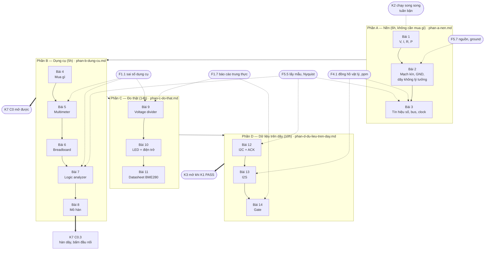

# Khóa 1 — Từ zero đến đo được · Tổng quan

**Cho:** backend engineer 8 năm, chưa từng cầm que đo nghiêm túc, đang học bật tắt mỏ hàn.
**Giờ:** 35h lõi (trần 55h) + 1–2h luyện hàn khuyến nghị. **Chi phí đợt 1:** ~2,3–2,9tr, hoặc ~3,0–4,4tr nếu mua luôn nguồn bàn `[ước lượng 10/2026]` (chi tiết ở Bài 4).
**Xong khóa này bạn làm được:** cắm que đo vào một mạch và biết số đó đúng hay sai **và sai tới ± bao nhiêu**; nhìn thấy dữ liệu chạy trên dây bằng logic analyzer và biết khi nào analyzer đang nói dối; đọc được một datasheet; và quan trọng nhất — biết khi nào mình đang tự lừa mình.

**Khóa này chạy song song với K2** (thuần phần mềm, làm ở tuần bận). Thứ tự lộ trình: K1 + K2 song song → K3 → K4 → K5 → K6, với K7 (khóa build robot) chạy thành đường ray song song từ sau K1 (xem `khoa-7/_KE-HOACH-K7.md`).

**Ngân sách toàn lộ trình — không giấu.** K1–K6 cộng lại **545h**. K7 thiết kế lại có lõi **561h** → tổng **1.106h**, ở 6,5h/tuần là khoảng **170 tuần ≈ 3,3 năm**. Đường lõi tối thiểu của K7 (~340h) cho tổng **885h ≈ 2,6 năm**. Cả hai đều vượt con số 650h của lộ trình gốc. Đây là quyết định của bạn, ghi vào `decisions.md`.

---

## 1. Bản đồ khóa



## 2. Bài → giờ → viên nang nền → quyết định

Giờ Phần C–D là phân bổ đề xuất từ tổng của bản gốc; con số chuẩn nằm ở đầu file phần đó.

| Bài | File | Giờ | Viên nang nền cần trước | Sau bài này bạn quyết định được |
|---|---|---|---|---|
| 1 Bốn đại lượng và một quy tắc | phan-a | 2 | — | Linh kiện có sống được trong mạch không (V·I·R·P), nguồn "3 A" có đẩy 3 A không |
| 2 Mạch kín, GND, dây là giả định | phan-a | 2 | F5.7 (đọc lướt) | Hai module có cần dây GND chung không; dây có còn "lý tưởng" ở dòng này không |
| 3 Tín hiệu số, bus, clock | phan-a | 2 | F5.5, F4.1 | Sample rate bao nhiêu cho một bus; tần số analyzer báo có tin được không |
| 4 Mua gì *(rút gọn)* | phan-b | 0,5 | — | Danh sách đợt 1 đủ cho K1 và mở K7 C0 không; món nào mua 2 cái |
| 5 Multimeter | phan-b | 1,5 | F1.1 | Chức năng, thang, lỗ cắm nào cho một phép đo; số đọc đúng tới ± bao nhiêu |
| 6 Breadboard | phan-b | 0,5 | — | Mạch trên board có đúng sơ đồ không, trước khi cấp điện |
| 7 Logic analyzer và PulseView | phan-b | 1,5 | F5.5, F1.1 | Sample rate và số mẫu cho một capture; phép đo thời gian chính xác tới đâu |
| 8 Mỏ hàn | phan-b | 1 (+1–2 luyện) | — | Mối hàn ĐẠT hay làm lại, trước khi cấp điện |
| 9 Voltage divider | phan-c | 5 | F1.1, F1.7 | Chênh lệch dự đoán–đo có nằm trong sai số không; dụng cụ có đang kéo lệch mạch không |
| 10 LED và điện trở | phan-c | 5 | F1.1 | Chọn điện trở cho LED; có tin V_f trên datasheet như hằng số không |
| 11 Đọc trọn một datasheet | phan-c | 4 | — | Đọc mục nào để quyết định cấp nguồn, nối chân, kiểm chip còn sống |
| 12 I2C và ACK | phan-d | 5 | F5.5 | Bus I2C sống không; lỗi nằm dưới (dây, nguồn) hay trên (code, địa chỉ) |
| 13 Nhìn thấy I2S | phan-d | 4 | F4.1, F5.5 | Tính ngược sample rate; lệch là do cấu hình hay do đồng hồ |
| 14 Gate Khóa 1 | phan-d / mục 4 dưới đây | 1 | F1.7 | PASS hay chưa — bằng repo, không bằng cảm giác |

**Tổng:** 6 + 5 + 14 + 10 = **35h**, cộng 1–2h luyện hàn (khuyến nghị, tính trước cho K7 C0.3).

## 3. Bốn câu hỏi để tự biết mình đo đúng

Bản gốc có ba câu. Thêm câu thứ tư, vì không có nó thì ba câu kia không trả lời được bằng số.

1. **Số này có nằm trong khoảng vật lý hợp lý không?** Rail 5 V không thể đo ra 12 V. Điện trở không âm. Dòng qua LED không thể là 3 A.
2. **Đo bằng cách khác có ra cùng số không?** Đo điện áp trên điện trở rồi tính `I = V/R`; so với đo dòng trực tiếp. Hai đường phải gặp nhau.
3. **Có khớp với tính toán từ nguyên lý đầu không?** Tính ra 9 mA, đo 9,3 mA: tốt. Đo 90 mA: có gì đó sai — tìm ra *cái gì* sai mới là bài học.
4. **Chênh lệch lớn hơn hay nhỏ hơn sai số của chính phép đo?** "Gặp nhau" ở câu 2 và "khớp" ở câu 3 nghĩa là chênh lệch **nhỏ hơn tổng sai số** của dụng cụ và linh kiện (→ F1.1). Không biết sai số thì không trả lời được câu 2–3.

Cả bốn "có" → số đúng. Một câu "không" → dừng, đừng đi tiếp.

**Quy tắc bất di bất dịch:** viết dự đoán bằng số vào `prediction.md`, **commit**, rồi mới cắm que đo hoặc mở khối 🔒. Thư mục `lab/00-*` là bài luyện của Phần A–B; `lab/01-*` … `lab/05-*` là năm lab của gate. Mọi thư mục lab đều qua CI check thứ tự commit (lộ trình tổng mục 0.5).

## 4. Gate Khóa 1

Kiểm được bởi người khác đọc repo của bạn. Giữ nguyên sáu tiêu chí gốc (cũng là PASS của M1 trong lộ trình tổng); chỗ sửa ghi ở cột cuối.

| # | Tiêu chí | Cách kiểm | Đã sửa gì so với gốc |
|---|---|---|---|
| 1 | Repo public có `hours.csv` ≥ 14 ngày ghi giờ và cấu trúc `/lab/` | Mở repo | — |
| 2 | **5** thư mục `lab/01-*`…`lab/05-*`, mỗi cái có `prediction.md` commit **trước** file số đo / `analysis.md` | `git log --diff-filter=A --format="%ci" -- lab/01-*/prediction.md` so với file đo; hoặc CI check | Đầu file gốc ghi "lab notebook **4** thí nghiệm" trong khi gate đòi 5 → thống nhất là **5**. Ghi chú trung thực: timestamp commit do bạn tự đặt được; lịch sử push công khai là bằng chứng bổ sung, không tuyệt đối |
| 3 | Voltage divider: 3 tỉ lệ, sai lệch **< 5%** sau khi hiệu chỉnh Vin | Bảng trong `analysis.md` | Bảng phải có **cột sai số dụng cụ** (UT33D+ ±(0,5% + 2 digit) ở thang dùng) và giá trị điện trở **đo được**. Thí nghiệm phá 1 MΩ: hiệu ứng tải của đồng hồ ~10 MΩ ở mức này **cùng bậc** với sai số ±5% của điện trở → phải so với R đo được, hoặc thêm cặp 10 MΩ (mô phỏng ở Bài 5 mục 2) |
| 4 | LED: dòng tính vs đo sai lệch **< 10%**, kèm **giải thích bằng lời** vì sao V_f không phải hằng số | Đoạn văn trong `analysis.md` | Giữ 10% (như M1). Phép kiểm chéo nội bộ của Bài 10 (V_R/R vs dòng đo, < 5%) là kiểm tra chất lượng phép đo, không phải tiêu chí gate |
| 5 | File capture `.sr` của bus I2C thật, decode ra **ACK**, kèm ảnh chụp PulseView | File trong repo | Ghi chú: **NACK ở byte cuối của một lần đọc** là master cố ý báo kết thúc, không phải lỗi (Bài 3) |
| 6 | Register map viết tay chụp ảnh, đúng ≥ 90%; đo được LRCK / BCK sai lệch **< 1%** | Ảnh + bảng số | LRCK đo một chu kỳ là đủ. **BCK phải đo qua ≥ 32 chu kỳ**: với độ phân giải 41,7 ns, đo một chu kỳ BCK không đạt < 1% (tự tính ở Bài 3 mục 5, câu 6). Bảng ghi rõ đo qua bao nhiêu chu kỳ |
| + | *(bổ sung, không thay thế)* Mỗi `analysis.md` có mục "sai số của phép đo" | Đọc từng analysis | Lộ trình tổng mục 0.6 đã yêu cầu trong mẫu notebook; gate gốc không kiểm |

**Ngân sách:** 35h. **Trần:** 55h.
**FAIL → action (cam kết trước):** chạm 55h chưa PASS → không phải thiếu kiến thức mà sai cách học: theo một khóa có cấu trúc (EEVblog Fundamentals hoặc Ben Eater theo thứ tự), cấp thêm 15h, thử lại đúng một lần. Chạm 70h → dừng K1, dồn giờ sang K2, xem lại sau 3 tháng. **Hệ quả mới cần biết:** K7 C0 cần K1 Phần B, K7 C1 cần K1 trọn (`_KE-HOACH-K7.md` mục 4) — dừng K1 cũng là dừng đường ray K7.

## 5. Lịch

Bản gốc: "4 tuần ở nhịp 8–10h/tuần". Ngân sách thật của bạn là ~6–7h/tuần, chia với K2. Lịch dưới đây giả định ~6h/tuần cho K1 ở tuần thường.

| Tuần | Giờ | Làm | Xong thì có |
|---|---|---|---|
| 1 | 6 | Bài 1–3 (giấy, Python, Falstad) · đặt mua đợt 1 · tạo repo, `hours.csv`, CI check thứ tự commit | Nền khái niệm, repo, mô phỏng chạy được |
| 2 | 6 | Bài 4 (nhận hàng, kiểm từng món) · Bài 5 · Bài 6 | Đo áp/điện trở/dòng an toàn có sai số; board và dây đã kiểm |
| 3 | 6 | Bài 7 (boot log UART) · Bài 8 + luyện hàn · hàn header BME280 nếu cần | Capture `.sr` đầu tiên; 20 mối hàn luyện có chấm điểm |
| 4 | 6 | Bài 9 (voltage divider) | Lab 01 |
| 5 | 6 | Bài 10 (LED) · Bài 11 (datasheet) | Lab 02, 03 |
| 6 | 6 | Bài 12 (I2C) · Bài 13 (I2S) | Lab 04, 05 |
| 7 | 1–2 | Bài 14 (gate) · dọn repo | **K1 PASS** |

≈ 37h trong 7 tuần. Có tuần crunch thì lịch giãn ra; điều đó bình thường, miễn là `hours.csv` phản ánh đúng.

## 6. Bẫy đã biết

| # | Bẫy | Ở bài | Cách tránh |
|---|---|---|---|
| 1 | Quên GND của logic analyzer — và capture **vẫn đúng** vì GND đi vòng qua laptop, tới lúc đổi nguồn thì thành rác | 2, 7 | GND kẹp đầu tiên, tháo cuối cùng; thí nghiệm phá ở Bài 7 |
| 2 | Que đỏ còn ở lỗ dòng từ lần đo trước, chạm vào nguồn | 5 | Đo dòng xong rút que về VΩmA **ngay** |
| 3 | 24 MHz × 1M mẫu cho tín hiệu chậm → thời lượng ghi quá ngắn, thấy đường thẳng | 7 | Sample rate theo chi tiết ngắn nhất, số mẫu theo thời lượng dài nhất |
| 4 | Dùng ngưỡng TTL (0,8 V / 2,0 V) cho ESP32-S3 (0,25 / 0,75·VDD) | 3 | Tra ngưỡng của chip cụ thể |
| 5 | Cáp USB chỉ sạc → "board chết" | 4 | Thử cáp truyền dữ liệu trước khi nghi board |
| 6 | Module "BME280" thật ra là BMP280 | 4, 11, 12 | Đọc chip ID: 0x60 vs 0x58 |
| 7 | Rail breadboard đứt giữa, nửa board không có nguồn | 6 | Kiểm thông mạch rail trước khi dùng |
| 8 | Tin chữ decoder in ra mà không kiểm cấu hình | 7, 12, 13 | Kiểm một tính chất vật lý độc lập (chu kỳ SCL, độ rộng bit) |
| 9 | Đo một chu kỳ BCK rồi kết luận "< 1%" | 3, 13 | Đo qua ≥ 32 chu kỳ |
| 10 | Hiệu ứng tải của đồng hồ ở 1 MΩ chìm trong sai số điện trở | 5, 9 | Đo từng điện trở trước, hoặc dùng 10 MΩ |
| 11 | Coi V_f, tần số danh định, ngưỡng là hằng số | 1, 3, 10, 13 | Hỏi "hằng số này phụ thuộc vào gì?" |
| 12 | BCK gấp đôi dự đoán vì driver dùng slot 32 bit | 3, 13 | Không sai — sửa dự đoán và giải thích, đừng sửa số đo |
| 13 | Gọi một độ lệch tần số **cố định** là "clock drift" | 13 | Offset/skew khác drift (→ F4.1); lệch cỡ phần trăm là cấu hình/bộ chia, không phải thạch anh |
| 14 | Hâm đi hâm lại một mối hàn không thêm flux | 8 | Tối đa 2–3 lần, mỗi lần thêm flux |
| 15 | Làm phần cứng khi mệt (đặc biệt đo dòng và hàn) | mọi bài | Tuần crunch không ngồi bàn hàn — xem mục 8 |

## 7. Danh sách sửa lỗi so với bản gốc

Bản gốc: `khoa-1-tu-zero-den-do-duoc.md`. Không có bản Gemini cho K1.

**Đã sửa trong Phần A–B (chi tiết ở mục 11 của từng bài):**
- Bài 1: mô hình "dòng = throughput" và "điện trở = rate limiter" được chấm và bổ sung KCL; thêm công suất điện trở khi đổi nguồn.
- Bài 2: thêm ground shift có số; phân biệt đất bảo vệ với mốc tín hiệu; chấm mô hình K3 lượt 11.
- Bài 3: ngưỡng "0,8 V / 2,0 V" là TTL, ESP32-S3 dùng 0,25/0,75·VDD (lỗi tương tự trong `robotics-data-infra-roadmap.md` mục 1.4); UART không "hỏng toàn bộ stream" khi lệch — start bit tái đồng bộ từng khung; công thức BCK cần `slot_width`; "Bài 14 nhìn thấy I2S" → Bài 13; I2S không chỉ điểm–điểm; thêm chấm ba mô hình K3 lượt 7 (quy chuẩn mục 7).
- Bài 4: khói flux rosin là tác nhân mẫn cảm hô hấp (gốc: "không độc cấp tính"); "nguồn USB sẽ tự ngắt" không chắc với hub/sạc rẻ; thêm món thứ hai, dây đo, phụ kiện an toàn → chi phí tăng.
- Bài 5: UT33D+ dùng **2 pin AAA**, không phải pin 9 V; là đồng hồ **chỉnh thang tay** (gốc nói "nếu là đồng hồ chỉnh tay"); pin NiMH đầy nằm trong khoảng gốc gọi là "đã dùng"; hiệu ứng cầm hai đầu điện trở chỉ đáng kể với điện trở lớn; khoảng chấp nhận phải cộng sai số đồng hồ; thêm bảng lỗi phá đồng hồ.
- Bài 6: nguyên nhân "mọi thứ đều kêu" thường là que chạm nhau; thêm kiểm từng jumper, vấn đề độ rộng ESP32 DevKit.
- Bài 7: 24 MHz × 1M mẫu không thể thấy LED 1 Hz; capture đầu tiên "chưa cần mạch gì" nhưng cần một chân có tín hiệu → thay bằng boot log UART; thêm bảng giới hạn có số (41,7 ns, Nyquist 12 MHz).
- Bài 8: "hình nón bóng" chỉ đúng với thiếc có chì; thêm kỹ thuật, kiểm ba lớp, liên kết K7 C0.3.

**Sửa ở cấp khóa (file này):** "4 thí nghiệm" vs gate 5 lab; lịch 8–10h/tuần vs ngân sách 6–7h/tuần; gate tiêu chí 6 về BCK; ngân sách toàn lộ trình 885h / 1.106h thay vì 650h; thêm câu hỏi thứ tư về sai số.

**Phát hiện khi đọc Bài 9–14 (người soạn Phần C–D xử lý; ghi ở đây để đối chiếu):**
- Bài 9, thí nghiệm phá 1 MΩ: với đồng hồ ~10 MΩ, mức giảm của Vout cùng bậc với sai số ±5% của điện trở (con số ở khối 🔒 Bài 5), nên "thấp hơn rõ rệt" là nói quá nếu không đo từng điện trở trước; cặp 10 MΩ cho hiệu ứng không thể nhầm.
- Bài 13: "LRCK lệch vài % … đây chính là clock drift" — thạch anh lệch cỡ vài chục ppm (vài phần nghìn phần trăm); lệch vài % là cấu hình/bộ chia. Ví dụ 15,987 kHz (−0,08% ≈ −800 ppm) cũng lớn hơn sai số thạch anh thông thường, nhiều khả năng do bộ chia phân số. Và một độ lệch cố định là offset tần số, không phải drift (→ F4.1).
- Bài 13: "Chu kỳ BCK ±1%" — không đạt được bằng đo một chu kỳ ở 24 MHz; phải đo qua nhiều chu kỳ.
- Bài 13: "số chu kỳ BCK / chu kỳ LRCK chính xác 32" — chỉ khi slot 16 bit; driver ESP32 có thể mặc định slot 32 bit (→ 64) `[tự đo]`.

## 8. Cách học khóa này

**Tuần thường (~6h cho K1):**
- Buổi 1 (≈2h, không cần bàn): đọc phần 1–4 của bài; viết `prediction.md` bằng tay, **không dùng AI**; commit.
- Buổi 2–3 (≈2h mỗi buổi, tại bàn): phần 6 "Làm"; ghi số đo **kèm sai số** ngay lúc đo, ảnh mạch vào `setup.md`.
- 30 phút cuối tuần: mở khối 🔒, viết `analysis.md` — chênh lệch, giải thích, thí nghiệm tiếp theo. Chọn 2 câu hỏi ngược để trả lời bằng chữ của bạn.

**Tuần crunch (0–2h):**
- Đọc phần 1–4 của bài kế tiếp và viết `prediction.md` (làm được trên điện thoại, không cần bàn). Hoặc chuyển hẳn sang K2.
- **Không** đo dòng, không hàn, không cấp điện cho mạch mới khi mệt. Lỗi ở Bài 5 và Bài 8 đến từ mất tập trung, không từ thiếu kiến thức.
- Ghi giờ thật vào `hours.csv`, kể cả 0.

**Dùng AI ở đâu:**

| Bước | AI? | Vì sao |
|---|---|---|
| Dự đoán bằng số | ❌ Không | Đây là thứ bạn đang mua bằng 35h |
| Tra cứu (datasheet ở đâu, lệnh PulseView) | ✅ Có, rồi kiểm lại ở nguồn gốc | AI cũng là một "dụng cụ đo" có sai số (→ F2.8) |
| Script mô phỏng, script phân tích số đo | ✅ Có, đọc lại từng dòng | Có stack trace |
| Giải thích chênh lệch dự đoán–đo | ⚠️ Chỉ **sau khi** đã tự viết giả thuyết, và dùng prompt "chấm mô hình" | Tránh tích lũy mô hình đúng một nửa |

Prompt "chấm mô hình" (copy):

```
Dưới đây là mô hình tôi tự xây về <chủ đề>, và số đo của tôi. Đừng khen, đừng mở đầu bằng xác nhận.
Chấm từng ý: ĐÚNG / ĐÚNG MỘT PHẦN / SAI.
Với mỗi ý không ĐÚNG: chỉ chỗ gãy, đưa MỘT phản ví dụ cụ thể có số, và nói tôi cần đo gì để tự kiểm.
Nếu không chắc, nói "không chắc" và vì sao. Ghi rõ khẳng định nào cần tra datasheet.
---
<mô hình của tôi>
<số đo + sai số>
```

Bối cảnh của prompt này: ở phiên K3 với Gemini, nhiều mô hình chỉ đúng một phần đã được xác nhận "chính xác 100%" (xem chấm mô hình ở Bài 3). Cách học "trừu tượng hóa rồi hỏi ngược" của bạn hiệu quả, nhưng chỉ khi có ai đó — số đo, datasheet, hoặc một prompt buộc phải chấm — nói "sai".

## 9. Nguồn học kèm

| Nguồn | Xem phần nào | Cho bài |
|---|---|---|
| Ben Eater (YouTube) | Series máy tính 8-bit: clock, bus | 1–3, 12 |
| EEVblog Fundamentals (Dave Jones) | Multimeter, đọc datasheet, hàn | 5, 8, 11 |
| SparkFun tutorials | "How to Use a Multimeter", "How to Use a Breadboard", "I2C", "Serial Communication" | 3, 5, 6, 12 |
| Adafruit, "Guide To Excellent Soldering" | Toàn bộ, có ảnh mối đạt/không đạt | 8 |
| sigrok / PulseView docs | Getting started, fx2lafw, decoder | 7, 12, 13 |
| *Making Embedded Systems* — Elecia White | Chương đầu | Tư duy embedded cho người từ phần mềm |
| Espressif ESP-IDF Programming Guide, ESP32-S3 Datasheet | I2C, I2S driver; DC Characteristics | 3, 12, 13 |

Không cần sách điện tử dày ở giai đoạn này. *The Art of Electronics* để làm từ điển tra cứu, đừng đọc tuần tự.

## 10. Sau Khóa 1

- **K2 — Dữ liệu robot mà không cần robot (80h).** Không cần phần cứng; bắt đầu song song với K1, đừng chờ. Artifact công khai đầu tiên.
- **K3 — Chuỗi audio (90h).** Mở khi K1 PASS và `hours.csv` cho thấy median ≥ 5h/tuần. Nếu chưa đo được thì mua linh kiện về cũng chỉ để chạy tutorial.
- **K7 C0 — Xưởng, dụng cụ, an toàn.** Mở được ngay sau **Phần B** của K1 (dụng cụ), chạy song song với K2. Bài 8 của khóa này là bước luyện đầu tiên cho K7 C0.3.
