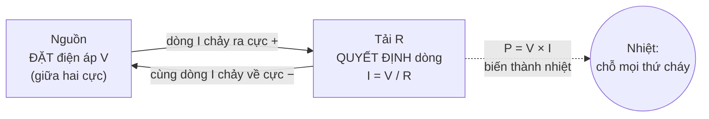
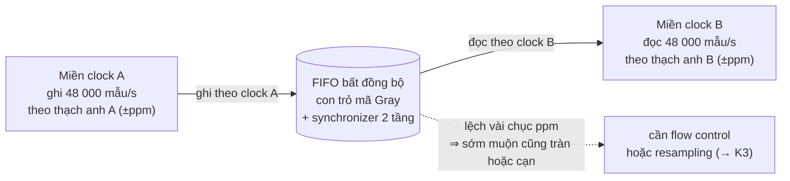

# Khóa 1 · Phần A — Nền (6h, không cần mua gì)

> Ba bài đầu làm được ngay tối nay với giấy, bút, laptop và trình duyệt. Chưa cần que đo. Mục tiêu của phần này không phải "biết điện tử" mà là có **đủ mô hình đúng** để khi cầm que đo ở Phần B–D bạn biết số nào hợp lý, số nào vô lý.
>
> Quy tắc của cả khóa (xem `00-tong-quan.md`): mọi bài có mục **5. Dự đoán** — viết số vào `prediction.md`, commit, rồi mới mở khối 🔒. Ở Phần A chưa có phép đo thật, nhưng thói quen bắt đầu từ đây: dự đoán trên giấy, rồi chạy mô phỏng để kiểm.
>
> Mã liên kết: `→ F1.1` là viên nang nền trong `giao-trinh/nen-tang/`, `→ K3 Bài 4` là bài của khóa khác, `→ K7 C0.3` là bài khái niệm của Khóa 7 mới.

---

## Bài 1 — Bốn đại lượng và một quy tắc (2h)

> **Vị trí:** (mở khóa) → **Bài 1** → Bài 2 (mạch kín, GND) · **Cần trước:** không · **Sau bài này bạn quyết định được:** một linh kiện có sống được trong mạch hay không chỉ bằng phép tính V·I·R·P — ví dụ điện trở 1/4 W có đủ không, nguồn "5 V 3 A" có "đẩy" 3 A vào mạch của bạn không.

### 1. Câu chuyện — ai đã khổ vì chuyện này

Năm 1827 Georg Simon Ohm, một thầy giáo dạy toán ở Cologne, công bố *Die galvanische Kette, mathematisch bearbeitet* (Mạch galvanic, xử lý bằng toán). Kết luận của ông — dòng tỉ lệ với điện áp chia cho điện trở của dây — bị giới khoa học Đức thời đó đón nhận lạnh nhạt; phải hơn mười năm sau, khi Royal Society trao huy chương Copley (1841), nó mới được công nhận rộng rãi `[chuẩn — lịch sử khoa học phổ biến]`.

Chi tiết đáng nhớ với người sắp học đo: các thí nghiệm đầu của Ohm dùng pin Volta, loại nguồn có điện áp trôi trong lúc đo, nên số liệu không thẳng hàng. Ông chỉ thấy được quan hệ tuyến tính sạch sẽ sau khi chuyển sang nguồn **cặp nhiệt điện** (thermocouple), ổn định hơn nhiều `[chuẩn — xem mục "History" của bài Ohm's law trên Wikipedia hoặc sách lịch sử vật lý]`. Bài học đầu tiên của khóa này nằm ngay ở đó: **định luật đúng mà nguồn đo không ổn định thì bạn vẫn không nhìn thấy định luật.** Ở Bài 9 bạn sẽ đo lại Vin trước mỗi phép đo vì đúng lý do này.

### 2. Mô hình tư duy



| Đại lượng | Ký hiệu | Đơn vị | Bản chất trong một câu |
|---|---|---|---|
| Điện áp | V (hoặc U) | volt (V) | Chênh lệch năng lượng trên mỗi đơn vị điện tích **giữa hai điểm**. Luôn là một phép trừ. |
| Dòng điện | I | ampere (A) | Lượng điện tích đi qua **một mặt cắt** mỗi giây. |
| Điện trở | R | ohm (Ω) | Tỉ số V/I của một vật dẫn; với điện trở thường, tỉ số này gần như hằng số. |
| Công suất | P | watt (W) | Năng lượng chuyển thành nhiệt (hoặc ánh sáng, chuyển động) mỗi giây. |

```
V = I × R        I = V / R        R = V / I
P = V × I        P = I² × R       P = V² / R
```

Chỉ cần nhớ hai dòng in đậm trong đầu: `V = I·R` và `P = V·I`. Bốn công thức còn lại là thay thế qua lại.

Năm câu về bản chất:

1. **Nguồn đặt điện áp, tải quyết định dòng.** Nguồn "5 V 3 A" giữ 5 V giữa hai cực; "3 A" là mức tối đa nó chịu được, không phải mức nó bơm ra.
2. **Điện tích không bị tiêu thụ, năng lượng mới bị tiêu thụ.** Trong một vòng nối tiếp, dòng đi vào linh kiện bằng dòng đi ra (định luật Kirchhoff về dòng, KCL). Thứ "mất đi" dọc đường là điện áp — mỗi linh kiện "ăn" một phần, tổng bằng điện áp nguồn (KVL).
3. **Không tồn tại "điện áp tại một điểm".** "Chân này 3,3 V" là cách nói tắt của "3,3 V so với GND". GND là mốc 0 do người thiết kế chọn (Bài 2).
4. **Ohm's law đúng cho điện trở, không đúng cho mọi thứ.** LED là diode: dòng tăng theo hàm mũ khi điện áp vượt ngưỡng V_f. Đặt "đúng 2,0 V" vào LED là cách điều khiển rất mong manh; điện trở nối tiếp mới là thứ làm dòng ổn định.
5. **Công suất là chỗ mọi thứ cháy.** Linh kiện có định mức công suất (điện trở cắm breadboard thường là 1/4 W). Tính P trước khi cấp điện là thói quen rẻ nhất cứu được linh kiện.

**Mô phỏng đồ chơi — LED không phải điện trở.** Mô hình Shockley của diode cộng một điện trở nội nhỏ. Tham số là giả định để LED có 2,0 V ở 20 mA; LED thật của bạn khác (đo ở Bài 10).

```python
# [đã chạy] Mô hình LED đỏ đồ chơi: Shockley + điện trở nối tiếp nội Rs
import numpy as np
from scipy.optimize import brentq

N_VT = 2.0 * 0.02585          # hệ số lý tưởng n=2 × điện áp nhiệt ở ~300 K [ước lượng]
RS = 10.0                     # điện trở nội của LED, Ω [ước lượng]
IS = 0.020 / np.exp((2.0 - 0.020 * RS) / N_VT)   # chọn Is để LED có 2.0 V @ 20 mA

def led_current(v):
    """Dòng qua LED khi đặt thẳng điện áp v (V) vào hai chân: giải I = Is·exp((v − I·Rs)/nVt)."""
    f = lambda i: IS * np.exp((v - i * RS) / N_VT) - i
    return brentq(f, 0.0, v / RS + 1e-12)

print("Đặt thẳng điện áp vào LED (không có điện trở ngoài):")
for v in [1.6, 1.8, 1.9, 2.0, 2.1, 2.2, 3.0, 5.0]:
    print(f"  V = {v:.1f} V  ->  I = {led_current(v)*1000:9.3f} mA")

def with_resistor(vs, r, shift=0.0):
    """Nguồn vs, điện trở ngoài r, LED có V_f lệch thêm 'shift' V (LED khác lô)."""
    f = lambda i: vs - i * r - (N_VT * np.log(i / IS + 1) + i * RS + shift)
    return brentq(f, 1e-9, vs / r)

print("\nNguồn 5.00 V + điện trở 330 Ω + LED:")
for s in [-0.1, 0.0, +0.1]:
    print(f"  V_f lệch {s:+.1f} V -> I = {with_resistor(5.0, 330, s)*1000:.2f} mA")
```

Chạy **sau** khi đã ghi dự đoán ở mục 5. Thứ cần nhìn: cùng một sai lệch 0,1 V của V_f làm dòng thay đổi bao nhiêu phần trăm khi đặt thẳng điện áp, so với khi có điện trở 330 Ω.

### 3. Cầu nối từ backend

| Backend bạn biết | Ở đây | Gãy ở chỗ | Nếu dùng nhầm thì |
|---|---|---|---|
| Consumer lag = offset_producer − offset_consumer (chỉ có nghĩa khi biết cả hai) | Điện áp = hiệu thế giữa hai điểm | Lag là con số tính ra, đọc không làm thay đổi nó. Điện áp là đại lượng vật lý; chạm que đo vào là rút một dòng nhỏ khỏi mạch (Bài 5, Bài 9) | Tin số đọc như tin một biến trong RAM, bỏ qua việc dụng cụ đã thay đổi mạch |
| Throughput (request/s qua một điểm) | Dòng điện (coulomb/s qua một mặt cắt) | Request bị server **tiêu thụ**; điện tích thì không: dòng vào linh kiện = dòng ra (KCL) | Nghĩ "LED ăn bớt dòng, nên đặt điện trở sau LED không có tác dụng". Sai: trong vòng nối tiếp, điện trở trước hay sau LED cho cùng dòng |
| Rate limiter (token bucket, cắt ở trần) | Điện trở | Rate limiter phi tuyến: dưới trần thì cho qua, trên trần thì drop. Điện trở tuyến tính, không có trần, không drop gì; mọi phần năng lượng nó "cản" biến thành nhiệt | Nghĩ "điện trở giữ dòng ≤ 10 mA bất kể nguồn". Đổi nguồn 5 V → 12 V, dòng tăng gấp ~3, LED và cả điện trở có thể quá tải |
| Connection pool `max=100` | Định mức dòng của nguồn ("3 A") | Pool vượt trần thì trả lỗi lịch sự (timeout, 429). Nguồn vượt trần thì sụt áp, nóng, tự ngắt — hoặc **không** ngắt (pin), và khi đó là cháy | Chờ một thông báo lỗi không bao giờ đến; thực tế là MCU tự reset vì sụt áp (brownout, → F5.7) |

**Chấm mô hình:**

- *"Nguồn 5 V 3 A sẽ đẩy 3 A vào mạch của tôi."* — **SAI.** Nguồn áp đặt V; dòng do tải quyết định qua `I = V/R`. Phản ví dụ: điện trở 1 kΩ trên nguồn 5 V 3 A cho dòng vài mA (bạn tính ở mục 5), dù nguồn ghi 3 A hay 100 A.
- *"LED cháy vì điện áp cao quá."* — **ĐÚNG MỘT PHẦN.** Thứ giết LED là **dòng** (và nhiệt nó sinh ra); điện áp cao chỉ là một con đường dẫn tới dòng lớn. Phản ví dụ: LED cắm vào 12 V qua điện trở đủ lớn sống khỏe; LED đặt thẳng vào nguồn "chỉ" cao hơn V_f vài trăm mV có thể đã quá dòng (xem mô phỏng).
- *"Dòng điện bị tiêu hao dần khi đi qua các linh kiện, như request bị xử lý dần qua từng service."* — **SAI.** Dòng như nhau ở mọi điểm của một vòng nối tiếp; thứ bị "tiêu" là năng lượng, thể hiện bằng điện áp rơi trên từng linh kiện. Phản ví dụ: ở Bài 10 bạn có thể đo dòng ở trước và ở sau LED — hai số bằng nhau trong sai số đồng hồ.

### 4. Thuật ngữ

| Mức | Thuật ngữ | Nghĩa trong một câu | Hay bị hiểu nhầm thành |
|---|---|---|---|
| 🟢 | Voltage (điện áp) | Hiệu thế giữa hai điểm | "Lượng điện có ở một điểm" |
| 🟢 | Current (dòng) | Điện tích qua một mặt cắt mỗi giây | Thứ nguồn "bơm" ra theo số ghi trên nhãn |
| 🟢 | Resistance (điện trở) | V/I của một vật dẫn | Một cái van giới hạn trần |
| 🟢 | Power (công suất) | V·I, năng lượng mỗi giây | Chỉ quan trọng với thiết bị lớn |
| 🟢 | Ohm's law | `V = I·R` cho vật dẫn tuyến tính | Định luật cho mọi linh kiện (LED, motor thì không) |
| 🟢 | Series / parallel | Nối tiếp: cùng dòng, chia áp. Song song: cùng áp, chia dòng | Đảo ngược hai ý này |
| 🟢 | Định mức công suất (power rating) | Mức P tối đa linh kiện tỏa được lâu dài, ví dụ 1/4 W | Chạy sát định mức là "an toàn" |
| 🟡 | KCL / KVL | Tổng dòng vào nút = tổng dòng ra; tổng áp quanh vòng kín = 0 | — |
| 🟡 | V_f (forward voltage) | Điện áp thuận trên LED/diode khi dẫn, phụ thuộc dòng và nhiệt | Một hằng số ghi trên datasheet |
| 🔴 | RMS, phasor, Thevenin/Norton | Phân tích mạch AC và mạch tương đương | Cần cho tầng này (không cần) |

### 5. Dự đoán

Không dùng AI ở bước này. Tạo `lab/00-nen/prediction-bai1.md` (thư mục `00` là bài tập giấy, không tính vào 5 lab của gate):

```markdown
# Bài 1 — dự đoán (viết tay số, kèm cách tính, kèm đơn vị)
1. Nguồn 5.00 V, điện trở 220 Ω.  I = ? mA.  P trên điện trở = ? mW.
   Điện trở 1/8 W (125 mW) có ổn không? 1/4 W thì sao? Vì sao?
2. LED đỏ, giả định V_f = 2.0 V, nguồn 5.00 V, muốn I ≈ 10 mA.
   R = ? Ω → chọn giá trị chuẩn gần nhất (dãy E12: 220, 270, 330, 390, 470…) = ?
   I thực với R đã chọn = ? mA.  P trên R = ? mW.
3. Giữ nguyên R ở câu 2, đổi nguồn sang 12 V. I = ? mA. P trên R = ? mW.
   LED còn ổn không (tra "absolute maximum forward current" của LED 5 mm đỏ)? Điện trở 1/4 W còn ổn không?
4. Nguồn ghi "5 V 3 A", cắm một điện trở 1 kΩ. I = ? mA.
5. Mô phỏng LED (mục 2), TRƯỚC khi chạy:
   - đặt thẳng 2.1 V vào LED: I ≈ ? mA;  đặt thẳng 5.0 V: I ≈ ? mA
   - với 330 Ω từ 5 V, V_f lệch ±0.1 V làm I đổi khoảng ? %
```

Phương pháp: chỉ cần `V = I·R` và `P = V·I`. Ở câu 2–3, điện áp trên điện trở là `V_nguồn − V_f` (KVL). Ở câu 5, dùng trực giác "hàm mũ" — đoán bậc độ lớn là đủ.

### 6. Làm

Không cần dụng cụ thật. Sai số ở bài này chỉ đến từ sai số linh kiện: điện trở ±5% cho dòng ±5% (→ F1.1, lan truyền sai số).

1. Viết `prediction-bai1.md`, `git commit`.
2. Chạy mô phỏng LED ở mục 2 bằng Python của bạn. So với câu 5.
3. Mở **Falstad Circuit Simulator** (trình mô phỏng mạch chạy trên trình duyệt của Paul Falstad, `falstad.com/circuit`). Dựng: nguồn DC 5 V → điện trở 330 Ω → LED → về nguồn.
   - Đặt một ampe kế trước LED và một ampe kế sau LED. Hai số phải bằng nhau (KCL).
   - Đổi chỗ điện trở và LED. Dòng có đổi không?
   - Đổi nguồn sang 12 V. Đọc dòng, rê chuột lên điện trở xem công suất.
4. Ghi một đoạn 3–5 câu vào `analysis-bai1.md`: chỗ nào dự đoán lệch và vì sao.

### 7. Số phải ra

<details><summary>🔒 MỞ SAU KHI COMMIT prediction.md</summary>

| Câu | Đáp án | Ghi chú |
|---|---|---|
| 1 | I = 5/220 ≈ **22,7 mA**; P = V²/R = 25/220 ≈ **114 mW** | 1/8 W = 125 mW: chạy ở ~91% định mức → nóng, không nên. Quy tắc nghề: giữ P ≤ ~50% định mức `[chuẩn — derating]`. 1/4 W (250 mW): ~45%, ổn |
| 2 | R = (5,0 − 2,0)/0,010 = 300 Ω → chọn **330 Ω**; I ≈ 3,0/330 ≈ **9,1 mA**; P_R ≈ 3,0 × 0,0091 ≈ **27 mW** | |
| 3 | I ≈ (12 − 2)/330 ≈ **30 mA**; P_R ≈ 10 × 0,030 ≈ **0,30 W** | LED 5 mm đỏ thường có dòng định mức ~20 mA, tuyệt đối tối đa ~25–30 mA `[ước lượng — tra datasheet LED của bạn]` → quá sức. **Điện trở 1/4 W cũng quá tải** (0,30 W > 0,25 W). Đổi nguồn mà không tính lại là hỏng hai linh kiện một lúc |
| 4 | I = 5/1000 = **5 mA** | "3 A" không liên quan |
| 5 | Mô hình cho: 2,1 V → ~28 mA; 5,0 V → ~306 mA (bị chặn chủ yếu bởi Rs 10 Ω giả định). Với 330 Ω: V_f lệch ±0,1 V → I đổi ~±3% (9,24 / 9,52 / 9,81 mA) | Đặt thẳng điện áp: lệch 0,1 V quanh 2,0 V làm dòng đổi ~40%. Có điện trở: ~3%. **Điện trở biến một hệ nhạy cảm thành một hệ ổn định.** Con số cụ thể phụ thuộc tham số đồ chơi; tỉ lệ nhạy mới là bài học |

Lệch là bình thường nếu: bạn dùng V_f khác 2,0 V; bạn làm tròn khác. Không bình thường nếu lệch đúng 1000× (nhầm mA và A) hoặc P tính bằng V nguồn thay vì V trên điện trở.

</details>

### 8. Nếu ra khác

| Triệu chứng | Nguyên nhân khả dĩ | Kiểm bằng cách | Sửa |
|---|---|---|---|
| Kết quả lệch đúng 1000× | Nhầm mA ↔ A, kΩ ↔ Ω | Viết đơn vị vào mọi dòng tính | Đổi hết về V, A, Ω trước khi nhân chia (REP-103: SI) |
| P tính ra lớn hơn đáp án nhiều | Dùng V nguồn thay vì V rơi trên điện trở | Kiểm KVL: V_R + V_LED = V_nguồn | P_R = V_R × I |
| Falstad: LED không sáng, dòng 0 | LED cắm ngược chiều | Đảo LED | LED chỉ dẫn một chiều |
| Falstad: ampe kế trước và sau LED khác nhau | Có nhánh rẽ (dây nối thêm vào giữa) | Xóa mọi dây thừa, kiểm mạch là một vòng duy nhất | Mạch nối tiếp không có chỗ cho dòng rẽ |
| Mô phỏng Python lỗi `brentq` | Khoảng tìm nghiệm không đổi dấu (V âm hoặc 0) | In `f(0)` và `f(v/RS)` | Chỉ thử V > 0 |

### 9. Câu hỏi ngược

1. **[Vì sao không]** Vì sao không điều khiển LED bằng một nguồn đặt chính xác 2,00 V, thay vì nguồn 5 V + điện trở?
<details><summary>Hướng nghĩ</summary>

Nhìn lại độ nhạy trong mô phỏng. Thêm hai sự thật: V_f khác nhau giữa các con LED cùng lô, và V_f giảm khi LED nóng lên (cỡ vài mV/°C `[ước lượng]`). LED nóng → V_f giảm → dòng tăng → nóng hơn. Đó là vòng hồi tiếp dương. Điện trở phá vòng đó.

</details>

2. **[Quy mô]** Bạn cần 100 LED song song từ một nguồn 5 V. Một điện trở chung cho cả 100, hay mỗi LED một điện trở?
<details><summary>Hướng nghĩ</summary>

Song song = cùng điện áp. LED có V_f thấp nhất trong 100 con sẽ "giành" phần lớn dòng (current hogging), nóng lên, V_f còn thấp hơn nữa. Một điện trở chung chỉ giới hạn **tổng**, không chia đều. So với một load balancer không có health check: một backend nhanh nhất hút hết traffic cho tới khi chết.

</details>

3. **[Failure mode]** Điện trở 1/4 W chạy liên tục ở 0,30 W (câu 3). Chuyện gì xảy ra theo thời gian, và bạn phát hiện bằng cách nào trước khi nó cháy?
<details><summary>Hướng nghĩ</summary>

Nóng → giá trị trôi (điện trở có hệ số nhiệt) → dòng đổi → có thể đổi màu, bốc mùi, hở mạch. Không có "log" nào báo. Cách phát hiện: tính P trước; chạm thử (cẩn thận) hoặc đo nhiệt; đo lại R sau khi nguội. Đây là một "SLO" bạn tự đặt: P ≤ 50% định mức.

</details>

4. **[Liên ngành]** `V = I·R` và định luật Little `L = λ·W` đều là "biết hai suy ra một". Giống và khác nhau ở đâu?
<details><summary>Hướng nghĩ</summary>

Little đúng cho **mọi** hệ ổn định, bất kể phân bố thời gian phục vụ — nó là một đồng nhất thức về đếm. Ohm chỉ là quan hệ **vật liệu**, đúng cho vật dẫn tuyến tính trong một dải nhiệt độ; LED, motor phá nó. Một cái là định lý, một cái là mô hình có miền hiệu lực (→ F6.1).

</details>

5. **[Phản biện]** "Ẩn dụ nước (áp suất – lưu lượng – ống hẹp) là đủ cho người mới." Tìm một chỗ ẩn dụ này dẫn tới kết luận sai.
<details><summary>Hướng nghĩ</summary>

Nước có thể chảy ra khỏi ống hở; điện thì không — mạch hở là dòng bằng 0 ngay lập tức (Bài 2). Nước có quán tính dễ thấy; trong mạch, quán tính tương ứng (cuộn cảm) chỉ hiện ra khi dòng đổi nhanh, như lúc ngắt motor (→ K7 C3.2). Ẩn dụ tốt cho mạch tĩnh, tệ cho chuyển tiếp.

</details>

### 10. Liên kết ra ngoài

- **Dẫn nhiệt (định luật Fourier, nhiệt trở °C/W).** Cùng dạng toán: chênh nhiệt độ = dòng nhiệt × nhiệt trở. Kỹ sư chọn tản nhiệt bằng cách cộng nhiệt trở nối tiếp, y như cộng điện trở. Khác: nhiệt có "điện dung" lớn (vật nóng lên chậm), nên chuyển tiếp kéo dài hàng phút — bạn sẽ thấy ở K4 Bài 6 khi N100 nóng dần và hạ xung.
- **Thủy lực ống nhỏ (Hagen–Poiseuille).** Lưu lượng tỉ lệ chênh áp trong chế độ chảy tầng — chính là Ohm cho chất lỏng. Khi chảy rối, quan hệ hết tuyến tính. Giống LED: một "định luật" chỉ đúng trong một miền.
- **Định luật Little trong hàng đợi (→ F7.1).** Ba đại lượng, một quan hệ, dùng để kiểm chéo số đo: đo hai, tính cái thứ ba, so với số đo trực tiếp. Bài 10 làm đúng việc đó với V, I, R.

### 11. Độ tin cậy và sửa lỗi

| Khẳng định | Nhãn | Ghi chú / cách kiểm |
|---|---|---|
| V_f LED đỏ ~1,8–2,0 V, xanh lá ~2,0–2,2 V, xanh dương/trắng ~3,0–3,4 V (ở ~20 mA) | `[ước lượng]` | Phụ thuộc chất bán dẫn và nhà sản xuất; đo ở Bài 10 |
| Dòng định mức LED 5 mm ~20 mA, tuyệt đối tối đa ~25–30 mA | `[ước lượng]` | Tra datasheet đúng con LED; LED kit rẻ thường không có datasheet → giữ ≤10 mA |
| Giữ P ≤ ~50% định mức | `[chuẩn]` | Quy tắc derating phổ biến, không phải luật |
| Tham số mô phỏng LED (n = 2, Rs = 10 Ω) | `[ước lượng]` | Mô hình đồ chơi; dùng để thấy độ nhạy, không để dự đoán số đo |
| Ohm chuyển sang nguồn cặp nhiệt điện để có số liệu ổn định | `[chuẩn]` | Lịch sử khoa học phổ biến; kiểm trong mục History của "Ohm's law" |

Đã sửa / bổ sung so với bản gốc:
- Gốc so sánh "dòng = throughput" mà không chỉ chỗ gãy → thêm KCL: điện tích không bị tiêu thụ. Đây là mô hình sai phổ biến nhất của người đi từ phần mềm.
- Gốc so sánh "điện trở = rate limiter" → chấm ĐÚNG MỘT PHẦN: điện trở tuyến tính, không có trần; thêm phản ví dụ đổi nguồn 12 V làm quá tải cả điện trở 1/4 W.
- Thêm phần công suất của **điện trở** khi đổi nguồn (gốc chỉ tính ở 5 V).
- Ba hiểu nhầm của gốc giữ nguyên ý; "Hiểu nhầm 3" (cắm que đo dòng/áp) chuyển sang Bài 5, nơi bạn cầm đồng hồ thật.

### 12. Đọc thêm và tự kiểm tra

- **Nguồn gốc:** G. S. Ohm, *Die galvanische Kette, mathematisch bearbeitet* (1827) — chỉ để biết tồn tại; đọc mục History của "Ohm's law" (Wikipedia) là đủ.
- **Giải thích:** SparkFun, "Voltage, Current, Resistance, and Ohm's Law" (learn.sparkfun.com); hoặc *Lessons in Electric Circuits* Vol. I (DC), Tony Kuphaldt, đọc miễn phí trên All About Circuits.
- **Đào sâu (tùy chọn):** Horowitz & Hill, *The Art of Electronics* (3rd ed.), chương 1 — dùng như từ điển, đừng đọc tuần tự.
- **Tự kiểm tra:** (1) giải thích lại cho một backend engineer khác trong 5 câu vì sao "nguồn đặt áp, tải quyết định dòng"; (2) vẽ lại hình ở phần 2 từ trí nhớ; (3) trả lời:
  - a. Vì sao không thể nói "chân GPIO này có điện áp 3,3 V" mà không nói thêm gì?
  - b. Hai điện trở 1 kΩ nối tiếp trên nguồn 5 V: dòng qua mỗi con và công suất trên mỗi con là bao nhiêu?

<details><summary>Đáp án tự kiểm tra</summary>

a. Điện áp là hiệu giữa hai điểm; câu đầy đủ là "3,3 V so với GND" (hoặc so với một điểm nào đó được nói rõ).
b. Tổng 2 kΩ → I = 2,5 mA, **như nhau** ở cả hai (nối tiếp). Mỗi con rơi 2,5 V → P = 2,5 × 0,0025 = 6,25 mW mỗi con.

</details>

---

## Bài 2 — Mạch kín, GND, và tại sao dây nối là một giả định (2h)

> **Vị trí:** Bài 1 (bốn đại lượng) → **Bài 2** → Bài 3 (tín hiệu số) · **Cần trước:** Bài 1 · đọc kèm → F5.7 (nguồn và ground) khi tới K3 · **Sau bài này bạn quyết định được:** hai module có cần nối dây GND với nhau không, và một sợi dây có còn được coi là "lý tưởng" ở dòng điện bạn định cho chạy qua không.

### 1. Câu chuyện — ai đã khổ vì chuyện này

Năm 1838 Carl August von Steinheil phát hiện rằng đường dây điện báo không cần dây thứ hai để dòng quay về: chôn một tấm kim loại xuống đất ở mỗi đầu, và **trái đất làm dây về**. Mạch vẫn kín, chỉ là nửa vòng nằm dưới chân bạn. Từ đó tiếng Anh gọi mốc 0 của mạch là *ground* — đất — dù ngày nay hầu hết "ground" trong mạch điện tử chẳng chạm đất chút nào `[chuẩn — lịch sử điện báo]`.

Tháng 9/1859, trong cơn bão địa từ mà ngày nay gọi là sự kiện Carrington, điện thế của chính "đất" ở hai đầu đường dây không còn bằng nhau. Dòng cảm ứng chạy trong dây điện báo đủ để một số nhân viên bị giật, có nơi giấy băng tự bén lửa, và một số tuyến còn gửi được tin **khi đã tháo pin ra** — chỉ bằng dòng do chênh lệch "ground" sinh ra `[chuẩn — các tường thuật về sự kiện Carrington 1859]`. Đó là phiên bản hành tinh của lỗi bạn sẽ gặp trên bàn: **mốc 0 ở chỗ này không bằng mốc 0 ở chỗ kia**, và mạch "chạy" theo cách không ai thiết kế.

### 2. Mô hình tư duy

```
 (a) Mạch kín: một vòng, một dòng                (b) Hai module, hai nguồn, THIẾU dây GND chung

   +5V ──[R 330Ω]──►├─ LED ─┐                    USB 5V ──► [ESP32]        Pin ──► [Module B]
    │        I →            │                               GND_A ?        GND_B ?
    └──────────── I ← ──────┘                               TX ─────────────► RX
         (đứt một chỗ bất kỳ → I = 0 ở MỌI chỗ)             "3,3 V" so với GND_A
                                                             = ??? so với GND_B  → rác

 (c) Dây không lý tưởng: GND chung nhưng dòng motor chạy qua chính sợi dây GND đó

   [Module B] ──GND── R_dây ──GND── [ESP32]      GND_B cao hơn GND_A một đoạn I_motor × R_dây
                       ▲ dòng motor                → "LOW" của B tới A thành V_OL + I_motor × R_dây
```

Bốn câu về bản chất:

1. **Dòng chỉ chảy trong vòng kín.** Từ cực + qua tải về cực −. Hở một chỗ bất kỳ thì dòng bằng 0 ở *mọi* chỗ trong vòng, không chỉ ở chỗ hở.
2. **GND là một quy ước, không phải một vật thể.** Người thiết kế chọn một nút và gọi nó là 0 V. Mọi điện áp khác đọc so với nó, như mọi timestamp đọc so với một epoch.
3. **Hai thứ muốn nói chuyện bằng điện áp phải có chung mốc.** Không nối GND thì không tồn tại câu "tín hiệu này là 3,3 V" theo nghĩa cả hai bên cùng hiểu. Ngoại lệ có chủ đích: tín hiệu vi sai (CAN, RS-485, USB) — mục 10.
4. **Dây là một điện trở nhỏ, không phải phép gán.** Với vài mA, sụt áp trên dây không đáng kể. Với hàng trăm mA đến vài A qua dây jumper mảnh, nó thành vài trăm mV — đủ làm "0 V" ở hai đầu dây khác nhau.

**Mô phỏng đồ chơi — dây jumper ở các mức dòng.** Ước lượng điện trở dây từ tiết diện và chiều dài, cộng điện trở tiếp xúc ở mỗi chỗ cắm.

```python
# [đã chạy] "Dây nối là một giả định": sụt áp trên dây jumper và mốc GND bị đẩy lên
RHO_CU = 1.72e-8                       # điện trở suất đồng, Ω·m [chuẩn]
AWG_MM2 = {22: 0.326, 24: 0.205, 26: 0.129, 28: 0.081}   # tiết diện, mm² [chuẩn]

def r_wire(awg, length_m, cca=False):
    r = RHO_CU * length_m / (AWG_MM2[awg] * 1e-6)
    return r * (1.6 if cca else 1.0)   # dây nhôm mạ đồng (CCA) ~1.6× [ước lượng]

R_CONTACT = 0.02                       # mỗi điểm cắm breadboard/Dupont, Ω [ước lượng]
loop = 2 * (r_wire(28, 0.20, cca=True) + 2 * R_CONTACT)  # dây đi + dây về, 20 cm mỗi dây
print(f"Điện trở vòng (2 dây 28AWG CCA 20 cm + 4 tiếp điểm): {loop*1000:.0f} mΩ")
for i in [0.01, 0.1, 0.5, 1.0]:
    print(f"  I = {i*1000:6.0f} mA -> sụt trên dây = {i*loop*1000:6.1f} mV,"
          f" tải nhận {5.0 - i*loop:.3f} V từ nguồn 5.000 V")

# Hai module chung một dây GND; motor kéo dòng qua chính dây GND đó.
r_gnd = r_wire(28, 0.20, cca=True) + 2 * R_CONTACT
VIL_MAX = 0.25 * 3.3   # ESP32-S3: bên nhận coi là LOW nếu ≤ 0.25·VDD [spec, kiểm datasheet]
VOL_MAX = 0.10 * 3.3   # ESP32-S3: bên gửi xuất LOW tối đa 0.1·VDD [spec, kiểm datasheet]
print(f"\nB gửi LOW cho A; dòng motor chạy qua dây GND chung {r_gnd*1000:.0f} mΩ:")
for i in [0.1, 1.0, 3.0, 5.0]:
    seen = VOL_MAX + i * r_gnd          # A nhìn thấy LOW của B cộng thêm lệch GND
    flag = "  <-- vượt V_IL: A có thể đọc thành không-phải-LOW" if seen > VIL_MAX else ""
    print(f"  dòng motor {i:4.1f} A -> A thấy 'LOW' = {seen*1000:4.0f} mV"
          f" (ngưỡng {VIL_MAX*1000:.0f} mV){flag}")
```

Mô hình này bỏ qua cảm kháng của dây (quan trọng khi dòng đổi nhanh, ví dụ motor PWM) — thực tế còn tệ hơn trong các khoảnh khắc chuyển mạch.

### 3. Cầu nối từ backend

| Backend bạn biết | Ở đây | Gãy ở chỗ | Nếu dùng nhầm thì |
|---|---|---|---|
| Epoch của timestamp | GND là mốc 0 của điện áp | Epoch là hằng số tuyệt đối, như nhau ở mọi máy dùng nó. GND là một sợi dây có điện trở: khi dòng lớn chạy qua, "0 V" ở đầu này khác "0 V" ở đầu kia (ground shift) | Nối GND motor và GND logic bằng một dây mảnh chung; logic đọc nhầm mức, MCU reset ngẫu nhiên — tưởng lỗi firmware (→ F5.7, → K7 C5.1) |
| Hai service phải chung timezone/epoch mới so sánh được thời gian | Hai module phải chung GND mới hiểu cùng mức logic | Lệch timezone là lệch **cố định**, sửa bằng một phép cộng. Thiếu GND chung là điện thế **trôi nổi** (floating): đổi theo thời gian, theo độ ẩm, theo việc tay bạn chạm vào mạch | Thấy hệ "lúc chạy lúc không" và đi tìm race condition không tồn tại |
| Phép gán `a = b` | Dây nối hai điểm | Gán là chính xác. Dây có điện trở (và cảm kháng): `V_đầu_kia = V_đầu_này − I·R_dây` | Cấp 1 A qua jumper rồi đo điện áp ở nguồn thay vì ở tải; tưởng tải nhận đủ 5 V |
| Connection refused / exception | Mạch hở | Phần mềm báo lỗi. Mạch hở **im lặng**: chân vào đọc 0 hoặc giá trị ngẫu nhiên, không có stack trace | Debug code hàng giờ trong khi một dây jumper đứt ngầm bên trong vỏ nhựa (Bài 6 dạy kiểm dây trước) |

**Chấm mô hình:**

- *"GND là 0 V tuyệt đối, ở đâu trên mạch cũng như nhau."* — **ĐÚNG MỘT PHẦN.** Đúng khi dòng chạy trong dây GND nhỏ (vài mA, trên breadboard). Sai khi có dòng lớn chạy chung đường GND. Phản ví dụ: mô phỏng trên — một dây GND jumper bình thường, khi mang dòng motor cỡ vài ampe, đẩy mốc lên đủ để ăn vào biên nhiễu của tín hiệu 3,3 V (bạn tính ngưỡng cụ thể ở mục 5).
- *"Hai module đều cắm USB vào cùng một laptop thì đã chung GND, khỏi nối thêm."* — **ĐÚNG MỘT PHẦN.** Hai GND nối nhau qua hai sợi cáp USB và mạch của laptop — một đường về dài, có điện trở, có thể mang dòng của thứ khác. Nó thường đủ cho tín hiệu chậm, nhưng không phải thứ bạn chọn có chủ đích. Phản ví dụ: rút một cáp USB và cấp pin cho module đó — đường GND biến mất mà không có triệu chứng nào cho tới khi dữ liệu thành rác. Quy tắc: **có dây tín hiệu giữa hai module thì có một dây GND ngắn đi cùng.**
- *Mô hình của bạn ở K3 lượt 11:* "mọi thiết bị chung nguồn luôn có sụt nguồn vì chiếm dụng nguồn chung, như tranh chấp tài nguyên." — **ĐÚNG MỘT PHẦN.** Sụt áp có thật, nhưng cơ chế không phải "tranh chấp" kiểu lock: nó là `I × trở kháng` của nguồn và của đường dây chung (gồm cả dây GND), cộng với việc nguồn phản ứng chậm hơn một bước nhảy dòng. Nó **thiết kế được** để nhỏ tới mức bỏ qua: nguồn đủ dòng, dây đủ to, tụ decoupling sát chip, đi dây GND hình sao. Phản ví dụ: hàng chục chip trên một bo mạch chủ chung một nguồn mà không reset nhau, vì có mặt phẳng GND và hàng trăm tụ decoupling (→ F5.7, → K3 Bài 6).

### 4. Thuật ngữ

| Mức | Thuật ngữ | Nghĩa trong một câu | Hay bị hiểu nhầm thành |
|---|---|---|---|
| 🟢 | Closed / open circuit (mạch kín / hở) | Có / không có vòng khép kín cho dòng | Hở thì "một phần" vẫn chạy |
| 🟢 | Short circuit (ngắn mạch) | Đường nối gần 0 Ω giữa + và − | Chỉ là "dòng hơi lớn" (thực tế: dòng chỉ bị chặn bởi nguồn và dây — nóng, cháy) |
| 🟢 | GND (ground, mass, 0 V) | Nút được chọn làm mốc điện áp | Một điểm vật lý đặc biệt, luôn đúng 0 V |
| 🟢 | Common ground | Nối GND của các khối giao tiếp với nhau | Tùy chọn khi hai bên "cùng 3,3 V" |
| 🟢 | Floating (trôi nổi) | Nút không nối tới mốc nào, điện thế không xác định | "0 V" |
| 🟡 | Ground shift / ground bounce | GND ở hai đầu dây lệch nhau do I·R hoặc dòng đổi nhanh | — |
| 🟡 | Star ground | Mọi đường GND gặp nhau tại một điểm, dòng lớn không đi chung dây với tín hiệu | — |
| 🟡 | Earth ground vs signal ground | Đất bảo vệ (dây nối đất ổ cắm) khác mốc 0 của mạch | Hai thứ là một |
| 🟡 | Differential signalling | Truyền bằng hiệu giữa hai dây, không so với GND (CAN, RS-485, USB) | — |
| 🔴 | Trở kháng mặt phẳng GND ở tần số cao, EMC | Thiết kế PCB tốc độ cao | Cần ở tầng này |

### 5. Dự đoán

Tạo `lab/00-nen/prediction-bai2.md`:

```markdown
# Bài 2 — dự đoán
1. Vẽ tay (chụp ảnh commit cùng file này):
   a. 5 V → 330 Ω → LED → GND. Đánh dấu chiều dòng ở 3 chỗ. Dòng ở 3 chỗ: bằng / khác?
   b. Cùng mạch, LED cắm ngược. LED: sáng / không sáng? Hỏng / không hỏng? Dòng ≈ ?
   c. Module A cấp từ USB, module B cấp từ pin, một dây tín hiệu A.TX → B.RX.
      Thiếu dây gì? Nếu thiếu, B đọc được gì?
2. Mô phỏng dây (mục 2), TRƯỚC khi chạy:
   - điện trở vòng của 2 dây jumper 20 cm ≈ ? mΩ (bậc độ lớn: 1 / 10 / 100 / 1000 mΩ?)
   - ở 1 A, tải nhận ≈ ? V từ nguồn 5.000 V
   - dòng motor bao nhiêu A thì "LOW" của B tới A vượt ngưỡng V_IL của ESP32-S3?
3. Mạch có nguồn, LED, điện trở; LED không sáng và không hỏng. Liệt kê 3 nguyên nhân khả dĩ.
```

Tham số cần tra: tiết diện dây theo AWG (bảng AWG bất kỳ), điện trở suất đồng; ngưỡng V_IL, V_OL của ESP32-S3 trong *ESP32-S3 Series Datasheet*, mục DC Characteristics. Phương pháp: `R = ρ·L/A`; `V_sụt = I·R`; KVL.

### 6. Làm

Chưa cần dụng cụ.

1. Viết dự đoán, vẽ ba mạch, chụp ảnh, `git commit`.
2. Chạy mô phỏng dây. Đổi `awg` từ 28 sang 22 và bỏ `cca=True`; xem điện trở vòng giảm bao nhiêu lần.
3. Falstad (`falstad.com/circuit`): dựng nguồn 5 V → điện trở 0,1 Ω (dây đi) → tải 5 Ω (≈1 A) → điện trở 0,1 Ω (dây về) → nguồn. Đặt vôn kế ở hai đầu tải và ở hai cực nguồn. So hai số.
4. Ghi vào `analysis-bai2.md`: một câu cho mỗi chỗ dự đoán lệch.
5. **Hẹn cho Bài 5:** khi có đồng hồ, đo điện trở một dây jumper ở thang 200 Ω. Trước khi đo, tự hỏi: đồng hồ có sai số ±(0,8% + 2 digit), độ phân giải 0,1 Ω ở thang này `[spec — UT33D+, kiểm manual]` — nó có *đo được* một dây ~0,1 Ω không? (→ F1.1: resolution vs accuracy vs cái bạn cần đo.)

### 7. Số phải ra

<details><summary>🔒 MỞ SAU KHI COMMIT prediction.md</summary>

| Câu | Đáp án |
|---|---|
| 1a | Dòng **bằng nhau** ở mọi chỗ (≈9 mA, theo Bài 1). Chiều: từ + qua điện trở, qua LED (anode → cathode), về −. |
| 1b | Không sáng, **không hỏng** (ở 5 V; LED chịu điện áp ngược cỡ 5 V `[ước lượng — tra datasheet]`, nên đừng thử với nguồn cao hơn). Dòng ≈ 0 (rò cỡ µA). |
| 1c | Thiếu **dây GND** nối A với B. Không có nó, RX của B thấy một điện thế không xác định: có thể đúng một phần, có thể toàn rác, có thể đổi khi bạn chạm tay. |
| 2 | Vòng ≈ **216 mΩ** (bậc 100 mΩ). Ở 1 A tải nhận ≈ **4,78 V** (mất ~0,22 V). "LOW" vượt V_IL (825 mV) ở khoảng **5 A** với V_OL xấu nhất 0,33 V; nếu V_OL thực gần 0 V thì cần lớn hơn. Dây 22 AWG đồng thật: vòng giảm còn khoảng 1/3. |
| 3 | (a) mạch hở — thiếu dây về GND, jumper đứt, chân không cắm vào lỗ; (b) LED cắm ngược; (c) điện trở quá lớn (đọc nhầm 33 kΩ thành 330 Ω) nên dòng quá nhỏ để thấy sáng. |
| Bài 5 hẹn | Gần như **không**: 0,1 Ω nằm trong ±0,2 Ω sai số và cùng bậc với điện trở của chính que đo. Muốn đo dây cỡ mΩ, người ta cho một dòng biết trước chạy qua và đo sụt áp (phương pháp 4 dây / Kelvin). |

Lệch bình thường: con số mΩ phụ thuộc giả định về CCA và tiếp xúc — chỉ bậc độ lớn là quan trọng.

</details>

### 8. Nếu ra khác

| Triệu chứng | Nguyên nhân khả dĩ | Kiểm bằng cách | Sửa |
|---|---|---|---|
| Vẽ dòng ở 1a mỗi chỗ một khác | Mô hình "dòng bị tiêu hao" (Bài 1) | Đọc lại chấm mô hình Bài 1 | Dòng như nhau trong vòng nối tiếp; điện áp mới chia |
| Ở 1c nghĩ "thiếu dây nguồn" | Nhầm nhu cầu nguồn với nhu cầu mốc | B đã có pin; thứ thiếu là mốc chung | Thêm dây GND, không nối hai nguồn + với nhau |
| Falstad: vôn kế ở tải và ở nguồn bằng nhau | Quên điện trở dây, hoặc dòng quá nhỏ | Kiểm dòng ≈ 1 A | Đặt tải 5 Ω, dây 0,1 Ω mỗi chiều |
| Mô phỏng ra Ω thay vì mΩ | Quên đổi mm² sang m² (×10⁻⁶) | In `r_wire(28, 0.2)` | Giữ SI trong mọi phép tính |

### 9. Câu hỏi ngược

1. **[Failure mode]** Ở Bài 7 bạn sẽ quên nối GND của logic analyzer vào mạch, và đôi khi capture **vẫn đúng**. Vì sao, và vì sao đó là chuyện tệ hơn là luôn sai?
<details><summary>Hướng nghĩ</summary>

Analyzer và ESP32 đều cắm USB vào cùng laptop → GND đi vòng qua laptop. Nó "chạy" cho tới khi bạn đổi cáp, đổi cổng, dùng sạc khác, hoặc có dòng lớn trong mạch. Một lỗi chỉ hiện ra có điều kiện là flaky test: tệ hơn lỗi luôn hiện, vì bạn tin vào nó (→ F2.3).

</details>

2. **[Quy mô]** Robot ở K7: motor kéo vài A, ESP32 và cảm biến kéo vài chục mA, tất cả chung một pin. Bạn đi dây GND thế nào để mô phỏng ở mục 2 không xảy ra?
<details><summary>Hướng nghĩ</summary>

Đừng để dòng motor đi chung dây với tín hiệu. Mỗi nhánh có dây GND riêng về một điểm chung gần pin (hình sao); dây nhánh motor to; tín hiệu logic đi cùng dây GND logic của nó. Đây là ràng buộc mà K7 C1 dựng thành bo phân phối nguồn.

</details>

3. **[Vì sao không]** Ô tô dùng chính khung kim loại làm đường GND về cho rất nhiều thiết bị. Vì sao không làm vậy với khung nhôm của robot nhỏ?
<details><summary>Hướng nghĩ</summary>

Có thể làm, nhưng phải trả lời: điện trở mối ghép (ốc, sơn, oxit nhôm) bao nhiêu và có ổn định khi rung không; dòng motor có đi qua cùng vùng khung với GND của cảm biến không; ai kiểm tiếp xúc sau 6 tháng. Ô tô có cả một ngành tiêu chuẩn cho điểm tiếp đất; bạn thì có vài con ốc.

</details>

4. **[Nếu…thì]** Nếu nối GND chung *và* nối luôn hai cực + của nguồn USB 5 V và pin 5 V với nhau "cho chắc", chuyện gì xảy ra?
<details><summary>Hướng nghĩ</summary>

Hai nguồn điện áp không bao giờ bằng nhau tuyệt đối. Nối song song hai nguồn áp = một vòng có điện trở rất nhỏ giữa hai điện áp khác nhau → dòng lớn chảy từ nguồn cao sang nguồn thấp, có thể sạc ngược vào pin hoặc vào cổng USB. Chung mốc ≠ chung nguồn.

</details>

5. **[Liên ngành]** Tín hiệu vi sai (CAN, RS-485, USB) đo hiệu giữa hai dây thay vì so với GND. Nó giống bài toán đồng hồ trong hệ phân tán ở chỗ nào?
<details><summary>Hướng nghĩ</summary>

So sánh hai timestamp của **cùng một đồng hồ** thì sai số offset triệt tiêu; so sánh timestamp của hai máy thì phải đồng bộ mốc trước (→ F4.4). Vi sai làm điều đầu: nhiễu và lệch GND tác động như nhau lên cả hai dây, phép trừ khử nó. Vẫn cần GND chung "đủ gần" vì bên nhận có dải điện áp chung giới hạn.

</details>

### 10. Liên kết ra ngoài

- **Điện báo và sự kiện Carrington (1859).** Ground là một giả định về môi trường; khi môi trường đổi, hệ hỏng theo cách không ai thiết kế. Giống: GND bị đẩy lên trên robot. Khác: ở đó nguyên nhân là cảm ứng địa từ trên hàng trăm km dây, ở đây là I·R trên 20 cm jumper.
- **Đồng bộ thời gian (→ F4.4, F4.5).** Một hệ đo phân tán cần mốc chung: GND cho điện áp, epoch và đồng hồ đã đồng bộ cho thời gian. Giống: thiếu mốc thì số đo của hai bên không so được. Khác: lệch đồng hồ tích lũy dần (drift), lệch GND thay đổi tức thời theo dòng.
- **Kế toán kép.** Mỗi khoản "đi ra" phải có khoản "quay về" — KCL của tiền. Một mạch hở giống một bút toán thiếu vế: sổ không cân, nhưng không có ai báo lỗi cho tới khi kiểm sổ (đo).

### 11. Độ tin cậy và sửa lỗi

| Khẳng định | Nhãn | Ghi chú / cách kiểm |
|---|---|---|
| Steinheil 1838 dùng đất làm dây về; sự kiện Carrington 1859 gây dòng cảm ứng trên đường điện báo | `[chuẩn]` | Lịch sử điện báo; các tường thuật thường dẫn từ báo chí 1859 |
| Tiết diện AWG, điện trở suất đồng | `[chuẩn]` | Bảng AWG |
| Dây jumper rẻ là 26–28 AWG và có thể là CCA (~1,6× điện trở đồng) | `[ước lượng]` | Đo ở Bài 5 bằng phương pháp sụt áp nếu muốn |
| Điện trở tiếp xúc ~20 mΩ mỗi điểm cắm | `[ước lượng]` | Dao động lớn theo độ rão của lỗ breadboard |
| ESP32-S3: V_IL ≤ 0,25·VDD, V_OL ≤ 0,1·VDD | `[spec]` | *ESP32-S3 Series Datasheet*, mục DC Characteristics; kiểm bản mới nhất |
| LED chịu điện áp ngược ~5 V | `[ước lượng]` | Tra datasheet LED |

Đã sửa / bổ sung so với bản gốc:
- Gốc: "GND không đặc biệt về mặt vật lý". Bổ sung: phân biệt **đất bảo vệ** (earth) với **mốc tín hiệu**; và GND thật là một dây có điện trở → ground shift có số.
- Gốc chỉ nói "dây có điện trở nhỏ" → thêm mô phỏng có số, và nối thẳng tới kịch bản motor của K7.
- Thêm chấm mô hình K3 lượt 11 ("chung nguồn thì luôn sụt") ở đây vì nó là chuyện GND/đường dây chung; bản đầy đủ về brownout ở → F5.7 và → K3 Bài 6.

### 12. Đọc thêm và tự kiểm tra

- **Nguồn gốc:** *ESP32-S3 Series Datasheet* (Espressif), mục DC Characteristics — ngưỡng logic bạn vừa dùng.
- **Giải thích:** SparkFun, "What is a Circuit?" và "Voltage, Current, Resistance, and Ohm's Law".
- **Đào sâu (tùy chọn):** Henry W. Ott, *Electromagnetic Compatibility Engineering* (Wiley, 2009), các chương về grounding — đọc khi tới K7 C1/C5.
- **Tự kiểm tra:** (1) giải thích trong 5 câu vì sao common ground là bắt buộc; (2) vẽ lại hình (b) và (c) ở phần 2; (3) trả lời:
  - a. Vì sao "common ground" là điều kiện bắt buộc chứ không phải tùy chọn?
  - b. Nguồn 5 V cấp 2 A cho tải qua hai dây, mỗi dây 0,05 Ω. Tải nhận bao nhiêu volt?

<details><summary>Đáp án tự kiểm tra</summary>

a. Điện áp là hiệu giữa hai điểm. Không có mốc chung, mức HIGH/LOW của bên gửi không có nghĩa xác định với bên nhận — và điện thế trôi nổi có thể đổi theo thời gian.
b. Sụt trên cả vòng = 2 A × (0,05 + 0,05) Ω = 0,2 V → tải nhận **4,8 V**.

</details>

---

## Bài 3 — Tín hiệu số, bus, và clock (2h)

> **Vị trí:** Bài 2 (GND) → **Bài 3** → Bài 4 (mua dụng cụ) · **Cần trước:** Bài 1–2 · đọc kèm → F5.5 (lấy mẫu, Nyquist) và → F4.1 (đồng hồ vật lý, ppm) · **Sau bài này bạn quyết định được:** đặt sample rate bao nhiêu cho logic analyzer khi đo một bus, và con số tần số mà analyzer báo có tin được không.

### 1. Câu chuyện — ai đã khổ vì chuyện này

Đầu thập niên 1970, Thomas Chaney và Charles Molnar (Washington University, St. Louis) ghi lại bằng dao động ký một hiện tượng mà nhiều kỹ sư thời đó không tin là có: khi một tín hiệu từ bên ngoài đổi mức **đúng lúc** flip-flop đang chốt theo clock, đầu ra có thể lơ lửng ở giữa 0 và 1 trong một khoảng thời gian không chặn trên được, rồi mới ngã về một phía. Bài báo năm 1973 của họ, "Anomalous Behavior of Synchronizer and Arbiter Circuits" (IEEE Transactions on Computers), là một trong những tài liệu kinh điển về **metastability** `[chuẩn]`. Hệ quả cho cả ngành: không có cách "nối thẳng" hai miền clock khác nhau mà an toàn tuyệt đối; chỉ có cách làm cho xác suất hỏng nhỏ tới mức chấp nhận được (synchronizer nhiều tầng, FIFO bất đồng bộ).

Hiện tượng thứ hai bạn đã thấy cả đời mà không gọi tên: bánh xe ngựa trong phim cao bồi quay ngược. Máy quay chụp 24 khung/giây; nếu nan hoa quay gần đúng một nấc mỗi khung, mắt thấy bánh đứng yên hoặc quay lùi. Đó là **aliasing**, và logic analyzer 24 MHz của bạn sẽ làm đúng trò đó với một clock quá nhanh — không báo lỗi, chỉ hiện một tần số sai trông rất hợp lý.

### 2. Mô hình tư duy

**(a) "Số" là một cách diễn giải điện áp.** Trên dây chỉ có điện áp liên tục theo thời gian. Chip nhận quy ước hai ngưỡng; ở giữa là vùng không xác định.

```
 3,3 V ┤━━━━━━━━━━━━━━━━━━━━━━━━  VDD
       │   chắc chắn đọc "1"
 V_IH ─┤─ ─ ─ ─ ─ ─ ─ ─ ─ ─ ─ ─   ESP32-S3: 0,75·VDD ≈ 2,48 V   [spec]
       │   VÙNG KHÔNG XÁC ĐỊNH       (TTL/LVTTL cổ điển: 2,0 V)
 V_IL ─┤─ ─ ─ ─ ─ ─ ─ ─ ─ ─ ─ ─   ESP32-S3: 0,25·VDD ≈ 0,83 V   [spec]
       │   chắc chắn đọc "0"         (TTL/LVTTL cổ điển: 0,8 V)
   0 V ┤━━━━━━━━━━━━━━━━━━━━━━━━  GND (mốc ở Bài 2)
```

**(b) Clock là khoảnh khắc thỏa thuận "đọc ngay bây giờ".** Mạch logic tính toán bằng các cổng có độ trễ khác nhau; đầu ra chập chờn một lúc rồi mới ổn định. Flip-flop chỉ chốt giá trị ở cạnh clock, khi dữ liệu đã ổn định đủ lâu trước đó (setup time) và giữ đủ lâu sau đó (hold time).

```
 CLK   ___┌───┐___┌───┐___┌───┐___
          ↑       ↑       ↑          ← cạnh lên: bên nhận "chụp" DATA tại đây
 DATA  ══X═══════X═══════X═══════
         │←setup→↑←hold→│
         đổi ở giữa hai cạnh, ổn định quanh cạnh
```

Tần số clock tối đa = 1 / (độ trễ của đường chậm nhất + setup time + biên). Chạy nhanh hơn thì dữ liệu chưa kịp ổn định khi bị chụp → **tính sai, im lặng**.

**(c) Bốn bus của khóa này.**

| Bus | Dây | Clock | Địa chỉ / chọn thiết bị | Xác nhận | Dùng cho |
|---|---|---|---|---|---|
| UART | TX, RX (+GND) | Không có dây clock; hai bên hẹn trước baud, **start bit** tái đồng bộ mỗi khung | Không (điểm–điểm) | Không | Log, debug, GPS |
| I2C | SDA, SCL (+GND), open-drain + pull-up | Master phát SCL | Địa chỉ 7-bit trong mỗi giao dịch | ACK/NACK mỗi byte | Cảm biến chậm: BME280, IMU |
| SPI | SCK, MOSI, MISO, CS (+GND) | Master phát SCK | Một chân CS cho mỗi thiết bị | Không | Màn hình, thẻ nhớ, ADC nhanh |
| I2S | BCK, LRCK/WS, DIN/SD (+GND, đôi khi MCLK) | BCK (bit), LRCK (khung = mẫu) | Không; kênh trái/phải chọn bằng mức LRCK | Không | Audio — bus của K3 |

**(d) Một khung I2S (chuẩn Philips), vẽ 4 bit mỗi kênh cho gọn** (thật là 16, 24 hoặc 32). Dán JSON vào WaveDrom editor (`wavedrom.com/editor.html`) để xem:

```json
{ "signal": [
  { "name": "BCK",       "wave": "p.........." },
  { "name": "LRCK (WS)", "wave": "0...1...0.." },
  { "name": "DIN",       "wave": "===========",
    "data": ["R0","L3","L2","L1","L0","R3","R2","R1","R0","L3","L2"] }
], "head": { "text": "I2S: MSB xuất hiện MỘT nhịp BCK sau khi LRCK đổi mức" } }
```

Công thức của cả K3:

```
LRCK = sample_rate
BCK  = sample_rate × slot_width × số_slot      (slot_width ≥ bit_depth)
```

Bản gốc viết `bit_depth` thay cho `slot_width`. Hai số chỉ bằng nhau khi khung không có bit đệm. ESP32 thường cấu hình slot 32 bit ngay cả khi dữ liệu 16 hoặc 24 bit `[tự đo — kiểm cấu hình driver I2S của ESP-IDF bạn dùng]`; khi đó BCK gấp đôi con số bạn tính bằng bit_depth.

**(e) Hai miền clock gặp nhau cần một hàng đợi có kỷ luật.**



**Mô phỏng đồ chơi — logic analyzer lấy mẫu một clock.** Chạy sau khi đã viết dự đoán ở mục 5.

```python
# [đã chạy] Logic analyzer đồ chơi: lấy mẫu một clock vuông ở fs = 24 MHz
import numpy as np

FS = 24e6                        # tần số lấy mẫu của analyzer
rng = np.random.default_rng(0)

def capture(f_sig, n=240_000, duty=0.5):
    """Trả về chuỗi 0/1 mà analyzer ghi được (pha ngẫu nhiên, không nhiễu)."""
    t = np.arange(n) / FS + rng.uniform(0, 1 / f_sig)
    return ((t * f_sig) % 1.0 < duty).astype(np.uint8)

def measure(bits):
    rises = np.flatnonzero(np.diff(bits) == 1)          # chỉ số mẫu có cạnh lên
    if len(rises) < 2:
        return 0.0, set()
    periods = np.diff(rises)                             # chu kỳ tính bằng số mẫu
    f_seen = (len(rises) - 1) / ((rises[-1] - rises[0]) / FS)
    return f_seen, set(periods.tolist())

print(f"Độ phân giải thời gian = 1/fs = {1e9/FS:.2f} ns")
for f in [100e3, 768e3, 4e6, 8e6, 11e6, 13e6, 15e6, 20e6]:
    f_seen, per = measure(capture(f))
    print(f"tín hiệu {f/1e6:6.3f} MHz -> analyzer thấy {f_seen/1e6:6.3f} MHz,"
          f" các chu kỳ (mẫu) xuất hiện: {sorted(per)[:6]}")

# Đo chu kỳ BCK 512 kHz: một chu kỳ vs trung bình qua N chu kỳ
f_bck = 512e3 * (1 + 37e-6)      # clock thật không bao giờ tròn số: lệch 37 ppm
bits = capture(f_bck, n=2_400_000)
rises = np.flatnonzero(np.diff(bits) == 1)
T_true = 1 / f_bck
for n_per in [1, 32, 1000]:
    spans = (rises[n_per:] - rises[:-n_per]) / FS / n_per    # chu kỳ ước lượng từ N chu kỳ
    err = (spans - T_true) / T_true * 100
    print(f"BCK: đo qua {n_per:4d} chu kỳ -> sai lệch lớn nhất {np.abs(err).max():.3f} %")
```

Năm câu về bản chất:

1. **"Digital" là diễn giải, không phải bản chất.** Cùng một điện áp 2,2 V là "1" với chip TTL và là "không xác định" với ESP32-S3.
2. **Clock không sinh ra vì điện quá nhanh, mà vì các đường trong mạch chậm không đều.** Clock cho mọi khối một khoảnh khắc chung để đọc khi mọi thứ đã ổn định.
3. **Tần số tối đa là một giới hạn vật lý, không phải một chính sách.** Đường chậm nhất và công suất (`P ∝ C·V²·f`) chặn nó.
4. **Hai clock độc lập không bao giờ bằng nhau.** Lệch vài chục ppm là bình thường (→ F4.1); dữ liệu đi giữa hai miền phải qua FIFO bất đồng bộ, và FIFO chỉ hoãn được lúc tràn/cạn chứ không xóa được nó.
5. **Lấy mẫu tín hiệu số cũng chịu Nyquist.** Dưới hai mẫu mỗi chu kỳ, analyzer không báo lỗi — nó hiện một tần số khác. Và mỗi cạnh chỉ định vị được tới ±1 mẫu (→ F5.5).

### 3. Cầu nối từ backend

| Backend bạn biết | Ở đây | Gãy ở chỗ | Nếu dùng nhầm thì |
|---|---|---|---|
| Barrier trong Bulk Synchronous Parallel: mọi worker xong bước này rồi mới sang bước sau | Cạnh clock: mọi flip-flop chốt cùng lúc | Barrier **chờ** worker chậm nhất. Clock **không chờ ai**: đường nào chưa xong thì giá trị sai bị chốt, không có lỗi nào được báo | Tin "chạy nhanh hơn chỉ tốn điện hơn"; thực tế là tính sai im lặng hoặc treo |
| Fixed-width protocol: lệch một byte là hỏng phần còn lại của stream | UART không có clock chung | UART tái đồng bộ ở **start bit** của mỗi khung 10 bit. Lệch baud chỉ tích lũy trong một khung, không lan qua cả stream | Khi thấy ký tự rác, đi tìm "điểm bắt đầu hỏng" thay vì nghi sai baud ngay; triệu chứng sai baud là rác **đều** từ đầu đến cuối |
| HTTP: 200 OK / 404 | I2C: ACK / NACK | ACK là xác nhận tầng liên kết **cho từng byte** (giống TCP ACK), không nói gì về nội dung đúng hay sai. NACK cuối một lần đọc là master **cố ý** báo "đủ rồi", không phải lỗi | Thấy `NACK` ở cuối giao dịch đọc tại Bài 12 và đi debug một lỗi không tồn tại |
| Streaming UDP/RTP không ACK | I2S | UDP có gói, mất gói đếm được. I2S không có gói; DAC phát bất cứ thứ gì đang trên dây, mất mẫu không để lại dấu vết trên bus | Đi tìm bộ đếm "packet loss" ở I2S; phải đếm underrun ở tầng buffer phía firmware (→ K3 Bài 4) |
| Hai service khác throughput nối qua một queue | Hai miền clock nối qua FIFO bất đồng bộ | Queue backend thường đủ lớn để hấp thụ burst rồi xả. Lệch ppm giữa hai clock là lệch **vĩnh viễn**, một chiều: FIFO cỡ nào cũng tràn (hoặc cạn) sau một thời gian tính được | Tăng buffer để "sửa" lỗi tách tiếng mỗi vài phút; chỉ kéo dài chu kỳ lỗi. Cần flow control hoặc resampling (→ K3, → F4.1) |

**Chấm mô hình** (ba mô hình đầu là của chính bạn trong hội thoại K3 lượt 7; Gemini đã xác nhận "chính xác" — không chính xác):

- *"Vì tốc độ điện trong dây không thứ gì vật lý bắt kịp, người ta nghĩ ra khái niệm tần số, và mọi thành phần digital chỉ quan tâm tần số."* — **SAI ở nguyên nhân, ĐÚNG MỘT PHẦN ở hệ quả.** Clock tồn tại vì các cổng logic có độ trễ **khác nhau** theo từng đường, nên đầu ra chập chờn trước khi ổn định; clock là quy ước "chỉ đọc khi đã ổn định". Ở tần số GHz, điện **không** nhanh vô hạn: một chu kỳ 3 GHz là ~333 ps, trong thời gian đó tín hiệu trên PCB chỉ đi được cỡ 5 cm `[ước lượng: vận tốc lan truyền ~0,5c trên FR-4]` — tốc độ lan truyền là một **giới hạn** của thiết kế, không phải thứ bị "kìm lại". Phản ví dụ: mạch bất đồng bộ (không clock) có thật và chạy được — nhóm của Steve Furber ở Manchester đã làm các vi xử lý ARM bất đồng bộ AMULET từ thập niên 1990 `[chuẩn]`; UART cũng truyền dữ liệu mà không có dây clock chung.
- *"Mạch có thể chạy nhanh hơn 1000 lần nhưng người ta cố tình giới hạn để mọi thứ tích hợp được."* — **SAI.** Tần số tối đa bị chặn bởi critical path + setup time, và bởi công suất `P ∝ C·V²·f` (chạy nhanh hơn thường cần điện áp cao hơn → nhiệt tăng gần như theo lập phương). Chạy quá giới hạn thì mạch **tính sai**. Đánh đổi thật nằm ở chỗ khác: thiết kế đồng bộ hy sinh một phần tốc độ lý thuyết của mạch bất đồng bộ để đổi lấy khả năng ghép hàng tỉ transistor mà vẫn kiểm chứng được. Phản ví dụ: kỷ lục ép xung CPU bằng nitơ lỏng chỉ đạt cỡ 9 GHz `[ước lượng — kỷ lục công khai khoảng 2024]`, chưa tới gấp đôi xung định mức, và chỉ ổn định vài phút.
- *"RAM đời đầu bản chất là tạo vô số buffer cho các thiết bị chạy theo clock; flash RAM cũng cho mục đích này."* — **ĐÚNG MỘT PHẦN (RAM) và SAI (flash).** RAM tồn tại chủ yếu vì máy cần bộ nhớ làm việc lớn hơn thanh ghi và nhanh hơn ổ đĩa, để chứa chương trình và dữ liệu đang xử lý. Buffer có thể *nằm trong* RAM, nhưng RAM không sinh ra vì buffer. Việc nối hai miền clock thường do FIFO bất đồng bộ nhỏ (vài đến vài chục ô) ngay trong chip đảm nhiệm. Flash là bộ nhớ **không mất khi tắt nguồn**, ghi chậm và mòn theo số lần ghi — không phải RAM. Phản ví dụ: ESP32-S3 giữ firmware trong flash ngoài, chạy và giữ buffer DMA trong SRAM nội; ngoại vi I2S có FIFO riêng nhỏ hơn nhiều so với buffer DMA (→ F5.2).
- Mô hình liên quan ở lượt 6 ("có buffer thì latency giảm") được chấm ở → K3 Bài 4: buffer làm latency **tăng** (định luật Little, → F7.1).

### 4. Thuật ngữ

| Mức | Thuật ngữ | Nghĩa trong một câu | Hay bị hiểu nhầm thành |
|---|---|---|---|
| 🟢 | Logic level, V_IH / V_IL | Ngưỡng điện áp để chip đọc là 1 / 0 | Một con số chung cho mọi chip 3,3 V |
| 🟢 | Clock, period, frequency | Xung nhịp; chu kỳ T, tần số f = 1/T | "Tốc độ" theo nghĩa băng thông |
| 🟢 | Rising / falling edge | Cạnh lên / xuống — thời điểm chốt dữ liệu | Mức cao / thấp |
| 🟢 | Baud rate | Số ký hiệu/giây của UART; 115200 → 8,68 µs/bit | Byte/giây |
| 🟢 | Open-drain + pull-up | Thiết bị chỉ kéo xuống; điện trở kéo lên tạo mức 1 | "Thiết bị xuất 3,3 V" |
| 🟢 | ACK / NACK | Bit thứ 9 của mỗi byte I2C: bên nhận kéo SDA xuống = đã nhận | 200 OK / 404 |
| 🟢 | BCK, LRCK (WS), DIN | Bit clock, khung trái/phải (= sample rate), dữ liệu | LRCK là "clock trái" riêng |
| 🟢 | Sample rate, Nyquist, aliasing | Lấy mẫu > 2f mới không lẫn tần số; dưới đó hiện tần số giả | "Lấy mẫu 2× là đủ để đo chính xác" |
| 🟡 | Setup / hold time, critical path | Thời gian dữ liệu phải ổn định quanh cạnh; đường chậm nhất | — |
| 🟡 | Clock domain crossing, async FIFO, metastability | Dữ liệu qua hai clock độc lập; cách làm an toàn; hiện tượng lơ lửng | "Chỉ cần buffer đủ lớn" |
| 🟡 | Slot width vs bit depth | Độ rộng khe trong khung I2S vs số bit có nghĩa | Luôn bằng nhau |
| 🟡 | MCLK | Master clock cho DAC (thường 256 × fs), nhiều DAC tự sinh | Bắt buộc mọi lúc |
| 🔴 | Static timing analysis, nội tình PLL | Công cụ thiết kế chip/FPGA | Cần ở tầng này |

### 5. Dự đoán

Không dùng AI ở bước này. Tạo `lab/00-nen/prediction-bai3.md`:

```markdown
# Bài 3 — dự đoán (có đơn vị, có cách tính)
1. Biên nhiễu (noise margin) giữa HAI con ESP32-S3 nối GPIO với nhau, VDD = 3.3 V.
   Tra V_OH min và V_OL max (bên gửi) trong datasheet, dùng V_IH / V_IL ở hình (a).
   Biên mức cao = V_OH,min − V_IH,min = ? V.  Biên mức thấp = V_IL,max − V_OL,max = ? V.
   Bên nào hẹp hơn? Nối với Bài 2: lệch GND bao nhiêu thì ăn hết biên mức thấp?
   Thêm: một chân 5 V của Arduino Uno xuất HIGH vào GPIO ESP32-S3 — chuyện gì xảy ra? (tra Absolute Maximum)
2. BCK = ? cho:
   a. 24 kHz, 16-bit, stereo, slot 16 bit
   b. 48 kHz, 24-bit, stereo, slot 24 bit
   c. 48 kHz, dữ liệu 24-bit trong slot 32 bit, stereo
   d. 16 kHz, 16-bit, "mono" nhưng driver vẫn phát 2 slot 16 bit
3. Analyzer 24 MHz. Số mẫu mỗi chu kỳ cho: BCK 768 kHz, SCL 400 kHz, SPI 8 MHz.
   Nếu cắm vào clock 13 MHz và 15 MHz, analyzer sẽ HIỆN tần số bao nhiêu?
4. UART 115200 8N1: thời gian 1 bit = ? µs. Bên nhận lấy mẫu giữa mỗi bit;
   bit cuối được lấy mẫu là stop bit, cách cạnh start ? bit-time.
   Lệch baud TỔNG giữa hai bên tối đa bao nhiêu % trước khi lấy mẫu trượt sang bit bên cạnh?
5. Producer ghi 48 000 mẫu/s theo thạch anh +20 ppm, consumer đọc 48 000 mẫu/s theo thạch anh −20 ppm.
   FIFO 256 mẫu, bắt đầu ở nửa đầy. Sau bao lâu thì tràn? Tràn hay cạn?
6. Đo chu kỳ BCK 512 kHz bằng analyzer 24 MHz: sai số tối đa (%) khi đo MỘT chu kỳ? Khi đo qua 32 chu kỳ?
```

Tham số cần tra: *ESP32-S3 Series Datasheet* (DC Characteristics, Absolute Maximum Ratings). Phương pháp: câu 3 dùng `f_alias = |f − k·fs|` gần nhất với 0…fs/2; câu 4 dùng "trượt tối đa nửa bit sau N bit"; câu 5 dùng `chênh lệch tốc độ = Δppm × 10⁻⁶ × 48 000` và "thời gian = chỗ trống / chênh lệch" (định luật Little ở dạng tốc độ, → F7.1); câu 6 dùng "mỗi cạnh lệch tối đa một mẫu".

### 6. Làm

Không cần dụng cụ thật.

1. Viết dự đoán, `git commit`.
2. Chạy mô phỏng lấy mẫu ở mục 2. So bảng in ra với câu 3 và câu 6.
3. Sửa mô phỏng: đổi `duty=0.5` thành `duty=0.1` cho clock 4 MHz. Xung cao chỉ dài ~25 ns, ngắn hơn 41,7 ns. Analyzer còn thấy mọi xung không? (Đây là lý do "4× tần số" chưa đủ khi xung hẹp: phải so **độ rộng xung ngắn nhất** với chu kỳ lấy mẫu.)
4. Dán JSON WaveDrom ở mục 2 vào editor. Sửa thành 16 bit mỗi kênh cho đúng thực tế; đếm số nhịp BCK trong một chu kỳ LRCK.
5. Ghi `analysis-bai3.md`: mỗi câu lệch một dòng giải thích.

Sai số ở bước này là sai số của chính mô hình: mô phỏng không có nhiễu, không có thời gian lên/xuống của cạnh, không có ngưỡng đầu vào thật của analyzer. Ở Bài 7 bạn sẽ thấy cái thật.

### 7. Số phải ra

<details><summary>🔒 MỞ SAU KHI COMMIT prediction.md</summary>

| Câu | Đáp án | Ghi chú |
|---|---|---|
| 1 | V_OH ≥ 0,8·VDD ≈ 2,64 V, V_OL ≤ 0,1·VDD ≈ 0,33 V `[spec — kiểm datasheet]`. Biên cao ≈ 2,64 − 2,48 ≈ **0,17 V**; biên thấp ≈ 0,83 − 0,33 ≈ **0,50 V** | Biên **mức cao hẹp hơn** (ở dòng tải định mức; dòng nhỏ thì V_OH gần VDD hơn, biên rộng hơn). Lệch GND ~0,5 V ăn hết biên thấp — khớp mô phỏng Bài 2. 5 V vào GPIO ESP32-S3 vượt Absolute Maximum (cỡ VDD + 0,3 V `[spec — kiểm datasheet]`) → có thể hỏng chân; cần level shifter hoặc cầu phân áp cho tín hiệu chậm |
| 2a | 24 000 × 16 × 2 = **768 kHz** | |
| 2b | 48 000 × 24 × 2 = **2,304 MHz** | |
| 2c | 48 000 × 32 × 2 = **3,072 MHz** | Cùng dữ liệu với 2b, BCK khác — vì slot |
| 2d | 16 000 × 16 × 2 = **512 kHz** | "Mono" ở tầng ứng dụng không có nghĩa là một slot trên dây |
| 3 | 768 kHz: **31,25** mẫu (mô phỏng thấy 31 hoặc 32); 400 kHz: **60**; 8 MHz: **3** | 13 MHz hiện **11 MHz**, 15 MHz hiện **9 MHz** (= 24 − f). Không có cảnh báo nào |
| 4 | 1 bit = 1/115 200 ≈ **8,68 µs**; stop bit lấy mẫu ở **9,5** bit-time | Trượt tối đa 0,5 bit sau 9,5 bit → lệch tổng ≲ **5,3%** lý thuyết; trừ sai số dò cạnh start (1/16 bit nếu oversample 16×) còn ~4,6% → chia đôi cho hai bên ≈ **±2–2,5% mỗi bên**. Khớp con số "2–3%" của bản gốc |
| 5 | Chênh 40 ppm × 48 000 ≈ **1,92 mẫu/s**, producer nhanh hơn → **tràn** | Chỗ trống 128 mẫu → ~**67 s**. FIFO 4 lần lớn hơn chỉ hoãn tới ~4,4 phút |
| 6 | Một chu kỳ: ±41,7 ns / 1953 ns ≈ **±2,1%** (mô phỏng: 1,86%) | Qua 32 chu kỳ: **±0,07%** (mô phỏng: 0,063%); qua 1000: ~0,002%. Muốn sai lệch <1% thì **không đo một chu kỳ BCK** |
| Làm 3 | Với duty 10% ở 4 MHz, nhiều xung **lọt giữa hai mẫu** — số cạnh đếm được ít hơn thật | Quy tắc đúng: chu kỳ lấy mẫu < độ rộng xung ngắn nhất, tốt nhất nhỏ hơn vài lần |
| Làm 4 | **32** nhịp BCK mỗi chu kỳ LRCK (16 bit × 2 kênh, slot 16) | |

Lệch bình thường: câu 4 ra 4–5% tổng là đúng tinh thần; câu 5 ra 60–70 s là đúng.

</details>

### 8. Nếu ra khác

| Triệu chứng | Nguyên nhân khả dĩ | Kiểm bằng cách | Sửa |
|---|---|---|---|
| Câu 1 tính biên bằng 2,0 V / 0,8 V | Dùng ngưỡng TTL từ tài liệu chung (kể cả bản gốc khóa này) | Mở đúng bảng DC Characteristics của ESP32-S3 | Luôn tra ngưỡng của **chip cụ thể** |
| Câu 2 ra gấp đôi/một nửa | Nhầm số kênh, hoặc nhầm slot với bit depth | Viết rõ: bao nhiêu slot × rộng bao nhiêu | Dùng công thức slot |
| Câu 3 nghĩ analyzer báo lỗi với 13 MHz | Mô hình "dụng cụ sẽ cảnh báo khi quá sức" | Chạy lại mô phỏng | Không có cảnh báo; phải tự biết giới hạn |
| Câu 5 ra "không bao giờ tràn vì cùng 48 kHz" | Coi tần số danh định là tần số thật | Đọc → F4.1 về ppm | Hai thạch anh không bao giờ bằng nhau |
| Mô phỏng in tần số đúng cho 13 MHz | Đổi `FS` hoặc lỗi chép code | In `FS` | Giữ FS = 24e6 |

### 9. Câu hỏi ngược

1. **[Nếu…thì]** Nếu tăng I2C từ 100 kHz lên 400 kHz mà giữ pull-up 10 kΩ, trên dây dài 30 cm, chuyện gì xảy ra?
<details><summary>Hướng nghĩ</summary>

Mức 1 của I2C là pull-up nạp điện dung của dây và chân chip qua R → cạnh lên có dạng RC, không vuông. R lớn × C dây = cạnh lên chậm. Ở 400 kHz chu kỳ ngắn đi 4 lần; nếu cạnh lên chưa vượt V_IH trước khi bị đọc thì bit sai. Chuẩn I2C có giới hạn rise time và tải điện dung bus `[spec — NXP UM10204]`; đó là lý do pull-up nhỏ hơn cho tốc độ cao hơn.

</details>

2. **[Vì sao không]** Vì sao I2S không có ACK như I2C, trong khi audio rõ ràng cũng cần tin cậy?
<details><summary>Hướng nghĩ</summary>

Một mẫu audio đến muộn còn tệ hơn mất: không có thời gian để gửi lại. Hệ realtime đổi "tin cậy bằng gửi lại" lấy "tin cậy bằng dư thừa thời gian" (buffer đủ sâu, clock ổn định). Giống RTP/VoIP chọn UDP thay vì TCP. Câu hỏi đúng không phải "có ACK không" mà "bằng cách nào biết mình đang mất mẫu" (→ K3 Bài 4, đếm underrun).

</details>

3. **[Quy mô]** Bạn cần 8 cảm biến BME280 trên cùng một bus I2C, mà BME280 chỉ có 2 địa chỉ (0x76/0x77). Làm sao, và giới hạn nào khác xuất hiện khi bus dài ra?
<details><summary>Hướng nghĩ</summary>

Xung đột địa chỉ → cần I2C multiplexer (họ TCA9548A) hoặc nhiều bus. Ngoài địa chỉ: tổng điện dung bus tăng theo số thiết bị và chiều dài dây, kéo cạnh lên chậm lại → phải giảm tốc độ hoặc dùng bộ đệm bus. Một giới hạn "phần mềm" (namespace địa chỉ) và một giới hạn vật lý (điện dung) đến cùng lúc.

</details>

4. **[Failure mode]** Một tín hiệu nút bấm (không theo clock nào) được đọc thẳng vào một máy trạng thái chạy theo clock 80 MHz, không qua synchronizer. Hỏng kiểu gì, và tần suất ra sao?
<details><summary>Hướng nghĩ</summary>

Thỉnh thoảng cạnh của nút rơi đúng cửa sổ setup/hold → metastability → các phần của máy trạng thái đọc cùng một tín hiệu ra hai giá trị khác nhau → trạng thái không hợp lệ. Hiếm, không tái hiện được theo ý muốn, phụ thuộc nhiệt độ. Đúng loại lỗi "chỉ xảy ra ngoài hiện trường". Trên MCU, ngoại vi GPIO đã có synchronizer sẵn; thứ bạn phải lo thay vào đó là debounce (Bài 6 trở đi).

</details>

5. **[Liên ngành]** Hiệu ứng bánh xe quay ngược trong phim và một clock 15 MHz hiện thành 9 MHz trên analyzer: cùng toán, nhưng bên nào có cách tự phát hiện?
<details><summary>Hướng nghĩ</summary>

Cả hai là `f_alias = |f − k·fs|`. Trong phim, não bạn có ngữ cảnh (xe đang chạy tới) nên biết là ảo giác. Analyzer không có ngữ cảnh. Cách tự phát hiện: đổi fs (chạy lại ở 16 MHz — tần số thật không đổi, tần số giả đổi theo) hoặc dự đoán trước tần số phải thấy. Dự đoán trước chính là "ngữ cảnh" của dụng cụ đo.

</details>

6. **[Phản biện]** "Nyquist nói lấy mẫu > 2f là đủ, vậy analyzer 24 MHz đo được clock 11 MHz." Câu này đúng tới đâu?
<details><summary>Hướng nghĩ</summary>

Đúng ở chỗ tần số hiện ra đúng (mô phỏng: 11 MHz → 11 MHz). Sai ở mọi thứ khác: chu kỳ đo được nhảy giữa 2 và 3 mẫu, không đo được duty cycle, không thấy được glitch, decoder giao thức sẽ đọc sai vị trí cạnh so với dữ liệu. Nyquist là điều kiện để **không lẫn tần số**, không phải điều kiện để **đo đúng thời điểm**. Đó là lý do quy tắc thực hành là 4–10×.

</details>

### 10. Liên kết ra ngoài

- **Bulk Synchronous Parallel (Valiant, 1990) và barrier trong tính toán phân tán.** Cùng ý tưởng với logic đồng bộ: tính toán cục bộ, rồi một điểm đồng bộ toàn cục. Khác: barrier chờ thằng chậm nhất (chi phí là thời gian chờ), clock không chờ (chi phí là phải thiết kế để thằng chậm nhất luôn kịp — static timing analysis).
- **Jitter buffer trong VoIP và FIFO bất đồng bộ.** Cùng bài toán hai bên có nhịp khác nhau. VoIP sửa lệch nhịp lâu dài bằng cách co giãn thời gian phát (time-stretching) hoặc bỏ/chèn khung; audio phần cứng làm bằng resampling hoặc flow control. Không ai sửa được bằng "buffer to hơn" (→ K3 Bài 10).
- **Nhiếp ảnh và điện ảnh: shutter, frame rate.** Aliasing thời gian (bánh xe) và không gian (moiré trên vải sọc). Cùng một định lý lấy mẫu; khác ở chỗ ống kính máy ảnh tự làm "lọc chống alias" một phần (nhòe), còn logic analyzer thì không có bộ lọc nào trước khâu lấy mẫu.

### 11. Độ tin cậy và sửa lỗi

| Khẳng định | Nhãn | Ghi chú / cách kiểm |
|---|---|---|
| ESP32-S3: V_IH ≥ 0,75·VDD, V_IL ≤ 0,25·VDD, V_OH ≥ 0,8·VDD, V_OL ≤ 0,1·VDD; GPIO không chịu 5 V | `[spec]` | *ESP32-S3 Series Datasheet*, DC Characteristics, Absolute Maximum Ratings; kiểm bản mới nhất |
| Dung sai baud UART (tính ở mục 5, câu 4) | `[ước lượng]` | Tính từ "trượt tối đa nửa bit"; phụ thuộc oversampling và bộ lọc của UART cụ thể |
| ESP32 driver I2S thường dùng slot 32 bit | `[tự đo]` | Đếm nhịp BCK mỗi nửa LRCK ở Bài 13 |
| Kỷ lục ép xung ~9 GHz | `[ước lượng]` | Kỷ lục thay đổi; điểm chính là "gấp chưa tới 2×" |
| Tín hiệu trên FR-4 ~0,5c | `[ước lượng]` | Phụ thuộc hằng số điện môi (~4) và kiểu đường mạch |
| Chaney & Molnar 1973; AMULET (Manchester) | `[chuẩn]` | Tài liệu lịch sử kiến trúc máy tính |
| Mô phỏng analyzer | `[đã chạy]` | Không có nhiễu, ngưỡng, rise time; so với capture thật ở Bài 7 |

Đã sửa so với bản gốc:
- Gốc: "dưới 0,8 V gọi là 0, trên 2,0 V gọi là 1" → đó là ngưỡng TTL/LVTTL. ESP32-S3 dùng 0,25·VDD / 0,75·VDD. Một tín hiệu 2,2 V là "1" theo gốc nhưng **không xác định** với ESP32-S3. (Lỗi tương tự có trong `robotics-data-infra-roadmap.md` mục 1.4.)
- Gốc: "không clock giống fixed-width protocol — lệch một byte là hỏng toàn bộ stream" → sai với UART: start bit tái đồng bộ từng khung.
- Gốc: `BCK = sample_rate × số_bit_mỗi_mẫu × số_kênh` → chỉ đúng khi slot = bit depth; thêm `slot_width`.
- Gốc: "ở Bài 14 bạn sẽ nhìn thấy nó" → I2S là **Bài 13**; Bài 14 là gate.
- Gốc: "I2S là kết nối điểm-điểm tới đúng một DAC → không cần địa chỉ" → ĐÚNG MỘT PHẦN: nhiều thiết bị có thể chung BCK/LRCK (ví dụ hai amp MAX98357A, mỗi con chọn kênh trái/phải bằng chân cấu hình; chế độ TDM nhiều kênh). Không cần địa chỉ vì vai trò được chọn bằng phần cứng/slot, không phải vì chỉ có một thiết bị.
- Gốc: "cần ít nhất 4×, lý tưởng 10×" → giữ, thêm hai lý do có số: dưới 2× là aliasing không báo lỗi; mỗi cạnh lệch ±1 mẫu = ±41,7 ns. Và hệ quả cho gate: chu kỳ BCK một lần đo không đạt được <1%.
- Thêm chấm ba mô hình K3 lượt 7 theo `_QUY-CHUAN.md` mục 7.

### 12. Đọc thêm và tự kiểm tra

- **Nguồn gốc:** NXP, *UM10204 — I2C-bus specification and user manual*; Philips Semiconductors, *I2S bus specification* (1986, sửa 1996); *ESP32-S3 Technical Reference Manual*, chương I2S.
- **Giải thích:** Ben Eater (YouTube) — các video về clock và bus trong series máy tính 8-bit; SparkFun "Serial Communication", "I2C", "Serial Peripheral Interface (SPI)".
- **Đào sâu (tùy chọn):** Clifford E. Cummings, "Clock Domain Crossing (CDC) Design & Verification Techniques Using SystemVerilog" (SNUG 2008) — đọc phần async FIFO; hoặc bài báo Chaney & Molnar (1973).
- **Tự kiểm tra:** (1) giải thích cho một backend engineer khác trong 5 câu vì sao clock không phải "giới hạn tốc độ cố ý"; (2) vẽ lại hình (b) và (e) ở phần 2; (3) trả lời:
  - a. Audio 48 kHz, 24-bit, stereo, slot 24 bit. BCK bằng bao nhiêu?
  - b. Vì sao I2C cần địa chỉ mà I2S thì không?
  - c. Trên analyzer 24 MHz, BCK 768 kHz có bao nhiêu mẫu mỗi chu kỳ? Đo một chu kỳ thì sai số thời gian tối đa là bao nhiêu phần trăm?

<details><summary>Đáp án tự kiểm tra</summary>

a. 48 000 × 24 × 2 = **2,304 MHz**.
b. I2C là bus chia sẻ, nhiều thiết bị trên cùng hai dây, giao dịch theo kiểu hỏi–đáp → cần địa chỉ để chọn người nghe. I2S là luồng liên tục; ai nghe kênh nào được quyết định bằng cấu hình phần cứng (chân chọn kênh, slot TDM), không bằng gói tin.
c. 24 000 000 / 768 000 = **31,25** mẫu. Một chu kỳ dài ~1302 ns; mỗi lần đo lệch tối đa ±41,7 ns → **±3,2%**. Muốn chính xác hơn, đo qua nhiều chu kỳ.

</details>

---
