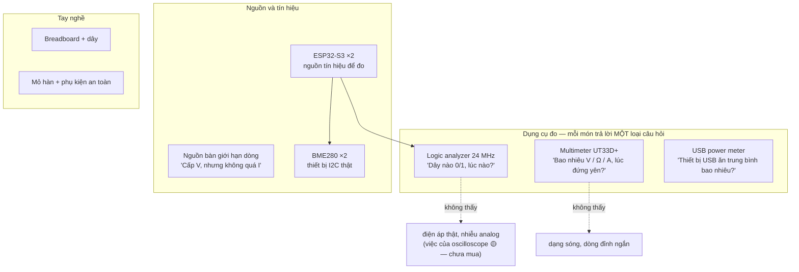
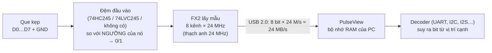
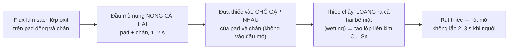

# Khóa 1 · Phần B — Dụng cụ: mỗi món là gì và cầm thế nào (5h)

> Phần này viết cho người **chưa từng cầm multimeter nghiêm túc và đang học bật tắt mỏ hàn**. Không bỏ bước nào vì "ai cũng biết". Mỗi dụng cụ có hai câu hỏi phải trả lời được trước khi dùng: *nó đo được gì với sai số bao nhiêu*, và *cách nào làm hỏng nó (hoặc làm hỏng mạch, hoặc làm bạn bị thương)*.
>
> Phân bổ giờ: Bài 4 (0,5h) · Bài 5 (1,5h) · Bài 6 (0,5h) · Bài 7 (1,5h) · Bài 8 (1h, cộng 1–2h luyện tay khuyến nghị — xem Bài 8).
>
> Từ Phần B trở đi, mỗi phép đo ghi kèm **sai số của dụng cụ** (→ F1.1). Một con số không có sai số là một con số chưa đo xong.

---

## Bài 4 — Mua gì, và mỗi món để làm gì (0,5h) (khung rút gọn)

> **Vị trí:** Bài 3 (tín hiệu số) → **Bài 4** → Bài 5 (multimeter) · **Cần trước:** Bài 1–3 (để hiểu mỗi món đo cái gì) · **Sau bài này bạn quyết định được:** danh sách mua đợt 1 có đủ để làm hết K1 và mở đường cho K7 C0 không, và món nào đáng mua 2 cái.

### 1. Câu chuyện — ai đã khổ vì chuyện này

Tháng 10/2014, FTDI — hãng làm chip chuyển USB–serial FT232R có mặt trong vô số board Arduino và cáp debug — phát hành một bản driver Windows nhận diện chip **giả** và ghi đè mã sản phẩm (PID) của chúng thành 0, khiến thiết bị không còn được nhận nữa. Hàng loạt người dùng không hề biết board của mình chứa chip giả, chỉ thấy "cái cáp hôm qua còn chạy hôm nay chết". FTDI rút bản driver đó sau làn sóng phản đối `[chuẩn — sự kiện thường gọi là "FTDIgate"]`.

Bài học cho đợt mua đầu tiên: linh kiện rẻ có thể không phải thứ ghi trên nhãn, và **bạn không có cách phân biệt "module lỗi" với "tôi làm sai" nếu chỉ có một cái**. Ví dụ rất gần với khóa này: module bán là "BME280" đôi khi gắn chip **BMP280** (không đo độ ẩm). Bạn sẽ bắt được nó ở Bài 11–12 bằng thanh ghi chip ID — nếu biết phải nhìn vào đâu.

### 2. Mô hình tư duy



Mỗi dụng cụ có một vùng mù. Quyết định mua đúng là biết vùng mù của từng món và chấp nhận nó có chủ đích: K1 không cần oscilloscope vì mọi câu hỏi của K1 là "bao nhiêu volt khi đứng yên" hoặc "0/1 lúc nào".

**Danh sách đợt 1** (giá `[ước lượng 10/2026]`, kiểm lại ở cửa hàng):

| Món | SL | Giá ~ | Dùng ở | Ghi chú khi chọn |
|---|---|---|---|---|
| Multimeter **UNI-T UT33D+** | 1 | 285k | Bài 5 trở đi | Chỉnh thang **bằng tay**, 2000 count, chạy 2 pin AAA `[spec — trang sản phẩm UNI-T]` |
| Logic analyzer USB 8 kênh 24 MHz (clone, chip FX2 → driver `fx2lafw`) | 1 | 150–250k | Bài 7, 12, 13 | Kiểm có kèm **kẹp móc** (test hook); không có thì mua bộ ~50–100k |
| Dây kẹp cá sấu hai đầu | 1 bộ | 30–50k | Bài 5, 7 | Kẹp que đen vào GND để rảnh tay |
| USB power meter | 1 | 150–250k | K1 tùy chọn, K3 | Xem "Gãy ở chỗ" về tần số lấy mẫu |
| Breadboard 830 lỗ | 2 | ~60k/cái | Bài 6, 8 (làm gá hàn) | |
| Jumper M-M / M-F / F-F + **dây cứng lõi đơn 22 AWG** đã cắt sẵn | 1 bộ mỗi loại | 40–80k | mọi bài | Dây lõi đơn cắm breadboard chắc hơn jumper mềm |
| Kit điện trở (có **1 MΩ và 10 MΩ**) + tụ + LED + nút | 1 | 150–250k | Bài 5, 9, 10 | 1 MΩ/10 MΩ cần cho thí nghiệm "đồng hồ là một phần của mạch" (Bài 5, 9) |
| **ESP32-S3 DevKit** (khuyên DevKitC-1 hoặc tương đương) | **2** | ~200k/cái | Bài 7, 12, 13 | Tra pinout đúng biến thể bạn mua |
| Cáp USB **có dây dữ liệu** (không phải cáp chỉ sạc) | 2 | 30–60k | Bài 7, 12 | Cáp chỉ sạc là lỗi "không thấy cổng COM" phổ biến nhất |
| **BME280** module I2C | **2** | ~80k/cái | Bài 11, 12 | Có thể là BMP280 trá hình — kiểm chip ID |
| Mỏ hàn chỉnh nhiệt (T12 hoặc trạm 936) + đầu **dẹt/đục 2–3 mm** | 1 | 400–700k | Bài 8, K7 C0.3 | Đầu nhọn kim truyền nhiệt kém, khó cho người mới |
| Phụ kiện hàn: giá đỡ, **bùi nhùi đồng**, thiếc 0,6–0,8 mm lõi flux, flux dạng bút/gel, dây hút thiếc, cồn IPA ≥90%, kìm cắt chân, **kính bảo hộ**, quạt nhỏ hoặc máy hút khói | 1 bộ | 200–350k | Bài 8 | Chi tiết ở Bài 8 |
| Nguồn bàn giới hạn dòng (ví dụ 30 V / 5 A) | 1 | 600k–1,5tr | K1 tùy chọn; **bắt buộc trước K7 C1** | Xem K7 C0.4 |

**Tổng `[ước lượng]`:** ~2,3–2,9tr không kể nguồn bàn; ~3,0–4,4tr nếu mua luôn nguồn bàn. Bản gốc ghi 1,8–2,8tr; chênh vì thêm món thứ hai (ESP32, BME280), phụ kiện an toàn hàn và dây đo.

**Mua ở đâu:** bản gốc gợi ý ở Hà Nội: Linh Kiện Điện Tử 3M (khu Tạ Quang Bửu, Bách Khoa), Lập Trình Nhúng A-Z (Cầu Giấy), Chợ Trời (Hai Bà Trưng) cho linh kiện thụ động `[ước lượng — theo bản gốc, chưa kiểm địa chỉ và tồn kho]`.

### 3. Cầu nối từ backend

| Backend bạn biết | Ở đây | Gãy ở chỗ | Nếu dùng nhầm thì |
|---|---|---|---|
| `curl` (một câu hỏi, một câu trả lời) / `tcpdump` (ghi toàn bộ lưu lượng) | Multimeter / logic analyzer | `tcpdump` nhận byte đã được NIC giải mã, có checksum. Logic analyzer nhận **điện áp đã qua ngưỡng của chính nó**, không có checksum: nếu ngưỡng hoặc sample rate sai, decoder vẫn in ra một kết quả trông hợp lệ | Tin decoder PulseView như tin Wireshark |
| Biểu đồ metrics trung bình theo phút | USB power meter | Đồng hồ USB rẻ cập nhật vài lần mỗi giây `[ước lượng]`, nên **trung bình hóa** đỉnh dòng ngắn (WiFi phát của ESP32 có đỉnh vài trăm mA trong vài ms) | Lập power budget theo số trung bình → brownout khi đỉnh xảy ra (→ F5.7, K7 C1.2) |
| Circuit breaker / rate limit fail-closed | Giới hạn dòng (CC) của nguồn bàn | Nguồn ở chế độ CC **không ngắt**: nó hạ điện áp xuống để giữ dòng ở mức đặt. Mạch vẫn có điện, vẫn có thể nóng | Tưởng "đặt 3 A là an toàn": một đường chập qua dây mảnh vẫn cháy ở 3 A. Đặt giới hạn **sát** dòng dự kiến, không đặt cao "cho chắc" |
| Hai replica để so sánh khi debug (differential testing) | "Mua 2 cái" | Hai module cùng lô có thể cùng lỗi (như hai replica chạy cùng một bản build lỗi) | Cả hai cùng hỏng → kết luận "tôi cấu hình sai" trong khi lô hàng lỗi. Khi cả hai cùng sai, thử một cái từ nguồn khác |

### 6. Làm

1. **Trước khi mua:** so danh sách trên với những gì bạn đã có; ghi vào `decisions.md` lý do mua/không mua nguồn bàn ở đợt này (K7 C0.4 sẽ buộc mua).
2. **Khi nhận hàng — kiểm từng món, ghi vào `lab/00-nen/nhan-hang.md`:**
   - Multimeter: lắp pin, bật lên, xoay sang thông mạch, chạm hai que vào nhau → phải kêu. Đọc model in trên mặt và trong manual; ghi lại **định mức cầu chì** của cổng mA và cổng 10A (mở nắp pin/nắp lưng hoặc đọc manual) `[tự đo]`.
   - Logic analyzer: cắm USB; ở Bài 7 sẽ cài driver. Đếm số dây kẹp, xác định dây GND.
   - ESP32-S3: cắm bằng cáp dữ liệu → Windows phải hiện một cổng COM mới trong Device Manager (hoặc thiết bị "USB JTAG/serial debug unit" tùy cổng). Không hiện → đổi cáp trước khi nghi board.
   - BME280: chụp ảnh mặt chip (ký hiệu khắc trên vỏ) để đối chiếu ở Bài 11.
   - Breadboard: kiểm thông mạch ở Bài 6.
   - Mỏ hàn: bật, chờ tới nhiệt, chạm thiếc vào đầu mỏ → thiếc phải chảy và bám thành lớp bóng.
3. **An toàn — đọc một lần, áp dụng mãi:**
   - Mọi thứ trong K1 chạy ở 3,3 V / 5 V DC: **không có nguy cơ điện giật**. Không bài nào chạm điện lưới 220 V. Hướng dẫn nào bảo mở adapter ra: dừng.
   - **Ngắn mạch** là rủi ro điện số một: nối thẳng + với −. Cổng USB của máy tính thường có bảo vệ quá dòng, nhưng hub và sạc rẻ thì chưa chắc — có thể chỉ nóng lên `[ước lượng]`. Pin lithium không tự ngắt: chưa dùng pin lithium trong K1 (K7 C1 dạy riêng).
   - **Mỏ hàn ~350 °C:** đặt vào giá mỗi lần buông tay, không ngoại lệ. Mỏ rơi thì để rơi, **không chụp**.
   - **Khói hàn:** bản gốc viết "không độc cấp tính nhưng khó chịu" — chưa đủ. Khói của flux gốc nhựa thông (rosin/colophony) là tác nhân gây **mẫn cảm đường hô hấp** và hen nghề nghiệp đã được ghi nhận `[chuẩn — cơ quan an toàn lao động Anh (HSE) xếp rosin fume là respiratory sensitiser]`. Dùng quạt nhỏ thổi khói **ngang ra xa mặt** hoặc máy hút khói có lọc than, mở cửa sổ, đừng cúi mặt vào luồng khói. Nếu dùng thiếc có chì: chì đi vào người chủ yếu **qua tay**, không phải qua khói ở nhiệt độ hàn → rửa tay sau khi hàn, không ăn uống ở bàn hàn.
   - **Kính bảo hộ** khi cắt chân linh kiện (chân bay) và khi hàn.

### 8. Nếu ra khác

| Triệu chứng | Nguyên nhân khả dĩ | Kiểm bằng cách | Sửa |
|---|---|---|---|
| ESP32 cắm vào không hiện cổng COM | Cáp chỉ sạc; cắm nhầm cổng USB trên board (có board 2 cổng); thiếu driver USB-UART | Thử cáp đang dùng để truyền file với điện thoại; thử cổng còn lại | Đổi cáp; cài driver theo chip USB-UART in trên board (CP210x/CH34x) |
| Multimeter không kêu khi chạm hai que | Chưa ở chế độ thông mạch; que cắm sai lỗ; pin yếu | Xem ký hiệu ))) trên núm; que đen ở COM, đỏ ở VΩmA | Xem Bài 5 |
| Hai module BME280 cùng không trả lời ở Bài 12 | Cả lô lỗi, hoặc cả hai là BMP280, hoặc nối sai | Đọc chip ID (0x60 BME280, 0x58 BMP280 `[spec — datasheet Bosch]`) | Mua thêm một cái từ cửa hàng khác |
| Mỏ hàn nóng nhưng thiếc không bám đầu mỏ | Đầu mỏ bị oxy hóa (đen) | Nhìn màu đầu mỏ | Xem Bài 8 (mạ lại đầu, tip tinner) |

### 9. Câu hỏi ngược

1. **[Vì sao không]** Vì sao không mua oscilloscope ngay đợt 1, khi nó "thấy được nhiều hơn" logic analyzer?
<details><summary>Hướng nghĩ</summary>

Hỏi ngược: câu hỏi nào của K1 cần dạng sóng analog? Hầu như không có. Oscilloscope rẻ thường có ít kênh, bộ nhớ ngắn và decode giao thức kém hơn analyzer 8 kênh ở cùng giá. Mua dụng cụ theo câu hỏi, không theo "nhiều tính năng". Khi tới K3 Bài 6 (nhìn sụt nguồn) hoặc K7 C5.1 (nhiễu motor lên logic), câu hỏi đổi — lúc đó mới cân nhắc.

</details>

2. **[Failure mode]** Bạn mua 2 ESP32 cùng một shop, cùng một lô. Cả hai cùng có một chân GPIO "chết". Bạn có thể kết luận gì và không thể kết luận gì?
<details><summary>Hướng nghĩ</summary>

Có thể: lỗi không nằm ở một con cụ thể. Không thể: phân biệt "cả lô lỗi" với "chân đó là chân strapping/chân dành riêng mà tôi không được dùng". Mẫu thử thứ hai chỉ có giá trị khi độc lập với mẫu thứ nhất; đọc lại datasheet về chân đó trước khi đổ lỗi cho phần cứng.

</details>

3. **[Quy mô]** Nếu một ngày bạn dựng một phòng lab cho 10 người học như bạn, danh sách nào thay đổi?
<details><summary>Hướng nghĩ</summary>

Dụng cụ dùng chung (nguồn bàn, máy hút khói, oscilloscope) vs dụng cụ cá nhân (multimeter, analyzer). Quy trình kiểm khi nhận hàng thành một bộ test chung; dụng cụ đo cần **hiệu chuẩn định kỳ** để mười người đo cùng một mạch ra cùng một số (→ F1.1). Đó là chuyện của mọi đội test & validation thật.

</details>

4. **[Phản biện]** "Multimeter càng nhiều chữ số càng chính xác." Kiểm câu này với UT33D+.
<details><summary>Hướng nghĩ</summary>

Chữ số hiển thị là **độ phân giải**. Độ chính xác là ±(0,5% + 2 digit) ở thang DC V. Một đồng hồ 6000 count với ±1% có thể hiển thị nhiều chữ số hơn mà kém đúng hơn. Bài 5 sẽ tính con số này cho phép đo đầu tiên của bạn.

</details>

### 12. Đọc thêm và tự kiểm tra

- **Nguồn gốc:** trang sản phẩm UNI-T "UT33+ Series Palm Size Multimeters" (meters.uni-trend.com) và manual đi kèm hộp; trang thiết bị "fx2lafw" trên sigrok wiki (sigrok.org).
- **Giải thích:** EEVblog (Dave Jones) — các tập về chọn multimeter cho người mới; SparkFun "How to Use a Multimeter".
- **Đào sâu (tùy chọn):** HSE (UK), tài liệu hướng dẫn về khói hàn rosin — đọc phần biện pháp kiểm soát.
- **Tự kiểm tra:** (1) giải thích cho một backend engineer khác trong 5 câu vì sao mua 2 module; (2) vẽ lại sơ đồ "mỗi dụng cụ trả lời một câu hỏi" từ trí nhớ; (3) trả lời: nguồn bàn đặt 5 V, giới hạn 100 mA; bạn nối một điện trở 10 Ω. Điện áp trên điện trở là bao nhiêu?

<details><summary>Đáp án tự kiểm tra</summary>

(3) Không giới hạn thì dòng sẽ là 5 / 10 = 500 mA > 100 mA → nguồn chuyển sang chế độ CC, giữ 100 mA và hạ điện áp xuống 0,1 A × 10 Ω = **1,0 V**. Màn hình nguồn thường báo "CC". Mạch vẫn có điện — chỉ là ít hơn.

</details>

---

## Bài 5 — Multimeter: cầm thế nào cho đúng (1,5h)

> **Vị trí:** Bài 4 (mua) → **Bài 5** → Bài 6 (breadboard) · **Cần trước:** Bài 1 (nối tiếp / song song), Bài 2 (GND) · đọc kèm → F1.1 (resolution / accuracy / sai số loại B) · **Sau bài này bạn quyết định được:** cho một phép đo bất kỳ trong K1 — chọn chức năng, thang và lỗ cắm nào để không làm hỏng đồng hồ, và con số đọc được đúng tới ± bao nhiêu.

### 1. Câu chuyện — ai đã khổ vì chuyện này

Trong các tài liệu an toàn của ngành đo lường (ví dụ ghi chú ứng dụng *ABCs of DMM Safety* của Fluke), một kịch bản tai nạn được nhắc đi nhắc lại: kỹ thuật viên vừa đo dòng xong, **để nguyên que đỏ ở lỗ đo dòng**, rồi chạm que vào một nguồn điện áp để "kiểm tra nhanh". Bên trong đồng hồ ở chế độ dòng chỉ là một điện trở rất nhỏ — chạm vào nguồn áp là tạo ra một đường ngắn mạch đi xuyên qua tay cầm. Với điện công nghiệp, kết quả là hồ quang và bỏng; xếp hạng an toàn CAT II/III/IV trong tiêu chuẩn IEC 61010 và cầu chì "năng lượng cao" trong đồng hồ tốt tồn tại vì những tai nạn như vậy `[chuẩn — tài liệu an toàn DMM của các hãng đo lường]`.

Ở K1 bạn chỉ làm việc với 3,3–5 V, nên cái giá của cùng lỗi đó chỉ là một cầu chì đứt. Nhưng thói quen hình thành ở đây đi theo bạn tới K7, nơi một pin 4S có thể đẩy hàng chục đến hàng trăm ampe vào một đường ngắn mạch `[ước lượng — phụ thuộc pin, → K7 C0.2, C1.1]`. Đây là lúc tập thói quen khi lỗi còn rẻ.

### 2. Mô hình tư duy

**Bên trong đồng hồ, mỗi chế độ là một mạch khác nhau.** Đây là mô hình duy nhất cần nhớ:

| Chế độ | Bên trong đồng hồ trông như | Cắm vào mạch thế nào | Cắm sai thì |
|---|---|---|---|
| `V⎓` (DC volt) | Một điện trở **rất lớn** (~10 MΩ `[tự đo — kiểm manual]`) + mạch đo áp | **Song song**: hai que chạm hai điểm, mạch giữ nguyên | Nối tiếp nhầm: mạch gần như tắt (10 MΩ nối tiếp), đồng hồ hiện gần bằng điện áp nguồn. Không hỏng gì, chỉ hiểu nhầm |
| `A⎓` (DC ampe) | Một điện trở **rất nhỏ** (shunt) + cầu chì | **Nối tiếp**: cắt mạch, cho dòng chạy xuyên qua đồng hồ | Song song nhầm (chạm hai đầu nguồn): **ngắn mạch qua đồng hồ** → cầu chì đứt, hoặc tệ hơn |
| `Ω` | Một nguồn dòng nhỏ tự cấp + mạch đo áp | Linh kiện **rời mạch** (ít nhất một chân), mạch **tắt nguồn** | Đo trên mạch có điện: số vô nghĩa; với điện áp cao có thể hỏng đồng hồ |
| `)))` thông mạch / `▶|` diode | Như Ω, kêu khi điện trở dưới một ngưỡng `[tự đo]` | Tắt nguồn, chạm hai đầu | Như trên |

```
        Đo ÁP: song song                         Đo DÒNG: nối tiếp
   +5V ──●────[R]────●── GND             +5V ──[R]──●   ●──[LED]── GND
         │           │                              │   │   ← mạch được CẮT ở đây
       (đỏ)        (đen)                          (đỏ) (đen)
         └──[ 10 MΩ ]┘                              └[shunt ~Ω]┘
   đồng hồ là một "nhánh" gần như không        đồng hồ là một "đoạn dây" gần như
   lấy dòng                                     không cản dòng
```

Hệ quả: **ampe kế là một sợi dây.** Đặt một sợi dây ngang qua hai cực nguồn là ngắn mạch. Mọi tai nạn với multimeter đều quy về câu này.

**Ba lỗ cắm** (đọc nhãn trên đồng hồ của bạn, thứ tự có thể khác `[tự đo]`):
- **COM** — que **đen**, luôn ở đây.
- **VΩmA** (có đồng hồ ghi `mAVΩ` hoặc tách riêng) — que **đỏ** cho áp, điện trở, thông mạch, dòng nhỏ tới thang 200 mA.
- **10A** — que **đỏ**, chỉ khi đo dòng lớn hơn thang mA. Thường có giới hạn thời gian đo (kiểu "≤10 s, nghỉ 15 phút") `[tự đo — đọc manual]`.

**UT33D+ chỉnh thang bằng tay** `[spec — trang sản phẩm UNI-T]`: bạn phải xoay núm tới đúng thang. Đồng hồ 2000 count hiển thị tối đa `1999` chữ số, nên mỗi thang có một độ phân giải:

| Chức năng | Thang (theo spec UT33D+) | 1 digit ở thang | Độ chính xác `[spec]` |
|---|---|---|---|
| DC V | 200 mV / 2 V / 20 V / 200 V / 600 V | 0,1 mV / 1 mV / 10 mV / 100 mV / 1 V | ±(0,5% số đọc + 2 digit) |
| DC A | 2000 µA / 20 mA / 200 mA / 10 A | 1 µA / 10 µA / 100 µA / 10 mA | ±(1% + 2 digit) |
| Ω | 200 Ω / 2 kΩ / 20 kΩ / 200 kΩ / 20 MΩ (kiểm thang trên núm) | 0,1 Ω / 1 Ω / 10 Ω / 100 Ω / 10 kΩ | ±(0,8% + 2 digit) (thang cao nhất thường kém hơn — đọc manual) |

Nguồn: trang "UT33+ Series" của UNI-T; manual trong hộp là bản quyết định. Thang chính xác và cách in trên núm có thể khác theo đợt sản xuất `[tự đo]`.

**Quy tắc chọn thang:** dự đoán giá trị trước → chọn thang **nhỏ nhất mà vẫn lớn hơn** giá trị dự đoán. Không dự đoán được → bắt đầu từ thang lớn nhất rồi hạ dần. Hiện `1` ở bên trái (hoặc `OL`) nghĩa là vượt thang → lên một thang.

**Mô phỏng đồ chơi — hai giới hạn của đồng hồ.** (1) Sai số theo spec. (2) Đồng hồ ~10 MΩ mắc song song làm lệch mạch có trở kháng cao. Chạy sau khi viết dự đoán.

```python
# [đã chạy] Hai giới hạn của multimeter: sai số theo spec và "tải" của chính đồng hồ
# (1) Sai số DC V của UT33D+ theo spec: ±(0.5 % số đọc + 2 digit), 2000 count [spec, kiểm manual]
RANGES = {"2V": 0.001, "20V": 0.01, "200V": 0.1}       # 1 digit ở mỗi thang (V)

def dcv_uncertainty(reading, rng):
    return 0.005 * abs(reading) + 2 * RANGES[rng]

for reading, rng in [(1.587, "2V"), (4.98, "20V"), (2.50, "20V"), (0.45, "2V")]:
    u = dcv_uncertainty(reading, rng)
    print(f"đọc {reading} V ở thang {rng:>4}: ±{u*1000:.0f} mV ({u/reading*100:.1f} %)")

# (2) Cầu phân áp R1 = R2 = R, nguồn 5.00 V; đồng hồ có R_in song song với R2
R_IN = 10e6                     # điện trở vào ~10 MΩ [tự đo — kiểm manual bản bạn có]
def divider(r1, r2, r_load=None):
    r2_eff = r2 if r_load is None else r2 * r_load / (r2 + r_load)
    return 5.0 * r2_eff / (r1 + r2_eff)

print()
for r in [1e3, 10e3, 100e3, 1e6, 10e6]:
    v0, v1 = divider(r, r), divider(r, r, R_IN)
    print(f"R1=R2={r/1e3:>6.0f} kΩ: lý tưởng {v0:.3f} V, đồng hồ đọc {v1:.3f} V,"
          f" lệch {(v1-v0)/v0*100:+.2f} %")
```

### 3. Cầu nối từ backend

| Backend bạn biết | Ở đây | Gãy ở chỗ | Nếu dùng nhầm thì |
|---|---|---|---|
| Đọc một metric qua endpoint read-only | Vôn kế song song | Vôn kế **lấy** một dòng nhỏ (5 V / 10 MΩ = 0,5 µA). Với mạch trở kháng thấp, không đáng kể; với mạch MΩ, chính phép đo kéo lệch giá trị (probe loading) | Đo cầu phân áp 1 MΩ, tin con số, kết luận điện trở sai (→ Bài 9 thí nghiệm phá) |
| Một proxy inline trên đường request | Ampe kế nối tiếp | Proxy đặt "bên cạnh" đường đi thì vô hại. Ampe kế đặt bên cạnh (song song với nguồn) **trở thành** đường đi duy nhất có trở kháng ~0 → ngắn mạch. Đặt đúng chỗ, nó vẫn thêm một sụt áp nhỏ (burden voltage), như proxy thêm latency | Đứt cầu chì ở lần đo dòng đầu tiên; hoặc mạch 3,3 V "yếu đi" khi chen đồng hồ vào |
| Health check tự gửi request riêng | Ohm kế tự cấp dòng | Trên mạch đang có điện, dòng của mạch lẫn vào dòng thử; các linh kiện song song trong mạch cũng góp vào số đọc | Đo điện trở ngay trên board đang cắm USB, được một số không thuộc linh kiện nào |
| Chọn kiểu số (int8/int16/float) cho một giá trị | Chọn thang đo | Thang nhỏ quá thì đồng hồ **báo** tràn (`1` / `OL`). Thang lớn quá thì **im lặng** mất chữ số — như ép float vào int16 rồi chia | Đo pin ở thang 20 V rồi tưởng số chữ số hiển thị chính là độ chính xác của đồng hồ |

**Chấm mô hình:**

- *"Que đen là âm, que đỏ là dương; cắm ngược thì hỏng."* — **SAI** với DC V. Đảo que chỉ làm **đổi dấu** số đọc, vì điện áp là hiệu V_đỏ − V_đen. Phản ví dụ: bài tập 1 bên dưới, đảo que trên pin AA.
- *"Đo dòng cũng chạm hai que như đo áp, chỉ cần xoay núm sang A."* — **SAI**, và là lỗi làm cháy cầu chì phổ biến nhất. Đo dòng phải **cắt mạch** và để dòng chạy xuyên qua đồng hồ. Phản ví dụ: ở chế độ mA, chạm que vào 5 V và GND của ESP32 = đặt một đoạn dây ~vài Ω ngang nguồn USB.
- *"Đồng hồ hiện 4 chữ số thì số đó đúng tới chữ số cuối."* — **SAI.** Chữ số cuối là **độ phân giải**; **độ chính xác** là ±(0,5% + 2 digit). Phản ví dụ: tính sai số cho `1.587 V` ở thang 2 V bằng công thức trên (mục 5) — bạn sẽ thấy chữ số cuối "7" nằm trong vùng không chắc chắn. Ghi `1.587 V ± 0.010 V` mới là báo cáo trung thực (→ F1.1, F1.7).

### 4. Thuật ngữ

| Mức | Thuật ngữ | Nghĩa trong một câu | Hay bị hiểu nhầm thành |
|---|---|---|---|
| 🟢 | COM / VΩmA / 10A | Ba lỗ cắm: chung (đen), đa năng (đỏ), dòng lớn (đỏ) | Lỗ nào cũng được miễn đúng màu |
| 🟢 | DCV / DCA / Ω / continuity | Áp một chiều / dòng một chiều / điện trở / thông mạch | — |
| 🟢 | Range (thang), manual ranging | Mức toàn thang bạn chọn bằng núm | Chỉ để tránh tràn |
| 🟢 | Count (2000 count) | Số mức hiển thị tối đa (0–1999) | "Số chữ số" chung chung |
| 🟢 | Resolution vs accuracy | Bước nhỏ nhất hiển thị vs mức đúng được cam kết | Một thứ |
| 🟢 | ±(%reading + digits) | Cách ghi sai số: phần tỉ lệ + phần cố định theo thang | Chỉ phần % |
| 🟢 | OL / `1` bên trái | Vượt thang | Đồng hồ hỏng |
| 🟡 | Input impedance (~10 MΩ) | Điện trở vôn kế đặt song song vào mạch | Vô cùng lớn |
| 🟡 | Burden voltage | Sụt áp trên shunt khi đo dòng | Không tồn tại |
| 🟡 | Fuse rating, CAT II/III | Định mức cầu chì; hạng an toàn theo nơi đo | Chỉ quan trọng với điện lưới |
| 🟡 | Probe loading | Que đo làm thay đổi mạch | — |
| 🔴 | True RMS, đo 4 dây (Kelvin), chuỗi hiệu chuẩn | AC méo dạng; đo mΩ; truy xuất chuẩn đo lường | Cần ở K1 (biết tên 4 dây là đủ, → Bài 2) |

### 5. Dự đoán

Tạo `lab/00-dung-cu/prediction-multimeter.md` (thư mục `00-` là bài luyện, không thuộc 5 lab của gate):

```markdown
# Bài 5 — dự đoán (mỗi dòng: giá trị, đơn vị, thang sẽ chọn, sai số theo spec cho giá trị đó)
1. Pin AA kiềm (alkaline) mới: V = ?  thang = ?  ± = ?
   Pin AA sạc NiMH đầy: V = ?
2. Đảo hai que ở câu 1: số hiển thị = ?
3. ESP32-S3 cắm USB: chân 5V so với GND = ?   chân 3V3 so với GND = ?   (thang? ±?)
   (tra: điện áp VBUS cho phép theo chuẩn USB 2.0; ổn áp 3,3 V trên board)
4. Năm điện trở: đọc mã màu → giá trị danh định, sai số in trên vòng cuối,
   KHOẢNG CHẤP NHẬN khi đo = sai số điện trở + sai số đồng hồ ở thang đã chọn.
5. Cầm điện trở 1 kΩ bằng hai tay (mỗi tay một đầu) khi đo: số đổi bao nhiêu %?
   Làm lại với 1 MΩ: số đổi bao nhiêu %? (điện trở cơ thể khô tay–tay: tra hoặc đoán bậc độ lớn)
6. (sau Bài 6) 5 V → 1 kΩ → GND. Dòng = ? mA. Thang = ? ± = ?
7. Mô phỏng (mục 2), TRƯỚC khi chạy: với R1 = R2 = 1 MΩ và 10 MΩ, đồng hồ đọc ? V
```

Phương pháp: sai số = `a% × số_đọc + n × (1 digit của thang)`; khoảng chấp nhận cộng **tuyến tính** hai sai số (cách bảo thủ, → F1.1 có cách cộng căn bậc hai); câu 5 là hai điện trở song song `R·R_body/(R + R_body)`.

### 6. Làm

**A. Cầm que — trước mọi bài tập.**
- Cầm que như cầm bút, **ngón tay ở phía sau gờ chắn** (vòng nhựa nổi trên thân que). Gờ đó là để ngón tay không trượt lên đầu kim loại.
- Kẹp **que đen** vào GND bằng kẹp cá sấu (hoặc dùng que có đầu kẹp) để chỉ phải cầm một que đỏ. Một tay = ít trượt, ít chập.
- Nhìn **đầu que** khi chạm, chạm chắc, rồi mới nhìn màn hình. Không vừa nhìn màn hình vừa dò.
- Không chạm đầu que vào **khe giữa hai chân** header cạnh nhau: đầu kim trượt một chút là nối tắt hai chân. Chạm vào đỉnh chân, hoặc cắm một dây jumper ra làm "điểm đo".

**B. Quy trình bốn câu trước MỖI phép đo** (viết lên một mẩu giấy dán cạnh bàn):
1. Đo **cái gì**: V, A hay Ω?
2. **Dự đoán bao nhiêu** → chọn thang nhỏ nhất lớn hơn giá trị đó.
3. Que đỏ đang ở **lỗ nào**? (nhìn tận mắt, không nhớ)
4. Mạch đang **có điện hay không**? (Ω và thông mạch: phải tắt)

Và hai thói quen: **không xoay núm khi que đang chạm mạch**; **đo dòng xong, rút que đỏ về VΩmA ngay**, trước khi làm việc gì khác.

**C. Bài tập 1 — pin AA (không thể hỏng gì).**
1. Que đen vào COM, que đỏ vào VΩmA. Xoay núm về `V⎓`, thang **2 V**.
2. Que đỏ chạm cực **+**, que đen chạm cực **−**. Ghi số, ghi thang, tính ±.
3. Đảo hai que. Ghi lại.
4. Xoay sang thang 20 V, đo lại. So số chữ số với bước 2.

**D. Bài tập 2 — điện trở và mã màu.**
Bốn vòng màu: vòng 1, 2 là hai chữ số; vòng 3 là số chữ số 0 thêm vào; vòng 4 là sai số (**vàng kim** ±5%, **bạc** ±10%, **nâu** ±1%). Vòng sai số thường nằm cách xa các vòng kia hơn — dùng nó để biết đọc từ đầu nào. Điện trở 5 vòng: ba chữ số + hệ số + sai số.

| Màu | Số | | Màu | Số |
|---|---|---|---|---|
| Đen | 0 | | Lục | 5 |
| Nâu | 1 | | Lam | 6 |
| Đỏ | 2 | | Tím | 7 |
| Cam | 3 | | Xám | 8 |
| Vàng | 4 | | Trắng | 9 |

Ví dụ: nâu–đen–đỏ–vàng kim = 1, 0, thêm 2 số 0 → 1000 Ω = 1 kΩ, ±5%.

1. Tắt mọi nguồn. Điện trở **rời mạch**, nằm trên bàn.
2. **Bù que đo:** thang 200 Ω, chạm hai đầu que vào nhau, ghi số (điện trở của que và tiếp xúc, thường vài phần mười Ω `[tự đo]`). Trừ số này khi đo điện trở dưới ~100 Ω.
3. Đọc màu dưới **ánh sáng trắng** (nâu/đỏ/cam rất dễ nhầm dưới đèn vàng), ghi giá trị dự đoán, rồi mới đo.
4. Cầm điện trở bằng **một đầu** (hoặc đặt trên bàn, ấn que vào hai chân).
5. Làm câu 5 của dự đoán: cầm hai đầu bằng hai tay, với 1 kΩ rồi 1 MΩ (thang 20 MΩ).

**E. Bài tập 3 — điện áp trên ESP32-S3.** Cắm ESP32 vào USB. Que đen kẹp vào chân GND. Thang 20 V. Chạm que đỏ vào chân 5V, rồi chân 3V3. **Không** chạm que vào hai chân cạnh nhau cùng lúc.

**F. Bài tập 4 — đo dòng lần đầu (làm sau Bài 6, cần breadboard).**
1. **Rút USB** (tắt nguồn). Dựng: chân 5V → điện trở 1 kΩ → một hàng trống trên breadboard. Hàng trống đó **chưa nối** về GND — đây là chỗ "cắt mạch".
2. Chuyển que đỏ sang lỗ **VΩmA** (dòng dự đoán vài mA, nằm trong thang mA). Xoay núm về `A⎓` thang **20 mA**.
3. Que đỏ chạm hàng trống (đầu ra của điện trở), que đen nối về **GND**. Giờ dòng phải chạy xuyên qua đồng hồ mới về được GND.
4. Cắm USB. Đọc số. Rút USB.
5. **Trả que đỏ về VΩmA và xoay núm về V⎓ ngay**, trước khi làm bất cứ việc gì khác.
6. Kiểm chéo: đo áp trên điện trở (thang 20 V), chia cho giá trị điện trở đã đo ở bài tập 2. So với số dòng đọc trực tiếp. Hai số phải gặp nhau trong tổng sai số (đây là câu hỏi số 2 trong "Ba câu hỏi để tự biết mình đo đúng", xem `00-tong-quan.md`).

Điện trở 1 kΩ được chọn có chủ đích: chừng nào dòng còn phải đi qua nó, dòng bị giới hạn ở mức nhỏ (bạn đã tính ở mục 5). Lỗi duy nhất làm đứt cầu chì ở bài này là **chạm hai que thẳng vào 5V và GND khi đang ở chế độ dòng**.

**G. Lỗi phá đồng hồ — học thuộc bảng này.**

| Lỗi | Điều xảy ra bên trong | Mức hại | Phòng |
|---|---|---|---|
| Đang ở chế độ / lỗ **dòng** (mA hoặc 10A), chạm que vào hai điểm có điện áp ("đo áp bằng chế độ dòng") | Shunt vài Ω hoặc vài mΩ đặt ngang nguồn = **ngắn mạch** | Cầu chì đứt; nếu lỗ 10A **không có cầu chì** `[tự đo — kiểm manual]` thì shunt nóng, cháy; với pin lớn là nguy hiểm thật | Nhìn lỗ cắm trước mỗi lần chạm; rút que về VΩmA ngay sau khi đo dòng |
| Ở chế độ **áp**, nối tiếp vào mạch ("đo dòng bằng chế độ áp") | 10 MΩ chen vào vòng → dòng gần 0, đồng hồ hiện gần bằng điện áp nguồn | Không hỏng gì; **hiểu nhầm** là mạch có vấn đề | Đo dòng: núm về A, que đúng lỗ, mạch cắt |
| Dòng vượt thang mA khi que ở lỗ VΩmA (ví dụ > 200 mA) | Quá dòng qua shunt nhỏ | Đứt cầu chì mA | Dự đoán dòng trước; chưa biết → lỗ 10A, thang 10A trước |
| Dùng lỗ 10A quá thời gian cho phép | Shunt nóng | Hỏng shunt, sai số tăng | Đọc giới hạn trong manual `[tự đo]` |
| Đo Ω / thông mạch trên mạch **đang có điện** | Nguồn ngoài đẩy dòng vào mạch đo | Số vô nghĩa; với điện áp cao có thể hỏng đồng hồ | Tắt nguồn, rời một chân linh kiện |
| Xoay núm khi que đang chạm mạch | Núm đi qua các vị trí trung gian (có thể là dòng) | Có thể chập tức thời | Nhấc que lên rồi mới xoay |
| Dùng thang 10A cho dòng vài mA | Không hại; độ phân giải của thang 10A là 10 mA → dòng vài mA hiện `0.00` | Hiểu nhầm "không có dòng" | Hạ thang khi đã biết bậc độ lớn |

**Cách biết cầu chì mA đã đứt:** chen đồng hồ (chế độ mA) vào một mạch LED đang sáng — nếu LED **tắt** và đồng hồ hiện 0, mạch đang hở bên trong đồng hồ. Cầu chì đứt không có đèn báo; đây là lý do làm một phép đo "mạch đã biết" (canary) trước khi đo mạch lạ.

### 7. Số phải ra

<details><summary>🔒 MỞ SAU KHI COMMIT prediction.md</summary>

| Phép đo | Khoảng hợp lý | Sai số đồng hồ ở giá trị đó | Ghi chú |
|---|---|---|---|
| AA kiềm mới, thang 2 V | **1,50–1,65 V** `[ước lượng]` | ví dụ 1,587 V → **±10 mV** | Kiềm đã dùng 1,2–1,4 V; < 1,1 V gần hết |
| AA NiMH đầy | **1,25–1,40 V** `[ước lượng]` | | Bản gốc xếp 1,2–1,4 V là "đã dùng" — chỉ đúng với pin kiềm; NiMH đầy nằm ngay ở đó |
| Đảo que | **Cùng độ lớn, dấu trừ** | | Điện áp có dấu vì là phép trừ |
| Cùng pin ở thang 20 V | Mất một chữ số (ví dụ `1.59`) | ±(0,5% + 2 × 10 mV) ≈ **±28 mV** | Thang lớn hơn = độ phân giải và sai số tệ hơn |
| Chân 5V của DevKit | **~4,6–5,2 V** `[tự đo]` | ví dụ 4,98 V → **±45 mV** | Chuẩn USB 2.0 cho VBUS ở cổng 4,75–5,25 V `[spec]`; cáp và linh kiện bảo vệ trên board có thể làm tụt thêm |
| Chân 3V3 | **~3,2–3,4 V** `[ước lượng]` | ±(0,5% + 20 mV) ≈ **±37 mV** | Do ổn áp LDO trên board |
| Điện trở 1 kΩ ±5% | **940–1060 Ω** (thang 2 kΩ) | ±(0,8% + 2 × 1 Ω) ≈ ±10 Ω | 950–1050 từ sai số linh kiện, nới thêm sai số đồng hồ |
| Cầm hai đầu 1 kΩ | Đổi **< 1%** | | Cơ thể khô tay–tay cỡ 100 kΩ trở lên `[ước lượng]` → song song không đáng kể |
| Cầm hai đầu 1 MΩ | Giảm **rõ rệt**, có thể vài chục % | | Bản gốc nói "lệch rất nhiều" khi cầm hai tay — chỉ đúng với điện trở lớn |
| 5 V → 1 kΩ, thang 20 mA | **~4,6–5,2 mA** | ví dụ 4,95 mA → ±(1% + 2 × 10 µA) ≈ **±0,07 mA** | Dòng tính từ V_R / R phải gặp dòng đo trong tổng sai số. Lệch nhỏ có hệ thống: burden voltage của shunt |
| Mô phỏng tải | 1 MΩ/1 MΩ → **~2,38 V** (−4,8%); 10 MΩ/10 MΩ → **~1,67 V** (−33%) | | Ở 1 MΩ, sai lệch do đồng hồ **cùng bậc** với sai số ±5% của điện trở → khó tách nếu không đo từng điện trở trước. Ở 10 MΩ thì không thể nhầm. Dùng cho thí nghiệm phá ở Bài 9 |
| Bù que đo (thang 200 Ω) | **0,1–0,5 Ω** `[tự đo]` | ±(0,8% + 0,2 Ω) | |

Lệch bình thường: mọi số nằm trong khoảng hợp lý và chênh với dự đoán ít hơn tổng sai số. Lệch đáng tìm hiểu: chênh lớn hơn tổng sai số — một trong các giả định của bạn sai (thường là đọc nhầm màu, hoặc pin đồng hồ yếu).

</details>

### 8. Nếu ra khác

| Triệu chứng | Nguyên nhân khả dĩ | Kiểm bằng cách | Sửa |
|---|---|---|---|
| Hiện `0.00` / `000` | Que sai lỗ; que chưa chạm kim loại; thang quá lớn | Nhìn lỗ; ấn chắc; hạ thang | |
| Hiện `1` bên trái (hoặc `OL`) | Vượt thang (UT33D+ chỉnh tay) | Giá trị dự đoán có lớn hơn thang không? | Lên một thang |
| Số nhảy loạn | Que chạm chập chờn; đầu que bẩn | Kẹp cá sấu thay cho tay cầm | Lau đầu que, kẹp chắc |
| Không lên gì / ký hiệu pin trên màn | Pin đồng hồ yếu hoặc hết (UT33D+ dùng **2 pin AAA**, không phải pin 9 V như bản gốc ghi `[spec]`) | Nhìn biểu tượng pin | Thay pin; **pin yếu có thể cho số sai trước khi tắt hẳn** |
| Lệch 10–20% khi đo điện trở | Đọc nhầm màu (nâu–đỏ–cam) | Đọc dưới ánh sáng trắng; đọc từ đầu kia | Tin số đo, sửa cách đọc |
| Điện trở lớn đo ra thấp và không ổn định | Tay chạm hai đầu (cơ thể song song) | Đặt trên bàn, chỉ que chạm | |
| Đo dòng luôn ra 0 dù mạch có dòng (LED sáng trước khi chen đồng hồ, tắt khi chen vào) | **Cầu chì mA đứt** | Bài kiểm canary ở mục 6G | Thay cầu chì **đúng định mức** ghi trong manual — không thay bằng dây đồng hoặc cầu chì to hơn |
| Đo áp mà màn hình hiện số rất nhỏ, mạch tắt hoặc nóng | **Que đỏ đang ở lỗ dòng** | Nhìn lỗ cắm | Nhấc que ngay; chuyển về VΩmA |
| Dòng kiểm chéo (V_R/R) và dòng đo trực tiếp lệch > tổng sai số | Burden voltage làm dòng giảm khi chen đồng hồ; dùng R danh định thay vì R đo được | Dùng R đã đo; so lệch với burden ước lượng | Ghi lệch có hệ thống vào analysis, không "sửa" số |

### 9. Câu hỏi ngược

1. **[Nếu…thì]** Nếu đo chân 3V3 của ESP32 đúng lúc WiFi đang phát (đỉnh dòng vài trăm mA trong vài ms), multimeter có thấy sụt áp không?
<details><summary>Hướng nghĩ</summary>

Đồng hồ cầm tay cập nhật vài lần mỗi giây và lấy trung bình bên trong `[ước lượng]`. Một sụt áp vài ms bị "nuốt" trong trung bình. Multimeter trả lời "bao nhiêu khi đứng yên", không trả lời "thấp nhất là bao nhiêu". Câu đó cần oscilloscope, hoặc ADC lấy mẫu nhanh (→ F5.5, → F5.7, → K3 Bài 6).

</details>

2. **[Failure mode]** Cầu chì đứt không có đèn báo; đồng hồ vẫn hiện số "0.00 mA" rất bình thường. Thiết kế một thói quen đo để lỗi này không bao giờ lừa được bạn.
<details><summary>Hướng nghĩ</summary>

Đây là bài toán oracle (→ F2.1): dụng cụ kiểm tra có thể hỏng theo cách trông giống "kết quả âm". Cách nghề làm: đo một mạch **đã biết đáp án** (canary, known-good reference) ngay trước phép đo thật. Bạn đã làm việc này trong backend khi chạy test với một input biết chắc phải fail để chứng minh test còn sống (→ F2.5).

</details>

3. **[Quy mô]** Mười người, mười cái UT33D+, cùng đo một nguồn 5,00 V. Bạn kỳ vọng mười số trải rộng tới đâu, và làm sao biết cái nào lệch "bất thường"?
<details><summary>Hướng nghĩ</summary>

Spec ±(0,5% + 2 digit) là giới hạn nhà sản xuất cam kết, không phải phân bố thực tế. Mười số nên nằm trong ±45 mV quanh giá trị thật; cái lệch hơn thế là đồng hồ ngoài spec. Muốn biết "giá trị thật", cần một chuẩn tốt hơn (đồng hồ chính xác hơn, nguồn tham chiếu) — đó là chuỗi hiệu chuẩn (traceability) (→ F1.1).

</details>

4. **[Vì sao không]** Vì sao ampe kế không có điện trở bằng 0 cho khỏi burden voltage?
<details><summary>Hướng nghĩ</summary>

Đồng hồ không đo dòng trực tiếp. Nó đo **điện áp trên shunt** rồi chia cho R_shunt. R_shunt = 0 thì không có điện áp để đo. Burden là cái giá cơ bản của cách đo, chỉ có thể làm nhỏ (shunt nhỏ hơn → cần mạch đo áp nhạy hơn). Giống mọi observability: không có phép đo nào chi phí bằng 0.

</details>

5. **[Liên ngành]** Đồng hồ 10 MΩ kéo lệch cầu phân áp 1 MΩ. Trong phần mềm, hiện tượng nào cùng bản chất?
<details><summary>Hướng nghĩ</summary>

Heisenbug: thêm `printf` hoặc chạy dưới debugger làm đổi timing và lỗi biến mất. Trong y khoa: huyết áp đo ở phòng khám cao hơn ở nhà (white coat effect). Chung: dụng cụ đo là một phần của hệ. Khác: với đồng hồ bạn **tính** được ảnh hưởng (mô phỏng ở mục 2); với Heisenbug thường không.

</details>

6. **[Phản biện]** "Đồng hồ tự động chọn thang (auto-range) tốt hơn cho người mới." Đồng ý tới đâu?
<details><summary>Hướng nghĩ</summary>

Auto-range bớt một bước và bớt lỗi tràn thang. Nhưng nó giấu độ phân giải đang dùng, chậm hơn khi giá trị thay đổi, và bỏ đi một lần bạn phải **dự đoán bậc độ lớn** trước khi đo. Với mục tiêu của khóa này (dự đoán trước, đo sau), thang tay là một lực ép có ích. Auto-range không giúp gì cho lỗi nguy hiểm nhất — que ở lỗ dòng.

</details>

### 10. Liên kết ra ngoài

- **Đo lường học và chuỗi hiệu chuẩn (→ F1.1).** Mỗi đồng hồ được kiểm so với một chuẩn tốt hơn, chuẩn đó lại được kiểm so với chuẩn tốt hơn nữa, tới chuẩn quốc gia. Giống chuỗi tin cậy chứng chỉ TLS: tin một số đo vì tin cả chuỗi. Khác: chứng chỉ hết hạn theo ngày; hiệu chuẩn "trôi" dần theo thời gian và nhiệt độ.
- **Observability trong backend.** Exporter metrics tốn CPU, tracing tốn latency; người làm SRE đo chi phí đó trước khi bật ở production. Ở đây chi phí là 0,5 µA và một burden voltage — tính được, nên phải tính.
- **An toàn lao động (IEC 61010, CAT rating).** Một hệ thống quy tắc được viết ngược từ tai nạn. Giống postmortem không đổ lỗi (→ F7.7): mỗi quy tắc "KHÔNG…" ở mục 6G là kết luận của ai đó từng trả giá.

### 11. Độ tin cậy và sửa lỗi

| Khẳng định | Nhãn | Ghi chú / cách kiểm |
|---|---|---|
| UT33D+: chỉnh thang tay, 2000 count, DCV ±(0,5%+2), DCA ±(1%+2) với thang 2000 µA/20 mA/200 mA/10 A, Ω ±(0,8%+2), 2 pin AAA | `[spec]` | Trang "UT33+ Series" của UNI-T (meters.uni-trend.com); đối chiếu manual trong hộp |
| Điện trở vào DC V ~10 MΩ | `[tự đo]` | Manual bản UT33D (không "+") ghi 10 MΩ; kiểm manual UT33D+ của bạn, hoặc đo bằng thí nghiệm 10 MΩ/10 MΩ ở Bài 9 |
| Cổng 10A có cầu chì hay không, định mức cầu chì mA | `[tự đo]` | Manual hoặc mở nắp; ghi vào `nhan-hang.md` |
| Ngưỡng kêu thông mạch, giới hạn thời gian đo 10A, burden voltage | `[tự đo]` | Manual; burden đo bằng phép kiểm chéo ở bài tập 4 |
| VBUS USB 2.0: 4,75–5,25 V ở cổng | `[spec]` | USB 2.0 Specification |
| Điện trở cơ thể khô tay–tay ≳ 100 kΩ | `[ước lượng]` | Dao động rất lớn theo độ ẩm da; đo bằng chính đồng hồ (thang 20 MΩ, cầm hai que) |
| Pin AA kiềm mới 1,50–1,65 V; NiMH đầy 1,25–1,40 V | `[ước lượng]` | Đo |

Đã sửa so với bản gốc:
- Gốc: "Không lên gì cả → thay pin **9 V**". UT33D+ dùng **2 pin AAA 1,5 V** `[spec]`.
- Gốc: "Hiện OL … (nếu là đồng hồ chỉnh tay)" → UT33D+ **là** đồng hồ chỉnh tay; thêm bảng thang, độ phân giải, sai số và quy tắc chọn thang.
- Gốc: "10A — chỉ khi đo dòng lớn hơn 200 mA" → giữ, thêm giới hạn thời gian, câu hỏi cầu chì, và bảng lỗi phá đồng hồ đầy đủ (gồm cả lỗi "đo dòng ở chế độ áp" — vô hại nhưng gây hiểu nhầm).
- Gốc: "Pin AA đã dùng 1,2–1,4 V" → chỉ đúng với pin kiềm; pin NiMH **đầy** nằm trong khoảng đó.
- Gốc: "cầm cả hai đầu điện trở → lệch rất nhiều" → chỉ đúng với điện trở lớn (cỡ trăm kΩ trở lên); với 1 kΩ ảnh hưởng < 1%. Thêm thí nghiệm so sánh.
- Gốc: "Điện trở ±5% ghi 1 kΩ phải đo ra 950–1050 Ω" → nới thêm sai số đồng hồ (±10 Ω ở thang 2 kΩ).
- Thêm: sai số đồng hồ cho mọi số trong "Số phải ra"; mô phỏng tải đồng hồ (tiền đề định lượng cho thí nghiệm phá ở Bài 9; kết quả ở khối 🔒 mục 7 cho thấy vì sao Bài 9 nên đo từng điện trở trước hoặc dùng thêm cặp 10 MΩ).

### 12. Đọc thêm và tự kiểm tra

- **Nguồn gốc:** manual UT33A+/B+/C+/D+ (UNI-T, đi kèm hộp) và trang "UT33+ Series Palm Size Multimeters" trên meters.uni-trend.com.
- **Giải thích:** SparkFun, "How to Use a Multimeter"; EEVblog (Dave Jones), các video hướng dẫn multimeter cho người mới.
- **Đào sâu (tùy chọn):** Fluke, *ABCs of DMM Safety* (ghi chú ứng dụng về CAT rating và cầu chì).
- **Tự kiểm tra:** (1) giải thích cho một backend engineer khác trong 5 câu vì sao "ampe kế là một sợi dây"; (2) vẽ lại hình đo áp / đo dòng ở phần 2 từ trí nhớ; (3) trả lời:
  - a. Muốn đo dòng qua một con LED, phải làm gì với mạch trước?
  - b. Bạn đọc `4.98` ở thang 20 V. Báo cáo kết quả kèm sai số theo spec.
  - c. Que đỏ đang ở lỗ 10A từ lần đo trước. Bạn định đo điện áp pin AA. Liệt kê đúng thứ tự các bước.

<details><summary>Đáp án tự kiểm tra</summary>

a. Tắt nguồn, **cắt mạch** tại một chỗ trên đường dòng đi qua LED, đặt đồng hồ (chế độ A, que ở lỗ dòng phù hợp, thang lớn hơn dòng dự đoán) vào chỗ cắt để dòng chạy xuyên qua nó, rồi mới cấp nguồn.
b. ±(0,5% × 4,98 + 2 × 0,01) = ±0,045 V → **4,98 V ± 0,05 V** (làm tròn sai số lên, giữ chữ số có nghĩa phù hợp, → F1.1).
c. (1) Nhấc que khỏi mọi thứ; (2) rút que đỏ khỏi lỗ 10A, cắm vào VΩmA; (3) xoay núm về V⎓ thang 2 V; (4) nhìn lại lỗ cắm; (5) chạm que.

</details>

---

## Bài 6 — Breadboard: nó nối với nhau như thế nào (0,5h)

> **Vị trí:** Bài 5 (multimeter) → **Bài 6** → Bài 7 (logic analyzer) · **Cần trước:** Bài 5 (chế độ thông mạch) · **Sau bài này bạn quyết định được:** một mạch trên breadboard có nối đúng như sơ đồ không — bằng đồng hồ, trước khi cấp điện — và board/dây nào phải loại.

### 1. Câu chuyện — ai đã khổ vì chuyện này

Tên "breadboard" là nghĩa đen: những người chơi radio thập niên 1920 đóng đinh linh kiện lên **tấm thớt cắt bánh mì** bằng gỗ rồi quấn dây nối giữa các đinh `[chuẩn — lịch sử radio nghiệp dư]`. Bảng cắm không cần hàn với các dải lò xo kim loại bên dưới — thứ bạn đang cầm — xuất hiện khoảng đầu thập niên 1970 (thường ghi nhận cho Ronald Portugal, E&L Instruments) `[chuẩn — kiểm nếu cần trích chính xác]`.

Từ đó tới nay, câu hỏi phổ biến nhất trên mọi diễn đàn điện tử cho người mới vẫn là một biến thể của: "tôi cắm đúng sơ đồ mà không chạy". Câu trả lời thường nằm ở ba chỗ của bài này: hai chân linh kiện cắm cùng một hàng, rail nguồn đứt ở giữa, hoặc một dây jumper đứt ngầm trong vỏ nhựa.

### 2. Mô hình tư duy

```
  ┌───────────────────────────────────────────────────┐
  │ + + + + +   + + + + +  ╳  + + + + +   + + + + +   │ ← rail nguồn: nối DỌC theo chiều dài
  │ − − − − −   − − − − −  ╳  − − − − −   − − − − −   │   ╳ = nhiều board ĐỨT ở giữa (vạch màu bị ngắt)
  │                                                   │
  │  a b c d e  ║ khe ║  f g h i j                     │
  │  ●─●─●─●─●  ║ giữa║  ●─●─●─●─●    hàng 1          │ ← mỗi nửa hàng 5 lỗ nối NGANG
  │  ●─●─●─●─●  ║     ║  ●─●─●─●─●    hàng 2          │   a–e nối nhau; f–j nối nhau;
  │  ●─●─●─●─●  ║     ║  ●─●─●─●─●    hàng 3          │   e và f KHÔNG nối (khe giữa)
  │                                                   │
  │ + + + + +   + + + + +  ╳  + + + + +   + + + + +   │
  │ − − − − −   − − − − −  ╳  − − − − −   − − − − −   │
  └───────────────────────────────────────────────────┘
```

Ba luật: (1) **năm lỗ một nửa hàng là một nút** — hai chân cắm cùng nửa hàng là đã nối với nhau; (2) **khe giữa cắt đôi mỗi hàng** — để chip DIP hoặc board MCU vắt qua, mỗi bên một dãy chân; (3) **rail nguồn nối dọc, nhưng có thể đứt ở giữa** — kiểm, đừng đoán.

Bên dưới mỗi nhóm lỗ là một **dải lò xo kim loại**. Lò xo có điện trở tiếp xúc nhỏ, có điện dung vài pF giữa các dải cạnh nhau, và **rão dần** khi cắm chân to hoặc cắm rút nhiều `[ước lượng]`. Breadboard là một bảng định tuyến bằng cơ khí: đúng cho dòng nhỏ, tín hiệu chậm, mạch tạm thời.

**Mô phỏng đồ chơi — breadboard là một bảng "lỗ → nút".** Kiểm một bản bố trí linh kiện trước khi cắm, như chạy linter trên netlist:

```python
# [đã chạy] Breadboard là một bảng ánh xạ lỗ -> net. Kiểm "linh kiện bị chập" trước khi cắm.
def net_of(hole):
    """Lỗ dạng '12a'..'12j' (hàng 12, cột a–j) hoặc 'L+'/'L-' (rail trái). Trả về tên net."""
    if hole.startswith(("L", "R")):
        return hole                         # rail: giả định liền suốt (kiểm bằng đồng hồ ở Bài 6!)
    row, col = int(hole[:-1]), hole[-1]
    side = "trai" if col in "abcde" else "phai"   # khe giữa cắt đôi mỗi hàng
    return f"hang{row}-{side}"

parts = {                                    # linh kiện: (chân 1, chân 2)
    "R1 330Ω": ("L+", "10a"),
    "LED":     ("10c", "10e"),               # LỖI cố ý: hai chân LED cùng một hàng 5 lỗ
    "R2 1kΩ":  ("12e", "12f"),               # vắt qua khe giữa: hợp lệ
    "dây GND": ("12j", "L-"),
}
for name, (a, b) in parts.items():
    na, nb = net_of(a), net_of(b)
    status = "CHẬP (hai chân cùng net)" if na == nb else "ok"
    print(f"{name:8s}: {a:>4} -> {na:12s} | {b:>4} -> {nb:12s} | {status}")
```

### 3. Cầu nối từ backend

| Backend bạn biết | Ở đây | Gãy ở chỗ | Nếu dùng nhầm thì |
|---|---|---|---|
| Netlist / bảng định tuyến khai báo trong config | Dải lò xo bên dưới breadboard | Config là chính xác và kiểm được bằng đọc. Lò xo là cơ khí: tiếp xúc có thể **chập chờn** (rão, bụi, chân quá mảnh) mà nhìn bằng mắt không thấy | Tin "nhìn thì đúng là đúng"; debug firmware trong khi một lỗ bị rão |
| Network partition giữa hai nửa một VLAN | Rail nguồn đứt ở giữa board | Partition thường có alert; rail đứt **im lặng**: nửa board bên kia không có nguồn, mọi thứ ở đó "chết" mà không báo | Kết luận module hỏng trong khi nó chưa từng được cấp điện |
| Test kết nối end-to-end trước khi deploy | Thông mạch từng dây và từng hàng trước khi cấp điện | Ở backend, test kết nối tốn vài giây và tự động. Ở đây là thao tác tay, dễ bỏ qua — và cái giá của bỏ qua là hàng giờ | Bỏ bước, rồi tốn 2 giờ cho một jumper đứt ngầm |

**Chấm mô hình:**

- *"Cắm đúng sơ đồ thì mạch đúng."* — **ĐÚNG MỘT PHẦN.** Sơ đồ là spec; breadboard là implementation với một ánh xạ ẩn (lỗ → nút). Đúng sơ đồ nhưng sai ánh xạ là sai. Phản ví dụ: LED có hai chân trong cùng nửa hàng (mô phỏng trên) — "đúng là có LED nối giữa R và GND" trên sơ đồ, nhưng thực tế LED bị nối tắt và không bao giờ sáng.
- *"Rail nguồn chạy liền suốt chiều dài board."* — **ĐÚNG MỘT PHẦN.** Nhiều board liền; nhiều board (thường loại 830 lỗ) cắt rail ở giữa. Phản ví dụ: bước 4 của mục 6 trên chính board của bạn.

### 4. Thuật ngữ

| Mức | Thuật ngữ | Nghĩa trong một câu | Hay bị hiểu nhầm thành |
|---|---|---|---|
| 🟢 | Terminal strip (hàng 5 lỗ) | Năm lỗ nối nhau thành một nút | Mỗi lỗ là một điểm riêng |
| 🟢 | Center channel (khe giữa) | Rãnh cắt đôi các hàng, để chip vắt qua | Chỉ là khe trang trí |
| 🟢 | Power rail (bus strip) | Dải dọc cho nguồn và GND | Luôn liền suốt |
| 🟢 | Continuity check | Dùng chế độ thông mạch kiểm hai điểm có nối không | Việc thừa |
| 🟡 | Contact resistance, rão lò xo | Điện trở tiếp xúc và độ lỏng dần của lỗ | — |
| 🟡 | Điện dung giữa các hàng | Vài pF giữa dải cạnh nhau, đáng kể ở MHz | — |
| 🔴 | Thiết kế PCB, trở kháng đường mạch | Bước sau breadboard | Cần ở K1 |

### 5. Dự đoán

Tạo `lab/00-dung-cu/prediction-breadboard.md`:

```markdown
# Bài 6 — dự đoán, cho board CỦA BẠN (nhìn board, chưa đo)
1. Hai lỗ 5a và 5c: kêu / không kêu?
2. Hai lỗ 5e và 5f: kêu / không kêu?
3. Rail + ở đầu trái và rail + ở đầu phải: kêu / không kêu? (nhìn vạch màu có bị ngắt không)
4. Chạy mô phỏng (mục 2) TRƯỚC: linh kiện nào bị đánh dấu CHẬP? Vì sao?
5. Đặt ESP32-S3 DevKit vắt qua khe giữa: mỗi bên còn bao nhiêu lỗ trống trên mỗi hàng để cắm dây?
```

### 6. Làm

Đồng hồ ở chế độ thông mạch `)))` (Bài 5). Sai số phép đo ở đây là nhị phân: kêu / không kêu. Ngưỡng kêu của UT33D+ là một giá trị điện trở trong manual `[tự đo]`; một lỗ bị rão có thể **vẫn kêu** nhưng chập chờn khi lắc — nên lắc nhẹ dây khi đo.

1. Chạm hai que vào nhau → phải kêu (kiểm đồng hồ trước, canary của Bài 5).
2. Cắm hai đầu một dây jumper vào **5a và 5c**. Chạm que vào hai đầu kim loại lộ ra (hoặc dùng hai dây jumper riêng làm "que nối dài"). Ghi kết quả.
3. Cắm vào **5e và 5f**. Ghi kết quả.
4. Cắm vào rail + ở đầu trái và đầu phải board. Nếu không kêu, rail đứt giữa: dùng bút dạ đánh dấu chỗ đứt, và từ nay luôn nối hai nửa rail bằng một dây ngắn.
5. **Kiểm từng dây jumper** trong bộ của bạn: cắm hai đầu vào hai hàng khác nhau, chạm que vào hai hàng đó, lắc nhẹ dây. Dây nào không kêu hoặc kêu ngắt quãng: **cắt bỏ đầu dây và vứt** (đừng để lại trong hộp).
6. Quy ước màu từ hôm nay: **đỏ = nguồn +, đen (hoặc xanh dương) = GND**, màu khác cho tín hiệu. Ghi vào `CONVENTIONS.md` mục quy ước dây — K7 C0.5 sẽ mở rộng nó.
7. Đặt thử ESP32-S3 DevKit vắt qua khe giữa (chưa cắm USB). Đếm số lỗ trống còn lại ở mỗi bên trên một hàng. Nếu không đủ chỗ cắm dây: ghép hai breadboard cạnh nhau, cho DevKit vắt qua khe giữa hai board — đây là một lý do Bài 4 mua 2 breadboard.
8. Mẹo cho các bài sau: cắt chân linh kiện ngắn vừa đủ (chân dài dễ chạm nhau); đừng ép chân to (chân diode công suất, header dày) vào lỗ — làm rão lò xo vĩnh viễn.

### 7. Số phải ra

<details><summary>🔒 MỞ SAU KHI COMMIT prediction.md</summary>

| Phép thử | Kết quả đúng |
|---|---|
| 5a – 5c | **Kêu** (cùng nửa hàng) |
| 5e – 5f | **Không kêu** (khe giữa) |
| Rail trái – phải | Tùy board: **ghi lại** — không có đáp án chung. Board 830 lỗ hay đứt ở giữa `[ước lượng]` |
| Mô phỏng | **LED** bị CHẬP: hai chân ở 10c và 10e cùng nút `hang10-trai`. R2 vắt qua khe giữa là hợp lệ |
| ESP32 vắt qua khe | Thường chỉ còn 0–1 lỗ mỗi bên `[tự đo]` → ghép hai board |
| Jumper | Trong một bộ rẻ, có vài dây đứt hoặc chập chờn là bình thường `[ước lượng]` |

</details>

### 8. Nếu ra khác

| Triệu chứng | Nguyên nhân khả dĩ | Kiểm bằng cách | Sửa |
|---|---|---|---|
| Không kêu ở 5a–5c | Lỗ rão (board rẻ) hoặc dây jumper đứt bên trong | Đổi dây khác ở cùng hàng; đổi hàng khác với cùng dây | Loại dây hoặc đánh dấu hàng hỏng |
| Kêu ở 5e–5f | Board lỗi (hiếm), hoặc hai đầu dây chạm nhau bên trên | Rút dây, đo lại bằng que trực tiếp | Trả board |
| Mọi thứ đều kêu | Hai que đang chạm nhau; hoặc đang đo hai đầu của **cùng một dây**; hoặc đồng hồ ở Ω thang thấp và đọc nhầm số (bản gốc) | Nhấc một que ra: còn kêu không? | Đo lại từng bước |
| Kêu rồi tắt khi lắc dây | Tiếp xúc chập chờn | Lắc từng đầu | Đổi lỗ / đổi dây. Đây là loại lỗi gây "lúc chạy lúc không" |

### 9. Câu hỏi ngược

1. **[Quy mô]** Bạn muốn chạy SPI 20 MHz cho màn hình qua breadboard và dây jumper 20 cm. Điều gì giới hạn bạn trước: logic analyzer hay chính breadboard?
<details><summary>Hướng nghĩ</summary>

Cả hai. Analyzer 24 MHz đã không đủ để nhìn (Bài 3). Còn breadboard: điện dung giữa hàng + cảm kháng dây dài làm cạnh tín hiệu méo và nhiễu xuyên kênh ở tần số MHz. Breadboard là công cụ cho dòng nhỏ, tín hiệu chậm. Tốc độ cao cần dây ngắn hoặc PCB.

</details>

2. **[Failure mode]** Mạch chạy ổn trên bàn, mang ra cho bạn xem thì không chạy, về lại bàn thì chạy. Nghi phạm số một?
<details><summary>Hướng nghĩ</summary>

Tiếp xúc cơ khí chập chờn: một lỗ rão, một chân linh kiện mảnh, một dây bị kéo căng. Rung động khi di chuyển đổi trạng thái tiếp xúc. Đó là flaky test vật lý (→ F2.3). Cách bắt: lắc từng dây khi đang đo thông mạch.

</details>

3. **[Vì sao không]** Vì sao không cắm module lên breadboard rồi gắn nguyên breadboard lên robot ở K7?
<details><summary>Hướng nghĩ</summary>

Rung của motor và bánh xe làm tiếp xúc lò xo chập chờn; jumper tuột. Robot cần đầu nối có khóa (JST, XT30/XT60), mối hàn, hoặc cầu đấu vít có ferrule — đó là nội dung của K7 C0.3 và C2.3. Breadboard là môi trường dev, không phải production.

</details>

4. **[Liên ngành]** Breadboard giống bảng chuyển mạch điện thoại thời trước (tổng đài viên cắm dây nối hai thuê bao) ở chỗ nào?
<details><summary>Hướng nghĩ</summary>

Cả hai là ma trận kết nối cấu hình lại được bằng tay, không cần thay đổi phần cứng cố định. Khác: tổng đài nối tạm thời rồi tháo ra sau mỗi cuộc gọi; trên breadboard, "cuộc gọi" kéo dài suốt thí nghiệm, nên độ tin cậy tiếp xúc quan trọng hơn tốc độ đổi kết nối.

</details>

### 10. Liên kết ra ngoài

- **Patch panel trong datacenter.** Cùng ý tưởng tách lớp nối vật lý cố định với lớp nối cấu hình. Giống: cắm sai cổng là lỗi im lặng, chỉ phát hiện bằng kiểm tra (cable test). Khác: patch panel có nhãn và tài liệu; breadboard của bạn chỉ có trí nhớ của bạn — vì vậy chụp ảnh mạch và commit vào `setup.md`.
- **FPGA.** Một "breadboard" bên trong chip: các khối logic nối nhau qua ma trận định tuyến cấu hình được. Khác: được kiểm bởi công cụ (static timing analysis), còn breadboard được kiểm bởi đồng hồ và bạn.

### 11. Độ tin cậy và sửa lỗi

| Khẳng định | Nhãn | Ghi chú / cách kiểm |
|---|---|---|
| Nguồn gốc tên "breadboard" (thớt gỗ); breadboard không hàn đầu thập niên 1970 | `[chuẩn]` | Lịch sử điện tử phổ biến; kiểm nếu cần trích chính xác người phát minh |
| Board 830 lỗ hay cắt rail ở giữa | `[ước lượng]` | Kiểm board của bạn |
| Điện dung giữa hàng vài pF; giới hạn dòng cỡ ~1 A | `[ước lượng]` | Phụ thuộc board; K1 không cần vượt vài chục mA |
| ESP32 DevKit chừa rất ít lỗ trống | `[tự đo]` | Đặt thử |

Đã sửa / bổ sung so với bản gốc:
- Gốc: "Mọi thứ đều kêu → đồng hồ ở chế độ Ω thang thấp" → nguyên nhân thường gặp hơn là hai que chạm nhau hoặc đo hai đầu cùng một dây; thêm vào bảng.
- Thêm: kiểm **từng dây jumper**, lắc dây khi đo (bắt tiếp xúc chập chờn), quy ước màu dây, vấn đề độ rộng của ESP32 DevKit, và mô phỏng "linter" bố trí linh kiện.

### 12. Đọc thêm và tự kiểm tra

- **Nguồn gốc:** tờ thông tin đi kèm breadboard của bạn (nếu có).
- **Giải thích:** SparkFun, "How to Use a Breadboard".
- **Đào sâu (tùy chọn):** không cần.
- **Tự kiểm tra:** (1) giải thích trong 5 câu vì sao phải kiểm thông mạch trước khi cấp điện; (2) vẽ lại sơ đồ breadboard ở phần 2 từ trí nhớ; (3) trả lời: bạn cắm một điện trở với hai chân ở 7b và 7g. Nó có bị nối tắt không?

<details><summary>Đáp án tự kiểm tra</summary>

(3) **Không.** 7b thuộc nửa trái (a–e), 7g thuộc nửa phải (f–j); khe giữa tách hai nút. Điện trở vắt qua khe là cách cắm hợp lệ.

</details>

---

## Bài 7 — Logic analyzer và PulseView (1,5h)

> **Vị trí:** Bài 6 (breadboard) → **Bài 7** → Bài 8 (mỏ hàn) → … → Bài 12–13 (I2C, I2S) · **Cần trước:** Bài 2 (GND), Bài 3 (lấy mẫu, aliasing), Bài 5 · đọc kèm → F5.5, → F1.1 · **Sau bài này bạn quyết định được:** đặt sample rate và số mẫu bao nhiêu cho một capture, và một phép đo thời gian trên analyzer chính xác tới ± bao nhiêu.

### 1. Câu chuyện — ai đã khổ vì chuyện này

Cái hộp 150k của bạn gần như chắc chắn là một bản sao của **Saleae Logic** đời đầu: một chip USB Cypress FX2, một thạch anh 24 MHz, đôi khi thêm một chip đệm 74HC245 `[chuẩn — trang "fx2lafw" trên sigrok wiki liệt kê hàng chục bản sao kiểu này]`. Nhiều bản sao còn dùng lại mã USB VID:PID của sản phẩm gốc và kèm phần mềm gốc không có bản quyền. Dự án mã nguồn mở **sigrok** viết firmware riêng, `fx2lafw`, để mọi phần cứng FX2 dùng hợp pháp với PulseView. Vì vậy bạn có một dụng cụ đo thật với giá một bữa ăn.

Cái giá ẩn: không ai cam kết với bạn ngưỡng đầu vào, điện áp tối đa chịu được, hay chuyện nó có theo kịp 24 MHz trên cổng USB của bạn không. Một dụng cụ không có spec thì **bạn phải tự viết spec cho nó** — bằng cách đọc chip trên board, và bằng các phép thử đã biết đáp án. Đó là nội dung thật của bài này.

### 2. Mô hình tư duy



Analyzer chỉ trả lời một câu, 24 triệu lần mỗi giây: *"ngay lúc này, dây này cao hơn hay thấp hơn ngưỡng của tôi?"* Từ đó suy ra bốn giới hạn có số:

| Giới hạn | Công thức | Ghi chú |
|---|---|---|
| Độ phân giải thời gian | `Ts = 1/fs` | Ở fs tối đa 24 MHz: ~41,7 ns; mỗi cạnh định vị tới ±1 mẫu |
| Tần số cao nhất không bị lẫn (Nyquist) | `fs/2` | Trên đó hiện tần số giả, không báo lỗi (Bài 3) |
| Thực hành cho clock/bus | `fs ≥ 4–10 × f` | Để đo được vị trí cạnh, duty cycle, decode ổn định |
| Xung ngắn nhất chắc chắn thấy | `độ rộng ≥ Ts` (thoải mái: ≥ 2–3 Ts) | Xung ngắn hơn có thể lọt giữa hai mẫu |
| Thời lượng ghi | `số_mẫu / fs` | Tự tính ở mục 5 trước khi bấm Run |

Hai quyết định độc lập: **sample rate chọn theo chi tiết ngắn nhất** cần thấy; **số mẫu chọn theo khoảng thời gian dài nhất** cần ghi. Lẫn hai quyết định này là lỗi phổ biến nhất.

**Mô phỏng đồ chơi — lập kế hoạch capture.**

```python
# [đã chạy] Lập kế hoạch capture: chọn sample rate theo chi tiết NGẮN nhất,
# số mẫu theo khoảng thời gian DÀI nhất cần thấy.
SIGNALS = {                       # tên: (chi tiết ngắn nhất cần thấy, s ; thời gian cần ghi, s)
    "LED nháy 1 Hz":         (0.5,          2.0),
    "UART 115200 (boot log)": (1 / 115200,  0.2),
    "I2C 100 kHz":           (1 / 100e3 / 2, 0.01),
    "SPI 8 MHz":             (1 / 8e6 / 2,   0.001),
}
RATES = [20e3, 100e3, 1e6, 4e6, 12e6, 24e6]   # một số mức fx2lafw hỗ trợ [tự đo trong PulseView]

for name, (t_min, t_span) in SIGNALS.items():
    ok = [fs for fs in RATES if t_min * fs >= 4]          # ≥ 4 mẫu cho chi tiết ngắn nhất
    if not ok:
        print(f"{name:24s}: KHÔNG đủ — chi tiết {t_min*1e9:.0f} ns < 4 mẫu ở 24 MHz")
        continue
    fs = ok[0]                                             # rate thấp nhất vẫn đủ
    n = t_span * fs
    print(f"{name:24s}: fs = {fs/1e6:7.3f} MHz, số mẫu ≈ {n:>12,.0f},"
          f" {t_min*fs:8.1f} mẫu/chi tiết, sai số thời gian ±{1e6/fs:.3f} µs")

print(f"\n1M mẫu ở 24 MHz chỉ ghi được {1e6/24e6*1e3:.1f} ms")
```

Mô phỏng ở Bài 3 (`sample_clock`) cho thấy phần còn lại: aliasing trên fs/2 và sai số đo chu kỳ giảm theo số chu kỳ đo.

### 3. Cầu nối từ backend

| Backend bạn biết | Ở đây | Gãy ở chỗ | Nếu dùng nhầm thì |
|---|---|---|---|
| `tcpdump` với ring buffer cố định | Capture với số mẫu cố định | `tcpdump` lưu **sự kiện** (gói); analyzer lưu **mẫu đều đặn** dù dây có đổi hay không — dây đứng yên 1 s vẫn tốn 24 triệu mẫu | Luôn đặt sample rate cao nhất "cho chắc" với số mẫu mặc định; hết thời lượng ghi trước khi sự kiện xảy ra, rồi kết luận chân không có tín hiệu |
| Timestamp trong pcap (từ đồng hồ kernel) | Thời gian trong capture (đếm mẫu từ thạch anh 24 MHz của analyzer) | Thời gian của analyzer là **tương đối**, theo đồng hồ riêng của nó, không gắn với wall clock hay đồng hồ ESP32 | So trực tiếp mốc thời gian capture với log của ESP32 hoặc host; cần một sự kiện chung để căn (→ F4.6, → K5 Bài 8) |
| Wireshark dissector | Decoder PulseView | Dissector đọc byte đã có checksum từ NIC. Decoder suy bit từ vị trí cạnh: sai baud, sai kênh, sai mode SPI → vẫn in ra byte trông hợp lệ | Tin chữ decoder in ra mà không kiểm cấu hình |
| Scrape metrics mỗi 15 s | Sample rate | Scrape thưa chỉ làm **mất** spike. Lấy mẫu thưa còn **tạo ra** tần số giả và dịch vị trí cạnh tới ±1 mẫu | Đo xung 30 ns ở 24 MHz, hoặc tin tần số 9 MHz của một clock 15 MHz |
| Alert rule / conditional breakpoint | Trigger | Trigger bắt đầu ghi khi điều kiện xảy ra; không có trigger thì phải bấm Run đúng lúc bằng tay | Bỏ lỡ boot log vì bấm Run sau khi ESP32 đã in xong |

**Chấm mô hình:**

- *"Analyzer 24 MHz đo được mọi tín hiệu dưới 24 MHz."* — **SAI.** Trên fs/2 là aliasing; dưới fs/2 nhưng gần đó chỉ còn vài mẫu mỗi chu kỳ, không đo được duty cycle hay vị trí cạnh. Phản ví dụ: mô phỏng Bài 3 — clock 15 MHz hiện 9 MHz.
- *"Logic analyzer cho biết điện áp của tín hiệu."* — **SAI.** Nó chỉ cho biết tín hiệu ở trên hay dưới **ngưỡng của chính nó**, và ngưỡng đó khác ngưỡng của ESP32. Phản ví dụ: một tín hiệu 2,2 V có thể là "1" trên analyzer (đệm HC/LVC có ngưỡng thấp hơn `[tự đo]`) nhưng "không xác định" với ESP32-S3 (Bài 3). Muốn biết điện áp: multimeter (đứng yên) hoặc oscilloscope (theo thời gian).
- *"Số mẫu càng nhiều càng tốt."* — **ĐÚNG MỘT PHẦN.** Nhiều mẫu = ghi được lâu hơn, nhưng tốn RAM của PC, chậm khi zoom/decode, và **không** làm phép đo chính xác hơn. Độ chính xác thời gian chỉ phụ thuộc sample rate (và số chu kỳ bạn đo qua).

### 4. Thuật ngữ

| Mức | Thuật ngữ | Nghĩa trong một câu | Hay bị hiểu nhầm thành |
|---|---|---|---|
| 🟢 | Sample rate | Số lần đọc mỗi giây trên mỗi kênh | Băng thông tín hiệu đo được |
| 🟢 | Sample count / duration | Số mẫu ghi; thời lượng = số mẫu / sample rate | Không liên quan nhau |
| 🟢 | Channel (D0–D7), GND lead | Kênh đầu vào; dây mốc chung | GND tùy chọn |
| 🟢 | Threshold | Ngưỡng 0/1 của đầu vào analyzer | Giống ngưỡng chip được đo |
| 🟢 | Decoder | Bộ suy giao thức từ chuỗi 0/1 | Bằng chứng giao thức đúng |
| 🟢 | Trigger | Điều kiện bắt đầu ghi (cạnh, mức) | — |
| 🟢 | Cursor / marker | Hai vạch đo khoảng thời gian | — |
| 🟡 | fx2lafw, Zadig/WinUSB | Firmware mở; công cụ đổi driver trên Windows | Lỗi của bạn khi không thấy thiết bị |
| 🟡 | File `.sr` | Định dạng capture của sigrok | — |
| 🟡 | Glitch | Xung rất ngắn, có thể ngắn hơn Ts | "Analyzer không thấy thì không có" |
| 🟡 | USB throughput limit | 24 MB/s gần sát khả năng thực của USB 2.0 | — |
| 🔴 | State mode, bộ nhớ sâu phần cứng | Lấy mẫu theo clock ngoài; analyzer đắt tiền | Cần ở K1 |

### 5. Dự đoán

Tạo `lab/00-dung-cu/prediction-logic-analyzer.md`:

```markdown
# Bài 7 — dự đoán
1. Ts (độ phân giải thời gian) ở 24 MHz = ? ns; ở 4 MHz = ? ns; ở 1 MHz = ? µs
2. 1M mẫu ở 24 MHz ghi được bao lâu? Đủ thấy LED nháy 1 Hz (đổi mức mỗi 0,5 s) không?
   Chọn một cặp (sample rate, số mẫu) để thấy ≥ 2 chu kỳ nháy.
3. UART 115200 8N1 (boot log ESP32): thời gian 1 bit = ? µs.
   Số mẫu mỗi bit ở 1 MHz = ?  ở 4 MHz = ?
4. Đo độ rộng MỘT bit UART ở 1 MHz: sai số tối đa = ? %. Đo qua 10 bit (một khung) = ? %.
   → baud tính ngược ra có sai số bao nhiêu?
5. Analyzer của bạn có chip đệm gì (đọc chữ trên chip cạnh đầu kẹp)? Tra datasheet chip đó:
   ngưỡng V_IH ở điện áp cấp của nó = ?  điện áp đầu vào tối đa = ?
6. Nhìn thấy được (có / không / mấp mé): LED 1 Hz, UART 115200, I2C 400 kHz, SPI 8 MHz, SPI 20 MHz.
7. Nếu tháo dây GND của analyzer khi ESP32 và analyzer cắm chung một laptop: capture đúng hay rác?
   Nếu ESP32 cắm sạc điện thoại còn analyzer cắm laptop?
```

### 6. Làm

**A. Cài đặt (Windows).**
1. Tải **PulseView** cho Windows từ `sigrok.org` (trang Downloads). Ghi số phiên bản vào `setup.md` `[tự đo — giao diện có thể khác chút theo phiên bản]`.
2. Cắm analyzer. Mở PulseView → ô chọn thiết bị ở góc trên trái → driver **fx2lafw**.
3. Không thấy thiết bị (gần như chắc chắn ở lần đầu trên Windows): chạy **Zadig** (bản cài PulseView cho Windows thường kèm sẵn; nếu không, tải từ `zadig.akeo.ie`) → Options → List All Devices → chọn thiết bị của analyzer (bản sao Saleae thường hiện VID:PID `0925:3881` `[tự đo — kiểm trong Zadig]`) → chọn driver **WinUSB** → Install/Replace Driver. **Kiểm kỹ** là đang chọn đúng analyzer, không phải chuột/bàn phím hay ESP32.
4. Mở lại PulseView, chọn fx2lafw → phải thấy "8 channels" hoặc tương tự.

**B. Cầm dây kẹp.**
- Đầu kẹp móc (test hook): bấm đuôi, móc lò xo thò ra; móc vào **thân chân** header hoặc chân linh kiện, thả tay. Kéo nhẹ để chắc nó móc vào kim loại, không phải vào nhựa.
- Đọc nhãn trên vỏ analyzer: kênh có thể in là CH1…CH8 trong khi PulseView gọi D0…D7 (thường CH1 = D0) `[tự đo]`. Ghi bảng ánh xạ vào `setup.md`.
- **GND kẹp đầu tiên, tháo cuối cùng.** Kẹp vào chân GND của ESP32.
- **Không** kẹp vào thứ gì cao hơn 3,3–5 V (chưa biết giới hạn thật của board bạn — câu 5 của dự đoán). Không bao giờ kẹp vào dây motor, pin, 12 V.

**C. Capture 1 — boot log UART của ESP32 (không cần viết code).**
ESP32-S3 in một đoạn log khởi động ra UART0 mỗi lần reset, ở 115200 baud, trên chân TX (U0TXD, thường là GPIO43, in "TX" trên DevKit) `[tự đo — kiểm pinout board bạn và nội dung log]`.
1. ESP32 cắm USB vào laptop. Analyzer: GND → GND của ESP32; D0 → chân TX.
2. PulseView: sample rate **1 MHz**, số mẫu **1M** (= 1 s).
3. Đặt **trigger** cạnh xuống trên D0 (UART nghỉ ở mức cao; start bit kéo xuống thấp): bấm vào tên kênh D0 → chọn biểu tượng cạnh xuống.
4. Bấm **Run** (PulseView chờ trigger), rồi bấm nút **RST/EN** trên ESP32.
5. Thêm decoder: biểu tượng decoder → **UART**, RX = D0, baud 115200. Zoom vào: phải đọc được chữ.
6. Lưu file `.sr` vào `lab/00-dung-cu/` và commit.

**D. Đo và tính ngược baud.**
1. Đặt hai cursor ở cạnh xuống của **một** start bit và cạnh kế tiếp → độ rộng một bit. Ghi ± (Ts).
2. Tìm một byte có cạnh ở đầu start bit và cạnh ở cuối khung (ví dụ byte có bit cuối là 0 trước stop bit), đo **khoảng 9–10 bit**, chia ra độ rộng một bit. Ghi ±.
3. Tính baud = 1 / độ rộng bit, kèm sai số. So với 115200.
4. Lặp lại ở **4 MHz**. Sai số giảm bao nhiêu lần?

**E. Thí nghiệm phá 1 — sample rate quá thấp.** Chạy lại ở **200 kHz** (~1,7 mẫu/bit). Decoder báo gì? Chữ có đọc được không? Ghi lại triệu chứng — từ nay khi thấy decoder in rác, nghi sample rate trước.

**F. Thí nghiệm phá 2 — GND.** (an toàn, chỉ là tín hiệu 3,3 V)
1. Tháo dây GND của analyzer, capture lại khi cả hai cắm chung laptop. Đúng hay rác?
2. Cắm ESP32 vào một **sạc điện thoại** hoặc pin dự phòng (không phải laptop), analyzer vẫn cắm laptop, không nối GND. Capture lại.
3. Nối lại GND. Capture lại. Ghi ba kết quả và giải thích bằng Bài 2.

**G. Capture 2 (tùy chọn, làm cùng Bài 12 khi đã cài Arduino IDE).** Nạp sketch nháy một GPIO 1 Hz (`digitalWrite` + `delay(500)`). Sample rate thấp nhất (ví dụ 20 kHz), số mẫu đủ cho ~5 s. Đo chu kỳ bằng cursor qua **nhiều** chu kỳ.

**Sai số của các phép đo ở bài này:** thời gian ±1 mẫu mỗi cạnh (Ts); thạch anh 24 MHz của analyzer lệch cỡ vài chục ppm `[tự đo — không có spec, nhưng không đáng kể so với mục tiêu 1% của K1]`; ngưỡng đầu vào phụ thuộc chip đệm `[tự đo]`. Ghi cả ba vào `analysis`.

### 7. Số phải ra

<details><summary>🔒 MỞ SAU KHI COMMIT prediction.md</summary>

| Câu | Đáp án | Ghi chú |
|---|---|---|
| 1 | 24 MHz: **41,7 ns**; 4 MHz: **250 ns**; 1 MHz: **1 µs** | |
| 2 | **41,7 ms** → **không** thấy LED 1 Hz đổi mức (gần như chắc chắn chỉ thấy một đường thẳng) | Một cặp hợp lý: 20 kHz × 100k mẫu = 5 s. Bản gốc đặt 24 MHz × 1M mẫu cho bài LED 1 Hz — **sai** |
| 3 | 1 bit ≈ **8,68 µs**; ~**8,7** mẫu/bit ở 1 MHz; ~**34,7** ở 4 MHz | |
| 4 | Một bit ở 1 MHz: ±1 µs / 8,68 µs ≈ **±11,5%**; qua 10 bit: **±1,2%** | Ở 4 MHz qua 10 bit: ±0,29%. Baud đo được nằm trong ±sai số đó quanh 115200 (ESP32 tạo baud bằng bộ chia, có thể lệch rất nhỏ `[tự đo]`) |
| 5 | Phụ thuộc board: 74HC245 cấp 3,3 V → ngưỡng cỡ 0,7·VCC, **không** chịu 5 V; 74LVC245 → đầu vào chịu 5 V; không có đệm → chân FX2 trực tiếp `[tự đo — tra datasheet chip trên board bạn]` | Đây là spec bạn tự viết cho dụng cụ của mình |
| 6 | LED 1 Hz: có (đúng cài đặt); UART: có; I2C 400 kHz: có (60 mẫu/chu kỳ); SPI 8 MHz: **mấp mé** (3 mẫu/chu kỳ, decode dễ sai); SPI 20 MHz: **không** (hiện như 4 MHz) | |
| 7 | Chung laptop: **thường vẫn đúng** (GND đi vòng qua USB của laptop); khác nguồn, không GND: **rác hoặc chập chờn** | Lỗi "thường đúng" nguy hiểm hơn lỗi luôn sai (Bài 2, câu hỏi ngược 1) |
| C | Decoder hiện các dòng chữ log khởi động (dạng `ESP-ROM:esp32s3-…`, `rst:0x1 …`) `[tự đo]` | Nếu thấy chữ đọc được: bạn vừa đọc dữ liệu thẳng từ một sợi dây |
| E | Ở 200 kHz decoder báo lỗi khung / ký tự sai hàng loạt | |

</details>

### 8. Nếu ra khác

| Triệu chứng | Nguyên nhân khả dĩ | Kiểm bằng cách | Sửa |
|---|---|---|---|
| PulseView không thấy thiết bị | Driver Windows | Device Manager: thiết bị lạ không driver | Zadig → WinUSB (đúng thiết bị) |
| Run báo lỗi kiểu "device only sent N samples" hoặc dừng sớm ở 24 MHz | USB không theo kịp 24 MB/s (hub, cổng chia sẻ, máy bận) `[ước lượng]` | Thử 12 MHz; thử cổng USB khác, cắm thẳng không qua hub | Dùng sample rate thấp nhất vẫn đủ (mô phỏng mục 2) |
| Đường thẳng tắp ở HIGH | Chân không đổi mức trong cửa sổ ghi (UART nghỉ ở cao), chưa trigger đúng lúc, hoặc quên GND | Kiểm GND; tăng thời lượng; dùng trigger | Nối GND trước tiên; trigger cạnh xuống |
| Đường thẳng tắp ở LOW | Thiết bị chưa có nguồn; kẹp nhầm vào GND | Đo áp chân đó bằng multimeter | Kẹp lại |
| Đường thẳng ở bài LED 1 Hz | Thời lượng ghi quá ngắn (24 MHz × 1M = 41,7 ms) | Tính `số_mẫu / fs` | Hạ sample rate, tăng số mẫu |
| Sóng lởm chởm, cạnh giả | Thiếu GND, dây kẹp dài, GND xa điểm đo | Nối GND sát điểm đo | Rút ngắn dây, GND riêng cho mỗi cụm kênh nếu có |
| Decoder in ký tự rác đều đặn | Sai baud, sai kênh, hoặc sample rate quá thấp | Đo độ rộng bit bằng cursor | Sửa cấu hình decoder theo số đo, không theo đoán |
| Kênh hiện ngược với nhãn | CH1 ↔ D0 lệch tên | Chạm từng kênh vào 3,3 V | Ghi bảng ánh xạ vào `setup.md` |

### 9. Câu hỏi ngược

1. **[Nếu…thì]** Nếu ESP32 phát một xung 20 ns mỗi giây (glitch do phần mềm), analyzer 24 MHz thấy nó với xác suất bao nhiêu mỗi lần?
<details><summary>Hướng nghĩ</summary>

Xung 20 ns, mẫu cách nhau 41,7 ns, pha ngẫu nhiên → xác suất có ít nhất một mẫu rơi vào xung ≈ 20/41,7 ≈ 48%. Nghĩa là analyzer **bỏ lỡ khoảng một nửa** số glitch, và capture "sạch" không chứng minh được là không có glitch. Không thấy ≠ không có — đó là power của một phép thử (→ F1.5, F2.1).

</details>

2. **[Quy mô]** Bạn muốn ghi I2S 3,072 MHz (BCK) liên tục trong 10 phút để tìm một lỗi tách tiếng hiếm. Analyzer này làm được không?
<details><summary>Hướng nghĩ</summary>

Cần fs ≥ ~12 MHz → 12 MB/s × 600 s = 7,2 GB RAM trên PC, và USB phải giữ được tốc độ đó suốt 10 phút không rớt mẫu. Mấp mé hoặc không. Câu trả lời của nghề: đừng ghi mọi thứ — để firmware **đếm** underrun và chỉ bật capture có trigger quanh sự kiện (→ K3 Bài 10, → F3.9 về chọn cái gì để giữ).

</details>

3. **[Failure mode]** Decoder I2C in "ACK" rất đẹp, nhưng thật ra bạn gán nhầm SCL/SDA. Có thể xảy ra không, và bạn phát hiện bằng gì?
<details><summary>Hướng nghĩ</summary>

Thường decoder sẽ báo lỗi, nhưng với một số chuỗi bit nó có thể in ra thứ trông hợp lệ. Cách phát hiện độc lập với decoder: SCL là kênh có xung đều đặn do master phát; đo chu kỳ của nó phải ra ~10 µs (100 kHz). Kiểm cấu hình bằng một tính chất vật lý, không bằng đầu ra của chính công cụ (→ F2.4, kiểm tra kiểu metamorphic).

</details>

4. **[Vì sao không]** Vì sao không dùng luôn ESP32 thứ hai làm logic analyzer (đọc GPIO thật nhanh rồi gửi lên PC)?
<details><summary>Hướng nghĩ</summary>

Được, và có dự án làm vậy. Nhưng: vòng đọc GPIO bằng phần mềm có jitter (ngắt, cache) → khoảng cách mẫu không đều; dụng cụ đo **dùng chung** kiến trúc với thứ bị đo dễ có chung điểm mù. FX2 lấy mẫu bằng phần cứng theo một thạch anh riêng. Một trọng tài đo phải độc lập với thứ bị đo (→ F4.7).

</details>

5. **[Liên ngành]** Thời gian trên capture đến từ thạch anh của analyzer, không phải từ đồng hồ ESP32 hay PC. Ở K5 bạn đồng bộ đồng hồ nhiều thiết bị. Analyzer có thể đóng vai gì?
<details><summary>Hướng nghĩ</summary>

Một đồng hồ chung **cho các sự kiện điện**: hai thiết bị cùng bật một GPIO ở "cùng thời điểm" theo đồng hồ của chúng; analyzer ghi cả hai cạnh theo một trục thời gian duy nhất → đo được độ lệch giữa hai đồng hồ tới ±41,7 ns. Đó chính là thí nghiệm GPIO chung ở → K5 Bài 8.

</details>

### 10. Liên kết ra ngoài

- **Packet capture trong mạng (`tcpdump`, port mirroring).** Cùng tinh thần quan sát thụ động không can thiệp vào luồng. Khác: SPAN port có thể rớt gói khi quá tải mà không báo — giống analyzer rớt mẫu khi USB không theo kịp. Ở cả hai, công cụ quan sát có giới hạn throughput riêng.
- **Hộp đen máy bay (flight data recorder).** Ghi liên tục các kênh ở tần số cố định vào bộ nhớ vòng; sự cố thì giữ lại cửa sổ quanh đó. Giống trigger + pre-trigger của analyzer. Khác: hộp đen chọn kênh và tần số theo quy định ngành, bạn chọn theo câu hỏi của thí nghiệm.
- **Nhiếp ảnh tốc độ cao.** Tốc độ khung chọn theo chuyển động nhanh nhất cần thấy; thời lượng quay bị giới hạn bởi bộ nhớ. Cùng hai quyết định độc lập như mục 2.

### 11. Độ tin cậy và sửa lỗi

| Khẳng định | Nhãn | Ghi chú / cách kiểm |
|---|---|---|
| Thiết bị fx2lafw dùng thạch anh 24 MHz; nhiều bản sao Saleae dùng VID:PID 0925:3881, chip đệm 74HC245 hoặc không có | `[spec]` | sigrok wiki, trang "fx2lafw" (bảng phần cứng) |
| Độ phân giải 41,7 ns; Nyquist 12 MHz | `[chuẩn]` | Từ fs = 24 MHz |
| 8 kênh × 24 MHz ≈ 24 MB/s, có thể vượt khả năng USB thực tế trên một số máy | `[ước lượng]` | Thử trên máy bạn |
| Ngưỡng và điện áp tối đa đầu vào | `[tự đo]` | Đọc chip đệm, tra datasheet |
| Boot log ESP32-S3 ở 115200 trên U0TXD (GPIO43) | `[tự đo]` | Pinout DevKit và capture thật |
| Zadig kèm theo bản cài PulseView Windows | `[tự đo]` | Kiểm thư mục cài đặt |

Đã sửa so với bản gốc:
- Gốc: "Đặt sample rate 24 MHz, số mẫu 1M" rồi kỳ vọng thấy LED nháy 1 Hz đổi mức mỗi 500 ms → **sai**: thời lượng ghi `số_mẫu / fs` quá ngắn (tính ở mục 5, đáp án ở khối 🔒). Thêm quy tắc "sample rate theo chi tiết ngắn nhất, số mẫu theo thời lượng dài nhất".
- Gốc: "capture đầu tiên (chưa cần mạch gì)" nhưng cần một chân "đang có tín hiệu" mà chưa có code nào chạy → thay bằng **boot log UART** của ESP32 (có sẵn khi reset, không cần code), giữ LED 1 Hz làm capture tùy chọn.
- Gốc: "cần ít nhất 4×, lý tưởng 10×" → thêm bảng giới hạn có số: độ phân giải 41,7 ns, Nyquist 12 MHz, xung ngắn nhất, thời lượng.
- Thêm: ngưỡng đầu vào và điện áp tối đa là ẩn số phải tự tra; giới hạn USB; thí nghiệm phá về sample rate và GND.

### 12. Đọc thêm và tự kiểm tra

- **Nguồn gốc:** sigrok wiki — các trang "fx2lafw", "PulseView" và danh sách protocol decoder (sigrok.org).
- **Giải thích:** SparkFun, "Using the USB Logic Analyzer with sigrok PulseView".
- **Đào sâu (tùy chọn):** datasheet chip đệm trên board analyzer của bạn (74HC245 hoặc 74LVC245, của TI hoặc Nexperia) — mục ngưỡng đầu vào theo VCC.
- **Tự kiểm tra:** (1) giải thích cho một backend engineer khác trong 5 câu vì sao sample rate và số mẫu là hai quyết định độc lập; (2) vẽ lại sơ đồ khối ở phần 2; (3) trả lời:
  - a. I2C 100 kHz, bạn muốn thấy một giao dịch dài ~1 ms với ≥10 mẫu mỗi nửa chu kỳ SCL. Sample rate và số mẫu tối thiểu?
  - b. Đo chu kỳ LRCK 16 kHz (62,5 µs) bằng một chu kỳ ở 24 MHz: sai số tối đa bao nhiêu phần trăm? Có đủ cho tiêu chí <1% của gate không?

<details><summary>Đáp án tự kiểm tra</summary>

a. Nửa chu kỳ = 5 µs; 10 mẫu → Ts ≤ 0,5 µs → fs ≥ **2 MHz** (chọn mức có sẵn gần nhất phía trên, ví dụ 2 hoặc 4 MHz). Thời lượng 1 ms × 2 MHz = **2000 mẫu** (đặt dư nhiều lần, ví dụ 100k, cho dễ bắt).
b. ±41,7 ns / 62,5 µs ≈ **±0,07%** → đủ, dư nhiều. Ngược lại, chu kỳ BCK (~2 µs) đo một chu kỳ có sai số ~±2% → phải đo qua nhiều chu kỳ (Bài 3).

</details>

---

## Bài 8 — Mỏ hàn (chỉ cần khi module chưa hàn sẵn chân) (1h + 1–2h luyện tay khuyến nghị)

> **Vị trí:** Bài 7 (logic analyzer) → **Bài 8** → Bài 9 (voltage divider, Phần C) · về sau: → K7 C0.3 (hàn dây, bấm đầu nối, co nhiệt) · **Cần trước:** Bài 4 (an toàn), Bài 5 (thông mạch), Bài 6 (breadboard làm gá) · **Sau bài này bạn quyết định được:** một mối hàn là ĐẠT hay phải làm lại — bằng mắt, bằng đồng hồ, và bằng tay kéo — trước khi cấp điện cho module.

> **Phạm vi.** Ở K1, nhu cầu hàn duy nhất là **hàn hàng chân (header) vào module** bán rời (BME280, sau này PCM5102A). Nếu module của bạn đã hàn sẵn chân, bài này không chặn bạn đi tiếp. **Nhưng đừng bỏ qua phần luyện tay:** ở K7 C0.3 bạn sẽ phải hàn dây nguồn, nối dây và bấm đầu nối cho dòng vài ampe, và đó là chỗ một mối hàn xấu thành nhiệt và lửa thay vì thành "cảm biến không trả lời". Mối hàn chân header với 3,3 V và vài mA là chỗ rẻ nhất để làm hỏng 20 lần đầu.

### 1. Câu chuyện — ai đã khổ vì chuyện này

Tháng 7/2007, Microsoft công bố khoản chi hơn 1 tỉ USD để mở rộng bảo hành cho Xbox 360 vì tỉ lệ máy hỏng với lỗi "ba đèn đỏ" (Red Ring of Death) `[chuẩn — công bố tài chính của Microsoft năm 2007]`. Microsoft không công bố toàn bộ nguyên nhân kỹ thuật; các phân tích được trích dẫn rộng rãi chỉ vào **mối hàn** giữa chip và bo mạch bị nứt sau nhiều chu kỳ nóng–nguội, vào đúng giai đoạn ngành vừa chuyển sang thiếc không chì theo chỉ thị RoHS của EU (hiệu lực 7/2006) `[ước lượng — phân tích của báo chí và kỹ sư, không phải kết luận chính thức]`. Những mối hàn đó đã qua kiểm tra ở nhà máy. Chúng hỏng sau vài tháng sử dụng.

Bài học cho bạn ở quy mô nhỏ hơn nhiều: **mối hàn trông được và dẫn điện hôm nay chưa chắc là mối hàn tốt.** Một mối hàn là một liên kết kim loại học, không phải một giọt keo. Nó đạt hay không phụ thuộc vào việc thiếc có thực sự "ướt" (wet) cả hai bề mặt hay không — và trên robot rung lắc ở K7, khác biệt đó lộ ra.

### 2. Mô hình tư duy

**Cái gì xảy ra trong 3–4 giây của một mối hàn:**



Ba câu bản chất:
1. **Thiếc chảy về phía nóng và phía sạch.** Nếu chỉ chân nóng mà pad nguội, thiếc ôm chân và đứng như giọt nước trên lá sen trên pad. Nếu bề mặt còn oxit (thiếu flux, flux đã cháy hết), thiếc không loang.
2. **Liên kết là một lớp hợp kim mỏng giữa đồng và thiếc** (lớp liên kim, intermetallic). Chỉ có khi cả hai bề mặt đủ nóng và sạch. Giọt thiếc "bám hờ" có thể chạm điện hôm nay nhưng không có lớp này — đó là **cold joint**.
3. **Nhiệt là chuyện truyền nhiệt, không phải chuyện con số đặt.** Đầu mỏ to và được mạ thiếc truyền nhiệt tốt; đầu nhọn kim, đầu khô xỉn thì không, dù trạm hiển thị cùng 350 °C. Chân GND nối vào mảng đồng lớn hút nhiệt đi — cần lâu hơn một chút, hoặc đầu to hơn, **không** phải nhiệt độ cao hơn.

**Mối hàn nhìn từ bên cạnh (chân header xuyên lỗ):**

```
   ĐẠT                     COLD / KHÔNG ƯỚT PAD       THIẾU THIẾC         THỪA THIẾC          CẦU NỐI (BRIDGE)
     │                          │                      │                    ___                │     │
     │                          │                      │                   /   \               │     │
    /│\   ← mặt lõm,           (●)  ← giọt tròn       _│_                 (  │  ) ← cục che    ═╪═════╪═ ← thiếc nối
   / │ \    ôm chân,          ──┼──   trên chân,     ──┼──  ← pad còn     ──┼──     kín chân,   ──┼─────┼──   hai chân
 ──┼───┼──  phủ kín pad       pad  không dính pad    pad    hở vòng      pad    không thấy     pad   pad
  ▓▓▓▓▓▓▓   góc tiếp xúc nhỏ                                                    được hình chân
   (board)
```

| Đặc điểm | Đạt | Không đạt |
|---|---|---|
| Hình dạng | Nón **lõm** (như núi lửa thấp), ôm quanh chân, thấy được hình chân | Giọt tròn lồi; cục che kín chân; chân lòi ra khỏi lỗ mà pad không có thiếc |
| Pad | Phủ kín cả vòng đồng | Còn hở vòng đồng; thiếc chỉ ở một phía |
| Bề mặt | Thiếc có chì: **bóng**. Thiếc không chì: **mờ satin** — bình thường, không phải lỗi | Sần sùi, có vết nứt, hạt li ti (bị lắc khi đang nguội) |
| Xung quanh | Sạch, flux màu hổ phách | Flux cháy đen; pad bị nhấc lên, đổi màu |
| Giữa các chân | Có khe hở rõ | Thiếc nối liền hai chân (bridge) |

**Nhiệt độ và vật tư** `[chuẩn / ước lượng — đọc nhãn cuộn thiếc của bạn]`:

| Thiếc | Nhiệt độ chảy | Đặt mỏ (điểm bắt đầu) | Ghi chú |
|---|---|---|---|
| 63/37 Sn/Pb (có chì, eutectic) | 183 °C, chảy tại một điểm | 300–350 °C | Dễ nhất cho người mới; rửa tay sau khi hàn |
| 60/40 Sn/Pb | ~183–190 °C (khoảng) | 320–350 °C | Có khoảng "dẻo" ngắn khi nguội — không lắc |
| SAC305 (không chì) | ~217–220 °C | 350–380 °C | Mờ khi nguội là bình thường; chảy kém hơn, cần flux tốt hơn |

Dây thiếc 0,6–0,8 mm có lõi flux; thêm **flux bút/gel** cho header. Đầu mỏ dẹt/đục **2–3 mm**. Bùi nhùi đồng tốt hơn bọt biển ướt (không làm nguội đầu mỏ đột ngột).

### 3. Cầu nối từ backend

| Backend bạn biết | Ở đây | Gãy ở chỗ | Nếu dùng nhầm thì |
|---|---|---|---|
| Ghi dữ liệu và nhận ack "durable" | Mối hàn | Ghi DB có ack. Mối hàn **không có ack**: cold joint trông gần giống mối đạt và có thể vẫn dẫn điện lúc kiểm | Tin mắt mình, cấp điện, mất buổi tối debug I2C cho một chân hở chập chờn |
| Retry khi thất bại | Hâm lại mối hàn để sửa | Retry thường idempotent và rẻ. Mỗi lần hâm lại **không miễn phí**: flux cháy hết (phải thêm flux), pad yếu dần và có thể bong, linh kiện chịu nhiệt thêm | Hâm đi hâm lại cùng một mối 5 lần, nhấc luôn pad khỏi board |
| Setpoint autoscaler vs năng lực thực khi tải lớn | Nhiệt độ đặt vs nhiệt thực ở mối hàn | Trạm hiển thị nhiệt ở **đầu mỏ khi không tải**. Chạm vào mảng đồng GND lớn, nhiệt ở mối tụt xuống; tăng setpoint không giúp nếu đầu mỏ quá nhỏ để truyền nhiệt | Đẩy lên 450 °C cho chân GND: flux cháy tức thì, đầu mỏ oxi hóa, mối hàn vẫn xấu. Đúng: đầu to hơn, thêm flux, giữ lâu hơn 1–2 s |
| Chuẩn hóa input trước khi parse | Flux | Chuẩn hóa xong là xong. Flux **cạn dần** theo giây khi nóng: hâm lại mà không thêm flux là làm việc với bề mặt đã oxi hóa lại | Thiếc vón cục khi sửa mối lần hai |
| Thử migration trên bản copy trước khi chạy production | Luyện trên phế liệu trước khi hàn module thật | Migration hỏng có thể rollback. Pad bong thì **không** rollback được | Hàn mối đầu đời lên module duy nhất (đây là lý do mua 2 cái, và lý do có phần luyện) |

**Chấm mô hình:**

- *"Thiếc là keo dán điện: làm chảy thiếc rồi chấm lên chỗ cần nối là xong."* — **SAI.** Thiếc phải *ướt* bề mặt và tạo lớp liên kim với đồng; điều đó chỉ xảy ra khi chính bề mặt đủ nóng và sạch. Phản ví dụ: làm chảy thiếc trên đầu mỏ rồi "nhỏ" lên chân nguội → giọt tròn bám hờ, thông mạch có thể kêu hôm nay, hở khi rung.
- *"Nhiệt càng cao thì hàn càng nhanh, càng chắc."* — **SAI** (đúng một phần ở chỗ cần đủ nhiệt). Quá nóng làm flux bay hơi trước khi kịp làm sạch, đầu mỏ oxi hóa nhanh, pad và linh kiện bị hại. Phản ví dụ: cùng một chân GND, đầu đục 3 mm ở 350 °C hàn đẹp hơn đầu kim ở 420 °C.
- *"Mối hàn bóng là mối tốt."* — **ĐÚNG MỘT PHẦN.** Đúng với thiếc có chì. Thiếc không chì tốt vẫn mờ. Tiêu chí bền vững là **hình dạng** (mặt lõm, phủ kín pad, góc tiếp xúc nhỏ), không phải độ bóng. Phản ví dụ: một mối SAC305 đạt chuẩn trông "xám" bên cạnh một mối 63/37 bóng loáng.

### 4. Thuật ngữ

| Mức | Thuật ngữ | Nghĩa trong một câu | Hay bị hiểu nhầm thành |
|---|---|---|---|
| 🟢 | Tinning (mạ thiếc) | Phủ lớp thiếc mỏng lên đầu mỏ / đầu dây để truyền nhiệt và chống oxi hóa | Việc làm đẹp |
| 🟢 | Wetting | Thiếc loang và bám lên bề mặt kim loại | Thiếc "dính" |
| 🟢 | Flux | Chất tẩy oxit khi nóng; có sẵn trong lõi dây thiếc và dạng bút/gel | Thứ tùy chọn |
| 🟢 | Cold joint | Mối hàn thiếu nhiệt hoặc bị lắc khi nguội: tròn, sần, không ướt pad | Mối hàn "hơi xấu nhưng chạy" |
| 🟢 | Bridge | Thiếc nối liền hai chân không được nối | — |
| 🟢 | Fillet | Phần thiếc hình nón lõm giữa chân và pad | — |
| 🟢 | Solder wick (dây hút thiếc) | Dây đồng bện có flux, hút thiếc thừa bằng mao dẫn | — |
| 🟢 | Leaded vs lead-free | 63/37 (183 °C) vs SAC305 (~217–220 °C) | Không chì là "an toàn, khỏi lo" |
| 🟡 | Intermetallic compound | Lớp hợp kim Cu–Sn tạo liên kết | — |
| 🟡 | Thermal mass / thermal relief | Khối đồng hút nhiệt; mẫu cắt pad để giảm hút nhiệt | — |
| 🟡 | No-clean vs rosin flux | Flux không cần rửa vs flux nhựa thông nên rửa bằng IPA | "No-clean" = không có khói |
| 🟡 | IPC-A-610 | Tiêu chuẩn ngành về chấp nhận lắp ráp điện tử (có hình mối đạt/không đạt) | — |
| 🔴 | Reflow profile, hàn BGA/SMD nhỏ | Hàn bằng lò và linh kiện dán mặt | Cần ở K1 |

### 5. Dự đoán

Tạo `lab/00-dung-cu/prediction-han.md`:

```markdown
# Bài 8 — dự đoán
1. Thiếc của tôi là loại: ______ (đọc nhãn cuộn). Theo bảng ở mục 2, điểm bắt đầu = ? °C.
   Nếu tôi đặt thấp hơn 40 °C so với điểm đó, tôi đoán sẽ thấy triệu chứng gì? Cao hơn 60 °C thì sao?
2. Mỗi chân header tốn bao nhiêu mm dây thiếc 0,8 mm? (đoán; sẽ đo bằng cách đánh dấu dây trước/sau 10 mối)
3. Nhìn mặt module BME280 của bạn: chân nào nối vào mảng đồng lớn? Theo mô hình ở mục 2,
   bạn sẽ đổi gì cho chân đó (thời gian, đầu mỏ, flux, nhiệt độ — chọn và giải thích)?
4. Sau khi hàn xong, đo bằng đồng hồ (module CHƯA cấp điện):
   a. Thông mạch giữa hai chân cạnh nhau SDA–SCL: kêu / không kêu?
   b. Ở chế độ Ω, SDA–SCL đọc khoảng bao nhiêu? (gợi ý: module có pull-up lên VCC — giá trị? tra/nhìn điện trở trên module)
   c. VCC–GND: kêu / không kêu / kêu một tiếng ngắn rồi im? Vì sao?
5. Sẽ có bao nhiêu % trong 20 mối luyện đầu tiên phải làm lại? (đoán thật lòng, để so)
```

### 6. Làm

**A. Chuẩn bị bàn (một lần).**
- Mặt bàn chịu nhiệt: thảm silicon hoặc tấm gỗ. Không có giấy, vải, dây sạc vắt ngang khu hàn.
- Giá mỏ đặt **phía tay thuận**, xa mép bàn. Bùi nhùi đồng (hoặc bọt biển **ẩm**, vắt gần khô).
- Quạt nhỏ thổi **ngang**, đẩy khói ra xa mặt (hoặc máy hút khói có lọc than); mở cửa sổ. Không cúi mặt vào luồng khói (Bài 4).
- Kính bảo hộ. Buộc tóc dài. Không ăn uống ở bàn.
- Một **board lỗ đục sẵn** (perfboard, vài chục nghìn) + một đoạn header thừa để luyện.

**B. Bật và mạ đầu mỏ.**
1. Đặt nhiệt theo bảng ở mục 2 (điểm bắt đầu). Chờ tới nhiệt.
2. Lau đầu mỏ vào bùi nhùi, **ngay lập tức** chạm thiếc vào đầu: đầu phải phủ một lớp **bạc bóng**. Đầu đen xỉn, thiếc vón lại không bám → đầu bị oxi hóa: chạm vào hộp tip tinner (nếu có) hoặc chà bùi nhùi rồi mạ lại liên tục.
3. Trong lúc hàn, mỗi vài mối lau và mạ lại.

**C. Cầm.** Cầm mỏ như cầm bút, tay đặt tựa lên bàn cho vững; ngón tay ở phần cán cách nhiệt, **không bao giờ** chạm phần kim loại phía trước. Tay kia cầm dây thiếc, kéo sẵn 5–10 cm ra khỏi cuộn.

**D. Luyện: 20 mối trên perfboard trước khi chạm module thật.** Mỗi mối:
1. (Nếu header) chấm flux lên pad.
2. Đặt **mặt dẹt** của đầu mỏ ôm vào góc giữa chân và pad, **chạm cả hai**. Đếm 1–2 giây.
3. Đưa thiếc vào **phía đối diện** đầu mỏ, ngay chỗ chân gặp pad — **không** đưa vào đầu mỏ. Thiếc chảy và loang quanh chân trong khoảng 1 giây. Dừng cấp thiếc khi pad đã phủ kín và mặt thiếc bắt đầu lõm quanh chân. Trước 10 mối đầu, đánh dấu dây thiếc bằng bút để đo lượng dùng (câu 2).
4. **Rút thiếc trước, rút mỏ sau** (rút mỏ trước thì dây thiếc dính vào mối).
5. Không chạm, không thổi, không lắc 2–3 giây khi mối đang đông.
6. Tổng ~3–4 giây. Quá ~5 giây mà thiếc chưa loang: dừng, nhấc mỏ, kiểm đầu mỏ và flux, làm lại — đừng cố giữ lâu hơn.
7. Chấm điểm từng mối theo bảng "Đạt / Không đạt" ở mục 2; ghi tỉ lệ đạt sau 10 mối và sau 20 mối.

**E. Hàn header vào module thật.**
1. Cắm hàng header (chân **dài** xuống dưới) vào một breadboard **cũ** — breadboard làm gá giữ chân thẳng hàng.
2. Đặt module lên, chân ngắn xuyên qua lỗ của module.
3. Hàn **một chân ở góc**. Nhìn ngang: module có nằm phẳng không? Nếu nghiêng: hâm lại chân đó, ấn nhẹ module cho phẳng (ấn vào cạnh board, không vào phía chân đang nóng), nhấc mỏ.
4. Hàn chân ở **góc đối diện**, rồi các chân còn lại.
5. Đừng để đầu mỏ chạm nhựa breadboard (chảy nhựa), đừng giữ lâu (nhiệt truyền theo chân làm biến dạng lò xo bên dưới) `[ước lượng]`.
6. Chân GND (thường nối mảng đồng lớn trên module) có thể cần thêm 1–2 giây.

**F. Kiểm — ba lớp, theo thứ tự.**
1. **Mắt:** đèn sáng, kính lúp hoặc camera điện thoại zoom. Từng mối qua bảng Đạt / Không đạt. Đặc biệt nhìn **khe giữa các chân** tìm bridge.
2. **Đồng hồ (module chưa cấp điện):**
   - Thông mạch từ mỗi chân header tới điểm nó nối trên module (chân chip, điện trở pull-up, test point). Phải kêu.
   - Thông mạch giữa **hai chân cạnh nhau**: không được kêu — trừ khi chúng thật sự nối nhau trên sơ đồ module (ví dụ hai chân GND).
   - Câu 4b–c của dự đoán.
3. **Tay:** kéo nhẹ từng chân bằng nhíp. Chân lung lay = mối hỏng dù đồng hồ kêu.

**G. Sửa lỗi.**
- **Bridge:** chấm flux, kéo đầu mỏ sạch dọc khe giữa hai chân ra ngoài. Không được thì dây hút thiếc: đặt dây lên mối, đè mỏ lên **dây**, chờ 2–3 s cho thiếc bị hút lên, **nhấc dây và mỏ cùng lúc** (nhấc mỏ trước thì dây dính chặt vào board).
- **Cold joint / thiếu thiếc:** thêm flux, hâm lại, thêm một chút thiếc.
- **Thừa thiếc:** dây hút thiếc, rồi hàn lại với ít thiếc hơn.
- Mỗi mối tối đa 2–3 lần sửa; sau đó để nguội hẳn rồi mới làm tiếp.

**H. Kết thúc.**
- Phủ một lớp thiếc **dày** lên đầu mỏ trước khi tắt (bảo vệ đầu khỏi oxi hóa khi nguội). Đặt mỏ vào giá, rút điện.
- Lau flux bằng IPA + bàn chải nhỏ (bắt buộc với flux rosin dễ hút ẩm; no-clean thì không bắt buộc).
- **Rửa tay** bằng xà phòng.
- Chụp ảnh mối hàn (trước/sau sửa) vào `lab/00-dung-cu/han/`, ghi tỉ lệ đạt.

**I. Bị bỏng:** xả dưới **nước mát chảy khoảng 20 phút** `[chuẩn — hướng dẫn sơ cứu bỏng phổ biến]`; không bôi kem đánh răng, dầu, đá lạnh trực tiếp; bỏng rộng hoặc phồng lớn → cơ sở y tế.

**J. Luyện thêm cho K7 C0.3 (tùy chọn, khuyến nghị 1h):** tuốt hai đoạn dây lõi nhiều sợi, xoắn đầu, **mạ thiếc đầu dây** (đầu dây phải thấm thiếc đều, không phồng cục), nối hai dây song song, luồn **ống co nhiệt** trước khi hàn (quên luồn trước là lỗi kinh điển), co bằng máy khò hoặc bật lửa giữ xa. Kéo thử mối nối. K7 C0.3 sẽ dạy đầy đủ cho dây nguồn và đầu bấm.

**Sai số / độ tin cậy của phép kiểm:** thông mạch là nhị phân và có ngưỡng (vài chục Ω `[tự đo — manual]`), nên **không phát hiện** mối hàn có điện trở cao hơn bình thường nhưng vẫn dưới ngưỡng, cũng không phát hiện mối nứt chỉ hở khi rung. Ba lớp kiểm (mắt, đồng hồ, tay) bù cho nhau; không lớp nào đủ một mình.

### 7. Số phải ra

<details><summary>🔒 MỞ SAU KHI COMMIT prediction.md</summary>

| Câu | Đáp án | Ghi chú |
|---|---|---|
| 1 | Thấp hơn nhiều: thiếc chảy chậm, phải giữ lâu → flux cháy hết trước khi xong → mối sần, cold joint. Cao hơn nhiều: flux bay hơi tức thì, đầu mỏ đen nhanh, khói nhiều, pad dễ bong | Bản gốc: 350 °C (có chì) / 370 °C (không chì) — nằm trong khoảng ở mục 2, là điểm bắt đầu hợp lý, không phải con số đúng duy nhất |
| 2 | Cỡ **2–4 mm** dây 0,8 mm mỗi chân header `[ước lượng]` | Người mới thường dùng thừa gấp đôi ở 10 mối đầu → mối thừa thiếc, dễ bridge |
| 3 | Thường là chân **GND** (nối mảng đồng lớn, hút nhiệt) | Đổi: đầu mỏ to hơn, thêm flux, giữ thêm 1–2 s. **Không** tăng nhiệt bừa — xem chấm mô hình |
| 4a | SDA–SCL: **không kêu** | Kêu = bridge |
| 4b | Ω: khoảng **tổng hai điện trở pull-up** (ví dụ hai con 10 kΩ lên VCC → ~20 kΩ) `[tự đo — phụ thuộc module]` | Dòng đo đi SDA → pull-up → VCC → pull-up → SCL. Một số không phải lỗi |
| 4c | VCC–GND: có thể **kêu một tiếng ngắn rồi im**, hoặc đọc vài kΩ trở lên `[tự đo]` | Tiếng kêu ngắn là đồng hồ nạp điện cho tụ trên module. Kêu **liên tục** và đọc gần 0 Ω = chập thật → không cấp điện |
| 5 | Người mới thường phải làm lại phần lớn trong 10 mối đầu và cải thiện rõ ở 10 mối sau `[ước lượng]` | So với dự đoán của bạn: đây là F1.7 — ghi kết quả âm thật lòng |

</details>

### 8. Nếu ra khác

| Triệu chứng | Nguyên nhân khả dĩ | Kiểm bằng cách | Sửa |
|---|---|---|---|
| Giọt thiếc tròn như hạt, bám hờ | Cold joint: pad chưa đủ nóng; thiếc đưa vào đầu mỏ | Nhìn pad: có thiếc loang không? | Thêm flux, chạm cả pad lẫn chân, đưa thiếc vào chỗ gặp nhau |
| Thiếc không chảy, vón cục | Đầu mỏ xỉn đen; nhiệt thấp; flux đã cháy hết | Nhìn đầu mỏ | Lau, mạ lại; thêm flux; kiểm nhiệt |
| Mối sần, có vết nứt | Bị lắc khi đang đông | — | Hâm lại với flux, giữ yên 3 s |
| Hai chân dính nhau | Thừa thiếc, đầu mỏ to so với khoảng cách chân | Thông mạch giữa hai chân | Kéo mỏ dọc khe có flux, hoặc dây hút thiếc |
| Không kêu khi kiểm chân → mạch | Cold joint dù trông đẹp; đo nhầm điểm | Đo lại ở chân chip/điện trở mà chân đó nối tới | Hàn lại. Đây là lý do phải kiểm bằng đồng hồ |
| VCC–GND kêu liên tục, ~0 Ω | Bridge giữa VCC và GND, hoặc vụn thiếc | Kính lúp quanh hai chân đó | **Không cấp điện.** Gỡ bridge |
| Miếng đồng (pad) bong khỏi board | Giữ mỏ quá lâu (> ~10 s) hoặc hâm lại quá nhiều lần; nạy chân khi đang nóng | — | Thường không cứu được ở trình độ này. Dùng module thứ hai |
| Module nghiêng sau khi hàn hết | Không kiểm sau chân đầu tiên | — | Lần sau: hàn 1 chân, kiểm, chỉnh, rồi mới hàn tiếp |
| Nhiều khói, cay mắt, ho | Flux nhiều, thông gió kém | — | Quạt thổi ngang, mở cửa, nghỉ. Ho kéo dài sau các buổi hàn → nghĩ tới mẫn cảm rosin, đổi loại flux và tăng hút khói |

### 9. Câu hỏi ngược

1. **[Failure mode]** Một mối hàn qua cả ba lớp kiểm hôm nay, rồi hở sau 3 tháng trên robot rung lắc (K7). Bạn thiết kế bài thử thế nào để bắt nó sớm?
<details><summary>Hướng nghĩ</summary>

Bài thử phải tái tạo **ứng suất** của môi trường, không chỉ trạng thái lúc lắp: rung (chạy robot trên mặt gồ ghề), chu kỳ nhiệt (nóng–nguội), kéo dây. Trong lúc đó **giám sát liên tục** (ví dụ đếm lỗi I2C, NACK) thay vì đo một lần. Đây là soak test và burn-in (→ F7.6, → K7 C10.3); và là lý do ở K7 dây nguồn cần strain relief (→ K7 C2.3).

</details>

2. **[Vì sao không]** Vì sao không dùng thiếc không chì ngay từ đầu cho "an toàn"?
<details><summary>Hướng nghĩ</summary>

Được, nhưng hiểu đánh đổi: nhiệt chảy cao hơn, chảy kém hơn, mờ nên khó đánh giá bằng mắt cho người mới. Rủi ro chì ở bàn hàn cá nhân chủ yếu qua tay và kiểm soát được bằng vệ sinh; rủi ro khói chủ yếu đến từ **flux**, có ở cả hai loại thiếc. Quyết định đúng là quyết định có lý do ghi vào `decisions.md`, không phải theo cảm giác "không chì = sạch".

</details>

3. **[Quy mô]** Một nhà máy hàn hàng triệu mối mỗi ngày. Họ không thể kéo từng chân bằng nhíp. Họ kiểm thế nào, và điều đó giống bài toán test của bạn ở đâu?
<details><summary>Hướng nghĩ</summary>

Kiểm quang học tự động (AOI), X-quang cho mối khuất, kiểm điện trên đồ gá (in-circuit test), lấy mẫu phá hủy theo lô, và tiêu chuẩn chấp nhận viết thành hình (IPC-A-610). Mỗi phương pháp có tỉ lệ bỏ sót và báo nhầm riêng — chính là bài toán oracle và power của F2.1/F1.5. Không phương pháp nào là "kiểm hết".

</details>

4. **[Nếu…thì]** Nếu bạn giữ mỏ 10 giây trên chân GND vì "mãi không chảy", chuyện gì có thể đã xảy ra, và lẽ ra nên làm gì ở giây thứ 5?
<details><summary>Hướng nghĩ</summary>

Flux đã cháy hết từ lâu (bề mặt oxi hóa lại), keo dán pad có thể đã yếu, linh kiện gần đó chịu nhiệt. Ở giây thứ 5: nhấc mỏ, để nguội, kiểm đầu mỏ (mạ lại), thêm flux, cân nhắc đầu to hơn, rồi làm lại trong 3–4 s. Kéo dài thời gian là sửa sai triệu chứng.

</details>

5. **[Phản biện]** "Đồng hồ kêu bíp giữa chân và đường mạch = mối hàn tốt." Phản biện câu này.
<details><summary>Hướng nghĩ</summary>

Thông mạch kêu dưới một ngưỡng vài chục Ω; một mối nứt vẫn có thể chạm điện lúc đo (nhất là khi que đo đang đè lên); mối thiếu lớp liên kim vẫn dẫn điện cho tới khi rung. Thông mạch là điều kiện **cần**, không đủ. Đây là "test xanh không chứng minh đúng" (→ F2.1).

</details>

### 10. Liên kết ra ngoài

- **Tiêu chuẩn tay nghề hàng không – vũ trụ.** NASA có tiêu chuẩn riêng cho mối hàn điện (NASA-STD-8739.3) và ngành điện tử có IPC-A-610 / J-STD-001: cùng các tiêu chí bạn vừa dùng (hình dạng, phủ pad, không nứt), được viết chi tiết vì hậu quả của một mối hỏng ở đó rất lớn. Khác: họ cấp chứng chỉ cho người hàn và kiểm định kỳ; bạn tự chấm — nên chụp ảnh và lưu lại.
- **Hàn kim loại (welding) và hàn vảy (brazing).** Welding nung chảy chính kim loại nền; soldering và brazing chỉ nung chảy vật liệu hàn (soldering < ~450 °C). Giống: đều cần bề mặt sạch và nhiệt đúng chỗ. Khác: mối solder yếu cơ học hơn nhiều — vì vậy không bao giờ để mối solder gánh lực kéo của dây (→ K7 C2.3, strain relief).
- **Thao tác không đảo ngược được trong backend.** Xóa dữ liệu, migration không rollback được, gửi email cho khách hàng: nghề làm "luyện trên bản sao" và checklist trước khi chạy. Bàn hàn cũng vậy.

### 11. Độ tin cậy và sửa lỗi

| Khẳng định | Nhãn | Ghi chú / cách kiểm |
|---|---|---|
| 63/37 chảy ở 183 °C; SAC305 ~217–220 °C | `[chuẩn]` | Nhãn cuộn thiếc / datasheet nhà sản xuất |
| Nhiệt đặt 300–350 °C (có chì), 350–380 °C (không chì) | `[ước lượng]` | Điểm bắt đầu phổ biến; điều chỉnh theo đầu mỏ và mối |
| Khói flux rosin là tác nhân mẫn cảm hô hấp | `[chuẩn]` | Hướng dẫn của HSE (UK) về rosin-based solder flux fume |
| Chì vào người chủ yếu qua tay khi hàn bằng mỏ | `[chuẩn]` | Hướng dẫn an toàn hàn phổ biến; nhiệt độ hàn thấp hơn nhiều so với nhiệt độ chì bay hơi đáng kể |
| Microsoft chi > 1 tỉ USD (2007) cho bảo hành Xbox 360 | `[chuẩn]` | Công bố tài chính 7/2007 |
| Nguyên nhân là nứt mối hàn | `[ước lượng]` | Phân tích bên ngoài, không phải kết luận chính thức |
| Sơ cứu bỏng: nước mát chảy ~20 phút | `[chuẩn]` | Hướng dẫn sơ cứu phổ biến (ví dụ của các hội chữ thập đỏ) |
| Giá trị pull-up trên module BME280, tụ trên VCC | `[tự đo]` | Nhìn ký hiệu điện trở trên module; đo |

Đã sửa / bổ sung so với bản gốc:
- Gốc: "Mối hàn đúng: hình nón **bóng**" → chỉ đúng với thiếc có chì; thiếc không chì đạt chuẩn trông mờ. Thêm tiêu chí hình dạng.
- Gốc (Bài 4): "Khói flux — không độc cấp tính nhưng khó chịu" → bổ sung: rosin fume là tác nhân mẫn cảm hô hấp; biện pháp cụ thể.
- Gốc: thiếu chọn đầu mỏ, cách dùng breadboard làm gá, thứ tự "một chân góc → kiểm → góc đối diện", cách dùng dây hút thiếc (nhấc cùng lúc), cách cất đầu mỏ, sơ cứu bỏng — đã thêm.
- Gốc: "Kiểm bằng đồng hồ: phải kêu bíp" → giữ, thêm: kiểm **không** kêu giữa chân cạnh nhau; số Ω "lạ" do pull-up và tiếng kêu ngắn do tụ không phải lỗi; thêm lớp kiểm bằng tay; nói rõ giới hạn của thông mạch.
- Giữ ý "chỉ cần khi module chưa hàn sẵn chân", thêm lý do luyện tay ngay ở K1: → K7 C0.3.

### 12. Đọc thêm và tự kiểm tra

- **Nguồn gốc:** IPC-A-610 (Acceptability of Electronic Assemblies) — biết tên và xem hình minh họa mối xuyên lỗ nếu tiếp cận được; NASA-STD-8739.3 (Soldered Electrical Connections).
- **Giải thích:** Adafruit, "Adafruit Guide To Excellent Soldering" (learn.adafruit.com) — có ảnh mối đạt/không đạt; EEVblog (Dave Jones), loạt video Soldering Tutorial.
- **Đào sâu (tùy chọn):** trang tin về tin whisker của NASA Goddard (nasa.gov) — vì sao chuyển sang thiếc không chì có hệ quả độ tin cậy.
- **Tự kiểm tra:** (1) giải thích cho một backend engineer khác trong 5 câu vì sao "thiếc không phải keo"; (2) vẽ lại năm hình mối hàn ở phần 2 từ trí nhớ; (3) trả lời:
  - a. Vì sao đưa thiếc vào chỗ chân gặp pad, không vào đầu mỏ?
  - b. Rút thiếc trước hay rút mỏ trước? Vì sao?
  - c. VCC–GND kêu một tiếng "bíp" rất ngắn rồi im. Có chập không?

<details><summary>Đáp án tự kiểm tra</summary>

a. Để thiếc chỉ chảy khi **chính bề mặt** đủ nóng — đó là dấu hiệu pad và chân đã đạt nhiệt để thiếc ướt và tạo liên kết. Thiếc chảy trên đầu mỏ rồi nhỏ xuống là cold joint.
b. Rút **thiếc trước**, mỏ sau. Rút mỏ trước thì thiếc đông lại quanh dây thiếc, dây dính vào mối.
c. Thường **không**: đó là đồng hồ nạp điện cho tụ trên module (lúc đầu tụ như ngắn mạch, nạp xong thì như hở). Kiểm bằng chế độ Ω: số tăng dần lên giá trị lớn = tụ; đứng yên gần 0 Ω = chập.

</details>

---
