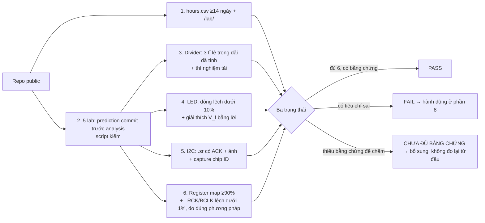

# KHÓA 1 — PHẦN D: NHÌN THẤY DỮ LIỆU TRÊN DÂY (10h)

Phần C dạy bạn đo **một con số** và biết nó đúng hay sai. Phần D dạy bạn đo **một chuỗi sự kiện theo thời gian**: bit, byte, khung, và khoảng cách giữa chúng. Dụng cụ chính là logic analyzer 24 MHz và PulseView (Bài 7). Vòng làm việc giữ nguyên: dự đoán → commit → capture → so → giải thích.

| Bài | Giờ | Viên nang nền nên đọc trước | Thư mục lab |
|---|---|---|---|
| Bài 12 — Cắm I2C và nhìn thấy ACK | 5 | F5.1 (đọc lướt: MCU vs Linux), F2.1 (đoạn "test là một phép đo") | `lab/04-i2c/` |
| Bài 13 — Nhìn thấy I2S | 4 | F5.5 (lấy mẫu, Nyquist), F4.1 (thạch anh, ppm) | `lab/05-i2s/` |
| Bài 14 — Gate Khóa 1 | 1 | F1.7 | — |

Giờ là giờ gốc `[ước lượng]`. Phần mô phỏng và câu hỏi ngược thêm ~1h mỗi bài.

**Quy tắc chung khi dùng logic analyzer** (từ Bài 7, nhắc lại vì đây là nguồn lỗi số một): nối **GND trước**, rồi mới nối kênh tín hiệu. Đặt sample rate ≥4×, tốt nhất ≥10× tần số tín hiệu nhanh nhất bạn muốn *giải mã*; nhưng muốn *đo thời gian* chính xác thì câu hỏi khác hẳn — Bài 13 sẽ cho thấy.

---

## Bài 12 — Cắm I2C và nhìn thấy ACK (5h)

> **Vị trí:** Bài 11 (datasheet) → **Bài 12** → Bài 13 (I2S) · **Cần trước:** Bài 3 (bus, clock), Bài 7 (PulseView), Bài 11 (địa chỉ I2C, chip ID, pull-up đo trên module) · **Sau bài này bạn quyết định được:** một lỗi "không đọc được cảm biến" nằm ở tầng nào (nguồn, dây, pull-up, địa chỉ, driver, chip) bằng một capture, và một bus I2C còn chỗ cho thêm cảm biến ở tốc độ đọc bạn cần hay không.

### 1. Câu chuyện — ai đã khổ vì chuyện này

Philips Semiconductors (nay là NXP) tạo ra I2C khoảng năm 1982 cho một vấn đề rất cụ thể: trong TV có ngày càng nhiều IC (bộ chỉnh kênh, âm lượng, EEPROM) và mỗi IC cần nói chuyện với vi điều khiển. Kéo một bus song song 8–16 dây tới mọi chip thì tốn chân và tốn đường mạch. Giải pháp: **hai dây dùng chung**, mỗi chip một địa chỉ, chậm nhưng rẻ `[chuẩn — lịch sử trong UM10204]`. Bốn mươi năm sau, chính hai dây đó vẫn nằm trong máy chủ của bạn: thanh RAM có EEPROM SPD đọc qua SMBus (một biến thể của I2C), BMC đọc cảm biến nhiệt và quạt qua I2C, bộ nguồn server báo công suất qua PMBus `[chuẩn]`. Bạn đã dùng I2C mỗi ngày mà không thấy nó.

Cái giá của sự đơn giản: I2C cho phép thiết bị *phụ* (slave) giữ dây clock thấp để bắt thiết bị *chính* (master) chờ — gọi là **clock stretching**. Bộ điều khiển I2C phần cứng của các Raspberry Pi đời đầu (chip BCM2835 và họ hàng) xử lý việc này không đúng; cảm biến dùng clock stretching nhiều như BNO055 trả dữ liệu hỏng hoặc treo bus khi nối với Pi, và cách khắc phục phổ biến là hạ tốc độ bus hoặc dùng I2C bằng phần mềm `[chuẩn — được ghi nhận rộng rãi trong cộng đồng, ví dụ hướng dẫn BNO055 của Adafruit]`. Một chi tiết trong spec, một lỗi im lặng trong dữ liệu, hàng nghìn giờ debug.

### 2. Mô hình tư duy

**Open-drain + pull-up = wired-AND.** Không thiết bị nào được phép *đẩy* dây lên cao. Mỗi thiết bị chỉ có một công tắc kéo dây xuống GND. Điện trở pull-up kéo dây lên VCC khi không ai kéo xuống.

```
   3V3 ──┬─────────┬──────────
        ┌┴┐       ┌┴┐
        │R│ pull  │R│ pull-up (trên module, Bài 11 bước 6 đã đo)
        └┬┘       └┬┘
 SDA ────┼─────────│──────┬───────────┬──────
 SCL ────│─────────┼──────│──┬────────│──┬───
         │         │     ═╧═ ═╧═     ═╧═ ═╧═   ← mỗi thiết bị: công tắc xuống GND
                       ESP32 (master)   BME280 (slave)
   Dây ở mức CAO  ⇔  KHÔNG AI kéo xuống.   Một thiết bị kéo xuống là đủ để dây THẤP.
```

Hệ quả: (1) thiếu pull-up thì dây không bao giờ lên cao được; (2) hai thiết bị "nói" cùng lúc không chập mạch — mức thấp thắng, và đó là cơ chế *arbitration* khi có nhiều master; (3) tốc độ cạnh lên do **R × điện dung bus** quyết định, không do chip.

**Một giao dịch: master ghi tới địa chỉ 0x68 + bit ghi, slave trả ACK.** Ví dụ dùng 0x68 (địa chỉ thường gặp của IMU MPU-6050) thay vì địa chỉ BME280, để không làm hộ câu 1 phần 5. WaveDrom — dán vào trình soạn WaveDrom trực tuyến để xem:

```json
{ "signal": [
  { "name": "SCL", "wave": "1.010101010101010101" },
  { "name": "SDA", "wave": "101...0.1.0........." },
  { "name": "nghĩa", "wave": "x3=.=.=.=.=.=.=.=.4.",
    "data": ["S", "A6", "A5", "A4", "A3", "A2", "A1", "A0", "R/W", "ACK"] },
  { "name": "ai lái SDA", "wave": "3.................4.", "data": ["master", "slave"] }
],
  "head": { "text": "START → 7 bit địa chỉ 0x68 = 1101000 (MSB trước) → R/W=0 → ACK ở nhịp clock thứ 9" } }
```

Cùng nội dung ở dạng ASCII, kèm STOP (độ dài các đoạn chỉ gần đúng):

```
        START                                                 nhịp 9      STOP
SCL ‾‾‾‾‾‾‾‾\__/‾‾\__/‾‾\__/‾‾\__/‾‾\__/‾‾\__/‾‾\__/‾‾\__/‾‾\__/‾‾‾‾‾‾‾‾‾‾‾
SDA ‾‾‾‾\____/‾‾‾‾‾‾‾‾‾\_____/‾‾‾‾\______________________________________/‾‾‾
            │ A6 │ A5 │ A4 │ A3 │ A2 │ A1 │ A0 │R/W │ACK │
            │ 1  │ 1  │ 0  │ 1  │ 0  │ 0  │ 0  │ 0  │ 0  │
            └─── master lái SDA ─────────────────────┘ slave kéo SDA xuống
 Quy tắc: SDA chỉ được đổi khi SCL THẤP. SDA đổi khi SCL CAO = START (xuống) hoặc STOP (lên).
```

Bốn câu về bản chất:

1. **START và STOP là hai "vi phạm có chủ đích"** của quy tắc "SDA chỉ đổi khi SCL thấp". Chúng là thứ duy nhất trên bus không phải dữ liệu — delimiter của khung.
2. **ACK là một bit**, ở nhịp thứ 9 sau **mỗi byte**, do bên *nhận* kéo SDA xuống. Ghi thì slave ACK; đọc thì master ACK mỗi byte muốn đọc tiếp và **NACK byte cuối** để báo "đủ rồi".
3. **Không có timeout, không có retry, không có checksum trong giao thức.** Nếu một slave đang giữ SDA thấp mà master mất trạng thái (reset giữa giao dịch), bus có thể treo mãi. Cách gỡ chuẩn: master phát tối đa **9 xung SCL** cho tới khi slave nhả SDA, rồi phát STOP `[spec UM10204, mục "Bus clear"]`.
4. **Clock stretching**: slave giữ SCL thấp để bắt master chờ. Đó là backpressure duy nhất của I2C, và không có giới hạn thời gian trong spec chuẩn (SMBus thêm timeout 25–35 ms `[spec SMBus]`).

**Mô phỏng đồ chơi — vì sao giá trị pull-up quan trọng.** Cạnh lên là mạch RC; spec giới hạn thời gian lên (rise time) theo chế độ.

```python
# [đã chạy] Cạnh lên của bus open-drain: pull-up R nạp điện dung bus C (mạch RC)
import numpy as np

VDD = 3.3
# t_r đo giữa 0.3·VDD và 0.7·VDD (UM10204). v(t) = VDD·(1 − e^(−t/RC)) => t_r = RC·ln(0.7/0.3) ≈ 0.8473·RC
K = np.log(0.7 / 0.3)
LIMITS = {"Standard": 1000e-9, "Fast": 300e-9}          # t_r tối đa theo chế độ [spec UM10204]

print(f"{'R pull-up':>10} {'C bus':>7} {'t_r':>8}  " + "  ".join(LIMITS))
for R in [2.2e3, 4.7e3, 10e3, 47e3]:                     # 47 kΩ ~ cỡ pull-up nội của MCU
    for C in [50e-12, 200e-12, 400e-12]:                 # 400 pF = trần điện dung bus Sm/Fm
        tr = K * R * C
        ok = ["OK  " if tr <= lim else "VƯỢT" for lim in LIMITS.values()]
        print(f"{R/1e3:8.1f}kΩ {C*1e12:5.0f}pF {tr*1e9:6.0f}ns  " + "      ".join(ok))

# Giới hạn dưới của R: chân open-drain phải hút được dòng pull-up mà vẫn giữ mức thấp ≤ V_OL
V_OL, I_OL = 0.4, 3e-3                                   # [spec UM10204, Sm/Fm]
print(f"R_min = (VDD − V_OL)/I_OL = {(VDD - V_OL) / I_OL:.0f} Ω")
print(f"Ba module, mỗi cái 10 kΩ pull-up, song song = {1 / (3 / 10e3):.0f} Ω")
```

Đọc kết quả: pull-up nội cỡ vài chục kΩ của MCU vượt giới hạn ở mọi điện dung thực tế — "chạy được trên bàn với dây ngắn" là may, không phải đúng. Và mỗi module bạn thêm vào bus mang theo pull-up riêng của nó, song song lại — có một **cửa sổ** giá trị R, không phải "càng nhỏ càng tốt". Logic analyzer **không** đo được rise time (nó chỉ thấy 0/1); muốn thấy cạnh bo tròn cần oscilloscope.

### 3. Cầu nối từ backend

| Backend bạn biết | Ở đây | Gãy ở chỗ | Nếu dùng nhầm thì |
|---|---|---|---|
| HTTP request/response, URL routing | Địa chỉ 7 bit + R/W, rồi byte dữ liệu | Không có header, không có độ dài, không có status code — chỉ có 1 bit ACK/NACK mỗi byte | Đi tìm "mã lỗi" của cảm biến trên bus; nó không tồn tại |
| TCP ACK | I2C ACK | TCP ACK là end-to-end, có số thứ tự, kèm retransmit và checksum. I2C ACK là **một bit đồng bộ, theo từng byte, ở tầng liên kết**, không số thứ tự, không retransmit, không CRC (SMBus có PEC tùy chọn) | Tin rằng "có ACK" nghĩa là dữ liệu đúng; ACK chỉ nghĩa là có ai đó kéo SDA xuống đúng nhịp |
| TCP three-way handshake mở connection | START … STOP | Không có trạng thái connection ở hai đầu, trừ **con trỏ thanh ghi** của slave (ghi 0xD0 rồi đọc — con trỏ được giữ). Repeated START giữ bus không cho master khác chen vào giữa ghi-con-trỏ và đọc | Tách ghi con trỏ và đọc thành hai giao dịch có STOP ở giữa, rồi đọc nhầm dữ liệu khi có master thứ hai hoặc ngắt chen vào |
| Timeout + retry + circuit breaker | (không có trong giao thức) | Spec I2C chuẩn không có timeout. Driver tự thêm timeout (ESP-IDF, Arduino Wire đều có tham số timeout `[tự đo theo phiên bản]`), nhưng timeout ở master **không gỡ được** slave đang giữ SDA | Retry vô hạn trên một bus đã treo; cần 9 xung gỡ bus hoặc cắt nguồn slave |
| Một client giữ lock không nhả (deadlock, không có lease/TTL) | Slave giữ SDA thấp sau khi master reset giữa chừng | Không có lease. Thoát bằng cách "đi tiếp giao dịch" bằng xung clock cho tới khi slave nhả | Chỉ reset ESP32 — slave không bị reset, bus vẫn treo |
| Backpressure: consumer chậm làm producer chờ | Clock stretching | Không có giới hạn chuẩn; master không hỗ trợ (Pi đời đầu) thì dữ liệu hỏng **im lặng** | Chọn cảm biến dùng clock stretching cho một host không hỗ trợ nó |
| Shared bus/medium (hub Ethernet cũ, một connection DB dùng chung) | Mọi thiết bị chung hai dây, một giao dịch một lúc | Băng thông chia cho mọi thiết bị; một thiết bị hỏng có thể kéo cả bus xuống (single point of failure vật lý) | Thêm cảm biến không tính bus utilization (câu hỏi [Quy mô] ở phần 9) |

**Chấm mô hình:**

- *"I2C là HTTP có routing: địa chỉ = URL, ACK = 200, NACK = 404."* (mô hình trong `robotics-data-infra-roadmap.md` và bản gốc) — **ĐÚNG MỘT PHẦN.** Đúng ở chỗ địa chỉ chọn người nghe và NACK sau địa chỉ nghĩa là "không ai ở đó". Gãy ở chỗ NACK có **ba** nghĩa: (a) sau địa chỉ: không có thiết bị (gần "connection refused" hơn 404); (b) sau byte dữ liệu khi ghi: slave từ chối hoặc bận; (c) sau byte cuối khi đọc: **master** báo kết thúc — hoàn toàn bình thường. Phản ví dụ: mọi giao dịch đọc thành công đều kết thúc bằng một NACK của master ngay trước STOP. Nếu bạn viết detector "NACK = lỗi", nó báo lỗi trên mọi lần đọc thành công.
- *"Thấy ACK ở địa chỉ 0x76 nghĩa là BME280 hoạt động đúng."* — **SAI.** ACK chứng minh có một máy trạng thái I2C nhận ra địa chỉ đó. Phản ví dụ: BMP280 cũng ACK ở 0x76 (chip ID 0x58, không có độ ẩm). Và nếu SDA bị chập xuống GND, **mọi** địa chỉ đều "ACK" (phần 8). ACK là oracle yếu (→ F2.1).
- *"START/STOP giống mở/đóng connection."* — **ĐÚNG MỘT PHẦN.** Đúng: chúng đóng khung một giao dịch và chiếm/nhả bus. Gãy: không có trạng thái phiên được thương lượng; slave chỉ nhớ con trỏ thanh ghi. Phản ví dụ: ghi con trỏ 0xD0 trong một giao dịch có STOP, rồi đọc trong giao dịch sau, với BME280 vẫn ra 0x60 — "connection" đã đóng nhưng "trạng thái" vẫn còn.

### 4. Thuật ngữ

| Mức | Thuật ngữ | Nghĩa trong một câu | Hay bị hiểu nhầm thành |
|---|---|---|---|
| 🟢 | SDA / SCL | Dây dữ liệu hai chiều / dây clock do master phát | SCL luôn đều đặn 50% |
| 🟢 | Open-drain | Đầu ra chỉ kéo xuống được, không đẩy lên | Đầu ra bình thường có mức cao |
| 🟢 | Pull-up | Điện trở kéo dây lên VCC khi không ai kéo xuống | Càng nhỏ càng tốt / tùy chọn |
| 🟢 | START, STOP, repeated START | SDA đổi khi SCL cao: xuống = bắt đầu, lên = kết thúc; START lặp lại không có STOP ở giữa | Một byte đặc biệt |
| 🟢 | Địa chỉ 7 bit + R/W | 7 bit chọn slave, bit thứ 8: 0 ghi / 1 đọc. Byte trên dây = (địa chỉ << 1) \| R/W | Địa chỉ 8 bit (0x50 và 0xA0 của một EEPROM là cùng một thiết bị, hai quy ước) |
| 🟢 | ACK / NACK | Bit thứ 9: bên nhận kéo SDA thấp = ACK; để cao = NACK | NACK luôn là lỗi |
| 🟡 | Clock stretching | Slave giữ SCL thấp để bắt master chờ | Lỗi phần cứng |
| 🟡 | Bus clear (9 xung) | Master phát tới 9 xung SCL để slave đang kẹt nhả SDA | Reset master là đủ |
| 🟡 | Rise time, bus capacitance | Thời gian cạnh lên do R pull-up × C bus; có giới hạn theo chế độ | Logic analyzer đo được |
| 🟡 | Standard / Fast mode | 100 kHz / 400 kHz, khác nhau cả giới hạn timing | Chỉ khác tốc độ |
| 🟡 | Arbitration | Nhiều master cùng gửi; ai gửi 1 mà thấy bus 0 thì biết mình thua và rút | — |
| 🟡 | SMBus / PMBus | Biến thể của I2C có timeout, mức áp chặt hơn, PEC; dùng trong server | Một bus khác hẳn |
| 🔴 | 10-bit addressing, HS-mode 3.4 MHz, Fast-mode Plus | Mở rộng của spec | Không cần ở lộ trình này |

### 5. Dự đoán

**Đề bài.** BME280 nối với ESP32-S3, bus 100 kHz, rồi 400 kHz. Hai sketch: scanner (thử mọi địa chỉ) và đọc chip ID (ghi con trỏ 0xD0, repeated START, đọc 1 byte). Dự đoán:

1. Địa chỉ (từ Bài 11 bước 6). 7 bit nhị phân. Byte thực sự trên dây khi ghi và khi đọc (hex).
2. Chu kỳ SCL danh định ở 100 kHz và 400 kHz. Chu kỳ đo được sẽ đúng bằng, dài hơn, hay ngắn hơn — vì sao?
3. Thời gian truyền **một byte** (gồm ACK) ở 100 kHz và 400 kHz.
4. Thời gian một giao dịch đọc chip ID trọn vẹn (từ START tới STOP), tính theo số "khe 9 nhịp" cộng phần START/STOP.
5. Thời gian đọc 8 byte dữ liệu đo liên tiếp (0xF7–0xFE) trong một giao dịch. Bao nhiêu phần trăm số nhịp clock mang dữ liệu thật?
6. Với scanner: dải nhãn decoder đầu tiên bạn kỳ vọng thấy, và trước địa chỉ của BME280 có bao nhiêu lần NACK (nếu scanner quét từ địa chỉ 1 tăng dần — kiểm code của bạn).
7. Dải nhãn decoder cho giao dịch đọc chip ID.

**Tham số cần tra:** chế độ và giới hạn timing (t_LOW, t_HIGH min, t_r max) cho Standard và Fast mode trong NXP UM10204 (bảng đặc tính SDA/SCL); bảng I2C timing trong datasheet BME280 (Bài 11); tốc độ mặc định của `Wire` trong core arduino-esp32 bạn cài `[tự đo]`; chân SDA/SCL mặc định của board (pinout của đúng DevKit bạn mua).

**Phương pháp:** một byte = 8 bit dữ liệu + 1 bit ACK = 9 nhịp SCL. Giao dịch = tổng số byte (kể cả byte địa chỉ) × 9 nhịp + thời gian START/repeated START/STOP (tra t_HD;STA, t_SU;STA, t_SU;STO trong UM10204).

**Mẫu `prediction.md`:**

```markdown
# lab/04-i2c/prediction.md
Ngày: YYYY-MM-DD · Commit TRƯỚC khi chạy scanner (Serial Monitor sẽ in địa chỉ — đừng để nó trả lời hộ bạn).

## Thiết lập
- Board: ___ · SDA = GPIO ___ · SCL = GPIO ___ (nguồn: pinout ___)
- Pull-up đo ở Bài 11: SDA ___ kΩ, SCL ___ kΩ · tốc độ Wire mặc định: ___ kHz (nguồn: ___)

## Dự đoán
1. Địa chỉ 7 bit: 0x__ = ____ ___ (nhị phân) · byte trên dây: ghi 0x__, đọc 0x__
2. T_SCL danh định: 100 kHz → ___ µs · 400 kHz → ___ µs · đo được sẽ: dài hơn / bằng / ngắn hơn, vì ___
3. 1 byte: 100 kHz → ___ µs · 400 kHz → ___ µs
4. Giao dịch đọc chip ID: ___ khe × 9 nhịp + START/Sr/STOP ≈ ___ µs (100 kHz) / ___ µs (400 kHz)
5. Đọc burst 8 byte: ___ khe → ≈ ___ µs (100 kHz) · hiệu suất payload ___ %
6. Scanner: nhãn đầu tiên ___ · số NACK trước BME280: ___
7. Chip ID: START | ___ | ___ | ___ | ___ | START | ___ | ___ | ___ | ___ | STOP

## Điều gì sẽ làm tôi đổi ý
- Nếu đo được T_SCL lệch > ___ % so với danh định, tôi nghi ___
```

### 6. Làm

**Bước 1 — commit `prediction.md`.** Trước khi nạp scanner. Bản gốc của khóa đặt bước dự đoán *sau* khi chạy scanner — lúc đó Serial Monitor đã in địa chỉ, và dự đoán thành chép đáp án.

**Bước 2 — nối dây, đo trước khi cấp điện.**

| BME280 module | ESP32-S3 | Ghi chú |
|---|---|---|
| VCC / VIN | 3V3 | **Không phải 5V** trừ khi Bài 11 bước 6 đã xác nhận module có LDO — và kể cả vậy, dùng 3V3 cho chắc |
| GND | GND | |
| SDA | GPIO SDA mặc định của core (thường GPIO 8 trên ESP32-S3 `[tự đo]`) | Kiểm pinout của đúng board |
| SCL | GPIO SCL mặc định (thường GPIO 9 `[tự đo]`) | |

✅ Trước khi cắm USB: (a) chế độ Ω giữa 3V3 và GND của mạch — **không được gần 0 Ω**; (b) thông mạch từng dây từ chân ESP32 tới chân module; (c) SDA và SCL không thông nhau.

**Bước 3 — chạy scanner.** Arduino IDE + core arduino-esp32, mở ví dụ scanner của thư viện Wire (tên ví dụ tùy phiên bản core, ví dụ `WireScan` `[tự đo]`), nạp, Serial Monitor 115200. Ghi địa chỉ in ra.

**Bước 4 — nối logic analyzer.** **GND trước.** D0 → SCL, D1 → SDA. Kẹp sát chân module, dây ngắn.

**Bước 5 — capture scanner.**
1. PulseView: sample rate **4 MHz** (40 mẫu mỗi chu kỳ SCL 100 kHz).
2. Bản gốc gợi ý 1M mẫu rồi bấm Run, rồi bấm reset ESP32. Ở 4 MHz, 1M mẫu chỉ là 0.25 s, ngắn hơn thời gian ESP32 khởi động tới `setup()` — dễ bắt hụt. Hai cách: đặt **trigger** cạnh xuống trên kênh SDA (bấm vào tên kênh D1 trong PulseView, chọn kiểu trigger), hoặc tăng số mẫu lên ~20M (5 s) `[tự đo]`.
3. Thêm decoder **I²C** (biểu tượng decoder → I²C), gán SCL = D0, SDA = D1.
4. Zoom vào lần thử địa chỉ có ACK. Zoom sát nhịp clock thứ 9: SDA thấp trong khi SCL cao. Đó là ACK — BME280 đang kéo dây xuống.

**Bước 6 — capture giao dịch đọc chip ID.** Nạp sketch:

```cpp
// [chưa chạy] Đọc chip ID BME280 — arduino-esp32 3.x; kiểm API Wire theo phiên bản core bạn cài
#include <Wire.h>

const uint8_t ADDR = 0x76;        // đổi theo kết quả scanner
const uint32_t I2C_HZ = 100000;   // bước 7 đổi thành 400000

void setup() {
  Serial.begin(115200);
  Wire.begin();                   // chân SDA/SCL mặc định; hoặc Wire.begin(SDA_PIN, SCL_PIN)
  Wire.setClock(I2C_HZ);
}

void loop() {
  Wire.beginTransmission(ADDR);
  Wire.write(0xD0);                              // đặt con trỏ thanh ghi = chip ID
  uint8_t err = Wire.endTransmission(false);     // false: KHÔNG STOP → repeated START ở lệnh sau
  uint8_t n = Wire.requestFrom(ADDR, (uint8_t)1);
  int id = (n == 1) ? Wire.read() : -1;
  Serial.printf("err=%u id=0x%02X\n", err, id);  // err != 0: tra mã lỗi của endTransmission
  delay(200);                                    // khoảng lặng giữa các giao dịch: dễ tìm trên capture
}
```

Capture, decode. Đo bằng con trỏ của PulseView:
- **Chu kỳ SCL:** đặt hai con trỏ cách nhau **8 chu kỳ** (cạnh lên nhịp 1 tới cạnh lên nhịp 9 của một byte) rồi chia 8.

> Sai số dụng cụ: ở 4 MHz, mỗi mẫu là 0.25 µs. Đo **một** chu kỳ 10 µs bằng con trỏ: sai tới ±1 mẫu ở mỗi đầu → ±2.5–5%. Đo qua 8 chu kỳ: chia sai số cho 8. Ghi rõ bạn đo qua bao nhiêu chu kỳ. Ghi thêm thời gian SCL cao và SCL thấp riêng — chúng thường **không bằng nhau**.

- **Một byte:** từ cạnh xuống đầu tiên của SCL sau START tới cạnh xuống sau nhịp 9.
- **Cả giao dịch:** từ START tới STOP.
- **Khoảng lặng giữa các byte** (nếu có): driver có chèn khoảng chờ giữa byte không?

**Bước 7 — 400 kHz.** Đổi `I2C_HZ = 400000`, nạp lại, capture lại ở **8–12 MHz** (để còn ≥20 mẫu mỗi chu kỳ), đo lại cùng các đại lượng. So chu kỳ đo được với t_LOW/t_HIGH tối thiểu của Fast mode trong UM10204.

**Bước 8 — lưu bằng chứng.** File → Save → `lab/04-i2c/scanner.sr` và `lab/04-i2c/chipid-100k.sr`, `chipid-400k.sr`. Chụp màn hình PulseView có dải nhãn decoder và có ACK được zoom rõ. Gate tiêu chí 5 kiểm các file này.

**Bước 9 (tùy chọn, +30 phút) — thí nghiệm phá: treo bus.** Khi sketch chip ID đang chạy, nối SDA xuống GND **qua một điện trở 1 kΩ** (không nối thẳng). An toàn vì mọi thiết bị trên I2C chỉ kéo xuống; dòng qua 1 kΩ chỉ cỡ phần trăm mA. Quan sát: `err` in ra gì, waveform trông thế nào. Rút điện trở ra: bus có tự hồi phục không? Trên capture, driver có phát chuỗi xung gỡ bus không? Ghi lại — đây là hành vi của **driver phiên bản bạn cài** `[tự đo]`, không phải của I2C.

**Bước 10 — `analysis.md`.** Bảng dự đoán / đo / chênh lệch cho 7 câu; giải thích mọi chỗ lệch bằng lời. Nếu số đo khác dự đoán, thứ phải thay đổi là **hiểu biết của bạn**, không phải số đo: viết lại dự đoán đúng *bên cạnh* dự đoán cũ, không xóa dự đoán cũ.

### 7. Số phải ra

<details><summary>🔒 MỞ SAU KHI COMMIT prediction.md</summary>

**Địa chỉ:** 0x76 = `111 0110`. Byte trên dây khi ghi: `1110 1100` = **0xEC**; khi đọc: `1110 1101` = **0xED**. PulseView mặc định hiện địa chỉ dạng 7 bit ("Address write: 76"); có tùy chọn hiển thị 8 bit `[tự đo]`. Datasheet và thư viện khác nhau có thể ghi 0x76 hoặc 0xEC cho cùng một thiết bị.

**Thời gian** `[ước lượng — tính từ số nhịp; driver có thể thêm khoảng lặng]`:

| Đại lượng | 100 kHz | 400 kHz | Cách tính |
|---|---|---|---|
| Chu kỳ SCL danh định | 10 µs | 2.5 µs | 1/f |
| 1 byte (8 bit + ACK) | **90 µs** | **22.5 µs** | 9 nhịp |
| Đọc chip ID (S, addr+W, 0xD0, Sr, addr+R, data, P) | ≈ **0.37–0.40 ms** | ≈ **0.095–0.11 ms** | 4 khe × 9 = 36 nhịp + START/Sr/STOP (mỗi cái vài µs ở Sm, dưới 1 µs ở Fm) |
| Burst 8 byte dữ liệu (addr+W, reg, addr+R, 8 data) | ≈ **1.0 ms** | ≈ **0.25 ms** | 11 khe × 9 = 99 nhịp |
| Hiệu suất payload burst | 64 / 99 ≈ **65%** số nhịp mang dữ liệu đo | | 8 byte × 8 bit / 99 nhịp |
| Một lần thử địa chỉ của scanner | ≈ 0.1 ms + khoảng lặng của driver | | 9 nhịp + START/STOP |

**Chu kỳ SCL đo được:** thường **dài hơn** danh định một chút (vài % là phổ biến) và **không 50/50** giữa cao/thấp `[tự đo]`. Vì sao: master đếm thời gian mức cao từ lúc nó *thấy* SCL đã lên cao, mà cạnh lên chậm do RC (phần 2) — đây là cơ chế đồng bộ clock của chính spec. Bộ chia clock của ESP32 cũng không ra đúng mọi tần số. Lệch vài % là cấu hình/vật lý, không phải lỗi. Mọi số đo phải thỏa t_LOW ≥ 4.7 µs, t_HIGH ≥ 4.0 µs (Standard) và t_LOW ≥ 1.3 µs, t_HIGH ≥ 0.6 µs (Fast) `[spec UM10204]`.

**Scanner:** dải nhãn lặp `START | Address write: 01 | NACK | STOP`, `… 02 …`, cho tới `Address write: 76 | ACK | STOP`. Nếu scanner quét từ 1, có **117 lần NACK** (0x01…0x75) trước ACK đầu tiên — và mỗi NACK đó là một câu trả lời đúng: "không ai ở địa chỉ này". Lưu ý: **scanner không đọc chip ID**; dải nhãn có `Data write: D0 … Data read: 60` mà bản gốc đưa ra chỉ xuất hiện với sketch ở bước 6.

**Đọc chip ID:**

```
START | Address write: 76 | ACK | Data write: D0 | ACK | START (repeated) | Address read: 76 | ACK | Data read: 60 | NACK | STOP
```

NACK cuối là **master** báo "đủ một byte" — thành công, không phải lỗi. Serial in `err=0 id=0x60` (hoặc `0x58` nếu module là BMP280).

**Thí nghiệm phá:** khi SDA bị giữ thấp, master không tạo được START hợp lệ; `endTransmission` trả mã khác 0 (mã cụ thể tùy phiên bản core) `[tự đo]`. Rút điện trở: thường bus hồi phục ngay vì BME280 không giữ SDA trong trường hợp này — chính bạn giữ. Trường hợp khó thật là khi *slave* giữ SDA (ESP32 reset đúng lúc slave đang gửi bit 0): lúc đó cần 9 xung hoặc cắt nguồn slave.

</details>

### 8. Nếu ra khác

| Triệu chứng | Nguyên nhân khả dĩ | Kiểm bằng cách | Sửa |
|---|---|---|---|
| SCL và SDA đều thẳng HIGH, không có gì | Code chưa chạy; analyzer chưa nối GND; capture hụt thời điểm | Serial Monitor có in không; GND đã nối chưa | Nối GND; dùng trigger hoặc tăng số mẫu |
| Cả hai thẳng LOW | Thiếu pull-up, module chưa cấp nguồn, hoặc chập xuống GND | Đo áp DC trên SDA/SCL khi bus rỗi (phải ≈3.3 V); đo pull-up khi tắt nguồn (Bài 11 bước 6) | Thêm 4.7 kΩ từ mỗi dây lên 3V3 nếu module không có |
| Scanner báo thiết bị ở **mọi** địa chỉ | SDA bị giữ thấp → bit thứ 9 luôn đọc ra 0 = "ACK" | Capture: SDA thấp suốt | Tìm chỗ chập SDA–GND; đây là phản ví dụ "ACK ≠ có thiết bị" |
| Có sóng nhưng decoder báo lỗi / địa chỉ lạ | Gán nhầm kênh SCL/SDA; sample rate quá thấp | Kênh nào đều đặn (SCL) kênh nào không | Đổi gán kênh; tăng sample rate |
| NACK sau địa chỉ | Sai địa chỉ (0x77), module chưa có nguồn, SDA/SCL đảo | Đo VCC tại chân module (~3.3 V); thử 0x77 | Sửa địa chỉ theo chân SDO; đảo hai dây |
| Scanner không tìm thấy gì | Đảo SDA/SCL (phổ biến nhất); sai chân mặc định của board | Capture: SCL có đều đặn trên D0 không | Đảo hai dây hoặc khai chân tường minh trong `Wire.begin(SDA, SCL)` |
| Chu kỳ SCL ≈ 2.5 µs thay vì 10 µs | Thư viện/sketch đang chạy 400 kHz | `Wire.setClock` trong code | Không sai — **sửa dự đoán và giải thích**, đừng sửa số đo |
| Chu kỳ SCL dài hơn danh định 5–15% | Cạnh lên chậm (pull-up lớn, dây dài), cách master đồng bộ clock | Thử pull-up nhỏ hơn (thêm 4.7 kΩ song song) và đo lại | Ghi lại; đây là vật lý, không phải lỗi |
| `id=0x58` | Module là BMP280 | — | Ghi vào `analysis.md`; bài vẫn PASS |
| Đọc được lúc có lúc không, dây dài | Rise time vượt giới hạn, nhiễu, tiếp xúc breadboard | Rút ngắn dây, đo lại ở 100 kHz | Dây ngắn, pull-up đúng cửa sổ, hạ tốc độ |

### 9. Câu hỏi ngược

**[Nếu…thì]** Nếu bạn gắn hai module BME280 cùng địa chỉ 0x76 lên một bus, chuyện gì xảy ra ở byte ACK và ở byte dữ liệu đọc về? Có cách nào phát hiện từ phía phần mềm không?
<details><summary>Hướng nghĩ</summary>

Cả hai ACK (wired-AND: một con kéo xuống là đủ). Khi đọc, cả hai cùng lái SDA: bit nào một con gửi 0 thì bus ra 0 — dữ liệu là AND của hai con. Với chip ID giống nhau thì không thấy lỗi; với dữ liệu đo khác nhau thì ra số "hợp lệ nhưng sai". Phát hiện: đọc giá trị không khả dĩ về vật lý, hoặc đổi SDO của một con. Đây là lớp lỗi "đúng schema, sai vật lý" (→ F3.7).

</details>

**[Vì sao không]** Vì sao I2C không có checksum như TCP? Điều đó có nghĩa gì cho data pipeline phía sau?
<details><summary>Hướng nghĩ</summary>

Thiết kế cho dây vài cm trên cùng một bo mạch, nơi lỗi bit hiếm và chi phí silicon cho CRC từng là đáng kể. SMBus thêm PEC tùy chọn khi đi xa hơn. Hệ quả: một bit lật trên dây thành một giá trị đo sai không ai báo. Pipeline phía sau phải kiểm theo **vật lý** (nhiệt độ không nhảy 30 °C trong 10 ms) thay vì tin vào tầng truyền.

</details>

**[Quy mô]** Ở K7, cùng một bus 400 kHz có IMU đọc 12 byte ở 200 Hz, INA226 đọc 2 thanh ghi (4 byte) ở 10 Hz, BME280 đọc 8 byte ở 1 Hz. Bus utilization là bao nhiêu? Nếu bạn muốn IMU lên 1 kHz thì sao?
<details><summary>Hướng nghĩ</summary>

Mỗi lần đọc = (3 byte overhead + N byte dữ liệu) × 9 nhịp, cộng START/Sr/STOP và khoảng lặng của driver (đo ở bước 6 — đừng dùng số lý tưởng). Nhân tần số, cộng lại, chia cho 1 s. Rồi nhớ F7.1: utilization tiến gần 1 thì độ trễ hàng đợi bùng nổ, và một lần đọc chậm của BME280 làm IMU lỡ nhịp — jitter của IMU giờ phụ thuộc vào cảm biến khác. Đó là lý do người ta tách bus hoặc chuyển IMU sang SPI.

</details>

**[Failure mode]** ESP32 bị watchdog reset đúng lúc BME280 đang gửi một bit 0 khi đọc. Sau khi khởi động lại, scanner không thấy gì và mọi lệnh đọc đều lỗi. Bạn chẩn đoán và gỡ thế nào mà không rút nguồn? Thiết kế phần cứng nào làm việc này luôn gỡ được?
<details><summary>Hướng nghĩ</summary>

Capture: SDA thấp liên tục, SCL cao. Slave đang chờ nhịp clock tiếp theo để gửi nốt bit. Gỡ: cấu hình chân SCL thành GPIO, phát xung cho tới khi SDA lên (tối đa 9), rồi tạo STOP, rồi trả chân cho driver. Thiết kế: cấp nguồn cảm biến qua một chân điều khiển (MOSFET) để firmware cắt nguồn slave được — tức là "power cycle" có lập trình, như một circuit breaker có thật.

</details>

**[Liên ngành]** CAN bus trong ô tô cũng có mức "dominant" thắng mức "recessive" như wired-AND của I2C. Giống và khác ở đâu, và vì sao robot công nghiệp chọn CAN cho motor mà không chọn I2C?
<details><summary>Hướng nghĩ</summary>

Giống: arbitration không phá hủy — bên thua tự biết và rút. Khác: CAN dùng tín hiệu vi sai (chống nhiễu trên dây dài), có CRC, có tự động gửi lại, có đếm lỗi và tự cô lập node hỏng. Tức là CAN có những thứ I2C cố tình bỏ. Dây dài trong khung robot cạnh motor là môi trường I2C không được thiết kế cho.

</details>

**[Phản biện]** "Clock stretching là backpressure; giao thức có backpressure luôn tốt hơn không có."
<details><summary>Hướng nghĩ</summary>

Backpressure không giới hạn là một cách để một thành phần chậm làm treo cả hệ — cả bus đứng chờ một slave. Backend cũng vậy: backpressure tốt có giới hạn (timeout, bounded queue, load shedding — → F3.9). SMBus thêm timeout chính vì lý do này. Và một tính năng mà một nửa số master xử lý sai (Pi đời đầu) là một tính năng làm giảm độ tin cậy trong thực tế.

</details>

### 10. Liên kết ra ngoài

- **Máy chủ trong datacenter — SMBus, PMBus, BMC.** Thanh RAM có EEPROM SPD đọc qua SMBus khi boot; BMC đọc nhiệt độ, tốc độ quạt, công suất bộ nguồn qua I2C/PMBus. Giống: cùng hai dây, cùng ACK/NACK. Khác: SMBus thêm timeout và mức áp chặt hơn — đúng những chỗ I2C gốc bỏ trống; bài học "spec gốc không có timeout thì ngành sẽ tự thêm".
- **Ethernet đời đầu — môi trường dùng chung, CSMA/CD.** Mọi máy trên một dây đồng trục, ai cũng nghe, va chạm thì lùi. Giống I2C: môi trường dùng chung, một thiết bị hỏng kéo sập cả đoạn. Khác: Ethernet phát hiện va chạm và hủy khung; arbitration của I2C không phá hủy — bên thắng không hề biết đã có va chạm.
- **Hệ phân tán — lease và fencing.** Lock không có lease (TTL) là lock có thể giữ mãi khi client chết; người ta thêm lease và fencing token. I2C bị treo vì slave "giữ lock" SDA mà không có lease; "9 xung" là cách ép đi hết giao dịch để nhả lock — một dạng thủ công của việc chờ lease hết hạn.

### 11. Độ tin cậy và sửa lỗi

| Khẳng định | Nhãn | Ghi chú / cách kiểm |
|---|---|---|
| I2C do Philips phát triển khoảng 1982 | `[chuẩn]` | Phần lịch sử của NXP UM10204 |
| Standard 100 kHz, Fast 400 kHz; t_r max 1000 ns / 300 ns; C bus max 400 pF; t_LOW/t_HIGH min 4.7/4.0 µs (Sm), 1.3/0.6 µs (Fm); I_OL 3 mA tại V_OL 0.4 V | `[spec]` | NXP UM10204, bảng đặc tính SDA/SCL. Kiểm lại theo revision bạn tải |
| Gỡ bus bằng tối đa 9 xung SCL | `[spec]` | UM10204, mục "Bus clear" |
| SMBus timeout 25–35 ms | `[spec]` | SMBus specification (SBS-IF), mục timeout |
| Pi đời đầu xử lý clock stretching sai | `[chuẩn]` | Được ghi nhận rộng rãi; ví dụ hướng dẫn BNO055 của Adafruit. Không cần nhớ chi tiết, nhớ cấu trúc lỗi |
| Chân I2C mặc định GPIO 8/9 trên ESP32-S3 core Arduino | `[tự đo]` | Kiểm `pins_arduino.h` của biến thể board bạn chọn |
| Tốc độ `Wire` mặc định 100 kHz, có tham số timeout, `endTransmission(false)` tạo repeated START | `[tự đo]` | Kiểm theo phiên bản arduino-esp32 bạn cài |
| Độ lệch của chu kỳ SCL đo được so với danh định, tỉ lệ cao/thấp | `[tự đo]` | Phụ thuộc pull-up, dây, phiên bản driver; xem phần 7 |
| Thời gian giao dịch ở phần 7 | `[ước lượng]` | Từ số nhịp; driver thật có khoảng lặng — đo ở bước 6 |

**Đã sửa so với bản gốc:**

1. Bản gốc cho rằng capture scanner sẽ hiện `… Data write: D0 … Data read: 60 …`. Sketch scanner chỉ thử địa chỉ (START, địa chỉ, ACK/NACK, STOP), không đọc chip ID. Sửa: thêm sketch đọc chip ID ở bước 6 và mô tả đúng dải nhãn của scanner.
2. Bản gốc đặt bước dự đoán *sau* khi chạy scanner — Serial Monitor đã in địa chỉ trước khi dự đoán. Sửa: commit dự đoán là bước 1.
3. Bản gốc dùng 4 MHz × 1M mẫu (0.25 s) rồi bấm reset ESP32: dễ bắt hụt vì thời gian khởi động. Sửa: trigger trên SDA hoặc tăng số mẫu.
4. Bản gốc "NACK = 404". Sửa: ba nghĩa của NACK, NACK cuối khi đọc là thành công (chấm ở phần 3).
5. Thêm: đo chu kỳ qua nhiều nhịp (sai số lượng tử của analyzer), 400 kHz, ước lượng thời gian byte/giao dịch (niêm phong), clock stretching, bus clear 9 xung, rise time và cửa sổ pull-up, thí nghiệm treo bus an toàn.

### 12. Đọc thêm và tự kiểm tra

- **Nguồn gốc:** NXP Semiconductors, *UM10204 — I2C-bus specification and user manual* (revision mới nhất), đọc các mục: START/STOP, ACK/NACK, clock synchronization và stretching, bus clear, bảng đặc tính timing.
- **Giải thích:** SparkFun Learn, "I2C"; tài liệu decoder I²C trên sigrok wiki (các tùy chọn hiển thị địa chỉ).
- **Đào sâu (tùy chọn):** Texas Instruments, application note "I2C Bus Pullup Resistor Calculation" (SLVA689) — cửa sổ R_min/R_max mà mô phỏng ở phần 2 làm thô.
- **Tự kiểm tra:** (1) giải thích lại cho một backend engineer khác trong 5 câu vì sao "có ACK" không có nghĩa là "dữ liệu đúng"; (2) vẽ lại timing diagram START → địa chỉ → ACK → STOP từ trí nhớ, đánh dấu chỗ SDA được phép đổi; (3) hai câu dưới.

1. Thiết bị có địa chỉ 7 bit 0x3C. Byte trên dây khi đọc là bao nhiêu (hex)? Một thư viện ghi "địa chỉ 0x78" cho thiết bị này — có mâu thuẫn không?
2. Bus 100 kHz. Bạn cần đọc 6 byte từ một cảm biến ở 500 Hz. Thời gian bus tối thiểu mỗi giây là bao nhiêu (bỏ qua START/STOP và khoảng lặng)?

<details><summary>Đáp án</summary>

1. (0x3C << 1) | 1 = 0x79. Thư viện ghi 0x78 đang dùng dạng 8 bit của byte *ghi* (0x3C << 1 = 0x78) — cùng một thiết bị, không mâu thuẫn, chỉ khác quy ước. Luôn hỏi "7 bit hay 8 bit?" khi đọc tài liệu.
2. Mỗi lần đọc: 3 byte overhead (addr+W, reg, addr+R) + 6 byte dữ liệu = 9 khe × 9 nhịp = 81 nhịp = 810 µs. × 500 = 405 ms mỗi giây ≈ 40% bus — trước khi tính overhead thật của driver. Gần mức phải nghĩ tới 400 kHz hoặc SPI.

</details>

---

## Bài 13 — Nhìn thấy I2S (4h)

> **Vị trí:** Bài 12 (I2C) → **Bài 13** → Bài 14 (gate) → K3 Bài 3 (TN-1: nhìn thấy âm thanh trên dây) · **Cần trước:** Bài 3 (công thức BCLK), Bài 7, Bài 12 (đo chu kỳ qua nhiều nhịp); F5.5, F4.1 · **Sau bài này bạn quyết định được:** logic analyzer 24 MHz kiểm được cấu hình I2S nào và đo được đại lượng nào tới độ chính xác nào; và khi tần số LRCK lệch, đó là lỗi cấu hình (cỡ %) hay sai số thạch anh (cỡ ppm).

### 1. Câu chuyện — ai đã khổ vì chuyện này

Philips công bố I2S (Inter-IC Sound) năm 1986, vài năm sau khi đầu đĩa CD ra thị trường (1982), để các chip *bên trong* một thiết bị âm thanh (bộ giải mã, bộ lọc số, DAC) chuyển mẫu PCM cho nhau bằng ba dây: clock bit, clock chọn kênh, dữ liệu `[chuẩn — Philips, "I2S bus specification", 1986, sửa đổi 1996]`. Không có địa chỉ, không có ACK — vì bên trong một đầu CD, mọi chip đã biết nhau từ lúc thiết kế, và âm thanh không được phép dừng để chờ bắt tay.

Ngay chính con số sample rate cũng là di sản của ràng buộc phần cứng. 44.1 kHz của CD được chọn vì thời đó âm thanh số được ghi lên băng video qua bộ chuyển PCM: 3 mẫu mỗi dòng quét × 245 dòng dùng được mỗi field × 60 field/s = 44 100 mẫu/s, và con số này cũng khớp với hệ PAL `[chuẩn]`. Hệ quả kéo dài tới nay: thiết bị âm thanh chuyên nghiệp thường có hai thạch anh (một họ cho 44.1 kHz, một họ cho 48 kHz), vì không chia được tần số của họ này ra họ kia bằng một số nguyên gọn `[chuẩn]`. ESP32-S3 chỉ có thạch anh 40 MHz; nó tạo clock âm thanh bằng PLL và bộ chia **phân số** — đúng trung bình, nhưng từng chu kỳ không đều tuyệt đối `[spec — ESP-IDF I2S docs, kiểm theo phiên bản]`. Bài này dạy bạn thấy được tới đâu và không thấy được gì.

### 2. Mô hình tư duy

**Một khung I2S chuẩn Philips** (WaveDrom, rút gọn còn 4 bit mỗi kênh cho dễ nhìn; bài thật là 16 bit mỗi kênh):

```json
{ "signal": [
  { "name": "BCLK", "wave": "pppppppppp" },
  { "name": "WS / LRCK", "wave": "0...1...0." },
  { "name": "SD (DOUT)", "wave": "==========",
    "data": ["R.lsb", "L.msb", "L", "L", "L.lsb", "R.msb", "R", "R", "R.lsb", "L.msb"] }
],
  "head": { "text": "Philips I2S: WS đổi trước MSB đúng 1 BCLK · WS thấp = kênh trái · bên nhận lấy mẫu SD ở cạnh lên BCLK" } }
```

```
           ┌──────────── một khung = một mẫu trái + một mẫu phải ────────────┐
LRCK ‾‾‾‾‾‾\________________________________/‾‾‾‾‾‾‾‾‾‾‾‾‾‾‾‾‾‾‾‾‾‾‾‾‾‾‾‾‾‾‾‾\___
BCLK _/‾\_/‾\_/‾\_/‾\ … (slot_bits nhịp) … _/‾\_/‾\_/‾\ … (slot_bits nhịp) …
SD    x │MSB│   kênh trái  …        │LSB│MSB│   kênh phải  …        │LSB│MSB
          ↑ trễ 1 BCLK sau cạnh LRCK (đặc trưng của chuẩn Philips)

  f_LRCK = sample_rate          f_BCLK = sample_rate × slot_bits × số_kênh
  BCLK mỗi khung = slot_bits × số_kênh  (một số NGUYÊN, đúng tuyệt đối nếu cùng nguồn clock)
```

Bốn câu về bản chất:

1. **LRCK là sample rate, theo định nghĩa.** Mỗi chu kỳ LRCK chở đúng một mẫu cho mỗi kênh.
2. **Tỉ số BCLK/LRCK là một số nguyên do cấu hình quyết định** (slot width × số kênh). Đếm được số đó là kiểm được cấu hình, không cần đo thời gian chính xác. Chú ý: *slot width* (số BCLK mỗi kênh) có thể lớn hơn *data width* (số bit có nghĩa), ví dụ 24 bit dữ liệu trong slot 32 bit.
3. **Không có ACK, không có địa chỉ.** Bên nhận không từ chối được, không báo được "tôi thiếu dữ liệu". Nếu bên phát hết dữ liệu (underrun), phần cứng vẫn phát clock và phát số 0 hoặc mẫu cũ (→ K3 Bài 4). Lỗi không vào log, nó thành tiếng "tách".
4. **Đo bằng lấy mẫu có độ phân giải.** Logic analyzer 24 MHz nhìn thấy dây mỗi 1/24 MHz ≈ 41.7 ns. Mọi cạnh tín hiệu bị "làm tròn" về mẫu gần nhất. Câu hỏi của bài: 41.7 ns so với chu kỳ BCLK là lớn hay nhỏ, và có cách nào thấy chính xác hơn độ phân giải đó không.

### 3. Cầu nối từ backend

| Backend bạn biết | Ở đây | Gãy ở chỗ | Nếu dùng nhầm thì |
|---|---|---|---|
| Stream tốc độ cố định (producer đẩy đều vào Kafka) | I2S: một khung mỗi 1/fs, liên tục | Không có retention, không replay, consumer không pause được; dây không lưu gì | Tưởng "chậm một chút cũng được, consumer sẽ bắt kịp" — không có chỗ nào để bắt kịp |
| Binary protocol fixed-width, framing bằng length/delimiter | Framing bằng **một dây clock riêng** (LRCK); độ rộng slot do cấu hình | Sai slot width hoặc sai format (Philips vs left-justified) **không sinh lỗi**: bên nhận đọc lệch bit, ra mẫu sai độ lớn hoặc nhiễu | Debug bằng "có dữ liệu chạy không" — có, nhưng sai |
| Request/response có ACK (I2C, HTTP) | Không có kênh ngược | Bên phát không biết bên nhận có tồn tại (người học đã đúng ở điểm này — xem chấm mô hình) | Thiết kế phát hiện lỗi DAC từ phía ESP32 — không thể trên I2S |
| `rate()` của Prometheus trên cửa sổ dài vs hiệu hai lần scrape | Đo một chu kỳ BCLK vs trung bình qua nhiều chu kỳ | Prometheus nhiễu do jitter scrape; ở đây lượng tử hóa do sample clock của analyzer, và analyzer có sai số ppm riêng | Đo một chu kỳ, thấy lệch, kết luận cấu hình sai mà không tính sai số của chính phép đo |
| Clock skew giữa server, sửa bằng NTP | ESP32, DAC, logic analyzer mỗi bên một thạch anh | Trên **một** link I2S, bên nhận dùng chính BCLK của bên phát nên không trôi với nhau. Trôi xuất hiện giữa **hai miền clock độc lập** (ESP32 vs nguồn dữ liệu trên mini PC; ESP32 vs analyzer) | Gọi mọi sai lệch tần số là "drift"; tìm sửa ở sai chỗ (→ F4.1) |

**Chấm mô hình:**

- *"Bắt logic analyzer ở giữa ESP32 và DAC thì thu được I2S data; lên view thì thấy được tần số, rồi bộ giải mã I2S cho ra data âm thanh dạng raw."* (người học, K3 lượt 2) — **ĐÚNG MỘT PHẦN.** Đúng về vị trí và luồng. Gãy ở hai chỗ: (a) "thấy được tần số" chỉ tới độ chính xác mà độ phân giải lấy mẫu cho phép — bạn tính con số đó ở câu 3 phần 5; (b) decoder chỉ cho số đúng nếu bạn cấu hình đúng format và độ rộng — sai cấu hình thì nó vẫn in ra số, chỉ là số sai. Phản ví dụ: chọn sai cực tính WS trong decoder → kênh trái và phải đổi chỗ, không có cảnh báo nào.
- *"ESP32 không cần biết ai nhận ở cuối dây, nó chỉ đổi và chuyển đi raw data cùng schema quy định."* (người học, K3 lượt 2) — **ĐÚNG**, với một điều kiện: "schema" phải được hai bên thống nhất **ngoài băng** (format, slot width, sample rate, có cần MCLK không). Phản ví dụ ranh giới: một DAC yêu cầu MCLK sẽ im lặng nếu ESP32 không phát MCLK; PCM5102A thì tự tạo clock nội từ BCLK nên không cần `[spec, kiểm datasheet PCM5102A]` — "không cần biết ai nhận" chỉ đúng khi bạn đã biết từ trước.
- *"LRCK đo ra 15.987 kHz thay vì 16.000 kHz là clock drift."* (bản gốc) — **SAI** về tên và về nguyên nhân. Một độ lệch **cố định** là sai số tần số (offset), không phải drift (drift là sự *thay đổi* của sai số theo thời gian/nhiệt độ). Nguyên nhân thì phải tính: đổi độ lệch đó ra ppm và so với dung sai thạch anh (câu 4 phần 5). Và bạn đo nó bằng một analyzer có thạch anh riêng: con số đọc ra là **tỉ số** hai đồng hồ.

### 4. Thuật ngữ

| Mức | Thuật ngữ | Nghĩa trong một câu | Hay bị hiểu nhầm thành |
|---|---|---|---|
| 🟢 | BCLK / SCK (bit clock) | Mỗi chu kỳ là một bit trên SD | Tần số "của âm thanh" |
| 🟢 | LRCK / WS (word select) | Chọn kênh trái/phải; tần số = sample rate | Một tín hiệu điều khiển tùy chọn |
| 🟢 | SD / DOUT / DIN | Dây dữ liệu, MSB trước | Tên giống nhau ở hai đầu (DOUT của ESP32 nối DIN của DAC) |
| 🟢 | Slot width vs data width | Số BCLK mỗi kênh vs số bit có nghĩa trong đó | Luôn bằng nhau |
| 🟢 | Độ phân giải thời gian của analyzer | 1/sample_rate; mọi cạnh bị làm tròn về mẫu gần nhất | Sai số tuyệt đối của phép đo (trung bình nhiều chu kỳ tốt hơn nhiều) |
| 🟢 | ppm | Phần triệu; 1 ppm của 16 kHz là 0.016 Hz | Đơn vị chỉ của thạch anh |
| 🟡 | MCLK (master clock) | Clock cao tần (thường 256 × fs) cho bộ điều chế của DAC/ADC | Bắt buộc cho mọi DAC |
| 🟡 | Philips I2S vs left-justified vs right-justified | Ba cách xếp bit so với cạnh LRCK; Philips trễ 1 BCLK | Tên gọi khác của cùng một thứ |
| 🟡 | Fractional divider, jitter | Bộ chia không nguyên: tần số trung bình đúng, từng chu kỳ dài ngắn khác nhau | "Clock sai" |
| 🟡 | TDM | Nhiều hơn 2 kênh trên một dây SD, khung dài hơn | — |
| 🟡 | Clock domain | Vùng mạch chạy theo cùng một nguồn clock | — (→ F4.1, K5) |
| 🔴 | Jitter spec của DAC (ps RMS), bộ PLL âm thanh | Chất lượng âm thanh mức hi-fi | Không cần ở lộ trình này |

### 5. Dự đoán

**Đề bài.** ESP32-S3 làm I2S master TX, chuẩn Philips, 16 bit, stereo, phát sine. Cấu hình A: 16 kHz. Cấu hình B: 32 kHz. Logic analyzer 24 MHz. Dự đoán:

1. Cho A và B: tần số và chu kỳ LRCK, tần số và chu kỳ BCLK, số BCLK mỗi chu kỳ LRCK.
2. Số mẫu của analyzer trong một chu kỳ BCLK (A và B). Decoder có giải mã được không (quy tắc ≥4×, Bài 7)?
3. **Câu chính:** đo **một** chu kỳ BCLK bằng hai con trỏ của PulseView, sai số lớn nhất do lượng tử hóa là bao nhiêu phần trăm? Kiểm được yêu cầu "±1%" của gate bằng cách đó không? Đo **một** chu kỳ LRCK thì sao? Đề xuất cách đo BCLK đạt ±1%.
4. ESP32-S3 dùng thạch anh 40 MHz với dung sai theo hướng dẫn thiết kế phần cứng của Espressif (tra con số), analyzer clone dùng thạch anh 24 MHz không rõ dung sai (giả định một con số và ghi lý do). Tần số LRCK đọc được có thể lệch tối đa bao nhiêu ppm chỉ vì hai thạch anh? Một số đọc 15.987 kHz rơi vào loại nào?
5. Nhìn sang K3: 48 kHz, slot 32 bit, stereo. BCLK? Số mẫu mỗi chu kỳ ở 24 MHz? Nếu kẹp thêm một kênh vào MCLK = 256 × fs thì thấy gì?

**Tham số cần tra:** ESP32-S3 Hardware Design Guidelines (dung sai thạch anh 40 MHz); ESP32-S3 datasheet (chân strapping, chân USB, chân flash/PSRAM của module bạn có — mã module ghi trên vỏ kim loại, ví dụ N8R8); tài liệu ESP-IDF mục I2S (nguồn clock, bộ chia, MCLK mặc định) `[tự đo theo phiên bản]`.

**Phương pháp:** độ phân giải t_s = 1/f_sample. Một khoảng thời gian đo bằng hai cạnh, mỗi cạnh bị làm tròn tới ±1 mẫu ⇒ sai số khoảng cách tối đa ≈ ±1 mẫu (cộng sai số đặt con trỏ). Sai số tương đối = t_s / khoảng đo. Muốn nhỏ hơn: làm khoảng đo dài ra (đo qua N chu kỳ rồi chia N).

**Mẫu `prediction.md`:**

```markdown
# lab/05-i2s/prediction.md
Ngày: YYYY-MM-DD · Commit trước khi nạp firmware và trước khi chạy mô phỏng ở bước 1.

## Cấu hình
- Chuẩn Philips · 16 bit · stereo · A: 16 kHz · B: 32 kHz · chân BCLK/WS/DOUT = GPIO __/__/__ (lý do chọn: ___)
- Analyzer: ___ MHz → t_s = ___ ns

## Dự đoán
| Đại lượng | A 16 kHz | B 32 kHz | Cách tính |
|---|---|---|---|
| f_LRCK, T_LRCK | | | |
| f_BCLK, T_BCLK | | | |
| BCLK / LRCK | | | |
| Mẫu analyzer / chu kỳ BCLK | | | |
| Sai số tối đa: 1 chu kỳ BCLK đo bằng con trỏ | | | |
| Sai số tối đa: 1 chu kỳ LRCK | | | |
| Cách đo BCLK đạt ±1% | | | |

- Lệch tối đa do hai thạch anh: ±___ ppm (ESP32 ±___ ppm theo ___, analyzer giả định ±___ ppm vì ___)
- 15.987 kHz là: sai số thạch anh / cấu hình-bộ chia / không phân biệt được, vì ___
- K3 (48 kHz, slot 32, stereo): f_BCLK = ___ · mẫu/chu kỳ = ___ · MCLK 256·fs = ___ → thấy ___
```

### 6. Làm

**Bước 1 — commit `prediction.md`, rồi chạy mô phỏng.** Mô phỏng này tạo một clock vuông, lấy mẫu nó bằng "analyzer" 24 MHz ở pha ngẫu nhiên, rồi đo như PulseView đo. Nó cho đáp án của câu 3 và 5 — vì vậy chạy **sau** khi đã commit dự đoán.

```python
# [đã chạy] Logic analyzer lấy mẫu một clock vuông: đo một chu kỳ vs đo trung bình nhiều chu kỳ
import numpy as np

def measure(f_sig, f_sa=24e6, n_periods=2000, ppm_sig=0.0, ppm_sa=0.0, seed=0):
    rng = np.random.default_rng(seed)
    f_true = f_sig * (1 + ppm_sig * 1e-6)        # clock thật của ESP32 (có sai số ppm)
    f_lab = f_sa * (1 + ppm_sa * 1e-6)           # clock thật của logic analyzer
    phase = rng.uniform(0, 1)                    # analyzer bắt đầu ở pha ngẫu nhiên
    n = int(n_periods * f_sa / f_sig) + 10
    t = np.arange(n) / f_lab                     # thời điểm lấy mẫu THẬT
    x = ((t * f_true + phase) % 1.0) < 0.5       # mức HIGH/LOW tại mỗi mẫu
    rising = np.flatnonzero(~x[:-1] & x[1:]) + 1 # chỉ số mẫu có cạnh lên
    # PulseView đổi chỉ số mẫu ra thời gian bằng sample rate DANH ĐỊNH (nó không biết clock của chính nó lệch)
    periods = np.diff(rising) / f_sa
    span = (rising[-1] - rising[0]) / f_sa / (len(rising) - 1)
    return periods, span

for f in [512e3, 1.024e6, 3.072e6, 6.144e6]:
    p, avg = measure(f)
    T = 1 / f
    print(f"f={f/1e6:6.3f} MHz  T={T*1e9:7.1f} ns  mẫu/chu kỳ={24e6/f:5.1f}")
    print(f"   một chu kỳ đo được: {sorted({float(v) for v in np.round(p*1e9, 1)})} ns"
          f"  -> lệch tối đa {np.max(np.abs(p - T))/T:.1%}")
    print(f"   trung bình {len(p)} chu kỳ: {avg*1e9:.3f} ns  -> lệch {avg/T - 1:+.4%}")

# Hai clock cùng lệch ppm: bạn chỉ đo được TỈ SỐ của chúng
_, avg = measure(16e3, n_periods=200, ppm_sig=+20, ppm_sa=-30)
print(f"LRCK 16 kHz, ESP32 +20 ppm, analyzer −30 ppm -> đọc ra {1/avg:.3f} Hz "
      f"({(1/avg)/16e3*1e6 - 1e6:+.0f} ppm)")
```

So kết quả với dự đoán của bạn và ghi chênh lệch vào `analysis.md` *trước* khi đụng phần cứng. Đây là lần đầu bạn kiểm một dự đoán bằng mô phỏng rồi mới kiểm bằng phần cứng — đúng thứ tự của K6 (sim trước, thật sau).

**Bước 2 — chọn chân.** Bản gốc nói "gán ba chân bất kỳ". Không bất kỳ: trên ESP32-S3 tránh chân strapping (GPIO0, 3, 45, 46), chân USB (GPIO19, 20), chân nối flash/PSRAM của module (GPIO26–32; thêm GPIO33–37 trên module PSRAM octal) `[spec — ESP32-S3 datasheet, kiểm theo mã module của bạn]`. Ví dụ an toàn: GPIO4 (BCLK), GPIO5 (WS), GPIO6 (DOUT). Ghi lý do chọn vào `prediction.md`.

**Bước 3 — nạp firmware.** Một ví dụ dùng thư viện `ESP_I2S` của core arduino-esp32 3.x:

```cpp
// [chưa chạy] I2S master TX, sine 1 kHz — arduino-esp32 3.x, thư viện ESP_I2S; kiểm API theo phiên bản bạn cài
#include <ESP_I2S.h>

const int PIN_BCLK = 4, PIN_WS = 5, PIN_DOUT = 6;   // xem bước 2
const uint32_t FS = 16000;                           // bước 7: đổi thành 32000
const int FRAMES = 160;                              // 160 khung: số nguyên chu kỳ sine ở cả 16 và 32 kHz
int16_t buf[2 * FRAMES];                             // xen kẽ trái/phải

I2SClass i2s;

void setup() {
  Serial.begin(115200);
  i2s.setPins(PIN_BCLK, PIN_WS, PIN_DOUT);
  if (!i2s.begin(I2S_MODE_STD, FS, I2S_DATA_BIT_WIDTH_16BIT, I2S_SLOT_MODE_STEREO)) {
    Serial.println("I2S begin lỗi");
    while (true) delay(1000);
  }
  for (int n = 0; n < FRAMES; n++) {
    int16_t s = (int16_t)(8000.0f * sinf(2.0f * PI * 1000.0f * n / FS));
    buf[2 * n] = s;          // kênh trái
    buf[2 * n + 1] = s / 2;  // kênh phải: nửa biên độ, để phân biệt hai kênh trên decoder
  }
}

void loop() {
  i2s.write((uint8_t *)buf, sizeof(buf));   // chặn khi buffer DMA đầy → nhịp do clock I2S quyết định
}
```

Nếu dùng ESP-IDF thay vì Arduino: ví dụ `i2s_std` trong thư mục `examples/peripherals/i2s/` của ESP-IDF, cấu hình tương đương `[tự đo theo phiên bản]`.

**Bước 4 — capture.** **GND trước.** D0 = BCLK, D1 = WS, D2 = DOUT. Sample rate **24 MHz**, số mẫu ~10M (~0.4 s). Clone fx2lafw ở 24 MHz đẩy USB 2.0 gần giới hạn; nếu PulseView báo lỗi hoặc capture bị cắt, hạ xuống 12 MHz và **tính lại độ phân giải** trong `analysis.md` `[tự đo]`. Bài này không cần nối MCLK.

**Bước 5 — decode.** Thêm decoder **I²S**: SCK = D0, WS = D1, SD = D2 (tên tùy chọn có thể khác theo phiên bản PulseView `[tự đo]`). Kiểm: giá trị kênh trái dao động trong khoảng ±8000, kênh phải bằng nửa. Nếu trái/phải đổi chỗ, kiểm tùy chọn cực tính WS.

**Bước 6 — đo, mỗi đại lượng hai cách.**
1. **Chu kỳ LRCK:** con trỏ trên 1 chu kỳ; rồi trên 100 chu kỳ, chia 100.
2. **Chu kỳ BCLK:** con trỏ trên 1 chu kỳ (ghi lại — để thấy sai số lượng tử); rồi trên **đúng một khung** (từ một cạnh LRCK tới cạnh LRCK cùng chiều kế tiếp), chia cho số chu kỳ BCLK đếm được trong khung đó.
3. **Số BCLK mỗi chu kỳ LRCK:** đếm cạnh lên BCLK trong một chu kỳ LRCK (zoom và đếm, hoặc nhìn decoder).
4. **Độ trễ Philips:** zoom vào cạnh LRCK, xác nhận MSB xuất hiện **sau** cạnh đó 1 BCLK.

> Sai số dụng cụ: độ phân giải 41.7 ns ở 24 MHz (83.3 ns ở 12 MHz); thêm sai số đặt con trỏ nếu bạn không bắt dính vào cạnh. Ghi bên cạnh mỗi số đo: "đo qua N chu kỳ, sai số lượng tử ±t_s/N".

**Bước 7 — 32 kHz.** Đổi `FS = 32000`, nạp lại, lặp bước 4–6.

**Bước 8 (tùy chọn) — thấy lỗi im lặng.** Trong decoder, đổi một tùy chọn sai có chủ đích (cực tính WS, hoặc độ dài word nếu decoder có tùy chọn) và xem decoder vẫn in ra số — số sai. Ghi lại một câu: bus không có ACK thì kiểm tra cấu hình là việc của người đo, không phải của giao thức.

**Bước 9 — `analysis.md`.** Bảng dự đoán / đo (một chu kỳ) / đo (nhiều chu kỳ) / chênh lệch / sai số phương pháp, cho A và B. Lưu `.sr` và ảnh chụp có decoder. Đoạn giải thích: tần số LRCK của bạn lệch bao nhiêu ppm, và bạn có phân biệt được đó là ESP32 hay analyzer không (gợi ý: không, với một analyzer — vì sao?).

### 7. Số phải ra

<details><summary>🔒 MỞ SAU KHI COMMIT prediction.md</summary>

**Tính toán:**

| Đại lượng | A 16 kHz | B 32 kHz |
|---|---|---|
| f_LRCK, T_LRCK | 16 kHz, 62.5 µs | 32 kHz, 31.25 µs |
| f_BCLK = fs × 16 × 2 | 512 kHz, T = 1953 ns | 1.024 MHz, T = 976.6 ns |
| BCLK / LRCK | **32** (chính xác) | **32** (chính xác) |
| Mẫu analyzer / chu kỳ BCLK (24 MHz) | 46.9 → decode thoải mái | 23.4 → decode thoải mái |
| **1 chu kỳ BCLK bằng con trỏ** | đọc ra 46 hoặc 47 mẫu (1917 hoặc 1958 ns); sai số giới hạn **±41.7 ns ≈ ±2.1%** | đọc ra 23 hoặc 24 mẫu (958 hoặc 1000 ns); giới hạn **±4.3%** |
| 1 chu kỳ LRCK | ±41.7 ns / 62.5 µs ≈ ±0.07% | ±0.13% |
| BCLK qua 32 chu kỳ (1 khung) | ±0.07% | ±0.13% |

**Câu chính — có bắt được không:** *giải mã* thì có, dư sức. *Đo một chu kỳ BCLK tới ±1%* thì **không**: lượng tử hóa một mẫu đã là ±2.1% (A) và ±4.3% (B). Bản gốc đặt "chu kỳ BCK ±1%" với phép đo con trỏ — không kiểm được bằng dụng cụ này. Đo qua ≥32 chu kỳ (hoặc suy BCLK = f_LRCK × số BCLK đếm được) thì đạt ±0.1% hoặc tốt hơn. Mô phỏng ở bước 1 cho đúng các cặp số trên, và trung bình 2000 chu kỳ lệch dưới 0.001%.

**Hai thạch anh:** Espressif yêu cầu thạch anh 40 MHz ±10 ppm `[spec — kiểm Hardware Design Guidelines]`; analyzer clone không công bố — giả định ±20–50 ppm `[ước lượng]`. Lệch đọc được do hai thạch anh: tới khoảng **±60 ppm** (16 kHz ± ~1 Hz). Bạn chỉ đo được tỉ số hai đồng hồ (mô phỏng: +20 ppm và −30 ppm đọc ra +50 ppm); với một analyzer duy nhất, không tách được ai lệch. Tách được cần một chuẩn thứ ba (một nguồn tần số biết trước, GPS PPS…) — chủ đề của K5 Bài 10.

**15.987 kHz** = −812 ppm: lớn hơn ±60 ppm hơn 10 lần → **cấu hình hoặc bộ chia**, không phải thạch anh, và không phải "drift". Với cấu hình trong bài, ESP-IDF dùng bộ chia phân số nên tần số *trung bình* thường rất sát danh định `[tự đo]`; từng chu kỳ BCLK có thể dài ngắn vài ns (bước của clock nguồn) — nhỏ hơn 41.7 ns nên analyzer của bạn **không thấy** jitter này. Không thấy ≠ không có.

**K3 (48 kHz, slot 32 bit, stereo):** f_BCLK = 48 000 × 32 × 2 = **3.072 MHz**, T = 325.5 ns, **7.8 mẫu/chu kỳ** ở 24 MHz: decode được nhưng sát (mỗi nửa chu kỳ chỉ ~3.9 mẫu); một chu kỳ đo bằng con trỏ sai tới ~±13%. 96 kHz/32 bit → 6.144 MHz, ~3.9 mẫu/chu kỳ: không tin được. MCLK = 256 × 48 kHz = **12.288 MHz** → dưới 2 mẫu/chu kỳ: analyzer thấy một tần số **giả** (aliasing, → F5.5). Đó là lý do bước 4 không kẹp MCLK.

**Số phải ra trên phần cứng:**

| Đại lượng | Chấp nhận |
|---|---|
| T_LRCK (qua 100 chu kỳ) | trong ±0.1% của danh định (lệch thật thường cỡ vài chục ppm) |
| T_BCLK (qua 32 chu kỳ) | trong ±0.2% |
| T_BCLK (1 chu kỳ) | một trong hai giá trị lượng tử ở bảng trên — **không** dùng để chấm |
| BCLK / LRCK | **đúng 32** |
| MSB sau cạnh LRCK | trễ đúng 1 BCLK |

</details>

### 8. Nếu ra khác

| Triệu chứng | Nguyên nhân khả dĩ | Kiểm bằng cách | Sửa |
|---|---|---|---|
| LRCK đúng, BCLK gấp đôi dự đoán | Slot width 32 bit (data 16 bit trong slot 32) | Đếm BCLK/LRCK = 64 | Kiểm cấu hình slot width; không sai nếu bạn cố ý — sửa dự đoán |
| BCLK/LRCK = 64 | Như trên | — | Như trên |
| BCLK/LRCK = 16 | Cấu hình khác hẳn (PCM/TDM short frame, hoặc 8 bit × 2) — chế độ std mono của ESP-IDF thường **vẫn** đóng khung hai slot `[tự đo]` | Đọc lại cấu hình mode/slot | Ghi lại đúng cấu hình bạn đang chạy |
| LRCK lệch vài % hoặc hơn | Sai sample rate trong code, bộ chia không đạt được tần số yêu cầu, hoặc PulseView đặt sample rate khác bạn nghĩ | Đọc lại `FS`; kiểm sample rate thật của capture trong PulseView | Đây là cấu hình, không phải thạch anh; thạch anh sai cỡ ppm |
| LRCK lệch rất nhỏ (cỡ ppm) | Tỉ số thạch anh ESP32/analyzer | So với dải bạn tính ở câu 4 phần 5 | Nếu nằm trong dải: ghi lại bằng ppm, không sửa |
| Một chu kỳ BCLK đo bằng con trỏ lệch khỏi danh định | Có thể chỉ là lượng tử hóa của analyzer | So với sai số lượng tử bạn tính ở câu 3; đo lại qua một khung | Nằm trong sai số lượng tử thì không phải lỗi |
| DOUT thẳng đơ, clock vẫn chạy | Chưa ghi dữ liệu vào I2S, buffer toàn 0, hoặc nhầm chân DOUT | Serial có in lỗi `begin` không; đo đúng chân | Kiểm `i2s.write` có được gọi; kiểm chân |
| Không có clock nào | `begin` thất bại; chân bị chiếm bởi chức năng khác | Serial Monitor | Đổi chân theo bước 2 |
| PulseView báo lỗi/thiếu mẫu ở 24 MHz | Băng thông USB của clone fx2lafw | Thử cổng USB khác, bớt kênh | Hạ 12 MHz, tính lại độ phân giải |
| Decoder ra số vô nghĩa | Sai gán kênh, sai cực tính WS, sai format | So trái/phải với biên độ đã biết (8000 và 4000) | Sửa cấu hình decoder |

### 9. Câu hỏi ngược

**[Nếu…thì]** Nếu bạn đổi sang 24 bit dữ liệu, BCLK/LRCK sẽ là 48 hay 64? Điều gì quyết định, và DAC ở K3 chấp nhận cái nào?
<details><summary>Hướng nghĩ</summary>

Phụ thuộc slot width, không phải data width. Tìm trong tài liệu ESP-IDF xem slot width "auto" nghĩa là gì với 24 bit, và tìm trong datasheet PCM5102A những tổ hợp BCLK/LRCK nó hỗ trợ. Đếm BCLK/LRCK trên capture là cách nhanh nhất để biết cấu hình *thật*, bất kể code nói gì.

</details>

**[Vì sao không]** Vì sao không thêm một bit ACK vào I2S cho chắc, như I2C?
<details><summary>Hướng nghĩ</summary>

Nghĩ về hướng dữ liệu và thời gian: một ACK cần bên nhận lái dây ngược chiều, cần thời gian quay đầu, và cần bên phát làm gì đó khi thiếu ACK — nhưng âm thanh không thể dừng để retry. Một ACK mà không có hành động khi thiếu nó thì chỉ là chi phí. Phát hiện lỗi trong audio đi theo đường khác: đo ở đầu ra (K3 Bài 7), giám sát underrun ở bên phát (K3 Bài 4).

</details>

**[Quy mô]** Mảng 8 mic MEMS, TDM 8 slot × 32 bit, 48 kHz. BCLK bao nhiêu? Logic analyzer của bạn có kiểm được không? Nếu không, bạn kiểm cấu hình bằng cách nào mà không mua dụng cụ mới?
<details><summary>Hướng nghĩ</summary>

8 × 32 × 48 000 = 12.288 MHz — dưới 2 mẫu mỗi chu kỳ ở 24 MHz. Một cách: chạy cùng cấu hình ở sample rate thấp hơn nhiều (ví dụ 8 kHz) để kiểm *cấu trúc khung* (đếm BCLK mỗi khung, vị trí slot), rồi tin vào tỉ lệ khi tăng tốc. Đó là kiểm một bất biến (tỉ số nguyên) thay vì kiểm giá trị tuyệt đối — một ý tưởng metamorphic testing (→ F2.4).

</details>

**[Failure mode]** Ở K3, DAC phát ra tiếng nhưng: (a) cao độ thấp hơn mong đợi; (b) tiếng rè ồn rất to; (c) chỉ một bên tai có tiếng. Mỗi triệu chứng gợi ý tầng nào, và capture nào trên analyzer phân biệt được chúng?
<details><summary>Hướng nghĩ</summary>

(a) sample rate hai đầu không khớp (dữ liệu tạo cho 24 kHz nhưng phát ở 16 kHz) → đo LRCK. (b) lệch format/slot (bit bị dịch → mẫu sai độ lớn, ra nhiễu) → kiểm độ trễ MSB và BCLK/LRCK. (c) dữ liệu một kênh là 0 hoặc cực tính WS → decoder từng kênh. Mỗi giả thuyết có một phép đo cụ thể — đó là bisect qua tầng (→ F7.7).

</details>

**[Liên ngành]** Đường truyền E1 trong viễn thông: 32 timeslot × 8 bit × 8000 khung/s. Tính tốc độ bit. So cấu trúc với I2S.
<details><summary>Hướng nghĩ</summary>

32 × 8 × 8000 = 2.048 Mbit/s. Cùng ý: khung cố định lặp theo một tần số "lấy mẫu" (8 kHz là sample rate thoại), mỗi kênh một slot, không có địa chỉ — vị trí trong khung *là* địa chỉ. Khác: E1 đi xa nên phải mang clock *trong* dữ liệu (mã hóa đường truyền) và có từ đồng bộ khung, còn I2S có dây clock riêng vì chỉ đi vài cm.

</details>

**[Phản biện]** "Logic analyzer 24 MHz là đủ cho mọi việc audio ở lộ trình này."
<details><summary>Hướng nghĩ</summary>

Đủ cho *cấu trúc* (đếm bit, kiểm format, đọc giá trị mẫu) ở 16–48 kHz stereo. Không đủ cho: MCLK, TDM nhiều kênh, jitter mức ns, và mọi thứ analog (biên độ, nhiễu, méo — cần oscilloscope hoặc đo qua ADC). Câu trả lời đúng là một bảng "đủ cho gì / không đủ cho gì", không phải có/không — đúng tinh thần câu hỏi đầu bài.

</details>

### 10. Liên kết ra ngoài

- **Video — pixel clock, HSYNC, VSYNC.** Màn hình song song dùng đúng cấu trúc I2S: một clock cho từng điểm ảnh, một tín hiệu đánh dấu đầu dòng, một tín hiệu đánh dấu đầu khung. Giống: framing bằng dây riêng, không địa chỉ, không ACK. Khác: tốc độ cao hơn hàng trăm lần, và lỗi hiện thành hình méo thay vì tiếng rè.
- **Viễn thông — E1/T1 và TDM.** Như câu hỏi ngược ở trên: "vị trí trong khung là địa chỉ" là ý tưởng của cả ngành điện thoại số. I2S là trường hợp TDM 2 slot.
- **Observability — lấy mẫu và độ phân giải.** Metrics scrape mỗi 15 s không thấy spike 1 s; nhưng `rate()` trên cửa sổ 10 phút cho tốc độ trung bình chính xác hơn nhiều so với hiệu hai lần scrape. Cùng nguyên lý với "một chu kỳ BCLK sai 2%, 32 chu kỳ sai 0.07%". Khác: analyzer lấy mẫu đều tuyệt đối theo thạch anh của nó, scrape thì có jitter.

### 11. Độ tin cậy và sửa lỗi

| Khẳng định | Nhãn | Ghi chú / cách kiểm |
|---|---|---|
| I2S do Philips công bố 1986, chuẩn Philips trễ MSB 1 BCLK sau cạnh WS, WS thấp = trái | `[spec]` | Philips Semiconductors, "I2S bus specification" (1986, sửa đổi 1996) |
| Nguồn gốc 44.1 kHz từ bộ chuyển PCM ghi lên băng video | `[chuẩn]` | Lịch sử âm thanh số; nhiều nguồn giáo khoa |
| ESP32-S3 yêu cầu thạch anh 40 MHz ±10 ppm | `[spec — kiểm]` | ESP32-S3 Hardware Design Guidelines |
| Chân strapping GPIO0/3/45/46, USB GPIO19/20, flash/PSRAM GPIO26–37 | `[spec — kiểm]` | ESP32-S3 datasheet, theo mã module |
| ESP-IDF I2S dùng PLL + bộ chia phân số, tần số trung bình đúng, có jitter từng chu kỳ | `[spec, tự đo]` | Tài liệu ESP-IDF mục I2S; không quan sát được ở 24 MHz |
| Dung sai thạch anh của analyzer clone ±20–50 ppm | `[ước lượng]` | Không có datasheet; tự đo nếu có chuẩn tần số |
| API `ESP_I2S` (`setPins`, `begin(I2S_MODE_STD, …)`, `write`) | `[tự đo]` | arduino-esp32 3.x; kiểm theo phiên bản cài |
| PCM5102A không cần MCLK (tự tạo clock nội từ BCLK) | `[spec — kiểm]` | Datasheet PCM510x của TI — kiểm ở K3 |
| Sai số lượng tử và kết quả mô phỏng ở phần 7 | `[ước lượng]` | Mô phỏng đã chạy; kiểm lại trên capture thật |

**Đã sửa so với bản gốc:**

1. Bản gốc yêu cầu "chu kỳ BCK ±1%" đo bằng con trỏ ở 24 MHz. Sai số lượng tử của một chu kỳ BCLK ở cả 16 kHz và 32 kHz đều lớn hơn 1% (số cụ thể trong phần 7). Tiêu chí không kiểm được bằng phép đo đó. Sửa: đo qua ≥32 chu kỳ (một khung) hoặc suy từ LRCK × số BCLK đếm được; gate tiêu chí 6 sửa tương ứng.
2. Bản gốc: "LRCK lệch vài % — thạch anh không chính xác tuyệt đối… đây chính là clock drift". Sai hai chỗ: thạch anh sai cỡ ppm, không phải %; và một lệch cố định là sai số tần số (offset), không phải drift. Thêm: con số đo là tỉ số giữa thạch anh ESP32 và thạch anh analyzer.
3. Bản gốc: "Số BCK mỗi LRCK là 16 → đang chạy mono". Chế độ std mono của ESP-IDF thường vẫn phát hai slot mỗi khung; 16 nhịp gợi ý một cấu hình khung khác. Ghi `[tự đo]`.
4. Bản gốc: "gán ba chân bất kỳ". Sửa: tránh chân strapping, USB, flash/PSRAM.
5. Bản gốc ghi "LRCK = 16.000 Hz", "BCK = 512.000 Hz" (dấu chấm phân cách hàng nghìn, dễ đọc thành 16 Hz và 512 Hz). Sửa: dùng kHz/MHz.
6. Thêm: mô phỏng lượng tử hóa, câu hỏi MCLK/aliasing, nối sang K3 (48 kHz, 32 bit), chấm hai mô hình thật của người học. "Số phải ra" niêm phong.

### 12. Đọc thêm và tự kiểm tra

- **Nguồn gốc:** Philips Semiconductors, *I2S bus specification* (1986, revised 1996); tài liệu ESP-IDF, mục I2S (nguồn clock, chế độ std, slot configuration).
- **Giải thích:** tài liệu decoder I²S trên sigrok wiki; phần I2S trong *ESP-IDF Programming Guide*.
- **Đào sâu (tùy chọn):** ESP32-S3 Technical Reference Manual, chương I2S controller — sơ đồ bộ chia clock (đọc để hiểu bộ chia phân số, không cần nhớ thanh ghi).
- **Tự kiểm tra:** (1) giải thích lại cho một backend engineer khác trong 5 câu vì sao đo 32 chu kỳ chính xác hơn đo 1 chu kỳ, dù dùng cùng dụng cụ; (2) vẽ lại một khung I2S Philips từ trí nhớ, đánh dấu trễ 1 BCLK; (3) hai câu dưới.

1. 44.1 kHz, 16 bit, stereo, slot 16 bit. f_BCLK? Ở 24 MHz, đo một chu kỳ BCLK sai tối đa bao nhiêu phần trăm?
2. Bạn đo LRCK = 16 000.9 Hz với analyzer A và 15 999.6 Hz với analyzer B, cùng một ESP32. Kết luận được gì về thạch anh ESP32?

<details><summary>Đáp án</summary>

1. 44 100 × 16 × 2 = 1.4112 MHz, T ≈ 708.6 ns, ≈17 mẫu/chu kỳ. Sai số lượng tử ±41.7/708.6 ≈ ±5.9%.
2. Hai analyzer lệch nhau ~81 ppm (0.9 + 0.4 = 1.3 Hz trên 16 kHz). Mỗi số đo là tỉ số ESP32/analyzer, nên không kết luận được ESP32 lệch bao nhiêu — chỉ biết hai analyzer khác nhau ~81 ppm. Cần một chuẩn tần số độc lập. Đây là bài toán "ai giữ giờ đúng" của K5.

</details>

---

## Bài 14 — Gate Khóa 1 (1h) (khung rút gọn)

> **Vị trí:** Bài 13 (I2S) → **Bài 14** → K3 (sau khi PASS và đủ nhịp giờ) · K7 C0–C2 (đường ray song song) · K2 chạy song song từ đầu · **Cần trước:** Bài 9–13 trọn; F1.7 · **Sau bài này bạn quyết định được:** mở Khóa 3 (mua chuỗi audio) và chặng K7 C1 (hệ nguồn) ngay, hay phải sửa phương pháp học trước.

### 1. Câu chuyện — ai đã khổ vì chuyện này

Richard Feynman, bài phát biểu tốt nghiệp ở Caltech năm 1974 ("Cargo Cult Science"): nguyên tắc đầu tiên là không được tự lừa mình — và chính mình là người dễ bị lừa nhất `[chuẩn — diễn ý, không trích nguyên văn]`. Ông kể những thí nghiệm mà người làm đã chọn số liệu "trông đúng" sau khi biết đáp án mong đợi, và cả một lĩnh vực trôi theo con số sai trong nhiều năm.

Gate này tồn tại cho đúng một việc: để **người khác** — hoặc chính bạn ba tháng sau — kiểm được rằng bạn đã đo thật, dự đoán thật, và giải thích được chỗ lệch. Không phải để chấm điểm cảm giác "mình hiểu rồi".

### 2. Mô hình tư duy



Ba trạng thái là thứ bạn đã tự làm trong nghề (pass / fail / inconclusive). Ở đây "chưa đủ bằng chứng" có nghĩa cụ thể: con số có thể đúng, nhưng repo không chứa thứ để người khác kiểm (thiếu ảnh, thiếu bảng sai số, thiếu `.sr`). Cách sửa là bổ sung bằng chứng, không phải làm lại thí nghiệm.

### 3. Cầu nối từ backend

| Backend bạn biết | Ở đây | Gãy ở chỗ | Nếu dùng nhầm thì |
|---|---|---|---|
| CI quality gate / Definition of Done | 6 tiêu chí kiểm được từ repo | CI kiểm *sản phẩm*; gate này kiểm cả *quy trình* (thứ tự dự đoán → đo) và *hiểu biết* (đoạn giải thích). Script chỉ kiểm được phần quy trình | Coi script PASS là gate PASS |
| Commit timestamp làm audit trail | `git log` thứ tự `prediction.md` → `analysis.md` | Committer date do chính máy bạn ghi, sửa được (`GIT_COMMITTER_DATE`). Đây là hệ thống dựa trên trung thực, không phải bằng chứng mật mã | Tin timestamp như log của bên thứ ba. Muốn mạnh hơn: push ngay sau commit — thời điểm push do server ghi |
| Agent tự test, tự sửa tới khi xanh | Bạn tự chấm gate của mình | Goodhart: tối ưu để qua tiêu chí thay vì để hiểu. Ví dụ: "điều chỉnh" analysis cho lệch <5% thay vì giải thích vì sao lệch 9% | Qua gate mà không mang được gì sang K3 |

**Chấm mô hình:** *"Qua đủ 6 tiêu chí nghĩa là đã nắm Khóa 1."* — **ĐÚNG MỘT PHẦN.** Tiêu chí là điều kiện cần, có bằng chứng. Gãy ở chỗ không tiêu chí nào kiểm việc bạn *chuyển* được kỹ năng sang tình huống mới. Phản ví dụ: PASS cả 6 nhưng không trả lời được "đo dòng 50 µA bằng V_R/R hay bằng ampe kế, vì sao" — câu hỏi ghép Bài 9 và Bài 10. Phần "tự kiểm tra cuối" ở phần 6 bổ sung đúng chỗ này.

### 6. Làm

**Bước 1 — chạy script kiểm thứ tự commit** (tiêu chí 2), ở gốc repo:

```python
# [đã chạy] Kiểm gate tiêu chí 2: prediction.md phải được commit TRƯỚC analysis.md, và không bị sửa sau đó
import subprocess, sys
from pathlib import Path

def commit_times(path):
    """(hash, thời điểm committer unix) của mọi commit chạm vào file, cũ nhất trước."""
    # Không dùng --follow: nó dò "đổi tên" theo nội dung và có thể gán nhầm lịch sử của file khác
    out = subprocess.run(["git", "log", "--format=%H %ct", "--", str(path)],
                         capture_output=True, text=True, check=True).stdout.split()
    pairs = list(zip(out[0::2], map(int, out[1::2])))
    return pairs[::-1]

fail = 0
labs = sorted(p for p in Path("lab").iterdir() if p.is_dir())
for lab in labs:
    pred, ana = lab / "prediction.md", lab / "analysis.md"
    if not pred.exists() or not ana.exists():
        print(f"FAIL  {lab}: thiếu prediction.md hoặc analysis.md"); fail += 1; continue
    p, a = commit_times(pred), commit_times(ana)
    if not p or not a:
        print(f"FAIL  {lab}: file chưa được commit"); fail += 1; continue
    (p_hash, p_t), (a_hash, a_t) = p[0], a[0]
    if p_hash == a_hash:
        print(f"FAIL  {lab}: prediction và analysis nằm cùng một commit"); fail += 1
    elif p_t >= a_t:
        print(f"FAIL  {lab}: prediction commit sau analysis"); fail += 1
    else:
        late = [h[:7] for h, t in p[1:] if t >= a_t]
        tag = f"  (CẢNH BÁO: prediction bị sửa sau analysis ở {late})" if late else ""
        print(f"PASS  {lab}: prediction trước analysis {a_t - p_t} s{tag}")
print(f"{len(labs)} lab, {fail} FAIL")
sys.exit(1 if fail or len(labs) < 5 else 0)
```

Đặt nó ở `tools/check_order.py`, chạy bằng `python tools/check_order.py`, và gắn vào CI check của repo (lịch tuần 1 của Khóa 1 đã có bước tạo CI check). "CẢNH BÁO" không phải FAIL: sửa lỗi chính tả trong `prediction.md` sau khi đo là được, nhưng sửa **số** thì không — người chấm sẽ mở diff của commit được nêu.

**Bước 2 — tự chấm 6 tiêu chí.** Giữ tiêu chí gốc; chỗ sửa ghi rõ.

| # | Tiêu chí PASS | Cách kiểm | Sửa so với bản gốc |
|---|---|---|---|
| 1 | Repo public có `hours.csv` ghi ≥14 ngày và cấu trúc `/lab/` | Mở repo | — |
| 2 | 5 thư mục lab (`01-voltage-divider`, `02-led-current`, `03-datasheet`, `04-i2c`, `05-i2s`), mỗi cái có `prediction.md` **commit trước** `analysis.md` | Script bước 1 PASS, không có cảnh báo sửa số | Bản gốc kiểm bằng `git log --format="%ci %f"` bằng mắt; thay bằng script kiểm theo từng file. Lab 03 giờ có `prediction.md` (Bài 11 gốc không có — mâu thuẫn với tiêu chí này) |
| 3 | Voltage divider: 3 tỉ lệ (10k/10k, 10k/1k, 1k/10k), mỗi số đo nằm trong **dải chấp nhận đã tính riêng cho cặp đó** trong `prediction.md` sau khi hiệu chỉnh Vin; dự đoán lần hai bằng R đo được lệch ≤ sai số đồng hồ đã tính. Thí nghiệm 1 MΩ có phép thử tổng V_R1 + V_R2 so với Vin và giải thích bằng số | Bảng trong `analysis.md` | Bản gốc: "<5% sau khi hiệu chỉnh Vin" cho mọi cặp. Sai cho cặp 10k/1k (lắp đúng vẫn có thể vượt 5%) và quá lỏng cho cặp 1k/10k (số cụ thể trong Bài 9 phần 7 🔒). Phần 1 MΩ là thí nghiệm có sẵn trong Bài 9 gốc, nay thành bắt buộc vì nó là bài học chính |
| 4 | LED: dòng tính vs đo lệch **<10%**, kèm **đoạn giải thích bằng lời** vì sao V_f không phải hằng số | Đoạn văn trong `analysis.md` | — (thêm: kiểm chéo V_R/R có ghi sai số giới hạn) |
| 5 | File capture `.sr` của bus I2C thật, decode ra **ACK**, kèm ảnh PulseView | `lab/04-i2c/*.sr` + ảnh | Thêm: capture đọc chip ID decode ra 0x60 (hoặc 0x58 kèm ghi chú BMP280). Bản gốc mô tả dải nhãn này cho scanner — scanner không tạo ra nó |
| 6 | Register map viết tay, chụp ảnh, đúng ≥90%; LRCK và BCLK lệch **<1%** so với danh định | Ảnh + bảng số | BCLK phải đo **qua ≥32 chu kỳ** (hoặc suy từ f_LRCK × số BCLK đếm được), ghi sai số phương pháp. Một chu kỳ BCLK đo bằng con trỏ ở 24 MHz có sai số lượng tử lớn hơn 1%, không kiểm được tiêu chí (Bài 13 phần 7 🔒). BCLK/LRCK phải đúng 32 |

**Bước 3 — tự kiểm tra cuối (không tính vào PASS, nhưng làm trước khi mở K3).** Trả lời bằng lời, không tra, trong `lab/gate-k1.md`:

1. Dòng 50 µA qua một cảm biến: đo bằng ampe kế thang 2000 µA hay bằng V_R/R với R = 100 Ω? Tính sai số của cả hai từ spec UT33D+.
2. Một bus I2C 400 kHz, pull-up 10 kΩ, dây 30 cm: liệt kê ba thứ có thể sai mà logic analyzer của bạn **không** thấy được.
3. LRCK đọc ra lệch 300 ppm. Bạn làm gì tiếp, theo thứ tự?

**Ngân sách:** 35h `[ước lượng gốc]`. **Trần:** 55h. Giờ thêm cho mô phỏng và câu hỏi ngược (~5h trên Phần C–D) nằm trong khoảng giữa ngân sách và trần; nếu bạn đang gần trần, bỏ phần tùy chọn (fit LED, thí nghiệm treo bus, bước 8 của Bài 13) trước, không bỏ phần dự đoán.

**Sau PASS:**
- **Khóa 3** mở khi PASS **và** `hours.csv` cho thấy median ≥5h/tuần (điều kiện gốc).
- **Khóa 7 (đường ray song song):** C0 (xưởng, an toàn) mở được từ khi xong Phần B; C1 (hệ nguồn) cần Khóa 1 trọn — tức là gate này; C3 (bring-up trên bàn) cần thêm K3 Module 1 (→ `khoa-7/_KE-HOACH-K7.md` mục 4).
- **Khóa 2** đã chạy song song từ đầu; không phụ thuộc gate này.

### 8. Nếu ra khác

| Triệu chứng | Nguyên nhân khả dĩ | Kiểm bằng cách | Sửa |
|---|---|---|---|
| Script: "cùng một commit" hoặc "commit sau analysis" | Quên commit dự đoán trước khi đo | `git log -- lab/<x>/` | **Không** viết lại lịch sử. Làm lại thí nghiệm đó với dự đoán mới (dự đoán lại sau khi đã thấy số không còn là dự đoán). Thí nghiệm nào cũng ≤2h |
| Script: CẢNH BÁO sửa sau | Sửa số trong `prediction.md` sau khi đo | `git show <hash>` | Nếu sửa số: hoàn nguyên số cũ, ghi số mới vào `analysis.md` mục "dự đoán sửa lại và lý do" |
| Tiêu chí 3 FAIL: một cặp ngoài dải | Lắp sai, đọc nhầm thang, hoặc dải tính sai | Bảng "Nếu ra khác" của Bài 9; kiểm lại phép lan truyền | Sửa nguyên nhân, đo lại cặp đó. Nếu dải tính sai: sửa phép tính trong `analysis.md`, không sửa `prediction.md` |
| Tiêu chí 4: không viết được đoạn giải thích | Đã làm theo bước nhưng chưa nối được Shockley với số đo | Đọc lại Bài 10 phần 2, chạy lại mô phỏng | Viết đoạn văn sau khi giải thích được cho một người khác bằng lời. Dùng AI ở bước này với prompt "chấm mô hình của tôi: ĐÚNG / ĐÚNG MỘT PHẦN / SAI, chỉ chỗ gãy, một phản ví dụ" — không dùng để viết hộ |
| Tiêu chí 5: không có ACK | Dây, pull-up, địa chỉ | Bảng "Nếu ra khác" của Bài 12 | — |
| Tiêu chí 6: BCLK lệch >1% | Đo một chu kỳ | Đo lại qua 32 chu kỳ | Nếu vẫn lệch: cấu hình (Bài 13 phần 8) |
| Chạm 55h chưa xong | Không phải thiếu kiến thức mà sai cách học (điều kiện gốc) | So `hours.csv` theo bài: bài nào ăn gấp 2× ngân sách? | Học một khóa có cấu trúc (EEVblog Fundamentals hoặc chuỗi điện tử cơ bản của Ben Eater, xem theo thứ tự), cấp thêm 15h, thử lại **đúng một lần** |
| Chạm 70h | — | — | Dừng Khóa 1, dồn toàn bộ giờ vào Khóa 2 (không cần phần cứng), xem lại sau 3 tháng (điều kiện gốc). Ghi quyết định vào `decisions.md` |

### 9. Câu hỏi ngược

**[Phản biện]** Một người nói: "Tiêu chí 2 vô nghĩa, ai cũng giả timestamp được." Bạn trả lời thế nào?
<details><summary>Hướng nghĩ</summary>

Đúng là giả được. Câu hỏi là gate bảo vệ chống lại ai: không chống người cố ý gian lận, mà chống thói quen *vô tình* đo trước rồi "dự đoán" sau. Với mục đích đó, một rào cản rẻ là đủ. Muốn mạnh hơn: push ngay, hoặc gửi hash của `prediction.md` cho một người khác trước khi đo (commitment scheme thủ công). Biết hệ kiểm của mình mạnh tới đâu là một phần của việc dùng nó (→ F2.1).

</details>

**[Failure mode]** Bạn qua gate, sang K3, và ở K3 Bài 3 không đọc được capture I2S của DAC thật. Gate đã bỏ sót gì?
<details><summary>Hướng nghĩ</summary>

Gate kiểm I2S do ESP32 tự phát, không có bên nhận. Ở K3 có thêm: chuẩn khung mà DAC yêu cầu, MCLK, mức logic, dây dài hơn, nhiễu từ amp. Không gate nào phủ được mọi thứ; câu hỏi tốt là "gate này chứng minh được gì và không chứng minh được gì", ghi vào `gate-k1.md` — đó là danh sách rủi ro mang sang khóa sau.

</details>

**[Quy mô]** Ở K7 bạn sẽ có 13 chặng, mỗi chặng một gate, nhiều bench test. Kiểu kiểm "dự đoán commit trước đo" có nhân rộng được không? Cần đổi gì?
<details><summary>Hướng nghĩ</summary>

Script ở bước 1 là một mẫu: một quy ước thư mục + một kiểm tra máy làm được. Ở quy mô lớn, thứ cần thêm là: dự đoán ở dạng máy đọc được (YAML có giá trị và dải), để CI tự so số đo với dải và cho phán quyết ba trạng thái. Đó chính là hạt giống của regression test HIL ở K7 C11.

</details>

**[Vì sao không]** Vì sao không để một LLM đọc `analysis.md` và chấm tiêu chí 4 ("giải thích bằng lời")?
<details><summary>Hướng nghĩ</summary>

Được, nếu bạn biết LLM đó chấm đúng bao nhiêu lần so với một người hiểu bài — tức là đã đo đồng thuận (kappa) trên một tập đã gán nhãn (→ F2.8). Không đo thì bạn thay một phán đoán chưa kiểm (của bạn) bằng một phán đoán chưa kiểm khác (của model). Và rủi ro riêng: model có xu hướng xác nhận mô hình "đúng một nửa" là đúng — chính điều đã xảy ra trong các phiên học trước.

</details>

### 12. Đọc thêm và tự kiểm tra

- **Nguồn gốc:** R. P. Feynman, "Cargo Cult Science", bài phát biểu tốt nghiệp Caltech 1974 (in trong *Surely You're Joking, Mr. Feynman!*).
- **Giải thích:** F1.7 (báo cáo trung thực, preregistration); Kaplan & Irvin, *PLOS ONE* 2015 (đã dẫn ở Bài 9).
- **Tự kiểm tra:** (1) giải thích cho một backend engineer khác trong 5 câu vì sao gate kiểm thứ tự commit chứ không chỉ kiểm con số; (2) vẽ lại sơ đồ ba trạng thái ở phần 2 từ trí nhớ; (3) câu dưới.

1. Thí nghiệm divider cặp 10k/1k lệch 7.5% so với danh định, các cặp khác lệch <2%. PASS, FAIL, hay chưa đủ bằng chứng?

<details><summary>Đáp án</summary>

Chưa đủ thông tin để FAIL. Với điện trở ±5%, dải worst case của cặp này là khoảng −8.7%/+9.5% (Bài 9 phần 7), nên 7.5% có thể hoàn toàn đúng. PASS nếu `prediction.md` đã tính dải đó và dự đoán lần hai bằng R đo được khớp trong sai số đồng hồ. Nếu `analysis.md` thiếu bước đo R, trạng thái là **chưa đủ bằng chứng**: đo hai điện trở (5 phút), không phải làm lại cả bài.

</details>
