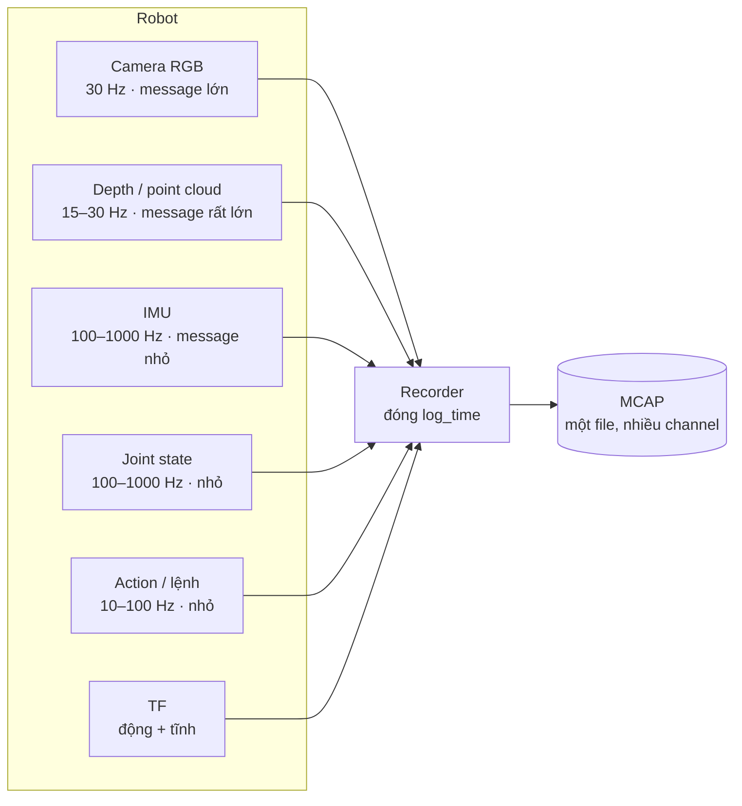
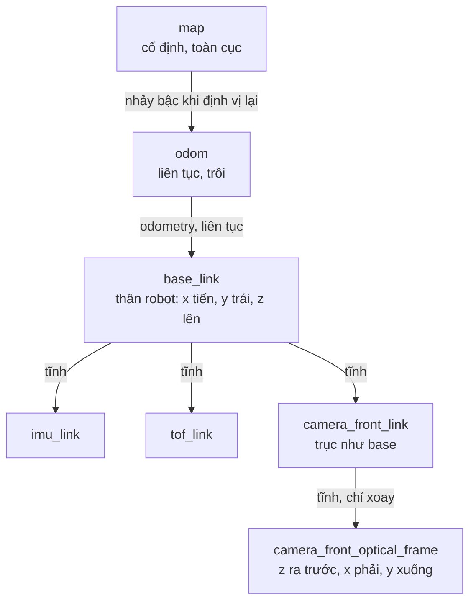
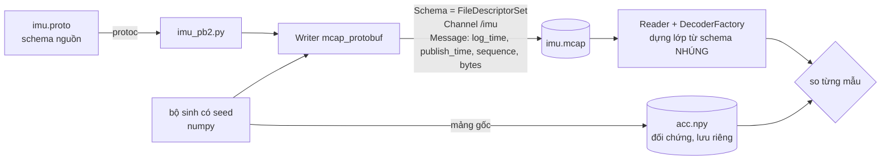
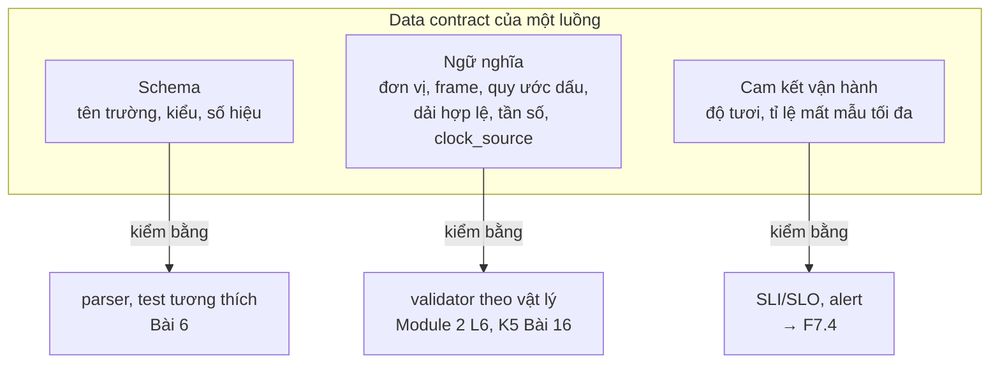
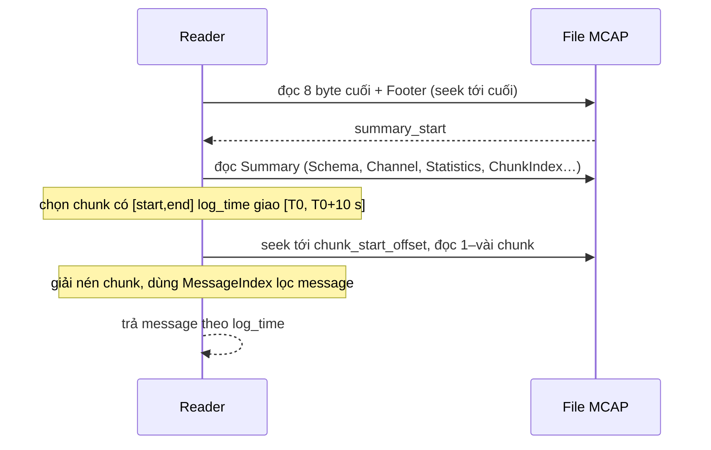
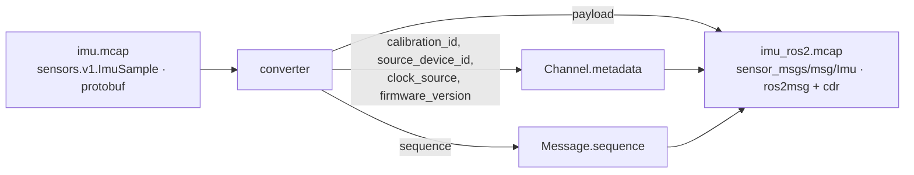

# Khóa 2 · Module 1 — MCAP và công cụ (22h, trần 32h)

> Milestone **M2**. Chín bài (1–8, 8b) và Gate Module 1 ở cuối file. Tổng quan khóa, lịch và cách học: `00-tong-quan.md`.
> Bản gốc ghi "Module 1 (20h)" ở tiêu đề nhưng cộng các bài ra 22h và gate ghi ngân sách 22h. File này dùng **22h**.

**Đây là module gần nghề bạn nhất trong cả lộ trình.** Log append-only, index, schema evolution, event time: bạn đã dùng hết. Vì vậy rủi ro lớn nhất ở đây không phải là "không hiểu", mà là **hiểu theo phép so sánh với backend rồi dừng**. Mỗi bài có bảng cầu nối, và cột quan trọng nhất của bảng là "Gãy ở chỗ".

## Thiết lập chung cho cả module

Một môi trường Python cho mọi bài (Bài 5–8b chạy thử với đúng các phiên bản này, ngày soạn 10/2026):

```text
# requirements-k2m1.txt — pin chính xác; nâng cấp thì chạy lại toàn bộ test ở Bài 5–8b
numpy==2.2.6
mcap==1.5.0
mcap-protobuf-support==0.5.4
mcap-ros2-support==0.5.7
protobuf==7.36.2
zstandard==0.25.0
lz4==4.4.5
```

API thư viện `mcap*` đổi theo phiên bản `[tự đo]`: kiểm lại bằng `python -c "import inspect, mcap_protobuf.writer as w; print(inspect.signature(w.Writer.write_message))"` trên bản bạn cài. File `src/imu.mcap` có sẵn trong workspace được ghi bằng `mcap 1.4.0` (đọc từ Header record của chính file đó), tức là một bản cũ hơn: điều này bình thường, và chính nó là lý do file phải tự mô tả.

Dữ liệu có sẵn để dùng trong các bài:

| File | Là gì | Dùng ở |
|---|---|---|
| `src/imu.mcap`, `src/main.py`, `src/proto/sensors/v1/imu.proto` | Bản bạn đã làm theo Bài 5 bản gốc | Bài 4, 5, 6 |
| `data/example-006-arm-gazebo.mcap` | File mẫu thật: tay máy trong Gazebo, ROS 1 chuyển sang MCAP, ~440 MB | Bài 1, 2, 3, 4 |
| `data/lerobotpusht/` | Dataset LeRobot (format v3.0) | Bài 6 (chấm mô hình), Gate tiêu chí 1 |

---

## Bài 1 — Một con robot sinh ra dữ liệu gì (2h)

> **Vị trí:** (song song K1) → **Bài 1** → Bài 2 · **Cần trước:** không; lướt `→ F3.1` nếu có · **Sau bài này bạn quyết định được:** một phiên ghi cần bao nhiêu đĩa và băng thông, luồng nào quyết định con số đó, và vì sao không thể "join theo khóa".

### 1. Câu chuyện — ai đã khổ vì chuyện này

Mở `data/example-006-arm-gazebo.mcap` trong workspace. Nó nặng khoảng 440 MB, nhưng thời lượng chưa tới 20 giây mô phỏng một tay máy. Một backend engineer nhìn con số đó sẽ hỏi ngay "log gì mà nặng thế?". Câu trả lời nằm ở hai đặc điểm của dữ liệu robot: nó gồm **nhiều luồng chạy ở tần số rất khác nhau**, và **kích thước một message chênh nhau hàng nghìn lần** giữa các luồng.

Hệ quả thật trong ngành: LeRobot lưu ảnh dưới dạng video MP4 thay vì từng frame rời, chấp nhận mất random access rẻ và thêm một cách để video lệch khỏi bảng state (lớp lỗi L3 ở Module 2). Đó là một quyết định thiết kế bị ép bởi đúng con số dung lượng bạn sẽ tự tính trong bài này.

### 2. Mô hình tư duy



Bảng tham số (dùng cho phần 5, **không** có cột băng thông, bạn tự tính):

| Luồng | Tần số điển hình | Kích thước một message | Nhãn |
|---|---|---|---|
| Camera RGB 640×480, 8 bit/kênh | 30 Hz | raw: 640×480×3 B · nén JPEG: ~30 KB | raw `[chuẩn]`, nén `[ước lượng]` |
| Depth 640×480, 16 bit | 30 Hz | 640×480×2 B | `[chuẩn]` |
| IMU dạng `sensor_msgs/Imu` (CDR) | 200 Hz | ~320 B (3 ma trận covariance 9×float64 chiếm phần lớn) | `[ước lượng]`, đo bằng `len(m.data)` ở Bài 8b |
| IMU dạng gói thô từ MCU (6×int16 + timestamp) | 200 Hz | ~20 B | `[ước lượng]` |
| Joint state 6 khớp (vị trí, vận tốc, lực) | 100–1000 Hz | ~200–300 B | `[ước lượng]` |
| Force/torque | 500–1000 Hz | ~100 B | `[ước lượng]` |
| Lidar 2D | 10 Hz | ~4–8 KB | `[ước lượng]` |
| Action | 10–100 Hz | ~100 B | `[ước lượng]` |

Bốn câu bản chất:
- Dữ liệu robot là **hệ đa tần số**. Camera không chạy được 1 kHz, IMU không cần chạy 30 Hz. Không có "một dòng" chứa đủ mọi cảm biến tại một thời điểm.
- **Khóa để nối các luồng là thời gian**, và thời gian là một phép đo có sai số (Bài 2). Mọi phép ghép là nội suy hoặc chọn mẫu gần nhất, mang theo sai số căn chỉnh `→ F3.4`.
- Có **hai chế độ tải**: rất nhiều message nhỏ (IMU, joint, TF) và ít message rất lớn (ảnh, point cloud). Format lưu phải xử lý tốt cả hai, và hai yêu cầu đó kéo ngược nhau (gom nhỏ thành chunk vs không copy cái lớn).
- Một mẫu cảm biến không tự đủ nghĩa: nó cần **thời điểm đo, frame, đơn vị, hiệu chuẩn**. Đây là chỗ khác căn bản với một event giao dịch.

### 3. Cầu nối từ backend

| Backend bạn biết | Ở đây | Gãy ở chỗ | Nếu dùng nhầm thì |
|---|---|---|---|
| Kafka topic | ROS topic / MCAP **channel** | Một channel MCAP = (topic, message encoding, schema, metadata). **Cùng một topic có thể có nhiều channel**: trong `example-006`, `/tf_static` có 4 channel (mỗi publisher một channel, metadata `callerid` khác nhau) | Đếm theo channel id mà tưởng là topic → đếm trùng hoặc bỏ sót publisher |
| Join hai bảng theo khóa (`order_id`) | Ghép hai luồng theo **thời gian** (as-of join, nội suy) | Không có khóa chung. Thời điểm hai mẫu không bao giờ trùng nhau; kết quả ghép luôn có sai số căn chỉnh, phụ thuộc cách chọn `→ F3.4` | Join "đúng timestamp" ra 0 dòng; join theo chỉ số mẫu ra cặp lệch pha mà không ai thấy |
| Sequence / offset của Kafka | `sequence` trong MCAP Message record; `header.seq` của ROS 1 | `sequence` của MCAP là **tùy chọn** `[spec]`, nhiều writer để 0; ROS 2 đã bỏ `seq` khỏi `Header` `[spec]`. `src/imu.mcap` có `sequence = 0` ở mọi message dù payload có trường `sequence` riêng | Detector mất gói dựa vào sequence sẽ báo "không mất gì" |
| Schema registry | Schema **nhúng trong từng file** | Không có cơ quan trung tâm chặn schema không tương thích lúc ghi. Hai file cùng tên schema có thể khác nội dung | Gộp hàng nghìn file vào data lake mà tưởng chúng cùng schema |
| Payload JSON vài trăm byte, khá đồng đều | Kích thước message trải bốn–năm bậc độ lớn | Tối ưu cho message nhỏ (gom batch, nén) và cho message lớn (không copy, nén video) mâu thuẫn nhau | Chọn chunk size theo luồng nhỏ, rồi mỗi ảnh tự thành một chunk; hoặc ngược lại |
| Event time vs processing time | `header.stamp` vs `log_time` | Xem Bài 2: ở robot, sai thời gian là sai vị trí | — |

**Chấm mô hình:**

1. *"Dữ liệu robot chỉ là event stream, khác payload."* — **ĐÚNG MỘT PHẦN.** Hạ tầng (append, schema, partition theo topic, retention) giống thật. Gãy ở chỗ một event giao dịch tự đủ nghĩa, còn một mẫu cảm biến chỉ có nghĩa khi đi kèm thời điểm đo, frame và trạng thái hiệu chuẩn, và bản thân nó là một **phép đo có sai số**. Phản ví dụ: hai message IMU giống nhau từng byte, một từ IMU đã hiệu chuẩn, một từ IMU chưa hiệu chuẩn. Cùng payload, khác sự thật.
2. *"Ảnh chiếm 95% dung lượng nhưng chỉ 5% số message"* (bản gốc). — **ĐÚNG MỘT PHẦN.** Đúng hướng, nhưng tỉ lệ phụ thuộc mạnh vào việc ảnh raw hay nén và các luồng nhỏ chạy bao nhanh. Phản ví dụ: tính lại với ảnh JPEG ~30 KB và joint state 1 kHz ở phần 5.
3. *"Hai luồng cùng 30 Hz thì ghép theo chỉ số frame là đủ."* — **SAI.** Cùng danh nghĩa 30 Hz không có nghĩa là cùng đồng hồ. Phản ví dụ: hai luồng đóng dấu bằng hai thạch anh lệch nhau vài chục ppm; ghép theo chỉ số thì khớp hoàn hảo trên giấy, còn lệch pha thật tăng tuyến tính theo thời gian ghi (bạn sẽ tính độ lớn ở Bài 2).

### 4. Thuật ngữ

| Mức | Thuật ngữ | Nghĩa trong một câu | Hay bị hiểu nhầm thành |
|---|---|---|---|
| 🟢 | Topic | Tên một luồng message, ví dụ `/imu/data_raw` | Một hàng đợi có offset như Kafka |
| 🟢 | Channel (MCAP) | Bản ghi định nghĩa một luồng trong file: topic + encoding + schema + metadata | Đồng nghĩa với topic |
| 🟢 | Message | Một mẫu đã serialize, kèm `log_time`, `publish_time`, `sequence` | Một dòng có khóa chính |
| 🟢 | Tần số danh nghĩa | Tần số cảm biến được cấu hình (30 Hz) | Tần số thực tế quan sát được trong file |
| 🟢 | Raw vs compressed image | `sensor_msgs/Image` vs `sensor_msgs/CompressedImage` | Khác nhau chỉ về dung lượng (thực ra khác cả CPU, độ trễ, mất mát) |
| 🟢 | Joint state, action | Trạng thái khớp đo được; lệnh gửi xuống robot | Hai tên của cùng một thứ |
| 🟡 | Point cloud | Tập điểm 3D (`PointCloud2`), thường là message lớn nhất | — |
| 🟡 | Episode | Một lần làm nhiệm vụ từ đầu đến cuối (nắm ở Module 2) | Một file |
| 🟡 | DDS | Middleware truyền message bên dưới ROS 2 | Thứ bạn phải cấu hình ngay |

### 5. Dự đoán

Viết vào `notes/01-streams.md` và commit **trước** khi chạy phần 6.

**A. Tính tay** từ bảng tham số ở phần 2 (phép nhân, không tra gì thêm):
1. Băng thông (MB/s) của camera raw, camera nén, depth, IMU `sensor_msgs/Imu` 200 Hz, joint state 1 kHz.
2. Một phiên 8 giờ với một camera: dung lượng nếu raw, nếu nén.
3. Một robot gồm camera nén 30 Hz + IMU 200 Hz + joint 1 kHz + F/T 1 kHz + lidar 10 Hz + action 100 Hz: luồng ảnh chiếm bao nhiêu % số byte, bao nhiêu % số message?

**B. File thật** `data/example-006-arm-gazebo.mcap` (gợi ý: tên topic có `points`, `image_raw`, `joint_states`, `tf`):
4. Topic nào nhiều message nhất? Chiếm bao nhiêu % số message, bao nhiêu % số byte?
5. Các topic ảnh + point cloud cộng lại chiếm bao nhiêu % byte?
6. `/joint_states` chạy bao nhiêu Hz? (Tính = số message / thời lượng.)

```markdown
# prediction — Bài 1 (commit trước khi chạy)
A1 băng thông (MB/s): cam raw __ · cam nén __ · depth __ · imu __ · joint __
A2 8h một camera: raw __ GB · nén __ GB
A3 ảnh chiếm __ % byte, __ % message
B4 topic nhiều message nhất: __ (__ % msg, __ % byte)
B5 ảnh + point cloud: __ % byte
B6 /joint_states: __ Hz
Lý do cho mỗi con số (một dòng):
```

### 6. Làm

1. Làm phần A bằng tay hoặc trong notebook. Sai số ở đây là sai số của **tham số** (kích thước JPEG thay đổi theo cảnh từ vài KB tới hơn 100 KB `[ước lượng]`), không phải của phép tính: ghi kết quả 2 chữ số có nghĩa là đủ `→ F1.1`.
2. Chạy script đếm trên file thật (chạy từ gốc workspace):

```python
# [đã chạy] Bài 1 — mỗi topic chiếm bao nhiêu % số message và % số byte? (mcap==1.5.0)
import sys
from collections import defaultdict
from mcap.reader import make_reader

path = sys.argv[1] if len(sys.argv) > 1 else r"data\example-006-arm-gazebo.mcap"
n, nbytes = defaultdict(int), defaultdict(int)
with open(path, "rb") as f:
    r = make_reader(f)
    for _, ch, m in r.iter_messages():          # quét toàn bộ, ~vài chục giây với 440 MB
        n[ch.topic] += 1
        nbytes[ch.topic] += len(m.data)         # byte payload, chưa tính overhead record
N, B = sum(n.values()), sum(nbytes.values())
for topic in sorted(nbytes, key=nbytes.get, reverse=True):
    print(f"{topic:32s} {n[topic]:6d} msg ({n[topic]/N:6.1%})  {nbytes[topic]/1e6:8.1f} MB ({nbytes[topic]/B:6.1%})"
          f"  {nbytes[topic]/n[topic]/1e3:9.1f} KB/msg")
```

3. Lấy thời lượng từ `Statistics` (`r.get_summary().statistics.message_start_time/end_time`, đơn vị ns) hoặc `mcap info` nếu đã cài CLI (Bài 4). Tính tần số `/joint_states`. Sai số: thời lượng tính theo `log_time` của recorder, không theo thời điểm đo, nên tần số này lệch tần số thật một lượng cỡ (độ trễ đầu + cuối) / thời lượng; với file vài chục giây và trễ vài ms, lệch dưới 0,1% `[ước lượng]`.
4. Ghi vào `notes/01-streams.md`: mỗi dự đoán sai bao nhiêu, vì sao.

### 7. Số phải ra

<details><summary>🔒 MỞ SAU KHI COMMIT prediction.md</summary>

**A (tính từ tham số):**

| | Kết quả | Ghi chú |
|---|---|---|
| Camera raw | 921 600 B × 30 ≈ **27,6 MB/s** | |
| Camera nén | 30 KB × 30 ≈ **0,9 MB/s** | phụ thuộc cảnh |
| Depth | 614 400 B × 30 ≈ **18,4 MB/s** | |
| IMU `sensor_msgs/Imu` 200 Hz | ~320 B × 200 ≈ **64 KB/s** | gói thô ~20 B thì chỉ ~4 KB/s: chọn message chuẩn làm IMU "nặng" lên ~16 lần |
| Joint 1 kHz | ~200 B × 1000 ≈ **0,2 MB/s** | |
| 8 h một camera | raw ≈ **800 GB**; nén ≈ **26 GB** | bản gốc ghi "100–800 GB" cho một robot: biên dưới là có nén |
| A3 | ảnh nén ~0,9 MB/s vs các luồng nhỏ cộng lại ~0,4 MB/s → ảnh ≈ **70% byte**; số message: 30 / ~2340 message/s ≈ **1,3%** | với ảnh raw thì ảnh ≈ 99% byte |

**B (đo trên `example-006`, mcap 1.5.0):**

| Topic | % message | % byte | KB/message |
|---|---|---|---|
| `/camera/depth/points` | 1,1% | **58,6%** | ~3840 |
| `/static_camera/image_raw` | 2,2% | 28,1% | ~922 |
| `/camera/depth/image_raw` | 1,1% | 7,3% | ~480 |
| `/camera/rgb/image_raw` | 1,1% | 5,5% | ~360 |
| `/joint_states` | **72,3%** | 0,3% | ~0,3 |
| `/tf` | 18,0% | 0,2% | ~0,6 |

- Ảnh + point cloud: **~99,5% byte, ~5,5% message.** Ở file này câu "95% / 5%" của bản gốc đúng, vì ảnh raw và có point cloud.
- Thời lượng ~18,9 s; `/joint_states` 9450 message → **~500 Hz**.
- Point cloud, không phải ảnh, là luồng nặng nhất. Nhiều người dự đoán sai chỗ này.

Lệch 10–30% ở phần A là bình thường (tham số kích thước là ước lượng). Lệch cả bậc độ lớn thì kiểm lại đơn vị (bit vs byte, KB vs KiB).

</details>

### 8. Nếu ra khác

| Triệu chứng | Nguyên nhân khả dĩ | Kiểm bằng cách | Sửa |
|---|---|---|---|
| Băng thông lệch đúng 8 lần | Nhầm bit/byte | Viết đơn vị ở mọi bước | — |
| Script chạy rất lâu hoặc hết RAM | Đọc cả file vào bộ nhớ, hoặc giải mã payload | Script chỉ dùng `len(m.data)`, không decode | Không gọi `iter_decoded_messages` ở bài này |
| Tổng % message ≠ 100% | Làm tròn | Cộng lại bằng số nguyên | — |
| Số topic ít hơn số channel | Đúng như vậy: nhiều channel cùng topic | `r.get_summary().channels` | Ghi lại, dùng ở Bài 4 |

### 9. Câu hỏi ngược

1. **[Quy mô]** Fleet 20 robot, mỗi robot 8 h/ngày với hai camera nén + các luồng nhỏ. Mỗi ngày bao nhiêu TB? Uplink 4G ~20 Mbit/s `[ước lượng]` có đẩy kịp lên cloud trong đêm không?
<details><summary>Hướng nghĩ</summary>

Tính dung lượng ngày, chia cho băng thông × số giờ đêm. Nếu không kịp, lựa chọn là: lọc ở biên (chỉ upload sự kiện), giảm chất lượng, hoặc mang ổ cứng về. Đây là lý do "data triage at the edge" là một bài toán có tên riêng.

</details>

2. **[Failure mode]** Ghi camera raw trên SSD của mini PC N100. Thứ gì hỏng trước khi đĩa đầy: tốc độ ghi đĩa, CPU nén, hay hàng đợi của recorder? Khi hỏng, message nào bị drop và bạn có biết không?
<details><summary>Hướng nghĩ</summary>

So băng thông camera raw bạn đã tính với tốc độ ghi bền vững của SSD (tra datasheet, và nhớ SLC cache). Recorder có hàng đợi giới hạn; khi đầy thì drop, thường không ghi lại đã drop gì `→ F3.9`. Đếm được drop bằng sequence hoặc bằng `dt` (Module 2, L2).

</details>

3. **[Vì sao không]** Vì sao không ghi mỗi cảm biến ra một file riêng (giống một partition một file), cho đơn giản?
<details><summary>Hướng nghĩ</summary>

Nghĩ về: mở N file đồng thời, đóng/flush đồng bộ khi mất điện, phát lại nhiều luồng theo thứ tự thời gian (merge-sort N file), và chia sẻ một "phiên" như một đơn vị. Rồi nghĩ ngược: khi nào tách file lại có lợi (luồng ảnh rất lớn, vòng đời lưu trữ khác).

</details>

4. **[Liên ngành]** Video nén dùng P-frame/B-frame: mỗi frame phụ thuộc frame trước. Điều đó làm gì với random access, và nó giống cái gì trong cơ sở dữ liệu?
<details><summary>Hướng nghĩ</summary>

Muốn đọc frame k phải giải mã từ keyframe gần nhất. Giống delta encoding hoặc đọc một bản ghi bằng cách replay log từ checkpoint. Khoảng keyframe (GOP) là núm vặn đánh đổi dung lượng ↔ chi phí seek, cùng kiểu với chunk size ở Bài 7.

</details>

5. **[Phản biện]** "Ảnh chiếm gần hết byte, vậy tối ưu hạ tầng cho ảnh là xong." Bác bỏ hoặc bảo vệ.
<details><summary>Hướng nghĩ</summary>

Byte quyết định chi phí lưu trữ. Nhưng phần lớn lỗi chất lượng dữ liệu (timestamp, rớt mẫu, kênh đơ, lệch pha) nằm ở các luồng nhỏ và ở quan hệ thời gian giữa các luồng. Module 2 sống ở đó.

</details>

### 10. Liên kết ra ngoài

- **Tài chính, dữ liệu tick:** giá khớp lệnh và sổ lệnh của nhiều sàn đến ở các tần số khác nhau; kdb+ có hẳn toán tử `aj` (as-of join) cho đúng bài toán "lấy giá gần nhất trước thời điểm t". Giống: khóa nối là thời gian. Khác: ở tài chính timestamp do sàn đóng theo đồng hồ đã được quy định đồng bộ; ở robot, mỗi cảm biến có đồng hồ riêng.
- **Hộp đen máy bay (FDR):** ghi hàng trăm tham số ở nhiều tần số khác nhau trong một khung ghi cố định `[chuẩn]`. Giống: đa tần số trong một container. Khác: khung cố định, kích thước biết trước; robot thì message có kích thước biến thiên lớn.
- **Observability:** metrics (nhỏ, nhiều, đều) và traces/logs (lớn, thưa) thường được tách hệ lưu trữ. MCAP chọn để chung một file. Câu hỏi 3 ở trên là cùng một đánh đổi.

### 11. Độ tin cậy và sửa lỗi

| Khẳng định | Nhãn | Ghi chú / cách kiểm |
|---|---|---|
| Ảnh raw 640×480 RGB = 921 600 B | `[chuẩn]` | nhân |
| JPEG ~30 KB/frame | `[ước lượng]` | đo trên camera của bạn ở K5 |
| `sensor_msgs/Imu` ~320 B CDR | `[ước lượng]` | đo `len(m.data)` ở Bài 8b |
| `sequence` MCAP là tùy chọn; ROS 2 Header không có `seq` | `[spec]` | mcap.dev/spec mục Message; định nghĩa `std_msgs/Header` ROS 2 |
| Số liệu `example-006` | đã đo | mcap 1.5.0, script ở phần 6 |

**Sửa so với bản gốc:**
- IMU "~50 B/mẫu, ~50 KB/s" trộn hai thứ: 50 B gần với gói thô, nhưng 50 B × 1 kHz mới là 50 KB/s. Tách thành hai dòng: gói thô ~20 B và `sensor_msgs/Imu` ~320 B.
- "Ảnh 95% dung lượng / 5% message": giữ, nhưng ghi rõ chỉ đúng khi ảnh raw; với ảnh nén tỉ lệ byte thấp hơn nhiều.
- Bảng "Web/fintech ↔ Robotics": "Idempotency key ↔ sequence" đổi thành "sequence/offset ↔ sequence", vì `sequence` dùng để phát hiện mất mẫu, không để khử trùng; thêm cột "Gãy ở chỗ".
- Băng thông không cho sẵn nữa: thành bài dự đoán.

### 12. Đọc thêm và tự kiểm tra

- **Nguồn gốc:** MCAP Specification, mục Overview và Message/Channel (mcap.dev/spec).
- **Giải thích:** Jay Kreps, "The Log: What every software engineer should know about real-time data's unifying abstraction" (để thấy phần giống); `→ F3.1`, `→ F3.4`.
- **Đào sâu (tùy chọn):** tài liệu LeRobot về dataset format (huggingface.co/docs/lerobot), phần lưu video.
- **Tự kiểm tra:** (1) giải thích cho một backend engineer khác trong 5 câu vì sao không join được dữ liệu robot theo khóa; (2) vẽ lại hình phần 2 từ trí nhớ; (3) câu hỏi:
  - Robot có camera 30 Hz và IMU 200 Hz. Muốn biết gia tốc tại thời điểm chụp một frame, bạn làm gì, và phải ghi lại gì?
  - Vì sao MCAP nhúng schema vào file thay vì tham chiếu registry?

<details><summary>Đáp án</summary>

1. Không có mẫu IMU nào trùng thời điểm đó. Chọn mẫu gần nhất (sai số tới nửa chu kỳ IMU, 2,5 ms) hoặc nội suy tuyến tính giữa hai mẫu kề. Phải ghi lại: dùng timestamp nào (thời điểm đo hay lúc ghi, Bài 2), cách ghép, và với camera thì "thời điểm chụp" là đầu, giữa hay cuối phơi sáng `→ F4.6`. Đó là metadata, không phải chi tiết cài đặt.
2. File phải đọc được offline, sau nhiều năm, không phụ thuộc dịch vụ ngoài. Cái giá: không còn ai chặn schema không tương thích ở thời điểm ghi (Bài 6).

</details>

---

## Bài 2 — Timestamp trong robotics (3h)

> **Vị trí:** Bài 1 → **Bài 2** → Bài 3 · **Cần trước:** Bài 1; nên đọc `→ F4.3` (đồng hồ trong máy tính), `→ F4.6` (thời điểm của một phép đo), `→ F3.3` (event time vs processing time) trước hoặc ngay sau bài · **Sau bài này bạn quyết định được:** với mỗi luồng, dùng timestamp nào làm trục thời gian khi ghép và khi truy vấn, và phải ghi `clock_source` gì vào metadata.

Nếu chỉ nhớ một bài của Module 1, nhớ bài này.

### 1. Câu chuyện — ai đã khổ vì chuyện này

**Patriot, Dhahran, 25/2/1991.** Hệ thống Patriot đếm thời gian theo bước 0,1 s trong thanh ghi 24 bit; 0,1 không biểu diễn chính xác được ở hệ nhị phân, sai số nhỏ cộng dồn. Sau khoảng 100 giờ chạy liên tục, đồng hồ hệ thống lệch khoảng 0,34 s. Với tên lửa Scud bay khoảng 1,7 km/s, lệch đó đẩy "cửa sổ" theo dõi đi khoảng 687 m, radar không thấy mục tiêu ở chỗ nó tính ra, và không đánh chặn; 28 lính thiệt mạng `[spec: GAO/IMTEC-92-26, 1992]`. Bài học: **ở hệ vật lý, sai thời gian là sai vị trí.**

**Cloudflare, 1/1/2017.** Giây nhuận làm wall clock "lặp lại" một giây. Code DNS viết bằng Go lấy hiệu hai lần đọc `time.Now()` để đo khoảng thời gian, nhận ra một số âm, đưa vào hàm sinh số ngẫu nhiên và panic trên một phần hạ tầng DNS. Sau sự cố, Go 1.9 thêm số đọc monotonic vào `time.Time` để phép trừ không còn bị wall clock nhảy làm hỏng (theo blog sự cố của Cloudflare và release notes Go 1.9). Đây là chuyện của backend, và nó chỉ ra phân biệt wall vs monotonic mà bài này cần.

### 2. Mô hình tư duy

Một mẫu IMU đi qua nhiều tầng; mỗi tầng có thể đóng một timestamp, theo **một đồng hồ khác nhau**:

```text
 thời gian thật ─────────────────────────────────────────────────────────────▶
 t_đo        t_src            t_rx             t_pub            t_log
  │           │                │                │                │
  ▼           ▼                ▼                ▼                ▼
 cảm biến → ESP32 đóng dấu → USB → host nhận → node ROS publish → recorder nhận/ghi
            (timer ESP32)          (kernel/driver)  (đồng hồ host)    (đồng hồ host)
            ─── header.stamp nên = t_đo ───        publish_time      log_time
                (nằm TRONG payload)               (record MCAP)     (record MCAP, ĐƯỢC INDEX)
```

Ba timestamp bạn sẽ gặp trong một file MCAP:

| Tên | Ở đâu | Ai đặt, nghĩa gì | MCAP dùng nó làm gì |
|---|---|---|---|
| `header.stamp` | **Trong payload** (message ROS, hoặc trường `stamp` trong `ImuSample` của bạn) | Driver/người publish. *Nên* là thời điểm phép đo xảy ra (source time) | Không nhìn thấy: payload là bytes mờ với MCAP |
| `publish_time` | Message record | "Time at which the message was published"; nếu không có, **phải** bằng `log_time` `[spec: mcap.dev/spec, Message]` | Không index |
| `log_time` | Message record | "Time at which the message was recorded" `[spec]` (receive time của recorder) | **Index chunk và message theo `log_time`**; `start_time`/`end_time` khi đọc lọc theo nó `[spec: Chunk, Message Index]` |

Rosbag2 điền `publish_time` thế nào tùy phiên bản (có bản để bằng `log_time`, có bản lấy send timestamp từ middleware) `[tự đo]`: ghi một bag ngắn trong container `ros:jazzy` rồi so hai cột này.

Hai loại đồng hồ trên Linux (chi tiết `→ F4.3`):

| Đồng hồ | Đặc tính | Bẫy |
|---|---|---|
| `CLOCK_REALTIME` (wall) | Giây kể từ epoch UTC; so được giữa các máy **nếu** đã đồng bộ (NTP/PTP) | **Có thể nhảy**, cả lùi: NTP step, người đổi giờ, giây nhuận lặp. Múi giờ **không** ảnh hưởng nó (múi giờ chỉ là cách hiển thị) |
| `CLOCK_MONOTONIC` | Không bao giờ lùi, không nhảy; NTP chỉ được chỉnh **tốc độ** (slew) | Mốc 0 không xác định (trên Linux gần lúc boot), **vô nghĩa giữa hai máy**; dừng khi suspend (`CLOCK_BOOTTIME` thì không) |
| `CLOCK_MONOTONIC_RAW` 🟡 | Như monotonic nhưng không bị NTP slew | Dùng khi đo drift của chính thạch anh |

Bốn đại lượng để mô tả một luồng (bản gốc gọi "ba con số" nhưng liệt kê bốn):

```text
dt      = khoảng cách giữa hai mẫu liên tiếp cùng channel, tính theo thời điểm đo
jitter  = độ phân tán của dt QUANH chu kỳ danh nghĩa, chỉ tính trên các khoảng không rớt mẫu
          (báo bằng percentile, không chỉ std: một lần rớt frame làm std phình to → F1.2)
skew    = lệch hệ thống giữa hai channel đóng dấu bằng hai đồng hồ khác nhau (offset)
drift   = tốc độ skew thay đổi theo thời gian, đơn vị ppm = µs lệch mỗi giây
```

**Mô phỏng đồ chơi** (chạy trước khi đụng dữ liệu thật): IMU đóng dấu bằng đồng hồ ESP32 lệch offset và trôi theo ppm, camera đóng dấu bằng đồng hồ host. Ghép "gần nhất theo timestamp" sai bao nhiêu theo thời gian ghi?

```python
# [đã chạy] Bài 2 — đồ chơi: hai đồng hồ lệch nhau, ghép "gần nhất theo timestamp" sai bao nhiêu?
import numpy as np

T = 600.0                      # 10 phút ghi
OFFSET = 0.004                 # ESP32 khởi động lệch host 4 ms        [giả định]
PPM = 30e-6                    # thạch anh ESP32 chạy nhanh 30 ppm      [giả định, xem F4.1]
t_true_cam = np.arange(0, T, 1 / 30)        # thời điểm thật camera chụp
t_true_imu = np.arange(0, T, 1 / 200)       # thời điểm thật IMU đo
stamp_cam = t_true_cam                       # camera đóng dấu bằng đồng hồ host (giả sử đúng)
stamp_imu = OFFSET + t_true_imu * (1 + PPM)  # IMU đóng dấu bằng đồng hồ ESP32

# as-of join: với mỗi frame, lấy mẫu IMU có stamp gần nhất
idx = np.clip(np.searchsorted(stamp_imu, stamp_cam), 1, len(stamp_imu) - 1)
left_closer = (stamp_cam - stamp_imu[idx - 1]) < (stamp_imu[idx] - stamp_cam)
idx = np.where(left_closer, idx - 1, idx)
err_ms = (t_true_imu[idx] - t_true_cam) * 1e3   # sai lệch THẬT giữa hai mẫu được ghép

for a, b in [(0, 60), (270, 330), (540, 600)]:
    m = (t_true_cam >= a) & (t_true_cam < b)
    print(f"phút {a/60:.0f}-{b/60:.0f}: sai ghép trung bình {err_ms[m].mean():+.2f} ms, |max| {np.abs(err_ms[m]).max():.2f} ms")

# biểu diễn timestamp: float32 giây mất bao nhiêu độ phân giải?
for t in [10.0, 1000.0, 1e5, 1.7e9]:
    print(f"t={t:>12.0f} s: bước float32 = {np.spacing(np.float32(t))*1e3:.4g} ms, float64 = {np.spacing(t)*1e9:.3g} ns")
```

Phần cuối của đồ chơi nhắc một chuyện ít ai để ý: **cách biểu diễn timestamp cũng là một nguồn sai số**. MCAP dùng `uint64` nano giây; ROS dùng `sec` + `nanosec`; LeRobot lưu `timestamp` dạng `float32` giây (kiểm trong `data/lerobotpusht`: cột `timestamp: float`, giá trị `0.10000000149…`).

### 3. Cầu nối từ backend

| Backend bạn biết | Ở đây | Gãy ở chỗ | Nếu dùng nhầm thì |
|---|---|---|---|
| Event time vs processing time (Kafka Streams, Flink, Akidau "Streaming 101") | `header.stamp` (thời điểm đo) vs `log_time` (lúc recorder nhận) | Ở backend, event time chỉ cần đủ đúng để gán vào window (sai vài trăm ms vẫn rơi đúng window phút) và để sắp thứ tự. Ở robot, timestamp dùng để **ghép hai phép đo vật lý**: sai Δt thành sai vị trí `v·Δt` và sai góc `ω·Δt`. Một robot chậm và một camera quay chậm đã đủ biến 10 ms thành sai số nhìn thấy được (phần 5 bắt bạn tính) | Lấy `log_time` làm trục ghép: toàn bộ độ trễ + jitter của pipeline (USB, scheduler, hàng đợi) đi thẳng vào dữ liệu training như một lệch pha |
| Event time do server đóng, đồng hồ server tin được | Mỗi cảm biến/MCU có đồng hồ riêng, trôi theo nhiệt độ | Không có "đồng hồ của hệ thống". Đồng bộ là một việc phải làm và đo `→ F4.4`, `→ F4.5`; trước khi làm, offset giữa ESP32 và host là ẩn số | Ghép hai luồng khác nguồn đồng hồ theo stamp của chúng = ghép sai một lượng tăng dần |
| Watermark, dữ liệu đến muộn | Message có `log_time − stamp` lớn (camera, point cloud nặng) | Recorder không có watermark; MCAP index theo `log_time`. Đọc "10 giây quanh sự kiện" bằng `start_time/end_time` là lọc theo lúc **ghi**, không theo lúc **đo** | Cửa sổ truy vấn hụt các frame camera đo trong cửa sổ nhưng ghi muộn hơn vài chục ms, và lấy thừa frame đo trước đó |
| `time.monotonic()` để đo latency trong một process | Monotonic của từng thiết bị | Monotonic đúng cho khoảng thời gian **trong một máy**. Ghi monotonic của ESP32 vào file mà không ghi quan hệ của nó với đồng hồ host thì người đọc không dùng được | Timestamp "đúng" nhưng không ai ghép được với luồng khác |
| p99 latency của request | Phân bố `log_time − stamp` mỗi channel | Hai đầu của hiệu này có thể do **hai đồng hồ khác nhau** đóng → hiệu chứa cả offset; hiệu âm hoàn toàn có thể xảy ra | Báo "latency âm" là bug của tool; hoặc tệ hơn, cắt bỏ mẫu âm như outlier |
| Sắp xếp theo timestamp rồi xử lý | Sắp theo `log_time` (thứ tự ghi) vs theo `stamp` (thứ tự đo) | Hai thứ tự này **không trùng nhau** khi các luồng có độ trễ khác nhau; MCAP mặc định trả message theo `log_time` | Thuật toán giả định nhân quả theo thứ tự đọc sẽ thấy "ảnh đến sau IMU" dù ảnh chụp trước |

**Chấm mô hình:**

1. *"`publish_time` là khi phép đo xảy ra, `log_time` là khi bộ ghi nhận"* (bảng của bản gốc). — **ĐÚNG MỘT PHẦN.** Nửa sau đúng. Nửa đầu sai: theo spec, `publish_time` là lúc message được publish; thời điểm đo nằm trong payload (`header.stamp`), MCAP không đọc được. Phản ví dụ: camera phơi sáng 20 ms rồi đọc sensor thêm vài ms; driver publish sau khi có trọn frame. `publish_time` trễ hơn thời điểm giữa phơi sáng hàng chục ms, dù không ai "sai" `→ F4.6`.
2. *"Timestamp chỉ cần đơn điệu và đủ mịn để sắp thứ tự"* (mô hình backend). — **SAI** với dữ liệu robot. Thứ tự đúng mà giá trị lệch 10 ms vẫn làm cặp (ảnh, IMU) mô tả hai tư thế khác nhau của robot. Phản ví dụ: phần 5, câu A.
3. *"Dùng wall clock đã chạy NTP là đủ."* — **ĐÚNG MỘT PHẦN.** Đủ cho log vận hành và để ghép giữa các máy ở mức ms. Không đủ khi: NTP **step** giữa phiên (thời gian lùi, Module 2 lớp L1); cần sub-ms giữa IMU 200 Hz và camera; hoặc nguồn đóng dấu là MCU không chạy NTP. Phản ví dụ: tình huống 2 ở phần 6.

### 4. Thuật ngữ

| Mức | Thuật ngữ | Nghĩa trong một câu | Hay bị hiểu nhầm thành |
|---|---|---|---|
| 🟢 | `header.stamp` | Timestamp trong payload ROS, quy ước là thời điểm dữ liệu được tạo/đo | Lúc message được gửi |
| 🟢 | `log_time` | Lúc recorder nhận message; MCAP index theo nó | Lúc đo |
| 🟢 | `publish_time` | Lúc publish; không có thì bằng `log_time` | Lúc đo |
| 🟢 | Source time vs receive time | Đóng dấu ở nguồn (gần phép đo) vs ở nơi nhận | Hai cách gọi của cùng một số |
| 🟢 | Wall / monotonic clock | Đồng hồ theo UTC có thể nhảy / đồng hồ không lùi nhưng chỉ có nghĩa trong một máy | Monotonic = "chính xác hơn" |
| 🟢 | dt, jitter, skew, drift | Định nghĩa ở phần 2 | Jitter = std của mọi dt (kể cả khi rớt mẫu) |
| 🟢 | ppm | Phần triệu; 1 ppm = lệch 1 µs mỗi giây | Phần trăm |
| 🟡 | NTP step vs slew | Nhảy đồng hồ một lần vs chỉnh tốc độ từ từ | Luôn từ từ |
| 🟡 | Sim time (`use_sim_time`, `/clock`) | ROS lấy thời gian từ simulator thay vì đồng hồ máy | Wall clock bị lệch |
| 🟡 | Latched / transient_local | Publisher giữ message cuối và gửi lại cho subscriber đến sau | Message mới |
| 🔴 | TAI, GPS time, smear giây nhuận | Thang thời gian khác UTC | Cần ngay ở khóa này |

### 5. Dự đoán

Commit `prediction.md` trước khi chạy bất cứ thứ gì ở phần 6.

**A. Sai 10 ms là sai bao nhiêu?** Tham số: robot đi 0,5 m/s (trần tốc độ K7, `→ K7 C4.4`); camera quay 1 rad/s (robot xoay tại chỗ chậm); ảnh 640 px ngang, FOV ngang 60° (giả định, FOV thật tra datasheet camera ở K5). Công thức:
- sai vị trí `Δx = v·Δt`
- sai góc `Δθ = ω·Δt`; tiêu cự theo pixel `f_px = (W/2) / tan(FOV/2)`; dịch ảnh `Δpx ≈ f_px·Δθ`
- một điểm cách 2 m lệch ngang `≈ d·Δθ`

**B. Đồ chơi** (offset 4 ms, 30 ppm, 10 phút): sai ghép trung bình ở phút đầu và phút cuối là bao nhiêu, dấu gì? Công thức: `e(t) ≈ −(offset + ppm·t)`, cộng nhiễu lượng tử tới nửa chu kỳ IMU.

**C. float32 giây:** bước lượng tử ở t = 1000 s, t = 10⁵ s (~28 giờ), t = 1,7·10⁹ s (epoch hiện tại). Công thức: với 2ᵏ ≤ t < 2ᵏ⁺¹, bước = 2ᵏ⁻²³.

**D. File thật** `example-006` (đây là ROS 1 chuyển sang MCAP, chạy trong Gazebo): với `/joint_states` và `/camera/rgb/image_raw`, dự đoán: `publish_time` có bằng `log_time` không; dấu và trung vị của `log_time − header.stamp`; `dt` theo stamp; có message nào `log_time − stamp` cực lớn không; `log_time` có độ phân giải gì.

```markdown
# prediction — Bài 2
A: Δx = __ mm · Δθ = __ mrad = __ ° · Δpx = __ px · lệch ở 2 m = __ cm
B: phút 0–1: __ ms · phút 9–10: __ ms · dấu: __ vì __
C: bước float32 @1000 s = __ · @1e5 s = __ · @epoch = __
D /joint_states: pub==log? __ · log−stamp p50 = __ ms, có âm? __ · dt = __ ms
D /camera/rgb/image_raw: log−stamp p50 = __ ms · dt = __ ms · bất thường dự kiến: __
D log_time độ phân giải: __
```

### 6. Làm

1. **Chạy đồ chơi** ở phần 2. Sai số: không có, đây là mô hình; giá trị offset/ppm là giả định, ppm thật của ESP32 bạn đo ở K5 Bài 10.
2. **Đọc timestamp trên file thật.** File ROS 1 nên payload bắt đầu bằng ROS 1 `Header` (`uint32 seq`, `uint32 sec`, `uint32 nsec`, `string frame_id`) `[spec: ROS 1 serialization]`. Không cần thư viện ROS:

```python
# [đã chạy] Bài 2 — header.stamp vs log_time trên file thật (ROS 1 trong MCAP; mcap==1.5.0)
import struct
import numpy as np
from mcap.reader import make_reader

PATH = r"data\example-006-arm-gazebo.mcap"
TOPICS = ["/joint_states", "/camera/rgb/image_raw"]
rows = {t: [] for t in TOPICS}
with open(PATH, "rb") as f:
    for _, ch, m in make_reader(f).iter_messages(topics=TOPICS):
        # ROS 1 Header ở đầu payload: uint32 seq, uint32 sec, uint32 nsec, string frame_id
        seq, sec, nsec, flen = struct.unpack_from("<IIII", m.data, 0)
        frame = m.data[16:16 + flen].decode()
        rows[ch.topic].append((m.log_time, sec * 10**9 + nsec, m.publish_time, frame))

for t, v in rows.items():
    log, stamp, pub = (np.array([x[i] for x in v], dtype=np.int64) for i in range(3))
    lag_ms = (log - stamp) / 1e6
    print(f"\n{t}: n={len(v)} frame_id={v[0][3]!r} publish_time==log_time: {np.all(pub == log)}")
    print("  log - stamp (ms) min/p50/p99/max:", np.percentile(lag_ms, [0, 50, 99, 100]).round(2))
    print("  dt theo stamp (ms) min/p50/max:  ", np.percentile(np.diff(stamp) / 1e6, [0, 50, 100]).round(2))
    print("  số khoảng log_time không tăng:   ", int((np.diff(log) <= 0).sum()))
    print("  mọi log_time là bội số 1 ms?     ", bool(np.all(log % 1_000_000 == 0)))
```

   Sai số dụng cụ ở bước này: không có sai số đo, nhưng có **độ phân giải** của timestamp trong file; script kiểm luôn.
3. **Ba tình huống**, viết câu trả lời vào `notes/02-time.md` trước khi mở đáp án:
   1. `dt` phân bố quanh 33,3 ms nhưng có 40 mẫu ở 66,7 ms và 3 mẫu ở 100 ms. Chuyện gì đã xảy ra? Có nên vứt dataset không?
   2. `timestamp` giảm ở đúng một chỗ, lùi 1,2 s, rồi tiếp tục tăng. Nguyên nhân khả dĩ nhất? Còn nguyên nhân nào khác?
   3. Hai channel cùng 30 Hz: ghép theo chỉ số frame thì khớp hoàn hảo, ghép theo timestamp thì lệch trung bình 15 ms và độ lệch tăng dần theo episode. Nói lên điều gì?
4. **Đồng hồ trên máy bạn** (Linux/WSL hoặc mini PC): `timedatectl` (đã đồng bộ chưa), `chronyc tracking` hoặc `timedatectl timesync-status` (offset hiện tại) `[tự đo]`. Trong Python so `time.time_ns()` và `time.monotonic_ns()` hai lần cách nhau 10 s: hiệu của chúng có hằng không?

### 7. Số phải ra

<details><summary>🔒 MỞ SAU KHI COMMIT prediction.md</summary>

**A.** `Δx = 0,5 × 0,010 = 5 mm`. `Δθ = 1 × 0,010 = 10 mrad ≈ 0,57°`. `f_px = 320 / tan 30° ≈ 554 px` → `Δpx ≈ 5,5 px`. Điểm cách 2 m lệch ngang `≈ 2 cm`. Năm milimét nghe nhỏ, nhưng 5–6 pixel là lớn hơn sai số của một detector marker tốt (dưới 1 px `[ước lượng]`), và đây mới là robot chậm.

**B.** (đã chạy) phút 0–1: **≈ −4,8 ms** (|max| ~6,7); phút 4–6: ≈ −13 ms; phút 9–10: **≈ −21 ms** (|max| ~23). Âm vì đồng hồ ESP32 chạy nhanh và khởi đầu sớm hơn, nên mẫu IMU "có stamp gần nhất" thực ra được đo trước frame. Sai số tăng ~1,8 ms mỗi phút đúng bằng 30 ppm.

**C.** float32: @1000 s ≈ **0,061 ms**; @10⁵ s ≈ **7,8 ms**; @1,7·10⁹ s = **128 s**. float64 @epoch ≈ 238 ns. Kết luận: float32 giây chỉ chấp nhận được cho thời gian tương đối ngắn (LeRobot dùng `timestamp` tính từ đầu episode, vài chục giây, nên còn ổn); tuyệt đối không dùng cho epoch.

**D.** (đã chạy, mcap 1.5.0)

| | `/joint_states` | `/camera/rgb/image_raw` |
|---|---|---|
| `publish_time == log_time` | có (file chuyển từ ROS 1, không có publish time riêng) | có |
| `log_time − stamp` min / p50 / max | **−2 / 0 / +3 ms** (có âm) | 21 / **28** / **48 714 ms** |
| `dt` theo stamp | **đúng 2 ms mọi mẫu** (500 Hz) | ~131–135 ms (**~7,5 Hz**, không phải 30) và một khoảng **~48,7 s** |
| Khoảng `log_time` không tăng | **23** | 0 |
| `log_time` | bội số của 1 ms (đồng hồ sim bước 1 ms) | như vậy |
| `frame_id` | rỗng (JointState không cần frame) | **`camera_depth_optical_frame`** cho ảnh RGB |

Diễn giải:
- Hiệu âm ở `/joint_states` không phải "latency âm": stamp và log_time đều theo sim time nhưng được đóng ở hai chỗ khác nhau, độ phân giải 1 ms. **Theo log_time thì có 23 chỗ thứ tự không tăng, theo stamp thì đều tuyệt đối**: đây là ví dụ thật của việc trục `log_time` kém tin hơn trục `stamp`.
- Message ảnh đầu tiên có stamp cũ hơn log_time ~48,7 s: channel này có metadata `latching: 1`. Recorder bắt đầu ghi, publisher gửi lại frame đã chụp từ lâu. Lấy `log_time` làm thời điểm chụp ở đây là sai **gần một phút**.
- Ảnh RGB gắn `frame_id` của depth optical frame. Có thể đúng nếu hai cảm biến trùng vị trí trong sim, có thể là lỗi cấu hình plugin. Không đoán: ghi lại và kiểm ở Bài 3.

**Ba tình huống:**
1. 40 lần rớt 1 frame, 3 lần rớt 2 frame. Nguyên nhân thường gặp: CPU quá tải, ghi đĩa chậm, băng thông USB. Không vứt: **đếm, báo tỉ lệ, rồi quyết định theo ngưỡng** (Module 2, L2). 43 trên vài nghìn frame thường chấp nhận được cho imitation learning; 43 trên 200 thì không.
2. Khả dĩ nhất: wall clock bị **step** lùi (NTP/chrony `makestep`, người chỉnh giờ, phc2sys). Khả dĩ khác: hai nguồn đóng dấu bị trộn vào một cột; MCU reboot rồi ước lượng lại offset. Đây là lý do khoảng thời gian phải đo bằng monotonic, và vì sao `clock_source` là metadata bắt buộc trong `CONVENTIONS.md`.
3. Hai luồng đóng dấu bằng hai đồng hồ và chúng **trôi**. Ghép theo chỉ số đang che lỗi. Mô hình học từ đây học một quan hệ lệch pha. Còn một khả năng phải loại trừ: timestamp của một luồng được **tổng hợp** (`frame_index / fps`) thay vì đo, nên "khớp" là giả.

**Tình huống 4 (máy bạn):** hiệu `time_ns − monotonic_ns` gần như hằng, nhưng trôi chậm nếu NTP đang slew và nhảy nếu có step `[tự đo]`.

</details>

### 8. Nếu ra khác

| Triệu chứng | Nguyên nhân khả dĩ | Kiểm bằng cách | Sửa |
|---|---|---|---|
| `struct.error` khi đọc header | Topic không bắt đầu bằng `Header` (ví dụ `/tf` là `TFMessage`, header nằm trong mảng) | Xem schema: `r.get_summary().schemas` | Chỉ áp script cho message có `Header` ở đầu |
| Stamp ra năm 1970 hoặc vài nghìn giây | Sim time, hoặc MCU đóng dấu bằng thời gian từ lúc boot | Kiểm có `/clock` hoặc metadata `clock_source` | Ghi rõ đơn vị gốc; không đổi sang epoch khi chưa biết offset |
| Đồ chơi ra sai ghép bằng 0 | Gán `stamp_imu = t_true_imu` | Đọc lại dòng `stamp_imu` | — |
| `log − stamp` cực lớn ở message đầu | Latched/transient_local, hoặc stamp không được điền (0) | Metadata channel (`latching`), giá trị stamp tuyệt đối | Loại message đó khỏi thống kê latency, nhưng **báo** nó |
| Hiệu `time_ns − monotonic_ns` nhảy | Đồng hồ bị step trong lúc đo | `journalctl -u chronyd` hoặc log NTP | Đó là kết quả, không phải lỗi script |

### 9. Câu hỏi ngược

1. **[Nếu…thì]** ESP32 gửi timestamp bằng `millis()` kiểu `uint32`. Nếu robot chạy liên tục 50 ngày thì sao? Nếu dùng `esp_timer_get_time()` (µs, `int64`) thì sao?
<details><summary>Hướng nghĩ</summary>

`uint32` ms tràn sau 2³² ms ≈ 49,7 ngày; timestamp quay về 0 (Module 2 L1 bắt được). Đếm µs bằng `int64` thì không tràn trong đời robot, nhưng vẫn là đồng hồ riêng của ESP32 và vẫn trôi. Tràn số và trôi là hai bệnh khác nhau.

</details>

2. **[Failure mode]** NTP step lùi 1,2 s giữa phiên ghi. Chuyện gì xảy ra với *index* của file MCAP (không phải với dữ liệu)? `mcap info` sẽ báo gì?
<details><summary>Hướng nghĩ</summary>

`log_time` do recorder đóng theo wall clock thì cũng lùi. Chunk sau có `message_start_time` nhỏ hơn `message_end_time` của chunk trước: chunk **chồng nhau** về thời gian. CLI có dòng "overlaps" trong phần chunks. Reader đọc theo thứ tự `log_time` phải merge các chunk chồng nhau, chậm hơn và trả về thứ tự khác thứ tự ghi.

</details>

3. **[Quy mô]** Data lake chứa dữ liệu 20 robot, mỗi robot `clock_source` khác nhau (có con PTP, có con chưa đồng bộ). Một kỹ sư chạy truy vấn "mọi sự kiện va chạm trong 13:00–13:05 trên toàn fleet". Truy vấn này có nghĩa với những robot nào?
<details><summary>Hướng nghĩ</summary>

Chỉ có nghĩa với robot có đồng hồ đã neo về UTC với sai số biết trước. Robot `host_unsynced` hoặc `estimated` cần một khoảng bất định đi kèm, kiểu TrueTime `→ F4.8`. Không có metadata `clock_source` thì không biết robot nào đáng tin.

</details>

4. **[Vì sao không]** Vì sao không đặt `header.stamp = log_time` cho đơn giản, khỏi phải nghĩ?
<details><summary>Hướng nghĩ</summary>

Vì `log_time` chứa độ trễ và jitter của mọi tầng giữa cảm biến và đĩa, khác nhau theo luồng (ảnh trễ hơn IMU). Đặt bằng nhau là xóa thông tin duy nhất cho phép bù trễ. Bạn vẫn có thể *ước lượng* source time sau này (cross-correlation `→ F4.6`), nhưng chỉ khi chưa làm mất dữ liệu gốc.

</details>

5. **[Phản biện]** "Có PTP rồi thì xong chuyện timestamp." Bác bỏ.
<details><summary>Hướng nghĩ</summary>

PTP đồng bộ đồng hồ của các **host** (hoặc NIC). Nó không cho biết camera bắt đầu phơi sáng lúc nào, USB giữ frame bao lâu, hay rolling shutter quét mỗi hàng ở thời điểm nào. Đồng hồ đúng chưa phải là phép đo được đóng dấu đúng `→ F4.6`, `→ K5 Bài 11`.

</details>

6. **[Liên ngành]** Vì sao thị trường chứng khoán châu Âu có quy định độ lệch đồng hồ tối đa cho hệ giao dịch, còn ngân hàng bán lẻ thì không cần?
<details><summary>Hướng nghĩ</summary>

Nghĩ về câu hỏi "lệnh nào đến trước" khi hàng nghìn lệnh mỗi giây từ nhiều nơi, và việc tái dựng thứ tự sau sự cố. Tìm từ khóa "MiFID II clock synchronisation" để xem con số họ chọn và vì sao.

</details>

### 10. Liên kết ra ngoài

- **Tài chính (MiFID II, RTS 25):** quy định đồng bộ đồng hồ giao dịch với UTC, với độ lệch tối đa chặt nhất cho giao dịch tần suất cao `[spec, kiểm con số trong văn bản RTS 25]`. Giống: timestamp là bằng chứng thứ tự nhân quả. Khác: ở đó cần đúng thứ tự giữa các bên; ở robot cần đúng **giá trị** để ghép phép đo.
- **Hệ phân tán (Spanner TrueTime):** thay vì một con số, đồng hồ trả về khoảng `[earliest, latest]`, và hệ thống chờ cho khoảng bất định qua đi `→ F4.8`. Giống: thừa nhận timestamp có sai số. Khác: robot không thể "chờ" cho vật lý đứng yên; nó phải mang khoảng bất định đó vào dữ liệu.
- **Thiên văn/định vị vệ tinh:** GPS dùng thang thời gian không có giây nhuận, lệch UTC một số nguyên giây `[chuẩn]`. Giống: chọn thang thời gian đơn điệu để tính toán, chỉ đổi sang UTC khi hiển thị. Đây chính là lý do tách monotonic khỏi wall.

### 11. Độ tin cậy và sửa lỗi

| Khẳng định | Nhãn | Ghi chú / cách kiểm |
|---|---|---|
| Nghĩa `log_time`, `publish_time`; index theo `log_time` | `[spec]` | mcap.dev/spec: Message, Chunk, Message Index |
| Rosbag2 điền `publish_time` thế nào | `[tự đo]` | ghi bag ngắn trong `ros:jazzy`, so hai cột |
| Patriot 0,34 s / ~687 m / 28 người | `[spec]` | GAO/IMTEC-92-26 |
| Cloudflare 2017, Go 1.9 monotonic | `[chuẩn]` | blog sự cố Cloudflare (1/2017); Go 1.9 release notes |
| Số liệu `example-006` | đã đo | script phần 6 |
| Bước float32 | `[chuẩn]` | `np.spacing` |
| FOV 60°, 30 ppm, offset 4 ms | giả định | thay bằng số thật ở K5 |

**Sửa so với bản gốc:**
- Bảng timestamp gốc gán `publish_time` = "khi phép đo xảy ra". Sai theo spec. Thêm `header.stamp` làm timestamp thứ ba, nói rõ cái nào được index.
- "Wall clock có thể nhảy — … đổi múi giờ": sai. `CLOCK_REALTIME` tính theo UTC; múi giờ chỉ là hiển thị. Giữ NTP step và giây nhuận.
- "Wall clock so sánh được giữa các máy": thêm điều kiện "nếu đã đồng bộ".
- "Monotonic: mốc 0 là lúc máy khởi động": sửa thành "mốc không xác định (trên Linux gần lúc boot), dừng khi suspend".
- "Ba con số cần thuộc" liệt kê bốn: sửa thành bốn; jitter định nghĩa trên các khoảng không rớt mẫu và báo bằng percentile.
- Đáp án tình huống 2 và 3 thêm nguyên nhân thay thế (trộn nguồn, timestamp tổng hợp).
- Thêm câu chuyện, ví dụ 10 ms, đồ chơi, và bài đọc file thật.

### 12. Đọc thêm và tự kiểm tra

- **Nguồn gốc:** MCAP Specification, mục Message và Message Index; `man clock_gettime` (Linux) cho các loại đồng hồ.
- **Giải thích:** Tyler Akidau, "Streaming 101" và "Streaming 102" (O'Reilly Radar) cho event/processing time; `→ F3.3`, `→ F4.3`, `→ F4.6`.
- **Đào sâu (tùy chọn):** báo cáo GAO/IMTEC-92-26 về Patriot (ngắn, đọc được trong 20 phút).
- **Tự kiểm tra:** (1) giải thích cho backend engineer khác trong 5 câu vì sao `log_time` không phải thời điểm đo, và khi nào nó vẫn dùng được; (2) vẽ lại timeline ở phần 2 từ trí nhớ, ghi rõ timestamp nào nằm trong payload; (3) câu hỏi:
  - Bạn muốn lấy mọi frame camera *chụp* trong 10 s quanh một va chạm từ file MCAP 50 GB. Gọi `iter_messages(start_time, end_time)` với đúng 10 s đó có đủ không?
  - ESP32 thạch anh lệch 20 ppm. Sau 1 giờ không đồng bộ lại, lệch bao nhiêu?

<details><summary>Đáp án</summary>

1. Không đủ. `start_time/end_time` lọc theo `log_time`. Mở rộng cửa sổ theo `log_time` một khoảng bằng trễ tối đa của luồng camera (đo từ phân bố `log_time − stamp`), giải mã, rồi lọc lại theo `header.stamp`.
2. 20·10⁻⁶ × 3600 s = 72 ms.

</details>

---

## Bài 3 — Frame và TF (1h)

> **Vị trí:** Bài 2 → **Bài 3** → Bài 4 · **Cần trước:** Bài 2; phần toán (ma trận 4×4, quaternion) để ở `→ F6.8`, mức 🟡 · **Sau bài này bạn quyết định được:** một dataset có dùng được cho bất cứ việc gì liên quan tới hình học không, chỉ bằng cách kiểm `frame_id`, `/tf_static` và đơn vị.

Mức của bài: **tên frame, quy ước trục, đơn vị và cây TF là 🟢** (phải nắm, vì bạn sẽ kiểm chúng như một defect class). **Phép nhân transform và quaternion là 🟡** (biết nó làm gì, nhân theo thứ tự nào; không tự cài đặt). Học sâu hơn mức này ở K2 là rabbit hole.

### 1. Câu chuyện — ai đã khổ vì chuyện này

**Mars Climate Orbiter, 1999.** Phần mềm mặt đất của một nhà thầu xuất xung lực theo pound-force·giây, phần mềm điều hướng của NASA hiểu là newton·giây. Sai hệ số ~4,45 tích lũy qua nhiều lần hiệu chỉnh quỹ đạo, tàu vào khí quyển sao Hỏa quá thấp và mất `[spec: NASA MCO Mishap Investigation Board, Phase I Report, 1999]`. Hai bên đều có "schema", đều trao đổi đúng một con số. Cái thiếu là **đơn vị đi kèm con số**.

Frame là cùng bệnh ở chiều không gian. Một vector `[0.3, 0.0, 0.5]` không có nghĩa nếu không biết nó được biểu diễn trong khung tọa độ nào. Lỗi phổ biến nhất trong ngành có hẳn một mục riêng trong REP-103: camera có **hai** frame, `camera_link` (trục như thân robot) và `camera_..._optical_frame` (trục theo quy ước thị giác máy tính). Nhầm hai frame này thì một vật "trước mặt 2 m" thành "trên đầu 2 m".

### 2. Mô hình tư duy



- Mỗi cạnh là một **transform** (dịch + xoay) từ frame con sang frame cha. Cạnh **tĩnh** đi trên `/tf_static` (gửi một lần, latched); cạnh **động** đi trên `/tf` ở tần số cao.
- **TF có chiều thời gian:** `odom → base_link` lúc t khác lúc t'. Muốn đổi một điểm camera thấy lúc t sang `map`, phải tra transform **tại t** (lại là timestamp của Bài 2).
- Tên và quan hệ `map → odom → base_link` là chuẩn **REP-105**; đơn vị SI, hệ tay phải, trục thân robot và trục optical là chuẩn **REP-103** `[spec]`. Repo đã có tóm tắt ở `CONVENTIONS.md` mục 1–2.

**Đồ chơi** (mức 🟡: đọc để hiểu thứ tự nhân, không cần thuộc công thức):

```python
# [đã chạy] Bài 3 — đồ chơi: một điểm camera thấy, nằm đâu trong base_link?
import numpy as np

def rpy_to_R(r, p, y):   # quy ước REP-103: quay quanh trục cố định x(roll), y(pitch), z(yaw)
    cr, sr, cp, sp, cy, sy = np.cos(r), np.sin(r), np.cos(p), np.sin(p), np.cos(y), np.sin(y)
    Rx = np.array([[1, 0, 0], [0, cr, -sr], [0, sr, cr]])
    Ry = np.array([[cp, 0, sp], [0, 1, 0], [-sp, 0, cp]])
    Rz = np.array([[cy, -sy, 0], [sy, cy, 0], [0, 0, 1]])
    return Rz @ Ry @ Rx

def T(R, t):             # ma trận 4x4: con -> cha
    M = np.eye(4); M[:3, :3] = R; M[:3, 3] = t; return M

# base_link -> camera_link: camera gắn 10 cm phía trước, cao 20 cm, nhìn thẳng   [giả định]
T_base_cam = T(np.eye(3), [0.10, 0.0, 0.20])
# camera_link -> camera_optical_frame: rpy = (-pi/2, 0, -pi/2) (cách thường dùng trong URDF)
T_cam_opt = T(rpy_to_R(-np.pi / 2, 0, -np.pi / 2), [0, 0, 0])

p_opt = np.array([0.0, 0.0, 2.0, 1.0])     # detector báo: vật ở "z = 2 m" trong khung quang học
print("đúng (qua optical):  ", np.round(T_base_cam @ T_cam_opt @ p_opt, 3)[:3])
print("sai (bỏ optical):    ", np.round(T_base_cam @ p_opt, 3)[:3])
print("sai (nhân ngược thứ tự):", np.round(T_cam_opt @ T_base_cam @ p_opt, 3)[:3])
print("R optical->link:\n", np.round(T_cam_opt[:3, :3]).astype(int))
```

### 3. Cầu nối từ backend

| Backend bạn biết | Ở đây | Gãy ở chỗ | Nếu dùng nhầm thì |
|---|---|---|---|
| Timezone của timestamp (bản gốc: "`frame_id` là timezone của dữ liệu không gian") | `frame_id` | Timezone là một offset **một chiều, hằng**, tra được ở tzdb toàn cầu. Frame là phép biến đổi **6 bậc tự do**, có thể **đổi theo thời gian**, và chỉ được định nghĩa bởi dữ liệu TF **trong cùng bản ghi** | Tưởng có `frame_id` là đủ để quy đổi, rồi phát hiện file không có `/tf_static` |
| Cây phụ thuộc / foreign key | Cây TF: `frame_id` là khóa trỏ vào một nút | Cạnh có timestamp; tra cạnh ở thời điểm khác thời điểm đo cho kết quả sai mà không lỗi. Cây phải là **cây** (một cha); hai publisher cùng khai cha khác nhau cho một frame là lỗi | Join "khóa đúng, thời điểm sai" → vị trí lệch theo vận tốc robot |
| Config tĩnh vs state động | `/tf_static` vs `/tf` | `/tf_static` latched (transient_local): subscriber vào sau vẫn nhận. Recorder phải ghi được nó; nếu cấu hình QoS sai thì bag thiếu đúng phần không bao giờ lặp lại `[tự đo]` | File có đủ dữ liệu cảm biến nhưng không đặt được gì vào không gian 3D |
| Đơn vị trong tên cột (`latency_ms`) | REP-103: SI, rad, m/s² | Message chuẩn không mang đơn vị trong dữ liệu; đơn vị là **hợp đồng ngầm** của kiểu message | Gyro deg/s trong `sensor_msgs/Imu` vẫn hợp lệ về schema (Bài 6) |

**Chấm mô hình:**

1. *"`frame_id` là timezone của dữ liệu không gian."* — **ĐÚNG MỘT PHẦN.** Đúng ở ý "một con số không có ngữ cảnh là vô nghĩa". Gãy ở ba chỗ: 6 bậc tự do thay vì một; thay đổi theo thời gian; không có tzdb. Phản ví dụ: `imu_link` trên robot đang chạy: transform `imu_link → map` đổi mỗi vài ms, và chỉ suy ra được từ `/tf` + `/tf_static` của chính file đó.
2. *"Mọi message hình học có `frame_id` là dataset dùng được."* (bản gốc) — **ĐÚNG MỘT PHẦN.** Điều kiện cần, chưa đủ. Cần thêm: các frame đó có mặt trong cây TF được ghi kèm (đặc biệt `/tf_static`), cây nối được tới frame bạn cần, và `frame_id` đúng với cảm biến thật. Phản ví dụ thật trong workspace: ảnh RGB của `example-006` gắn `frame_id = camera_depth_optical_frame` (Bài 2). Có `frame_id`, nhưng có thể là frame của cảm biến khác.
3. *"Gia tốc kế đứng yên, trục z lên, thì đọc −9,81 vì trọng lực hướng xuống."* — **SAI.** Gia tốc kế đo **lực riêng** (specific force), không đo trọng lực. Đứng yên trên bàn, mặt bàn đẩy nó lên, nên trục z hướng lên đọc **+g**. Phản ví dụ: thả rơi tự do, cả ba trục đọc ~0 dù trọng lực vẫn còn đó. Đây là lý do `az = g + nhiễu` trong Bài 5 đúng với REP-103.

### 4. Thuật ngữ

| Mức | Thuật ngữ | Nghĩa trong một câu | Hay bị hiểu nhầm thành |
|---|---|---|---|
| 🟢 | Frame | Một hệ tọa độ có tên | Một khung hình ảnh |
| 🟢 | `frame_id` / `child_frame_id` | Frame của dữ liệu / frame con trong một transform | Hai tên cho cùng thứ |
| 🟢 | `base_link`, `odom`, `map` | Thân robot; khung odometry liên tục nhưng trôi; khung toàn cục có thể nhảy (REP-105) | `odom` = `map` |
| 🟢 | Optical frame | Frame camera theo quy ước z ra trước, x phải, y xuống (REP-103) | Trùng `camera_link` |
| 🟢 | `/tf`, `/tf_static` | Transform động / tĩnh | `/tf_static` lặp lại định kỳ |
| 🟢 | REP-103, REP-105 | Chuẩn đơn vị/trục; chuẩn tên frame | Gợi ý tùy chọn |
| 🟢 | Specific force | Thứ gia tốc kế thật sự đo | Gia tốc chuyển động |
| 🟡 | Transform 4×4 (homogeneous) | Ma trận gộp xoay + dịch để nhân chuỗi | Phải tự cài |
| 🟡 | Quaternion | Cách biểu diễn xoay không bị gimbal lock; ROS dùng `(x, y, z, w)` | Thứ tự `(w, x, y, z)` như vài thư viện khác |
| 🟡 | URDF | File mô tả robot, sinh ra phần tĩnh của cây TF | Cần viết ở K2 |
| 🔴 | Lie group, SE(3) | Toán của xoay/biến đổi | — |

### 5. Dự đoán

Với đồ chơi ở phần 2 (camera gắn ở `[0.10, 0, 0.20]` trong `base_link`, nhìn thẳng; detector báo điểm ở `(0, 0, 2)` trong optical frame), dự đoán ba dòng in ra:
1. Điểm trong `base_link` khi đi đúng chuỗi `base ← camera_link ← optical`.
2. Khi quên bước optical.
3. Khi nhân ngược thứ tự ma trận.

Thêm hai câu:
4. Ma trận xoay optical → link có dạng gì (mỗi trục optical chỉ về đâu trong `camera_link`)? Suy từ REP-103, không tính.
5. IMU đứng yên nhưng gắn nghiêng: xoay +90° quanh trục `x` của `base_link` (roll), nên trục `y` của IMU chỉ lên trời. `linear_acceleration` ba trục (trong `imu_link`) đọc gì? Độ lớn `|a|` bao nhiêu?

```markdown
# prediction — Bài 3
1 đúng: (__, __, __) · 2 quên optical: (__, __, __) · 3 ngược thứ tự: (__, __, __)
4 z_opt → __ ; x_opt → __ ; y_opt → __ (trong camera_link)
5 accel (imu_link) = (__, __, __) m/s² · |a| = __
```

### 6. Làm

1. Đọc REP-103 (mục Units, Coordinate Frame Conventions, Suffix Frames) và REP-105 (mục Coordinate Frames, Relationship between Frames), ~15 phút mỗi cái. So với `CONVENTIONS.md` mục 1–2 trong workspace: ghi vào `notes/03-frames.md` một chỗ `CONVENTIONS.md` tóm tắt chưa đủ (gợi ý: thứ tự quaternion, `earth`, chiều dương của góc).
2. Chạy đồ chơi. Không có sai số đo; sai số làm tròn float64 ~10⁻¹⁶.
3. Mở `data/example-006-arm-gazebo.mcap` trong Foxglove (Bài 8 hướng dẫn cài; có thể làm sau Bài 8), panel **3D**, mở danh sách frame/transform. Ghi: frame gốc là gì, có `camera_depth_optical_frame` và `camera_rgb_optical_frame` không, hai frame đó có trùng vị trí không `[tự đo]`. File có 4 channel `/tf_static`, mỗi channel 1 message: đó là 4 publisher tĩnh khác nhau.
4. Viết vào `notes/03-frames.md` danh sách **ba kiểm tra hình học** bạn sẽ đưa vào audit ở Module 2: ví dụ "mọi `frame_id` xuất hiện trong cây TF", "`/tf_static` có mặt", "IMU lúc robot đứng yên có độ lớn gia tốc hợp lý về vật lý".

### 7. Số phải ra

<details><summary>🔒 MỞ SAU KHI COMMIT prediction.md</summary>

(đã chạy, numpy 2.2.6)

| | Kết quả | Nghĩa |
|---|---|---|
| 1. Đúng | **(2,1; 0; 0,2)** | vật ở trước robot 2 m (+10 cm offset camera), cao bằng camera |
| 2. Quên optical | **(0,1; 0; 2,2)** | vật "lơ lửng trên đầu 2 m" |
| 3. Ngược thứ tự | **(2,2; −0,1; 0)** | sai kiểu khó thấy: gần đúng nên dễ lọt qua review |
| 4. Xoay optical → link | `z_opt → +x`, `x_opt → −y`, `y_opt → −z`; ma trận `[[0,0,1],[-1,0,0],[0,-1,0]]` | đúng câu REP-103 "z forward, x right, y down" |
| 5. IMU gắn nghiêng 90° | **(≈0, ≈+9,81, ≈0)**, `|a| ≈ 9,81` | lực riêng hướng lên, đọc trên trục nào đang chỉ lên; `|a| ≈ g` không đổi theo cách gắn nên là kiểm tra "đứng yên" tốt, còn dấu từng trục thì kiểm transform |

Bước 3 (Foxglove) là `[tự đo]`. Nếu hai optical frame trùng vị trí, việc ảnh RGB mang frame depth có thể vô hại trong sim, nhưng vẫn là cấu hình đáng ghi lại: trên robot thật hai cảm biến cách nhau vài cm.

</details>

### 8. Nếu ra khác

| Triệu chứng | Nguyên nhân khả dĩ | Kiểm bằng cách | Sửa |
|---|---|---|---|
| Kết quả 1 ra (0,1; 0; 2,2) | Quên `T_cam_opt` | In từng ma trận | Đi đúng chuỗi cha ← con |
| Trục y ra dấu ngược | Nhầm quy ước rpy (trục cố định vs trục quay theo) | So với ma trận ở đáp án | Dùng hàm transform của thư viện (`tf_transformations`, `scipy.spatial.transform`) và **ghi quy ước** |
| Foxglove báo "missing transform" | Thiếu `/tf_static` hoặc chọn sai frame hiển thị | Danh sách topic, panel Transforms | Chọn đúng display frame; nếu thiếu thật thì đó là phát hiện |
| IMU đọc −9,81 trên trục z | Trục z cảm biến gắn ngược, hoặc driver đổi dấu | Lật IMU, xem dấu đổi | Sửa transform `base_link → imu_link`, không sửa dữ liệu |

### 9. Câu hỏi ngược

1. **[Failure mode]** Robot ghi 2 giờ dữ liệu, sau đó phát hiện camera bị gắn lệch 5° so với URDF. Dữ liệu cũ còn cứu được không? Phải sửa ở đâu: dữ liệu, `/tf_static`, hay metadata?
<details><summary>Hướng nghĩ</summary>

Dữ liệu cảm biến không sai; transform sai. Nếu `/tf_static` được ghi trong file, có thể tạo phiên bản transform mới và "phát lại" với transform đó, kèm `calibration_id` mới. Không sửa đè file gốc: lineage `→ F3.8`.

</details>

2. **[Vì sao không]** Vì sao ROS không bắt mọi cảm biến tự đổi dữ liệu về `base_link` trước khi publish, để người dùng khỏi lo frame?
<details><summary>Hướng nghĩ</summary>

Đổi frame cần transform; transform có thể sai và sẽ được hiệu chuẩn lại. Giữ dữ liệu ở frame gốc của cảm biến thì hiệu chuẩn lại không phải ghi lại dữ liệu. Giống lưu UTC + timezone thay vì lưu giờ địa phương đã quy đổi.

</details>

3. **[Quy mô]** Fleet 20 robot cùng mẫu, mỗi con có URDF giống nhau nhưng hiệu chuẩn camera khác nhau một chút. Cây TF tĩnh của mỗi robot nên đến từ đâu, và data lake cần lưu gì để truy vết?
<details><summary>Hướng nghĩ</summary>

URDF chung + phần hiệu chuẩn riêng (calibration file theo serial). Mỗi file ghi phải mang `calibration_id` trỏ tới đúng bản hiệu chuẩn; bản hiệu chuẩn là artifact có version. MCAP có Attachment record, đặt được file hiệu chuẩn ngay trong bản ghi.

</details>

4. **[Liên ngành]** OpenGL đặt camera nhìn theo −z với y lên; OpenCV nhìn theo +z với y xuống. Cùng một ma trận chiếu, hai thư viện cho ảnh lộn ngược. Ở đâu trong backend bạn đã gặp kiểu "hai quy ước hợp lệ, trộn là chết"?
<details><summary>Hướng nghĩ</summary>

Endianness, chỉ số mảng 0 vs 1, tháng 0–11 vs 1–12 trong JavaScript, thứ tự (lat, lon) vs (lon, lat) trong GeoJSON. Cách sống chung: chọn một quy ước ở biên hệ thống và ghi nó vào hợp đồng.

</details>

5. **[Phản biện]** "Frame và TF là việc của người làm perception/navigation; data infra không cần quan tâm."
<details><summary>Hướng nghĩ</summary>

Ai kiểm `/tf_static` có được ghi không, `frame_id` có khớp cây không, calibration có version không? Những thứ đó là chất lượng dữ liệu, và người làm perception chỉ phát hiện ra khi model đã train xong.

</details>

### 10. Liên kết ra ngoài

- **Trắc địa:** cùng một điểm có tọa độ khác nhau theo datum (WGS84 của GPS vs hệ quốc gia như VN-2000); lệch có thể tới hàng trăm mét `[ước lượng]`. Giống: tọa độ vô nghĩa nếu thiếu tên hệ quy chiếu. Khác: datum thay đổi rất chậm, frame robot thay đổi mỗi ms.
- **Đồ họa máy tính:** chuỗi model → world → view → projection là một cây transform nhân theo thứ tự cố định; sai thứ tự cho kết quả "gần đúng" khó phát hiện, đúng như dòng 3 của đồ chơi.
- **Hàng không:** body frame vs NED (North-East-Down) với z hướng **xuống**, ngược ROS (ENU, z lên) `[chuẩn]`. Dữ liệu từ flight controller (PX4) sang ROS phải đổi quy ước ở biên.

### 11. Độ tin cậy và sửa lỗi

| Khẳng định | Nhãn | Ghi chú / cách kiểm |
|---|---|---|
| Quy ước trục thân, optical frame, SI | `[spec]` | REP-103 (ros.org/reps/rep-0103.html) |
| `map → odom → base_link` và tính chất từng frame | `[spec]` | REP-105 (ros.org/reps/rep-0105.html) |
| Mars Climate Orbiter: lbf·s vs N·s | `[spec]` | NASA MIB Phase I Report |
| Gia tốc kế đo lực riêng, đứng yên đọc +g trục lên | `[chuẩn]` | lật IMU thật ở K5 |
| Recorder có thể thiếu `/tf_static` khi QoS sai | `[tự đo]` | thử với rosbag2 Jazzy ở K5 |
| `frame_id` RGB = depth optical trong `example-006` | đã đo | script Bài 2 |

**Sửa so với bản gốc:**
- Danh sách frame gốc có `world`: không phải tên của REP-105 (REP-105 có `earth`, `map`, `odom`, `base_link`); `world` là quy ước của Gazebo/MoveIt. Ghi rõ.
- Thêm optical frame (bản gốc chỉ có `camera_link`), là nguồn lỗi frame phổ biến nhất.
- Phép so sánh "timezone" được chấm thay vì dùng nguyên.
- "Dataset thiếu `frame_id` là không dùng được": giữ, bổ sung điều kiện có `/tf_static` và `frame_id` đúng.
- Thêm mức 🟢/🟡 cho từng phần, thêm đồ chơi và câu hỏi về dấu gia tốc.

### 12. Đọc thêm và tự kiểm tra

- **Nguồn gốc:** REP-103 "Standard Units of Measure and Coordinate Conventions"; REP-105 "Coordinate Frames for Mobile Platforms".
- **Giải thích:** tài liệu tf2 trên docs.ros.org (phần Concepts/Tutorials, bản Jazzy); `→ F6.8`.
- **Đào sâu (tùy chọn):** NASA Mars Climate Orbiter Mishap Investigation Board Phase I Report.
- **Tự kiểm tra:** (1) giải thích cho backend engineer khác trong 5 câu vì sao `frame_id` giống và khác timezone; (2) vẽ lại cây TF ở phần 2 từ trí nhớ, đánh dấu cạnh tĩnh/động; (3) câu hỏi:
  - Một dataset có `frame_id` đầy đủ nhưng không có topic `/tf_static`. Bạn kết luận gì, và cần hỏi người thu thập điều gì?
  - Vì sao `map → odom` được phép nhảy bậc còn `odom → base_link` thì không?

<details><summary>Đáp án</summary>

1. Không đặt được các cảm biến vào cùng một hệ tọa độ, trừ khi transform tĩnh được cung cấp ở chỗ khác (URDF, file hiệu chuẩn). Hỏi: URDF/calibration nào, version nào, áp cho khoảng thời gian nào. Ghi như một phát hiện, không tự đoán transform.
2. `odom → base_link` là tích phân odometry, phải liên tục để controller và tích phân cục bộ dùng được. Sai số trôi được gom vào `map → odom`, nơi bộ định vị tuyệt đối (marker, lidar) được phép "giật" để sửa (REP-105) `→ K7 C8.3`.

</details>

---

## Bài 4 — MCAP: cấu trúc file (2h)

> **Vị trí:** Bài 3 → **Bài 4** → Bài 5 · **Cần trước:** Bài 1–2; `→ F3.1` (log, segment, index) · **Sau bài này bạn quyết định được:** một file MCAP có random access được không, đọc nó tốn bao nhiêu I/O, và nếu hỏng thì hỏng ở đâu, chỉ bằng cách nhìn cấu trúc record.

### 1. Câu chuyện — ai đã khổ vì chuyện này

Người dùng ROS 1 quen với một thông báo: bag "unindexed". Recorder bị kill (Ctrl+C hai lần, mất điện, hết đĩa) trước khi kịp ghi phần index ở cuối file; `rosbag play` từ chối mở, và phải chạy `rosbag reindex` để quét lại toàn bộ file dựng index `[chuẩn]`. ROS 2 lúc đầu dùng SQLite làm storage mặc định, giải quyết bài toán crash bằng một database có journal, nhưng phải trả giá ở hiệu năng ghi luồng lớn và ở việc file không tự mô tả. Từ bản Iron (2023), rosbag2 chuyển mặc định sang **MCAP** `[spec: ROS 2 Iron release notes]`.

MCAP chọn lại đúng thiết kế "index ở cuối" của ROS 1 bag, nhưng làm cho phần dữ liệu tự đọc được khi mất phần cuối, và đưa schema vào trong file. Bài này mổ cấu trúc đó, đối chiếu từng record với spec chính thức.

### 2. Mô hình tư duy

Cấu trúc theo **mcap.dev/spec** `[spec]` (phần trong ngoặc vuông là tùy chọn):

```text
<Magic 0x89 'M' 'C' 'A' 'P' '0' '\r' '\n'>
<Header>            op=0x01  profile ("ros2", "ros1", "" …), library (ai ghi)
── DATA SECTION ───────────────────────────────────────────────────────────
  [Schema]          op=0x03  id, name, encoding ("protobuf" | "ros2msg" | "jsonschema" …), data
  [Channel]         op=0x04  id, schema_id, topic, message_encoding, metadata (map string→string)
  <Chunk>           op=0x06  message_start/end_time (theo LOG_TIME), uncompressed_size, crc,
                             compression ("zstd" | "lz4" | ""), records = { Schema? Channel? Message… }
  <MessageIndex>…   op=0x07  mỗi channel trong chunk một record: [(log_time, offset trong chunk đã giải nén)]
  <Chunk> <MessageIndex>…
  [Attachment]      op=0x09  file kèm (ví dụ file hiệu chuẩn) — không nằm trong chunk
  [Metadata]        op=0x0C  name + map string→string cho cả bản ghi
  <DataEnd>         op=0x0F  crc của data section
── [SUMMARY SECTION] (chỉ ghi khi writer finish) ───────────────────────────
  Schema… Channel…  bản sao để reader không phải quét data section
  Statistics        op=0x0B  số message, số chunk, start/end time, đếm theo channel
  ChunkIndex…       op=0x08  mỗi chunk: khoảng log_time, byte offset, offset các MessageIndex, kích thước
  [AttachmentIndex] [MetadataIndex]
── [SUMMARY OFFSET SECTION] ────────────────────────────────────────────────
  SummaryOffset…    op=0x0E  mỗi nhóm opcode trong summary bắt đầu ở đâu
<Footer>            op=0x02  summary_start, summary_offset_start, summary_crc
<Magic>
```

Mọi record có cùng khung `<opcode 1 byte><độ dài uint64><nội dung>` `[spec]`. Năm ý cần nắm:

1. **File tự mô tả:** schema đi cùng dữ liệu; với Protobuf, `data` của Schema là một `FileDescriptorSet` đã serialize.
2. **Chunk là đơn vị nén và đơn vị seek.** Đọc một message phải giải nén cả chunk chứa nó.
3. **Index theo `log_time`, không theo thời điểm đo** (Bài 2). `ChunkIndex` và `MessageIndex` đều chỉ biết `log_time`.
4. **Summary nằm ở cuối, và là tùy chọn.** Writer chỉ biết có bao nhiêu chunk khi kết thúc. Reader muốn random access đọc Footer trước (29 byte + magic ở cuối file), nhảy tới summary.
5. **Mất phần cuối không mất phần đầu.** Data section là một chuỗi record tự mô tả độ dài; không có summary vẫn quét tuần tự được. Đó là điểm khác Parquet (Bài 7 sẽ đo).

**Dạng không phải chữ: đi bộ qua record bằng `struct` thuần,** để tự thấy spec ở trên là thật:

```python
# [đã chạy] Đi bộ qua các record của một file MCAP bằng struct thuần (đối chiếu mcap.dev/spec)
import struct, sys
from collections import Counter

OPS = {1: "Header", 2: "Footer", 3: "Schema", 4: "Channel", 5: "Message", 6: "Chunk",
       7: "MessageIndex", 8: "ChunkIndex", 9: "Attachment", 10: "AttachmentIndex",
       11: "Statistics", 12: "Metadata", 13: "MetadataIndex", 14: "SummaryOffset", 15: "DataEnd"}
MAGIC = b"\x89MCAP0\r\n"

def walk(path):
    b = open(path, "rb").read()
    assert b[:8] == MAGIC, "không phải MCAP (hoặc hỏng đầu file)"
    # Footer: 1 byte opcode + 8 byte length + 20 byte nội dung, ngay trước magic cuối
    if b[-8:] == MAGIC:
        op, ln, s_start, so_start, crc = struct.unpack_from("<BQQQI", b, len(b) - 8 - 29)
        print(f"footer: summary_start={s_start} summary_offset_start={so_start} (file {len(b)} B)")
    else:
        print("KHÔNG có magic cuối -> file bị cắt, không dùng được index")
    pos, seen = 8, []
    while pos + 9 <= len(b):
        op, ln = struct.unpack_from("<BQ", b, pos)
        if pos + 9 + ln > len(b):
            print(f"record {OPS.get(op, op)} ở offset {pos} bị cắt cụt ({ln} B khai báo)")
            break
        name = OPS.get(op, f"op{op:#x}")
        if name == "Chunk":   # start, end, uncompressed_size, crc, compression(string)
            start, end, usize, _ = struct.unpack_from("<QQQI", b, pos + 9)
            clen = struct.unpack_from("<I", b, pos + 9 + 28)[0]
            comp = b[pos + 9 + 32: pos + 9 + 32 + clen].decode()
            name += f"[{comp} {usize}B log {start/1e9:.3f}..{end/1e9:.3f}s]"
        seen.append(name)
        pos += 9 + ln
        if op == 2:
            break
    return seen

if __name__ == "__main__":
    seen = walk(sys.argv[1])
    for i, s in enumerate(seen[:6]):
        print(i, s)
    print("...")
    for s in seen[-12:]:
        print(" ", s)
    print(Counter(x.split("[")[0] for x in seen))
```

(Đọc cả file vào RAM: chỉ dùng cho file vài chục MB như `src/imu.mcap`. Với `example-006` 440 MB, dùng CLI hoặc `make_reader`.)

### 3. Cầu nối từ backend

| Backend bạn biết | Ở đây | Gãy ở chỗ | Nếu dùng nhầm thì |
|---|---|---|---|
| **Kafka log segment** (`.log`) + offset index (`.index`) + time index (`.timeindex`) | Data section (chunk) + `MessageIndex` + `ChunkIndex` | Kafka giữ index ở **file riêng**, cập nhật liên tục trong lúc ghi; crash thì broker quét lại segment dựng index `[chuẩn]`. MCAP giữ index **trong cùng file** và chỉ ghi summary **một lần khi finish**: file đang ghi dở chưa có index nào để dùng. Kafka có offset toàn cục làm địa chỉ; MCAP không có, địa chỉ là byte offset + `log_time` | Tưởng có thể "tail" một file MCAP đang ghi bằng index như tail một partition; hoặc tưởng file bị kill vẫn seek được |
| **SSTable / LSM** (LevelDB, RocksDB): file bất biến, data block + index block + footer cố định ở cuối | MCAP sau khi finish: bất biến, chunk + ChunkIndex + Footer ở cuối | SSTable được **sắp theo khóa** và có compaction gộp file. MCAP chỉ *gần* sắp theo `log_time`: chunk được phép **chồng nhau** về thời gian (spec không cấm; CLI báo "overlaps"), và không có compaction: nhiều file không tự gộp (`mcap merge` là thao tác tay) | Giả định binary search trên thời gian luôn đúng; giả định "file mới thay file cũ" như compaction |
| **WAL** (Postgres, RocksDB): ghi tuần tự, record có độ dài + CRC, crash thì replay tới record hợp lệ cuối | MCAP lúc đang ghi | WAL có giao thức bền: `fsync` theo commit, checkpoint. Writer MCAP **gom chunk trong RAM** (mặc định Python 1 MiB) rồi mới ghi; crash là mất trọn chunk đang mở, không có "commit" từng message `[tự đo: hành vi flush/fsync theo writer]` | Tưởng mỗi `write_message` đã an toàn trên đĩa; thiết kế SLO "mất tối đa 1 message khi mất điện" mà không tính chunk |
| **Parquet**: row group + footer metadata ở cuối, magic `PAR1` | Chunk + summary ở cuối | Parquet là **columnar**, viết theo batch; **mất footer là mất file** với reader thông thường. MCAP là **row-oriented**, viết streaming; summary tùy chọn, data section tự đọc được | So chunk size MCAP với row group size theo kinh nghiệm phân tích cột; hoặc coi file MCAP bị cắt là vô dụng như Parquet bị cắt |
| **Avro object container**: schema ở header, các block cách nhau bằng **sync marker** 16 byte | Schema record; chunk | Avro một schema cho cả file; MCAP **nhiều schema, nhiều channel** trong một file. Avro có sync marker để tìm lại ranh giới block khi hỏng giữa file; MCAP **không có**, chỉ có opcode + độ dài: nếu một trường độ dài giữa file bị hỏng, quét tuần tự khó tự đồng bộ lại `[chuẩn, suy từ spec]` | Tưởng hỏng vài byte giữa file chỉ mất một block |

**Chấm mô hình:**

1. *"Đã làm Parquet thì hiểu MCAP 70% rồi."* (bản gốc) — **ĐÚNG MỘT PHẦN.** Phần giống (footer, index, nén theo khối) là phần *đọc*. Phần quan trọng nhất cho robot là phần *ghi*: streaming, nhiều schema, file dở dang vẫn cứu được. Ở đó Parquet không giúp gì. Phản ví dụ: kill writer Parquet giữa chừng, file không có footer, reader chuẩn không đọc được gì; kill writer MCAP, mọi chunk đã đóng vẫn đọc được bằng quét tuần tự (Bài 7 đo tỉ lệ).
2. *"Index của MCAP cho truy vấn theo thời điểm đo."* — **SAI.** Index theo `log_time` `[spec]`. Phản ví dụ: message ảnh latched trong `example-006` có stamp cũ ~48 s so với `log_time` (Bài 2); truy vấn theo thời gian quanh thời điểm chụp thật sẽ không tìm thấy nó.
3. *"MCAP giống một segment file của Kafka nhưng có index và schema nhúng."* (`robotics-data-infra-roadmap.md`) — **ĐÚNG MỘT PHẦN.** Đúng hình dạng. Gãy ở vòng đời: segment Kafka là một phần của log sống, luôn có index đi kèm và được broker quản lý; file MCAP là **artifact đơn, ghi một lần**, index chỉ xuất hiện khi kết thúc ghi. Phản ví dụ: không thể đọc theo index một file MCAP đang được ghi.

### 4. Thuật ngữ

| Mức | Thuật ngữ | Nghĩa trong một câu | Hay bị hiểu nhầm thành |
|---|---|---|---|
| 🟢 | Record, opcode | Đơn vị nhỏ nhất của file: 1 byte loại + 8 byte độ dài + nội dung | — |
| 🟢 | Schema record | Định nghĩa kiểu message, nhúng trong file | Tham chiếu tới registry |
| 🟢 | Channel record | Topic + encoding + schema_id + metadata | Topic |
| 🟢 | Chunk | Khối record được nén chung; đơn vị nén và seek | Một message lớn |
| 🟢 | MessageIndex | Sau mỗi chunk: vị trí từng message theo `log_time`, mỗi channel một record | Index toàn file |
| 🟢 | ChunkIndex | Trong summary: chunk nào chứa khoảng `log_time` nào, ở byte nào | Nằm trong chunk |
| 🟢 | Summary, Footer | Phần cuối file giúp random access; Footer trỏ tới summary | Bắt buộc |
| 🟢 | Statistics | Đếm message/chunk, khoảng thời gian | Được tính lại mỗi lần đọc |
| 🟡 | Summary Offset | Mục lục của summary theo opcode | — |
| 🟡 | Attachment, Metadata record | File kèm / cặp khóa–giá trị cho cả bản ghi | Metadata của channel (khác: cái đó nằm trong Channel record) |
| 🟡 | Profile | Gợi ý quy ước (`ros1`, `ros2`) | Bắt buộc phải có |
| 🔴 | Private records (op ≥ 0x80) | Record riêng của ứng dụng | — |

### 5. Dự đoán

Tham số của `src/imu.mcap`: ghi bằng `mcap-protobuf-support` mặc định (chunk 1 MiB **trước nén**, zstd), 12 000 message, payload ~80–90 B mỗi message, mỗi Message record thêm 31 B khung (opcode 1 + length 8 + channel_id 2 + sequence 4 + log_time 8 + publish_time 8) `[spec]`.

1. Bao nhiêu chunk? (Công thức: tổng byte chưa nén / 1 MiB, làm tròn lên.)
2. Schema và Channel record nằm ở đâu: data section ngoài chunk, trong chunk, trong summary, hay nhiều chỗ?
3. Có bao nhiêu `ChunkIndex`, `MessageIndex`? Có `Statistics` không?
4. Tỉ lệ nén zstd (chưa nén / đã nén) khoảng bao nhiêu? Lý do?
5. Cắt bỏ 20% cuối file: script in gì? Còn bao nhiêu chunk nguyên vẹn?
6. `example-006`: có bao nhiêu channel, bao nhiêu topic phân biệt, nén bằng gì, profile gì?

```markdown
# prediction — Bài 4
1 chunks: __ (tính: __)
2 Schema/Channel ở: __
3 ChunkIndex: __ · MessageIndex: __ · Statistics: có/không
4 tỉ lệ nén: __ vì __
5 file cắt: __ ; chunk còn nguyên: __
6 example-006: channel __ · topic __ · nén __ · profile __
```

### 6. Làm

1. **Đọc spec** (mcap.dev/spec), ~45 phút: Overview, File Structure, Records (Header, Footer, Schema, Channel, Message, Chunk, Message Index, Chunk Index, Statistics, Data End). Viết 5 dòng tóm tắt bằng lời của bạn, không chép.
2. **Cài MCAP CLI.** CLI hiện được build từ Rust (`cargo build -p mcap-cli`), có binary trên GitHub releases của `foxglove/mcap` và `brew install mcap` `[spec: mcap.dev/guides/cli]`. Trên Windows, tải binary từ releases. Ghi `mcap --version` vào notes: cờ và định dạng output đổi giữa các bản `[tự đo]`. Nếu không cài được, các bước 3–4 dùng script `walk.py` ở trên và `make_reader(...).get_summary()`.
3. **Chạy trên `src/imu.mcap`:**

```bash
mcap info src/imu.mcap
mcap list channels src/imu.mcap
mcap list schemas src/imu.mcap
mcap list chunks src/imu.mcap
mcap doctor src/imu.mcap
python walk.py src/imu.mcap
```

4. **Cắt và đi bộ lại:**

```bash
python -c "import shutil, os; shutil.copy('src/imu.mcap', 'cut.mcap'); os.truncate('cut.mcap', int(os.path.getsize('cut.mcap') * 0.8))"
python walk.py cut.mcap
mcap info cut.mcap
mcap doctor cut.mcap
```

5. **Chạy `mcap info` và `mcap list channels` trên `example-006`.** Đối chiếu số channel với danh sách topic ở Bài 1. Đọc metadata của channel: đây là ví dụ thật đầu tiên của "metadata ở channel" mà Bài 8b dùng.

Sai số dụng cụ: không có sai số đo. Có một bẫy: "tỉ lệ nén" của CLI có thể in dưới dạng % (nén/chưa nén) thay vì bội số `[tự đo]`; đọc kỹ đơn vị trước khi so với dự đoán.

### 7. Số phải ra

<details><summary>🔒 MỞ SAU KHI COMMIT prediction.md</summary>

**`src/imu.mcap`** (đã chạy `walk.py` và `make_reader`, mcap 1.5.0):

| | Kết quả |
|---|---|
| Chunk | **2** (1 048 695 B và 435 973 B chưa nén); tổng chưa nén ~1,48 MB |
| Schema/Channel | **Trong chunk đầu** (writer Python ghi chúng vào chunk) **và** bản sao trong summary. Không có ở data section ngoài chunk |
| Index | 2 `MessageIndex` (mỗi chunk một, vì có một channel), 2 `ChunkIndex`, 1 `Statistics`, 6 `SummaryOffset` |
| Nén | ~1 484 668 → ~570 552 B, **≈ 2,6×** |
| File cắt 80% | "KHÔNG có magic cuối"; chunk thứ hai bị cắt cụt; **1 chunk nguyên vẹn** (~42 s đầu trên ~60 s) |
| `example-006` | **20 channel, 14 topic**; nén **lz4**; 519 chunk; 9 schema `ros1msg`; profile rỗng, library `mcap-rust/0.25.0`; metadata channel: `callerid`, `latching`, `md5sum`, `topic` |

Vì sao nén ~2,6× mà không phải ~1×: payload có chuỗi lặp lại ở mọi message (`frame_id`, `calibration_id`, `source_device_id`) và khung record (channel_id, sequence = 0, log_time tăng đều) nén rất tốt; chỉ các `double` nhiễu là nén kém. Tỉ lệ nén phản ánh **cấu trúc payload**, không chỉ độ "ngẫu nhiên" của số đo (Bài 5 quay lại điểm này).

Với file cắt: phần cắt rơi vào chunk thứ hai nên mất trọn chunk đó dù chỉ cắt 20% byte. Nếu bạn ra khác (ví dụ còn cả hai chunk), file của bạn có kích thước chunk khác, xem `mcap list chunks`.

</details>

### 8. Nếu ra khác

| Triệu chứng | Nguyên nhân khả dĩ | Kiểm bằng cách | Sửa |
|---|---|---|---|
| `mcap info` báo thiếu summary / lỗi footer | File bị cắt, hoặc writer không ghi summary | `walk.py`: có magic cuối không | `mcap recover` (Bài 7) |
| `mcap doctor` báo lỗi trên file chưa cắt | Writer không theo spec (chunk chồng nhau không khai, CRC sai) | Đọc thông báo; thử writer khác | Báo cho thư viện ghi; ghi lại như phát hiện |
| Statistics có 0 message nhưng file lớn | Writer không đóng chunk / không finish | `walk.py` đếm chunk | Gọi `finish()`, dùng context manager |
| Số channel > số topic | Nhiều publisher cùng topic, mỗi cái một channel (ROS 1) | `mcap list channels` cột metadata | Đúng, không phải lỗi |
| `walk.py` báo opcode lạ | Record private hoặc spec mới hơn script | Spec mục Records | Script bỏ qua được: khung opcode + độ dài vẫn giữ |

### 9. Câu hỏi ngược

1. **[Vì sao không]** Vì sao MCAP không ghi index ra một file riêng `.idx` cập nhật liên tục như Kafka, để file đang ghi cũng random access được?
<details><summary>Hướng nghĩ</summary>

Một artifact hay hai? Copy, upload, checksum, xóa: hai file thì có thể lệch nhau. Robot ghi xong rồi mới upload, nên "đọc lúc đang ghi" ít cần hơn ở broker. Cái giá là file dở dang không có index; MCAP bù bằng việc data section tự đọc được.

</details>

2. **[Failure mode]** Một bit lật trong trường độ dài của Chunk thứ 3 trên 500. `mcap info` (dùng summary) và quét tuần tự cho kết quả khác nhau thế nào?
<details><summary>Hướng nghĩ</summary>

Đọc qua summary: ChunkIndex vẫn trỏ đúng offset các chunk khác, chỉ chunk 3 lỗi (CRC hoặc giải nén sai). Quét tuần tự: nhảy sai độ dài, rơi vào giữa dữ liệu rác, không có sync marker để bắt lại. Index ở cuối vừa là điểm yếu (mất khi cắt) vừa là phao cứu (khi hỏng giữa file).

</details>

3. **[Quy mô]** Data lake có 1 triệu file MCAP trên object store. Muốn biết "file nào có topic `/imu/data_raw` trong khoảng thời gian T" mà không tải file nào về. Cần đọc phần nào của mỗi file, bao nhiêu byte?
<details><summary>Hướng nghĩ</summary>

Footer cố định ở cuối → range request vài chục byte, rồi summary (Channel + Statistics + ChunkIndex), thường vài KB tới vài trăm KB. CLI đọc được file trên S3/GCS bằng đúng cách này `[spec: mcap.dev/guides/cli, Remote file support]`. Ở quy mô triệu file, vẫn nên trích summary vào catalog riêng `→ F3.6`.

</details>

4. **[Nếu…thì]** Nếu đặt chunk size rất nhỏ (ví dụ 4 KB) cho luồng có ảnh 900 KB thì sao?
<details><summary>Hướng nghĩ</summary>

Chunk không chia nhỏ một message: mỗi ảnh tự thành một chunk lớn hơn ngưỡng. Luồng nhỏ xen giữa sẽ bị cắt thành nhiều chunk nhỏ, index phình ra, nén kém. Chunk size là ngưỡng "đóng chunk khi vượt", không phải kích thước cứng.

</details>

5. **[Liên ngành]** Định dạng ZIP cũng đặt "central directory" ở cuối file. Vì sao hai định dạng sinh ra cách nhau vài chục năm lại cùng chọn vậy?
<details><summary>Hướng nghĩ</summary>

Cả hai được ghi tuần tự lên thiết bị không quay lại được (đĩa mềm nhiều tập, băng; luồng cảm biến) và chỉ biết mục lục khi xong. ZIP bị cắt cũng cứu được từng mục bằng local header, cùng ý với quét tuần tự MCAP.

</details>

### 10. Liên kết ra ngoài

- **ZIP:** central directory ở cuối, local header trước mỗi mục; công cụ sửa ZIP hỏng quét local header. Giống MCAP gần như từng điểm. Khác: ZIP không có thời gian làm trục index.
- **MP4:** atom `moov` (mục lục) thường ghi ở cuối khi quay xong; camera hết pin giữa chừng để lại file không phát được, nên có kiểu "fragmented MP4" ghi mục lục từng đoạn. Giống: đánh đổi "mục lục cuối file" vs "mục lục từng phần". Đây cũng là định dạng LeRobot dùng cho video (Module 2).
- **Hộp đen máy bay:** ghi vòng tuần tự, thiết kế để đọc được dù thiết bị hỏng một phần. Ưu tiên "phần đã ghi luôn đọc được" hơn "đọc nhanh", đúng thứ tự ưu tiên của MCAP data section.

### 11. Độ tin cậy và sửa lỗi

| Khẳng định | Nhãn | Ghi chú / cách kiểm |
|---|---|---|
| Cấu trúc file, opcode, trường của từng record | `[spec]` | mcap.dev/spec; kiểm bằng `walk.py` |
| Index theo `log_time`; chunk có thể chứa Schema/Channel | `[spec]` | mục Chunk, Message Index |
| ROS 2 Iron chuyển mặc định sang MCAP | `[spec]` | release notes Iron; `robotics-data-infra-roadmap.md` cũng ghi |
| CLI: Rust, `brew install mcap`, có `recover`, `doctor`, `du`, đọc S3 | `[spec]` | mcap.dev/guides/cli (đọc 10/2026); cờ cụ thể `[tự đo]` |
| `rosbag reindex` cho bag ROS 1 bị kill | `[chuẩn]` | wiki ROS 1 rosbag |
| Không có sync marker → khó tự đồng bộ khi hỏng giữa file | `[chuẩn]` | suy từ spec; thử bằng cách sửa một byte độ dài |
| Số liệu `src/imu.mcap`, `example-006` | đã đo | mcap 1.5.0 |

**Sửa so với bản gốc:**
- Sơ đồ gốc đặt Schema/Channel thành dòng riêng trước Chunk, và summary chỉ có ChunkIndex/Statistics. Theo spec: Schema/Channel có thể nằm **trong chunk** (writer Python làm vậy) và **được lặp lại trong summary**; summary còn có AttachmentIndex, MetadataIndex; có thêm Summary Offset section; có Attachment và Metadata record. Sơ đồ mới theo spec.
- "MCAP append-only theo thời gian": sửa thành "ghi tuần tự, gần theo `log_time` nhưng chunk được phép chồng nhau".
- Bảng so sánh: "`mcap recover` ↔ sửa file Parquet bị cắt" bỏ, vì Parquet mất footer thường không cứu được bằng công cụ chuẩn; đó là **chỗ khác**, không phải chỗ giống. Thêm Kafka segment, SSTable, WAL, Avro với cột "Gãy ở chỗ".
- "Parquet thì đã hiểu 70%": chấm ĐÚNG MỘT PHẦN.
- Cài CLI: thêm ghi chú CLI hiện bằng Rust, cờ đổi theo bản, cách làm nếu không cài được.
- Tải file mẫu từ foxglove.dev: thay bằng `example-006` có sẵn trong workspace.

### 12. Đọc thêm và tự kiểm tra

- **Nguồn gốc:** MCAP Specification (mcap.dev/spec).
- **Giải thích:** mcap.dev/guides/cli (đặc biệt phần `list chunks`, `recover`, remote file); `→ F3.1`.
- **Đào sâu (tùy chọn):** tài liệu định dạng bảng của LevelDB (`table_format.md` trong repo google/leveldb) để so footer/index; chương "Storage and Retrieval" trong *Designing Data-Intensive Applications* (Kleppmann).
- **Tự kiểm tra:** (1) giải thích cho backend engineer khác trong 5 câu MCAP giống và khác Kafka segment ở đâu; (2) vẽ lại cấu trúc file từ trí nhớ, đánh dấu phần nào tùy chọn; (3) câu hỏi:
  - Reader muốn mở nhanh một file MCAP 50 GB. Nó đọc byte nào đầu tiên, và nếu byte đó không phải magic thì sao?
  - Vì sao Channel record phải có bản sao trong summary?

<details><summary>Đáp án</summary>

1. Đọc 8 byte cuối (magic) và Footer ngay trước đó, lấy `summary_start`, đọc summary. Nếu không có magic cuối: file bị cắt hoặc không phải MCAP hoàn chỉnh; chuyển sang quét tuần tự từ đầu hoặc `mcap recover`.
2. Không có Channel thì không giải mã được message. Nếu chỉ có trong data section, random access tới chunk thứ 400 vẫn phải quét từ đầu để tìm Channel record. Spec yêu cầu bản sao trong summary cho mọi message được index `[spec]`.

</details>

---

## Bài 5 — Viết file MCAP đầu tiên (4h)

> **Vị trí:** Bài 4 → **Bài 5** → Bài 6 · **Cần trước:** Bài 2 (ba timestamp), Bài 3 (dấu gia tốc), Bài 4 (cấu trúc); `→ F2.2` (seed, tái lập) · **Sau bài này bạn quyết định được:** một bộ dữ liệu tổng hợp có đủ "lành" để làm đối chứng cho detector ở Module 2 không, và một round-trip test có thật sự kiểm được gì không.

### 1. Câu chuyện — ai đã khổ vì chuyện này

Kịch bản (không phải sự cố có tên): một nhóm viết detector "kênh đơ" cho dữ liệu robot, test trên dữ liệu tổng hợp sinh bằng `random()`, mọi test xanh. Đưa lên dữ liệu thật, detector báo lỗi khắp nơi, vì encoder thật lượng tử hóa thành bậc, đứng yên thì lặp đúng một giá trị, còn dữ liệu tổng hợp thì không bao giờ lặp. Bộ sinh dữ liệu "lành" không có tính chất vật lý nào của dữ liệu thật, nên nó không phải đối chứng. Module 2 Bài 12 ghi đúng triệu chứng này trong bảng "Nếu ra khác".

Bài này viết file MCAP đầu tiên từ dữ liệu IMU tổng hợp. Thứ khó không phải là API (vài dòng), mà là quyết định **dữ liệu giả phải giống thật ở những tính chất nào**, và **test round-trip phải so cái gì với cái gì** để không tự lừa mình.

### 2. Mô hình tư duy



- Có **hai đường giải mã**: `DecoderFactory` dựng lớp từ schema nhúng trong file; `imu_pb2.ImuSample.FromString` dùng lớp đã biên dịch trong repo. Bình thường cho cùng kết quả; Bài 6 là nơi chúng khác nhau.
- Có **hai `sequence`**: trường `sequence` trong payload `ImuSample` (của bạn) và `sequence` trong Message record (của MCAP, mặc định 0 nếu không truyền).
- Có **ba timestamp** (Bài 2): `stamp` trong payload = thời điểm đo; `publish_time`, `log_time` trong record.
- Bộ sinh "có tính vật lý" ở mức tối thiểu: đứng yên nên `a ≈ (0, 0, +g)` (lực riêng, Bài 3); nhiễu trắng Gaussian có σ biết trước; gyro có **bias khác 0 trên cả ba trục** và trôi chậm; covariance điền từ chính σ đã dùng (`CONVENTIONS.md`: "không để 0").

### 3. Cầu nối từ backend

| Backend bạn biết | Ở đây | Gãy ở chỗ | Nếu dùng nhầm thì |
|---|---|---|---|
| Fixture / Faker / server mock tự tạo bộ test chuẩn (bạn đã làm) | Bộ sinh dữ liệu cảm biến tổng hợp | Fixture backend chỉ cần **đúng schema** và đúng vài bất biến nghiệp vụ. Dữ liệu cảm biến giả phải thỏa **bất biến vật lý**: độ lớn gia tốc khi đứng yên, phổ nhiễu, bias, lượng tử hóa, tần số. Thiếu bất biến nào thì detector dựa trên bất biến đó không được kiểm | Detector đúng trên giả, sai trên thật (Module 2 Bài 12); hoặc bộ "lành" chứa sẵn lỗi |
| Seed cố định cho test | `np.random.default_rng(SEED)` | Thêm một lời gọi `rng` ở giữa là đổi toàn bộ dãy phía sau; "cùng seed" không đủ, phải cùng **thứ tự gọi** và cùng phiên bản numpy `[chuẩn]` | File "golden" sinh lại không khớp byte, test 4 ở Bài 6 báo lệch mà không ai đổi schema |
| Round-trip test serialize → deserialize | Ghi MCAP → đọc lại → so | So với **mảng gốc lưu riêng**, không sinh lại. Proto `double` là float64 nên round-trip **chính xác từng bit**; sai số chỉ xuất hiện khi có bước float32 (LeRobot lưu state dạng float32) | So dữ liệu với chính nó (test luôn xanh); hoặc đặt ngưỡng `1e-12` che mất một bước float32 lén chen vào |
| `INSERT` xong là có trên đĩa (autocommit) | `write_message` | Writer gom message vào chunk trong RAM; summary chỉ ghi ở `finish()`. Quên `finish()` là file không có summary, và chunk cuối có thể chưa ra đĩa | File "có vẻ ổn" nhưng `mcap info` báo lỗi, mất vài giây cuối |
| Đo tỉ lệ nén để ước lượng chi phí lưu trữ | Tỉ lệ nén như một tín hiệu về nội dung | Tỉ lệ nén phản ánh **cả cấu trúc payload** (chuỗi lặp, covariance hằng, khung record) chứ không riêng độ ngẫu nhiên của số đo | Kết luận "kênh đơ" từ tỉ lệ nén cao khi thực ra chỉ là metadata lặp lại |

**Chấm mô hình:**

1. *"Tỉ lệ nén là chỉ báo về nội dung: nén quá tốt là có gì đó lặp lại, có thể kênh bị đơ."* (bản gốc) — **ĐÚNG MỘT PHẦN.** Đúng như một tín hiệu thô *khi so cùng một luồng với chính nó theo thời gian*. Sai khi đọc tỉ lệ tuyệt đối: tỉ lệ phụ thuộc mạnh vào trường hằng trong payload. Phản ví dụ đo được (bước 8 ở phần 6, số ở phần 7): ba file cùng kiểu nhiễu, không file nào có kênh đơ, nhưng payload khác nhau cho tỉ lệ nén khác nhau rõ rệt.
2. *"Dùng `np.random.normal` cho từng trục là có dữ liệu IMU giống thật."* — **ĐÚNG MỘT PHẦN.** Đủ cho Bài 5–8. Thiếu: lượng tử hóa (IMU thật ra số nguyên 16 bit rồi mới nhân hệ số, giá trị nằm trên lưới), bias instability và random walk (`→ F4.2`: Allan deviation), phụ thuộc nhiệt độ. Phản ví dụ: bản gốc chỉ sinh `gz`, để `gx = gy = 0.0` chính xác; với một detector "kênh đơ" (Module 2 L4), hai trục đó là **kênh đơ ngay trong dữ liệu đối chứng**.
3. *"Round-trip sai số bằng 0 tuyệt đối thì test vô nghĩa, chắc đang so dữ liệu với chính nó."* (bảng "Nếu ra khác" bản gốc) — **SAI.** Với `double` qua Protobuf, bằng nhau từng bit là kết quả **đúng**. Test vô nghĩa khi mảng đối chứng được sinh lại từ cùng đường code, không phải khi sai số bằng 0. Phản ví dụ: script ở phần 6 đọc mảng từ file `.npy` lưu lúc ghi, ra sai số 0, và vẫn bắt được lỗi nếu bạn thử đổi một trường sang `float` (Bài 6).

### 4. Thuật ngữ

| Mức | Thuật ngữ | Nghĩa trong một câu | Hay bị hiểu nhầm thành |
|---|---|---|---|
| 🟢 | `protoc`, `*_pb2.py` | Trình biên dịch Protobuf và mã Python nó sinh | Thư viện runtime (`protobuf`) |
| 🟢 | `FileDescriptorSet` | Schema Protobuf dạng nhị phân, gồm cả file import (`timestamp.proto`) | File `.proto` dạng chữ |
| 🟢 | Writer / `finish()` | Ghi record, đóng chunk, ghi summary + footer | `close()` của file |
| 🟢 | `DecoderFactory` | Bộ giải mã dựng lớp message từ schema nhúng | Dùng lớp trong repo |
| 🟢 | Round-trip test | Ghi rồi đọc lại, so với bản gốc độc lập | So với dữ liệu sinh lại |
| 🟢 | Bias, nhiễu trắng | Lệch hằng; dao động ngẫu nhiên không tương quan theo thời gian | Một thứ |
| 🟢 | Covariance (IMU) | Ma trận 3×3 phương sai/hiệp phương sai của phép đo | Tùy chọn, để 0 |
| 🟡 | Bias instability, random walk | Bias trôi chậm và ngẫu nhiên; đo bằng Allan deviation `→ F4.2` | Nhiễu trắng |
| 🟡 | Gencode vs runtime version | Phiên bản `protoc` sinh code vs phiên bản thư viện `protobuf` | Luôn khớp |

### 5. Dự đoán

Tham số: 200 Hz × 60 s; payload `ImuSample` có 3 chuỗi cố định, 6 `double` nhiễu, 9 `double` covariance hằng, `Timestamp`, `sequence`; khung record 31 B; chunk 1 MiB trước nén; zstd.

```markdown
# prediction — Bài 5 (commit trước khi chạy)
- số message = __
- số channel / schema = __ / __
- thời lượng mcap info (end − start, theo log_time) = __ s   ← cẩn thận cột rào
- kích thước một payload ≈ __ B; một record ≈ __ B; tổng chưa nén ≈ __ MB
- số chunk = __
- tỉ lệ nén zstd ≈ __× , vì __
- max |sai lệch| round-trip = __
- log_time − publish_time = __ ns
- sequence trong Message record của src/imu.mcap (file cũ, không truyền sequence) = __
```

Gợi ý tính payload: varint/tag 1–2 B mỗi trường, `double` 8 B + 1 B tag, chuỗi = độ dài + 2 B, message lồng thêm 2 B `[spec: Protobuf encoding]`. Đừng cố chính xác hơn ±20%.

### 6. Làm

**Bước 1 — môi trường.** Cài theo `requirements-k2m1.txt` ở đầu file. Sinh mã Protobuf: cần `protoc` cùng major với runtime `protobuf` (runtime 7.x kiểm phiên bản gencode lúc import; `src/proto/sensors/v1/imu_pb2.py` trong workspace ghi `Protobuf Python Version: 7.36.0`). Hai cách: binary `protoc` từ GitHub releases của protocolbuffers, hoặc `pip install grpcio-tools` rồi `python -m grpc_tools.protoc` `[tự đo: chọn bản có gencode khớp runtime]`.

**Bước 2 — schema.** Dùng `src/proto/sensors/v1/imu.proto` có sẵn (giống bản gốc). Sinh mã, **chạy trong `src/`**:

```bash
protoc --python_out=. proto/sensors/v1/imu.proto
# → proto/sensors/v1/imu_pb2.py ; import là: from proto.sensors.v1 import imu_pb2
```

Đường dẫn bạn đưa cho `protoc` **được nhúng vào schema** (tên file trong `FileDescriptorSet` là `proto/sensors/v1/imu.proto`). Chạy `protoc -I proto ...` thì tên thành `sensors/v1/imu.proto` và import thành `from sensors.v1 import imu_pb2`. Chọn một cách, ghi vào `decisions.md`, đừng đổi: test 4 ở Bài 6 so đúng tên này.

**Bước 3 + 4 — sinh và ghi:**

```python
# [đã chạy] Bài 5 — sinh IMU giả có tính vật lý và ghi MCAP (Protobuf). Đặt ở src/, chạy từ src/.
import sys, os
import numpy as np
from mcap_protobuf.writer import Writer          # mcap-protobuf-support==0.5.4 [tự đo nếu khác bản]
from proto.sensors.v1 import imu_pb2

SEED, FPS, DURATION = 42, 200, 60
rng = np.random.default_rng(SEED)                # có seed: chạy lại ra đúng dữ liệu cũ (F2.2)
n = FPS * DURATION
t = np.arange(n) / FPS                           # thời điểm đo, giây, tính từ 0
G = 9.81
SIG_A, SIG_G = 0.02, 0.001                       # nhiễu trắng: m/s², rad/s   [giả định, đo thật ở K5]
acc = rng.normal(0, SIG_A, (n, 3)) + [0.0, 0.0, G]           # đứng yên, z lên: lực riêng +g (Bài 3)
gyr = rng.normal(0, SIG_G, (n, 3)) + [0.001, -0.0015, 0.002] # bias mỗi trục, không trục nào = 0
gyr[:, 2] += 1e-5 * t                                        # trôi chậm trên z
COV_A = [SIG_A**2, 0, 0, 0, SIG_A**2, 0, 0, 0, SIG_A**2]     # covariance từ chính tham số sinh

out = sys.argv[1] if len(sys.argv) > 1 else "imu.mcap"
with open(out, "wb") as f:
    w = Writer(f)                                 # mặc định: chunk 1 MiB, zstd
    for i in range(n):
        t_ns = int(round(t[i] * 1e9))             # round: tránh int() cắt 4.9999999e6 xuống
        m = imu_pb2.ImuSample(frame_id="imu_link", sequence=i,
                              calibration_id="imu-01@2026-11-02-a", source_device_id="esp32-01")
        m.stamp.FromNanoseconds(t_ns)             # thời điểm ĐO (source time)
        m.linear_acceleration.x, m.linear_acceleration.y, m.linear_acceleration.z = acc[i]
        m.angular_velocity.x, m.angular_velocity.y, m.angular_velocity.z = gyr[i]
        m.acceleration_covariance.extend(COV_A)
        w.write_message(topic="/imu", message=m,
                        publish_time=t_ns + 1_000_000,    # driver publish sau 1,0 ms
                        log_time=t_ns + 1_500_000,        # recorder nhận sau 1,5 ms
                        sequence=i)                       # sequence của MCAP record, khác trường trong payload
    w.finish()                                    # quên: không có summary, chunk cuối có thể mất
np.save(out + ".acc.npy", acc)                    # bản đối chiếu cho round-trip, lưu riêng
print("ghi xong", out, os.path.getsize(out), "B")
```

So với `src/main.py` hiện có, bản này thêm: seed; nhiễu và bias cho cả ba trục gyro; covariance; `publish_time` khác thời điểm đo; `sequence` cho record; `round` khi đổi sang ns.

**Bước 5 — kiểm cấu trúc.** `mcap info imu.mcap`, `mcap doctor imu.mcap` (hoặc `walk.py` ở Bài 4). Ghi kết quả cạnh dự đoán.

**Bước 6 — round-trip:**

```python
# [đã chạy] Bài 5 — round-trip: đọc lại, so với mảng gốc (lưu riêng, không sinh lại)
import sys
import numpy as np
from mcap.reader import make_reader
from mcap_protobuf.decoder import DecoderFactory
from proto.sensors.v1 import imu_pb2

path = sys.argv[1] if len(sys.argv) > 1 else "imu.mcap"
acc = np.load(path + ".acc.npy")
with open(path, "rb") as f:
    r = make_reader(f, decoder_factories=[DecoderFactory()])
    st = r.get_summary().statistics
    rows = list(r.iter_decoded_messages(topics=["/imu"]))
print("messages", st.message_count, "chunks", st.chunk_count,
      "duration_s", (st.message_end_time - st.message_start_time) / 1e9)
assert len(rows) == len(acc)
got = np.array([[p.linear_acceleration.x, p.linear_acceleration.y, p.linear_acceleration.z] for *_, p in rows])
assert [p.sequence for *_, p in rows] == list(range(len(acc)))
assert all(m.sequence == i for i, (_, _, m, _) in enumerate(rows))
print("max |sai lệch|", np.abs(got - acc).max(), "| bằng nhau từng bit:", np.array_equal(got, acc))
# giải mã thêm bằng lớp đã biên dịch (không qua schema nhúng) để chắc hai đường cho cùng kết quả
p0 = imu_pb2.ImuSample.FromString(rows[0][2].data)
assert p0.linear_acceleration.z == rows[0][3].linear_acceleration.z
lag = np.array([m.log_time - m.publish_time for _, _, m, _ in rows])
print("log_time - publish_time (ns): min", lag.min(), "max", lag.max())
```

**Bước 7 — canary cho chính test.** Sửa tạm một dòng trong bộ ghi (ví dụ `acc[i] + 1e-9` khi ghi, hoặc bỏ `finish()`), chạy lại round-trip, xác nhận test **đỏ**. Một test chưa từng đỏ là một test chưa được kiểm `→ F2.5`. Hoàn tác.

**Bước 8 — so tỉ lệ nén ba file**: `src/imu.mcap` (bản cũ), file vừa ghi, và (sau Bài 7) file `big_*.mcap` chỉ chứa 6 `double` thô. Ghi ba con số vào notes; dùng ở phần Chấm mô hình.

Sai số dụng cụ: không có phép đo vật lý. Cái cần kiểm là **độ phân giải thời gian**: `t_ns` tính bằng `round(t*1e9)`, sai số làm tròn ≤ 0,5 ns.

### 7. Số phải ra

<details><summary>🔒 MỞ SAU KHI COMMIT prediction.md</summary>

(đã chạy, mcap 1.5.0, mcap-protobuf-support 0.5.4, numpy 2.2.6, Windows)

| Kiểm tra | Kết quả | Ghi chú |
|---|---|---|
| Số message | **12 000** | chính xác |
| Channel / schema | **1 / 1** | |
| Thời lượng | **59,995 s**, không phải 60,000 | 12 000 mẫu có 11 999 khoảng × 5 ms (lỗi cột rào); cả hai đầu cùng lệch 1,5 ms nên hiệu không đổi |
| Payload | ~180 B (có covariance) | bản cũ `src/imu.mcap` ~82–89 B |
| Tổng chưa nén | ~2,6 MB | |
| Chunk | **3** | |
| Kích thước file | ~1,0 MB | |
| Tỉ lệ nén zstd | **≈ 3,2×** | |
| Round-trip | **max sai lệch = 0,0; bằng nhau từng bit** | đúng như mong đợi với `double` |
| `log_time − publish_time` | 500 000 ns mọi message | |
| `sequence` record của `src/imu.mcap` | **0 ở mọi message** | writer không tự đánh số |
| `mcap doctor` | không lỗi | `[tự đo]` nếu chưa cài CLI |

**Tỉ lệ nén của ba file** (đã đo):

| File | Payload | Tỉ lệ |
|---|---|---|
| `big_*.mcap` (Bài 7): chỉ 6 `double` nhiễu | 48 B | **≈ 1,1×** |
| `src/imu.mcap` (bản cũ): 3 chuỗi + 4 `double` nhiễu, gyro x/y = 0 | ~85 B | **≈ 2,6×** |
| File bài này: thêm covariance hằng, đủ 6 trục nhiễu, có sequence | ~180 B | **≈ 3,2×** |

Kết luận: bản gốc dự đoán "1,5–2,5×; ra 10× là dữ liệu không đủ ngẫu nhiên". Không có kênh đơ nào ở đây, nhưng tỉ lệ đã vượt dải đó chỉ vì thêm 9 số hằng. Tỉ lệ nén là tín hiệu về **cả payload**, chỉ dùng được để so một luồng với chính nó theo thời gian.

Lệch kích thước ±10% so với số trên là bình thường (phiên bản zstd, chuỗi khác độ dài). Lệch số chunk ±1 là bình thường nếu payload khác.

</details>

### 8. Nếu ra khác

| Triệu chứng | Nguyên nhân khả dĩ | Kiểm bằng cách | Sửa |
|---|---|---|---|
| `ModuleNotFoundError: sensors` | Import theo bản gốc (`from sensors.v1 …`) trong khi `protoc` chạy không có `-I proto` | Mở `imu_pb2.py`, dòng `# source:` | Dùng import khớp đường dẫn (bước 2) |
| `VersionError` khi import `imu_pb2` | Gencode mới hơn runtime `protobuf` | Dòng `Protobuf Python Version` trong `imu_pb2.py` vs `pip show protobuf` | Cài `protoc` khớp, sinh lại |
| Số message ít hơn 12 000 | Không gọi `finish()` | `walk.py`: có Footer không | Context manager hoặc `finish()` |
| `mcap doctor` báo schema thiếu | `timestamp.proto` không được nhúng | `mcap list schemas`, giải mã `FileDescriptorSet` | Dùng writer của `mcap-protobuf-support` (tự gom dependency) |
| Round-trip lệch ~1e-7 tương đối | Có bước float32 ở đâu đó | `acc.dtype`, kiểu trường trong `.proto` | Giữ float64 suốt đường |
| Mọi `stamp` lệch 1 ns so với kỳ vọng | `int(t*1e9)` thay vì `round` | in vài giá trị | dùng `round` hoặc tính bằng số nguyên `i * 5_000_000` |
| Tỉ lệ nén >5× | Quên nhiễu ở vài trục, hoặc payload chủ yếu là hằng | In vài message | Không hẳn là lỗi; ghi lại thành phần payload |

### 9. Câu hỏi ngược

1. **[Nếu…thì]** Nếu bạn lượng tử hóa gia tốc như IMU thật (±2 g trên int16, tức bước ~0,6 mm/s²) thì tỉ lệ nén và kết quả detector "kênh đơ" thay đổi thế nào?
<details><summary>Hướng nghĩ</summary>

Giá trị nằm trên lưới, entropy giảm, nén tốt hơn một chút. Khi nhiễu nhỏ so với bước lượng tử, các mẫu liên tiếp có thể **bằng nhau chính xác** dù cảm biến sống: detector "bằng nhau tuyệt đối trong 1 s" có nguy cơ báo nhầm. Đây là lý do K5 phải đo nhiễu thật so với LSB.

</details>

2. **[Failure mode]** Process ghi bị kill sau 45 s. File còn gì, đọc được bằng gì? (Trả lời trước Bài 7, kiểm ở Bài 7.)
<details><summary>Hướng nghĩ</summary>

Không có summary/footer. Các chunk đã đóng trước thời điểm kill nằm trên đĩa (nếu OS đã ghi xuống); chunk đang mở trong RAM thì mất. Đọc bằng quét tuần tự hoặc `mcap recover`. Tính một chunk 1 MiB chứa bao nhiêu giây IMU từ kích thước record bạn đo được: đó là lượng dữ liệu tối đa có thể mất.

</details>

3. **[Quy mô]** 20 robot, mỗi robot 8 IMU, mỗi IMU 1 kHz, ghi `sensor_msgs/Imu` (~320 B). Một ngày 8 h. Chi phí lưu trữ của riêng IMU so với camera có đáng kể không? Có đáng chuyển IMU sang gói nhị phân gọn không?
<details><summary>Hướng nghĩ</summary>

Tính ra GB/ngày, so với camera nén ở Bài 1. Rồi cân với cái giá của định dạng riêng: mất khả năng mở bằng Foxglove/rosbag2 (Bài 8b). Thường câu trả lời là giữ chuẩn và nén, không tự chế.

</details>

4. **[Vì sao không]** Vì sao không sinh dữ liệu tổng hợp ngay ở định dạng LeRobot (parquet) cho Module 2 mà phải qua MCAP?
<details><summary>Hướng nghĩ</summary>

MCAP gần với thứ robot thực sự ghi (đa luồng, đa tần số, có `log_time`). LeRobot là định dạng đã được **chuyển đổi và lấy mẫu lại** về một fps. Nhiều lỗi sinh ra đúng ở bước chuyển đổi đó; có cả hai thì bạn kiểm được bước chuyển đổi.

</details>

5. **[Phản biện]** "Dữ liệu tổng hợp không bao giờ đủ giống thật, nên đừng mất công, test thẳng trên dữ liệu thật."
<details><summary>Hướng nghĩ</summary>

Dữ liệu thật không có nhãn đúng: bạn không biết chỗ nào thật sự hỏng (bài toán oracle `→ F2.1`). Dữ liệu tổng hợp có lỗi **tiêm có chủ đích** cho bạn nhãn. Cần cả hai: tổng hợp để đo detector, thật để kiểm giả định của bộ sinh.

</details>

### 10. Liên kết ra ngoài

- **Hàng không/ô tô (SIL):** phần mềm điều khiển được kiểm bằng tín hiệu cảm biến tổng hợp trước khi lên phần cứng `→ F2.7`. Giống: cần mô hình nhiễu đủ thật. Khác: ở đó mô hình nhiễu thường được hiệu chuẩn từ dữ liệu bay/chạy thật và có chứng chỉ.
- **Tài chính (backtest):** dữ liệu giá tổng hợp bằng random walk không có fat tail, nên chiến lược "an toàn" trên giả cháy tài khoản trên thật. Giống hệt câu chuyện ở phần 1, ở miền khác.
- **Nén như một phép đo:** khoảng cách nén chuẩn hóa (normalized compression distance) dùng kích thước nén để so độ giống nhau giữa hai chuỗi, ví dụ trong phân loại chuỗi gen. Giống: nén là tín hiệu về cấu trúc. Khác: ở đó so hai chuỗi cùng loại, không đọc tỉ lệ tuyệt đối.

### 11. Độ tin cậy và sửa lỗi

| Khẳng định | Nhãn | Ghi chú / cách kiểm |
|---|---|---|
| API `Writer(f)`, `write_message(topic, message, log_time, publish_time, sequence)` | `[tự đo]` | đúng với mcap-protobuf-support 0.5.4; `inspect.signature` trên bản bạn cài |
| Chunk mặc định 1 MiB, zstd | `[tự đo]` | đúng với 0.5.4 / mcap 1.5.0 |
| Proto `double` round-trip chính xác từng bit | `[chuẩn]` | đã chạy |
| Runtime protobuf 7.x kiểm gencode version | `[tự đo]` | dòng `ValidateProtobufRuntimeVersion` trong `imu_pb2.py` |
| Tất cả số ở phần 7 | đã đo | máy soạn, Windows |

**Sửa so với bản gốc:**
- Import `from sensors.v1 import imu_pb2` không khớp lệnh `protoc --python_out=. proto/sensors/v1/imu.proto` (lệnh đó sinh `proto/sensors/v1/imu_pb2.py`). Sửa và giải thích đường dẫn bị nhúng vào schema.
- `publish_time = t_ns` (thời điểm đo): sai nghĩa theo spec (Bài 2). Thời điểm đo ở `stamp`; `publish_time` đặt trễ 1,0 ms.
- Không có seed → thêm `default_rng(SEED)`.
- Gyro chỉ có trục z, hai trục kia bằng 0 chính xác → thành kênh đơ trong dữ liệu đối chứng. Thêm nhiễu và bias cả ba trục.
- `acceleration_covariance` khai trong schema nhưng không điền → điền từ σ (`CONVENTIONS.md`).
- `int(t*1e9)` → `round`.
- Dự đoán mẫu "khoảng thời gian = 60.000 s" của bản gốc: lỗi cột rào (số đúng ở phần 7).
- "Tỉ lệ nén 1,5–2,5×; 10× là không đủ ngẫu nhiên": số đo ở phần 7 nằm ngoài dải đó dù không có kênh đơ; chấm ĐÚNG MỘT PHẦN.
- "Sai lệch float chính xác bằng 0 → test vô nghĩa": sai; bằng 0 là đúng với `double`. Ngưỡng `< 1e-12` đổi thành `array_equal`, và đối chứng phải là mảng lưu riêng.

### 12. Đọc thêm và tự kiểm tra

- **Nguồn gốc:** Protocol Buffers, "Encoding" (protobuf.dev) để tự tính kích thước payload; mcap.dev, hướng dẫn Python cho Protobuf.
- **Giải thích:** ví dụ `python/examples` trong repo `foxglove/mcap`; `→ F2.2`, `→ F2.5`.
- **Đào sâu (tùy chọn):** IEEE Std 952 (mô hình nhiễu con quay quang học) hoặc một application note về Allan variance của hãng IMU, để thấy "nhiễu IMU thật" có những thành phần nào `→ F4.2`.
- **Tự kiểm tra:** (1) giải thích cho backend engineer khác trong 5 câu vì sao dữ liệu giả phải có bất biến vật lý; (2) vẽ lại sơ đồ phần 2, chỉ ra hai `sequence` và ba timestamp; (3) câu hỏi:
  - Bạn ghi file với `log_time = time.time_ns()` thay vì tính từ `t`. Có gì thay đổi trong `mcap info` và trong Bài 2?
  - Vì sao test round-trip phải so với mảng lưu riêng?

<details><summary>Đáp án</summary>

1. `log_time` thành epoch thật và phản ánh tốc độ vòng lặp ghi, không phải 200 Hz: 12 000 message ghi trong vài giây, nên thời lượng theo `log_time` co lại, còn `stamp` vẫn 60 s. Hiệu `log_time − stamp` vô nghĩa (hai trục thời gian khác nhau). Đây đúng là dạng lỗi Bài 2 dạy cách phát hiện.
2. So với dữ liệu sinh lại từ cùng code thì mọi lỗi chung của bộ sinh và bộ ghi triệt tiêu nhau; test không còn khả năng thất bại.

</details>

---

## Bài 6 — Schema versioning và contract (3h)

> **Vị trí:** Bài 5 → **Bài 6** → Bài 7 · **Cần trước:** Bài 5; `→ F3.2` (encoding và schema evolution), `→ F3.7` (data contract, validate theo schema vs theo vật lý) · **Sau bài này bạn quyết định được:** một thay đổi schema có được merge không (và cần test nào chứng minh), và một luồng dữ liệu "đúng schema" đã đủ điều kiện vào dataset chưa.

### 1. Câu chuyện — ai đã khổ vì chuyện này

Phần quy tắc bạn đã biết. Cái mới là **vòng đời**: dữ liệu robot sống nhiều năm. Một dataset thu năm 2026 sẽ được đọc năm 2031 bằng code đã đổi hàng chục lần, có khi bởi một nhóm chưa từng gặp người thu. Không có registry trung tâm chặn thay đổi sai ở thời điểm ghi; mỗi file tự mang schema của nó.

Và schema đúng không cứu được dữ liệu sai. Ví dụ thật trong workspace: `data/lerobotpusht` có `observation.state` kiểu `float32[2]`, hoàn toàn hợp lệ theo schema, nhưng giá trị là `[222.0, 97.0]`: tọa độ **pixel** trên mặt phẳng mô phỏng, không phải mét. Một reader ngây thơ ghép nó với dữ liệu robot khác theo REP-103 sẽ được một robot đi nhanh hàng trăm "mét" mỗi giây. Đó là câu chuyện của Mars Climate Orbiter (Bài 3) trong một file parquet.

### 2. Mô hình tư duy



Hai trục phải tách bạch:
- **Tương thích theo hướng.** *Backward*: code mới đọc được dữ liệu cũ. *Forward*: code cũ đọc được dữ liệu mới. *Full*: cả hai. Ở MCAP, "code cũ" có nghĩa đặc biệt, xem phần 3.
- **Tương thích theo tầng.** *Wire* (bytes giải mã được), *code* (tên trường trong code còn đúng), *ngữ nghĩa* (giá trị còn nghĩa như cũ). Protobuf chỉ bảo vệ tầng wire.

Quy tắc Protobuf `[spec: protobuf.dev, "Updating A Message Type"]`, viết theo tầng nào bị vỡ:

| Thay đổi | Wire | Code/JSON | Ngữ nghĩa | Ghi chú |
|---|---|---|---|---|
| Thêm trường, số hiệu mới | an toàn hai chiều | an toàn | **cẩn thận**: reader mới thấy giá trị mặc định khi đọc file cũ | proto3 scalar không có presence, xem Chấm mô hình |
| Xóa trường | an toàn nếu `reserved` số hiệu (và tên) | code dùng trường đó vỡ | — | không bao giờ tái dùng số hiệu |
| Đổi tên | an toàn | **vỡ** JSON (`calibrationId`), text format, đường dẫn trường trong Foxglove layout | — | |
| Đổi số hiệu | **vỡ** | — | — | |
| Đổi kiểu, một số cặp tương thích wire (`int32/uint32/int64/uint64/bool`, `string/bytes` nếu UTF-8, `fixed32/sfixed32`…) | giải mã được | — | có thể **cắt/đổi dấu âm thầm** | đọc kỹ bảng trong spec |
| Đổi kiểu khác wire type (`double` → `float`) | không crash: reader coi là **trường lạ, trả giá trị mặc định** | — | sai âm thầm | phần 5 bắt bạn dự đoán, phần 6 đo |

Phần riêng của MCAP: **schema đi cùng file**. Một file luôn tự đọc được bằng chính schema của nó. Vì vậy câu hỏi đúng không phải "file có đọc được không" mà là "**code của tôi**, viết theo schema X, có đọc đúng file mang schema Y không".

### 3. Cầu nối từ backend

| Backend bạn biết | Ở đây | Gãy ở chỗ | Nếu dùng nhầm thì |
|---|---|---|---|
| **Confluent Schema Registry**, chế độ `BACKWARD` / `FORWARD` / `FULL` (và `_TRANSITIVE`) kiểm lúc producer đăng ký schema `[spec: Confluent docs]` | Schema nhúng trong từng file MCAP | Không có cổng kiểm ở thời điểm ghi. Robot offline, ghi file với bất cứ schema nào code trên robot đang có. Kiểm tương thích phải dời sang **CI của repo schema** và **lúc ingest** vào data lake | Hai robot chạy hai bản firmware ghi hai schema cùng tên, khác nội dung, cùng đổ vào một bảng |
| **Avro schema resolution**: reader schema + writer schema, có default, alias, type promotion `int→long→float→double` `[spec: Avro, Schema Resolution]` | Protobuf trong MCAP | Protobuf **không có bước resolution**: chỉ có số hiệu trường. Không có alias, không có promotion an toàn giữa `float`/`double`, không có default khai báo (proto3 dùng zero value) | Mang trực giác "Avro tự đổi kiểu cho mình" sang Protobuf và đổi `double` → `float` |
| "Reader cũ" = service cũ đang chạy với lớp đã biên dịch | `DecoderFactory` của `mcap-protobuf-support` **dựng lớp từ schema nhúng trong file** | Đọc file v2 bằng `DecoderFactory` là đọc bằng **schema v2**, không phải "reader v1". Reader cũ thật là code của bạn truy cập trường theo tên, hoặc lớp `*_pb2` cũ giải mã `message.data` | Test "reader cũ đọc file mới" luôn xanh mà không kiểm gì |
| Data contract (Andrew Jones, dbt contracts, Great Expectations) | Contract cho một luồng cảm biến | Contract backend thường dừng ở kiểu + nullable + enum. Ở đây phần nặng nhất là **ngữ nghĩa vật lý**: đơn vị, frame, quy ước dấu, dải vật lý, tần số, `clock_source` (`CONVENTIONS.md`) | Pipeline xanh với dữ liệu sai đơn vị |
| Version trong tên package/API (`/v1/`, `sensors.v1`) | Package `sensors.v1` | Quy ước phổ biến (Buf style guide) là **chỉ tăng `v1→v2` khi có thay đổi phá vỡ**. Thêm trường là một *revision* trong `v1`. "v2" của bản gốc là revision, không phải package mới | Tạo `sensors.v2` cho thay đổi cộng thêm, nhân đôi code đọc; hoặc ngược lại, giữ `v1` cho thay đổi phá vỡ |

**Chấm mô hình:**

1. *"Schema là đủ để đảm bảo dữ liệu đúng."* — **SAI.** Schema bảo đảm bytes giải mã được thành các trường đúng kiểu. Nó không nói gì về đơn vị, frame, dấu, dải hợp lệ. Phản ví dụ (đều hợp lệ tuyệt đối với `ImuSample` và với `sensor_msgs/Imu`): IMU đứng yên với `linear_acceleration.z = 1.0` (driver xuất đơn vị **g**); `z = −9.81` (IMU gắn ngược mà transform không phản ánh); gyro theo **deg/s**; `frame_id = "imu_link"` cho một IMU thật ra gắn ở cánh tay. Và ví dụ thật: `lerobotpusht` lưu state bằng pixel. Đây là lý do có validate theo vật lý `→ F3.7`, Module 2 L6.
2. *"Thêm trường mới là an toàn cả hai chiều."* (bản gốc) — **ĐÚNG MỘT PHẦN.** An toàn ở tầng wire. Ở tầng ngữ nghĩa, reader mới đọc file cũ nhận `temperature_c = 0.0`: một nhiệt độ **hợp lý về vật lý**. Với proto3 scalar thường, code không phân biệt được "không có" với "0 °C" (gọi `HasField` còn ném `ValueError`). Phản ví dụ: bộ bù drift theo nhiệt độ áp hệ số cho 0 °C lên toàn bộ dữ liệu cũ, không lỗi, không cảnh báo. Sửa: khai `optional double temperature_c = 9;` (proto3 `optional` có presence).
3. *"Đổi kiểu trường thì reader cũ crash."* (bảng "Nếu ra khác" bản gốc) — **SAI** với trường hợp hay gặp nhất. Đổi `double` → `float` trên cùng số hiệu: wire type khác, reader cũ coi đó là trường lạ và trả giá trị mặc định, **không exception**. Phản ví dụ: phần 6 bước 5.

### 4. Thuật ngữ

| Mức | Thuật ngữ | Nghĩa trong một câu | Hay bị hiểu nhầm thành |
|---|---|---|---|
| 🟢 | Backward / forward / full compatibility | Mới đọc cũ / cũ đọc mới / cả hai | Ngược tên nhau (rất hay nhầm, viết định nghĩa vào `decisions.md`) |
| 🟢 | Field number, `reserved` | Danh tính của trường trên dây; giữ chỗ cho số đã xóa | Tên trường là danh tính |
| 🟢 | Unknown fields | Trường reader không biết, được giữ lại khi parse rồi serialize | Bị xóa |
| 🟢 | Presence (`optional`, `HasField`) | Phân biệt "không đặt" với "đặt bằng giá trị mặc định" | Mọi trường đều có |
| 🟢 | Data contract | Schema + ngữ nghĩa + cam kết vận hành giữa bên sinh và bên dùng | Chỉ là schema |
| 🟢 | Golden file / fixture | File dữ liệu cũ commit vào repo làm chuẩn đối chiếu | Dữ liệu sinh lại mỗi lần test |
| 🟡 | Wire type | Cách mã hóa trên dây (varint, 64-bit, length-delimited, 32-bit) | Kiểu trong `.proto` |
| 🟡 | `buf breaking` | Công cụ kiểm thay đổi phá vỡ giữa hai bản `.proto` | Thứ phải dùng ngay |
| 🟡 | Schema registry modes | `BACKWARD`, `FORWARD`, `FULL`, `_TRANSITIVE` | — |
| 🔴 | Protobuf editions, features | Cơ chế thay proto2/proto3 trong các bản mới | — |

### 5. Dự đoán

Sinh hai file: `imu_v1.mcap` bằng schema hiện tại, `imu_v2.mcap` bằng schema có thêm `temperature_c` (số hiệu 9) và `calibration_version` (số hiệu 10). Dự đoán:

1. Đọc `imu_v2.mcap` bằng `DecoderFactory`: object có thuộc tính `temperature_c` không?
2. Giải mã bytes của `imu_v2.mcap` bằng lớp `imu_pb2` v1 đã biên dịch: có exception không? Serialize lại có giữ đủ byte không?
3. Giải mã bytes của `imu_v1.mcap` bằng lớp v2: `temperature_c` bằng gì? `HasField("temperature_c")` khi trường khai là `double` thường, và khi khai `optional double`?
4. Đổi `sequence` từ `uint32` sang `int64` (cùng số hiệu 3; cặp này tương thích wire). Writer mới ghi ba giá trị: `5`, `-1` (lỗi đánh số), `2**32 + 7` (robot chạy rất lâu). Lớp v1 đọc ra gì? Có exception không?
5. Đổi tên `calibration_id` → `calib_id` (giữ số hiệu 7): tầng nào vỡ trong ba thứ: giải mã nhị phân, `json_format.MessageToJson`, panel Plot của Foxglove đang trỏ tới trường đó?

```markdown
# prediction — Bài 6
1 DecoderFactory trên file v2 có temperature_c: __ vì __
2 v1 đọc bytes v2: exception __ · giữ byte lạ __
3 v2 đọc v1: temperature_c = __ · HasField (double thường) = __ · (optional) = __
4 uint32→int64, v1 đọc: 5 → __ · -1 → __ · 2**32+7 → __ · exception __
5 đổi tên: nhị phân __ · JSON __ · Foxglove __
```

### 6. Làm

**Bước 1 — đóng băng v1 trước khi sửa gì.** Dùng script Bài 5 ghi `tests/fixtures/imu_v1.mcap` (có thể 500 message cho nhẹ) và **commit**. Đây là golden file: mọi thay đổi schema sau này phải đọc được nó. Ghi `proto/field_history.json` liệt kê mọi trường từng tồn tại: `{"số hiệu": [tên, mã kiểu]}` (mã kiểu theo `FieldDescriptorProto.Type`: `TYPE_DOUBLE=1`, `TYPE_STRING=9`, `TYPE_MESSAGE=11`, `TYPE_UINT32=13`).

**Bước 2 — revision 2 của `ImuSample`** (vẫn trong package `sensors.v1`):

```protobuf
  // revision 2, thêm 2026-11 — xem decisions.md
  optional double temperature_c = 9;   // °C, nhiệt độ chip — cần cho bù drift; optional để có presence
  uint32 calibration_version = 10;     // 0 = "không rõ" (ghi rõ quy ước này)
```

Sinh lại `imu_pb2.py`, ghi `imu_v2.mcap`. Cập nhật `field_history.json` (thêm 9, 10).

**Bước 3 — bốn test.** Các hàm dưới đây đã chạy (với dữ liệu sinh trong bộ nhớ, kèm canary ở bước 4). Khung `conftest.py` cung cấp fixture là phần bạn tự lắp.

```python
# [đã chạy] tests/test_schema_compat.py — bốn test tương thích (protobuf 7.36.2, mcap 1.5.0)
import io, json
from google.protobuf import descriptor_pb2, descriptor_pool
from google.protobuf.message_factory import GetMessageClass
from mcap.reader import make_reader

def schema_and_messages(mcap_bytes):
    r = make_reader(io.BytesIO(mcap_bytes))
    sc = list(r.get_summary().schemas.values())[0]
    return sc, [m.data for _, _, m in r.iter_messages()]

def class_from_schema(sc):
    """Dựng lớp message từ FileDescriptorSet nhúng trong file — pool riêng để không đụng lớp đã biên dịch."""
    pool = descriptor_pool.DescriptorPool()
    for fd in descriptor_pb2.FileDescriptorSet.FromString(sc.data).file:
        pool.Add(fd)
    return GetMessageClass(pool.FindMessageTypeByName(sc.name))

def test_new_reader_reads_old_file(ImuV2, v1_file):
    _, msgs = schema_and_messages(v1_file)
    for i, b in enumerate(msgs):
        m = ImuV2.FromString(b)
        assert m.sequence == i
        assert not m.HasField("temperature_c")      # cần `optional` trong .proto

def test_old_reader_reads_new_file(v1_file, v2_file, n):
    sc_v1, _ = schema_and_messages(v1_file)
    ImuV1 = class_from_schema(sc_v1)                # "reader cũ" = schema v1 lấy từ golden file
    _, msgs = schema_and_messages(v2_file)
    assert len(msgs) == n
    for i, b in enumerate(msgs):
        assert ImuV1.FromString(b).sequence == i

def test_field_numbers_never_reused(ImuV2, history_json):
    hist = json.loads(history_json)                # {"1": ["stamp", 11], ...} mọi trường từng có
    d = descriptor_pb2.DescriptorProto(); ImuV2.DESCRIPTOR.CopyToProto(d)
    current = {f.number: (f.name, f.type) for f in d.field}
    reserved = {n for r in d.reserved_range for n in range(r.start, r.end)}
    for num, (name, typ) in hist.items():
        num = int(num)
        if num in current:
            assert current[num] == (name, typ), f"số hiệu {num} đổi nghĩa"
        else:
            assert num in reserved, f"số hiệu {num} đã xóa nhưng chưa reserved"

def test_schema_embedded_matches_source(v2_file, imu_pb2_v2):
    sc, _ = schema_and_messages(v2_file)
    embedded = {f.name: f for f in descriptor_pb2.FileDescriptorSet.FromString(sc.data).file}
    src = descriptor_pb2.FileDescriptorProto.FromString(imu_pb2_v2.DESCRIPTOR.serialized_pb)
    assert embedded[src.name] == src, "file được ghi bằng .proto khác với .proto trong repo"
```

```python
# [chưa chạy] tests/conftest.py — khung fixture, sửa đường dẫn theo repo của bạn
import pathlib, pytest
from proto.sensors.v1 import imu_pb2
from write_imu import write_bytes          # hàm bạn tách ra từ script Bài 5, trả về bytes

@pytest.fixture
def ImuV2(): return imu_pb2.ImuSample
@pytest.fixture
def imu_pb2_v2(): return imu_pb2
@pytest.fixture
def n(): return 500
@pytest.fixture
def v1_file(): return pathlib.Path("tests/fixtures/imu_v1.mcap").read_bytes()
@pytest.fixture
def v2_file(n): return write_bytes(n=n)
@pytest.fixture
def history_json(): return pathlib.Path("proto/field_history.json").read_text()
```

Vì sao test 2 dựng lớp v1 **từ golden file** thay vì import `imu_pb2` cũ: hai bản `imu_pb2` cùng tên đầy đủ `sensors.v1.ImuSample` không nạp chung vào pool mặc định của một process được. Golden file mang sẵn schema v1, nên nó vừa là dữ liệu vừa là "reader cũ".

**Bước 4 — canary cho test.** Mỗi test phải được thấy **đỏ** ít nhất một lần `→ F2.5`:
- Test 3: thêm vào `field_history.json` một trường `"11": ["old_gain", 1]` không có trong `.proto` và không `reserved` → phải đỏ.
- Test 4: chạy với `v1_file` thay `v2_file` → phải đỏ.
- Test 1: đổi `optional double` thành `double` → `HasField` ném lỗi → đỏ.

**Bước 5 — thí nghiệm phá vỡ** (không commit): (a) đổi `sequence` sang `int64`, ghi ba giá trị của câu 4, giải mã bytes bằng lớp dựng từ golden file v1, in ra; (b) đổi `Vec3.z` sang `float`, ghi `z = 9.81`, giải mã bằng lớp v1, in ra. Rồi thử đổi tên `calibration_id` → `calib_id` và chạy `json_format.MessageToJson` trên message cũ và mới.

**Bước 6 — `decisions.md`.** Chính sách bằng lời: thay đổi nào được phép trong `sensors.v1` (cộng thêm, có `optional` cho scalar mang nghĩa vật lý); khi nào sang `sensors.v2`; ai được xóa trường (chỉ kèm `reserved`); golden file giữ bao lâu; đơn vị và frame của mọi trường ghi ở comment trong `.proto` **và** ở contract.

### 7. Số phải ra

<details><summary>🔒 MỞ SAU KHI COMMIT prediction.md</summary>

(đã chạy, protobuf 7.36.2, mcap-protobuf-support 0.5.4)

| # | Kết quả | Nghĩa |
|---|---|---|
| 1 | **Có**, `temperature_c = 31.5` | `DecoderFactory` dùng schema nhúng (v2). "Reader cũ" kiểu này không cũ |
| 2 | Không exception; `sequence`, `z` đúng; serialize lại **giữ đủ byte** (unknown fields được giữ) | forward compatible ở tầng wire |
| 3 | `temperature_c = 0.0`; `double` thường: `HasField` **ném `ValueError`** ("does not have presence"); `optional`: `HasField = False` | chỉ `optional` cứu được ngữ nghĩa |
| 4 | `5 → 5`; **`-1 → 4294967295`**; **`2**32+7 → 7`**; không exception | "tương thích wire" nghĩa là giải mã được, **không** có nghĩa là giá trị đúng: số âm thành số dương khổng lồ, số lớn bị cắt 32 bit. Detector mất gói dựa trên `sequence` sẽ thấy một "bước nhảy" giả |
| 4b (bước 5) | `double` → `float`: lớp v1 đọc **`z = 0.0`, không exception** | wire type khác, reader cũ coi là trường lạ |
| 5 | Nhị phân: **an toàn**. JSON: **vỡ** (`calibrationId` → `calibId`). Foxglove: đường dẫn trường trong layout **vỡ** `[tự đo: kiểm trong Foxglove]` | đổi tên là thay đổi phá vỡ ở tầng code/JSON |

Bốn test: xanh. Ba canary: đỏ đúng chỗ, thông điệp lỗi chỉ đúng nguyên nhân ("số hiệu 11 đã xóa nhưng chưa reserved"; "file được ghi bằng .proto khác với .proto trong repo").

</details>

### 8. Nếu ra khác

| Triệu chứng | Nguyên nhân khả dĩ | Kiểm bằng cách | Sửa |
|---|---|---|---|
| Test 2 xanh kể cả khi bạn đổi kiểu trường | Test dùng `DecoderFactory` (schema v2) làm "reader cũ" | Đọc lại hàm test | Dựng reader cũ từ golden file v1 |
| `TypeError: Couldn't build proto file … duplicate` | Nạp hai bản `imu_pb2` cùng tên vào pool mặc định | Traceback | Pool riêng (`class_from_schema`) |
| Test 4 đỏ dù không ai sửa `.proto` | `protoc` chạy với `-I` khác (tên file nhúng khác), hoặc phiên bản `protoc` khác sinh descriptor khác | So `embedded.keys()` với `src.name` | Cố định lệnh `protoc` trong script, ghi phiên bản |
| Trường mới ra giá trị rác | Số hiệu trùng trường đã xóa | Test 3 | `reserved`; chọn số mới |
| `HasField` ném `ValueError` | Trường proto3 scalar không có `optional` | Định nghĩa trường | Thêm `optional` nếu giá trị mặc định có nghĩa vật lý |
| Reader cũ đọc ra 0 ở trường cũ | Đổi kiểu khác wire type | Bước 5 | Không đổi kiểu; thêm trường mới, đánh dấu trường cũ deprecated |

### 9. Câu hỏi ngược

1. **[Failure mode]** Một robot chạy firmware cũ (revision 1), một robot chạy revision 2, cùng ghi topic `/imu` với schema tên `sensors.v1.ImuSample`. Ingest gộp vào một bảng parquet có cột `temperature_c`. Robot cũ cho cột đó giá trị gì, và ai phát hiện?
<details><summary>Hướng nghĩ</summary>

Nếu ingest dùng lớp mới và trường không có presence: 0.0. Nếu có `optional`: null, và downstream phải xử lý null. Ai phát hiện: chỉ một check ngữ nghĩa ("nhiệt độ chip không bao giờ đúng 0.0 suốt một giờ") hoặc một check provenance (`firmware_version` trong metadata channel, `CONVENTIONS.md`).

</details>

2. **[Quy mô]** 50 000 file MCAP trong data lake mang 7 revision của cùng một schema. Làm sao biết file nào mang revision nào, mà không giải mã message?
<details><summary>Hướng nghĩ</summary>

Summary có Schema record: hash `schema.data` (FileDescriptorSet) cho ra "dấu vân tay" revision. Đọc footer + summary qua range request (Bài 4). Lưu vào catalog: (file, topic, schema_hash). Đây là lineage cho schema `→ F3.8`.

</details>

3. **[Vì sao không]** Vì sao không dùng JSON cho message cảm biến, để khỏi lo số hiệu trường và luôn đọc được bằng mắt?
<details><summary>Hướng nghĩ</summary>

Kích thước (tên trường lặp ở mọi message, số dạng chữ), tốc độ parse ở 1 kHz, độ chính xác float khi in ra chữ. MCAP hỗ trợ `jsonschema` + `json`, nên đây là lựa chọn thật, không phải điều cấm: đo nó (kích thước, thời gian parse) so với Protobuf trên chính dữ liệu Bài 5.

</details>

4. **[Phản biện]** "Có test tương thích schema trong CI là đủ để gọi là data contract."
<details><summary>Hướng nghĩ</summary>

Test tương thích chỉ phủ tầng wire và code. Contract còn đơn vị, frame, dải, tần số, `clock_source`, độ tươi. Hỏi: test nào của bạn đỏ nếu driver xuất gia tốc theo g?

</details>

5. **[Liên ngành]** Ngành hàng không trao đổi dữ liệu bus theo nhãn ARINC 429: mỗi nhãn số định nghĩa một tham số với đơn vị, dải và độ phân giải cố định. Điều đó giống và khác Protobuf ở đâu?
<details><summary>Hướng nghĩ</summary>

Giống: danh tính là con số (nhãn ↔ số hiệu trường). Khác: ARINC gắn luôn đơn vị, dải, độ phân giải vào định nghĩa nhãn, tức là ngữ nghĩa nằm trong chuẩn; Protobuf để ngữ nghĩa ở comment. Đó chính là khoảng trống contract phải lấp.

</details>

### 10. Liên kết ra ngoài

- **API công khai (Google AIP, Stripe API versioning):** thay đổi cộng thêm không tăng version; thay đổi phá vỡ thì version mới và giữ bản cũ một thời gian. Giống quy ước `sensors.v1` + revision. Khác: API có thể ép client nâng cấp; dữ liệu đã ghi thì không nâng cấp được, nó sống mãi với schema lúc ghi.
- **Sinh học, chuẩn FASTQ:** điểm chất lượng base được mã hóa bằng ký tự ASCII với **hai offset khác nhau** (33 và 64) qua các thế hệ máy giải trình tự; file hợp lệ theo cả hai cách đọc, chỉ khác ngữ nghĩa. Giống hệt "đúng schema, sai đơn vị" `[chuẩn]`.
- **Đơn vị đo trong y tế:** đường huyết mg/dL vs mmol/L; cùng một con số 100 là bình thường ở đơn vị này và nguy hiểm ở đơn vị kia. Hệ thống y tế điện tử bắt buộc đơn vị đi kèm giá trị (ví dụ UCUM trong HL7). Ở robot, REP-103 đóng vai đó, nhưng chỉ khi được kiểm.

### 11. Độ tin cậy và sửa lỗi

| Khẳng định | Nhãn | Ghi chú / cách kiểm |
|---|---|---|
| Quy tắc cập nhật message Protobuf, các cặp kiểu tương thích | `[spec]` | protobuf.dev, "Updating A Message Type" |
| proto3 `optional` có presence | `[spec]` | protobuf.dev, "Field Presence" |
| Avro schema resolution, promotion | `[spec]` | Avro specification, mục Schema Resolution |
| Confluent compatibility modes | `[spec]` | Confluent Schema Registry docs |
| `DecoderFactory` dựng lớp từ schema nhúng | đã đo | mcap-protobuf-support 0.5.4 |
| `double`→`float` đọc ra 0.0 không exception | đã đo | protobuf 7.36.2 (Python, upb) |
| Đổi tên làm vỡ Foxglove layout | `[tự đo]` | thử trong Foxglove |
| `lerobotpusht` state theo pixel | đã đo giá trị; "pixel" là `[chuẩn]` về môi trường PushT | kiểm `meta/info.json` và tài liệu môi trường |

**Sửa so với bản gốc:**
- "Đổi kiểu → phá vỡ, reader v1 crash": sửa thành "một số cặp tương thích wire; cặp khác wire type thì **sai âm thầm**, không crash".
- "Reader v1 đọc file v2" không định nghĩa reader v1 là gì; với `DecoderFactory` test vô nghĩa. Định nghĩa lại: lớp dựng từ golden file v1.
- "Số phải ra: `temperature_c == 0.0` là đúng": giữ như hành vi, nhưng chấm là **rủi ro ngữ nghĩa**; đổi sang `optional` và kiểm `HasField`.
- "v2" của bản gốc là revision trong `sensors.v1`, không phải package version mới; nói rõ.
- Test 3 và 4 của bản gốc chỉ có tên hàm; nay có code đã chạy, có canary. Test 2 dựa trên golden file.
- Thêm chấm mô hình "schema là đủ" (SAI) với phản ví dụ thật trong workspace.

### 12. Đọc thêm và tự kiểm tra

- **Nguồn gốc:** protobuf.dev: "Updating A Message Type", "Field Presence", "Encoding" (wire types).
- **Giải thích:** *Designing Data-Intensive Applications* (Kleppmann), chương 4 "Encoding and Evolution"; `→ F3.2`, `→ F3.7`.
- **Đào sâu (tùy chọn):** Avro specification, mục Schema Resolution, để so một hệ có resolution với một hệ không có.
- **Tự kiểm tra:** (1) giải thích cho backend engineer khác trong 5 câu vì sao "reader cũ" trong thế giới MCAP khác với service cũ; (2) vẽ lại sơ đồ contract ở phần 2 từ trí nhớ; (3) câu hỏi:
  - Bạn muốn đổi `acceleration_covariance` từ `repeated double` (9 phần tử) sang một message `Mat3`. Làm thế nào để không phá vỡ gì?
  - Kể ba lỗi dữ liệu IMU mà mọi test ở bài này đều xanh.

<details><summary>Đáp án</summary>

1. Không đổi trường 6. Thêm trường mới (ví dụ `Mat3 acceleration_cov = 11;`), ghi cả hai trong một thời gian, đánh dấu trường 6 `[deprecated = true]`, cập nhật reader ưu tiên trường mới và fallback về trường cũ. Khi không còn writer nào ghi trường 6: xóa và `reserved 6;`. Golden file v1 vẫn phải đọc được.
2. Ví dụ: gia tốc theo g; trục z gắn ngược; gyro deg/s; `stamp` là `log_time` copy sang; `frame_id` đúng tên nhưng sai cảm biến; covariance để 0. Tất cả đều cần kiểm theo vật lý hoặc theo provenance.

</details>

---

## Bài 7 — Index, random access, và file bị cắt (3h)

> **Vị trí:** Bài 6 → **Bài 7** → Bài 8 · **Cần trước:** Bài 4 (cấu trúc), Bài 5 (viết file); `→ F3.1`; `→ F1.3` cho phần đo thời gian · **Sau bài này bạn quyết định được:** chunk size cho một luồng ghi trên robot, dựa trên ba con số đo được (tốc độ đọc cửa sổ, tỉ lệ nén, lượng dữ liệu mất khi bị kill), không dựa trên mặc định.

Đây là câu hỏi trong tiêu chí 4 của Gate Module 1. Cách học nó là tự tạo ra tình huống và đo.

### 1. Câu chuyện — ai đã khổ vì chuyện này

Robot ngoài hiện trường hiếm khi tắt "đẹp". Pin cạn, người vận hành rút nguồn, watchdog reset máy, recorder bị OOM-kill: mọi kiểu dừng này đều xảy ra **trước** khi writer kịp gọi `finish()`. Với ROS 1, kết quả là bag "unindexed" (Bài 4). Với MCAP, kết quả là file không có summary và footer. Câu hỏi vận hành thật không phải "file có hỏng không" (có), mà là **mất bao nhiêu, và đọc lại bằng gì**. Một kỹ sư data infra phải trả lời được bằng số, trước khi robot đầu tiên ra hiện trường.

### 2. Mô hình tư duy

Đọc 10 giây giữa một file lớn **có index**:



**Không có** summary: bước 1 thất bại, không biết chunk nào ở đâu. Chỉ còn cách đọc từ byte 8, record nối record, giải nén **mọi** chunk, cho tới khi gặp chỗ bị cắt.

Ba đại lượng bị chunk size kéo theo ba hướng:

```text
chunk nhỏ ◀──────────────────────────────────────────▶ chunk lớn
 đọc cửa sổ:   giải nén ít thừa (nhanh)                  giải nén nhiều thừa (chậm)
 nén:          kém hơn (ít ngữ cảnh, nhiều header)       tốt hơn
 bị kill:      mất ít (chunk đang mở nhỏ)                mất nhiều
 index:        nhiều ChunkIndex/MessageIndex hơn         ít hơn
```

Cùng một kiểu đánh đổi bạn sẽ gặp ở K3 (kích thước buffer DMA: độ trễ ↔ underrun): một núm vặn, nhiều trục thiệt hại. Hình dạng đường cong khác nhau, cách làm giống nhau: **quét núm vặn, đo mọi trục, chọn bằng số**.

### 3. Cầu nối từ backend

| Backend bạn biết | Ở đây | Gãy ở chỗ | Nếu dùng nhầm thì |
|---|---|---|---|
| Kafka: broker crash, khởi động lại, **tự** quét segment cuối và dựng lại index `[chuẩn]` | MCAP bị kill: không ai tự dựng lại gì; phải chạy `mcap recover` (hoặc tự quét) như một bước có chủ đích | Kafka coi recovery là một phần vòng đời của broker; với MCAP, file là artifact đơn ghi một lần, recovery là **việc của pipeline ingest** | Upload thẳng file không có summary lên data lake; reader dùng index báo lỗi hoặc tool phía sau âm thầm bỏ qua file |
| WAL replay tới record hợp lệ cuối cùng (có CRC từng record) | Quét tuần tự tới chunk hoàn chỉnh cuối cùng | Đơn vị bền của WAL là **record/commit**; của MCAP là **chunk** (có CRC cho cả chunk). Message đã `write_message` nhưng chunk chưa đóng = chưa tồn tại | SLO "mất tối đa 1 giây dữ liệu khi mất điện" trong khi chunk 1 MiB chứa hàng chục giây IMU |
| Range query trên B-tree/SSTable: chi phí ∝ số block chạm vào | Đọc theo `start_time/end_time`: chi phí ∝ số chunk giao cửa sổ × kích thước chunk | Với nhiều channel trộn trong một chunk, đọc một topic vẫn phải giải nén cả chunk chứa topic khác (ảnh!) | Đọc "chỉ IMU trong 10 s" mà vẫn giải nén hàng trăm MB ảnh nằm chung chunk |
| Parquet thiếu footer: không đọc được | MCAP thiếu summary: vẫn đọc được bằng quét | Đây là chỗ MCAP **thắng** thiết kế columnar cho bài toán ghi trên thiết bị (Bài 4) | Bỏ file bị cắt như bỏ Parquet hỏng, mất dữ liệu còn cứu được |
| Benchmark latency trên laptop dev | Đo `t_full`, `t_window` bằng `perf_counter` | Số đo phụ thuộc cache đĩa (lần đọc thứ hai nằm trong page cache), tải nền, tần số CPU `→ F1.3` | So hai chunk size bằng hai lần chạy ở hai trạng thái cache khác nhau, kết luận ngược |

**Chấm mô hình:**

1. *"`mcap recover` cứu được khoảng 80% khi cắt 20% cuối, tức các chunk đã đóng."* (bản gốc) — **ĐÚNG MỘT PHẦN.** Cơ chế đúng (mất chunk đang dở). Con số chỉ đúng khi chunk **nhỏ so với file**. Phản ví dụ: cùng file vài chục MB, chunk 8 MiB thì cả file chỉ có vài chunk; điểm cắt rơi vào giữa một chunk lớn, nên phần trăm message mất lớn hơn hẳn phần trăm byte bị cắt (số ở phần 7).
2. *"`recover` cứu 100% nghĩa là bạn cắt trúng ranh giới chunk."* (bản gốc) — **SAI.** Cắt trúng ranh giới thì mất mọi chunk **sau** điểm cắt, không phải không mất gì. Cứu 100% chỉ xảy ra khi phần bị cắt nằm hoàn toàn trong summary (summary lớn hơn 20% file, hiếm) hoặc writer đã ghi xong mà chỉ mất magic cuối. Phản ví dụ: tính phần trăm byte của summary trong `src/imu.mcap` từ `summary_start` (Bài 4).
3. *"Thư viện đọc sẽ tự chuyển sang quét tuần tự khi không có summary."* — **SAI** với `mcap` Python 1.5.0 dùng `make_reader` trên file seekable: nó cố đọc footer, gặp rác, và **ném lỗi** (phần 7 ghi tên lỗi). Muốn quét phải dùng `StreamReader` hoặc `mcap recover`. Phản ví dụ: chạy `count(tp)` trong script phần 6.

### 4. Thuật ngữ

| Mức | Thuật ngữ | Nghĩa trong một câu | Hay bị hiểu nhầm thành |
|---|---|---|---|
| 🟢 | Random access / seek | Nhảy thẳng tới vùng cần đọc nhờ index | Đọc nhanh nói chung |
| 🟢 | Linear scan | Đọc tuần tự từ đầu file | Luôn chậm (thực ra đọc cả file thì scan là tối ưu) |
| 🟢 | Truncated file | File bị cắt cụt vì writer dừng trước `finish()` | File hỏng ngẫu nhiên |
| 🟢 | `mcap recover` | Đọc file hỏng/cắt, ghi ra file hợp lệ với index dựng lại; exit code 0 = không mất gì, 3 = có mất, 1 = không cứu được `[spec: mcap.dev/guides/cli]` | Sửa file tại chỗ |
| 🟢 | Chunk size | Ngưỡng (byte chưa nén) để đóng chunk | Kích thước cố định |
| 🟢 | Page cache | Bộ đệm file của OS; lần đọc thứ hai nhanh vì không chạm đĩa | Hiệu năng của thư viện |
| 🟡 | `fsync` | Buộc OS ghi xuống thiết bị | Mặc định đã có |
| 🟡 | Chunk overlap | Hai chunk có khoảng `log_time` giao nhau | Lỗi file |

### 5. Dự đoán

Tham số: 30 phút IMU 200 Hz = 360 000 message, mỗi payload 48 B (6 `double`) + 31 B khung record, nén zstd. Ba chunk size: 64 KiB, 1 MiB, 8 MiB. Cửa sổ đọc: 10 s ở phút 15. Cắt 20% byte cuối.

1. Kích thước file (MB) và tỉ lệ nén? (Dùng kết quả "chỉ `double` nhiễu" ở Bài 5.)
2. Mỗi chunk size: bao nhiêu chunk? Một chunk chứa bao nhiêu giây dữ liệu?
3. Đọc cửa sổ 10 s nhanh hơn đọc toàn bộ bao nhiêu lần, ở mỗi chunk size? Công thức thô: `tổng chunk / số chunk phải giải nén`, trừ chi phí cố định (mở file, đọc summary).
4. Sau khi cắt: quét tuần tự cứu được bao nhiêu % message ở mỗi chunk size? Công thức: `số chunk nằm trọn trong 80% đầu / tổng chunk`.
5. `mcap info` và `mcap recover` trên file cắt: exit code của `recover` là gì?

```markdown
# prediction — Bài 7
1 file __ MB, nén __×
2 chunk: 64K → __ chunk (__ s/chunk) · 1M → __ (__ s) · 8M → __ (__ s)
3 speedup cửa sổ: 64K __× · 1M __× · 8M __×
4 cứu: 64K __% · 1M __% · 8M __%
5 recover exit code: __
```

### 6. Làm

**Bước 1–4 — sinh, đo, cắt, cứu** trong một script:

```python
# [đã chạy] Bài 7 — random access, cắt file, quét tuần tự cứu message (mcap==1.5.0)
import os, time, shutil, struct
import numpy as np
from mcap.writer import Writer, CompressionType
from mcap.reader import make_reader
from mcap.stream_reader import StreamReader
from mcap.records import Message

N = 200 * 60 * 30                                   # 30 phút IMU 200 Hz
rng = np.random.default_rng(0)
VALS = rng.normal(0, 0.02, (N, 6)) + [0, 0, 9.81, 0, 0, 0]

def build(path, chunk_size):
    with open(path, "wb") as f:
        w = Writer(f, chunk_size=chunk_size, compression=CompressionType.ZSTD)
        w.start("", "k2-bai7")
        sid = w.register_schema("raw.Imu6", "", b"")          # schema rỗng: chỉ đo cấu trúc file
        cid = w.register_channel("/imu", "application/octet-stream", sid)
        for i in range(N):
            t = i * 5_000_000
            w.add_message(cid, log_time=t, publish_time=t, sequence=i, data=struct.pack("<6d", *VALS[i]))
        w.finish()

def timed(fn):
    t0 = time.perf_counter(); r = fn(); return r, time.perf_counter() - t0

def count(path, **kw):                              # đọc qua index (SeekingReader)
    with open(path, "rb") as f:
        return sum(1 for _ in make_reader(f).iter_messages(**kw))

def salvage(path):                                  # quét tuần tự, đếm tới khi gặp lỗi
    got = 0
    with open(path, "rb") as f:
        try:
            for rec in StreamReader(f).records:
                got += isinstance(rec, Message)
        except Exception as e:
            return got, type(e).__name__
    return got, None

for cs in [64 * 1024, 1024 * 1024, 8 * 1024 * 1024]:
    p, tp = f"big_{cs // 1024}k.mcap", "trunc.mcap"
    build(p, cs)
    T0 = 900 * 10**9                                # giữa file
    n_all, t_all = timed(lambda: count(p))
    n_win, t_win = timed(lambda: count(p, start_time=T0, end_time=T0 + 10 * 10**9))
    shutil.copy(p, tp); os.truncate(tp, int(os.path.getsize(p) * 0.8))   # "process bị kill"
    try:
        idx = count(tp)
    except Exception as e:
        idx = type(e).__name__
    got, err = salvage(tp)
    print(f"chunk {cs // 1024:5d} KiB | {os.path.getsize(p) / 1e6:.1f} MB | all {n_all} in {t_all:.2f}s"
          f" | 10 s window {n_win} in {t_win:.3f}s (x{t_all / t_win:.0f})"
          f" | truncated: index read -> {idx}; scan -> {got} msg ({got / N:.1%}), stop: {err}")
    os.remove(p); os.remove(tp)
```

Đổi dòng `os.remove(p)` thành giữ lại một file nếu bạn muốn dùng cho Bài 5 bước 8 và cho CLI.

**Bước 5 — CLI** (nếu đã cài), trên một file giữ lại và bản cắt của nó:

```bash
mcap info trunc.mcap ; echo "exit $?"
mcap doctor trunc.mcap
mcap recover trunc.mcap -o recovered.mcap ; echo "exit $?"
mcap info recovered.mcap
```

So số message của `recovered.mcap` với số `scan` của script: `recover` có cứu thêm message trong chunk dở dang không `[tự đo]`? Thử thêm với `CompressionType.NONE`: khi chunk không nén, phần đầu của chunk dở có đọc được không?

**Bước 6 — đo cho đúng** `→ F1.3`: thời gian đọc dao động mạnh theo tải nền và page cache. Chạy mỗi phép đo **5 lần**, bỏ lần đầu (cache lạnh), báo trung vị và min–max. Ghi lại máy có đang chạy gì khác không. Khi soạn bài này, hai lần chạy cùng script trên cùng máy cho `t_all` của chunk 1 MiB chênh nhau hơn 5 lần vì máy đang chạy việc khác; **tỉ số** cửa sổ/toàn bộ ổn định hơn nhiều so với từng con số.

**Bước 7 — chọn chunk size bằng số.** Vẽ ba đường theo chunk size (trục x log): tốc độ đọc cửa sổ, tỉ lệ nén, % mất khi cắt. Viết một đoạn trong `decisions.md`: chọn chunk size nào cho luồng IMU trên robot, vì sao, với ràng buộc nào (ví dụ "mất tối đa X giây khi mất điện").

**Bước 8 — README câu hỏi gate:** chunk index làm gì; vì sao quan trọng cho random access; điều gì xảy ra khi process bị kill. **Kèm số đo của bạn.**

Sai số dụng cụ: `perf_counter` có độ phân giải dưới µs `[chuẩn]`, nhỏ hơn nhiều so với dao động do tải nền; sai số thật của phép đo là **độ phân tán giữa các lần chạy**, nên phải báo bằng min–max hoặc percentile.

### 7. Số phải ra

<details><summary>🔒 MỞ SAU KHI COMMIT prediction.md</summary>

(đã chạy, mcap 1.5.0, zstandard 0.25.0, Windows, máy có tải nền; thời gian là `[tự đo]` trên máy bạn, tỉ số và phần trăm thì tái lập được)

| Chunk size | File | Speedup cửa sổ 10 s | `make_reader` trên file cắt | Quét tuần tự cứu |
|---|---|---|---|---|
| 64 KiB | 26,0 MB | **~130–150×** | ném `RecordLengthLimitExceeded` | **80,0%** |
| 1 MiB | 26,0 MB | **~55–65×** | như trên | **77,4%** |
| 8 MiB | 26,1 MB | **~14×** | như trên | **59,0%** |

- Tỉ lệ nén ≈ **1,1×** ở cả ba (28,4 MB chưa nén → ~26 MB): `double` nhiễu gần như không nén được, và chunk size không cứu được điều đó.
- Số chunk ≈ 28,4 MB / chunk size: ~430 / ~27 / ~4 chunk; một chunk 1 MiB ≈ **66 s** IMU, 8 MiB ≈ **8–9 phút**.
- Script dừng ở `EndOfFile` (record cuối bị cắt), không phải ở lỗi giải nén.
- Quét tuần tự chỉ cứu chunk **hoàn chỉnh**. Với chunk 8 MiB, mất ~41% dù chỉ cắt 20% byte.
- `mcap recover` trên file bị cắt giữa record: exit code **3** (lossy) theo tài liệu CLI `[spec]`; số message cứu được `[tự đo]`.

Đọc cửa sổ "nhanh hơn ít nhất một bậc" (tiêu chí bản gốc): đúng ở mọi chunk size thử, nhưng **sát ngưỡng ở 8 MiB**. Trên luồng có ảnh, một chunk chứa ít giây hơn nhiều; con số sẽ khác hẳn.

</details>

### 8. Nếu ra khác

| Triệu chứng | Nguyên nhân khả dĩ | Kiểm bằng cách | Sửa |
|---|---|---|---|
| Đọc cửa sổ không nhanh hơn đọc toàn bộ | File không có summary/ChunkIndex; hoặc API không nhận `start_time/end_time`; hoặc một chunk chứa cả file | `get_summary().chunk_indexes`; `mcap list chunks` | Ghi lại với `finish()`, chunk size nhỏ hơn |
| Speedup rất khác giữa các lần chạy | Page cache, tải nền, tần số CPU | Chạy 5 lần, xem phân tán | Báo trung vị + min–max; bỏ lần đầu |
| Cứu được 0% | Chunk size ≥ kích thước file: chỉ có **một** chunk, và nó đang dở | Đếm chunk trong file gốc | Chunk nhỏ hơn; với file ngắn, chunk mặc định có thể bằng cả file |
| Cứu được 100% | Phần cắt chỉ chạm summary/footer, hoặc bạn cắt bản copy chưa đúng file | So kích thước trước/sau, vị trí `summary_start` | Cắt sâu hơn hoặc cắt đúng file |
| `make_reader` không ném lỗi trên file cắt | Phiên bản thư viện khác xử lý khác `[tự đo]` | Ghi phiên bản | Ghi hành vi thật vào notes; đó là kết quả |
| `recover` cứu nhiều hơn script | `recover` đọc được phần đầu chunk dở (chunk không nén), hoặc xử lý record lẻ ngoài chunk | So từng trường hợp | Ghi lại: đó là phát hiện đáng có |

### 9. Câu hỏi ngược

1. **[Failure mode]** Robot mất điện. Writer đã đóng chunk lúc t = 100 s và đang gom chunk tới t = 130 s. OS chưa flush page cache xuống SSD từ t = 95 s. Thực tế mất từ đâu?
<details><summary>Hướng nghĩ</summary>

Mất từ chỗ dữ liệu **thật sự nằm trên thiết bị**, không phải từ chỗ writer đã "ghi". Chunk đóng lúc 100 s có thể vẫn trong page cache. Muốn chặn trên lượng mất phải `fsync` định kỳ (đổi bằng hiệu năng và độ mòn SSD), hoặc chấp nhận và đo. Đây là `→ F3.5` và là câu hỏi cho K5 Bài 17.

</details>

2. **[Quy mô]** File 50 GB có ảnh 30 Hz và IMU 200 Hz trộn trong cùng chunk 4 MiB. Đọc "chỉ IMU trong 10 phút" tốn bao nhiêu byte giải nén? Thiết kế lại thế nào?
<details><summary>Hướng nghĩ</summary>

Chunk trộn channel: đọc IMU vẫn giải nén ảnh nằm chung chunk. Ước lượng: 10 phút × băng thông ảnh. Thiết kế khác: tách file theo nhóm tần số, hoặc writer gom chunk theo channel (một số writer hỗ trợ), hoặc trích luồng nhỏ sang định dạng phân tích (parquet) khi ingest `→ F3.6`.

</details>

3. **[Vì sao không]** Vì sao không ghi summary tạm định kỳ (mỗi phút một lần) để file bị kill vẫn có index gần đúng?
<details><summary>Hướng nghĩ</summary>

Spec chỉ có một summary ở cuối, trỏ bởi footer cuối file. Ghi summary giữa file thì reader không biết tìm nó ở đâu, trừ khi tách file. Cách thực tế: **xoay file** (split) theo thời gian hoặc kích thước, rosbag2 có tùy chọn này; mỗi file nhỏ đóng đầy đủ. Đánh đổi: nhiều file hơn.

</details>

4. **[Nếu…thì]** Nếu cắt không phải ở cuối mà ở **giữa** (hỏng một sector giữa file) thì quét tuần tự và đọc qua index khác nhau thế nào?
<details><summary>Hướng nghĩ</summary>

Index còn nguyên: đọc qua index bỏ qua chunk hỏng (CRC sai) và đọc tiếp chunk khác. Quét tuần tự: không có sync marker, khó nhảy qua vùng hỏng (Bài 4). Hai cách đọc có điểm mạnh ngược nhau với hai kiểu hỏng.

</details>

5. **[Liên ngành]** Camera hành trình ô tô ghi video thành các file vài phút một. Vì sao không ghi một file dài cả ngày?
<details><summary>Hướng nghĩ</summary>

Cùng lý do với xoay file MCAP: mất điện chỉ hỏng file đang ghi; xóa vòng (loop recording) theo file; mục lục MP4 ở cuối file (Bài 4). Kích thước file là một "chunk size" ở tầng cao hơn.

</details>

### 10. Liên kết ra ngoài

- **Cơ sở dữ liệu (checkpoint interval):** checkpoint thưa thì ghi nhanh nhưng recovery lâu; dày thì ngược lại. Giống chunk size: một núm vặn đánh đổi hiệu năng bình thường với chi phí khi hỏng. Khác: DB có replay WAL để không mất commit; MCAP thì mất thật.
- **Hệ thống file (journaling ext4, `data=ordered`):** quy định dữ liệu nào chắc chắn có trên đĩa sau crash. Cùng câu hỏi "đơn vị bền là gì".
- **Video streaming (HLS/DASH):** chia video thành segment vài giây, có playlist làm index. Segment ngắn thì seek nhanh, tua nhanh, nhưng overhead cao và nén kém hơn. Đường cong ba chiều giống hệt bước 7.

### 11. Độ tin cậy và sửa lỗi

| Khẳng định | Nhãn | Ghi chú / cách kiểm |
|---|---|---|
| Đọc theo index: Footer → Summary → ChunkIndex → chunk → MessageIndex | `[spec]` | mcap.dev/spec |
| `mcap recover` exit code 0/3/1 | `[spec]` | mcap.dev/guides/cli (đọc 10/2026) |
| `make_reader` ném lỗi trên file cắt thay vì tự quét | đã đo | mcap 1.5.0; bản khác `[tự đo]` |
| Phần trăm cứu theo chunk size | đã đo | phụ thuộc vị trí cắt và chunk size, không phụ thuộc máy |
| Thời gian đọc | `[tự đo]` | dao động >5× giữa hai lần chạy khi có tải nền |
| Kafka tự dựng lại index khi khởi động sau crash | `[chuẩn]` | tài liệu Kafka về log recovery |

**Sửa so với bản gốc:**
- "`recover` cứu khoảng 80%": thêm điều kiện chunk nhỏ so với file; đo cả ba chunk size.
- "`recover` cứu 100% → cắt trúng ranh giới chunk": sai, sửa nguyên nhân.
- "`recover` cứu 0% → cắt quá sâu, mất cả chunk đầu": với cắt 20% thì không thể mất chunk đầu trừ khi file chỉ có một chunk; sửa nguyên nhân thành "chunk size ≥ file".
- Bản gốc giả định reader tự quét khi thiếu summary (ngầm trong "Nếu ra khác"); đo được `make_reader` ném lỗi, thêm `StreamReader`.
- Script đo của bản gốc là đoạn rời (`reader` không định nghĩa); thay bằng script chạy được, có đo lặp và cảnh báo page cache.
- Bản gốc nói đường cong chunk size "cùng hình dạng" với latency-vs-underrun của K3: sửa thành "cùng loại bài toán đánh đổi", hình dạng không nhất thiết giống.

### 12. Đọc thêm và tự kiểm tra

- **Nguồn gốc:** MCAP Specification (Chunk, Chunk Index, Footer); mcap.dev/guides/cli, mục "Recovering data from a corrupt file".
- **Giải thích:** `→ F3.1`; với phần đo, `→ F1.3` (warmup, cô lập nhiễu).
- **Đào sâu (tùy chọn):** tài liệu rosbag2 về tùy chọn chia file khi ghi (`--max-bag-size`, `--max-bag-duration`) `[tự đo theo bản Jazzy]`.
- **Tự kiểm tra:** (1) giải thích cho backend engineer khác trong 5 câu điều gì xảy ra khi recorder bị kill, kèm một con số của bạn; (2) vẽ lại sequence diagram ở phần 2 từ trí nhớ; (3) câu hỏi:
  - Ràng buộc: "mất điện được phép mất tối đa 10 s IMU 200 Hz `sensor_msgs/Imu` (~320 B)". Chunk size tối đa bao nhiêu, nếu chỉ tính chunk đang mở?
  - Vì sao tỉ lệ nén gần như không đổi theo chunk size trong bài này, còn với dữ liệu ảnh thì có thể đổi?

<details><summary>Đáp án</summary>

1. 10 s × 200 × (320 + 31) B ≈ 0,7 MB chưa nén → chunk ≤ ~700 KB. Chưa tính page cache (câu hỏi ngược 1).
2. `double` nhiễu gần như không có cấu trúc lặp để nén, nên thêm ngữ cảnh không giúp. Dữ liệu có cấu trúc lặp (chuỗi, ảnh raw có vùng giống nhau) được lợi từ cửa sổ nén lớn hơn, cho tới khi cửa sổ của zstd đã đủ.

</details>

---

## Bài 8 — Foxglove và Rerun (2h) (khung rút gọn)

> **Vị trí:** Bài 7 → **Bài 8** → Bài 8b · **Cần trước:** Bài 2 (trục thời gian), Bài 5 (file `imu.mcap`) · **Sau bài này bạn quyết định được:** dùng Foxglove hay Rerun cho một việc cụ thể, và trục thời gian nào công cụ đang vẽ.

### 1. Câu chuyện — ai đã khổ vì chuyện này

Dữ liệu robot hỏng thường **trông** hỏng trước khi một detector bắt được: một đường phẳng lì giữa các đường dao động, một bậc nhảy, một camera nhìn trời. Ngành có hẳn một lớp công cụ để nhìn log đa luồng theo thời gian, và JD robotics data infra hay nhắc đích danh Foxglove. Nhưng công cụ hiển thị cũng phải chọn **trục thời gian**, và chọn mặc định của nó có thể không phải thứ bạn nghĩ (Bài 2). Bài này học dùng hai công cụ và học nghi ngờ chúng.

### 2. Mô hình tư duy

| | Foxglove | Rerun |
|---|---|---|
| Bản chất | App (desktop + web) đọc file/stream ROS, MCAP; panel 3D, Image, Plot, Raw Messages, layout lưu được | SDK code-first (`rr.log`) + viewer; dữ liệu là "entity" theo đường dẫn, nhiều **timeline** song song |
| Đầu vào | File MCAP/bag có sẵn, kết nối ROS trực tiếp | Code của bạn log từng mẫu; (bản mới cũng đọc được một số định dạng file `[tự đo]`) |
| Trục thời gian | Mặc định theo `log_time` (receive time); Plot cho chọn `header.stamp` với message có header `[tự đo: kiểm trong panel settings]` | Do bạn đặt: `rr.set_time("t_meas", …)`; SDK tự thêm timeline **`log_time`** (lúc SDK ghi) và `log_tick` |
| Mạnh khi | Dữ liệu ROS/MCAP chuẩn, debug robot, chia sẻ layout với team | Thí nghiệm nhanh, dữ liệu ad-hoc đa phương thức, vòng lặp phát triển |
| Bẫy | Điều khoản tài khoản/giấy phép đổi theo thời gian `[tự đo]`; có bản fork mã nguồn mở của bản cũ (Lichtblick) 🟡 | API đổi nhanh giữa các bản; tên timeline `log_time` **trùng chữ** với MCAP nhưng nghĩa khác |

Bản chất chung: cả hai đều là **một phép chiếu** dữ liệu lên trục thời gian. Hình bạn thấy phụ thuộc vào (1) trục nào, (2) lấy mẫu lại thế nào khi zoom, (3) đường dẫn trường nào.

### 3. Cầu nối từ backend

| Backend bạn biết | Ở đây | Gãy ở chỗ | Nếu dùng nhầm thì |
|---|---|---|---|
| Grafana dashboard (layout JSON commit vào repo) | Foxglove layout JSON | Grafana vẽ metrics đã tổng hợp, trục là thời gian ingest; Foxglove vẽ **từng message thô**, và có hai trục thời gian hợp lệ (receive vs `header.stamp`) | Thấy "trễ" giữa camera và IMU trên màn hình, thực ra là khác trục |
| Jupyter + matplotlib để xem dữ liệu | Rerun | Rerun giữ nhiều timeline cùng lúc và kéo được qua lại; nhưng tên timeline do bạn đặt, và SDK tự thêm `log_time` = lúc **gọi `rr.log`**, không phải `log_time` của MCAP | Vẽ theo timeline `log_time` của Rerun, tưởng là `log_time` của file: thấy 60 s dữ liệu dồn vào vài giây (thời gian chạy script) |
| Kibana Discover (xem log thô) | Panel Raw Messages | Payload là message có cấu trúc lồng, có schema; trường thiếu thì hiện giá trị mặc định (Bài 6), không hiện "null" | Tưởng trường có giá trị 0 thật |
| Downsampling khi zoom out trong Grafana | Plot của Foxglove/Rerun khi có hàng trăm nghìn điểm | Công cụ phải giảm điểm khi vẽ; một gai một mẫu có thể biến mất ở mức zoom xa `[tự đo]` | Kết luận "không có gai" từ hình zoom xa |

### 6. Làm

**Foxglove:**
1. Cài Foxglove desktop (foxglove.dev). Ghi phiên bản và điều kiện tài khoản bạn gặp vào `notes/08-viz.md` `[tự đo]`.
2. Mở `imu.mcap` từ Bài 5.
3. Panel **Plot**: vẽ `/imu.linear_acceleration.z` (cú pháp message path `[tự đo]`). Mở settings của panel, tìm lựa chọn trục thời gian; ghi mặc định là gì.
4. Panel **Raw Messages**: một message đầy đủ; kiểm `frame_id`, `calibration_id`, `source_device_id`, `acceleration_covariance`.
5. Panel Plot thứ hai: `/imu.angular_velocity.z`. Trước khi nhìn, **dự đoán**: có thấy đường trôi lên không? (Tham số Bài 5: nhiễu σ = 0,001 rad/s, trôi 10⁻⁵ rad/s mỗi giây trong 60 s.)
6. Lưu layout, export JSON, commit vào repo (`foxglove/layout-imu.json`). Layout là artifact: người khác mở dataset và thấy đúng thứ bạn muốn họ thấy.
7. Mở `data/example-006-arm-gazebo.mcap`: panel 3D và Image. Kiểm lại câu hỏi frame của ảnh RGB ở Bài 2–3.

**Rerun** (đã chạy với `rerun-sdk==0.38.1`; API đổi nhanh giữa các bản, kiểm theo bản bạn cài `[tự đo]`):

```python
# [đã chạy] Bài 8 — log cùng dữ liệu IMU sang Rerun (rerun-sdk==0.38.1)
import sys
import rerun as rr
from mcap.reader import make_reader
from mcap_protobuf.decoder import DecoderFactory

path = sys.argv[1] if len(sys.argv) > 1 else "imu.mcap"
rr.init("k2_bai8_imu")
rr.save("imu.rrd")                     # ghi ra file; dùng rr.spawn() thay dòng này để mở viewer ngay
with open(path, "rb") as f:
    r = make_reader(f, decoder_factories=[DecoderFactory()])
    for _, _, m, p in r.iter_decoded_messages(topics=["/imu"]):
        t_meas = p.stamp.seconds + p.stamp.nanos * 1e-9
        rr.set_time("t_meas", duration=t_meas)                # trục 1: thời điểm đo
        rr.set_time("t_recv", duration=m.log_time * 1e-9)     # trục 2: log_time của MCAP
        rr.log("imu/accel/z", rr.Scalars(p.linear_acceleration.z))
        rr.log("imu/gyro/z", rr.Scalars(p.angular_velocity.z))
print("ok")
```

Mở `rerun imu.rrd`. Chuyển qua lại ba timeline: `t_meas`, `t_recv`, và `log_time` (do SDK tự thêm). Khi soạn, đặt tên trục 2 là `"log_time"` làm SDK cảnh báo "Timeline "log_time" changed type": tên đó đã bị Rerun dùng cho thời điểm gọi `rr.log`. Ghi lại bạn thấy gì trên timeline `log_time` của Rerun.

**Ghi vào `notes/08-viz.md`:** ba câu, mỗi câu 2–3 dòng: Foxglove mạnh hơn ở đâu, Rerun mạnh hơn ở đâu, bạn chọn cái nào cho việc gì. Thêm một câu: mỗi công cụ mặc định vẽ theo trục thời gian nào.

<details><summary>🔒 Kết quả mong đợi — mở sau khi ghi dự đoán ở bước 5</summary>

- `linear_acceleration.z` dao động quanh **9,81**, gần như mọi điểm trong ±0,06 (3σ với σ = 0,02).
- `angular_velocity.z`: trôi tổng cộng 10⁻⁵ × 60 = **6·10⁻⁴ rad/s**, nhỏ hơn biên độ nhiễu ±3·10⁻³ (3σ). **Trên plot thô gần như không thấy trôi**; bản gốc ghi "phải thấy đường trôi chậm lên" là quá lạc quan. Muốn thấy: trung bình trượt 1–5 s (tính trong Python rồi log thêm một entity vào Rerun), hoặc so trung bình 10 s đầu với 10 s cuối. Đây là bài học thật: trôi nhỏ hơn nhiễu là chuyện bình thường của gyro, và là lý do K5 dùng Allan deviation `→ F4.2`.
- Raw Messages hiện đủ `frame_id = "imu_link"`, `calibration_id`, `source_device_id`, 9 phần tử covariance.
- Rerun: trên `t_meas` dữ liệu dài ~60 s; trên `t_recv` lệch 1,5 ms; trên `log_time` của Rerun, toàn bộ dồn vào khoảng thời gian chạy script (vài giây), không phải 60 s.

</details>

### 8. Nếu ra khác

| Triệu chứng | Nguyên nhân khả dĩ | Kiểm bằng cách | Sửa |
|---|---|---|---|
| Foxglove không hiện topic | Schema không nhúng đúng, `message_encoding` sai | `mcap list schemas`, `mcap list channels` | Sửa writer (Bài 5) |
| Plot phẳng ở 0 | Đường dẫn trường sai, hoặc trường không được điền (giá trị mặc định) | Raw Messages | Sửa đường dẫn; nếu trường thật sự trống, sửa writer |
| Timeline dài bất thường (năm 1970 hoặc hàng chục năm) | Trộn đơn vị s/ns, hoặc `log_time` epoch trộn với `stamp` tương đối | `mcap info` start/end | MCAP dùng **nano giây**; thống nhất một trục |
| Camera và IMU trông lệch nhau | Đang vẽ theo receive time | Đổi trục sang `header.stamp` | Đó là thông tin, không phải lỗi hiển thị |
| Rerun cảnh báo đổi kiểu timeline | Đặt tên timeline trùng `log_time`/`log_tick` của SDK | Đọc cảnh báo | Đổi tên timeline |
| Gai một mẫu lúc zoom gần, mất lúc zoom xa | Downsampling khi vẽ | Zoom vào vùng nghi ngờ | Không kết luận từ hình zoom xa; kiểm bằng số |

### 9. Câu hỏi ngược

1. **[Vì sao không]** Vì sao không dùng luôn Grafana (đã quen) cho dữ liệu robot?
<details><summary>Hướng nghĩ</summary>

Grafana mạnh cho metrics tổng hợp theo thời gian ingest. Dữ liệu robot cần: ảnh, 3D, TF, từng message thô, nhiều trục thời gian, mở file offline. Nhưng **metrics vận hành** của pipeline (độ trễ ingest, tỉ lệ drop) thì Grafana vẫn là chỗ đúng `→ F7.5`. Hai công cụ, hai loại câu hỏi.

</details>

2. **[Failure mode]** Một layout Foxglove commit trong repo trỏ tới `/imu.calibration_id`. Bài 6 đổi tên trường. Chuyện gì xảy ra, ai phát hiện?
<details><summary>Hướng nghĩ</summary>

Panel hiện trống, không lỗi đỏ nào trong CI. Layout là một "consumer" của schema giống mọi code khác. Nếu layout là artifact, nó cần test (ví dụ script kiểm mọi message path trong layout tồn tại trong schema hiện tại).

</details>

3. **[Quy mô]** Một file 50 GB, 2 giờ, 20 topic. Mở bằng Foxglove desktop qua mạng chậm: công cụ cần tải gì trước khi vẽ được giây đầu tiên?
<details><summary>Hướng nghĩ</summary>

Footer + summary (Bài 4), rồi các chunk của khoảng đang xem. Có summary thì nhanh; không có (file bị cắt, Bài 7) thì phải quét. Đây là lý do pipeline nên `recover` file trước khi đưa cho người xem.

</details>

4. **[Phản biện]** "Nhìn bằng mắt là phi khoa học, chỉ tin số."
<details><summary>Hướng nghĩ</summary>

Nhìn bằng mắt là cách tìm ra **giả thuyết** (loại lỗi nào tồn tại); số là cách **kiểm** giả thuyết. Module 2 Bài 10 đặt "nhìn trước khi tự động hóa" thành một bước. Cái phi khoa học là kết luận từ hình mà không kiểm bằng số (ví dụ drift ở trên).

</details>

### 12. Đọc thêm và tự kiểm tra

- **Nguồn gốc:** docs.foxglove.dev (panels, message path syntax, layouts); rerun.io/docs (concepts: entities, timelines).
- **Giải thích:** phần "Timelines" trong tài liệu Rerun, đọc cùng Bài 2.
- **Đào sâu (tùy chọn):** Lichtblick (fork mã nguồn mở của Foxglove Studio bản cũ) để so tính năng `[tự đo]`.
- **Tự kiểm tra:** (1) giải thích cho backend engineer khác trong 5 câu vì sao một công cụ vẽ log robot phải hỏi "trục thời gian nào"; (2) vẽ lại bảng so sánh ở phần 2 từ trí nhớ; (3) câu hỏi: gyro trôi 10⁻⁵ rad/s mỗi giây với nhiễu σ = 10⁻³ rad/s. Trung bình trượt cửa sổ bao nhiêu giây thì độ lệch chuẩn của đường trung bình nhỏ hơn 10 lần tổng trôi trong 60 s?

<details><summary>Đáp án</summary>

Trung bình k mẫu nhiễu trắng có σ/√k. Cần σ/√k < 6·10⁻⁴ / 10 = 6·10⁻⁵ → √k > 16,7 → k > ~280 mẫu ≈ 1,4 s ở 200 Hz. Cửa sổ 1,5–2 s là đủ (nhưng cửa sổ dài làm mờ biến đổi nhanh; với gyro thật, bias instability làm phép tính này lạc quan `→ F4.2`).

</details>

---

## Bài 8b — Schema của tôi vs schema của ngành (2h)

> **Vị trí:** Bài 8 → **Bài 8b** → Gate Module 1 → Module 2 · **Cần trước:** Bài 5, 6; `CONVENTIONS.md` mục 3–5 (đọc kỹ); `→ F3.2` · **Sau bài này bạn quyết định được:** một thông tin mới (hiệu chuẩn, nguồn đồng hồ, firmware) đặt vào payload chuẩn, metadata channel, Attachment, hay topic riêng.

### 1. Câu chuyện — ai đã khổ vì chuyện này

`ImuSample` tự viết ở Bài 5 là bài tập tốt để hiểu MCAP từ dưới lên. Nhưng không có công cụ nào ngoài code của bạn biết đọc nó: `robot_localization` không nhận nó làm input, LeRobot converter không biết nó, Foxglove chỉ hiện nó như cây trường thô. Ngành dùng `sensor_msgs/msg/Imu` của ROS 2 (hoặc schema `foxglove.*`), vì mọi công cụ đã biết đọc.

Phép so sánh của bản gốc vẫn đúng: bạn có thể tự định nghĩa format log JSON riêng, nhưng nếu ngành dùng OpenTelemetry thì log của bạn không vào được dashboard của ai. Chỗ khó thật nằm ở **những thứ chuẩn không có**: `calibration_id`, `source_device_id`, `clock_source`. `CONVENTIONS.md` mục 4 đã chốt nguyên tắc: **payload dùng message chuẩn; thứ chuẩn không có thì đi vào metadata channel MCAP, không sửa message chuẩn.** Bài này hiện thực nguyên tắc đó và kiểm xem nó gãy ở đâu.

### 2. Mô hình tư duy

Thông tin nào đi đâu (theo `CONVENTIONS.md` và spec MCAP):

| Thông tin | Đổi theo | Chỗ đúng | Vì sao |
|---|---|---|---|
| Gia tốc, vận tốc góc, covariance, `header.stamp`, `frame_id` | từng mẫu | **Payload** `sensor_msgs/msg/Imu` | Chuẩn đã có, mọi công cụ hiểu |
| `calibration_id`, `source_device_id`, `firmware_version`, `clock_source`, `metadata_version` | hiếm khi, theo phiên | **Metadata của Channel** (`map<string,string>`) | Hằng trong một channel; không lặp ở mọi message |
| File hiệu chuẩn đầy đủ (ma trận, bias) | theo lần hiệu chuẩn | **Attachment** record (🟡) | Là file, không phải chuỗi ngắn |
| Thông tin cả bản ghi (người vận hành, địa điểm, task) | theo phiên | **Metadata** record (🟡) | Không thuộc channel nào |
| Số thứ tự để phát hiện mất mẫu | từng mẫu | `sequence` của **Message record** MCAP, và/hoặc `/diagnostics` | ROS 2 `Header` không có `seq`; `CONVENTIONS.md`: mất gói đếm ở tầng truyền, ghi `/diagnostics`, không chèn vào message cảm biến |



Hệ quả cấu trúc: metadata channel **hằng trong một channel**. Nếu `calibration_id` đổi giữa phiên (hiệu chuẩn lại lúc đang ghi), phải mở channel mới (cùng topic, metadata khác) hoặc file mới. Converter phải **kiểm** điều này, không giả định.

### 3. Cầu nối từ backend

| Backend bạn biết | Ở đây | Gãy ở chỗ | Nếu dùng nhầm thì |
|---|---|---|---|
| OpenTelemetry: span chuẩn + **resource attributes** (`service.name`, `service.version`) gắn một lần cho cả nguồn | Message chuẩn + metadata channel | OTel gửi resource attributes theo từng batch, ai nhận cũng thấy. Metadata channel chỉ sống **trong file MCAP**; đi qua ROS topic trực tiếp (không qua file) thì không có, và nhiều công cụ chuyển đổi (MCAP → parquet, LeRobot) **bỏ rơi** nó `[tự đo theo công cụ]` | Mất `calibration_id` ở bước ingest đầu tiên mà không ai biết |
| Thêm cột custom vào bảng chuẩn của vendor | Sửa `sensor_msgs/Imu` hoặc tạo `my_msgs/ImuWithCalib` | Message tùy biến phá đúng cái lợi của chuẩn: công cụ không đọc được nữa | Quay lại vấn đề `ImuSample` |
| Header HTTP (`X-Request-Id`) vs body | Metadata channel vs payload | Header HTTP theo từng request; metadata channel theo **cả channel**. Thứ thay đổi theo mẫu không được đặt ở đây | Ghi `temperature_c` vào metadata channel: chỉ giữ được giá trị đầu |
| Đổi format bằng ETL: đếm dòng vào = dòng ra là xong | Converter protobuf → CDR | Phải kiểm cả **giá trị** (khớp từng bit), **ngữ nghĩa** (đơn vị, dấu, frame không đổi), **thời gian** (`log_time`, `publish_time`, `stamp` giữ nguyên), và **provenance** (metadata có mặt) | Converter "xanh" mà đổi `publish_time` thành thời điểm convert |

**Chấm mô hình:**

1. *"`sequence` không có trong ROS 2 header → giữ ở metadata."* (bảng bản gốc) — **SAI** nếu "metadata" là metadata channel. Metadata channel là hằng cho cả channel; một số thứ tự thay đổi theo từng message không thể nằm ở đó. Chỗ đúng: trường `sequence` của Message record MCAP `[spec]`, và theo `CONVENTIONS.md`, đếm mất gói ở tầng truyền rồi ghi `/diagnostics`. Phản ví dụ: thử ghi `{"sequence": "..."}` vào metadata channel, bạn chỉ lưu được một giá trị.
2. *"Chuyển sang message chuẩn là file sẽ lớn hơn vì `sensor_msgs/Imu` có ba ma trận covariance 9×float64."* — **ĐÚNG MỘT PHẦN.** Payload lớn hơn thật (Bài 1). Kích thước **file** thì còn tùy phần byte thêm vào nén được bao nhiêu, và chính bạn đã thấy ở Bài 5 rằng trường hằng nén rất khác trường nhiễu. Phản ví dụ: đo ở phần 7, sau khi đã ghi dự đoán.
3. *"Có `ros2 bag info` đọc được là file chuẩn."* — **ĐÚNG MỘT PHẦN.** Đó là kiểm tầng định dạng. Không kiểm đơn vị, frame, covariance có nghĩa hay để 0, metadata có đủ năm khóa của `CONVENTIONS.md` không. Phản ví dụ: file đặt toàn bộ covariance = 0 vẫn qua `ros2 bag info`, nhưng `CONVENTIONS.md` mục 3 cấm.

### 4. Thuật ngữ

| Mức | Thuật ngữ | Nghĩa trong một câu | Hay bị hiểu nhầm thành |
|---|---|---|---|
| 🟢 | `sensor_msgs/msg/Imu` | Message IMU chuẩn ROS 2: orientation, angular_velocity, linear_acceleration + 3 covariance | Có trường hiệu chuẩn |
| 🟢 | CDR | Định dạng serialize của ROS 2 trên dây và trong bag | Protobuf |
| 🟢 | `ros2msg` (schema encoding) | Văn bản `.msg` gộp cả dependency, ngăn bằng dòng `====` và `MSG: pkg/Type` | Tên kiểu |
| 🟢 | Channel metadata | `map<string,string>` trong Channel record | Metadata record của cả file |
| 🟢 | `orientation_covariance[0] = -1` | Quy ước "không có ước lượng hướng" `[spec: comment trong Imu.msg]` | Covariance âm |
| 🟢 | `CONVENTIONS.md` | Hợp đồng dữ liệu của repo bạn | Tài liệu tham khảo |
| 🟡 | Attachment, Metadata record | File kèm / khóa–giá trị cho cả bản ghi | Thay được metadata channel |
| 🟡 | `foxglove.*` schemas | Bộ schema chuẩn của Foxglove (Protobuf/JSON) | Chuẩn ROS |
| 🟡 | QoS profile trong metadata (`offered_qos_profiles`) | Rosbag2 lưu QoS của publisher vào metadata channel `[tự đo]` | Bắt buộc |

### 5. Dự đoán

Input: file Bài 5 (12 000 message, ~1,0 MB, payload ~180 B protobuf). Output: `sensor_msgs/msg/Imu` CDR, cùng zstd, chunk mặc định.

```markdown
# prediction — Bài 8b
- payload CDR một message ≈ __ B (tính: header __ + orientation __ + 3 vector __ + 3 covariance __ + encapsulation 4)
- file output lớn hơn hay nhỏ hơn file protobuf? __ (≈ __ MB), tỉ lệ nén ≈ __×
- số message hai file bằng nhau? __ · sai lệch giá trị lớn nhất = __
- metadata channel có bao nhiêu khóa? __
- ros2 bag info đọc được không? __ ; nếu không, lỗi khả dĩ nhất: __
```

### 6. Làm

1. **Đọc `CONVENTIONS.md` mục 3–5.** Topic IMU là `/imu/data_raw`, frame `imu_link`, 200 Hz, covariance từ số đo thật; metadata bắt buộc: `metadata_version`, `calibration_id`, `clock_source`, `source_device_id`, `firmware_version`. Giá trị `clock_source` cho phép: `esp32_timer`, `host_ptp_synced`, `host_unsynced`, `estimated`. Dữ liệu tổng hợp không thuộc giá trị nào: **thêm `synthetic` vào `CONVENTIONS.md` và ghi lý do vào `decisions.md` trước khi dùng** (đúng quy tắc "thêm dòng trước khi thêm luồng").
2. **Viết converter** không cần cài ROS 2:

```python
# [đã chạy] Bài 8b — ImuSample (protobuf) -> sensor_msgs/msg/Imu (CDR), metadata ở channel
# mcap==1.5.0, mcap-protobuf-support==0.5.4, mcap-ros2-support==0.5.7
import os
from mcap.reader import make_reader
from mcap.writer import Writer, CompressionType
from mcap_protobuf.decoder import DecoderFactory as PbDecoder
from mcap_ros2.decoder import DecoderFactory as Ros2Decoder
from mcap_ros2._dynamic import serialize_dynamic   # API nội bộ (dấu _) — [tự đo] theo phiên bản

SEP = "=" * 80
IMU_MSGDEF = "\n".join([                          # schema ros2msg: Imu.msg + mọi dependency
    "std_msgs/Header header",
    "geometry_msgs/Quaternion orientation",
    "float64[9] orientation_covariance",
    "geometry_msgs/Vector3 angular_velocity",
    "float64[9] angular_velocity_covariance",
    "geometry_msgs/Vector3 linear_acceleration",
    "float64[9] linear_acceleration_covariance",
    SEP, "MSG: std_msgs/Header", "builtin_interfaces/Time stamp", "string frame_id",
    SEP, "MSG: builtin_interfaces/Time", "int32 sec", "uint32 nanosec",
    SEP, "MSG: geometry_msgs/Quaternion", "float64 x 0", "float64 y 0", "float64 z 0", "float64 w 1",
    SEP, "MSG: geometry_msgs/Vector3", "float64 x", "float64 y", "float64 z",
])
SRC, DST = "imu.mcap", "imu_ros2.mcap"
GYRO_VAR = 1e-6          # (0.001 rad/s)^2 — từ chính bộ sinh ở Bài 5; dữ liệu thật: từ số đo K5

encode = serialize_dynamic("sensor_msgs/msg/Imu", IMU_MSGDEF)["sensor_msgs/msg/Imu"]
with open(SRC, "rb") as fin, open(DST, "wb") as fout:
    r = make_reader(fin, decoder_factories=[PbDecoder()])
    w = Writer(fout, compression=CompressionType.ZSTD)
    w.start(profile="ros2", library="k2-converter")
    sid = w.register_schema("sensor_msgs/msg/Imu", "ros2msg", IMU_MSGDEF.encode())
    cid = None
    for _, ch, m, p in r.iter_decoded_messages(topics=["/imu"]):
        if cid is None:   # metadata lấy từ message đầu; mọi message sau phải giống
            meta = {"metadata_version": "1", "calibration_id": p.calibration_id,
                    "source_device_id": p.source_device_id, "clock_source": "synthetic",
                    "firmware_version": "synthetic"}
            cid = w.register_channel("/imu/data_raw", "cdr", sid, metadata=meta)
        assert p.calibration_id == meta["calibration_id"], "calibration đổi giữa file -> tách channel/file"
        a, g = p.linear_acceleration, p.angular_velocity
        cov = list(p.acceleration_covariance) or [0.0] * 9
        msg = {
            "header": {"stamp": {"sec": p.stamp.seconds, "nanosec": p.stamp.nanos}, "frame_id": p.frame_id},
            "orientation": {"x": 0.0, "y": 0.0, "z": 0.0, "w": 1.0},
            "orientation_covariance": [-1.0] + [0.0] * 8,      # -1 = không có ước lượng hướng
            "angular_velocity": {"x": g.x, "y": g.y, "z": g.z},
            "angular_velocity_covariance": [GYRO_VAR, 0, 0, 0, GYRO_VAR, 0, 0, 0, GYRO_VAR],
            "linear_acceleration": {"x": a.x, "y": a.y, "z": a.z},
            "linear_acceleration_covariance": cov,
        }
        w.add_message(cid, log_time=m.log_time, publish_time=m.publish_time,   # giữ nguyên thời gian gốc
                      sequence=p.sequence, data=encode(msg))
    w.finish()

# kiểm: đếm, so giá trị, đọc metadata
with open(SRC, "rb") as a, open(DST, "rb") as b:
    A = list(make_reader(a, decoder_factories=[PbDecoder()]).iter_decoded_messages())
    rb = make_reader(b, decoder_factories=[Ros2Decoder()])
    ch = list(rb.get_summary().channels.values())[0]
    B = list(rb.iter_decoded_messages())
print("count", len(A), len(B), "metadata", dict(ch.metadata))
err = max(abs(x[3].linear_acceleration.z - y[3].linear_acceleration.z) for x, y in zip(A, B))
print("max |dz|", err, "frame", B[0][3].header.frame_id, "mcap seq", B[5][2].sequence, "size", os.path.getsize(DST))
```

   Vì sao không dùng `mcap_ros2.writer.Writer` cho gọn: ở bản 0.5.7, `write_message` tự đăng ký channel **không có tham số metadata** (đọc mã nguồn `mcap_ros2/writer.py`). Dùng writer cấp thấp của `mcap` để tự đăng ký channel kèm metadata. `serialize_dynamic` là hàm nội bộ: nếu bản bạn cài đổi tên, tìm hàm tương đương trong `mcap_ros2` `[tự đo]`.
3. **Kiểm sâu hơn đếm dòng:** thêm vào script so cả `angular_velocity` ba trục, `header.stamp` với `stamp` gốc, `log_time` và `publish_time` từng message. Chạy canary: cố ý đổi `log_time=m.log_time` thành `log_time=time.time_ns()`, xác nhận kiểm tra thời gian **đỏ**.
4. **Mở cả hai file trong Foxglove.** So: panel nào hiểu file nào tốt hơn; metadata channel có hiện ở đâu không `[tự đo]`.
5. **`ros2 bag info` trong container** (cần Docker; trên mini PC hoặc máy có Docker):

```bash
docker run --rm -v "$PWD:/data" ros:jazzy ros2 bag info /data/imu_ros2.mcap
```

   `[tự đo]`: có bản cần trỏ vào thư mục bag thay vì file, hoặc cần `-s mcap`. Nếu báo lỗi, ghi nguyên văn lỗi; thường gặp: thiếu storage plugin MCAP trong image, schema `ros2msg` không đúng định dạng rosbag2 mong đợi, hoặc thiếu metadata `offered_qos_profiles`. Thử thêm `ros2 bag play` và `ros2 topic echo /imu/data_raw --once` trong cùng container.
6. **Một câu trong README:** *"Tôi thiết kế schema riêng để hiểu MCAP, rồi chuyển sang `sensor_msgs/Imu` vì đó là chuẩn ngành; metadata hiệu chuẩn nằm ở channel, theo `CONVENTIONS.md`."* Câu đó nói bạn biết cả cơ chế lẫn quy ước.

Sai số dụng cụ: không có phép đo vật lý; float64 → float64 phải khớp từng bit.

### 7. Số phải ra

<details><summary>🔒 MỞ SAU KHI COMMIT prediction.md</summary>

(đã chạy, mcap 1.5.0, mcap-ros2-support 0.5.7, input là file Bài 5)

| Kiểm tra | Kết quả |
|---|---|
| Payload CDR | **324 B** (vs ~180 B protobuf) |
| Kích thước file | **~0,94 MB**, **nhỏ hơn** file protobuf (~1,0 MB) |
| Tỉ lệ nén | **≈ 5,7×** (covariance hằng, orientation hằng, `w = 1`) |
| Số message | 12 000 = 12 000 |
| Sai lệch giá trị | **0,0** (khớp từng bit) |
| Metadata channel | **5 khóa**: `metadata_version`, `calibration_id`, `source_device_id`, `clock_source`, `firmware_version` |
| `sequence` record | giữ nguyên 0…11 999 |
| `ros2 bag info` | `[tự đo]`, phải ra đúng topic `/imu/data_raw`, kiểu `sensor_msgs/msg/Imu`, 12 000 message |

Payload gần gấp đôi, file lại nhỏ hơn: phần thêm vào gần như toàn hằng. Lý do để không lo "chuẩn tốn chỗ" trước khi đo.

</details>

### 8. Nếu ra khác

| Triệu chứng | Nguyên nhân khả dĩ | Kiểm bằng cách | Sửa |
|---|---|---|---|
| `ImportError: serialize_dynamic` | Hàm nội bộ đổi tên giữa các bản | `dir(mcap_ros2._dynamic)` | Tìm hàm tương đương, hoặc pin đúng bản 0.5.7 |
| Decoder ROS 2 báo lỗi schema | Thiếu một dependency trong `IMU_MSGDEF`, hoặc dòng ngăn sai | So với `ros2 interface show sensor_msgs/msg/Imu` trong container | Bổ sung `MSG:` block |
| Foxglove hiện file ROS 2 nhưng không có metadata | Panel không hiển thị metadata channel | `mcap list channels` | Không phải lỗi file |
| `ros2 bag info` không mở được file | Thiếu plugin MCAP, sai đường dẫn, cần thư mục bag | Đọc lỗi nguyên văn | Thử `-s mcap`, hoặc đặt file trong thư mục riêng |
| Assert `calibration đổi giữa file` | File nguồn có nhiều lần hiệu chuẩn | Đếm giá trị phân biệt | Một channel cho mỗi `calibration_id`, hoặc tách file |
| Covariance ra toàn 0 | File nguồn là `src/imu.mcap` cũ (không điền covariance) | In một message nguồn | Dùng file Bài 5 mới; không để 0 (`CONVENTIONS.md`) |

### 9. Câu hỏi ngược

1. **[Failure mode]** Pipeline ingest chuyển MCAP → parquet để phân tích, chỉ lấy payload. Sáu tháng sau cần biết những dòng nào ghi bằng IMU đã hiệu chuẩn lại. Còn cứu được không?
<details><summary>Hướng nghĩ</summary>

Nếu parquet không mang theo `calibration_id` (cột hoặc partition) và không lưu đường dẫn file MCAP gốc, thì không. Metadata channel phải được **kéo xuống** thành cột/partition ở bước ingest, cộng với lineage về file gốc `→ F3.8`. Đây là test bạn nên viết cho ingest ở K5.

</details>

2. **[Vì sao không]** Vì sao không nhét `calibration_id` vào `header.frame_id` (ví dụ `imu_link@calib-a`) cho khỏi lo metadata?
<details><summary>Hướng nghĩ</summary>

`frame_id` là khóa tra cây TF. Đổi nó là đổi tên frame: TF không tìm thấy `imu_link@calib-a`, mọi công cụ hình học gãy. Đó là "sửa message chuẩn" qua cửa sau.

</details>

3. **[Quy mô]** Fleet 20 robot, mỗi robot hiệu chuẩn lại IMU mỗi tháng. Data lake cần trả lời "mọi dữ liệu ghi bằng bản hiệu chuẩn X". Thiết kế catalog thế nào?
<details><summary>Hướng nghĩ</summary>

Bảng `calibrations` (id, thiết bị, thời điểm, file hiệu chuẩn, hash), bảng `recordings` (file, channel, `calibration_id` lấy từ metadata channel). Truy vấn là một join thông thường. Phần khó là bảo đảm robot luôn ghi `calibration_id` đúng: kiểm ở lúc ingest, từ chối file thiếu khóa bắt buộc.

</details>

4. **[Phản biện]** "Schema `foxglove.*` hiện đại hơn và có sẵn Protobuf; dùng nó thay `sensor_msgs` cho khỏi phụ thuộc ROS."
<details><summary>Hướng nghĩ</summary>

Hỏi: ai đọc dữ liệu này? Nếu là stack ROS 2 (`robot_localization`, Nav2, rosbag2) thì `sensor_msgs`. Nếu chủ yếu là Foxglove và pipeline không ROS thì `foxglove.*` hợp lý. Ghi quyết định vào `decisions.md`; `CONVENTIONS.md` đã chọn `sensor_msgs`.

</details>

5. **[Liên ngành]** Ảnh y tế DICOM để thông tin bệnh nhân, thiết bị, tham số chụp trong header của từng file theo bộ tag chuẩn, và cho phép tag riêng của hãng. Giống và khác metadata channel thế nào?
<details><summary>Hướng nghĩ</summary>

Giống: payload chuẩn + metadata chuẩn + chỗ cho phần riêng. Khác: DICOM chuẩn hóa luôn tên tag metadata; MCAP để khóa metadata tự do, nên `CONVENTIONS.md` phải tự chuẩn hóa. Và DICOM có câu chuyện riêng về tag riêng của hãng không ai đọc được: đúng rủi ro của khóa metadata tự đặt.

</details>

### 10. Liên kết ra ngoài

- **OpenTelemetry semantic conventions:** chuẩn hóa *tên* thuộc tính (`service.name`, `host.id`) để mọi backend hiểu. `CONVENTIONS.md` mục 4 là semantic conventions của riêng bạn; nếu sau này ngành có chuẩn cho metadata hiệu chuẩn, nên chuyển sang.
- **EXIF trong ảnh:** ảnh chuẩn (JPEG) + metadata thiết bị (máy, ống kính, thời điểm). Phần mềm chỉnh ảnh hay làm mất EXIF khi xuất, đúng như ingest làm mất metadata channel (câu hỏi 1).
- **Khí tượng (WMO, BUFR):** dữ liệu quan trắc đi kèm mô tả trạm, thiết bị, hiệu chuẩn theo chuẩn quốc tế, vì dữ liệu nhiệt độ không có lịch sử thiết bị thì không dùng được cho chuỗi khí hậu dài hạn `[chuẩn]`. Cùng lý do với `calibration_id`.

### 11. Độ tin cậy và sửa lỗi

| Khẳng định | Nhãn | Ghi chú / cách kiểm |
|---|---|---|
| Trường của `sensor_msgs/msg/Imu`, quy ước `-1` | `[spec]` | `ros2 interface show sensor_msgs/msg/Imu` (Jazzy) |
| ROS 2 `std_msgs/Header` không có `seq` | `[spec]` | `ros2 interface show std_msgs/msg/Header` |
| `mcap_ros2` Writer 0.5.7 không nhận metadata channel | đã đọc mã nguồn | bản khác `[tự đo]` |
| `serialize_dynamic` là API nội bộ | `[tự đo]` | có thể đổi |
| Định dạng `ros2msg` với `====` và `MSG:` | `[spec]` | mcap.dev, "Well-known schema encodings"; decode thử thành công |
| `ros2 bag info` đọc file đơn | `[tự đo]` | Jazzy |
| Kích thước, tỉ lệ nén | đã đo | |

**Sửa so với bản gốc:**
- "`sequence` → giữ ở metadata hoặc topic chẩn đoán riêng": metadata channel không chứa được giá trị theo từng message. Sửa thành `sequence` của Message record MCAP và/hoặc `/diagnostics` theo `CONVENTIONS.md`.
- Metadata channel bản gốc chỉ có `calibration_id`, `source_device_id`; `CONVENTIONS.md` yêu cầu năm khóa. Thêm `metadata_version`, `clock_source`, `firmware_version`; thêm giá trị `synthetic` qua `decisions.md`.
- Topic bản gốc không nêu; theo `CONVENTIONS.md` là `/imu/data_raw`.
- Bản gốc gợi ý `mcap-ros2-support` làm được việc này; đúng cho payload, nhưng writer cấp cao không ghi metadata channel ở bản đã kiểm. Thêm cách làm bằng writer cấp thấp.
- Thêm kiểm thời gian và canary; thêm orientation `-1`; covariance gyro điền từ σ.

### 12. Đọc thêm và tự kiểm tra

- **Nguồn gốc:** định nghĩa `sensor_msgs/msg/Imu` (common_interfaces, bản Jazzy); mcap.dev "Well-known profiles" (profile `ros2`) và "Well-known schema encodings".
- **Giải thích:** `CONVENTIONS.md` của repo; `→ F3.2`.
- **Đào sâu (tùy chọn):** mã nguồn `rosbag2_storage_mcap` (cách rosbag2 ghi schema và metadata QoS vào channel).
- **Tự kiểm tra:** (1) giải thích cho backend engineer khác trong 5 câu vì sao `calibration_id` không nằm trong payload; (2) vẽ lại bảng "thông tin nào đi đâu" từ trí nhớ; (3) câu hỏi:
  - Nhiệt độ chip IMU đo mỗi giây. Đặt vào đâu?
  - Hiệu chuẩn lại IMU giữa một phiên ghi 2 giờ. File MCAP trông thế nào sau đó?

<details><summary>Đáp án</summary>

1. Nó đổi theo thời gian nên không vào metadata channel. Không sửa `sensor_msgs/Imu`. Đúng chuẩn: một topic riêng `sensor_msgs/msg/Temperature` (`/imu/temperature`, frame `imu_link`), thêm dòng vào bảng `CONVENTIONS.md` mục 3 trước khi ghi.
2. Topic `/imu/data_raw` có **hai channel**: cùng topic, cùng schema, metadata `calibration_id` khác nhau; mỗi channel chứa message của khoảng thời gian tương ứng. Hoặc chia thành hai file. Reader đọc theo topic sẽ thấy cả hai; audit phải báo chỗ chuyển.

</details>

---

## Gate Module 1 (= M2 PASS)

Repo: `mcap-sensor-toolkit/` (tên theo `00-lo-trinh-tong.md`). Mọi tiêu chí nhị phân; mọi con số trong README đi kèm `prediction.md` đã commit trước đó.

| # | Tiêu chí | Cách kiểm | Sửa so với bản gốc |
|---|---|---|---|
| 1 | Repo public: đọc **≥2 nguồn dữ liệu** → ghi MCAP hợp lệ với Protobuf schema có version | `mcap doctor` không lỗi trên mọi file đầu ra, chạy trong CI (tải binary CLI trong job) | Bản gốc không có bài nào dạy nguồn thứ hai. Định nghĩa: nguồn 1 = bộ sinh IMU (Bài 5); nguồn 2 = một dataset công khai, xem "Bài tập gate" dưới |
| 2 | Test tự động chứng minh v1 ↔ v2 backward + forward compatible | CI xanh: 4 test Bài 6, **cộng 3 canary đã từng đỏ** (ghi link commit/CI run đỏ) | Thêm canary; "reader v1" phải dựng từ golden file, không qua `DecoderFactory` |
| 3 | File mở được trong Foxglove, có ảnh chụp trong README + layout JSON | Mở repo | Không đổi |
| 3b | Bản `sensor_msgs/msg/Imu` của cùng dữ liệu, `ros2 bag info` đọc được, metadata ở channel (Bài 8b) | Lệnh trong container `ros:jazzy`; metadata có **đủ năm khóa** của `CONVENTIONS.md` mục 4 | Bản gốc chỉ yêu cầu metadata hiệu chuẩn; `CONVENTIONS.md` bắt buộc năm khóa |
| 4 | README trả lời 3 câu: chunk index làm gì · vì sao quan trọng cho random access · điều gì xảy ra khi process bị kill giữa lúc ghi | Đọc README, kèm **số đo từ Bài 7**: bảng ít nhất 2 chunk size × (speedup cửa sổ, % cứu được khi cắt, tỉ lệ nén), và số message `mcap recover` cứu được | Bản gốc chỉ đòi "số đo"; nay nói rõ bảng tối thiểu, và yêu cầu báo phân tán của phép đo thời gian (min–max) |

**Ngân sách:** 22h. **Trần:** 32h.

Tiêu chí 4 phải kèm số đo. Trả lời bằng lời thì ai cũng chép được từ docs. Trả lời kèm "tôi cắt file 20%, chunk 1 MiB còn lại X% message, chunk 64 KiB còn Y%, đây là lý do tôi chọn chunk Z cho IMU" thì không.

### Bài tập gate: nguồn dữ liệu thứ hai (2–3h, nằm trong trần)

Chọn **một**:

- **(a) `data/lerobotpusht` → MCAP.** Đọc `data/chunk-000/file-000.parquet` bằng `pyarrow`, mỗi dòng một message, topic `/pusht/state` (và `/pusht/action`), schema Protobuf riêng có version (ví dụ `datasets.v1.PlanarState`). Ba quyết định phải ghi vào `decisions.md`:
  1. `timestamp` là `float32` giây tính từ đầu episode (Bài 2): đổi sang ns thế nào, mất bao nhiêu độ phân giải, `log_time` của các episode nối nhau thế nào (episode nào cũng bắt đầu từ 0).
  2. `observation.state` theo **pixel**, không phải SI (Bài 6): không giả vờ là mét. Ghi đơn vị vào metadata channel (ví dụ `unit: px`), và ghi rõ dữ liệu này **không** tuân REP-103.
  3. `episode_index` đi vào đâu: trường payload, metadata, hay mỗi episode một file.
- **(b) `data/example-006-arm-gazebo.mcap` → MCAP mới chỉ chứa `/joint_states`,** chuyển từ `ros1msg` sang schema Protobuf của bạn (hoặc `sensor_msgs/msg/JointState` ROS 2 theo `CONVENTIONS.md`). Quyết định phải ghi: dùng `header.stamp` hay `log_time` làm `log_time` mới (Bài 2: có 23 chỗ `log_time` không tăng); làm gì với `sequence`.

Cả hai đều phải qua `mcap doctor`, có round-trip test so với nguồn, và có một dòng trong README nói đã mất/đổi thông tin gì khi chuyển.

### Nếu vượt trần

| Tình huống | Làm |
|---|---|
| Vượt 32h, còn thiếu tiêu chí 3b vì không có Docker | Ghi rõ trong README "chưa kiểm bằng rosbag2", kiểm bằng decoder `mcap_ros2` thay thế; làm 3b ở K5 Bài 13 khi đã có mini PC. Gate ghi **PASS có điều kiện** |
| Vượt trần vì Bài 7 đo mãi không ổn định | Dừng tối ưu phép đo: báo trung vị + min–max của 5 lần, ghi tải nền. Tỉ số quan trọng hơn con số tuyệt đối |
| Vượt trần vì Rerun/Foxglove (cài đặt, tài khoản) | Bỏ phần Rerun; Foxglove là bắt buộc vì tiêu chí 3 |
| Không thể đạt tiêu chí 2 | Không cắt. Đây là tiêu chí gần nghề bạn nhất; nếu nó không qua thì vấn đề nằm ở hiểu Bài 6, quay lại phần Chấm mô hình |

### Tự kiểm trước khi tuyên bố PASS

- [ ] Mọi `prediction.md` commit **trước** commit kết quả tương ứng (xem `git log`).
- [ ] README có ít nhất một dự đoán **sai** và giải thích vì sao sai. Không có dự đoán sai nào nghĩa là dự đoán quá an toàn hoặc viết sau.
- [ ] Mọi phiên bản thư viện pin trong `requirements*.txt`; CI chạy với đúng các phiên bản đó.
- [ ] `CONVENTIONS.md` và `decisions.md` có mọi thay đổi bạn đã làm trong module (giá trị `synthetic`, chunk size, chính sách schema).
