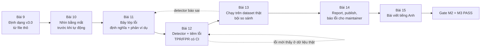
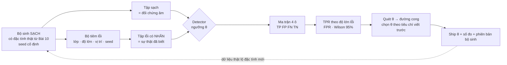
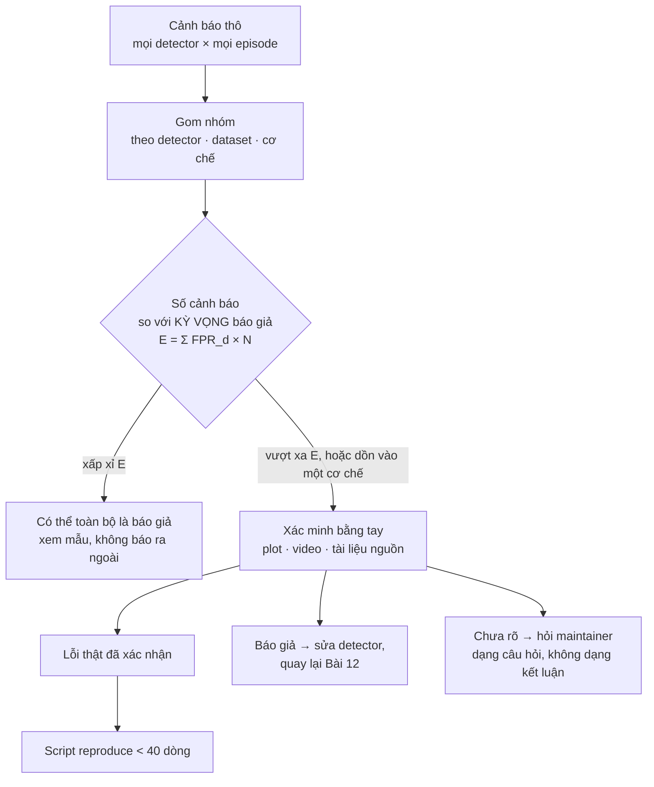

# KHÓA 2 · MODULE 2 — DATASET AUDIT TOOL (60h, trần 85h) ★

> **Milestone:** M3 · **Cần trước:** Gate Module 1 (`m1-mcap-cong-cu.md`), F3.7, F2.1; học đúng lúc: F2.5 + F1.4 (trước Bài 12), F1.5 (trước Bài 13), F1.7 (trước Bài 14) · **Artifact:** repo công khai `lerobot-audit` + một bài viết tiếng Anh + ít nhất một báo cáo lỗi gửi ra ngoài.

Module này biến một câu hỏi mơ hồ ("dataset này có sạch không?") thành một **phép đo có sai số**. Bạn sẽ đọc định dạng LeRobot từ file thô, nhìn dữ liệu bằng mắt, định nghĩa bảy lớp lỗi bằng toán, viết detector, **đo chính detector** bằng lỗi tiêm vào, rồi chạy trên dataset thật và báo cáo ra ngoài một cách trung thực.



| Bài | Giờ | Viên nang nền cần trước | Quyết định ra được |
|---|---|---|---|
| 9 | 6 | F3.6, F3.2 | Tool đọc file thô theo `codebase_version`, không qua `LeRobotDataset` |
| 10 | 6 | F1.2 | Lớp lỗi nào đáng viết detector, lớp nào chỉ người thấy |
| 11 | 8 | F3.7, F2.1 | Định nghĩa + ngưỡng + phản ví dụ cho từng lớp |
| 12 | 20 | F2.5, F1.4, F2.4 | Ngưỡng nào được ship, kèm TPR/FPR và khoảng tin cậy |
| 13 | 8 | F1.5, F1.7 | Phát hiện nào đủ chắc để báo ra ngoài |
| 14 | 8 | F1.7 | Báo ở kênh nào, viết issue thế nào |
| 15 | 4 | F1.7 | Bài viết nói gì, không nói gì |

**Thay đổi lớn so với bản gốc** (chi tiết ở phần 11 từng bài): bản gốc mô tả LeRobotDataset **v2.x** (một parquet + một mp4 mỗi episode); hai dataset có sẵn trong `data/` đều là **v3.0** (nhiều episode mỗi file, metadata episode dạng bảng quan hệ). Một số kiểm tra của bản gốc không còn đúng nghĩa trên v3.0, và vài detector gốc cần sửa định nghĩa sau khi chạy thử trên dữ liệu thật (Bài 11, phần 11).

---

## Bài 9 — LeRobot dataset format từ file thô (6h)

> **Vị trí:** Gate M1 (MCAP) → **Bài 9** → Bài 10 (nhìn bằng mắt) · **Cần trước:** F3.6 (Parquet, partition, catalog), F3.2 (file tự mô tả, schema evolution), K2 Bài 4 (cấu trúc MCAP) · **Sau bài này bạn quyết định được:** tool của bạn đọc dataset thế nào (thô hay qua thư viện), hỗ trợ phiên bản định dạng nào, và từ chối gì một cách có kiểm soát.

### 1. Câu chuyện — ai đã khổ vì chuyện này

LeRobot là thư viện robot learning của Hugging Face. Dataset của nó nằm trên HF Hub. Ở định dạng v2.x, mỗi episode là một file parquet và mỗi camera của mỗi episode là một file mp4. Khi dataset cộng đồng lớn tới hàng trăm nghìn hoặc hàng triệu episode, số file vượt giới hạn thực tế của filesystem và của Hub; việc liệt kê, tải và stream trở nên chậm. Tháng 9/2025 nhóm LeRobot công bố **LeRobotDataset v3.0**: gộp nhiều episode vào một file parquet và một file mp4, và dùng metadata dạng bảng để tìm lại từng episode bên trong file lớn `[spec: HF blog "Bringing large-scale datasets to lerobot", 09/2025; docs "LeRobotDataset v3.0"]`.

Đây đúng là bài toán bạn đã gặp ở backend: "small files problem" của data lake, giải bằng compaction và một catalog. Hệ quả cho người làm audit: **một tool viết cho v2.x sẽ đọc sai v3.0 mà không crash**, ví dụ suy số episode từ cách đặt tên/đếm file theo kiểu v2.x rồi đưa ra kết luận sai về dataset. Bản gốc của bài này (viết theo v2.x) có rủi ro đúng kiểu đó (xem phần 11).

### 2. Mô hình tư duy

Hai dataset có sẵn trong workspace, đọc từ `meta/info.json` thật:

| Trường | `data/lerobotpusht` | `data/libero` |
|---|---|---|
| `codebase_version` | `v3.0` | `v3.0` |
| `robot_type` | `unknown` | `panda` |
| `fps` | `10` (int) | `10.0` (float) |
| `total_episodes` / `total_frames` / `total_tasks` | 206 / 25 650 / 1 | 1 693 / 273 465 / 40 |
| Camera (`dtype: video`) | `observation.image` 96×96×3, AV1 | `observation.images.image`, `observation.images.image2`, 256×256×3, AV1 |
| `observation.state` | float32 [2], names `motor_0, motor_1` | float32 [8], names `["state"]` |
| `action` | float32 [2] | float32 [7] |
| Cột khác | `next.reward`, `next.done`, `next.success` | — |
| `timestamp` | **float32** | **float32** |
| `data_path` | `data/chunk-{chunk_index:03d}/file-{file_index:03d}.parquet` | như bên trái |
| `video_path` | `videos/{video_key}/chunk-{chunk_index:03d}/file-{file_index:03d}.mp4` | như bên trái |
| `data_files_size_in_mb` / `video_files_size_in_mb` | 100 / 500 | 100 / 500 |

Cấu trúc thư mục v3.0, vẽ theo đúng hai dataset trên:

```
<dataset>/
├── meta/
│   ├── info.json                 codebase_version, fps, features (dtype, shape, names), path template
│   ├── stats.json                min/max/mean/std/count (libero thêm q01..q99) cho từng feature
│   ├── tasks.parquet             task_index ↔ câu mô tả nhiệm vụ (thay tasks.jsonl của v2.x)
│   └── episodes/chunk-000/file-000.parquet
│                                 MỖI DÒNG MỘT EPISODE: length, dataset_from_index, dataset_to_index,
│                                 data/{chunk,file}_index, videos/<key>/{chunk,file}_index,
│                                 videos/<key>/{from,to}_timestamp, (pusht: stats/<feature>/...)
├── data/chunk-000/
│   └── file-000.parquet …        MỖI DÒNG MỘT FRAME, NHIỀU EPISODE MỖI FILE
└── videos/<video_key>/chunk-000/
    └── file-000.mp4 …            NHIỀU EPISODE NỐI LIỀN TRONG MỘT VIDEO
```

```mermaid
erDiagram
  EPISODES ||--|{ FRAMES : "dataset_from_index..dataset_to_index (index toàn cục)"
  EPISODES }|--|| DATA_FILE : "data/chunk_index, data/file_index"
  EPISODES }|--|| VIDEO_FILE : "videos/KEY/file_index + [from_timestamp, to_timestamp)"
  FRAMES }|--|| TASKS : task_index
  EPISODES { int episode_index int length int dataset_from_index int dataset_to_index }
  FRAMES { int index int episode_index int frame_index float32 timestamp list state list action }
  VIDEO_FILE { av1 frames concatenated }
```

Bản chất: **v3.0 là một bảng fact (frames) + một bảng dimension (episodes) + blob video, nối với nhau bằng khoảng index và khoảng thời gian.** Một episode không còn là một file; nó là một **khoảng dòng** trong parquet và một **khoảng thời gian** trong mp4. Mọi kiểm tra toàn vẹn phải đi qua bảng `meta/episodes`. Ảnh không nằm trong parquet vì nén video giảm dung lượng hàng chục lần so với ảnh thô `[ước lượng: 640×480×3 B = 921 600 B/frame thô; AV1 ở kích thước nhỏ thường vài KB/frame]`, đổi lại mất random access rẻ và có thêm một cách để ảnh lệch khỏi state.

### 3. Cầu nối từ backend

| Backend bạn biết | Ở đây | Gãy ở chỗ | Nếu dùng nhầm thì |
|---|---|---|---|
| Data lake: compaction gộp file nhỏ + catalog (Hive metastore, Iceberg manifest) | v3.0 gộp episode vào file lớn, `meta/episodes` là catalog | Catalog của bạn thường có transaction log và snapshot; `meta/episodes` chỉ là parquet thường, không có cơ chế nào bảo đảm nó khớp với `data/` | Tin catalog như nguồn sự thật, bỏ qua kiểm chéo, và bỏ sót đúng lớp lỗi L7 |
| Bảng fact + dimension trong warehouse | `data/*.parquet` + `meta/episodes` | Khóa nối không phải id mà là **khoảng** (`from_index..to_index`, `from_timestamp..to_timestamp`), và khoảng thời gian là float cộng dồn (`27.900000000000002`) | So sánh bằng `==` trên float, báo lệch giả hàng loạt |
| Schema trong Parquet footer | `info.json → features` + schema Arrow trong footer | Hai nguồn schema có thể không đồng ý (ví dụ `names` có 1 phần tử nhưng `shape` là 8); không ai bắt buộc chúng khớp | Viết reader tin `names` để đặt tên cột, crash hoặc gán nhầm tên |
| Blob ngoài bảng (S3 key trong cột) | video nằm ngoài parquet, tìm bằng template đường dẫn + khoảng thời gian | Không có khóa per-frame; nối ảnh với dòng bằng **thời gian** trong video | Đếm frame theo file như v2.x, kết luận sai |
| ORM che SQL | lớp `LeRobotDataset` che file | Wrapper có thể nội suy, bỏ qua, hoặc sửa thầm thứ bạn đang đi tìm; API của nó đổi theo phiên bản nhanh hơn định dạng file | Tool không bao giờ thấy lỗi mà wrapper đã "sửa" |

**Chấm mô hình:**

- *"LeRobot dataset chỉ là vài bảng parquet, đọc bằng pandas là xong, như data warehouse."* — **ĐÚNG MỘT PHẦN.** Phần bảng thì đúng. Gãy ở chỗ một nửa dữ liệu (ảnh) nằm trong video và chỉ nối được qua thời gian; và các bảng không có ràng buộc toàn vẹn nào. Phản ví dụ: parquet và `meta/episodes` khớp hoàn hảo, nhưng mp4 thiếu một frame ở giữa episode k. Pandas không bao giờ thấy.
- *"Đọc thẳng file thô thì luôn tốt hơn dùng thư viện."* — **ĐÚNG MỘT PHẦN.** Đúng cho audit: bạn muốn thấy cái wrapper che. Sai nếu tool của bạn **diễn giải** khác thư viện: người dùng train bằng `LeRobotDataset`, nên một "lỗi" mà thư viện xử lý đúng (ví dụ video decode theo timestamp gần nhất) có thể vô hại với họ. Tool tốt đọc thô để phát hiện, rồi kiểm "thư viện có thấy hậu quả không" trước khi gọi là lỗi nghiêm trọng.

### 4. Thuật ngữ

| Mức | Thuật ngữ | Nghĩa trong một câu | Hay bị hiểu nhầm thành |
|---|---|---|---|
| 🟢 | episode | Một lần thực hiện nhiệm vụ từ đầu tới cuối | Một file (đúng ở v2.x, sai ở v3.0) |
| 🟢 | frame / `index` / `frame_index` | Một dòng parquet; `index` toàn cục trên dataset, `frame_index` đếm lại từ 0 trong mỗi episode | Hai cột trùng nghĩa |
| 🟢 | `codebase_version` | Phiên bản **định dạng** dataset (`v2.0`, `v2.1`, `v3.0`) | Phiên bản gói `lerobot` (hai hệ đánh số khác nhau) |
| 🟢 | `meta/episodes` | Bảng một dòng mỗi episode: độ dài, khoảng index, file chứa, khoảng thời gian video | Log phụ, có thể bỏ qua |
| 🟢 | `from_timestamp`/`to_timestamp` | Vị trí (giây) của episode bên trong file mp4 gộp | Timestamp của frame trong parquet |
| 🟡 | `chunks_size`, `data_files_size_in_mb` | Số file tối đa mỗi thư mục chunk; ngưỡng **trên** của kích thước file | Kích thước thật của file |
| 🟡 | AV1, `yuv420p` | Codec và định dạng màu của video; giải mã cần ffmpeg/pyav đủ mới | Chi tiết không ảnh hưởng audit |
| 🟡 | `snapshot_download` | Tải toàn bộ repo dataset từ HF Hub về cache local | Stream (v3.0 hỗ trợ stream, nhưng audit nên đọc local) |
| 🔴 | Chi tiết `LeRobotDataset.__getitem__`, `delta_timestamps` | Cách thư viện ghép cửa sổ thời gian khi train | Cần cho audit ở bài này |

### 5. Dự đoán

Tạo `predictions/09-format.md` và commit **trước** khi chạy bất kỳ lệnh nào ở phần 6.

Đề bài: với `data/lerobotpusht`, `data/libero` và ba dataset bạn sẽ chọn thêm (khác robot, khác số camera, khác kích thước; ít nhất một dataset cộng đồng, không thuộc org `lerobot`), dự đoán kết quả của tám kiểm tra trong bảng dưới.

Tham số cần tra: `meta/info.json` của từng dataset (đọc trước được, đó là "datasheet"). Phương pháp: với mỗi kiểm tra, viết công thức sẽ dùng và kỳ vọng ĐẠT/TRƯỢT. Không đoán được thì ghi "không biết" kèm lý do; đó là một dự đoán hợp lệ.

```markdown
# 09-format — dự đoán (commit trước khi chạy)
Ngày: … · commit: …

| # | Kiểm tra (v3.0) | pusht | libero | ds3 | ds4 | ds5 |
|---|---|---|---|---|---|---|
| K1 | tổng số dòng parquet == total_frames | | | | | |
| K2 | số dòng meta/episodes == total_episodes | | | | | |
| K3 | sum(length) == total_frames, và from/to_index liên tục không chồng | | | | | |
| K4 | số packet video mỗi file == sum(length) của episode trỏ vào file đó | | | | | |
| K5 | (to_timestamp − from_timestamp)·fps ≈ length (dung sai 0,5 frame) | | | | | |
| K6 | timestamp mỗi episode bắt đầu ở 0 và tăng nghiêm ngặt | | | | | |
| K7 | trung vị diff(timestamp) lệch 1/fps < 1% | | | | | |
| K8 | frame_index = 0,1,2,… liên tục | | | | | |

Số file parquet của libero tôi đoán: … (từ total_frames và data_files_size_in_mb: …)
Bao nhiêu trong 5 dataset ĐẠT cả 8 kiểm tra: …
Một điều tôi nghĩ sẽ làm tôi bất ngờ: …
```

Gợi ý cho dòng "số file parquet": `data_files_size_in_mb` chỉ là ngưỡng trên. Hãy nói rõ bạn dựa vào giả định nào.

### 6. Làm

1. **Môi trường.** Venv riêng cho repo tool, pin phiên bản trong lockfile (→ F2.2). Tối thiểu: `pyarrow`, `numpy`, `huggingface_hub`; `ffprobe`/`ffplay` từ bản ffmpeg có decoder AV1 (libdav1d hoặc libaom; kiểm bằng `ffmpeg -decoders`) `[tự đo]`. Ví dụ đã chạy cho bài này: `pyarrow==18.1.0`, `numpy==2.2.6`, ffprobe 9.0.1. Chưa cần `pandas` hay `lerobot`.
2. **Tải dataset.** Hai dataset có sẵn ở `data/`. Ba cái còn lại tải bằng:
   ```python
   # [chưa chạy] — cần mạng; API huggingface_hub ổn định nhưng kiểm theo phiên bản bạn cài
   from huggingface_hub import snapshot_download
   local = snapshot_download(repo_id="<org>/<tên>", repo_type="dataset", revision="<commit-hash>")
   ```
   Ghi lại `revision` (commit hash) của từng dataset. Dataset trên Hub thay đổi; kết quả audit không có revision thì không tái lập được (→ F3.8).
3. **Đọc `info.json` của cả năm.** Điền bảng như phần 2. Nếu có dataset `codebase_version` v2.x, ghi lại: tool phải hỗ trợ cả hai, hoặc từ chối v2.x bằng thông báo rõ ràng. Không được im lặng đọc sai.
4. **Đọc parquet thô.** Mở một file, in schema Arrow và 20 dòng đầu. Nhìn: `observation.state` là `fixed_size_list` hay `list`? `timestamp` là float32 hay float64? Có metadata nhúng trong footer không (`huggingface` hoặc `pandas`)?
   ```python
   # [đã chạy] pyarrow 18.1 trên data/lerobotpusht và data/libero
   import pyarrow.parquet as pq, pyarrow as pa
   from pathlib import Path
   root = Path("data/libero")
   files = sorted((root / "data").glob("*/*.parquet"))
   t = pa.concat_tables([pq.read_table(f) for f in files])
   print(len(files), t.num_rows); print(t.schema); print(t.slice(0, 20).to_pylist()[:3])
   eps = pa.concat_tables([pq.read_table(f) for f in sorted((root / "meta/episodes").glob("*/*.parquet"))])
   print(eps.column_names)
   ```
5. **Chạy K1–K8** cho từng dataset. K4 dùng ffprobe trên từng file video:
   ```bash
   ffprobe -v error -select_streams v:0 -count_packets -show_entries stream=nb_read_packets -of csv=p=0 file-000.mp4
   ```
   `-count_packets` đọc container, không giải mã: nhanh. Số packet bằng số frame với video thường (mỗi packet một frame) `[chuẩn, kiểm bằng -count_frames trên một file nhỏ]`. Chỉ dùng `-count_frames` (giải mã toàn bộ, chậm hơn nhiều) khi cần xác nhận.
6. **So với dự đoán**, ghi `notes/09-format.md`: kiểm tra nào trượt, vì sao; bạn đã giả định gì sai về định dạng.

Sai số của "dụng cụ" ở bài này: timestamp là **float32**. Ở t ≈ 50 s, khoảng cách giữa hai số float32 liền kề là 2⁻¹⁸ s ≈ 3,8 µs `[chuẩn: IEEE 754, 24 bit mantissa]`. Mọi so sánh timestamp phải có dung sai cỡ đó, không dùng `==`.

### 7. Số phải ra

<details><summary>🔒 MỞ SAU KHI COMMIT prediction.md</summary>

Kết quả `[đã đo trên bản trong data/, 10/2026]`:

| Kiểm tra | pusht | libero |
|---|---|---|
| Số file parquet dữ liệu | 1 (cả 206 episode) | 377 (mỗi file 2–3 episode, ~54 KB; tổng ~20 MB) |
| Số file video mỗi camera | 1 | 37 |
| K1 dòng == total_frames | ĐẠT (25 650) | ĐẠT (273 465) |
| K2, K3 | ĐẠT; `index` liên tục 0..N−1 | ĐẠT |
| K4 packet mỗi file == sum(length) | ĐẠT (25 650 packet, duration 2565,0 s) | ĐẠT trên 37/37 file mỗi camera |
| K5 | ĐẠT mọi episode | ĐẠT |
| K6, K8 | ĐẠT | ĐẠT |
| K7 trung vị dt | 0,0999999 s | 0,1000000 s |
| max \|timestamp − frame_index/fps\| | ~0,8 µs | ~1,5 µs |
| Độ dài episode (trung vị / min / max) | 122 / 49 / 246 | 140 / 75 / 505 |

Ba điều thường làm bất ngờ:

1. **"Số file parquet = total_episodes" (kiểm tra của bản gốc) TRƯỢT trên cả hai dataset** dù dữ liệu lành: 1 ≠ 206 và 377 ≠ 1 693. Kiểm tra sai, không phải dữ liệu sai. Đây là cảnh báo giả do áp định dạng v2.x lên v3.0.
2. **Libero có file nhỏ hơn nhiều so với `data_files_size_in_mb: 100`.** Đó là ngưỡng trên; bộ chuyển đổi đã cắt file theo cách khác. Ai dự đoán "1 file vì 20 MB < 100 MB" thì dự đoán sai, và hợp lý khi sai.
3. **timestamp gần như đúng bằng `frame_index / fps`** (chỉ lệch do làm tròn float32). Nghĩa là timestamp ở đây **được tính ra**, không phải **được đo** từ đồng hồ. Ghi nhớ điều này cho L2 ở Bài 11: detector rớt frame dựa trên timestamp sẽ mù trên dataset kiểu này.

Ba dataset bạn tự chọn: không có số chung. Tỉ lệ "ĐẠT cả 8" thấp hơn 5/5 là bình thường, nhất là với dataset cộng đồng hoặc còn ở v2.x. Kết quả 5/5 ĐẠT cũng không nói "sạch" — chỉ nói tám kiểm tra cấu trúc không thấy gì.

</details>

### 8. Nếu ra khác

| Triệu chứng | Nguyên nhân khả dĩ | Kiểm bằng cách | Sửa |
|---|---|---|---|
| Số file parquet ≪ total_episodes | Dataset v3.0, nhiều episode mỗi file | Đọc `codebase_version`, đếm `episode_index` duy nhất | Đổi kiểm tra sang K2/K3 qua `meta/episodes` |
| Không có `meta/episodes/`, có `episodes.jsonl` | Dataset v2.x | `codebase_version` bắt đầu bằng `v2` | Viết reader v2 riêng, hoặc từ chối có thông báo |
| `pq.read_table` lỗi kiểu ở `observation.state` | Hai file khác kiểu (`list` vs `fixed_size_list`) khi concat | In schema từng file | Đọc từng file, chuẩn hóa về numpy trước khi gộp; ghi lại khác biệt (đó là phát hiện L7) |
| ffprobe báo codec không hỗ trợ | ffmpeg cũ không có decoder AV1 | `ffprobe -codecs | findstr av1` | Cài ffmpeg mới hơn; `-count_packets` vẫn chạy vì không giải mã |
| ffprobe `-count_frames` chạy hàng chục phút | Đang giải mã toàn bộ AV1 | Thử `-count_packets` | Chỉ giải mã khi cần xác nhận |
| K5 lệch 1 frame ở rất nhiều episode | So sánh `==` trên float cộng dồn | In `(to−from)*fps − length` | Dung sai 0,5 frame |

### 9. Câu hỏi ngược

1. **[Vì sao không]** Vì sao v3.0 không lưu mỗi frame ảnh thành một cột bytes trong parquet, khi parquet đã hỗ trợ random access theo row group?
<details><summary>Hướng nghĩ</summary>

So sánh nén nội khung (JPEG/PNG từng ảnh) với nén liên khung (video tận dụng frame trước). Robot quay chậm, frame liền kề rất giống nhau. Rồi nghĩ cái giá: muốn lấy frame k phải giải mã từ keyframe gần nhất. Ai trả cái giá đó, lúc train hay lúc ghi?

</details>

2. **[Failure mode]** Một bộ chuyển đổi v2.1 → v3.0 bị kill giữa chừng. Trạng thái nào của `data/`, `videos/`, `meta/episodes` có thể xảy ra, và kiểm tra nào trong K1–K8 bắt được từng trạng thái?
<details><summary>Hướng nghĩ</summary>

Liệt kê thứ tự ghi có thể có (data trước hay meta trước?). Mỗi thứ tự cho một kiểu "nửa vời" khác nhau. So với MCAP bị cắt ở K2 Bài 7: ở đó có summary/index ở cuối file; ở đây "index" nằm ở file khác.

</details>

3. **[Quy mô]** Dataset 1 triệu episode, 2 camera, trung bình 300 frame. Tool của bạn chạy K4 bằng một lệnh ffprobe mỗi file video. Ước lượng số file, thời gian, và băng thông tải nếu không có dataset local.
<details><summary>Hướng nghĩ</summary>

Số file phụ thuộc `video_files_size_in_mb` và bitrate. Tự đo thời gian ffprobe trên một file 37 MB của libero. Rồi hỏi: K4 có cần tải toàn bộ video không, hay chỉ cần đọc header/index của container?

</details>

4. **[Phản biện]** "Metadata `stats.json` khớp chính xác min/max với dữ liệu, nên dataset được sinh cẩn thận." Lập luận này mạnh tới đâu?
<details><summary>Hướng nghĩ</summary>

`stats.json` được tính **từ** chính dữ liệu bởi cùng công cụ. Nó khớp chứng minh công cụ chạy xong, không chứng minh dữ liệu đúng vật lý. Đó là kiểm tra nhất quán nội bộ, không phải kiểm tra với thực tế (→ F3.7).

</details>

5. **[Nếu…thì]** Nếu `fps` trong `info.json` là `10` (int) ở dataset này và `10.0` (float) ở dataset kia, reader của bạn gãy ở đâu, nếu có?
<details><summary>Hướng nghĩ</summary>

Tìm các chỗ dùng `fps` làm chỉ số mảng (`win = fps`), làm khóa dict, hoặc so sánh bằng `==` với `video.fps`. Đây là kiểu khác biệt mà JSON không chặn.

</details>

### 10. Liên kết ra ngoài

- **Apache Iceberg / Delta Lake.** Cũng giải bài toán file nhỏ bằng file lớn + manifest. Giống: catalog trỏ vào khoảng dữ liệu trong file. Khác: Iceberg có snapshot và commit nguyên tử; LeRobot v3.0 không có, nên "meta khớp data" là thứ phải kiểm, không phải thứ được bảo đảm.
- **MP4 / ISO BMFF.** Bảng mẫu (`stts`, `stsz`) trong container là một index thời gian → byte. Giống `meta/episodes` ở chỗ cho phép tìm theo thời gian mà không giải mã. Khác: nó nằm trong chính file video, còn khoảng episode nằm ở parquet khác.
- **Genomics (BAM + BAI).** File dữ liệu lớn + file index riêng theo tọa độ. Một BAI cũ không khớp BAM mới cho kết quả sai mà không lỗi, đúng kiểu L7.

### 11. Độ tin cậy và sửa lỗi

| Khẳng định | Nhãn | Ghi chú / cách kiểm |
|---|---|---|
| v3.0 gộp nhiều episode mỗi file, metadata episode ở `meta/episodes/*.parquet`, tasks ở `tasks.parquet` | `[spec]` HF docs "LeRobotDataset v3.0"; `[tự đo]` xác nhận trên `data/` | Đọc lại docs theo phiên bản; định dạng có thể có v3.x sau |
| v3.0 ra đời vì giới hạn số file khi dataset lớn | `[spec]` HF blog 09/2025 | |
| v3.0 xuất hiện từ gói lerobot 0.4.0 | `[tự đo]` | Một nguồn thứ cấp nói vậy; kiểm changelog |
| Số packet = số frame với video thường | `[chuẩn]` | Kiểm bằng `-count_frames` trên một file |
| float32 ở 50 s có bước ~3,8 µs | `[chuẩn]` IEEE 754 | `np.spacing(np.float32(50))` |
| Bảng số ở phần 7 | `[tự đo]` | Trên bản local; revision Hub chưa ghi |

**Đã sửa so với bản gốc:**
- Bản gốc mô tả v2.x (`episodes.jsonl`, `tasks.jsonl`, `episode_000000.parquet`, `videos/chunk-000/<key>/episode_*.mp4`). Dữ liệu thật trong `data/` là v3.0. Đã viết lại cấu trúc theo `info.json` thật và thêm sơ đồ quan hệ.
- Hai kiểm tra "số file parquet = total_episodes" và "số frame mp4 của episode k = số dòng parquet của episode k" không áp được trên v3.0. Đã thay bằng K2–K5 qua `meta/episodes`.
- Thêm kiểm tra theo `codebase_version` và yêu cầu ghi revision Hub.
- `pip install` không pin phiên bản → pin trong lockfile.

### 12. Đọc thêm và tự kiểm tra

- **Nguồn gốc:** Hugging Face, *LeRobotDataset v3.0* (docs lerobot); thư mục `src/lerobot/datasets/` trong repo `huggingface/lerobot` (đọc kiến trúc, tên đường dẫn có thể đổi `[tự đo]`).
- **Giải thích:** HF blog *Bringing large-scale datasets to lerobot* (09/2025); docs *Porting datasets to v3.0*.
- **Đào sâu (tùy chọn):** đặc tả Apache Parquet (row group, footer, statistics) — để hiểu vì sao đọc `meta/episodes` rẻ hơn quét `data/`.
- **Tự kiểm tra:** (1) giải thích cho một backend engineer khác trong 5 câu vì sao "đếm file" không còn là cách đếm episode; (2) vẽ lại sơ đồ quan hệ ở phần 2 từ trí nhớ; (3) câu hỏi dưới.

Episode 3 của libero có `dataset_from_index = 843`, `length` bạn tự tra. Viết biểu thức lấy đúng các dòng của nó từ bảng frames, và biểu thức lấy đúng các frame video của nó.
<details><summary>Đáp án</summary>

Dòng: `index ∈ [dataset_from_index, dataset_to_index)` (hoặc lọc `episode_index == 3`; hai cách phải cho cùng kết quả, và đó là một kiểm tra). Video: mở file theo `videos/<key>/chunk_index`, `file_index`; lấy frame có pts ∈ [`from_timestamp`, `to_timestamp`), dùng dung sai nửa frame vì biên là float cộng dồn.

</details>

---

## Bài 10 — Nhìn bằng mắt trước khi tự động hóa (6h)

> **Vị trí:** Bài 9 (đọc được file) → **Bài 10** → Bài 11 (định nghĩa lỗi bằng toán) · **Cần trước:** F1.2 (histogram, đuôi phân bố), Bài 9 · **Sau bài này bạn quyết định được:** lớp lỗi nào đáng viết detector, lớp nào để người nhìn, và mỗi kênh dữ liệu **thật sự là đại lượng gì** trước khi so nó với kênh khác.

### 1. Câu chuyện — ai đã khổ vì chuyện này

Năm 1973 nhà thống kê Francis Anscombe công bố bốn bộ dữ liệu có cùng trung bình, phương sai, hệ số tương quan và đường hồi quy, nhưng vẽ ra thì khác hẳn nhau: một đường thẳng có nhiễu, một đường cong, một đường thẳng hoàn hảo bị một điểm ngoại lai kéo lệch, một cột dọc với một điểm xa. Năm 2017 Matejka và Fitzmaurice (Autodesk Research) làm lại ý đó với "Datasaurus Dozen": mười ba bộ cùng thống kê tóm tắt, trong đó có một bộ vẽ ra hình con khủng long. Bài học họ muốn để lại: **thống kê tóm tắt là một phép nén có mất mát; mắt người thấy được cái phép nén bỏ đi.**

Detector cũng là thống kê tóm tắt. Nếu bạn viết detector trước khi nhìn dữ liệu, bạn mã hóa lỗi **bạn tưởng tượng**. Ở Bài 11 bạn sẽ thử các detector của bản gốc, viết từ tưởng tượng hợp lý, trên dữ liệu thật, và tự kiểm xem cái nào đứng vững khi người viết chưa nhìn `action` của dataset đó là đại lượng gì.

### 2. Mô hình tư duy

```
            ┌────────────── những gì sai trong dataset ──────────────┐
            │                                                          │
            │   ┌── máy thấy được ──┐        ┌── chỉ người thấy ──┐    │
            │   │ L1 ts chạy lùi     │        │ episode thất bại    │    │
            │   │ L3 video ≠ dòng    │        │ camera bị che       │    │
            │   │ L6 NaN             │        │ nhiệm vụ sai mô tả  │    │
            │   │ L7 meta ≠ data     │        │ người teleop do dự  │    │
            │   └────────────────────┘        └─────────────────────┘    │
            │          ┌── máy thấy được NẾU biết ngữ nghĩa kênh ──┐     │
            │          │ L4 kênh đơ, L5 lệch pha, L6 nhảy bậc       │     │
            │          └────────────────────────────────────────────┘     │
            └──────────────────────────────────────────────────────────┘
```

Ba vùng, ba cách xử lý. Vùng trái: tự động hóa thẳng. Vùng phải: tool không bắt được, phải ghi vào phần **Giới hạn** của README (Bài 15). Vùng giữa là chỗ giá trị thật của tool nằm, và cũng là chỗ dễ sai nhất: một detector so `action[j]` với `state[j]` chỉ có nghĩa khi hai kênh **cùng đại lượng, cùng đơn vị**. Bài này tồn tại để bạn biết điều đó **trước** khi viết code, bằng cách vẽ ra và đọc tài liệu nguồn của dataset.

Hình phải tạo ra ở bài này (script ở phần 6 sinh đúng ba panel này cho một episode bất kỳ):

```
 panel 1: histogram diff(timestamp), trục y log   → hình dạng jitter? hay vạch rời rạc?
 panel 2: mọi chiều observation.state theo frame   → chiều nào phẳng? chiều nào nhảy bậc?
 panel 3: state[0] và action[0] chồng lên nhau      → cùng đại lượng? lệch pha bao nhiêu?
```

### 3. Cầu nối từ backend

| Backend bạn biết | Ở đây | Gãy ở chỗ | Nếu dùng nhầm thì |
|---|---|---|---|
| Đọc log thô trước khi viết alert rule | Vẽ state/action/dt trước khi viết detector | Log có ngữ nghĩa ghi bằng chữ; một cột `action` float32[7] không nói nó là vị trí tuyệt đối, vận tốc hay delta | Viết rule so sánh hai cột khác đại lượng, cảnh báo giả hàng loạt |
| Profiling dữ liệu (pandas-profiling, Great Expectations "expectation suite" sinh tự động) | Thống kê mỗi cột | Profile mỗi cột độc lập; lỗi robot thường nằm ở **quan hệ** giữa cột (state theo action, ảnh theo state) và theo thời gian | Profile sạch, dữ liệu vẫn lệch pha |
| Golden dataset tự dựng bằng server mock | Dataset tổng hợp ở Bài 12 | Mock của bạn chỉ có đặc tính bạn biết; dữ liệu robot có đặc tính bạn chưa biết (lượng tử hóa, action delta, gripper đứng yên rồi nhảy) | Detector pass golden, sai trên thật — đúng triệu chứng cuối ở bảng "Nếu ra khác" của Bài 12 |
| Xem replay phiên người dùng (session replay) | Xem video episode | Video ở đây gộp nhiều episode, phải cắt theo `from_timestamp` | Xem nhầm episode, ghi chú sai |

**Chấm mô hình:**

- *"Viết đủ detector thì không cần nhìn bằng mắt."* — **SAI.** Phản ví dụ: một episode thất bại (tay không chạm vật, khối T không tới đích) có timestamp hoàn hảo, schema hợp lệ, không NaN; không detector nào trong bảy lớp thấy nó. Bước 5 phần 6 là nơi bạn đi tìm trường hợp như vậy trong `data/`. Và ngược lại, detector viết trước khi nhìn sẽ báo lỗi ở chỗ không có lỗi (Bài 11).
- *"Nhìn bằng mắt là thủ công, không scale, chỉ làm một lần."* — **ĐÚNG MỘT PHẦN.** Không scale tới 1 693 episode, đúng. Nhưng nó là bước **hiệu chuẩn** của detector, và phải lặp lại mỗi khi gặp dataset có robot/action space mới. Tương đương: bạn không đọc mọi dòng log, nhưng đọc mẫu log mỗi khi thêm service mới.

### 4. Thuật ngữ

| Mức | Thuật ngữ | Nghĩa trong một câu | Hay bị hiểu nhầm thành |
|---|---|---|---|
| 🟢 | action space | Đại lượng mà `action` biểu diễn: vị trí khớp tuyệt đối, vị trí đích, vận tốc, delta pose đầu công cụ… | "Lệnh gửi tới robot", như thể chỉ có một loại |
| 🟢 | end-effector (EEF) | Đầu công cụ của tay máy (kẹp); state kiểu EEF là vị trí + hướng của nó | Khớp |
| 🟢 | episode thất bại | Episode mà nhiệm vụ không hoàn thành; dữ liệu hợp lệ nhưng có thể có hại cho imitation learning | Lỗi dữ liệu |
| 🟡 | teleoperation | Người điều khiển robot từ xa để thu demo | Tự động |
| 🟡 | lượng tử hóa (quantization) | Giá trị chỉ nhận một tập rời rạc (số nguyên pixel, tick encoder, bước float32) | Nhiễu |
| 🔴 | Chi tiết bộ điều khiển OSC của robosuite | Cách sim biến delta EEF thành mô-men | Cần cho bài này |

### 5. Dự đoán

Commit `predictions/10-manual-survey.md` trước khi chạy script. Với mỗi dataset (năm cái của Bài 9):

Tham số cần tra **trước**: README/dataset card, paper gốc của dataset (pusht: Diffusion Policy, Chi và cộng sự; libero: LIBERO, Liu và cộng sự 2023), mã thu dữ liệu nếu có. Câu hỏi chính: `action` là đại lượng gì so với `observation.state`?

```markdown
# 10-manual-survey — dự đoán
| Câu hỏi | pusht | libero | ds3 | ds4 | ds5 |
|---|---|---|---|---|---|
| % dt lệch >10% khỏi 1/fps | | | | | |
| Hình dạng histogram dt (liên tục? vạch?) | | | | | |
| Có chiều state đứng yên tuyệt đối ≥1 s khi chiều khác động? | | | | | |
| action là: vị trí tuyệt đối / vị trí đích / delta / vận tốc / không rõ | | | | | |
| Lệch pha nhìn thấy action→state (frame) | | | | | |
| Độ dài episode: trung vị / min / max | | | | | |
| Dữ liệu là robot thật hay sim? Hệ quả cho nhiễu? | | | | | |
Điều tôi nghĩ sẽ bất ngờ: …
```

### 6. Làm

1. **Script khảo sát.** Chạy cho từng dataset và ba episode mỗi dataset (đầu, giữa, episode dài nhất):

```python
# [đã chạy] pyarrow 18.1, numpy 2.2, matplotlib — khảo sát tay một dataset LeRobot v3.0
# dùng: python survey10.py <thư mục dataset> <episode_index>
import json, sys
from pathlib import Path
import numpy as np
import pyarrow as pa, pyarrow.parquet as pq
import matplotlib.pyplot as plt

root = Path(sys.argv[1]); EP = int(sys.argv[2]) if len(sys.argv) > 2 else 0
info = json.loads((root / "meta/info.json").read_text()); fps = float(info["fps"])
t = pa.concat_tables([pq.read_table(f, columns=["episode_index", "timestamp", "observation.state", "action"])
                      for f in sorted((root / "data").glob("*/*.parquet"))])
ep = np.asarray(t["episode_index"]); ts = np.asarray(t["timestamp"], dtype=np.float64)
S = np.array(t["observation.state"].to_pylist()); A = np.array(t["action"].to_pylist())

same = ep[1:] == ep[:-1]                       # chỉ lấy dt bên trong một episode
dt = np.diff(ts)[same]
lens = np.bincount(ep)
print(f"dt lệch >10% khỏi 1/fps: {np.mean(np.abs(dt - 1/fps) > 0.1/fps):.4%}")
print(f"độ dài episode: trung vị {np.median(lens):.0f}, min {lens.min()}, max {lens.max()}")

m = ep == EP; s, a = S[m], A[m]
fig, ax = plt.subplots(3, 1, figsize=(9, 8))
ax[0].hist(dt * 1000, bins=100); ax[0].set_xlabel("dt (ms)"); ax[0].set_yscale("log")
ax[0].set_title(f"{root.name}: diff(timestamp), mọi episode")
for j in range(s.shape[1]):
    ax[1].plot(s[:, j], lw=0.8, label=f"state[{j}]")
ax[1].set_title(f"observation.state, episode {EP}"); ax[1].legend(fontsize=6, ncol=4)
ax[2].plot(s[:, 0], label="state[0]"); ax[2].plot(a[:, 0], "--", label="action[0]")
ax[2].set_xlabel("frame"); ax[2].legend(); ax[2].set_title("cùng chỉ số 0: có cùng đại lượng không?")
fig.tight_layout(); plt.show()
```

2. **Panel 1 — dt.** Mô tả hình bằng lời trước khi đọc trục. Rồi đọc trục x: đơn vị và độ rộng thật. Hỏi: độ rộng này có lớn hơn bước float32 ở Bài 9 phần 6 không?
3. **Panel 2 — state.** Với mỗi chiều: phẳng, trơn, nhảy bậc, bão hòa ở biên? Tra `names` trong `info.json`; nếu `names` không đủ để biết chiều nào là gì, ghi lại (đó là một phát hiện L7 tiềm năng).
4. **Panel 3 — action vs state.** Đọc tài liệu nguồn về action space **trước** khi nhìn. Nếu action là vị trí đích: kỳ vọng action dẫn trước state vài frame. Nếu action là delta/vận tốc: hãy chồng `action[0]` với `diff(state[0])` thay vì `state[0]`. Ghi cả hai.
5. **Xem video ba episode** mỗi dataset. Video gộp nhiều episode, nên cắt theo `meta/episodes`:
   ```bash
   # [chưa chạy] cần ffplay có decoder AV1; FROM = videos/<key>/from_timestamp, DUR = length / fps
   ffplay -ss FROM -t DUR -vf scale=384:-1 videos/observation.image/chunk-000/file-000.mp4
   ```
   Hỏi: nhiệm vụ có hoàn thành không? Camera có bị che? Episode có bị cắt giữa động tác? Ảnh có khớp chuyển động state không (nhìn một chỗ đổi hướng rõ)?
6. **Phân bố độ dài episode.** Histogram. Đuôi dài có thể là người teleop do dự, cũng có thể là episode thất bại kéo dài tới timeout.
7. **Cột lạ.** In mọi cột không thuộc nhóm chuẩn (`next.reward`, `next.done`, `next.success` ở pusht). Với mỗi cột: phân bố giá trị, vị trí trong episode. Cột hằng số trên toàn dataset là một câu hỏi, chưa phải lỗi.
8. Ghi `notes/10-manual-survey.md`, có ít nhất một điều bất ngờ và một danh sách "đặc tính thật cần đưa vào bộ sinh dữ liệu tổng hợp ở Bài 12".

Sai số của dụng cụ: mắt bạn trên plot 200 frame không phân biệt được lệch pha 1 frame một cách tin cậy. "Nhìn thấy lệch 2 frame" là ước lượng ±1 frame; số chính xác để Bài 11–12 đo.

### 7. Số phải ra

<details><summary>🔒 MỞ SAU KHI COMMIT prediction.md</summary>

`[đã đo trên data/, 10/2026]`

| Câu hỏi | pusht | libero |
|---|---|---|
| % dt lệch >10% | 0 % | 0 % |
| Histogram dt | Vài vạch rời rạc cách nhau ~µs quanh 100 ms | Như bên trái: các vạch ở khoảng ±0,0015 ms quanh 100 ms. Đó là **bước float32**, không phải jitter |
| Chiều state đứng yên tuyệt đối ≥1 s khi chiều khác động | Không có | Không có |
| action là | Vị trí đích của agent, **số nguyên** (toạ độ pixel, 100 % giá trị nguyên); state là vị trí thật (float) | **Delta/vận tốc** đầu công cụ (7 chiều: 3 tịnh tiến, 3 quay, 1 kẹp), state là vị trí + hướng EEF + 2 ngón kẹp (8 chiều). `action[0]` trông như đạo hàm của `state[0]`, không như `state[0]` |
| Lệch pha nhìn thấy | action dẫn trước state ~2 frame | so với `diff(state[0])`: ~1–2 frame |
| Độ dài episode | 122 / 49 / 246 | 140 / 75 / 505 |
| Robot thật hay sim | Sim (gym-pusht) | Sim (robosuite/MuJoCo) |

Ghi chú về chiều state của libero (EEF pos, axis-angle, 2 ngón kẹp) là suy từ hình dạng và tài liệu LIBERO; `names: ["state"]` trong `info.json` không nói điều đó. `[tự đo]`

Điều bất ngờ thường gặp:
- Cả hai dataset là **sim**, timestamp được tính ra, không có nhiễu cảm biến. Mọi giả định "cảm biến thật luôn có nhiễu ở bit thấp nhất" (L4 bản gốc) không áp được.
- Ở pusht, `next.success` là **False ở mọi frame của mọi episode**, và `next.done` là True ở **hai** frame cuối mỗi episode, không phải một. Reward lớn nhất mỗi episode nằm trong khoảng 0,81–0,95. Chưa biết đây là lỗi hay quy ước (ngưỡng success của môi trường cao hơn mức các demo đạt?). Mang sang Bài 13 để kiểm.
- Với libero, ai vẽ `state[0]` với `action[0]` và kết luận "không liên quan, ghép sai kênh" là đã gặp đúng cái bẫy mà bài này tồn tại để tránh.

</details>

### 8. Nếu ra khác

| Triệu chứng | Nguyên nhân khả dĩ | Kiểm bằng cách | Sửa |
|---|---|---|---|
| Histogram dt chỉ có một cột | `bins` quá thô so với độ rộng thật | In `np.unique(dt)` | Tăng bins hoặc vẽ `dt − 1/fps` |
| Histogram dt có hai đỉnh rõ (ví dụ 1/fps và 2/fps) | Rớt frame thật, hoặc dataset ghép từ hai nguồn fps khác nhau | Lọc theo episode, xem đỉnh 2/fps nằm ở episode nào | Ghi lại; đây là ứng viên L2 thật |
| `action` và `state` khác số chiều | Action space khác state space (libero 7 vs 8) | Đọc tài liệu dataset | Không ghép theo chỉ số; viết ánh xạ tường minh |
| ffplay không mở được | Thiếu decoder AV1 | `ffmpeg -decoders | findstr av1` | Cài bản ffmpeg có `libdav1d` |
| Mọi thứ trông hoàn hảo ở cả 5 dataset | Chọn dataset quá sạch, hoặc nhìn chưa kỹ | Có dataset robot thật nào chưa? Đã xem video chưa? | Thêm một dataset robot thật do cộng đồng thu |

### 9. Câu hỏi ngược

1. **[Liên ngành]** Trong y khoa, bác sĩ đọc phim X-quang trước, rồi mới có thuật toán hỗ trợ. Vì sao các hệ CAD (computer-aided detection) đều được đánh giá bằng cách so với người đọc, và điều đó nói gì về cách bạn đánh giá tool ở Bài 13?
<details><summary>Hướng nghĩ</summary>

Người đọc là "trọng tài" (oracle), nhưng trọng tài cũng có tỉ lệ sai. Nghĩ tới việc bạn xác minh bằng tay mỗi phát hiện ở Bài 13: bạn đang là trọng tài. Ai kiểm bạn? (→ F2.1, F2.8 kappa)

</details>

2. **[Failure mode]** Bạn xem 3 episode/dataset và không thấy episode thất bại nào. Xác suất bỏ sót nếu thật ra 10 % episode thất bại là bao nhiêu? Bao nhiêu episode phải xem để xác suất bỏ sót < 5 %?
<details><summary>Hướng nghĩ</summary>

(1 − p)^n. Đó cũng là logic của "rule of three" (→ F1.4). Kết luận về cỡ mẫu khảo sát tay, không về dataset.

</details>

3. **[Vì sao không]** Vì sao không dùng luôn `stats.json` (mean/std từng chiều) để phát hiện kênh đơ thay vì vẽ?
<details><summary>Hướng nghĩ</summary>

Stats là trên **toàn dataset**. Một chiều đơ trong 2 s ở 1 episode trong 1 693 gần như không đổi std toàn cục. Lỗi cục bộ cần thống kê cục bộ.

</details>

4. **[Quy mô]** Có 100 dataset, mỗi dataset một action space khác nhau. Bước "đọc tài liệu để biết action là gì" không scale. Tool của bạn nên làm gì?
<details><summary>Hướng nghĩ</summary>

Hai hướng: yêu cầu metadata khai báo action space (data contract, → F3.7), hoặc tool tự suy (thử cả `state` lẫn `diff(state)`, chọn cái tương quan hơn) **và ghi rõ đã suy**. Cái nào cho kết quả tái lập được?

</details>

5. **[Phản biện]** "Dataset sim thì timestamp luôn đúng, không cần audit L1/L2." Đúng tới đâu?
<details><summary>Hướng nghĩ</summary>

Timestamp tính ra đúng **theo định nghĩa**, nhưng sim có thể rớt bước render, hoặc bộ chuyển đổi có thể ghép sai. Kiểm L1/L2 trên sim là kiểm **pipeline ghi**, không kiểm đồng hồ.

</details>

### 10. Liên kết ra ngoài

- **Exploratory Data Analysis (John Tukey, 1977).** Tukey tách hai việc: khám phá (nhìn, đặt giả thuyết) và khẳng định (kiểm định). Bài 10 là khám phá, Bài 12–13 là khẳng định. Trộn hai việc trên cùng dữ liệu là nguồn gốc của "garden of forking paths" mà Bài 13 phải phòng.
- **Flight data monitoring (FOQA) trong hàng không.** Hãng bay chạy hàng trăm rule tự động trên dữ liệu chuyến bay, nhưng mọi sự kiện vượt ngưỡng đều được chuyên viên xem lại cùng ngữ cảnh trước khi kết luận. Giống: tự động để lọc, người để phán. Khác: ở đó ngữ nghĩa mỗi kênh được chuẩn hóa trước; ở dataset robot thì chưa.

### 11. Độ tin cậy và sửa lỗi

| Khẳng định | Nhãn | Ghi chú / cách kiểm |
|---|---|---|
| Anscombe 1973; Datasaurus Dozen 2017 | `[chuẩn]` | Matejka & Fitzmaurice, CHI 2017 |
| pusht action là vị trí đích nguyên; libero action là delta EEF | `[tự đo]` | Suy từ dữ liệu + paper; xác nhận bằng mã thu dữ liệu nếu có |
| Vạch trong histogram dt là bước float32 | `[tự đo]` | So độ rộng vạch với `np.spacing(np.float32(t))` ở t của episode |
| Các số ở phần 7 | `[tự đo]` | Trên bản local, chưa gắn revision Hub |

**Đã sửa so với bản gốc:**
- Bước 3 gốc "vẽ action và state cùng một khớp, chồng lên nhau" mặc định hai kênh cùng đại lượng. Đã thêm bước đọc action space trước, và nhánh `diff(state)` cho action delta.
- Bước 4 gốc "mở video, xem 3 episode" không nói cách cắt episode trong video gộp v3.0. Đã thêm lệnh cắt theo `from_timestamp`.
- Thêm bước 7 (cột lạ) và yêu cầu ghi "đặc tính thật cần đưa vào bộ sinh tổng hợp", nối thẳng với triệu chứng "đúng trên tổng hợp, sai trên thật" của Bài 12.
- Câu gốc "nếu 5 dataset đều hoàn hảo… bạn chưa nhìn đủ kỹ" giữ ý, nhưng đổi thành hành động cụ thể (thêm dataset robot thật), vì "hoàn hảo trên 5 kiểm tra" không phải bằng chứng là nhìn chưa kỹ.

### 12. Đọc thêm và tự kiểm tra

- **Nguồn gốc:** paper Diffusion Policy (Chi và cộng sự, RSS 2023 / IJRR 2024) mục môi trường Push-T; paper LIBERO (Liu và cộng sự, NeurIPS 2023 Datasets and Benchmarks).
- **Giải thích:** Anscombe, "Graphs in Statistical Analysis", *The American Statistician*, 1973.
- **Đào sâu (tùy chọn):** Tukey, *Exploratory Data Analysis* (1977), chương đầu.
- **Tự kiểm tra:** (1) giải thích cho một backend engineer khác trong 5 câu vì sao phải biết action space trước khi viết detector lệch pha; (2) vẽ lại hình ba vùng ở phần 2; (3) câu hỏi dưới.

Histogram `dt` của một dataset robot thật cho một đỉnh ở 33,3 ms rộng ±3 ms và một đỉnh nhỏ ở 66,7 ms. Ba giả thuyết nào, và bạn phân biệt chúng bằng gì?
<details><summary>Đáp án</summary>

(a) Rớt frame thật (camera/ghi bỏ một frame) → kiểm `frame_index` hoặc sequence nếu có, và xem state có "nhảy" gấp đôi bước bình thường ở đó không. (b) Timestamp là lúc host nhận, có lúc hai frame dồn và một khoảng trống → đỉnh 66,7 ms đi kèm dt rất nhỏ ngay cạnh. (c) Dataset ghép từ episode 15 fps và 30 fps → đỉnh 66,7 ms tập trung ở một nhóm episode, không rải rác.

</details>

---

## Bài 11 — Bảy lớp lỗi: định nghĩa, toán, và phản ví dụ (8h)

> **Vị trí:** Bài 10 (đã nhìn dữ liệu) → **Bài 11** → Bài 12 (viết detector, đo chính detector) · **Cần trước:** F3.7 (validate theo schema vs theo vật lý), F2.1 (test là một phép đo có dương tính giả/âm tính giả), Bài 9–10 · **Sau bài này bạn quyết định được:** với mỗi lớp lỗi, định nghĩa chính xác, ngưỡng ban đầu, mức nghiêm trọng, và **điều kiện mà detector không được dùng** (vì sẽ báo giả hoặc mù).

### 1. Câu chuyện — ai đã khổ vì chuyện này

Đêm 31/12/2016, một giây nhuận được chèn vào UTC. Trong hệ DNS của Cloudflare (RRDNS, viết bằng Go), một đoạn code lấy hiệu hai lần đọc đồng hồ wall-clock để chọn upstream; khi đồng hồ lùi lại, hiệu đó âm, và một phép tính với số âm làm chương trình panic. Một phần lưu lượng DNS bị lỗi cho tới khi họ vá. Cloudflare viết postmortem công khai, và sau đó Go bổ sung đồng hồ monotonic vào `time.Now()` (Go 1.9) `[chuẩn: Cloudflare blog "How and why the leap second affected Cloudflare DNS", 01/2017]`.

Đó là L1 trong bảng dưới: "thời gian chạy lùi". Nhưng câu chuyện còn có nửa sau quan trọng cho người viết detector: đoạn code của Cloudflare **có kiểm tra**; nó chỉ giả định sai về thứ nó kiểm. Mỗi detector của bạn cũng là một giả định về dữ liệu. Bài này viết rõ giả định đó bằng toán, và với mỗi lớp lỗi, tìm một trường hợp **trông như lỗi nhưng không phải** (dương tính giả) và một trường hợp **là lỗi nhưng detector mù** (âm tính giả).

### 2. Mô hình tư duy

Ký hiệu cho một episode e có n frame: timestamp t₀…tₙ₋₁, chu kỳ danh định T = 1/fps, Δtᵢ = tᵢ₊₁ − tᵢ; state xᵢ ∈ ℝᵈ, action uᵢ ∈ ℝᵐ; Δxᵢ = xᵢ₊₁ − xᵢ (ghi rõ quy ước này, Bài 12 sẽ cho thấy vì sao).

Mỗi detector là một hàm D(e) ∈ {báo, không báo}. Đối chiếu với sự thật (có lỗi hay không) cho bốn ô:

```
                      sự thật: CÓ lỗi       sự thật: KHÔNG lỗi
  detector BÁO        TP (bắt đúng)         FP (báo giả)   ← phản ví dụ của bài này
  detector KHÔNG BÁO  FN (mù)               TN
                      TPR = TP/(TP+FN)      FPR = FP/(FP+TN)
```

Bản gốc định nghĩa mỗi lớp bằng cột trái (lỗi trông thế nào). Một định nghĩa dùng được phải nói cả cột phải: **dữ liệu lành nào trông giống lỗi này**. Sự thật thì bạn không biết trên dataset thật; đó là lý do Bài 12 tự tạo sự thật bằng cách tiêm lỗi.

Bảng tổng (đã sửa so với bản gốc):

| ID | Lỗi | Định nghĩa toán (trên MỘT episode) | Ngưỡng ban đầu | Mức | Phản ví dụ "trông như lỗi" | Mù khi |
|---|---|---|---|---|---|---|
| L1 | Timestamp không đơn điệu | ∃i: Δtᵢ ≤ 0 | 1 lần | Nghiêm trọng | Quên tách episode: t reset về 0 ở mỗi biên | Bước lùi nhỏ hơn T (Δt vẫn > 0) |
| L2 | Rớt frame / jitter | D = Σᵢ max(0, round(Δtᵢ/T) − 1); σ = std(Δtᵢ/T \| round = 1) | D/n > 1 % cảnh báo; σ > 0,1 cảnh báo | Trung bình | Bước float32; jitter đuôi dài ở episode dài | timestamp = frame_index/fps (tính ra, không đo) |
| L3 | Video ≠ dòng | N_c(e) ≠ lengthₑ, N_c(e) = #{pts ∈ [fromₑ − T/2, toₑ − T/2)} | ≥ 1 frame | Nghiêm trọng | So biên float bằng `==`; pts không bắt đầu ở 0 | Đủ số frame nhưng sai thứ tự / sai nội dung |
| L4 | Kênh đơ | ∃j, i: Δx_{k,j} = 0 ∀k ∈ [i, i+W), W = ⌈τ·fps⌉, và ∃j′≠j: \|Δx_{k,j′}\| > δ | τ = 1 s | Nghiêm trọng | Kẹp giữ vật khi tay di chuyển; kênh lượng tử hóa; sim ở giới hạn khớp | Kênh đơ có nhiễu (giá trị cũ + nhiễu ADC) |
| L5 | Lệch pha action/state | k* = argmaxₖ ρ(u_{·,j}, g(x)_{·+k,j}), g = id hoặc Δ theo action space | k* > 3; ρ* < 0,5; độ phân tán k* vượt sai số ước lượng | Nghiêm trọng | Action là delta/vận tốc; trễ là động học bộ điều khiển, không phải lỗi ghi | Lệch hằng định đúng bằng trễ động học kỳ vọng |
| L6 | Bất thường vật lý | NaN/Inf; \|Δxᵢ\|/T > v_max (spec robot); nhảy bậc so với thang robust | NaN: 0; nhảy: báo để người quyết | Tùy | Kênh hai chế độ (kẹp đứng yên rồi đóng nhanh); wrap góc ±π | Giá trị sai nhưng trơn và trong biên |
| L7 | Meta ≠ data | Tập đẳng thức giữa `meta/` và `data/` (xem dưới) | lệch bất kỳ, với dung sai số học | Trung bình | So stats float64 tính lại với float32 lưu bằng `==` | Cả meta lẫn data cùng sai (cùng một bộ sinh) |

Bốn lớp L1, L2, L3, L7 là **kiểm tra cấu trúc**: gần với validate theo schema, không cần biết robot. Ba lớp L4, L5, L6 là **kiểm tra theo vật lý**: cần biết kênh là đại lượng gì (→ F3.7). Bản gốc gọi L4–L6 là phần khiến tool "khác một script kiểm schema". Đúng, và cũng vì thế chúng là nơi phát sinh hầu hết báo giả.

### 3. Cầu nối từ backend

| Backend bạn biết | Ở đây | Gãy ở chỗ | Nếu dùng nhầm thì |
|---|---|---|---|
| Data quality test (dbt `unique`, `not_null`, Great Expectations) | L1, L7, NaN của L6 | Test dbt đúng/sai tuyệt đối trên một bảng; ở đây phần lớn lớp lỗi là **thống kê** trên chuỗi thời gian, có ngưỡng và có tỉ lệ báo giả | Viết ngưỡng như hằng số "hiển nhiên", không đo FPR, báo giả hàng loạt |
| Alert rule trên metric (p99 latency > X) | L2, L6 nhảy bậc | Alert backend chạy trên một chuỗi; ở đây cùng một rule chạy trên hàng nghìn episode, mỗi episode hàng trăm điểm — số phép thử nhân lên (→ Bài 13, F1.5) | FPR mỗi episode nhỏ nhưng tổng số cảnh báo giả lớn |
| Kiểm tra sequence number để phát hiện mất message (Kafka offset, TCP seq) | L2 | Dataset LeRobot thường **không lưu** sequence của cảm biến; `frame_index` do bộ ghi đánh, không phải do camera | Tin `frame_index` liên tục nghĩa là không rớt frame |
| Reconciliation hai hệ (sổ cái vs ngân hàng) | L3, L7 | Đối soát tài chính có khóa giao dịch; ở đây khóa là **khoảng thời gian float** | So `==`, đối soát lệch giả |
| Health check "service trả lời 200 OK" | L4 kênh đơ | 200 OK với payload cũ là lỗi phổ biến ở backend (cache stale); ở đây giá trị đơ có thể là hành vi vật lý đúng (kẹp đang giữ vật) | Báo lỗi cảm biến trên một hành động hoàn toàn bình thường |

**Chấm mô hình:**

- *"Dataset công khai nổi tiếng, từ lab lớn, thì sạch."* — **SAI.** Phản ví dụ có tên: Northcutt, Athalye và Mueller (NeurIPS 2021 Datasets and Benchmarks) ước lượng trung bình ~3,3–3,4 % nhãn sai (con số khác nhau giữa các bản của bài) trên test set của 10 dataset phổ biến (ImageNet, CIFAR, QuickDraw…), đủ để đảo thứ hạng một số mô hình `[chuẩn, kiểm trên labelerrors.com]`. "Nổi tiếng" nghĩa là nhiều người **dùng**, không nghĩa là nhiều người **kiểm**; và người dùng thường đi qua wrapper che lỗi. Phản ví dụ nhỏ ngay trong `data/`: bạn sẽ thấy ở Bài 13 những chỗ chưa giải thích được trong một dataset rất phổ biến.
- *"Detector của tôi không báo gì, vậy dataset sạch."* — **SAI.** Chỉ biết: **không thấy lỗi thuộc các lớp đã định nghĩa, ở mức nhạy của detector**. Phản ví dụ: trên dataset có `timestamp = frame_index/fps`, L2 không bao giờ báo, kể cả khi camera rớt một nửa số frame, vì thông tin rớt frame không tồn tại trong cột đó. Muốn nói gì về "sạch", cần đo TPR (recall) của detector bằng lỗi tiêm vào (Bài 12), và nói rõ những lớp lỗi nằm ngoài bảy lớp.
- *"Validate theo vật lý = thêm kiểm tra min/max theo `stats.json`."* — **ĐÚNG MỘT PHẦN.** `stats.json` được tính từ chính dữ liệu, nên dữ liệu không bao giờ nằm ngoài nó trừ khi stats cũ. Đó là kiểm tra nhất quán (L7), không phải vật lý. Biên vật lý phải đến từ **ngoài** dataset: spec robot, giới hạn khớp, tốc độ tối đa.

### 4. Thuật ngữ

| Mức | Thuật ngữ | Nghĩa trong một câu | Hay bị hiểu nhầm thành |
|---|---|---|---|
| 🟢 | TP/FP/FN/TN, TPR (recall), FPR | Bốn ô của detector so với sự thật; tỉ lệ bắt được và tỉ lệ báo giả | "Độ chính xác" một con số |
| 🟢 | phản ví dụ (counterexample) | Dữ liệu lành mà detector báo (FP), hoặc dữ liệu lỗi mà detector bỏ qua (FN) | Ca hiếm, bỏ qua được |
| 🟢 | action space tuyệt đối vs delta | Action là vị trí đích hay là thay đổi/vận tốc | Chi tiết của người train |
| 🟢 | thang đo robust (MAD, median) | Ước lượng độ rộng phân bố ít bị điểm ngoại lai kéo | Luôn an toàn (gãy với phân bố hai chế độ) |
| 🟡 | cross-correlation, lag | Dịch chuỗi này so với chuỗi kia, tìm độ dịch cho tương quan lớn nhất | Đo trễ của **pipeline** (thật ra đo cả động học) |
| 🟡 | wrap-around góc | Góc nhảy từ +π sang −π dù vật không quay | Lỗi cảm biến |
| 🟡 | axis-angle | Biểu diễn hướng bằng trục × góc; chuẩn của nó có thể vượt π nếu không chuẩn hóa | Quaternion |
| 🔴 | Granger causality | Kiểm định "u dự báo được x" | Cần ở bài này |

### 5. Dự đoán

Đề bài: cài **đúng nguyên văn** bảy định nghĩa của bản gốc (phần 6 bước 1 có tóm tắt), chạy trên `data/lerobotpusht` và `data/libero`. Trước khi chạy, dự đoán với mỗi lớp: báo ở bao nhiêu episode (hoặc frame), và mỗi phát hiện là lỗi thật hay báo giả.

Tham số cần tra: kết quả khảo sát Bài 10 của bạn (action space, sim hay thật, dạng kênh kẹp), `info.json`. Phương pháp: với mỗi lớp, viết "cơ chế có thể sinh báo giả ở dataset này" trước khi viết con số.

```markdown
# 11-literal-detectors — dự đoán
| Lớp | pusht: số episode/frame báo | thật hay giả? cơ chế | libero: số báo | thật hay giả? cơ chế |
|---|---|---|---|---|
| L1 (np.diff trên cả file, như code gốc) | | | | |
| L1 (theo episode) | | | | |
| L2 drops | | | | |
| L4 trên state | | | | |
| L4 nếu áp nhầm lên action | | | | |
| L5 (action[0] vs state[0], lag 0..5) | | | | |
| L6 nhảy bậc k=20×median | | | | |
| L7 | | | | |
```

### 6. Làm

1. **Định nghĩa gốc, tóm tắt** (để cài nguyên văn): L1 `np.diff(ts) <= 0`; L2 `round(dt·fps) − 1`; L3 số frame mp4 ≠ số dòng; L4 diff = 0 chính xác qua 1 s khi khớp khác động; L5 `best_lag` trên `action_j`, `state_j`, lag 0..5, cảnh báo nếu lag > 3, lag khác nhau giữa episode, hoặc ρ < 0,5; L6 NaN/Inf, ngoài min/max của `stats.json`, `|diff| > 20 × median(|diff|)`; L7 so `meta` với `data`.
2. **Chạy bản nguyên văn**, điền kết quả cạnh dự đoán. Với mọi phát hiện, mở episode đó bằng script Bài 10 và phân loại: lỗi thật / báo giả / chưa rõ.
3. **Viết bản sửa** cho từng lớp. Khung tham khảo (L3 và L7 viết riêng, xem bước 4–5):

```python
# [đã chạy] numpy 2.2 — định nghĩa L1, L2, L4, L5, L6 theo MỘT episode (bản sửa)
import numpy as np

def L1_nonmonotonic(ts):                      # ts: timestamp một episode, float64
    return np.where(np.diff(ts) <= 0)[0]      # chỉ số i có t[i+1] <= t[i]

def L2_drops_jitter(ts, fps):
    r = np.diff(ts) * fps                     # tỉ số dt / T
    drops = np.clip(np.round(r) - 1, 0, None).sum()
    normal = np.round(r) == 1
    jitter = np.std(r[normal]) if normal.any() else np.nan   # đơn vị: chu kỳ
    return int(drops), float(jitter)

def L4_frozen(x, fps, tau=1.0, delta=0.0):
    # chiều j đơ: |Δx_j| == 0 suốt >= tau giây trong khi ít nhất một chiều khác có |Δx| > delta
    d = np.abs(np.diff(x, axis=0)); W = int(np.ceil(tau * fps)); hits = []
    for j in range(x.shape[1]):
        others = np.delete(d, j, axis=1).max(axis=1) > delta if x.shape[1] > 1 else np.ones(len(d), bool)
        run = 0
        for still, moving in zip(d[:, j] == 0, others):
            run = run + 1 if (still and moving) else 0
            if run >= W:
                hits.append(j); break
    return hits

def L5_lag(u, x, mode="absolute", max_lag=5):
    # "absolute": u là vị trí đích, so với x; "delta": u là delta/vận tốc, so với Δx
    y = x if mode == "absolute" else np.diff(x, prepend=x[:1])
    best, best_c = 0, -np.inf
    for k in range(max_lag + 1):
        a, b = (u[:len(u) - k], y[k:]) if k else (u, y)
        if a.std() < 1e-12 or b.std() < 1e-12:
            continue
        c = np.corrcoef(a, b)[0, 1]
        if c > best_c:
            best, best_c = k, c
    return best, best_c

def L6_steps(x, k=20.0):
    # nhảy bậc so với median của các bước ĐANG chuyển động (bỏ bước ~0); vẫn gãy với kênh hai chế độ
    d = np.abs(np.diff(x, axis=0)); out = []
    for j in range(x.shape[1]):
        moving = d[:, j][d[:, j] > 1e-9]
        scale = np.median(moving) if len(moving) > 10 else np.inf
        out.append(int(np.sum(d[:, j] > k * scale)))
    return out, int(np.isnan(x).sum() + np.isinf(x).sum())
```

   Lưu ý: `np.diff(x, prepend=x[:1])` cho Δxᵢ = xᵢ − xᵢ₋₁, khác quy ước Δxᵢ = xᵢ₊₁ − xᵢ ở phần 2 đúng một frame. Chọn một quy ước, ghi vào docstring, và kiểm bằng test ở Bài 12. Lag báo cáo ra ngoài mà không kèm quy ước thì vô nghĩa ở mức ±1 frame.

4. **L3 cho v3.0.** Đếm packet theo khoảng thời gian của từng episode trong file video gộp:

```python
# [đã chạy] pyarrow 18.1, ffprobe 9.0 trên data/lerobotpusht và data/libero (mọi file video)
import json, subprocess, sys
from pathlib import Path
import numpy as np, pyarrow as pa, pyarrow.parquet as pq

root = Path(sys.argv[1]); info = json.loads((root / "meta/info.json").read_text()); fps = float(info["fps"])
eps = pa.concat_tables([pq.read_table(f) for f in sorted((root / "meta/episodes").glob("*/*.parquet"))])
L = np.asarray(eps["length"])

def packet_pts(path):
    out = subprocess.run(["ffprobe", "-v", "error", "-select_streams", "v:0", "-show_entries",
                          "packet=pts_time", "-of", "csv=p=0", str(path)],
                         capture_output=True, text=True, check=True).stdout.split()
    return np.sort(np.array([float(x) for x in out if x not in ("", "N/A")]))

for key, ft in info["features"].items():
    if ft["dtype"] != "video":
        continue
    c, f = (np.asarray(eps[f"videos/{key}/{n}_index"]) for n in ("chunk", "file"))
    t0, t1 = (np.asarray(eps[f"videos/{key}/{n}_timestamp"]) for n in ("from", "to"))
    bad = []
    for cf in sorted(set(zip(c, f))):
        pts = packet_pts(root / info["video_path"].format(video_key=key, chunk_index=cf[0], file_index=cf[1]))
        for i in np.where((c == cf[0]) & (f == cf[1]))[0]:
            n = np.sum((pts >= t0[i] - 0.5 / fps) & (pts < t1[i] - 0.5 / fps))   # dung sai nửa frame
            if n != L[i]:
                bad.append((i, int(n), int(L[i])))
    print(key, "episode lệch:", len(bad), bad[:5])
```

5. **L7 — tập đẳng thức.** Viết thành bảng kiểm, mỗi dòng một đẳng thức, có dung sai ghi rõ:
   - `total_frames` = số dòng; `total_episodes` = số dòng `meta/episodes` = số `episode_index` duy nhất; `total_tasks` = số dòng `tasks.parquet`.
   - `length`ₑ = số dòng của e = `dataset_to_index − dataset_from_index`; các khoảng liên tục, không chồng.
   - `stats.json` min/max/mean/std = tính lại từ data (dung sai tương đối ~1e-6 cho float32).
   - `fps` ≈ 1/median(Δt) (dung sai 1 %); `video.fps` = `fps`.
   - `shape` trong `features` = độ dài thật của vector; `len(names)` = `shape` **nếu** `names` là danh sách tên chiều (cảnh báo mức thấp nếu không).
   - `codebase_version` khớp bố cục thư mục (v3.0 ⇒ có `meta/episodes/`).
6. **Viết lại bảng tổng** của bạn, mỗi lớp thêm hai cột: "phản ví dụ báo giả đã thấy" và "điều kiện tắt detector" (ví dụ: tắt L2 drop khi max|t − frame_index/fps| < 1e-5, và **báo trong report** rằng L2 không áp dụng được, thay vì báo "0 drop").

Sai số dụng cụ: mọi ngưỡng so trên timestamp phải lớn hơn bước float32 (~4 µs ở 50 s, ~60 µs ở 1 000 s). Mọi lag ±1 frame phụ thuộc quy ước Δ.

### 7. Số phải ra

<details><summary>🔒 MỞ SAU KHI COMMIT prediction.md</summary>

`[đã đo trên data/, 10/2026; bản nguyên văn = định nghĩa của bản gốc]`

| Lớp | pusht | libero | Phân loại |
|---|---|---|---|
| L1, `np.diff` trên cả bảng (quên tách episode) | 205 "lần lùi" | 1 692 | **Báo giả** 100 %: đúng bằng số biên episode (N − 1). Ở v3.0 nhiều episode chung một file nên lỗi này dễ mắc hơn v2.x |
| L1 theo episode | 0 | 0 | Không thấy |
| L2 drops | 0; σ ≈ 3·10⁻⁶ chu kỳ | 0; σ ≈ 5·10⁻⁶ | **Không áp dụng được**: timestamp = frame_index/fps (lệch ≤ 1,5 µs). "0 drop" ở đây không có giá trị bằng chứng |
| L3 (bản v3.0) | 0 / 206 | 0 / 1 693 ở cả hai camera | Không thấy |
| L4 trên state | 0 | 0 | Không thấy (sim, nhưng không có chiều đứng yên tuyệt đối khi chiều khác động) |
| L4 áp nhầm lên action | 1 episode (action[0] giữ nguyên ≥ 1 s khi action[1] đổi) | — | **Báo giả**: action pusht là toạ độ pixel nguyên; người điều khiển di chuột theo một trục là đủ sinh ra chuỗi này |
| L5 nguyên văn | lag = 2 ở 204 ep, = 3 ở 2 ep | lag chạm biên 5 ở **cả 1 693** ep; ρ* < 0,5 ở 1 645 ep | pusht: rule "lag khác nhau giữa episode → cảnh báo mạnh" kích hoạt vì 2 episode, trong khi phân tán đó nằm trong sai số ước lượng lag rời rạc → **báo giả**. libero: **báo giả hàng loạt** vì action là delta, so nhầm với vị trí |
| L5 sửa, libero, mode delta | — | ρ* < 0,5 chỉ còn ở vài ep (3 ep với quy ước Δxᵢ = xᵢ₊₁ − xᵢ); k* phân tán 0–5, tập trung ở 2–3 (với `prepend`) hoặc 1–2 (với Δxᵢ = xᵢ₊₁ − xᵢ) | Lag phụ thuộc quy ước Δ đúng ±1. Phân tán k* rộng: cần mô hình nhiễu ước lượng trước khi gọi là "không nhất quán" |
| L6 nhảy bậc 20×median, libero | — | chiều 6, 7 (hai ngón kẹp): ~41 000 và ~40 500 frame (≈ 15 % dataset); chiều 3: 179 | **Báo giả**: kẹp đứng gần yên (|Δ| ~2·10⁻⁵) phần lớn thời gian rồi đóng/mở nhanh. Median rơi vào chế độ đứng yên. Bản sửa (median của bước đang động) vẫn báo ~39 500 ở mỗi chiều kẹp: thang robust **vẫn gãy** với kênh hai chế độ. Cần biên vật lý (v_max từ spec) hoặc mô hình theo chế độ |
| L6 nhảy bậc, pusht | 0 (bản gốc); 3 bước ở chiều 0 (bản sửa) | — | Chưa rõ, phải xem tay |
| L6 NaN/Inf | 0 | 0 | — |
| L6 "ngoài min/max stats.json" | 0 | 0 | Hiển nhiên: stats tính từ chính dữ liệu, khớp đúng tới 4 chữ số |
| L7 đếm, khoảng index, stats | khớp | khớp | — |
| L7 `len(names)` vs `shape` | 2 = 2 | state: 1 tên cho 8 chiều; action: 1 tên cho 7 chiều | **Chưa rõ**: không sai định dạng tới mức thư viện gãy, nhưng không ai đọc được chiều nào là gì. Mức thấp, đáng hỏi maintainer |

Kết luận bạn nên tự rút ra: trên hai dataset này, bản nguyên văn cho **hàng chục nghìn cảnh báo**, gần như toàn bộ là báo giả. Bản sửa loại được báo giả của L1 và phần lớn của L5, nhưng L6 nhảy bậc vẫn gãy ở kênh kẹp cho tới khi dùng biên vật lý. Không phát hiện nào ở trên là lỗi thật đã xác nhận. Một tool ship với định nghĩa nguyên văn sẽ bị người dùng tắt sau lần chạy đầu.

</details>

### 8. Nếu ra khác

| Triệu chứng | Nguyên nhân khả dĩ | Kiểm bằng cách | Sửa |
|---|---|---|---|
| L1 báo đúng bằng N−1 | Quên tách episode | So số báo với số episode | Group theo `episode_index` trước mọi `diff` |
| L5 lag luôn bằng `max_lag` | So sai đại lượng (delta vs vị trí), hoặc chuỗi gần như tuyến tính (tương quan tăng đơn điệu theo lag) | Vẽ ρ(k) cho k = −10..10 | Chọn g theo action space; dùng chuỗi đã bỏ xu hướng |
| L5 k* nhảy giữa hai giá trị kề nhau | Lag thật nằm giữa hai frame, hoặc episode ngắn | Nội suy parabol quanh đỉnh ρ(k) để có lag lẻ frame | Báo lag lẻ + khoảng tin cậy (bootstrap theo khối, → F1.4) |
| L6 báo 10–20 % frame ở một chiều | Kênh hai chế độ | Histogram log của \|Δx\| chiều đó: có hai cụm? | Biên vật lý, hoặc thang tính riêng trên chế độ "động" |
| L7 stats lệch ở chữ số thứ 7 | float32 vs float64 | Tính lại bằng float32 | Dung sai tương đối |
| L4 báo ở chiều kẹp khi tay di chuyển | Kẹp đang giữ vật | Xem video đúng đoạn đó | Loại trừ kênh kẹp, hoặc chỉ báo khi lệnh action của kênh đó thay đổi mà state không đổi |

Dòng cuối là một ý quan trọng cho L4: dấu hiệu hỏng thật không phải "state đứng yên" mà là **"action yêu cầu đổi, state không đổi"**. Đó là định nghĩa dựa trên quan hệ nhân quả, ít báo giả hơn hẳn.

### 9. Câu hỏi ngược

1. **[Nếu…thì]** Nếu timestamp trong dataset được tính bằng frame_index/fps, thông tin rớt frame còn nằm ở đâu, nếu còn?
<details><summary>Hướng nghĩ</summary>

Nhìn vào các nguồn có đồng hồ riêng: pts trong video (nếu bộ mã hóa ghi pts thật), log gốc (MCAP/rosbag) trước khi chuyển đổi, hoặc chính state: rớt một frame ở tốc độ đều làm |Δx| gấp đôi tại đó. Cái cuối là một detector theo vật lý cho một lỗi thời gian.

</details>

2. **[Failure mode]** Bộ chuyển đổi ghép frame ảnh với state theo "frame gần nhất" và camera bị trễ cố định 66 ms so với joint state. L1–L7 có lớp nào bắt được không?
<details><summary>Hướng nghĩ</summary>

Lệch hằng định giữa hai luồng không vi phạm đơn điệu, không đổi số frame, không đổi meta. Chỉ một detector so **nội dung** ảnh với state (ví dụ chuyển động trong ảnh vs vận tốc khớp) mới thấy. Đây là một lớp lỗi thứ tám, khó và có giá trị. (→ F4.6 cross-correlation)

</details>

3. **[Quy mô]** L5 tính tương quan cho 6 lag × d chiều × N episode. Với dataset 1 triệu episode, 14 chiều, 300 frame, đây là bao nhiêu phép nhân-cộng, và có cần tính hết không?
<details><summary>Hướng nghĩ</summary>

Đếm bậc độ lớn: lag × d × N × n. So với một nhân CPU (~10⁹ phép/s cỡ thô). Rồi hỏi: nếu pipeline ghi là tất định, lấy mẫu 1 000 episode có đủ để phát hiện lag lệch không? Lấy mẫu thì kết luận phải kèm khoảng tin cậy.

</details>

4. **[Vì sao không]** Vì sao không định nghĩa L4 bằng "tỉ lệ nén của kênh quá cao" (ý của K2 Bài 5)?
<details><summary>Hướng nghĩ</summary>

Tỉ lệ nén là thống kê toàn cục của cả kênh, nhạy với lượng tử hóa và với đoạn đứng yên hợp lệ. Nó là tín hiệu sàng lọc tốt, không phải định nghĩa. Thử: kênh action nguyên của pusht nén thế nào so với state float?

</details>

5. **[Phản biện]** Một người review nói: "Bảy lớp là tùy ý. Sao không phải năm hay mười hai?" Bạn trả lời thế nào?
<details><summary>Hướng nghĩ</summary>

Phân loại tốt là phân loại theo **cơ chế gây lỗi** và **cách phát hiện**, để mỗi lớp có một detector và một bộ test. Bảy lớp hiện tại trộn hai trục (cấu trúc vs vật lý). Một câu trả lời trung thực là: đây là danh sách mở, kèm tiêu chí thêm lớp mới.

</details>

### 10. Liên kết ra ngoài

- **Xét nghiệm y khoa: sensitivity/specificity.** Mỗi xét nghiệm được công bố với độ nhạy và độ đặc hiệu đo trên mẫu đã biết bệnh. Giống hệt TPR/FPR của detector. Khác: y khoa có "tiêu chuẩn vàng" (sinh thiết) để đối chiếu; dataset robot thì không, nên bạn phải tự tạo tiêu chuẩn vàng bằng tiêm lỗi.
- **Radar và lý thuyết phát hiện tín hiệu.** Ngưỡng phát hiện của radar được chọn theo xác suất báo giả mong muốn (CFAR: constant false alarm rate), ước lượng nền nhiễu cục bộ quanh ô đang xét. Giống L6 dùng thang robust cục bộ. Khác: radar biết mô hình nhiễu; kênh kẹp hai chế độ phá giả định đó.
- **Đối soát ngân hàng (reconciliation).** L7 là đối soát giữa sổ (meta) và giao dịch (data). Kế toán không chỉ kiểm tổng; họ kiểm từng dòng và giữ "khoản treo" chưa giải thích. Report của bạn cũng nên có mục "chưa rõ", không ép mọi thứ thành lỗi/không lỗi.

### 11. Độ tin cậy và sửa lỗi

| Khẳng định | Nhãn | Ghi chú / cách kiểm |
|---|---|---|
| Sự cố giây nhuận Cloudflare 2017, Go 1.9 thêm monotonic | `[chuẩn]` | Postmortem Cloudflare; release notes Go 1.9 |
| Northcutt và cộng sự 2021: ~3,3–3,4 % nhãn sai trung bình trên 10 test set, ImageNet val ~6 % | `[chuẩn]` | NeurIPS 2021 D&B (ghi "ít nhất 3,3 %"), arXiv 2103.14749 các bản ghi 3,4 % |
| LeRobot ghi `timestamp = frame_index / fps` khi không truyền timestamp | `[tự đo]` | Đã thấy trên hai dataset; kiểm hàm `add_frame` trong source theo phiên bản cài |
| Kênh 6–7 của libero là hai ngón kẹp | `[tự đo]` | Suy từ biên độ và tài liệu LIBERO |
| Mọi số ở phần 7 | `[tự đo]` | Script phần 6 trên bản local |

**Đã sửa so với bản gốc:**
- **L1:** code gốc `np.diff(ts) <= 0` không nói phải tách theo episode; ở v3.0 (nhiều episode mỗi file) bản nguyên văn báo giả ở mọi biên episode. Thêm FN: bước lùi < T không thấy được.
- **L2:** bản gốc giả định timestamp được đo. Với timestamp tính từ frame_index, L2 có recall bằng 0 theo cấu trúc; thêm điều kiện tắt và yêu cầu report ghi "không áp dụng".
- **L3:** bản gốc so mp4 từng episode (v2.x) và nói lệch một frame làm "mọi cặp đều sai một nhịp". Sửa: v3.0 đếm theo khoảng thời gian trong video gộp; hậu quả của frame thiếu phụ thuộc vị trí và cách decoder tìm frame theo thời gian (thiếu ở giữa có thể chỉ gây lặp/nhảy cục bộ `[tự đo]`), không nhất thiết lệch toàn episode.
- **L4:** bản gốc nói "cảm biến thật luôn có nhiễu ở bit thấp nhất". Sai với dữ liệu sim, encoder/servo trả số nguyên, và kênh lượng tử hóa. Thêm phản ví dụ "kẹp giữ vật" và định nghĩa thay thế "action đổi mà state không đổi".
- **L5:** bản gốc so `action_j` với `state_j` theo chỉ số, mặc định cùng đại lượng. Sai với action delta (libero) và khi số chiều khác nhau. Rule "lag khác nhau giữa các episode → cảnh báo mạnh" không có mô hình sai số ước lượng nên báo giả trên dataset lành. Lag tương quan đo cả động học bộ điều khiển, không chỉ trễ pipeline.
- **L6:** "ngoài min/max của stats.json" chuyển sang L7 (nhất quán, không phải vật lý). Ngưỡng `k × median` gãy với kênh hai chế độ; thay bằng biên vật lý khi có spec.
- **L7:** thêm `len(names)` vs `shape`, `codebase_version` vs bố cục, dung sai số học.
- Bỏ câu "Làm được bảy thì tool của bạn tốt hơn mọi thứ hiện có công khai": không kiểm chứng được.

### 12. Đọc thêm và tự kiểm tra

- **Nguồn gốc:** Northcutt, Athalye, Mueller, "Pervasive Label Errors in Test Sets Destabilize Machine Learning Benchmarks", NeurIPS 2021 Datasets and Benchmarks.
- **Giải thích:** Cloudflare blog, "How and why the leap second affected Cloudflare DNS" (01/2017).
- **Đào sâu (tùy chọn):** tài liệu Great Expectations hoặc dbt tests — để so "expectation" kiểu bảng với kiểm tra theo chuỗi thời gian của bạn.
- **Tự kiểm tra:** (1) giải thích trong 5 câu vì sao "detector không báo gì" không có nghĩa "sạch"; (2) vẽ lại ma trận bốn ô ở phần 2 và đặt mỗi phản ví dụ của bảng tổng vào đúng ô; (3) câu hỏi dưới.

Kênh khớp vai của một tay máy thật, encoder 4 096 tick/vòng, robot di chuyển chậm 0,05 rad/s, ghi ở 30 fps. L4 (τ = 1 s, δ = 0) có báo giả không?
<details><summary>Đáp án</summary>

Một tick = 2π/4096 ≈ 1,53 mrad. Mỗi frame khớp đi 0,05/30 ≈ 1,7 mrad, gần đúng một tick: đôi khi hai frame liền cùng giá trị, nhưng không tới 30 frame. Ở 0,002 rad/s, một tick mất ~0,8 s ≈ 23 frame: sát ngưỡng, sẽ có lúc báo giả. Ngưỡng τ phải tính theo độ phân giải encoder và tốc độ chậm nhất hợp lệ, không chọn "1 giây" vì tròn số.

</details>

---

## Bài 12 — Viết detector và đo chính detector bằng lỗi tiêm vào (20h)

> **Vị trí:** Bài 11 (định nghĩa) → **Bài 12** → Bài 13 (chạy trên dataset thật) · **Cần trước:** F2.5 (mutation testing, fault injection, canary lỗi cố ý), F1.4 (khoảng tin cậy, Wilson), F2.4 (golden file, metamorphic), F2.2 (seed, tái lập), Bài 11 · **Sau bài này bạn quyết định được:** ngưỡng nào được ship cho mỗi detector, kèm TPR theo độ lớn lỗi và FPR có khoảng tin cậy; detector nào chưa đủ tốt để bật mặc định.

Phân bổ giờ gợi ý: bộ sinh sạch 4h · bộ tiêm lỗi 3h · test đơn vị 3h · đo TPR/FPR + quét ngưỡng 5h · mutation testing + canary 2h · CLI 3h.

### 1. Câu chuyện — ai đã khổ vì chuyện này

Đầu thập niên 1970, Harlan Mills ở IBM đề xuất **error seeding**: cố ý cài một số lỗi đã biết vào chương trình trước khi đưa cho nhóm test. Nếu nhóm test tìm được 8/10 lỗi cài và 40 lỗi thật, ước lượng còn khoảng 10 lỗi thật chưa thấy. Đó là logic bắt-thả-bắt-lại (capture–recapture) của ngành sinh thái học, áp vào phần mềm. Năm 1978, DeMillo, Lipton và Sayward công bố ý tưởng **mutation testing** ("Hints on Test Data Selection", IEEE Computer): tự động sinh các phiên bản lỗi nhỏ của code (đổi `<` thành `<=`), và một bộ test tốt phải "giết" được chúng. Cả hai cùng một ý: **muốn biết dụng cụ kiểm tra có bắt được lỗi không, phải cho nó gặp lỗi đã biết trước** `[chuẩn]`.

Bạn đã tự làm một nửa việc này: server mock tự dựng bộ test chuẩn, script chấm pass/fail/inconclusive. Nửa còn thiếu là coi chính script chấm là một **phép đo**: nó có tỉ lệ bắt được (TPR) và tỉ lệ báo giả (FPR), hai con số đó chỉ biết được bằng lỗi tiêm vào, và mỗi con số là một ước lượng có khoảng tin cậy, không phải hằng số.

### 2. Mô hình tư duy



Ba tầng kiểm, đừng trộn:

| Tầng | Câu hỏi | Kết quả | Tên chuẩn |
|---|---|---|---|
| Test đơn vị (3–4 test mỗi detector) | Code có làm đúng định nghĩa trên ví dụ cố định không? | pass/fail, tất định | example-based test, golden file (→ F2.4) |
| Đo detector | Trên phân bố dữ liệu giống thật, detector bắt được bao nhiêu, báo giả bao nhiêu? | TPR(độ lớn), FPR, mỗi số kèm CI | fault injection, đánh giá detector (→ F2.5, F1.4) |
| Kiểm chính bộ test | Bộ test có phát hiện được khi code detector bị sửa sai không? | mutation score | mutation testing (→ F2.5) |

Và một tầng ở runtime: **canary lỗi cố ý**. Mỗi lần chạy trên dataset thật, tool tiêm một lỗi đã biết vào **bản sao** một episode thật và kiểm detector có báo không. Không báo thì kết quả của lần chạy đó là "không kết luận" (inconclusive), vì dụng cụ có thể đang hỏng trên loại dữ liệu này.

Khoảng tin cậy Wilson 95 % cho tỉ lệ x/n (z = 1,96), dùng cho cả TPR và FPR (→ F1.4):

```
p̂ = x/n
tâm   = (p̂ + z²/(2n)) / (1 + z²/n)
nửa   = z/(1 + z²/n) · sqrt( p̂(1−p̂)/n + z²/(4n²) )
CI    = [tâm − nửa, tâm + nửa]
x = 0  ⇒  cận trên ≈ 3/n  ("rule of three")
```

Vì sao Wilson mà không phải p̂ ± 1,96·sqrt(p̂(1−p̂)/n): khi x = 0 hoặc x = n (rất hay gặp với detector), công thức Wald cho khoảng rộng bằng 0, tức là tuyên bố chắc chắn tuyệt đối từ một mẫu hữu hạn.

### 3. Cầu nối từ backend

| Backend bạn biết | Ở đây | Gãy ở chỗ | Nếu dùng nhầm thì |
|---|---|---|---|
| Server mock tự dựng bộ test chuẩn | Bộ sinh dataset sạch | Mock tái tạo hành vi bạn **đã biết** của service; dữ liệu robot có đặc tính bạn chưa biết (Bài 10: action delta, kẹp hai chế độ, bước float32) | Detector đạt 100 % trên mock, báo giả hàng loạt trên thật |
| Golden dataset (một input → một output đúng) | Tập lỗi có nhãn | Golden file trả lời "code có đổi hành vi không"; ở đây cần **tỉ lệ** trên một phân bố độ lớn lỗi và vị trí | Kết luận "detector đúng" từ vài ví dụ, không biết nó mù với lỗi nhỏ |
| Pass / fail / inconclusive | Báo / không báo / **không áp dụng** | Ở backend inconclusive thường do môi trường; ở đây có thể do **dữ liệu không mang thông tin** (L2 trên timestamp tính ra) | Báo "0 lỗi" thay vì "không kiểm được", người đọc tin dataset sạch |
| Mutation testing (mutmut, PIT) | Tiêm lỗi vào **dữ liệu** để đo detector; và mutation testing thật trên **code** detector | Mutant code bị "giết" là nhị phân; lỗi dữ liệu có **độ lớn** liên tục, và detector có thể bắt lỗi lớn, mù lỗi nhỏ | Báo "bắt được lỗi timestamp" mà không nói lỗi cỡ nào |
| Canary deployment (đẩy bản mới cho 1 % traffic) | Canary lỗi cố ý (một lỗi biết trước đi cùng mỗi lần chạy) | Trùng tên, khác nghĩa. Ở đây canary theo nghĩa "chim hoàng yến trong mỏ than": một mẫu biết trước kết quả, nếu nó không kêu thì dụng cụ hỏng | Nói "canary" trong phỏng vấn mà người nghe hiểu nghĩa kia |
| Test flaky vì random | Tiêm lỗi ngẫu nhiên | Ngẫu nhiên ở đây là **chủ ý** để lấy mẫu phân bố; phải seed và ghi seed (→ F2.2, F2.3) | Kết quả đo đổi mỗi lần chạy, không ai tái lập được |

**Chấm mô hình:**

- *"Server mock + golden dataset là đủ để biết script chấm của tôi đúng."* (mô hình thật của bạn từ nghề backend) — **ĐÚNG MỘT PHẦN.** Đủ để biết code làm đúng **định nghĩa** trên các ví dụ bạn nghĩ ra. Không đủ để biết định nghĩa có bắt được lỗi **thật** không và báo giả bao nhiêu trên dữ liệu **thật**. Phản ví dụ: L5 nguyên văn của Bài 11 qua được cả ba test kiểu bản gốc trên dataset tổng hợp có action tuyệt đối, rồi báo giả ở gần như mọi episode libero.
- *"Detector chạy trên 50 episode sạch tổng hợp, 0 báo giả, vậy FPR = 0."* — **SAI.** 0/50 cho cận trên Wilson 95 % khoảng 7 %. Muốn tuyên bố FPR ≤ 1 % với 0 báo giả, cần cỡ 300 episode sạch (rule of three). Và FPR đo trên tổng hợp chỉ đúng cho dữ liệu giống tổng hợp.
- *"Tiêm lỗi vào dữ liệu chính là mutation testing."* — **ĐÚNG MỘT PHẦN.** Cùng ý "kiểm dụng cụ bằng lỗi biết trước". Khác: mutation testing đột biến **code** để đo **bộ test**; tiêm lỗi đột biến **dữ liệu** để đo **detector**. Bạn cần cả hai: tiêm lỗi đo detector; mutation testing đo xem test của detector có canh gác code detector không.

### 4. Thuật ngữ

| Mức | Thuật ngữ | Nghĩa trong một câu | Hay bị hiểu nhầm thành |
|---|---|---|---|
| 🟢 | fault injection (dữ liệu) | Cố ý đưa lỗi có kiểm soát vào dữ liệu để đo detector | Chaos engineering trên production |
| 🟢 | canary lỗi cố ý | Một mẫu lỗi biết trước chạy cùng mỗi lần audit; không bắt được ⇒ kết quả không kết luận | Canary deployment |
| 🟢 | mutation testing, mutation score | Đột biến code, đo tỉ lệ mutant bị test giết | Đo coverage |
| 🟢 | TPR theo độ lớn lỗi (detection curve) | Tỉ lệ bắt được như hàm của độ lớn lỗi | Một con số TPR duy nhất |
| 🟢 | Wilson interval, rule of three | Khoảng tin cậy cho tỉ lệ, đúng cả khi x = 0 | p̂ ± 2σ |
| 🟡 | ROC, điểm vận hành | Đường TPR–FPR khi quét ngưỡng; điểm chọn để ship | Chọn ngưỡng ở góc "đẹp nhất" mà không có tiêu chí |
| 🟡 | metamorphic test | Biến đổi input theo cách biết trước hệ quả lên output (dịch mọi timestamp một hằng số ⇒ L2 không đổi) | Property-based test (họ hàng, không trùng) |
| 🟡 | error seeding / capture–recapture | Ước lượng số lỗi còn lại từ tỉ lệ bắt lỗi cài | Thứ chỉ có trong sách cũ |
| 🔴 | Clopper–Pearson, Jeffreys interval | CI khác cho tỉ lệ | Cần ở đây (Wilson đủ) |

### 5. Dự đoán

Đề bài: mô phỏng ở phần 6 bước 4 sinh timestamp kiểu "lúc host nhận": lưới 1/30 s + trễ log-normal (trung vị m, σ_log = 0,6), episode 300 frame. Detector báo nếu Δt ≤ 0 hoặc |Δt − T| > (k − 1)·T. Ba loại lỗi tiêm: rớt 1 frame; đồng hồ lùi 10 ms; đồng hồ lùi 50 ms. Dự đoán (FPR, TPR mỗi loại) cho m ∈ {2, 3} ms và k ∈ {1,5; 1,8; 2,5}.

Tham số cần tra: T = 33,3 ms; phân vị chuẩn tắc (bảng Z) để tính P(trễ > x) của log-normal: P = 1 − Φ(ln(x/m)/0,6).

Phương pháp gợi ý:
- **FPR mỗi episode:** một spike trễ lớn ở frame i làm Δtᵢ₋₁ dài ra và Δtᵢ ngắn đi, nhưng là **một** sự kiện. Gần đúng: spike vượt ngưỡng khi trễ > (k − 1)·T + m. Gọi xác suất mỗi frame là p; FPR ≈ 1 − (1 − p)ⁿ.
- **TPR rớt frame:** rớt 1 frame cho Δt ≈ 2T. So 2T với k·T.
- **TPR lùi 10 ms / 50 ms:** Δt tại điểm lùi ≈ T − lùi. Nó âm không? Nó có lệch khỏi T quá (k − 1)·T không?
- **Cỡ mẫu:** với 400 episode mỗi ô, độ rộng CI cỡ bao nhiêu khi p̂ ≈ 0,5? khi p̂ = 0?

```markdown
# 12-detector-metrics — dự đoán (commit trước khi chạy)
| m (ms) | k | FPR | TPR rớt | TPR lùi 10 ms | TPR lùi 50 ms |
|---|---|---|---|---|---|
| 2 | 1,5 | | | | |
| 2 | 1,8 | | | | |
| 2 | 2,5 | | | | |
| 3 | 1,5 | | | | |
| 3 | 1,8 | | | | |
| 3 | 2,5 | | | | |
Ngưỡng k tôi sẽ ship và tiêu chí chọn (viết TRƯỚC khi thấy số): …
```

### 6. Làm

**Bước 1 — bộ sinh dataset sạch** (`tests/synth.py`). Sinh **đúng bố cục LeRobot v3.0** (parquet + `meta/info.json` + `meta/episodes` + `stats.json`; video có thể bỏ qua cho L1/L2/L4–L7, dùng video tổng hợp nhỏ cho L3). Tham số phải bật/tắt được, lấy từ ghi chú Bài 10:

```python
def make_clean(n_episodes=50, length=(80, 300), fps=10, n_joints=6, seed=0,
               action_space="absolute",      # hoặc "delta"
               ts_mode="synthesized",        # "synthesized" = frame_index/fps; "measured" = lưới + trễ
               sensor_noise=0.0,             # 0 cho sim; > 0 cho robot thật
               quantize=None,                # ví dụ 2*pi/4096 cho encoder
               gripper_dims=(),              # chiều hai chế độ: đứng yên rồi đóng/mở nhanh
               still_segments=True): ...     # robot dừng hẳn (mọi chiều đứng yên) có chủ đích
```

Dữ liệu lành của K2 Bài 5 (IMU một luồng trong MCAP) **không dùng được** làm đối chứng ở đây: nó không có episode, action, video hay meta.

**Bước 2 — bộ tiêm lỗi**, mỗi hàm trả về **nhãn sự thật** (episode, khoảng frame, lớp, độ lớn) để chấm tự động:

```python
def inject_nonmonotonic(ds, episode, at_frame, jump_back_s): ...   # L1 (độ lớn: jump_back_s)
def inject_frame_drops(ds, episode, n_drops, seed): ...            # L2 — xóa dòng; nhớ cập nhật meta cho nhất quán
def inject_video_mismatch(ds, episode, delta_frames, where): ...   # L3 — where: đầu / giữa / cuối
def inject_frozen_channel(ds, episode, joint, start, duration_s): ...  # L4
def inject_action_lag(ds, episode, lag_frames): ...                # L5 — dịch action so với state
def inject_nan(ds, episode, frame, joint): ...                     # L6
def inject_step(ds, episode, frame, joint, size): ...              # L6 — nhảy bậc độ lớn size
def corrupt_metadata(ds, field, delta): ...                        # L7
# đối chứng âm có chủ đích (không phải lỗi, detector KHÔNG được báo):
def hold_gripper_while_moving(ds, episode, start, duration_s): ... # kẹp giữ vật
def freeze_all_joints(ds, episode, start, duration_s): ...         # robot nghỉ thật
```

Lưu ý `inject_frame_drops`: nếu xóa dòng mà giữ `meta` cũ, bạn đang tiêm **hai** lỗi (L2 + L7). Muốn đo riêng L2, cập nhật `length`, `total_frames`, khoảng index cho nhất quán. Muốn đo tương tác, tiêm cả hai có chủ đích.

**Bước 3 — test đơn vị: tối thiểu bốn test mỗi detector.** Ba test của bản gốc, cộng một test "không áp dụng":

```python
def test_L4_detects_frozen():
    ds = make_clean(seed=1)
    inject_frozen_channel(ds, episode=1, joint=2, start=100, duration_s=1.5)
    assert audit(ds).has("L4", episode=1, joint=2)

def test_L4_no_false_positive_on_clean():
    assert not audit(make_clean(seed=2)).has("L4")

def test_L4_no_false_positive_when_robot_still():
    ds = make_clean(seed=3)
    freeze_all_joints(ds, episode=0, start=50, duration_s=2.0)     # robot nghỉ thật
    hold_gripper_while_moving(ds, episode=2, start=40, duration_s=3.0)  # kẹp giữ vật
    assert not audit(ds).has("L4")

def test_L2_not_applicable_when_timestamps_synthesized():
    r = audit(make_clean(ts_mode="synthesized", seed=4))
    assert r.status("L2") == "not_applicable"      # KHÔNG phải "pass, 0 drop"
```

Thêm hai test metamorphic (→ F2.4): (a) cộng một hằng số vào mọi timestamp của một episode, kết quả L1/L2 không đổi; (b) đảo thứ tự episode trong file, số phát hiện mỗi lớp không đổi. Test (b) bắt đúng lỗi "quên tách episode" của Bài 11.

**Bước 4 — đo detector: TPR/FPR với khoảng tin cậy.** Đây là mô phỏng thu nhỏ cho L1/L2, chạy được ngay:

```python
# [đã chạy] numpy 2.2 — tiêm lỗi (fault injection) cho L1/L2, đo TPR/FPR kèm khoảng Wilson 95%
import numpy as np

FPS, N_FRAMES, N_EP = 30, 300, 400      # mỗi ô: 400 episode
rng = np.random.default_rng(7)

def clean_ts(jitter_ms):
    # timestamp lúc host nhận frame = lưới 1/fps + trễ đuôi dài (log-normal, trung vị = jitter_ms)
    lat = rng.lognormal(np.log(jitter_ms / 1000), 0.6, N_FRAMES)
    return np.arange(N_FRAMES) / FPS + lat

def inject(ts, kind):
    ts, k = ts.copy(), rng.integers(10, N_FRAMES - 10)
    if kind == "drop":                   # rớt 1 frame: mất một dòng giữa episode
        return np.delete(ts, k)
    back = {"lui_10ms": 0.010, "lui_50ms": 0.050}[kind]
    ts[k:] -= back                       # đồng hồ bị kéo lùi từ frame k trở đi
    return ts

def detect(ts, k):
    # báo lỗi nếu dt <= 0 (L1) hoặc |dt - 1/fps| > (k-1)/fps (L2, hai phía)
    dt = np.diff(ts)
    return bool(np.any(dt <= 0) or np.any(np.abs(dt - 1 / FPS) > (k - 1) / FPS))

def wilson(x, n, z=1.96):
    p = x / n
    c = (p + z * z / (2 * n)) / (1 + z * z / n)
    h = z / (1 + z * z / n) * np.sqrt(p * (1 - p) / n + z * z / (4 * n * n))
    return max(0.0, c - h), min(1.0, c + h)

def cell(x, n=N_EP):
    lo, hi = wilson(x, n)
    return f"{x / n:4.2f} [{lo:4.2f},{hi:4.2f}]"

kinds = ["drop", "lui_10ms", "lui_50ms"]
for jit in (2.0, 3.0):
    data = {"clean": [clean_ts(jit) for _ in range(N_EP)]}
    for kd in kinds:
        data[kd] = [inject(clean_ts(jit), kd) for _ in range(N_EP)]
    print(f"jitter trung vị {jit} ms | FPR (sạch) | TPR " + " | TPR ".join(kinds))
    for k in (1.5, 1.8, 2.5):
        r = [sum(detect(t, k) for t in data[s]) for s in ["clean"] + kinds]
        print(f"  k={k}: " + " | ".join(cell(x) for x in r))
```

Mở rộng cho tool thật: lặp cùng khung cho mọi lớp, với **độ lớn lỗi** là một trục (L1: độ lùi; L4: thời lượng đơ; L5: lag; L6: độ lớn bước nhảy), vẽ TPR theo độ lớn. Ghi bảng đo vào `calibration/<detector>.csv` cùng seed, phiên bản bộ sinh và commit.

**Bước 5 — chọn ngưỡng theo tiêu chí viết trước.** Ví dụ tiêu chí: "cận trên Wilson của FPR mỗi episode ≤ 1 % trên bộ sinh có nhiễu giống dataset mục tiêu; trong các ngưỡng thỏa, chọn ngưỡng cho TPR cao nhất ở độ lớn lỗi nhỏ nhất còn gây hại (ví dụ lag 1 frame)". Viết tiêu chí vào `prediction.md` trước khi quét. Chọn ngưỡng sau khi nhìn đường cong mà không có tiêu chí là tối ưu theo mắt, cùng họ với p-hacking (→ F1.5). Commit đường cong cho ít nhất hai detector.

**Bước 6 — mutation testing trên code detector.** Chạy một công cụ mutation cho Python (ví dụ `mutmut`, pin phiên bản, cú pháp lệnh `[tự đo]` theo bản cài) lên module detector. Mutant sống sót ở dòng `np.diff(ts) <= 0` (đổi thành `< 0`) nghĩa là chưa có test cho timestamp **bằng nhau**. Thêm test đến khi mutant đáng kể bị giết; ghi mutation score vào README.

**Bước 7 — canary lỗi cố ý trong CLI.** Trước khi audit dataset thật, tool lấy bản sao một episode thật, tiêm một lỗi lớn của mỗi lớp đang bật, chạy detector. Lớp nào không bắt được canary thì trạng thái của lớp đó trong report là `inconclusive`, kèm lý do. Đây là cách biến pass/fail/inconclusive của bạn thành một phán quyết có cơ sở.

**Bước 8 — CLI một lệnh.**

```bash
lerobot-audit <repo_id hoặc thư mục> --revision <hash> --out report.html
lerobot-audit ./local/path --json --fail-on severe     # dùng trong CI của người khác
```

JSON phải chứa, cho mỗi detector: `status` (`findings` / `clean` / `not_applicable` / `inconclusive`), danh sách phát hiện, ngưỡng, và **TPR/FPR đã đo kèm CI + phiên bản hiệu chuẩn**. Một report nói "L4: clean" mà không nói "ở ngưỡng này detector bắt được đơ ≥ 1,5 s với TPR [a, b]" chỉ là một nửa thông tin.

Sai số dụng cụ: mỗi TPR/FPR là ước lượng từ n mẫu, độ rộng CI tính bằng công thức Wilson ở phần 2. So hai ngưỡng có CI chồng nhau thì chưa nói được ngưỡng nào tốt hơn.

### 7. Số phải ra

<details><summary>🔒 MỞ SAU KHI COMMIT prediction.md</summary>

Kết quả mô phỏng bước 4 (seed 7, numpy 2.2; số có thể lệch nhẹ theo phiên bản numpy) `[đã chạy]`. Mỗi ô: tỉ lệ [Wilson 95 %], n = 400.

| m | k | FPR (sạch) | TPR rớt 1 frame | TPR lùi 10 ms | TPR lùi 50 ms |
|---|---|---|---|---|---|
| 2 ms | 1,5 | 0,03 [0,02; 0,05] | 1,00 [0,99; 1,00] | 0,04 [0,03; 0,07] | 1,00 [0,99; 1,00] |
| 2 ms | 1,8 | 0,00 [0,00; 0,01] | 0,99 [0,98; 1,00] | 0,00 [0,00; 0,01] | 1,00 [0,99; 1,00] |
| 2 ms | 2,5 | 0,00 [0,00; 0,01] | **0,00** [0,00; 0,01] | 0,00 [0,00; 0,01] | 1,00 [0,99; 1,00] |
| 3 ms | 1,5 | **0,27** [0,23; 0,32] | 1,00 [0,99; 1,00] | 0,30 [0,26; 0,35] | 1,00 [0,99; 1,00] |
| 3 ms | 1,8 | 0,03 [0,01; 0,05] | 0,98 [0,96; 0,99] | 0,02 [0,01; 0,04] | 1,00 [0,99; 1,00] |
| 3 ms | 2,5 | 0,01 [0,00; 0,02] | 0,00 [0,00; 0,01] | 0,00 [0,00; 0,01] | 1,00 [0,99; 1,00] |

Đọc bảng:
1. **TPR lùi 10 ms ≈ FPR** ở mọi ô. Detector **không phân biệt được** lỗi này với dữ liệu sạch; các "phát hiện" ở cột đó là báo giả trùng vào episode có lỗi. Lùi 10 ms < T nên Δt vẫn dương (≈ 23 ms) và nằm trong dải jitter. Một bảng chỉ ghi "TPR L1 = 100 %" (đo bằng lùi 50 ms) sẽ giấu điều này.
2. **TPR rớt frame sụp từ ~1 về 0** khi k vượt 2: rớt một frame cho Δt ≈ 2T, nằm dưới ngưỡng 2,5T. Ngưỡng là một quyết định về **độ lớn lỗi nhỏ nhất muốn bắt**.
3. **Trễ trung vị tăng từ 2 lên 3 ms làm FPR ở k = 1,5 tăng gần mười lần.** FPR mỗi episode nhạy với đuôi phân bố trễ và với độ dài episode: ước lượng p mỗi frame ≈ P(trễ > (k−1)·T + m) ≈ 1 − Φ(ln(19,7/3)/0,6) ≈ 8·10⁻⁴, nhân 300 frame ⇒ FPR ≈ 1 − e^(−0,25) ≈ 0,22, gần với 0,27 đo được. Ai tính p cho mỗi Δt rồi nhân 2 (vì mỗi spike làm hai Δt bất thường) sẽ đoán ~0,4: đếm trùng một sự kiện.
4. **0/400 không có nghĩa là 0**: cận trên ~0,01 (rule of three: 3/400 ≈ 0,0075; Wilson cho ~0,0095).
5. Không có ngưỡng nào vừa bắt lùi 10 ms vừa giữ FPR thấp. Kết luận đúng: **L1/L2 dựa trên timestamp không phát hiện được lỗi đồng hồ nhỏ hơn biên độ jitter**; cần nguồn thông tin khác (pts video, đồng hồ thứ hai) — đó là một mục cho phần Giới hạn.

Tiêu chí chất lượng của bài (thay cho bảng gốc):

| Kiểm tra | Đạt khi |
|---|---|
| Mỗi detector bật mặc định có ≥4 test đơn vị (bắt đúng, sạch không báo, ca biên/đối chứng âm, không áp dụng) + 2 test metamorphic | CI xanh |
| FPR mỗi episode trên bộ sinh sạch (có đặc tính thật) | **Cận trên Wilson ≤ mục tiêu bạn viết trước** (ví dụ 1 %), không phải "0 phát hiện" trên một lần chạy |
| TPR | Có đường TPR theo độ lớn lỗi, kèm CI, cho ≥2 detector; ghi rõ độ lớn nhỏ nhất bắt được với TPR ≥ 0,9 |
| Tiêm 1 lỗi | Bắt đúng lớp đó; báo thêm lớp khác chỉ khi lỗi tiêm thật sự vi phạm lớp đó (ví dụ xóa dòng không cập nhật meta ⇒ L2 + L7 là đúng) |
| Mutation score | Ghi trong README; mọi mutant sống sót được giải thích |
| Canary | Chạy mỗi lần audit; lớp không bắt được canary ⇒ `inconclusive` |
| Chạy toàn bộ | Một lệnh, không sửa code |

</details>

### 8. Nếu ra khác

| Triệu chứng | Nguyên nhân khả dĩ | Kiểm bằng cách | Sửa |
|---|---|---|---|
| Báo giả trên dữ liệu sạch tổng hợp | Ngưỡng chặt hơn biên độ nhiễu của bộ sinh; hoặc đếm trên cả bảng thay vì theo episode | Tính FPR theo từng lớp và từng tham số bộ sinh | Nới ngưỡng theo tiêu chí; sửa group-by |
| L5 báo lag khác nhau mỗi lần chạy | Tương quan trên chuỗi ngắn không ổn định; seed không cố định | Cố định seed; bootstrap lag trên một episode | Độ dài tối thiểu, gộp nhiều khớp, báo lag kèm CI |
| Đúng trên tổng hợp, sai trên thật | Bộ sinh thiếu đặc tính thật | Đối chiếu ghi chú Bài 10 | Thêm đặc tính vào bộ sinh (action delta, kẹp hai chế độ, lượng tử hóa); chạy lại toàn bộ đo |
| TPR = 1,00 ở mọi ô | Lỗi tiêm quá lớn so với ngưỡng, chưa quét độ lớn | Giảm độ lớn tới khi TPR rơi | Báo cáo **đường** TPR theo độ lớn |
| Mutation score rất thấp | Test chỉ kiểm "có báo không", không kiểm vị trí/khớp/độ lớn | Đọc mutant sống sót | Assert cả episode, frame, joint |
| Số liệu đo không tái lập | Thiếu seed, hoặc bộ sinh đổi mà không ghi phiên bản | Chạy lại với seed cũ | Ghi seed + phiên bản bộ sinh + commit vào `calibration/*.csv` |

### 9. Câu hỏi ngược

1. **[Phản biện]** "Bộ tiêm lỗi do chính tôi viết, nên tôi chỉ đo được detector bắt các lỗi tôi tưởng tượng. Vòng lặp này có thoát được không?"
<details><summary>Hướng nghĩ</summary>

Không thoát hoàn toàn. Có ba lối giảm: lấy độ lớn và vị trí lỗi từ dữ liệu thật đã thấy (Bài 13 phản hồi lại Bài 12); nhờ người khác viết injector mà bạn không đọc (giống test giữ kín, → F2.8); và trung thực ghi trong README rằng TPR chỉ đúng cho các lớp lỗi đã mô hình hóa.

</details>

2. **[Quy mô]** Bạn muốn chứng minh FPR mỗi episode ≤ 0,1 % với độ tin cậy 95 %. Cần bao nhiêu episode sạch nếu không quan sát báo giả nào? Mất bao lâu nếu mỗi episode mất 50 ms?
<details><summary>Hướng nghĩ</summary>

Rule of three: n ≈ 3/0,001. Nhân thời gian. Rồi hỏi: nếu detector L3 cần ffprobe (chậm hơn nhiều), có cách đo FPR của nó mà không cần giải mã video thật không?

</details>

3. **[Failure mode]** Canary của bạn tiêm lỗi vào bản sao một episode thật. Kịch bản nào canary được bắt nhưng detector vẫn mù trên lỗi thật cùng lớp?
<details><summary>Hướng nghĩ</summary>

Canary dùng lỗi **lớn**; lỗi thật thường nhỏ. Canary chứng minh detector **còn sống**, không chứng minh nó **đủ nhạy**. Độ nhạy là việc của đường TPR theo độ lớn.

</details>

4. **[Liên ngành]** Capture–recapture của Mills: tool bắt 9/10 lỗi cài và 3 lỗi thật trên một dataset. Ước lượng số lỗi thật. Giả định nào làm ước lượng này sai trên dataset robot?
<details><summary>Hướng nghĩ</summary>

Ước lượng ≈ 3 / 0,9. Giả định then chốt: lỗi cài "dễ bắt như nhau" với lỗi thật. Lỗi cài thường lớn và đúng lớp detector đã định nghĩa; lỗi thật có thể thuộc lớp thứ tám không ai viết detector.

</details>

5. **[Vì sao không]** Vì sao không dùng một mô hình ML (autoencoder, isolation forest) làm detector bất thường chung cho mọi lớp?
<details><summary>Hướng nghĩ</summary>

Có thể làm, nhưng câu hỏi Bài 12 vẫn còn nguyên: TPR/FPR của nó là bao nhiêu, theo lớp lỗi nào? Mô hình chung cho điểm bất thường, không cho **lý do**; maintainer cần lý do để sửa. Có chỗ cho nó: sàng lọc, rồi detector có định nghĩa để giải thích.

</details>

6. **[Nếu…thì]** Nếu bạn tiêm lỗi rớt frame bằng cách xóa dòng nhưng quên cập nhật `meta/episodes`, kết quả đo TPR của L2 sai theo hướng nào?
<details><summary>Hướng nghĩ</summary>

L7 cũng sẽ báo. Nếu bạn chấm "bắt đúng lớp và chỉ lớp đó", episode bị tính là sai dù L2 bắt đúng. Nếu chấm "có báo gì không", TPR của L2 bị thổi phồng bởi L7. Nhãn sự thật phải ghi **mọi** lớp mà lỗi tiêm vi phạm.

</details>

### 10. Liên kết ra ngoài

- **Hàng không: kiểm tra hệ thống cảnh báo bằng tín hiệu thử.** Nhiều hệ cảnh báo trên máy bay có nút/quy trình "test" phát tín hiệu giả trước chuyến bay để chứng minh mạch cảnh báo còn hoạt động. Giống canary của bạn: chứng minh còn sống. Khác: độ nhạy của cảm biến được chứng nhận riêng bằng thử nghiệm có hiệu chuẩn, đúng như đường TPR theo độ lớn.
- **Kiểm định phòng xét nghiệm: mẫu chuẩn (QC sample).** Phòng lab chạy mẫu đã biết nồng độ trong mỗi mẻ (quy tắc Westgard) và loại cả mẻ nếu mẫu chuẩn lệch. Giống canary + `inconclusive`. Khác: mẫu chuẩn ở đó có nhiều mức nồng độ, tức là kiểm cả độ nhạy, không chỉ "còn sống".
- **Jepsen / chaos engineering.** Jepsen tiêm phân vùng mạng để đo database có giữ hứa hẹn nhất quán không (→ F2.6). Cùng tinh thần "đo dụng cụ bằng lỗi có chủ đích", nhưng đối tượng là hệ thống, không phải detector.

### 11. Độ tin cậy và sửa lỗi

| Khẳng định | Nhãn | Ghi chú / cách kiểm |
|---|---|---|
| Mills đề xuất error seeding (~1970–1972, IBM) | `[chuẩn]` | Tài liệu kỹ nghệ phần mềm kinh điển |
| DeMillo, Lipton, Sayward 1978, IEEE Computer | `[chuẩn]` | |
| Công thức Wilson, rule of three | `[chuẩn]` | Kiểm lại bằng `statsmodels.stats.proportion.proportion_confint(method="wilson")` nếu cài |
| Bảng số phần 7 | `[đã chạy]` | Seed 7; đổi phiên bản numpy có thể đổi chuỗi ngẫu nhiên |
| Ước lượng FPR ≈ 0,22 bằng log-normal | `[ước lượng]` | Gần đúng "một spike vượt (k−1)T + m"; bỏ qua tương tác hai spike kề nhau |
| Cú pháp `mutmut` | `[tự đo]` | Đổi theo phiên bản |

**Đã sửa so với bản gốc:**
- Bản gốc: "Bạn đã có sẵn dữ liệu lành từ Bài 5". Bài 5 sinh IMU một luồng trong MCAP, không có episode/action/video/meta. Thay bằng bộ sinh LeRobot v3.0 riêng, có tham số lấy từ Bài 10.
- Bản gốc: "Trên dataset tổng hợp sạch: 0 phát hiện. Một false positive ở đây là lỗi nghiêm trọng của tool." Một lần chạy ra 0 không chứng minh FPR = 0; một báo giả không tự động là lỗi tool nếu FPR vẫn trong mục tiêu. Thay bằng tiêu chí FPR có cận trên Wilson và mục tiêu viết trước.
- Bản gốc: "Bắt đúng lỗi đó, và chỉ lỗi đó". Sửa: lỗi tiêm có thể vi phạm nhiều lớp (xóa dòng ⇒ L2 + L7); nhãn sự thật phải ghi đủ.
- Thêm: TPR theo độ lớn lỗi; test "không áp dụng"; test metamorphic; mutation testing trên code; canary ở runtime; trạng thái `not_applicable`/`inconclusive` trong JSON.
- Gọi đúng tên các kỹ thuật bản gốc làm mà không gọi: fault injection, mutation testing, canary lỗi cố ý, đánh giá detector bằng TPR/FPR.

### 12. Đọc thêm và tự kiểm tra

- **Nguồn gốc:** DeMillo, Lipton, Sayward, "Hints on Test Data Selection: Help for the Practicing Programmer", *IEEE Computer*, 1978.
- **Giải thích:** Brown, Cai, DasGupta, "Interval Estimation for a Binomial Proportion", *Statistical Science*, 2001 — vì sao Wald tệ và Wilson tốt.
- **Đào sâu (tùy chọn):** chương testing trong *Software Engineering at Google* (đọc miễn phí) — phần về test có hiệu lực và mutation testing.
- **Tự kiểm tra:** (1) giải thích trong 5 câu khác biệt giữa "detector qua test" và "detector đã được đo"; (2) vẽ lại sơ đồ phần 2 từ trí nhớ; (3) câu hỏi dưới.

Detector L4 bắt 47/50 lỗi đơ 1,5 s và 0/50 lỗi đơ 0,8 s; báo giả 2/300 episode sạch. Viết dòng report cho L4.
<details><summary>Đáp án</summary>

Wilson 95 %: TPR(1,5 s) = 0,94 [≈0,84; 0,98]; TPR(0,8 s) = 0 [0; ≈0,07]; FPR = 0,0067 [≈0,002; 0,024]. Dòng report: "L4 (τ = 1 s): bắt đơ ≥ 1,5 s với TPR 0,94 [0,84; 0,98]; **không** bắt đơ ngắn hơn τ; FPR mỗi episode 0,7 % [0,2 %; 2,4 %] trên bộ sinh vX, seed Y." Câu "không bắt đơ ngắn hơn τ" là phần nhiều người bỏ.

</details>

---

## Bài 13 — Chạy trên dataset thật: phân loại, xác minh, bội so sánh (8h)

> **Vị trí:** Bài 12 (detector đã được đo) → **Bài 13** → Bài 14 (report và báo ra ngoài) · **Cần trước:** F1.5 (bội so sánh, garden of forking paths), F1.7 (preregistration), Bài 12 · **Sau bài này bạn quyết định được:** phát hiện nào đủ chắc để báo cho maintainer, phát hiện nào chỉ là "chưa rõ", và bao nhiêu cảnh báo là **kỳ vọng sẽ có** dù dữ liệu lành.

### 1. Câu chuyện — ai đã khổ vì chuyện này

Năm 2009, Craig Bennett và cộng sự đặt một con cá hồi Đại Tây Dương **đã chết** vào máy fMRI, cho nó "xem" ảnh người trong các tình huống xã hội, và phân tích bằng quy trình chuẩn của ngành. Khi không hiệu chỉnh bội so sánh, họ thấy một cụm voxel "kích hoạt" trong não cá. Lý do: hàng chục nghìn voxel, mỗi voxel một kiểm định ở ngưỡng p < 0,001, đủ để vài cái vượt ngưỡng do ngẫu nhiên. Poster và bài báo sau đó (giải Ig Nobel 2012) đẩy cả ngành chuẩn hóa việc hiệu chỉnh bội so sánh `[chuẩn]`.

Audit dataset có đúng cấu trúc đó: bảy detector × hàng nghìn episode × vài chục chiều. Một detector có FPR mỗi episode trông nhỏ vẫn sinh ra **hàng chục cảnh báo giả** trên một dataset lành. Nếu không tính trước con số đó, bạn sẽ đem báo cảnh báo giả cho maintainer, hoặc tệ hơn, chọn ra vài cảnh báo "đẹp nhất" và gọi là lỗi.

### 2. Mô hình tư duy



Hai công thức cho bội so sánh (→ F1.5), với D detector độc lập, FPR_d mỗi episode, N episode:

```
Số cảnh báo giả kỳ vọng:         E[FP] = N · Σ_d FPR_d
Xác suất có ít nhất một báo giả:  P(≥1) = 1 − Π_d (1 − FPR_d)^N
Bonferroni (kiểm soát P(≥1) ≤ α): dùng ngưỡng mỗi phép thử α / (D·N)
```

Bonferroni quá khắt khe khi phép thử nhiều; trong audit, cách hữu dụng hơn thường là **báo E[FP] cạnh số cảnh báo quan sát** và chỉ xác minh nhóm vượt xa kỳ vọng. Kiểm soát tỉ lệ phát hiện sai (FDR, Benjamini–Hochberg) là bước tiếp theo nếu detector của bạn cho p-value 🟡.

Điều thứ hai phải phòng: **garden of forking paths** (Gelman & Loken). "Không thấy lỗi ở 5 dataset → mở rộng lên 10 → nới ngưỡng → thử thêm chiều khác" là một chuỗi lựa chọn sau khi thấy dữ liệu. Đi đủ lâu, lỗi "thật" nào cũng tìm được. Cách phòng: viết kế hoạch phân tích và **quy tắc dừng** vào `prediction.md` trước khi chạy (→ F1.7).

### 3. Cầu nối từ backend

| Backend bạn biết | Ở đây | Gãy ở chỗ | Nếu dùng nhầm thì |
|---|---|---|---|
| Alert fatigue khi quá nhiều rule | Hàng nghìn cảnh báo trên một dataset | Ở backend bạn chỉnh rule dựa trên sự cố thật đã biết; ở đây phần lớn dataset **không có** sự thật để chỉnh, nên phải dựa vào E[FP] đã đo | Chỉnh ngưỡng tới khi "số cảnh báo trông hợp lý" ⇒ tối ưu theo mắt |
| On-call triage: xác minh trước khi page | Xác minh bằng tay mỗi phát hiện | Ở backend bạn có quyền vào hệ thống để kiểm; ở đây "sự thật" nằm ở máy thu dữ liệu của người khác, có thể không ai còn giữ | Gọi "đã xác nhận" chỉ vì plot trông xấu |
| A/B test nhiều metric | 7 detector × N episode | Bạn có thể đã quen hiệu chỉnh khi xem 20 metric; ở đây số phép thử lớn hơn hàng nghìn lần | Không hiệu chỉnh ⇒ "dead salmon" |
| Bug bounty: report phải reproduce được | Script < 40 dòng | Reproduce ở đây phụ thuộc **revision** dataset; dataset sửa xong thì script phải in ra khác | Script không ghim revision, maintainer chạy ra "không thấy gì" |

**Chấm mô hình:**

- *"Dataset của org chính thức, nhiều người dùng, thì không còn gì để tìm."* — **SAI.** Phản ví dụ: Northcutt và cộng sự (Bài 11). Trong `data/` của bạn cũng có ít nhất một chỗ chưa giải thích được ở một dataset rất phổ biến (xem phần 7). Nhưng mô hình ngược ("chắc chắn có lỗi, cứ tìm sẽ thấy") cũng sai, vì nó là đúng công thức của garden of forking paths.
- *"Detector báo 0 trên cả 5 dataset ⇒ 5 dataset sạch."* — **SAI.** Kết luận đúng có dạng: "không thấy lỗi thuộc L1–L7 ở mức nhạy [TPR theo độ lớn của Bài 12]; L2 không áp dụng ở dataset có timestamp tính ra; các lớp ngoài bảy (episode thất bại, lệch hằng định ảnh–state) không được kiểm."
- *"Nhiều cảnh báo ở một dataset ⇒ dataset đó bẩn."* — **ĐÚNG MỘT PHẦN.** Có thể đúng. Nhưng trước tiên so với E[FP], và kiểm cảnh báo có dồn vào **một cơ chế** không (ví dụ toàn bộ ở chiều kẹp). Dồn vào một cơ chế thường là dấu hiệu detector gãy với một đặc tính của dataset đó.

### 4. Thuật ngữ

| Mức | Thuật ngữ | Nghĩa trong một câu | Hay bị hiểu nhầm thành |
|---|---|---|---|
| 🟢 | bội so sánh (multiple comparisons) | Nhiều phép thử ⇒ nhiều báo giả kỳ vọng dù mỗi phép thử chặt | Chỉ quan trọng trong nghiên cứu y khoa |
| 🟢 | E[FP] | Số báo giả kỳ vọng = N·ΣFPR | Ngưỡng tối đa |
| 🟢 | preregistration, quy tắc dừng | Viết trước phân tích và khi nào dừng mở rộng | Thủ tục hành chính |
| 🟢 | xác minh độc lập | Kiểm phát hiện bằng nguồn khác detector (plot, video, mã nguồn bộ chuyển đổi) | Chạy lại cùng detector |
| 🟡 | Bonferroni, FDR (Benjamini–Hochberg) | Hai cách hiệu chỉnh; một kiểm soát P(≥1 sai), một kiểm soát tỉ lệ sai trong số phát hiện | Cùng một thứ |
| 🟡 | garden of forking paths | Lựa chọn phân tích phụ thuộc dữ liệu làm "phát hiện" thành tạo tác | p-hacking cố ý (không cần cố ý) |
| 🔴 | Hiệu chỉnh theo trường ngẫu nhiên (fMRI cluster correction) | Kỹ thuật chuyên của neuroimaging | Cần ở đây |

### 5. Dự đoán

Commit `predictions/13-real-datasets.md` **trước khi** chạy tool lên dữ liệu thật. Mẫu:

```markdown
# 13-real-datasets — dự đoán và kế hoạch phân tích (commit trước khi chạy)
Tool: commit … · cấu hình: calibration/v… · Dataset + revision: …

## Kế hoạch
- Detector bật: … ; ngưỡng: … (từ Bài 12, không đổi trong bài này)
- "Đã xác nhận" nghĩa là: thấy được bằng ≥1 nguồn độc lập với detector (plot đúng đoạn, video, mã nguồn bộ chuyển đổi)
- Quy tắc dừng: nếu 0 lỗi xác nhận ở 5 dataset thì thêm tối đa … dataset, chọn theo tiêu chí … (viết trước), rồi dừng và báo kết quả âm

## Kỳ vọng báo giả
| Dataset | N episode | FPR mỗi detector (từ Bài 12) | E[FP] = N·ΣFPR | P(≥1 báo giả) |
|---|---|---|---|---|

## Dự đoán phát hiện
| Dataset | Lớp | Dự đoán (số / có-không) | Dựa trên ghi chú Bài 10 nào |
|---|---|---|---|
```

Tham số cần tra: N từ `meta/info.json`; FPR từ `calibration/*.csv` của Bài 12. Nếu chưa đo FPR cho một detector, ghi giả định (ví dụ 0,5 %) và nói rõ là giả định. Phương pháp: hai công thức ở phần 2.

### 6. Làm

1. **Đóng băng mọi thứ.** Commit tool, ghi phiên bản hiệu chuẩn, ghi revision Hub của mọi dataset. Không đổi ngưỡng trong suốt bài này. Muốn đổi ngưỡng ⇒ quay lại Bài 12, đo lại, rồi chạy lại Bài 13 từ đầu với prediction mới.
2. **Chạy** tool trên năm dataset (hai cái trong `data/` + ba cái đã chọn ở Bài 9), bằng một lệnh. Ghi thời gian chạy và lỗi crash (crash trên biến thể định dạng là một phát hiện).
3. **Bảng tổng theo nhóm**: với mỗi (dataset, detector), số cảnh báo, E[FP] tương ứng, tỉ số quan sát/kỳ vọng, và cảnh báo có dồn vào một chiều/một nhóm episode không.
4. **Xác minh bằng tay** mọi nhóm vượt xa kỳ vọng, và một mẫu ngẫu nhiên (ví dụ 5) của các nhóm xấp xỉ kỳ vọng. Mỗi trường hợp: plot đúng đoạn (script Bài 10), xem video đúng đoạn, đọc tài liệu/mã nguồn của dataset hoặc bộ chuyển đổi. Phân loại: **lỗi thật / báo giả / chưa rõ**. Ghi lý do bằng một câu.
5. **Kiểm cả cột không thuộc bảy lớp** mà Bài 10 đánh dấu (ví dụ `next.*`): đây là chỗ nhiều phát hiện thật nằm, vì không ai viết detector cho nó.
6. **Script reproduce** cho ít nhất một phát hiện (lỗi thật hoặc "chưa rõ" đáng hỏi): một file Python < 40 dòng, tải dataset **theo revision**, in bằng chứng, không phụ thuộc tool của bạn. Kiểm trên máy sạch (venv mới, chỉ `pip install` các gói pin sẵn).
7. **Vòng phản hồi**: mỗi báo giả đã xác nhận ⇒ một đặc tính mới cho bộ sinh Bài 12, hoặc một điều kiện tắt detector. Ghi vào `notes/13-feedback.md`.
8. **Chấm dự đoán**: tỉ lệ dự đoán đúng, và với mỗi dự đoán sai, bạn hiểu sai điều gì về miền.

### 7. Số phải ra

<details><summary>🔒 MỞ SAU KHI COMMIT prediction.md</summary>

**Bội so sánh.** Ví dụ với hai dataset trong `data/` (N = 206 + 1 693 = 1 899), 7 detector, giả định FPR = 0,5 % mỗi detector mỗi episode: E[FP] = 1 899 × 7 × 0,005 ≈ **66** cảnh báo giả kỳ vọng; P(≥1) ≈ 1 − (0,995)^(7·1 899) ≈ 1. Chỉ riêng pusht: 206 × 7 × 0,005 ≈ 7. Ngưỡng Bonferroni cho α = 0,05 trên 7 × 1 899 ≈ 13 300 phép thử: ~3,8·10⁻⁶ mỗi phép thử, tức là gần như phải có FPR bằng 0, điều Bài 12 cho thấy không chứng minh được với cỡ mẫu khả thi. Đó là lý do dùng E[FP] làm mốc so, không dùng Bonferroni làm cổng.

**Kết quả trên `data/`** (detector bản sửa của Bài 11) `[đã đo, 10/2026, bản local, chưa gắn revision]`:

| Phát hiện | Dataset | Phân loại | Ghi chú |
|---|---|---|---|
| L1, L3, L7 đếm/khoảng/stats | cả hai | sạch | |
| L2 | cả hai | **không áp dụng** | timestamp = frame_index/fps |
| L5 phân tán lag | libero | báo giả (dồn vào quy ước Δ và nhiễu ước lượng) | Sửa detector: báo lag kèm CI |
| L6 nhảy bậc ở chiều 6–7 | libero | báo giả (kênh hai chế độ) | Thêm biên vật lý; nhóm này vượt xa E[FP] nhưng dồn vào **một cơ chế**, đúng mẫu "detector gãy" |
| `next.done` = True ở **hai** frame cuối mọi episode | pusht | **chưa rõ** | Quy ước thường gặp là một frame cuối. Có thể là tạo tác của bộ chuyển đổi, có thể là quy ước có chủ đích. Kiểm mã chuyển đổi và dữ liệu gốc |
| `next.success` = False ở mọi frame, reward lớn nhất mỗi episode 0,81–0,95 | pusht | **chưa rõ** | Có thể đúng nếu ngưỡng success của môi trường cao hơn mọi demo; có thể là cột không được điền. Hỏi, không khẳng định |
| Dataset card (README.md) ghi `codebase_version: v2.0` và đường dẫn v2.x, `info.json` là v3.0 | pusht | lệch tài liệu, mức thấp | Card không được sinh lại sau khi chuyển đổi; không ảnh hưởng thư viện, ảnh hưởng người đọc |
| `names` 1 phần tử cho `shape` 8 (state) và 7 (action) | libero | chưa rõ, mức thấp | Không ai biết chiều nào là gì nếu không đọc paper |
| Chuẩn của 3 chiều quay (axis-angle?) nằm trong ~1,9–4,4 rad, vượt π | libero | **chưa rõ**, có thể không phải lỗi | Axis-angle không chuẩn hóa vẫn hợp lệ; quan trọng nếu ai đó so góc hoặc học trên biểu diễn này. Kiểm biểu diễn trong tài liệu LIBERO |

Không có phát hiện nào ở trên là "lỗi thật đã xác nhận" chỉ bằng dữ liệu trong `data/`. Ba mục "chưa rõ" của pusht là ứng viên tốt để hỏi maintainer ở Bài 14, **dưới dạng câu hỏi**.

Script reproduce mẫu cho mục `next.*` của pusht:

```python
# [đã chạy] pyarrow 18.1, numpy 2.2 — reproduce: cột next.* của pusht
# dùng: python repro_pusht_next.py <thư mục dataset>  (tải bằng snapshot_download(..., revision=<hash>))
import sys, json
from collections import Counter
from pathlib import Path
import numpy as np, pyarrow as pa, pyarrow.parquet as pq

root = Path(sys.argv[1])
print("codebase_version:", json.loads((root / "meta/info.json").read_text())["codebase_version"])
t = pa.concat_tables([pq.read_table(f, columns=["episode_index", "next.done", "next.success", "next.reward"])
                      for f in sorted((root / "data").glob("*/*.parquet"))])
ep = np.asarray(t["episode_index"]); done = np.asarray(t["next.done"])
succ = np.asarray(t["next.success"]); rew = np.asarray(t["next.reward"])
eps = np.unique(ep)
# vị trí (tính từ cuối episode) của các frame có next.done == True
pos = Counter(tuple((np.where(done[ep == e])[0] - (ep == e).sum()).tolist()) for e in eps)
print("vị trí done (từ cuối):", pos.most_common(3))
print("episode có next.success True:", sum(succ[ep == e].any() for e in eps), "/", len(eps))
mx = np.array([rew[ep == e].max() for e in eps])
print("reward lớn nhất mỗi episode: min %.3f, trung vị %.3f, max %.3f" % (mx.min(), np.median(mx), mx.max()))
```

Trên bản local nó in: done ở vị trí (−2, −1) cho 206/206 episode; 0/206 episode có success; reward lớn nhất 0,813 / 0,896 / 0,949.

Với ba dataset bạn tự chọn: không có số chung. Kết quả "0 lỗi thật xác nhận" sau khi đã theo quy tắc dừng là một **kết quả âm hợp lệ**, đi thẳng vào bài viết (Bài 15). Tỉ lệ dự đoán đúng 50–70 % ở lần đầu là bình thường; dưới 30 % nghĩa là khảo sát Bài 10 chưa đủ sâu.

</details>

### 8. Nếu ra khác

| Triệu chứng | Nguyên nhân khả dĩ | Kiểm bằng cách | Sửa |
|---|---|---|---|
| 0 phát hiện ở cả 5 dataset | Dataset sạch ở các lớp đã định nghĩa, **hoặc** detector mù trên các dataset này (L2 không áp dụng, canary không qua) | Đọc trạng thái `not_applicable`/`inconclusive`; chạy canary | Theo quy tắc dừng đã viết: thêm dataset robot thật/cộng đồng **theo tiêu chí viết trước**, rồi dừng và báo kết quả âm |
| Rất nhiều phát hiện ở mọi nơi | Detector, không phải dữ liệu | So với E[FP]; xem có dồn vào một cơ chế không; xác minh tay 3 trường hợp | Quay lại Bài 12 |
| Tool crash trên một dataset | Biến thể định dạng (v2.x, cột thiếu, kiểu list khác nhau) | Đọc traceback, in `info.json` | Xử lý có kiểm soát, ghi biến thể vào report; bản thân biến thể là phát hiện L7 |
| Script reproduce chạy ra khác trên máy sạch | Không ghim revision; phiên bản thư viện khác | So hash file đã tải | Ghim `revision` và phiên bản gói |
| Một phát hiện "đẹp" nhưng chỉ thấy khi nới ngưỡng | Garden of forking paths | Nó có trong kế hoạch phân tích không? | Ghi là khám phá (exploratory), không báo như phát hiện đã xác nhận |

### 9. Câu hỏi ngược

1. **[Quy mô]** Dataset 1 triệu episode, 7 detector, FPR mỗi detector 0,1 %. E[FP] bằng bao nhiêu, và người xác minh tay cần bao nhiêu giờ nếu mỗi trường hợp mất 5 phút?
<details><summary>Hướng nghĩ</summary>

N·ΣFPR rồi nhân 5 phút. Con số đó cho thấy vì sao report phải **gom nhóm theo cơ chế** và xác minh theo mẫu, không xác minh từng cái.

</details>

2. **[Failure mode]** Bạn xác minh bằng tay và "thấy" lỗi trong plot. Cơ chế nào khiến người xác minh xác nhận sai?
<details><summary>Hướng nghĩ</summary>

Thiên kiến xác nhận: bạn mở plot **vì** detector đã báo. Cách giảm: trộn một số episode sạch vào danh sách xác minh mà không biết cái nào là cái nào (xác minh mù), rồi đo tỉ lệ bạn "thấy lỗi" ở episode sạch. Đó là FPR của chính bạn (→ F2.8).

</details>

3. **[Vì sao không]** Vì sao không báo cho maintainer mọi cảnh báo và để họ tự lọc?
<details><summary>Hướng nghĩ</summary>

Chi phí chuyển sang người có ít thời gian nhất. Một issue có 2 000 cảnh báo, 95 % là báo giả, dạy maintainer bỏ qua tool của bạn vĩnh viễn. Hỏi ngược: tỉ lệ phát hiện đúng (precision) của report bạn gửi là bao nhiêu?

</details>

4. **[Liên ngành]** Trong di truyền học, nghiên cứu GWAS kiểm hàng triệu SNP và dùng ngưỡng p < 5·10⁻⁸. Con số đó đến từ đâu, và tương ứng gì với audit của bạn?
<details><summary>Hướng nghĩ</summary>

Gần đúng Bonferroni cho ~1 triệu phép thử độc lập hiệu dụng ở α = 0,05. Tương ứng: số phép thử hiệu dụng của bạn không phải D·N·d nếu các chiều/episode tương quan. Ngành đó còn đòi **lặp lại trên cohort độc lập**: tương ứng của bạn là kiểm phát hiện trên revision/dataset khác.

</details>

5. **[Phản biện]** "Kết quả âm (không tìm thấy lỗi) thì không có gì để đăng." Bạn phản biện thế nào?
<details><summary>Hướng nghĩ</summary>

Kết quả âm có kèm độ nhạy ("bắt được lỗi cỡ X với TPR Y, không thấy") là thông tin cho người dùng dataset: họ biết đã được kiểm những gì. Không đăng kết quả âm làm toàn ngành chỉ thấy dataset "có lỗi" (thiên lệch xuất bản, → F1.7).

</details>

### 10. Liên kết ra ngoài

- **Neuroimaging sau "dead salmon".** Ngành chuyển sang báo cáo kết quả đã hiệu chỉnh và chia sẻ bản đồ thô. Giống: bạn báo E[FP] cạnh số quan sát và công bố cảnh báo thô. Khác: ở đó có lý thuyết trường ngẫu nhiên cho tương quan không gian; ở đây tương quan giữa episode phải tự ước lượng.
- **Kiểm toán tài chính: lấy mẫu kiểm toán.** Kiểm toán viên không kiểm mọi giao dịch; họ lấy mẫu theo rủi ro và ngoại suy với độ tin cậy nêu rõ. Giống bước xác minh theo mẫu. Khác: kiểm toán có chuẩn mực về cỡ mẫu và mức trọng yếu; audit dataset chưa có, nên bạn phải tự viết ra trong kế hoạch.

### 11. Độ tin cậy và sửa lỗi

| Khẳng định | Nhãn | Ghi chú / cách kiểm |
|---|---|---|
| Dead salmon: Bennett và cộng sự, 2009–2010, Ig Nobel 2012 | `[chuẩn]` | |
| Ngưỡng GWAS 5·10⁻⁸ | `[chuẩn]` | |
| Các phát hiện trên `data/` | `[tự đo]` | Bản local; trước khi báo ra ngoài phải chạy lại trên revision Hub hiện tại |
| E[FP] với FPR 0,5 % | `[ước lượng]` | FPR giả định; thay bằng số đo Bài 12 |

**Đã sửa so với bản gốc:**
- Bản gốc không nhắc bội so sánh. Thêm E[FP], P(≥1), Bonferroni, và quy tắc "so với kỳ vọng trước khi xác minh".
- Bản gốc: "Không tìm thấy lỗi nào trong 5 dataset → mở rộng lên 10 dataset, ưu tiên dataset cộng đồng". Giữ ý, nhưng đặt dưới **quy tắc dừng viết trước**, vì mở rộng không giới hạn sau khi thấy kết quả là garden of forking paths. Thêm kết quả âm là kết quả hợp lệ.
- Thêm trạng thái "chưa rõ" bên cạnh "lỗi thật / báo giả", và xác minh mù để đo tỉ lệ sai của chính người xác minh.
- Thêm yêu cầu ghim revision trong script reproduce.

### 12. Đọc thêm và tự kiểm tra

- **Nguồn gốc:** Bennett, Baird, Miller, Wolford, "Neural correlates of interspecies perspective taking in the post-mortem Atlantic Salmon", *Journal of Serendipitous and Unexpected Results*, 2010.
- **Giải thích:** Alex Reinhart, *Statistics Done Wrong* (đọc miễn phí online), chương về bội so sánh.
- **Đào sâu (tùy chọn):** Gelman & Loken, "The garden of forking paths" (2013).
- **Tự kiểm tra:** (1) giải thích trong 5 câu vì sao "nhiều cảnh báo" chưa nói gì nếu không có E[FP]; (2) vẽ lại phễu phân loại ở phần 2; (3) câu hỏi dưới.

Detector L6 báo 120 cảnh báo trên dataset 2 000 episode; FPR đo ở Bài 12 là 1 % [0,5 %; 2 %]. 110 trong 120 cảnh báo nằm ở một chiều. Bạn kết luận gì và làm gì tiếp?
<details><summary>Đáp án</summary>

E[FP] ≈ 20 [10; 40]. 120 vượt xa kỳ vọng, nhưng 110 dồn vào một chiều: mẫu điển hình của detector gãy với đặc tính của chiều đó (kênh hai chế độ, lượng tử hóa, wrap góc), hoặc một lỗi hệ thống thật ở chiều đó. Bước tiếp: vẽ histogram |Δx| của chiều đó, xem 3 trường hợp + video; 10 cảnh báo còn lại xấp xỉ E[FP], xem một mẫu nhỏ.

</details>

---

## Bài 14 — Report, publish, và báo lỗi cho maintainer (8h) (khung rút gọn)

> **Vị trí:** Bài 13 (phát hiện đã phân loại) → **Bài 14** → Bài 15 (bài viết) · **Cần trước:** F1.7 (báo cáo trung thực, kết quả âm), Bài 12–13 · **Sau bài này bạn quyết định được:** báo phát hiện nào, ở kênh nào, dưới dạng khẳng định hay câu hỏi; và report của bạn hứa hẹn những gì về phạm vi kiểm.

### 1. Câu chuyện — ai đã khổ vì chuyện này

Năm 2010, hai nhà kinh tế Reinhart và Rogoff công bố một ngưỡng nợ công/GDP mà trên đó tăng trưởng sụt mạnh; con số được dẫn trong tranh luận chính sách nhiều nước. Năm 2013, Thomas Herndon, nghiên cứu sinh ở UMass Amherst, cố tái lập kết quả cho một bài tập, xin được file Excel gốc, và tìm ra một lỗi công thức bỏ sót vài quốc gia cùng các lựa chọn trọng số gây tranh cãi; kết quả sửa yếu hơn nhiều `[chuẩn]`. Hai bài học cho bạn: lỗi được tìm thấy vì **người ngoài chạy lại được**; và cách báo lỗi (công bố có số liệu, có file, không công kích) quyết định nó được tiếp nhận hay bị gạt đi.

Gate M3 có một tiêu chí do người ngoài chấm. Bài này là về việc làm cho công việc của bạn **kiểm được** và **dễ tiếp nhận** bởi người ngoài.

### 2. Mô hình tư duy

```mermaid
flowchart LR
  R[report.html<br/>tự chứa] --> RM[README<br/>3 câu đầu + ảnh + đường cong]
  F[Phát hiện đã phân loại<br/>Bài 13] --> Q{Đã xác nhận?}
  Q -->|lỗi thật| I1[Issue/Discussion:<br/>hiện tượng + reproduce + đề xuất]
  Q -->|chưa rõ| I2[Discussion dạng CÂU HỎI<br/>"tôi có hiểu đúng quy ước không?"]
  Q -->|báo giả| X[Không gửi; ghi vào<br/>calibration + Giới hạn]
  I1 --> S[Tín hiệu ngoài<br/>phản hồi / star]
  I2 --> S
  RM --> S
```

Report tốt có ba phần cùng quan trọng: **đã thấy gì** (kèm bằng chứng), **đã kiểm gì và sạch** (kèm độ nhạy), và **không kiểm được gì** (lớp ngoài bảy, detector `not_applicable`/`inconclusive`). Bỏ phần thứ ba là phóng đại phạm vi kiểm, đúng kiểu lỗi mà tool của bạn đi tìm ở người khác (metadata tuyên bố nhiều hơn dữ liệu chứa).

### 3. Cầu nối từ backend

| Backend bạn biết | Ở đây | Gãy ở chỗ | Nếu dùng nhầm thì |
|---|---|---|---|
| Bug report nội bộ (Jira, có quyền ép ưu tiên) | Issue/Discussion gửi maintainer dataset công khai | Maintainer không nợ bạn gì; dataset là đóng góp miễn phí; bạn là người lạ mới vào miền | Giọng ra lệnh/kết luận ⇒ bị đóng hoặc lờ đi |
| Postmortem không đổ lỗi | Báo lỗi dataset | Postmortem viết sau khi sự cố đã được xác nhận; ở đây phần lớn phát hiện mới là "chưa rõ" | Viết "dataset bị lỗi X" cho một thứ có thể là quy ước có chủ đích |
| Status page / SLA nói rõ phạm vi | Phần "đã kiểm và sạch" + "không kiểm được" | Status page do chính chủ hệ thống viết; report của bạn nói về hệ thống người khác | Người đọc hiểu "tool không báo" thành "dataset đã được chứng nhận sạch" |
| Open source: README + CI badge | README + đường cong ngưỡng + mutation score | Badge CI xanh nói code chạy; không nói detector đo đúng | Người dùng tin badge như bằng chứng chất lượng phát hiện |

**Chấm mô hình:**

- *"Nêu giới hạn và kết quả âm làm tool trông yếu."* — **SAI.** Với người trong nghề, phần giới hạn là bằng chứng bạn đã đo đủ để biết mình chưa đo gì. Phản ví dụ ngược: một README hứa "phát hiện mọi lỗi dữ liệu robot" bị bác bỏ bởi một phản ví dụ duy nhất (episode thất bại có dữ liệu hoàn hảo), và người đọc mất tin cả những gì tool làm tốt.
- *"Tool tốt thì tự có người dùng."* — **SAI.** Không phân phối thì không phân biệt được với tool không tồn tại. Và trước khi phân phối, kiểm **prior art**: đã có tool audit LeRobot v3 công khai khác (ví dụ một repo tên `lerobot-doctor` trên GitHub `[tự đo: kiểm còn tồn tại, đọc nó làm gì]`). README phải nói tool của bạn khác ở đâu (ở đây: TPR/FPR đo được, ngưỡng có căn cứ, trạng thái `not_applicable`), không được nói "đầu tiên" hay "tốt nhất" khi chưa so.

### 6. Làm

1. **report.html tự chứa** (một file, ảnh nhúng base64, mở offline): tóm tắt (dataset + revision, số episode, số phát hiện theo mức, E[FP] cạnh mỗi nhóm); mỗi phát hiện (episode, frame, chiều, bằng chứng, plot, phân loại lỗi/chưa rõ); **đã kiểm và sạch** (lớp + độ nhạy đo ở Bài 12); **không kiểm được** (lớp `not_applicable`/`inconclusive` + lý do; các lớp ngoài bảy).
2. **README**: ba câu đầu trả lời tool làm gì, chạy thế nào (một lệnh), vì sao nên quan tâm. Kèm ảnh report, đường cong ngưỡng cho ≥2 detector, bảng TPR/FPR có CI, mutation score, mục **Giới hạn**, mục **Prior art** (tool tương tự và khác ở đâu), mục **Đã sửa nhờ phản hồi** (để trống, chờ điền).
3. **Kiểm lại trên revision hiện tại** của dataset trước khi gửi bất cứ gì. Dataset trên Hub có thể đã được sửa từ bản bạn tải.
4. **Viết issue/discussion.** Kênh: tab **Discussions** của dataset trên HF Hub (chỗ đúng nhất cho vấn đề nội dung dataset); **issue** trên `huggingface/lerobot` nếu là vấn đề định dạng/công cụ chuyển đổi (đọc template của repo trước); **Discord LeRobot** để hỏi trước khi mở issue nếu chưa chắc. Một issue tốt trông như thế này:

```markdown
**Title:** pusht: `next.done` is True on the last two frames of every episode — intended?

**Dataset:** lerobot/pusht @ revision <hash> (codebase_version v3.0)

**What I observe** (script below, ~20 lines, only pyarrow + numpy):
- `next.done` is True at positions (-2, -1) from the end in 206/206 episodes.
- `next.success` is False in all frames of all episodes; max `next.reward` per episode is 0.81–0.95.

**What I expected:** `next.done` True only on the final frame. I may be misunderstanding
the convention (e.g. how the original data was converted), so I'd appreciate a pointer.

**Why it might matter:** code that uses `next.done` to find episode ends, or `next.success`
to filter demonstrations, would behave differently from what a user might assume.

**Reproduce:** <script, pinned revision, pinned package versions>

**Scope:** found with an open-source audit tool (<link>); other checks (timestamps, video
frame counts, metadata consistency) passed on this dataset.
```

   Năm đặc điểm: tiêu đề là một câu hỏi cụ thể; ghim revision; hiện tượng bằng số, không tính từ; nói kỳ vọng của bạn **và** khả năng bạn hiểu sai; reproduce độc lập với tool. Không dán 2 000 cảnh báo; không link tool ở câu đầu (đó là quảng cáo, không phải báo lỗi).
5. **Phân phối** sau khi bài viết (Bài 15) xong: Discord LeRobot, r/robotics, LinkedIn, Hacker News nếu bài đủ chất. Một kênh một tuần, ghi ngày đăng và phản hồi vào `notes/14-distribution.md` (đây là dữ liệu cho M5 đo thị trường).

### 8. Nếu ra khác

| Triệu chứng | Nguyên nhân khả dĩ | Kiểm bằng cách | Sửa |
|---|---|---|---|
| Đăng rồi im lặng 3 tuần | Kênh phân phối, hoặc phát hiện không đủ rõ ràng để ai muốn trả lời | Có ai xem không (lượt xem discussion, traffic repo)? | Viết bài (Bài 15), cross-post; cấp thêm 8h |
| Vẫn im lặng sau 90 ngày | Tín hiệu thị trường xấu đầu tiên | — | Chạy **M5 (đo thị trường)** ngay, sớm hơn kế hoạch, trước khi đầu tư thêm vào K3 |
| Maintainer trả lời "đó là quy ước có chủ đích" | Phát hiện là "chưa rõ" thật sự, giờ đã rõ | — | Cảm ơn; chuyển thành điều kiện tắt detector hoặc ghi chú trong report; ghi vào README "đã sửa nhờ phản hồi" |
| Phản hồi chỉ ra tool sai | Kết quả tốt nhất có thể: một trao đổi kỹ thuật thật | Reproduce lỗi của tool | Sửa, thêm test, cảm ơn công khai |
| Issue bị đóng vì sai kênh | Vấn đề dataset gửi vào repo thư viện, hoặc ngược lại | Đọc CONTRIBUTING/issue template | Chuyển kênh, link chéo |

### 9. Câu hỏi ngược

1. **[Phản biện]** Một người nói: "≥10 star là đo độ nổi tiếng, không đo chất lượng." Họ đúng tới đâu, và vì sao gate vẫn dùng nó?
<details><summary>Hướng nghĩ</summary>

Star là tín hiệu yếu và dễ bị thổi phồng. Gate dùng nó như **một trong hai** lối (lối kia là phản hồi có nội dung), vì mục tiêu của gate là "người trong ngành có thấy công việc này không", không phải "công việc có đúng không" — cái sau đã được kiểm bằng tiêu chí 2–3.

</details>

2. **[Failure mode]** Bạn báo một "lỗi" công khai, sau đó phát hiện tool của bạn sai. Làm gì, và làm sao để lần đầu ít khả năng xảy ra?
<details><summary>Hướng nghĩ</summary>

Sửa công khai ngay tại chỗ đã báo, không xóa. Phòng: reproduce độc lập với tool, viết dạng câu hỏi khi còn "chưa rõ", kiểm trên revision hiện tại.

</details>

3. **[Quy mô]** Nếu tool chạy tự động trên 500 dataset mỗi tuần, bạn có nên tự động mở discussion cho mỗi phát hiện không?
<details><summary>Hướng nghĩ</summary>

Tính số discussion/tuần từ E[FP] và precision đã đo. Spam tự động làm hỏng kênh cho mọi người. Một dashboard công khai + tự động hóa chỉ cho lớp có precision rất cao (ví dụ L7 đếm) là hướng khác.

</details>

4. **[Liên ngành]** Responsible disclosure trong bảo mật: báo riêng cho chủ hệ thống trước, công bố sau một khoảng thời gian. Có nên áp cho lỗi dataset không?
<details><summary>Hướng nghĩ</summary>

Lỗi dataset thường không gây hại khi công bố, nên báo công khai là bình thường. Nhưng tinh thần "cho chủ cơ hội trả lời trước khi viết bài nêu tên" vẫn đáng giữ: gửi discussion trước, viết bài sau.

</details>

### 12. Đọc thêm và tự kiểm tra

- **Nguồn gốc:** Herndon, Ash, Pollin, "Does High Public Debt Consistently Stifle Economic Growth? A Critique of Reinhart and Rogoff", *Cambridge Journal of Economics*, 2014.
- **Giải thích:** tài liệu Hugging Face Hub về Discussions và Pull Requests trên repo dataset.
- **Tự kiểm tra:** (1) giải thích trong 5 câu vì sao phần "không kiểm được" thuộc về report; (2) vẽ lại sơ đồ quyết định gửi/không gửi ở phần 2; (3) viết lại câu "Your dataset is broken: next.done is wrong" thành một tiêu đề issue tốt.
<details><summary>Đáp án (3)</summary>

Ví dụ: "pusht: `next.done` is True on the last two frames of every episode — intended?" Cụ thể (dataset, cột, hiện tượng đo được), dạng câu hỏi, không kết luận thay maintainer.

</details>

---

## Bài 15 — Bài viết tiếng Anh (4h) (khung rút gọn)

> **Vị trí:** Bài 14 (report, issue) → **Bài 15** → Gate M2 · **Cần trước:** F1.7, Bài 12–14 · **Sau bài này bạn quyết định được:** bài viết khẳng định điều gì, với mức chắc chắn nào, và nói thẳng điều gì nó không khẳng định.

### 1. Câu chuyện — ai đã khổ vì chuyện này

Năm 2018, Timnit Gebru và cộng sự đề xuất *Datasheets for Datasets* (bản chính thức trên *Communications of the ACM*, 2021): mỗi dataset nên đi kèm một tài liệu trả lời có hệ thống "thu thế nào, ai thu, dùng cho gì, **không** nên dùng cho gì, đã biết vấn đề gì". Lý do: nhiều mô hình được train và đánh giá trên dataset mà người dùng không biết giới hạn của nó `[chuẩn]`. Bài viết của bạn là một "datasheet" cho **tool** của bạn: nó đo gì, nhạy tới đâu, và mù ở đâu. Viết nó sai cách (phóng đại, đổ lỗi, giấu kết quả âm) thì tạo đúng vấn đề mà Gebru muốn giải.

### 2. Mô hình tư duy

```
Auditing LeRobot datasets: what breaks, how to detect it, and how often detectors are wrong
(1 200–1 800 từ)

1. Mở đầu (3 câu)      dữ liệu robot đa luồng; kiểm schema ≠ kiểm vật lý; tôi đo cả detector
2. Định dạng v3.0      một hình: episode = khoảng index + khoảng thời gian video
3. Các lớp lỗi          mỗi lớp ~100 từ: định nghĩa, vì sao hại training, MỘT phản ví dụ báo giả
4. Đo detector          tiêm lỗi, TPR theo độ lớn, FPR + Wilson, chọn ngưỡng theo tiêu chí viết trước
5. Kết quả trên N ds    bảng: dataset@revision · phát hiện · E[FP] · phân loại; gồm kết quả âm
6. Giới hạn             not_applicable (L2 trên timestamp tính ra), lớp ngoài bảy, episode thất bại,
                        detector chỉ đúng cho lỗi đã mô hình hóa
7. Chạy thử             một lệnh
```

Phần 4 và 6 là phần khiến bài khác một bài "tôi viết một tool". Phần 5 khách quan, không quy kết: dataset công khai là đóng góp miễn phí của người khác.

### 3. Cầu nối từ backend

| Backend bạn biết | Ở đây | Gãy ở chỗ | Nếu dùng nhầm thì |
|---|---|---|---|
| Blog kỹ thuật kiểu "how we built X" | Bài về audit tool | Người đọc ngành robot không cần biết bạn dùng framework gì; họ cần biết detector **đúng tới đâu** | Bài dài phần kiến trúc, không có bảng TPR/FPR |
| Benchmark blog "nhanh hơn N lần" | Bảng kết quả trên dataset | Ở đây con số đáng tin nhất thường là kết quả âm có độ nhạy, không phải số phát hiện lớn | Tiêu đề kiểu "tôi tìm thấy 2 000 lỗi trong dataset X" (phần lớn là báo giả) |
| Release notes | Mục "Đã sửa nhờ phản hồi" | Release notes nói về code của bạn; ở đây phản hồi có thể chỉ ra **phát hiện** của bạn sai | Giấu những phát hiện đã rút lại |

**Chấm mô hình:** *"Bài viết nên nêu phát hiện ấn tượng nhất ở đầu để thu hút."* — **ĐÚNG MỘT PHẦN.** Mở bằng một ví dụ cụ thể là tốt. Gãy khi ví dụ đó là "chưa rõ" mà được viết như "lỗi": maintainer đọc bài trước khi trả lời discussion. Phản ví dụ: mở bằng `next.done` của pusht như một bug, rồi maintainer giải thích đó là quy ước; cả bài mất tin.

### 6. Làm

1. Viết dàn ý theo phần 2, điền số từ Bài 12–13 (mọi số có CI hoặc có n).
2. Mỗi lớp lỗi: một hình (plot thật từ dataset công khai hoặc từ bộ sinh, ghi rõ nguồn).
3. Câu nào khẳng định, câu nào phỏng đoán: đánh dấu khi viết nháp, rồi kiểm từng câu khẳng định có số đo đứng sau không.
4. Cho một người đọc tiếng Anh tốt (hoặc LLM với prompt "chấm, không khen: tìm câu khẳng định không có bằng chứng, câu đổ lỗi, câu phóng đại") đọc trước khi đăng. LLM **không** được viết lại phần số liệu.
5. Đăng ở blog/README; link từ repo; dùng làm "hạt" cho phân phối ở Bài 14 bước 5.

### 8. Nếu ra khác

| Triệu chứng | Nguyên nhân khả dĩ | Kiểm bằng cách | Sửa |
|---|---|---|---|
| Bài > 2 500 từ | Kể quá trình thay vì kết quả | Đếm từ phần kiến trúc | Cắt về dàn ý; phần còn lại vào README |
| Không có câu nào bắt đầu bằng "The tool cannot…" | Thiếu phần Giới hạn | Tìm chữ "cannot", "not applicable" | Viết lại phần 6 |
| Bảng kết quả chỉ có dataset "có lỗi" | Thiên lệch chọn | So với danh sách dataset trong `prediction.md` Bài 13 | Đưa đủ mọi dataset đã chạy, kể cả kết quả âm |

### 9. Câu hỏi ngược

1. **[Vì sao không]** Vì sao không nêu tên dataset có "chưa rõ" trong bài trước khi maintainer trả lời?
<details><summary>Hướng nghĩ</summary>

Có thể nêu, nhưng ở dạng câu hỏi đã gửi, kèm link discussion, và cập nhật bài khi có trả lời. Nêu như kết luận là đi trước bằng chứng.

</details>

2. **[Failure mode]** Sáu tháng sau, LeRobot ra định dạng v3.1 và tool của bạn đọc sai mà không crash. Bài viết của bạn thành sai thế nào, và bạn phòng trước bằng gì?
<details><summary>Hướng nghĩ</summary>

Ghi phiên bản định dạng và revision trong mọi bảng; tool từ chối có thông báo khi gặp `codebase_version` lạ. Đó là chính quyết định của Bài 9.

</details>

3. **[Phản biện]** "Đo TPR/FPR trên dữ liệu tự tiêm lỗi là tự chấm điểm cho mình." Trả lời thế nào trong bài?
<details><summary>Hướng nghĩ</summary>

Nhận đúng: TPR chỉ đúng cho lỗi đã mô hình hóa. Đưa bộ sinh và injector lên repo để người khác thêm lỗi của họ; mời phản biện. Đó là câu trả lời trung thực duy nhất.

</details>

4. **[Quy mô]** Bảng kết quả của bạn có 5 dataset. Nếu sau một năm tool chạy trên 300 dataset, bảng trong bài viết còn là cách trình bày đúng không? Thay bằng gì?
<details><summary>Hướng nghĩ</summary>

Bảng 300 dòng không ai đọc; tóm tắt theo lớp lỗi (bao nhiêu dataset có, E[FP] tổng, phân bố theo loại robot) và một bảng dashboard công khai có revision. Câu hỏi thật là: bài viết là ảnh chụp một thời điểm, report là thứ sống; hai thứ phải link với nhau.

</details>

### 12. Đọc thêm và tự kiểm tra

- **Nguồn gốc:** Gebru và cộng sự, "Datasheets for Datasets", *Communications of the ACM*, 2021.
- **Giải thích:** Northcutt và cộng sự 2021 (Bài 11) — một ví dụ bài viết báo lỗi dataset có số liệu, có công cụ, và có website cho người khác kiểm.
- **Tự kiểm tra:** (1) tóm tắt bài của bạn trong 5 câu cho một backend engineer; (2) vẽ lại dàn ý ở phần 2 từ trí nhớ; (3) với mỗi số trong bài, chỉ ra file trong repo sinh ra nó.

---

## GATE MODULE 2 (= M3 PASS)

| # | Tiêu chí | Cách kiểm |
|---|---|---|
| 1 | Chạy trên ≥5 dataset công khai (ghim revision, ít nhất một dataset robot thật hoặc cộng đồng) bằng **một lệnh**, đọc đúng LeRobot v3.0 và từ chối có thông báo với phiên bản không hỗ trợ | Chạy thử từ repo sạch, venv mới |
| 2 | ≥4 lớp lỗi, mỗi lớp có ≥4 test đơn vị (bắt đúng · sạch không báo · đối chứng âm/ca biên · không áp dụng) + test metamorphic; **TPR theo độ lớn lỗi và FPR mỗi episode đo bằng lỗi tiêm vào, kèm khoảng Wilson 95 %**, FPR thỏa mục tiêu viết trước; canary chạy ở runtime | CI xanh; `calibration/*.csv` có seed và phiên bản bộ sinh |
| 3 | ≥1 lỗi **thật** đã xác nhận bằng nguồn độc lập với detector, trong ≥1 dataset công khai, có script reproduce < 40 dòng ghim revision | Chạy script trên máy sạch |
| 4 | Đã báo cáo ra ngoài (issue/discussion theo mẫu Bài 14) và report có mục "đã kiểm và sạch" + "không kiểm được" | Link công khai; mở report |
| 5 | **Tín hiệu ngoài trong 60 ngày:** ≥1 phản hồi có nội dung, HOẶC ≥10 star | Không do bạn chấm |

**Ngân sách:** 60h. **Trần:** 85h.

**FAIL action:**
- Tiêu chí 2 trượt (FPR không đạt mục tiêu): không nới mục tiêu sau khi thấy số. Tắt detector đó khỏi mặc định, ghi vào Giới hạn; gate tính trên các lớp còn lại (vẫn cần ≥4).
- Tiêu chí 3 trượt sau khi đã theo quy tắc dừng của Bài 13: **không** mở rộng tiếp không giới hạn. Đăng kết quả âm (Bài 15 vẫn viết), gửi các mục "chưa rõ" dạng câu hỏi; gate M3 ghi "PASS có điều kiện" nếu một mục "chưa rõ" được maintainer xác nhận là lỗi trong 60 ngày, ngược lại FAIL tiêu chí 3 và ghi vào `decisions.md`.
- Tiêu chí 5 trượt sau 90 ngày: chạy M5 (đo thị trường) ngay.

**Đã sửa so với gate gốc:** tiêu chí 2 gốc "test tổng hợp chứng minh detector đúng và không báo nhầm" đổi thành **đo** TPR/FPR có khoảng tin cậy, vì một bộ test pass không chứng minh tỉ lệ báo giả (Bài 12); thêm yêu cầu đọc đúng v3.0 và ghim revision; thêm "không kiểm được" vào report; thêm FAIL action cho tiêu chí 3 để tránh garden of forking paths.
