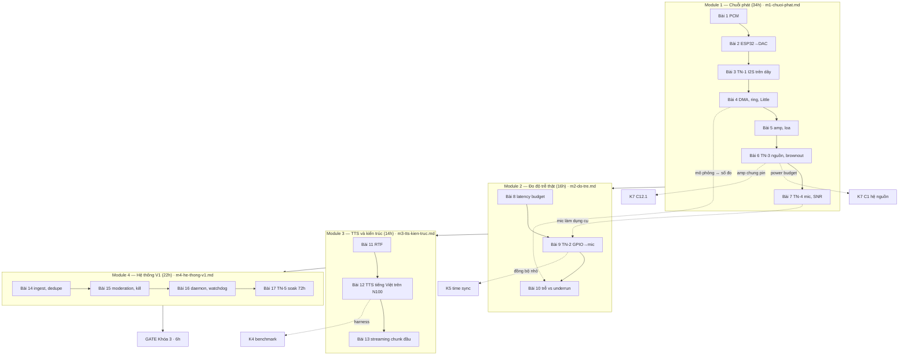

# KHÓA 3 — CHUỖI AUDIO: TỪ SỐ NGUYÊN ĐẾN ÁP SUẤT KHÔNG KHÍ · TỔNG QUAN

**Cho:** người đã PASS Khóa 1 (cầm được que đo, đọc được logic analyzer), đang học hàn, chưa từng đi dây nguồn công suất.
**Thời lượng:** **92h** theo tổng giờ các bài (bản gốc ghi "~90h") · **Trần cứng: 140h**. Ở 6–7h/tuần là khoảng 14–16 tuần.
**Chi phí:** chuỗi audio (DAC PCM5102A, amp PAM8403/TPA3110, loa 4 Ω, mic INMP441, mỗi thứ mua 2) ~0,7–1 triệu VNĐ `[ước lượng 10/2026, kiểm lại ở cửa hàng]`; thêm điện trở công suất 10 Ω/5 W và 1 Ω/2 W, tụ 470–1000 µF cho Bài 5–6 (vài chục nghìn) `[ước lượng]`. Mini PC N100 mua riêng (mục 0.7 lộ trình tổng). ESP32-S3 đã có từ Khóa 1. Không mua Raspberry Pi.
**Tương ứng:** milestone **M4** của lộ trình.

**Xong khóa này bạn làm được:** đi hết chuỗi từ một số nguyên trong RAM tới sóng áp suất trong không khí và **có số đo ở mọi chặng**, kèm sai số của chính phép đo. Đó là câu trả lời khi phỏng vấn hỏi "anh đã thực sự chạm phần cứng chưa".

**Điều kiện mở khóa — cả ba:**
1. Khóa 1 PASS (5 tiêu chí của M1).
2. `hours.csv` cho thấy median ≥ 5h/tuần trong 4 tuần gần nhất.
3. Đã có mini PC và chuỗi audio (đợt mua 2a + 2b).

**Điều kiện mở Module 4 (deploy ở công ty):** B2 đã có câu trả lời **bằng văn bản** của quản lý, đồng ý hay từ chối đều được. Từ chối thì chạy V1 ở nhà, bỏ hẳn nhận diện mặt; portfolio không mất gì.

**Cam kết phạm vi (ghi vào đầu `decisions.md` hôm nay, trước khi bắt đầu):** chạm 140h chưa PASS → **cắt scope, không gia hạn**: bỏ tiêu chí gate 5 và 7, chỉ giữ "phát được audio ổn định 24h", publish nguyên trạng kèm ghi chú cái gì chưa làm được, sang Khóa 4. Đây là cam kết trước, không phải quyết định lúc nản.

---

## Vị trí trong lộ trình và con số không được giấu

| Khóa | Tên | Giờ | Ghi chú |
|---|---|---|---|
| 1 | Từ zero đến đo được | 35 | |
| 2 | Dữ liệu robot mà không cần robot | 80 | Chạy song song — tuần bận thì làm K2 |
| **3** | **Chuỗi audio** | **90 (tổng bài: 92)** | ← khóa này |
| 4 | Đo hiệu năng inference trên edge | 70 | |
| 5 | Cảm biến, đồng bộ thời gian, data platform | 150 | |
| 6 | Simulation & evaluation infrastructure | 120 | |
| 7 | Robot di động — **thiết kế lại thành khóa build** | 561 lõi (K7 gốc: 340) | Xem `khoa-7/_KE-HOACH-K7.md` |

K1–K6 = **545h**. Cộng K7 gốc = **885h**, đã vượt ngân sách gốc 650h. Cộng K7 mới (lõi 561h) = **1.106h**, ở 6,5h/tuần ≈ 170 tuần ≈ **3,3 năm**; đường lõi tối thiểu của K7 (≈ 340h) cho 885h ≈ 2,6 năm. Đây là quyết định của bạn, ghi vào `decisions.md`.

K3 là track chiều sâu phần cứng: chậm và tốn giờ nhất. K2 là track tạo artifact và tín hiệu phỏng vấn nhanh nhất. **Tuần bận chạy K2, tuần rảnh chạy K3.** K3 là thứ khiến bạn không bị loại; K2 là thứ khiến bạn được gọi.

**Đường ray song song với K7:** sau Module 1 của khóa này, K7 C0 (xưởng, an toàn), C1 (hệ nguồn — tốt nhất sau Bài 5–6) và C3 (bring-up motor — cần ESP-IDF và logic analyzer của Module 1) đã mở được (`khoa-7/_KE-HOACH-K7.md` mục 4).

---

## Bản đồ khóa



| Bài | Giờ | Viên nang nền cần trước | Quyết định ra được |
|---|---|---|---|
| 1 — Audio số là cái gì | 2 | F5.5 (Nyquist) | Định dạng PCM cho V1; định dạng USB vs I2S |
| 2 — Mini PC, ESP32-S3, DAC I2S | 5 | F5.1 | Bảng chân cả khóa; cấu hình I2S |
| 3 — TN-1 Nhìn âm thanh trên dây | 5 | F1.1 | Tin config hay đo; đo tần số qua bao nhiêu chu kỳ |
| 4 — DMA, ring buffer, underrun | 6 (+3 tùy chọn) | F5.2, F7.1, F3.9 | Kích thước DMA/ring từ phân bố jitter; cổng USB nào |
| 5 — DAC → amp → loa | 4 | (K1 Bài 1) | Amp, loa, nguồn amp theo công suất và dòng |
| 6 — TN-3 Phá bằng nguồn | 5 | F5.7 | Cách cấp nguồn amp; dòng đầu tiên của power budget K7 |
| 7 — TN-4 Mic, FFT, SNR | 7 | F5.5, F5.6 | Mức thu và bit depth; phương pháp đo SNR tin được; baseline giọng |
| 8 — Latency budget: dự đoán trước | 3 | F7.1, F1.2 | Nút thắt dự đoán ở đâu (ký tên trước khi đo) |
| 9 — TN-2 Đo trễ phần mềm → không khí | 7 | F4.6, F1.1, F1.2 | Phương pháp đo trễ ≤ 1 ms tin được |
| 10 — Đường cong trễ vs underrun | 6 | F1.2, F1.5, F5.3 | Điểm vận hành DMA/ring của V1, có số |
| 11 — RTF | 3 | F1.3 | Ngưỡng RTF cho streaming; harness tái dùng ở K4 |
| 12 — TTS tiếng Việt trên N100 | 6 | F1.3, F5.4 | Stream trên CPU hay pre-render |
| 13 — Streaming chunk đầu | 5 | F7.1 | Batch hay stream; time-to-first-audio |
| 14 — Ingest, dedupe, state machine | 6 | F3.5 | Push hay pull; khóa dedupe |
| 15 — Moderation và kill switch | 5 | F2.1 | Luật chặn; kill tại MCU |
| 16 — Daemon, firmware, watchdog hai tầng | 5 | F5.7, F7.5 | Hành vi xác định cho từng loại lỗi |
| 17 — TN-5 Soak 72h | 6 (+72h treo) | F7.6, F1.4 | V1 có tự sống không; số đầu vào power budget K7 |
| Gate | 6 | F1.7 | PASS/FAIL theo 7 tiêu chí |

Mỗi bài trong file module dùng khung 12 phần của `_QUY-CHUAN.md`. Viên nang F học **đúng lúc**: đọc trước bài cần nó, không đọc hết trước khi bắt đầu.

---

## Bản đồ "chấm mô hình" — các mô hình bạn đã nêu với Gemini ở khóa này

Gemini đã xác nhận "chính xác 100%" cho nhiều mô hình chỉ đúng một phần. Mỗi lượt được chấm lại ở đúng bài:

| Lượt | Ý chính (trích ngắn) | Chấm | Ở đâu |
|---|---|---|---|
| 1 | "esp32… vẫn tự tạo file wav" | ĐÚNG MỘT PHẦN (không có file; schema ngoài băng) | Bài 1 |
| 2 | "vấn đề tôi cần học nhất là giao thức"; "nó không cần biết có ai nhận ở cuối dây" | ĐÚNG MỘT PHẦN; không ACK là điểm mù | Bài 2 |
| 3 | "esp32 chỉ làm dispatcher… không nên tạo hay chuyển đổi âm thanh" | ĐÚNG MỘT PHẦN (ESP32 sở hữu đồng hồ phát) | Bài 2 |
| 6 | "không có realtime forward 100%"; "latency sẽ giảm"; proxy streaming | ĐÚNG MỘT PHẦN; "latency giảm" SAI | Bài 4 |
| 7 | flash RAM để buffer; "chạy nhanh hơn 1000 lần"; RAM sinh ra làm buffer | SAI / SAI / ĐÚNG MỘT PHẦN | Bài 4 |
| 9 | "loa không có nguồn… dữ liệu sẽ tự chạy qua" | ĐÚNG MỘT PHẦN, ý chính SAI | Bài 5 |
| 11 | sụt nguồn khi chung nguồn, cả điện dân dụng | ĐÚNG MỘT PHẦN (trở kháng chung; sụt ≠ quá tải) | Bài 6 |
| 12 | "mọi công thức vật lý gần như là hằng số… AI dự đoán được" | SAI ở lõi | Bài 7 |
| 13 | "tận dụng tối đa giới hạn vật lý"; "nvidia là tiên phong" | ĐÚNG / ĐÚNG MỘT PHẦN | Bài 7 |
| 21 | RTF như một "flag" vận hành | (người soạn Module 3 chấm) | Bài 11 |

---

## GATE KHÓA 3 (6h)

Đối chiếu đúng 7 tiêu chí PASS của M4. Nhị phân. Giữ tiêu chí gốc; chỗ nào sửa thì ghi **[sửa]** kèm lý do ngay dưới.

```
[ ] 1. Không còn lời gọi cloud TTS nào trong chuỗi
       → grep repo, chứng minh bằng một CI check

[ ] 2. TN-1: f_BCK và f_LRCK đo được lệch < 1% so với dự đoán, ở 2 sample rate khác nhau,
       đo QUA NHIỀU CHU KỲ (≥ 100 chu kỳ LRCK, ≥ 32 chu kỳ BCK)                         [sửa]
       → file .sr commit sau prediction.md, kèm bảng dự đoán vs đo và sai số của analyzer

[ ] 3. TN-2: đường cong latency vs underrun ≥ 5 điểm dma_frame_num (giá trị ĐỌC LẠI từ driver),
       ≥ 2 kịch bản tải, mỗi điểm ≥ 10 phút; latency GPIO→mic đo với độ phân giải ≤ 1 ms   [sửa nhỏ]

[ ] 4. TN-3: bảng ≥ 3 cấu hình nguồn, mỗi dòng có V_rail lúc nghỉ và lúc phát,
       số brownout reset của ESP32, mô tả tiếng (khuyến nghị thêm: R_s đo được, V thấp nhất từ ADC)

[ ] 5. TN-4: F0 giọng mình bằng số (3 lần ghi lệch < 10%);
       SNR trên SIN SỐ tạo bằng code ở 16/12/8/4 bit: lệch 6,02·N + 1,76 dB < 0,1 dB ở 16/12/8, < 1 dB ở 4;
       giọng thật qua mic: SNR (e = x_n − x_16) giảm 24 ± 3 dB từ 8 xuống 4 bit                 [sửa]

[ ] 6. Bảng latency budget: MỌI DÒNG là số đo, không dòng nào là ước tính, nút thắt được chỉ tên
       (dòng "không khí" = khoảng cách đo bằng thước / tốc độ âm thanh là chấp nhận được)

[ ] 7. TN-5 soak 72h: ≥ 20 confession phát đúng, 0 lần can thiệp tay,
       log rotation đã chứng minh bằng cách cố tình làm đầy đĩa,
       ≥ 3 lần rút điện đúng lúc đang ghi DB mà dữ liệu còn nguyên
```

**Đã sửa gì và vì sao** (có đáp số của vài bài; đọc khi chuẩn bị gate):

<details><summary>🔒 MỞ SAU KHI COMMIT prediction.md của Bài 3, 4, 7</summary>

- **Tiêu chí 2:** bản gốc cho đo bằng cách "rê chuột giữa hai cạnh BCK liên tiếp". Analyzer 24 MHz lượng tử thời gian 41,7 ns; một chu kỳ BCK 768 kHz đo ra lệch tới 2,4% chỉ vì lượng tử (Bài 3, mô phỏng). Tiêu chí 1% chỉ kiểm được khi đo qua nhiều chu kỳ.
- **Tiêu chí 3:** driver ESP-IDF giới hạn một descriptor DMA ~4092 byte; ở 16-bit stereo, `dma_frame_num` > 1023 bị ép im lặng (có log cảnh báo). Điểm 1280 frame gợi ý ở Bài 10 sẽ không phải 1280. Dùng giá trị đọc lại, hoặc tăng `dma_desc_num` để có độ trễ lớn (Bài 4).
- **Tiêu chí 5:** đây là lỗi đã biết của bản gốc (`_QUY-CHUAN.md` mục 7). Công thức giả định sin full-scale + nhiễu lượng tử đều; giọng nói qua mic phá cả hai giả định, và đoạn im lặng ở bit thấp thành im lặng số. Kiểm công thức trên sin số; với giọng thật chỉ kiểm xu hướng ở 8 và 4 bit (Bài 7).
- **Tiêu chí 7, không đổi, nhưng đọc đúng nó:** 10 lần rút điện không mất dữ liệu **không** chứng minh "không bao giờ mất". Với 0 lỗi trong n = 10 lần thử, cận trên 95% của xác suất lỗi mỗi lần là 1 − 0,05^(1/10) ≈ 26% (quy tắc "ba chia n" cho ~30%) `[chuẩn]` → F1.4. Ghi câu này vào báo cáo; nó cho thấy bạn hiểu giới hạn của chính bài test.

</details>

**FAIL → action (cam kết trước):** chạm 140h chưa PASS → cắt scope, không gia hạn. Bỏ tiêu chí 5 và 7, chỉ giữ "phát được audio ổn định 24h", publish nguyên trạng kèm ghi chú, sang Khóa 4. V1 không được phép ăn hết năm đầu.

---

## LỊCH

Bản gốc ghi 12 tuần, nhưng tổng giờ theo tuần của bản gốc là 83h trong khi tổng giờ bài là 92h. Lịch dưới đây khớp 92h, trung bình ~5,8h/tuần:

| Tuần | Giờ | Làm | Xong thì có |
|---|---|---|---|
| 1 | 7 | Bài 1–2 | Tiếng đầu tiên từ ESP32 |
| 2 | 5 | Bài 3 (TN-1) | Nhìn thấy âm thanh trên dây, đo đúng cách |
| 3 | 6 | Bài 4 | Mô phỏng ring buffer; host stream PCM qua USB có credit |
| 4 | 4 | Bài 5 | Bảng công suất, chạm màng loa |
| 5 | 5 | Bài 6 (TN-3) | Bảng cấu hình nguồn, R_s, dòng đầu power budget |
| 6 | 7 | Bài 7 (TN-4) + Checkpoint M1 | F0, bảng SNR, chuỗi phát tin được |
| 7 | 7 | Bài 8 + nửa đầu Bài 9 | Latency budget đã ký |
| 8 | 6 | Nửa sau Bài 9 + đầu Bài 10 | Độ trễ thật, độ phân giải ≤ 1 ms |
| 9 | 6 | Bài 10 + Bài 11 | Đường cong trễ vs underrun; harness RTF |
| 10 | 6 | Bài 12 | Quyết định kiến trúc TTS có số |
| 11 | 5 | Bài 13 | time-to-first-audio |
| 12 | 6 | Bài 14 | Ingest không phát trùng |
| 13 | 5 | Bài 15 | Moderation + kill switch |
| 14 | 5 | Bài 16 | Tự sống |
| 15 | 6 (+72h treo máy) | Bài 17 | Soak 72h |
| 16 | 6 | Gate | **Khóa 3 PASS** |

**Tuần crunch:** chuyển sang K2, hoặc chế độ tối thiểu 0–2h chỉ đọc (một viên nang F hoặc phần 1–4 của bài kế tiếp). Đừng ép thí nghiệm phần cứng vào tuần go-live: thí nghiệm làm vội khi mệt là thí nghiệm không có dự đoán.

---

## BẪY ĐÃ BIẾT TRƯỚC — bảy bẫy gốc (viết lại) và ba bẫy mới

Mỗi bẫy có một câu hỏi ngược. Trả lời trước khi mở hướng nghĩ.

**1. Mini PC không có GPIO.** Mọi chân tín hiệu nằm trên ESP32-S3. Đừng mua USB sound card "cho tiện": nó giấu toàn bộ chuỗi.
- **[Vì sao không]** Bo USB → I2S có sẵn phát audio tốt. Bạn mất những gì nếu dùng nó thay ESP32?
<details><summary>Hướng nghĩ</summary>

GPIO marker cho Bài 9, nút kill tại MCU (Bài 15), bộ đếm underrun và lý do reset của chính bạn, và một I/O bridge dùng lại cho encoder/motor ở K7. Bạn mua khả năng quan sát, không chỉ tiếng.

</details>

**2. Chân strapping, USB, flash/PSRAM của ESP32-S3** (strapping 0, 3, 45, 46; USB 19, 20; flash 26–32; PSRAM octal 33–37 trên bản R8). Dùng nhầm thì không boot hoặc mất cổng nạp.
- **[Failure mode]** Board boot tốt khi bấm nút reset, nhưng thỉnh thoảng không boot khi cắm nguồn lại từ đầu, chỉ khi amp đã cắm. Bạn nghi gì?
<details><summary>Hướng nghĩ</summary>

Chân strapping được đọc lúc reset; một ngoại vi (hoặc dòng rò từ khối khác có nguồn trước) kéo mức chân đó lúc cấp nguồn sẽ đổi chế độ boot. Lỗi phụ thuộc thứ tự cấp nguồn: kiểu lỗi chỉ thấy khi rút điện thật (Bài 17).

</details>

**3. Chân SCK của module PCM5102A thường cần nối GND** để chạy PLL nội. Không nối: DAC câm, không lỗi nào được báo.
- **[Nếu…thì]** Module của bạn đã có pad SCK hàn sẵn xuống GND, và bạn lại cấu hình ESP32 xuất MCLK ra đúng dây đó. Chuyện gì xảy ra?
<details><summary>Hướng nghĩ</summary>

GPIO xuất xung vào một điểm đã nối thẳng GND: ngắn mạch đầu ra GPIO mỗi nửa chu kỳ, chân có thể hỏng. Kiểm pad bằng thang thông mạch trước khi nối dây vào chân "cấu hình".

</details>

**4. Đừng nối loa vào line-out của DAC**, và **đừng nối cọc nào của loa xuống GND** khi dùng amp BTL (PAM8403). Line-out không đủ dòng; đầu ra BTL không có cọc nào là GND.
- **[Failure mode]** Bạn kẹp GND của logic analyzer (đang cắm mini PC) vào OUT− của amp để "xem thử". Liệt kê hậu quả.
<details><summary>Hướng nghĩ</summary>

Ngắn mạch nửa cầu đầu ra qua GND của USB: amp vào bảo vệ, nóng, hoặc hỏng; dòng lớn chạy qua dây GND của analyzer và cổng USB. Đầu ra amp chỉ đo bằng multimeter chạy pin (Bài 5).

</details>

**5. Logic analyzer clone 24 MHz** đủ cho I2S 768 kHz, nhưng resolution không phải accuracy: một chu kỳ BCK đo bằng con trỏ có thể lệch vượt tiêu chí chỉ vì lượng tử thời gian; và analyzer có thể không giữ nổi 24 MHz liên tục qua USB.
- **[Quy mô]** K5 cần tần số thật tới ppm. Analyzer này còn dùng được không, và giới hạn nằm ở đâu?
<details><summary>Hướng nghĩ</summary>

Đo đủ dài thì lượng tử thời gian xuống dưới ppm; giới hạn còn lại là thạch anh của chính analyzer (chục ppm). Cần một tham chiếu tốt hơn (1 PPS, PHC đã đồng bộ) → F4.7.

</details>

**6. Mua 2 cái cho mọi module rẻ và quan trọng.** Không có module thứ hai để so, bạn không phân biệt được "module chết" với "cấu hình sai".
- **[Phản biện]** "Mua 2 là phí tiền." Phản biện bằng một phép tính.
<details><summary>Hướng nghĩ</summary>

Một module vài chục nghìn đồng `[ước lượng]` so với một buổi tối 3h debug. Chỉ cần xác suất module lỗi khi nhận hàng vài phần trăm và một buổi debug tiết kiệm được là đã lời. Module thứ hai còn là "nhóm đối chứng" trong thí nghiệm.

</details>

**7. Driver có thể ép tham số khác thứ bạn xin**: `dma_frame_num` (giới hạn ~4092 byte/descriptor), sample rate thật. Luôn đọc lại cấu hình thật và đo bằng logic analyzer; đừng tin config.
- **[Failure mode]** Ở Bài 10 bạn quét 80, 160, 320, 640, 1280 frame. Điểm cuối bị ép về 1023 mà bạn không đọc lại. Đường cong trông thế nào và bạn kết luận sai điều gì?
<details><summary>Hướng nghĩ</summary>

Độ trễ ở điểm "1280" thấp hơn tính toán ~20%, đường cong bẻ cong ở cuối; bạn có thể kết luận "có vùng đệm ẩn" hoặc "độ trễ không tuyến tính theo DMA" — sai. Đọc lại giá trị là một bước kiểm tra rẻ chặn cả loạt kết luận sai.

</details>

**8 (mới). Multimeter thấy trung bình, không thấy hố áp.** Đồng hồ cập nhật vài lần mỗi giây; một hố 2 ms đủ reset chip thì không hiện lên.
- **[Phản biện]** "Rail đọc 4,8 V lúc phát, nguồn ổn." Bạn cần thêm gì để nói được câu này?
<details><summary>Hướng nghĩ</summary>

Giá trị nhỏ nhất trong cửa sổ ngắn (ADC của ESP32 lấy mẫu kHz với min-hold, hoặc máy hiện sóng), và ngưỡng mà mạch thực sự nhạy (LDO dropout, ngưỡng brownout). Không có thì kết luận là "chưa rõ" (Bài 6).

</details>

**9 (mới). Tính băng thông cổng trước khi chọn.** Cổng "UART" của DevKit (qua chip cầu USB-UART) ở baud thông dụng có thể không đủ cho luồng 24 kHz stereo 16-bit; tự tính ở câu tự kiểm tra Bài 1, nhớ 8N1 tốn 10 bit trên dây cho mỗi byte.
- **[Nếu…thì]** Nếu buộc phải dùng cổng UART, bạn đổi gì trong định dạng truyền để vẫn chạy được V1?
<details><summary>Hướng nghĩ</summary>

Gửi mono (48 KB/s) và để ESP32 nhân ra hai kênh, hoặc tăng baud (kiểm chip cầu và độ ổn định), hoặc dùng cổng USB native. "Định dạng truyền ≠ định dạng phát" (Bài 1).

</details>

**10 (mới). "6,02·N + 1,76 dB" chỉ đúng cho sin full-scale với nhiễu lượng tử đều**, làm tròn chứ không cắt bit. Giảm bit bằng `x >> k << k` (cắt) cho số khác công thức; đo sàn nhiễu ở đoạn im lặng gãy ở bit thấp (Bài 7).
- **[Liên ngành]** Cùng mô hình nhiễu đó được dùng cho lượng tử hóa INT8 ở K4. Giả định nào gãy theo cùng một kiểu?
<details><summary>Hướng nghĩ</summary>

"Full-scale" do outlier đặt; phần lớn giá trị nhỏ hơn thang nhiều → như tín hiệu −20 dBFS, mất bit hiệu dụng. Vì thế có per-channel scale và clipping có chủ đích (Bài 7, K4 Bài 8).

</details>

---

## NGUỒN HỌC KÈM KHÓA 3

Quy tắc ba nguồn: một nguồn chính + một tra cứu + datasheet. Ở khóa này **datasheet là nguồn quan trọng nhất**.

| Nguồn | Phần nào | Cho bài |
|---|---|---|
| PCM5102A datasheet (Texas Instruments) | Pin functions, clocking/PLL, audio formats, timing | 2, 3 |
| INMP441 datasheet (InvenSense/TDK) | Khung I2S, sensitivity, SNR, AOP, đáp tuyến | 7, 9 |
| PAM8403 datasheet (Diodes Inc.); TPA3110D2 (TI) nếu dùng | Công suất ở THD, BTL, hiệu suất | 5, 6 |
| ESP32-S3 datasheet + Technical Reference Manual + user guide DevKitC-1 (Espressif) | Strapping, chân flash/PSRAM, I2S clock, dải áp, schematic LDO | 2, 3, 6 |
| ESP-IDF Programming Guide — **đúng phiên bản bạn cài** | I2S std (DMA, callbacks), USB (TinyUSB/USB-Serial-JTAG), reset reason, brownout, NVS, task watchdog | 2, 4, 6, 7, 16 |
| FreeRTOS / ESP-IDF ring buffer, task priority | | 4, 10 |
| sigrok/PulseView docs | Decoder I2S, fx2lafw và giới hạn sample rate | 3, 9 |
| ALSA Project docs | PCM, period/buffer, XRUN — chỉ bước tùy chọn Bài 4 | 4 |
| systemd docs | `WatchdogSec`, `RuntimeWatchdogSec` | 16 |
| J. D. C. Little (1961), "A Proof for the Queuing Formula: L = λW" | | 4, 8, 10 |
| Walt Kester, Analog Devices MT-001 (SNR = 6,02N + 1,76 dB) | | 1, 7 |
| Elecia White, *Making Embedded Systems* | Debugging, thời gian, nguồn | toàn khóa |
| Ben Eater (YouTube), loạt video clock và logic số | | 3 |
| README của VietTTS / VieNeu-TTS / Viterbox | | 12 |

---

## SỬA LỖI SO VỚI BẢN GỐC VÀ BẢN GEMINI (phạm vi tổng quan + Module 1)

Bảng này chứa đáp số của nhiều bài; người học mở sau khi xong Module 1.

<details><summary>🔒 MỞ SAU KHI XONG MODULE 1</summary>

| Chỗ | Sai | Đúng | Ở đâu |
|---|---|---|---|
| Header khóa | ~90h; Module 1 = 32h | Tổng bài 92h; Module 1 = 34h | Tổng quan |
| Lịch | 12 tuần (tổng giờ tuần 83h) | 16 tuần khớp 92h | Lịch |
| Bài 1 | "54,5 sample/chu kỳ nên tone không lặp lại chính xác" | Lặp chính xác sau 600 sample (11 chu kỳ); hệ quả cho bảng sin firmware | Bài 1–2 |
| Bài 3 | Đo một chu kỳ BCK bằng con trỏ, sai số < 1% | Lượng tử 41,7 ns cho lệch tới 2,4–4%; đo qua nhiều chu kỳ | Bài 3, gate 2 |
| Bài 3 | FMT sai → "decoder ra giá trị vô nghĩa" | Dây không đổi → decoder vẫn đúng; chỉ DAC hiểu sai | Bài 3 |
| Bài 3 | Rút GND analyzer → luôn nhiễu loạn | Phụ thuộc đường GND qua cáp USB | Bài 3 |
| Bài 3 | LRCK lệch vài % "là clock drift" | Đó là frequency offset; drift là thay đổi theo thời gian | Bài 3 |
| Bài 4 | "1600 frame × 3 → 200 ms" | Bị ép về 1023 frame (4092 byte) → ~128 ms | Bài 4, gate 3 |
| Bài 4 | `desc × frame / rate` chỉ là "công thức" | Định luật Little; áp cả cho ring buffer (tổng trễ = tổng mức đầy / λ) | Bài 4 |
| Bài 4 | Ring lớn + DMA nhỏ = trễ thấp + chịu jitter | Tổng trễ là tổng hai vùng; tách hai vùng là tách quyền kiểm soát | Bài 4 |
| Bài 5 | Đo V AC đầu ra amp như mạch thường | Đầu ra BTL: không GND cọc nào; kiểm số 0 của đồng hồ vì sóng mang PWM | Bài 5 |
| Bài 6 | Cấu hình 2 "tháo GND chung, giữ nguồn chung" | Không làm được đúng nghĩa; làm trên nền cấu hình 3 | Bài 6 |
| Bài 6 | Cấu hình 1 "khả năng cao ≥ 1 brownout" | Brownout nhìn rail 3,3 V sau LDO; cần đo R_s, hố áp | Bài 6 |
| Bài 6 | Tụ 1000 µF → "sụt ít hơn nữa, bass chắc hơn" | τ = R_s·C ~0,5 ms: gần như không đổi dao động bass và số đọc trung bình | Bài 6 |
| Bài 7 | Kiểm 6,02·N + 1,76 trên giọng thật ở 4 mức, lệch < 3 dB | Sin số tạo bằng code; giọng thật chỉ kiểm xu hướng 8 và 4 bit | Bài 7, gate 5 |
| Bài 7 | Giảm bit bằng `>> <<` | Floor lệch ~6 dB; dùng round hoặc bỏ DC | Bài 7 |
| Bài 7 | Đo sàn nhiễu ở đoạn im lặng | Im lặng số ở bit thấp; đo e = x_n − x_16 | Bài 7 |
| Bài 7 | "Sau clipping xuất hiện hài, thứ không có ở bản ghi thường" | Giọng vốn có hài ở k·F0; đo năng lượng trên 4 kHz và thành phần không phải bội F0 | Bài 7 |
| Bài 7 | "F0 là hằng số vật lý của cơ thể" | F0 nói thói quen, kèm điều kiện ghi | Bài 7 |
| Gemini lượt 2 | "clock ESP32 sai 1 µs thì DAC đọc lệch bit" | I2S đồng bộ theo nguồn; lệch tần số không gây đọc lệch bit | Bài 2 |
| Gemini lượt 1–3, 6, 7, 9, 11, 13 | "Hoàn toàn chính xác / 100%" | Chấm lại từng lượt | Bảng chấm ở trên |
| Gemini lượt 7 | "thạch anh trôi vài micro-giây"; "1 ns điện đi 20–30 cm" | Lệch tần số tính bằng ppm, độ lệch thời gian tích lũy; ~15–20 cm/ns trên FR4 | Bài 4 |
| Gemini Bài 4 | "CPU bận context-switch 2 ms là âm thanh đứt" | Sai khi DMA + ring ≥ 10 ms | Bài 4 |
| Gemini Bài 6 | Ngưỡng brownout "quanh 2,8 V"; "220 V xuống 190 V"; "vài chục ns" | Ngưỡng là cấu hình, phải tra; bỏ các số không nguồn | Bài 6 |
| Gemini lượt 13 | DLSS "giảm năng lượng một nửa", "75% điểm ảnh" | Không có nguồn; không dùng | Bài 7 |

Ghi chú cho Module 2–4 (người soạn module đó kiểm): điểm 1280 frame ở Bài 10 vượt giới hạn descriptor; 0 lỗi trong 10 lần rút điện ở Bài 17 chỉ cho cận trên ~26% (95%).

</details>

---

## CÁCH HỌC KHÓA NÀY

**Vòng một bài (tuần thường, 5–7h):**
1. Đọc phần 1–4 của bài (câu chuyện, mô hình, cầu nối, thuật ngữ). Đọc viên nang F nếu bảng ở trên chỉ tên.
2. Chạy mô phỏng đồ chơi (nếu bài có) **trước** khi đụng phần cứng.
3. Viết `prediction.md` bằng số, ghi "tôi không chắc về", **commit**. Không AI ở bước này: dự đoán của AI không phải dự đoán của bạn, và nó làm mất đúng thứ bạn đang luyện.
4. Làm, ghi sai số dụng cụ ở mỗi phép đo quan trọng.
5. Mở khối 🔒, so, viết giải thích chênh lệch **trước** khi tra cứu.
6. Trả lời câu hỏi ngược; mở hướng nghĩ sau.

**Tuần crunch (0–2h):** không lắp, không cấp điện. Đọc phần 1–4 của bài kế tiếp hoặc một viên nang F; hoặc chạy lại một mô phỏng với tham số khác. Hoặc làm K2.

**Dùng AI ở đâu:** ở bước giải thích (bước 5) và khi tự trừu tượng hóa. Dùng prompt **chấm mô hình**, không dùng prompt "giải thích cho tôi":

```text
Đây là mô hình tôi đang tin, viết bằng lời của tôi:
"<dán nguyên văn>"
Chấm từng ý: ĐÚNG / ĐÚNG MỘT PHẦN / SAI. Với mỗi ý không ĐÚNG, chỉ đúng chỗ gãy
và đưa MỘT phản ví dụ cụ thể (con số, thí nghiệm, hoặc hệ thật). Không mở đầu bằng lời khen.
Nếu một ý không kiểm chứng được, nói "chưa rõ" và đề xuất câu hỏi kiểm được.
Mọi con số phải kèm nguồn hoặc ghi rõ là ước lượng.
```

Lý do: ở phiên Gemini của khóa này, nhiều mô hình chỉ đúng một phần đã được xác nhận "100%". Rủi ro lớn nhất của cách học trừu tượng hóa là tích lũy mô hình đúng một nửa mà cảm giác rất hiểu. Prompt trên ép AI làm việc của một người chấm, và bạn vẫn phải tự kiểm mọi con số kỹ thuật.

**Hai câu hỏi để tự hỏi cuối mỗi tuần:** (1) Tuần này tôi đã đo được thứ gì mà trước đó tôi chỉ tin? (2) Mô hình nào của tôi vừa bị một con số phản bác?

---

## SAU KHÓA 3

**Khóa 4 — Đo hiệu năng inference trên edge (70h).** Không cần mua gì mới, thuê GPU theo giờ. Harness benchmark ở Bài 11 dùng lại gần như nguyên vẹn, đổi payload từ TTS sang VLA. Bài 7 của khóa này (nhiễu lượng tử, full-scale, outlier) là nền trực giác cho K4 Bài 8 (quantization).

**K7 song song:** các số đo ở Bài 5–6 (dòng amp, R_s, brownout) và Bài 17 (công suất mini PC) là những dòng đầu tiên của power budget robot ở K7 C1.2; chuỗi audio này lên robot ở K7 C12.1 (amp chung pin, nhiễu motor vào audio, ground loop).

**Nhắc lần cuối:** nếu Khóa 2 chưa xong khi bạn đọc tới đây, dừng Khóa 3 và đóng Khóa 2 trước.
