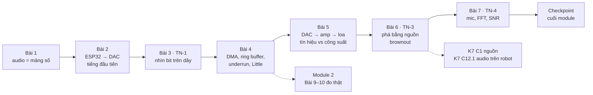
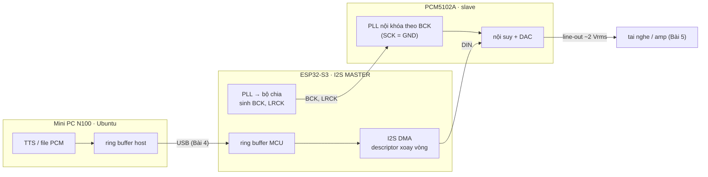

# KHÓA 3 · MODULE 1 — CHUỖI PHÁT: TỪ SỐ NGUYÊN ĐẾN ÁP SUẤT KHÔNG KHÍ (34h)

> **Vị trí:** Khóa 1 (đo được) → **Module 1** → Module 2 (đo độ trễ thật, `m2-do-tre.md`) · **Cần trước:** K1 PASS, đặc biệt K1 Bài 3 (tín hiệu số, bus, clock), K1 Bài 7 (logic analyzer), K1 Bài 13 (nhìn thấy I2S) · **Sau module này bạn quyết định được:** cấu hình chuỗi phát của V1 (định dạng PCM, chân, DMA, ring buffer, cách cấp nguồn amp) và bảo vệ từng lựa chọn bằng một con số đo.

Bản gốc ghi Module 1 = 32h nhưng tổng giờ bảy bài là 2 + 5 + 5 + 6 + 4 + 5 + 7 = **34h** (chưa tính 3h tùy chọn ALSA ở Bài 4). File này dùng 34h.



| Bài | Giờ | Viên nang nền nên đọc trước | Quyết định ra được |
|---|---|---|---|
| 1 — Audio số là cái gì | 2 | F5.5 (phần Nyquist) | Định dạng PCM của V1, định dạng trên USB có cần giống trên I2S không |
| 2 — Mini PC, ESP32-S3, DAC I2S | 5 | F5.1 | Bảng chân GPIO và cấu hình I2S cho V1 |
| 3 — TN-1: nhìn âm thanh trên dây | 5 | F1.1 | Tin hay không tin con số trong config; đo tần số thế nào cho đủ chính xác |
| 4 — DMA, ring buffer, underrun | 6 (+3 tùy chọn) | F5.2, F7.1, F3.9 | Kích thước DMA và ring buffer từ phân bố jitter, không từ cảm giác |
| 5 — DAC → amp → loa | 4 | (K1 Bài 1) | Chọn amp, loa, nguồn amp theo công suất cần |
| 6 — TN-3: phá bằng nguồn | 5 | F5.7 | Cấu hình nguồn cho amp; con số đầu tiên của power budget K7 |
| 7 — TN-4: mic, FFT, SNR | 7 | F5.5, F5.6 | Bit depth và mức thu cần cho V1/V2; baseline giọng trước fine-tune |

Quy tắc bất di bất dịch của cả khóa: viết dự đoán bằng số vào `prediction.md`, commit, rồi mới cắm que đo. Âm thanh có một đặc tính nguy hiểm: nó **nghe có vẻ đúng** ở rất nhiều cấu hình sai. Tai tha thứ cho lệch vài phần trăm sample rate; logic analyzer thì không.

---

## Bài 1 — Audio số thực sự là cái gì (2h)

> **Vị trí:** (đầu khóa) → Bài 1 → Bài 2 · **Cần trước:** K1 Bài 3; đọc lướt F5.5 phần Nyquist · **Sau bài này bạn quyết định được:** sample rate, bit depth, số kênh cho V1, và định dạng gửi qua USB có nên khác định dạng phát ra I2S hay không.

### 1. Câu chuyện — ai đã khổ vì chuyện này

Con số 44,1 kHz của CD không đến từ tai người. Cuối thập niên 1970, cách rẻ nhất để ghi audio số là "giả làm video": bộ chuyển PCM (như Sony PCM-1600) nhét mẫu audio vào các dòng quét của băng video. Với cấu trúc dòng của NTSC/PAL, 3 mẫu mỗi dòng × số dòng dùng được × số field mỗi giây ra đúng 44.100 mẫu/s, và Nyquist cho trần 22,05 kHz, vừa trên ngưỡng nghe 20 kHz cộng một dải chuyển tiếp cho bộ lọc chống aliasing `[chuẩn]`. Điện thoại chọn 8 kHz vì băng thoại 300–3.400 Hz. TTS hiện đại hay chọn 22,05 hoặc 24 kHz. Mỗi con số là một **quyết định có lý do**, không phải hằng số.

Bài học cho bạn: khi viết "24 kHz, 16-bit, stereo" vào `decisions.md`, bạn phải trả lời được "vì sao không 16 kHz" và "vì sao không 48 kHz" bằng số, không phải "vì tutorial dùng thế".

### 2. Mô hình tư duy

Audio số là **một mảng số nguyên** cộng ba tham số nằm **ngoài** mảng: sample rate, bit depth, số kênh. Bản thân mảng không mang nghĩa; ba tham số mới cho nó nghĩa. File WAV chỉ là cách đóng gói mảng kèm ba tham số đó (header) để người đọc sau biết cách hiểu.

```
File WAV (mono, 16-bit, 24 kHz, 1 s)                 Bộ nhớ khi stereo xen kẽ (interleaved)
┌────────────── header 44 byte ──────────────┐       frame 0      frame 1      frame 2
│"RIFF" size "WAVE" "fmt " 16 1 ch rate ...  │       ┌──┬──┐     ┌──┬──┐     ┌──┬──┐
│ byte_rate block_align bits "data" size     │       │L0│R0│     │L1│R1│     │L2│R2│ ...
├────────────── data: 24 000 × 2 byte ───────┤       └──┴──┘     └──┴──┘     └──┴──┘
│ s0 s1 s2 ... (int16 little-endian)         │       1 sample = 2 byte · 1 frame = 4 byte
└────────────────────────────────────────────┘       (ALSA, ESP-IDF đếm theo FRAME)
```

- **Bit rate** = sample_rate × bit_depth × channels. V1: 24.000 × 16 × 2 = 768.000 bit/s = 96.000 byte/s.
- **Frame ≠ sample.** Một frame = một sample cho mỗi kênh. API audio (ALSA `buffer_size`, ESP-IDF `dma_frame_num`) đếm theo frame. Nhầm frame với sample hay byte là nguồn của lỗi "độ trễ tính sai ×2 hoặc ×4".
- **Nyquist:** lấy mẫu ở f_s chỉ biểu diễn được tần số dưới f_s/2. Năng lượng trên f_s/2 không biến mất mà **gập xuống** thành tần số giả (aliasing), và sau khi đã lấy mẫu thì không phân biệt được với tần số thật → phải lọc **trước** khi lấy mẫu → F5.5.
- **Bit depth** đặt sàn nhiễu lượng tử **so với full scale**. Công thức "6,02·N + 1,76 dB" chỉ đúng cho sin full-scale; Bài 7 kiểm nó cho đúng cách.
- **Một chi tiết hay:** 24.000/440 không phải số nguyên, nên từng chu kỳ 440 Hz không rơi vào cùng vị trí mẫu. Nhưng **cả chuỗi mẫu vẫn lặp lại chính xác** sau một số mẫu nhất định (bạn tính ở phần 5). Con số đó quyết định kích thước bảng sin trong firmware Bài 2.

### 3. Cầu nối từ backend

| Backend bạn biết | Ở đây | Gãy ở chỗ | Nếu dùng nhầm thì |
|---|---|---|---|
| JSON/Protobuf mang schema hoặc có schema registry | WAV header (chunk `fmt `) mang rate/bit/kênh | Header chỉ tồn tại trong **file**. Trên dây I2S và trong luồng PCM raw qua USB không có header; schema là thỏa thuận ngoài băng giữa hai đầu | Gửi 24 kHz mà đầu kia tưởng 48 kHz: không có lỗi parse, chỉ có giọng chipmunk hoặc giọng trầm. Lỗi im lặng |
| Kích thước buffer tính bằng byte | API audio tính bằng frame | Một frame stereo 16-bit = 4 byte, mono = 2 byte | Độ trễ, credit, kích thước gói đều sai theo hệ số 2 hoặc 4 |
| Prometheus scrape mỗi 15 s | Sample rate | Metrics lấy mẫu thưa thì **bỏ sót** spike; audio lấy mẫu thưa thì năng lượng cao tần **giả dạng** thành tần số thấp | Tưởng có thể "xử lý sau" để lọc ra; không được, aliasing không đảo ngược được |
| `float64` vs `int32`: độ chính xác của **giá trị** | Bit depth | Bit depth quyết định sàn nhiễu **tương đối với full scale**. Tín hiệu nhỏ 20 dB thì mất ~3,3 bit hiệu dụng | Nghĩ "16-bit là đủ chính xác" mà quên thu âm ở mức quá nhỏ |

**Chấm mô hình — lượt 1 của bạn:** *"mang cái thuật toán đó sang bài 2, nhưng lập trình sẵn vào mcu là esp32 để nó vẫn tự tạo file wav… output của esp32 sẽ đá sang cho mạch giải dac… cái chúng ta cần xem chính là các data đó."*

**ĐÚNG MỘT PHẦN.** Luồng ESP32 → DAC → analog → jack là đúng, và lý do cắm logic analyzer (thấy được thứ OS giấu đi) là đúng. Gãy ở hai chỗ:
1. ESP32 **không tạo file WAV**. Nó tạo mảng PCM trong RAM và đẩy thẳng vào I2S. WAV là định dạng lưu trữ; header 44 byte chỉ có nghĩa với ai mở file. Trên dây không có header nào. Hệ quả: "schema" (16-bit, stereo, I2S chuẩn Philips) phải được cấu hình **khớp nhau ở cả hai đầu** (firmware + chân FMT của DAC), và không ai kiểm hộ bạn.
2. "Cái cần xem là các data đó" chỉ đúng một nửa. Ở Bài 3, thứ quan trọng nhất trên màn hình là **clock** (BCK, LRCK) chứ không phải giá trị sample. Data không có clock thì không có nghĩa: cùng một chuỗi bit trên DIN, đọc theo khung 16 hay 32 bit, Philips hay left-justified, cho ra những con số khác hẳn.

*Phản ví dụ:* đổi chân FMT của PCM5102A từ GND lên 3,3 V (Bài 3, bước phá). Dây DIN mang **đúng** chuỗi bit cũ, decoder của PulseView vẫn đọc ra đúng sóng sin, nhưng DAC đọc theo định dạng khác và phát ra tiếng méo nặng. Data không đổi, ý nghĩa đổi.

**Chấm mô hình — "sample rate càng cao càng tốt":** **ĐÚNG MỘT PHẦN.** Cao hơn cho phép tần số cao hơn và nới bộ lọc chống aliasing. Gãy ở chỗ: băng thông USB, RAM, CPU, dung lượng lưu đều tăng tuyến tính, còn giọng nói không có gì đáng kể trên ~10 kHz. *Phản ví dụ:* TTS xuất 24 kHz mà bạn phát ở 48 kHz thì phải resample, tốn CPU và có thể thêm méo nếu resampler kém; không thêm thông tin nào.

### 4. Thuật ngữ

| Mức | Thuật ngữ | Nghĩa trong một câu | Hay bị hiểu nhầm thành |
|---|---|---|---|
| 🟢 | Sample | Một giá trị số của một kênh tại một thời điểm | Một frame |
| 🟢 | Frame | Một sample cho mỗi kênh, cùng thời điểm | Gói dữ liệu kiểu network frame |
| 🟢 | Sample rate (f_s) | Số frame mỗi giây | Bit rate |
| 🟢 | Bit depth | Số bit mỗi sample | "Độ chính xác" tuyệt đối của giá trị |
| 🟢 | Interleaved | Kênh xen kẽ `L R L R` | `LLLL…RRRR` (planar) |
| 🟢 | PCM | Mảng sample tuyến tính không nén | Một định dạng file |
| 🟢 | Nyquist frequency | f_s/2, trần tần số biểu diễn được | "Lấy mẫu 2× là đủ" không cần lọc |
| 🟢 | Aliasing | Tần số trên f_s/2 gập xuống thành tần số giả | Nhiễu ngẫu nhiên lọc được sau |
| 🟢 | Full scale, dBFS | Biên độ lớn nhất biểu diễn được; dB so với nó | dB SPL (áp suất âm) |
| 🟡 | RIFF/WAV chunk | Cấu trúc khối tag + độ dài trong file WAV | Header luôn đúng 44 byte |
| 🟡 | Little-endian | Byte thấp đứng trước | Thứ tự bit trên dây I2S (MSB trước) |
| 🟡 | MiB vs MB | 2²⁰ vs 10⁶ byte | Cùng một thứ |
| 🔴 | μ-law/A-law (G.711) | Lượng tử phi tuyến của điện thoại | Cần cho V1 |

### 5. Dự đoán

Copy vào `lab/01-pcm/prediction.md`, điền **số**, commit:

```markdown
# 01 — PCM ở mức byte
## Dự đoán (commit trước khi chạy)
1 s, 440 Hz, 24 kHz, 16-bit, mono:
- Số sample: ___          - Số byte data: ___       - Kích thước file: ___
Cùng thông số, stereo:
- Số byte data: ___       - Kích thước file: ___
- Số sample mỗi chu kỳ 440 Hz: ___ (ghi dạng phân số tối giản)
- Sau bao nhiêu sample thì chuỗi sample lặp lại y hệt? ___ (= bao nhiêu chu kỳ, bao nhiêu ms)
- Giá trị sample n=1 nếu biên độ 32767: ___ (tính tay: 32767·sin(2π·440/24000))
- Giá trị lớn nhất thực sự xuất hiện trong mảng: ___ (có đúng 32767 không? vì sao)
- Code của tôi dùng int(x) (cắt về 0) thay vì round(x). Công suất lỗi lượng tử, tính bằng LSB²,
  của int() so với round(): ___ lần (gợi ý: round cho ~1/12 LSB²)
## Tôi KHÔNG chắc về: ___
```

Phương pháp: số sample = f_s × thời lượng; byte = sample × kênh × bit/8; file = data + header (đếm byte của từng trường trong header). Chu kỳ lặp = f_s / gcd(f_s, f) sample.

### 6. Làm

Bạn đã có `src/khoa3/create_sample_wav_mono.py` và `create_sample_wav_stereo.py` (thuần `math` + `struct`, đúng yêu cầu). Dùng lại, thêm các bước kiểm:

1. Chạy script mono. Kiểm số byte bằng `(Get-Item tone_440_mono.wav).Length` (PowerShell) hoặc `stat -c %s` (Ubuntu).
2. Mở hex: `Format-Hex tone_440_mono.wav | Select-Object -First 4` (PowerShell) hoặc `xxd tone_440_mono.wav | head`. Tìm `52 49 46 46` ("RIFF"), `66 6D 74 20` ("fmt "), `64 61 74 61` ("data"). Đọc trường sample rate (4 byte little-endian ngay sau số kênh) và đổi tay ra thập phân.
3. Chạy script stereo. Script của bạn đặt L = 440 Hz, R = 880 Hz: giữ nguyên lựa chọn này, nó giúp phân biệt hai kênh bằng mắt trên logic analyzer ở Bài 3.
4. In 20 sample đầu. So với dự đoán sample n=1.
5. **Thêm:** kiểm chu kỳ lặp bằng một dòng `samples[:600] == samples[600:1200]`.
6. **Thêm:** viết 10 dòng đọc ngược header bằng `struct.unpack("<4sI4s4sIHHIIHH4sI", data[:44])` và in ra từng trường. Đây là parser schema đầu tiên của bạn; nó sẽ vỡ ngay khi gặp file có chunk `LIST` chen giữa (thử với một WAV xuất từ Audacity). Bài học: header không phải lúc nào cũng 44 byte, parser thật phải đi theo chunk.

Sai số ở bài này: không có dụng cụ đo; "sai số" duy nhất là làm tròn khi đổi float → int, và chính nó sẽ là đối tượng của Bài 7.

### 7. Số phải ra

<details><summary>🔒 MỞ SAU KHI COMMIT prediction.md</summary>

| Kiểm tra | Giá trị đúng |
|---|---|
| Số sample 1 s mono @ 24 kHz | 24.000 |
| Byte data mono 16-bit | 48.000 |
| Byte data stereo 16-bit | 96.000 |
| Kích thước file | 48.044 / 96.044 (header tối giản 44 byte; khớp file trong `src/khoa3/`) |
| Sample mỗi chu kỳ 440 Hz | 600/11 ≈ 54,545 (bản gốc ghi "≈ 54,5" là làm tròn) |
| Chu kỳ lặp của chuỗi sample | 600 sample = 11 chu kỳ = 25 ms |
| Sample n = 1 | 3766 (cả `int()` lẫn `round()`) |
| Giá trị lớn nhất / nhỏ nhất | +32767 / −32767. Vì gcd(11, 600) = 1, 11 chu kỳ quét qua mọi pha bội của 2π/600, trong đó có đúng π/2 |
| Công suất lỗi `int()` vs `round()` | ≈ 0,37 vs ≈ 0,083 LSB² → ~4,5 lần (~6,5 dB tệ hơn). `int()` cắt về 0 nên lỗi luôn ngược dấu tín hiệu: trung bình bằng 0 nhưng tương quan với tín hiệu, tức là **méo**, không phải nhiễu |

Ở 16-bit, 6,5 dB tệ hơn trên sàn ~98 dB là không nghe được. Ở 4-bit (Bài 7) nó thành tiếng rè rõ. Thói quen đúng: `round()` (hoặc `np.round`) rồi `clip`.

Tự kiểm tra:
1. 30 s, 48 kHz, 24-bit, stereo → 48.000 × 3 × 2 × 30 = 8.640.000 byte ≈ 8,24 MiB.
2. 24-bit thường đi trong khung 32-bit vì phần cứng và bus làm việc theo bội 8/16/32; bạn sẽ thấy đúng điều này ở mic INMP441 trong Bài 7.
3. 4800 frame @ 24 kHz stereo 16-bit = 200 ms = 19.200 byte.

</details>

### 8. Nếu ra khác

| Triệu chứng | Nguyên nhân khả dĩ | Kiểm bằng cách | Sửa |
|---|---|---|---|
| File lớn hơn data + 44 | Thư viện ghi chunk `fmt ` 18 byte hoặc chèn `LIST` | Hex: tìm vị trí `data` | Parser phải đi theo chunk, không giả định offset 44 |
| Nghe cao giọng gấp đôi | Header ghi 48 kHz, data 24 kHz (hoặc stereo khai mono) | Đọc lại header bằng script bước 6 | Sửa trường `sample_rate`/`channels`, tính lại `byte_rate`, `block_align` |
| Toàn tiếng rè trắng | Ghi big-endian (`>h`) | Hex: sample n=1 phải là `B6 0E` (3766 = 0x0EB6) | Dùng `<h` |
| Hai kênh lệch nhau một sample | Ghi planar rồi khai interleaved | In 6 int16 đầu tiên của data | Xen kẽ L, R |
| `struct.error` khi pack | Giá trị vượt ±32767 do làm tròn lên | `max(samples)` | `clip` về [−32768, 32767] |

### 9. Câu hỏi ngược

1. **[Nếu…thì]** Nếu host gửi **mono** qua USB và ESP32 nhân đôi ra hai kênh trước khi đẩy I2S, băng thông USB đổi thế nào? Tín hiệu trên dây I2S có đổi không?
<details><summary>Hướng nghĩ</summary>

USB giảm một nửa. Dây I2S không đổi: khung LRCK luôn có hai nửa, PCM5102A là DAC stereo. Đây là ví dụ đầu tiên của "định dạng truyền ≠ định dạng phát", quyết định bạn sẽ gặp lại khi chọn định dạng log ở K5.

</details>

2. **[Vì sao không]** Vì sao không chọn 16 kHz cho TTS để tiết kiệm 1/3 băng thông?
<details><summary>Hướng nghĩ</summary>

16 kHz cho trần 8 kHz. Phụ âm xát (s, x) có năng lượng tới 8–10 kHz `[chuẩn]`. Nhận dạng giọng nói thường chạy 16 kHz vì máy không cần nghe "đẹp"; người nghe thì cảm nhận được độ "đục". Ở 96 KB/s băng thông không phải nút thắt, nên khoản tiết kiệm không đáng.

</details>

3. **[Quy mô]** 1.000 robot, mỗi robot ghi liên tục audio 24 kHz/16-bit/stereo để làm dữ liệu huấn luyện. Bao nhiêu TB/ngày? Định dạng nào bạn chọn để lưu, và vì sao không lưu WAV?
<details><summary>Hướng nghĩ</summary>

96 KB/s × 86.400 s ≈ 8,3 GB/ngày/robot → ~8,3 TB/ngày cho đội. Nén lossless (FLAC) giảm đáng kể nhưng tỉ lệ phụ thuộc nội dung `[tự đo]`. WAV không có index theo thời gian, không có metadata thiết bị/đồng hồ; với robot bạn sẽ muốn audio nằm cạnh các luồng khác trong MCAP với timestamp chung → K2, F3.1.

</details>

4. **[Failure mode]** Một lỗi "frame vs sample" lọt vào code tính credit ở Bài 4 (host tưởng credit là sample, ESP32 gửi credit là frame). Triệu chứng nghe được là gì, và vì sao test đơn vị khó bắt?
<details><summary>Hướng nghĩ</summary>

Host gửi gấp đôi chỗ trống thật → tràn ring buffer, hoặc gửi một nửa → underrun định kỳ. Test đơn vị dùng mock đối xứng (cùng hiểu sai) sẽ qua. Chỉ test đầu–cuối với số đo (mức đầy ring buffer theo thời gian) mới bắt được → F2.1 (oracle).

</details>

5. **[Phản biện]** "Nyquist nói lấy mẫu gấp đôi tần số cao nhất là đủ." Phản biện câu này.
<details><summary>Hướng nghĩ</summary>

Định lý cần tín hiệu **giới hạn băng tuyệt đối** và bộ tái tạo lý tưởng. Bộ lọc thật có dải chuyển tiếp, nên cần f_s lớn hơn 2·f_max một khoảng (CD: 44,1 kHz cho 20 kHz). Và năng lượng ngoài băng vẫn phải được lọc trước ADC, nếu không nó gập vào băng.

</details>

### 10. Liên kết ra ngoài

- **Ảnh số và moiré:** camera là lấy mẫu 2D; vải sọc mịn chụp ra vân lạ chính là aliasing không gian. Giống: không gỡ được sau khi chụp, nên máy ảnh có (hoặc từng có) bộ lọc quang chống aliasing. Khác: chiều không gian thay cho thời gian.
- **Monitoring backend:** scrape mỗi 15 s một job chạy đúng chu kỳ 15 s có thể cho đường phẳng hoàn toàn. Giống: tần số lấy mẫu "đồng bộ" với tín hiệu giấu tín hiệu. Khác: ở metrics bạn có thể đổi chu kỳ scrape và đo lại; với bản ghi audio đã aliasing thì không có lần đo lại.
- **Điện thoại G.711:** 8 kHz, 8-bit nhưng lượng tử phi tuyến (μ-law) nên dải động như ~13-bit tuyến tính `[chuẩn]`. Giống: đánh đổi bit lấy chất lượng. Khác: đặt nhiều mức ở biên độ nhỏ, nơi giọng nói hay nằm.

### 11. Độ tin cậy và sửa lỗi

| Khẳng định | Nhãn | Ghi chú / cách kiểm |
|---|---|---|
| 44,1 kHz bắt nguồn từ bộ chuyển PCM dùng băng video | `[chuẩn]` | Lịch sử phổ biến, có trong tài liệu về Sony PCM adaptor |
| Phụ âm xát có năng lượng tới 8–10 kHz | `[chuẩn]` | Kiểm bằng FFT giọng mình ở Bài 7 |
| 96.044 byte cho stereo 1 s | `[đã chạy]` | Khớp file `src/khoa3/tone_440_stereo.wav` |
| `int()` tệ hơn `round()` ~6,5 dB | `[đã chạy]` | Script trong `_scratch`, tái hiện bằng 5 dòng numpy |

**Đã sửa so với bản gốc:** (1) "54,5 sample/chu kỳ nên tone không lặp lại chính xác" → đúng ở mức từng chu kỳ, nhưng chuỗi sample lặp chính xác sau 600 sample; điều này có hệ quả thực tế cho bảng sin ở Bài 2. (2) Bảng "16-bit → 98,1 dB …" trong bản gốc đưa như thuộc tính của bit depth; đã ghi rõ chỉ đúng cho sin full-scale với nhiễu lượng tử đều (sửa đầy đủ ở Bài 7). (3) Thêm chú ý `int()` vs `round()` trong code thật của bạn.

### 12. Đọc thêm và tự kiểm tra

- **Nguồn gốc:** *Multimedia Programming Interface and Data Specifications 1.0* (IBM & Microsoft, 1991), phần RIFF/WAVE.
- **Giải thích:** video "Digital Show & Dither" (Christopher Montgomery, xiph.org), xem đoạn về lấy mẫu và bậc thang.
- **Đào sâu (tùy chọn):** C. E. Shannon, "Communication in the Presence of Noise" (1949), phần định lý lấy mẫu.
- **Tự kiểm tra:** (1) giải thích cho một backend engineer khác trong 5 câu vì sao "audio là mảng + ba tham số ngoài băng"; (2) vẽ lại hình ở phần 2 từ trí nhớ; (3) câu hỏi:
  - *Một luồng 16 kHz, 16-bit, mono gửi qua UART 921.600 baud (8N1) có kịp không? Còn 24 kHz stereo?*
<details><summary>Đáp án</summary>

8N1 = 10 bit trên dây cho mỗi byte → 92.160 byte/s. 16 kHz mono = 32.000 byte/s: kịp. 24 kHz stereo = 96.000 byte/s: **không kịp**, thiếu ~4% ngay cả khi không có overhead giao thức. Ghi nhớ cho Bài 4: cổng "UART" của DevKit (qua chip USB-UART) ở 921.600 baud không đủ cho V1.

</details>

---

## Bài 2 — Dựng mini PC, ESP32-S3 và DAC I2S (5h)

> **Vị trí:** Bài 1 → Bài 2 → Bài 3 · **Cần trước:** K1 Bài 3, K1 Bài 13, F5.1 · **Sau bài này bạn quyết định được:** bảng chân GPIO của V1 (I2S phát, I2S thu ở Bài 7, GPIO marker ở Bài 9, nút kill ở Bài 15) và cấu hình I2S (vai trò master, slot width) mà cả DAC lẫn mic chấp nhận.

### 1. Câu chuyện — ai đã khổ vì chuyện này

I2S do Philips công bố năm 1986 để nối các chip **trong cùng một thiết bị** (đầu CD: chip giải mã → DAC), đường mạch vài centimet `[chuẩn]`. Vì thế nó không có ACK, không checksum, không header: trên một bo mạch ngắn, lỗi bit hiếm và một bit sai trong audio chỉ là một tiếng tách. Thiết kế "thả bit ra theo nhịp clock, không hỏi ai" là hệ quả có chủ ý của bối cảnh đó.

Cái giá của thiết kế ấy đến với người mới dưới dạng **im lặng**. Kịch bản quen thuộc trên các diễn đàn: module PCM5102A cắm đúng ba dây, firmware log "OK", DAC câm. Nguyên nhân hay gặp nhất là chân SCK để hở: DAC chờ một master clock không bao giờ tới. Không có lỗi nào được báo, vì giao thức không có đường để báo lỗi.

### 2. Mô hình tư duy



Timing I2S chuẩn Philips, 16-bit stereo:

```
LRCK  ‾‾‾‾\________________________________/‾‾‾‾‾‾‾‾‾‾‾‾‾‾‾‾‾‾‾‾‾‾‾‾‾‾‾‾‾‾‾‾\____
          |<------ kênh TRÁI (16 BCK) ----->|<------ kênh PHẢI (16 BCK) ---->|
BCK   _/‾\_/‾\_/‾\_/‾\_/‾\_/‾\ ... _/‾\_/‾\_/‾\_/‾\_/‾\_/‾\ ... _/‾\_/‾\_/‾\_
DIN   ==X  L15 X L14 X L13 X ...  L0 X  R15 X R14 X ...  R0 X  L15 ...
         ^ trễ 1 BCK sau cạnh LRCK (đặc trưng Philips; left-justified thì không trễ)
         DAC chốt DIN ở cạnh LÊN của BCK, MSB trước
```

Bốn câu về bản chất:
- ESP32 là **master**: nó sinh BCK và LRCK từ PLL của chính nó. Tần số phát thật là tần số ESP32 chia ra được, không phải con số bạn ghi trong code (Bài 3).
- PCM5102A với SCK = GND chạy chế độ PLL nội, **khóa theo BCK** của ESP32 `[spec: PCM5102A datasheet, mục clock]`. Bên nhận không đàm phán gì, nó tuân theo clock bên gửi.
- Schema (độ rộng dữ liệu, độ rộng slot, Philips hay left-justified) **không đi trên dây**. Nó là cấu hình firmware + trạng thái chân FMT. Khớp hay không, không ai báo.
- Bài này cố ý để ESP32 tự sinh sine: cô lập "ESP32 + dây + DAC" trước khi thêm biến số USB/host. Đó là bring-up một khối, đúng nguyên tắc "một khối mới một lần" bạn sẽ dùng suốt K7.

### 3. Cầu nối từ backend

| Backend bạn biết | Ở đây | Gãy ở chỗ | Nếu dùng nhầm thì |
|---|---|---|---|
| TCP có ACK, retry, timeout | I2S không có kênh ngược | Không có ACK nghĩa là **không có đường báo lỗi**: tháo DAC ra, firmware vẫn log thành công | Coi "không có lỗi trong log" là "đang chạy đúng". Ở đây phải kiểm ngoài băng (logic analyzer, mic thu lại) |
| TCP window: bên nhận điều tiết bên gửi | Master sinh clock, slave tuân theo | Bên nhận không làm chậm bên gửi được; ngược hẳn TCP | Thiết kế "DAC báo khi bận" là không tồn tại; điều tiết phải nằm ở chặng USB (Bài 4) |
| `Content-Type` trong header | Chân FMT + cấu hình slot | Không khớp không ra `415`, ra tiếng méo | Debug bằng tai thay vì bằng đo |
| Test service với stub trước khi nối upstream | ESP32 tự sinh sine trước khi nối host | Stub phần cứng vẫn có thể **làm hỏng** thứ khác (chân sai, cấp áp sai) | Cắm thử "cho nhanh" mà chưa kiểm dây ba lần |

**Chấm mô hình — lượt 2 của bạn**, ba ý:

(a) *"vấn đề tôi cần học nhất là giao thức truyền dữ liệu ở thế giới vật lý"* — **ĐÚNG MỘT PHẦN.** Giao thức là phần **dễ** và **có tài liệu**: toàn bộ I2S vừa một trang datasheet. Gãy ở chỗ: thứ làm hệ thật hỏng thường nằm ngoài giao thức: clock ai sở hữu và lệch bao nhiêu (Bài 3), buffer và jitter (Bài 4), nguồn (Bài 6), giới hạn của chính dụng cụ đo (Bài 3). Với nghề robotics data infra, thời gian và dữ liệu (K2, K5) quan trọng hơn chi tiết từng bus. *Phản ví dụ:* Bài 6 — giao thức chạy hoàn hảo, ESP32 vẫn reset vì amp kéo sụt nguồn.

(b) *"cách đọc/ghi, schema thì còn phải dùng các dây/chân khác kết hợp phối hợp quy định, như clock, chân tần số"* — **ĐÚNG MỘT PHẦN.** Clock và LRCK quy định **nhịp** và **ranh giới** (bit nào, kênh nào). Gãy ở chỗ: schema thật (16 hay 24 bit, khung 16 hay 32, Philips hay left-justified, MSB trước) **không có dây nào mang**. *Phản ví dụ:* chân FMT ở Bài 3: dây giống hệt, nghĩa đổi.

(c) *"nó không cần biết có ai nhận ở cuối dây, là mạch dac hay gì"* — **ĐÚNG về giao thức, SAI nếu hiểu thành "không cần quan tâm".** I2S không có ACK (khác I2C, nơi thiết bị nhận kéo SDA xuống để ACK và bạn phát hiện được thiết bị vắng mặt — K1 Bài 12). Gãy ở chỗ: "không cần biết" là **điểm mù**, không phải tính năng. Bên nhận lại phụ thuộc nặng vào bên gửi: PCM5102A chỉ khóa PLL khi tỉ số BCK/LRCK nằm trong tập nó hỗ trợ `[spec: tra bảng tỉ số BCK/fs trong datasheet]`. *Phản ví dụ:* tháo DAC khỏi breadboard khi đang phát → log ESP32 không đổi một dòng. Muốn firmware "biết", bạn phải tự thêm kênh ngược (mic thu lại ở Bài 7, hoặc đo bằng logic analyzer).

Ghi chú về Gemini: ở lượt này Gemini xác nhận "chính xác 100%" và thêm "nếu clock của ESP32 phát sai một micro-giây, DAC đọc lệch vị trí bit ngay lập tức". Câu sau **sai**: I2S là truyền **đồng bộ theo nguồn** (source-synchronous), DIN được chốt theo chính BCK đi kèm. Clock nhanh/chậm một chút thì DAC phát nhanh/chậm theo (lệch cao độ cực nhỏ), không đọc lệch bit. Thứ gây đọc lệch là lệch **pha** giữa DIN và BCK vượt setup/hold time của DAC (dây dài, nhiễu), hoặc sai định dạng.

**Chấm mô hình — lượt 3 của bạn:** *"thực tế esp32 chỉ làm dispatcher/cordinator thôi nhỉ… nó chỉ kiểm soát các flag như khi nào bật/tắt, tăng giảm âm lượng… chứ thực sự nó không nên là nơi tạo ra âm thanh hay chuyển đổi âm thanh"*

**ĐÚNG MỘT PHẦN.** Đúng với kiến trúc V1: âm thanh sinh ở mini PC (TTS), ESP32 không chạy AI. Gãy ở hai chỗ:
1. "Dispatcher chỉ forward" che mất việc khó nhất ESP32 làm: nó **sở hữu đồng hồ phát**. Dữ liệu đến theo nhịp của host (Linux, USB, jitter), đi ra theo nhịp BCK của ESP32. Nối hai miền thời gian đó là việc của ring buffer + flow control (Bài 4), và đó là phần thời gian thực, không phải "flag".
2. "Không nên tạo/chuyển đổi âm thanh" là quá tay. ESP32 hợp lý làm: chỉnh âm lượng bằng nhân số (rẻ, và an toàn hơn để trên MCU vì nút kill phải chạy được khi host chết), nhân mono → stereo, chuyển 16-bit ↔ khung 32-bit, sinh tiếng bíp cảnh báo tại chỗ. Thứ không nên làm trên ESP32 là việc nặng và không tất định: TTS, resample chất lượng cao, giải mã định dạng nén lớn.

*Phản ví dụ:* nút kill ở Bài 15. Nếu ESP32 chỉ "chờ host bảo dừng", khi host treo thì loa vẫn phát hết DMA + ring buffer. Thiết kế đúng là ESP32 tự dừng I2S ngay khi nhận ngắt GPIO, rồi mới báo host. Đó là ESP32 **ra quyết định** trên đường âm thanh.

### 4. Thuật ngữ

| Mức | Thuật ngữ | Nghĩa trong một câu | Hay bị hiểu nhầm thành |
|---|---|---|---|
| 🟢 | BCK (BCLK, SCK ở một số tài liệu) | Bit clock, mỗi chu kỳ một bit | MCLK (dễ nhầm vì chữ "SCK") |
| 🟢 | LRCK (WS, LRCLK) | Word select: nửa thấp = trái, nửa cao = phải; tần số = sample rate | Một clock "chọn kênh" chạy tùy ý |
| 🟢 | DIN / DOUT (SD) | Dây dữ liệu, tên đổi theo phía nhìn | Hai dây khác nhau |
| 🟢 | Master / slave (controller / target) | Bên sinh clock / bên tuân theo | Bên gửi dữ liệu / bên nhận |
| 🟢 | Slot width vs data width | Độ rộng khung cho mỗi kênh vs số bit có nghĩa | Cùng một số |
| 🟢 | I2S Philips vs left-justified | Có / không trễ 1 BCK sau cạnh LRCK | Giống nhau "gần đủ" |
| 🟢 | Strapping pin | Chân được đọc lúc boot để chọn chế độ khởi động | GPIO thường dùng thoải mái |
| 🟡 | MCLK / SCK của PCM5102A | Master clock ~256·f_s; PCM5102A có thể tự sinh bằng PLL khi SCK = GND | Bắt buộc phải cấp |
| 🟡 | PLL | Mạch nhân/khóa tần số theo một clock tham chiếu | Thạch anh |
| 🟡 | XSMT, FLT, DEMP, FMT | Chân cấu hình mute, bộ lọc, de-emphasis, định dạng | Chân nguồn |
| 🟡 | ESP-IDF `i2s_std` | Driver I2S "standard mode" của ESP-IDF v5 | API Arduino `I2S.begin` |
| 🔴 | TDM mode | Nhiều kênh trên một khung I2S | Cần cho V1 |

### 5. Dự đoán

Copy vào `lab/02-bringup/prediction.md`:

```markdown
# 02 — Bring-up ESP32-S3 → PCM5102A
## Dự đoán
- Bảng chân tôi chọn: BCK=GPIO__, LRCK=GPIO__, DIN=GPIO__  (đã đối chiếu: không strapping, không USB, không flash/PSRAM)
- Bảng sin trong firmware dài ___ frame để 440 Hz @ 24 kHz không có tiếng click ở chỗ nối vòng
- Nếu tôi lỡ dùng bảng 55 frame (một "chu kỳ" làm tròn), tần số nghe được = ___ Hz
- Áp đo ở chân VCC module lúc chạy: ___ V (module của tôi nhận 5 V hay 3,3 V? tra ở ___)
- Áp đo ở XSMT: ___ V; ngưỡng HIGH (VIH) theo datasheet: ___ V
- Tỉ số BCK/LRCK với cấu hình 16-bit stereo: ___ ; tỉ số này có nằm trong bảng PCM5102A hỗ trợ ở chế độ PLL không: ___
- Sai số DC V của multimeter UT33D+ ở thang này (tra manual): ±(___% + ___ digit)
## Tôi KHÔNG chắc về: ___
```

Tra ở đâu: pinout ESP32-S3-DevKitC-1 (Espressif user guide của đúng phiên bản board), mục "Strapping pins" và "SPI flash/PSRAM" trong ESP32-S3 datasheet; PCM5102A datasheet (TI) mục pin functions và electrical characteristics; schematic của module PCM5102A bạn mua (thường có LDO 3,3 V); manual UT33D+.

### 6. Làm

**Bước 1 — mini PC.** Ubuntu 24.04 LTS. Cắm Ethernet, không dùng WiFi khi dev. Chạy `ethtool -T` cho **cả hai** cổng LAN, ghi vào `decisions.md` (K5 cần: phải thấy `PTP Hardware Clock` và `hardware-transmit/receive`).

**Bước 2 — ESP-IDF v5.x, không Arduino.** Lý do: cấu hình DMA chính là bài học của Bài 4 và Module 2, Arduino giấu nó đi (như `aplay` giấu ALSA buffer). Ghi phiên bản chính xác (`idf.py --version`) vào `decisions.md`; mọi tên hàm/trường dưới đây `[tự đo]` — kiểm theo phiên bản ESP-IDF bạn cài.

**Bước 3 — bảng chân, trước khi cắm dây.** Lập bảng cho cả khóa ngay bây giờ (I2S0 phát, I2S1 thu ở Bài 7, một GPIO marker ở Bài 9, một GPIO nút kill ở Bài 15). Tránh `[spec: ESP32-S3 datasheet + user guide DevKitC-1]`:
- strapping: GPIO 0, 3, 45, 46;
- USB native D−/D+: GPIO 19, 20;
- SPI flash: GPIO 26–32; với bản có PSRAM octal (ký hiệu R8, R16…) còn GPIO 33–37;
- UART0 console: GPIO 43, 44 (nếu bạn dùng cổng "UART" của DevKit).

**Bước 4 — đấu PCM5102A.** Kiểm ba lần trước khi cấp điện. Rút USB khi cắm/rút dây.

| PCM5102A | ESP32-S3 | Ghi chú |
|---|---|---|
| VIN/VCC | 5 V hoặc 3V3 — theo schematic module | Module có LDO thường nhận 5 V |
| GND | GND | Ngắn, chắc |
| BCK | GPIO tự chọn (ví dụ 4) | |
| LCK/LRCK | GPIO tự chọn (ví dụ 5) | |
| DIN | GPIO tự chọn (ví dụ 6) | |
| **SCK** | **GND** | Không nối → DAC câm. Một số module có jumper/pad hàn sẵn, kiểm bằng thang thông mạch |

Jumper cấu hình: FMT → GND (I2S Philips), XSMT → 3,3 V (unmute), FLT → GND, DEMP → GND. Kiểm bằng thang thông mạch/điện áp chứ không tin nhãn in trên bo.

**Bước 5 — firmware sinh sine.** Bảng sin phải chứa **số nguyên chu kỳ** (Bài 1: 600 frame cho 440 Hz @ 24 kHz). Biên độ để ~ −12 dBFS khi thử bằng tai nghe.

```c
// [chưa chạy] ESP-IDF v5.x driver i2s_std — tên macro/trường kiểm theo phiên bản ESP-IDF bạn cài [tự đo]
#include <math.h>
#include "driver/i2s_std.h"
#include "esp_log.h"

#define FS 24000
static i2s_chan_handle_t tx;
static int16_t tbl[600 * 2];                 // 600 frame stereo = 11 chu kỳ 440 Hz, nối vòng không click

void app_main(void) {
    i2s_chan_config_t cc = I2S_CHANNEL_DEFAULT_CONFIG(I2S_NUM_0, I2S_ROLE_MASTER);
    cc.dma_desc_num = 3;                     // Bài 4 sẽ quét hai số này
    cc.dma_frame_num = 240;
    ESP_ERROR_CHECK(i2s_new_channel(&cc, &tx, NULL));
    i2s_std_config_t sc = {
        .clk_cfg  = I2S_STD_CLK_DEFAULT_CONFIG(FS),
        .slot_cfg = I2S_STD_PHILIPS_SLOT_DEFAULT_CONFIG(I2S_DATA_BIT_WIDTH_16BIT, I2S_SLOT_MODE_STEREO),
        .gpio_cfg = { .mclk = I2S_GPIO_UNUSED, .bclk = GPIO_NUM_4, .ws = GPIO_NUM_5,
                      .dout = GPIO_NUM_6, .din = I2S_GPIO_UNUSED },
    };
    ESP_ERROR_CHECK(i2s_channel_init_std_mode(tx, &sc));
    for (int n = 0; n < 600; n++) {          // round, không cắt (Bài 1)
        int16_t v = (int16_t)lrintf(8000.0f * sinf(2.0f * (float)M_PI * 440.0f * n / FS));
        tbl[2 * n] = v;  tbl[2 * n + 1] = v;
    }
    ESP_ERROR_CHECK(i2s_channel_enable(tx));
    ESP_LOGI("tone", "I2S on: %d Hz, 16-bit, stereo", FS);   // đây là số bạn XIN, chưa phải số chạy
    size_t w;
    while (1) i2s_channel_write(tx, tbl, sizeof tbl, &w, portMAX_DELAY);
}
```

**Bước 6 — nghe.** Tai nghe vào line-out. Line-out của PCM5102A thiết kế cho tải trở kháng cao (đầu vào amp) `[spec: tra tải tối thiểu trong datasheet]`; cắm tai nghe chỉ để thử nhanh, âm lượng số thấp, tai nghe trở kháng càng cao càng tốt. Nếu DAC ấm lên hoặc méo thì rút ra.

**Bước 7 — đo.** Multimeter DC V: VCC module, XSMT, 3V3 của DevKit. Ghi kèm sai số dụng cụ (tra manual UT33D+). Ghi phiên bản ESP-IDF, ảnh đấu dây, bảng chân vào lab notebook.

### 7. Số phải ra

<details><summary>🔒 MỞ SAU KHI COMMIT prediction.md</summary>

| Kiểm tra | Kết quả đúng |
|---|---|
| Log ESP-IDF | Kênh I2S tạo và enable không lỗi |
| Line-out | Tone 440 Hz sạch, không click đều đặn |
| Bảng sin | 600 frame. Bảng 55 frame lấy từ sin 440 Hz (cắt ở mẫu 55) lặp với chu kỳ 55 mẫu → cao độ 436,36 Hz, hơi rè vì mỗi vòng có một bước nhảy nhỏ (méo hài). Bảng chứa đúng một chu kỳ sin(2πn/55) thì sạch nhưng vẫn là 436,36 Hz. Tổng quát: bước nhảy lặp với tần số f_s / độ dài bảng |
| VCC module | Bằng áp cấp, lệch < 5% (sai số UT33D+ ở DC V cỡ dưới 1% nên phép so này có ý nghĩa — kiểm đúng con số trong manual) |
| XSMT | ≥ VIH của datasheet; thực tế ≈ 3,3 V nếu nối thẳng 3V3 |
| Tỉ số BCK/LRCK | 32 (16 bit × 2 kênh); thuộc tập tỉ số PLL của PCM5102A (kiểm lại bảng trong datasheet) |
| `ethtool -T` hai cổng | Đã ghi vào `decisions.md` |

</details>

### 8. Nếu ra khác

| Triệu chứng | Nguyên nhân khả dĩ | Kiểm bằng cách | Sửa |
|---|---|---|---|
| Im lặng hoàn toàn | SCK chưa nối GND (số 1) | Thang thông mạch SCK–GND | Nối SCK xuống GND hoặc hàn jumper |
| Im lặng, SCK đã nối | XSMT LOW | Đo áp XSMT | Kéo lên 3,3 V |
| Im lặng, mọi chân đúng | Gán nhầm BCK/LRCK, hoặc DAC hỏng | Bài 3 (logic analyzer); đổi sang module thứ hai | Mua 2 module cho mọi linh kiện rẻ và quan trọng |
| ESP32 không boot sau khi đấu | Dùng chân strapping | Rút dây từng chân | Đổi chân theo bảng bước 3 |
| Mất cổng USB nạp | Dùng GPIO 19/20 | Kiểm bảng chân | Đổi chân; giữ BOOT khi cắm để nạp lại |
| Click lặp đều, hoặc tone hơi rè và lệch cao độ | Bảng sin không chứa số nguyên chu kỳ; bước nhảy lặp ở f_s / độ dài bảng | Tính độ dài bảng × 440 / 24.000 có phải số nguyên không | Bảng 600 frame hoặc dùng bộ tích lũy pha |
| Rè, méo ở mọi mức | Sai FMT, dây dài, GND yếu | Kiểm FMT = GND, dây < 10 cm | Rút ngắn dây, thêm dây GND thứ hai |
| Chỉ một kênh có tiếng | Sai layout stereo trong buffer | Bài 3 | Đo, đừng đoán |

### 9. Câu hỏi ngược

1. **[Nếu…thì]** Nếu tháo DAC khỏi breadboard khi đang phát, firmware có cách nào tự biết không? Thiết kế tối thiểu nào cho nó biết?
<details><summary>Hướng nghĩ</summary>

Không, I2S không có kênh ngược. Cần một cảm biến độc lập: mic I2S thu lại tiếng (Bài 7), hoặc đọc ngược một chân trạng thái của amp (một số amp có chân fault). Đây là bài toán "oracle" của F2.1 ở dạng phần cứng.

</details>

2. **[Vì sao không]** Có loại bo USB → I2S (host làm việc qua USB audio class, bo xuất I2S). Vì sao lộ trình không chọn nó thay cho ESP32?
<details><summary>Hướng nghĩ</summary>

Nó làm được phát audio, nhưng không cho bạn GPIO marker, nút kill tại chỗ, đọc lý do reset, đếm underrun bằng code của mình. ESP32 là I/O bridge chung cho cả lộ trình (K5 encoder, K7 motor). Cái bạn mua là **khả năng quan sát và kiểm soát**, không chỉ là tiếng.

</details>

3. **[Quy mô]** Robot của bạn sau này có 4 mic và 1 loa. Đếm số chân I2S cần nếu mỗi mic một bus riêng, và nếu dùng TDM/chung clock. Chân nào chung được?
<details><summary>Hướng nghĩ</summary>

Các mic cùng tần số có thể chung BCK/WS, chỉ khác dây dữ liệu hoặc khác slot (INMP441 chọn kênh bằng chân L/R: hai mic trên một dây SD). Đếm chân là một phần của "pin budget" ở K7 C4.1.

</details>

4. **[Failure mode]** Dây Dupont 20 cm cho BCK chạy 3 MHz đặt sát dây 5 V của amp. Liệt kê ba cách nó hỏng và cách bạn phân biệt chúng bằng dụng cụ đang có.
<details><summary>Hướng nghĩ</summary>

Ringing ở cạnh xung (bit đọc đúp), crosstalk từ dây khác, GND bounce khi amp kéo dòng. Logic analyzer chỉ thấy mức logic, không thấy dạng sóng analog; thứ nó thấy được là glitch (cạnh thừa) và lỗi decode. Rút ngắn dây và xem lỗi có hết không là thí nghiệm phân biệt rẻ nhất.

</details>

5. **[Liên ngành]** Đài phát thanh và Ethernet cũng có "bên nhận khóa theo clock bên gửi". Giống và khác PCM5102A khóa PLL theo BCK ở đâu?
<details><summary>Hướng nghĩ</summary>

Giống: bên nhận không đàm phán, tự khóa tần số. Khác: Ethernet/PCIe không gửi clock riêng mà **khôi phục clock từ chính dữ liệu** (clock-data recovery), nên dữ liệu phải được mã hóa để có đủ cạnh. I2S tách clock ra dây riêng, đơn giản hơn nhưng chỉ chạy được đường ngắn.

</details>

### 10. Liên kết ra ngoài

- **UDP multicast / phát thanh:** fire-and-forget, không ACK. Giống I2S ở chỗ bên gửi không biết ai nghe. Khác: UDP có checksum và bạn có thể thêm số thứ tự; I2S không có cả hai, vì kênh vật lý ngắn được giả định gần như không lỗi.
- **SPI:** cùng họ "master sinh clock", nhưng có chip-select và thường có dữ liệu hai chiều (MISO), nên "hỏi lại thiết bị" được. I2S tối giản hơn vì audio chỉ cần một chiều liên tục.
- **Bring-up phần cứng ↔ smoke test sau deploy:** cùng ý "kiểm khối nhỏ nhất trước". Khác: smoke test sai thì rollback; bring-up sai có thể đốt linh kiện. Vì vậy ở phần cứng có checklist **trước khi cấp điện**, thứ backend không cần.

### 11. Độ tin cậy và sửa lỗi

| Khẳng định | Nhãn | Ghi chú / cách kiểm |
|---|---|---|
| Strapping GPIO 0/3/45/46, USB 19/20, flash 26–32, PSRAM octal 33–37 | `[spec]` | ESP32-S3 datasheet + DevKitC-1 user guide; kiểm đúng biến thể module (N8, N8R8…) |
| PCM5102A khóa PLL theo BCK khi SCK = GND | `[spec]` | PCM5102A datasheet, mục clocking; kiểm bảng tỉ số BCK/f_s được hỗ trợ |
| API `i2s_new_channel`, `i2s_channel_init_std_mode`, macro `I2S_STD_*_DEFAULT_CONFIG` | `[tự đo]` | ESP-IDF v5.x; kiểm theo phiên bản ESP-IDF bạn cài |
| I2S do Philips công bố 1986 | `[chuẩn]` | *I²S bus specification*, Philips Semiconductors |
| Line-out PCM5102A cho tải trở kháng cao | `[spec]` | Tra tải tối thiểu trong datasheet trước khi cắm tai nghe |

**Đã sửa so với bản gốc/Gemini:** (1) Gemini: "clock sai 1 µs thì DAC đọc lệch bit" → sai, I2S đồng bộ theo nguồn. (2) Gemini chấm "chính xác 100%" cho lượt 1–3 → đã chấm lại ở phần 3. (3) Thêm chân flash/PSRAM và UART0 vào danh sách tránh (bản gốc chỉ nói "chân flash/PSRAM của board"). (4) Thêm yêu cầu bảng sin số nguyên chu kỳ và biên độ an toàn cho tai nghe. (5) Thêm cảnh báo tải của line-out khi cắm tai nghe.

### 12. Đọc thêm và tự kiểm tra

- **Nguồn gốc:** PCM5102A datasheet (Texas Instruments) — pin functions, clocking, timing; ESP32-S3 datasheet mục strapping pins.
- **Giải thích:** ESP-IDF Programming Guide → Peripherals API → I2S, bản cho ESP32-S3 **đúng phiên bản** bạn cài (phần Standard Mode và ví dụ `i2s_std`).
- **Đào sâu (tùy chọn):** *I²S bus specification* (Philips Semiconductors, 1986, bản sửa 1996).
- **Tự kiểm tra:** (1) giải thích trong 5 câu vì sao "không có ACK" là điểm mù; (2) vẽ lại timing diagram I2S Philips từ trí nhớ, đánh dấu chỗ trễ 1 BCK; (3) câu hỏi:
  - *Ở 24 kHz, 16-bit, stereo, nếu bạn đổi slot sang 32-bit nhưng dữ liệu vẫn 16-bit, BCK đổi thế nào và DAC có còn khóa không?*
<details><summary>Đáp án</summary>

BCK tăng gấp đôi (64·f_s = 1,536 MHz). DAC vẫn khóa nếu 64·f_s nằm trong tập tỉ số hỗ trợ (với PCM5102A thường có, kiểm datasheet). Mỗi slot có 16 bit dữ liệu + 16 bit đệm; Bài 3 sẽ cho bạn đếm thấy 64 cạnh BCK mỗi chu kỳ LRCK.

</details>

---

## Bài 3 — TN-1: Nhìn thấy âm thanh trên dây (5h)

> **Vị trí:** Bài 2 → Bài 3 → Bài 4 · **Cần trước:** K1 Bài 7 (PulseView), K1 Bài 13, F1.1 (resolution/accuracy) · **Sau bài này bạn quyết định được:** tin hay không tin tần số trong config, và đo tần số clock thế nào để sai số của phép đo nhỏ hơn tiêu chí. Đây là thí nghiệm bắt buộc số 1, tiêu chí gate số 2.

### 1. Câu chuyện — ai đã khổ vì chuyện này

Năm 1991, một khẩu đội Patriot ở Dhahran không chặn được tên lửa Scud vì đồng hồ hệ thống đếm thời gian theo bước 0,1 s biểu diễn bằng số nhị phân không chính xác; sau ~100 giờ chạy liên tục, sai số tích lũy cỡ 0,34 s đủ để cổng theo dõi lệch khỏi mục tiêu `[chuẩn: báo cáo GAO/IMTEC-92-26]`. Bài học áp vào đây: **con số bạn ghi trong config không phải con số phần cứng chạy**, và sai lệch nhỏ trở nên lớn khi nhân với thời gian.

Ở quy mô của bạn: ghi `sample_rate = 24000` vào code là **xin**. ESP32 chia clock từ PLL; nếu tỉ lệ không chia đẹp, driver chọn giá trị gần nhất mà không báo lỗi. Logic analyzer là trọng tài. Và chính trọng tài cũng có sai số; phần lớn bài này là học đo sao cho sai số của trọng tài nhỏ hơn thứ cần đo.

### 2. Mô hình tư duy

I2S không nén, không header. Mỗi chu kỳ LRCK là một frame; mỗi nửa chu kỳ có đủ số BCK cho một slot. Hai công thức tự dẫn được:

```
f_LRCK = sample_rate
f_BCK  = sample_rate × slot_width × channels      (slot_width, không phải data_width)
số chu kỳ BCK trong 1 chu kỳ LRCK = slot_width × channels
```

Logic analyzer 24 MHz lấy mẫu mỗi 41,7 ns. Một cạnh xung chỉ được biết **tới ±1 mẫu**. Hệ quả: một chu kỳ BCK đo bằng con trỏ luôn bị làm tròn về một **số nguyên** mẫu, trong khi chu kỳ thật không nhất thiết là số nguyên mẫu. Viết dự đoán ở phần 5 trước, rồi chạy mô phỏng đồ chơi này trước khi cắm que:

```python
# [đã chạy] Logic analyzer 24 MHz "nhìn" BCK: từng chu kỳ lệch, đo qua nhiều chu kỳ thì đúng
import numpy as np

fs_la = 24e6                       # tần số lấy mẫu của logic analyzer
for f_bck in (768e3, 1.536e6, 3.072e6):
    t = np.arange(int(fs_la * 0.042)) / fs_la          # 42 ms = 1M mẫu
    bck = (np.floor(2 * f_bck * t) % 2).astype(int)    # sóng vuông lý tưởng
    rise = np.flatnonzero(np.diff(bck) == 1) + 1       # chỉ số mẫu của cạnh lên
    per = np.diff(rise) / fs_la * 1e9                  # từng chu kỳ, ns
    vals, cnt = np.unique(np.round(per, 1), return_counts=True)
    print(f"BCK {f_bck/1e6:.3f} MHz: đúng {1e9/f_bck:.1f} ns | từng chu kỳ:",
          dict(zip(vals.tolist(), cnt.tolist())))
    for n in (1, 10, 32, 1000):                        # đo qua n chu kỳ liên tiếp
        span = (rise[n:] - rise[:-n]) / n / fs_la * 1e9
        err = np.max(np.abs(span - 1e9 / f_bck)) / (1e9 / f_bck) * 100
        print(f"   qua {n:4d} chu kỳ: sai số lớn nhất {err:.3f} %")
```

Quy tắc rút ra: sai số lượng tử thời gian của một khoảng đo ≈ 1 mẫu / độ dài khoảng (tính bằng mẫu). Từ đó suy ra khoảng đo tối thiểu cho tiêu chí 1%. Ngoài ra còn sai số **thạch anh của chính logic analyzer** (độ chính xác tần số, ppm) — không nhỏ đi khi đo dài hơn → F1.1, F4.1.

### 3. Cầu nối từ backend

| Backend bạn biết | Ở đây | Gãy ở chỗ | Nếu dùng nhầm thì |
|---|---|---|---|
| Đọc lại config đã áp dụng (`SHOW VARIABLES`, `kubectl get -o yaml`) | Đo tần số clock thật bằng logic analyzer | Thiết bị không có API "trả lại số đang chạy"; driver có thể làm tròn im lặng | Mọi tính toán độ trễ, drift sau này dựa trên số xin, sai có hệ thống |
| Timestamp ms trong log, so hai dòng log | Đo cạnh xung bằng con trỏ PulseView | Độ phân giải 41,7 ns là một phần không nhỏ của chu kỳ 1,3 µs; một phép đo đơn không kiểm được tiêu chí 1% | Báo "lệch vài phần trăm" và đi tìm lỗi không tồn tại |
| Decoder/parser báo OK = payload đúng | Decoder I2S của PulseView đọc **dây**, không đọc **DAC** | Decoder dùng giả định định dạng của bạn, không phải của DAC | Decoder ra sin đẹp trong khi loa phát tiếng méo (thí nghiệm FMT) |
| Packet capture (tcpdump) cần quyền đặt ở đúng chỗ | Que đo cần GND chung | Không có GND chung thì "mức 0/1" không có nghĩa | Đọc nhiễu thành dữ liệu |

**Chấm mô hình — "decoder ra đúng giá trị sin thì chuỗi đang đúng":** **ĐÚNG MỘT PHẦN.** Đúng cho đoạn ESP32 → dây. Gãy ở chỗ decoder và DAC là hai người đọc khác nhau của cùng một dây. *Phản ví dụ:* bước phá FMT: dây không đổi, decoder vẫn đúng, tai nghe méo.

**Chấm mô hình — "logic analyzer 24 MHz thì đo chính xác tới 41,7 ns":** **SAI.** 41,7 ns là **resolution**, không phải **accuracy**. Accuracy còn gồm sai số thạch anh của analyzer và việc nó có giữ được 24 MHz liên tục qua USB không. *Phản ví dụ:* mô phỏng trên với một sóng vuông **lý tưởng**: từng chu kỳ BCK đo ra lệch vượt tiêu chí 1%, dù analyzer "chính xác tới 41,7 ns" và tín hiệu không có lỗi nào.

**Chấm mô hình (Gemini/bản gốc) — "LRCK lệch vài % là clock drift":** **SAI thuật ngữ.** Lệch cố định do bộ chia làm tròn là **frequency offset** (skew theo ngôn ngữ F4.1). Drift là khi độ lệch **thay đổi theo thời gian** (nhiệt độ, lão hóa). Phân biệt quan trọng vì cách sửa khác nhau: offset cố định thì đo một lần và bù; drift thì phải đo liên tục → K5 Bài 10.

### 4. Thuật ngữ

| Mức | Thuật ngữ | Nghĩa trong một câu | Hay bị hiểu nhầm thành |
|---|---|---|---|
| 🟢 | Resolution | Bước nhỏ nhất dụng cụ phân biệt được | Accuracy |
| 🟢 | Accuracy | Độ gần với giá trị thật, gồm sai số hệ thống | Số chữ số hiển thị |
| 🟢 | Frequency offset | Lệch tần số cố định so với danh định (ppm, %) | Drift |
| 🟢 | Protocol decoder | Phần mềm ghép bit thành giá trị theo **giả định** định dạng | Bằng chứng thiết bị nhận hiểu đúng |
| 🟢 | Capture sample rate | Tần số analyzer lấy mẫu dây | Sample rate audio |
| 🟡 | Left-justified | Định dạng không trễ 1 BCK | "Gần giống I2S" |
| 🟡 | fx2lafw | Firmware mã nguồn mở cho analyzer clone Cypress FX2 | Phần cứng chính hãng Saleae |
| 🟡 | `.sr` | File capture của sigrok/PulseView | Ảnh chụp màn hình |
| 🔴 | Eye diagram | Chồng nhiều chu kỳ để xem biên an toàn tín hiệu | Cần ở tốc độ này |

### 5. Dự đoán

File `lab/05-i2s-playback/prediction.md` (giữ tên thư mục bản gốc), commit trước khi đo:

```markdown
## Cấu hình A: 24 kHz, 16-bit, stereo
f_LRCK = ___ Hz → chu kỳ ___ µs ; f_BCK = ___ Hz → chu kỳ ___ µs
Số chu kỳ BCK / chu kỳ LRCK = ___ ; data rate = ___ kbit/s
## Cấu hình B: 48 kHz, 16-bit, stereo
(như trên)
## Giới hạn dụng cụ
Độ phân giải thời gian của analyzer @24 MHz: ___ ns
Số mẫu analyzer trong một chu kỳ BCK (A): ___ ; (B): ___ ; (48 kHz/32-bit): ___
Đo MỘT chu kỳ BCK (A) bằng con trỏ: tôi sẽ thấy các giá trị ___ ns và ___ ns
Để sai số lượng tử < 1%, khoảng đo phải dài ít nhất ___ chu kỳ BCK
Sai số tần số thạch anh của analyzer (tra/ước lượng): ___ ppm
## Phá
- Đổi mono: LRCK ___ ; DIN ___
- FMT lên 3,3 V: decoder PulseView ___ ; tai nghe ___
- Rút dây GND của analyzer: ___ (gợi ý: analyzer và ESP32 có đang cắm chung một máy qua USB không?)
## Tôi KHÔNG chắc về: ___
```

### 6. Làm

**Bước 1 — commit `prediction.md`.**

**Bước 2 — cắm analyzer.** GND trước tiên. D0 → BCK, D1 → LRCK, D2 → DIN. Dây que ngắn.

**Bước 3 — capture.** PulseView, 24 MHz, 1M mẫu (≈ 42 ms ≈ 1.000 frame ở 24 kHz). Nếu PulseView báo mất mẫu hoặc capture dừng sớm, giảm số kênh hoặc hạ xuống 12 MHz: analyzer clone đẩy dữ liệu liên tục qua USB 2.0, có máy không giữ nổi 24 MHz `[tự đo]`.

**Bước 4 — decode.** Thêm decoder I²S: Clock = D0, Word select = D1, Data = D2. Tính trước bằng Python ba giá trị đầu của bảng sin trong firmware (biên độ 8000, n = 0, 1, 2), rồi tìm chúng trong kết quả decode.

**Bước 5 — đo tay, đúng cách.**
- Đếm bằng mắt số chu kỳ BCK trong một chu kỳ LRCK (phép đếm không có sai số).
- Đo **một** chu kỳ BCK bằng con trỏ ở vài vị trí khác nhau: ghi lại mọi giá trị thấy được, đối chiếu với dự đoán.
- Đo khoảng giữa cạnh lên LRCK thứ 1 và thứ 101 (100 chu kỳ) → chia 100 → f_LRCK. Tương tự BCK qua ≥ 32 chu kỳ.
- Tùy chọn: export CSV (`sigrok-cli -i file.sr -O csv`), đếm cạnh bằng Python trên toàn capture.

**Bước 6 — lặp ở 48 kHz.** Đổi firmware, dự đoán lại, đo lại.

**Bước 7 — phá, mỗi lần một thứ, ghi hiện tượng:**
- Đổi `I2S_SLOT_MODE_MONO`. Hành vi slot còn lại (lặp dữ liệu hay 0) phụ thuộc chip và slot mask `[tự đo]`: ghi đúng cái bạn thấy.
- Nối FMT lên 3,3 V **khi đã rút nguồn**, cấp lại, nghe ở âm lượng thấp. Nối lại GND ngay sau khi ghi xong.
- Rút dây GND của analyzer. Ghi thêm: analyzer và DevKit có cùng cắm vào một máy không.

Sai số cần ghi vào notebook: độ phân giải 41,7 ns; độ chính xác tần số của analyzer (không có datasheet chính hãng cho clone; ghi `[ước lượng]` vài chục ppm, hoặc tự hiệu chuẩn bằng một nguồn biết trước như tín hiệu 1 PPS ở K5).

### 7. Số phải ra

<details><summary>🔒 MỞ SAU KHI COMMIT prediction.md</summary>

| Đại lượng | A (24 kHz) | B (48 kHz) | Sai số cho phép |
|---|---|---|---|
| Chu kỳ LRCK (đo qua 100 chu kỳ) | 41,667 µs | 20,833 µs | < 1% |
| Chu kỳ BCK (đo qua ≥ 32 chu kỳ) | 1,302 µs | 0,651 µs | < 1% |
| Một chu kỳ BCK đo bằng con trỏ | 1,292 hoặc 1,333 µs (31/32 mẫu, tỉ lệ ~3:1) | 0,625 hoặc 0,667 µs (15/16 mẫu) | Không dùng cho tiêu chí 1% |
| Chu kỳ BCK / chu kỳ LRCK | 32 | 32 | Chính xác |
| Giá trị decode | Khớp bảng sin firmware | | Từng bit |

Kết quả mô phỏng: qua 1 chu kỳ sai số lớn nhất 2,4% (768 kHz), 4,0% (1,536 MHz), 10,4% (3,072 MHz); qua 10 chu kỳ còn 0,16% / 0,48% / 1,1%. Số 0,000% khi đo qua 32 chu kỳ trong mô phỏng là trùng hợp (32 × 31,25 = 1.000 mẫu chẵn); thực tế giới hạn là ±1 mẫu trên khoảng đo cộng sai số thạch anh analyzer.

Tần số LRCK thật: ESP32-S3 có bộ chia phân số nên 24 kHz thường ra rất sát, lệch nhỏ hơn nhiều so với 1%. Ghi đúng con số đo được (đến ppm nếu đo qua toàn capture) và dùng nó cho mọi tính toán sau. Lệch "vài %" là dấu hiệu cấu hình sai (slot width, clock source), không phải bình thường.

Phá:

| Phá gì | Hiện tượng đúng |
|---|---|
| Mono | LRCK vẫn chạy (khung vẫn hai slot). Slot còn lại lặp dữ liệu hoặc bằng 0, tùy chip/slot mask |
| FMT lên 3,3 V | **Dây không đổi → decoder PulseView vẫn ra đúng sin.** DAC đọc như left-justified, lệch 1 bit: giá trị gần ×2, bit dấu sai → tai nghe méo nặng, rè. Đây là chỗ bản gốc viết sai ("decoder ra giá trị vô nghĩa") |
| Rút GND analyzer | Nếu analyzer và ESP32 cùng cắm một máy tính, GND vẫn nối qua vỏ/chân GND của hai cáp USB → waveform có thể gần như bình thường, có thêm glitch. Nếu khác máy (laptop chạy pin) → mức logic bập bênh, decode thất bại. Cả hai đều là kết quả đúng nếu bạn giải thích được đường GND |

</details>

### 8. Nếu ra khác

| Triệu chứng | Nguyên nhân khả dĩ | Kiểm bằng cách | Sửa |
|---|---|---|---|
| BCK gấp đôi dự đoán, 64 chu kỳ / LRCK | Slot 32-bit trong khi data 16-bit | Đếm chu kỳ BCK/LRCK | Sửa **dự đoán** (dùng slot_width), không sửa phép đo |
| Một chu kỳ BCK lệch 2–3% | Lượng tử thời gian của analyzer | Đo qua nhiều chu kỳ | Đúng phương pháp ở bước 5 |
| LRCK lệch vài % | Sai clock source hoặc tần số không chia được | Đọc log driver, thử tần số khác | Ghi số thật; kiểm cấu hình `clk_cfg` |
| Decoder không ra gì | Gán nhầm kênh, sai polarity WS | Đảo tùy chọn polarity trong decoder | Kiểm D0/D1/D2 |
| Waveform răng cưa, thiếu cạnh | Capture rate thấp hoặc analyzer mất mẫu | Tăng capture rate; giảm số kênh | 24 MHz, 3 kênh |
| Capture dừng giữa chừng | USB không đủ băng thông cho analyzer | Thử cổng USB khác, bỏ hub | Hạ capture rate, ghi lại giới hạn |

### 9. Câu hỏi ngược

1. **[Nếu…thì]** Nếu chỉ có analyzer 8 MHz, cấu hình nào trong bài vẫn đo đạt tiêu chí 1%, và đo thế nào?
<details><summary>Hướng nghĩ</summary>

Ở 768 kHz chỉ còn ~10 mẫu/chu kỳ, decode vẫn có thể được, nhưng một chu kỳ lệch tới ~10%. Đo qua 100 chu kỳ LRCK thì sai số lượng tử ~0,03%. Đo tần số không cần resolution cao nếu khoảng đo đủ dài; decode thì cần.

</details>

2. **[Vì sao không]** Vì sao không dùng multimeter có chế độ Hz để đo BCK cho nhanh?
<details><summary>Hướng nghĩ</summary>

Nhiều multimeter rẻ đo Hz được ở dải thấp, nhưng dải tần, độ nhạy và cách nó đếm phải tra manual. Nó cũng không cho bạn số chu kỳ BCK/LRCK hay giá trị decode. Nếu có, dùng nó làm **trọng tài thứ hai**: hai dụng cụ độc lập cùng ra một số thì tin được hơn.

</details>

3. **[Quy mô]** K5 sẽ cần biết sample rate thật của 3 thiết bị tới ppm. Capture dài bao lâu thì sai số lượng tử ở mức 1 ppm? Khi đó sai số nào trội?
<details><summary>Hướng nghĩ</summary>

±1 mẫu/khoảng < 1e-6 → khoảng ≥ 1e6 mẫu × 41,7 ns ≈ 42 ms. Lúc đó sai số thạch anh của analyzer (chục ppm) trội hẳn: đo dài hơn không giúp, phải có tham chiếu tốt hơn → F4.1, F4.7.

</details>

4. **[Failure mode]** Decoder ra đúng sin, tai nghe nghe đúng, nhưng sau 30 phút nghe thấy tiếng "tách" mỗi vài phút. Bài này có loại trừ được nguyên nhân nào không?
<details><summary>Hướng nghĩ</summary>

Capture 42 ms không nói gì về sự kiện hiếm. Bạn loại trừ được sai định dạng/tần số; không loại trừ được underrun (Bài 4), sụt nguồn (Bài 6). Phép đo phải dài tương xứng với tần suất sự cố → F1.2, F7.6.

</details>

5. **[Phản biện]** "Đọc lại cấu hình từ driver là đủ, khỏi cần logic analyzer." Phản biện.
<details><summary>Hướng nghĩ</summary>

Driver trả lại số nó **tin** là đã đặt, tính từ tần số nguồn danh định. Nó không biết thạch anh lệch bao nhiêu ppm. Đọc lại bắt được lỗi làm tròn; chỉ đo mới bắt được lỗi vật lý. Dùng cả hai.

</details>

### 10. Liên kết ra ngoài

- **Đo tần số trong phòng thí nghiệm:** bộ đếm tần số (frequency counter) dùng đúng mẹo "đếm nhiều chu kỳ trong một cửa sổ dài" để đổi thời gian lấy độ phân giải. Khác: bộ đếm tốt có timebase OCXO/GPS, analyzer clone thì không.
- **Kiểm thử ↔ trọng tài:** giống F2.1, bài test (ở đây là analyzer) có tỉ lệ sai của chính nó. Khác backend: sai số của trọng tài ở đây tính được trước bằng vật lý (41,7 ns, ppm), không cần đo tỉ lệ flaky.

### 11. Độ tin cậy và sửa lỗi

| Khẳng định | Nhãn | Ghi chú / cách kiểm |
|---|---|---|
| Một chu kỳ BCK đo ra 31 hoặc 32 mẫu @ 24 MHz | `[đã chạy]` | Mô phỏng phần 2; kiểm trên capture thật |
| FMT đổi không làm đổi tín hiệu trên dây | `[chuẩn]` | FMT là chân **đầu vào** cấu hình DAC |
| Rút GND analyzer có thể không gây lỗi khi chung máy | `[tự đo]` | Phụ thuộc đường GND qua cáp USB |
| ESP32-S3 có bộ chia phân số cho clock I2S | `[spec]` | ESP32-S3 Technical Reference Manual, chương I2S; kiểm |
| Analyzer clone giữ được 24 MHz liên tục | `[tự đo]` | Phụ thuộc máy, cổng, số kênh |
| Patriot 1991, sai số đồng hồ tích lũy | `[chuẩn]` | GAO/IMTEC-92-26 |

**Đã sửa so với bản gốc/Gemini:** (1) "Rê chuột đo hai cạnh BCK liên tiếp, sai số < 1%" → không thực hiện được với analyzer 24 MHz (lượng tử 2,4–4%); đổi sang đo qua nhiều chu kỳ. (2) "FMT sai → decoder ra giá trị vô nghĩa" → sai; decoder vẫn đúng, chỉ DAC hiểu sai. (3) "Rút GND → waveform nhiễu loạn" → không chắc chắn; phụ thuộc đường GND qua USB. (4) "LRCK lệch vài % … đây là clock drift" → đó là frequency offset; drift là thay đổi theo thời gian. (5) Công thức BCK dùng **slot width**, không phải bit depth của dữ liệu.

### 12. Đọc thêm và tự kiểm tra

- **Nguồn gốc:** PCM5102A datasheet, mục audio data formats và timing; ESP32-S3 Technical Reference Manual, chương I2S (clock).
- **Giải thích:** tài liệu sigrok: decoder `i2s` và trang thiết bị fx2lafw (giới hạn sample rate theo số kênh).
- **Đào sâu (tùy chọn):** Ben Eater, loạt video về clock và logic số (YouTube).
- **Tự kiểm tra:** (1) giải thích trong 5 câu khác nhau giữa resolution và accuracy của analyzer; (2) vẽ lại timing I2S và đánh dấu chỗ left-justified khác Philips; (3) câu hỏi:
  - *Đếm được 64 chu kỳ BCK mỗi chu kỳ LRCK ở stereo. Bạn biết chắc điều gì, và điều gì chưa biết?*
<details><summary>Đáp án</summary>

Biết chắc slot width = 32 bit. Chưa biết data width: có thể 16, 24 hay 32 bit có nghĩa trong slot 32. Phải nhìn các bit thấp trên DIN (toàn 0 hay không) hoặc đọc cấu hình. Với INMP441 ở Bài 7: slot 32, data 24.

</details>

---

## Bài 4 — DMA buffer, ring buffer, underrun: từ dưới lên (6h, +3h tùy chọn)

> **Vị trí:** Bài 3 → Bài 4 → Bài 5; số đo thật ở K3 Bài 9–10 · **Cần trước:** Bài 1 (frame), F5.2, F7.1, F3.9 · **Sau bài này bạn quyết định được:** `dma_frame_num`, `dma_desc_num`, dung lượng và mức đầy mục tiêu của ring buffer ESP32, giao thức credit giữa host và MCU, và cổng USB nào dùng để stream — mỗi số kèm lý do từ phân bố jitter, không từ cảm giác.

### 1. Câu chuyện — ai đã khổ vì chuyện này

Năm 2010–2011, Jim Gettys lần ra vì sao mạng nhà anh chậm hàng giây dù băng thông dư: router, modem, driver đều có buffer **quá lớn**, gói tin xếp hàng hàng trăm ms đến vài giây trước khi đi. Anh gọi nó là **bufferbloat**; lời giải sau đó (CoDel, Nichols & Jacobson 2012) không phải "buffer nhỏ lại" mà là "**điều khiển thời gian chờ** trong buffer" `[chuẩn: ACM Queue 2011–2012]`.

Ở audio, lỗi theo chiều ngược lại nghe được ngay: buffer quá nhỏ thì phần cứng đòi dữ liệu mà không có → tiếng "tách". Bufferbloat và underrun là hai đầu của **một** đánh đổi: buffer mua độ tin cậy bằng độ trễ. Bài này là lần đầu bạn định cỡ buffer **bằng số**, và con số đó đến từ định luật bạn đã dùng cả sự nghiệp.

### 2. Mô hình tư duy

```
             λ = 24 000 frame/s (cố định bởi LRCK — không ai đàm phán được)
host ring ──USB──► ring ESP32 ──i2s_channel_write──► DMA: [desc0][desc1][desc2] ──► dây I2S
 (Linux, jitter)    L_ring frame (mức đầy)            L_dma = desc_num × frame_num
                        ▲                                       │
                        └──── credit = chỗ trống ◄── ESP32 báo ─┘
W_tổng ≈ (L_ring + L_dma) / λ         ← định luật Little, L = λW
```

**Định luật Little:** trong một hệ ổn định, số phần tử trung bình trong hệ L = tốc độ đến λ × thời gian lưu trung bình W `[chuẩn: J. D. C. Little, 1961]`. Bạn đã dùng nó, có thể không gọi tên, khi định cỡ connection pool hay số worker: *concurrency = RPS × latency* → F7.1. Công thức trong bản gốc

```
latency_dma = dma_desc_num × dma_frame_num / sample_rate
```

**chính là** W = L/λ với L = số frame nằm trong DMA. Nó đúng vì `i2s_channel_write` chặn cho tới khi có descriptor trống, nên ở trạng thái ổn định DMA luôn gần đầy. Với ring buffer thì L là **mức đầy trung bình**, không phải dung lượng: nếu credit giữ ring đầy, ring đóng góp đúng dung lượng của nó vào độ trễ.

Ba hệ quả mà bảng "Cầu nối" của bản gốc chưa nói:
1. **Ring buffer không miễn phí độ trễ.** "DMA nhỏ cho độ trễ thấp, ring lớn để hấp thụ jitter" chỉ đúng một nửa: với một luồng liên tục, độ trễ đầu–cuối là **tổng** hai vùng (Little). Tách hai vùng có lợi ở chỗ khác: DMA nằm trong RAM nội có khả năng DMA (ít, quý), ring có thể nằm ở PSRAM; ring xả được bằng phần mềm (nút kill dừng nhanh), DMA thì phát hết những gì đã nạp; underrun ở ring là sự kiện phần mềm thấy và xử lý được (chèn im lặng, fade), underrun ở DMA là phần cứng tự phát 0 hoặc lặp lại.
2. **Hai đồng hồ.** Host gửi theo đồng hồ của Linux; ESP32 tiêu theo LRCK của chính nó. Lệch 50 ppm `[ước lượng]` là 4.320 frame mỗi giờ: không buffer hữu hạn nào hấp thụ được mãi. Credit-based flow control giải bài này bằng cách **bắt host chạy theo đồng hồ của ESP32**: host chỉ gửi khi được báo có chỗ.
3. **Kích thước buffer do đuôi quyết định.** Phần thân của phân bố jitter gần như không gây underrun; những lần "đứng hình" hiếm (GC, scheduler, USB re-enumerate) mới gây. Định cỡ theo trung bình là sai; theo p99 cũng thường sai (xem câu hỏi ngược 3).

Mô phỏng đồ chơi (chạy trên laptop trước khi nạp firmware; so với số đo thật ở K3 Bài 10):

```python
# [đã chạy] Ring buffer phía MCU, host gửi theo credit, trễ host log-normal + "đứng hình" hiếm
import numpy as np, matplotlib
matplotlib.use("Agg")                  # trên máy bạn có thể bỏ dòng này và dùng plt.show()
import matplotlib.pyplot as plt

T = 0.010            # mỗi chunk = 10 ms audio (240 frame @ 24 kHz)
N = 360_000          # 1 giờ audio
DMA = 0.010          # DMA cố định 3 x 80 frame = 10 ms
rng = np.random.default_rng(1)

def run(cap, med_ms, sigma, stall_p=1e-4, stall_ms=60):
    J = rng.lognormal(np.log(med_ms / 1e3), sigma, N)          # trễ mỗi lần host gửi
    J += (rng.random(N) < stall_p) * stall_ms / 1e3            # GC, scheduler, USB...
    send = np.cumsum(J[:cap]).tolist()                         # mồi đầy ring rồi mới phát
    play = [send[-1] + k * T for k in range(cap)]
    under = 0
    for k in range(cap, N):
        s = max(send[-1], play[k - cap]) + J[k]    # credit: có chỗ trống mới được gửi
        due = play[-1] + T                         # lúc DMA cần chunk k
        under += s > due                           # tới muộn -> DMA phát 0 -> "tách"
        send.append(s); play.append(max(due, s))
    send, play = np.array(send), np.array(play)
    W = np.mean(play - send) + DMA                             # thời gian một chunk nằm chờ
    t = np.arange(send[cap], play[-1], 0.001)                  # Little: đo L độc lập
    L = (np.searchsorted(send, t) - np.searchsorted(play, t)).mean()
    lam = N / (play[-1] - send[0])                             # chunk/s
    return W * 1e3, (L / lam + DMA) * 1e3, under

caps = [1, 2, 3, 4, 6, 8, 12, 16]
for name, med, sig in [("nhàn", 0.5, 0.8), ("có tải", 2.0, 1.0)]:
    res = [run(c, med, sig) for c in caps]
    for c, (w, wl, u) in zip(caps, res):
        print(f"{name:6s} ring={c*10:3d} ms  W={w:6.1f} ms  L/λ={wl:6.1f} ms  underrun/giờ={u}")
    plt.semilogy([r[0] for r in res], [max(r[2], 0.5) for r in res], "o-", label=name)
plt.xlabel("độ trễ W (ms)"); plt.ylabel("underrun / giờ (0 vẽ ở 0,5)")
plt.legend(); plt.grid(True, which="both"); plt.savefig("ring_sim.png", dpi=90)
```

Mô hình có chủ đích đơn giản: chunk 10 ms, trễ host độc lập giữa các lần gửi, "đứng hình" cố định 60 ms với xác suất 10⁻⁴ mỗi lần gửi. Tham số là **giả định** `[ước lượng]`; K3 Bài 10 thay chúng bằng phân bố đo được.

### 3. Cầu nối từ backend

| Backend bạn biết | Ở đây | Gãy ở chỗ | Nếu dùng nhầm thì |
|---|---|---|---|
| concurrency = RPS × latency khi định cỡ pool | W = L/λ cho DMA và ring | λ ở đây cố định tuyệt đối bởi clock; không có "giảm tải" | Tính độ trễ theo **dung lượng** ring thay vì **mức đầy** thật |
| Queue rỗng → worker ngồi chờ | DMA rỗng → phần cứng vẫn phát, phát 0 hoặc khung cũ | Consumer là phần cứng **không biết chờ**. Lỗi không vào log, nó thành tiếng tách | Không có bộ đếm underrun của riêng mình thì không biết đã hỏng |
| Batch size | `dma_frame_num` | Batch nhỏ = nhiều ngắt/giây (f_s / frame_num), mỗi ngắt đánh thức task | Giảm frame_num để giảm trễ rồi bất ngờ CPU ESP32 bận và underrun tăng |
| TCP window / Kafka consumer lag | Credit-based flow control | Credit còn mang **đồng hồ của ESP32** về host; TCP chỉ điều tiết lưu lượng | Host gửi theo `sleep()` của mình → trôi so với LRCK, ring cạn hoặc tràn sau vài phút/giờ |
| Retry khi timeout | Không có retry theo thời gian | Sample đến muộn là sample vô dụng; chỉ còn drop policy | Thêm retry vào giao thức USB, làm đuôi trễ dài hơn |

**Chấm mô hình — lượt 6 của bạn:** *"bản chất không có sự realtime forward 100% nào giữa digital và analog cả… luôn có buffer ở giữa… giống như một server proxy hứng streaming 24/7… phần cứng dùng ram để đánh đổi. tất nhiên latency sẽ giảm nhưng bù lại cho phép khả năng kiểm soát… hai bên phần cứng hiểu giới hạn của nhau… cái tôi cần học là nắm được độ trễ… là các layer mà con người add-on thêm"*

- *"Không có realtime forward 100%, luôn có buffer"* — **ĐÚNG MỘT PHẦN.** Buffer cần ở chỗ hai bên có **nhịp khác nhau hoặc jitter khác nhau**. Ở chỗ cùng một clock thì đường đi gần như không buffer: dây I2S đẩy bit ngay cạnh BCK tiếp theo; DAC → amp → loa là analog, trễ cỡ micro-giây. "Real-time" nghĩa là **tất định** (trễ có trần biết trước), không phải "không trễ". *Phản ví dụ:* nếu mic I2S và DAC chạy cùng một bộ I2S clock trên ESP32, chuyển từng sample mic → loa chỉ cần FIFO vài sample; buffer lớn chỉ cần khi có Linux/USB ở giữa.
- *"tất nhiên latency sẽ giảm"* — **SAI.** Buffer làm latency **tăng**: W = L/λ, thêm 4.800 frame vào hàng đợi là thêm 200 ms. Đánh đổi đúng là *trễ tăng ↔ xác suất underrun giảm*. Có thể bạn định viết "tăng" hoặc "hiệu năng giảm"; nhưng chính trực giác "buffer làm nhanh hơn" (đúng với cache, sai với hàng đợi) là thứ dẫn tới bufferbloat. *Phản ví dụ:* bảng ở phần 7, cột độ trễ.
- *"giống một server proxy hứng streaming"* — **ĐÚNG MỘT PHẦN.** Giống: buffer hấp thụ biến động. Gãy ở chỗ: proxy có thể bảo client gửi chậm lại (TCP backpressure) và consumer phía sau có thể chờ; ở đây consumer là clock không chờ, và hai bên có **hai đồng hồ khác nhau**, nên buffer không đủ: phải có flow control kéo producer theo đồng hồ consumer. *Phản ví dụ:* host gửi mỗi 10 ms bằng `time.sleep(0.01)` trong vòng lặp: mỗi vòng thực tế dài 10 ms + thời gian xử lý + trễ scheduler → host luôn chậm hơn LRCK → ring cạn dần, buffer lớn đến mấy cũng chỉ hoãn underrun.
- *"hai bên hiểu giới hạn của nhau"* — **ĐÚNG.** Đó chính là credit: ESP32 công bố chỗ trống, host tôn trọng.
- *"các layer con người add-on, không phải tốc độ ánh sáng"* — **ĐÚNG**, thêm một phần: có độ trễ vật lý không phải "add-on" và lớn hơn điện rất nhiều: âm thanh đi 343 m/s → 2,9 ms/m `[chuẩn]`; bộ lọc nội suy của DAC và bộ lọc decimation của mic có trễ cố định vài chục sample `[spec: tra "group delay" trong datasheet]`.

**Chấm mô hình — lượt 7 của bạn** (đặt ở đây vì nó là gốc của trực giác buffer):

- *"người ta tạo ra flash ram… để buffer thời gian trồi sụt"* — **SAI.** Flash là bộ nhớ **không mất khi tắt nguồn** (firmware ESP32 nằm trong flash); RAM là bộ nhớ làm việc, mất khi tắt nguồn. Không cái nào sinh ra để buffer.
- *"vì tốc độ truyền điện trong wire không thể bắt kịp… nên họ mới nghĩ ra khái niệm tần số"* — **SAI.** Clock tồn tại vì logic đồng bộ cần một **thời điểm chung để chốt** tín hiệu sau khi nó đã ổn định qua cổng logic và dây (vài trăm ps tới vài ns). Tần số clock tối đa bị chặn bởi đường chậm nhất giữa hai flip-flop (critical path) cộng setup time `[chuẩn]`.
- *"dù nó có thể chạy nhanh hơn 1000 lần nhưng vẫn không cho phép, phải giới hạn nó lại"* — **SAI.** Chạy nhanh hơn trần critical path thì mạch **tính sai**, không phải "bị cấm". Thêm nữa, công suất động P ∝ C·V²·f, và muốn nhanh hơn thường phải tăng V `[chuẩn]`. *Phản ví dụ:* ép xung CPU thường chỉ được thêm vài chục phần trăm trước khi lỗi hoặc phải tăng áp và làm mát mạnh, không phải 1000 lần. Và BCK của bạn chạy 768 kHz không phải vì bị "hãm": đó đúng là tốc độ dữ liệu cần (24.000 × 16 × 2). Người ta chọn tần số theo nhu cầu dữ liệu và công suất.
- *"các ram đời đầu bản chất là tạo ra vô số buffer giúp vô số thiết bị… chạy song song theo đúng từng rule clock"* — **ĐÚNG MỘT PHẦN.** RAM sinh ra vì cần bộ nhớ làm việc lớn hơn thanh ghi và nhanh hơn ổ đĩa để chứa chương trình và dữ liệu. Nối hai miền clock thường do **FIFO bất đồng bộ** nhỏ ngay trên chip. Buffer có thể nằm trong RAM, nhưng RAM không sinh ra vì buffer. *Phản ví dụ:* trên ESP32-S3, FIFO của ngoại vi I2S nằm trong khối I2S; DMA chỉ chuyển dữ liệu từ RAM vào đó. Hai thứ khác nhau.
- *"mỗi thiết bị có khái niệm clock… sinh ra khái niệm frame"* — **ĐÚNG MỘT PHẦN.** Frame trong audio là một sample cho mỗi kênh (Bài 1); trong giao thức, framing là cách đánh dấu ranh giới. Không phải "đơn vị thời gian của thiết bị".

Ghi chú về Gemini ở lượt 7: nó xác nhận gần như toàn bộ, thêm vài chi tiết sai nhỏ: "thạch anh trôi lệch vài micro-giây" (sai đơn vị: lệch tần số đo bằng ppm, độ lệch thời gian **tích lũy** theo thời gian chạy → F4.1); "1 ns điện đi 20–30 cm trên bo mạch" (trên FR4 tín hiệu đi khoảng một nửa tốc độ ánh sáng, cỡ 15–20 cm/ns `[ước lượng]`).

### 4. Thuật ngữ

| Mức | Thuật ngữ | Nghĩa trong một câu | Hay bị hiểu nhầm thành |
|---|---|---|---|
| 🟢 | DMA | Phần cứng chép dữ liệu RAM ↔ ngoại vi không qua CPU | "Bộ nhớ nhanh" |
| 🟢 | Descriptor | Một khối buffer DMA + con trỏ tới khối kế tiếp | Một frame |
| 🟢 | `dma_frame_num` | Số frame mỗi descriptor (≈ period_size ALSA) | Số byte |
| 🟢 | `dma_desc_num` | Số descriptor xoay vòng (≈ periods ALSA) | Độ trễ |
| 🟢 | Ring buffer | Hàng đợi vòng kích thước cố định | Dung lượng = độ trễ |
| 🟢 | Underrun (XRUN) | Phần cứng cần dữ liệu mà không có | Mất gói |
| 🟢 | Overrun | Ghi vào buffer đã đầy (phía thu) | Underrun |
| 🟢 | Credit-based flow control | Bên nhận công bố chỗ trống, bên gửi chỉ gửi trong giới hạn đó | Rate limiting cố định |
| 🟢 | Jitter | Độ biến thiên của thời điểm đến/đi | Độ trễ trung bình |
| 🟢 | Định luật Little | L = λW cho hệ ổn định | Chỉ dùng cho hàng đợi Poisson |
| 🟡 | `auto_clear` | Underrun thì DMA phát 0 thay vì lặp khung cũ (tên trường đổi theo phiên bản) | Tự xóa ring buffer |
| 🟡 | USB-CDC, TinyUSB, USB-Serial-JTAG | Lớp "cổng COM ảo" trên USB; thư viện stack USB; khối USB-serial cứng của S3 | Một thứ |
| 🟡 | FIFO bất đồng bộ | FIFO nối hai miền clock trên chip | RAM |
| 🟡 | Bufferbloat | Buffer quá lớn làm trễ tăng vô ích | Thiếu băng thông |
| 🔴 | Adaptive jitter buffer, resampling bù drift | Kỹ thuật VoIP | Cần cho V1 |

### 5. Dự đoán

`lab/06-dma-ring/prediction.md`:

```markdown
## A. DMA (24 kHz, 16-bit stereo = 4 byte/frame, dma_desc_num = 3)
| dma_frame_num xin | byte/descriptor | driver có ép không (giới hạn ___ byte) | frame thật | W_dma (ms) | ngắt/giây |
| 1600 | | | | | |
| 800 | | | | | |
| 400 | | | | | |
| 160 | | | | | |
| 80 | | | | | |
## B. Định cỡ ring
Host gửi burst 10 ms, jitter p99 = 8 ms, 100 burst/giây.
- Ring tối thiểu để KHÔNG underrun ở p99: ___ ms = ___ frame = ___ byte
- Với ring đó, kỳ vọng bao nhiêu underrun MỖI GIỜ? ___ (gợi ý: 1% của bao nhiêu lần gửi?)
## C. Mô phỏng (dự đoán trước khi chạy script)
- Kịch bản "nhàn": underrun/giờ ở ring 10–60 ms gần với con số nào? ___ (gợi ý: stall_p × N)
- Ring nhỏ nhất cho 0 underrun/giờ ở kịch bản nhàn: ___ ms
- W đo được so với L/λ: lệch ___ ms
## D. Thí nghiệm sleep
- Chèn time.sleep(x) một lần vào vòng gửi. Underrun xảy ra khi x > ___ ms (theo cấu hình ring + DMA của tôi)
## Tôi KHÔNG chắc về: ___
```

Tra: giới hạn kích thước một descriptor DMA trong ESP-IDF Programming Guide → I2S (mục DMA buffer / data transport) hoặc trong mã nguồn driver `i2s_common.c` của phiên bản bạn cài.

### 6. Làm

**Bước 0 — mô phỏng.** Chạy script phần 2. Commit hình `ring_sim.png` vào lab, cạnh `prediction.md`.

**Bước 1 — chọn cổng USB.** DevKitC-1 thường có hai cổng: "USB" (USB native của S3, GPIO 19/20) và "UART" (qua chip cầu USB-UART). Tính băng thông cần (96.000 byte/s cộng header) so với từng lựa chọn. Với cổng native: TinyUSB CDC-ACM (component `esp_tinyusb`) hoặc USB-Serial-JTAG `[tự đo]` — kiểm theo phiên bản ESP-IDF bạn cài; tránh để log console và luồng audio chung một cổng.

**Bước 2 — firmware: hai task.**
- Task nhận: đọc gói USB → kiểm `seq` (đếm lỗ hổng) → ghi ring buffer (`xRingbufferCreate` của ESP-IDF, kiểu byte buffer) → định kỳ (ví dụ mỗi 10 ms) gửi lên host: `credit` (byte trống), `fill`, `underrun_count`, `seq_gap_count`.
- Task phát (priority cao hơn task nhận và mọi task log/WiFi): đọc ring → `i2s_channel_write`. Nếu ring không đủ một khối: tăng `underrun_count`, ghi một khối im lặng (để DMA không lặp khung cũ).
- Cấu hình **tường minh** `dma_desc_num`, `dma_frame_num`, sample rate, bit width. Sau khi tạo kênh, **đọc lại** kích thước DMA thật (ví dụ `i2s_channel_get_info()` → `total_dma_buf_size` `[tự đo]`) và gửi lên host lúc khởi động.
- Nguồn kiểm chéo: callback sự kiện của driver (`i2s_event_callbacks_t`, ví dụ `on_sent` / `on_send_q_ovf` `[tự đo]` — kiểm theo phiên bản ESP-IDF bạn cài).

**Bước 3 — host streamer.** Khung giao thức tối thiểu (theo `CONVENTIONS.md` mục 7): mỗi gói có magic, `seq`, `len`; ESP32 trả credit. Phác thảo:

```python
# [chưa chạy] Host streamer theo credit — cần ESP32 chạy firmware tương ứng; cổng và định dạng gói là giả định
import serial, struct, time
FRAME = 4                                    # byte/frame stereo 16-bit  (Bài 1!)
CHUNK = 240 * FRAME                          # 10 ms @ 24 kHz
ser = serial.Serial("/dev/ttyACM0", timeout=0.05)
pcm = open("speech_24k_s16le_stereo.raw", "rb").read()
credit, seq, off = 0, 0, 0
while off < len(pcm):
    while ser.in_waiting >= 17:              # 'C' + credit, fill, underrun, gap (4 × uint32)
        tag, credit, fill, under, gap = struct.unpack("<cIIII", ser.read(17))
    if credit >= CHUNK:
        chunk = pcm[off:off + CHUNK]
        ser.write(struct.pack("<cIH", b"A", seq, len(chunk)) + chunk)
        credit -= len(chunk); seq += 1; off += len(chunk)
    else:
        time.sleep(0.001)                    # chờ credit; không tự đặt nhịp gửi
    # TODO: log (time.monotonic_ns(), fill, under, gap) ra CSV để vẽ ở K3 Bài 10
```

In lại cấu hình thật ESP32 gửi lên lúc khởi động. Thói quen: đừng tin thứ mình set, đọc lại thứ thiết bị chấp nhận.

**Bước 4 — cố tình gây underrun.** Chèn một `time.sleep(x)` vào vòng gửi, tăng x từng bậc (10, 20, 50, 100, 200 ms). Nghe, đếm (`underrun_count`), so với dự đoán D.

**Bước 5 (tùy chọn, 3h, không thuộc gate) — ALSA thật.** Trên mini PC: `sudo modprobe snd-aloop`, viết player nhỏ bằng `pyalsaaudio` mở `hw:Loopback`, đặt period/buffer, **đọc lại** giá trị thật, đếm XRUN khi cố tình ngủ `[tự đo]`. Đủ để nhận ra `snd_pcm_hw_params` là cùng bài toán với `dma_frame_num`/`dma_desc_num`.

Sai số: `underrun_count` là phép đếm chính xác **theo định nghĩa của bạn** (một khối im lặng = một lần). Ghi định nghĩa vào notebook; K3 Bài 10 so nó với số tiếng tách nghe/thu được. `time.sleep(x)` trên Linux ngủ **ít nhất** x, thường dư vài chục tới vài trăm µs `[ước lượng]`, nhiều hơn khi có tải.

### 7. Số phải ra

<details><summary>🔒 MỞ SAU KHI COMMIT prediction.md</summary>

**A. DMA** (giới hạn một descriptor ~4092 byte trong ESP-IDF v5 `[spec/tự đo: kiểm mã driver bản bạn cài]`):

| `dma_frame_num` xin | byte/desc | Bị ép? | Frame thật × 3 | W_dma | Ngắt/giây |
|---|---|---|---|---|---|
| 1600 | 6.400 | **Có** → 1023 frame (4.092 byte), driver log cảnh báo | 3.069 | **~128 ms**, không phải 200 ms | ~23 |
| 800 | 3.200 | Không | 2.400 | 100 ms | 30 |
| 400 | 1.600 | Không | 1.200 | 50 ms | 60 |
| 160 | 640 | Không | 480 | 20 ms | 150 |
| 80 | 320 | Không | 240 | 10 ms | 300 |

Bảng gốc ghi "1600 → 200 ms": sai với 16-bit stereo vì bị ép. Muốn 200 ms DMA, tăng `dma_desc_num` (ví dụ 6 × 800). Áp dụng tương tự cho điểm 1280 frame ở K3 Bài 10 (5.120 byte > 4.092).

Hiện tượng (định tính, giữ từ bản gốc): 100 ms trở lên rất ổn định; 50 ms ổn định nếu ring ESP32 đủ; 20 ms bắt đầu nhạy với jitter host/USB; 10 ms underrun khi host có tải. Số thật là của bạn ở K3 Bài 10.

**B. Định cỡ ring:** chịu được p99 cần ≥ 10 + 8 = 18 ms (432 frame, 1.728 byte). Nhưng 100 burst/giây × 1% = **~1 underrun mỗi giây ≈ 3.600 mỗi giờ**. "Định cỡ theo p99" chỉ có nghĩa khi đi kèm tần suất sự kiện. Mục tiêu < 1 underrun/giờ cần percentile cỡ 1 − 1/360.000 ≈ p99,9997: không đo được bằng vài trăm mẫu → F1.2.

**C. Mô phỏng** (seed 1, máy soạn bài):

| Ring (ms) | Nhàn: W / L/λ (ms) | Nhàn: underrun/giờ | Có tải: W (ms) | Có tải: underrun/giờ |
|---|---|---|---|---|
| 10 | 19,3 / 19,2 | 72 | 17,1 | 19.267 |
| 20 | 29,3 / 29,3 | 44 | 26,5 | 4.209 |
| 40 | 49,3 / 49,3 | 34 | 46,1 | 658 |
| 60 | 69,3 / 69,4 | 37 | 66,0 | 183 |
| 80 | 89,3 / 88,8 | 0 | 86,0 | 54 |
| 160 | 169,3 / 169,3 | 0 | 165,9 | 1 |

Đọc bảng: (1) W đo trực tiếp và L/λ (đo L độc lập trên lưới 1 ms) khớp trong ~0,5 ms: Little đúng. (2) W ≈ ring + DMA − trễ trung bình của lần gửi (ring không bao giờ đầy tuyệt đối). (3) Kịch bản nhàn: underrun **đứng yên ở ~30–70/giờ** cho tới khi ring vượt 60 ms, đúng bằng số cú "đứng hình" (10⁻⁴ × 360.000 = 36), rồi rơi về 0. Thân phân bố gần như vô hại; đuôi quyết định. (4) Có tải: không có "điểm an toàn" rõ, underrun giảm dần theo ring; đó là lúc phải hỏi "bao nhiêu tiếng tách mỗi giờ là chấp nhận được" (một SLO) → F7.4.

**D. Sleep:** underrun khi x vượt (mức đầy ring + DMA) tại thời điểm ngủ, trừ phần đã tiêu. Với credit giữ ring gần đầy, ngưỡng ≈ dung lượng ring + W_dma.

Tự kiểm tra bản gốc: 3 × 341 frame @ 48 kHz = 1.023/48.000 ≈ 21,3 ms (341 × 4 = 1.364 byte, không bị ép). Giảm `dma_frame_num` làm CPU ESP32 bận hơn vì số ngắt/giây = f_s / frame_num.

</details>

### 8. Nếu ra khác

| Triệu chứng | Nguyên nhân khả dĩ | Kiểm bằng cách | Sửa |
|---|---|---|---|
| Underrun liên tục kể cả buffer lớn | Băng thông đường USB/UART không đủ | Tính byte/s cần vs khả năng cổng (cổng UART 921.600 baud chỉ ~92 KB/s) | Dùng cổng USB native hoặc baud cao hơn đã kiểm |
| Underrun liên tục, băng thông đủ | Ring quá nhỏ, credit sai đơn vị (frame/sample/byte) | Log `fill` theo thời gian | Thống nhất đơn vị credit = byte, ghi vào spec giao thức |
| `fill` trôi dần lên hoặc xuống trong nhiều phút | Host tự đặt nhịp gửi (sleep) thay vì theo credit | Vẽ `fill` theo thời gian | Host chỉ gửi khi có credit |
| Độ trễ đo được < dự đoán với frame_num lớn | Driver ép frame_num (4092 byte) | Đọc lại cấu hình thật | Tăng `dma_desc_num` thay vì `dma_frame_num` |
| Độ trễ đo gấp đôi tính toán | Nhầm frame với sample | Bài 1 | 1 frame stereo = 4 byte |
| Underrun tăng khi bật WiFi/log | Task phát priority thấp hơn | `uxTaskPriorityGet`, trace | Task phát priority cao nhất trong nhóm ứng dụng |
| Lỗ hổng `seq` | Bug framing ở code của bạn (USB tự nó không mất gói ở tầng liên kết) | Đếm `seq_gap_count` | Sửa parser, thêm magic để đồng bộ lại |

### 9. Câu hỏi ngược

1. **[Vì sao không]** Vì sao không dùng một DMA buffer thật lớn và ring buffer nhỏ, thay vì ngược lại? (Gợi ý: Little nói tổng độ trễ như nhau.)
<details><summary>Hướng nghĩ</summary>

Độ trễ luồng liên tục là tổng hai vùng, nên khác biệt nằm ở chỗ khác: RAM có khả năng DMA ít; DMA không xả được bằng phần mềm (nút kill phải chờ nó phát hết); underrun ở ring là sự kiện code bạn thấy và xử lý, underrun ở DMA là phần cứng tự quyết. DMA nhỏ còn có giá: nhiều ngắt hơn.

</details>

2. **[Liên ngành]** Credit-based flow control ở đây giống và khác TCP window ở chỗ nào?
<details><summary>Hướng nghĩ</summary>

Giống: bên nhận công bố chỗ trống, bên gửi không vượt. Khác: TCP điều tiết theo tốc độ bên nhận **muốn** đọc và còn có congestion control; ở đây tốc độ đọc cố định bởi một đồng hồ vật lý, nên credit thực chất truyền **nhịp đồng hồ** của ESP32 về host. Credit còn cho bạn mức đầy, một tín hiệu quan sát miễn phí.

</details>

3. **[Quy mô]** Nếu host gửi theo burst 10 ms mà jitter p99 là 8 ms, ring buffer phía MCU tối thiểu phải chứa bao nhiêu? Câu hỏi này thiếu thông tin gì để trả lời có nghĩa?
<details><summary>Hướng nghĩ</summary>

18 ms là câu trả lời "theo p99". Thiếu: số sự kiện mỗi giờ và mục tiêu underrun/giờ. Với 100 burst/s, p99 vẫn cho ~1 tiếng tách mỗi giây. Dimensioning = (tần suất sự kiện) × (xác suất vượt) ≤ (ngân sách lỗi). Ngân sách lỗi là quyết định sản phẩm, không phải kỹ thuật.

</details>

4. **[Failure mode]** Host và ESP32 lệch nhau 50 ppm, giao thức **không** có credit, host gửi đúng 24.000 frame mỗi giây theo đồng hồ của nó. Sau bao lâu ring 100 ms tràn hoặc cạn? Triệu chứng nghe được trông thế nào trong soak 72h ở Bài 17?
<details><summary>Hướng nghĩ</summary>

50 ppm × 24.000 = 1,2 frame/s → 2.400 frame (100 ms) sau ~2.000 s ≈ 33 phút. Sau đó tràn (mất audio, nhảy cóc) hoặc cạn (tách) **định kỳ**, rất đều. Lỗi chỉ xuất hiện sau nửa giờ: test 5 phút không bao giờ thấy → F7.6.

</details>

5. **[Nếu…thì]** Nếu nút kill được xử lý ở host (host ngừng gửi), âm thanh còn kéo dài bao lâu sau khi bấm? Nếu xử lý ở ESP32 (dừng I2S, xả ring)?
<details><summary>Hướng nghĩ</summary>

Ở host: ≈ mức đầy ring + DMA (Little), cộng trễ host nhận lệnh. Ở ESP32: ≈ thời gian dừng kênh I2S, gần như tức thì nếu bạn disable kênh thay vì chờ DMA phát hết. Đây là lý do K3 Bài 15 đòi nút vật lý xử lý tại MCU.

</details>

6. **[Phản biện]** "Cứ để ring 2 giây cho chắc, confession có trễ 2 giây cũng chẳng sao." Phản biện bằng ít nhất hai hệ quả ngoài độ trễ khởi phát.
<details><summary>Hướng nghĩ</summary>

Nút kill phần mềm chậm 2 s; mọi thay đổi âm lượng/dừng chậm 2 s; RAM; và thời gian mồi đầy ring trước khi phát (độ trễ đến tiếng đầu tiên) phụ thuộc ngưỡng bắt đầu phát chứ không phải dung lượng — bạn có thể tách "dung lượng" và "ngưỡng mồi". Bufferbloat: buffer lớn che giấu vấn đề cho tới khi nó lớn hơn buffer.

</details>

### 10. Liên kết ra ngoài

- **Jitter buffer trong VoIP:** cùng đánh đổi trễ ↔ mất gói, nhưng VoIP chấp nhận mất gói (che bằng nội suy) và co giãn buffer theo jitter đo được (adaptive). Bạn làm bản cố định trước; bản thích ứng là 🔴 cho V1.
- **Bufferbloat và CoDel:** router đo **thời gian lưu** của gói (W) thay vì độ dài hàng đợi (L) để quyết định drop. Đây là Little dùng ngược: điều khiển W trực tiếp vì λ thay đổi. Ở audio λ cố định nên L và W tương đương.
- **Playout buffer của video streaming:** HLS/DASH giữ nhiều giây để chịu được mạng; live độ trễ thấp (LL-HLS) phải cắt nhỏ segment, tức là giảm `dma_frame_num` ở quy mô Internet, và trả giá bằng nhiều request hơn.

### 11. Độ tin cậy và sửa lỗi

| Khẳng định | Nhãn | Ghi chú / cách kiểm |
|---|---|---|
| Giới hạn ~4092 byte mỗi descriptor, driver ép `dma_frame_num` | `[spec/tự đo]` | Comment trong `i2s_common.c` ESP-IDF v5; kiểm log cảnh báo và giá trị đọc lại trên bản bạn cài |
| `i2s_channel_get_info`, `i2s_event_callbacks_t`, `auto_clear` | `[tự đo]` | Tên/trường đổi giữa các bản v5.x; kiểm theo phiên bản ESP-IDF bạn cài |
| TinyUSB CDC-ACM / USB-Serial-JTAG cho luồng 96 KB/s | `[tự đo]` | Đo throughput thật bằng gửi dữ liệu giả 60 s |
| Định luật Little | `[chuẩn]` | Little 1961; kiểm bằng mô phỏng (W ≈ L/λ) |
| Kết quả mô phỏng | `[đã chạy]` | Tham số jitter là giả định |
| Lệch 50 ppm giữa host và MCU | `[ước lượng]` | Thạch anh thường vài chục ppm; đo ở K5 |
| Tín hiệu trên FR4 ~15–20 cm/ns | `[ước lượng]` | v ≈ c/√ε_eff, ε_eff ~3–4 |

**Đã sửa so với bản gốc/Gemini:** (1) Bảng gốc "1600 frame → 200 ms" sai với 16-bit stereo vì giới hạn 4092 byte/descriptor; đổi cách tăng DMA bằng `dma_desc_num`. (2) Bản gốc chỉ gọi `desc × frame / rate` là "công thức"; đã chỉ ra đó là định luật Little và mở rộng sang ring buffer. (3) "DMA nhỏ để trễ thấp, ring lớn để hấp thụ jitter, hai vùng tách hai mục tiêu" → đúng một nửa: tổng trễ là tổng hai vùng. (4) Gemini không sửa "latency sẽ giảm" của bạn và xác nhận lượt 7 gần như trọn vẹn. (5) Gemini: "chỉ cần CPU bận context-switch 2 ms là âm thanh đứt" → sai khi DMA + ring ≥ 10 ms. (6) Thêm: cổng UART 921.600 baud không đủ cho V1; host không được tự đặt nhịp gửi.

### 12. Đọc thêm và tự kiểm tra

- **Nguồn gốc:** ESP-IDF Programming Guide → I2S (mục về DMA buffer, `dma_desc_num`, `dma_frame_num`), đúng phiên bản bạn cài; J. D. C. Little, "A Proof for the Queuing Formula: L = λW", *Operations Research* 9(3), 1961.
- **Giải thích:** Jim Gettys, Kathleen Nichols, "Bufferbloat: Dark Buffers in the Internet", *ACM Queue*, 2011.
- **Đào sâu (tùy chọn):** Elecia White, *Making Embedded Systems*, chương về buffer và DMA.
- **Tự kiểm tra:** (1) giải thích Little cho một backend engineer khác bằng ví dụ connection pool rồi bằng DMA, trong 5 câu; (2) vẽ lại sơ đồ ba vùng đệm và mũi tên credit từ trí nhớ; (3) câu hỏi:
  - *Vì sao cần ring buffer ở ESP32 khi đã có DMA buffer, nếu tổng độ trễ như nhau?*
<details><summary>Đáp án</summary>

Không phải để giảm trễ, mà để (a) đặt phần hấp thụ jitter ở nơi phần mềm kiểm soát được (đếm, xả, chèn im lặng, đo mức đầy), (b) dùng RAM rẻ hơn cho phần lớn, (c) giữ DMA nhỏ để thao tác dừng/đổi âm lượng có hiệu lực nhanh. Hai vùng tách **quyền kiểm soát**, không tách độ trễ.

</details>

---

## Bài 5 — DAC → amp → loa: trở kháng và công suất (4h)

> **Vị trí:** Bài 4 → Bài 5 → Bài 6 · **Cần trước:** K1 Bài 1 (bốn đại lượng), K1 Bài 5 (multimeter) · **Sau bài này bạn quyết định được:** chọn amp, loa và **nguồn cho amp** bằng con số công suất và dòng; biết multimeter của mình đo được gì và không đo được gì ở đầu ra amp class-D.

### 1. Câu chuyện — ai đã khổ vì chuyện này

Tai nghe cắm vào điện thoại kêu to; cùng cái jack đó cắm vào một loa thụ động 4 Ω thì gần như im. Không có gì "hỏng": điện thoại có một ampli tai nghe nhỏ, đủ cho vài chục mW vào tai nghe vài chục ohm, và hoàn toàn không đủ cho vài watt vào 4 Ω. Khoảng cách giữa hai mức năng lượng đó là **ba bậc độ lớn**, và nó là lý do mọi chuỗi audio có một tầng amp với nguồn riêng.

Với bạn, bài này còn là chặng cuối trước khi số nguyên thành áp suất không khí. Bước chạm tay vào màng loa ở cuối bài là lúc trừu tượng thành vật lý: đáng ghi lại.

### 2. Mô hình tư duy

```
            "hình dạng" (thông tin)                          năng lượng
PCM5102A ──── line-out ~2 Vrms, tải ≥ hàng kΩ ────►  AMP class-D  ◄──── nguồn 5 V (riêng)
 (mW)                                                (van đóng-mở ~vài trăm kHz)
                                                         │  OUT+  OUT−   (BTL: cả hai cọc đều "sống")
                                                         ▼
                                                   LOA 4 Ω: dòng → lực (F = B·I·L) → màng → áp suất
```

| Tải | Điện áp | Trở kháng | Công suất P = V²/R |
|---|---|---|---|
| Line-out vào đầu vào amp | ~2 Vrms | ~10 kΩ | ~0,4 mW |
| Tai nghe | ~0,5 Vrms | 32 Ω | ~8 mW |
| Loa, âm lượng lớn | vài Vrms | 4 Ω | cỡ watt (bạn tính chính xác ở phần 5) |

Bản chất: **tín hiệu và công suất là hai thứ khác nhau đi trên cùng một cặp dây.** DAC chỉ đưa ra hình dạng điện áp; amp lấy năng lượng từ nguồn của nó và "nặn" năng lượng đó theo hình dạng ấy rồi đổ vào loa. Loa thụ động không có nguồn riêng vì **dây loa chính là đường cấp nguồn** của nó.

Thêm hai điều vật lý cần nắm:
- **Trở kháng ≠ điện trở.** "4 Ω" là trở kháng danh định; điện trở DC của cuộn dây (Re) nhỏ hơn; trở kháng thật thay đổi theo tần số và có đỉnh ở tần số cộng hưởng của loa `[chuẩn]`. P = V²/4 Ω là ước lượng, không phải đo.
- **Đầu ra BTL (bridge-tied load).** Amp class-D nhỏ như PAM8403 lái hai đầu loa ngược pha; **không cọc nào là GND** `[spec: PAM8403 datasheet]`. Nối một cọc loa xuống GND, hoặc kẹp GND của que đo có nối đất vào đó, là ngắn mạch một nửa tầng ra.

Công suất phía nguồn (dùng cho Bài 6): P_nguồn ≈ P_loa / η, với η của class-D cỡ 80–90% `[ước lượng, tra datasheet]`. Dòng nguồn **trung bình** ≈ P_nguồn / V_nguồn; dòng **tức thời** dao động theo bình phương tín hiệu, đỉnh cỡ gấp đôi trung bình với sin.

### 3. Cầu nối từ backend

| Backend bạn biết | Ở đây | Gãy ở chỗ | Nếu dùng nhầm thì |
|---|---|---|---|
| Control plane / data plane tách nhau | Tín hiệu (line-level) / công suất (amp) | Ở loa thụ động, "dữ liệu" và "năng lượng" là **cùng một dòng điện** | Nghĩ rằng chỉ cần "dữ liệu tới được loa" |
| Fan-out: một producer, nhiều consumer đọc chung | Một line-out vào nhiều amp | Mỗi tải kéo dòng; nối song song nhiều tải trở kháng thấp làm sụp tín hiệu | Nối line-out song song tai nghe + amp rồi thấy méo |
| Đo latency bằng tool có sẵn, tin số | Multimeter V AC trên đầu ra class-D | Đồng hồ rẻ thường đo AC theo trung bình (không true-RMS) và dải tần hẹp; đầu ra class-D có sóng mang PWM | Tính công suất từ số đọc sai |
| Thêm instance = thêm capacity | Thêm âm lượng = thêm dòng từ nguồn | Nguồn có trở kháng; dòng tăng → áp tụt (Bài 6) | Cấp amp từ chân 5 V của DevKit "vì còn chỗ" |

**Chấm mô hình — lượt 9 của bạn:** *"mọi thiết bị mà nhận dữ liệu từ nguồn điện áp thấp thì đều cần có nguồn riêng để tự chủ động cấp phát nguồn, kết hợp với trở nội bộ để tạo ra công suất nó cần. còn về bản chất dù loa không có nguồn thì vẫn không sao… dữ liệu sẽ tự chạy qua. nhưng nguồn là để phục vụ cho việc khuếch đại"*

**ĐÚNG MỘT PHẦN.** Đúng: tín hiệu mức thấp không đủ công suất, cần tầng khuếch đại có nguồn. Gãy ở ba chỗ:
1. *"loa không có nguồn… dữ liệu sẽ tự chạy qua"* — **SAI.** Loa thụ động không có "dữ liệu chạy qua". Nó là bộ chuyển đổi năng lượng: dòng qua cuộn dây trong từ trường sinh lực đẩy màng. Nó không cần nguồn riêng vì **amp cấp công suất cho nó qua chính dây loa**. Nối line-out (2 Vrms, dòng vài mA) thẳng vào 4 Ω thì không có gì "tự chạy qua" đủ để nghe: tầng ra của DAC không cấp nổi dòng, điện áp sụp.
2. *"kết hợp với trở nội bộ để tạo ra công suất"* — **SAI.** Điện trở **tiêu tán** công suất thành nhiệt, không tạo ra công suất. Amp class-D đóng-mở transistor rất nhanh để đổ năng lượng từ nguồn vào loa theo hình dạng tín hiệu; nó được chọn chính vì **ít** tiêu tán.
3. *"mọi thiết bị nhận dữ liệu từ nguồn áp thấp đều cần nguồn riêng"* — **quá rộng.** Thứ cần nguồn là thứ phải **làm công** (đẩy màng loa, quay motor). Đầu vào amp, ADC, logic: nhận tín hiệu mức thấp mà không cần nguồn "để nhận".

*Phản ví dụ:* loa thụ động của dàn hi-fi không có dây nguồn nào, chỉ có dây loa nối từ ampli. Loa "active" (loa vi tính) có dây nguồn vì **amp nằm trong hộp loa**. Cả hai đều có amp; chỉ khác vị trí.

### 4. Thuật ngữ

| Mức | Thuật ngữ | Nghĩa trong một câu | Hay bị hiểu nhầm thành |
|---|---|---|---|
| 🟢 | Line-level | Tín hiệu điện áp ~1–2 Vrms cho tải trở kháng cao | "Âm thanh analog sẵn sàng ra loa" |
| 🟢 | Trở kháng (impedance) | Tỉ số V/I với tín hiệu AC, đổi theo tần số | Điện trở DC |
| 🟢 | Vrms | Trị hiệu dụng, cho cùng công suất như DC cùng trị số | Biên độ đỉnh |
| 🟢 | Class-D | Amp đóng-mở (PWM) hiệu suất cao | Amp "số" nhận dữ liệu số |
| 🟢 | BTL | Lái hai đầu loa ngược pha, không cọc nào là GND | Một cọc là âm/GND |
| 🟢 | Clipping (amp) | Tín hiệu đòi vượt áp nguồn, đỉnh bị cắt | Âm lượng to |
| 🟡 | True-RMS | Đồng hồ tính RMS đúng với mọi dạng sóng | Mọi multimeter |
| 🟡 | Tần số cộng hưởng loa (Fs) | Tần số trở kháng loa đạt đỉnh | Tần số loa "kêu to nhất" |
| 🟡 | THD+N | Méo hài + nhiễu, dùng khi công bố công suất | Chất lượng chung chung |
| 🔴 | Thiele/Small parameters | Mô hình điện–cơ của loa | Cần cho V1 |

### 5. Dự đoán

`lab/07-speaker/prediction.md`:

```markdown
## Dự đoán
- Điện trở DC của loa "4 Ω" đo bằng UT33D+: ___ Ω (lớn hơn/nhỏ hơn 4? vì sao)
- Sai số thang Ω của UT33D+ (manual) + điện trở que đo (chập que đo lại để đọc): ___
- Amp PAM8403 (hoặc amp bạn có), nguồn 5 V, loa 4 Ω: Vrms tối đa trước khi clip ≈ ___ (gợi ý: BTL, mỗi đầu dao động 0–5 V)
- Công suất tương ứng P = V²/R: ___ W ; công suất công bố trên datasheet: ___ W ở THD ___ %
- Dòng nguồn trung bình ở công suất đó (η ≈ ___ %): ___ A ; dòng tức thời đỉnh: ___ A
- Multimeter của tôi đo V AC theo kiểu ___ (true-RMS hay trung bình), dải tần ___ Hz (tra manual)
- Không phát tín hiệu, đo V AC trên hai cọc loa: ___ V (vì sao không bằng 0 nếu có?)
## Tôi KHÔNG chắc về: ___
```

### 6. Làm

**An toàn trước khi bắt đầu:** không nối cọc nào của loa xuống GND; không kẹp que GND của dụng cụ có nối đất (analyzer cắm PC, máy hiện sóng) vào đầu ra amp. Multimeter chạy pin là dụng cụ duy nhất được chạm hai cọc loa. Âm lượng nhỏ khi thử lần đầu.

1. **Đo điện trở DC của loa** (tháo khỏi mạch). Chập hai que đo để đọc điện trở que, trừ đi. Ghi kèm sai số thang Ω.
2. **Đấu chuỗi:** ESP32-S3 → PCM5102A → line-out → amp (PAM8403 hoặc TPA3110) → loa. Amp dùng **nguồn riêng** 5 V (cục sạc tốt hoặc nguồn bàn), **chung GND** với ESP32/DAC (một dây GND từ GND nguồn amp sang GND DevKit). Bài 6 mới cố tình làm sai cách cấp nguồn.
3. **Phát sine 100 Hz** từ firmware Bài 2 (đổi bảng sin: 24.000/100 = 240 frame, số nguyên chu kỳ).
4. **Kiểm số 0 của đồng hồ:** dừng phát (DAC im), đo V AC trên hai cọc loa. Nếu đồng hồ đọc khác 0 đáng kể, nó đang "thấy" sóng mang PWM hoặc nhiễu: ghi lại làm offset, và ghi rằng các số sau có thể lệch.
5. **Đo V AC** ở 3 mức âm lượng (nhỏ, vừa, gần tối đa trước khi méo nghe được). Tính P = V²/R với R = 4 Ω **và** với R = Re đo ở bước 1; ghi cả hai, giải thích khoảng chênh.
6. **(Tùy chọn, kiểm trở kháng thật)** mắc nối tiếp một điện trở 1 Ω công suất ≥ 2 W giữa amp và loa, đo V AC trên điện trở (= dòng, theo Ohm) và trên loa; |Z| ≈ V_loa / I. Lặp ở 100 Hz và 1 kHz.
7. **Chạm nhẹ đầu ngón tay vào màng loa** khi phát 100 Hz. Ghi cảm nhận. Bạn vừa đi hết chuỗi: số nguyên → điện áp → dòng qua cuộn dây → lực từ → màng loa → áp suất không khí → rung dưới ngón tay.

Sai số: multimeter đo AC theo trung bình (nếu không true-RMS) chỉ đúng với **sin thuần**; ngoài dải tần trong manual số đọc giảm hoặc sai. Đó là lý do dùng sine 100 Hz, không dùng nhạc. Ghi rõ giới hạn này trong mục "Phương pháp đo và sai số".

### 7. Số phải ra

<details><summary>🔒 MỞ SAU KHI COMMIT prediction.md</summary>

| Kiểm tra | Giá trị đúng |
|---|---|
| Điện trở DC loa 4 Ω | Thường 3,0–3,4 Ω (nhỏ hơn 4 Ω: Re, không có phần cảm kháng). Loa của bạn có thể khác, ghi số thật |
| V AC trên loa, mức vừa | ~1–2 Vrms |
| V AC gần tối đa (PAM8403, 5 V) | ~2,5–3,5 Vrms. Trần lý thuyết BTL: biên độ đỉnh ≈ V_nguồn → Vrms ≈ 5/√2 ≈ 3,5 V trước khi clip |
| Công suất tính ở mức tối đa | ~1,5–3 W với R = 4 Ω; tính với Re cho số lớn hơn ~20–30%. Công bố "3 W" của PAM8403 là ở THD 10% `[spec]`, tức là đã méo rõ; ở méo thấp con số nhỏ hơn |
| Dòng nguồn (3 W, η ≈ 85%) | trung bình ≈ 3 / 0,85 / 5 ≈ 0,7 A **mỗi kênh**; tức thời đỉnh ≈ 1,4 A. Hai kênh: gấp đôi. Mang con số này sang Bài 6 |
| V AC khi không phát | Gần 0; nếu đọc vài trăm mV, đồng hồ đang bị sóng mang PWM ảnh hưởng — các số khác lệch theo |
| |Z| ở 100 Hz vs 1 kHz (tùy chọn) | Khác nhau; có thể > 4 Ω ở gần cộng hưởng. Đây là lý do P = V²/4 Ω chỉ là ước lượng |

Nếu công suất tính ra **lớn hơn** công bố: đo sai (đồng hồ thấy PWM), amp đang clip, hoặc công bố thổi phồng. Cả ba đều đáng ghi.

</details>

### 8. Nếu ra khác

| Triệu chứng | Nguyên nhân khả dĩ | Kiểm bằng cách | Sửa |
|---|---|---|---|
| V AC rất nhỏ, tiếng yếu | Amp chưa có nguồn, chân mute/shutdown đang kích | Đo áp nguồn amp, chân SD/MUTE | Cấp nguồn, kéo chân về mức cho phép chạy |
| Méo ở mọi mức | Đầu vào amp quá biên, thiếu GND chung | Giảm biên độ số, kiểm dây GND | Giảm gain/biên độ; nối GND |
| Số V AC nhảy loạn | Đồng hồ không true-RMS gặp dạng sóng phức tạp; sóng mang PWM | Bước 4 (đo khi im) | Chỉ dùng sine; ghi giới hạn |
| Amp nóng nhanh | Loa trở kháng thấp hơn cho phép, clip liên tục, hoặc **một cọc loa nối GND** | Kiểm đấu dây đầu ra | Gỡ mọi nối GND ở đầu ra; giảm âm lượng |
| Tiếng ù 50 Hz | Vòng đất (ground loop) giữa nguồn amp và USB mini PC | Rút nguồn amp đổi sang nguồn khác | Một điểm GND chung, dây ngắn → K7 C12.1 |

### 9. Câu hỏi ngược

1. **[Nếu…thì]** Nếu đổi sang loa 8 Ω cùng amp và cùng nguồn 5 V, công suất tối đa đổi thế nào, dòng nguồn đổi thế nào?
<details><summary>Hướng nghĩ</summary>

Trần Vrms gần như không đổi (do nguồn), nên P = V²/R giảm một nửa, dòng giảm theo. Loa trở kháng cao "nhẹ" cho nguồn hơn: một cách giảm sụt áp ở Bài 6 mà không cần mua nguồn mới.

</details>

2. **[Vì sao không]** Vì sao không chọn amp class-AB tuyến tính cho "tiếng sạch hơn"?
<details><summary>Hướng nghĩ</summary>

Hiệu suất class-AB thấp hơn nhiều (lý thuyết tối đa ~78% với sin, thực tế thấp hơn ở âm lượng vừa), phần còn lại thành nhiệt. Trên robot chạy pin (K7), mỗi watt nhiệt là pin và tản nhiệt. Với giọng nói qua loa nhỏ, méo của class-D tốt không phải nút thắt.

</details>

3. **[Quy mô]** Robot K7 phát confession ở 2 W trung bình trong 10% thời gian hoạt động 8 giờ/ngày. Năng lượng audio chiếm bao nhiêu Wh/ngày so với mini PC ~10 W chạy liên tục?
<details><summary>Hướng nghĩ</summary>

Audio ≈ 2 / η × 0,8 h ≈ 2 Wh; mini PC ≈ 80 Wh. Trung bình audio không đáng kể; thứ đáng kể là **dòng đỉnh** của nó lên rail chung (Bài 6, K7 C1.2). Power budget phải có cả cột trung bình lẫn cột đỉnh.

</details>

4. **[Failure mode]** Bạn cắm analyzer (đang nối PC) để "xem thử" đầu ra amp, kẹp GND analyzer vào cọc OUT− của loa. Chuyện gì xảy ra?
<details><summary>Hướng nghĩ</summary>

OUT− là một nửa cầu đang đóng-mở, không phải GND. Kẹp GND (nối với GND mini PC qua USB) vào đó là ngắn mạch nửa cầu xuống đất: amp có thể vào bảo vệ, nóng, hoặc hỏng; GND analyzer có thể mang dòng lớn. Đây là kiểu lỗi người mới gặp với máy hiện sóng; quy tắc "không GND ở đầu ra BTL" phải thuộc lòng.

</details>

5. **[Liên ngành]** Motor DC ở K7 và cuộn dây loa giống nhau ở đâu?
<details><summary>Hướng nghĩ</summary>

Cả hai là cuộn dây trong từ trường, lực ∝ dòng. Cả hai sinh back-EMF khi chuyển động, cả hai kéo dòng theo tải. Driver motor (H-bridge PWM) và amp class-D gần như cùng một mạch → K7 C3.2.

</details>

### 10. Liên kết ra ngoài

- **Truyền tải điện:** lưới điện dùng điện áp cao để giảm dòng và tổn hao I²R trên dây dài. Giống: công suất = V × I, chọn V/I theo tải và đường dây. Khác: audio chọn trở kháng loa thấp để có công suất từ nguồn áp thấp.
- **Driver motor ↔ amp class-D:** cùng cấu trúc H-bridge + PWM. Kỹ năng đọc datasheet amp ở bài này (dòng đỉnh, bảo vệ ngắn mạch, nhiệt) dùng lại nguyên vẹn ở K7 C3.

### 11. Độ tin cậy và sửa lỗi

| Khẳng định | Nhãn | Ghi chú / cách kiểm |
|---|---|---|
| PAM8403: 3 W/kênh, 4 Ω, 5 V ở THD+N 10% | `[spec]` | PAM8403 datasheet (Diodes Inc.), bảng electrical characteristics |
| Đầu ra PAM8403 là BTL, không cọc nào là GND | `[spec]` | Datasheet, sơ đồ ứng dụng |
| Hiệu suất class-D ~80–90% | `[ước lượng]` | Tra đường cong hiệu suất trong datasheet amp bạn mua |
| UT33D+ đo AC kiểu trung bình, dải tần hẹp | `[tự đo]` | Kiểm manual; bước 4 kiểm thực nghiệm |
| Re loa 4 Ω ≈ 3,0–3,4 Ω | `[chuẩn]` | Đo |
| Line-out PCM5102A ~2,1 Vrms | `[spec]` | PCM5102A datasheet |

**Đã sửa so với bản gốc/Gemini:** (1) Thêm cảnh báo BTL: không nối cọc loa xuống GND, không kẹp GND dụng cụ có nối đất vào đầu ra. (2) Thêm bước kiểm số 0 của multimeter khi đo đầu ra class-D. (3) P = V²/4 Ω được ghi là ước lượng; thêm bước đo |Z|. (4) Công suất công bố 3 W ghi kèm điều kiện THD 10%. (5) Gemini xác nhận lượt 9 "hoàn toàn chính xác"; đã chấm lại. (6) Gemini: "multimeter chỉ tính đúng Vrms trên sin đơn tần" — đúng với đồng hồ đo trung bình, sai với đồng hồ true-RMS; phải tra loại của mình.

### 12. Đọc thêm và tự kiểm tra

- **Nguồn gốc:** PAM8403 datasheet (Diodes Incorporated); TPA3110D2 datasheet (TI) nếu dùng amp lớn hơn.
- **Giải thích:** TI Application Report "Class-D Amplifier" (tìm theo tên trên ti.com, ví dụ các ghi chú ứng dụng về filterless class-D và đo đầu ra).
- **Đào sâu (tùy chọn):** Paul Horowitz & Winfield Hill, *The Art of Electronics*, phần về khuếch đại công suất (đọc như từ điển).
- **Tự kiểm tra:** (1) giải thích trong 5 câu vì sao loa thụ động không cần dây nguồn; (2) vẽ lại sơ đồ "hình dạng vs năng lượng" từ trí nhớ; (3) câu hỏi:
  - *Line-out 2 Vrms nối thẳng vào loa 4 Ω. Nếu tầng ra DAC giữ được điện áp (giả sử), dòng và công suất bao nhiêu? Vì sao giả sử này sai?*
<details><summary>Đáp án</summary>

I = 2/4 = 0,5 A rms, P = 1 W. Giả sử sai vì tầng ra line-out chỉ thiết kế cho vài mA (tải hàng kΩ); nó giới hạn dòng hoặc bảo vệ, điện áp sụp, gần như không có tiếng, và nằm ngoài điều kiện khuyến nghị của datasheet.

</details>

---

## Bài 6 — TN-3: Cố tình làm hỏng nó bằng nguồn (5h)

> **Vị trí:** Bài 5 → Bài 6 → Bài 7; dùng lại ở K7 C1 (hệ nguồn) và K7 C12.1 (amp chung pin trên robot) · **Cần trước:** Bài 5 (dòng nguồn của amp), F5.7 · **Sau bài này bạn quyết định được:** cấp nguồn amp thế nào cho V1, và viết được dòng đầu tiên (đo, không đoán) của power budget robot. Thí nghiệm bắt buộc số 3, tiêu chí gate số 4.

### 1. Câu chuyện — ai đã khổ vì chuyện này

Chữ "brownout" đến từ lưới điện: khi điện áp lưới bị hạ thấp (do quá tải hoặc chủ động giảm áp để tránh mất điện), bóng đèn sợi đốt sáng ngả màu nâu `[chuẩn]`. Vi điều khiển mượn chữ đó cho mạch giám sát áp: khi nguồn chip tụt dưới ngưỡng, chip tự reset thay vì chạy tiếp trong trạng thái tính sai.

Kịch bản bạn sẽ gặp ở K7: robot chạy tốt trên bàn, lên sàn thì thỉnh thoảng ESP32 khởi động lại khi tăng tốc. Ba ngày nghi firmware, nghi ROS, nghi USB. Nguyên nhân: dòng khởi động motor kéo sụt rail chung. Bài này là để lần đầu bạn gặp triệu chứng đó **trong điều kiện bạn kiểm soát**, với một tải dễ chịu hơn motor: cái amp.

### 2. Mô hình tư duy

Mọi nguồn thật có **trở kháng nguồn**. Mô hình tối thiểu (Thevenin): một nguồn lý tưởng V₀ nối tiếp một điện trở R_s gồm điện trở trong của nguồn, dây, đầu nối, cầu chì, mạch trên DevKit.

```
 cổng USB mini PC                 cáp USB + đầu nối + mạch DevKit          tải
 ┌───────────┐                  ┌─────────────── R_s ───────────────┐
 │ V₀ ≈ 5 V  │──[giới hạn dòng]─┤ ~0,4 Ω (2 dây ~1 m) + tiếp xúc… │──┬── chân 5V ──► amp  (I_amp dao động theo nhạc)
 │           │                  └────────────────────────────────────┘  │
 └───────────┘                                                           └──► LDO 3V3 ──► ESP32-S3 (brownout detector
                                                                                                    trên rail CHIP, ~2,4–3 V)
 V_tải(t) = V₀ − I(t) · R_s      ← sụt áp (sag): xảy ra cả khi KHÔNG quá tải
 I(t) > giới hạn của cổng        ← quá tải (overload): cổng cắt hoặc hạ áp, dmesg ghi over-current
```

Bốn điều phải tách bạch:
1. **Sụt áp ≠ quá tải.** Sụt áp là I·R_s, xảy ra ở mọi dòng. Quá tải là khi dòng vượt giới hạn của nguồn và nguồn phản ứng (cắt, hạ áp, cầu chì). Hai cái chữa khác nhau: sụt áp chữa bằng giảm R_s (dây ngắn/to, nguồn gần tải) hoặc giảm dòng đỉnh; quá tải chữa bằng nguồn lớn hơn hoặc tải nhỏ hơn.
2. **Brownout detector của ESP32 nhìn rail 3,3 V của chip**, không nhìn 5 V. Giữa hai rail là LDO trên DevKit; 5 V phải tụt xuống dưới khoảng 3,3 V + điện áp rơi tối thiểu của LDO (dropout) thì 3,3 V mới bắt đầu tụt `[spec: tra schematic DevKit + datasheet LDO]`. Sụt "4,5 V" trên đồng hồ chưa chắc gây reset.
3. **Multimeter thấy trung bình, không thấy hố.** UT33D+ cập nhật vài lần mỗi giây và lấy trung bình `[tự đo: tra measurement rate trong manual]`. Một cú sụt 2 ms đủ để reset chip thì không hiện lên màn hình. Thấy được hố cần dụng cụ nhanh hơn (ADC của chính ESP32 lấy mẫu kHz, hoặc máy hiện sóng).
4. **Tụ bulk là hồ chứa nhỏ, không phải nguồn.** Tụ C sát chân amp cùng R_s tạo bộ lọc thấp qua với τ = R_s·C. Dòng biến đổi nhanh hơn nhiều so với 1/τ (xung PWM ~ trăm kHz) được tụ gánh; dòng biến đổi chậm (bass vài chục Hz, và phần **trung bình** của dòng) vẫn đi qua R_s. Mô phỏng nhanh cho số: R_s = 0,5 Ω, C = 1000 µF → τ = 0,5 ms.

Quan hệ với nghề của bạn: một phép đo điện áp là một **time series bị lấy mẫu thưa**. Bài 1 đã nói lấy mẫu thưa bỏ sót spike; ở đây spike đó là nguyên nhân reset → F1.2, F5.7.

### 3. Cầu nối từ backend

| Backend bạn biết | Ở đây | Gãy ở chỗ | Nếu dùng nhầm thì |
|---|---|---|---|
| Noisy neighbor trên cùng host (CPU steal, IO) | Tải công suất kéo sụt rail chung | Không có scheduler công bằng; vật lý chia theo Ohm, ai kéo dòng thì mọi người cùng tụt áp | Tìm "tiến trình gây lỗi" trong firmware |
| OOM killer / process restart | Brownout reset | Reset là **tính năng bảo vệ**, không phải bug; bug là thiết kế nguồn | Tắt brownout detector cho "hết reset" → chip chạy với nguồn yếu, tính sai im lặng, có thể hỏng flash khi đang ghi |
| Dashboard CPU trung bình 1 phút | Multimeter đọc áp | Trung bình giấu đỉnh | Kết luận "nguồn ổn 4,8 V" trong khi có hố 3,5 V mỗi tiếng bass |
| Rate limit / quota (quá tải) vs latency tăng dần (sụt) | Over-current vs I·R | Hai cơ chế, hai cách sửa | Mua nguồn "to hơn" mà dây vẫn dài, mỏng |
| Log `exit code` sau crash | `esp_reset_reason()` + bộ đếm trong NVS | Chip mất hết RAM khi reset; muốn nhớ phải ghi vào bộ nhớ không mất | Chỉ nhìn serial monitor, bỏ lỡ reset xảy ra lúc không cắm |

**Chấm mô hình — lượt 11 của bạn:** *"mọi thiết bị điện khi chung nguồn, nhất là có liên quan đến xung vật lý… thì luôn có trường hợp sụt nguồn… vì có thay đổi giữa các thành phần chung nguồn nên chiếm dụng nguồn chung là xảy ra. và nó là thường trực trong những hệ thống chung pin rack, thậm chí trong điện dân dụng"*

**ĐÚNG MỘT PHẦN.**
- **Đúng:** mọi tải chung một nguồn có trở kháng khác 0 đều ảnh hưởng nhau; tải có dòng biến thiên mạnh (motor, amp, máy nén) là thủ phạm hay gặp; hiện tượng có ở mọi quy mô từ DevKit tới điện nhà.
- **Gãy ở chỗ "chiếm dụng nguồn chung":** nguồn áp không phải một bể tài nguyên mà ai lấy trước thì người sau thiếu. Cơ chế là **V = V₀ − I·R_s** trên phần trở kháng **dùng chung** (nguồn, dây chung, đầu nối chung). Hai tải nối ở hai nhánh riêng từ cực nguồn cứng (R_s chung ≈ 0) gần như không ảnh hưởng nhau dù cùng một nguồn. Thứ cần quản lý là **trở kháng chung**, không phải "chung nguồn".
- **Gãy ở chỗ trộn sụt áp với quá tải:** đó là hai hiện tượng (mục 2). Trong điện nhà, đèn chớp khi máy nén điều hòa khởi động là **sụt áp** do dòng khởi động qua trở kháng đường dây và máy biến áp; aptomat nhảy là **quá tải/ngắn mạch**. Thiết bị gia dụng hiện đại phần lớn có nguồn xung dải rộng nên "thường trực" nhưng **vô hại** với chúng; ESP32 qua một LDO trên rail 5 V mềm thì biên an toàn mỏng hơn nhiều.
- **"Xung vật lý"**: thứ quyết định là **dòng đỉnh** và **tốc độ thay đổi dòng** (di/dt gây sụt trên điện cảm dây), không phải tải có "vật lý" hay không. Một CPU đổi tải đột ngột cũng gây sụt rail, vì thế bo mạch chủ có hàng chục tụ quanh socket.

*Phản ví dụ tách bạch:* (a) **Sụt áp không quá tải:** cáp USB dài mỏng R_s ≈ 0,6 Ω, tải kéo đỉnh 1 A → rail tụt 0,6 V trong khi cổng USB chưa chạm giới hạn và không có dòng `over-current` nào trong `dmesg`. (b) **Quá tải không do dây:** nguồn bàn đặt giới hạn dòng (CC) 0,3 A, dây 10 cm; amp đòi 0,6 A → nguồn chuyển sang chế độ dòng không đổi và **tự hạ áp** tới mức chỉ cho 0,3 A đi qua → rail sụp sâu dù R_s gần 0 → K7 C0.4.

Ghi chú về Gemini ở lượt này: nó thêm "điện áp gia đình tụt từ 220 V xuống 190 V trong tích tắc" khi điều hòa khởi động (con số không có nguồn, phụ thuộc đường dây; đừng mang đi) và "flip-flop ghi sai nếu áp rơi dù chỉ vài chục nano-giây" (không có cơ sở định lượng; chip có dải áp hoạt động trong datasheet và brownout detector có độ trễ/lọc riêng).

### 4. Thuật ngữ

| Mức | Thuật ngữ | Nghĩa trong một câu | Hay bị hiểu nhầm thành |
|---|---|---|---|
| 🟢 | Trở kháng nguồn (R_s, Thevenin) | Phần trở kháng nối tiếp làm áp tụt theo dòng | Chỉ là điện trở dây |
| 🟢 | Sụt áp (sag, IR drop) | V₀ − I·R_s | Quá tải |
| 🟢 | Quá tải (overload) | Dòng vượt khả năng nguồn, nguồn cắt/hạ áp | Sụt áp |
| 🟢 | Brownout detector (BOD) | Mạch so áp nguồn chip với ngưỡng, reset khi dưới ngưỡng | Lỗi phần mềm |
| 🟢 | `esp_reset_reason()` | Hàm đọc lý do reset lần trước | Log lỗi |
| 🟢 | Bulk / decoupling capacitor | Tụ sát tải gánh dòng biến đổi nhanh | Nguồn dự phòng |
| 🟢 | Common ground | Mọi khối tham chiếu chung một mốc 0 V | Chung nguồn |
| 🟡 | LDO, dropout voltage | Ổn áp tuyến tính; chênh áp vào–ra tối thiểu để còn ổn áp | "Hộp 3,3 V lúc nào cũng ra 3,3 V" |
| 🟡 | Inrush current | Dòng nạp tụ đầu vào khi cắm nguồn | Dòng hoạt động |
| 🟡 | Ground loop | GND nối theo hai đường tạo vòng có dòng | GND chung |
| 🟡 | NVS | Kho key-value trên flash của ESP-IDF | RAM |
| 🔴 | PDN impedance profile | Trở kháng mạng phân phối nguồn theo tần số | Cần cho V1 |

### 5. Dự đoán

Viết `lab/08-power-fault/prediction.md` **trước khi** đổi cấu hình nào:

```markdown
## Tham số tôi tra/đo trước
- R_s của đường cổng USB → chân 5V DevKit (đo theo bước 1 phần Làm): ___ Ω
- Dòng đỉnh amp ở âm lượng tối đa, bass mạnh (từ Bài 5): trung bình ___ A, đỉnh ___ A
- Giới hạn dòng cổng USB mini PC: USB 2.0 = ___ mA, USB 3.x = ___ mA (spec); máy tôi thực tế ___ (chưa biết → [tự đo])
- LDO trên DevKit: mã ___, dropout ở dòng ESP32 ~___ mA: ___ V → 5 V phải tụt dưới ___ V thì 3V3 mới tụt
- Ngưỡng brownout đang cấu hình (menuconfig ESP_BROWNOUT_DET_LVL_SEL_*): ___ V
## Dự đoán
| Cấu hình | V nghỉ | V lúc bass (multimeter) | V thấp nhất (ADC min-hold, nếu làm) | brownout/2 phút | dmesg | tiếng |
| 1 chung USB | | | | | | |
| 2 mất GND chung | | | | | | |
| 3 nguồn riêng | | | | | | |
| 4 nguồn riêng + tụ 1000 µF | | | | | | |
- Tụ 1000 µF giảm biên độ dao động áp ở 200 Hz đi khoảng ___ % nếu R_s = 0,5 Ω (gợi ý: |Z| = R_s/√(1+(ωR_sC)²))
- Tụ đó có làm đổi số đọc TRUNG BÌNH trên multimeter không? ___
## Tôi KHÔNG chắc về: ___
```

### 6. Làm

**An toàn:** dòng ở bài này nhỏ nhưng cổng USB mini PC là thứ bạn **không muốn đốt**. Nếu `dmesg` báo over-current, dừng cấu hình 1 ngay. Điện trở tải giả nóng: cầm bằng kẹp, chạy ≤ 10 s. Thao tác dây khi đã rút nguồn.

**Bước 1 — đo R_s trước (phương pháp hai điểm tải).** Điện trở 10 Ω loại ≥ 5 W làm tải giả. Đo V tại chân 5V DevKit khi không tải (V₀) và khi mắc 10 Ω từ 5V xuống GND (V₁) trong vài giây. I₁ = V₁/10; R_s = (V₀ − V₁)/I₁. Sai số: hai lần đọc DC V của UT33D+ (tra manual), giá trị thật của điện trở (±5%). Đây là con số để **dự đoán** sụt áp ở mọi dòng khác.

**Bước 2 — firmware ghi bằng chứng.**
- Lúc khởi động: đọc `esp_reset_reason()`; nếu là `ESP_RST_BROWNOUT` thì tăng bộ đếm trong NVS; gửi `{reset_reason, brownout_count, boot_count}` lên host mỗi lần boot. Kiểm chéo bằng dòng log khởi động của ROM/bootloader: trên ESP32-S3 đã có báo cáo mã reset phần cứng hiển thị là software reset kèm gợi ý brownout `[tự đo: kiểm trên bản ESP-IDF của bạn]`.
- Tùy chọn, rất nên làm: chia áp 2 × 10 kΩ từ 5V xuống một chân ADC; task priority cao lấy mẫu ~1 kHz bằng driver ADC oneshot, giữ **giá trị nhỏ nhất mỗi 100 ms**, gửi lên host. Đây là "máy hiện sóng nghèo". Hiệu chuẩn bằng cách so với multimeter ở trạng thái nghỉ; sai số ADC ESP32 cỡ vài chục mV sau hiệu chuẩn `[tự đo]`.
- Phía host: `dmesg -wT` trong một terminal riêng, lưu ra file.

**Bước 3 — bốn cấu hình.** Cùng một đoạn audio bass mạnh, âm lượng tối đa, 2 phút mỗi cấu hình.
- **Cấu hình 1 — tệ nhất, cố tình.** Amp lấy 5 V từ chân 5V DevKit (tức là từ cổng USB mini PC).
- **Cấu hình 3 — nguồn riêng.** Amp lấy 5 V từ nguồn riêng (cục sạc tốt, hoặc nguồn bàn CV 5 V, giới hạn dòng đặt 2 A); **một dây GND** nối GND nguồn amp với GND DevKit.
- **Cấu hình 2 — mất GND chung** (làm **trên** cấu hình 3, vì ở cấu hình 1 dây GND nguồn chính là GND chung): tháo dây GND nối hai bên. Âm lượng thấp, nghe vài giây, ghi, **nối lại ngay**.
- **Cấu hình 4 — như 3, thêm tụ điện phân 470–1000 µF**, điện áp định mức ≥ 10 V, **đúng cực** (vạch trắng/sọc là cực âm), sát chân nguồn amp.

Với mỗi cấu hình ghi: V nghỉ, V lúc phát (multimeter), V thấp nhất (ADC min-hold nếu có), số brownout, số lần USB ngắt/nối lại và dòng over-current trong `dmesg`, mô tả tiếng bằng lời.

**Bước 4 — nếu cấu hình 1 không gây hỏng:** đổi sang cáp USB dài/mỏng, cắm qua hub không nguồn, dùng loa trở kháng thấp hơn hoặc cả hai kênh amp. Thí nghiệm chỉ có giá trị khi bạn **thực sự tạo được lỗi** rồi sửa nó. Không tạo được thì ghi rõ điều kiện; "không tái hiện được" cũng là kết quả.

**Bước 5 — nối sang K7.** Ghi vào `decisions.md` dòng đầu tiên của power budget: tải "amp audio", điện áp, dòng trung bình đo được, dòng đỉnh (ước lượng từ Bài 5 hoặc ADC min-hold), R_s cho phép tối đa để rail không tụt dưới ngưỡng an toàn. K7 C1.2 dựng tiếp bảng này với motor và mini PC; K7 C1.5 đo dòng đỉnh bằng INA226/shunt thay vì ước lượng.

### 7. Số phải ra

<details><summary>🔒 MỞ SAU KHI COMMIT prediction.md</summary>

**R_s:** cáp USB ~1 m (lõi nguồn thường 24–28 AWG) + đầu nối + mạch DevKit thường cỡ 0,3–0,8 Ω `[ước lượng]`. Số của bạn là số đúng.

**Sụt dự đoán:** ΔV = I·R_s. Với R_s = 0,5 Ω, I trung bình 0,5 A → ~0,25 V trên số đọc trung bình; đỉnh 1,4 A → hố ~0,7 V (≈ 4,3 V) mà multimeter không thấy.

| Cấu hình | V nghỉ | V lúc phát (multimeter) | Brownout / USB reset | Tiếng |
|---|---|---|---|---|
| 1 — chung USB | ~4,8–5,1 V | Tụt rõ (0,1–0,5 V trung bình); hố sâu hơn chỉ ADC/scope thấy | **Không chắc chắn.** Có reset khi hố xuống dưới ~3,3 V + dropout LDO, hoặc khi cổng cắt vì over-current. Nhiều máy chỉ cho méo theo nhịp bass mà không reset | Méo theo nhịp bass, lạo xạo, có thể mất hẳn |
| 2 — mất GND chung | — | — | 0 | Ù to, rè, hoặc im: đầu vào amp không có mốc chung với DAC |
| 3 — nguồn riêng | ~5,0 V | Tụt < 0,1 V | 0 | Sạch |
| 4 — thêm tụ | ~5,0 V | **Gần như như cấu hình 3** trên multimeter | 0 | Sạch; khác biệt "bass chắc hơn" thường không đo được bằng multimeter |

**Tụ:** τ = 0,5 Ω × 1000 µF = 0,5 ms. Dòng nguồn của amp class-D dao động ở **2 × tần số tín hiệu** (công suất ∝ sin²); với bass 100 Hz là 200 Hz: ωR_sC ≈ 0,63 → biên độ dao động áp giảm chỉ ~15%. Phần **trung bình** của dòng không bị tụ ảnh hưởng (số đọc multimeter gần như không đổi). Tụ làm tốt việc khác: gánh xung dòng PWM ~ trăm kHz và sườn nhanh, giảm nhiễu sang rail logic. Bản gốc ghi "sụt ít hơn nữa, bass chắc hơn" là kỳ vọng quá mức cho cấu hình cấp từ USB; với nguồn riêng tốt thì cũng không còn gì nhiều để cải thiện.

**dmesg:** USB disconnect/reconnect xuất hiện khi ESP32 reset (cổng USB native của S3 biến mất và quay lại) — đó là **hậu quả**, không phải bằng chứng riêng của sụt áp. Dòng `over-current` thì là bằng chứng quá tải phía cổng.

Ngưỡng brownout ESP32-S3: chọn trong menuconfig, cỡ 2,4–3 V tùy mức `[tự đo: đọc phần help của ESP_BROWNOUT_DET_LVL_SEL trong bản ESP-IDF bạn cài]`.

</details>

### 8. Nếu ra khác

| Triệu chứng | Nguyên nhân khả dĩ | Kiểm bằng cách | Sửa |
|---|---|---|---|
| ESP32 reset liên tục, `ESP_RST_BROWNOUT` | Đúng thứ bạn đang tạo | ADC min-hold thấy hố | Chuyển cấu hình 3 |
| Reset nhưng lý do là software/other | Báo cáo lý do reset khác nhau theo chip/phiên bản | Log khởi động ROM, issue tracker ESP-IDF | Ghi cả mã thô lẫn lý do; đếm cả hai |
| Không tạo được sụt ở cấu hình 1 | Cổng khỏe, cáp tốt, amp nhỏ | So R_s đo được với tính toán | Bước 4; ghi "không tái hiện được" kèm điều kiện |
| `dmesg` báo over-current, cổng chết | Quá tải, bảo vệ cổng nhảy | `dmesg` | Rút amp khỏi 5V DevKit ngay; thường cổng phục hồi sau khi rút/cắm hoặc khởi động lại |
| Cấu hình 3 vẫn ù | Vòng đất (GND đi hai đường: dây GND + vỏ USB) hoặc nguồn riêng nhiễu | Thử nguồn riêng khác (pin/power bank) | Một điểm GND chung, dây ngắn → K7 C12.1 |
| Số đọc multimeter nhảy, không đọc nổi | Đồng hồ lấy trung bình trên tín hiệu dao động | Dùng ADC min-hold | Ghi giới hạn dụng cụ vào notebook |
| Tụ nóng hoặc phồng | Lắp ngược cực, áp định mức thấp | Ngắt nguồn ngay, kiểm cực | Thay tụ đúng cực, áp định mức ≥ 2× rail |

### 9. Câu hỏi ngược

1. **[Nếu…thì]** Nếu thay cáp USB 1 m bằng cáp 2 m cùng loại, và đổi loa 4 Ω sang 8 Ω, hố áp đổi theo hệ số bao nhiêu (ước lượng bằng mô hình của bạn)?
<details><summary>Hướng nghĩ</summary>

R_s dây gấp đôi (phần đầu nối không đổi); dòng đỉnh giảm ~một nửa với loa 8 Ω cùng điện áp. Hai hiệu ứng gần như triệt tiêu ở phần dây. Bài tập này là cách K7 C1.3 chọn tiết diện dây bằng số.

</details>

2. **[Vì sao không]** Vì sao không tắt brownout detector để "hết reset"?
<details><summary>Hướng nghĩ</summary>

Chip vẫn chạy khi áp dưới mức đảm bảo: lệnh có thể tính sai, ghi flash có thể hỏng giữa chừng (NVS, OTA), ngoại vi chạy bất thường. Một reset sạch có lý do ghi lại tốt hơn nhiều so với một lỗi im lặng. Đây là "fail-stop" so với "fail-silent" → F5.7.

</details>

3. **[Quy mô]** Ở K7, rail pin chung cấp cho 2 motor (dòng hãm mỗi motor vài ampe `[ước lượng, đo ở K7 C3]`), mini PC ~1–2 A ở 12 V, ESP32 và amp. Với pin 4S có điện trở trong ~50–100 mΩ `[ước lượng]` và dây, hố áp khi hai motor khởi động cùng lúc cỡ bao nhiêu? Mini PC có sống không?
<details><summary>Hướng nghĩ</summary>

ΔV ≈ (2 × I_hãm) × (R_pin + R_dây). Vài ampe × 0,1–0,2 Ω → hố 1–2 V trên ~14–16 V. Mini PC qua buck-boost thường sống nếu đầu vào nằm trong dải của DC-DC; ESP32 qua buck 5 V riêng sống nếu buck có biên. Đó là lý do K7 C1 tách nhánh motor, nhánh 12 V, nhánh 5 V, và có soft-start ở firmware motor.

</details>

4. **[Failure mode]** Brownout xảy ra đúng lúc ESP32 đang ghi bộ đếm vào NVS. Bộ đếm còn đúng không? Bạn thiết kế việc đếm thế nào để chịu được chuyện này?
<details><summary>Hướng nghĩ</summary>

NVS của ESP-IDF được thiết kế để chịu mất điện giữa chừng ở mức entry (ghi kiểu log, có trạng thái) `[tự đo: đọc phần NVS trong ESP-IDF docs]`, nhưng bạn có thể mất lần đếm đang ghi. Thiết kế: đếm khi **khởi động** (đọc lý do reset rồi mới ghi), không đếm lúc đang sụt. Cùng ý tưởng với durability ở K3 Bài 17.

</details>

5. **[Liên ngành]** Trong datacenter, tủ rack có PDU và nguồn dự phòng; CPU có VRM với hàng chục tụ quanh socket. Hai lớp đó tương ứng với cấu hình nào của bạn?
<details><summary>Hướng nghĩ</summary>

PDU/nguồn riêng cho từng nhánh ↔ cấu hình 3 (tách nhánh, giảm trở kháng chung). Tụ quanh socket ↔ cấu hình 4 (gánh sườn nhanh). Giống: hai cơ chế cho hai dải tần. Khác: VRM có vòng điều khiển phản hồi cực nhanh; cục sạc 5 V của bạn thì không.

</details>

6. **[Phản biện]** "Multimeter đọc 4,8 V lúc phát nhạc, nên nguồn ổn." Phản biện.
<details><summary>Hướng nghĩ</summary>

Số đọc là trung bình trên vài trăm ms. Câu hỏi đúng là "giá trị nhỏ nhất trong cửa sổ ngắn bằng thời gian phản ứng của brownout detector là bao nhiêu". Không trả lời được bằng dụng cụ này: hoặc đo bằng thứ nhanh hơn, hoặc nói "chưa rõ".

</details>

### 10. Liên kết ra ngoài

- **Lưới điện:** "sụt áp do dòng khởi động động cơ" là bài toán chuẩn của kỹ sư điện; giải pháp là khởi động mềm (soft starter, biến tần). Giống K7: firmware tăng PWM dần thay vì nhảy bậc. Khác: lưới có điều áp ở trạm; DevKit thì không.
- **Hệ phân tán:** thundering herd — nhiều client đồng loạt kết nối lại sau sự cố làm sập server. Giống: nhiều tải đồng thời kéo tài nguyên chung; lời giải là trải đều (jitter, backoff ↔ khởi động lệch pha từng motor). Khác: ở đây "tài nguyên chung" là một trở kháng, tác động tức thời và tuyến tính theo dòng.
- **Ô tô:** khi đề máy, áp ắc quy 12 V tụt mạnh; ECU được thiết kế với dải áp vào rộng và có reset có kiểm soát. Giống ESP32 + BOD. Khác: chuẩn ô tô định nghĩa sẵn dạng sóng sụt áp để test thiết bị — một ý hay cho HIL ở K7 C11.2.

### 11. Độ tin cậy và sửa lỗi

| Khẳng định | Nhãn | Ghi chú / cách kiểm |
|---|---|---|
| USB 2.0 cấp 500 mA, USB 3.x 900 mA theo chuẩn | `[spec]` | Cổng thật thường cho nhiều hơn trước khi cắt; `[tự đo]` |
| Brownout ESP32-S3 giám sát rail chip, ngưỡng chọn được ~2,4–3 V | `[tự đo]` | Help của Kconfig `ESP_BROWNOUT_DET_LVL_SEL` theo phiên bản ESP-IDF bạn cài |
| `esp_reset_reason()` trả `ESP_RST_BROWNOUT` | `[tự đo]` | Có báo cáo trên S3 mã reset phần cứng khác với gợi ý; kiểm |
| R_s đường USB 0,3–0,8 Ω | `[ước lượng]` | Đo bằng bước 1 |
| Tụ 1000 µF chỉ giảm ~15% dao động 200 Hz khi R_s = 0,5 Ω | `[chuẩn]` | Tính |Z| = R/√(1+(ωRC)²) |
| UT33D+ cập nhật vài lần/giây, lấy trung bình | `[tự đo]` | Manual: measurement rate |
| NVS chịu mất điện giữa chừng ở mức entry | `[tự đo]` | ESP-IDF docs mục NVS |

**Đã sửa so với bản gốc/Gemini:** (1) Bản gốc: cấu hình 2 "tháo GND chung, giữ nguyên nguồn chung" → không làm được đúng nghĩa (GND nguồn chính là GND chung); chuyển cấu hình 2 lên nền cấu hình 3. (2) Bản gốc kỳ vọng cấu hình 1 "khả năng cao ≥ 1 brownout" → không chắc chắn vì BOD nhìn rail 3,3 V sau LDO; thêm đo R_s và ADC min-hold để có bằng chứng thay vì kỳ vọng. (3) Bản gốc kỳ vọng cấu hình 4 "sụt ít hơn nữa, bass chắc hơn" → tụ bulk gần như không đổi số đọc trung bình; đã giải thích bằng τ = R_s·C. (4) Thêm phân biệt sụt áp vs quá tải. (5) Thêm giới hạn đo của multimeter. (6) Gemini: "ngưỡng brownout quanh 2,8 V ở rail 3,3 V" → ngưỡng là cấu hình, phải tra; "220 V xuống 190 V", "vài chục nano-giây" → bỏ. (7) Thêm: USB disconnect trong `dmesg` là hệ quả của reset, không phải bằng chứng sụt áp.

### 12. Đọc thêm và tự kiểm tra

- **Nguồn gốc:** ESP-IDF Programming Guide → System API → Reset reason; Kconfig `ESP_BROWNOUT_DET`; ESP32-S3 datasheet mục dải điện áp hoạt động; schematic ESP32-S3-DevKitC-1 (Espressif) để biết LDO và đường 5V.
- **Giải thích:** Elecia White, *Making Embedded Systems*, phần về nguồn và các lỗi trông như lỗi phần mềm → F5.7.
- **Đào sâu (tùy chọn):** TI hoặc Analog Devices application note về chọn tụ bulk/decoupling (tìm theo chủ đề "bulk capacitor selection" trên trang hãng).
- **Tự kiểm tra:** (1) giải thích trong 5 câu khác nhau giữa sụt áp và quá tải, có một ví dụ mỗi loại; (2) vẽ lại mô hình Thevenin phần 2 và đánh dấu nơi brownout detector nhìn; (3) câu hỏi:
  - *V₀ = 5,05 V; mắc 10 Ω đọc được 4,70 V. R_s bằng bao nhiêu? Amp kéo đỉnh 1,2 A thì hố áp xuống bao nhiêu?*
<details><summary>Đáp án</summary>

I₁ = 4,70/10 = 0,47 A; R_s = (5,05 − 4,70)/0,47 ≈ 0,74 Ω. Hố ≈ 5,05 − 1,2 × 0,74 ≈ 4,16 V (bỏ qua việc R_s có thể phi tuyến, ví dụ bảo vệ cổng). Đủ gần vùng LDO bắt đầu mất ổn áp với nhiều loại LDO: nên dự đoán có rủi ro brownout.

</details>

---

## Bài 7 — TN-4: Từ không khí thành số nguyên, và ngược lại (7h)

> **Vị trí:** Bài 6 → Bài 7 → Checkpoint module → K3 Bài 8–9 (mic này thành dụng cụ đo độ trễ) · **Cần trước:** Bài 1, Bài 3 (slot width vs data width), F5.5, F5.6 · **Sau bài này bạn quyết định được:** mức thu (khoảng cách, gain số) và bit depth cần cho V1/V2; phương pháp đo SNR nào tin được; baseline giọng của bạn trước khi fine-tune ở V2. Thí nghiệm bắt buộc số 4, tiêu chí gate số 5.

### 1. Câu chuyện — ai đã khổ vì chuyện này

Công thức "6,02·N + 1,76 dB" là một trong những con số bị trích nhiều nhất và hiểu sai nhiều nhất của xử lý tín hiệu. Nó đến từ một mô hình: lỗi lượng tử là nhiễu **đều**, **độc lập** với tín hiệu, đo với một **sin full-scale**. Từ thập niên 1950, Bernard Widrow đã chỉ ra mô hình đó chỉ đúng khi tín hiệu đủ "bận" so với bước lượng tử `[chuẩn: Widrow & Kollár, *Quantization Noise*, 2008]`. Analog Devices có hẳn một bài hướng dẫn tên là "Taking the Mystery out of the Infamous Formula" vì kỹ sư dùng nó sai thường xuyên.

Bản gốc của bài này mắc đúng lỗi đó: kiểm công thức trên **giọng thật qua mic**, đòi lệch < 3 dB ở 16/12/8/4 bit. Giọng nói không phải sin full-scale, mic có nhiễu riêng lớn hơn nhiều so với nhiễu lượng tử 16-bit, và đoạn im lặng ở bit thấp không còn là "nhiễu đều". Bài này sửa lại: kiểm công thức trên sin **tạo bằng code**, còn với giọng thật thì kiểm **xu hướng** ở 8 và 4 bit, nơi nhiễu lượng tử lấn nhiễu mic.

### 2. Mô hình tư duy

```
không khí ──► màng MEMS ──► ADC ΣΔ + lọc decimation ──► I2S: 24 bit có nghĩa trong slot 32 bit
 (áp suất)    INMP441 (một chip)          (trễ cố định)            │  64 BCK / LRCK
                                                                   ▼
                     ESP32-S3 I2S1 (RX, master) ──► USB ──► Python: int32 → float → FFT, SNR
```

Các "sàn nhiễu" trên cùng một thang (dB so với sin full-scale):

| Nguồn nhiễu | Tính từ đâu |
|---|---|
| Nhiễu riêng của mic INMP441 | độ nhạy (dBFS @ 94 dB SPL) − SNR của mic `[spec: datasheet INMP441]` → bạn tính ở phần 5 |
| Nhiễu phòng | mức ồn phòng (dB SPL) quy về dBFS qua độ nhạy |
| Nhiễu lượng tử N bit | 6,02·N + 1,76 **dưới** mức sin full-scale (khi mô hình đúng) |

Ở mỗi bit depth, sàn nào cao nhất thì thắng. Đó là toàn bộ logic của 7d.

**Vì sao công thức có dạng đó.** Bước lượng tử Δ = 2·FS / 2^N. Nếu lỗi đều trên [−Δ/2, Δ/2] thì công suất lỗi = Δ²/12. Sin full-scale có công suất FS²/2. Tỉ số = 1,5 · 2^(2N) → 10·log₁₀ ra 6,02·N + 1,76 dB `[chuẩn]`. Bốn giả định ẩn: (1) sin chạm full-scale; (2) lỗi đều và độc lập với tín hiệu; (3) làm tròn về gần nhất (không phải cắt); (4) đo nhiễu trên toàn băng 0–f_s/2.

| Phá giả định | Hệ quả |
|---|---|
| Tín hiệu nhỏ hơn full-scale X dB | SNR giảm đúng X dB |
| Cắt bit bằng `x >> k << k` (floor) | Lỗi có trung bình −Δ/2 → công suất lỗi lớn hơn; bỏ thành phần DC thì về lại công thức |
| Tín hiệu chỉ trải vài bước Δ | Lỗi tương quan với tín hiệu → **méo**, không còn là nhiễu |
| Tín hiệu nhỏ hơn 1 Δ | Biến mất hoàn toàn (im lặng số), trừ khi có **dither** |
| Đo sàn nhiễu ở đoạn im lặng | Ở bit thấp, đoạn im lặng thành 0 tuyệt đối hoặc nhảy giữa hai mức: không đo nhiễu lượng tử |

**Dither:** cộng nhiễu nhỏ (ví dụ TPDF ±1 LSB) **trước** khi lượng tử. Trả giá vài dB nhiễu, đổi lại lỗi không còn tương quan với tín hiệu và tín hiệu dưới 1 LSB vẫn sống sót trong nhiễu → F5.5.

Mô phỏng 1 — kiểm công thức trên sin số (đây là phép đo cho gate):

```python
# [đã chạy] Kiểm SNR = 6,02·N + 1,76 dB trên sin số tạo bằng code (không qua mic)
import numpy as np

fs, f, dur = 24_000, 997.0, 2.0          # 997 Hz: không chia hết fs -> lỗi lượng tử "trải đều"
t = np.arange(int(fs * dur)) / fs
rng = np.random.default_rng(0)

def quantize(x, n, mode="round", dither=False):
    """x trong [-1, 1) -> lưới n bit có dấu, trả về lại thang [-1, 1)."""
    q = 2.0 ** (n - 1)                   # số mức mỗi nửa
    y = x * q
    if dither:                           # TPDF dither biên độ ±1 LSB
        y = y + rng.random(y.size) - rng.random(y.size)
    y = np.round(y) if mode == "round" else np.floor(y)   # floor = x >> k << k
    return np.clip(y, -q, q - 1) / q

def snr_db(x, xq, remove_dc=False):
    e = xq - x
    if remove_dc:
        e = e - e.mean()
    return 10 * np.log10(np.mean(x**2) / np.mean(e**2))

print(" N  công thức | round | floor | floor-bỏDC | -20dBFS | dither")
for n in (16, 12, 8, 4):
    A = 1 - 2.0 ** (1 - n)               # full-scale vừa khít, không chạm clip
    x = A * np.sin(2 * np.pi * f * t)
    xs = 0.1 * np.sin(2 * np.pi * f * t) # tín hiệu nhỏ hơn 20 dB
    print(f"{n:2d}  {6.02*n+1.76:8.2f} |"
          f" {snr_db(x, quantize(x, n)):5.2f} |"
          f" {snr_db(x, quantize(x, n, 'floor')):5.2f} |"
          f" {snr_db(x, quantize(x, n, 'floor'), True):9.2f} |"
          f" {snr_db(xs, quantize(xs, n)):7.2f} |"
          f" {snr_db(x, quantize(x, n, dither=True)):6.2f}")

# Tín hiệu nhỏ hơn 1 LSB: không dither thì biến mất, có dither thì còn trong nhiễu
x = 0.4 / 2**3 * np.sin(2 * np.pi * f * t)          # 0,4 LSB ở 4 bit
for d in (False, True):
    xq = quantize(x, 4, dither=d)
    corr = np.dot(xq, x) / np.dot(x, x)              # "lượng tín hiệu còn lại" (1 = nguyên vẹn)
    print(f"4 bit, sin 0,4 LSB, dither={d}: hệ số tín hiệu còn lại = {corr:.2f}")
```

Mô phỏng 2 — "giọng" tổng hợp (hài của 120 Hz, mức −20 dBFS) cộng nhiễu mic giả định, để thấy vì sao phương pháp đo trong bản gốc gãy và phương pháp nào thay được:

```python
# [đã chạy] "Giọng" tổng hợp + nhiễu mic: vì sao đo sàn nhiễu ở đoạn im lặng gãy ở bit thấp
import numpy as np
fs = 24_000
rng = np.random.default_rng(0)
t = np.arange(int(1.5 * fs)) / fs
f0 = 120.0                                                   # "aaaa" giọng nam
v = sum(np.sin(2 * np.pi * k * f0 * t + k) / k for k in range(1, 30) if k * f0 < 10e3)
v *= (t < 1.0)                                               # 1 s có tiếng, 0,5 s im lặng
v *= 10 ** (-20 / 20) * np.sqrt(0.5) / np.sqrt(np.mean(v[t < 1.0] ** 2))   # RMS -20 dBFS (so sin FS)
noise_rms = np.sqrt(0.5) * 10 ** (-87 / 20)                  # nhiễu mic giả định -87 dBFS
x16 = np.round((v + noise_rms * rng.standard_normal(t.size)) * 32768) # bản ghi 16-bit
voiced, silent = t < 1.0, t >= 1.1

def reduce(x, n, mode):                                      # 16 -> n bit, vẫn ở thang 16-bit
    k = 2 ** (16 - n)
    return np.floor(x / k) * k if mode == "floor" else np.round(x / k) * k

print(" N | công thức | mức | A im lặng floor | A im lặng round | B e=x_n-x16 floor | B round")
for n in (16, 12, 8, 4):
    level = 10 * np.log10(np.mean(x16[voiced] ** 2) / (0.5 * 32768 ** 2))   # dB so sin FS
    row = []
    for mode in ("floor", "round"):
        xn = reduce(x16, n, mode)
        ps = np.mean(x16[voiced] ** 2)
        var_s = np.var(xn[silent])                                          # cách bản gốc
        a = 10 * np.log10(ps / var_s) if var_s > 0 else np.inf             # inf = im lặng số
        e = (xn - x16)[voiced]; e = e - e.mean()
        b = 10 * np.log10(ps / max(np.mean(e ** 2), 1e-12)) if n < 16 else np.nan
        row.append((a, b))
    print(f"{n:2d} | {6.02*n+1.76:8.1f} | {level:5.1f} | {row[0][0]:15.1f} | {row[1][0]:15.1f} |"
          f" {row[0][1]:16.1f} | {row[1][1]:7.1f}")
```

Phương pháp A (bản gốc): công suất đoạn có tiếng / phương sai đoạn im lặng. Phương pháp B: vì bạn **có** bản 16-bit gốc, lỗi lượng tử đo được trực tiếp: e = x_n − x_16 trên đoạn có tiếng. B đo đúng thứ công thức nói tới (nhiễu lượng tử **thêm vào**); A đo một thứ khác.

### 3. Cầu nối từ backend

| Backend bạn biết | Ở đây | Gãy ở chỗ | Nếu dùng nhầm thì |
|---|---|---|---|
| Differential test: so output với bản golden | e = x_n − x_16 | Bản "golden" 16-bit đã chứa nhiễu mic; e chỉ đo phần nhiễu **thêm vào**, không đo SNR tuyệt đối của bản ghi | Báo "SNR 4-bit = …" mà quên mức tín hiệu đã trừ vào |
| Đo error rate trong giờ thấp điểm | Đo sàn nhiễu ở đoạn im lặng | Ở đầu vào gần 0, bộ lượng tử hành xử khác hẳn (im lặng số, nhảy hai mức) | Kết luận "4-bit có SNR vô hạn" hoặc lệch 4–5 dB vô cớ |
| Integer overflow | Clipping | C `int16_t` tràn thì **quấn vòng** (wraparound) thành tiếng nổ lớn, không phải đỉnh phẳng | Tưởng đã thấy clipping trong khi đó là bug ép kiểu |
| Benchmark cần workload đại diện | Công thức cần sin full-scale | Giọng nói không full-scale, crest factor cao | So số đo giọng với công thức tuyệt đối rồi "sửa" phép đo cho khớp |

**Chấm mô hình — bản gốc/Gemini: "F0 là một hằng số vật lý của chính cơ thể bạn"** — **ĐÚNG MỘT PHẦN.** Dải F0 bị giới hạn bởi giải phẫu thanh quản, và cao độ nói thói quen khá ổn định. Gãy ở chỗ: F0 là thứ bạn **điều khiển** từng câu (ngữ điệu, hát, mệt). *Phản ví dụ:* nói "aaa" rồi hát "aaa" một quãng tám cao hơn: F0 gấp đôi, cùng một cơ thể. Ghi vào `decisions.md` là "F0 nói thói quen", kèm điều kiện ghi.

**Chấm mô hình — lượt 12 của bạn:** *"người ta ngày càng tận dụng ai để chuyển tầng vật lý lên tầng logic… người ta cho phép các tần số lớn hơn nhiều, băng thông rộng lên… vì trong một system vật lý có số tác nhân tham gia là biết trước, được thu thập dữ liệu đầy đủ trong một khoảng thời gian dài, thì mọi công thức vật lý gần như là hằng số. nên mọi biến số có thể được tầng ai model biểu diễn và dự đoán được… không bị sai lệch bởi cách time clock vật lý"*

- *"chuyển tầng vật lý lên tầng logic"* — **ĐÚNG MỘT PHẦN.** Có thật một xu hướng dời **xử lý tín hiệu** từ mạch analog sang phần mềm và mô hình học: software-defined radio, khử nhiễu bằng mạng nơ-ron (RNNoise của Jean-Marc Valin, 2017), codec giọng nói học máy (Lyra của Google, 2021), ISP camera học máy. Gãy ở chỗ: thứ được dời là **xử lý**, không phải **vật lý**. Cảm biến, nhiễu, băng thông, nguồn vẫn ở nguyên chỗ.
- *"cho phép các tần số lớn hơn nhiều, băng thông rộng lên"* — **SAI** nếu hiểu là AI nới các giới hạn đó. Công suất động ∝ C·V²·f (Bài 4, lượt 7); dung lượng kênh bị chặn bởi Shannon C = B·log₂(1 + S/N) `[chuẩn]`. Mô hình không tăng B, không tăng S/N.
- *"mọi công thức vật lý gần như hằng số nên mọi biến số có thể được AI dự đoán"* — **SAI**, và đây là chỗ gãy quan trọng nhất. Định luật cố định **không** có nghĩa là trạng thái dự đoán được. Bốn phản ví dụ ngay trong khóa này:
  1. **Nhiễu nhiệt.** Nhiễu riêng của mic bạn đo ở 7d có gốc vật lý (chuyển động nhiệt, nhiễu của mạch). Nhiễu nhiệt có công suất kTB (cỡ −174 dBm/Hz ở nhiệt độ phòng) `[chuẩn]` và là ngẫu nhiên thật: không lượng dữ liệu nào cho bạn đoán được giá trị mẫu tiếp theo của nó.
  2. **Nyquist.** Ghi 24 kHz thì mọi thứ trên 12 kHz đã mất hoặc đã gập thành tần số giả (Bài 1). Mô hình "mở rộng băng thông" chỉ có thể **bịa** phần trên 12 kHz từ kiến thức tiên nghiệm về giọng người: nghe hợp lý, không phải sự thật đã đo.
  3. **Lượng tử.** Từ bản 4-bit ở 7d, không có cách nào khôi phục bản 16-bit; mô hình chỉ trả về một bản "có vẻ đúng". Với dữ liệu huấn luyện robot, "có vẻ đúng" mà không đánh dấu là dữ liệu tái tạo là một lỗi provenance → F3.8.
  4. **An toàn và nguồn.** Bài 6: không mô hình nào cấp được dòng mà nguồn không có. E-stop, brownout detector, giới hạn dòng phải là phần cứng tất định, không phải dự đoán → K7 C10.1.
  Và Bài 4: kích thước buffer do **đuôi** quyết định. Nếu những cú "đứng hình" dự đoán được, người ta đã sửa chúng; phần còn lại chính là phần không dự đoán được.
- *"không bị sai lệch bởi time clock vật lý"* — **SAI.** Đồng bộ thời gian giữa các cảm biến (K5) vẫn là bài toán đo vật lý; mô hình học được *bù* độ trễ đã biết, không xóa được việc phải đo nó.

Phần đúng sâu hơn của trực giác: **dùng mô hình để dự đoán thay cho đo** đã có từ lâu và rất hiệu quả, nhưng nó luôn đi kèm phép đo để sửa: bộ lọc Kalman (1960) dự đoán trạng thái rồi hiệu chỉnh bằng số đo → F6.7. Học máy thay mô hình viết tay bằng mô hình học từ dữ liệu; nó không bỏ được bước đo.

**Chấm mô hình — lượt 13 của bạn:** *"nên nói là tận dụng tối đa giới hạn vật lý nhất có thể. sẽ luôn có những ngưỡng vật lý cần thay thế bằng vật lý… đây là xu hướng không thể thay đổi… ví dụ như nvidia là tiên phong hàng đầu, phải không"*

- *"tận dụng tối đa giới hạn vật lý; có ngưỡng chỉ vật lý mới thay được"* — **ĐÚNG.** Đây là bản sửa tốt của lượt 12.
- *"xu hướng không thể thay đổi"* — **CHƯA RÕ**: không kiểm chứng được ở dạng này. Đổi thành câu kiểm được: "trong hệ X, thay khối Y bằng mô hình học cải thiện chỉ số Z bao nhiêu, với chi phí năng lượng/độ trễ bao nhiêu". Đó là loại câu K4 dạy bạn trả lời.
- *"nvidia là tiên phong hàng đầu"* — **ĐÚNG MỘT PHẦN.** NVIDIA dẫn đầu thị trường tăng tốc tính toán và có hệ sinh thái mô phỏng robot (Isaac) bạn sẽ gặp. Gãy ở chỗ: "tiên phong của việc dùng mô hình thay xử lý tín hiệu" không phải một công ty; ví dụ ở trên đến từ Xiph/Mozilla, Google và giới xử lý tín hiệu nói chung, và ý tưởng mô hình-dự-đoán có từ trước học sâu. Các con số Gemini đưa ra ở lượt này (DLSS "giảm năng lượng một nửa", "dự đoán 75% điểm ảnh") không có nguồn; đừng mang vào phỏng vấn. Câu hỏi hữu ích cho nghề của bạn không phải "ai tiên phong" mà là "dữ liệu nào trong dataset là đo, dữ liệu nào là tái tạo, và pipeline có ghi lại điều đó không".

Ghi chú về Gemini ở lượt 12: phần trả lời của Gemini ở đây phần lớn đúng (nó nêu P ∝ CV²f, Shannon, nhiễu nhiệt, độ trễ suy luận). Lỗi của nó nằm ở lượt 13: xác nhận "NVIDIA chính là ví dụ điển hình và rõ nét nhất" kèm số liệu không nguồn.

### 4. Thuật ngữ

| Mức | Thuật ngữ | Nghĩa trong một câu | Hay bị hiểu nhầm thành |
|---|---|---|---|
| 🟢 | MEMS mic I2S (INMP441) | Mic có ADC bên trong, xuất PCM qua I2S | Mic analog cần ADC ngoài |
| 🟢 | Sensitivity (dBFS @ 94 dB SPL) | Mức số ra khi áp suất âm 1 Pa | "Mic to hay nhỏ" chung chung |
| 🟢 | F0 | Tần số rung cơ bản của dây thanh | Hằng số cố định của người nói |
| 🟢 | Harmonic | Thành phần ở k·F0 | Chỉ xuất hiện khi méo |
| 🟢 | FFT, cửa sổ (Hann), rò phổ | Phân tích phổ; cửa sổ giảm rò năng lượng sang bin lân cận | FFT "cho tần số chính xác tuyệt đối" |
| 🟢 | Clipping (saturation) vs wraparound | Kẹp ở giá trị lớn nhất vs tràn số quấn vòng | Cùng một hiện tượng |
| 🟢 | Nhiễu lượng tử | Lỗi do làm tròn về lưới N bit | Luôn là nhiễu trắng đều |
| 🟢 | SNR, noise floor | Tỉ số công suất tín hiệu/nhiễu; mức nhiễu nền | Thuộc tính của bit depth riêng |
| 🟢 | Dither (TPDF) | Nhiễu cộng trước lượng tử để khử tương quan | "Thêm nhiễu là làm hỏng" |
| 🟡 | Sigma-delta ADC, decimation | ADC lấy mẫu rất nhanh rồi lọc xuống f_s | Không có độ trễ |
| 🟡 | AOP (acoustic overload point) | Mức áp suất âm làm mic bão hòa | Mức clip trong phần mềm |
| 🟡 | Crest factor | Tỉ số đỉnh / RMS | Biên độ |
| 🟡 | ENOB | Số bit hiệu dụng suy ra từ SNR đo được | Số bit của ADC |
| 🟡 | Autocorrelation pitch | Ước lượng F0 bằng độ lặp lại của sóng | FFT đỉnh cao nhất |
| 🔴 | Formant, LPC | Cộng hưởng của ống thanh quản, mô hình nguồn–lọc | Cần cho V1 |

### 5. Dự đoán

`lab/09-mic-snr/prediction.md`:

```markdown
## Mic và khung I2S
- INMP441 ở 24 kHz: số BCK mỗi chu kỳ LRCK = ___ ; BCK = ___ MHz ; số bit có nghĩa = ___ ; vị trí bit có nghĩa trong slot: ___
- Sàn nhiễu riêng của mic (từ datasheet: sensitivity ___ dBFS, SNR ___ dBA) = ___ dBFS
- Mức "aaaa" của tôi ở 20 cm, nói thường (ước lượng): ___ dBFS RMS
## Sin số (Mô phỏng 1) — điền TRƯỚC khi chạy script
| N | công thức | round | floor (>> <<) | floor bỏ DC | sin -20 dBFS | TPDF dither |
| 16 | | | | | | |
| 12 | | | | | | |
| 8 | | | | | | |
| 4 | | | | | | |
- Sin 0,4 LSB ở 4 bit, không dither: tín hiệu còn lại ___ % ; có dither: ___ %
## Giọng thật (7d)
- Ở bit depth nào nhiễu MIC thắng, ở bit depth nào nhiễu LƯỢNG TỬ thắng: ___
- SNR (phương pháp B) giảm bao nhiêu dB từ 8 xuống 4 bit: ___
- Phương pháp A (sàn nhiễu đoạn im lặng) ở 4 bit với round(): ___ (gợi ý: nhiễu mic nhỏ hơn 1 LSB thì sao?)
## F0 và clipping
- F0 nói thói quen của tôi: ___ Hz ; hài bậc 3: ___ Hz
- Hét sát mic 3 cm có làm INMP441 bão hòa không (AOP trong datasheet ___ dB SPL)? ___
- Kẹp đối xứng một sin: những hài nào xuất hiện? ___ ; tràn int16 quấn vòng: phổ trông thế nào? ___
## Tôi KHÔNG chắc về: ___
```

### 6. Làm

**Thiết lập.** INMP441: VDD 3,3 V, GND, SCK/WS/SD vào ba GPIO trong bảng chân Bài 2, L/R → GND (kênh trái). Bộ I2S **thứ hai** (I2S1) ở chế độ RX, master, chuẩn Philips, slot 32 bit; I2S0 vẫn phát ra DAC, nên phát và ghi đồng thời được. Đọc mẫu 32 bit, dịch phải số học 8 bit để lấy giá trị 24 bit có dấu `[spec: định dạng khung trong datasheet INMP441]`. Gửi lên host dạng int32 (mono 24 kHz = 96 KB/s, bằng luồng phát V1) để Python có bản phân giải cao nhất làm "golden". Mọi API `[tự đo]` — kiểm theo phiên bản ESP-IDF bạn cài. Trước khi tin dữ liệu: bắt khung I2S của mic bằng logic analyzer một lần (BCK, WS, SD), đếm BCK/WS như Bài 3.

**7a — Ghi giọng mình, tìm F0.**
1. Ghi 3 lần × 3 giây "aaaaa" giọng nói thường, cách mic cố định 20 cm (đo bằng thước), phòng yên.
2. Vẽ waveform; FFT với cửa sổ Hann ≥ 4096 mẫu (độ phân giải 24.000/4096 ≈ 5,9 Hz; muốn mịn hơn thì cửa sổ dài hơn hoặc nội suy đỉnh).
3. F0 = đỉnh đầu tiên của chuỗi hài cách đều. Kiểm chéo bằng (a) khoảng cách giữa các đỉnh hài và (b) autocorrelation. Cẩn thận hai bẫy: đỉnh 50 Hz và bội của nó là điện lưới, không phải giọng; mic có đáp tuyến giảm ở tần số thấp `[spec: đáp tuyến tần số trong datasheet]`, nên đỉnh F0 có thể thấp hơn hài bậc 2–3 mà vẫn là F0.
4. Ghi vào `decisions.md`: "F0 nói thói quen = … Hz, điều kiện: …".

**7b — Giọng thật vs giọng máy.**
1. TTS đọc đúng câu bạn đã nói (Module 3 dựng TTS; chưa có thì dùng tạm TTS offline bất kỳ, ghi tên và phiên bản).
2. So **hai** cách: (i) phổ file TTS **số** (không qua loa) vs phổ giọng bạn qua mic; (ii) TTS phát ra loa, ghi bằng chính mic đó, chính vị trí đó. Cách (ii) trộn đáp tuyến của loa nhỏ (yếu ở tần số thấp) vào phổ TTS; cách (i) không có lỗi đó nhưng thiếu đáp tuyến mic. Hai cách cùng nhau cho bạn tách được phần "do loa".
3. Đo: F0 lệch bao nhiêu; năng lượng theo dải (ví dụ 0–500 Hz, 0,5–2 kHz, 2–5 kHz, 5–10 kHz) khác nhau thế nào. Đây là **baseline trước V2**.

**7c — Clipping, đúng cách.**
1. Trong code trước: kẹp một sin ở 50% biên độ bằng `np.clip`; FFT → thấy hài. Rồi làm tràn `int16` có chủ đích (`(x * 4).astype(np.int16)` từ mảng int32) → so phổ.
2. Giọng thật: thử nói to sát mic. Nếu waveform không phẳng đỉnh, mic chưa tới AOP — chuyện bình thường. Khi đó tạo clipping bằng gain số có kẹp (`np.clip(x * g, -32768, 32767)`).
3. Đo gì: giọng **vốn đã có** hài ở k·F0, nên "hài xuất hiện" không phải tiêu chí. Đo tỉ lệ năng lượng trên 4 kHz trước/sau, và tìm các thành phần **không** nằm ở bội F0 (méo xuyên điều chế, aliasing do kẹp sau lấy mẫu).

**7d — Giảm bit depth và đo SNR, đúng cách.**
1. **Sin số (tiêu chí gate):** chạy Mô phỏng 1. So bảng với dự đoán.
2. **Giọng thật:** lấy bản ghi 7a (24 bit) → quy về 16 bit bằng round + clip → đó là x_16. Tạo x_12, x_8, x_4 bằng **round** (và một lần bằng `>> <<` để thấy khác biệt).
3. Phương pháp B: SNR_B(n) = công suất x_16 trên đoạn có tiếng / công suất (x_n − x_16) trên cùng đoạn, bỏ DC.
4. Phương pháp A (để đối chiếu): công suất đoạn có tiếng / phương sai đoạn im lặng thật của x_n.
5. Nghe từng mức. Vẽ: SNR_B và SNR_A theo bit, cùng đường 6,02·N + 1,76 **dịch xuống** bằng mức RMS của giọng (so sin full-scale).
6. Kiểm xu hướng ở 8 và 4 bit. Không kỳ vọng khớp tuyệt đối ở 16 và 12 bit.

**7e — Chuỗi ngược lại.** Đã làm ở Bài 5 (V AC trên loa, công suất, chạm màng loa).

Sai số của phép đo: vị trí miệng–mic (±1 cm ở 20 cm là ±0,4 dB theo luật nghịch đảo bình phương `[ước lượng]`), độ đều của giọng giữa các lần, ồn phòng thay đổi, độ phân giải tần số của FFT (bin ≈ 5,9 Hz với 4096 mẫu).

### 7. Số phải ra

<details><summary>🔒 MỞ SAU KHI COMMIT prediction.md</summary>

**Mic:** 64 BCK mỗi chu kỳ WS (slot 32 bit × 2), BCK = 64 × 24 kHz = 1,536 MHz; 24 bit có nghĩa, MSB trước, theo sau là các bit 0 `[spec]`. Sàn nhiễu riêng: −26 dBFS − 61 dB ≈ **−87 dBFS** (A-weighted) với số liệu datasheet INMP441 thường gặp `[spec: kiểm datasheet bản bạn có]`.

**Sin số (Mô phỏng 1, máy soạn bài):**

| N | Công thức | round | floor | floor bỏ DC | −20 dBFS | TPDF dither |
|---|---|---|---|---|---|---|
| 16 | 98,08 | 98,06 | 92,07 | 98,10 | 78,07 | 93,29 |
| 12 | 74,00 | 74,00 | 67,97 | 73,95 | 53,97 | 69,22 |
| 8 | 49,92 | 49,95 | 43,80 | 49,72 | 29,78 | 45,13 |
| 4 | 25,84 | 25,09 | 18,52 | 24,12 | 5,27 | 20,05 |

- **Tiêu chí:** round lệch công thức < 0,1 dB ở 16/12/8 bit; ở 4 bit lệch < 1 dB (đỉnh dương chỉ tới 7/8 thang, và mô hình nhiễu đều bắt đầu lỏng).
- floor: tệ hơn đúng ~6 dB (lỗi có trung bình −Δ/2 → công suất Δ²/3 thay vì Δ²/12). Bỏ DC thì về lại công thức.
- −20 dBFS: tệ hơn đúng 20 dB.
- TPDF dither: tệ hơn ~4,8 dB (thêm 2 × Δ²/12).
- Sin 0,4 LSB ở 4 bit: không dither còn **0%** (lượng tử về 0 toàn bộ); có dither còn **~100%** (trung bình đúng, chìm trong nhiễu).

**Giọng tổng hợp (Mô phỏng 2):**

| N | Công thức | Mức | A floor | A round | B floor | B round |
|---|---|---|---|---|---|---|
| 16 | 98,1 | −20,0 | 66,6 | 66,6 | — | — |
| 12 | 74,0 | −20,0 | 49,9 | ∞ | 54,0 | 54,0 |
| 8 | 49,9 | −20,0 | 25,8 | ∞ | 29,4 | 30,6 |
| 4 | 25,8 | −20,0 | 1,7 | ∞ | 6,2 | 5,7 |

Đọc bảng: (1) 16 bit: SNR ≈ mức tín hiệu − sàn nhiễu mic (−20 − (−87) ≈ 67 dB), bit depth không phải giới hạn. (2) A với round cho **∞**: nhiễu mic nhỏ hơn 1 LSB ở 12 bit trở xuống bị làm tròn về 0, đoạn im lặng thành im lặng số. A với floor cho số "hợp lý" nhưng lệch ~4 dB vì đoạn im lặng nhảy giữa 0 và −1 LSB. Phương pháp của bản gốc không đo được thứ nó định đo. (3) B bám đường "công thức − 20 dB" trong ~1 dB ở 12/8/4 bit. (4) Xu hướng 8 → 4 bit: giảm ~23–25 dB ≈ 4 × 6,02. Đây là thứ kiểm được trên giọng thật.

**Giọng thật, kỳ vọng:** SNR ở 16 bit cỡ 50–70 dB tùy mức nói và ồn phòng (giới hạn bởi mic/phòng). Ở 12 bit, nhiễu lượng tử (≈ −74 dB so FS) đã ngang hoặc lớn hơn nhiễu mic (≈ −87 dBFS) + ồn phòng; có thể thấy hoặc chưa thấy dốc tùy phòng. Ở 8 và 4 bit nhiễu lượng tử chắc chắn thắng: SNR_B giảm ~24 dB ± 3 dB giữa hai mức. Nghe: 8 bit có tiếng xì nền; 4 bit rè nặng, vẫn hiểu được lời.

**F0:** nam trưởng thành ~85–180 Hz, nữ ~165–255 Hz `[chuẩn]`; 3 lần ghi lệch < 10%. F0 = 120 Hz → hài bậc 3 = 360 Hz.

**Clipping:** kẹp đối xứng → hài **lẻ** (3f, 5f…); kẹp lệch → có cả hài chẵn. Tràn int16 → bước nhảy lớn ±65.536 → phổ trải rộng, nghe như tiếng nổ. Nói to sát mic thường **chưa** tới AOP 120 dB SPL `[spec]` của INMP441; clipping bạn thấy, nếu có, thường nằm ở bước chuyển đổi trong code.

Tự kiểm tra bản gốc: SNR lý thuyết 20 bit = 6,02 × 20 + 1,76 ≈ 122,2 dB (cho sin full-scale).

</details>

### 8. Nếu ra khác

| Triệu chứng | Nguyên nhân khả dĩ | Kiểm bằng cách | Sửa |
|---|---|---|---|
| Mic ra toàn 0 | L/R thả nổi, đọc nhầm slot | Logic analyzer trên SD | L/R → GND, đọc slot trái |
| Giá trị rất nhỏ hoặc nhảy dấu | Đọc slot 32 bit mà không dịch đúng; dịch logic thay vì dịch số học | In vài mẫu dạng hex | Dịch phải **có dấu** 8 bit |
| Tiếng nổ lớn khi nói to | Tràn khi ép xuống int16 (wraparound) | Tìm bước nhảy ~±65.536 | Kẹp (saturate) trước khi ép kiểu |
| FFT không có đỉnh rõ | Giọng không đều, cửa sổ ngắn | Spectrogram | Giữ "aaa" đều 2 s, cửa sổ ≥ 4096 |
| "F0" ra 50 hoặc 100 Hz | Điện lưới (ground loop, nguồn) | Ghi khi im lặng, xem đỉnh còn không | Tách nguồn, một điểm GND |
| Sin số không khớp công thức | Dùng floor, tần số chia hết f_s, chưa bỏ DC | Đổi round, f = 997 Hz | Theo Mô phỏng 1 |
| SNR_A ở bit thấp = ∞ | Im lặng số (đúng như mô phỏng) | Đếm giá trị khác nhau trong đoạn im lặng | Dùng phương pháp B |
| Phát và ghi cùng lúc nhiễu nhau | Dây hai bộ I2S sát nhau, GND yếu | Tắt phát, ghi lại | Tách dây, GND chắc; I2S0 phát, I2S1 thu |

### 9. Câu hỏi ngược

1. **[Nếu…thì]** Nếu bạn thu ở −40 dBFS thay vì −20 dBFS (đứng xa mic), SNR lượng tử ở 8 bit còn bao nhiêu? Bài học cho cách đặt mic trên robot là gì?
<details><summary>Hướng nghĩ</summary>

Giảm thêm 20 dB → chỉ còn ~10 dB ở 8 bit. Bit depth chỉ có giá trị khi tín hiệu dùng hết dải: "gain staging" (đặt mức đúng ở mỗi tầng) quan trọng hơn thêm bit. Trên robot, mic xa người nói + motor ồn → K7 C12.1.

</details>

2. **[Vì sao không]** Vì sao không dither mọi lúc, ở mọi tầng?
<details><summary>Hướng nghĩ</summary>

Dither tốn ~4,8 dB nhiễu mỗi lần. Chỉ cần ở chỗ **giảm** số bit (24 → 16 khi xuất, 16 → 8 khi nén thô). Ở 24 bit, nhiễu mic đã tự làm dither. Câu hỏi đúng: "tầng nào có lỗi lượng tử tương quan với tín hiệu?"

</details>

3. **[Quy mô]** Một dataset 10.000 giờ giọng nói từ 100 robot, có robot firmware lỗi dịch bit nên thực chất chỉ còn 8 bit. Viết detector tự động phát hiện bản ghi đó mà không cần nghe.
<details><summary>Hướng nghĩ</summary>

Đếm số giá trị khác nhau, hoặc kiểm các bit thấp luôn bằng 0 (histogram LSB), hoặc ước lượng sàn nhiễu bằng phương pháp B trên chính file (so với bản lượng tử hóa thêm). Đây đúng là một "lớp lỗi" của dataset audit ở K2 Bài 11, áp vào audio.

</details>

4. **[Failure mode]** Firmware chuyển 32 → 16 bit bằng `(int16_t)(x >> 8)` thay vì `>> 16`. Dữ liệu trông thế nào, nghe thế nào, và test nào bắt được nó trước khi bạn phải nghe?
<details><summary>Hướng nghĩ</summary>

Giữ 16 bit **thấp** của giá trị 24 bit: tín hiệu lớn tràn quấn vòng liên tục → rè, nổ. Test: thu một tone biết trước (loa phát 1 kHz), kiểm biên độ và THD trong khoảng kỳ vọng. Test đầu–cuối với tín hiệu biết trước là "golden" của phần cứng → F2.4.

</details>

5. **[Liên ngành]** Lượng tử hóa INT8/INT4 cho mô hình ở K4 Bài 8 dùng cùng mô hình "nhiễu đều". Giả định nào ở bài này gãy theo cùng một cách ở đó?
<details><summary>Hướng nghĩ</summary>

"Full-scale" ở đây là biên độ sin; ở mô hình là giá trị lớn nhất của tensor. Vài outlier lớn đặt thang, phần lớn giá trị chỉ dùng vài mức → tương đương "tín hiệu nhỏ hơn full-scale 20 dB". Đó là lý do có per-channel scale, clipping có chủ đích.

</details>

6. **[Phản biện]** "SNR đo ở 16 bit chỉ 60 dB, vậy ADC của mic chỉ hiệu dụng ~10 bit." Phản biện.
<details><summary>Hướng nghĩ</summary>

ENOB = (SNR − 1,76)/6,02 mô tả **cả chuỗi** ở mức thu đó, không phải bộ chuyển đổi. Phần lớn khoảng cách là mức tín hiệu thấp hơn full-scale và nhiễu mic/phòng. Thu sin full-scale qua chính bộ chuyển đổi (nếu được) mới tách được.

</details>

### 10. Liên kết ra ngoài

- **Cảm biến ảnh:** RAW 12–14 bit, nhưng ở vùng sáng nhiễu photon (shot noise) thắng nhiễu lượng tử; ở vùng tối nhiễu đọc (read noise) thắng. Cùng logic "sàn nào cao nhất thì thắng". Khác: shot noise tăng theo tín hiệu, nhiễu mic thì không → K5 camera.
- **Lượng tử hóa mô hình (K4 Bài 8):** cùng mô hình nhiễu, cùng bẫy outlier đặt thang. Khác: ở mô hình, "méo" do lượng tử làm sai lệch quyết định của mạng, đo bằng chất lượng tác vụ, không bằng SNR.
- **Thiết bị đo khoa học:** oversampling + dither để đạt độ phân giải dưới 1 LSB khi lấy trung bình nhiều mẫu. Đúng hiện tượng "sin 0,4 LSB sống sót nhờ dither" ở Mô phỏng 1, dùng có chủ đích.

### 11. Độ tin cậy và sửa lỗi

| Khẳng định | Nhãn | Ghi chú / cách kiểm |
|---|---|---|
| SNR = 6,02·N + 1,76 dB cho sin full-scale, lỗi đều | `[chuẩn]` + `[đã chạy]` | Mô phỏng 1 |
| floor tệ hơn ~6 dB, dither TPDF tệ hơn ~4,8 dB | `[đã chạy]` | Mô phỏng 1 |
| INMP441: 24 bit trong slot 32 bit, 64 BCK/WS, AOP 120 dB SPL, SNR 61 dBA, sensitivity −26 dBFS | `[spec]` | Datasheet INMP441 (InvenSense/TDK); kiểm bản bạn có |
| Sàn nhiễu mic ≈ −87 dBFS | `[ước lượng]` từ spec | A-weighted; đo đoạn im lặng ở 24 bit để kiểm |
| Phương pháp A cho ∞ ở bit thấp với round | `[đã chạy]` | Mô phỏng 2; kiểm trên bản ghi thật |
| Nhiễu nhiệt kTB ≈ −174 dBm/Hz ở ~290 K | `[chuẩn]` | |
| RNNoise (2017), Lyra (2021) | `[chuẩn]` | Dự án công khai của Xiph/Mozilla và Google |
| API I2S RX trên ESP-IDF | `[tự đo]` | Kiểm theo phiên bản ESP-IDF bạn cài |

**Đã sửa so với bản gốc/Gemini:** (1) **Lỗi đã biết (quy chuẩn mục 7):** kiểm 6,02·N + 1,76 trên giọng thật ở 16/12/8/4 bit với sai lệch < 3 dB → kiểm trên sin số tạo bằng code (< 0,1 dB ở 16/12/8, < 1 dB ở 4 bit); giọng thật chỉ kiểm xu hướng ở 8 và 4 bit. (2) Bản gốc giảm bit bằng `x >> (16−n) << (16−n)` (floor) → lệch ~6 dB nếu không bỏ DC; dùng round. (3) Đo sàn nhiễu "ở vùng im lặng" gãy ở bit thấp (im lặng số / nhảy hai mức); thay bằng e = x_n − x_16. (4) "Sau clipping: hài bậc cao xuất hiện, thứ không có ở bản ghi bình thường" → sai với giọng (giọng vốn có hài); đổi tiêu chí sang năng lượng trên 4 kHz và thành phần không phải bội F0. (5) "Ghi âm rất gần, nói to tới khi waveform cắt phẳng" → thường chưa tới AOP; clipping hay đến từ code (kể cả wraparound). (6) "F0 là hằng số vật lý của cơ thể" → F0 nói thói quen. (7) 7b so TTS qua loa với giọng thật trộn đáp tuyến loa; thêm phép so trên file số. (8) Gemini chấm lượt 13 "ví dụ điển hình và rõ nét nhất" kèm số không nguồn → đã chấm lại.

### 12. Đọc thêm và tự kiểm tra

- **Nguồn gốc:** INMP441 datasheet (InvenSense, nay thuộc TDK) — định dạng I2S, sensitivity, SNR, AOP, đáp tuyến tần số.
- **Giải thích:** Walt Kester, "Taking the Mystery out of the Infamous Formula, SNR = 6.02N + 1.76dB, and Why You Should Care" (Analog Devices tutorial MT-001).
- **Đào sâu (tùy chọn):** Bernard Widrow, István Kollár, *Quantization Noise* (Cambridge University Press, 2008).
- **Tự kiểm tra:** (1) giải thích trong 5 câu vì sao công thức không áp được thẳng lên giọng qua mic; (2) vẽ lại bảng "các sàn nhiễu" và chỉ ra sàn nào thắng ở mỗi bit depth với mic của bạn; (3) câu hỏi:
  - *Bạn thu giọng ở −18 dBFS RMS với mic có sàn nhiễu −87 dBFS. Từ bit depth nào trở xuống thì nhiễu lượng tử bắt đầu lấn nhiễu mic?*
<details><summary>Đáp án</summary>

Nhiễu lượng tử (so sin full-scale) = −(6,02·N + 1,76) dB. Lấn nhiễu mic khi −(6,02·N + 1,76) > −87 → N < (87 − 1,76)/6,02 ≈ 14,2. Tức là từ khoảng **14 bit trở xuống** nhiễu lượng tử bắt đầu ngang/lớn hơn nhiễu mic (mức thu không ảnh hưởng điểm giao này vì cả hai nhiễu đều so cùng thang; nó ảnh hưởng SNR tuyệt đối). Ở 12 bit đã lấn ~13 dB nếu phòng đủ yên; ồn phòng cao hơn sàn mic thì điểm giao dịch xuống.

</details>

---

## Checkpoint cuối Module 1 (khung rút gọn)

> **Vị trí:** Bài 7 → Checkpoint → Module 2 · Bản gốc không có gate riêng cho Module 1; checkpoint này gom các tiêu chí gate Khóa 3 thuộc Module 1 (số 2, 4, 5) và thêm điều kiện để Module 2 đo được. Nhị phân, không chấm bằng cảm giác.

```
[ ] 1. Bài 1: prediction.md commit trước; kích thước file khớp; parser header tự viết đọc đúng 4 trường
[ ] 2. Bài 2: tone 440 Hz từ ESP32 qua PCM5102A; bảng chân cả khóa + phiên bản ESP-IDF trong decisions.md
[ ] 3. Bài 3 = gate K3 tiêu chí 2: f_LRCK và f_BCK đo QUA NHIỀU CHU KỲ (≥100 LRCK, ≥32 BCK) ở 2 sample rate,
       lệch < 1% so với dự đoán; file .sr commit SAU prediction.md; giải thích được thí nghiệm FMT
[ ] 4. Bài 4: host stream PCM qua USB theo credit; cấu hình DMA thật được đọc lại và in ra; bộ đếm underrun
       của chính bạn hoạt động (thí nghiệm sleep cho underrun ở ngưỡng dự đoán ±1 chunk); hình mô phỏng đã commit
[ ] 5. Bài 5: bảng V AC ở 3 mức + công suất tính hai cách; đã kiểm số 0 của đồng hồ; không cọc loa nào chạm GND
[ ] 6. Bài 6 = gate K3 tiêu chí 4: bảng ≥3 cấu hình nguồn, mỗi dòng có V nghỉ, V lúc phát, số brownout, mô tả tiếng;
       R_s đo được; dòng đầu tiên của power budget trong decisions.md
[ ] 7. Bài 7 = gate K3 tiêu chí 5 (đã sửa): F0 nói thói quen, 3 lần ghi lệch < 10%; bảng SNR sin số lệch công thức
       < 0,1 dB ở 16/12/8 bit và < 1 dB ở 4 bit; giọng thật: SNR (phương pháp B) giảm 24 ± 3 dB từ 8 xuống 4 bit
```

**Nếu chưa qua:** quay lại đúng bài, không sang Module 2 với một chuỗi phát chưa tin được (Module 2 đo độ trễ **trên** chuỗi này). Đề xuất của người soạn (không có trong bản gốc): nếu Module 1 vượt ~45h, ghi vào `decisions.md` và cắt 7b, 7c, bước 5 tùy chọn của Bài 4; giữ nguyên 1–4, 6 và 7a/7d vì chúng là tiêu chí gate.

**Câu hỏi ngược cho cả module:**
1. **[Failure mode]** Liệt kê mọi chỗ trong chuỗi Module 1 mà lỗi **không** sinh ra dòng log nào. Với mỗi chỗ, phép đo nào của bạn là trọng tài?
<details><summary>Hướng nghĩ</summary>

Schema I2S (Bài 2–3: logic analyzer), tần số thật (Bài 3), underrun ở DMA (Bài 4: bộ đếm tự viết), sụt áp chưa tới ngưỡng reset (Bài 6: ADC min-hold), clipping/wraparound (Bài 7: phổ). Đây là bản đồ "oracle" đầu tiên của bạn cho hệ có phần cứng → F2.1.

</details>

2. **[Quy mô]** Nếu phải đưa chuỗi này vào 50 robot, ba con số nào bạn đưa vào telemetry mặc định của firmware?
<details><summary>Hướng nghĩ</summary>

Gợi ý: underrun_count, mức đầy ring (min/mean), brownout_count và lý do reset, có thể cả min V_5V. Mỗi số phải có đơn vị, tần suất gửi, và người đọc nó → F7.4, F7.5.

</details>

**Đọc thêm:** Elecia White, *Making Embedded Systems* (cả module); `nen-tang/F5-nhung-thoi-gian-thuc.md` (F5.2, F5.5, F5.7).
