# KHÓA 3 · MODULE 2 — ĐO ĐỘ TRỄ THẬT (16h)

> **Vị trí:** Module 1 (chuỗi phát, Bài 1–7) → **Module 2** → Module 3 (TTS, RTF) · **Viên nang nền dùng ở đây:** F1.1, F1.2, F1.3, F1.4, F1.6, F4.4, F4.6, F7.1, F3.9 · **Gate:** tiêu chí 3 và 6 của Gate Khóa 3 (cuối `m4-he-thong-v1.md`).

Module này lấy đúng kỹ năng bạn đã dùng cả nghề — latency budget, p99, đánh đổi độ trễ ↔ độ tin cậy — và đặt nó vào một hệ có tầng vật lý. Ba thứ mới so với backend: (1) có chặng thuần vật lý, đo bằng thước và nhiệt kế; (2) dụng cụ đo có sai số hệ thống lớn cỡ chính đại lượng bạn muốn đo; (3) lỗi không nằm trong log, nó là tiếng "tách" giữa văn phòng.

| Bài | Giờ | Viên nang cần trước | Quyết định ra được |
|---|---|---|---|
| 8 — Latency budget: dự đoán trước | 3 | F1.2, F7.1 | Tối ưu chặng nào trước; ngân sách nào cam kết được bằng p99 |
| 9 — TN-2: đo từ phần mềm ra không khí | 7 | F1.1, F1.3, F4.6 | Con số độ trễ nào tin được tới mức ms nào; phương pháp nào làm trọng tài |
| 10 — Đường cong độ trễ vs underrun | 6 | F1.4, F3.9, F7.1 | `dma_frame_num`, `dma_desc_num`, dung lượng ring cho V1, kèm số |

---

## Bài 8 — Latency budget: dự đoán trước (3h)

> **Vị trí:** Bài 7 → **Bài 8** → Bài 9 · **Cần trước:** F1.2 (phân bố, percentile, đuôi), F7.1 (Little), Bài 4 (ring + DMA, Little) · **Sau bài này bạn quyết định được:** chặng nào đáng tối ưu trước, và một ngân sách độ trễ đầu–cuối có thể cam kết bằng p99 hay chỉ bằng p50.

### 1. Câu chuyện — ai đã khổ vì chuyện này

Năm 2013, Jeffrey Dean và Luiz André Barroso (Google) viết "The Tail at Scale" (CACM). Ví dụ trung tâm của họ: một server trả lời trong 10 ms ở hầu hết lần gọi nhưng có 1% lần chậm tới 1 s. Một request chạm 1 server thì chỉ 1% bị chậm. Một request fan-out tới 100 server như thế thì khoảng 63% request bị chậm (1 − 0,99¹⁰⁰). Đuôi của từng thành phần không cộng tuyến tính vào đuôi của hệ. Đội nào lập ngân sách bằng cách "mỗi service giữ p99 dưới X" rồi cộng lại đều đã gặp chuyện này theo một chiều nào đó.

Chuỗi confession của bạn không fan-out, nó là một **chuỗi nối tiếp** tám chặng. Đuôi ở chuỗi nối tiếp có một cái bẫy khác, ngược chiều với fan-out, và tài chính đã trả giá cho nó trước: Value-at-Risk (một percentile của lỗ) **không cộng được**. Artzner và cộng sự (1999) chỉ ra VaR của danh mục gộp có thể **lớn hơn** tổng VaR của từng phần. Cùng toán học đó áp vào p99 độ trễ.

### 2. Mô hình tư duy



```mermaid
flowchart LR
  A["Submit form"] -->|"① không kiểm soát"| B["Sheet có dòng mới"]
  B -->|"② webhook / poll"| C["Ingest thấy record"]
  C -->|"③ TTS: batch = RTF×D<br/>stream = chunk đầu"| D["PCM sẵn sàng"]
  D -->|"④ USB-CDC"| E["Ring ESP32<br/>W = L_ring/λ"]
  E -->|"⑤ task chuyển"| F["DMA I2S<br/>W = L_dma/λ"]
  F -->|"⑥ DAC filter + amp + loa"| G["Màng loa"]
  G -->|"⑦ không khí d/c"| H["Tai / mic"]
```

Bốn câu bản chất:

1. **Trung bình cộng được, percentile thì không.** E[ΣXᵢ] = ΣE[Xᵢ] luôn đúng `[chuẩn]`. p99(ΣXᵢ) = Σp99(Xᵢ) chỉ đúng khi các chặng **cùng chậm cùng lúc** (đồng biến hoàn toàn, *comonotonic*). Độc lập thì p99 của tổng nhỏ hơn tổng p99. Có đuôi hiếm kiểu "thỉnh thoảng khựng" thì p99 của tổng có thể **lớn hơn** tổng p99.
2. **Ở mỗi vùng đệm, độ trễ là mức đầy chia tốc độ tiêu (Little, W = L/λ), không phải dung lượng chia tốc độ.** Dung lượng chỉ là cận trên. Ring đầy 30% thì độ trễ ring là 30% dung lượng. Đây là chỗ nối thẳng với Bài 4.
3. **Có ba loại chặng.** Kiểm soát được bằng code (②–⑤), kiểm soát được bằng chọn linh kiện/cấu hình (⑥: bộ lọc số của DAC), và thuần vật lý (⑦: d/c). Chặng ① không thuộc loại nào: bạn chỉ đo được, không đổi được.
4. **Độ trễ "cảm nhận" và độ trễ "tổng" là hai đại lượng.** Ở chặng ③, batch và stream cho hai con số khác nhau một bậc (Bài 13). Bảng ngân sách phải ghi rõ bạn đang đo cái nào.

**Mô phỏng đồ chơi** — làm sau khi đã viết dự đoán ở phần 5. Ba chặng, ba kiểu quan hệ giữa chúng:

```python
# [đã chạy] Bài 8 — p99 của tổng có bằng tổng các p99 không?
import numpy as np
rng = np.random.default_rng(8)
N = 1_000_000
p99 = lambda x: np.percentile(x, 99)

def stages_lognormal(u=None):
    # 3 chặng trễ (ms), log-normal; u = biến ngẫu nhiên chung (nếu muốn chúng tương quan)
    meds, sig = [20.0, 5.0, 40.0], [0.5, 0.8, 0.3]
    out = []
    for m, s in zip(meds, sig):
        z = rng.standard_normal(N) if u is None else u
        out.append(m * np.exp(s * z))
    return out

def report(name, st):
    tot = sum(st)
    s99 = sum(p99(x) for x in st)
    print(f"{name:<22} tổng p99 các chặng = {s99:7.1f} ms | p99 của tổng = {p99(tot):7.1f} ms | "
          f"tổng trung bình = {sum(x.mean() for x in st):6.1f} vs trung bình tổng = {tot.mean():6.1f}")

# A. ba chặng độc lập
report("A. độc lập", stages_lognormal())
# B. ba chặng cùng chậm cùng lúc (một nguyên nhân chung: CPU hạ xung)
report("B. hoàn toàn tương quan", stages_lognormal(u=rng.standard_normal(N)))
# C. mỗi chặng nhanh đều, nhưng có 0.6% xác suất "khựng" 50 ms (GC, USB re-poll, swap...)
st = []
for base in [20.0, 5.0, 40.0]:
    x = base + rng.normal(0, 1, N)
    x += 50.0 * (rng.random(N) < 0.006)
    st.append(x)
report("C. đuôi hiếm (khựng)", st)
```

Trường hợp C là trường hợp thật nhất của chuỗi này: USB, scheduler Linux, Python GC, TTS worker đều "nhanh đều, thỉnh thoảng khựng".

### 3. Cầu nối từ backend

| Backend bạn biết | Ở đây | Gãy ở chỗ | Nếu dùng nhầm thì |
|---|---|---|---|
| Latency budget theo hop: mỗi service một SLO p99, cộng lại ra SLO đầu–cuối | Bảng tám chặng, mỗi chặng một dự đoán | Percentile không cộng được; dấu của sai lệch phụ thuộc quan hệ giữa các chặng (độc lập / đồng biến / đuôi hiếm) | Hứa một p99 đầu–cuối mà thực tế bị vượt thường xuyên (trường hợp C), hoặc mua thừa buffer (trường hợp A) |
| Consumer lag Kafka: độ trễ ≈ lag / throughput | Độ trễ ring, DMA = mức đầy / sample rate | Consumer là đồng hồ phần cứng (LRCK), không bao giờ chờ; L là **mức đầy tức thời**, phụ thuộc chính sách gửi của host | Tính độ trễ bằng dung lượng buffer: sai khi ring không đầy, và không giải thích được tại sao độ trễ đổi khi tải đổi |
| Distributed tracing: span có timestamp, ghép lại thành cây | GPIO marker + logic analyzer (Bài 9) | Span backend lấy timestamp từ nhiều đồng hồ, lệch nhau vài ms là chuyện thường; ở đây muốn sai số < 1 ms thì mọi mốc phải nằm trên **một** đồng hồ | Cộng độ trễ từ timestamp của host với timestamp của ESP32 mà không biết offset giữa hai đồng hồ → con số vô nghĩa ở thang ms |
| Retry/hedged request để cắt đuôi | Không có "retry" cho âm thanh đã phát | Gửi lại một chunk muộn không xóa được khoảng im lặng đã xảy ra | Thiết kế "cứ retry là được" cho chặng ④–⑤ → tiếng đứt rồi lặp |

**Chấm mô hình:**

- *"Latency budget = cộng p99 của từng chặng là ra p99 đầu–cuối."* — **SAI** như một quy tắc chung. Chỉ đúng khi các chặng đồng biến hoàn toàn. Phản ví dụ: trường hợp C ở trên, mỗi chặng có 0,6% khả năng khựng; p99 của từng chặng không chứa cú khựng (0,6% < 1%), nhưng tổng có khoảng 1,8% khả năng chứa ít nhất một cú khựng, nên p99 của tổng chứa nó. Cách đúng: đo p99 **đầu–cuối trực tiếp** (Bài 9 cho chặng vật lý, Bài 13 cho cả chuỗi), dùng bảng theo chặng để **chẩn đoán** chứ không để **cam kết**.
- *"Buffer càng lớn thì độ trễ càng lớn, đúng bằng dung lượng/tốc độ."* — **ĐÚNG MỘT PHẦN**. Chiều đúng: thêm buffer thì độ trễ có thể tăng. Chỗ gãy: độ trễ là **mức đầy**/tốc độ. Credit-based flow control giữ ring gần đầy nên ở đó gần bằng dung lượng; nhưng lần ghi đầu tiên sau khi DMA chạy không (hoặc dùng preload) có thể ra nhỏ hơn dung lượng nhiều. Phản ví dụ: cùng `dma_desc_num × dma_frame_num`, đo sample đầu tiên sau lúc im lặng và một sample giữa luồng liên tục cho hai con số khác nhau `[tự đo, Bài 9]`.
- *Lượt 6 của bạn: "luôn có buffer để ổn định… tất nhiên latency sẽ giảm nhưng bù lại cho phép khả năng kiểm soát."* — **ĐÚNG MỘT PHẦN**. Đúng: không có "forward realtime 100%", buffer có mặt ở mọi tầng và là chỗ đặt đánh đổi. Sai chiều: buffer làm độ trễ **tăng**, đổi lại xác suất underrun giảm. Phản ví dụ: tăng `dma_frame_num` từ 80 lên 640 (desc = 3) thì độ trễ DMA từ 10 ms lên 80 ms (Bài 4).

### 4. Thuật ngữ

| Mức | Thuật ngữ | Nghĩa trong một câu | Hay bị hiểu nhầm thành |
|---|---|---|---|
| 🟢 | Latency budget | Bảng phân bổ độ trễ đầu–cuối cho từng chặng, mỗi chặng có cách đo | Một con số tổng duy nhất |
| 🟢 | p50 / p99 / tail | Giá trị mà 50% / 99% lần đo không vượt quá; phần đuôi phía trên | "Trường hợp xấu nhất" (p99 không phải max) |
| 🟢 | Định luật Little | L = λW cho hệ ổn định: mức đầy trung bình = tốc độ × thời gian lưu | Chỉ dùng cho hàng đợi Poisson |
| 🟢 | Time-to-first-audio vs total time | Lúc sample đầu ra loa vs lúc sample cuối ra loa | Cùng một chỉ số |
| 🟡 | Comonotonic | Các biến cùng lớn cùng nhỏ theo một nguyên nhân chung | "Tương quan cao" nói chung |
| 🟡 | Critical path | Chuỗi chặng quyết định độ trễ tổng | Chặng có trung bình lớn nhất |
| 🔴 | VaR subadditivity, coherent risk measure | Lý thuyết tài chính về việc percentile không cộng được | Cần cho V1 (chỉ cần biết tên để tra) |

### 5. Dự đoán

Không cần phần cứng. Điền, ký tên, commit **trước** Bài 9.

**Tham số cần tra:**

| Chặng | Cần tra / tính | Tra ở đâu |
|---|---|---|
| ① Submit → Sheet | Không có spec. Đoán và ghi lý do | Tự đo ở Bài 14 (timestamp Form vs đồng hồ host) |
| ② Phát hiện record | Webhook: độ trễ Apps Script; poll: chu kỳ T bạn chọn, trung bình T/2, max T | Tài liệu Apps Script triggers và Sheets API usage limits `[tự đo theo tài liệu hiện hành]` |
| ③ TTS | batch: RTF × D; stream: thời gian chunk đầu | Chưa có số: dùng dải trong README model, ghi `[ước lượng]`, sửa ở Bài 11–12 |
| ④ USB host → ESP32 | Full-speed USB lập lịch theo khung 1 ms `[spec: USB 2.0, full-speed frame]` | Đo ở Bài 9 |
| ⑤ Ring + DMA | W = L/λ; DMA ≤ `dma_desc_num × dma_frame_num / fs` | Bài 4; ESP-IDF I2S docs `[tự đo theo phiên bản]` |
| ⑥ DAC + amp + loa | Bộ lọc nội suy số của PCM5102A có độ trễ cỡ vài tới vài chục chu kỳ mẫu, tùy chân FLT | Datasheet PCM5102A (TI), bảng đặc tính bộ lọc số `[spec]` |
| ⑦ Không khí | d / c, c ≈ 331,3 + 0,606·T(°C) m/s `[chuẩn, xấp xỉ tuyến tính quanh nhiệt độ phòng]` | Đo nhiệt độ phòng bằng BME280 |

**Ba câu dự đoán bắt buộc:**

1. Nút thắt (chặng có p50 lớn nhất) là chặng nào? Chặng có p99 − p50 lớn nhất là chặng nào? Hai câu trả lời có trùng không?
2. Với cấu hình bạn định dùng, p99 đầu–cuối (Submit → tai) bạn dự đoán là bao nhiêu? Tổng các p99 theo chặng là bao nhiêu? Cái nào lớn hơn, vì sao?
3. Trước khi chạy mô phỏng ở phần 2: với A, B, C, "p99 của tổng" lớn hơn, bằng hay nhỏ hơn "tổng các p99"?

**Mẫu `prediction.md`:**

```markdown
# Bài 8 — prediction (commit trước Bài 9) · ngày: ____ · ký: ____
Cấu hình giả định: ingest = webhook|poll(T=__ s) · TTS = batch|stream · fs = 24000
                   dma_desc_num = __ · dma_frame_num = __ · ring = __ ms · mic cách loa __ m · T phòng __ °C

| Chặng | p50 (ms) | p99 (ms) | Kiểm soát? | Cách đo | Sai số của cách đo |
|---|---|---|---|---|---|
| ① Submit → Sheet | | | không | | |
| ② Phát hiện | | | có | | |
| ③ TTS (batch / chunk đầu) | | | có | | |
| ④ USB | | | có | RTT/2 (giả định đối xứng) | |
| ⑤a Ring | | | có | mức đầy / fs | |
| ⑤b DMA | | | có | GPIO→DOUT | |
| ⑥ DAC+amp+loa | | | chọn linh kiện | phần dư | |
| ⑦ Không khí | | | không | d/c | |
| **Tổng các p99** | — | | | | |
| **p99 đầu–cuối dự đoán** | | | | đo trực tiếp | |

Nút thắt p50: ____ · Nút thắt đuôi: ____ · Lý do: ____
Mô phỏng: A ___ · B ___ · C ___ (lớn hơn / bằng / nhỏ hơn)
```

### 6. Làm

1. Vẽ lại sơ đồ phần 2 cho **cấu hình của bạn** (webhook hay poll, batch hay stream). Đánh dấu mỗi chặng là "đo trực tiếp được", "suy ra từ số khác" hay "chỉ tính được".
2. Điền bảng dự đoán. Với mỗi dòng, viết luôn cột "Sai số của cách đo". Ví dụ: ④ đo bằng RTT/2 giả định đường đi và về đối xứng — sai số hệ thống không biết dấu, bị chặn trong [0, RTT] (→ F4.4, cùng giả định với NTP); ⑦ phụ thuộc d đo bằng thước, mỗi 1 cm sai là ~29 µs.
3. Commit `prediction.md`.
4. Chạy mô phỏng đồ chơi ở phần 2. Ghi kết quả A/B/C cạnh dự đoán câu 3. Đổi `0.006` thành `0.012` ở C và chạy lại: điều gì xảy ra với "tổng các p99"?
5. Viết hai câu vào `decisions.md`: (a) cam kết đầu–cuối của V1 sẽ dựa trên số đo trực tiếp nào; (b) bảng theo chặng dùng để làm gì.

Không có phép đo phần cứng ở bài này. Sai số duy nhất cần ghi: mô phỏng là **mô hình**, các phân bố log-normal và cú khựng 50 ms là giả định, không phải số đo.

### 7. Số phải ra

<details><summary>🔒 MỞ SAU KHI COMMIT prediction.md</summary>

**Mô phỏng** (seed 8, 10⁶ mẫu, đã chạy):

| Trường hợp | Tổng các p99 | p99 của tổng | Kết luận |
|---|---|---|---|
| A. độc lập | ≈ 177 ms | ≈ 127 ms | Cộng p99 **thừa** ~40% |
| B. đồng biến | ≈ 176 ms | ≈ 176 ms | Bằng nhau, đúng lý thuyết |
| C. đuôi hiếm 0,6% | ≈ 73 ms | ≈ 115 ms | Cộng p99 **thiếu** ~40 ms: đây là bẫy |

Trung bình tổng luôn bằng tổng trung bình (≈ 71 ms ở A/B). Đổi 0,006 → 0,012 ở C: mỗi chặng giờ có 1,2% > 1%, p99 từng chặng nhảy lên chứa cú khựng, "tổng các p99" vọt lên ~220 ms, lại thừa. Con số nhảy bậc khi xác suất khựng vượt ngưỡng 1%: percentile là phép đo không liên tục đối với đuôi hiếm.

**Bậc độ lớn thường gặp** (chưa phải số của bạn, Bài 9–13 thay bằng số đo):

| Chặng | Bậc độ lớn | Nhãn |
|---|---|---|
| ① Submit → Sheet | trăm ms tới vài giây, có đuôi | `[ước lượng]` |
| ② Webhook / poll | webhook: dưới 1 s tới vài giây; poll: T/2 trung bình, T tối đa | `[ước lượng]` |
| ③ TTS batch / chunk đầu | batch: RTF × D, câu 5–15 s thì vài giây; stream: trăm ms tới ~1 s | `[ước lượng]` |
| ④ USB | ~1 ms, có đuôi khi host bận | `[ước lượng]` |
| ⑤ Ring + DMA | chục tới vài trăm ms tùy cấu hình (Little) | `[chuẩn]` cho công thức |
| ⑥ DAC + amp + loa | dưới vài ms; riêng bộ lọc PCM5102A ở 24 kHz là phần của ms | `[spec]` + `[ước lượng]` |
| ⑦ Không khí | ~2,9 ms/m | `[chuẩn]` |

**Nút thắt:** ở hầu hết cấu hình, p50 bị chặng ① + ② (đường Google) hoặc ③ ở chế độ batch chiếm, không phải DMA. Tối ưu DMA từ 40 ms xuống 10 ms, đổi lại rủi ro underrun, là vô nghĩa khi ①–③ tốn hàng giây. Nhưng có một ngoại lệ quan trọng: **độ trễ dừng** khi bấm kill (Bài 15) chỉ gồm ⑤–⑦, nên DMA và ring lại là nút thắt của chỉ số đó. Một hệ có nhiều chỉ số độ trễ, mỗi chỉ số một nút thắt.

</details>

### 8. Nếu ra khác

| Triệu chứng | Nguyên nhân khả dĩ | Kiểm bằng cách | Sửa |
|---|---|---|---|
| Mô phỏng A ra "p99 tổng ≈ tổng p99" | Bạn dùng chung `u` cho cả ba chặng | Đọc lại lời gọi `stages_lognormal()` | Truyền `u=None` |
| Số in ra khác bảng 🔒 vài % | Seed hoặc phiên bản numpy khác | Đổi seed, chạy lại 3 lần | Bình thường; kết luận về dấu không đổi |
| Bạn không biết điền p99 cho ① | Không có thông tin | — | Ghi "không biết, đo ở Bài 14" là câu trả lời hợp lệ; bịa số mới là sai |
| Tổng p50 dự đoán ≠ p50 đầu–cuối dự đoán | Bình thường: median cũng không cộng được | Chạy mô phỏng, in `np.median` | Ghi cả hai |

### 9. Câu hỏi ngược

1. **[Quy mô]** V2 có 5 loa ở 5 phòng, mỗi confession phát đồng thời trên cả 5. Chỉ số "lúc loa **cuối cùng** bắt đầu phát" có p99 thế nào so với một loa?
<details><summary>Hướng nghĩ</summary>

Đây là fan-out của Dean & Barroso: chỉ số là max của 5 biến. Nếu mỗi loa có 1% lần chậm độc lập, P(ít nhất một loa chậm) ≈ 5%. Nhưng 5 loa chung một host, một TTS: chặng ①–③ là chung, chỉ ④–⑦ là riêng. Tách phần chung và phần riêng trước khi tính.

</details>

2. **[Failure mode]** Chặng nào có thể không bao giờ kết thúc (record không bao giờ tới)? p99 của chặng đó định nghĩa thế nào?
<details><summary>Hướng nghĩ</summary>

Webhook mất (tunnel chết) thì độ trễ = ∞ cho record đó. Percentile của một tập có giá trị vô hạn vẫn tính được nếu tỉ lệ ∞ nhỏ hơn 1%, nhưng nó che mất sự cố. Cần một chỉ số riêng: **completeness** (tỉ lệ record tới đích trong thời hạn) → F7.4, Bài 17. Độ trễ và độ đầy đủ là hai SLI khác nhau.

</details>

3. **[Phản biện]** "DMA chỉ 40 ms, chẳng đáng để ý khi Google tốn 2 s." Đúng khi nào, sai khi nào?
<details><summary>Hướng nghĩ</summary>

Đúng cho độ trễ bắt đầu phát. Sai cho độ trễ **dừng**: khi bấm kill, những gì đã nằm trong DMA (và ring, nếu không xả) vẫn phát ra loa. Với một câu nhạy cảm, 40 ms không sao, nhưng ring 2 s chưa xả thì có. Xem Bài 15.

</details>

4. **[Vì sao không]** Vì sao không đặt SLO trên trung bình, cho gọn?
<details><summary>Hướng nghĩ</summary>

Trung bình cộng được, tiện cho ngân sách, nhưng người nghe không cảm nhận trung bình; một cú khựng 2 s trong 100 lần không làm trung bình nhích bao nhiêu. Thường dùng cả hai: trung bình để cộng ngân sách năng lực, percentile đầu–cuối đo trực tiếp để cam kết.

</details>

5. **[Nếu…thì]** Nếu chặng ③ (TTS) và ④ (USB) cùng chậm khi CPU hạ xung, bảng của bạn gần trường hợp A, B hay C? Nếu có một chặng **nhanh lên** khi chặng khác chậm thì sao?
<details><summary>Hướng nghĩ</summary>

Nguyên nhân chung (nhiệt, tần số) đẩy về B: cộng p99 gần đúng. Tương quan âm (ví dụ poll chậm thì TTS được rảnh CPU hơn) làm p99 tổng nhỏ hơn cả trường hợp độc lập. Bạn không biết dấu tương quan nếu không đo đồng thời các chặng trên cùng một lần chạy. Đây là lý do log phải có ID xuyên suốt (Bài 14).

</details>

6. **[Liên ngành]** Quản lý dự án dùng PERT: cộng thời gian kỳ vọng các công việc trên đường găng. Nó sai theo chiều nào khi có nhiều nhánh song song gặp nhau?
<details><summary>Hướng nghĩ</summary>

Ở điểm hợp nhánh, thời điểm bắt đầu là max của các nhánh, và kỳ vọng của max lớn hơn max của các kỳ vọng ("merge bias"). PERT cổ điển vì vậy thường lạc quan. Chuỗi của bạn nối tiếp, nhưng V2 có hợp nhánh (TTS xong **và** moderation xong).

</details>

### 10. Liên kết ra ngoài

- **Tài chính — VaR và Expected Shortfall.** VaR 99% là percentile của lỗ, cùng bản chất với p99 độ trễ. Vì VaR không cộng được, ngành chuyển dần sang Expected Shortfall (trung bình của phần đuôi vượt ngưỡng), một đại lượng cộng được dưới (sub-additive). Bản tương ứng ở đây: "trung bình của 1% lần chậm nhất" thay vì p99. Chỗ khác: tài chính lo lỗ gộp của nhiều tài sản đồng thời, bạn lo tổng thời gian của các chặng nối tiếp.
- **Hệ phân tán — Tail at Scale.** Fan-out biến đuôi hiếm thành chuyện thường; Google cắt đuôi bằng hedged request. Chỗ khác: âm thanh không hedge được ở chặng ⑤–⑦, chỉ hedge được ở chặng ③ (sinh trước, chuẩn bị bản dự phòng).
- **Mạng — ngân sách trễ VoIP.** Ngành viễn thông có ngân sách trễ một chiều cho thoại (ITU-T G.114 khuyến nghị giữ dưới khoảng 150 ms cho hầu hết ứng dụng `[spec: ITU-T G.114, kiểm bản hiện hành]`). Chỗ khác: họ cam kết bằng mô hình chất lượng cảm nhận, không bằng một percentile.

### 11. Độ tin cậy và sửa lỗi

| Khẳng định | Nhãn | Ghi chú / cách kiểm |
|---|---|---|
| E[ΣX] = ΣE[X]; percentile không cộng được nói chung | `[chuẩn]` | Mô phỏng phần 2 |
| Comonotonic ⇒ p99 tổng = tổng p99 | `[chuẩn]` | Trường hợp B |
| W = L/λ ở mỗi vùng đệm | `[chuẩn]` | Little 1961; Bài 4 có mô phỏng kiểm chéo |
| c ≈ 331,3 + 0,606·T m/s | `[chuẩn]` | Xấp xỉ tuyến tính; ở 20 °C ≈ 343 m/s, ở 30 °C ≈ 349 m/s |
| USB full-speed lập lịch theo khung 1 ms | `[spec]` | USB 2.0; độ trễ thật của CDC trên Linux `[tự đo]` ở Bài 9 |
| Bộ lọc số PCM5102A đóng góp phần của ms ở 24 kHz | `[spec]` | Datasheet ghi độ trễ bộ lọc low-latency là 3,5/fs; bộ lọc normal lớn hơn, tra bảng |
| Bậc độ lớn ①–③ | `[ước lượng]` | Thay bằng số đo ở Bài 9–14 |

**Đã sửa so với bản gốc và bản Gemini:**
- Bản gốc dùng `desc_num × frame_num / rate` như độ trễ DMA. Đúng là cận trên; độ trễ thật là mức đầy/rate (Little). Đã nêu ở phần 2 và chấm mô hình.
- Bản gốc chỉ ghi "1 m = 2,92 ms" ở 20 °C. Văn phòng Việt Nam thường 26–32 °C; đã thêm công thức theo nhiệt độ. Sai khác nhỏ (~2%) nhưng là sai số hệ thống, không phải ngẫu nhiên.
- Bản gốc và Gemini coi bảng ngân sách theo chặng là thứ để cộng ra tổng. Đã thêm: percentile không cộng được; bảng để chẩn đoán, cam kết phải dựa trên đo trực tiếp đầu–cuối.
- Gemini **lộ đáp án** nút thắt ("Google Form/Sheet") ngay trong thân bài, trước khi người học dự đoán. Đã đưa vào khối 🔒.
- Gemini ghi DAC + amp + loa "< 1 ms" trong khi bản gốc ghi phần dư 1–5 ms. Hai nguồn mâu thuẫn và đều không có cơ sở đo. Đã tách thành bộ lọc DAC (spec), amp/loa (ước lượng), và đẩy việc chốt số sang Bài 9.
- Gemini bỏ qua giả định đối xứng của RTT/2. Đã thêm (→ F4.4).

### 12. Đọc thêm và tự kiểm tra

- **Nguồn gốc:** J. Dean, L. A. Barroso, "The Tail at Scale", *Communications of the ACM* 56(2), 2013. Datasheet PCM5102A (TI), mục đặc tính bộ lọc số.
- **Giải thích:** F1.2 (phân bố, percentile), F7.1 (Little).
- **Đào sâu (tùy chọn):** P. Artzner, F. Delbaen, J.-M. Eber, D. Heath, "Coherent Measures of Risk", *Mathematical Finance*, 1999.
- **Tự kiểm tra:** (1) giải thích cho một backend engineer khác trong 5 câu vì sao không cộng p99; (2) vẽ lại sơ đồ tám chặng từ trí nhớ, đánh dấu loại chặng; (3) hai câu dưới.

*Câu 1.* Ring buffer 4800 frame, đang đầy 1200 frame, fs = 24 kHz. Một sample vừa vào ring sẽ ra khỏi ring sau bao lâu?
<details><summary>Đáp án</summary>

W = L/λ = 1200 / 24 000 = 50 ms, không phải 200 ms. Dung lượng chỉ là cận trên.

</details>

*Câu 2.* Hai chặng độc lập, mỗi chặng 99,5% lần mất 10 ms, 0,5% lần mất 110 ms. p99 từng chặng? p99 của tổng?
<details><summary>Đáp án</summary>

p99 từng chặng = 10 ms (0,5% < 1%), tổng các p99 = 20 ms. Tổng: P(ít nhất một chặng chậm) ≈ 1 − 0,995² ≈ 1,0% — sát ngưỡng; p99 của tổng nằm đúng ở mép, có thể là 20 ms hoặc 120 ms tùy mẫu. Thêm một chặng thứ ba như vậy (≈1,5%) thì p99 tổng chắc chắn là 120 ms trong khi tổng các p99 là 30 ms.

</details>

---

## Bài 9 — TN-2: Đo độ trễ từ phần mềm ra không khí (7h)

> **Vị trí:** Bài 8 → **Bài 9** → Bài 10 · **Cần trước:** F1.1 (sai số hệ thống vs ngẫu nhiên, resolution vs accuracy), F1.3 (coordinated omission), F4.6 (thời điểm của phép đo, cross-correlation), Bài 3 (decode I2S trên PulseView), Bài 4, Bài 7 (mic INMP441 trên ESP32) · **Sau bài này bạn quyết định được:** con số độ trễ nào trong bảng Bài 8 tin được tới mức nào, và phương pháp nào làm trọng tài cho mọi phép đo độ trễ còn lại của khóa.

Thí nghiệm bắt buộc số 2. Gate Khóa 3 tiêu chí 3 đòi độ phân giải ≤ 1 ms; bài này còn đòi bạn nói được **độ chính xác** (accuracy), thứ khó hơn nhiều.

### 1. Câu chuyện — ai đã khổ vì chuyện này

Đầu những năm 2010, Android nổi tiếng về độ trễ audio cao: nhạc cụ ảo, app karaoke, app gọi thoại đều chịu. Vấn đề kéo dài một phần vì mỗi hãng đo một kiểu: đo trong phần mềm, đo bằng tai, đo bằng timestamp của driver. Google cuối cùng chuẩn hóa một phép đo **round-trip vật lý**: phát một tín hiệu đã biết, thu lại qua một dongle loopback cắm vào jack tai nghe, tìm độ lệch giữa hai tín hiệu; phép đo này đi vào bộ kiểm tra tương thích Android (CTS) `[chuẩn, chi tiết thay đổi theo phiên bản Android]`. Bài học: chỉ khi điểm đầu và điểm cuối của phép đo nằm **ngoài** phần mềm được đo, và trên **cùng** một đồng hồ, con số mới so sánh được.

Bài học thứ hai đến từ Gil Tene ("How NOT to Measure Latency"): công cụ benchmark đóng vòng (chờ trả lời rồi mới gửi tiếp) **không gửi** đúng vào những lúc hệ thống đang khựng, nên đuôi bị đo thiếu một cách có hệ thống. Ông gọi đó là *coordinated omission*. Bạn sẽ gặp nó ở chặng USB.

### 2. Mô hình tư duy

Một sample "click" đi qua chuỗi, và bạn đặt ba đầu dò trên **một** logic analyzer, tức một đồng hồ:

```
 thời gian ─────────────────────────────────────────────────────────────────────►
 D0  GPIO marker   ___|‾‾‾‾‾‾‾‾‾‾‾‾‾‾‾‾‾‾‾‾‾‾‾‾‾‾‾‾‾‾‾‾‾‾‾‾‾‾‾‾‾‾‾‾‾‾‾‾‾‾‾‾‾‾‾‾‾‾
                      │← W_dma = (dữ liệu nằm trước click trong DMA) / fs →│
 D3  I2S DOUT      ════════════════════════════════════════════════════════╪click╪═══
                                                                           │← τ_dac+amp+loa →│← d/c →│← τ_mic →│
 D6  mic SD        ══════════════════════════════════════════════════════════════════════════════════╪onset╪══
```

Đại lượng bạn muốn: `GPIO → không khí ở màng loa`. Đại lượng bạn đo được: `GPIO → onset trong luồng số của mic`. Khác nhau đúng bằng `d/c + τ_mic + sai lệch của bộ phát hiện onset`. Bản gốc chỉ trừ `d/c`.

**Ngân sách sai số của chính phép đo** (→ F1.1):

| Nguồn | Loại | Bậc độ lớn | Cách khử / chặn |
|---|---|---|---|
| Chu kỳ lấy mẫu của analyzer (8 MHz) | ngẫu nhiên | 125 ns | Bỏ qua |
| Độ chính xác thạch anh analyzer | hệ thống (tỉ lệ) | vài chục ppm `[ước lượng, clone không có datasheet]` → 200 ms × 50 ppm = 10 µs | Bỏ qua ở thang ms |
| Thời gian lệnh bật GPIO | hệ thống | dưới µs tới vài µs `[tự đo]` | Đo bằng hai lần toggle liền nhau |
| Lượng tử mẫu mic (24 kHz) | ngẫu nhiên, đều | 0–41,7 µs | Lặp nhiều lần; dùng cross-correlation |
| **Ngưỡng phát hiện onset** | **hệ thống, phụ thuộc âm lượng** | phần của ms (xem mô phỏng) | Cross-correlation với tín hiệu đã phát, không dùng ngưỡng |
| **Khoảng cách loa–lỗ mic** | **hệ thống** | **mỗi 34 cm ≈ 1 ms**; mỗi 1 cm ≈ 29 µs | Đo nhiều khoảng cách, fit đường thẳng |
| Vị trí lỗ âm của INMP441 | hệ thống | INMP441 là mic lỗ đáy `[spec, kiểm datasheet]`: lỗ nằm ở mặt dưới module, không phải mặt có chip | Đo tới lỗ, ghi hướng đặt |
| Nhiệt độ → c | hệ thống | ~0,17%/°C; ở 30 cm cỡ 1,5 µs/°C | Ghi nhiệt độ, bỏ qua ở thang ms |
| Trễ bộ lọc decimation của mic | hệ thống | `[spec: tra datasheet INMP441; nếu không ghi thì không tách được]` | Gộp vào "phần dư", ghi rõ |
| Mức đầy DMA lúc bật marker | **đây là đại lượng, không phải sai số** | 0 tới dung lượng | Ghi trạng thái: lần ghi đầu sau im lặng hay giữa luồng |

Ba dòng in đậm lớn hơn độ phân giải 1 ms của tiêu chí gate hoặc cùng bậc với phần dư bạn định đo. Độ phân giải đạt dễ; độ chính xác mới là bài.

**Mô phỏng 1 — ngưỡng vs cross-correlation.** Làm sau khi dự đoán câu 3 ở phần 5:

```python
# [đã chạy] Bài 9 — tìm onset bằng ngưỡng vs bằng cross-correlation (F4.6, F5.6)
import numpy as np
from scipy.signal import lfilter, butter, correlate
rng = np.random.default_rng(91)
fs = 24000
burst = np.sin(2*np.pi*2000*np.arange(48)/fs) * np.hanning(48)    # 2 ms tone burst 2 kHz đã biết
x = np.zeros(4800); x[1000:1048] = burst                            # tín hiệu phát (lấy từ DOUT đã decode)
b, a = butter(2, [300/(fs/2), 6000/(fs/2)], btype="band")           # loa + mic ≈ một bộ lọc dải thông
true_delay = 37                                                     # mẫu (≈1,54 ms) — "sự thật" của kịch bản
for vol in [1.0, 0.3, 0.1]:
    est_thr, est_xc = [], []
    for _ in range(200):
        y = vol * lfilter(b, a, np.roll(x, true_delay)) + rng.normal(0, 0.01, x.size)
        k = np.argmax(np.abs(y) > 0.05)                            # ngưỡng cố định
        est_thr.append(k - 1000)
        c = correlate(y, x, mode="full"); lag = np.argmax(c) - (x.size - 1)
        est_xc.append(lag)
    t, xc = np.array(est_thr), np.array(est_xc)
    print(f"âm lượng {vol:>4}: ngưỡng → {t.mean():6.1f} ± {t.std():4.1f} mẫu | "
          f"xcorr → {xc.mean():6.1f} ± {xc.std():4.1f} mẫu | thật {true_delay}")
```

Mô hình loa + mic ở đây là một bộ lọc dải thông bậc 2, đơn giản hơn loa thật nhiều. Nó đủ để thấy **dạng** của sai lệch, không đủ để cho con số.

**Mô phỏng 2 — coordinated omission ở chặng USB:**

```python
# [đã chạy] Bài 9 — coordinated omission khi đo round-trip USB dưới tải (F1.3)
import numpy as np
rng = np.random.default_rng(93)
T = 600_000.0                                  # 10 phút (ms)
def service(t):                                # trễ round-trip nếu gửi lúc t: ~1 ms, nhưng host khựng 200 ms mỗi 10 s
    phase = t % 10_000
    stall = max(0.0, 200.0 - phase) if phase < 200 else 0.0
    return 1.0 + rng.exponential(0.2) + stall
# Đóng vòng: gửi ping, chờ trả lời, rồi mới gửi ping tiếp theo sau 10 ms
t, closed = 0.0, []
while t < T:
    r = service(t); closed.append(r); t += r + 10.0
# Mở vòng: lịch gửi cố định mỗi 10 ms, đo từ thời điểm LẼ RA phải gửi
opened = [service(s) for s in np.arange(0, T, 10.0)]
for name, v in [("đóng vòng", closed), ("mở vòng", opened)]:
    v = np.array(v)
    print(f"{name:<10} n={v.size:6d}  p50={np.percentile(v,50):5.2f}  p99={np.percentile(v,99):6.1f}  "
          f"p99.9={np.percentile(v,99.9):6.1f} ms")
```

### 3. Cầu nối từ backend

| Backend bạn biết | Ở đây | Gãy ở chỗ | Nếu dùng nhầm thì |
|---|---|---|---|
| Đặt `time.perf_counter()` quanh lời gọi hàm | GPIO marker ngay trước `i2s_channel_write` | Lời gọi trả về khi dữ liệu đã **chép vào DMA**, chưa ra dây; phần mềm không thấy được lúc sample rời chip | Đo ra "độ trễ ghi" vài µs và tưởng là độ trễ phát |
| Load test bằng wrk/ab đóng vòng | Ping USB chờ echo rồi ping tiếp | Đúng lúc host khựng thì không có ping nào được gửi → đuôi bị đo thiếu | p99 USB dưới tải trông đẹp, Bài 10 underrun "không giải thích được" |
| Đo trên host yên tĩnh để giảm nhiễu (bạn đã làm) | Phòng yên, mic cố định trên giá | Nhiễu ngẫu nhiên giảm, nhưng **sai số hệ thống** (khoảng cách, ngưỡng onset) không giảm khi lặp nhiều lần | Lặp 100 lần, độ lệch chuẩn rất nhỏ, con số vẫn sai 0,5 ms — chính xác giả |
| Clock skew giữa server khi ghép log | Host và ESP32 có hai đồng hồ | Muốn sai số < 1 ms thì không ghép timestamp của hai máy; đưa mọi mốc vào một analyzer | Cộng thời gian host với thời gian ESP32 → offset chưa biết nằm trong kết quả |

**Chấm mô hình:**

- *"Độ phân giải ≤ 1 ms nghĩa là phép đo đúng tới 1 ms."* — **SAI**. Độ phân giải là bước nhỏ nhất phân biệt được (ở đây 125 ns hoặc 41,7 µs). Độ chính xác là khoảng cách tới giá trị thật, bị chặn bởi sai số hệ thống. Phản ví dụ: mic đặt ở "30 cm" nhưng thước đo tới mặt chip trong khi lỗ âm ở mặt dưới, cộng ngưỡng onset dịch vài mẫu: lệch vài trăm µs, lặp bao nhiêu lần cũng không giảm.
- *"Đo RTT rồi chia đôi là ra độ trễ một chiều."* — **ĐÚNG MỘT PHẦN**. Đúng khi hai chiều đối xứng. Host → ESP32 mang dữ liệu lớn qua bulk OUT, ESP32 → host mang echo nhỏ qua bulk IN; hai chiều được host lập lịch khác nhau `[tự đo]`. RTT/2 là một ước lượng, sai số không biết dấu, bị chặn trong [0, RTT] (→ F4.4, đúng giả định của NTP).
- *Bản gốc: "độ trễ chặng vật lý (DMA 200 ms) ≈ 200 ms + vài ms".* — **ĐÚNG MỘT PHẦN**. Chỉ đúng khi DMA **đầy** lúc click được ghi vào, tức giữa một luồng liên tục mà task phát luôn chặn ở `i2s_channel_write`. Lần ghi đầu sau khi kênh đã chạy không, hoặc khi dùng `i2s_channel_preload_data`, có thể cho số nhỏ hơn nhiều `[tự đo theo phiên bản ESP-IDF]`. Đó là hai đại lượng khác nhau (độ trễ bắt đầu từ im lặng vs độ trễ giữa luồng), V1 cần cả hai.

### 4. Thuật ngữ

| Mức | Thuật ngữ | Nghĩa trong một câu | Hay bị hiểu nhầm thành |
|---|---|---|---|
| 🟢 | Resolution vs accuracy | Bước nhỏ nhất phân biệt được vs độ gần giá trị thật | Một thứ |
| 🟢 | Sai số hệ thống | Lệch cùng chiều mọi lần, không giảm khi lặp | Nhiễu |
| 🟢 | GPIO marker | Một cạnh điện do firmware tạo ra đúng ở một dòng code, để đặt sự kiện phần mềm lên trục thời gian vật lý | Log có timestamp |
| 🟢 | Onset | Thời điểm tín hiệu bắt đầu, xác định bằng một thuật toán cụ thể | Một thời điểm "hiển nhiên" |
| 🟢 | Coordinated omission | Công cụ đo đóng vòng bỏ sót đúng những lúc hệ chậm | Mất mẫu ngẫu nhiên |
| 🟡 | Cross-correlation lag | Độ lệch làm hai tín hiệu giống nhau nhất | Chỉ dùng cho radar |
| 🟡 | Group delay | Độ trễ mà bộ lọc số áp lên tín hiệu (ở đây: bộ lọc nội suy DAC, decimation của mic) | Độ trễ "phần cứng" chung chung |
| 🔴 | Đáp ứng xung cơ của loa, phase response | Màng loa không bắt đầu chuyển động tức thì | Cần mô hình hóa cho V1 |

### 5. Dự đoán

**Tham số cần tra:**
- `dma_desc_num`, `dma_frame_num` **đọc lại** từ firmware (Bài 4), fs, bit width, số kênh.
- Dung lượng ring và mức đầy mục tiêu (Bài 4).
- Bộ lọc số PCM5102A đang ở chế độ nào (chân FLT trên module của bạn nối đâu), độ trễ tương ứng `[spec: datasheet PCM5102A, bảng bộ lọc số]`.
- INMP441: vị trí lỗ âm, có ghi độ trễ/group delay không `[spec: datasheet INMP441]`.
- Nhiệt độ phòng (BME280), khoảng cách loa–lỗ mic.

**Công thức:**
- Giữa luồng, DMA đầy: `W_gpio→dout ≈ dma_desc_num × dma_frame_num / fs` (cận trên), hoặc chính xác hơn `(frame đang chờ trong DMA) / fs`.
- `t_đo = W_gpio→dout + τ_dac + τ_amp+loa + d/c + τ_mic + b_onset`.

**Câu dự đoán:**
1. `GPIO → DOUT` ở hai cấu hình DMA bạn chọn, giữa luồng và ở lần ghi đầu sau im lặng (bốn số).
2. `DOUT → onset mic` (một số, kèm khoảng).
3. Mô phỏng 1: ngưỡng cố định lệch theo chiều nào khi giảm âm lượng? Cross-correlation có lệch không?
4. Mô phỏng 2: p99 đóng vòng và mở vòng chênh nhau cỡ nào?
5. Đo ở 5 khoảng cách 10–80 cm rồi fit `t = a·d + b`: a ≈ ? ms/m, b ≈ ?

```markdown
# Bài 9 — prediction · ngày ____ · ký ____
Cấu hình đọc lại: fs=__ · bits=__ · desc=__ · frame=__ · ring=__ ms · FLT=__ · T=__ °C
| Đại lượng | Dự đoán | Khoảng | Lý do |
|---|---|---|---|
| GPIO→DOUT, DMA nhỏ, giữa luồng | | | |
| GPIO→DOUT, DMA nhỏ, lần đầu sau im lặng | | | |
| GPIO→DOUT, DMA lớn, giữa luồng | | | |
| GPIO→DOUT, DMA lớn, lần đầu sau im lặng | | | |
| DOUT→onset mic @30 cm | | | |
| Độ dốc a (ms/m) / chặn b (ms) | | | |
| USB RTT p50 / p99, nhàn / tải, đóng vòng / mở vòng | | | |
```

### 6. Làm

**Bước 0 — đo dụng cụ trước (30 phút).**
- Hai kênh analyzer cùng nối vào **một** chân GPIO: lệch giữa hai kênh phải ≤ 1 mẫu. Đây là skew giữa kênh.
- Firmware bật–tắt GPIO hai lần liền nhau: độ rộng xung = thời gian một lệnh toggle `[tự đo]`. Ghi vào notebook.
- Đếm số kênh dùng được trên analyzer của bạn (clone thường có 8 `[tự đo]`), và ở 8 MHz với số kênh đó, PulseView có báo mất mẫu không.

**Bước 1 — firmware.** Luồng phát liên tục (im lặng hoặc tone nhỏ). Ở một thời điểm, task phát chèn một **tone burst** đã biết (ví dụ 2 ms ở 2 kHz, biên độ lớn, có cửa sổ) vào **đầu** một buffer ghi, kéo GPIO lên ngay trước lời gọi ghi buffer đó:

```c
// [chưa chạy] — tên hàm/macro [tự đo] theo phiên bản ESP-IDF bạn cài
gpio_set_level(MARKER_GPIO, 1);              // hoặc ghi thẳng thanh ghi W1TS nếu cần nhanh hơn
i2s_channel_write(tx, burst_buf, burst_len, &written, portMAX_DELAY);  // burst ở offset 0 của buffer
gpio_set_level(MARKER_GPIO, 0);              // cạnh xuống = lúc write trả về (đã chép vào DMA)
```

Cạnh xuống cho thêm thông tin: `write` chặn bao lâu, tức DMA đang đầy tới đâu. Làm hai biến thể: (a) **giữa luồng** (task đã ghi liên tục ≥ 1 s trước đó); (b) **lần đầu sau im lặng** (kênh vừa `enable`, chưa ghi gì, hoặc có `preload` tùy bạn chọn, ghi rõ).

**Bước 2 — đấu analyzer.** Tối thiểu 4 kênh như bản gốc (GPIO, BCK/LRCK/SD của mic). Khuyến nghị 7 kênh để tách DMA khỏi phần analog:

| Kênh | Nối | Để làm gì |
|---|---|---|
| D0 | GPIO marker | Mốc phần mềm |
| D1, D2, D3 | BCK, LRCK, DOUT phía DAC | Lúc click rời ESP32 |
| D4, D5, D6 | SCK, WS, SD của INMP441 | Lúc mic thấy click |
| GND | GND chung | |

Nếu mic và DAC dùng chung một controller ở chế độ full-duplex (chung BCK/WS), chỉ cần 5 kênh `[tự đo, xem ESP-IDF I2S docs mục full-duplex]`.

**Bước 3 — cấu hình capture.** fx2lafw **không có bộ nhớ đệm 1M mẫu trên thiết bị**: nó stream thẳng về máy qua USB, số mẫu là thứ bạn đặt trong PulseView `[chuẩn cho họ fx2lafw; tự đo giới hạn ổn định trên máy bạn]`. Đặt số mẫu đủ phủ **≥ 2 lần** độ trễ dự đoán: DMA 200 ms ở 8 MHz cần ≥ 3,2M mẫu, chọn 5M. Trigger cạnh lên D0, pre-trigger ~10%. Ở 8 MHz, BCK 1,536 MHz có ~5 mẫu/bit, decode được nhưng sát; nếu USB ổn ở 12 MHz thì dùng 12 MHz.

**Bước 4 — đặt mic.** Cố định mic và loa trên giá, trục lỗ âm hướng vào tâm màng loa. Đo khoảng cách **tới lỗ âm**. Ghi nhiệt độ phòng.

**Bước 5 — decode và tìm onset.** Bật decoder I2S cho DOUT và cho mic, export giá trị sample kèm thời điểm (theo cạnh WS). Đặt hai chuỗi lên cùng lưới thời gian. Tìm lag bằng cross-correlation giữa đoạn DOUT chứa burst và đoạn mic (code mô phỏng 1, thay `x`, `y` bằng dữ liệu export). Ghi thêm onset theo ngưỡng để so.

Ba khoảng cần ghi cho mỗi lần: `GPIO↑ → burst trên DOUT`, `burst trên DOUT → burst ở mic`, `GPIO↑ → GPIO↓`.

**Bước 6 — tách không khí bằng hồi quy (thay cho "trừ 0,87 ms").** Đo `DOUT → mic` ở 5 khoảng cách (10, 20, 30, 50, 80 cm), mỗi khoảng ≥ 10 lần. Fit:

```python
# [đã chạy với dữ liệu tổng hợp] d: khoảng cách (m), t: DOUT→mic (ms)
slope, icpt = np.polyfit(d, t, 1)
print(f"a = {slope:.2f} ms/m → c ≈ {1000/slope:.0f} m/s ; b = {icpt:.2f} ms (phần không phụ thuộc khoảng cách)")
```

Độ dốc là phép kiểm: nó phải ra tốc độ âm thanh ở nhiệt độ phòng. Lệch nhiều thì bạn đang đo sai thứ gì đó (khoảng cách tới sai điểm, onset nhảy theo âm lượng). Điểm chặn `b` = DAC + amp + loa + mic + lệch onset: đó là "phần dư" thật, và nó **không** chứa sai số thước ở từng lần đo.

**Bước 7 — kiểm tuyến tính theo DMA** (giữ từ bản gốc). Đổi `dma_frame_num` (giữ `≤ 4092 byte/descriptor`: ở 16-bit stereo là ≤ 1023 frame `[spec: ESP-IDF I2S docs]`), đo lại `GPIO → DOUT` giữa luồng. Phải thay đổi gần tuyến tính theo tổng frame DMA. Không đổi = marker sai chỗ hoặc có vùng đệm ẩn.

**Bước 8 — chặng host, mở vòng.** Host gửi gói ping có số thứ tự theo **lịch cố định** (mỗi 10 ms), không chờ echo; ESP32 echo ngay trong task nhận. Độ trễ tính từ **thời điểm lẽ ra phải gửi**. Chạy 10 phút nhàn và 10 phút `stress-ng --cpu 4` `[tự đo cú pháp theo phiên bản]`. Lưu toàn bộ phân bố (HDR histogram hoặc CSV), không chỉ p50/p99. Chạy thêm một lần đóng vòng để thấy coordinated omission trên chính máy bạn.

**Bước 9 — phương pháp dự phòng không cần analyzer** (giữ từ bản gốc, sửa giả định). Mic trên I2S của chính ESP32. Không dùng "timestamp lúc gọi `write`" và "timestamp lúc `read` trả về": cả hai đều ở ranh giới buffer phần mềm, phía thu còn có DMA RX đệm thêm ít nhất một descriptor. Thay vào đó, đếm **chỉ số frame**: nếu TX và RX chạy chung clock (full-duplex), `latency = (chỉ số frame onset ở RX − chỉ số frame burst ở TX) / fs + hằng số lệch lúc khởi động`. Hằng số đó hiệu chuẩn **một lần** bằng analyzer. Sau đó phương pháp dự phòng đủ dùng cho Bài 10 và 13 mà không cần cắm analyzer mỗi lần.

**Lặp và báo cáo:** mỗi cấu hình ≥ 10 lần. Báo trung vị, min, max (và độ lệch chuẩn nếu muốn). Với 10 mẫu, không báo p99.

### 7. Số phải ra

<details><summary>🔒 MỞ SAU KHI COMMIT prediction.md</summary>

**Mô phỏng 1** (đã chạy, seed 91): độ trễ thật 37 mẫu (1,54 ms). Ngưỡng cố định cho ~43 mẫu ở âm lượng 1,0, ~46 ở 0,3, ~52 ở 0,1: lệch +6 tới +15 mẫu (0,25–0,6 ms), **tăng khi nhỏ tiếng**, độ lệch chuẩn chỉ 0,4–1,6 mẫu. Tức là phép đo bằng ngưỡng vừa "rất ổn định" vừa sai, và sai thay đổi theo núm âm lượng. Cross-correlation cho 37,0 ở cả ba mức.

**Mô phỏng 2** (đã chạy, seed 93): p50 ≈ 1,1 ms ở cả hai cách. Đóng vòng: p99 ≈ 1,9 ms. Mở vòng: p99 ≈ 100 ms. p99,9 hai cách gần nhau (~190 ms): đóng vòng vẫn gặp cú khựng, nhưng gặp **một lần** cho mỗi cú thay vì 20 lần.

**Phần cứng** (bậc độ lớn, số của bạn mới là số):

| Đại lượng | Kỳ vọng | Ghi chú |
|---|---|---|
| GPIO→DOUT, giữa luồng | ≈ tổng frame DMA / fs, trừ phần descriptor đang phát dở (≈ 0–1 descriptor) | Little. Cạnh xuống GPIO cho thấy `write` chặn gần trọn một descriptor |
| GPIO→DOUT, lần đầu sau im lặng | Có thể nhỏ hơn nhiều so với giữa luồng `[tự đo]` | Phụ thuộc cơ chế hàng đợi descriptor của driver và preload. Nếu bằng giữa luồng: ghi lại, cũng là kết quả |
| DOUT→mic tại 30 cm | ≈ 0,86–0,88 ms (không khí) + điểm chặn b | |
| Điểm chặn b | ~0,3–3 ms `[ước lượng]` | Bộ lọc PCM5102A: 3,5/fs ≈ 0,15 ms ở chế độ low-latency `[spec]`, chế độ normal lớn hơn; amp class-D analog: µs; loa: phần của ms; mic: tra datasheet |
| Độ dốc a | ≈ 2,86–2,92 ms/m (26–32 °C → 20 °C) | Lệch > 5% → kiểm điểm đo khoảng cách |
| USB RTT, nhàn | ~1 ms, đuôi ngắn `[ước lượng]` | Khung 1 ms của full-speed |
| USB RTT, tải, mở vòng | p99 lớn hơn rõ rệt so với đóng vòng | Nếu bằng nhau: tải của bạn không gây khựng, hoặc ping không thật sự mở vòng |
| Độ phân giải chặng vật lý | ≤ 41,7 µs (1 mẫu mic) | Tiêu chí gate ≤ 1 ms đạt dễ. **Độ chính xác** phải ghi riêng, từ bảng sai số phần 2 |

Lệch so với bảng là bình thường nếu bạn giải thích được bằng một dòng trong bảng sai số. Lệch mà không giải thích được thì chưa được kết luận.

</details>

### 8. Nếu ra khác

| Triệu chứng | Nguyên nhân khả dĩ | Kiểm bằng cách | Sửa |
|---|---|---|---|
| GPIO→DOUT nhỏ hơn hẳn DMA/fs ở giữa luồng | Task phát không thật sự chặn ở `write` (ring cạn, DMA không đầy), hoặc marker đặt sau lời gọi | Xem cạnh xuống GPIO: `write` có chặn không; xem bộ đếm underrun | Đảm bảo luồng liên tục trước burst; đặt marker trước lời gọi |
| GPIO→DOUT lớn hơn DMA/fs nhiều | Driver ép `dma_frame_num` khác (vượt 4092 byte/descriptor), hoặc burst không ở offset 0 | In cấu hình đọc lại; kiểm offset | Sửa cấu hình; đặt burst đầu buffer |
| Độ dốc a lệch > 5% | Đo khoảng cách tới sai điểm, mic lệch trục, phản xạ từ mặt bàn | Đo lại bằng thước tới lỗ âm; đặt loa/mic trên giá cao, xa tường | Lặp lại; loại điểm gần tường |
| Onset theo ngưỡng nhảy khi đổi âm lượng | Đúng như mô phỏng 1 | So với cross-correlation | Dùng cross-correlation làm số chính |
| Decode I2S lỗi rải rác | Lấy mẫu sát giới hạn (5 mẫu/bit), dây analyzer dài, USB mất mẫu | Tăng lên 12 MHz nếu ổn; dây ngắn; ít kênh | Đổi cấu hình; ghi giới hạn vào notebook |
| Kết quả nhảy loạn giữa các lần | Mic/loa không cố định; nhiễu phòng; tiếng vọng | Nghe lại file mic, nhìn dạng sóng | Giá cố định, phòng yên, burst ngắn, cửa sổ cross-correlation hẹp quanh vùng dự kiến |
| p99 USB đóng vòng = mở vòng dưới tải | Lịch gửi của bạn vẫn chờ echo (vô tình đóng vòng) | In khoảng cách giữa các lần gửi: phải đều 10 ms | Dùng thread gửi riêng theo `time.monotonic()` |

### 9. Câu hỏi ngược

1. **[Failure mode]** Bạn lặp 50 lần, độ lệch chuẩn 0,02 ms. Bạn tự tin con số đúng tới 0,02 ms. Ba cách bạn có thể vẫn sai 0,5 ms?
<details><summary>Hướng nghĩ</summary>

Đi lại bảng sai số phần 2 và chỉ giữ dòng "hệ thống". Ngưỡng onset, điểm đo khoảng cách, trễ decimation của mic: cả ba đều lệch cùng chiều mọi lần. Lặp lại chỉ giảm phần ngẫu nhiên. Cách lộ sai số hệ thống: đổi điều kiện (âm lượng, khoảng cách, phương pháp onset) và xem con số có trôi theo không.

</details>

2. **[Vì sao không]** Vì sao không bật GPIO trong callback `on_sent` của DMA thay vì trước `write`?
<details><summary>Hướng nghĩ</summary>

Callback báo một descriptor vừa phát xong, gần với "lúc ra dây" hơn. Nhưng bạn phải biết descriptor nào chứa burst, tức tự theo dõi hàng đợi descriptor, và callback chạy trong ngắt (không làm việc nặng). Thử được như một phép kiểm chéo thứ hai: nếu hai cách cho cùng một `DOUT` thì hiểu biết của bạn về hàng đợi là đúng.

</details>

3. **[Quy mô]** K5 cần đồng bộ hai camera và một IMU dưới 1 ms. Phương pháp bài này (một analyzer, GPIO marker, cross-correlation) mở rộng ra sao, và gãy ở đâu?
<details><summary>Hướng nghĩ</summary>

Ý tưởng giữ nguyên: đưa mọi sự kiện lên một đồng hồ trọng tài. Gãy ở chỗ camera không có "DOUT" để dò, sự kiện vật lý là giữa thời gian phơi sáng (→ F4.6), và số kênh/độ dài capture có hạn. K5 thay analyzer bằng PHC của mini PC và hardware trigger.

</details>

4. **[Nếu…thì]** Nếu điểm chặn b ra **âm**?
<details><summary>Hướng nghĩ</summary>

Âm thanh không thể tới mic trước khi rời DOUT. b âm nghĩa là có sai số hệ thống lớn hơn chính b: thường là khoảng cách đo thừa (đo tới mặt chip thay vì lỗ), hoặc hai chuỗi DOUT/mic bị lệch lưới thời gian khi export. Đây là một phép kiểm tính hợp lý miễn phí.

</details>

5. **[Phản biện]** "Mic cũng có độ trễ, vậy phép đo này đo cả dụng cụ đo." Có cách nào tách không?
<details><summary>Hướng nghĩ</summary>

Không tách được chỉ bằng cấu hình này. Có hai đường: tra datasheet (nếu nhà sản xuất ghi group delay), hoặc dùng một bộ chuyển đổi khác đã biết độ trễ làm chuẩn. Báo cáo trung thực là ghi "b gồm cả trễ mic" (→ F1.7). Với V1, không cần tách: điều cần biết là độ trễ tới tai người, và tai người không có decimation filter.

</details>

### 10. Liên kết ra ngoài

- **Đo vang trong âm học phòng.** Kỹ sư âm học đo đáp ứng xung của phòng bằng sine sweep hoặc chuỗi MLS rồi deconvolve, thay vì một tiếng nổ: cùng ý tưởng "dùng tín hiệu đã biết và tương quan" như cross-correlation ở đây. Chỗ khác: họ cần cả đáp ứng tần số, bạn chỉ cần độ trễ.
- **Đồng bộ âm thanh–hình ảnh trong phát thanh truyền hình.** Ngành truyền hình đo lip-sync bằng tín hiệu thử có tiếng beep đúng lúc chớp sáng, đo bằng cảm biến quang và mic trên cùng một thiết bị. Đó là GPIO marker của họ.
- **Ra-đa và sonar.** Đo khoảng cách bằng thời gian bay, lấy lag của cross-correlation với xung đã phát (matched filter). Bước 6 của bạn làm ngược lại: biết khoảng cách, suy ra vận tốc và độ trễ cố định.

### 11. Độ tin cậy và sửa lỗi

| Khẳng định | Nhãn | Ghi chú / cách kiểm |
|---|---|---|
| fx2lafw stream về host, không có bộ đệm 1M mẫu trên thiết bị | `[chuẩn]` | Tài liệu sigrok về fx2lafw; giới hạn tốc độ ổn định `[tự đo]` |
| DMA ≤ 4092 byte/descriptor | `[spec]` | ESP-IDF I2S docs, mục chống mất dữ liệu |
| `i2s_channel_write` chép vào DMA TX và chặn tới khi chép xong | `[spec]` | ESP-IDF I2S docs, mục Data Transport `[tự đo theo phiên bản]` |
| `i2s_channel_preload_data` tồn tại | `[spec]` | ESP-IDF bản mới; kiểm phiên bản bạn cài |
| API I2S không được gọi trong ISR | `[spec]` | ESP-IDF I2S docs, mục Thread Safety |
| PCM5102A bộ lọc low-latency 3,5/fs | `[spec]` | Datasheet TI; bộ lọc normal tra bảng |
| INMP441 lỗ âm ở đáy | `[spec]` | Kiểm datasheet và module thật |
| Ngưỡng onset lệch theo âm lượng | `[chuẩn]` + mô phỏng | Mô hình loa đơn giản; độ lớn thật `[tự đo]` |
| Coordinated omission | `[chuẩn]` | Gil Tene; mô phỏng 2 |

**Đã sửa so với bản gốc và bản Gemini:**
- Bản gốc/Gemini: "buffer 1M mẫu ở 24 MHz chỉ được ~42 ms, giảm xuống 8 MHz". Hai lỗi: (a) 1M là số mẫu đặt trong PulseView, không phải bộ nhớ thiết bị; (b) 1M ở 8 MHz là 125 ms, **vẫn không đủ** cho cấu hình DMA 200 ms mà chính bảng "Số phải ra" yêu cầu. Sửa: đặt số mẫu ≥ 2× độ trễ dự đoán, trigger theo D0.
- Bản gốc: "trừ 0,87 ms là ra DMA + DAC + amp". Sửa: phần còn lại còn chứa trễ mic và lệch onset; dùng hồi quy nhiều khoảng cách để tách phần phụ thuộc khoảng cách và kiểm chéo tốc độ âm thanh.
- Bản gốc: "độ trễ chặng vật lý ≈ DMA/rate + vài ms" như một hằng số. Sửa: phụ thuộc mức đầy DMA lúc ghi (Little); đo cả giữa luồng và lần đầu sau im lặng.
- Bản gốc mục "Nếu ra khác": "độ trễ nhỏ hơn DMA/rate → GPIO đặt sau khi DMA đã được nạp mồi". Sửa: nguyên nhân thường gặp hơn là DMA không đầy lúc ghi (lần ghi đầu, ring cạn).
- Bản gốc, phương pháp dự phòng: "ghi timestamp lúc ghi sample phát đầu tiên và lúc nhận từng frame mic" bằng cùng timer. Sửa: cả hai timestamp đều ở ranh giới buffer phần mềm, phía thu có thêm độ trễ DMA RX; dùng chỉ số frame + hiệu chuẩn một lần bằng analyzer.
- Bản gốc: "lặp 10 lần lấy trung vị và độ lệch chuẩn". Giữ, thêm min/max, cấm p99 với 10 mẫu, và nhấn rằng độ lệch chuẩn nhỏ không chứng minh độ chính xác.
- Thêm phép đo mở vòng cho chặng USB (coordinated omission), thiếu ở cả bản gốc và Gemini.
- Gemini: "cùng một thạch anh ⇒ loại bỏ hoàn toàn độ trôi clock". Đúng về offset giữa kênh; sai số tỉ lệ của thạch anh vẫn còn (vài chục ppm), chỉ là nhỏ ở thang ms.
- Gemini: "click cực ngắn khoảng 10 sample biên độ tối đa". Click một vài mẫu có ít năng lượng trong dải loa nhỏ phát tốt; dùng tone burst có cửa sổ trong dải 1–4 kHz và cross-correlation.

### 12. Đọc thêm và tự kiểm tra

- **Nguồn gốc:** ESP-IDF Programming Guide — I2S (mục Data Transport, Advanced API, Application Notes) `[kiểm theo phiên bản]`; datasheet PCM5102A (TI) và INMP441.
- **Giải thích:** Gil Tene, bài nói "How NOT to Measure Latency" (coordinated omission). F1.1, F1.3, F4.6.
- **Đào sâu (tùy chọn):** tài liệu sigrok/PulseView về decoder I2S và driver fx2lafw.
- **Tự kiểm tra:** (1) giải thích cho một backend engineer khác vì sao độ lệch chuẩn nhỏ không có nghĩa là đúng; (2) vẽ lại timing diagram ba đầu dò từ trí nhớ; (3) hai câu dưới.

*Câu 1.* Bạn đo `DOUT → mic` = 2,10 ms ở 30 cm và 2,96 ms ở 60 cm. Tốc độ âm thanh suy ra? Điểm chặn?
<details><summary>Đáp án</summary>

Độ dốc = (2,96 − 2,10) / 0,30 = 2,87 ms/m → c ≈ 348 m/s (hợp với ~28 °C). Điểm chặn = 2,10 − 0,30 × 2,87 ≈ 1,24 ms. Hai điểm thì không có ước lượng sai số; cần ≥ 3 khoảng cách để thấy residual.

</details>

*Câu 2.* Ping đóng vòng dưới tải cho p99 = 2 ms. Bạn kết luận "USB không phải nguyên nhân underrun ở Bài 10". Kết luận này có hợp lệ không?
<details><summary>Đáp án</summary>

Chưa. Đóng vòng bỏ sót đúng những lúc host khựng. Cần đo mở vòng, hoặc tốt hơn: đo trực tiếp mức đầy ring trên ESP32 theo timer phần cứng (không phụ thuộc host gửi hay không).

</details>

---

## Bài 10 — Đường cong độ trễ vs underrun (6h)

> **Vị trí:** Bài 9 → **Bài 10** → Bài 11 · **Cần trước:** F1.4 (khoảng tin cậy cho tỉ lệ, Poisson), F3.9 (backpressure, drop policy), F7.1, Bài 4 (mô phỏng ring + DMA), Bài 9 (phương pháp đo) · **Sau bài này bạn quyết định được:** `dma_frame_num`, `dma_desc_num`, dung lượng và mức đầy mục tiêu của ring cho V1, viết vào `decisions.md` kèm số đo và khoảng tin cậy.

Gate tiêu chí 3: ≥ 5 điểm DMA, ≥ 2 kịch bản tải, mỗi điểm ≥ 10 phút.

### 1. Câu chuyện — ai đã khổ vì chuyện này

Năm 2010–2011, Jim Gettys (một trong những người viết X Window và HTTP/1.1) điều tra vì sao mạng nhà ông giật khi có một upload lớn. Ông tìm ra router, modem và driver đều có buffer quá lớn: gói tin không mất, nhưng nằm chờ hàng giây. Ông đặt tên là *bufferbloat*. Ngành mạng đã tối ưu "không mất gói" quá lâu đến mức quên mất cái giá là độ trễ. Câu trả lời sau đó (CoDel, Nichols & Jacobson 2012) không phải buffer nhỏ lại, mà là **quản lý mức đầy** của buffer.

Bài này đặt bạn đúng giữa hai cực: buffer nhỏ thì tiếng tách, buffer lớn thì bấm kill xong loa vẫn nói tiếp. Đường cong đánh đổi không có điểm "đúng", chỉ có điểm **chọn được và bảo vệ được bằng số**.

### 2. Mô hình tư duy

Hai vùng đệm che hai loại "khựng" khác nhau:

```
 host khựng d_host ─────► che bởi  RING + DMA   → underrun nếu d_host > (L_ring + L_dma)/fs
 task ESP32 khựng d_esp ─► che bởi  DMA thôi     → underrun nếu d_esp  > L_dma/fs
                           (ring có dữ liệu nhưng không ai chuyển vào DMA)
 độ trễ giữa luồng       = (L_ring + L_dma) / fs                   (Little)
```

Hệ quả: quét `dma_frame_num` mà giữ ring 100 ms thì đường "tải host" gần như **không có vách**, còn đường "tải ESP32" có vách rõ ở chỗ DMA bằng độ dài cú khựng điển hình của task. Độ trễ đầu–cuối thì do **tổng** quyết định, nên giảm DMA từ 40 xuống 10 ms chỉ bớt 30 ms trên tổng ~140 ms.

Underrun/giờ ≈ (số lần khựng mỗi giờ) × P(độ dài khựng > vùng đệm che nó). Vách của đường cong là **phân bố đuôi của độ dài khựng** nhìn từ phía khác.

**Mô phỏng** — chạy với tham số **của bạn** (phân bố khựng host đo ở Bài 9 bước 8, khựng task ESP32 đo bằng GPIO toggle quanh vòng lặp task phát) trước khi đo thật. Nếu bạn đã có notebook Bài 4, dùng lại phần sinh jitter của nó; mô phỏng dưới đây chỉ thêm việc tách hai nguồn khựng:

```python
# [đã chạy] Bài 10 — dự đoán đường cong underrun theo độ sâu DMA, TRƯỚC khi đo
# Mô hình: host gửi theo credit (giữ ring đầy khi không bị khựng); task ESP32 chuyển ring → DMA.
#  - host khựng d giây  → underrun nếu d > (ring + DMA)   (ring + DMA cùng che)
#  - task ESP32 khựng d → underrun nếu d > DMA             (ring có dữ liệu nhưng không ai chuyển)
import numpy as np
rng = np.random.default_rng(10)
HOURS = 1.0

def stalls(rate_per_s, med_ms, sig):
    n = rng.poisson(rate_per_s * 3600 * HOURS)
    return med_ms * np.exp(sig * rng.standard_normal(n))      # độ dài mỗi lần khựng (ms)

def per_hour(d, cover_ms):
    return np.sum(d > cover_ms) / HOURS

RING = 100.0                                                   # ring buffer ESP32 (ms), cố định
FS = 24000
SCEN = {  # (host: lần/s, trung vị ms, sigma) , (esp32: lần/s, trung vị ms, sigma) — tham số GIẢ ĐỊNH
    "nhàn":       ((0.05, 3, 0.6), (0.5, 1.0, 0.5)),
    "tải host":   ((2.0, 15, 0.9), (0.5, 1.0, 0.5)),
    "tải ESP32":  ((0.05, 3, 0.6), (5.0, 4.0, 0.7)),
}
frames = [80, 160, 320, 640, 1000]                             # dma_frame_num (≤1023 ở 16-bit stereo)
print("DMA(ms) :", "  ".join(f"{3*f/FS*1000:6.1f}" for f in frames))
for name, (h, e) in SCEN.items():
    dh, de = stalls(*h), stalls(*e)
    row = [per_hour(dh, RING + 3*f/FS*1000) + per_hour(de, 3*f/FS*1000) for f in frames]
    print(f"{name:<9}:", "  ".join(f"{x:6.0f}" for x in row), " underrun/giờ")
print("Quy tắc 3: 0 sự kiện trong 10 phút ⇒ cận trên 95% ≈ 18/giờ; trong 60 phút ≈ 3/giờ")
```

Mô hình bỏ qua hai lần khựng sát nhau (ring chưa kịp đầy lại) và giả định credit giữ ring đầy. Cả hai làm mô phỏng **lạc quan**. Khi số đo thật xấu hơn mô phỏng, đó là chỗ để nhìn trước.

### 3. Cầu nối từ backend

| Backend bạn biết | Ở đây | Gãy ở chỗ | Nếu dùng nhầm thì |
|---|---|---|---|
| Đường cong timeout vs error rate khi chỉnh timeout | Đường DMA vs underrun/giờ | Failure là tiếng tách nghe được giữa văn phòng, không retry được; và có **hai** trục độ trễ (bắt đầu phát, dừng khi kill) | Chọn điểm chỉ theo underrun, quên rằng ring lớn làm kill chậm |
| Error budget theo SLO (ví dụ 99,9%) | "Underrun < N lần/giờ" | Sự kiện hiếm: 10 phút không thấy underrun nào **không** chứng minh tỉ lệ ≈ 0 | Viết "0 underrun/giờ" vào decisions.md từ 10 phút đo |
| Sizing queue theo p99 thời gian xử lý | Sizing ring theo phân bố khựng host | Định cỡ theo p99 bỏ qua đúng 1% lần khựng dài nhất, mà mỗi lần là một tiếng tách. Ở 2 lần khựng/giây, 1% là 72 lần/giờ | Buffer "đủ theo p99" vẫn tách hơn một lần/phút |
| Autoscale khi tải tăng | Không có autoscale: RAM ESP32, DMA ≤ 4092 byte/descriptor | Giới hạn cứng của phần cứng | Xin `dma_frame_num = 1280` ở 16-bit stereo (5120 byte) → driver từ chối hoặc ép số khác |

**Chấm mô hình:**

- *"Underrun do DMA buffer quyết định."* — **ĐÚNG MỘT PHẦN**. Đúng cho khựng phía ESP32. Khựng phía host được ring + DMA cùng che; với ring đủ lớn, DMA gần như không liên quan. Phản ví dụ: mô phỏng ở phần 2, kịch bản "tải host", underrun giảm chậm theo DMA vì ring 100 ms đã che phần lớn.
- *"Chạy 10 phút không có underrun nào ⇒ underrun ≈ 0/giờ."* — **SAI**. Với sự kiện Poisson, 0 sự kiện trong thời gian t cho cận trên 95% của tỉ lệ ≈ 3/t (quy tắc 3) `[chuẩn]`. 0 trong 10 phút ⇒ chỉ nói được "< 18/giờ". Phản ví dụ: một hệ có 6 underrun/giờ thật sự cho 0 underrun trong 10 phút với xác suất e⁻¹ ≈ 37%.
- *Gemini: "ring buffer đủ lớn chứng minh bộ đệm trung gian cách ly hai vùng clock."* — **ĐÚNG MỘT PHẦN**. Ring cách ly **jitter** (thời điểm đến). Lệch **tần số** giữa đồng hồ host và LRCK của ESP32 thì ring không cách ly được: lệch 50 ppm `[ước lượng]` cộng dồn mãi. Thứ xử lý nó là credit-based flow control (host chạy theo đồng hồ ESP32, Bài 4). Nếu nguồn audio là một luồng thời gian thực trên đồng hồ khác (mic từ máy khác), cần chỉnh tốc độ (ESP-IDF có `i2s_channel_tune_rate` ở bản mới `[tự đo]`) hoặc resample.

### 4. Thuật ngữ

| Mức | Thuật ngữ | Nghĩa trong một câu | Hay bị hiểu nhầm thành |
|---|---|---|---|
| 🟢 | Underrun | Phần cứng cần dữ liệu mà vùng đệm trống | Lỗi phần mềm có log |
| 🟢 | Operating point | Bộ tham số được chọn trên đường cong đánh đổi, kèm lý do | "Cấu hình tốt nhất" |
| 🟢 | Quy tắc 3 | 0 sự kiện trong t ⇒ tỉ lệ < 3/t với độ tin cậy 95% | Tỉ lệ = 0 |
| 🟢 | Mức đầy (fill level) | Lượng dữ liệu đang nằm trong vùng đệm tại một thời điểm | Dung lượng |
| 🟡 | Poisson exact CI | Khoảng tin cậy cho số đếm sự kiện hiếm | Khoảng ± 2σ của số đếm |
| 🟡 | Bufferbloat, CoDel | Buffer quá lớn làm trễ; quản lý hàng đợi theo thời gian chờ | Chỉ là chuyện router |
| 🔴 | ASRC (asynchronous sample rate conversion) | Chuyển tốc độ mẫu giữa hai đồng hồ không đồng bộ | Cần cho V1 (V1 dùng credit) |

### 5. Dự đoán

**Tham số cần tra / đo trước:**
- Giới hạn byte/descriptor và cách tính `dma_buffer_size = dma_frame_num × slot_num × slot_bit_width / 8` `[spec: ESP-IDF I2S docs]`. Ở 16-bit stereo: `dma_frame_num ≤ 1023`. Ở slot 32-bit stereo: ≤ 511.
- Phân bố khựng host: từ Bài 9 bước 8 (mở vòng, có tải). Đếm số lần RTT > 5 ms mỗi giây và phân bố độ dài.
- Phân bố khựng task ESP32: bật GPIO ở đầu và cuối mỗi vòng lặp task phát, capture 60 s với và không có task WiFi; lấy phân bố khoảng hở.
- Dung lượng ring và chính sách credit (Bài 4).

**Đề:** chọn 5 điểm, ví dụ `dma_desc_num = 3`, `dma_frame_num ∈ {80, 160, 320, 640, 1000}` ở 24 kHz 16-bit stereo. Với mỗi điểm × mỗi kịch bản (nhàn, tải host, tải ESP32), dự đoán: độ trễ giữa luồng (Little), underrun/giờ (chạy mô phỏng với tham số của bạn), và vị trí vách.

```markdown
# Bài 10 — prediction · ngày ____ · ký ____
fs=24000 · 16-bit stereo · desc=3 · ring=__ ms (mức đầy mục tiêu __%)
Tham số khựng host (lần/s, trung vị, sigma): ____ (nguồn: lab/09 …)
Tham số khựng ESP32 (lần/s, trung vị, sigma): ____ (nguồn: …)
| frame | DMA (ms) | trễ giữa luồng dự đoán (ms) | underrun/h nhàn | tải host | tải ESP32 |
|---|---|---|---|---|---|
| 80 | | | | | |
| 160 | | | | | |
| 320 | | | | | |
| 640 | | | | | |
| 1000 | | | | | |
Vách của đường tải ESP32 ở khoảng: ____ ms DMA. Tải host có vách không: ____
Điểm vận hành tôi đoán sẽ chọn: ____
```

### 6. Làm

1. **Chọn điểm hợp lệ.** Đọc lại giá trị driver chấp nhận cho từng mức. Nếu cần DMA lớn hơn ~125 ms ở 16-bit stereo, tăng `dma_desc_num` thay vì vượt 1023 frame, và ghi rằng điểm đó đổi **hai** tham số.
2. **Định nghĩa underrun trước khi đếm.** Nguồn chính: bộ đếm của chính bạn (task phát thấy ring rỗng, Bài 4). Nguồn thứ hai: callback sự kiện của driver I2S (trong `i2s_event_callbacks_t` có các callback `on_sent` và `on_send_q_ovf` `[tự đo theo phiên bản]`). Nguồn thứ ba, cho một vài lần chạy: thu bằng mic và đếm khoảng im lặng bất thường. Ba nguồn không bằng nhau là thông tin, ghi lại.
3. **Mỗi điểm ≥ 10 phút** (tiêu chí gate). Ở hai điểm sát vách, chạy **≥ 60 phút**: đó là nơi số đếm nhỏ và khoảng tin cậy rộng nhất.
4. **Đo độ trễ ở mỗi điểm bằng hai cách:** (a) phương pháp Bài 9 (analyzer hoặc phương pháp dự phòng đã hiệu chuẩn), vài lần mỗi điểm; (b) **telemetry mức đầy** ring + DMA lấy mẫu theo timer phần cứng ESP32 mỗi 100 ms, suy ra W = L/fs liên tục suốt 10 phút. Hai cách phải khớp (Little); không khớp nghĩa là có vùng đệm bạn chưa đếm.
5. **Ba kịch bản.** Nhàn. Tải host: `stress-ng --cpu 4` (N100 có 4 nhân, không hyperthreading, nên lệnh này chiếm hết nhân), lần thứ hai thêm TTS chạy đồng thời. Tải ESP32: task WiFi gửi UDP liên tục. Lưu ý: WiFi làm ESP32 tăng dòng tiêu thụ theo xung `[chuẩn]`, nên underrun ở kịch bản này có thể lẫn với sụt áp (Bài 6). Ghi `esp_reset_reason()` và điện áp rail trong lúc chạy để phân biệt.
6. **Vẽ.** Hai đồ thị trục x log: độ trễ (đo + dự đoán) và underrun/giờ, ba đường chồng nhau. Underrun/giờ vẽ **kèm thanh sai số**: với số đếm k trong t giờ, khoảng tin cậy Poisson chính xác (scipy: `scipy.stats.chi2.ppf`) hoặc quy tắc 3 khi k = 0. Vẽ thêm dự đoán của mô phỏng lên cùng đồ thị.
7. **Chọn điểm vận hành, viết `decisions.md`:**

> **Quyết định:** `dma_frame_num` = X, `dma_desc_num` = Y, DMA = Z ms, ring = W ms (mức đầy mục tiêu P%). Độ trễ giữa luồng đo được = __ ms (Bài 9) / __ ms (telemetry). Độ trễ dừng khi kill = __ ms (phần DMA không xả được).
> **Lý do:** ở tải dự kiến V1 (mô tả), underrun = k lần trong t giờ (95% CI: [a, b]/giờ), dưới ngưỡng N/giờ. Điểm thấp hơn kế tiếp cho k' lần trong t' giờ (CI […]).
> **Mô phỏng vs đo:** lệch ở đâu, vì sao.
> **Số đo:** `lab/10-…/results.csv`, commit __.

Sai số cần ghi: số đếm underrun là đếm chính xác **theo định nghĩa của bạn**; tỉ lệ/giờ có sai số thống kê (Poisson), đó là thứ thanh sai số thể hiện. Độ trễ telemetry có độ phân giải 1 frame nhưng lấy mẫu mỗi 100 ms, nên chỉ thấy trung bình, không thấy các lần tụt ngắn.

### 7. Số phải ra

<details><summary>🔒 MỞ SAU KHI COMMIT prediction.md</summary>

**Mô phỏng với tham số mặc định** (đã chạy, seed 10, 1 giờ; tham số là giả định, không phải số đo):

| DMA (ms) | 10 | 20 | 40 | 80 | 125 |
|---|---|---|---|---|---|
| nhàn | 0 | 0 | 0 | 0 | 0 |
| tải host | ~80 | ~50 | ~40 | ~20 | ~10 |
| tải ESP32 | ~1700 | ~200 | ~8 | 0 | 0 |

Hình dạng là thứ phải thấy: đường tải ESP32 có **vách** (giảm hai bậc giữa 10 và 40 ms), đường tải host **dốc thoai thoải** vì ring đã che phần lớn, đường nhàn bằng 0 (và "0 trong 1 giờ" chỉ có nghĩa < 3/giờ).

**Phần cứng** (định tính; số của bạn mới là số):
- Độ trễ giữa luồng ≈ (mức đầy ring + DMA)/fs, khớp giữa analyzer và telemetry trong vài ms. Giảm DMA chỉ bớt đúng phần DMA; phần lớn độ trễ là ring.
- Ở 10 ms DMA, kịch bản nhàn có thể đã có underrun do chính các ngắt của ESP32 (mỗi descriptor 3,3 ms là một ngắt). Đây là chỗ bảng gốc ghi "thỉnh thoảng".
- Tải host với ring đủ lớn: dịch vách ít hơn tải ESP32. Nếu ngược lại, ring của bạn không đầy như bạn nghĩ (kiểm telemetry), hoặc credit sai.
- Một điểm vận hành hợp lý thường nằm ngay bên phải vách của kịch bản xấu nhất bạn chấp nhận, với ít nhất một bậc an toàn, và chỉ chốt khi khoảng tin cậy trên của underrun/giờ dưới ngưỡng bạn đặt.

**Vì sao lệch là bình thường:** tham số khựng của bạn khác tham số mặc định; khựng thật không độc lập (cụm khựng khi GC, khi log flush); số đếm nhỏ ở 10 phút dao động mạnh giữa các lần chạy.

</details>

### 8. Nếu ra khác

| Triệu chứng | Nguyên nhân khả dĩ | Kiểm bằng cách | Sửa |
|---|---|---|---|
| Underrun = 0 ở mọi mức, mọi kịch bản | Chưa đủ tải, hoặc đếm sai chỗ | Cố tình `sleep` trong task phát 50 ms: bộ đếm phải nhảy | Tăng tải (TTS + stress-ng; task WiFi ưu tiên cao hơn); thêm điểm 40 frame |
| Underrun cao ở mọi mức | Ring quá nhỏ hoặc không đầy, credit sai, task phát ưu tiên thấp | Telemetry mức đầy ring theo thời gian | Sửa credit; nâng ưu tiên task phát; ghim task vào một nhân |
| Độ trễ không giảm khi DMA giảm | Phần lớn độ trễ nằm ở ring, hoặc driver không nhận giá trị mới | Telemetry; in cấu hình đọc lại | Đúng như mô hình nếu ring chiếm phần lớn; ghi lại |
| Analyzer và telemetry lệch > 10 ms | Vùng đệm chưa đếm (buffer của TinyUSB/CDC, buffer phía host) | Đếm từng vùng đệm trên đường đi | Thêm vùng đó vào bảng Bài 8 |
| Kịch bản tải ESP32 có reset | Sụt áp do WiFi | `esp_reset_reason()`, đo rail | Tách nguồn (Bài 6), hoặc giảm công suất phát WiFi |
| Ba nguồn đếm underrun không khớp | Định nghĩa khác nhau (một underrun dài = một hay nhiều lần?) | Ghi định nghĩa từng nguồn | Chọn một nguồn chính cho gate, ghi lý do |

### 9. Câu hỏi ngược

1. **[Vì sao không]** Vì sao không đặt ring thật lớn (2 s) cho chắc?
<details><summary>Hướng nghĩ</summary>

Little: độ trễ bắt đầu phát tăng 2 s, và nếu kill chỉ dừng phát mà không xả ring, câu đang phát vẫn có thể ra tiếp. Còn RAM: 2 s ở 24 kHz 16-bit stereo là 192 KB, một phần lớn SRAM của ESP32-S3 (trừ khi dùng PSRAM). Câu hỏi đúng là "mức đầy mục tiêu bao nhiêu", không phải "dung lượng bao nhiêu".

</details>

2. **[Failure mode]** Một underrun dài 300 ms và 30 underrun dài 10 ms: đếm theo "lần/giờ" thì cái nào tệ hơn? Bộ đếm của bạn phân biệt được không?
<details><summary>Hướng nghĩ</summary>

Đếm lần thì 30 > 1, nhưng tai người có thể thấy 300 ms im lặng giữa câu tệ hơn. Cần hai SLI: số lần và tổng thời lượng im lặng (hoặc phân bố độ dài). Chọn SLI là chọn thứ bạn sẽ tối ưu (→ F7.4, Goodhart).

</details>

3. **[Quy mô]** K7: ESP32 vừa phát audio, vừa chạy vòng PID motor 100 Hz, vừa đọc encoder. Đường cong này dịch thế nào, và ai được ưu tiên?
<details><summary>Hướng nghĩ</summary>

Task điều khiển motor là hard real-time, audio là soft: khi tranh chấp, audio phải chịu. Vách của đường tải ESP32 sẽ dịch sang phải; DMA phải lớn hơn, hoặc audio tách sang nhân khác/MCU khác. Liên hệ K7 C4.1 (kiến trúc firmware) và C12.1 (gắn audio lên robot).

</details>

4. **[Nếu…thì]** Nếu credit-based flow control bị bỏ, host gửi đều theo `time.sleep(0.01)`?
<details><summary>Hướng nghĩ</summary>

Hai đồng hồ lệch nhau vài chục ppm: ring trôi dần về đầy (tràn, mất dữ liệu) hoặc về rỗng (underrun định kỳ), chu kỳ vài phút tới vài giờ tùy dung lượng. 10 phút đo có thể không thấy. Đây là failure mode chỉ soak test (Bài 17) mới lộ.

</details>

5. **[Phản biện]** "Mô phỏng chỉ là đồ chơi, đo thật mới là sự thật, bỏ bước mô phỏng cho nhanh."
<details><summary>Hướng nghĩ</summary>

Mô phỏng cho bạn hai thứ đo thật không cho: chỗ nào cần chạy lâu (sát vách) và một dự đoán để so. Nếu đo khớp mô phỏng, mô hình "hai nguồn khựng, hai vùng che" là đủ. Nếu lệch, chỗ lệch chỉ ra cơ chế bạn chưa mô hình hóa (khựng theo cụm, vùng đệm ẩn). Không có dự đoán thì không có "lệch".

</details>

### 10. Liên kết ra ngoài

- **VoIP — adaptive jitter buffer.** WebRTC (NetEQ) và các hệ thoại chỉnh độ sâu jitter buffer liên tục theo jitter đo được, và giấu underrun bằng packet loss concealment (nội suy âm thanh). Chỗ giống: cùng đường cong. Chỗ khác: họ chấp nhận làm méo nhẹ để giữ độ trễ thấp; V1 của bạn đọc confession, không cần tương tác hai chiều nên có thể chọn độ trễ lớn hơn.
- **Streaming video — playout buffer và ABR.** Netflix/YouTube giữ hàng chục giây buffer vì không ai cần tương tác; khi mạng chậm, họ hạ bitrate (degrade) thay vì để buffer cạn. Đó là "mode" mà lượt 21 của bạn nói tới, ở Bài 11.
- **Mạng — CoDel.** Điều khiển theo **thời gian chờ** trong hàng đợi chứ không theo số gói. Tương ứng ở đây: điều khiển mức đầy ring theo mili-giây, không theo byte.

### 11. Độ tin cậy và sửa lỗi

| Khẳng định | Nhãn | Ghi chú / cách kiểm |
|---|---|---|
| `dma_buffer_size = dma_frame_num × slot_num × slot_bit_width / 8 ≤ 4092` | `[spec]` | ESP-IDF I2S docs, Application Notes |
| Quy tắc 3 cho Poisson | `[chuẩn]` | F1.4 |
| Hai nguồn khựng, hai vùng che | `[chuẩn]` cho cơ chế; tham số `[tự đo]` | Mô phỏng + telemetry |
| `on_sent`, `on_send_q_ovf`, `i2s_channel_tune_rate` | `[spec]` | Tên trường/hàm đổi theo phiên bản ESP-IDF `[tự đo]` |
| WiFi gây xung dòng trên ESP32 | `[chuẩn]` | Biên độ `[tự đo]`, Bài 6 |

**Đã sửa so với bản gốc và bản Gemini:**
- Bản gốc và Gemini gợi ý `dma_frame_num = 1280` ở 24 kHz 16-bit stereo: 1280 × 4 = 5120 byte, **vượt** giới hạn 4092 byte/descriptor. Sửa: điểm cao nhất 1000 frame, hoặc tăng `dma_desc_num`.
- Bản gốc gọi `desc × frame / rate` là "độ trễ lý thuyết" của cả chặng. Sửa: đó chỉ là phần DMA; độ trễ giữa luồng là (ring + DMA)/fs theo mức đầy (Little), và phải đo cả hai.
- Bản gốc: "underrun ~0" ở các điểm từ 10 phút đo. Sửa: báo số đếm + thời gian + khoảng tin cậy; chạy ≥ 60 phút sát vách.
- Gemini bịa số trong `decisions.md` mẫu ("underrun < 1 lần/giờ", "gấp 8 lần khi CPU 80%"). Đã thay bằng mẫu có ô trống và khoảng tin cậy.
- Gemini: ring "cách ly hai vùng clock". Sửa: ring cách ly jitter; lệch tần số do credit xử lý.
- Thêm: tải WiFi có thể gây sụt áp, cần tách underrun do phần mềm khỏi reset do nguồn.

### 12. Đọc thêm và tự kiểm tra

- **Nguồn gốc:** ESP-IDF Programming Guide — I2S, mục "How to Prevent Data Lost" `[kiểm theo phiên bản]`.
- **Giải thích:** J. Gettys, K. Nichols, "Bufferbloat: Dark Buffers in the Internet", *ACM Queue*, 2011. F1.4 (Poisson CI), F3.9.
- **Đào sâu (tùy chọn):** K. Nichols, V. Jacobson, "Controlling Queue Delay", *ACM Queue*, 2012.
- **Tự kiểm tra:** (1) giải thích cho một backend engineer khác vì sao "0 lỗi trong 10 phút" không phải "0 lỗi/giờ"; (2) vẽ lại sơ đồ hai nguồn khựng, hai vùng che; (3) hai câu dưới.

*Câu 1.* 24 kHz, 32-bit slot, stereo. `dma_frame_num` tối đa?
<details><summary>Đáp án</summary>

8 byte/frame → 4092 / 8 = 511 frame (≈ 21,3 ms mỗi descriptor).

</details>

*Câu 2.* Điểm A: 2 underrun trong 60 phút. Điểm B: 0 trong 10 phút. B có tốt hơn A không?
<details><summary>Đáp án</summary>

Chưa biết. A: ước lượng 2/giờ, CI 95% khoảng 0,24–7,2/giờ. B: < 18/giờ. Hai khoảng chồng nhau nhiều. Chạy B thêm 50 phút.

</details>

---
