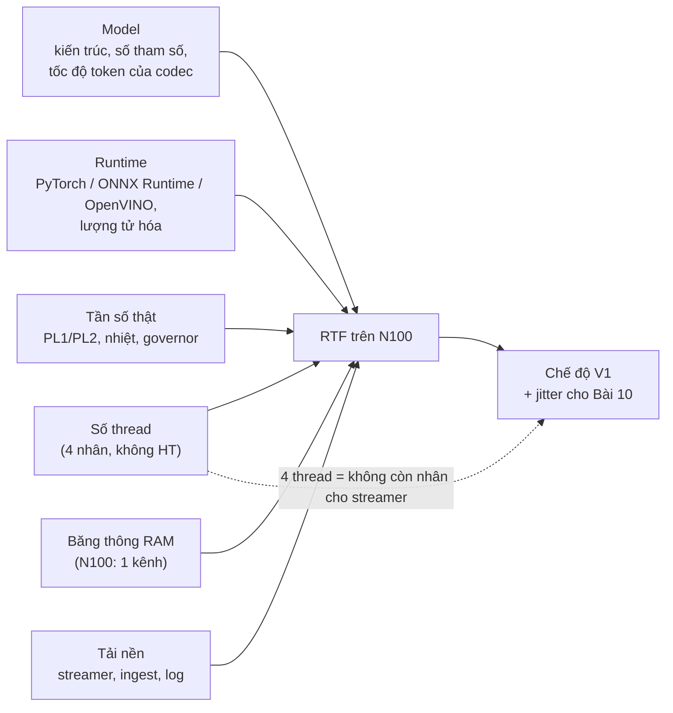

# KHÓA 3 · MODULE 3 — TTS VÀ QUYẾT ĐỊNH KIẾN TRÚC (14h)

> **Vị trí:** Module 2 (độ trễ, underrun) → **Module 3** → Module 4 (hệ thống V1) · **Viên nang nền dùng ở đây:** F1.2, F1.3, F1.4, F7.1, F7.2, F7.4, F5.4 (tần số CPU) · **Gate:** tiêu chí 1 và 6 của Gate Khóa 3 (cuối `m4-he-thong-v1.md`).

Module này trả lời quyết định kiến trúc số 1 của V1: **TTS stream trực tiếp trên CPU N100, hay pre-render**. Câu trả lời phải là một bảng số và một chính sách chuyển chế độ, không phải cảm giác "máy yếu quá".

| Bài | Giờ | Viên nang cần trước | Quyết định ra được |
|---|---|---|---|
| 11 — RTF: chỉ số quyết định kiến trúc | 3 | F1.2, F1.3, F7.4 | SLI nào quyết định stream/pre-render; chính sách chuyển chế độ |
| 12 — Chạy TTS tiếng Việt và đo RTF trên N100 | 6 | F1.3, F5.4, F7.2 | Model nào, runtime nào, số thread nào, chế độ nào cho V1 |
| 13 — Streaming chunk đầu | 5 | F1.2, F4.6 | Kích thước chunk, độ sâu đệm trước, cách đo độ trễ cảm nhận |

---

## Bài 11 — RTF: chỉ số quyết định kiến trúc (3h)

> **Vị trí:** Bài 10 → **Bài 11** → Bài 12 · **Cần trước:** F1.2 (phân bố, đuôi), F1.3 (warm-up, steady state), F7.1 (utilization), F7.4 (SLI/SLO), Bài 8 (ngân sách), Bài 10 (underrun) · **Sau bài này bạn quyết định được:** đo chỉ số nào (không chỉ RTF trung bình) để quyết stream hay pre-render, và viết được chính sách chuyển chế độ khi chỉ số đó xấu đi lúc vận hành.

### 1. Câu chuyện — ai đã khổ vì chuyện này

Cộng đồng nhận dạng giọng nói (ASR) đã báo tốc độ theo bội số thời gian thực ("0,5×RT", "xRT") từ nhiều thập kỷ trong các đợt đánh giá chung `[chuẩn]`: một hệ "1×RT" xử lý một giờ audio trong một giờ. Con số này gọn, so được giữa các hệ, và là thứ TTS thừa hưởng dưới tên RTF. Cái giá của sự gọn: nó là **trung bình trên cả đoạn**.

Game PC học bài học tương ứng theo cách đau hơn. Nhiều năm, card đồ họa được so bằng FPS trung bình. Người chơi vẫn thấy "giật" ở những card có FPS trung bình cao. Giới đánh giá phần cứng chuyển sang đo **thời gian từng frame** và báo phân vị ("1% low", frame time p99) `[chuẩn, khoảng 2011–2013 trở đi]`. Trung bình 60 FPS có thể chứa những frame 100 ms, và mắt thấy đúng những frame đó. Tai cũng vậy.

*Kịch bản:* một đội đo TTS trên máy dev, RTF trung bình 0,7, kết luận "stream được". Demo trước khách, máy chạy thêm ingest và log, nhiệt độ đã lên sau 20 phút, câu thứ năm đứt ở giữa. Không có số nào trong benchmark sai; chỉ là benchmark đo một thứ khác với thứ khách nghe.

### 2. Mô hình tư duy

```
RTF = thời_gian_sinh / độ_dài_audio_sinh_ra        (RTF < 1: sinh nhanh hơn phát)
```

Vẽ hai đường lũy kế theo thời gian thực:

```
audio sẵn có / đã phát (s)
  ▲
  │                                   ┌──┘ sinh (bậc thang, độ dốc trung bình 1/RTF)
  │                              ┌────┘
  │                         ┌────┘   ╱ phát (độ dốc 1, bắt đầu ở t_start)
  │                    ┌────┘     ╱
  │               ┌────┘       ╱     khoảng dọc giữa hai đường = đệm đang có
  │          ┌────┘         ╱        đường phát chạm/vượt đường sinh = UNDERRUN
  │     ┌────┘           ╱
  │     │             ╱
  └─────┴──────────┴───────────────────────────────────► thời gian
       TTFC      t_start
```

Ba con số đọc ra từ hình, và chỉ một trong số đó là RTF:

1. **TTFC** (time-to-first-chunk): điểm đường sinh rời trục hoành. Quyết định độ trễ cảm nhận (Bài 13).
2. **Độ dốc trung bình** 1/RTF: quyết định có thể stream câu **dài tùy ý** với đệm hữu hạn hay không. RTF < 1 là điều kiện cho việc đó.
3. **Đệm trước cần thiết** = khoảng cách dọc lớn nhất mà đường phát (nếu bắt đầu ngay ở TTFC) vượt lên trên đường sinh. Đây là chỉ số trực tiếp nhất của "có đứt không". Nó phụ thuộc **độ phân tán** của từng chunk, không chỉ trung bình.

Hệ quả: RTF trung bình < 1 **không đủ** (chunk chậm bất thường giữa câu vẫn gây đứt), và RTF > 1 **không cấm** stream (nếu chấp nhận đệm trước khoảng (RTF − 1) × D cho câu dài D). RTF là chỉ số kiến trúc; "đệm cần thiết" và TTFC là chỉ số vận hành.

**Mô phỏng** — dự đoán trước (phần 5), rồi chạy:

```python
# [đã chạy] Bài 11/13 — RTF trung bình < 1 có đủ để stream không? batch vs stream
import numpy as np
rng = np.random.default_rng(11)

def run(D=12.0, c=0.5, rtf=0.8, sig=0.0, first=0.6, pre=0, overhead=0.03):
    """D: độ dài câu (s); c: độ dài mỗi chunk (s); rtf: RTF trung vị; sig: độ phân tán log-normal;
    first: chi phí cố định cho chunk đầu (encode text, warm cache); pre: số chunk chờ trước khi phát."""
    n = int(np.ceil(D / c))
    g = c * rtf * np.exp(sig * rng.standard_normal(n)) + overhead
    g[0] += first
    ready = np.cumsum(g)                        # thời điểm chunk k sinh xong (s, tính từ lúc nhận text)
    t = ready[min(pre, n - 1)]                  # bắt đầu phát khi đủ 'pre' chunk đệm
    ttfa, gaps = t, 0
    for k in range(n):                          # phát tuần tự; chunk chưa xong ⇒ im lặng (underrun)
        if ready[k] > t:
            gaps += 1; t = ready[k]
        t += c
    batch_ttfa = ready[-1]                      # batch: đợi sinh xong cả câu
    return dict(rtf_tb=g.sum() / D, ttfa=ttfa, end=t, gaps=gaps,
                batch_ttfa=batch_ttfa, batch_end=batch_ttfa + D)

def show(tag, **kw):
    r = [run(**kw) for _ in range(500)]
    a = lambda k: np.array([x[k] for x in r])
    print(f"{tag:<34} RTF đo p50={np.median(a('rtf_tb')):.2f} | TTFA p50={np.median(a('ttfa')):.2f}s "
          f"| xong p50={np.median(a('end')):.1f}s | batch xong p50={np.median(a('batch_end')):.1f}s "
          f"| câu có đứt={np.mean(a('gaps') > 0):.0%}")

show("A. RTF 0.8, đều", rtf=0.8)
show("B. RTF 0.8, phân tán sig=0.5", rtf=0.8, sig=0.5)
show("C. như B, đệm trước 2 chunk", rtf=0.8, sig=0.5, pre=2)
show("D. RTF 1.2, không đệm", rtf=1.2)
show("E. RTF 1.2, đệm 5 chunk", rtf=1.2, pre=5)
```

### 3. Cầu nối từ backend

| Backend bạn biết | Ở đây | Gãy ở chỗ | Nếu dùng nhầm thì |
|---|---|---|---|
| Utilization ρ của một worker; đầu gối của M/M/1 khi ρ → 1 | RTF ≈ tỉ lệ thời gian worker TTS bận trên mỗi giây audio | Hàng đợi backend tăng độ trễ khi ρ cao; ở đây hàng đợi là **ngược** (đệm audio cạn dần) và "độ trễ quá hạn" là im lặng nghe được | Nhắm RTF 0,95 như nhắm utilization 95%: không còn biên cho bất kỳ dao động nào (→ F7.1) |
| Throughput benchmark (req/s trung bình) | RTF trung bình cả câu | Che độ phân tán giữa các chunk và chi phí cố định đầu câu | "RTF 0,8, stream được" trong khi 80% câu đứt (mô phỏng B) |
| Feature flag / circuit breaker / degrade mode | Chế độ stream / stream có đệm / pre-render / tạm dừng | Flag là **điều khiển**; RTF là **quan sát**. Cần một chính sách nối hai thứ, có trễ (hysteresis) để không nhảy qua lại | Coi RTF là một "flag" để bật tắt → chuyển chế độ liên tục mỗi khi số dao động quanh ngưỡng |
| Benchmark có warm-up rồi lấy steady state | Bỏ 3 lần đầu | Lần đầu sau boot là **một tình huống thật** của V1 (confession đầu tiên buổi sáng); và steady state về nhiệt chỉ tới sau hàng chục phút | Bỏ mất đúng hai tình huống xấu nhất: lạnh máy và nóng máy |

**Chấm mô hình:**

*Lượt 21 của bạn:* "RTF đại diện cho cách làm việc… càng có nhiều flag như RTF để đo realtime giữa thời gian xử lý với thông số business… nhiều công tắc, nhiều mode như batch hay streaming… có sẵn các kịch bản/mode… nếu lúc đo chưa cover đủ flag/khóa thì lúc runtime thực tế không thể đảm bảo mọi tình huống."

**ĐÚNG MỘT PHẦN.**

- *Phần đúng.* (a) Tỉ lệ "thời gian xử lý / thời gian thực mà đầu ra chiếm" là một chỉ số vận hành chung cho mọi pipeline có hạn chót: vòng điều khiển 100 Hz có ngân sách 10 ms mỗi vòng; một VLA sinh action chunk 1 s mà suy luận mất 1,5 s thì robot sớm muộn cũng "đói lệnh" (K4); pipeline cảm biến không xử lý kịp tốc độ đến thì drop (→ F3.9). (b) Thiết kế **trước** các chế độ (stream, pre-render, degrade) thay vì phát hiện lúc sự cố là đúng hướng.
- *Gãy 1 — trộn "flag" với "chỉ số".* RTF là phép đo (SLI). Mode là điều khiển. Thứ nối chúng là **chính sách**: "nếu RTF p90 của 20 chunk gần nhất > 0,8 trong 60 s thì chuyển sang pre-render; chỉ quay lại stream khi < 0,6 trong 10 phút". Không có chính sách viết ra, nhiều flag chỉ là nhiều cách hỏng.
- *Gãy 2 — RTF trung bình che đuôi.* Mô phỏng B: RTF trung vị 0,8, phần lớn câu vẫn đứt. Cái cần đo là phân bố theo chunk và "đệm cần thiết".
- *Gãy 3 — RTF < 1 vừa không đủ vừa không cần.* Không đủ: chunk đầu chậm làm độ trễ cảm nhận cao dù RTF tốt. Không cần: RTF 1,2 vẫn stream sạch với đệm đủ (mô phỏng E).
- *Gãy 4 — "cover đủ flag lúc đo" là không thể.* Không gian trạng thái là tích của nhiệt độ × tải nền × độ dài câu × nội dung × phiên bản model × trạng thái mạng. Không phép đo nào phủ hết. Nghề này giải bằng bốn thứ khác: đo **phân bố** trong điều kiện đại diện và điều kiện xấu có chủ đích; định nghĩa **vùng đã kiểm chứng** (ngành xe tự lái gọi là *operational design domain*, ODD); **giám sát lúc chạy** để biết khi nào rời vùng đó; và một **đường lùi an toàn** đúng bất kể chuyện gì xảy ra (với loa: im lặng tốt hơn nói đứt). Phản ví dụ: CPU hạ xung sau 20 phút tổng hợp liên tục. Benchmark 20 lần mỗi câu không bao giờ thấy nó, không flag nào "cover" nó; thứ cứu V1 là SLI lúc chạy kích hoạt pre-render.

*Gemini trả lời lượt 21:* mở đầu "Bạn đã chạm trúng tư duy cốt lõi nhất" và kết bằng "đảm bảo tính tất định (determinism)". — **ĐÚNG MỘT PHẦN**, và lời xác nhận không có chỗ gãy là thiếu sót chính. Ví dụ VLA "suy luận 1,5 s cho chunk 1 s thì robot khựng" đúng ở trạng thái dừng. Nhưng mục tiêu không phải determinism (thời gian TTS trên CPU chia sẻ không tất định và không cần tất định); mục tiêu là **hành vi bị chặn**: trễ có cận trên đã đo, và khi vượt cận thì hỏng an toàn.

*Mô hình phổ biến:* "Máy yếu quá thì không stream được." — **SAI** như một lập luận: nó không chỉ ra đại lượng nào, ngưỡng nào. Thay bằng: "Trên N100, model X, 4 thread, câu 20 từ: RTF p50 = …, p90 = …, đệm cần thiết p90 = … s, TTFC p50 = … s; với ngưỡng độ trễ cảm nhận … s, chọn chế độ …".

### 4. Thuật ngữ

| Mức | Thuật ngữ | Nghĩa trong một câu | Hay bị hiểu nhầm thành |
|---|---|---|---|
| 🟢 | RTF (×RT) | Thời gian sinh / độ dài audio sinh ra | Độ trễ |
| 🟢 | TTFC / TTFA | Thời gian tới chunk đầu sẵn sàng / tới sample đầu ra loa | Cùng một thứ (TTFA = TTFC + USB + ring + DMA + …) |
| 🟢 | Đệm trước cần thiết (required prebuffer) | Lượng audio phải có sẵn trước khi phát để không đứt | Hằng số của model |
| 🟢 | Warm-up, steady state | Giai đoạn đầu chậm do nạp/biên dịch/cache; giai đoạn ổn định sau đó | Chỉ là "lần đầu chậm" (còn steady state về **nhiệt**) |
| 🟢 | Degrade mode, hysteresis | Chế độ chất lượng thấp hơn nhưng an toàn; ngưỡng vào ≠ ngưỡng ra | Flag bật/tắt |
| 🟡 | ODD (operational design domain) | Tập điều kiện mà hệ đã được kiểm chứng để chạy | "Mọi tình huống" |
| 🟡 | Bootstrap CI cho percentile | Khoảng tin cậy của p90 bằng lấy mẫu lại | ± 2σ |
| 🔴 | Network calculus (arrival/service curve) | Lý thuyết cận trên độ trễ bằng đường lũy kế | Cần cho V1 (hình phần 2 là phiên bản trực giác) |

### 5. Dự đoán

**Câu 1 — mô phỏng.** Trước khi chạy, đoán cho A–E: "RTF đo" (cả câu, gồm chi phí chunk đầu và overhead) lớn hơn hay nhỏ hơn tham số `rtf`? Tỉ lệ câu có đứt? Thời điểm xong của stream so với batch?

**Câu 2 — cỡ mẫu.** Bản gốc yêu cầu N = 20 lần mỗi câu, bỏ 3 lần đầu, báo p50/p95/p99. Với 17 mẫu, p99 là gì? Cần bao nhiêu mẫu để p95 có ý nghĩa?

**Câu 3 — chính sách.** Viết nháp chính sách chuyển chế độ cho V1 (dạng bảng), với các ngưỡng để trống tới Bài 12.

```markdown
# Bài 11 — prediction · ngày ____ · ký ____
| Mô phỏng | RTF đo (> hay < tham số) | % câu đứt | stream xong sớm hơn batch bao nhiêu |
|---|---|---|---|
| A | | | |
| B | | | |
| C | | | |
| D | | | |
| E | | | |
p99 của 17 mẫu là: ____ · Số mẫu tối thiểu cho p95 có nghĩa: ____ vì ____

## Chính sách chuyển chế độ (nháp)
| Chế độ | Điều kiện vào (SLI, cửa sổ) | Điều kiện ra | Hành vi |
|---|---|---|---|
| stream | | | |
| stream + đệm trước X s | | | |
| pre-render (sinh xong mới phát) | | | |
| tạm dừng phát (giữ hàng đợi) | | | im lặng, báo moderator |
```

### 6. Làm

1. **Viết harness** dùng lại được ở K4. Bộ khung dưới đây đã chạy với một TTS giả; Bài 12 thay `fake_tts` bằng model thật. Điểm chính: đo **từng chunk**, không chỉ tổng.

```python
# [đã chạy với TTS giả] Bài 11 — harness đo RTF + chunk; thay fake_tts bằng model thật (API [tự đo])
import time, json, platform, statistics as st
import numpy as np

def fake_tts(text, sr=24000, rtf=0.6, chunk_s=0.5):
    """Giả lập TTS streaming: yield từng chunk PCM int16. Thay bằng model thật."""
    dur = 0.35 * len(text.split())                        # ~0,35 s audio mỗi từ (giả định)
    n = max(1, int(np.ceil(dur / chunk_s)))
    for _ in range(n):
        time.sleep(chunk_s * rtf * np.random.lognormal(0, 0.3))
        yield np.zeros(int(sr * chunk_s), dtype=np.int16)

def measure(tts, text, sr=24000):
    t0 = time.perf_counter(); ready, played_s = [], 0.0
    for pcm in tts(text, sr=sr):
        ready.append(time.perf_counter() - t0)
        played_s += pcm.size / sr                          # mono; stereo thì chia thêm số kênh
        ready[-1] = (ready[-1], played_s)
    t_gen = ready[-1][0]
    # đệm tối thiểu để không đứt: max_k [ready_k − (ready_0 + audio đã có trước chunk k)]
    starts = [0.0] + [r[1] for r in ready[:-1]]
    need = max(0.0, max(r[0] - (ready[0][0] + s) for r, s in zip(ready, starts)))
    return dict(rtf=t_gen / played_s, ttfc=ready[0][0], audio_s=played_s, prebuffer_s=need)

def bench(tts, sentences, reps=10, warmup=3):
    for s in sentences[:1]:
        for _ in range(warmup): measure(tts, s)           # warm-up: không ghi
    rows = [dict(len=len(s.split()), rep=r, **measure(tts, s)) for s in sentences for r in range(reps)]
    meta = dict(cpu=platform.processor(), py=platform.python_version(), reps=reps, warmup=warmup)
    return meta, rows

if __name__ == "__main__":
    sents = ["xin chào mọi người"] * 3 + ["hôm nay trời đẹp quá " * 4] * 3
    meta, rows = bench(fake_tts, sents, reps=4, warmup=1)
    for L in sorted({r["len"] for r in rows}):
        v = [r for r in rows if r["len"] == L]
        q = lambda k: (st.median(x[k] for x in v), max(x[k] for x in v))
        print(f"{L:>3} từ n={len(v)}: RTF p50/max={q('rtf')[0]:.2f}/{q('rtf')[1]:.2f}  "
              f"TTFC p50={q('ttfc')[0]:.2f}s  đệm cần max={q('prebuffer_s')[1]:.2f}s")
    print(json.dumps(meta, ensure_ascii=False))
```

2. **Bộ câu.** Ba nhóm độ dài (~5, ~20, ~50 từ), **mỗi nhóm ≥ 10 câu khác nhau** (không lặp một câu 20 lần: nội dung ảnh hưởng thời gian sinh). Có dấu đầy đủ, có số ("3 giờ 15"), có từ tiếng Anh, có tên riêng. Lưu bộ câu thành file có hash, commit.
3. **Cỡ mẫu.** 10 câu × 10 lần = 100 mẫu mỗi nhóm. Báo p50, p90, max; p95 kèm khoảng tin cậy bootstrap (→ F1.4). Không báo p99 với dưới vài trăm mẫu.
4. **Ghi riêng lần lạnh.** Lần chạy đầu tiên sau khi khởi động process (và sau khi khởi động máy) **ghi vào một bảng riêng**, không vứt đi. Đó là confession đầu tiên buổi sáng.
5. **Ghi môi trường cùng mỗi lần đo:** CPU, số thread runtime dùng, phiên bản model/runtime, nhiệt độ và tần số CPU **trong** lúc chạy (luồng nền đọc mỗi giây), load average. Bài 12 cụ thể hóa trên N100.
6. **Chạy mô phỏng** phần 2, so với dự đoán câu 1.
7. **Viết chính sách chuyển chế độ** (câu 3) vào `decisions.md`, ngưỡng để trống.

Sai số cần ghi: `time.perf_counter()` có độ phân giải dưới µs trên Linux `[chuẩn]`, không phải nguồn sai số đáng kể. Nguồn đáng kể: tải nền khác giữa các lần, trạng thái nhiệt, và GC của Python trong vòng đo.

### 7. Số phải ra

<details><summary>🔒 MỞ SAU KHI COMMIT prediction.md</summary>

**Mô phỏng** (đã chạy, seed 11, câu 12 s, chunk 0,5 s, chunk đầu thêm 0,6 s, overhead 0,03 s/chunk):

| | RTF đo cả câu (p50) | TTFA p50 | Stream xong (p50) | Batch xong (p50) | % câu đứt |
|---|---|---|---|---|---|
| A. RTF 0,8 đều | ~0,91 | ~1,0 s | ~13,0 s | ~22,9 s | 0% |
| B. RTF 0,8, phân tán | ~1,01 | ~1,05 s | ~13,5 s | ~24,1 s | ~80% |
| C. như B, đệm 2 chunk | ~1,00 | ~2,0 s | ~14,1 s | ~24,0 s | ~20% |
| D. RTF 1,2, không đệm | ~1,31 | ~1,2 s | ~16,2 s | ~27,7 s | 100% |
| E. RTF 1,2, đệm 5 chunk | ~1,31 | ~4,4 s | ~16,4 s | ~27,7 s | 0% |

Đọc bảng:
- "RTF đo" luôn lớn hơn tham số: chi phí chunk đầu và overhead mỗi chunk cộng vào; với phân tán log-normal, trung bình lớn hơn trung vị. Một model quảng cáo "RTF 0,8" có thể đo ra ~1,0 trên câu ngắn chỉ vì chi phí cố định.
- B vs A: cùng trung vị, khác phân tán, kết quả ngược nhau. RTF không đủ, phải đo đệm cần thiết.
- E: RTF > 1 vẫn stream sạch, trả bằng độ trễ cảm nhận ~4,4 s. Vẫn sớm hơn batch (~27,7 s) rất xa.
- Stream luôn **xong** sớm hơn batch, gần bằng thời gian sinh − TTFC. Bản gốc Bài 13 nói "total-time xấp xỉ bằng batch" là sai nếu total-time tính tới sample cuối ra loa (Bài 13 sửa).

**Cỡ mẫu:** với 17 mẫu, p99 nội suy giữa mẫu lớn thứ hai và lớn nhất, thực chất là **max**. p95 với 17 mẫu cũng gần max. Để có ước lượng p95 không chỉ là max, cần cỡ ≥ 60–100 mẫu; khoảng tin cậy bootstrap sẽ cho thấy nó rộng tới đâu.

**Harness với TTS giả** (đã chạy): RTF p50 ~0,6–0,7, TTFC ~0,3 s, đệm cần max gần 0. Đây chỉ để xác nhận harness chạy, không có ý nghĩa vật lý.

</details>

### 8. Nếu ra khác

| Triệu chứng | Nguyên nhân khả dĩ | Kiểm bằng cách | Sửa |
|---|---|---|---|
| RTF câu ngắn cao hơn hẳn câu dài | Chi phí cố định mỗi lời gọi (encode text, khởi tạo) | Vẽ thời gian sinh theo độ dài audio: có chặn khác 0 | Báo cả "chi phí cố định" và "RTF biên" (độ dốc) thay vì một RTF |
| RTF lần 1 gấp nhiều lần các lần sau | Nạp trọng số, biên dịch đồ thị, cache | Ghi riêng lần lạnh | Giữ process sống (daemon), làm warm-up khi khởi động daemon |
| RTF trôi lên theo thời gian chạy | Nhiệt / giới hạn công suất | Vẽ RTF và tần số CPU theo thời gian | Bài 12: đo steady state nhiệt |
| Harness báo đệm cần = 0 nhưng phát thật vẫn đứt | Harness đo lúc chunk **sinh xong**, chưa tính USB/ring/DMA, hoặc model không thật sự stream (trả hết một lần) | In thời điểm từng chunk; nếu tất cả gần nhau ở cuối thì model không stream | Bài 13 đo đầu–cuối |
| p50 giữa hai lần chạy cùng cấu hình lệch > 10% | Tải nền, nhiệt, governor | Chạy A/A: hai lần liên tiếp cùng cấu hình (→ F1.3) | Cô lập; ghi điều kiện; báo độ lệch A/A làm sàn của mọi so sánh |

### 9. Câu hỏi ngược

1. **[Vì sao không]** Vì sao không định nghĩa RTF bằng p99 thời gian sinh chia độ dài, cho an toàn?
<details><summary>Hướng nghĩ</summary>

Vẫn là một con số trên **cả câu**: không phân biệt chậm đều với chậm một cục ở giữa. Đại lượng trực tiếp là đệm cần thiết (phụ thuộc thứ tự các chunk), và TTFC. RTF giữ vai trò chỉ số kiến trúc: dài hạn có theo kịp không.

</details>

2. **[Failure mode]** Chính sách chuyển chế độ của bạn có thể dao động (stream ↔ pre-render) mỗi vài giây không? Hậu quả với người nghe?
<details><summary>Hướng nghĩ</summary>

Có, nếu ngưỡng vào = ngưỡng ra và SLI dao động quanh ngưỡng. Hậu quả: độ trễ cảm nhận nhảy loạn, có thể chuyển chế độ giữa câu. Sửa: hysteresis, cửa sổ đủ dài, và chỉ chuyển ở **ranh giới câu**.

</details>

3. **[Quy mô]** Hàng đợi có 30 confession đã duyệt (sau một buổi họp). RTF 0,6. Chế độ nào cho tổng thời gian xả hàng đợi ngắn nhất, chế độ nào cho người nghe dễ chịu nhất?
<details><summary>Hướng nghĩ</summary>

Với RTF < 1, sinh trước câu tiếp theo trong lúc đang phát câu hiện tại (pipelining) làm khoảng nghỉ giữa các câu gần 0. Đó là pre-render cho câu sau và stream cho câu đầu. Tổng thời gian bị chặn bởi tổng độ dài audio, không phải bởi TTS. Câu hỏi thật là: có nên phát 30 câu liền không (sản phẩm, không phải kỹ thuật).

</details>

4. **[Liên ngành]** Robot ở K7 có vòng điều khiển 100 Hz trên ESP32 và planner trên N100. "RTF" của planner là gì? Đệm trước tương ứng là gì?
<details><summary>Hướng nghĩ</summary>

Thời gian tính một kế hoạch / khoảng thời gian kế hoạch đó có hiệu lực. Đệm trước là quỹ đạo đã tính sẵn mà controller còn chạy được nếu planner trễ. Khi đệm cạn, chế độ an toàn là dừng (K7 C4.4: failsafe trong firmware), không phải "chạy tiếp lệnh cũ".

</details>

5. **[Phản biện]** "Chỉ cần đo nhiều tình huống hơn là cover được." Phản biện bằng một tình huống không thể đo trước.
<details><summary>Hướng nghĩ</summary>

Bản cập nhật model hoặc runtime tháng sau; một confession dài gấp đôi mọi câu trong bộ test; hai việc nặng trùng giờ lần đầu. Thứ bạn kiểm soát được là: phát hiện lúc chạy rằng mình đang ngoài vùng đã đo, và đường lùi an toàn đã được **test bằng lỗi cố ý** (→ F2.5).

</details>

### 10. Liên kết ra ngoài

- **Game — frame time.** Ngân sách 16,7 ms mỗi frame ở 60 Hz là "RTF = 1" của GPU. Ngành chuyển từ FPS trung bình sang phân vị frame time vì trung bình che giật. Chỗ khác: game có thể bỏ frame (drop), audio bỏ chunk thì thành tiếng đứt.
- **Xe tự lái — ODD.** Chuẩn SAE J3016 dùng khái niệm operational design domain: hệ chỉ được cam kết trong miền điều kiện đã định nghĩa, và phải phát hiện khi ra khỏi miền `[spec: SAE J3016]`. Đây là câu trả lời có tên cho "không thể cover mọi tình huống".
- **Mạng — network calculus.** Lý thuyết của Cruz (1991) và Le Boudec & Thiran cho cận trên độ trễ và kích thước buffer từ đường lũy kế đến (arrival curve) và đường phục vụ (service curve). Hình ở phần 2 chính là phiên bản đồ chơi của nó.

### 11. Độ tin cậy và sửa lỗi

| Khẳng định | Nhãn | Ghi chú / cách kiểm |
|---|---|---|
| RTF < 1 cho phép stream câu dài tùy ý với đệm hữu hạn (ở trạng thái dừng) | `[chuẩn]` | Hai đường lũy kế |
| RTF > 1 stream được với đệm ≈ (RTF − 1) × D | `[chuẩn]` (xấp xỉ, RTF đều) | Mô phỏng E |
| p99 của 17 mẫu ≈ max | `[chuẩn]` | F1.2 |
| `perf_counter` độ phân giải dưới µs trên Linux | `[chuẩn]` | `time.get_clock_info('perf_counter')` |
| SAE J3016 định nghĩa ODD | `[spec]` | |

**Đã sửa so với bản gốc và bản Gemini:**
- Bản gốc: "RTF < 1 là điều kiện cần để streaming". Sửa: điều kiện để stream câu **dài tùy ý** với đệm cố định; với câu hữu hạn, RTF > 1 vẫn stream được nếu chấp nhận đệm trước tỉ lệ với độ dài câu.
- Gemini: "RTF > 1 bắt buộc phải pre-render". Sai cùng lý do.
- Bản gốc và Gemini: "N = 20, bỏ 3 lần đầu, báo p50/p95/p99". Với 17 mẫu, p99 và p95 gần như là max. Sửa: ≥ 10 câu × 10 lần mỗi nhóm, báo p50/p90/max, p95 kèm bootstrap CI.
- Bản gốc: bỏ 3 lần warm-up. Sửa: ghi riêng lần lạnh, vì nó là một tình huống vận hành thật.
- Bản gốc: "nhắm RTF ≤ 0,5". Giữ như một quy tắc ngón tay cái, nhưng thêm: chỉ tiêu quyết định là đệm cần thiết và TTFC theo phân bố, ở điều kiện nhiệt steady state.
- Gemini: xác nhận lượt 21 mà không chỉ chỗ gãy; đã chấm lại ở phần 3.

### 12. Đọc thêm và tự kiểm tra

- **Nguồn gốc:** F7.1 (utilization, đầu gối hàng đợi), F7.4 (SLI/SLO).
- **Giải thích:** Brendan Gregg, *Systems Performance* (2nd ed.), chương về phương pháp benchmark (active benchmarking).
- **Đào sâu (tùy chọn):** J.-Y. Le Boudec, P. Thiran, *Network Calculus* (sách, bản đọc trực tuyến do tác giả công bố).
- **Tự kiểm tra:** (1) giải thích cho một backend engineer khác trong 5 câu vì sao RTF 0,8 có thể vẫn đứt; (2) vẽ lại hình hai đường lũy kế, chỉ ra TTFC, RTF, đệm cần thiết; (3) hai câu dưới.

*Câu 1.* Câu dài 20 s, RTF đều 1,1, chi phí chunk đầu bỏ qua. Đệm trước tối thiểu để không đứt?
<details><summary>Đáp án</summary>

Sinh xong lúc 22 s. Phát bắt đầu lúc t₀ và kết thúc lúc t₀ + 20 s; chunk cuối phải sẵn sàng trước khi tới lượt nó, nên t₀ ≳ 2 s. Đệm ≈ (RTF − 1) × D = 2 s.

</details>

*Câu 2.* Bạn đổi model, RTF p50 giảm từ 0,7 xuống 0,5 nhưng TTFC tăng từ 0,4 s lên 1,5 s. Với confession 20 từ, đổi có lợi không?
<details><summary>Đáp án</summary>

Tùy SLI bạn cam kết. Nếu độ trễ cảm nhận là chỉ số chính và cả hai đều không đứt, model cũ tốt hơn cho người nghe. Model mới tốt hơn khi hàng đợi dài (xả nhanh hơn) hoặc khi máy nóng (còn biên). Viết cả hai chỉ số vào quyết định.

</details>

---

## Bài 12 — Chạy TTS tiếng Việt và đo RTF trên N100 (6h)

> **Vị trí:** Bài 11 → **Bài 12** → Bài 13 · **Cần trước:** F1.3 (cô lập nhiễu, A/A test), F5.4 (tần số CPU, governor), F7.2 (memory-bound vs compute-bound), Bài 11 (harness, chính sách chế độ) · **Sau bài này bạn quyết định được:** model, runtime, số thread và chế độ (stream / stream có đệm / pre-render) của TTS cho V1, kèm số đo ở điều kiện nhiệt ổn định và tải nền thật.

### 1. Câu chuyện — ai đã khổ vì chuyện này

Người đánh giá laptop đã quen với chuyện này từ khoảng 2018 trở đi: cùng một mã CPU Intel trong hai máy khác hãng cho điểm benchmark chênh nhau đáng kể khi chạy lâu. Lý do không nằm ở chip mà ở **giới hạn công suất** do hãng máy đặt trong BIOS (PL1 dài hạn, PL2 ngắn hạn, cửa sổ thời gian Tau) và ở khả năng tản nhiệt của vỏ `[chuẩn]`. Ba mươi giây đầu ai cũng nhanh; sau vài phút, máy nào tản nhiệt kém và PL1 thấp thì tụt.

Intel ghi N100 có công suất cơ sở 6 W và turbo tối đa 3,4 GHz `[spec: Intel ARK, Processor N100]`. Mini PC N100 thường được hãng đặt giới hạn công suất cao hơn 6 W, khác nhau theo model và phiên bản BIOS `[tự đo]`. Con số RTF trong README của một model TTS, đo trên một desktop 8 nhân hai kênh RAM, nói rất ít về N100 của bạn sau 20 phút chạy liên tục trong văn phòng 30 °C.

### 2. Mô hình tư duy



Bốn câu bản chất:

1. **Kiến trúc model quyết định loại nút thắt.** TTS kiểu tự hồi quy (một mô hình ngôn ngữ sinh token âm thanh, rồi codec giải mã) phải đọc gần hết trọng số cho mỗi token: ở batch 1 đó là bài toán **băng thông bộ nhớ** (→ F7.2, K4 Bài 12). TTS kiểu flow-matching/diffusion chạy N bước trên cả câu: nặng tính toán, ít tự nhiên để stream. TTS kiểu VITS sinh song song: nhanh, thường nhẹ. Tra model card để biết model của bạn thuộc loại nào `[tự đo]`.
2. **Cận dưới RTF cho model tự hồi quy, ước lượng thô:** `RTF ≳ (token/giây audio) × (byte trọng số đọc mỗi token) / (băng thông RAM hiệu dụng)`. N100 chỉ có **một kênh bộ nhớ** `[spec: Intel ARK]`; băng thông lý thuyết = tốc độ truyền × 8 byte. Thực tế đạt được thấp hơn lý thuyết.
3. **Thêm thread không miễn phí.** Nút thắt băng thông thì 2–3 thread đã bão hòa. Dùng cả 4 nhân thì streamer và ingest (Bài 10, 14) bị tranh CPU, jitter tăng, underrun tăng. RTF tốt nhất và hệ thống tốt nhất có thể ở hai số thread khác nhau.
4. **Hai con số RTF:** lúc máy nguội và lúc máy ở **steady state nhiệt** với tải nền thật. Quyết định kiến trúc dùng con số thứ hai.

### 3. Cầu nối từ backend

| Backend bạn biết | Ở đây | Gãy ở chỗ | Nếu dùng nhầm thì |
|---|---|---|---|
| Instance cloud loại burstable (CPU credit) | Turbo + PL2 trong cửa sổ Tau, rồi về PL1 | "Credit" ở đây là nhiệt và công suất, phụ thuộc nhiệt độ phòng, bụi, hướng đặt máy; không mua thêm được | Benchmark 30 giây, kết luận cho chạy 72 giờ |
| Chọn thư viện theo star GitHub / benchmark của tác giả | Chọn model TTS theo README | Benchmark của tác giả đo trên phần cứng khác (nhiều nhân, hai kênh RAM, GPU) | "On-device, real-time trên CPU" trong README ≠ real-time trên N100 |
| License của package (MIT, Apache) | License code và license **trọng số** model, có thể khác nhau | Trọng số có thể kế thừa giới hạn của dữ liệu huấn luyện (ví dụ phi thương mại) dù code MIT | Đưa model vào một dự án ở công ty mà vi phạm điều khoản trọng số |
| Lockfile + image digest | Pin phiên bản package **và** revision của trọng số | Nhiều thư viện tải trọng số "mới nhất" từ hub lúc chạy | Kết quả đo tuần sau khác tuần này mà code không đổi dòng nào |
| Thread pool size = số core | `intra_op_num_threads` / `torch.set_num_threads` | Workload memory-bound không tăng tốc tuyến tính; và cùng máy còn chạy streamer có hạn chót | RTF tốt hơn 5%, underrun tăng gấp nhiều lần |

**Chấm mô hình:**

- *"Model hướng on-device, README ghi real-time trên CPU, thì N100 chạy được real-time."* — **ĐÚNG MỘT PHẦN**. Model được thiết kế cho CPU là ứng viên đúng để thử trước. Gãy: CPU trong README thường mạnh hơn N100 (nhiều nhân, hai kênh RAM, tần số cao), và README đo lúc nguội. Phản ví dụ: hai mini PC cùng N100 khác PL1 có thể cho RTF steady state khác nhau `[tự đo]`. Chỉ phép đo của bạn quyết định.
- *"Thêm thread thì nhanh hơn, dùng hết 4 nhân."* — **ĐÚNG MỘT PHẦN**. Đúng khi compute-bound và máy không làm gì khác. Gãy: decode tự hồi quy batch 1 thường memory-bound, bão hòa sớm; và máy còn phải stream audio đúng hạn. Phản ví dụ cần tự tạo: đo RTF ở 3 và 4 thread **cùng lúc** đếm underrun như Bài 10.
- *"Code MIT là dùng thoải mái."* — **SAI** với model ML. Trọng số có license riêng; dữ liệu huấn luyện có thể ràng buộc trọng số. Bản gốc đã ghi Viterbox là CC BY-NC; cần kiểm tương tự cho mọi model, kể cả model nền mà nó fine-tune từ đó `[tự đo]`. Đây không phải tư vấn pháp lý: hỏi bộ phận phụ trách nếu deploy ở công ty.

### 4. Thuật ngữ

| Mức | Thuật ngữ | Nghĩa trong một câu | Hay bị hiểu nhầm thành |
|---|---|---|---|
| 🟢 | Turbo, tần số thật (Bzy_MHz) | Tần số chip thực chạy khi bận, đọc bằng `turbostat` | Tần số ghi trên hộp |
| 🟢 | Memory-bound | Tốc độ bị chặn bởi băng thông RAM, không bởi phép tính | "CPU yếu" |
| 🟢 | Model card, license trọng số | Tài liệu mô tả model; điều khoản dùng trọng số | License của repo code |
| 🟢 | Steady state nhiệt | Trạng thái sau khi nhiệt độ và tần số đã ổn định dưới tải liên tục | Lần chạy thứ 4 sau warm-up |
| 🟡 | PL1 / PL2 / Tau | Giới hạn công suất dài hạn / ngắn hạn / cửa sổ thời gian của Intel | TDP |
| 🟡 | CPU governor (`intel_pstate`) | Chính sách chọn tần số của Linux | Không ảnh hưởng benchmark |
| 🟡 | ONNX Runtime, OpenVINO, lượng tử int8 | Runtime suy luận cho CPU Intel; giảm độ chính xác số để nhanh hơn | Một thứ; luôn giữ chất lượng |
| 🔴 | Kiến trúc nội bộ từng TTS (codec, flow matching) | Chi tiết thuật toán | Cần hiểu để đo RTF |

### 5. Dự đoán

**Tham số cần tra:**

| Cần | Tra ở đâu |
|---|---|
| Kiến trúc model (tự hồi quy / flow / VITS), số tham số, tốc độ token của codec, sample rate đầu ra, có stream không | Model card + README của repo `[tự đo theo phiên bản]` |
| License code, license trọng số, license model nền | File LICENSE, model card trên hub |
| N100: số nhân, turbo, công suất cơ sở, số kênh RAM | Intel ARK `[spec]` |
| RAM của máy bạn: loại, tốc độ, số thanh | `sudo dmidecode -t memory` `[tự đo]` |
| Giới hạn công suất thật | BIOS; hoặc `/sys/class/powercap/intel-rapl:0/` `[tự đo, đường dẫn tùy kernel]` |
| Governor, turbo đang bật | `cpupower frequency-info` hoặc sysfs `[tự đo]` |

**Đề.** Với model bạn chọn:
1. Nếu tự hồi quy: tính cận dưới RTF từ băng thông (công thức phần 2), ở FP32 và int8.
2. Dự đoán RTF p50 và đệm cần thiết p90 cho 3 nhóm độ dài, ở 3 và 4 thread, lúc nguội.
3. Dự đoán tần số và nhiệt độ sau 30 phút tổng hợp liên tục; RTF steady state so với lúc nguội.
4. Dự đoán RSS (RAM process) và thời gian nạp model.
5. Chế độ bạn nghĩ sẽ chọn.

```markdown
# Bài 12 — prediction · ngày ____ · ký ____
Model: ____ (revision ____) · runtime: ____ · lượng tử: ____ · sr đầu ra: ____ Hz
Kiến trúc: ____ · tham số: ____ · token/giây audio: ____ · license trọng số: ____
RAM: ____ (kênh: __) · băng thông lý thuyết: ____ GB/s · PL1/PL2: ____
Cận dưới RTF từ băng thông (nếu tự hồi quy): FP32 ____ · int8 ____
| Nhóm | thread | RTF p50 | đệm cần p90 (s) | TTFC p50 (s) |
|---|---|---|---|---|
| 5 từ | 3 | | | |
| 5 từ | 4 | | | |
| 20 từ | 3 | | | |
| 20 từ | 4 | | | |
| 50 từ | 3 | | | |
| 50 từ | 4 | | | |
Sau 30 phút: T = __ °C · Bzy_MHz = __ · PkgWatt = __ · RTF steady/nguội = __
RSS = __ GB · nạp model = __ s · Chế độ dự đoán: ____
```

### 6. Làm

1. **Chọn model, ghi lý do vào `decisions.md`.** Tiêu chí bằng số hoặc kiểm được: license trọng số; có stream thật không (chunk ra dần hay trả một lần); sample rate đầu ra; runtime CPU hỗ trợ; RAM; chất lượng tiếng Việt do bạn và ≥ 2 người khác nghe **mù** (không biết model nào) trên cùng 5 câu. "Vì nó phổ biến" không phải lý do.

| Ứng viên (theo bản gốc) | Điểm cần tự kiểm | Ghi chú |
|---|---|---|
| VieNeu-TTS | Phiên bản hiện hành, sample rate mặc định, runtime CPU | Bản gốc ghi 24 kHz; trang PyPI của SDK `vieneu` (2026) mô tả bản mặc định "v3 Turbo" 48 kHz và cài đặt tối thiểu chạy trên ONNX Runtime `[tự đo theo phiên bản bạn cài]` |
| VietTTS (dangvansam) | Server API, license, chế độ stream | `[tự đo]` |
| Viterbox | License trọng số | Bản gốc ghi CC BY-NC → chỉ dùng nội bộ, phi thương mại `[tự đo]` |
| F5-TTS-Vietnamese | Repo/tác giả, license trọng số, số bước sinh | Kiểu flow-matching: thường nặng cho CPU yếu `[ước lượng]`; kiểm license trọng số của model nền `[tự đo]` |

2. **Cài có pin.** Môi trường riêng (venv hoặc Docker), ghi phiên bản mọi package và **revision hash của trọng số**. Sau khi tải xong, chạy ở chế độ offline (với Hugging Face hub: biến môi trường `HF_HUB_OFFLINE=1` `[tự đo]`) và **rút mạng** một lần để chứng minh chuỗi không gọi ra ngoài. Đây là bằng chứng cho Gate tiêu chí 1.
3. **Kiểm máy trước khi đo.** Ghi: governor, turbo bật/tắt, giới hạn công suất, phiên bản BIOS, cấu hình RAM, nhiệt độ phòng. Chạy A/A: cùng cấu hình hai lần liền, chênh lệch p50 là "sàn nhiễu" của mọi so sánh sau (→ F1.3).
4. **Quét thread nhanh.** Câu 20 từ, 1/2/3/4 thread, 20 mẫu mỗi mức. Vẽ RTF theo số thread. Nếu đường phẳng từ 2–3 thread, đó là dấu hiệu memory-bound.
5. **Đo chính thức** ở 2 mức thread ứng viên (thường 3 và 4) với harness Bài 11: 3 nhóm độ dài × 10 câu × 10 lần. Ghi riêng lần lạnh.
6. **Steady state nhiệt.** Tổng hợp liên tục 30 phút (vòng lặp qua bộ câu). Một luồng nền ghi mỗi giây: nhiệt độ gói, Bzy_MHz, PkgWatt (ví dụ `sudo turbostat --quiet --show Bzy_MHz,PkgWatt,PkgTmp --interval 1` `[tự đo cú pháp theo phiên bản]`). Vẽ RTF và tần số theo thời gian trên cùng một hình.
7. **Tải nền thật.** Lặp bước 5 cho mức thread đã chọn, lần này với streamer đang phát (Bài 10) và một tiến trình giả lập ingest + log. Đếm underrun đồng thời. Đây là con số đi vào quyết định.
8. **Sample rate.** Nếu model ra 48 kHz mà chuỗi I2S đang ở 24 kHz: hoặc resample trên host (đo thời gian resample, cộng vào RTF), hoặc chuyển I2S lên 48 kHz (BCK gấp đôi, ring tốn gấp đôi RAM, USB 192 KB/s vẫn dư cho full-speed). Ghi lựa chọn.
9. **Điểm so sánh.** Cùng model, cùng revision, cùng bộ câu trên laptop của bạn. Dùng để quy nút thắt (model hay máy), không để kết luận "N100 chậm hơn X lần" từ một cặp số.
10. **Quyết định**, điền chính sách Bài 11 bằng số đo ở bước 7:

> **Quyết định TTS:** model ____ (rev ____), runtime ____, ____ thread, chế độ ____.
> **Số:** ở steady state nhiệt + tải nền, câu 20 từ: RTF p50 = __, p90 = __; đệm cần p90 = __ s; TTFC p50 = __ s; underrun đồng thời = k trong t giờ. Nhiệt độ __ °C, Bzy_MHz __.
> **Ngưỡng chuyển chế độ:** vào pre-render khi ____; ra khi ____.
> **Không dùng GPU thuê trong chuỗi V1** (Gate tiêu chí 1, và nội dung confession không rời văn phòng). GPU thuê chỉ là điểm so sánh, nếu có.

Sai số cần ghi: `turbostat` lấy mẫu theo khoảng thời gian bạn đặt, mỗi số là trung bình trong khoảng đó; nhiệt độ gói là cảm biến trong chip, không phải nhiệt độ vỏ; độ lệch A/A là sàn của mọi chênh lệch bạn muốn kết luận.

### 7. Số phải ra

<details><summary>🔒 MỞ SAU KHI COMMIT prediction.md</summary>

**Băng thông N100** `[ước lượng]`: một kênh 64-bit; DDR5-4800 → 4,8·10⁹ × 8 B ≈ 38 GB/s lý thuyết, DDR4-3200 → ≈ 26 GB/s. Thực tế đạt được thường thấp hơn đáng kể (đo bằng một micro-benchmark sao chép bộ nhớ nếu muốn chốt). Ví dụ cách tính: model 0,5 tỉ tham số ở FP32 (2 GB) → mỗi token đọc ~2 GB → ≤ ~19 token/s ở 38 GB/s; int8 (0,5 GB) → ≤ ~75 token/s. Nếu codec cần vài chục token cho mỗi giây audio, FP32 không thể đạt RTF < 1 trên N100, int8 thì có thể. Con số cụ thể phụ thuộc model của bạn.

**Kỳ vọng định tính:**

| Đại lượng | Kỳ vọng | Ghi chú |
|---|---|---|
| RTF theo thread | Tăng tốc rõ từ 1 → 2, ít dần từ 2 → 4 nếu memory-bound | Đường phẳng sớm = băng thông |
| RTF câu ngắn vs dài | Câu ngắn cao hơn (chi phí cố định) | Bài 11 |
| Lần lạnh | Chậm hơn nhiều lần so với lần ấm | Nạp model, cache, biên dịch |
| Sau 30 phút liên tục | Tần số có thể tụt so với phút đầu; RTF tăng tương ứng | Mức tụt phụ thuộc PL1, tản nhiệt, nhiệt độ phòng `[tự đo]` |
| Tải nền | RTF tăng; ở 4 thread, underrun của streamer có thể tăng rõ | Lý do thường chọn 3 thread |
| N100 so với dải bản gốc | Model tối ưu CPU: có thể < 1; model nặng (flow-matching nhiều bước): có thể > 1 | `[ước lượng]` của bản gốc, giữ nguyên tính chất "dải thô" |
| RTF < 0,1 trên N100 | Đáng nghi | Kiểm cache kết quả, kiểm có thật sự chạy forward không, kiểm độ dài audio đúng sample rate |

**Không có "số đúng" cho RTF của bạn.** Bài PASS khi: có bảng ở steady state + tải nền, có A/A, có quyết định với ngưỡng, và có giải thích được chỗ lệch so với dự đoán.

</details>

### 8. Nếu ra khác

| Triệu chứng | Nguyên nhân khả dĩ | Kiểm bằng cách | Sửa |
|---|---|---|---|
| RTF dao động mạnh giữa các lần | Hạ xung do nhiệt/công suất, swap, tải nền | Vẽ RTF cạnh Bzy_MHz; `free -h`, `vmstat 1` | Đo ở steady state; tắt swap khi đo; ghi tải nền |
| RTF 4 thread tệ hơn 3 thread | Tranh nhân với tiến trình khác; memory-bound | `top`/`htop` trong lúc đo | Chọn 3; ghim streamer vào nhân còn lại (`taskset`) |
| OOM / process bị kill | Model quá lớn cho 16 GB cùng các tiến trình khác | `dmesg`, RSS | Ghi giới hạn; thử bản lượng tử; đây là số cho resource budget K7 |
| Âm thanh nhanh/chậm hoặc cao/trầm bất thường | Nhầm sample rate (48 kHz phát ở 24 kHz) | So độ dài audio với số mẫu/sr | Resample hoặc đổi cấu hình I2S |
| RTF trên laptop tệ hơn N100 | Laptop đang chạy pin/chế độ tiết kiệm, hoặc khác phiên bản | Ghi chế độ nguồn, phiên bản | Cắm sạc, cùng phiên bản |
| Chất lượng tệ sau lượng tử | Lượng tử làm hỏng | Nghe mù so với bản gốc | Ghi đánh đổi; có thể chọn RTF cao hơn để giữ chất lượng |
| Model vẫn gọi mạng khi offline | Tải tokenizer/phụ trợ lúc chạy | Rút mạng, xem log lỗi | Tải trước mọi thứ, pin đường dẫn cục bộ |

### 9. Câu hỏi ngược

1. **[Vì sao không]** Vì sao không chạy TTS trên iGPU 24 EU của N100?
<details><summary>Hướng nghĩ</summary>

Có thể, qua OpenVINO `[tự đo hỗ trợ cho model của bạn]`. Nhưng iGPU dùng **chung** băng thông RAM một kênh với CPU, nên với bài toán memory-bound lợi ích có thể nhỏ. Lợi ích chắc hơn: giải phóng nhân CPU cho streamer. K4 Bài 11 đo đúng ba runtime này trên N100; ở đây chỉ thử nếu CPU không đạt.

</details>

2. **[Failure mode]** Model cập nhật lên bản mới, RTF tốt hơn 20%, nhưng thỉnh thoảng đọc sai số ("15" thành "một năm"). Harness của bạn có bắt được không?
<details><summary>Hướng nghĩ</summary>

Không: harness đo thời gian, không đo đúng nội dung. Cần một kiểm tra chất lượng: bộ câu cố định có số, tên, tiếng Anh; nghe mù, hoặc chạy ASR ngược để so chữ (bản thân ASR cũng sai, nên nó là một oracle không hoàn hảo, → F2.1). Đây là chỗ Goodhart xuất hiện nếu chỉ tối ưu RTF.

</details>

3. **[Quy mô]** K7: cùng N100 chạy TTS, Nav2, nhận diện người và ghi MCAP. Ngân sách CPU và băng thông RAM chia thế nào?
<details><summary>Hướng nghĩ</summary>

Lập bảng tài nguyên như latency budget, nhưng cho nhân CPU và GB/s. TTS là soft real-time, có thể pre-render lúc robot đứng yên. Nav2 và an toàn thì không nhường được. Số đo bài này (RSS, RTF theo thread, công suất) là dòng đầu tiên của bảng đó (K7 C12.1).

</details>

4. **[Nếu…thì]** Nếu văn phòng mất điều hòa vào chiều thứ Bảy (35 °C), chính sách chế độ của bạn làm gì?
<details><summary>Hướng nghĩ</summary>

Nếu chính sách dựa vào SLI lúc chạy (RTF/đệm cần của các chunk gần nhất), nó chuyển sang pre-render khi tần số tụt. Nếu chính sách là "luôn stream vì RTF đo ở phòng lab là 0,6", nó đứt. Đây là lý do chính sách đọc số lúc chạy, không đọc số trong `decisions.md`.

</details>

5. **[Phản biện]** "Đo trên laptop là đủ, N100 chỉ chậm hơn một hệ số cố định."
<details><summary>Hướng nghĩ</summary>

Hệ số không cố định: khác số nhân, khác số kênh RAM, khác giới hạn công suất, khác tập lệnh vector. Một model compute-bound và một model memory-bound có tỉ lệ laptop/N100 khác nhau. Laptop giúp quy nút thắt, không thay được phép đo trên máy đích.

</details>

### 10. Liên kết ra ngoài

- **Điện thoại — điểm đỉnh vs điểm bền.** Các bài đánh giá điện thoại chạy benchmark GPU 20 vòng liên tiếp và báo tỉ lệ vòng cuối/vòng đầu, vì chip di động tụt mạnh khi nóng. Cùng bài toán với N100 trong hộp nhỏ. Khác: điện thoại có pin và màn hình cùng tỏa nhiệt.
- **Cloud — CPU credit.** Instance burstable cho chạy nhanh tới khi hết credit rồi về mức nền. Khác: credit tính theo thời gian và có bảng giá; nhiệt thì phụ thuộc môi trường vật lý.
- **ML — dữ liệu ràng buộc trọng số.** Trong ML, điều khoản của dữ liệu huấn luyện có thể lan sang trọng số (phi thương mại, không phân phối lại). Giống bài toán license phụ thuộc trong phần mềm (copyleft lan qua link tĩnh), nhưng khó kiểm hơn vì dữ liệu không đi kèm model.

### 11. Độ tin cậy và sửa lỗi

| Khẳng định | Nhãn | Ghi chú / cách kiểm |
|---|---|---|
| N100: 4 nhân, không HT, turbo 3,4 GHz, công suất cơ sở 6 W, 1 kênh RAM | `[spec]` | Intel ARK |
| PL1/PL2 của mini PC do hãng đặt, thường > 6 W | `[tự đo]` | BIOS, RAPL sysfs |
| Decode tự hồi quy batch 1 thường memory-bound | `[chuẩn]` với điều kiện | Phụ thuộc kích thước model và phase; đo đường RTF theo thread |
| Cận dưới RTF từ băng thông | `[ước lượng]` | Cách tính, không phải số đo |
| VieNeu-TTS: bản mặc định hiện hành 48 kHz, ONNX Runtime trên CPU | `[tự đo]` | Theo mô tả PyPI 2026; kiểm phiên bản cài |
| Viterbox CC BY-NC | `[tự đo]` | Theo bản gốc; kiểm model card |
| API `turbostat`, `HF_HUB_OFFLINE`, RAPL sysfs | `[tự đo]` | Theo phiên bản kernel/thư viện |

**Đã sửa so với bản gốc và bản Gemini:**
- Gemini: "N100 có TDP khoảng 6–15 W". Intel ghi công suất cơ sở 6 W; giới hạn thực tế do hãng mini PC đặt. Sửa: đọc PL1/PL2 trên máy bạn.
- Bản gốc: VieNeu-TTS "24 kHz". Có thể đã đổi theo phiên bản (bản mặc định hiện hành mô tả 48 kHz). Sửa: thêm bước kiểm sample rate đầu ra và chi phí resample.
- Bản gốc gợi ý GPU thuê như một kiến trúc ("chạy trên GPU thuê theo lô"). Mâu thuẫn với Gate tiêu chí 1 (không cloud TTS trong chuỗi) và với quyền riêng tư của confession. Sửa: GPU thuê chỉ làm điểm so sánh.
- Bản gốc: "nếu model quá nặng, thử VieNeu-TTS". Giữ; thêm quét thread và đo cùng lúc underrun, vì số thread tối ưu cho RTF có thể phá Bài 10.
- Bản gốc/Gemini chỉ ghi "nhiệt độ trước và sau". Sửa: ghi liên tục và đo steady state 30 phút.
- Thêm: pin revision trọng số, chạy offline và rút mạng để chứng minh tiêu chí 1.
- Bản gốc ghi "F5-TTS-Vietnamese (hynt)"; repo GitHub tìm thấy mang tên tác giả khác (nguyenthienhy) `[tự đo, có thể "hynt" là tên trên Hugging Face]`. Kiểm nguồn trước khi dùng.

### 12. Đọc thêm và tự kiểm tra

- **Nguồn gốc:** Intel ARK — Processor N100; README và model card của model bạn chọn (đúng revision).
- **Giải thích:** F7.2 (roofline, memory-bound), F5.4 (tần số CPU); tài liệu ONNX Runtime về cấu hình thread `[kiểm theo phiên bản]`.
- **Đào sâu (tùy chọn):** K4 Bài 11–12 (cùng N100, ba runtime, roofline).
- **Tự kiểm tra:** (1) giải thích cho một backend engineer khác vì sao RTF lúc nguội không dùng để quyết kiến trúc; (2) vẽ lại sơ đồ các yếu tố quyết định RTF; (3) hai câu dưới.

*Câu 1.* Model tự hồi quy 300 triệu tham số, int8, codec cần 25 token/giây audio. Băng thông hiệu dụng 20 GB/s. Cận dưới RTF?
<details><summary>Đáp án</summary>

Mỗi token đọc ~0,3 GB → ≤ 20/0,3 ≈ 67 token/s. Cần 25 token cho 1 s audio → thời gian ≥ 25/67 ≈ 0,37 s → RTF ≳ 0,37 (chưa tính codec decode, overhead). Chỉ là cận dưới.

</details>

*Câu 2.* RTF ở 3 thread = 0,62, ở 4 thread = 0,58; độ lệch A/A = 0,05. Kết luận?
<details><summary>Đáp án</summary>

Chênh 0,04 nằm trong sàn nhiễu A/A: chưa kết luận 4 thread nhanh hơn. Với chừng đó, chọn 3 thread vì để lại một nhân cho streamer, trừ khi số underrun nói khác.

</details>

---

## Bài 13 — Streaming chunk đầu: độ trễ cảm nhận vs độ trễ tổng (5h)

> **Vị trí:** Bài 12 → **Bài 13** → Bài 14 · **Cần trước:** F1.2, F4.6 (đặt sự kiện của hai đồng hồ lên một trục), Bài 9 (đo đầu–cuối), Bài 11 (đệm cần thiết), Bài 12 (RTF, TTFC trên N100) · **Sau bài này bạn quyết định được:** chế độ phát (batch / stream / stream có đệm trước), kích thước chunk, và độ sâu đệm trước của V1, kèm phép đo độ trễ cảm nhận đầu–cuối.

### 1. Câu chuyện — ai đã khổ vì chuyện này

Năm 2009, Jake Brutlag (Google) công bố thí nghiệm "Speed Matters for Google Web Search": cố tình làm chậm trang kết quả 100–400 ms cho một nhóm người dùng, và số lượt tìm kiếm của nhóm đó giảm, kéo dài cả sau khi bỏ độ trễ `[chuẩn, chi tiết số trong báo cáo gốc]`. Từ đó web tối ưu **thời điểm thấy thứ đầu tiên** (TTFB, first paint) riêng với tổng thời gian tải: stream HTML, progressive JPEG, skeleton UI. Bạn đã sống trong thế giới đó; LLM streaming token trên giao diện chat là phiên bản gần nhất.

Âm thanh có một ràng buộc mà web không có: khi đã bắt đầu nói thì phải nói **liền**. Trang web stream chậm thì chữ hiện chậm; audio stream chậm thì im lặng giữa một từ. Nghiên cứu hội thoại người cho thấy khoảng nghỉ giữa hai lượt nói thường chỉ cỡ vài trăm ms trên nhiều ngôn ngữ (Stivers và cộng sự, PNAS 2009) `[chuẩn]`; một khoảng im lặng giữa câu dài hơn thế là thứ tai nhận ra ngay.

### 2. Mô hình tư duy

```
BATCH   text ─┬─[ sinh cả câu: G = RTF·D + c₀ ]─┬─[đường đi B]─┬═══════ phát D ═══════┤
              0                                  G              G+B                    G+B+D

STREAM  text ─┬─[g₁]─┬─[đường đi B + đệm P]─┬═══════ phát D (song song với sinh) ══════┤
              0      g₁                     g₁+B+P                                     ≈ g₁+B+P+D (+ khoảng đứt)
                     └──[ sinh phần còn lại ............................ ]┘
```

- `G`: thời gian sinh cả câu (Bài 12). `g₁`: thời gian sinh chunk đầu (TTFC). `B`: đường đi USB + ring + DMA + DAC + không khí (Bài 9–10). `P`: đệm trước có chủ đích. `D`: độ dài audio.
- **Độ trễ cảm nhận** (TTFA): batch = G + B; stream = g₁ + B + P.
- **Thời điểm xong** (sample cuối ra loa): batch = G + B + D; stream ≈ g₁ + B + P + D nếu không đứt. Stream xong **sớm hơn** batch khoảng G − g₁ − P.
- **Tổng thời gian tính toán** (CPU) gần như không đổi, có thể tăng nhẹ do overhead mỗi chunk. Đây mới là đại lượng "không đổi" mà câu hỏi gốc nói tới.
- **Kích thước chunk** là một đánh đổi ba chiều: chunk nhỏ cho g₁ nhỏ, nhưng overhead mỗi lời gọi tăng, và ranh giới chunk có thể làm hỏng ngữ điệu nếu model không giữ ngữ cảnh qua chunk. Nhiều hệ cắt theo **câu/cụm từ** ở dấu câu thay vì theo số mẫu.

Mô phỏng Bài 11 (cột "stream xong" và "batch xong") là phiên bản số của hình này.

### 3. Cầu nối từ backend

| Backend bạn biết | Ở đây | Gãy ở chỗ | Nếu dùng nhầm thì |
|---|---|---|---|
| TTFB vs total load time; LLM streaming token qua SSE | TTFA vs thời điểm xong | Token LLM chậm thì chữ hiện chậm, chấp nhận được; audio chậm thì đứt giữa từ, không chấp nhận được, và không "vẽ lại" được phần đã nói | Stream không đệm vì "web cũng không đệm" → câu đứt |
| HTTP chunked transfer: client tự đọc theo tốc độ của nó | DMA đọc theo LRCK cố định | Consumer không chậm lại được để chờ producer | Thiết kế backpressure ngược chiều (bắt TTS chậm lại) là vô nghĩa |
| Skeleton UI để "cảm giác nhanh" | Phát câu ngắn đầu tiên trước | Giả lập tiến độ trên web không có hậu quả; ở đây mọi thứ phát ra là nội dung thật đã duyệt | Phát "đang tải…" bằng loa giữa văn phòng |
| Hủy request khi client đóng tab | Hủy sinh TTS khi bấm kill | Phần đã sinh vẫn có thể nằm trong ring/DMA; hủy worker không dừng loa | Kill dừng TTS nhưng loa vẫn nói thêm một đoạn (Bài 15) |

**Chấm mô hình:**

- *Bản gốc: "stream: total-time xấp xỉ bằng batch".* — **SAI** theo đúng định nghĩa bản gốc dùng (total-time = tới lúc sample cuối ra loa). Batch xong lúc G + B + D, stream xong lúc ≈ g₁ + B + P + D. Phản ví dụ: mô phỏng Bài 11 trường hợp A, câu 12 s: stream xong ~13 s, batch ~23 s. Thứ gần như không đổi là **thời gian CPU** để sinh.
- *Bản gốc và Gemini: "với RTF > 1 thì streaming phải đứt".* — **SAI** như phát biểu chung. Đúng khi không có đệm trước. Với đệm P ≈ (RTF − 1) × D, câu không đứt; trả giá bằng TTFA (mô phỏng Bài 11, E).
- *"Stream luôn tốt hơn batch."* — **ĐÚNG MỘT PHẦN**. Tốt hơn ở TTFA và thời điểm xong. Gãy: rủi ro đứt giữa câu (batch không bao giờ đứt vì toàn bộ audio đã có), overhead mỗi chunk, ngữ điệu ở ranh giới chunk, và kill giữa câu để lại câu nói dở. Phản ví dụ: khi máy nóng và RTF > 1, batch (pre-render) là chế độ an toàn; đó là đường lùi của chính sách Bài 11.

### 4. Thuật ngữ

| Mức | Thuật ngữ | Nghĩa trong một câu | Hay bị hiểu nhầm thành |
|---|---|---|---|
| 🟢 | TTFA (time-to-first-audio) | Từ lúc gửi text tới lúc sample đầu ra loa | TTFC (chỉ tới lúc chunk đầu sinh xong) |
| 🟢 | Thời điểm xong (end-to-end) | Từ lúc gửi text tới lúc sample cuối ra loa | Thời gian CPU |
| 🟢 | Đệm trước P | Lượng audio cố ý tích trước khi bắt đầu phát | Ring buffer |
| 🟢 | Chunk | Đơn vị audio (hoặc text) mà TTS trả ra mỗi lần | Descriptor DMA |
| 🟡 | Pipelining giữa các câu | Sinh câu sau trong lúc phát câu trước | Batch |
| 🟡 | Ngữ điệu ở ranh giới chunk (prosody) | Nhịp, cao độ bị gãy chỗ ghép | Lỗi âm lượng |
| 🔴 | Thuật toán streaming nội bộ của model | Cách model giữ ngữ cảnh qua chunk | Cần để đo |

### 5. Dự đoán

**Đầu vào lấy từ bài trước:** `B` (Bài 9–10, giữa luồng và lần đầu sau im lặng), `RTF`, `g₁`, đệm cần p90 (Bài 12, steady state + tải nền), độ dài audio của 3 nhóm câu.

**Đề:**
1. TTFA và thời điểm xong cho 3 nhóm độ dài × 2 chế độ (batch, stream với P = 0).
2. Ép RTF > 1 (bước 4 phần 6). Với P = 0: bao nhiêu % câu dài đứt? Với P = đệm cần p90 đo ở Bài 12: bao nhiêu %?
3. Kích thước chunk (nếu model cho chọn): TTFA và tổng thời gian CPU ở 3 mức.

```markdown
# Bài 13 — prediction · ngày ____ · ký ____
B (giữa luồng / sau im lặng) = __ / __ ms · RTF p50 = __ · g₁ p50 = __ s · đệm cần p90 = __ s
| Nhóm | D (s) | batch TTFA | batch xong | stream TTFA | stream xong |
|---|---|---|---|---|---|
| 5 từ | | | | | |
| 20 từ | | | | | |
| 50 từ | | | | | |
RTF ép = __ · % câu 50 từ đứt: P=0 → __ ; P=p90 → __
Chunk __/__/__ : TTFA __/__/__ · CPU __/__/__
```

### 6. Làm

1. **Hai chế độ trong streamer**, chọn bằng cấu hình: `batch` (sinh xong mới gửi) và `stream` (gửi từng chunk, tham số `prebuffer_s`). Nếu model không stream thật, cắt **text** theo dấu câu và sinh từng cụm như những chunk; ghi rõ đây là "stream theo câu".
2. **Đặt mọi mốc lên một trục.** TTFA bắt đầu ở host (lúc gửi text vào TTS) và kết thúc ở không khí. Host gửi một gói `SUBMIT` tới ESP32 đúng lúc gọi TTS; firmware bật một GPIO thứ hai khi nhận gói đó. Analyzer thấy GPIO này, GPIO marker của burst đầu tiên (Bài 9), và mic. Sai số của mốc đầu = độ trễ USB một chiều, bị chặn bởi RTT đo ở Bài 9 (cỡ ms, nhỏ so với TTFA cỡ trăm ms) (→ F4.6). Nếu không dùng analyzer: dùng phương pháp dự phòng đã hiệu chuẩn ở Bài 9 cho mốc cuối.
3. **Đo** 3 nhóm × 2 chế độ × ≥ 10 câu khác nhau. Với mỗi lần: TTFA, thời điểm xong, số lần đứt (bộ đếm underrun + khoảng im lặng trên mic), thời gian CPU (từ harness).
4. **Ép RTF > 1 có kiểm soát.** Cách lặp lại được: giới hạn tần số CPU (ví dụ `cpupower frequency-set --max <tần số>` `[tự đo]`) hoặc giảm số thread TTS xuống 1, thay vì chỉ dựa vào `stress-ng`. Đo lại RTF ở cấu hình ép bằng harness. Phát câu 50 từ với P = 0, rồi với P = đệm cần p90 và P = đệm cần max đo trong cấu hình ép.
5. **Kích thước chunk** (nếu model hỗ trợ): 3 mức. Đo TTFA, thời gian CPU, và cho ≥ 2 người nghe mù đánh dấu chỗ "nghe gãy".
6. **Kill giữa stream.** Bấm kill (phần mềm) khi đang phát câu dài: đo thời gian tới khi loa im (analyzer/mic), và kiểm worker TTS có thực sự dừng sinh không (CPU về nhàn). Ghi lại để Bài 15 dùng.
7. **Vẽ** TTFA theo D và thời điểm xong theo D, hai chế độ trên cùng hình; thêm đường lý thuyết từ công thức phần 2 với số Bài 9–12.
8. **Ghi `decisions.md`:** chế độ mặc định, P, kích thước chunk, và chế độ lùi khi chính sách Bài 11 kích hoạt.

Sai số cần ghi: mốc đầu sai cỡ độ trễ USB một chiều; mốc cuối theo ngân sách sai số Bài 9; "đứt" phụ thuộc định nghĩa (khoảng im lặng > bao nhiêu ms), ghi rõ ngưỡng.

### 7. Số phải ra

<details><summary>🔒 MỞ SAU KHI COMMIT prediction.md</summary>

| Đại lượng | Batch | Stream (P = 0) | Ghi chú |
|---|---|---|---|
| TTFA theo D | Tăng gần tuyến tính, độ dốc ≈ RTF | Gần phẳng, ≈ g₁ + B | Câu 50 từ: chênh nhau cỡ vài giây trở lên `[ước lượng]` |
| Thời điểm xong | G + B + D | ≈ g₁ + B + D (nếu không đứt) | Stream xong sớm hơn ≈ G − g₁ |
| Thời gian CPU | G | ≈ G, có thể nhỉnh hơn do overhead chunk | Chunk càng nhỏ, overhead càng lộ |
| Đứt khi RTF ép > 1, P = 0 | 0 (batch không đứt) | Câu dài: gần như luôn đứt | |
| Đứt với P = đệm cần p90 | 0 | **Khoảng 10% câu vẫn đứt** — đúng định nghĩa của p90 | Muốn gần 0 thì dùng max quan sát + biên, hoặc phân vị cao hơn với nhiều mẫu hơn |
| Đứt với P = đệm cần max + biên | 0 | Gần 0 trong bộ câu đã đo; câu dài hơn bộ đo vẫn có thể đứt | Đệm cần tỉ lệ với D khi RTF > 1 |
| Kill giữa stream | — | Loa im sau ≈ phần đã nằm trong ring + DMA (trừ khi kill xả ring) | Bài 15 |

Nếu stream xong **muộn hơn** batch: overhead chunk lớn hoặc có đứt. Nếu RTF ép > 1 mà P = 0 vẫn không đứt: có đệm ẩn (ring lớn hơn bạn nghĩ, buffer của thư viện serial, hoặc model trả hết một lần chứ không stream). Tìm ra chỗ đó.

</details>

### 8. Nếu ra khác

| Triệu chứng | Nguyên nhân khả dĩ | Kiểm bằng cách | Sửa |
|---|---|---|---|
| TTFA stream ≈ TTFA batch | Model không stream thật (trả cả câu một lần) | In thời điểm nhận từng chunk ở host | Stream theo câu (cắt text) |
| TTFA stream lớn hơn g₁ + B nhiều | Đường đi có đệm ẩn; streamer chờ đủ một khối lớn mới gửi | Đo từng chặng: lúc chunk sinh xong, lúc gửi, lúc vào ring | Gửi ngay khi có; giảm khối gửi |
| Stream xong muộn hơn batch | Overhead mỗi chunk; đứt nhiều | Thời gian CPU stream vs batch | Tăng chunk; đệm trước |
| Tiếng gãy ở ranh giới chunk | Model không giữ ngữ cảnh qua chunk | Nghe mù | Cắt theo dấu câu; chunk lớn hơn |
| Ép RTF > 1 không thành | Giới hạn tần số không áp dụng (governor), TTS dùng iGPU | Đọc lại tần số bằng `turbostat` | Đổi cách ép; ghi lại |
| Kill dừng TTS nhưng loa nói tiếp vài giây | Ring/DMA còn dữ liệu, kill không xả | Đo thời gian tới im lặng | Bài 15: kill xả ring ở MCU, tắt amp |

### 9. Câu hỏi ngược

1. **[Phản biện]** Confession được duyệt rồi mới phát, không ai đứng chờ bấm nút. TTFA có thật sự quan trọng với V1 không?
<details><summary>Hướng nghĩ</summary>

Với V1, gần như không: người gửi không biết khi nào câu được duyệt. Chỉ số quan trọng hơn là không đứt và kill nhanh. TTFA quan trọng khi robot **trả lời** người (K7 C12): khi đó nó là khoảng nghỉ giữa hai lượt nói. Chọn chỉ số theo sản phẩm, không theo thói quen web.

</details>

2. **[Failure mode]** Stream giữa câu thì TTS worker crash. Người nghe nghe gì? State machine (Bài 14) ghi trạng thái gì?
<details><summary>Hướng nghĩ</summary>

Phần đã nằm trong ring/DMA phát hết, rồi im lặng giữa câu. Trạng thái không thể là DONE (chưa nói hết) cũng không nên tự động phát lại cả câu (đã nói một nửa). Cần một trạng thái như INTERRUPTED để người quyết định. Batch không có failure mode này, vì lỗi xảy ra trước khi phát.

</details>

3. **[Quy mô]** Pipelining: sinh câu n+1 trong lúc phát câu n. Với RTF 0,6 và 30 câu trong hàng đợi, khoảng nghỉ giữa các câu bằng bao nhiêu? Chế độ batch hay stream lúc đó?
<details><summary>Hướng nghĩ</summary>

Câu đầu: stream để có TTFA thấp. Các câu sau: đã sinh xong trước khi tới lượt (RTF < 1 nên sinh nhanh hơn phát), tức là batch "miễn phí", khoảng nghỉ gần 0 (cộng khoảng nghỉ bạn cố ý chèn). Một hệ thật thường lai giữa hai chế độ.

</details>

4. **[Vì sao không]** Vì sao không dùng chunk thật nhỏ (50 ms) cho TTFA thấp nhất?
<details><summary>Hướng nghĩ</summary>

Overhead mỗi lời gọi chiếm phần lớn thời gian; model mất ngữ cảnh; nhiều gói USB nhỏ; và đệm cần thiết theo phân tán chunk có thể **tăng** khi chunk nhỏ vì mỗi chunk dao động tương đối nhiều hơn. Đây là batch size của bài toán, cùng đánh đổi như `dma_frame_num`.

</details>

5. **[Liên ngành]** Truyền hình trực tiếp có "độ trễ phát sóng" vài giây cố ý. Nó giống P ở đây ở chỗ nào, khác ở chỗ nào?
<details><summary>Hướng nghĩ</summary>

Giống: đệm cố ý đổi độ trễ lấy độ an toàn. Khác: truyền hình dùng đệm để **kiểm duyệt** (có thời gian cắt nội dung trước khi lên sóng), tức kill switch có thời gian tác động trước khi nội dung tới người nghe. V1 đã kiểm duyệt trước khi sinh, nên P chỉ để chống đứt.

</details>

### 10. Liên kết ra ngoài

- **Web — streaming HTML và LLM token.** Server gửi phần đầu trang hoặc token đầu ngay khi có. Giống: tối ưu thời điểm thấy thứ đầu tiên. Khác: không có hạn chót liên tục sau đó; chậm thì chữ dừng, không ai "nghe" thấy khoảng trống.
- **Truyền hình — broadcast delay.** Đệm vài giây để có thể cắt nội dung trước khi phát. Đó là đệm phục vụ kill switch, đúng chủ đề Bài 15.
- **Hàng không — kế hoạch bay và nhiên liệu dự phòng.** Phi công cất cánh với nhiên liệu đủ cho chặng **cộng** dự phòng theo quy định, vì không thể "đổ thêm giữa đường". P là nhiên liệu dự phòng của câu nói: phải có trước khi bắt đầu, vì giữa chừng không bổ sung kịp.

### 11. Độ tin cậy và sửa lỗi

| Khẳng định | Nhãn | Ghi chú / cách kiểm |
|---|---|---|
| Batch xong lúc G + B + D; stream ≈ g₁ + B + P + D | `[chuẩn]` | Mô phỏng Bài 11; đo bước 3 |
| P ≈ (RTF − 1) × D đủ khi RTF đều | `[chuẩn]` (xấp xỉ) | Với phân tán thì dùng đệm cần đo được |
| Khoảng nghỉ lượt nói người cỡ vài trăm ms | `[chuẩn]` | Stivers et al., PNAS 2009 |
| Brutlag 2009: chậm 100–400 ms làm giảm lượt tìm kiếm | `[chuẩn]` | Báo cáo của Google |
| `cpupower frequency-set` để ép tần số | `[tự đo]` | Theo governor và kernel |

**Đã sửa so với bản gốc và bản Gemini:**
- Bản gốc và Gemini: "total-time stream xấp xỉ bằng batch". Sửa: stream **xong sớm hơn** khoảng G − g₁; thứ không đổi là thời gian CPU. Tách hai đại lượng.
- Bản gốc và Gemini: "với RTF > 1, streaming phải đứt; nếu không đứt là đang buffer nhiều hơn mình nghĩ". Sửa: không đứt khi P đủ lớn; câu "nếu không đứt là có đệm ẩn" chỉ đúng khi P = 0, đã giữ với điều kiện đó.
- Bản gốc: "ép RTF > 1 bằng cách thêm tải CPU". Sửa: thêm cách ép có kiểm soát (giới hạn tần số, giảm thread) và đo lại RTF ở cấu hình ép.
- Bản gốc: "đo time-to-first-audio bằng phương pháp Bài 9" mà không nói hai đầu mốc ở hai đồng hồ. Sửa: gói `SUBMIT` + GPIO thứ hai đưa mốc host lên trục của analyzer, sai số bị chặn bởi RTT.
- Thêm: đặt P theo p90 thì khoảng 10% câu vẫn đứt.
- Thêm: kill giữa stream, nối sang Bài 15.

### 12. Đọc thêm và tự kiểm tra

- **Nguồn gốc:** J. Brutlag, "Speed Matters for Google Web Search", Google, 2009.
- **Giải thích:** T. Stivers et al., "Universals and cultural variation in turn-taking in conversation", *PNAS* 106(26), 2009. F4.6.
- **Đào sâu (tùy chọn):** tài liệu streaming của model TTS bạn dùng (cách giữ ngữ cảnh qua chunk) `[tự đo]`.
- **Tự kiểm tra:** (1) giải thích cho một backend engineer khác trong 5 câu vì sao stream không làm "tổng thời gian" không đổi; (2) vẽ lại timeline batch/stream; (3) hai câu dưới.

*Câu 1.* D = 10 s, RTF 0,5, g₁ = 0,4 s, B = 0,15 s, P = 0. TTFA và thời điểm xong của batch và stream?
<details><summary>Đáp án</summary>

G ≈ 5 s. Batch: TTFA ≈ 5,15 s, xong ≈ 15,15 s. Stream: TTFA ≈ 0,55 s, xong ≈ 10,55 s (không đứt vì RTF < 1 đều). Stream xong sớm hơn ≈ 4,6 s.

</details>

*Câu 2.* Bạn đặt P bằng đệm cần p90 đo trên 100 câu. Trong tuần đầu V1 phát 60 câu. Kỳ vọng bao nhiêu câu đứt, và đó có phải bug không?
<details><summary>Đáp án</summary>

Khoảng 10% ≈ 6 câu, nếu điều kiện giống lúc đo. Không phải bug, là hệ quả của chọn p90. Nếu không chấp nhận, chọn phân vị cao hơn (cần nhiều mẫu hơn để ước lượng) hoặc pre-render câu dài.

</details>

---
