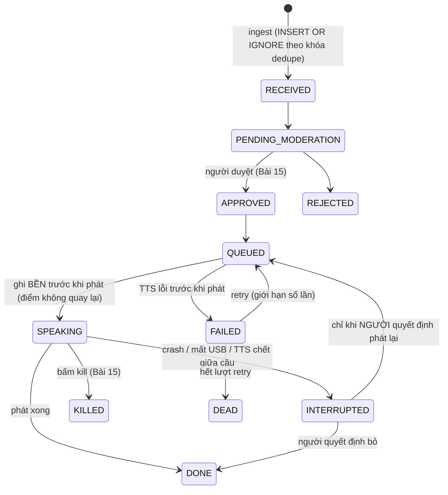
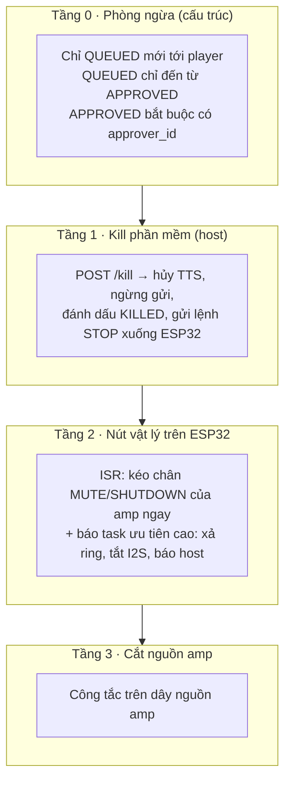

# KHÓA 3 · MODULE 4 — HỆ THỐNG V1 (22h) + GATE KHÓA 3 (6h)

> **Vị trí:** Module 3 (TTS, chế độ phát) → **Module 4** → Khóa 4 · **Viên nang nền dùng ở đây:** F3.5, F4.3, F2.4, F2.5, F5.7, F7.4, F7.5, F7.6, F7.7, F1.7 · **Gate:** tiêu chí 7 và toàn bộ Gate Khóa 3 ở cuối file này.

**Điều kiện vào module (giữ từ bản gốc):** B2 (xin phép đặt loa ở công ty) đã có câu trả lời **bằng văn bản**. Nếu bị từ chối: làm toàn bộ module ở nhà và bỏ hoàn toàn phần nhận diện mặt của các version sau. Giá trị nằm ở lab notebook và số đo, không ở chỗ đặt loa.

Module này là đất của bạn: ingest, dedupe, state machine, daemon, watchdog. Vì vậy mỗi bài chỉ nhấn vào chỗ **gãy** của kinh nghiệm backend: đầu ra là âm thanh trong một căn phòng có người. Một bug ở đây không nằm trong log; nó là một câu bị đọc to hai lần trước mặt đồng nghiệp.

| Bài | Giờ | Viên nang cần trước | Quyết định ra được |
|---|---|---|---|
| 14 — Ingest, dedupe, state machine | 6 | F3.5, F4.3, F2.4 | Push hay pull; khóa dedupe; ngữ nghĩa at-most-once cho hành động phát |
| 15 — Moderation queue và kill switch | 5 | F2.1, F5.3 | Kill tác động ở tầng nào, trong bao lâu; cái gì không bao giờ được tới loa |
| 16 — Streamer daemon, firmware, watchdog hai tầng | 5 | F5.7, F7.5, F7.6 | Ai giám sát ai; hành vi xác định cho từng lỗi |
| 17 — TN-5: 72 giờ không ai trông | 6 + 72h | F7.4, F7.6, F1.7 | V1 có đạt SLO đã đặt không; báo cáo trung thực |
| Gate Khóa 3 | 6 | — | PASS / cắt scope |

---

## Bài 14 — Ingest, dedupe, state machine (6h)

> **Vị trí:** Bài 13 → **Bài 14** → Bài 15 · **Cần trước:** F3.5 (idempotency, exactly-once), F4.3 (wall clock vs monotonic), F2.4 (property-based test), F2.5 (fault injection) · **Sau bài này bạn quyết định được:** push hay pull (kèm đối soát), khóa dedupe lấy từ đâu, và hành động "phát ra loa" có ngữ nghĩa at-most-once hay at-least-once, kèm cách phục hồi sau crash.

### 1. Câu chuyện — ai đã khổ vì chuyện này

Stripe đưa header `Idempotency-Key` vào API thanh toán vì một lý do đơn giản: mạng chập chờn làm client gửi lại, và gửi lại một lệnh "trừ tiền" là trừ tiền hai lần. Brandur Leach (khi ở Stripe) viết bài "Implementing Stripe-like Idempotency Keys in Postgres" (2017) mô tả cách làm: khóa do client sinh, lưu cùng trạng thái của request, và chia request thành các bước có "điểm không quay lại" (recovery point) cho những việc gây tác dụng ra bên ngoài. Ý chính: **tác dụng bên ngoài không nằm trong transaction của bạn**, nên phải thiết kế riêng cho nó.

Hệ của bạn có đúng một tác dụng bên ngoài: âm thanh ra loa. Không có API hoàn tiền cho một câu đã đọc to.

### 2. Mô hình tư duy



Bốn câu bản chất:

1. **Có hai loại tác dụng.** Ghi DB: transaction, rollback được, idempotent bằng UNIQUE. Phát ra loa: không transaction, không rollback, không idempotent. Không có cách nào commit nguyên tử "đã phát" cùng "ghi DONE" (cùng bản chất với bài toán hai vị tướng).
2. **Vì vậy phải chọn ngữ nghĩa ở ranh giới phát.** At-least-once: crash giữa câu thì phát lại (có thể lặp). At-most-once: ghi SPEAKING **bền** trước khi phát; sau crash, mọi bản ghi còn ở SPEAKING chuyển sang INTERRUPTED, **không tự phát lại**. Với confession, nói lặp là sự cố xã hội, nói thiếu thì một người duyệt quyết định: chọn at-most-once.
3. **Mọi chuyển trạng thái là compare-and-set:** `UPDATE … SET state = b WHERE key = ? AND state = a`. Hai worker cùng lấy một bản ghi thì chỉ một thắng. Bảng chuyển hợp lệ nằm trong code, không ở đầu người.
4. **Khóa dedupe phải ổn định theo nguồn.** Số dòng của Google Sheet đổi khi ai đó sắp xếp hoặc xóa dòng `[tự đo]`. Hash nội dung gộp nhầm hai confession giống hệt nhau từ hai người và tách nhầm một dòng bị sửa. Tốt nhất là ID do nguồn cấp (ID response của Google Forms, lấy được trong Apps Script `[tự đo theo tài liệu hiện hành]`).

**Mô phỏng** — có tiêm crash, so thiết kế "SPEAKING trước" với thiết kế ngây thơ (phát xong mới ghi DONE):

```python
# [đã chạy] Bài 14 — dedupe + state machine bằng compare-and-set trong SQLite, có tiêm crash
import sqlite3, random, os, tempfile
ALLOWED = {("RECEIVED", "PENDING_MODERATION"), ("PENDING_MODERATION", "APPROVED"),
           ("PENDING_MODERATION", "REJECTED"), ("APPROVED", "QUEUED"), ("QUEUED", "SPEAKING"),
           ("SPEAKING", "DONE"), ("SPEAKING", "INTERRUPTED"), ("QUEUED", "DONE")}  # QUEUED→DONE: chỉ bản ngây thơ

def db_open(path):
    db = sqlite3.connect(path, isolation_level=None)          # autocommit: mỗi lệnh là một transaction
    db.execute("PRAGMA journal_mode=WAL"); db.execute("PRAGMA synchronous=FULL")
    db.execute("CREATE TABLE IF NOT EXISTS c(key TEXT PRIMARY KEY, text TEXT, state TEXT)")
    return db

def ingest(db, key, text):                                     # gửi lặp N lần vẫn chỉ 1 dòng
    db.execute("INSERT OR IGNORE INTO c VALUES(?,?, 'RECEIVED')", (key, text))

def move(db, key, a, b):                                       # CAS: chỉ chuyển nếu đang ở đúng trạng thái a
    assert (a, b) in ALLOWED, f"cấm {a}->{b}"
    return db.execute("UPDATE c SET state=? WHERE key=? AND state=?", (b, key, a)).rowcount == 1

class Crash(Exception): pass

def player_step(db, played, p_crash, naive):
    row = db.execute("SELECT key FROM c WHERE state='QUEUED' LIMIT 1").fetchone()
    if not row: return
    k = row[0]
    if not naive and not move(db, k, "QUEUED", "SPEAKING"):    # ghi SPEAKING bền TRƯỚC khi phát
        return
    if random.random() < p_crash: raise Crash()                # chết trước khi kịp phát
    played[k] = played.get(k, 0) + 1                           # "âm thanh ra loa" — không rollback được
    if random.random() < p_crash: raise Crash()                # chết sau khi phát, trước khi ghi DONE
    move(db, k, "QUEUED" if naive else "SPEAKING", "DONE")

def recover(db):                                               # khởi động lại: KHÔNG tự phát lại
    db.execute("UPDATE c SET state='INTERRUPTED' WHERE state='SPEAKING'")

def run(naive, seed=14):
    random.seed(seed)
    path = os.path.join(tempfile.mkdtemp(), "t.db"); db, played, crashes = db_open(path), {}, 0
    for i in range(200):
        for _ in range(5): ingest(db, f"form-{i}", f"nội dung {i}")
        move(db, f"form-{i}", "RECEIVED", "PENDING_MODERATION")
        if i % 7: move(db, f"form-{i}", "PENDING_MODERATION", "APPROVED"); move(db, f"form-{i}", "APPROVED", "QUEUED")
    while db.execute("SELECT count(*) FROM c WHERE state='QUEUED'").fetchone()[0]:
        try: player_step(db, played, 0.05, naive)
        except Crash:
            crashes += 1; db.close(); db = db_open(path); recover(db)
    st = dict(db.execute("SELECT state, count(*) FROM c GROUP BY state").fetchall())
    leak = any(int(k.split('-')[1]) % 7 == 0 for k in played)  # bản ghi chưa duyệt có bị phát?
    print(f"{'ngây thơ' if naive else 'SPEAKING trước':<15} dòng={sum(st.values())} crash={crashes} "
          f"phát>1 lần={sum(v > 1 for v in played.values())} rò chưa duyệt={leak} trạng thái={st}")

run(naive=False); run(naive=True)
```

Crash ở đây là ngoại lệ Python (process "chết" giữa hai lệnh), không phải rút điện. Rút điện kiểm thêm tầng đĩa, ở Bài 17.

### 3. Cầu nối từ backend

| Backend bạn biết | Ở đây | Gãy ở chỗ | Nếu dùng nhầm thì |
|---|---|---|---|
| Idempotency key + UNIQUE constraint | `dedupe_key` PRIMARY KEY, `INSERT OR IGNORE` | Dedupe được **bản ghi**; không dedupe được **âm thanh** đã phát | Tin rằng "UNIQUE là đủ", crash sau khi phát làm câu được phát lại |
| Kafka exactly-once (transaction producer–consumer) | "Phát đúng một lần" | Exactly-once của Kafka chỉ bao trong hệ của nó; tác dụng ra thế giới ngoài không tham gia transaction | Hứa "exactly-once" cho một hành động vật lý |
| Outbox pattern | Cột `state` là outbox: worker chỉ lấy QUEUED | Một tiến trình, một SQLite: đơn giản hơn backend phân tán; phần khó là ranh giới phát, không phải phân phối message | Dựng thêm broker cho một hệ một máy |
| Workflow engine (Temporal): activity retry at-least-once | Retry FAILED → QUEUED | Retry an toàn **trước** khi phát (TTS lỗi); **sau** khi đã phát một phần thì không | Retry tự động một câu nói dở |
| Webhook có retry phía gửi + endpoint public | Apps Script → tunnel → FastAPI | Endpoint public là bề mặt tấn công: ai biết URL có thể bơm nội dung vào hàng đợi duyệt | Endpoint không xác thực; hàng đợi bị spam |

**Chấm mô hình:**

- *"Dedupe bằng UNIQUE là xong idempotency."* — **ĐÚNG MỘT PHẦN**. Đúng cho ingest gửi lặp. Gãy ở ranh giới phát. Phản ví dụ: mô phỏng, bản ngây thơ, mọi bản ghi đều duy nhất trong DB nhưng một số câu vẫn phát hai lần.
- *"Thiết kế cẩn thận thì đạt exactly-once cho việc phát."* — **SAI**. Bạn chọn được nghiêng về "không lặp" (at-most-once, có thể sót) hoặc "không sót" (at-least-once, có thể lặp). Sót thì có thể bù bằng người; lặp thì không thu hồi được.
- *Gemini: "kill -9 giữa lúc ghi, SQLite không hỏng file nhờ WAL".* — **SAI về nguyên nhân**. Process chết (kể cả `kill -9`) không làm hỏng file SQLite ở **bất kỳ** journal mode nào: transaction dang dở bị bỏ khi mở lại `[spec: SQLite docs, "How To Corrupt An SQLite Database File" và "Atomic Commit"]`. WAL chủ yếu là chuyện đọc–ghi đồng thời và hiệu năng. Mất điện mới là chuyện của `synchronous` và của ổ đĩa (Bài 17).

### 4. Thuật ngữ

| Mức | Thuật ngữ | Nghĩa trong một câu | Hay bị hiểu nhầm thành |
|---|---|---|---|
| 🟢 | Idempotency key / dedupe key | Khóa định danh một yêu cầu, để xử lý lặp chỉ có tác dụng một lần | Hash nội dung |
| 🟢 | At-most-once / at-least-once | Không lặp nhưng có thể sót / không sót nhưng có thể lặp | "Exactly-once" là lựa chọn thứ ba luôn có |
| 🟢 | Compare-and-set (CAS) | Chỉ cập nhật nếu giá trị hiện tại đúng như mong đợi | Lock |
| 🟢 | Wall clock vs monotonic | Giờ thế giới (nhảy được) vs bộ đếm không lùi (reset khi khởi động lại) | Monotonic sống qua reboot |
| 🟢 | Đối soát (reconciliation) | Định kỳ so nguồn với đích để tìm bản ghi sót | Chỉ cần khi không có webhook |
| 🟡 | Outbox pattern | Ghi việc cần làm cùng transaction với dữ liệu | Message broker |
| 🟡 | `boot_id` | ID của một lần khởi động (systemd/journald ghi kèm log) | Hostname |
| 🔴 | Two generals problem | Không có giao thức nào đảm bảo hai bên chắc chắn đồng thuận qua kênh có thể mất | Cần chứng minh cho V1 |

### 5. Dự đoán

1. Mô phỏng: với p_crash = 0,05 và 200 bản ghi (29 không được duyệt), thiết kế "SPEAKING trước" có bao nhiêu câu phát hai lần? Bao nhiêu INTERRUPTED? Thiết kế ngây thơ có bao nhiêu câu phát hai lần?
2. Trong các INTERRUPTED, khoảng bao nhiêu phần **chưa hề** được phát?
3. Push hay pull: độ trễ phát hiện (p50, max) của lựa chọn của bạn; số record bị sót trong 1 tuần nếu **không** có đối soát.
4. Ba kiểm tra của bản gốc (gửi lặp 5 lần; kill giữa lúc ghi; mất mạng 5 phút): cái nào bạn đoán sẽ trượt ở lần chạy đầu?

```markdown
# Bài 14 — prediction · ngày ____ · ký ____
Mô phỏng: SPEAKING-trước phát>1 = __ · INTERRUPTED = __ · ngây thơ phát>1 = __
INTERRUPTED chưa phát: ~__%
Ingest: push|pull(T=__) · phát hiện p50 = __ · max = __ · sót/tuần không đối soát = __
Đoán trượt lần đầu: ____ vì ____
Khóa dedupe: ____ (nguồn: ____) · trường hợp nó sai: ____
```

### 6. Làm

1. **Push hay pull, kèm đối soát.** Bảng của bản gốc giữ nguyên ý: webhook (Apps Script → tunnel → FastAPI) có độ trễ thấp nhưng phụ thuộc tunnel; poll Sheets API không mở cổng nhưng có độ trễ T/2 trung bình và quota `[tự đo theo tài liệu Google hiện hành]`. Thêm một điều: **chọn cái nào cũng chạy đối soát định kỳ** (ví dụ mỗi 10 phút đọc toàn bộ ID trong Sheet, so với DB). Webhook có thể mất; đối soát là thứ bảo đảm completeness. Ghi lựa chọn và lý do vào `decisions.md`.
2. **Xác thực endpoint nếu dùng webhook.** Endpoint qua tunnel là public. Tối thiểu: chữ ký HMAC trên body bằng một secret dùng chung giữa Apps Script và FastAPI, kiểm trước khi ghi DB; từ chối request cũ (timestamp trong chữ ký) để chống gửi lại. Secret để trong biến môi trường/secret store, không commit. Không có xác thực thì bất kỳ ai biết URL đều bơm được nội dung vào hàng đợi.
3. **Khóa dedupe.** Ưu tiên ID response do Google Forms cấp; nếu không lấy được, dùng (timestamp gửi của Form + hash nội dung) và ghi rõ hai trường hợp sai của nó. Lưu SQLite, `PRIMARY KEY` hoặc `UNIQUE`.
4. **State machine** như sơ đồ phần 2. Bảng chuyển hợp lệ là một hằng trong code; mọi chuyển đi qua một hàm duy nhất dùng CAS. Thêm ràng buộc DB nếu muốn (CHECK trên tập trạng thái). Thiết kế at-most-once: ghi SPEAKING bền trước khi gửi chunk đầu xuống ESP32; khi khởi động, chuyển SPEAKING → INTERRUPTED.
5. **Log có cấu trúc** (JSON lines) cho mọi chuyển trạng thái: `confession_id`, `from`, `to`, `actor`, `wall_time` (UTC, ISO 8601), `monotonic_ns`, `boot_id`. Monotonic reset khi khởi động lại, nên chỉ so được trong cùng một `boot_id` (→ F4.3). Wall time để trả lời "lúc mấy giờ"; monotonic để đo khoảng.
6. **Test** (giữ ba test của bản gốc, thêm hai):
   - Gửi cùng record 5 lần → đúng 1 lần vào QUEUED.
   - Kill process ở **điểm ngẫu nhiên** trong vòng xử lý, lặp ≥ 100 lần bằng script (không bấm tay 3 lần) → không mất record, không phát trùng. Đếm kết quả, không chỉ "thấy ổn".
   - Mất mạng 5 phút → ingest phục hồi, đối soát lấy đủ record tồn đọng.
   - Chuyển trạng thái bất hợp pháp (RECEIVED → SPEAKING) → bị từ chối.
   - **Property-based** (thư viện Hypothesis → F2.4): sinh chuỗi sự kiện ngẫu nhiên (ingest lặp, duyệt, từ chối, crash, khởi động lại) → bất biến: (a) không bản ghi nào phát > 1 lần; (b) không bản ghi chưa APPROVED nào từng ở SPEAKING.
7. **Kiểm chính bài test** (→ F2.5): cố tình đổi code sang bản ngây thơ (ghi DONE sau khi phát, bỏ SPEAKING) và chạy lại bộ test. Bộ test **phải** bắt được. Nếu không, test của bạn chưa đo thứ nó định đo.

Sai số của phép đo: một test qua 100 lần không chứng minh không có lỗi; nó chặn tỉ lệ lỗi dưới khoảng 3% với độ tin cậy 95% (quy tắc 3, F1.4) cho **đúng** những điểm crash mà script của bạn tạo ra.

### 7. Số phải ra

<details><summary>🔒 MỞ SAU KHI COMMIT prediction.md</summary>

**Mô phỏng** (đã chạy, seed 14): cả hai thiết kế gặp 14 crash.

| Thiết kế | Phát > 1 lần | INTERRUPTED | DONE | PENDING (không duyệt) | Rò bản chưa duyệt |
|---|---|---|---|---|---|
| SPEAKING trước | 0 | 14 | 157 | 29 | không |
| Ngây thơ | 8 | 0 | 171 | 29 | không |

Đọc bảng: at-most-once đổi 8 lần lặp lấy 14 câu cần người quyết định. Trong 14 INTERRUPTED, khoảng một nửa chưa hề phát (crash trước khi phát) và một nửa đã phát (crash sau khi phát, trước DONE): hệ không phân biệt được hai trường hợp, vì đó đúng là chỗ không có transaction. Muốn phân biệt tốt hơn: ghi thêm tiến độ (chunk đã gửi, frame ESP32 xác nhận đã phát) để người duyệt biết câu đã nói tới đâu.

**Phần cứng/hệ thống:**

| Kiểm tra | Kết quả đúng |
|---|---|
| Gửi lặp 5 lần | 1 dòng, 1 lần vào QUEUED |
| Kill ngẫu nhiên 100 lần | 0 mất, 0 phát trùng; một số INTERRUPTED (đúng thiết kế) |
| Mất mạng 5 phút | Phục hồi; đối soát tìm đủ record trong Sheet |
| Chuyển bất hợp pháp | Bị từ chối, có log |
| Property test | Không tìm được phản ví dụ sau số lần sinh bạn đặt; ghi số lần |
| Bản ngây thơ cố ý | Ít nhất một test trượt |
| Poll T giây | Độ trễ phát hiện ≈ T/2 trung bình, ≤ T + độ trễ API |

Thường trượt lần đầu: test kill (nếu chưa có SPEAKING/INTERRUPTED) và test mất mạng (nếu chưa có đối soát; webhook gửi trong lúc mất mạng có thể đã mất).

</details>

### 8. Nếu ra khác

| Triệu chứng | Nguyên nhân khả dĩ | Kiểm bằng cách | Sửa |
|---|---|---|---|
| Một confession vào DB hai dòng | Khóa dedupe không ổn định (số dòng Sheet, hoặc hash sau khi sửa nội dung) | So hai dòng: khác trường nào | Đổi sang ID của nguồn |
| Hai confession khác người, cùng nội dung, chỉ còn một | Khóa = hash nội dung | — | Thêm thành phần định danh response |
| Sau crash, câu vừa phát được phát lại | Chưa ghi SPEAKING bền trước khi phát, hoặc recovery đưa SPEAKING về QUEUED | Đọc log chuyển trạng thái quanh lần crash | At-most-once như phần 2 |
| `database is locked` | Hai process ghi cùng lúc, transaction dài | Log lỗi | WAL + `busy_timeout`; một writer |
| Test kill qua hết nhưng bản ngây thơ cũng qua | Script không crash ở điểm sau-khi-phát | In điểm crash | Thêm điểm crash ở mọi ranh giới |
| Đối soát báo sót dù webhook "luôn chạy" | Webhook mất khi tunnel chết/đổi URL | Log phía Apps Script `[tự đo]` | Giữ đối soát; cảnh báo khi sót |

### 9. Câu hỏi ngược

1. **[Failure mode]** Người duyệt bấm Approve hai lần (double click) đúng lúc mạng chậm. Điều gì xảy ra?
<details><summary>Hướng nghĩ</summary>

Nếu duyệt là CAS PENDING → APPROVED, lần hai thấy trạng thái đã khác và không làm gì: đúng. Nếu duyệt là "INSERT vào bảng queue", lần hai tạo bản ghi thứ hai. Mọi hành động của người cũng là request cần idempotent.

</details>

2. **[Vì sao không]** Vì sao không chọn at-least-once rồi để ESP32 tự dedupe theo ID câu?
<details><summary>Hướng nghĩ</summary>

ESP32 có thể nhớ "câu X đã phát" trong RAM, nhưng mất khi reset; ghi flash mỗi câu thì mòn flash và vẫn có khoảng hở giữa "phát" và "ghi". Dời điểm không quay lại sang MCU không xóa được nó, chỉ dời nó. Có thể dùng làm lớp phòng thủ thứ hai (ESP32 từ chối ID trùng trong phiên), không thay thế at-most-once ở host.

</details>

3. **[Quy mô]** V2 có ba loa ở ba phòng, mỗi loa một ESP32, một host. "Phát đúng một lần" giờ nghĩa là gì?
<details><summary>Hướng nghĩ</summary>

Mỗi (confession, loa) là một tác dụng riêng. State machine phải theo từng cặp, hoặc có trạng thái tổng hợp "đã phát ở k/3 loa". Crash giữa chừng để lại trạng thái từng phần: đúng loại vấn đề của commit phân tán, ở quy mô đồ chơi.

</details>

4. **[Nếu…thì]** Nếu đồng hồ wall của host nhảy lùi 2 phút (NTP sửa) giữa lúc ghi log, câu hỏi "3 giờ sáng nó làm gì" còn trả lời được không?
<details><summary>Hướng nghĩ</summary>

Wall time có thể không đơn điệu; thứ tự sự kiện thì lấy từ monotonic trong cùng `boot_id`, hoặc từ số thứ tự log. Ghi cả hai đồng hồ chính là để chịu được chuyện này (→ F4.3).

</details>

5. **[Phản biện]** "Một hệ một máy mà làm state machine, CAS, property test là over-engineering."
<details><summary>Hướng nghĩ</summary>

Chi phí thêm là vài chục dòng. Thứ được bảo vệ là một lỗi có hậu quả xã hội, không sửa được sau khi xảy ra. Đo bằng chi phí của lỗi, không bằng số máy. Ngược lại, broker, nhiều service, Kubernetes thì đúng là thừa ở đây.

</details>

### 10. Liên kết ra ngoài

- **Thanh toán.** Lệnh trừ tiền là tác dụng ra ngoài; ngành dùng idempotency key, trạng thái "đang xử lý", và đối soát cuối ngày với ngân hàng. Khác: tiền trừ nhầm thì hoàn được, âm thanh thì không, nên ở đây nghiêng hẳn về at-most-once.
- **Y tế — máy bơm truyền dịch và lệnh dùng thuốc.** Một lệnh dùng thuốc lặp có thể gây hại; quy trình bệnh viện yêu cầu xác nhận và ghi nhận từng lần dùng. Đó là state machine có người trong vòng ở trạng thái "không chắc".
- **Hệ thống phát thanh cảnh báo công cộng.** Thông báo sai đã phát ra không thu hồi được, chỉ có thể phát một thông báo đính chính; vì vậy các hệ này đặt kiểm soát trước khi phát. Đó là lý do Bài 15 tồn tại.

### 11. Độ tin cậy và sửa lỗi

| Khẳng định | Nhãn | Ghi chú / cách kiểm |
|---|---|---|
| Process crash không làm hỏng file SQLite ở mọi journal mode | `[spec]` | SQLite docs: Atomic Commit; How To Corrupt |
| Số dòng Google Sheet đổi khi sắp xếp/xóa | `[tự đo]` | Thử trên Sheet thật |
| Apps Script lấy được ID response của Form | `[tự đo]` | Tài liệu Apps Script hiện hành |
| Monotonic reset khi khởi động lại | `[chuẩn]` | `CLOCK_MONOTONIC` trên Linux; F4.3 |
| Stripe idempotency key, bài của Brandur Leach | `[chuẩn]` | Tài liệu API Stripe; blog brandur.org |

**Đã sửa so với bản gốc và bản Gemini:**
- Bản gốc: dedupe theo "row id + hash nội dung". Số dòng không ổn định; hash nội dung đổi khi sửa. Sửa: ưu tiên ID do nguồn cấp, ghi rõ trường hợp sai.
- Gemini: `hash(row_id + nội dung + timestamp)`. Cùng vấn đề.
- Bản gốc state machine không có trạng thái cho "đang phát thì crash". Sửa: thêm INTERRUPTED, KILLED; at-most-once ở ranh giới phát; người quyết định phát lại.
- Gemini: "SQLite không hỏng nhờ WAL" khi kill -9. Sai nguyên nhân; đã sửa.
- Bản gốc: test kill "khởi động lại" một lần. Sửa: kill ngẫu nhiên ≥ 100 lần bằng script, đếm kết quả; thêm property test và kiểm chính bài test bằng bản ngây thơ cố ý.
- Thêm: đối soát định kỳ (completeness), xác thực webhook (endpoint public), `boot_id` trong log.
- Bản gốc trỏ "Bài 3.1 của tài liệu nền" cho hai đồng hồ. Sửa: → F4.3.

### 12. Đọc thêm và tự kiểm tra

- **Nguồn gốc:** SQLite docs — "Atomic Commit In SQLite", "How To Corrupt An SQLite Database File", PRAGMA `journal_mode`, `synchronous`.
- **Giải thích:** Brandur Leach, "Implementing Stripe-like Idempotency Keys in Postgres" (2017). F3.5.
- **Đào sâu (tùy chọn):** M. Kleppmann, *Designing Data-Intensive Applications*, chương về transaction và hệ phân tán (exactly-once, hai vị tướng).
- **Tự kiểm tra:** (1) giải thích cho một backend engineer khác trong 5 câu vì sao không có exactly-once cho việc phát; (2) vẽ lại state machine từ trí nhớ, đánh dấu điểm không quay lại; (3) hai câu dưới.

*Câu 1.* Worker A và B cùng `SELECT … WHERE state='QUEUED' LIMIT 1` và cùng thấy bản ghi X. Cả hai chạy `UPDATE … SET state='SPEAKING' WHERE key='X' AND state='QUEUED'`. Kết quả?
<details><summary>Đáp án</summary>

Một UPDATE trả `rowcount = 1`, cái kia `rowcount = 0` (vì lúc nó chạy, state đã là SPEAKING). Worker nhận 0 phải bỏ qua X. Đây là lý do SELECT không phải lời "nhận việc"; CAS mới là.

</details>

*Câu 2.* Log có hai dòng: `boot_id=A, monotonic=5 000 s` và `boot_id=B, monotonic=12 s`. Dòng nào xảy ra trước?
<details><summary>Đáp án</summary>

Không suy ra được từ monotonic (hai lần khởi động khác nhau). Dùng wall time (nếu tin được) hoặc thứ tự `boot_id` trong `journalctl --list-boots`. Thường B sau A, nhưng phải kiểm.

</details>

---

## Bài 15 — Moderation queue và kill switch (5h)

> **Vị trí:** Bài 14 → **Bài 15** → Bài 16 · **Cần trước:** F2.1 (bài toán oracle: bộ lọc là một phép đo có dương tính giả/âm tính giả), F5.3 (ISR, ưu tiên task), F5.7 (trạng thái an toàn mặc định), Bài 8 (độ trễ dừng), Bài 13 (kill giữa stream) · **Sau bài này bạn quyết định được:** kill tác động ở tầng nào và trong bao lâu (bằng số đo), và bất biến nào bảo đảm nội dung chưa duyệt không bao giờ tới loa.

Đọc kỹ bài này: đây là chỗ dự án chết nếu làm sai, và lý do chết không phải kỹ thuật.

### 1. Câu chuyện — ai đã khổ vì chuyện này

Sáng 13/01/2018, một nhân viên của cơ quan quản lý khẩn cấp bang Hawaii gửi nhầm cảnh báo "tên lửa đạn đạo đang bay tới" tới điện thoại toàn bang. Phải mất khoảng 38 phút mới có thông báo đính chính chính thức, một phần vì hệ thống không có sẵn mẫu "hủy/đính chính" để gửi nhanh `[chuẩn, theo báo cáo điều tra của FCC]`. Ngày 01/08/2012, Knight Capital đưa một bản deploy lỗi lên sản xuất; một cờ cũ kích hoạt lại một đoạn code đã chết, gửi lệnh giao dịch liên tục khoảng 45 phút, lỗ khoảng 440 triệu USD. Không có cơ chế dừng nhanh đã được diễn tập `[chuẩn, theo quyết định của SEC năm 2013]`.

Hai bài học giống nhau: khả năng **dừng** và **đính chính** phải có sẵn và đã được thử **trước** sự cố. Khi sự cố xảy ra, không ai có thời gian thiết kế.

Hệ của bạn: một hòm thư ẩn danh nối với một cái loa đọc to giữa văn phòng là **một kênh quấy rối có khuếch đại**. Không phải "có thể bị lạm dụng"; giả định nó sẽ bị, sớm. Bản gốc ghi rõ: bỏ moderation thì dự án chết vì lý do phi kỹ thuật.

### 2. Mô hình tư duy

Bốn tầng, xếp từ "phòng" tới "dừng":



Ba câu bản chất:

1. **Độ trễ dừng = thời gian để tác động + lượng âm thanh đã nằm sau điểm tác động.** Kill ở host mà không xả ring thì loa còn nói hết ring + DMA. Kill bằng cách tắt amp thì gần như tức thì, bất kể buffer. Tầng càng gần loa, càng ít phụ thuộc phần mềm đang hỏng.
2. **Kill không phải graceful shutdown.** Backend dừng "lịch sự": drain queue, hoàn tất request đang chạy. Ở đây "hoàn tất request đang chạy" chính là đọc nốt câu có hại. Kill phải bỏ thứ đang bay.
3. **Trạng thái an toàn mặc định là im lặng.** Nếu ESP32 reset, treo, hay mất nguồn, chân điều khiển amp thả nổi: điện trở kéo phải đưa amp về **mute**. Đây là cùng nguyên tắc với E-stop ở K7 C10.1 (cắt động lực khi mất điện cuộn hút) và failsafe firmware ở K7 C4.4.

### 3. Cầu nối từ backend

| Backend bạn biết | Ở đây | Gãy ở chỗ | Nếu dùng nhầm thì |
|---|---|---|---|
| Kill switch = feature flag / circuit breaker | Tầng 1 | Flag được đọc bởi chính phần mềm có thể đang hỏng; và tắt flag không thu hồi âm thanh đã nằm trong ring/DMA | Bấm kill, loa vẫn nói thêm vài trăm ms tới vài giây |
| Graceful shutdown, drain | Kill | Drain = đọc nốt câu | Dùng SIGTERM handler "chờ phát xong rồi thoát" |
| Trust & safety queue, human review | Hàng đợi duyệt | Khán giả là đồng nghiệp ngồi cùng phòng, người duyệt quen họ; một sai lầm có hậu quả xã hội tức thì, không phải một report trên mạng | Duyệt "cho nhanh" hoặc tự động duyệt khi vắng người |
| Audit log, RBAC | Ai duyệt, lúc nào, nội dung gì | Người gửi ẩn danh nhưng người duyệt phải truy được trách nhiệm; log chứa nội dung nhạy cảm | Log cả định danh người gửi (phá ẩn danh), hoặc không log người duyệt (không ai chịu trách nhiệm) |
| Content filter (regex, blocklist) | Filter tên riêng | Bộ lọc là một **phép đo** có âm tính giả; tiếng Việt có dấu/không dấu, biệt danh, "chị kế toán tầng 3" | Coi filter là cổng chặn → bỏ qua đúng những câu nguy hiểm nhất |

**Chấm mô hình:**

- *"Kill switch là một feature flag tắt việc phát."* — **ĐÚNG MỘT PHẦN**. Đúng cho tầng 1. Gãy: phải chạy được khi phần mềm host chết, và phải tính cả âm thanh đã đệm. Phản ví dụ: host treo (đúng lúc cần kill), endpoint không trả lời; chỉ tầng 2–3 còn tác dụng.
- *"Filter tên riêng chặn được nội dung nhắm vào cá nhân."* — **SAI** nếu dùng như cổng chặn. Nó là công cụ **hỗ trợ người duyệt** (gắn cờ đọc kỹ), có recall thấp với cách gọi gián tiếp. Bản gốc đúng ở chỗ "không tự động từ chối", vì dương tính giả (tên trùng từ thường) gây bực.
- *Gemini: "ISR ưu tiên cao nhất: ngắt I2S, xả RingBuffer, tắt tiếng, gửi gói lên host".* — **SAI** về cách làm. Tài liệu ESP-IDF ghi API I2S dùng mutex, **không được gọi trong ISR** `[spec: ESP-IDF I2S docs, mục Thread Safety]`; xả ring và gửi USB cũng không thuộc ISR. Cách đúng: ISR chỉ ghi GPIO (kéo mute amp) và đánh thức một task ưu tiên cao (`xTaskNotifyFromISR` hoặc tương đương `[tự đo]`); task làm phần còn lại.

### 4. Thuật ngữ

| Mức | Thuật ngữ | Nghĩa trong một câu | Hay bị hiểu nhầm thành |
|---|---|---|---|
| 🟢 | Kill switch | Cơ chế dừng ngay, bỏ thứ đang chạy, không tự phục hồi | Graceful shutdown |
| 🟢 | Fail-safe default | Khi mất điều khiển, hệ rơi về trạng thái an toàn (im lặng) | "Giữ trạng thái cuối" |
| 🟢 | Human-in-the-loop | Không có hành động nào xảy ra nếu không có một người xác nhận | Có người xem dashboard |
| 🟢 | Invariant | Điều kiện luôn đúng, được ép bởi cấu trúc (DB constraint, đường code duy nhất) | Điều kiện được test |
| 🟢 | Recall / precision của bộ lọc | Tỉ lệ bắt được cái cần bắt / tỉ lệ đúng trong cái đã gắn cờ | "Bộ lọc chính xác 95%" |
| 🟡 | Debounce | Lọc rung tiếp điểm của nút bấm | Delay |
| 🟡 | Chân MUTE/SHUTDOWN của amp | Chân điều khiển tắt đầu ra của amp | Chân nguồn |
| 🔴 | NLP nhận diện thực thể có tên cho tiếng Việt | Mô hình nhận diện tên người | Cần cho V1 |

### 5. Dự đoán

**Tham số cần tra:**
- Amp của bạn có chân MUTE/SHUTDOWN không, mức nào là mute, thời gian tắt/bật đầu ra `[spec: datasheet amp — PAM8403, TPA3110 hoặc MAX98357A tùy bạn dùng]`. Module bán sẵn có thể đã nối cứng chân này lên VCC `[tự đo trên module thật]`.
- Mức đầy ring mục tiêu và DMA (Bài 10). Host có gửi trước bao nhiêu (đệm phía host + đệm của driver serial).

**Đề:** dự đoán độ trễ dừng (từ lúc bấm tới khi loa im, đo bằng mic) cho từng cách:

```markdown
# Bài 15 — prediction · ngày ____ · ký ____
ring mục tiêu = __ ms · DMA = __ ms · host gửi trước = __ ms · amp = ____ (chân mute: có/không)
| Cách kill | Độ trễ dừng dự đoán | Vì sao |
|---|---|---|
| Tầng 1, chỉ ngừng gửi (không xả ring) | | |
| Tầng 1, gửi STOP, ESP32 xả ring + tắt I2S | | |
| Tầng 2, nút → task tắt I2S | | |
| Tầng 2, nút → ISR kéo mute amp | | |
| Tầng 3, cắt nguồn amp | | |
Khi ESP32 reset giữa câu, amp: ____ (im / rè / pop)
Recall của filter tên trên bộ thử 30 câu của tôi: ____
```

### 6. Làm

1. **Web UI duyệt** (giữ từ bản gốc): danh sách PENDING, Approve/Reject, nội dung đầy đủ, cờ filter. **Có xác thực** (ít nhất mật khẩu, chỉ nghe trên LAN, HTTPS nếu có thể). Một UI duyệt không xác thực trên mạng văn phòng là một nút "phát bất cứ gì" cho bất kỳ ai.
2. **Bất biến ở tầng DB.** `approver_id` và `approved_at` bắt buộc khác NULL với mọi trạng thái từ APPROVED trở đi (ràng buộc CHECK). Player chỉ đọc QUEUED. Viết test tự động: tạo bản ghi PENDING rồi gọi trực tiếp hàm player, gọi API chuyển thẳng PENDING → QUEUED: cả hai phải thất bại. Thêm bất biến (b) của property test Bài 14.
3. **Filter tên riêng** (giữ quy tắc bản gốc: khớp thì gắn cờ, không tự từ chối). So khớp cả có dấu và không dấu (chuẩn hóa Unicode NFC, rồi bỏ dấu để so). Tự tạo một bộ thử ~30 câu **giả định** (không dùng confession thật): tên đầy đủ, tên không dấu, biệt danh, chức danh ("anh trưởng phòng"), câu không nhắm ai. Đo recall và precision. Ghi kết quả: đây là số cho thấy người duyệt phải đọc kỹ đến mức nào.
4. **Kill tầng 1** — endpoint `POST /kill` (có xác thực): hủy TTS worker (kiểm CPU về nhàn), ngừng gửi, đánh dấu bản ghi đang SPEAKING thành KILLED, chuyển QUEUED về **PAUSED/cần duyệt lại** (không xóa: giữ audit), gửi lệnh `STOP` xuống ESP32. ESP32 nhận `STOP`: kéo mute amp, xả ring, tắt I2S, trả `STOPPED` kèm số frame đã bỏ.
5. **Kill tầng 2** — nút vật lý trên một GPIO có điện trở kéo và debounce. ISR: ghi GPIO mute amp, đánh thức task kill ưu tiên cao. Task: xả ring, tắt I2S, gửi sự kiện lên host. Sau kill, ESP32 **không** tự bỏ mute khi có dữ liệu mới; chỉ bỏ mute khi host gửi lệnh `ARM` tường minh sau khi người xác nhận.
6. **Trạng thái an toàn mặc định.** Điện trở kéo chân mute về mức "mute" khi ESP32 không lái. Thử: reset ESP32 giữa câu, rút cáp USB (nếu ESP32 ăn nguồn USB, rút cáp là mất nguồn ESP32 trong khi amp vẫn có nguồn riêng). Nghe và ghi: im, rè hay pop.
7. **Tầng 3** — công tắc trên dây nguồn amp, ghi nhãn rõ. Đây là tầng không cần phần mềm nào sống.
8. **Đo độ trễ dừng** mỗi tầng ≥ 10 lần, trong đó ≥ 3 lần giữa câu (giữ từ bản gốc). Đo bằng analyzer: một GPIO đánh dấu lúc bấm (nút vật lý nối thêm vào một kênh analyzer; với tầng 1 dùng gói `SUBMIT`-kiểu như Bài 13) và mic. Báo trung vị và max.
9. **Audit log:** ai duyệt/từ chối/kill, lúc nào, hash nội dung. **Không** log định danh người gửi (IP, email) nếu cam kết ẩn danh. Đặt thời hạn lưu và cách xóa. Ràng buộc pháp lý: Luật Bảo vệ dữ liệu cá nhân của Việt Nam (theo các nguồn thứ cấp, có hiệu lực từ 01/01/2026 và thay thế Nghị định 13/2023/NĐ-CP) `[tự đo: đọc văn bản gốc và văn bản hướng dẫn hiện hành]`; dữ liệu sinh trắc học (nhận diện mặt ở các version sau) là dữ liệu nhạy cảm. Chỉ làm trên chính bạn và người tình nguyện có đồng ý bằng văn bản (giữ từ bản gốc). Đây không phải tư vấn pháp lý.
10. **Sau kill, khởi động lại cả hệ:** không có gì tự phát lại (KILLED là trạng thái cuối trừ khi người đưa lại vào hàng đợi).

Sai số của phép đo độ trễ dừng: mốc "bấm" là cạnh điện của nút (có rung tiếp điểm vài ms, lấy cạnh đầu); mốc "im" là lúc năng lượng tín hiệu mic rơi dưới nền ồn, phụ thuộc ngưỡng (cùng vấn đề onset ở Bài 9, theo chiều ngược lại) và đuôi tắt dần của loa.

### 7. Số phải ra

<details><summary>🔒 MỞ SAU KHI COMMIT prediction.md</summary>

| Cách kill | Độ trễ dừng điển hình | Ghi chú |
|---|---|---|
| Tầng 1, không xả ring | ≈ đệm host + ring + DMA; có thể từ vài trăm ms tới vài giây | Nếu host đẩy trước nhiều chunk, có thể vượt 1 s: **trượt** tiêu chí bản gốc |
| Tầng 1, STOP + xả ring | ≈ RTT USB + xử lý lệnh + phần DMA chưa phát (≤ DMA) | Cỡ chục ms với DMA 40 ms `[ước lượng]` |
| Tầng 2, task tắt I2S | ≈ thời gian đánh thức task + tắt I2S; dưới chục ms `[ước lượng]` | Có thể có pop |
| Tầng 2, ISR mute amp | ≈ thời gian đáp ứng chân mute của amp `[spec]`, cỡ µs–ms | Nhanh nhất, không phụ thuộc buffer |
| Tầng 3, cắt nguồn | ≈ tụ lọc của amp xả, cỡ ms–chục ms `[ước lượng]` | Có thể pop |
| ESP32 reset giữa câu | Nếu có điện trở kéo về mute: im. Nếu không: có thể rè/pop vì chân I2S và mute thả nổi | Đây là lý do của bước 6 |
| Filter tên trên bộ thử | Recall cao với tên đầy đủ có dấu; thấp với biệt danh, chức danh | Không có số chung; số của bạn là thông tin cho người duyệt |

Tiêu chí bản gốc "< 1 s" giữ nguyên làm ngưỡng tối thiểu cho mọi tầng. Mục tiêu thực tế cho tầng 2 là dưới 100 ms, vì nó không phụ thuộc buffer.

</details>

### 8. Nếu ra khác

| Triệu chứng | Nguyên nhân khả dĩ | Kiểm bằng cách | Sửa |
|---|---|---|---|
| Kill phần mềm xong loa nói thêm > 1 s | Đệm phía host/driver serial lớn; không xả ring | Đo mức đầy ring lúc kill; đếm byte còn trong pipeline | STOP xả ring; giảm đệm gửi trước của host |
| Bấm nút một lần, ghi nhận nhiều lần | Rung tiếp điểm | Analyzer trên chân nút | Debounce (phần cứng RC hoặc phần mềm) |
| Nút không phản ứng khi host treo | Nút đi qua host (ESP32 chỉ báo lên, chờ host xử lý) | Treo host giả lập rồi bấm | Hành động mute phải ở ESP32, không chờ host |
| Sau kill, có dữ liệu mới là loa nói lại | ESP32 tự bỏ mute khi ring có dữ liệu | Gửi chunk sau kill | Bắt buộc lệnh `ARM` tường minh |
| Reset ESP32 → amp rè lớn | Chân mute không có điện trở kéo; module nối cứng chân mute | Đo mức chân mute khi ESP32 reset | Thêm điện trở kéo; sửa module (cắt đường nối cứng) hoặc chọn amp khác |
| Bản ghi PENDING tới được player trong test | Có đường code thứ hai lấy bản ghi (debug endpoint, script tay) | grep mọi chỗ đọc bảng | Một đường duy nhất; ràng buộc DB |

### 9. Câu hỏi ngược

1. **[Failure mode]** Người duyệt bấm Approve nhầm một câu có hại (sai người, không sai máy). Hệ của bạn làm được gì?
<details><summary>Hướng nghĩ</summary>

Hai đường: thời gian trễ giữa Approve và phát (cửa sổ "hoàn tác", giống broadcast delay), và kill vật lý cho người ngồi cạnh loa. Duyệt hai người cho câu bị gắn cờ là một lựa chọn khác. Mỗi lựa chọn đổi độ trễ hoặc công sức lấy an toàn; ghi lựa chọn vào `decisions.md`.

</details>

2. **[Vì sao không]** Vì sao không dùng một mô hình AI để tự động duyệt và bỏ người duyệt?
<details><summary>Hướng nghĩ</summary>

Một bộ phân loại có tỉ lệ âm tính giả khác 0; một âm tính giả ở đây là một câu quấy rối được đọc to. Có thể dùng AI để **xếp hạng/gắn cờ** cho người, và phải đo nó như đo filter tên (→ F2.8: hiệu chuẩn mô hình chấm). Bỏ người là đổi một rủi ro xã hội lấy công sức, và lời hứa "không bao giờ phát nội dung chưa duyệt" của bạn mất nghĩa.

</details>

3. **[Quy mô]** Ba loa ở ba phòng. Một nút kill dừng một loa hay cả ba?
<details><summary>Hướng nghĩ</summary>

Người bấm ở phòng A thường muốn dừng **câu đó** ở mọi nơi. Nút cục bộ (tầng 2) dừng loa của nó ngay; đồng thời báo host để kill tầng 1 trên mọi loa. Cần định nghĩa "kill toàn cục" và đo độ trễ của nó (phụ thuộc host còn sống).

</details>

4. **[Liên ngành]** Robot K7 có E-stop cắt động lực motor nhưng không cắt compute. Ánh xạ bốn tầng ở đây sang robot.
<details><summary>Hướng nghĩ</summary>

Loa ↔ motor (bộ phận gây tác dụng ra thế giới); amp mute/cắt nguồn amp ↔ relay cắt nhánh động lực; host vẫn sống để ghi log ↔ compute không bị cắt. Fail-safe khi mất điều khiển: im lặng ↔ dừng. Xem K7 C10.1.

</details>

5. **[Phản biện]** "Có moderation rồi thì kill switch là thừa."
<details><summary>Hướng nghĩ</summary>

Moderation chặn nội dung xấu đã biết lúc duyệt. Kill xử lý những thứ moderation không thấy: duyệt nhầm, TTS đọc sai thành một câu khác nghĩa, bug phát nhầm bản ghi, phát lúc không hợp (đang họp). Hai lớp chống hai loại lỗi khác nhau (phòng thủ nhiều lớp).

</details>

### 10. Liên kết ra ngoài

- **Truyền hình trực tiếp — broadcast delay.** Đài giữ vài giây trễ để có thể cắt trước khi nội dung lên sóng. Đó là tầng "hoàn tác" mà V1 có thể chọn thêm.
- **Công nghiệp — E-stop và Category 0 stop.** Tiêu chuẩn an toàn máy (IEC 60204-1) phân loại cách dừng; dừng loại 0 là cắt nguồn ngay cho cơ cấu chấp hành `[spec: IEC 60204-1, kiểm bản hiện hành]`. Mute/cắt nguồn amp là bản tương ứng; tắt I2S có điều khiển gần với dừng có kiểm soát.
- **Hệ cảnh báo công cộng.** Sau Hawaii 2018, quy trình được sửa để có sẵn mẫu hủy và yêu cầu xác nhận hai người. Cả hai đều là thứ bạn có thể làm với V1 trong một buổi chiều.

### 11. Độ tin cậy và sửa lỗi

| Khẳng định | Nhãn | Ghi chú / cách kiểm |
|---|---|---|
| API I2S không gọi được trong ISR | `[spec]` | ESP-IDF I2S docs, Thread Safety |
| Ghi GPIO trong ISR được phép | `[spec]` | ESP-IDF GPIO docs `[tự đo hàm cụ thể]` |
| Amp có chân mute/shutdown, thời gian đáp ứng | `[spec]` | Datasheet amp bạn dùng; module có thể nối cứng `[tự đo]` |
| Hawaii 2018 mất ~38 phút để đính chính | `[chuẩn]` | Báo cáo FCC |
| Knight Capital 2012, ~45 phút, ~440 triệu USD | `[chuẩn]` | Quyết định SEC 2013 |
| Luật Bảo vệ dữ liệu cá nhân hiệu lực 01/01/2026, thay Nghị định 13/2023 | `[tự đo]` | Theo nguồn thứ cấp; đọc văn bản gốc |

**Đã sửa so với bản gốc và bản Gemini:**
- Bản gốc chỉ dẫn Nghị định 13/2023. Theo các nguồn thứ cấp, Luật Bảo vệ dữ liệu cá nhân đã có hiệu lực từ 01/01/2026 và thay thế nghị định này. Sửa: dẫn cả hai, ghi `[tự đo]`, yêu cầu đọc văn bản hiện hành.
- Gemini: ISR làm toàn bộ việc dừng (tắt I2S, xả ring, gửi USB). Không được phép theo tài liệu ESP-IDF. Sửa: ISR chỉ ghi GPIO mute + đánh thức task.
- Bản gốc: kill "dừng I2S ngay tại MCU". Thêm tầng nhanh hơn và không phụ thuộc buffer (mute amp), tầng cắt nguồn, và trạng thái an toàn mặc định bằng điện trở kéo.
- Bản gốc/Gemini: kill "xả queue"/"xóa toàn bộ QUEUED". Sửa: chuyển sang chờ duyệt lại, không xóa, để giữ audit.
- Bản gốc: "test kill 10 lần" không đo độ trễ từng tầng. Sửa: đo bằng analyzer + mic, báo trung vị và max.
- Thêm: xác thực UI duyệt và endpoint kill; đo recall/precision của filter tên trên bộ thử giả định; không log định danh người gửi.

### 12. Đọc thêm và tự kiểm tra

- **Nguồn gốc:** ESP-IDF Programming Guide — I2S (Thread Safety), GPIO (ISR) `[kiểm theo phiên bản]`; datasheet amp của bạn (chân mute/shutdown).
- **Giải thích:** FCC, báo cáo điều tra sự cố cảnh báo tên lửa giả ở Hawaii (2018); SEC, quyết định về Knight Capital Americas LLC (2013).
- **Đào sâu (tùy chọn):** K7 C10.1 (an toàn là một tầng phần cứng), F5.7.
- **Tự kiểm tra:** (1) giải thích cho một backend engineer khác vì sao kill không phải graceful shutdown; (2) vẽ lại bốn tầng từ trí nhớ; (3) hai câu dưới.

*Câu 1.* Ring mục tiêu 150 ms, DMA 40 ms, host gửi trước 300 ms. Kill tầng 1 không xả ring: loa nói thêm tối đa bao lâu?
<details><summary>Đáp án</summary>

Nếu host ngừng gửi nhưng phần đã gửi vẫn tới ESP32: tối đa ≈ 300 + 150 + 40 = 490 ms (phần host gửi trước có thể nằm ở buffer serial/USB hoặc đã vào ring). Có STOP xả ring: chỉ còn phần DMA và phần tới sau STOP (ESP32 phải bỏ mọi dữ liệu đến sau STOP).

</details>

*Câu 2.* Vì sao lệnh mở lại (`ARM`) phải tường minh?
<details><summary>Đáp án</summary>

Nếu ESP32 tự bỏ mute khi có dữ liệu mới, một bug ở host (hoặc dữ liệu cũ trong buffer USB) sẽ làm loa nói lại ngay sau kill. Trạng thái "đã kill" phải chỉ thoát được bằng một quyết định có chủ đích, giống reset E-stop.

</details>

---
