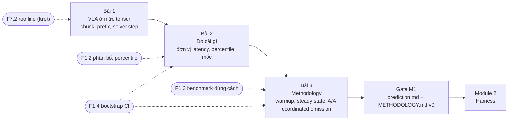
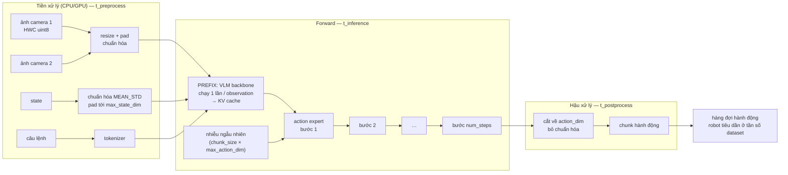

# KHÓA 4 · MODULE 1 — NỀN TẢNG: VLA LÀ GÌ, ĐO CÁI GÌ, ĐO THẾ NÀO (10h)

> **Cần trước:** K2 PASS (MCAP, schema, đọc dataset LeRobot v3.0 ở K2 Bài 9). Học đúng lúc: F1.2 (trước Bài 2), F1.3 + F1.4 (trước Bài 3), F7.2 đọc lướt (Bài 1) · **Artifact của module:** `notes/01-model-anatomy.md`, `benchmarks/prediction.md` (commit trước mọi phép đo), `METHODOLOGY.md` bản 0.

Module này không đo gì thật. Nó dựng ba thứ mà mọi con số ở Module 2–5 dựa vào: **biết chính xác mình đang đo hàm nào** (Bài 1), **biết một con số "hợp lý" trông thế nào và nó có đơn vị gì** (Bài 2), và **biết con số là của model chứ không phải của môi trường** (Bài 3). Bản gốc gọi Bài 3 là "phần quan trọng nhất của cả khóa". Đúng, và đây cũng là chỗ bạn có sẵn nhiều vốn nhất: bạn đã đo trên host "yên tĩnh" nhiều năm. Module này gọi đúng tên những gì bạn đã làm, rồi chỉ ra chỗ còn thiếu.



| Bài | Giờ | Viên nang nền cần trước | Quyết định ra được |
|---|---|---|---|
| 1 VLA ở mức tensor | 3 | F7.2 (lướt) | Benchmark gọi hàm nào (`predict_action_chunk` hay `select_action`), "một lần inference" là gì |
| 2 Đo cái gì | 3 | F1.2, F1.1 | Báo cáo chỉ số nào, với đơn vị nào, cần bao nhiêu mẫu cho percentile nào |
| 3 Methodology | 4 | F1.3, F1.4, F1.7 | Quy trình đo nào được cam kết trước, và bằng chứng nào chứng minh môi trường không làm méo số |

---

## Bài 1 — VLA model là cái gì, ở mức tensor (3h)

> **Vị trí:** K2 Bài 9 (định dạng LeRobot) → **Bài 1** → Bài 2 (đo cái gì) · **Cần trước:** K2 Bài 9; F7.2 đọc lướt mục "arithmetic intensity" · **Sau bài này bạn quyết định được:** harness của bạn gọi hàm nào của policy và gọi nó là "một lần inference" theo nghĩa nào, trước khi viết dòng đo đầu tiên.

### 1. Câu chuyện — ai đã khổ vì chuyện này

Năm 2023, nhóm ALOHA (Tony Zhao và cộng sự, paper "Learning Fine-Grained Bimanual Manipulation with Low-Cost Hardware") gặp một vấn đề quen thuộc của imitation learning: policy dự đoán **từng** hành động một thì sai số nhỏ ở mỗi bước cộng dồn, robot trôi khỏi vùng dữ liệu đã thấy và hỏng. Cách họ chữa là **action chunking**: model dự đoán một chuỗi k hành động tương lai mỗi lần chạy (ACT — Action Chunking with Transformers). Ý tưởng này lan sang gần như mọi VLA sau đó, kể cả π0 và SmolVLA `[chuẩn: paper ACT 2023, π0 2024, SmolVLA 2025]`.

Chunking giải quyết bài toán học, nhưng tạo ra bài toán hạ tầng. Năm 2025, Physical Intelligence công bố "Real-Time Execution of Action Chunking Flow Policies" (Black, Galliker, Levine): khi chạy chunk **đồng bộ**, robot đứng khựng mỗi lần chờ chunk mới; khi chạy **bất đồng bộ**, chỗ nối giữa chunk cũ và chunk mới bị giật. Họ phải thiết kế lại cách nối (real-time chunking, RTC) `[spec: paper RTC 2025; LeRobot có `rtc_config` trong `SmolVLAConfig`, kiểm theo phiên bản bạn cài]`. Bài học cho người đo: "latency của VLA" không có nghĩa gì cho tới khi bạn nói rõ nó là latency **của cái gì**, và nó nằm ở đâu trong vòng điều khiển.

### 2. Mô hình tư duy

Ở mức bạn cần, một VLA là một hàm thuần:

```
(ảnh từ N camera, vector trạng thái, câu lệnh) ──► chunk hành động  [chunk_size × action_dim]
```

Bên trong có hai pha với chi phí rất khác nhau. Đây là SmolVLA theo mã nguồn LeRobot hiện hành `[spec: lerobot/src/lerobot/policies/smolvla/modeling_smolvla.py, nhánh main khi soạn 10/2026; kiểm theo phiên bản bạn cài]`:



Bốn câu nói bản chất:

1. **Một lần forward = prefix một lần + expert × `num_steps` lần.** SmolVLA là model flow-matching: action expert bắt đầu từ nhiễu và "khử nhiễu" qua nhiều bước tích phân Euler, mỗi bước đọc lại KV cache của prefix. Latency ≈ `t_prefix + num_steps · t_step` — **affine**, không tỉ lệ thuận: giảm số bước không bao giờ kéo latency về 0, vì còn `t_prefix`.
2. **Chunk là một khoảng thời gian, không chỉ là một con số.** Chunk `chunk_size` hành động được huấn luyện với khoảng cách giữa hai hành động bằng `1/fps` của dataset. Nó phủ `chunk_size / fps` giây tương lai. Robot phải tiêu nó ở đúng tần số đó; tiêu nhanh hơn là bắt robot di chuyển nhanh hơn dữ liệu nó học.
3. **Đầu ra mà bạn gọi được có hai hình dạng.** `predict_action_chunk` trả cả chunk; `select_action` trả **một** hành động và giữ phần còn lại trong hàng đợi, chỉ chạy model khi hàng đợi rỗng. Đo nhầm hàm là đo nhầm thứ (phần 5–7).
4. **Mọi thứ trước và sau forward cũng là thời gian thật.** LeRobot hiện tách tiền/hậu xử lý thành đối tượng riêng (`make_pre_post_processors`) `[spec: examples/tutorial/smolvla/using_smolvla_example.py, kiểm theo phiên bản]`. Đó đúng là ranh giới `t_preprocess / t_inference / t_postprocess` mà harness ở Bài 4 phải tách.

Mô phỏng đồ chơi cho câu 3, chạy được ngay, không cần GPU:

```python
# [đã chạy] Đo select_action trong vòng lặp: 1/50 lần gọi chạy model, 49/50 chỉ lấy từ hàng đợi
import numpy as np
rng = np.random.default_rng(0)
n = 5000
heavy = rng.normal(180.0, 8.0, n)      # ms — lần gọi có forward thật (GIẢ ĐỊNH, không phải số đo)
light = rng.normal(0.03, 0.005, n)     # ms — chỉ popleft()
is_heavy = (np.arange(n) % 50) == 0    # n_action_steps = 50
lat = np.where(is_heavy, heavy, light)
for q in (50, 95, 98, 99, 99.9):
    print(f"select_action p{q}: {np.percentile(lat, q):8.3f} ms")
print(f"mean: {lat.mean():.2f} ms")
```

Chạy trước khi đọc tiếp, rồi tự hỏi: percentile nào trong này là "latency của model"?

### 3. Cầu nối từ backend

| Backend bạn biết | Ở đây | Gãy ở chỗ | Nếu dùng nhầm thì |
|---|---|---|---|
| Một request → một response | Một observation → một **chunk** nhiều hành động | Response được tiêu dần theo thời gian; "đã trả lời" khác "đã dùng hết" | Báo cáo "4 Hz, quá chậm" cho một model thật ra đủ dùng, hoặc ngược lại |
| Prefetch / read-ahead buffer (đọc trước nhiều block) | Chunk là read-ahead của hành động | Block đĩa không lỗi thời; hành động thì có: thế giới thay đổi trong lúc robot tiêu chunk | Tăng `n_action_steps` để "giảm tải" và nhận robot phản ứng chậm với vật bị đẩy lệch |
| Cache hit vs cache miss trong một vòng benchmark | `select_action`: 49 lần "hit" hàng đợi, 1 lần "miss" chạy model | Ở backend bạn **muốn** đo cả hai và trộn lại; ở đây hai loại thuộc hai câu hỏi khác nhau | p50 báo micro-giây, người đọc tưởng model nhanh kinh ngạc |
| Middleware tiền xử lý request (parse, auth, decode) | Processor: resize ảnh, chuẩn hóa, tokenize | Ở backend middleware thường rẻ so với handler; ở đây resize ảnh trên CPU có thể cùng bậc với forward trên GPU `[tự đo]` | So số "forward thuần" của người khác với số end-to-end của mình |
| Retry vòng lặp tới khi hội tụ | Expert chạy `num_steps` bước tích phân | Không có điều kiện dừng sớm; số bước cố định, là tham số chất lượng | Giảm bước để "tối ưu" mà không đo trục chất lượng (Module 3) |

**Chấm mô hình:**

- *"VLA là một LLM có thêm ảnh, nên latency của nó giống time-to-first-token của LLM."* — **ĐÚNG MỘT PHẦN.** Pha prefix giống prefill của LLM (xử lý cả chuỗi token ảnh + chữ một lần). Gãy ở pha sau: SmolVLA không sinh token từng cái một (autoregressive decode); nó khử nhiễu **cả chunk 50 hành động song song** qua một số bước cố định. Phản ví dụ: tăng `chunk_size` từ 50 lên 100 ở LLM-decode sẽ gấp đôi số bước decode; ở flow-matching thì số bước giữ nguyên, chỉ mỗi bước nặng hơn. Hệ quả: mọi kết luận kiểu "batch 1 thì memory-bound như LLM decode" hay ngược lại đều **chưa** được phép rút ra ở đây — nó phụ thuộc số token mỗi pha, phải tính và đo ở → K4 Bài 12, F7.2.
- *"Model 4 Hz với chunk 50 điều khiển được robot ở 200 Hz."* (đáp án tự kiểm tra của bản gốc và Gemini) — **SAI.** Tần số hành động do dataset quyết định, không do tích `4 × 50`. Phản ví dụ: với `data/libero`, `fps = 10` → chunk 50 hành động là 5 s chuyển động. Phát 50 hành động trong 0,25 s là bắt robot chạy nhanh gấp 20 lần lúc thu dữ liệu. Câu đúng: model đủ nhanh khi **latency < thời gian robot tiêu phần chunk được phép tiêu** (`n_action_steps / fps`), trừ biên an toàn.
- *"Shape action ra 2 chiều nghĩa là model không chunking."* (bản gốc, phần "Số phải ra") — **SAI với LeRobot hiện hành.** `select_action` trả `(B, action_dim)` dù model chunking; chỉ `predict_action_chunk` trả `(B, chunk_size, action_dim)`. Kiểm bằng hàm, không bằng shape.

### 4. Thuật ngữ

| Mức | Thuật ngữ | Nghĩa trong một câu | Hay bị hiểu nhầm thành |
|---|---|---|---|
| 🟢 | VLA (Vision-Language-Action) | Model nhận ảnh + state + câu lệnh, trả hành động | "AI hiểu thế giới"; ở đây nó chỉ là một hàm tensor → tensor |
| 🟢 | action chunk, `chunk_size` | Số hành động tương lai model dự đoán mỗi lần chạy | Batch size |
| 🟢 | `n_action_steps` | Số hành động trong chunk thực sự được đưa cho robot trước khi chạy lại model | Luôn bằng `chunk_size` (mặc định thì bằng, nhưng người ta hay đặt nhỏ hơn) |
| 🟢 | execution horizon | Thời gian robot tiêu `n_action_steps`: `n_action_steps / fps` | Latency |
| 🟢 | prefix / KV cache | Phần backbone xử lý ảnh + chữ + state một lần, lưu key/value để expert dùng lại | Cache kết quả giữa các observation (không, nó tính lại mỗi observation) |
| 🟢 | flow matching, `num_steps` | Expert biến nhiễu thành chunk qua số bước tích phân cố định | Số vòng retry |
| 🟡 | sync vs async inference | Robot đứng chờ chunk mới, hay vừa tiêu chunk cũ vừa tính chunk mới | Chỉ khác nhau ở code |
| 🟡 | RTC (real-time chunking) | Cách nối chunk mới vào phần còn lại của chunk cũ khi chạy async | Một loại quantization |
| 🟡 | `max_state_dim`, `max_action_dim` | SmolVLA pad state/action lên một kích thước cố định để dùng chung nhiều robot | Kích thước thật của robot |
| 🔴 | Chi tiết attention giữa VLM và expert (cross-attn xen self-attn) | Cách expert đọc KV cache | Cần để benchmark |

### 5. Dự đoán

Tạo `predictions/01-anatomy.md`, commit **trước** khi cài LeRobot hay chạy mô phỏng ở phần 2.

Tham số cần tra:
- `data/libero/meta/info.json` và `data/lerobotpusht/meta/info.json`: `fps`, `features` (key camera, `shape` ảnh, `shape` state/action). Bạn đã đọc chúng ở K2 Bài 9.
- `configuration_smolvla.py` trong bản LeRobot bạn cài (hoặc `config.json` trên model card `lerobot/smolvla_base`): `chunk_size`, `n_action_steps`, `num_steps`, `resize_imgs_with_padding`, `max_state_dim`, `max_action_dim`, `input_features`.

Phương pháp: bytes của tensor = tích các chiều × bytes/phần tử (uint8 = 1, float32 = 4). Execution horizon = `n_action_steps / fps`. Trong vòng `select_action`, tỉ lệ lần gọi chạy model = `1 / n_action_steps`.

```markdown
# 01-anatomy — dự đoán (commit trước khi chạy)
Ngày: … · commit: … · phiên bản lerobot dự định cài: …

## Từ info.json (libero)
- Số camera: … ; shape một ảnh trong dataset: … ; bytes/ảnh uint8: …
- Shape tensor ảnh vào policy (B=1, sau to_tensor, trước resize): … ; bytes float32: …
- Sau resize-pad của SmolVLA: shape … ; bytes float32: …
- state_dim: … ; action_dim: … ; fps: …

## Từ config SmolVLA
- chunk_size: … ; n_action_steps: … ; num_steps: …
- Execution horizon trên libero (giây): …
- Shape đầu ra predict_action_chunk: … ; shape đầu ra select_action: …

## Mô phỏng phần 2 (5000 lần gọi select_action)
- p50 tôi đoán: … ms ; p99: … ms ; percentile đầu tiên "thấy" model: p…
- Mean: … ms (ước bằng: …)

## Latency đơn giản
- Nếu t_prefix = P, t_step = S, num_steps = K: latency = … ; giảm K từ 10 xuống 5 giảm latency … % (biểu thức theo P, S)
```

### 6. Làm

1. **Môi trường riêng, có lockfile.** Venv hoặc container riêng cho repo benchmark; pin phiên bản `lerobot`, `torch` trong lockfile (→ F2.2). Ghi phiên bản và commit hash của LeRobot vào `notes/01-model-anatomy.md`. LeRobot đổi cấu trúc package nhanh: bản gốc và bản Gemini dùng `lerobot.common.policies…`; nhánh main khi soạn bài dùng `lerobot.policies…` (phần 11). **Không copy import từ tài liệu nào, kể cả bài này, mà không kiểm trong bản bạn cài.**
2. **Load model, chưa đo gì.** Chạy được trên CPU laptop; chỉ chậm.
   ```python
   # [chưa chạy] — cần cài lerobot + tải ~1 GB weight. API dựa trên nhánh main 10/2026 [tự đo]:
   # kiểm theo phiên bản bạn cài (tên module, tên hàm, key của batch đều đã từng đổi).
   import torch
   from lerobot.policies.smolvla import SmolVLAPolicy            # bản cũ: lerobot.common.policies.smolvla.modeling_smolvla
   from lerobot.policies import make_pre_post_processors

   model_id = "lerobot/smolvla_base"
   policy = SmolVLAPolicy.from_pretrained(model_id).eval()
   pre, post = make_pre_post_processors(policy.config, model_id,
                                        preprocessor_overrides={"device_processor": {"device": "cpu"}})
   cfg = policy.config
   print({k: getattr(cfg, k) for k in ("chunk_size", "n_action_steps", "num_steps",
                                       "resize_imgs_with_padding", "max_state_dim", "max_action_dim")})
   print("input_features:", cfg.input_features)     # KEY camera mà model này đòi — đừng đoán
   print("output_features:", cfg.output_features)
   print("tham số:", sum(p.numel() for p in policy.parameters()) / 1e6, "M")
   ```
3. **Dựng một observation giả đúng `input_features`.** Không dùng key `observation.images.laptop/phone` của bản Gemini trừ khi config của bạn đòi đúng key đó. Ảnh là `float32 (1, 3, H, W)` trong [0, 1], state `(1, state_dim)`, câu lệnh đưa qua `pre(...)` để tokenize (đưa chuỗi `"task"` thẳng vào policy sẽ lỗi ở bản hiện hành vì policy đọc token đã tokenize `[tự đo]`).
4. **Gọi cả hai hàm, in shape.** Gọi `policy.predict_action_chunk(batch)` một lần, in shape. Rồi `policy.reset()` và gọi `policy.select_action(batch)` 60 lần liên tiếp, in shape và thời gian từng lần (`time.perf_counter_ns`). Vẽ thời gian theo chỉ số lần gọi. Ghi vào `notes/01-model-anatomy.md`.
5. **Đặt `noise` cố định.** `predict_action_chunk(batch, noise=...)` nhận nhiễu đầu vào `[tự đo]`. Gọi hai lần với cùng nhiễu, so chunk (phải trùng tới sai số số học); hai lần không truyền nhiễu, so chunk (phải khác). Ghi lại: đây là nguồn ngẫu nhiên đầu tiên bạn sẽ phải kiểm soát ở Bài 7.
6. **Đổi `num_steps`** (ví dụ 10 → 5 → 2, sửa `policy.config.num_steps` trước khi gọi) và đo thời gian `predict_action_chunk` thô trên CPU, mỗi mức 5 lần. Chưa phải benchmark (chưa warmup, chưa cô lập), chỉ để thấy hình dạng `t_prefix + K·t_step`. Fit đường thẳng, ghi `t_prefix` và `t_step` ước lượng **kèm câu "đo thô, chưa cô lập"**.
7. **Danh sách policy.** Đọc mục Policies trong LeRobot docs, ghi tên, số tham số, kiểu action head (flow-matching / autoregressive / trực tiếp) của ít nhất 6 policy, kèm ngày tra. Danh sách này đổi nhanh; ngày tra là một phần của dữ liệu.

Sai số của "dụng cụ" ở bài này: `time.perf_counter_ns` có độ phân giải dưới micro-giây trên Linux/Windows hiện đại `[tự đo: đo chi phí một lần gọi bằng vòng 10⁵ lần]`; trên GPU, đồng hồ CPU **không** đo được thời gian GPU nếu không đồng bộ (→ Bài 5).

### 7. Số phải ra

<details><summary>🔒 MỞ SAU KHI COMMIT prediction.md</summary>

**Từ `info.json` (đã đọc từ file thật trong `data/`, 10/2026) và config SmolVLA (nhánh main 10/2026):**

| Mục | `data/libero` | `data/lerobotpusht` |
|---|---|---|
| Camera | 2 (`observation.images.image`, `observation.images.image2`), 256×256×3 | 1 (`observation.image`), 96×96×3 |
| Bytes một ảnh uint8 trong dataset | 196 608 B | 27 648 B |
| Tensor ảnh vào policy (B=1) | `(1, 3, 256, 256)` float32 = 786 432 B mỗi camera | `(1, 3, 96, 96)` float32 = 110 592 B |
| Sau resize-pad 512×512 của SmolVLA | `(1, 3, 512, 512)` float32 ≈ 3,15 MB mỗi camera | như bên trái |
| state / action | 8 / 7 | 2 / 2 |
| fps | 10 | 10 |
| Execution horizon với `n_action_steps = 50` | 5,0 s | 5,0 s |

Config SmolVLA `[spec: configuration_smolvla.py, main 10/2026 — kiểm bản bạn cài]`: `chunk_size = 50`, `n_action_steps = 50`, `num_steps = 10`, `resize_imgs_with_padding = (512, 512)`, `max_state_dim = max_action_dim = 32`, `use_cache = True`.

Shape đầu ra: `predict_action_chunk` → `(1, 50, action_dim)` (đã cắt từ 32 về `action_dim` thật). `select_action` → `(1, action_dim)`. Nếu bạn thấy 32 ở chiều cuối, bạn đang đọc tensor **trước** bước cắt padding.

Số tham số: ~0,45B theo paper/blog SmolVLA `[spec: HF blog "SmolVLA", 06/2025]`. Đếm `numel()` của bạn có thể lệch vài chục triệu tùy bản (lớp nào của VLM được giữ khi `num_vlm_layers = 16`, có đếm embedding không). Lệch ±10% là bình thường; lệch 2× nghĩa là bạn load nhầm checkpoint.

**Mô phỏng phần 2** `[đã chạy, seed 0]`:

| Chỉ số | Giá trị |
|---|---|
| p50 | 0,030 ms |
| p95 | 0,039 ms |
| p98 | 3,2 ms (điểm nội suy giữa hai loại) |
| p99 | 181,6 ms |
| p99.9 | 191,9 ms |
| mean | 3,65 ms (≈ 180/50 + 0,03) |
| Tỉ lệ lần gọi nặng | 0,020 |

Đọc: p50 và p95 là latency **của hàng đợi**, p99 trở lên mới là latency của model, và mean là một con số không mô tả lần gọi nào cả. Benchmark latency model phải gọi `predict_action_chunk` (hoặc forward tương đương); benchmark **vòng điều khiển** thì gọi `select_action` và báo cáo cả hai mode của phân bố.

**Đổi `num_steps` (bước 6):** đường thẳng phải có hệ số chặn dương rõ ràng. Nếu đường đi qua gốc, có thể bạn đang đo nhầm chỉ phần expert, hoặc prefix bị cache sai giữa các lần gọi (cùng observation). Tỉ lệ `t_prefix / t_step` trên CPU vs GPU là số của bạn `[tự đo]`; đừng tin con số của người khác ở đây.

</details>

### 8. Nếu ra khác

| Triệu chứng | Nguyên nhân khả dĩ | Kiểm bằng cách | Sửa |
|---|---|---|---|
| `ModuleNotFoundError: lerobot.common…` | Code viết cho bản LeRobot cũ, bạn cài bản mới (hoặc ngược lại) | `pip show lerobot`; tìm file `modeling_smolvla.py` trong site-packages | Sửa import theo bản cài; ghi phiên bản vào notes |
| `KeyError` về key camera | Observation giả dùng key khác `input_features` | In `policy.config.input_features` | Đổi key cho khớp; key nằm trong thống kê chuẩn hóa nên không đổi tùy ý được |
| Lỗi thiếu `…language_tokens` | Đưa câu lệnh thô vào policy, bỏ qua preprocessor | Đọc lỗi | Đi qua `pre(...)` |
| `select_action` lần nào cũng chậm | `reset()` mỗi lần, hoặc `n_action_steps = 1` | In độ dài hàng đợi | Gọi `reset()` một lần mỗi episode |
| Hai lần gọi cùng nhiễu cho chunk khác nhau đáng kể | Nguồn ngẫu nhiên khác (dropout chưa tắt: thiếu `.eval()`), hoặc thuật toán không tất định trên GPU | Kiểm `policy.training`; chạy trên CPU | `.eval()`; ghi lại nếu chỉ lệch ở mức sai số float |
| Chiều cuối của chunk là 32 | Đọc trước bước cắt padding | So với `output_features` | Cắt `[..., :action_dim]` |

### 9. Câu hỏi ngược

1. **[Nếu…thì]** Nếu bạn đặt `n_action_steps = 10` thay vì 50 (như LeRobot khuyên khi tái lập π0.5 trên LIBERO), số lần chạy model mỗi phút trên libero thay đổi thế nào, và ràng buộc latency chặt lên bao nhiêu lần?
   <details><summary>Hướng nghĩ</summary>

   Số lần chạy model mỗi giây = `fps / n_action_steps`. Execution horizon = `n_action_steps / fps`. Giảm `n_action_steps` 5 lần thì tải tính toán gấp 5 và ngân sách latency còn 1/5. Đổi lại robot "nhìn lại thế giới" thường hơn. Đó là một đánh đổi chất lượng–tài nguyên mà Module 3 phải đo, không phải một tham số mặc định.

   </details>
2. **[Vì sao không]** Vì sao không cache luôn KV của prefix giữa hai observation liên tiếp cho nhanh, như prompt caching của LLM?
   <details><summary>Hướng nghĩ</summary>

   Prompt caching dùng được vì tiền tố văn bản giống hệt nhau. Ở đây prefix chứa token ảnh của **khung hình mới**: thay đổi mỗi lần. Phần câu lệnh thì không đổi, nhưng attention trộn chúng lại. Hỏi: phần nào của tính toán thật sự lặp lại giữa hai observation, và nó chiếm bao nhiêu so với phần ảnh? Đây là loại câu hỏi bạn trả lời bằng đếm token (→ K4 Bài 12).

   </details>
3. **[Quy mô]** Một đội vận hành 200 robot, mỗi robot chạy SmolVLA async với `n_action_steps = 50` ở 30 fps, model đặt trên một server GPU chung. Bao nhiêu request/giây tới server, và điều đó gợi ý đo latency ở batch nào?
   <details><summary>Hướng nghĩ</summary>

   Mỗi robot: 30/50 = 0,6 request/s. Tổng ≈ 120 request/s. Nếu một forward batch 1 tốn cỡ trăm ms, một GPU phục vụ tuần tự không kịp; server sẽ gom batch. Benchmark batch 1 trả lời câu hỏi "robot tự mang model"; benchmark batch > 1 trả lời "một server phục vụ đội". Hai câu hỏi, hai bảng số, và định luật Little nối chúng (→ F7.1).

   </details>
4. **[Failure mode]** Robot chạy sync, horizon 5 s, mỗi lần chờ chunk mới mất 300 ms. Người dùng than robot "giật mỗi 5 giây". Benchmark của bạn báo p99 = 310 ms, "đạt". Ai sai?
   <details><summary>Hướng nghĩ</summary>

   Không ai đo sai; câu hỏi sai. Ở chế độ sync, mỗi lần inference là một **khoảng đứng yên** của robot, dù p99 thấp. Chỉ số đúng cho trải nghiệm là tỉ lệ thời gian đứng chờ (latency / horizon) và độ giật ở chỗ nối chunk. Benchmark model trả lời một câu, benchmark vòng điều khiển trả lời câu khác. Ghi cả hai vào phần "Cái tôi KHÔNG đo" của METHODOLOGY nếu bạn chỉ đo một.

   </details>
5. **[Liên ngành]** Action chunking giống "lookahead" trong điều khiển dự báo (MPC) ở đâu, và khác ở đâu?
   <details><summary>Hướng nghĩ</summary>

   MPC cũng tính một chuỗi lệnh tương lai rồi chỉ thực hiện phần đầu và tính lại (receding horizon). Khác: MPC tính lại theo mô hình vật lý và thường ở mỗi chu kỳ; VLA học từ dữ liệu, tính lại thưa hơn vì đắt. Câu hỏi để giữ: "bao lâu thì tính lại" là tham số thiết kế ở cả hai (→ K7 C11.4).

   </details>

### 10. Liên kết ra ngoài

- **Video streaming (HLS/DASH):** player tải trước vài giây video (segment), phát dần, tải segment mới trong lúc phát. Giống: chunk là segment, execution horizon là độ dài buffer, sync inference là "buffering…". Khác: video không lỗi thời; hành động thì lỗi thời khi vật bị dịch chuyển, nên buffer dài hơn không phải lúc nào cũng tốt hơn.
- **Pipeline CPU và branch prediction:** CPU thực thi trước các lệnh dự đoán, bỏ đi khi đoán sai. Giống: chunk là "thực thi trước" dựa trên trạng thái cũ; replanning là flush. Khác: CPU kiểm đúng/sai chính xác ngay; robot chỉ biết chunk cũ sai khi đã có hậu quả vật lý.

### 11. Độ tin cậy và sửa lỗi

| Khẳng định | Nhãn | Ghi chú / cách kiểm |
|---|---|---|
| SmolVLA ~450M tham số | `[spec: HF blog SmolVLA 06/2025]` | Đếm `numel()` |
| `chunk_size = 50`, `n_action_steps = 50`, `num_steps = 10`, resize 512×512, pad 32 | `[spec: configuration_smolvla.py main 10/2026]` | Đọc config của bản cài |
| `select_action` trả 1 hành động, chạy model khi hàng đợi rỗng | `[spec: modeling_smolvla.py main 10/2026]` | Bước 4 phần 6 |
| Import `lerobot.policies.smolvla` | `[tự đo]` | Kiểm theo phiên bản bạn cài |
| libero/pusht: fps 10, camera, shape | `[đã đo: data/*/meta/info.json]` | — |
| Latency = t_prefix + K·t_step | `[chuẩn]` cho cấu trúc; hệ số `[tự đo]` | Bước 6 |
| Resize ảnh trên CPU có thể cùng bậc với forward GPU | `[tự đo]` | Tách ba tầng ở Bài 4 |

**Đã sửa so với bản gốc và bản Gemini:**
- Import `lerobot.common.policies.smolvla.modeling_smolvla` (Gemini) → đã đổi cấu trúc package; nhánh main dùng `lerobot.policies.smolvla`, có thêm `make_pre_post_processors` (quy chuẩn mục 7). Ghi `[tự đo]`.
- "Shape action 2 chiều nghĩa là không chunking" (bản gốc, Gemini) → sai với `select_action`; kiểm bằng `predict_action_chunk`.
- "4 Hz × chunk 50 → điều khiển tới 200 Hz" (bản gốc, Gemini) → sai: tần số hành động là `fps` của dataset; ràng buộc đúng là latency < execution horizon.
- "Latency giảm gần tuyến tính khi giảm solver step" (bản gốc) → affine, có hệ số chặn `t_prefix`.
- Observation giả của Gemini: key `laptop/phone` và state 7 chiều "6 khớp + gripper" → key phải lấy từ `input_features`; SO-100/SO-101 có 6 motor **tính cả gripper** nên state là 6 `[spec: tài liệu SO-101 của LeRobot — kiểm]`; đưa chuỗi `task` thẳng vào policy không chạy được ở bản hiện hành.
- Bảng "Số phải ra" gốc ghi ảnh `(B, N_cam, 3, H, W)`: LeRobot đưa mỗi camera một key riêng `(B, 3, H, W)`; với `n_obs_steps = 1` không có chiều thời gian.

### 12. Đọc thêm và tự kiểm tra

- **Nguồn gốc:** SmolVLA paper (arXiv 2506.01844), đọc mục method; mã `modeling_smolvla.py` + `configuration_smolvla.py` của bản bạn cài.
- **Giải thích:** HF blog "SmolVLA: Efficient Vision-Language-Action Model trained on Lerobot Community Data" (06/2025), mục async inference.
- **Đào sâu (tùy chọn):** Black, Galliker, Levine, "Real-Time Execution of Action Chunking Flow Policies" (2025); paper ACT (Zhao và cộng sự, 2023) mục action chunking.
- **Tự kiểm tra:** (1) giải thích cho một backend engineer khác trong 5 câu vì sao "p50 của select_action" là một con số vô nghĩa; (2) vẽ lại sơ đồ prefix → expert × K → hàng đợi từ trí nhớ; (3) câu hỏi dưới.

<details><summary>Câu hỏi: libero fps 10, n_action_steps 50, sync. Forward mất 400 ms. Robot đứng yên bao nhiêu phần trăm thời gian? Async thì latency tối đa chịu được là bao nhiêu (bỏ qua biên an toàn)?</summary>

Sync: mỗi chu kỳ = 5 s tiêu chunk + 0,4 s chờ → đứng yên 0,4 / 5,4 ≈ 7,4%. Async: chunk mới phải sẵn sàng trước khi chunk cũ cạn → latency < 5 s. Biên thực tế nhỏ hơn nhiều vì chunk mới tính từ observation cũ (lúc bắt đầu tính), nên phần đầu của nó đã "quá hạn" khi tới; đó là vấn đề RTC giải quyết.

</details>

---
