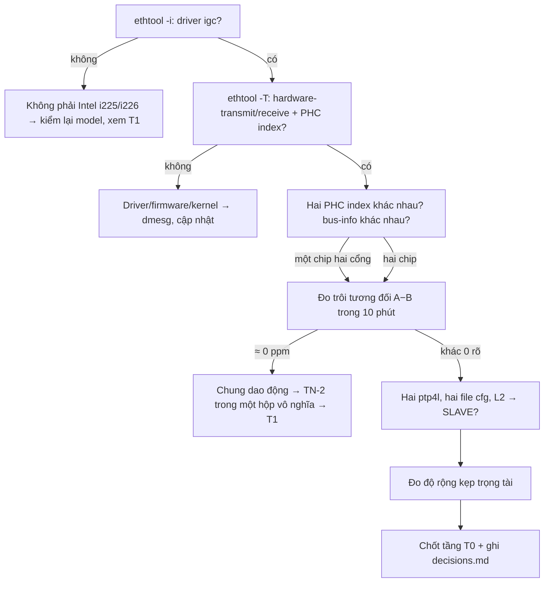
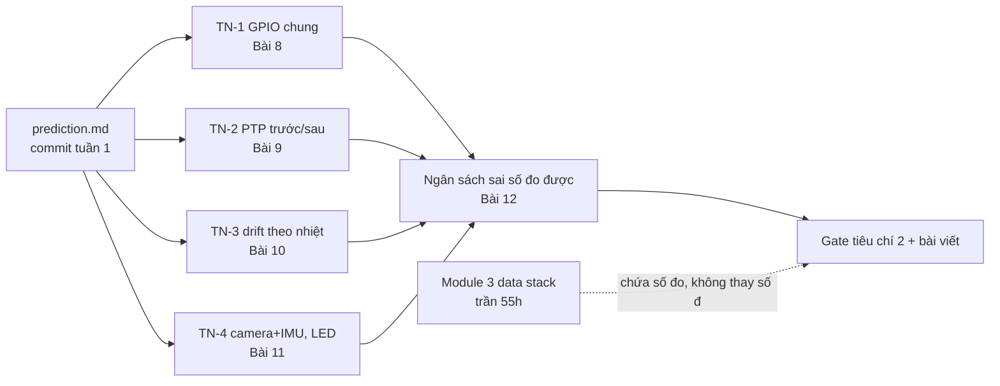

# Khóa 5 · Module 0 — Chọn phần cứng (8h)

> Hai bài, một tuần. Bài 1 biến mọi giả định phần cứng của khóa thành một checklist có lệnh và kết quả niêm phong. Bài 2 viết ra deliverable đo được trước khi viết dòng code nào. Gate Module 0 ở cuối file.
>
> Nguồn: `khoa-5-sensor-timesync-platform.md` (Module 0), `THAY-DOI-10-2026.md` (mục "Điều chưa kiểm chứng"), bản Gemini K5 Bài 1–2 (đã gặt, lỗi ghi ở phần 11).

---

## Bài 1 — Kiểm ràng buộc phần cứng trước khi mua gì (3h)

> **Vị trí:** K4 (benchmark trên N100) → **Bài 1** → Bài 2 (kế hoạch đo) · **Cần trước:** K1 Phần B; đọc lướt → F4.3 (đồng hồ trong máy tính), → F4.5 (PTP, chỉ mục PHC) · **Sau bài này bạn quyết định được:** chọn tầng phần cứng T0/T1/T2, và Module 2 có chạy được "trong một hộp" hay phải đổi phương án — dựa trên số bạn tự đo, không dựa trên trang bán hàng.

### 1. Câu chuyện — ai đã khổ vì chuyện này

Người làm PTP trên Raspberry Pi từng gặp đúng cái bẫy này: Pi 4 và Compute Module 4 cùng hãng, cùng "gigabit Ethernet", nhưng chỉ CM4 có PHY hỗ trợ hardware timestamping (BCM54210PE); Pi 4 chỉ có software timestamping `[chuẩn — kiểm lại trong các bài PTP trên CM4 của Jeff Geerling]`. Ai mua theo dòng "gigabit" trên trang sản phẩm sẽ chỉ phát hiện ra khi `ptp4l` báo lỗi hoặc offset ngang NTP. Hai cái máy trông giống nhau, khác nhau đúng ở năng lực duy nhất khóa này không thay được bằng phần mềm.

Khóa 5 đặt cược vào một giả định đẹp: mini PC có hai cổng Intel, mỗi cổng một PHC, nối thẳng là có thí nghiệm PTP trong một hộp. Bản gốc ghi rõ bốn điều **chưa kiểm** (`THAY-DOI-10-2026.md`): hai PHC riêng thật không; hai `ptp4l` cùng máy có chạy ổn không; "cái kẹp" của trọng tài rộng bao nhiêu; khối lượng và công suất thật của máy. *Kịch bản* tệ nhất không phải "không có PHC" (dễ thấy), mà là "có hai PHC nhưng dùng chung một bộ dao động": mọi lệnh đều PASS, PTP hội tụ đẹp, và cả Module 2 đo một thứ gần như bằng không vì hai đồng hồ không hề trôi khỏi nhau. Bài này tồn tại để bắt cái đó trong 3 giờ, không phải ở tuần 12.

### 2. Mô hình tư duy

```
                  mini PC (một hộp)
 ┌───────────────────────────────────────────────────────────┐
 │  CPU ── system clock (CLOCK_REALTIME, TSC)                │
 │   │                      ▲ trọng tài: đọc sys–PHC–sys     │
 │   │ PCIe                 │ (PTP_SYS_OFFSET_EXTENDED)      │
 │   ├──────────── chip NIC #1 ── thạch anh X1 ── PHC /dev/ptpA ── cổng 1 ─┐
 │   └──────────── chip NIC #2 ── thạch anh X2 ── PHC /dev/ptpB ── cổng 2 ─┤
 └───────────────────────────────────────────────────────────┘          │
                         cáp Cat6 nối thẳng  ◄──────────────────────────┘
 Câu hỏi then chốt: X1 và X2 là HAI bộ dao động, hay một?
```

Một năng lực phần cứng chỉ "có" khi đủ bốn tầng cùng có: **silicon** (chip có bộ đếm và mạch đóng dấu), **driver** (kernel lộ nó ra: `/dev/ptpN`, cờ timestamping), **công cụ** (linuxptp đúng phiên bản, cấu hình đúng), và **phép đo độc lập** (có cách kiểm kết quả mà không tin lời chính công cụ đó). Trang sản phẩm chỉ nói về tầng thứ nhất, và thường nói sai model chip. Checklist ở phần 6 đi từ tầng dưới lên; dừng ở tầng đầu tiên bị gãy.



### 3. Cầu nối từ backend

| Backend bạn biết | Ở đây | Gãy ở chỗ | Nếu dùng nhầm thì |
|---|---|---|---|
| Đọc spec instance cloud (ENA, SR-IOV, NVMe local) trước khi chọn | Đọc `ethtool -T`, `ethtool -i` trước khi mua cảm biến | Spec cloud là hợp đồng có SLA; trang bán mini PC không phải hợp đồng — cùng tên model có thể khác lô chip (i225 vs i226, khác stepping) | Tin trang sản phẩm, mua đủ đồ, rồi phát hiện máy lô bạn nhận khác |
| Capability discovery / feature flag (`/health`, `GET /features`) | Cờ `hardware-transmit` trong `ethtool -T` | Cờ chỉ nói driver *tuyên bố* hỗ trợ; không nói timestamp có đúng, có ổn định, có bị timeout | Coi "có cờ" = "chạy sub-µs", bỏ qua bước đo độc lập |
| Hai container trên một host để giả lập hai node | Hai PHC trong một hộp giả lập hai máy | Container chia CPU/clock thì bạn biết; PHC có thể chia **bộ dao động** mà không lệnh nào nói ra | Thí nghiệm PTP "hoàn hảo" vì không có gì để sửa |
| Test chạy trên máy dev ≠ prod (thermal, noisy neighbour) | Máy bạn ≠ máy người viết blog | Ở đây khác biệt nằm trong silicon và firmware NIC, không cấu hình được | Copy lệnh từ blog Pi/i210 rồi đổ lỗi cho mình khi khác |

**Chấm mô hình:**

- *"Hai cổng, hai PHC → hai đồng hồ độc lập như hai máy."* — **ĐÚNG MỘT PHẦN.** Hai PHC là hai bộ đếm riêng, chỉnh tần số riêng. Nhưng "độc lập" theo nghĩa thí nghiệm cần **hai bộ dao động** trôi khác nhau. Một chip hai cổng (ví dụ họ i350) thường dùng chung một thạch anh cho cả chip `[ước lượng — kiểm datasheet chip cụ thể]`; khi đó trôi tương đối gần 0. Thêm nữa, hai "máy" này chung nguồn, chung nhiệt độ hộp, chung system clock làm trọng tài — hai máy thật không chung những thứ đó. Phản ví dụ: hộp đặt cạnh cửa sổ nắng; cả hai thạch anh nóng lên cùng nhau, trôi tương đối thay đổi ít hơn hai máy ở hai phòng.
- *"`ethtool -T` có `hardware-*` là PTP sẽ chạy tốt."* — **ĐÚNG MỘT PHẦN.** Đó là điều kiện cần. Driver `igc` có lịch sử cảnh báo "Tx timestamp timeout" trên một số kernel/firmware `[tự đo — xem dmesg]`; bộ lọc nhận có thể không như bạn nghĩ; và chưa có phép đo độc lập thì chưa có gì. Phản ví dụ: `ptp4l` báo offset vài chục ns trong khi trọng tài chỉ phân giải được cỡ độ rộng kẹp — con số "vài chục ns" là tự chấm điểm.

### 4. Thuật ngữ

| Mức | Thuật ngữ | Nghĩa trong một câu | Hay bị hiểu nhầm thành |
|---|---|---|---|
| 🟢 | PHC (PTP Hardware Clock) | Bộ đếm thời gian trên NIC, chỉnh được tần số, lộ ra là `/dev/ptpN` | Một đồng hồ có bộ dao động riêng (không nhất thiết) |
| 🟢 | Hardware timestamping | NIC ghi giá trị PHC lúc khung đi qua MAC/PHY, không qua stack phần mềm | "Kernel đóng dấu nhanh" (đó là software timestamping) |
| 🟢 | `igc` | Driver Linux cho Intel i225/i226 | Driver `igb` (i210/i350, khác chip) |
| 🟢 | Trọng tài (referee) | Phép đo độc lập với công cụ đang bị đánh giá | Log của `ptp4l` |
| 🟢 | Độ rộng kẹp | Thời gian giữa hai lần đọc system clock bao quanh một lần đọc PHC; chặn trên của sai số đọc | Độ trễ của PTP |
| 🟡 | `PTP_SYS_OFFSET_EXTENDED` | ioctl đọc bộ ba (sys, PHC, sys) nhiều lần | `PTP_SYS_OFFSET_PRECISE` (cross-timestamp phần cứng, NIC phải hỗ trợ) |
| 🟡 | Transport L2 (`-2`) | PTP chạy trên khung Ethernet thô, không qua IP | "Nhanh hơn UDP" (lý do chính ở đây là gói buộc đi qua dây) |
| 🟡 | `uds_address` | Đường dẫn Unix socket quản trị của một instance `ptp4l` | Cờ `-p` (đó là thiết bị PHC) |
| 🔴 | BMCA, profile gPTP/telecom | Chọn master tự động; các profile ngành | Thứ cần cho bài này |

### 5. Dự đoán

Viết `lab/k5-01-hw/prediction.md` và commit **trước** khi gõ lệnh đầu tiên.

```markdown
# prediction.md — K5 Bài 1
Máy: <model, ngày mua, số serial>   Kernel: <uname -r dự kiến>   linuxptp: <phiên bản dự kiến>

| # | Câu hỏi | Dự đoán | Cơ sở (tra ở đâu) |
|---|---|---|---|
| 1 | Driver hai cổng | | trang sản phẩm, review |
| 2 | Hai cổng là hai chip hay một chip hai cổng? | | ảnh bo mạch, `lspci` trong review |
| 3 | Số PHC và chỉ số | | |
| 4 | Trôi tương đối PHC A − PHC B khi chưa sync (ppm) | | dung sai tần số Ethernet theo IEEE 802.3; datasheet thạch anh (nếu đọc được mã trên bo) |
| 5 | Độ rộng kẹp trọng tài, p50 và max (µs) | | số lần truy cập PCIe mỗi lần đọc PHC × độ trễ một lần đọc PCIe |
| 6 | Hai ptp4l cùng máy: chạy ngay hay phải sửa cấu hình? | | man ptp4l |
| 7 | Công suất idle / full tải CPU (W), khối lượng (g) | | spec N100 (TDP), review |

Điều sẽ làm tôi đổi tầng phần cứng: ...
```

Gợi ý tính mục 4: chuẩn Ethernet đặt dung sai tần số cho mỗi đầu `[spec IEEE 802.3, tra mục dung sai clock của PHY bạn dùng]`; hai đầu lệch ngược chiều thì trôi tương đối tối đa là tổng hai dung sai. Đổi ppm ra µs/giây và ms/giờ. Mục 5: một lần đọc thanh ghi qua PCIe là một round-trip non-posted; tìm cỡ độ lớn và nhân với số thanh ghi driver phải đọc cho một lần đọc PHC.

### 6. Làm

Ghi mọi output **thô** vào `decisions.md` (dán nguyên văn, không tóm tắt). Mọi lệnh dưới đây `[tự đo]`: tên interface, chỉ số PHC, định dạng output đổi theo máy và phiên bản ethtool/linuxptp — kiểm theo phiên bản bạn cài. Chạy trên Ubuntu host (không trong Docker: container mặc định không thấy `/dev/ptp*` và không có quyền chỉnh PHC).

**C1 — Interface và chip.**
```bash
uname -r; ethtool --version; ptp4l -v
ip -br link                                  # tên hai cổng, ví dụ enp1s0, enp2s0
for i in enp1s0 enp2s0; do ethtool -i $i; done   # driver, version, firmware-version, bus-info
lspci -nn | grep -i ethernet                 # model chip thật (i225-V hay i226-V)
```

**C2 — Năng lực timestamping.**
```bash
for i in enp1s0 enp2s0; do ethtool -T $i; done
```
Đọc ba thứ: dòng Capabilities (`hardware-transmit`, `hardware-receive`, `hardware-raw-clock`), chỉ số PHC (`PTP Hardware Clock: N`; ethtool mới có thể ghi "Hardware timestamp provider index"), và "Hardware Receive Filter Modes".

**C3 — Ánh xạ cổng ↔ PHC.**
```bash
ls -l /dev/ptp*
ls /sys/class/net/enp1s0/device/ptp/ /sys/class/net/enp2s0/device/ptp/
cat /sys/class/ptp/ptp*/clock_name
```

**C4 — Không ai đang chỉnh PHC hay system clock một cách bất ngờ.**
```bash
systemctl status ptp4l phc2sys chrony systemd-timesyncd 2>/dev/null | grep -E "Loaded|Active"
sudo dmesg | grep -iE "igc|ptp" | tail -n 30   # tìm "Tx timestamp timeout", lỗi firmware
```
NTP được phép chỉnh system clock trong lúc đo, vì trọng tài lấy **hiệu** A−B trong cùng một vòng đọc; nhưng ghi lại là nó đang chạy.

**C5 — Trọng tài: độ rộng kẹp và trôi tương đối A−B.** Script dưới đây gọi `PTP_SYS_OFFSET_EXTENDED` trực tiếp, mỗi giây đọc 10 bộ ba (sys, PHC, sys) trên mỗi PHC, giữ bộ có kẹp hẹp nhất.

```python
# [chưa chạy trên Linux — phần đóng/giải mã struct đã chạy với buffer giả trên laptop]
# Đọc PHC kẹp giữa hai lần đọc CLOCK_REALTIME. Chạy: sudo python3 phc_ref.py /dev/ptp0 /dev/ptp1 600
import fcntl, os, struct, sys, time
N_MAX = 25                                   # PTP_MAX_SAMPLES trong <linux/ptp_clock.h>
SIZE = 16 + N_MAX * 3 * 16                   # n_samples + 3 reserved + ts[25][3] (ptp_clock_time = 16 byte)
IOC = (3 << 30) | (SIZE << 16) | (ord("=") << 8) | 9   # _IOWR('=', 9, struct ptp_sys_offset_extended)

def read(fd, n=10):
    buf = bytearray(SIZE); struct.pack_into("=I", buf, 0, n)
    fcntl.ioctl(fd, IOC, buf)
    best = None
    for i in range(n):
        s0, n0, _, s1, n1, _, s2, n2, _ = struct.unpack_from("=qIIqIIqII", buf, 16 + i * 48)
        a, p, b = s0 * 10**9 + n0, s1 * 10**9 + n1, s2 * 10**9 + n2
        w = b - a                            # độ rộng kẹp (ns)
        if best is None or w < best[0]:
            best = (w, p - (a + b) // 2, (a + b) // 2)
    return best                              # (kẹp, PHC − sys, thời điểm sys)

fa, fb = os.open(sys.argv[1], os.O_RDWR), os.open(sys.argv[2], os.O_RDWR)
print("t_sys_ns,width_a_ns,width_b_ns,off_a_ns,off_b_ns,a_minus_b_ns")
for _ in range(int(sys.argv[3])):
    wa, oa, t = read(fa); wb, ob, _ = read(fb)
    print(f"{t},{wa},{wb},{oa},{ob},{oa - ob}", flush=True)
    time.sleep(1)
```

Chạy 600 s, lưu CSV. Fit đường thẳng `a_minus_b_ns` theo thời gian: độ dốc (ns/s) chính là trôi tương đối (ppb; chia 1000 ra ppm). Vẽ histogram độ rộng kẹp của mỗi PHC. Sai số của chính phép đo này: mỗi điểm offset chỉ đúng tới ± nửa độ rộng kẹp; độ dốc fit trên 600 điểm thì tốt hơn nhiều (→ F1.6). Nếu ioctl báo `Operation not supported`, thử `sudo phc_ctl /dev/ptp0 cmp` (linuxptp tự chọn phương pháp đọc tốt nhất có — `[tự đo]` nó dùng ioctl nào) và ghi lại.

**C6 — Hai `ptp4l` cùng máy.** Nối cáp Cat6 giữa hai cổng, `sudo ip link set enp1s0 up; sudo ip link set enp2s0 up`. Hai file cấu hình riêng:

```ini
# a.cfg — cổng 1, chỉ làm master        # b.cfg — cổng 2, chỉ làm slave
[global]                                  [global]
uds_address     /var/run/ptp4l-a          uds_address     /var/run/ptp4l-b
uds_ro_address  /var/run/ptp4l-a-ro       uds_ro_address  /var/run/ptp4l-b-ro
network_transport L2                      network_transport L2
time_stamping   hardware                  time_stamping   hardware
serverOnly      1                         clientOnly      1
```
(Bản linuxptp cũ dùng tên `masterOnly`/`slaveOnly`; `uds_ro_address` chỉ có ở bản mới — kiểm `man ptp4l` của bạn. Đây chính là chỗ bản Gemini sai: nó tách socket bằng `-p`, mà `-p` là **thiết bị PHC**.)

```bash
sudo ptp4l -f a.cfg -i enp1s0 -m      # terminal 1
sudo ptp4l -f b.cfg -i enp2s0 -m      # terminal 2: chờ chuyển trạng thái tới SLAVE
sudo pmc -u -b 0 -s /var/run/ptp4l-b 'GET PORT_DATA_SET'   # truy vấn đúng instance b
```
Chạy 5 phút. Ghi: thời gian tới trạng thái SLAVE, các dòng `master offset` cuối, mọi cảnh báo. Không chạy `phc2sys` ở bài này. Tắt cả hai khi xong: PHC B vừa bị chỉnh, nên chạy lại C5 sau khi tắt nếu muốn số "chưa sync" sạch (hoặc ghi rằng PHC B đã bị chỉnh tần số; `phc_ctl /dev/ptpB freq` cho biết).

**C7 — BIOS Auto Power On.** Bật tùy chọn trong BIOS (tên khác nhau theo bản BIOS `[tự đo]`). Rút nguồn 12 V khi máy đang chạy, đợi 10 s, cắm lại. Máy phải tự lên mà không bấm nút. Khóa 3 (watchdog) và K7 (→ K7 C5.4) dựa vào điều này.

**C8 — Khối lượng và công suất.** Cân máy kèm adapter và không kèm (cân bếp, ghi sai số của cân). Đo công suất ở ba trạng thái: idle 5 phút, `stress-ng --cpu 4 --timeout 300` (cài nếu chưa có), và stress + iperf3 qua cáp nối thẳng. Dụng cụ: đồng hồ đo công suất cắm ổ AC (đo cả tổn hao adapter — ghi rõ) hoặc multimeter mắc nối tiếp trên dây 12 V (kiểm dải dòng và cầu chì của UT33D+ trong manual trước `[spec]`; multimeter chậm, không bắt được đỉnh). Số này đi vào power budget → K7 C1.2.

**C9 — Máy khác.** Chạy C1–C2 trên laptop và mọi máy bạn có. Máy nào có PHC là ứng viên T1.

**Chọn tầng.**

| Tầng | Gồm | Giá thêm `[ước lượng 10/2026]` | Dùng khi |
|---|---|---|---|
| **T0 — mặc định** | Mini PC (2 PHC) + ESP32-S3 ×2 + 3 cảm biến + 2 webcam USB + cáp nối thẳng | xem bảng mua | C1–C6 PASS và trôi tương đối A−B khác 0 rõ |
| **T1 — thêm máy thứ hai** | T0 + máy có NIC hỗ trợ PTP (laptop có PHC, hoặc card Intel i210 cũ cho PC có khe PCIe) | +0–600k | Hai PHC chung dao động, hoặc muốn thí nghiệm hai máy qua switch |
| **T2 — trọng tài PPS** | T1 + card NIC có chân PPS/SDP lộ ra, đo bằng logic analyzer | +0,5–1,5tr | Chỉ khi dư giờ; kiểm card có chân lộ ra trước khi mua |

**Danh sách mua T0** `[ước lượng 10/2026 — kiểm giá ở cửa hàng]`:

| Món | Spec | Giá ~ |
|---|---|---|
| ESP32-S3 DevKit | thêm 1 (đã có 1 từ K1) → tổng 2; ghi chip cầu USB-UART trên board (CP2102N/CH343…) | 200k/cái |
| IMU ×2 | ICM-42688-P (nhiễu thấp hơn nhiều) hoặc MPU6050 (rẻ, nhiều tài liệu, nhiều hàng nhái). Chọn ở Bài 5 trước khi đặt | 85–250k/cái |
| ToF | VL53L1X | ~150k |
| Nhiệt/ẩm/áp | BME280 (đã có từ K1) | — hoặc ~80k |
| Webcam USB ×2 | **khác model**, có điều khiển exposure tay qua `v4l2-ctl` (Bài 11) | 200–400k/cái |
| Cáp Cat6 ×2 | một sợi ngắn nối thẳng hai cổng | 30–50k |

Cộng lại cỡ 1,1–2tr, không phải "900k–1,2tr" như bản gốc ghi (bản gốc quên cộng hai webcam). Header bản gốc ghi đợt 3 ~2–3tr: con số đó gần đúng hơn khi tính cả hàng dự phòng.

**Không mua:** Raspberry Pi, Jetson (K4 đã trả lời có cần hay không), lidar, máy in 3D, GPU, card NIC rời khi T0 chưa chạy xong C1–C6.

### 7. Số phải ra

<details><summary>🔒 MỞ SAU KHI COMMIT prediction.md</summary>

| Kiểm | Kết quả kỳ vọng | Ghi chú |
|---|---|---|
| C1 driver | `igc` cả hai cổng; `lspci` thấy hai thiết bị Ethernet Intel i225/i226 ở hai bus-info khác nhau (ví dụ `01:00.0` và `02:00.0`) | Hai bus khác nhau → gần như chắc hai chip, hai thạch anh `[tự đo, nhìn bo nếu mở máy được]`. Cùng bus khác function (`.0`, `.1`) → một chip hai cổng |
| C2 timestamping | Có `hardware-transmit`, `hardware-receive`, `hardware-raw-clock`; Transmit modes `off, on`; Receive filters thường chỉ `none, all` với `igc` | `[tự đo]`. Bản Gemini nói phải thấy `ptpv2-l2-event`; với `igc` có thể không có, và `all` là đủ |
| C3 PHC | Hai `/dev/ptpN`, chỉ số khác nhau, mỗi cổng ánh xạ một cái | `clock_name` với `igc` có thể là chuỗi MAC hoặc tên driver `[tự đo]`; dùng đường `/sys/class/net/<if>/device/ptp/` để ánh xạ chắc chắn |
| C4 dmesg | Không có "Tx timestamp timeout" khi nhàn | Nếu có: ghi kernel + firmware NIC, thử kernel HWE mới hơn |
| C5 trôi tương đối A−B | Đường thẳng có dốc rõ: cỡ vài đến vài chục ppm `[ước lượng]`; chặn trên lý thuyết là tổng dung sai hai đầu (802.3 cho phép ±100 ppm mỗi đầu `[spec]`) | Dốc < 0,1 ppm suốt 10 phút → nghi chung dao động, hoặc có tiến trình đang sync PHC. Điều tra trước khi đi tiếp |
| C5 độ rộng kẹp | p50 cỡ vài µs, max có đuôi tới hàng chục µs khi máy bận `[ước lượng: vài lần đọc PCIe non-posted, mỗi lần cỡ 0,5–1 µs]` | Đây là sàn sai số của trọng tài ở Bài 9. Không được báo offset PTP nhỏ hơn số này |
| C6 hai ptp4l | Với hai file cfg, `uds_address` riêng: slave vào SLAVE trong vài chục giây; `master offset` hội tụ về cỡ vài chục ns hoặc nhỏ hơn theo **lời ptp4l** | Không có `uds_address` riêng: instance thứ hai lỗi bind socket hoặc giẫm socket của instance đầu `[tự đo]`. Con số ptp4l là tự chấm điểm |
| C7 Auto Power On | Tự lên sau khi cắm nguồn lại | Không lên: tìm tùy chọn "State after G3"/"AC Power Loss" `[tự đo]` |
| C8 công suất | Idle cỡ 6–10 W, stress CPU cỡ 15–25 W tại đầu 12 V `[ước lượng]`; khối lượng thân máy vài trăm gam | Đo AC thì cộng thêm tổn hao adapter. Ghi cả đỉnh nếu đồng hồ có |

Vì sao lệch là bình thường: chỉ số PHC đổi theo thứ tự driver nạp (đừng hard-code `/dev/ptp0`); trôi tương đối phụ thuộc nhiệt độ hộp lúc đo; độ rộng kẹp phụ thuộc tải CPU và trạng thái tiết kiệm điện của PCIe (ASPM).

</details>

### 8. Nếu ra khác

| Triệu chứng | Nguyên nhân khả dĩ | Kiểm bằng cách | Sửa |
|---|---|---|---|
| Driver `r8169`/`r8125` | NIC Realtek, máy lô khác hoặc model khác | `lspci -nn` | Không có PHC dùng được cho khóa này → T1 bằng máy khác hoặc đổi máy |
| Chỉ `software-*` dù driver `igc` | Kernel/driver build thiếu PTP, module `ptp` không nạp | `lsmod \| grep ptp`, `dmesg` | Kernel HWE, cập nhật firmware |
| Chỉ một `/dev/ptp*` | Một cổng chưa được driver nhận, hoặc cổng là chip khác | `ethtool -i` từng cổng | Ghi lại; TN-2 cần máy thứ hai |
| Trôi tương đối A−B ≈ 0 | Chung dao động; hoặc `phc2sys`/chrony đang chỉnh một PHC | C4; `phc_ctl /dev/ptpN freq` cả hai | Tắt dịch vụ, đo lại; vẫn ≈ 0 → T1 |
| ioctl `EOPNOTSUPP` | Driver không hiện thực `gettimex64` | Thử `phc_ctl cmp` | Dùng phương pháp linuxptp chọn, ghi rõ trong báo cáo Bài 9 |
| Kẹp đuôi rất dài | CPU nhảy C-state/tần số, ASPM, IRQ | Chạy lại khi `stress-ng` nhẹ một nhân hoặc tắt ASPM thử | Lọc bằng "giữ bộ kẹp hẹp nhất" (script đã làm); báo cáo phân bố |
| Slave không bao giờ vào SLAVE | Sai transport, link down, cả hai cùng `clientOnly`, khác domain | `ip link`, `ethtool enp2s0` (Link detected), log cả hai | Sửa cfg; xem log từng dòng |
| "Tx timestamp timeout" khi chạy ptp4l | Driver/firmware `igc` | `dmesg -w` lúc chạy | Tăng `tx_timestamp_timeout` trong cfg `[tự đo]`, cập nhật kernel; ghi lại |

### 9. Câu hỏi ngược

1. **[Failure mode]** Mọi lệnh C1–C6 đều PASS nhưng C5 cho trôi tương đối gần 0. Liệt kê ít nhất ba cách giải thích, và với mỗi cách, một phép đo phân biệt nó với các cách còn lại.
<details><summary>Hướng nghĩ</summary>

Chung dao động (bus-info, datasheet); một dịch vụ đang kéo PHC (tần số adj khác 0); bạn đang đọc cùng một PHC hai lần (đường dẫn `/dev/ptpN` trùng do symlink). Phép phân biệt: hơ nóng một bên hộp (nếu hai thạch anh xa nhau thì trôi tương đối đổi), xem `freq`, so `ls -l` inode.

</details>

2. **[Vì sao không]** Vì sao không dùng `ptp4l` tự báo `master offset` làm số đo chính, khi nó có độ phân giải ns còn trọng tài chỉ µs?
<details><summary>Hướng nghĩ</summary>

`master offset` là sai số mà chính servo đang cố đưa về 0, tính từ cùng các timestamp nó dùng để điều khiển. Nó không thấy sai số hệ thống chung cho cả hai chiều (bất đối xứng đường truyền, độ trễ PHY cố định chưa bù). Nghĩ tới "test do chính code viết ra" → F2.1.

</details>

3. **[Quy mô]** Datacenter có hàng nghìn máy cần sync. Trọng tài "đọc hai PHC qua cùng system clock" không dùng được nữa. Người ta kiểm độ chính xác sync bằng gì?
<details><summary>Hướng nghĩ</summary>

Một nguồn chuẩn phân phối riêng (PPS qua cáp đo được độ dài, GNSS ở mỗi rack), đo ở mẫu chọn chứ không phải mọi máy, và giám sát thống kê offset báo cáo kèm cảnh báo khi phân bố đổi. Tìm loạt bài PTP của Meta Engineering (→ F4.5).

</details>

4. **[Nếu…thì]** Nếu bạn chạy toàn bộ ROS 2 trong Docker, cái gì phải ra khỏi container để Module 2 chạy được, và cái gì nên ở lại?
<details><summary>Hướng nghĩ</summary>

`ptp4l`/`phc2sys` cần quyền chỉnh PHC và system clock (CAP_SYS_TIME, thiết bị `/dev/ptp*`) — đặt trên host hoặc container privileged có chủ đích. Ứng dụng ghi dữ liệu chỉ cần đọc clock đã sync. Tách "dịch vụ thời gian" khỏi "ứng dụng" giống tách NTP khỏi app server.

</details>

5. **[Phản biện]** Có người nói: "Hai PHC trong một hộp là thí nghiệm giả; kết quả không chuyển sang hai máy thật được." Đúng tới đâu?
<details><summary>Hướng nghĩ</summary>

Đúng ở: chung nhiệt độ, chung nguồn, cáp ngắn đối xứng, không switch. Sai ở: cơ chế đóng dấu, servo, cách đo phân bố đều giống. Cách trả lời trung thực là liệt kê những gì một hộp **không** kiểm được và để T1 kiểm.

</details>

### 10. Liên kết ra ngoài

- **Tài chính (MiFID II RTS 25):** sàn và công ty giao dịch tần suất cao ở EU phải chứng minh đồng hồ của họ truy nguyên được về UTC trong ngưỡng quy định `[chuẩn — tra RTS 25 cho ngưỡng cụ thể]`. Giống: không ai tin lời daemon tự báo; phải có bằng chứng truy nguyên. Khác: ở đó "trọng tài" là chuỗi hiệu chuẩn có giấy tờ, ở đây là một ioctl.
- **Hàng không / ô tô (AUTOSAR, gPTP trong xe):** linh kiện được chọn theo **danh sách năng lực đã kiểm** (qualified parts), không theo tên thương mại. Bài này là bản tí hon của qualification: chứng minh năng lực trên đúng con chip bạn nhận.

### 11. Độ tin cậy và sửa lỗi

| Khẳng định | Nhãn | Ghi chú / cách kiểm |
|---|---|---|
| i225/i226 có PHC, driver `igc` hỗ trợ hardware timestamping | `[spec]` Intel i225/i226 datasheet; kernel `drivers/net/ethernet/intel/igc` | C1–C2 |
| EQ12 có hai chip NIC riêng | `[tự đo]` | C1 bus-info; bản gốc và Gemini đều giả định, không kiểm |
| Một chip hai cổng thường chung thạch anh | `[ước lượng]` | Datasheet chip cụ thể |
| Receive filter của `igc` là `none, all` | `[tự đo]` | C2 |
| Độ rộng kẹp cỡ µs | `[ước lượng]` | C5 |
| `PTP_SYS_OFFSET_EXTENDED = _IOWR('=', 9, …)`, struct 1216 byte | `[spec]` `include/uapi/linux/ptp_clock.h` | Script đã kiểm đóng/giải mã; chưa chạy trên phần cứng |
| Tên tùy chọn `serverOnly`/`clientOnly`, `uds_ro_address` | `[tự đo]` | `man ptp4l` theo bản cài |
| Công suất 6–25 W | `[ước lượng]` | C8 |
| Pi 4 không có PTP hardware, CM4 có | `[chuẩn]` | Kiểm bài viết của Jeff Geerling về PTP trên CM4 |

**Đã sửa so với bản gốc và bản Gemini:**
- Bốn giả định "chưa kiểm" của `THAY-DOI-10-2026.md` thành checklist C3, C5, C6, C8 có lệnh và kết quả niêm phong.
- Thêm kiểm **chung dao động** (C1 bus-info + C5 trôi tương đối): bản gốc coi "hai PHC" là đủ.
- Gemini: tách socket hai `ptp4l` bằng `-p` — sai, `-p` là thiết bị PHC; dùng `uds_address` trong file cấu hình riêng (cùng lỗi Gemini Bài 9, quy chuẩn mục 7).
- Gemini: "Receive Filter phải có `ptpv2-l2-event`" — không chắc đúng với `igc`; đổi thành kỳ vọng `[tự đo]`.
- Gemini: "mỗi cổng gắn liền với một bộ dao động thạch anh riêng" nêu như sự thật — đổi thành điều phải kiểm.
- Bản gốc: tổng T0 "~900k–1,2tr" bỏ sót hai webcam; cộng lại ~1,1–2tr `[ước lượng]`.
- Thêm C7 (Auto Power On) và C8 (công suất, khối lượng) vì K3 và K7 dựa vào chúng.

### 12. Đọc thêm và tự kiểm tra

- **Nguồn gốc:** Linux kernel docs `Documentation/driver-api/ptp.rst`; header `include/uapi/linux/ptp_clock.h`; `man ptp4l`, `man phc_ctl`, `man pmc` (linuxptp).
- **Giải thích:** các bài PTP thực hành của Jeff Geerling (quy trình ptp4l + phc2sys, lệnh giống trên x86).
- **Đào sâu (tùy chọn):** Intel Ethernet Controller I225/I226 datasheet, chương IEEE 1588.
- **Tự kiểm tra:** (1) giải thích cho một backend engineer khác trong 5 câu vì sao "có cờ hardware" chưa đủ; (2) vẽ lại hình ở phần 2 từ trí nhớ, đánh dấu chỗ có thể "chung"; (3) câu hỏi:

*Trôi tương đối đo được là 18 ppm. Hai PHC chưa sync, để chạy 1 giờ thì lệch thêm bao nhiêu? Và vì sao mỗi điểm offset trong CSV chỉ đúng tới ± nửa độ rộng kẹp, nhưng độ dốc thì chính xác hơn nhiều?*
<details><summary>Đáp án</summary>

18 ppm × 3600 s = 64,8 ms. Mỗi điểm là một phép đo có sai số cỡ nửa kẹp; độ dốc fit trên N điểm trải đều trong khoảng T có sai số chuẩn tỉ lệ cỡ σ/(T·√N) (hồi quy tuyến tính), nên 600 điểm trong 600 s cho độ dốc tốt hơn nhiều bậc so với một điểm (→ F1.6).

</details>

---

## Bài 2 — Kế hoạch đo trước, platform sau (5h) (khung rút gọn)

> **Vị trí:** Bài 1 (phần cứng đã kiểm) → **Bài 2** → Bài 3 (bus I2C) · **Cần trước:** → F1.7 (preregistration), → F1.1 (độ bất định) · **Sau bài này bạn quyết định được:** khi giờ học cạn, cắt cái gì trước — và quyết định đó đã được viết ra từ tuần 1, không phải lúc mệt.

### 1. Câu chuyện — ai đã khổ vì chuyện này

Khoa học thực nghiệm khổ vì chuyện này lâu đến mức phải đặt tên: *khủng hoảng tái lập* (replication crisis) trong tâm lý học và y sinh, một phần do người ta chọn chỉ số và phân tích **sau** khi nhìn dữ liệu. Thuốc chữa là preregistration: viết trước giả thuyết, chỉ số, cách phân tích, rồi mới thu dữ liệu (→ F1.7). Kỹ sư phần mềm khổ theo kiểu khác: một dự án nhiều tuần, phần mình giỏi (platform) xong nhanh và đẹp, phần khó (số đo) bị đẩy lùi tới khi hết giờ. Bản gốc gọi đúng tên rủi ro của khóa: "Số đo là deliverable. Platform là vỏ."

### 2. Mô hình tư duy



Một kế hoạch đo có bốn phần cho mỗi thí nghiệm: **định nghĩa vận hành** (đo chính xác đại lượng gì, từ timestamp nào trừ timestamp nào), **dự đoán có cách tính**, **sai số của chính phép đo** (trọng tài là gì, phân giải bao nhiêu), và **điều gì sẽ làm bạn đổi ý**. Thiếu định nghĩa vận hành thì hai lần đo "cùng một thứ" ra hai số không so được. Ví dụ ngay trong bản gốc: bảng Bài 2 ghi TN-1 đo "lệch timestamp giữa 2 thiết bị", còn Bài 8 ghi "offset ban đầu tùy ý — hai clock khởi động độc lập". Hai câu đó nói về hai đại lượng khác nhau (offset thô, hay phần trôi sau khi trừ offset đầu, hay phần dư quanh đường fit). Kế hoạch phải chọn một.

### 3. Cầu nối từ backend

| Backend bạn biết | Ở đây | Gãy ở chỗ | Nếu dùng nhầm thì |
|---|---|---|---|
| Định nghĩa SLI/SLO trước khi build service | Định nghĩa đại lượng đo trước khi build rig | SLO đo lại được mỗi phút; một lần chạy TN-3 tốn 6 giờ và một buổi chiều nóng — chạy lại rất đắt | Đổi định nghĩa giữa chừng, mất hết dữ liệu đã thu |
| Scope cut theo MoSCoW khi trễ sprint | Thứ tự cắt đã cam kết: cắt Module 3 trước, không cắt Module 2 | Trong backend, phần "Should" vẫn có giá trị bán; ở đây platform không có số đo thì gần như không có giá trị khác biệt | Ra một platform đẹp không ai cần |
| A/B test có metric chính khai báo trước | `prediction.md` commit trước | A/B có nhóm đối chứng tự nhiên; thí nghiệm vật lý phải tự dựng đối chứng (trước/sau, có/không trigger) | Chọn metric "đẹp nhất" sau khi thấy kết quả |

### 6. Làm

1. **`GOALS.md`** ở gốc repo, dòng đầu: *"Nếu chỉ làm được một thứ trong khóa này, đó là Module 2."* Sau đó bảng bốn thí nghiệm, mỗi dòng có **định nghĩa vận hành** dạng công thức, ví dụ TN-1: `e_k = (t_B,k − t_A,k) − (a + b·t_A,k)`, với a, b fit trên toàn chuỗi; báo cáo b (ppm) và phân bố e_k riêng.
2. **`prediction.md`** cho cả bốn, theo mẫu dưới. Dự đoán bằng số, có cách tính, có nguồn tra. Commit, ghi hash vào `decisions.md`.
3. **Ràng buộc giờ tự áp:** `hours.csv` (`ngày,bài,module,giờ,ghi chú`). Module 3 không vượt 55h. Ghi vào `decisions.md` hai cam kết của gate: PTP không chạy sau 60h → hardware-trigger-only; chạm 200h chưa PASS → cắt Module 3 xuống MVP (MCAP + validation).
4. **Danh sách sai số phép đo** cho từng thí nghiệm: trọng tài là gì, phân giải bao nhiêu, tra ở đâu (logic analyzer 24 MHz → chu kỳ mẫu; độ rộng kẹp PHC đo ở Bài 1 C5; một hàng rolling shutter; một frame).

```markdown
# prediction.md — K5 Module 2 (commit trước Bài 7)
## TN-k: <tên>
- Đại lượng (định nghĩa vận hành): <công thức từ các timestamp cụ thể>
- Đơn vị và cách báo cáo: <p50/p95/p99 của |x|, độ dốc ppm, …>
- Dự đoán: <số hoặc khoảng>   Cách tính: <ppm datasheet × thời gian, …>   Nguồn: <datasheet, mục>
- Trọng tài và sai số phép đo: <dụng cụ, phân giải, cách tự đo sai số đó>
- Điều sẽ làm tôi đổi ý / nghi ngờ rig: <ví dụ: offset theo thời gian phẳng>
```

<details><summary>🔒 MỞ SAU KHI COMMIT prediction.md — độ lớn bản gốc kỳ vọng, để so</summary>

| Thí nghiệm | Đo cái gì | Độ lớn bản gốc kỳ vọng | Ghi chú của bản này |
|---|---|---|---|
| TN-1 | Lệch timestamp 2 ESP32 thấy cùng một cạnh GPIO | "ms tới hàng chục ms" | Chỉ đúng nếu hiểu là phần **trôi tích lũy** sau khi trừ offset đầu, trong cỡ chục phút–1 giờ (vài chục ppm). Offset thô ban đầu có thể cỡ giây (hai board boot khác lúc). Phần dư quanh đường fit cỡ µs–chục µs (jitter ngắt) |
| TN-2 | Offset hai PHC trước/sau PTP | trước: ms · sau: µs hoặc nhỏ hơn | "Sau" bị chặn dưới bởi độ rộng kẹp trọng tài (Bài 1 C5): chỉ được kết luận "< X µs" |
| TN-3 | Drift clock ESP32 theo nhiệt | ppm | Thạch anh MHz (AT-cut) đổi ít trong dải phòng; đừng dùng hệ số parabol của thạch anh 32 kHz (lỗi Gemini Bài 10) |
| TN-4 | Lệch 2 camera + IMU, có/không mốc LED | hàng chục ms → dưới ms | "Dưới ms" phụ thuộc đo đúng t_row: số hàng sáng ≈ (t_pulse + t_exposure)/t_row, không phải t_pulse/t_row (lỗi bản gốc Bài 11) |

</details>

### 8. Nếu ra khác

| Triệu chứng | Nguyên nhân khả dĩ | Kiểm bằng cách | Sửa |
|---|---|---|---|
| Không viết được dự đoán vì "chưa biết gì" | Nhầm dự đoán với đáp án | Hỏi: cỡ độ lớn nào thì bạn sẽ ngạc nhiên? | Viết khoảng rộng + cách tính; dự đoán sai vẫn có giá trị |
| Đến Bài 13 đã tiêu > 120h | Module 1 hoặc platform ăn giờ | `hours.csv` theo module | Kích hoạt cam kết cắt đã viết |
| Muốn sửa `prediction.md` sau khi thấy số | Bình thường | `git log` | Không sửa; thêm `prediction-v2.md` có ngày và lý do |

### 9. Câu hỏi ngược

1. **[Failure mode]** Sau 6 tuần bạn có bốn đồ thị nhưng không có sai số phép đo cho đồ thị nào. Người đọc bài viết của bạn sẽ không kết luận được gì? Đưa một ví dụ cụ thể.
<details><summary>Hướng nghĩ</summary>

"Lệch 40 µs" không phân biệt được với "lệch 0" nếu trọng tài chỉ phân giải 50 µs. Không có sai số phép đo, người đọc không biết khác biệt trước/sau là thật hay là nhiễu dụng cụ (→ F1.1, F1.7).

</details>

2. **[Vì sao không]** Vì sao không dựng platform trước để "có chỗ chứa số đo", vì đằng nào cũng cần?
<details><summary>Hướng nghĩ</summary>

Số đo Module 2 chứa được trong CSV + notebook. Platform dựng trước sẽ chốt schema trước khi biết dữ liệu thật trông thế nào (trường `clock_source`, sai số sync là một cột). Và thứ tự làm quyết định thứ tự bị cắt khi hết giờ.

</details>

3. **[Quy mô]** Một đội 10 người làm rig cảm biến cho cả đội xe. Preregistration trở thành quy trình gì trong tổ chức?
<details><summary>Hướng nghĩ</summary>

Design doc có mục "phương pháp đo và tiêu chí chấp nhận" được review trước khi thu dữ liệu; test plan cho HIL; "acceptance test" của phần cứng mới. Giống RFC nhưng có số.

</details>

4. **[Phản biện]** "Dự đoán trước chỉ làm chậm; cứ đo rồi hiểu." Khi nào câu này đúng?
<details><summary>Hướng nghĩ</summary>

Đúng với khám phá ban đầu (exploratory) khi bạn còn chưa biết đại lượng nào đáng đo. Sai khi bạn sắp báo cáo kết luận. Cách dung hòa: tách rõ notebook khám phá và thí nghiệm có preregistration.

</details>

### 12. Đọc thêm và tự kiểm tra

- **Nguồn gốc:** → F1.7; Center for Open Science, giới thiệu preregistration.
- **Giải thích:** *Statistics Done Wrong* (Alex Reinhart), các chương về chọn phân tích sau khi thấy dữ liệu.
- **Tự kiểm tra:** (1) giải thích cho backend engineer khác trong 5 câu vì sao bản gốc đặt Module 2 trước Module 3; (2) vẽ lại hình ở phần 2; (3) viết định nghĩa vận hành của TN-2 bằng một công thức, chỉ dùng các đại lượng script Bài 1 C5 đã in ra.
<details><summary>Đáp án gợi ý</summary>

`o_k = (PHC_A − sys_mid)_k − (PHC_B − sys_mid)_k`, mỗi giây một điểm, chỉ giữ bộ ba có kẹp hẹp nhất; báo cáo phân bố |o_k| (p50/p95/p99) trước và sau khi bật PTP, kèm phân bố độ rộng kẹp `max(width_a, width_b)` làm sai số phép đo.

</details>

---

## Gate Module 0

```
[ ] decisions.md có output thô C1–C8 của Bài 1, ánh xạ cổng ↔ /dev/ptpN, trôi tương đối A−B (ppm) và phân bố độ rộng kẹp
[ ] Tầng phần cứng đã chọn + lý do bằng số (đặc biệt: trôi tương đối khác 0 rõ → T0 hợp lệ)
[ ] Hai ptp4l cùng máy đã chạy được ít nhất 5 phút với cấu hình riêng (hoặc ghi rõ vì sao không và đã chuyển T1)
[ ] GOALS.md + prediction.md cho TN-1…TN-4 đã commit, có định nghĩa vận hành và sai số phép đo dự kiến
[ ] decisions.md có hai cam kết FAIL action (60h PTP, 200h khóa) và hours.csv đã bắt đầu
```

**FAIL action:** trôi tương đối ≈ 0 hoặc chỉ một PHC → không tiếp tục TN-2 trong một hộp; chuyển T1 (máy thứ hai) hoặc hardware-trigger-only theo cam kết. Đặt hàng cảm biến vẫn làm được ngay, vì Module 1 không phụ thuộc PTP.
