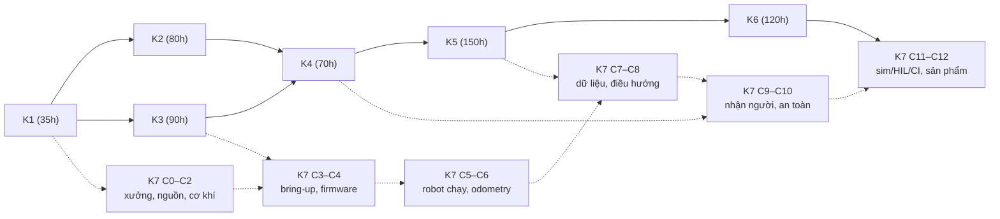

# Giáo trình Robotics Data Infrastructure — mục lục tổng

Bộ giáo trình cho một backend engineer 8 năm chuyển sang **robotics data infrastructure** (data platform, test & validation, sim & eval, MLOps nhẹ cho robot), học ~6–7h/tuần, phần cứng là mini PC N100 + ESP32-S3 + đồ đo cơ bản, và **đang học bật tắt mỏ hàn**. Hợp đồng soạn: `_QUY-CHUAN.md`. Trạng thái công việc: `_TRANG-THAI.md`.

---

## 1. Cách dùng bộ giáo trình

Mỗi bài có cùng một khung (câu chuyện → mô hình → cầu nối backend → … → làm → nếu ra khác → tự kiểm → nguồn). Năm quy ước dưới đây quyết định cách bạn đọc.

### 🔒 Niêm phong: dự đoán trước, mở sau

Con số kỳ vọng, đáp án tự kiểm, kết luận thí nghiệm nằm trong khối gập:

> `🔒 MỞ SAU KHI COMMIT prediction.md`

Quy trình: đọc đề bài và phương pháp → viết dự đoán của bạn (số, kèm khoảng tin nếu được) vào `prediction.md` → **commit** → làm/đo → rồi mới mở khối. Thời gian commit là bằng chứng bạn dự đoán trước; nhiều gate kiểm điều này. Mở trước thì bài vẫn đọc được, nhưng bạn mất thứ quý nhất: biết mô hình của mình sai ở đâu.

### Nhãn tin cậy

Mọi con số và khẳng định về API, phiên bản, phần cứng, giá đều có nhãn:

| Nhãn | Nghĩa | Bạn làm gì |
|---|---|---|
| `[spec]` | Datasheet, chuẩn, tài liệu chính thức | Tin, nhưng kiểm đúng revision cho linh kiện của bạn |
| `[chuẩn]` | Kiến thức giáo khoa ổn định | Tin |
| `[ước lượng]` | Ước tính, kèm cách tính | Dùng để lên kế hoạch, không dùng làm ngưỡng |
| `[tự đo]` | Chưa kiểm chứng | **Phải đo trên máy mình** trước khi dựa vào |

Giá ghi `[ước lượng 10/2026]` — kiểm lại ở cửa hàng. Khối code ghi `# [đã chạy]` hoặc `# [chưa chạy]` ở dòng đầu.

### "Gãy ở chỗ:"

Mọi phép so sánh với backend (hàng đợi, proxy, Kafka, CI…) đều kèm **"Gãy ở chỗ:"** và hậu quả nếu dùng nhầm. Phép so sánh giúp bạn vào bài nhanh; chỗ gãy là nơi bài thật sự dạy. Nếu bạn tự nghĩ ra một phép so sánh mới, tự viết dòng "Gãy ở chỗ" cho nó trước khi tin.

### Chấm mô hình, không vuốt ve

Khi bài nêu một mô hình trực giác (kể cả mô hình thật bạn từng nói trong `_ref/cau-hoi-cua-ban-trong-gemini.md`), nó chấm **ĐÚNG / ĐÚNG MỘT PHẦN / SAI**, chỉ chỗ gãy, đưa **một phản ví dụ**. Rủi ro lớn nhất của cách học "trừu tượng hóa rồi hỏi ngược" là tích lũy mô hình đúng một nửa mà cảm giác rất hiểu. Dùng AI ở bước giải thích thì dùng đúng prompt này: "Chấm mô hình của tôi ĐÚNG / ĐÚNG MỘT PHẦN / SAI, chỉ chỗ gãy, một phản ví dụ, không khen." **Không dùng AI ở bước dự đoán.**

### Mỗi khái niệm khó có một dạng không phải chữ

Sơ đồ Mermaid, timing diagram, bảng số, hoặc **mô phỏng Python ≤60 dòng** chạy được trước khi đụng phần cứng. Chạy mô phỏng trước, dự đoán, rồi mới đo thật.

---

## 2. Bảy khóa chính

| Khóa | Thư mục | File | Giờ | Trạng thái |
|---|---|---|---|---|
| **K1** Từ zero đến đo được | `khoa-1/` | `00-tong-quan.md`, `phan-a-nen.md`, `phan-b-dung-cu.md`, `phan-c-do-that.md`, `phan-d-du-lieu-tren-day.md` | 35 | ✅ đủ, hợp nhất Claude × Kiro |
| **K2** Dữ liệu robot mà không cần robot | `khoa-2/` | `00-tong-quan.md`, `m1-mcap-cong-cu.md`, `m2-dataset-audit.md` | 80 | ✅ đủ, hợp nhất (số đo trên `data/` còn `[tự đo]`) |
| **K3** Chuỗi audio | `khoa-3/` | `00-tong-quan.md`, `m1-chuoi-phat.md`, `m2-do-tre.md`, `m3-tts-kien-truc.md`, `m4-he-thong-v1.md` | 90 (tổng bài 92) | ✅ đủ, hợp nhất |
| **K4** Đo hiệu năng inference trên edge | `khoa-4/` | `00-tong-quan.md`, `m1-nen-tang.md`, `m2-harness.md`, `m3-truc-chat-luong.md`, `m4-nhieu-target.md`, `m5-publish.md` | 70 | ✅ đủ 15 bài + gate; m1 hợp nhất Claude × Kiro, m3/m5 đã review; Bài 4–6, 10–12 chỉ có một bản, chưa review độc lập |
| **K5** Cảm biến, đồng bộ thời gian, data platform | `khoa-5/` | `00-tong-quan.md`, `m0-chon-phan-cung.md`, `m1-cam-bien.md`, `m2-dong-bo-thoi-gian.md`, `m3-data-stack.md`, `m4-van-hanh.md` | 150 | ✅ đủ 19 bài + Gate Module 0 + Gate K5; m0–m1 Bài 3–4 hợp nhất với Kiro; phần còn lại bản Claude, chưa review độc lập |
| **K6** Hạ tầng mô phỏng và đánh giá | `khoa-6/` | `00-tong-quan.md`, `m1-determinism.md`, `m2-kich-ban.md`, `m3-quy-mo.md`, `m4-danh-gia-regression.md`, `m5-sim-to-real.md`, `m6-ci-publish.md` | 120 | ✅ đủ, review độc lập |
| **K7** Dựng robot từ xưởng (khóa build mới) | `khoa-7/` | `00-tong-quan.md`, `_KE-HOACH-K7.md`, `c00-xuong-an-toan.md`, `c01-he-nguon.md`, `c02-co-khi.md`, `c03-bring-up-tren-ban.md`, `c04-firmware-esp32.md`, `c05-lap-hoan-chinh.md`, `c06-odometry.md`, `c07-cam-bien-ghi-du-lieu.md`, `c08-dieu-huong.md`, `c09-nhan-nguoi-privacy.md`, `c10-an-toan-van-hanh.md`, `c11-sim-hil-ci.md`, `c12-san-pham-confession.md` | 561 lõi (597 có tùy chọn) | ✅ đủ 13 chặng; C0–C1 review an toàn, C2–C12 chưa review |

Mỗi khóa mở bằng `00-tong-quan.md`: bản đồ khóa, bảng bài → giờ → viên nang nền cần trước → quyết định ra được, gate, bẫy, danh sách sửa lỗi so với bản gốc, và "Cách học khóa này". **Gate chính thức nằm cuối file module/chặng tương ứng.** `khoa-7/_nguyen-lieu-cu/` là bản K7 cũ (7A–7E) chỉ dùng làm nguyên liệu, không học theo.

## 3. Bảy khóa nền F (viên nang)

| Khóa nền | File (`nen-tang/`) | Giờ |
|---|---|---|
| F1 Khoa học đo lường và thống kê thực nghiệm | `F1-do-luong-thong-ke.md` | 31 |
| F2 Kỹ nghệ kiểm thử và đánh giá | `F2-kiem-thu-danh-gia.md` | 36 |
| F3 Hệ thống dữ liệu và xử lý luồng | `F3-du-lieu-xu-ly-luong.md` | 39 |
| F4 Thời gian và đồng hồ | `F4-thoi-gian-dong-ho.md` | 34 |
| F5 Nhúng, thời gian thực và tín hiệu số | `F5-nhung-thoi-gian-thuc.md` | 37 |
| F6 Mô hình hóa, mô phỏng, V&V, nhận dạng hệ thống | `F6-mo-hinh-mo-phong-vv.md` | 37 |
| F7 Hiệu năng và vận hành ở quy mô | `F7-hieu-nang-van-hanh.md` | 31 |
| **Tổng** | | **245** |

F được chia thành **viên nang** có mã cố định `Fx.y` (danh mục ở `_QUY-CHUAN.md` mục 6). Bài trong khóa chính trỏ `→ F1.4` khi cần. **Không học F trọn từ đầu.** Học đúng lúc: khi một bài ghi "Cần trước: → F5.2", đọc viên nang đó ngay trước bài. F trọn chỉ dành cho khi bạn muốn đào sâu một mảng.

---

## 4. Thứ tự học đề xuất

**Đường chính:** K1 (song song K2, vì K2 thuần phần mềm, làm ở tuần bận) → K3 → K4 → K5 → K6. K4 trước K3 được nếu thiếu giờ (K4 không bắt buộc K1, K3).

**Đường ray K7 song song** (mũi tên đứt). K7 không phải khóa cuối:

| Khi đang học | Làm K7 |
|---|---|
| K2 | C0 Xưởng, C1 Hệ nguồn (tốt nhất sau K3 Bài 5–6), C2 Cơ khí |
| K3–K4 | C3 Bring-up trên bàn (sau K3 M1), C4 Firmware |
| K4 | C5 Lắp hoàn chỉnh, C6 Odometry |
| K5 | C7 Cảm biến, ghi dữ liệu (sau K5 M1–M3), C8 Điều hướng |
| K6 | C9 Nhận người (cần K4), C10 An toàn |
| Sau K6 | C11 Sim/HIL/CI (cần K6 trọn), C12 Sản phẩm (cần K3 trọn) |

Bảng đủ (kèm viên nang F từng chặng) ở `khoa-7/00-tong-quan.md` mục 4. Khi chặng K7 cần kỹ thuật mà khóa chính chưa dạy tới, bài K7 tự chứa bản tối thiểu và trỏ sang bản đầy đủ.

**Học đúng lúc viên nang F:** mỗi bài ghi "Cần trước: → Fx.y". Tuần crunch (0–2h) là tuần tốt để đọc viên nang sắp cần, không phải để lắp phần cứng.

---

## 5. Ngân sách giờ — trung thực

| Kịch bản | Giờ | Ở 6,5h/tuần `[ước lượng]` |
|---|---|---|
| Ngân sách gốc | 650h | ~2 năm |
| K1–K6 | 545h (35 + 80 + 90 + 70 + 150 + 120) | ≈ 1,6 năm |
| K1–K6 + K7 gốc (340h) | 885h | ≈ 2,6 năm |
| **K1–K6 + K7 mới lõi (561h)** | **1.106h** | ~170 tuần ≈ **3,3 năm** |
| K1–K6 + K7 mới có tùy chọn (597h) | 1.142h | ≈ 3,4 năm |
| K1–K6 + **đường lõi tối thiểu K7** (~340h) | **885h** | ≈ 2,6 năm |
| + khóa nền F trọn | +245h | +0,7 năm |

- Mọi kịch bản có K7 đều **vượt** ngân sách gốc 650h. Đây là quyết định của bạn, ghi vào `decisions.md`, không phải điều giáo trình giấu.
- **Đường lõi tối thiểu K7** (C0–C7 trọn + C10.1–C10.2 + C11.1–C11.3): robot đi được, an toàn, có dữ liệu, có sim và có câu trả lời "sim có dự đoán đúng thực tế không". Xem `khoa-7/00-tong-quan.md` mục 6 (có một điểm chưa khớp với C11.3 cần bạn quyết).
- F học đúng lúc thì ít hơn 245h nhiều; F trọn là phần thêm.
- Con số chưa tính tuần crunch, chờ hàng, làm lại. Người mới làm phần cứng thường vượt ở các chặng có lắp.
- Mỗi khóa có **trần cứng** (ví dụ K3 140h, K4 95h, K6 160h); K7 có trần theo chặng = giờ chặng × 1,3 (`khoa-7/00-tong-quan.md` mục 7). Chạm trần → FAIL action: dừng, publish nguyên trạng, ghi cái gì xong.

**Tiền:** K7 ước ~13,6–28,6 triệu VNĐ phần cứng mới cho 13 chặng `[ước lượng 10/2026]`, chưa tính mini PC và đồ K1–K5. Chi phí từng khóa ghi trong `00-tong-quan.md` của khóa.

---

## 6. Trạng thái review — đọc trước khi tin

Chi tiết và việc còn lại: `_TRANG-THAI.md`. Phối hợp hai nhóm soạn (Claude, Kiro): `_PHOI-HOP.md`.

| Phần | Mức kiểm |
|---|---|
| K1, K2, K3 | **Hợp nhất Claude × Kiro**: mỗi bài có hai bản độc lập, chọn bản nền, ghép, giải mâu thuẫn bằng tính/chạy/tra |
| K6 | Viết + **review độc lập** |
| K7 C0–C1 | **Review an toàn** (pin, điện, đồng hồ đo) — đã sửa theo review |
| K7 C2–C12 | Viết xong, **chưa review độc lập**. Ưu tiên review an toàn C2–C5 (motor quay lần đầu, cấp điện cả robot) và C8–C10 (tự đi gần người, dữ liệu mặt, E-stop) |
| F1–F7 | Viết xong, **chưa review độc lập** (F4 review dở, vài sửa nhỏ đã giữ) |
| K4, K5 | Đủ bài. Phần có hai bản (K4 m1; K5 m0, m1 Bài 3–4) đã **hợp nhất**; K4 m3, m5 đã review. Các bài chỉ có một bản (K4 Bài 4–6, 10–12; K5 Bài 5–19, hai gate, tổng quan K5) **chưa review độc lập** |

Với phần chưa review: các nhãn `[tự đo]` và `[spec, kiểm datasheet]` càng phải được kiểm. Với phần cứng, **không làm theo một bước lắp chưa review mà không tự kiểm checkpoint đo của nó**; quy tắc "KHÔNG …" trong mục An toàn của mỗi chặng K7 luôn áp dụng.

## 7. Nhật ký hợp nhất và review

Thư mục `_hop-nhat/` — mỗi bài: bản nền, phần ghép, mâu thuẫn và cách giải, lỗi tìm thấy ở từng bản. Đây cũng là phản hồi cho bạn biết mỗi bên soạn mạnh/yếu ở đâu.

| File | Nội dung |
|---|---|
| `_hop-nhat/khoa-1.md` | Hợp nhất K1 |
| `_hop-nhat/khoa-2-m1.md`, `khoa-2-m2.md` | Hợp nhất K2 |
| `_hop-nhat/khoa-3-m1.md`, `khoa-3-m2-m4.md` | Hợp nhất K3 |
| `_hop-nhat/khoa-4-m1-m3-m5.md` | Hợp nhất K4 |
| `_hop-nhat/ghi-chu-cho-K4-K5.md` | Lỗi K4/K5 do các agent F phát hiện, phải áp khi hợp nhất |
| `_hop-nhat/review-khoa-6.md` | Review độc lập K6 |
| `_hop-nhat/review-khoa-7-c00-c01.md` | Review an toàn K7 C0–C1 |

## 8. File khác trong thư mục

| File | Vai trò |
|---|---|
| `_QUY-CHUAN.md` | Hợp đồng soạn: người học là ai, nguồn sự thật, năm nguyên tắc, khung bài, danh mục viên nang, lỗi đã biết |
| `_TRANG-THAI.md` | Bàn giao giữa các phiên: đã xong, còn lại, câu hỏi chờ bạn quyết |
| `_PHOI-HOP.md` | Chia việc và quy trình hợp nhất giữa hai nhóm soạn |
| `khoa-7/_KE-HOACH-K7.md` | Kế hoạch K7: mã chặng, giờ, ràng buộc phần cứng, quyết định đã chốt |
| `_ref/` | Tham chiếu không sửa: `cau-hoi-cua-ban-trong-gemini.md` (giọng và câu hỏi thật của bạn), `muc-luc-bai-goc.md`, `danh-gia-ban-dau.md`, các brief cho agent (`brief-writer.md`, `brief-merger.md`, `brief-reviewer.md`, `brief-F.md`) |
| `_scratch/` | Nháp của agent (gitignore), bỏ qua |

Nguồn gốc ở gốc repo: `00-lo-trinh-tong.md`, `khoa-1-…md` … `khoa-7-robot-hoan-chinh.md`, `khoa-7-phu-luc.md`, `CONVENTIONS.md` (REP-103/105, message chuẩn ROS 2, metadata ở channel MCAP). Khi giáo trình và bản gốc khác nhau, mỗi `00-tong-quan.md` có mục "sửa lỗi so với bản gốc" nói rõ vì sao.
