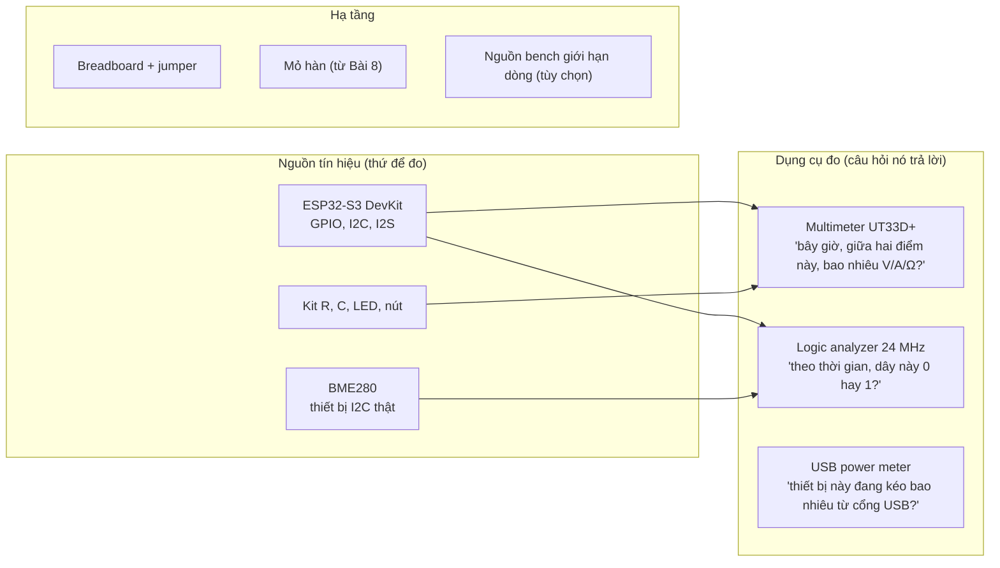
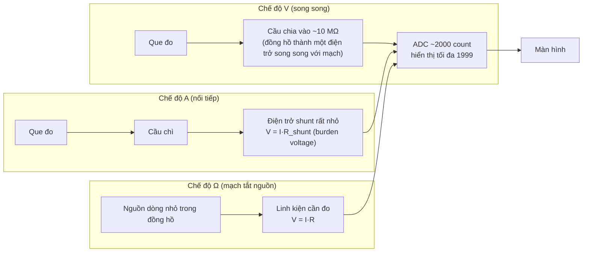
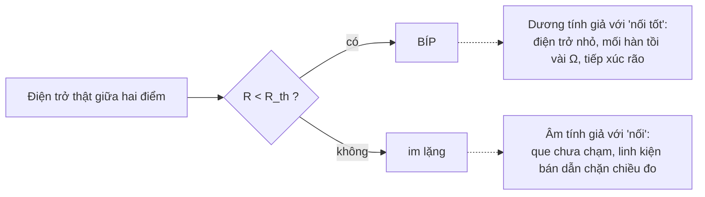

# Khóa 1 · Phần B — Dụng cụ: mỗi món là gì và cầm thế nào (5h)

Năm bài, làm khi hàng đợt 1 về (tuần 2 trong lịch). Trục xuyên suốt: **mỗi dụng cụ là một phép đo có sai số và có cách hỏng riêng**. Trước khi tin một con số từ đồng hồ hay logic analyzer, bạn phải biết resolution, accuracy, và giới hạn lấy mẫu của chính dụng cụ đó (→ F1.1, F5.5). Đây là phần còn thiếu trong bộ "script chấm pass/fail/inconclusive" bạn đã tự làm ở nghề backend: lý thuyết về tỉ lệ sai của chính dụng cụ kiểm tra.

Giờ từng bài là cách chia 5h của bản gốc (bản gốc chỉ ghi giờ cho cả phần): Bài 4 0.5h · Bài 5 1.5h · Bài 6 1h · Bài 7 1.5h · Bài 8 0.5h (chỉ khi cần hàn).

---

## Bài 4 — Mua gì, và mỗi món để làm gì (0.5h) (khung rút gọn)

> **Vị trí:** Bài 3 → **Bài 4** → Bài 5 · **Cần trước:** không · **Sau bài này bạn quyết định được:** danh sách đợt 1 cụ thể, món nào mua hai cái, có mua nguồn bench hay không, và kiểm gì ngay khi hàng về (trong hạn đổi trả).

### 1. Câu chuyện — ai đã khổ vì chuyện này

Câu chuyện có thật nằm ngay trong repo này. Danh sách đợt 1 ở `00-lo-trinh-tong.md` (Phần 5) chỉ có dụng cụ đo: multimeter, logic analyzer, USB power meter, breadboard, linh kiện thụ động, mỏ hàn. ESP32-S3 và BME280 nằm ở **đợt 3**. Nghĩa là khi hàng về, trên bàn có que đo mà **không có tín hiệu số nào để đo**: Bài 7, 12, 13 không làm được. Bản Khóa 1 đã sửa bằng cách kéo ESP32-S3 và BME280 lên đợt 1. Bài học chung: một bộ công cụ quan sát mà không có nguồn sự kiện thì giống dựng Grafana trước khi có service nào phát metric.

### 2. Mô hình tư duy



| Món | Giá ~ [ước lượng, giá 2026 tại HN] | Nó là gì | Câu hỏi nó trả lời | Giới hạn phải biết (chi tiết ở bài sau) |
|---|---|---|---|---|
| **Multimeter UNI-T UT33D+** | 285k | Đồng hồ vạn năng chỉnh thang tay, ~2000 count | V, A, Ω, thông mạch tại một thời điểm | Resolution và accuracy theo thang; trở kháng vào ~10 MΩ; thang mA có cầu chì (Bài 5) |
| **Logic analyzer USB 8 kênh 24 MHz** (clone, chip FX2) | 150–250k | Hộp nhỏ 8 dây kẹp | Mức 0/1 theo thời gian, decode giao thức | **Không** đo điện áp; ngưỡng cố định; lưới thời gian 41.7 ns; dải vào tối đa ~5 V (Bài 7) |
| **USB power meter** | 150–250k | Que cắm giữa sạc và thiết bị | V và I thiết bị đang kéo qua USB | Chỉ trung bình chậm, không thấy xung dòng ngắn `[tự đo]` |
| **Breadboard 830 lỗ** | ~60k | Bảng cắm không cần hàn | — | Tiếp xúc rão, rail có thể đứt giữa (Bài 6) |
| **Bộ jumper M-M / M-F / F-F** | ~40k | Dây cắm sẵn đầu | — | Đứt ngầm bên trong; lõi mảnh (Bài 2) |
| **Kit điện trở + tụ + LED + nút** | 150–250k | Túi linh kiện cơ bản | — | Kit điện trở kim loại thường 5 vòng màu, ±1% (Bài 5) |
| **ESP32-S3 DevKit** ⭐ | ~200k | Vi điều khiển có WiFi | **Nguồn tín hiệu để đo** | Logic 3.3 V; chân nào làm gì tùy biến thể board |
| **BME280 (I2C)** ⭐ | ~80k | Cảm biến nhiệt/ẩm/áp suất | Thiết bị I2C thật để thấy ACK/NACK | Hàng bán nhầm/nhái BMP280 (không có độ ẩm) khá phổ biến |
| **Mỏ hàn chỉnh nhiệt T12/936 + thiếc + flux** | 400–700k | | Hàn chân module, từ Bài 8 | Chỉ cần nếu module chưa hàn sẵn chân |
| **Nguồn bench có giới hạn dòng** | 600k–1.5tr | Nguồn để bàn vặn được V và giới hạn A | Cấp nguồn có **trần dòng** | Tùy chọn nhưng rất nên có: chế độ CC là rate limiter đúng nghĩa (Bài 1) |

Cộng lại [ước lượng]: không nguồn bench, mỗi món một cái ≈ 1.5–2.1tr; thêm ESP32 và BME280 thứ hai (nguyên tắc "mua 2") ≈ 1.8–2.4tr; thêm nguồn bench ≈ 2.4–3.9tr. Con số "~1.8–2.8tr" của bản gốc khớp với trường hợp "mua 2" và không có nguồn bench, hoặc có nguồn bench loại rẻ.

**Mua ở Hà Nội** (giữ theo bản gốc, địa chỉ có thể đổi `[tự đo]`): Linh Kiện Điện Tử 3M (Số 9, Ngõ 40/2 Tạ Quang Bửu, Bách Khoa) có gần hết; Lập Trình Nhúng A-Z (Cầu Giấy) có module nhúng; Chợ Trời (Thịnh Yên, Hai Bà Trưng) cho linh kiện thụ động rẻ và có ngay. Danh sách cửa hàng online ở `00-lo-trinh-tong.md` Phần 5.

**Nguyên tắc mua:** với mọi module rẻ và quan trọng, **mua 2 cái**. Không có cái thứ hai để so, bạn không phân biệt được "module chết" với "tôi cấu hình sai", và sẽ mất nhiều ngày cho một câu hỏi trả lời được trong 30 giây.

**An toàn — đọc một lần rồi thôi.** Mọi thứ trong khóa chạy ở 3.3 V/5 V DC, không có nguy hiểm điện giật. Ba rủi ro thật:
1. **Ngắn mạch** — nối thẳng + với −. Nguồn USB tự ngắt; pin LiPo thì không, nó có thể cháy. Chưa dùng LiPo trong khóa này.
2. **Mỏ hàn ~350 °C** — bỏng. Đặt vào giá mỗi lần buông tay, không ngoại lệ.
3. **Khói flux** — flux gốc nhựa thông (rosin/colophony) là tác nhân gây hen nghề nghiệp đã được ghi nhận [chuẩn]. Mở cửa sổ hoặc dùng quạt hút, đừng cúi mặt vào luồng khói. Với thiếc có chì: rửa tay sau khi hàn, không ăn uống ở bàn hàn.

Không bài nào chạm điện lưới 220 V. Nếu một hướng dẫn bảo bạn mở adapter nguồn ra, dừng lại.

### 3. Cầu nối từ backend

| Backend bạn biết | Ở đây | Gãy ở chỗ | Nếu dùng nhầm thì |
|---|---|---|---|
| `curl` một endpoint | Multimeter: một câu hỏi, một con số | `curl` trả đúng byte server gửi. Đồng hồ trả một **ước lượng** có sai số, và que đo tự thay đổi mạch (Bài 5) | Ghi "3.2847 V" từ một đồng hồ chỉ đúng tới ±0.02 V; giả vờ chính xác |
| `tcpdump` | Logic analyzer: ghi lại toàn bộ lưu lượng | `tcpdump` ghi byte thật. Logic analyzer ghi **cách nó tự diễn giải** dây theo ngưỡng và nhịp lấy mẫu của nó: nó là một bên nhận nữa, có thể sai khác với bên nhận thật (Bài 7) | Tin capture như sự thật tuyệt đối khi thiết bị thật vẫn lỗi |
| Metric tài nguyên theo process (cAdvisor, `top`) | USB power meter | Metric phần mềm lấy mẫu đều đặn; power meter rẻ trung bình hóa chậm, bỏ sót xung dòng ms (WiFi TX, motor khởi động) | Kết luận "ESP32 chỉ kéo 80 mA" trong khi đỉnh ngắn cao hơn nhiều, rồi ngạc nhiên vì brownout |
| Circuit breaker / rate limit ở gateway | Nguồn bench ở chế độ CC | Breaker cắt hẳn; nguồn CC **giữ** dòng ở trần và hạ điện áp. Mạch vẫn chạy, nhưng ở điện áp thấp hơn bạn nghĩ | Đặt trần dòng quá thấp, mạch "chạy lạ" vì thiếu áp, đi debug code |
| Known-good reference / differential testing | Mua 2 module | Hai module cùng lô có thể cùng lỗi (cùng hàng nhái) | So hai con BMP280 bán nhầm thành BME280, cả hai "giống nhau" nên kết luận cấu hình đúng mà vẫn không có độ ẩm |

**Chấm mô hình:**
- *"Mua 2 cái là phí; debug kỹ thì một cái cũng đủ"* — **SAI** ở tầng này. Phản ví dụ: BME280 không trả lời I2C. Với một module, không gian giả thuyết gồm module chết, mối hàn, dây, địa chỉ, code. Với module thứ hai, một phép thay thế 30 giây cắt đôi không gian đó. Đây là bisect bằng phần cứng; chi phí 80k rẻ hơn một buổi tối.
- *"Có logic analyzer thì không cần oscilloscope"* — **ĐÚNG MỘT PHẦN** cho khóa này. Đúng: mọi gate của Khóa 1 chỉ cần mức 0/1 và thời gian. Gãy: logic analyzer không thấy cạnh tròn, ringing, mức điện áp lưng chừng; khi lỗi nằm ở hình dạng tín hiệu (pull-up quá lớn, dây dài), nó chỉ cho bạn thấy "lỗi lác đác" mà không cho thấy vì sao (→ roadmap: oscilloscope là 🟡).

### 6. Làm

1. Đặt hàng theo bảng. Ghi giá thật và nơi mua vào `decisions.md` (để Khóa 3–7 dự trù sát hơn).
2. Khi hàng về, **kiểm trong hạn đổi trả**:
   - Multimeter: lắp pin (UT33D+ dùng 2 pin AAA theo mô tả của nhà bán và một review độc lập — kiểm sách hướng dẫn trong hộp `[tự đo]`), đo một pin AA (Bài 5), chập hai que ở thang Ω thấp nhất phải ra gần 0, chế độ thông mạch phải kêu.
   - Logic analyzer: cắm USB, chạy `lsusb` (Linux) và ghi dòng VID:PID nó hiện ra `[tự đo]`; cài PulseView theo Bài 7.
   - ESP32-S3: cắm bằng cáp USB **có dây dữ liệu** (nhiều cáp chỉ sạc). Trên Linux, phải thấy một thiết bị `/dev/ttyACM*` hoặc `/dev/ttyUSB*` mới xuất hiện (`ls /dev/tty*` trước và sau khi cắm). Ghi lại board có mấy cổng USB và cổng nào là cổng nạp.
   - BME280: ghi nhãn trên chip và trên module; chip ID sẽ kiểm ở Bài 11–12.
   - Breadboard: kiểm theo Bài 6.
3. Dán nhãn hai module cùng loại (A/B) bằng bút. Từ nay mọi `analysis.md` ghi rõ dùng con nào.

### 8. Nếu ra khác

| Triệu chứng | Nguyên nhân khả dĩ | Kiểm bằng cách | Sửa |
|---|---|---|---|
| ESP32-S3 cắm vào không hiện thiết bị nào | Cáp chỉ sạc; cắm nhầm cổng; thiếu quyền | Thử cáp khác đã biết có dữ liệu; `dmesg -w` khi cắm | Đổi cáp; thêm user vào nhóm `dialout` |
| Logic analyzer không hiện trong `lsusb` | Cáp/cổng USB; hộp lỗi | Thử cổng khác, máy khác | Đổi trả |
| Màn hình đồng hồ mờ, số nhảy, hiện sai | Pin yếu | Thay pin mới, đo lại pin AA đã biết | Thay pin (loại theo sách hướng dẫn) |
| Module "BME280" không có độ ẩm, chip ID khác `0x60` | Được bán BMP280 (chip ID `0x58`) | Đọc chip ID ở Bài 12; nhìn ký hiệu trên vỏ chip | Đổi hàng; ghi vào `decisions.md` |
| Tổng tiền vượt ngân sách | Thêm nguồn bench | Bảng cộng ở phần 2 | Hoãn nguồn bench, dùng USB có bảo vệ; nhưng không bỏ ESP32/BME280 |

### 9. Câu hỏi ngược

1. **[Vì sao không]** Vì sao không mua luôn một logic analyzer xịn (100 MS/s trở lên, có ngưỡng chỉnh được) thay cho clone 24 MHz?
   <details><summary>Hướng nghĩ</summary>Liệt kê tín hiệu nhanh nhất của Khóa 1–3 và số mẫu mỗi chu kỳ ở 24 MS/s (Bài 7). Khi nào clone thành điểm nghẽn: nhìn SPI nhanh, đo jitter. Mua theo gate, không theo ước muốn (`00-lo-trinh-tong.md` mục 0.3).</details>
2. **[Quy mô]** Phòng lab có 20 robot, mỗi robot một ESP32. Nguyên tắc "mua 2" biến thành gì? Bạn cần bao nhiêu đơn vị dự phòng, và đo cái gì để quyết định con số đó?
   <details><summary>Hướng nghĩ</summary>Từ "một cái để so" thành "kho dự phòng theo tỉ lệ hỏng". Cần dữ liệu: tỉ lệ hỏng mỗi tháng, thời gian đặt hàng bù. Giống capacity planning cho spare node; khác ở chỗ thời gian bù hàng tính bằng tuần.</details>
3. **[Failure mode]** Hai con BME280 mua cùng chỗ, cùng lô, cả hai đều lỗi giống nhau. "Mua 2" có còn giúp bạn không?
   <details><summary>Hướng nghĩ</summary>Hai mẫu không độc lập thì so sánh không cho thông tin. Lỗi chung nguồn (common-mode failure) cũng là lý do replica cùng AZ, cùng phiên bản không cứu được nhau. Cách sửa: hai nguồn mua khác nhau, hoặc một tham chiếu đã biết đúng (datasheet: chip ID).</details>
4. **[Nếu…thì]** Nếu chỉ được chọn một trong hai: nguồn bench giới hạn dòng, hay USB power meter. Chọn cái nào cho Khóa 1–3, vì sao?
   <details><summary>Hướng nghĩ</summary>Một cái phòng ngừa (giới hạn thiệt hại khi sai), một cái quan sát (thấy đang tiêu bao nhiêu). Nghĩ tới chi phí của lần cháy đầu tiên so với giá trị của con số dòng trung bình.</details>

### 12. Đọc thêm và tự kiểm tra

- **Nguồn gốc:** sách hướng dẫn UT33D+ trong hộp (thông số accuracy từng thang — bạn sẽ chép nó ở Bài 5).
- **Giải thích:** EEVblog (Dave Jones), các tập về chọn multimeter cho người mới.
- **Đào sâu (tùy chọn):** `00-lo-trinh-tong.md` Phần 5 (các đợt mua sau và điều kiện kích hoạt).
- **Tự kiểm tra:** (1) với mỗi món trong bảng, nói trong một câu nó trả lời câu hỏi gì; (2) vì sao ESP32 và BME280 thuộc đợt 1 của Khóa 1? (3) câu dưới.

  a. Bạn có đồng hồ, logic analyzer, breadboard, kit linh kiện, nhưng chưa có ESP32. Những bài nào của Khóa 1 làm được, bài nào không?

  <details><summary>Đáp án</summary>

  a. Làm được: Bài 5, 6, 8, 9, 10 (cần nguồn 5 V: cổng USB qua cáp cắt hoặc USB breakout), 11 (đọc datasheet). Không làm được: Bài 7 (chưa có tín hiệu số, trừ khi có nguồn tín hiệu khác), 12, 13. Đó là lý do đợt 1 đã sửa.
  </details>

---

## Bài 5 — Multimeter: cầm thế nào cho đúng, và nó sai bao nhiêu (1.5h)

> **Vị trí:** Bài 4 → **Bài 5** → Bài 6 · **Cần trước:** Bài 1; → F1.1 (đọc trước hoặc song song) · **Sau bài này bạn quyết định được:** chọn thang đo cho một phép đo, viết mọi số đo kèm khoảng sai số của chính đồng hồ, và phán một kết quả là PASS / FAIL / KHÔNG KẾT LUẬN ĐƯỢC thay vì chỉ PASS / FAIL.

### 1. Câu chuyện — ai đã khổ vì chuyện này

Cho tới cuối thập niên 1970, các phòng đo quốc gia mỗi nơi báo cáo "sai số" theo một kiểu: nơi cộng tuyến tính, nơi cộng bình phương, nơi chỉ ghi độ lệch chuẩn của các lần đo lặp, bỏ qua sai số của chính dụng cụ. Hai phòng đo cùng một vật ra hai con số "± bao nhiêu" không so được với nhau. BIPM triệu tập nhóm làm việc năm 1980; kết quả cuối cùng là *Guide to the Expression of Uncertainty in Measurement* (GUM), xuất bản năm 1993 [chuẩn]. Ý tưởng cốt lõi của GUM chính là thứ bạn cần ở bài này: độ bất định có hai loại, **loại A** (đánh giá bằng thống kê từ các lần đo lặp) và **loại B** (lấy từ thông số của nhà sản xuất, chứng chỉ hiệu chuẩn, kinh nghiệm). Dòng `±(0.5% + 2)` in trong sách hướng dẫn UT33D+ là một nguồn loại B. Bỏ nó đi là báo cáo một con số mà không ai kiểm được.

Ở mức người mới, cái khổ đến sớm hơn và thô hơn: cắm que đỏ ở lỗ đo dòng rồi đi đo điện áp nguồn, đứt cầu chì trong mười phút đầu. Bài này xử lý cả hai.

### 2. Mô hình tư duy

Bên trong đồng hồ chỉ có **một** thứ đo thật: một ADC đo điện áp nhỏ. Mọi chế độ khác là cách biến đại lượng cần đo thành điện áp đó.



Ba lỗ cắm và núm xoay (giữ theo bản gốc):

| Lỗ | Que | Dùng khi |
|---|---|---|
| **COM** | đen | Luôn ở đây, không bao giờ đổi |
| **VΩmA** | đỏ | Điện áp, điện trở, thông mạch, dòng nhỏ (thang mA) |
| **10A** | đỏ | Chỉ khi dòng có thể vượt trần thang mA |

| Ký hiệu núm | Nghĩa | Cách cắm |
|---|---|---|
| `V⎓` / `DCV` | Điện áp một chiều | **Song song** — chạm hai que vào hai điểm, mạch vẫn nguyên |
| `Ω` | Điện trở | **Linh kiện rời mạch, mạch tắt nguồn** |
| `A⎓` / `mA` / `µA` | Dòng một chiều | **Nối tiếp** — cắt mạch, cho dòng chạy xuyên qua đồng hồ |
| `)))` | Thông mạch (kêu bíp) | Tắt nguồn; kêu khi điện trở giữa hai que dưới một ngưỡng |

UT33D+ là đồng hồ **chỉnh thang tay** (theo mô tả của nhà bán và review độc lập; kiểm núm xoay của bạn `[tự đo]`): bạn chọn thang, và mỗi thang có một resolution và một accuracy riêng.

**Ba khái niệm khác nhau** (→ F1.1):

| Khái niệm | Câu hỏi | Ở UT33D+ lấy từ đâu |
|---|---|---|
| **Resolution** | Bước nhỏ nhất màn hình hiện được | Thang chia 2000 count. Thang 2000 mV → 1 mV; thang 20 V → 10 mV |
| **Accuracy** | Số hiển thị có thể lệch giá trị thật bao nhiêu | Sách hướng dẫn: `±(a% của số đọc + b digit)`, mỗi thang một dòng. "Digit" = b lần resolution của thang đó |
| **Precision (độ lặp)** | Đo lại nhiều lần, số nhảy bao nhiêu | Tự đo: đọc 10 lần, ghi min–max (loại A) |

Thông số tham khảo để **bắt đầu tra** (nguồn: mô tả của nhà phân phối và review độc lập; sách hướng dẫn trong hộp là chuẩn `[tự đo]`): DCV các thang 200 mV / 2000 mV / 20 V / 200 V / 600 V, khoảng `±(0.5% + 2)` (có nguồn ghi `±(0.7% + 3)` cho một số thang); Ω các thang 200 Ω … 200 MΩ, khoảng `±(0.8% + 2)` ở các thang giữa; DCA các thang 2000 µA / 20 mA / 200 mA / 10 A, khoảng `±(1% + 2)`; trở kháng vào DCV khoảng 10 MΩ; thông mạch kêu khi dưới khoảng vài chục Ω.

Mô phỏng: phép kiểm "điện trở 1 kΩ ±5% có đạt không" là một **bộ phân loại có dương tính giả và âm tính giả**, vì chính đồng hồ có sai số (→ F2.1).

```python
# [đã chạy]
# Điện trở ghi 1 kΩ ±5%, đo bằng đồng hồ có accuracy ±(a% đọc + b digit) ở thang 2 kΩ.
# Hỏi: tỉ lệ con điện trở TỐT (thật sự trong 950–1050 Ω) bị đồng hồ "đọc" ra ngoài khoảng,
# và tỉ lệ con XẤU lọt vào khoảng? -> phép kiểm là một bộ phân loại có FP/FN (→ F2.1).
import numpy as np
rng = np.random.default_rng(1)
N = 1_000_000
A_PCT, B_DIGITS, LSB = 0.8, 2, 1.0   # tra trong manual UT33D+: thang 2 kΩ, resolution 1 Ω  [tự đo]

# Giả định lô điện trở: trải đều ±6% (cố tình có một ít con ngoài ±5% để có "hàng xấu")
true_r = 1000 * (1 + rng.uniform(-0.06, 0.06, N))
# Sai số đồng hồ: giới hạn ±(a%·đọc + b·LSB). Giả định trải đều trong giới hạn (GUM loại B)
lim = A_PCT / 100 * true_r + B_DIGITS * LSB
reading = np.round(true_r + rng.uniform(-1, 1, N) * lim)   # màn hình làm tròn tới 1 Ω

good = (true_r >= 950) & (true_r <= 1050)
pass_ = (reading >= 950) & (reading <= 1050)
print(f"Giới hạn sai số đồng hồ quanh 1 kΩ: ±{A_PCT/100*1000 + B_DIGITS*LSB:.0f} Ω")
print(f"Hàng tốt bị đánh trượt (false reject): {(good & ~pass_).sum()/good.sum():.2%}")
print(f"Hàng xấu lọt qua (false accept):       {(~good & pass_).sum()/(~good).sum():.2%}")
# Guard band: chỉ chấp nhận khi đọc nằm trong [950+g, 1050−g]
g = A_PCT / 100 * 1000 + B_DIGITS * LSB
pass_gb = (reading >= 950 + g) & (reading <= 1050 - g)
print(f"Với guard band ±{g:.0f} Ω: false accept = {(~good & pass_gb).sum()/(~good).sum():.2%}, "
      f"false reject = {(good & ~pass_gb).sum()/good.sum():.2%}")
```

Bốn câu bản chất:

1. **Mọi số đọc là một khoảng**, không phải một điểm. Ghi `1.58 V ± x V (thang 2000 mV, ±(a%+b))`, không ghi `1.58 V`.
2. **Phần `b digit` là sàn tuyệt đối**: ở số đọc nhỏ trên thang lớn, nó chiếm gần hết sai số. Luôn chọn **thang nhỏ nhất không báo OL**.
3. **Dụng cụ đo là một phần của mạch.** Ở chế độ V, đồng hồ là ~10 MΩ song song với điểm đo; ở chế độ A, nó là một điện trở shunt nối tiếp gây sụt áp (burden voltage). Bạn sẽ thấy hiệu ứng này rõ ở Bài 9 (cầu phân áp 1 MΩ).
4. **Khi sai số đồng hồ chồng lên biên của tiêu chí, phán quyết đúng là "không kết luận được"**, không phải PASS hay FAIL. Ngành đo lường gọi cách xử lý này là *decision rule* và *guard band* [chuẩn] — cùng hình dạng với script pass/fail/inconclusive bạn đã tự viết.

### 3. Cầu nối từ backend

| Backend bạn biết | Ở đây | Gãy ở chỗ | Nếu dùng nhầm thì |
|---|---|---|---|
| Timestamp có 6 chữ số thập phân thì "chính xác tới µs" | Màn hình hiện `1.582` | Số chữ số là **resolution**. Accuracy là chuyện khác, in trong sách hướng dẫn. Giống timestamp µs từ một đồng hồ lệch NTP 5 ms | Báo cáo "1.582 V" như sự thật, rồi tranh cãi với người đo ra 1.575 V bằng đồng hồ khác — cả hai đều trong spec |
| Script chấm pass / fail / inconclusive của bạn | Phán quyết điện trở đạt ±5% | Inconclusive của bạn phần lớn đến từ **phi tất định** của hệ được test. Ở đây nó đến từ **sai số của chính dụng cụ chấm**, tính trước được từ spec | Đặt ngưỡng PASS đúng bằng biên spec: hàng xấu lọt qua với tỉ lệ đáng kể mà không ai biết |
| Overhead của profiler/tracing | Trở kháng vào 10 MΩ, burden voltage | Overhead phần mềm chủ yếu làm **chậm**. Đồng hồ làm **đổi điểm làm việc** của mạch (mạch chạy khác đi); nhưng tính được bằng `R // 10 MΩ` hay `I·R_shunt`, nên hiệu chỉnh được | Đo cầu phân áp trở cao ra số thấp, kết luận "điện trở sai" (Bài 9) |
| Health check TCP: cổng mở = service sống | Bíp thông mạch | Bíp chỉ nghĩa "điện trở dưới ngưỡng vài chục Ω". Một điện trở 10 Ω cũng kêu; một mối hàn tồi ~5 Ω cũng kêu | Coi bíp là "nối tốt" (Bài 6, Bài 8) |

**Chấm mô hình:**
- *"Màn hình hiện ba chữ số thập phân nên tôi biết điện áp tới mV"* — **SAI.** Phản ví dụ: pin đọc `1.582` trên thang 2000 mV với `±(0.5%+2)` thì giá trị thật nằm đâu đó trong khoảng rộng gấp nhiều lần 1 mV (tự tính ở phần 5). Hai đồng hồ đúng spec có thể chênh nhau nhiều digit.
- *"Đảo que ra số âm là đo sai"* (người mới hay nghĩ; bản gốc đã sửa) — **SAI.** Điện áp là hiệu có thứ tự `V(đỏ) − V(đen)`; đảo thứ tự thì đổi dấu. Dấu âm là thông tin, không phải lỗi.
- *"Đồng hồ đắt hơn đo đúng hơn trong mọi trường hợp"* — **ĐÚNG MỘT PHẦN.** Đúng với accuracy của ADC. Gãy: với nguồn trở kháng cao, thứ quyết định là **trở kháng vào**, không phải accuracy; một đồng hồ đắt 10 MΩ vẫn kéo sai cầu phân áp 1 MΩ như đồng hồ rẻ 10 MΩ.

### 4. Thuật ngữ

| Mức | Thuật ngữ | Nghĩa trong một câu | Hay bị hiểu nhầm thành |
|---|---|---|---|
| 🟢 | DMM, COM, VΩmA, 10A | Đồng hồ số và ba lỗ cắm | Lỗ nào cũng được |
| 🟢 | Thang đo (range), OL | Dải hiển thị tối đa của một vị trí núm; OL = vượt thang | Lỗi |
| 🟢 | Count (2000 count) | Số giá trị khác nhau màn hình hiện được trên một thang | Accuracy |
| 🟢 | Resolution / accuracy / precision | Bước hiển thị / độ lệch so với giá trị thật / độ lặp | Ba từ đồng nghĩa |
| 🟢 | `±(a% + b digit)` | Giới hạn sai số: phần tỉ lệ + sàn tuyệt đối | Chỉ có phần trăm |
| 🟢 | Continuity | Kêu khi R dưới ngưỡng | "Nối tốt" |
| 🟢 | Mã màu điện trở 4 và 5 vòng | Giá trị + hệ số nhân + sai số | Chỉ có 4 vòng |
| 🟡 | Trở kháng vào (input impedance), probe loading | Đồng hồ là một điện trở song song với điểm đo | Đồng hồ "vô hình" |
| 🟡 | Burden voltage | Sụt áp trên shunt khi đo dòng | — |
| 🟡 | GUM loại A / loại B | Bất định từ thống kê đo lặp / từ spec và nguồn khác | Chỉ loại A là "thật" |
| 🟡 | Guard band, decision rule | Thu hẹp vùng chấp nhận theo sai số dụng cụ | Gian lận số liệu |
| 🔴 | True RMS, CAT rating | Đo AC không sin; cấp an toàn điện lưới | Cần ở khóa này (không chạm 220 V) |

### 5. Dự đoán

Tạo `lab/00-dung-cu/bai05-prediction.md`. Trước tiên mở sách hướng dẫn UT33D+ (trong hộp, hoặc bản PDF của UNI-T), chép bảng accuracy cho DCV và Ω vào file. Mọi câu dưới dùng số **bạn chép được**, không dùng số tham khảo ở phần 2.

1. **Pin AA.** Pin mới, pin đã dùng, pin hết: mỗi loại bạn dự đoán đọc ra khoảng nào? Đặt thang nào (2000 mV hay 20 V) và vì sao? Với số đọc dự đoán của pin mới, tính giới hạn sai số trên cả hai thang.
2. **Đảo que.** Số đọc khi đảo hai que?
3. **Năm điện trở.** Lấy 5 điện trở khác nhau trong kit (cố gắng có một con ~220 Ω, một con ~1 kΩ, một con ~10 kΩ, một con ≥100 kΩ). Với mỗi con: đọc mã màu (4 hoặc 5 vòng, xem bảng ở phần 6) → giá trị và sai số danh định → thang đo nên dùng → giới hạn sai số của đồng hồ ở số đó → vùng **PASS** (chắc chắn trong spec), vùng **FAIL** (chắc chắn ngoài spec), vùng **KHÔNG KẾT LUẬN**.
4. **Mô phỏng phân loại.** Trước khi chạy code phần 2: trong số điện trở thật sự tốt, bao nhiêu % bị đọc ra ngoài 950–1050 Ω? Trong số điện trở thật sự xấu (5–6% lệch), bao nhiêu % lọt vào? Guard band làm hai con số đó đổi theo hướng nào?
5. **Tay người.** Giả định điện trở giữa hai tay khô khoảng vài trăm kΩ (ghi giá trị bạn chọn). Cầm cả hai đầu một điện trở 1 kΩ khi đo: số đọc đổi bao nhiêu %? Với 1 MΩ?

Công thức: giới hạn sai số = `a/100 × số_đọc + b × resolution_của_thang`. Song song: `R_đo = R·R_tay/(R + R_tay)`.

```markdown
# Bài 5 — dự đoán
Bảng accuracy chép từ manual (phiên bản/ngày manual: ...):
| Chức năng | Thang | Resolution | Accuracy ±(a% + b) |
|-----------|-------|------------|--------------------|

| # | Mục | Dự đoán | Thang | Giới hạn sai số | Ghi chú |
|---|-----|---------|-------|-----------------|---------|
| 1 | AA mới / đã dùng / hết | | | | |
| 2 | Đảo que | | | | |
| 3 | R1 (màu: ...) | ... Ω ±..% | | ±... Ω | PASS: [..,..] FAIL: ngoài [..,..] KKL: ... |
| ... | | | | | |
| 4 | false reject / false accept / guard band | ..% / ..% / hướng: | | | |
| 5 | 1 kΩ + tay / 1 MΩ + tay | ..% / ..% | | | R_tay giả định = ... |
```

### 6. Làm

**Bài tập 1 — điện áp pin (5 phút, không thể hỏng gì).**
1. Que đen vào COM, que đỏ vào VΩmA.
2. Xoay về `V⎓`, chọn thang theo dự đoán.
3. Que đỏ chạm cực **+** của pin AA, que đen chạm cực **−**. Đọc số.
4. Đổi sang thang còn lại, đọc lại. Ghi cả hai.
5. Đảo hai que. Đọc lại.
6. Đo lại cùng pin 10 lần (nhấc que ra, chạm lại). Ghi min–max: đó là độ lặp (loại A) của **cả** đồng hồ lẫn cách bạn chạm que.

**Bài tập 2 — đo điện trở và đọc mã màu.**

| Màu | Số | Hệ số nhân | | Màu | Số | Hệ số nhân |
|---|---|---|---|---|---|---|
| Đen | 0 | ×1 | | Lục | 5 | ×100k |
| Nâu | 1 | ×10 | | Lam | 6 | ×1M |
| Đỏ | 2 | ×100 | | Tím | 7 | — |
| Cam | 3 | ×1k | | Xám | 8 | — |
| Vàng | 4 | ×10k | | Trắng | 9 | — |
| Vàng kim | — | ×0.1 | | Bạc | — | ×0.01 |

- **4 vòng:** vòng 1–2 = hai chữ số, vòng 3 = hệ số nhân, vòng 4 = sai số. Ví dụ nâu–đen–đỏ–vàng kim = 10 × 100 = **1 kΩ ±5%**.
- **5 vòng** (điện trở màng kim loại ±1%, thân thường màu xanh — phổ biến trong kit hiện nay): vòng 1–3 = ba chữ số, vòng 4 = hệ số nhân, vòng 5 = sai số. Ví dụ nâu–đen–đen–nâu–nâu = 100 × 10 = **1 kΩ ±1%**.
- Sai số: **nâu ±1%**, đỏ ±2%, **vàng kim ±5%**, bạc ±10%. Vòng sai số thường cách xa các vòng khác hơn: dùng nó để biết đọc từ đầu nào.

Các bước (giữ bản gốc, thêm cột sai số):
1. Lấy 5 điện trở. Đọc mã màu, ghi dự đoán (đã làm ở phần 5).
2. Xoay về `Ω`, chọn thang. Chập hai que, ghi số đọc khi chập (điện trở que + sai số zero; quan trọng ở thang 200 Ω).
3. Đo từng con, **chỉ cầm một đầu** hoặc đặt trên bàn.
4. Đo lại con ≥100 kΩ trong khi cầm cả hai đầu bằng hai tay. Ghi.
5. Đo điện trở cơ thể bạn: hai tay giữ hai đầu kim loại của que (chế độ Ω chỉ dùng điện áp nhỏ, an toàn). Ghi giá trị; đổi `R_tay` ở câu 5 thành số này.
6. Chạy mô phỏng phần 2. Sửa `A_PCT`, `B_DIGITS` theo manual của bạn.
7. Bảng trong `bai05-analysis.md`: giá trị màu / số đọc / giới hạn sai số đồng hồ / phán quyết PASS–FAIL–KHÔNG KẾT LUẬN.

**Sai số dụng cụ ở mỗi phép đo:** mọi dòng của bảng phải có thang và giới hạn `±(a%+b)` tính cho số đọc đó. Một số đọc không kèm thang là không kiểm được.

### 7. Số phải ra

<details><summary>🔒 MỞ SAU KHI COMMIT prediction.md</summary>

**Pin AA** (giữ theo bản gốc):

| Trường hợp | Số đúng |
|---|---|
| Pin AA mới (alkaline) | **1.5 – 1.65 V** |
| Pin AA đã dùng | 1.2 – 1.4 V |
| Pin AA hết | < 1.1 V |
| Đảo hai que | **Cùng số, dấu trừ** (ví dụ −1.58 V) |

- Thang **2000 mV** đúng hơn: pin ≤ 1.999 V không OL; resolution 1 mV. Với `±(0.5%+2)`, số đọc ~1.58 V có giới hạn khoảng **±10 mV**. Trên thang 20 V (resolution 10 mV), cùng công thức cho khoảng **±28 mV** (hoặc ~±41 mV nếu thang đó là `±(0.7%+3)`): phần "digit" chiếm phần lớn sai số.
- Độ lặp 10 lần thường nhỏ hơn hẳn giới hạn accuracy: đồng hồ **lặp tốt nhưng có thể lệch đều** (sai số hệ thống). Lặp nhiều lần không giảm được phần lệch đều đó (→ F1.1).

**Năm điện trở:**
- Vùng chấp nhận của bản gốc: 1 kΩ ±5% đo ra **950–1050 Ω**. Với đồng hồ `±(0.8%+2)` ở thang 2 kΩ, giới hạn khoảng **±10 Ω**, nên: đọc trong **960–1040 Ω** → PASS chắc chắn; đọc ngoài **940–1060 Ω** → FAIL chắc chắn; đọc trong 940–960 hoặc 1040–1060 → **không kết luận được** bằng đồng hồ này.
- Ví dụ khác (cùng công thức): 220 Ω phải đo ở thang 2 kΩ (thang 200 Ω báo OL), giới hạn ~±4 Ω; 10 kΩ ở thang 20 kΩ, ~±100 Ω; ~1 MΩ ở thang 20 MΩ, resolution đã là 10 kΩ (1%) và accuracy thang này thường kém hơn — tra manual.
- Thực tế điện trở trong kit thường lệch ít hơn nhiều so với sai số danh định; đa số sẽ PASS rõ.

**Mô phỏng** (lô giả định trải đều ±6%, đồng hồ ±(0.8%+2)):
- Hàng tốt bị đánh trượt khoảng **4.5%**; hàng xấu lọt qua khoảng **27%** (vì hàng "xấu" trong lô giả định nằm sát biên).
- Guard band ±10 Ω: hàng xấu lọt qua giảm còn **~0.1%**, đổi lại hàng tốt bị đánh trượt tăng lên **~19%**. Không có bữa trưa miễn phí: guard band đổi false accept lấy false reject.

**Tay người:** với `R_tay` vài trăm kΩ, điện trở 1 kΩ đổi **dưới 0.5%** (nhỏ hơn sai số đồng hồ, không thấy); điện trở 1 MΩ giảm **vài chục %** (ví dụ `R_tay = 500 kΩ` → đọc ~333 kΩ). Hiệu ứng "cầm hai đầu" của bản gốc chỉ thấy rõ với điện trở lớn.

</details>

### 8. Nếu ra khác

| Triệu chứng | Nguyên nhân khả dĩ | Kiểm bằng cách | Sửa |
|---|---|---|---|
| Hiện `0.00` / `000` | Que cắm sai lỗ, hoặc chưa chạm kim loại | Nhìn lỗ cắm: COM + VΩmA | Chạm chắc vào cực pin |
| Hiện `OL` hoặc `1` bên trái | Vượt thang (UT33D+ chỉnh thang tay) | Xem thang đang chọn | Xoay lên thang cao hơn |
| Số nhảy loạn | Que chạm chập chờn | Giữ yên que, xem có ổn định | Ấn chắc hơn, dùng kẹp cá sấu |
| Màn hình mờ, không lên, hoặc số sai bất thường | Pin đồng hồ yếu. **UT33D+ dùng 2 pin AAA** theo mô tả nhà bán và review; bản gốc ghi "pin 9 V" là của UT33D đời cũ (không dấu +) | Mở nắp pin xem | Thay pin đúng loại |
| Điện trở lệch 10–20% | Đọc nhầm màu (nâu/đỏ/cam dễ nhầm dưới đèn vàng), hoặc đọc 5 vòng như 4 vòng | Đọc dưới ánh sáng trắng; đếm số vòng | Đọc lại; đo bằng Ω để đối chiếu |
| Đo ra `OL` ở chế độ Ω | Điện trở đứt, que không chạm, hoặc thang quá nhỏ | Chập que xem có ra ~0 | Đổi thang lên |
| Điện trở lớn lệch nhiều và không ổn định | Cầm cả hai đầu: cơ thể song song với điện trở | Đặt trên bàn đo lại | Chỉ cầm một đầu |
| Thang 200 Ω đọc ~0.3–0.5 Ω khi chập que | Điện trở que + sai số zero | — | Trừ đi khi đo điện trở nhỏ |
| Số đọc pin ổn định nhưng lệch đồng hồ khác vài chục mV | Hai đồng hồ đều trong spec, mỗi cái lệch một hướng | Tính giới hạn của cả hai | Không sửa; ghi cả hai với giới hạn |

Điểm đáng nhớ từ bản gốc: **hành động đo làm thay đổi thứ được đo.** Bạn sẽ gặp lại nó ở Bài 9 (cầu phân áp 1 MΩ) và ở dạng khó hơn nhiều khi đo đồng bộ thời gian ở Khóa 5 (→ F4.7, trọng tài đo).

### 9. Câu hỏi ngược

1. **[Nếu…thì]** Nếu bạn đo cùng một điện trở 20 lần và lấy trung bình, sai số của kết quả có nhỏ hơn giới hạn `±(a%+b)` không?
   <details><summary>Hướng nghĩ</summary>Trung bình giảm phần ngẫu nhiên (loại A). Phần lệch đều của đồng hồ (một phần của loại B) giữ nguyên dù đo bao nhiêu lần. Cách duy nhất giảm nó: so với một chuẩn đã biết (hiệu chuẩn). Trong backend: chạy benchmark 100 lần không sửa được một timer chạy nhanh 1%.</details>
2. **[Vì sao không]** Vì sao đồng hồ không làm trở kháng vào lớn vô hạn (1 TΩ) để khỏi ảnh hưởng mạch?
   <details><summary>Hướng nghĩ</summary>Trở kháng vào rất lớn thì que đo hở bắt nhiễu, số nhảy loạn khi không chạm gì; dòng rò của mạch vào lớn hơn dòng đo. 10 MΩ là điểm cân bằng quen thuộc. Mọi dụng cụ đều chọn một chỗ đứng giữa "không ảnh hưởng" và "không nhiễu".</details>
3. **[Quy mô]** Một xưởng kiểm 10 000 điện trở/ngày bằng đồng hồ như của bạn, ngưỡng đặt đúng ±5%. Mỗi ngày bao nhiêu con xấu lọt qua, bao nhiêu con tốt bị loại? Thứ gì của lô hàng quyết định hai con số đó, ngoài đồng hồ?
   <details><summary>Hướng nghĩ</summary>Dùng mô phỏng, đổi phân bố lô (đều ±6%, chuẩn quanh 0, hai đỉnh). Phân bố của hàng thật quyết định bao nhiêu con nằm sát biên. Cùng một test, hai lô khác nhau cho tỉ lệ sai khác hẳn: test không có "độ chính xác" tách rời khỏi dữ liệu nó chấm (→ F2.1, base rate).</details>
4. **[Failure mode]** Cầu chì thang mA đã đứt từ lần trước mà bạn không biết. Phép đo dòng tiếp theo trông thế nào? Làm sao phát hiện trước khi tin nó?
   <details><summary>Hướng nghĩ</summary>Đồng hồ đọc 0 và mạch tắt (vì đồng hồ thành dây hở). Một dụng cụ hỏng có thể cho số "trông hợp lý". Kiểm dụng cụ bằng một phép đo đã biết đáp án trước khi đo thật — đây là "canary" cho dụng cụ (→ F2.5). Đề xuất một phép kiểm 30 giây.</details>
5. **[Liên ngành]** Phòng xét nghiệm y khoa dùng "khoảng tham chiếu" và "giới hạn phát hiện". Nó giống và khác vùng "không kết luận" của bạn thế nào?
   <details><summary>Hướng nghĩ</summary>Giống: kết quả gần ngưỡng được báo kèm độ bất định, có quy tắc lặp lại xét nghiệm. Khác: ở y khoa, chi phí của âm tính giả và dương tính giả rất khác nhau nên ngưỡng được đặt lệch có chủ đích; ở đây bạn chọn guard band theo chi phí của bạn.</details>

### 10. Liên kết ra ngoài

- **Đo lường pháp định (ILAC-G8).** Các phòng thí nghiệm được công nhận ISO/IEC 17025 phải công bố *decision rule* khi tuyên bố "đạt/không đạt": có tính độ bất định không, guard band bao nhiêu. Giống: đúng là vùng PASS/FAIL/KHÔNG KẾT LUẬN của bạn. Khác: ở đó quy tắc được thỏa thuận trước với khách hàng và ghi vào hợp đồng; với bạn, `prediction.md` là chỗ ghi quy tắc trước khi đo.
- **Thiên văn.** Mọi điểm trên đồ thị thiên văn có thanh sai số, và một phát hiện chỉ được công bố khi vượt nhiều lần độ lệch chuẩn (vật lý hạt dùng 5σ). Giống: con số không có sai số là không đọc được. Khác: ở đó sai số thống kê (loại A) thường chiếm ưu thế vì tín hiệu yếu; ở bàn của bạn, sai số spec của đồng hồ (loại B) thường lớn hơn độ nhảy số.
- **Monitoring phần mềm.** Một gauge latency hiển thị "12.347 ms" từ một timer có độ phân giải 1 µs nhưng chạy trên VM có clock lệch: cùng bẫy resolution ≠ accuracy.

### 11. Độ tin cậy và sửa lỗi

| Khẳng định | Nhãn | Ghi chú / cách kiểm |
|---|---|---|
| GUM xuất bản 1993, khung loại A/B | [chuẩn] | JCGM 100:2008 (bản hiện hành của GUM) |
| UT33D+: chỉnh thang tay, ~2000 count, DCV ±(0.5%+2), Ω ±(0.8%+2), DCA ±(1%+2), Zin ~10 MΩ, 2×AAA | [spec] | Từ mô tả nhà phân phối và review độc lập; có nguồn ghi khác cho một vài thang. **Chép lại từ manual của bạn** `[tự đo]` |
| Thông mạch UT33D+ kêu khi dưới khoảng vài chục Ω | [spec] | Nhà phân phối ghi 10–50 Ω, review đo ~31 Ω. Tự xác định ở Bài 6 `[tự đo]` |
| Thang 200 mV của UT33D+ có trở kháng vào giảm mạnh khi điện áp vào lớn hơn ~1 V | [tự đo] | Ghi nhận trong review độc lập (HKJ, lygte-info.dk); không dùng thang 200 mV cho điện áp lớn |
| Cầu chì thang mA và 10A | [spec] | Ghi trên thân cầu chì và trong manual; kiểm khi thay |
| Điện trở cơ thể giữa hai tay khô vài trăm kΩ | [ước lượng] | Đo ở bước 5 |
| Pin AA alkaline mới 1.5–1.65 V hở mạch | [chuẩn] | Datasheet pin alkaline của hãng |

**Đã sửa so với bản gốc:**
- "Không lên gì cả → thay pin 9 V": UT33D+ dùng 2 pin AAA (pin 9 V là của UT33D đời cũ). Sửa trong bảng "Nếu ra khác".
- Bổ sung mã màu **5 vòng** và vòng hệ số nhân vàng kim/bạc; kit điện trở màng kim loại phổ biến hiện nay dùng 5 vòng, đọc theo bảng 4 vòng sẽ sai cả bậc.
- Vùng chấp nhận "950–1050 Ω" bỏ qua sai số của đồng hồ. Thêm vùng KHÔNG KẾT LUẬN (940–960, 1040–1060 Ω với ±(0.8%+2)).
- "Cầm cả hai đầu điện trở → lệch rất nhiều": chỉ đúng với điện trở lớn (≥ ~100 kΩ); với 1 kΩ hiệu ứng nhỏ hơn sai số đồng hồ.
- Phần "Số phải ra" của pin AA chuyển vào khối niêm phong; bản gốc đặt công khai ngay sau bước làm.

### 12. Đọc thêm và tự kiểm tra

- **Nguồn gốc:** sách hướng dẫn UNI-T UT33D+ (bảng accuracy). JCGM 100:2008, *Evaluation of measurement data — Guide to the expression of uncertainty in measurement*, mục 4 (loại A, loại B).
- **Giải thích:** SparkFun Learn, "How to Use a Multimeter". EEVblog Fundamentals (Dave Jones), tập về multimeter.
- **Đào sâu (tùy chọn):** ILAC-G8, *Guidelines on Decision Rules and Statements of Conformity*.
- **Tự kiểm tra:** (1) giải thích trong 5 câu cho một backend engineer khác vì sao "1.582 V" chưa phải là một kết quả đo; (2) vẽ lại sơ đồ ba chế độ đo bên trong đồng hồ; (3) hai câu dưới.

  a. Đo 0.150 V trên thang 20 V của một đồng hồ `±(0.5%+2)`, resolution 10 mV. Giới hạn sai số, tính theo % số đọc?
  b. Một điện trở 5 vòng: vàng–tím–đen–nâu–nâu. Giá trị và sai số?

  <details><summary>Đáp án</summary>

  a. `0.005 × 0.150 + 2 × 0.010 = 0.02075 V` ≈ **±21 mV ≈ ±14%**. Đổi xuống thang 2000 mV: `0.005 × 0.150 + 2 × 0.001 ≈ ±2.8 mV ≈ ±1.8%`. Chọn thang nhỏ nhất không OL.
  b. 4–7–0 × 10 = **4.70 kΩ, ±1%**.
  </details>

---

## Bài 6 — Breadboard: nó nối với nhau như thế nào, và kiểm nó trước khi tin (1h)

> **Vị trí:** Bài 5 → **Bài 6** → Bài 7 · **Cần trước:** Bài 2 (mạch kín), Bài 5 (chế độ thông mạch) · **Sau bài này bạn quyết định được:** một mạch cắm đúng sơ đồ mà không chạy thì lỗi nằm ở board/dây hay ở thiết kế; và một kết nối nào được phép đi qua breadboard (tín hiệu chậm, dòng nhỏ), kết nối nào không (dòng lớn, tín hiệu nhanh).

### 1. Câu chuyện — ai đã khổ vì chuyện này

Chữ "breadboard" là nghĩa đen: dân chơi radio thập niên 1920 đóng đinh lên tấm thớt gỗ cắt bánh mì rồi quấn dây linh kiện quanh đinh để thử mạch [chuẩn]. Breadboard cắm không cần hàn như bạn dùng (hàng lỗ có lá đồng đàn hồi bên dưới) xuất hiện khoảng đầu thập niên 1970 [chuẩn]. Nó giải quyết đúng một nỗi khổ: thử một ý tưởng mà không phải hàn rồi tháo.

Cái giá của sự tiện lợi là **mọi kết nối là một tiếp xúc cơ khí**: lá đồng rão dần, lỗ bị nong rộng bởi chân linh kiện to, dây jumper đứt ngầm bên trong lớp nhựa. Người mới mất hàng giờ debug code cho một mạch mà lỗi thật là một lỗ breadboard không ăn. Năm phút kiểm board trước khi dùng tiết kiệm những giờ đó.

### 2. Mô hình tư duy

```
  ┌─────────────────────────────────────────┐
  │ + + + + + + + + + +   + + + + + + + + + │ ← rail nguồn, nối DỌC theo chiều dài
  │ − − − − − − − − − −   − − − − − − − − − │ ← rail GND   (nhiều board ĐỨT ở giữa: chỗ hở ↑)
  │                                         │
  │ a b c d e   │khe giữa│   f g h i j      │
  │ ●─●─●─●─●   │        │   ●─●─●─●─●      │ ← mỗi hàng 5 lỗ nối NGANG
  │ ●─●─●─●─●   │        │   ●─●─●─●─●      │
  │ ●─●─●─●─●   │        │   ●─●─●─●─●      │
  │                                         │
  │ + + + + + + + + + + + + + + + + + + + + │
  │ − − − − − − − − − − − − − − − − − − − − │
  └─────────────────────────────────────────┘
```

Ba luật (giữ bản gốc):
1. **Hàng 5 lỗ nối ngang với nhau.** Hai chân cắm cùng hàng = chúng nối nhau.
2. **Khe giữa cắt đứt.** Lỗ `e` và lỗ `f` cùng hàng **không** nối nhau. Khe này để cắm chip DIP, mỗi bên một dãy chân.
3. **Rail nguồn nối dọc, nhưng nhiều board có chỗ đứt ở giữa** — thường có một khoảng hở trên vạch màu. Nếu có, phải nối hai nửa bằng dây.

Breadboard không phải "dây lý tưởng có lỗ". Nó có ba thông số ký sinh bạn nên biết bậc độ lớn:

| Thông số | Bậc độ lớn | Hệ quả |
|---|---|---|
| Điện trở mỗi tiếp xúc | vài chục mΩ, tăng khi rão [ước lượng] | Không sao với tín hiệu; đáng kể với dòng amp/motor (Bài 2) |
| Điện dung giữa hai hàng kề nhau | vài pF [ước lượng] | Không sao với I2C 100 kHz; bắt đầu làm tròn cạnh ở vài MHz trở lên |
| Dòng tối đa mỗi tiếp xúc | cỡ 1 A [ước lượng, tùy hãng] | Không cấp nguồn motor/servo qua breadboard |

**Phép kiểm thông mạch là một bộ phân loại có ngưỡng.** Đồng hồ không trả lời "có nối không"; nó trả lời "điện trở giữa hai que có dưới ngưỡng `R_th` không" (với UT33D+, `R_th` vài chục Ω, bạn sẽ tự xác định).



Bốn câu bản chất:
1. Breadboard là **hạ tầng dùng chung** của mọi thí nghiệm sau; hạ tầng phải được kiểm trước khi tin kết quả chạy trên nó.
2. Lỗi breadboard có hình dạng của **flaky**: chạy, rồi không chạy khi chạm vào, rồi lại chạy.
3. Bíp là một **ngưỡng**, không phải một chứng nhận chất lượng.
4. Sơ đồ đúng chưa đủ: sơ đồ nói *cái gì nối với cái gì*; breadboard quyết định *có thật sự nối không*.

### 3. Cầu nối từ backend

| Backend bạn biết | Ở đây | Gãy ở chỗ | Nếu dùng nhầm thì |
|---|---|---|---|
| Smoke test môi trường staging trước khi chạy test suite | Kiểm board bằng thông mạch trước khi cắm mạch | Hạ tầng phần mềm hỏng thường hỏng hẳn. Breadboard **xuống cấp dần** và hỏng **theo vị trí** (một hàng rão, hàng bên cạnh vẫn tốt) | Kiểm một lần lúc mua rồi tin mãi; ba tháng sau một hàng rão gây lỗi chập chờn |
| Health check TCP: cổng mở = service sống | Bíp = nối | Cổng mở không nói gì về latency hay lỗi ứng dụng. Bíp không nói gì về điện trở thật dưới ngưỡng (0.1 Ω hay 25 Ω đều kêu) | Coi một điện trở 10 Ω hoặc một mối hàn tồi là "nối tốt" |
| Flaky test do hạ tầng | Lỗ breadboard rão, jumper đứt ngầm | Flaky phần mềm thường do thời gian/thứ tự. Flaky breadboard do **cơ học**: lực ép, rung, nhiệt. Chạm tay vào là thay đổi điều kiện | Đi tìm race condition trong firmware cho một lỗi tiếp xúc (→ F2.3: đo tỉ lệ flaky trước khi đoán nguyên nhân) |
| Shared bus / shared network segment | Rail nguồn chung cho cả board | Rail chung truyền **sụt áp** của tải này sang tải khác (Bài 2), không chỉ "chia băng thông" | Cấp ESP32 và servo chung rail; ESP32 reset khi servo quay |

**Chấm mô hình:**
- *"Kêu bíp nghĩa là nối tốt"* — **ĐÚNG MỘT PHẦN.** Đúng khi câu hỏi là "dây có đứt hẳn không". Phản ví dụ: một điện trở 10 Ω kêu bíp y như một sợi dây; một mối hàn nguội có điện trở vài Ω, kêu bíp, rồi hở khi rung (Bài 8).
- *"Cắm đúng sơ đồ thì mạch phải chạy"* — **SAI.** Sơ đồ là đặc tả; breadboard là triển khai. Phản ví dụ: điện trở cắm vào `e12` và `f12` đúng "hàng 12" trên sơ đồ nhưng nằm hai bên khe giữa, nên không nối gì cả.
- *"Rail + chạy suốt chiều dài board"* — **ĐÚNG MỘT PHẦN.** Tùy board; nhiều board 830 lỗ đứt rail ở giữa. Phản ví dụ: cấp nguồn ở đầu trái, cắm module ở nửa phải, module không có điện.

### 4. Thuật ngữ

| Mức | Thuật ngữ | Nghĩa trong một câu | Hay bị hiểu nhầm thành |
|---|---|---|---|
| 🟢 | Hàng 5 lỗ, khe giữa, rail | Ba vùng nối khác nhau của breadboard | Mọi lỗ gần nhau đều nối |
| 🟢 | Continuity test | Bíp khi R dưới ngưỡng | Kiểm chất lượng kết nối |
| 🟢 | Dây đứt ngầm | Lõi đứt bên trong vỏ nhựa còn nguyên | "Dây mới thì tốt" |
| 🟡 | Điện trở tiếp xúc | Điện trở tại chỗ hai kim loại ép vào nhau | Bằng 0 |
| 🟡 | Điện dung ký sinh | Tụ "vô tình" giữa hai dây/hàng kề nhau | Chỉ có trong tụ điện |
| 🔴 | Thiết kế mạch tần số cao trên breadboard | Kỹ thuật giảm ký sinh | Cần ở khóa này |

### 5. Dự đoán

Tạo `lab/00-dung-cu/bai06-prediction.md`. Tra trước: ngưỡng thông mạch của UT33D+ trong manual (mục Continuity); nhìn board của bạn xem vạch màu rail có khoảng hở ở giữa không.

1. Với mỗi phép thử ở phần 6 (bước 2, 3, 4), dự đoán: bíp hay không?
2. Ngưỡng thông mạch của đồng hồ bạn: ghi số từ manual. Với các điện trở 10 Ω, 22 Ω (hoặc 33 Ω), 47 Ω, 100 Ω trong kit: con nào sẽ kêu?
3. Một LED đỏ đặt vào hai que ở chế độ thông mạch, chiều thuận và chiều ngược: kêu không, sáng không? (Tra trong manual hoặc đoán: điện áp hở mạch của chế độ thông mạch khoảng bao nhiêu, so với V_f của LED.)
4. Bạn sẽ dùng breadboard này cho tín hiệu nào trong Khóa 1 (I2C 100–400 kHz, I2S BCK ~0.5–3 MHz)? Đoán xem điện dung ký sinh vài pF có đáng lo cho tín hiệu nào không.

```markdown
# Bài 6 — dự đoán
Ngưỡng thông mạch (manual): ... Ω. Rail có khoảng hở nhìn thấy: có / không
| Phép thử | Dự đoán (bíp / im) | Lý do |
|----------|--------------------|-------|
| Cùng hàng 5 lỗ | | |
| e và f cùng hàng | | |
| Rail đầu trái ↔ đầu phải | | |
| R 10 Ω / 22 Ω / 47 Ω / 100 Ω | | |
| LED thuận / ngược | kêu? sáng? | |
| Ký sinh đáng lo cho tín hiệu nào | | |
```

### 6. Làm — kiểm tra board trước khi tin nó

Giữ bốn bước của bản gốc, thêm hai bước:

1. Xoay đồng hồ về chế độ thông mạch (`)))`). Chập hai que: phải kêu. (Đây là kiểm chính dụng cụ trước, giống canary.)
2. Cắm hai đầu một dây jumper vào hai lỗ **cùng hàng 5 lỗ**. Chạm que vào hai đầu dây (đầu còn lại của mỗi dây, hoặc dùng hai dây). Ghi kết quả.
3. Cắm một đầu bên `e`, một đầu bên `f` cùng hàng. Ghi kết quả.
4. Cắm hai đầu vào rail `+`, một ở đầu trái, một ở đầu phải. Không kêu → rail đứt giữa. Ghi lại, và nối cầu hai nửa bằng một dây ngắn ngay bây giờ. Làm tương tự cho rail `−` và cả hai cặp rail.
5. **Đo ngưỡng của chính đồng hồ:** đặt lần lượt các điện trở 10 Ω, 22/33 Ω, 47 Ω, 100 Ω giữa hai que ở chế độ thông mạch. Ghi con nào kêu. Ước lượng `R_th` nằm giữa hai giá trị nào. Thử LED hai chiều.
6. **Kiểm từng dây jumper** của bộ dây (ít nhất 20 dây): mỗi dây chạm hai đầu, vừa chạm vừa uốn nhẹ thân dây. Dây nào kêu ngắt quãng khi uốn: bỏ đi, không để lại "dùng tạm".

Ghi vào `bai06-analysis.md`: board có đứt rail không, `R_th` ước lượng, số dây hỏng / tổng số dây (một tỉ lệ hỏng của lô dây, có thể kèm khoảng tin cậy nếu bạn đã đọc → F1.4).

Sai số dụng cụ: chế độ thông mạch không cho số, chỉ cho 0/1 với ngưỡng chưa biết chính xác; vì vậy bước 5 đo ngưỡng trước khi dùng phán quyết của nó.

### 7. Số phải ra

<details><summary>🔒 MỞ SAU KHI COMMIT prediction.md</summary>

| Phép thử | Kết quả đúng | Ghi chú |
|---|---|---|
| Cùng hàng 5 lỗ | **Kêu** | Không kêu = lỗ rão hoặc dây đứt |
| `e` ↔ `f` cùng hàng | **Không kêu** | Kêu = board lỗi (hiếm) |
| Rail trái ↔ phải | Tùy board; **không kêu** với board có khoảng hở ở giữa | Nhiều board 830 lỗ đứt ở giữa |
| 10 Ω | Kêu (dưới ngưỡng) | Dương tính giả với câu hỏi "có phải dây không" |
| 22–33 Ω | Có thể kêu hoặc không, tùy ngưỡng thật | Review độc lập đo ngưỡng UT33D+ khoảng 31 Ω; nhà phân phối ghi 10–50 Ω `[tự đo]` |
| 47 Ω, 100 Ω | Thường không kêu | |
| LED thuận | Thường không kêu; LED có thể **sáng mờ** nếu điện áp hở mạch của chế độ thông mạch (~2 V theo review) vượt V_f | Đồng hồ đang "cấp nguồn" cho linh kiện |
| LED ngược | Không kêu, không sáng | |
| Ký sinh | Không đáng lo cho I2C 100–400 kHz hay I2S vài MHz trong khóa này với dây ngắn; trở thành vấn đề ở hàng chục MHz | Bậc độ lớn, không phải ngưỡng cứng |

Tỉ lệ jumper hỏng trong một bộ dây rẻ: không có con số chuẩn; dữ liệu của bạn là con số đầu tiên. Ghi lại để lần sau mua bộ khác so sánh.

</details>

### 8. Nếu ra khác

| Triệu chứng | Nguyên nhân khả dĩ | Kiểm bằng cách | Sửa |
|---|---|---|---|
| Không kêu ở bước 2 | Lỗ rão (board rẻ), hoặc dây jumper đứt bên trong | Đổi hàng khác; đổi dây khác; kiểm dây riêng | Đánh dấu hàng hỏng bằng bút, bỏ dây hỏng |
| Kêu ở bước 3 | Board lỗi (hiếm) | Thử hàng khác | Trả lại |
| **Mọi thứ đều kêu** | Que chạm vào nhau, hoặc hai đầu dây vô tình cắm cùng hàng/cùng rail, hoặc board đã có linh kiện nối các hàng | Rút hết, thử lại trên board trống; nhìn kỹ điểm chạm | Thử từng điểm trên board trống. (Bản gốc ghi "đồng hồ ở chế độ Ω thang thấp" — ở chế độ Ω đồng hồ không kêu, nên đó không phải nguyên nhân) |
| Không gì kêu, kể cả khi chập que | Núm không ở chế độ thông mạch; que sai lỗ; pin yếu | Chập que | Xoay lại núm; que đỏ ở VΩmA |
| Kêu ngắt quãng khi chạm tay | Tiếp xúc rão hoặc dây đứt ngầm | Uốn nhẹ dây khi đang chạm que | Bỏ dây/hàng đó |

### 9. Câu hỏi ngược

1. **[Nếu…thì]** Nếu ngưỡng thông mạch là 50 Ω thay vì 30 Ω, phép kiểm dây của bạn có tốt hơn không? Ngưỡng tốt nhất cho câu hỏi "dây có đứt không" là bao nhiêu?
   <details><summary>Hướng nghĩ</summary>Dây tốt dưới 1 Ω, dây đứt là vô cùng; khoảng giữa rất rộng nên ngưỡng nào hợp lý cũng phân loại đúng. Ngưỡng chỉ quan trọng khi bạn dùng bíp cho câu hỏi khác (mối hàn, chập giữa hai đường có điện trở). Một test tốt cho câu hỏi này có thể tồi cho câu hỏi kia (→ F2.1).</details>
2. **[Vì sao không]** Vì sao không hàn luôn mọi mạch lên board đục lỗ cho chắc, bỏ breadboard?
   <details><summary>Hướng nghĩ</summary>Chi phí sửa. Ở giai đoạn thử, tốc độ thay đổi quan trọng hơn độ bền. Giống chọn script nhanh vs hạ tầng production: chuyển sang hàn khi thiết kế ổn định và bắt đầu cần chạy lâu (Khóa 3, soak test 72 h).</details>
3. **[Quy mô]** Một lab có 20 bàn thí nghiệm, mỗi bàn một breadboard dùng hằng ngày trong 6 tháng. Lỗi nào sẽ trở thành "nhiễu nền" trong dữ liệu của lab, và bạn sẽ đặt quy trình gì (giống CI) để nó không làm hỏng kết luận thí nghiệm?
   <details><summary>Hướng nghĩ</summary>Rão theo thời gian và theo vị trí hay dùng. Kiểm định kỳ, dán nhãn ngày kiểm, loại bỏ theo tiêu chí. Ở quy mô, "hạ tầng đo" cũng cần vòng đời và observability như service.</details>
4. **[Failure mode]** Một hàng breadboard rão chỉ mất tiếp xúc khi nhiệt độ phòng tăng buổi chiều. Dữ liệu thí nghiệm của bạn trông thế nào, và làm sao bạn phát hiện ra nguyên nhân?
   <details><summary>Hướng nghĩ</summary>Lỗi tương quan với giờ trong ngày, dễ bị đọc nhầm là "nhiệt ảnh hưởng cảm biến". Cần log điều kiện môi trường cùng dữ liệu và có phép kiểm đối chứng (hàng khác, board khác). Tương quan ≠ nhân quả (→ F1.6).</details>
5. **[Liên ngành]** Tổng đài điện thoại thời đầu dùng bảng cắm (patch panel) với jack và dây nối tay. Giống và khác breadboard thế nào?
   <details><summary>Hướng nghĩ</summary>Giống: kết nối tạm thời bằng tiếp xúc cơ khí, cấu hình lại nhanh, xuống cấp theo số lần cắm. Khác: patch panel có quy ước và nhãn chặt chẽ vì nhiều người dùng chung; breadboard của bạn thường không có nhãn. Patch panel trong data center vẫn còn tồn tại.</details>

### 10. Liên kết ra ngoài

- **Data center (cáp quang, patch panel).** Mặt tiếp xúc đầu nối quang bẩn là một nguyên nhân kinh điển của lỗi liên kết chập chờn; vì vậy có quy trình "kiểm và lau trước khi cắm". Giống: lỗi tiếp xúc vật lý trông như lỗi phần mềm. Khác: ở đó có máy đo suy hao cho số cụ thể; bíp của bạn chỉ cho 0/1.
- **Hàng không (bảo dưỡng đầu nối).** Đầu nối dây điện trên máy bay được kiểm định kỳ vì rung và ăn mòn làm tăng điện trở tiếp xúc theo thời gian. Giống: kết nối cơ khí là linh kiện có tuổi thọ. Khác: ở đó tần suất kiểm theo quy định và có hồ sơ; với bạn, `bai06-analysis.md` là hồ sơ đầu tiên.

### 11. Độ tin cậy và sửa lỗi

| Khẳng định | Nhãn | Ghi chú / cách kiểm |
|---|---|---|
| "Breadboard" từ tấm thớt bánh mì của dân chơi radio thập niên 1920 | [chuẩn] | Lịch sử điện tử nghiệp dư |
| Breadboard cắm không hàn xuất hiện khoảng đầu thập niên 1970 | [chuẩn] | Lịch sử sản phẩm; năm chính xác không quan trọng cho bài |
| Điện trở tiếp xúc vài chục mΩ; điện dung giữa hàng vài pF; dòng ~1 A | [ước lượng] | Tùy hãng; datasheet breadboard có hãng (nếu có) ghi các số này |
| Ngưỡng thông mạch UT33D+ ~31 Ω (review), 10–50 Ω (nhà phân phối) | [spec] | Tự đo ở bước 5 `[tự đo]` |
| Điện áp hở mạch chế độ thông mạch ~2 V | [tự đo] | Theo review độc lập; đo bằng đồng hồ thứ hai nếu có |

**Đã sửa so với bản gốc:**
- "Mọi thứ đều kêu → đồng hồ ở chế độ Ω thang thấp": sai, chế độ Ω không kêu. Thay bằng các nguyên nhân thật (que chạm nhau, cùng hàng, board đã có linh kiện).
- Thêm bước kiểm chính đồng hồ (chập que) trước khi kiểm board, và bước đo ngưỡng thông mạch: bíp là một bộ phân loại có ngưỡng, không phải bằng chứng "nối tốt".
- Thêm kiểm toàn bộ dây jumper (đứt ngầm là lỗi phổ biến, bản gốc chỉ nhắc trong bảng lỗi).

### 12. Đọc thêm và tự kiểm tra

- **Nguồn gốc:** sách hướng dẫn UT33D+, mục Continuity (ngưỡng, điện áp hở mạch).
- **Giải thích:** SparkFun Learn, "How to Use a Breadboard".
- **Đào sâu (tùy chọn):** bất kỳ datasheet breadboard có hãng nào ghi điện trở tiếp xúc và điện dung giữa hàng — để có con số thật thay cho ước lượng.
- **Tự kiểm tra:** (1) giải thích trong 5 câu cho một backend engineer khác vì sao bíp không phải là "health check xanh"; (2) vẽ lại sơ đồ breadboard từ trí nhớ, đánh dấu ba vùng nối; (3) hai câu dưới.

  a. Bạn cắm ESP32 DevKit vắt ngang khe giữa. Vì sao người ta làm vậy?
  b. Bạn đo bíp giữa SDA và GND trên một module I2C chưa cấp nguồn. Có phải chập không?

  <details><summary>Đáp án</summary>

  a. Để mỗi dãy chân nằm ở một bên khe: các chân đối diện không bị nối với nhau, và mỗi chân còn vài lỗ trống cùng hàng để cắm dây.
  b. Chưa chắc. Bíp chỉ nói R dưới vài chục Ω. Có thể là chập thật, có thể là linh kiện trên module (diode bảo vệ, tụ đang nạp làm bíp thoáng qua). Đo bằng chế độ Ω để có con số, so với module thứ hai (Bài 4: mua 2).
  </details>

---
