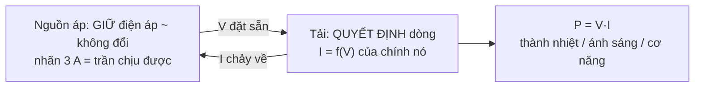
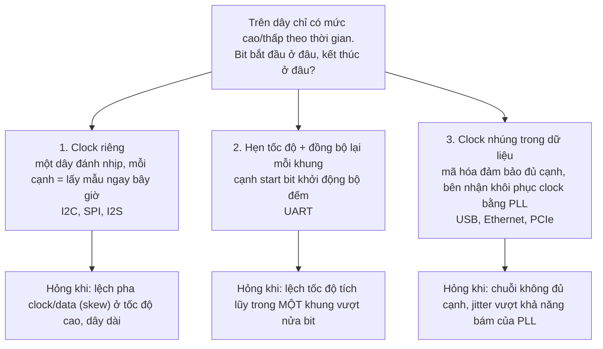
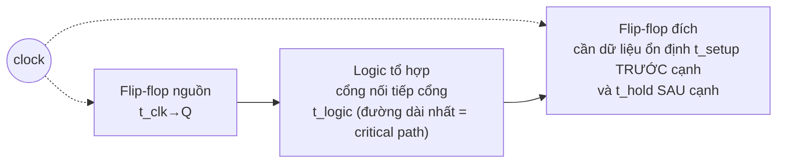

# Khóa 1 · Phần A — Nền (6h, không cần mua gì)

Ba bài đọc, tính và mô phỏng, làm được ngay tối nay với giấy, bút, laptop và trình duyệt. Mục tiêu của phần này không phải thuộc công thức mà là có **mô hình đúng** về ba thứ: ai quyết định dòng điện, "0 V" thật ra là gì, và vì sao một sợi dây biết bit nào là bit nào. Cả ba mô hình sẽ bị kiểm bằng số đo ở Phần C–D.

Quy tắc của cả khóa (xem `00-tong-quan.md`): mọi bài có mục **5. Dự đoán** — viết số vào `prediction.md`, commit, rồi mới chạy mô phỏng hoặc mở khối 🔒. Thư mục `lab/00-nen/` là bài luyện, không tính vào 5 lab của gate.

Giờ của từng bài là cách chia 6h của bản gốc (bản gốc chỉ ghi giờ cho cả phần): Bài 1 2h · Bài 2 1.5h · Bài 3 2.5h.

Mã liên kết: `→ F1.1` là viên nang nền trong `giao-trinh/nen-tang/`, `→ K3 Bài 4` là bài của khóa khác, `→ K7 C0.3` là bài khái niệm của Khóa 7 mới (`khoa-7/_KE-HOACH-K7.md`).

---

## Bài 1 — Bốn đại lượng và một quy tắc (2h)

> **Vị trí:** (đầu khóa) → **Bài 1** → Bài 2 · **Cần trước:** không; đọc lướt → F1.1 song song là đủ · **Sau bài này bạn quyết định được:** chọn điện trở hạn dòng và công suất định mức cho một tải (LED, pull-up), và đọc nhãn "5 V 3 A" của một nguồn mà biết tải của bạn sẽ thật sự kéo bao nhiêu.

### 1. Câu chuyện — ai đã khổ vì chuyện này

Năm 1827 Georg Simon Ohm, thầy giáo trung học ở Cologne, công bố *Die galvanische Kette, mathematisch bearbeitet*: dòng qua một dây dẫn tỉ lệ với "lực đẩy" của pin và tỉ lệ nghịch với độ dài dây. Giới vật lý Đức khi đó đón nhận lạnh nhạt; phải hơn chục năm sau, khi Royal Society trao ông huân chương Copley (1841), định luật mới được coi là nền [chuẩn]. Thứ khiến nó trở thành công cụ hằng ngày là điện báo: khi dây kéo dài hàng chục, hàng trăm km, kỹ sư cần **tính trước** dòng còn lại ở đầu nhận để chọn pin và chọn rơ-le, thay vì thử rồi đoán. Đó cũng chính là việc bạn sẽ làm ở mọi bài sau: tính trước, rồi đo. Một chi tiết đáng nhớ: các thí nghiệm đầu của Ohm dùng pin Volta, điện áp trôi trong lúc đo, nên số liệu không thẳng hàng; ông chỉ thấy quan hệ tuyến tính sạch sau khi chuyển sang nguồn cặp nhiệt điện ổn định hơn `[chuẩn — mục History của "Ohm's law" trong các bách khoa vật lý]`. Định luật đúng mà nguồn không ổn định thì vẫn không nhìn thấy định luật — lý do Bài 9 bắt bạn đo lại Vin trước mỗi phép đo.

Người mới từ phần mềm thường không khổ vì thiếu công thức. Họ khổ vì ba mô hình sai mà trông rất hợp lý: "nguồn 3 A sẽ đẩy 3 A vào mạch", "LED cháy vì điện áp", và "đo gì cũng cắm que như nhau". Mô hình thứ ba đứt cầu chì đồng hồ trong mười phút đầu. Hai mô hình đầu đốt linh kiện ở Khóa 3 và Khóa 7.

### 2. Mô hình tư duy

| Đại lượng | Ký hiệu | Đơn vị | Bản chất trong một câu | Đo thế nào |
|---|---|---|---|---|
| Điện áp | V (hoặc U) | volt (V) | Chênh lệch năng lượng trên mỗi đơn vị điện tích **giữa hai điểm** | Song song, hai que chạm hai điểm |
| Dòng điện | I | ampere (A) | Lượng điện tích đi qua **một tiết diện** mỗi giây | Nối tiếp, cắt mạch cho dòng đi xuyên qua đồng hồ |
| Điện trở | R | ohm (Ω) | Tỉ số V/I của một linh kiện **khi tỉ số đó gần như hằng** | Linh kiện rời mạch, mạch tắt nguồn |
| Công suất | P | watt (W) | Tốc độ năng lượng được chuyển sang dạng khác (nhiệt, ánh sáng, cơ) | Tính từ V và I |

```
V = I × R        I = V / R        R = V / I
P = V × I        P = I² × R       P = V² / R
```

Sáu công thức là hai công thức viết lại: `V = I·R` (chỉ đúng cho linh kiện tuyến tính) và `P = V·I` (đúng cho mọi linh kiện).



Bốn câu bản chất:

1. **Không có "điện áp tại một điểm".** Chỉ có điện áp giữa A và B. "Chân này 3.3 V" là cách nói tắt của "3.3 V so với GND". GND là epoch của mạch: một mốc mọi người đồng ý gọi là 0 (Bài 2 sẽ cho thấy mốc này cũng có giới hạn).
2. **Nguồn áp đặt điện áp, tải quyết định dòng.** Một nguồn 5 V nối vào 1 kΩ cho 5 mA, dù nhãn nguồn ghi 3 A hay 100 A. Con số ampere trên nhãn là trần, không phải lượng bơm ra.
3. **Ohm's law là tính chất của điện trở, không phải định luật của mọi linh kiện.** LED là diode: dòng tăng gần như theo hàm mũ khi điện áp vượt ngưỡng `V_f` (điện áp thuận, forward voltage). Không có gì giới hạn đoạn hàm mũ đó, nên phải đặt một điện trở nối tiếp để biến đường cong dốc thành một điểm làm việc ổn định.
4. **Đo áp thì song song, đo dòng thì nối tiếp.** Ở chế độ đo dòng, đồng hồ cố ý có điện trở rất nhỏ (để không làm thay đổi mạch). Chạm hai que đó vào hai cực nguồn là tạo một đường ngắn mạch qua đồng hồ: cầu chì đứt, và bạn may mắn nếu chỉ có thế.

Hình dưới (từ mô phỏng ở phần 5) đặt ba đường lên cùng một trục: đường I–V thẳng của điện trở, đường cong của LED, và "đường tải" `(5 V − V)/330 Ω`. Điểm làm việc là giao của đường cong LED với đường tải: ở đó tổng điện áp rơi trên điện trở và LED đúng bằng điện áp nguồn (định luật Kirchhoff về áp, KVL).

```python
# [đã chạy]
# Đường đặc tính I-V: điện trở (thẳng) vs LED đỏ (mô hình Shockley đơn giản).
# Tìm điểm làm việc khi nối 5 V -> R -> LED -> GND bằng cách giải V_R + V_LED = V_nguồn.
import numpy as np
import matplotlib.pyplot as plt
from scipy.optimize import brentq

# Tham số giả định cho một LED đỏ: chọn để V_f ~ 2.0 V tại 20 mA (tự chỉnh theo datasheet của bạn)
n_Vt = 2.0 * 0.02585            # hệ số lý tưởng n=2 nhân điện áp nhiệt ~25.85 mV ở 300 K
I_s = 0.020 / np.exp(2.0 / n_Vt)  # dòng bão hòa suy ra từ điểm (2.0 V, 20 mA)

def i_led(v):                    # dòng qua LED theo điện áp trên LED
    return I_s * (np.exp(v / n_Vt) - 1)

def v_led(i):                    # điện áp LED theo dòng (hàm ngược)
    return n_Vt * np.log(i / I_s + 1)

V_SUPPLY, R = 5.0, 330.0
# Giải I sao cho I*R + V_LED(I) = V_SUPPLY
I_op = brentq(lambda i: i * R + v_led(i) - V_SUPPLY, 1e-9, V_SUPPLY / R)
print(f"Điểm làm việc: I = {I_op*1e3:.2f} mA, V_LED = {v_led(I_op):.3f} V")
for i_ma in (1, 5, 10, 20):
    print(f"  V_f tại {i_ma:>2} mA = {v_led(i_ma/1e3):.3f} V")
# Độ nhạy: tăng nguồn 10% thì dòng tăng bao nhiêu %, khi có và không có điện trở?
I_hi = brentq(lambda i: i * R + v_led(i) - 1.1 * V_SUPPLY, 1e-9, 1.1 * V_SUPPLY / R)
print(f"Nguồn +10% -> dòng có R tăng {100*(I_hi/I_op-1):.0f}%")
print(f"Không R, V_LED tăng 2.0 -> 2.2 V -> dòng nhân {i_led(2.2)/i_led(2.0):.0f} lần")

v = np.linspace(0, 2.4, 400)
plt.plot(v, i_led(v) * 1e3, label="LED (Shockley)")
plt.plot(v, v / R * 1e3, label="điện trở 330 Ω")
plt.plot(v, (V_SUPPLY - v) / R * 1e3, "--", label="đường tải: (5 V − V)/330 Ω")
plt.ylim(0, 30); plt.xlabel("V (V)"); plt.ylabel("I (mA)"); plt.legend(); plt.grid()
plt.show()
```

Mô hình Shockley ở đây là đồ chơi: LED thật còn có điện trở nối tiếp bên trong và phụ thuộc nhiệt độ, nên đường cong thật thoải hơn ở dòng lớn. Dùng nó để thấy **hình dạng**, không dùng để lấy số thiết kế.

### 3. Cầu nối từ backend

| Backend bạn biết | Ở đây | Gãy ở chỗ | Nếu dùng nhầm thì |
|---|---|---|---|
| Connection pool `max=100` không có nghĩa luôn mở 100 connection | Nguồn "5 V 3 A" không đẩy 3 A; tải kéo bao nhiêu thì nguồn cấp bấy nhiêu | Pool cạn thì request **chờ**. Nguồn thật có nội trở và mạch ổn áp: kéo gần trần thì **điện áp sụt**, quá trần thì bảo vệ quá dòng (OCP) cắt hoặc nguồn nóng lên | Tin rằng tải 2.9 A trên nguồn 3 A vẫn thấy đúng 5.00 V. Thực tế có thể thấy vài trăm mV thấp hơn (tùy nguồn và dây, `[tự đo]`), MCU reset vì brownout (→ F5.7), và bạn đi tìm bug trong code |
| Rate limiter chặn throughput | Điện trở nối tiếp "hạn" dòng qua LED | Rate limiter có **trần cứng** không phụ thuộc tải. Điện trở **tuyến tính**: dòng tỉ lệ với điện áp dư. Thứ giống rate limiter thật là nguồn dòng hằng (LED driver) hoặc chế độ CC (constant current) của nguồn bench | Thiết kế điện trở cho nguồn 5 V rồi cắm cùng mạch vào 9 V, tin rằng "đã có rate limiter". Dòng tăng hơn gấp đôi |
| Throughput (req/s) qua một hàng service | Dòng điện qua một vòng mạch | Request có thể bị drop giữa đường. Dòng **không hao hụt** dọc vòng nối tiếp: vào bao nhiêu ra bấy nhiêu (định luật Kirchhoff về dòng, KCL). Thứ "tiêu hao" dọc đường là điện áp và năng lượng | Nghĩ LED "dùng hết dòng" nên điện trở đặt trước hay sau LED cho kết quả khác. Hai cách là như nhau |
| Capacity planning: CPU 80% thì còn headroom | Điện trở 1/4 W tiêu tán 200 mW | Công suất định mức là ở nhiệt độ môi trường chuẩn và có **derating** khi nóng; nhiệt tích lũy theo thời gian (hằng số nhiệt), không tức thời như CPU | Chạy sát định mức trong hộp kín: điện trở nóng, trôi giá trị, có khi cháy sau vài giờ, không báo lỗi gì trước |

**Chấm mô hình:**

- *"Điện trở là rate limiter"* (phép so sánh của bản gốc) — **ĐÚNG MỘT PHẦN.** Đúng ở vai trò: không có nó thì dòng qua LED không có gì chặn. Gãy ở cơ chế: điện trở không có trần, nó chỉ làm dòng **tỉ lệ** với điện áp dư `(V_nguồn − V_f)`. Phản ví dụ: giữ nguyên LED đỏ và 330 Ω, đổi nguồn 5 V thành 9 V rồi tính `(V − V_f)/R` cho cả hai: dòng đổi theo nguồn. Một rate limiter đúng nghĩa sẽ giữ nguyên con số.
- *"Công suất = nhiệt sinh ra"* — **ĐÚNG MỘT PHẦN.** Trên điện trở, toàn bộ công suất thành nhiệt, nên với bài toán "linh kiện có cháy không" đây là câu đúng. Nhưng P là tốc độ chuyển năng lượng nói chung. Phản ví dụ: motor kéo 10 W khi đang nâng vật chuyển phần đáng kể thành cơ năng; LED chuyển một phần thành ánh sáng. Khi tính nhiệt cho LED công suất cao hay motor, dùng "P = nhiệt" sẽ ra số quá lớn.
- *"LED cũng là một điện trở, chỉ là nhỏ"* — **SAI.** Phản ví dụ: lấy `V/I` của cùng một con LED ở 1 mA và ở 10 mA, bạn được hai "điện trở" chênh nhau gần mười lần. Một thứ mà "điện trở" đổi theo dòng thì không có điện trở theo nghĩa Ohm. Hệ quả thực hành: không tính được dòng qua LED bằng `V/R` của LED; phải tính bằng `(V_nguồn − V_f)/R_nối_tiếp`.

### 4. Thuật ngữ

| Mức | Thuật ngữ | Nghĩa trong một câu | Hay bị hiểu nhầm thành |
|---|---|---|---|
| 🟢 | Voltage / điện áp (V) | Chênh lệch năng lượng mỗi đơn vị điện tích giữa hai điểm | "Điện áp tại chân X" mà không nói so với đâu |
| 🟢 | Current / dòng (I) | Điện tích qua một tiết diện mỗi giây; đo bằng cách cắt mạch | Thứ nguồn "đẩy ra" theo nhãn |
| 🟢 | Resistance / điện trở (R) | V/I của linh kiện tuyến tính | Tính chất của mọi linh kiện, kể cả LED |
| 🟢 | Power / công suất (P) | `V·I`, tốc độ chuyển năng lượng | Luôn bằng nhiệt |
| 🟢 | Ohm's law | `V = I·R` cho linh kiện tuyến tính | Định luật cho mọi thứ |
| 🟢 | Forward voltage `V_f` | Điện áp trên LED/diode khi đang dẫn, phụ thuộc dòng và nhiệt độ | Hằng số |
| 🟢 | Điện trở hạn dòng | Điện trở nối tiếp biến đường cong dốc của LED thành một điểm làm việc | Rate limiter có trần |
| 🟡 | KCL / KVL | Tổng dòng vào một nút bằng tổng ra; tổng áp quanh vòng kín bằng 0 | — |
| 🟡 | Nội trở nguồn, OCP | Nguồn thật sụt áp khi tải lớn; bảo vệ quá dòng cắt khi vượt trần | Nguồn lý tưởng |
| 🟡 | Derating | Giảm định mức công suất khi nhiệt độ môi trường cao | Định mức là hằng số |
| 🔴 | Phương trình Shockley của diode | Mô hình hàm mũ I–V; chỉ dùng trong mô phỏng đồ chơi | Cần thuộc để làm khóa này |

### 5. Dự đoán

Không cần phần cứng. Tạo `lab/00-nen/bai01-prediction.md`, điền số, **commit**, rồi mới chạy mô phỏng ở phần 2 và mở khối 🔒.

Đề:

1. Nguồn 5 V, điện trở 220 Ω. Dòng qua điện trở? Công suất tiêu tán? Điện trở 1/4 W có chịu được không?
2. LED đỏ, nguồn 5.00 V, điện trở 330 Ω. Tính dòng theo mô hình "V_f là hằng số". `V_f` lấy từ datasheet LED (mục *Electrical/Optical Characteristics*, thường ghi tại 20 mA); không có datasheet thì giả định `V_f = 2.0 V` và ghi rõ là giả định.
3. Cùng mạch, mô hình Shockley trong code: dòng sẽ **lớn hơn hay nhỏ hơn** câu 2, vì sao? Ghi hướng và lý do, chưa cần số.
4. Tăng nguồn thêm 10% (5.0 → 5.5 V). Dòng có điện trở tăng bao nhiêu %: nhỏ hơn 10%, bằng 10%, hay lớn hơn 10%? Lý do bằng một câu.
5. Bỏ điện trở, điện áp trên LED tăng từ 2.0 V lên 2.2 V. Dòng nhân lên khoảng bao nhiêu lần: 1.1×, 2×, 10×, hay hơn nữa? Chọn bậc độ lớn.
6. Giữ nguyên LED đỏ và 330 Ω, đổi nguồn sang **12 V**. Dòng và công suất trên điện trở là bao nhiêu? LED (tra *Absolute Maximum Ratings*, dòng I_F liên tục của LED 5 mm đỏ) và điện trở 1/4 W còn ổn không?
7. Ba câu khái niệm: vì sao không thể nói "chân GPIO này có điện áp 3.3 V" mà không nói thêm gì; muốn đo dòng qua LED phải làm gì với mạch trước; vì sao nguồn 5 V 3 A nối vào 1 kΩ không cho 3 A.

Phương pháp: câu 1–2 dùng `I = V/R`, `P = I²R` hoặc `V²/R`, `I = (V_nguồn − V_f)/R`. Câu 3–5 nghĩ bằng hình phần 2: đường tải và đường cong cắt nhau ở đâu, dịch đường tải thì điểm cắt chạy thế nào.

```markdown
# Bài 1 — dự đoán (commit trước khi chạy code)
| # | Đại lượng | Dự đoán | Cách tính / lý do |
|---|-----------|---------|-------------------|
| 1 | I qua 220 Ω tại 5 V | ... mA | |
| 1 | P trên 220 Ω | ... mW | 1/4 W có ổn? |
| 2 | I qua LED, V_f hằng | ... mA | V_f = ... V (nguồn: datasheet / giả định) |
| 3 | Shockley so với câu 2 | lớn hơn / nhỏ hơn | |
| 4 | Nguồn +10% → I tăng | <10% / =10% / >10% | |
| 5 | Bỏ R, V_LED 2.0→2.2 V → I nhân | ~... lần | |
| 6 | 12 V, 330 Ω: I / P_R | ... mA / ... mW | LED ổn? 1/4 W ổn? |
```

### 6. Làm

1. Chép bảng bốn đại lượng ở phần 2 vào sổ **bằng tay**, thêm cột "đo bằng que nào, cắm thế nào".
2. Viết và commit `prediction.md` (phần 5).
3. Chạy mô phỏng phần 2 (`python3 bai1_led.py`). Đổi `V_SUPPLY` thành 9.0 và chạy lại. Đổi `R` thành 1000 và chạy lại. Ghi ba điểm làm việc.
4. Sửa tham số LED cho khớp datasheet LED bạn có (nếu có `V_f` tại hai dòng khác nhau, giải ngược ra `I_s` và `n_Vt`). Ghi lại khác biệt.
5. Mở **Falstad Circuit Simulator** (trình mô phỏng mạch chạy trên trình duyệt của Paul Falstad, `falstad.com/circuit`). Dựng nguồn DC 5 V → 330 Ω → LED → về nguồn. Đặt một ampe kế **trước** LED và một **sau** LED: hai số phải bằng nhau (KCL). Đổi chỗ điện trở và LED: dòng có đổi không? Đổi nguồn sang 12 V, rê chuột lên điện trở xem công suất (câu 6).
6. Viết `bai01-analysis.md`: bảng dự đoán / mô phỏng / chênh lệch; một đoạn giải thích vì sao câu 3–5 ra như vậy bằng lời của bạn.
7. Ghi vào sổ quy tắc an toàn đo dòng: **chế độ A = đồng hồ thành một sợi dây**. Chuyển que đỏ về lỗ VΩmA và núm về V ngay sau mỗi lần đo dòng.

Sai số ở bài này đến từ mô hình, không từ dụng cụ: mô phỏng chỉ đúng hình dạng, và giá trị `V_f` của datasheet là giá trị điển hình (typ) có dải min–max. Ghi dải đó cạnh mọi số bạn dùng.

### 7. Số phải ra

<details><summary>🔒 MỞ SAU KHI COMMIT prediction.md</summary>

| # | Đáp án | Ghi chú |
|---|---|---|
| 1 | `I = 5/220 ≈ 22.7 mA`; `P = 25/220 ≈ 114 mW` | 1/4 W = 250 mW, dư khoảng 2 lần. Đủ cho bàn thí nghiệm, sát nếu đặt trong hộp kín nóng |
| 2 | `(5.00 − 2.0)/330 ≈ 9.09 mA` | Với V_f giả định 2.0 V |
| 3 | Lớn hơn một chút: mô phỏng cho khoảng **9.2 mA**, `V_LED ≈ 1.96 V` | Ở 9 mA, V_f thấp hơn giá trị 2.0 V (tham số được chọn tại 20 mA), nên điện áp dư trên điện trở lớn hơn, dòng lớn hơn |
| 4 | Lớn hơn 10%: mô phỏng cho khoảng **+16%** | Điện áp dư tăng từ ~3.0 V lên ~3.5 V, tức ~+17%; V_f nhích lên một chút nên còn ~+16%. Điện trở khuếch đại thay đổi của nguồn thay vì chặn nó |
| 5 | Bậc chục lần: mô phỏng cho khoảng **48×** | Hàm mũ: mỗi `n·V_t·ln 10 ≈ 0.12 V` dòng nhân 10. Với LED thật có điện trở nối tiếp bên trong, con số nhỏ hơn nhưng vẫn đủ để cháy |
| 6 | `I ≈ (12 − 2.0)/330 ≈ 30 mA`; `P_R ≈ 10²/330 ≈ 0.30 W` | LED 5 mm đỏ thường định mức ~20 mA, tối đa tuyệt đối ~25–30 mA `[ước lượng — tra datasheet]` → quá sức. **Điện trở 1/4 W cũng quá tải** (0.30 W > 0.25 W). Đổi nguồn mà không tính lại là hỏng hai linh kiện một lúc |
| 7 | (a) điện áp là hiệu giữa hai điểm, câu đầy đủ là "3.3 V so với GND"; (b) cắt mạch tại một chỗ trên đường dòng qua LED, nối đồng hồ (chế độ A) vào chỗ cắt; (c) tải 1 kΩ chỉ cho `5/1000 = 5 mA`, 3 A là trần của nguồn | |

Lệch so với bảng là bình thường nếu bạn chỉnh tham số LED theo datasheet thật: cái phải giữ là **hướng** của câu 3–5, không phải chữ số thập phân. Nếu câu 4 bạn chọn "nhỏ hơn 10%", mô hình "điện trở là rate limiter" vẫn còn trong đầu bạn: đọc lại phần Chấm mô hình.

</details>

### 8. Nếu ra khác

| Triệu chứng | Nguyên nhân khả dĩ | Kiểm bằng cách | Sửa |
|---|---|---|---|
| Câu 1 ra 22.7 A hay 0.0227 mA | Lẫn đơn vị | Viết đơn vị ở mọi dòng tính | Quy ước: tính bằng V, A, Ω, rồi mới đổi ra mA |
| Code báo lỗi `brentq` | Khoảng tìm nghiệm không đổi dấu (ví dụ `V_SUPPLY` nhỏ hơn V_f) | In giá trị hàm ở hai đầu khoảng | Nguồn phải lớn hơn V_f; LED không sáng nếu nguồn thấp hơn ngưỡng |
| Dòng mô phỏng lớn gấp nhiều lần dự đoán | Sửa `n_Vt` hoặc `I_s` sai bậc | So V_f tại 20 mA in ra với datasheet | Giải lại tham số từ hai điểm datasheet |
| Falstad: ampe kế trước và sau LED khác nhau | Có nhánh rẽ (dây thừa nối vào giữa) | Xóa dây thừa, kiểm mạch là một vòng duy nhất | Mạch nối tiếp không có chỗ cho dòng rẽ |
| P tính ra lớn hơn đáp án nhiều | Dùng V nguồn thay vì V rơi trên điện trở | KVL: V_R + V_LED = V_nguồn | `P_R = V_R × I` |
| Dự đoán câu 4 "nhỏ hơn 10%" | Mô hình rate limiter | Tính tay `(5.5 − 2.0)/(5.0 − 2.0)` | Đọc lại Chấm mô hình |

### 9. Câu hỏi ngược

1. **[Nếu…thì]** Nếu thay điện trở bằng một nguồn dòng hằng 10 mA, ai quyết định V_f lúc này, và nguồn phải có điện áp tối thiểu bao nhiêu để giữ được 10 mA?
   <details><summary>Hướng nghĩ</summary>Nguồn dòng đặt I, LED trả về V_f tại I đó; vai trò "ai đặt, ai đáp" đảo ngược so với nguồn áp. Nguồn dòng nào cũng cần một khoảng "điện áp dư" để điều khiển (compliance voltage). So với một producer phát cố định N msg/s: consumer quyết định độ trễ, không quyết định tốc độ.</details>
2. **[Vì sao không]** Vì sao không bỏ điện trở và chỉnh nguồn đúng bằng V_f, cho đỡ phí điện?
   <details><summary>Hướng nghĩ</summary>Nhìn câu 5: sai 0.1 V là sai dòng nhiều lần. V_f còn giảm khi LED nóng lên; nóng lên thì dòng tăng, dòng tăng thì nóng thêm. Tên của vòng này là gì, và điện trở phá vòng đó bằng cách nào?</details>
3. **[Quy mô]** 100 robot, mỗi robot 20 LED trạng thái 10 mA và một dải 60 LED RGB, tất cả lấy nguồn 5 V từ cổng USB của máy tính trên robot. Cái gì gãy trước: dòng tổng, sụt áp trên dây, hay nhiệt? Bạn sẽ đưa con số nào vào một "power budget" giống latency budget?
   <details><summary>Hướng nghĩ</summary>Cộng dòng trường hợp xấu nhất (mọi LED sáng trắng tối đa) so với trần của cổng USB (tra chuẩn USB bạn dùng). Nhân 100 robot không làm từng robot gãy nhanh hơn, nhưng làm "trường hợp hiếm" xảy ra hằng ngày ở đâu đó trong đội xe.</details>
4. **[Failure mode]** Điện trở 1/4 W tiêu tán liên tục 200 mW trong hộp nhựa kín đặt cạnh mini PC. Nó hỏng thế nào, có phát tín hiệu gì trước khi hỏng không, và bạn sẽ đo cái gì để biết sớm?
   <details><summary>Hướng nghĩ</summary>Hỏng âm thầm: giá trị trôi theo nhiệt, mạch vẫn "chạy" nhưng số sai. Giống một service rò bộ nhớ chậm. Đại lượng quan sát được là nhiệt độ bề mặt và giá trị R sau thời gian dài; metric nào trong phần mềm của bạn có hình dạng tương tự?</details>
5. **[Liên ngành]** Darcy (nước qua đất), Fourier (nhiệt qua tường), Ohm (điện qua dây) đều có dạng "dòng = chênh lệch / trở". Vì sao cả ba đều tuyến tính, và ở đâu cả ba cùng gãy?
   <details><summary>Hướng nghĩ</summary>Đây là các "định luật cấu thành" đúng trong vùng nhiễu loạn nhỏ quanh cân bằng. Nghĩ về dòng chảy rối, vật liệu đổi tính chất theo nhiệt, và LED. Tuyến tính là xấp xỉ bậc một, không phải sự thật.</details>
6. **[Phản biện]** "Tải quyết định dòng". Có lúc nào nguồn quyết định dòng không?
   <details><summary>Hướng nghĩ</summary>Khi tải đòi nhiều hơn trần: nguồn bench chuyển sang chế độ CC, nguồn USB cắt, pin sụt áp. Ở biên, vai trò đảo ngược. Đây là lý do nguồn bench có giới hạn dòng là "lưới an toàn" (Bài 4).</details>

### 10. Liên kết ra ngoài

- **Sinh lý thần kinh.** Mô hình Hodgkin–Huxley (1952) mô tả màng tế bào thần kinh bằng đúng một mạch điện: tụ (màng lipid), điện trở phụ thuộc điện áp (kênh ion), nguồn áp (chênh nồng độ ion). Giống: cùng ngôn ngữ V, I, R. Khác: "điện trở" của kênh ion thay đổi theo điện áp và thời gian, nên giống LED hơn giống điện trở; chính tính phi tuyến đó tạo ra xung thần kinh.
- **Datacenter.** Gần như toàn bộ điện năng vào một server kết thúc thành nhiệt, nên ngân sách làm mát tính thẳng từ công suất điện (PUE là tỉ số tổng năng lượng cơ sở trên năng lượng IT). Giống: ở đây "P = nhiệt" gần như đúng tuyệt đối. Khác: với robot, một phần công suất thành chuyển động, và nhiệt dồn vào vài điểm (driver motor) chứ không phân tán.
- **Thủy văn (Darcy).** Kỹ sư nước ngầm tính lưu lượng giếng bằng chênh mực nước chia cho trở của tầng đất. Giống: tuyến tính, dùng để tính trước. Khác: đất không đồng nhất, nên "điện trở" phải đo tại chỗ; điện trở trong mạch thì đã được nhà sản xuất đo sẵn với sai số in trên thân.

### 11. Độ tin cậy và sửa lỗi

| Khẳng định | Nhãn | Ghi chú / cách kiểm |
|---|---|---|
| Ohm công bố năm 1827, nhận huân chương Copley 1841 | [chuẩn] | Tiểu sử Ohm trong các bách khoa vật lý |
| V_f LED đỏ ~1.8–2.2 V; xanh dương/trắng ~2.8–3.4 V | [chuẩn] | Tra datasheet đúng con LED bạn mua; dải phụ thuộc vật liệu bán dẫn |
| V_f LED xanh lá: GaP kiểu cũ (vàng-xanh) ~2.0–2.2 V; InGaN xanh lá thuần ~2.8–3.3 V | [chuẩn] | Hai loại "xanh lá" khác nhau gần 1 V; nhìn màu không phân biệt được, phải tra hoặc đo |
| Mô hình Shockley với `n = 2` cho LED đỏ | [ước lượng] | Đồ chơi để thấy hình dạng; LED thật có điện trở nối tiếp nội, `n` từ ~1.5 đến >2 |
| Ohm chuyển sang nguồn cặp nhiệt điện để có số liệu ổn định | [chuẩn] | Mục History của "Ohm's law" |
| Dòng định mức LED 5 mm ~20 mA, tối đa ~25–30 mA | [ước lượng] | LED kit thường không có datasheet → giữ ≤10 mA |
| Điện trở cắm board thường 1/4 W | [chuẩn] | Kiểm kích thước thân và mô tả kit bạn mua |
| Chế độ đo dòng có điện trở trong rất nhỏ | [chuẩn] | Con số cụ thể (burden voltage) của UT33D+ là `[tự đo]`, xem Bài 5 |

**Đã sửa so với bản gốc:**
- Bản gốc ghi LED xanh lá ~2.0–2.2 V. Chỉ đúng với LED GaP kiểu cũ; LED xanh lá InGaN phổ biến hiện nay ~2.8–3.3 V. Sửa trong bảng trên.
- Bản gốc dùng "điện trở = rate limiter" và "công suất = nhiệt" như phép so sánh trọn vẹn. Giữ phép so sánh nhưng chấm ĐÚNG MỘT PHẦN và chỉ chỗ gãy (phần 3).
- Ba câu tự kiểm tra của bản gốc chuyển thành dự đoán có niêm phong; thêm mô phỏng đường tải và bước Falstad để thay phần "Làm" mà bản gốc không có.
- Thêm công suất trên **điện trở** khi đổi nguồn 12 V (bản gốc chỉ tính ở 5 V): cùng 330 Ω, điện trở 1/4 W quá tải.
- "Hiểu nhầm 3" của bản gốc (cắm que đo dòng/áp) giữ ở phần 2 ý 4 và được thực hành đầy đủ ở Bài 5.

### 12. Đọc thêm và tự kiểm tra

- **Nguồn gốc:** G. S. Ohm, *Die galvanische Kette, mathematisch bearbeitet* (1827) — để biết định luật ban đầu được phát biểu từ thí nghiệm, không phải từ lý thuyết.
- **Giải thích:** SparkFun Learn, "Voltage, Current, Resistance, and Ohm's Law".
- **Đào sâu (tùy chọn):** Horowitz & Hill, *The Art of Electronics* (3rd ed.), chương 1 — dùng làm từ điển, không đọc tuần tự.
- **Tự kiểm tra:** (1) giải thích cho một backend engineer khác trong 5 câu vì sao "nguồn 3 A" không đẩy 3 A; (2) vẽ lại đường tải và đường cong LED từ trí nhớ, đánh dấu điểm làm việc; (3) hai câu dưới.

  a. Điện trở 470 Ω nối vào 3.3 V. Dòng và công suất?
  b. Bạn đo được 2.05 V trên một LED đỏ đang dẫn 15 mA. Một người nói "vậy LED có điện trở 137 Ω". Sai ở đâu?

  <details><summary>Đáp án</summary>

  a. `I = 3.3/470 ≈ 7.0 mA`; `P = 3.3²/470 ≈ 23 mW`.
  b. `V/I` tại một điểm là "điện trở tĩnh" của điểm đó, không dùng được để dự đoán dòng ở điện áp khác vì đường I–V của LED là hàm mũ. Đổi dòng sang 5 mA thì tỉ số đó đổi rất nhiều.
  </details>

---

## Bài 2 — Mạch kín, GND, và tại sao dây nối là một giả định (1.5h)

> **Vị trí:** Bài 1 → **Bài 2** → Bài 3 · **Cần trước:** Bài 1 · **Sau bài này bạn quyết định được:** khi nối hai module dùng hai nguồn khác nhau, phải nối những dây nào (và khi nào *không* cần chung GND); dây nào được phép là jumper mỏng, dây nào phải to và ngắn.

### 1. Câu chuyện — ai đã khổ vì chuyện này

Chữ "ground" là đất thật. Năm 1838, Carl August von Steinheil phát hiện có thể bỏ sợi dây về của đường điện báo và cho dòng đi về qua lòng đất: tiết kiệm một nửa dây đồng trên hàng chục km [chuẩn]. Cái giá đến sau. "Đất" ở hai trạm cách nhau xa không cùng điện thế, nên đường dây nhận cả tín hiệu lẫn chênh lệch điện thế tự nhiên của mặt đất. Trường hợp cực đoan là bão địa từ tháng 9/1859 (sự kiện Carrington): dòng cảm ứng trong dây điện báo đủ mạnh để làm điện báo viên bị giật, và có tuyến vẫn gửi được tin khi đã tháo pin [chuẩn]. Bài học kéo dài tới tận mạch trên bàn bạn: "0 V" là một **thỏa thuận** giữa các điểm, và thỏa thuận đó chỉ đúng khi giữa các điểm ấy không có dòng đáng kể chạy qua.

Ở quy mô breadboard, cùng bài học đó xuất hiện dưới dạng lỗi số một của người mới: quên nối GND giữa hai module, hoặc nối rồi nhưng cho dòng lớn của amp/motor đi chung sợi GND mỏng với tín hiệu. Bản gốc nói rõ: đây chính là bug bạn sẽ gặp ở Khóa 3 khi tách nguồn cho amplifier.

### 2. Mô hình tư duy


```
Hai module, hai nguồn — thiếu dây gì?

  [USB 5V]──ESP32──TX ─────────────────► RX──Module B──[Pin 3.7V]
               │                                  │
              GND ─ ─ ─ ─ ─ ?  ─ ─ ─ ─ ─ ─ ─ ─ ─ GND

  "TX = 3.3 V" nghĩa là 3.3 V so với GND của ESP32.
  Module B so mức đó với GND của nó. Không có dây GND chung,
  hiệu giữa hai GND là bất kỳ → bên nhận đọc rác.
```

Bốn câu bản chất:

1. **Dòng chỉ chảy trong vòng kín**: từ cực dương, qua tải, về cực âm. Hở một chỗ thì dòng bằng 0 ở **mọi** chỗ trong vòng, không có "nửa mạch vẫn chạy".
2. **GND là điểm được chọn làm mốc**, đặc biệt vì mọi người đồng ý gọi nó là 0, không vì vật lý. Tín hiệu single-ended (GPIO, UART, I2C, SPI, I2S) được đọc **so với GND của bên nhận**, nên hai bên phải chung mốc.
3. **Dây nối không lý tưởng.** Một sợi dây có điện trở nhỏ; dòng qua nó tạo sụt áp `V = I·R`. Với vài mA, bỏ qua được. Với dòng của amp, motor, servo, không bỏ qua được. Khi dòng đó chạy trên dây **GND**, mốc 0 V ở hai đầu dây không còn bằng nhau.
4. **Chung GND không phải luật tuyệt đối, mà là điều kiện của tín hiệu single-ended.** Tín hiệu vi sai (differential) như Ethernet, USB, CAN, RS-485 đọc **hiệu giữa hai dây** của chính nó, nên chịu được chênh GND trong một dải cho phép; Ethernet còn cách ly bằng biến áp ở mỗi cổng [chuẩn]. Đây là lý do hai mini PC nối cáp LAN ở Khóa 5 không cần chung GND, còn ESP32 với DAC thì cần.

Bảng số để có trực giác về "dây không lý tưởng" (dùng ở phần 5):

| Đoạn dây | Điện trở cần tra/ước lượng | Nguồn số |
|---|---|---|
| Dây jumper dupont 20 cm, lõi cỡ 26–28 AWG | `ρ` theo bảng AWG × chiều dài | Bảng AWG: 28 AWG ≈ 0.21 Ω/m, 26 AWG ≈ 0.13 Ω/m [chuẩn] |
| Mỗi điểm tiếp xúc đầu dupont hoặc lỗ breadboard | vài chục mΩ, thay đổi theo độ rão | [ước lượng]; muốn đo phải cho một dòng biết trước chạy qua rồi đo sụt áp (phương pháp 4 dây/Kelvin — biết tên là đủ ở K1) |
| Dây nguồn to 18 AWG, 20 cm | ≈ 0.021 Ω/m × 0.2 m | Bảng AWG [chuẩn] |

### 3. Cầu nối từ backend

| Backend bạn biết | Ở đây | Gãy ở chỗ | Nếu dùng nhầm thì |
|---|---|---|---|
| Timestamp luôn tính từ một epoch | Điện áp luôn tính từ GND | Epoch là hằng số toán học, mọi máy dùng cùng một giá trị. GND là **dây đồng**: hai điểm cùng tên "GND" chênh nhau `I·R` của đoạn dây giữa chúng | Tin rằng nối GND ở đâu cũng như nhau. Cho dòng amp đi chung sợi GND với DAC → tiếng ù/rè theo nhịp tải (K3) |
| Hai service phải cùng timezone/epoch mới so được timestamp | Hai module phải chung GND mới hiểu được mức 0/1 của nhau | Chung GND không chỉ là "thỏa thuận", nó **tạo một đường cho dòng**. Nối GND bằng nhiều đường song song "cho chắc" tạo vòng (ground loop) | Hum 50 Hz hoặc nhiễu trong audio, rất khó tìm vì mọi dây đều "đúng" |
| Network partition: một phần hệ thống không gọi được phần kia | Mạch hở | Partition thường cho lỗi rõ (timeout, connection refused). Mạch hở ở dây tín hiệu làm chân input bên nhận **floating**: nó đọc ra 0/1 ngẫu nhiên, không có lỗi | Chờ một exception không bao giờ đến; dữ liệu rác trông như dữ liệu thật |
| Gán `a = b`: chính xác tuyệt đối | Nối dây A với B | `V = I·R` trên dây; ở tần số cao thêm cảm kháng và điện dung | Cấp nguồn servo/amp qua jumper dài và mỏng: thiết bị chạy "chập chờn" chỉ khi tải nặng |

**Chấm mô hình:**

- *"GND là epoch của mạch"* (phép so sánh của bản gốc, Bài 1) — **ĐÚNG MỘT PHẦN.** Đúng: điện áp không có nghĩa nếu không có mốc. Gãy: epoch không có điện trở, GND thì có. Phản ví dụ: ESP32 và một amp class-D cùng lấy GND qua một sợi jumper chung; khi nhạc to, dòng amp chạy trên sợi đó làm "0 V" ở chân ESP32 nhấp nhô theo nhịp nhạc so với "0 V" ở DAC, dù trên sơ đồ hai điểm đều ghi GND.
- *"Không chung GND thì mọi thứ vô nghĩa"* (bản gốc) — **ĐÚNG MỘT PHẦN.** Đúng với tín hiệu single-ended, tức gần hết những gì bạn cắm trong Khóa 1–3. Phản ví dụ: hai mini PC nối cáp Ethernet, mỗi máy một adapter riêng, không có dây GND chung, vẫn chạy PTP chính xác tới mức sub-microsecond (K5) vì Ethernet truyền vi sai qua biến áp cách ly.
- *Mô hình của bạn ở K3 lượt 11:* "mọi thiết bị khi chung nguồn... luôn có trường hợp sụt nguồn... chiếm dụng nguồn chung là xảy ra" — **ĐÚNG MỘT PHẦN.** Đúng: sụt áp do tải chung là hiện tượng thường trực, từ breadboard tới lưới điện gia đình. Gãy ở chữ "chiếm dụng": nó không phải tranh chấp tài nguyên kiểu mutex hay fair-share, nơi thêm trọng tài là giải xong. Nó là `I × Z` của **đoạn đường dùng chung** (dây nguồn, dây GND, nội trở nguồn). Phản ví dụ: hai thiết bị, cùng tổng dòng, cùng một nguồn; nối kiểu nối tiếp nhau (daisy chain) qua jumper mỏng thì thiết bị cuối sụt áp rõ, nối hình sao (mỗi thiết bị một cặp dây to về thẳng cực nguồn) thì sụt áp nhỏ hơn hẳn. Cách sửa là giảm trở kháng dùng chung và đặt tụ làm kho cục bộ (decoupling, → F5.7), không phải "phân xử".

- *"Hai module cùng cắm USB vào một laptop thì đã chung GND, khỏi nối thêm."* — **ĐÚNG MỘT PHẦN.** Hai GND nối nhau qua hai cáp USB và mạch của laptop: một đường về dài, có điện trở, có thể mang dòng của thứ khác. Thường đủ cho tín hiệu chậm, nhưng không phải thứ bạn chọn có chủ đích. Phản ví dụ: rút một cáp, cấp pin cho module đó — đường GND biến mất mà không có triệu chứng nào cho tới khi dữ liệu thành rác. Quy tắc: **có dây tín hiệu giữa hai module thì có một dây GND ngắn đi cùng.**

### 4. Thuật ngữ

| Mức | Thuật ngữ | Nghĩa trong một câu | Hay bị hiểu nhầm thành |
|---|---|---|---|
| 🟢 | Mạch kín / mạch hở | Có / không có vòng khép kín cho dòng | "Hở một nửa thì nửa kia vẫn chạy" |
| 🟢 | GND (ground, mass, 0 V) | Điểm chọn làm mốc 0 cho mọi điện áp | Đất thật, hoặc một điểm duy nhất có điện thế 0 tuyệt đối |
| 🟢 | Common ground | Nối GND của các module trao đổi tín hiệu single-ended | Luật tuyệt đối cho mọi loại kết nối |
| 🟢 | Floating pin | Chân input không nối gì, đọc ra giá trị ngẫu nhiên | "Mặc định là 0" |
| 🟢 | Sụt áp trên dây | `I·R` của dây và điểm tiếp xúc | Chỉ xảy ra với dây dài hàng mét |
| 🟡 | Single-ended vs differential | Đọc so với GND vs đọc hiệu hai dây | — |
| 🟡 | Ground loop | Nhiều đường GND song song tạo vòng nhận nhiễu | — |
| 🟡 | Earth ground vs signal ground | Đất bảo vệ (dây nối đất ổ cắm) khác mốc 0 của mạch | Hai thứ là một |
| 🟡 | Star ground | Mọi nhánh về một điểm GND chung bằng dây riêng | — |
| 🔴 | Trở kháng truyền dẫn, điện cảm dây ở tần số cao | Hành vi dây ở MHz–GHz | Cần ở khóa này |

### 5. Dự đoán

Tạo `lab/00-nen/bai02-prediction.md`, điền, **commit**, rồi mới mở khối 🔒.

1. Mạch 5 V → 330 Ω → LED → GND, LED cắm **ngược**. Điều gì xảy ra với LED (dẫn/không, sáng/không, hỏng/không)? Điện áp ngược đặt lên LED khoảng bao nhiêu? So với thông số *Reverse Voltage* (V_R) trong mục *Absolute Maximum Ratings* của datasheet LED bạn có.
2. Một sợi jumper 20 cm cỡ 28 AWG, cộng hai điểm tiếp xúc (giả định mỗi điểm 20 mΩ). Điện trở tổng? Sụt áp khi có 10 mA (LED)? Khi có 1 A (amp class-D lúc nhạc to)?
3. Nếu sợi ở câu 2 là **dây GND chung** giữa ESP32 và DAC, và dòng 1 A của amp đi trên nó, "0 V" ở hai đầu chênh bao nhiêu? So với biên nhiễu của mức logic 3.3 V (sẽ tính ở Bài 3) và với biên độ tín hiệu audio line-level (tra: line level tiêu dùng khoảng vài trăm mV RMS).
4. Mạch có nguồn, LED, điện trở; LED không sáng, LED không hỏng. Liệt kê ít nhất ba nguyên nhân khả dĩ.
5. Vì sao common ground là điều kiện bắt buộc cho UART giữa ESP32 và một module chạy pin, nhưng không bắt buộc cho cáp Ethernet giữa hai máy tính?

Phương pháp: câu 2–3 dùng `R = ρ·L` (ρ từ bảng AWG) cộng điện trở tiếp xúc, rồi `V = I·R`. Câu 1: khi LED không dẫn, dòng gần bằng 0, nên sụt áp trên điện trở gần bằng 0.

```markdown
# Bài 2 — dự đoán
| # | Đại lượng | Dự đoán | Cách tính / nguồn |
|---|-----------|---------|-------------------|
| 1 | LED ngược: dẫn? sáng? hỏng? | | V_R max (datasheet) = ... V |
| 2 | R tổng jumper | ... mΩ | ρ(28 AWG) = ... Ω/m |
| 2 | Sụt áp @10 mA / @1 A | ... mV / ... mV | |
| 3 | Chênh "0 V" hai đầu | ... mV | so với biên nhiễu ... và line level ... |
| 4 | Ba nguyên nhân LED không sáng | | |
| 5 | Vì sao UART cần chung GND, Ethernet thì không | | |
```

### 6. Làm

Chưa cần dụng cụ. Giữ nguyên ba bản vẽ của bản gốc và thêm phần tính:

1. Vẽ tay vào sổ: nguồn 5 V → điện trở 330 Ω → LED → về GND. Đánh dấu chiều dòng bằng mũi tên, ghi điện áp dự kiến trên từng linh kiện (từ Bài 1).
2. Vẽ cùng mạch nhưng LED cắm ngược. Ghi dự đoán của câu 1.
3. Vẽ hai module: một cấp nguồn từ USB, một cấp nguồn từ pin. Vẽ dây tín hiệu giữa chúng. Khoanh dây còn thiếu.
4. Vẽ lại hình 3 nhưng thêm một amp class-D lấy nguồn từ USB. Vẽ hai phương án đi dây GND: (a) daisy chain qua một jumper, (b) hình sao về cực nguồn. Đánh dấu đoạn dây nào mang dòng của amp.
5. Tính câu 2–3, commit `prediction.md`.
6. **Sau khi commit**, chạy mô phỏng dưới đây (nó tính sẵn đáp án dạng tổng quát hơn: dây đi + dây về, dây lõi nhôm mạ đồng, và lệch GND ăn vào biên logic). Đổi `awg` từ 28 sang 22 và bỏ `cca=True`; xem điện trở vòng giảm bao nhiêu lần.
7. Falstad (`falstad.com/circuit`): nguồn 5 V → điện trở 0.1 Ω (dây đi) → tải 5 Ω (≈1 A) → điện trở 0.1 Ω (dây về) → nguồn. Đặt vôn kế ở hai đầu tải và ở hai cực nguồn. So hai số.
8. Mở khối 🔒, viết `bai02-analysis.md`.

```python
# [đã chạy] "Dây nối là một giả định": sụt áp trên dây jumper và mốc GND bị đẩy lên
RHO_CU = 1.72e-8                       # điện trở suất đồng, Ω·m [chuẩn]
AWG_MM2 = {22: 0.326, 24: 0.205, 26: 0.129, 28: 0.081}   # tiết diện, mm² [chuẩn]

def r_wire(awg, length_m, cca=False):
    r = RHO_CU * length_m / (AWG_MM2[awg] * 1e-6)
    return r * (1.6 if cca else 1.0)   # dây nhôm mạ đồng (CCA) ~1.6× [ước lượng]

R_CONTACT = 0.02                       # mỗi điểm cắm breadboard/Dupont, Ω [ước lượng]
loop = 2 * (r_wire(28, 0.20, cca=True) + 2 * R_CONTACT)  # dây đi + dây về, 20 cm mỗi dây
print(f"Điện trở vòng (2 dây 28AWG CCA 20 cm + 4 tiếp điểm): {loop*1000:.0f} mΩ")
for i in [0.01, 0.1, 0.5, 1.0]:
    print(f"  I = {i*1000:6.0f} mA -> sụt trên dây = {i*loop*1000:6.1f} mV,"
          f" tải nhận {5.0 - i*loop:.3f} V từ nguồn 5.000 V")

# Hai module chung một dây GND; motor kéo dòng qua chính dây GND đó.
r_gnd = r_wire(28, 0.20, cca=True) + 2 * R_CONTACT
VIL_MAX = 0.25 * 3.3   # ESP32-S3: bên nhận coi là LOW nếu ≤ 0.25·VDD [spec, kiểm datasheet]
VOL_MAX = 0.10 * 3.3   # ESP32-S3: bên gửi xuất LOW tối đa 0.1·VDD [spec, kiểm datasheet]
print(f"\nB gửi LOW cho A; dòng motor chạy qua dây GND chung {r_gnd*1000:.0f} mΩ:")
for i in [0.1, 1.0, 3.0, 5.0]:
    seen = VOL_MAX + i * r_gnd          # A nhìn thấy LOW của B cộng thêm lệch GND
    flag = "  <-- vượt V_IL: A có thể đọc thành không-phải-LOW" if seen > VIL_MAX else ""
    print(f"  dòng motor {i:4.1f} A -> A thấy 'LOW' = {seen*1000:4.0f} mV"
          f" (ngưỡng {VIL_MAX*1000:.0f} mV){flag}")
```

Mô hình này bỏ qua cảm kháng của dây (quan trọng khi dòng đổi nhanh, ví dụ motor PWM) — thực tế còn tệ hơn trong các khoảnh khắc chuyển mạch.

Nếu đã có đồng hồ và breadboard (tức đã sang tuần 2), làm thêm: đo điện trở một sợi jumper bằng thang Ω thấp nhất, rồi chập hai que vào nhau và đo lại. Hiệu hai số mới là điện trở dây; số đọc khi chập que là điện trở của chính que đo cộng sai số zero của đồng hồ. Với một đồng hồ 2000 count, thang 200 Ω có resolution 0.1 Ω và sai số cỡ vài phần mười ohm [spec, kiểm trong manual UT33D+], nên **không đo được** điện trở vài chục mΩ của dây một cách tin cậy. Muốn đo điện trở cỡ mΩ, người ta cho một dòng biết trước chạy qua và đo sụt áp (phương pháp 4 dây/Kelvin), không đo Ω trực tiếp (→ F1.1: resolution vs accuracy vs thứ bạn cần đo).

### 7. Số phải ra

<details><summary>🔒 MỞ SAU KHI COMMIT prediction.md</summary>

| # | Đáp án | Ghi chú |
|---|---|---|
| 1 | LED không dẫn, không sáng. Dòng ngược rất nhỏ nên điện trở gần như không sụt áp: LED chịu gần trọn **~5 V ngược** | Nhiều datasheet LED ghi V_R max = 5 V. Mạch 5 V nằm **ngay ngưỡng**: thường sống, nhưng không có biên. Với nguồn 9–12 V cắm ngược có thể hỏng LED. Bản gốc ghi "không hỏng" là đúng cho 5 V, không đúng tổng quát |
| 2 | `0.21 Ω/m × 0.2 m ≈ 0.042 Ω` + `2 × 0.020 Ω` ≈ **0.08 Ω**. Sụt áp: **~0.8 mV** @ 10 mA; **~80 mV** @ 1 A | Số tiếp xúc là giả định; breadboard rão có thể lớn hơn nhiều |
| 3 | Chênh **~80 mV**, dao động theo dòng amp | So với biên nhiễu logic 3.3 V (cỡ vài trăm mV, Bài 3): logic vẫn đúng. So với tín hiệu audio line-level (vài trăm mV RMS): 80 mV là nhiễu rất lớn, nghe rõ. Cùng một sợi dây, "vô hại" với bit nhưng "phá hỏng" analog |
| 4 | (a) mạch hở ở đâu đó, thường thiếu dây về GND; (b) LED cắm ngược; (c) điện trở quá lớn (đọc nhầm mã màu, 33 kΩ thay vì 330 Ω) nên dòng quá nhỏ để thấy sáng; (d) nguồn chưa bật hoặc rail breadboard đứt giữa (Bài 6) | |
| 5 | UART là single-ended: bên nhận so điện áp dây TX với GND của nó. Ethernet truyền vi sai qua biến áp: bên nhận đọc hiệu giữa hai dây của một cặp, không cần mốc chung | |

**Mô phỏng (bước 6):** vòng 2 dây 28 AWG lõi CCA + 4 tiếp điểm ≈ **216 mΩ**; ở 1 A tải chỉ nhận ≈ **4.78 V**. Lệch GND trên một dây ≈ 108 mΩ: "LOW" của B tới A vượt V_IL (825 mV) ở khoảng **5 A** dòng motor (với V_OL xấu nhất 0.33 V) — logic chịu được lâu hơn analog nhiều. Dây 22 AWG đồng thật: vòng giảm còn khoảng 1/3. **Falstad (bước 7):** dòng ≈ 5/5.2 ≈ 0.96 A, tải nhận ≈ 4.81 V trong khi hai cực nguồn vẫn 5.00 V — đo ở nguồn không cho biết tải nhận bao nhiêu.

Vì sao lệch là bình thường: điện trở tiếp xúc thay đổi theo độ rão của lỗ cắm và lực ép của đầu dupont, có thể từ vài mΩ tới vài trăm mΩ. Điều cần giữ là **bậc độ lớn** và kết luận ở câu 3.

</details>

### 8. Nếu ra khác

| Triệu chứng | Nguyên nhân khả dĩ | Kiểm bằng cách | Sửa |
|---|---|---|---|
| Câu 2 ra vài ohm | Lấy nhầm Ω/km thành Ω/m, hoặc nhầm cỡ AWG | Đơn vị trong bảng AWG | Đọc lại cột đơn vị |
| Vẽ hai module mà không thấy thiếu gì | Đang nghĩ dây tín hiệu "mang" điện áp tuyệt đối | Tự hỏi: "3.3 V so với cái gì?" ở đầu nhận | Thêm dây GND chung |
| Đo jumper ra 0.3–0.5 Ω dù dây ngắn | Đó là điện trở que đo + sai số zero của đồng hồ | Chập hai que, đọc số, trừ đi | Chấp nhận giới hạn dụng cụ; đo mΩ cần phương pháp sụt áp (4 dây) |
| Câu 3 kết luận "80 mV không đáng kể" | Chỉ so với biên logic | So thêm với biên độ tín hiệu analog | Ghi cả hai so sánh |

### 9. Câu hỏi ngược

1. **[Nếu…thì]** Nếu bạn nối GND giữa ESP32 và DAC bằng **hai** dây song song (một trên breadboard, một qua cáp USB chung với máy tính), chuyện gì có thể xảy ra trong chuỗi audio?
   <details><summary>Hướng nghĩ</summary>Hai đường song song tạo một vòng; từ trường biến thiên hoặc dòng tải chạy qua vòng đó. Tìm "ground loop hum". So với hai đường route khác nhau giữa hai service gây thứ tự gói khác nhau.</details>
2. **[Vì sao không]** Vì sao không làm mọi bus thành vi sai cho khỏi lo GND?
   <details><summary>Hướng nghĩ</summary>Tính chi phí: gấp đôi số dây, bộ thu phát chuyên dụng, công suất. Bus ngắn trên một board (vài cm) thì single-ended rẻ và đủ. Vi sai thắng khi dây dài hoặc môi trường nhiễu (CAN trong ô tô, Ethernet).</details>
3. **[Quy mô]** Một robot di động có motor kéo vài ampe, mini PC, ESP32, cảm biến. Trên 100 robot, lỗi nào liên quan GND sẽ xuất hiện hằng tuần ở đâu đó trong đội xe, dù trên bàn thí nghiệm bạn chưa từng thấy?
   <details><summary>Hướng nghĩ</summary>Đầu nối lỏng dần do rung (điện trở tiếp xúc tăng), dòng motor đi qua GND tín hiệu khi tăng tốc, reset ngẫu nhiên khi pin yếu. Ở 1 robot là "hiếm", ở 100 robot × 1000 giờ là một dòng thường trực trong dashboard. Bạn sẽ log đại lượng nào để phân biệt "lỗi GND" với "lỗi code"?</details>
4. **[Failure mode]** Dây GND giữa logic analyzer và mạch bị tuột khi đang capture. Capture có báo lỗi không? Dữ liệu trông thế nào?
   <details><summary>Hướng nghĩ</summary>Không báo lỗi. Đầu vào của analyzer vẫn đọc 0/1, nhưng so với một mốc trôi nổi; có thể ra sóng trông "gần đúng" với lỗi lác đác. Đây là kiểu lỗi nguy hiểm nhất: dụng cụ đo hỏng mà không biết mình hỏng (→ F2.1).</details>
5. **[Liên ngành]** Trong điện báo thế kỷ 19, earth return tiết kiệm nửa dây nhưng nhận nhiễu từ "đất". Hệ thống nào trong phần mềm tiết kiệm chi phí bằng cách dùng chung một tài nguyên làm "mốc" và trả giá theo cùng kiểu?
   <details><summary>Hướng nghĩ</summary>Một database dùng chung làm nguồn sự thật cho nhiều service: rẻ, nhưng tải của service này làm "mốc" của service kia xê dịch (độ trễ, lock). Chỗ giống: tài nguyên chung truyền nhiễu. Chỗ khác: nhiễu điện là liên tục và tuyến tính theo dòng.</details>

6. **[Nếu…thì]** Nếu nối GND chung *và* nối luôn hai cực + của nguồn USB 5 V và một nguồn pin 5 V với nhau "cho chắc", chuyện gì xảy ra?
   <details><summary>Hướng nghĩ</summary>Hai nguồn áp không bao giờ bằng nhau tuyệt đối. Nối song song hai nguồn áp = một vòng điện trở rất nhỏ giữa hai điện áp khác nhau → dòng lớn chảy từ nguồn cao sang nguồn thấp, có thể sạc ngược vào pin hoặc vào cổng USB. Chung mốc ≠ chung nguồn.</details>

### 10. Liên kết ra ngoài

- **Hàng không.** Máy bay có hệ "bonding": mọi tấm kim loại của thân được nối điện với nhau để có một mốc chung, và có bấc xả tĩnh điện ở cánh. Giống: cần một mốc chung cho mọi hệ điện tử. Khác: ở đây mốc là cả khung kim loại lớn với điện trở rất nhỏ, và thứ cần dẫn đi còn là sét và tĩnh điện, không chỉ dòng tín hiệu.
- **Y sinh (ECG).** Máy điện tim đo hiệu điện thế vài mV giữa các điện cực trên da và dùng điện cực thứ ba (chân phải) để giữ cơ thể gần mốc của máy; tín hiệu được đọc vi sai. Giống: đúng bài toán chung mốc và loại nhiễu chung. Khác: nguồn tín hiệu là cơ thể có trở kháng lớn và thay đổi, nên kỹ thuật vi sai không phải tùy chọn mà bắt buộc.
- **Mạng (Ethernet).** Cách ly bằng biến áp ở mỗi cổng là lý do hai tòa nhà khác lưới điện vẫn nối mạng được (trong giới hạn điện áp cách ly). Giống: giải quyết "hai mốc khác nhau". Khác: đổi lại phải truyền tín hiệu không có thành phần một chiều, nên cần mã hóa đường truyền (sẽ gặp ở Bài 3).

### 11. Độ tin cậy và sửa lỗi

| Khẳng định | Nhãn | Ghi chú / cách kiểm |
|---|---|---|
| Steinheil phát hiện earth return năm 1838 | [chuẩn] | Lịch sử điện báo |
| Bão địa từ 1859 gây dòng cảm ứng trên dây điện báo, có tuyến chạy không cần pin | [chuẩn] | Tài liệu về sự kiện Carrington |
| 28 AWG ≈ 0.21 Ω/m, 26 AWG ≈ 0.13 Ω/m, 18 AWG ≈ 0.021 Ω/m | [chuẩn] | Bảng AWG đồng ở 20 °C. Jumper rẻ có thể dùng lõi nhôm mạ đồng, điện trở cao hơn `[tự đo]` |
| Điện trở tiếp xúc dupont/breadboard vài chục mΩ | [ước lượng] | Thay đổi rộng theo độ rão; đo bằng sụt áp khi có dòng biết trước |
| Dây jumper rẻ có thể lõi CCA, ~1.6× điện trở đồng | [ước lượng] | Đo bằng phương pháp sụt áp nếu muốn |
| ESP32-S3: V_IL ≤ 0.25·VDD, V_OL ≤ 0.1·VDD | [spec] | *ESP32-S3 Series Datasheet*, DC Characteristics |
| V_R max của LED thường 5 V | [spec] | Mục Absolute Maximum Ratings của datasheet LED cụ thể |
| Ethernet cách ly bằng biến áp ở mỗi cổng | [chuẩn] | IEEE 802.3, phần yêu cầu cách ly của PHY |

**Đã sửa so với bản gốc:**
- Bản gốc ghi "LED cắm ngược: không dẫn, không sáng, không hỏng" như kết quả chắc chắn, và đặt nó ngay trong bước Làm (lộ đáp án). Sửa: đưa vào khối niêm phong, thêm điều kiện "nguồn 5 V nằm ngay ngưỡng V_R max thường gặp".
- Bản gốc: "không nối GND thì mọi thứ vô nghĩa" như luật tuyệt đối. Sửa: điều kiện của tín hiệu single-ended; tín hiệu vi sai/cách ly là ngoại lệ (quan trọng vì K5 dùng Ethernet).
- Bổ sung mô phỏng sụt áp/lệch GND có số và bước Falstad (bản gốc chỉ nói "dây có điện trở nhỏ"); phân biệt đất bảo vệ với mốc tín hiệu.
- Thêm đáp án thứ tư cho câu "LED không sáng": rail breadboard đứt giữa (bản gốc chỉ nêu ở Bài 6).

### 12. Đọc thêm và tự kiểm tra

- **Nguồn gốc:** IEEE 802.3, các mục về cách ly PHY (chỉ để biết ngoại lệ vi sai có cơ sở chuẩn, không cần đọc).
- **Giải thích:** SparkFun Learn, "What is a Circuit?" và "Voltage, Current, Resistance, and Ohm's Law".
- **Đào sâu (tùy chọn):** Henry W. Ott, *Electromagnetic Compatibility Engineering* (Wiley, 2009), các chương về grounding — đọc khi tới Khóa 3 và gặp tiếng ù.
- **Tự kiểm tra:** (1) giải thích trong 5 câu vì sao "GND" ở hai đầu một sợi dây có thể khác nhau; (2) vẽ lại hình hai module từ trí nhớ và chỉ dây thiếu; (3) hai câu dưới.

  a. Một module cảm biến I2C chạy pin, ESP32 chạy USB. Bạn nối SDA, SCL, nhưng quên GND. Scanner sẽ báo gì, và vì sao không có lỗi rõ ràng?
  b. Một servo kéo 800 mA đi chung sợi GND 0.1 Ω với cảm biến analog. Sai số tối đa thêm vào số đọc của cảm biến?

  <details><summary>Đáp án</summary>

  a. Có thể "không tìm thấy thiết bị", có thể tìm thấy chập chờn, có thể thấy địa chỉ lạ: mức logic so với một mốc trôi nổi. Không có cơ chế nào trong I2C phát hiện "thiếu GND"; chỉ có NACK hoặc dữ liệu sai.
  b. `0.8 A × 0.1 Ω = 80 mV` dịch mốc, cộng thẳng vào điện áp cảm biến đọc được khi servo chạy.
  </details>

---

## Bài 3 — Tín hiệu số, bus, và clock (2.5h)

> **Vị trí:** Bài 2 → **Bài 3** → Bài 4 (và là nền trực tiếp cho Bài 7, 12, 13) · **Cần trước:** Bài 1–2; đọc → F5.5 trước khi sang Bài 7 · **Sau bài này bạn quyết định được:** với một cặp thiết bị bất kỳ, bus đó dựa vào cơ chế nào để biết "bit bắt đầu ở đâu" (clock riêng, hẹn tốc độ, hay clock nhúng), từ đó biết nó hỏng theo kiểu gì; và đọc một con số "tần số tối đa" trong datasheet như một giới hạn vật lý chứ không phải một con số người ta cố tình hãm.

### 1. Câu chuyện — ai đã khổ vì chuyện này

**Máy điện báo in chữ.** Hệ thống của Émile Baudot (thập niên 1870) truyền ký tự bằng các bộ phân phối quay ở hai đầu dây, phải quay **đồng bộ** với nhau. Giữ hai motor cơ khí cách nhau hàng trăm km quay khớp nhau lâu dài là việc cực khổ. Lời giải được thương mại hóa đầu thế kỷ 20 trong teleprinter (nhóm Krum/Morkrum ở Mỹ) là **start-stop**: mỗi ký tự mở đầu bằng một bit "start", máy nhận khởi động lại bộ đếm ở cạnh đó, đọc vài bit, rồi dừng chờ ký tự sau [chuẩn]. Sai lệch tốc độ chỉ cần nhỏ trong **một ký tự**, không cần nhỏ mãi mãi. UART trên ESP32 của bạn là hậu duệ trực tiếp, và đơn vị "baud" mang tên Baudot.

**Bức tường công suất.** Đầu những năm 2000, Intel đẩy kiến trúc NetBurst (Pentium 4) theo hướng tần số càng cao càng tốt, chia pipeline rất sâu để mỗi tầng ít logic. Năm 2004 họ hủy các thế hệ kế tiếp (Tejas) vì nhiệt và công suất, rồi chuyển sang đa nhân [chuẩn]. Từ giữa thập niên 2000, xung nhịp CPU phổ thông gần như đứng ở vài GHz. Không ai "cố tình giới hạn": tần số bị chặn bởi thời gian lan truyền qua đường logic dài nhất và bởi công suất tăng theo tần số. Câu chuyện này là phản ví dụ trực tiếp cho một mô hình bạn đã tự xây ở K3 (phần 3).

**Hai clock gặp nhau.** Đầu thập niên 1970, Thomas Chaney và Charles Molnar (Washington University, St. Louis) ghi lại bằng dao động ký một hiện tượng nhiều kỹ sư thời đó không tin: khi tín hiệu từ ngoài đổi mức **đúng lúc** flip-flop đang chốt, đầu ra có thể lơ lửng giữa 0 và 1 trong một khoảng thời gian không chặn trên được rồi mới ngã về một phía. Bài báo "Anomalous Behavior of Synchronizer and Arbiter Circuits" (IEEE Transactions on Computers, 1973) là tài liệu kinh điển về **metastability** `[chuẩn]`. Hệ quả: không có cách nối thẳng hai miền clock an toàn tuyệt đối, chỉ có cách làm xác suất hỏng đủ nhỏ.

### 2. Mô hình tư duy

**(a) "Digital" là một thỏa thuận về ngưỡng.** Điện áp trên dây là số thực liên tục. Mỗi họ logic quy định: dưới `V_IL` là 0, trên `V_IH` là 1, ở giữa là **vùng cấm** (bên nhận có thể đọc ra gì cũng được). Bên phát cam kết ra không quá `V_OL` khi phát 0 và không dưới `V_OH` khi phát 1. Khoảng hở giữa cam kết của bên phát và yêu cầu của bên nhận là **biên nhiễu** (noise margin): lượng nhiễu, sụt áp GND (Bài 2) mà đường truyền chịu được.

| Họ logic / thiết bị | V_IL max | V_IH min | V_OL max | V_OH min | Nguồn |
|---|---|---|---|---|---|
| TTL 5 V (74LS) | 0.8 V | 2.0 V | 0.4 V | 2.4 V | [chuẩn] |
| LVTTL 3.3 V | 0.8 V | 2.0 V | 0.4 V | 2.4 V | [spec] JEDEC JESD8C |
| ESP32 (VDD = 3.3 V) | 0.25·VDD | 0.75·VDD | 0.1·VDD | 0.8·VDD | [spec] ESP32 Datasheet, bảng DC Characteristics; ESP32-S3 dùng cùng dạng — `[tự đo]`: mở bảng DC Characteristics của ESP32-S3 Datasheet và chép lại |
| Logic analyzer clone 24 MHz (FX2) | 0.8 V | 2.0 V | — | — | [spec] theo mô tả sản phẩm phổ biến, dải vào −0.5…5.25 V; `[tự đo]` với hộp của bạn |

Biên nhiễu: `NM_H = V_OH,min(phát) − V_IH,min(nhận)`, `NM_L = V_IL,max(nhận) − V_OL,max(phát)`. Bạn sẽ tính nó ở phần 5.

**(b) Ba cách để bên nhận biết bit nào là bit nào.**



Bản gốc chỉ nêu hai cách đầu. Cách thứ ba là thứ chạy trong cáp USB nối ESP32 với mini PC và cáp LAN của Khóa 5; biết nó tồn tại giúp bạn không ngạc nhiên vì sao USB không có dây clock.

**(c) Bốn bus của khóa này.**

| Bus | Dây | Ai quyết định thời điểm lấy mẫu | Địa chỉ | Xác nhận | Dùng cho |
|---|---|---|---|---|---|
| UART | TX, RX (+GND) | Mỗi bên tự đếm theo baud đã hẹn; đồng bộ lại ở mỗi start bit | Không (điểm–điểm) | Không | Log, debug, GPS, nối ESP32 ↔ host |
| I2C | SDA, SCL (+GND), open-drain + pull-up | Master phát SCL | 7 bit trên bus chung | ACK/NACK ở nhịp thứ 9 | Cảm biến: IMU, BME280, ToF |
| SPI | MOSI, MISO, SCK, CS (+GND) | Master phát SCK | Không; mỗi thiết bị một dây CS | Không | Màn hình, thẻ nhớ, ADC nhanh |
| I2S | BCK, LRCK (WS), dữ liệu (+GND, có khi MCLK) | Bên master phát BCK và LRCK | Không; với TDM, **vị trí slot trong khung** đóng vai địa chỉ | Không | Audio — bus của Khóa 3 |

Công thức I2S, dạng đúng tổng quát:

```
LRCK = sample_rate
BCK  = sample_rate × độ_rộng_slot × số_slot          (stereo: số_slot = 2)
```

Bản gốc viết `số_bit_mỗi_mẫu` thay cho `độ_rộng_slot`. Hai số bằng nhau chỉ khi slot vừa khít mẫu; nhiều cấu hình đặt mẫu 16 hoặc 24 bit vào slot 32 bit, và DAC như PCM5102A chấp nhận nhiều tỉ lệ BCK/LRCK khác nhau (`[spec]` PCM510xA datasheet, mục giao diện audio — tra danh sách tỉ lệ được hỗ trợ). Khi đếm cạnh BCK ở Bài 13, bạn đang đo **độ rộng slot**, không phải độ sâu bit của âm thanh.

Khung I2S dạng Philips (ASCII, rút gọn còn 4 bit mỗi kênh để dễ nhìn; thật là 16/24/32):

```
BCK   _|‾|_|‾|_|‾|_|‾|_|‾|_|‾|_|‾|_|‾|_|‾|_|‾|_
LRCK  ‾‾|_______________|‾‾‾‾‾‾‾‾‾‾‾‾‾‾‾|______     LRCK thấp = kênh trái, cao = kênh phải
DATA  xx|xx| L3| L2| L1| L0| R3| R2| R1| R0| L3      MSB trễ MỘT nhịp BCK sau cạnh LRCK (chuẩn Philips)
          ^ cạnh LRCK báo "khung mới": đây là điểm đồng bộ lại, giống start bit của UART
```

**(d) Clock bên trong chip: vì sao thiết kế đồng bộ thắng.** Mọi mạch số hiện đại gần như đều dựng theo một khuôn: flip-flop → logic tổ hợp → flip-flop, tất cả flip-flop cùng chốt ở cạnh của một clock.



```
          cạnh n                                   cạnh n+1
CLK   ____|‾‾‾‾‾‾‾‾‾‾‾‾‾‾‾‾|________________________|‾‾‾‾‾
Q(F1)  ====X========== giá trị mới ==================
D(F2)  =========XXXXXXXXXXXXXXXXX======= ổn định =====|===
                ^ logic đang lật, có thể chập chờn (glitch)
                                 |<-- slack -->|<t_su>|<t_h>
Ràng buộc setup:  t_clk→Q + t_logic,max + t_setup + skew  ≤  T_clk
Ràng buộc hold:   t_clk→Q + t_logic,min                   ≥  t_hold + skew
```

Bốn câu bản chất:

1. **Clock tồn tại vì trễ không đều, không phải vì điện quá nhanh.** Mỗi cổng có trễ khác nhau, đổi theo quy trình chế tạo, điện áp, nhiệt độ (PVT). Trong lúc các cổng lật, đầu ra tổ hợp có thể chập chờn. Clock nói: "chỉ tin giá trị tại cạnh; giữa hai cạnh, cứ để nó chập chờn". Máy tính rơ-le chạy vài Hz (Zuse Z3, 1941) vẫn dùng clock [chuẩn], vì trễ không đều, chứ không vì nhanh.
2. **Tần số tối đa là hệ quả của đường logic dài nhất.** `f_max = 1 / (t_clk→Q + t_logic,max + t_setup + skew)`. Chạy nhanh hơn thì flip-flop đích chốt dữ liệu **chưa xong**: không chậm đi, mà **sai**, im lặng. Ngoài ra công suất động `P ≈ α·C·V²·f` tăng theo tần số, và muốn cổng nhanh hơn thường phải tăng V, nên công suất tăng nhanh hơn tuyến tính.
3. **Vì sao đồng bộ thắng:** nó biến bài toán thời gian toàn cục (mọi tổ hợp đường đua nhau) thành một danh sách kiểm tra **cục bộ, tĩnh**: mỗi đường giữa hai flip-flop có thỏa ràng buộc setup/hold không. Công cụ phân tích thời gian tĩnh (STA) kiểm hàng triệu đường như vậy mà không cần mô phỏng mọi đầu vào; glitch không còn quan trọng; mô phỏng chỉ cần chạy theo nhịp. Cái giá: phải thiết kế theo trường hợp xấu nhất (bỏ phí tốc độ trung bình), cây phân phối clock tốn công suất, và ở ranh giới giữa hai clock khác nhau phải có cơ chế riêng.
4. **Ranh giới hai miền clock (clock domain crossing) là nơi buffer thật sự cần.** Một flip-flop lấy mẫu tín hiệu đến từ clock khác có thể vi phạm setup/hold và rơi vào trạng thái **metastable** (lơ lửng, chốt muộn). Cách chuẩn: bộ đồng bộ hai flip-flop cho tín hiệu một bit, và **FIFO bất đồng bộ** với con trỏ mã Gray cho dữ liệu nhiều bit. Đây chính là "buffer giữa các thiết bị lệch clock" mà bạn đoán ở K3, nhưng đặt đúng chỗ và đúng tên.

Mô phỏng đồ chơi: một đường 20 cổng, trễ mỗi cổng ngẫu nhiên, quét tần số clock và đếm tỉ lệ chốt sai.

```python
# [đã chạy]
# Mô phỏng đồ chơi: một đường tổ hợp (chuỗi cổng) nằm giữa hai flip-flop.
# Mỗi cổng có trễ ngẫu nhiên (biến thiên theo chip/nhiệt/điện áp). Flip-flop đích
# chỉ chốt đúng nếu tín hiệu ổn định trước cạnh clock ít nhất t_setup.
import numpy as np
import matplotlib.pyplot as plt

rng = np.random.default_rng(0)
N_GATES = 20                       # độ sâu logic của đường dài nhất (critical path)
T_CQ, T_SETUP = 0.10, 0.05         # ns: clock->Q của FF nguồn, setup time của FF đích
GATE_MEAN, GATE_SD = 0.030, 0.006  # ns mỗi cổng (đồ chơi, không phải số của chip nào)
TRIALS = 200_000

# Trễ của đường = tổng trễ các cổng (mỗi lần chạy một bộ trễ mới: PVT + nhiễu)
path = T_CQ + rng.normal(GATE_MEAN, GATE_SD, (TRIALS, N_GATES)).sum(axis=1)

periods = np.linspace(0.5, 1.0, 51)   # ns -> tần số 2 GHz .. 1 GHz
err = [(path + T_SETUP > T).mean() for T in periods]

t_worst = T_CQ + N_GATES * (GATE_MEAN + 3 * GATE_SD) + T_SETUP   # thiết kế theo góc xấu
print(f"Trễ trung bình đường + setup: {path.mean()+T_SETUP:.3f} ns")
print(f"Chu kỳ theo góc xấu (mỗi cổng mean+3sd): {t_worst:.3f} ns -> f_max = {1/t_worst:.2f} GHz")
for T in (0.70, 0.75, 0.80, 0.85):
    print(f"T = {T:.2f} ns ({1/T:.2f} GHz): tỉ lệ chốt sai = {(path+T_SETUP>T).mean():.2e}")

plt.semilogy(1 / periods, np.maximum(err, 1e-7), marker=".")
plt.axvline(1 / t_worst, ls="--", label="f_max thiết kế theo góc xấu")
plt.xlabel("tần số clock (GHz)"); plt.ylabel("tỉ lệ chốt sai mỗi chu kỳ")
plt.legend(); plt.grid(which="both")
plt.show()
```

Số trong code là đồ chơi, không phải thông số của chip nào. Thứ cần nhìn là **hình dạng** đường cong và khoảng cách giữa "tần số thiết kế" với "tần số bắt đầu sai".

### 3. Cầu nối từ backend

| Backend bạn biết | Ở đây | Gãy ở chỗ | Nếu dùng nhầm thì |
|---|---|---|---|
| Bản gốc: "có clock = message có delimiter; không clock = fixed-width protocol, lệch một byte là hỏng cả stream" | UART | UART **không** phải fixed-width trên cả stream: start bit đồng bộ lại mỗi khung 10 bit, giống một frame có header ngắn. Lệch tốc độ chỉ tích lũy **trong một khung** | Tin rằng một lần lệch là hỏng vĩnh viễn, nên không hiểu vì sao UART "tự lành" sau một khoảng lặng; hoặc ngược lại, gửi khung rất dài (9 bit dữ liệu + parity) với baud lệch rồi ngạc nhiên vì lỗi tăng |
| Tick loop của game server / superstep có barrier (BSP) | Thiết kế đồng bộ: mọi flip-flop cập nhật ở cạnh clock | Barrier **đợi** node chậm nhất. Clock **không đợi ai**: đường nào chưa xong thì giá trị chốt sai, không có exception | Tin rằng ép xung quá thì máy "chạy chậm lại"; thực tế là tính sai lác đác, crash ngẫu nhiên, hỏng dữ liệu im lặng |
| Hàng đợi (Kafka, channel) giữa hai service khác tốc độ | FIFO bất đồng bộ giữa hai miền clock | Trong phần mềm, đọc con trỏ là thao tác nguyên tử. Trong phần cứng, đọc một số nhiều bit đang đổi ở clock khác có thể ra **giá trị chưa từng tồn tại** (đang lật `0111→1000`, đọc được `1111`). Vì vậy con trỏ phải mã Gray (mỗi bước chỉ đổi một bit) và qua bộ đồng bộ 2 flip-flop | Tự viết FIFO với con trỏ nhị phân: mất hoặc lặp dữ liệu với tần suất một lần mỗi vài giờ, không tái lập được |
| Queue đủ lớn để hấp thụ burst rồi xả | Hai thạch anh "cùng 48 kHz" | Queue backend xả được khi tải giảm. Lệch ppm giữa hai thạch anh là lệch **vĩnh viễn, một chiều**: FIFO cỡ nào cũng tràn (hoặc cạn) sau một thời gian tính được | Tăng buffer để "sửa" tiếng tách mỗi vài phút: chỉ kéo dài chu kỳ lỗi. Cần flow control hoặc resampling (→ K3, F4.1) |
| HTTP: URL là routing, 200 OK là xác nhận | I2C: địa chỉ là routing, ACK ở nhịp thứ 9 | ACK chỉ nghĩa "có thiết bị kéo SDA xuống ở nhịp 9". Không có checksum, không xác nhận nội dung đúng. NACK sau byte dữ liệu khi **đọc** là master báo "đủ rồi", không phải lỗi | Coi ACK là bảo đảm toàn vẹn; coi mọi NACK là lỗi (Bài 12) |
| UDP multicast/RTP: bắn đi, không ACK | I2S: stream liên tục, không ACK | Không có header trong khung: **vị trí theo thời gian** là toàn bộ cấu trúc. Lệch một nhịp BCK là mọi mẫu sau đó dịch bit, ra tiếng rè, không có lỗi nào được báo | Đợi một tín hiệu lỗi không tồn tại; debug bằng tai thay vì bằng logic analyzer |
| Ép kiểu chuỗi sang bool theo ngưỡng | Ngưỡng V_IL/V_IH | Vùng cấm không trả `null`. Hai bộ nhận trên **cùng một dây** có thể đọc ra hai giá trị khác nhau | Logic analyzer đọc "1" (ngưỡng 2.0 V) trong khi ESP32 đọc "0" hoặc không xác định (ngưỡng ~2.5 V): capture "đúng" nhưng thiết bị vẫn lỗi |

**Chấm mô hình:**

*Mô hình của bạn ở K3 lượt 2* (tóm tắt): "trong PC, OS lo phần giao thức; ở thế giới thật mỗi thiết bị giao tiếp một kiểu theo chuẩn nhà sản xuất. Data đi trên dây data, còn clock, 'chân tần số' và các dây khác phối hợp quy định cách đọc. ESP32 không cần biết ai nhận ở cuối dây, nó chỉ đẩy raw PCM theo schema I2S; DAC mới là thứ chuyển sang analog. Bắt logic analyzer ở giữa thì thấy được tần số và decoder cho ra data raw."

- Tổng thể: **ĐÚNG MỘT PHẦN.**
- Đúng: vai trò ESP32 → DAC; DAC (không phải ESP32) tạo analog; logic analyzer ở giữa thấy bus và decode được.
- Gãy 1 — "ESP32 không cần biết ai nhận": đúng cho I2S, **sai** khi khái quát thành tính chất của "giao thức vật lý". Phản ví dụ: I2C có ACK ở nhịp thứ 9; nếu không ai trả lời, master biết ngay (NACK). Mỗi bus chọn có hay không có phản hồi, và lựa chọn đó quyết định kiểu hỏng.
- Gãy 2 — "clock, chân tần số": clock không phải dây mang "tần số" như một tham số; nó là **mốc thời gian**: mỗi cạnh nói "lấy mẫu ngay bây giờ". Tần số chỉ là hệ quả của khoảng cách giữa các cạnh.
- Gãy 3 — "schema": ngoài thứ tự bit, hai bên còn phải thỏa thuận **định dạng khung** mà không có kênh nào để thương lượng. Phản ví dụ: ESP32 phát I2S chuẩn Philips (MSB trễ một nhịp), DAC đặt ở chế độ left-justified (MSB ngay cạnh LRCK; PCM5102A chọn bằng chân FMT — `[spec]` PCM510xA datasheet). Dữ liệu vẫn "đi qua", không có lỗi nào, nhưng mọi mẫu bị dịch một bit: âm thanh méo/sai mức. Đây là schema không có registry: thỏa thuận nằm ngoài băng (datasheet + cấu hình).
- Gãy 4 — "PC thì OS lo": PC cũng đầy giao thức vật lý (PCIe, USB, DDR, SATA), chỉ là chúng nằm dưới lớp driver và controller. Khác biệt không phải "PC vs thế giới thật" mà là **bạn đang đứng ở tầng nào**. Ở Khóa 1–3 bạn xuống dưới lớp driver.

*Mô hình của bạn ở K3 lượt 7* (tóm tắt bốn khẳng định chính, Gemini đã xác nhận "chính xác"):

| Khẳng định | Chấm | Chỗ gãy | Phản ví dụ |
|---|---|---|---|
| "Flash RAM / RAM đời đầu sinh ra để buffer cho các thiết bị chạy theo clock" | **SAI** | RAM là bộ nhớ làm việc: lớn hơn thanh ghi, nhanh hơn ổ đĩa, để chương trình giữ trạng thái. Buffer là **một** cách dùng RAM. Flash là bộ nhớ **không mất khi tắt nguồn** (giữ firmware), không phải RAM, và ra đời muộn (thập niên 1980) | Bộ nhớ của EDSAC (1949) là ống thủy ngân delay line: về hình thức là một FIFO tuần hoàn, nhưng mục đích là giữ dữ liệu và chương trình đang tính, không phải nối hai miền clock. Trên ESP32-S3 của bạn, firmware nằm trong flash, biến nằm trong SRAM, và chỗ nối hai miền clock (ví dụ ngoại vi I2S với bus hệ thống) là FIFO phần cứng nhỏ trong ngoại vi, không phải "RAM nói chung" |
| "Điện trong dây quá nhanh không kiểm soát nổi nên người ta nghĩ ra 'tần số' làm đơn vị, khác với thời gian" | **SAI** | Tần số là nghịch đảo của chu kỳ: nó **là** thời gian. Clock tồn tại vì trễ **không đều và thay đổi** (PVT, glitch), không vì nhanh | Zuse Z3 dùng rơ-le, clock vài Hz, vẫn cần clock. Tín hiệu trên mạch in đi khoảng 15 cm/ns (không phải "tốc độ ánh sáng" tức thời) — một con số đo được và đưa vào tính toán bình thường |
| "Mạch có thể chạy nhanh hơn 1000 lần nhưng người ta cố tình giới hạn" | **SAI** | `f_max` bị chặn bởi critical path + setup time; vượt qua thì kết quả sai. Công suất `∝ C·V²·f` chặn tiếp. Biên dự phòng có thật (để chịu PVT), độ lớn của nó bạn tự đo bằng mô phỏng ở phần 5 | Ép xung kỷ lục bằng nitơ lỏng chỉ đạt khoảng 1.5–2 lần xung danh định [ước lượng]. Intel hủy Tejas năm 2004 vì không đẩy tần số lên thêm được trong giới hạn nhiệt, không vì muốn hãm |
| "Mọi thứ lệch clock nhau nên phải có buffer để giao thức hoạt động" | **ĐÚNG MỘT PHẦN** | Đúng ở **ranh giới hai miền clock**: FIFO bất đồng bộ là đúng cái đó. Sai khi khái quát: bên trong một miền clock không cần buffer, chỉ cần flip-flop. Với bus có clock do bên phát gửi kèm (SPI, I2S), thanh ghi dịch bên nhận chạy **theo clock của bên phát**, việc chuyển sang miền clock của bên nhận xảy ra một lần ở FIFO của ngoại vi | Bên trong CPU, hàng tỉ flip-flop cùng miền clock trao dữ liệu cho nhau mỗi chu kỳ không qua buffer nào |

*Mô hình của bạn ở K3 lượt 6* (liên quan, chấm ngắn): "luôn có buffer giữa digital và analog… latency sẽ giảm nhưng bù lại cho phép kiểm soát" — **ĐÚNG MỘT PHẦN.** Buffer ở ranh giới hai nhịp độ (ví dụ DMA buffer trước I2S) là đúng. Nhưng buffer **tăng** độ trễ chứ không giảm: độ trễ trung bình = số mẫu đang nằm trong buffer chia cho tốc độ tiêu thụ, chính là định luật Little `L = λ·W` (→ F7.1, K3 Bài 4). Phản ví dụ: buffer DMA 1024 mẫu ở 16 kHz thêm khoảng 64 ms trễ khi đầy.

### 4. Thuật ngữ

| Mức | Thuật ngữ | Nghĩa trong một câu | Hay bị hiểu nhầm thành |
|---|---|---|---|
| 🟢 | Logic level (V_IL, V_IH, V_OL, V_OH) | Ngưỡng quy ước 0/1 của bên nhận và cam kết của bên phát | Một ngưỡng chung cho mọi chip |
| 🟢 | Clock, chu kỳ, tần số, cạnh | `f = 1/T`; cạnh lên/xuống là lúc lấy mẫu | "Chân tần số" mang tham số |
| 🟢 | Baud rate, start/stop bit | Tốc độ bit của UART; start bit đồng bộ lại mỗi khung | Lệch một lần hỏng cả stream |
| 🟢 | UART / I2C / SPI / I2S | Bốn bus của khóa, khác nhau ở cách định thời và xác nhận | Cùng một thứ khác số dây |
| 🟢 | Setup / hold time | Khoảng dữ liệu phải ổn định trước / sau cạnh clock | Chỉ dành cho người thiết kế chip; thật ra có trong mọi timing diagram của datasheet |
| 🟢 | LRCK = sample rate; BCK = fs × slot × số slot | Công thức kiểm I2S | BCK = fs × độ sâu bit × kênh trong mọi cấu hình |
| 🟡 | Noise margin | Khoảng hở giữa cam kết phát và yêu cầu nhận | — |
| 🟡 | Critical path, f_max | Đường logic dài nhất quyết định tần số tối đa | Giới hạn do người ta đặt |
| 🟡 | Thiết kế đồng bộ | Mọi trạng thái cập nhật ở cạnh của một clock | — |
| 🟡 | Clock domain crossing, metastability | Đi qua ranh giới hai clock; flip-flop chốt lơ lửng khi vi phạm setup/hold | "Đang lật thì điện áp ở giữa" (đó là chuyển mức, chưa phải metastability) |
| 🟡 | FIFO bất đồng bộ, mã Gray, đồng bộ 2 flip-flop | Cách chuẩn để nối hai miền clock | Buffer bình thường |
| 🟡 | Clock nhúng, clock recovery (CDR/PLL) | Bên nhận dựng lại clock từ cạnh dữ liệu | — |
| 🟢 | Nyquist, aliasing | Lấy mẫu phải > 2× tần số; dưới đó hiện tần số giả, không báo lỗi | "Lấy mẫu 2× là đủ để đo chính xác" |
| 🟡 | TDM | Nhiều kênh trên một dây, phân biệt bằng vị trí slot | — |
| 🟡 | `P ≈ α·C·V²·f` | Công suất động của mạch CMOS | Công suất tuyến tính theo tần số ở mọi điều kiện |
| 🔴 | STA, cây clock, CDC verification | Công cụ và kỹ thuật thiết kế chip | Cần cho data infra |

### 5. Dự đoán

Tạo `lab/00-nen/bai03-prediction.md`. Viết số và lý do, **commit**, rồi mới chạy mô phỏng và mở khối 🔒. Không hỏi AI ở bước này.

1. **I2S.** Audio 48 kHz, mẫu 24 bit, stereo. Tính LRCK và BCK trong hai cấu hình: slot 24 bit, và slot 32 bit. Cấu hình nào bạn đoán ESP32 sẽ dùng mặc định? (Tra: ESP-IDF Programming Guide, mục I2S, tham số `slot_bit_width` — ghi phiên bản bạn đọc.)
2. **I2S ở Bài 13.** Cấu hình 16 kHz, 16 bit, stereo, slot 16 bit. Tính chu kỳ LRCK, chu kỳ BCK, số chu kỳ BCK trong một chu kỳ LRCK.
3. **Logic analyzer 24 MS/s nhìn BCK 768 kHz.** Bao nhiêu mẫu mỗi chu kỳ? Sai số thời gian khi đặt một cạnh lên lưới mẫu là bao nhiêu ns? Nếu đo **một** chu kỳ BCK bằng hai con trỏ, sai số tương đối lớn nhất là bao nhiêu %? Nếu đo **một** chu kỳ LRCK (24 kHz)? So với tiêu chí "sai lệch <1%" của gate Khóa 1.
4. **UART 8N1** (1 start + 8 dữ liệu + 1 stop). Bên nhận lấy mẫu giữa mỗi bit, tính từ cạnh start. Tổng lệch baud giữa hai bên tối đa bao nhiêu % thì mẫu cuối (stop bit) còn nằm trong đúng bit? Làm lại khi bên nhận chỉ biết cạnh start với độ phân giải 1/16 bit (oversampling 16×). Từ đó, mỗi bên được phép lệch bao nhiêu?
5. **Biên nhiễu.** Dùng bảng ở phần 2(a), tính `NM_H` và `NM_L` cho hai đường: ESP32 → logic analyzer clone, và ESP32 → ESP32. So với sụt áp GND 80 mV của Bài 2.
6. **Mô phỏng setup time.** Trước khi chạy: (a) đường "tỉ lệ chốt sai theo tần số" có dạng nào: dốc thoải đều, hay vách đứng? (b) tần số thiết kế theo góc xấu so với tần số nơi lỗi bắt đầu đáng kể: chênh khoảng 1.01×, 1.3×, hay 1000×? (c) đổi `N_GATES` từ 20 lên 40: f_max thiết kế đổi thế nào?
7. **Giải mã bằng tay.** Dưới đây là một khung UART 8N1, LSB gửi trước, mỗi ô là một bit. Byte đó là gì (hex và ký tự ASCII)?

```
mức:   ‾‾‾‾|___|‾‾‾|‾‾‾|___|‾‾‾|___|___|‾‾‾|___|‾‾‾|‾‾‾‾
ô:          S   b0  b1  b2  b3  b4  b5  b6  b7  Sp
       (rảnh)  S = start bit                     Sp = stop bit (8N1: không có bit parity)
```

8. **Khái niệm.** Vì sao I2C cần địa chỉ mà I2S thì không? Nếu một dây I2S mang 8 kênh (TDM), "địa chỉ" của kênh 5 nằm ở đâu?
9. **Hai thạch anh.** Producer ghi 48 000 mẫu/s theo thạch anh +20 ppm, consumer đọc 48 000 mẫu/s theo thạch anh −20 ppm. FIFO 256 mẫu, bắt đầu nửa đầy. Sau bao lâu thì tràn hoặc cạn, và là tràn hay cạn? Phương pháp: `chênh tốc độ = Δppm × 10⁻⁶ × 48 000`, `thời gian = chỗ trống / chênh tốc độ` (→ F4.1, F7.1).
10. **Aliasing.** Analyzer 24 MS/s cắm vào một clock 13 MHz và một clock 15 MHz. Analyzer **hiện** tần số bao nhiêu? Có cảnh báo không? Phương pháp: `f_alias = |f − k·fs|` gần nhất, nằm trong 0…fs/2. (Bài 7 có mô phỏng kiểm câu này.)
11. **Mức 5 V.** Một chân 5 V của Arduino Uno xuất HIGH vào GPIO của ESP32-S3. Chuyện gì xảy ra? (Tra *Absolute Maximum Ratings* trong ESP32-S3 Datasheet.)

```markdown
# Bài 3 — dự đoán (commit trước khi chạy code / mở đáp án)
| # | Câu | Dự đoán | Cách tính / nguồn tra |
|---|-----|---------|-----------------------|
| 1 | LRCK, BCK (slot 24 / slot 32) | | ESP-IDF version ... |
| 2 | T_LRCK, T_BCK, BCK/LRCK | | |
| 3 | mẫu/chu kỳ; sai số 1 cạnh; % khi đo 1 T_BCK; % khi đo 1 T_LRCK | | |
| 4 | Lệch baud tổng tối đa (lý tưởng / 16×); mỗi bên | | |
| 5 | NM_H, NM_L (ESP32→clone; ESP32→ESP32) | | |
| 6 | Hình dạng; tỉ số; N_GATES=40 | | |
| 7 | Byte UART | 0x.. '.' | |
| 8 | Địa chỉ I2C vs I2S/TDM | | |
| 9 | FIFO: sau bao lâu, tràn hay cạn | | |
| 10 | 13 MHz / 15 MHz hiện thành | | |
| 11 | 5 V vào GPIO ESP32-S3 | | |
```

### 6. Làm

Không cần phần cứng.

1. Commit `prediction.md`.
2. Vẽ tay timing diagram một khung I2S 16 bit stereo: LRCK, BCK (đánh số 32 nhịp), DATA (đánh dấu MSB trễ một nhịp). Nếu muốn có bản đẹp, viết WaveDrom JSON và render ở trình soạn WaveDrom; commit cả JSON. Ví dụ khởi đầu (4 bit/kênh):

```json
{ "signal": [
  { "name": "BCK",  "wave": "P.........." },
  { "name": "LRCK", "wave": "0....1....0" },
  { "name": "DATA", "wave": "x=.=.=.=.=.", "data": ["L3","L2","L1","L0","R3"] }
]}
```

   (JSON trên chỉ là khung; sửa `wave` để mỗi bit chiếm đúng một nhịp và MSB trễ một nhịp sau cạnh LRCK.)
3. Chạy mô phỏng phần 2(d). Ghi tần số thiết kế và tần số mà tỉ lệ lỗi vượt `1e-4`, `1e-2`. Đổi `N_GATES = 40`, chạy lại. Đổi `GATE_SD = 0.012`, chạy lại. Ghi bảng.
4. Tính các câu 1–5, 7–8 bằng tay.
5. Mở khối 🔒, viết `bai03-analysis.md`: chỗ nào lệch, mô hình nào trong đầu bạn đã sai.
6. Viết ra **bằng lời của bạn**, không quá 8 câu, chấm lại mô hình K3 lượt 7 của chính bạn sau bài này. Đây là bản bạn sẽ đối chiếu khi đến K3 Bài 4 (buffer, DMA).

Ghi chú về dụng cụ: ở bài này "dụng cụ" là mô phỏng. Sai số của nó là sai số mô hình (trễ cổng độc lập, phân bố chuẩn); trong chip thật, PVT làm mọi cổng cùng chậm hoặc cùng nhanh (tương quan), nên STA kiểm theo "góc" (corner) chứ không cộng phương sai. Ghi điều này cạnh kết quả mô phỏng.

### 7. Số phải ra

<details><summary>🔒 MỞ SAU KHI COMMIT prediction.md</summary>

| # | Đáp án | Ghi chú |
|---|---|---|
| 1 | LRCK = 48 kHz. Slot 24: BCK = 48000 × 24 × 2 = **2.304 MHz**. Slot 32: **3.072 MHz** | Nhiều driver và DAC thích 32 hoặc 64 BCK/khung. Kiểm cấu hình ESP-IDF của bạn `[tự đo]` |
| 2 | T_LRCK = **62.5 µs**; BCK = 512 kHz, T_BCK ≈ **1.953 µs**; **32** BCK mỗi LRCK | Khớp bảng "Số phải ra" của Bài 13 |
| 3 | 24 000 000 / 768 000 = **31.25** mẫu/chu kỳ. Mỗi cạnh lệch tối đa **1/24 MHz ≈ 41.7 ns**. Đo 1 chu kỳ BCK (1302 ns): sai tới **±3.2%**. Đo 1 chu kỳ LRCK (41.67 µs): **±0.1%** | Hệ quả quan trọng cho Bài 13: tiêu chí ±1% **không** kiểm được bằng cách đo một chu kỳ BCK ở 24 MS/s (16 kHz: ±2.1%; 32 kHz: ±4.3%). Phải đo qua nhiều chu kỳ (ví dụ khoảng thời gian của 32 nhịp BCK, hoặc nhiều chu kỳ LRCK) — sai số chia cho số chu kỳ |
| 4 | Mẫu cuối ở 9.5 bit sau cạnh start; lệch tích lũy phải < 0.5 bit: tổng lệch < 0.5/9.5 ≈ **5.3%**. Với 16×: (0.5 − 1/16)/9.5 ≈ **4.6%**. Chia đôi cho hai bên và chừa chỗ cho méo cạnh: mỗi bên khoảng **±2%** | Đây là nguồn gốc của quy tắc "lệch 2–3% là hỏng" trong bản gốc. Nhưng chỉ khung đó hỏng, khung sau đồng bộ lại ở start bit mới |
| 5 | ESP32 → clone: NM_H = 2.64 − 2.0 = **0.64 V**, NM_L = 0.8 − 0.33 = **0.47 V**. ESP32 → ESP32: NM_H = 2.64 − 2.475 ≈ **0.17 V**, NM_L = 0.825 − 0.33 ≈ **0.50 V** | Đây là trường hợp xấu nhất theo spec (V_OH tại dòng tải định mức); thực tế ở tải nhẹ V_OH gần 3.3 V. Nhưng 80 mV sụt GND của Bài 2 đã ăn gần một nửa NM_H giữa hai ESP32 |
| 6 | (a) **vách đứng**: mô phỏng cho tỉ lệ sai ~8e-5 ở 1.18 GHz, ~3e-2 ở 1.25 GHz, ~0.5 ở 1.33 GHz, ~0.97 ở 1.43 GHz. (b) Thiết kế theo góc xấu ra **0.90 GHz**; lỗi đáng kể bắt đầu quanh 1.15–1.2 GHz: chênh khoảng **1.3×**, không phải 1000×. (c) Đường dài gấp đôi → f_max thiết kế giảm còn khoảng một nửa | Dạng vách đứng giải thích vì sao ép xung "chạy ngon" rồi đột nhiên hỏng: biên 30% là biên cho PVT, không phải tốc độ bị giấu |
| 7 | Bit b0..b7 = 1,1,0,1,0,0,1,0 → `0b01001011` = **0x4B = 'K'** | LSB gửi trước: đọc ngược khi ghép |
| 8 | I2C là bus chia sẻ: nhiều thiết bị trên cùng hai dây → cần địa chỉ. I2S thường điểm–điểm. Với TDM, địa chỉ là **vị trí thời gian**: kênh 5 là slot thứ 5 sau cạnh đồng bộ khung | Vì vậy lệch đồng bộ khung trong TDM là "gửi nhầm địa chỉ" mà không ai biết |
| 9 | Chênh 40 ppm × 48 000 ≈ **1.92 mẫu/s**, producer nhanh hơn → **tràn**. Chỗ trống 128 mẫu → ~**67 s** | FIFO lớn gấp 4 chỉ hoãn tới ~4.4 phút. Buffer không sửa được lệch tần số |
| 10 | 13 MHz hiện **11 MHz**, 15 MHz hiện **9 MHz** (= 24 − f). **Không có cảnh báo nào** | Cách tự phát hiện: đổi sample rate (tần số thật không đổi, tần số giả đổi theo) hoặc dự đoán trước tần số phải thấy |
| 11 | Vượt Absolute Maximum (cỡ VDD + 0.3 V `[spec — kiểm datasheet]`) → có thể hỏng chân, ngay hoặc dần | Cần level shifter, hoặc divider cho tín hiệu **chậm một chiều** (Bài 9) |

Vì sao lệch là bình thường: câu 1 phụ thuộc phiên bản driver; câu 5 phụ thuộc bảng DC của đúng chip bạn tra; câu 6 phụ thuộc seed và tham số đồ chơi. Những thứ phải giữ: công thức slot, sai số ±1 mẫu, 9.5 bit, dạng vách đứng.

</details>

### 8. Nếu ra khác

| Triệu chứng | Nguyên nhân khả dĩ | Kiểm bằng cách | Sửa |
|---|---|---|---|
| BCK tính ra gấp đôi hoặc một nửa đáp án | Nhầm slot với độ sâu bit, hoặc quên nhân số kênh | Viết rõ ba thừa số | Dùng công thức `fs × slot × số slot` |
| Câu 3 ra "31 mẫu, đủ chính xác" | Nhầm "thấy rõ" với "đo chính xác" | Tính sai số tương đối của một chu kỳ | Đo qua nhiều chu kỳ (Bài 7, 13) |
| Câu 4 ra 10% hoặc 0.5% | Quên rằng sai số tích lũy theo số bit tới mẫu cuối, hoặc tính cho cả stream | Vẽ 10 ô bit, đánh dấu điểm lấy mẫu | Dùng 9.5 bit |
| Byte câu 7 ra 0xD2 | Ghép bit theo thứ tự gửi (MSB trước) | Đọc lại "LSB gửi trước" | Đảo thứ tự |
| Câu 9 ra "không bao giờ tràn vì cùng 48 kHz" | Coi tần số danh định là tần số thật | Đọc → F4.1 về ppm | Hai thạch anh không bao giờ bằng nhau |
| Câu 10 nghĩ analyzer sẽ báo lỗi | Mô hình "dụng cụ sẽ cảnh báo khi quá sức" | Chạy mô phỏng ở Bài 7 | Không có cảnh báo; phải tự biết giới hạn |
| Mô phỏng chạy rất chậm | `TRIALS` quá lớn với máy yếu | Giảm `TRIALS` xuống 50 000 | Chấp nhận sai số thống kê lớn hơn ở đuôi |
| Đường lỗi trong mô phỏng thoải chứ không đứng | `GATE_SD` quá lớn so với `GATE_MEAN` | In `path.std()` | Trả tham số mặc định; rồi thử lại để thấy SD quyết định độ dốc |

### 9. Câu hỏi ngược

1. **[Nếu…thì]** Nhiễu chèn thêm một cạnh giả vào BCK giữa một khung I2S. Các mẫu sau đó hỏng tới khi nào? I2S có "tự lành" không, và nhờ cái gì?
   <details><summary>Hướng nghĩ</summary>Tìm điểm đồng bộ lại của I2S (cạnh LRCK) và so với start bit của UART. Mỗi giao thức dòng có một "điểm hẹn" như vậy; độ dài giữa hai điểm hẹn quyết định một lỗi lan được bao xa. So với resync marker trong video stream hoặc keyframe.</details>
2. **[Vì sao không]** Vì sao USB và Ethernet không có dây clock riêng như SPI, dù clock riêng "tin cậy hơn"?
   <details><summary>Hướng nghĩ</summary>Ở tốc độ cao và cáp dài, hai dây khác nhau có độ trễ khác nhau (skew) vài trăm ps là đủ làm lệch cả bit. Nhúng clock vào chính dữ liệu thì không còn hai đường để lệch nhau. Đổi lại phải mã hóa để luôn đủ cạnh (8b/10b, bit stuffing) và cần PLL bên nhận.</details>
3. **[Quy mô]** 100 robot, mỗi robot đẩy log từ ESP32 lên host qua UART 921 600 baud liên tục. Giả sử tỉ lệ byte hỏng là 1e-6 do lệch baud và nhiễu. Sau 1000 giờ dữ liệu mỗi robot, đội xe có bao nhiêu byte hỏng? Tầng nào phải phát hiện chúng, và vì sao `CONVENTIONS.md` mục 7 đòi số thứ tự, độ dài và flow control?
   <details><summary>Hướng nghĩ</summary>Tính byte/s từ baud (10 bit mỗi byte với 8N1), nhân thời gian, nhân tỉ lệ. Con số "hiếm" ở một robot thành hàng trăm nghìn byte ở quy mô. UART không có checksum; khung tầng trên phải có CRC/số thứ tự để biến lỗi im lặng thành lỗi đếm được (→ F3.9).</details>
4. **[Failure mode]** Một tín hiệu "data_ready" một bit đi từ miền clock 40 MHz sang miền 48 MHz qua **một** flip-flop. Lỗi biểu hiện thế nào trong log của bạn, tần suất ra sao, và bạn có tái lập được trên bàn không?
   <details><summary>Hướng nghĩ</summary>Metastability có xác suất, không có điều kiện kích hoạt cố định: lỗi hiếm, phân bố như flaky test, phụ thuộc nhiệt độ. Tra "MTBF synchronizer". Đây là lý do có bộ đồng bộ hai flip-flop, và là ví dụ đẹp cho → F2.3 (flaky là một số đo).</details>
5. **[Liên ngành]** Budish, Cramton và Shim (2015) đề xuất sàn giao dịch khớp lệnh theo lô rời rạc (frequent batch auctions) thay cho khớp liên tục. Nó giống và khác thiết kế đồng bộ thế nào?
   <details><summary>Hướng nghĩ</summary>Giống: thay thời gian liên tục bằng nhịp rời rạc để loại bỏ cuộc đua về thứ tự đến (race). Khác: lý do là công bằng và kinh tế, không phải trễ vật lý không đều; và nhịp ở đây là hàng trăm ms chứ không phải ns.</details>
6. **[Phản biện]** "Thiết kế đồng bộ thắng." Vậy vì sao các SoC lớn lại chia thành hàng chục miền clock, và vì sao vẫn có nghiên cứu mạch bất đồng bộ?
   <details><summary>Hướng nghĩ</summary>Một clock duy nhất phủ cả chip lớn tốn công suất và khó giữ skew nhỏ; mỗi khối có tần số tối ưu riêng. Lời giải "đồng bộ cục bộ, bất đồng bộ toàn cục" (GALS) có hình dạng quen thuộc: nghĩ tới microservice, mỗi service một nhịp riêng, nối bằng hàng đợi. Mạch bất đồng bộ đổi worst-case lấy average-case và tiết kiệm công suất, trả giá bằng công cụ thiết kế và kiểm chứng khó hơn nhiều.</details>

### 10. Liên kết ra ngoài

- **Truyền hình (genlock).** Trong phòng thu, mọi camera khóa theo một tín hiệu đồng bộ chung (house sync) để chuyển cảnh không bị giật. Giống: một clock chung cho nhiều thiết bị, đúng như thiết kế đồng bộ. Khác: đồng bộ ở mức khung hình (ms) chứ không mức bit, và khi tín hiệu phải đi qua hệ khác nhịp thì dùng bộ đồng bộ khung (frame synchronizer) — một FIFO bất đồng bộ cỡ lớn.
- **Hệ phân tán (GALS ↔ microservice).** Mỗi service có nhịp riêng, nối nhau bằng hàng đợi có giới hạn, giống các miền clock nối bằng FIFO bất đồng bộ. Giống: ranh giới là nơi duy nhất cần buffer và cần cơ chế đồng bộ. Khác: phần cứng không có "retry"; nếu FIFO tràn thì dữ liệu mất ngay trong chu kỳ đó, nên phải thiết kế độ sâu FIFO từ tốc độ hai phía (→ F3.9, F7.1).
- **Sàn giao dịch (batch auction).** Xem câu hỏi ngược 5.

### 11. Độ tin cậy và sửa lỗi

| Khẳng định | Nhãn | Ghi chú / cách kiểm |
|---|---|---|
| Ngưỡng TTL/LVTTL 0.8 V / 2.0 V | [spec] | JEDEC JESD8C (LVTTL 3.3 V) |
| ESP32: V_IH = 0.75·VDD, V_IL = 0.25·VDD, V_OH = 0.8·VDD, V_OL = 0.1·VDD | [spec] | ESP32 Datasheet, DC Characteristics. Với ESP32-S3: `[tự đo]` — mở ESP32-S3 Datasheet và chép bảng, không giả định |
| Clone logic analyzer: ngưỡng 0.8/2.0 V, dải vào −0.5…5.25 V | [spec] | Theo mô tả sản phẩm phổ biến (giống Saleae Logic đời đầu); hộp của bạn có thể khác `[tự đo]` |
| Start-stop teleprinter thay thế đồng bộ cơ khí kiểu Baudot | [chuẩn] | Lịch sử viễn thông |
| Intel hủy Tejas năm 2004 vì công suất/nhiệt | [chuẩn] | Báo chí công nghệ năm 2004 |
| Zuse Z3 (1941) dùng rơ-le, clock vài Hz | [chuẩn] | Lịch sử máy tính |
| Tín hiệu trên mạch in FR-4 ≈ 15 cm/ns | [chuẩn] | `c/√ε_eff`, với ε_r ≈ 4 |
| Ép xung kỷ lục ~1.5–2× xung danh định | [ước lượng] | So các kỷ lục ép xung công khai với xung boost danh định cùng dòng CPU |
| PCM5102A chọn I2S/left-justified bằng chân FMT; chấp nhận nhiều tỉ lệ BCK/LRCK | [spec] | PCM510xA datasheet (TI), mục audio interface — tra lại danh sách tỉ lệ |
| Tham số mô phỏng setup time | [ước lượng] | Đồ chơi; không đại diện chip nào |
| Chaney & Molnar 1973, metastability | [chuẩn] | IEEE Transactions on Computers, 1973 |
| GPIO ESP32-S3 không chịu 5 V | [spec] | ESP32-S3 Datasheet, Absolute Maximum Ratings |

**Đã sửa so với bản gốc:**
- Ngưỡng "dưới 0.8 V là 0, trên 2.0 V là 1" là của TTL/LVTTL, không phải ngưỡng chung của "digital". ESP32 dùng ngưỡng tỉ lệ VDD chặt hơn (~2.5 V cho mức 1). Sửa bằng bảng theo họ logic.
- So sánh "không clock = fixed-width protocol, lệch một byte hỏng toàn bộ stream" sai với UART: start bit đồng bộ lại mỗi khung. Sửa trong bảng cầu nối.
- "Lệch tốc độ quá 2–3% là hỏng hết": sửa thành "tổng lệch hai bên < ~4.6–5.3% lý thuyết, mỗi bên ~±2% thực hành; chỉ khung đó hỏng".
- Công thức `BCK = sample_rate × số_bit × số_kênh` chỉ đúng khi slot = độ sâu bit. Sửa thành `× độ_rộng_slot × số_slot`.
- "Ở Bài 14 bạn sẽ nhìn thấy nó": Bài 14 là gate; bài nhìn I2S là **Bài 13**.
- "I2S là kết nối điểm–điểm tới đúng một DAC": đúng với cấu hình của khóa; nhiều thiết bị có thể chung BCK/LRCK (ví dụ hai amp MAX98357A, mỗi con chọn kênh trái/phải bằng chân cấu hình), và với TDM địa chỉ là vị trí slot. Không cần địa chỉ vì vai trò được chọn bằng phần cứng/slot, không phải vì chỉ có một thiết bị.
- Thêm hai bẫy có số: FIFO giữa hai thạch anh lệch ppm chắc chắn tràn/cạn; dưới Nyquist analyzer hiện tần số giả mà không báo lỗi.
- "31 mẫu mỗi chu kỳ, thừa sức nhìn rõ" đúng cho việc **nhìn**; không đủ để **đo** một chu kỳ BCK với sai số <1% (±3.2%). Thêm vào câu 3 và chuyển cảnh báo sang Bài 7, Bài 13.
- Bổ sung cách thứ ba để định thời (clock nhúng), bị thiếu trong bản gốc.

**Lỗi của Gemini (hội thoại K3, lượt trả lời mô hình lượt 7) liên quan bài này:** (1) xác nhận mô hình lượt 7 là đúng bản chất — sai, xem bảng chấm ở phần 3; (2) "1 ns điện đi 20–30 cm trên bo mạch" — trên FR-4 khoảng 15 cm/ns, 30 cm/ns là trong chân không; (3) gọi trạng thái điện áp trong lúc chuyển mức là metastability — chuyển mức là bình thường; metastability là trạng thái lơ lửng của flip-flop khi bị vi phạm setup/hold.

### 12. Đọc thêm và tự kiểm tra

- **Nguồn gốc:** NXP UM10204 *I²C-bus specification and user manual*; Philips Semiconductors *I²S bus specification* (1986, sửa 1996).
- **Giải thích:** Sarah L. Harris & David M. Harris, *Digital Design and Computer Architecture*, chương 3 (mạch tuần tự, timing của hệ đồng bộ, metastability). Ben Eater (YouTube), các video về clock và bus.
- **Đào sâu (tùy chọn):** Clifford E. Cummings, "Simulation and Synthesis Techniques for Asynchronous FIFO Design" (SNUG 2002) — bài kinh điển về con trỏ Gray.
- **Tự kiểm tra:** (1) giải thích cho một backend engineer khác trong 5 câu vì sao tần số tối đa của chip không phải con số "người ta đặt"; (2) vẽ lại hình setup/hold từ trí nhớ; (3) hai câu dưới.

  a. UART 115 200 baud, 8N1. Một bit dài bao nhiêu µs, một byte chiếm bao nhiêu µs trên dây, tối đa bao nhiêu byte/s?
  b. Một datasheet ghi `t_SU = 100 ns`, `t_H = 0 ns` cho chân dữ liệu so với cạnh lên của SCK. Ở SPI 8 MHz, dữ liệu đổi ở cạnh xuống. Biên setup còn bao nhiêu (bỏ qua trễ dây)?

  <details><summary>Đáp án</summary>

  a. 1/115 200 ≈ **8.68 µs**/bit; 10 bit/byte → **86.8 µs**/byte; **11 520 byte/s**.
  b. Chu kỳ 125 ns; dữ liệu đổi ở cạnh xuống, tức nửa chu kỳ = **62.5 ns** trước cạnh lên. Yêu cầu 100 ns → **thiếu 37.5 ns**: thiết bị này không chạy được ở 8 MHz với chế độ đó. Đọc timing diagram là cách duy nhất biết điều này trước khi cắm.
  </details>

---
