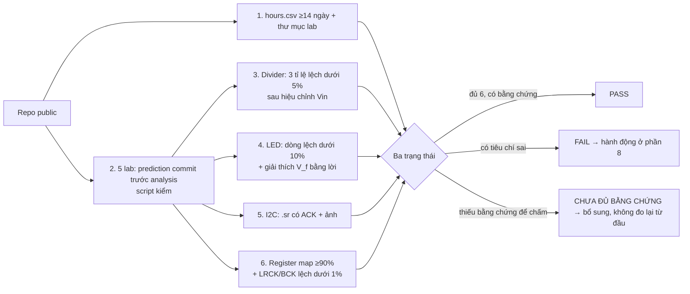

# Khóa 1 · Phần D — Nhìn thấy dữ liệu trên dây (10h)

Phần C đo những đại lượng đứng yên (điện áp, dòng). Phần D đo **một chuỗi sự kiện theo thời gian**: bit, byte, khung, và khoảng cách giữa chúng. Dụng cụ chính là logic analyzer clone 24 MHz (fx2lafw) + PulseView (Bài 7). Vòng làm việc giữ nguyên: dự đoán → commit → capture → so → giải thích. Câu hỏi xuyên suốt: *dụng cụ của tôi có đủ nhanh để thấy thứ tôi muốn thấy không, và đo thời gian chính xác tới đâu* (→ F5.5).

| Bài | Giờ | Viên nang nền nên đọc cùng lúc | Thư mục lab |
|---|---|---|---|
| 12 — I2C và ACK | 5 | F5.5 (lướt: Nyquist, sample rate), F2.1 (đoạn "test là một phép đo") | `lab/04-i2c/` |
| 13 — I2S | 4 | F5.5, F4.1 (thạch anh, ppm) | `lab/05-i2s/` |
| 14 — Gate Khóa 1 | 1 | F1.7, F2.3 | — |

Bản gốc chỉ ghi Phần D = 10h, không chia theo bài; cách chia trên là đề xuất. Phần mô phỏng và câu hỏi ngược thêm ~1h mỗi bài.

**Quy tắc chung khi dùng logic analyzer** (từ Bài 7, nhắc lại vì đây là nguồn lỗi số một): nối **GND trước**, tháo cuối cùng. Sample rate ≥4×, tốt nhất ≥10× tần số tín hiệu nhanh nhất bạn muốn *giải mã*; muốn *đo thời gian* chính xác thì câu hỏi khác hẳn — đo qua nhiều chu kỳ (Bài 12, 13).

---

## Bài 12 — Cắm I2C và nhìn thấy ACK (5h)

> **Vị trí:** Bài 11 (datasheet) → **Bài 12** → Bài 13 (I2S) · **Cần trước:** Bài 3 (bus có clock vs không clock), Bài 7 (PulseView, nối GND), Bài 9 (Rth, điện trở + điện dung), Bài 11 (địa chỉ, chip ID, cấm kéo chân giao tiếp lên khi cảm biến tắt nguồn; bước 6: pull-up và SDO của module), F5.5 (lướt) · **Sau bài này bạn quyết định được:** chọn điện trở pull-up cho một bus I2C theo tốc độ và độ dài dây; cấu hình một capture (sample rate, trigger, số mẫu) đủ để chắc chắn bắt được giao dịch; và chẩn đoán "scanner không thấy gì" theo thứ tự đúng.

### 1. Câu chuyện — ai đã khổ vì chuyện này

Đầu thập niên 1980, Philips cần nối hàng chục con chip bên trong TV (bộ dò kênh, EEPROM, xử lý âm thanh) mà không kéo hàng chục đường song song trên mạch in. Họ tạo ra I²C (Inter-IC, 1982): **hai dây dùng chung cho mọi chip**, mỗi chip có một địa chỉ `[chuẩn]`. Cái giá của hai dây chung là mọi chip phải *chia nhau* cùng một sợi SDA mà không đánh nhau. Lời giải là **open-drain**: không ai được phép đẩy dây lên cao, chỉ được kéo xuống; một điện trở pull-up kéo dây lên khi không ai giữ. Nhờ vậy, khi hai chip "nói" cùng lúc, kết quả là AND logic của cả hai, không phải đoản mạch.

Cái giá thứ hai, đến nay vẫn làm người ta khổ: nếu bộ điều khiển (controller) bị reset giữa lúc một cảm biến đang gửi bit 0, cảm biến tiếp tục giữ SDA ở mức thấp, chờ một nhịp clock không bao giờ tới. **Cả bus treo**, mọi thiết bị khác trên bus cũng chết theo. Đặc tả I²C của NXP (UM10204) có hẳn một mục "bus clear" chỉ cách gỡ: phát 9 xung clock để thiết bị kia nhả dây `[spec — UM10204, mục Bus clear]`. Bài này cho bạn nhìn tận mắt cơ chế "kéo xuống / nhả ra" đó, ở nhịp clock thứ 9 sau địa chỉ: **ACK**.

Cái giá thứ ba là **clock stretching**: target được phép giữ SCL thấp để bắt controller chờ. Bộ điều khiển I2C phần cứng của các Raspberry Pi đời đầu (BCM2835 và họ hàng) xử lý việc này không đúng; cảm biến dùng clock stretching nhiều như BNO055 trả dữ liệu hỏng hoặc treo bus khi nối với Pi, và cách khắc phục phổ biến là hạ tốc độ bus hoặc dùng I2C bằng phần mềm `[chuẩn — ghi nhận rộng rãi, ví dụ hướng dẫn BNO055 của Adafruit]`. Một chi tiết trong spec, một lỗi im lặng trong dữ liệu. Và hai dây này vẫn nằm trong máy chủ của bạn: EEPROM SPD trên thanh RAM đọc qua SMBus, BMC đọc nhiệt độ, quạt qua I2C, bộ nguồn báo công suất qua PMBus `[chuẩn]`.

### 2. Mô hình tư duy

**Điện: open-drain + pull-up = một mạch RC.**

```
 3.3 V ──[Rp]──┬───────────────┬───────────────┬──── SDA (hoặc SCL)
               │               │               │
           ESP32 (ctrl)    BME280 (target)   thiết bị khác     ═╪═ Cb: điện dung của dây + mọi chân
             ┤ công tắc       ┤ công tắc        ┤ công tắc          (vài pF/chân + dây)
               │ xuống GND      │                 │
 GND ──────────┴───────────────┴─────────────────┴────
  Bất kỳ ai đóng công tắc → dây = 0 (nhanh, qua transistor).
  Không ai đóng → dây lên 1 CHẬM, vì Rp phải nạp Cb: hằng số thời gian Rp·Cb.
```

**Giao thức: một giao dịch đọc thanh ghi** (byte-level, WaveDrom JSON — dán vào wavedrom.com/editor.html để xem):

```json
{"signal": [
  {"name": "SDA mang gì", "wave": "=============",
   "data": ["START", "ADDR 7 bit", "W=0", "ACK", "REG", "ACK", "Sr", "ADDR 7 bit", "R=1", "ACK", "DATA", "NACK", "STOP"]},
  {"name": "ai lái SDA", "wave": "=============",
   "data": ["ctrl", "ctrl", "ctrl", "target", "ctrl", "target", "ctrl", "ctrl", "ctrl", "target", "target", "ctrl", "ctrl"]}
]}
```

**Bit-level quanh ACK** (ASCII):

```
          bit 8 (R/W)   bit 9 (ACK)
SCL  ___/‾‾‾‾‾\_______/‾‾‾‾‾‾\________
SDA  ==X=======X______________X=======     ← controller NHẢ SDA sau bit 8;
                ↑ target kéo xuống trước cạnh lên của SCL
                  và giữ THẤP suốt lúc SCL cao = ACK.
                  Nếu không ai kéo, pull-up giữ SDA cao = NACK.
START = SDA xuống khi SCL đang cao · STOP = SDA lên khi SCL đang cao
(mọi lúc khác, SDA chỉ được đổi khi SCL thấp — vì vậy START/STOP không thể nhầm với dữ liệu)
```

1. **Một bit trên I2C là một phép AND của mọi thiết bị.** ACK không phải một "gói tin trả lời": nó là việc target *giữ dây ở mức thấp* trong đúng một nhịp. Controller biết có ai nghe hay không **ở từng byte**.
2. **Tốc độ tối đa của bus là chuyện điện, không phải chuyện phần mềm.** Cạnh lên dài `≈ 0.85·Rp·Cb` (30%→70%). Đặc tả I²C giới hạn thời gian cạnh lên cho mỗi chế độ; Rp quá lớn hoặc dây quá dài thì phải chậm lại.
3. **Rp có cả cận dưới:** transistor kéo xuống chỉ hút được một dòng giới hạn mà vẫn giữ mức thấp đủ thấp, nên Rp không được quá nhỏ. Pull-up là một bài toán chọn trong khoảng `[Rp_min, Rp_max]`, giống bài toán R của divider ở Bài 9.
4. Mô phỏng dưới đây tính cạnh lên cho một lưới Rp × Cb và vẽ SCL với hai pull-up khác nhau. Một trong hai là pull-up nội của ESP32 — driver Arduino-ESP32 bật nó mặc định `[spec — mã nguồn arduino-esp32, esp32-hal-i2c-ng.c: enable_internal_pullup = 1]`.

```python
# [đã chạy] I2C open-drain: cạnh xuống do transistor kéo (nhanh), cạnh lên do pull-up nạp tụ dây (chậm)
import numpy as np
import matplotlib.pyplot as plt

VDD = 3.3
# UM10204: t_r đo từ 30% tới 70% VDD. Nạp RC: V(t) = VDD(1 - e^(-t/RC)) -> t_r = RC*ln(0.7/0.3)
K = np.log(0.7 / 0.3)                 # = 0.8473
TR_MAX = {"Standard 100 kHz": 1000e-9, "Fast 400 kHz": 300e-9}
rp_list = [2.2e3, 4.7e3, 10e3, 45e3]  # 45 kΩ ~ pull-up nội của ESP32 [spec — tra datasheet ESP32-S3]
cb_list = [20e-12, 50e-12, 100e-12, 200e-12, 400e-12]

print("t_r (ns) = 0.8473*Rp*Cb ; S = đạt Standard, F = đạt cả Fast, x = trượt cả hai")
print("Rp \\ Cb  " + "".join(f"{c*1e12:>9.0f}pF" for c in cb_list))
for rp in rp_list:
    row = ""
    for cb in cb_list:
        tr = K * rp * cb
        tag = "F" if tr <= TR_MAX["Fast 400 kHz"] else ("S" if tr <= TR_MAX["Standard 100 kHz"] else "x")
        row += f"{tr*1e9:>9.0f} {tag} "
    print(f"{rp/1e3:>5.1f}k   " + row)

# Rp nhỏ nhất: transistor phải kéo được dây xuống dưới V_OL = 0.4 V khi chỉ "hút" được 3 mA
print(f"Rp_min = (VDD - 0.4 V) / 3 mA = {(VDD - 0.4) / 3e-3:.0f} Ω")

# Vẽ dạng sóng SCL 100 kHz qua hai pull-up khác nhau, Cb = 100 pF
t = np.linspace(0, 20e-6, 4000)
drive_low = (t % 10e-6) < 5e-6          # controller kéo thấp nửa đầu mỗi chu kỳ
fig, ax = plt.subplots(figsize=(7, 3))
for rp in (4.7e3, 45e3):
    v, out, dt = VDD, [], t[1] - t[0]
    for low in drive_low:   # nghiệm chính xác của mạch RC trên mỗi bước dt
        target, tau = (0.0, 50 * 100e-12) if low else (VDD, rp * 100e-12)  # kéo xuống qua ~50 Ω
        v = target + (v - target) * np.exp(-dt / tau)
        out.append(v)
    ax.plot(t * 1e6, out, label=f"Rp = {rp/1e3:g} kΩ")
ax.axhline(0.7 * VDD, ls=":", c="gray"); ax.axhline(0.3 * VDD, ls=":", c="gray")
ax.set_xlabel("t (µs)"); ax.set_ylabel("SCL (V)"); ax.legend()
fig.tight_layout(); plt.show()
```

### 3. Cầu nối từ backend

| Backend bạn biết | Ở đây | Gãy ở chỗ | Nếu dùng nhầm thì |
|---|---|---|---|
| HTTP: URL = địa chỉ, 200 = ACK, 404 = NACK (bản gốc, `robotics-data-infra-roadmap.md`) | Địa chỉ 7 bit, ACK/NACK từng byte | ACK là xác nhận **tầng liên kết, từng byte** (gần TCP ACK hơn HTTP 200); không có checksum nên ACK không nói dữ liệu đúng; NACK có nghĩa bình thường (controller NACK byte cuối khi đọc xong) | Coi NACK cuối giao dịch đọc là lỗi; coi ACK là "cảm biến chạy đúng" |
| Mở/đóng connection | START/STOP, repeated START (Sr) | Không có bắt tay, không có trạng thái phiên ở target ngoài con trỏ thanh ghi. Sr giống **giữ khóa bus** giữa hai thao tác (để không ai chen vào giữa ghi-con-trỏ và đọc) hơn là giữ connection | Tách ghi-con-trỏ và đọc thành hai giao dịch có STOP ở giữa trên bus nhiều controller → đọc nhầm thanh ghi |
| Khóa phân tán có lease/TTL | Bus treo khi target giữ SDA thấp | I2C chuẩn **không có timeout**: người giữ "khóa" (SDA thấp) chết hay quên thì không ai thu hồi. SMBus (một biến thể) thêm timeout cỡ vài chục ms — chính là lease | Reset ESP32 mà không reset cảm biến → bus vẫn treo; tưởng lỗi phần mềm |
| Service discovery / DNS | Địa chỉ cố định theo chân SDO | Không có cơ chế chống trùng: hai thiết bị cùng địa chỉ **cùng ACK**, dữ liệu đọc ra là AND của hai bên, không ai báo lỗi | Gắn hai BME280 cùng địa chỉ → số rác "hợp lệ" |
| `tcpdump` trên một interface | Logic analyzer trên SDA/SCL | `tcpdump` không bỏ sót gói khi máy đủ nhanh và có timestamp kernel; logic analyzer chỉ thấy **những gì rơi vào cửa sổ capture** với **độ phân giải 1/sample-rate**, và chỉ thấy mức logic, không thấy hình dạng cạnh | Capture xong thấy "không có gì" và kết luận bus im lặng, trong khi giao dịch xảy ra ngoài cửa sổ |

**Chấm mô hình:**

- *"ACK là 200 OK, NACK là 404."* (bản gốc, bảng dịch trong roadmap) — **ĐÚNG MỘT PHẦN.** Đúng cho NACK ngay sau byte địa chỉ khi không ai có địa chỉ đó. Gãy ở ba chỗ. Phản ví dụ: (a) byte cuối của một giao dịch đọc luôn được **controller** NACK để báo "đủ rồi" — đó là thành công, không phải 404; (b) nhiều EEPROM NACK địa chỉ của chính nó trong lúc đang ghi nội bộ — gần 503 Busy hơn 404; (c) một BMP280 ở cùng địa chỉ ACK y hệt BME280 — ACK nói "có ai đó ở đây", không nói "đúng thiết bị".
- *Mô hình của bạn ở K3 lượt 2:* "…cách đọc/ghi, schema thì còn phải dùng các dây/chân khác kết hợp phối hợp quy định, như clock… [ESP32] không cần biết có ai nhận ở cuối dây." — với I2C: **SAI ở vế sau, ĐÚNG MỘT PHẦN ở vế trước.** Vế sau: I2C là bus có xác nhận; controller biết ở từng byte có ai nhận không (ACK), và target còn có thể **giữ SCL** để bắt controller chờ (clock stretching). Vế trước: clock cho biết *khi nào* lấy mẫu SDA, nhưng *khung* (START/STOP) được mã hóa ngay trên SDA bằng một chuyển mức "vi phạm luật" khi SCL cao; còn *schema* (thanh ghi 0xD0 nghĩa là gì) không có trên dây — nó nằm trong datasheet. Phản ví dụ: một logic analyzer decode hoàn hảo bus I2C mà không có datasheet chỉ cho bạn chuỗi byte, không cho bạn nhiệt độ. Vế "không cần biết ai nhận" đúng với I2S (Bài 13).
- *"Pull-up là chi tiết nối dây, module có sẵn là xong."* — **SAI.** Pull-up quyết định cạnh lên, tức tốc độ tối đa và độ dài dây cho phép, và quyết định dòng tiêu thụ mỗi khi dây ở mức thấp. Phản ví dụ: bus chạy ổn ở 100 kHz với dây 10 cm, hỏng ở 400 kHz hoặc với dây 50 cm, **không đổi một dòng code**.

### 4. Thuật ngữ

| Mức | Thuật ngữ | Nghĩa trong một câu | Hay bị hiểu nhầm thành |
|---|---|---|---|
| 🟢 | I²C (I2C) | Bus hai dây SDA/SCL, nhiều thiết bị, có địa chỉ, open-drain | Giao thức "chậm nên đơn giản" |
| 🟢 | Controller / target (cũ: master / slave) | Bên phát clock và khởi tạo giao dịch / bên được gọi theo địa chỉ. UM10204 bản mới dùng tên controller/target | Hai bên ngang hàng |
| 🟢 | START, STOP, repeated START (Sr) | Ba điều kiện không phải dữ liệu: SDA đổi mức khi SCL cao | Byte đặc biệt |
| 🟢 | ACK / NACK | Bit thứ 9 của mỗi byte: bên nhận kéo SDA thấp (ACK) hoặc để cao (NACK) | HTTP status |
| 🟢 | Open-drain + pull-up | Thiết bị chỉ kéo xuống; điện trở kéo lên khi không ai giữ | Push-pull như GPIO thường |
| 🟢 | Standard-mode / Fast-mode | 100 kHz / 400 kHz SCL tối đa, mỗi chế độ có giới hạn cạnh lên riêng | Chỉ là con số trong `setClock` |
| 🟡 | Bus capacitance (Cb) | Tổng điện dung của dây và mọi chân trên bus | Không đáng kể |
| 🟡 | Rise time (t_r) | Thời gian dây đi từ 30% lên 70% VDD; do Rp·Cb quyết định | Do phần mềm |
| 🟡 | Clock stretching | Target giữ SCL thấp để bắt controller chờ | Lỗi |
| 🟡 | Bus clear / stuck bus | Target giữ SDA thấp sau khi controller reset; gỡ bằng 9 xung SCL hoặc cắt nguồn target | Lỗi ngẫu nhiên |
| 🟢 | Địa chỉ 7 bit vs byte địa chỉ 8 bit | 7 bit địa chỉ + 1 bit R/W tạo thành byte đầu; có tài liệu ghi địa chỉ dạng 8 bit (đã dịch trái) | Hai thiết bị khác nhau |
| 🟢 | Trigger (logic analyzer) | Điều kiện bắt đầu ghi (ví dụ cạnh xuống của SDA) | Không cần, cứ capture thật dài |
| 🔴 | SMBus, 10-bit addressing, multi-controller arbitration, High-speed mode | Biến thể và tính năng nâng cao; biết tên | — |

### 5. Dự đoán

**Tham số cần tra:**

| Tham số | Lấy ở đâu |
|---|---|
| Địa chỉ BME280 trên module của bạn | Bài 11 bước 6.2 (SDO nối đâu) + bảng địa chỉ trong datasheet |
| Pull-up trên module | Bài 11 bước 6.1 (đo bằng thang Ω khi không cấp nguồn) |
| Pull-up nội của ESP32-S3 | Datasheet ESP32-S3, bảng đặc tính DC của GPIO (R_PU) |
| Tần số SCL mặc định của `Wire` | Mã nguồn arduino-esp32 (`Wire.begin` → tần số 0 được thay bằng giá trị mặc định trong `esp32-hal-i2c*.c`) hoặc tài liệu Arduino-ESP32; **ghi phiên bản core bạn cài** |
| Chân SDA/SCL mặc định | File `pins_arduino.h` của biến thể board ESP32-S3 bạn chọn trong Arduino IDE, và pinout board thật |
| Giới hạn cạnh lên Standard/Fast, công thức Rp_min/Rp_max | NXP UM10204 *I2C-bus specification and user manual*, mục về pull-up resistor sizing |
| Hành vi của sketch scanner | Đọc mã `WireScan.ino` (File → Examples → Wire → WireScan): nó gửi gì, mỗi lần quét cách nhau bao lâu |

**Công thức/phương pháp:**
- Chu kỳ SCL = 1/f. Một lần "dò" một địa chỉ ≈ START + 9 bit + STOP ≈ 10–11 chu kỳ SCL, cộng khoảng nghỉ phần mềm giữa hai lần dò (không biết → ghi khoảng đoán).
- Thời lượng một vòng quét = số địa chỉ dò × thời gian mỗi lần. So với **cửa sổ capture** = số mẫu / sample rate. Kết luận: cần trigger hay không?
- Byte đầu tiên trên dây = `(địa chỉ 7 bit << 1) | R/W`.
- Cạnh lên `t_r ≈ 0.8473·Rp·Cb`. Ước lượng Cb: vài pF mỗi chân × số chân trên bus + dây jumper (đoán một khoảng, ghi `[ước lượng]`).
- Độ phân giải thời gian của capture = 1/sample rate. Đo một chu kỳ SCL sai ±1 mẫu; đo N chu kỳ liên tiếp thì sai số chia cho N.
- Thời gian trên dây: một byte = 8 bit + ACK = 9 nhịp SCL. Giao dịch = số byte (kể cả byte địa chỉ) × 9 nhịp + START/Sr/STOP (tra t_HD;STA, t_SU;STA, t_SU;STO trong UM10204).

**Mẫu `lab/04-i2c/prediction.md`:**

```markdown
# Dự đoán — I2C
Core arduino-esp32 phiên bản: __ · Board chọn trong IDE: __
Địa chỉ dự đoán: 0x__ (vì SDO nối __, đo ở Bài 11) — 7 bit nhị phân: _______
Byte đầu trên dây khi ghi: 0x__  · khi đọc: 0x__
Tần số SCL: __ kHz (nguồn: __) → chu kỳ __ µs
Pull-up hiệu dụng: module __ kΩ // ESP32 nội __ kΩ = __ kΩ
Cb ước lượng: __–__ pF → t_r ≈ __–__ ns; đạt Standard-mode? __ Fast-mode? __

Scanner: dò địa chỉ từ 0x__ đến 0x__, mỗi lần ≈ __ µs → một vòng ≈ __ ms; lặp mỗi __ s
Capture: sample rate __ MHz, __ mẫu → cửa sổ __ ms → cần trigger? __ (trigger trên kênh __, cạnh __)

Chuỗi nhãn decoder tôi kỳ vọng cho SCANNER tại địa chỉ của BME280: __
Chuỗi nhãn decoder tôi kỳ vọng cho SKETCH ĐỌC CHIP ID: __
Ở nhịp clock thứ 9 sau địa chỉ: SDA __ (ai kéo?), SCL __
Thời gian 1 byte: 100 kHz __ µs · 400 kHz __ µs
Giao dịch đọc chip ID (START tới STOP): __ khe × 9 nhịp + START/Sr/STOP ≈ __ µs (100 kHz) / __ µs (400 kHz)
Burst 8 byte dữ liệu (0xF7–0xFE) trong một giao dịch: __ khe → ≈ __ µs (100 kHz) · % nhịp mang dữ liệu đo: __
Chu kỳ SCL đo được sẽ đúng bằng / dài hơn / ngắn hơn danh định, vì __
Scanner quét từ địa chỉ 1 tăng dần: số NACK trước ACK của BME280 = __
```

`git commit -m "lab04: prediction"`.

### 6. Làm

**Bước 1 — nối dây.** ESP32-S3 với BME280:

| BME280 | ESP32-S3 | Ghi chú |
|---|---|---|
| VCC | 3V3 | **Không phải 5V** (Bài 11) |
| GND | GND | |
| SDA | GPIO 8 (mặc định của biến thể ESP32-S3 trong arduino-esp32) | |
| SCL | GPIO 9 (mặc định) | |

Kiểm tra chân trên board thật, vì mỗi biến thể DevKit đánh số và in nhãn hơi khác. **Thứ tự cấp nguồn:** cắm VCC/GND của cảm biến trước hoặc cùng lúc với SDA/SCL; đừng để cảm biến mất nguồn trong khi ESP32 vẫn chạy và kéo SDA/SCL lên (Bài 11, điều cấm về thứ tự cấp nguồn).

Kiểm trước khi cắm USB: (a) chế độ Ω giữa 3V3 và GND của mạch — **không được gần 0 Ω**; (b) thông mạch từng dây từ chân ESP32 tới chân module; (c) SDA và SCL không thông nhau.

**Bước 2 — dự đoán, commit** (phần 5), **trước khi chạy scanner**: Serial Monitor sẽ in địa chỉ, và dự đoán viết sau đó chỉ là chép đáp án. Đọc mã `WireScan.ino` (File → Examples → Wire → WireScan) trước khi dự đoán: nó chờ bao lâu giữa các vòng quét, dò dải địa chỉ nào, in gì khi tìm thấy.

**Bước 3 — chạy I2C scanner.** Cài Arduino IDE, thêm board support ESP32 (Espressif), nạp **WireScan**. Mở Serial Monitor ở 115200. Ghi địa chỉ in ra.

**Bước 4 — cắm logic analyzer.**

| Logic analyzer | Nối vào |
|---|---|
| **GND** | GND của mạch ← **không được quên** |
| D0 | SCL |
| D1 | SDA |

**Bước 5 — capture scanner.**
1. PulseView → sample rate **4 MHz** (đủ: ≥ 40 mẫu/chu kỳ SCL ở 100 kHz). Độ phân giải thời gian là 250 ns — ghi con số này cạnh mọi phép đo thời gian.
2. Đặt **trigger**: kênh SDA (D1), cạnh xuống. Số mẫu đủ cho một vòng quét theo dự đoán của bạn (1M mẫu ở 4 MHz = 250 ms).
3. Bấm **Run**. PulseView chờ tới khi SDA có cạnh xuống đầu tiên — tức START đầu tiên của vòng quét — rồi mới ghi.
4. Bấm nút decoder (biểu tượng zigzag) → **I²C** → gán SCL = D0, SDA = D1.
5. Zoom vào lần dò trùng địa chỉ BME280.

**Bước 6 — capture một giao dịch đọc chip ID** (mới — scanner chỉ dò địa chỉ, không đọc thanh ghi nào). Nạp sketch dưới đây, điền địa chỉ bạn dự đoán:

```cpp
// [chưa chạy] cần ESP32-S3 + BME280; kiểm API Wire theo phiên bản arduino-esp32 bạn cài
#include <Wire.h>
const uint8_t ADDR = 0x00;      // ĐIỀN địa chỉ 7 bit bạn dự đoán ở phần 5
void setup() {
  Serial.begin(115200);
  Wire.begin();                 // chân SDA/SCL mặc định của biến thể board
  Wire.setClock(100000);        // ghi rõ tần số, không dựa vào mặc định
}
void loop() {
  Wire.beginTransmission(ADDR);
  Wire.write(0xD0);             // đặt con trỏ thanh ghi = chip ID
  uint8_t err = Wire.endTransmission(false);    // false: không phát STOP → repeated START
  uint8_t n = Wire.requestFrom(ADDR, (uint8_t)1);
  Serial.printf("err=%u n=%u id=0x%02X\n", err, n, n ? Wire.read() : 0);
  delay(1000);
}
```

Capture lại với cùng trigger. Lưu file `.sr` (**File → Save**) và chụp màn hình phần đã decode — đây là **tiêu chí số 5 của Gate** (Bài 14).

**Bước 7 — đo.**
1. Chu kỳ SCL: đặt con trỏ ở cạnh lên nhịp 1 và cạnh lên nhịp 9 **trong cùng một byte** (= 8 chu kỳ; không vắt qua hai byte vì driver có thể chèn khoảng nghỉ), chia 8. Sai số đo = ±1 mẫu / 8. Ghi riêng thời gian SCL cao và thấp — thường **không bằng nhau**.
2. Một byte (cạnh xuống đầu tiên của SCL sau START tới cạnh xuống sau nhịp 9), cả giao dịch (START tới STOP), và khoảng nghỉ giữa các byte nếu có.
3. Zoom vào nhịp clock thứ 9 sau địa chỉ: SDA ở mức nào trong lúc SCL cao? Ai đang kéo nó?
4. Đếm: trong vòng quét, có bao nhiêu địa chỉ được ACK?

**Bước 7b — 400 kHz.** Đổi `Wire.setClock(400000)`, nạp lại, capture ở **8–12 MHz** (≥20 mẫu mỗi chu kỳ), đo lại cùng các đại lượng. So t_LOW/t_HIGH đo được với giá trị tối thiểu của Fast-mode trong UM10204. Lưu `chipid-100k.sr`, `chipid-400k.sr`, `scanner.sr` vào `lab/04-i2c/`.

**Bước 8 (tùy chọn, 30 phút) — nhìn thấy pull-up bằng thời gian.** Chuyển sample rate lên 24 MHz (độ phân giải ~42 ns). Đo độ rộng mức cao và mức thấp của SCL. Gắn thêm một điện trở 4.7 kΩ từ SCL lên 3.3 V (song song với pull-up module; kiểm trước rằng tổng song song vẫn > Rp_min), đo lại. Logic analyzer không thấy hình dạng cạnh, nhưng thấy **thời điểm dây vượt ngưỡng logic** dịch đi khi cạnh lên nhanh/chậm hơn `[tự đo]`. Muốn thấy hình dạng thật phải có oscilloscope (🟡, chưa cần mua).

**Bước 9 (tùy chọn, 30 phút) — thí nghiệm phá: treo bus an toàn.** Khi sketch chip ID đang chạy, nối SDA xuống GND **qua một điện trở 1 kΩ** (không nối thẳng). An toàn vì mọi thiết bị trên I2C chỉ kéo xuống; dòng qua 1 kΩ chỉ vài mA. Quan sát `err` in ra và waveform. Rút điện trở: bus có tự hồi phục không? Driver có phát chuỗi xung gỡ bus không? Đây là hành vi của **driver phiên bản bạn cài** `[tự đo]`, không phải của I2C.

### 7. Số phải ra

<details><summary>🔒 MỞ SAU KHI COMMIT prediction.md</summary>

**Serial Monitor (scanner):** `I2C device found at address 0x76` (hoặc `0x77` nếu SDO nối VCC).

**Decoder — scanner:** mỗi địa chỉ là một lần dò ngắn:
```
START | Address write: 75 | NACK | STOP      ← không ai ở 0x75
START | Address write: 76 | ACK  | STOP      ← BME280
START | Address write: 77 | NACK | STOP
```
Không có byte dữ liệu nào: scanner chỉ hỏi "có ai ở địa chỉ này không".

**Decoder — sketch chip ID** (đây là chuỗi bản gốc đưa ra, nhưng nó chỉ xuất hiện với sketch đọc thanh ghi, không với scanner):
```
START | Address write: 76 | ACK | Data write: D0 | ACK | START (repeated) | Address read: 76 | ACK | Data read: 60 | NACK | STOP
```
Serial in `err=0 n=1 id=0x60`. NACK cuối là **controller** báo "đọc đủ một byte" — bình thường.

**Byte địa chỉ trên dây:** `0x76 = 1110110`; khi ghi byte đầu là `11101100 = 0xEC`, khi đọc là `0xED`. Một số tài liệu/thư viện gọi BME280 là "0xEC" — cùng một thiết bị, ghi kiểu 8 bit.

**Chu kỳ SCL ≈ 10 µs (100 kHz)**, đo trên 8 chu kỳ ở 4 MHz: sai số đo ±250 ns/8 ≈ ±0.3%. Thực tế thường **dài hơn** 10 µs vài phần trăm và không 50/50 cao/thấp: controller đếm thời gian mức cao từ lúc nó *thấy* SCL đã lên, mà cạnh lên chậm do RC — đây là cơ chế đồng bộ clock của chính spec; bộ chia clock của ESP32 cũng không ra đúng mọi tần số `[tự đo]`. Mọi số đo phải thỏa t_LOW ≥ 4.7 µs, t_HIGH ≥ 4.0 µs (Standard) và t_LOW ≥ 1.3 µs, t_HIGH ≥ 0.6 µs (Fast) `[spec UM10204]`. Nếu ra ≈ 2.5 µs: thư viện đang chạy 400 kHz — **không sai, sửa lại dự đoán và giải thích, đừng sửa số đo.**

**Nhịp thứ 9 sau địa chỉ:** SDA THẤP trong khi SCL cao — target (BME280) kéo xuống. Đó là ACK, nhìn tận mắt.

**Thời gian trên dây** `[ước lượng — từ số nhịp; driver thật có khoảng nghỉ, đo ở bước 7]`:

| Đại lượng | 100 kHz | 400 kHz | Cách tính |
|---|---|---|---|
| 1 byte (8 bit + ACK) | **90 µs** | **22.5 µs** | 9 nhịp |
| Đọc chip ID (addr+W, 0xD0, addr+R, data) | ≈ **0.37–0.40 ms** | ≈ **0.095–0.11 ms** | 4 khe × 9 = 36 nhịp + START/Sr/STOP |
| Burst 8 byte (addr+W, reg, addr+R, 8 data) | ≈ **1.0 ms** | ≈ **0.25 ms** | 11 khe × 9 = 99 nhịp |
| Phần nhịp mang dữ liệu đo trong burst | 64/99 ≈ **65%** | | |

**Scanner quét từ địa chỉ 1:** **117 lần NACK** (0x01…0x75) trước ACK ở 0x76 — mỗi NACK là một câu trả lời đúng: "không ai ở địa chỉ này".

**Bước 9 (treo bus):** khi SDA bị giữ thấp, controller không tạo được START hợp lệ; `endTransmission` trả mã khác 0 (mã cụ thể tùy phiên bản core) `[tự đo]`. Rút điện trở: thường bus hồi phục ngay vì lần này **chính bạn** giữ SDA, không phải BME280. Trường hợp khó thật là khi *target* giữ SDA (ESP32 reset đúng lúc target đang gửi bit 0): lúc đó cần 9 xung hoặc cắt nguồn target.

**Thời lượng vòng quét:** 126 lần dò × (~0.1 ms trên dây + khoảng nghỉ phần mềm) ≈ vài chục ms `[ước lượng — tự đo]`; WireScan chờ 5 s giữa hai vòng. Nếu "Run rồi bấm reset" như bản gốc, cửa sổ 250 ms gần như chắc chắn rơi vào khoảng chờ 5 s → capture trống. Trigger giải quyết việc này.

**Bảng cạnh lên** (từ mô phỏng; t_r tính bằng ns; F = đạt cả Fast-mode 300 ns, S = chỉ đạt Standard-mode 1000 ns, x = trượt cả hai):

| Rp \ Cb | 20 pF | 50 pF | 100 pF | 200 pF | 400 pF |
|---|---|---|---|---|---|
| 2.2 kΩ | 37 F | 93 F | 186 F | 373 S | 746 S |
| 4.7 kΩ | 80 F | 199 F | 398 S | 796 S | 1593 x |
| 10 kΩ | 169 F | 424 S | 847 S | 1695 x | 3389 x |
| 45 kΩ (pull-up nội ESP32) | 763 S | 1906 x | 3813 x | 7626 x | 15251 x |

Rp_min = (3.3 − 0.4) V / 3 mA ≈ 967 Ω. Đọc bảng: pull-up nội ~45 kΩ chỉ đạt Standard-mode khi bus cực ngắn — đó là lý do một bus **không có pull-up ngoài vẫn "chạy được" ở bàn** (driver bật pull-up nội) rồi hỏng khi dây dài ra hoặc lên 400 kHz. Breadboard + jumper + hai module thường rơi vào vùng vài chục tới ~100 pF `[ước lượng]`.

</details>

### 8. Nếu ra khác

| Triệu chứng | Nguyên nhân khả dĩ | Kiểm bằng cách | Sửa |
|---|---|---|---|
| Cả SCL và SDA thẳng HIGH, không có gì | Code chưa chạy; analyzer chưa nối GND; capture rơi vào khoảng chờ giữa hai vòng quét | Serial Monitor có in không; trigger đã đặt chưa | Nối GND; đặt trigger cạnh xuống SDA |
| Cả hai thẳng LOW | Chập SDA/SCL xuống GND; một target đang giữ bus; cảm biến mất nguồn còn chân bị kéo (Bài 11) | Đo áp SDA/SCL khi không chạy code; rút cảm biến ra xem dây có lên không | Gỡ chập; cắt nguồn cảm biến rồi cấp lại; "bus clear" 9 xung SCL |
| Thấy sóng nhưng decoder báo lỗi | Gán nhầm kênh SCL/SDA; sample rate quá thấp | Kênh nào đều đặn (là SCL)? | Đổi kênh trong decoder; tăng sample rate |
| **NACK** sau địa chỉ | Sai địa chỉ, hoặc cảm biến chưa được cấp nguồn | Thử địa chỉ còn lại; đo VCC của cảm biến (~3.3 V) | Sửa địa chỉ / nguồn |
| Scanner không tìm thấy gì | Nối nhầm SDA/SCL (lỗi phổ biến nhất); sai chân mặc định | Đảo hai dây; đối chiếu `pins_arduino.h` | Đảo dây hoặc `Wire.begin(sda, scl)` |
| Scanner báo thấy thiết bị ở **mọi** địa chỉ, hoặc lỗi timeout hàng loạt | SDA bị giữ thấp → mọi bit thứ 9 đều "ACK" (AND của dây) | Capture: SDA có lên cao lại không | Như dòng "thẳng LOW" |
| Chu kỳ SCL ≈ 2.5 µs thay vì 10 µs | Thư viện/cấu hình đang chạy 400 kHz | `Wire.getClock()` | **Sửa lại dự đoán và giải thích, đừng sửa số đo** |
| `id=0x58` (hoặc 0x56/0x57) | Module là **BMP280**, không phải BME280 | Bài 11, Table 17 | Ghi vào notebook; không có kênh độ ẩm |
| Decoder hiện địa chỉ 0x76, tài liệu khác ghi 0xEC | Cách ghi 7 bit vs 8 bit | `0x76 << 1 = 0xEC` | Không phải lỗi |
| Chạy ổn với dây ngắn, lỗi lác đác khi dây dài | Cạnh lên quá chậm (Rp·Cb) | Bước 8 | Pull-up ngoài nhỏ hơn (trong khoảng hợp lệ) hoặc giảm tốc độ |

Dòng "chu kỳ 2.5 µs" đáng đọc lại. Khi số đo khác dự đoán, thứ phải thay đổi là **hiểu biết của bạn**, không phải số đo.

### 9. Câu hỏi ngược

1. **[Nếu…thì]** Nếu gắn hai BME280 cùng địa chỉ lên một bus, scanner in gì, và dữ liệu đọc chip ID ra gì? Có lỗi nào được báo không?
   <details><summary>Hướng nghĩ</summary>Hai target cùng ACK (AND của hai lần kéo xuống vẫn là thấp). Dữ liệu là AND bit-wise của hai bên: chip ID giống nhau nên vẫn ra đúng; nhiệt độ thì ra rác "hợp lệ". Lời giải: chân SDO, bộ mux I2C, hoặc bus thứ hai. Đây là kiểu lỗi mà kiểm "health" bằng chip ID không bắt được.</details>
2. **[Quy mô]** Một cánh tay robot có 8 cảm biến I2C trải trên dây dài 50 cm, chạy cạnh dây motor. Cái gì gãy trước: tốc độ, nhiễu, hay địa chỉ? Bạn đổi gì đầu tiên?
   <details><summary>Hướng nghĩ</summary>Cộng Cb: 8 thiết bị + dây dài → tra bảng t_r. Nhiễu từ motor ghép vào dây single-ended có trở kháng cao lúc ở mức cao (chỉ có pull-up giữ). Từ đó hiểu vì sao robot thật dùng CAN (vi sai) hoặc đặt MCU sát cảm biến và gửi số qua bus khác.</details>
3. **[Failure mode]** ESP32 bị watchdog reset đúng lúc BME280 đang gửi bit 0 của byte dữ liệu. Sau reset, mọi lệnh I2C đều lỗi. Vì sao reset ESP32 không chữa được, và firmware nên làm gì lúc khởi động?
   <details><summary>Hướng nghĩ</summary>Target vẫn đang chờ clock để gửi nốt byte, nên giữ SDA. Lúc boot, kiểm SDA; nếu thấp, phát xung SCL thủ công tới khi SDA nhả, rồi phát STOP. So với lease: I2C chuẩn không có TTL, nên chính bạn phải làm việc thu hồi. Ở K3 Bài 16 bạn sẽ gặp watchdog hai tầng — tầng này là một ca cho nó.</details>
4. **[Vì sao không]** Vì sao I2C không dùng đầu ra push-pull như SPI để có cạnh lên nhanh?
   <details><summary>Hướng nghĩ</summary>Nghĩ tới ACK và clock stretching: ai lái dây đổi theo từng bit. Hai đầu ra push-pull lái ngược nhau là đoản mạch. Open-drain đổi tốc độ lấy khả năng chia dây an toàn. SPI tránh vấn đề bằng cách mỗi dây chỉ một bên lái và mỗi thiết bị một chân CS.</details>
5. **[Liên ngành]** CAN bus trong ô tô dùng bit "dominant" và "recessive". Giống open-drain của I2C ở đâu, và CAN dùng nó để làm gì mà I2C trong bài này không dùng?
   <details><summary>Hướng nghĩ</summary>Dominant thắng recessive y như mức thấp thắng mức cao. CAN dùng nó để **trọng tài không phá hủy** khi nhiều nút gửi cùng lúc: nút gửi recessive mà đọc lại thấy dominant thì biết mình thua và rút lui. I2C multi-controller cũng có trọng tài kiểu này (🔴), còn Ethernet đời đầu thì phát hiện va chạm và cả hai bên đều phải gửi lại.</details>
6. **[Phản biện]** "Thấy ACK là cảm biến chạy đúng." Bác bỏ bằng ít nhất hai phản ví dụ từ bài này và Bài 11.
   <details><summary>Hướng nghĩ</summary>Chip khác cùng địa chỉ; cấu hình chưa có hiệu lực (ctrl_hum); đọc rách vì không burst read; cảm biến hỏng vẫn trả lời bus. ACK là bằng chứng tầng liên kết; chất lượng dữ liệu cần kiểm ở tầng khác (→ F3.7, K5 Bài 16).</details>

7. **[Quy mô]** Ở K7, cùng một bus 400 kHz có IMU đọc 12 byte ở 200 Hz, INA226 đọc 4 byte ở 10 Hz, BME280 đọc 8 byte ở 1 Hz. Bus utilization bao nhiêu? Muốn IMU lên 1 kHz thì sao?
   <details><summary>Hướng nghĩ</summary>Mỗi lần đọc = (3 byte overhead + N byte dữ liệu) × 9 nhịp, cộng START/Sr/STOP và khoảng nghỉ đo được ở bước 7 — đừng dùng số lý tưởng. Nhân tần số, cộng lại. Rồi nhớ F7.1: utilization gần 1 thì độ trễ hàng đợi bùng nổ, và một lần đọc BME280 làm IMU lỡ nhịp — jitter của IMU giờ phụ thuộc cảm biến khác. Vì vậy người ta tách bus hoặc chuyển IMU sang SPI.</details>

### 10. Liên kết ra ngoài

- **CAN bus.** Giống: cùng ý tưởng "mức trội thắng" trên một dây chung, cho phép nhiều nút chia một môi trường mà không đoản mạch. Khác: CAN vi sai (chống nhiễu, chạy hàng chục mét), có CRC và cơ chế tự cô lập nút lỗi; I2C single-ended, không CRC, sinh ra cho khoảng cách vài chục cm trong một bo mạch.
- **Khóa phân tán có lease (Chubby, etcd).** Giống: một bên giữ tài nguyên chung (SDA thấp) chặn mọi bên khác. Khác: hệ phân tán học được từ đau khổ rằng người giữ khóa có thể chết, nên khóa có TTL; I2C nguyên bản không có, nên "bus treo" là lớp lỗi kinh điển. SMBus thêm timeout chính là thêm lease.
- **Datacenter — SMBus, PMBus, BMC.** EEPROM SPD trên RAM đọc qua SMBus khi boot; BMC đọc nhiệt độ, quạt, công suất nguồn qua I2C/PMBus. Giống: cùng hai dây, cùng ACK/NACK. Khác: SMBus thêm timeout và mức áp chặt hơn — đúng những chỗ I2C gốc bỏ trống; spec gốc không có timeout thì ngành tự thêm.
- **Ethernet đời đầu (CSMA/CD).** Giống: nhiều nút một môi trường. Khác: va chạm trên Ethernet phá hủy cả hai khung; trọng tài trên I2C/CAN giữ nguyên khung của bên thắng. Cùng bài toán chia sẻ môi trường, hai triết lý khác nhau về cái giá của xung đột.

### 11. Độ tin cậy và sửa lỗi

| Khẳng định | Nhãn | Ghi chú / cách kiểm |
|---|---|---|
| I²C do Philips tạo ra đầu thập niên 1980 | [chuẩn] | Lịch sử I²C; NXP là hậu thân mảng bán dẫn của Philips |
| Giới hạn t_r: 1000 ns (Standard), 300 ns (Fast); Cb tối đa 400 pF; t_r = 0.8473·Rp·Cb; Rp_min = (VDD − V_OL)/I_OL với V_OL 0.4 V ở 3 mA | [spec] | NXP UM10204, mục về đặc tính điện và chọn pull-up; kiểm theo revision bạn tải |
| Mục "Bus clear" — 9 xung SCL | [spec] | UM10204 |
| Arduino-ESP32: tần số mặc định 100 kHz, bật pull-up nội, SDA=8/SCL=9 cho ESP32-S3, scanner tên `WireScan`, dò địa chỉ 0x01–0x7E, chờ 5 s | [spec] | Mã nguồn repo `espressif/arduino-esp32` (nhánh master khi soạn bài); **kiểm theo phiên bản core bạn cài** |
| Pull-up nội ESP32-S3 ~45 kΩ | [spec] | Datasheet ESP32-S3, bảng DC characteristics (R_PU) — kiểm lại |
| Chu kỳ SCL đo được có thể dài hơn danh định vì cạnh lên | [tự đo] | Phụ thuộc bộ điều khiển I2C và Rp·Cb |
| Cb breadboard vài chục tới ~100 pF | [ước lượng] | Vài pF mỗi chân + dây jumper |
| SMBus timeout cỡ 25–35 ms | [spec] | SMBus specification (System Management Interface Forum), tham số t_TIMEOUT |

**Đã sửa so với bản gốc:**
- **Chuỗi decode kỳ vọng sai nguồn:** bản gốc hứa thấy `Data write: D0 … Data read: 60` khi chạy **scanner**; scanner chỉ dò địa chỉ (START, địa chỉ, ACK/NACK, STOP). Đã thêm bước 6 với sketch đọc chip ID, nơi chuỗi đó thật sự xuất hiện.
- **Cửa sổ capture:** bản gốc dùng 4 MHz × 1M mẫu (= 250 ms) và "Run rồi bấm reset"; WireScan chờ 5 s trước mỗi vòng quét → gần như chắc chắn bắt trượt. Đã thêm trigger cạnh xuống SDA.
- Tên ví dụ `Wire/i2c_scanner` → trong core arduino-esp32 là **WireScan**.
- "START … là dấu hiệu duy nhất không phải dữ liệu" → START, repeated START và STOP đều là điều kiện không phải dữ liệu.
- "ACK là 200 OK, NACK là 404" → chấm ĐÚNG MỘT PHẦN, kèm phản ví dụ (NACK cuối đọc là bình thường).
- "Pull-up thường 4.7 kΩ" → giá trị là một khoảng [Rp_min, Rp_max] theo Cb và tốc độ; thêm mô phỏng.
- "Cả hai thẳng LOW → thiếu pull-up": trên ESP32 driver bật pull-up nội nên thiếu pull-up ngoài thường **không** cho mức LOW mà cho cạnh lên chậm; LOW liên tục nghi chập hoặc bus treo trước.
- Bước dự đoán của bản gốc nằm **sau** khi chạy scanner (Serial Monitor đã in địa chỉ). Đưa commit dự đoán lên trước scanner.
- Thêm thời gian byte/giao dịch/burst (niêm phong), bước 400 kHz, thí nghiệm treo bus an toàn qua 1 kΩ.
- Đo chu kỳ SCL qua 8 chu kỳ trong một byte thay vì một cặp cạnh, để sai số do độ phân giải 250 ns nhỏ hơn sai số cần kiểm.

### 12. Đọc thêm và tự kiểm tra

- **Nguồn gốc:** NXP, *UM10204 — I2C-bus specification and user manual* (bản mới nhất); datasheet BME280 mục giao tiếp I2C (Bài 11).
- **Giải thích:** SparkFun tutorial "I2C"; sigrok/PulseView docs, phần protocol decoder và trigger.
- **Đào sâu (tùy chọn):** Ben Eater (YouTube), các video về bus; tài liệu ESP-IDF Programming Guide, mục I2C master driver (để thấy driver làm gì bên dưới `Wire`).
- **Tự kiểm tra:** (1) giải thích lại cho một backend engineer khác trong 5 câu vì sao I2C cần pull-up và vì sao ACK không phải HTTP 200; (2) vẽ lại hình open-drain + Cb và chuỗi một giao dịch đọc thanh ghi từ trí nhớ; (3) hai câu dưới.
  1. Bus 400 kHz, Cb ước lượng 150 pF. Rp lớn nhất là bao nhiêu? Pull-up 10 kΩ trên module có đủ không?
  2. Capture ở 4 MHz, bạn đo một chu kỳ SCL bằng hai con trỏ ra 10.25 µs. Kết luận "SCL chậm 2.5%" có đứng được không?

<details><summary>Đáp án</summary>

1. Rp_max = 300 ns / (0.8473 × 150 pF) ≈ 2.36 kΩ. 10 kΩ không đủ (t_r ≈ 1.27 µs); cần pull-up ngoài nhỏ hơn, song song với 10 kΩ, sao cho tổng trong khoảng ~1–2.3 kΩ.
2. Không. Độ phân giải 250 ns, nên một chu kỳ đo được là 10.00 ± 0.25 µs; 10.25 µs chỉ lệch đúng một mẫu. Đo trên 8 chu kỳ của một byte (hoặc hơn) trước khi kết luận.

</details>

---

## Bài 13 — Nhìn thấy I2S (4h)

> **Vị trí:** Bài 12 (I2C) → **Bài 13** → Bài 14 (gate) → K3 Bài 3 (TN-1: nhìn thấy âm thanh trên dây) · **Cần trước:** Bài 3 (công thức BCLK), Bài 7, Bài 12 (đo chu kỳ qua nhiều nhịp); F5.5, F4.1 · **Sau bài này bạn quyết định được:** logic analyzer 24 MHz kiểm được cấu hình I2S nào và đo được đại lượng nào tới độ chính xác nào; và khi tần số LRCK lệch, đó là lỗi cấu hình (cỡ %) hay sai số thạch anh (cỡ ppm).

### 1. Câu chuyện — ai đã khổ vì chuyện này

Philips công bố I2S (Inter-IC Sound) năm 1986, vài năm sau khi đầu đĩa CD ra thị trường (1982), để các chip *bên trong* một thiết bị âm thanh (bộ giải mã, bộ lọc số, DAC) chuyển mẫu PCM cho nhau bằng ba dây: clock bit, clock chọn kênh, dữ liệu `[chuẩn — Philips, "I2S bus specification", 1986, sửa đổi 1996]`. Không có địa chỉ, không có ACK — vì bên trong một đầu CD, mọi chip đã biết nhau từ lúc thiết kế, và âm thanh không được phép dừng để chờ bắt tay.

Ngay chính con số sample rate cũng là di sản của ràng buộc phần cứng. 44.1 kHz của CD được chọn vì thời đó âm thanh số được ghi lên băng video qua bộ chuyển PCM: 3 mẫu mỗi dòng quét × 245 dòng dùng được mỗi field × 60 field/s = 44 100 mẫu/s, và con số này cũng khớp với hệ PAL `[chuẩn]`. Hệ quả kéo dài tới nay: thiết bị âm thanh chuyên nghiệp thường có hai thạch anh (một họ cho 44.1 kHz, một họ cho 48 kHz), vì không chia được tần số của họ này ra họ kia bằng một số nguyên gọn `[chuẩn]`. ESP32-S3 chỉ có thạch anh 40 MHz; nó tạo clock âm thanh bằng PLL và bộ chia **phân số** — đúng trung bình, nhưng từng chu kỳ không đều tuyệt đối `[spec — ESP-IDF I2S docs, kiểm theo phiên bản]`. Bài này dạy bạn thấy được tới đâu và không thấy được gì.

### 2. Mô hình tư duy

**Một khung I2S chuẩn Philips** (WaveDrom, rút gọn còn 4 bit mỗi kênh cho dễ nhìn; bài thật là 16 bit mỗi kênh):

```json
{ "signal": [
  { "name": "BCLK", "wave": "pppppppppp" },
  { "name": "WS / LRCK", "wave": "0...1...0." },
  { "name": "SD (DOUT)", "wave": "==========",
    "data": ["R.lsb", "L.msb", "L", "L", "L.lsb", "R.msb", "R", "R", "R.lsb", "L.msb"] }
],
  "head": { "text": "Philips I2S: WS đổi trước MSB đúng 1 BCLK · WS thấp = kênh trái · bên nhận lấy mẫu SD ở cạnh lên BCLK" } }
```

```
           ┌──────────── một khung = một mẫu trái + một mẫu phải ────────────┐
LRCK ‾‾‾‾‾‾\________________________________/‾‾‾‾‾‾‾‾‾‾‾‾‾‾‾‾‾‾‾‾‾‾‾‾‾‾‾‾‾‾‾‾\___
BCLK _/‾\_/‾\_/‾\_/‾\ … (slot_bits nhịp) … _/‾\_/‾\_/‾\ … (slot_bits nhịp) …
SD    x │MSB│   kênh trái  …        │LSB│MSB│   kênh phải  …        │LSB│MSB
          ↑ trễ 1 BCLK sau cạnh LRCK (đặc trưng của chuẩn Philips)

  f_LRCK = sample_rate          f_BCLK = sample_rate × slot_bits × số_kênh
  BCLK mỗi khung = slot_bits × số_kênh  (một số NGUYÊN, đúng tuyệt đối nếu cùng nguồn clock)
```

Bốn câu về bản chất:

1. **LRCK là sample rate, theo định nghĩa.** Mỗi chu kỳ LRCK chở đúng một mẫu cho mỗi kênh.
2. **Tỉ số BCLK/LRCK là một số nguyên do cấu hình quyết định** (slot width × số kênh). Đếm được số đó là kiểm được cấu hình, không cần đo thời gian chính xác. Chú ý: *slot width* (số BCLK mỗi kênh) có thể lớn hơn *data width* (số bit có nghĩa), ví dụ 24 bit dữ liệu trong slot 32 bit.
3. **Không có ACK, không có địa chỉ.** Bên nhận không từ chối được, không báo được "tôi thiếu dữ liệu". Nếu bên phát hết dữ liệu (underrun), phần cứng vẫn phát clock và phát số 0 hoặc mẫu cũ (→ K3 Bài 4). Lỗi không vào log, nó thành tiếng "tách".
4. **Đo bằng lấy mẫu có độ phân giải.** Logic analyzer 24 MHz nhìn thấy dây mỗi 1/24 MHz ≈ 41.7 ns. Mọi cạnh tín hiệu bị "làm tròn" về mẫu gần nhất. Câu hỏi của bài: 41.7 ns so với chu kỳ BCLK là lớn hay nhỏ, và có cách nào thấy chính xác hơn độ phân giải đó không.

### 3. Cầu nối từ backend

| Backend bạn biết | Ở đây | Gãy ở chỗ | Nếu dùng nhầm thì |
|---|---|---|---|
| Stream tốc độ cố định (producer đẩy đều vào Kafka) | I2S: một khung mỗi 1/fs, liên tục | Không có retention, không replay, consumer không pause được; dây không lưu gì | Tưởng "chậm một chút cũng được, consumer sẽ bắt kịp" — không có chỗ nào để bắt kịp |
| Binary protocol fixed-width, framing bằng length/delimiter | Framing bằng **một dây clock riêng** (LRCK); độ rộng slot do cấu hình | Sai slot width hoặc sai format (Philips vs left-justified) **không sinh lỗi**: bên nhận đọc lệch bit, ra mẫu sai độ lớn hoặc nhiễu | Debug bằng "có dữ liệu chạy không" — có, nhưng sai |
| Request/response có ACK (I2C, HTTP) | Không có kênh ngược | Bên phát không biết bên nhận có tồn tại (người học đã đúng ở điểm này — xem chấm mô hình) | Thiết kế phát hiện lỗi DAC từ phía ESP32 — không thể trên I2S |
| `rate()` của Prometheus trên cửa sổ dài vs hiệu hai lần scrape | Đo một chu kỳ BCLK vs trung bình qua nhiều chu kỳ | Prometheus nhiễu do jitter scrape; ở đây lượng tử hóa do sample clock của analyzer, và analyzer có sai số ppm riêng | Đo một chu kỳ, thấy lệch, kết luận cấu hình sai mà không tính sai số của chính phép đo |
| Clock skew giữa server, sửa bằng NTP | ESP32, DAC, logic analyzer mỗi bên một thạch anh | Trên **một** link I2S, bên nhận dùng chính BCLK của bên phát nên không trôi với nhau. Trôi xuất hiện giữa **hai miền clock độc lập** (ESP32 vs nguồn dữ liệu trên mini PC; ESP32 vs analyzer) | Gọi mọi sai lệch tần số là "drift"; tìm sửa ở sai chỗ (→ F4.1) |

**Chấm mô hình:**

- *"Bắt logic analyzer ở giữa ESP32 và DAC thì thu được I2S data; lên view thì thấy được tần số, rồi bộ giải mã I2S cho ra data âm thanh dạng raw."* (người học, K3 lượt 2) — **ĐÚNG MỘT PHẦN.** Đúng về vị trí và luồng. Gãy ở hai chỗ: (a) "thấy được tần số" chỉ tới độ chính xác mà độ phân giải lấy mẫu cho phép — bạn tính con số đó ở câu 3 phần 5; (b) decoder chỉ cho số đúng nếu bạn cấu hình đúng format và độ rộng — sai cấu hình thì nó vẫn in ra số, chỉ là số sai. Phản ví dụ: chọn sai cực tính WS trong decoder → kênh trái và phải đổi chỗ, không có cảnh báo nào.
- *"ESP32 không cần biết ai nhận ở cuối dây, nó chỉ đổi và chuyển đi raw data cùng schema quy định."* (người học, K3 lượt 2) — **ĐÚNG**, với một điều kiện: "schema" phải được hai bên thống nhất **ngoài băng** (format, slot width, sample rate, có cần MCLK không). Phản ví dụ ranh giới: một DAC yêu cầu MCLK sẽ im lặng nếu ESP32 không phát MCLK; PCM5102A thì tự tạo clock nội từ BCLK nên không cần `[spec, kiểm datasheet PCM5102A]` — "không cần biết ai nhận" chỉ đúng khi bạn đã biết từ trước.
- *"LRCK đo ra 15.987 kHz thay vì 16.000 kHz là clock drift."* (bản gốc) — **SAI** về tên và về nguyên nhân. Một độ lệch **cố định** là sai số tần số (offset), không phải drift (drift là sự *thay đổi* của sai số theo thời gian/nhiệt độ). Nguyên nhân thì phải tính: đổi độ lệch đó ra ppm và so với dung sai thạch anh (câu 4 phần 5). Và bạn đo nó bằng một analyzer có thạch anh riêng: con số đọc ra là **tỉ số** hai đồng hồ.

### 4. Thuật ngữ

| Mức | Thuật ngữ | Nghĩa trong một câu | Hay bị hiểu nhầm thành |
|---|---|---|---|
| 🟢 | BCLK / SCK (bit clock) | Mỗi chu kỳ là một bit trên SD | Tần số "của âm thanh" |
| 🟢 | LRCK / WS (word select) | Chọn kênh trái/phải; tần số = sample rate | Một tín hiệu điều khiển tùy chọn |
| 🟢 | SD / DOUT / DIN | Dây dữ liệu, MSB trước | Tên giống nhau ở hai đầu (DOUT của ESP32 nối DIN của DAC) |
| 🟢 | Slot width vs data width | Số BCLK mỗi kênh vs số bit có nghĩa trong đó | Luôn bằng nhau |
| 🟢 | Độ phân giải thời gian của analyzer | 1/sample_rate; mọi cạnh bị làm tròn về mẫu gần nhất | Sai số tuyệt đối của phép đo (trung bình nhiều chu kỳ tốt hơn nhiều) |
| 🟢 | ppm | Phần triệu; 1 ppm của 16 kHz là 0.016 Hz | Đơn vị chỉ của thạch anh |
| 🟡 | MCLK (master clock) | Clock cao tần (thường 256 × fs) cho bộ điều chế của DAC/ADC | Bắt buộc cho mọi DAC |
| 🟡 | Philips I2S vs left-justified vs right-justified | Ba cách xếp bit so với cạnh LRCK; Philips trễ 1 BCLK | Tên gọi khác của cùng một thứ |
| 🟡 | Fractional divider, jitter | Bộ chia không nguyên: tần số trung bình đúng, từng chu kỳ dài ngắn khác nhau | "Clock sai" |
| 🟡 | TDM | Nhiều hơn 2 kênh trên một dây SD, khung dài hơn | — |
| 🟡 | Clock domain | Vùng mạch chạy theo cùng một nguồn clock | — (→ F4.1, K5) |
| 🔴 | Jitter spec của DAC (ps RMS), bộ PLL âm thanh | Chất lượng âm thanh mức hi-fi | Không cần ở lộ trình này |

### 5. Dự đoán

**Đề bài.** ESP32-S3 làm I2S master TX, chuẩn Philips, 16 bit, stereo, phát sine. Cấu hình A: 16 kHz. Cấu hình B: 32 kHz. Logic analyzer 24 MHz. Dự đoán:

1. Cho A và B: tần số và chu kỳ LRCK, tần số và chu kỳ BCLK, số BCLK mỗi chu kỳ LRCK.
2. Số mẫu của analyzer trong một chu kỳ BCLK (A và B). Decoder có giải mã được không (quy tắc ≥4×, Bài 7)?
3. **Câu chính:** đo **một** chu kỳ BCLK bằng hai con trỏ của PulseView, sai số lớn nhất do lượng tử hóa là bao nhiêu phần trăm? Kiểm được yêu cầu "±1%" của gate bằng cách đó không? Đo **một** chu kỳ LRCK thì sao? Đề xuất cách đo BCLK đạt ±1%.
4. ESP32-S3 dùng thạch anh 40 MHz với dung sai theo hướng dẫn thiết kế phần cứng của Espressif (tra con số), analyzer clone dùng thạch anh 24 MHz không rõ dung sai (giả định một con số và ghi lý do). Tần số LRCK đọc được có thể lệch tối đa bao nhiêu ppm chỉ vì hai thạch anh? Một số đọc 15.987 kHz rơi vào loại nào?
5. Nhìn sang K3: 48 kHz, slot 32 bit, stereo. BCLK? Số mẫu mỗi chu kỳ ở 24 MHz? Nếu kẹp thêm một kênh vào MCLK = 256 × fs thì thấy gì?

**Tham số cần tra:** ESP32-S3 Hardware Design Guidelines (dung sai thạch anh 40 MHz); ESP32-S3 datasheet (chân strapping, chân USB, chân flash/PSRAM của module bạn có — mã module ghi trên vỏ kim loại, ví dụ N8R8); tài liệu ESP-IDF mục I2S (nguồn clock, bộ chia, MCLK mặc định) `[tự đo theo phiên bản]`.

**Phương pháp:** độ phân giải t_s = 1/f_sample. Một khoảng thời gian đo bằng hai cạnh, mỗi cạnh bị làm tròn tới ±1 mẫu ⇒ sai số khoảng cách tối đa ≈ ±1 mẫu (cộng sai số đặt con trỏ). Sai số tương đối = t_s / khoảng đo. Muốn nhỏ hơn: làm khoảng đo dài ra (đo qua N chu kỳ rồi chia N).

**Mẫu `prediction.md`:**

```markdown
# lab/05-i2s/prediction.md
Ngày: YYYY-MM-DD · Commit trước khi nạp firmware và trước khi chạy mô phỏng ở bước 1.

## Cấu hình
- Chuẩn Philips · 16 bit · stereo · A: 16 kHz · B: 32 kHz · chân BCLK/WS/DOUT = GPIO __/__/__ (lý do chọn: ___)
- Analyzer: ___ MHz → t_s = ___ ns

## Dự đoán
| Đại lượng | A 16 kHz | B 32 kHz | Cách tính |
|---|---|---|---|
| f_LRCK, T_LRCK | | | |
| f_BCLK, T_BCLK | | | |
| BCLK / LRCK | | | |
| Mẫu analyzer / chu kỳ BCLK | | | |
| Sai số tối đa: 1 chu kỳ BCLK đo bằng con trỏ | | | |
| Sai số tối đa: 1 chu kỳ LRCK | | | |
| Cách đo BCLK đạt ±1% | | | |

- Lệch tối đa do hai thạch anh: ±___ ppm (ESP32 ±___ ppm theo ___, analyzer giả định ±___ ppm vì ___)
- 15.987 kHz là: sai số thạch anh / cấu hình-bộ chia / không phân biệt được, vì ___
- K3 (48 kHz, slot 32, stereo): f_BCLK = ___ · mẫu/chu kỳ = ___ · MCLK 256·fs = ___ → thấy ___
```

### 6. Làm

**Bước 1 — commit `prediction.md`, rồi chạy mô phỏng.** Mô phỏng này tạo một clock vuông, lấy mẫu nó bằng "analyzer" 24 MHz ở pha ngẫu nhiên, rồi đo như PulseView đo. Nó cho đáp án của câu 3 và 5 — vì vậy chạy **sau** khi đã commit dự đoán.

```python
# [đã chạy] Logic analyzer lấy mẫu một clock vuông: đo một chu kỳ vs đo trung bình nhiều chu kỳ
import numpy as np

def measure(f_sig, f_sa=24e6, n_periods=2000, ppm_sig=0.0, ppm_sa=0.0, seed=0):
    rng = np.random.default_rng(seed)
    f_true = f_sig * (1 + ppm_sig * 1e-6)        # clock thật của ESP32 (có sai số ppm)
    f_lab = f_sa * (1 + ppm_sa * 1e-6)           # clock thật của logic analyzer
    phase = rng.uniform(0, 1)                    # analyzer bắt đầu ở pha ngẫu nhiên
    n = int(n_periods * f_sa / f_sig) + 10
    t = np.arange(n) / f_lab                     # thời điểm lấy mẫu THẬT
    x = ((t * f_true + phase) % 1.0) < 0.5       # mức HIGH/LOW tại mỗi mẫu
    rising = np.flatnonzero(~x[:-1] & x[1:]) + 1 # chỉ số mẫu có cạnh lên
    # PulseView đổi chỉ số mẫu ra thời gian bằng sample rate DANH ĐỊNH (nó không biết clock của chính nó lệch)
    periods = np.diff(rising) / f_sa
    span = (rising[-1] - rising[0]) / f_sa / (len(rising) - 1)
    return periods, span

for f in [512e3, 1.024e6, 3.072e6, 6.144e6]:
    p, avg = measure(f)
    T = 1 / f
    print(f"f={f/1e6:6.3f} MHz  T={T*1e9:7.1f} ns  mẫu/chu kỳ={24e6/f:5.1f}")
    print(f"   một chu kỳ đo được: {sorted({float(v) for v in np.round(p*1e9, 1)})} ns"
          f"  -> lệch tối đa {np.max(np.abs(p - T))/T:.1%}")
    print(f"   trung bình {len(p)} chu kỳ: {avg*1e9:.3f} ns  -> lệch {avg/T - 1:+.4%}")

# Hai clock cùng lệch ppm: bạn chỉ đo được TỈ SỐ của chúng
_, avg = measure(16e3, n_periods=200, ppm_sig=+20, ppm_sa=-30)
print(f"LRCK 16 kHz, ESP32 +20 ppm, analyzer −30 ppm -> đọc ra {1/avg:.3f} Hz "
      f"({(1/avg)/16e3*1e6 - 1e6:+.0f} ppm)")
```

So kết quả với dự đoán của bạn và ghi chênh lệch vào `analysis.md` *trước* khi đụng phần cứng. Đây là lần đầu bạn kiểm một dự đoán bằng mô phỏng rồi mới kiểm bằng phần cứng — đúng thứ tự của K6 (sim trước, thật sau).

**Bước 2 — chọn chân.** Bản gốc nói "gán ba chân bất kỳ". Không bất kỳ: trên ESP32-S3 tránh chân strapping (GPIO0, 3, 45, 46), chân USB (GPIO19, 20), chân nối flash/PSRAM của module (GPIO26–32; thêm GPIO33–37 trên module PSRAM octal) `[spec — ESP32-S3 datasheet, kiểm theo mã module của bạn]`. Ví dụ an toàn: GPIO4 (BCLK), GPIO5 (WS), GPIO6 (DOUT). Ghi lý do chọn vào `prediction.md`.

**Bước 3 — nạp firmware.** Một ví dụ dùng thư viện `ESP_I2S` của core arduino-esp32 3.x:

```cpp
// [chưa chạy] I2S master TX, sine 1 kHz — arduino-esp32 3.x, thư viện ESP_I2S; kiểm API theo phiên bản bạn cài
#include <ESP_I2S.h>

const int PIN_BCLK = 4, PIN_WS = 5, PIN_DOUT = 6;   // xem bước 2
const uint32_t FS = 16000;                           // bước 7: đổi thành 32000
const int FRAMES = 160;                              // 160 khung: số nguyên chu kỳ sine ở cả 16 và 32 kHz
int16_t buf[2 * FRAMES];                             // xen kẽ trái/phải

I2SClass i2s;

void setup() {
  Serial.begin(115200);
  i2s.setPins(PIN_BCLK, PIN_WS, PIN_DOUT);
  if (!i2s.begin(I2S_MODE_STD, FS, I2S_DATA_BIT_WIDTH_16BIT, I2S_SLOT_MODE_STEREO)) {
    Serial.println("I2S begin lỗi");
    while (true) delay(1000);
  }
  for (int n = 0; n < FRAMES; n++) {
    int16_t s = (int16_t)(8000.0f * sinf(2.0f * PI * 1000.0f * n / FS));
    buf[2 * n] = s;          // kênh trái
    buf[2 * n + 1] = s / 2;  // kênh phải: nửa biên độ, để phân biệt hai kênh trên decoder
  }
}

void loop() {
  i2s.write((uint8_t *)buf, sizeof(buf));   // chặn khi buffer DMA đầy → nhịp do clock I2S quyết định
}
```

Nếu dùng ESP-IDF thay vì Arduino: ví dụ `i2s_std` trong thư mục `examples/peripherals/i2s/` của ESP-IDF, cấu hình tương đương `[tự đo theo phiên bản]`.

**Bước 4 — capture.** **GND trước.** D0 = BCLK, D1 = WS, D2 = DOUT. Sample rate **24 MHz**, số mẫu ~10M (~0.4 s). Clone fx2lafw ở 24 MHz đẩy USB 2.0 gần giới hạn; nếu PulseView báo lỗi hoặc capture bị cắt, hạ xuống 12 MHz và **tính lại độ phân giải** trong `analysis.md` `[tự đo]`. Bài này không cần nối MCLK.

**Bước 5 — decode.** Thêm decoder **I²S**: SCK = D0, WS = D1, SD = D2 (tên tùy chọn có thể khác theo phiên bản PulseView `[tự đo]`). Kiểm: giá trị kênh trái dao động trong khoảng ±8000, kênh phải bằng nửa. Nếu trái/phải đổi chỗ, kiểm tùy chọn cực tính WS.

**Bước 6 — đo, mỗi đại lượng hai cách.**
1. **Chu kỳ LRCK:** con trỏ trên 1 chu kỳ; rồi trên 100 chu kỳ, chia 100.
2. **Chu kỳ BCLK:** con trỏ trên 1 chu kỳ (ghi lại — để thấy sai số lượng tử); rồi trên **đúng một khung** (từ một cạnh LRCK tới cạnh LRCK cùng chiều kế tiếp), chia cho số chu kỳ BCLK đếm được trong khung đó.
3. **Số BCLK mỗi chu kỳ LRCK:** đếm cạnh lên BCLK trong một chu kỳ LRCK (zoom và đếm, hoặc nhìn decoder).
4. **Độ trễ Philips:** zoom vào cạnh LRCK, xác nhận MSB xuất hiện **sau** cạnh đó 1 BCLK.

> Sai số dụng cụ: độ phân giải 41.7 ns ở 24 MHz (83.3 ns ở 12 MHz); thêm sai số đặt con trỏ nếu bạn không bắt dính vào cạnh. Ghi bên cạnh mỗi số đo: "đo qua N chu kỳ, sai số lượng tử ±t_s/N".

**Bước 7 — 32 kHz.** Đổi `FS = 32000`, nạp lại, lặp bước 4–6.

**Bước 8 (tùy chọn) — thấy lỗi im lặng.** Trong decoder, đổi một tùy chọn sai có chủ đích (cực tính WS, hoặc độ dài word nếu decoder có tùy chọn) và xem decoder vẫn in ra số — số sai. Ghi lại một câu: bus không có ACK thì kiểm tra cấu hình là việc của người đo, không phải của giao thức.

**Bước 9 — `analysis.md`.** Bảng dự đoán / đo (một chu kỳ) / đo (nhiều chu kỳ) / chênh lệch / sai số phương pháp, cho A và B. Lưu `.sr` và ảnh chụp có decoder. Đoạn giải thích: tần số LRCK của bạn lệch bao nhiêu ppm, và bạn có phân biệt được đó là ESP32 hay analyzer không (gợi ý: không, với một analyzer — vì sao?).

### 7. Số phải ra

<details><summary>🔒 MỞ SAU KHI COMMIT prediction.md</summary>

**Tính toán:**

| Đại lượng | A 16 kHz | B 32 kHz |
|---|---|---|
| f_LRCK, T_LRCK | 16 kHz, 62.5 µs | 32 kHz, 31.25 µs |
| f_BCLK = fs × 16 × 2 | 512 kHz, T = 1953 ns | 1.024 MHz, T = 976.6 ns |
| BCLK / LRCK | **32** (chính xác) | **32** (chính xác) |
| Mẫu analyzer / chu kỳ BCLK (24 MHz) | 46.9 → decode thoải mái | 23.4 → decode thoải mái |
| **1 chu kỳ BCLK bằng con trỏ** | đọc ra 46 hoặc 47 mẫu (1917 hoặc 1958 ns); sai số giới hạn **±41.7 ns ≈ ±2.1%** | đọc ra 23 hoặc 24 mẫu (958 hoặc 1000 ns); giới hạn **±4.3%** |
| 1 chu kỳ LRCK | ±41.7 ns / 62.5 µs ≈ ±0.07% | ±0.13% |
| BCLK qua 32 chu kỳ (1 khung) | ±0.07% | ±0.13% |

**Câu chính — có bắt được không:** *giải mã* thì có, dư sức. *Đo một chu kỳ BCLK tới ±1%* thì **không**: lượng tử hóa một mẫu đã là ±2.1% (A) và ±4.3% (B). Bản gốc đặt "chu kỳ BCK ±1%" với phép đo con trỏ — không kiểm được bằng dụng cụ này. Đo qua ≥32 chu kỳ (hoặc suy BCLK = f_LRCK × số BCLK đếm được) thì đạt ±0.1% hoặc tốt hơn. Mô phỏng ở bước 1 cho đúng các cặp số trên, và trung bình 2000 chu kỳ lệch dưới 0.001%.

**Hai thạch anh:** Espressif yêu cầu thạch anh 40 MHz ±10 ppm `[spec — kiểm Hardware Design Guidelines]`; analyzer clone không công bố — giả định ±20–50 ppm `[ước lượng]`. Lệch đọc được do hai thạch anh: tới khoảng **±60 ppm** (16 kHz ± ~1 Hz). Bạn chỉ đo được tỉ số hai đồng hồ (mô phỏng: +20 ppm và −30 ppm đọc ra +50 ppm); với một analyzer duy nhất, không tách được ai lệch. Tách được cần một chuẩn thứ ba (một nguồn tần số biết trước, GPS PPS…) — chủ đề của K5 Bài 10.

**15.987 kHz** = −812 ppm: lớn hơn ±60 ppm hơn 10 lần → **cấu hình hoặc bộ chia**, không phải thạch anh, và không phải "drift". Với cấu hình trong bài, ESP-IDF dùng bộ chia phân số nên tần số *trung bình* thường rất sát danh định `[tự đo]`; từng chu kỳ BCLK có thể dài ngắn vài ns (bước của clock nguồn) — nhỏ hơn 41.7 ns nên analyzer của bạn **không thấy** jitter này. Không thấy ≠ không có.

**K3 (48 kHz, slot 32 bit, stereo):** f_BCLK = 48 000 × 32 × 2 = **3.072 MHz**, T = 325.5 ns, **7.8 mẫu/chu kỳ** ở 24 MHz: decode được nhưng sát (mỗi nửa chu kỳ chỉ ~3.9 mẫu); một chu kỳ đo bằng con trỏ sai tới ~±13%. 96 kHz/32 bit → 6.144 MHz, ~3.9 mẫu/chu kỳ: không tin được. MCLK = 256 × 48 kHz = **12.288 MHz** → dưới 2 mẫu/chu kỳ: analyzer thấy một tần số **giả** (aliasing, → F5.5). Đó là lý do bước 4 không kẹp MCLK.

**Bảng tổng: cấu hình nào analyzer 24 MHz bắt được** (`f_BCLK = fs × slot_bits × số_slot`; "decode" cần ≥4 mẫu/chu kỳ, thoải mái ≥8; "đo 1 chu kỳ" = sai số lượng tử ±41.7 ns / T_BCLK):

| Cấu hình | f_BCLK | Mẫu/chu kỳ | Decode | Đo 1 chu kỳ BCLK | Ghi chú |
|---|---|---|---|---|---|
| 16 kHz, slot 16, stereo | 512 kHz | 46.9 | thoải mái | ±2.1% | Bài 13, cấu hình A |
| 32 kHz, slot 16, stereo | 1.024 MHz | 23.4 | thoải mái | ±4.3% | Cấu hình B |
| 44.1 kHz, slot 16, stereo | 1.4112 MHz | 17.0 | thoải mái | ±5.9% | |
| 48 kHz, slot 16, stereo | 1.536 MHz | 15.6 | thoải mái | ±6.4% | |
| 48 kHz, slot 32, stereo | 3.072 MHz | 7.8 | được, sát | ±13% | Cấu hình K3 thường gặp |
| 96 kHz, slot 32, stereo | 6.144 MHz | 3.9 | không tin được | ±26% | |
| 48 kHz, TDM 8 × 32 | 12.288 MHz | 1.95 | **không** — dưới Nyquist, hiện tần số giả | — | Kiểm cấu trúc khung ở fs thấp (câu hỏi ngược [Quy mô]) |
| MCLK 256 × 48 kHz | 12.288 MHz | 1.95 | **không** | — | Alias ≈ 24 − 12.288 = 11.712 MHz |

Ở mọi dòng "được", **LRCK** (= fs) đo qua một chu kỳ đã sai không quá ±0.2%, và BCLK đo qua cả khung đạt <1% — tiêu chí gate kiểm được nếu đo đúng phương pháp.

**Số phải ra trên phần cứng:**

| Đại lượng | Chấp nhận |
|---|---|
| T_LRCK (qua 100 chu kỳ) | trong ±0.1% của danh định (lệch thật thường cỡ vài chục ppm) |
| T_BCLK (qua 32 chu kỳ) | trong ±0.2% |
| T_BCLK (1 chu kỳ) | một trong hai giá trị lượng tử ở bảng trên — **không** dùng để chấm |
| BCLK / LRCK | **đúng 32** |
| MSB sau cạnh LRCK | trễ đúng 1 BCLK |

</details>

### 8. Nếu ra khác

| Triệu chứng | Nguyên nhân khả dĩ | Kiểm bằng cách | Sửa |
|---|---|---|---|
| LRCK đúng, BCLK gấp đôi dự đoán | Slot width 32 bit (data 16 bit trong slot 32) | Đếm BCLK/LRCK = 64 | Kiểm cấu hình slot width; không sai nếu bạn cố ý — sửa dự đoán |
| BCLK/LRCK = 64 | Như trên | — | Như trên |
| BCLK/LRCK = 16 | Cấu hình khác hẳn (PCM/TDM short frame, hoặc 8 bit × 2) — chế độ std mono của ESP-IDF thường **vẫn** đóng khung hai slot `[tự đo]` | Đọc lại cấu hình mode/slot | Ghi lại đúng cấu hình bạn đang chạy |
| LRCK lệch vài % hoặc hơn | Sai sample rate trong code, bộ chia không đạt được tần số yêu cầu, hoặc PulseView đặt sample rate khác bạn nghĩ | Đọc lại `FS`; kiểm sample rate thật của capture trong PulseView | Đây là cấu hình, không phải thạch anh; thạch anh sai cỡ ppm |
| LRCK lệch rất nhỏ (cỡ ppm) | Tỉ số thạch anh ESP32/analyzer | So với dải bạn tính ở câu 4 phần 5 | Nếu nằm trong dải: ghi lại bằng ppm, không sửa |
| Một chu kỳ BCLK đo bằng con trỏ lệch khỏi danh định | Có thể chỉ là lượng tử hóa của analyzer | So với sai số lượng tử bạn tính ở câu 3; đo lại qua một khung | Nằm trong sai số lượng tử thì không phải lỗi |
| DOUT thẳng đơ, clock vẫn chạy | Chưa ghi dữ liệu vào I2S, buffer toàn 0, hoặc nhầm chân DOUT | Serial có in lỗi `begin` không; đo đúng chân | Kiểm `i2s.write` có được gọi; kiểm chân |
| Không có clock nào | `begin` thất bại; chân bị chiếm bởi chức năng khác | Serial Monitor | Đổi chân theo bước 2 |
| PulseView báo lỗi/thiếu mẫu ở 24 MHz | Băng thông USB của clone fx2lafw | Thử cổng USB khác, bớt kênh | Hạ 12 MHz, tính lại độ phân giải |
| Decoder ra số vô nghĩa | Sai gán kênh, sai cực tính WS, sai format | So trái/phải với biên độ đã biết (8000 và 4000) | Sửa cấu hình decoder |

### 9. Câu hỏi ngược

**[Nếu…thì]** Nếu bạn đổi sang 24 bit dữ liệu, BCLK/LRCK sẽ là 48 hay 64? Điều gì quyết định, và DAC ở K3 chấp nhận cái nào?
<details><summary>Hướng nghĩ</summary>

Phụ thuộc slot width, không phải data width. Tìm trong tài liệu ESP-IDF xem slot width "auto" nghĩa là gì với 24 bit, và tìm trong datasheet PCM5102A những tổ hợp BCLK/LRCK nó hỗ trợ. Đếm BCLK/LRCK trên capture là cách nhanh nhất để biết cấu hình *thật*, bất kể code nói gì.

</details>

**[Vì sao không]** Vì sao không thêm một bit ACK vào I2S cho chắc, như I2C?
<details><summary>Hướng nghĩ</summary>

Nghĩ về hướng dữ liệu và thời gian: một ACK cần bên nhận lái dây ngược chiều, cần thời gian quay đầu, và cần bên phát làm gì đó khi thiếu ACK — nhưng âm thanh không thể dừng để retry. Một ACK mà không có hành động khi thiếu nó thì chỉ là chi phí. Phát hiện lỗi trong audio đi theo đường khác: đo ở đầu ra (K3 Bài 7), giám sát underrun ở bên phát (K3 Bài 4).

</details>

**[Quy mô]** Mảng 8 mic MEMS, TDM 8 slot × 32 bit, 48 kHz. BCLK bao nhiêu? Logic analyzer của bạn có kiểm được không? Nếu không, bạn kiểm cấu hình bằng cách nào mà không mua dụng cụ mới?
<details><summary>Hướng nghĩ</summary>

8 × 32 × 48 000 = 12.288 MHz — dưới 2 mẫu mỗi chu kỳ ở 24 MHz. Một cách: chạy cùng cấu hình ở sample rate thấp hơn nhiều (ví dụ 8 kHz) để kiểm *cấu trúc khung* (đếm BCLK mỗi khung, vị trí slot), rồi tin vào tỉ lệ khi tăng tốc. Đó là kiểm một bất biến (tỉ số nguyên) thay vì kiểm giá trị tuyệt đối — một ý tưởng metamorphic testing (→ F2.4).

</details>

**[Failure mode]** Ở K3, DAC phát ra tiếng nhưng: (a) cao độ thấp hơn mong đợi; (b) tiếng rè ồn rất to; (c) chỉ một bên tai có tiếng. Mỗi triệu chứng gợi ý tầng nào, và capture nào trên analyzer phân biệt được chúng?
<details><summary>Hướng nghĩ</summary>

(a) sample rate hai đầu không khớp (dữ liệu tạo cho 24 kHz nhưng phát ở 16 kHz) → đo LRCK. (b) lệch format/slot (bit bị dịch → mẫu sai độ lớn, ra nhiễu) → kiểm độ trễ MSB và BCLK/LRCK. (c) dữ liệu một kênh là 0 hoặc cực tính WS → decoder từng kênh. Mỗi giả thuyết có một phép đo cụ thể — đó là bisect qua tầng (→ F7.7).

</details>

**[Liên ngành]** Đường truyền E1 trong viễn thông: 32 timeslot × 8 bit × 8000 khung/s. Tính tốc độ bit. So cấu trúc với I2S.
<details><summary>Hướng nghĩ</summary>

32 × 8 × 8000 = 2.048 Mbit/s. Cùng ý: khung cố định lặp theo một tần số "lấy mẫu" (8 kHz là sample rate thoại), mỗi kênh một slot, không có địa chỉ — vị trí trong khung *là* địa chỉ. Khác: E1 đi xa nên phải mang clock *trong* dữ liệu (mã hóa đường truyền) và có từ đồng bộ khung, còn I2S có dây clock riêng vì chỉ đi vài cm.

</details>

**[Phản biện]** "Logic analyzer 24 MHz là đủ cho mọi việc audio ở lộ trình này."
<details><summary>Hướng nghĩ</summary>

Đủ cho *cấu trúc* (đếm bit, kiểm format, đọc giá trị mẫu) ở 16–48 kHz stereo. Không đủ cho: MCLK, TDM nhiều kênh, jitter mức ns, và mọi thứ analog (biên độ, nhiễu, méo — cần oscilloscope hoặc đo qua ADC). Câu trả lời đúng là một bảng "đủ cho gì / không đủ cho gì", không phải có/không — đúng tinh thần câu hỏi đầu bài.

</details>

### 10. Liên kết ra ngoài

- **Video — pixel clock, HSYNC, VSYNC.** Màn hình song song dùng đúng cấu trúc I2S: một clock cho từng điểm ảnh, một tín hiệu đánh dấu đầu dòng, một tín hiệu đánh dấu đầu khung. Giống: framing bằng dây riêng, không địa chỉ, không ACK. Khác: tốc độ cao hơn hàng trăm lần, và lỗi hiện thành hình méo thay vì tiếng rè.
- **Viễn thông — E1/T1 và TDM.** Như câu hỏi ngược ở trên: "vị trí trong khung là địa chỉ" là ý tưởng của cả ngành điện thoại số. I2S là trường hợp TDM 2 slot.
- **Observability — lấy mẫu và độ phân giải.** Metrics scrape mỗi 15 s không thấy spike 1 s; nhưng `rate()` trên cửa sổ 10 phút cho tốc độ trung bình chính xác hơn nhiều so với hiệu hai lần scrape. Cùng nguyên lý với "một chu kỳ BCLK sai 2%, 32 chu kỳ sai 0.07%". Khác: analyzer lấy mẫu đều tuyệt đối theo thạch anh của nó, scrape thì có jitter.

### 11. Độ tin cậy và sửa lỗi

| Khẳng định | Nhãn | Ghi chú / cách kiểm |
|---|---|---|
| I2S do Philips công bố 1986, chuẩn Philips trễ MSB 1 BCLK sau cạnh WS, WS thấp = trái | `[spec]` | Philips Semiconductors, "I2S bus specification" (1986, sửa đổi 1996) |
| Nguồn gốc 44.1 kHz từ bộ chuyển PCM ghi lên băng video | `[chuẩn]` | Lịch sử âm thanh số; nhiều nguồn giáo khoa |
| ESP32-S3 yêu cầu thạch anh 40 MHz ±10 ppm | `[spec — kiểm]` | ESP32-S3 Hardware Design Guidelines |
| Chân strapping GPIO0/3/45/46, USB GPIO19/20, flash/PSRAM GPIO26–37 | `[spec — kiểm]` | ESP32-S3 datasheet, theo mã module |
| ESP-IDF I2S dùng PLL + bộ chia phân số, tần số trung bình đúng, có jitter từng chu kỳ | `[spec, tự đo]` | Tài liệu ESP-IDF mục I2S; không quan sát được ở 24 MHz |
| Dung sai thạch anh của analyzer clone ±20–50 ppm | `[ước lượng]` | Không có datasheet; tự đo nếu có chuẩn tần số |
| API `ESP_I2S` (`setPins`, `begin(I2S_MODE_STD, …)`, `write`) | `[tự đo]` | arduino-esp32 3.x; kiểm theo phiên bản cài |
| PCM5102A không cần MCLK (tự tạo clock nội từ BCLK) | `[spec — kiểm]` | Datasheet PCM510x của TI — kiểm ở K3 |
| Sai số lượng tử và kết quả mô phỏng ở phần 7 | `[ước lượng]` | Mô phỏng đã chạy; kiểm lại trên capture thật |

**Đã sửa so với bản gốc:**

1. Bản gốc yêu cầu "chu kỳ BCK ±1%" đo bằng con trỏ ở 24 MHz. Sai số lượng tử của một chu kỳ BCLK ở cả 16 kHz và 32 kHz đều lớn hơn 1% (số cụ thể trong phần 7). Tiêu chí không kiểm được bằng phép đo đó. Sửa: đo qua ≥32 chu kỳ (một khung) hoặc suy từ LRCK × số BCLK đếm được; gate tiêu chí 6 sửa tương ứng.
2. Bản gốc: "LRCK lệch vài % — thạch anh không chính xác tuyệt đối… đây chính là clock drift". Sai hai chỗ: thạch anh sai cỡ ppm, không phải %; và một lệch cố định là sai số tần số (offset), không phải drift. Thêm: con số đo là tỉ số giữa thạch anh ESP32 và thạch anh analyzer.
3. Bản gốc: "Số BCK mỗi LRCK là 16 → đang chạy mono". Chế độ std mono của ESP-IDF thường vẫn phát hai slot mỗi khung; 16 nhịp gợi ý một cấu hình khung khác. Ghi `[tự đo]`.
4. Bản gốc: "gán ba chân bất kỳ". Sửa: tránh chân strapping, USB, flash/PSRAM.
5. Bản gốc ghi "LRCK = 16.000 Hz", "BCK = 512.000 Hz" (dấu chấm phân cách hàng nghìn, dễ đọc thành 16 Hz và 512 Hz). Sửa: dùng kHz/MHz.
6. Thêm: mô phỏng lượng tử hóa, câu hỏi MCLK/aliasing, nối sang K3 (48 kHz, 32 bit), chấm hai mô hình thật của người học. "Số phải ra" niêm phong.

### 12. Đọc thêm và tự kiểm tra

- **Nguồn gốc:** Philips Semiconductors, *I2S bus specification* (1986, revised 1996); tài liệu ESP-IDF, mục I2S (nguồn clock, chế độ std, slot configuration).
- **Giải thích:** tài liệu decoder I²S trên sigrok wiki; phần I2S trong *ESP-IDF Programming Guide*.
- **Đào sâu (tùy chọn):** ESP32-S3 Technical Reference Manual, chương I2S controller — sơ đồ bộ chia clock (đọc để hiểu bộ chia phân số, không cần nhớ thanh ghi).
- **Tự kiểm tra:** (1) giải thích lại cho một backend engineer khác trong 5 câu vì sao đo 32 chu kỳ chính xác hơn đo 1 chu kỳ, dù dùng cùng dụng cụ; (2) vẽ lại một khung I2S Philips từ trí nhớ, đánh dấu trễ 1 BCLK; (3) hai câu dưới.

1. 44.1 kHz, 16 bit, stereo, slot 16 bit. f_BCLK? Ở 24 MHz, đo một chu kỳ BCLK sai tối đa bao nhiêu phần trăm?
2. Bạn đo LRCK = 16 000.9 Hz với analyzer A và 15 999.6 Hz với analyzer B, cùng một ESP32. Kết luận được gì về thạch anh ESP32?

<details><summary>Đáp án</summary>

1. 44 100 × 16 × 2 = 1.4112 MHz, T ≈ 708.6 ns, ≈17 mẫu/chu kỳ. Sai số lượng tử ±41.7/708.6 ≈ ±5.9%.
2. Hai analyzer lệch nhau ~81 ppm (0.9 + 0.4 = 1.3 Hz trên 16 kHz). Mỗi số đo là tỉ số ESP32/analyzer, nên không kết luận được ESP32 lệch bao nhiêu — chỉ biết hai analyzer khác nhau ~81 ppm. Cần một chuẩn tần số độc lập. Đây là bài toán "ai giữ giờ đúng" của K5.

</details>

---

## Bài 14 — Gate Khóa 1 (1h) (khung rút gọn)

> **Vị trí:** Bài 13 (I2S) → **Bài 14** → K3 (sau khi PASS và đủ nhịp giờ) · K7 C0–C2 (đường ray song song) · K2 chạy song song từ đầu · **Cần trước:** Bài 9–13 trọn; F1.7 · **Sau bài này bạn quyết định được:** mở Khóa 3 (mua chuỗi audio) và chặng K7 C1 (hệ nguồn) ngay, hay phải sửa phương pháp học trước.

### 1. Câu chuyện — ai đã khổ vì chuyện này

Richard Feynman, bài phát biểu tốt nghiệp ở Caltech năm 1974 ("Cargo Cult Science"): nguyên tắc đầu tiên là không được tự lừa mình — và chính mình là người dễ bị lừa nhất `[chuẩn — diễn ý, không trích nguyên văn]`. Ông kể những thí nghiệm mà người làm đã chọn số liệu "trông đúng" sau khi biết đáp án mong đợi, và cả một lĩnh vực trôi theo con số sai trong nhiều năm.

Gate này tồn tại cho đúng một việc: để **người khác** — hoặc chính bạn ba tháng sau — kiểm được rằng bạn đã đo thật, dự đoán thật, và giải thích được chỗ lệch. Không phải để chấm điểm cảm giác "mình hiểu rồi".

### 2. Mô hình tư duy



Ba trạng thái là thứ bạn đã tự làm trong nghề (pass / fail / inconclusive). Ở đây "chưa đủ bằng chứng" có nghĩa cụ thể: con số có thể đúng, nhưng repo không chứa thứ để người khác kiểm (thiếu ảnh, thiếu bảng sai số, thiếu `.sr`). Cách sửa là bổ sung bằng chứng, không phải làm lại thí nghiệm.

### 3. Cầu nối từ backend

| Backend bạn biết | Ở đây | Gãy ở chỗ | Nếu dùng nhầm thì |
|---|---|---|---|
| CI quality gate / Definition of Done | 6 tiêu chí kiểm được từ repo | CI kiểm *sản phẩm*; gate này kiểm cả *quy trình* (thứ tự dự đoán → đo) và *hiểu biết* (đoạn giải thích). Script chỉ kiểm được phần quy trình | Coi script PASS là gate PASS |
| Commit timestamp làm audit trail | `git log` thứ tự `prediction.md` → `analysis.md` | Committer date do chính máy bạn ghi, sửa được (`GIT_COMMITTER_DATE`). Đây là hệ thống dựa trên trung thực, không phải bằng chứng mật mã | Tin timestamp như log của bên thứ ba. Muốn mạnh hơn: push ngay sau commit — thời điểm push do server ghi |
| Agent tự test, tự sửa tới khi xanh | Bạn tự chấm gate của mình | Goodhart: tối ưu để qua tiêu chí thay vì để hiểu. Ví dụ: "điều chỉnh" analysis cho lệch <5% thay vì giải thích vì sao lệch 9% | Qua gate mà không mang được gì sang K3 |

**Chấm mô hình:** *"Qua đủ 6 tiêu chí nghĩa là đã nắm Khóa 1."* — **ĐÚNG MỘT PHẦN.** Tiêu chí là điều kiện cần, có bằng chứng. Gãy ở chỗ không tiêu chí nào kiểm việc bạn *chuyển* được kỹ năng sang tình huống mới. Phản ví dụ: PASS cả 6 nhưng không trả lời được "đo dòng 50 µA bằng V_R/R hay bằng ampe kế, vì sao" — câu hỏi ghép Bài 9 và Bài 10. Phần "tự kiểm tra cuối" ở phần 6 bổ sung đúng chỗ này.

### 6. Làm

**Bước 1 — chạy script kiểm thứ tự commit** (tiêu chí 2), ở gốc repo:

```python
# [đã chạy] Kiểm gate tiêu chí 2: prediction.md phải được commit TRƯỚC analysis.md, và không bị sửa sau đó
import subprocess, sys
from pathlib import Path

def commit_times(path):
    """(hash, thời điểm committer unix) của mọi commit chạm vào file, cũ nhất trước."""
    # Không dùng --follow: nó dò "đổi tên" theo nội dung và có thể gán nhầm lịch sử của file khác
    out = subprocess.run(["git", "log", "--format=%H %ct", "--", str(path)],
                         capture_output=True, text=True, check=True).stdout.split()
    pairs = list(zip(out[0::2], map(int, out[1::2])))
    return pairs[::-1]

fail = 0
labs = sorted(p for p in Path("lab").iterdir()
              if p.is_dir() and not p.name.startswith("00"))   # lab/00-* là bài luyện Phần A–B
for lab in labs:
    pred, ana = lab / "prediction.md", lab / "analysis.md"
    if not pred.exists() or not ana.exists():
        print(f"FAIL  {lab}: thiếu prediction.md hoặc analysis.md"); fail += 1; continue
    p, a = commit_times(pred), commit_times(ana)
    if not p or not a:
        print(f"FAIL  {lab}: file chưa được commit"); fail += 1; continue
    (p_hash, p_t), (a_hash, a_t) = p[0], a[0]
    if p_hash == a_hash:
        print(f"FAIL  {lab}: prediction và analysis nằm cùng một commit"); fail += 1
    elif p_t >= a_t:
        print(f"FAIL  {lab}: prediction commit sau analysis"); fail += 1
    else:
        late = [h[:7] for h, t in p[1:] if t >= a_t]
        tag = f"  (CẢNH BÁO: prediction bị sửa sau analysis ở {late})" if late else ""
        print(f"PASS  {lab}: prediction trước analysis {a_t - p_t} s{tag}")
print(f"{len(labs)} lab, {fail} FAIL")
sys.exit(1 if fail or len(labs) < 5 else 0)
```

Đặt nó ở `tools/check_order.py`, chạy bằng `python tools/check_order.py`, và gắn vào CI check của repo (lịch tuần 1 của Khóa 1 đã có bước tạo CI check). "CẢNH BÁO" không phải FAIL: sửa lỗi chính tả trong `prediction.md` sau khi đo là được, nhưng sửa **số** thì không — người chấm sẽ mở diff của commit được nêu.

**Bước 2 — tự chấm 6 tiêu chí.** Giữ tiêu chí gốc; chỗ sửa ghi rõ.

| # | Tiêu chí PASS | Cách kiểm | Sửa so với bản gốc |
|---|---|---|---|
| 1 | Repo public có `hours.csv` ghi ≥14 ngày và cấu trúc `/lab/` | Mở repo | — |
| 2 | 5 thư mục lab (`01-voltage-divider`, `02-led-current`, `03-datasheet`, `04-i2c`, `05-i2s`), mỗi cái có `prediction.md` **commit trước** `analysis.md` | Script bước 1 PASS, không có cảnh báo sửa số | Bản gốc kiểm bằng `git log --format="%ci %f"` bằng mắt; thay bằng script kiểm theo từng file. Lab 03 giờ có `prediction.md` (Bài 11 gốc không có — mâu thuẫn với tiêu chí này) |
| 3 | Voltage divider: 3 tỉ lệ (10k/10k, 10k/1k, 1k/10k), sai lệch **< 5%** sau khi hiệu chỉnh Vin (tiêu chí gốc, giữ nguyên) | Bảng trong `analysis.md` có cột Vin đo, cột dự đoán theo R danh định, cột dự đoán theo **R đo được**, và sai số đồng hồ | **Cách đọc, không đổi ngưỡng:** với điện trở ±5%, cặp 10k/1k lắp đúng vẫn có thể lệch quá 5% so với dự đoán *danh định* (dung sai bị khuếch đại ~1.8×), còn với cặp 1k/10k thì 5% quá lỏng. Vì vậy "hiệu chỉnh" ở đây gồm Vin đo **và** R đo: so số đo với dự đoán tính từ R đo, sai lệch phải < 5% (thực tế còn ≲ 1–1.5%, chỉ còn sai số đồng hồ). Thí nghiệm 1 MΩ của Bài 9 gốc giữ nguyên, khuyến nghị kèm phép thử tổng V_R1 + V_R2 (không phải tiêu chí) |
| 4 | LED: dòng tính vs đo lệch **<10%**, kèm **đoạn giải thích bằng lời** vì sao V_f không phải hằng số | Đoạn văn trong `analysis.md` | — (thêm: kiểm chéo V_R/R có ghi sai số giới hạn) |
| 5 | File capture `.sr` của bus I2C thật, decode ra **ACK**, kèm ảnh PulseView | `lab/04-i2c/*.sr` + ảnh | Giữ nguyên. Khuyến nghị kèm (không phải tiêu chí): capture đọc chip ID decode ra 0x60 (hoặc 0x58 kèm ghi chú BMP280) — bản gốc mô tả dải nhãn này cho scanner, nhưng scanner không tạo ra nó |
| 6 | Register map viết tay, chụp ảnh, đúng ≥90%; LRCK và BCLK lệch **<1%** so với danh định | Ảnh + bảng số | BCLK phải đo **qua ≥32 chu kỳ** (hoặc suy từ f_LRCK × số BCLK đếm được), ghi sai số phương pháp. Một chu kỳ BCLK đo bằng con trỏ ở 24 MHz có sai số lượng tử lớn hơn 1%, không kiểm được tiêu chí (Bài 13 phần 7 🔒). Đây là sửa **phương pháp đo**, không đổi ngưỡng. Ghi kèm số BCLK/LRCK đếm được |

**Bước 3 — tự kiểm tra cuối (không tính vào PASS, nhưng làm trước khi mở K3).** Trả lời bằng lời, không tra, trong `lab/gate-k1.md`:

1. Dòng 50 µA qua một cảm biến: đo bằng ampe kế thang 2000 µA hay bằng V_R/R với R = 100 Ω? Tính sai số của cả hai từ spec UT33D+.
2. Một bus I2C 400 kHz, pull-up 10 kΩ, dây 30 cm: liệt kê ba thứ có thể sai mà logic analyzer của bạn **không** thấy được.
3. LRCK đọc ra lệch 300 ppm. Bạn làm gì tiếp, theo thứ tự?

**Ngân sách:** 35h `[ước lượng gốc]`. **Trần:** 55h. Giờ thêm cho mô phỏng và câu hỏi ngược (~5h trên Phần C–D) nằm trong khoảng giữa ngân sách và trần; nếu bạn đang gần trần, bỏ phần tùy chọn (fit LED, thí nghiệm treo bus, bước 8 của Bài 13) trước, không bỏ phần dự đoán.

**Sau PASS:**
- **Khóa 3** mở khi PASS **và** `hours.csv` cho thấy median ≥5h/tuần (điều kiện gốc).
- **Khóa 7 (đường ray song song):** C0 (xưởng, an toàn) mở được từ khi xong Phần B; C1 (hệ nguồn) cần Khóa 1 trọn — tức là gate này; C3 (bring-up trên bàn) cần thêm K3 Module 1 (→ `khoa-7/_KE-HOACH-K7.md` mục 4).
- **Khóa 2** đã chạy song song từ đầu; không phụ thuộc gate này.

### 8. Nếu ra khác

| Triệu chứng | Nguyên nhân khả dĩ | Kiểm bằng cách | Sửa |
|---|---|---|---|
| Script: "cùng một commit" hoặc "commit sau analysis" | Quên commit dự đoán trước khi đo | `git log -- lab/<x>/` | **Không** viết lại lịch sử. Làm lại thí nghiệm đó với dự đoán mới (dự đoán lại sau khi đã thấy số không còn là dự đoán). Thí nghiệm nào cũng ≤2h |
| Script: CẢNH BÁO sửa sau | Sửa số trong `prediction.md` sau khi đo | `git show <hash>` | Nếu sửa số: hoàn nguyên số cũ, ghi số mới vào `analysis.md` mục "dự đoán sửa lại và lý do" |
| Tiêu chí 3 FAIL: một cặp lệch ≥ 5% kể cả sau khi tính lại theo R đo | Lắp sai, đọc nhầm thang, tiếp xúc breadboard, Vin trôi | Bảng "Nếu ra khác" của Bài 9 | Sửa nguyên nhân, đo lại cặp đó. Sửa phép tính trong `analysis.md`, không sửa `prediction.md` |
| Tiêu chí 4: không viết được đoạn giải thích | Đã làm theo bước nhưng chưa nối được Shockley với số đo | Đọc lại Bài 10 phần 2, chạy lại mô phỏng | Viết đoạn văn sau khi giải thích được cho một người khác bằng lời. Dùng AI ở bước này với prompt "chấm mô hình của tôi: ĐÚNG / ĐÚNG MỘT PHẦN / SAI, chỉ chỗ gãy, một phản ví dụ" — không dùng để viết hộ |
| Tiêu chí 5: không có ACK | Dây, pull-up, địa chỉ | Bảng "Nếu ra khác" của Bài 12 | — |
| Tiêu chí 6: BCLK lệch >1% | Đo một chu kỳ | Đo lại qua 32 chu kỳ | Nếu vẫn lệch: cấu hình (Bài 13 phần 8) |
| Chạm 55h chưa xong | Không phải thiếu kiến thức mà sai cách học (điều kiện gốc) | So `hours.csv` theo bài: bài nào ăn gấp 2× ngân sách? | Học một khóa có cấu trúc (EEVblog Fundamentals hoặc chuỗi điện tử cơ bản của Ben Eater, xem theo thứ tự), cấp thêm 15h, thử lại **đúng một lần** |
| Chạm 70h | — | — | Dừng Khóa 1, dồn toàn bộ giờ vào Khóa 2 (không cần phần cứng), xem lại sau 3 tháng (điều kiện gốc). Ghi quyết định vào `decisions.md` |

### 9. Câu hỏi ngược

**[Phản biện]** Một người nói: "Tiêu chí 2 vô nghĩa, ai cũng giả timestamp được." Bạn trả lời thế nào?
<details><summary>Hướng nghĩ</summary>

Đúng là giả được. Câu hỏi là gate bảo vệ chống lại ai: không chống người cố ý gian lận, mà chống thói quen *vô tình* đo trước rồi "dự đoán" sau. Với mục đích đó, một rào cản rẻ là đủ. Muốn mạnh hơn: push ngay, hoặc gửi hash của `prediction.md` cho một người khác trước khi đo (commitment scheme thủ công). Biết hệ kiểm của mình mạnh tới đâu là một phần của việc dùng nó (→ F2.1).

</details>

**[Failure mode]** Bạn qua gate, sang K3, và ở K3 Bài 3 không đọc được capture I2S của DAC thật. Gate đã bỏ sót gì?
<details><summary>Hướng nghĩ</summary>

Gate kiểm I2S do ESP32 tự phát, không có bên nhận. Ở K3 có thêm: chuẩn khung mà DAC yêu cầu, MCLK, mức logic, dây dài hơn, nhiễu từ amp. Không gate nào phủ được mọi thứ; câu hỏi tốt là "gate này chứng minh được gì và không chứng minh được gì", ghi vào `gate-k1.md` — đó là danh sách rủi ro mang sang khóa sau.

</details>

**[Quy mô]** Ở K7 bạn sẽ có 13 chặng, mỗi chặng một gate, nhiều bench test. Kiểu kiểm "dự đoán commit trước đo" có nhân rộng được không? Cần đổi gì?
<details><summary>Hướng nghĩ</summary>

Script ở bước 1 là một mẫu: một quy ước thư mục + một kiểm tra máy làm được. Ở quy mô lớn, thứ cần thêm là: dự đoán ở dạng máy đọc được (YAML có giá trị và dải), để CI tự so số đo với dải và cho phán quyết ba trạng thái. Đó chính là hạt giống của regression test HIL ở K7 C11.

</details>

**[Vì sao không]** Vì sao không để một LLM đọc `analysis.md` và chấm tiêu chí 4 ("giải thích bằng lời")?
<details><summary>Hướng nghĩ</summary>

Được, nếu bạn biết LLM đó chấm đúng bao nhiêu lần so với một người hiểu bài — tức là đã đo đồng thuận (kappa) trên một tập đã gán nhãn (→ F2.8). Không đo thì bạn thay một phán đoán chưa kiểm (của bạn) bằng một phán đoán chưa kiểm khác (của model). Và rủi ro riêng: model có xu hướng xác nhận mô hình "đúng một nửa" là đúng — chính điều đã xảy ra trong các phiên học trước.

</details>

### 12. Đọc thêm và tự kiểm tra

- **Nguồn gốc:** R. P. Feynman, "Cargo Cult Science", bài phát biểu tốt nghiệp Caltech 1974 (in trong *Surely You're Joking, Mr. Feynman!*).
- **Giải thích:** F1.7 (báo cáo trung thực, preregistration); Kaplan & Irvin, *PLOS ONE* 2015 (đã dẫn ở Bài 9).
- **Tự kiểm tra:** (1) giải thích cho một backend engineer khác trong 5 câu vì sao gate kiểm thứ tự commit chứ không chỉ kiểm con số; (2) vẽ lại sơ đồ ba trạng thái ở phần 2 từ trí nhớ; (3) câu dưới.

1. Thí nghiệm divider cặp 10k/1k lệch 7.5% so với danh định, các cặp khác lệch <2%. PASS, FAIL, hay chưa đủ bằng chứng?

<details><summary>Đáp án</summary>

Chưa đủ thông tin để FAIL. Với điện trở ±5%, dải worst case của cặp này so với dự đoán danh định là khoảng ±9% (Bài 9 phần 7; Monte Carlo: ~1/5 khả năng vượt 5%), nên 7.5% có thể hoàn toàn đúng. PASS nếu dự đoán tính lại bằng R đo được và Vin đo khớp số đo dưới 5% (thực tế phải ≲ 1–1.5%). Nếu `analysis.md` thiếu bước đo R, trạng thái là **chưa đủ bằng chứng**: đo hai điện trở (5 phút), không phải làm lại cả bài.

</details>

---
