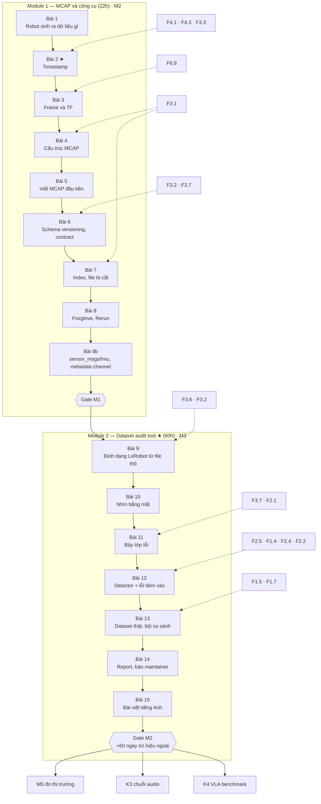

# Khóa 2 — Dữ liệu robot mà không cần robot · Tổng quan

**Cho:** backend/data engineer 8 năm, chưa từng chạm dữ liệu cảm biến.
**Thời lượng:** **82h** = Module 1 (22h, trần 32h) + Module 2 (60h, trần 85h). Bản gốc ghi "~80h, 20h + 60h"; các bài của Module 1 cộng lại 22h và gate M1 ghi 22h, nên dùng 22h.
**Chi phí:** 0đ. Laptop là đủ; Docker cần cho một tiêu chí (3b) của Gate M1.
**Chạy song song:** với Khóa 1 (khóa đó cần bàn hàn, khóa này chỉ cần laptop) và với K7 chặng C0 (`→ K7 C0.1`), theo bảng đường ray song song trong `khoa-7/_KE-HOACH-K7.md`.
**Xong khóa này bạn có:** hai repo public (`mcap-sensor-toolkit/` cho M2, `lerobot-dataset-audit/` ★ cho M3), một bài viết tiếng Anh, và tín hiệu phản hồi đầu tiên từ người ngoài ngành.

| File | Nội dung |
|---|---|
| `00-tong-quan.md` | File này |
| `m1-mcap-cong-cu.md` | Module 1: Bài 1–8, 8b, Gate Module 1 |
| `m2-dataset-audit.md` | Module 2: Bài 9–15, Gate Module 2 |

---

## Vì sao khóa này quan trọng hơn nó trông

JD robotics data infra (bản gốc dẫn JD của Verne Robotics) liệt kê: MCAP/Protobuf, schema contract, buffering, resumable upload, schema validation, dedupe, drift detection, alert freshness, tích hợp Foxglove. Bạn đã làm gần hết những dòng đó, chỉ khác payload. Cái thiếu là **ba công cụ có tên riêng** (MCAP, Foxglove, định dạng LeRobot) và **hiểu bản chất dữ liệu cảm biến**: một mẫu là một phép đo có thời điểm, frame, đơn vị, hiệu chuẩn và sai số.

Hai trong ba artifact ★ của lộ trình (dataset audit tool ở khóa này, VLA benchmark ở K4) không cần robot. Đó là lý do khóa này là đường ngắn nhất tới cuộc phỏng vấn đầu tiên, không phải phần phụ trợ cho khóa phần cứng.

**Rủi ro riêng của khóa này:** nó gần nghề bạn nhất, nên dễ học bằng phép so sánh rồi dừng ("MCAP là Kafka segment", "timestamp là event time", "schema đủ để đảm bảo dữ liệu đúng"). Mỗi phép so sánh đó đúng một phần. Mọi bảng cầu nối trong khóa có cột **"Gãy ở chỗ"**, và đó là cột phải đọc kỹ nhất.

**Quy tắc dự đoán trước, đo sau vẫn áp dụng.** Trước `mcap info`, viết ra số message, số channel, kích thước file. Trước khi vẽ phân bố `dt`, viết ra hình dạng kỳ vọng. Ở khóa này nó dễ bị bỏ qua hơn vì có sẵn stack trace; chính vì thế phải cố ý giữ. Đáp án mọi bài nằm trong khối 🔒, mở sau khi commit `prediction.md`.

---

## Bản đồ khóa



Bài 2 có dấu ★: nếu chỉ nhớ một bài của Module 1, nhớ bài này. Mọi lớp lỗi về thời gian của Module 2 (L1, L2, L5) dựa trên nó.

---

## Bảng bài

| Bài | Giờ | Viên nang nền cần trước | Sau bài này bạn quyết định được |
|---|---|---|---|
| **Module 1** (`m1-mcap-cong-cu.md`) | **22** | | |
| 1 — Một con robot sinh ra dữ liệu gì | 2 | F3.1 (lướt) | Với một cấu hình cảm biến: MB/s, message/s, GB/8h; nén/giảm mẫu luồng nào trước |
| 2 — Timestamp trong robotics ★ | 3 | F4.1, F4.3, F3.3; F4.6 nên đọc | Nhìn `dt` và `log_time − stamp`, phân biệt rớt mẫu / nhảy đồng hồ / trôi / hàng đợi phình; giữ, sửa hay loại đoạn dữ liệu |
| 3 — Frame và TF | 1 | F6.8 (🟡) | Dataset có đủ thông tin hình học không (`frame_id`, `/tf_static`, đơn vị, trục) |
| 4 — MCAP: cấu trúc file | 2 | F3.1 | File có random access được không, đọc tốn bao nhiêu I/O, hỏng thì hỏng ở đâu |
| 5 — Viết file MCAP đầu tiên | 4 | F2.2, F2.5 | Dữ liệu tổng hợp đã đủ "lành" làm đối chứng chưa; round-trip test có kiểm được gì không |
| 6 — Schema versioning và contract | 3 | F3.2, F3.7 | Một thay đổi schema có được merge không; "đúng schema" đã đủ vào dataset chưa |
| 7 — Index, random access, file bị cắt | 3 | F3.1, F1.3 | Chunk size cho luồng ghi trên robot, bằng ba con số đo |
| 8 — Foxglove và Rerun *(rút gọn)* | 2 | — (F4.2 đọc thêm) | Dùng công cụ nào cho việc gì; công cụ đang vẽ theo trục thời gian nào |
| 8b — Schema của tôi vs schema của ngành | 2 | F3.2 | Thông tin mới đặt vào payload chuẩn, metadata channel, Attachment hay topic riêng |
| **Module 2** (`m2-dataset-audit.md`) | **60** | | |
| 9 — LeRobot dataset format từ file thô | 6 | F3.6, F3.2 | Tool đọc dataset thế nào (thô hay qua thư viện), hỗ trợ phiên bản format nào, từ chối gì có kiểm soát |
| 10 — Nhìn bằng mắt trước khi tự động hóa | 6 | F1.2 | Lớp lỗi nào đáng viết detector, lớp nào để người nhìn; mỗi kênh thật sự là đại lượng gì |
| 11 — Bảy lớp lỗi: định nghĩa, toán, và phản ví dụ | 8 | F3.7, F2.1 | Định nghĩa, ngưỡng ban đầu, mức nghiêm trọng, và điều kiện detector **không** được dùng |
| 12 — Viết detector và đo chính detector bằng lỗi tiêm vào | 20 | F2.5, F1.4, F2.4, F2.2 | Ngưỡng nào được ship, kèm TPR theo độ lớn lỗi và FPR có khoảng tin cậy |
| 13 — Chạy trên dataset thật: phân loại, xác minh, bội so sánh | 8 | F1.5, F1.7 | Phát hiện nào đủ chắc để báo maintainer, cái nào "chưa rõ", bao nhiêu cảnh báo là kỳ vọng dù dữ liệu lành |
| 14 — Report, publish, và báo lỗi cho maintainer *(rút gọn)* | 8 | F1.7 | Báo phát hiện nào, ở kênh nào, dạng khẳng định hay câu hỏi; report hứa gì về phạm vi kiểm |
| 15 — Bài viết tiếng Anh *(rút gọn)* | 4 | F1.7 | Bài viết khẳng định gì, mức chắc chắn nào, và nói thẳng điều gì không khẳng định |

Bảng Module 2 lấy tên bài và "Cần trước" từ bản Module 2 đang được hợp nhất song song; nếu `m2-dataset-audit.md` khác, **file module thắng**.

Viên nang nền học **đúng lúc**, không học trước cả loạt: đọc viên nang ngay trước bài cần nó, hoặc song song nếu tuần đó có giờ. Thứ tự viên nang và giờ của chúng ở các file `nen-tang/F*.md`.

---

## Gate

### Gate Module 1 (= M2 PASS) — chi tiết ở cuối `m1-mcap-cong-cu.md`

| # | Tiêu chí | Cách kiểm |
|---|---|---|
| 1 | Repo public: đọc ≥2 nguồn dữ liệu → ghi MCAP hợp lệ với Protobuf schema có version | `mcap doctor` không lỗi, chạy trong CI. `00-lo-trinh-tong.md` ghi "≥2 dataset công khai": muốn thỏa cả hai, chuyển hai dataset LeRobot (bài tập gate (a) + (c)) |
| 2 | Test tự động chứng minh v1 ↔ v2 backward + forward compatible | CI xanh: 4 test Bài 6 + 3 canary đã từng đỏ |
| 3 | File mở được trong Foxglove, ảnh chụp trong README + layout JSON | Mở repo |
| 3b | Bản `sensor_msgs/msg/Imu`, `ros2 bag info` đọc được, metadata channel đủ năm khóa `CONVENTIONS.md` | Lệnh trong container `ros:jazzy` |
| 4 | README trả lời: chunk index làm gì · vì sao quan trọng cho random access · điều gì xảy ra khi process bị kill | Kèm bảng số đo Bài 7 (≥2 chunk size × speedup, % cứu, tỉ lệ nén) |

Ngân sách 22h, trần 32h. **Đã sửa so với bản gốc:** (1) định nghĩa "nguồn thứ hai" và thêm bài tập gate, vì bản gốc không có bài nào dạy nó; nêu lệch câu chữ với lộ trình ("nguồn" vs "dataset công khai"); (2) tiêu chí 2 thêm canary và định nghĩa lại "reader v1"; (3) tiêu chí 3b thêm đủ năm khóa metadata theo `CONVENTIONS.md`; (4) tiêu chí 4 nêu rõ bảng số tối thiểu; (5) thêm hướng xử lý khi vượt trần.

### Gate Module 2 (= M3 PASS) — chi tiết ở cuối `m2-dataset-audit.md`

Giữ tiêu chí gốc:

| # | Tiêu chí | Cách kiểm |
|---|---|---|
| 1 | Chạy trên ≥5 dataset công khai bằng **một lệnh** | Chạy thử từ repo sạch |
| 2 | ≥4 lớp lỗi, mỗi lớp có test tổng hợp chứng minh detector đúng **và** không báo nhầm | CI xanh |
| 3 | Tìm ≥1 lỗi **thật** trong ≥1 dataset công khai, có script reproduce | Chạy script |
| 4 | Đã báo cáo ra ngoài | Link công khai |
| 5 | **Tín hiệu ngoài trong 60 ngày:** ≥1 phản hồi có nội dung, HOẶC ≥10 star | Không do bạn chấm |

Ngân sách 60h, trần 85h. Hai lưu ý từ góc nhìn tổng quan (người soạn Module 2 có thể chi tiết hơn; nếu khác, file module thắng): định dạng LeRobot trong workspace (`data/lerobotpusht`, `data/libero`) là **v3.0** (`meta/info.json → codebase_version`), không phải v2.x như bản gốc Bài 9 mô tả, nên tool phải đọc được cả hai hoặc nói rõ hỗ trợ bản nào; và "≥10 star" là tín hiệu yếu hơn "≥1 phản hồi có nội dung" (star đo độ lan truyền, không đo giá trị kỹ thuật), nên nếu chỉ đạt bằng star thì ghi rõ trong `decisions.md`.

---

## Ngân sách — của khóa và của cả lộ trình

| | Giờ | Ở 6,5h/tuần |
|---|---|---|
| Module 1 | 22 (trần 32) | ~3,5 tuần |
| Module 2 | 60 (trần 85) | ~9 tuần |
| **Khóa 2** | **82** (trần 117) | **~13 tuần**, + 60 ngày chờ tín hiệu ngoài |

Không giấu con số lớn hơn: K1–K6 cộng lại 545h; K7 gốc 340h → 885h, đã vượt ngân sách gốc 650h của lộ trình. K7 được thiết kế lại thành khóa build cho người mới, lõi 561h → tổng **~1.106h ≈ 3,3 năm** ở 6,5h/tuần; đường lõi tối thiểu 885h ≈ 2,6 năm (`khoa-7/_KE-HOACH-K7.md`). Bảng milestone trong `00-lo-trinh-tong.md` vẫn ghi M2 = 20h/trần 30h; con số đúng theo bài là 22h/32h.

---

## Lịch

Bản gốc xếp 8 tuần "ở nhịp 10h/tuần". Ngân sách thật của bạn là 6–7h/tuần, có tuần crunch 0–2h, nên lịch dưới tính theo **6,5h/tuần**, ~13 tuần. Tuần crunch không đẩy lịch lên: nó lùi cả lịch một tuần.

| Tuần | Giờ | Làm | Mốc |
|---|---|---|---|
| 1 | 6 | Bài 1 (2h), Bài 2 (3h), đọc F4.3 phần đầu | |
| 2 | 6 | Bài 3 (1h), Bài 4 (2h), bắt đầu Bài 5 (môi trường, `protoc`) | |
| 3 | 7 | Bài 5 xong, Bài 6 phần 1–5 | |
| 4 | 6 | Bài 6 xong, Bài 7 | |
| 5 | 6 | Bài 8, Bài 8b, bài tập gate (nguồn thứ hai), README | **Gate M1** |
| 6 | 6 | Bài 9 | |
| 7 | 6 | Bài 10 | |
| 8 | 7 | Bài 11 | |
| 9–11 | 20 | Bài 12 (detector + test tổng hợp + đường cong ngưỡng) | |
| 12 | 7 | Bài 13 | |
| 13 | 7 | Bài 14 (đăng báo cáo ra ngoài) + bắt đầu Bài 15 | |
| 14 | 5 | Bài 15, cross-post | **Gate M2 tiêu chí 1–4**; bắt đầu đếm 60 ngày |

**Trong 60 ngày chờ:** bắt đầu K3 hoặc K4, hoặc K7 C0–C2 (`khoa-7/_KE-HOACH-K7.md`, mục 4). Đừng ngồi đợi. Ngay sau Gate M2: chạy **M5** (đo thị trường), theo `00-lo-trinh-tong.md`.

---

## Thiết lập dùng chung

- Python và các thư viện pin ở đầu `m1-mcap-cong-cu.md` (`requirements-k2m1.txt`: `mcap==1.5.0`, `mcap-protobuf-support==0.5.4`, `mcap-ros2-support==0.5.7`, `protobuf==7.36.2`, …). Bài 8 thêm `rerun-sdk==0.38.1`. Mọi API này đổi nhanh `[tự đo]`: nâng phiên bản thì chạy lại toàn bộ test Module 1.
- Dữ liệu: `src/imu.mcap` (bản Bài 5 bạn đã làm, có trong repo), `src/download_hf_dataset.py` (`lerobot/robomme`); trong `data/` (gitignore, chỉ có trên máy đã tải): `example-006-arm-gazebo.mcap` (tay máy Gazebo, ROS 1 → MCAP, ~440 MB), `lerobotpusht`, `libero` (LeRobot v3.0). Bước dùng `data/` ở M1 là tùy chọn.
- MCAP CLI (Rust, `rust/cli` trong `foxglove/mcap`; `brew install mcap`, binary từ GitHub releases, hoặc `cargo build -p mcap-cli --release`) `[spec: mcap.dev/guides/cli]`. Đã build và chạy bản 0.3.0 khi soạn.
- Docker + image `ros:jazzy` cho `ros2 bag info` (Gate M1 tiêu chí 3b).
- Quy ước dữ liệu: `CONVENTIONS.md` (REP-103/105, message chuẩn ROS 2, metadata ở channel MCAP). Mọi thay đổi ghi lý do vào `decisions.md`.

---

## Bẫy đã biết

| # | Bẫy | Bài | Cách tránh |
|---|---|---|---|
| 1 | Coi `log_time` (hoặc `publish_time`) là thời điểm đo. MCAP index theo `log_time` | 2, 4, 7 | Thời điểm đo nằm trong payload (`header.stamp`); truy vấn theo thời gian đo phải mở rộng cửa sổ rồi lọc lại |
| 2 | Ghép hai luồng khác nguồn đồng hồ theo timestamp của chúng, hoặc theo chỉ số frame | 1, 2; M2 L5 | Ghi `clock_source`; đo skew/drift trước khi ghép |
| 3 | Timestamp `float32` giây | 2; M2 Bài 9 | Dùng `int64` ns cho thời gian tuyệt đối; `float32` chỉ cho thời gian tương đối ngắn |
| 4 | "Reader cũ" trong test tương thích thực ra là `DecoderFactory` dùng schema mới nhúng trong file | 6 | Reader cũ dựng từ golden file |
| 5 | Đổi kiểu trường Protobuf và chờ reader cũ crash; thực tế nó **sai âm thầm** | 6 | `field_history.json` + test số hiệu; không đổi kiểu |
| 6 | proto3 scalar không có presence: "không có" = 0, mà 0 là giá trị vật lý hợp lệ | 6 | `optional` cho scalar mang nghĩa vật lý |
| 7 | Quên `finish()`; tin rằng thư viện đọc sẽ tự xoay xở với file bị cắt | 5, 7 | Context manager; kiểm hành vi thật của reader ở Bài 7; `mcap recover` ở bước ingest |
| 8 | Đọc tỉ lệ nén như chỉ báo tuyệt đối về chất lượng dữ liệu | 5 | Chỉ so một luồng với chính nó theo thời gian |
| 9 | Dữ liệu tổng hợp quá sạch (hoặc có kênh đơ ngay trong bộ "lành") | 5; M2 Bài 12 | Bất biến vật lý trong bộ sinh; canary cho mọi test |
| 10 | Đúng schema, sai đơn vị/frame (ví dụ thật: `lerobotpusht` state theo pixel) | 3, 6; M2 L6 | Data contract có ngữ nghĩa; validate theo vật lý `→ F3.7` |
| 11 | Định dạng LeRobot đổi phiên bản (v2.x trong bản gốc, v3.0 trong dữ liệu thật) | M2 Bài 9 | Đọc `codebase_version`, không giả định |
| 12 | Metadata channel bị bỏ rơi ở bước chuyển đổi (MCAP → parquet) | 8b | Kéo metadata xuống thành cột/partition; lineage về file gốc |
| 13 | Đo thời gian đọc trên máy đang bận / cache nóng | 7 | 5 lần, bỏ lần đầu, báo trung vị + min–max `→ F1.3` |

---

## Sửa lỗi so với bản gốc

Chi tiết từng chỗ ở phần 11 của mỗi bài. Bảng tóm tắt Module 1 dưới đây **chứa đáp án** của nhiều bài dự đoán, nên được gập.

<details><summary>🔒 MỞ SAU KHI XONG MODULE 1 (hoặc nếu bạn là người review giáo trình)</summary>

| Chỗ | Bản gốc | Sửa |
|---|---|---|
| Tiêu đề Module 1 | 20h | 22h (bài cộng lại và gate đều 22h); `00-lo-trinh-tong.md` còn ghi 20/30 |
| Lịch | 8 tuần ở 10h/tuần | ~13 tuần ở 6,5h/tuần (ngân sách thật) |
| Bài 1, bảng luồng | IMU ~50 B/mẫu, ~50 KB/s | Tách gói thô ~20 B và `sensor_msgs/Imu` ~320 B (đo được 324 B) |
| Bài 1 | "Ảnh 95% dung lượng, 5% message" như sự thật chung | Đúng với ảnh raw; với ảnh nén tỉ lệ thấp hơn nhiều |
| Bài 2, bảng timestamp | `publish_time` = khi phép đo xảy ra | Theo spec là lúc publish; thời điểm đo ở `header.stamp` trong payload; index theo `log_time` |
| Bài 2 | Wall clock nhảy khi "đổi múi giờ" | `CLOCK_REALTIME` theo UTC, múi giờ không ảnh hưởng |
| Bài 2 | "Ba con số" liệt kê bốn; jitter = std của dt | Bốn đại lượng; jitter trên khoảng không rớt mẫu, báo bằng percentile |
| Bài 2 | "skew = lệch hệ thống, drift = skew đổi theo thời gian (ppm)" | Thuật ngữ chuẩn (→ F4.1): offset = lệch pha, skew = lệch tần số (ppm), drift = thay đổi của skew |
| Bài 2 | Tình huống 3 chỉ có giả thuyết "đồng hồ trôi" | Thêm giả thuyết hàng đợi phình (định luật Little) và cách phân biệt |
| Bài 3 | Frame `world` trong danh sách | Không thuộc REP-105 (là quy ước Gazebo/MoveIt); thêm optical frame |
| Bài 4, sơ đồ | Schema/Channel trước chunk; summary chỉ có ChunkIndex/Statistics | Theo spec: có thể trong chunk, lặp trong summary; có Summary Offset, Attachment, Metadata |
| Bài 4 | `mcap recover` ↔ "sửa file Parquet bị cắt" | Là chỗ khác, không phải chỗ giống |
| Bài 4 | (ngầm) "MCAP chỉ là Kafka trong một file" | Đúng một phần: không offset toàn cục, index chỉ có khi `finish()`, channel xen kẽ trong chunk, không broker tự phục hồi |
| Bài 5 | `from sensors.v1 import imu_pb2` | Không khớp lệnh `protoc` đã cho; import đúng là `proto.sensors.v1` (hoặc đổi `-I`) |
| Bài 5 | `publish_time = t` (thời điểm đo); không seed; gyro x/y = 0; covariance không điền; `int(t*1e9)` | Sửa từng chỗ |
| Bài 5 | Thời lượng dự đoán 60,000 s | 59,995 s (cột rào) |
| Bài 5 | Script ghi ra `imu.mcap` | Ghi ra `imu_b5.mcap` để không đè `src/imu.mcap` dùng làm đối chứng ở Bài 4–5 |
| Bài 5 | Tỉ lệ nén 1,5–2,5× | Đo được 1,1×–3,2× tùy payload, không có kênh đơ |
| Bài 5 | Sai lệch round-trip bằng 0 → test vô nghĩa | Bằng 0 là đúng với `double` |
| Bài 6 | Đổi kiểu → reader cũ crash | Sai âm thầm, không crash (đo được) |
| Bài 6 | "Reader v1 đọc file v2" không định nghĩa reader v1 | Reader cũ dựng từ golden file; `DecoderFactory` dùng schema nhúng |
| Bài 7 | `recover` ~80%; 100% = cắt trúng ranh giới chunk; 0% = cắt quá sâu | Phụ thuộc chunk size (đo 59–80%); sửa hai nguyên nhân |
| Bài 8 | "Phải thấy đường gyro trôi lên" | Trôi nhỏ hơn nhiễu, không thấy trên plot thô |
| Bài 8b | `sequence` → metadata | Metadata channel là hằng; dùng `Message.sequence` / `/diagnostics` |
| Bài 8b | Metadata hai khóa | Năm khóa theo `CONVENTIONS.md` |
| Gate M1 | "≥2 nguồn dữ liệu" không có bài dạy | Thêm bài tập gate |

</details>

Module 2: danh sách riêng ở phần 11 từng bài của `m2-dataset-audit.md`. Từ góc nhìn tổng quan đã thấy: định dạng LeRobot v2.x của bản gốc so với v3.0 trong dữ liệu thật.

Không có bản Gemini cho Khóa 2.

---

## Cách học khóa này

**Một bài tiêu chuẩn:** đọc phần 1–4 (câu chuyện, mô hình, cầu nối, thuật ngữ) → viết `prediction.md` (phần 5) và commit → làm (phần 6) → mở 🔒 (phần 7) → ghi chênh lệch và lý do → trả lời câu hỏi ngược trước khi mở hướng nghĩ.

**Tuần thường (6–7h):** một bài có code (Bài 5, 6, 7) hoặc hai bài đọc-nặng (Bài 1–4). Làm phần đo ở cùng một buổi với phần dự đoán để không mất ngữ cảnh, nhưng commit dự đoán trước.

**Tuần crunch (0–2h):** chỉ đọc. Ưu tiên: MCAP spec (Bài 4), REP-103/105 (Bài 3), phần **Chấm mô hình** và **Câu hỏi ngược** của bài kế tiếp, viên nang F của bài kế tiếp. Không chạy phép đo thời gian của Bài 7 khi máy đang bận việc khác: số ra sẽ vô nghĩa. Không bắt đầu Bài 12 (20h) trong tuần crunch.

**Dùng AI ở bước nào:**
- **Không** ở bước dự đoán. Dự đoán là phép đo mức hiểu của chính bạn; để AI dự đoán thì `prediction.md` mất giá trị.
- **Có** ở bước giải thích, nhưng dùng prompt **chấm mô hình**, không dùng prompt "giải thích cho tôi". Rủi ro lớn nhất của cách học "trừu tượng hóa rồi hỏi lại" là tích lũy mô hình đúng một nửa mà cảm giác rất hiểu; công cụ AI hay xác nhận "chính xác" cho mô hình chỉ đúng một phần. Mẫu prompt:

```text
Đây là mô hình của tôi về <chủ đề>, viết bằng lời của tôi:
<mô hình>
Chấm nó là ĐÚNG, ĐÚNG MỘT PHẦN, hoặc SAI. Không khen.
Chỉ ra chính xác chỗ nó gãy, và đưa MỘT phản ví dụ cụ thể (có số nếu được).
Nếu bạn không chắc về một khẳng định kỹ thuật (API, phiên bản, spec), nói rõ là không chắc
và chỉ tài liệu gốc để tôi tự kiểm.
```

- **Có** ở bước viết code, với hai điều kiện: phiên bản API phải kiểm trên bản bạn cài (mọi thư viện ở khóa này đổi nhanh), và **test + canary là của bạn**. Một agent viết cả code lẫn test sẽ tối ưu để test xanh, không để code đúng; đó là Goodhart ở quy mô nhỏ `→ F2.8`.
- Bạn đã từng dựng pipeline agent tự chạy → test → sửa → deploy. Ở Module 2, chỗ thiếu của pipeline đó lộ ra rõ nhất: detector phải được kiểm bằng **lỗi tiêm có chủ đích** (Bài 12) và bằng **dữ liệu thật đã xác minh bằng tay** (Bài 13), không chỉ bằng test do chính nó sinh ra.

---

## Nguồn học kèm

| Nguồn | Phần nào | Bài |
|---|---|---|
| mcap.dev/spec | Specification (đọc spec, không đọc tutorial về spec) | 2, 4, 7 |
| mcap.dev/guides/cli | CLI: `info`, `list`, `doctor`, `recover`, đọc file từ xa | 4, 7 |
| GitHub `foxglove/mcap` | `python/` examples, mã nguồn writer/reader | 5, 7, 8b |
| docs.foxglove.dev | Panels, message path, layouts | 8 |
| rerun.io/docs | Concepts: entities, timelines | 8 |
| REP-103, REP-105 (ros.org/reps) | Đơn vị, trục, frame | 3 |
| protobuf.dev | Updating A Message Type, Field Presence, Encoding | 5, 6 |
| *Designing Data-Intensive Applications* (Kleppmann) | Ch. 3 (storage), Ch. 4 (encoding & evolution), Ch. 11 (stream) | 4, 6, 2 |
| Tyler Akidau, "Streaming 101/102" | Event time vs processing time | 2 |
| huggingface.co/docs/lerobot | Dataset format | 9 |
| GitHub `huggingface/lerobot` | Thư mục datasets, đọc kiến trúc | 9, 11 |
| Foxglove blog | Bài về MCAP và ghi dữ liệu robot | 2, 4 |

---

## Sau Khóa 2

Bạn có: hai repo public, một artifact ★, một bài viết tiếng Anh, một liên hệ thật trong cộng đồng LeRobot, và (nếu Gate M2 pass) bằng chứng đầu tiên rằng người trong ngành thấy việc bạn làm có giá trị.

**Tiếp theo, hai hướng:**
- **Khóa 3 — chuỗi audio** (cần đợt mua 2). Chứng minh đã chạm phần cứng thật; trả lời câu "anh từng làm việc với dữ liệu cảm biến thật chưa". Mở khi Khóa 1 PASS.
- **Khóa 4 — VLA edge benchmark** (thuê GPU, target edge N100). Artifact ★ thứ hai, không cần phần cứng riêng. Nếu quỹ giờ eo hẹp hoặc Khóa 1 đang bị chặn, **làm K4 trước K3**: rẻ hơn, nhanh hơn, đúng nghề bạn hơn.
- **K7 chặng C0–C2** chạy song song được (C0 cần K1 Phần B; C1 cần K1 trọn, tốt nhất sau K3 Bài 5–6; xem `khoa-7/_KE-HOACH-K7.md` mục 4).

**Ngay sau Gate M2: chạy M5** (đo thị trường, 15h, 10 application + 5 outreach), với bảng diễn giải kết quả đã cam kết trong `00-lo-trinh-tong.md`. Đừng chờ tới tháng 12.
