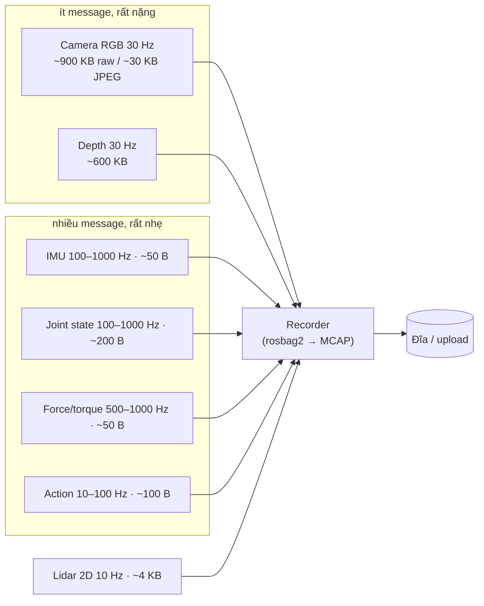
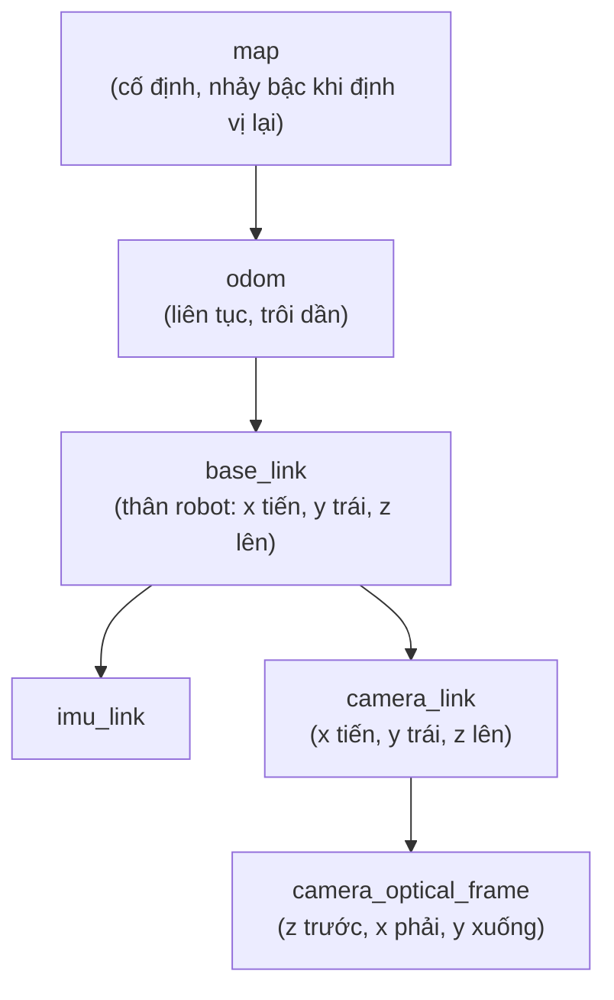

# Khóa 2 · Module 1 — MCAP và công cụ (22h, trần 32h)

Tương ứng milestone **M2**. Nguồn: `khoa-2-du-lieu-robot-khong-can-robot.md` (Bài 1–8b, Gate M1), đối chiếu `00-lo-trinh-tong.md` mục M2, `CONVENTIONS.md`, `THAY-DOI-10-2026.md`. Khóa 2 không có bản Gemini; mọi khẳng định kỹ thuật dưới đây được kiểm bằng chạy thử hoặc gắn nhãn.

**Phiên bản đã chạy thử khi soạn** (API `mcap` đổi theo bản — kiểm lại bản bạn cài):

| Gói | Bản | Ghi chú |
|---|---|---|
| `mcap` (Python) | 1.5.0 | file `src/imu.mcap` của bạn ghi bằng 1.4.0 |
| `mcap-protobuf-support` | 0.5.4 | |
| `mcap-ros2-support` | 0.5.7 | không cần cài ROS 2 |
| `protobuf` | 7.36.1 | `imu_pb2.py` của bạn sinh với gencode 7.36.0 và có kiểm runtime version |
| `grpcio-tools` | 1.84.0 | cho `python -m grpc_tools.protoc` khi máy chưa có `protoc` |
| `rerun-sdk` | 0.38.1 | |
| `mcap` CLI | build từ source `foxglove/mcap` `go/cli/mcap` (commit 6/2026) | bạn tải binary từ GitHub releases là đủ |

**Code của bạn được nhận xét ở đâu:** `src/proto/sensors/v1/imu.proto` → Bài 5, 6, 8b · `src/main.py` → Bài 2, 5, 7 · `src/imu.mcap` → Bài 4, 5, 8 · `src/download_hf_dataset.py` → Gate (tiêu chí 1).

---

## Bài 1 — Một con robot sinh ra dữ liệu gì (2h)

> **Vị trí:** (đầu khóa) → **Bài 1** → Bài 2 (timestamp) · **Cần trước:** không bắt buộc; nên lướt → F3.1 · **Sau bài này bạn quyết định được:** với một cấu hình cảm biến cho trước, ước được MB/s, message/s và GB cho một ca 8 giờ, và nói được nên nén/giảm mẫu ở luồng nào trước khi mua đĩa hay thiết kế đường upload.

### 1. Câu chuyện — ai đã khổ vì chuyện này

ROS 1 ghi log bằng định dạng `.bag` riêng. ROS 2 lúc đầu ghi vào SQLite3 (`.db3`) qua `rosbag2`, rồi từ bản Iron (2023) đổi storage mặc định sang MCAP [chuẩn]. Lý do đổi không nằm ở thẩm mỹ: một cơ sở dữ liệu quan hệ được tối ưu cho cập nhật có giao dịch, còn log robot là **ghi nối đuôi liên tục, hàng nghìn message nhỏ mỗi giây xen với vài chục message hàng trăm KB**, đọc lại theo khoảng thời gian, và phải sống sót khi máy bị rút điện giữa chừng. Đó là hồ sơ tải mà một format log append-only có index theo thời gian phục vụ tốt hơn.

Nỗi khổ thứ hai là chi phí. Một đội thu dữ liệu để huấn luyện policy phát hiện ra rằng thứ đầy đĩa, nghẽn uplink và đội hóa đơn object store không phải là IMU hay joint state — mà là ảnh. Còn thứ làm chậm parser, làm phình index và làm khó ghép luồng lại là các luồng nhỏ tần số cao. Hai bài toán này cần hai cách xử lý khác nhau, và người thiết kế pipeline phải thấy cả hai ngay từ bảng ngân sách đầu tiên.

### 2. Mô hình tư duy



Bản chất: một robot là **một hệ đa tần số**, các luồng chênh nhau hai bậc độ lớn về tần số và bốn bậc về kích thước mẫu. Hệ quả 1: không có "một dòng dữ liệu" để join theo khóa — mọi phép ghép là ghép theo thời gian (as-of join, nội suy), và lựa chọn cách ghép là một quyết định về chất lượng dữ liệu (→ F3.4). Hệ quả 2: hai chế độ tải — **byte do ảnh quyết định, số message do luồng nhỏ quyết định** — nên format lưu phải rẻ cho cả hai, và chi phí cố định *trên mỗi message* (header record, entry index) trở thành vấn đề với luồng nhỏ. Hệ quả 3: dung lượng là phép nhân đơn giản (Hz × byte × giây) nhưng hệ số nén của ảnh thay đổi kết quả cả bậc độ lớn, nên "robot sinh bao nhiêu GB" luôn phải kèm "nén thế nào".

### 3. Cầu nối từ backend

| Backend bạn biết | Ở đây | Gãy ở chỗ | Nếu dùng nhầm thì |
|---|---|---|---|
| Event stream có schema | Message stream có schema | Event web là một *sự kiện rời* có danh tính nghiệp vụ; mẫu cảm biến là *một lần lấy mẫu* của tín hiệu liên tục, có sai số và có thời điểm đo là chính một phép đo | Dedupe theo nội dung payload → xóa nhầm hai mẫu IMU giống hệt nhau nhưng đều hợp lệ (hoặc che mất kênh bị đơ) |
| Kafka topic | ROS topic / MCAP channel | Kafka topic chia partition để song song và giữ thứ tự theo key; MCAP channel là một luồng (topic + schema + encoding) **xen kẽ với các channel khác trong cùng chunk** theo thứ tự ghi | Nghĩ "đọc một channel là đọc một file riêng" → đọc một topic nhỏ trong file lớn vẫn phải giải nén cả chunk chứa ảnh (Bài 7) |
| Partition theo key | Channel theo topic | Không có khái niệm key, không có consumer group, không có offset do broker cấp | Thiết kế sharding theo "channel" như theo partition → không có gì để cân bằng tải |
| Event time vs processing time | `header.stamp` vs `log_time` (và `publish_time` ở giữa) — Bài 2 | Ở robot, event time do **một đồng hồ khác** đóng dấu (MCU, camera), không chỉ trễ hơn mà còn **trôi** | Tin event time như một sự thật tuyệt đối → ghép luồng lệch pha mà không biết |
| Idempotency key | Trường `sequence` | `sequence` dùng để **phát hiện mất/đảo**, không để chống trùng khi retry; trong MCAP nó tùy chọn và được phép bằng 0 | Coi `sequence` là bảo đảm → file có `sequence = 0` ở mọi message (file của bạn, Bài 5) vẫn "hợp lệ" mà không phát hiện được gì |
| Schema registry | Schema **nhúng trong file** | Registry cho phép tra phiên bản theo id lúc chạy; file MCAP mang theo bản sao schema, không có registry nào để hỏi "bản này có tương thích bản kia không" | Bỏ qua kiểm tương thích vì "file tự mô tả rồi" → reader cũ vẫn chạy nhưng hiểu sai trường (Bài 6) |

**Chấm mô hình:**

1. *"Dữ liệu robot là event stream có schema, giống hệt hệ của tôi, chỉ khác payload."* — **ĐÚNG MỘT PHẦN.** Đúng ở tầng vận chuyển và lưu trữ (append, schema, partition-ish, retention). Gãy ở ngữ nghĩa: một event thanh toán hoặc xảy ra hoặc không; một mẫu IMU là ước lượng có nhiễu của một đại lượng liên tục, và *khoảng trống giữa các mẫu cũng là thông tin* (tần số lấy mẫu quyết định cái gì nhìn thấy được, → F5.5). Phản ví dụ: hai message `{"amount": 100}` trùng nhau trong hệ thanh toán gần như chắc chắn là retry cần dedupe; hai mẫu IMU `az = 9.8100` liên tiếp có thể là bình thường, còn 2.000 mẫu giống hệt nhau là cảm biến bị đơ — cùng một phép so sánh, ba kết luận khác nhau tùy vật lý.
2. *"`sequence` là idempotency key của robot."* — **ĐÚNG MỘT PHẦN.** Giống producer idempotent của Kafka ở chỗ dùng số thứ tự để phát hiện khoảng trống và đảo thứ tự. Gãy: idempotency key định danh *một ý định nghiệp vụ* để retry không nhân đôi; `sequence` chỉ là bộ đếm của nguồn phát, reset khi nguồn khởi động lại, và MCAP cho phép bằng 0 [spec: MCAP Specification, Message record]. Phản ví dụ: ESP32 khởi động lại giữa phiên → `sequence` quay về 0, trùng với các giá trị đã có; dedupe theo `sequence` sẽ xóa dữ liệu thật.
3. *"Muốn ghép camera với IMU thì join theo timestamp."* — **SAI** nếu hiểu là equi-join. Không có mẫu IMU nào trùng đúng nano giây với frame ảnh. Phép đúng là as-of join (lấy mẫu gần nhất trước/sau) hoặc nội suy, kèm dung sai — và dung sai đó phải được ghi lại (→ F3.4).

### 4. Thuật ngữ

| Mức | Thuật ngữ | Nghĩa trong một câu | Hay bị hiểu nhầm thành |
|---|---|---|---|
| 🟢 | Topic / channel | Một luồng message cùng kiểu; trong MCAP, channel = topic + schema + encoding + metadata | Một file hay một partition riêng |
| 🟢 | Tần số lấy mẫu (Hz) | Số mẫu mỗi giây của một luồng | Tốc độ xử lý; "Hz cao hơn là tốt hơn" |
| 🟢 | Episode | Một lần thực hiện nhiệm vụ từ đầu đến cuối, đơn vị cơ bản của dataset học máy | Một file log hay một phiên ghi |
| 🟢 | As-of join | Ghép mỗi bản ghi với bản ghi gần nhất *trước* (hoặc gần nhất) theo thời gian ở luồng kia | Join theo khóa bằng nhau |
| 🟢 | rosbag2 | Công cụ ghi/phát lại topic của ROS 2; từ Iron ghi MCAP mặc định | Một định dạng file (nó là công cụ, storage là plugin) |
| 🟡 | QoS (ROS 2) | Chính sách giao nhận của DDS: reliable/best-effort, history depth | Tham số hiệu năng vô hại — thật ra quyết định message có bị drop khi nghẽn |
| 🟡 | Bandwidth vs message rate | MB/s và message/s là hai ngân sách khác nhau, nghẽn ở hai chỗ khác nhau | Một con số "throughput" duy nhất |
| 🔴 | Nội bộ DDS / RTPS | Giao thức dây bên dưới ROS 2 | Thứ cần học ở khóa này |

### 5. Dự đoán

**Đề.** Dùng bảng luồng ở phần 2 (lấy cận trên của dải tần số cho IMU, joint, F/T; action 100 Hz; lidar 10 Hz). Với bốn cấu hình:

- (A) RGB raw + depth raw + các luồng nhỏ
- (B) RGB JPEG + depth raw + các luồng nhỏ
- (C) RGB JPEG + các luồng nhỏ
- (D) chỉ các luồng nhỏ

tính MB/s, message/s và GB cho một ca 8 giờ. Rồi tính: ở (B), ảnh chiếm bao nhiêu % byte và bao nhiêu % số message?

**Tham số cần tra.** Kích thước ảnh: 640 × 480 × 3 byte (RGB8), 640 × 480 × 2 byte (depth 16-bit). Chi phí cố định mỗi message trong MCAP: tự đếm từ **MCAP Specification** (mcap.dev/spec), mục *Records → Message* (opcode + record length + `channel_id` + `sequence` + `log_time` + `publish_time`) và mục *Message Index* (mỗi entry gồm một timestamp và một offset). Ghi rõ bạn đếm ra bao nhiêu byte cho mỗi phần.

**Phương pháp.** `B/s = Σ Hz_i × (byte_i + overhead)`; `GB/8h = B/s × 28 800 / 1e9`. Câu hỏi phụ: với IMU 50 B, overhead MCAP bằng bao nhiêu % payload?

```markdown
# prediction.md — Bài 1
| Cấu hình | MB/s | msg/s | GB/8h |
|---|---|---|---|
| A | | | |
| B | | | |
| C | | | |
| D | | | |
- Overhead MCAP mỗi message (record header + index entry): ___ B (đếm từ spec mục ___)
- (B): ảnh chiếm ___ % byte, ___ % message
- Overhead / payload với IMU 50 B: ___ %
- Luồng tôi sẽ nén/giảm mẫu đầu tiên và vì sao: ___
```

### 6. Làm

1. Commit `prediction.md` trước.
2. Chạy mô hình ngân sách dưới đây (sửa bảng `streams` theo cảm biến bạn định dùng ở Khóa 5–7):

```python
# [đã chạy] Bài 1 — ngân sách băng thông một robot, kể cả overhead record + index của MCAP
streams = {  # tên: (Hz, byte/mẫu)
    "rgb_raw":   (30, 640 * 480 * 3), "rgb_jpeg": (30, 30_000), "depth_raw": (30, 640 * 480 * 2),
    "imu":       (1000, 50), "joint": (1000, 200), "ft": (1000, 50),
    "lidar2d":   (10, 4_000), "action": (100, 100),
}
REC, IDX = 31, 16           # byte/message: Message record header, MessageIndex entry (spec MCAP)
def budget(names, hours=8):
    tot_b = tot_n = 0
    for k in names:
        hz, b = streams[k]
        tot_b += hz * (b + REC + IDX); tot_n += hz
    return tot_b, tot_n, tot_b * 3600 * hours / 1e9
small = ["imu", "joint", "ft", "lidar2d", "action"]
for cfg in (["rgb_raw", "depth_raw"] + small, ["rgb_jpeg", "depth_raw"] + small, ["rgb_jpeg"] + small, small):
    bps, mps, gb = budget(cfg)
    print(f"{'+'.join(c for c in cfg if c not in small) or 'chỉ luồng nhỏ':22s} {bps/1e6:7.2f} MB/s {mps:5d} msg/s {gb:8.1f} GB/8h")
b_small, n_small, _ = budget(small); b_img = 30 * (30_000 + 47) + 30 * (614_400 + 47)
print("ảnh (jpeg+depth) chiếm % byte:", round(100 * b_img / (b_img + b_small), 1), "% message:", round(100 * 60 / (60 + n_small), 1))
print("overhead MCAP trên IMU 50 B:", round(100 * (REC + IDX) / 50), "%")
```

   Mô hình này **chưa tính nén chunk** (zstd nén được header record nhưng không nén MessageIndex — Bài 4, Bài 7). Coi nó là cận trên trước nén.
3. Mở dataset bạn đã tải bằng `src/download_hf_dataset.py` (`lerobot/robomme`): đọc `meta/info.json`, ghi lại `fps`, danh sách `features`, số episode, số frame. So với bảng ở trên: dataset học máy đã **giảm mẫu mọi luồng về một tần số chung** chưa? (Nếu có, đó là một quyết định ghép luồng ai đó đã làm thay bạn — Bài 9 đào tiếp.) Cấu trúc thư mục cụ thể phụ thuộc phiên bản format LeRobot `[tự đo]`.
4. Viết `notes/01-streams.md`: bảng của bạn + một đoạn "luồng nào tôi nén/giảm mẫu trước, và cái giá phải trả".

### 7. Số phải ra

<details><summary>🔒 MỞ SAU KHI COMMIT prediction.md</summary>

Overhead: Message record = 1 (opcode) + 8 (record length) + 2 (`channel_id`) + 4 (`sequence`) + 8 (`log_time`) + 8 (`publish_time`) = **31 B**; mỗi entry MessageIndex = 8 (timestamp) + 8 (offset) = **16 B** [spec]. Tổng 47 B/message trước nén.

| Cấu hình | MB/s | msg/s | GB/8h |
|---|---|---|---|
| A — RGB raw + depth raw | 46.6 | 3 170 | ~1 340 |
| B — RGB JPEG + depth raw | 19.8 | 3 170 | ~570 |
| C — RGB JPEG | 1.40 | 3 140 | ~40 |
| D — chỉ luồng nhỏ | 0.50 | 3 110 | ~14 |

- (B): ảnh chiếm **~97.5 % byte** nhưng chỉ **~1.9 % message**. Bản gốc nói "95 % / 5 %": đúng về hướng, con số phụ thuộc cấu hình.
- Overhead MCAP trên IMU 50 B: **~94 %** — gần gấp đôi payload trước nén. Đây là lý do thật để không ghi IMU 1 kHz thành từng message riêng nếu không cần (một số driver gom nhiều mẫu vào một message), và lý do MessageIndex chiếm tới ~25 % file IMU của bạn (Bài 4).
- Bản gốc nói "một robot 8 tiếng sinh 100–800 GB": nằm giữa C và B. Con số không sai, nhưng **thiếu điều kiện** — chênh nhau 30× chỉ vì nén ảnh hay không.

Vì sao số của bạn có thể lệch: JPEG 30 KB là ước lượng cho cảnh đơn giản ở chất lượng trung bình `[ước lượng]`; cảnh nhiều chi tiết gấp 2–3 lần. Nếu bạn quên overhead, luồng nhỏ sẽ thấp hơn ~20–50 %.

**Đáp án tự kiểm tra của bản gốc:**
1. Camera 30 Hz, IMU 200 Hz, muốn gia tốc tại thời điểm chụp: không có mẫu IMU nào trùng đúng thời điểm. Chọn mẫu gần nhất (sai số thời gian tối đa nửa chu kỳ IMU = 2.5 ms) hoặc nội suy tuyến tính giữa hai mẫu kề; **ghi lại cách đã chọn** như metadata. Và trước cả câu hỏi đó: hai timestamp có cùng đồng hồ không? (Bài 2.)
2. MCAP nhúng schema vì file phải tự đọc được offline, sau nhiều năm, không phụ thuộc dịch vụ ngoài — ràng buộc hiện trường quyết định thiết kế.
</details>

### 8. Nếu ra khác

| Triệu chứng | Nguyên nhân khả dĩ | Kiểm bằng cách | Sửa |
|---|---|---|---|
| GB/8h của bạn lệch 1 000× | Lẫn MB với MiB, hoặc bit với byte, hoặc quên × 3 600 | In từng hạng tử | Ghi đơn vị trong tên biến (`bytes_per_s`) |
| Luồng nhỏ ra gần 0 % byte nhưng file thật vẫn to | Bỏ qua overhead/message và index | So với `mcap du` trên file thật (Bài 4) | Thêm 47 B/message vào mô hình |
| `meta/info.json` không có trường bạn tìm | Phiên bản format LeRobot khác (v2.x vs v3.x) | Đọc trường `codebase_version` | Ghi phiên bản vào notes; Bài 9 xử lý |

### 9. Câu hỏi ngược

1. **[Quy mô]** 100 robot, mỗi con cấu hình (B), làm 8 giờ/ngày, uplink chung 1 Gbit/s ở kho. Cái gì gãy trước: đĩa trên robot, uplink, hay chi phí object store? Bạn sẽ đặt nén/giảm mẫu ở đâu trong chuỗi?
   <details><summary>Hướng nghĩ</summary>Tính tổng GB/ngày rồi chia cho băng thông uplink theo giờ không làm việc. So với dung lượng đĩa robot. Nhớ rằng nén ảnh trên robot tốn CPU của chính robot — cái giá đó cạnh tranh với policy đang chạy (→ K4).</details>
2. **[Failure mode]** Đĩa robot đầy giữa ca. Recorder nên làm gì: dừng hẳn, drop ảnh giữ luồng nhỏ, hay ghi đè dữ liệu cũ? Mỗi lựa chọn làm hỏng loại phân tích nào sau này?
   <details><summary>Hướng nghĩ</summary>Đây là drop policy (→ F3.9). Câu hỏi quyết định: dữ liệu này dùng để làm gì — debug sự cố (cần vài phút trước sự cố, ring buffer hợp lý) hay huấn luyện (cần episode trọn vẹn, drop giữa episode làm hỏng cả episode). Và phải *đếm* cái đã drop.</details>
3. **[Vì sao không]** Vì sao LeRobot lưu ảnh thành video MP4 thay vì từng frame JPEG? Cái gì mất đi khi làm vậy?
   <details><summary>Hướng nghĩ</summary>Nén liên khung (inter-frame) tận dụng sự giống nhau giữa các frame liên tiếp. Đổi lại: truy cập ngẫu nhiên một frame phải giải mã từ keyframe gần nhất; số frame video và số dòng metadata có thể lệch nhau (một lớp lỗi ở Bài 11); nén có mất mát làm thay đổi pixel mà policy nhìn thấy.</details>
4. **[Nếu…thì]** Nếu bạn gom 10 mẫu IMU 1 kHz vào một message 100 Hz, overhead giảm bao nhiêu, và bạn mất gì về khả năng index/truy vấn theo thời gian?
   <details><summary>Hướng nghĩ</summary>Overhead chia 10. Nhưng index giờ chỉ biết `log_time` của cả lô; thời điểm từng mẫu phải nằm trong payload. Truy vấn cửa sổ thời gian vẫn chạy, chỉ thô hơn 10 ms. Có chuẩn ROS 2 nào cho IMU dạng lô không? Tự tra.</details>
5. **[Phản biện]** "Cứ ghi hết raw, lưu trữ rẻ." Ở mức nào câu này đúng, ở mức nào nó sai?
   <details><summary>Hướng nghĩ</summary>Lưu trữ lạnh rẻ; băng thông từ robot lên, thời gian đọc lại để huấn luyện, và chi phí egress thì không. Còn một chi phí ẩn: dữ liệu không ai đọc được đúng lúc thì không phát hiện được lỗi thu thập (Module 2).</details>

### 10. Liên kết ra ngoài

- **Dữ liệu tick tài chính.** Giá khớp lệnh và quote đến với tần số khác nhau, không đều; kdb+/q có sẵn phép `aj` (as-of join) chính vì bài toán "giá tại thời điểm giao dịch" giống hệt "gia tốc tại thời điểm chụp ảnh" [chuẩn]. Khác: tick tài chính có một đồng hồ sàn chung khá tin cậy; robot có nhiều đồng hồ trôi khác nhau (Bài 2).
- **Hộp đen máy bay (flight data recorder).** Ghi hàng trăm tham số ở các tần số khác nhau trong một luồng khung có cấu trúc, phải sống sót sau va chạm, đọc được nhiều năm sau mà không có hệ thống gốc. Giống MCAP ở yêu cầu tự mô tả và chịu hỏng; khác ở chỗ tham số và tần số được cố định trong thiết kế chứng nhận, không đổi theo từng chuyến.

### 11. Độ tin cậy và sửa lỗi

| Khẳng định | Nhãn | Ghi chú / cách kiểm |
|---|---|---|
| rosbag2 ghi MCAP mặc định từ Iron | [chuẩn] | Tài liệu rosbag2 / release notes ROS 2 Iron |
| 31 B header Message record, 16 B mỗi entry MessageIndex | [spec] | MCAP Specification, Records; khớp `mcap du` trên file của bạn (Bài 4) |
| JPEG 640×480 ~30 KB | [ước lượng] | Phụ thuộc cảnh và chất lượng; đo trên camera thật ở K5 |
| 100–800 GB/robot/8h | [ước lượng] | Đúng trong dải cấu hình B–C; thiếu điều kiện nén |
| Overhead ~94 % trên IMU 50 B | [ước lượng] | Trước nén; nén zstd giảm phần record header, không giảm MessageIndex |

**Đã sửa so với bản gốc:** (1) "95 % dung lượng / 5 % message" thay bằng phép tính có điều kiện cấu hình; (2) thêm overhead mỗi message mà bản gốc bỏ qua — nó làm đổi kết luận về luồng nhỏ; (3) "`sequence` ≈ idempotency key" được chấm lại (đúng một phần); (4) "Partition theo key ↔ channel theo topic" thêm chỗ gãy (channel xen kẽ trong cùng chunk).

### 12. Đọc thêm và tự kiểm tra

- **Nguồn gốc:** MCAP Specification — mcap.dev/spec (mục Records, Chunk, Message Index).
- **Giải thích:** Martin Kleppmann, *Designing Data-Intensive Applications*, chương 11 (Stream Processing) — để đối chiếu với vốn Kafka của bạn.
- **Đào sâu (tùy chọn):** tài liệu rosbag2 (README của repo `ros2/rosbag2`) — phần storage plugin và split bag.
- **Tự kiểm tra:** (1) giải thích lại cho một backend engineer khác trong 5 câu vì sao "join theo timestamp" là sai câu hỏi; (2) vẽ lại hình ở phần 2 từ trí nhớ, kèm Hz và byte; (3) câu hỏi:
  - Một luồng 1 kHz × 50 B và một luồng 30 Hz × 30 KB: luồng nào tốn nhiều *byte index* hơn trong MCAP?
  <details><summary>Đáp án</summary>Luồng 1 kHz: 1 000 entry × 16 B = 16 KB/s index so với 30 × 16 = 480 B/s. Index tỉ lệ với số message, không với byte.</details>

---

## Bài 2 — Timestamp trong robotics (3h)

> **Vị trí:** Bài 1 → **Bài 2** → Bài 3 (frame) · **Cần trước:** → F4.1 (offset/skew/drift), → F4.3 (wall/monotonic), → F3.3 (event vs processing time); nên đọc → F4.6 khi rảnh · **Sau bài này bạn quyết định được:** nhìn phân bố `dt` và `log_time − stamp` của một luồng, nói được đó là rớt mẫu, nhảy đồng hồ, trôi đồng hồ hay hàng đợi phình — và quyết định giữ, sửa, hay loại một đoạn dữ liệu, kèm lý do ghi lại được.

Đây là bài quan trọng nhất của Module 1. Nếu chỉ nhớ một bài, nhớ bài này.

### 1. Câu chuyện — ai đã khổ vì chuyện này

Năm 1991, một khẩu đội Patriot ở Dhahran không đánh chặn được tên lửa Scud vì đồng hồ hệ thống đếm thời gian bằng số thập phân 0.1 s biểu diễn trong thanh ghi 24 bit; sai số làm tròn tích lũy sau khoảng 100 giờ chạy liên tục lên tới khoảng 0.34 s, đủ để cửa sổ theo dõi lệch khỏi mục tiêu [chuẩn: báo cáo GAO/IMTEC-92-26]. Bài học không phải là "dùng số thực chính xác hơn": **một hệ chạy lâu tích lũy sai số thời gian, và sai số đó không báo lỗi — nó chỉ làm kết quả sai.**

Ở robot, cùng hiện tượng xuất hiện với chi phí thấp hơn nhưng phổ biến hơn nhiều. Camera cắm vào mini PC được đóng dấu bằng đồng hồ của mini PC; IMU trên ESP32 được đóng dấu bằng bộ đếm của ESP32. Hai thạch anh khác nhau, sai số tần số vài chục ppm, trôi theo nhiệt độ (→ F4.1). Dataset ghép hai luồng theo timestamp sẽ lệch dần theo thời gian, và **không có exception nào được ném ra**. Bạn sẽ đo hiện tượng này bằng tay ở → K5 Bài 9–10. Ở khóa này bạn học nhận ra dấu vết của nó trong dữ liệu của người khác.

### 2. Mô hình tư duy

Mỗi message cảm biến đi qua ít nhất ba thời điểm, mỗi cái có thể do **một đồng hồ khác** đóng dấu:

```
đồng hồ ESP32 ──────────┬───────────────────────────────────────────────►
                        │ (1) header.stamp: thời điểm đo (event time)
                        ▼
                     [đo]──USB──►[driver]──►[publish]──DDS──►[recorder]──►[đĩa]
                                                │                 │
đồng hồ mini PC ────────────────────────────────┼─────────────────┼─────────►
                                  (2) publish_time            (3) log_time
                                  lúc gửi đi                  lúc bộ ghi nhận

log_time − header.stamp = độ trễ pipeline  +  (offset giữa hai đồng hồ)  +  skew × t
                          ^ thứ bạn muốn đo    ^ không biết nếu chưa đồng bộ  ^ tăng dần
```

Bốn câu về bản chất:

1. **`header.stamp` (trong payload) là event time; `log_time` (trong record MCAP) là processing time; `publish_time` nằm giữa.** Spec MCAP định nghĩa `publish_time` là lúc message được *publish*, không phải lúc đo; nếu không có thì đặt bằng `log_time` [spec: MCAP Specification, Message]. Thời điểm đo chỉ nằm trong payload.
2. **Index thời gian của MCAP dựa trên `log_time`** [spec: ChunkIndex `message_start_time`/`message_end_time` là log time]. Truy vấn "10 giây từ T" bằng index là truy vấn theo processing time.
3. **`log_time − stamp` chỉ là độ trễ khi hai số cùng một đồng hồ.** Khác đồng hồ, hiệu này lẫn offset và trôi — nó vẫn là chỉ số sức khỏe rất tốt, nhưng phải đọc đúng: phần *dao động* là jitter của pipeline, phần *xu hướng* là trôi đồng hồ hoặc hàng đợi phình.
4. **Thuật ngữ đồng hồ chuẩn** (→ F4.1, dùng xuyên lộ trình): *offset* = hai đồng hồ lệch nhau bao nhiêu giây tại một thời điểm; *skew* = chúng chạy nhanh/chậm khác nhau bao nhiêu (ppm, tức µs mỗi giây); *drift* = skew thay đổi theo thời gian/nhiệt độ. `dt` = khoảng cách hai mẫu liên tiếp cùng channel; *jitter* = độ phân tán của `dt` quanh chu kỳ danh định.

| Đồng hồ Linux | Đặc tính | Dùng cho | Cạm bẫy |
|---|---|---|---|
| `CLOCK_REALTIME` (wall) | Giây kể từ epoch UTC, so được giữa các máy nếu đã đồng bộ | Ghép dữ liệu giữa máy | **Có thể nhảy** (NTP/chrony step, người chỉnh tay), kể cả nhảy lùi |
| `CLOCK_MONOTONIC` | Không bao giờ lùi; mốc là một điểm không xác định (thường gần lúc boot) | Đo khoảng thời gian trong một máy | Vô nghĩa giữa hai máy; vẫn bị NTP *chỉnh tốc độ* (slew), không bị step; không đếm lúc suspend |
| `CLOCK_MONOTONIC_RAW` | Như monotonic nhưng không bị NTP chỉnh tốc | Đo tần số thật của thạch anh | Vô nghĩa giữa hai máy |

Nguồn: `man 2 clock_gettime` [spec]. Chi tiết → F4.3.

### 3. Cầu nối từ backend

| Backend bạn biết | Ở đây | Gãy ở chỗ | Nếu dùng nhầm thì |
|---|---|---|---|
| Flink/Beam: event time vs processing time, watermark | `header.stamp` vs `log_time` | Ở Flink, event time được coi là đúng, chỉ đến muộn; ở robot, event time do **nhiều đồng hồ trôi khác nhau** đóng dấu — watermark giải quyết *đến muộn*, không giải quyết *đóng dấu sai* | Dựng window theo event time rồi tin kết quả ghép → ghép lệch pha mà mọi metric pipeline đều xanh |
| Kafka `CreateTime` vs `LogAppendTime` | `publish_time`/`header.stamp` vs `log_time` | Kafka time index chấp nhận timestamp không đơn điệu nhưng có một broker làm trọng tài; MCAP không có trọng tài — `log_time` là đồng hồ của recorder, có thể khác máy với cảm biến | Đọc "start/end" của `mcap info` như thời điểm đo → lệch đúng bằng độ trễ + offset |
| p99 latency của request | Phân bố `log_time − stamp` | Request latency đo bằng một đồng hồ (server); ở đây hai đầu thường là hai đồng hồ | Báo "p99 latency 12 ms" trong khi 10 ms trong đó là offset đồng hồ, không phải trễ |
| Distributed tracing qua nhiều host | Ghép luồng cảm biến từ nhiều thiết bị | Bạn có thể đã thấy span con bắt đầu *trước* span cha trong Jaeger/Zipkin vì lệch đồng hồ host — đó chính là hiện tượng này; ở tracing bạn bỏ qua được, ở dữ liệu huấn luyện thì không | Coi lệch vài ms là "nhiễu hiển thị" → policy học quan hệ nhân quả ngược |
| NTP trên server | Không có NTP trên ESP32 mặc định | Server trong datacenter thường lệch nhau dưới mili giây sau khi đồng bộ `[ước lượng]`; MCU tự chạy theo thạch anh từ lúc boot | Giả định "mọi máy đều đúng giờ" → đúng cho fleet server, sai cho cảm biến |

**Chấm mô hình:**

1. *"`log_time − publish_time` là latency của pipeline."* (câu của bản gốc) — **ĐÚNG MỘT PHẦN.** Đúng nếu cả hai do cùng một đồng hồ đóng dấu (ví dụ cùng mini PC). Gãy khi `stamp`/`publish_time` đến từ thiết bị khác: hiệu = trễ + offset + skew·t. Phản ví dụ: ESP32 boot lúc 08:00:00.000 theo đồng hồ của nó nhưng mini PC đang ở 08:00:00.250 → mọi message "trễ" 250 ms dù pipeline trễ 2 ms.
2. *"Event time vs processing time — tôi biết rồi, giống Flink."* — **ĐÚNG MỘT PHẦN.** Khung khái niệm giống, và kỹ thuật cho dữ liệu đến muộn (allowed lateness) dùng được ngay: muốn lấy 10 s *theo stamp* bằng index *theo log_time*, truy vấn `log_time ∈ [T, T+10s+L_max]` rồi lọc theo stamp, với `L_max` là trễ tối đa đã đo — đó đúng là watermark. Gãy: Flink không có khái niệm "event time của nguồn này chạy nhanh hơn nguồn kia 50 ppm". Phản ví dụ: hai luồng đều đến đúng hạn, không trễ chút nào, vẫn lệch nhau 60 ms sau 20 phút.
3. Mô hình của bạn ở **K3 lượt 21**: *"càng có nhiều flag như RTF để đo realtime… nếu lúc đo chưa cover đủ flag/khóa thì lúc runtime không thể đảm bảo mọi tình huống"*. — **ĐÚNG MỘT PHẦN.** Đúng ở chỗ: không đo thì không biết, và chỉ số dẫn xuất như `log_time − stamp` đáng giá hơn mười log line. Gãy ở hai chỗ: (a) không thể liệt kê trước mọi tình huống — thứ mở rộng được là **bất biến** ("stamp đơn điệu trong một channel", "dt ≈ 1/fps", "hiệu stamp giữa hai channel không có xu hướng"), kiểm liên tục; (b) dụng cụ đo cũng sai — chính đồng hồ dùng để đo là đối tượng có lỗi. Phản ví dụ: bạn có flag "latency p99" xanh suốt ca, trong khi hai đồng hồ trôi nhau 50 ppm — không flag nào về latency bắt được lỗi này vì nó không phải lỗi latency.

### 4. Thuật ngữ

| Mức | Thuật ngữ | Nghĩa trong một câu | Hay bị hiểu nhầm thành |
|---|---|---|---|
| 🟢 | `header.stamp` | Thời điểm đo, do driver/cảm biến đóng dấu, nằm trong payload | Thời điểm message được tạo trong code |
| 🟢 | `log_time` | Thời điểm recorder nhận message; MCAP index theo nó | Thời điểm sự kiện |
| 🟢 | `publish_time` | Thời điểm publisher gửi; spec cho phép bằng `log_time` nếu không biết | Thời điểm đo (bản gốc nhầm chỗ này) |
| 🟢 | Offset / skew / drift | Lệch pha / lệch tần số (ppm) / thay đổi của lệch tần số | "skew = lệch cố định, drift = tăng dần" (dùng lệch nghĩa chuẩn) |
| 🟢 | `dt`, jitter | Khoảng cách mẫu liên tiếp; độ phân tán của nó | Jitter = độ lệch chuẩn của timestamp (khác nhau một hệ số, xem phần 7) |
| 🟢 | Wall vs monotonic | Đồng hồ UTC có thể nhảy vs đồng hồ không lùi, chỉ có nghĩa trong một máy | "Monotonic là chính xác hơn" |
| 🟡 | Step vs slew | NTP nhảy đồng hồ một phát vs chỉnh tốc độ từ từ | Mọi chỉnh NTP đều là nhảy |
| 🟡 | Allowed lateness / watermark | Giới hạn trễ để quyết định "đã đủ dữ liệu cho cửa sổ này" | Thứ chỉ có trong Flink |

### 5. Dự đoán

**Phần A — ba tình huống của bản gốc** (viết vào `notes/02-time.md`, chưa code):

1. Dataset camera 30 Hz có `dt` quanh 33.3 ms nhưng có 40 mẫu ở 66.7 ms và 3 mẫu ở 100 ms. Chuyện gì đã xảy ra? Có nên vứt dataset không? Bạn cần thêm con số nào để quyết định?
2. `timestamp` giảm ở đúng một chỗ, lùi 1.2 s, rồi tăng tiếp. Liệt kê **ít nhất ba** nguyên nhân khả dĩ, và với mỗi cái, một phép kiểm để phân biệt.
3. Hai channel `observation.images.top` (30 Hz) và `observation.state` (30 Hz): ghép theo chỉ số frame thì khớp, ghép theo timestamp thì lệch trung bình 15 ms và **độ lệch tăng dần theo episode**. Đưa ra **hai** giả thuyết khác nhau và cách phân biệt chúng.

**Phần B — định lượng, trước khi chạy mô phỏng ở phần 6:**

- Camera 30 Hz, timestamp mỗi frame có nhiễu Gauss độc lập σ = 300 µs. Độ lệch chuẩn của `dt` là bao nhiêu? (Gợi ý: `dt` là hiệu của hai biến ngẫu nhiên độc lập.)
- Rớt ngẫu nhiên 1 % frame trên 6 000 frame. Có bao nhiêu `dt` ≈ 2 chu kỳ? Có `dt` ≈ 3 chu kỳ không?
- Đồng hồ thứ hai chạy nhanh hơn 50 ppm và lệch gốc 4 ms. Sau 200 s, lệch bao nhiêu? Sau một episode 20 phút?
- Tham số cần tra: dung sai tần số thạch anh điển hình của module ESP32-S3 — tra datasheet ESP32-S3 (mục yêu cầu thạch anh ngoài) hoặc datasheet module bạn mua; ghi rõ con số và nguồn.

```markdown
# prediction.md — Bài 2
A1: ___ (cần thêm: ___)
A2: (a) ___ kiểm bằng ___ (b) ___ kiểm bằng ___ (c) ___ kiểm bằng ___
A3: giả thuyết 1 ___ / giả thuyết 2 ___ / phân biệt bằng ___
B1: std(dt) = ___ µs  (công thức: ___)
B2: số dt≈2T: ___ ; dt≈3T: ___
B3: lệch sau 200 s: ___ ms ; sau 20 phút: ___ ms
B4: dung sai thạch anh ESP32-S3: ___ ppm (nguồn: ___)
```

### 6. Làm

1. Commit `prediction.md`.
2. Chạy mô phỏng (≤ 60 dòng, chỉ cần numpy/matplotlib). Nó sinh có chủ đích ba bệnh — rớt frame, wall clock bị kéo lùi, đồng hồ thứ hai trôi — rồi nhìn chúng qua `dt`:

```python
# [đã chạy] Bài 2 — ba bệnh của timestamp, sinh có chủ đích rồi nhìn bằng dt
import numpy as np, matplotlib
matplotlib.use("Agg")                      # trong bài có thể bỏ dòng này và dùng plt.show()
import matplotlib.pyplot as plt

rng = np.random.default_rng(0)
FPS, N = 30.0, 6000                        # 200 s camera 30 Hz
k = np.arange(N)
t_true = k / FPS                           # thời điểm phơi sáng "thật"

# (1) rớt frame: bỏ ngẫu nhiên vài chỉ số
keep = rng.random(N) > 0.01
cam = t_true[keep] + rng.normal(0, 300e-6, keep.sum())   # jitter ~300 µs

# (2) wall clock bị NTP kéo lùi 1.2 s ở giây thứ 120
wall = cam.copy()
wall[wall > 120] -= 1.2

# (3) đồng hồ thứ hai (ESP32) chạy nhanh hơn 'ppm' và lệch gốc 'offset'
ppm, offset = 50.0, 0.004
state = t_true * (1 + ppm * 1e-6) + offset

dt = np.diff(cam) * 1e3
dtw = np.diff(wall) * 1e3
skew_ms = (state - t_true) * 1e3

fig, ax = plt.subplots(1, 3, figsize=(13, 3.5))
ax[0].hist(dt, bins=200); ax[0].set_yscale("log")
ax[0].set_title("dt camera (ms) — log y"); ax[0].set_xlabel("ms")
ax[1].plot(wall[1:], dtw, ".", ms=2); ax[1].set_title("dt theo wall clock")
ax[1].set_xlabel("wall time (s)"); ax[1].set_ylabel("ms")
ax[2].plot(t_true, skew_ms); ax[2].set_title(f"skew state−camera, {ppm:.0f} ppm")
ax[2].set_xlabel("s"); ax[2].set_ylabel("ms")
plt.tight_layout(); plt.savefig("bai2_clocks.png", dpi=110)

vals, cnt = np.unique(np.round(dt / (1e3 / FPS)), return_counts=True)
print("dt tính theo số chu kỳ:", dict(zip(vals.astype(int), cnt)))
print("số dt <= 0 (wall):", int((dtw <= 0).sum()), " min dt wall (ms):", round(dtw.min(), 1))
print("skew đầu/cuối (ms):", round(skew_ms[0], 2), round(skew_ms[-1], 2))
print("jitter (std dt quanh 1 chu kỳ, µs):", round(dt[np.abs(dt - 1e3 / FPS) < 5].std() * 1e3, 1))
```

   Đo lường ở đây không có sai số dụng cụ (dữ liệu tổng hợp), nhưng có **sai số lấy mẫu**: số frame rớt là biến ngẫu nhiên. Đổi `default_rng(0)` sang vài seed khác và ghi khoảng dao động của số `dt ≈ 2T` — đó là lý do con số kỳ vọng ở phần 7 là một khoảng.
3. Sửa mô phỏng thành **hai giả thuyết của câu A3**: (a) đồng hồ trôi như trên; (b) cùng một đồng hồ, nhưng luồng `state` được đóng dấu lúc *nhận* và đi qua một hàng đợi có tốc độ phục vụ chậm hơn tốc độ đến 0.1 %. Vẽ cả hai đường "lệch theo thời gian". Tìm một đặc trưng phân biệt được chúng (gợi ý: điều gì xảy ra ở đầu mỗi episode, và hàng đợi có giới hạn thì sao?).
4. Ghi vào `notes/02-time.md`: ba con số bạn sẽ in cho **mọi** channel của mọi dataset từ nay: phân bố `dt` (theo bội số chu kỳ), số lần `dt ≤ 0`, và độ dốc của (stamp channel A − stamp channel B) theo thời gian. Đây là hạt giống của các lớp lỗi L1, L2, L5 ở → Bài 11.

### 7. Số phải ra

<details><summary>🔒 MỞ SAU KHI COMMIT prediction.md</summary>

**Phần B (mô phỏng, seed 0):**

| Đại lượng | Kết quả | Vì sao |
|---|---|---|
| std(dt) quanh 1 chu kỳ | ~424 µs | √2 × 300 µs: `dt` là hiệu hai nhiễu độc lập, phương sai cộng lại. Jitter của `dt` **lớn hơn** jitter của timestamp |
| Số `dt ≈ 2T` | 61 (seed khác: khoảng 45–75) | ≈ N × p = 6 000 × 1 %; số rớt là biến Poisson-ish, độ lệch chuẩn ~√60 ≈ 8 |
| Số `dt ≈ 3T` | 0 ở seed 0; thỉnh thoảng 1 | Hai frame liền nhau cùng rớt có xác suất p² = 10⁻⁴ mỗi vị trí → ~0.6 lần trên 6 000 |
| `dt ≤ 0` theo wall | đúng 1, giá trị ~ −1 166 ms | Một bước lùi 1.2 s cộng một chu kỳ |
| Lệch sau 200 s | 4 → 14 ms | 50 ppm × 200 s = 10 ms cộng offset 4 ms |
| Lệch sau 20 phút | ~64 ms | 50 ppm × 1 200 s = 60 ms + 4 ms — gấp đôi chu kỳ camera |

Dung sai thạch anh: datasheet ESP32-S3 yêu cầu thạch anh 40 MHz với dung sai cỡ ±10 ppm [spec: ESP32-S3 Datasheet/Hardware Design Guidelines — tự tra con số trong bản bạn đọc] `[tự đo]`; module rẻ có thể kém hơn và trôi thêm theo nhiệt. 50 ppm trong mô phỏng là kịch bản xấu nhưng không hiếm cho hai thiết bị khác loại.

**Phần A — đáp án gợi ý (sửa từ bản gốc):**

1. 40 lần rớt 1 frame, 3 lần rớt 2 frame liền. Nguyên nhân thường gặp: CPU quá tải, ghi đĩa chậm, băng thông USB. Không vứt ngay: **ghi nhận, báo cáo tỉ lệ, rồi quyết định theo việc dùng**. Thứ cần thêm: tổng số frame, và các lần rớt có dồn vào một đoạn hay rải đều. 43 trên vài nghìn frame thường chấp nhận được cho imitation learning, 43 trên 200 thì không `[ước lượng]` — ngưỡng này không có chuẩn; Module 2 bắt bạn đặt ngưỡng có lý do. Thêm một chi tiết: 3 lần rớt 2 frame liền nhiều hơn hẳn mức kỳ vọng nếu rớt ngẫu nhiên độc lập (xem dòng `dt ≈ 3T` ở bảng trên) → các lần rớt **không độc lập**, có nguyên nhân dồn cục (ví dụ flush đĩa định kỳ).
2. Ba nguyên nhân và phép kiểm: (a) wall clock bị step lùi bởi NTP/chrony/người chỉnh — kiểm: `sequence` liên tục qua điểm lùi, `dt` các chỗ khác bình thường, có log của chrony/timesyncd đúng lúc đó; (b) hai phiên ghi/hai episode bị nối lại — kiểm: `sequence`/`frame_index` reset, metadata khác; (c) thiết bị đóng dấu khởi động lại hoặc đổi nguồn đồng hồ — kiểm: timestamp sau điểm lùi gần mốc boot (giá trị nhỏ) chứ không phải lùi đúng một lượng. Bản gốc chỉ nêu (a). Ngoài ra: ntpd mặc định chỉ step khi lệch > 128 ms, chrony thường chỉ step trong vài lần cập nhật đầu theo cấu hình `makestep` `[tự đo trên máy bạn: xem /etc/chrony/chrony.conf]` — nên bước lùi giữa phiên là dấu hiệu đồng hồ đã lệch lớn hoặc có người/tiến trình chỉnh tay.
3. Giả thuyết 1 (bản gốc): hai luồng do hai đồng hồ khác nhau đóng dấu, có offset và **skew** (bản gốc gọi là drift). Giả thuyết 2 (bản gốc bỏ sót): cùng đồng hồ, nhưng một luồng được đóng dấu lúc *nhận* sau một hàng đợi đang phình — trễ = độ dài hàng đợi / tốc độ phục vụ (định luật Little, → F7.1). Phân biệt: trôi đồng hồ tăng tuyến tính và **không reset giữa episode** (trừ khi đồng bộ lại); hàng đợi phình thường reset khi pipeline rảnh giữa episode và bão hòa khi hàng đợi đầy (kèm drop). Cả hai trường hợp: ghép theo frame index đang **che giấu** lỗi, và mô hình học từ dữ liệu này học một quan hệ lệch pha.
</details>

### 8. Nếu ra khác

| Triệu chứng | Nguyên nhân khả dĩ | Kiểm bằng cách | Sửa |
|---|---|---|---|
| std(dt) bằng đúng σ bạn đặt | Bạn cộng nhiễu vào `dt` thay vì vào timestamp | Đọc lại dòng sinh `cam` | Nhiễu thuộc về thời điểm đo, không thuộc khoảng cách |
| Histogram `dt` chỉ có một cột | Số bin quá ít hoặc trục y tuyến tính che mất cột nhỏ | Dùng `set_yscale("log")` | Luôn vẽ `dt` với trục log |
| Không thấy bước lùi trên đồ thị | Bạn vẽ theo chỉ số thay vì theo wall time, hoặc vẽ `wall` không vẽ `dt` | In `(dtw <= 0).sum()` | Kiểm bằng số, không chỉ bằng mắt |
| Mô hình hàng đợi (bước 3) không phình | Tốc độ phục vụ ≥ tốc độ đến | Tính ρ = λ/μ | ρ > 1 thì phình tuyến tính; ρ < 1 thì dao động quanh một mức |

### 9. Câu hỏi ngược

1. **[Quy mô]** 100 robot, mỗi con 3 nguồn đồng hồ (mini PC, ESP32, camera), mỗi ngày 8 giờ. Bạn muốn một dashboard "sức khỏe thời gian" cho cả fleet. Chỉ số nào tính được rẻ ngay lúc ingest, chỉ số nào cần đọc lại cả file? Cái gì gãy trước khi lên 1 000 robot?
   <details><summary>Hướng nghĩ</summary>`dt` và `log_time − stamp` tính được theo luồng, O(1) bộ nhớ (histogram HDR, → F1.2). Độ dốc lệch giữa hai channel cần ghép hai luồng — tốn hơn. Ở 1 000 robot, cardinality (robot × channel × chỉ số) mới là thứ gãy trước (→ F7.5).</details>
2. **[Failure mode]** Bạn sửa dữ liệu bằng cách ước lượng skew rồi "nắn" lại timestamp của luồng IMU. Sáu tháng sau, ai đó phát hiện ước lượng sai. Điều gì phải có sẵn để sửa lại mà không thu lại dữ liệu?
   <details><summary>Hướng nghĩ</summary>Giữ timestamp gốc bất biến; phép nắn là một bước biến đổi có version, tham số được lưu (lineage, → F3.8). Giống migration dữ liệu: không bao giờ sửa tại chỗ thứ duy nhất bạn có.</details>
3. **[Vì sao không]** Vì sao không đóng dấu mọi thứ bằng `log_time` của recorder cho đơn giản — một đồng hồ, hết trôi?
   <details><summary>Hướng nghĩ</summary>Vì `log_time` gồm cả trễ biến thiên của USB, driver, scheduler, DDS. Bạn đổi lỗi trôi (có cấu trúc, ước lượng được) lấy lỗi jitter (ngẫu nhiên, không bù được). Với IMU 1 kHz, jitter vài ms là phá hủy. Câu hỏi thật là: đóng dấu càng gần lúc đo càng tốt, rồi *đồng bộ* đồng hồ (→ F4.5, K5 Bài 9).</details>
4. **[Nếu…thì]** Nếu bạn muốn lấy đúng 10 s dữ liệu theo *thời điểm đo* từ một file MCAP lớn, mà index chỉ theo `log_time`, bạn cần biết thêm con số nào, và lấy nó từ đâu?
   <details><summary>Hướng nghĩ</summary>Cận trên của `log_time − stamp` (trễ tối đa cộng offset) cho từng channel — đo được từ chính file. Rồi mở rộng cửa sổ log_time và lọc theo stamp. Nếu cận trên không tồn tại (đuôi dài vô hạn), bạn đang ở bài toán watermark của F3.3.</details>
5. **[Liên ngành]** GPS cung cấp thời gian chính xác cỡ chục nano giây cho trạm gốc di động và sàn giao dịch. Vì sao robot trong nhà không dùng luôn?
   <details><summary>Hướng nghĩ</summary>Không có tín hiệu trong nhà; và vấn đề không chỉ là có một nguồn đúng, mà là đưa thời gian đó tới *thời điểm đo* trong từng cảm biến — đó là việc của PTP và hardware timestamp (→ F4.5, F4.6).</details>

### 10. Liên kết ra ngoài

- **Thiên văn vô tuyến (VLBI).** Nhiều kính thiên văn cách nhau hàng nghìn km ghi tín hiệu riêng, mỗi trạm có đồng hồ nguyên tử hydro maser riêng; dữ liệu được ghép sau, và phép ghép phải ước lượng offset và skew giữa các trạm từ chính dữ liệu. Giống hệt bài toán ghép camera/IMU khác đồng hồ; khác ở chỗ họ đầu tư đồng hồ cực ổn định ngay từ đầu vì biết không thể sửa sau.
- **Hệ thống giao dịch (MiFID II).** Quy định châu Âu buộc các sàn và hãng giao dịch tần suất cao đồng bộ đồng hồ với UTC trong giới hạn rất chặt (cỡ 100 µs cho một số loại hoạt động) và lưu bằng chứng truy vết [chuẩn — tự tra RTS 25]. Giống: thứ tự sự kiện phải chứng minh được. Khác: họ chịu chi phí phần cứng đồng bộ vì luật bắt buộc; robot hobby thì không ai bắt, nên lỗi tồn tại im lặng trong dataset công khai.

### 11. Độ tin cậy và sửa lỗi

| Khẳng định | Nhãn | Ghi chú / cách kiểm |
|---|---|---|
| `publish_time` = lúc publish, bằng `log_time` nếu không biết | [spec] | MCAP Specification, Message record |
| ChunkIndex/Statistics dùng log time | [spec] + [đã chạy] | `mcap info` trên file của bạn in start = 0.0015 s, tức `log_time`, không phải stamp |
| `CLOCK_MONOTONIC` bị slew, không bị step; `MONOTONIC_RAW` không bị chỉnh | [spec] | `man 2 clock_gettime` |
| std(dt) = √2 σ với nhiễu độc lập | [chuẩn] | Mô phỏng: 424 µs với σ = 300 µs |
| Patriot 1991: lệch ~0.34 s sau ~100 h | [chuẩn] | Báo cáo GAO/IMTEC-92-26 |
| Dung sai thạch anh ESP32-S3 | [tự đo] | Tra datasheet bản bạn có; đo ở K5 Bài 10 |
| rosbag2 có điền `publish_time` khác `log_time` hay không | [tự đo] | Phụ thuộc phiên bản rosbag2; kiểm trên file ghi bằng `ros2 bag record` trong Jazzy (K2 Bài 8b hoặc K5) |

**Đã sửa so với bản gốc:**
- Bản gốc định nghĩa `publish_time` = "khi phép đo xảy ra". Sai theo spec: thời điểm đo nằm trong payload (`header.stamp`); `publish_time` là lúc gửi. Code của bạn (`src/main.py`) đặt `publish_time = stamp` — chấp nhận được cho dữ liệu tổng hợp, nhưng phải ghi rõ đó là quy ước của bạn.
- Bản gốc định nghĩa "skew = lệch hệ thống, drift = skew thay đổi theo thời gian (ppm)". Lệch với thuật ngữ chuẩn của đồng hồ (Mills/NTP, → F4.1): offset = lệch pha, skew = lệch tần số (ppm), drift = thay đổi của skew. Sửa để thống nhất với K5 và F4.
- Bản gốc nói wall clock có thể nhảy vì "đổi múi giờ". Sai: `CLOCK_REALTIME` đếm theo UTC; múi giờ chỉ là cách hiển thị. Nó nhảy vì NTP step, leap second (tùy cách xử lý), hoặc người chỉnh tay.
- Bản gốc nói "hiệu `log_time − publish_time` là latency + buffering". Đúng chỉ khi cùng đồng hồ — đã thêm điều kiện.
- Câu A2 và A3: bổ sung các giả thuyết thay thế (nối phiên, reboot; hàng đợi phình theo định luật Little) mà bản gốc bỏ sót.

### 12. Đọc thêm và tự kiểm tra

- **Nguồn gốc:** MCAP Specification (mcap.dev/spec), mục Message và Chunk Index; `man 2 clock_gettime`.
- **Giải thích:** Tyler Akidau và cộng sự, *Streaming Systems* (O'Reilly), chương 2–3 (event time, watermark) — đọc với câu hỏi "giả định nào của sách không đúng cho robot?".
- **Đào sâu (tùy chọn):** David L. Mills, tài liệu về NTP (RFC 5905) — phần mô hình offset/skew.
- **Tự kiểm tra:** (1) giải thích lại cho một backend engineer khác trong 5 câu vì sao `log_time − stamp` không phải lúc nào cũng là latency; (2) vẽ lại sơ đồ ba thời điểm ở phần 2 từ trí nhớ; (3) câu hỏi:
  - Bạn thấy `log_time − stamp` của luồng IMU có trung vị 250 ms, dao động ±1 ms, không xu hướng. Pipeline của bạn trễ 250 ms à?
  <details><summary>Đáp án</summary>Gần như chắc chắn không. Dao động ±1 ms là jitter thật của pipeline; 250 ms cố định là offset giữa đồng hồ thiết bị và đồng hồ recorder. Không xu hướng nghĩa là skew nhỏ trong khoảng quan sát. Kiểm bằng một luồng đóng dấu cùng đồng hồ với recorder.</details>

---

## Bài 3 — Frame và TF (1h)

> **Vị trí:** Bài 2 → **Bài 3** → Bài 4 (cấu trúc MCAP) · **Cần trước:** → F6.8 (frame, transform — chỉ phần trực giác) · **Sau bài này bạn quyết định được:** một schema/dataset có đủ thông tin hình học để dùng hay không (có `frame_id`, đơn vị SI, quy ước trục rõ), và một trường mới cần khai báo frame/đơn vị ở đâu.

### 1. Câu chuyện — ai đã khổ vì chuyện này

Năm 1999, tàu Mars Climate Orbiter mất tích khi vào quỹ đạo sao Hỏa. Phần mềm mặt đất của nhà thầu xuất xung lực theo pound-force·giây, phần mềm điều hướng của NASA hiểu là newton·giây; sai số hệ số ~4.45 tích lũy qua nhiều lần hiệu chỉnh quỹ đạo [chuẩn: NASA, Mars Climate Orbiter Mishap Investigation Board Phase I Report, 1999]. Mỗi bên đều đúng *trong quy ước của mình*. Con số đi qua ranh giới hai hệ thống **mà không mang theo quy ước**.

Đơn vị là một nửa câu chuyện; hệ tọa độ là nửa kia. Kịch bản (giả định, nhưng là lỗi kinh điển): một driver camera xuất điểm 3D trong frame quang học (z ra trước ống kính), người dùng ghép vào robot như thể nó ở frame thân (x tiến). Mọi vật thể "trước mặt" bị đặt "trên đầu" robot. Không có exception: vector `[0, 0, 2]` hợp lệ ở cả hai frame.

### 2. Mô hình tư duy



Một con số hình học chỉ có nghĩa khi đi kèm ba thứ: **frame** (nó được biểu diễn trong hệ tọa độ nào), **đơn vị** (REP-103: m, rad, m/s², rad/s), và **thời điểm** (vì frame con chuyển động so với frame cha — transform `odom → base_link` lúc t khác lúc t'). TF tree là cây các phép biến đổi cứng (tịnh tiến + xoay) giữa các frame, mỗi cạnh có dấu thời gian; tra một transform luôn phải kèm thời điểm, tra sai thời điểm là bug (→ K6, tf2). Ở khóa này bạn chỉ cần: biết tên, biết trường nào phải tồn tại, và biết hai quy ước trục khác nhau đang cùng sống trong một robot.

### 3. Cầu nối từ backend

| Backend bạn biết | Ở đây | Gãy ở chỗ | Nếu dùng nhầm thì |
|---|---|---|---|
| Timestamp phải có timezone | Vector phải có `frame_id` | Timezone là một quy tắc dịch cố định (offset giờ, DST); transform giữa frame là **dữ liệu**: thay đổi theo thời gian (robot di chuyển), có sai số (hiệu chuẩn), có xoay 3D chứ không chỉ cộng một số | Tưởng "biết frame là đổi được" → quên rằng đổi frame cần transform *đúng thời điểm*, và transform đó có thể sai |
| Số tiền phải có mã tiền tệ (ISO 4217) | Đại lượng phải có đơn vị SI | Trong API tiền tệ bạn thường đưa `currency` vào schema; trong Protobuf/ROS, `double` không mang đơn vị — đơn vị nằm ở **quy ước** (REP-103) và comment | Thêm một trường `double temperature` mà không ghi °C hay K → reader 5 năm sau đoán |
| Schema validation (kiểu, bắt buộc/tùy chọn) | Validation theo vật lý | Schema kiểm "là số thực"; không kiểm "đơn vị đúng, trục đúng, độ lớn hợp lý" | `az = −9.81` qua mọi validator schema trong khi trục z đang ngược quy ước |

**Chấm mô hình:**

1. *"`frame_id` là timezone của dữ liệu không gian."* (câu của bản gốc) — **ĐÚNG MỘT PHẦN.** Đúng ở vai trò: thiếu nó thì con số vô nghĩa, và đó là một lớp lỗi kiểm được. Gãy: timezone → UTC là phép dịch xác định, không đổi theo thời gian của dữ liệu; frame → frame là phép biến đổi 6 bậc tự do, phụ thuộc thời điểm và có sai số đo. Phản ví dụ: hai message cùng `frame_id = "base_link"` lúc t=0 và t=10 s — cùng "timezone", nhưng muốn đưa về `map` thì cần hai transform khác nhau.
2. *"Đơn vị và hệ tọa độ là chuyện hiển thị, không phải chuyện schema."* — **SAI.** Chúng là một phần của *ngữ nghĩa* schema (→ F6.8, F3.7): đổi đơn vị một trường là breaking change dù kiểu dữ liệu không đổi. Phản ví dụ: đổi `angular_velocity` từ deg/s sang rad/s — mọi test tương thích Protobuf ở Bài 6 vẫn xanh, mọi consumer đều sai 57 lần.
3. Mô hình của bạn ở **K3 lượt 7** có câu *"sinh ra khái niệm frame làm đơn vị để đi kèm, để dùng nó giao tiếp với các thành phần khác"* — đó là **frame dữ liệu** (khung I2S/audio frame), một nghĩa **khác hẳn** frame tọa độ ở đây. Chấm: không sai ở ngữ cảnh audio, nhưng **dễ gây lẫn** — trong robotics "frame" có ít nhất ba nghĩa: frame tọa độ (`frame_id`), frame ảnh/video (`frame_index`), frame truyền dữ liệu (I2S, Ethernet). Phản ví dụ: "rớt frame" ở Bài 2 là frame ảnh; "đổi frame" ở bài này là đổi hệ tọa độ.

### 4. Thuật ngữ

| Mức | Thuật ngữ | Nghĩa trong một câu | Hay bị hiểu nhầm thành |
|---|---|---|---|
| 🟢 | `frame_id` | Tên hệ tọa độ mà dữ liệu hình học được biểu diễn trong đó | Frame ảnh, hoặc ID thiết bị |
| 🟢 | REP-103 | Quy ước ROS: SI, hệ tay phải, thân x tiến/y trái/z lên; frame quang học z trước/x phải/y xuống | Gợi ý tùy chọn |
| 🟢 | REP-105 | Tên và quan hệ `map → odom → base_link` | Áp dụng chỉ cho robot di động (tay máy vẫn dùng `base_link`, `world`) |
| 🟢 | `base_link`, `odom`, `map` | Thân robot; frame liên tục nhưng trôi; frame toàn cục nhảy bậc khi định vị lại | `odom` = "vị trí đúng" |
| 🟡 | TF tree / tf2 | Cây transform có thời gian; tf2 là thư viện tra cứu | Một bảng tra tĩnh |
| 🟡 | REP-145 | Quy ước driver IMU: topic `imu/data_raw`, gia tốc kế đứng yên đọc +g theo trục hướng lên | Gia tốc kế đo "gia tốc chuyển động" |
| 🔴 | Quaternion, ma trận 4×4 chi tiết | Cách biểu diễn xoay | Cần cho khóa này (→ F6.8 khi tới K6–K7) |

### 5. Dự đoán

1. IMU nằm yên trên bàn, trục z của nó hướng lên trời, tuân REP-103/REP-145. `linear_acceleration.z` đọc +9.81 hay −9.81? Lật úp IMU thì sao? Thả rơi tự do thì sao? (Gợi ý: gia tốc kế đo *lực riêng* — tổng lực không phải trọng lực, chia khối lượng.)
2. Một điểm ở `camera_optical_frame` có tọa độ `[0, 0, 2]`, `[0.1, 0, 2]`, `[0, 0.1, 2]` (m). Biểu diễn trong `camera_link` (cùng gốc, chỉ khác quy ước trục) là gì?
3. Mở `src/proto/sensors/v1/imu.proto` của bạn. Đơn vị của `linear_acceleration` nằm ở đâu? Một chương trình có thể *kiểm* đơn vị đó tự động không?

Tham số cần tra: REP-103 mục *Axis Orientation* và *Suffix Frames* (frame `_optical`); REP-145 mục về gia tốc kế (ros.org/reps).

```markdown
# prediction.md — Bài 3
1. Nằm yên: az = ___ ; lật úp: ___ ; rơi tự do: ___
2. [0,0,2] -> ___ ; [0.1,0,2] -> ___ ; [0,0.1,2] -> ___
3. Đơn vị nằm ở ___ ; kiểm tự động được không: ___ vì ___
```

### 6. Làm

1. Commit `prediction.md`.
2. Đọc **REP-103** và **REP-105** (~15 phút mỗi cái), lướt **REP-145**. `CONVENTIONS.md` ở gốc repo đã có tóm tắt — việc của bạn là **đối chiếu** từng dòng với REP gốc, đánh dấu chỗ nào là quy ước của REP, chỗ nào là lựa chọn riêng của repo (ví dụ topic `/imu/data_raw` đến từ REP-145; `metadata_version` là của bạn). Thêm REP-145 vào mục nguồn.
3. Kiểm câu 2 bằng code:

```python
# [đã chạy] Bài 3 — cùng một điểm, hai frame quy ước khác nhau (REP-103)
import numpy as np
# Cột của R = trục của frame quang học, biểu diễn trong camera_link.
# optical: z ra trước ống kính, x sang phải, y xuống dưới
# link:    x tiến, y trái, z lên
x_opt_in_link = [0, -1, 0]   # "phải" = -y của link
y_opt_in_link = [0, 0, -1]   # "xuống" = -z của link
z_opt_in_link = [1, 0, 0]    # "trước" = +x của link
R_link_opt = np.array([x_opt_in_link, y_opt_in_link, z_opt_in_link]).T

for p_opt in ([0, 0, 2.0], [0.1, 0, 2.0], [0, 0.1, 2.0]):
    print(p_opt, "-> camera_link", R_link_opt @ np.array(p_opt))
print("det =", np.linalg.det(R_link_opt), "(=+1: vẫn là hệ tay phải)")
```

4. Thêm vào `notes/03-frames.md` một danh sách kiểm **"dataset dùng được về hình học"**: có `frame_id` ở mọi message hình học; tên frame theo REP-105; đơn vị SI ghi ở đâu đó máy đọc được; có TF (tĩnh hoặc động) nối frame cảm biến về `base_link`. Đây là nguyên liệu cho lớp lỗi L7 (metadata không khớp dữ liệu) ở → Bài 11.

### 7. Số phải ra

<details><summary>🔒 MỞ SAU KHI COMMIT prediction.md</summary>

1. Nằm yên: **+9.81** (lực riêng: bàn đẩy IMU lên). Lật úp: **−9.81**. Rơi tự do: **≈ 0** trên cả ba trục. Đây là quy ước REP-145 và cũng là vật lý của gia tốc kế MEMS. Dữ liệu tổng hợp của bạn (`az = g + nhiễu`) đúng quy ước này.
2. `[0,0,2] → [2, 0, 0]`; `[0.1,0,2] → [2, −0.1, 0]`; `[0,0.1,2] → [2, 0, −0.1]`. Định thức +1: vẫn là phép xoay.
3. Đơn vị nằm **trong comment** (`// m/s²`). Không chương trình nào kiểm được nó: Protobuf bỏ comment khi biên dịch, và schema nhúng trong MCAP (FileDescriptorSet) không mang comment. Muốn máy kiểm được: dùng message chuẩn có đơn vị cố định bởi REP-103 (Bài 8b), hoặc khai báo đơn vị ở metadata channel, hoặc dùng custom option của Protobuf.
</details>

### 8. Nếu ra khác

| Triệu chứng | Nguyên nhân khả dĩ | Kiểm bằng cách | Sửa |
|---|---|---|---|
| Dataset IMU đứng yên có `az ≈ −9.81` | Driver dùng quy ước ngược REP-145, hoặc IMU gắn úp | Đọc tài liệu driver; xem TF `base_link → imu_link` có xoay 180° không | Không sửa dữ liệu thô; ghi nhận và sửa ở TF/metadata |
| `az ≈ 1.0` | Đơn vị "g", không phải m/s² | So độ lớn với 9.81 | Ghi rõ là lỗi vi phạm REP-103 |
| Biến đổi điểm cho ra `det = −1` | Ma trận đảo trục (phản xạ), không phải xoay | `np.linalg.det` | Kiểm lại dấu từng cột |

### 9. Câu hỏi ngược

1. **[Quy mô]** 1 000 giờ dữ liệu từ 20 robot, mỗi con hiệu chuẩn lại camera vài lần. Transform `base_link → camera_link` nên lưu ở đâu để 5 năm sau còn tái tạo được hình học của một frame bất kỳ?
   <details><summary>Hướng nghĩ</summary>Trong file (topic `/tf_static` hoặc metadata), kèm `calibration_id` có version — không chỉ trong một cơ sở dữ liệu ngoài. Câu hỏi giống "schema nhúng trong file" của Bài 4, áp cho hiệu chuẩn.</details>
2. **[Failure mode]** `frame_id` có mặt nhưng **sai** (ghi `camera_link` cho dữ liệu thực ra ở frame quang học). Detector nào bắt được lỗi này mà không cần người nhìn?
   <details><summary>Hướng nghĩ</summary>Kiểm theo vật lý: điểm từ camera nhìn xuống sàn phải có thành phần "xuống" nhất quán với trục z-lên của `camera_link`; IMU đứng yên phải có +g ở trục lên. Đây là validation theo vật lý, không theo schema (→ F3.7, K5 Bài 16).</details>
3. **[Vì sao không]** Vì sao ROS không nhúng đơn vị vào kiểu dữ liệu (kiểu `Meters`, `Radians`) như một số ngôn ngữ có thư viện đơn vị?
   <details><summary>Hướng nghĩ</summary>Cân nhắc: tương thích với nhiều ngôn ngữ, chi phí serialize, và việc REP-103 cố định đơn vị cho mỗi trường message chuẩn. Đổi lại, schema tự chế (như `ImuSample`) không được bảo vệ bởi quy ước đó — lý do Bài 8b chuyển sang message chuẩn.</details>
4. **[Liên ngành]** Hàng không dùng hệ NED (north-east-down) cho thân máy bay, ROS dùng ENU/FLU. Khi tích hợp autopilot PX4 (NED) với ROS 2 (ENU), lỗi gì dễ xảy ra?
   <details><summary>Hướng nghĩ</summary>Dấu của z và hướng yaw. Đây là lý do có lớp chuyển đổi tường minh ở ranh giới hai hệ — giống adapter giữa hai hệ thống dùng hai quy ước tiền tệ.</details>

### 10. Liên kết ra ngoài

- **Hàng không (NED vs ENU).** Máy bay và PX4 dùng thân FRD/NED (z xuống), ROS dùng FLU/ENU (z lên). Hai cộng đồng đều nhất quán *bên trong*; lỗi chỉ xuất hiện ở ranh giới, nên cả hai đều đặt một lớp chuyển đổi tường minh ở đó (ví dụ cầu nối PX4–ROS 2). Giống bài học Mars Climate Orbiter; khác ở chỗ ở đây cả hai quy ước đều được tài liệu hóa công khai, lỗi chỉ đến từ việc quên áp lớp chuyển đổi.
- **Y sinh (DICOM).** Ảnh y tế lưu kèm hệ tọa độ bệnh nhân (trục trái–phải, trước–sau, đầu–chân) và hướng của từng lát cắt ngay trong header file; phần mềm hiển thị sai hướng có thể dẫn tới nhầm bên mổ. Giống `frame_id` + TF nhúng trong file; khác ở chỗ hệ tọa độ bệnh nhân gắn với cơ thể đứng yên, còn frame robot chuyển động theo thời gian.

### 11. Độ tin cậy và sửa lỗi

| Khẳng định | Nhãn | Ghi chú / cách kiểm |
|---|---|---|
| Quy ước trục thân và frame quang học | [spec] | REP-103 |
| `map → odom → base_link` | [spec] | REP-105 |
| IMU đứng yên đọc +g trục lên; topic `imu/data_raw` | [spec] | REP-145 |
| MCO mất vì lbf·s vs N·s | [chuẩn] | Mishap Investigation Board Phase I Report, 1999 |
| Comment Protobuf không có trong FileDescriptorSet nhúng | [đã chạy] | Writer Python không đưa `source_code_info` vào schema; xem `mcap list schemas` (Bài 4) |

**Đã sửa so với bản gốc:** bổ sung REP-145 (quy ước IMU, topic `imu/data_raw` mà `CONVENTIONS.md` đang dùng); chấm lại phép so sánh "`frame_id` = timezone" (đúng một phần); bổ sung rằng đơn vị ghi trong comment Protobuf không đi vào schema nhúng nên không máy nào kiểm được.

### 12. Đọc thêm và tự kiểm tra

- **Nguồn gốc:** REP-103 (ros.org/reps/rep-0103.html), REP-105 (ros.org/reps/rep-0105.html), REP-145 (ros.org/reps/rep-0145.html).
- **Giải thích:** ROS 2 docs, *Concepts → About tf2* (docs.ros.org).
- **Đào sâu (tùy chọn):** → F6.8.
- **Tự kiểm tra:** (1) giải thích lại cho một backend engineer khác trong 5 câu vì sao `frame_id` giống và khác timezone; (2) vẽ lại cây frame ở phần 2 từ trí nhớ, kèm quy ước trục của `base_link` và frame quang học; (3) câu hỏi:
  - Một message `sensor_msgs/Imu` có `header.frame_id = "base_link"` nhưng IMU vật lý gắn lệch 30 cm so với tâm robot. Có vấn đề gì?
  <details><summary>Đáp án</summary>Gia tốc tuyến tính đo ở điểm gắn IMU khác gia tốc tại gốc `base_link` khi robot quay (thêm thành phần hướng tâm và tiếp tuyến). Driver nên khai báo `imu_link` và để TF mang phép tịnh tiến 30 cm; ghi `base_link` là tuyên bố sai về nơi phép đo được thực hiện.</details>
