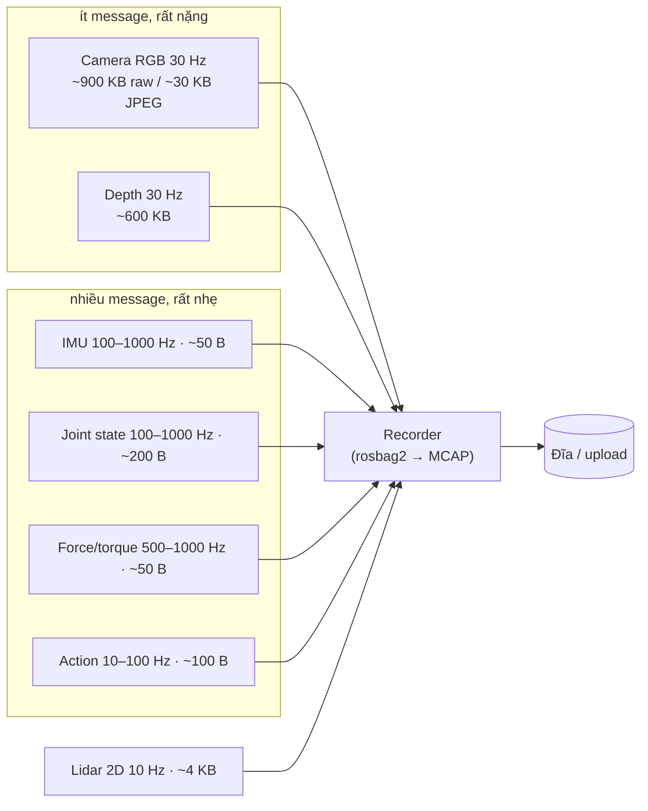
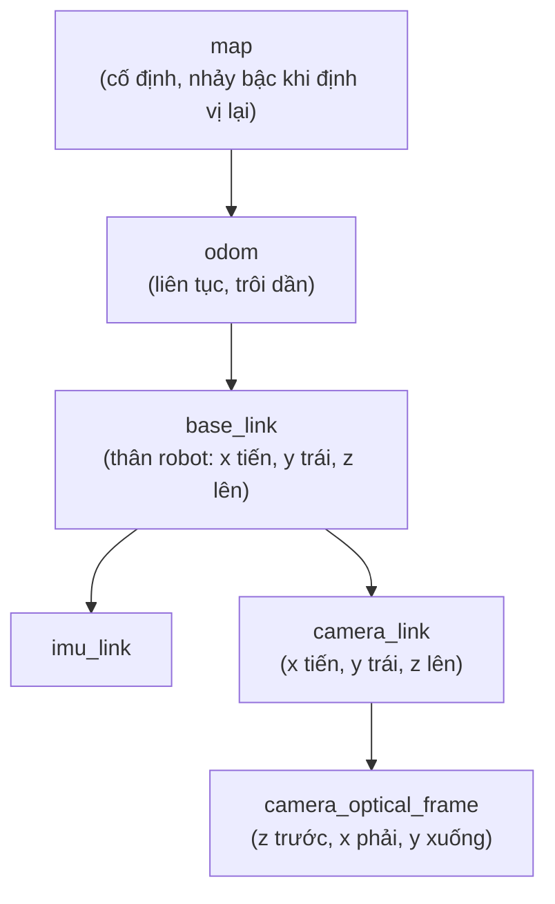
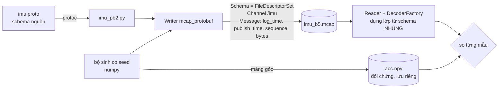
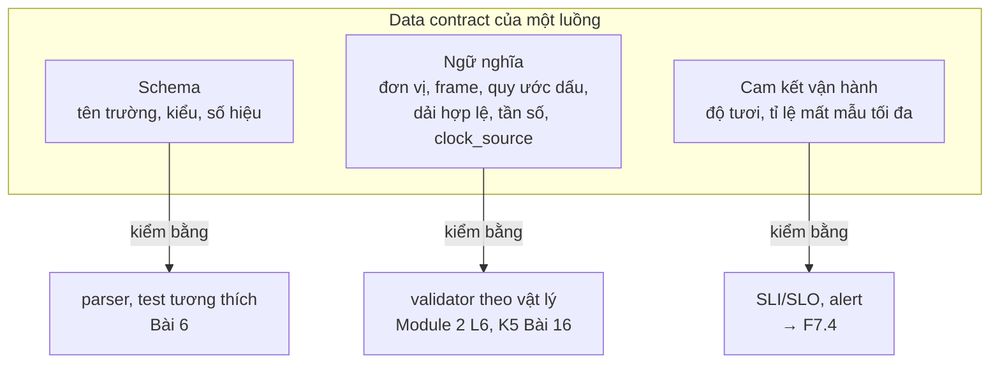
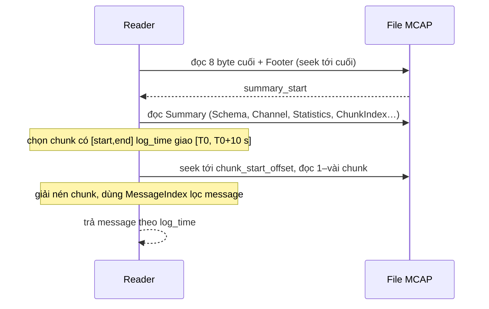
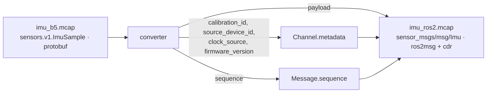

# Khóa 2 · Module 1 — MCAP và công cụ (22h, trần 32h)

> Milestone **M2**. Chín bài (1–8, 8b) và Gate Module 1 ở cuối file. Tổng quan khóa, lịch, cách học: `00-tong-quan.md`. Nguồn: `khoa-2-du-lieu-robot-khong-can-robot.md` (Bài 1–8b, Gate M1), đối chiếu `00-lo-trinh-tong.md` mục M2, `CONVENTIONS.md`. Khóa 2 không có bản Gemini.
> Bản gốc ghi "Module 1 (20h)" ở tiêu đề, nhưng các bài cộng lại 22h và gate ghi ngân sách 22h. File này dùng **22h**.

**Đây là module gần nghề bạn nhất trong cả lộ trình.** Log append-only, index, schema evolution, event time: bạn đã dùng hết. Vì vậy rủi ro lớn nhất ở đây không phải là "không hiểu", mà là **hiểu theo phép so sánh với backend rồi dừng**. Mỗi bài có bảng cầu nối; cột quan trọng nhất của bảng là "Gãy ở chỗ".

## Thiết lập chung cho cả module

Một môi trường Python cho mọi bài. Mọi khối code `# [đã chạy]` trong file này đã chạy với đúng các phiên bản dưới (10/2026); API `mcap*` đổi theo phiên bản `[tự đo]`, nâng cấp thì chạy lại toàn bộ test Bài 5–8b.

```text
# requirements-k2m1.txt — pin chính xác
numpy==2.2.6            # numpy 2.5 cũng chạy được các khối dưới
mcap==1.5.0
mcap-protobuf-support==0.5.4
mcap-ros2-support==0.5.7
protobuf==7.36.2
zstandard==0.25.0
lz4==4.4.5
grpcio-tools==1.84.0    # cho `python -m grpc_tools.protoc` khi máy chưa có protoc
rerun-sdk==0.38.1       # chỉ Bài 8
```

Kiểm chữ ký API trên bản bạn cài: `python -c "import inspect, mcap_protobuf.writer as w; print(inspect.signature(w.Writer.write_message))"`.

**MCAP CLI** (`mcap info`, `doctor`, `recover`…): hiện được viết bằng Rust (`rust/cli` trong repo `foxglove/mcap`; bản Go cũ đã bị gỡ khỏi repo). Cài bằng binary ở GitHub releases của `foxglove/mcap`, `brew install mcap`, hoặc `cargo build -p mcap-cli --release` `[spec: mcap.dev/guides/cli, đọc 10/2026]`. Ghi `mcap --version` vào notes: cờ và định dạng output đổi giữa các bản `[tự đo]`. Không cài được thì dùng `walk.py` (Bài 4) và `make_reader(...).get_summary()`.

| File | Là gì | Dùng ở |
|---|---|---|
| `src/proto/sensors/v1/imu.proto`, `src/main.py`, `src/imu.mcap` | Bản bạn đã làm theo Bài 5 bản gốc. `src/imu.mcap` ghi bằng `mcap 1.4.0` (đọc từ Header record của chính file): cũ hơn thư viện bạn đang cài, và chính vì thế file phải tự mô tả | Bài 2, 4, 5, 6, 8b |
| `src/download_hf_dataset.py` | Tải `lerobot/robomme` từ HF Hub | Bài 1, Gate tiêu chí 1 |
| `data/example-006-arm-gazebo.mcap` | File mẫu thật: tay máy trong Gazebo, ROS 1 chuyển sang MCAP, ~440 MB. Nằm trong `data/` (gitignore), không có trong repo | Bài 1–4 (bước tùy chọn) |
| `data/lerobotpusht/` | Dataset LeRobot (format v3.0), cũng trong `data/` | Bài 6, Gate |

Không có `data/` trên máy: các bước dùng `example-006` là tùy chọn; thay bằng bất kỳ file MCAP mẫu nào có ảnh và `joint_states` (sample data của Foxglove, hoặc `testdata/mcap/demo.mcap` trong repo `foxglove/mcap`, tải qua Git LFS). Số ở phần 7 của các bước đó chỉ đúng cho `example-006`.

**Code của bạn được nhận xét ở đâu:** `imu.proto` → Bài 3, 5, 6, 8b · `main.py` → Bài 2, 5 · `imu.mcap` → Bài 4, 5 · `download_hf_dataset.py` → Bài 1, Gate.

---

## Bài 1 — Một con robot sinh ra dữ liệu gì (2h)

> **Vị trí:** (đầu khóa) → **Bài 1** → Bài 2 (timestamp) · **Cần trước:** không bắt buộc; nên lướt → F3.1 · **Sau bài này bạn quyết định được:** với một cấu hình cảm biến cho trước, ước được MB/s, message/s và GB cho một ca 8 giờ, và nói được nên nén/giảm mẫu ở luồng nào trước khi mua đĩa hay thiết kế đường upload.

### 1. Câu chuyện — ai đã khổ vì chuyện này

ROS 1 ghi log bằng định dạng `.bag` riêng. ROS 2 lúc đầu ghi vào SQLite3 (`.db3`) qua `rosbag2`, rồi từ bản Iron (2023) đổi storage mặc định sang MCAP [chuẩn]. Lý do đổi không nằm ở thẩm mỹ: một cơ sở dữ liệu quan hệ được tối ưu cho cập nhật có giao dịch, còn log robot là **ghi nối đuôi liên tục, hàng nghìn message nhỏ mỗi giây xen với vài chục message hàng trăm KB**, đọc lại theo khoảng thời gian, và phải sống sót khi máy bị rút điện giữa chừng. Đó là hồ sơ tải mà một format log append-only có index theo thời gian phục vụ tốt hơn.

Nỗi khổ thứ hai là chi phí. Một đội thu dữ liệu để huấn luyện policy phát hiện ra rằng thứ đầy đĩa, nghẽn uplink và đội hóa đơn object store không phải là IMU hay joint state — mà là ảnh. Còn thứ làm chậm parser, làm phình index và làm khó ghép luồng lại là các luồng nhỏ tần số cao. Hai bài toán này cần hai cách xử lý khác nhau, và người thiết kế pipeline phải thấy cả hai ngay từ bảng ngân sách đầu tiên.

### 2. Mô hình tư duy



Bản chất: một robot là **một hệ đa tần số**, các luồng chênh nhau hai bậc độ lớn về tần số và bốn bậc về kích thước mẫu. Hệ quả 1: không có "một dòng dữ liệu" để join theo khóa — mọi phép ghép là ghép theo thời gian (as-of join, nội suy), và lựa chọn cách ghép là một quyết định về chất lượng dữ liệu (→ F3.4). Hệ quả 2: hai chế độ tải — **byte do ảnh quyết định, số message do luồng nhỏ quyết định** — nên format lưu phải rẻ cho cả hai, và chi phí cố định *trên mỗi message* (header record, entry index) trở thành vấn đề với luồng nhỏ. Hệ quả 3: dung lượng là phép nhân đơn giản (Hz × byte × giây) nhưng hệ số nén của ảnh thay đổi kết quả cả bậc độ lớn, nên "robot sinh bao nhiêu GB" luôn phải kèm "nén thế nào". Hệ quả 4: một mẫu cảm biến không tự đủ nghĩa; nó cần thời điểm đo, frame, đơn vị, hiệu chuẩn (Bài 2, 3, 8b). Đó là chỗ khác căn bản với một event giao dịch.

Một chi tiết về kích thước IMU: "~50 B" của bản gốc gần với một **gói thô** từ MCU (6 × int16 + timestamp ≈ 20–50 B). Ghi theo message chuẩn `sensor_msgs/msg/Imu` (CDR) thì một mẫu là **~324 B**, vì có ba ma trận covariance 9 × float64 `[đã đo ở Bài 8b]`. Chọn message chuẩn làm IMU "nặng" lên khoảng một bậc; Bài 8b đo xem file có thật sự to lên không.

### 3. Cầu nối từ backend

| Backend bạn biết | Ở đây | Gãy ở chỗ | Nếu dùng nhầm thì |
|---|---|---|---|
| Event stream có schema | Message stream có schema | Event web là một *sự kiện rời* có danh tính nghiệp vụ; mẫu cảm biến là *một lần lấy mẫu* của tín hiệu liên tục, có sai số và có thời điểm đo là chính một phép đo | Dedupe theo nội dung payload → xóa nhầm hai mẫu IMU giống hệt nhau nhưng đều hợp lệ (hoặc che mất kênh bị đơ) |
| Kafka topic | ROS topic / MCAP channel | Kafka topic chia partition để song song và giữ thứ tự theo key; MCAP channel là một luồng (topic + schema + encoding) **xen kẽ với các channel khác trong cùng chunk** theo thứ tự ghi | Nghĩ "đọc một channel là đọc một file riêng" → đọc một topic nhỏ trong file lớn vẫn phải giải nén cả chunk chứa ảnh (Bài 7) |
| Partition theo key | Channel theo topic | Không có khái niệm key, không có consumer group, không có offset do broker cấp. Và **một topic có thể có nhiều channel**: channel = (topic, encoding, schema, metadata), nên mỗi publisher ROS 1 thường là một channel riêng (trong `example-006`, `/tf_static` có 4 channel) | Đếm theo channel id mà tưởng là topic → đếm trùng hoặc bỏ sót publisher |
| Event time vs processing time | `header.stamp` vs `log_time` (và `publish_time` ở giữa) — Bài 2 | Ở robot, event time do **một đồng hồ khác** đóng dấu (MCU, camera), không chỉ trễ hơn mà còn **trôi** | Tin event time như một sự thật tuyệt đối → ghép luồng lệch pha mà không biết |
| Idempotency key | Trường `sequence` | `sequence` dùng để **phát hiện mất/đảo**, không để chống trùng khi retry; trong MCAP nó tùy chọn và được phép bằng 0 | Coi `sequence` là bảo đảm → file có `sequence = 0` ở mọi message (file của bạn, Bài 5) vẫn "hợp lệ" mà không phát hiện được gì |
| Schema registry | Schema **nhúng trong file** | Registry cho phép tra phiên bản theo id lúc chạy; file MCAP mang theo bản sao schema, không có registry nào để hỏi "bản này có tương thích bản kia không" | Bỏ qua kiểm tương thích vì "file tự mô tả rồi" → reader cũ vẫn chạy nhưng hiểu sai trường (Bài 6) |

**Chấm mô hình:**

1. *"Dữ liệu robot là event stream có schema, giống hệt hệ của tôi, chỉ khác payload."* — **ĐÚNG MỘT PHẦN.** Đúng ở tầng vận chuyển và lưu trữ (append, schema, partition-ish, retention). Gãy ở ngữ nghĩa: một event thanh toán hoặc xảy ra hoặc không; một mẫu IMU là ước lượng có nhiễu của một đại lượng liên tục, và *khoảng trống giữa các mẫu cũng là thông tin* (tần số lấy mẫu quyết định cái gì nhìn thấy được, → F5.5). Phản ví dụ: hai message `{"amount": 100}` trùng nhau trong hệ thanh toán gần như chắc chắn là retry cần dedupe; hai mẫu IMU `az = 9.8100` liên tiếp có thể là bình thường, còn 2.000 mẫu giống hệt nhau là cảm biến bị đơ — cùng một phép so sánh, ba kết luận khác nhau tùy vật lý.
2. *"`sequence` là idempotency key của robot."* — **ĐÚNG MỘT PHẦN.** Giống producer idempotent của Kafka ở chỗ dùng số thứ tự để phát hiện khoảng trống và đảo thứ tự. Gãy: idempotency key định danh *một ý định nghiệp vụ* để retry không nhân đôi; `sequence` chỉ là bộ đếm của nguồn phát, reset khi nguồn khởi động lại, và MCAP cho phép bằng 0 [spec: MCAP Specification, Message record]. Phản ví dụ: ESP32 khởi động lại giữa phiên → `sequence` quay về 0, trùng với các giá trị đã có; dedupe theo `sequence` sẽ xóa dữ liệu thật.
3. *"Muốn ghép camera với IMU thì join theo timestamp."* — **SAI** nếu hiểu là equi-join. Không có mẫu IMU nào trùng đúng nano giây với frame ảnh. Phép đúng là as-of join (lấy mẫu gần nhất trước/sau) hoặc nội suy, kèm dung sai — và dung sai đó phải được ghi lại (→ F3.4).

### 4. Thuật ngữ

| Mức | Thuật ngữ | Nghĩa trong một câu | Hay bị hiểu nhầm thành |
|---|---|---|---|
| 🟢 | Topic / channel | Một luồng message cùng kiểu; trong MCAP, channel = topic + schema + encoding + metadata | Một file hay một partition riêng |
| 🟢 | Tần số lấy mẫu (Hz) | Số mẫu mỗi giây của một luồng | Tốc độ xử lý; "Hz cao hơn là tốt hơn" |
| 🟢 | Episode | Một lần thực hiện nhiệm vụ từ đầu đến cuối, đơn vị cơ bản của dataset học máy | Một file log hay một phiên ghi |
| 🟢 | As-of join | Ghép mỗi bản ghi với bản ghi gần nhất *trước* (hoặc gần nhất) theo thời gian ở luồng kia | Join theo khóa bằng nhau |
| 🟢 | rosbag2 | Công cụ ghi/phát lại topic của ROS 2; từ Iron ghi MCAP mặc định | Một định dạng file (nó là công cụ, storage là plugin) |
| 🟡 | QoS (ROS 2) | Chính sách giao nhận của DDS: reliable/best-effort, history depth | Tham số hiệu năng vô hại — thật ra quyết định message có bị drop khi nghẽn |
| 🟡 | Bandwidth vs message rate | MB/s và message/s là hai ngân sách khác nhau, nghẽn ở hai chỗ khác nhau | Một con số "throughput" duy nhất |
| 🔴 | Nội bộ DDS / RTPS | Giao thức dây bên dưới ROS 2 | Thứ cần học ở khóa này |

### 5. Dự đoán

**Đề.** Dùng bảng luồng ở phần 2 (lấy cận trên của dải tần số cho IMU, joint, F/T; action 100 Hz; lidar 10 Hz). Với bốn cấu hình:

- (A) RGB raw + depth raw + các luồng nhỏ
- (B) RGB JPEG + depth raw + các luồng nhỏ
- (C) RGB JPEG + các luồng nhỏ
- (D) chỉ các luồng nhỏ

tính MB/s, message/s và GB cho một ca 8 giờ. Rồi tính: ở (B), ảnh chiếm bao nhiêu % byte và bao nhiêu % số message?

**Tham số cần tra.** Kích thước ảnh: 640 × 480 × 3 byte (RGB8), 640 × 480 × 2 byte (depth 16-bit). Chi phí cố định mỗi message trong MCAP: tự đếm từ **MCAP Specification** (mcap.dev/spec), mục *Records → Message* (opcode + record length + `channel_id` + `sequence` + `log_time` + `publish_time`) và mục *Message Index* (mỗi entry gồm một timestamp và một offset). Ghi rõ bạn đếm ra bao nhiêu byte cho mỗi phần.

**Phương pháp.** `B/s = Σ Hz_i × (byte_i + overhead)`; `GB/8h = B/s × 28 800 / 1e9`. Câu hỏi phụ: với IMU 50 B, overhead MCAP bằng bao nhiêu % payload?

```markdown
# prediction.md — Bài 1
| Cấu hình | MB/s | msg/s | GB/8h |
|---|---|---|---|
| A | | | |
| B | | | |
| C | | | |
| D | | | |
- Overhead MCAP mỗi message (record header + index entry): ___ B (đếm từ spec mục ___)
- (B): ảnh chiếm ___ % byte, ___ % message
- Overhead / payload với IMU 50 B: ___ %
- Luồng tôi sẽ nén/giảm mẫu đầu tiên và vì sao: ___
```

### 6. Làm

1. Commit `prediction.md` trước.
2. Chạy mô hình ngân sách dưới đây (sửa bảng `streams` theo cảm biến bạn định dùng ở Khóa 5–7):

```python
# [đã chạy] Bài 1 — ngân sách băng thông một robot, kể cả overhead record + index của MCAP
streams = {  # tên: (Hz, byte/mẫu)
    "rgb_raw":   (30, 640 * 480 * 3), "rgb_jpeg": (30, 30_000), "depth_raw": (30, 640 * 480 * 2),
    "imu":       (1000, 50), "joint": (1000, 200), "ft": (1000, 50),
    "lidar2d":   (10, 4_000), "action": (100, 100),
}
REC, IDX = 31, 16           # byte/message: Message record header, MessageIndex entry (spec MCAP)
def budget(names, hours=8):
    tot_b = tot_n = 0
    for k in names:
        hz, b = streams[k]
        tot_b += hz * (b + REC + IDX); tot_n += hz
    return tot_b, tot_n, tot_b * 3600 * hours / 1e9
small = ["imu", "joint", "ft", "lidar2d", "action"]
for cfg in (["rgb_raw", "depth_raw"] + small, ["rgb_jpeg", "depth_raw"] + small, ["rgb_jpeg"] + small, small):
    bps, mps, gb = budget(cfg)
    print(f"{'+'.join(c for c in cfg if c not in small) or 'chỉ luồng nhỏ':22s} {bps/1e6:7.2f} MB/s {mps:5d} msg/s {gb:8.1f} GB/8h")
b_small, n_small, _ = budget(small); b_img = 30 * (30_000 + 47) + 30 * (614_400 + 47)
print("ảnh (jpeg+depth) chiếm % byte:", round(100 * b_img / (b_img + b_small), 1), "% message:", round(100 * 60 / (60 + n_small), 1))
print("overhead MCAP trên IMU 50 B:", round(100 * (REC + IDX) / 50), "%")
```

   Mô hình này **chưa tính nén chunk** (zstd nén được header record nhưng không nén MessageIndex — Bài 4, Bài 7). Coi nó là cận trên trước nén.
3. Mở dataset bạn đã tải bằng `src/download_hf_dataset.py` (`lerobot/robomme`): đọc `meta/info.json`, ghi lại `fps`, danh sách `features`, số episode, số frame. So với bảng ở trên: dataset học máy đã **giảm mẫu mọi luồng về một tần số chung** chưa? (Nếu có, đó là một quyết định ghép luồng ai đó đã làm thay bạn — Bài 9 đào tiếp.) Cấu trúc thư mục cụ thể phụ thuộc phiên bản format LeRobot `[tự đo]`.
4. **(Tùy chọn, nếu có `data/example-006-arm-gazebo.mcap`)** File thật: trước khi chạy, ghi vào `prediction.md` topic nào nhiều message nhất, ảnh + point cloud chiếm bao nhiêu % byte, `/joint_states` chạy bao nhiêu Hz. Rồi đếm:

```python
# [đã chạy] Bài 1 — mỗi topic chiếm bao nhiêu % số message và % số byte? (mcap==1.5.0)
import sys
from collections import defaultdict
from mcap.reader import make_reader

path = sys.argv[1] if len(sys.argv) > 1 else "data/example-006-arm-gazebo.mcap"
n, nbytes = defaultdict(int), defaultdict(int)
with open(path, "rb") as f:
    r = make_reader(f)
    for _, ch, m in r.iter_messages():          # quét toàn bộ, ~vài chục giây với 440 MB
        n[ch.topic] += 1
        nbytes[ch.topic] += len(m.data)         # byte payload, chưa tính overhead record
N, B = sum(n.values()), sum(nbytes.values())
for topic in sorted(nbytes, key=nbytes.get, reverse=True):
    print(f"{topic:32s} {n[topic]:6d} msg ({n[topic]/N:6.1%})  {nbytes[topic]/1e6:8.1f} MB ({nbytes[topic]/B:6.1%})"
          f"  {nbytes[topic]/n[topic]/1e3:9.1f} KB/msg")
```

   Thời lượng lấy từ `r.get_summary().statistics` (`message_end_time − message_start_time`, ns). Tần số tính theo `log_time` lệch tần số thật cỡ (trễ đầu + trễ cuối)/thời lượng, dưới 0,1 % với file vài chục giây `[ước lượng]`.
5. Viết `notes/01-streams.md`: bảng của bạn + một đoạn "luồng nào tôi nén/giảm mẫu trước, và cái giá phải trả".

### 7. Số phải ra

<details><summary>🔒 MỞ SAU KHI COMMIT prediction.md</summary>

Overhead: Message record = 1 (opcode) + 8 (record length) + 2 (`channel_id`) + 4 (`sequence`) + 8 (`log_time`) + 8 (`publish_time`) = **31 B**; mỗi entry MessageIndex = 8 (timestamp) + 8 (offset) = **16 B** [spec]. Tổng 47 B/message trước nén.

| Cấu hình | MB/s | msg/s | GB/8h |
|---|---|---|---|
| A — RGB raw + depth raw | 46.6 | 3 170 | ~1 340 |
| B — RGB JPEG + depth raw | 19.8 | 3 170 | ~570 |
| C — RGB JPEG | 1.40 | 3 140 | ~40 |
| D — chỉ luồng nhỏ | 0.50 | 3 110 | ~14 |

- (B): ảnh chiếm **~97.5 % byte** nhưng chỉ **~1.9 % message**. Bản gốc nói "95 % / 5 %": đúng về hướng, con số phụ thuộc cấu hình.
- Overhead MCAP trên IMU 50 B: **~94 %** — gần gấp đôi payload trước nén. Đây là lý do thật để không ghi IMU 1 kHz thành từng message riêng nếu không cần (một số driver gom nhiều mẫu vào một message), và lý do MessageIndex chiếm tới ~25 % file IMU của bạn (Bài 4).
- Bản gốc nói "một robot 8 tiếng sinh 100–800 GB": nằm giữa C và B. Con số không sai, nhưng **thiếu điều kiện** — chênh nhau 30× chỉ vì nén ảnh hay không.

Vì sao số của bạn có thể lệch: JPEG 30 KB là ước lượng cho cảnh đơn giản ở chất lượng trung bình `[ước lượng]`; cảnh nhiều chi tiết gấp 2–3 lần. Nếu bạn quên overhead, luồng nhỏ sẽ thấp hơn ~20–50 %.

**`example-006` (bước 4, đo bằng mcap 1.5.0 trên máy có `data/`):**

| Topic | % message | % byte | KB/message |
|---|---|---|---|
| `/camera/depth/points` | 1,1 % | **58,6 %** | ~3 840 |
| `/static_camera/image_raw` | 2,2 % | 28,1 % | ~922 |
| `/camera/depth/image_raw` | 1,1 % | 7,3 % | ~480 |
| `/camera/rgb/image_raw` | 1,1 % | 5,5 % | ~360 |
| `/joint_states` | **72,3 %** | 0,3 % | ~0,3 |
| `/tf` | 18,0 % | 0,2 % | ~0,6 |

Ảnh + point cloud: ~99,5 % byte, ~5,5 % message; ở file này "95 % / 5 %" của bản gốc đúng, vì ảnh raw và có point cloud. Thời lượng ~18,9 s, `/joint_states` 9 450 message → ~500 Hz. **Point cloud, không phải ảnh, là luồng nặng nhất**: nhiều người đoán sai chỗ này.

**Đáp án tự kiểm tra của bản gốc:**
1. Camera 30 Hz, IMU 200 Hz, muốn gia tốc tại thời điểm chụp: không có mẫu IMU nào trùng đúng thời điểm. Chọn mẫu gần nhất (sai số thời gian tối đa nửa chu kỳ IMU = 2.5 ms) hoặc nội suy tuyến tính giữa hai mẫu kề; **ghi lại cách đã chọn** như metadata. Và trước cả câu hỏi đó: hai timestamp có cùng đồng hồ không? (Bài 2.)
2. MCAP nhúng schema vì file phải tự đọc được offline, sau nhiều năm, không phụ thuộc dịch vụ ngoài — ràng buộc hiện trường quyết định thiết kế.
</details>

### 8. Nếu ra khác

| Triệu chứng | Nguyên nhân khả dĩ | Kiểm bằng cách | Sửa |
|---|---|---|---|
| GB/8h của bạn lệch 1 000× | Lẫn MB với MiB, hoặc bit với byte, hoặc quên × 3 600 | In từng hạng tử | Ghi đơn vị trong tên biến (`bytes_per_s`) |
| Luồng nhỏ ra gần 0 % byte nhưng file thật vẫn to | Bỏ qua overhead/message và index | So với `mcap du` trên file thật (Bài 4) | Thêm 47 B/message vào mô hình |
| `meta/info.json` không có trường bạn tìm | Phiên bản format LeRobot khác (v2.x vs v3.x) | Đọc trường `codebase_version` | Ghi phiên bản vào notes; Bài 9 xử lý |

### 9. Câu hỏi ngược

1. **[Quy mô]** 100 robot, mỗi con cấu hình (B), làm 8 giờ/ngày, uplink chung 1 Gbit/s ở kho. Cái gì gãy trước: đĩa trên robot, uplink, hay chi phí object store? Bạn sẽ đặt nén/giảm mẫu ở đâu trong chuỗi?
   <details><summary>Hướng nghĩ</summary>Tính tổng GB/ngày rồi chia cho băng thông uplink theo giờ không làm việc. So với dung lượng đĩa robot. Nhớ rằng nén ảnh trên robot tốn CPU của chính robot — cái giá đó cạnh tranh với policy đang chạy (→ K4).</details>
2. **[Failure mode]** Đĩa robot đầy giữa ca. Recorder nên làm gì: dừng hẳn, drop ảnh giữ luồng nhỏ, hay ghi đè dữ liệu cũ? Mỗi lựa chọn làm hỏng loại phân tích nào sau này?
   <details><summary>Hướng nghĩ</summary>Đây là drop policy (→ F3.9). Câu hỏi quyết định: dữ liệu này dùng để làm gì — debug sự cố (cần vài phút trước sự cố, ring buffer hợp lý) hay huấn luyện (cần episode trọn vẹn, drop giữa episode làm hỏng cả episode). Và phải *đếm* cái đã drop.</details>
3. **[Vì sao không]** Vì sao LeRobot lưu ảnh thành video MP4 thay vì từng frame JPEG? Cái gì mất đi khi làm vậy?
   <details><summary>Hướng nghĩ</summary>Nén liên khung (inter-frame) tận dụng sự giống nhau giữa các frame liên tiếp. Đổi lại: truy cập ngẫu nhiên một frame phải giải mã từ keyframe gần nhất; số frame video và số dòng metadata có thể lệch nhau (một lớp lỗi ở Bài 11); nén có mất mát làm thay đổi pixel mà policy nhìn thấy.</details>
4. **[Nếu…thì]** Nếu bạn gom 10 mẫu IMU 1 kHz vào một message 100 Hz, overhead giảm bao nhiêu, và bạn mất gì về khả năng index/truy vấn theo thời gian?
   <details><summary>Hướng nghĩ</summary>Overhead chia 10. Nhưng index giờ chỉ biết `log_time` của cả lô; thời điểm từng mẫu phải nằm trong payload. Truy vấn cửa sổ thời gian vẫn chạy, chỉ thô hơn 10 ms. Có chuẩn ROS 2 nào cho IMU dạng lô không? Tự tra.</details>
5. **[Phản biện]** "Cứ ghi hết raw, lưu trữ rẻ." Ở mức nào câu này đúng, ở mức nào nó sai?
   <details><summary>Hướng nghĩ</summary>Lưu trữ lạnh rẻ; băng thông từ robot lên, thời gian đọc lại để huấn luyện, và chi phí egress thì không. Còn một chi phí ẩn: dữ liệu không ai đọc được đúng lúc thì không phát hiện được lỗi thu thập (Module 2).</details>
6. **[Vì sao không]** Vì sao không ghi mỗi cảm biến ra một file riêng (giống một partition một file), cho đơn giản?
   <details><summary>Hướng nghĩ</summary>Nghĩ về: mở N file đồng thời, flush đồng bộ khi mất điện, phát lại nhiều luồng theo thứ tự thời gian (merge-sort N file), chia sẻ một "phiên" như một đơn vị. Rồi nghĩ ngược: khi nào tách file lại có lợi (luồng ảnh rất lớn, vòng đời lưu trữ khác, đọc riêng luồng nhỏ mà không giải nén ảnh — Bài 7).</details>

### 10. Liên kết ra ngoài

- **Dữ liệu tick tài chính.** Giá khớp lệnh và quote đến với tần số khác nhau, không đều; kdb+/q có sẵn phép `aj` (as-of join) chính vì bài toán "giá tại thời điểm giao dịch" giống hệt "gia tốc tại thời điểm chụp ảnh" [chuẩn]. Khác: tick tài chính có một đồng hồ sàn chung khá tin cậy; robot có nhiều đồng hồ trôi khác nhau (Bài 2).
- **Hộp đen máy bay (flight data recorder).** Ghi hàng trăm tham số ở các tần số khác nhau trong một luồng khung có cấu trúc, phải sống sót sau va chạm, đọc được nhiều năm sau mà không có hệ thống gốc. Giống MCAP ở yêu cầu tự mô tả và chịu hỏng; khác ở chỗ tham số và tần số được cố định trong thiết kế chứng nhận, không đổi theo từng chuyến.
- **Observability.** Metrics (nhỏ, nhiều, đều) và traces/logs (lớn, thưa) thường được tách hệ lưu trữ vì hồ sơ tải khác nhau. MCAP chọn để chung một file. Câu hỏi 6 ở trên là cùng một đánh đổi.

### 11. Độ tin cậy và sửa lỗi

| Khẳng định | Nhãn | Ghi chú / cách kiểm |
|---|---|---|
| rosbag2 ghi MCAP mặc định từ Iron | [chuẩn] | Tài liệu rosbag2 / release notes ROS 2 Iron |
| 31 B header Message record, 16 B mỗi entry MessageIndex | [spec] | MCAP Specification, Records; khớp `mcap du` trên file của bạn (Bài 4) |
| JPEG 640×480 ~30 KB | [ước lượng] | Phụ thuộc cảnh và chất lượng; đo trên camera thật ở K5 |
| 100–800 GB/robot/8h | [ước lượng] | Đúng trong dải cấu hình B–C; thiếu điều kiện nén |
| Overhead ~94 % trên IMU 50 B | [ước lượng] | Trước nén; nén zstd giảm phần record header, không giảm MessageIndex. `mcap du src/imu.mcap`: MessageIndex = 25,1 % byte file [đã chạy, CLI 0.3.0] |
| `sensor_msgs/Imu` CDR 324 B | đã đo | Bài 8b, `len(m.data)` |
| Số liệu `example-006` | đã đo (máy có `data/`) | script bước 4 |

**Đã sửa so với bản gốc:** (1) "95 % dung lượng / 5 % message" thay bằng phép tính có điều kiện cấu hình (đúng với ảnh raw như `example-006`, sai xa với ảnh nén); (2) thêm overhead mỗi message mà bản gốc bỏ qua — nó làm đổi kết luận về luồng nhỏ; (3) "`sequence` ≈ idempotency key" được chấm lại (đúng một phần); (4) "Partition theo key ↔ channel theo topic" thêm chỗ gãy (channel xen kẽ trong cùng chunk; một topic nhiều channel); (5) IMU "~50 B" chỉ đúng cho gói thô; message chuẩn ~324 B.

### 12. Đọc thêm và tự kiểm tra

- **Nguồn gốc:** MCAP Specification — mcap.dev/spec (mục Records, Chunk, Message Index).
- **Giải thích:** Martin Kleppmann, *Designing Data-Intensive Applications*, chương 11 (Stream Processing) — để đối chiếu với vốn Kafka của bạn.
- **Đào sâu (tùy chọn):** tài liệu rosbag2 (README của repo `ros2/rosbag2`) — phần storage plugin và split bag.
- **Tự kiểm tra:** (1) giải thích lại cho một backend engineer khác trong 5 câu vì sao "join theo timestamp" là sai câu hỏi; (2) vẽ lại hình ở phần 2 từ trí nhớ, kèm Hz và byte; (3) câu hỏi:
  - Một luồng 1 kHz × 50 B và một luồng 30 Hz × 30 KB: luồng nào tốn nhiều *byte index* hơn trong MCAP?
  <details><summary>Đáp án</summary>Luồng 1 kHz: 1 000 entry × 16 B = 16 KB/s index so với 30 × 16 = 480 B/s. Index tỉ lệ với số message, không với byte.</details>

---

## Bài 2 — Timestamp trong robotics (3h)

> **Vị trí:** Bài 1 → **Bài 2** → Bài 3 (frame) · **Cần trước:** → F4.1 (offset/skew/drift), → F4.3 (wall/monotonic), → F3.3 (event vs processing time); nên đọc → F4.6 khi rảnh · **Sau bài này bạn quyết định được:** nhìn phân bố `dt` và `log_time − stamp` của một luồng, nói được đó là rớt mẫu, nhảy đồng hồ, trôi đồng hồ hay hàng đợi phình — và quyết định giữ, sửa, hay loại một đoạn dữ liệu, kèm lý do ghi lại được.

Đây là bài quan trọng nhất của Module 1. Nếu chỉ nhớ một bài, nhớ bài này.

### 1. Câu chuyện — ai đã khổ vì chuyện này

**Patriot, Dhahran, 25/2/1991.** Hệ thống đếm thời gian theo bước 0,1 s trong thanh ghi 24 bit; 0,1 không biểu diễn chính xác ở hệ nhị phân, sai số làm tròn cộng dồn sau khoảng 100 giờ chạy liên tục lên tới khoảng 0,34 s. Với Scud bay ~1,7 km/s, lệch đó đẩy cửa sổ theo dõi đi ~687 m; radar không thấy mục tiêu, không đánh chặn, 28 lính thiệt mạng [spec: GAO/IMTEC-92-26, 1992]. Bài học: **ở hệ vật lý, sai thời gian là sai vị trí, và sai số đó không báo lỗi.**

**Cloudflare, 1/1/2017.** Giây nhuận làm wall clock lặp lại một giây; code DNS viết bằng Go lấy hiệu hai lần đọc `time.Now()` để đo khoảng thời gian, ra số âm, và panic. Go 1.9 sau đó thêm số đọc monotonic vào `time.Time` [chuẩn: blog sự cố của Cloudflare 1/2017; release notes Go 1.9]. Chuyện backend này chính là phân biệt wall vs monotonic của bài.

Ở robot: camera cắm mini PC được đóng dấu bằng đồng hồ mini PC, IMU trên ESP32 bằng bộ đếm của ESP32. Hai thạch anh, lệch vài chục ppm, trôi theo nhiệt (→ F4.1). Ghép hai luồng theo timestamp sẽ lệch dần, và **không có exception nào**. Bạn đo hiện tượng này bằng tay ở → K5 Bài 9–10; ở đây bạn học nhận ra dấu vết của nó trong dữ liệu người khác.

### 2. Mô hình tư duy

Mỗi message cảm biến đi qua ít nhất ba thời điểm, mỗi cái có thể do **một đồng hồ khác** đóng dấu:

```
đồng hồ ESP32 ──────────┬───────────────────────────────────────────────►
                        │ (1) header.stamp: thời điểm đo (event time)
                        ▼
                     [đo]──USB──►[driver]──►[publish]──DDS──►[recorder]──►[đĩa]
                                                │                 │
đồng hồ mini PC ────────────────────────────────┼─────────────────┼─────────►
                                  (2) publish_time            (3) log_time
                                  lúc gửi đi                  lúc bộ ghi nhận

log_time − header.stamp = độ trễ pipeline  +  (offset giữa hai đồng hồ)  +  skew × t
                          ^ thứ bạn muốn đo    ^ không biết nếu chưa đồng bộ  ^ tăng dần
```

Bốn câu về bản chất:

1. **`header.stamp` (trong payload) là event time; `log_time` (trong record MCAP) là processing time; `publish_time` nằm giữa.** Spec MCAP định nghĩa `publish_time` là lúc message được *publish*, không phải lúc đo; nếu không có thì đặt bằng `log_time` [spec: MCAP Specification, Message]. Thời điểm đo chỉ nằm trong payload.
2. **Index thời gian của MCAP dựa trên `log_time`** [spec: ChunkIndex `message_start_time`/`message_end_time` là log time]. Truy vấn "10 giây từ T" bằng index là truy vấn theo processing time.
3. **`log_time − stamp` chỉ là độ trễ khi hai số cùng một đồng hồ.** Khác đồng hồ, hiệu này lẫn offset và trôi — nó vẫn là chỉ số sức khỏe rất tốt, nhưng phải đọc đúng: phần *dao động* là jitter của pipeline, phần *xu hướng* là trôi đồng hồ hoặc hàng đợi phình.
4. **Thuật ngữ đồng hồ chuẩn** (→ F4.1, dùng xuyên lộ trình): *offset* = hai đồng hồ lệch nhau bao nhiêu giây tại một thời điểm; *skew* = chúng chạy nhanh/chậm khác nhau bao nhiêu (ppm, tức µs mỗi giây); *drift* = skew thay đổi theo thời gian/nhiệt độ. `dt` = khoảng cách hai mẫu liên tiếp cùng channel; *jitter* = độ phân tán của `dt` quanh chu kỳ danh định.

| Đồng hồ Linux | Đặc tính | Dùng cho | Cạm bẫy |
|---|---|---|---|
| `CLOCK_REALTIME` (wall) | Giây kể từ epoch UTC, so được giữa các máy nếu đã đồng bộ | Ghép dữ liệu giữa máy | **Có thể nhảy** (NTP/chrony step, người chỉnh tay), kể cả nhảy lùi |
| `CLOCK_MONOTONIC` | Không bao giờ lùi; mốc là một điểm không xác định (thường gần lúc boot) | Đo khoảng thời gian trong một máy | Vô nghĩa giữa hai máy; vẫn bị NTP *chỉnh tốc độ* (slew), không bị step; không đếm lúc suspend |
| `CLOCK_MONOTONIC_RAW` | Như monotonic nhưng không bị NTP chỉnh tốc | Đo tần số thật của thạch anh | Vô nghĩa giữa hai máy |

Nguồn: `man 2 clock_gettime` [spec]. Chi tiết → F4.3.

### 3. Cầu nối từ backend

| Backend bạn biết | Ở đây | Gãy ở chỗ | Nếu dùng nhầm thì |
|---|---|---|---|
| Flink/Beam: event time vs processing time, watermark | `header.stamp` vs `log_time` | Ở Flink, event time được coi là đúng, chỉ đến muộn; ở robot, event time do **nhiều đồng hồ trôi khác nhau** đóng dấu — watermark giải quyết *đến muộn*, không giải quyết *đóng dấu sai* | Dựng window theo event time rồi tin kết quả ghép → ghép lệch pha mà mọi metric pipeline đều xanh |
| Kafka `CreateTime` vs `LogAppendTime` | `publish_time`/`header.stamp` vs `log_time` | Kafka time index chấp nhận timestamp không đơn điệu nhưng có một broker làm trọng tài; MCAP không có trọng tài — `log_time` là đồng hồ của recorder, có thể khác máy với cảm biến | Đọc "start/end" của `mcap info` như thời điểm đo → lệch đúng bằng độ trễ + offset |
| Event time chỉ cần đủ đúng để gán window và sắp thứ tự | Timestamp dùng để **ghép hai phép đo vật lý** | Ở backend, sai vài trăm ms vẫn rơi đúng window phút. Ở robot, sai Δt thành sai vị trí `v·Δt` và sai góc `ω·Δt` (phần 5, câu C1 bắt bạn tính); MCU còn không chạy NTP, tự đếm theo thạch anh từ lúc boot | Lấy `log_time` làm trục ghép: toàn bộ trễ + jitter của USB, scheduler, hàng đợi đi thẳng vào dữ liệu training như một lệch pha |

**Chấm mô hình:**

1. *"`log_time − publish_time` là latency của pipeline."* (câu của bản gốc) — **ĐÚNG MỘT PHẦN.** Đúng nếu cả hai do cùng một đồng hồ đóng dấu (ví dụ cùng mini PC). Gãy khi `stamp`/`publish_time` đến từ thiết bị khác: hiệu = trễ + offset + skew·t. Phản ví dụ: ESP32 boot lúc 08:00:00.000 theo đồng hồ của nó nhưng mini PC đang ở 08:00:00.250 → mọi message "trễ" 250 ms dù pipeline trễ 2 ms.
2. *"Event time vs processing time — tôi biết rồi, giống Flink."* — **ĐÚNG MỘT PHẦN.** Kỹ thuật dữ liệu đến muộn dùng được ngay: muốn 10 s *theo stamp* bằng index *theo `log_time`*, truy vấn `log_time ∈ [T, T+10 s+L_max]` rồi lọc theo stamp, với `L_max` là trễ tối đa đo từ chính file — đó là watermark. Gãy: Flink không có khái niệm "event time của nguồn này chạy nhanh hơn nguồn kia 50 ppm". Phản ví dụ: hai luồng đều đến đúng hạn vẫn lệch nhau 60 ms sau 20 phút.
3. Mô hình của bạn ở **K3 lượt 21**: *"càng có nhiều flag như RTF để đo realtime… nếu lúc đo chưa cover đủ flag/khóa thì lúc runtime không thể đảm bảo mọi tình huống"*. — **ĐÚNG MỘT PHẦN.** Đúng ở chỗ: không đo thì không biết, và chỉ số dẫn xuất như `log_time − stamp` đáng giá hơn mười log line. Gãy ở hai chỗ: (a) không thể liệt kê trước mọi tình huống — thứ mở rộng được là **bất biến** ("stamp đơn điệu trong một channel", "dt ≈ 1/fps", "hiệu stamp giữa hai channel không có xu hướng"), kiểm liên tục; (b) dụng cụ đo cũng sai — chính đồng hồ dùng để đo là đối tượng có lỗi. Phản ví dụ: bạn có flag "latency p99" xanh suốt ca, trong khi hai đồng hồ trôi nhau 50 ppm — không flag nào về latency bắt được lỗi này vì nó không phải lỗi latency.

### 4. Thuật ngữ

| Mức | Thuật ngữ | Nghĩa trong một câu | Hay bị hiểu nhầm thành |
|---|---|---|---|
| 🟢 | `header.stamp` | Thời điểm đo, do driver/cảm biến đóng dấu, nằm trong payload | Thời điểm message được tạo trong code |
| 🟢 | `log_time` | Thời điểm recorder nhận message; MCAP index theo nó | Thời điểm sự kiện |
| 🟢 | `publish_time` | Thời điểm publisher gửi; spec cho phép bằng `log_time` nếu không biết | Thời điểm đo (bản gốc nhầm chỗ này) |
| 🟢 | Offset / skew / drift | Lệch pha / lệch tần số (ppm) / thay đổi của lệch tần số | "skew = lệch cố định, drift = tăng dần" (dùng lệch nghĩa chuẩn) |
| 🟢 | `dt`, jitter | Khoảng cách mẫu liên tiếp; độ phân tán của nó | Jitter = độ lệch chuẩn của timestamp (khác nhau một hệ số, xem phần 7) |
| 🟡 | Step vs slew | NTP nhảy đồng hồ một phát vs chỉnh tốc độ từ từ | Mọi chỉnh NTP đều là nhảy |

### 5. Dự đoán

**Phần A — ba tình huống của bản gốc** (viết vào `notes/02-time.md`, chưa code):

1. Dataset camera 30 Hz có `dt` quanh 33.3 ms nhưng có 40 mẫu ở 66.7 ms và 3 mẫu ở 100 ms. Chuyện gì đã xảy ra? Có nên vứt dataset không? Bạn cần thêm con số nào để quyết định?
2. `timestamp` giảm ở đúng một chỗ, lùi 1.2 s, rồi tăng tiếp. Liệt kê **ít nhất ba** nguyên nhân khả dĩ, và với mỗi cái, một phép kiểm để phân biệt.
3. Hai channel `observation.images.top` (30 Hz) và `observation.state` (30 Hz): ghép theo chỉ số frame thì khớp, ghép theo timestamp thì lệch trung bình 15 ms và **độ lệch tăng dần theo episode**. Đưa ra **hai** giả thuyết khác nhau và cách phân biệt chúng.

**Phần B — định lượng, trước khi chạy mô phỏng ở phần 6:**

- Camera 30 Hz, timestamp mỗi frame có nhiễu Gauss độc lập σ = 300 µs. Độ lệch chuẩn của `dt` là bao nhiêu? (Gợi ý: `dt` là hiệu của hai biến ngẫu nhiên độc lập.)
- Rớt ngẫu nhiên 1 % frame trên 6 000 frame. Có bao nhiêu `dt` ≈ 2 chu kỳ? Có `dt` ≈ 3 chu kỳ không?
- Đồng hồ thứ hai chạy nhanh hơn 50 ppm và lệch gốc 4 ms. Sau 200 s, lệch bao nhiêu? Sau một episode 20 phút?
- Tham số cần tra: dung sai tần số thạch anh điển hình của module ESP32-S3 — tra datasheet ESP32-S3 (mục yêu cầu thạch anh ngoài) hoặc datasheet module bạn mua; ghi rõ con số và nguồn.

**Phần C — sai 10 ms là sai bao nhiêu, và timestamp được lưu bằng gì:**

- C1. Robot đi 0,5 m/s (trần tốc độ ở → K7 C4.4), xoay tại chỗ 1 rad/s; ảnh 640 px ngang, FOV ngang 60° (giả định; FOV thật tra datasheet camera ở K5). Lệch thời gian 10 ms giữa ảnh và odometry. Công thức: `Δx = v·Δt`; `Δθ = ω·Δt`; `f_px = (W/2)/tan(FOV/2)`; dịch ảnh `Δpx ≈ f_px·Δθ`; điểm cách 2 m lệch ngang `≈ d·Δθ`.
- C2. LeRobot lưu `timestamp` dạng `float32` giây (MCAP: `uint64` ns). Bước lượng tử float32 ở t = 1000 s, 10⁵ s, 1,7·10⁹ s (epoch)? Với 2ᵏ ≤ t < 2ᵏ⁺¹, bước = 2ᵏ⁻²³; kiểm bằng `np.spacing(np.float32(t))`.

```markdown
# prediction.md — Bài 2
A1: ___ (cần thêm: ___)
A2: (a) ___ kiểm bằng ___ (b) ___ kiểm bằng ___ (c) ___ kiểm bằng ___
A3: giả thuyết 1 ___ / giả thuyết 2 ___ / phân biệt bằng ___
B1: std(dt) = ___ µs  (công thức: ___)
B2: số dt≈2T: ___ ; dt≈3T: ___
B3: lệch sau 200 s: ___ ms ; sau 20 phút: ___ ms
B4: dung sai thạch anh ESP32-S3: ___ ppm (nguồn: ___)
C1: Δx = __ mm · Δθ = __ mrad · Δpx = __ px · lệch ở 2 m = __ cm
C2: bước float32 @1000 s = __ · @1e5 s = __ · @epoch 1,7e9 s = __
```

### 6. Làm

1. Commit `prediction.md`.
2. Chạy mô phỏng (≤ 60 dòng, chỉ cần numpy/matplotlib). Nó sinh có chủ đích ba bệnh — rớt frame, wall clock bị kéo lùi, đồng hồ thứ hai trôi — rồi nhìn chúng qua `dt`:

```python
# [đã chạy] Bài 2 — ba bệnh của timestamp, sinh có chủ đích rồi nhìn bằng dt
import numpy as np, matplotlib
matplotlib.use("Agg")                      # trong bài có thể bỏ dòng này và dùng plt.show()
import matplotlib.pyplot as plt

rng = np.random.default_rng(0)
FPS, N = 30.0, 6000                        # 200 s camera 30 Hz
k = np.arange(N)
t_true = k / FPS                           # thời điểm phơi sáng "thật"

# (1) rớt frame: bỏ ngẫu nhiên vài chỉ số
keep = rng.random(N) > 0.01
cam = t_true[keep] + rng.normal(0, 300e-6, keep.sum())   # jitter ~300 µs

# (2) wall clock bị NTP kéo lùi 1.2 s ở giây thứ 120
wall = cam.copy()
wall[wall > 120] -= 1.2

# (3) đồng hồ thứ hai (ESP32) chạy nhanh hơn 'ppm' và lệch gốc 'offset'
ppm, offset = 50.0, 0.004
state = t_true * (1 + ppm * 1e-6) + offset

dt = np.diff(cam) * 1e3
dtw = np.diff(wall) * 1e3
skew_ms = (state - t_true) * 1e3

fig, ax = plt.subplots(1, 3, figsize=(13, 3.5))
ax[0].hist(dt, bins=200); ax[0].set_yscale("log")
ax[0].set_title("dt camera (ms) — log y"); ax[0].set_xlabel("ms")
ax[1].plot(wall[1:], dtw, ".", ms=2); ax[1].set_title("dt theo wall clock")
ax[1].set_xlabel("wall time (s)"); ax[1].set_ylabel("ms")
ax[2].plot(t_true, skew_ms); ax[2].set_title(f"skew state−camera, {ppm:.0f} ppm")
ax[2].set_xlabel("s"); ax[2].set_ylabel("ms")
plt.tight_layout(); plt.savefig("bai2_clocks.png", dpi=110)

vals, cnt = np.unique(np.round(dt / (1e3 / FPS)), return_counts=True)
print("dt tính theo số chu kỳ:", dict(zip(vals.astype(int), cnt)))
print("số dt <= 0 (wall):", int((dtw <= 0).sum()), " min dt wall (ms):", round(dtw.min(), 1))
print("skew đầu/cuối (ms):", round(skew_ms[0], 2), round(skew_ms[-1], 2))
print("jitter (std dt quanh 1 chu kỳ, µs):", round(dt[np.abs(dt - 1e3 / FPS) < 5].std() * 1e3, 1))
```

   Đo lường ở đây không có sai số dụng cụ (dữ liệu tổng hợp), nhưng có **sai số lấy mẫu**: số frame rớt là biến ngẫu nhiên. Đổi `default_rng(0)` sang vài seed khác và ghi khoảng dao động của số `dt ≈ 2T` — đó là lý do con số kỳ vọng ở phần 7 là một khoảng.
3. Sửa mô phỏng thành **hai giả thuyết của câu A3**: (a) đồng hồ trôi như trên; (b) cùng một đồng hồ, nhưng luồng `state` được đóng dấu lúc *nhận* và đi qua một hàng đợi có tốc độ phục vụ chậm hơn tốc độ đến 0.1 %. Vẽ cả hai đường "lệch theo thời gian". Tìm một đặc trưng phân biệt được chúng (gợi ý: điều gì xảy ra ở đầu mỗi episode, và hàng đợi có giới hạn thì sao?).
4. **(Tùy chọn, có `data/example-006-arm-gazebo.mcap`) Đọc timestamp trên file thật.** Dự đoán trước cho hai topic: `publish_time == log_time`?; dấu, trung vị, max của `log_time − header.stamp`; `dt` theo stamp. File là ROS 1 chuyển sang MCAP, nên payload bắt đầu bằng ROS 1 `Header` (`uint32 seq, uint32 sec, uint32 nsec, string frame_id`) [spec: ROS 1 serialization]; không cần thư viện ROS:

```python
# [đã chạy] Bài 2 — header.stamp vs log_time trên file thật (ROS 1 trong MCAP; mcap==1.5.0)
import struct, sys
import numpy as np
from mcap.reader import make_reader

PATH = sys.argv[1] if len(sys.argv) > 1 else "data/example-006-arm-gazebo.mcap"
TOPICS = ["/joint_states", "/camera/rgb/image_raw"]
rows = {t: [] for t in TOPICS}
with open(PATH, "rb") as f:
    for _, ch, m in make_reader(f).iter_messages(topics=TOPICS):
        seq, sec, nsec, flen = struct.unpack_from("<IIII", m.data, 0)   # ROS 1 Header ở đầu payload
        frame = m.data[16:16 + flen].decode()
        rows[ch.topic].append((m.log_time, sec * 10**9 + nsec, m.publish_time, frame))

for t, v in rows.items():
    log, stamp, pub = (np.array([x[i] for x in v], dtype=np.int64) for i in range(3))
    lag_ms = (log - stamp) / 1e6
    print(f"\n{t}: n={len(v)} frame_id={v[0][3]!r} publish_time==log_time: {np.all(pub == log)}")
    print("  log - stamp (ms) min/p50/p99/max:", np.percentile(lag_ms, [0, 50, 99, 100]).round(2))
    print("  dt theo stamp (ms) min/p50/max:  ", np.percentile(np.diff(stamp) / 1e6, [0, 50, 100]).round(2))
    print("  số khoảng log_time không tăng:   ", int((np.diff(log) <= 0).sum()))
    print("  mọi log_time là bội số 1 ms?     ", bool(np.all(log % 1_000_000 == 0)))
```

   Không có sai số đo ở bước này, nhưng có **độ phân giải** của timestamp trong file; script kiểm luôn.
5. Ghi vào `notes/02-time.md`: ba con số bạn sẽ in cho **mọi** channel của mọi dataset từ nay: phân bố `dt` (theo bội số chu kỳ), số lần `dt ≤ 0`, và độ dốc của (stamp channel A − stamp channel B) theo thời gian. Đây là hạt giống của các lớp lỗi L1, L2, L5 ở → Bài 11.

### 7. Số phải ra

<details><summary>🔒 MỞ SAU KHI COMMIT prediction.md</summary>

**Phần B (mô phỏng, seed 0):**

| Đại lượng | Kết quả | Vì sao |
|---|---|---|
| std(dt) quanh 1 chu kỳ | ~424 µs | √2 × 300 µs: `dt` là hiệu hai nhiễu độc lập, phương sai cộng lại. Jitter của `dt` **lớn hơn** jitter của timestamp |
| Số `dt ≈ 2T` | 61 (seed khác: khoảng 45–75) | ≈ N × p = 6 000 × 1 %; số rớt là biến Poisson-ish, độ lệch chuẩn ~√60 ≈ 8 |
| Số `dt ≈ 3T` | 0 ở seed 0; seed 1–5 cho 0–2 | Hai frame liền nhau cùng rớt có xác suất p² = 10⁻⁴ mỗi vị trí → ~0.6 lần trên 6 000 |
| `dt ≤ 0` theo wall | đúng 1, giá trị ~ −1 166 ms | Một bước lùi 1.2 s cộng một chu kỳ |
| Lệch sau 200 s | 4 → 14 ms | 50 ppm × 200 s = 10 ms cộng offset 4 ms |
| Lệch sau 20 phút | ~64 ms | 50 ppm × 1 200 s = 60 ms + 4 ms — gấp đôi chu kỳ camera |

Dung sai thạch anh: datasheet ESP32-S3 yêu cầu thạch anh 40 MHz với dung sai cỡ ±10 ppm [spec: ESP32-S3 Datasheet/Hardware Design Guidelines — tự tra con số trong bản bạn đọc] `[tự đo]`; module rẻ có thể kém hơn và trôi thêm theo nhiệt. 50 ppm trong mô phỏng là kịch bản xấu nhưng không hiếm cho hai thiết bị khác loại.

**Phần C:** `Δx = 0,5 × 0,010 = 5 mm`; `Δθ = 10 mrad ≈ 0,57°`; `f_px = 320/tan 30° ≈ 554 px` → `Δpx ≈ 5,5 px`; điểm cách 2 m lệch ngang ~2 cm. Năm milimét nghe nhỏ, nhưng 5–6 px lớn hơn sai số của một detector marker tốt (dưới 1 px `[ước lượng]`), và đây mới là robot chậm. Float32: @1000 s ≈ **0,061 ms**; @10⁵ s ≈ **7,8 ms**; @1,7·10⁹ s = **128 s** (float64 @epoch ≈ 238 ns). Float32 giây chỉ chấp nhận được cho thời gian tương đối ngắn (LeRobot tính từ đầu episode, vài chục giây); tuyệt đối không dùng cho epoch.

**Bước 4 — `example-006`** (đo trên máy có `data/`, mcap 1.5.0):

| | `/joint_states` | `/camera/rgb/image_raw` |
|---|---|---|
| `publish_time == log_time` | có (file chuyển từ ROS 1, không có publish time riêng) | có |
| `log_time − stamp` min / p50 / max | −2 / 0 / +3 ms (**có âm**) | 21 / 28 / **48 714 ms** |
| `dt` theo stamp | đúng 2 ms mọi mẫu (500 Hz) | ~131–135 ms (**~7,5 Hz**, không phải 30) và một khoảng ~48,7 s |
| Khoảng `log_time` không tăng | **23** | 0 |
| `log_time` | bội số 1 ms (đồng hồ sim bước 1 ms) | như vậy |
| `frame_id` | rỗng | **`camera_depth_optical_frame`** cho ảnh RGB |

- Hiệu âm ở `/joint_states` không phải "latency âm": stamp và `log_time` đều theo sim time nhưng đóng ở hai chỗ, độ phân giải 1 ms. Theo `log_time` có 23 chỗ không tăng, theo stamp thì đều tuyệt đối: ví dụ thật của việc trục `log_time` kém tin hơn trục stamp.
- Message ảnh đầu tiên có stamp cũ hơn `log_time` ~48,7 s: channel có metadata `latching: 1`; recorder bắt đầu ghi, publisher gửi lại frame đã chụp từ lâu. Lấy `log_time` làm thời điểm chụp ở đây sai **gần một phút**.
- Ảnh RGB mang `frame_id` của depth optical frame: có thể đúng trong sim, có thể là lỗi cấu hình plugin. Không đoán: ghi lại, kiểm ở Bài 3.

**Phần A — đáp án gợi ý (sửa từ bản gốc):**

1. 40 lần rớt 1 frame, 3 lần rớt 2 frame liền. Nguyên nhân thường gặp: CPU quá tải, ghi đĩa chậm, băng thông USB. Không vứt: **đếm, báo tỉ lệ, rồi quyết định theo việc dùng**. Cần thêm: tổng số frame, và các lần rớt dồn cục hay rải đều. 43 trên vài nghìn frame thường chấp nhận được cho imitation learning, 43 trên 200 thì không `[ước lượng]`; ngưỡng không có chuẩn, Module 2 bắt bạn đặt ngưỡng có lý do. Nếu tổng chỉ vài nghìn frame, 3 lần rớt 2 frame liền nhiều hơn hẳn mức kỳ vọng khi rớt độc lập (dòng `dt ≈ 3T` ở trên) → các lần rớt **không độc lập**, có nguyên nhân dồn cục (ví dụ flush đĩa định kỳ).
2. Ba nguyên nhân và phép kiểm: (a) wall clock bị step lùi bởi NTP/chrony/người chỉnh — kiểm: `sequence` liên tục qua điểm lùi, `dt` các chỗ khác bình thường, có log của chrony/timesyncd đúng lúc đó; (b) hai phiên ghi/hai episode bị nối lại — kiểm: `sequence`/`frame_index` reset, metadata khác; (c) thiết bị đóng dấu khởi động lại hoặc đổi nguồn đồng hồ — kiểm: timestamp sau điểm lùi gần mốc boot (giá trị nhỏ) chứ không phải lùi đúng một lượng. Bản gốc chỉ nêu (a). ntpd mặc định chỉ step khi lệch > 128 ms; chrony chỉ step theo cấu hình `makestep` `[tự đo: /etc/chrony/chrony.conf]` — bước lùi giữa phiên nghĩa là đồng hồ đã lệch lớn hoặc có người chỉnh tay.
3. Giả thuyết 1 (bản gốc): hai luồng do hai đồng hồ khác nhau đóng dấu, có offset và **skew** (bản gốc gọi là drift). Giả thuyết 2 (bản gốc bỏ sót): cùng đồng hồ, nhưng một luồng được đóng dấu lúc *nhận* sau một hàng đợi đang phình — trễ = độ dài hàng đợi / tốc độ phục vụ (định luật Little, → F7.1). Phân biệt: trôi đồng hồ tăng tuyến tính và **không reset giữa episode** (trừ khi đồng bộ lại); hàng đợi phình thường reset khi pipeline rảnh giữa episode và bão hòa khi hàng đợi đầy (kèm drop). Cả hai trường hợp: ghép theo frame index đang **che giấu** lỗi, và mô hình học từ dữ liệu này học một quan hệ lệch pha.
</details>

### 8. Nếu ra khác

| Triệu chứng | Nguyên nhân khả dĩ | Kiểm bằng cách | Sửa |
|---|---|---|---|
| std(dt) bằng đúng σ bạn đặt | Bạn cộng nhiễu vào `dt` thay vì vào timestamp | Đọc lại dòng sinh `cam` | Nhiễu thuộc về thời điểm đo, không thuộc khoảng cách |
| Histogram `dt` chỉ có một cột | Số bin quá ít hoặc trục y tuyến tính che mất cột nhỏ | Dùng `set_yscale("log")` | Luôn vẽ `dt` với trục log |
| Không thấy bước lùi trên đồ thị | Bạn vẽ theo chỉ số thay vì theo wall time, hoặc vẽ `wall` không vẽ `dt` | In `(dtw <= 0).sum()` | Kiểm bằng số, không chỉ bằng mắt |
| Mô hình hàng đợi (bước 3) không phình | Tốc độ phục vụ ≥ tốc độ đến | Tính ρ = λ/μ | ρ > 1 thì phình tuyến tính; ρ < 1 thì dao động quanh một mức |

### 9. Câu hỏi ngược

1. **[Quy mô]** 100 robot, mỗi con 3 nguồn đồng hồ (mini PC, ESP32, camera), mỗi ngày 8 giờ. Bạn muốn một dashboard "sức khỏe thời gian" cho cả fleet. Chỉ số nào tính được rẻ ngay lúc ingest, chỉ số nào cần đọc lại cả file? Cái gì gãy trước khi lên 1 000 robot?
   <details><summary>Hướng nghĩ</summary>`dt` và `log_time − stamp` tính được theo luồng, O(1) bộ nhớ (histogram HDR, → F1.2). Độ dốc lệch giữa hai channel cần ghép hai luồng — tốn hơn. Ở 1 000 robot, cardinality (robot × channel × chỉ số) mới là thứ gãy trước (→ F7.5).</details>
2. **[Failure mode]** Bạn sửa dữ liệu bằng cách ước lượng skew rồi "nắn" lại timestamp của luồng IMU. Sáu tháng sau, ai đó phát hiện ước lượng sai. Điều gì phải có sẵn để sửa lại mà không thu lại dữ liệu?
   <details><summary>Hướng nghĩ</summary>Giữ timestamp gốc bất biến; phép nắn là một bước biến đổi có version, tham số được lưu (lineage, → F3.8). Giống migration dữ liệu: không bao giờ sửa tại chỗ thứ duy nhất bạn có.</details>
3. **[Vì sao không]** Vì sao không đóng dấu mọi thứ bằng `log_time` của recorder cho đơn giản — một đồng hồ, hết trôi?
   <details><summary>Hướng nghĩ</summary>Vì `log_time` gồm cả trễ biến thiên của USB, driver, scheduler, DDS. Bạn đổi lỗi trôi (có cấu trúc, ước lượng được) lấy lỗi jitter (ngẫu nhiên, không bù được). Với IMU 1 kHz, jitter vài ms là phá hủy. Câu hỏi thật là: đóng dấu càng gần lúc đo càng tốt, rồi *đồng bộ* đồng hồ (→ F4.5, K5 Bài 9).</details>
4. **[Failure mode]** NTP step lùi 1,2 s giữa phiên ghi, và recorder đóng `log_time` theo wall clock. Chuyện gì xảy ra với *index* của file MCAP (không phải với dữ liệu)? `mcap info` báo gì?
   <details><summary>Hướng nghĩ</summary>Chunk sau có `message_start_time` nhỏ hơn `message_end_time` của chunk trước: các chunk **chồng nhau** về thời gian (spec không cấm). CLI in dòng `overlaps` trong phần chunks. Reader đọc theo thứ tự `log_time` phải merge các chunk chồng nhau: chậm hơn, và trả thứ tự khác thứ tự ghi.</details>
5. **[Nếu…thì]** ESP32 gửi timestamp bằng `millis()` kiểu `uint32`. Robot chạy liên tục 50 ngày thì sao? Dùng `esp_timer_get_time()` (µs, `int64`) thì sao?
   <details><summary>Hướng nghĩ</summary>`uint32` ms tràn sau 2³² ms ≈ 49,7 ngày; timestamp quay về 0 (Module 2 lớp L1 bắt được). `int64` µs không tràn trong đời robot, nhưng vẫn là đồng hồ riêng của ESP32 và vẫn trôi. Tràn số và trôi là hai bệnh khác nhau.</details>

### 10. Liên kết ra ngoài

- **Thiên văn vô tuyến (VLBI).** Nhiều kính thiên văn cách nhau hàng nghìn km ghi tín hiệu riêng, mỗi trạm có đồng hồ nguyên tử hydro maser riêng; dữ liệu được ghép sau, và phép ghép phải ước lượng offset và skew giữa các trạm từ chính dữ liệu. Giống hệt bài toán ghép camera/IMU khác đồng hồ; khác ở chỗ họ đầu tư đồng hồ cực ổn định ngay từ đầu vì biết không thể sửa sau.
- **Hệ thống giao dịch (MiFID II, RTS 25).** Sàn và hãng giao dịch tần suất cao phải đồng bộ đồng hồ với UTC trong giới hạn rất chặt (cỡ 100 µs cho loại chặt nhất) và lưu bằng chứng truy vết [chuẩn — tự kiểm con số trong RTS 25]. Giống: timestamp là bằng chứng. Khác: ở đó cần đúng *thứ tự* giữa các bên và luật bắt chịu chi phí; ở robot cần đúng *giá trị* để ghép phép đo, và không ai bắt, nên lỗi tồn tại im lặng trong dataset công khai.

### 11. Độ tin cậy và sửa lỗi

| Khẳng định | Nhãn | Ghi chú / cách kiểm |
|---|---|---|
| `publish_time` = lúc publish, bằng `log_time` nếu không biết | [spec] | MCAP Specification, Message record |
| ChunkIndex/Statistics dùng log time | [spec] + [đã chạy] | `mcap info` trên file của bạn in start = 0.0015 s, tức `log_time`, không phải stamp |
| Patriot 1991: ~0,34 s, ~687 m, 28 người | [spec] | Báo cáo GAO/IMTEC-92-26 |
| Cloudflare 2017, Go 1.9 monotonic | [chuẩn] | Blog sự cố Cloudflare; release notes Go 1.9 |
| Bước float32, phép tính 10 ms | [chuẩn] | `np.spacing`; FOV 60° là giả định |
| Số liệu `example-006` | đã đo (máy có `data/`) | script bước 4 |
| Dung sai thạch anh ESP32-S3 | [tự đo] | Tra datasheet bản bạn có; đo ở K5 Bài 10 |
| rosbag2 có điền `publish_time` khác `log_time` hay không | [tự đo] | Phụ thuộc phiên bản rosbag2; kiểm trên file ghi bằng `ros2 bag record` trong Jazzy (K2 Bài 8b hoặc K5) |

**Đã sửa so với bản gốc:**
- `publish_time` = "khi phép đo xảy ra": sai theo spec; thời điểm đo nằm trong payload (`header.stamp`), `publish_time` là lúc gửi. `src/main.py` của bạn đặt `publish_time = stamp`: chấp nhận được cho dữ liệu tổng hợp nếu ghi rõ là quy ước riêng (Bài 5 sửa).
- "skew = lệch hệ thống, drift = skew thay đổi (ppm)": sửa theo thuật ngữ chuẩn (Mills/NTP, → F4.1): offset = lệch pha, skew = lệch tần số (ppm), drift = thay đổi của skew.
- Wall clock nhảy vì "đổi múi giờ": sai; `CLOCK_REALTIME` theo UTC. Nó nhảy vì NTP step, giây nhuận, người chỉnh tay. "Monotonic: mốc 0 là lúc khởi động" → mốc không xác định, gần lúc boot, dừng khi suspend.
- "`log_time − publish_time` là latency + buffering": chỉ đúng khi cùng đồng hồ.
- "Ba con số" liệt kê bốn; jitter tính trên khoảng không rớt mẫu, báo bằng percentile khi có đuôi (→ F1.2).
- A2, A3: thêm giả thuyết thay thế (nối phiên, reboot; hàng đợi phình theo định luật Little). Thêm Cloudflare, phép tính 10 ms → pixel, float32, file thật.

### 12. Đọc thêm và tự kiểm tra

- **Nguồn gốc:** MCAP Specification (mcap.dev/spec), mục Message và Chunk Index; `man 2 clock_gettime`.
- **Giải thích:** Tyler Akidau, "Streaming 101/102" (O'Reilly Radar) hoặc sách *Streaming Systems* chương 2–3 — đọc với câu hỏi "giả định nào không đúng cho robot?".
- **Đào sâu (tùy chọn):** David L. Mills, tài liệu về NTP (RFC 5905) — phần mô hình offset/skew.
- **Tự kiểm tra:** (1) giải thích lại cho một backend engineer khác trong 5 câu vì sao `log_time − stamp` không phải lúc nào cũng là latency; (2) vẽ lại sơ đồ ba thời điểm ở phần 2 từ trí nhớ; (3) câu hỏi:
  - Bạn thấy `log_time − stamp` của luồng IMU có trung vị 250 ms, dao động ±1 ms, không xu hướng. Pipeline của bạn trễ 250 ms à?
  <details><summary>Đáp án</summary>Gần như chắc chắn không. Dao động ±1 ms là jitter thật của pipeline; 250 ms cố định là offset giữa đồng hồ thiết bị và đồng hồ recorder. Không xu hướng nghĩa là skew nhỏ trong khoảng quan sát. Kiểm bằng một luồng đóng dấu cùng đồng hồ với recorder.</details>

---

## Bài 3 — Frame và TF (1h)

> **Vị trí:** Bài 2 → **Bài 3** → Bài 4 (cấu trúc MCAP) · **Cần trước:** → F6.8 (frame, transform — chỉ phần trực giác) · **Sau bài này bạn quyết định được:** một schema/dataset có đủ thông tin hình học để dùng hay không (có `frame_id`, đơn vị SI, quy ước trục rõ), và một trường mới cần khai báo frame/đơn vị ở đâu.

### 1. Câu chuyện — ai đã khổ vì chuyện này

Năm 1999, tàu Mars Climate Orbiter mất tích khi vào quỹ đạo sao Hỏa. Phần mềm mặt đất của nhà thầu xuất xung lực theo pound-force·giây, phần mềm điều hướng của NASA hiểu là newton·giây; sai số hệ số ~4.45 tích lũy qua nhiều lần hiệu chỉnh quỹ đạo [chuẩn: NASA, Mars Climate Orbiter Mishap Investigation Board Phase I Report, 1999]. Mỗi bên đều đúng *trong quy ước của mình*. Con số đi qua ranh giới hai hệ thống **mà không mang theo quy ước**.

Đơn vị là một nửa câu chuyện; hệ tọa độ là nửa kia. Kịch bản (giả định, nhưng là lỗi kinh điển): một driver camera xuất điểm 3D trong frame quang học (z ra trước ống kính), người dùng ghép vào robot như thể nó ở frame thân (x tiến). Mọi vật thể "trước mặt" bị đặt "trên đầu" robot. Không có exception: vector `[0, 0, 2]` hợp lệ ở cả hai frame.

### 2. Mô hình tư duy



Một con số hình học chỉ có nghĩa khi đi kèm ba thứ: **frame** (nó được biểu diễn trong hệ tọa độ nào), **đơn vị** (REP-103: m, rad, m/s², rad/s), và **thời điểm** (vì frame con chuyển động so với frame cha — transform `odom → base_link` lúc t khác lúc t'). TF tree là cây các phép biến đổi cứng (tịnh tiến + xoay) giữa các frame, mỗi cạnh có dấu thời gian; tra một transform luôn phải kèm thời điểm, tra sai thời điểm là bug (→ K6, tf2). Cạnh **tĩnh** (gá cảm biến) đi trên `/tf_static`, gửi một lần, latched; cạnh **động** (`odom → base_link`) đi trên `/tf` ở tần số cao. Ở khóa này bạn chỉ cần: biết tên, biết trường nào phải tồn tại, và biết hai quy ước trục khác nhau đang cùng sống trong một robot. Mức của bài: tên frame, quy ước trục, đơn vị, cây TF là 🟢; phép nhân transform và quaternion là 🟡 (biết nó làm gì, nhân theo thứ tự nào, không tự cài đặt) → F6.8.

### 3. Cầu nối từ backend

| Backend bạn biết | Ở đây | Gãy ở chỗ | Nếu dùng nhầm thì |
|---|---|---|---|
| Timestamp phải có timezone | Vector phải có `frame_id` | Timezone là một quy tắc dịch cố định (offset giờ, DST); transform giữa frame là **dữ liệu**: thay đổi theo thời gian (robot di chuyển), có sai số (hiệu chuẩn), có xoay 3D chứ không chỉ cộng một số | Tưởng "biết frame là đổi được" → quên rằng đổi frame cần transform *đúng thời điểm*, và transform đó có thể sai |
| Số tiền phải có mã tiền tệ (ISO 4217) | Đại lượng phải có đơn vị SI | Trong API tiền tệ bạn thường đưa `currency` vào schema; trong Protobuf/ROS, `double` không mang đơn vị — đơn vị nằm ở **quy ước** (REP-103) và comment | Thêm một trường `double temperature` mà không ghi °C hay K → reader 5 năm sau đoán |
| Config tĩnh vs state động | `/tf_static` vs `/tf` | `/tf_static` latched (transient_local): subscriber vào sau vẫn nhận. Recorder phải ghi được nó; QoS sai thì bag thiếu đúng phần không bao giờ lặp lại `[tự đo]` | File có đủ dữ liệu cảm biến nhưng không đặt được gì vào không gian 3D |
| Foreign key trỏ vào một bảng | `frame_id` trỏ vào một nút của cây TF | Cạnh có timestamp; tra cạnh ở thời điểm khác thời điểm đo cho kết quả sai mà không lỗi. Cây phải là **cây** (một cha); hai publisher khai cha khác nhau cho một frame là lỗi | Join "khóa đúng, thời điểm sai" → vị trí lệch theo vận tốc robot |
| Schema validation (kiểu, bắt buộc/tùy chọn) | Validation theo vật lý | Schema kiểm "là số thực"; không kiểm "đơn vị đúng, trục đúng, độ lớn hợp lý" | `az = −9.81` qua mọi validator schema trong khi trục z đang ngược quy ước |

**Chấm mô hình:**

1. *"`frame_id` là timezone của dữ liệu không gian."* (câu của bản gốc) — **ĐÚNG MỘT PHẦN.** Đúng ở vai trò: thiếu nó thì con số vô nghĩa, và đó là một lớp lỗi kiểm được. Gãy: timezone → UTC là phép dịch xác định, không đổi theo thời gian của dữ liệu; frame → frame là phép biến đổi 6 bậc tự do, phụ thuộc thời điểm và có sai số đo. Phản ví dụ: hai message cùng `frame_id = "base_link"` lúc t=0 và t=10 s — cùng "timezone", nhưng muốn đưa về `map` thì cần hai transform khác nhau.
2. *"Đơn vị và hệ tọa độ là chuyện hiển thị, không phải chuyện schema."* — **SAI.** Chúng là một phần của *ngữ nghĩa* schema (→ F6.8, F3.7): đổi đơn vị một trường là breaking change dù kiểu dữ liệu không đổi. Phản ví dụ: đổi `angular_velocity` từ deg/s sang rad/s — mọi test tương thích Protobuf ở Bài 6 vẫn xanh, mọi consumer đều sai 57 lần.
3. Mô hình của bạn ở **K3 lượt 7** có câu *"sinh ra khái niệm frame làm đơn vị để đi kèm, để dùng nó giao tiếp với các thành phần khác"* — đó là **frame dữ liệu** (khung I2S/audio frame), một nghĩa **khác hẳn** frame tọa độ ở đây. Chấm: không sai ở ngữ cảnh audio, nhưng **dễ gây lẫn** — trong robotics "frame" có ít nhất ba nghĩa: frame tọa độ (`frame_id`), frame ảnh/video (`frame_index`), frame truyền dữ liệu (I2S, Ethernet). Phản ví dụ: "rớt frame" ở Bài 2 là frame ảnh; "đổi frame" ở bài này là đổi hệ tọa độ.

### 4. Thuật ngữ

| Mức | Thuật ngữ | Nghĩa trong một câu | Hay bị hiểu nhầm thành |
|---|---|---|---|
| 🟢 | `frame_id` | Tên hệ tọa độ mà dữ liệu hình học được biểu diễn trong đó | Frame ảnh, hoặc ID thiết bị |
| 🟢 | REP-103 | Quy ước ROS: SI, hệ tay phải, thân x tiến/y trái/z lên; frame quang học z trước/x phải/y xuống | Gợi ý tùy chọn |
| 🟢 | REP-105 | Tên và quan hệ `map → odom → base_link` | Áp dụng chỉ cho robot di động (tay máy vẫn dùng `base_link`, `world`) |
| 🟢 | `base_link`, `odom`, `map` | Thân robot; frame liên tục nhưng trôi; frame toàn cục nhảy bậc khi định vị lại | `odom` = "vị trí đúng" |
| 🟡 | TF tree / tf2 | Cây transform có thời gian; tf2 là thư viện tra cứu | Một bảng tra tĩnh |
| 🟡 | REP-145 | Quy ước driver IMU: topic `imu/data_raw`, gia tốc kế đứng yên đọc +g theo trục hướng lên | Gia tốc kế đo "gia tốc chuyển động" |
| 🔴 | Quaternion, ma trận 4×4 chi tiết | Cách biểu diễn xoay | Cần cho khóa này (→ F6.8 khi tới K6–K7) |

### 5. Dự đoán

1. IMU nằm yên trên bàn, trục z của nó hướng lên trời, tuân REP-103/REP-145. `linear_acceleration.z` đọc +9.81 hay −9.81? Lật úp IMU thì sao? Thả rơi tự do thì sao? (Gợi ý: gia tốc kế đo *lực riêng* — tổng lực không phải trọng lực, chia khối lượng.)
2. Một điểm ở `camera_optical_frame` có tọa độ `[0, 0, 2]`, `[0.1, 0, 2]`, `[0, 0.1, 2]` (m). Biểu diễn trong `camera_link` (cùng gốc, chỉ khác quy ước trục) là gì?
3. Mở `src/proto/sensors/v1/imu.proto` của bạn. Đơn vị của `linear_acceleration` nằm ở đâu? Một chương trình có thể *kiểm* đơn vị đó tự động không?
4. Camera gắn ở `[0.10, 0, 0.20]` m trong `base_link`, nhìn thẳng; detector báo vật ở `(0, 0, 2)` trong optical frame. Điểm đó trong `base_link` là gì khi đi đúng chuỗi `base ← camera_link ← optical`? Khi quên bước optical? Khi nhân ngược thứ tự hai ma trận?
5. IMU đứng yên nhưng gắn xoay +90° quanh trục `x` của `base_link`, nên trục `y` của IMU chỉ lên trời. `linear_acceleration` ba trục (trong `imu_link`) đọc gì? `|a|` bao nhiêu?

Tham số cần tra: REP-103 mục *Axis Orientation* và *Suffix Frames* (frame `_optical`); REP-145 mục về gia tốc kế (ros.org/reps).

```markdown
# prediction.md — Bài 3
1. Nằm yên: az = ___ ; lật úp: ___ ; rơi tự do: ___
2. [0,0,2] -> ___ ; [0.1,0,2] -> ___ ; [0,0.1,2] -> ___
3. Đơn vị nằm ở ___ ; kiểm tự động được không: ___ vì ___
4. đúng: (__, __, __) · quên optical: (__, __, __) · ngược thứ tự: (__, __, __)
5. accel (imu_link) = (__, __, __) m/s² · |a| = __
```

### 6. Làm

1. Commit `prediction.md`.
2. Đọc **REP-103** và **REP-105** (~15 phút mỗi cái), lướt **REP-145**. `CONVENTIONS.md` ở gốc repo đã có tóm tắt — việc của bạn là **đối chiếu** từng dòng với REP gốc, đánh dấu chỗ nào là quy ước của REP, chỗ nào là lựa chọn riêng của repo (ví dụ topic `/imu/data_raw` đến từ REP-145; `metadata_version` là của bạn). Thêm REP-145 vào mục nguồn.
3. Kiểm câu 2 bằng code:

```python
# [đã chạy] Bài 3 — cùng một điểm, hai frame quy ước khác nhau (REP-103)
import numpy as np
# Cột của R = trục của frame quang học, biểu diễn trong camera_link.
# optical: z ra trước ống kính, x sang phải, y xuống dưới
# link:    x tiến, y trái, z lên
x_opt_in_link = [0, -1, 0]   # "phải" = -y của link
y_opt_in_link = [0, 0, -1]   # "xuống" = -z của link
z_opt_in_link = [1, 0, 0]    # "trước" = +x của link
R_link_opt = np.array([x_opt_in_link, y_opt_in_link, z_opt_in_link]).T

for p_opt in ([0, 0, 2.0], [0.1, 0, 2.0], [0, 0.1, 2.0]):
    print(p_opt, "-> camera_link", R_link_opt @ np.array(p_opt))
print("det =", np.linalg.det(R_link_opt), "(=+1: vẫn là hệ tay phải)")
```

4. Kiểm câu 4: chuỗi transform 4×4 (mức 🟡 — đọc để hiểu thứ tự nhân, không cần thuộc công thức):

```python
# [đã chạy] Bài 3 — một điểm camera thấy, nằm đâu trong base_link? Đúng chuỗi, quên optical, nhân ngược
import numpy as np

def rpy_to_R(r, p, y):   # quy ước REP-103: quay quanh trục cố định x(roll), y(pitch), z(yaw)
    cr, sr, cp, sp, cy, sy = np.cos(r), np.sin(r), np.cos(p), np.sin(p), np.cos(y), np.sin(y)
    Rx = np.array([[1, 0, 0], [0, cr, -sr], [0, sr, cr]])
    Ry = np.array([[cp, 0, sp], [0, 1, 0], [-sp, 0, cp]])
    Rz = np.array([[cy, -sy, 0], [sy, cy, 0], [0, 0, 1]])
    return Rz @ Ry @ Rx

def T(R, t):             # ma trận 4x4: con -> cha
    M = np.eye(4); M[:3, :3] = R; M[:3, 3] = t; return M

T_base_cam = T(np.eye(3), [0.10, 0.0, 0.20])                    # [giả định] camera 10 cm trước, cao 20 cm
T_cam_opt = T(rpy_to_R(-np.pi / 2, 0, -np.pi / 2), [0, 0, 0])   # rpy thường dùng trong URDF cho optical frame
p_opt = np.array([0.0, 0.0, 2.0, 1.0])
print("đúng (qua optical):     ", np.round(T_base_cam @ T_cam_opt @ p_opt, 3)[:3])
print("sai (bỏ optical):       ", np.round(T_base_cam @ p_opt, 3)[:3])
print("sai (nhân ngược thứ tự):", np.round(T_cam_opt @ T_base_cam @ p_opt, 3)[:3])
print("R optical->link:\n", np.round(T_cam_opt[:3, :3]).astype(int))   # phải trùng R_link_opt ở trên
```

5. **(Tùy chọn, có `data/`)** Mở `example-006` trong Foxglove (cài ở Bài 8), panel **3D**, xem danh sách frame: frame gốc là gì; `camera_depth_optical_frame` và `camera_rgb_optical_frame` có trùng vị trí không `[tự đo]` (Bài 2 thấy ảnh RGB mang frame của depth).

6. Thêm vào `notes/03-frames.md` một danh sách kiểm **"dataset dùng được về hình học"**: có `frame_id` ở mọi message hình học; mọi `frame_id` xuất hiện trong cây TF; có `/tf_static`; tên frame theo REP-105; đơn vị SI ghi ở đâu đó máy đọc được; có TF (tĩnh hoặc động) nối frame cảm biến về `base_link`. Đây là nguyên liệu cho lớp lỗi L7 (metadata không khớp dữ liệu) ở → Bài 11.

### 7. Số phải ra

<details><summary>🔒 MỞ SAU KHI COMMIT prediction.md</summary>

1. Nằm yên: **+9.81** (lực riêng: bàn đẩy IMU lên). Lật úp: **−9.81**. Rơi tự do: **≈ 0** trên cả ba trục. Đây là quy ước REP-145 và cũng là vật lý của gia tốc kế MEMS. Dữ liệu tổng hợp của bạn (`az = g + nhiễu`) đúng quy ước này.
2. `[0,0,2] → [2, 0, 0]`; `[0.1,0,2] → [2, −0.1, 0]`; `[0,0.1,2] → [2, 0, −0.1]`. Định thức +1: vẫn là phép xoay.
3. Đơn vị nằm **trong comment** (`// m/s²`). Không chương trình nào kiểm được nó: Protobuf bỏ comment khi biên dịch, và schema nhúng trong MCAP (FileDescriptorSet) không mang comment. Muốn máy kiểm được: dùng message chuẩn có đơn vị cố định bởi REP-103 (Bài 8b), hoặc khai báo đơn vị ở metadata channel, hoặc dùng custom option của Protobuf.
4. Đúng: **(2,1; 0; 0,2)** — trước robot 2 m (+10 cm offset camera), cao bằng camera. Quên optical: **(0,1; 0; 2,2)** — vật "lơ lửng trên đầu 2 m". Nhân ngược: **(2,2; −0,1; 0)** — sai kiểu khó thấy: gần đúng nên dễ lọt qua review. Ma trận xoay in ra trùng `R_link_opt` của bước 3.
5. **(≈0, ≈+9,81, ≈0)**, `|a| ≈ 9,81`: lực riêng hướng lên, đọc trên trục nào đang chỉ lên. `|a| ≈ g` không đổi theo cách gắn, nên là kiểm tra "đứng yên" tốt; dấu từng trục thì phải kiểm bằng transform.
</details>

### 8. Nếu ra khác

| Triệu chứng | Nguyên nhân khả dĩ | Kiểm bằng cách | Sửa |
|---|---|---|---|
| Dataset IMU đứng yên có `az ≈ −9.81` | Driver dùng quy ước ngược REP-145, hoặc IMU gắn úp | Đọc tài liệu driver; xem TF `base_link → imu_link` có xoay 180° không | Không sửa dữ liệu thô; ghi nhận và sửa ở TF/metadata |
| `az ≈ 1.0` | Đơn vị "g", không phải m/s² | So độ lớn với 9.81 | Ghi rõ là lỗi vi phạm REP-103 |
| Biến đổi điểm cho ra `det = −1` | Ma trận đảo trục (phản xạ), không phải xoay | `np.linalg.det` | Kiểm lại dấu từng cột |

### 9. Câu hỏi ngược

1. **[Quy mô]** 1 000 giờ dữ liệu từ 20 robot, mỗi con hiệu chuẩn lại camera vài lần. Transform `base_link → camera_link` nên lưu ở đâu để 5 năm sau còn tái tạo được hình học của một frame bất kỳ?
   <details><summary>Hướng nghĩ</summary>Trong file (topic `/tf_static` hoặc metadata), kèm `calibration_id` có version — không chỉ trong một cơ sở dữ liệu ngoài. Câu hỏi giống "schema nhúng trong file" của Bài 4, áp cho hiệu chuẩn.</details>
2. **[Failure mode]** `frame_id` có mặt nhưng **sai** (ghi `camera_link` cho dữ liệu thực ra ở frame quang học). Detector nào bắt được lỗi này mà không cần người nhìn?
   <details><summary>Hướng nghĩ</summary>Kiểm theo vật lý: điểm từ camera nhìn xuống sàn phải có thành phần "xuống" nhất quán với trục z-lên của `camera_link`; IMU đứng yên phải có +g ở trục lên. Đây là validation theo vật lý, không theo schema (→ F3.7, K5 Bài 16).</details>
3. **[Vì sao không]** Vì sao ROS không nhúng đơn vị vào kiểu dữ liệu (kiểu `Meters`, `Radians`) như một số ngôn ngữ có thư viện đơn vị?
   <details><summary>Hướng nghĩ</summary>Cân nhắc: tương thích với nhiều ngôn ngữ, chi phí serialize, và việc REP-103 cố định đơn vị cho mỗi trường message chuẩn. Đổi lại, schema tự chế (như `ImuSample`) không được bảo vệ bởi quy ước đó — lý do Bài 8b chuyển sang message chuẩn.</details>
4. **[Failure mode]** Robot ghi 2 giờ dữ liệu, rồi phát hiện camera gắn lệch 5° so với URDF. Dữ liệu cũ còn cứu được không? Sửa ở đâu: dữ liệu, `/tf_static`, hay metadata?
   <details><summary>Hướng nghĩ</summary>Dữ liệu cảm biến không sai; transform sai. Nếu `/tf_static` được ghi trong file, tạo phiên bản transform mới và "phát lại" với nó, kèm `calibration_id` mới. Không sửa đè file gốc (lineage, → F3.8). Đây cũng là lý do ROS giữ dữ liệu ở frame gốc của cảm biến thay vì đổi sẵn về `base_link`.</details>
5. **[Liên ngành]** Hàng không dùng hệ NED (north-east-down) cho thân máy bay, ROS dùng ENU/FLU. Khi tích hợp autopilot PX4 (NED) với ROS 2 (ENU), lỗi gì dễ xảy ra?
   <details><summary>Hướng nghĩ</summary>Dấu của z và hướng yaw. Đây là lý do có lớp chuyển đổi tường minh ở ranh giới hai hệ — giống adapter giữa hai hệ thống dùng hai quy ước tiền tệ.</details>

### 10. Liên kết ra ngoài

- **Hàng không (NED vs ENU).** Máy bay và PX4 dùng thân FRD/NED (z xuống), ROS dùng FLU/ENU (z lên). Hai cộng đồng đều nhất quán *bên trong*; lỗi chỉ xuất hiện ở ranh giới, nên cả hai đều đặt một lớp chuyển đổi tường minh ở đó (ví dụ cầu nối PX4–ROS 2). Giống bài học Mars Climate Orbiter; khác ở chỗ ở đây cả hai quy ước đều được tài liệu hóa công khai, lỗi chỉ đến từ việc quên áp lớp chuyển đổi.
- **Y sinh (DICOM).** Ảnh y tế lưu kèm hệ tọa độ bệnh nhân (trục trái–phải, trước–sau, đầu–chân) và hướng của từng lát cắt ngay trong header file; phần mềm hiển thị sai hướng có thể dẫn tới nhầm bên mổ. Giống `frame_id` + TF nhúng trong file; khác ở chỗ hệ tọa độ bệnh nhân gắn với cơ thể đứng yên, còn frame robot chuyển động theo thời gian.

### 11. Độ tin cậy và sửa lỗi

| Khẳng định | Nhãn | Ghi chú / cách kiểm |
|---|---|---|
| Quy ước trục thân và frame quang học | [spec] | REP-103 |
| `map → odom → base_link` | [spec] | REP-105 |
| IMU đứng yên đọc +g trục lên; topic `imu/data_raw` | [spec] | REP-145 |
| MCO mất vì lbf·s vs N·s | [chuẩn] | Mishap Investigation Board Phase I Report, 1999 |
| Comment Protobuf không có trong FileDescriptorSet nhúng | [đã chạy] | Writer Python không đưa `source_code_info` vào schema; xem `mcap list schemas` (Bài 4) |

**Đã sửa so với bản gốc:** danh sách frame gốc có `world`: không phải tên của REP-105 (REP-105 có `earth`, `map`, `odom`, `base_link`); `world` là quy ước của Gazebo/MoveIt. Thêm optical frame (bản gốc chỉ có `camera_link`), nguồn lỗi frame phổ biến nhất; thêm `/tf_static` vào điều kiện "dataset dùng được"; bổ sung REP-145 (quy ước IMU, topic `imu/data_raw` mà `CONVENTIONS.md` đang dùng); chấm lại phép so sánh "`frame_id` = timezone" (đúng một phần); bổ sung rằng đơn vị ghi trong comment Protobuf không đi vào schema nhúng nên không máy nào kiểm được.

### 12. Đọc thêm và tự kiểm tra

- **Nguồn gốc:** REP-103 (ros.org/reps/rep-0103.html), REP-105 (ros.org/reps/rep-0105.html), REP-145 (ros.org/reps/rep-0145.html).
- **Giải thích:** ROS 2 docs, *Concepts → About tf2* (docs.ros.org).
- **Đào sâu (tùy chọn):** → F6.8.
- **Tự kiểm tra:** (1) giải thích lại cho một backend engineer khác trong 5 câu vì sao `frame_id` giống và khác timezone; (2) vẽ lại cây frame ở phần 2 từ trí nhớ, kèm quy ước trục của `base_link` và frame quang học; (3) câu hỏi:
  - Một message `sensor_msgs/Imu` có `header.frame_id = "base_link"` nhưng IMU vật lý gắn lệch 30 cm so với tâm robot. Có vấn đề gì?
  <details><summary>Đáp án</summary>Gia tốc tuyến tính đo ở điểm gắn IMU khác gia tốc tại gốc `base_link` khi robot quay (thêm thành phần hướng tâm và tiếp tuyến). Driver nên khai báo `imu_link` và để TF mang phép tịnh tiến 30 cm; ghi `base_link` là tuyên bố sai về nơi phép đo được thực hiện.</details>

---

## Bài 4 — MCAP: cấu trúc file (2h)

> **Vị trí:** Bài 3 → **Bài 4** → Bài 5 · **Cần trước:** Bài 1–2; `→ F3.1` (log, segment, index) · **Sau bài này bạn quyết định được:** một file MCAP có random access được không, đọc nó tốn bao nhiêu I/O, và nếu hỏng thì hỏng ở đâu, chỉ bằng cách nhìn cấu trúc record.

### 1. Câu chuyện — ai đã khổ vì chuyện này

Người dùng ROS 1 quen với một thông báo: bag "unindexed". Recorder bị kill (Ctrl+C hai lần, mất điện, hết đĩa) trước khi kịp ghi phần index ở cuối file; `rosbag play` từ chối mở, và phải chạy `rosbag reindex` để quét lại toàn bộ file dựng index `[chuẩn]`. ROS 2 lúc đầu dùng SQLite làm storage mặc định, giải quyết bài toán crash bằng một database có journal, nhưng phải trả giá ở hiệu năng ghi luồng lớn và ở việc file không tự mô tả. Từ bản Iron (2023), rosbag2 chuyển mặc định sang **MCAP** `[spec: ROS 2 Iron release notes]`.

MCAP chọn lại đúng thiết kế "index ở cuối" của ROS 1 bag, nhưng làm cho phần dữ liệu tự đọc được khi mất phần cuối, và đưa schema vào trong file. Bài này mổ cấu trúc đó, đối chiếu từng record với spec chính thức.

### 2. Mô hình tư duy

Cấu trúc theo **mcap.dev/spec** `[spec]` (phần trong ngoặc vuông là tùy chọn):

```text
<Magic 0x89 'M' 'C' 'A' 'P' '0' '\r' '\n'>
<Header>            op=0x01  profile ("ros2", "ros1", "" …), library (ai ghi)
── DATA SECTION ───────────────────────────────────────────────────────────
  [Schema]          op=0x03  id, name, encoding ("protobuf" | "ros2msg" | "jsonschema" …), data
  [Channel]         op=0x04  id, schema_id, topic, message_encoding, metadata (map string→string)
  <Chunk>           op=0x06  message_start/end_time (theo LOG_TIME), uncompressed_size, crc,
                             compression ("zstd" | "lz4" | ""), records = { Schema? Channel? Message… }
  <MessageIndex>…   op=0x07  mỗi channel trong chunk một record: [(log_time, offset trong chunk đã giải nén)]
  <Chunk> <MessageIndex>…
  [Attachment]      op=0x09  file kèm (ví dụ file hiệu chuẩn) — không nằm trong chunk
  [Metadata]        op=0x0C  name + map string→string cho cả bản ghi
  <DataEnd>         op=0x0F  crc của data section
── [SUMMARY SECTION] (chỉ ghi khi writer finish) ───────────────────────────
  Schema… Channel…  bản sao để reader không phải quét data section
  Statistics        op=0x0B  số message, số chunk, start/end time, đếm theo channel
  ChunkIndex…       op=0x08  mỗi chunk: khoảng log_time, byte offset, offset các MessageIndex, kích thước
  [AttachmentIndex] [MetadataIndex]
── [SUMMARY OFFSET SECTION] ────────────────────────────────────────────────
  SummaryOffset…    op=0x0E  mỗi nhóm opcode trong summary bắt đầu ở đâu
<Footer>            op=0x02  summary_start, summary_offset_start, summary_crc
<Magic>
```

Mọi record có cùng khung `<opcode 1 byte><độ dài uint64><nội dung>` `[spec]`. Năm ý cần nắm:

1. **File tự mô tả:** schema đi cùng dữ liệu; với Protobuf, `data` của Schema là một `FileDescriptorSet` đã serialize.
2. **Chunk là đơn vị nén và đơn vị seek.** Đọc một message phải giải nén cả chunk chứa nó.
3. **Index theo `log_time`, không theo thời điểm đo** (Bài 2). `ChunkIndex` và `MessageIndex` đều chỉ biết `log_time`.
4. **Summary nằm ở cuối, và là tùy chọn.** Writer chỉ biết có bao nhiêu chunk khi kết thúc. Reader muốn random access đọc Footer trước (29 byte + magic ở cuối file), nhảy tới summary.
5. **Mất phần cuối không mất phần đầu.** Data section là một chuỗi record tự mô tả độ dài; không có summary vẫn quét tuần tự được. Đó là điểm khác Parquet (Bài 7 sẽ đo).

**Dạng không phải chữ: đi bộ qua record bằng `struct` thuần,** để tự thấy spec ở trên là thật:

```python
# [đã chạy] Đi bộ qua các record của một file MCAP bằng struct thuần (đối chiếu mcap.dev/spec)
import struct, sys
from collections import Counter

OPS = {1: "Header", 2: "Footer", 3: "Schema", 4: "Channel", 5: "Message", 6: "Chunk",
       7: "MessageIndex", 8: "ChunkIndex", 9: "Attachment", 10: "AttachmentIndex",
       11: "Statistics", 12: "Metadata", 13: "MetadataIndex", 14: "SummaryOffset", 15: "DataEnd"}
MAGIC = b"\x89MCAP0\r\n"

def walk(path):
    b = open(path, "rb").read()
    assert b[:8] == MAGIC, "không phải MCAP (hoặc hỏng đầu file)"
    # Footer: 1 byte opcode + 8 byte length + 20 byte nội dung, ngay trước magic cuối
    if b[-8:] == MAGIC:
        op, ln, s_start, so_start, crc = struct.unpack_from("<BQQQI", b, len(b) - 8 - 29)
        print(f"footer: summary_start={s_start} summary_offset_start={so_start} (file {len(b)} B)")
    else:
        print("KHÔNG có magic cuối -> file bị cắt, không dùng được index")
    pos, seen = 8, []
    while pos + 9 <= len(b):
        op, ln = struct.unpack_from("<BQ", b, pos)
        if pos + 9 + ln > len(b):
            print(f"record {OPS.get(op, op)} ở offset {pos} bị cắt cụt ({ln} B khai báo)")
            break
        name = OPS.get(op, f"op{op:#x}")
        if name == "Chunk":   # start, end, uncompressed_size, crc, compression(string)
            start, end, usize, _ = struct.unpack_from("<QQQI", b, pos + 9)
            clen = struct.unpack_from("<I", b, pos + 9 + 28)[0]
            comp = b[pos + 9 + 32: pos + 9 + 32 + clen].decode()
            name += f"[{comp} {usize}B log {start/1e9:.3f}..{end/1e9:.3f}s]"
        seen.append(name)
        pos += 9 + ln
        if op == 2:
            break
    return seen

if __name__ == "__main__":
    seen = walk(sys.argv[1])
    for i, s in enumerate(seen[:6]):
        print(i, s)
    print("...")
    for s in seen[-12:]:
        print(" ", s)
    print(Counter(x.split("[")[0] for x in seen))
```

(Đọc cả file vào RAM: chỉ dùng cho file vài chục MB như `src/imu.mcap`. Với `example-006` 440 MB, dùng CLI hoặc `make_reader`.)

### 3. Cầu nối từ backend

| Backend bạn biết | Ở đây | Gãy ở chỗ | Nếu dùng nhầm thì |
|---|---|---|---|
| **Kafka log segment** (`.log`) + offset index (`.index`) + time index (`.timeindex`) | Data section (chunk) + `MessageIndex` + `ChunkIndex` | Kafka giữ index ở **file riêng**, cập nhật liên tục trong lúc ghi; crash thì broker quét lại segment dựng index `[chuẩn]`. MCAP giữ index **trong cùng file** và chỉ ghi summary **một lần khi finish**: file đang ghi dở chưa có index nào để dùng. Kafka có offset toàn cục làm địa chỉ; MCAP không có, địa chỉ là byte offset + `log_time` | Tưởng có thể "tail" một file MCAP đang ghi bằng index như tail một partition; hoặc tưởng file bị kill vẫn seek được |
| **SSTable / LSM** (LevelDB, RocksDB): file bất biến, data block + index block + footer cố định ở cuối | MCAP sau khi finish: bất biến, chunk + ChunkIndex + Footer ở cuối | SSTable được **sắp theo khóa** và có compaction gộp file. MCAP chỉ *gần* sắp theo `log_time`: chunk được phép **chồng nhau** về thời gian (spec không cấm; CLI báo "overlaps"), và không có compaction: nhiều file không tự gộp (`mcap merge` là thao tác tay) | Giả định binary search trên thời gian luôn đúng; giả định "file mới thay file cũ" như compaction |
| **WAL** (Postgres, RocksDB): ghi tuần tự, record có độ dài + CRC, crash thì replay tới record hợp lệ cuối | MCAP lúc đang ghi | WAL có giao thức bền: `fsync` theo commit, checkpoint. Writer MCAP **gom chunk trong RAM** (mặc định Python 1 MiB) rồi mới ghi; crash là mất trọn chunk đang mở, không có "commit" từng message `[tự đo: hành vi flush/fsync theo writer]` | Tưởng mỗi `write_message` đã an toàn trên đĩa; thiết kế SLO "mất tối đa 1 message khi mất điện" mà không tính chunk |
| **Parquet**: row group + footer metadata ở cuối, magic `PAR1` | Chunk + summary ở cuối | Parquet là **columnar**, viết theo batch; **mất footer là mất file** với reader thông thường. MCAP là **row-oriented**, viết streaming; summary tùy chọn, data section tự đọc được | So chunk size MCAP với row group size theo kinh nghiệm phân tích cột; hoặc coi file MCAP bị cắt là vô dụng như Parquet bị cắt |
| **Avro object container**: schema ở header, các block cách nhau bằng **sync marker** 16 byte | Schema record; chunk | Avro một schema cho cả file; MCAP **nhiều schema, nhiều channel** trong một file. Avro có sync marker để tìm lại ranh giới block khi hỏng giữa file; MCAP **không có**, chỉ có opcode + độ dài: nếu một trường độ dài giữa file bị hỏng, quét tuần tự khó tự đồng bộ lại `[chuẩn, suy từ spec]` | Tưởng hỏng vài byte giữa file chỉ mất một block |

**Chấm mô hình:**

1. *"Đã làm Parquet thì hiểu MCAP 70% rồi."* (bản gốc) — **ĐÚNG MỘT PHẦN.** Phần giống (footer, index, nén theo khối) là phần *đọc*. Phần quan trọng nhất cho robot là phần *ghi*: streaming, nhiều schema, file dở dang vẫn cứu được. Ở đó Parquet không giúp gì. Phản ví dụ: kill writer Parquet giữa chừng, file không có footer, reader chuẩn không đọc được gì; kill writer MCAP, mọi chunk đã đóng vẫn đọc được bằng quét tuần tự (Bài 7 đo tỉ lệ).
2. *"Index của MCAP cho truy vấn theo thời điểm đo."* — **SAI.** Index theo `log_time` `[spec]`. Phản ví dụ: message ảnh latched trong `example-006` có stamp cũ ~48 s so với `log_time` (Bài 2); truy vấn theo thời gian quanh thời điểm chụp thật sẽ không tìm thấy nó.
3. *"MCAP chỉ là Kafka trong một file"* (biến thể trong `robotics-data-infra-roadmap.md`: "giống một segment Kafka nhưng có index và schema nhúng") — **ĐÚNG MỘT PHẦN.** Đúng hình dạng (→ F3.1): log append-only, record có độ dài, index thưa trỏ vào vị trí, schema đi kèm dữ liệu (→ F3.2). Gãy ở bốn chỗ: (a) **không có offset toàn cục**: địa chỉ của message là (byte offset của chunk, `log_time`), và `sequence` được phép bằng 0; (b) **index chỉ xuất hiện khi `finish()`**: segment Kafka luôn có `.index`/`.timeindex` cập nhật trong lúc ghi, broker tự dựng lại khi crash; file MCAP đang ghi hoặc bị kill thì không có index nào; (c) **nhiều channel xen kẽ trong một chunk**: một topic Kafka là một log riêng, còn đọc một channel MCAP vẫn phải giải nén cả chunk chứa channel khác; (d) **không có broker, consumer, retention**: file là artifact đơn, ghi một lần, sống nhiều năm offline. Phản ví dụ: chạy `mcap info` trên bản cắt 80% của `src/imu.mcap` (bước 4): CLI báo lỗi và thoát, còn một broker Kafka bị kill sẽ tự quét segment cuối và phục vụ tiếp.

### 4. Thuật ngữ

| Mức | Thuật ngữ | Nghĩa trong một câu | Hay bị hiểu nhầm thành |
|---|---|---|---|
| 🟢 | Record, opcode | Đơn vị nhỏ nhất của file: 1 byte loại + 8 byte độ dài + nội dung | — |
| 🟢 | Schema record | Định nghĩa kiểu message, nhúng trong file | Tham chiếu tới registry |
| 🟢 | Channel record | Topic + encoding + schema_id + metadata | Topic |
| 🟢 | Chunk | Khối record được nén chung; đơn vị nén và seek | Một message lớn |
| 🟢 | MessageIndex | Sau mỗi chunk: vị trí từng message theo `log_time`, mỗi channel một record | Index toàn file |
| 🟢 | ChunkIndex | Trong summary: chunk nào chứa khoảng `log_time` nào, ở byte nào | Nằm trong chunk |
| 🟢 | Summary, Footer | Phần cuối file giúp random access; Footer trỏ tới summary | Bắt buộc |
| 🟢 | Statistics | Đếm message/chunk, khoảng thời gian | Được tính lại mỗi lần đọc |
| 🟡 | Summary Offset | Mục lục của summary theo opcode | — |
| 🟡 | Attachment, Metadata record | File kèm / cặp khóa–giá trị cho cả bản ghi | Metadata của channel (khác: cái đó nằm trong Channel record) |
| 🟡 | Profile | Gợi ý quy ước (`ros1`, `ros2`) | Bắt buộc phải có |
| 🔴 | Private records (op ≥ 0x80) | Record riêng của ứng dụng | — |

### 5. Dự đoán

Tham số của `src/imu.mcap`: ghi bằng `mcap-protobuf-support` mặc định (chunk 1 MiB **trước nén**, zstd), 12 000 message, payload ~80–90 B mỗi message, mỗi Message record thêm 31 B khung (opcode 1 + length 8 + channel_id 2 + sequence 4 + log_time 8 + publish_time 8) `[spec]`.

1. Bao nhiêu chunk? (Công thức: tổng byte chưa nén / 1 MiB, làm tròn lên.)
2. Schema và Channel record nằm ở đâu: data section ngoài chunk, trong chunk, trong summary, hay nhiều chỗ?
3. Có bao nhiêu `ChunkIndex`, `MessageIndex`? Có `Statistics` không?
4. Tỉ lệ nén zstd (chưa nén / đã nén) khoảng bao nhiêu? Lý do?
5. Cắt bỏ 20% cuối file: script in gì? Còn bao nhiêu chunk nguyên vẹn?
6. `example-006`: có bao nhiêu channel, bao nhiêu topic phân biệt, nén bằng gì, profile gì?

```markdown
# prediction — Bài 4
1 chunks: __ (tính: __)
2 Schema/Channel ở: __
3 ChunkIndex: __ · MessageIndex: __ · Statistics: có/không
4 tỉ lệ nén: __ vì __
5 file cắt: __ ; chunk còn nguyên: __
6 example-006: channel __ · topic __ · nén __ · profile __
```

### 6. Làm

1. **Đọc spec** (mcap.dev/spec), ~45 phút: Overview, File Structure, Records (Header, Footer, Schema, Channel, Message, Chunk, Message Index, Chunk Index, Statistics, Data End). Viết 5 dòng tóm tắt bằng lời của bạn, không chép.
2. **Cài MCAP CLI.** CLI hiện được build từ Rust (`cargo build -p mcap-cli`), có binary trên GitHub releases của `foxglove/mcap` và `brew install mcap` `[spec: mcap.dev/guides/cli]`. Trên Windows, tải binary từ releases. Ghi `mcap --version` vào notes: cờ và định dạng output đổi giữa các bản `[tự đo]`. Nếu không cài được, các bước 3–4 dùng script `walk.py` ở trên và `make_reader(...).get_summary()`.
3. **Chạy trên `src/imu.mcap`:**

```bash
mcap info src/imu.mcap
mcap list channels src/imu.mcap
mcap list schemas src/imu.mcap
mcap list chunks src/imu.mcap
mcap doctor src/imu.mcap
python walk.py src/imu.mcap
```

4. **Cắt và đi bộ lại:**

```bash
python -c "import shutil, os; shutil.copy('src/imu.mcap', 'cut.mcap'); os.truncate('cut.mcap', int(os.path.getsize('cut.mcap') * 0.8))"
python walk.py cut.mcap
mcap info cut.mcap
mcap doctor cut.mcap
```

5. **Chạy `mcap info` và `mcap list channels` trên `example-006`.** Đối chiếu số channel với danh sách topic ở Bài 1. Đọc metadata của channel: đây là ví dụ thật đầu tiên của "metadata ở channel" mà Bài 8b dùng.

Sai số dụng cụ: không có sai số đo. Có một bẫy: "tỉ lệ nén" của CLI có thể in dưới dạng % (nén/chưa nén) thay vì bội số `[tự đo]`; đọc kỹ đơn vị trước khi so với dự đoán.

### 7. Số phải ra

<details><summary>🔒 MỞ SAU KHI COMMIT prediction.md</summary>

**`src/imu.mcap`** (đã chạy `walk.py` và `make_reader`, mcap 1.5.0):

| | Kết quả |
|---|---|
| Chunk | **2** (1 048 695 B và 435 973 B chưa nén); tổng chưa nén ~1,48 MB |
| Schema/Channel | **Trong chunk đầu** (writer Python ghi chúng vào chunk) **và** bản sao trong summary. Không có ở data section ngoài chunk |
| Index | 2 `MessageIndex` (mỗi chunk một, vì có một channel), 2 `ChunkIndex`, 1 `Statistics`, 6 `SummaryOffset` |
| Nén | ~1 484 668 → ~570 552 B, **≈ 2,6×** |
| File cắt 80% | "KHÔNG có magic cuối"; chunk thứ hai bị cắt cụt; **1 chunk nguyên vẹn** (~42 s đầu trên ~60 s) |
| CLI trên `src/imu.mcap` (CLI 0.3.0) | `compression: zstd: [2/2 chunks] [1.48 MB/570.55 kB (61.57%)]`: con số % là **phần giảm**, không phải bội số; `doctor` không lỗi; `mcap du`: MessageIndex chiếm **25,1 %** byte file (không nén được, nằm ngoài chunk) |
| CLI trên `cut.mcap` | `mcap info`: `Error: Bad magic number`, exit 1; `mcap doctor`: thiếu DataEnd, thiếu Footer |
| `example-006` (máy có `data/`) | **20 channel, 14 topic**; nén **lz4**; 519 chunk; 9 schema `ros1msg`; profile rỗng, library `mcap-rust/0.25.0`; metadata channel: `callerid`, `latching`, `md5sum`, `topic` |

Vì sao nén ~2,6× mà không phải ~1×: payload có chuỗi lặp lại ở mọi message (`frame_id`, `calibration_id`, `source_device_id`) và khung record (channel_id, sequence = 0, log_time tăng đều) nén rất tốt; chỉ các `double` nhiễu là nén kém. Tỉ lệ nén phản ánh **cấu trúc payload**, không chỉ độ "ngẫu nhiên" của số đo (Bài 5 quay lại điểm này).

Với file cắt: phần cắt rơi vào chunk thứ hai nên mất trọn chunk đó dù chỉ cắt 20% byte. Nếu bạn ra khác (ví dụ còn cả hai chunk), file của bạn có kích thước chunk khác, xem `mcap list chunks`.

</details>

### 8. Nếu ra khác

| Triệu chứng | Nguyên nhân khả dĩ | Kiểm bằng cách | Sửa |
|---|---|---|---|
| `mcap info` báo thiếu summary / lỗi footer | File bị cắt, hoặc writer không ghi summary | `walk.py`: có magic cuối không | `mcap recover` (Bài 7) |
| `mcap doctor` báo lỗi trên file chưa cắt | Writer không theo spec (chunk chồng nhau không khai, CRC sai) | Đọc thông báo; thử writer khác | Báo cho thư viện ghi; ghi lại như phát hiện |
| Statistics có 0 message nhưng file lớn | Writer không đóng chunk / không finish | `walk.py` đếm chunk | Gọi `finish()`, dùng context manager |
| Số channel > số topic | Nhiều publisher cùng topic, mỗi cái một channel (ROS 1) | `mcap list channels` cột metadata | Đúng, không phải lỗi |
| `walk.py` báo opcode lạ | Record private hoặc spec mới hơn script | Spec mục Records | Script bỏ qua được: khung opcode + độ dài vẫn giữ |

### 9. Câu hỏi ngược

1. **[Vì sao không]** Vì sao MCAP không ghi index ra một file riêng `.idx` cập nhật liên tục như Kafka, để file đang ghi cũng random access được?
<details><summary>Hướng nghĩ</summary>

Một artifact hay hai? Copy, upload, checksum, xóa: hai file thì có thể lệch nhau. Robot ghi xong rồi mới upload, nên "đọc lúc đang ghi" ít cần hơn ở broker. Cái giá là file dở dang không có index; MCAP bù bằng việc data section tự đọc được.

</details>

2. **[Failure mode]** Một bit lật trong trường độ dài của Chunk thứ 3 trên 500. `mcap info` (dùng summary) và quét tuần tự cho kết quả khác nhau thế nào?
<details><summary>Hướng nghĩ</summary>

Đọc qua summary: ChunkIndex vẫn trỏ đúng offset các chunk khác, chỉ chunk 3 lỗi (CRC hoặc giải nén sai). Quét tuần tự: nhảy sai độ dài, rơi vào giữa dữ liệu rác, không có sync marker để bắt lại. Index ở cuối vừa là điểm yếu (mất khi cắt) vừa là phao cứu (khi hỏng giữa file).

</details>

3. **[Quy mô]** Data lake có 1 triệu file MCAP trên object store. Muốn biết "file nào có topic `/imu/data_raw` trong khoảng thời gian T" mà không tải file nào về. Cần đọc phần nào của mỗi file, bao nhiêu byte?
<details><summary>Hướng nghĩ</summary>

Footer cố định ở cuối → range request vài chục byte, rồi summary (Channel + Statistics + ChunkIndex), thường vài KB tới vài trăm KB. CLI đọc được file trên S3/GCS bằng đúng cách này `[spec: mcap.dev/guides/cli, Remote file support]`. Ở quy mô triệu file, vẫn nên trích summary vào catalog riêng `→ F3.6`.

</details>

4. **[Nếu…thì]** Nếu đặt chunk size rất nhỏ (ví dụ 4 KB) cho luồng có ảnh 900 KB thì sao?
<details><summary>Hướng nghĩ</summary>

Chunk không chia nhỏ một message: mỗi ảnh tự thành một chunk lớn hơn ngưỡng. Luồng nhỏ xen giữa sẽ bị cắt thành nhiều chunk nhỏ, index phình ra, nén kém. Chunk size là ngưỡng "đóng chunk khi vượt", không phải kích thước cứng.

</details>

5. **[Liên ngành]** Định dạng ZIP cũng đặt "central directory" ở cuối file. Vì sao hai định dạng sinh ra cách nhau vài chục năm lại cùng chọn vậy?
<details><summary>Hướng nghĩ</summary>

Cả hai được ghi tuần tự lên thiết bị không quay lại được (đĩa mềm nhiều tập, băng; luồng cảm biến) và chỉ biết mục lục khi xong. ZIP bị cắt cũng cứu được từng mục bằng local header, cùng ý với quét tuần tự MCAP.

</details>

### 10. Liên kết ra ngoài

- **ZIP:** central directory ở cuối, local header trước mỗi mục; công cụ sửa ZIP hỏng quét local header. Giống MCAP gần như từng điểm. Khác: ZIP không có thời gian làm trục index.
- **MP4:** atom `moov` (mục lục) thường ghi ở cuối khi quay xong; camera hết pin giữa chừng để lại file không phát được, nên có kiểu "fragmented MP4" ghi mục lục từng đoạn. Giống: đánh đổi "mục lục cuối file" vs "mục lục từng phần". Đây cũng là định dạng LeRobot dùng cho video (Module 2).
- **Hộp đen máy bay:** ghi vòng tuần tự, thiết kế để đọc được dù thiết bị hỏng một phần. Ưu tiên "phần đã ghi luôn đọc được" hơn "đọc nhanh", đúng thứ tự ưu tiên của MCAP data section.

### 11. Độ tin cậy và sửa lỗi

| Khẳng định | Nhãn | Ghi chú / cách kiểm |
|---|---|---|
| Cấu trúc file, opcode, trường của từng record | `[spec]` | mcap.dev/spec; kiểm bằng `walk.py` |
| Index theo `log_time`; chunk có thể chứa Schema/Channel | `[spec]` | mục Chunk, Message Index |
| ROS 2 Iron chuyển mặc định sang MCAP | `[spec]` | release notes Iron; `robotics-data-infra-roadmap.md` cũng ghi |
| CLI: Rust, `brew install mcap`, có `recover`, `doctor`, `du`, đọc S3 | `[spec]` | mcap.dev/guides/cli (đọc 10/2026); cờ cụ thể `[tự đo]` |
| `rosbag reindex` cho bag ROS 1 bị kill | `[chuẩn]` | wiki ROS 1 rosbag |
| Không có sync marker → khó tự đồng bộ khi hỏng giữa file | `[chuẩn]` | suy từ spec; thử bằng cách sửa một byte độ dài |
| Số liệu `src/imu.mcap` | đã chạy lại khi hợp nhất | mcap 1.5.0; CLI Rust 0.3.0 build từ `foxglove/mcap` 10/2026 |
| Số liệu `example-006` | đã đo (máy có `data/`) | mcap 1.5.0 |

**Sửa so với bản gốc:**
- Sơ đồ gốc đặt Schema/Channel thành dòng riêng trước Chunk, và summary chỉ có ChunkIndex/Statistics. Theo spec: Schema/Channel có thể nằm **trong chunk** (writer Python làm vậy) và **được lặp lại trong summary**; summary còn có AttachmentIndex, MetadataIndex; có thêm Summary Offset section; có Attachment và Metadata record. Sơ đồ mới theo spec.
- "MCAP append-only theo thời gian": sửa thành "ghi tuần tự, gần theo `log_time` nhưng chunk được phép chồng nhau".
- Bảng so sánh: "`mcap recover` ↔ sửa file Parquet bị cắt" bỏ, vì Parquet mất footer thường không cứu được bằng công cụ chuẩn; đó là **chỗ khác**, không phải chỗ giống. Thêm Kafka segment, SSTable, WAL, Avro với cột "Gãy ở chỗ".
- "Parquet thì đã hiểu 70%": chấm ĐÚNG MỘT PHẦN.
- Cài CLI: thêm ghi chú CLI hiện bằng Rust, cờ đổi theo bản, cách làm nếu không cài được.
- Tải file mẫu từ foxglove.dev: thay bằng `example-006` có sẵn trong workspace.

### 12. Đọc thêm và tự kiểm tra

- **Nguồn gốc:** MCAP Specification (mcap.dev/spec).
- **Giải thích:** mcap.dev/guides/cli (đặc biệt phần `list chunks`, `recover`, remote file); `→ F3.1`.
- **Đào sâu (tùy chọn):** tài liệu định dạng bảng của LevelDB (`table_format.md` trong repo google/leveldb) để so footer/index; chương "Storage and Retrieval" trong *Designing Data-Intensive Applications* (Kleppmann).
- **Tự kiểm tra:** (1) giải thích cho backend engineer khác trong 5 câu MCAP giống và khác Kafka segment ở đâu; (2) vẽ lại cấu trúc file từ trí nhớ, đánh dấu phần nào tùy chọn; (3) câu hỏi:
  - Reader muốn mở nhanh một file MCAP 50 GB. Nó đọc byte nào đầu tiên, và nếu byte đó không phải magic thì sao?
  - Vì sao Channel record phải có bản sao trong summary?

<details><summary>Đáp án</summary>

1. Đọc 8 byte cuối (magic) và Footer ngay trước đó, lấy `summary_start`, đọc summary. Nếu không có magic cuối: file bị cắt hoặc không phải MCAP hoàn chỉnh; chuyển sang quét tuần tự từ đầu hoặc `mcap recover`.
2. Không có Channel thì không giải mã được message. Nếu chỉ có trong data section, random access tới chunk thứ 400 vẫn phải quét từ đầu để tìm Channel record. Spec yêu cầu bản sao trong summary cho mọi message được index `[spec]`.

</details>

---

## Bài 5 — Viết file MCAP đầu tiên (4h)

> **Vị trí:** Bài 4 → **Bài 5** → Bài 6 · **Cần trước:** Bài 2 (ba timestamp), Bài 3 (dấu gia tốc), Bài 4 (cấu trúc); `→ F2.2` (seed, tái lập) · **Sau bài này bạn quyết định được:** một bộ dữ liệu tổng hợp có đủ "lành" để làm đối chứng cho detector ở Module 2 không, và một round-trip test có thật sự kiểm được gì không.

### 1. Câu chuyện — ai đã khổ vì chuyện này

Kịch bản (không phải sự cố có tên): một nhóm viết detector "kênh đơ" cho dữ liệu robot, test trên dữ liệu tổng hợp sinh bằng `random()`, mọi test xanh. Đưa lên dữ liệu thật, detector báo lỗi khắp nơi, vì encoder thật lượng tử hóa thành bậc, đứng yên thì lặp đúng một giá trị, còn dữ liệu tổng hợp thì không bao giờ lặp. Bộ sinh dữ liệu "lành" không có tính chất vật lý nào của dữ liệu thật, nên nó không phải đối chứng. Module 2 Bài 12 ghi đúng triệu chứng này trong bảng "Nếu ra khác".

Bài này viết file MCAP đầu tiên từ dữ liệu IMU tổng hợp. Thứ khó không phải là API (vài dòng), mà là quyết định **dữ liệu giả phải giống thật ở những tính chất nào**, và **test round-trip phải so cái gì với cái gì** để không tự lừa mình.

### 2. Mô hình tư duy



- Có **hai đường giải mã**: `DecoderFactory` dựng lớp từ schema nhúng trong file; `imu_pb2.ImuSample.FromString` dùng lớp đã biên dịch trong repo. Bình thường cho cùng kết quả; Bài 6 là nơi chúng khác nhau.
- Có **hai `sequence`**: trường `sequence` trong payload `ImuSample` (của bạn) và `sequence` trong Message record (của MCAP, mặc định 0 nếu không truyền).
- Có **ba timestamp** (Bài 2): `stamp` trong payload = thời điểm đo; `publish_time`, `log_time` trong record.
- Bộ sinh "có tính vật lý" ở mức tối thiểu: đứng yên nên `a ≈ (0, 0, +g)` (lực riêng, Bài 3); nhiễu trắng Gaussian có σ biết trước; gyro có **bias khác 0 trên cả ba trục** và trôi chậm; covariance điền từ chính σ đã dùng (`CONVENTIONS.md`: "không để 0").

### 3. Cầu nối từ backend

| Backend bạn biết | Ở đây | Gãy ở chỗ | Nếu dùng nhầm thì |
|---|---|---|---|
| Fixture / Faker / server mock tự tạo bộ test chuẩn (bạn đã làm) | Bộ sinh dữ liệu cảm biến tổng hợp | Fixture backend chỉ cần **đúng schema** và đúng vài bất biến nghiệp vụ. Dữ liệu cảm biến giả phải thỏa **bất biến vật lý**: độ lớn gia tốc khi đứng yên, phổ nhiễu, bias, lượng tử hóa, tần số. Thiếu bất biến nào thì detector dựa trên bất biến đó không được kiểm | Detector đúng trên giả, sai trên thật (Module 2 Bài 12); hoặc bộ "lành" chứa sẵn lỗi |
| Seed cố định cho test | `np.random.default_rng(SEED)` | Thêm một lời gọi `rng` ở giữa là đổi toàn bộ dãy phía sau; "cùng seed" không đủ, phải cùng **thứ tự gọi** và cùng phiên bản numpy `[chuẩn]` | File "golden" sinh lại không khớp byte, test 4 ở Bài 6 báo lệch mà không ai đổi schema |
| Round-trip test serialize → deserialize | Ghi MCAP → đọc lại → so | So với **mảng gốc lưu riêng**, không sinh lại. Proto `double` là float64 nên round-trip **chính xác từng bit**; sai số chỉ xuất hiện khi có bước float32 (LeRobot lưu state dạng float32) | So dữ liệu với chính nó (test luôn xanh); hoặc đặt ngưỡng `1e-12` che mất một bước float32 lén chen vào |
| `INSERT` xong là có trên đĩa (autocommit) | `write_message` | Writer gom message vào chunk trong RAM; summary chỉ ghi ở `finish()`. Quên `finish()` là file không có summary, và chunk cuối có thể chưa ra đĩa | File "có vẻ ổn" nhưng `mcap info` báo lỗi, mất vài giây cuối |
| Đo tỉ lệ nén để ước lượng chi phí lưu trữ | Tỉ lệ nén như một tín hiệu về nội dung | Tỉ lệ nén phản ánh **cả cấu trúc payload** (chuỗi lặp, covariance hằng, khung record) chứ không riêng độ ngẫu nhiên của số đo | Kết luận "kênh đơ" từ tỉ lệ nén cao khi thực ra chỉ là metadata lặp lại |

**Chấm mô hình:**

1. *"Tỉ lệ nén là chỉ báo về nội dung: nén quá tốt là có gì đó lặp lại, có thể kênh bị đơ."* (bản gốc) — **ĐÚNG MỘT PHẦN.** Đúng như một tín hiệu thô *khi so cùng một luồng với chính nó theo thời gian*. Sai khi đọc tỉ lệ tuyệt đối: tỉ lệ phụ thuộc mạnh vào trường hằng trong payload. Phản ví dụ đo được (bước 8 ở phần 6, số ở phần 7): ba file cùng kiểu nhiễu, không file nào có kênh đơ, nhưng payload khác nhau cho tỉ lệ nén khác nhau rõ rệt.
2. *"Dùng `np.random.normal` cho từng trục là có dữ liệu IMU giống thật."* — **ĐÚNG MỘT PHẦN.** Đủ cho Bài 5–8. Thiếu: lượng tử hóa (IMU thật ra số nguyên 16 bit rồi mới nhân hệ số, giá trị nằm trên lưới), bias instability và random walk (`→ F4.2`: Allan deviation), phụ thuộc nhiệt độ. Phản ví dụ: bản gốc chỉ sinh `gz`, để `gx = gy = 0.0` chính xác; với một detector "kênh đơ" (Module 2 L4), hai trục đó là **kênh đơ ngay trong dữ liệu đối chứng**.
3. *"Round-trip sai số bằng 0 tuyệt đối thì test vô nghĩa, chắc đang so dữ liệu với chính nó."* (bảng "Nếu ra khác" bản gốc) — **SAI.** Với `double` qua Protobuf, bằng nhau từng bit là kết quả **đúng**. Test vô nghĩa khi mảng đối chứng được sinh lại từ cùng đường code, không phải khi sai số bằng 0. Phản ví dụ: script ở phần 6 đọc mảng từ file `.npy` lưu lúc ghi, ra sai số 0, và vẫn bắt được lỗi nếu bạn thử đổi một trường sang `float` (Bài 6).

### 4. Thuật ngữ

| Mức | Thuật ngữ | Nghĩa trong một câu | Hay bị hiểu nhầm thành |
|---|---|---|---|
| 🟢 | `protoc`, `*_pb2.py` | Trình biên dịch Protobuf và mã Python nó sinh | Thư viện runtime (`protobuf`) |
| 🟢 | `FileDescriptorSet` | Schema Protobuf dạng nhị phân, gồm cả file import (`timestamp.proto`) | File `.proto` dạng chữ |
| 🟢 | Writer / `finish()` | Ghi record, đóng chunk, ghi summary + footer | `close()` của file |
| 🟢 | `DecoderFactory` | Bộ giải mã dựng lớp message từ schema nhúng | Dùng lớp trong repo |
| 🟢 | Round-trip test | Ghi rồi đọc lại, so với bản gốc độc lập | So với dữ liệu sinh lại |
| 🟢 | Bias, nhiễu trắng | Lệch hằng; dao động ngẫu nhiên không tương quan theo thời gian | Một thứ |
| 🟢 | Covariance (IMU) | Ma trận 3×3 phương sai/hiệp phương sai của phép đo | Tùy chọn, để 0 |
| 🟡 | Bias instability, random walk | Bias trôi chậm và ngẫu nhiên; đo bằng Allan deviation `→ F4.2` | Nhiễu trắng |
| 🟡 | Gencode vs runtime version | Phiên bản `protoc` sinh code vs phiên bản thư viện `protobuf` | Luôn khớp |

### 5. Dự đoán

Tham số: 200 Hz × 60 s; payload `ImuSample` có 3 chuỗi cố định, 6 `double` nhiễu, 9 `double` covariance hằng, `Timestamp`, `sequence`; khung record 31 B; chunk 1 MiB trước nén; zstd.

```markdown
# prediction — Bài 5 (commit trước khi chạy)
- số message = __
- số channel / schema = __ / __
- thời lượng mcap info (end − start, theo log_time) = __ s   ← cẩn thận cột rào
- kích thước một payload ≈ __ B; một record ≈ __ B; tổng chưa nén ≈ __ MB
- số chunk = __
- tỉ lệ nén zstd ≈ __× , vì __
- max |sai lệch| round-trip = __
- log_time − publish_time = __ ns
- sequence trong Message record của src/imu.mcap (file cũ, không truyền sequence) = __
```

Gợi ý tính payload: varint/tag 1–2 B mỗi trường, `double` 8 B + 1 B tag, chuỗi = độ dài + 2 B, message lồng thêm 2 B `[spec: Protobuf encoding]`. Đừng cố chính xác hơn ±20%.

### 6. Làm

**Bước 1 — môi trường.** Cài theo `requirements-k2m1.txt` ở đầu file. Sinh mã Protobuf: cần `protoc` cùng major với runtime `protobuf` (runtime 7.x kiểm phiên bản gencode lúc import; `src/proto/sensors/v1/imu_pb2.py` trong workspace ghi `Protobuf Python Version: 7.36.0`). Hai cách: binary `protoc` từ GitHub releases của protocolbuffers, hoặc `pip install grpcio-tools` rồi `python -m grpc_tools.protoc`. Quy tắc: gencode **cũ hơn hoặc bằng** runtime thì chạy (grpcio-tools 1.84.0 sinh gencode 7.35.1, chạy được với runtime 7.36.2 — đã chạy khi hợp nhất); gencode **mới hơn** runtime thì `VersionError` lúc import `[tự đo theo bản cài]`.

**Bước 2 — schema.** Dùng `src/proto/sensors/v1/imu.proto` có sẵn (giống bản gốc). Sinh mã, **chạy trong `src/`**:

```bash
protoc --python_out=. proto/sensors/v1/imu.proto
# → proto/sensors/v1/imu_pb2.py ; import là: from proto.sensors.v1 import imu_pb2
```

Đường dẫn bạn đưa cho `protoc` **được nhúng vào schema** (tên file trong `FileDescriptorSet` là `proto/sensors/v1/imu.proto`). Chạy `protoc -I proto ...` thì tên thành `sensors/v1/imu.proto` và import thành `from sensors.v1 import imu_pb2`. Chọn một cách, ghi vào `decisions.md`, đừng đổi: test 4 ở Bài 6 so đúng tên này.

**Bước 3 + 4 — sinh và ghi:**

```python
# [đã chạy] Bài 5 — sinh IMU giả có tính vật lý và ghi MCAP (Protobuf). Đặt ở src/, chạy từ src/.
import sys, os
import numpy as np
from mcap_protobuf.writer import Writer          # mcap-protobuf-support==0.5.4 [tự đo nếu khác bản]
from proto.sensors.v1 import imu_pb2

SEED, FPS, DURATION = 42, 200, 60
rng = np.random.default_rng(SEED)                # có seed: chạy lại ra đúng dữ liệu cũ (F2.2)
n = FPS * DURATION
t = np.arange(n) / FPS                           # thời điểm đo, giây, tính từ 0
G = 9.81
SIG_A, SIG_G = 0.02, 0.001                       # nhiễu trắng: m/s², rad/s   [giả định, đo thật ở K5]
acc = rng.normal(0, SIG_A, (n, 3)) + [0.0, 0.0, G]           # đứng yên, z lên: lực riêng +g (Bài 3)
gyr = rng.normal(0, SIG_G, (n, 3)) + [0.001, -0.0015, 0.002] # bias mỗi trục, không trục nào = 0
gyr[:, 2] += 1e-5 * t                                        # trôi chậm trên z
COV_A = [SIG_A**2, 0, 0, 0, SIG_A**2, 0, 0, 0, SIG_A**2]     # covariance từ chính tham số sinh

out = sys.argv[1] if len(sys.argv) > 1 else "imu_b5.mcap"   # không ghi đè src/imu.mcap cũ
with open(out, "wb") as f:
    w = Writer(f)                                 # mặc định: chunk 1 MiB, zstd
    for i in range(n):
        t_ns = int(round(t[i] * 1e9))             # round: tránh int() cắt 4.9999999e6 xuống
        m = imu_pb2.ImuSample(frame_id="imu_link", sequence=i,
                              calibration_id="imu-01@2026-11-02-a", source_device_id="esp32-01")
        m.stamp.FromNanoseconds(t_ns)             # thời điểm ĐO (source time)
        m.linear_acceleration.x, m.linear_acceleration.y, m.linear_acceleration.z = acc[i]
        m.angular_velocity.x, m.angular_velocity.y, m.angular_velocity.z = gyr[i]
        m.acceleration_covariance.extend(COV_A)
        w.write_message(topic="/imu", message=m,
                        publish_time=t_ns + 1_000_000,    # driver publish sau 1,0 ms
                        log_time=t_ns + 1_500_000,        # recorder nhận sau 1,5 ms
                        sequence=i)                       # sequence của MCAP record, khác trường trong payload
    w.finish()                                    # quên: không có summary, chunk cuối có thể mất
np.save(out + ".acc.npy", acc)                    # bản đối chiếu cho round-trip, lưu riêng
print("ghi xong", out, os.path.getsize(out), "B")
```

So với `src/main.py` hiện có, bản này thêm: seed; nhiễu và bias cho cả ba trục gyro; covariance; `publish_time` khác thời điểm đo; `sequence` cho record; `round` khi đổi sang ns.

**Bước 5 — kiểm cấu trúc.** `mcap info imu_b5.mcap`, `mcap doctor imu_b5.mcap` (hoặc `walk.py` ở Bài 4). Ghi kết quả cạnh dự đoán.

**Bước 6 — round-trip:**

```python
# [đã chạy] Bài 5 — round-trip: đọc lại, so với mảng gốc (lưu riêng, không sinh lại)
import sys
import numpy as np
from mcap.reader import make_reader
from mcap_protobuf.decoder import DecoderFactory
from proto.sensors.v1 import imu_pb2

path = sys.argv[1] if len(sys.argv) > 1 else "imu_b5.mcap"
acc = np.load(path + ".acc.npy")
with open(path, "rb") as f:
    r = make_reader(f, decoder_factories=[DecoderFactory()])
    st = r.get_summary().statistics
    rows = list(r.iter_decoded_messages(topics=["/imu"]))
print("messages", st.message_count, "chunks", st.chunk_count,
      "duration_s", (st.message_end_time - st.message_start_time) / 1e9)
assert len(rows) == len(acc)
got = np.array([[p.linear_acceleration.x, p.linear_acceleration.y, p.linear_acceleration.z] for *_, p in rows])
assert [p.sequence for *_, p in rows] == list(range(len(acc)))
assert all(m.sequence == i for i, (_, _, m, _) in enumerate(rows))
print("max |sai lệch|", np.abs(got - acc).max(), "| bằng nhau từng bit:", np.array_equal(got, acc))
assert np.array_equal(got, acc)  # MCAP lưu byte: đòi bit-exact; thiếu dòng này thì canary +1e-9 ở Bước 7 không làm test đỏ (→ F2.5)
# giải mã thêm bằng lớp đã biên dịch (không qua schema nhúng) để chắc hai đường cho cùng kết quả
p0 = imu_pb2.ImuSample.FromString(rows[0][2].data)
assert p0.linear_acceleration.z == rows[0][3].linear_acceleration.z
lag = np.array([m.log_time - m.publish_time for _, _, m, _ in rows])
print("log_time - publish_time (ns): min", lag.min(), "max", lag.max())
```

**Bước 7 — canary cho chính test.** Sửa tạm một dòng trong bộ ghi (ví dụ `acc[i] + 1e-9` khi ghi, hoặc bỏ `finish()`), chạy lại round-trip, xác nhận test **đỏ**. Một test chưa từng đỏ là một test chưa được kiểm `→ F2.5`. Hoàn tác.

**Bước 8 — so tỉ lệ nén ba file**: `src/imu.mcap` (bản cũ), file vừa ghi, và (sau Bài 7) file `big_*.mcap` chỉ chứa 6 `double` thô. Ghi ba con số vào notes; dùng ở phần Chấm mô hình.

Sai số dụng cụ: không có phép đo vật lý. Cái cần kiểm là **độ phân giải thời gian**: `t_ns` tính bằng `round(t*1e9)`, sai số làm tròn ≤ 0,5 ns.

### 7. Số phải ra

<details><summary>🔒 MỞ SAU KHI COMMIT prediction.md</summary>

(đã chạy, mcap 1.5.0, mcap-protobuf-support 0.5.4, numpy 2.2.6, Windows)

| Kiểm tra | Kết quả | Ghi chú |
|---|---|---|
| Số message | **12 000** | chính xác |
| Channel / schema | **1 / 1** | |
| Thời lượng | **59,995 s**, không phải 60,000 | 12 000 mẫu có 11 999 khoảng × 5 ms (lỗi cột rào); cả hai đầu cùng lệch 1,5 ms nên hiệu không đổi |
| Payload | ~180 B (có covariance) | bản cũ `src/imu.mcap` 82–93 B |
| Tổng chưa nén | ~2,6 MB | |
| Chunk | **3** | |
| Kích thước file | ~1,0 MB | |
| Tỉ lệ nén zstd | **≈ 3,2×** | |
| Round-trip | **max sai lệch = 0,0; bằng nhau từng bit** | đúng như mong đợi với `double` |
| `log_time − publish_time` | 500 000 ns mọi message | |
| `sequence` record của `src/imu.mcap` | **0 ở mọi message** | writer không tự đánh số |
| `mcap doctor` | không lỗi | `[tự đo]` nếu chưa cài CLI |

**Tỉ lệ nén của ba file** (đã đo):

| File | Payload | Tỉ lệ |
|---|---|---|
| `big_*.mcap` (Bài 7): chỉ 6 `double` nhiễu | 48 B | **≈ 1,1×** |
| `src/imu.mcap` (bản cũ): 3 chuỗi + 4 `double` nhiễu, gyro x/y = 0 | ~85 B | **≈ 2,6×** |
| File bài này: thêm covariance hằng, đủ 6 trục nhiễu, có sequence | ~180 B | **≈ 3,2×** |

Kết luận: bản gốc dự đoán "1,5–2,5×; ra 10× là dữ liệu không đủ ngẫu nhiên". Không có kênh đơ nào ở đây, nhưng tỉ lệ đã vượt dải đó chỉ vì thêm 9 số hằng. Tỉ lệ nén là tín hiệu về **cả payload**, chỉ dùng được để so một luồng với chính nó theo thời gian.

Lệch kích thước ±10% so với số trên là bình thường (phiên bản zstd, chuỗi khác độ dài). Lệch số chunk ±1 là bình thường nếu payload khác.

</details>

### 8. Nếu ra khác

| Triệu chứng | Nguyên nhân khả dĩ | Kiểm bằng cách | Sửa |
|---|---|---|---|
| `ModuleNotFoundError: sensors` | Import theo bản gốc (`from sensors.v1 …`) trong khi `protoc` chạy không có `-I proto` | Mở `imu_pb2.py`, dòng `# source:` | Dùng import khớp đường dẫn (bước 2) |
| `VersionError` khi import `imu_pb2` | Gencode mới hơn runtime `protobuf` | Dòng `Protobuf Python Version` trong `imu_pb2.py` vs `pip show protobuf` | Cài `protoc` khớp, sinh lại |
| Số message ít hơn 12 000 | Không gọi `finish()` | `walk.py`: có Footer không | Context manager hoặc `finish()` |
| `mcap doctor` báo schema thiếu | `timestamp.proto` không được nhúng | `mcap list schemas`, giải mã `FileDescriptorSet` | Dùng writer của `mcap-protobuf-support` (tự gom dependency) |
| Round-trip lệch ~1e-7 tương đối | Có bước float32 ở đâu đó | `acc.dtype`, kiểu trường trong `.proto` | Giữ float64 suốt đường |
| Mọi `stamp` lệch 1 ns so với kỳ vọng | `int(t*1e9)` thay vì `round` | in vài giá trị | dùng `round` hoặc tính bằng số nguyên `i * 5_000_000` |
| Tỉ lệ nén >5× | Quên nhiễu ở vài trục, hoặc payload chủ yếu là hằng | In vài message | Không hẳn là lỗi; ghi lại thành phần payload |

### 9. Câu hỏi ngược

1. **[Nếu…thì]** Nếu bạn lượng tử hóa gia tốc như IMU thật (±2 g trên int16, tức bước ~0,6 mm/s²) thì tỉ lệ nén và kết quả detector "kênh đơ" thay đổi thế nào?
<details><summary>Hướng nghĩ</summary>

Giá trị nằm trên lưới, entropy giảm, nén tốt hơn một chút. Khi nhiễu nhỏ so với bước lượng tử, các mẫu liên tiếp có thể **bằng nhau chính xác** dù cảm biến sống: detector "bằng nhau tuyệt đối trong 1 s" có nguy cơ báo nhầm. Đây là lý do K5 phải đo nhiễu thật so với LSB.

</details>

2. **[Failure mode]** Process ghi bị kill sau 45 s. File còn gì, đọc được bằng gì? (Trả lời trước Bài 7, kiểm ở Bài 7.)
<details><summary>Hướng nghĩ</summary>

Không có summary/footer. Các chunk đã đóng trước thời điểm kill nằm trên đĩa (nếu OS đã ghi xuống); chunk đang mở trong RAM thì mất. Đọc bằng quét tuần tự hoặc `mcap recover`. Tính một chunk 1 MiB chứa bao nhiêu giây IMU từ kích thước record bạn đo được: đó là lượng dữ liệu tối đa có thể mất.

</details>

3. **[Quy mô]** 20 robot, mỗi robot 8 IMU, mỗi IMU 1 kHz, ghi `sensor_msgs/Imu` (~320 B). Một ngày 8 h. Chi phí lưu trữ của riêng IMU so với camera có đáng kể không? Có đáng chuyển IMU sang gói nhị phân gọn không?
<details><summary>Hướng nghĩ</summary>

Tính ra GB/ngày, so với camera nén ở Bài 1. Rồi cân với cái giá của định dạng riêng: mất khả năng mở bằng Foxglove/rosbag2 (Bài 8b). Thường câu trả lời là giữ chuẩn và nén, không tự chế.

</details>

4. **[Vì sao không]** Vì sao không sinh dữ liệu tổng hợp ngay ở định dạng LeRobot (parquet) cho Module 2 mà phải qua MCAP?
<details><summary>Hướng nghĩ</summary>

MCAP gần với thứ robot thực sự ghi (đa luồng, đa tần số, có `log_time`). LeRobot là định dạng đã được **chuyển đổi và lấy mẫu lại** về một fps. Nhiều lỗi sinh ra đúng ở bước chuyển đổi đó; có cả hai thì bạn kiểm được bước chuyển đổi.

</details>

5. **[Phản biện]** "Dữ liệu tổng hợp không bao giờ đủ giống thật, nên đừng mất công, test thẳng trên dữ liệu thật."
<details><summary>Hướng nghĩ</summary>

Dữ liệu thật không có nhãn đúng: bạn không biết chỗ nào thật sự hỏng (bài toán oracle `→ F2.1`). Dữ liệu tổng hợp có lỗi **tiêm có chủ đích** cho bạn nhãn. Cần cả hai: tổng hợp để đo detector, thật để kiểm giả định của bộ sinh.

</details>

### 10. Liên kết ra ngoài

- **Hàng không/ô tô (SIL):** phần mềm điều khiển được kiểm bằng tín hiệu cảm biến tổng hợp trước khi lên phần cứng `→ F2.7`. Giống: cần mô hình nhiễu đủ thật. Khác: ở đó mô hình nhiễu thường được hiệu chuẩn từ dữ liệu bay/chạy thật và có chứng chỉ.
- **Tài chính (backtest):** dữ liệu giá tổng hợp bằng random walk không có fat tail, nên chiến lược "an toàn" trên giả cháy tài khoản trên thật. Giống hệt câu chuyện ở phần 1, ở miền khác.
- **Nén như một phép đo:** khoảng cách nén chuẩn hóa (normalized compression distance) dùng kích thước nén để so độ giống nhau giữa hai chuỗi, ví dụ trong phân loại chuỗi gen. Giống: nén là tín hiệu về cấu trúc. Khác: ở đó so hai chuỗi cùng loại, không đọc tỉ lệ tuyệt đối.

### 11. Độ tin cậy và sửa lỗi

| Khẳng định | Nhãn | Ghi chú / cách kiểm |
|---|---|---|
| API `Writer(f)`, `write_message(topic, message, log_time, publish_time, sequence)` | `[tự đo]` | đúng với mcap-protobuf-support 0.5.4; `inspect.signature` trên bản bạn cài |
| Chunk mặc định 1 MiB, zstd | `[tự đo]` | đúng với 0.5.4 / mcap 1.5.0 |
| Proto `double` round-trip chính xác từng bit | `[chuẩn]` | đã chạy |
| Runtime protobuf 7.x kiểm gencode version | `[tự đo]` | dòng `ValidateProtobufRuntimeVersion` trong `imu_pb2.py` |
| Tất cả số ở phần 7 | đã đo | máy soạn, Windows |

**Sửa so với bản gốc:**
- Import `from sensors.v1 import imu_pb2` không khớp lệnh `protoc --python_out=. proto/sensors/v1/imu.proto` (lệnh đó sinh `proto/sensors/v1/imu_pb2.py`). Sửa và giải thích đường dẫn bị nhúng vào schema.
- `publish_time = t_ns` (thời điểm đo): sai nghĩa theo spec (Bài 2). Thời điểm đo ở `stamp`; `publish_time` đặt trễ 1,0 ms.
- Không có seed → thêm `default_rng(SEED)`.
- Gyro chỉ có trục z, hai trục kia bằng 0 chính xác → thành kênh đơ trong dữ liệu đối chứng. Thêm nhiễu và bias cả ba trục.
- `acceleration_covariance` khai trong schema nhưng không điền → điền từ σ (`CONVENTIONS.md`).
- `int(t*1e9)` → `round`.
- Dự đoán mẫu "khoảng thời gian = 60.000 s" của bản gốc: lỗi cột rào (số đúng ở phần 7).
- "Tỉ lệ nén 1,5–2,5×; 10× là không đủ ngẫu nhiên": số đo ở phần 7 nằm ngoài dải đó dù không có kênh đơ; chấm ĐÚNG MỘT PHẦN.
- "Sai lệch float chính xác bằng 0 → test vô nghĩa": sai; bằng 0 là đúng với `double`. Ngưỡng `< 1e-12` đổi thành `array_equal`, và đối chứng phải là mảng lưu riêng.

### 12. Đọc thêm và tự kiểm tra

- **Nguồn gốc:** Protocol Buffers, "Encoding" (protobuf.dev) để tự tính kích thước payload; mcap.dev, hướng dẫn Python cho Protobuf.
- **Giải thích:** ví dụ `python/examples` trong repo `foxglove/mcap`; `→ F2.2`, `→ F2.5`.
- **Đào sâu (tùy chọn):** IEEE Std 952 (mô hình nhiễu con quay quang học) hoặc một application note về Allan variance của hãng IMU, để thấy "nhiễu IMU thật" có những thành phần nào `→ F4.2`.
- **Tự kiểm tra:** (1) giải thích cho backend engineer khác trong 5 câu vì sao dữ liệu giả phải có bất biến vật lý; (2) vẽ lại sơ đồ phần 2, chỉ ra hai `sequence` và ba timestamp; (3) câu hỏi:
  - Bạn ghi file với `log_time = time.time_ns()` thay vì tính từ `t`. Có gì thay đổi trong `mcap info` và trong Bài 2?
  - Vì sao test round-trip phải so với mảng lưu riêng?

<details><summary>Đáp án</summary>

1. `log_time` thành epoch thật và phản ánh tốc độ vòng lặp ghi, không phải 200 Hz: 12 000 message ghi trong vài giây, nên thời lượng theo `log_time` co lại, còn `stamp` vẫn 60 s. Hiệu `log_time − stamp` vô nghĩa (hai trục thời gian khác nhau). Đây đúng là dạng lỗi Bài 2 dạy cách phát hiện.
2. So với dữ liệu sinh lại từ cùng code thì mọi lỗi chung của bộ sinh và bộ ghi triệt tiêu nhau; test không còn khả năng thất bại.

</details>

---

## Bài 6 — Schema versioning và contract (3h)

> **Vị trí:** Bài 5 → **Bài 6** → Bài 7 · **Cần trước:** Bài 5; `→ F3.2` (encoding và schema evolution), `→ F3.7` (data contract, validate theo schema vs theo vật lý) · **Sau bài này bạn quyết định được:** một thay đổi schema có được merge không (và cần test nào chứng minh), và một luồng dữ liệu "đúng schema" đã đủ điều kiện vào dataset chưa.

### 1. Câu chuyện — ai đã khổ vì chuyện này

Phần quy tắc bạn đã biết. Cái mới là **vòng đời**: dữ liệu robot sống nhiều năm. Một dataset thu năm 2026 sẽ được đọc năm 2031 bằng code đã đổi hàng chục lần, có khi bởi một nhóm chưa từng gặp người thu. Không có registry trung tâm chặn thay đổi sai ở thời điểm ghi; mỗi file tự mang schema của nó.

Và schema đúng không cứu được dữ liệu sai. Ví dụ thật trong workspace: `data/lerobotpusht` có `observation.state` kiểu `float32[2]`, hoàn toàn hợp lệ theo schema, nhưng giá trị là `[222.0, 97.0]`: tọa độ **pixel** trên mặt phẳng mô phỏng, không phải mét. Một reader ngây thơ ghép nó với dữ liệu robot khác theo REP-103 sẽ được một robot đi nhanh hàng trăm "mét" mỗi giây. Đó là câu chuyện của Mars Climate Orbiter (Bài 3) trong một file parquet.

### 2. Mô hình tư duy



Hai trục phải tách bạch:
- **Tương thích theo hướng.** *Backward*: code mới đọc được dữ liệu cũ. *Forward*: code cũ đọc được dữ liệu mới. *Full*: cả hai. Ở MCAP, "code cũ" có nghĩa đặc biệt, xem phần 3.
- **Tương thích theo tầng.** *Wire* (bytes giải mã được), *code* (tên trường trong code còn đúng), *ngữ nghĩa* (giá trị còn nghĩa như cũ). Protobuf chỉ bảo vệ tầng wire.

Quy tắc Protobuf `[spec: protobuf.dev, "Updating A Message Type"]`, viết theo tầng nào bị vỡ:

| Thay đổi | Wire | Code/JSON | Ngữ nghĩa | Ghi chú |
|---|---|---|---|---|
| Thêm trường, số hiệu mới | an toàn hai chiều | an toàn | **cẩn thận**: reader mới thấy giá trị mặc định khi đọc file cũ | proto3 scalar không có presence, xem Chấm mô hình |
| Xóa trường | an toàn nếu `reserved` số hiệu (và tên) | code dùng trường đó vỡ | — | không bao giờ tái dùng số hiệu |
| Đổi tên | an toàn | **vỡ** JSON (`calibrationId`), text format, đường dẫn trường trong Foxglove layout | — | |
| Đổi số hiệu | **vỡ** | — | — | |
| Đổi kiểu, một số cặp tương thích wire (`int32/uint32/int64/uint64/bool`, `string/bytes` nếu UTF-8, `fixed32/sfixed32`…) | giải mã được | — | có thể **cắt/đổi dấu âm thầm** | đọc kỹ bảng trong spec |
| Đổi kiểu khác wire type (`double` → `float`) | không crash: reader coi là **trường lạ, trả giá trị mặc định** | — | sai âm thầm | phần 5 bắt bạn dự đoán, phần 6 đo |

Phần riêng của MCAP: **schema đi cùng file**. Một file luôn tự đọc được bằng chính schema của nó. Vì vậy câu hỏi đúng không phải "file có đọc được không" mà là "**code của tôi**, viết theo schema X, có đọc đúng file mang schema Y không".

### 3. Cầu nối từ backend

| Backend bạn biết | Ở đây | Gãy ở chỗ | Nếu dùng nhầm thì |
|---|---|---|---|
| **Confluent Schema Registry**, chế độ `BACKWARD` / `FORWARD` / `FULL` (và `_TRANSITIVE`) kiểm lúc producer đăng ký schema `[spec: Confluent docs]` | Schema nhúng trong từng file MCAP | Không có cổng kiểm ở thời điểm ghi. Robot offline, ghi file với bất cứ schema nào code trên robot đang có. Kiểm tương thích phải dời sang **CI của repo schema** và **lúc ingest** vào data lake | Hai robot chạy hai bản firmware ghi hai schema cùng tên, khác nội dung, cùng đổ vào một bảng |
| **Avro schema resolution**: reader schema + writer schema, có default, alias, type promotion `int→long→float→double` `[spec: Avro, Schema Resolution]` | Protobuf trong MCAP | Protobuf **không có bước resolution**: chỉ có số hiệu trường. Không có alias, không có promotion an toàn giữa `float`/`double`, không có default khai báo (proto3 dùng zero value) | Mang trực giác "Avro tự đổi kiểu cho mình" sang Protobuf và đổi `double` → `float` |
| "Reader cũ" = service cũ đang chạy với lớp đã biên dịch | `DecoderFactory` của `mcap-protobuf-support` **dựng lớp từ schema nhúng trong file** | Đọc file v2 bằng `DecoderFactory` là đọc bằng **schema v2**, không phải "reader v1". Reader cũ thật là code của bạn truy cập trường theo tên, hoặc lớp `*_pb2` cũ giải mã `message.data` | Test "reader cũ đọc file mới" luôn xanh mà không kiểm gì |
| Data contract (Andrew Jones, dbt contracts, Great Expectations) | Contract cho một luồng cảm biến | Contract backend thường dừng ở kiểu + nullable + enum. Ở đây phần nặng nhất là **ngữ nghĩa vật lý**: đơn vị, frame, quy ước dấu, dải vật lý, tần số, `clock_source` (`CONVENTIONS.md`) | Pipeline xanh với dữ liệu sai đơn vị |
| Version trong tên package/API (`/v1/`, `sensors.v1`) | Package `sensors.v1` | Quy ước phổ biến (Buf style guide) là **chỉ tăng `v1→v2` khi có thay đổi phá vỡ**. Thêm trường là một *revision* trong `v1`. "v2" của bản gốc là revision, không phải package mới | Tạo `sensors.v2` cho thay đổi cộng thêm, nhân đôi code đọc; hoặc ngược lại, giữ `v1` cho thay đổi phá vỡ |

**Chấm mô hình:**

1. *"Schema là đủ để đảm bảo dữ liệu đúng."* — **SAI.** Schema bảo đảm bytes giải mã được thành các trường đúng kiểu. Nó không nói gì về đơn vị, frame, dấu, dải hợp lệ. Phản ví dụ (đều hợp lệ tuyệt đối với `ImuSample` và với `sensor_msgs/Imu`): IMU đứng yên với `linear_acceleration.z = 1.0` (driver xuất đơn vị **g**); `z = −9.81` (IMU gắn ngược mà transform không phản ánh); gyro theo **deg/s**; `frame_id = "imu_link"` cho một IMU thật ra gắn ở cánh tay. Và ví dụ thật: `lerobotpusht` lưu state bằng pixel. Đây là lý do có validate theo vật lý `→ F3.7`, Module 2 L6.
2. *"Thêm trường mới là an toàn cả hai chiều."* (bản gốc) — **ĐÚNG MỘT PHẦN.** An toàn ở tầng wire. Ở tầng ngữ nghĩa, reader mới đọc file cũ nhận `temperature_c = 0.0`: một nhiệt độ **hợp lý về vật lý**. Với proto3 scalar thường, code không phân biệt được "không có" với "0 °C" (gọi `HasField` còn ném `ValueError`). Phản ví dụ: bộ bù drift theo nhiệt độ áp hệ số cho 0 °C lên toàn bộ dữ liệu cũ, không lỗi, không cảnh báo. Sửa: khai `optional double temperature_c = 9;` (proto3 `optional` có presence).
3. *"Đổi kiểu trường thì reader cũ crash."* (bảng "Nếu ra khác" bản gốc) — **SAI** với trường hợp hay gặp nhất. Đổi `double` → `float` trên cùng số hiệu: wire type khác, reader cũ coi đó là trường lạ và trả giá trị mặc định, **không exception**. Phản ví dụ: phần 6 bước 5.

### 4. Thuật ngữ

| Mức | Thuật ngữ | Nghĩa trong một câu | Hay bị hiểu nhầm thành |
|---|---|---|---|
| 🟢 | Backward / forward / full compatibility | Mới đọc cũ / cũ đọc mới / cả hai | Ngược tên nhau (rất hay nhầm, viết định nghĩa vào `decisions.md`) |
| 🟢 | Field number, `reserved` | Danh tính của trường trên dây; giữ chỗ cho số đã xóa | Tên trường là danh tính |
| 🟢 | Unknown fields | Trường reader không biết, được giữ lại khi parse rồi serialize | Bị xóa |
| 🟢 | Presence (`optional`, `HasField`) | Phân biệt "không đặt" với "đặt bằng giá trị mặc định" | Mọi trường đều có |
| 🟢 | Data contract | Schema + ngữ nghĩa + cam kết vận hành giữa bên sinh và bên dùng | Chỉ là schema |
| 🟢 | Golden file / fixture | File dữ liệu cũ commit vào repo làm chuẩn đối chiếu | Dữ liệu sinh lại mỗi lần test |
| 🟡 | Wire type | Cách mã hóa trên dây (varint, 64-bit, length-delimited, 32-bit) | Kiểu trong `.proto` |
| 🟡 | `buf breaking` | Công cụ kiểm thay đổi phá vỡ giữa hai bản `.proto` | Thứ phải dùng ngay |
| 🟡 | Schema registry modes | `BACKWARD`, `FORWARD`, `FULL`, `_TRANSITIVE` | — |
| 🔴 | Protobuf editions, features | Cơ chế thay proto2/proto3 trong các bản mới | — |

### 5. Dự đoán

Sinh hai file: `imu_v1.mcap` bằng schema hiện tại, `imu_v2.mcap` bằng schema có thêm `temperature_c` (số hiệu 9) và `calibration_version` (số hiệu 10). Dự đoán:

1. Đọc `imu_v2.mcap` bằng `DecoderFactory`: object có thuộc tính `temperature_c` không?
2. Giải mã bytes của `imu_v2.mcap` bằng lớp `imu_pb2` v1 đã biên dịch: có exception không? Serialize lại có giữ đủ byte không?
3. Giải mã bytes của `imu_v1.mcap` bằng lớp v2: `temperature_c` bằng gì? `HasField("temperature_c")` khi trường khai là `double` thường, và khi khai `optional double`?
4. Đổi `sequence` từ `uint32` sang `int64` (cùng số hiệu 3; cặp này tương thích wire). Writer mới ghi ba giá trị: `5`, `-1` (lỗi đánh số), `2**32 + 7` (robot chạy rất lâu). Lớp v1 đọc ra gì? Có exception không?
5. Đổi tên `calibration_id` → `calib_id` (giữ số hiệu 7): tầng nào vỡ trong ba thứ: giải mã nhị phân, `json_format.MessageToJson`, panel Plot của Foxglove đang trỏ tới trường đó?

```markdown
# prediction — Bài 6
1 DecoderFactory trên file v2 có temperature_c: __ vì __
2 v1 đọc bytes v2: exception __ · giữ byte lạ __
3 v2 đọc v1: temperature_c = __ · HasField (double thường) = __ · (optional) = __
4 uint32→int64, v1 đọc: 5 → __ · -1 → __ · 2**32+7 → __ · exception __
5 đổi tên: nhị phân __ · JSON __ · Foxglove __
```

### 6. Làm

**Bước 1 — đóng băng v1 trước khi sửa gì.** Dùng script Bài 5 ghi `tests/fixtures/imu_v1.mcap` (có thể 500 message cho nhẹ) và **commit**. Đây là golden file: mọi thay đổi schema sau này phải đọc được nó. Ghi `proto/field_history.json` liệt kê mọi trường từng tồn tại: `{"số hiệu": [tên, mã kiểu]}` (mã kiểu theo `FieldDescriptorProto.Type`: `TYPE_DOUBLE=1`, `TYPE_STRING=9`, `TYPE_MESSAGE=11`, `TYPE_UINT32=13`).

**Bước 2 — revision 2 của `ImuSample`** (vẫn trong package `sensors.v1`):

```protobuf
  // revision 2, thêm 2026-11 — xem decisions.md
  optional double temperature_c = 9;   // °C, nhiệt độ chip — cần cho bù drift; optional để có presence
  uint32 calibration_version = 10;     // 0 = "không rõ" (ghi rõ quy ước này)
```

Sinh lại `imu_pb2.py`, ghi `imu_v2.mcap`. Cập nhật `field_history.json` (thêm 9, 10).

**Bước 3 — bốn test.** Các hàm dưới đây đã chạy (với dữ liệu sinh trong bộ nhớ, kèm canary ở bước 4). Khung `conftest.py` cung cấp fixture là phần bạn tự lắp.

```python
# [đã chạy] tests/test_schema_compat.py — bốn test tương thích (protobuf 7.36.2, mcap 1.5.0)
import io, json
from google.protobuf import descriptor_pb2, descriptor_pool
from google.protobuf.message_factory import GetMessageClass
from mcap.reader import make_reader

def schema_and_messages(mcap_bytes):
    r = make_reader(io.BytesIO(mcap_bytes))
    sc = list(r.get_summary().schemas.values())[0]
    return sc, [m.data for _, _, m in r.iter_messages()]

def class_from_schema(sc):
    """Dựng lớp message từ FileDescriptorSet nhúng trong file — pool riêng để không đụng lớp đã biên dịch."""
    pool = descriptor_pool.DescriptorPool()
    for fd in descriptor_pb2.FileDescriptorSet.FromString(sc.data).file:
        pool.Add(fd)
    return GetMessageClass(pool.FindMessageTypeByName(sc.name))

def test_new_reader_reads_old_file(ImuV2, v1_file):
    _, msgs = schema_and_messages(v1_file)
    for i, b in enumerate(msgs):
        m = ImuV2.FromString(b)
        assert m.sequence == i
        assert not m.HasField("temperature_c")      # cần `optional` trong .proto

def test_old_reader_reads_new_file(v1_file, v2_file, n):
    sc_v1, _ = schema_and_messages(v1_file)
    ImuV1 = class_from_schema(sc_v1)                # "reader cũ" = schema v1 lấy từ golden file
    _, msgs = schema_and_messages(v2_file)
    assert len(msgs) == n
    for i, b in enumerate(msgs):
        assert ImuV1.FromString(b).sequence == i

def test_field_numbers_never_reused(ImuV2, history_json):
    hist = json.loads(history_json)                # {"1": ["stamp", 11], ...} mọi trường từng có
    d = descriptor_pb2.DescriptorProto(); ImuV2.DESCRIPTOR.CopyToProto(d)
    current = {f.number: (f.name, f.type) for f in d.field}
    reserved = {n for r in d.reserved_range for n in range(r.start, r.end)}
    for num, (name, typ) in hist.items():
        num = int(num)
        if num in current:
            assert current[num] == (name, typ), f"số hiệu {num} đổi nghĩa"
        else:
            assert num in reserved, f"số hiệu {num} đã xóa nhưng chưa reserved"

def test_schema_embedded_matches_source(v2_file, imu_pb2_v2):
    sc, _ = schema_and_messages(v2_file)
    embedded = {f.name: f for f in descriptor_pb2.FileDescriptorSet.FromString(sc.data).file}
    src = descriptor_pb2.FileDescriptorProto.FromString(imu_pb2_v2.DESCRIPTOR.serialized_pb)
    assert embedded[src.name] == src, "file được ghi bằng .proto khác với .proto trong repo"
```

```python
# [chưa chạy] tests/conftest.py — khung fixture, sửa đường dẫn theo repo của bạn
import pathlib, pytest
from proto.sensors.v1 import imu_pb2
from write_imu import write_bytes          # hàm bạn tách ra từ script Bài 5, trả về bytes

@pytest.fixture
def ImuV2(): return imu_pb2.ImuSample
@pytest.fixture
def imu_pb2_v2(): return imu_pb2
@pytest.fixture
def n(): return 500
@pytest.fixture
def v1_file(): return pathlib.Path("tests/fixtures/imu_v1.mcap").read_bytes()
@pytest.fixture
def v2_file(n): return write_bytes(n=n)
@pytest.fixture
def history_json(): return pathlib.Path("proto/field_history.json").read_text()
```

Vì sao test 2 dựng lớp v1 **từ golden file** thay vì import `imu_pb2` cũ: hai bản `imu_pb2` cùng tên đầy đủ `sensors.v1.ImuSample` không nạp chung vào pool mặc định của một process được. Golden file mang sẵn schema v1, nên nó vừa là dữ liệu vừa là "reader cũ".

**Bước 4 — canary cho test.** Mỗi test phải được thấy **đỏ** ít nhất một lần `→ F2.5`:
- Test 3: thêm vào `field_history.json` một trường `"11": ["old_gain", 1]` không có trong `.proto` và không `reserved` → phải đỏ.
- Test 4: chạy với `v1_file` thay `v2_file` → phải đỏ.
- Test 1: đổi `optional double` thành `double` → `HasField` ném lỗi → đỏ.

**Bước 5 — thí nghiệm phá vỡ** (không commit): (a) đổi `sequence` sang `int64`, ghi ba giá trị của câu 4, giải mã bytes bằng lớp dựng từ golden file v1, in ra; (b) đổi `Vec3.z` sang `float`, ghi `z = 9.81`, giải mã bằng lớp v1, in ra. Rồi thử đổi tên `calibration_id` → `calib_id` và chạy `json_format.MessageToJson` trên message cũ và mới.

**Bước 6 — `decisions.md`.** Chính sách bằng lời: thay đổi nào được phép trong `sensors.v1` (cộng thêm, có `optional` cho scalar mang nghĩa vật lý); khi nào sang `sensors.v2`; ai được xóa trường (chỉ kèm `reserved`); golden file giữ bao lâu; đơn vị và frame của mọi trường ghi ở comment trong `.proto` **và** ở contract.

### 7. Số phải ra

<details><summary>🔒 MỞ SAU KHI COMMIT prediction.md</summary>

(đã chạy, protobuf 7.36.2, mcap-protobuf-support 0.5.4)

| # | Kết quả | Nghĩa |
|---|---|---|
| 1 | **Có**, `temperature_c = 31.5` | `DecoderFactory` dùng schema nhúng (v2). "Reader cũ" kiểu này không cũ |
| 2 | Không exception; `sequence`, `z` đúng; serialize lại **giữ đủ byte** (unknown fields được giữ) | forward compatible ở tầng wire |
| 3 | `temperature_c = 0.0`; `double` thường: `HasField` **ném `ValueError`** ("does not have presence"); `optional`: `HasField = False` | chỉ `optional` cứu được ngữ nghĩa |
| 4 | `5 → 5`; **`-1 → 4294967295`**; **`2**32+7 → 7`**; không exception | "tương thích wire" nghĩa là giải mã được, **không** có nghĩa là giá trị đúng: số âm thành số dương khổng lồ, số lớn bị cắt 32 bit. Detector mất gói dựa trên `sequence` sẽ thấy một "bước nhảy" giả |
| 4b (bước 5) | `double` → `float`: lớp v1 đọc **`z = 0.0`, không exception** | wire type khác, reader cũ coi là trường lạ |
| 5 | Nhị phân: **an toàn**. JSON: **vỡ** (`calibrationId` → `calibId`). Foxglove: đường dẫn trường trong layout **vỡ** `[tự đo: kiểm trong Foxglove]` | đổi tên là thay đổi phá vỡ ở tầng code/JSON |

Bốn test: xanh. Ba canary: đỏ đúng chỗ, thông điệp lỗi chỉ đúng nguyên nhân ("số hiệu 11 đã xóa nhưng chưa reserved"; "file được ghi bằng .proto khác với .proto trong repo").

</details>

### 8. Nếu ra khác

| Triệu chứng | Nguyên nhân khả dĩ | Kiểm bằng cách | Sửa |
|---|---|---|---|
| Test 2 xanh kể cả khi bạn đổi kiểu trường | Test dùng `DecoderFactory` (schema v2) làm "reader cũ" | Đọc lại hàm test | Dựng reader cũ từ golden file v1 |
| `TypeError: Couldn't build proto file … duplicate` | Nạp hai bản `imu_pb2` cùng tên vào pool mặc định | Traceback | Pool riêng (`class_from_schema`) |
| Test 4 đỏ dù không ai sửa `.proto` | `protoc` chạy với `-I` khác (tên file nhúng khác), hoặc phiên bản `protoc` khác sinh descriptor khác | So `embedded.keys()` với `src.name` | Cố định lệnh `protoc` trong script, ghi phiên bản |
| Trường mới ra giá trị rác | Số hiệu trùng trường đã xóa | Test 3 | `reserved`; chọn số mới |
| `HasField` ném `ValueError` | Trường proto3 scalar không có `optional` | Định nghĩa trường | Thêm `optional` nếu giá trị mặc định có nghĩa vật lý |
| Reader cũ đọc ra 0 ở trường cũ | Đổi kiểu khác wire type | Bước 5 | Không đổi kiểu; thêm trường mới, đánh dấu trường cũ deprecated |

### 9. Câu hỏi ngược

1. **[Failure mode]** Một robot chạy firmware cũ (revision 1), một robot chạy revision 2, cùng ghi topic `/imu` với schema tên `sensors.v1.ImuSample`. Ingest gộp vào một bảng parquet có cột `temperature_c`. Robot cũ cho cột đó giá trị gì, và ai phát hiện?
<details><summary>Hướng nghĩ</summary>

Nếu ingest dùng lớp mới và trường không có presence: 0.0. Nếu có `optional`: null, và downstream phải xử lý null. Ai phát hiện: chỉ một check ngữ nghĩa ("nhiệt độ chip không bao giờ đúng 0.0 suốt một giờ") hoặc một check provenance (`firmware_version` trong metadata channel, `CONVENTIONS.md`).

</details>

2. **[Quy mô]** 50 000 file MCAP trong data lake mang 7 revision của cùng một schema. Làm sao biết file nào mang revision nào, mà không giải mã message?
<details><summary>Hướng nghĩ</summary>

Summary có Schema record: hash `schema.data` (FileDescriptorSet) cho ra "dấu vân tay" revision. Đọc footer + summary qua range request (Bài 4). Lưu vào catalog: (file, topic, schema_hash). Đây là lineage cho schema `→ F3.8`.

</details>

3. **[Vì sao không]** Vì sao không dùng JSON cho message cảm biến, để khỏi lo số hiệu trường và luôn đọc được bằng mắt?
<details><summary>Hướng nghĩ</summary>

Kích thước (tên trường lặp ở mọi message, số dạng chữ), tốc độ parse ở 1 kHz, độ chính xác float khi in ra chữ. MCAP hỗ trợ `jsonschema` + `json`, nên đây là lựa chọn thật, không phải điều cấm: đo nó (kích thước, thời gian parse) so với Protobuf trên chính dữ liệu Bài 5.

</details>

4. **[Phản biện]** "Có test tương thích schema trong CI là đủ để gọi là data contract."
<details><summary>Hướng nghĩ</summary>

Test tương thích chỉ phủ tầng wire và code. Contract còn đơn vị, frame, dải, tần số, `clock_source`, độ tươi. Hỏi: test nào của bạn đỏ nếu driver xuất gia tốc theo g?

</details>

5. **[Liên ngành]** Ngành hàng không trao đổi dữ liệu bus theo nhãn ARINC 429: mỗi nhãn số định nghĩa một tham số với đơn vị, dải và độ phân giải cố định. Điều đó giống và khác Protobuf ở đâu?
<details><summary>Hướng nghĩ</summary>

Giống: danh tính là con số (nhãn ↔ số hiệu trường). Khác: ARINC gắn luôn đơn vị, dải, độ phân giải vào định nghĩa nhãn, tức là ngữ nghĩa nằm trong chuẩn; Protobuf để ngữ nghĩa ở comment. Đó chính là khoảng trống contract phải lấp.

</details>

### 10. Liên kết ra ngoài

- **API công khai (Google AIP, Stripe API versioning):** thay đổi cộng thêm không tăng version; thay đổi phá vỡ thì version mới và giữ bản cũ một thời gian. Giống quy ước `sensors.v1` + revision. Khác: API có thể ép client nâng cấp; dữ liệu đã ghi thì không nâng cấp được, nó sống mãi với schema lúc ghi.
- **Sinh học, chuẩn FASTQ:** điểm chất lượng base được mã hóa bằng ký tự ASCII với **hai offset khác nhau** (33 và 64) qua các thế hệ máy giải trình tự; file hợp lệ theo cả hai cách đọc, chỉ khác ngữ nghĩa. Giống hệt "đúng schema, sai đơn vị" `[chuẩn]`.
- **Đơn vị đo trong y tế:** đường huyết mg/dL vs mmol/L; cùng một con số 100 là bình thường ở đơn vị này và nguy hiểm ở đơn vị kia. Hệ thống y tế điện tử bắt buộc đơn vị đi kèm giá trị (ví dụ UCUM trong HL7). Ở robot, REP-103 đóng vai đó, nhưng chỉ khi được kiểm.

### 11. Độ tin cậy và sửa lỗi

| Khẳng định | Nhãn | Ghi chú / cách kiểm |
|---|---|---|
| Quy tắc cập nhật message Protobuf, các cặp kiểu tương thích | `[spec]` | protobuf.dev, "Updating A Message Type" |
| proto3 `optional` có presence | `[spec]` | protobuf.dev, "Field Presence" |
| Avro schema resolution, promotion | `[spec]` | Avro specification, mục Schema Resolution |
| Confluent compatibility modes | `[spec]` | Confluent Schema Registry docs |
| `DecoderFactory` dựng lớp từ schema nhúng | đã đo | mcap-protobuf-support 0.5.4 |
| `double`→`float` đọc ra 0.0 không exception | đã đo | protobuf 7.36.2 (Python, upb) |
| Đổi tên làm vỡ Foxglove layout | `[tự đo]` | thử trong Foxglove |
| `lerobotpusht` state theo pixel | đã đo giá trị; "pixel" là `[chuẩn]` về môi trường PushT | kiểm `meta/info.json` và tài liệu môi trường |

**Sửa so với bản gốc:**
- "Đổi kiểu → phá vỡ, reader v1 crash": sửa thành "một số cặp tương thích wire; cặp khác wire type thì **sai âm thầm**, không crash".
- "Reader v1 đọc file v2" không định nghĩa reader v1 là gì; với `DecoderFactory` test vô nghĩa. Định nghĩa lại: lớp dựng từ golden file v1.
- "Số phải ra: `temperature_c == 0.0` là đúng": giữ như hành vi, nhưng chấm là **rủi ro ngữ nghĩa**; đổi sang `optional` và kiểm `HasField`.
- "v2" của bản gốc là revision trong `sensors.v1`, không phải package version mới; nói rõ.
- Test 3 và 4 của bản gốc chỉ có tên hàm; nay có code đã chạy, có canary. Test 2 dựa trên golden file.
- Thêm chấm mô hình "schema là đủ" (SAI) với phản ví dụ thật trong workspace.

### 12. Đọc thêm và tự kiểm tra

- **Nguồn gốc:** protobuf.dev: "Updating A Message Type", "Field Presence", "Encoding" (wire types).
- **Giải thích:** *Designing Data-Intensive Applications* (Kleppmann), chương 4 "Encoding and Evolution"; `→ F3.2`, `→ F3.7`.
- **Đào sâu (tùy chọn):** Avro specification, mục Schema Resolution, để so một hệ có resolution với một hệ không có.
- **Tự kiểm tra:** (1) giải thích cho backend engineer khác trong 5 câu vì sao "reader cũ" trong thế giới MCAP khác với service cũ; (2) vẽ lại sơ đồ contract ở phần 2 từ trí nhớ; (3) câu hỏi:
  - Bạn muốn đổi `acceleration_covariance` từ `repeated double` (9 phần tử) sang một message `Mat3`. Làm thế nào để không phá vỡ gì?
  - Kể ba lỗi dữ liệu IMU mà mọi test ở bài này đều xanh.

<details><summary>Đáp án</summary>

1. Không đổi trường 6. Thêm trường mới (ví dụ `Mat3 acceleration_cov = 11;`), ghi cả hai trong một thời gian, đánh dấu trường 6 `[deprecated = true]`, cập nhật reader ưu tiên trường mới và fallback về trường cũ. Khi không còn writer nào ghi trường 6: xóa và `reserved 6;`. Golden file v1 vẫn phải đọc được.
2. Ví dụ: gia tốc theo g; trục z gắn ngược; gyro deg/s; `stamp` là `log_time` copy sang; `frame_id` đúng tên nhưng sai cảm biến; covariance để 0. Tất cả đều cần kiểm theo vật lý hoặc theo provenance.

</details>

---

## Bài 7 — Index, random access, và file bị cắt (3h)

> **Vị trí:** Bài 6 → **Bài 7** → Bài 8 · **Cần trước:** Bài 4 (cấu trúc), Bài 5 (viết file); `→ F3.1`; `→ F1.3` cho phần đo thời gian · **Sau bài này bạn quyết định được:** chunk size cho một luồng ghi trên robot, dựa trên ba con số đo được (tốc độ đọc cửa sổ, tỉ lệ nén, lượng dữ liệu mất khi bị kill), không dựa trên mặc định.

Đây là câu hỏi trong tiêu chí 4 của Gate Module 1. Cách học nó là tự tạo ra tình huống và đo.

### 1. Câu chuyện — ai đã khổ vì chuyện này

Robot ngoài hiện trường hiếm khi tắt "đẹp". Pin cạn, người vận hành rút nguồn, watchdog reset máy, recorder bị OOM-kill: mọi kiểu dừng này đều xảy ra **trước** khi writer kịp gọi `finish()`. Với ROS 1, kết quả là bag "unindexed" (Bài 4). Với MCAP, kết quả là file không có summary và footer. Câu hỏi vận hành thật không phải "file có hỏng không" (có), mà là **mất bao nhiêu, và đọc lại bằng gì**. Một kỹ sư data infra phải trả lời được bằng số, trước khi robot đầu tiên ra hiện trường.

### 2. Mô hình tư duy

Đọc 10 giây giữa một file lớn **có index**:



**Không có** summary: bước 1 thất bại, không biết chunk nào ở đâu. Chỉ còn cách đọc từ byte 8, record nối record, giải nén **mọi** chunk, cho tới khi gặp chỗ bị cắt.

Ba đại lượng bị chunk size kéo theo ba hướng:

```text
chunk nhỏ ◀──────────────────────────────────────────▶ chunk lớn
 đọc cửa sổ:   giải nén ít thừa (nhanh)                  giải nén nhiều thừa (chậm)
 nén:          kém hơn (ít ngữ cảnh, nhiều header)       tốt hơn
 bị kill:      mất ít (chunk đang mở nhỏ)                mất nhiều
 index:        nhiều ChunkIndex/MessageIndex hơn         ít hơn
```

Cùng một kiểu đánh đổi bạn sẽ gặp ở K3 (kích thước buffer DMA: độ trễ ↔ underrun): một núm vặn, nhiều trục thiệt hại. Hình dạng đường cong khác nhau, cách làm giống nhau: **quét núm vặn, đo mọi trục, chọn bằng số**.

### 3. Cầu nối từ backend

| Backend bạn biết | Ở đây | Gãy ở chỗ | Nếu dùng nhầm thì |
|---|---|---|---|
| Kafka: broker crash, khởi động lại, **tự** quét segment cuối và dựng lại index `[chuẩn]` | MCAP bị kill: không ai tự dựng lại gì; phải chạy `mcap recover` (hoặc tự quét) như một bước có chủ đích | Kafka coi recovery là một phần vòng đời của broker; với MCAP, file là artifact đơn ghi một lần, recovery là **việc của pipeline ingest** | Upload thẳng file không có summary lên data lake; reader dùng index báo lỗi hoặc tool phía sau âm thầm bỏ qua file |
| WAL replay tới record hợp lệ cuối cùng (có CRC từng record) | Quét tuần tự tới chunk hoàn chỉnh cuối cùng | Đơn vị bền của WAL là **record/commit**; của MCAP là **chunk** (có CRC cho cả chunk). Message đã `write_message` nhưng chunk chưa đóng = chưa tồn tại | SLO "mất tối đa 1 giây dữ liệu khi mất điện" trong khi chunk 1 MiB chứa hàng chục giây IMU |
| Range query trên B-tree/SSTable: chi phí ∝ số block chạm vào | Đọc theo `start_time/end_time`: chi phí ∝ số chunk giao cửa sổ × kích thước chunk | Với nhiều channel trộn trong một chunk, đọc một topic vẫn phải giải nén cả chunk chứa topic khác (ảnh!) | Đọc "chỉ IMU trong 10 s" mà vẫn giải nén hàng trăm MB ảnh nằm chung chunk |
| Parquet thiếu footer: không đọc được | MCAP thiếu summary: vẫn đọc được bằng quét | Đây là chỗ MCAP **thắng** thiết kế columnar cho bài toán ghi trên thiết bị (Bài 4) | Bỏ file bị cắt như bỏ Parquet hỏng, mất dữ liệu còn cứu được |
| Benchmark latency trên laptop dev | Đo `t_full`, `t_window` bằng `perf_counter` | Số đo phụ thuộc cache đĩa (lần đọc thứ hai nằm trong page cache), tải nền, tần số CPU `→ F1.3` | So hai chunk size bằng hai lần chạy ở hai trạng thái cache khác nhau, kết luận ngược |

**Chấm mô hình:**

1. *"`mcap recover` cứu được khoảng 80% khi cắt 20% cuối, tức các chunk đã đóng."* (bản gốc) — **ĐÚNG MỘT PHẦN.** Cơ chế đúng (mất chunk đang dở). Con số chỉ đúng khi chunk **nhỏ so với file**. Phản ví dụ: cùng file vài chục MB, chunk 8 MiB thì cả file chỉ có vài chunk; điểm cắt rơi vào giữa một chunk lớn, nên phần trăm message mất lớn hơn hẳn phần trăm byte bị cắt (số ở phần 7).
2. *"`recover` cứu 100% nghĩa là bạn cắt trúng ranh giới chunk."* (bản gốc) — **SAI.** Cắt trúng ranh giới thì mất mọi chunk **sau** điểm cắt, không phải không mất gì. Cứu 100% chỉ xảy ra khi phần bị cắt nằm hoàn toàn trong summary (summary lớn hơn 20% file, hiếm) hoặc writer đã ghi xong mà chỉ mất magic cuối. Phản ví dụ: tính phần trăm byte của summary trong `src/imu.mcap` từ `summary_start` (Bài 4).
3. *"Thư viện đọc sẽ tự chuyển sang quét tuần tự khi không có summary."* — **SAI** với `mcap` Python 1.5.0 dùng `make_reader` trên file seekable: nó cố đọc footer, gặp rác, và **ném lỗi** (phần 7 ghi tên lỗi). Muốn quét phải dùng `StreamReader` hoặc `mcap recover`. Phản ví dụ: chạy `count(tp)` trong script phần 6.

### 4. Thuật ngữ

| Mức | Thuật ngữ | Nghĩa trong một câu | Hay bị hiểu nhầm thành |
|---|---|---|---|
| 🟢 | Random access / seek | Nhảy thẳng tới vùng cần đọc nhờ index | Đọc nhanh nói chung |
| 🟢 | Linear scan | Đọc tuần tự từ đầu file | Luôn chậm (thực ra đọc cả file thì scan là tối ưu) |
| 🟢 | Truncated file | File bị cắt cụt vì writer dừng trước `finish()` | File hỏng ngẫu nhiên |
| 🟢 | `mcap recover` | Đọc file hỏng/cắt, ghi ra file hợp lệ với index dựng lại; exit code 0 = không mất gì, 3 = có mất, 1 = không cứu được `[spec: mcap.dev/guides/cli]` | Sửa file tại chỗ |
| 🟢 | Chunk size | Ngưỡng (byte chưa nén) để đóng chunk | Kích thước cố định |
| 🟢 | Page cache | Bộ đệm file của OS; lần đọc thứ hai nhanh vì không chạm đĩa | Hiệu năng của thư viện |
| 🟡 | `fsync` | Buộc OS ghi xuống thiết bị | Mặc định đã có |
| 🟡 | Chunk overlap | Hai chunk có khoảng `log_time` giao nhau | Lỗi file |

### 5. Dự đoán

Tham số: 30 phút IMU 200 Hz = 360 000 message, mỗi payload 48 B (6 `double`) + 31 B khung record, nén zstd. Ba chunk size: 64 KiB, 1 MiB, 8 MiB. Cửa sổ đọc: 10 s ở phút 15. Cắt 20% byte cuối.

1. Kích thước file (MB) và tỉ lệ nén? (Dùng kết quả "chỉ `double` nhiễu" ở Bài 5.)
2. Mỗi chunk size: bao nhiêu chunk? Một chunk chứa bao nhiêu giây dữ liệu?
3. Đọc cửa sổ 10 s nhanh hơn đọc toàn bộ bao nhiêu lần, ở mỗi chunk size? Công thức thô: `tổng chunk / số chunk phải giải nén`, trừ chi phí cố định (mở file, đọc summary).
4. Sau khi cắt: quét tuần tự cứu được bao nhiêu % message ở mỗi chunk size? Công thức: `số chunk nằm trọn trong 80% đầu / tổng chunk`.
5. `mcap info` và `mcap recover` trên file cắt: exit code của `recover` là gì?

```markdown
# prediction — Bài 7
1 file __ MB, nén __×
2 chunk: 64K → __ chunk (__ s/chunk) · 1M → __ (__ s) · 8M → __ (__ s)
3 speedup cửa sổ: 64K __× · 1M __× · 8M __×
4 cứu: 64K __% · 1M __% · 8M __%
5 recover exit code: __
```

### 6. Làm

**Bước 1–4 — sinh, đo, cắt, cứu** trong một script:

```python
# [đã chạy] Bài 7 — random access, cắt file, quét tuần tự cứu message (mcap==1.5.0)
import os, time, shutil, struct
import numpy as np
from mcap.writer import Writer, CompressionType
from mcap.reader import make_reader
from mcap.stream_reader import StreamReader
from mcap.records import Message

N = 200 * 60 * 30                                   # 30 phút IMU 200 Hz
rng = np.random.default_rng(0)
VALS = rng.normal(0, 0.02, (N, 6)) + [0, 0, 9.81, 0, 0, 0]

def build(path, chunk_size):
    with open(path, "wb") as f:
        w = Writer(f, chunk_size=chunk_size, compression=CompressionType.ZSTD)
        w.start("", "k2-bai7")
        sid = w.register_schema("raw.Imu6", "", b"")          # schema rỗng: chỉ đo cấu trúc file
        cid = w.register_channel("/imu", "application/octet-stream", sid)
        for i in range(N):
            t = i * 5_000_000
            w.add_message(cid, log_time=t, publish_time=t, sequence=i, data=struct.pack("<6d", *VALS[i]))
        w.finish()

def timed(fn):
    t0 = time.perf_counter(); r = fn(); return r, time.perf_counter() - t0

def count(path, **kw):                              # đọc qua index (SeekingReader)
    with open(path, "rb") as f:
        return sum(1 for _ in make_reader(f).iter_messages(**kw))

def salvage(path):                                  # quét tuần tự, đếm tới khi gặp lỗi
    got = 0
    with open(path, "rb") as f:
        try:
            for rec in StreamReader(f).records:
                got += isinstance(rec, Message)
        except Exception as e:
            return got, type(e).__name__
    return got, None

for cs in [64 * 1024, 1024 * 1024, 8 * 1024 * 1024]:
    p, tp = f"big_{cs // 1024}k.mcap", "trunc.mcap"
    build(p, cs)
    T0 = 900 * 10**9                                # giữa file
    n_all, t_all = timed(lambda: count(p))
    n_win, t_win = timed(lambda: count(p, start_time=T0, end_time=T0 + 10 * 10**9))
    shutil.copy(p, tp); os.truncate(tp, int(os.path.getsize(p) * 0.8))   # "process bị kill"
    try:
        idx = count(tp)
    except Exception as e:
        idx = type(e).__name__
    got, err = salvage(tp)
    print(f"chunk {cs // 1024:5d} KiB | {os.path.getsize(p) / 1e6:.1f} MB | all {n_all} in {t_all:.2f}s"
          f" | 10 s window {n_win} in {t_win:.3f}s (x{t_all / t_win:.0f})"
          f" | truncated: index read -> {idx}; scan -> {got} msg ({got / N:.1%}), stop: {err}")
    os.remove(p); os.remove(tp)
```

Đổi dòng `os.remove(p)` thành giữ lại một file nếu bạn muốn dùng cho Bài 5 bước 8 và cho CLI.

**Bước 5 — CLI** (nếu đã cài), trên một file giữ lại và bản cắt của nó:

```bash
mcap info trunc.mcap ; echo "exit $?"
mcap doctor trunc.mcap
mcap recover trunc.mcap -o recovered.mcap ; echo "exit $?"
mcap info recovered.mcap
```

So số message của `recovered.mcap` với số `scan` của script: `recover` có cứu thêm message trong chunk dở dang không `[tự đo]`? Thử thêm với `CompressionType.NONE`: khi chunk không nén, phần đầu của chunk dở có đọc được không?

**Bước 6 — đo cho đúng** `→ F1.3`: thời gian đọc dao động mạnh theo tải nền và page cache. Chạy mỗi phép đo **5 lần**, bỏ lần đầu (cache lạnh), báo trung vị và min–max. Ghi lại máy có đang chạy gì khác không. Khi soạn bài này, hai lần chạy cùng script trên cùng máy cho `t_all` của chunk 1 MiB chênh nhau hơn 5 lần vì máy đang chạy việc khác; **tỉ số** cửa sổ/toàn bộ ổn định hơn nhiều so với từng con số.

**Bước 7 — chọn chunk size bằng số.** Vẽ ba đường theo chunk size (trục x log): tốc độ đọc cửa sổ, tỉ lệ nén, % mất khi cắt. Viết một đoạn trong `decisions.md`: chọn chunk size nào cho luồng IMU trên robot, vì sao, với ràng buộc nào (ví dụ "mất tối đa X giây khi mất điện").

**Bước 8 — README câu hỏi gate:** chunk index làm gì; vì sao quan trọng cho random access; điều gì xảy ra khi process bị kill. **Kèm số đo của bạn.**

Sai số dụng cụ: `perf_counter` có độ phân giải dưới µs `[chuẩn]`, nhỏ hơn nhiều so với dao động do tải nền; sai số thật của phép đo là **độ phân tán giữa các lần chạy**, nên phải báo bằng min–max hoặc percentile.

### 7. Số phải ra

<details><summary>🔒 MỞ SAU KHI COMMIT prediction.md</summary>

(đã chạy, mcap 1.5.0, zstandard 0.25.0, Windows, máy có tải nền; thời gian là `[tự đo]` trên máy bạn, tỉ số và phần trăm thì tái lập được)

| Chunk size | File | Speedup cửa sổ 10 s | `make_reader` trên file cắt | Quét tuần tự cứu |
|---|---|---|---|---|
| 64 KiB | 26,0 MB | **~130–150×** | ném `RecordLengthLimitExceeded` | **80,0%** |
| 1 MiB | 26,0 MB | **~55–65×** | như trên | **77,4%** |
| 8 MiB | 26,1 MB | **~14×** | như trên | **59,0%** |

- Tỉ lệ nén ≈ **1,1×** ở cả ba (28,4 MB chưa nén → ~26 MB): `double` nhiễu gần như không nén được, và chunk size không cứu được điều đó.
- Số chunk ≈ 28,4 MB / chunk size: ~430 / ~27 / ~4 chunk; một chunk 1 MiB ≈ **66 s** IMU, 8 MiB ≈ **8–9 phút**.
- Script dừng ở `EndOfFile` (record cuối bị cắt), không phải ở lỗi giải nén.
- Quét tuần tự chỉ cứu chunk **hoàn chỉnh**. Với chunk 8 MiB, mất ~41% dù chỉ cắt 20% byte.
- `mcap recover` trên file bị cắt giữa record: exit code **3** (lossy) `[spec: mcap.dev/guides/cli]`. Đã chạy (CLI 0.3.0) trên bản cắt 80% của `src/imu.mcap`: cứu **8 476/12 000** message (đúng chunk đầu, ~42 s), báo "ended in the middle of a record", exit 3. Trên file Bài 7 của bạn: `[tự đo]`.

Đọc cửa sổ "nhanh hơn ít nhất một bậc" (tiêu chí bản gốc): đúng ở mọi chunk size thử, nhưng **sát ngưỡng ở 8 MiB**. Trên luồng có ảnh, một chunk chứa ít giây hơn nhiều; con số sẽ khác hẳn.

</details>

### 8. Nếu ra khác

| Triệu chứng | Nguyên nhân khả dĩ | Kiểm bằng cách | Sửa |
|---|---|---|---|
| Đọc cửa sổ không nhanh hơn đọc toàn bộ | File không có summary/ChunkIndex; hoặc API không nhận `start_time/end_time`; hoặc một chunk chứa cả file | `get_summary().chunk_indexes`; `mcap list chunks` | Ghi lại với `finish()`, chunk size nhỏ hơn |
| Speedup rất khác giữa các lần chạy | Page cache, tải nền, tần số CPU | Chạy 5 lần, xem phân tán | Báo trung vị + min–max; bỏ lần đầu |
| Cứu được 0% | Chunk size ≥ kích thước file: chỉ có **một** chunk, và nó đang dở | Đếm chunk trong file gốc | Chunk nhỏ hơn; với file ngắn, chunk mặc định có thể bằng cả file |
| Cứu được 100% | Phần cắt chỉ chạm summary/footer, hoặc bạn cắt bản copy chưa đúng file | So kích thước trước/sau, vị trí `summary_start` | Cắt sâu hơn hoặc cắt đúng file |
| `make_reader` không ném lỗi trên file cắt | Phiên bản thư viện khác xử lý khác `[tự đo]` | Ghi phiên bản | Ghi hành vi thật vào notes; đó là kết quả |
| `recover` cứu nhiều hơn script | `recover` đọc được phần đầu chunk dở (chunk không nén), hoặc xử lý record lẻ ngoài chunk | So từng trường hợp | Ghi lại: đó là phát hiện đáng có |

### 9. Câu hỏi ngược

1. **[Failure mode]** Robot mất điện. Writer đã đóng chunk lúc t = 100 s và đang gom chunk tới t = 130 s. OS chưa flush page cache xuống SSD từ t = 95 s. Thực tế mất từ đâu?
<details><summary>Hướng nghĩ</summary>

Mất từ chỗ dữ liệu **thật sự nằm trên thiết bị**, không phải từ chỗ writer đã "ghi". Chunk đóng lúc 100 s có thể vẫn trong page cache. Muốn chặn trên lượng mất phải `fsync` định kỳ (đổi bằng hiệu năng và độ mòn SSD), hoặc chấp nhận và đo. Đây là `→ F3.5`, và là câu hỏi cho `→ K5 Bài 14` (upload resumable) và `→ K5 Bài 17` (drop policy).

</details>

2. **[Quy mô]** File 50 GB có ảnh 30 Hz và IMU 200 Hz trộn trong cùng chunk 4 MiB. Đọc "chỉ IMU trong 10 phút" tốn bao nhiêu byte giải nén? Thiết kế lại thế nào?
<details><summary>Hướng nghĩ</summary>

Chunk trộn channel: đọc IMU vẫn giải nén ảnh nằm chung chunk. Ước lượng: 10 phút × băng thông ảnh. Thiết kế khác: tách file theo nhóm tần số, hoặc writer gom chunk theo channel (một số writer hỗ trợ), hoặc trích luồng nhỏ sang định dạng phân tích (parquet) khi ingest `→ F3.6`.

</details>

3. **[Vì sao không]** Vì sao không ghi summary tạm định kỳ (mỗi phút một lần) để file bị kill vẫn có index gần đúng?
<details><summary>Hướng nghĩ</summary>

Spec chỉ có một summary ở cuối, trỏ bởi footer cuối file. Ghi summary giữa file thì reader không biết tìm nó ở đâu, trừ khi tách file. Cách thực tế: **xoay file** (split) theo thời gian hoặc kích thước, rosbag2 có tùy chọn này; mỗi file nhỏ đóng đầy đủ. Đánh đổi: nhiều file hơn.

</details>

4. **[Nếu…thì]** Nếu cắt không phải ở cuối mà ở **giữa** (hỏng một sector giữa file) thì quét tuần tự và đọc qua index khác nhau thế nào?
<details><summary>Hướng nghĩ</summary>

Index còn nguyên: đọc qua index bỏ qua chunk hỏng (CRC sai) và đọc tiếp chunk khác. Quét tuần tự: không có sync marker, khó nhảy qua vùng hỏng (Bài 4). Hai cách đọc có điểm mạnh ngược nhau với hai kiểu hỏng.

</details>

5. **[Liên ngành]** Camera hành trình ô tô ghi video thành các file vài phút một. Vì sao không ghi một file dài cả ngày?
<details><summary>Hướng nghĩ</summary>

Cùng lý do với xoay file MCAP: mất điện chỉ hỏng file đang ghi; xóa vòng (loop recording) theo file; mục lục MP4 ở cuối file (Bài 4). Kích thước file là một "chunk size" ở tầng cao hơn.

</details>

### 10. Liên kết ra ngoài

- **Cơ sở dữ liệu (checkpoint interval):** checkpoint thưa thì ghi nhanh nhưng recovery lâu; dày thì ngược lại. Giống chunk size: một núm vặn đánh đổi hiệu năng bình thường với chi phí khi hỏng. Khác: DB có replay WAL để không mất commit; MCAP thì mất thật.
- **Hệ thống file (journaling ext4, `data=ordered`):** quy định dữ liệu nào chắc chắn có trên đĩa sau crash. Cùng câu hỏi "đơn vị bền là gì".
- **Video streaming (HLS/DASH):** chia video thành segment vài giây, có playlist làm index. Segment ngắn thì seek nhanh, tua nhanh, nhưng overhead cao và nén kém hơn. Đường cong ba chiều giống hệt bước 7.

### 11. Độ tin cậy và sửa lỗi

| Khẳng định | Nhãn | Ghi chú / cách kiểm |
|---|---|---|
| Đọc theo index: Footer → Summary → ChunkIndex → chunk → MessageIndex | `[spec]` | mcap.dev/spec |
| `mcap recover` exit code 0/3/1 | `[spec]` | mcap.dev/guides/cli (đọc 10/2026) |
| `make_reader` ném lỗi trên file cắt thay vì tự quét | đã đo | mcap 1.5.0; bản khác `[tự đo]` |
| Phần trăm cứu theo chunk size | đã đo | phụ thuộc vị trí cắt và chunk size, không phụ thuộc máy |
| Thời gian đọc | `[tự đo]` | dao động >5× giữa hai lần chạy khi có tải nền |
| Kafka tự dựng lại index khi khởi động sau crash | `[chuẩn]` | tài liệu Kafka về log recovery |

**Sửa so với bản gốc:**
- "`recover` cứu khoảng 80%": thêm điều kiện chunk nhỏ so với file; đo cả ba chunk size.
- "`recover` cứu 100% → cắt trúng ranh giới chunk": sai, sửa nguyên nhân.
- "`recover` cứu 0% → cắt quá sâu, mất cả chunk đầu": với cắt 20% thì không thể mất chunk đầu trừ khi file chỉ có một chunk; sửa nguyên nhân thành "chunk size ≥ file".
- Bản gốc giả định reader tự quét khi thiếu summary (ngầm trong "Nếu ra khác"); đo được `make_reader` ném lỗi, thêm `StreamReader`.
- Script đo của bản gốc là đoạn rời (`reader` không định nghĩa); thay bằng script chạy được, có đo lặp và cảnh báo page cache.
- Bản gốc nói đường cong chunk size "cùng hình dạng" với latency-vs-underrun của K3: sửa thành "cùng loại bài toán đánh đổi", hình dạng không nhất thiết giống.

### 12. Đọc thêm và tự kiểm tra

- **Nguồn gốc:** MCAP Specification (Chunk, Chunk Index, Footer); mcap.dev/guides/cli, mục "Recovering data from a corrupt file".
- **Giải thích:** `→ F3.1`; với phần đo, `→ F1.3` (warmup, cô lập nhiễu).
- **Đào sâu (tùy chọn):** tài liệu rosbag2 về tùy chọn chia file khi ghi (`--max-bag-size`, `--max-bag-duration`) `[tự đo theo bản Jazzy]`.
- **Tự kiểm tra:** (1) giải thích cho backend engineer khác trong 5 câu điều gì xảy ra khi recorder bị kill, kèm một con số của bạn; (2) vẽ lại sequence diagram ở phần 2 từ trí nhớ; (3) câu hỏi:
  - Ràng buộc: "mất điện được phép mất tối đa 10 s IMU 200 Hz `sensor_msgs/Imu` (~320 B)". Chunk size tối đa bao nhiêu, nếu chỉ tính chunk đang mở?
  - Vì sao tỉ lệ nén gần như không đổi theo chunk size trong bài này, còn với dữ liệu ảnh thì có thể đổi?

<details><summary>Đáp án</summary>

1. 10 s × 200 × (320 + 31) B ≈ 0,7 MB chưa nén → chunk ≤ ~700 KB. Chưa tính page cache (câu hỏi ngược 1).
2. `double` nhiễu gần như không có cấu trúc lặp để nén, nên thêm ngữ cảnh không giúp. Dữ liệu có cấu trúc lặp (chuỗi, ảnh raw có vùng giống nhau) được lợi từ cửa sổ nén lớn hơn, cho tới khi cửa sổ của zstd đã đủ.

</details>

---

## Bài 8 — Foxglove và Rerun (2h) (khung rút gọn)

> **Vị trí:** Bài 7 → **Bài 8** → Bài 8b · **Cần trước:** Bài 2 (trục thời gian), Bài 5 (file `imu_b5.mcap`) · **Sau bài này bạn quyết định được:** dùng Foxglove hay Rerun cho một việc cụ thể, và trục thời gian nào công cụ đang vẽ.

### 1. Câu chuyện — ai đã khổ vì chuyện này

Dữ liệu robot hỏng thường **trông** hỏng trước khi một detector bắt được: một đường phẳng lì giữa các đường dao động, một bậc nhảy, một camera nhìn trời. Ngành có hẳn một lớp công cụ để nhìn log đa luồng theo thời gian, và JD robotics data infra hay nhắc đích danh Foxglove. Nhưng công cụ hiển thị cũng phải chọn **trục thời gian**, và chọn mặc định của nó có thể không phải thứ bạn nghĩ (Bài 2). Bài này học dùng hai công cụ và học nghi ngờ chúng.

### 2. Mô hình tư duy

| | Foxglove | Rerun |
|---|---|---|
| Bản chất | App (desktop + web) đọc file/stream ROS, MCAP; panel 3D, Image, Plot, Raw Messages, layout lưu được | SDK code-first (`rr.log`) + viewer; dữ liệu là "entity" theo đường dẫn, nhiều **timeline** song song |
| Đầu vào | File MCAP/bag có sẵn, kết nối ROS trực tiếp | Code của bạn log từng mẫu; (bản mới cũng đọc được một số định dạng file `[tự đo]`) |
| Trục thời gian | Mặc định theo `log_time` (receive time); Plot cho chọn `header.stamp` với message có header `[tự đo: kiểm trong panel settings]` | Do bạn đặt: `rr.set_time("t_meas", …)`; SDK tự thêm timeline **`log_time`** (lúc SDK ghi) và `log_tick` |
| Mạnh khi | Dữ liệu ROS/MCAP chuẩn, debug robot, chia sẻ layout với team | Thí nghiệm nhanh, dữ liệu ad-hoc đa phương thức, vòng lặp phát triển |
| Bẫy | Điều khoản tài khoản/giấy phép đổi theo thời gian `[tự đo]`; có bản fork mã nguồn mở của bản cũ (Lichtblick) 🟡 | API đổi nhanh giữa các bản; tên timeline `log_time` **trùng chữ** với MCAP nhưng nghĩa khác |

Bản chất chung: cả hai đều là **một phép chiếu** dữ liệu lên trục thời gian. Hình bạn thấy phụ thuộc vào (1) trục nào, (2) lấy mẫu lại thế nào khi zoom, (3) đường dẫn trường nào.

### 3. Cầu nối từ backend

| Backend bạn biết | Ở đây | Gãy ở chỗ | Nếu dùng nhầm thì |
|---|---|---|---|
| Grafana dashboard (layout JSON commit vào repo) | Foxglove layout JSON | Grafana vẽ metrics đã tổng hợp, trục là thời gian ingest; Foxglove vẽ **từng message thô**, và có hai trục thời gian hợp lệ (receive vs `header.stamp`) | Thấy "trễ" giữa camera và IMU trên màn hình, thực ra là khác trục |
| Jupyter + matplotlib để xem dữ liệu | Rerun | Rerun giữ nhiều timeline cùng lúc và kéo được qua lại; nhưng tên timeline do bạn đặt, và SDK tự thêm `log_time` = lúc **gọi `rr.log`**, không phải `log_time` của MCAP | Vẽ theo timeline `log_time` của Rerun, tưởng là `log_time` của file: thấy 60 s dữ liệu dồn vào vài giây (thời gian chạy script) |
| Kibana Discover (xem log thô) | Panel Raw Messages | Payload là message có cấu trúc lồng, có schema; trường thiếu thì hiện giá trị mặc định (Bài 6), không hiện "null" | Tưởng trường có giá trị 0 thật |
| Downsampling khi zoom out trong Grafana | Plot của Foxglove/Rerun khi có hàng trăm nghìn điểm | Công cụ phải giảm điểm khi vẽ; một gai một mẫu có thể biến mất ở mức zoom xa `[tự đo]` | Kết luận "không có gai" từ hình zoom xa |

**Chấm mô hình:** *"Foxglove hiện đúng đường quanh 9,81 và đủ các trường, vậy schema và writer của tôi đúng."* (bản gốc) — **ĐÚNG MỘT PHẦN.** Nó chứng minh tầng giải mã: schema nhúng đủ, `message_encoding` đúng, đường dẫn trường tồn tại. Nó không chứng minh đơn vị, frame hay trục thời gian. Phản ví dụ: ghi gyro theo deg/s, hoặc `log_time = time.time_ns()` lúc ghi (60 s dữ liệu dồn vào vài giây): Foxglove vẫn mở được, vẫn vẽ đẹp; chỉ có so với bất biến vật lý (Bài 6) và so hai trục thời gian (Bài 2) mới bắt được.

### 6. Làm

**Foxglove:**
1. Cài Foxglove desktop (foxglove.dev). Ghi phiên bản và điều kiện tài khoản bạn gặp vào `notes/08-viz.md` `[tự đo]`.
2. Mở `imu_b5.mcap` từ Bài 5.
3. Panel **Plot**: vẽ `/imu.linear_acceleration.z` (cú pháp message path `[tự đo]`). Mở settings của panel, tìm lựa chọn trục thời gian; ghi mặc định là gì.
4. Panel **Raw Messages**: một message đầy đủ; kiểm `frame_id`, `calibration_id`, `source_device_id`, `acceleration_covariance`.
5. Panel Plot thứ hai: `/imu.angular_velocity.z`. Trước khi nhìn, **dự đoán**: có thấy đường trôi lên không? (Tham số Bài 5: nhiễu σ = 0,001 rad/s, trôi 10⁻⁵ rad/s mỗi giây trong 60 s.)
6. Lưu layout, export JSON, commit vào repo (`foxglove/layout-imu.json`). Layout là artifact: người khác mở dataset và thấy đúng thứ bạn muốn họ thấy.
7. Mở `data/example-006-arm-gazebo.mcap`: panel 3D và Image. Kiểm lại câu hỏi frame của ảnh RGB ở Bài 2–3.

**Rerun** (đã chạy với `rerun-sdk==0.38.1`; API đổi nhanh giữa các bản, kiểm theo bản bạn cài `[tự đo]`):

```python
# [đã chạy] Bài 8 — log cùng dữ liệu IMU sang Rerun (rerun-sdk==0.38.1)
import sys
import rerun as rr
from mcap.reader import make_reader
from mcap_protobuf.decoder import DecoderFactory

path = sys.argv[1] if len(sys.argv) > 1 else "imu_b5.mcap"
rr.init("k2_bai8_imu")
rr.save("imu.rrd")                     # ghi ra file; dùng rr.spawn() thay dòng này để mở viewer ngay
with open(path, "rb") as f:
    r = make_reader(f, decoder_factories=[DecoderFactory()])
    for _, _, m, p in r.iter_decoded_messages(topics=["/imu"]):
        t_meas = p.stamp.seconds + p.stamp.nanos * 1e-9
        rr.set_time("t_meas", duration=t_meas)                # trục 1: thời điểm đo
        rr.set_time("t_recv", duration=m.log_time * 1e-9)     # trục 2: log_time của MCAP
        rr.log("imu/accel/z", rr.Scalars(p.linear_acceleration.z))
        rr.log("imu/gyro/z", rr.Scalars(p.angular_velocity.z))
print("ok")
```

Mở `rerun imu.rrd`. Chuyển qua lại ba timeline: `t_meas`, `t_recv`, và `log_time` (do SDK tự thêm). Khi soạn, đặt tên trục 2 là `"log_time"` làm SDK cảnh báo "Timeline "log_time" changed type": tên đó đã bị Rerun dùng cho thời điểm gọi `rr.log`. Ghi lại bạn thấy gì trên timeline `log_time` của Rerun.

**Ghi vào `notes/08-viz.md`:** ba câu, mỗi câu 2–3 dòng: Foxglove mạnh hơn ở đâu, Rerun mạnh hơn ở đâu, bạn chọn cái nào cho việc gì. Thêm một câu: mỗi công cụ mặc định vẽ theo trục thời gian nào.

<details><summary>🔒 Kết quả mong đợi — mở sau khi ghi dự đoán ở bước 5</summary>

- `linear_acceleration.z` dao động quanh **9,81**, gần như mọi điểm trong ±0,06 (3σ với σ = 0,02).
- `angular_velocity.z`: trôi tổng cộng 10⁻⁵ × 60 = **6·10⁻⁴ rad/s**, nhỏ hơn biên độ nhiễu ±3·10⁻³ (3σ). **Trên plot thô gần như không thấy trôi**; bản gốc ghi "phải thấy đường trôi chậm lên" là quá lạc quan. Muốn thấy: trung bình trượt 1–5 s (tính trong Python rồi log thêm một entity vào Rerun), hoặc so trung bình 10 s đầu với 10 s cuối. Đây là bài học thật: trôi nhỏ hơn nhiễu là chuyện bình thường của gyro, và là lý do K5 dùng Allan deviation `→ F4.2`.
- Raw Messages hiện đủ `frame_id = "imu_link"`, `calibration_id`, `source_device_id`, 9 phần tử covariance.
- Rerun: trên `t_meas` dữ liệu dài ~60 s; trên `t_recv` lệch 1,5 ms; trên `log_time` của Rerun, toàn bộ dồn vào khoảng thời gian chạy script (vài giây), không phải 60 s.

</details>

### 8. Nếu ra khác

| Triệu chứng | Nguyên nhân khả dĩ | Kiểm bằng cách | Sửa |
|---|---|---|---|
| Foxglove không hiện topic | Schema không nhúng đúng, `message_encoding` sai | `mcap list schemas`, `mcap list channels` | Sửa writer (Bài 5) |
| Plot phẳng ở 0 | Đường dẫn trường sai, hoặc trường không được điền (giá trị mặc định) | Raw Messages | Sửa đường dẫn; nếu trường thật sự trống, sửa writer |
| Timeline dài bất thường (năm 1970 hoặc hàng chục năm) | Trộn đơn vị s/ns, hoặc `log_time` epoch trộn với `stamp` tương đối | `mcap info` start/end | MCAP dùng **nano giây**; thống nhất một trục |
| Camera và IMU trông lệch nhau | Đang vẽ theo receive time | Đổi trục sang `header.stamp` | Đó là thông tin, không phải lỗi hiển thị |
| Rerun cảnh báo đổi kiểu timeline | Đặt tên timeline trùng `log_time`/`log_tick` của SDK | Đọc cảnh báo | Đổi tên timeline |
| Gai một mẫu lúc zoom gần, mất lúc zoom xa | Downsampling khi vẽ | Zoom vào vùng nghi ngờ | Không kết luận từ hình zoom xa; kiểm bằng số |

### 9. Câu hỏi ngược

1. **[Vì sao không]** Vì sao không dùng luôn Grafana (đã quen) cho dữ liệu robot?
<details><summary>Hướng nghĩ</summary>

Grafana mạnh cho metrics tổng hợp theo thời gian ingest. Dữ liệu robot cần: ảnh, 3D, TF, từng message thô, nhiều trục thời gian, mở file offline. Nhưng **metrics vận hành** của pipeline (độ trễ ingest, tỉ lệ drop) thì Grafana vẫn là chỗ đúng `→ F7.5`. Hai công cụ, hai loại câu hỏi.

</details>

2. **[Failure mode]** Một layout Foxglove commit trong repo trỏ tới `/imu.calibration_id`. Bài 6 đổi tên trường. Chuyện gì xảy ra, ai phát hiện?
<details><summary>Hướng nghĩ</summary>

Panel hiện trống, không lỗi đỏ nào trong CI. Layout là một "consumer" của schema giống mọi code khác. Nếu layout là artifact, nó cần test (ví dụ script kiểm mọi message path trong layout tồn tại trong schema hiện tại).

</details>

3. **[Quy mô]** Một file 50 GB, 2 giờ, 20 topic. Mở bằng Foxglove desktop qua mạng chậm: công cụ cần tải gì trước khi vẽ được giây đầu tiên?
<details><summary>Hướng nghĩ</summary>

Footer + summary (Bài 4), rồi các chunk của khoảng đang xem. Có summary thì nhanh; không có (file bị cắt, Bài 7) thì phải quét. Đây là lý do pipeline nên `recover` file trước khi đưa cho người xem.

</details>

4. **[Phản biện]** "Nhìn bằng mắt là phi khoa học, chỉ tin số."
<details><summary>Hướng nghĩ</summary>

Nhìn bằng mắt là cách tìm ra **giả thuyết** (loại lỗi nào tồn tại); số là cách **kiểm** giả thuyết. Module 2 Bài 10 đặt "nhìn trước khi tự động hóa" thành một bước. Cái phi khoa học là kết luận từ hình mà không kiểm bằng số (ví dụ drift ở trên).

</details>

### 12. Đọc thêm và tự kiểm tra

- **Nguồn gốc:** docs.foxglove.dev (panels, message path syntax, layouts); rerun.io/docs (concepts: entities, timelines).
- **Giải thích:** phần "Timelines" trong tài liệu Rerun, đọc cùng Bài 2.
- **Đào sâu (tùy chọn):** Lichtblick (fork mã nguồn mở của Foxglove Studio bản cũ) để so tính năng `[tự đo]`.
- **Tự kiểm tra:** (1) giải thích cho backend engineer khác trong 5 câu vì sao một công cụ vẽ log robot phải hỏi "trục thời gian nào"; (2) vẽ lại bảng so sánh ở phần 2 từ trí nhớ; (3) câu hỏi: gyro trôi 10⁻⁵ rad/s mỗi giây với nhiễu σ = 10⁻³ rad/s. Trung bình trượt cửa sổ bao nhiêu giây thì độ lệch chuẩn của đường trung bình nhỏ hơn 10 lần tổng trôi trong 60 s?

<details><summary>Đáp án</summary>

Trung bình k mẫu nhiễu trắng có σ/√k. Cần σ/√k < 6·10⁻⁴ / 10 = 6·10⁻⁵ → √k > 16,7 → k > ~280 mẫu ≈ 1,4 s ở 200 Hz. Cửa sổ 1,5–2 s là đủ (nhưng cửa sổ dài làm mờ biến đổi nhanh; với gyro thật, bias instability làm phép tính này lạc quan `→ F4.2`).

</details>

---

## Bài 8b — Schema của tôi vs schema của ngành (2h)

> **Vị trí:** Bài 8 → **Bài 8b** → Gate Module 1 → Module 2 · **Cần trước:** Bài 5, 6; `CONVENTIONS.md` mục 3–5 (đọc kỹ); `→ F3.2` · **Sau bài này bạn quyết định được:** một thông tin mới (hiệu chuẩn, nguồn đồng hồ, firmware) đặt vào payload chuẩn, metadata channel, Attachment, hay topic riêng.

### 1. Câu chuyện — ai đã khổ vì chuyện này

`ImuSample` tự viết ở Bài 5 là bài tập tốt để hiểu MCAP từ dưới lên. Nhưng không có công cụ nào ngoài code của bạn biết đọc nó: `robot_localization` không nhận nó làm input, LeRobot converter không biết nó, Foxglove chỉ hiện nó như cây trường thô. Ngành dùng `sensor_msgs/msg/Imu` của ROS 2 (hoặc schema `foxglove.*`), vì mọi công cụ đã biết đọc.

Phép so sánh của bản gốc vẫn đúng: bạn có thể tự định nghĩa format log JSON riêng, nhưng nếu ngành dùng OpenTelemetry thì log của bạn không vào được dashboard của ai. Chỗ khó thật nằm ở **những thứ chuẩn không có**: `calibration_id`, `source_device_id`, `clock_source`. `CONVENTIONS.md` mục 4 đã chốt nguyên tắc: **payload dùng message chuẩn; thứ chuẩn không có thì đi vào metadata channel MCAP, không sửa message chuẩn.** Bài này hiện thực nguyên tắc đó và kiểm xem nó gãy ở đâu.

### 2. Mô hình tư duy

Thông tin nào đi đâu (theo `CONVENTIONS.md` và spec MCAP):

| Thông tin | Đổi theo | Chỗ đúng | Vì sao |
|---|---|---|---|
| Gia tốc, vận tốc góc, covariance, `header.stamp`, `frame_id` | từng mẫu | **Payload** `sensor_msgs/msg/Imu` | Chuẩn đã có, mọi công cụ hiểu |
| `calibration_id`, `source_device_id`, `firmware_version`, `clock_source`, `metadata_version` | hiếm khi, theo phiên | **Metadata của Channel** (`map<string,string>`) | Hằng trong một channel; không lặp ở mọi message |
| File hiệu chuẩn đầy đủ (ma trận, bias) | theo lần hiệu chuẩn | **Attachment** record (🟡) | Là file, không phải chuỗi ngắn |
| Thông tin cả bản ghi (người vận hành, địa điểm, task) | theo phiên | **Metadata** record (🟡) | Không thuộc channel nào |
| Số thứ tự để phát hiện mất mẫu | từng mẫu | `sequence` của **Message record** MCAP, và/hoặc `/diagnostics` | ROS 2 `Header` không có `seq`; `CONVENTIONS.md`: mất gói đếm ở tầng truyền, ghi `/diagnostics`, không chèn vào message cảm biến |



Hệ quả cấu trúc: metadata channel **hằng trong một channel**. Nếu `calibration_id` đổi giữa phiên (hiệu chuẩn lại lúc đang ghi), phải mở channel mới (cùng topic, metadata khác) hoặc file mới. Converter phải **kiểm** điều này, không giả định.

### 3. Cầu nối từ backend

| Backend bạn biết | Ở đây | Gãy ở chỗ | Nếu dùng nhầm thì |
|---|---|---|---|
| OpenTelemetry: span chuẩn + **resource attributes** (`service.name`, `service.version`) gắn một lần cho cả nguồn | Message chuẩn + metadata channel | OTel gửi resource attributes theo từng batch, ai nhận cũng thấy. Metadata channel chỉ sống **trong file MCAP**; đi qua ROS topic trực tiếp (không qua file) thì không có, và nhiều công cụ chuyển đổi (MCAP → parquet, LeRobot) **bỏ rơi** nó `[tự đo theo công cụ]` | Mất `calibration_id` ở bước ingest đầu tiên mà không ai biết |
| Thêm cột custom vào bảng chuẩn của vendor | Sửa `sensor_msgs/Imu` hoặc tạo `my_msgs/ImuWithCalib` | Message tùy biến phá đúng cái lợi của chuẩn: công cụ không đọc được nữa | Quay lại vấn đề `ImuSample` |
| Header HTTP (`X-Request-Id`) vs body | Metadata channel vs payload | Header HTTP theo từng request; metadata channel theo **cả channel**. Thứ thay đổi theo mẫu không được đặt ở đây | Ghi `temperature_c` vào metadata channel: chỉ giữ được giá trị đầu |
| Đổi format bằng ETL: đếm dòng vào = dòng ra là xong | Converter protobuf → CDR | Phải kiểm cả **giá trị** (khớp từng bit), **ngữ nghĩa** (đơn vị, dấu, frame không đổi), **thời gian** (`log_time`, `publish_time`, `stamp` giữ nguyên), và **provenance** (metadata có mặt) | Converter "xanh" mà đổi `publish_time` thành thời điểm convert |

**Chấm mô hình:**

1. *"`sequence` không có trong ROS 2 header → giữ ở metadata."* (bảng bản gốc) — **SAI** nếu "metadata" là metadata channel. Metadata channel là hằng cho cả channel; một số thứ tự thay đổi theo từng message không thể nằm ở đó. Chỗ đúng: trường `sequence` của Message record MCAP `[spec]`, và theo `CONVENTIONS.md`, đếm mất gói ở tầng truyền rồi ghi `/diagnostics`. Phản ví dụ: thử ghi `{"sequence": "..."}` vào metadata channel, bạn chỉ lưu được một giá trị.
2. *"Chuyển sang message chuẩn là file sẽ lớn hơn vì `sensor_msgs/Imu` có ba ma trận covariance 9×float64."* — **ĐÚNG MỘT PHẦN.** Payload lớn hơn thật (Bài 1). Kích thước **file** thì còn tùy phần byte thêm vào nén được bao nhiêu, và chính bạn đã thấy ở Bài 5 rằng trường hằng nén rất khác trường nhiễu. Phản ví dụ: đo ở phần 7, sau khi đã ghi dự đoán.
3. *"Có `ros2 bag info` đọc được là file chuẩn."* — **ĐÚNG MỘT PHẦN.** Đó là kiểm tầng định dạng. Không kiểm đơn vị, frame, covariance có nghĩa hay để 0, metadata có đủ năm khóa của `CONVENTIONS.md` không. Phản ví dụ: file đặt toàn bộ covariance = 0 vẫn qua `ros2 bag info`, nhưng `CONVENTIONS.md` mục 3 cấm.

### 4. Thuật ngữ

| Mức | Thuật ngữ | Nghĩa trong một câu | Hay bị hiểu nhầm thành |
|---|---|---|---|
| 🟢 | `sensor_msgs/msg/Imu` | Message IMU chuẩn ROS 2: orientation, angular_velocity, linear_acceleration + 3 covariance | Có trường hiệu chuẩn |
| 🟢 | CDR | Định dạng serialize của ROS 2 trên dây và trong bag | Protobuf |
| 🟢 | `ros2msg` (schema encoding) | Văn bản `.msg` gộp cả dependency, ngăn bằng dòng `====` và `MSG: pkg/Type` | Tên kiểu |
| 🟢 | Channel metadata | `map<string,string>` trong Channel record | Metadata record của cả file |
| 🟢 | `orientation_covariance[0] = -1` | Quy ước "không có ước lượng hướng" `[spec: comment trong Imu.msg]` | Covariance âm |
| 🟢 | `CONVENTIONS.md` | Hợp đồng dữ liệu của repo bạn | Tài liệu tham khảo |
| 🟡 | Attachment, Metadata record | File kèm / khóa–giá trị cho cả bản ghi | Thay được metadata channel |
| 🟡 | `foxglove.*` schemas | Bộ schema chuẩn của Foxglove (Protobuf/JSON) | Chuẩn ROS |
| 🟡 | QoS profile trong metadata (`offered_qos_profiles`) | Rosbag2 lưu QoS của publisher vào metadata channel `[tự đo]` | Bắt buộc |

### 5. Dự đoán

Input: file Bài 5 (12 000 message, ~1,0 MB, payload ~180 B protobuf). Output: `sensor_msgs/msg/Imu` CDR, cùng zstd, chunk mặc định.

```markdown
# prediction — Bài 8b
- payload CDR một message ≈ __ B (tính: header __ + orientation __ + 3 vector __ + 3 covariance __ + encapsulation 4)
- file output lớn hơn hay nhỏ hơn file protobuf? __ (≈ __ MB), tỉ lệ nén ≈ __×
- số message hai file bằng nhau? __ · sai lệch giá trị lớn nhất = __
- metadata channel có bao nhiêu khóa? __
- ros2 bag info đọc được không? __ ; nếu không, lỗi khả dĩ nhất: __
```

### 6. Làm

1. **Đọc `CONVENTIONS.md` mục 3–5.** Topic IMU là `/imu/data_raw`, frame `imu_link`, 200 Hz, covariance từ số đo thật; metadata bắt buộc: `metadata_version`, `calibration_id`, `clock_source`, `source_device_id`, `firmware_version`. Giá trị `clock_source` cho phép: `esp32_timer`, `host_ptp_synced`, `host_unsynced`, `estimated`. Dữ liệu tổng hợp không thuộc giá trị nào: **thêm `synthetic` vào `CONVENTIONS.md` và ghi lý do vào `decisions.md` trước khi dùng** (đúng quy tắc "thêm dòng trước khi thêm luồng").
2. **Viết converter** không cần cài ROS 2:

```python
# [đã chạy] Bài 8b — ImuSample (protobuf) -> sensor_msgs/msg/Imu (CDR), metadata ở channel
# mcap==1.5.0, mcap-protobuf-support==0.5.4, mcap-ros2-support==0.5.7
import os
from mcap.reader import make_reader
from mcap.writer import Writer, CompressionType
from mcap_protobuf.decoder import DecoderFactory as PbDecoder
from mcap_ros2.decoder import DecoderFactory as Ros2Decoder
from mcap_ros2._dynamic import serialize_dynamic   # API nội bộ (dấu _) — [tự đo] theo phiên bản

SEP = "=" * 80
IMU_MSGDEF = "\n".join([                          # schema ros2msg: Imu.msg + mọi dependency
    "std_msgs/Header header",
    "geometry_msgs/Quaternion orientation",
    "float64[9] orientation_covariance",
    "geometry_msgs/Vector3 angular_velocity",
    "float64[9] angular_velocity_covariance",
    "geometry_msgs/Vector3 linear_acceleration",
    "float64[9] linear_acceleration_covariance",
    SEP, "MSG: std_msgs/Header", "builtin_interfaces/Time stamp", "string frame_id",
    SEP, "MSG: builtin_interfaces/Time", "int32 sec", "uint32 nanosec",
    SEP, "MSG: geometry_msgs/Quaternion", "float64 x 0", "float64 y 0", "float64 z 0", "float64 w 1",
    SEP, "MSG: geometry_msgs/Vector3", "float64 x", "float64 y", "float64 z",
])
SRC, DST = "imu_b5.mcap", "imu_ros2.mcap"
GYRO_VAR = 1e-6          # (0.001 rad/s)^2 — từ chính bộ sinh ở Bài 5; dữ liệu thật: từ số đo K5

encode = serialize_dynamic("sensor_msgs/msg/Imu", IMU_MSGDEF)["sensor_msgs/msg/Imu"]
with open(SRC, "rb") as fin, open(DST, "wb") as fout:
    r = make_reader(fin, decoder_factories=[PbDecoder()])
    w = Writer(fout, compression=CompressionType.ZSTD)
    w.start(profile="ros2", library="k2-converter")
    sid = w.register_schema("sensor_msgs/msg/Imu", "ros2msg", IMU_MSGDEF.encode())
    cid = None
    for _, ch, m, p in r.iter_decoded_messages(topics=["/imu"]):
        if cid is None:   # metadata lấy từ message đầu; mọi message sau phải giống
            meta = {"metadata_version": "1", "calibration_id": p.calibration_id,
                    "source_device_id": p.source_device_id, "clock_source": "synthetic",
                    "firmware_version": "synthetic"}
            cid = w.register_channel("/imu/data_raw", "cdr", sid, metadata=meta)
        assert p.calibration_id == meta["calibration_id"], "calibration đổi giữa file -> tách channel/file"
        a, g = p.linear_acceleration, p.angular_velocity
        cov = list(p.acceleration_covariance) or [0.0] * 9
        msg = {
            "header": {"stamp": {"sec": p.stamp.seconds, "nanosec": p.stamp.nanos}, "frame_id": p.frame_id},
            "orientation": {"x": 0.0, "y": 0.0, "z": 0.0, "w": 1.0},
            "orientation_covariance": [-1.0] + [0.0] * 8,      # -1 = không có ước lượng hướng
            "angular_velocity": {"x": g.x, "y": g.y, "z": g.z},
            "angular_velocity_covariance": [GYRO_VAR, 0, 0, 0, GYRO_VAR, 0, 0, 0, GYRO_VAR],
            "linear_acceleration": {"x": a.x, "y": a.y, "z": a.z},
            "linear_acceleration_covariance": cov,
        }
        w.add_message(cid, log_time=m.log_time, publish_time=m.publish_time,   # giữ nguyên thời gian gốc
                      sequence=p.sequence, data=encode(msg))
    w.finish()

# kiểm: đếm, so giá trị, đọc metadata
with open(SRC, "rb") as a, open(DST, "rb") as b:
    A = list(make_reader(a, decoder_factories=[PbDecoder()]).iter_decoded_messages())
    rb = make_reader(b, decoder_factories=[Ros2Decoder()])
    ch = list(rb.get_summary().channels.values())[0]
    B = list(rb.iter_decoded_messages())
print("count", len(A), len(B), "metadata", dict(ch.metadata))
err = max(abs(x[3].linear_acceleration.z - y[3].linear_acceleration.z) for x, y in zip(A, B))
print("max |dz|", err, "frame", B[0][3].header.frame_id, "mcap seq", B[5][2].sequence, "size", os.path.getsize(DST))
```

   Vì sao không dùng `mcap_ros2.writer.Writer` cho gọn: ở bản 0.5.7, `write_message` tự đăng ký channel **không có tham số metadata** (đọc mã nguồn `mcap_ros2/writer.py`). Dùng writer cấp thấp của `mcap` để tự đăng ký channel kèm metadata. `serialize_dynamic` là hàm nội bộ: nếu bản bạn cài đổi tên, tìm hàm tương đương trong `mcap_ros2` `[tự đo]`.
3. **Kiểm sâu hơn đếm dòng:** thêm vào script so cả `angular_velocity` ba trục, `header.stamp` với `stamp` gốc, `log_time` và `publish_time` từng message. Chạy canary: cố ý đổi `log_time=m.log_time` thành `log_time=time.time_ns()`, xác nhận kiểm tra thời gian **đỏ**.
4. **Mở cả hai file trong Foxglove.** So: panel nào hiểu file nào tốt hơn; metadata channel có hiện ở đâu không `[tự đo]`.
5. **`ros2 bag info` trong container** (cần Docker; trên mini PC hoặc máy có Docker):

```bash
docker run --rm -v "$PWD:/data" ros:jazzy ros2 bag info /data/imu_ros2.mcap
```

   `[tự đo]`: có bản cần trỏ vào thư mục bag thay vì file, hoặc cần `-s mcap`. Nếu báo lỗi, ghi nguyên văn lỗi; thường gặp: thiếu storage plugin MCAP trong image, schema `ros2msg` không đúng định dạng rosbag2 mong đợi, hoặc thiếu metadata `offered_qos_profiles`. Thử thêm `ros2 bag play` và `ros2 topic echo /imu/data_raw --once` trong cùng container.
6. **Một câu trong README:** *"Tôi thiết kế schema riêng để hiểu MCAP, rồi chuyển sang `sensor_msgs/Imu` vì đó là chuẩn ngành; metadata hiệu chuẩn nằm ở channel, theo `CONVENTIONS.md`."* Câu đó nói bạn biết cả cơ chế lẫn quy ước.

Sai số dụng cụ: không có phép đo vật lý; float64 → float64 phải khớp từng bit.

### 7. Số phải ra

<details><summary>🔒 MỞ SAU KHI COMMIT prediction.md</summary>

(đã chạy, mcap 1.5.0, mcap-ros2-support 0.5.7, input là file Bài 5)

| Kiểm tra | Kết quả |
|---|---|
| Payload CDR | **324 B** (vs ~180 B protobuf) |
| Kích thước file | **~0,94 MB**, **nhỏ hơn** file protobuf (~1,0 MB) |
| Tỉ lệ nén | **≈ 5,7×** (covariance hằng, orientation hằng, `w = 1`) |
| Số message | 12 000 = 12 000 |
| Sai lệch giá trị | **0,0** (khớp từng bit) |
| Metadata channel | **5 khóa**: `metadata_version`, `calibration_id`, `source_device_id`, `clock_source`, `firmware_version` |
| `sequence` record | giữ nguyên 0…11 999 |
| `ros2 bag info` | `[tự đo]`, phải ra đúng topic `/imu/data_raw`, kiểu `sensor_msgs/msg/Imu`, 12 000 message |

Payload gần gấp đôi, file lại nhỏ hơn: phần thêm vào gần như toàn hằng. Lý do để không lo "chuẩn tốn chỗ" trước khi đo.

</details>

### 8. Nếu ra khác

| Triệu chứng | Nguyên nhân khả dĩ | Kiểm bằng cách | Sửa |
|---|---|---|---|
| `ImportError: serialize_dynamic` | Hàm nội bộ đổi tên giữa các bản | `dir(mcap_ros2._dynamic)` | Tìm hàm tương đương, hoặc pin đúng bản 0.5.7 |
| Decoder ROS 2 báo lỗi schema | Thiếu một dependency trong `IMU_MSGDEF`, hoặc dòng ngăn sai | So với `ros2 interface show sensor_msgs/msg/Imu` trong container | Bổ sung `MSG:` block |
| Foxglove hiện file ROS 2 nhưng không có metadata | Panel không hiển thị metadata channel | `mcap list channels` | Không phải lỗi file |
| `ros2 bag info` không mở được file | Thiếu plugin MCAP, sai đường dẫn, cần thư mục bag | Đọc lỗi nguyên văn | Thử `-s mcap`, hoặc đặt file trong thư mục riêng |
| Assert `calibration đổi giữa file` | File nguồn có nhiều lần hiệu chuẩn | Đếm giá trị phân biệt | Một channel cho mỗi `calibration_id`, hoặc tách file |
| Covariance ra toàn 0 | File nguồn là `src/imu.mcap` cũ (không điền covariance) | In một message nguồn | Dùng file Bài 5 mới; không để 0 (`CONVENTIONS.md`) |

### 9. Câu hỏi ngược

1. **[Failure mode]** Pipeline ingest chuyển MCAP → parquet để phân tích, chỉ lấy payload. Sáu tháng sau cần biết những dòng nào ghi bằng IMU đã hiệu chuẩn lại. Còn cứu được không?
<details><summary>Hướng nghĩ</summary>

Nếu parquet không mang theo `calibration_id` (cột hoặc partition) và không lưu đường dẫn file MCAP gốc, thì không. Metadata channel phải được **kéo xuống** thành cột/partition ở bước ingest, cộng với lineage về file gốc `→ F3.8`. Đây là test bạn nên viết cho ingest ở `→ K5 Bài 13`, và lặp lại cho robot của chính bạn ở `→ K7 C7.3` (sidecar MCAP, upload, audit).

</details>

2. **[Vì sao không]** Vì sao không nhét `calibration_id` vào `header.frame_id` (ví dụ `imu_link@calib-a`) cho khỏi lo metadata?
<details><summary>Hướng nghĩ</summary>

`frame_id` là khóa tra cây TF. Đổi nó là đổi tên frame: TF không tìm thấy `imu_link@calib-a`, mọi công cụ hình học gãy. Đó là "sửa message chuẩn" qua cửa sau.

</details>

3. **[Quy mô]** Fleet 20 robot, mỗi robot hiệu chuẩn lại IMU mỗi tháng. Data lake cần trả lời "mọi dữ liệu ghi bằng bản hiệu chuẩn X". Thiết kế catalog thế nào?
<details><summary>Hướng nghĩ</summary>

Bảng `calibrations` (id, thiết bị, thời điểm, file hiệu chuẩn, hash), bảng `recordings` (file, channel, `calibration_id` lấy từ metadata channel). Truy vấn là một join thông thường. Phần khó là bảo đảm robot luôn ghi `calibration_id` đúng: kiểm ở lúc ingest, từ chối file thiếu khóa bắt buộc.

</details>

4. **[Phản biện]** "Schema `foxglove.*` hiện đại hơn và có sẵn Protobuf; dùng nó thay `sensor_msgs` cho khỏi phụ thuộc ROS."
<details><summary>Hướng nghĩ</summary>

Hỏi: ai đọc dữ liệu này? Nếu là stack ROS 2 (`robot_localization`, Nav2, rosbag2) thì `sensor_msgs`. Nếu chủ yếu là Foxglove và pipeline không ROS thì `foxglove.*` hợp lý. Ghi quyết định vào `decisions.md`; `CONVENTIONS.md` đã chọn `sensor_msgs`.

</details>

5. **[Liên ngành]** Ảnh y tế DICOM để thông tin bệnh nhân, thiết bị, tham số chụp trong header của từng file theo bộ tag chuẩn, và cho phép tag riêng của hãng. Giống và khác metadata channel thế nào?
<details><summary>Hướng nghĩ</summary>

Giống: payload chuẩn + metadata chuẩn + chỗ cho phần riêng. Khác: DICOM chuẩn hóa luôn tên tag metadata; MCAP để khóa metadata tự do, nên `CONVENTIONS.md` phải tự chuẩn hóa. Và DICOM có câu chuyện riêng về tag riêng của hãng không ai đọc được: đúng rủi ro của khóa metadata tự đặt.

</details>

### 10. Liên kết ra ngoài

- **OpenTelemetry semantic conventions:** chuẩn hóa *tên* thuộc tính (`service.name`, `host.id`) để mọi backend hiểu. `CONVENTIONS.md` mục 4 là semantic conventions của riêng bạn; nếu sau này ngành có chuẩn cho metadata hiệu chuẩn, nên chuyển sang.
- **EXIF trong ảnh:** ảnh chuẩn (JPEG) + metadata thiết bị (máy, ống kính, thời điểm). Phần mềm chỉnh ảnh hay làm mất EXIF khi xuất, đúng như ingest làm mất metadata channel (câu hỏi 1).
- **Khí tượng (WMO, BUFR):** dữ liệu quan trắc đi kèm mô tả trạm, thiết bị, hiệu chuẩn theo chuẩn quốc tế, vì dữ liệu nhiệt độ không có lịch sử thiết bị thì không dùng được cho chuỗi khí hậu dài hạn `[chuẩn]`. Cùng lý do với `calibration_id`.

### 11. Độ tin cậy và sửa lỗi

| Khẳng định | Nhãn | Ghi chú / cách kiểm |
|---|---|---|
| Trường của `sensor_msgs/msg/Imu`, quy ước `-1` | `[spec]` | `ros2 interface show sensor_msgs/msg/Imu` (Jazzy) |
| ROS 2 `std_msgs/Header` không có `seq` | `[spec]` | `ros2 interface show std_msgs/msg/Header` |
| `mcap_ros2` Writer 0.5.7 không nhận metadata channel | đã đọc mã nguồn | bản khác `[tự đo]` |
| `serialize_dynamic` là API nội bộ | `[tự đo]` | có thể đổi |
| Định dạng `ros2msg` với `====` và `MSG:` | `[spec]` | mcap.dev, "Well-known schema encodings"; decode thử thành công |
| `ros2 bag info` đọc file đơn | `[tự đo]` | Jazzy |
| Kích thước, tỉ lệ nén | đã đo | |

**Sửa so với bản gốc:**
- "`sequence` → giữ ở metadata hoặc topic chẩn đoán riêng": metadata channel không chứa được giá trị theo từng message. Sửa thành `sequence` của Message record MCAP và/hoặc `/diagnostics` theo `CONVENTIONS.md`.
- Metadata channel bản gốc chỉ có `calibration_id`, `source_device_id`; `CONVENTIONS.md` yêu cầu năm khóa. Thêm `metadata_version`, `clock_source`, `firmware_version`; thêm giá trị `synthetic` qua `decisions.md`.
- Topic bản gốc không nêu; theo `CONVENTIONS.md` là `/imu/data_raw`.
- Bản gốc gợi ý `mcap-ros2-support` làm được việc này; đúng cho payload, nhưng writer cấp cao không ghi metadata channel ở bản đã kiểm. Thêm cách làm bằng writer cấp thấp.
- Thêm kiểm thời gian và canary; thêm orientation `-1`; covariance gyro điền từ σ.

### 12. Đọc thêm và tự kiểm tra

- **Nguồn gốc:** định nghĩa `sensor_msgs/msg/Imu` (common_interfaces, bản Jazzy); mcap.dev "Well-known profiles" (profile `ros2`) và "Well-known schema encodings".
- **Giải thích:** `CONVENTIONS.md` của repo; `→ F3.2`.
- **Đào sâu (tùy chọn):** mã nguồn `rosbag2_storage_mcap` (cách rosbag2 ghi schema và metadata QoS vào channel).
- **Tự kiểm tra:** (1) giải thích cho backend engineer khác trong 5 câu vì sao `calibration_id` không nằm trong payload; (2) vẽ lại bảng "thông tin nào đi đâu" từ trí nhớ; (3) câu hỏi:
  - Nhiệt độ chip IMU đo mỗi giây. Đặt vào đâu?
  - Hiệu chuẩn lại IMU giữa một phiên ghi 2 giờ. File MCAP trông thế nào sau đó?

<details><summary>Đáp án</summary>

1. Nó đổi theo thời gian nên không vào metadata channel. Không sửa `sensor_msgs/Imu`. Đúng chuẩn: một topic riêng `sensor_msgs/msg/Temperature` (`/imu/temperature`, frame `imu_link`), thêm dòng vào bảng `CONVENTIONS.md` mục 3 trước khi ghi.
2. Topic `/imu/data_raw` có **hai channel**: cùng topic, cùng schema, metadata `calibration_id` khác nhau; mỗi channel chứa message của khoảng thời gian tương ứng. Hoặc chia thành hai file. Reader đọc theo topic sẽ thấy cả hai; audit phải báo chỗ chuyển.

</details>

---

## Gate Module 1 (= M2 PASS)

Repo: `mcap-sensor-toolkit/` (tên theo `00-lo-trinh-tong.md`). Mọi tiêu chí nhị phân; mọi con số trong README đi kèm `prediction.md` đã commit trước đó.

| # | Tiêu chí | Cách kiểm | Sửa so với bản gốc |
|---|---|---|---|
| 1 | Repo public: đọc **≥2 nguồn dữ liệu** → ghi MCAP hợp lệ với Protobuf schema có version | `mcap doctor` không lỗi trên mọi file đầu ra, chạy trong CI (tải binary CLI trong job) | Bản gốc không có bài nào dạy nguồn thứ hai. Định nghĩa: nguồn 1 = bộ sinh IMU (Bài 5); nguồn 2 = một dataset công khai, xem "Bài tập gate" dưới |
| 2 | Test tự động chứng minh v1 ↔ v2 backward + forward compatible | CI xanh: 4 test Bài 6, **cộng 3 canary đã từng đỏ** (ghi link commit/CI run đỏ) | Thêm canary; "reader v1" phải dựng từ golden file, không qua `DecoderFactory` |
| 3 | File mở được trong Foxglove, có ảnh chụp trong README + layout JSON | Mở repo | Không đổi |
| 3b | Bản `sensor_msgs/msg/Imu` của cùng dữ liệu, `ros2 bag info` đọc được, metadata ở channel (Bài 8b) | Lệnh trong container `ros:jazzy`; metadata có **đủ năm khóa** của `CONVENTIONS.md` mục 4 | Bản gốc chỉ yêu cầu metadata hiệu chuẩn; `CONVENTIONS.md` bắt buộc năm khóa |
| 4 | README trả lời 3 câu: chunk index làm gì · vì sao quan trọng cho random access · điều gì xảy ra khi process bị kill giữa lúc ghi | Đọc README, kèm **số đo từ Bài 7**: bảng ít nhất 2 chunk size × (speedup cửa sổ, % cứu được khi cắt, tỉ lệ nén), và số message `mcap recover` cứu được | Bản gốc chỉ đòi "số đo"; nay nói rõ bảng tối thiểu, và yêu cầu báo phân tán của phép đo thời gian (min–max) |

**Ngân sách:** 22h. **Trần:** 32h.

Tiêu chí 4 phải kèm số đo. Trả lời bằng lời thì ai cũng chép được từ docs. Trả lời kèm "tôi cắt file 20%, chunk 1 MiB còn lại X% message, chunk 64 KiB còn Y%, đây là lý do tôi chọn chunk Z cho IMU" thì không.

### Bài tập gate: nguồn dữ liệu thứ hai (2–3h, nằm trong trần)

Chọn **một**:

- **(a) `data/lerobotpusht` → MCAP.** Đọc `data/lerobotpusht/data/chunk-000/file-000.parquet` (đường dẫn theo format v3.0, kiểm `meta/info.json` `[tự đo]`) bằng `pyarrow`, mỗi dòng một message, topic `/pusht/state` (và `/pusht/action`), schema Protobuf riêng có version (ví dụ `datasets.v1.PlanarState`). Ba quyết định phải ghi vào `decisions.md`:
  1. `timestamp` là `float32` giây tính từ đầu episode (Bài 2): đổi sang ns thế nào, mất bao nhiêu độ phân giải, `log_time` của các episode nối nhau thế nào (episode nào cũng bắt đầu từ 0).
  2. `observation.state` theo **pixel**, không phải SI (Bài 6): không giả vờ là mét. Ghi đơn vị vào metadata channel (ví dụ `unit: px`), và ghi rõ dữ liệu này **không** tuân REP-103.
  3. `episode_index` đi vào đâu: trường payload, metadata, hay mỗi episode một file.
- **(b) `data/example-006-arm-gazebo.mcap` → MCAP mới chỉ chứa `/joint_states`,** chuyển từ `ros1msg` sang schema Protobuf của bạn (hoặc `sensor_msgs/msg/JointState` ROS 2 theo `CONVENTIONS.md`). Quyết định phải ghi: dùng `header.stamp` hay `log_time` làm `log_time` mới (Bài 2: có 23 chỗ `log_time` không tăng); làm gì với `sequence`.

- **(c) `lerobot/robomme` → MCAP** (đã tải bằng `src/download_hf_dataset.py`): cùng ba quyết định như (a); đọc `codebase_version` trước khi giả định cấu trúc thư mục.

Mọi lựa chọn đều phải qua `mcap doctor`, có round-trip test so với nguồn, và có một dòng trong README nói đã mất/đổi thông tin gì khi chuyển.

**Về chữ "nguồn":** gate trong file khóa ghi "≥2 nguồn dữ liệu", còn `00-lo-trinh-tong.md` mục M2 ghi "≥2 **dataset công khai**". Bộ sinh IMU tổng hợp thỏa câu chữ của file khóa, không thỏa câu chữ của lộ trình. Muốn PASS theo cả hai, làm cả (a) và (c) (hai dataset công khai thật; `example-006` chỉ là file mẫu) và ghi lựa chọn vào `decisions.md`.

### Nếu vượt trần

| Tình huống | Làm |
|---|---|
| Vượt 32h, còn thiếu tiêu chí 3b vì không có Docker | Ghi rõ trong README "chưa kiểm bằng rosbag2", kiểm bằng decoder `mcap_ros2` thay thế; làm 3b ở K5 Bài 13 khi đã có mini PC. Gate ghi **PASS có điều kiện** |
| Vượt trần vì Bài 7 đo mãi không ổn định | Dừng tối ưu phép đo: báo trung vị + min–max của 5 lần, ghi tải nền. Tỉ số quan trọng hơn con số tuyệt đối |
| Vượt trần vì Rerun/Foxglove (cài đặt, tài khoản) | Bỏ phần Rerun; Foxglove là bắt buộc vì tiêu chí 3 |
| Không thể đạt tiêu chí 2 | Không cắt. Đây là tiêu chí gần nghề bạn nhất; nếu nó không qua thì vấn đề nằm ở hiểu Bài 6, quay lại phần Chấm mô hình |

### Tự kiểm trước khi tuyên bố PASS

- [ ] Mọi `prediction.md` commit **trước** commit kết quả tương ứng (xem `git log`).
- [ ] README có ít nhất một dự đoán **sai** và giải thích vì sao sai. Không có dự đoán sai nào nghĩa là dự đoán quá an toàn hoặc viết sau.
- [ ] Mọi phiên bản thư viện pin trong `requirements*.txt`; CI chạy với đúng các phiên bản đó.
- [ ] `CONVENTIONS.md` và `decisions.md` có mọi thay đổi bạn đã làm trong module (giá trị `synthetic`, chunk size, chính sách schema).
