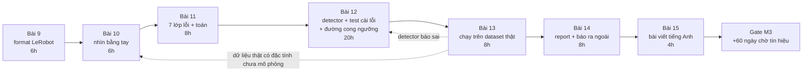
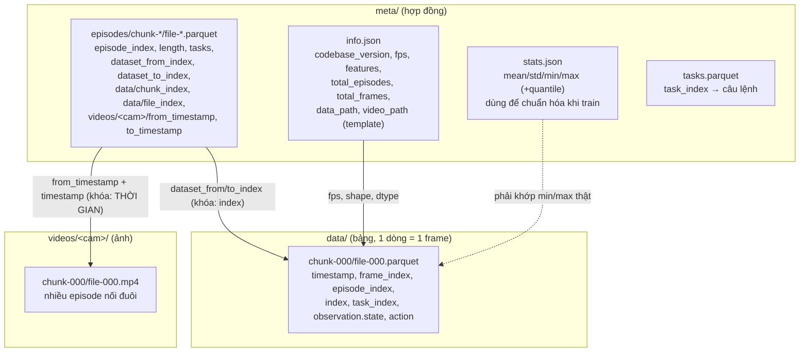
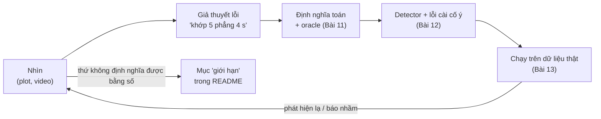
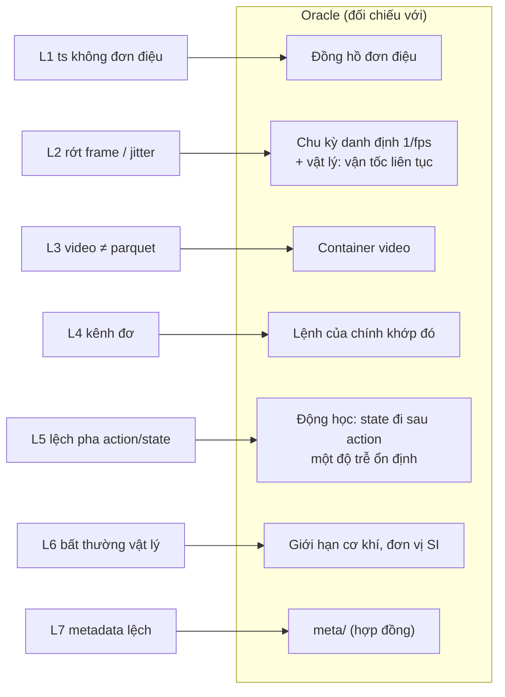
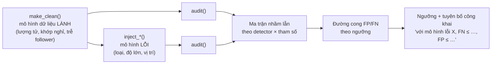

# Khóa 2 · Module 2 — Dataset audit tool (60h, trần 85h) ★

Tương ứng milestone **M3**, artifact công khai đầu tiên. Nguồn xương sống: `khoa-2-du-lieu-robot-khong-can-robot.md` (Bài 9–15 + Gate Module 2). Tổng quan khóa và Module 1 ở `00-tong-quan.md`, `m1-mcap-cong-cu.md`.



**Hai điều bạn cần biết trước khi mở Bài 9**, vì chúng thay đổi thiết kế tool so với bản gốc (chi tiết ở phần 11 từng bài):

1. Format hiện hành là **LeRobotDataset v3.0**, nhiều episode chung một file parquet và một file mp4; bản gốc mô tả v2.x (một file mỗi episode). Hai bản không tương thích ngược `[spec: LeRobot docs "LeRobotDataset v3.0"; source `src/lerobot/datasets/utils.py`]`. Tool phải đọc `codebase_version` rồi rẽ nhánh, hoặc tuyên bố rõ chỉ hỗ trợ một bản.
2. Mỗi detector trong module này là **một dụng cụ đo**, có dương tính giả và âm tính giả (→ F2.1). Module này không xong khi tool "chạy được"; nó xong khi bạn nói được tỉ lệ sai của chính tool, bằng số, có căn cứ công khai.

---

## Bài 9 — LeRobot dataset format từ zero (6h)

> **Vị trí:** Gate M2 (Bài 8b) → **Bài 9** → Bài 10 · **Cần trước:** F3.6 (Parquet, columnar, catalog), F3.2 (file tự mô tả, schema evolution), F3.7 (data contract), K2 Bài 4 (index MCAP) · **Sau bài này bạn quyết định được:** tool của bạn hỗ trợ phiên bản format nào (v2.1, v3.0 hay cả hai), và đọc dữ liệu qua lớp nào (file thô hay `LeRobotDataset`), kèm lý do viết được thành một đoạn trong README.

### 1. Câu chuyện — ai đã khổ vì chuyện này

Trước LeRobot, mỗi phòng lab robot lưu demonstration theo một kiểu: HDF5 một file mỗi episode (bộ ALOHA), TFRecord theo RLDS của Google (dùng cho Open X-Embodiment), pickle, rosbag. Muốn train một policy trên dữ liệu của lab khác là phải viết converter, và mỗi converter là một chỗ mới để dữ liệu lệch nhau `[chuẩn]`. LeRobot (Hugging Face, 2024) đặt một format chung trên HF Hub: bảng parquet cho tín hiệu số, mp4 cho camera, thư mục `meta/` mô tả mọi thứ.

Bản v2.x lưu **một file parquet và một file mp4 mỗi episode**. Khi số episode lên hàng trăm nghìn, cách này gãy ở hệ thống file: quá nhiều file nhỏ, khởi tạo chậm, streaming khó. v3.0 gộp nhiều episode vào một file lớn và chuyển ranh giới episode vào metadata dạng bảng; tài liệu chính thức nêu lý do là "lower file-system pressure", "fewer, larger files ⇒ faster initialization and fewer issues at scale" `[spec: LeRobot docs, mục "What's new in v3"]`. Đây là bài toán data engineering quen thuộc (small files problem của HDFS/S3), và đó là cửa vào ngành bằng đúng nghề của bạn. Hệ quả cho bạn: **chính format đã đổi một lần trong vòng chưa tới hai năm**, nên câu "format file ổn định hơn API" của bản gốc chỉ đúng bên trong một phiên bản.

### 2. Mô hình tư duy

Một LeRobot dataset là **ba kho dữ liệu nối với nhau bằng khóa**. Mỗi khóa nối là một chỗ dữ liệu có thể lệch.



| | v2.x (bản gốc mô tả) | v3.0 (hiện hành) |
|---|---|---|
| Đơn vị file | 1 parquet + 1 mp4 mỗi camera **mỗi episode** | nhiều episode mỗi file, cắt theo dung lượng |
| Đường dẫn data | `data/chunk-{episode_chunk:03d}/episode_{episode_index:06d}.parquet` `[tự đo]` | `data/chunk-{chunk_index:03d}/file-{file_index:03d}.parquet` `[spec: utils.py]` |
| Đường dẫn video | `videos/chunk-…/{video_key}/episode_….mp4` `[tự đo]` | `videos/{video_key}/chunk-…/file-….mp4` `[spec: utils.py]` |
| Ranh giới episode | tên file | bảng `meta/episodes/` (chỉ số dòng, khoảng thời gian video) |
| Task | `meta/tasks.jsonl` | `meta/tasks.parquet` `[spec: utils.py]` |
| Episode | `meta/episodes.jsonl` (+ `episodes_stats.jsonl` ở v2.1) | `meta/episodes/chunk-*/file-*.parquet` |

Bốn câu về bản chất:

- **Ảnh không được tra bằng chỉ số, mà bằng thời gian.** Khi train, thư viện lấy frame video ở thời điểm `from_timestamp + timestamp` và nhận frame gần nhất nếu lệch không quá `tolerance_s` `[spec: dataset_reader.py, video_utils.py; mặc định 1e-4 s — tự đo theo phiên bản]`. Vậy cột `timestamp` trong parquet không chỉ là một phép đo; nó là **địa chỉ** trỏ vào video.
- **Metadata là hợp đồng mà code downstream tin mù quáng.** Normalization dùng `stats.json`, sampler dùng `length`, decoder dùng `from_timestamp`. Sai metadata không làm gì crash, chỉ làm sai mọi thứ dựa trên nó.
- **Nén video là đánh đổi dung lượng lấy hai rủi ro:** mất random access rẻ (phải giải mã từ keyframe gần nhất), và thêm một luồng có thể lệch số frame với bảng.
- **Đọc thô hay đọc qua wrapper** là quyết định đo lường: wrapper che những thứ bạn đang đi tìm, nhưng cũng mã hóa ngữ nghĩa (dịch thời gian video, dung sai) mà bạn phải tự cài lại đúng, nếu không tool của bạn sẽ báo nhầm.

### 3. Cầu nối từ backend

| Backend bạn biết | Ở đây | Gãy ở chỗ | Nếu dùng nhầm thì |
|---|---|---|---|
| Bảng Parquet + blob store (ảnh trên S3, cột chứa key) | parquet cho số, mp4 cho ảnh | Ảnh không có key; tra bằng **thời gian thực số** trong một file nén liên khung, có dung sai | Bạn so "số dòng = số ảnh" theo key rồi yên tâm, trong khi lệch xảy ra ở trục thời gian |
| Iceberg/Delta manifest: metadata nói file nào chứa dòng nào, kèm min/max cột | `meta/episodes/` + `stats.json` | Ở data lake, min/max sai chỉ làm query chậm (prune sai). Ở đây `stats.json` đi thẳng vào chuẩn hóa đầu vào model | Coi stats lệch là lỗi "hiệu năng", bỏ qua; model nhận đầu vào lệch thang đo |
| Kafka offset trong segment | `index`, `dataset_from_index`/`dataset_to_index` | Offset Kafka là số nguyên tuyệt đối; ở v3 ranh giới video là **giây kiểu float**, cộng dồn qua các episode trong file | Kiểm offset dòng xong là thôi, quên kiểm khoảng thời gian video |
| ORM vs raw SQL | `LeRobotDataset` vs đọc parquet/mp4 trực tiếp | ORM thường không âm thầm sửa dữ liệu; wrapper ở đây có logic dịch thời gian, dung sai, và có thể từ chối nạp bản cũ (`BackwardCompatibilityError`) `[spec: utils.py]` | Đọc thô nhưng bỏ quên phép dịch `from_timestamp` → báo lỗi L3 giả cho mọi episode sau episode đầu |

**Chấm mô hình:**

- *"LeRobot dataset là một bảng parquet có thêm cột ảnh."* → **SAI.** Ảnh nằm ở mp4 và được tra bằng thời gian. Phản ví dụ: hai dataset có parquet giống hệt nhau từng byte nhưng một cái có mp4 thừa một frame ở giữa; bảng không đổi, mọi cặp (ảnh, hành động) sau điểm đó đều lệch.
- *"Đọc thô luôn đúng hơn đọc qua wrapper."* → **ĐÚNG MỘT PHẦN.** Đọc thô cho bạn thấy dữ liệu chưa qua xử lý, nhưng bạn phải tái tạo đúng ngữ nghĩa mà model nhìn thấy. Phản ví dụ: ở v3, đếm toàn bộ packet của `file-000.mp4` rồi so với `length` của episode 0 sẽ luôn FAIL dù dữ liệu lành, vì file chứa nhiều episode. Cách mạnh nhất là chạy cả hai và so (differential testing → F2.4): chỗ hai đường đọc bất đồng chính là phát hiện.
- *"Format file ổn định hơn API thư viện."* (bản gốc) → **ĐÚNG MỘT PHẦN.** Ổn định bên trong một `codebase_version`; giữa v2.1 và v3.0 thì đường dẫn, số file, nơi chứa task và episode đều đổi. Tool phải đọc template `data_path`/`video_path` từ `info.json` thay vì hard-code.

### 4. Thuật ngữ

| Mức | Thuật ngữ | Nghĩa trong một câu | Hay bị hiểu nhầm thành |
|---|---|---|---|
| 🟢 | episode | Một lần thực hiện nhiệm vụ từ đầu tới cuối | Một file (đúng ở v2, sai ở v3) |
| 🟢 | frame | Một dòng parquet = một bước thời gian, kèm ảnh ở cùng thời điểm | Một frame video (ảnh chỉ là một phần của frame dữ liệu) |
| 🟢 | `observation.state` | Vector trạng thái đo được của robot, thường là vị trí khớp | Trạng thái "thật" (nó là số đo, có lượng tử và trễ) |
| 🟢 | `action` | Vector lệnh tại frame đó; với teleop leader–follower thường là vị trí tay leader `[tự đo theo dataset]` | Kết quả chuyển động (đó là state ở các frame sau) |
| 🟢 | `codebase_version` | Phiên bản format ghi trong `info.json` | Phiên bản thư viện bạn cài |
| 🟢 | `features` | Khai báo tên, dtype, shape của mọi cột và camera | Schema được kiểm khi ghi (chỉ một phần) |
| 🟢 | `from_timestamp`/`to_timestamp` | Khoảng thời gian của episode trong file mp4 dùng chung (v3) | Thời điểm thật lúc thu |
| 🟢 | `stats.json` | Thống kê dùng để chuẩn hóa khi train | Thông tin trang trí |
| 🟡 | chunk / file index | Cách chia file theo dung lượng (mặc định data 100 MB, video 200 MB, 1000 file/chunk `[spec: utils.py, tự đo theo phiên bản]`) | Ranh giới episode |
| 🟡 | `tolerance_s` | Dung sai khi tra frame video theo thời gian | Ngưỡng phát hiện lỗi của bạn |
| 🟡 | GOP / keyframe | Nhóm frame nén phụ thuộc nhau; seek phải bắt đầu từ keyframe | Chi tiết codec không liên quan dữ liệu |
| 🔴 | `StreamingLeRobotDataset`, backend Lance | Cách đọc khác của thư viện | Thứ cần cho audit |

### 5. Dự đoán

Trước khi tải dữ liệu, chỉ nhìn trang dataset trên HF Hub (tab *Files* và dataset card), điền `predictions/09-format.md`:

1. Với 5 dataset bạn chọn: `codebase_version` mỗi cái là gì? Số file parquet trong `data/` so với `total_episodes` thế nào?
2. Bản gốc đưa sáu kiểm tra "dataset lành lặn" (tổng dòng = `total_frames`; số file parquet = `total_episodes`; số frame mp4 = số dòng; `timestamp` tăng nghiêm ngặt từ 0; trung vị `diff(timestamp)` ≈ `1/fps` sai lệch <1%; `frame_index` liên tục). Kiểm tra nào **không còn đúng nghĩa** ở v3.0? Viết lại nó cho v3.
3. Bao nhiêu trong 5 dataset pass hết các kiểm tra đã viết lại?
4. Câu khó: theo bạn, cột `timestamp` trong một dataset thu bằng `lerobot-record` được **đo** (đọc đồng hồ lúc lấy mẫu) hay được **tính** từ thứ khác? Ghi lý do. Tra ở đâu: source LeRobot, tìm hàm thêm frame vào episode buffer (`add_frame`) trong `src/lerobot/datasets/`. Đọc **sau** khi đã ghi dự đoán.

```markdown
# predictions/09-format.md  (commit trước khi tải)
| dataset (repo_id @ revision) | codebase_version dự đoán | số file parquet dự đoán | pass hết? | lý do |
|---|---|---|---|---|
Kiểm tra không còn đúng ở v3 + bản viết lại: ...
timestamp được đo hay được tính? ... vì ...
```

### 6. Làm

**Bước 0 — cài đặt.** `pip install huggingface_hub pyarrow pandas numpy av` và có `ffprobe` (gói `ffmpeg`). Phiên bản `lerobot` không cần cho bài này.

**Bước 1 — chọn 5 dataset.** Duyệt org `lerobot` trên HF Hub. Khác nhau về robot, fps, số camera, kích thước. Thêm hai tiêu chí: ít nhất một dataset còn ở v2.1 (nếu còn tìm được) và ít nhất một dataset **cộng đồng đóng góp**, không phải dataset chính thức đã được làm sạch. Script của bạn đang tải `lerobot/robomme` (`src/download_hf_dataset.py`): đọc dataset card để biết nó là dữ liệu robot thật hay mô phỏng `[tự đo]`; dữ liệu mô phỏng có đồng hồ lý tưởng, sẽ hành xử khác ở Bài 10–11.

**Bước 2 — tải metadata trước, ghim phiên bản.** Script hiện tại tải toàn bộ snapshot (có thể nhiều GB) và không ghi lại commit. Sửa thành:

```python
# [chưa chạy] — cần mạng tới HF Hub; tham số kiểm theo phiên bản huggingface_hub bạn cài
from huggingface_hub import snapshot_download, HfApi
repo = "lerobot/robomme"
sha = HfApi().dataset_info(repo).sha                 # commit hiện tại của repo dataset
meta = snapshot_download(repo_id=repo, repo_type="dataset", revision=sha, allow_patterns=["meta/*"])
print(sha, meta)                                     # ghi sha vào notes: dataset trên Hub có thể bị sửa sau này
```

Dataset trên HF Hub là một git repo; maintainer có thể sửa nó. Mọi kết quả audit phải gắn `repo_id@sha` (provenance → F3.8), nếu không ba tháng sau bạn không reproduce được chính phát hiện của mình.

**Bước 3 — đọc `info.json`.** Ghi vào bảng: `codebase_version`, `fps`, `robot_type`, `total_episodes`, `total_frames`, `data_path`, `video_path`, danh sách `features` với `dtype` và `shape` (camera có `dtype: "video"`, kèm `info` chứa fps và codec của video `[tự đo]`). Đối chiếu `fps` của dataset với fps ghi trong `info` của từng camera.

**Bước 4 — mở parquet.** Tải `data/` cho 1–2 file, `pd.read_parquet`, in 20 dòng đầu, nhìn bằng mắt. Ở v3, một file chứa nhiều episode: lọc theo `episode_index`. Ghi lại dtype của `timestamp` (bạn sẽ cần ở Bài 11).

**Bước 5 — đếm frame video.** Có ba mức, mỗi mức tin một thứ khác nhau:

| Lệnh | Đọc gì | Tốc độ | Tin vào |
|---|---|---|---|
| `ffprobe -v error -select_streams v:0 -show_entries stream=nb_frames -of csv=p=0 f.mp4` | header container | tức thì | lời khai của muxer (một loại metadata) |
| `… -count_packets -show_entries stream=nb_read_packets …` | demux mọi packet, không giải mã | nhanh | số packet nén (thường = số frame) |
| `… -count_frames -show_entries stream=nb_read_frames …` | giải mã toàn bộ | chậm | số frame thật sự giải mã được |

Ở v2.x, so con số này với số dòng parquet của episode. Ở v3, **một mp4 chứa nhiều episode**: phải lấy thời điểm (pts) của từng packet rồi đếm các packet rơi vào `[from_timestamp, to_timestamp)` của từng episode, và so tổng số packet của file với tổng `length` các episode trỏ vào file đó. Sai số dụng cụ: pts lưu theo timebase số nguyên của container, đổi ra giây có làm tròn; dùng biên nửa frame (`0.5/fps`) khi so khoảng.

Script kiểm v3 dưới đây đọc file thô, không dùng `LeRobotDataset`. Chạy thử nó trên dataset giả 3 episode do bạn tự sinh trước (một bản lành, một bản mp4 thừa một frame), rồi mới chạy trên dữ liệu thật:

```python
# [đã chạy] Kiểm meta <-> data <-> video cho LeRobotDataset v3.0, đọc file thô (pyarrow + ffprobe)
import json, subprocess, sys
from collections import defaultdict
from pathlib import Path
import numpy as np, pandas as pd

root = Path(sys.argv[1])
info = json.loads((root / "meta/info.json").read_text())
fps = info["fps"]
if not str(info["codebase_version"]).startswith("v3"):
    sys.exit(f"{info['codebase_version']}: layout một-file-mỗi-episode, xem phần 6 Bài 9")
eps = pd.concat(pd.read_parquet(p) for p in sorted((root / "meta/episodes").rglob("*.parquet")))
data = pd.concat(pd.read_parquet(p) for p in sorted((root / "data").rglob("*.parquet")))
out = []                                   # (tên kiểm tra, ok?, chi tiết)
out.append(("rows == total_frames", len(data) == info["total_frames"], f"{len(data)} vs {info['total_frames']}"))
out.append(("episodes == total_episodes", len(eps) == info["total_episodes"], f"{len(eps)} vs {info['total_episodes']}"))
for _, ep in eps.iterrows():
    e = int(ep["episode_index"])
    d = data[data["episode_index"] == e]
    ts = d["timestamp"].to_numpy(np.float64)
    dt = np.diff(ts)
    out.append((f"ep{e} rows == length", len(d) == ep["length"], f"{len(d)} vs {int(ep['length'])}"))
    out.append((f"ep{e} frame_index 0..n-1", np.array_equal(d["frame_index"], np.arange(len(d))), ""))
    out.append((f"ep{e} ts tăng nghiêm ngặt", bool((dt > 0).all()), f"min dt={dt.min():.6f}"))
    out.append((f"ep{e} median dt ~ 1/fps", abs(np.median(dt) * fps - 1) < 0.01, f"{np.median(dt):.6f}"))

def packet_pts(mp4):                        # demux, không giải mã: nhanh
    r = subprocess.run(["ffprobe", "-v", "error", "-select_streams", "v:0", "-show_entries",
                        "packet=pts_time", "-of", "csv=p=0", str(mp4)], capture_output=True, text=True, check=True)
    return np.sort(np.array([float(x) for x in r.stdout.split()]))

vkeys = [k for k, f in info["features"].items() if f["dtype"] == "video"]
for k in vkeys:
    files = defaultdict(list)                # một mp4 chứa nhiều episode -> gom theo file
    for _, ep in eps.iterrows():
        files[(int(ep[f"videos/{k}/chunk_index"]), int(ep[f"videos/{k}/file_index"]))].append(ep)
    for (c, f), group in files.items():
        mp4 = root / info["video_path"].format(video_key=k, chunk_index=c, file_index=f)
        pts = packet_pts(mp4)
        half = 0.5 / fps
        for ep in group:
            lo, hi = ep[f"videos/{k}/from_timestamp"], ep[f"videos/{k}/to_timestamp"]
            n = int(((pts >= lo - half) & (pts < hi - half)).sum())
            out.append((f"{k} ep{int(ep['episode_index'])} frames in window == length", n == ep["length"], f"{n}"))
        expect = sum(int(ep["length"]) for ep in group)
        out.append((f"{k} file {c}/{f} total frames == sum(length)", len(pts) == expect, f"{len(pts)} vs {expect}"))

for name, ok, detail in out:
    print(("PASS " if ok else "FAIL ") + name + (f"  [{detail}]" if detail else ""))
sys.exit(0 if all(ok for _, ok, _ in out) else 1)
```

Để sinh dataset giả: viết một script nhỏ tạo 3 episode (90, 60, 75 frame, 30 fps), ghi một `data/chunk-000/file-000.parquet`, một `meta/episodes/chunk-000/file-000.parquet` với `from/to_timestamp` cộng dồn, và một mp4 bằng `ffmpeg -f lavfi -i testsrc=size=160x120:rate=30 -frames:v <N> -c:v libx264 -pix_fmt yuv420p`. Bản "hỏng" chỉ khác ở `<N>` lớn hơn tổng `length` một đơn vị. **Trước khi chạy**, ghi vào `prediction.md`: checker sẽ báo FAIL ở những dòng nào với bản hỏng? Và nếu frame thừa nằm ở **giữa** episode 0 chứ không ở cuối file, những dòng nào đổi?

Với dataset v2.x: thay hai dòng `rglob` bằng cách duyệt theo `data_path` trong `info.json`, đọc `meta/episodes.jsonl`, và so số packet của từng `episode_….mp4` với số dòng của parquet tương ứng.

### 7. Số phải ra

<details><summary>🔒 MỞ SAU KHI COMMIT prediction.md</summary>

**Bảng kiểm "dataset lành" viết lại cho cả hai bản:**

| Kiểm tra | v2.x | v3.0 |
|---|---|---|
| Tổng dòng parquet = `total_frames` | bằng chính xác | bằng chính xác |
| Số file parquet = `total_episodes` | bằng | **không áp dụng** (nhiều episode/file). Thay bằng: số dòng `meta/episodes` = `total_episodes`, và `dataset_from_index`/`dataset_to_index` liên tục, không chồng, không hở |
| Số frame video = số dòng của episode | so file-mp4 với file-parquet | số packet trong `[from_ts, to_ts)` = `length`, **và** tổng packet của mp4 = tổng `length` các episode trong file |
| `timestamp` tăng nghiêm ngặt từ 0 | có | có (timestamp tương đối trong episode) |
| Trung vị `diff(timestamp)` ≈ `1/fps` (<1%) | có | có |
| `frame_index` 0, 1, 2… liên tục | có | có |

**Checker trên dataset giả (đã chạy):** bản lành ra 18/18 PASS, exit 0. Bản mp4 thừa một frame ở cuối: mọi dòng theo episode đều PASS, chỉ một dòng FAIL: `file 0/0 total frames == sum(length)  [226 vs 225]`, exit 1.

**Nếu frame thừa nằm giữa episode 0:** mọi frame sau nó dịch muộn 1/fps. Đếm theo cửa sổ thời gian vẫn ra đúng 90/60/75 cho từng episode (frame rải đều 1/30 s nên mỗi cửa sổ vẫn chứa đủ số frame), chỉ dòng tổng của file FAIL. Tức là **đếm theo cửa sổ không định vị được chỗ lệch**; nó chỉ cho biết file có lệch. Muốn định vị phải nhìn nội dung (ví dụ phát hiện cảnh chuyển ở ranh giới episode lệch khỏi `from_timestamp`). Đây là một giới hạn đáng ghi vào README.

**Câu "timestamp đo hay tính":** ở `lerobot` hiện hành, `add_frame` **tính** `timestamp = frame_index / fps` và cấm người gọi tự truyền `timestamp` `[spec: src/lerobot/datasets/dataset_writer.py, hàm add_frame]`. Hệ quả: với dataset thu bằng `lerobot-record`, ba kiểm tra về timestamp (tăng nghiêm ngặt, trung vị dt, frame_index liên tục) gần như **luôn pass theo cấu trúc**: chúng kiểm code ghi, không kiểm đồng hồ. Dataset chuyển đổi từ format khác hoặc ghi bằng công cụ khác có thể mang timestamp đo thật. Hãy coi đây là phát hiện quan trọng nhất của bài: một số kiểm tra trông nghiêm túc nhưng có độ nhạy bằng không trên phần lớn dữ liệu. Bài 11 xử lý chuyện này.

**Bao nhiêu trong 5 dataset pass hết:** không có con số đúng chung. Dataset chính thức gần đây, thu bằng `lerobot-record`, thường pass các kiểm tra cấu trúc `[ước lượng]`; dataset cũ đã chuyển đổi v2.1→v3.0 hoặc dataset cộng đồng là nơi hay lệch `[ước lượng, tự đo]`. Nếu bạn dự đoán "5/5 pass" và lý do là "dataset của Hugging Face thì sạch", đó là dự đoán dựa trên uy tín, không dựa trên cơ chế.

**Tỉ lệ dung lượng:** 640×480×3 byte ≈ 0.92 MB mỗi ảnh raw; 50 episode × 400 frame × 0.9 MB ≈ 18 GB (bản gốc đúng) `[ước lượng]`.
</details>

### 8. Nếu ra khác

| Triệu chứng | Nguyên nhân khả dĩ | Kiểm bằng cách | Sửa |
|---|---|---|---|
| Tổng dòng ≠ `total_frames` | Metadata không khớp dữ liệu | Đếm lại theo từng file, so `dataset_to_index` cuối | Lỗi thật, đáng báo cáo (sau khi xác minh ở Bài 13) |
| Số frame video ≠ số dòng | Video và state lệch nhau | So từng episode (v2) hoặc tổng theo file (v3) | **Nghiêm trọng**: mọi cặp ảnh–hành động sau điểm lệch đều sai |
| Số file parquet ≠ `total_episodes` | Dataset là v3.0, nhiều episode/file | Đọc `codebase_version` | Không phải lỗi; dùng kiểm tra v3 |
| `KeyError: 'videos/<cam>/from_timestamp'` | Dataset v2.x, hoặc camera lưu dạng ảnh (`dtype: "image"`) | `info.json` → `codebase_version`, `features[cam].dtype` | Rẽ nhánh theo phiên bản/dtype |
| Mọi episode sau episode 0 báo lệch video | Bạn quên phép dịch `from_timestamp` | In `pts` đầu/cuối và `from/to_timestamp` | Đếm trong cửa sổ, không đếm cả file |
| `nb_frames` khác `count_packets` | Header container khai sai hoặc thiếu, edit list | So ba mức đếm | Tin mức demux/giải mã; ghi lại header sai như một phát hiện L7 |
| `ffprobe` đếm chậm kinh khủng | Đang dùng `-count_frames` (giải mã toàn bộ, AV1 rất chậm trên CPU) | Thử `-count_packets` | Chỉ giải mã khi cần định vị chính xác |
| `snapshot_download` tải hàng GB | Thiếu `allow_patterns` | Xem dung lượng thư mục cache | Tải `meta/*` trước, rồi từng file cần thiết |

### 9. Câu hỏi ngược

1. **[Quy mô]** Một dataset 100 robot × 1000 giờ, 3 camera, 30 fps. Ở v2.x có bao nhiêu file? Ở v3.0 với video 200 MB/file thì sao? Thứ gì gãy trước: hệ thống file, thời gian `snapshot_download`, hay thời gian tool của bạn đếm packet?
   <details><summary>Hướng nghĩ</summary>Tính số episode từ độ dài episode trung bình bạn đo ở Bài 10. Với v3, số file phụ thuộc bitrate. Tool của bạn: đếm packet là O(dung lượng video), không O(số file); hãy ước lượng MB/s mà ffprobe demux được trên N100 và tính ra giờ. Có cách nào kiểm mà không đọc hết video không (lấy mẫu episode, kiểm tổng theo file trước)?</details>
2. **[Failure mode]** Ở v3, `from_timestamp` của episode k được tính bằng cách cộng dồn thời lượng các episode trước trong cùng file. Nếu một episode được mã hóa ra thời lượng thật khác `length/fps` (ví dụ encoder thêm hoặc bớt một frame), lỗi lan thế nào sang các episode sau? Tool nào trong bảng ở phần 7 bắt được, tool nào không?
   <details><summary>Hướng nghĩ</summary>Nghĩ như offset trong một log append-only bị lệch một bản ghi: mọi offset sau đó sai cùng một lượng. Kiểm tổng theo file bắt được sự tồn tại; kiểm theo cửa sổ thì không. Thêm một kiểm tra: `to_timestamp` của episode cuối so với thời lượng thật của file.</details>
3. **[Vì sao không]** Vì sao LeRobot không lưu ảnh dưới dạng JPEG bytes trong một cột parquet, để mọi thứ nằm chung một bảng và khóa nối là `index`?
   <details><summary>Hướng nghĩ</summary>So dung lượng nén trong khung (JPEG) và nén liên khung (H.264/AV1) cho chuỗi ảnh gần giống nhau. Rồi nghĩ cái giá ngược lại: một khóa nối theo thời gian, dung sai, chi phí giải mã khi random access. Format v3 thực ra vẫn hỗ trợ `dtype: "image"`; khi nào bạn chọn nó?</details>
4. **[Phản biện]** "Tool audit nên dùng chính `LeRobotDataset` để đọc, vì thứ cần kiểm là thứ model thật sự nhìn thấy." Phản biện câu này, rồi phản biện lại chính phản biện của bạn.
   <details><summary>Hướng nghĩ</summary>Hai đường đọc trả lời hai câu hỏi khác nhau: "file có nhất quán không" và "model có nhận đúng cặp dữ liệu không". Differential testing dùng cả hai. Chi phí: phụ thuộc phiên bản `lerobot`, torch, decoder.</details>
5. **[Liên ngành]** Một playlist HLS (`.m3u8`) khai thời lượng từng segment video; trình phát tin con số đó để seek. Lỗi nào của HLS giống L3/L7 ở đây?
   <details><summary>Hướng nghĩ</summary>Khai `#EXTINF` khác thời lượng thật của segment làm seek lệch và audio/video lệch. Chỗ khác: HLS có thể sửa ở phía phát; dataset đã nằm trong model đã train thì không sửa được.</details>

### 10. Liên kết ra ngoài

- **Table format của data lake (Iceberg, Delta Lake).** Giống: metadata (manifest) khai file nào chứa dòng nào và min/max mỗi cột; dữ liệu nằm ở file khác; lỗi kinh điển là manifest trỏ tới file không còn hoặc stats cũ. Khác: ở data lake, stats sai làm sai kết quả prune của query; ở LeRobot, stats đi vào phép chuẩn hóa đầu vào model.
- **Ảnh y khoa DICOM.** Giống: header (khoảng cách pixel, thời điểm chụp, tư thế bệnh nhân) đi kèm dữ liệu ảnh, và phần mềm downstream tin header. Header sai làm đo kích thước khối u sai mà ảnh trông hoàn toàn bình thường. Khác: DICOM có cơ quan chuẩn hóa và quy trình kiểm định thiết bị; dataset robot thì chưa.

### 11. Độ tin cậy và sửa lỗi

| Khẳng định | Nhãn | Ghi chú / cách kiểm |
|---|---|---|
| v3.0 nhiều episode/file, metadata episode dạng parquet, tasks ở `meta/tasks.parquet` | `[spec]` | Source `lerobot` nhánh main (10/2026), `utils.py`. Trang docs v3 vẫn ghi `meta/tasks.jsonl` trong phần layout: tài liệu và code bất đồng, tin code và `[tự đo]` trên dataset thật |
| v3.0 không tương thích ngược v2.1 | `[spec]` | `utils.py`: `BackwardCompatibilityError`; có script `convert_dataset_v21_to_v30` |
| Đường dẫn v2.x | `[tự đo]` | Đọc `data_path`/`video_path` trong `info.json` của dataset v2 bạn tải |
| `timestamp = frame_index / fps` khi ghi; dtype `float32` | `[spec]` | `dataset_writer.py` (`add_frame`), `utils/constants.py` (`DEFAULT_FEATURES`). Có thể khác ở phiên bản cũ: `[tự đo]` |
| `tolerance_s` mặc định 1e-4 s | `[spec, tự đo]` | Tham số của `LeRobotDataset`; kiểm theo phiên bản |
| Kích thước file mặc định 100/200 MB, 1000 file/chunk | `[spec, tự đo]` | Hằng số trong `utils.py`, có thể đổi |
| `lerobot/robomme` là dữ liệu gì | `[tự đo]` | Không kiểm được trong lúc soạn; đọc dataset card |

**Đã sửa so với bản gốc:**
- Bản gốc mô tả layout v2.x như layout hiện hành. Sửa: trình bày cả hai, v3.0 là mặc định; kiểm tra "số file parquet = `total_episodes`" chỉ đúng cho v2.x; kiểm tra số frame video ở v3 phải đếm theo cửa sổ `from/to_timestamp` và theo tổng mỗi file.
- Bản gốc: "API đổi theo phiên bản, còn format file thì ổn định hơn nhiều." Sửa: ổn định trong một `codebase_version`; tool phải rẽ nhánh theo phiên bản.
- Bản gốc: "nếu `LeRobotDataset` tự sửa lỗi timestamp khi load". Wrapper không sửa timestamp; nó tra video theo thời gian với dung sai và có thể ném lỗi khi lệch quá dung sai. Lý do đọc thô vẫn đúng (wrapper che chi tiết và phụ thuộc phiên bản), nhưng lý do cụ thể đã được chỉnh.
- Script `src/download_hf_dataset.py` của bạn tải toàn bộ snapshot và không ghim commit. Sửa: `allow_patterns`, `revision=sha`.

### 12. Đọc thêm và tự kiểm tra

- **Nguồn gốc:** LeRobot docs, trang "LeRobotDataset v3.0" (huggingface.co/docs/lerobot); source `src/lerobot/datasets/` trong repo `huggingface/lerobot` (đọc `utils.py`, `dataset_writer.py`, `dataset_reader.py`).
- **Giải thích:** Apache Parquet, trang "File Format" (parquet.apache.org) — để hiểu row group, footer, vì sao file không có footer là file hỏng (lý do docs v3 bắt gọi `finalize()`).
- **Đào sâu (tùy chọn):** RLDS (Ramos và cộng sự, Google, 2021), để thấy một lựa chọn thiết kế khác cho cùng bài toán.
- **Tự kiểm tra:** (1) giải thích cho một backend engineer khác trong 5 câu vì sao ảnh được tra bằng thời gian chứ không bằng chỉ số; (2) vẽ lại sơ đồ ba kho và các khóa nối từ trí nhớ; (3) câu hỏi:
  - Bạn có một dataset v3 với `total_episodes = 50` nhưng `data/` chỉ có 1 file parquet. Đây có phải lỗi không?
  - Vì sao kiểm tra "trung vị `diff(timestamp)` ≈ `1/fps`" gần như không bao giờ fail trên dataset thu bằng `lerobot-record`?

  <details><summary>Đáp án</summary>(a) Không. Ở v3 nhiều episode chung một file, ranh giới nằm trong `meta/episodes`. Kiểm số dòng `meta/episodes` và tính liên tục của `dataset_from_index`/`dataset_to_index`. (b) Vì timestamp được tính bằng `frame_index / fps` lúc ghi, không phải đọc từ đồng hồ; kiểm tra đó kiểm code ghi, không kiểm thời gian thật.</details>

---

## Bài 10 — Kiểm tra bằng tay trước khi tự động hóa (6h)

> **Vị trí:** Bài 9 → **Bài 10** → Bài 11 · **Cần trước:** F1.2 (phân bố, histogram, đuôi), F1.7 (preregistration = `prediction.md`), F2.1 (test là phép đo có FP/FN), Bài 9 · **Sau bài này bạn quyết định được:** danh sách lớp lỗi nào đáng tự động hóa trong tool, lớp nào chỉ con người thấy được (và sẽ ghi vào mục "giới hạn" của README), dựa trên thứ bạn đã thật sự nhìn thấy chứ không phải thứ bạn tưởng tượng.

### 1. Câu chuyện — ai đã khổ vì chuyện này

Năm 2021, Curtis Northcutt, Anish Athalye và Jonas Mueller công bố "Pervasive Label Errors in Test Sets Destabilize Machine Learning Benchmarks": trong tập **test** của 10 bộ dữ liệu nổi tiếng (ImageNet, CIFAR, QuickDraw, Amazon Reviews…) có nhãn sai ở mức vài phần trăm, đủ để đảo thứ hạng giữa các mô hình `[chuẩn — số liệu cụ thể xem bài báo]`. Những bộ đó đã được hàng nghìn người dùng trong nhiều năm. Lỗi không được tìm ra bằng một kiểm tra schema; nó được tìm ra bằng một thuật toán đề xuất ứng viên **cộng với con người nhìn từng ứng viên**.

Cùng năm, nhóm của Nithya Sambasivan (Google) công bố "Everyone wants to do the model work, not the data work: Data Cascades in High-Stakes AI" (CHI 2021), mô tả cách lỗi dữ liệu nhỏ ở đầu nguồn lan thành hỏng hóc lớn ở cuối, phần lớn vì không ai nhìn dữ liệu đủ kỹ trước khi xây trên nó. Nguyên tắc của bài này là bản rút gọn của cả hai: **nhìn trước khi tự động hóa**. Ở Khóa 1 là "dự đoán trước khi đo"; ở đây, một detector viết trước khi bạn từng thấy dữ liệu hỏng sẽ bắt đúng những lỗi bạn tưởng tượng, không phải những lỗi tồn tại.

### 2. Mô hình tư duy



Một detector là **một câu hỏi đã đóng băng**: nó chỉ hỏi đúng câu bạn đã nghĩ ra lúc viết nó. Khảo sát bằng tay là cách duy nhất để tìm những câu hỏi bạn chưa biết phải hỏi. Ba loại thứ bạn sẽ gặp khi nhìn:

| Loại | Ví dụ | Đi về đâu |
|---|---|---|
| Lỗi định nghĩa được bằng số | dt lệch, kênh phẳng khi lệnh vẫn đổi, video thừa frame | detector (Bài 11–12) |
| Hành vi bình thường trông giống lỗi | gripper đứng yên cả episode, robot dừng chờ | test "không báo nhầm ở ca biên" (Bài 12) |
| Lỗi chỉ con người thấy | gắp trượt, camera bị che, nhiệm vụ làm dở | mục "giới hạn" của README; có thể là ứng viên cho VLM-judge sau này (→ F2.8) |

Cột giữa quan trọng ngang cột đầu: mỗi thứ bạn thấy ở đó sẽ thành một test chống báo nhầm. Không nhìn thì không có cột giữa, và tool của bạn sẽ báo nhầm trên dữ liệu thật ngay lần chạy đầu.

### 3. Cầu nối từ backend

| Backend bạn biết | Ở đây | Gãy ở chỗ | Nếu dùng nhầm thì |
|---|---|---|---|
| Đọc log/trace thật trước khi viết rule alert | Plot `dt`, state, action, xem video | Log backend có nghĩa ở từng dòng; ở đây ý nghĩa nằm trong **hình dạng theo thời gian** và trong **quan hệ giữa hai kênh** | Đọc 20 dòng parquet đầu rồi kết luận "trông ổn" |
| Ghi traffic thật để dựng mock server (bạn đã làm) | Đặc tính dữ liệu thật đưa vào bộ sinh dữ liệu giả (Bài 12) | Traffic HTTP lặp lại được; dữ liệu cảm biến có nhiễu, lượng tử, trễ động học — phải mô phỏng cơ chế chứ không chỉ phát lại | Bộ sinh quá sạch → detector đúng trên giả, sai trên thật (bản gốc Bài 12 đã cảnh báo) |
| EDA trước khi viết dbt test / Great Expectations | Khảo sát bằng tay | Expectation kiểu "cột không null, nằm trong khoảng" không diễn đạt được "kênh A trễ kênh B 3 frame" | Tưởng có bộ expectation là đã kiểm chất lượng |

**Chấm mô hình:**

- *Mô hình của bạn ở K3 lượt 21:* "nếu lúc đo chưa cover đủ flag/khóa thì lúc runtime thực tế không thể đảm bảo mọi tình huống" → **ĐÚNG MỘT PHẦN.** Đúng ở chỗ thứ không được đo thì không được đảm bảo. Gãy ở chỗ ngầm định rằng có một tập flag "đủ": không gian lỗi của dữ liệu thật là mở, bạn không liệt kê hết được. Phản ví dụ: một episode gắp trượt có timestamp hoàn hảo, schema hợp lệ, mọi detector số học đều xanh, và vô dụng cho training. Thứ thay cho "cover đủ" là: (a) khảo sát định kỳ bằng mắt để tìm lớp lỗi mới, (b) công bố rõ phạm vi đã kiểm và chưa kiểm.
- *"Dataset chính thức của một tổ chức lớn thì đã sạch, khảo sát bằng tay chỉ tốn thời gian."* → **SAI.** Phản ví dụ: bài báo của Northcutt và cộng sự ở phần 1 tìm lỗi trong tập test của ImageNet.
- *"Có thể giao việc xem video cho một VLM thay mắt mình."* → **ĐÚNG MỘT PHẦN.** Làm được như một bộ lọc ứng viên, nhưng VLM là một detector khác có FP/FN riêng; muốn tin nó phải hiệu chuẩn với nhãn người trên một mẫu (Cohen's kappa → F2.8). Ở bài này bạn chưa có nhãn người nào, nên chính việc xem bằng mắt là bước tạo ra nhãn đó.

### 4. Thuật ngữ

| Mức | Thuật ngữ | Nghĩa trong một câu | Hay bị hiểu nhầm thành |
|---|---|---|---|
| 🟢 | EDA (exploratory data analysis) | Nhìn dữ liệu bằng biểu đồ trước khi đặt giả thuyết | Bước tùy chọn |
| 🟢 | histogram của `dt` | Phân bố khoảng cách giữa hai frame liên tiếp | Một con số trung bình |
| 🟢 | nhảy bậc (step) | Giá trị đổi đột ngột lớn hơn nhiều so với biến thiên thường | Chuyển động nhanh thật |
| 🟢 | lệch pha action/state | State đi theo action sau vài frame | Lỗi (một phần lệch là động học bình thường) |
| 🟢 | episode thất bại về ngữ nghĩa | Dữ liệu hợp lệ nhưng nhiệm vụ không hoàn thành | Thứ detector số học bắt được |
| 🟢 | phân bố độ dài episode | Histogram số frame mỗi episode | Chỉ để biết cỡ dataset (nó lộ episode bị cắt, episode quên dừng ghi) |
| 🟡 | che khuất (occlusion) | Camera bị tay/vật chắn | — |
| 🟡 | trình xem dataset | `lerobot-dataset-viz` (Rerun), Space "visualize_dataset" trên HF `[tự đo]` | Thay được việc plot của bạn |

### 5. Dự đoán

Trước khi plot bất cứ thứ gì, với mỗi dataset điền `notes/10-predictions.md`:

1. Hình dạng histogram `dt` bạn kỳ vọng: một vạch, một đỉnh có độ rộng, hay nhiều đỉnh? Dựa trên câu trả lời của bạn ở Bài 9 câu 4.
2. Bao nhiêu phần trăm `dt` lệch khỏi `1/fps` quá 10%?
3. Có chiều state nào đứng yên **chính xác** (diff = 0) ≥1 giây không? Nếu có, bạn đoán đó là khớp nào và vì sao?
4. Độ lệch pha action→state bạn kỳ vọng, tính bằng frame. Phương pháp ước lượng: với teleop leader–follower, follower bám theo leader qua một vòng điều khiển; độ trễ ≈ trễ đọc/ghi một vòng + thời gian servo tiến gần vị trí đích. Tra tốc độ servo trong datasheet servo của robot (ví dụ SO-100/SO-101 dùng Feetech STS3215 `[tự đo]`) và fps của dataset.
5. Trung vị, min, max độ dài episode.
6. Một điều bạn đoán sẽ bất ngờ.

```markdown
# notes/10-predictions.md
| dataset@sha | hình dt | %dt lệch >10% | kênh đứng yên ≥1s (khớp, lý do) | lag (frame) | độ dài trung vị/min/max |
|---|---|---|---|---|---|
Điều tôi đoán sẽ bất ngờ: ...
```

### 6. Làm

Với **cả 5 dataset**, làm bằng tay, ghi vào `notes/10-manual-survey.md`. Script dưới đây gom năm biểu đồ cho một episode và in các con số cần trả lời; chạy cho ít nhất 3 episode mỗi dataset (bước 1 cần 3 episode):

```python
# [đã chạy] Khảo sát bằng mắt một dataset LeRobot (v2.x hoặc v3.0): đọc mọi parquet trong data/, gom theo episode
import sys, json
from pathlib import Path
import numpy as np, pandas as pd
import matplotlib.pyplot as plt

root, ep_id, joint = Path(sys.argv[1]), int(sys.argv[2]), int(sys.argv[3])
fps = json.loads((root / "meta/info.json").read_text())["fps"]
data = pd.concat(pd.read_parquet(p) for p in sorted((root / "data").rglob("*.parquet")))
d = data[data["episode_index"] == ep_id].sort_values("frame_index")
ts = d["timestamp"].to_numpy(np.float64)
S = np.stack(d["observation.state"].to_numpy()); A = np.stack(d["action"].to_numpy())

dt = np.diff(ts)
print(f"ep{ep_id}: {len(d)} frame, |dt*fps-1|>10%: {np.mean(np.abs(dt * fps - 1) > 0.1):.2%}")
for j in range(S.shape[1]):                   # chạy dài nhất của diff == 0 chính xác, tính bằng giây
    z = np.r_[0, (np.diff(S[:, j]) == 0).astype(int), 0]; e = np.diff(z)
    longest = (np.where(e == -1)[0] - np.where(e == 1)[0]).max(initial=0)
    print(f"  state[{j}] đứng yên chính xác dài nhất: {longest / fps:.2f} s")
lengths = data.groupby("episode_index").size()
print(f"độ dài episode: trung vị {lengths.median():.0f}, min {lengths.min()}, max {lengths.max()}")

fig, ax = plt.subplots(2, 2, figsize=(11, 6))
ax[0, 0].hist(dt * 1e3, bins=50); ax[0, 0].set_xlabel("dt [ms]"); ax[0, 0].set_title("histogram dt")
ax[0, 1].plot(ts, S, lw=0.7); ax[0, 1].set_title("observation.state theo thời gian")
ax[1, 0].plot(d["frame_index"], A[:, joint], label="action"); ax[1, 0].plot(d["frame_index"], S[:, joint], label="state")
ax[1, 0].set_xlabel("frame_index"); ax[1, 0].legend(); ax[1, 0].set_title(f"khớp {joint}: action vs state")
ax[1, 1].hist(lengths, bins=20); ax[1, 1].set_title("phân bố độ dài episode [frame]")
plt.tight_layout(); plt.show()
```

Script này đọc toàn bộ `data/` vào RAM: với dataset lớn, chỉ tải 1–2 file parquet. Nó giả định `action` và `observation.state` cùng số chiều và cùng thứ tự khớp; kiểm `features[...]["names"]` trong `info.json` trước, vì có dataset dùng action là vị trí đầu công cụ hoặc vận tốc `[tự đo]`.

1. **Vẽ `diff(timestamp)` cho 3 episode mỗi dataset.** Histogram + đường theo thời gian. Ghi lại hình dạng bằng lời. Sai số dụng cụ: `timestamp` lưu `float32` (Bài 9), nên `dt` có nhiễu làm tròn cỡ một ULP của `float32` ở giá trị timestamp đó; đừng đọc nhiễu đó thành jitter.
2. **Vẽ `observation.state` từng chiều theo thời gian** cho 1 episode. Có chiều nào phẳng lì không? Có chiều nào nhảy bậc không? Ghi luôn **độ phân giải** của từng chiều: bước nhỏ nhất khác 0 của `|diff|` (đó là LSB thực tế sau mọi phép đổi đơn vị). Bạn cần con số này ở Bài 11.
3. **Vẽ `action` và `observation.state` cùng một khớp, chồng lên nhau.** Lệch pha bao nhiêu frame? Nhìn bằng mắt trước, đo sau. Sai số của mắt: ±1 frame ở 30 fps là thực tế; ghi sai số đó cạnh con số.
4. **Mở video, xem 3 episode.** Có episode nào tay robot không chạm vật? Camera bị che? Bị cắt giữa chừng? Ở v3, video một episode là đoạn `[from_timestamp, to_timestamp)` trong file chung: `ffplay -ss <from> -t <to-from> file-000.mp4`, hoặc dùng trình xem của LeRobot.
5. **Vẽ phân bố độ dài episode** cho mỗi dataset.
6. *(Thêm so với bản gốc)* **Vẽ `|diff(state)|` theo thời gian** cho một khớp đang chuyển động đều. Có những gai cao gấp 2–3 lần lân cận không? Chưa cần giải thích; ghi lại vị trí.

Bước 4 quan trọng: có những lỗi chỉ con người thấy được. Một episode "thất bại" vẫn có timestamp hoàn hảo, schema hợp lệ, và hoàn toàn vô dụng cho training. Tool của bạn sẽ không bắt được nó, và biết giới hạn của tool cũng là một phần của việc làm tool.

**Phải có ít nhất một điều bất ngờ** ghi lại. Nếu 5 dataset đều hoàn hảo, hoặc bạn chọn nhầm dataset quá sạch, hoặc bạn chưa nhìn đủ kỹ.

### 7. Số phải ra

<details><summary>🔒 MỞ SAU KHI COMMIT prediction.md</summary>

Không có bộ số đúng chung cho mọi dataset. Bạn phải trả lời được, **bằng số, cho từng dataset**: % `dt` lệch >10%; có chiều state đứng yên chính xác ≥1 s không (khớp nào); lệch pha nhìn thấy (frame, ±1); trung vị/min/max độ dài episode; ít nhất một điều bất ngờ. Những gì thường gặp, để bạn đối chiếu (đều là `[ước lượng]`, kiểm trên dữ liệu của bạn):

| Quan sát | Thường gặp | Giải thích |
|---|---|---|
| Histogram `dt` | Một vạch gần như tuyệt đối tại `1/fps`, chỉ rung ở mức làm tròn `float32` | Dataset thu bằng `lerobot-record` có `timestamp = frame_index/fps` (Bài 9). Hình "hoàn hảo" ở đây **không chứng minh** không rớt frame |
| % `dt` lệch >10% | 0% với dữ liệu ghi bằng LeRobot; có thể khác 0 với dữ liệu chuyển đổi từ nguồn có timestamp đo thật | như trên |
| Kênh đứng yên chính xác ≥1 s | Rất hay gặp: gripper giữ đóng/mở khi tay đang di chuyển; khớp cổ tay ít dùng; robot dừng chờ đầu/cuối episode | Encoder lượng tử (ví dụ 4096 bước/vòng `[tự đo]`) + servo giữ vị trí → giá trị đọc lặp lại y hệt là **bình thường** khi khớp đứng yên |
| Lệch pha action→state | Vài frame (1–3 ở 30 fps) với teleop leader–follower | Một vòng điều khiển + động học servo. Đây là pha **bình thường**, không phải lỗi |
| Gai `|diff(state)|` gấp 2–3 lân cận (bước 6) | Có thể thấy rải rác | Một ứng viên giải thích: vòng lặp thu bị trễ, thời gian thật giữa hai frame dài hơn `1/fps` nhưng timestamp vẫn ghi `1/fps`. Bài 11 (L2) làm rõ |
| Độ dài episode | Phân bố lệch phải, có vài episode ngắn bất thường hoặc dài gấp nhiều lần trung vị | Episode bị cắt, quên dừng ghi, reset kéo dài |

Nếu điều bất ngờ của bạn là "timestamp đẹp quá", "gripper phẳng lì mà vẫn là dữ liệu tốt", hoặc "có gai vận tốc dù dt hoàn hảo", bạn đang đi đúng hướng: cả ba sẽ đổi định nghĩa lỗi ở Bài 11.
</details>

### 8. Nếu ra khác

| Triệu chứng | Nguyên nhân khả dĩ | Kiểm bằng cách | Sửa |
|---|---|---|---|
| `np.stack` lỗi shape | Một số frame có vector độ dài khác | In `d["observation.state"].map(len).value_counts()` | Đây có thể là một phát hiện (L7): shape thật ≠ `features.shape` |
| Không có cột `action` hoặc `observation.state` | Dataset dùng tên khác (ví dụ `observation.environment_state`, nhiều nhóm state) | Đọc `info.json → features` | Tham số hóa tên cột trong tool |
| Action và state khác số chiều | Action ở không gian khác (đầu công cụ, vận tốc, delta) | `features["action"]["names"]` | Không so pha từng khớp; ghi "không áp dụng L5" |
| Mọi thứ hoàn hảo ở cả 5 dataset | Chọn dataset quá sạch hoặc nhìn chưa đủ (chỉ xem histogram `dt`) | Làm bước 6, xem video | Thêm dataset cộng đồng |
| Video không mở được | Codec AV1 không có decoder trên máy | `ffprobe` xem `codec_name` | Cài ffmpeg có `libdav1d` |

### 9. Câu hỏi ngược

1. **[Failure mode]** Bạn thấy gripper đứng yên chính xác 12 giây trong một episode "nhặt và đặt". Liệt kê ít nhất ba giả thuyết (một lành, hai hỏng) và nói bằng chứng nào phân biệt được chúng **mà không cần mở video**.
   <details><summary>Hướng nghĩ</summary>So với `action` cùng khớp: lệnh có đổi trong 12 giây đó không? So với các khớp khác và với phần còn lại của episode. Một khớp phẳng trong khi lệnh của chính nó đang đổi là bằng chứng mạnh hơn nhiều so với "phẳng trong khi khớp khác động".</details>
2. **[Quy mô]** Ở 1000 giờ dữ liệu, bạn không thể xem video từng episode. Thiết kế một quy trình lấy mẫu để vẫn ước lượng được tỉ lệ "episode thất bại về ngữ nghĩa", kèm khoảng tin cậy. Cần xem bao nhiêu episode để khẳng định tỉ lệ đó dưới 5%?
   <details><summary>Hướng nghĩ</summary>Lấy mẫu ngẫu nhiên đơn giản hoặc phân tầng theo dataset/người thu. Khoảng tin cậy cho tỉ lệ: Wilson (→ F1.4). Nếu xem n episode và không thấy cái nào hỏng, cận trên 95% xấp xỉ 3/n (quy tắc ba).</details>
3. **[Vì sao không]** Vì sao không viết detector trước, chạy trên 5 dataset, rồi chỉ nhìn những chỗ detector báo?
   <details><summary>Hướng nghĩ</summary>Cách đó chỉ đo được precision (trong số báo, bao nhiêu đúng), không đo được recall (trong số lỗi thật, bao nhiêu bị bắt). Lỗi mà detector không hỏi tới sẽ không bao giờ xuất hiện trong danh sách để bạn nhìn.</details>
4. **[Phản biện]** "Khảo sát bằng tay không lặp lại được, nên không khoa học." Đồng ý được tới đâu?
   <details><summary>Hướng nghĩ</summary>Nó lặp lại được nếu bạn ghi giao thức (episode nào, plot gì, tiêu chí gì) và kết quả trước khi tự động hóa. Phân biệt khám phá (sinh giả thuyết) với kiểm định (xác nhận giả thuyết): EDA thuộc loại đầu.</details>
5. **[Liên ngành]** Năm 2007, một tình nguyện viên Galaxy Zoo (Hanny van Arkel) phát hiện một vật thể lạ mà các pipeline tự động không được thiết kế để tìm ("Hanny's Voorwerp"). Điều đó nói gì về vai trò của con người trong một pipeline đã tự động hóa?
   <details><summary>Hướng nghĩ</summary>Pipeline tìm cái đã định nghĩa; con người tìm cái chưa định nghĩa. Thiết kế tool của bạn sao cho người dùng dễ nhìn dữ liệu thô quanh mỗi phát hiện (plot, đoạn video), không chỉ đọc nhãn lỗi.</details>

### 10. Liên kết ra ngoài

- **Galaxy Zoo và khoa học công dân trong thiên văn.** Giống: con người phát hiện hình thái và dị thường mà thuật toán chưa được dạy. Khác: Galaxy Zoo có hàng trăm nghìn người nhìn cùng một ảnh và lấy đồng thuận; bạn là một người, nên phải ghi giao thức và tự chống thiên kiến xác nhận bằng `prediction.md`.
- **Kiểm soát chất lượng phòng xét nghiệm (biểu đồ Levey–Jennings).** Giống: kết quả mẫu chuẩn được vẽ theo thời gian trước khi áp quy tắc tự động (quy tắc Westgard); người ta thấy trôi và nhảy bậc bằng mắt trước khi viết luật. Khác: phòng xét nghiệm có mẫu chuẩn biết trước giá trị; dataset robot không có "mẫu chuẩn" nào được xen vào, nên bạn phải tự tạo (Bài 12).

### 11. Độ tin cậy và sửa lỗi

| Khẳng định | Nhãn | Ghi chú / cách kiểm |
|---|---|---|
| Bài báo của Northcutt, Athalye, Mueller (2021) về nhãn sai trong tập test | `[chuẩn]` | Con số cụ thể theo từng bộ: đọc bài báo, không trích từ trí nhớ |
| Sambasivan và cộng sự, CHI 2021, "Data Cascades" | `[chuẩn]` | — |
| SO-100/SO-101 dùng servo Feetech STS3215, encoder 12 bit | `[tự đo]` | Tra trang phần cứng của LeRobot và datasheet servo |
| Lệch pha leader–follower 1–3 frame ở 30 fps | `[ước lượng]` | Đo ở bước 3; con số trong khối 🔒 chỉ để đối chiếu |
| Hanny's Voorwerp phát hiện năm 2007 qua Galaxy Zoo | `[chuẩn]` | — |

**Đã sửa/bổ sung so với bản gốc:**
- Thêm bước 2b (ghi độ phân giải thực tế của từng kênh) và bước 6 (vẽ `|diff(state)|`), vì hai quan sát này cần cho định nghĩa L4 và L2 ở Bài 11; thiếu chúng thì định nghĩa của bản gốc sinh báo nhầm.
- Bản gốc ngầm định "có chiều state đứng yên hoàn toàn ≥1 giây" là triệu chứng hỏng. Sửa: với encoder lượng tử và servo giữ vị trí, đứng yên chính xác là hành vi bình thường; triệu chứng hỏng là đứng yên **trong khi lệnh của chính khớp đó đổi** (Bài 11, L4).
- Lưu ý script: ở v3 mỗi file parquet chứa nhiều episode; phải lọc theo `episode_index`, không coi một file là một episode.

### 12. Đọc thêm và tự kiểm tra

- **Nguồn gốc:** Northcutt, Athalye, Mueller, "Pervasive Label Errors in Test Sets Destabilize Machine Learning Benchmarks" (NeurIPS 2021, Datasets and Benchmarks track).
- **Giải thích:** John W. Tukey, *Exploratory Data Analysis* (1977) — chương đầu đủ để hiểu tinh thần "nhìn trước, kiểm định sau".
- **Đào sâu (tùy chọn):** Sambasivan và cộng sự, "Everyone wants to do the model work, not the data work: Data Cascades in High-Stakes AI" (CHI 2021).
- **Tự kiểm tra:** (1) giải thích cho một backend engineer khác trong 5 câu vì sao detector viết trước khi nhìn dữ liệu có recall không đo được; (2) vẽ lại vòng lặp nhìn → giả thuyết → định nghĩa → detector → chạy thật → nhìn; (3) câu hỏi:
  - Histogram `dt` của một dataset là một vạch hoàn hảo. Kết luận được gì về rớt frame?
  - Gripper đứng yên chính xác 5 giây trong lúc tay di chuyển. Đây là lỗi không?

  <details><summary>Đáp án</summary>(a) Không kết luận được gì nếu timestamp được tính từ `frame_index/fps`; phải tìm bằng chứng khác (vận tốc biểu kiến, Bài 11 L2). (b) Chưa đủ để nói. Kiểm `action` của gripper trong 5 giây đó: lệnh không đổi → bình thường; lệnh đổi mà state phẳng → ứng viên lỗi (encoder chết, dây lỏng, giá trị bị giữ).</details>

---

## Bài 11 — Bảy lớp lỗi: định nghĩa và toán (8h)

> **Vị trí:** Bài 10 → **Bài 11** → Bài 12 · **Cần trước:** F2.1 (oracle, FP/FN), F3.7 (validate theo schema vs theo vật lý), F3.4 (ghép luồng, nội suy), F4.6 + F5.6 (ước lượng độ trễ bằng cross-correlation), F1.4 (khoảng Wilson cho tỉ lệ), F1.5 (bội so sánh), F5.5 (lượng tử) · **Sau bài này bạn quyết định được:** với mỗi lớp lỗi, detector đối chiếu dữ liệu với **cái gì** (oracle), ngưỡng mặc định là bao nhiêu và vì sao nó chỉ là tạm thời cho tới khi có đường cong ở Bài 12, và khi nào detector phải trả lời "không kết luận được" thay vì PASS/FAIL.

### 1. Câu chuyện — ai đã khổ vì chuyện này

Ngày 1/1/2017, giây nhuận làm đồng hồ wall clock trên máy chủ của Cloudflare "lùi" một giây. Một đoạn code Go trong RRDNS lấy hiệu hai lần đọc `time.Now()`, nhận được một khoảng thời gian **âm**, rồi dùng nó trong một phép tính mà tác giả chưa từng tưởng tượng có thể âm; một phần dịch vụ DNS bị lỗi cho tới khi được vá (Cloudflare blog, "How and why the leap second affected Cloudflare DNS") `[chuẩn]`. Ngôn ngữ Go sau đó thêm đọc monotonic clock vào `time.Now`. Đó là L1 của bài này, trong đời thật: một giả định "thời gian chỉ tăng" không ai viết ra, và không ai kiểm.

Năm 1999, Mars Climate Orbiter mất vì phần mềm mặt đất của một bên xuất xung lực theo pound-force·giây trong khi bên dùng hiểu là newton·giây (báo cáo của Mishap Investigation Board) `[chuẩn]`. Dữ liệu hợp lệ về kiểu, sai về vật lý, sai so với hợp đồng. Đó là L6 và L7. Bài này biến "dữ liệu hỏng" từ một cảm giác thành bảy định nghĩa có công thức, mỗi định nghĩa nói rõ nó so dữ liệu với cái gì.

### 2. Mô hình tư duy

Mỗi detector trả lời một câu: **"dữ liệu này mâu thuẫn với cái gì?"**. Cái được đối chiếu gọi là *oracle* (→ F2.1). Chất lượng của detector bị chặn trên bởi chất lượng của oracle: nếu oracle được suy ra từ chính dữ liệu đang kiểm, phép kiểm thành lặp lại (tautology) và độ nhạy bằng không.



Ba trạng thái phán quyết, không phải hai: **FAIL** (có bằng chứng mâu thuẫn), **PASS** (đã kiểm, không mâu thuẫn), **INCONCLUSIVE** (dữ liệu không đủ để kiểm: khớp không chuyển động thì không đo được lệch pha; action khác không gian với state thì không áp dụng L4/L5). Bạn đã dùng phán quyết ba trạng thái trong script chấm của mình ở nghề backend (→ F2.3); ở đây nó bắt buộc, vì "không đo được" mà báo PASS là nói dối về phạm vi kiểm.

Ký hiệu chung: episode có $n$ frame, $t_i$ là `timestamp`, $s_{i,j}$ là `observation.state` khớp $j$, $a_{i,j}$ là `action`, $f$ là `fps`, $\Delta x_i = x_{i+1} - x_i$, $q_j$ là bước lượng tử (LSB) thực tế của kênh $j$ đo ở Bài 10.

---

#### L1 — Timestamp không đơn điệu

- **Định nghĩa:** trong một episode, $\exists i: t_{i+1} \le t_i$. Dấu bằng tính là lỗi (frame trùng).
- **Phát hiện:** `np.diff(ts) <= 0`. Bổ sung: $t_0 = 0$; ở v3, với các episode cùng file video, $\text{from}_{k+1} = \text{to}_k$ và dãy `from_timestamp` tăng.
- **Ngưỡng:** không có ngưỡng; một lần là lỗi.
- **Oracle:** tính đơn điệu của đồng hồ đã dùng để đóng dấu.
- **Vì sao hại:** mọi phép nội suy, as-of join, cửa sổ trượt (→ F3.4) giả định trục thời gian tăng; thời gian lùi làm chúng ra kết quả vô nghĩa mà không báo lỗi. Nguyên nhân kinh điển: wall clock bị NTP kéo lùi giữa lúc thu (→ F4.3).
- **Mô hình tư duy:** L1 kiểm **đồng hồ** chỉ khi cột timestamp đến từ đồng hồ. Với dataset ghi bằng `lerobot-record`, $t_i = i/f$ (Bài 9) nên L1 chỉ kiểm code ghi. L1 vẫn có giá trị cho dataset chuyển đổi từ rosbag/HDF5 mang timestamp đo thật, và cho dãy `from/to_timestamp` ở v3.
- **Chi tiết số:** `timestamp` là `float32`. Bước biểu diễn (ULP) của `float32` gần $t$ xấp xỉ $t \cdot 2^{-23}$; ở $t$ cỡ phút thì vẫn nhỏ hơn rất nhiều so với $1/f$, nên L1 không báo nhầm vì làm tròn; nhưng phép so "$\Delta t = 1/f$" chính xác tuyệt đối thì sẽ sai (xem L2).

<details><summary>Câu hỏi ngược L1 — [Nếu…thì] Nếu một dataset được ghép từ hai phiên thu, phiên sau dùng đồng hồ khác, timestamp nhảy lùi đúng một lần ở giữa episode. Bạn sửa dữ liệu hay báo lỗi?</summary>Phân biệt "phát hiện" với "sửa". Tool audit chỉ báo, kèm vị trí và độ lớn bước nhảy; sửa là quyết định của chủ dataset, vì cách sửa (cắt episode, dịch offset) thay đổi ngữ nghĩa. Nếu sửa, phải ghi lineage (→ F3.8).</details>

---

#### L2 — Rớt frame và jitter

- **Định nghĩa:** $r_i = \Delta t_i \cdot f$. Rớt frame: $d_i = \operatorname{round}(r_i) - 1 > 0$. Jitter: độ lệch chuẩn của $\Delta t_i$ trên các bước có $\operatorname{round}(r_i) = 1$.
- **Phát hiện (bản gốc, giữ nguyên):**

```python
dt = np.diff(ts)
expected = 1.0 / fps
ratio = dt / expected
drops = np.round(ratio) - 1        # 0 = bình thường, 1 = rớt 1 frame
jitter = np.std(dt[np.round(ratio) == 1])
```

- **Ngưỡng (bản gốc, tạm thời):** tỉ lệ rớt >1% cảnh báo, >5% nghiêm trọng; jitter >10% của $1/f$ cảnh báo. Đây là ngưỡng heuristic `[ước lượng]`, không phải chuẩn ngành; Bài 12 thay bằng ngưỡng có đường cong.
- **Ngưỡng có khoảng tin cậy:** tỉ lệ rớt là một tỉ lệ ước lượng từ $n-1$ khoảng. Với episode 300 frame, "3 frame rớt" là $\hat p = 1\%$ nhưng khoảng Wilson 95% rất rộng (→ F1.4). Quy tắc đề xuất: chỉ gắn "nghiêm trọng" khi **cận dưới** Wilson vượt 5%; chỉ gắn "sạch" khi **cận trên** dưới 1%; giữa hai bên là cảnh báo kèm khoảng. Hàm Wilson ở Bài 13.
- **Oracle — vấn đề lớn nhất:** detector trên so $\Delta t$ với $1/f$. Nếu $t_i = i/f$ được tính lúc ghi, $r_i \equiv 1$ và detector **không thể** fail. Khi vòng lặp thu bị trễ (GC, USB, ghi đĩa, encoder video chiếm CPU), thời gian thật giữa hai frame dài hơn $1/f$ nhưng timestamp vẫn ghi $1/f$. Bằng chứng còn lại nằm ở **vật lý**: khớp đang chuyển động mượt sẽ "nhảy" xa gấp 2–3 lần ở bước đó. Oracle mới: vận tốc biểu kiến so với trung vị cục bộ,
  $$\rho_i = \frac{|\Delta s_{i,j}|}{\operatorname{median}_{|k-i|\le w}|\Delta s_{k,j}|}, \quad \text{ứng viên rớt nếu } \rho_i > c \text{ trên nhiều khớp cùng lúc.}$$
  Đây là "validate theo vật lý" (→ F3.7) áp vào thời gian: một đồng hồ giả không làm giả được quán tính.
- **Vì sao hại:** policy học quan hệ thời gian giữa quan sát và hành động với giả định bước đều $1/f$. Với action chunking (policy dự đoán một chuỗi $k$ action tương lai ở nhịp cố định, như ACT), một bước thật dài gấp đôi làm cả chunk lệch thang thời gian.

Mô phỏng đồ chơi: vòng lặp 30 Hz, 3% vòng bị trễ 2–3 chu kỳ, timestamp ghi theo `frame_index/fps`, encoder 12 bit. **Trước khi chạy**, ghi dự đoán (phần 5, câu c).

```python
# [đã chạy] Rớt frame "vô hình": timestamp ghi = frame_index/fps, còn thời gian thật bị kéo dãn
import numpy as np
import matplotlib.pyplot as plt

rng = np.random.default_rng(0)
fps, n = 30, 900                               # 30 s
stall = rng.random(n) < 0.03                   # 3% vòng lặp bị trễ (GC, USB, ghi đĩa...)
period = np.where(stall, rng.integers(2, 4, n), 1) / fps   # vòng trễ kéo dài 2-3 chu kỳ
t_true = np.concatenate([[0], np.cumsum(period[:-1])])     # lúc đọc state thật
ts_logged = np.arange(n) / fps                 # thứ được ghi vào cột timestamp

q = 0.6 * np.sin(2 * np.pi * 0.25 * t_true) + 0.3 * np.sin(2 * np.pi * 0.7 * t_true)  # rad
q = np.round(q / (2 * np.pi / 4096)) * (2 * np.pi / 4096)  # lượng tử encoder 12 bit

# Detector L2 theo timestamp (như bản gốc)
dt = np.diff(ts_logged)
drops_ts = int((np.round(dt * fps) - 1).sum())

# Detector theo vật lý: tốc độ biểu kiến so với trung vị cục bộ (cửa sổ 15 frame)
v = np.abs(np.diff(q))
pad = np.pad(v, 7, mode="edge")
local_med = np.array([np.median(pad[i:i + 15]) for i in range(len(v))])
ratio = v / (local_med + 1e-6)
flag = ratio > 1.7
truth = stall[:-1]                              # frame i -> i+1 trải qua vòng trễ
tp = int((flag & truth).sum()); fp = int((flag & ~truth).sum()); fn = int((~flag & truth).sum())
print(f"stall thật: {truth.sum()}  | L2 theo timestamp: {drops_ts} drop")
print(f"detector vận tốc: TP={tp} FP={fp} FN={fn}  recall={tp/(tp+fn):.2f} precision={tp/max(tp+fp,1):.2f}")

fig, ax = plt.subplots(2, 1, figsize=(9, 5), sharex=True)
ax[0].plot(ts_logged, q, lw=0.8); ax[0].set_ylabel("q [rad]")
ax[1].plot(ts_logged[1:], ratio, lw=0.6); ax[1].axhline(1.7, color="r", ls="--")
ax[1].plot(ts_logged[1:][truth], ratio[truth], "kx", ms=4, label="stall thật")
ax[1].set_ylabel("|dq| / trung vị cục bộ"); ax[1].set_xlabel("timestamp ghi trong parquet [s]"); ax[1].legend()
plt.tight_layout(); plt.show()
```

Mô phỏng này có giả định của nó: một khớp, chuyển động sin trơn, trễ 2–3 chu kỳ. Trên dữ liệu thật, gộp bằng chứng từ nhiều khớp cùng lúc (rớt frame ảnh hưởng mọi khớp ở cùng bước) và dùng cả action (leader cũng bị "nhảy").

<details><summary>Câu hỏi ngược L2 — [Failure mode] Detector vận tốc sẽ bỏ sót những vòng trễ nào, và báo nhầm ở đâu?</summary>Bỏ sót khi khớp gần như đứng yên hoặc đổi chiều (vận tốc gần 0, nhảy gấp đôi của gần 0 vẫn là gần 0). Báo nhầm khi chuyển động thật tăng tốc đột ngột (va chạm, nhả vật). Gộp nhiều khớp giảm cả hai. Đây là lý do detector này trả về "ứng viên" kèm điểm số, không phải FAIL nhị phân.</details>

---

#### L3 — Số frame video ≠ số dòng parquet

- **Định nghĩa:** v2.x: với mỗi episode $e$ và camera $c$, $N_\text{video}(e,c) = N_\text{rows}(e)$. v3.0: $\#\{\text{pts} \in [\text{from}_e - \tfrac{1}{2f}, \text{to}_e - \tfrac{1}{2f})\} = \text{length}_e$, **và** với mỗi file mp4, tổng packet $= \sum_{e \in \text{file}} \text{length}_e$.
- **Phát hiện:** `ffprobe ... -count_packets` (v2.x) hoặc danh sách `packet=pts_time` (v3, script Bài 9).

```bash
ffprobe -v error -select_streams v:0 -count_packets \
  -show_entries stream=nb_read_packets -of csv=p=0 ep.mp4
```

- **Ngưỡng:** lệch ≥1 frame là lỗi.
- **Oracle:** container video, đếm ở mức demux (không tin header `nb_frames`, xem Bài 9).
- **Vì sao hại, phát biểu chính xác:** frame thừa hoặc thiếu ở vị trí $p$ làm mọi cặp (ảnh, hành động) **từ $p$ trở đi** lệch một nhịp; trước $p$ thì đúng. Ở v3, decoder tra frame theo thời gian với dung sai `tolerance_s`: lệch ở giữa cho ra frame sai nội dung nhưng đúng thời điểm, **im lặng**; thiếu frame ở cuối thì truy vấn cuối không tìm được frame trong dung sai và **ném lỗi** `[spec: video_utils.py; tự đo theo phiên bản]`. Lỗi giữa im lặng, lỗi cuối ồn ào: phần im lặng mới là phần nguy hiểm.
- **Mô hình tư duy:** giống offset bị lệch một bản ghi trong một log append-only: mọi offset sau điểm lệch đều sai cùng một lượng.

<details><summary>Câu hỏi ngược L3 — [Vì sao không] Vì sao không so thời lượng video (giây) với length/fps thay vì đếm packet?</summary>Thời lượng container có thể bị làm tròn, có edit list, và frame cuối có duration riêng; sai số cỡ một frame — đúng bằng cỡ lỗi bạn đang tìm. Đếm packet có độ phân giải đúng một frame. Dùng thời lượng như kiểm tra phụ cho `to_timestamp` của episode cuối.</details>

---

#### L4 — Kênh đơ (frozen channel)

- **Định nghĩa bản gốc:** một chiều của `observation.state` giữ nguyên giá trị **chính xác** trong ≥1 s **trong khi các khớp khác chuyển động**.
- **Vì sao định nghĩa đó báo nhầm:** bản gốc lập luận "cảm biến thật luôn có nhiễu ở bit thấp nhất". Điều đó chỉ đúng khi độ lệch chuẩn nhiễu $\sigma$ không nhỏ hơn nhiều so với bước lượng tử $q$. Với encoder 12 bit của servo giữ vị trí, $\sigma$ có thể nhỏ hơn nửa LSB, và một khớp đứng yên đọc ra **cùng một số nguyên** suốt nhiều giây. Thêm vào đó, các khớp độc lập: gripper giữ đóng trong khi tay di chuyển là hành vi chuẩn của nhiệm vụ gắp-đặt. Điều kiện "khớp khác đang động" không loại được ca này.
- **Toán:** với giá trị thật $x$ (đơn vị LSB) và nhiễu Gauss $\sigma$, xác suất $N$ lần đọc liên tiếp ra cùng một số là
  $$P_\text{same}(N) = \mathbb{E}_x\Big[\sum_k p_k(x)^N\Big], \quad p_k(x) = \Phi\!\Big(\tfrac{k+\frac12-x}{\sigma}\Big) - \Phi\!\Big(\tfrac{k-\frac12-x}{\sigma}\Big).$$
  Phần 5 yêu cầu bạn tính nó cho vài $\sigma/q$; kết quả quyết định L4 có dùng được "giá trị bằng nhau chính xác" làm bằng chứng hay không.
- **Định nghĩa sửa (oracle = lệnh của chính khớp):** tồn tại đoạn liên tiếp $R$ với $\Delta s_{i,j} = 0\ \forall i \in R$, $|R| \ge W f$, **và** $\max_R a_j - \min_R a_j > m\, q_j$ (lệnh của khớp $j$ đã đổi nhiều LSB mà state không nhúc nhích). Khi action không cùng không gian với state: dùng định nghĩa bản gốc nhưng hạ mức xuống "cảnh báo" và ghi rõ oracle yếu hơn.
- **Ngưỡng tạm:** $W = 1$ s, $m = 5$; Bài 12 quét $W$.
- **Vì sao hại:** encoder chết, dây lỏng, hoặc driver trả lại giá trị đọc thành công cuối cùng: dữ liệu hợp lệ về schema và sai hoàn toàn. Policy học "lệnh này không làm khớp chuyển động".
- **Liên hệ Bài 5:** tỉ lệ nén cao bất thường của một kênh là chỉ báo rẻ cho "lặp lại nhiều"; dùng được để sàng lọc nhanh, không dùng làm phán quyết.

<details><summary>Câu hỏi ngược L4 — [Phản biện] Khớp bị kẹt cơ khí (vật cản) cũng cho state phẳng trong khi lệnh đổi. Đó là lỗi dữ liệu hay dữ liệu đúng về một sự kiện thật?</summary>Đó là dữ liệu đúng về một episode có thể không mong muốn. Detector không phân biệt được cảm biến chết với khớp bị chặn chỉ từ state; dòng điện motor (nếu có trong state) hoặc video thì phân biệt được. Báo cáo nên nói "state không theo lệnh", không nói "cảm biến hỏng".</details>

---

#### L5 — Lệch pha action/state

- **Định nghĩa:** `action` tại frame $t$ là nguyên nhân của `state` ở $t+k$ với $k$ nhỏ và **nhất quán** giữa các episode của cùng dataset.
- **Phát hiện bản gốc** (tương quan chéo trên vị trí, chỉ quét $k \ge 0$):

```python
def best_lag(action_j, state_j, max_lag=5):
    a = (action_j - action_j.mean()) / (action_j.std() + 1e-9)
    s = (state_j  - state_j.mean())  / (state_j.std()  + 1e-9)
    best, best_c = 0, -np.inf
    for lag in range(0, max_lag + 1):
        if lag == 0:
            c = np.corrcoef(a, s)[0, 1]
        else:
            c = np.corrcoef(a[:-lag], s[lag:])[0, 1]
        if c > best_c:
            best, best_c = lag, c
    return best, best_c
```

- **Ba chỗ gãy của bản gốc:**
  1. **Chỉ quét $k \ge 0$.** Nếu action bị ghi **trễ** (hàng $t$ chứa lệnh của $t-3$), lag thật âm; hàm trả về 0 với tương quan thấp hơn, và lỗi bị gọi nhầm thành "lag bằng 0, rất tốt". Phải quét $k \in [-K, K]$.
  2. **Tương quan trên vị trí cho đỉnh rộng.** Tín hiệu vị trí trơn có tự tương quan cao: tương quan tại $k$, $k\pm1$ gần như bằng nhau, nên argmax nhảy giữa các lag lân cận theo nhiễu (đây chính là triệu chứng "L5 báo lag khác nhau mỗi lần chạy" mà bản gốc ghi ở Bài 12). Cách chuẩn trong xử lý tín hiệu: tương quan trên **sai phân** $\Delta a$, $\Delta s$ (một dạng làm trắng, prewhitening → F5.6), đỉnh hẹp hơn nhiều.
  3. **"Lag" là gì phụ thuộc phép ước lượng.** Follower bám leader qua một vòng điều khiển (trễ thuần) và động học bậc nhất (trễ nhóm cỡ hằng số thời gian). Tương quan vị trí đo gần với tổng hai thứ; tương quan sai phân đo gần với trễ thuần. Ngưỡng tuyệt đối "lag > 3 frame" vì vậy không có nghĩa nếu không nói ước lượng bằng gì. Ngưỡng tương quan "< 0.5" cũng vậy: tương quan sai phân thường thấp hơn tương quan vị trí trên cùng dữ liệu.
- **Định nghĩa sửa:**
  $$\rho_j(k) = \operatorname{corr}(\Delta a_{t,j},\ \Delta s_{t+k,j}),\quad k \in [-K, K], \qquad k^*_e = \arg\max_k \rho_j(k)\ \text{(gộp các khớp có chuyển động)}.$$
  Gọi $\tilde k$ là trung vị của $k^*_e$ trên mọi episode của dataset. Cờ: (i) $|k^*_e - \tilde k| \ge 2$ → episode lệch pha so với chính dataset (pipeline không tất định); (ii) $\tilde k < 0$ → action đi **sau** state, gần như chắc chắn là lỗi ghép; (iii) $\tilde k$ lớn hơn trễ hợp lý từ datasheet servo và fps → cảnh báo hệ thống. **INCONCLUSIVE** khi khớp không chuyển động đủ (độ lệch chuẩn của $\Delta a_j$ chỉ vài LSB) hoặc đỉnh không nổi (khoảng cách đỉnh tới lag lân cận nhỏ).
- **Oracle:** động học nhân quả — state không thể phản ứng **trước** lệnh, và một hệ cơ khí không đổi độ trễ giữa các lần thu nếu pipeline tất định.
- **Vì sao hại:** imitation learning học ánh xạ quan sát → hành động. Lệch pha nghĩa là mô hình học "khi thấy X thì làm hành động vốn thuộc về thời điểm khác". Policy chạy được nhưng kém, và không ai biết vì sao. Đây là detector khó nhất và là thứ khiến tool khác với một script kiểm schema.

Mô phỏng: leader chuyển động trơn, follower bậc nhất với hằng số thời gian 100 ms cộng trễ một frame, 20 episode, ba trường hợp: sạch, action ghi trễ 3 frame, action ghi sớm 3 frame. **Trước khi chạy**, ghi dự đoán (phần 5, câu d).

```python
# [đã chạy] L5: ước lượng lag action->state bằng tương quan chéo; vị trí vs sai phân
import numpy as np
from scipy.signal import lfilter

def episode(seed, n=300, fps=30, tau=0.10, shift=0):
    rng = np.random.default_rng(seed)
    a = lfilter([0.05], [1, -0.95], rng.normal(0, 1, n + 50))[50:]   # leader arm: chuyển động trơn
    alpha = 1 - np.exp(-1 / (fps * tau))                              # follower: bám bậc nhất, tau=100 ms
    s = lfilter([alpha], [1, -(1 - alpha)], np.r_[0, a[:-1]])         # + trễ 1 frame của vòng điều khiển
    s = s + rng.normal(0, 0.002, n)
    return np.roll(a, shift), s       # shift>0: hàng t chứa lệnh của t-shift (action ghi trễ) = lỗi cài

def xcorr_lag(a, s, max_lag=8, use_diff=False):
    if use_diff:
        a, s = np.diff(a), np.diff(s)
    a = (a - a.mean()) / (a.std() + 1e-12); s = (s - s.mean()) / (s.std() + 1e-12)
    lags = np.arange(-max_lag, max_lag + 1)
    c = [np.corrcoef(a[max(0, -k):len(a) - max(0, k)], s[max(0, k):len(s) - max(0, -k)])[0, 1] for k in lags]
    c = np.array(c); i = int(np.argmax(c))
    return lags[i], c[i], c

for name, shift in [("sạch", 0), ("action trễ 3 frame", 3), ("action sớm 3 frame", -3)]:
    for use_diff in (False, True):
        lags = []; peaks = []; widths = []
        for seed in range(20):
            a, s = episode(seed, shift=shift)
            L, pk, c = xcorr_lag(a, s, use_diff=use_diff)
            lags.append(int(L)); peaks.append(pk); widths.append(int((c > pk - 0.02).sum()))
        tag = "diff" if use_diff else "pos "
        print(f"{name:19s} {tag}: lag={sorted(set(lags))} đỉnh~{np.median(peaks):.3f} "
              f"số lag trong 0.02 của đỉnh~{np.median(widths):.0f}")
```

`np.roll` quấn vòng đầu–cuối; với 300 frame, ảnh hưởng của 3 mẫu quấn vòng lên tương quan là nhỏ, nhưng trên detector thật hãy cắt thay vì quấn.

<details><summary>Câu hỏi ngược L5 — [Liên ngành] Một dataset là bản ghi khi policy tự chạy (rollout đánh giá), không phải teleop. Lag "bình thường" có còn như cũ không?</summary>Action giờ là đầu ra của policy, có thể là một chunk tính trước; follower vẫn bám như cũ nên trễ cơ khí giữ nguyên, nhưng quan hệ giữa action và state có thể kém tương quan hơn (policy ra lệnh vượt trước, bị kẹp giới hạn). Baseline $\tilde k$ phải tính riêng theo loại dữ liệu; đừng trộn rollout với teleop khi lấy trung vị.</details>

---

#### L6 — Giá trị bất thường về vật lý

- **Định nghĩa:** giá trị hợp lệ về kiểu dữ liệu nhưng không thể xảy ra về vật lý.
- **Phát hiện:**
  - `NaN`/`Inf` ở bất kỳ cột số nào: `~np.isfinite(x)`.
  - **Giới hạn cơ khí lấy từ ngoài dữ liệu:** giới hạn khớp và vận tốc tối đa từ URDF/tài liệu robot và datasheet servo `[tự đo]`. Vận tốc ngầm định $|\Delta s_{i,j}| \cdot f$ vượt giới hạn là bất thường (lưu ý L2: nếu có rớt frame ẩn, vận tốc tính bằng $f$ danh định bị thổi phồng; hai detector phải được đọc cùng nhau).
  - **Nhảy bậc, bản bền vững:** $z_i = \dfrac{|\Delta s_{i,j} - \operatorname{med}(\Delta s_j)|}{\max(1.4826\,\operatorname{MAD}(\Delta s_j),\ q_j)} > k$. Bản gốc dùng $|\Delta s| > k \cdot \operatorname{median}(|\Delta s|)$; khi khớp đứng yên phần lớn thời gian, trung vị bằng 0 và mọi chuyển động đều thành "nhảy bậc". Mẫu số có sàn $q_j$ để tránh chia cho 0.
  - **Wrap-around:** bước nhảy có độ lớn xấp xỉ **cả dải** biểu diễn ($2\pi$ rad, 360°, hoặc 4096 tick), dấu ngược với chuyển động. Bản gốc ghi "bước nhảy 180°"; nhảy 180° gợi ý một lỗi khác (đổi dấu, nhầm quy ước góc), không phải wrap.
  - **Đơn vị:** `CONVENTIONS.md` quy định góc là rad (REP-103). Khớp quay có giá trị vượt $2\pi$ nhiều lần gần như chắc chắn là độ hoặc tick; nhiều dataset LeRobot không dùng rad (ví dụ thang chuẩn hóa hoặc độ) `[tự đo theo dataset]`. Đây là phát hiện về hợp đồng, báo ở mức thông tin, không phải lỗi.
- **Ngưỡng:** NaN/Inf: không dung thứ. Nhảy bậc: báo cáo kèm điểm $z$, để người đọc quyết.
- **Đã chuyển sang L7:** "giá trị nằm ngoài `stats.json` min/max". `stats.json` được tính **từ chính dữ liệu**; giá trị ngoài min/max chỉ xảy ra khi stats cũ (dữ liệu bị sửa sau khi tính stats). Đó là lỗi hợp đồng metadata, không phải bằng chứng vật lý. Oracle vật lý phải đến từ **ngoài** dataset.
- **Vì sao hại:** một NaN đủ làm loss thành NaN và hỏng cả lần train; một bước wrap-around làm độ lệch chuẩn trong `stats.json` phình ra, kéo theo chuẩn hóa sai cho **mọi** frame.

Đây là **"validation theo vật lý, không chỉ theo schema"** (→ F3.7), nguyên tắc trung tâm của cả lộ trình, xuất hiện lần đầu ở đây. Ở Khóa 5 bạn áp dụng nó lên dữ liệu thời gian thực.

<details><summary>Câu hỏi ngược L6 — [Nếu…thì] Nếu bạn không có URDF hay datasheet của robot trong dataset, oracle vật lý của L6 còn lại gì?</summary>Những bất biến không phụ thuộc robot cụ thể: hữu hạn, liên tục (không nhảy bậc so với phân bố của chính khớp đó), không vượt dải biểu diễn, nhất quán giữa action và state cùng khớp. Ghi rõ trong báo cáo rằng giới hạn vận tốc "không kiểm vì không có spec" — đó là INCONCLUSIVE, không phải PASS.</details>

---

#### L7 — Metadata không khớp dữ liệu

- **Định nghĩa:** những gì `meta/` tuyên bố khác những gì `data/` và `videos/` chứa.
- **Phát hiện (bản gốc + bổ sung cho v3):**

| Tuyên bố | So với | Ghi chú |
|---|---|---|
| `total_frames` | tổng dòng parquet | số nguyên, chính xác |
| `total_episodes` | số dòng `meta/episodes` (v3) / số file (v2) | — |
| `length` mỗi episode | số dòng thật | — |
| `dataset_from_index`/`dataset_to_index` | liên tục, không chồng | v3 |
| `from/to_timestamp` | liên tục trong file; `to` cuối ≤ thời lượng video | v3 |
| `fps` | fps của stream video (`avg_frame_rate` từ ffprobe) | Bản gốc so với trung vị $1/\Delta t$; với timestamp tính từ `frame_index/fps` phép so đó là lặp lại |
| `stats.json` min/max/mean | thống kê tính lại từ dữ liệu | dung sai cho float32 và quantile xấp xỉ; lệch lớn = stats cũ |
| `features[*].shape` | shape thật của mỗi ô | — |
| `task_index` | tồn tại trong bảng task | — |

- **Ngưỡng:** trường số nguyên: lệch bất kỳ là lỗi. Trường số thực: dung sai tương đối (ví dụ $10^{-5}$ cho mean/std float32 `[ước lượng]`), vì tính lại bằng float64 sẽ khác bản gốc ở chữ số cuối. Bản gốc ghi "lệch bất kỳ là lỗi" cho mọi trường; áp nguyên văn cho float sẽ báo nhầm trên mọi dataset.
- **Vì sao hại:** metadata là hợp đồng; code downstream tin nó. Sai metadata làm sai mọi thứ dựa trên nó, một cách âm thầm.
- **Mô hình tư duy:** ở backend, contract test (Pact chẳng hạn) đặt giữa **hai bên**. Ở đây bên sinh dữ liệu cũng là bên tự khai metadata, nên L7 là kiểm tra **tự nhất quán** của một bên; nó bắt lỗi ghi/chuyển đổi/sửa tay, không bắt được lỗi mà cả dữ liệu lẫn metadata cùng sai.

<details><summary>Câu hỏi ngược L7 — [Failure mode] Một người sửa tay dataset (xóa 3 episode hỏng) rồi push lại mà không tính lại metadata. Những dòng nào trong bảng trên sẽ đỏ, dòng nào vẫn xanh dù đã sai?</summary>`total_episodes`, `total_frames`, chỉ số liên tục sẽ đỏ nếu không cập nhật. `stats.json` có thể vẫn "gần đúng" và lọt qua dung sai, dù chuẩn hóa giờ dựa trên dữ liệu đã không còn. Video: nếu không cắt lại mp4, `from/to_timestamp` trỏ vào đoạn của episode đã xóa — L3 theo tổng file sẽ đỏ.</details>

---

#### Bảng tóm tắt (đã sửa)

| ID | Lỗi | Oracle | Phát hiện | Ngưỡng tạm (Bài 12 thay) | FP chính | FN chính | Mức |
|---|---|---|---|---|---|---|---|
| L1 | Timestamp không đơn điệu | đồng hồ đơn điệu | `diff(ts) <= 0`; `from/to` liên tục | 1 lần | gần như không | timestamp tính từ `frame_index` | Nghiêm trọng |
| L2 | Rớt frame / jitter | $1/f$ + vận tốc liên tục | $r_i$; vận tốc biểu kiến | Wilson: cận dưới >5% nặng | tăng tốc thật | khớp đứng yên; timestamp tính | Trung bình |
| L3 | Video ≠ parquet | container | packet theo cửa sổ + tổng file | ≥1 frame | quên dịch `from_timestamp` | lệch giữa file (định vị) | **Nghiêm trọng** |
| L4 | Kênh đơ | lệnh của chính khớp | chạy diff=0 ∧ lệnh đổi | $W$=1 s, $m$=5 LSB | khớp bị kẹt thật; lệnh nhỏ | đơ ngắn hơn $W$ | Nghiêm trọng |
| L5 | Lệch pha action/state | nhân quả + nhất quán | xcorr trên sai phân, $k\in[-K,K]$ | $|k^*-\tilde k|\ge2$; $\tilde k<0$ | khớp ít động | lệch đều mọi episode (chỉ cờ iii) | **Nghiêm trọng** |
| L6 | Bất thường vật lý | spec robot, dải biểu diễn | NaN; vận tốc; $z$ bền vững; wrap | NaN: 0 dung thứ | chuyển động nhanh thật | không có spec | Tùy |
| L7 | Metadata lệch | `meta/` | bảng so sánh | số nguyên chính xác; float có dung sai | dung sai float quá chặt | dữ liệu và meta cùng sai | Trung bình |

Bốn lớp là đủ để PASS M3. Bảy lớp với oracle rõ ràng và ngưỡng có đường cong là thứ khó tìm thấy trong các script công khai.

**Về đánh số:** `robotics-data-infra-roadmap.md` (mục L2) đánh số khác (L6 = độ dài episode bất thường, L7 = lệch pha hai luồng). Giáo trình theo đánh số của file Khóa 2. Độ dài episode bất thường (z bền vững trên $\log(\text{length})$) là phần mở rộng tùy chọn "L8".

### 3. Cầu nối từ backend

| Backend bạn biết | Ở đây | Gãy ở chỗ | Nếu dùng nhầm thì |
|---|---|---|---|
| Great Expectations / dbt tests / Deequ: expectation trên cột (not null, range, unique) | L1, phần NaN của L6, L7 | Expectation sống trên **một cột, từng dòng**. L3, L4 sửa, L5 cần quan hệ **giữa hai luồng theo thời gian** | Viết 50 expectation, tưởng đã audit; bỏ sót đúng ba lớp nghiêm trọng nhất |
| Kafka consumer lag (offset producer − offset consumer) | L5 lệch pha | Kafka có khóa chung (offset) để trừ; action và state không có khóa chung cho "cùng sự kiện", lag phải **suy ra thống kê** từ tương quan, có sai số và có thể không xác định | Coi lag ước lượng như con số chính xác, đặt ngưỡng cứng, báo nhầm khi khớp ít chuyển động |
| Monitor freshness (dữ liệu mới nhất cách đây bao lâu) | L2 | Freshness đọc timestamp mà hệ thống tự ghi; nếu timestamp được tính chứ không đo, monitor luôn xanh | Dashboard xanh trong khi pipeline thu đang trễ |
| Contract test giữa hai service | L7 | Ở đây một bên vừa ghi dữ liệu vừa ghi metadata: kiểm tự nhất quán, không phải hợp đồng hai bên | Tin L7 xanh nghĩa là dữ liệu đúng |

**Chấm mô hình:**

- *Mô hình của bạn ở K3 lượt 12:* "trong một system vật lý có số tác nhân biết trước, thu thập đủ lâu, mọi công thức vật lý gần như là hằng số, nên mọi biến số có thể được tầng AI model biểu diễn và dự đoán được." Áp vào dữ liệu training → **SAI** ở chỗ quan trọng nhất. Model học từ dữ liệu không phân biệt được sai số **hệ thống** với tín hiệu: nhiễu ngẫu nhiên thì trung bình hóa được, lệch pha 3 frame nhất quán thì model học nó như một phần của "vật lý". Phản ví dụ: một policy học từ dữ liệu có action ghi trễ 3 frame sẽ học phản ứng muộn 3 frame; thu thêm dữ liệu cùng pipeline chỉ làm nó học điều sai đó chắc chắn hơn.
- *"Càng nhiều detector càng an toàn."* → **ĐÚNG MỘT PHẦN.** Mỗi detector thêm recall và thêm FP. Với 7 lớp × 50 episode × 6 khớp ≈ 2100 phép kiểm, FP 0.1% mỗi phép kiểm cho kỳ vọng khoảng 2 cảnh báo giả mỗi dataset sạch (bội so sánh → F1.5). Phải kiểm soát FP theo **dataset**, không theo phép kiểm.
- *"Ngưỡng của bản gốc (1%, 5%, 3 frame, 1 s) là chuẩn ngành."* → **SAI.** Chúng là heuristic hợp lý để bắt đầu, không có tài liệu chuẩn nào đứng sau; Bài 12 biến chúng thành lựa chọn có đường cong.

### 4. Thuật ngữ

| Mức | Thuật ngữ | Nghĩa trong một câu | Hay bị hiểu nhầm thành |
|---|---|---|---|
| 🟢 | oracle | Thứ đáng tin mà detector đối chiếu dữ liệu với | Ngưỡng |
| 🟢 | tautology check | Phép kiểm mà oracle suy ra từ chính dữ liệu đang kiểm | Phép kiểm "luôn xanh nên tốt" |
| 🟢 | INCONCLUSIVE | Dữ liệu không đủ để kiểm | PASS |
| 🟢 | cross-correlation, lag | Dịch một chuỗi so với chuỗi kia, tìm độ dịch có tương quan cao nhất | Độ trễ chính xác tuyệt đối |
| 🟢 | prewhitening (làm trắng) | Lấy sai phân/lọc để bỏ tự tương quan trước khi tương quan chéo | Lọc nhiễu |
| 🟢 | lượng tử, LSB | Bước nhỏ nhất của giá trị đọc được | Nhiễu |
| 🟢 | MAD, z bền vững | Độ phân tán dựa trên trung vị, ít bị outlier kéo | Độ lệch chuẩn |
| 🟢 | wrap-around | Giá trị góc quấn qua biên dải biểu diễn | Robot quay thật |
| 🟢 | khoảng Wilson | Khoảng tin cậy cho một tỉ lệ, đúng cả khi $n$ nhỏ, $p$ gần 0 | $\hat p \pm 1.96\sqrt{\hat p(1-\hat p)/n}$ (Wald, sai khi $p$ gần 0) |
| 🟡 | trễ nhóm (group delay) | Độ trễ mà một bộ lọc/hệ động học gây ra cho tín hiệu trơn | Trễ thuần |
| 🟡 | action chunking | Policy dự đoán một chuỗi action tương lai | — |
| 🟡 | URDF | File mô tả robot: khớp, giới hạn, khối lượng | — |
| 🔴 | GCC-PHAT, nội suy đỉnh sub-frame | Ước lượng trễ chính xác hơn một mẫu | Cần cho M3 |

### 5. Dự đoán

Ghi vào `predictions/11-math.md`, commit, rồi mới chạy/tính:

- **(a) float32.** Episode dài 1 giờ, 30 fps, `timestamp` lưu float32. Ở cuối episode, $\Delta t$ lệch tối đa bao nhiêu phần trăm so với $1/f$ chỉ do làm tròn? Phương pháp: `np.spacing(np.float32(t))`, hoặc tạo mảng `(np.arange(n)/30).astype(np.float32)` và đo. Từ độ dài episode nào trở đi, dung sai 1% của L2 bị làm tròn float32 phá?
- **(b) L4.** Với công thức $P_\text{same}(N)$ ở L4, $N = 30$, $\sigma/q \in \{0.1, 0.3, 0.5\}$: xác suất một khớp **đứng yên thật** đọc ra 30 giá trị y hệt? Phương pháp: `scipy.stats.norm.cdf`, lấy trung bình theo $x$ đều trên $[-\tfrac12, \tfrac12]$.
- **(c) L2.** Mô phỏng rớt frame vô hình: detector vận tốc có recall và precision cỡ nào? Những vòng trễ nào nó bỏ sót (nhìn vào pha của chuyển động)?
- **(d) L5.** Mô phỏng lag: với dữ liệu sạch, tương quan vị trí và tương quan sai phân lần lượt cho lag bao nhiêu, ổn định không qua 20 seed? Với action trễ 3 frame và sớm 3 frame thì sao? Đỉnh tương quan sai phân trên dữ liệu sạch cao hơn hay thấp hơn ngưỡng 0.5 của bản gốc?
- **(e) Bội so sánh.** Dataset 50 episode, 6 khớp, 7 lớp, mỗi phép kiểm FP 0.1% độc lập: kỳ vọng số cảnh báo giả, và xác suất có ít nhất một cảnh báo giả trên một dataset hoàn toàn sạch?

```markdown
# predictions/11-math.md
(a) dt lệch tối đa ở t=1h: ...%  ; dung sai 1% bị phá từ độ dài ...
(b) P_same(30): σ/q=0.1: ...  0.3: ...  0.5: ...  → L4 bản gốc dùng được khi ...
(c) detector vận tốc recall ~..., precision ~... ; bỏ sót khi ...
(d) sạch pos: ..., diff: ... ; trễ 3: ... ; sớm 3: ... ; đỉnh diff sạch ~... (so với 0.5)
(e) kỳ vọng FP: ... ; P(≥1 FP): ...
```

### 6. Làm

1. Viết `docs/defect-spec.md` trong repo tool: với mỗi L1–L7, sáu dòng — định nghĩa toán, oracle, dữ liệu cần (cột, video, spec ngoài), điều kiện INCONCLUSIVE, ngưỡng tạm, nguồn FP/FN đã biết. Đây là hợp đồng của tool với người dùng; Bài 14 dẫn link tới nó.
2. Tính (a), (b), (e) bằng Python ngắn. Chạy hai mô phỏng (c), (d) ở trên.
3. Đối chiếu với bảng khảo sát Bài 10: với mỗi dataset, lớp nào **áp dụng được** (action cùng không gian với state? timestamp đo hay tính? có video?). Ghi ma trận dataset × lớp với ô "áp dụng / không áp dụng / oracle yếu".
4. Tra datasheet servo của ít nhất một robot trong 5 dataset: tốc độ tối đa (ví dụ đơn vị vòng/phút hoặc độ/giây) → giới hạn $|\Delta s| \cdot f$ cho L6, và trễ hợp lý cho cờ (iii) của L5. Ghi sai số của con số datasheet (thường là điều kiện không tải, điện áp danh định).
5. Cập nhật bảng tóm tắt trong `docs/defect-spec.md` nếu ma trận ở bước 3 cho thấy một lớp không áp dụng cho phần lớn dữ liệu bạn có (ví dụ L1/L2 theo timestamp).

### 7. Số phải ra

<details><summary>🔒 MỞ SAU KHI COMMIT prediction.md</summary>

**(a) float32.** Ở $t \in [2048, 4096)$ s, ULP float32 là $2^{-12} \approx 2.44\times10^{-4}$ s. Đo trên episode 1 giờ ở 30 fps: $\Delta t$ dao động trong $[0.033203, 0.033447]$ s, lệch tối đa ≈ 0.34% so với $1/30$. Dung sai 1% ($3.3\times10^{-4}$ s) bắt đầu bị phá khi ULP vượt nó, tức từ $t \ge 4096$ s (≈ 68 phút), ULP $= 4.88\times10^{-4}$ s. Episode thao tác thường ngắn hơn nhiều, nên đây là giới hạn cho dữ liệu dài (lái xe, mobile robot), không phải cho gắp-đặt. Bài học: so $\Delta t$ với $1/f$ phải có dung sai, và dung sai đó phụ thuộc $t$.

**(b) L4** (đã tính, trung bình theo vị trí giá trị thật trong một LSB):

| $\sigma/q$ | $P_\text{same}(30)$ | Nếu giá trị thật nằm giữa hai mức |
|---|---|---|
| 0.1 | ≈ 0.59 | ≈ 1.00 |
| 0.2 | ≈ 0.19 | ≈ 0.69 |
| 0.3 | ≈ 0.01 | ≈ 0.05 |
| 0.5 | ≈ 0 | ≈ 0 |

Kết luận: "30 giá trị bằng nhau chính xác ⇒ cảm biến chết" chỉ đáng tin khi nhiễu ≳ 0.5 LSB. Với encoder ít nhiễu hoặc servo giữ vị trí, khớp đứng yên **thường** cho giá trị y hệt. $\sigma/q$ của robot thật bạn phải đo từ đoạn đứng yên ở Bài 10 `[tự đo]`. Đó là lý do định nghĩa sửa dùng lệnh của chính khớp làm oracle.

**(c) L2** (seed 0): 29 vòng trễ thật; detector theo timestamp báo **0 drop**. Detector vận tốc (ngưỡng 1.7, cửa sổ 15): TP 18, FP 2, FN 11 → recall ≈ 0.62, precision ≈ 0.90. Phần lớn FN rơi vào lúc khớp đổi chiều (vận tốc gần 0). Gộp nhiều khớp và cả action sẽ nâng recall; con số cụ thể chỉ là của mô phỏng này.

**(d) L5** (20 seed):

| Trường hợp | Vị trí: lag | Sai phân: lag | Đỉnh vị trí / sai phân |
|---|---|---|---|
| Sạch | 2 hoặc 3 (đổi theo seed) | 1 (mọi seed) | ≈ 0.965 / ≈ 0.69 |
| Action trễ 3 frame | −1 hoặc 0 | −2 | ≈ 0.963 / ≈ 0.69 |
| Action sớm 3 frame | 5 hoặc 6 | 4 | ≈ 0.965 / ≈ 0.69 |

Đọc bảng: (1) tương quan vị trí có khoảng 3 lag nằm trong 0.02 quanh đỉnh — đỉnh rộng, argmax đổi theo seed; sai phân cho đúng một lag. (2) Sai phân đo trễ thuần (1 frame của vòng điều khiển); vị trí cộng thêm trễ nhóm của follower (τ = 100 ms ≈ 3 frame). (3) Ca action trễ 3 frame: `best_lag` bản gốc chỉ quét 0..5 nên trả về **0** — tức báo "không lệch", trong khi đó chính là lỗi. (4) Đỉnh tương quan sai phân ≈ 0.69 trên dữ liệu **sạch**; ngưỡng "< 0.5" của bản gốc mà áp cho sai phân với nhiễu lớn hơn sẽ báo nhầm.

**(e)** $2100 \times 0.001 = 2.1$ cảnh báo giả kỳ vọng; $P(\ge 1) = 1 - 0.999^{2100} \approx 0.88$. Một tool như vậy sẽ "tìm thấy lỗi" trong gần 9/10 dataset sạch.
</details>

### 8. Nếu ra khác

| Triệu chứng | Nguyên nhân khả dĩ | Kiểm bằng cách | Sửa |
|---|---|---|---|
| L4 báo đơ ở gripper trên hầu hết episode | Dùng định nghĩa bản gốc; gripper đứng yên là bình thường | Có xét lệnh của chính khớp không? | Định nghĩa sửa; ca biên thành test (Bài 12) |
| L5 cho lag khác nhau mỗi seed / mỗi episode | Tương quan trên vị trí, đỉnh rộng; episode ngắn | Đếm số lag trong 0.02 quanh đỉnh | Sai phân; gộp khớp; độ dài tối thiểu; INCONCLUSIVE khi đỉnh không nổi |
| L5 luôn ra lag 0 | Chỉ quét $k \ge 0$ trong khi lag thật âm | In cả $\rho(k)$ cho $k<0$ | Quét đối xứng |
| L6 báo nhảy bậc khắp nơi | Trung vị $|\Delta s|$ = 0 vì khớp đứng yên nhiều | In median | MAD có sàn $q_j$ |
| L7 stats lệch ở chữ số thứ 7 | float32 vs float64 | So tương đối | Dung sai |
| Mô phỏng (b) ra số khác bảng | Không lấy trung bình theo vị trí giá trị thật | Tính lại ở $x=0$ để so cột phải | — |

### 9. Câu hỏi ngược

1. **[Quy mô]** Ở 100 robot × 1000 giờ, L5 tính tương quan chéo cho mỗi episode × khớp × $(2K+1)$ lag. Thứ gì gãy trước: CPU, I/O đọc parquet, hay chính ý nghĩa thống kê của $\tilde k$ khi dữ liệu trộn nhiều robot khác nhau?
   <details><summary>Hướng nghĩ</summary>Tính toán rẻ (FFT, hoặc $K$ nhỏ); đọc cột từ parquet columnar rẻ. Thứ gãy là giả định "một baseline cho cả dataset": robot khác firmware, khác servo, khác tải có trễ khác nhau. Baseline phải phân tầng theo `robot_type`/thiết bị — tức bạn cần provenance (→ F3.8) để audit đúng.</details>
2. **[Failure mode]** Một pipeline thu ghi action và state từ hai luồng khác nhau, mỗi luồng tự đóng dấu bằng `frame_index`, nhưng một luồng bỏ frame đầu tiên. Lớp nào trong bảy lớp bắt được, với chữ ký gì?
   <details><summary>Hướng nghĩ</summary>L5: lag lệch đúng 1 frame so với baseline, nhất quán trên mọi episode từ pipeline đó — chỉ cờ (iii) hoặc so giữa các nguồn mới thấy. L1–L3, L7 đều xanh. Đây là lý do baseline nên so giữa các nhóm (theo ngày thu, theo người thu), không chỉ trong một dataset.</details>
3. **[Vì sao không]** Vì sao không train một autoencoder phát hiện bất thường trên toàn bộ dữ liệu, thay cho bảy định nghĩa viết tay?
   <details><summary>Hướng nghĩ</summary>Autoencoder học "bình thường" từ chính dữ liệu: lỗi hệ thống có mặt khắp dataset (lệch pha đều) sẽ được học thành bình thường — lại một oracle suy ra từ dữ liệu. Nó cũng khó giải thích cho maintainer khi bạn báo lỗi. Có chỗ dùng: sàng lọc ứng viên cho người nhìn.</details>
4. **[Liên ngành]** Trong địa chấn học, người ta dùng tương quan chéo nhiễu nền giữa hai trạm để phát hiện đồng hồ của một trạm bị lệch. Giống và khác L5 ở đâu?
   <details><summary>Hướng nghĩ</summary>Giống: suy ra lệch thời gian từ thống kê tín hiệu, so với baseline theo thời gian. Khác: ở địa chấn, trễ truyền sóng giữa hai trạm là hằng số vật lý, nên mọi thay đổi theo ngày là lỗi đồng hồ; ở robot, trễ động học có thể thay đổi theo tải/tư thế, nên ngưỡng phải rộng hơn.</details>
5. **[Phản biện]** "L1 và L2 theo timestamp vô dụng với dataset LeRobot, nên bỏ đi." Phản biện.
   <details><summary>Hướng nghĩ</summary>Vô dụng với dữ liệu ghi bằng `lerobot-record` hiện hành; vẫn bắt được lỗi ở dataset chuyển đổi, dataset do công cụ khác ghi, và lỗi khi ai đó sửa tay parquet. Chi phí chạy gần 0. Giữ, nhưng báo cáo phải nói rõ "oracle yếu" khi timestamp được tính.</details>

### 10. Liên kết ra ngoài

- **Địa chấn học: phát hiện lệch đồng hồ trạm bằng tương quan nhiễu nền.** Giống: ước lượng trễ bằng tương quan chéo, theo dõi theo thời gian, cờ khi lệch khỏi baseline. Khác: trễ "đúng" giữa hai trạm là cố định vật lý; trễ action→state của robot có thể đổi theo tải, nên baseline phải phân tầng.
- **Tài chính: phân loại lệnh mua/bán (thuật toán Lee–Ready).** Dữ liệu giao dịch và dữ liệu báo giá đến từ hai luồng có độ trễ đóng dấu khác nhau; bài báo gốc (Lee và Ready, 1991) đề xuất so giao dịch với báo giá **trước đó vài giây** để bù trễ. Giống: hai luồng cùng sự kiện, lệch pha có hệ thống, phải căn chỉnh trước khi ghép. Khác: thị trường không có "động học vật lý" làm oracle; độ trễ được chọn theo thực nghiệm và thay đổi theo thời đại công nghệ sàn.

### 11. Độ tin cậy và sửa lỗi

| Khẳng định | Nhãn | Ghi chú / cách kiểm |
|---|---|---|
| Sự cố giây nhuận 2017 của Cloudflare RRDNS | `[chuẩn]` | Bài blog của Cloudflare |
| Mars Climate Orbiter, nhầm pound-force·s / newton·s | `[chuẩn]` | Báo cáo Mishap Investigation Board 1999 |
| ULP float32 ở [2048, 4096) s là $2^{-12}$ s | `[chuẩn]` | `np.spacing` |
| $P_\text{same}$ trong bảng 🔒 | `[đã chạy]` | Giả định nhiễu Gauss độc lập; servo thật có deadband, nhiễu tương quan `[tự đo]` |
| Kết quả mô phỏng L2, L5 | `[đã chạy]` | Chỉ là của mô hình đồ chơi; định tính chuyển được, định lượng thì không |
| Decoder LeRobot ném lỗi khi frame ngoài dung sai | `[spec, tự đo]` | `video_utils.py`; hành vi có thể đổi theo backend giải mã |

**Đã sửa so với bản gốc:**
- L1, L2: bổ sung rằng `timestamp` được tính từ `frame_index/fps` khi ghi bằng LeRobot hiện hành, nên hai lớp này kiểm code ghi chứ không kiểm đồng hồ; thêm oracle vật lý cho rớt frame; thêm ngưỡng theo khoảng Wilson.
- L3: "lệch một frame nghĩa là mọi cặp trên toàn bộ episode sai một nhịp" → chỉ từ điểm lệch trở đi; bổ sung cách kiểm cho v3 (cửa sổ + tổng file).
- L4: "cảm biến thật luôn có nhiễu ở bit thấp nhất" chỉ đúng khi $\sigma \gtrsim 0.5$ LSB; điều kiện "khớp khác đang động" không loại được gripper/khớp nghỉ. Sửa oracle thành lệnh của chính khớp.
- L5: `best_lag` chỉ quét lag ≥ 0 (bỏ sót action ghi trễ); tương quan vị trí cho đỉnh rộng; ngưỡng tuyệt đối "lag > 3", "tương quan < 0.5" phụ thuộc phép ước lượng. Sửa: sai phân, quét đối xứng, so với baseline của dataset, thêm INCONCLUSIVE.
- L6: "ngoài `stats.json` min/max" là kiểm tra lặp lại (stats tính từ chính dữ liệu) → chuyển sang L7; "bước nhảy 180° thường là wrap-around" → wrap-around có độ lớn cả dải ($2\pi$/360°/4096 tick); "$k \times$ median" vỡ khi median = 0 → MAD có sàn.
- L7: "lệch bất kỳ là lỗi" → đúng cho trường số nguyên; trường float cần dung sai. "fps vs trung vị 1/dt" là lặp lại khi timestamp được tính → so với fps của stream video.
- Ghi chú đánh số L6/L7 khác giữa `robotics-data-infra-roadmap.md` và file Khóa 2.

### 12. Đọc thêm và tự kiểm tra

- **Nguồn gốc:** source `huggingface/lerobot`, `src/lerobot/datasets/dataset_writer.py` (cách timestamp được tạo) và `video_utils.py` (cách frame được tra theo thời gian).
- **Giải thích:** Julius S. Bendat, Allan G. Piersol, *Random Data: Analysis and Measurement Procedures* — chương về tương quan chéo và ước lượng trễ, giải thích vì sao tự tương quan làm rộng đỉnh.
- **Đào sâu (tùy chọn):** Lee, C. M. C. và Ready, M. J., "Inferring Trade Direction from Intraday Data", *Journal of Finance* (1991).
- **Tự kiểm tra:** (1) giải thích cho một backend engineer khác trong 5 câu vì sao "oracle suy ra từ chính dữ liệu" làm detector vô dụng, lấy ví dụ L2 và L6; (2) vẽ lại sơ đồ bảy lớp → bảy oracle; (3) câu hỏi:
  - Một khớp có $\sigma/q = 0.15$. Định nghĩa L4 bản gốc sẽ cho FP nhiều hay ít trên đoạn khớp đứng yên? Vì sao?
  - Tương quan chéo trên vị trí cho lag 2 ở episode này, 3 ở episode kia. Có kết luận được pipeline không tất định không?

  <details><summary>Đáp án</summary>(a) Nhiều: với $\sigma/q$ nhỏ hơn 0.2, khớp đứng yên đọc ra cùng một số trong 30 frame với xác suất đáng kể (bảng 🔒 phần 7: cỡ 0.2–0.6 tùy vị trí giá trị thật), nên định nghĩa bản gốc báo đơ trên khớp nghỉ. (b) Không: tương quan vị trí có đỉnh rộng, chênh 1 lag nằm trong nhiễu của phép ước lượng. Dùng sai phân rồi mới so; cờ khi chênh ≥ 2 so với baseline.</details>

---

## Bài 12 — Viết detector và test tổng hợp (20h)

> **Vị trí:** Bài 11 → **Bài 12** → Bài 13 · **Cần trước:** F2.1 (oracle, FP/FN), F2.5 (mutation testing, fault injection, canary lỗi cố ý), F2.4 (property-based, metamorphic, golden file), F2.2 (seed, hermetic), F2.3 (phán quyết ba trạng thái), F1.4 (Wilson), Bài 11 · **Sau bài này bạn quyết định được:** ngưỡng của từng detector, chọn trên đường cong FP/FN với mô hình lỗi đã công bố; và detector nào đủ tin cậy để được làm **fail CI** của người khác (`--fail-on`), detector nào chỉ được cảnh báo.

### 1. Câu chuyện — ai đã khổ vì chuyện này

Năm 1978, DeMillo, Lipton và Sayward viết "Hints on Test Data Selection: Help for the Practicing Programmer" (IEEE Computer), đặt nền cho **mutation testing**: muốn biết bộ test có tốt không, hãy cố ý làm hỏng chương trình theo những cách nhỏ (đổi `<` thành `<=`, đổi hằng số) và đếm bao nhiêu bản hỏng bị test bắt. Trước đó, Harlan Mills đã đề xuất "error seeding": cài một số lỗi biết trước vào code, tỉ lệ lỗi cài bị tìm thấy cho phép ước lượng còn bao nhiêu lỗi thật chưa thấy `[chuẩn]`. Ý tưởng chung: **dụng cụ kiểm tra chỉ đáng tin bằng tỉ lệ nó bắt được những lỗi mà bạn biết chắc là có**.

Thiên văn học làm đúng điều đó ở quy mô lớn. Pipeline tìm hành tinh ngoài hệ Mặt Trời của Kepler được hiệu chuẩn bằng **injection–recovery**: nhóm của Jessie Christiansen tiêm hàng nghìn tín hiệu transit nhân tạo vào dữ liệu thật của chính kính thiên văn, chạy pipeline, và đo tỉ lệ thu hồi theo kích thước và chu kỳ hành tinh (loạt bài "Measuring Transit Signal Recovery in the Kepler Pipeline") `[chuẩn]`. Không có đường cong đó, câu "Kepler không thấy hành tinh nhỏ quanh sao X" không có nghĩa gì: không thấy vì không có, hay vì pipeline mù ở kích thước đó? Tool của bạn gặp đúng câu hỏi ấy, và bài này trả lời nó theo cùng cách.

### 2. Mô hình tư duy



```
                       detector báo LỖI     detector báo SẠCH
  dữ liệu có lỗi cài        TP                  FN   ← đo bằng inject_*
  dữ liệu sạch              FP                  TN   ← đo bằng make_clean()
                    recall = TP/(TP+FN)      FP rate = FP/(FP+TN)
```

Ba câu về bản chất:

- **Đường cong FP/FN là tích của hai mô hình bạn tự viết:** mô hình dữ liệu lành (quyết định FP) và mô hình lỗi (quyết định FN). Nó chỉ đúng tới đâu hai mô hình đó giống thật. Vì vậy tuyên bố đúng không phải "FN = 3%", mà "FN = 3% **với lỗi đơ kéo dài 0.7–3 s cài vào khớp đang được ra lệnh**".
- **Test thứ ba (ca biên) mã hóa hiểu biết miền.** Nó là phần duy nhất của bộ test nói "thứ này trông như lỗi nhưng không phải". Mỗi điều bạn thấy ở cột giữa bảng Bài 10 phải thành một test như vậy.
- **Có những lỗi cài không phân biệt được với dữ liệu lành** — trong mutation testing gọi là *equivalent mutant*. Cài "đơ" vào một khớp vốn đang nghỉ tạo ra dữ liệu giống hệt dữ liệu lành; detector bỏ qua nó là **đúng**. Bộ sinh lỗi phải tránh, hoặc gắn nhãn, những ca này, nếu không FN của bạn bị thổi phồng giả.

### 3. Cầu nối từ backend

| Backend bạn biết | Ở đây | Gãy ở chỗ | Nếu dùng nhầm thì |
|---|---|---|---|
| Mock server bạn tự dựng để sinh bộ test chuẩn | `make_clean()` | Mock HTTP chỉ cần đúng giao thức; dữ liệu cảm biến giả phải đúng **cơ chế vật lý** (lượng tử, trễ, nghỉ) thì FP mới có nghĩa | Bộ sinh quá sạch → 0 FP trên giả, FP khắp nơi trên thật |
| Mutation testing (mutmut, PIT): đột biến **code**, đo test | `inject_*`: đột biến **dữ liệu**, đo detector | Mutation code có toán tử chuẩn; đột biến dữ liệu phải chọn độ lớn và vị trí — FN phụ thuộc phân bố bạn chọn | Báo "mutation score 100%" với lỗi cài quá to, không ai tin |
| Error seeding / canary token | Lỗi cài cố ý vào **dữ liệu thật** (Bài 13) | Không có ground truth cho phần dữ liệu thật còn lại; seeding chỉ cho recall trên loại lỗi đã cài | Suy ra "tool bắt 95% mọi lỗi" |
| Điều chỉnh alert để tránh pager fatigue, error budget | Ngân sách FP mỗi dataset | Base rate lỗi thật trên dataset công khai chưa biết; FP rate thấp vẫn có thể cho phần lớn cảnh báo là giả (Bài 13) | Chọn ngưỡng theo cảm giác "đủ yên" |
| Hiệu chuẩn LLM-judge bằng nhãn người (kappa) | Hiệu chuẩn detector bằng episode thật đã xác minh tay (Bài 13) | Nhãn người trên dữ liệu robot tốn thời gian (xem video); cỡ mẫu nhỏ → khoảng tin cậy rộng | Tuyên bố precision từ 3 ca xác minh |

**Chấm mô hình:**

- *"Toàn bộ test xanh nghĩa là detector đúng."* → **SAI.** Test xanh nghĩa là detector đúng **trên các ca bạn đã nghĩ ra**. Phản ví dụ: `best_lag` bản gốc pass mọi test với lag cài dương, và trả lời sai cho mọi lag âm (Bài 11).
- *"0 FP trên `make_clean()` là đủ chứng minh không báo nhầm."* → **ĐÚNG MỘT PHẦN.** Cần thiết, chưa đủ. Một lần chạy sạch là một mẫu; 0/200 episode sạch cho cận trên Wilson 95% khoảng 2%, không phải 0. Và nó chỉ nói về dữ liệu giống mô hình lành của bạn.
- *"Chọn ngưỡng ở điểm FP = FN (equal error rate) là khách quan nhất."* → **ĐÚNG MỘT PHẦN.** EER khách quan về hình học, nhưng chi phí hai loại sai không bằng nhau: FN ở L3/L5 làm hỏng một lần train tốn GPU; FP làm maintainer mất thời gian và mất lòng tin vào tool của bạn. Chọn điểm vận hành theo chi phí, nói rõ chi phí bạn giả định.

### 4. Thuật ngữ

| Mức | Thuật ngữ | Nghĩa trong một câu | Hay bị hiểu nhầm thành |
|---|---|---|---|
| 🟢 | fault injection (dữ liệu) | Cố ý tạo lỗi biết trước để đo detector | Tạo dữ liệu ngẫu nhiên |
| 🟢 | mutation score | Tỉ lệ đột biến bị bộ test/detector bắt | Code coverage |
| 🟢 | ma trận nhầm lẫn, recall, FP rate | Bốn ô TP/FP/FN/TN và các tỉ lệ từ đó | Accuracy (vô nghĩa khi lỗi hiếm) |
| 🟢 | điểm vận hành (operating point) | Ngưỡng cụ thể được chọn trên đường cong | "Ngưỡng đúng" |
| 🟢 | phán quyết ba trạng thái | FAIL / PASS / INCONCLUSIVE | Boolean |
| 🟢 | exit code cho CI | Mã thoát quy ước để pipeline người khác quyết định | Chi tiết phụ |
| 🟡 | equivalent mutant | Đột biến không phân biệt được với bản gốc | FN của detector |
| 🟡 | ROC / DET curve | Hai cách vẽ đường đánh đổi FP–FN | — |
| 🟡 | property-based / metamorphic test | Test một tính chất phải đúng cho mọi đầu vào / một quan hệ giữa hai đầu vào (→ F2.4) | Test ngẫu nhiên |
| 🟡 | Hypothesis | Thư viện property-based testing cho Python | — |

### 5. Dự đoán

Ghi vào `predictions/12-detectors.md`, commit trước khi chạy:

1. Mô phỏng quét ngưỡng L4 ở phần 6 (bước 3): episode 20 s, 6 khớp mỗi khớp xen kẽ đứng–đi độc lập (thời gian đứng trung bình 1.5 s), encoder 12 bit, nhiễu 0.3 LSB; lỗi cài: đơ 0.7–3 s vào một khớp đang được ra lệnh. Ở $W = 1$ s, FP rate (theo episode sạch) và FN rate của **định nghĩa bản gốc** ("đơ trong khi khớp khác động") và của **định nghĩa sửa** ("đơ trong khi lệnh của chính khớp đổi")?
2. Với định nghĩa sửa, $W$ nào cho FP và FN gần nhau nhất?
3. Khi bạn thêm lượng tử, khớp nghỉ và trễ follower vào `make_clean()`, detector nào trong bộ của bạn sẽ báo nhầm đầu tiên?
4. Mutation score bạn kỳ vọng cho bộ detector của mình trên bộ lỗi cài mặc định.

```markdown
# predictions/12-detectors.md
1. W=1s: gốc FP=..., FN=... ; sửa FP=..., FN=...
2. W cân bằng (sửa): ...
3. Detector báo nhầm đầu tiên: ... vì ...
4. Mutation score kỳ vọng: ...%
```

### 6. Làm

**Ghi chú về dữ liệu lành.** Bản gốc viết "bạn đã có sẵn dữ liệu lành từ Bài 5". Bài 5 sinh file MCAP của IMU, không phải dataset dạng LeRobot. Thứ mang sang từ Bài 5 là **nguyên tắc** (sinh dữ liệu giả có tính vật lý, không dùng `random()` thô), không phải dữ liệu. `make_clean()` viết mới ở bài này.

**Bước 1 — bộ sinh dữ liệu hỏng.** Module `tests/synth.py` (giữ chữ ký bản gốc):

```python
def make_clean(n_episodes=3, length=300, fps=30, n_joints=6): ...

def inject_nonmonotonic(ds, episode, at_frame, jump_back_s): ...
def inject_frame_drops(ds, episode, n_drops, seed): ...
def inject_video_mismatch(ds, episode, delta_frames): ...
def inject_frozen_channel(ds, episode, joint, start, duration_s): ...
def inject_action_lag(ds, episode, lag_frames): ...
def inject_nan(ds, episode, frame, joint): ...
def corrupt_metadata(ds, field, delta): ...
```

`make_clean()` phải có những đặc tính bạn đã thấy ở Bài 10, nếu không FP rate của bạn vô nghĩa:

| Đặc tính | Vì sao | Lấy tham số ở đâu |
|---|---|---|
| Lượng tử theo LSB thực tế, nhiễu $\sigma/q$ đo được | L4, L6 | Bài 10 bước 2 |
| Khớp nghỉ độc lập, gripper giữ lâu | L4 ca biên | Bài 10 |
| Follower bám leader với trễ + động học | L5 baseline | Bài 10 bước 3, Bài 11 |
| `timestamp = frame_index/fps` kiểu `float32` | L1, L2 đúng như dữ liệu thật | Bài 9 |
| Ghi ra **đúng layout v3** (và v2 nếu hỗ trợ), kèm mp4 thật | L3, L7 đi qua đúng đường đọc của tool | script sinh dataset giả ở Bài 9 |

Hai yêu cầu kỹ thuật: mọi hàm nhận `seed` và tất định (→ F2.2); `inject_*` trả về **nhãn ground truth** (lớp, episode, frame, khớp) để test so được, không chỉ sửa dữ liệu. `inject_frame_drops` phải có hai chế độ: xóa dòng (timestamp lộ khoảng trống) và "rớt ẩn" (giữ `timestamp = i/fps`, kéo dãn thời gian thật của chuyển động như mô phỏng Bài 11) — chế độ sau mới giống dữ liệu LeRobot.

**Bước 2 — mỗi detector có 3 test** (giữ ví dụ bản gốc, sửa test L4 theo định nghĩa mới):

```python
def test_L4_detects_frozen():
    ds = make_clean()
    inject_frozen_channel(ds, episode=1, joint=2, start=100, duration_s=1.5)  # khớp 2 đang được ra lệnh ở đoạn này
    r = audit(ds)
    assert r.has(L4, episode=1, joint=2)

def test_L4_no_false_positive_on_clean():
    assert not audit(make_clean()).has(L4)

def test_L4_no_false_positive_when_robot_still():
    # cả 6 khớp đứng yên cùng lúc — robot nghỉ thật, không phải cảm biến chết
    ds = make_clean()
    freeze_all_joints(ds, episode=0, start=50, duration_s=2.0)
    assert not audit(ds).has(L4)

def test_L4_no_false_positive_when_gripper_idle():   # thêm: ca biên từ Bài 10
    ds = make_clean()
    hold_joint_and_command(ds, episode=0, joint=5, start=0, duration_s=8.0)  # gripper giữ, lệnh cũng giữ
    assert not audit(ds).has(L4)
```

Test thứ ba và thứ tư là loại test phân biệt tool nghiêm túc với script: chúng mã hóa hiểu biết miền, *đơ thật* khác *đơ do hỏng*. Thêm cho mỗi detector:

- **Test INCONCLUSIVE:** ví dụ L5 trên episode mà khớp không chuyển động phải trả INCONCLUSIVE, không PASS.
- **Test metamorphic** (→ F2.4): cài lag $k$ vào action thì $k^*$ ước lượng phải dịch đúng $k$ (±1) so với khi chưa cài, với mọi $k \in [-5, 5]$. Dùng Hypothesis để sinh $k$, seed, độ dài. Test này bắt được lỗi "chỉ quét lag ≥ 0" mà không cần bạn nghĩ tới nó trước.
- **Test "chỉ lỗi đó":** cài một lỗi lớp $X$ thì không detector nào khác báo. Lỗi cài L2 (rớt ẩn) có thể hợp lệ kích hoạt L6 (vận tốc vượt giới hạn); ghi rõ cặp tương tác này thay vì nới test.

**Bước 3 — quét ngưỡng.** Với mỗi ngưỡng (ví dụ $W$ của L4, ngưỡng lag của L5), chạy detector ở nhiều giá trị trên N episode sạch và N episode cài lỗi, vẽ đường FP / FN. Chọn ngưỡng theo đường cong, không theo cảm giác. **Ghi đường cong vào repo**, kèm mô hình lỗi đã dùng. Mô phỏng đồ chơi cho L4 (dùng làm khung, thay bằng `make_clean()` + `audit()` thật của bạn):

```python
# [đã chạy] Quét ngưỡng cửa sổ W cho L4 (kênh đơ): FP trên episode sạch vs FN trên episode cài lỗi
import numpy as np
import matplotlib.pyplot as plt
fps, n, J, LSB = 30, 600, 6, 2 * np.pi / 4096          # 20 s, 6 khớp, encoder 12 bit

def episode(rng, inject):
    act = np.zeros((n, J)); i = 0
    for j in range(J):                                   # mỗi khớp: xen kẽ đoạn đứng / đoạn đi
        t, x = 0, rng.uniform(-1, 1)
        while t < n:
            hold = int(rng.exponential(1.5 * fps)) + 1; act[t:t + hold, j] = x; t += hold
            mv = int(rng.uniform(0.5, 2) * fps); x2 = rng.uniform(-1, 1)
            act[t:t + mv, j] = x + (x2 - x) * (1 - np.cos(np.linspace(0, np.pi, len(act[t:t + mv, j])))) / 2
            t += mv; x = x2
    st = np.zeros_like(act); st[0] = act[0]
    for k in range(1, n):                                # follower bám bậc nhất
        st[k] = st[k - 1] + 0.3 * (act[k - 1] - st[k - 1])
    st = np.round((st + rng.normal(0, 0.3 * LSB, st.shape)) / LSB) * LSB
    if inject:                                           # đơ: giữ giá trị trong khi lệnh vẫn đổi
        j = rng.integers(J); d = int(rng.uniform(0.7, 3) * fps)
        moving = np.where(np.abs(np.diff(act[:, j])) > 0)[0]
        s0 = moving[rng.integers(len(moving))] if len(moving) else 0
        st[s0:s0 + d, j] = st[s0, j]
    return act, st

def runs(z):                                             # các đoạn liên tiếp z=True: (start, len)
    d = np.diff(np.r_[0, z.astype(int), 0]); s = np.where(d == 1)[0]; e = np.where(d == -1)[0]
    return zip(s, e - s)

def flag(act, st, W, mode):
    for j in range(J):
        for s, L in runs(np.diff(st[:, j]) == 0):
            if L < W * fps: continue
            others = np.delete(np.abs(np.diff(st[s:s + L], axis=0)), j, axis=1).sum(axis=0) > 0
            own_cmd = np.ptp(act[s:s + L + 1, j]) > 5 * LSB
            if (mode == "goc" and others.any()) or (mode == "lenh" and own_cmd): return True
    return False

rng = np.random.default_rng(1)
clean = [episode(rng, False) for _ in range(200)]; bad = [episode(rng, True) for _ in range(200)]
Ws = [0.25, 0.5, 0.75, 1.0, 1.5, 2.0]
for mode in ("goc", "lenh"):
    fp = [np.mean([flag(a, s, W, mode) for a, s in clean]) for W in Ws]
    fn = [1 - np.mean([flag(a, s, W, mode) for a, s in bad]) for W in Ws]
    print(mode, " ".join(f"W={W}:FP={p:.2f}/FN={q:.2f}" for W, p, q in zip(Ws, fp, fn)))
    plt.plot(fp, fn, "o-", label=mode)
    for W, p, q in zip(Ws, fp, fn): plt.annotate(f"{W}s", (p, q))
plt.xlabel("FP / episode sạch"); plt.ylabel("FN / episode cài lỗi"); plt.legend(); plt.show()
```

Mô phỏng này đơn giản hóa: "khớp khác động" ở chế độ `goc` chỉ đòi một khớp khác nhúc nhích ít nhất một lần trong đoạn; detector thật của bạn nên chặt hơn. Kết quả của nó phụ thuộc mạnh vào tham số hành vi (thời gian nghỉ trung bình, phân bố độ dài lỗi cài) — đó chính là bài học.

**Bước 4 — CLI một lệnh.**

```bash
lerobot-audit lerobot/<dataset> --out report.html
lerobot-audit ./local/path --json --fail-on severe
```

`--fail-on severe` để dùng được trong CI của người khác; đó là thứ khiến tool được dùng thật thay vì chỉ được star. Quyết định thiết kế cần ghi vào README:

| Exit code | Nghĩa |
|---|---|
| 0 | Không có phát hiện ở mức ≥ `--fail-on` |
| 1 | Có phát hiện ở mức ≥ `--fail-on` |
| 2 | Tool không chạy hết (format không hỗ trợ, file thiếu); phân biệt với "dữ liệu xấu" |

Mỗi phát hiện trong JSON có tối thiểu: `layer`, `episode`, `frame_range`, `joint`/`camera`, `verdict` (FAIL/INCONCLUSIVE), `severity`, `evidence` (số đo, ngưỡng), `oracle`, kèm ở đầu báo cáo: phiên bản tool, `repo_id@sha`, ngưỡng đã dùng. Thiếu `repo_id@sha` thì không ai reproduce được báo cáo của bạn.

**Tiêu chí hoàn thành (từ bản gốc, giữ nguyên):**

| Kiểm tra | Kết quả đúng |
|---|---|
| Mỗi detector có ≥3 test (bắt đúng, không báo nhầm trên sạch, không báo nhầm ở ca biên) | Toàn bộ pass |
| Trên dataset tổng hợp sạch | 0 phát hiện. Một FP ở đây là lỗi nghiêm trọng của tool. Bổ sung: báo FP rate trên ≥200 episode sạch với cận trên Wilson |
| Trên dataset tổng hợp có tiêm 1 lỗi | Bắt đúng lỗi đó, và chỉ lỗi đó (trừ cặp tương tác đã ghi) |
| Chạy toàn bộ | Bằng một lệnh, không cần sửa code |
| Đường cong ngưỡng | Có trong repo, cho ít nhất 2 detector, kèm mô hình lỗi |

### 7. Số phải ra

<details><summary>🔒 MỞ SAU KHI COMMIT prediction.md</summary>

**Quét L4 (200 episode sạch, 200 episode cài lỗi, seed 1):**

| $W$ (s) | Gốc: FP | Gốc: FN | Sửa: FP | Sửa: FN |
|---|---|---|---|---|
| 0.25 | 1.00 | 0.00 | 0.62 | 0.02 |
| 0.5 | 1.00 | 0.00 | 0.26 | 0.04 |
| 0.75 | 0.96 | 0.01 | 0.10 | 0.09 |
| 1.0 | 0.69 | 0.03 | 0.06 | 0.18 |
| 1.5 | 0.16 | 0.35 | 0.01 | 0.41 |
| 2.0 | 0.02 | 0.62 | 0.01 | 0.64 |

Đọc bảng:
- Định nghĩa gốc ở $W = 1$ s báo nhầm trên khoảng 7/10 episode sạch: trong mô hình này các khớp nghỉ độc lập, nên "một khớp phẳng trong khi khớp khác động" xảy ra liên tục. Muốn hết FP phải đẩy $W$ lên 2 s, khi đó bỏ sót gần 2/3 lỗi.
- Định nghĩa sửa cân bằng quanh $W \approx 0.75$ s (FP ≈ FN ≈ 0.1). FP còn lại đến từ lúc follower chưa kịp nhúc nhích khi lệnh bắt đầu đổi và lượng tử che chuyển động rất chậm; tăng $m$ hoặc yêu cầu lệnh đổi **trước** đoạn phẳng một khoảng bằng trễ L5 sẽ giảm nó.
- FN ở $W$ lớn chủ yếu là lỗi cài ngắn hơn $W$: theo định nghĩa thì không bắt được. FN vì vậy phụ thuộc trực tiếp vào phân bố độ dài lỗi bạn chọn (0.7–3 s ở đây). Đổi phân bố đó, đường cong đổi theo.
- Các con số là của mô hình đồ chơi. Thứ chuyển được sang tool thật là hình dạng: định nghĩa có oracle tốt hơn dịch cả đường cong về phía gốc tọa độ, không chỉ trượt dọc theo nó.

**FP rate có khoảng tin cậy:** 0 FP trên 200 episode sạch → cận trên Wilson 95% ≈ 1.9%; trên 30 episode → ≈ 11%. Báo con số kèm $n$.

**Detector báo nhầm đầu tiên** khi `make_clean()` thực tế hơn: thường là L4 bản gốc (khớp nghỉ), rồi L6 nhảy bậc kiểu "$k \times$ median" (median = 0), rồi L5 nếu dùng tương quan vị trí với ngưỡng tuyệt đối `[ước lượng]`.

**Mutation score:** với bộ lỗi mặc định có độ lớn rõ ràng, 100% là bình thường và **không nói lên nhiều**. Thông tin nằm ở đường cong theo độ lớn lỗi (lag 1, 2, 3 frame; đơ 0.3–3 s; lệch video 1 frame ở đầu, giữa, cuối). Nếu mutation score của bạn 100% ở mọi độ lớn, kiểm lại xem bộ sinh có đang tạo lỗi quá to.
</details>

### 8. Nếu ra khác

| Triệu chứng | Nguyên nhân khả dĩ | Kiểm bằng cách | Sửa |
|---|---|---|---|
| FP trên dữ liệu sạch | Ngưỡng quá chặt, hoặc dữ liệu tổng hợp chưa đủ nhiễu/đặc tính như thật | Chạy detector trên episode sạch, in đoạn bị báo | Thêm đặc tính thật vào `make_clean()` hoặc đổi oracle; không nới ngưỡng mù |
| L5 báo lag khác nhau mỗi lần chạy | Tương quan trên chuỗi quá ngắn hoặc trên vị trí | Đếm số lag gần đỉnh | Sai phân, gộp khớp, độ dài tối thiểu, INCONCLUSIVE |
| Detector đúng trên tổng hợp, sai trên thật | Dữ liệu tổng hợp quá lý tưởng | So histogram đặc tính (σ/q, thời gian nghỉ, lag) giả vs thật | Quay lại Bài 10, thêm đặc tính vào bộ sinh; cài lỗi lên episode thật (Bài 13) |
| Test "chỉ lỗi đó" fail vì L6 báo cùng L2 | Rớt ẩn làm vận tốc biểu kiến vượt giới hạn | Xem bằng chứng của L6 | Ghi là cặp tương tác hợp lệ, hoặc để L6 bỏ qua frame đã bị L2 gắn cờ |
| Test lúc pass lúc fail | Bộ sinh không tất định (thiếu seed), hoặc ngưỡng nằm sát biên của phân bố | Chạy lại 50 lần với seed cố định khác nhau | Seed hóa; test trên tỉ lệ qua nhiều seed thay vì một episode (→ F2.3) |
| CLI chạy 5 dataset quá lâu | Giải mã video thay vì demux | Đo thời gian từng detector | L3 chỉ demux; giải mã chỉ khi cần định vị |

### 9. Câu hỏi ngược

1. **[Quy mô]** Ở 1000 giờ dữ liệu, FP rate 1% mỗi episode nghe nhỏ. Nó thành bao nhiêu cảnh báo cần người xem, và ai xem? Thiết kế đầu ra của tool thay đổi thế nào?
   <details><summary>Hướng nghĩ</summary>Tính số episode, nhân FP rate, cộng phát hiện thật; so với số episode một người xác minh được trong một giờ (Bài 13). Đầu ra phải xếp hạng theo điểm số và gộp theo nguyên nhân (cùng một pipeline lỗi sinh ra hàng trăm phát hiện giống nhau), không liệt kê phẳng.</details>
2. **[Failure mode]** Bạn chỉnh ngưỡng cho tới khi FP = 0 trên đúng 5 dataset thật của Bài 13. Chuyện gì xảy ra khi người khác chạy tool trên dataset thứ 6?
   <details><summary>Hướng nghĩ</summary>Overfitting ngưỡng vào tập đánh giá — Goodhart (→ F2.8). Giữ một tập dataset không dùng để chỉnh ngưỡng; báo kết quả trên tập đó.</details>
3. **[Vì sao không]** Vì sao không dùng dataset thật làm "sạch" cho test FP, thay vì `make_clean()`?
   <details><summary>Hướng nghĩ</summary>Dataset thật không có ground truth: bạn không biết nó sạch. Cách kết hợp: dùng episode thật **đã xác minh bằng tay** làm nền, cài lỗi lên đó để đo recall trên nhiễu thật (injection–recovery); FP trên dữ liệu thật chỉ ước lượng được qua xác minh tay.</details>
4. **[Phản biện]** "Đường cong FP/FN trên dữ liệu tổng hợp là tự mình chấm bài mình." Đồng ý tới đâu, và bạn bổ sung gì để nó bớt là tự chấm?
   <details><summary>Hướng nghĩ</summary>Đúng là mô hình lành và mô hình lỗi đều do bạn viết. Bổ sung: tham số mô hình lành đo từ dữ liệu thật (Bài 10) và công bố; cài lỗi lên dữ liệu thật; công bố bộ sinh để người khác thêm loại lỗi; so với nhãn tay ở Bài 13.</details>
5. **[Liên ngành]** Injection–recovery của Kepler cho "độ hoàn chỉnh" theo kích thước hành tinh. Đường cong tương đương cho tool của bạn có trục gì?
   <details><summary>Hướng nghĩ</summary>Recall theo độ lớn lỗi (lag bao nhiêu frame, đơ bao lâu, lệch video ở vị trí nào) và theo điều kiện dữ liệu (khớp động nhiều hay ít, episode dài hay ngắn). Đó là thứ đáng đặt trong README hơn một con số duy nhất.</details>

### 10. Liên kết ra ngoài

- **Thiên văn: injection–recovery của Kepler.** Giống: tiêm tín hiệu biết trước vào dữ liệu thật để đo xác suất pipeline thu hồi theo kích thước tín hiệu; kết quả là đường cong, không phải một con số. Khác: thiên văn tiêm vào dữ liệu thật ngay từ đầu vì có hàng trăm nghìn ngôi sao làm nền; bạn bắt đầu bằng dữ liệu tổng hợp vì chưa có nền đã xác minh.
- **Lý thuyết phát hiện tín hiệu và ROC.** Đường ROC ra đời từ bài toán người vận hành radar phân biệt máy bay với nhiễu trong Thế chiến II, rồi sang tâm lý học và chẩn đoán y khoa `[chuẩn]`. Giống: một ngưỡng trên một điểm số, đánh đổi bỏ sót và báo nhầm. Khác: ở y khoa, tỉ lệ bệnh trong quần thể (base rate) thường biết từ dịch tễ; tỉ lệ lỗi trong dataset robot công khai thì chưa ai đo — bài 13 là một phần của việc đo nó.

### 11. Độ tin cậy và sửa lỗi

| Khẳng định | Nhãn | Ghi chú / cách kiểm |
|---|---|---|
| DeMillo, Lipton, Sayward 1978; error seeding của Mills | `[chuẩn]` | — |
| Loạt bài injection–recovery của Kepler (Christiansen và cộng sự) | `[chuẩn]` | Tra ADS theo tiêu đề "Measuring Transit Signal Recovery in the Kepler Pipeline" |
| Nguồn gốc ROC từ radar | `[chuẩn]` | — |
| Bảng quét L4 | `[đã chạy]` | Mô hình đồ chơi; tham số hành vi là giả định |
| Cận trên Wilson 0/200 ≈ 1.9%, 0/30 ≈ 11% | `[đã chạy]` | Hàm Wilson ở Bài 13 |

**Đã sửa so với bản gốc:**
- "Bạn đã có sẵn dữ liệu lành từ Bài 5": Bài 5 sinh MCAP IMU, không phải dataset LeRobot. Sửa: `make_clean()` viết mới, mang nguyên tắc từ Bài 5.
- Test L4 bản gốc dựa trên định nghĩa "đơ khi khớp khác động"; sửa theo định nghĩa Bài 11 và thêm test ca biên gripper nghỉ.
- Bổ sung: `inject_frame_drops` cần chế độ "rớt ẩn"; test INCONCLUSIVE; test metamorphic cho L5; FP rate có cận trên Wilson; exit code 2 cho lỗi của chính tool; `repo_id@sha` trong báo cáo.

### 12. Đọc thêm và tự kiểm tra

- **Nguồn gốc:** R. A. DeMillo, R. J. Lipton, F. G. Sayward, "Hints on Test Data Selection: Help for the Practicing Programmer", *IEEE Computer*, 1978.
- **Giải thích:** Tom Fawcett, "An introduction to ROC analysis", *Pattern Recognition Letters*, 2006.
- **Đào sâu (tùy chọn):** tài liệu thư viện Hypothesis (hypothesis.readthedocs.io), phần stateful và strategies tùy biến — để viết bộ sinh episode như một strategy.
- **Tự kiểm tra:** (1) giải thích cho một backend engineer khác trong 5 câu vì sao đường cong FP/FN là tích của hai mô hình bạn tự viết; (2) vẽ lại ma trận nhầm lẫn và chỉ ô nào đo bằng `make_clean()`, ô nào bằng `inject_*`; (3) câu hỏi:
  - Bạn cài "đơ 2 s" vào gripper trong lúc nó đang giữ yên và lệnh cũng giữ yên. Detector không báo. Đây là FN?
  - Vì sao exit code "tool lỗi" phải khác exit code "dữ liệu lỗi"?

  <details><summary>Đáp án</summary>(a) Không: đó là equivalent mutant, dữ liệu sau khi cài giống hệt dữ liệu lành; tính nó là FN làm sai recall. Bộ sinh phải chỉ cài đơ vào đoạn khớp đang được ra lệnh, hoặc gắn nhãn "không phân biệt được". (b) CI của người khác cần phân biệt "dataset có vấn đề, chặn merge" với "tool không đọc được format mới, cần nâng cấp tool"; gộp hai thứ làm người dùng tắt tool khi nó gặp format lạ.</details>

---
