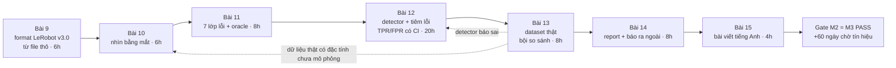
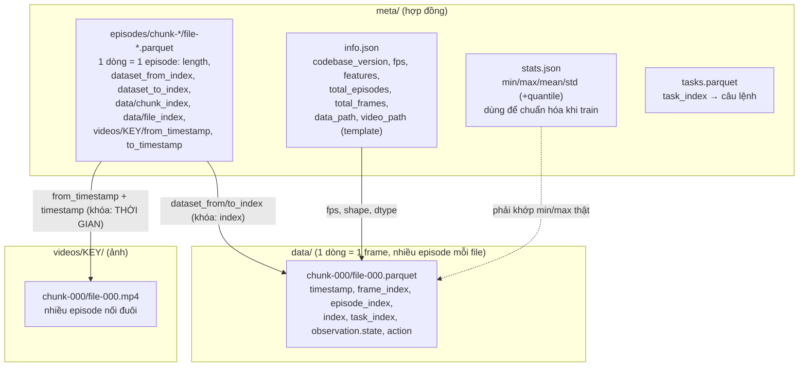
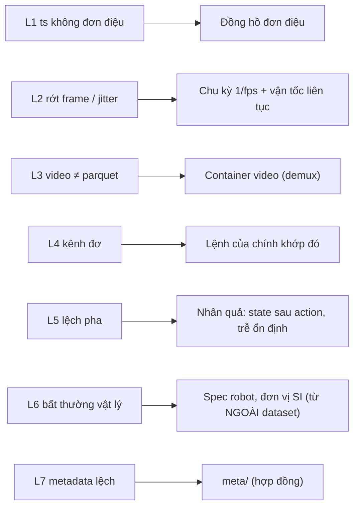
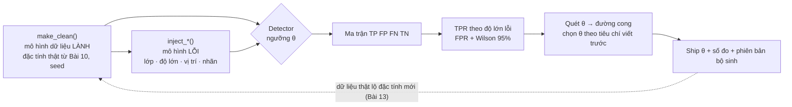
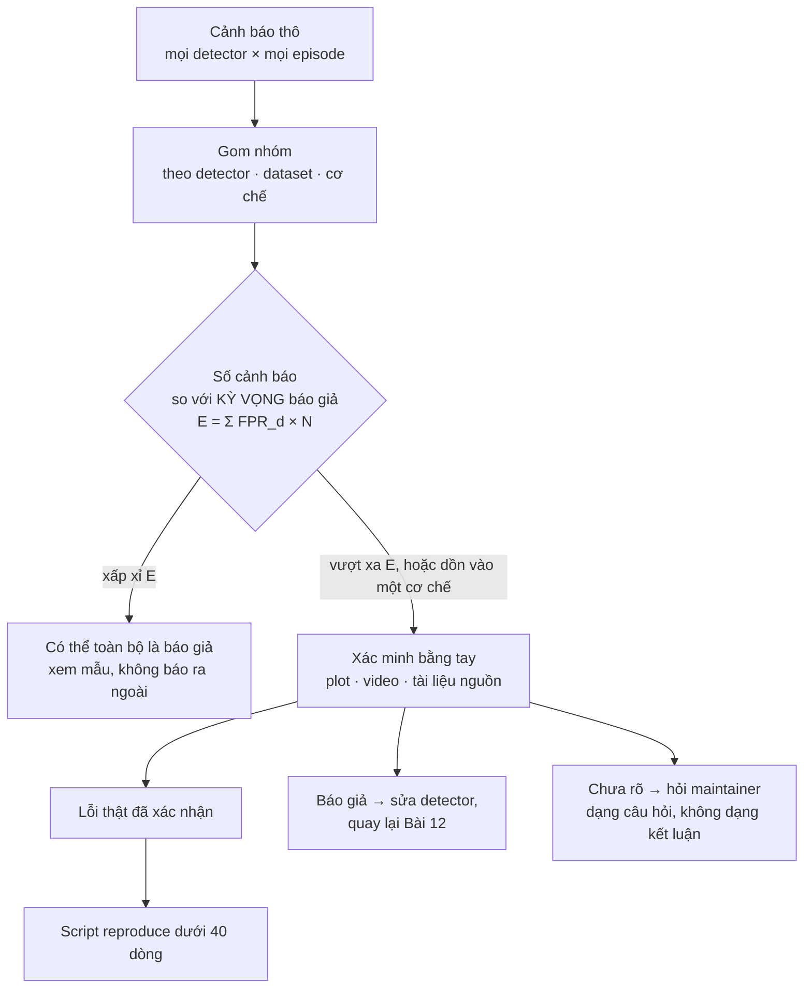
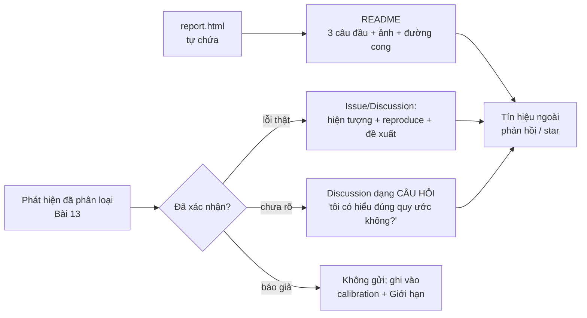

# Khóa 2 · Module 2 — Dataset audit tool (60h, trần 85h) ★

> **Milestone:** M3, artifact công khai đầu tiên · **Cần trước:** Gate Module 1 (`m1-mcap-cong-cu.md`) · học đúng lúc: F3.6, F3.2 (trước Bài 9), F1.2 (Bài 10), F2.1, F3.7 (Bài 11), F2.5, F1.4, F2.4 (Bài 12), F1.5, F1.7 (Bài 13–15) · **Artifact:** repo công khai `lerobot-audit` + một bài viết tiếng Anh + ít nhất một báo cáo lỗi gửi ra ngoài. Nguồn xương sống: `khoa-2-du-lieu-robot-khong-can-robot.md` (Bài 9–15 + Gate Module 2).

Module này biến một câu hỏi mơ hồ ("dataset này có sạch không?") thành một **phép đo có sai số**. Bạn đọc định dạng LeRobot từ file thô, nhìn dữ liệu bằng mắt, định nghĩa bảy lớp lỗi bằng toán, viết detector, **đo chính detector** bằng lỗi tiêm vào, rồi chạy trên dataset thật và báo cáo ra ngoài một cách trung thực.



| Bài | Giờ | Viên nang nền cần trước | Quyết định ra được |
|---|---|---|---|
| 9 | 6 | F3.6, F3.2, F3.7 | Tool hỗ trợ phiên bản format nào, đọc thô hay qua `LeRobotDataset` |
| 10 | 6 | F1.2, F1.7 | Lớp lỗi nào đáng tự động hóa, lớp nào chỉ người thấy; mỗi kênh là đại lượng gì |
| 11 | 8 | F2.1, F3.7, F3.4, F4.6, F5.5 | Mỗi lớp lỗi đối chiếu với oracle nào, khi nào trả INCONCLUSIVE |
| 12 | 20 | F2.5, F1.4, F2.4, F2.2, F2.3 | Ngưỡng nào được ship, kèm TPR/FPR và khoảng tin cậy; detector nào được làm fail CI |
| 13 | 8 | F1.5, F1.7 | Phát hiện nào đủ chắc để báo ra ngoài |
| 14 | 8 | F1.7 | Báo ở kênh nào, dạng khẳng định hay câu hỏi |
| 15 | 4 | F1.7 | Bài viết khẳng định gì, không khẳng định gì |

**Ba điều cần biết trước khi mở Bài 9**, vì chúng thay đổi thiết kế tool so với bản gốc (chi tiết ở phần 11 từng bài):

1. Format hiện hành là **LeRobotDataset v3.0**: nhiều episode chung một file parquet và một file mp4, ranh giới episode nằm trong bảng `meta/episodes/`. Bản gốc mô tả v2.x (một file mỗi episode). Hai bản không tương thích ngược `[spec: LeRobot docs "LeRobotDataset v3.0"; source `src/lerobot/datasets/utils.py`, kiểm 10/2026]`. Tool phải đọc `codebase_version` rồi rẽ nhánh, hoặc từ chối có thông báo.
2. Câu hỏi "cột `timestamp` được **đo** hay được **tính**?" (Bài 9, câu dự đoán 4) quyết định vài kiểm tra trông nghiêm túc của bản gốc có độ nhạy thật hay bằng không (Bài 11).
3. Mỗi detector là **một dụng cụ đo** có dương tính giả và âm tính giả (→ F2.1). Module này không xong khi tool "chạy được"; nó xong khi bạn nói được tỉ lệ sai của chính tool, bằng số, có khoảng tin cậy (→ F1.4), có tính tới bội so sánh (→ F1.5).

**Về dữ liệu dùng trong bài:** các bảng số "đã đo" ở Bài 9–13 lấy trên hai dataset v3.0 tải sẵn ở `data/lerobotpusht` và `data/libero` của workspace (thư mục bị gitignore, chưa ghim revision Hub) — gắn `[tự đo]`. Trên máy khác, tải lại bản tương ứng từ HF Hub (`lerobot/pusht`; repo libero `[tự đo]`), ghim revision, và chạy lại trước khi tin con số. Script `src/download_hf_dataset.py` tải `lerobot/robomme`; dùng nó làm dataset thứ ba.

---


## Bài 9 — LeRobot dataset format từ zero (6h)

> **Vị trí:** Gate Module 1 (MCAP) → **Bài 9** → Bài 10 · **Cần trước:** F3.6 (Parquet, columnar, catalog), F3.2 (file tự mô tả, schema evolution), F3.7 (data contract), K2 Bài 4 (index MCAP) · **Sau bài này bạn quyết định được:** tool của bạn hỗ trợ phiên bản format nào (v2.1, v3.0 hay cả hai), đọc dữ liệu qua lớp nào (file thô hay `LeRobotDataset`), và từ chối gì một cách có kiểm soát — viết được thành một đoạn trong README.

### 1. Câu chuyện — ai đã khổ vì chuyện này

Trước LeRobot, mỗi lab lưu demonstration một kiểu (HDF5 của ALOHA, TFRecord theo RLDS cho Open X-Embodiment, rosbag); mỗi converter giữa chúng là một chỗ mới để dữ liệu lệch nhau `[chuẩn]`. LeRobot (Hugging Face, 2024) đặt một format chung trên HF Hub: parquet cho tín hiệu số, mp4 cho camera, `meta/` mô tả mọi thứ.

Bản v2.x lưu **một parquet và một mp4 mỗi camera mỗi episode**. Khi dataset cộng đồng lên hàng trăm nghìn episode, cách này gãy ở hệ thống file: quá nhiều file nhỏ, khởi tạo chậm, streaming khó. Tháng 9/2025 nhóm LeRobot công bố **v3.0**, ra cùng gói `lerobot` 0.4.0 (10/2025): gộp nhiều episode vào một file lớn và chuyển ranh giới episode vào metadata dạng bảng; tài liệu nêu lý do "lower file-system pressure: fewer, larger files ⇒ faster initialization and fewer issues at scale" `[spec: LeRobot docs "LeRobotDataset v3.0"; HF blog release v0.4.0]`. Đây là "small files problem" của HDFS/S3 mà bạn đã gặp, giải bằng compaction và catalog. Hệ quả cho người làm audit: **một tool viết cho v2.x đọc sai v3.0 mà không crash** (ví dụ đếm file để suy số episode), và câu "format file ổn định hơn API" của bản gốc chỉ đúng bên trong một phiên bản.

### 2. Mô hình tư duy

Một LeRobot dataset v3.0 là **ba kho dữ liệu nối với nhau bằng khóa** — một bảng fact (frames), một bảng dimension (episodes), và blob video. Mỗi khóa nối là một chỗ dữ liệu có thể lệch.



| | v2.x (bản gốc mô tả) | v3.0 (hiện hành) |
|---|---|---|
| Đơn vị file | 1 parquet + 1 mp4 mỗi camera **mỗi episode** | nhiều episode mỗi file, cắt theo dung lượng |
| Đường dẫn data | `data/chunk-{episode_chunk:03d}/episode_{episode_index:06d}.parquet` `[tự đo]` | `data/chunk-{chunk_index:03d}/file-{file_index:03d}.parquet` `[spec: utils.py]` |
| Đường dẫn video | `videos/chunk-…/{video_key}/episode_….mp4` `[tự đo]` | `videos/{video_key}/chunk-…/file-….mp4` `[spec: utils.py]` |
| Ranh giới episode | tên file | bảng `meta/episodes/` (khoảng index, khoảng thời gian video) |
| Task / episode meta | `meta/tasks.jsonl`, `meta/episodes.jsonl` (+ `episodes_stats.jsonl` ở v2.1) | `meta/tasks.parquet`, `meta/episodes/chunk-*/file-*.parquet` |

Tham số đầu vào của hai dataset trong `data/`, đọc từ `meta/info.json` (đây là "datasheet", được đọc trước) `[tự đo]`:

| Trường | `data/lerobotpusht` | `data/libero` |
|---|---|---|
| `codebase_version`, `robot_type` | `v3.0`, `unknown` | `v3.0`, `panda` |
| `fps` | `10` (int) | `10.0` (float) |
| `total_episodes` / `total_frames` | 206 / 25 650 | 1 693 / 273 465 |
| Camera (`dtype: video`) | `observation.image` 96×96, AV1 | `observation.images.image`, `…image2` 256×256, AV1 |
| `observation.state` / `action` | float32[2] (`names` 2 tên) / float32[2] | float32[8] (`names: ["state"]`) / float32[7] |
| `data_files_size_in_mb` / `video_files_size_in_mb` | 100 / 500 | 100 / 500 |

Bốn câu về bản chất:

- **Ảnh không được tra bằng chỉ số, mà bằng thời gian.** Khi train, thư viện lấy frame video ở thời điểm `from_timestamp + timestamp` và nhận frame gần nhất nếu lệch không quá `tolerance_s` (mặc định 1e-4 s), lệch quá thì ném `FrameTimestampError` `[spec: lerobot_dataset.py, video_utils.py, main 10/2026; tự đo theo phiên bản]`. Cột `timestamp` vì vậy là **địa chỉ** trỏ vào video, không chỉ là một phép đo.
- **Metadata là hợp đồng mà code downstream tin mù quáng.** Chuẩn hóa dùng `stats.json`, sampler dùng `length`, decoder dùng `from_timestamp`. Sai metadata không làm gì crash, chỉ làm sai mọi thứ dựa trên nó.
- **Nén video là đánh đổi dung lượng lấy hai rủi ro:** mất random access rẻ (giải mã từ keyframe gần nhất) và thêm một luồng có thể lệch số frame với bảng.
- **Đọc thô hay đọc qua wrapper** là quyết định đo lường: wrapper che thứ bạn đang tìm, nhưng cũng mã hóa ngữ nghĩa (dịch thời gian video, dung sai) mà bạn phải tự cài lại đúng, nếu không tool sẽ báo nhầm.

### 3. Cầu nối từ backend

| Backend bạn biết | Ở đây | Gãy ở chỗ | Nếu dùng nhầm thì |
|---|---|---|---|
| Data lake: compaction + catalog (Hive metastore, Iceberg manifest kèm min/max cột) | v3.0 gộp file, `meta/episodes` là catalog, `stats.json` là thống kê | Iceberg có transaction log và snapshot nguyên tử; `meta/episodes` chỉ là parquet thường, không gì bảo đảm nó khớp `data/`. Và stats sai ở data lake chỉ làm prune sai; ở đây đi thẳng vào chuẩn hóa đầu vào model | Tin catalog như nguồn sự thật, bỏ sót đúng lớp lỗi L7 |
| Bảng fact + dimension | `data/*.parquet` + `meta/episodes` | Khóa nối là **khoảng** (`from_index..to_index`, `from_timestamp..to_timestamp`), và khoảng thời gian là float cộng dồn (`27.900000000000002`) | So `==` trên float, báo lệch giả hàng loạt |
| Schema trong Parquet footer | `info.json → features` + schema Arrow | Hai nguồn schema không ai bắt buộc khớp (libero: `names` 1 phần tử, `shape` 8) | Reader tin `names` để đặt tên cột, crash hoặc gán nhầm |
| ORM vs raw SQL | `LeRobotDataset` vs đọc parquet/mp4 trực tiếp | Wrapper có logic dịch thời gian, dung sai, và từ chối nạp bản cũ (`BackwardCompatibilityError`) `[spec: utils.py]`; API đổi nhanh hơn format | Đọc thô nhưng quên phép dịch `from_timestamp` → báo L3 giả cho mọi episode sau episode đầu |

**Chấm mô hình:**

- *"LeRobot dataset là vài bảng parquet, đọc bằng pandas là xong, như data warehouse."* → **ĐÚNG MỘT PHẦN.** Phần bảng thì đúng. Gãy ở chỗ ảnh nằm trong mp4, nối qua thời gian, và các bảng không có ràng buộc toàn vẹn. Phản ví dụ: parquet và `meta/episodes` khớp từng byte, nhưng mp4 thừa một frame ở giữa; bảng không đổi, mọi cặp (ảnh, hành động) sau điểm đó lệch một nhịp. Pandas không bao giờ thấy.
- *"Đọc thô luôn đúng hơn đọc qua wrapper."* → **ĐÚNG MỘT PHẦN.** Đọc thô cho thấy dữ liệu chưa qua xử lý, nhưng bạn phải tái tạo đúng ngữ nghĩa model nhìn thấy. Phản ví dụ: ở v3, đếm toàn bộ packet của `file-000.mp4` rồi so với `length` của episode 0 luôn FAIL dù dữ liệu lành. Ngược lại, một "lỗi" mà thư viện xử lý được (frame gần nhất trong dung sai) có thể vô hại với người train. Cách mạnh nhất là chạy cả hai và so (differential testing → F2.4): chỗ hai đường đọc bất đồng chính là phát hiện.
- *"Format file ổn định hơn API thư viện."* (bản gốc) → **ĐÚNG MỘT PHẦN.** Ổn định trong một `codebase_version`; giữa v2.1 và v3.0 thì đường dẫn, số file, nơi chứa task và episode đều đổi. Tool phải đọc template `data_path`/`video_path` từ `info.json` thay vì hard-code.

### 4. Thuật ngữ

| Mức | Thuật ngữ | Nghĩa trong một câu | Hay bị hiểu nhầm thành |
|---|---|---|---|
| 🟢 | episode | Một lần thực hiện nhiệm vụ từ đầu tới cuối | Một file (đúng ở v2, sai ở v3) |
| 🟢 | frame / `index` / `frame_index` | Một dòng parquet; `index` toàn cục, `frame_index` đếm lại từ 0 trong mỗi episode | Hai cột trùng nghĩa; hoặc "một frame video" |
| 🟢 | `observation.state` / `action` | Vector trạng thái đo được / vector lệnh tại frame đó | Trạng thái "thật" (nó là số đo có lượng tử, trễ); "kết quả chuyển động" |
| 🟢 | `codebase_version` | Phiên bản **format** (`v2.0`, `v2.1`, `v3.0`) ghi trong `info.json` | Phiên bản gói `lerobot` (hai hệ số khác nhau) |
| 🟢 | `meta/episodes` | Bảng một dòng mỗi episode: độ dài, khoảng index, file chứa, khoảng thời gian video | Log phụ |
| 🟢 | `from_timestamp`/`to_timestamp` | Vị trí (giây) của episode bên trong mp4 dùng chung | Timestamp của frame trong parquet |
| 🟢 | `stats.json` | Thống kê dùng để chuẩn hóa khi train | Thông tin trang trí |
| 🟡 | chunk / file index, `*_files_size_in_mb` | Cách chia file theo dung lượng; là **ngưỡng trên** (mặc định code: data 100 MB, video 200 MB, 1000 file/chunk `[spec: utils.py]`; dataset chuyển đổi có thể khai 500) | Kích thước thật của file; ranh giới episode |
| 🟡 | `tolerance_s` | Dung sai khi tra frame video theo thời gian | Ngưỡng phát hiện lỗi của bạn |

### 5. Dự đoán

Trước khi chạy bất kỳ lệnh nào ở phần 6, chỉ nhìn `info.json` và trang dataset trên HF Hub (tab *Files*, dataset card), commit `predictions/09-format.md`. Năm dataset: `data/lerobotpusht`, `data/libero`, `lerobot/robomme`, và hai cái bạn chọn (khác robot, khác số camera; ít nhất một dataset **robot thật do cộng đồng thu**, không thuộc org `lerobot`; ít nhất một còn ở v2.x nếu còn tìm được).

1. Bản gốc đưa sáu kiểm tra "dataset lành lặn" (tổng dòng = `total_frames`; số file parquet = `total_episodes`; số frame mp4 = số dòng; `timestamp` tăng nghiêm ngặt từ 0; trung vị `diff(timestamp)` ≈ `1/fps` sai lệch <1%; `frame_index` liên tục). Kiểm tra nào **không còn đúng nghĩa** ở v3.0? Viết lại nó; bảng K1–K8 dưới là một cách viết lại, hãy tự kiểm nó có thiếu gì không.
2. Dự đoán ĐẠT/TRƯỢT từng ô. Không đoán được thì ghi "không biết" kèm lý do; đó là dự đoán hợp lệ.
3. Số file parquet của libero, suy từ `total_frames` và `data_files_size_in_mb`. Nói rõ bạn dựa vào giả định nào.
4. Câu khó: cột `timestamp` trong dataset thu bằng `lerobot-record` được **đo** (đọc đồng hồ lúc lấy mẫu) hay được **tính** từ thứ khác? Tra ở đâu: hàm `add_frame` trong `src/lerobot/datasets/` — đọc **sau** khi đã ghi dự đoán.

```markdown
# predictions/09-format.md  (commit trước khi chạy) · ngày … · commit …
| # | Kiểm tra (v3.0) | pusht | libero | robomme | ds4 | ds5 |
|---|---|---|---|---|---|---|
| K1 | tổng dòng parquet == total_frames | | | | | |
| K2 | số dòng meta/episodes == total_episodes | | | | | |
| K3 | sum(length) == total_frames; from/to_index liên tục, không chồng | | | | | |
| K4 | số packet mỗi mp4 == sum(length) các episode trỏ vào file đó | | | | | |
| K5 | số packet trong [from_ts, to_ts) == length (biên nửa frame) | | | | | |
| K6 | timestamp mỗi episode bắt đầu ở 0, tăng nghiêm ngặt | | | | | |
| K7 | trung vị diff(timestamp) lệch 1/fps < 1% | | | | | |
| K8 | frame_index = 0,1,2,… liên tục | | | | | |
codebase_version dự đoán: … · số file parquet libero: … vì …
Kiểm tra của bản gốc không còn đúng ở v3: … · Bao nhiêu dataset ĐẠT cả 8: …
timestamp được đo hay được tính? … vì …
```

### 6. Làm

**Bước 0 — môi trường.** Venv riêng cho repo tool, pin phiên bản trong lockfile (→ F2.2): `huggingface_hub pyarrow pandas numpy`, và `ffprobe` từ bản ffmpeg có decoder AV1 (`libdav1d` hoặc `libaom`; kiểm bằng `ffmpeg -decoders`) `[tự đo]`. Ví dụ đã chạy: `pyarrow` 18.1, `numpy` 2.2, ffprobe 9.0. Chưa cần gói `lerobot`.

**Bước 1 — tải metadata trước, ghim phiên bản.** Script hiện tại (`src/download_hf_dataset.py`) tải toàn bộ snapshot (có thể nhiều GB) và không ghi commit. Sửa thành:

```python
# [chưa chạy] — cần mạng tới HF Hub; tham số kiểm theo phiên bản huggingface_hub bạn cài
from huggingface_hub import snapshot_download, HfApi
repo = "lerobot/robomme"
sha = HfApi().dataset_info(repo).sha                 # commit hiện tại của repo dataset
meta = snapshot_download(repo_id=repo, repo_type="dataset", revision=sha, allow_patterns=["meta/*"])
print(sha, meta)                                     # ghi sha vào notes: dataset trên Hub có thể bị sửa sau này
```

Dataset trên HF Hub là một git repo; maintainer có thể sửa nó. Mọi kết quả audit phải gắn `repo_id@sha` (provenance → F3.8). Đọc dataset card: robot thật hay sim (sim có đồng hồ lý tưởng, hành xử khác ở Bài 10–11).

**Bước 2 — đọc `info.json` của cả năm.** Điền bảng như phần 2: `codebase_version`, `fps` (int hay float?), `robot_type`, `total_*`, `data_path`, `video_path`, `features` với `dtype`, `shape`, `names` (camera có `dtype: "video"` kèm `info` chứa fps và codec). Đối chiếu `fps` của dataset với fps của từng camera. Dataset v2.x: tool phải hỗ trợ, hoặc từ chối bằng thông báo rõ. Không được im lặng đọc sai.

**Bước 3 — mở parquet thô** (`pyarrow.parquet.read_table`, nối các file bằng `pa.concat_tables`). In schema Arrow và 20 dòng đầu, nhìn bằng mắt. `observation.state` là `fixed_size_list` hay `list`? `timestamp` là float32 hay float64? Footer có metadata nhúng (`huggingface`, `pandas`) không? Ở v3, một file chứa nhiều episode: lọc theo `episode_index`.

Sai số của "dụng cụ": `timestamp` là float32. Ở $t \approx 50$ s, khoảng cách giữa hai float32 liền kề là $2^{-18}$ s ≈ 3,8 µs `[chuẩn: IEEE 754, 24 bit mantissa; kiểm bằng np.spacing(np.float32(50))]`. Mọi so sánh timestamp phải có dung sai cỡ đó, không dùng `==`.

**Bước 4 — đếm frame video.** Ba mức, mỗi mức tin một thứ khác:

| Lệnh `ffprobe -v error -select_streams v:0 … -of csv=p=0 f.mp4` | Đọc gì | Tốc độ | Tin vào |
|---|---|---|---|
| `-show_entries stream=nb_frames` | header container | tức thì | lời khai của muxer (một loại metadata) |
| `-count_packets -show_entries stream=nb_read_packets` | demux mọi packet, không giải mã | nhanh | số packet nén (= số frame với video thường `[chuẩn]`) |
| `-count_frames -show_entries stream=nb_read_frames` | giải mã toàn bộ | chậm (AV1 trên CPU rất chậm) | số frame giải mã được |

Ở v2.x, so con số với số dòng parquet của episode. Ở v3, **một mp4 chứa nhiều episode**: lấy pts của từng packet, đếm packet rơi vào `[from_timestamp, to_timestamp)` của từng episode, **và** so tổng packet của file với tổng `length` các episode trỏ vào file. pts lưu theo timebase nguyên của container, đổi ra giây có làm tròn; dùng biên nửa frame (`0.5/fps`).

**Bước 5 — checker K1–K8, chạy trên dữ liệu giả trước.** Script dưới đọc file thô, không dùng `LeRobotDataset`. Trước khi chạy trên dữ liệu thật, tự sinh một dataset giả 3 episode (90, 60, 75 frame, 30 fps): một `data/chunk-000/file-000.parquet`, một `meta/episodes/chunk-000/file-000.parquet` với `from/to_timestamp` cộng dồn, một mp4 bằng `ffmpeg -f lavfi -i testsrc=size=160x120:rate=30 -frames:v <N> -c:v libx264 -pix_fmt yuv420p`. Bản "hỏng" chỉ khác ở `<N>` lớn hơn tổng `length` một đơn vị. **Trước khi chạy**, ghi vào `prediction.md`: với bản hỏng, dòng nào FAIL? Nếu frame thừa nằm ở **giữa** episode 0 chứ không ở cuối file, dòng nào đổi?

```python
# [đã chạy] Kiểm meta <-> data <-> video cho LeRobotDataset v3.0, đọc file thô (pyarrow + ffprobe)
import json, subprocess, sys
from collections import defaultdict
from pathlib import Path
import numpy as np, pandas as pd

root = Path(sys.argv[1])
info = json.loads((root / "meta/info.json").read_text())
fps = info["fps"]
if not str(info["codebase_version"]).startswith("v3"):
    sys.exit(f"{info['codebase_version']}: layout một-file-mỗi-episode, xem phần 6 Bài 9")
eps = pd.concat(pd.read_parquet(p) for p in sorted((root / "meta/episodes").rglob("*.parquet")))
data = pd.concat(pd.read_parquet(p) for p in sorted((root / "data").rglob("*.parquet")))
out = []                                   # (tên kiểm tra, ok?, chi tiết)
out.append(("rows == total_frames", len(data) == info["total_frames"], f"{len(data)} vs {info['total_frames']}"))
out.append(("episodes == total_episodes", len(eps) == info["total_episodes"], f"{len(eps)} vs {info['total_episodes']}"))
for _, ep in eps.iterrows():
    e = int(ep["episode_index"])
    d = data[data["episode_index"] == e]
    ts = d["timestamp"].to_numpy(np.float64)
    dt = np.diff(ts)
    out.append((f"ep{e} rows == length", len(d) == ep["length"], f"{len(d)} vs {int(ep['length'])}"))
    out.append((f"ep{e} frame_index 0..n-1", np.array_equal(d["frame_index"], np.arange(len(d))), ""))
    out.append((f"ep{e} ts tăng nghiêm ngặt", bool((dt > 0).all()), f"min dt={dt.min():.6f}"))
    out.append((f"ep{e} median dt ~ 1/fps", abs(np.median(dt) * fps - 1) < 0.01, f"{np.median(dt):.6f}"))

def packet_pts(mp4):                        # demux, không giải mã: nhanh
    r = subprocess.run(["ffprobe", "-v", "error", "-select_streams", "v:0", "-show_entries",
                        "packet=pts_time", "-of", "csv=p=0", str(mp4)], capture_output=True, text=True, check=True)
    return np.sort(np.array([float(x) for x in r.stdout.split() if x != "N/A"]))

vkeys = [k for k, f in info["features"].items() if f["dtype"] == "video"]
for k in vkeys:
    files = defaultdict(list)                # một mp4 chứa nhiều episode -> gom theo file
    for _, ep in eps.iterrows():
        files[(int(ep[f"videos/{k}/chunk_index"]), int(ep[f"videos/{k}/file_index"]))].append(ep)
    for (c, f), group in files.items():
        mp4 = root / info["video_path"].format(video_key=k, chunk_index=c, file_index=f)
        pts = packet_pts(mp4)
        half = 0.5 / fps
        for ep in group:
            lo, hi = ep[f"videos/{k}/from_timestamp"], ep[f"videos/{k}/to_timestamp"]
            n = int(((pts >= lo - half) & (pts < hi - half)).sum())
            out.append((f"{k} ep{int(ep['episode_index'])} frames in window == length", n == ep["length"], f"{n}"))
        expect = sum(int(ep["length"]) for ep in group)
        out.append((f"{k} file {c}/{f} total frames == sum(length)", len(pts) == expect, f"{len(pts)} vs {expect}"))

for name, ok, detail in out:
    print(("PASS " if ok else "FAIL ") + name + (f"  [{detail}]" if detail else ""))
sys.exit(0 if all(ok for _, ok, _ in out) else 1)
```

Dataset v2.x: duyệt theo `data_path`, đọc `meta/episodes.jsonl`, so packet từng `episode_….mp4` với số dòng parquet tương ứng.

**Bước 6 — chạy K1–K8 trên năm dataset, so với dự đoán,** ghi `notes/09-format.md`: kiểm tra nào trượt, vì sao, bạn đã giả định gì sai về format.

### 7. Số phải ra

<details><summary>🔒 MỞ SAU KHI COMMIT prediction.md</summary>

**Kiểm tra bản gốc → v3.0:** "số file parquet = `total_episodes`" không áp dụng, thay bằng K2 + K3; "số frame mp4 = số dòng episode" thay bằng K5 theo cửa sổ **và** K4 tổng theo file; ba kiểm tra timestamp/`frame_index` giữ nguyên (tương đối trong episode).

**Checker trên dataset giả** `[đã chạy]`: bản lành 18/18 PASS, exit 0. Bản mp4 thừa một frame ở cuối: mọi dòng theo episode PASS, chỉ một dòng FAIL: `file 0/0 total frames == sum(length)  [226 vs 225]`, exit 1. **Nếu frame thừa nằm giữa episode 0:** mọi frame sau nó dịch muộn 1/fps, nhưng đếm theo cửa sổ vẫn ra đúng 90/60/75 (frame rải đều nên mỗi cửa sổ vẫn đủ số frame); chỉ dòng tổng FAIL. **Đếm theo cửa sổ không định vị được chỗ lệch**; nó chỉ cho biết file có lệch. Định vị phải nhìn nội dung (cảnh chuyển ở ranh giới episode lệch khỏi `from_timestamp`). Đây là giới hạn đáng ghi vào README.

**Trên `data/`** `[tự đo, bản local 10/2026, chưa ghim revision]`:

| Kiểm tra | pusht | libero |
|---|---|---|
| Số file parquet / số mp4 mỗi camera | 1 / 1 (cả 206 episode) | 377 (mỗi file 2–3 episode, ~54 KB) / 37 |
| K1–K8 | ĐẠT cả 8 | ĐẠT cả 8 (K4: 37/37 file mỗi camera) |
| Trung vị dt | 0,0999999 s | 0,1000000 s |
| max \|timestamp − frame_index/fps\| | ~0,8 µs | ~1,5 µs |

Ba điều thường làm bất ngờ:

1. **Kiểm tra "số file parquet = `total_episodes`" của bản gốc TRƯỢT trên cả hai** dù dữ liệu lành: 1 ≠ 206, 377 ≠ 1 693. Kiểm tra sai, không phải dữ liệu sai: cảnh báo giả do áp format v2.x lên v3.0.
2. **Libero có file nhỏ hơn nhiều so với `data_files_size_in_mb: 100`.** Đó là ngưỡng trên; bộ chuyển đổi đã cắt file theo cách khác. Ai đoán "1 file vì 20 MB < 100 MB" thì sai, và hợp lý khi sai.
3. **`timestamp` gần như đúng bằng `frame_index / fps`** (chỉ lệch do làm tròn float32): nó được **tính**, không **đo**. Source xác nhận: ở `lerobot` hiện hành, `add_frame` gán `timestamp = frame_index / fps` và docstring yêu cầu người gọi **không** truyền `timestamp` `[spec: src/lerobot/datasets/dataset_writer.py, main 10/2026]`; phiên bản cũ hơn cho phép truyền `[tự đo]`. Hệ quả: với dataset thu bằng `lerobot-record`, K6–K8 gần như **luôn pass theo cấu trúc**: chúng kiểm code ghi, không kiểm đồng hồ. Đây là phát hiện quan trọng nhất của bài; Bài 11 xử lý nó.

**Ba dataset còn lại:** không có số chung. Tỉ lệ "ĐẠT cả 8" dưới 5/5 là bình thường với dataset cộng đồng hoặc còn ở v2.x `[ước lượng]`. 5/5 ĐẠT cũng không nói "sạch", chỉ nói tám kiểm tra cấu trúc không thấy gì. Nếu bạn đoán "5/5 vì dataset của Hugging Face thì sạch", đó là dự đoán dựa trên uy tín, không dựa trên cơ chế.

**Tỉ lệ dung lượng:** 640×480×3 B ≈ 0,92 MB mỗi ảnh raw; 50 episode × 400 frame ≈ 18 GB (bản gốc đúng) `[ước lượng]`.

</details>

### 8. Nếu ra khác

| Triệu chứng | Nguyên nhân khả dĩ | Kiểm bằng cách | Sửa |
|---|---|---|---|
| Số file parquet ≪ `total_episodes` | Dataset v3.0, nhiều episode/file | `codebase_version`, đếm `episode_index` duy nhất | Không phải lỗi; dùng K2/K3 |
| Không có `meta/episodes/`, có `episodes.jsonl`; hoặc `KeyError: 'videos/<cam>/from_timestamp'` | Dataset v2.x, hoặc camera lưu dạng ảnh (`dtype: "image"`) | `codebase_version`, `features[cam].dtype` | Rẽ nhánh theo phiên bản/dtype, hoặc từ chối có thông báo |
| Mọi episode sau episode 0 báo lệch video | Quên phép dịch `from_timestamp` | In pts đầu/cuối và `from/to_timestamp` | Đếm trong cửa sổ, không đếm cả file |
| K5 lệch 1 frame ở rất nhiều episode | So `==` trên float cộng dồn | In `(to−from)*fps − length` | Dung sai nửa frame |
| ffprobe báo codec không hỗ trợ, hoặc `-count_frames` chạy hàng chục phút | ffmpeg không có decoder AV1; đang giải mã toàn bộ | `ffmpeg -decoders`; thử `-count_packets` | Cài ffmpeg có `libdav1d`; chỉ giải mã khi cần định vị |

### 9. Câu hỏi ngược

1. **[Quy mô]** Một dataset 100 robot × 1000 giờ, 3 camera, 30 fps. Ở v2.x có bao nhiêu file? Ở v3.0 với video 200 MB/file thì sao? Thứ gì gãy trước: hệ thống file, thời gian tải, hay thời gian tool đếm packet?
   <details><summary>Hướng nghĩ</summary>

   Tính số episode từ độ dài trung bình bạn đo ở Bài 10. Với v3, số file phụ thuộc bitrate. Đếm packet là O(dung lượng video), không O(số file): tự đo MB/s mà ffprobe demux được trên N100 (thử trên một file 37 MB của libero) rồi tính ra giờ. Có cách kiểm mà không đọc hết video không (kiểm tổng theo file trước, lấy mẫu episode, chỉ đọc bảng mẫu `stts` của container)?

   </details>
2. **[Failure mode]** Ở v3, `from_timestamp` của episode k được tính bằng cách cộng dồn thời lượng các episode trước trong cùng file. Nếu một episode được mã hóa ra thời lượng thật khác `length/fps`, lỗi lan thế nào sang các episode sau? Và nếu bộ chuyển đổi v2.1 → v3.0 bị kill giữa chừng, trạng thái nào của `data/`, `videos/`, `meta/episodes` có thể xảy ra, K nào bắt được?
   <details><summary>Hướng nghĩ</summary>

   Như offset trong log append-only lệch một bản ghi: mọi offset sau đó sai cùng một lượng; K4 bắt được, K5 thì không. Chuyển đổi dở dang: liệt kê thứ tự ghi có thể (data trước hay meta trước?); so với MCAP bị cắt ở K2 Bài 7, nơi index nằm cuối chính file đó.

   </details>
3. **[Vì sao không]** Vì sao LeRobot không lưu ảnh dưới dạng JPEG bytes trong một cột parquet, để mọi thứ nằm chung một bảng và khóa nối là `index`?
   <details><summary>Hướng nghĩ</summary>

   So nén nội khung (JPEG) với nén liên khung (H.264/AV1) cho chuỗi ảnh gần giống nhau. Rồi nghĩ cái giá ngược lại: khóa nối theo thời gian, dung sai, chi phí giải mã khi random access — ai trả, lúc ghi hay lúc train? v3 vẫn hỗ trợ `dtype: "image"`; khi nào bạn chọn nó?

   </details>
4. **[Phản biện]** "Tool audit nên dùng chính `LeRobotDataset` để đọc, vì thứ cần kiểm là thứ model thật sự nhìn thấy." Phản biện câu này, rồi phản biện lại chính phản biện của bạn.
   <details><summary>Hướng nghĩ</summary>

   Hai đường đọc trả lời hai câu hỏi khác nhau: "file có nhất quán không" và "model có nhận đúng cặp dữ liệu không". Differential testing dùng cả hai. Chi phí: phụ thuộc phiên bản `lerobot`, torch, decoder.

   </details>
5. **[Nếu…thì]** Nếu `fps` trong `info.json` là `10` (int) ở dataset này và `10.0` (float) ở dataset kia, reader của bạn gãy ở đâu, nếu có?
   <details><summary>Hướng nghĩ</summary>

   Tìm các chỗ dùng `fps` làm kích thước cửa sổ/chỉ số mảng (`win = fps`), làm khóa dict, hoặc so `==` với fps của video. JSON không chặn kiểu khác biệt này.

   </details>

### 10. Liên kết ra ngoài

- **Table format của data lake (Iceberg, Delta Lake).** Giống: metadata (manifest) khai file nào chứa dòng nào và min/max mỗi cột; lỗi kinh điển là manifest trỏ tới file không còn hoặc stats cũ. Khác: Iceberg có snapshot và commit nguyên tử, nên "meta khớp data" được bảo đảm; ở LeRobot nó là thứ phải kiểm. Và stats ở đây đi vào chuẩn hóa đầu vào model, không chỉ vào prune query.
- **Genomics (BAM + BAI).** File dữ liệu lớn + file index riêng theo tọa độ. Một BAI cũ không khớp BAM mới cho kết quả sai mà không lỗi, đúng kiểu L7. Khác: công cụ genomics thường kiểm thời điểm sửa đổi của index so với dữ liệu; `meta/episodes` không có dấu nào như vậy.

### 11. Độ tin cậy và sửa lỗi

| Khẳng định | Nhãn | Ghi chú / cách kiểm |
|---|---|---|
| v3.0 nhiều episode/file, episode meta dạng parquet, tasks ở `meta/tasks.parquet`, đường dẫn như bảng phần 2 | `[spec]` | `utils.py` (`DEFAULT_TASKS_PATH`, `DEFAULT_DATA_PATH`, `DEFAULT_VIDEO_PATH`), main 10/2026. Trang docs v3 vẫn ghi `meta/tasks.jsonl` trong phần layout: docs và code bất đồng, tin code và `[tự đo]` trên dataset thật |
| v3.0 công bố 09/2025, ra cùng `lerobot` 0.4.0 (10/2025); không tương thích ngược v2.1 | `[spec]` | HF blog release v0.4.0; `BackwardCompatibilityError` trong `utils.py`; có script chuyển đổi v2.1→v3.0 |
| `add_frame` tính `timestamp = frame_index/fps`, cấm người gọi truyền; dtype float32 | `[spec]` | `dataset_writer.py`, `utils/constants.py` (`DEFAULT_FEATURES`). Bản cũ cho phép truyền: `[tự đo]` theo phiên bản |
| Bảng số trên `data/` | `[tự đo]` | Bản local, chưa ghim revision; chạy lại sau khi tải theo `sha` |

**Đã sửa so với bản gốc:**
- Bản gốc mô tả layout v2.x như layout hiện hành. Sửa: trình bày cả hai, v3.0 mặc định; "số file parquet = `total_episodes`" chỉ đúng cho v2.x; kiểm số frame video ở v3 phải đếm theo cửa sổ `from/to_timestamp` **và** theo tổng mỗi file.
- "API đổi theo phiên bản, còn format file thì ổn định hơn nhiều" → ổn định trong một `codebase_version`; tool rẽ nhánh theo phiên bản.
- "nếu `LeRobotDataset` tự sửa lỗi timestamp khi load": wrapper không sửa timestamp; nó tra video theo thời gian với dung sai và ném lỗi khi lệch quá. Lý do đọc thô vẫn đúng, lý do cụ thể đã chỉnh.
- `pip install` không pin; `snapshot_download` không ghim revision, tải cả snapshot → lockfile, `revision=sha`, `allow_patterns`.

**Hợp nhất (Claude × Kiro):** nền bản Claude (kiểm chứng source: `add_frame`, `tolerance_s`, ba mức đếm ffprobe, checker có kiểm tổng theo file). Ghép từ bản Kiro: bảng tham số thật của hai dataset trong `data/`, bảng dự đoán K1–K8, kết quả đo trên `data/` (ba điều bất ngờ), bước float32, hai câu hỏi ngược và liên kết BAM/BAI. Mâu thuẫn: Kiro ghi `add_frame` chỉ tính timestamp "khi không truyền" — đúng cho bản cũ; source main 10/2026 luôn tính và cấm truyền (Claude đúng). Video "200 MB" (mặc định code) vs "500" (`info.json` thật): cả hai đúng ở tầng của mình; `info.json` thắng.

### 12. Đọc thêm và tự kiểm tra

- **Nguồn gốc:** LeRobot docs, trang "LeRobotDataset v3.0" (huggingface.co/docs/lerobot); source `src/lerobot/datasets/` trong repo `huggingface/lerobot` (`utils.py`, `dataset_writer.py`, `dataset_reader.py`, `video_utils.py`).
- **Giải thích:** Apache Parquet, trang "File Format" (parquet.apache.org) — row group, footer, vì sao file thiếu footer là file hỏng (lý do docs v3 bắt gọi `finalize()`); docs LeRobot "Porting datasets to v3.0".
- **Đào sâu (tùy chọn):** RLDS (Ramos và cộng sự, Google, 2021), một lựa chọn thiết kế khác cho cùng bài toán.
- **Tự kiểm tra:** (1) giải thích cho một backend engineer khác trong 5 câu vì sao ảnh được tra bằng thời gian chứ không bằng chỉ số; (2) vẽ lại sơ đồ ba kho và các khóa nối từ trí nhớ; (3) câu hỏi:
  - Dataset v3 có `total_episodes = 50` nhưng `data/` chỉ có 1 file parquet. Có phải lỗi không?
  - Episode 3 của libero có `dataset_from_index = 843`. Viết biểu thức lấy đúng các dòng của nó, và đúng các frame video của nó.
  - Vì sao "trung vị `diff(timestamp)` ≈ `1/fps`" gần như không bao giờ fail trên dataset thu bằng `lerobot-record`?

  <details><summary>Đáp án</summary>

  (a) Không. Ở v3 nhiều episode chung một file; kiểm số dòng `meta/episodes` và tính liên tục của `dataset_from_index`/`dataset_to_index`. (b) Dòng: `index ∈ [dataset_from_index, dataset_to_index)`, hoặc lọc `episode_index == 3`; hai cách phải cho cùng kết quả, và đó là một kiểm tra. Video: mở file theo `videos/<key>/chunk_index`, `file_index`; lấy frame có pts ∈ [`from_timestamp`, `to_timestamp`), biên nửa frame vì là float cộng dồn. (c) Vì timestamp được tính bằng `frame_index / fps` lúc ghi; kiểm tra đó kiểm code ghi, không kiểm thời gian thật.

  </details>

---


## Bài 10 — Kiểm tra bằng tay trước khi tự động hóa (6h)

> **Vị trí:** Bài 9 (đọc được file) → **Bài 10** → Bài 11 (định nghĩa lỗi bằng toán) · **Cần trước:** F1.2 (histogram, đuôi phân bố), F1.7 (preregistration = `prediction.md`), F2.1 (test là phép đo có FP/FN), Bài 9 · **Sau bài này bạn quyết định được:** lớp lỗi nào đáng viết detector, lớp nào chỉ con người thấy (sẽ vào mục "Giới hạn" của README), và mỗi kênh dữ liệu **thật sự là đại lượng gì** trước khi so nó với kênh khác.

### 1. Câu chuyện — ai đã khổ vì chuyện này

Năm 1973, nhà thống kê Francis Anscombe công bố bốn bộ dữ liệu có cùng trung bình, phương sai, hệ số tương quan và đường hồi quy, nhưng vẽ ra thì khác hẳn: một đường thẳng có nhiễu, một đường cong, một đường thẳng bị một điểm ngoại lai kéo lệch, một cột dọc với một điểm xa. Năm 2017, Matejka và Fitzmaurice (Autodesk Research, CHI 2017) làm lại ý đó với "Datasaurus Dozen": mười ba bộ cùng thống kê tóm tắt, một bộ vẽ ra hình con khủng long. Bài học: **thống kê tóm tắt là phép nén có mất mát; mắt người thấy cái phép nén bỏ đi.**

Detector cũng là thống kê tóm tắt. Viết detector trước khi nhìn dữ liệu là mã hóa lỗi **bạn tưởng tượng**, không phải lỗi tồn tại. Ở Khóa 1 là "dự đoán trước khi đo"; ở đây là **nhìn trước khi tự động hóa**. Ở Bài 11 bạn sẽ chạy nguyên văn các detector của bản gốc — viết từ tưởng tượng hợp lý — trên dữ liệu thật, và thấy cái nào đứng vững khi người viết chưa nhìn `action` của dataset đó là đại lượng gì.

### 2. Mô hình tư duy

```
            ┌────────────── những gì sai trong dataset ──────────────┐
            │   ┌── máy thấy được ──┐        ┌── chỉ người thấy ──┐   │
            │   │ L1 ts chạy lùi     │        │ episode thất bại    │   │
            │   │ L3 video ≠ dòng    │        │ camera bị che       │   │
            │   │ L6 NaN             │        │ nhiệm vụ sai mô tả  │   │
            │   │ L7 meta ≠ data     │        │ người teleop do dự  │   │
            │   └────────────────────┘        └─────────────────────┘   │
            │        ┌── máy thấy được NẾU biết ngữ nghĩa kênh ──┐      │
            │        │ L4 kênh đơ, L5 lệch pha, L6 nhảy bậc       │      │
            │        └────────────────────────────────────────────┘      │
            └──────────────────────────────────────────────────────────┘
```

Ba vùng, ba cách xử lý. Vùng trái: tự động hóa thẳng. Vùng phải: tool không bắt được, ghi vào **Giới hạn** của README (Bài 15); có thể là ứng viên cho VLM-judge sau này (→ F2.8). Vùng giữa là chỗ giá trị thật của tool nằm và dễ sai nhất: detector so `action[j]` với `state[j]` chỉ có nghĩa khi hai kênh **cùng đại lượng, cùng đơn vị**. Một detector là **một câu hỏi đã đóng băng**: nó chỉ hỏi câu bạn nghĩ ra lúc viết. Khảo sát bằng tay là cách tìm câu bạn chưa biết phải hỏi, và cũng là cách tìm **hành vi bình thường trông giống lỗi** (gripper đứng yên cả episode, robot dừng chờ): mỗi thứ như vậy thành một test chống báo nhầm ở Bài 12.

Hình phải tạo ra (script phần 6 sinh đúng ba panel cho một episode):

```
 panel 1: histogram diff(timestamp), trục y log   → hình dạng jitter? hay vạch rời rạc?
 panel 2: mọi chiều observation.state theo frame   → chiều nào phẳng? nhảy bậc? bão hòa?
 panel 3: state[0] và action[0] chồng lên nhau      → cùng đại lượng? lệch pha bao nhiêu?
```

### 3. Cầu nối từ backend

| Backend bạn biết | Ở đây | Gãy ở chỗ | Nếu dùng nhầm thì |
|---|---|---|---|
| Đọc log thô trước khi viết alert rule | Vẽ state/action/dt trước khi viết detector | Log có ngữ nghĩa bằng chữ; một cột `action` float32[7] không nói nó là vị trí tuyệt đối, vận tốc hay delta; ý nghĩa nằm trong **hình dạng theo thời gian** | Viết rule so hai cột khác đại lượng, cảnh báo giả hàng loạt |
| Profiling dữ liệu (pandas-profiling, Great Expectations sinh expectation tự động) | Thống kê mỗi cột | Profile mỗi cột độc lập; lỗi robot nằm ở **quan hệ** giữa cột (state theo action) và theo thời gian | Profile sạch, dữ liệu vẫn lệch pha |
| Ghi traffic thật để dựng mock server (bạn đã làm) | Đặc tính dữ liệu thật đưa vào bộ sinh ở Bài 12 | Traffic HTTP phát lại được; dữ liệu cảm biến có lượng tử, trễ động học, action delta, gripper hai chế độ — phải mô phỏng **cơ chế** | Detector pass golden, sai trên thật (triệu chứng cuối của "Nếu ra khác" Bài 12) |
| Xem session replay | Xem video episode | Video v3.0 gộp nhiều episode, phải cắt theo `from_timestamp` | Xem nhầm episode, ghi chú sai |

**Chấm mô hình:**

- *Mô hình của bạn ở K3 lượt 21:* "nếu lúc đo chưa cover đủ flag/khóa thì lúc runtime thực tế không thể đảm bảo mọi tình huống" → **ĐÚNG MỘT PHẦN.** Đúng ở chỗ thứ không được đo thì không được đảm bảo. Gãy ở chỗ ngầm định có một tập flag "đủ": không gian lỗi của dữ liệu thật là mở. Phản ví dụ: một episode gắp trượt có timestamp hoàn hảo, schema hợp lệ, không NaN, mọi detector số học đều xanh, và vô dụng cho training. Thứ thay cho "cover đủ": khảo sát bằng mắt mỗi khi gặp robot/action space mới, và công bố rõ phạm vi đã kiểm và chưa kiểm.
- *"Nhìn bằng mắt là thủ công, không scale, chỉ làm một lần."* → **ĐÚNG MỘT PHẦN.** Không scale tới 1 693 episode, đúng. Nhưng nó là bước **hiệu chuẩn** của detector, phải lặp lại với mỗi dataset có action space mới — như bạn không đọc mọi dòng log nhưng đọc mẫu log mỗi khi thêm service mới.
- *"Có thể giao việc xem video cho một VLM thay mắt mình."* → **ĐÚNG MỘT PHẦN.** Được, như bộ lọc ứng viên; nhưng VLM là một detector khác có FP/FN riêng, phải hiệu chuẩn với nhãn người trên một mẫu (Cohen's kappa → F2.8). Ở bài này bạn chưa có nhãn người nào: chính việc xem bằng mắt tạo ra nhãn đó.

### 4. Thuật ngữ

| Mức | Thuật ngữ | Nghĩa trong một câu | Hay bị hiểu nhầm thành |
|---|---|---|---|
| 🟢 | EDA (exploratory data analysis) | Nhìn dữ liệu bằng biểu đồ trước khi đặt giả thuyết | Bước tùy chọn |
| 🟢 | action space | Đại lượng mà `action` biểu diễn: vị trí khớp tuyệt đối, vị trí đích, vận tốc, delta pose đầu công cụ… | "Lệnh gửi tới robot", như thể chỉ có một loại |
| 🟢 | end-effector (EEF) | Đầu công cụ của tay máy (kẹp); state kiểu EEF là vị trí + hướng của nó | Khớp |
| 🟢 | lượng tử, LSB | Giá trị chỉ nhận tập rời rạc (tick encoder, pixel nguyên, bước float32); LSB là bước nhỏ nhất | Nhiễu |
| 🟢 | lệch pha action/state | State đi theo action sau vài frame | Lỗi (một phần lệch là động học bình thường) |
| 🟢 | episode thất bại | Nhiệm vụ không hoàn thành; dữ liệu hợp lệ nhưng có thể hại cho imitation learning | Lỗi dữ liệu mà detector số học bắt được |
| 🟢 | phân bố độ dài episode | Histogram số frame mỗi episode | Chỉ để biết cỡ dataset (nó lộ episode bị cắt, quên dừng ghi) |
| 🟡 | teleoperation, leader–follower | Người điều khiển từ xa; tay follower bám tay leader | Tự động |
| 🟡 | trình xem dataset | `lerobot-dataset-viz` (Rerun), Space "visualize_dataset" trên HF `[tự đo]` | Thay được việc plot của bạn |
| 🔴 | Bộ điều khiển OSC của robosuite | Cách sim biến delta EEF thành mô-men | Cần cho bài này |

### 5. Dự đoán

Commit `predictions/10-manual-survey.md` trước khi chạy script. Tham số cần tra **trước**: dataset card, paper gốc (pusht: Diffusion Policy, Chi và cộng sự; libero: LIBERO, Liu và cộng sự 2023), mã thu dữ liệu nếu có; với robot thật, datasheet servo (ví dụ SO-100/SO-101 dùng Feetech STS3215 `[tự đo]`). Câu hỏi chính: `action` là đại lượng gì so với `observation.state`? Ước lượng lệch pha: với teleop leader–follower, follower bám leader qua một vòng điều khiển, nên trễ ≈ một vòng đọc/ghi + thời gian servo tiến gần vị trí đích; tính bằng frame theo fps của dataset.

```markdown
# 10-manual-survey — dự đoán
| Câu hỏi | pusht | libero | robomme | ds4 | ds5 |
|---|---|---|---|---|---|
| Hình histogram dt (một vạch / một đỉnh có độ rộng / nhiều đỉnh) — dựa trên Bài 9 câu 4 | | | | | |
| % dt lệch >10% khỏi 1/fps | | | | | |
| Có chiều state đứng yên chính xác (diff = 0) ≥1 s khi chiều khác động? khớp nào, vì sao? | | | | | |
| action là: vị trí tuyệt đối / vị trí đích / delta / vận tốc / không rõ | | | | | |
| Lệch pha action→state (frame, ±1) | | | | | |
| Độ dài episode: trung vị / min / max | | | | | |
| Robot thật hay sim? Hệ quả cho nhiễu? | | | | | |
Điều tôi nghĩ sẽ bất ngờ: …
```

### 6. Làm

1. **Script khảo sát.** Chạy cho mỗi dataset và ba episode mỗi dataset (đầu, giữa, dài nhất):

```python
# [đã chạy] pyarrow 18.1, numpy 2.2, matplotlib — khảo sát tay một dataset LeRobot v3.0
# dùng: python survey10.py <thư mục dataset> <episode_index>
import json, sys
from pathlib import Path
import numpy as np
import pyarrow as pa, pyarrow.parquet as pq
import matplotlib.pyplot as plt

root = Path(sys.argv[1]); EP = int(sys.argv[2]) if len(sys.argv) > 2 else 0
info = json.loads((root / "meta/info.json").read_text()); fps = float(info["fps"])
t = pa.concat_tables([pq.read_table(f, columns=["episode_index", "timestamp", "observation.state", "action"])
                      for f in sorted((root / "data").glob("*/*.parquet"))])
ep = np.asarray(t["episode_index"]); ts = np.asarray(t["timestamp"], dtype=np.float64)
S = np.array(t["observation.state"].to_pylist()); A = np.array(t["action"].to_pylist())

same = ep[1:] == ep[:-1]                       # chỉ lấy dt bên trong một episode
dt = np.diff(ts)[same]
lens = np.bincount(ep)
print(f"dt lệch >10% khỏi 1/fps: {np.mean(np.abs(dt - 1/fps) > 0.1/fps):.4%}")
print(f"độ dài episode: trung vị {np.median(lens):.0f}, min {lens.min()}, max {lens.max()}")

m = ep == EP; s, a = S[m], A[m]
for j in range(s.shape[1]):                    # LSB thực tế + chạy dài nhất của diff == 0 chính xác
    d = np.abs(np.diff(s[:, j])); nz = d[d > 0]
    z = np.r_[0, (d == 0).astype(int), 0]; e = np.diff(z)
    run = (np.where(e == -1)[0] - np.where(e == 1)[0]).max(initial=0)
    print(f"  state[{j}]: bước nhỏ nhất khác 0 = {nz.min() if len(nz) else float('nan'):.3g}, "
          f"đứng yên chính xác dài nhất {run / fps:.2f} s")
fig, ax = plt.subplots(3, 1, figsize=(9, 8))
ax[0].hist(dt * 1000, bins=100); ax[0].set_xlabel("dt (ms)"); ax[0].set_yscale("log")
ax[0].set_title(f"{root.name}: diff(timestamp), mọi episode")
for j in range(s.shape[1]):
    ax[1].plot(s[:, j], lw=0.8, label=f"state[{j}]")
ax[1].set_title(f"observation.state, episode {EP}"); ax[1].legend(fontsize=6, ncol=4)
ax[2].plot(s[:, 0], label="state[0]"); ax[2].plot(a[:, 0], "--", label="action[0]")
ax[2].set_xlabel("frame"); ax[2].legend(); ax[2].set_title("cùng chỉ số 0: có cùng đại lượng không?")
fig.tight_layout(); plt.show()
```

   Script đọc cả `data/` vào RAM; với dataset lớn chỉ tải 1–2 file parquet.
2. **Panel 1 — dt.** Mô tả hình bằng lời trước khi đọc trục. Rồi đọc trục x: đơn vị và độ rộng thật. Độ rộng này có lớn hơn bước float32 (Bài 9 bước 3) không? Đừng đọc nhiễu làm tròn thành jitter.
3. **Panel 2 — state.** Mỗi chiều: phẳng, trơn, nhảy bậc, bão hòa ở biên? Ghi **độ phân giải** từng chiều (bước nhỏ nhất khác 0 mà script in ra = LSB thực tế sau mọi phép đổi đơn vị); Bài 11 cần nó cho L4, L6. Tra `names` trong `info.json`; nếu `names` không đủ để biết chiều nào là gì, ghi lại (một phát hiện L7 tiềm năng).
4. **Panel 3 — action vs state.** Đọc tài liệu về action space **trước** khi nhìn. Nếu action là vị trí đích: kỳ vọng action dẫn trước state vài frame. Nếu action là delta/vận tốc: chồng `action[0]` với `diff(state[0])` thay vì `state[0]`. Ghi cả hai. Kiểm `action` và `state` có cùng số chiều, cùng thứ tự khớp không.
5. **Vẽ `|diff(state)|` theo thời gian** cho một khớp đang chuyển động đều. Có gai cao gấp 2–3 lân cận không? Chưa cần giải thích; ghi vị trí.
6. **Xem video ba episode** mỗi dataset. Video gộp nhiều episode, cắt theo `meta/episodes`:
   ```bash
   # [chưa chạy] cần ffplay có decoder AV1; FROM = videos/<key>/from_timestamp, DUR = length / fps
   ffplay -ss FROM -t DUR -vf scale=384:-1 videos/observation.image/chunk-000/file-000.mp4
   ```
   Nhiệm vụ có hoàn thành? Camera bị che? Episode bị cắt giữa động tác? Ảnh có khớp chuyển động state không (nhìn một chỗ đổi hướng rõ)? Có những lỗi chỉ người thấy: một episode thất bại vẫn có timestamp hoàn hảo; tool sẽ không bắt được, và biết giới hạn đó là một phần của việc làm tool.
7. **Phân bố độ dài episode.** Histogram. Đuôi dài có thể là người teleop do dự, cũng có thể là episode thất bại kéo tới timeout.
8. **Cột lạ.** In mọi cột không thuộc nhóm chuẩn (ví dụ `next.reward`, `next.done`, `next.success` ở pusht): phân bố giá trị, vị trí trong episode. Cột hằng số trên toàn dataset là một câu hỏi, chưa phải lỗi.
9. Ghi `notes/10-manual-survey.md`: trả lời **bằng số cho từng dataset** mọi dòng của bảng dự đoán, ít nhất **một điều bất ngờ**, và danh sách "đặc tính thật cần đưa vào bộ sinh dữ liệu tổng hợp ở Bài 12".

Sai số của dụng cụ: mắt bạn trên plot 200 frame không phân biệt lệch pha 1 frame một cách tin cậy. "Nhìn thấy lệch 2 frame" là ước lượng ±1 frame; ghi sai số đó cạnh con số, số chính xác để Bài 11–12 đo.

### 7. Số phải ra

<details><summary>🔒 MỞ SAU KHI COMMIT prediction.md</summary>

**Trên `data/`** `[tự đo, bản local 10/2026]`:

| Câu hỏi | pusht | libero |
|---|---|---|
| % dt lệch >10% | 0 % | 0 % |
| Histogram dt | Vài vạch rời rạc cách nhau cỡ µs quanh 100 ms | Như bên trái, các vạch trong ±0,0015 ms quanh 100 ms. Đó là **bước float32**, không phải jitter |
| Chiều state đứng yên chính xác ≥1 s khi chiều khác động | Không | Không |
| action là | Vị trí đích của agent, **số nguyên** (toạ độ pixel, 100 % giá trị nguyên); state là vị trí thật (float) | **Delta/vận tốc** đầu công cụ (7 chiều: 3 tịnh tiến, 3 quay, 1 kẹp); state là vị trí + hướng EEF + 2 ngón kẹp (8 chiều). `action[0]` trông như đạo hàm của `state[0]` |
| Lệch pha nhìn thấy | action dẫn trước state ~2 frame | so với `diff(state[0])`: ~1–2 frame |
| Độ dài episode (trung vị / min / max) | 122 / 49 / 246 | 140 / 75 / 505 |
| Robot thật hay sim | Sim (gym-pusht) | Sim (robosuite/MuJoCo) |

Nghĩa các chiều state của libero (EEF pos, axis-angle, 2 ngón kẹp) là suy từ hình dạng và tài liệu LIBERO; `names: ["state"]` không nói điều đó `[tự đo]`.

Điều bất ngờ thường gặp:
- Cả hai là **sim**, timestamp được tính, không có nhiễu cảm biến. Giả định "cảm biến thật luôn có nhiễu ở bit thấp nhất" (L4 bản gốc) không áp được.
- Ở pusht, `next.success` là **False ở mọi frame của mọi episode**; `next.done` là True ở **hai** frame cuối mỗi episode, không phải một; reward lớn nhất mỗi episode trong khoảng 0,81–0,95. Chưa biết là lỗi hay quy ước. Mang sang Bài 13.
- Với libero, ai vẽ `state[0]` với `action[0]` rồi kết luận "không liên quan, ghép sai kênh" là đã gặp đúng cái bẫy bài này tồn tại để tránh.

**Với dataset robot thật** (thường gặp, `[ước lượng]`, kiểm trên dữ liệu của bạn):

| Quan sát | Thường gặp | Giải thích |
|---|---|---|
| Histogram `dt` | Một vạch gần như tuyệt đối tại `1/fps` nếu ghi bằng `lerobot-record` | `timestamp = frame_index/fps`: hình "hoàn hảo" **không chứng minh** không rớt frame |
| Kênh đứng yên chính xác ≥1 s | Rất hay gặp: gripper giữ đóng/mở khi tay di chuyển; khớp cổ tay ít dùng; robot dừng đầu/cuối episode | Encoder lượng tử (ví dụ 4096 bước/vòng `[tự đo]`) + servo giữ vị trí → giá trị lặp y hệt là **bình thường** khi khớp đứng yên |
| Lệch pha action→state | 1–3 frame ở 30 fps với teleop leader–follower | Một vòng điều khiển + động học servo: pha **bình thường** |
| Gai `|diff(state)|` gấp 2–3 lân cận | Rải rác | Một ứng viên: vòng thu bị trễ, thời gian thật dài hơn `1/fps` nhưng timestamp vẫn ghi `1/fps` (Bài 11, L2) |

Nếu điều bất ngờ của bạn là "timestamp đẹp quá", "gripper phẳng lì mà vẫn là dữ liệu tốt", "action không cùng đại lượng với state", hoặc "có gai vận tốc dù dt hoàn hảo", bạn đang đi đúng hướng: cả bốn đổi định nghĩa lỗi ở Bài 11.

</details>

### 8. Nếu ra khác

| Triệu chứng | Nguyên nhân khả dĩ | Kiểm bằng cách | Sửa |
|---|---|---|---|
| Histogram dt chỉ có một cột | `bins` quá thô so với độ rộng thật | In `np.unique(dt)` | Tăng bins hoặc vẽ `dt − 1/fps` |
| Histogram dt có hai đỉnh (1/fps và 2/fps) | Rớt frame thật, hoặc dataset ghép từ hai nguồn fps khác nhau | Lọc theo episode: đỉnh 2/fps nằm ở episode nào? | Ghi lại; ứng viên L2 thật |
| `action` và `state` khác số chiều, hoặc cùng chiều mà không giống nhau | Action space khác state space (libero 7 vs 8; delta EEF) | `features[...]["names"]`, tài liệu dataset | Không ghép theo chỉ số; viết ánh xạ tường minh, hoặc ghi "L5 không áp dụng" |
| `np.array(...to_pylist())` lỗi shape | Một số frame có vector độ dài khác | Đếm độ dài từng ô | Có thể là phát hiện L7: shape thật ≠ `features.shape` |
| Không có cột `action` hoặc `observation.state` | Dataset dùng tên khác (`observation.environment_state`, nhiều nhóm state) | `info.json → features` | Tham số hóa tên cột trong tool |
| ffplay không mở được | Thiếu decoder AV1 | `ffmpeg -decoders \| grep av1` | Cài ffmpeg có `libdav1d` |
| Mọi thứ hoàn hảo ở cả 5 dataset | Chọn dataset quá sạch (toàn sim), hoặc chỉ xem histogram dt | Có dataset robot thật nào chưa? Đã làm bước 5, 6 chưa? | Thêm một dataset robot thật do cộng đồng thu |

### 9. Câu hỏi ngược

1. **[Failure mode]** Bạn thấy gripper đứng yên chính xác 12 giây trong một episode "nhặt và đặt". Liệt kê ít nhất ba giả thuyết (một lành, hai hỏng) và bằng chứng phân biệt chúng **không cần mở video**.
<details><summary>Hướng nghĩ</summary>

So với `action` cùng khớp: lệnh có đổi trong 12 giây đó không? Một khớp phẳng trong khi **lệnh của chính nó** đang đổi là bằng chứng mạnh hơn nhiều so với "phẳng trong khi khớp khác động".

</details>

2. **[Quy mô]** Bạn xem 3 episode/dataset và không thấy episode thất bại nào. Nếu thật ra 10 % episode thất bại, xác suất bỏ sót là bao nhiêu? Ở 1000 giờ dữ liệu, cần xem bao nhiêu episode để khẳng định tỉ lệ thất bại dưới 5 %?
<details><summary>Hướng nghĩ</summary>

$(1-p)^n$. Lấy mẫu ngẫu nhiên đơn giản hoặc phân tầng theo người thu; khoảng tin cậy cho tỉ lệ: Wilson (→ F1.4); xem n episode không thấy cái nào hỏng thì cận trên 95 % ≈ 3/n ("rule of three"). Kết luận là về cỡ mẫu khảo sát, không về dataset.

</details>

3. **[Vì sao không]** Vì sao không viết detector trước, chạy trên 5 dataset, rồi chỉ nhìn những chỗ detector báo? Và vì sao không dùng luôn `stats.json` (mean/std từng chiều) để phát hiện kênh đơ?
<details><summary>Hướng nghĩ</summary>

Cách đầu chỉ đo được precision (trong số báo, bao nhiêu đúng), không đo được recall: lỗi detector không hỏi tới không bao giờ vào danh sách. Stats là trên **toàn dataset**: một chiều đơ 2 s ở 1 episode trong 1 693 gần như không đổi std toàn cục; lỗi cục bộ cần thống kê cục bộ.

</details>

4. **[Quy mô]** Có 100 dataset, mỗi dataset một action space khác. "Đọc tài liệu để biết action là gì" không scale. Tool nên làm gì?
<details><summary>Hướng nghĩ</summary>

Hai hướng: yêu cầu metadata khai báo action space (data contract → F3.7), hoặc tool tự suy (thử cả `state` lẫn `diff(state)`, chọn cái tương quan hơn) **và ghi rõ đã suy**. Cái nào cho kết quả tái lập được?

</details>

5. **[Phản biện]** "Dataset sim thì timestamp luôn đúng, không cần audit L1/L2." Và: "Khảo sát bằng tay không lặp lại được, nên không khoa học." Đồng ý được tới đâu?
<details><summary>Hướng nghĩ</summary>

Timestamp sim đúng **theo định nghĩa**, nhưng sim có thể rớt bước render, bộ chuyển đổi có thể ghép sai: kiểm L1/L2 trên sim là kiểm **pipeline ghi**. Khảo sát lặp lại được nếu ghi giao thức (episode nào, plot gì, tiêu chí gì) trước khi làm; nó là khám phá (sinh giả thuyết), không phải kiểm định.

</details>

6. **[Liên ngành]** Năm 2007, tình nguyện viên Galaxy Zoo Hanny van Arkel phát hiện một vật thể lạ mà pipeline tự động không được thiết kế để tìm ("Hanny's Voorwerp"). Điều đó nói gì về vai trò con người trong một pipeline đã tự động hóa, và về thiết kế report của bạn?
<details><summary>Hướng nghĩ</summary>

Pipeline tìm cái đã định nghĩa; con người tìm cái chưa định nghĩa. Thiết kế tool sao cho người dùng dễ nhìn dữ liệu thô quanh mỗi phát hiện (plot, đoạn video), không chỉ đọc nhãn lỗi.

</details>

### 10. Liên kết ra ngoài

- **Exploratory Data Analysis (John Tukey, 1977).** Tukey tách khám phá (nhìn, đặt giả thuyết) khỏi khẳng định (kiểm định). Bài 10 là khám phá, Bài 12–13 là khẳng định. Trộn hai việc trên cùng dữ liệu là gốc của "garden of forking paths" mà Bài 13 phải phòng.
- **Flight data monitoring (FOQA) trong hàng không.** Hãng bay chạy hàng trăm rule tự động trên dữ liệu chuyến bay, nhưng mọi sự kiện vượt ngưỡng được chuyên viên xem lại cùng ngữ cảnh trước khi kết luận. Giống: tự động để lọc, người để phán. Khác: ở đó ngữ nghĩa mỗi kênh được chuẩn hóa trước; dataset robot thì chưa.
- **Kiểm soát chất lượng phòng xét nghiệm (biểu đồ Levey–Jennings).** Kết quả mẫu chuẩn được vẽ theo thời gian, người ta thấy trôi và nhảy bậc bằng mắt trước khi áp quy tắc tự động (Westgard). Khác: phòng lab có mẫu chuẩn biết trước giá trị; dataset robot không có, nên bạn phải tự tạo (Bài 12).

### 11. Độ tin cậy và sửa lỗi

| Khẳng định | Nhãn | Ghi chú / cách kiểm |
|---|---|---|
| Anscombe 1973; Datasaurus Dozen 2017 | `[chuẩn]` | Matejka & Fitzmaurice, CHI 2017 |
| pusht action là vị trí đích nguyên; libero action là delta EEF | `[tự đo]` | Suy từ dữ liệu + paper; xác nhận bằng mã thu dữ liệu nếu có |
| Vạch trong histogram dt là bước float32 | `[tự đo]` | So độ rộng vạch với `np.spacing(np.float32(t))` |
| SO-100/SO-101 dùng Feetech STS3215, encoder 12 bit; lệch pha leader–follower 1–3 frame ở 30 fps | `[tự đo]`, `[ước lượng]` | Trang phần cứng LeRobot, datasheet servo; đo ở bước 4 |
| Hanny's Voorwerp phát hiện năm 2007 qua Galaxy Zoo | `[chuẩn]` | — |
| Các số ở phần 7 | `[tự đo]` | Bản local, chưa ghim revision |

**Đã sửa so với bản gốc:**
- Bước 3 gốc "vẽ action và state cùng một khớp, chồng lên nhau" mặc định hai kênh cùng đại lượng. Thêm bước đọc action space trước, nhánh `diff(state)` cho action delta, kiểm số chiều.
- Bản gốc ngầm định "có chiều state đứng yên hoàn toàn ≥1 giây" là triệu chứng hỏng. Sửa: với encoder lượng tử và servo giữ vị trí, đứng yên chính xác là bình thường; triệu chứng hỏng là đứng yên **trong khi lệnh của chính khớp đó đổi** (Bài 11, L4).
- Bước 4 gốc "mở video, xem 3 episode" không nói cách cắt episode trong video gộp v3.0; thêm lệnh cắt theo `from_timestamp`.
- Thêm: ghi LSB thực tế (bước 3), vẽ `|diff(state)|` (bước 5), cột lạ (bước 8), danh sách "đặc tính thật cần đưa vào bộ sinh" — nối thẳng với triệu chứng "đúng trên tổng hợp, sai trên thật" của Bài 12.
- "Nếu 5 dataset đều hoàn hảo… bạn chưa nhìn đủ kỹ" giữ ý, đổi thành hành động cụ thể (thêm dataset robot thật).

**Hợp nhất (Claude × Kiro):** nền bản Kiro (đúng hơn về kỹ thuật ở điểm then chốt: script của bản Claude chồng `action[j]` lên `state[j]` mặc định cùng đại lượng, sai với libero). Ghép từ bản Claude: chấm mô hình K3 lượt 21 và VLM, bước LSB và `|diff(state)|`, bảng "thường gặp với robot thật", câu hỏi gripper 12 s, rule of three, Hanny's Voorwerp, Levey–Jennings. Script khảo sát: dùng của Kiro (tách dt theo episode), thêm phần in LSB và chạy đứng yên dài nhất của Claude.

### 12. Đọc thêm và tự kiểm tra

- **Nguồn gốc:** paper Diffusion Policy (Chi và cộng sự, RSS 2023) mục môi trường Push-T; paper LIBERO (Liu và cộng sự, NeurIPS 2023 Datasets and Benchmarks).
- **Giải thích:** Anscombe, "Graphs in Statistical Analysis", *The American Statistician*, 1973.
- **Đào sâu (tùy chọn):** Tukey, *Exploratory Data Analysis* (1977), chương đầu.
- **Tự kiểm tra:** (1) giải thích cho một backend engineer khác trong 5 câu vì sao phải biết action space trước khi viết detector lệch pha; (2) vẽ lại hình ba vùng ở phần 2; (3) câu hỏi:
  - Histogram `dt` của một dataset là một vạch hoàn hảo. Kết luận được gì về rớt frame?
  - Histogram `dt` của một dataset robot thật có một đỉnh ở 33,3 ms rộng ±3 ms và một đỉnh nhỏ ở 66,7 ms. Ba giả thuyết nào, phân biệt bằng gì?

<details><summary>Đáp án</summary>

(a) Không kết luận được gì nếu timestamp được tính từ `frame_index/fps`; phải tìm bằng chứng khác (vận tốc biểu kiến, Bài 11 L2). (b) Rớt frame thật → xem state có "nhảy" gấp đôi bước bình thường ở đó không; timestamp là lúc host nhận, hai frame dồn rồi một khoảng trống → đỉnh 66,7 ms đi kèm dt rất nhỏ ngay cạnh; dataset ghép từ episode 15 fps và 30 fps → đỉnh 66,7 ms tập trung ở một nhóm episode, không rải rác.

</details>

---


## Bài 11 — Bảy lớp lỗi: định nghĩa và toán (8h)

> **Vị trí:** Bài 10 → **Bài 11** → Bài 12 · **Cần trước:** F2.1 (oracle, FP/FN), F3.7 (schema vs vật lý), F3.4 (ghép luồng), F4.6 + F5.6 (ước lượng trễ bằng cross-correlation), F5.5 (lượng tử), F1.4, F1.5 · **Sau bài này bạn quyết định được:** mỗi lớp lỗi đối chiếu dữ liệu với **cái gì** (oracle), ngưỡng ban đầu và vì sao nó chỉ tạm cho tới Bài 12, dữ liệu lành nào trông giống lỗi này, và khi nào detector phải trả lời "không kết luận được".

### 1. Câu chuyện — ai đã khổ vì chuyện này

Đêm 31/12/2016, một giây nhuận làm wall clock trên máy chủ DNS của Cloudflare (RRDNS, viết bằng Go) lùi một giây. Một đoạn code lấy hiệu hai lần đọc đồng hồ, nhận khoảng thời gian **âm**, và panic; một phần lưu lượng DNS lỗi cho tới khi được vá. Go sau đó thêm monotonic clock vào `time.Now()` (Go 1.9) `[chuẩn: Cloudflare blog "How and why the leap second affected Cloudflare DNS", 01/2017]`. Đó là L1. Nửa sau của câu chuyện mới quan trọng: đoạn code đó **có kiểm tra**; nó chỉ giả định sai về thứ nó kiểm. Năm 1999, Mars Climate Orbiter mất vì một bên xuất xung lực theo lbf·s, bên kia hiểu là N·s `[chuẩn: Mishap Investigation Board]`: hợp lệ về kiểu, sai về vật lý và hợp đồng — L6, L7.

Bài này biến "dữ liệu hỏng" thành bảy định nghĩa, mỗi cái nói rõ so dữ liệu với cái gì, kèm một ca **trông như lỗi mà không phải** (FP) và một ca **là lỗi mà detector mù** (FN).

### 2. Mô hình tư duy

Mỗi detector trả lời: **"dữ liệu này mâu thuẫn với cái gì?"** Cái được đối chiếu là *oracle* (→ F2.1). Detector không tốt hơn oracle của nó; nếu oracle suy ra từ chính dữ liệu đang kiểm, phép kiểm thành lặp lại (tautology), độ nhạy bằng không.



Ba trạng thái phán quyết: **FAIL** (có mâu thuẫn), **PASS** (đã kiểm, không mâu thuẫn), **INCONCLUSIVE / không áp dụng** (dữ liệu không mang thông tin để kiểm: khớp không động thì không đo được lệch pha; timestamp được tính thì L2 không áp dụng). Bạn đã dùng ba trạng thái ở nghề backend (→ F2.3); ở đây nó bắt buộc: "không đo được" mà báo PASS là nói dối về phạm vi kiểm. L1, L2, L3, L7 là kiểm tra **cấu trúc**; L4, L5, L6 là kiểm tra **theo vật lý**, cần biết kênh là đại lượng gì (Bài 10) — và là nơi sinh phần lớn báo giả.

Ký hiệu: episode $n$ frame, `timestamp` $t_i$, `fps` $f$, state $s_{i,j}$, action $a_{i,j}$, $\Delta x_i = x_{i+1} - x_i$, LSB thực tế $q_j$ (Bài 10). Ghi rõ quy ước $\Delta$: `np.diff(x, prepend=…)` cho $x_i - x_{i-1}$, lệch đúng một frame; lag báo cáo không kèm quy ước thì vô nghĩa ở mức ±1. Mọi định nghĩa áp trên **một episode**.

#### L1 — Timestamp không đơn điệu

$\exists i: t_{i+1} \le t_i$; v3 thêm $t_0 = 0$ và dãy `from_timestamp` tăng trong file. Một lần là lỗi. Hại: nội suy, as-of join, cửa sổ trượt (→ F3.4) ra kết quả vô nghĩa mà không báo lỗi; nguyên nhân kinh điển là wall clock bị NTP kéo lùi (→ F4.3). **FP:** `np.diff` trên cả bảng v3.0, đi qua biên episode. **FN:** bước lùi nhỏ hơn $1/f$; timestamp tính từ `frame_index` (L1 khi đó chỉ kiểm code ghi, vẫn đáng giữ cho dataset chuyển đổi từ rosbag/HDF5).

#### L2 — Rớt frame và jitter

- **Bản gốc:** $r_i = \Delta t_i f$, rớt $d_i = \operatorname{round}(r_i) - 1$, jitter = std $\Delta t$ khi $\operatorname{round}(r_i) = 1$; ngưỡng 1 %/5 %, jitter 10 % của $1/f$: heuristic `[ước lượng]`.
- **Ngưỡng có khoảng tin cậy:** "3 rớt / 300" là $\hat p = 1\%$ nhưng khoảng Wilson rộng (→ F1.4, công thức Bài 12). Gắn "nặng" khi **cận dưới** vượt 5 %, "sạch" khi **cận trên** dưới 1 %, giữa là cảnh báo kèm khoảng.
- **Oracle — vấn đề lớn nhất:** nếu $t_i = i/f$ được tính lúc ghi, $r_i \equiv 1$, detector **không thể** fail. Vòng thu bị trễ (GC, USB, encoder video) thì thời gian thật dài hơn mà timestamp vẫn ghi $1/f$; bằng chứng còn lại ở vật lý: khớp đang động "nhảy" xa gấp 2–3 lần ở bước đó. Oracle mới: $\rho_i = |\Delta s_{i,j}| / \operatorname{median}_{|k-i|\le w}|\Delta s_{k,j}|$, ứng viên khi $\rho_i > c$ trên nhiều khớp cùng bước. Đồng hồ giả không làm giả được quán tính. Khi timestamp được tính, L2 theo timestamp là **không áp dụng**, không phải "0 drop".
- **Hại:** policy giả định bước đều $1/f$; với action chunking (ACT), một bước thật dài gấp đôi làm cả chunk lệch thang thời gian.

```python
# [đã chạy] Rớt frame "vô hình": timestamp ghi = frame_index/fps, thời gian thật bị kéo dãn
import numpy as np
rng = np.random.default_rng(0)
fps, n = 30, 900                                            # 30 s
stall = rng.random(n) < 0.03                                # 3% vòng lặp bị trễ
period = np.where(stall, rng.integers(2, 4, n), 1) / fps    # vòng trễ kéo dài 2-3 chu kỳ
t_true = np.concatenate([[0], np.cumsum(period[:-1])])      # lúc đọc state thật
ts_logged = np.arange(n) / fps                              # thứ được ghi vào cột timestamp
q = 0.6 * np.sin(2 * np.pi * 0.25 * t_true) + 0.3 * np.sin(2 * np.pi * 0.7 * t_true)  # rad
q = np.round(q / (2 * np.pi / 4096)) * (2 * np.pi / 4096)   # lượng tử encoder 12 bit

drops_ts = int((np.round(np.diff(ts_logged) * fps) - 1).sum())   # L2 theo timestamp (bản gốc)
v = np.abs(np.diff(q)); pad = np.pad(v, 7, mode="edge")          # L2 theo vật lý: tốc độ / trung vị 15 frame
ratio = v / (np.array([np.median(pad[i:i + 15]) for i in range(len(v))]) + 1e-6)
flag, truth = ratio > 1.7, stall[:-1]
tp = int((flag & truth).sum()); fp = int((flag & ~truth).sum()); fn = int((~flag & truth).sum())
print(f"stall thật: {truth.sum()} | L2 theo timestamp: {drops_ts} drop")
print(f"detector vận tốc: TP={tp} FP={fp} FN={fn} recall={tp/(tp+fn):.2f} precision={tp/max(tp+fp,1):.2f}")
```

#### L3 — Số frame video ≠ số dòng parquet

v3.0: số pts trong $[\text{from}_e - \tfrac{1}{2f}, \text{to}_e - \tfrac{1}{2f})$ bằng $\text{length}_e$, **và** tổng packet mỗi mp4 bằng $\sum_{e \in \text{file}}\text{length}_e$ (checker Bài 9). Lệch ≥1 frame là lỗi; oracle là container ở mức demux. **Hại, phát biểu chính xác:** frame thừa/thiếu ở vị trí $p$ làm mọi cặp (ảnh, hành động) **từ $p$ trở đi** lệch một nhịp. Decoder LeRobot tra frame theo thời gian với `tolerance_s`: nếu pts sau chỗ lệch vẫn đều trên lưới $1/f$, nó trả frame sai nội dung đúng thời điểm, **im lặng**; nếu pts có khoảng trống hoặc thiếu ở cuối, nó **ném lỗi** `[spec: video_utils.py; tự đo theo encoder]`. **FP:** quên dịch `from_timestamp`; so float bằng `==`. **FN:** đủ số frame, sai nội dung; định vị chỗ lệch giữa file.

#### L4 — Kênh đơ

- **Bản gốc:** một chiều state giữ nguyên **chính xác** ≥1 s **trong khi khớp khác động**, vì "cảm biến thật luôn có nhiễu ở bit thấp nhất".
- **Vì sao báo nhầm:** chỉ đúng khi nhiễu $\sigma$ không nhỏ hơn nhiều so với LSB $q$; servo giữ vị trí, encoder ít nhiễu, sim cho **cùng một số** suốt nhiều giây; và gripper giữ đóng khi tay di chuyển là hành vi chuẩn. Xác suất $N$ lần đọc liên tiếp cùng một số (giá trị thật $x$, đơn vị LSB):
  $$P_\text{same}(N) = \mathbb{E}_x\Big[\sum_k p_k(x)^N\Big], \quad p_k(x) = \Phi\!\Big(\tfrac{k+\frac12-x}{\sigma}\Big) - \Phi\!\Big(\tfrac{k-\frac12-x}{\sigma}\Big).$$
- **Định nghĩa sửa (oracle = lệnh của chính khớp):** đoạn $R$ với $\Delta s_{i,j} = 0\ \forall i \in R$, $|R| \ge W f$, **và** $\max_R a_j - \min_R a_j > m\, q_j$. Tạm $W = 1$ s, $m = 5$; Bài 12 quét $W$, và $W$ phải tính theo độ phân giải encoder và tốc độ chậm nhất hợp lệ. Action khác không gian với state: dùng bản gốc, hạ xuống "cảnh báo", ghi oracle yếu.
- **Hại:** encoder chết, dây lỏng, driver trả lại giá trị đọc cuối: hợp lệ schema, sai hoàn toàn; policy học "lệnh này không làm khớp chuyển động". **FN:** đơ có nhiễu (giá trị cũ + nhiễu ADC); đơ ngắn hơn $W$.

#### L5 — Lệch pha action/state

Action tại $t$ là nguyên nhân của state ở $t+k$, $k$ nhỏ và **nhất quán** giữa các episode. Bản gốc: `best_lag` chuẩn hóa `action_j`, `state_j`, lấy argmax `np.corrcoef` ở lag 0..5; cảnh báo nếu lag >3, lag khác nhau giữa episode, hoặc tương quan đỉnh <0,5. Bốn chỗ gãy:

1. **Mặc định cùng đại lượng.** Action delta/vận tốc (libero) phải so với $\Delta s$, không với $s$.
2. **Chỉ quét $k \ge 0$.** Action ghi **trễ** (hàng $t$ chứa lệnh của $t-3$) cho lag thật âm; hàm trả 0 và gọi lỗi là "không lệch".
3. **Tương quan vị trí cho đỉnh rộng** (tự tương quan cao): argmax nhảy giữa lag kề nhau theo nhiễu — chính triệu chứng "lag khác nhau mỗi lần chạy" của bản gốc. Chuẩn: tương quan trên **sai phân** (prewhitening → F5.6).
4. **"Lag" phụ thuộc phép ước lượng:** tương quan vị trí đo gần trễ thuần + trễ nhóm của follower; sai phân đo gần trễ thuần. Ngưỡng tuyệt đối "lag > 3", "ρ < 0,5", "lag khác nhau" vô nghĩa nếu không kèm phép ước lượng và sai số của nó.

**Định nghĩa sửa:** $g$ = sai phân với action tuyệt đối, đồng nhất với action delta; $\rho_j(k) = \operatorname{corr}(g(a)_{t,j}, \Delta s_{t+k,j})$, $k \in [-K, K]$; $k^*_e$ = argmax gộp các khớp có chuyển động; $\tilde k$ = trung vị $k^*_e$ trên dataset. Cờ: (i) $|k^*_e - \tilde k| \ge 2$ (pipeline không tất định); (ii) $\tilde k < 0$ (action đi sau state, gần như chắc lỗi ghép); (iii) $\tilde k$ lớn hơn trễ hợp lý từ datasheet servo. INCONCLUSIVE khi khớp ít động hoặc đỉnh không nổi. **Hại:** policy học "thấy X thì làm hành động của thời điểm khác"; chạy được nhưng kém, không ai biết vì sao. **FN:** lệch đều mọi episode (chỉ cờ iii thấy).

Mô phỏng (action tuyệt đối): follower bậc nhất τ = 100 ms + trễ một frame, 20 episode; sạch, action ghi trễ 3 frame, ghi sớm 3 frame.

```python
# [đã chạy] L5: ước lượng lag action->state bằng tương quan chéo; vị trí vs sai phân
import numpy as np
from scipy.signal import lfilter

def episode(seed, n=300, fps=30, tau=0.10, shift=0):
    rng = np.random.default_rng(seed)
    a = lfilter([0.05], [1, -0.95], rng.normal(0, 1, n + 50))[50:]   # leader: chuyển động trơn
    alpha = 1 - np.exp(-1 / (fps * tau))                              # follower bậc nhất, tau=100 ms
    s = lfilter([alpha], [1, -(1 - alpha)], np.r_[0, a[:-1]])         # + trễ 1 frame vòng điều khiển
    return np.roll(a, shift), s + rng.normal(0, 0.002, n)  # shift>0: hàng t chứa lệnh của t-shift (lỗi cài)

def xcorr_lag(a, s, max_lag=8, use_diff=False):
    if use_diff:
        a, s = np.diff(a), np.diff(s)
    a = (a - a.mean()) / (a.std() + 1e-12); s = (s - s.mean()) / (s.std() + 1e-12)
    lags = np.arange(-max_lag, max_lag + 1)
    c = np.array([np.corrcoef(a[max(0, -k):len(a) - max(0, k)], s[max(0, k):len(s) - max(0, -k)])[0, 1] for k in lags])
    i = int(np.argmax(c))
    return lags[i], c[i], c

for name, shift in [("sạch", 0), ("action trễ 3 frame", 3), ("action sớm 3 frame", -3)]:
    for use_diff in (False, True):
        res = [xcorr_lag(*episode(seed, shift=shift), use_diff=use_diff) for seed in range(20)]
        lags = sorted({int(L) for L, _, _ in res}); pk = np.median([p for _, p, _ in res])
        width = np.median([(c > p - 0.02).sum() for _, p, c in res])
        print(f"{name:19s} {'diff' if use_diff else 'pos '}: lag={lags} đỉnh~{pk:.3f} số lag trong 0.02 của đỉnh~{width:.0f}")
```

`np.roll` quấn vòng đầu–cuối; detector thật phải cắt thay vì quấn.

#### L6 — Bất thường vật lý

- `NaN`/`Inf`: không dung thứ (một NaN làm loss thành NaN, hỏng cả lần train).
- **Giới hạn cơ khí từ ngoài dữ liệu:** URDF, datasheet servo `[tự đo]`; vận tốc $|\Delta s_{i,j}| f$ vượt giới hạn là bất thường (rớt frame ẩn thổi phồng vận tốc: đọc L2 và L6 cùng nhau).
- **Nhảy bậc bền vững:** $z_i = |\Delta s_{i,j} - \operatorname{med}(\Delta s_j)| / \max(1{,}4826\,\operatorname{MAD}(\Delta s_j), q_j)$. Bản gốc $|\Delta s| > 20 \cdot \operatorname{median}|\Delta s|$ vỡ khi khớp đứng yên phần lớn thời gian (median = 0). Thang robust **vẫn gãy với kênh hai chế độ** (kẹp gần đứng yên rồi đóng nhanh): cần biên vật lý hoặc thang riêng theo chế độ. Báo kèm $z$.
- **Wrap-around:** bước nhảy ≈ **cả dải** ($2\pi$, 360°, 4096 tick), dấu ngược chuyển động. Bản gốc ghi "nhảy 180°": đó gợi ý đổi dấu/nhầm quy ước. Một bước wrap làm std trong `stats.json` phình ra, chuẩn hóa sai **mọi** frame.
- **Đơn vị:** góc là rad (REP-103, `CONVENTIONS.md`); vượt $2\pi$ nhiều lần gần như chắc là độ/tick: báo mức thông tin.
- "Ngoài `stats.json` min/max" chuyển sang L7: stats tính **từ chính dữ liệu**. Oracle vật lý phải từ **ngoài** dataset. Đây là **"validation theo vật lý, không chỉ theo schema"** (→ F3.7), nguyên tắc trung tâm của lộ trình; Khóa 5 áp nó lên dữ liệu thời gian thực.

#### L7 — Metadata không khớp dữ liệu

So `meta/` với `data/` + `videos/`: các `total_*`, `length`, khoảng index và `from/to_timestamp` liên tục, `shape` và `len(names)`, `task_index`, `codebase_version` vs bố cục thư mục, `stats.json` tính lại. `fps` so với fps stream video, **không** với trung vị $1/\Delta t$ (lặp lại khi timestamp được tính). Trường nguyên: chính xác; trường float: dung sai tương đối ~1e-6–1e-5 (float32 vs float64) `[ước lượng]`. Contract test ở backend đặt giữa **hai bên**; ở đây một bên vừa ghi dữ liệu vừa khai metadata, nên L7 chỉ kiểm **tự nhất quán**.

#### Bảng tóm tắt (đã sửa)

| ID | Lỗi | Oracle | Ngưỡng tạm | Trông như lỗi mà không phải | Mù khi |
|---|---|---|---|---|---|
| L1 | ts không đơn điệu | đồng hồ đơn điệu | 1 lần | quên tách episode | lùi < $1/f$; ts tính ra |
| L2 | rớt frame / jitter | $1/f$ + vận tốc | Wilson cận dưới >5 % | bước float32; tăng tốc thật | ts tính ra; khớp đứng yên |
| L3 | video ≠ parquet | container | ≥1 frame | quên dịch `from_ts`; `==` float | sai nội dung; định vị |
| L4 | kênh đơ | lệnh của chính khớp | $W$ 1 s, $m$ 5 LSB | kẹp giữ vật; sim; lượng tử | đơ có nhiễu; < $W$ |
| L5 | lệch pha | nhân quả + nhất quán | $\lvert k^*-\tilde k\rvert\ge2$; $\tilde k<0$ | action delta; trễ động học | lệch đều mọi episode |
| L6 | bất thường vật lý | spec robot | NaN: 0 | kênh hai chế độ; wrap | sai nhưng trơn, trong biên |
| L7 | meta lệch | `meta/` | nguyên chính xác, float dung sai | dung sai float quá chặt | meta và data cùng sai |

Mức (giữ của bản gốc): L1, L4 nghiêm trọng; **L3, L5 nghiêm trọng nhất** (im lặng); L2, L7 trung bình; L6 tùy (NaN: nghiêm trọng). Bốn lớp đủ để PASS M3. `robotics-data-infra-roadmap.md` đánh số khác (L6 = độ dài episode bất thường, L7 = lệch pha); giáo trình theo file Khóa 2, độ dài bất thường là "L8" tùy chọn.

### 3. Cầu nối từ backend

| Backend bạn biết | Ở đây | Gãy ở chỗ | Nếu dùng nhầm thì |
|---|---|---|---|
| Great Expectations / dbt tests | L1, NaN, L7 | Expectation sống trên một cột, đúng/sai tuyệt đối; L4, L5 là quan hệ **giữa hai luồng theo thời gian**, có ngưỡng và tỉ lệ báo giả | Viết 50 expectation, bỏ sót đúng ba lớp nghiêm trọng nhất |
| Kafka consumer lag, TCP sequence number | L5, L2 | Kafka có offset chung để trừ; action và state không có, lag phải **suy thống kê**. `frame_index` do bộ ghi đánh, không phải sequence của cảm biến | Coi lag ước lượng là số chính xác; tin `frame_index` liên tục là không rớt frame |

**Chấm mô hình:**

- *Mô hình của bạn ở K3 lượt 12:* "system vật lý có số tác nhân biết trước, thu đủ lâu thì mọi biến số có thể được tầng AI model biểu diễn và dự đoán." Áp vào dữ liệu training → **SAI**: model không tách sai số **hệ thống** khỏi tín hiệu; nhiễu ngẫu nhiên trung bình hóa được, lệch pha nhất quán thì được học như "vật lý". Phản ví dụ: học từ dữ liệu action ghi trễ 3 frame, policy phản ứng muộn 3 frame; thêm dữ liệu cùng pipeline chỉ làm nó sai chắc hơn.
- *"Detector không báo gì, vậy dataset sạch."* → **SAI.** Chỉ biết: không thấy lỗi thuộc các lớp đã định nghĩa, ở mức nhạy của detector. Phản ví dụ: với `timestamp = frame_index/fps`, L2 không bao giờ báo, kể cả khi camera rớt nửa số frame.
- *"Càng nhiều detector càng an toàn."* → **ĐÚNG MỘT PHẦN.** Thêm recall và thêm FP; phản ví dụ là câu (e): hàng nghìn phép kiểm cộng FP nhỏ thành cảnh báo giả gần như chắc chắn (→ F1.5). Kiểm soát FP theo **dataset**.

### 4. Thuật ngữ

| Mức | Thuật ngữ | Nghĩa trong một câu | Hay bị hiểu nhầm thành |
|---|---|---|---|
| 🟢 | oracle | Thứ đáng tin mà detector đối chiếu dữ liệu với | Ngưỡng |
| 🟢 | TP/FP/FN, recall, FPR | Bốn ô của detector so với sự thật; tỉ lệ bắt được, tỉ lệ báo giả | "Độ chính xác" một con số |
| 🟢 | tautology check | Phép kiểm có oracle suy từ chính dữ liệu | "Luôn xanh nên tốt" |
| 🟢 | INCONCLUSIVE / không áp dụng | Dữ liệu không đủ hoặc không mang thông tin để kiểm | PASS |
| 🟢 | cross-correlation, prewhitening | Dịch chuỗi tìm tương quan cao nhất; lấy sai phân trước để bỏ tự tương quan | Đo trễ của **pipeline** (thật ra đo cả động học) |

### 5. Dự đoán

Commit `predictions/11-math.md` rồi mới chạy/tính:

- **(a)** Episode 1 giờ, 30 fps, `timestamp` float32: $\Delta t$ lệch tối đa bao nhiêu % so với $1/f$ chỉ do làm tròn? Từ độ dài nào dung sai 1 % của L2 bị phá? (`(np.arange(n)/30).astype(np.float32)`, `np.spacing`.)
- **(b)** $P_\text{same}(30)$ với $\sigma/q \in \{0{,}1;\ 0{,}3;\ 0{,}5\}$, $x$ đều trên $[-\tfrac12, \tfrac12]$ (`scipy.stats.norm.cdf`).
- **(c)** Mô phỏng L2: recall, precision của detector vận tốc; nó bỏ sót những vòng trễ nào?
- **(d)** Mô phỏng L5: lag theo vị trí và theo sai phân, ổn định qua seed không; trường hợp trễ/sớm 3 frame; đỉnh sai phân trên dữ liệu sạch so với ngưỡng 0,5.
- **(e)** 7 lớp × 50 episode × 6 khớp, mỗi phép kiểm FP 0,1 % độc lập: kỳ vọng số cảnh báo giả và $P(\ge 1)$ trên dataset sạch?
- **(f)** Cài **nguyên văn** bảy định nghĩa bản gốc, chạy trên `data/lerobotpusht`, `data/libero`: mỗi lớp báo bao nhiêu, thật hay giả? Viết **cơ chế sinh báo giả** trước khi viết số (thêm hai dòng: L1 `diff` trên cả file; L4 áp nhầm lên action).

### 6. Làm

1. Viết `docs/defect-spec.md`: mỗi lớp sáu dòng (định nghĩa, oracle, dữ liệu cần, điều kiện INCONCLUSIVE, ngưỡng tạm, FP/FN đã biết) — hợp đồng của tool, Bài 14 dẫn link.
2. Tính (a), (b), (e); chạy hai mô phỏng.
3. **Chạy bản nguyên văn trên `data/`** (câu f). Mở mọi phát hiện bằng script Bài 10, phân loại: lỗi thật / báo giả / chưa rõ.
4. **Viết bản sửa** từng lớp theo phần 2 (L3 dùng checker Bài 9). Bảng tổng của bạn thêm hai cột: "phản ví dụ báo giả đã thấy" và "điều kiện tắt" (ví dụ: tắt L2 theo timestamp khi $\max|t - \text{frame\_index}/f| < 10^{-5}$ s, report ghi "không áp dụng").
5. Ma trận năm dataset × bảy lớp: áp dụng / không áp dụng / oracle yếu (action cùng không gian state? timestamp đo hay tính? có video?).
6. Tra datasheet servo một robot: tốc độ tối đa → giới hạn L6, trễ hợp lý cho cờ (iii); ghi điều kiện đo của datasheet (không tải, điện áp danh định).

Sai số dụng cụ: ngưỡng trên timestamp phải lớn hơn bước float32 (~4 µs ở 50 s, ~60 µs ở 1 000 s); lag ±1 frame phụ thuộc quy ước $\Delta$.

### 7. Số phải ra

<details><summary>🔒 MỞ SAU KHI COMMIT prediction.md</summary>

**(a)** `[đã chạy]` Ở $t \in [2048, 4096)$ s, ULP float32 là $2^{-12} \approx 2{,}44\times10^{-4}$ s; episode 1 giờ cho $\Delta t \in [0{,}033203;\ 0{,}033447]$ s, lệch tối đa ≈ 0,39 %. Dung sai 1 % ($3{,}3\times10^{-4}$ s) bị phá từ $t \ge 4096$ s (≈ 68 phút, ULP $4{,}88\times10^{-4}$ s).

**(b)** `[đã chạy]`

| $\sigma/q$ | $P_\text{same}(30)$ trung bình theo $x$ | Nếu giá trị thật ở đúng tâm một mức ($x = 0$) |
|---|---|---|
| 0,1 | ≈ 0,59 | ≈ 1,00 |
| 0,2 | ≈ 0,19 | ≈ 0,69 |
| 0,3 | ≈ 0,01 | ≈ 0,05 |
| 0,5 | ≈ 0 | ≈ 0 |

"30 giá trị bằng nhau ⇒ cảm biến chết" chỉ đáng tin khi nhiễu ≳ 0,5 LSB. $\sigma/q$ thật đo từ đoạn đứng yên ở Bài 10 `[tự đo]`.

**(c)** `[đã chạy]` 29 vòng trễ thật; L2 theo timestamp báo **0 drop**. Detector vận tốc: TP 18, FP 2, FN 11 → recall ≈ 0,62, precision ≈ 0,90; phần lớn FN lúc khớp đổi chiều (vận tốc gần 0).

**(d)** `[đã chạy]`

| Trường hợp | Vị trí: lag | Sai phân: lag | Đỉnh vị trí / sai phân |
|---|---|---|---|
| Sạch | 2 hoặc 3 (đổi theo seed) | 1 (mọi seed) | ≈ 0,965 / ≈ 0,69 |
| Action trễ 3 | −1 hoặc 0 | −2 | ≈ 0,963 / ≈ 0,69 |
| Action sớm 3 | 5 hoặc 6 | 4 | ≈ 0,965 / ≈ 0,69 |

Vị trí: ~3 lag trong 0,02 quanh đỉnh, argmax đổi theo seed; sai phân: một lag, đo trễ thuần (vị trí cộng trễ nhóm τ ≈ 3 frame). `best_lag` gốc (0..5) trả **0** cho action trễ 3 frame: "không lệch" đúng lúc có lỗi. Đỉnh sai phân ≈ 0,69 trên dữ liệu **sạch**: ngưỡng "< 0,5" sẽ báo nhầm khi nhiễu lớn hơn.

**(e)** $2100 \times 0{,}001 = 2{,}1$ cảnh báo giả kỳ vọng; $P(\ge 1) = 1 - 0{,}999^{2100} \approx 0{,}88$.

**(f)** `[tự đo, bản local 10/2026]`

| Lớp nguyên văn | pusht | libero | Phân loại |
|---|---|---|---|
| L1 trên cả bảng | 205 | 1 692 | **Báo giả** 100 %: đúng bằng số biên episode (N − 1) |
| L1 theo episode, L3 (v3), L7 đếm/khoảng/stats, NaN, ngoài min/max stats | 0 | 0 | Không thấy (min/max: hiển nhiên) |
| L2 | 0, σ ≈ 3·10⁻⁶ chu kỳ | 0, σ ≈ 5·10⁻⁶ | **Không áp dụng**: ts = frame_index/fps |
| L4 trên state / áp nhầm lên action | 0 / 1 episode | 0 / — | Action pusht là pixel nguyên, di chuột theo một trục là đủ: **báo giả** |
| L5 | lag 2 ở 204 ep, 3 ở 2 ep | lag chạm biên 5 ở **cả 1 693** ep; ρ* < 0,5 ở 1 645 | pusht: rule "lag khác nhau" kích hoạt trong sai số lag rời rạc → báo giả. libero: **báo giả hàng loạt**, action delta so với vị trí |
| L6 nhảy bậc 20×median | 0 (gốc), 3 bước chiều 0 (sửa) | chiều 6, 7 (ngón kẹp) ~41 000 và ~40 500 frame (≈ 15 %); chiều 3: 179 | libero: **báo giả**, kênh hai chế độ (bản "median bước đang động" vẫn ~39 500). pusht: chưa rõ |
| L7 `len(names)` vs `shape` | khớp | 1 tên cho 8 chiều / 7 chiều | **Chưa rõ**, mức thấp |

L5 sửa trên libero ($a$ vs $\Delta s$): ρ* < 0,5 chỉ còn vài episode; k* tập trung 1–2 (2–3 với `prepend`) — lag đổi ±1 theo quy ước $\Delta$. Bản nguyên văn cho **hàng chục nghìn cảnh báo**, gần như toàn bộ báo giả, không cái nào là lỗi thật đã xác nhận: tool như vậy bị tắt sau lần chạy đầu.

</details>

### 8. Nếu ra khác

| Triệu chứng | Nguyên nhân khả dĩ | Kiểm bằng cách | Sửa |
|---|---|---|---|
| L1 báo đúng N − 1 | Quên tách episode | So với số episode | Group theo `episode_index` trước mọi `diff` |
| L4 báo đơ ở kênh kẹp hầu hết episode | Định nghĩa gốc | Có xét lệnh của chính khớp không? | Định nghĩa sửa; ca biên thành test Bài 12 |
| L5 lag luôn bằng `max_lag`, hoặc luôn 0 | So sai đại lượng; chỉ quét $k \ge 0$ | Vẽ $\rho(k)$, $k = -10..10$ | $g$ theo action space; quét đối xứng |
| L5 lag nhảy giữa hai giá trị kề | Đỉnh rộng; episode ngắn; lag thật giữa hai frame | Số lag trong 0,02 quanh đỉnh | Sai phân, gộp khớp, nội suy parabol quanh đỉnh, INCONCLUSIVE |
| L6 báo 10–20 % frame ở một chiều | Kênh hai chế độ hoặc median = 0 | Histogram log $\lvert\Delta s\rvert$: hai cụm? | MAD có sàn $q_j$; biên vật lý |

### 9. Câu hỏi ngược

1. **[Quy mô]** Ở 100 robot × 1000 giờ, L5 tính tương quan cho mỗi episode × khớp × $(2K+1)$ lag. Thứ gì gãy trước: CPU, I/O, hay ý nghĩa của một $\tilde k$ khi dữ liệu trộn nhiều robot?
<details><summary>Hướng nghĩ</summary>

Tính và đọc cột đều rẻ. Thứ gãy là "một baseline cho cả dataset": khác firmware, servo, tải thì trễ khác. Phân tầng baseline cần provenance (→ F3.8).

</details>

2. **[Failure mode]** Bộ chuyển đổi ghép ảnh với state theo "frame gần nhất", camera trễ cố định 66 ms so với joint state. Lớp nào trong L1–L7 bắt được?
<details><summary>Hướng nghĩ</summary>

Lệch hằng định không vi phạm đơn điệu, số frame hay meta. Chỉ detector so **nội dung** ảnh với state (chuyển động trong ảnh vs vận tốc khớp, → F4.6) mới thấy: một lớp thứ tám, khó và có giá trị.

</details>

3. **[Vì sao không]** Vì sao không train một autoencoder phát hiện bất thường thay cho bảy định nghĩa viết tay?
<details><summary>Hướng nghĩ</summary>

Nó học "bình thường" từ chính dữ liệu: lỗi hệ thống có mặt khắp dataset được học thành bình thường — lại một oracle suy từ dữ liệu. Nó cũng không cho **lý do** để maintainer sửa. Chỗ dùng: sàng lọc ứng viên.

</details>

4. **[Liên ngành]** Địa chấn học tương quan chéo nhiễu nền giữa hai trạm để phát hiện đồng hồ một trạm bị lệch. Giống và khác L5 ở đâu?
<details><summary>Hướng nghĩ</summary>

Giống: suy lệch thời gian từ thống kê tín hiệu, so với baseline. Khác: trễ truyền sóng giữa hai trạm là hằng số vật lý; trễ động học robot đổi theo tải/tư thế, ngưỡng phải rộng hơn.

</details>

### 10. Liên kết ra ngoài

- **Tài chính: Lee–Ready (1991).** Giao dịch và báo giá đến từ hai luồng có trễ đóng dấu khác nhau; Lee và Ready so giao dịch với báo giá vài giây trước để bù. Giống L5: hai luồng cùng sự kiện, lệch pha hệ thống, phải căn trước khi ghép. Khác: thị trường không có động học làm oracle; trễ chọn theo thực nghiệm.

### 11. Độ tin cậy và sửa lỗi

| Khẳng định | Nhãn | Ghi chú / cách kiểm |
|---|---|---|
| Cloudflare 2017, Go 1.9 monotonic; Mars Climate Orbiter | `[chuẩn]` | Postmortem Cloudflare; báo cáo MIB 1999 |
| ULP float32, $P_\text{same}$, mô phỏng L2, L5 | `[đã chạy]` | Mô hình đồ chơi: định tính chuyển được, định lượng thì không |
| Kết quả (f); kênh 6–7 libero là ngón kẹp | `[tự đo]` | Bản local; tài liệu LIBERO |
| Decoder ném `FrameTimestampError` ngoài dung sai | `[spec, tự đo]` | `video_utils.py`, đổi theo backend |

**Đã sửa so với bản gốc** (chi tiết ở từng lớp, phần 2): L1 thiếu tách theo episode; L2 giả định timestamp được đo; L3 phóng đại hậu quả ("mọi cặp trên toàn episode") và chỉ có kiểm v2; L4 "luôn có nhiễu bit thấp"; L5 mặc định cùng đại lượng, chỉ quét lag ≥ 0, ngưỡng tuyệt đối không có mô hình sai số; L6 "ngoài stats.json" là kiểm lặp lại, "nhảy 180° là wrap", "k × median" vỡ khi median = 0; L7 "lệch bất kỳ là lỗi" cho cả float, "fps vs 1/dt" lặp lại. Bỏ câu "làm được bảy thì tool tốt hơn mọi thứ hiện có công khai": không kiểm chứng được.

**Hợp nhất (Claude × Kiro):** nền Claude; ghép từ Kiro câu (f) chạy bản nguyên văn trên `data/`, lỗi quên tách episode, $g$ theo action space, kênh hai chế độ, cột FP/FN, câu hỏi camera 66 ms, tick encoder. Sửa bản Claude: nhãn cột phải bảng $P_\text{same}$ ("giữa hai mức" → tâm một mức, $x = 0$); lệch dt tối đa 0,34 % → 0,39 %.

### 12. Đọc thêm và tự kiểm tra

- **Nguồn gốc:** source `huggingface/lerobot`: `src/lerobot/datasets/dataset_writer.py` (timestamp được tạo thế nào), `video_utils.py` (frame được tra thế nào).
- **Giải thích:** Bendat, Piersol, *Random Data: Analysis and Measurement Procedures* — chương tương quan chéo và ước lượng trễ.
- **Đào sâu (tùy chọn):** Lee và Ready, "Inferring Trade Direction from Intraday Data", *Journal of Finance*, 1991.
- **Tự kiểm tra:** (1) giải thích trong 5 câu vì sao "oracle suy từ chính dữ liệu" làm detector vô dụng, ví dụ L2 và L6; (2) vẽ lại sơ đồ bảy lớp → bảy oracle; (3) câu hỏi:
  - Tương quan vị trí cho lag 2 ở episode này, 3 ở episode kia: kết luận được pipeline không tất định không?
  - Khớp vai, encoder 4 096 tick/vòng, đi 0,05 rad/s, ghi 30 fps: L4 ($W$ = 1 s, chỉ xét state) có báo giả không? Ở 0,002 rad/s?

<details><summary>Đáp án</summary>

(a) Không: đỉnh rộng, chênh 1 lag nằm trong nhiễu ước lượng; dùng sai phân, cờ khi chênh ≥ 2 so với baseline. (b) Một tick ≈ 1,53 mrad. Ở 0,05 rad/s mỗi frame đi ≈ 1,7 mrad, gần một tick: đôi khi hai frame liền cùng giá trị, không tới 30. Ở 0,002 rad/s một tick mất ~0,8 s ≈ 23 frame: sát ngưỡng, sẽ có lúc báo giả. $W$ phải tính theo độ phân giải và tốc độ chậm nhất hợp lệ.

</details>

---


## Bài 12 — Viết detector và đo chính detector bằng lỗi tiêm vào (20h)

> **Vị trí:** Bài 11 (định nghĩa) → **Bài 12** → Bài 13 (dataset thật) · **Cần trước:** F2.1 (oracle, FP/FN), F2.5 (mutation testing, fault injection, canary lỗi cố ý), F1.4 (Wilson), F2.4 (property-based, metamorphic, golden file), F2.2 (seed, hermetic), F2.3 (phán quyết ba trạng thái), Bài 11 · **Sau bài này bạn quyết định được:** ngưỡng ship cho từng detector, chọn trên đường cong FP/FN theo tiêu chí viết trước, kèm TPR theo độ lớn lỗi và FPR có khoảng tin cậy; detector nào đủ tin cậy để làm **fail CI** của người khác (`--fail-on`), detector nào chỉ cảnh báo hoặc chưa bật mặc định.

Phân bổ giờ gợi ý: bộ sinh sạch 4h · bộ tiêm lỗi 3h · test đơn vị 3h · đo TPR/FPR + quét ngưỡng 5h · mutation testing + canary 2h · CLI 3h.

### 1. Câu chuyện — ai đã khổ vì chuyện này

Đầu thập niên 1970, Harlan Mills (IBM) đề xuất **error seeding**: cài lỗi biết trước vào chương trình; tỉ lệ lỗi cài bị tìm thấy cho phép ước lượng số lỗi thật còn lại (logic capture–recapture của sinh thái học). Năm 1978, DeMillo, Lipton và Sayward ("Hints on Test Data Selection", *IEEE Computer*) đặt nền **mutation testing**: tự sinh các bản code hỏng nhỏ (`<` thành `<=`), bộ test tốt phải "giết" được chúng `[chuẩn]`. Ý chung: **dụng cụ kiểm tra chỉ đáng tin bằng tỉ lệ nó bắt được những lỗi bạn biết chắc là có.**

Thiên văn làm đúng điều đó ở quy mô lớn. Pipeline tìm hành tinh của Kepler được hiệu chuẩn bằng **injection–recovery**: nhóm của Jessie Christiansen tiêm hàng nghìn tín hiệu transit nhân tạo vào dữ liệu thật của kính, chạy pipeline, đo tỉ lệ thu hồi theo kích thước và chu kỳ hành tinh (loạt bài "Measuring Transit Signal Recovery in the Kepler Pipeline") `[chuẩn]`. Không có đường cong đó, câu "Kepler không thấy hành tinh nhỏ quanh sao X" vô nghĩa: không thấy vì không có, hay vì pipeline mù ở cỡ đó? Bạn đã làm một nửa việc này (server mock, script chấm pass/fail/inconclusive); nửa còn thiếu là coi chính script chấm là **một phép đo** có TPR, FPR và khoảng tin cậy.

### 2. Mô hình tư duy



```
                       detector báo LỖI     detector báo SẠCH
  dữ liệu có lỗi cài        TP                  FN   ← đo bằng inject_*
  dữ liệu sạch              FP                  TN   ← đo bằng make_clean()
                    TPR = TP/(TP+FN)          FPR = FP/(FP+TN)
```

Ba tầng kiểm, đừng trộn:

| Tầng | Câu hỏi | Kết quả | Tên chuẩn |
|---|---|---|---|
| Test đơn vị (≥4 mỗi detector) | Code làm đúng định nghĩa trên ví dụ cố định? | pass/fail, tất định | example-based, golden file (→ F2.4) |
| Đo detector | Trên phân bố dữ liệu giống thật, bắt bao nhiêu, báo giả bao nhiêu? | TPR(độ lớn), FPR, kèm CI | fault injection (→ F2.5, F1.4) |
| Kiểm chính bộ test | Test có phát hiện khi code detector bị sửa sai? | mutation score | mutation testing (→ F2.5) |

Cộng một tầng ở runtime: **canary lỗi cố ý**. Mỗi lần audit dataset thật, tool tiêm một lỗi biết trước vào **bản sao** một episode thật; lớp nào không bắt được canary thì kết quả lớp đó là `inconclusive` — dụng cụ có thể đang hỏng trên loại dữ liệu này.

Ba câu về bản chất:

- **Đường cong FP/FN là tích của hai mô hình bạn tự viết:** mô hình lành (quyết định FP) và mô hình lỗi (quyết định FN). Tuyên bố đúng có dạng "FN = x % **với lỗi đơ 0,7–3 s cài vào khớp đang được ra lệnh**".
- **Test ca biên mã hóa hiểu biết miền** ("trông như lỗi mà không phải"): mỗi hành vi bình thường trông giống lỗi ở Bài 10 thành một test như vậy.
- **Có lỗi cài không phân biệt được với dữ liệu lành** (*equivalent mutant*): cài "đơ" vào khớp vốn đang nghỉ cho dữ liệu giống hệt dữ liệu lành; detector bỏ qua là **đúng**. Bộ sinh phải tránh hoặc gắn nhãn ca này, nếu không FN bị thổi phồng giả.

Khoảng tin cậy Wilson 95 % cho tỉ lệ $x/n$ ($z = 1{,}96$), dùng cho cả TPR và FPR (→ F1.4):

```
p̂ = x/n ;  tâm = (p̂ + z²/(2n)) / (1 + z²/n) ;  nửa = z/(1 + z²/n) · sqrt( p̂(1−p̂)/n + z²/(4n²) )
CI = [tâm − nửa, tâm + nửa] ;  x = 0 ⇒ cận trên ≈ 3/n ("rule of three")
```

Không dùng Wald ($\hat p \pm 1{,}96\sqrt{\hat p(1-\hat p)/n}$): khi $x = 0$ hoặc $x = n$, rất hay gặp với detector, nó cho khoảng rộng bằng 0.

### 3. Cầu nối từ backend

| Backend bạn biết | Ở đây | Gãy ở chỗ | Nếu dùng nhầm thì |
|---|---|---|---|
| Mock server bạn tự dựng để sinh bộ test chuẩn | `make_clean()` | Mock HTTP chỉ cần đúng giao thức; dữ liệu giả phải đúng **cơ chế vật lý** (lượng tử, trễ, khớp nghỉ, action delta, kẹp hai chế độ) thì FPR mới có nghĩa | 0 FP trên giả, FP khắp nơi trên thật |
| Mutation testing (mutmut, PIT): đột biến code, đo test | `inject_*`: đột biến **dữ liệu**, đo detector; và mutation testing thật trên code detector | Mutant code chết hay sống là nhị phân; lỗi dữ liệu có **độ lớn** liên tục, detector bắt lỗi lớn, mù lỗi nhỏ | Báo "bắt được lỗi timestamp" mà không nói lỗi cỡ nào |
| Pass / fail / inconclusive | Báo / không báo / **không áp dụng** / inconclusive | Ở backend inconclusive thường do môi trường; ở đây do **dữ liệu không mang thông tin** (L2 trên timestamp tính ra) hoặc canary không qua | Báo "0 lỗi" thay vì "không kiểm được", người đọc tin dataset sạch |

**Chấm mô hình:**

- *"Server mock + golden dataset là đủ để biết script chấm của tôi đúng."* (mô hình từ chính nghề backend của bạn) → **ĐÚNG MỘT PHẦN.** Đủ để biết code làm đúng **định nghĩa** trên các ví dụ bạn nghĩ ra; không đủ để biết định nghĩa bắt được lỗi **thật** và báo giả bao nhiêu trên dữ liệu thật. Phản ví dụ: `best_lag` bản gốc pass mọi test với lag cài dương và action tuyệt đối, rồi trả lời sai cho mọi lag âm và báo giả ở gần như mọi episode libero (Bài 11).
- *"0 báo giả trên 50 episode sạch tổng hợp, vậy FPR = 0."* → **SAI.** 0/50 cho cận trên Wilson 95 % ≈ 7 %. Muốn tuyên bố FPR ≤ 1 % với 0 báo giả cần ~300 episode theo rule of three (~380 theo Wilson). Và FPR đo trên tổng hợp chỉ đúng cho dữ liệu giống tổng hợp.
- *"Chọn ngưỡng ở điểm FP = FN (equal error rate) là khách quan nhất."* → **ĐÚNG MỘT PHẦN.** Khách quan về hình học, nhưng FN ở L3/L5 làm hỏng một lần train tốn GPU, còn FP làm maintainer mất lòng tin. Phản ví dụ: tool trong CI người khác với `--fail-on` mà ở điểm EER cứ mười episode sạch chặn một merge — không ai giữ tool đó.

### 4. Thuật ngữ

| Mức | Thuật ngữ | Nghĩa trong một câu | Hay bị hiểu nhầm thành |
|---|---|---|---|
| 🟢 | fault injection (dữ liệu) | Cố ý tạo lỗi biết trước, có nhãn, để đo detector | Tạo dữ liệu ngẫu nhiên; chaos engineering trên production |
| 🟢 | TPR theo độ lớn lỗi | Tỉ lệ bắt được như hàm của độ lớn lỗi | Một con số TPR duy nhất |
| 🟢 | Wilson interval, rule of three | CI cho tỉ lệ, đúng cả khi $x = 0$ | $\hat p \pm 2\sigma$ |
| 🟢 | canary lỗi cố ý | Mẫu lỗi biết trước chạy cùng mỗi lần audit; không bắt ⇒ inconclusive | Canary deployment |
| 🟡 | ROC / DET curve; metamorphic test | Cách vẽ đánh đổi FP–FN; test quan hệ giữa hai đầu vào (→ F2.4) | Property-based test (họ hàng, không trùng) |

### 5. Dự đoán

Commit `predictions/12-detectors.md` trước khi chạy:

1. **Quét L4** (phần 6 bước 4): episode 20 s, 6 khớp mỗi khớp xen kẽ đứng–đi độc lập (đứng trung bình 1,5 s), encoder 12 bit, nhiễu 0,3 LSB; lỗi cài: đơ 0,7–3 s vào một khớp đang được ra lệnh. Ở $W = 1$ s, FP rate (theo episode sạch) và FN rate của **định nghĩa gốc** và **định nghĩa sửa**? $W$ nào cho FP ≈ FN với định nghĩa sửa?
2. **Đo L1/L2 có CI** (bước 4): timestamp "lúc host nhận" = lưới 1/30 s + trễ log-normal (trung vị $m$, $\sigma_{\log} = 0{,}6$), 300 frame. Detector báo nếu $\Delta t \le 0$ hoặc $|\Delta t - T| > (k-1)T$. Lỗi tiêm: rớt 1 frame; đồng hồ lùi 10 ms; lùi 50 ms. Dự đoán FPR và TPR mỗi loại cho $m \in \{2, 3\}$ ms, $k \in \{1{,}5;\ 1{,}8;\ 2{,}5\}$. Tra: $T$ = 33,3 ms; $P(\text{trễ} > x) = 1 - \Phi(\ln(x/m)/0{,}6)$; FPR ≈ $1 - (1-p)^n$, một spike là **một** sự kiện. Rớt 1 frame cho $\Delta t \approx 2T$; lùi 10 ms cho $\Delta t \approx T - 10$ ms: âm không? vượt $(k-1)T$ không?
3. Khi `make_clean()` có lượng tử, khớp nghỉ, trễ follower, action delta, detector nào báo nhầm đầu tiên?
4. Mutation score kỳ vọng cho bộ detector trên bộ lỗi mặc định. **Tiêu chí chọn ngưỡng** bạn sẽ dùng (viết TRƯỚC khi thấy số).

```markdown
# predictions/12-detectors.md
1. W=1s: gốc FP=..., FN=... ; sửa FP=..., FN=... ; W cân bằng (sửa): ...
2. | m | k | FPR | TPR rớt | TPR lùi 10 ms | TPR lùi 50 ms |   (6 dòng)
3. Detector báo nhầm đầu tiên: ... vì ...
4. Mutation score: ...% ; tiêu chí chọn ngưỡng: ...
```

### 6. Làm

**Ghi chú về dữ liệu lành.** Bản gốc viết "bạn đã có sẵn dữ liệu lành từ Bài 5". Bài 5 sinh MCAP của IMU một luồng, không có episode, action, video hay meta. Thứ mang sang là **nguyên tắc** (dữ liệu giả có tính vật lý), không phải dữ liệu.

**Bước 1 — bộ sinh sạch** `tests/synth.py`: `make_clean(n_episodes, length, fps, n_joints, seed, action_space, ts_mode, sensor_noise, quantize, follower_tau, gripper_dims, still_segments)`. Ghi **đúng layout v3.0** (parquet + `meta/info.json` + `meta/episodes` + `stats.json`; mp4 tổng hợp nhỏ cho L3, như dataset giả của Bài 9). Mỗi đặc tính bật/tắt được, tham số từ ghi chú Bài 10: lượng tử theo LSB và $\sigma/q$ đo được (L4, L6); khớp nghỉ độc lập, kẹp hai chế độ (ca biên L4, L6); follower bám leader với trễ + động học (baseline L5); action tuyệt đối hoặc delta; `timestamp = frame_index/fps` float32, hoặc "đo" = lưới + trễ (L1, L2).

**Bước 2 — bộ tiêm lỗi.** Giữ chữ ký bản gốc (`inject_nonmonotonic`, `inject_frame_drops`, `inject_video_mismatch`, `inject_frozen_channel`, `inject_action_lag`, `inject_nan`, `corrupt_metadata`), thêm `inject_step` (L6) và hai đối chứng âm `freeze_all_joints`, `hold_joint_and_command` (kẹp giữ, lệnh cũng giữ). Mỗi hàm nhận `seed` (→ F2.2) và trả **nhãn sự thật**: mọi lớp bị vi phạm, episode, khoảng frame, khớp, độ lớn. Độ lớn và vị trí là tham số (lệch video ở đầu/giữa/cuối, lag âm và dương, đơ chỉ cài vào đoạn khớp đang được ra lệnh). `inject_frame_drops` có hai chế độ: xóa dòng, và "rớt ẩn" (giữ `timestamp = i/fps`, kéo dãn chuyển động như mô phỏng Bài 11) — chế độ sau mới giống dữ liệu LeRobot. Xóa dòng mà giữ `meta` cũ là tiêm **hai** lỗi (L2 + L7): nhãn phải ghi cả hai, hoặc cập nhật `length`, `total_frames`, khoảng index để đo riêng L2.

**Bước 3 — test đơn vị: tối thiểu bốn test mỗi detector** (ba của bản gốc + "không áp dụng"), sửa test L4 theo định nghĩa Bài 11:

- **Bắt đúng:** `inject_frozen_channel(ds, episode=1, joint=2, start=100, duration_s=1.5)` vào đoạn khớp 2 đang được ra lệnh ⇒ `audit(ds).has("L4", episode=1, joint=2)`.
- **Sạch không báo:** `not audit(make_clean(seed=2)).has("L4")`.
- **Ca biên / đối chứng âm:** `freeze_all_joints` (robot nghỉ thật) và `hold_joint_and_command` (kẹp giữ 8 s, lệnh cũng giữ) ⇒ không báo L4.
- **Không áp dụng:** `audit(make_clean(ts_mode="synthesized")).status("L2") == "not_applicable"`, **không phải** "0 drop".

Thêm cho mỗi detector: **INCONCLUSIVE** (L5 trên episode khớp không động); **metamorphic** (→ F2.4): cài lag $k$ thì $k^*$ dịch đúng $k$ (±1) với mọi $k \in [-5, 5]$ — dùng Hypothesis sinh $k$, seed, độ dài; test này bắt lỗi "chỉ quét lag ≥ 0" mà bạn không cần nghĩ tới trước; đảo thứ tự episode trong file thì số phát hiện không đổi (bắt lỗi "quên tách episode"); **"chỉ lỗi đó"**: cài lỗi lớp X thì lớp khác không báo, trừ cặp tương tác ghi rõ (rớt ẩn L2 có thể hợp lệ kích hoạt L6 vận tốc).

**Bước 4 — đo detector, quét ngưỡng.** Hai mô phỏng khung, thay bằng `make_clean()` + `audit()` thật của bạn. Thứ nhất, quét $W$ của L4, so định nghĩa gốc và sửa:

```python
# [đã chạy] Quét ngưỡng cửa sổ W cho L4 (kênh đơ): FP trên episode sạch vs FN trên episode cài lỗi
import numpy as np
import matplotlib.pyplot as plt
fps, n, J, LSB = 30, 600, 6, 2 * np.pi / 4096          # 20 s, 6 khớp, encoder 12 bit

def episode(rng, inject):
    act = np.zeros((n, J))
    for j in range(J):                                   # mỗi khớp: xen kẽ đoạn đứng / đoạn đi
        t, x = 0, rng.uniform(-1, 1)
        while t < n:
            hold = int(rng.exponential(1.5 * fps)) + 1; act[t:t + hold, j] = x; t += hold
            mv = int(rng.uniform(0.5, 2) * fps); x2 = rng.uniform(-1, 1)
            act[t:t + mv, j] = x + (x2 - x) * (1 - np.cos(np.linspace(0, np.pi, len(act[t:t + mv, j])))) / 2
            t += mv; x = x2
    st = np.zeros_like(act); st[0] = act[0]
    for k in range(1, n):                                # follower bám bậc nhất
        st[k] = st[k - 1] + 0.3 * (act[k - 1] - st[k - 1])
    st = np.round((st + rng.normal(0, 0.3 * LSB, st.shape)) / LSB) * LSB
    if inject:                                           # đơ: giữ giá trị trong khi lệnh vẫn đổi
        j = rng.integers(J); d = int(rng.uniform(0.7, 3) * fps)
        moving = np.where(np.abs(np.diff(act[:, j])) > 0)[0]
        s0 = moving[rng.integers(len(moving))] if len(moving) else 0
        st[s0:s0 + d, j] = st[s0, j]
    return act, st

def runs(z):                                             # các đoạn liên tiếp z=True: (start, len)
    d = np.diff(np.r_[0, z.astype(int), 0]); s = np.where(d == 1)[0]; e = np.where(d == -1)[0]
    return zip(s, e - s)

def flag(act, st, W, mode):
    for j in range(J):
        for s, L in runs(np.diff(st[:, j]) == 0):
            if L < W * fps: continue
            others = np.delete(np.abs(np.diff(st[s:s + L], axis=0)), j, axis=1).sum(axis=0) > 0
            own_cmd = np.ptp(act[s:s + L + 1, j]) > 5 * LSB
            if (mode == "goc" and others.any()) or (mode == "lenh" and own_cmd): return True
    return False

rng = np.random.default_rng(1)
clean = [episode(rng, False) for _ in range(200)]; bad = [episode(rng, True) for _ in range(200)]
Ws = [0.25, 0.5, 0.75, 1.0, 1.5, 2.0]
for mode in ("goc", "lenh"):
    fp = [np.mean([flag(a, s, W, mode) for a, s in clean]) for W in Ws]
    fn = [1 - np.mean([flag(a, s, W, mode) for a, s in bad]) for W in Ws]
    print(mode, " ".join(f"W={W}:FP={p:.2f}/FN={q:.2f}" for W, p, q in zip(Ws, fp, fn)))
    plt.plot(fp, fn, "o-", label=mode)
    for W, p, q in zip(Ws, fp, fn): plt.annotate(f"{W}s", (p, q))
plt.xlabel("FP / episode sạch"); plt.ylabel("FN / episode cài lỗi"); plt.legend(); plt.show()
```

Chế độ `goc` đơn giản hóa "khớp khác động" thành "một khớp khác nhúc nhích ít nhất một lần trong đoạn". Thứ hai, đo L1/L2 trên timestamp **đo thật** (`ts_mode="measured"`), mỗi ô kèm Wilson:

```python
# [đã chạy] numpy 2.x — tiêm lỗi cho L1/L2, đo TPR/FPR kèm khoảng Wilson 95%
import numpy as np
FPS, N_FRAMES, N_EP = 30, 300, 400      # mỗi ô: 400 episode
rng = np.random.default_rng(7)

def clean_ts(jitter_ms):                # lúc host nhận = lưới 1/fps + trễ đuôi dài (log-normal)
    return np.arange(N_FRAMES) / FPS + rng.lognormal(np.log(jitter_ms / 1000), 0.6, N_FRAMES)

def inject(ts, kind):
    ts, k = ts.copy(), rng.integers(10, N_FRAMES - 10)
    if kind == "drop":                   # rớt 1 frame: mất một dòng giữa episode
        return np.delete(ts, k)
    ts[k:] -= {"lui_10ms": 0.010, "lui_50ms": 0.050}[kind]   # đồng hồ bị kéo lùi từ frame k
    return ts

def detect(ts, k):                       # L1: dt <= 0 ; L2 hai phía: |dt - 1/fps| > (k-1)/fps
    dt = np.diff(ts)
    return bool(np.any(dt <= 0) or np.any(np.abs(dt - 1 / FPS) > (k - 1) / FPS))

def wilson(x, n, z=1.96):
    p = x / n; c = (p + z * z / (2 * n)) / (1 + z * z / n)
    h = z / (1 + z * z / n) * np.sqrt(p * (1 - p) / n + z * z / (4 * n * n))
    return max(0.0, c - h), min(1.0, c + h)

kinds = ["drop", "lui_10ms", "lui_50ms"]
for jit in (2.0, 3.0):
    data = {"clean": [clean_ts(jit) for _ in range(N_EP)]}
    data.update({kd: [inject(clean_ts(jit), kd) for _ in range(N_EP)] for kd in kinds})
    print(f"jitter trung vị {jit} ms | FPR (sạch) | TPR " + " | TPR ".join(kinds))
    for k in (1.5, 1.8, 2.5):
        cells = []
        for name in ["clean"] + kinds:
            x = sum(detect(t, k) for t in data[name]); lo, hi = wilson(x, N_EP)
            cells.append(f"{x / N_EP:4.2f} [{lo:4.2f},{hi:4.2f}]")
        print(f"  k={k}: " + " | ".join(cells))
```

Mở rộng cho tool thật: mọi lớp, với **độ lớn lỗi** là một trục (L1 độ lùi; L3 vị trí đầu/giữa/cuối; L4 thời lượng đơ; L5 lag; L6 độ lớn bước). Ghi `calibration/<detector>.csv` cùng seed, phiên bản bộ sinh, commit; **ghi đường cong vào repo** cho ít nhất hai detector, kèm mô hình lỗi đã dùng.

**Bước 5 — chọn ngưỡng theo tiêu chí viết trước**, theo chi phí, không theo EER. Ví dụ: "cận trên Wilson của FPR mỗi episode ≤ 1 %; trong các ngưỡng thỏa, chọn ngưỡng cho TPR cao nhất ở độ lớn lỗi nhỏ nhất còn gây hại (lag 1 frame)". Chọn sau khi nhìn đường cong mà không có tiêu chí là cùng họ p-hacking (→ F1.5).

**Bước 6 — mutation testing trên code detector.** Chạy một công cụ mutation cho Python (ví dụ `mutmut`, pin phiên bản, cú pháp `[tự đo]`). Mutant sống ở `np.diff(ts) <= 0` (đổi thành `< 0`) nghĩa là chưa có test cho timestamp **bằng nhau**. Thêm test tới khi mutant đáng kể bị giết; ghi mutation score vào README.

**Bước 7 — canary trong CLI.** Trước khi audit dataset thật, tool lấy bản sao một episode thật, tiêm một lỗi lớn mỗi lớp đang bật, chạy detector; lớp không bắt được canary ⇒ `inconclusive` kèm lý do.

**Bước 8 — CLI một lệnh.**

```bash
lerobot-audit lerobot/<dataset> --revision <sha> --out report.html
lerobot-audit ./local/path --json --fail-on severe     # dùng trong CI của người khác
```

| Exit code | Nghĩa |
|---|---|
| 0 | Không có phát hiện ở mức ≥ `--fail-on` |
| 1 | Có phát hiện ở mức ≥ `--fail-on` |
| 2 | Tool không chạy hết (format không hỗ trợ, file thiếu): phân biệt với "dữ liệu xấu" |

JSON có, cho mỗi detector: `status` (`findings` / `clean` / `not_applicable` / `inconclusive`), ngưỡng, **TPR/FPR đã đo kèm CI + phiên bản hiệu chuẩn**; mỗi phát hiện: `layer`, `episode`, `frame_range`, `joint`/`camera`, `verdict`, `severity`, `evidence`, `oracle`; đầu báo cáo: phiên bản tool, `repo_id@sha`.

Sai số dụng cụ: mỗi TPR/FPR là ước lượng từ $n$ mẫu; hai ngưỡng có CI chồng nhau thì chưa nói được cái nào tốt hơn.

### 7. Số phải ra

<details><summary>🔒 MỞ SAU KHI COMMIT prediction.md</summary>

**Quét L4** (200 sạch, 200 cài lỗi, seed 1) `[đã chạy]`:

| $W$ (s) | Gốc: FP | Gốc: FN | Sửa: FP | Sửa: FN |
|---|---|---|---|---|
| 0,25 | 1,00 | 0,00 | 0,62 | 0,02 |
| 0,5 | 1,00 | 0,00 | 0,26 | 0,04 |
| 0,75 | 0,96 | 0,01 | 0,10 | 0,09 |
| 1,0 | 0,69 | 0,03 | 0,06 | 0,18 |
| 1,5 | 0,16 | 0,35 | 0,01 | 0,41 |
| 2,0 | 0,02 | 0,62 | 0,01 | 0,64 |

- Định nghĩa gốc ở $W = 1$ s báo nhầm trên ~7/10 episode sạch (khớp nghỉ độc lập); hết FP phải đẩy $W$ lên 2 s, khi đó bỏ sót gần 2/3 lỗi.
- Định nghĩa sửa cân bằng quanh $W \approx 0{,}75$ s (FP ≈ FN ≈ 0,1). FP còn lại đến từ lúc follower chưa kịp nhúc nhích khi lệnh bắt đầu đổi; yêu cầu lệnh đổi **trước** đoạn phẳng một khoảng bằng trễ L5, hoặc tăng $m$, sẽ giảm nó.
- FN ở $W$ lớn chủ yếu là lỗi cài ngắn hơn $W$, nên FN phụ thuộc trực tiếp phân bố độ dài lỗi bạn chọn. Thứ chuyển được sang tool thật là **hình dạng**: oracle tốt hơn dịch cả đường cong về gốc tọa độ, không chỉ trượt dọc theo nó.

**Đo L1/L2** (seed 7) `[đã chạy]`, mỗi ô: tỉ lệ [Wilson 95 %], n = 400:

| m | k | FPR (sạch) | TPR rớt 1 frame | TPR lùi 10 ms | TPR lùi 50 ms |
|---|---|---|---|---|---|
| 2 ms | 1,5 | 0,03 [0,02; 0,05] | 1,00 [0,99; 1,00] | 0,04 [0,03; 0,07] | 1,00 [0,99; 1,00] |
| 2 ms | 1,8 | 0,00 [0,00; 0,01] | 0,99 [0,98; 1,00] | 0,00 [0,00; 0,01] | 1,00 [0,99; 1,00] |
| 2 ms | 2,5 | 0,00 [0,00; 0,01] | **0,00** [0,00; 0,01] | 0,00 [0,00; 0,01] | 1,00 [0,99; 1,00] |
| 3 ms | 1,5 | **0,27** [0,23; 0,32] | 1,00 [0,99; 1,00] | 0,30 [0,26; 0,35] | 1,00 [0,99; 1,00] |
| 3 ms | 1,8 | 0,03 [0,01; 0,05] | 0,98 [0,96; 0,99] | 0,02 [0,01; 0,04] | 1,00 [0,99; 1,00] |
| 3 ms | 2,5 | 0,01 [0,00; 0,02] | 0,00 [0,00; 0,01] | 0,00 [0,00; 0,01] | 1,00 [0,99; 1,00] |

1. **TPR lùi 10 ms ≈ FPR** ở mọi ô: detector **không phân biệt** lỗi này với dữ liệu sạch ($\Delta t$ vẫn dương ≈ 23 ms, trong dải jitter). Bảng chỉ ghi "TPR L1 = 100 %" (đo bằng lùi 50 ms) sẽ giấu điều này.
2. **TPR rớt frame sụp từ ~1 về 0** khi $k$ vượt 2: rớt một frame cho $\Delta t \approx 2T < 2{,}5T$. Ngưỡng là quyết định về **độ lớn lỗi nhỏ nhất muốn bắt**.
3. **Trễ trung vị 2 → 3 ms làm FPR ở $k = 1{,}5$ tăng gần mười lần.** $p \approx 1 - \Phi(\ln(19{,}7/3)/0{,}6) \approx 8{,}5\cdot10^{-4}$ mỗi frame ⇒ FPR ≈ $1 - e^{-0{,}26} \approx 0{,}22$, gần 0,27 đo được. Nhân đôi $p$ (mỗi spike làm hai $\Delta t$ lạ) cho ~0,4: đếm trùng một sự kiện.
4. **0/400 không có nghĩa là 0**: cận trên ≈ 0,0095 (rule of three: 0,0075).
5. Không ngưỡng nào vừa bắt lùi 10 ms vừa giữ FPR thấp: **L1/L2 theo timestamp không thấy lỗi đồng hồ nhỏ hơn biên độ jitter**; cần nguồn khác (pts video, đồng hồ thứ hai) — một mục cho phần Giới hạn.

**FP rate có CI:** 0 FP trên 200 episode sạch → cận trên Wilson ≈ 1,9 %; trên 30 → ≈ 11 %. Báo kèm $n$.

**Báo nhầm đầu tiên** khi `make_clean()` thực tế hơn: L4 bản gốc, rồi L6 "$k \times$ median", rồi L5 vị trí/so nhầm action delta `[ước lượng]`. **Mutation score** 100 % với lỗi cài to là bình thường và không nói lên nhiều; thông tin nằm ở đường cong theo độ lớn.

**Tiêu chí hoàn thành (thay bảng gốc):**

| Kiểm tra | Đạt khi |
|---|---|
| Mỗi detector bật mặc định: ≥4 test đơn vị (bắt đúng, sạch không báo, ca biên/đối chứng âm, không áp dụng) + test metamorphic | CI xanh |
| FPR mỗi episode trên bộ sinh sạch có đặc tính thật | **Cận trên Wilson ≤ mục tiêu viết trước** (ví dụ 1 %), không phải "0 phát hiện" trong một lần chạy |
| TPR | Đường TPR theo độ lớn kèm CI cho ≥2 detector; ghi độ lớn nhỏ nhất bắt được với TPR ≥ 0,9 |
| Tiêm 1 lỗi | Bắt đúng lớp đó; lớp khác chỉ khi lỗi tiêm thật sự vi phạm lớp đó (xóa dòng không cập nhật meta ⇒ L2 + L7) |
| Mutation score; canary | Ghi trong README, mutant sống được giải thích; canary chạy mỗi lần audit |
| Chạy toàn bộ | Một lệnh, không sửa code |

</details>

### 8. Nếu ra khác

| Triệu chứng | Nguyên nhân khả dĩ | Kiểm bằng cách | Sửa |
|---|---|---|---|
| FP trên dữ liệu sạch tổng hợp | Ngưỡng chặt hơn nhiễu bộ sinh; đếm trên cả bảng thay vì theo episode | In đoạn bị báo; FPR theo từng tham số bộ sinh | Đổi oracle hoặc thêm đặc tính thật; sửa group-by; không nới ngưỡng mù |
| L5 báo lag khác nhau mỗi lần chạy | Tương quan vị trí; chuỗi ngắn; seed không cố định | Số lag gần đỉnh; bootstrap lag trên một episode | Sai phân, gộp khớp, độ dài tối thiểu, lag kèm CI, INCONCLUSIVE |
| Đúng trên tổng hợp, sai trên thật | Bộ sinh thiếu đặc tính thật | So histogram đặc tính (σ/q, thời gian nghỉ, lag) giả vs thật | Quay lại Bài 10; thêm đặc tính; cài lỗi lên episode thật (Bài 13) |
| Test lúc pass lúc fail; số đo không tái lập | Thiếu seed; ngưỡng sát biên phân bố; bộ sinh đổi không ghi phiên bản | Chạy lại 50 seed | Seed hóa; test trên tỉ lệ qua nhiều seed (→ F2.3); ghi seed + phiên bản vào `calibration/*.csv` |
| CLI chạy 5 dataset quá lâu | Giải mã video thay vì demux | Đo thời gian từng detector | L3 chỉ demux; giải mã khi cần định vị |

### 9. Câu hỏi ngược

1. **[Quy mô]** Muốn chứng minh FPR mỗi episode ≤ 0,1 % với độ tin cậy 95 %, cần bao nhiêu episode sạch nếu không quan sát báo giả nào, và mất bao lâu nếu mỗi episode 50 ms?
<details><summary>Hướng nghĩ</summary>

Rule of three: $n \approx 3/0{,}001$. Rồi hỏi: L3 cần ffprobe (chậm hơn nhiều) — đo FPR của nó mà không giải mã video thật được không?

</details>

2. **[Failure mode]** Canary tiêm lỗi vào bản sao một episode thật. Kịch bản nào canary được bắt nhưng detector vẫn mù trên lỗi thật cùng lớp? Và nếu bạn chỉnh ngưỡng tới khi FP = 0 trên đúng 5 dataset của Bài 13, chuyện gì xảy ra ở dataset thứ 6?
<details><summary>Hướng nghĩ</summary>

Canary dùng lỗi **lớn**: chứng minh detector **còn sống**, không chứng minh **đủ nhạy**. Chỉnh ngưỡng trên tập đánh giá là overfitting, Goodhart (→ F2.8): giữ một tập không dùng để chỉnh.

</details>

3. **[Phản biện]** "Đường cong FP/FN trên dữ liệu tổng hợp là tự mình chấm bài mình." Đồng ý tới đâu, bổ sung gì để bớt tự chấm?
<details><summary>Hướng nghĩ</summary>

Đúng: cả hai mô hình do bạn viết. Giảm bằng: tham số đo từ dữ liệu thật và công bố; cài lỗi lên episode thật đã xác minh; nhờ người khác viết injector bạn không đọc (→ F2.8); ghi rõ TPR chỉ đúng cho lỗi đã mô hình hóa.

</details>

4. **[Liên ngành]** Capture–recapture của Mills: tool bắt 9/10 lỗi cài và 3 lỗi thật trên một dataset. Ước lượng số lỗi thật. Giả định nào làm ước lượng sai trên dataset robot? Và đường injection–recovery của Kepler tương đương cho tool bạn có trục gì?
<details><summary>Hướng nghĩ</summary>

≈ 3/0,9. Giả định then chốt: lỗi cài "dễ bắt như nhau" với lỗi thật; lỗi thật có thể thuộc lớp thứ tám. Trục Kepler: recall theo độ lớn lỗi và theo điều kiện dữ liệu (khớp động nhiều hay ít, episode dài hay ngắn).

</details>

### 10. Liên kết ra ngoài

- **Thiên văn: injection–recovery của Kepler.** Giống: tiêm tín hiệu biết trước vào dữ liệu thật để đo xác suất thu hồi theo kích thước tín hiệu; kết quả là đường cong, không phải một con số. Khác: Kepler tiêm vào dữ liệu thật ngay từ đầu vì có hàng trăm nghìn ngôi sao làm nền; bạn bắt đầu bằng dữ liệu tổng hợp vì chưa có nền đã xác minh.
- **Kiểm định phòng xét nghiệm: mẫu QC.** Mỗi mẻ chạy kèm mẫu đã biết nồng độ (quy tắc Westgard); mẫu chuẩn lệch thì loại cả mẻ. Giống canary + `inconclusive`. Khác: mẫu QC có nhiều mức nồng độ, tức kiểm cả độ nhạy, không chỉ "còn sống" — canary của bạn nên có nhiều độ lớn nếu chi phí cho phép.
### 11. Độ tin cậy và sửa lỗi

| Khẳng định | Nhãn | Ghi chú / cách kiểm |
|---|---|---|
| Mills error seeding (~1970–72, IBM); DeMillo, Lipton, Sayward 1978 | `[chuẩn]` | — |
| Loạt bài injection–recovery Kepler (Christiansen và cộng sự); nguồn gốc ROC từ radar | `[chuẩn]` | Tra ADS theo tiêu đề |
| Wilson, rule of three; mọi bảng số phần 7 | `[chuẩn]`, `[đã chạy]` | Mô hình đồ chơi, seed 1 / seed 7; FPR ≈ 0,22 là `[ước lượng]` bỏ qua hai spike kề nhau |
| Cú pháp `mutmut` | `[tự đo]` | Đổi theo phiên bản |

**Đã sửa so với bản gốc:** "đã có sẵn dữ liệu lành từ Bài 5" (Bài 5 là MCAP IMU một luồng) → `make_clean()` viết mới theo v3.0; "0 phát hiện trên dữ liệu sạch, một FP là lỗi nghiêm trọng của tool" → FPR có cận trên Wilson so với mục tiêu viết trước; "bắt đúng lỗi đó, và chỉ lỗi đó" → nhãn ghi mọi lớp bị vi phạm (xóa dòng ⇒ L2 + L7); test L4 theo định nghĩa sửa của Bài 11. Thêm TPR theo độ lớn, rớt ẩn, test không áp dụng/metamorphic, mutation testing trên code, canary, exit code 2, `repo_id@sha`.

**Hợp nhất (Claude × Kiro):** nền Claude (quét L4, equivalent mutant, Kepler, EER, exit code); ghép từ Kiro ba tầng kiểm, công thức Wilson (bản Claude hẹn "hàm Wilson ở Bài 13" mà chưa có Bài 13), mô phỏng L1/L2 có CI, canary, mutation testing, test "không áp dụng", tiêu chí viết trước, phân bổ giờ.

### 12. Đọc thêm và tự kiểm tra

- **Nguồn gốc:** R. A. DeMillo, R. J. Lipton, F. G. Sayward, "Hints on Test Data Selection: Help for the Practicing Programmer", *IEEE Computer*, 1978.
- **Giải thích:** Brown, Cai, DasGupta, "Interval Estimation for a Binomial Proportion", *Statistical Science*, 2001 — vì sao Wald tệ, Wilson tốt.
- **Đào sâu (tùy chọn):** tài liệu Hypothesis (hypothesis.readthedocs.io), phần strategies tùy biến.
- **Tự kiểm tra:** (1) giải thích trong 5 câu khác biệt giữa "detector qua test" và "detector đã được đo"; (2) vẽ lại ma trận nhầm lẫn, chỉ ô nào đo bằng `make_clean()`, ô nào bằng `inject_*`; (3) câu hỏi:
  - Cài "đơ 2 s" vào gripper khi nó đang giữ yên và lệnh cũng giữ yên; detector không báo. Đây là FN?
  - L4 bắt 47/50 lỗi đơ 1,5 s và 0/50 lỗi đơ 0,8 s; báo giả 2/300 episode sạch. Viết dòng report cho L4.

<details><summary>Đáp án</summary>

(a) Không: equivalent mutant, dữ liệu sau khi cài giống hệt dữ liệu lành; tính là FN làm sai recall. (b) Wilson 95 %: TPR(1,5 s) = 0,94 [0,84; 0,98]; TPR(0,8 s) = 0 [0; 0,07]; FPR = 0,67 % [0,2 %; 2,4 %]. Dòng report: "L4 ($W$ = 1 s): bắt đơ ≥ 1,5 s với TPR 0,94 [0,84; 0,98]; **không** bắt đơ ngắn hơn $W$; FPR mỗi episode 0,7 % [0,2 %; 2,4 %] trên bộ sinh vX, seed Y." Câu "không bắt đơ ngắn hơn $W$" là phần nhiều người bỏ.

</details>

---


## Bài 13 — Chạy trên dataset thật: phân loại, xác minh, bội so sánh (8h)

> **Vị trí:** Bài 12 (detector đã được đo) → **Bài 13** → Bài 14 (report và báo ra ngoài) · **Cần trước:** F1.5 (bội so sánh, garden of forking paths), F1.7 (preregistration), F2.8 (người xác minh cũng là một oracle có sai số), Bài 12 · **Sau bài này bạn quyết định được:** phát hiện nào đủ chắc để báo cho maintainer, phát hiện nào chỉ là "chưa rõ", và bao nhiêu cảnh báo là **kỳ vọng sẽ có** dù dữ liệu lành.

### 1. Câu chuyện — ai đã khổ vì chuyện này

Năm 2009, Craig Bennett và cộng sự đặt một con cá hồi Đại Tây Dương **đã chết** vào máy fMRI, cho nó "xem" ảnh người trong các tình huống xã hội, và phân tích bằng quy trình chuẩn của ngành. Khi không hiệu chỉnh bội so sánh, họ thấy một cụm voxel "kích hoạt" trong não cá. Lý do: hàng chục nghìn voxel, mỗi voxel một kiểm định ở ngưỡng p < 0,001, đủ để vài cái vượt ngưỡng do ngẫu nhiên. Poster và bài báo sau đó (giải Ig Nobel 2012) đẩy cả ngành chuẩn hóa việc hiệu chỉnh bội so sánh `[chuẩn]`.

Audit dataset có đúng cấu trúc đó: bảy detector × hàng nghìn episode × vài chục chiều. Một detector có FPR mỗi episode trông nhỏ vẫn sinh ra **hàng chục cảnh báo giả** trên một dataset lành. Nếu không tính trước con số đó, bạn sẽ đem báo cảnh báo giả cho maintainer, hoặc tệ hơn, chọn ra vài cảnh báo "đẹp nhất" và gọi là lỗi.

### 2. Mô hình tư duy



Hai công thức cho bội so sánh (→ F1.5), với D detector độc lập, FPR_d mỗi episode, N episode:

```
Số cảnh báo giả kỳ vọng:         E[FP] = N · Σ_d FPR_d
Xác suất có ít nhất một báo giả:  P(≥1) = 1 − Π_d (1 − FPR_d)^N
Bonferroni (kiểm soát P(≥1) ≤ α): dùng ngưỡng mỗi phép thử α / (D·N)
```

Bonferroni quá khắt khe khi phép thử nhiều; trong audit, cách hữu dụng hơn thường là **báo E[FP] cạnh số cảnh báo quan sát** và chỉ xác minh nhóm vượt xa kỳ vọng. Kiểm soát tỉ lệ phát hiện sai (FDR, Benjamini–Hochberg) là bước tiếp theo nếu detector của bạn cho p-value 🟡.

Điều thứ hai phải phòng: **garden of forking paths** (Gelman & Loken). "Không thấy lỗi ở 5 dataset → mở rộng lên 10 → nới ngưỡng → thử thêm chiều khác" là một chuỗi lựa chọn sau khi thấy dữ liệu. Đi đủ lâu, lỗi "thật" nào cũng tìm được. Cách phòng: viết kế hoạch phân tích và **quy tắc dừng** vào `prediction.md` trước khi chạy (→ F1.7).

### 3. Cầu nối từ backend

| Backend bạn biết | Ở đây | Gãy ở chỗ | Nếu dùng nhầm thì |
|---|---|---|---|
| Alert fatigue khi quá nhiều rule | Hàng nghìn cảnh báo trên một dataset | Ở backend bạn chỉnh rule dựa trên sự cố thật đã biết; ở đây phần lớn dataset **không có** sự thật để chỉnh, nên phải dựa vào E[FP] đã đo | Chỉnh ngưỡng tới khi "số cảnh báo trông hợp lý" ⇒ tối ưu theo mắt |
| On-call triage: xác minh trước khi page | Xác minh bằng tay mỗi phát hiện | Ở backend bạn có quyền vào hệ thống để kiểm; ở đây "sự thật" nằm ở máy thu dữ liệu của người khác, có thể không ai còn giữ | Gọi "đã xác nhận" chỉ vì plot trông xấu |
| A/B test nhiều metric | 7 detector × N episode | Bạn có thể đã quen hiệu chỉnh khi xem 20 metric; ở đây số phép thử lớn hơn hàng nghìn lần | Không hiệu chỉnh ⇒ "dead salmon" |
| Bug bounty: report phải reproduce được | Script < 40 dòng | Reproduce ở đây phụ thuộc **revision** dataset; dataset sửa xong thì script phải in ra khác | Script không ghim revision, maintainer chạy ra "không thấy gì" |

**Chấm mô hình:**

- *"Dataset của org chính thức, nhiều người dùng, thì không còn gì để tìm."* — **SAI.** Phản ví dụ: Northcutt, Athalye và Mueller (NeurIPS 2021 Datasets and Benchmarks) ước lượng trung bình ~3,3 % nhãn sai trong test set của 10 dataset phổ biến, kể cả ImageNet, đủ đảo thứ hạng một số mô hình `[chuẩn]`: "nổi tiếng" nghĩa là nhiều người **dùng**, không nghĩa là nhiều người **kiểm**. Trong `data/` của bạn cũng có ít nhất một chỗ chưa giải thích được ở một dataset rất phổ biến (xem phần 7). Nhưng mô hình ngược ("chắc chắn có lỗi, cứ tìm sẽ thấy") cũng sai, vì nó là đúng công thức của garden of forking paths.
- *"Detector báo 0 trên cả 5 dataset ⇒ 5 dataset sạch."* — **SAI.** Kết luận đúng có dạng: "không thấy lỗi thuộc L1–L7 ở mức nhạy [TPR theo độ lớn của Bài 12]; L2 không áp dụng ở dataset có timestamp tính ra; các lớp ngoài bảy (episode thất bại, lệch hằng định ảnh–state) không được kiểm."
- *"Nhiều cảnh báo ở một dataset ⇒ dataset đó bẩn."* — **ĐÚNG MỘT PHẦN.** Có thể đúng. Nhưng trước tiên so với E[FP], và kiểm cảnh báo có dồn vào **một cơ chế** không (ví dụ toàn bộ ở chiều kẹp). Dồn vào một cơ chế thường là dấu hiệu detector gãy với một đặc tính của dataset đó.

### 4. Thuật ngữ

| Mức | Thuật ngữ | Nghĩa trong một câu | Hay bị hiểu nhầm thành |
|---|---|---|---|
| 🟢 | bội so sánh (multiple comparisons) | Nhiều phép thử ⇒ nhiều báo giả kỳ vọng dù mỗi phép thử chặt | Chỉ quan trọng trong nghiên cứu y khoa |
| 🟢 | E[FP] | Số báo giả kỳ vọng = N·ΣFPR | Ngưỡng tối đa |
| 🟢 | preregistration, quy tắc dừng | Viết trước phân tích và khi nào dừng mở rộng | Thủ tục hành chính |
| 🟢 | xác minh độc lập | Kiểm phát hiện bằng nguồn khác detector (plot, video, mã nguồn bộ chuyển đổi) | Chạy lại cùng detector |
| 🟡 | Bonferroni, FDR (Benjamini–Hochberg) | Hai cách hiệu chỉnh; một kiểm soát P(≥1 sai), một kiểm soát tỉ lệ sai trong số phát hiện | Cùng một thứ |
| 🟡 | garden of forking paths | Lựa chọn phân tích phụ thuộc dữ liệu làm "phát hiện" thành tạo tác | p-hacking cố ý (không cần cố ý) |
| 🔴 | Hiệu chỉnh theo trường ngẫu nhiên (fMRI cluster correction) | Kỹ thuật chuyên của neuroimaging | Cần ở đây |

### 5. Dự đoán

Commit `predictions/13-real-datasets.md` **trước khi** chạy tool lên dữ liệu thật. Mẫu:

```markdown
# 13-real-datasets — dự đoán và kế hoạch phân tích (commit trước khi chạy)
Tool: commit … · cấu hình: calibration/v… · Dataset + revision: …

## Kế hoạch
- Detector bật: … ; ngưỡng: … (từ Bài 12, không đổi trong bài này)
- "Đã xác nhận" nghĩa là: thấy được bằng ≥1 nguồn độc lập với detector (plot đúng đoạn, video, mã nguồn bộ chuyển đổi)
- Quy tắc dừng: nếu 0 lỗi xác nhận ở 5 dataset thì thêm tối đa … dataset, chọn theo tiêu chí … (viết trước), rồi dừng và báo kết quả âm

## Kỳ vọng báo giả
| Dataset | N episode | FPR mỗi detector (từ Bài 12) | E[FP] = N·ΣFPR | P(≥1 báo giả) |
|---|---|---|---|---|

## Dự đoán phát hiện
| Dataset | Lớp | Dự đoán (số / có-không) | Dựa trên ghi chú Bài 10 nào |
|---|---|---|---|
```

Tham số cần tra: N từ `meta/info.json`; FPR từ `calibration/*.csv` của Bài 12. Nếu chưa đo FPR cho một detector, ghi giả định (ví dụ 0,5 %) và nói rõ là giả định. Phương pháp: hai công thức ở phần 2.

### 6. Làm

1. **Đóng băng mọi thứ.** Commit tool, ghi phiên bản hiệu chuẩn, ghi revision Hub của mọi dataset. Không đổi ngưỡng trong suốt bài này. Muốn đổi ngưỡng ⇒ quay lại Bài 12, đo lại, rồi chạy lại Bài 13 từ đầu với prediction mới.
2. **Chạy** tool trên năm dataset (hai cái trong `data/` + ba cái đã chọn ở Bài 9), bằng một lệnh. Ghi thời gian chạy và lỗi crash (crash trên biến thể định dạng là một phát hiện).
3. **Bảng tổng theo nhóm**: với mỗi (dataset, detector), số cảnh báo, E[FP] tương ứng, tỉ số quan sát/kỳ vọng, và cảnh báo có dồn vào một chiều/một nhóm episode không.
4. **Xác minh bằng tay** mọi nhóm vượt xa kỳ vọng, và một mẫu ngẫu nhiên (ví dụ 5) của các nhóm xấp xỉ kỳ vọng. Mỗi trường hợp: plot đúng đoạn (script Bài 10), xem video đúng đoạn, đọc tài liệu/mã nguồn của dataset hoặc bộ chuyển đổi. Phân loại: **lỗi thật / báo giả / chưa rõ**. Ghi lý do bằng một câu.
5. **Kiểm cả cột không thuộc bảy lớp** mà Bài 10 đánh dấu (ví dụ `next.*`): đây là chỗ nhiều phát hiện thật nằm, vì không ai viết detector cho nó.
6. **Script reproduce** cho ít nhất một phát hiện (lỗi thật hoặc "chưa rõ" đáng hỏi): một file Python < 40 dòng, tải dataset **theo revision**, in bằng chứng, không phụ thuộc tool của bạn. Kiểm trên máy sạch (venv mới, chỉ `pip install` các gói pin sẵn).
7. **Vòng phản hồi**: mỗi báo giả đã xác nhận ⇒ một đặc tính mới cho bộ sinh Bài 12, hoặc một điều kiện tắt detector. Ghi vào `notes/13-feedback.md`.
8. **Chấm dự đoán**: tỉ lệ dự đoán đúng, và với mỗi dự đoán sai, bạn hiểu sai điều gì về miền.

**Tiêu chí hoàn thành (giữ bản gốc, viết lại cho rõ):** chạy hết 5 dataset bằng một lệnh, không crash (crash trên biến thể format thì xử lý có kiểm soát và ghi lại); **≥1 lỗi thật được xác nhận bằng nguồn độc lập với detector** — hoặc, nếu đã đi hết quy tắc dừng mà không có, một kết quả âm có ghi độ nhạy và danh sách mục "chưa rõ" (xem FAIL action ở Gate); script reproduce < 40 dòng chạy được trên máy sạch, chỉ cần `pip install` gói đã pin và `repo_id@revision`; tỉ lệ dự đoán đúng được ghi lại — đó là chỉ số về mức bạn đã hiểu miền.

### 7. Số phải ra

<details><summary>🔒 MỞ SAU KHI COMMIT prediction.md</summary>

**Bội so sánh.** Ví dụ với hai dataset trong `data/` (N = 206 + 1 693 = 1 899), 7 detector, giả định FPR = 0,5 % mỗi detector mỗi episode: E[FP] = 1 899 × 7 × 0,005 ≈ **66** cảnh báo giả kỳ vọng; P(≥1) ≈ 1 − (0,995)^(7·1 899) ≈ 1. Chỉ riêng pusht: 206 × 7 × 0,005 ≈ 7. Ngưỡng Bonferroni cho α = 0,05 trên 7 × 1 899 ≈ 13 300 phép thử: ~3,8·10⁻⁶ mỗi phép thử, tức là gần như phải có FPR bằng 0, điều Bài 12 cho thấy không chứng minh được với cỡ mẫu khả thi. Đó là lý do dùng E[FP] làm mốc so, không dùng Bonferroni làm cổng.

**Kết quả trên `data/`** (detector bản sửa của Bài 11) `[đã đo, 10/2026, bản local, chưa gắn revision]`:

| Phát hiện | Dataset | Phân loại | Ghi chú |
|---|---|---|---|
| L1, L3, L7 đếm/khoảng/stats | cả hai | sạch | |
| L2 | cả hai | **không áp dụng** | timestamp = frame_index/fps |
| L5 phân tán lag | libero | báo giả (dồn vào quy ước Δ và nhiễu ước lượng) | Sửa detector: báo lag kèm CI |
| L6 nhảy bậc ở chiều 6–7 | libero | báo giả (kênh hai chế độ) | Thêm biên vật lý; nhóm này vượt xa E[FP] nhưng dồn vào **một cơ chế**, đúng mẫu "detector gãy" |
| `next.done` = True ở **hai** frame cuối mọi episode | pusht | **chưa rõ** | Quy ước thường gặp là một frame cuối. Có thể là tạo tác của bộ chuyển đổi, có thể là quy ước có chủ đích. Kiểm mã chuyển đổi và dữ liệu gốc |
| `next.success` = False ở mọi frame, reward lớn nhất mỗi episode 0,81–0,95 | pusht | **chưa rõ** | Có thể đúng nếu ngưỡng success của môi trường cao hơn mọi demo; có thể là cột không được điền. Hỏi, không khẳng định |
| Dataset card (README.md) ghi `codebase_version: v2.0` và đường dẫn v2.x, `info.json` là v3.0 | pusht | lệch tài liệu, mức thấp | Card không được sinh lại sau khi chuyển đổi; không ảnh hưởng thư viện, ảnh hưởng người đọc |
| `names` 1 phần tử cho `shape` 8 (state) và 7 (action) | libero | chưa rõ, mức thấp | Không ai biết chiều nào là gì nếu không đọc paper |
| Chuẩn của 3 chiều quay (axis-angle?) nằm trong ~1,9–4,4 rad, vượt π | libero | **chưa rõ**, có thể không phải lỗi | Axis-angle không chuẩn hóa vẫn hợp lệ; quan trọng nếu ai đó so góc hoặc học trên biểu diễn này. Kiểm biểu diễn trong tài liệu LIBERO |

Không có phát hiện nào ở trên là "lỗi thật đã xác nhận" chỉ bằng dữ liệu trong `data/`. Ba mục "chưa rõ" của pusht là ứng viên tốt để hỏi maintainer ở Bài 14, **dưới dạng câu hỏi**.

Script reproduce mẫu cho mục `next.*` của pusht:

```python
# [đã chạy] pyarrow 18.1, numpy 2.2 — reproduce: cột next.* của pusht
# dùng: python repro_pusht_next.py <thư mục dataset>  (tải bằng snapshot_download(..., revision=<hash>))
import sys, json
from collections import Counter
from pathlib import Path
import numpy as np, pyarrow as pa, pyarrow.parquet as pq

root = Path(sys.argv[1])
print("codebase_version:", json.loads((root / "meta/info.json").read_text())["codebase_version"])
t = pa.concat_tables([pq.read_table(f, columns=["episode_index", "next.done", "next.success", "next.reward"])
                      for f in sorted((root / "data").glob("*/*.parquet"))])
ep = np.asarray(t["episode_index"]); done = np.asarray(t["next.done"])
succ = np.asarray(t["next.success"]); rew = np.asarray(t["next.reward"])
eps = np.unique(ep)
# vị trí (tính từ cuối episode) của các frame có next.done == True
pos = Counter(tuple((np.where(done[ep == e])[0] - (ep == e).sum()).tolist()) for e in eps)
print("vị trí done (từ cuối):", pos.most_common(3))
print("episode có next.success True:", sum(succ[ep == e].any() for e in eps), "/", len(eps))
mx = np.array([rew[ep == e].max() for e in eps])
print("reward lớn nhất mỗi episode: min %.3f, trung vị %.3f, max %.3f" % (mx.min(), np.median(mx), mx.max()))
```

Trên bản local nó in: done ở vị trí (−2, −1) cho 206/206 episode; 0/206 episode có success; reward lớn nhất 0,813 / 0,896 / 0,949.

Với ba dataset bạn tự chọn: không có số chung. Kết quả "0 lỗi thật xác nhận" sau khi đã theo quy tắc dừng là một **kết quả âm hợp lệ**, đi thẳng vào bài viết (Bài 15). Tỉ lệ dự đoán đúng không có mốc chuẩn; một tham chiếu thô là 50–70 % ở lần đầu, dưới 30 % gợi ý khảo sát Bài 10 chưa đủ sâu `[ước lượng]`.

</details>

### 8. Nếu ra khác

| Triệu chứng | Nguyên nhân khả dĩ | Kiểm bằng cách | Sửa |
|---|---|---|---|
| 0 phát hiện ở cả 5 dataset | Dataset sạch ở các lớp đã định nghĩa, **hoặc** detector mù trên các dataset này (L2 không áp dụng, canary không qua) | Đọc trạng thái `not_applicable`/`inconclusive`; chạy canary | Theo quy tắc dừng đã viết: thêm dataset robot thật/cộng đồng **theo tiêu chí viết trước**, rồi dừng và báo kết quả âm |
| Rất nhiều phát hiện ở mọi nơi | Detector, không phải dữ liệu | So với E[FP]; xem có dồn vào một cơ chế không; xác minh tay 3 trường hợp | Quay lại Bài 12 |
| Tool crash trên một dataset | Biến thể định dạng (v2.x, cột thiếu, kiểu list khác nhau) | Đọc traceback, in `info.json` | Xử lý có kiểm soát, ghi biến thể vào report; bản thân biến thể là phát hiện L7 |
| Script reproduce chạy ra khác trên máy sạch | Không ghim revision; phiên bản thư viện khác | So hash file đã tải | Ghim `revision` và phiên bản gói |
| Một phát hiện "đẹp" nhưng chỉ thấy khi nới ngưỡng | Garden of forking paths | Nó có trong kế hoạch phân tích không? | Ghi là khám phá (exploratory), không báo như phát hiện đã xác nhận |

### 9. Câu hỏi ngược

1. **[Quy mô]** Dataset 1 triệu episode, 7 detector, FPR mỗi detector 0,1 %. E[FP] bằng bao nhiêu, và người xác minh tay cần bao nhiêu giờ nếu mỗi trường hợp mất 5 phút?
<details><summary>Hướng nghĩ</summary>

N·ΣFPR rồi nhân 5 phút. Con số đó cho thấy vì sao report phải **gom nhóm theo cơ chế** và xác minh theo mẫu, không xác minh từng cái.

</details>

2. **[Failure mode]** Bạn xác minh bằng tay và "thấy" lỗi trong plot. Cơ chế nào khiến người xác minh xác nhận sai?
<details><summary>Hướng nghĩ</summary>

Thiên kiến xác nhận: bạn mở plot **vì** detector đã báo. Cách giảm: trộn một số episode sạch vào danh sách xác minh mà không biết cái nào là cái nào (xác minh mù), rồi đo tỉ lệ bạn "thấy lỗi" ở episode sạch. Đó là FPR của chính bạn (→ F2.8).

</details>

3. **[Vì sao không]** Vì sao không báo cho maintainer mọi cảnh báo và để họ tự lọc?
<details><summary>Hướng nghĩ</summary>

Chi phí chuyển sang người có ít thời gian nhất. Một issue có 2 000 cảnh báo, 95 % là báo giả, dạy maintainer bỏ qua tool của bạn vĩnh viễn. Hỏi ngược: tỉ lệ phát hiện đúng (precision) của report bạn gửi là bao nhiêu?

</details>

4. **[Liên ngành]** Trong di truyền học, nghiên cứu GWAS kiểm hàng triệu SNP và dùng ngưỡng p < 5·10⁻⁸. Con số đó đến từ đâu, và tương ứng gì với audit của bạn?
<details><summary>Hướng nghĩ</summary>

Gần đúng Bonferroni cho ~1 triệu phép thử độc lập hiệu dụng ở α = 0,05. Tương ứng: số phép thử hiệu dụng của bạn không phải D·N·d nếu các chiều/episode tương quan. Ngành đó còn đòi **lặp lại trên cohort độc lập**: tương ứng của bạn là kiểm phát hiện trên revision/dataset khác.

</details>

5. **[Phản biện]** "Kết quả âm (không tìm thấy lỗi) thì không có gì để đăng." Bạn phản biện thế nào?
<details><summary>Hướng nghĩ</summary>

Kết quả âm có kèm độ nhạy ("bắt được lỗi cỡ X với TPR Y, không thấy") là thông tin cho người dùng dataset: họ biết đã được kiểm những gì. Không đăng kết quả âm làm toàn ngành chỉ thấy dataset "có lỗi" (thiên lệch xuất bản, → F1.7).

</details>

### 10. Liên kết ra ngoài

- **Neuroimaging sau "dead salmon".** Ngành chuyển sang báo cáo kết quả đã hiệu chỉnh và chia sẻ bản đồ thô. Giống: bạn báo E[FP] cạnh số quan sát và công bố cảnh báo thô. Khác: ở đó có lý thuyết trường ngẫu nhiên cho tương quan không gian; ở đây tương quan giữa episode phải tự ước lượng.
- **Kiểm toán tài chính: lấy mẫu kiểm toán.** Kiểm toán viên không kiểm mọi giao dịch; họ lấy mẫu theo rủi ro và ngoại suy với độ tin cậy nêu rõ. Giống bước xác minh theo mẫu. Khác: kiểm toán có chuẩn mực về cỡ mẫu và mức trọng yếu; audit dataset chưa có, nên bạn phải tự viết ra trong kế hoạch.

### 11. Độ tin cậy và sửa lỗi

| Khẳng định | Nhãn | Ghi chú / cách kiểm |
|---|---|---|
| Dead salmon: Bennett và cộng sự, 2009–2010, Ig Nobel 2012 | `[chuẩn]` | |
| Ngưỡng GWAS 5·10⁻⁸ | `[chuẩn]` | |
| Các phát hiện trên `data/` | `[tự đo]` | Bản local; trước khi báo ra ngoài phải chạy lại trên revision Hub hiện tại |
| E[FP] với FPR 0,5 % | `[ước lượng]` | FPR giả định; thay bằng số đo Bài 12 |

**Đã sửa so với bản gốc:**
- Bản gốc không nhắc bội so sánh. Thêm E[FP], P(≥1), Bonferroni, và quy tắc "so với kỳ vọng trước khi xác minh".
- Bản gốc: "Không tìm thấy lỗi nào trong 5 dataset → mở rộng lên 10 dataset, ưu tiên dataset cộng đồng". Giữ ý, nhưng đặt dưới **quy tắc dừng viết trước**, vì mở rộng không giới hạn sau khi thấy kết quả là garden of forking paths. Thêm kết quả âm là kết quả hợp lệ.
- Thêm trạng thái "chưa rõ" bên cạnh "lỗi thật / báo giả", và xác minh mù để đo tỉ lệ sai của chính người xác minh.
- Thêm yêu cầu ghim revision trong script reproduce.

**Hợp nhất (Claude × Kiro):** chỉ bản Kiro có bài này. Người hợp nhất kiểm: chạy lại script reproduce trên dataset giả v3.0 có cột `next.*` (in đúng vị trí `done` (−2, −1)); kiểm lại số học E[FP] = 1 899 × 7 × 0,005 ≈ 66, Bonferroni 0,05/13 293 ≈ 3,8·10⁻⁶, đáp án tự kiểm tra E[FP] ≈ 20 [10; 40]. Đã sửa: thêm khối tiêu chí hoàn thành của bản gốc (bản Kiro chỉ để ngầm trong phần 7); hạ nhãn mốc "50–70 % dự đoán đúng là bình thường" xuống `[ước lượng]`.

### 12. Đọc thêm và tự kiểm tra

- **Nguồn gốc:** Bennett, Baird, Miller, Wolford, "Neural correlates of interspecies perspective taking in the post-mortem Atlantic Salmon", *Journal of Serendipitous and Unexpected Results*, 2010.
- **Giải thích:** Alex Reinhart, *Statistics Done Wrong* (đọc miễn phí online), chương về bội so sánh.
- **Đào sâu (tùy chọn):** Gelman & Loken, "The garden of forking paths" (2013).
- **Tự kiểm tra:** (1) giải thích trong 5 câu vì sao "nhiều cảnh báo" chưa nói gì nếu không có E[FP]; (2) vẽ lại phễu phân loại ở phần 2; (3) câu hỏi dưới.

Detector L6 báo 120 cảnh báo trên dataset 2 000 episode; FPR đo ở Bài 12 là 1 % [0,5 %; 2 %]. 110 trong 120 cảnh báo nằm ở một chiều. Bạn kết luận gì và làm gì tiếp?
<details><summary>Đáp án</summary>

E[FP] ≈ 20 [10; 40]. 120 vượt xa kỳ vọng, nhưng 110 dồn vào một chiều: mẫu điển hình của detector gãy với đặc tính của chiều đó (kênh hai chế độ, lượng tử hóa, wrap góc), hoặc một lỗi hệ thống thật ở chiều đó. Bước tiếp: vẽ histogram |Δx| của chiều đó, xem 3 trường hợp + video; 10 cảnh báo còn lại xấp xỉ E[FP], xem một mẫu nhỏ.

</details>

---


## Bài 14 — Report, publish, và báo lỗi cho maintainer (8h) (khung rút gọn)

> **Vị trí:** Bài 13 (phát hiện đã phân loại) → **Bài 14** → Bài 15 (bài viết) · **Cần trước:** F1.7 (báo cáo trung thực, kết quả âm), Bài 12–13 · **Sau bài này bạn quyết định được:** báo phát hiện nào, ở kênh nào, dưới dạng khẳng định hay câu hỏi; và report của bạn hứa hẹn những gì về phạm vi kiểm.

### 1. Câu chuyện — ai đã khổ vì chuyện này

Năm 2010, hai nhà kinh tế Reinhart và Rogoff công bố một ngưỡng nợ công/GDP mà trên đó tăng trưởng sụt mạnh; con số được dẫn trong tranh luận chính sách nhiều nước. Năm 2013, Thomas Herndon, nghiên cứu sinh ở UMass Amherst, cố tái lập kết quả cho một bài tập, xin được file Excel gốc, và tìm ra một lỗi công thức bỏ sót vài quốc gia cùng các lựa chọn trọng số gây tranh cãi; kết quả sửa yếu hơn nhiều `[chuẩn]`. Hai bài học cho bạn: lỗi được tìm thấy vì **người ngoài chạy lại được**; và cách báo lỗi (công bố có số liệu, có file, không công kích) quyết định nó được tiếp nhận hay bị gạt đi.

Gate M3 có một tiêu chí do người ngoài chấm. Bài này là về việc làm cho công việc của bạn **kiểm được** và **dễ tiếp nhận** bởi người ngoài.

### 2. Mô hình tư duy



Report tốt có ba phần cùng quan trọng: **đã thấy gì** (kèm bằng chứng), **đã kiểm gì và sạch** (kèm độ nhạy), và **không kiểm được gì** (lớp ngoài bảy, detector `not_applicable`/`inconclusive`). Bỏ phần thứ ba là phóng đại phạm vi kiểm, đúng kiểu lỗi mà tool của bạn đi tìm ở người khác (metadata tuyên bố nhiều hơn dữ liệu chứa).

### 3. Cầu nối từ backend

| Backend bạn biết | Ở đây | Gãy ở chỗ | Nếu dùng nhầm thì |
|---|---|---|---|
| Bug report nội bộ (Jira, có quyền ép ưu tiên) | Issue/Discussion gửi maintainer dataset công khai | Maintainer không nợ bạn gì; dataset là đóng góp miễn phí; bạn là người lạ mới vào miền | Giọng ra lệnh/kết luận ⇒ bị đóng hoặc lờ đi |
| Postmortem không đổ lỗi | Báo lỗi dataset | Postmortem viết sau khi sự cố đã được xác nhận; ở đây phần lớn phát hiện mới là "chưa rõ" | Viết "dataset bị lỗi X" cho một thứ có thể là quy ước có chủ đích |
| Status page / SLA nói rõ phạm vi | Phần "đã kiểm và sạch" + "không kiểm được" | Status page do chính chủ hệ thống viết; report của bạn nói về hệ thống người khác | Người đọc hiểu "tool không báo" thành "dataset đã được chứng nhận sạch" |
| Open source: README + CI badge | README + đường cong ngưỡng + mutation score | Badge CI xanh nói code chạy; không nói detector đo đúng | Người dùng tin badge như bằng chứng chất lượng phát hiện |

**Chấm mô hình:**

- *"Nêu giới hạn và kết quả âm làm tool trông yếu."* — **SAI.** Với người trong nghề, phần giới hạn là bằng chứng bạn đã đo đủ để biết mình chưa đo gì. Phản ví dụ ngược: một README hứa "phát hiện mọi lỗi dữ liệu robot" bị bác bỏ bởi một phản ví dụ duy nhất (episode thất bại có dữ liệu hoàn hảo), và người đọc mất tin cả những gì tool làm tốt.
- *"Tool tốt thì tự có người dùng."* — **SAI.** Không phân phối thì không phân biệt được với tool không tồn tại. Và trước khi phân phối, kiểm **prior art**: chính `lerobot` đã có kiểm tra lúc ghi (`validate_frame`, `validate_episode_buffer`, `validate_feature_dtype_and_shape` trong `src/lerobot/datasets/feature_utils.py`, main 10/2026 `[spec, tự đo theo phiên bản]`) — đó là kiểm schema khi ghi; và có thể đã có tool audit cộng đồng (tìm trên GitHub/HF Hub với "lerobot dataset audit/validate" `[tự đo]`). Phản ví dụ cho "đầu tiên": một README tự xưng "tool đầu tiên kiểm dataset LeRobot" bị bác bằng đúng các hàm `validate_*` kia. README phải nói tool của bạn khác ở đâu (kiểm sau khi ghi, theo vật lý, TPR/FPR đo được, trạng thái `not_applicable`), không nói "đầu tiên" hay "tốt nhất" khi chưa so.

### 6. Làm

1. **report.html tự chứa** (một file, ảnh nhúng base64, mở offline): tóm tắt (dataset + revision, số episode, số phát hiện theo mức, E[FP] cạnh mỗi nhóm); mỗi phát hiện (episode, frame, chiều, bằng chứng, plot, phân loại lỗi/chưa rõ); **đã kiểm và sạch** (lớp + độ nhạy đo ở Bài 12); **không kiểm được** (lớp `not_applicable`/`inconclusive` + lý do; các lớp ngoài bảy).
2. **README**: ba câu đầu trả lời tool làm gì, chạy thế nào (một lệnh), vì sao nên quan tâm. Kèm ảnh report, đường cong ngưỡng cho ≥2 detector, bảng TPR/FPR có CI, mutation score, mục **Giới hạn**, mục **Prior art** (tool tương tự và khác ở đâu), mục **Đã sửa nhờ phản hồi** (để trống, chờ điền).
3. **Kiểm lại trên revision hiện tại** của dataset trước khi gửi bất cứ gì. Dataset trên Hub có thể đã được sửa từ bản bạn tải.
4. **Viết issue/discussion.** Kênh: tab **Discussions** của dataset trên HF Hub (chỗ đúng nhất cho vấn đề nội dung dataset); **issue** trên `huggingface/lerobot` nếu là vấn đề định dạng/công cụ chuyển đổi (đọc template của repo trước); **Discord LeRobot** để hỏi trước khi mở issue nếu chưa chắc. Một issue tốt trông như thế này:

```markdown
**Title:** pusht: `next.done` is True on the last two frames of every episode — intended?

**Dataset:** lerobot/pusht @ revision <hash> (codebase_version v3.0)

**What I observe** (script below, ~20 lines, only pyarrow + numpy):
- `next.done` is True at positions (-2, -1) from the end in 206/206 episodes.
- `next.success` is False in all frames of all episodes; max `next.reward` per episode is 0.81–0.95.

**What I expected:** `next.done` True only on the final frame. I may be misunderstanding
the convention (e.g. how the original data was converted), so I'd appreciate a pointer.

**Why it might matter:** code that uses `next.done` to find episode ends, or `next.success`
to filter demonstrations, would behave differently from what a user might assume.

**Reproduce:** <script, pinned revision, pinned package versions>

**Scope:** found with an open-source audit tool (<link>); other checks (timestamps, video
frame counts, metadata consistency) passed on this dataset.
```

   Năm đặc điểm: tiêu đề là một câu hỏi cụ thể; ghim revision; hiện tượng bằng số, không tính từ; nói kỳ vọng của bạn **và** khả năng bạn hiểu sai; reproduce độc lập với tool. Không dán 2 000 cảnh báo; không link tool ở câu đầu (đó là quảng cáo, không phải báo lỗi).
5. **Phân phối** sau khi bài viết (Bài 15) xong: Discord LeRobot, r/robotics, LinkedIn, Hacker News nếu bài đủ chất. Một kênh một tuần, ghi ngày đăng và phản hồi vào `notes/14-distribution.md` (đây là dữ liệu cho M5 đo thị trường).

**Tiêu chí hoàn thành (giữ bản gốc):**

| Kiểm tra | Đạt khi |
|---|---|
| report.html mở được trong trình duyệt, tự chứa, có ba phần (đã thấy / đã kiểm và sạch / không kiểm được) | Có |
| README có ảnh report + lệnh chạy một dòng + đường cong ngưỡng | Có |
| Đã đăng báo cáo (issue/discussion) ở ≥1 kênh, theo revision hiện tại | Có link công khai |
| Trong 60 ngày: ≥1 phản hồi có nội dung HOẶC ≥10 star | **Đây là gate** (tiêu chí 5), không do bạn chấm |

### 8. Nếu ra khác

| Triệu chứng | Nguyên nhân khả dĩ | Kiểm bằng cách | Sửa |
|---|---|---|---|
| Đăng rồi im lặng 3 tuần | Kênh phân phối, hoặc phát hiện không đủ rõ ràng để ai muốn trả lời | Có ai xem không (lượt xem discussion, traffic repo)? | Viết bài (Bài 15), cross-post; cấp thêm 8h |
| Vẫn im lặng sau 90 ngày | Tín hiệu thị trường xấu đầu tiên | — | Chạy **M5 (đo thị trường)** ngay, sớm hơn kế hoạch, trước khi đầu tư thêm vào K3 |
| Maintainer trả lời "đó là quy ước có chủ đích" | Phát hiện là "chưa rõ" thật sự, giờ đã rõ | — | Cảm ơn; chuyển thành điều kiện tắt detector hoặc ghi chú trong report; ghi vào README "đã sửa nhờ phản hồi" |
| Phản hồi chỉ ra tool sai | Kết quả tốt nhất có thể: một trao đổi kỹ thuật thật | Reproduce lỗi của tool | Sửa, thêm test, cảm ơn công khai |
| Issue bị đóng vì sai kênh | Vấn đề dataset gửi vào repo thư viện, hoặc ngược lại | Đọc CONTRIBUTING/issue template | Chuyển kênh, link chéo |

### 9. Câu hỏi ngược

1. **[Phản biện]** Một người nói: "≥10 star là đo độ nổi tiếng, không đo chất lượng." Họ đúng tới đâu, và vì sao gate vẫn dùng nó?
<details><summary>Hướng nghĩ</summary>

Star là tín hiệu yếu và dễ bị thổi phồng. Gate dùng nó như **một trong hai** lối (lối kia là phản hồi có nội dung), vì mục tiêu của gate là "người trong ngành có thấy công việc này không", không phải "công việc có đúng không" — cái sau đã được kiểm bằng tiêu chí 2–3.

</details>

2. **[Failure mode]** Bạn báo một "lỗi" công khai, sau đó phát hiện tool của bạn sai. Làm gì, và làm sao để lần đầu ít khả năng xảy ra?
<details><summary>Hướng nghĩ</summary>

Sửa công khai ngay tại chỗ đã báo, không xóa. Phòng: reproduce độc lập với tool, viết dạng câu hỏi khi còn "chưa rõ", kiểm trên revision hiện tại.

</details>

3. **[Quy mô]** Nếu tool chạy tự động trên 500 dataset mỗi tuần, bạn có nên tự động mở discussion cho mỗi phát hiện không?
<details><summary>Hướng nghĩ</summary>

Tính số discussion/tuần từ E[FP] và precision đã đo. Spam tự động làm hỏng kênh cho mọi người. Một dashboard công khai + tự động hóa chỉ cho lớp có precision rất cao (ví dụ L7 đếm) là hướng khác.

</details>

4. **[Liên ngành]** Responsible disclosure trong bảo mật: báo riêng cho chủ hệ thống trước, công bố sau một khoảng thời gian. Có nên áp cho lỗi dataset không?
<details><summary>Hướng nghĩ</summary>

Lỗi dataset thường không gây hại khi công bố, nên báo công khai là bình thường. Nhưng tinh thần "cho chủ cơ hội trả lời trước khi viết bài nêu tên" vẫn đáng giữ: gửi discussion trước, viết bài sau.

</details>

**Độ tin cậy và sửa lỗi** (khung rút gọn, ghi gộp): Reinhart–Rogoff và Herndon, Ash, Pollin `[chuẩn]`. Đã sửa so với bản gốc: thêm phần "không kiểm được" vào report, bước kiểm lại trên revision hiện tại, mục Prior art; giữ đủ ba kênh báo lỗi, giọng "có thể tôi hiểu sai", phân phối và ba dòng "Nếu ra khác" của bản gốc. **Hợp nhất:** chỉ bản Kiro có bài này; người hợp nhất bỏ tên một repo prior art cụ thể không xác minh được, thay bằng `validate_*` có thật trong source `lerobot`; thêm bảng tiêu chí hoàn thành của bản gốc.

### 12. Đọc thêm và tự kiểm tra

- **Nguồn gốc:** Herndon, Ash, Pollin, "Does High Public Debt Consistently Stifle Economic Growth? A Critique of Reinhart and Rogoff", *Cambridge Journal of Economics*, 2014.
- **Giải thích:** tài liệu Hugging Face Hub về Discussions và Pull Requests trên repo dataset.
- **Tự kiểm tra:** (1) giải thích trong 5 câu vì sao phần "không kiểm được" thuộc về report; (2) vẽ lại sơ đồ quyết định gửi/không gửi ở phần 2; (3) viết lại câu "Your dataset is broken: next.done is wrong" thành một tiêu đề issue tốt.
<details><summary>Đáp án (3)</summary>

Ví dụ: "pusht: `next.done` is True on the last two frames of every episode — intended?" Cụ thể (dataset, cột, hiện tượng đo được), dạng câu hỏi, không kết luận thay maintainer.

</details>

---


## Bài 15 — Bài viết tiếng Anh (4h) (khung rút gọn)

> **Vị trí:** Bài 14 (report, issue) → **Bài 15** → Gate M2 · **Cần trước:** F1.7, Bài 12–14 · **Sau bài này bạn quyết định được:** bài viết khẳng định điều gì, với mức chắc chắn nào, và nói thẳng điều gì nó không khẳng định.

### 1. Câu chuyện — ai đã khổ vì chuyện này

Năm 2018, Timnit Gebru và cộng sự đề xuất *Datasheets for Datasets* (bản chính thức trên *Communications of the ACM*, 2021): mỗi dataset nên đi kèm một tài liệu trả lời có hệ thống "thu thế nào, ai thu, dùng cho gì, **không** nên dùng cho gì, đã biết vấn đề gì". Lý do: nhiều mô hình được train và đánh giá trên dataset mà người dùng không biết giới hạn của nó `[chuẩn]`. Bài viết của bạn là một "datasheet" cho **tool** của bạn: nó đo gì, nhạy tới đâu, và mù ở đâu. Viết nó sai cách (phóng đại, đổ lỗi, giấu kết quả âm) thì tạo đúng vấn đề mà Gebru muốn giải.

### 2. Mô hình tư duy

```
Auditing LeRobot datasets: what breaks and how to detect it
(tiêu đề của bản gốc; có thể thêm vế "…and how often the detectors are wrong"; 1 200–1 800 từ, không hơn)

1. Mở đầu (3 câu)      dữ liệu robot đa luồng; kiểm schema ≠ kiểm vật lý; tôi đo cả detector
2. Định dạng v3.0      một hình: episode = khoảng index + khoảng thời gian video
3. Các lớp lỗi          mỗi lớp ~100 từ: định nghĩa, vì sao hại training, MỘT phản ví dụ báo giả
4. Đo detector          tiêm lỗi, TPR theo độ lớn, FPR + Wilson, chọn ngưỡng theo tiêu chí viết trước
5. Kết quả trên N ds    bảng: dataset@revision · phát hiện · E[FP] · phân loại; gồm kết quả âm
6. Giới hạn             not_applicable (L2 trên timestamp tính ra), lớp ngoài bảy, episode thất bại,
                        detector chỉ đúng cho lỗi đã mô hình hóa
7. Chạy thử             một lệnh
```

Phần 4 và 6 là phần khiến bài khác một bài "tôi viết một tool". Phần 5 khách quan, không quy kết: dataset công khai là đóng góp miễn phí của người khác.

### 3. Cầu nối từ backend

| Backend bạn biết | Ở đây | Gãy ở chỗ | Nếu dùng nhầm thì |
|---|---|---|---|
| Blog kỹ thuật kiểu "how we built X" | Bài về audit tool | Người đọc ngành robot không cần biết bạn dùng framework gì; họ cần biết detector **đúng tới đâu** | Bài dài phần kiến trúc, không có bảng TPR/FPR |
| Benchmark blog "nhanh hơn N lần" | Bảng kết quả trên dataset | Ở đây con số đáng tin nhất thường là kết quả âm có độ nhạy, không phải số phát hiện lớn | Tiêu đề kiểu "tôi tìm thấy 2 000 lỗi trong dataset X" (phần lớn là báo giả) |
| Release notes | Mục "Đã sửa nhờ phản hồi" | Release notes nói về code của bạn; ở đây phản hồi có thể chỉ ra **phát hiện** của bạn sai | Giấu những phát hiện đã rút lại |

**Chấm mô hình:** *"Bài viết nên nêu phát hiện ấn tượng nhất ở đầu để thu hút."* — **ĐÚNG MỘT PHẦN.** Mở bằng một ví dụ cụ thể là tốt. Gãy khi ví dụ đó là "chưa rõ" mà được viết như "lỗi": maintainer đọc bài trước khi trả lời discussion. Phản ví dụ: mở bằng `next.done` của pusht như một bug, rồi maintainer giải thích đó là quy ước; cả bài mất tin.

### 6. Làm

1. Viết dàn ý theo phần 2, điền số từ Bài 12–13 (mọi số có CI hoặc có n).
2. Mỗi lớp lỗi: một hình (plot thật từ dataset công khai hoặc từ bộ sinh, ghi rõ nguồn).
3. Câu nào khẳng định, câu nào phỏng đoán: đánh dấu khi viết nháp, rồi kiểm từng câu khẳng định có số đo đứng sau không.
4. Cho một người đọc tiếng Anh tốt (hoặc LLM với prompt "chấm, không khen: tìm câu khẳng định không có bằng chứng, câu đổ lỗi, câu phóng đại") đọc trước khi đăng. LLM **không** được viết lại phần số liệu.
5. Đăng ở blog/README; link từ repo; dùng làm "hạt" cho phân phối ở Bài 14 bước 5.

### 8. Nếu ra khác

| Triệu chứng | Nguyên nhân khả dĩ | Kiểm bằng cách | Sửa |
|---|---|---|---|
| Bài > 2 500 từ | Kể quá trình thay vì kết quả | Đếm từ phần kiến trúc | Cắt về dàn ý; phần còn lại vào README |
| Không có câu nào bắt đầu bằng "The tool cannot…" | Thiếu phần Giới hạn | Tìm chữ "cannot", "not applicable" | Viết lại phần 6 |
| Bảng kết quả chỉ có dataset "có lỗi" | Thiên lệch chọn | So với danh sách dataset trong `prediction.md` Bài 13 | Đưa đủ mọi dataset đã chạy, kể cả kết quả âm |

### 9. Câu hỏi ngược

1. **[Vì sao không]** Vì sao không nêu tên dataset có "chưa rõ" trong bài trước khi maintainer trả lời?
<details><summary>Hướng nghĩ</summary>

Có thể nêu, nhưng ở dạng câu hỏi đã gửi, kèm link discussion, và cập nhật bài khi có trả lời. Nêu như kết luận là đi trước bằng chứng.

</details>

2. **[Failure mode]** Sáu tháng sau, LeRobot ra định dạng v3.1 và tool của bạn đọc sai mà không crash. Bài viết của bạn thành sai thế nào, và bạn phòng trước bằng gì?
<details><summary>Hướng nghĩ</summary>

Ghi phiên bản định dạng và revision trong mọi bảng; tool từ chối có thông báo khi gặp `codebase_version` lạ. Đó là chính quyết định của Bài 9.

</details>

3. **[Phản biện]** "Đo TPR/FPR trên dữ liệu tự tiêm lỗi là tự chấm điểm cho mình." Trả lời thế nào trong bài?
<details><summary>Hướng nghĩ</summary>

Nhận đúng: TPR chỉ đúng cho lỗi đã mô hình hóa. Đưa bộ sinh và injector lên repo để người khác thêm lỗi của họ; mời phản biện. Đó là câu trả lời trung thực duy nhất.

</details>

4. **[Quy mô]** Bảng kết quả của bạn có 5 dataset. Nếu sau một năm tool chạy trên 300 dataset, bảng trong bài viết còn là cách trình bày đúng không? Thay bằng gì?
<details><summary>Hướng nghĩ</summary>

Bảng 300 dòng không ai đọc; tóm tắt theo lớp lỗi (bao nhiêu dataset có, E[FP] tổng, phân bố theo loại robot) và một bảng dashboard công khai có revision. Câu hỏi thật là: bài viết là ảnh chụp một thời điểm, report là thứ sống; hai thứ phải link với nhau.

</details>

**Độ tin cậy và sửa lỗi** (khung rút gọn, ghi gộp): Gebru và cộng sự, *Datasheets for Datasets* (arXiv 2018, CACM 2021) `[chuẩn]`. Đã sửa so với bản gốc: bố cục thêm mục định dạng v3.0 và mục đo detector (TPR/FPR, Wilson); bảng kết quả bắt buộc gồm cả kết quả âm và E[FP]. Giữ tiêu đề, độ dài 1 200–1 800 từ, mỗi lớp lỗi ~100 từ + một biểu đồ, mục Giới hạn. **Hợp nhất:** chỉ bản Kiro có bài này; người hợp nhất khôi phục tiêu đề gốc (bản Kiro đổi tiêu đề), sửa liên kết Northcutt trỏ sang Bài 13.

### 12. Đọc thêm và tự kiểm tra

- **Nguồn gốc:** Gebru và cộng sự, "Datasheets for Datasets", *Communications of the ACM*, 2021.
- **Giải thích:** Northcutt, Athalye, Mueller 2021 ("Pervasive Label Errors…", NeurIPS D&B; Bài 13) — một ví dụ bài viết báo lỗi dataset có số liệu, có công cụ, và có website cho người khác kiểm.
- **Tự kiểm tra:** (1) tóm tắt bài của bạn trong 5 câu cho một backend engineer; (2) vẽ lại dàn ý ở phần 2 từ trí nhớ; (3) với mỗi số trong bài, chỉ ra file trong repo sinh ra nó.

---


## GATE MODULE 2 (= M3 PASS)

| # | Tiêu chí | Cách kiểm |
|---|---|---|
| 1 | Chạy trên ≥5 dataset công khai (ghim revision, ít nhất một dataset robot thật hoặc cộng đồng) bằng **một lệnh**, đọc đúng LeRobot v3.0 và từ chối có thông báo với phiên bản không hỗ trợ | Chạy thử từ repo sạch, venv mới |
| 2 | ≥4 lớp lỗi, mỗi lớp có ≥4 test đơn vị (bắt đúng · sạch không báo · đối chứng âm/ca biên · không áp dụng) + test metamorphic; **TPR theo độ lớn lỗi và FPR mỗi episode đo bằng lỗi tiêm vào, kèm khoảng Wilson 95 %**, FPR thỏa mục tiêu viết trước; canary chạy ở runtime | CI xanh; `calibration/*.csv` có seed và phiên bản bộ sinh |
| 3 | ≥1 lỗi **thật** đã xác nhận bằng nguồn độc lập với detector, trong ≥1 dataset công khai, có script reproduce < 40 dòng ghim revision | Chạy script trên máy sạch |
| 4 | Đã báo cáo ra ngoài (issue/discussion theo mẫu Bài 14) và report có mục "đã kiểm và sạch" + "không kiểm được" | Link công khai; mở report |
| 5 | **Tín hiệu ngoài trong 60 ngày:** ≥1 phản hồi có nội dung, HOẶC ≥10 star | Không do bạn chấm |

**Ngân sách:** 60h. **Trần:** 85h.

**FAIL action:**
- Tiêu chí 2 trượt (FPR không đạt mục tiêu): không nới mục tiêu sau khi thấy số. Tắt detector đó khỏi mặc định, ghi vào Giới hạn; gate tính trên các lớp còn lại (vẫn cần ≥4).
- Tiêu chí 3 trượt sau khi đã theo quy tắc dừng của Bài 13: **không** mở rộng tiếp không giới hạn. Đăng kết quả âm (Bài 15 vẫn viết), gửi các mục "chưa rõ" dạng câu hỏi; gate M3 ghi "PASS có điều kiện" nếu một mục "chưa rõ" được maintainer xác nhận là lỗi trong 60 ngày, ngược lại FAIL tiêu chí 3 và ghi vào `decisions.md`.
- Tiêu chí 5 trượt sau 90 ngày: chạy M5 (đo thị trường) ngay.

**Đã sửa so với gate gốc:** tiêu chí 2 gốc "test tổng hợp chứng minh detector đúng và không báo nhầm" đổi thành **đo** TPR/FPR có khoảng tin cậy, vì một bộ test pass không chứng minh tỉ lệ báo giả (Bài 12); thêm yêu cầu đọc đúng v3.0 và ghim revision; thêm "không kiểm được" vào report; thêm FAIL action cho tiêu chí 3 để tránh garden of forking paths.

**Hợp nhất:** gate lấy từ bản Kiro (bản Claude chưa có), đã đối chiếu đủ năm tiêu chí, ngân sách 60h và trần 85h của bản gốc; tiêu chí 2 và 3 khớp với Bài 12–13 sau hợp nhất (≥4 test mỗi detector, TPR/FPR có Wilson, quy tắc dừng).

