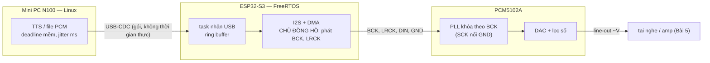
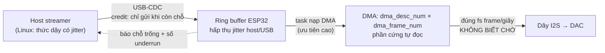

# Khóa 3 · Module 1 — Chuỗi phát: số nguyên → áp suất không khí (32h)

Bảy bài, đi đúng một chiều của dữ liệu: mảng số nguyên trong RAM (Bài 1) → ba sợi dây I2S (Bài 2–3) → các vùng đệm quyết định độ trễ (Bài 4) → điện áp, dòng và màng loa (Bài 5) → nguồn điện nuôi tất cả (Bài 6) → và chiều ngược lại, từ không khí về số nguyên (Bài 7).

| Bài | Tên | Giờ | Thí nghiệm bắt buộc | Viên nang nền nên đọc trước |
|---|---|---|---|---|
| 1 | Audio số thực sự là cái gì | 2 | — | F5.5 (phần lấy mẫu), F1.1 |
| 2 | Dựng mini PC, ESP32-S3 và DAC I2S | 5 | — | F5.1, F5.7 (đọc lướt) |
| 3 | TN-1: Nhìn thấy âm thanh trên dây | 5 | TN-1 · gate 2 | F1.1, F4.1 |
| 4 | DMA buffer, ring buffer, underrun | 6 | (dữ liệu cho TN-2) | F5.2, F7.1, F3.9 |
| 5 | DAC → amp → loa: trở kháng và công suất | 4 | (dữ liệu cho TN-4e) | F1.1 (lan truyền sai số) |
| 6 | TN-3: Cố tình làm hỏng nó bằng nguồn | 5 | TN-3 · gate 4 | **F5.7**, F2.5 |
| 7 | TN-4: Từ không khí thành số nguyên | 7 | TN-4 · gate 5 | F5.5, F5.6 |

Quy tắc của cả module: viết `prediction.md`, commit, rồi mới cắm que đo. Đáp án của mọi bài nằm trong khối 🔒; mở khi đã commit.

---

## Bài 1 — Audio số thực sự là cái gì (2h)

> **Vị trí:** Khóa 1 (đọc logic analyzer, cầm que đo) → **Bài 1** → Bài 2 (đưa mảng số này ra dây I2S) · **Cần trước:** F5.5 phần "lấy mẫu" (có thể đọc song song), F1.1 · **Sau bài này bạn quyết định được:** chọn bộ ba sample rate / bit depth / channels cho một luồng audio và bảo vệ lựa chọn đó bằng phổ của nội dung và băng thông; đổi qua lại không sai giữa frame, sample, byte và mili-giây — phép đổi mà mọi bài độ trễ sau này dựa vào.

### 1. Câu chuyện — ai đã khổ vì chuyện này

Năm 1937–1938, Alec Reeves (kỹ sư của International Telephone and Telegraph) đăng ký sáng chế điều chế xung mã — PCM: thay vì truyền chính dạng sóng điện thoại (méo dần theo mỗi chặng khuếch đại), hãy truyền **các con số** đo dạng sóng đó đều đặn. Số thì có thể tái tạo nguyên vẹn ở mỗi trạm lặp; sóng analog thì không. Cái giá: phải trả lời ba câu hỏi mà bạn sắp trả lời cho V1 — đo bao nhiêu lần mỗi giây, mỗi lần dùng bao nhiêu bit, mấy kênh `[chuẩn]`.

Mạng điện thoại số chọn 8 kHz × 8 bit (G.711, có nén logarit µ-law/A-law) vì băng thoại được lọc còn khoảng 300–3400 Hz `[spec: ITU-T G.711]`. Đĩa CD chọn 44,1 kHz × 16 bit vì một lý do rất "hậu cần": thập niên 1970, cách rẻ nhất để ghi số lượng lớn là nhét mẫu audio vào các dòng quét của băng video, và 44 100 vừa khớp số dòng dùng được × số field mỗi giây × 3 mẫu mỗi dòng của cả NTSC lẫn PAL `[chuẩn]`. Bài học: **mọi con số "chuẩn" trong audio là một quyết định kỹ thuật có lý do**, và TTS ngày nay chọn 22,05 hoặc 24 kHz cũng có lý do riêng. Bài này bắt bạn tự đưa ra lý do cho V1 thay vì chép từ tutorial.

### 2. Mô hình tư duy

```
  RAM / file WAV (little-endian)                               trên dây I2S (Bài 3)
  ┌──────────── header 44 byte (trường hợp tối giản) ─────────┐
  │ "RIFF" size "WAVE" │ "fmt " 16 │ fmt=1 ch sr byte_rate     │   KHÔNG có header nào cả.
  │ block_align bits   │ "data" data_len                       │   sr/bits/ch là thỏa thuận
  └────────────────────────────────────────────────────────────┘   cấu hình hai đầu, không
  frame 0          frame 1          frame 2                         đi trên dây.
  [L lo][L hi][R lo][R hi][L lo][L hi][R lo][R hi][L lo]...         bit gửi MSB trước.
   └── sample L ┘└ sample R ┘
   └───────── 1 frame = channels × bytes/sample ─────────┘
```

Bốn câu bản chất:
1. Audio số là **một mảng số nguyên + ba tham số diễn giải** (sample rate, bit depth, channels). Thiếu ba tham số, mảng vô nghĩa — giống một topic Kafka không có schema.
2. **Frame** là đơn vị thời gian: một frame = một thời điểm lấy mẫu, chứa một sample cho mỗi kênh. Thời gian = số frame / sample rate. Byte = frame × channels × bytes/sample. Ba đơn vị này lẫn nhau là nguồn của rất nhiều bug "độ trễ tính sai gấp đôi/gấp bốn".
3. **Sample rate giới hạn tần số cao nhất** biểu diễn được (một nửa sample rate — Nyquist); **bit depth giới hạn sàn nhiễu** (mỗi bit thêm hạ sàn nhiễu khoảng 6 dB). Hai trục độc lập: một cái là băng thông, một cái là dải động `[chuẩn]`.
4. Một tần số không chia hết sample rate thì dãy mẫu **không lặp lại sau mỗi chu kỳ** — chỉ lặp sau một số chu kỳ nguyên. Đây là gốc của rò phổ (spectral leakage) khi bạn làm FFT ở Bài 7.

Mô phỏng nhỏ để đọc đúng file của chính bạn (dùng cho bước Làm, đừng chạy trước khi viết dự đoán):

```python
# [đã chạy]
import struct, sys, math
path = sys.argv[1] if len(sys.argv) > 1 else "tone_440_stereo.wav"
raw = open(path, "rb").read()
riff, size, wave = struct.unpack("<4sI4s", raw[0:12])
fmt_id, fmt_len, audio_fmt, ch, sr, byte_rate, block_align, bits = struct.unpack("<4sIHHIIHH", raw[12:36])
data_id, data_len = struct.unpack("<4sI", raw[36:44])
print(riff, size, wave, fmt_id, "PCM" if audio_fmt == 1 else audio_fmt)
print(f"channels={ch} sample_rate={sr} bits={bits} block_align={block_align} byte_rate={byte_rate}")
print(f"data_len={data_len} file_len={len(raw)} header={len(raw)-data_len}")
frames = data_len // block_align
print("frames =", frames, "-> duration =", frames / sr, "s")
# 4 frame đầu: in hex đúng thứ tự byte trong file, rồi giải mã
for i in range(4):
    b = raw[44 + i*block_align: 44 + (i+1)*block_align]
    vals = struct.unpack("<" + "h"*ch, b)
    print(i, b.hex(" "), vals)
# Chuỗi mẫu lặp lại sau bao nhiêu mẫu? (440 Hz @ 24 kHz)
f = 440
print("lặp sau", sr // math.gcd(sr, f), "mẫu =", f // math.gcd(sr, f), "chu kỳ")
```

Script này giả định header đúng 44 byte — một giả định **sai** với nhiều file WAV ngoài đời (xem phần 3). Với file do chính code của bạn tạo (`src/khoa3/create_sample_wav_*.py`) thì đúng.

### 3. Cầu nối từ backend

| Backend bạn biết | Ở đây | Gãy ở chỗ | Nếu dùng nhầm thì |
|---|---|---|---|
| Header `Content-Type` + body | Chunk `fmt ` + chunk `data` của WAV | WAV là định dạng **file**; khi xuống MCU và lên dây I2S thì không còn header nào — "schema" chỉ còn là cấu hình hai đầu phải khớp nhau | Gửi cả 44 byte header vào DMA → một tiếng "bụp" ở đầu mỗi file (header bị phát như audio) |
| Topic Kafka không có schema registry | Raw PCM không header | Kafka consumer sai schema thường ném exception; PCM sai tham số **vẫn phát ra tiếng**, chỉ sai cao độ/tốc độ/méo | Không có lỗi để bắt; phải đo (Bài 3) mới thấy |
| Phân trang theo item vs theo byte | Frame vs sample vs byte | ALSA và ESP-IDF đếm theo **frame**; nhiều API đếm byte; vài thư viện đếm sample | Độ trễ tính lệch đúng ×2 (frame↔sample stereo) hoặc ×4 (frame↔byte stereo 16-bit) |
| Throughput (req/s × payload) | Bit rate = sr × bits × ch | Audio là luồng **tốc độ cố định**, không burst; thiếu một chút là đứt tiếng, thừa không giúp gì | Định cỡ đường truyền theo trung bình như HTTP → quên rằng audio cần đúng tốc độ đó **liên tục** |

**Chấm mô hình:**

- *"Audio chỉ là mảng số; file WAV chỉ là bao bì 44 byte."* — **ĐÚNG MỘT PHẦN.** Đúng: phần dữ liệu là mảng PCM. Gãy: WAV là container dạng chunk (RIFF); header không bắt buộc 44 byte, có thể có thêm chunk `LIST`, `fact`, hoặc định dạng mở rộng (`WAVE_FORMAT_EXTENSIBLE`), và `audio_format` có thể là float 32-bit hay ADPCM thay vì PCM số nguyên `[spec: Microsoft RIFF/WAVE]`. Phản ví dụ: file WAV xuất từ một số công cụ (ví dụ ffmpeg) thường có chunk `LIST` trước `data` `[tự đo: chạy script trên với một file ffmpeg tạo ra]` — code `raw[44:]` sẽ đọc metadata như audio. Cách đúng: duyệt chunk theo `id`/`size` cho tới khi gặp `data`.
- *"Sample rate càng cao càng tốt, cứ chọn 48 kHz cho chắc."* — **SAI** như một quy tắc. Sample rate chỉ cần lớn hơn hai lần tần số cao nhất *có ích* của nội dung; vượt quá đó là trả thêm băng thông, RAM buffer, CPU mà không thêm thông tin. Phản ví dụ ngay trong V1: model TTS xuất 24 kHz; nếu chuỗi phát chạy 48 kHz thì phải resample — thêm trễ, thêm CPU, và phần phổ 12–24 kHz là rỗng.
- *"Nhiều bit hơn thì to hơn."* — **SAI.** Bit depth quyết định khoảng cách giữa mức to nhất biểu diễn được và sàn nhiễu lượng tử (dải động), không quyết định độ to. Âm lượng là biên độ so với full-scale và gain phía analog.

### 4. Thuật ngữ

| Mức | Thuật ngữ | Nghĩa trong một câu | Hay bị hiểu nhầm thành |
|---|---|---|---|
| 🟢 | Sample rate (fs) | Số thời điểm lấy mẫu mỗi giây, mỗi kênh | Số sample mỗi giây của *cả* luồng stereo |
| 🟢 | Bit depth | Số bit mỗi sample; quyết định sàn nhiễu lượng tử | Độ to |
| 🟢 | Frame (ALSA/ESP-IDF) | Một thời điểm: một sample cho mỗi kênh | Một "khung video" hay gói mạng |
| 🟢 | Interleaved | Xếp L R L R… thay vì LLL…RRR… | Mặc định duy nhất (có API dùng planar) |
| 🟢 | PCM | Mảng giá trị lấy mẫu đều, không nén | Một định dạng file |
| 🟢 | Little-endian | Byte thấp trước trong bộ nhớ/file | Thứ tự bit trên dây I2S (I2S gửi MSB trước) |
| 🟢 | Nyquist | Tần số tối đa biểu diễn được = fs/2 | "Lấy mẫu 2× là đủ cho mọi tín hiệu" (cần thêm bộ lọc chống alias) |
| 🟢 | dBFS | Mức so với full-scale số (0 dBFS là đỉnh) | dB SPL (áp suất âm thanh) |
| 🟡 | RIFF chunk | Khối `id`+`size`+dữ liệu, file WAV là chuỗi chunk | Header cố định 44 byte |
| 🟡 | Rò phổ (leakage) | Năng lượng một tần số lan sang bin lân cận khi cửa sổ FFT không chứa số chu kỳ nguyên | Nhiễu thật trong tín hiệu |
| 🔴 | µ-law / A-law | Nén logarit 8 bit của điện thoại | — (không cần cho K3) |

### 5. Dự đoán

Tạo `lab/NN-pcm-bytes/prediction.md` (NN theo cách đánh số lab của bạn; bản gốc dùng `lab/05-i2s-playback/` cho Bài 3), điền **bằng số**, commit trước khi chạy code. Tham số đã có trong code của bạn (`src/khoa3/create_sample_wav_mono.py`, `..._stereo.py`): fs = 24 000, 16 bit, 1 giây, 440 Hz; bản stereo có kênh phải là 880 Hz.

```markdown
# Dự đoán Bài 1 — commit trước khi chạy
1. Số frame trong 1 s @ 24 kHz:
2. Byte dữ liệu mono 16-bit:            stereo 16-bit:
3. Kích thước file (với header tối giản):  mono:        stereo:
4. Bit rate V1 (24 kHz, 16-bit, stereo): ____ bit/s = ____ KB/s
5. Số mẫu trong một chu kỳ 440 Hz:   (số nguyên? có/không)
6. Dãy mẫu 440 Hz lặp lại chính xác sau ____ mẫu = ____ chu kỳ   (gợi ý: gcd)
7. Bốn byte đầu tiên của frame số 1 trong file stereo, viết hex theo thứ tự trong file:
   (tính sample bằng tay: int(32767·sin(2π·f·n/fs)), rồi tách byte thấp/cao)
8. Giá trị lớn nhất và nhỏ nhất code của bạn sinh ra; có chạm -32768 không? vì sao?
9. Buffer 4800 frame ở 24 kHz stereo 16-bit = ____ ms = ____ byte
```

Phương pháp: dùng đúng các công thức ở phần 2. Câu 6: dãy lặp sau `fs / gcd(fs, f)` mẫu. Câu 8: đọc kỹ code — `int()` làm tròn về phía 0, biên độ là 32767.

### 6. Làm

1. Chạy lại `create_sample_wav_mono.py` (bạn đã viết: Python thuần, `struct` + `math`, không thư viện audio). Giữ nguyên ràng buộc "không thư viện audio".
2. Mở file bằng hex editor (`xxd tone_440_mono.wav | head -5`). Tìm `RIFF`, `fmt `, `data`. Đếm byte header, đọc `data_len` bằng tay (4 byte little-endian ngay sau `data`).
3. Chạy bản stereo, đếm lại. Chạy script ở phần 2 trên **cả hai** file của bạn; đối chiếu từng dòng với `prediction.md`.
4. In 20 sample đầu dưới dạng số nguyên (code của bạn đã in sẵn). Kiểm frame 1 bằng tay so với hex.
5. Thêm một hàm duyệt chunk thật (đọc `id`, `size`, nhảy `size` byte, dừng ở `data`). Thử nó trên một file WAV tải từ ngoài hoặc do ffmpeg tạo (`ffmpeg -f lavfi -i "sine=f=440:d=1" -ar 24000 x.wav`) `[tự đo: cú pháp theo phiên bản ffmpeg]`. Ghi header thật dài bao nhiêu.
6. Nghe hai file. Kênh trái 440 Hz, kênh phải 880 Hz — một quãng tám. Ghi lại: đây là "tín hiệu kiểm tra có dấu vân tay" cho Bài 3 — đảo kênh sẽ lộ ra ngay.

Sai số ở bài này bằng 0: mọi số là đếm, không phải đo. Nếu lệch, đó là bug, không phải nhiễu.

### 7. Số phải ra

<details><summary>🔒 MỞ SAU KHI COMMIT prediction.md</summary>

| Kiểm tra | Giá trị đúng | Ghi chú |
|---|---|---|
| Số frame 1 s @ 24 kHz | 24 000 | |
| Byte dữ liệu mono 16-bit | 48 000 | file của bạn: 48 044 byte |
| Byte dữ liệu stereo 16-bit | 96 000 | file của bạn: 96 044 byte |
| Header | 44 byte (với file của bạn) | file ffmpeg thường dài hơn |
| Bit rate V1 | 24 000 × 16 × 2 = 768 000 bit/s = 96 000 B/s (96 KB/s) | |
| Mẫu/chu kỳ 440 Hz | 24 000 / 440 ≈ 54,55 — không nguyên | |
| Dãy lặp lại sau | 600 mẫu = 11 chu kỳ (gcd(24 000, 440) = 40) | |
| Frame 1 (stereo) | L = 3766 → `b6 0e`, R = 7482 → `3a 1d` → hex `b6 0e 3a 1d` | byte thấp trước |
| Max / min | +32 767 / −32 767; không bao giờ −32 768 | `int()` cắt về 0 và biên độ là 32 767; dải int16 bất đối xứng |
| 4800 frame | 200 ms; 4800 × 4 = 19 200 byte | |

Câu tự kiểm của bản gốc: file 30 s, 48 kHz, 24-bit, stereo = 48 000 × 3 × 2 × 30 = 8 640 000 byte ≈ 8,24 MiB.

Vì sao "lặp sau 600 mẫu" quan trọng: cửa sổ FFT 4096 mẫu ở Bài 7 không chứa số chu kỳ nguyên của 440 Hz → đỉnh phổ bị loe (leakage) → phải dùng cửa sổ Hann. Còn tone kiểm SNR ở Bài 7 sẽ cố ý chọn 997 Hz (gcd(24 000, 997) = 1) để sai số lượng tử không lặp theo chu kỳ ngắn.
</details>

### 8. Nếu ra khác

| Triệu chứng | Nguyên nhân khả dĩ | Kiểm bằng cách | Sửa |
|---|---|---|---|
| File lớn gấp đôi dự đoán | Ghi sample bằng `<i` (4 byte) thay vì `<h` | `block_align` trong header vs thực tế | Dùng `<h` cho int16 |
| Trình phát báo file hỏng | `riff_chunk_size` hoặc `data_size` sai | So `size` trong header với `len(file) − 8` | `riff = 36 + data_size` cho header tối giản |
| Nghe cao độ sai (ví dụ trầm hơn) | Header ghi sample rate khác thứ đã sinh | In `sr` từ header | Một nguồn sự thật cho fs |
| Stereo nghe như hai kênh lẫn nhau, "lệch pha" | Ghi planar (LLL…RRR…) thay vì interleaved | Hex: frame 0–1 phải xen L, R | Ghi L rồi R trong cùng vòng lặp |
| Script đọc ra rác ở vài frame đầu | File có chunk khác trước `data` | In tất cả `id` chunk | Duyệt chunk, không cắt cứng 44 byte |

### 9. Câu hỏi ngược

1. **[Vì sao không]** Vì sao V1 không dùng 8 kHz như điện thoại, khi nội dung chỉ là giọng nói? Trả lời bằng phổ của phụ âm xát tiếng Việt ("s", "x") và bằng chất lượng TTS, không bằng cảm giác.
   <details><summary>Hướng nghĩ</summary>8 kHz cắt ở 4 kHz; phụ âm xát có năng lượng đáng kể tới 8–10 kHz. Câu hỏi thật là: thông tin nào bị mất, có ảnh hưởng tới độ hiểu (intelligibility) hay chỉ tới độ tự nhiên? Bạn có thể kiểm ở Bài 7 bằng cách lọc bản ghi giọng mình xuống 4 kHz rồi nghe.</details>
2. **[Quy mô]** Một đội 100 robot, mỗi con ghi mic 24 kHz/16-bit/mono liên tục 8 giờ/ngày. Mỗi ngày bao nhiêu GB raw? Sau một năm? Cái gì gãy trước: đĩa robot, băng thông upload, hay chi phí lưu trữ? Và bạn sẽ đổi tham số nào trước — fs, bit depth, hay nén?
   <details><summary>Hướng nghĩ</summary>Tính bằng bit rate × thời gian × số robot. Sau đó nghĩ: dữ liệu này để làm gì (ASR? phát hiện sự kiện? debug?) — mục đích quyết định có được nén có mất mát hay không. Đây chính là câu hỏi "data contract" của F3.7.</details>
3. **[Failure mode]** Một pipeline ghép audio từ hai nguồn: một nguồn đếm theo frame, một nguồn đếm theo sample. Mô tả triệu chứng trong dữ liệu sau 1 giờ, và test tự động nào bắt được nó trước khi lên production.
   <details><summary>Hướng nghĩ</summary>Một luồng sẽ có thời lượng gấp đôi/ một nửa so với wall clock. Test: thuộc tính bất biến "duration = frames / fs khớp đồng hồ ±ε" — một property test (F2.4) chạy trên mọi file.</details>
4. **[Liên ngành]** Ảnh RGB 8-bit, chuỗi giá cổ phiếu theo tick, và PCM: mỗi cái có "sample rate", "bit depth", "channels" tương ứng là gì? Cái nào không có sample rate cố định, và điều đó gây khó gì khi ghép với cái khác?
   <details><summary>Hướng nghĩ</summary>Tick giá cổ phiếu là lấy mẫu theo sự kiện, không đều — muốn ghép với luồng đều phải resample/as-of join (F3.4). Ảnh: pixel pitch là "sample rate không gian".</details>
5. **[Phản biện]** "Bit depth 16 là thừa với giọng nói qua loa 3 W." Đúng hay sai, và bạn cần đo gì để trả lời?
   <details><summary>Hướng nghĩ</summary>So dải động cần thiết (từ tiếng nói nhỏ nhất tới to nhất + headroom) với sàn nhiễu của loa/phòng/amp. Bài 7 sẽ cho bạn số đo sàn nhiễu thật của chuỗi.</details>

### 10. Liên kết ra ngoài

- **Viễn thông:** G.711 là cùng một ý tưởng PCM nhưng tối ưu cho băng thoại và cho kênh 64 kbit/s; nén logarit đổi dải động lấy số bit. Giống: ba tham số quyết định tất cả. Khác: điện thoại tối ưu độ hiểu và băng thông, không tối ưu độ trung thực.
- **Ảnh số:** "bit depth" của ảnh (8 vs 10/12 bit RAW) cũng là sàn nhiễu/dải động; "sample rate" là độ phân giải không gian và aliasing hiện ra thành vân moiré. Khác: ảnh có hai chiều không gian, audio có một chiều thời gian — nhưng định lý lấy mẫu là một.
- **Telemetry robot:** IMU 200 Hz, encoder 100 Hz (theo `CONVENTIONS.md`) đều là "PCM" của đại lượng vật lý khác. Bài toán frame-vs-sample-vs-byte quay lại nguyên vẹn khi bạn tính kích thước MCAP ở K5.

### 11. Độ tin cậy và sửa lỗi

| Khẳng định | Nhãn | Ghi chú / cách kiểm |
|---|---|---|
| Header WAV tối giản 44 byte | [spec] Microsoft RIFF/WAVE | Chỉ đúng khi chỉ có `fmt ` (16 byte) + `data` |
| G.711: 8 kHz, 8 bit, băng ~300–3400 Hz | [spec] ITU-T G.711 | |
| 44,1 kHz bắt nguồn từ PCM adaptor trên băng video | [chuẩn] | Lịch sử kỹ thuật phổ biến; kiểm thêm nếu dùng trong bài viết |
| Phụ âm xát có năng lượng tới 8–10 kHz | [chuẩn] | Kiểm bằng phổ giọng mình ở Bài 7 |
| F0 nam ~85–180 Hz, nữ ~165–255 Hz | [chuẩn] | Dải điển hình, không phải biên cứng |
| ffmpeg thêm chunk `LIST` | [tự đo] | Phụ thuộc phiên bản và cờ (`-bitexact`, `-map_metadata`) |

**Đã sửa so với bản gốc/Gemini:**
- Bản gốc ngầm coi header luôn 44 byte; thêm bước duyệt chunk và chấm mô hình "WAV = 44 byte bao bì".
- Gemini (trả lời lượt 1) nói đúng rằng ESP32 không tạo file WAV mà sinh raw PCM; giữ ý đó, nhưng bổ sung điều Gemini bỏ qua: trên dây I2S **không có header nào**, các tham số chỉ tồn tại dưới dạng cấu hình hai đầu (xem Bài 3).
- Thêm câu hỏi "chạm −32 768 không" vì code của người học dùng `int()` (cắt về 0) — chi tiết nhỏ nhưng là lần đầu gặp tính bất đối xứng của int16 và hiện tượng làm tròn có hướng, sẽ quay lại ở Bài 7 (truncation thêm sai số DC).

### 12. Đọc thêm và tự kiểm tra

- **Nguồn gốc:** Microsoft "Multimedia Programming Interface and Data Specifications 1.0" (RIFF/WAVE, 1991); ITU-T G.711.
- **Giải thích:** Xiph.org — "Digital Show & Tell" (video của Monty Montgomery) về lấy mẫu, bit depth, dither.
- **Đào sâu (tùy chọn):** C. E. Shannon, "Communication in the Presence of Noise" (1949), phần định lý lấy mẫu.
- **Tự kiểm tra:** (1) giải thích cho một backend engineer khác trong 5 câu vì sao "frame" khác "sample"; (2) vẽ lại sơ đồ byte ở phần 2 từ trí nhớ; (3) các câu sau:
  - *Vì sao 24-bit audio thường được truyền trong khung 32-bit?*
    <details><summary>Đáp án</summary>Phần cứng và bus làm việc theo bội số 8/16/32 bit và DMA thích địa chỉ căn 4 byte; 24-bit được đệm vào khung 32-bit. Bạn sẽ thấy đúng điều này trên dây mic INMP441 ở Bài 7.</details>
  - *Một buffer 1023 frame ở 48 kHz stereo 16-bit dài bao nhiêu ms và bao nhiêu byte?*
    <details><summary>Đáp án</summary>1023/48 000 ≈ 21,3 ms; 1023 × 4 = 4092 byte — con số 4092 sẽ quay lại ở Bài 4 như giới hạn một descriptor DMA.</details>

---

## Bài 2 — Dựng mini PC, ESP32-S3 và DAC I2S (5h)

> **Vị trí:** Bài 1 (mảng PCM trong RAM) → **Bài 2** → Bài 3 (đo chính các dây bạn vừa nối) · **Cần trước:** F5.1 (MCU vs Linux), F5.7 đọc lướt (GND, nguồn), Khóa 1 (multimeter) · **Sau bài này bạn quyết định được:** việc nào đặt ở host Linux, việc nào đặt ở MCU — theo **loại deadline**, không theo "ai sinh ra dữ liệu"; và chân GPIO nào an toàn trên đúng board của bạn.

### 1. Câu chuyện — ai đã khổ vì chuyện này

Năm 1986 Philips công bố đặc tả bus I2S (Inter-IC Sound) cho một vấn đề rất cụ thể: bên trong máy CD có nhiều chip số của nhiều nhà sản xuất (giải mã, lọc số, DAC) cần trao đổi mẫu audio với nhau bằng ít chân nhất, không cần giao thức phức tạp. Lời giải: ba dây — clock bit, clock chọn kênh, dữ liệu — tách clock khỏi dữ liệu, không header, không ACK `[spec: Philips Semiconductors, "I2S bus specification", 1986, sửa 1996]`. Vì không có gì để "thỏa thuận" trên dây, hai đầu phải được cấu hình khớp nhau từ trước — bằng chân jumper hoặc firmware. Đó là lý do module PCM5102A của bạn có bốn chân FMT/XSMT/FLT/DEMP và một chân SCK "giết người".

Lý do thứ hai cho bài này đến từ chính Linux: một kernel thường (không PREEMPT_RT) không hứa hẹn gì về độ trễ lập lịch trong trường hợp xấu nhất; đuôi phân bố có thể tới mili-giây khi máy có tải `[chuẩn; tự đo bằng cyclictest ở F5.4]`. Một mẫu audio 24 kHz chỉ có 41,7 µs. Vì vậy kiến trúc robot thật — và V1 — không bao giờ để Linux trực tiếp đánh nhịp dây tín hiệu thời gian thực: việc đó thuộc về MCU, và Linux nói chuyện với MCU qua một kênh có vùng đệm.

### 2. Mô hình tư duy



Bản chất:
1. **Ai giữ đồng hồ thì người đó quyết định "bây giờ" của audio.** Ở đây ESP32 là I2S master: nó sinh BCK và LRCK từ PLL của chính nó. DAC là slave: nó không có ý kiến về tốc độ, chỉ khóa PLL nội theo BCK mà nó nhận. Host lại càng không: host chỉ có thể nạp dữ liệu nhanh hơn hoặc chậm hơn, còn nhịp phát do ESP32 quyết.
2. **Chân SCK nối GND không phải chi tiết đấu dây, mà là chọn nguồn clock**: không có master clock riêng, PCM5102A dùng PLL nội lấy chuẩn từ BCK `[spec: TI PCM5102A datasheet SLAS859C, mục clock/PLL]`. Thả nổi SCK, chân này có thể nhặt nhiễu như một clock rác và chip không chạy đúng chế độ — triệu chứng là im lặng `[tự đo]`.
3. Bốn chân jumper (FMT, XSMT, FLT, DEMP) là **cấu hình nướng vào phần cứng**: định dạng khung, mute, loại bộ lọc số, de-emphasis. Không có gì trên dây báo cho DAC biết ESP32 đang gửi định dạng nào.
4. Bài này cố tình cho ESP32 tự sinh sine để **cô lập phần cứng**: nếu có tiếng, cụm ESP32 + dây + DAC + nguồn đã thông; mọi lỗi sau này (Bài 4, host, USB) không còn lẫn với lỗi đấu dây. Đây là bring-up, cùng tinh thần smoke test.

### 3. Cầu nối từ backend

| Backend bạn biết | Ở đây | Gãy ở chỗ | Nếu dùng nhầm thì |
|---|---|---|---|
| Service tính toán nặng sau một edge proxy | Host Linux (TTS) sau ESP32 | Proxy có thể chậm lại khi backend chậm; ESP32 **không được** chậm lại — đồng hồ I2S chạy bất kể | Thiết kế ESP32 như proxy "chờ khi upstream chậm" → underrun (Bài 4) |
| Feature flag / config file | Chân FMT/XSMT/FLT/DEMP, SCK | Đổi flag không cần deploy; đổi chân phải hàn/nối lại, và không có API nào đọc ngược trạng thái chân | Tin "cấu hình mặc định của module" mà không đo → mất buổi tối vì XSMT đang LOW |
| Smoke test sau deploy | Tone 440 Hz tự sinh trên ESP32 | Smoke test backend có assert; ở đây "assert" là tai và multimeter — và tai tha thứ sai số tần số vài % | Nghe "có tiếng" và coi là đúng; lệch cao độ chỉ lộ ra ở Bài 3 |
| Health check endpoint | Log khởi động ESP-IDF + đo VCC/XSMT | Log chỉ nói driver khởi tạo xong, không nói dây có nối đúng | Log sạch nhưng DAC câm |

**Chấm mô hình:**

- **Mô hình của bạn ở K3 lượt 1** — *"bài 2 lập trình sẵn vào ESP32 để nó vẫn tự tạo file wav… vì tách khỏi OS nên phần bật âm không còn do OS handle… ESP32 đá sang DAC… cắm logic analyzer quan sát data ESP32 gửi sang DAC, và cái cần xem chính là các data đó"* — **ĐÚNG MỘT PHẦN.**
  - Đúng: chuỗi ESP32 → DAC → line-out; logic analyzer đặt giữa ESP32 và DAC.
  - Sai 1: ESP32 không tạo *file* WAV; nó sinh mảng PCM trong RAM (Gemini đã sửa điểm này).
  - Sai 2: "OS handle phần bật âm" — trên PC cũng có đủ các tầng này (driver ALSA, DMA, chip codec nối bằng một bus kiểu I2S/HDA bên trong máy); OS **giấu** chúng, không xóa chúng. Bài 2 không phải "tách khỏi OS" mà là "tự làm phần OS từng làm hộ".
  - Thiếu quan trọng nhất: thứ cần xem trước tiên **không phải data mà là clock**. Data chỉ có nghĩa khi đọc theo BCK và LRCK. Phản ví dụ: DIN đúng từng bit nhưng driver chọn sample rate lệch 1% → cả bài hát lệch cao độ, nhìn dữ liệu không bao giờ thấy lỗi. Bài 3 đo clock trước data vì lý do này.
- **Mô hình của bạn ở K3 lượt 3** — *"thực tế ESP32 chỉ làm dispatcher/coordinator, nhận data từ mini PC rồi forward tới DAC, chỉ kiểm soát các flag bật/tắt, âm lượng; nó không nên là nơi tạo ra hay chuyển đổi âm thanh"* — **ĐÚNG MỘT PHẦN** (Gemini xác nhận "hoàn toàn chính xác" — không đúng).
  - Đúng: ở V1, tính toán nặng (TTS) nằm ở host; ESP32 là I/O bridge.
  - Gãy 1 — tiêu chí phân vai sai: không phải "ai tạo dữ liệu" mà **"ai giữ deadline cứng"**. ESP32 là chủ đồng hồ phát; nó là nơi hai miền thời gian (host không thời gian thực, I2S thời gian thực) gặp nhau và là nơi underrun xảy ra. Gọi nó là "dispatcher" làm bạn đánh giá thấp đúng chỗ khó nhất của Module 2.
  - Gãy 2 — MCU tạo và biến đổi audio là chuyện thường: âm báo do MCU tự sinh, volume số (nhân hệ số trước khi ghi DMA), mix hai luồng, giải mã MP3/AAC (Espressif có framework ESP-ADF cho việc này `[spec: ESP-ADF]`). Phản ví dụ ngay trong khóa: kill switch Bài 15 và watchdog Bài 16 — khi host treo, tiếng báo hoặc lệnh dừng phải do MCU tự làm; nếu ESP32 "chỉ forward", host chết là robot câm.
  - Gãy 3 — "flag" âm lượng/mute không chỉ là biến phần mềm: XSMT là chân phần cứng, và mute bằng chân dừng tức thì kể cả khi firmware treo.

### 4. Thuật ngữ

| Mức | Thuật ngữ | Nghĩa trong một câu | Hay bị hiểu nhầm thành |
|---|---|---|---|
| 🟢 | MCU vs SoC/MPU | MCU chạy một firmware, gần tất định; SoC chạy Linux, có scheduler | "MCU là máy tính yếu hơn" (khác loại, không chỉ khác cỡ) |
| 🟢 | I2S master / slave | Master phát BCK+LRCK; slave đi theo | Master là bên gửi dữ liệu (mic I2S là slave nhưng gửi dữ liệu) |
| 🟢 | BCK, LRCK (WS), DIN | Clock bit, clock chọn kênh (= sample rate), dữ liệu | LRCK là "chân trái/phải" tĩnh |
| 🟡 | MCLK / SCK | Master clock thường 256× fs; PCM5102A có thể bỏ, dùng PLL | Bắt buộc phải có |
| 🟡 | PLL | Mạch nhân/khóa tần số theo một clock chuẩn | Bộ chia tần đơn giản |
| 🟢 | Strapping pin | Chân được đọc lúc reset để chọn chế độ boot | Chân GPIO thường |
| 🟢 | Bring-up | Lần đầu cho phần cứng sống, cô lập từng biến | "Chạy thử cho vui" |
| 🟡 | USB-CDC | Lớp USB giả cổng serial | Kênh thời gian thực |
| 🟡 | Soft mute (XSMT) | Chân câm/mở tiếng của DAC | Chân nguồn |
| 🔴 | De-emphasis | Bù tiền nhấn tần cao của một số đĩa CD cũ | — |

### 5. Dự đoán

`lab/NN-i2s-bringup/prediction.md`:

```markdown
# Dự đoán Bài 2
1. Chân GPIO tôi chọn cho BCK/LRCK/DIN và lý do từng chân an toàn (tra datasheet ESP32-S3 + sơ đồ DevKit):
2. Áp VCC đo tại module khi cấp ___ V: dự đoán ___ V, sai số đồng hồ ở thang này: ± ___ V
3. Áp chân XSMT (module có điện trở kéo lên không? tra sơ đồ module): ___ V
4. Nếu tôi lặp lại một bảng sine 54 mẫu (thay vì tính pha liên tục), tần số phát ra là: ___ Hz (lệch ___ % so với 440)
5. Nếu host/firmware ngừng ghi dữ liệu mới vào I2S nhưng kênh vẫn enable, DAC sẽ phát: ___ (tra cờ auto_clear trong docs ESP-IDF đúng phiên bản)
6. `ethtool -T` hai cổng LAN: có "PTP Hardware Clock" không? chỉ số PHC?
```

Tra ở đâu: chân strapping và chân USB trong *ESP32-S3 Datasheet* (mục Strapping Pins, Pin Overview); chân flash/PSRAM theo đúng module (WROOM-1 N8R8 dùng PSRAM octal chiếm thêm GPIO 33–37 `[spec: ESP32-S3-WROOM-1 datasheet]`); sai số đồng hồ trong manual UT33D+ (thang DC V, dạng ±(% + digit)). Câu 4: tần số = fs / số mẫu của bảng.

### 6. Làm

**Bước 1 — mini PC.** Ubuntu 24.04 LTS, Ethernet (không WiFi khi dev: bớt một biến). `sudo ethtool -T <iface>` cho **cả hai** cổng, dán nguyên văn vào `decisions.md` — K5 cần nó.

**Bước 2 — ESP-IDF, không Arduino.** ESP-IDF v5.x (`idf.py set-target esp32s3`), driver I2S standard mode (`i2s_new_channel`, `i2s_channel_init_std_mode`). Lý do: cấu hình DMA buffer là bài học của Module 2, Arduino giấu nó. Ghi phiên bản IDF chính xác (`idf.py --version`) vào `decisions.md` — tên trường cấu hình có thay đổi giữa các bản `[tự đo]`.

**Bước 3 — đấu dây PCM5102A.** GND nối **trước tiên**. Kiểm ba lần trước khi cấp điện:

| PCM5102A | ESP32-S3 | Ghi chú |
|---|---|---|
| VCC | 5V (VBUS) hoặc 3V3 — **kiểm module của bạn** | Module có LDO riêng thường nhận 5 V |
| GND | GND | |
| BCK | GPIO tự chọn, ví dụ 4 | |
| LCK / LRCK | GPIO tự chọn, ví dụ 5 | |
| DIN | GPIO tự chọn, ví dụ 6 | |
| **SCK** | **GND** | Chọn chế độ PLL nội theo BCK. Không nối → DAC có thể câm |

Tránh: strapping (0, 3, 45, 46), USB (19, 20), chân flash/PSRAM của **đúng module** bạn có. Jumper trên module (thường có sẵn, đo lại):

| Chân | Nối | Nghĩa |
|---|---|---|
| FMT | GND | Khung I2S chuẩn (HIGH = left-justified) |
| XSMT | 3V3 | Mở tiếng (LOW = câm) |
| FLT | GND | Bộ lọc số độ trễ thường (HIGH = độ trễ thấp) — sẽ quay lại ở Bài 9 |
| DEMP | GND | Tắt de-emphasis |

**Bước 4 — tiếng đầu tiên, chưa cần host.** Khung firmware (kiểm từng tên trường theo docs phiên bản bạn cài):

```c
// [chưa chạy] — cần ESP-IDF v5.x; tên macro/trường kiểm theo docs đúng phiên bản
#include <math.h>
#include "driver/i2s_std.h"
#define FS 24000
static i2s_chan_handle_t tx;
void app_main(void) {
    i2s_chan_config_t cc = I2S_CHANNEL_DEFAULT_CONFIG(I2S_NUM_0, I2S_ROLE_MASTER);
    ESP_ERROR_CHECK(i2s_new_channel(&cc, &tx, NULL));
    printf("dma_desc_num=%d dma_frame_num=%d\n", (int)cc.dma_desc_num, (int)cc.dma_frame_num); // thứ bạn XIN
    i2s_std_config_t sc = {
        .clk_cfg  = I2S_STD_CLK_DEFAULT_CONFIG(FS),
        .slot_cfg = I2S_STD_PHILIPS_SLOT_DEFAULT_CONFIG(I2S_DATA_BIT_WIDTH_16BIT, I2S_SLOT_MODE_STEREO),
        .gpio_cfg = { .mclk = I2S_GPIO_UNUSED, .bclk = GPIO_NUM_4, .ws = GPIO_NUM_5,
                      .dout = GPIO_NUM_6, .din = I2S_GPIO_UNUSED },
    };
    ESP_ERROR_CHECK(i2s_channel_init_std_mode(tx, &sc));
    ESP_ERROR_CHECK(i2s_channel_enable(tx));
    static int16_t buf[2 * 240];               // 240 frame stereo = 10 ms
    double phase = 0, step = 2 * M_PI * 440.0 / FS;
    for (;;) {
        for (int i = 0; i < 240; i++) {        // pha liên tục: KHÔNG lặp bảng 54 mẫu
            int16_t s = (int16_t)(8000 * sin(phase));   // biên độ vừa phải để nghe tai nghe
            buf[2*i] = s; buf[2*i + 1] = s;
            phase += step; if (phase > 2 * M_PI) phase -= 2 * M_PI;
        }
        size_t w; i2s_channel_write(tx, buf, sizeof(buf), &w, portMAX_DELAY);
    }
}
```

Nghe ở line-out bằng tai nghe, **âm lượng số thấp** (biên độ 8000 thay vì 32767): line-out PCM5102A thiết kế cho tải trở kháng cao (đầu vào amp), tai nghe 16–32 Ω nằm ngoài tải khuyến nghị `[spec: PCM5102A datasheet, bảng Electrical Characteristics — tra mục load impedance]`; nghe thử được, đừng dùng lâu ở mức to.

**Bước 5 — đo.** Multimeter DC V, que đen ở GND của module: VCC lúc đang phát, XSMT. Ghi cả thang đo và sai số của thang theo manual (UT33D+: thang DC V có dạng ±(0,5% + 2 digit) theo các bảng thông số bán lẻ `[spec: kiểm manual UNI-T UT33D+]`).

### 7. Số phải ra

<details><summary>🔒 MỞ SAU KHI COMMIT prediction.md</summary>

| Kiểm tra | Kết quả đúng | Ghi chú |
|---|---|---|
| Log khởi động ESP-IDF | Kênh I2S tạo thành công, không lỗi | Có thể có cảnh báo về clock; chép nguyên văn |
| Line-out | Nghe tone 440 Hz | Tai không phân biệt nổi 440 với 444 Hz — Bài 3 mới phân biệt |
| VCC module | Bằng áp bạn cấp, lệch < 5% | Ở thang 20 V, UT33D+ đọc 0,01 V, sai số cỡ ±0,05 V quanh 5 V — 5% là 0,25 V nên tiêu chí kiểm được |
| XSMT | ≥ 2,0 V (mức HIGH của logic 3V3) | |
| Bảng 54 mẫu lặp lại | 24 000/54 ≈ 444,4 Hz (+1,0%) | Đây là lỗi "nghe có vẻ đúng" kinh điển; LRCK vẫn đúng 24 kHz, chỉ dữ liệu sai |
| Ngừng ghi dữ liệu | Tùy cờ auto-clear: hoặc im (DMA phát 0), hoặc **lặp lại vòng descriptor cũ** thành tiếng ù/rè đều | Ghi lại hành vi thật của bản IDF của bạn |
| `ethtool -T` | Có `PTP Hardware Clock: N` và `hardware-transmit/receive` trên cả hai cổng | Nếu không: ghi lại, K5 phải đổi kế hoạch |

</details>

### 8. Nếu ra khác

| Triệu chứng | Nguyên nhân khả dĩ | Kiểm bằng cách | Sửa |
|---|---|---|---|
| Im hoàn toàn | **SCK chưa nối GND** | Đo SCK so với GND (phải ~0 V, không lơ lửng) | Nối SCK xuống GND — nguyên nhân số 1 |
| Im, SCK đã nối | XSMT LOW | Đo XSMT | Kéo XSMT lên 3V3 |
| Im, mọi chân đúng | Chưa `i2s_channel_enable`, sai GPIO trong code so với dây | Đo BCK bằng multimeter DC: clock 50% duty đọc ~1,6 V | Đối chiếu bảng chân với code |
| ESP32 không boot sau khi đấu | Dùng chân strapping | Tháo dây từng chân | Đổi chân |
| Mất cổng nạp sau khi nạp firmware | Dùng GPIO 19/20 (USB) | — | Giữ BOOT khi cắm để nạp lại; đổi chân |
| Tiếng rè, méo | FMT sai, dây dài, GND lỏng, biên độ quá lớn vào tai nghe tải thấp | Giảm biên độ số; rút ngắn dây | FMT = GND, thêm dây GND thứ hai |
| Có tiếng một kênh | Layout stereo sai trong buffer | Bài 3: decode bằng logic analyzer | Đừng đoán, đo |
| Ù/rè đều khi host chưa gửi gì (Bài 4) | DMA lặp vòng descriptor cũ | Xem cờ auto-clear | Bật xóa buffer khi cạn |

Mua **2 module** cho mọi thứ rẻ và quan trọng: không có module thứ hai để so, bạn không phân biệt được "module chết" với "cấu hình sai".

### 9. Câu hỏi ngược

1. **[Nếu…thì]** Nếu ESP32 cấp MCLK riêng cho DAC (thay vì SCK→GND, PLL theo BCK), cái gì thay đổi về chất lượng âm và về số dây phải đo? Khi nào người ta chọn cách đó?
   <details><summary>Hướng nghĩ</summary>Nghĩ về jitter: PLL lọc jitter của BCK tới mức nào? MCLK từ một nguồn sạch có thể cho jitter thấp hơn. Đổi lại: thêm một dây tần số cao (256 × fs) phải đi gọn. Câu hỏi thật: chất lượng clock ảnh hưởng tới analog ra sao — từ khóa "clock jitter vs SNR".</details>
2. **[Failure mode]** Host treo đúng lúc đang phát. Liệt kê mọi thứ có thể phát ra loa trong 5 giây tiếp theo, tùy cấu hình firmware. Hành vi nào chấp nhận được trong một văn phòng?
   <details><summary>Hướng nghĩ</summary>Im (auto-clear), lặp vòng descriptor (ù), phát hết ring buffer rồi im, hoặc firmware treo theo. Một hệ "fail-safe" phải định nghĩa trạng thái an toàn trước — đây là mầm của watchdog hai tầng ở Bài 16.</details>
3. **[Quy mô]** 100 robot, mỗi con một module DAC mua đợt khác nhau, jumper hàn sẵn theo kiểu khác nhau. Làm sao bạn biết con nào đang chạy FLT ở chế độ nào, khi không có API đọc ngược chân jumper?
   <details><summary>Hướng nghĩ</summary>Cấu hình phần cứng không đọc được = trạng thái ẩn của fleet. Phương án: đo một lần ở nhà máy và ghi vào hồ sơ thiết bị; hoặc thiết kế lại để MCU điều khiển chân đó (đọc được, đổi được). Liên hệ "configuration drift" trong ops.</details>
4. **[Vì sao không]** Vì sao không cho mini PC phát audio qua USB sound card và chỉ dùng ESP32 cho GPIO marker? Bạn mất gì, được gì — tính cả các bài đo ở Module 2?
   <details><summary>Hướng nghĩ</summary>Được: ít firmware. Mất: không nhìn thấy dữ liệu trước DAC, không kiểm soát DMA buffer, GPIO marker không cùng miền đồng hồ với chỗ phát mẫu — phép đo Bài 9 mất trọng tài.</details>
5. **[Liên ngành]** Trên máy bay, máy tính điều khiển bay và các bộ điều khiển cơ cấu chấp hành tách nhau; trên ô tô, ECU động cơ tách khỏi hệ thống giải trí. Điểm chung với "Linux không chạm dây thời gian thực" là gì, và điểm khác là gì?
   <details><summary>Hướng nghĩ</summary>Chung: tách miền theo mức độ quan trọng và deadline. Khác: hàng không còn tách theo chứng nhận an toàn (mức DAL), không chỉ theo thời gian.</details>

### 10. Liên kết ra ngoài

- **Card mạng (NIC) của server:** NIC làm checksum, chia gói (TSO), đóng dấu thời gian phần cứng — tức là "MCU" của máy chủ, giữ những việc có deadline tính bằng ns mà CPU không giữ nổi. Giống: tách việc thời gian thực xuống phần cứng chuyên dụng. Khác: NIC không giữ đồng hồ phát của dữ liệu ứng dụng; I2S master thì có. (Bạn sẽ dùng chính PHC của NIC ở K5.)
- **Ô tô (CAN, ECU):** mỗi ECU giữ vòng điều khiển cứng; bus CAN có arbitration và ACK — khác hẳn I2S không ACK. Cho thấy "giao thức vật lý" không đồng nhất: có cái có xác nhận, có cái chỉ có nhịp.

### 11. Độ tin cậy và sửa lỗi

| Khẳng định | Nhãn | Ghi chú / cách kiểm |
|---|---|---|
| Strapping pins ESP32-S3: 0, 3, 45, 46; USB: 19, 20 | [spec] ESP32-S3 Datasheet | Kiểm lại với bản datasheet bạn tải |
| PCM5102A dùng PLL nội theo BCK khi không có SCK | [spec] TI SLAS859C | |
| FMT: LOW = I2S, HIGH = left-justified; FLT: LOW = độ trễ thường, HIGH = độ trễ thấp | [spec] TI SLAS859C, bảng chức năng chân | |
| Thả nổi SCK → DAC câm | [tự đo] | Hành vi khi chân thả nổi không được datasheet đảm bảo |
| Hành vi DMA khi cạn dữ liệu (im hay lặp) | [tự đo] | Tên cờ (`auto_clear` hoặc `auto_clear_before_cb`/`after_cb`) đổi theo phiên bản IDF |
| Kernel thường có đuôi trễ lập lịch tới ms | [chuẩn] / [tự đo] | Đo bằng `cyclictest` ở F5.4 |

**Đã sửa so với bản gốc/Gemini:**
- Gemini (trả lời lượt 2) viết "nếu clock của ESP32 phát sai một micro-giây, DAC đọc lệch vị trí bit ngay lập tức" — sai: DAC là slave, đọc bit **theo chính BCK** mà ESP32 phát, nên clock chạy nhanh/chậm làm lệch *sample rate* (cao độ), không làm lệch bit. Lệch bit đến từ sai định dạng khung (FMT) hoặc lệch pha giữa BCK và DIN do dây/biến dạng tín hiệu.
- Gemini xác nhận lượt 1 và lượt 3 là "hoàn toàn chính xác"; đã chấm lại ở trên (đều ĐÚNG MỘT PHẦN).
- Bản gốc chỉ nói "SCK → GND, không nối DAC im lặng"; bổ sung *vì sao* (chọn nguồn clock — PLL theo BCK) để người học suy ra được, không chỉ nhớ.
- Bản gốc bảo cắm tai nghe vào line-out mà không nhắc tải; thêm cảnh báo và biên độ số thấp.
- Thêm bẫy "bảng sine 54 mẫu" — lỗi lệch 1% mà tai không bắt được, nối thẳng sang tiêu chí <1% của Bài 3.

### 12. Đọc thêm và tự kiểm tra

- **Nguồn gốc:** Philips Semiconductors, *I2S bus specification* (1986, rev. 1996); TI *PCM510xA datasheet* (SLAS859C) — các mục pin function, clock, timing; *ESP32-S3 Datasheet* (Espressif) — strapping pins.
- **Giải thích:** *ESP-IDF Programming Guide — I2S* (bản esp32s3, đúng phiên bản bạn cài), mục Standard Mode.
- **Đào sâu (tùy chọn):** Elecia White, *Making Embedded Systems* — chương về bring-up và debug phần cứng.
- **Tự kiểm tra:** (1) giải thích trong 5 câu vì sao ESP32 là "chủ đồng hồ" và vì sao điều đó quan trọng hơn chuyện "ai sinh dữ liệu"; (2) vẽ lại sơ đồ phần 2; (3):
  - *Đo BCK bằng multimeter DC ra khoảng 1,6 V. Điều đó chứng minh gì và không chứng minh gì?*
    <details><summary>Đáp án</summary>Chứng minh chân đang dao động (hoặc đứng ở mức giữa) với giá trị trung bình ~ một nửa 3,3 V — phù hợp clock duty 50%. Không chứng minh tần số đúng, cũng không phân biệt được clock với một chân thả nổi ở mức giữa. Cần logic analyzer (Bài 3).</details>

---

## Bài 3 — TN-1: Nhìn thấy âm thanh trên dây (5h)

> **Vị trí:** Bài 2 (có tiếng) → **Bài 3** → Bài 4 (đưa dữ liệu từ host xuống) · **Cần trước:** F1.1 (resolution ≠ accuracy, lan truyền sai số), F4.1 (thạch anh, ppm), F5.5 · **Sau bài này bạn quyết định được:** một phép đo thời gian bằng logic analyzer cần cấu hình gì (tần số lấy mẫu, số chu kỳ gộp) để đạt độ chính xác yêu cầu — và nói được sai số của phép đo *trước* khi đo. Đây là TN-1, tiêu chí gate số 2.

### 1. Câu chuyện — ai đã khổ vì chuyện này

Khi audio đi qua USB, máy tính và thiết bị âm thanh mỗi bên một đồng hồ. Hai đồng hồ "cùng 48 kHz" không bao giờ bằng nhau tuyệt đối; sau vài phút, một bên thừa hoặc thiếu mẫu. Đặc tả USB Audio Class phải định nghĩa hẳn ba chế độ đồng bộ (synchronous, adaptive, asynchronous) — chế độ asynchronous có một endpoint phản hồi để thiết bị báo cho host biết "gửi nhanh lên/chậm lại" — chỉ để xử lý chuyện hai con số "48 000" không bằng nhau `[spec: USB Device Class Definition for Audio Devices 1.0]`. Cả một lớp kỹ thuật tồn tại vì **tần số cấu hình không phải tần số chạy thật**.

Ở quy mô của bạn, chuyện đó bắt đầu từ một dòng `I2S_STD_CLK_DEFAULT_CONFIG(24000)`. Driver chia clock nguồn của chip ra tần số gần nhất nó làm được, và thường không báo lỗi. Logic analyzer là trọng tài. Nhưng trọng tài cũng có sai số — và bài này bắt bạn tính sai số của trọng tài trước khi tin nó.

### 2. Mô hình tư duy

Khung I2S chuẩn Philips (vẽ thu nhỏ: mỗi kênh 4 bit thay vì 16). Dán vào wavedrom.com/editor để xem:

```json
{ "signal": [
  { "name": "BCK",  "wave": "p.........." },
  { "name": "LRCK", "wave": "10...1...0." , "node": ".a...b...c" },
  { "name": "DIN",  "wave": "===========", "data": ["R1","R0","L3","L2","L1","L0","R3","R2","R1","R0","L3"] }
], "edge": ["a~>b nửa trái (L)", "b~>c nửa phải (R)"],
  "head": { "text": "I2S Philips: MSB xuất hiện 1 chu kỳ BCK SAU cạnh LRCK" } }
```

```
BCK   _|‾|_|‾|_|‾|_|‾|_|‾|_|‾|_|‾|_|‾|_|‾|_|‾|_
LRCK  ‾‾‾|________________|‾‾‾‾‾‾‾‾‾‾‾‾‾‾‾‾|____
DIN    R1 | R0 | L3 | L2 | L1 | L0 | R3 | R2 | R1 | R0
              ↑ LSB của từ trước     ↑ MSB kênh L (trễ 1 BCK)
```

Bản chất:
1. **Trên dây chỉ có nhịp, không có nghĩa.** BCK nói "đọc DIN lúc này"; LRCK nói "bit này thuộc kênh nào". Mọi thứ còn lại — từ dài bao nhiêu bit, có dấu hay không, MSB trễ 1 nhịp (Philips) hay không trễ (left-justified) — là **thỏa thuận ngoài dây**. Đổi chân FMT không làm dây khác đi một bit nào; chỉ làm DAC đọc khác đi.
2. Hai công thức tự dẫn được: mỗi chu kỳ LRCK là một frame → f_LRCK = fs. Mỗi frame có (số kênh × số bit mỗi slot) nhịp BCK → f_BCK = fs × slot_bits × channels. Lưu ý **slot** (số nhịp dành cho một kênh) có thể lớn hơn **số bit dữ liệu** — đây là nguồn của "BCK gấp đôi dự đoán".
3. **Logic analyzer lượng tử hóa thời gian.** Lấy mẫu 24 MHz nghĩa là mọi cạnh bị dời về lưới 41,7 ns. Một chu kỳ BCK 768 kHz dài 31,25 mẫu — không nguyên — nên mỗi chu kỳ đơn đọc ra 31 hoặc 32 mẫu. Sai số một chu kỳ đơn là cố định ±1 mẫu; **gộp N chu kỳ thì sai số tương đối chia cho N**. Đây là F1.1 áp vào đồng hồ.
4. Tần số yêu cầu ≠ tần số chạy: clock I2S được chia từ một clock nguồn của chip; nếu tỉ lệ không đẹp, driver dùng bộ chia phân số hoặc làm tròn. Trung bình có thể rất đúng nhưng từng chu kỳ dao động (jitter), hoặc trung bình lệch một lượng cố định (frequency offset).

Mô phỏng sai số của trọng tài (chạy trước khi đo để biết nên đo thế nào):

```python
# [đã chạy]
# Logic analyzer lấy mẫu 24 MHz nhìn một clock vuông: mỗi chu kỳ đo được bị lượng tử 41.7 ns.
import numpy as np
F_LA = 24e6                      # tần số lấy mẫu của logic analyzer
def measure(f_sig, n_periods, phase=0.123):
    t = np.arange(int(F_LA * (n_periods + 2) / f_sig)) / F_LA
    sq = ((t * f_sig + phase) % 1.0) < 0.5            # sóng vuông duty 50%
    rise = np.flatnonzero(~sq[:-1] & sq[1:]) + 1       # chỉ số mẫu có cạnh lên
    per = np.diff(rise) / F_LA                          # chu kỳ từng cái, giây
    return per, (rise[-1] - rise[0]) / F_LA / (len(rise) - 1)
for name, f in [("BCK 24k/16b/2ch", 768e3), ("BCK 48k/16b/2ch", 1.536e6),
                ("BCK 48k/32b/2ch", 3.072e6), ("LRCK 24k", 24e3)]:
    per, avg = measure(f, 200)
    err1 = (per * f - 1) * 100                          # sai số % của từng chu kỳ đơn
    print(f"{name:16s} mẫu/chu kỳ={F_LA/f:6.2f}  chu kỳ đơn: {per.min()*1e9:7.1f}..{per.max()*1e9:7.1f} ns "
          f"(sai {err1.min():+5.1f}%..{err1.max():+5.1f}%)  TB 200 chu kỳ: sai {(avg*f-1)*100:+.4f}%")
```

Mô phỏng giả định đồng hồ của logic analyzer đúng tuyệt đối. Thực tế nó chạy từ một thạch anh 24 MHz trên board clone, sai cỡ vài chục ppm `[ước lượng: thạch anh thường ±20–50 ppm; tự đo nếu cần, xem F4.1]` — nhỏ hơn tiêu chí 1% hàng trăm lần, nên ở bài này bỏ qua được; ở K5 (đo µs giữa hai đồng hồ) thì không.

### 3. Cầu nối từ backend

| Backend bạn biết | Ở đây | Gãy ở chỗ | Nếu dùng nhầm thì |
|---|---|---|---|
| Wireshark + dissector | Logic analyzer + decoder I2S | Wireshark đọc gói có header tự mô tả; decoder I2S phải được **bạn** nói cho biết định dạng (kênh nào là clock, polarity WS, số bit) — nó không tự đoán được | Decoder "ra số" với cấu hình sai và bạn tin nó |
| Đọc lại config sau khi apply (`kubectl get -o yaml`) | Đọc lại sample rate thật trên dây | API có thể trả lại giá trị đã chấp nhận; driver I2S có thể **không** báo gì — phải đo vật lý | Mọi tính toán độ trễ sau này dựa trên một fs không tồn tại |
| Độ phân giải timestamp của profiler/tracing | Tần số lấy mẫu logic analyzer | Trong tracing, timestamp ns thường đủ mịn và ta quên hẳn nó; ở đây độ phân giải 41,7 ns là 3% của đại lượng cần đo | Đo một chu kỳ, kết luận "lệch 2,4%", sửa firmware vô ích |
| Latency trung bình vs từng request | Tần số trung bình vs từng chu kỳ (jitter) | Backend thường chỉ báo trung bình/percentile; ở đây trung bình đúng nhưng từng chu kỳ dao động vẫn có hậu quả (jitter → nhiễu ở DAC) | Bỏ qua jitter vì "trung bình khớp" |

**Chấm mô hình:**

- **Mô hình của bạn ở K3 lượt 2** — *"vấn đề cần học nhất là giao thức truyền dữ liệu ở thế giới vật lý… data đi qua chân data, nhưng cách đọc/ghi, schema thì dùng các dây/chân khác phối hợp, như clock… ESP32 không cần biết có ai nhận ở cuối dây… bắt logic analyzer ở giữa thì thấy tần số, bộ giải mã cho ra data raw"* — **ĐÚNG MỘT PHẦN.** Gemini trả lời "chính xác 100%"; không đúng.
  - Đúng: I2S không ACK, master gửi "mù" theo nhịp; clock tách dây khỏi data; logic analyzer + decoder cho bạn cả nhịp lẫn giá trị.
  - Sai 1 — "schema nằm ở các dây khác": dây clock chỉ mang **nhịp**, không mang schema. Độ dài từ, căn khung (Philips hay left-justified), có dấu, số bit có nghĩa trong slot đều là thỏa thuận ngoài băng (chân FMT, firmware). Phản ví dụ: thí nghiệm phá FMT ở bước 7 — dây giống hệt nhau từng bit, DAC đọc ra rác.
  - Sai 2 — "PC: mọi thứ quy về binary, OS handle; real-world: mỗi linh kiện một cách": trục phân biệt không phải "PC vs vật lý". Bên trong PC cũng toàn giao thức vật lý (PCIe, USB, SATA, bus audio HDA). Khác biệt thật là giao thức **có hay không** các tầng framing, xác nhận, tự mô tả. I2S nằm ở cực "trần trụi" nhất.
  - Sai 3 — không phải giao thức vật lý nào cũng có dây clock riêng: UART không có (hai bên thỏa thuận baud trước); USB và Ethernet nhúng clock vào dữ liệu và bên nhận tự khôi phục clock. "Cách đọc nằm ở dây khác" chỉ là một họ giao thức.
  - Đúng có điều kiện — "không cần biết ai nhận": đúng với I2S; sai với I2C (bên nhận kéo ACK sau mỗi byte, mất thiết bị là có NACK).
- *"Config ghi 24000 thì phần cứng chạy 24000."* — **SAI** như giả định mặc định; đúng hay không phải đo. Phản ví dụ chung: mọi hệ clock chia từ một nguồn cố định chỉ làm được các tỉ lệ nhất định; họ 44,1 kHz và họ 48 kHz không cùng chia đẹp từ một nguồn.

### 4. Thuật ngữ

| Mức | Thuật ngữ | Nghĩa trong một câu | Hay bị hiểu nhầm thành |
|---|---|---|---|
| 🟢 | Logic analyzer | Ghi mức 0/1 nhiều kênh theo một đồng hồ lấy mẫu | Oscilloscope (không thấy điện áp, chỉ thấy 0/1) |
| 🟢 | Độ phân giải thời gian | 1 / tần số lấy mẫu của dụng cụ | Độ chính xác của phép đo (còn phụ thuộc cách gộp, đồng hồ dụng cụ) |
| 🟢 | Decoder giao thức | Phần mềm ghép bit thành giá trị theo luật bạn khai báo | Nguồn sự thật |
| 🟡 | Philips I2S vs left-justified | MSB trễ 1 BCK sau cạnh LRCK, hoặc không trễ | Hai giao thức khác nhau về dây (dây y hệt) |
| 🟡 | Slot width vs data width | Số nhịp BCK mỗi kênh vs số bit có nghĩa | Luôn bằng nhau |
| 🟢 | ppm | Phần triệu; 50 ppm = lệch 50 µs mỗi giây | Phần trăm |
| 🟢 | Frequency offset | Tần số trung bình lệch một lượng cố định | Drift (drift là thay đổi theo thời gian/nhiệt) |
| 🟡 | Jitter (chu kỳ-chu kỳ) | Độ dao động của từng chu kỳ quanh trung bình | Offset |
| 🟡 | Bộ chia phân số | Chia clock theo tỉ lệ không nguyên bằng cách xen kẽ hai hệ số chia | Chia chính xác |

### 5. Dự đoán

Bản gốc yêu cầu file `lab/05-i2s-playback/prediction.md`. Viết **cả phần sai số của dụng cụ**, commit trước khi cắm que:

```markdown
## Cấu hình A: 24 kHz, 16-bit, stereo
LRCK = ____ Hz → chu kỳ ____ µs
BCK  = ____ Hz → chu kỳ ____ µs
Số cạnh lên BCK trong 1 chu kỳ LRCK = ____
## Cấu hình B: 48 kHz, 16-bit, stereo   (cùng các mục)

## Giới hạn dụng cụ đo
Logic analyzer ____ MHz → độ phân giải ____ ns
Số mẫu mỗi chu kỳ BCK ở A: ____ ; ở B: ____ ; ở 48k/32-bit: ____
Sai số khi đo MỘT chu kỳ BCK bằng con trỏ: ± ____ %   → đạt tiêu chí <1% không?
Để đạt <1% (tốt nhất <0,1%), tôi đo qua ____ chu kỳ.

## Clock thật
Nguồn clock I2S mặc định của ESP32-S3 (tra ESP-IDF docs, mục clock source): ____ MHz
MCLK = fs × mclk_multiple (mặc định ___) = ____ ; tỉ lệ chia = ____ → nguyên hay phân số?
Tôi đoán LRCK đo được lệch so với 24 000 Hz: ____ ppm

## Thí nghiệm phá — đoán trước
Mono:  LRCK ____ ; nửa phải của DIN ____
FMT của DAC lên 3V3: decoder PulseView ra ____ ; tai nghe ____
Firmware đổi sang khung MSB/left-justified (DAC vẫn FMT=GND): decoder ____ ; tai ____
Rút dây GND của logic analyzer: ____  (gợi ý: ESP32 và logic analyzer đang cắm USB vào đâu?)
```

Phương pháp: công thức ở phần 2; sai số một chu kỳ = 1 mẫu / số mẫu mỗi chu kỳ; gộp N chu kỳ thì chia cho N. Chạy mô phỏng ở phần 2 **sau** khi đã điền tay để kiểm cách tính của chính bạn.

### 6. Làm

**Bước 1 — commit dự đoán.**

**Bước 2 — cắm logic analyzer.** GND trước tiên.

| Kênh | Nối vào |
|---|---|
| GND | GND của mạch |
| D0 | BCK |
| D1 | LRCK |
| D2 | DIN |

**Bước 3 — capture.** PulseView, 24 MHz, 1 M mẫu (~42 ms, ~1000 frame ở 24 kHz). Run rồi phát tone. Dùng file stereo L = 440 Hz, R = 880 Hz (đã có từ Bài 1) hoặc firmware tương đương — hai kênh khác tần số làm lộ ngay lỗi đảo kênh.

**Bước 4 — decode.** Decoder I²S: Clock = D0, Word select = D1, Data = D2. So vài giá trị với mảng bạn ghi vào buffer.

**Bước 5 — đo tay, không tin decoder ngay.** Sửa so với bản gốc: **không** đo tần số bằng hai cạnh liền nhau của BCK — sai số một chu kỳ ở 24 MHz lớn hơn tiêu chí. Làm thế này:
- Đặt hai con trỏ cách nhau **100 chu kỳ LRCK** (~4,17 ms), chia Δt cho 100 → chu kỳ LRCK.
- Đếm cạnh BCK trong đúng một chu kỳ LRCK (đếm bằng mắt, phải ra số nguyên) → suy ra chu kỳ BCK = chu kỳ LRCK / số cạnh.
- Kiểm chéo bằng decoder "Timing" của sigrok (hiển thị chu kỳ từng xung, có tùy chọn trung bình) trên D0 `[tự đo: tên tùy chọn theo phiên bản PulseView]`. Chụp histogram/khoảng min–max của chu kỳ BCK đơn: bạn sẽ thấy đúng hai giá trị rời rạc như mô phỏng.

**Bước 6 — lặp ở 48 kHz.** Đổi firmware, dự đoán lại (commit), đo lại.

**Bước 7 — phá nó.** Mỗi thí nghiệm ghi hiện tượng và so với dự đoán:
1. Đổi sang mono (`I2S_SLOT_MODE_MONO`). LRCK có đổi không? Nửa phải của DIN ra sao?
2. Nối FMT của DAC lên 3V3 (DAC hiểu là left-justified). Decoder PulseView nói gì? Tai nghe gì? Rồi trả FMT về GND.
3. **Thêm so với bản gốc:** giữ FMT = GND, đổi firmware sang khung MSB (`I2S_STD_MSB_SLOT_DEFAULT_CONFIG`) `[tự đo: tên macro theo phiên bản]`. Lần này dây thay đổi; DAC và decoder cùng hiểu sai.
4. Rút dây GND của logic analyzer. Nhìn waveform. Rồi thử lại khi rút cáp USB của ESP32 khỏi mini PC và cấp cho ESP32 bằng sạc điện thoại (logic analyzer vẫn không có GND).

**Bước 8 — commit file `.sr`** sau commit `prediction.md` (thứ tự commit là bằng chứng).

Sai số phải ghi trong lab notebook: độ phân giải 41,7 ns; sai số gộp qua N chu kỳ; sai số đồng hồ logic analyzer (ppm, bỏ qua được ở đây — nói rõ vì sao).

### 7. Số phải ra

<details><summary>🔒 MỞ SAU KHI COMMIT prediction.md</summary>

| Đại lượng | Cấu hình A (24k) | Cấu hình B (48k) | Sai số cho phép |
|---|---|---|---|
| Chu kỳ LRCK | 41,67 µs | 20,83 µs | **< 1%** (thực tế đo qua 100 chu kỳ được ~0,01%) |
| Chu kỳ BCK | 1,302 µs (768 kHz) | 0,651 µs (1,536 MHz) | **< 1%** — chỉ đạt khi suy từ chu kỳ LRCK hoặc gộp nhiều chu kỳ |
| Cạnh BCK / chu kỳ LRCK | 32 | 32 | chính xác (đếm) |
| Giá trị decode | Khớp buffer | Khớp buffer | khớp từng giá trị |

Sai số của trọng tài (từ mô phỏng, khớp với tính tay):

| Tín hiệu | Mẫu/chu kỳ ở 24 MHz | Một chu kỳ đơn đọc ra | Sai số chu kỳ đơn | Gộp 200 chu kỳ |
|---|---|---|---|---|
| BCK 768 kHz | 31,25 | 1291,7 hoặc 1333,3 ns | −0,8% … +2,4% | ~0,004% |
| BCK 1,536 MHz | 15,6 | 625,0 hoặc 666,7 ns | −4,0% … +2,4% | ~0,01% |
| BCK 3,072 MHz | 7,8 | 291,7 hoặc 333,3 ns | −10% … +2,4% | ~0,03% |
| LRCK 24 kHz | 1000 | 41 625 … 41 708 ns | ±0,1% | ~0,0005% |

Kết luận: tiêu chí gate "<1%" **không kiểm được** bằng một chu kỳ BCK đơn — chỉ kiểm được bằng phép đo gộp. Ở 3,072 MHz, decode vẫn thường chạy (cần thấy cạnh, không cần dạng sóng) nhưng một xung hẹp có thể bị nhìn thành 2 hoặc 3 mẫu; sát giới hạn.

Clock thật: với clock nguồn 160 MHz và MCLK = 256 × 24 000 = 6,144 MHz, tỉ lệ 26,04… không nguyên → driver dùng bộ chia phân số `[tự đo: kiểm nguồn clock và mclk_multiple trong docs của bạn]`. Trung bình thường rất sát 24 000 Hz (sai số cỡ ppm), từng chu kỳ có jitter cỡ một chu kỳ clock nguồn (~6 ns) — nhỏ hơn độ phân giải 41,7 ns nên logic analyzer không thấy. Nếu bạn đo lệch tới vài phần trăm, nghi cấu hình (sai fs, sai slot), không nghi bộ chia.

Thí nghiệm phá — kết quả đúng (đã sửa so với bản gốc):

| Phá gì | Hiện tượng đúng |
|---|---|
| Mono | LRCK và BCK **không đổi** (khung phần cứng vẫn 2 slot); nửa phải DIN hoặc lặp dữ liệu trái hoặc toàn 0, tùy cấu hình slot mask |
| FMT của DAC → 3V3 | **Decoder PulseView vẫn decode đúng** — dây không đổi, decoder đọc dây. Tai: méo nặng/nhiễu, vì DAC đọc lệch 1 bit: bit đầu nó tưởng là dấu thực ra là LSB của từ trước, nên dấu gần như ngẫu nhiên |
| Firmware khung MSB, DAC FMT = GND | Dây đổi; decoder I2S và DAC cùng đọc lệch 1 bit → giá trị decode vô nghĩa, tai nghe méo/nhiễu |
| Rút GND logic analyzer (cả hai cùng cắm USB vào mini PC) | **Có thể vẫn decode được**: GND đi vòng qua hai cáp USB và vỏ mini PC. Vòng dài → nhiễu nhiều hơn, cạnh có thể nảy |
| Rút GND, ESP32 cấp bằng sạc rời | Lúc này mới thật sự mất tham chiếu: mức logic bập bênh, decode thất bại |

Bài học của hàng cuối: "rút dây GND" không đồng nghĩa "mất GND" — dòng luôn tìm đường về. Đây là trực giác bạn cần cho Bài 6.
</details>

### 8. Nếu ra khác

| Triệu chứng | Nguyên nhân khả dĩ | Kiểm bằng cách | Sửa |
|---|---|---|---|
| BCK gấp đôi dự đoán | Slot 32 bit thay vì 16 | Đếm cạnh BCK/LRCK: 64 → slot 32 bit | Sửa dự đoán, không sửa phép đo; hoặc đặt slot width tường minh |
| Chu kỳ BCK đơn lệch 1–3% | Lượng tử hóa của logic analyzer | So với chu kỳ suy từ 100 LRCK | Đo gộp |
| LRCK lệch vài phần trăm | fs cấu hình khác thứ bạn nghĩ, hoặc driver làm tròn mạnh | Đọc log khởi động I2S, in cấu hình clock | Ghi tần số thật vào notebook và dùng nó cho mọi tính toán sau. Đây là **frequency offset**, không phải drift |
| Decoder không ra gì | Gán nhầm kênh, sai polarity WS | Đổi tùy chọn polarity của decoder | — |
| Xung BCK độ rộng không đều trên màn hình | Lượng tử hóa thời gian (không phải "răng cưa": logic analyzer chỉ có 0/1) | Tăng tần số lấy mẫu nếu có | Bình thường ở 7–15 mẫu/chu kỳ |
| Decode đúng nhưng tai nghe méo | Định dạng khung DAC khác ESP32 | Đo chân FMT | FMT = GND cho Philips I2S |

**Ghi chú "config nói dối":** sample rate trong code là thứ bạn *xin*. Thói quen đọc lại thứ thiết bị chấp nhận đi theo bạn tới mọi driver sau này — ALSA `plughw` resample ngầm là cùng một loại nói dối.

### 9. Câu hỏi ngược

1. **[Nếu…thì]** Nếu chỉ có logic analyzer 8 MHz, bạn vẫn đạt tiêu chí <1% cho BCK 1,536 MHz được không? Thiết kế phép đo.
   <details><summary>Hướng nghĩ</summary>Độ chính xác của tần số trung bình đến từ độ dài cửa sổ đo, không từ độ phân giải một chu kỳ — miễn là không bỏ sót cạnh. Ở 8 MHz, 1,536 MHz chỉ ~5 mẫu/chu kỳ: còn thấy mọi cạnh không? Nếu có, gộp đủ dài là đạt. Nếu không, đo LRCK (chậm hơn nhiều) rồi suy ra BCK bằng phép đếm.</details>
2. **[Failure mode]** Decoder ra đúng giá trị, LRCK đúng 24 kHz, nhưng phát nhạc thật nghe "rè nhẹ" ở tần số cao. Logic analyzer có thể bắt được nguyên nhân không? Nếu không, cần dụng cụ gì?
   <details><summary>Hướng nghĩ</summary>Jitter clock nhỏ hơn 41,7 ns logic analyzer không thấy; nhiễu nguồn/ground phía analog cũng không. Phải đo phía analog (scope, hoặc ghi lại bằng mic/ADC tốt và xem phổ). Biết dụng cụ của mình mù ở đâu là một phần của phép đo.</details>
3. **[Quy mô]** 100 robot, mỗi con báo "fs = 24 000" trong log. Bạn nghi một lô board có thạch anh lệch. Làm sao phát hiện trên cả fleet **mà không** gắn logic analyzer vào từng con?
   <details><summary>Hướng nghĩ</summary>So số mẫu thực tế tiêu thụ với một đồng hồ tham chiếu (host đã đồng bộ NTP/PTP) trong một giờ: lệch ppm hiện ra thành chênh số frame. Đây là cùng kỹ thuật ước lượng skew ở K5; dữ liệu đã có sẵn nếu bạn log số frame đã phát.</details>
4. **[Vì sao không]** Vì sao I2S không thêm một bit chẵn lẻ hay checksum cho mỗi sample, khi chi phí chỉ là vài nhịp BCK?
   <details><summary>Hướng nghĩ</summary>Bên nhận làm gì khi phát hiện lỗi? Không có kênh ngược để xin gửi lại, và một sample sai trong 24 000 mẫu/giây thường không nghe thấy. Thiết kế phát hiện lỗi chỉ đáng khi có hành động sửa — so với S/PDIF (có parity) và USB (có CRC và gửi lại ở chế độ bulk, nhưng audio isochronous thì không gửi lại).</details>
5. **[Liên ngành]** Quy định MiFID II của EU buộc các hãng giao dịch tần suất cao ghi timestamp với độ chi tiết và độ lệch so với UTC được quy định `[spec: Commission Delegated Regulation (EU) 2017/574 — RTS 25]`. Vì sao một cơ quan tài chính phải quan tâm đến "độ phân giải của trọng tài"?
   <details><summary>Hướng nghĩ</summary>Khi tranh chấp lệnh nào đến trước, thứ tự chỉ có nghĩa nếu sai số timestamp nhỏ hơn khoảng cách giữa hai sự kiện. Giống bài này: phép đo chỉ có nghĩa khi sai số dụng cụ nhỏ hơn hiệu ứng cần thấy.</details>

### 10. Liên kết ra ngoài

- **Bắt gói mạng (tcpdump qua cổng mirror):** cùng vấn đề "trọng tài có sai số": timestamp do kernel gán khi gói đã qua NIC và hàng đợi, không phải lúc gói chạm dây. Giống: phải biết sai số của trọng tài. Khác: NIC có thể đóng dấu thời gian phần cứng (bạn sẽ dùng ở K5), logic analyzer giá rẻ không có cách nào mịn hơn chu kỳ lấy mẫu của nó.
- **Thiên văn (độ phân giải góc của kính):** không thể tách hai ngôi sao gần hơn giới hạn nhiễu xạ của khẩu độ — tương tự không thể đo một chu kỳ ngắn hơn chu kỳ lấy mẫu. Nhưng vị trí *trung tâm* của một ngôi sao có thể xác định mịn hơn nhiều so với kích thước pixel bằng cách gộp nhiều photon — đúng như gộp nhiều chu kỳ ở bước 5.

### 11. Độ tin cậy và sửa lỗi

| Khẳng định | Nhãn | Ghi chú / cách kiểm |
|---|---|---|
| f_LRCK = fs; f_BCK = fs × slot_bits × channels | [chuẩn] | Đếm cạnh để xác nhận slot_bits |
| Philips I2S: MSB trễ 1 BCK sau cạnh WS | [spec] Philips I2S spec | Thấy được trên capture |
| Bộ chia phân số, clock nguồn 160 MHz, MCLK 256 × fs | [tự đo] | Tra mục clock của ESP-IDF I2S cho esp32s3, đúng phiên bản |
| Thạch anh logic analyzer clone ±20–50 ppm | [ước lượng] | Có thể đo bằng một nguồn chuẩn (ví dụ PPS GNSS) ở K5 |
| Rút GND logic analyzer vẫn decode được khi cả hai cùng cắm USB vào một máy | [tự đo] | Phụ thuộc cách cấp nguồn; chính là bước 7.4 |
| Decoder "Timing" của sigrok có tùy chọn trung bình | [tự đo] | Theo phiên bản PulseView |

**Đã sửa so với bản gốc/Gemini:**
- Bản gốc (Bước 5) đo BCK bằng hai cạnh liền nhau và đặt tiêu chí <1%: ở 24 MHz sai số một chu kỳ BCK đã tới −0,8%…+2,4% (1,536 MHz: −4%…+2,4%). Sửa: đo gộp qua nhiều chu kỳ LRCK, suy BCK bằng phép đếm.
- Bản gốc (bảng phá) nói đổi FMT làm "decoder ra giá trị vô nghĩa, dữ liệu lệch 1 bit" — sai: FMT là chân **đầu vào của DAC**, dây không đổi, decoder PulseView vẫn đúng. Thêm thí nghiệm đổi khung ở firmware để thấy decoder sai thật.
- Bản gốc nói rút GND logic analyzer thì "decode thất bại"; điều này không chắc khi cả hai thiết bị cùng nối USB vào một máy (GND đi vòng). Thêm biến thể cấp nguồn rời.
- Bản gốc gọi LRCK lệch do bộ chia là "clock drift"; sửa thành **frequency offset** (drift là thay đổi theo thời gian/nhiệt, chủ đề F4.1–F4.2).
- Bản gốc: "waveform trông giống răng cưa" khi lấy mẫu thấp — logic analyzer chỉ có 0/1; triệu chứng đúng là độ rộng xung không đều.
- Câu tự kiểm của bản gốc giải thích "Nyquist đòi >2× cho tín hiệu tương tự, tín hiệu số cần 4–10×" — diễn đạt lại: sóng vuông không giới hạn băng nên Nyquist không áp trực tiếp; câu hỏi đúng là "độ phân giải thời gian của cạnh so với đại lượng cần đo".
- Gemini (lượt 2) xác nhận "chính xác 100%" một mô hình đúng một phần; đã chấm ở phần 3.

### 12. Đọc thêm và tự kiểm tra

- **Nguồn gốc:** Philips *I2S bus specification*; TI *PCM5102A datasheet* — Figure/bảng timing của định dạng I2S và left-justified.
- **Giải thích:** sigrok wiki — trang decoder I²S và Timing; *ESP-IDF Programming Guide — I2S* (mục clock và slot configuration).
- **Đào sâu (tùy chọn):** Ben Eater (YouTube) — loạt video về clock và tín hiệu số.
- **Tự kiểm tra:** (1) giải thích trong 5 câu vì sao "schema không nằm trên dây"; (2) vẽ lại khung I2S ở phần 2, đánh dấu chỗ MSB; (3):
  - *Đếm được 64 cạnh BCK trong một chu kỳ LRCK ở stereo. Bit depth là bao nhiêu?*
    <details><summary>Đáp án</summary>Slot 32 bit mỗi kênh. Bit depth *dữ liệu* có thể là 16, 24 hoặc 32 — phải xem decoder hoặc cấu hình; đếm cạnh chỉ cho bạn slot width.</details>
  - *BCK 3,072 MHz ứng với cấu hình nào?*
    <details><summary>Đáp án</summary>48 kHz × 32 bit slot × 2 kênh (hoặc 96 kHz × 16 × 2 — đếm cạnh mỗi chu kỳ LRCK để phân biệt).</details>

---

## Bài 4 — DMA buffer, ring buffer, underrun: từ dưới lên (6h)

> **Vị trí:** Bài 3 (biết dây chạy đúng nhịp) → **Bài 4** → Bài 5; số liệu bài này là đầu vào của Bài 9–10 (TN-2) · **Cần trước:** F5.2 (DMA, ring buffer), **F7.1 (định luật Little)**, F3.9 (backpressure), F5.3 (ưu tiên task) · **Sau bài này bạn quyết định được:** kích thước từng vùng đệm trong chuỗi (host → ring ESP32 → DMA) từ **phân bố jitter đo được** và ngân sách độ trễ — và dự đoán trước host phải "ngủ" bao lâu thì nghe tiếng tách.

### 1. Câu chuyện — ai đã khổ vì chuyện này

Tháng 7/1997, tàu Mars Pathfinder liên tục tự reset trên sao Hỏa. Nguyên nhân (được kỹ sư JPL tìm ra bằng cách tái hiện trên bản sao dưới đất): một task ưu tiên thấp giữ mutex của "information bus", một task ưu tiên cao chờ mutex đó, còn các task ưu tiên trung bình chiếm CPU — task quan trọng lỡ deadline, watchdog reset cả hệ thống. Lỗi được sửa từ xa bằng cách bật priority inheritance trong VxWorks `[chuẩn: tường thuật của Glenn Reeves, JPL, 1997]`. Bài học cho bài này: **trong hệ thời gian thực, "chậm một chút" không làm hệ chậm đi — nó làm hệ hỏng**. Task nạp DMA của bạn là task có deadline; nếu nó ưu tiên thấp hơn task WiFi/log, bạn đang dựng lại Pathfinder ở quy mô một cái loa.

Câu chuyện thứ hai là một định lý. Năm 1961, John Little chứng minh rằng với mọi hệ hàng đợi ở trạng thái ổn định, số phần tử trung bình trong hệ L bằng tốc độ đến λ nhân thời gian lưu trung bình W: **L = λW** — không cần giả định gì về phân bố `[chuẩn: J. D. C. Little, Operations Research, 1961]`. Công thức độ trễ DMA của ESP-IDF mà bản gốc đưa ra "như một công thức" **chính là định luật Little**. Bạn đã dùng nó cả sự nghiệp (consumer lag / throughput = thời gian chờ); ở đây nó áp vào các mẫu âm thanh.

### 2. Mô hình tư duy



**Định luật Little, nói thẳng:** consumer cuối cùng (phần cứng I2S) rút đúng λ = fs frame mỗi giây. Một mẫu vừa ghi vào cuối hàng phải chờ mọi frame đứng trước nó được phát xong. Nên:

```
W (độ trễ qua vùng đệm) = L (số frame đang nằm trong vùng đệm) / λ (= fs)

DMA đầy:  W_dma = dma_desc_num × dma_frame_num / fs        ← "công thức" của bản gốc
Cả chuỗi: W_tổng = (frame trong ring ESP32 + frame trong DMA) / fs   (+ phần host nếu host cũng đệm)
```

Ba điều Little cho bạn mà bản gốc không nói:
1. Độ trễ do vùng đệm **không phải hằng số cấu hình** mà là **mức đầy hiện tại / fs**. Với `i2s_channel_write` chặn (blocking), DMA luôn gần đầy: mức đầy dao động giữa (desc−1)×frame và desc×frame, nên độ trễ dao động trong khoảng đó. Ring buffer ESP32 thì đầy bao nhiêu là do flow control quyết — đó là núm vặn độ trễ thứ hai.
2. Muốn đo độ trễ vùng đệm mà không cần logic analyzer: **log mức đầy theo thời gian** rồi chia fs. Phép đo GPIO→mic ở Bài 9 là kiểm chéo cho con số này.
3. Ở trạng thái ổn định, tốc độ vào phải **bằng đúng** tốc độ ra (ρ = 1). Lý thuyết hàng đợi M/M/1 nói hàng đợi nổ khi ρ → 1; ở đây không nổ vì flow control chặn trên (không gửi khi đầy) và phần cứng chặn dưới (phát bất kể).

**Chỗ gãy của phép so sánh:** trong backend, consumer gặp hàng đợi rỗng thì **chờ** — vô hại, chỉ là idle. Ở đây consumer là một đồng hồ phần cứng **không biết chờ**: rỗng là nó vẫn phát (số 0, hoặc lặp descriptor cũ), và đó là tiếng "tách". Vì vậy câu hỏi thiết kế đảo ngược: backend lo *thời gian chờ tăng khi hàng đầy*; audio lo *xác suất hàng chạm đáy* trong một khoảng thời gian. Kích thước vùng đệm được chọn theo **đuôi** của phân bố trễ phía producer (p99,9, max), không theo trung bình.

Mô phỏng: host thức dậy mỗi ~2 ms có jitter, thỉnh thoảng bị chặn lâu (đuôi dài), nạp đầy theo credit; I2S rút đều.

```python
# [đã chạy]
# Host thức dậy mỗi ~2 ms (có jitter, thỉnh thoảng bị scheduler/USB chặn lâu), mỗi lần
# gửi đầy theo credit (chỗ trống). I2S DMA rút đúng FS frame/giây và KHÔNG biết chờ.
import numpy as np
FS, DT = 24000, 0.0005                       # 24 kHz; bước mô phỏng 0.5 ms
def run(buf, seconds=600, p_stall=0.002, stall_ms=15, seed=1):
    rng = np.random.default_rng(seed)
    level, wake, under, occ, empty = buf, 0.0, 0, [], False
    for k in range(int(seconds / DT)):
        t = k * DT
        if t >= wake:                         # host được chạy: nạp đầy theo credit
            level = buf
            wake = t + 0.002 + abs(rng.normal(0, 0.0005))
            if rng.random() < p_stall:        # thỉnh thoảng bị chặn (đuôi dài)
                wake += rng.exponential(stall_ms / 1000)
        need = FS * DT
        if level < need and not empty:
            under += 1                        # bắt đầu một lần cạn = một tiếng "tách"
        empty = level < need
        level = max(level - need, 0.0)
        occ.append(level)
    W = np.mean(occ) / FS                     # Little: W = L / lambda (lambda = FS)
    return under, W * 1000
print(" buffer   max_ms  so_lan_tach/10phut  W_Little_ms")
for b in [240, 480, 960, 1920, 3840]:
    u, w = run(b)
    print(f"{b:7d} {b/FS*1e3:8.0f} {u:19d} {w:12.1f}")
```

Mô hình này cố tình thô: một vùng đệm gộp, producer nạp tức thì. Giá trị của nó là **hình dạng**: underrun giảm theo kích thước vùng đệm như thế nào khi đuôi jitter dài. Thay `p_stall`, `stall_ms` bằng phân bố bạn đo được trên mini PC (script ở bước 4).

### 3. Cầu nối từ backend

| Backend bạn biết | Ở đây | Gãy ở chỗ | Nếu dùng nhầm thì |
|---|---|---|---|
| Consumer lag / throughput = thời gian chờ (Little) | Mức đầy / fs = độ trễ | Consumer audio không chờ được; rỗng = lỗi nghe thấy | Tối ưu "lag thấp" như backend → buffer quá nhỏ, tách liên tục |
| Batch size | `dma_frame_num` (≈ ALSA period) | Batch nhỏ ở backend chỉ tốn overhead; ở đây mỗi descriptor xong là một ngắt + đánh thức task, và kích thước bị **trần phần cứng** 4092 byte | Xin 1600 frame stereo 16-bit (6400 byte) — driver ép xuống, độ trễ thật khác tính toán |
| Queue depth | `dma_desc_num` (≈ ALSA periods) | Thêm depth ở backend tăng latency tối đa; ở đây cũng vậy, đúng theo Little | — |
| TCP window / Kafka `max.in.flight` | Credit-based flow control qua USB | TCP có retransmit; audio không "gửi lại" được một mẫu đã quá giờ phát | Thiết kế retry cho gói audio → mẫu đến muộn còn tệ hơn mất |
| Client-side buffer của video streaming | Ring buffer ESP32 | Player video có thể dừng hình "đang tải"; loa không có trạng thái "đang tải" lịch sự | — |
| Autoscaling để giảm tail | Ưu tiên task nạp DMA | Không có "thêm máy"; chỉ có ưu tiên, kích thước đệm, và cắt việc khác | Để task WiFi/log cùng ưu tiên → Pathfinder thu nhỏ |

**Chấm mô hình:**

- **Mô hình của bạn ở K3 lượt 6** — *"không có realtime forward 100% nào giữa digital và analog, ngành hardware luôn có buffer ở giữa… để kiểm soát ổn định, tradeoff theo business… như proxy hứng streaming 24/7 luôn phải có buffer… phần cứng dùng RAM để đánh đổi, latency sẽ giảm nhưng cho phép kiểm soát… hai bên phải hiểu giới hạn của nhau để tùy chỉnh runtime… cái tôi cần học là độ trễ do các layer con người add-on"* — **ĐÚNG MỘT PHẦN.**
  - Đúng: vùng đệm là cái giá để nối một producer có jitter với một consumer chạy đều; kích thước là đánh đổi theo yêu cầu sản phẩm; hai bên phải trao đổi giới hạn (credit flow control là đúng cái "hiểu giới hạn của nhau" — và ALSA `hw_params` là phiên bản thương lượng của nó).
  - Sai chiều: vùng đệm **làm tăng** độ trễ, không giảm (đúng theo L = λW: thêm L, cùng λ, W tăng). Có thể bạn gõ nhầm, nhưng đây đúng là chỗ phải chắc.
  - Thiếu phần định lượng: chưa có Little. Không có nó, "tradeoff" là cảm giác; có nó, mỗi frame đệm là đúng 1/fs giây trễ, và kích thước cần thiết đọc ra từ đuôi phân bố jitter.
  - Thiếu một loại độ trễ: không phải mọi độ trễ là "layer con người thêm để kiểm soát". Có độ trễ **thuật toán**: bộ lọc số trong PCM5102A cần các mẫu "tương lai" để tính mẫu hiện tại, nên trễ một số chu kỳ mẫu cố định theo chế độ chân FLT `[spec: PCM5102A datasheet — group delay theo chế độ lọc]`; codec nén cần cả khung. Và có độ trễ **vật lý**: âm thanh đi trong không khí ~2,9 ms/m. Ngân sách độ trễ ở Bài 8 có cả ba loại.
  - Phản ví dụ cho "luôn có buffer": Bài 2, MCU tự sinh sine — producer là tất định, vùng đệm chỉ cần một descriptor. Vùng đệm lớn tồn tại vì producer **có jitter**, không vì "chuẩn ngành".
- **Mô hình của bạn ở K3 lượt 7** — *"flash ram sinh ra để buffer thời gian trồi sụt… vì tốc độ điện không kiểm soát được nên nghĩ ra tần số… frame sinh ra sau đó… có thể chạy nhanh hơn 1000 lần nhưng người ta cố tình giới hạn… RAM đời đầu bản chất là tạo vô số buffer để thiết bị chạy song song theo clock"* — **ĐÚNG MỘT PHẦN, lõi lịch sử/nhân quả SAI.** Gemini xác nhận gần như toàn bộ; ba điểm Gemini để lọt được sửa ở đây (đúng mục 7 quy chuẩn):

| Khẳng định trong mô hình | Chấm | Sửa |
|---|---|---|
| "Flash RAM" sinh ra để buffer | **SAI** | Flash là bộ nhớ **không mất khi tắt nguồn** (lưu firmware, cấu hình — NVS ở Bài 6). RAM là bộ nhớ làm việc, mất khi tắt nguồn. Hai thứ khác loại |
| RAM đời đầu "bản chất là vô số buffer cho thiết bị chạy theo clock" | **SAI** | RAM tồn tại vì máy tính chương trình lưu trữ cần bộ nhớ làm việc lớn hơn thanh ghi và nhanh hơn ổ đĩa. Nối hai miền đồng hồ là việc của **FIFO bất đồng bộ** (vài chục byte phần cứng chuyên dụng, có mạch đồng bộ hóa con trỏ). Vùng đệm I/O trong RAM là **một** cách dùng RAM, không phải lý do nó tồn tại |
| "Có thể chạy nhanh hơn 1000 lần nhưng cố tình giới hạn" | **SAI** | Tần số tối đa bị chặn bởi đường găng: chu kỳ clock ≥ t_clk→q + t_logic(max) + t_setup (+ skew). Chạy nhanh hơn thì flip-flop chốt giá trị chưa ổn định → sai. Muốn nhanh hơn phải tăng điện áp, và công suất động P ∝ C·V²·f tăng rất nhanh → nhiệt. Biên ép xung thực tế cỡ vài chục phần trăm; kỷ lục dùng nitơ lỏng chưa tới 3× xung danh định `[ước lượng]` — không phải 1000× |
| "Nghĩ ra tần số vì tốc độ điện không kiểm soát được" | **ĐÚNG MỘT PHẦN** | Clock không để "hãm" tốc độ điện, mà để **rời rạc hóa thời gian**: mọi tín hiệu có độ trễ khác nhau và không chắc chắn; clock định nghĩa thời điểm chốt trạng thái sau khi mọi thứ đã ổn định. Phản ví dụ: mạch bất đồng bộ (không clock toàn cục) vẫn tồn tại; UART không có dây clock chung |
| "Các thiết bị lệch clock nhau, OS context switch → phải có buffer" | **ĐÚNG** | Đây là phần đúng nhất và là nội dung bài này: hai miền đồng hồ (hoặc một miền có jitter) cần vùng đệm đàn hồi; kích thước theo Little + đuôi jitter |
| "Frame sinh ra sau clock để giao tiếp" | **SAI (nhập nhằng thuật ngữ)** | "Frame" audio (một mẫu mỗi kênh), "frame" Ethernet (một gói tầng liên kết), "frame" USB (khung 1 ms) là ba khái niệm không có quan hệ lịch sử nối tiếp |

  Phản ví dụ gọn cho cả mô hình: ESP32-S3 có vài trăm KB SRAM `[spec: ESP32-S3 datasheet]`; ring buffer của bài này chỉ chiếm vài KB, phần lớn RAM dùng cho stack, heap, WiFi. Nếu RAM "bản chất là buffer cho clock", tỉ lệ đó phải ngược lại.

### 4. Thuật ngữ

| Mức | Thuật ngữ | Nghĩa trong một câu | Hay bị hiểu nhầm thành |
|---|---|---|---|
| 🟢 | DMA | Phần cứng chép dữ liệu RAM ↔ ngoại vi không qua CPU | "Bộ nhớ nhanh" |
| 🟡 | Descriptor DMA | Một khối buffer + con trỏ tới khối kế; ring descriptor xoay vòng | Một sample |
| 🟢 | Ring buffer | Mảng vòng có con trỏ đọc/ghi | Hàng đợi không giới hạn |
| 🟡 | Period / buffer (ALSA) | Khối ngắt / tổng vùng đệm — ≈ `dma_frame_num` / tổng | Hai tên cho cùng một thứ |
| 🟢 | Underrun (XRUN phát) | Consumer cần dữ liệu khi vùng đệm rỗng | Lỗi mất gói |
| 🟢 | Overrun | Producer ghi khi vùng đệm đầy (phía ghi âm) | Underrun |
| 🟢 | Định luật Little | L = λW cho mọi hệ ổn định | Công thức chỉ đúng với M/M/1 |
| 🟢 | Credit-based flow control | Bên nhận cấp "hạn mức" byte, bên gửi chỉ gửi trong hạn mức | Rate limiting theo thời gian |
| 🟢 | Jitter | Độ dao động của thời điểm sự kiện quanh lịch mong đợi | Độ trễ trung bình |
| 🟡 | Async FIFO / CDC | FIFO nối hai miền đồng hồ trong phần cứng | RAM |
| 🟡 | Priority inversion | Task ưu tiên cao chờ task thấp đang giữ tài nguyên | Bug của scheduler |
| 🟡 | Watermark | Ngưỡng mức đầy để báo/điều tiết | Watermark trong stream processing (F3.3) |

### 5. Dự đoán

`lab/NN-dma-buffer/prediction.md`:

```markdown
# Dự đoán Bài 4 (24 kHz, stereo, 16-bit → 4 byte/frame)
## Trần descriptor: 4092 byte → dma_frame_num tối đa = ____ frame
## Bảng (desc × frame → byte mỗi descriptor, vượt trần không, độ trễ DMA khi đầy, số ngắt/giây)
| desc | frame | byte/desc | vượt trần? | W_dma (ms) | ngắt/s |
| 3 | 1600 | | | | |
| 6 | 800  | | | | |
| 3 | 800  | | | | |
| 3 | 400  | | | | |
| 3 | 160  | | | | |
| 3 | 80   | | | | |
## Với write chặn: độ trễ DMA dao động trong khoảng [____ , ____] ms (cho 3 × 400)
## Ring ESP32 giữ ở mức ____ frame → thêm ____ ms
## Host sleep(x) liên tục bao lâu thì tách (với cấu hình tôi chạy)? x ≈ ____ ms
## Nếu host đẩy theo đồng hồ của chính nó (không credit) và hai đồng hồ lệch 50 ppm:
   lệch ____ frame/giây → sau 1 giờ ____ ms → cạn hay tràn trước?
## Nơi tôi nghĩ underrun sẽ đến trước khi có tải: host / USB / task ESP32 — vì ____
```

Tra: trần 4092 byte và cách driver xử lý khi vượt trong *ESP-IDF Programming Guide — I2S* (mục DMA buffer; bản esp32s3); ngắt/s = fs / dma_frame_num; ngưỡng sleep = (mức ring + mức DMA) / fs.

### 6. Làm

**Bước 1 — firmware.** Hai task: task nhận USB → ghi ring buffer (`xRingbuffer` của FreeRTOS hoặc ring tự viết); task phát → đọc ring → `i2s_channel_write`. Cấu hình **tường minh** `dma_desc_num`, `dma_frame_num`, fs, bit width. **Task phát ưu tiên cao hơn** task nhận USB và mọi task log. Khung:

```c
// [chưa chạy] — cần ESP-IDF; tên trường/hàm kiểm theo docs đúng phiên bản
i2s_chan_config_t cc = I2S_CHANNEL_DEFAULT_CONFIG(I2S_NUM_0, I2S_ROLE_MASTER);
cc.dma_desc_num = 3; cc.dma_frame_num = 400;         // XIN
ESP_ERROR_CHECK(i2s_new_channel(&cc, &tx, NULL));
i2s_chan_info_t info; i2s_channel_get_info(tx, &info);   // ĐỌC LẠI thứ driver cấp
printf("CFG desc=%d frame=%d total_dma_bytes=%d\n", (int)cc.dma_desc_num,
       (int)cc.dma_frame_num, (int)info.total_dma_buf_size);  // gửi dòng này lên host khi boot
static volatile uint32_t underruns, ring_level_min = UINT32_MAX;
void play_task(void *arg) {                          // ưu tiên cao hơn usb_task
    static uint8_t chunk[400 * 4];
    for (;;) {
        size_t got = ring_read(chunk, sizeof(chunk), pdMS_TO_TICKS(2));   // hàm ring của bạn
        if (got < sizeof(chunk)) { underruns++; memset(chunk + got, 0, sizeof(chunk) - got); }
        uint32_t lvl = ring_level(); if (lvl < ring_level_min) ring_level_min = lvl;
        size_t w; i2s_channel_write(tx, chunk, sizeof(chunk), &w, portMAX_DELAY);
    }
}
```

**Bước 2 — đếm underrun bằng hai nguồn.** (a) Bộ đếm của chính bạn (task phát thấy ring thiếu). (b) Callback sự kiện của driver: `i2s_event_callbacks_t` có sự kiện báo hàng đợi gửi bị tràn khi không có dữ liệu mới — tên trường (ví dụ `on_send_q_ovf`) kiểm trong docs đúng phiên bản `[tự đo]`. Hai số phải khớp xu hướng; lệch nhau là thông tin (ví dụ ring thiếu nhưng DMA còn đủ để che).

**Bước 3 — host streamer.** Python `pyserial` (hoặc Rust). Đọc file PCM raw, đóng gói `[magic][seq u32][len u16][payload]`, gửi theo credit. ESP32 định kỳ (ví dụ mỗi 10 ms) gửi `[free_bytes][underruns][ring_level_min]`. Host in lại dòng `CFG` lúc boot. Khung:

```python
# [chưa chạy] — cần ESP32 nối USB; giao thức là của bạn, đây chỉ là hình dạng
import serial, struct, time
ser = serial.Serial("/dev/ttyACM0", 115200, timeout=0.01)   # baud bị bỏ qua với USB-CDC
pcm = open("speech_24k_stereo.raw", "rb").read()
seq, off, credit = 0, 0, 0
while off < len(pcm):
    msg = ser.read(16)                                   # gói credit từ ESP32 (tự định nghĩa)
    if len(msg) >= 12 and msg[:4] == b"CRED":
        credit, under = struct.unpack("<II", msg[4:12])
        print(f"{time.monotonic():.3f} credit={credit} underruns={under}")
    while credit >= 1024 and off < len(pcm):
        payload = pcm[off:off + 1024]
        ser.write(b"PCM0" + struct.pack("<IH", seq, len(payload)) + payload)
        seq, off, credit = seq + 1, off + len(payload), credit - len(payload)
```

ESP32 kiểm `seq` liên tục, đếm lỗ hổng. USB-CDC đã có kiểm lỗi và gửi lại ở tầng USB bulk, nên lỗ hổng `seq` gần như chắc chắn là bug của code bạn.

**Bước 4 — đo jitter của producer, rồi cố tình gây underrun.** Trên mini PC, đo phân bố "dậy muộn" của vòng lặp host (chạy được cả trên laptop):

```python
# [đã chạy]
# Đo jitter "thức dậy" của một vòng lặp Python ngủ 2 ms — đây chính là producer của bạn.
# Chạy trên mini PC khi nhàn, rồi khi có `stress-ng --cpu 4`. Ghi phân bố, không ghi trung bình.
import time, numpy as np
PERIOD, N = 0.002, 5000                      # 5000 vòng ~ 10 giây
late = np.empty(N)
t_next = time.perf_counter()
for i in range(N):
    t_next += PERIOD
    time.sleep(max(0.0, t_next - time.perf_counter()))
    late[i] = (time.perf_counter() - t_next) * 1e3   # dậy muộn bao nhiêu ms
p = np.percentile(late, [50, 90, 99, 99.9, 100])
print("dậy muộn (ms) p50 %.3f p90 %.3f p99 %.3f p99.9 %.3f max %.3f" % tuple(p))
print("số lần muộn > 5 ms:", int((late > 5).sum()), "/", N)
```

5000 mẫu chỉ đủ cho p99 tin được tạm; p99,9 từ 5000 mẫu là 5 điểm — không tin (F1.2). Chạy dài hơn nếu cần đuôi. Sau đó chèn `time.sleep(x)` vào vòng gửi với x tăng dần (5, 10, 20, 50, 100 ms); nghe, đếm, so với ngưỡng bạn dự đoán.

**Bước 5 — quét cấu hình.** Chạy các dòng trong bảng dự đoán (giữ byte mỗi descriptor ≤ 4092). Mỗi dòng: đọc lại cấu hình, phát 2 phút, ghi underrun và `ring_level_min`. Đây là bản nháp cho Bài 10 (bài đó mới đòi ≥10 phút mỗi điểm).

**Bước 6 (tùy chọn, 3h, không thuộc gate) — chạm ALSA thật.** Trên mini PC: `sudo modprobe snd-aloop`, player nhỏ bằng `pyalsaaudio` mở `hw:Loopback`, set period/buffer, **đọc lại** giá trị thật, đếm XRUN khi cố tình ngủ `[tự đo: API pyalsaaudio đổi giữa các bản]`.

Sai số cần ghi: đếm underrun bằng code là đếm (sai số 0) nhưng có thể **bỏ sót** nếu DMA che được một lần thiếu ngắn; độ trễ suy từ mức đầy có độ phân giải bằng chu kỳ báo cáo (ví dụ 10 ms).

### 7. Số phải ra

<details><summary>🔒 MỞ SAU KHI COMMIT prediction.md</summary>

Trần: 4092 / 4 = **1023 frame** mỗi descriptor (stereo 16-bit) `[spec: ESP-IDF I2S, I2S_DMA_BUFFER_MAX_SIZE; driver ghi cảnh báo và ép xuống]`.

| desc × frame | byte/desc | Vượt trần? | W_dma khi đầy | Ngắt/s | Hiện tượng kỳ vọng (nhàn) |
|---|---|---|---|---|---|
| 3 × 1600 (bản gốc) | 6400 | **Có** → ép còn 1023 | 3 × 1023 / 24 000 ≈ **127,9 ms**, không phải 200 ms | ~23 | Rất ổn định |
| 6 × 800 | 3200 | Không | 200 ms | 30 | Rất ổn định — cách đúng để có 200 ms |
| 3 × 800 | 3200 | Không | 100 ms | 30 | Ổn định |
| 3 × 400 | 1600 | Không | 50 ms | 60 | Ổn định nếu ring ESP32 đủ lớn |
| 3 × 160 | 640 | Không | 20 ms | 150 | Bắt đầu nhạy với jitter host/USB |
| 3 × 80 | 320 | Không | 10 ms | 300 | Underrun khi host có tải (nếu ring nhỏ) |

Với write chặn, 3 × 400: độ trễ DMA dao động 33,3–50 ms (mức đầy giữa 2 và 3 descriptor).

Ngưỡng sleep gây tách ≈ (mức ring + mức DMA) / fs. Ví dụ ring giữ 2400 frame (100 ms) + DMA 3 × 400 → sleep > ~130–150 ms mới tách; nếu ring chỉ giữ 10 ms, sleep 50 ms đã tách. Thấy tách ở sleep nhỏ hơn nhiều → ring không đầy như bạn nghĩ (flow control sai).

Đẩy theo đồng hồ host, lệch 50 ppm: 24 000 × 50 × 10⁻⁶ = 1,2 frame/s → 4320 frame/giờ = 180 ms/giờ. Host chậm hơn → cạn; nhanh hơn → tràn. Credit-based (kéo theo nhịp ESP32) miễn nhiễm với chuyện này — đây là lý do V1 dùng credit, và là trailer của K5.

Mô phỏng (tham số mặc định, 10 phút):

| Vùng đệm | Tối đa | Số lần tách / 10 phút | W theo Little |
|---|---|---|---|
| 240 frame | 10 ms | 284 | 8,3 ms |
| 480 | 20 ms | 150 | 18,2 ms |
| 960 | 40 ms | 52 | 38,2 ms |
| 1920 | 80 ms | 4 | 78,2 ms |
| 3840 | 160 ms | 0 | 158,2 ms |

Hình dạng là thứ phải ra trên phần cứng thật: underrun giảm rất dốc khi vùng đệm vượt qua đuôi của phân bố trễ producer; W bám sát kích thước vùng đệm (vì credit giữ nó gần đầy). Số tuyệt đối của bạn khác — phụ thuộc đuôi jitter đo ở bước 4.

Jitter producer: trên một máy Linux nhàn, vòng `sleep(2 ms)` thường dậy muộn cỡ 0,1 ms ở p50 và vài ms ở max `[tự đo: một lần chạy thử của người soạn trên máy ảo cho p50 ≈ 0,09 ms, p99 ≈ 0,19 ms, max ≈ 3,7 ms]`. Với `stress-ng` đuôi dài ra rõ rệt.
</details>

### 8. Nếu ra khác

| Triệu chứng | Nguyên nhân khả dĩ | Kiểm bằng cách | Sửa |
|---|---|---|---|
| Underrun liên tục kể cả buffer lớn | Ring ESP32 nhỏ hoặc flow control sai | Log `ring_level_min` theo thời gian | Sửa credit; tăng ring |
| Độ trễ đo được (Bài 9) nhỏ hơn tính | Driver ép `dma_frame_num` | Dòng `CFG` lúc boot, log cảnh báo | Chọn cấu hình ≤ 4092 byte/descriptor |
| Độ trễ gấp đôi tính toán | Nhầm frame với sample | Bài 1 | 1 frame stereo = 2 sample = 4 byte |
| Tách đều đặn dù host nhàn | Task phát ưu tiên thấp; task log/WiFi chiếm CPU | Tăng ưu tiên task phát; tắt log | Priority đúng; ghim task vào một core |
| Im lặng không lỗi | Sai bit width hoặc layout stereo | Logic analyzer (Bài 3) | — |
| Lỗ hổng `seq` | Bug giao thức của bạn (USB-CDC không mất gói ở tầng USB) | Đếm lỗ hổng, in vị trí | Sửa framing (gói bị cắt giữa chừng khi đọc serial) |
| Hai bộ đếm underrun không khớp | Ring thiếu nhưng DMA còn đủ che, hoặc callback đếm sự kiện khác | So theo thời gian | Ghi rõ định nghĩa từng bộ đếm |

### 9. Câu hỏi ngược

1. **[Phản biện]** "Theo Little, W = L/λ, vậy muốn giảm trễ cứ giảm L — buffer càng nhỏ càng tốt." Chỗ sai của lập luận này nằm ở đâu?
   <details><summary>Hướng nghĩ</summary>Little mô tả trung bình ở trạng thái ổn định, không nói gì về xác suất L chạm 0. L là biến ngẫu nhiên; vùng đệm phải đủ để mức đầy *tối thiểu* (trong khoảng thời gian bạn quan tâm) không chạm đáy. Đó là bài toán đuôi, không phải trung bình.</details>
2. **[Failure mode]** Thiết kế đẩy (push) theo đồng hồ host chạy hoàn hảo 20 phút trong lab rồi tách đều đặn sau 3 giờ ở văn phòng. Giải thích bằng số, và chỉ ra test nào trong lab lẽ ra đã bắt được.
   <details><summary>Hướng nghĩ</summary>Lệch ppm giữa hai đồng hồ tích lũy tuyến tính. Test ngắn không đủ để tích lũy; cần soak test hoặc tính toán dựa trên ppm đo được. Liên hệ F7.6 (soak) và K5.</details>
3. **[Quy mô]** 100 robot, mỗi con báo `underruns` mỗi phút. Bạn sẽ đặt SLO gì, và dashboard nào phân biệt được "host quá tải", "USB có vấn đề", "task ESP32 bị đói CPU"?
   <details><summary>Hướng nghĩ</summary>Cần telemetry theo tầng: mức đầy ring (thấp dần → producer chậm), độ trễ thức dậy host, thời gian thực thi task phát. Một con số underrun duy nhất không cho bạn biết tầng nào hỏng — đúng bài học của RED/USE (F7.3, F7.4).</details>
4. **[Nếu…thì]** Nếu tắt xóa buffer khi cạn (auto-clear) và host chết, người trong văn phòng nghe gì? Vì sao đây là câu hỏi an toàn chứ không chỉ chất lượng?
   <details><summary>Hướng nghĩ</summary>Vòng descriptor cũ phát lặp vô hạn — một âm ù/rè to, liên tục, cho tới khi có người rút điện. Trạng thái lỗi phải được chọn trước (fail-silent).</details>
5. **[Liên ngành]** Một nhà máy theo Little: WIP (số sản phẩm dở dang) = thông lượng × thời gian chu trình. Toyota cắt WIP để lộ vấn đề. Áp tư duy "cố ý cắt buffer để lộ vấn đề" vào Bài 10 thế nào, và giới hạn của nó là gì?
   <details><summary>Hướng nghĩ</summary>Cắt buffer làm lộ nguồn jitter (giống hạ mực nước làm lộ đá). Bài 10 chính là làm điều đó có kiểm soát. Giới hạn: trong sản xuất, dừng dây chuyền là chấp nhận được; trong audio đang phát, lộ vấn đề = người nghe chịu.</details>
6. **[Vì sao không]** Vì sao không bỏ ring ESP32 và chỉ dùng một DMA buffer thật lớn (ví dụ 20 × 1000 frame)?
   <details><summary>Hướng nghĩ</summary>Độ trễ tối thiểu bằng toàn bộ DMA vì write chặn giữ nó luôn đầy; không thể "phát ngay" khi cần (kill switch phải xả). Hai vùng đệm tách hai mục tiêu: DMA nhỏ cho trễ thấp và điều khiển nhanh; ring lớn cho hấp thụ jitter và có thể xả.</details>

### 10. Liên kết ra ngoài

- **VoIP / RTP:** RFC 3550 định nghĩa cách ước lượng jitter đến của gói; điện thoại IP dùng *adaptive jitter buffer* co giãn theo jitter đo được `[spec: RFC 3550, mục 6.4.1]`. Giống: kích thước buffer theo phân bố trễ. Khác: VoIP chấp nhận bỏ gói đến muộn và che bằng nội suy (packet loss concealment); V1 thì không có lý do để bỏ, vì credit đảm bảo không mất.
- **Video streaming (HLS/DASH):** player giữ hàng giây buffer và chọn bitrate theo mức đầy buffer. Giống: mức đầy là tín hiệu điều khiển. Khác: video được phép "rebuffering" — dừng hình chờ; loa không có trạng thái đó.
- **Sản xuất (Little / Kanban):** WIP = thông lượng × thời gian chu trình. Giống: cùng một định luật. Khác: ở nhà máy, giảm WIP là mục tiêu tự thân; ở audio, buffer chỉ được giảm tới chỗ xác suất cạn còn chấp nhận được.

### 11. Độ tin cậy và sửa lỗi

| Khẳng định | Nhãn | Ghi chú / cách kiểm |
|---|---|---|
| L = λW cho mọi hệ ổn định | [chuẩn] Little 1961 | Áp cho trung bình; không cho đuôi |
| Trần 4092 byte/descriptor, driver ép frame xuống | [spec] ESP-IDF I2S (macro `I2S_DMA_BUFFER_MAX_SIZE`) | Đọc log + `i2s_channel_get_info` (`total_dma_buf_size`) `[tự đo]` |
| `dma_frame_num` ≈ ALSA period, `dma_desc_num` ≈ periods | [chuẩn] | Tương đương về vai trò, không về API |
| Tên callback underrun, tên cờ auto-clear | [tự đo] | Đổi giữa các bản ESP-IDF v5.x |
| Mars Pathfinder: priority inversion, sửa bằng priority inheritance | [chuẩn] | Glenn Reeves (JPL), email "What really happened on Mars?" 1997 |
| PCM5102A có trễ bộ lọc số cố định theo chế độ FLT | [spec] TI SLAS859C | Con số dùng ở Bài 9 |
| USB-CDC không mất gói ở tầng USB bulk | [chuẩn] | Bulk có CRC và retry; mất dữ liệu thường do code đọc serial |

**Đã sửa so với bản gốc/Gemini:**
- **Định luật Little** (mục 7 quy chuẩn): bản gốc và Gemini đưa công thức `desc × frame / fs` như một công thức riêng; đã chỉ ra đó là L = λW, và rút ra hệ quả: độ trễ là mức đầy hiện tại / fs, đo được bằng log mức đầy.
- Bản gốc (bảng Số phải ra) dùng `dma_frame_num = 1600` ở stereo 16-bit = 6400 byte, vượt trần 4092 byte của chính lưu ý ngay bên dưới; độ trễ thật ≈ 128 ms chứ không phải 200 ms. Sửa: 6 × 800 cho 200 ms. (Bài 10 của bản gốc có 1280 frame — cùng lỗi; đã báo cho phần Module 2.)
- Gemini (trả lời lượt 6) viết "bạn không thể phát ra một khoảng thời gian nếu chính khoảng thời gian đó chưa trôi qua để gom đủ dữ liệu" — đúng cho **ghi âm**, không đúng cho **phát** dữ liệu đã có sẵn; độ trễ phát đến từ mức đầy vùng đệm.
- Gemini (trả lời lượt 7) xác nhận mô hình RAM/flash/tần số/1000× gần như toàn bộ; sửa theo mục 7 quy chuẩn (bảng ở phần 3). Gemini cũng viết "1 ns điện đi được 20–30 cm trên bo mạch" — trên mạch in FR4, tín hiệu đi khoảng 0,5–0,6 c, tức ~15–18 cm/ns `[chuẩn: v ≈ c/√ε_eff]`; viết "máy tính sơ khai bất đồng bộ trước khi có clock" — đơn giản hóa sai (ENIAC đã dùng xung clock 100 kHz `[chuẩn]`); và gọi trạng thái điện áp lúc transistor đang lật là "metastability" — metastability là khi flip-flop lấy mẫu đúng lúc đầu vào đang đổi (vi phạm setup/hold) và đầu ra lơ lửng lâu bất thường, không phải mọi lần lật.
- Bản gốc nói "Driver sẽ phát lại descriptor cũ hoặc phát số 0"; giữ, bổ sung hệ quả an toàn (Câu hỏi ngược 4).

### 12. Đọc thêm và tự kiểm tra

- **Nguồn gốc:** J. D. C. Little, "A Proof for the Queuing Formula: L = λW", *Operations Research* 9(3), 1961; *ESP-IDF Programming Guide — I2S* (DMA buffer, event callbacks); *FreeRTOS Ring Buffer* (ESP-IDF docs).
- **Giải thích:** ALSA project — tài liệu PCM (period, buffer, XRUN); F7.1 của khóa nền.
- **Đào sâu (tùy chọn):** Glenn Reeves, "What really happened on Mars?" (1997, email công khai, có trên trang của Microsoft Research / Mike Jones).
- **Tự kiểm tra:** (1) giải thích cho một backend engineer trong 5 câu vì sao "consumer không biết chờ" đảo ngược câu hỏi thiết kế buffer; (2) vẽ lại sơ đồ ba vùng đệm và ghi L, λ, W lên đó; (3):
  - *DMA 3 × 341 frame ở 48 kHz gây trễ bao nhiêu?*
    <details><summary>Đáp án</summary>1023 / 48 000 ≈ 21,3 ms khi đầy (với write chặn: dao động ~14,2–21,3 ms). Byte mỗi descriptor ở stereo 16-bit: 1364 — dưới trần.</details>
  - *Vì sao giảm `dma_frame_num` làm CPU ESP32 bận hơn?*
    <details><summary>Đáp án</summary>Mỗi descriptor xong là một ngắt và một lần đánh thức task: số ngắt/s = fs / dma_frame_num. 80 frame ở 24 kHz là 300 lần/s; 800 frame là 30 lần/s.</details>
  - *Vì sao cần ring ESP32 khi đã có DMA buffer?*
    <details><summary>Đáp án</summary>DMA phải nhỏ để trễ thấp và xả nhanh; ring hấp thụ jitter của chặng USB/host. Hai vùng đệm tách hai mục tiêu — như tách queue (hấp thụ burst) và batch (hiệu quả xử lý) ở backend.</details>

---
