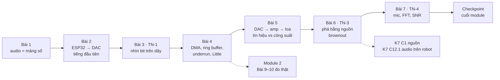
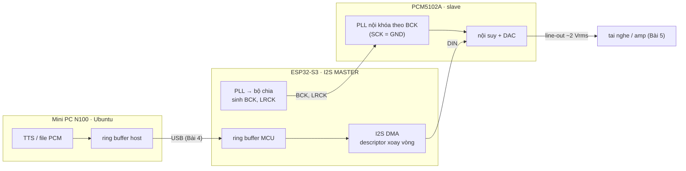
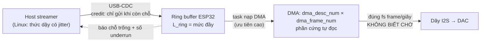

# KHÓA 3 · MODULE 1 — CHUỖI PHÁT: TỪ SỐ NGUYÊN ĐẾN ÁP SUẤT KHÔNG KHÍ (34h)

> **Vị trí:** Khóa 1 (đo được) → **Module 1** → Module 2 (đo độ trễ thật, `m2-do-tre.md`) · **Cần trước:** K1 PASS, đặc biệt K1 Bài 3 (tín hiệu số, bus, clock), K1 Bài 7 (logic analyzer), K1 Bài 13 (nhìn thấy I2S) · **Sau module này bạn quyết định được:** cấu hình chuỗi phát của V1 (định dạng PCM, chân, DMA, ring buffer, cách cấp nguồn amp) và bảo vệ từng lựa chọn bằng một con số đo.

Bản gốc ghi Module 1 = 32h nhưng tổng giờ bảy bài là 2 + 5 + 5 + 6 + 4 + 5 + 7 = **34h** (chưa tính 3h tùy chọn ALSA ở Bài 4). File này dùng 34h.



| Bài | Giờ | Viên nang nền nên đọc trước | Quyết định ra được |
|---|---|---|---|
| 1 — Audio số là cái gì | 2 | F5.5 (phần Nyquist) | Định dạng PCM của V1, định dạng trên USB có cần giống trên I2S không |
| 2 — Mini PC, ESP32-S3, DAC I2S | 5 | F5.1 | Bảng chân GPIO và cấu hình I2S cho V1 |
| 3 — TN-1: nhìn âm thanh trên dây | 5 | F1.1, F4.1 | Tin hay không tin con số trong config; đo tần số thế nào cho đủ chính xác |
| 4 — DMA, ring buffer, underrun | 6 (+3 tùy chọn) | F5.2, F7.1, F3.9, F5.3 | Kích thước DMA và ring buffer từ phân bố jitter, không từ cảm giác; cổng USB |
| 5 — DAC → amp → loa | 4 | (K1 Bài 1) | Chọn amp, loa, nguồn amp theo công suất cần |
| 6 — TN-3: phá bằng nguồn | 5 | **F5.7**, F2.5 | Cấu hình nguồn cho amp; con số đầu tiên của power budget K7 |
| 7 — TN-4: mic, FFT, SNR | 7 | F5.5, F5.6 | Bit depth và mức thu cần cho V1/V2; baseline giọng trước fine-tune |

Chuỗi đi đúng một chiều của dữ liệu: mảng số nguyên trong RAM (Bài 1) → ba sợi dây I2S (Bài 2–3) → các vùng đệm quyết định độ trễ (Bài 4) → điện áp, dòng và màng loa (Bài 5) → nguồn điện nuôi tất cả (Bài 6) → và chiều ngược lại, từ không khí về số nguyên (Bài 7). Đáp án của mọi bài nằm trong khối 🔒; mở khi đã commit `prediction.md`.

Quy tắc bất di bất dịch của cả khóa: viết dự đoán bằng số vào `prediction.md`, commit, rồi mới cắm que đo. Âm thanh có một đặc tính nguy hiểm: nó **nghe có vẻ đúng** ở rất nhiều cấu hình sai. Tai tha thứ cho lệch vài phần trăm sample rate; logic analyzer thì không.

---

## Bài 1 — Audio số thực sự là cái gì (2h)

> **Vị trí:** (đầu khóa) → Bài 1 → Bài 2 · **Cần trước:** K1 Bài 3; đọc lướt F5.5 phần Nyquist · **Sau bài này bạn quyết định được:** sample rate, bit depth, số kênh cho V1, và định dạng gửi qua USB có nên khác định dạng phát ra I2S hay không.

### 1. Câu chuyện — ai đã khổ vì chuyện này

Năm 1937–1938, Alec Reeves (kỹ sư của International Telephone and Telegraph) đăng ký sáng chế điều chế xung mã (PCM): thay vì truyền chính dạng sóng thoại, vốn méo thêm ở mỗi chặng khuếch đại, hãy truyền **các con số** đo dạng sóng đó đều đặn; số thì tái tạo nguyên vẹn được ở mỗi trạm lặp `[chuẩn]`. Cái giá là ba câu hỏi bạn sắp trả lời cho V1: đo bao nhiêu lần mỗi giây, mỗi lần bao nhiêu bit, mấy kênh.

Con số 44,1 kHz của CD không đến từ tai người. Cuối thập niên 1970, cách rẻ nhất để ghi audio số là "giả làm video": bộ chuyển PCM (như Sony PCM-1600) nhét mẫu audio vào các dòng quét của băng video. Với cấu trúc dòng của NTSC/PAL, 3 mẫu mỗi dòng × số dòng dùng được × số field mỗi giây ra đúng 44.100 mẫu/s, và Nyquist cho trần 22,05 kHz, vừa trên ngưỡng nghe 20 kHz cộng một dải chuyển tiếp cho bộ lọc chống aliasing `[chuẩn]`. Điện thoại chọn 8 kHz vì băng thoại 300–3.400 Hz. TTS hiện đại hay chọn 22,05 hoặc 24 kHz. Mỗi con số là một **quyết định có lý do**, không phải hằng số.

Bài học cho bạn: khi viết "24 kHz, 16-bit, stereo" vào `decisions.md`, bạn phải trả lời được "vì sao không 16 kHz" và "vì sao không 48 kHz" bằng số, không phải "vì tutorial dùng thế".

### 2. Mô hình tư duy

Audio số là **một mảng số nguyên** cộng ba tham số nằm **ngoài** mảng: sample rate, bit depth, số kênh. Bản thân mảng không mang nghĩa; ba tham số mới cho nó nghĩa. File WAV chỉ là cách đóng gói mảng kèm ba tham số đó (header) để người đọc sau biết cách hiểu.

```
File WAV (mono, 16-bit, 24 kHz, 1 s)                 Bộ nhớ khi stereo xen kẽ (interleaved)
┌────────────── header 44 byte ──────────────┐       frame 0      frame 1      frame 2
│"RIFF" size "WAVE" "fmt " 16 1 ch rate ...  │       ┌──┬──┐     ┌──┬──┐     ┌──┬──┐
│ byte_rate block_align bits "data" size     │       │L0│R0│     │L1│R1│     │L2│R2│ ...
├────────────── data: 24 000 × 2 byte ───────┤       └──┴──┘     └──┴──┘     └──┴──┘
│ s0 s1 s2 ... (int16 little-endian)         │       1 sample = 2 byte · 1 frame = 4 byte
└────────────────────────────────────────────┘       (ALSA, ESP-IDF đếm theo FRAME)
```

- **Bit rate** = sample_rate × bit_depth × channels. V1: 24.000 × 16 × 2 = 768.000 bit/s = 96.000 byte/s.
- **Frame ≠ sample.** Một frame = một sample cho mỗi kênh. API audio (ALSA `buffer_size`, ESP-IDF `dma_frame_num`) đếm theo frame. Nhầm frame với sample hay byte là nguồn của lỗi "độ trễ tính sai ×2 hoặc ×4".
- **Nyquist:** lấy mẫu ở f_s chỉ biểu diễn được tần số dưới f_s/2. Năng lượng trên f_s/2 không biến mất mà **gập xuống** thành tần số giả (aliasing), và sau khi đã lấy mẫu thì không phân biệt được với tần số thật → phải lọc **trước** khi lấy mẫu → F5.5.
- **Bit depth** đặt sàn nhiễu lượng tử **so với full scale**. Công thức "6,02·N + 1,76 dB" chỉ đúng cho sin full-scale; Bài 7 kiểm nó cho đúng cách.
- **Một chi tiết hay:** 24.000/440 không phải số nguyên, nên từng chu kỳ 440 Hz không rơi vào cùng vị trí mẫu. Nhưng **cả chuỗi mẫu vẫn lặp lại chính xác** sau một số mẫu nhất định (bạn tính ở phần 5). Con số đó quyết định kích thước bảng sin trong firmware Bài 2.

### 3. Cầu nối từ backend

| Backend bạn biết | Ở đây | Gãy ở chỗ | Nếu dùng nhầm thì |
|---|---|---|---|
| JSON/Protobuf mang schema hoặc có schema registry | WAV header (chunk `fmt `) mang rate/bit/kênh | Header chỉ tồn tại trong **file**. Trên dây I2S và trong luồng PCM raw qua USB không có header; schema là thỏa thuận ngoài băng giữa hai đầu | Gửi 24 kHz mà đầu kia tưởng 48 kHz: không có lỗi parse, chỉ có giọng chipmunk hoặc giọng trầm. Lỗi im lặng |
| Kích thước buffer tính bằng byte | API audio tính bằng frame | Một frame stereo 16-bit = 4 byte, mono = 2 byte | Độ trễ, credit, kích thước gói đều sai theo hệ số 2 hoặc 4 |
| Prometheus scrape mỗi 15 s | Sample rate | Metrics lấy mẫu thưa thì **bỏ sót** spike; audio lấy mẫu thưa thì năng lượng cao tần **giả dạng** thành tần số thấp | Tưởng có thể "xử lý sau" để lọc ra; không được, aliasing không đảo ngược được |
| `float64` vs `int32`: độ chính xác của **giá trị** | Bit depth | Bit depth quyết định sàn nhiễu **tương đối với full scale**. Tín hiệu nhỏ 20 dB thì mất ~3,3 bit hiệu dụng | Nghĩ "16-bit là đủ chính xác" mà quên thu âm ở mức quá nhỏ |

**Chấm mô hình — lượt 1 của bạn:** *"mang cái thuật toán đó sang bài 2, nhưng lập trình sẵn vào mcu là esp32 để nó vẫn tự tạo file wav… output của esp32 sẽ đá sang cho mạch giải dac… cái chúng ta cần xem chính là các data đó."*

**ĐÚNG MỘT PHẦN.** Luồng ESP32 → DAC → analog → jack là đúng, và lý do cắm logic analyzer (thấy được thứ OS giấu đi) là đúng. Gãy ở hai chỗ:
1. ESP32 **không tạo file WAV**. Nó tạo mảng PCM trong RAM và đẩy thẳng vào I2S. WAV là định dạng lưu trữ; header 44 byte chỉ có nghĩa với ai mở file. Trên dây không có header nào. Hệ quả: "schema" (16-bit, stereo, I2S chuẩn Philips) phải được cấu hình **khớp nhau ở cả hai đầu** (firmware + chân FMT của DAC), và không ai kiểm hộ bạn.
2. "Cái cần xem là các data đó" chỉ đúng một nửa. Ở Bài 3, thứ quan trọng nhất trên màn hình là **clock** (BCK, LRCK) chứ không phải giá trị sample. Data không có clock thì không có nghĩa: cùng một chuỗi bit trên DIN, đọc theo khung 16 hay 32 bit, Philips hay left-justified, cho ra những con số khác hẳn.
3. "Tách khỏi OS nên phần bật âm không còn do OS handle": trên PC cũng có đủ các tầng này (driver ALSA, DMA, chip codec nối bằng một bus kiểu I2S/HDA bên trong máy). OS **giấu** chúng, không xóa chúng. Bài 2 không phải "rời OS" mà là "tự làm phần OS từng làm hộ".

*Phản ví dụ:* đổi chân FMT của PCM5102A từ GND lên 3,3 V (Bài 3, bước phá). Dây DIN mang **đúng** chuỗi bit cũ, decoder của PulseView vẫn đọc ra đúng sóng sin, nhưng DAC đọc theo định dạng khác và phát ra tiếng méo nặng. Data không đổi, ý nghĩa đổi.

**Chấm mô hình — "sample rate càng cao càng tốt":** **ĐÚNG MỘT PHẦN.** Cao hơn cho phép tần số cao hơn và nới bộ lọc chống aliasing. Gãy ở chỗ: băng thông USB, RAM, CPU, dung lượng lưu đều tăng tuyến tính, còn giọng nói không có gì đáng kể trên ~10 kHz. *Phản ví dụ:* TTS xuất 24 kHz mà bạn phát ở 48 kHz thì phải resample, tốn CPU và có thể thêm méo nếu resampler kém; không thêm thông tin nào.

**Chấm mô hình — "nhiều bit hơn thì to hơn":** **SAI.** Bit depth quyết định khoảng cách giữa mức lớn nhất biểu diễn được và sàn nhiễu lượng tử (dải động), không quyết định độ to. Độ to là biên độ so với full scale cộng gain phía analog. *Phản ví dụ:* cùng một file 16-bit phát ở biên độ −40 dBFS nghe nhỏ hơn một file 8-bit ở 0 dBFS, dù có thêm 8 bit.

### 4. Thuật ngữ

| Mức | Thuật ngữ | Nghĩa trong một câu | Hay bị hiểu nhầm thành |
|---|---|---|---|
| 🟢 | Sample | Một giá trị số của một kênh tại một thời điểm | Một frame |
| 🟢 | Frame | Một sample cho mỗi kênh, cùng thời điểm | Gói dữ liệu kiểu network frame |
| 🟢 | Sample rate (f_s) | Số frame mỗi giây | Bit rate |
| 🟢 | Bit depth | Số bit mỗi sample | "Độ chính xác" tuyệt đối của giá trị |
| 🟢 | Interleaved | Kênh xen kẽ `L R L R` | `LLLL…RRRR` (planar) |
| 🟢 | PCM | Mảng sample tuyến tính không nén | Một định dạng file |
| 🟢 | Nyquist frequency | f_s/2, trần tần số biểu diễn được | "Lấy mẫu 2× là đủ" không cần lọc |
| 🟢 | Aliasing | Tần số trên f_s/2 gập xuống thành tần số giả | Nhiễu ngẫu nhiên lọc được sau |
| 🟢 | Full scale, dBFS | Biên độ lớn nhất biểu diễn được; dB so với nó | dB SPL (áp suất âm) |
| 🟡 | RIFF/WAV chunk | Cấu trúc khối tag + độ dài trong file WAV | Header luôn đúng 44 byte |
| 🟡 | Little-endian | Byte thấp đứng trước | Thứ tự bit trên dây I2S (MSB trước) |
| 🟡 | MiB vs MB | 2²⁰ vs 10⁶ byte | Cùng một thứ |
| 🔴 | μ-law/A-law (G.711) | Lượng tử phi tuyến của điện thoại | Cần cho V1 |

### 5. Dự đoán

Copy vào `lab/01-pcm/prediction.md`, điền **số**, commit:

```markdown
# 01 — PCM ở mức byte
## Dự đoán (commit trước khi chạy)
1 s, 440 Hz, 24 kHz, 16-bit, mono:
- Số sample: ___          - Số byte data: ___       - Kích thước file: ___
Cùng thông số, stereo:
- Số byte data: ___       - Kích thước file: ___
- Số sample mỗi chu kỳ 440 Hz: ___ (ghi dạng phân số tối giản)
- Sau bao nhiêu sample thì chuỗi sample lặp lại y hệt? ___ (= bao nhiêu chu kỳ, bao nhiêu ms)
- Giá trị sample n=1 nếu biên độ 32767: ___ (tính tay: 32767·sin(2π·440/24000))
- Giá trị lớn nhất thực sự xuất hiện trong mảng: ___ (có đúng 32767 không? vì sao)
- Code của tôi dùng int(x) (cắt về 0) thay vì round(x). Công suất lỗi lượng tử, tính bằng LSB²,
  của int() so với round(): ___ lần (gợi ý: round cho ~1/12 LSB²)
## Tôi KHÔNG chắc về: ___
```

Phương pháp: số sample = f_s × thời lượng; byte = sample × kênh × bit/8; file = data + header (đếm byte của từng trường trong header). Chu kỳ lặp = f_s / gcd(f_s, f) sample.

### 6. Làm

Bạn đã có `src/khoa3/create_sample_wav_mono.py` và `create_sample_wav_stereo.py` (thuần `math` + `struct`, đúng yêu cầu). Dùng lại, thêm các bước kiểm:

1. Chạy script mono. Kiểm số byte bằng `(Get-Item tone_440_mono.wav).Length` (PowerShell) hoặc `stat -c %s` (Ubuntu).
2. Mở hex: `Format-Hex tone_440_mono.wav | Select-Object -First 4` (PowerShell) hoặc `xxd tone_440_mono.wav | head`. Tìm `52 49 46 46` ("RIFF"), `66 6D 74 20` ("fmt "), `64 61 74 61` ("data"). Đọc trường sample rate (4 byte little-endian ngay sau số kênh) và đổi tay ra thập phân.
3. Chạy script stereo. Script của bạn đặt L = 440 Hz, R = 880 Hz: giữ nguyên lựa chọn này, nó giúp phân biệt hai kênh bằng mắt trên logic analyzer ở Bài 3.
4. In 20 sample đầu. So với dự đoán sample n=1.
5. **Thêm:** kiểm chu kỳ lặp bằng một dòng `samples[:600] == samples[600:1200]`.
6. **Thêm:** viết 10 dòng đọc ngược header bằng `struct.unpack("<4sI4s4sIHHIIHH4sI", data[:44])` và in ra từng trường. Đây là parser schema đầu tiên của bạn; nó sẽ vỡ ngay khi gặp file có chunk `LIST` chen giữa (thử với một WAV xuất từ Audacity). Bài học: header không phải lúc nào cũng 44 byte, parser thật phải đi theo chunk.

Sai số ở bài này: không có dụng cụ đo; "sai số" duy nhất là làm tròn khi đổi float → int, và chính nó sẽ là đối tượng của Bài 7.

### 7. Số phải ra

<details><summary>🔒 MỞ SAU KHI COMMIT prediction.md</summary>

| Kiểm tra | Giá trị đúng |
|---|---|
| Số sample 1 s mono @ 24 kHz | 24.000 |
| Byte data mono 16-bit | 48.000 |
| Byte data stereo 16-bit | 96.000 |
| Kích thước file | 48.044 / 96.044 (header tối giản 44 byte; khớp file trong `src/khoa3/`) |
| Sample mỗi chu kỳ 440 Hz | 600/11 ≈ 54,545 (bản gốc ghi "≈ 54,5" là làm tròn) |
| Chu kỳ lặp của chuỗi sample | 600 sample = 11 chu kỳ = 25 ms |
| Sample n = 1 | 3766 (cả `int()` lẫn `round()`) |
| Giá trị lớn nhất / nhỏ nhất | +32767 / −32767. Vì gcd(11, 600) = 1, 11 chu kỳ quét qua mọi pha bội của 2π/600, trong đó có đúng π/2 |
| Công suất lỗi `int()` vs `round()` | ≈ 0,37 vs ≈ 0,083 LSB² → ~4,5 lần (~6,5 dB tệ hơn). `int()` cắt về 0 nên lỗi luôn ngược dấu tín hiệu: trung bình bằng 0 nhưng tương quan với tín hiệu, tức là **méo**, không phải nhiễu |

Ở 16-bit, 6,5 dB tệ hơn trên sàn ~98 dB là không nghe được. Ở 4-bit (Bài 7) nó thành tiếng rè rõ. Thói quen đúng: `round()` (hoặc `np.round`) rồi `clip`.

Tự kiểm tra:
1. 30 s, 48 kHz, 24-bit, stereo → 48.000 × 3 × 2 × 30 = 8.640.000 byte ≈ 8,24 MiB.
2. 24-bit thường đi trong khung 32-bit vì phần cứng và bus làm việc theo bội 8/16/32; bạn sẽ thấy đúng điều này ở mic INMP441 trong Bài 7.
3. 4800 frame @ 24 kHz stereo 16-bit = 200 ms = 19.200 byte.

</details>

### 8. Nếu ra khác

| Triệu chứng | Nguyên nhân khả dĩ | Kiểm bằng cách | Sửa |
|---|---|---|---|
| File lớn hơn data + 44 | Thư viện ghi chunk `fmt ` 18 byte hoặc chèn `LIST` | Hex: tìm vị trí `data` | Parser phải đi theo chunk, không giả định offset 44 |
| Nghe cao giọng gấp đôi | Header ghi 48 kHz, data 24 kHz (hoặc stereo khai mono) | Đọc lại header bằng script bước 6 | Sửa trường `sample_rate`/`channels`, tính lại `byte_rate`, `block_align` |
| Toàn tiếng rè trắng | Ghi big-endian (`>h`) | Hex: sample n=1 phải là `B6 0E` (3766 = 0x0EB6) | Dùng `<h` |
| Hai kênh lệch nhau một sample | Ghi planar rồi khai interleaved | In 6 int16 đầu tiên của data | Xen kẽ L, R |
| `struct.error` khi pack | Giá trị vượt ±32767 do làm tròn lên | `max(samples)` | `clip` về [−32768, 32767] |

### 9. Câu hỏi ngược

1. **[Nếu…thì]** Nếu host gửi **mono** qua USB và ESP32 nhân đôi ra hai kênh trước khi đẩy I2S, băng thông USB đổi thế nào? Tín hiệu trên dây I2S có đổi không?
<details><summary>Hướng nghĩ</summary>

USB giảm một nửa. Dây I2S không đổi: khung LRCK luôn có hai nửa, PCM5102A là DAC stereo. Đây là ví dụ đầu tiên của "định dạng truyền ≠ định dạng phát", quyết định bạn sẽ gặp lại khi chọn định dạng log ở K5.

</details>

2. **[Vì sao không]** Vì sao không chọn 16 kHz cho TTS để tiết kiệm 1/3 băng thông?
<details><summary>Hướng nghĩ</summary>

16 kHz cho trần 8 kHz. Phụ âm xát (s, x) có năng lượng tới 8–10 kHz `[chuẩn]`. Nhận dạng giọng nói thường chạy 16 kHz vì máy không cần nghe "đẹp"; người nghe thì cảm nhận được độ "đục". Ở 96 KB/s băng thông không phải nút thắt, nên khoản tiết kiệm không đáng.

</details>

3. **[Quy mô]** 1.000 robot, mỗi robot ghi liên tục audio 24 kHz/16-bit/stereo để làm dữ liệu huấn luyện. Bao nhiêu TB/ngày? Định dạng nào bạn chọn để lưu, và vì sao không lưu WAV?
<details><summary>Hướng nghĩ</summary>

96 KB/s × 86.400 s ≈ 8,3 GB/ngày/robot → ~8,3 TB/ngày cho đội. Nén lossless (FLAC) giảm đáng kể nhưng tỉ lệ phụ thuộc nội dung `[tự đo]`. WAV không có index theo thời gian, không có metadata thiết bị/đồng hồ; với robot bạn sẽ muốn audio nằm cạnh các luồng khác trong MCAP với timestamp chung → K2, F3.1.

</details>

4. **[Failure mode]** Một lỗi "frame vs sample" lọt vào code tính credit ở Bài 4 (host tưởng credit là sample, ESP32 gửi credit là frame). Triệu chứng nghe được là gì, và vì sao test đơn vị khó bắt?
<details><summary>Hướng nghĩ</summary>

Host gửi gấp đôi chỗ trống thật → tràn ring buffer, hoặc gửi một nửa → underrun định kỳ. Test đơn vị dùng mock đối xứng (cùng hiểu sai) sẽ qua. Chỉ test đầu–cuối với số đo (mức đầy ring buffer theo thời gian) mới bắt được → F2.1 (oracle).

</details>

5. **[Phản biện]** "Nyquist nói lấy mẫu gấp đôi tần số cao nhất là đủ." Phản biện câu này.
<details><summary>Hướng nghĩ</summary>

Định lý cần tín hiệu **giới hạn băng tuyệt đối** và bộ tái tạo lý tưởng. Bộ lọc thật có dải chuyển tiếp, nên cần f_s lớn hơn 2·f_max một khoảng (CD: 44,1 kHz cho 20 kHz). Và năng lượng ngoài băng vẫn phải được lọc trước ADC, nếu không nó gập vào băng.

</details>

### 10. Liên kết ra ngoài

- **Ảnh số và moiré:** camera là lấy mẫu 2D; vải sọc mịn chụp ra vân lạ chính là aliasing không gian. Giống: không gỡ được sau khi chụp, nên máy ảnh có (hoặc từng có) bộ lọc quang chống aliasing. Khác: chiều không gian thay cho thời gian.
- **Monitoring backend:** scrape mỗi 15 s một job chạy đúng chu kỳ 15 s có thể cho đường phẳng hoàn toàn. Giống: tần số lấy mẫu "đồng bộ" với tín hiệu giấu tín hiệu. Khác: ở metrics bạn có thể đổi chu kỳ scrape và đo lại; với bản ghi audio đã aliasing thì không có lần đo lại.
- **Điện thoại G.711:** 8 kHz, 8-bit nhưng lượng tử phi tuyến (μ-law) nên dải động tương đương ~13–14 bit tuyến tính (A-law ~13, μ-law ~14) `[chuẩn]`. Giống: đánh đổi bit lấy chất lượng. Khác: đặt nhiều mức ở biên độ nhỏ, nơi giọng nói hay nằm.

### 11. Độ tin cậy và sửa lỗi

| Khẳng định | Nhãn | Ghi chú / cách kiểm |
|---|---|---|
| Reeves và sáng chế PCM 1937–1938 | `[chuẩn]` | Lịch sử viễn thông phổ biến |
| 44,1 kHz bắt nguồn từ bộ chuyển PCM dùng băng video | `[chuẩn]` | Lịch sử phổ biến, có trong tài liệu về Sony PCM adaptor |
| Phụ âm xát có năng lượng tới 8–10 kHz | `[chuẩn]` | Kiểm bằng FFT giọng mình ở Bài 7 |
| 96.044 byte cho stereo 1 s | `[đã chạy]` | Khớp file `src/khoa3/tone_440_stereo.wav` |
| `int()` tệ hơn `round()` ~6,5 dB (0,369 vs 0,083 LSB²) | `[đã chạy]` | Người hợp nhất chạy lại; tái hiện bằng 5 dòng numpy: `e = np.trunc(x) - x` so với `np.round(x) - x` |

**Đã sửa so với bản gốc:** (1) "54,5 sample/chu kỳ nên tone không lặp lại chính xác" → đúng ở mức từng chu kỳ, nhưng chuỗi sample lặp chính xác sau 600 sample; điều này có hệ quả thực tế cho bảng sin ở Bài 2. (2) Bảng "16-bit → 98,1 dB …" trong bản gốc đưa như thuộc tính của bit depth; đã ghi rõ chỉ đúng cho sin full-scale với nhiễu lượng tử đều (sửa đầy đủ ở Bài 7). (3) Thêm chú ý `int()` vs `round()` trong code thật của bạn. (4) Hợp nhất: ghép từ bản Claude câu chuyện Reeves, ý "OS giấu chứ không xóa" trong chấm lượt 1, và mô hình "nhiều bit = to hơn".

### 12. Đọc thêm và tự kiểm tra

- **Nguồn gốc:** *Multimedia Programming Interface and Data Specifications 1.0* (IBM & Microsoft, 1991), phần RIFF/WAVE.
- **Giải thích:** video "Digital Show & Dither" (Christopher Montgomery, xiph.org), xem đoạn về lấy mẫu và bậc thang.
- **Đào sâu (tùy chọn):** C. E. Shannon, "Communication in the Presence of Noise" (1949), phần định lý lấy mẫu.
- **Tự kiểm tra:** (1) giải thích cho một backend engineer khác trong 5 câu vì sao "audio là mảng + ba tham số ngoài băng"; (2) vẽ lại hình ở phần 2 từ trí nhớ; (3) câu hỏi:
  - *Một luồng 16 kHz, 16-bit, mono gửi qua UART 921.600 baud (8N1) có kịp không? Còn 24 kHz stereo?*
<details><summary>Đáp án</summary>

8N1 = 10 bit trên dây cho mỗi byte → 92.160 byte/s. 16 kHz mono = 32.000 byte/s: kịp. 24 kHz stereo = 96.000 byte/s: **không kịp**, thiếu ~4% ngay cả khi không có overhead giao thức. Ghi nhớ cho Bài 4: cổng "UART" của DevKit (qua chip USB-UART) ở 921.600 baud không đủ cho V1.

</details>

---

## Bài 2 — Dựng mini PC, ESP32-S3 và DAC I2S (5h)

> **Vị trí:** Bài 1 → Bài 2 → Bài 3 · **Cần trước:** K1 Bài 3, K1 Bài 13, F5.1 · **Sau bài này bạn quyết định được:** bảng chân GPIO của V1 (I2S phát, I2S thu ở Bài 7, GPIO marker ở Bài 9, nút kill ở Bài 15) và cấu hình I2S (vai trò master, slot width) mà cả DAC lẫn mic chấp nhận.

### 1. Câu chuyện — ai đã khổ vì chuyện này

I2S do Philips công bố năm 1986 để nối các chip **trong cùng một thiết bị** (đầu CD: chip giải mã → DAC), đường mạch vài centimet `[chuẩn]`. Vì thế nó không có ACK, không checksum, không header: trên một bo mạch ngắn, lỗi bit hiếm và một bit sai trong audio chỉ là một tiếng tách. Thiết kế "thả bit ra theo nhịp clock, không hỏi ai" là hệ quả có chủ ý của bối cảnh đó.

Cái giá của thiết kế ấy đến với người mới dưới dạng **im lặng**. Kịch bản quen thuộc trên các diễn đàn: module PCM5102A cắm đúng ba dây, firmware log "OK", DAC câm. Nguyên nhân hay gặp nhất là chân SCK để hở: PCM5102A chỉ chuyển sang dùng PLL nội theo BCK khi không có master clock ở SCK; chân thả nổi có thể nhặt nhiễu như một clock rác, chip không vào đúng chế độ `[tự đo: hành vi chân thả nổi không được datasheet đảm bảo]`. Không có lỗi nào được báo, vì giao thức không có đường để báo lỗi.

Lý do thứ hai cho kiến trúc của bài này đến từ chính Linux: kernel thường (không PREEMPT_RT) không hứa gì về độ trễ lập lịch trong trường hợp xấu nhất; đuôi phân bố có thể tới mili-giây khi máy có tải `[chuẩn; tự đo bằng cyclictest ở F5.4]`. Một mẫu audio 24 kHz chỉ dài 41,7 µs. Vì vậy V1, giống robot thật ở K7 (mini PC → ESP32 → driver motor, → K7 C4.3), không để Linux trực tiếp đánh nhịp dây tín hiệu thời gian thực: việc đó thuộc về MCU, và Linux nói chuyện với MCU qua một kênh có vùng đệm.

### 2. Mô hình tư duy



Timing I2S chuẩn Philips, 16-bit stereo:

```
LRCK  ‾‾‾‾\________________________________/‾‾‾‾‾‾‾‾‾‾‾‾‾‾‾‾‾‾‾‾‾‾‾‾‾‾‾‾‾‾‾‾\____
          |<------ kênh TRÁI (16 BCK) ----->|<------ kênh PHẢI (16 BCK) ---->|
BCK   _/‾\_/‾\_/‾\_/‾\_/‾\_/‾\ ... _/‾\_/‾\_/‾\_/‾\_/‾\_/‾\ ... _/‾\_/‾\_/‾\_
DIN   ==X  L15 X L14 X L13 X ...  L0 X  R15 X R14 X ...  R0 X  L15 ...
         ^ trễ 1 BCK sau cạnh LRCK (đặc trưng Philips; left-justified thì không trễ)
         DAC chốt DIN ở cạnh LÊN của BCK, MSB trước
```

Bốn câu về bản chất:
- ESP32 là **master**: nó sinh BCK và LRCK từ PLL của chính nó. Tần số phát thật là tần số ESP32 chia ra được, không phải con số bạn ghi trong code (Bài 3).
- PCM5102A với SCK = GND chạy chế độ PLL nội, **khóa theo BCK** của ESP32 `[spec: PCM5102A datasheet, mục clock]`. Bên nhận không đàm phán gì, nó tuân theo clock bên gửi.
- Schema (độ rộng dữ liệu, độ rộng slot, Philips hay left-justified) **không đi trên dây**. Nó là cấu hình firmware + trạng thái chân FMT. Khớp hay không, không ai báo.
- Bài này cố ý để ESP32 tự sinh sine: cô lập "ESP32 + dây + DAC" trước khi thêm biến số USB/host. Đó là bring-up một khối, đúng nguyên tắc "một khối mới một lần" bạn sẽ dùng suốt K7.

### 3. Cầu nối từ backend

| Backend bạn biết | Ở đây | Gãy ở chỗ | Nếu dùng nhầm thì |
|---|---|---|---|
| TCP có ACK, retry, timeout | I2S không có kênh ngược | Không có ACK nghĩa là **không có đường báo lỗi**: tháo DAC ra, firmware vẫn log thành công | Coi "không có lỗi trong log" là "đang chạy đúng". Ở đây phải kiểm ngoài băng (logic analyzer, mic thu lại) |
| TCP window: bên nhận điều tiết bên gửi | Master sinh clock, slave tuân theo | Bên nhận không làm chậm bên gửi được; ngược hẳn TCP | Thiết kế "DAC báo khi bận" là không tồn tại; điều tiết phải nằm ở chặng USB (Bài 4) |
| `Content-Type` trong header | Chân FMT + cấu hình slot | Không khớp không ra `415`, ra tiếng méo | Debug bằng tai thay vì bằng đo |
| Test service với stub trước khi nối upstream | ESP32 tự sinh sine trước khi nối host | Stub phần cứng vẫn có thể **làm hỏng** thứ khác (chân sai, cấp áp sai) | Cắm thử "cho nhanh" mà chưa kiểm dây ba lần |

**Chấm mô hình — lượt 2 của bạn**, ba ý:

(a) *"vấn đề tôi cần học nhất là giao thức truyền dữ liệu ở thế giới vật lý"* — **ĐÚNG MỘT PHẦN.** Giao thức là phần **dễ** và **có tài liệu**: toàn bộ I2S vừa một trang datasheet. Gãy ở chỗ: thứ làm hệ thật hỏng thường nằm ngoài giao thức: clock ai sở hữu và lệch bao nhiêu (Bài 3), buffer và jitter (Bài 4), nguồn (Bài 6), giới hạn của chính dụng cụ đo (Bài 3). Với nghề robotics data infra, thời gian và dữ liệu (K2, K5) quan trọng hơn chi tiết từng bus. *Phản ví dụ:* Bài 6 — giao thức chạy hoàn hảo, ESP32 vẫn reset vì amp kéo sụt nguồn.

(b) *"cách đọc/ghi, schema thì còn phải dùng các dây/chân khác kết hợp phối hợp quy định, như clock, chân tần số"* — **ĐÚNG MỘT PHẦN.** Clock và LRCK quy định **nhịp** và **ranh giới** (bit nào, kênh nào). Gãy ở chỗ: schema thật (16 hay 24 bit, khung 16 hay 32, Philips hay left-justified, MSB trước) **không có dây nào mang**. *Phản ví dụ:* chân FMT ở Bài 3: dây giống hệt, nghĩa đổi.

(c) *"nó không cần biết có ai nhận ở cuối dây, là mạch dac hay gì"* — **ĐÚNG về giao thức, SAI nếu hiểu thành "không cần quan tâm".** I2S không có ACK (khác I2C, nơi thiết bị nhận kéo SDA xuống để ACK và bạn phát hiện được thiết bị vắng mặt — K1 Bài 12). Gãy ở chỗ: "không cần biết" là **điểm mù**, không phải tính năng. Bên nhận lại phụ thuộc nặng vào bên gửi: PCM5102A chỉ khóa PLL khi tỉ số BCK/LRCK nằm trong tập nó hỗ trợ `[spec: tra bảng tỉ số BCK/fs trong datasheet]`. *Phản ví dụ:* tháo DAC khỏi breadboard khi đang phát → log ESP32 không đổi một dòng. Muốn firmware "biết", bạn phải tự thêm kênh ngược (mic thu lại ở Bài 7, hoặc đo bằng logic analyzer).

Ghi chú về Gemini: ở lượt này Gemini xác nhận "chính xác 100%" và thêm "nếu clock của ESP32 phát sai một micro-giây, DAC đọc lệch vị trí bit ngay lập tức". Câu sau **sai**: I2S là truyền **đồng bộ theo nguồn** (source-synchronous), DIN được chốt theo chính BCK đi kèm. Clock nhanh/chậm một chút thì DAC phát nhanh/chậm theo (lệch cao độ cực nhỏ), không đọc lệch bit. Thứ gây đọc lệch là lệch **pha** giữa DIN và BCK vượt setup/hold time của DAC (dây dài, nhiễu), hoặc sai định dạng.

**Chấm mô hình — lượt 3 của bạn:** *"thực tế esp32 chỉ làm dispatcher/cordinator thôi nhỉ… nó chỉ kiểm soát các flag như khi nào bật/tắt, tăng giảm âm lượng… chứ thực sự nó không nên là nơi tạo ra âm thanh hay chuyển đổi âm thanh"*

**ĐÚNG MỘT PHẦN.** Đúng với kiến trúc V1: âm thanh sinh ở mini PC (TTS), ESP32 không chạy AI. Gãy ở hai chỗ:
1. "Dispatcher chỉ forward" che mất việc khó nhất ESP32 làm: nó **sở hữu đồng hồ phát**. Dữ liệu đến theo nhịp của host (Linux, USB, jitter), đi ra theo nhịp BCK của ESP32. Nối hai miền thời gian đó là việc của ring buffer + flow control (Bài 4), và đó là phần thời gian thực, không phải "flag".
2. "Không nên tạo/chuyển đổi âm thanh" là quá tay. ESP32 hợp lý làm: chỉnh âm lượng bằng nhân số (rẻ, và an toàn hơn để trên MCU vì nút kill phải chạy được khi host chết), nhân mono → stereo, chuyển 16-bit ↔ khung 32-bit, sinh tiếng bíp cảnh báo tại chỗ; Espressif còn có hẳn framework ESP-ADF để giải mã MP3/AAC và mix luồng trên chính MCU `[spec: ESP-ADF docs]`. Thứ không nên làm trên ESP32 là việc nặng và không tất định: TTS, resample chất lượng cao, giải mã định dạng nén lớn.

*Phản ví dụ:* nút kill ở Bài 15. Nếu ESP32 chỉ "chờ host bảo dừng", khi host treo thì loa vẫn phát hết DMA + ring buffer. Thiết kế đúng là ESP32 tự dừng I2S ngay khi nhận ngắt GPIO, rồi mới báo host. Đó là ESP32 **ra quyết định** trên đường âm thanh.

### 4. Thuật ngữ

| Mức | Thuật ngữ | Nghĩa trong một câu | Hay bị hiểu nhầm thành |
|---|---|---|---|
| 🟢 | BCK (BCLK, SCK ở một số tài liệu) | Bit clock, mỗi chu kỳ một bit | MCLK (dễ nhầm vì chữ "SCK") |
| 🟢 | LRCK (WS, LRCLK) | Word select: nửa thấp = trái, nửa cao = phải; tần số = sample rate | Một clock "chọn kênh" chạy tùy ý |
| 🟢 | DIN / DOUT (SD) | Dây dữ liệu, tên đổi theo phía nhìn | Hai dây khác nhau |
| 🟢 | Master / slave (controller / target) | Bên sinh clock / bên tuân theo | Bên gửi dữ liệu / bên nhận |
| 🟢 | Slot width vs data width | Độ rộng khung cho mỗi kênh vs số bit có nghĩa | Cùng một số |
| 🟢 | I2S Philips vs left-justified | Có / không trễ 1 BCK sau cạnh LRCK | Giống nhau "gần đủ" |
| 🟢 | Strapping pin | Chân được đọc lúc boot để chọn chế độ khởi động | GPIO thường dùng thoải mái |
| 🟡 | MCLK / SCK của PCM5102A | Master clock ~256·f_s; PCM5102A có thể tự sinh bằng PLL khi SCK = GND | Bắt buộc phải cấp |
| 🟡 | PLL | Mạch nhân/khóa tần số theo một clock tham chiếu | Thạch anh |
| 🟡 | XSMT, FLT, DEMP, FMT | Chân cấu hình mute, bộ lọc, de-emphasis, định dạng | Chân nguồn |
| 🟡 | ESP-IDF `i2s_std` | Driver I2S "standard mode" của ESP-IDF v5 | API Arduino `I2S.begin` |
| 🔴 | TDM mode | Nhiều kênh trên một khung I2S | Cần cho V1 |

### 5. Dự đoán

Copy vào `lab/02-bringup/prediction.md`:

```markdown
# 02 — Bring-up ESP32-S3 → PCM5102A
## Dự đoán
- Bảng chân tôi chọn: BCK=GPIO__, LRCK=GPIO__, DIN=GPIO__  (đã đối chiếu: không strapping, không USB, không flash/PSRAM)
- Bảng sin trong firmware dài ___ frame để 440 Hz @ 24 kHz không có tiếng click ở chỗ nối vòng
- Nếu tôi lỡ dùng bảng 55 frame (một "chu kỳ" làm tròn), tần số nghe được = ___ Hz
- Áp đo ở chân VCC module lúc chạy: ___ V (module của tôi nhận 5 V hay 3,3 V? tra ở ___)
- Áp đo ở XSMT: ___ V; ngưỡng HIGH (VIH) theo datasheet: ___ V
- Tỉ số BCK/LRCK với cấu hình 16-bit stereo: ___ ; tỉ số này có nằm trong bảng PCM5102A hỗ trợ ở chế độ PLL không: ___
- Sai số DC V của multimeter UT33D+ ở thang này (tra manual): ±(___% + ___ digit)
- Nếu firmware ngừng ghi dữ liệu mới nhưng kênh I2S vẫn enable, DAC phát: ___ (tra cờ auto-clear trong docs ESP-IDF đúng phiên bản)
## Tôi KHÔNG chắc về: ___
```

Tra ở đâu: pinout ESP32-S3-DevKitC-1 (Espressif user guide của đúng phiên bản board), mục "Strapping pins" và "SPI flash/PSRAM" trong ESP32-S3 datasheet; PCM5102A datasheet (TI) mục pin functions và electrical characteristics; schematic của module PCM5102A bạn mua (thường có LDO 3,3 V); manual UT33D+.

### 6. Làm

**Bước 1 — mini PC.** Ubuntu 24.04 LTS. Cắm Ethernet, không dùng WiFi khi dev. Chạy `ethtool -T` cho **cả hai** cổng LAN, ghi vào `decisions.md` (K5 cần: phải thấy `PTP Hardware Clock` và `hardware-transmit/receive`).

**Bước 2 — ESP-IDF v5.x, không Arduino.** Lý do: cấu hình DMA chính là bài học của Bài 4 và Module 2, Arduino giấu nó đi (như `aplay` giấu ALSA buffer). Ghi phiên bản chính xác (`idf.py --version`) vào `decisions.md`; mọi tên hàm/trường dưới đây `[tự đo]` — kiểm theo phiên bản ESP-IDF bạn cài.

**Bước 3 — bảng chân, trước khi cắm dây.** Lập bảng cho cả khóa ngay bây giờ (I2S0 phát, I2S1 thu ở Bài 7, một GPIO marker ở Bài 9, một GPIO nút kill ở Bài 15). Tránh `[spec: ESP32-S3 datasheet + user guide DevKitC-1]`:
- strapping: GPIO 0, 3, 45, 46;
- USB native D−/D+: GPIO 19, 20;
- SPI flash: GPIO 26–32; với bản có PSRAM octal (ký hiệu R8, R16…) còn GPIO 33–37;
- UART0 console: GPIO 43, 44 (nếu bạn dùng cổng "UART" của DevKit).

**Bước 4 — đấu PCM5102A.** Kiểm ba lần trước khi cấp điện. Rút USB khi cắm/rút dây.

| PCM5102A | ESP32-S3 | Ghi chú |
|---|---|---|
| VIN/VCC | 5 V hoặc 3V3 — theo schematic module | Module có LDO thường nhận 5 V |
| GND | GND | Ngắn, chắc |
| BCK | GPIO tự chọn (ví dụ 4) | |
| LCK/LRCK | GPIO tự chọn (ví dụ 5) | |
| DIN | GPIO tự chọn (ví dụ 6) | |
| **SCK** | **GND** | Không nối → DAC câm. Một số module có jumper/pad hàn sẵn, kiểm bằng thang thông mạch |

Jumper cấu hình: FMT → GND (I2S Philips), XSMT → 3,3 V (unmute), FLT → GND, DEMP → GND. Kiểm bằng thang thông mạch/điện áp chứ không tin nhãn in trên bo.

**Bước 5 — firmware sinh sine.** Bảng sin phải chứa **số nguyên chu kỳ** (Bài 1: 600 frame cho 440 Hz @ 24 kHz). Biên độ để ~ −12 dBFS khi thử bằng tai nghe.

```c
// [chưa chạy] ESP-IDF v5.x driver i2s_std — tên macro/trường kiểm theo phiên bản ESP-IDF bạn cài [tự đo]
#include <math.h>
#include "driver/i2s_std.h"
#include "esp_log.h"

#define FS 24000
static i2s_chan_handle_t tx;
static int16_t tbl[600 * 2];                 // 600 frame stereo = 11 chu kỳ 440 Hz, nối vòng không click

void app_main(void) {
    i2s_chan_config_t cc = I2S_CHANNEL_DEFAULT_CONFIG(I2S_NUM_0, I2S_ROLE_MASTER);
    cc.dma_desc_num = 3;                     // Bài 4 sẽ quét hai số này
    cc.dma_frame_num = 240;
    ESP_ERROR_CHECK(i2s_new_channel(&cc, &tx, NULL));
    i2s_std_config_t sc = {
        .clk_cfg  = I2S_STD_CLK_DEFAULT_CONFIG(FS),
        .slot_cfg = I2S_STD_PHILIPS_SLOT_DEFAULT_CONFIG(I2S_DATA_BIT_WIDTH_16BIT, I2S_SLOT_MODE_STEREO),
        .gpio_cfg = { .mclk = I2S_GPIO_UNUSED, .bclk = GPIO_NUM_4, .ws = GPIO_NUM_5,
                      .dout = GPIO_NUM_6, .din = I2S_GPIO_UNUSED },
    };
    ESP_ERROR_CHECK(i2s_channel_init_std_mode(tx, &sc));
    for (int n = 0; n < 600; n++) {          // round, không cắt (Bài 1)
        int16_t v = (int16_t)lrintf(8000.0f * sinf(2.0f * (float)M_PI * 440.0f * n / FS));
        tbl[2 * n] = v;  tbl[2 * n + 1] = v;
    }
    ESP_ERROR_CHECK(i2s_channel_enable(tx));
    ESP_LOGI("tone", "I2S on: %d Hz, 16-bit, stereo", FS);   // đây là số bạn XIN, chưa phải số chạy
    size_t w;
    while (1) i2s_channel_write(tx, tbl, sizeof tbl, &w, portMAX_DELAY);
}
```

**Bước 6 — nghe.** Tai nghe vào line-out. Line-out của PCM5102A thiết kế cho tải trở kháng cao (đầu vào amp) `[spec: tra tải tối thiểu trong datasheet]`; cắm tai nghe chỉ để thử nhanh, âm lượng số thấp, tai nghe trở kháng càng cao càng tốt. Nếu DAC ấm lên hoặc méo thì rút ra.

**Bước 7 — đo.** Multimeter DC V: VCC module, XSMT, 3V3 của DevKit. Ghi kèm sai số dụng cụ (tra manual UT33D+). Ghi phiên bản ESP-IDF, ảnh đấu dây, bảng chân vào lab notebook.

### 7. Số phải ra

<details><summary>🔒 MỞ SAU KHI COMMIT prediction.md</summary>

| Kiểm tra | Kết quả đúng |
|---|---|
| Log ESP-IDF | Kênh I2S tạo và enable không lỗi |
| Line-out | Tone 440 Hz sạch, không click đều đặn |
| Bảng sin | 600 frame. Bảng 55 frame lấy từ sin 440 Hz (cắt ở mẫu 55) lặp với chu kỳ 55 mẫu → cao độ 436,36 Hz, hơi rè vì mỗi vòng có một bước nhảy nhỏ (méo hài). Bảng chứa đúng một chu kỳ sin(2πn/55) thì sạch nhưng vẫn là 436,36 Hz. Tổng quát: bước nhảy lặp với tần số f_s / độ dài bảng |
| VCC module | Bằng áp cấp, lệch < 5% (sai số UT33D+ ở DC V cỡ dưới 1% nên phép so này có ý nghĩa — kiểm đúng con số trong manual) |
| XSMT | ≥ VIH của datasheet; thực tế ≈ 3,3 V nếu nối thẳng 3V3 |
| Tỉ số BCK/LRCK | 32 (16 bit × 2 kênh); thuộc tập tỉ số PLL của PCM5102A (kiểm lại bảng trong datasheet) |
| Ngừng ghi dữ liệu | Tùy cờ auto-clear: hoặc im (DMA phát 0), hoặc **lặp lại vòng descriptor cũ** thành tiếng ù/rè đều. Ghi hành vi thật của bản IDF của bạn; Bài 4 cần nó |
| `ethtool -T` hai cổng | Đã ghi vào `decisions.md`; phải thấy `PTP Hardware Clock` và `hardware-transmit/receive`, nếu không K5 phải đổi kế hoạch |

</details>

### 8. Nếu ra khác

| Triệu chứng | Nguyên nhân khả dĩ | Kiểm bằng cách | Sửa |
|---|---|---|---|
| Im lặng hoàn toàn | SCK chưa nối GND (số 1) | Thang thông mạch SCK–GND | Nối SCK xuống GND hoặc hàn jumper |
| Im lặng, SCK đã nối | XSMT LOW | Đo áp XSMT | Kéo lên 3,3 V |
| Im lặng, mọi chân đúng | Chưa `i2s_channel_enable`, gán nhầm BCK/LRCK, hoặc DAC hỏng | Đo BCK bằng multimeter DC (clock duty 50% đọc ~1,6 V); Bài 3 (logic analyzer); đổi sang module thứ hai | Đối chiếu bảng chân với code; mua 2 module cho mọi linh kiện rẻ và quan trọng |
| ESP32 không boot sau khi đấu | Dùng chân strapping | Rút dây từng chân | Đổi chân theo bảng bước 3 |
| Mất cổng USB nạp | Dùng GPIO 19/20 | Kiểm bảng chân | Đổi chân; giữ BOOT khi cắm để nạp lại |
| Click lặp đều, hoặc tone hơi rè và lệch cao độ | Bảng sin không chứa số nguyên chu kỳ; bước nhảy lặp ở f_s / độ dài bảng | Tính độ dài bảng × 440 / 24.000 có phải số nguyên không | Bảng 600 frame hoặc dùng bộ tích lũy pha |
| Rè, méo ở mọi mức | Sai FMT, dây dài, GND yếu | Kiểm FMT = GND, dây < 10 cm | Rút ngắn dây, thêm dây GND thứ hai |
| Chỉ một kênh có tiếng | Sai layout stereo trong buffer | Bài 3 | Đo, đừng đoán |

### 9. Câu hỏi ngược

1. **[Nếu…thì]** Nếu tháo DAC khỏi breadboard khi đang phát, firmware có cách nào tự biết không? Thiết kế tối thiểu nào cho nó biết?
<details><summary>Hướng nghĩ</summary>

Không, I2S không có kênh ngược. Cần một cảm biến độc lập: mic I2S thu lại tiếng (Bài 7), hoặc đọc ngược một chân trạng thái của amp (một số amp có chân fault). Đây là bài toán "oracle" của F2.1 ở dạng phần cứng.

</details>

2. **[Vì sao không]** Có loại bo USB → I2S (host làm việc qua USB audio class, bo xuất I2S). Vì sao lộ trình không chọn nó thay cho ESP32?
<details><summary>Hướng nghĩ</summary>

Nó làm được phát audio, nhưng không cho bạn GPIO marker, nút kill tại chỗ, đọc lý do reset, đếm underrun bằng code của mình. ESP32 là I/O bridge chung cho cả lộ trình (K5 encoder, K7 motor). Cái bạn mua là **khả năng quan sát và kiểm soát**, không chỉ là tiếng.

</details>

3. **[Quy mô]** Robot của bạn sau này có 4 mic và 1 loa. Đếm số chân I2S cần nếu mỗi mic một bus riêng, và nếu dùng TDM/chung clock. Chân nào chung được?
<details><summary>Hướng nghĩ</summary>

Các mic cùng tần số có thể chung BCK/WS, chỉ khác dây dữ liệu hoặc khác slot (INMP441 chọn kênh bằng chân L/R: hai mic trên một dây SD). Đếm chân là một phần của "pin budget" ở K7 C4.1.

</details>

4. **[Failure mode]** Dây Dupont 20 cm cho BCK chạy 3 MHz đặt sát dây 5 V của amp. Liệt kê ba cách nó hỏng và cách bạn phân biệt chúng bằng dụng cụ đang có.
<details><summary>Hướng nghĩ</summary>

Ringing ở cạnh xung (bit đọc đúp), crosstalk từ dây khác, GND bounce khi amp kéo dòng. Logic analyzer chỉ thấy mức logic, không thấy dạng sóng analog; thứ nó thấy được là glitch (cạnh thừa) và lỗi decode. Rút ngắn dây và xem lỗi có hết không là thí nghiệm phân biệt rẻ nhất.

</details>

5. **[Liên ngành]** Đài phát thanh và Ethernet cũng có "bên nhận khóa theo clock bên gửi". Giống và khác PCM5102A khóa PLL theo BCK ở đâu?
<details><summary>Hướng nghĩ</summary>

Giống: bên nhận không đàm phán, tự khóa tần số. Khác: Ethernet/PCIe không gửi clock riêng mà **khôi phục clock từ chính dữ liệu** (clock-data recovery), nên dữ liệu phải được mã hóa để có đủ cạnh. I2S tách clock ra dây riêng, đơn giản hơn nhưng chỉ chạy được đường ngắn.

</details>

6. **[Failure mode]** Host treo đúng lúc đang phát. Liệt kê mọi thứ có thể phát ra loa trong 5 giây tiếp theo, tùy cấu hình firmware. Hành vi nào chấp nhận được trong một văn phòng?
<details><summary>Hướng nghĩ</summary>

Im (auto-clear), lặp vòng descriptor (ù), phát hết ring buffer rồi im, hoặc firmware treo theo. Hệ "fail-safe" phải định nghĩa trạng thái an toàn trước; đây là mầm của watchdog hai tầng ở Bài 16 và failsafe firmware ở K7 C4.4.

</details>

### 10. Liên kết ra ngoài

- **UDP multicast / phát thanh:** fire-and-forget, không ACK. Giống I2S ở chỗ bên gửi không biết ai nghe. Khác: UDP có checksum và bạn có thể thêm số thứ tự; I2S không có cả hai, vì kênh vật lý ngắn được giả định gần như không lỗi.
- **SPI:** cùng họ "master sinh clock", nhưng có chip-select và thường có dữ liệu hai chiều (MISO), nên "hỏi lại thiết bị" được. I2S tối giản hơn vì audio chỉ cần một chiều liên tục.
- **Bring-up phần cứng ↔ smoke test sau deploy:** cùng ý "kiểm khối nhỏ nhất trước". Khác: smoke test sai thì rollback; bring-up sai có thể đốt linh kiện. Vì vậy ở phần cứng có checklist **trước khi cấp điện**, thứ backend không cần.

### 11. Độ tin cậy và sửa lỗi

| Khẳng định | Nhãn | Ghi chú / cách kiểm |
|---|---|---|
| Strapping GPIO 0/3/45/46, USB 19/20, flash 26–32, PSRAM octal 33–37 | `[spec]` | ESP32-S3 datasheet + DevKitC-1 user guide; kiểm đúng biến thể module (N8, N8R8…) |
| PCM5102A khóa PLL theo BCK khi SCK = GND | `[spec]` | PCM5102A datasheet, mục clocking; kiểm bảng tỉ số BCK/f_s được hỗ trợ |
| API `i2s_new_channel`, `i2s_channel_init_std_mode`, macro `I2S_STD_*_DEFAULT_CONFIG` | `[tự đo]` | ESP-IDF v5.x; kiểm theo phiên bản ESP-IDF bạn cài |
| I2S do Philips công bố 1986 | `[chuẩn]` | *I²S bus specification*, Philips Semiconductors |
| Line-out PCM5102A cho tải trở kháng cao | `[spec]` | Tra tải tối thiểu trong datasheet trước khi cắm tai nghe |

**Đã sửa so với bản gốc/Gemini:** (1) Gemini: "clock sai 1 µs thì DAC đọc lệch bit" → sai, I2S đồng bộ theo nguồn. (2) Gemini chấm "chính xác 100%" cho lượt 1–3 → đã chấm lại ở phần 3. (3) Thêm chân flash/PSRAM và UART0 vào danh sách tránh (bản gốc chỉ nói "chân flash/PSRAM của board"). (4) Thêm yêu cầu bảng sin số nguyên chu kỳ và biên độ an toàn cho tai nghe. (5) Thêm cảnh báo tải của line-out khi cắm tai nghe. (6) Hợp nhất: bản Kiro viết "DAC chờ một master clock không bao giờ tới" khi SCK hở — diễn đạt lại theo cơ chế (PLL theo BCK chỉ dùng khi không có SCK; chân thả nổi là `[tự đo]`). Ghép từ bản Claude: lý do Linux không đánh nhịp dây (đuôi trễ lập lịch), ESP-ADF, câu hỏi "host treo", phép đo BCK bằng DC V.

### 12. Đọc thêm và tự kiểm tra

- **Nguồn gốc:** PCM5102A datasheet (Texas Instruments) — pin functions, clocking, timing; ESP32-S3 datasheet mục strapping pins.
- **Giải thích:** ESP-IDF Programming Guide → Peripherals API → I2S, bản cho ESP32-S3 **đúng phiên bản** bạn cài (phần Standard Mode và ví dụ `i2s_std`).
- **Đào sâu (tùy chọn):** *I²S bus specification* (Philips Semiconductors, 1986, bản sửa 1996).
- **Tự kiểm tra:** (1) giải thích trong 5 câu vì sao "không có ACK" là điểm mù; (2) vẽ lại timing diagram I2S Philips từ trí nhớ, đánh dấu chỗ trễ 1 BCK; (3) câu hỏi:
  - *Ở 24 kHz, 16-bit, stereo, nếu bạn đổi slot sang 32-bit nhưng dữ liệu vẫn 16-bit, BCK đổi thế nào và DAC có còn khóa không?*
<details><summary>Đáp án</summary>

BCK tăng gấp đôi (64·f_s = 1,536 MHz). DAC vẫn khóa nếu 64·f_s nằm trong tập tỉ số hỗ trợ (với PCM5102A thường có, kiểm datasheet). Mỗi slot có 16 bit dữ liệu + 16 bit đệm; Bài 3 sẽ cho bạn đếm thấy 64 cạnh BCK mỗi chu kỳ LRCK.

</details>

  - *Đo BCK bằng multimeter DC ra khoảng 1,6 V. Điều đó chứng minh gì và không chứng minh gì?*
<details><summary>Đáp án</summary>

Chứng minh chân đang dao động (hoặc đứng ở mức giữa) với trung bình ~ nửa 3,3 V, phù hợp clock duty 50%. Không chứng minh tần số đúng, cũng không phân biệt được clock với một chân thả nổi ở mức giữa. Cần logic analyzer (Bài 3).

</details>

---

## Bài 3 — TN-1: Nhìn thấy âm thanh trên dây (5h)

> **Vị trí:** Bài 2 (có tiếng) → **Bài 3** → Bài 4 (đưa dữ liệu từ host xuống) · **Cần trước:** F1.1 (resolution ≠ accuracy, lan truyền sai số), F4.1 (thạch anh, ppm), F5.5 · **Sau bài này bạn quyết định được:** một phép đo thời gian bằng logic analyzer cần cấu hình gì (tần số lấy mẫu, số chu kỳ gộp) để đạt độ chính xác yêu cầu — và nói được sai số của phép đo *trước* khi đo. Đây là TN-1, tiêu chí gate số 2.

### 1. Câu chuyện — ai đã khổ vì chuyện này

Khi audio đi qua USB, máy tính và thiết bị âm thanh mỗi bên một đồng hồ. Hai đồng hồ "cùng 48 kHz" không bao giờ bằng nhau tuyệt đối; sau vài phút, một bên thừa hoặc thiếu mẫu. Đặc tả USB Audio Class phải định nghĩa hẳn ba chế độ đồng bộ (synchronous, adaptive, asynchronous) — chế độ asynchronous có một endpoint phản hồi để thiết bị báo cho host biết "gửi nhanh lên/chậm lại" — chỉ để xử lý chuyện hai con số "48 000" không bằng nhau `[spec: USB Device Class Definition for Audio Devices 1.0]`. Cả một lớp kỹ thuật tồn tại vì **tần số cấu hình không phải tần số chạy thật**.

Ở quy mô của bạn, chuyện đó bắt đầu từ một dòng `I2S_STD_CLK_DEFAULT_CONFIG(24000)`. Driver chia clock nguồn của chip ra tần số gần nhất nó làm được, và thường không báo lỗi. Logic analyzer là trọng tài. Nhưng trọng tài cũng có sai số — và bài này bắt bạn tính sai số của trọng tài trước khi tin nó.

### 2. Mô hình tư duy

Khung I2S chuẩn Philips (vẽ thu nhỏ: mỗi kênh 4 bit thay vì 16). Dán vào wavedrom.com/editor để xem:

```json
{ "signal": [
  { "name": "BCK",  "wave": "p.........." },
  { "name": "LRCK", "wave": "10...1...0." , "node": ".a...b...c" },
  { "name": "DIN",  "wave": "===========", "data": ["R1","R0","L3","L2","L1","L0","R3","R2","R1","R0","L3"] }
], "edge": ["a~>b nửa trái (L)", "b~>c nửa phải (R)"],
  "head": { "text": "I2S Philips: MSB xuất hiện 1 chu kỳ BCK SAU cạnh LRCK" } }
```

```
BCK   _|‾|_|‾|_|‾|_|‾|_|‾|_|‾|_|‾|_|‾|_|‾|_|‾|_
LRCK  ‾‾‾|________________|‾‾‾‾‾‾‾‾‾‾‾‾‾‾‾‾|____
DIN    R1 | R0 | L3 | L2 | L1 | L0 | R3 | R2 | R1 | R0
              ↑ LSB của từ trước     ↑ MSB kênh L (trễ 1 BCK)
```

Bản chất:
1. **Trên dây chỉ có nhịp, không có nghĩa.** BCK nói "đọc DIN lúc này"; LRCK nói "bit này thuộc kênh nào". Mọi thứ còn lại — từ dài bao nhiêu bit, có dấu hay không, MSB trễ 1 nhịp (Philips) hay không trễ (left-justified) — là **thỏa thuận ngoài dây**. Đổi chân FMT không làm dây khác đi một bit nào; chỉ làm DAC đọc khác đi.
2. Hai công thức tự dẫn được: mỗi chu kỳ LRCK là một frame → f_LRCK = fs. Mỗi frame có (số kênh × số bit mỗi slot) nhịp BCK → f_BCK = fs × slot_bits × channels. Lưu ý **slot** (số nhịp dành cho một kênh) có thể lớn hơn **số bit dữ liệu** — đây là nguồn của "BCK gấp đôi dự đoán".
3. **Logic analyzer lượng tử hóa thời gian.** Lấy mẫu 24 MHz nghĩa là mọi cạnh bị dời về lưới 41,7 ns. Một chu kỳ BCK 768 kHz dài 31,25 mẫu — không nguyên — nên mỗi chu kỳ đơn đọc ra 31 hoặc 32 mẫu. Sai số một chu kỳ đơn là cố định ±1 mẫu; **gộp N chu kỳ thì sai số tương đối chia cho N**. Đây là F1.1 áp vào đồng hồ.
4. Tần số yêu cầu ≠ tần số chạy: clock I2S được chia từ một clock nguồn của chip; nếu tỉ lệ không đẹp, driver dùng bộ chia phân số hoặc làm tròn. Trung bình có thể rất đúng nhưng từng chu kỳ dao động (jitter), hoặc trung bình lệch một lượng cố định (frequency offset).

Mô phỏng sai số của trọng tài (chạy trước khi đo để biết nên đo thế nào):

```python
# [đã chạy]
# Logic analyzer lấy mẫu 24 MHz nhìn một clock vuông: mỗi chu kỳ đo được bị lượng tử 41.7 ns.
import numpy as np
F_LA = 24e6                      # tần số lấy mẫu của logic analyzer
def measure(f_sig, n_periods, phase=0.123):
    t = np.arange(int(F_LA * (n_periods + 2) / f_sig)) / F_LA
    sq = ((t * f_sig + phase) % 1.0) < 0.5            # sóng vuông duty 50%
    rise = np.flatnonzero(~sq[:-1] & sq[1:]) + 1       # chỉ số mẫu có cạnh lên
    per = np.diff(rise) / F_LA                          # chu kỳ từng cái, giây
    return per, (rise[-1] - rise[0]) / F_LA / (len(rise) - 1)
for name, f in [("BCK 24k/16b/2ch", 768e3), ("BCK 48k/16b/2ch", 1.536e6),
                ("BCK 48k/32b/2ch", 3.072e6), ("LRCK 24k", 24e3)]:
    per, avg = measure(f, 200)
    err1 = (per * f - 1) * 100                          # sai số % của từng chu kỳ đơn
    print(f"{name:16s} mẫu/chu kỳ={F_LA/f:6.2f}  chu kỳ đơn: {per.min()*1e9:7.1f}..{per.max()*1e9:7.1f} ns "
          f"(sai {err1.min():+5.1f}%..{err1.max():+5.1f}%)  TB 200 chu kỳ: sai {(avg*f-1)*100:+.4f}%")
```

Mô phỏng giả định đồng hồ của logic analyzer đúng tuyệt đối. Thực tế nó chạy từ một thạch anh 24 MHz trên board clone, sai cỡ vài chục ppm `[ước lượng: thạch anh thường ±20–50 ppm; tự đo nếu cần, xem F4.1]` — nhỏ hơn tiêu chí 1% hàng trăm lần, nên ở bài này bỏ qua được; ở K5 (đo µs giữa hai đồng hồ) thì không.

### 3. Cầu nối từ backend

| Backend bạn biết | Ở đây | Gãy ở chỗ | Nếu dùng nhầm thì |
|---|---|---|---|
| Wireshark + dissector | Logic analyzer + decoder I2S | Wireshark đọc gói có header tự mô tả; decoder I2S phải được **bạn** nói cho biết định dạng (kênh nào là clock, polarity WS, số bit) — nó không tự đoán được | Decoder "ra số" với cấu hình sai và bạn tin nó |
| Đọc lại config sau khi apply (`kubectl get -o yaml`) | Đọc lại sample rate thật trên dây | API có thể trả lại giá trị đã chấp nhận; driver I2S có thể **không** báo gì — phải đo vật lý | Mọi tính toán độ trễ sau này dựa trên một fs không tồn tại |
| Độ phân giải timestamp của profiler/tracing | Tần số lấy mẫu logic analyzer | Trong tracing, timestamp ns thường đủ mịn và ta quên hẳn nó; ở đây độ phân giải 41,7 ns là 3% của đại lượng cần đo | Đo một chu kỳ, kết luận "lệch 2,4%", sửa firmware vô ích |
| Latency trung bình vs từng request | Tần số trung bình vs từng chu kỳ (jitter) | Backend thường chỉ báo trung bình/percentile; ở đây trung bình đúng nhưng từng chu kỳ dao động vẫn có hậu quả (jitter → nhiễu ở DAC) | Bỏ qua jitter vì "trung bình khớp" |

**Chấm mô hình:**

- **Mô hình của bạn ở K3 lượt 2** ("schema nằm ở các dây khác như clock", "ESP32 không cần biết ai nhận") đã chấm ở Bài 2. Bài này cho bạn phản ví dụ bằng tay: bước phá 7.2 — dây giống hệt từng bit, DAC đọc ra rác. Một ý bổ sung chỉ thấy được ở đây: không phải giao thức vật lý nào cũng có dây clock riêng. UART không có (hai bên thỏa thuận baud trước); USB và Ethernet nhúng clock vào dữ liệu và bên nhận tự khôi phục. "Cách đọc nằm ở dây khác" chỉ là một họ giao thức.
- *"Logic analyzer 24 MHz thì đo chính xác tới 41,7 ns."* — **SAI.** 41,7 ns là **resolution**, không phải **accuracy**. Accuracy còn gồm sai số thạch anh của analyzer, cách gộp chu kỳ, và việc nó có giữ được 24 MHz liên tục qua USB không. Phản ví dụ: mô phỏng ở phần 2 với một sóng vuông **lý tưởng**: từng chu kỳ BCK đo ra lệch vượt tiêu chí 1%, dù tín hiệu không có lỗi nào.
- *"Decoder ra đúng giá trị sin thì chuỗi đang đúng."* — **ĐÚNG MỘT PHẦN.** Đúng cho đoạn ESP32 → dây. Gãy ở chỗ decoder và DAC là hai người đọc khác nhau của cùng một dây, mỗi người theo giả định định dạng riêng. Phản ví dụ: bước phá FMT — decoder vẫn ra sin đẹp, tai nghe méo.
- *"Config ghi 24000 thì phần cứng chạy 24000."* — **SAI** như giả định mặc định; đúng hay không phải đo. Phản ví dụ chung: mọi hệ clock chia từ một nguồn cố định chỉ làm được các tỉ lệ nhất định; họ 44,1 kHz và họ 48 kHz không cùng chia đẹp từ một nguồn.

### 4. Thuật ngữ

| Mức | Thuật ngữ | Nghĩa trong một câu | Hay bị hiểu nhầm thành |
|---|---|---|---|
| 🟢 | Logic analyzer | Ghi mức 0/1 nhiều kênh theo một đồng hồ lấy mẫu | Oscilloscope (không thấy điện áp, chỉ thấy 0/1) |
| 🟢 | Độ phân giải thời gian | 1 / tần số lấy mẫu của dụng cụ | Độ chính xác của phép đo (còn phụ thuộc cách gộp, đồng hồ dụng cụ) |
| 🟢 | Decoder giao thức | Phần mềm ghép bit thành giá trị theo luật bạn khai báo | Nguồn sự thật |
| 🟡 | Philips I2S vs left-justified | MSB trễ 1 BCK sau cạnh LRCK, hoặc không trễ | Hai giao thức khác nhau về dây (dây y hệt) |
| 🟡 | Slot width vs data width | Số nhịp BCK mỗi kênh vs số bit có nghĩa | Luôn bằng nhau |
| 🟢 | ppm | Phần triệu; 50 ppm = lệch 50 µs mỗi giây | Phần trăm |
| 🟢 | Frequency offset | Tần số trung bình lệch một lượng cố định | Drift (drift là thay đổi theo thời gian/nhiệt) |
| 🟡 | Jitter (chu kỳ-chu kỳ) | Độ dao động của từng chu kỳ quanh trung bình | Offset |
| 🟡 | Bộ chia phân số | Chia clock theo tỉ lệ không nguyên bằng cách xen kẽ hai hệ số chia | Chia chính xác |

### 5. Dự đoán

Bản gốc yêu cầu file `lab/05-i2s-playback/prediction.md`. Viết **cả phần sai số của dụng cụ**, commit trước khi cắm que:

```markdown
## Cấu hình A: 24 kHz, 16-bit, stereo
LRCK = ____ Hz → chu kỳ ____ µs
BCK  = ____ Hz → chu kỳ ____ µs
Số cạnh lên BCK trong 1 chu kỳ LRCK = ____
## Cấu hình B: 48 kHz, 16-bit, stereo   (cùng các mục)

## Giới hạn dụng cụ đo
Logic analyzer ____ MHz → độ phân giải ____ ns
Số mẫu mỗi chu kỳ BCK ở A: ____ ; ở B: ____ ; ở 48k/32-bit: ____
Sai số khi đo MỘT chu kỳ BCK bằng con trỏ: ± ____ %   → đạt tiêu chí <1% không?
Để đạt <1% (tốt nhất <0,1%), tôi đo qua ____ chu kỳ.

## Clock thật
Nguồn clock I2S mặc định của ESP32-S3 (tra ESP-IDF docs, mục clock source): ____ MHz
MCLK = fs × mclk_multiple (mặc định ___) = ____ ; tỉ lệ chia = ____ → nguyên hay phân số?
Tôi đoán LRCK đo được lệch so với 24 000 Hz: ____ ppm

## Thí nghiệm phá — đoán trước
Mono:  LRCK ____ ; nửa phải của DIN ____
FMT của DAC lên 3V3: decoder PulseView ra ____ ; tai nghe ____
Firmware đổi sang khung MSB/left-justified (DAC vẫn FMT=GND): decoder ____ ; tai ____
Rút dây GND của logic analyzer: ____  (gợi ý: ESP32 và logic analyzer đang cắm USB vào đâu?)
```

Phương pháp: công thức ở phần 2; sai số một chu kỳ = 1 mẫu / số mẫu mỗi chu kỳ; gộp N chu kỳ thì chia cho N. Chạy mô phỏng ở phần 2 **sau** khi đã điền tay để kiểm cách tính của chính bạn.

### 6. Làm

**Bước 1 — commit dự đoán.**

**Bước 2 — cắm logic analyzer.** GND trước tiên.

| Kênh | Nối vào |
|---|---|
| GND | GND của mạch |
| D0 | BCK |
| D1 | LRCK |
| D2 | DIN |

**Bước 3 — capture.** PulseView, 24 MHz, 1 M mẫu (~42 ms, ~1000 frame ở 24 kHz). Run rồi phát tone. Nếu PulseView báo mất mẫu hoặc capture dừng sớm, giảm số kênh hoặc hạ xuống 12 MHz: analyzer clone đẩy dữ liệu liên tục qua USB 2.0, có máy không giữ nổi 24 MHz `[tự đo]` — ghi lại giới hạn đó. Dùng file stereo L = 440 Hz, R = 880 Hz (đã có từ Bài 1) hoặc firmware tương đương — hai kênh khác tần số làm lộ ngay lỗi đảo kênh.

**Bước 4 — decode.** Decoder I²S: Clock = D0, Word select = D1, Data = D2. So vài giá trị với mảng bạn ghi vào buffer.

**Bước 5 — đo tay, không tin decoder ngay.** Sửa so với bản gốc: **không** đo tần số bằng hai cạnh liền nhau của BCK — sai số một chu kỳ ở 24 MHz lớn hơn tiêu chí. Làm thế này:
- Đặt hai con trỏ cách nhau **100 chu kỳ LRCK** (~4,17 ms), chia Δt cho 100 → chu kỳ LRCK.
- Đếm cạnh BCK trong đúng một chu kỳ LRCK (đếm bằng mắt, phải ra số nguyên) → suy ra chu kỳ BCK = chu kỳ LRCK / số cạnh.
- Kiểm chéo bằng decoder "Timing" của sigrok (hiển thị chu kỳ từng xung, có tùy chọn trung bình) trên D0 `[tự đo: tên tùy chọn theo phiên bản PulseView]`. Chụp histogram/khoảng min–max của chu kỳ BCK đơn và so với mô phỏng. Tùy chọn: `sigrok-cli -i file.sr -O csv` rồi đếm cạnh bằng Python trên toàn capture.

**Bước 6 — lặp ở 48 kHz.** Đổi firmware, dự đoán lại (commit), đo lại.

**Bước 7 — phá nó.** Mỗi thí nghiệm ghi hiện tượng và so với dự đoán:
1. Đổi sang mono (`I2S_SLOT_MODE_MONO`). LRCK có đổi không? Nửa phải của DIN ra sao?
2. Nối FMT của DAC lên 3V3 (DAC hiểu là left-justified). Decoder PulseView nói gì? Tai nghe gì? Rồi trả FMT về GND.
3. **Thêm so với bản gốc:** giữ FMT = GND, đổi firmware sang khung MSB (`I2S_STD_MSB_SLOT_DEFAULT_CONFIG`) `[tự đo: tên macro theo phiên bản]`. Lần này dây thay đổi; DAC và decoder cùng hiểu sai.
4. Rút dây GND của logic analyzer. Nhìn waveform. Rồi thử lại khi rút cáp USB của ESP32 khỏi mini PC và cấp cho ESP32 bằng sạc điện thoại (logic analyzer vẫn không có GND).

**Bước 8 — commit file `.sr`** sau commit `prediction.md` (thứ tự commit là bằng chứng).

Sai số phải ghi trong lab notebook: độ phân giải 41,7 ns; sai số gộp qua N chu kỳ; sai số đồng hồ logic analyzer (ppm, bỏ qua được ở đây — nói rõ vì sao).

### 7. Số phải ra

<details><summary>🔒 MỞ SAU KHI COMMIT prediction.md</summary>

| Đại lượng | Cấu hình A (24k) | Cấu hình B (48k) | Sai số cho phép |
|---|---|---|---|
| Chu kỳ LRCK | 41,67 µs | 20,83 µs | **< 1%** (thực tế đo qua 100 chu kỳ được ~0,01%) |
| Chu kỳ BCK | 1,302 µs (768 kHz) | 0,651 µs (1,536 MHz) | **< 1%** — chỉ đạt khi suy từ chu kỳ LRCK hoặc gộp nhiều chu kỳ |
| Cạnh BCK / chu kỳ LRCK | 32 | 32 | chính xác (đếm) |
| Giá trị decode | Khớp buffer | Khớp buffer | khớp từng giá trị |

Sai số của trọng tài (từ mô phỏng, khớp với tính tay):

| Tín hiệu | Mẫu/chu kỳ ở 24 MHz | Một chu kỳ đơn đọc ra | Sai số chu kỳ đơn | Gộp 200 chu kỳ |
|---|---|---|---|---|
| BCK 768 kHz | 31,25 | 1291,7 hoặc 1333,3 ns | −0,8% … +2,4% | ~0,004% |
| BCK 1,536 MHz | 15,6 | 625,0 hoặc 666,7 ns | −4,0% … +2,4% | ~0,01% |
| BCK 3,072 MHz | 7,8 | 291,7 hoặc 333,3 ns | −10% … +2,4% | ~0,03% |
| LRCK 24 kHz | 1000 | 41 625 … 41 708 ns | ±0,1% | ~0,0005% |

Kết luận: tiêu chí gate "<1%" **không kiểm được** bằng một chu kỳ BCK đơn — chỉ kiểm được bằng phép đo gộp. Ở 3,072 MHz, decode vẫn thường chạy (cần thấy cạnh, không cần dạng sóng) nhưng mỗi nửa chu kỳ chỉ còn 3–4 mẫu; một glitch hay một cạnh chậm là đủ để decode sai — sát giới hạn.

Clock thật: với clock nguồn 160 MHz và MCLK = 256 × 24 000 = 6,144 MHz, tỉ lệ 26,04… không nguyên → driver dùng bộ chia phân số `[tự đo: kiểm nguồn clock và mclk_multiple trong docs của bạn]`. Trung bình thường rất sát 24 000 Hz (sai số cỡ ppm), từng chu kỳ có jitter cỡ một chu kỳ clock nguồn (~6 ns) — nhỏ hơn độ phân giải 41,7 ns nên logic analyzer không thấy. Nếu bạn đo lệch tới vài phần trăm, nghi cấu hình (sai fs, sai slot), không nghi bộ chia.

Thí nghiệm phá — kết quả đúng (đã sửa so với bản gốc):

| Phá gì | Hiện tượng đúng |
|---|---|
| Mono | LRCK và BCK **không đổi** (khung phần cứng vẫn 2 slot); nửa phải DIN hoặc lặp dữ liệu trái hoặc toàn 0, tùy cấu hình slot mask |
| FMT của DAC → 3V3 | **Decoder PulseView vẫn decode đúng** — dây không đổi, decoder đọc dây. Tai: méo nặng/nhiễu, vì DAC đọc lệch 1 bit: bit đầu nó tưởng là dấu thực ra là LSB của từ trước, nên dấu gần như ngẫu nhiên |
| Firmware khung MSB, DAC FMT = GND | Dây đổi; decoder I2S và DAC cùng đọc lệch 1 bit → giá trị decode vô nghĩa, tai nghe méo/nhiễu |
| Rút GND logic analyzer (cả hai cùng cắm USB vào mini PC) | **Có thể vẫn decode được**: GND đi vòng qua hai cáp USB và vỏ mini PC. Vòng dài → nhiễu nhiều hơn, cạnh có thể nảy |
| Rút GND, ESP32 cấp bằng sạc rời | Lúc này mới thật sự mất tham chiếu: mức logic bập bênh, decode thất bại |

Bài học của hàng cuối: "rút dây GND" không đồng nghĩa "mất GND" — dòng luôn tìm đường về. Đây là trực giác bạn cần cho Bài 6.
</details>

### 8. Nếu ra khác

| Triệu chứng | Nguyên nhân khả dĩ | Kiểm bằng cách | Sửa |
|---|---|---|---|
| BCK gấp đôi dự đoán | Slot 32 bit thay vì 16 | Đếm cạnh BCK/LRCK: 64 → slot 32 bit | Sửa dự đoán, không sửa phép đo; hoặc đặt slot width tường minh |
| Chu kỳ BCK đơn lệch 1–3% | Lượng tử hóa của logic analyzer | So với chu kỳ suy từ 100 LRCK | Đo gộp |
| LRCK lệch vài phần trăm | fs cấu hình khác thứ bạn nghĩ, hoặc driver làm tròn mạnh | Đọc log khởi động I2S, in cấu hình clock | Ghi tần số thật vào notebook và dùng nó cho mọi tính toán sau. Đây là **frequency offset**, không phải drift |
| Decoder không ra gì | Gán nhầm kênh, sai polarity WS | Đổi tùy chọn polarity của decoder | — |
| Xung BCK độ rộng không đều trên màn hình | Lượng tử hóa thời gian (không phải "răng cưa": logic analyzer chỉ có 0/1) | Tăng tần số lấy mẫu nếu có | Bình thường ở 7–15 mẫu/chu kỳ |
| Decode đúng nhưng tai nghe méo | Định dạng khung DAC khác ESP32 | Đo chân FMT | FMT = GND cho Philips I2S |

**Ghi chú "config nói dối":** sample rate trong code là thứ bạn *xin*. Thói quen đọc lại thứ thiết bị chấp nhận đi theo bạn tới mọi driver sau này — ALSA `plughw` resample ngầm là cùng một loại nói dối.

### 9. Câu hỏi ngược

1. **[Nếu…thì]** Nếu chỉ có logic analyzer 8 MHz, bạn vẫn đạt tiêu chí <1% cho BCK 1,536 MHz được không? Thiết kế phép đo.
   <details><summary>Hướng nghĩ</summary>Độ chính xác của tần số trung bình đến từ độ dài cửa sổ đo, không từ độ phân giải một chu kỳ — miễn là không bỏ sót cạnh. Ở 8 MHz, 1,536 MHz chỉ ~5 mẫu/chu kỳ: còn thấy mọi cạnh không? Nếu có, gộp đủ dài là đạt. Nếu không, đo LRCK (chậm hơn nhiều) rồi suy ra BCK bằng phép đếm.</details>
2. **[Failure mode]** Decoder ra đúng giá trị, LRCK đúng 24 kHz, nhưng phát nhạc thật nghe "rè nhẹ" ở tần số cao. Logic analyzer có thể bắt được nguyên nhân không? Nếu không, cần dụng cụ gì?
   <details><summary>Hướng nghĩ</summary>Jitter clock nhỏ hơn 41,7 ns logic analyzer không thấy; nhiễu nguồn/ground phía analog cũng không. Phải đo phía analog (scope, hoặc ghi lại bằng mic/ADC tốt và xem phổ). Biết dụng cụ của mình mù ở đâu là một phần của phép đo.</details>
3. **[Quy mô]** 100 robot, mỗi con báo "fs = 24 000" trong log. Bạn nghi một lô board có thạch anh lệch. Làm sao phát hiện trên cả fleet **mà không** gắn logic analyzer vào từng con?
   <details><summary>Hướng nghĩ</summary>So số mẫu thực tế tiêu thụ với một đồng hồ tham chiếu (host đã đồng bộ NTP/PTP) trong một giờ: lệch ppm hiện ra thành chênh số frame. Đây là cùng kỹ thuật ước lượng skew ở K5; dữ liệu đã có sẵn nếu bạn log số frame đã phát.</details>
4. **[Vì sao không]** Vì sao I2S không thêm một bit chẵn lẻ hay checksum cho mỗi sample, khi chi phí chỉ là vài nhịp BCK?
   <details><summary>Hướng nghĩ</summary>Bên nhận làm gì khi phát hiện lỗi? Không có kênh ngược để xin gửi lại, và một sample sai trong 24 000 mẫu/giây thường không nghe thấy. Thiết kế phát hiện lỗi chỉ đáng khi có hành động sửa — so với S/PDIF (có parity) và USB (có CRC và gửi lại ở chế độ bulk, nhưng audio isochronous thì không gửi lại).</details>
5. **[Phản biện]** "Đọc lại cấu hình từ driver là đủ, khỏi cần logic analyzer." Phản biện.
   <details><summary>Hướng nghĩ</summary>Driver trả lại số nó **tin** là đã đặt, tính từ tần số nguồn danh định. Nó không biết thạch anh lệch bao nhiêu ppm, cũng không biết dây có nối đúng chân không. Đọc lại bắt được lỗi làm tròn; chỉ đo mới bắt được lỗi vật lý. Dùng cả hai.</details>

### 10. Liên kết ra ngoài

- **Encoder trên logic analyzer (K7 C3.3):** cùng phép đo — đếm cạnh qua một cửa sổ dài để có tốc độ, thay vì đo một chu kỳ. Khác: tần số encoder thay đổi theo tốc độ bánh, nên chọn cửa sổ là đánh đổi giữa độ phân giải tốc độ và độ trễ.
- **Thiên văn (độ phân giải góc của kính):** không thể tách hai ngôi sao gần hơn giới hạn nhiễu xạ của khẩu độ — tương tự không thể đo một chu kỳ ngắn hơn chu kỳ lấy mẫu. Nhưng vị trí *trung tâm* của một ngôi sao có thể xác định mịn hơn nhiều so với kích thước pixel bằng cách gộp nhiều photon — đúng như gộp nhiều chu kỳ ở bước 5.

### 11. Độ tin cậy và sửa lỗi

| Khẳng định | Nhãn | Ghi chú / cách kiểm |
|---|---|---|
| f_LRCK = fs; f_BCK = fs × slot_bits × channels | [chuẩn] | Đếm cạnh để xác nhận slot_bits |
| Philips I2S: MSB trễ 1 BCK sau cạnh WS | [spec] Philips I2S spec | Thấy được trên capture |
| Bộ chia phân số, clock nguồn 160 MHz, MCLK 256 × fs | [tự đo] | Tra mục clock của ESP-IDF I2S cho esp32s3, đúng phiên bản |
| Thạch anh logic analyzer clone ±20–50 ppm | [ước lượng] | Có thể đo bằng một nguồn chuẩn (ví dụ PPS GNSS) ở K5 |
| Rút GND logic analyzer vẫn decode được khi cả hai cùng cắm USB vào một máy | [tự đo] | Phụ thuộc cách cấp nguồn; chính là bước 7.4 |
| Decoder "Timing" của sigrok có tùy chọn trung bình | [tự đo] | Theo phiên bản PulseView |

**Đã sửa so với bản gốc/Gemini:**
- Bản gốc (Bước 5) đo BCK bằng hai cạnh liền nhau và đặt tiêu chí <1%: ở 24 MHz sai số một chu kỳ BCK đã tới −0,8%…+2,4% (1,536 MHz: −4%…+2,4%). Sửa: đo gộp qua nhiều chu kỳ LRCK, suy BCK bằng phép đếm.
- Bản gốc (bảng phá) nói đổi FMT làm "decoder ra giá trị vô nghĩa, dữ liệu lệch 1 bit" — sai: FMT là chân **đầu vào của DAC**, dây không đổi, decoder PulseView vẫn đúng. Thêm thí nghiệm đổi khung ở firmware để thấy decoder sai thật.
- Bản gốc nói rút GND logic analyzer thì "decode thất bại"; điều này không chắc khi cả hai thiết bị cùng nối USB vào một máy (GND đi vòng). Thêm biến thể cấp nguồn rời.
- Bản gốc gọi LRCK lệch do bộ chia là "clock drift"; sửa thành **frequency offset** (drift là thay đổi theo thời gian/nhiệt, chủ đề F4.1–F4.2).
- Bản gốc: "waveform trông giống răng cưa" khi lấy mẫu thấp — logic analyzer chỉ có 0/1; triệu chứng đúng là độ rộng xung không đều.
- Câu tự kiểm của bản gốc giải thích "Nyquist đòi >2× cho tín hiệu tương tự, tín hiệu số cần 4–10×" — diễn đạt lại: sóng vuông không giới hạn băng nên Nyquist không áp trực tiếp; câu hỏi đúng là "độ phân giải thời gian của cạnh so với đại lượng cần đo".
- Gemini (lượt 2) xác nhận "chính xác 100%" một mô hình đúng một phần; đã chấm ở Bài 2, phần bổ sung ở phần 3.
- Hợp nhất: bản Kiro mô tả hậu quả FMT lên 3,3 V là "giá trị gần ×2" — sai: DAC đọc bit đầu (LSB của từ trước) như bit dấu và dời các bit còn lại xuống một vị trí, nên dấu gần như ngẫu nhiên và độ lớn khoảng một nửa; giữ cách mô tả của bản Claude. Ghép từ bản Kiro: hai mô hình "resolution = accuracy" và "decoder OK = chuỗi OK", ghi chú mất mẫu khi capture, `sigrok-cli`, câu hỏi phản biện "đọc lại config là đủ". Sửa thêm: ở 3,072 MHz mỗi nửa chu kỳ còn 3–4 mẫu (bản Claude ghi "2 hoặc 3").

### 12. Đọc thêm và tự kiểm tra

- **Nguồn gốc:** Philips *I2S bus specification*; TI *PCM5102A datasheet* — Figure/bảng timing của định dạng I2S và left-justified.
- **Giải thích:** sigrok wiki — trang decoder I²S và Timing; *ESP-IDF Programming Guide — I2S* (mục clock và slot configuration).
- **Đào sâu (tùy chọn):** Ben Eater (YouTube) — loạt video về clock và tín hiệu số.
- **Tự kiểm tra:** (1) giải thích trong 5 câu vì sao "schema không nằm trên dây"; (2) vẽ lại khung I2S ở phần 2, đánh dấu chỗ MSB; (3):
  - *Đếm được 64 cạnh BCK trong một chu kỳ LRCK ở stereo. Bit depth là bao nhiêu?*
    <details><summary>Đáp án</summary>Slot 32 bit mỗi kênh. Bit depth *dữ liệu* có thể là 16, 24 hoặc 32 — phải xem decoder hoặc cấu hình; đếm cạnh chỉ cho bạn slot width.</details>
  - *BCK 3,072 MHz ứng với cấu hình nào?*
    <details><summary>Đáp án</summary>48 kHz × 32 bit slot × 2 kênh (hoặc 96 kHz × 16 × 2 — đếm cạnh mỗi chu kỳ LRCK để phân biệt).</details>

---

## Bài 4 — DMA buffer, ring buffer, underrun: từ dưới lên (6h, +3h tùy chọn)

> **Vị trí:** Bài 3 (biết dây chạy đúng nhịp) → **Bài 4** → Bài 5; số liệu bài này là đầu vào của Bài 9–10 (TN-2) · **Cần trước:** Bài 1 (frame), F5.2 (DMA, ring buffer), **F7.1 (định luật Little)**, F3.9 (backpressure), F5.3 (ưu tiên task) · **Sau bài này bạn quyết định được:** `dma_frame_num`, `dma_desc_num`, dung lượng và mức đầy mục tiêu của ring buffer ESP32, giao thức credit giữa host và MCU, cổng USB nào dùng để stream — mỗi số kèm lý do từ **phân bố jitter đo được** và ngân sách độ trễ, không từ cảm giác.

### 1. Câu chuyện — ai đã khổ vì chuyện này

Tháng 7/1997, tàu Mars Pathfinder liên tục tự reset trên sao Hỏa. Kỹ sư JPL tái hiện được lỗi trên bản sao dưới đất: một task ưu tiên thấp giữ mutex của "information bus", một task ưu tiên cao chờ mutex đó, còn các task ưu tiên trung bình chiếm CPU; task quan trọng lỡ deadline, watchdog reset cả hệ thống. Lỗi được sửa từ xa bằng cách bật priority inheritance trong VxWorks `[chuẩn: tường thuật của Glenn Reeves, JPL, 1997]`. Bài học cho bài này: **trong hệ thời gian thực, "chậm một chút" không làm hệ chậm đi — nó làm hệ hỏng**. Task nạp DMA của bạn có deadline; để nó ưu tiên thấp hơn task log/WiFi là dựng lại Pathfinder ở quy mô một cái loa.

Chiều ngược lại là **bufferbloat** (Jim Gettys, 2010–2011): router, modem, driver có buffer quá lớn khiến mạng chậm hàng giây dù băng thông dư `[chuẩn: ACM Queue 2011]`. Underrun và bufferbloat là hai đầu của **một** đánh đổi: buffer mua độ tin cậy bằng độ trễ.

Và một định lý. Năm 1961, John Little chứng minh rằng với mọi hệ hàng đợi ở trạng thái ổn định, số phần tử trung bình trong hệ L bằng tốc độ đến λ nhân thời gian lưu trung bình W: **L = λW**, không cần giả định gì về phân bố `[chuẩn: J. D. C. Little, Operations Research, 1961]`. Công thức độ trễ DMA mà bản gốc đưa ra "như một công thức" **chính là định luật Little**. Bạn đã dùng nó cả sự nghiệp (*concurrency = RPS × latency* khi định cỡ connection pool); ở đây nó áp vào các mẫu âm thanh.

### 2. Mô hình tư duy



**Định luật Little, nói thẳng:** consumer cuối cùng (phần cứng I2S) rút đúng λ = fs frame mỗi giây, cố định bởi LRCK, không ai đàm phán được. Một mẫu vừa ghi vào cuối hàng phải chờ mọi frame đứng trước nó phát xong. Nên:

```
W (độ trễ qua vùng đệm) = L (số frame đang nằm trong vùng đệm) / λ (= fs)

DMA đầy:  W_dma = dma_desc_num × dma_frame_num / fs        ← "công thức" của bản gốc
Cả chuỗi: W_tổng = (L_ring + L_dma) / fs   (+ phần host nếu host cũng đệm)
```

Bốn điều Little cho bạn mà bản gốc không nói:
1. **Độ trễ là mức đầy hiện tại / fs, không phải hằng số cấu hình.** Với `i2s_channel_write` chặn, DMA luôn gần đầy: mức đầy dao động giữa (desc−1)×frame và desc×frame. Ring buffer đầy bao nhiêu là do flow control quyết. Đo được mà không cần logic analyzer: **log mức đầy** rồi chia fs; Bài 9 kiểm chéo.
2. **Ring buffer không miễn phí độ trễ.** "DMA nhỏ cho trễ thấp, ring lớn hấp thụ jitter" chỉ đúng một nửa: với một luồng liên tục, độ trễ đầu–cuối là **tổng** hai vùng. Lợi ích thật của việc tách hai vùng nằm ở chỗ khác (câu hỏi ngược 4).
3. **Hai đồng hồ.** Host gửi theo đồng hồ Linux; ESP32 tiêu theo LRCK của chính nó. Hai đồng hồ lệch nhau vài chục ppm `[ước lượng]`, và lệch tích lũy tuyến tính: không buffer hữu hạn nào hấp thụ được mãi. Credit-based flow control giải bài này bằng cách **bắt host chạy theo đồng hồ của ESP32**: host chỉ gửi khi được báo có chỗ.
4. **Kích thước buffer do đuôi quyết định.** Phần thân phân bố jitter gần như vô hại, những lần "đứng hình" hiếm (GC, scheduler, USB) mới gây tách.

**Chỗ gãy so với backend:** consumer backend gặp hàng rỗng thì **chờ**, vô hại; ở đây consumer là đồng hồ **không biết chờ** — rỗng là nó vẫn phát (0 hoặc descriptor cũ), thành tiếng "tách". Backend lo *thời gian chờ khi hàng đầy*; audio lo *xác suất hàng chạm đáy*.

Mô phỏng đồ chơi (chạy trên laptop trước khi nạp firmware; so với số đo thật ở Bài 10). Nó đo W trực tiếp **và** đo L độc lập rồi chia λ, để bạn thấy Little đúng ngay trên ring buffer:

```python
# [đã chạy] Ring buffer phía MCU, host gửi theo credit, trễ host log-normal + "đứng hình" hiếm
import numpy as np, matplotlib
matplotlib.use("Agg")                  # trên máy bạn có thể bỏ dòng này và dùng plt.show()
import matplotlib.pyplot as plt

T = 0.010            # mỗi chunk = 10 ms audio (240 frame @ 24 kHz)
N = 360_000          # 1 giờ audio
DMA = 0.010          # DMA cố định 3 x 80 frame = 10 ms
rng = np.random.default_rng(1)

def run(cap, med_ms, sigma, stall_p=1e-4, stall_ms=60):
    J = rng.lognormal(np.log(med_ms / 1e3), sigma, N)          # trễ mỗi lần host gửi
    J += (rng.random(N) < stall_p) * stall_ms / 1e3            # GC, scheduler, USB...
    send = np.cumsum(J[:cap]).tolist()                         # mồi đầy ring rồi mới phát
    play = [send[-1] + k * T for k in range(cap)]
    under = 0
    for k in range(cap, N):
        s = max(send[-1], play[k - cap]) + J[k]    # credit: có chỗ trống mới được gửi
        due = play[-1] + T                         # lúc DMA cần chunk k
        under += s > due                           # tới muộn -> DMA phát 0 -> "tách"
        send.append(s); play.append(max(due, s))
    send, play = np.array(send), np.array(play)
    W = np.mean(play - send) + DMA                             # thời gian một chunk nằm chờ
    t = np.arange(send[cap], play[-1], 0.001)                  # Little: đo L độc lập
    L = (np.searchsorted(send, t) - np.searchsorted(play, t)).mean()
    lam = N / (play[-1] - send[0])                             # chunk/s
    return W * 1e3, (L / lam + DMA) * 1e3, under

caps = [1, 2, 3, 4, 6, 8, 12, 16]
for name, med, sig in [("nhàn", 0.5, 0.8), ("có tải", 2.0, 1.0)]:
    res = [run(c, med, sig) for c in caps]
    for c, (w, wl, u) in zip(caps, res):
        print(f"{name:6s} ring={c*10:3d} ms  W={w:6.1f} ms  L/λ={wl:6.1f} ms  underrun/giờ={u}")
    plt.semilogy([r[0] for r in res], [max(r[2], 0.5) for r in res], "o-", label=name)
plt.xlabel("độ trễ W (ms)"); plt.ylabel("underrun / giờ (0 vẽ ở 0,5)")
plt.legend(); plt.grid(True, which="both"); plt.savefig("ring_sim.png", dpi=90)
```

Mô hình có chủ đích đơn giản: chunk 10 ms, trễ host độc lập giữa các lần gửi, "đứng hình" cố định 60 ms với xác suất 10⁻⁴ mỗi lần gửi. Tham số là **giả định** `[ước lượng]`; thay chúng bằng phân bố bạn đo ở bước 4 (Bài 10 làm việc này cho đủ).

### 3. Cầu nối từ backend

| Backend bạn biết | Ở đây | Gãy ở chỗ | Nếu dùng nhầm thì |
|---|---|---|---|
| concurrency = RPS × latency (Little) | W = L/λ cho DMA và ring | λ cố định tuyệt đối bởi clock; không có "giảm tải". Consumer rỗng = lỗi nghe thấy | Tính độ trễ theo **dung lượng** ring thay vì **mức đầy** thật; tối ưu "lag thấp" như backend → buffer quá nhỏ, tách liên tục |
| Batch size | `dma_frame_num` (≈ ALSA period) | Mỗi descriptor xong là một ngắt + đánh thức task (fs / frame_num lần/s), và kích thước bị **trần phần cứng** ~4092 byte | Xin một giá trị vượt trần byte/descriptor — driver ép xuống im lặng (chỉ một dòng log), độ trễ thật khác tính toán |
| TCP window / Kafka consumer lag | Credit-based flow control qua USB | Credit còn mang **đồng hồ của ESP32** về host; TCP chỉ điều tiết lưu lượng. Và không có retransmit: mẫu quá giờ phát là mẫu vô dụng | Host gửi theo `sleep()` của mình → trôi so với LRCK; thêm retry vào giao thức → đuôi trễ dài hơn |

**Chấm mô hình — lượt 6 của bạn:** *"không có realtime forward 100% nào giữa digital và analog… luôn có buffer… giống như một server proxy hứng streaming 24/7… phần cứng dùng ram để đánh đổi. tất nhiên latency sẽ giảm nhưng bù lại cho phép khả năng kiểm soát… hai bên phần cứng hiểu giới hạn của nhau… cái tôi cần học là… các layer mà con người add-on thêm"* — **ĐÚNG MỘT PHẦN.**
- *"Luôn có buffer"* — **ĐÚNG MỘT PHẦN.** Buffer cần ở chỗ hai bên có **nhịp hoặc jitter khác nhau**; cùng một clock thì gần như không cần (dây I2S đẩy bit ở cạnh BCK kế tiếp, DAC → loa trễ cỡ µs). "Real-time" nghĩa là **tất định**, không phải "không trễ". *Phản ví dụ:* Bài 2 — MCU tự sinh sine, producer tất định, một descriptor là đủ.
- *"latency sẽ giảm"* — **SAI.** Buffer làm latency **tăng**: thêm L, cùng λ, W tăng. Có thể bạn gõ nhầm, nhưng chính trực giác "buffer làm nhanh hơn" (đúng với cache, sai với hàng đợi) là thứ dẫn tới bufferbloat. Đánh đổi đúng: *trễ tăng ↔ xác suất underrun giảm*.
- *"giống proxy hứng streaming"* — **ĐÚNG MỘT PHẦN.** Proxy bảo client chậm lại được và consumer sau nó chờ được; ở đây consumer là clock không chờ và hai bên có **hai đồng hồ**, nên buffer không đủ — phải có flow control kéo producer theo đồng hồ consumer. *Phản ví dụ:* host gửi bằng `time.sleep(0.01)` trong vòng lặp: mỗi vòng dài hơn 10 ms một chút → host luôn chậm hơn LRCK → ring cạn dần, buffer lớn mấy cũng chỉ hoãn underrun.
- *"hai bên hiểu giới hạn của nhau"* — **ĐÚNG**: đó chính là credit. *"độ trễ là các layer con người add-on"* — **ĐÚNG MỘT PHẦN**: thiếu độ trễ **thuật toán** (bộ lọc nội suy của PCM5102A, decimation của mic — trễ cố định `[spec: tra group delay trong datasheet]`) và độ trễ **vật lý** (âm thanh ~2,9 ms/m `[chuẩn]`). Ngân sách ở Bài 8 có cả ba loại.

**Chấm mô hình — lượt 7 của bạn** (đặt ở đây vì nó là gốc của trực giác buffer): *"flash ram sinh ra để buffer thời gian trồi sụt… vì tốc độ điện không kiểm soát được nên nghĩ ra tần số… có thể chạy nhanh hơn 1000 lần nhưng người ta cố tình giới hạn… RAM đời đầu bản chất là tạo vô số buffer để thiết bị chạy song song theo clock"* — **ĐÚNG MỘT PHẦN, lõi lịch sử/nhân quả SAI.** Gemini xác nhận gần như toàn bộ; sửa theo mục 7 quy chuẩn:

| Khẳng định trong mô hình | Chấm | Sửa |
|---|---|---|
| "Flash RAM" sinh ra để buffer | **SAI** | Flash là bộ nhớ **không mất khi tắt nguồn** (firmware, cấu hình — NVS ở Bài 6). RAM là bộ nhớ làm việc, mất khi tắt nguồn. Hai thứ khác loại, không cái nào sinh ra để buffer |
| RAM đời đầu "bản chất là vô số buffer cho thiết bị chạy theo clock" | **SAI** | RAM tồn tại vì máy tính chương trình lưu trữ cần bộ nhớ làm việc lớn hơn thanh ghi và nhanh hơn ổ đĩa. Nối hai miền đồng hồ là việc của **FIFO bất đồng bộ** (vài chục byte phần cứng có mạch đồng bộ hóa con trỏ). Trên ESP32-S3, FIFO của khối I2S nằm trong ngoại vi; DMA chỉ chép từ RAM vào đó |
| "Có thể chạy nhanh hơn 1000 lần nhưng cố tình giới hạn" | **SAI** | Tần số tối đa bị chặn bởi đường găng: chu kỳ clock ≥ t_clk→q + t_logic(max) + t_setup (+ skew). Nhanh hơn thì flip-flop chốt giá trị chưa ổn định → **tính sai**, không phải "bị cấm". Muốn nhanh hơn phải tăng điện áp, và công suất động P ∝ C·V²·f tăng rất nhanh → nhiệt. Ép xung thực tế cỡ vài chục phần trăm; kỷ lục dùng nitơ lỏng cỡ 2–3× `[ước lượng]`, không phải 1000×. BCK 768 kHz không bị "hãm": đó đúng là tốc độ dữ liệu cần |
| "Nghĩ ra tần số vì tốc độ điện không kiểm soát được" | **ĐÚNG MỘT PHẦN** | Clock không để "hãm" tốc độ điện mà để **rời rạc hóa thời gian**: mọi tín hiệu có độ trễ khác nhau và không chắc chắn; clock định nghĩa thời điểm chốt trạng thái sau khi mọi thứ đã ổn định. Phản ví dụ: mạch bất đồng bộ vẫn tồn tại; UART không có dây clock chung |
| "Thiết bị lệch clock nhau, OS context switch → phải có buffer" | **ĐÚNG** | Phần đúng nhất, và là nội dung bài này |
| "Frame sinh ra sau clock để giao tiếp" | **SAI (nhập nhằng thuật ngữ)** | "Frame" audio (một mẫu mỗi kênh), "frame" Ethernet (gói tầng liên kết), "frame" USB (khung 1 ms) là ba khái niệm không có quan hệ lịch sử nối tiếp |

Phản ví dụ gọn: ESP32-S3 có 512 KB SRAM `[spec: ESP32-S3 datasheet]`; ring buffer của bài này chiếm vài KB. Nếu RAM "bản chất là buffer cho clock", tỉ lệ đó phải ngược lại.

### 4. Thuật ngữ

| Mức | Thuật ngữ | Nghĩa trong một câu | Hay bị hiểu nhầm thành |
|---|---|---|---|
| 🟢 | DMA | Phần cứng chép dữ liệu RAM ↔ ngoại vi không qua CPU | "Bộ nhớ nhanh" |
| 🟢 | `dma_frame_num` / `dma_desc_num` | Frame mỗi descriptor (≈ ALSA period) / số descriptor (≈ periods) | Số byte / độ trễ |
| 🟢 | Ring buffer | Hàng đợi vòng kích thước cố định | Dung lượng = độ trễ |
| 🟢 | Underrun (XRUN phát) / overrun | Consumer cần dữ liệu khi rỗng / producer ghi khi đầy (phía thu) | Mất gói |
| 🟢 | Định luật Little | L = λW cho mọi hệ ổn định | Công thức chỉ đúng với M/M/1 |
| 🟢 | Credit-based flow control | Bên nhận công bố chỗ trống, bên gửi chỉ gửi trong giới hạn đó | Rate limiting theo thời gian |
| 🟢 | Jitter | Độ dao động của thời điểm sự kiện quanh lịch mong đợi | Độ trễ trung bình |
| 🟡 | `auto_clear` | Underrun thì DMA phát 0 thay vì lặp khung cũ (tên trường đổi theo phiên bản) | Tự xóa ring buffer |
| 🟡 | USB-CDC, TinyUSB, USB-Serial-JTAG | Lớp "cổng COM ảo"; stack USB; khối USB-serial cứng của S3 | Một thứ; kênh thời gian thực |
| 🟡 | Async FIFO | FIFO nối hai miền đồng hồ trong phần cứng | RAM |
| 🟡 | Priority inversion | Task ưu tiên cao chờ task thấp đang giữ tài nguyên | Bug của scheduler |

### 5. Dự đoán

`lab/06-dma-ring/prediction.md`:

```markdown
# Dự đoán Bài 4 (24 kHz, stereo, 16-bit → 4 byte/frame)
## A. DMA — trần descriptor ____ byte → dma_frame_num tối đa = ____ frame
| desc | frame xin | byte/desc | bị ép? | frame thật | W_dma khi đầy (ms) | ngắt/s |
| 3 | 1600 | | | | | |
| 6 | 800  | | | | | |
| 3 | 800  | | | | | |
| 3 | 400  | | | | | |
| 3 | 160  | | | | | |
| 3 | 80   | | | | | |
Với write chặn, 3 × 400: độ trễ DMA dao động trong [____ , ____] ms
## B. Định cỡ ring
Host gửi burst 10 ms, jitter p99 = 8 ms, 100 burst/giây.
- Ring tối thiểu để KHÔNG underrun ở p99: ___ ms = ___ frame = ___ byte
- Với ring đó, kỳ vọng bao nhiêu underrun MỖI GIỜ? ___ (gợi ý: 1% của bao nhiêu lần gửi?)
## C. Mô phỏng (trước khi chạy script)
- Kịch bản "nhàn": underrun/giờ ở ring 10–60 ms gần với con số nào? ___ (gợi ý: stall_p × số lần gửi)
- Ring nhỏ nhất cho 0 underrun/giờ ở kịch bản nhàn: ___ ms ;  W đo được so với L/λ lệch ___ ms
## D. Hai đồng hồ, không credit, lệch 50 ppm: ____ frame/giây → sau 1 giờ ____ ms; cạn hay tràn?
## E. Host sleep(x) một lần bao lâu thì tách (với cấu hình tôi chạy)? x ≈ ____ ms
## F. Cổng: cổng "UART" 921 600 baud 8N1 có đủ 96 KB/s không? ___
## Tôi KHÔNG chắc về: ___
```

Tra: trần kích thước descriptor và cách driver xử lý khi vượt trong *ESP-IDF Programming Guide — I2S* (mục DMA buffer; bản esp32s3) hoặc mã nguồn `i2s_common.c` của phiên bản bạn cài. Phương pháp: ngắt/s = fs / dma_frame_num; W = L/fs; ngưỡng sleep = (mức ring + mức DMA) / fs.

### 6. Làm

**Bước 0 — mô phỏng.** Chạy script phần 2 sau khi đã điền mục C của dự đoán. Commit hình `ring_sim.png` vào lab, cạnh `prediction.md`.

**Bước 1 — chọn cổng USB.** DevKitC-1 thường có hai cổng: "USB" (USB native của S3, GPIO 19/20) và "UART" (qua chip cầu USB-UART). Tính băng thông cần (96 000 byte/s + header) so với từng cổng (mục F dự đoán). Cổng native: TinyUSB CDC-ACM hoặc USB-Serial-JTAG `[tự đo: theo phiên bản ESP-IDF; đo throughput thật 60 s]`. Không để log console chung cổng với audio.

**Bước 2 — firmware: hai task.** Hai task: task nhận USB → ghi ring buffer (`xRingbuffer` của FreeRTOS hoặc ring tự viết); task phát → đọc ring → `i2s_channel_write`. Cấu hình **tường minh** `dma_desc_num`, `dma_frame_num`, fs, bit width. **Task phát ưu tiên cao hơn** task nhận USB và mọi task log. Khung:

```c
// [chưa chạy] — cần ESP-IDF; tên trường/hàm kiểm theo docs đúng phiên bản
i2s_chan_config_t cc = I2S_CHANNEL_DEFAULT_CONFIG(I2S_NUM_0, I2S_ROLE_MASTER);
cc.dma_desc_num = 3; cc.dma_frame_num = 400;         // XIN
ESP_ERROR_CHECK(i2s_new_channel(&cc, &tx, NULL));
i2s_chan_info_t info; i2s_channel_get_info(tx, &info);   // ĐỌC LẠI thứ driver cấp
printf("CFG desc=%d frame=%d total_dma_bytes=%d\n", (int)cc.dma_desc_num,
       (int)cc.dma_frame_num, (int)info.total_dma_buf_size);  // cc là số XIN; total_dma_buf_size cho biết driver có ép không
static volatile uint32_t underruns, ring_level_min = UINT32_MAX;
void play_task(void *arg) {                          // ưu tiên cao hơn usb_task
    static uint8_t chunk[400 * 4];
    for (;;) {
        size_t got = ring_read(chunk, sizeof(chunk), pdMS_TO_TICKS(2));   // hàm ring của bạn
        if (got < sizeof(chunk)) { underruns++; memset(chunk + got, 0, sizeof(chunk) - got); } // chèn im lặng, DMA không lặp khung cũ
        uint32_t lvl = ring_level(); if (lvl < ring_level_min) ring_level_min = lvl;
        size_t w; i2s_channel_write(tx, chunk, sizeof(chunk), &w, portMAX_DELAY);
    }
}
```

**Bước 3 — đếm underrun bằng hai nguồn:** bộ đếm của chính bạn, và callback sự kiện của driver (`i2s_event_callbacks_t`, ví dụ `on_send_q_ovf` `[tự đo: tên theo phiên bản]`). Lệch nhau là thông tin (ring thiếu nhưng DMA còn đủ che).

**Bước 4 — host streamer.** Giao thức tối thiểu (theo `CONVENTIONS.md` mục 7): mỗi gói có magic, `seq`, `len`; ESP32 kiểm `seq` (đếm lỗ hổng) và định kỳ (ví dụ mỗi 10 ms) gửi lên `credit` (byte trống), `fill`, `underrun_count`, `seq_gap_count`. Host chỉ gửi khi có credit, không tự đặt nhịp bằng `sleep()`; ghi `(time.monotonic_ns(), fill, under, gap)` ra CSV để vẽ ở Bài 10; **đọc lại** dòng `CFG` lúc boot và in ra — đừng tin thứ mình set. USB bulk đã có CRC và gửi lại ở tầng USB, nên lỗ hổng `seq` gần như chắc chắn là bug framing của code bạn.

**Bước 5 — đo jitter của producer, rồi cố tình gây underrun.** Trên mini PC, đo phân bố "dậy muộn" của vòng lặp host — đây là tham số thật thay cho giả định của mô phỏng:

```python
# [đã chạy]
# Đo jitter "thức dậy" của một vòng lặp Python ngủ 2 ms — đây chính là producer của bạn.
# Chạy trên mini PC khi nhàn, rồi khi có `stress-ng --cpu 4`. Ghi phân bố, không ghi trung bình.
import time, numpy as np
PERIOD, N = 0.002, 5000                      # 5000 vòng ~ 10 giây
late = np.empty(N)
t_next = time.perf_counter()
for i in range(N):
    t_next += PERIOD
    time.sleep(max(0.0, t_next - time.perf_counter()))
    late[i] = (time.perf_counter() - t_next) * 1e3   # dậy muộn bao nhiêu ms
p = np.percentile(late, [50, 90, 99, 99.9, 100])
print("dậy muộn (ms) p50 %.3f p90 %.3f p99 %.3f p99.9 %.3f max %.3f" % tuple(p))
print("số lần muộn > 5 ms:", int((late > 5).sum()), "/", N)
```

5000 mẫu chỉ đủ cho p99 tin được tạm; p99,9 từ 5000 mẫu là 5 điểm — không tin (F1.2). Sau đó chèn một `time.sleep(x)` vào vòng gửi, tăng x từng bậc (10, 20, 50, 100, 200 ms); nghe, đếm `underrun_count`, so với dự đoán E.

**Bước 6 — quét cấu hình** của bảng A (byte/descriptor ≤ trần): đọc lại cấu hình, phát 2 phút, ghi underrun và `fill` nhỏ nhất. Bản nháp cho Bài 10.

**Bước 7 (tùy chọn, 3h, không thuộc gate) — chạm ALSA thật.** Trên mini PC: `sudo modprobe snd-aloop`, player nhỏ bằng `pyalsaaudio` mở `hw:Loopback`, đặt period/buffer, **đọc lại** giá trị thật, đếm XRUN khi cố tình ngủ `[tự đo: API pyalsaaudio đổi giữa các bản]`.

Sai số cần ghi: `underrun_count` đếm chính xác **theo định nghĩa của bạn** (một khối im lặng = một lần), có thể bỏ sót lần thiếu ngắn mà DMA che được; độ trễ suy từ mức đầy có độ phân giải bằng chu kỳ báo cáo (10 ms); `time.sleep(x)` ngủ **ít nhất** x `[ước lượng: dư vài chục–vài trăm µs]`.

### 7. Số phải ra

<details><summary>🔒 MỞ SAU KHI COMMIT prediction.md</summary>

**A. DMA.** Trần: 4092 / 4 = **1023 frame** mỗi descriptor ở stereo 16-bit `[spec/tự đo: ESP-IDF I2S, `I2S_DMA_BUFFER_MAX_SIZE`; driver log cảnh báo và ép xuống — kiểm trên bản bạn cài]`.

| desc × frame xin | byte/desc | Bị ép? | W_dma khi đầy | Ngắt/s | Hiện tượng kỳ vọng (nhàn) |
|---|---|---|---|---|---|
| 3 × 1600 (bản gốc) | 6400 | **Có** → 1023 | 3 × 1023 / 24 000 ≈ **127,9 ms**, không phải 200 ms | ~23 | Rất ổn định |
| 6 × 800 | 3200 | Không | 200 ms | 30 | Rất ổn định — cách đúng để có 200 ms |
| 3 × 800 | 3200 | Không | 100 ms | 30 | Ổn định |
| 3 × 400 | 1600 | Không | 50 ms | 60 | Ổn định nếu ring ESP32 đủ lớn |
| 3 × 160 | 640 | Không | 20 ms | 150 | Bắt đầu nhạy với jitter host/USB |
| 3 × 80 | 320 | Không | 10 ms | 300 | Underrun khi host có tải (nếu ring nhỏ) |

Với write chặn, 3 × 400: độ trễ DMA dao động 33,3–50 ms (mức đầy giữa 2 và 3 descriptor). Áp dụng tương tự cho điểm 1280 frame ở Bài 10 (5120 byte > 4092).

**B. Định cỡ ring:** chịu được p99 cần ≥ 10 + 8 = 18 ms (432 frame, 1728 byte). Nhưng 100 burst/giây × 1% = **~1 underrun mỗi giây ≈ 3600 mỗi giờ**. "Định cỡ theo p99" chỉ có nghĩa khi đi kèm tần suất sự kiện. Mục tiêu < 1 underrun/giờ cần percentile cỡ 1 − 1/360 000 ≈ p99,9997: không đo được bằng vài trăm mẫu → F1.2.

**C. Mô phỏng** (seed 1, người hợp nhất chạy lại, khớp bản soạn):

| Ring (ms) | Nhàn: W / L/λ (ms) | Nhàn: underrun/giờ | Có tải: W (ms) | Có tải: underrun/giờ |
|---|---|---|---|---|
| 10 | 19,3 / 19,2 | 72 | 17,1 | 19 267 |
| 20 | 29,3 / 29,3 | 44 | 26,5 | 4 209 |
| 40 | 49,3 / 49,3 | 34 | 46,1 | 658 |
| 60 | 69,3 / 69,4 | 37 | 66,0 | 183 |
| 80 | 89,3 / 88,8 | 0 | 86,0 | 54 |
| 160 | 169,3 / 169,3 | 0 | 165,9 | 1 |

Đọc bảng: (1) W trực tiếp và L/λ (đo L độc lập) khớp trong ~0,5 ms: **Little đúng**. (2) Nhàn: underrun đứng yên ~30–70/giờ tới khi ring vượt 60 ms — đúng số cú "đứng hình" (10⁻⁴ × 360 000 = 36) — rồi về 0: đuôi quyết định, không phải thân. (3) Có tải: không có điểm an toàn rõ; phải hỏi "bao nhiêu tách mỗi giờ là chấp nhận được" — một SLO → F7.4.

**D. Hai đồng hồ lệch 50 ppm:** 24 000 × 50 × 10⁻⁶ = 1,2 frame/s → 4320 frame/giờ = 180 ms/giờ. Host chậm hơn → cạn; nhanh hơn → tràn. Credit (kéo theo nhịp ESP32) miễn nhiễm với chuyện này — lý do V1 dùng credit, và là trailer của K5.

**E. Sleep:** ngưỡng ≈ (mức ring + mức DMA) / fs tại lúc ngủ. Ví dụ ring giữ 2400 frame (100 ms) + DMA 3 × 400 → sleep > ~130–150 ms mới tách. Thấy tách ở sleep nhỏ hơn nhiều → ring không đầy như bạn nghĩ (flow control sai).

**F. Cổng UART:** 921 600 / 10 = 92 160 byte/s < 96 000: **không đủ**, chưa tính header. Dùng cổng USB native.

**Jitter producer:** lần chạy của người hợp nhất trên máy ảo nhàn: p50 ≈ 0,12 ms, p99 ≈ 0,54 ms, max ≈ 4,5 ms `[tự đo]`; với `stress-ng` đuôi dài hơn rõ.

Tự kiểm của bản gốc: 3 × 341 frame @ 48 kHz = 1023/48 000 ≈ 21,3 ms khi đầy (341 × 4 = 1364 byte, không bị ép).

</details>

### 8. Nếu ra khác

| Triệu chứng | Nguyên nhân khả dĩ | Kiểm bằng cách | Sửa |
|---|---|---|---|
| Underrun liên tục kể cả buffer lớn | Băng thông cổng không đủ (cổng UART), ring nhỏ, hoặc credit sai đơn vị (frame/sample/byte) | Tính byte/s cần vs cổng; log `fill` theo thời gian | Cổng USB native; thống nhất credit = byte, ghi vào spec giao thức |
| `fill` trôi dần lên/xuống trong nhiều phút | Host tự đặt nhịp gửi (sleep) thay vì theo credit | Vẽ `fill` theo thời gian | Host chỉ gửi khi có credit |
| Độ trễ đo được (Bài 9) nhỏ hơn tính | Driver ép `dma_frame_num` | Dòng `CFG` lúc boot, log cảnh báo | Tăng `dma_desc_num` thay vì `dma_frame_num` |
| Độ trễ gấp đôi tính toán | Nhầm frame với sample | Bài 1 | 1 frame stereo = 2 sample = 4 byte |
| Tách đều đặn dù host nhàn, tăng khi bật WiFi/log | Task phát ưu tiên thấp | `uxTaskPriorityGet`, trace | Task phát ưu tiên cao nhất trong nhóm ứng dụng; ghim core |
| Lỗ hổng `seq` | Bug framing (gói bị cắt giữa chừng khi đọc serial) | Đếm `seq_gap_count`, in vị trí | Sửa parser, thêm magic để đồng bộ lại |
| Hai bộ đếm underrun không khớp | Ring thiếu nhưng DMA còn đủ che, hoặc callback đếm sự kiện khác | So theo thời gian | Ghi rõ định nghĩa từng bộ đếm |

### 9. Câu hỏi ngược

1. **[Failure mode]** Thiết kế đẩy (push) theo đồng hồ host chạy hoàn hảo 20 phút trong lab rồi tách đều đặn sau vài giờ ở văn phòng. Giải thích bằng số, và chỉ ra test nào trong lab lẽ ra đã bắt được.
   <details><summary>Hướng nghĩ</summary>Lệch ppm giữa hai đồng hồ tích lũy tuyến tính: ring 100 ms với 1,2 frame/s cạn hoặc tràn sau ~33 phút, rồi tách **định kỳ** rất đều. Test ngắn không đủ để tích lũy; cần soak test hoặc tính toán từ ppm đo được → F7.6, K5.</details>
2. **[Quy mô]** 100 robot, mỗi con báo `underruns` mỗi phút. Bạn đặt SLO gì, và dashboard nào phân biệt được "host quá tải", "USB có vấn đề", "task ESP32 bị đói CPU"?
   <details><summary>Hướng nghĩ</summary>Cần telemetry theo tầng: mức đầy ring (thấp dần → producer chậm), độ trễ thức dậy host, lỗ hổng `seq`, thời gian thực thi task phát. Một con số underrun duy nhất không cho biết tầng nào hỏng — bài học của RED/USE (F7.3, F7.4). Ngân sách lỗi (tách/giờ) là quyết định sản phẩm, không phải kỹ thuật.</details>
3. **[Nếu…thì]** Nếu nút kill được xử lý ở host (host ngừng gửi), âm thanh còn kéo dài bao lâu sau khi bấm? Nếu xử lý ở ESP32 (dừng I2S, xả ring)? Và nếu tắt auto-clear rồi host chết?
   <details><summary>Hướng nghĩ</summary>Ở host: ≈ mức đầy ring + DMA (Little), cộng trễ host nhận lệnh. Ở ESP32: gần như tức thì nếu disable kênh thay vì chờ DMA phát hết — lý do Bài 15 đòi nút vật lý xử lý tại MCU. Tắt auto-clear + host chết: vòng descriptor cũ lặp vô hạn thành tiếng ù to — trạng thái lỗi phải được chọn trước (fail-silent).</details>
4. **[Vì sao không]** Vì sao không dùng một DMA thật lớn (ví dụ 20 × 1000 frame) và bỏ ring, khi Little nói tổng trễ như nhau?
   <details><summary>Hướng nghĩ</summary>Khác biệt nằm ngoài độ trễ: RAM có khả năng DMA ít; DMA không xả được bằng phần mềm (kill, đổi âm lượng phải chờ nó phát hết); underrun ở ring là sự kiện code bạn thấy và xử lý, ở DMA là phần cứng tự quyết. Hai vùng tách **quyền kiểm soát**, không tách độ trễ.</details>
### 10. Liên kết ra ngoài

- **VoIP / RTP:** RFC 3550 định nghĩa cách ước lượng jitter đến của gói; điện thoại IP dùng *adaptive jitter buffer* co giãn theo jitter đo được `[spec: RFC 3550, mục 6.4.1]`. Giống: kích thước buffer theo phân bố trễ. Khác: VoIP chấp nhận bỏ gói đến muộn và che bằng nội suy; V1 không có lý do để bỏ, vì credit đảm bảo không mất.
- **Giao thức host↔MCU của robot (K7 C4.3):** framing, CRC, sequence, heartbeat — cùng bộ xương với giao thức credit ở đây. Khác: lệnh motor là trạng thái mới nhất (gói cũ nên bỏ), còn audio là luồng (gói nào cũng phải tới, theo thứ tự).

### 11. Độ tin cậy và sửa lỗi

| Khẳng định | Nhãn | Ghi chú / cách kiểm |
|---|---|---|
| L = λW cho mọi hệ ổn định | `[chuẩn]` Little 1961 | Áp cho trung bình, không cho đuôi; kiểm bằng mô phỏng (W ≈ L/λ) |
| Trần ~4092 byte/descriptor, driver ép frame xuống | `[spec/tự đo]` | `I2S_DMA_BUFFER_MAX_SIZE` trong ESP-IDF v5; đọc log + `i2s_channel_get_info` (`total_dma_buf_size`) |
| Tên callback underrun, cờ auto-clear, `i2s_channel_get_info` | `[tự đo]` | Đổi giữa các bản ESP-IDF v5.x |
| Mars Pathfinder: priority inversion, sửa bằng priority inheritance | `[chuẩn]` | Glenn Reeves (JPL), "What really happened on Mars?" 1997 |
| PCM5102A có trễ bộ lọc số cố định theo chế độ FLT | `[spec]` | TI SLAS859C; con số dùng ở Bài 9 |
| Kết quả mô phỏng | `[đã chạy]` | Người hợp nhất chạy lại; tham số jitter là giả định |

**Đã sửa so với bản gốc/Gemini:**
- **Định luật Little** (mục 7 quy chuẩn): bản gốc và Gemini đưa `desc × frame / fs` như một công thức riêng; đã chỉ ra đó là L = λW, mở rộng sang ring buffer và kiểm bằng mô phỏng.
- Bản gốc dùng `dma_frame_num = 1600` ở stereo 16-bit (6400 byte > trần 4092): độ trễ thật ≈ 128 ms, không phải 200 ms. Sửa: 6 × 800. (Bài 10 có 1280 frame — cùng lỗi, đã báo đơn vị Module 2.)
- Bản gốc: "DMA nhỏ cho trễ thấp, ring lớn hấp thụ jitter" → tổng trễ là tổng hai vùng; hai vùng tách quyền kiểm soát.
- Gemini (lượt 6) không sửa "latency sẽ giảm"; "CPU bận context-switch 2 ms là âm thanh đứt" → sai khi DMA + ring ≥ 10 ms.
- Gemini (lượt 7) xác nhận gần như toàn bộ mô hình RAM/flash/1000×; ngoài ra "1 ns điện đi 20–30 cm trên bo" (thực tế ~15–18 cm/ns trên FR4), "thạch anh trôi vài micro-giây" (lệch tần số tính bằng ppm, lệch thời gian tích lũy → F4.1), "máy tính sơ khai bất đồng bộ trước khi có clock" (ENIAC đã dùng xung 100 kHz `[chuẩn]`), gọi mọi lần transistor lật là "metastability" (metastability là khi flip-flop lấy mẫu đúng lúc đầu vào đổi, vi phạm setup/hold).
- Thêm: cổng UART 921 600 baud không đủ cho V1; host không được tự đặt nhịp gửi. Đáp án tự kiểm "vì sao cần ring" sửa theo Little (chi tiết hợp nhất ở nhật ký).

### 12. Đọc thêm và tự kiểm tra

- **Nguồn gốc:** J. D. C. Little, "A Proof for the Queuing Formula: L = λW", *Operations Research* 9(3), 1961; *ESP-IDF Programming Guide — I2S* (DMA buffer, event callbacks), đúng phiên bản bạn cài.
- **Giải thích:** Jim Gettys, Kathleen Nichols, "Bufferbloat: Dark Buffers in the Internet", *ACM Queue*, 2011; F7.1 của khóa nền.
- **Đào sâu (tùy chọn):** Glenn Reeves, "What really happened on Mars?" (1997, email công khai).
- **Tự kiểm tra:** (1) giải thích Little cho một backend engineer khác bằng ví dụ connection pool rồi bằng DMA, trong 5 câu, và vì sao "consumer không biết chờ" đảo ngược câu hỏi thiết kế buffer; (2) vẽ lại sơ đồ ba vùng đệm, mũi tên credit, ghi L, λ, W lên đó; (3):
  - *"Theo Little, buffer càng nhỏ trễ càng thấp — vậy càng nhỏ càng tốt." Sai ở đâu?*
    <details><summary>Đáp án</summary>Little nói về trung bình, không nói xác suất L chạm 0. Vùng đệm phải đủ để mức đầy tối thiểu không chạm đáy trong khoảng thời gian bạn quan tâm — bài toán đuôi.</details>
  - *Vì sao cần ring ở ESP32 khi đã có DMA buffer, nếu tổng độ trễ như nhau?*
    <details><summary>Đáp án</summary>Không phải để giảm trễ, mà để (a) đặt phần hấp thụ jitter ở nơi phần mềm kiểm soát được (đếm, xả, chèn im lặng, đo mức đầy), (b) dùng RAM rẻ hơn cho phần lớn, (c) giữ DMA nhỏ để dừng/đổi âm lượng có hiệu lực nhanh. Giống tách queue (hấp thụ burst) và batch (hiệu quả xử lý) ở backend — nhưng ở đây cái được tách là quyền kiểm soát.</details>

---

## Bài 5 — DAC → amp → loa: trở kháng và công suất (4h)

> **Vị trí:** Bài 4 → Bài 5 → Bài 6 · **Cần trước:** K1 Bài 1 (bốn đại lượng), K1 Bài 5 (multimeter) · **Sau bài này bạn quyết định được:** chọn amp, loa và **nguồn cho amp** bằng con số công suất và dòng; biết multimeter của mình đo được gì và không đo được gì ở đầu ra amp class-D.

### 1. Câu chuyện — ai đã khổ vì chuyện này

Tai nghe cắm vào điện thoại kêu to; cùng cái jack đó cắm vào một loa thụ động 4 Ω thì gần như im. Không có gì "hỏng": điện thoại có một ampli tai nghe nhỏ, đủ cho vài chục mW vào tai nghe vài chục ohm, và hoàn toàn không đủ cho vài watt vào 4 Ω. Khoảng cách giữa hai mức năng lượng đó là **cỡ hai bậc độ lớn**, và nó là lý do mọi chuỗi audio có một tầng amp với nguồn riêng.

Với bạn, bài này còn là chặng cuối trước khi số nguyên thành áp suất không khí. Bước chạm tay vào màng loa ở cuối bài là lúc trừu tượng thành vật lý: đáng ghi lại.

### 2. Mô hình tư duy

```
            "hình dạng" (thông tin)                          năng lượng
PCM5102A ──── line-out ~2 Vrms, tải ≥ hàng kΩ ────►  AMP class-D  ◄──── nguồn 5 V (riêng)
 (mW)                                                (van đóng-mở ~vài trăm kHz)
                                                         │  OUT+  OUT−   (BTL: cả hai cọc đều "sống")
                                                         ▼
                                                   LOA 4 Ω: dòng → lực (F = B·I·L) → màng → áp suất
```

| Tải | Điện áp | Trở kháng | Công suất P = V²/R |
|---|---|---|---|
| Line-out vào đầu vào amp | ~2 Vrms | ~10 kΩ | ~0,4 mW |
| Tai nghe | ~0,5 Vrms | 32 Ω | ~8 mW |
| Loa, âm lượng lớn | vài Vrms | 4 Ω | cỡ watt (bạn tính chính xác ở phần 5) |

Bản chất: **tín hiệu và công suất là hai thứ khác nhau đi trên cùng một cặp dây.** DAC chỉ đưa ra hình dạng điện áp; amp lấy năng lượng từ nguồn của nó và "nặn" năng lượng đó theo hình dạng ấy rồi đổ vào loa. Loa thụ động không có nguồn riêng vì **dây loa chính là đường cấp nguồn** của nó.

Thêm hai điều vật lý cần nắm:
- **Trở kháng ≠ điện trở.** "4 Ω" là trở kháng danh định; điện trở DC của cuộn dây (Re) nhỏ hơn; trở kháng thật thay đổi theo tần số và có đỉnh ở tần số cộng hưởng của loa `[chuẩn]`. P = V²/4 Ω là ước lượng, không phải đo.
- **Đầu ra BTL (bridge-tied load).** Amp class-D nhỏ như PAM8403 lái hai đầu loa ngược pha; **không cọc nào là GND** `[spec: PAM8403 datasheet]`. Nối một cọc loa xuống GND, hoặc kẹp GND của que đo có nối đất vào đó, là ngắn mạch một nửa tầng ra.

Công suất phía nguồn (dùng cho Bài 6): P_nguồn ≈ P_loa / η, với η của class-D cỡ 80–90% `[ước lượng, tra datasheet]`. Dòng nguồn **trung bình** ≈ P_nguồn / V_nguồn; dòng **tức thời** dao động theo bình phương tín hiệu, đỉnh cỡ gấp đôi trung bình với sin.

### 3. Cầu nối từ backend

| Backend bạn biết | Ở đây | Gãy ở chỗ | Nếu dùng nhầm thì |
|---|---|---|---|
| Control plane / data plane tách nhau | Tín hiệu (line-level) / công suất (amp) | Ở loa thụ động, "dữ liệu" và "năng lượng" là **cùng một dòng điện** | Nghĩ rằng chỉ cần "dữ liệu tới được loa" |
| Fan-out: một producer, nhiều consumer đọc chung | Một line-out vào nhiều amp | Mỗi tải kéo dòng; nối song song nhiều tải trở kháng thấp làm sụp tín hiệu | Nối line-out song song tai nghe + amp rồi thấy méo |
| Đo latency bằng tool có sẵn, tin số | Multimeter V AC trên đầu ra class-D | Đồng hồ rẻ thường đo AC theo trung bình (không true-RMS) và dải tần hẹp; đầu ra class-D có sóng mang PWM | Tính công suất từ số đọc sai |
| Thêm instance = thêm capacity | Thêm âm lượng = thêm dòng từ nguồn | Nguồn có trở kháng; dòng tăng → áp tụt (Bài 6) | Cấp amp từ chân 5 V của DevKit "vì còn chỗ" |

**Chấm mô hình — lượt 9 của bạn:** *"mọi thiết bị mà nhận dữ liệu từ nguồn điện áp thấp thì đều cần có nguồn riêng để tự chủ động cấp phát nguồn, kết hợp với trở nội bộ để tạo ra công suất nó cần. còn về bản chất dù loa không có nguồn thì vẫn không sao… dữ liệu sẽ tự chạy qua. nhưng nguồn là để phục vụ cho việc khuếch đại"*

**ĐÚNG MỘT PHẦN.** Đúng: tín hiệu mức thấp không đủ công suất, cần tầng khuếch đại có nguồn. Gãy ở ba chỗ:
1. *"loa không có nguồn… dữ liệu sẽ tự chạy qua"* — **SAI.** Loa thụ động không có "dữ liệu chạy qua". Nó là bộ chuyển đổi năng lượng: dòng qua cuộn dây trong từ trường sinh lực đẩy màng. Nó không cần nguồn riêng vì **amp cấp công suất cho nó qua chính dây loa**. Nối line-out (2 Vrms, dòng vài mA) thẳng vào 4 Ω thì không có gì "tự chạy qua" đủ để nghe: tầng ra của DAC không cấp nổi dòng, điện áp sụp.
2. *"kết hợp với trở nội bộ để tạo ra công suất"* — **SAI.** Điện trở **tiêu tán** công suất thành nhiệt, không tạo ra công suất. Amp class-D đóng-mở transistor rất nhanh để đổ năng lượng từ nguồn vào loa theo hình dạng tín hiệu; nó được chọn chính vì **ít** tiêu tán.
3. *"mọi thiết bị nhận dữ liệu từ nguồn áp thấp đều cần nguồn riêng"* — **quá rộng.** Thứ cần nguồn là thứ phải **làm công** (đẩy màng loa, quay motor). Đầu vào amp, ADC, logic: nhận tín hiệu mức thấp mà không cần nguồn "để nhận".

*Phản ví dụ:* loa thụ động của dàn hi-fi không có dây nguồn nào, chỉ có dây loa nối từ ampli. Loa "active" (loa vi tính) có dây nguồn vì **amp nằm trong hộp loa**. Cả hai đều có amp; chỉ khác vị trí.

### 4. Thuật ngữ

| Mức | Thuật ngữ | Nghĩa trong một câu | Hay bị hiểu nhầm thành |
|---|---|---|---|
| 🟢 | Line-level | Tín hiệu điện áp ~1–2 Vrms cho tải trở kháng cao | "Âm thanh analog sẵn sàng ra loa" |
| 🟢 | Trở kháng (impedance) | Tỉ số V/I với tín hiệu AC, đổi theo tần số | Điện trở DC |
| 🟢 | Vrms | Trị hiệu dụng, cho cùng công suất như DC cùng trị số | Biên độ đỉnh |
| 🟢 | Class-D | Amp đóng-mở (PWM) hiệu suất cao | Amp "số" nhận dữ liệu số |
| 🟢 | BTL | Lái hai đầu loa ngược pha, không cọc nào là GND | Một cọc là âm/GND |
| 🟢 | Clipping (amp) | Tín hiệu đòi vượt áp nguồn, đỉnh bị cắt | Âm lượng to |
| 🟡 | True-RMS | Đồng hồ tính RMS đúng với mọi dạng sóng | Mọi multimeter |
| 🟡 | Tần số cộng hưởng loa (Fs) | Tần số trở kháng loa đạt đỉnh | Tần số loa "kêu to nhất" |
| 🟡 | THD+N | Méo hài + nhiễu, dùng khi công bố công suất | Chất lượng chung chung |
| 🔴 | Thiele/Small parameters | Mô hình điện–cơ của loa | Cần cho V1 |

### 5. Dự đoán

`lab/07-speaker/prediction.md`:

```markdown
## Dự đoán
- Điện trở DC của loa "4 Ω" đo bằng UT33D+: ___ Ω (lớn hơn/nhỏ hơn 4? vì sao)
- Sai số thang Ω của UT33D+ (manual) + điện trở que đo (chập que đo lại để đọc): ___
- Amp PAM8403 (hoặc amp bạn có), nguồn 5 V, loa 4 Ω: Vrms tối đa trước khi clip ≈ ___ (gợi ý: BTL, mỗi đầu dao động 0–5 V)
- Công suất tương ứng P = V²/R: ___ W ; công suất công bố trên datasheet: ___ W ở THD ___ %
- Dòng nguồn trung bình ở công suất đó (η ≈ ___ %): ___ A ; dòng tức thời đỉnh: ___ A
- Multimeter của tôi đo V AC theo kiểu ___ (true-RMS hay trung bình), dải tần ___ Hz (tra manual)
- Không phát tín hiệu, đo V AC trên hai cọc loa: ___ V (vì sao không bằng 0 nếu có?)
## Tôi KHÔNG chắc về: ___
```

### 6. Làm

**An toàn trước khi bắt đầu:** không nối cọc nào của loa xuống GND; không kẹp que GND của dụng cụ có nối đất (analyzer cắm PC, máy hiện sóng) vào đầu ra amp. Multimeter chạy pin là dụng cụ duy nhất được chạm hai cọc loa. Âm lượng nhỏ khi thử lần đầu.

1. **Đo điện trở DC của loa** (tháo khỏi mạch). Chập hai que đo để đọc điện trở que, trừ đi. Ghi kèm sai số thang Ω.
2. **Đấu chuỗi:** ESP32-S3 → PCM5102A → line-out → amp (PAM8403 hoặc TPA3110) → loa. Amp dùng **nguồn riêng** 5 V (cục sạc tốt hoặc nguồn bàn), **chung GND** với ESP32/DAC (một dây GND từ GND nguồn amp sang GND DevKit). Bài 6 mới cố tình làm sai cách cấp nguồn.
3. **Phát sine 100 Hz** từ firmware Bài 2 (đổi bảng sin: 24.000/100 = 240 frame, số nguyên chu kỳ).
4. **Kiểm số 0 của đồng hồ:** dừng phát (DAC im), đo V AC trên hai cọc loa. Nếu đồng hồ đọc khác 0 đáng kể, nó đang "thấy" sóng mang PWM hoặc nhiễu: ghi lại làm offset, và ghi rằng các số sau có thể lệch.
5. **Đo V AC** ở 3 mức âm lượng (nhỏ, vừa, gần tối đa trước khi méo nghe được). Tính P = V²/R với R = 4 Ω **và** với R = Re đo ở bước 1; ghi cả hai, giải thích khoảng chênh.
6. **(Tùy chọn, kiểm trở kháng thật)** mắc nối tiếp một điện trở 1 Ω công suất ≥ 2 W giữa amp và loa, đo V AC trên điện trở (= dòng, theo Ohm) và trên loa; |Z| ≈ V_loa / I. Lặp ở 100 Hz và 1 kHz.
7. **Chạm nhẹ đầu ngón tay vào màng loa** khi phát 100 Hz. Ghi cảm nhận. Bạn vừa đi hết chuỗi: số nguyên → điện áp → dòng qua cuộn dây → lực từ → màng loa → áp suất không khí → rung dưới ngón tay.

Sai số: multimeter đo AC theo trung bình (nếu không true-RMS) chỉ đúng với **sin thuần**; ngoài dải tần trong manual số đọc giảm hoặc sai. Đó là lý do dùng sine 100 Hz, không dùng nhạc. Ghi rõ giới hạn này trong mục "Phương pháp đo và sai số".

### 7. Số phải ra

<details><summary>🔒 MỞ SAU KHI COMMIT prediction.md</summary>

| Kiểm tra | Giá trị đúng |
|---|---|
| Điện trở DC loa 4 Ω | Thường 3,0–3,4 Ω (nhỏ hơn 4 Ω: Re, không có phần cảm kháng). Loa của bạn có thể khác, ghi số thật |
| V AC trên loa, mức vừa | ~1–2 Vrms |
| V AC gần tối đa (PAM8403, 5 V) | ~2,5–3,5 Vrms. Trần lý thuyết BTL: biên độ đỉnh ≈ V_nguồn → Vrms ≈ 5/√2 ≈ 3,5 V trước khi clip |
| Công suất tính ở mức tối đa | ~1,5–3 W với R = 4 Ω; tính với Re cho số lớn hơn ~20–30%. Công bố "3 W" của PAM8403 là ở THD 10% `[spec]`, tức là đã méo rõ; ở méo thấp con số nhỏ hơn |
| Dòng nguồn (3 W, η ≈ 85%) | trung bình ≈ 3 / 0,85 / 5 ≈ 0,7 A **mỗi kênh**; tức thời đỉnh ≈ 1,4 A. Hai kênh: gấp đôi. Mang con số này sang Bài 6 |
| V AC khi không phát | Gần 0; nếu đọc vài trăm mV, đồng hồ đang bị sóng mang PWM ảnh hưởng — các số khác lệch theo |
| |Z| ở 100 Hz vs 1 kHz (tùy chọn) | Khác nhau; có thể > 4 Ω ở gần cộng hưởng. Đây là lý do P = V²/4 Ω chỉ là ước lượng |

Nếu công suất tính ra **lớn hơn** công bố: đo sai (đồng hồ thấy PWM), amp đang clip, hoặc công bố thổi phồng. Cả ba đều đáng ghi.

</details>

### 8. Nếu ra khác

| Triệu chứng | Nguyên nhân khả dĩ | Kiểm bằng cách | Sửa |
|---|---|---|---|
| V AC rất nhỏ, tiếng yếu | Amp chưa có nguồn, chân mute/shutdown đang kích | Đo áp nguồn amp, chân SD/MUTE | Cấp nguồn, kéo chân về mức cho phép chạy |
| Méo ở mọi mức | Đầu vào amp quá biên, thiếu GND chung | Giảm biên độ số, kiểm dây GND | Giảm gain/biên độ; nối GND |
| Số V AC nhảy loạn | Đồng hồ không true-RMS gặp dạng sóng phức tạp; sóng mang PWM | Bước 4 (đo khi im) | Chỉ dùng sine; ghi giới hạn |
| Amp nóng nhanh | Loa trở kháng thấp hơn cho phép, clip liên tục, hoặc **một cọc loa nối GND** | Kiểm đấu dây đầu ra | Gỡ mọi nối GND ở đầu ra; giảm âm lượng |
| Tiếng ù 50 Hz | Vòng đất (ground loop) giữa nguồn amp và USB mini PC | Rút nguồn amp đổi sang nguồn khác | Một điểm GND chung, dây ngắn → K7 C12.1 |

### 9. Câu hỏi ngược

1. **[Nếu…thì]** Nếu đổi sang loa 8 Ω cùng amp và cùng nguồn 5 V, công suất tối đa đổi thế nào, dòng nguồn đổi thế nào?
<details><summary>Hướng nghĩ</summary>

Trần Vrms gần như không đổi (do nguồn), nên P = V²/R giảm một nửa, dòng giảm theo. Loa trở kháng cao "nhẹ" cho nguồn hơn: một cách giảm sụt áp ở Bài 6 mà không cần mua nguồn mới.

</details>

2. **[Vì sao không]** Vì sao không chọn amp class-AB tuyến tính cho "tiếng sạch hơn"?
<details><summary>Hướng nghĩ</summary>

Hiệu suất class-AB thấp hơn nhiều (lý thuyết tối đa ~78% với sin, thực tế thấp hơn ở âm lượng vừa), phần còn lại thành nhiệt. Trên robot chạy pin (K7), mỗi watt nhiệt là pin và tản nhiệt. Với giọng nói qua loa nhỏ, méo của class-D tốt không phải nút thắt.

</details>

3. **[Quy mô]** Robot K7 phát confession ở 2 W trung bình trong 10% thời gian hoạt động 8 giờ/ngày. Năng lượng audio chiếm bao nhiêu Wh/ngày so với mini PC ~10 W `[ước lượng]` chạy suốt 8 giờ đó?
<details><summary>Hướng nghĩ</summary>

Audio ≈ 2 / η × 0,8 h ≈ 2 Wh; mini PC ≈ 80 Wh. Trung bình audio không đáng kể; thứ đáng kể là **dòng đỉnh** của nó lên rail chung (Bài 6, K7 C1.2). Power budget phải có cả cột trung bình lẫn cột đỉnh.

</details>

4. **[Failure mode]** Bạn cắm analyzer (đang nối PC) để "xem thử" đầu ra amp, kẹp GND analyzer vào cọc OUT− của loa. Chuyện gì xảy ra?
<details><summary>Hướng nghĩ</summary>

OUT− là một nửa cầu đang đóng-mở, không phải GND. Kẹp GND (nối với GND mini PC qua USB) vào đó là ngắn mạch nửa cầu xuống đất: amp có thể vào bảo vệ, nóng, hoặc hỏng; GND analyzer có thể mang dòng lớn. Đây là kiểu lỗi người mới gặp với máy hiện sóng; quy tắc "không GND ở đầu ra BTL" phải thuộc lòng.

</details>

5. **[Liên ngành]** Motor DC ở K7 và cuộn dây loa giống nhau ở đâu?
<details><summary>Hướng nghĩ</summary>

Cả hai là cuộn dây trong từ trường, lực ∝ dòng. Cả hai sinh back-EMF khi chuyển động, cả hai kéo dòng theo tải. Driver motor (H-bridge PWM) và amp class-D gần như cùng một mạch → K7 C3.2.

</details>

### 10. Liên kết ra ngoài

- **Truyền tải điện:** lưới điện dùng điện áp cao để giảm dòng và tổn hao I²R trên dây dài. Giống: công suất = V × I, chọn V/I theo tải và đường dây. Khác: audio chọn trở kháng loa thấp để có công suất từ nguồn áp thấp.
- **Driver motor ↔ amp class-D:** cùng cấu trúc H-bridge + PWM. Kỹ năng đọc datasheet amp ở bài này (dòng đỉnh, bảo vệ ngắn mạch, nhiệt) dùng lại nguyên vẹn ở K7 C3.

### 11. Độ tin cậy và sửa lỗi

| Khẳng định | Nhãn | Ghi chú / cách kiểm |
|---|---|---|
| PAM8403: 3 W/kênh, 4 Ω, 5 V ở THD+N 10% | `[spec]` | PAM8403 datasheet (Diodes Inc.), bảng electrical characteristics |
| Đầu ra PAM8403 là BTL, không cọc nào là GND | `[spec]` | Datasheet, sơ đồ ứng dụng |
| Hiệu suất class-D ~80–90% | `[ước lượng]` | Tra đường cong hiệu suất trong datasheet amp bạn mua |
| UT33D+ đo AC kiểu trung bình, dải tần hẹp | `[tự đo]` | Kiểm manual; bước 4 kiểm thực nghiệm |
| Re loa 4 Ω ≈ 3,0–3,4 Ω | `[chuẩn]` | Đo |
| Line-out PCM5102A ~2,1 Vrms | `[spec]` | PCM5102A datasheet |

**Đã sửa so với bản gốc/Gemini:** (1) Thêm cảnh báo BTL: không nối cọc loa xuống GND, không kẹp GND dụng cụ có nối đất vào đầu ra. (2) Thêm bước kiểm số 0 của multimeter khi đo đầu ra class-D. (3) P = V²/4 Ω được ghi là ước lượng; thêm bước đo |Z|. (4) Công suất công bố 3 W ghi kèm điều kiện THD 10%. (5) Gemini xác nhận lượt 9 "hoàn toàn chính xác"; đã chấm lại. (6) Gemini: "multimeter chỉ tính đúng Vrms trên sin đơn tần" — đúng với đồng hồ đo trung bình, sai với đồng hồ true-RMS; phải tra loại của mình. (7) Hợp nhất: bài chỉ có bản Kiro; người hợp nhất kiểm lại các phép tính (0,4 mW, 8 mW, trần BTL 5/√2 ≈ 3,5 Vrms → ~3,1 W vào 4 Ω, dòng nguồn 0,7 A/kênh, class-AB ≤ 78,5%) — đúng; sửa câu hỏi quy mô cho rõ khung 8 giờ; câu chuyện mở đầu ghi "ba bậc độ lớn" giữa vài chục mW và vài W — thực ra cỡ hai bậc.

### 12. Đọc thêm và tự kiểm tra

- **Nguồn gốc:** PAM8403 datasheet (Diodes Incorporated); TPA3110D2 datasheet (TI) nếu dùng amp lớn hơn.
- **Giải thích:** TI Application Report "Class-D Amplifier" (tìm theo tên trên ti.com, ví dụ các ghi chú ứng dụng về filterless class-D và đo đầu ra).
- **Đào sâu (tùy chọn):** Paul Horowitz & Winfield Hill, *The Art of Electronics*, phần về khuếch đại công suất (đọc như từ điển).
- **Tự kiểm tra:** (1) giải thích trong 5 câu vì sao loa thụ động không cần dây nguồn; (2) vẽ lại sơ đồ "hình dạng vs năng lượng" từ trí nhớ; (3) câu hỏi:
  - *Line-out 2 Vrms nối thẳng vào loa 4 Ω. Nếu tầng ra DAC giữ được điện áp (giả sử), dòng và công suất bao nhiêu? Vì sao giả sử này sai?*
<details><summary>Đáp án</summary>

I = 2/4 = 0,5 A rms, P = 1 W. Giả sử sai vì tầng ra line-out chỉ thiết kế cho vài mA (tải hàng kΩ); nó giới hạn dòng hoặc bảo vệ, điện áp sụp, gần như không có tiếng, và nằm ngoài điều kiện khuyến nghị của datasheet.

</details>

---

## Bài 6 — TN-3: Cố tình làm hỏng nó bằng nguồn (5h)

> **Vị trí:** Bài 5 → Bài 6 → Bài 7; dùng lại ở K7 C1 (hệ nguồn) và K7 C12.1 (amp chung pin trên robot) · **Cần trước:** Bài 5 (dòng nguồn của amp), F5.7 · **Sau bài này bạn quyết định được:** cấp nguồn amp thế nào cho V1, và viết được dòng đầu tiên (đo, không đoán) của power budget robot. Thí nghiệm bắt buộc số 3, tiêu chí gate số 4.

### 1. Câu chuyện — ai đã khổ vì chuyện này

Chữ "brownout" đến từ lưới điện: khi điện áp lưới bị hạ thấp (do quá tải hoặc chủ động giảm áp để tránh mất điện), bóng đèn sợi đốt sáng ngả màu nâu `[chuẩn]`. Vi điều khiển mượn chữ đó cho mạch giám sát áp: khi nguồn chip tụt dưới ngưỡng, chip tự reset thay vì chạy tiếp trong trạng thái tính sai.

Kịch bản bạn sẽ gặp ở K7: robot chạy tốt trên bàn, lên sàn thì thỉnh thoảng ESP32 khởi động lại khi tăng tốc. Ba ngày nghi firmware, nghi ROS, nghi USB. Nguyên nhân: dòng khởi động motor kéo sụt rail chung. Bài này là để lần đầu bạn gặp triệu chứng đó **trong điều kiện bạn kiểm soát**, với một tải dễ chịu hơn motor: cái amp.

### 2. Mô hình tư duy

Mọi nguồn thật có **trở kháng nguồn**. Mô hình tối thiểu (Thevenin): một nguồn lý tưởng V₀ nối tiếp một điện trở R_s gồm điện trở trong của nguồn, dây, đầu nối, cầu chì, mạch trên DevKit.

```
 cổng USB mini PC                 cáp USB + đầu nối + mạch DevKit          tải
 ┌───────────┐                  ┌─────────────── R_s ───────────────┐
 │ V₀ ≈ 5 V  │──[giới hạn dòng]─┤ ~0,4 Ω (2 dây ~1 m) + tiếp xúc… │──┬── chân 5V ──► amp  (I_amp dao động theo nhạc)
 │           │                  └────────────────────────────────────┘  │
 └───────────┘                                                           └──► LDO 3V3 ──► ESP32-S3 (brownout detector
                                                                                                    trên rail CHIP, ~2,4–3 V)
 V_tải(t) = V₀ − I(t) · R_s      ← sụt áp (sag): xảy ra cả khi KHÔNG quá tải
 I(t) > giới hạn của cổng        ← quá tải (overload): cổng cắt hoặc hạ áp, dmesg ghi over-current
```

Bốn điều phải tách bạch:
1. **Sụt áp ≠ quá tải.** Sụt áp là I·R_s, xảy ra ở mọi dòng. Quá tải là khi dòng vượt giới hạn của nguồn và nguồn phản ứng (cắt, hạ áp, cầu chì). Hai cái chữa khác nhau: sụt áp chữa bằng giảm R_s (dây ngắn/to, nguồn gần tải) hoặc giảm dòng đỉnh; quá tải chữa bằng nguồn lớn hơn hoặc tải nhỏ hơn.
2. **Brownout detector của ESP32 nhìn rail 3,3 V của chip**, không nhìn 5 V. Giữa hai rail là LDO trên DevKit; 5 V phải tụt xuống dưới khoảng 3,3 V + điện áp rơi tối thiểu của LDO (dropout) thì 3,3 V mới bắt đầu tụt `[spec: tra schematic DevKit + datasheet LDO]`. Sụt "4,5 V" trên đồng hồ chưa chắc gây reset.
3. **Multimeter thấy trung bình, không thấy hố.** UT33D+ cập nhật vài lần mỗi giây và lấy trung bình `[tự đo: tra measurement rate trong manual]`. Một cú sụt 2 ms đủ để reset chip thì không hiện lên màn hình. Thấy được hố cần dụng cụ nhanh hơn (ADC của chính ESP32 lấy mẫu kHz, hoặc máy hiện sóng).
4. **Tụ bulk là hồ chứa nhỏ, không phải nguồn.** Tụ C sát chân amp cùng R_s tạo bộ lọc thấp qua với τ = R_s·C. Dòng biến đổi nhanh hơn nhiều so với 1/τ (xung PWM ~ trăm kHz) được tụ gánh; dòng biến đổi chậm (bass vài chục Hz, và phần **trung bình** của dòng) vẫn đi qua R_s. Mô phỏng nhanh cho số: R_s = 0,5 Ω, C = 1000 µF → τ = 0,5 ms.

Một phép đo điện áp là một **time series bị lấy mẫu thưa**: spike bị bỏ sót chính là nguyên nhân reset → F1.2, F5.7.

### 3. Cầu nối từ backend

| Backend bạn biết | Ở đây | Gãy ở chỗ | Nếu dùng nhầm thì |
|---|---|---|---|
| Noisy neighbor trên cùng host (CPU steal, IO) | Tải công suất kéo sụt rail chung | Không có scheduler công bằng; vật lý chia theo Ohm, ai kéo dòng thì mọi người cùng tụt áp | Tìm "tiến trình gây lỗi" trong firmware |
| OOM killer / process restart | Brownout reset | Reset là **tính năng bảo vệ**, không phải bug; bug là thiết kế nguồn | Tắt brownout detector cho "hết reset" → chip chạy với nguồn yếu, tính sai im lặng, có thể hỏng flash khi đang ghi |
| Dashboard CPU trung bình 1 phút | Multimeter đọc áp | Trung bình giấu đỉnh | Kết luận "nguồn ổn 4,8 V" trong khi có hố 3,5 V mỗi tiếng bass |
| Log `exit code` sau crash | `esp_reset_reason()` + bộ đếm trong NVS (flash) | Chip mất hết RAM khi reset; muốn nhớ phải ghi vào bộ nhớ không mất | Bỏ lỡ reset xảy ra lúc không cắm serial |

**Chấm mô hình — lượt 11 của bạn:** *"mọi thiết bị điện khi chung nguồn, nhất là có liên quan đến xung vật lý… thì luôn có trường hợp sụt nguồn… vì có thay đổi giữa các thành phần chung nguồn nên chiếm dụng nguồn chung là xảy ra. và nó là thường trực trong những hệ thống chung pin rack, thậm chí trong điện dân dụng"*

**ĐÚNG MỘT PHẦN.**
- **Đúng:** mọi tải chung một nguồn có trở kháng khác 0 đều ảnh hưởng nhau; tải có dòng biến thiên mạnh (motor, amp, máy nén) là thủ phạm hay gặp; hiện tượng có ở mọi quy mô từ DevKit tới điện nhà.
- **Gãy ở chỗ "chiếm dụng nguồn chung":** nguồn áp không phải một bể tài nguyên mà ai lấy trước thì người sau thiếu. Cơ chế là **V = V₀ − I·R_s** trên phần trở kháng **dùng chung** (nguồn, dây chung, đầu nối chung). Hai tải nối ở hai nhánh riêng từ cực nguồn cứng (R_s chung ≈ 0) gần như không ảnh hưởng nhau dù cùng một nguồn. Thứ cần quản lý là **trở kháng chung**, không phải "chung nguồn".
- **Gãy ở chỗ trộn sụt áp với quá tải** (mục 2). Trong điện nhà, đèn chớp khi máy nén điều hòa khởi động là **sụt áp** do dòng khởi động qua trở kháng đường dây; aptomat nhảy là **quá tải/ngắn mạch**. Thiết bị gia dụng có nguồn xung dải rộng nên sụt "thường trực" mà vô hại; ESP32 sau một LDO trên rail 5 V mềm thì biên mỏng hơn nhiều.
- **"Xung vật lý"**: thứ quyết định là **dòng đỉnh** và **tốc độ thay đổi dòng** (di/dt trên điện cảm dây), không phải tải có "vật lý" hay không; CPU đổi tải đột ngột cũng gây sụt rail, vì thế bo mạch chủ có hàng chục tụ quanh socket.

*Phản ví dụ tách bạch:* (a) **Sụt áp không quá tải:** cáp USB dài mỏng R_s ≈ 0,6 Ω, tải kéo đỉnh 1 A → rail tụt 0,6 V trong khi cổng USB chưa chạm giới hạn và không có dòng `over-current` nào trong `dmesg`. (b) **Quá tải không do dây:** nguồn bàn đặt giới hạn dòng (CC) 0,3 A, dây 10 cm; amp đòi 0,6 A → nguồn chuyển sang chế độ dòng không đổi và **tự hạ áp** tới mức chỉ cho 0,3 A đi qua → rail sụp sâu dù R_s gần 0 → K7 C0.4.

**Chấm mô hình — lượt 12 của bạn** (cùng phiên, ngay sau bài nguồn): *"người ta càng tận dụng ai để chuyển tầng vật lý lên tầng logic… cho phép các tần số lớn hơn nhiều, băng thông rộng lên… dùng ai model kết hợp với prediction để thay thế cho kết quả của tầng vật lý. vì trong một system vật lý có số tác nhân biết trước, thu thập dữ liệu đủ lâu, thì mọi công thức vật lý gần như là hằng số… kết quả không bị sai lệch bởi time clock vật lý"* — **ĐÚNG MỘT PHẦN, lõi SAI.**
- **Đúng — phần ước lượng thay đo trực tiếp.** Dùng mô hình để suy ra đại lượng không đo trực tiếp là có thật và hiệu quả: soft sensor/virtual sensor trong công nghiệp, bộ lọc Kalman (1960) dự đoán trạng thái rồi hiệu chỉnh bằng số đo (→ F6.7), khử nhiễu giọng bằng mạng nơ-ron (RNNoise, Jean-Marc Valin, 2017), software-defined radio dời xử lý tín hiệu từ mạch analog sang phần mềm `[chuẩn]`. Ngay bài này: ADC min-hold ước lượng "hố áp" mà multimeter không thấy. Nhưng mọi ví dụ đó **đi kèm phép đo để sửa**; thứ được dời lên phần mềm là **xử lý**, không phải **vật lý**.
- **Sai — không vượt được Nyquist và Shannon.** Ghi 24 kHz thì mọi thứ trên 12 kHz đã mất hoặc đã gập thành tần số giả (Bài 1); mô hình "mở rộng băng thông" chỉ **bịa** phần đó từ hiểu biết tiên nghiệm — nghe hợp lý, không phải sự thật đã đo. Dung lượng kênh bị chặn bởi C = B·log₂(1 + S/N) `[chuẩn]`; nhiễu nhiệt (kTB, cỡ −174 dBm/Hz ở nhiệt độ phòng `[chuẩn]`) ngẫu nhiên thật, không lượng dữ liệu nào đoán được mẫu kế tiếp. Từ bản 4-bit ở Bài 7 không có cách nào khôi phục bản 16-bit. Và "cho phép tần số lớn hơn" vẫn trả giá P ∝ C·V²·f (Bài 4).
- **Sai — "công thức vật lý gần như hằng số nên AI dự đoán được".** Định luật cố định, nhưng **tham số và điều kiện thì trôi**: điện trở trong pin tăng khi lạnh và khi già, R_s đổi khi đầu nối lỏng, loa mới có trở kháng khác. Mô hình học từ dữ liệu cũ chỉ đúng **trong phân bố** nó đã thấy; ngoài phân bố nó sai mà không báo. *Phản ví dụ ngay bài này:* một mô hình học "điện áp rail theo âm lượng" trên cấu hình 3 sẽ dự đoán sai hoàn toàn khi bạn chuyển sang cấu hình 1 — và không mô hình nào cấp được dòng mà nguồn không có. Brownout detector, E-stop, giới hạn dòng phải là phần cứng tất định, không phải dự đoán (→ K7 C10.1). *"Không bị sai lệch bởi clock vật lý"* cũng sai: đồng bộ thời gian giữa cảm biến (K5) vẫn phải đo; mô hình chỉ bù được độ trễ đã biết.

**Chấm mô hình — lượt 13:** *"tận dụng tối đa giới hạn vật lý… luôn có những ngưỡng cần thay bằng vật lý… xu hướng không thể thay đổi… nvidia là tiên phong hàng đầu"*
- *"Tận dụng tối đa giới hạn vật lý; có ngưỡng chỉ vật lý mới thay được"* — **ĐÚNG**: bản sửa tốt của lượt 12.
- *"Xu hướng không thể thay đổi"* — **CHƯA RÕ**, không kiểm được ở dạng này. Câu kiểm được: "trong hệ X, thay khối Y bằng mô hình học cải thiện chỉ số Z bao nhiêu, với chi phí năng lượng/độ trễ bao nhiêu" — loại câu K4 dạy bạn trả lời.
- *"NVIDIA là tiên phong"* — **ĐÚNG MỘT PHẦN.** NVIDIA dẫn đầu tăng tốc tính toán và có hệ sinh thái mô phỏng robot (Isaac) bạn sẽ gặp. Nhưng ý tưởng mô hình-dự-đoán có trước học sâu (Kalman), và các ví dụ ở trên đến từ Xiph/Mozilla, giới vô tuyến, công nghiệp. Câu hỏi hữu ích cho nghề của bạn: **dữ liệu nào trong dataset là đo, dữ liệu nào là tái tạo/ước lượng, và pipeline có ghi lại điều đó không** (→ F3.8).

### 4. Thuật ngữ

| Mức | Thuật ngữ | Nghĩa trong một câu | Hay bị hiểu nhầm thành |
|---|---|---|---|
| 🟢 | Trở kháng nguồn (R_s, Thevenin) | Phần trở kháng nối tiếp làm áp tụt theo dòng | Chỉ là điện trở dây |
| 🟢 | Sụt áp (sag, IR drop) | V₀ − I·R_s | Quá tải |
| 🟢 | Quá tải (overload) | Dòng vượt khả năng nguồn, nguồn cắt/hạ áp | Sụt áp |
| 🟢 | Brownout detector (BOD) | Mạch so áp nguồn chip với ngưỡng, reset khi dưới ngưỡng | Lỗi phần mềm |
| 🟢 | `esp_reset_reason()` | Hàm đọc lý do reset lần trước | Log lỗi |
| 🟢 | Bulk / decoupling capacitor | Tụ sát tải gánh dòng biến đổi nhanh | Nguồn dự phòng |
| 🟢 | Common ground | Mọi khối tham chiếu chung một mốc 0 V | Chung nguồn |
| 🟡 | LDO, dropout voltage | Ổn áp tuyến tính; chênh áp vào–ra tối thiểu để còn ổn áp | "Hộp 3,3 V lúc nào cũng ra 3,3 V" |
| 🟡 | Ground loop | GND nối theo hai đường tạo vòng có dòng | GND chung |
| 🟡 | NVS | Kho key-value trên flash của ESP-IDF | RAM |

### 5. Dự đoán

Viết `lab/08-power-fault/prediction.md` **trước khi** đổi cấu hình nào:

```markdown
## Tham số tôi tra/đo trước
- R_s của đường cổng USB → chân 5V DevKit (đo theo bước 1 phần Làm): ___ Ω
- Dòng đỉnh amp ở âm lượng tối đa, bass mạnh (từ Bài 5): trung bình ___ A, đỉnh ___ A
- Giới hạn dòng cổng USB mini PC: USB 2.0 = ___ mA, USB 3.x = ___ mA (spec); máy tôi thực tế ___ (chưa biết → [tự đo])
- LDO trên DevKit: mã ___, dropout ở dòng ESP32 ~___ mA: ___ V → 5 V phải tụt dưới ___ V thì 3V3 mới tụt
- Ngưỡng brownout đang cấu hình (menuconfig ESP_BROWNOUT_DET_LVL_SEL_*): ___ V
## Dự đoán
| Cấu hình | V nghỉ | V lúc bass (multimeter) | V thấp nhất (ADC min-hold, nếu làm) | brownout/2 phút | dmesg | tiếng |
| 1 chung USB | | | | | | |
| 2 mất GND chung | | | | | | |
| 3 nguồn riêng | | | | | | |
| 4 nguồn riêng + tụ 1000 µF | | | | | | |
- Tụ 1000 µF giảm biên độ dao động áp ở 200 Hz đi khoảng ___ % nếu R_s = 0,5 Ω (gợi ý: |Z| = R_s/√(1+(ωR_sC)²))
- Tụ đó có làm đổi số đọc TRUNG BÌNH trên multimeter không? ___
## Tôi KHÔNG chắc về: ___
```

### 6. Làm

**An toàn:** dòng ở bài này nhỏ nhưng cổng USB mini PC là thứ bạn **không muốn đốt**. Nếu `dmesg` báo over-current, dừng cấu hình 1 ngay. Điện trở tải giả nóng: cầm bằng kẹp, chạy ≤ 10 s. Thao tác dây khi đã rút nguồn.

**Bước 1 — đo R_s trước (phương pháp hai điểm tải).** Điện trở 10 Ω loại ≥ 5 W làm tải giả. Đo V tại chân 5V DevKit khi không tải (V₀) và khi mắc 10 Ω từ 5V xuống GND (V₁) trong vài giây. I₁ = V₁/10; R_s = (V₀ − V₁)/I₁. Sai số: hai lần đọc DC V của UT33D+ (tra manual), giá trị thật của điện trở (±5%). Đây là con số để **dự đoán** sụt áp ở mọi dòng khác.

**Bước 2 — firmware ghi bằng chứng.**
- Lúc khởi động: đọc `esp_reset_reason()`; nếu là `ESP_RST_BROWNOUT` thì tăng bộ đếm trong NVS; gửi `{reset_reason, brownout_count, boot_count}` lên host mỗi lần boot. Kiểm chéo bằng dòng log khởi động của ROM/bootloader: trên ESP32-S3 đã có báo cáo mã reset phần cứng hiển thị là software reset kèm gợi ý brownout `[tự đo: kiểm trên bản ESP-IDF của bạn]`.
- Tùy chọn, rất nên làm: chia áp 2 × 10 kΩ từ 5V xuống một chân ADC; task priority cao lấy mẫu ~1 kHz bằng driver ADC oneshot, giữ **giá trị nhỏ nhất mỗi 100 ms**, gửi lên host. Đây là "máy hiện sóng nghèo". Hiệu chuẩn bằng cách so với multimeter ở trạng thái nghỉ; sai số ADC ESP32 cỡ vài chục mV sau hiệu chuẩn `[tự đo]`.
- Phía host: `dmesg -wT` trong một terminal riêng, lưu ra file.

**Bước 3 — bốn cấu hình.** Cùng một đoạn audio bass mạnh, âm lượng tối đa, 2 phút mỗi cấu hình.
- **Cấu hình 1 — tệ nhất, cố tình.** Amp lấy 5 V từ chân 5V DevKit (tức là từ cổng USB mini PC).
- **Cấu hình 3 — nguồn riêng.** Amp lấy 5 V từ nguồn riêng (cục sạc tốt, hoặc nguồn bàn CV 5 V, giới hạn dòng đặt 2 A); **một dây GND** nối GND nguồn amp với GND DevKit.
- **Cấu hình 2 — mất GND chung** (làm **trên** cấu hình 3, vì ở cấu hình 1 dây GND nguồn chính là GND chung): tháo dây GND nối hai bên. Âm lượng thấp, nghe vài giây, ghi, **nối lại ngay**.
- **Cấu hình 4 — như 3, thêm tụ điện phân 470–1000 µF**, điện áp định mức ≥ 10 V, **đúng cực** (vạch trắng/sọc là cực âm), sát chân nguồn amp.

Với mỗi cấu hình ghi: V nghỉ, V lúc phát (multimeter), V thấp nhất (ADC min-hold nếu có), số brownout, số lần USB ngắt/nối lại và dòng over-current trong `dmesg`, mô tả tiếng bằng lời.

**Bước 4 — nếu cấu hình 1 không gây hỏng:** đổi sang cáp USB dài/mỏng, cắm qua hub không nguồn, dùng loa trở kháng thấp hơn hoặc cả hai kênh amp. Thí nghiệm chỉ có giá trị khi bạn **thực sự tạo được lỗi** rồi sửa nó. Không tạo được thì ghi rõ điều kiện; "không tái hiện được" cũng là kết quả.

**Bước 5 — nối sang K7.** Ghi vào `decisions.md` dòng đầu tiên của power budget: tải "amp audio", điện áp, dòng trung bình đo được, dòng đỉnh (ước lượng từ Bài 5 hoặc ADC min-hold), R_s cho phép tối đa để rail không tụt dưới ngưỡng an toàn. K7 C1.2 dựng tiếp bảng này với motor và mini PC; K7 C1.5 đo dòng đỉnh bằng INA226/shunt thay vì ước lượng.

### 7. Số phải ra

<details><summary>🔒 MỞ SAU KHI COMMIT prediction.md</summary>

**R_s:** cáp USB ~1 m (lõi nguồn thường 24–28 AWG) + đầu nối + mạch DevKit thường cỡ 0,3–0,8 Ω `[ước lượng]`. Số của bạn là số đúng.

**Sụt dự đoán:** ΔV = I·R_s. Với R_s = 0,5 Ω, I trung bình 0,5 A → ~0,25 V trên số đọc trung bình; đỉnh 1,4 A → hố ~0,7 V (≈ 4,3 V) mà multimeter không thấy.

| Cấu hình | V nghỉ | V lúc phát (multimeter) | Brownout / USB reset | Tiếng |
|---|---|---|---|---|
| 1 — chung USB | ~4,8–5,1 V | Tụt rõ (0,1–0,5 V trung bình); hố sâu hơn chỉ ADC/scope thấy | **Không chắc chắn.** Có reset khi hố xuống dưới ~3,3 V + dropout LDO, hoặc khi cổng cắt vì over-current. Nhiều máy chỉ cho méo theo nhịp bass mà không reset | Méo theo nhịp bass, lạo xạo, có thể mất hẳn |
| 2 — mất GND chung | — | — | 0 | Ù to, rè, hoặc im: đầu vào amp không có mốc chung với DAC |
| 3 — nguồn riêng | ~5,0 V | Tụt < 0,1 V | 0 | Sạch |
| 4 — thêm tụ | ~5,0 V | **Gần như như cấu hình 3** trên multimeter | 0 | Sạch; khác biệt "bass chắc hơn" thường không đo được bằng multimeter |

**Tụ:** τ = 0,5 Ω × 1000 µF = 0,5 ms. Dòng nguồn của amp class-D dao động ở **2 × tần số tín hiệu** (công suất ∝ sin²); với bass 100 Hz là 200 Hz: ωR_sC ≈ 0,63 → biên độ dao động áp giảm chỉ ~15%. Phần **trung bình** của dòng không bị tụ ảnh hưởng (số đọc multimeter gần như không đổi). Tụ làm tốt việc khác: gánh xung dòng PWM ~ trăm kHz và sườn nhanh, giảm nhiễu sang rail logic. Bản gốc ghi "sụt ít hơn nữa, bass chắc hơn" là kỳ vọng quá mức cho cấu hình cấp từ USB; với nguồn riêng tốt thì cũng không còn gì nhiều để cải thiện.

**dmesg:** USB disconnect/reconnect xuất hiện khi ESP32 reset (cổng USB native của S3 biến mất và quay lại) — đó là **hậu quả**, không phải bằng chứng riêng của sụt áp. Dòng `over-current` thì là bằng chứng quá tải phía cổng.

Ngưỡng brownout ESP32-S3: chọn trong menuconfig, cỡ 2,4–3 V tùy mức `[tự đo: đọc phần help của ESP_BROWNOUT_DET_LVL_SEL trong bản ESP-IDF bạn cài]`.

</details>

### 8. Nếu ra khác

| Triệu chứng | Nguyên nhân khả dĩ | Kiểm bằng cách | Sửa |
|---|---|---|---|
| ESP32 reset liên tục, `ESP_RST_BROWNOUT` | Đúng thứ bạn đang tạo | ADC min-hold thấy hố | Chuyển cấu hình 3 |
| Reset nhưng lý do là software/other | Báo cáo lý do reset khác nhau theo chip/phiên bản | Log khởi động ROM, issue tracker ESP-IDF | Ghi cả mã thô lẫn lý do; đếm cả hai |
| Không tạo được sụt ở cấu hình 1 | Cổng khỏe, cáp tốt, amp nhỏ | So R_s đo được với tính toán | Bước 4; ghi "không tái hiện được" kèm điều kiện |
| `dmesg` báo over-current, cổng chết | Quá tải, bảo vệ cổng nhảy | `dmesg` | Rút amp khỏi 5V DevKit ngay; thường cổng phục hồi sau khi rút/cắm hoặc khởi động lại |
| Cấu hình 3 vẫn ù | Vòng đất (GND đi hai đường: dây GND + vỏ USB) hoặc nguồn riêng nhiễu | Thử nguồn riêng khác (pin/power bank) | Một điểm GND chung, dây ngắn → K7 C12.1 |
| Tụ nóng hoặc phồng | Lắp ngược cực, áp định mức thấp | Ngắt nguồn ngay, kiểm cực | Thay tụ đúng cực, áp định mức ≥ 2× rail |

### 9. Câu hỏi ngược

1. **[Vì sao không]** Vì sao không tắt brownout detector để "hết reset"?
<details><summary>Hướng nghĩ</summary>

Chip vẫn chạy khi áp dưới mức đảm bảo: lệnh có thể tính sai, ghi flash có thể hỏng giữa chừng (NVS, OTA), ngoại vi chạy bất thường. Một reset sạch có lý do ghi lại tốt hơn nhiều so với một lỗi im lặng. Đây là "fail-stop" so với "fail-silent" → F5.7.

</details>

2. **[Quy mô]** Ở K7, rail pin chung cấp cho 2 motor (dòng hãm mỗi motor vài ampe `[ước lượng, đo ở K7 C3]`), mini PC ~1–2 A ở 12 V, ESP32 và amp. Với pin 4S có điện trở trong ~50–100 mΩ `[ước lượng]` và dây, hố áp khi hai motor khởi động cùng lúc cỡ bao nhiêu? Mini PC có sống không?
<details><summary>Hướng nghĩ</summary>

ΔV ≈ (2 × I_hãm) × (R_pin + R_dây). Vài ampe × 0,1–0,2 Ω → hố 1–2 V trên ~14–16 V. Mini PC qua buck-boost thường sống nếu đầu vào nằm trong dải của DC-DC; ESP32 qua buck 5 V riêng sống nếu buck có biên. Đó là lý do K7 C1 tách nhánh motor, nhánh 12 V, nhánh 5 V, và có soft-start ở firmware motor.

</details>

3. **[Failure mode]** Brownout xảy ra đúng lúc ESP32 đang ghi bộ đếm vào NVS. Bộ đếm còn đúng không? Bạn thiết kế việc đếm thế nào để chịu được chuyện này?
<details><summary>Hướng nghĩ</summary>

NVS của ESP-IDF được thiết kế để chịu mất điện giữa chừng ở mức entry (ghi kiểu log, có trạng thái) `[tự đo: đọc phần NVS trong ESP-IDF docs]`, nhưng bạn có thể mất lần đếm đang ghi. Thiết kế: đếm khi **khởi động** (đọc lý do reset rồi mới ghi), không đếm lúc đang sụt. Cùng ý tưởng với durability ở K3 Bài 17.

</details>

4. **[Phản biện]** "Multimeter đọc 4,8 V lúc phát nhạc, nên nguồn ổn." Phản biện.
<details><summary>Hướng nghĩ</summary>

Số đọc là trung bình trên vài trăm ms. Câu hỏi đúng là "giá trị nhỏ nhất trong cửa sổ ngắn bằng thời gian phản ứng của brownout detector là bao nhiêu". Không trả lời được bằng dụng cụ này: hoặc đo bằng thứ nhanh hơn, hoặc nói "chưa rõ".

</details>

### 10. Liên kết ra ngoài

- **Lưới điện:** "sụt áp do dòng khởi động động cơ" là bài toán chuẩn của kỹ sư điện; giải pháp là khởi động mềm (soft starter, biến tần). Giống K7: firmware tăng PWM dần thay vì nhảy bậc. Khác: lưới có điều áp ở trạm; DevKit thì không.
- **Ô tô:** khi đề máy, áp ắc quy 12 V tụt mạnh; ECU được thiết kế với dải áp vào rộng và có reset có kiểm soát. Giống ESP32 + BOD. Khác: chuẩn ô tô định nghĩa sẵn dạng sóng sụt áp để test thiết bị — một ý hay cho HIL ở K7 C11.2.

### 11. Độ tin cậy và sửa lỗi

| Khẳng định | Nhãn | Ghi chú / cách kiểm |
|---|---|---|
| USB 2.0 cấp 500 mA, USB 3.x 900 mA theo chuẩn | `[spec]` | Cổng thật thường cho nhiều hơn trước khi cắt; `[tự đo]` |
| Brownout ESP32-S3 giám sát rail chip, ngưỡng chọn được ~2,4–3 V | `[tự đo]` | Help của Kconfig `ESP_BROWNOUT_DET_LVL_SEL` theo phiên bản ESP-IDF bạn cài |
| `esp_reset_reason()` trả `ESP_RST_BROWNOUT` | `[tự đo]` | Có báo cáo trên S3 mã reset phần cứng khác với gợi ý; kiểm |
| R_s đường USB 0,3–0,8 Ω | `[ước lượng]` | Đo bằng bước 1 |
| Tụ 1000 µF chỉ giảm ~15% dao động 200 Hz khi R_s = 0,5 Ω | `[chuẩn]` | Tính |Z| = R/√(1+(ωRC)²) |
| UT33D+ cập nhật vài lần/giây, lấy trung bình | `[tự đo]` | Manual: measurement rate |
| NVS chịu mất điện giữa chừng ở mức entry | `[tự đo]` | ESP-IDF docs mục NVS |
| RNNoise (2017); Kalman (1960); nhiễu nhiệt kTB ≈ −174 dBm/Hz ở ~290 K | `[chuẩn]` | |

**Đã sửa so với bản gốc/Gemini:** (1) Bản gốc: cấu hình 2 "tháo GND chung, giữ nguyên nguồn chung" → không làm được đúng nghĩa (GND nguồn chính là GND chung); chuyển cấu hình 2 lên nền cấu hình 3. (2) Bản gốc kỳ vọng cấu hình 1 "khả năng cao ≥ 1 brownout" → không chắc chắn vì BOD nhìn rail 3,3 V sau LDO; thêm đo R_s và ADC min-hold để có bằng chứng thay vì kỳ vọng. (3) Bản gốc kỳ vọng cấu hình 4 "sụt ít hơn nữa, bass chắc hơn" → tụ bulk gần như không đổi số đọc trung bình; đã giải thích bằng τ = R_s·C. (4) Thêm phân biệt sụt áp vs quá tải. (5) Thêm giới hạn đo của multimeter. (6) Gemini: "ngưỡng brownout quanh 2,8 V ở rail 3,3 V" → ngưỡng là cấu hình, phải tra; "220 V xuống 190 V", "vài chục nano-giây" → bỏ. (7) Thêm: USB disconnect trong `dmesg` là hệ quả của reset, không phải bằng chứng sụt áp. (8) Gemini lượt 11 thêm "220 V xuống 190 V khi điều hòa khởi động" và "flip-flop ghi sai nếu áp rơi vài chục ns" — không có nguồn/cơ sở định lượng, bỏ. (9) Hợp nhất: bài chỉ có bản Kiro; chấm lượt 12–13 chuyển từ Bài 7 bản Kiro về đây và viết lại theo ba trục (ước lượng thay đo / Nyquist–Shannon / ngoài phân bố). Gemini lượt 12 phần lớn đúng, nhưng coi mọi hệ vật lý là hỗn loạn ("sai số khuếch đại hàm mũ sau vài giây" — mạch RC thì không); lượt 13 xác nhận "NVIDIA là ví dụ rõ nét nhất" kèm "DLSS giảm năng lượng một nửa" không nguồn ("75% điểm ảnh" chỉ là phép tính 1080p → 4K, không phải số đo).

### 12. Đọc thêm và tự kiểm tra

- **Nguồn gốc:** ESP-IDF Programming Guide → System API → Reset reason; Kconfig `ESP_BROWNOUT_DET`; ESP32-S3 datasheet mục dải điện áp hoạt động; schematic ESP32-S3-DevKitC-1 (Espressif) để biết LDO và đường 5V.
- **Giải thích:** Elecia White, *Making Embedded Systems*, phần về nguồn và các lỗi trông như lỗi phần mềm → F5.7.
- **Đào sâu (tùy chọn):** TI hoặc Analog Devices application note về chọn tụ bulk/decoupling (tìm theo chủ đề "bulk capacitor selection" trên trang hãng).
- **Tự kiểm tra:** (1) giải thích trong 5 câu khác nhau giữa sụt áp và quá tải, có một ví dụ mỗi loại; (2) vẽ lại mô hình Thevenin phần 2 và đánh dấu nơi brownout detector nhìn; (3) câu hỏi:
  - *V₀ = 5,05 V; mắc 10 Ω đọc được 4,70 V. R_s bằng bao nhiêu? Amp kéo đỉnh 1,2 A thì hố áp xuống bao nhiêu?*
<details><summary>Đáp án</summary>

I₁ = 4,70/10 = 0,47 A; R_s = (5,05 − 4,70)/0,47 ≈ 0,74 Ω. Hố ≈ 5,05 − 1,2 × 0,74 ≈ 4,16 V (bỏ qua việc R_s có thể phi tuyến, ví dụ bảo vệ cổng). Đủ gần vùng LDO bắt đầu mất ổn áp với nhiều loại LDO: nên dự đoán có rủi ro brownout.

</details>

---

## Bài 7 — TN-4: Từ không khí thành số nguyên, và ngược lại (7h)

> **Vị trí:** Bài 6 → Bài 7 → Checkpoint module → K3 Bài 8–9 (mic này thành dụng cụ đo độ trễ) · **Cần trước:** Bài 1, Bài 3 (slot width vs data width), F5.5, F5.6 · **Sau bài này bạn quyết định được:** mức thu (khoảng cách, gain số) và bit depth cần cho V1/V2; phương pháp đo SNR nào tin được; baseline giọng của bạn trước khi fine-tune ở V2. Thí nghiệm bắt buộc số 4, tiêu chí gate số 5.

### 1. Câu chuyện — ai đã khổ vì chuyện này

Công thức "6,02·N + 1,76 dB" là một trong những con số bị trích nhiều nhất và hiểu sai nhiều nhất của xử lý tín hiệu. Nó đến từ một mô hình: lỗi lượng tử là nhiễu **đều**, **độc lập** với tín hiệu, đo với một **sin full-scale**. Từ thập niên 1950, Bernard Widrow đã chỉ ra mô hình đó chỉ đúng khi tín hiệu đủ "bận" so với bước lượng tử `[chuẩn: Widrow & Kollár, *Quantization Noise*, 2008]`. Analog Devices có hẳn một bài hướng dẫn tên là "Taking the Mystery out of the Infamous Formula" vì kỹ sư dùng nó sai thường xuyên.

Bản gốc của bài này mắc đúng lỗi đó: kiểm công thức trên **giọng thật qua mic**, đòi lệch < 3 dB ở 16/12/8/4 bit. Giọng nói không phải sin full-scale, mic có nhiễu riêng lớn hơn nhiều so với nhiễu lượng tử 16-bit, và đoạn im lặng ở bit thấp không còn là "nhiễu đều". Bài này sửa lại: kiểm công thức trên sin **tạo bằng code**, còn với giọng thật thì kiểm **xu hướng** ở 8 và 4 bit, nơi nhiễu lượng tử lấn nhiễu mic.

### 2. Mô hình tư duy

```
không khí ──► màng MEMS ──► ADC ΣΔ + lọc decimation ──► I2S: 24 bit có nghĩa trong slot 32 bit
 (áp suất)    INMP441 (một chip)          (trễ cố định)            │  64 BCK / LRCK
                                                                   ▼
                     ESP32-S3 I2S1 (RX, master) ──► USB ──► Python: int32 → float → FFT, SNR
```

Các "sàn nhiễu" trên cùng một thang (dB so với sin full-scale):

| Nguồn nhiễu | Tính từ đâu |
|---|---|
| Nhiễu riêng của mic INMP441 | độ nhạy (dBFS @ 94 dB SPL) − SNR của mic `[spec: datasheet INMP441]` → bạn tính ở phần 5 |
| Nhiễu phòng | mức ồn phòng (dB SPL) quy về dBFS qua độ nhạy |
| Nhiễu lượng tử N bit | 6,02·N + 1,76 **dưới** mức sin full-scale (khi mô hình đúng) |

Ở mỗi bit depth, sàn nào cao nhất thì thắng. Đó là toàn bộ logic của 7d.

**Vì sao công thức có dạng đó.** Bước lượng tử Δ = 2·FS / 2^N. Nếu lỗi đều trên [−Δ/2, Δ/2] thì công suất lỗi = Δ²/12. Sin full-scale có công suất FS²/2. Tỉ số = 1,5 · 2^(2N) → 10·log₁₀ ra 6,02·N + 1,76 dB `[chuẩn]`. Bốn giả định ẩn: (1) sin chạm full-scale; (2) lỗi đều và độc lập với tín hiệu; (3) làm tròn về gần nhất (không phải cắt); (4) đo nhiễu trên toàn băng 0–f_s/2.

| Phá giả định | Hệ quả |
|---|---|
| Tín hiệu nhỏ hơn full-scale X dB | SNR giảm đúng X dB |
| Cắt bit bằng `x >> k << k` (floor) | Lỗi có trung bình −Δ/2 → công suất lỗi lớn hơn; bỏ thành phần DC thì về lại công thức |
| Tín hiệu chỉ trải vài bước Δ | Lỗi tương quan với tín hiệu → **méo**, không còn là nhiễu |
| Tín hiệu nhỏ hơn 1 Δ | Biến mất hoàn toàn (im lặng số), trừ khi có **dither** |
| Đo sàn nhiễu ở đoạn im lặng | Ở bit thấp, đoạn im lặng thành 0 tuyệt đối hoặc nhảy giữa hai mức: không đo nhiễu lượng tử |

**Dither:** cộng nhiễu nhỏ (ví dụ TPDF ±1 LSB) **trước** khi lượng tử. Trả giá vài dB nhiễu, đổi lại lỗi không còn tương quan với tín hiệu và tín hiệu dưới 1 LSB vẫn sống sót trong nhiễu → F5.5.

Mô phỏng 1 — kiểm công thức trên sin số (đây là phép đo cho gate):

```python
# [đã chạy] Kiểm SNR = 6,02·N + 1,76 dB trên sin số tạo bằng code (không qua mic)
import numpy as np

fs, f, dur = 24_000, 997.0, 2.0          # 997 Hz: không chia hết fs -> lỗi lượng tử "trải đều"
t = np.arange(int(fs * dur)) / fs
rng = np.random.default_rng(0)

def quantize(x, n, mode="round", dither=False):
    """x trong [-1, 1) -> lưới n bit có dấu, trả về lại thang [-1, 1)."""
    q = 2.0 ** (n - 1)                   # số mức mỗi nửa
    y = x * q
    if dither:                           # TPDF dither biên độ ±1 LSB
        y = y + rng.random(y.size) - rng.random(y.size)
    y = np.round(y) if mode == "round" else np.floor(y)   # floor = x >> k << k
    return np.clip(y, -q, q - 1) / q

def snr_db(x, xq, remove_dc=False):
    e = xq - x
    if remove_dc:
        e = e - e.mean()
    return 10 * np.log10(np.mean(x**2) / np.mean(e**2))

print(" N  công thức | round | floor | floor-bỏDC | -20dBFS | dither")
for n in (16, 12, 8, 4):
    A = 1 - 2.0 ** (1 - n)               # full-scale vừa khít, không chạm clip
    x = A * np.sin(2 * np.pi * f * t)
    xs = 0.1 * np.sin(2 * np.pi * f * t) # tín hiệu nhỏ hơn 20 dB
    print(f"{n:2d}  {6.02*n+1.76:8.2f} |"
          f" {snr_db(x, quantize(x, n)):5.2f} |"
          f" {snr_db(x, quantize(x, n, 'floor')):5.2f} |"
          f" {snr_db(x, quantize(x, n, 'floor'), True):9.2f} |"
          f" {snr_db(xs, quantize(xs, n)):7.2f} |"
          f" {snr_db(x, quantize(x, n, dither=True)):6.2f}")

# Tín hiệu nhỏ hơn 1 LSB: không dither thì biến mất, có dither thì còn trong nhiễu
x = 0.4 / 2**3 * np.sin(2 * np.pi * f * t)          # 0,4 LSB ở 4 bit
for d in (False, True):
    xq = quantize(x, 4, dither=d)
    corr = np.dot(xq, x) / np.dot(x, x)              # "lượng tín hiệu còn lại" (1 = nguyên vẹn)
    print(f"4 bit, sin 0,4 LSB, dither={d}: hệ số tín hiệu còn lại = {corr:.2f}")
```

Mô phỏng 2 — "giọng" tổng hợp (hài của 120 Hz, mức −20 dBFS) cộng nhiễu mic giả định, để thấy vì sao phương pháp đo trong bản gốc gãy và phương pháp nào thay được:

```python
# [đã chạy] "Giọng" tổng hợp + nhiễu mic: vì sao đo sàn nhiễu ở đoạn im lặng gãy ở bit thấp
import numpy as np
fs = 24_000
rng = np.random.default_rng(0)
t = np.arange(int(1.5 * fs)) / fs
f0 = 120.0                                                   # "aaaa" giọng nam
v = sum(np.sin(2 * np.pi * k * f0 * t + k) / k for k in range(1, 30) if k * f0 < 10e3)
v *= (t < 1.0)                                               # 1 s có tiếng, 0,5 s im lặng
v *= 10 ** (-20 / 20) * np.sqrt(0.5) / np.sqrt(np.mean(v[t < 1.0] ** 2))   # RMS -20 dBFS (so sin FS)
noise_rms = np.sqrt(0.5) * 10 ** (-87 / 20)                  # nhiễu mic giả định -87 dBFS
x16 = np.round((v + noise_rms * rng.standard_normal(t.size)) * 32768) # bản ghi 16-bit
voiced, silent = t < 1.0, t >= 1.1

def reduce(x, n, mode):                                      # 16 -> n bit, vẫn ở thang 16-bit
    k = 2 ** (16 - n)
    return np.floor(x / k) * k if mode == "floor" else np.round(x / k) * k

print(" N | công thức | mức | A im lặng floor | A im lặng round | B e=x_n-x16 floor | B round")
for n in (16, 12, 8, 4):
    level = 10 * np.log10(np.mean(x16[voiced] ** 2) / (0.5 * 32768 ** 2))   # dB so sin FS
    row = []
    for mode in ("floor", "round"):
        xn = reduce(x16, n, mode)
        ps = np.mean(x16[voiced] ** 2)
        var_s = np.var(xn[silent])                                          # cách bản gốc
        a = 10 * np.log10(ps / var_s) if var_s > 0 else np.inf             # inf = im lặng số
        e = (xn - x16)[voiced]; e = e - e.mean()
        b = 10 * np.log10(ps / max(np.mean(e ** 2), 1e-12)) if n < 16 else np.nan
        row.append((a, b))
    print(f"{n:2d} | {6.02*n+1.76:8.1f} | {level:5.1f} | {row[0][0]:15.1f} | {row[1][0]:15.1f} |"
          f" {row[0][1]:16.1f} | {row[1][1]:7.1f}")
```

Phương pháp A (bản gốc): công suất đoạn có tiếng / phương sai đoạn im lặng. Phương pháp B: vì bạn **có** bản 16-bit gốc, lỗi lượng tử đo được trực tiếp: e = x_n − x_16 trên đoạn có tiếng. B đo đúng thứ công thức nói tới (nhiễu lượng tử **thêm vào**); A đo một thứ khác.

### 3. Cầu nối từ backend

| Backend bạn biết | Ở đây | Gãy ở chỗ | Nếu dùng nhầm thì |
|---|---|---|---|
| Differential test: so output với bản golden | e = x_n − x_16 | Bản "golden" 16-bit đã chứa nhiễu mic; e chỉ đo phần nhiễu **thêm vào**, không đo SNR tuyệt đối của bản ghi | Báo "SNR 4-bit = …" mà quên mức tín hiệu đã trừ vào |
| Đo error rate trong giờ thấp điểm | Đo sàn nhiễu ở đoạn im lặng | Ở đầu vào gần 0, bộ lượng tử hành xử khác hẳn (im lặng số, nhảy hai mức) | Kết luận "4-bit có SNR vô hạn" hoặc lệch 4–5 dB vô cớ |
| Integer overflow | Clipping | C `int16_t` tràn thì **quấn vòng** (wraparound) thành tiếng nổ lớn, không phải đỉnh phẳng | Tưởng đã thấy clipping trong khi đó là bug ép kiểu |

**Chấm mô hình — bản gốc/Gemini: "F0 là một hằng số vật lý của chính cơ thể bạn"** — **ĐÚNG MỘT PHẦN.** Dải F0 bị giới hạn bởi giải phẫu thanh quản, và cao độ nói thói quen khá ổn định. Gãy ở chỗ: F0 là thứ bạn **điều khiển** từng câu (ngữ điệu, hát, mệt). *Phản ví dụ:* nói "aaa" rồi hát "aaa" một quãng tám cao hơn: F0 gấp đôi, cùng một cơ thể. Ghi vào `decisions.md` là "F0 nói thói quen", kèm điều kiện ghi.

**Chấm mô hình — "thêm bit là thêm chất lượng":** **ĐÚNG MỘT PHẦN.** Thêm bit hạ sàn nhiễu lượng tử, nhưng chỉ có ích khi nhiễu lượng tử là sàn **cao nhất**. *Phản ví dụ:* với INMP441, ghi 24 bit thay vì 16 bit không đổi SNR bản ghi giọng của bạn, vì nhiễu mic và phòng đã cao hơn sàn lượng tử 16-bit. Mô hình "AI khôi phục được phần đã mất khi giảm bit" của lượt 12 đã chấm ở Bài 6.

### 4. Thuật ngữ

| Mức | Thuật ngữ | Nghĩa trong một câu | Hay bị hiểu nhầm thành |
|---|---|---|---|
| 🟢 | MEMS mic I2S (INMP441) | Mic có ADC bên trong, xuất PCM qua I2S | Mic analog cần ADC ngoài |
| 🟢 | Sensitivity (dBFS @ 94 dB SPL) | Mức số ra khi áp suất âm 1 Pa | "Mic to hay nhỏ" chung chung |
| 🟢 | F0 | Tần số rung cơ bản của dây thanh | Hằng số cố định của người nói |
| 🟢 | Harmonic | Thành phần ở k·F0 | Chỉ xuất hiện khi méo |
| 🟢 | FFT, cửa sổ (Hann), rò phổ | Phân tích phổ; cửa sổ giảm rò năng lượng sang bin lân cận | FFT "cho tần số chính xác tuyệt đối" |
| 🟢 | Clipping (saturation) vs wraparound | Kẹp ở giá trị lớn nhất vs tràn số quấn vòng | Cùng một hiện tượng |
| 🟢 | Nhiễu lượng tử | Lỗi do làm tròn về lưới N bit | Luôn là nhiễu trắng đều |
| 🟢 | SNR, noise floor | Tỉ số công suất tín hiệu/nhiễu; mức nhiễu nền | Thuộc tính của bit depth riêng |
| 🟢 | Dither (TPDF) | Nhiễu cộng trước lượng tử để khử tương quan | "Thêm nhiễu là làm hỏng" |
| 🟡 | Sigma-delta ADC, decimation | ADC lấy mẫu rất nhanh rồi lọc xuống f_s | Không có độ trễ |
| 🟡 | AOP (acoustic overload point) | Mức áp suất âm làm mic bão hòa | Mức clip trong phần mềm |
| 🟡 | ENOB | Số bit hiệu dụng suy ra từ SNR đo được | Số bit của ADC |

### 5. Dự đoán

`lab/09-mic-snr/prediction.md`:

```markdown
## Mic và khung I2S
- INMP441 ở 24 kHz: số BCK mỗi chu kỳ LRCK = ___ ; BCK = ___ MHz ; số bit có nghĩa = ___ ; vị trí bit có nghĩa trong slot: ___
- Sàn nhiễu riêng của mic (từ datasheet: sensitivity ___ dBFS, SNR ___ dBA) = ___ dBFS
- Mức "aaaa" của tôi ở 20 cm, nói thường (ước lượng): ___ dBFS RMS
## Sin số (Mô phỏng 1) — điền TRƯỚC khi chạy script
| N | công thức | round | floor (>> <<) | floor bỏ DC | sin -20 dBFS | TPDF dither |
| 16 | | | | | | |
| 12 | | | | | | |
| 8 | | | | | | |
| 4 | | | | | | |
- Sin 0,4 LSB ở 4 bit, không dither: tín hiệu còn lại ___ % ; có dither: ___ %
## Giọng thật (7d)
- Ở bit depth nào nhiễu MIC thắng, ở bit depth nào nhiễu LƯỢNG TỬ thắng: ___
- SNR (phương pháp B) giảm bao nhiêu dB từ 8 xuống 4 bit: ___
- Phương pháp A (sàn nhiễu đoạn im lặng) ở 4 bit với round(): ___ (gợi ý: nhiễu mic nhỏ hơn 1 LSB thì sao?)
## F0 và clipping
- F0 nói thói quen của tôi: ___ Hz ; hài bậc 3: ___ Hz
- Hét sát mic 3 cm có làm INMP441 bão hòa không (AOP trong datasheet ___ dB SPL)? ___
- Kẹp đối xứng một sin: những hài nào xuất hiện? ___ ; tràn int16 quấn vòng: phổ trông thế nào? ___
## Tôi KHÔNG chắc về: ___
```

### 6. Làm

**Thiết lập.** INMP441: VDD 3,3 V, GND, SCK/WS/SD vào ba GPIO trong bảng chân Bài 2, L/R → GND (kênh trái). Bộ I2S **thứ hai** (I2S1) ở chế độ RX, master, chuẩn Philips, slot 32 bit; I2S0 vẫn phát ra DAC, nên phát và ghi đồng thời được. Đọc mẫu 32 bit, dịch phải số học 8 bit để lấy giá trị 24 bit có dấu `[spec: định dạng khung trong datasheet INMP441]`. Kiểm 24 kHz nằm trong dải WS mà datasheet INMP441 cho phép `[spec: tra mục timing; một số tài liệu bán lẻ ghi 8–48 kHz, chưa xác minh với datasheet gốc]`. Gửi lên host dạng int32 (mono 24 kHz = 96 KB/s, bằng luồng phát V1) để Python có bản phân giải cao nhất làm "golden". Mọi API `[tự đo]` — kiểm theo phiên bản ESP-IDF bạn cài. Trước khi tin dữ liệu: bắt khung I2S của mic bằng logic analyzer một lần (BCK, WS, SD), đếm BCK/WS như Bài 3.

**7a — Ghi giọng mình, tìm F0.**
1. Ghi 3 lần × 3 giây "aaaaa" giọng nói thường, cách mic cố định 20 cm (đo bằng thước), phòng yên.
2. Vẽ waveform; FFT với cửa sổ Hann ≥ 4096 mẫu (độ phân giải 24.000/4096 ≈ 5,9 Hz; muốn mịn hơn thì cửa sổ dài hơn hoặc nội suy đỉnh).
3. F0 = đỉnh đầu tiên của chuỗi hài cách đều. Kiểm chéo bằng (a) khoảng cách giữa các đỉnh hài và (b) autocorrelation. Cẩn thận hai bẫy: đỉnh 50 Hz và bội của nó là điện lưới, không phải giọng; mic có đáp tuyến giảm ở tần số thấp `[spec: đáp tuyến tần số trong datasheet]`, nên đỉnh F0 có thể thấp hơn hài bậc 2–3 mà vẫn là F0.
4. Ghi vào `decisions.md`: "F0 nói thói quen = … Hz, điều kiện: …".

**7b — Giọng thật vs giọng máy.**
1. TTS đọc đúng câu bạn đã nói (Module 3 dựng TTS; chưa có thì dùng tạm TTS offline bất kỳ, ghi tên và phiên bản).
2. So **hai** cách: (i) phổ file TTS **số** vs phổ giọng bạn qua mic; (ii) TTS phát ra loa, ghi bằng chính mic đó, chính vị trí đó (bản gốc). Cách (ii) trộn đáp tuyến của loa nhỏ vào phổ TTS; cách (i) thiếu đáp tuyến mic. Hai cách cùng nhau tách được phần "do loa".
3. Đo: F0 lệch bao nhiêu; năng lượng theo dải (ví dụ 0–500 Hz, 0,5–2 kHz, 2–5 kHz, 5–10 kHz) khác nhau thế nào. Đây là **baseline trước V2**.

**7c — Clipping, đúng cách.**
1. Trong code trước: kẹp một sin ở 50% biên độ bằng `np.clip`; FFT → thấy hài. Rồi làm tràn `int16` có chủ đích (`(x * 4).astype(np.int16)` từ mảng int32) → so phổ.
2. Giọng thật: thử nói to sát mic. Nếu waveform không phẳng đỉnh, mic chưa tới AOP — chuyện bình thường. Khi đó tạo clipping bằng gain số có kẹp (`np.clip(x * g, -32768, 32767)`).
3. Đo gì: giọng **vốn đã có** hài ở k·F0, nên "hài xuất hiện" không phải tiêu chí. Đo tỉ lệ năng lượng trên 4 kHz trước/sau, và tìm các thành phần **không** nằm ở bội F0 (méo xuyên điều chế, aliasing do kẹp sau lấy mẫu).

**7d — Giảm bit depth và đo SNR, đúng cách.**
1. **Sin số (tiêu chí gate):** chạy Mô phỏng 1. So bảng với dự đoán.
2. **Giọng thật:** lấy bản ghi 7a (24 bit) → quy về 16 bit bằng round + clip → đó là x_16. Tạo x_12, x_8, x_4 bằng **round** (và một lần bằng `>> <<` để thấy khác biệt).
3. Phương pháp B: SNR_B(n) = công suất x_16 trên đoạn có tiếng / công suất (x_n − x_16) trên cùng đoạn, bỏ DC.
4. Phương pháp A (để đối chiếu): công suất đoạn có tiếng / phương sai đoạn im lặng thật của x_n.
5. Nghe từng mức. Vẽ: SNR_B và SNR_A theo bit, cùng đường 6,02·N + 1,76 **dịch xuống** bằng mức RMS của giọng (so sin full-scale).
6. Kiểm xu hướng ở 8 và 4 bit. Không kỳ vọng khớp tuyệt đối ở 16 và 12 bit.

**7e — Chuỗi ngược lại.** Đã làm ở Bài 5 (V AC trên loa, công suất, chạm màng loa).

Sai số của phép đo: vị trí miệng–mic (±1 cm ở 20 cm là ±0,4 dB theo luật nghịch đảo bình phương `[ước lượng]`), độ đều của giọng giữa các lần, ồn phòng thay đổi, độ phân giải tần số của FFT (bin ≈ 5,9 Hz với 4096 mẫu).

### 7. Số phải ra

<details><summary>🔒 MỞ SAU KHI COMMIT prediction.md</summary>

**Mic:** 64 BCK mỗi chu kỳ WS (slot 32 bit × 2), BCK = 64 × 24 kHz = 1,536 MHz; 24 bit có nghĩa, MSB trước, theo sau là các bit 0 `[spec]`. Sàn nhiễu riêng: −26 dBFS − 61 dB ≈ **−87 dBFS** (A-weighted) với số liệu datasheet INMP441 thường gặp `[spec: kiểm datasheet bản bạn có]`.

**Sin số (Mô phỏng 1, máy soạn bài):**

| N | Công thức | round | floor | floor bỏ DC | −20 dBFS | TPDF dither |
|---|---|---|---|---|---|---|
| 16 | 98,08 | 98,06 | 92,07 | 98,10 | 78,07 | 93,29 |
| 12 | 74,00 | 74,00 | 67,97 | 73,95 | 53,97 | 69,22 |
| 8 | 49,92 | 49,95 | 43,80 | 49,72 | 29,78 | 45,13 |
| 4 | 25,84 | 25,09 | 18,52 | 24,12 | 5,27 | 20,05 |

- **Tiêu chí gate:** lệch < 3 dB ở cả bốn mức (ngưỡng của bản gốc, giữ nguyên nhưng áp lên sin số). Với round + sin full-scale, thực tế < 0,1 dB ở 16/12/8 bit và < 1 dB ở 4 bit (đỉnh dương chỉ tới 7/8 thang, mô hình nhiễu đều bắt đầu lỏng). Lệch lớn hơn mà vẫn < 3 dB là dấu hiệu cài sai (cắt bit, dither, sin không full-scale): đạt ngưỡng nhưng phải giải thích.
- floor: tệ hơn đúng ~6 dB (lỗi có trung bình −Δ/2 → công suất Δ²/3 thay vì Δ²/12). Bỏ DC thì về lại công thức.
- −20 dBFS: tệ hơn đúng 20 dB.
- TPDF dither: tệ hơn ~4,8 dB (thêm 2 × Δ²/12).
- Sin 0,4 LSB ở 4 bit: không dither còn **0%** (lượng tử về 0 toàn bộ); có dither còn **~100%** (trung bình đúng, chìm trong nhiễu).

**Giọng tổng hợp (Mô phỏng 2):**

| N | Công thức | Mức | A floor | A round | B floor | B round |
|---|---|---|---|---|---|---|
| 16 | 98,1 | −20,0 | 66,6 | 66,6 | — | — |
| 12 | 74,0 | −20,0 | 49,9 | ∞ | 54,0 | 54,0 |
| 8 | 49,9 | −20,0 | 25,8 | ∞ | 29,4 | 30,6 |
| 4 | 25,8 | −20,0 | 1,7 | ∞ | 6,2 | 5,7 |

Đọc bảng: (1) 16 bit: SNR ≈ mức tín hiệu − sàn nhiễu mic (−20 − (−87) ≈ 67 dB), bit depth không phải giới hạn. (2) A với round cho **∞**: nhiễu mic nhỏ hơn 1 LSB ở 12 bit trở xuống bị làm tròn về 0, đoạn im lặng thành im lặng số. A với floor cho số "hợp lý" nhưng lệch ~4 dB vì đoạn im lặng nhảy giữa 0 và −1 LSB. Phương pháp của bản gốc không đo được thứ nó định đo. (3) B bám đường "công thức − 20 dB" trong ~1 dB ở 12/8/4 bit. (4) Xu hướng 8 → 4 bit: giảm ~23–25 dB ≈ 4 × 6,02. Đây là thứ kiểm được trên giọng thật.

**Giọng thật, kỳ vọng:** SNR ở 16 bit cỡ 50–70 dB tùy mức nói và ồn phòng (giới hạn bởi mic/phòng). Ở 12 bit, nhiễu lượng tử (≈ −74 dB so FS) đã ngang hoặc lớn hơn nhiễu mic (≈ −87 dBFS) + ồn phòng; có thể thấy hoặc chưa thấy dốc tùy phòng. Ở 8 và 4 bit nhiễu lượng tử chắc chắn thắng: SNR_B giảm ~24 dB ± 3 dB giữa hai mức. Nghe: 8 bit có tiếng xì nền; 4 bit rè nặng, vẫn hiểu được lời.

**F0:** nam trưởng thành ~85–180 Hz, nữ ~165–255 Hz `[chuẩn]`; 3 lần ghi lệch < 10%. F0 = 120 Hz → hài bậc 3 = 360 Hz.

**Clipping:** kẹp đối xứng → hài **lẻ** (3f, 5f…); kẹp lệch → có cả hài chẵn. Tràn int16 → bước nhảy lớn ±65.536 → phổ trải rộng, nghe như tiếng nổ. Nói to sát mic thường **chưa** tới AOP 120 dB SPL `[spec]` của INMP441; clipping bạn thấy, nếu có, thường nằm ở bước chuyển đổi trong code.

Tự kiểm tra bản gốc: SNR lý thuyết 20 bit = 6,02 × 20 + 1,76 ≈ 122,2 dB (cho sin full-scale).

</details>

### 8. Nếu ra khác

| Triệu chứng | Nguyên nhân khả dĩ | Kiểm bằng cách | Sửa |
|---|---|---|---|
| Mic ra toàn 0 | L/R thả nổi, đọc nhầm slot | Logic analyzer trên SD | L/R → GND, đọc slot trái |
| Giá trị rất nhỏ hoặc nhảy dấu | Đọc slot 32 bit mà không dịch đúng; dịch logic thay vì dịch số học | In vài mẫu dạng hex | Dịch phải **có dấu** 8 bit |
| Tiếng nổ lớn khi nói to | Tràn khi ép xuống int16 (wraparound) | Tìm bước nhảy ~±65.536 | Kẹp (saturate) trước khi ép kiểu |
| "F0" ra 50 hoặc 100 Hz | Điện lưới (ground loop, nguồn) | Ghi khi im lặng, xem đỉnh còn không | Tách nguồn, một điểm GND |
| SNR_A ở bit thấp = ∞ | Im lặng số (đúng như mô phỏng) | Đếm giá trị khác nhau trong đoạn im lặng | Dùng phương pháp B |
| Phát và ghi cùng lúc nhiễu nhau | Dây hai bộ I2S sát nhau, GND yếu | Tắt phát, ghi lại | Tách dây, GND chắc; I2S0 phát, I2S1 thu |

### 9. Câu hỏi ngược

1. **[Nếu…thì]** Nếu bạn thu ở −40 dBFS thay vì −20 dBFS (đứng xa mic), SNR lượng tử ở 8 bit còn bao nhiêu? Bài học cho cách đặt mic trên robot là gì?
<details><summary>Hướng nghĩ</summary>

Giảm thêm 20 dB → chỉ còn ~10 dB ở 8 bit. Bit depth chỉ có giá trị khi tín hiệu dùng hết dải: "gain staging" (đặt mức đúng ở mỗi tầng) quan trọng hơn thêm bit. Trên robot, mic xa người nói + motor ồn → K7 C12.1.

</details>

2. **[Quy mô]** Một dataset 10.000 giờ giọng nói từ 100 robot, có robot firmware lỗi dịch bit nên thực chất chỉ còn 8 bit. Viết detector tự động phát hiện bản ghi đó mà không cần nghe.
<details><summary>Hướng nghĩ</summary>

Đếm số giá trị khác nhau, hoặc kiểm các bit thấp luôn bằng 0 (histogram LSB), hoặc ước lượng sàn nhiễu bằng phương pháp B trên chính file (so với bản lượng tử hóa thêm). Đây đúng là một "lớp lỗi" của dataset audit ở K2 Bài 11, áp vào audio.

</details>

3. **[Failure mode]** Firmware chuyển 32 → 16 bit bằng `(int16_t)(x >> 8)` thay vì `>> 16`. Dữ liệu trông thế nào, nghe thế nào, và test nào bắt được nó trước khi bạn phải nghe?
<details><summary>Hướng nghĩ</summary>

Giữ 16 bit **thấp** của giá trị 24 bit: tín hiệu lớn tràn quấn vòng liên tục → rè, nổ. Test: thu một tone biết trước (loa phát 1 kHz), kiểm biên độ và THD trong khoảng kỳ vọng. Test đầu–cuối với tín hiệu biết trước là "golden" của phần cứng → F2.4.

</details>

4. **[Liên ngành]** Lượng tử hóa INT8/INT4 cho mô hình ở K4 Bài 8 dùng cùng mô hình "nhiễu đều". Giả định nào ở bài này gãy theo cùng một cách ở đó?
<details><summary>Hướng nghĩ</summary>

"Full-scale" ở đây là biên độ sin; ở mô hình là giá trị lớn nhất của tensor. Vài outlier lớn đặt thang, phần lớn giá trị chỉ dùng vài mức → tương đương "tín hiệu nhỏ hơn full-scale 20 dB". Đó là lý do có per-channel scale, clipping có chủ đích.

</details>

### 10. Liên kết ra ngoài

- **Cảm biến ảnh:** RAW 12–14 bit, nhưng ở vùng sáng nhiễu photon (shot noise) thắng nhiễu lượng tử; ở vùng tối nhiễu đọc (read noise) thắng. Cùng logic "sàn nào cao nhất thì thắng". Khác: shot noise tăng theo tín hiệu, nhiễu mic thì không → K5 camera.
- **Lượng tử hóa mô hình (K4 Bài 8):** cùng mô hình nhiễu, cùng bẫy outlier đặt thang. Khác: ở mô hình, "méo" do lượng tử làm sai lệch quyết định của mạng, đo bằng chất lượng tác vụ, không bằng SNR.
### 11. Độ tin cậy và sửa lỗi

| Khẳng định | Nhãn | Ghi chú / cách kiểm |
|---|---|---|
| SNR = 6,02·N + 1,76 dB cho sin full-scale, lỗi đều | `[chuẩn]` + `[đã chạy]` | Mô phỏng 1 |
| floor tệ hơn ~6 dB, dither TPDF tệ hơn ~4,8 dB | `[đã chạy]` | Mô phỏng 1 |
| INMP441: 24 bit trong slot 32 bit, 64 BCK/WS, AOP 120 dB SPL, SNR 61 dBA, sensitivity −26 dBFS | `[spec]` | Datasheet INMP441 (InvenSense/TDK); kiểm bản bạn có |
| Sàn nhiễu mic ≈ −87 dBFS | `[ước lượng]` từ spec | A-weighted; đo đoạn im lặng ở 24 bit để kiểm |
| Phương pháp A cho ∞ ở bit thấp với round | `[đã chạy]` | Mô phỏng 2; kiểm trên bản ghi thật |
| API I2S RX trên ESP-IDF | `[tự đo]` | Kiểm theo phiên bản ESP-IDF bạn cài |

**Đã sửa so với bản gốc/Gemini:** (1) **Lỗi đã biết (quy chuẩn mục 7):** kiểm 6,02·N + 1,76 trên giọng thật ở 16/12/8/4 bit với sai lệch < 3 dB → ngưỡng < 3 dB giữ nguyên nhưng áp trên sin số tạo bằng code (đúng cách thì thực tế < 0,1 dB ở 16/12/8, < 1 dB ở 4 bit); giọng thật chỉ kiểm xu hướng ở 8 và 4 bit. (2) Bản gốc giảm bit bằng `x >> (16−n) << (16−n)` (floor) → lệch ~6 dB nếu không bỏ DC; dùng round. (3) Đo sàn nhiễu "ở vùng im lặng" gãy ở bit thấp (im lặng số / nhảy hai mức); thay bằng e = x_n − x_16. (4) "Sau clipping: hài bậc cao xuất hiện, thứ không có ở bản ghi bình thường" → sai với giọng (giọng vốn có hài); đổi tiêu chí sang năng lượng trên 4 kHz và thành phần không phải bội F0. (5) "Ghi âm rất gần, nói to tới khi waveform cắt phẳng" → thường chưa tới AOP; clipping hay đến từ code (kể cả wraparound). (6) "F0 là hằng số vật lý của cơ thể" → F0 nói thói quen. (7) 7b so TTS qua loa với giọng thật trộn đáp tuyến loa; thêm phép so trên file số. (8) Hợp nhất: bài chỉ có bản Kiro; chấm lượt 12–13 chuyển sang Bài 6 (đúng vị trí trong hội thoại), thay bằng chấm mô hình "thêm bit là thêm chất lượng"; thêm bước kiểm dải sample rate của INMP441; rút gọn để bài không vượt ~4.500 từ.

### 12. Đọc thêm và tự kiểm tra

- **Nguồn gốc:** INMP441 datasheet (InvenSense, nay thuộc TDK) — định dạng I2S, sensitivity, SNR, AOP, đáp tuyến tần số.
- **Giải thích:** Walt Kester, "Taking the Mystery out of the Infamous Formula, SNR = 6.02N + 1.76dB, and Why You Should Care" (Analog Devices tutorial MT-001).
- **Đào sâu (tùy chọn):** Bernard Widrow, István Kollár, *Quantization Noise* (Cambridge University Press, 2008).
- **Tự kiểm tra:** (1) giải thích trong 5 câu vì sao công thức không áp được thẳng lên giọng qua mic; (2) vẽ lại bảng "các sàn nhiễu" và chỉ ra sàn nào thắng ở mỗi bit depth với mic của bạn; (3) câu hỏi:
  - *Bạn thu giọng ở −18 dBFS RMS với mic có sàn nhiễu −87 dBFS. Từ bit depth nào trở xuống thì nhiễu lượng tử bắt đầu lấn nhiễu mic?*
<details><summary>Đáp án</summary>

Nhiễu lượng tử (so sin full-scale) = −(6,02·N + 1,76) dB. Lấn nhiễu mic khi −(6,02·N + 1,76) > −87 → N < (87 − 1,76)/6,02 ≈ 14,2. Tức là từ khoảng **14 bit trở xuống** nhiễu lượng tử bắt đầu ngang/lớn hơn nhiễu mic (mức thu không ảnh hưởng điểm giao này vì cả hai nhiễu đều so cùng thang; nó ảnh hưởng SNR tuyệt đối). Ở 12 bit đã lấn ~13 dB nếu phòng đủ yên; ồn phòng cao hơn sàn mic thì điểm giao dịch xuống.

</details>

---

## Checkpoint cuối Module 1 (khung rút gọn)

> **Vị trí:** Bài 7 → Checkpoint → Module 2 · Bản gốc không có gate riêng cho Module 1; checkpoint này gom các tiêu chí gate Khóa 3 thuộc Module 1 (số 2, 4, 5) và thêm điều kiện để Module 2 đo được. Nhị phân, không chấm bằng cảm giác.

```
[ ] 1. Bài 1: prediction.md commit trước; kích thước file khớp; parser header tự viết đọc đúng 4 trường
[ ] 2. Bài 2: tone 440 Hz từ ESP32 qua PCM5102A; bảng chân cả khóa + phiên bản ESP-IDF trong decisions.md
[ ] 3. Bài 3 = gate K3 tiêu chí 2: f_LRCK và f_BCK đo QUA NHIỀU CHU KỲ (≥100 LRCK, ≥32 BCK) ở 2 sample rate,
       lệch < 1% so với dự đoán; file .sr commit SAU prediction.md; giải thích được thí nghiệm FMT
[ ] 4. Bài 4: host stream PCM qua USB theo credit; cấu hình DMA thật được đọc lại và in ra; bộ đếm underrun
       của chính bạn hoạt động (thí nghiệm sleep cho underrun ở ngưỡng dự đoán ±1 chunk); hình mô phỏng đã commit
[ ] 5. Bài 5: bảng V AC ở 3 mức + công suất tính hai cách; đã kiểm số 0 của đồng hồ; không cọc loa nào chạm GND
[ ] 6. Bài 6 = gate K3 tiêu chí 4: bảng ≥3 cấu hình nguồn, mỗi dòng có V nghỉ, V lúc phát, số brownout, mô tả tiếng;
       R_s đo được; dòng đầu tiên của power budget trong decisions.md
[ ] 7. Bài 7 = gate K3 tiêu chí 5 (đã sửa): F0 nói thói quen, 3 lần ghi lệch < 10%; đồ thị SNR trên SIN SỐ tạo bằng
       code ở 16/12/8/4 bit lệch 6,02·N + 1,76 dB < 3 dB (mọi lệch > 1 dB phải giải thích được);
       giọng thật qua mic: chỉ kiểm XU HƯỚNG — SNR (phương pháp B) giảm ≈ 4 × 6,02 dB ± 3 dB từ 8 xuống 4 bit
```

**Nếu chưa qua:** quay lại đúng bài, không sang Module 2 với một chuỗi phát chưa tin được (Module 2 đo độ trễ **trên** chuỗi này). Đề xuất của người soạn (không có trong bản gốc): nếu Module 1 vượt ~45h, ghi vào `decisions.md` và cắt 7b, 7c, bước 5 tùy chọn của Bài 4; giữ nguyên 1–4, 6 và 7a/7d vì chúng là tiêu chí gate.

**Câu hỏi ngược cho cả module:**
1. **[Failure mode]** Liệt kê mọi chỗ trong chuỗi Module 1 mà lỗi **không** sinh ra dòng log nào. Với mỗi chỗ, phép đo nào của bạn là trọng tài?
<details><summary>Hướng nghĩ</summary>

Schema I2S (Bài 2–3: logic analyzer), tần số thật (Bài 3), underrun ở DMA (Bài 4: bộ đếm tự viết), sụt áp chưa tới ngưỡng reset (Bài 6: ADC min-hold), clipping/wraparound (Bài 7: phổ). Đây là bản đồ "oracle" đầu tiên của bạn cho hệ có phần cứng → F2.1.

</details>

2. **[Quy mô]** Nếu phải đưa chuỗi này vào 50 robot, ba con số nào bạn đưa vào telemetry mặc định của firmware?
<details><summary>Hướng nghĩ</summary>

Gợi ý: underrun_count, mức đầy ring (min/mean), brownout_count và lý do reset, có thể cả min V_5V. Mỗi số phải có đơn vị, tần suất gửi, và người đọc nó → F7.4, F7.5.

</details>

**Đọc thêm:** Elecia White, *Making Embedded Systems* (cả module); `nen-tang/F5-nhung-thoi-gian-thuc.md` (F5.2, F5.5, F5.7).
