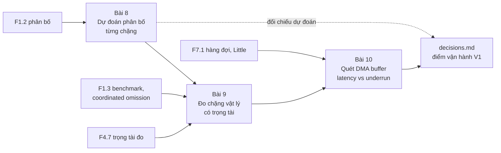
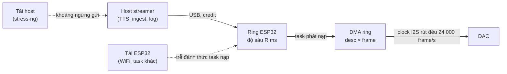

# Khóa 3 — Module 2: Đo độ trễ thật (16h)

Ba bài, một mạch: **Bài 8** đoán trước độ trễ của cả chuỗi Submit → tai người nghe dưới dạng *phân bố*. **Bài 9** dựng một phép đo có trọng tài cho chặng khó nhất (từ dòng code tới không khí) và đo luôn sai số của chính phép đo. **Bài 10** quét kích thước DMA buffer để có đường cong đánh đổi độ trễ/độ tin cậy, rồi chốt một quyết định có số đỡ lưng.

Module này nối thẳng vốn backend của bạn (latency budget, p99, hàng đợi, SLO) vào một hệ có tầng vật lý. Nó cũng là nơi dễ mang theo nhiều mô hình backend chỉ đúng một nửa nhất, nên mỗi bài có phần chấm mô hình.

Gate liên quan: tiêu chí **M4 số 3** (TN-2: ≥5 điểm DMA buffer, mỗi điểm ≥10 phút, latency GPIO→mic độ phân giải ≤1 ms) và **M4 số 6** (bảng latency budget, mọi dòng là số đo, nút thắt được chỉ tên).



---

## Bài 8 — Latency budget: dự đoán trước (3h)

> **Vị trí:** K3 Bài 7 (mic, SNR) → **Bài 8** → K3 Bài 9 (đo chặng vật lý) · **Cần trước:** F1.2 (phân bố, percentile), F1.7 (preregistration = `prediction.md`), K3 Bài 4 (DMA/ring buffer); F6.6 (Monte Carlo) đọc lướt · **Sau bài này bạn quyết định được:** chặng nào đáng tối ưu trước, và SLO "Submit → âm thanh" của V1 nên viết bằng percentile nào, đo ở đâu.

### 1. Câu chuyện — ai đã khổ vì chuyện này

Năm 1958, chương trình tên lửa Polaris của Hải quân Mỹ dùng PERT để ước lượng thời gian hoàn thành dự án: mỗi việc có ba ước lượng (lạc quan, khả dĩ nhất, bi quan), cộng dọc theo đường găng (critical path). Phê bình kinh điển về PERT là nó **cộng kỳ vọng dọc một đường rồi coi tổng là gần chuẩn**, trong khi trễ thật của dự án nằm ở đuôi và ở các nhánh song song gặp nhau [chuẩn]. Ngành quản trị dự án mất vài chục năm để chuyển sang mô phỏng Monte Carlo lịch trình.

Bản backend của cùng nỗi khổ: Dean và Barroso ("The Tail at Scale", CACM 2013) chỉ ra nếu một server có p99 = 1 s và một request phải chạm 100 server, thì xác suất request đó gặp ít nhất một lần chậm là 1 − 0.99¹⁰⁰ ≈ 63% [chuẩn]. Chuỗi audio của bạn không fan-out mà **nối tiếp**: tám chặng xếp hàng, mỗi chặng có phân bố riêng. Bài toán đổi từ "max của nhiều biến" sang "tổng của nhiều biến", nhưng bài học giữ nguyên: **ngân sách độ trễ là phép tính trên phân bố, không phải trên các con số**.

### 2. Mô hình tư duy



```mermaid
flowchart LR
  A["Submit form"] -->|"① Google: Form→Sheet<br/>KHÔNG kiểm soát"| B["Sheet có dòng"]
  B -->|"② phát hiện: poll/webhook<br/>kiểm soát"| C["Ingest thấy record"]
  C -->|"③ TTS: RTF × độ dài<br/>kiểm soát"| D["PCM sẵn sàng"]
  D -->|"④ USB-CDC<br/>kiểm soát một phần"| E["Ring buffer ESP32"]
  E -->|"⑤ chờ trong ring<br/>kiểm soát"| F["I2S DMA"]
  F -->|"⑥ DMA: desc×frame/fs<br/>kiểm soát — bài chính"| G["Dây I2S"]
  G -->|"⑦ DAC filter + amp + loa<br/>chọn linh kiện"| H["Màng loa"]
  H -->|"⑧ không khí: d/c<br/>vật lý"| I["Tai / mic"]
```

Mỗi mũi tên là một **biến ngẫu nhiên**, không phải một con số. Hình dạng của chúng khác nhau tận gốc:

| Chặng | Hình dạng phân bố điển hình | Vì sao |
|---|---|---|
| ② poll chu kỳ T | **Đều** trên [0, T] | Record đến vào thời điểm ngẫu nhiên so với nhịp poll |
| ③ TTS | Lệch phải (log-normal-ish), phụ thuộc độ dài câu | Chi phí cố định + chi phí theo độ dài, cộng nhiễu CPU |
| ④ USB, scheduler | Hẹp, **thỉnh thoảng có gai** | Phần lớn nhanh; đôi khi bị scheduler/IRQ chặn |
| ⑥ DMA | Gần hằng số, cộng một phần lẻ đều trong một descriptor | Phần cứng rút theo clock; thời điểm ghi rơi ngẫu nhiên trong chu kỳ descriptor |
| ⑧ không khí | Hằng số (phụ thuộc nhiệt độ, khoảng cách) | Vật lý |

Ba câu bản chất:
1. **Trung bình cộng được, percentile thì không.** E[X+Y] = E[X] + E[Y] luôn đúng (tuyến tính của kỳ vọng). p99(X+Y) không bằng p99(X)+p99(Y): với các chặng độc lập, cộng p99 thường **ước lượng quá cao** (hiếm khi mọi chặng cùng xấu); nhưng có phân bố mà cộng p99 lại **ước lượng quá thấp** (xem phản ví dụ trong mô phỏng).
2. Phân bố của tổng là **tích chập** các phân bố (khi độc lập). Không tính tay được thì **mô phỏng Monte Carlo**: rút mẫu từng chặng, cộng, đọc percentile của tổng.
3. Chặng có **độ rộng** lớn nhất quyết định đuôi của tổng, kể cả khi trung bình của nó không lớn nhất.

Mô phỏng đồ chơi (tham số là ba *hình dạng* trừu tượng, cố ý không gán cho chặng thật nào; bạn thay bằng dự đoán của mình ở mục 5):

```python
# [đã chạy] Monte Carlo: cộng PHÂN BỐ các chặng, không cộng trung bình / p99
import numpy as np
import matplotlib.pyplot as plt

rng = np.random.default_rng(0)
N = 200_000
# Ba chặng đồ chơi (ms) — THAY bằng phân bố bạn dự đoán cho từng chặng thật
A = rng.uniform(0, 1000, N)                       # kiểu "chờ chu kỳ poll": đều trong [0, T]
B = rng.lognormal(np.log(300), 0.5, N)            # kiểu "tính toán": lệch phải
C = 5 + np.where(rng.random(N) < 0.02,            # kiểu "thường nhanh, thỉnh thoảng giật"
                 rng.exponential(80, N), rng.exponential(1, N))
S = A + B + C

def p(x, q): return np.percentile(x, q)
print(f"{'':10s}{'mean':>8s}{'p50':>8s}{'p99':>8s}")
for name, x in [("A", A), ("B", B), ("C", C)]:
    print(f"{name:10s}{x.mean():8.0f}{p(x,50):8.0f}{p(x,99):8.0f}")
print(f"{'cộng số':10s}{A.mean()+B.mean()+C.mean():8.0f}"
      f"{p(A,50)+p(B,50)+p(C,50):8.0f}{p(A,99)+p(B,99)+p(C,99):8.0f}")
print(f"{'phân bố':10s}{S.mean():8.0f}{p(S,50):8.0f}{p(S,99):8.0f}")

# Phản ví dụ: cộng p99 KHÔNG luôn là cận trên an toàn
X = np.where(rng.random(N) < 0.006, 1000.0, 0.0)  # 0,6% lần giật 1000 ms
Y = np.where(rng.random(N) < 0.006, 1000.0, 0.0)
print("p99(X)+p99(Y) =", p(X, 99) + p(Y, 99), " | p99(X+Y) =", p(X + Y, 99))

plt.hist(S, bins=200, density=True, histtype="step", label="tổng (Monte Carlo)")
for q in (50, 99):
    plt.axvline(p(S, q), ls="--", label=f"p{q} tổng")
plt.axvline(p(A,99)+p(B,99)+p(C,99), color="r", label="cộng các p99")
plt.xlabel("ms"); plt.legend(); plt.show()
```

Trước khi chạy, viết vào `prediction.md`: dòng "cộng số" và dòng "phân bố" sẽ khác nhau ở cột nào, theo chiều nào; dòng phản ví dụ in ra gì. Kết quả gập ở mục 7.

### 3. Cầu nối từ backend

| Backend bạn biết | Ở đây | Gãy ở chỗ | Nếu dùng nhầm thì |
|---|---|---|---|
| Latency budget của API: cộng thời gian các span trong trace | Cộng tám chặng từ Submit tới tai | Trace của bạn có mọi span cùng một đồng hồ process. Ở đây chặng ① có đồng hồ Google, chặng ⑥–⑧ không có "span" nào trong code, phải đo bằng dụng cụ ngoài (Bài 9) | Bảng budget có dòng "đo" thực chất là ước lượng chép từ công thức; M4 số 6 FAIL mà bạn không biết |
| SLO "p99 < 300 ms" cho một endpoint | SLO cho "Submit → âm thanh" | Ở đây có **hai** SLO độc lập: độ trễ bắt đầu (thấp là tốt) và **tính liên tục** khi đã phát (underrun = 0). API không có khái niệm "đang trả lời thì không được chậm một chút" | Tối ưu độ trễ bằng cách thu nhỏ buffer và phá SLO liên tục (Bài 10) |
| Cron poll mỗi T giây | Chặng ② | Không gãy: trễ phát hiện đều trên [0, T], trung bình T/2, xấu nhất T. Gãy ở chỗ người ta hay chỉ ghi "T/2" | Budget dùng T/2 thì p99 thiếu gần T/2 |
| Đặt timeout từng service bằng p99 của nó | Đặt buffer từng chặng bằng p99 của chặng | Cộng p99 không phải p99 của tổng; với gai hiếm thì còn **thấp hơn** thật | Ngân sách vừa phình (thừa buffer, trễ cao) vừa có thể hở đuôi |
| Profiler chỉ chỗ tốn CPU nhất | "Nút thắt" | Nút thắt độ trễ có thể là **thời gian chờ** không tốn CPU (poll, buffer), profiler không thấy | Tối ưu TTS thêm 30% trong khi chặng chờ chiếm phần lớn |

**Chấm mô hình:**

- *"Cộng trung bình các chặng ra trung bình tổng."* — **ĐÚNG**, nhưng gần như vô dụng cho trải nghiệm. Tuyến tính của kỳ vọng không cần độc lập. Chỗ gãy: người nghe không cảm nhận trung bình; họ nhớ lần đợi lâu nhất. Phản ví dụ: hai cấu hình cùng trung bình 3 s, một cái p99 = 3,2 s, một cái p99 = 9 s.
- *"p99 của tổng = cộng p99 các chặng, và ít nhất nó là cận trên an toàn."* — **SAI.** Với các chặng độc lập có đuôi vừa phải, cộng p99 thường quá cao. Phản ví dụ ngược chiều (chạy mô phỏng): hai chặng mỗi chặng chỉ 0,6% lần giật 1000 ms. p99 mỗi chặng = 0, cộng lại = 0; nhưng xác suất *ít nhất một* chặng giật ≈ 1,2% > 1%, nên p99 của tổng là 1000 ms. Đây là cùng lý do VaR trong tài chính không có tính dưới cộng (mục 10).
- *"Nút thắt là chặng có trung bình lớn nhất."* — **ĐÚNG MỘT PHẦN.** Cho p50, gần đúng. Cho p99, chặng có độ rộng (phương sai, đuôi) lớn nhất mới quyết định. Và "nút thắt đáng tối ưu" còn phải **kiểm soát được**: chặng ① có thể lớn nhưng bạn không chạm vào được; quyết định đúng có khi là đổi kiến trúc để bỏ hẳn chặng đó.

### 4. Thuật ngữ

| Mức | Thuật ngữ | Nghĩa trong một câu | Hay bị hiểu nhầm thành |
|---|---|---|---|
| 🟢 | Latency budget | Bảng chia tổng độ trễ cho phép thành phần của từng chặng, mỗi phần có cách đo | Danh sách con số trung bình |
| 🟢 | Percentile (p50/p95/p99) | Giá trị mà q% mẫu nằm dưới | Thứ có thể cộng/trung bình giữa các chặng hay các máy |
| 🟢 | Đuôi (tail) | Phần hiếm nhưng lớn của phân bố | Ngoại lệ có thể bỏ |
| 🟢 | Monte Carlo | Rút mẫu ngẫu nhiên từ mô hình để ước lượng phân bố của đại lượng phức tạp | Kỹ thuật chỉ dành cho tài chính/vật lý hạt |
| 🟡 | Tích chập phân bố | Phân bố của tổng hai biến độc lập | Cộng hai histogram theo từng bin |
| 🟡 | Critical path | Chuỗi chặng nối tiếp quyết định tổng thời gian | Chặng chậm nhất |
| 🟡 | Kiểm soát được / không | Chặng mà cấu hình của bạn thay đổi được phân bố | Chặng bạn "viết code" ở đó |
| 🔴 | Tính dưới cộng (subadditivity) của độ đo rủi ro | Rủi ro của tổng ≤ tổng rủi ro; VaR/percentile không có tính này | Thuộc tính hiển nhiên của mọi thước đo |

### 5. Dự đoán

**Đề:** với mỗi chặng ①–⑧, dự đoán *hình dạng phân bố*, p50, p99, và cách đo ở Bài 9–13/Bài 14. Rồi đưa các phân bố đó vào mô phỏng Monte Carlo để có p50/p99 của tổng. Ký tên dưới một câu: "Nút thắt của p50 là …; nút thắt của p99 là …".

**Tham số cần tra (tra ở đâu):**
- ① Form → Sheet: không có tài liệu cam kết. Ghi `[tự đo]`. Chú ý cột Timestamp của Google Forms hiển thị tới **giây** `[tự đo]`, tức phép đo bằng cột này có độ phân giải ~1 s.
- ② Phát hiện: chu kỳ poll T **do bạn chọn** (quyết định push/pull ở K3 Bài 14); webhook Apps Script thì tra quota/độ trễ trong tài liệu Apps Script và ghi `[tự đo]`.
- ③ TTS: RTF tác giả model công bố (README của model, ghi rõ máy họ đo) × độ dài câu. RTF trên N100 là `[tự đo]` ở Bài 12. Độ dài câu 20 từ tiếng Việt: đếm bằng cách tự đọc to và bấm giờ.
- ④ USB: ESP32-S3 dùng USB full-speed (12 Mbit/s); host poll endpoint bulk theo khung 1 ms `[spec: USB 2.0, full-speed frame = 1 ms]`. Phần còn lại là scheduler Linux, `[tự đo]`.
- ⑤ Ring buffer ESP32: mức đầy mục tiêu bạn cấu hình (byte) ÷ 96 000 byte/s (24 kHz, 16-bit, stereo).
- ⑥ DMA: `dma_desc_num × dma_frame_num / fs` từ K3 Bài 4; **đọc lại giá trị driver chấp nhận** (mỗi descriptor tối đa 4092 byte, xem Bài 10).
- ⑦ DAC: bảng "group delay" của bộ lọc nội suy trong datasheet PCM5102A (TI, SLAS859, mục Specifications), đơn vị là số chu kỳ mẫu tS; nhân với 1/fs. Amp class-D analog và loa: tìm trong datasheet amp của bạn; nếu không có, ghi `[tự đo]`.
- ⑧ Không khí: c ≈ 331,3 + 0,606·T(°C) m/s `[chuẩn]`; khoảng cách mic–loa của bạn.

**Phương pháp:** sửa ba mảng A, B, C trong mô phỏng thành tám mảng theo phân bố bạn chọn (uniform, lognormal, hằng số, hỗn hợp có gai). Nếu không biết độ rộng, chọn một khoảng và ghi lý do. Nếu V1 có thể chạy TTS trên GPU thuê, thêm chặng "mạng LAN/Internet" (lộ trình tổng mục 4.3 có dòng này).

**Mẫu `prediction.md`:**

```markdown
# Bài 8 — Latency budget (commit trước khi đo)
Ngày, commit firmware, cấu hình DMA dự kiến:

| Chặng | Hình dạng | p50 | p99 | Kiểm soát? | Đo bằng (bài) | Độ phân giải phép đo |
|---|---|---|---|---|---|---|
| ① Form→Sheet | | | | Không | | |
| ② Phát hiện (T=…) | | | | Có | | |
| ③ TTS (câu 20 từ) | | | | Có | | |
| ④ Host→ESP32 | | | | Một phần | | |
| ⑤ Ring ESP32 | | | | Có | | |
| ⑥ I2S DMA | | | | Có | | |
| ⑦ DAC+amp+loa | | | | Chọn linh kiện | | |
| ⑧ Không khí (d=…) | | | | Không | | |
| **Tổng (Monte Carlo)** | | | | | | |
| **Cộng p99 các chặng** | | — | | | | |

Nút thắt p50: …    Nút thắt p99: …    (ký tên)
Dự đoán mô phỏng đồ chơi: "cộng số" vs "phân bố" khác ở cột …, theo chiều …; phản ví dụ in ra …
```

### 6. Làm

1. **Định nghĩa sự kiện đầu và cuối** của mỗi chặng thành câu cụ thể ("② bắt đầu khi Sheet có dòng, kết thúc khi ingest ghi log `seen id=…`"). Chặng không định nghĩa được sự kiện đầu/cuối thì không đo được.
2. **Ghi đồng hồ của từng sự kiện.** Timestamp của Sheet là đồng hồ Google; log ingest là đồng hồ mini PC (đã NTP chưa? lệch bao nhiêu? → F4.4); GPIO marker và mic là đồng hồ logic analyzer. Chặng nào có hai đầu ở hai đồng hồ khác nhau, ghi sai số đồng bộ vào cột "độ phân giải".
3. Điền bảng dự đoán (mục 5), **không** đo gì trước.
4. Chạy mô phỏng Monte Carlo với phân bố của bạn, ghi p50/p99 của tổng và của "cộng p99".
5. Viết câu nút thắt, ký tên, commit `lab/08-latency-budget/prediction.md`.
6. (Gợi ý cho chặng ①, làm ở K3 Bài 14) Để đo chặng ① có độ phân giải tốt hơn 1 s, dùng một script gửi form thử nghiệm của chính bạn và ghi thời điểm gửi bằng đồng hồ host đã đồng bộ; poll dày trong lúc thử. Ghi `[tự đo]` cho mọi thứ về hành vi phía Google.

Sai số dụng cụ ở bài này: không có dụng cụ, chỉ có giả định. Ghi giả định nào là lớn nhất vào cuối `prediction.md`.

### 7. Số phải ra

<details><summary>🔒 MỞ SAU KHI COMMIT prediction.md</summary>

**Bài này không có "số đúng"**; giá trị nằm ở so sánh với Bài 9, 10, 12, 13, 14. Những gì *phải* thấy:

**Mô phỏng đồ chơi (seed 0):**

| | mean | p50 | p99 |
|---|---|---|---|
| A (đều 0–1000) | 499 | 498 | 990 |
| B (lognormal) | 340 | 300 | 959 |
| C (có gai) | 8 | 6 | 62 |
| cộng số | 847 | 804 | 2011 |
| phân bố tổng | 847 | 844 | 1669 |

- Mean khớp tuyệt đối (tuyến tính).
- p50 của tổng **lớn hơn** tổng các p50 (vì B lệch phải, mean > median).
- p99 của tổng **nhỏ hơn** tổng các p99 khoảng 17% ở đây: cộng p99 quá thận trọng khi các chặng độc lập.
- Phản ví dụ in `p99(X)+p99(Y) = 0.0 | p99(X+Y) = 1000.0`: cộng p99 hở đuôi khi gai hiếm (< 1%) ở nhiều chặng.

**Nút thắt.** Với kiến trúc poll Sheets, chặng ① + ② (Google + chu kỳ poll) thường chiếm phần lớn cả p50 lẫn p99 của tổng, ở thang **giây**; TTS là thang trăm ms tới giây tùy RTF và độ dài câu; DMA là thang chục tới trăm ms; ④⑦⑧ là thang ms hoặc dưới ms `[ước lượng]` (chỉ là ước lượng bậc độ lớn, số thật là của bạn). Người nền backend hay đoán TTS hoặc DMA vì đó là chỗ có code. Hệ quả quyết định: thu DMA từ 50 ms xuống 10 ms (đổi bằng rủi ro underrun, Bài 10) không đáng nếu chặng ①② cỡ giây; đòn bẩy lớn nhất là webhook thay poll (K3 Bài 14) và streaming TTS (Bài 13).

**Chặng ⑦ không phải "< 1 ms hiển nhiên".** Bộ lọc nội suy của PCM5102A có group delay 20 tS ở chế độ normal và 3,5 tS ở low-latency `[spec: TI SLAS859, bảng Specifications; phần mô tả chi tiết ghi 22 tS cho normal — datasheet tự mâu thuẫn]`. Ở 24 kHz: 20/24000 ≈ 0,83 ms. Amp class-D analog và loa đóng góp cỡ chục–trăm µs `[ước lượng]`. Nếu mic là MEMS số (INMP441), bộ lọc decimation trong mic cũng thêm trễ `[tự đo]` (không tìm thấy con số trong datasheet; đo ở Bài 9).

**Không khí:** 0,30 m / 343 m/s = 0,875 ms ở 20 °C; ở 30 °C, c ≈ 349,5 m/s → 0,858 ms. Sai lệch nhiệt độ nhỏ hơn độ phân giải mục tiêu 1 ms, nhưng sai lệch **khoảng cách** 3 cm đã là 0,09 ms.
</details>

### 8. Nếu ra khác

| Triệu chứng | Nguyên nhân khả dĩ | Kiểm bằng cách | Sửa |
|---|---|---|---|
| Mô phỏng: p99 tổng ≈ cộng p99 | Bạn cho các chặng tương quan hoàn toàn (cùng một nguồn ngẫu nhiên), hoặc một chặng áp đảo | In hệ số tương quan giữa các mảng; xem chặng nào có độ rộng lớn nhất | Hợp lý nếu thật sự tương quan (cùng tải CPU đè lên ③④⑤); ghi giả định |
| Không viết được hình dạng phân bố cho một chặng | Chưa hiểu cơ chế chặng đó | Viết cơ chế thành một câu "chờ cái gì" | Đọc lại K3 Bài 4 (DMA/ring) hoặc để lại `[tự đo]` với khoảng rộng |
| Bảng có cột "đo bằng" nhưng không có độ phân giải | Quên rằng mỗi phép đo có sai số | Hỏi: "đồng hồ nào, tick bao nhiêu" | Thêm cột, → F1.1 |
| Tổng dự đoán bị chi phối bởi chặng ① mà bạn không đo được | Đúng là vậy | — | Ghi rõ; M4 số 6 đòi "mọi dòng là số đo": chặng ① đo bằng script gửi form + đồng hồ host |

### 9. Câu hỏi ngược

1. **[Nếu…thì]** Nếu đổi poll T = 10 s sang webhook có trễ p50 ~1 s nhưng thỉnh thoảng mất sự kiện (phải có poll dự phòng mỗi 60 s), phân bố chặng ② trông thế nào? Một hỗn hợp; p99 của nó do thành phần nào quyết định?
   <details><summary>Hướng nghĩ</summary>Mô hình hóa thành hỗn hợp: (1−p)·webhook + p·đều[0, 60]. Với p chỉ 2%, p99 rơi vào thành phần poll dự phòng. Đây là bản "gai hiếm" của mô phỏng: tỉ lệ mất sự kiện của webhook là tham số phải đo, không phải chi tiết.</details>
2. **[Quy mô]** 100 robot dùng chung một TTS server và một Sheet. Chặng nào đổi hình dạng phân bố trước? Chặng nào từ "độc lập" thành "tương quan"?
   <details><summary>Hướng nghĩ</summary>TTS server thành hàng đợi: thời gian chờ phụ thuộc utilization (→ F7.1, đầu gối M/M/1). Quota API Sheets là tài nguyên chung: khi chạm quota, mọi robot cùng chậm, nên các mẫu không còn độc lập và Monte Carlo giả định độc lập sẽ đánh giá thấp đuôi.</details>
3. **[Failure mode]** Một chặng không bao giờ chậm nhưng thỉnh thoảng **mất** (record không bao giờ được phát). Trong bảng latency budget, nó nằm ở đâu? Percentile nào của độ trễ bắt được nó?
   <details><summary>Hướng nghĩ</summary>Mất = độ trễ vô hạn; percentile tính trên các mẫu "đã đến" bỏ sót hoàn toàn (survivorship). Cần một chỉ số riêng: tỉ lệ hoàn thành trong X giây. Đây là lý do SLO tốt viết "99% record được phát trong 30 s", gộp cả chậm lẫn mất.</details>
4. **[Vì sao không]** Vì sao không đơn giản đặt mọi buffer thật lớn cho chắc, khi nút thắt đằng nào cũng ở Google?
   <details><summary>Hướng nghĩ</summary>Vì buffer không chỉ cộng độ trễ một lần: nó quyết định độ trễ của *mọi* thao tác điều khiển đi qua cùng đường (dừng khẩn, tắt tiếng, kill switch K3 Bài 15). Nghĩ về bufferbloat (Bài 10).</details>
5. **[Liên ngành]** PERT cộng kỳ vọng dọc đường găng. Trong chuỗi của bạn có "nhánh song song gặp nhau" nào không (hai việc phải xong cả hai mới đi tiếp)? Nếu có, tổng không còn là tổng mà là max. Max của hai phân bố cư xử thế nào so với từng cái?
   <details><summary>Hướng nghĩ</summary>Ví dụ: moderation (K3 Bài 15) và TTS chạy song song, phát khi cả hai xong. max(X, Y) có đuôi nặng hơn cả hai; đây là "Tail at Scale" thu nhỏ.</details>

### 10. Liên kết ra ngoài

- **Quản trị dự án (PERT → Monte Carlo lịch trình).** Giống: tổng thời gian dọc đường găng, mỗi việc là một phân bố. Khác: việc trong dự án có tương quan mạnh (cùng đội, cùng rủi ro), nên mô phỏng độc lập đánh giá thấp đuôi. Chuỗi audio của bạn cũng có tương quan khi chung một CPU.
- **Tài chính (VaR không dưới cộng).** Artzner, Delbaen, Eber, Heath ("Coherent Measures of Risk", 1999) chứng minh VaR, tức một percentile của lỗ, có thể cho VaR(A+B) > VaR(A) + VaR(B), đúng kiểu phản ví dụ hai gai hiếm. Ngành chuyển sang expected shortfall (trung bình của phần đuôi). Bản tương ứng ở đây: báo thêm "trung bình của 1% xấu nhất" bên cạnh p99.
- **Viễn thông (ngân sách trễ miệng–tai).** ITU-T G.114 khuyến nghị độ trễ một chiều cho thoại, giới hạn ~150 ms cho phần lớn ứng dụng tương tác `[spec: ITU-T G.114]`, và cách phân bổ cho codec, mạng, jitter buffer. Giống: ngân sách chia theo chặng. Khác: thoại là tương tác hai chiều nên ngưỡng chặt; robot đọc confession là một chiều, ngưỡng do kỳ vọng người nghe quyết định.

### 11. Độ tin cậy và sửa lỗi

| Khẳng định | Nhãn | Ghi chú / cách kiểm |
|---|---|---|
| E[tổng] = tổng E | [chuẩn] | Tuyến tính kỳ vọng, không cần độc lập |
| p99 tổng có thể > tổng p99 | [chuẩn] | Chạy phản ví dụ trong mô phỏng |
| Poll chu kỳ T → trễ đều [0, T] | [chuẩn] | Giả định record đến ngẫu nhiên so với pha poll |
| USB full-speed frame 1 ms | [spec] | USB 2.0 specification |
| Group delay bộ lọc PCM5102A (hai chế độ, chọn bằng chân FLT) | [spec] | TI SLAS859; giá trị ở khối 🔒 mục 7. Datasheet ghi hai con số khác nhau cho chế độ normal ở hai bảng — đo ở Bài 9 |
| Timestamp Google Forms độ phân giải 1 s | [tự đo] | Mở Sheet, xem định dạng cột |
| Độ trễ Form → Sheet | [tự đo] | Không có cam kết công khai |

**Đã sửa so với bản gốc/Gemini:**
- Gemini ghi chặng DAC + amp + loa "< 1 ms, gần như tức thì" ở Bài 8, rồi "1–5 ms" ở Bài 9: tự mâu thuẫn. Thực tế phần lớn đến từ bộ lọc số của DAC (và của mic MEMS khi đo), không từ amp hay loa; có số datasheet cho DAC, phần còn lại `[tự đo]`.
- Gemini và lộ trình ghi chặng ② "poll = T/2": đó chỉ là trung bình; p99 ≈ 0,99·T.
- Gemini ghi USB "jitter 1–5 ms" như sự thật: không có nguồn, chuyển thành `[tự đo]`.
- Gemini nói thẳng đáp án nút thắt ngay trong phần dạy; ở đây đáp án được niêm phong.
- Bổ sung so với gốc: cột hình dạng phân bố, cột độ phân giải phép đo, đồng hồ của mỗi sự kiện, và Monte Carlo. Gốc chỉ có cột "dự đoán" một số.

### 12. Đọc thêm và tự kiểm tra

- **Nguồn gốc:** TI, *PCM510xA datasheet* (SLAS859), bảng group delay; ITU-T Recommendation G.114, *One-way transmission time*.
- **Giải thích:** Jeffrey Dean, Luiz André Barroso, "The Tail at Scale", *Communications of the ACM*, 2013.
- **Đào sâu (tùy chọn):** Philippe Artzner và cộng sự, "Coherent Measures of Risk", *Mathematical Finance*, 1999 (đọc phần ví dụ VaR không dưới cộng).
- **Tự kiểm tra:** (1) giải thích lại cho một backend engineer khác trong 5 câu vì sao không cộng p99; (2) vẽ lại sơ đồ tám chặng và hình dạng phân bố từng chặng từ trí nhớ; (3) hai câu:
  - Poll T = 20 s. p50 và p99 của chặng ② là bao nhiêu?
  - Ba chặng độc lập, mỗi chặng có 0,4% lần trễ thêm 2 s, còn lại 0. p99 của tổng là bao nhiêu?
  <details><summary>Đáp án</summary>p50 = 10 s, p99 = 19,8 s. Ba chặng: P(ít nhất một gai) = 1 − 0,996³ ≈ 1,2% > 1%, nên p99 của tổng = 2 s, trong khi p99 từng chặng = 0 (P(hai gai) ≈ 0,005% nên không tới 4 s).</details>

---

## Bài 9 — TN-2: Đo độ trễ từ phần mềm ra không khí (7h)

> **Vị trí:** K3 Bài 8 (dự đoán) → **Bài 9** → K3 Bài 10 (quét DMA) · **Cần trước:** F1.1 (sai số hệ thống vs ngẫu nhiên, resolution vs accuracy), F1.3 (coordinated omission), F4.6 (thời điểm của một phép đo cảm biến, cross-correlation), F4.7 (trọng tài đo), F5.2 (DMA), K3 Bài 3 (logic analyzer), K3 Bài 7 (INMP441) · **Sau bài này bạn quyết định được:** phép đo nào là trọng tài cho tiêu chí M4 số 3, và một chênh lệch độ trễ giữa hai cấu hình là thật hay nằm trong sai số của dụng cụ.

### 1. Câu chuyện — ai đã khổ vì chuyện này

Trong audio chuyên nghiệp, con số độ trễ mà driver *tự báo* và con số đo được bằng loopback (dây nối từ output về input, phát xung, đo khoảng cách) lệch nhau là chuyện thường; vì vậy dân làm âm thanh đo round-trip latency bằng loopback thay vì tin driver `[chuẩn]`. Android gặp đúng chuyện này ở quy mô hàng trăm mẫu máy: tài liệu "Audio latency measurements" của dự án Android mô tả việc đo round-trip latency bằng một dongle loopback phần cứng cắm vào jack tai nghe, vì không có cách nào khác để có cùng một thước đo cho mọi thiết bị `[chuẩn]`. Bài học chung: **phần mềm không thấy được thời điểm sóng âm rời màng loa**. Mọi vùng đệm nằm sau dòng code cuối cùng của bạn là vô hình với đồng hồ của bạn.

Nửa còn lại của bài là chặng host → ESP32, nơi sai lầm đến từ chính công cụ đo. Gil Tene đặt tên cho nó là **coordinated omission**: một công cụ đo vòng kín (gửi request tiếp theo sau khi nhận trả lời) tự động *ngừng đo* đúng lúc hệ thống đang chậm, nên phân bố nó báo cáo đẹp hơn thật nhiều lần. Công cụ `wrk2` ra đời để sửa đúng lỗi này của `wrk`.

### 2. Mô hình tư duy

Phép đo cần một **trọng tài**: một dụng cụ có *một* đồng hồ, thấy được *cả hai* sự kiện. Logic analyzer làm việc đó: kênh D0 thấy cạnh GPIO (sự kiện phần mềm), kênh D3 thấy dữ liệu mic (sự kiện vật lý đã số hóa), cùng một thạch anh lấy mẫu.

```
thời gian ──────────────────────────────────────────────────────────────►
code      : ...write(chunk k)  ▲GPIO lên
DMA ring  : [d0 đang phát][d1 chờ][d2 chờ] → [d1][d2][d0←chunk k] ...
                               |<--- phần còn lại của ring (pha DMA) --->|
dây I2S   : ...0000000000000000000000000000000000000000|click click...
DAC lọc   :                                             |<-gd DAC->|
loa+không khí :                                                     |<-0,87 ms->|
mic (MEMS) :                                                                    |<-gd mic->|
SD mic trên LA:                                                                            ▲onset
          |<================ đại lượng LA đo được (D0 ▲ → D3 ▲) =====================>|
```

Đại lượng đo được = **pha DMA lúc ghi** + phần ring phía trước + group delay DAC + loa + không khí + group delay mic + **sai lệch của bộ dò onset**. Chỉ có phần đầu là thứ Bài 10 muốn quét; mọi thứ còn lại là "phần dư" phải hiểu chứ không chỉ trừ.

Ba câu bản chất:
1. **Độ phân giải của dụng cụ ≠ độ phân tán của hệ.** LA ở 8 MHz có tick 125 ns; nhưng nếu thời điểm ghi rơi ngẫu nhiên trong một chu kỳ descriptor dài T, hệ tự có độ phân tán cỡ T/√12. Lặp 10 lần thấy std vài ms không có nghĩa dụng cụ kém.
2. **Sai số hệ thống không giảm khi lặp.** Đặt marker sai chỗ, bộ dò onset trễ theo âm lượng, khoảng cách đo sai 3 cm: lặp 100 lần vẫn lệch y nguyên (→ F1.1).
3. **Đo vòng kín dưới tải là đo sai** (coordinated omission): khi hệ dừng 200 ms, công cụ vòng kín ghi *một* mẫu chậm thay vì 20 mẫu mà lịch đều lẽ ra phải ghi.

**Ngân sách sai số của phép đo** (điền số của bạn, → F4.7; với lượng tử đều Δ, độ lệch chuẩn là Δ/√12 theo GUM loại B):

| Nguồn | Loại | Cách ước lượng | Cách giảm |
|---|---|---|---|
| Tick của LA | ngẫu nhiên, đều | Δ = 1/f_LA | Tăng f_LA (đổi lấy thời gian capture/băng thông USB) |
| Sai số tần số thạch anh LA | hệ thống, tỉ lệ | ppm × độ trễ đo | Kiểm bằng một clock đã biết (BCK của chính ESP32) |
| Chu kỳ mẫu mic | ngẫu nhiên, đều | 1/fs_mic | Cross-correlation có nội suy dưới mẫu |
| Bộ dò onset bằng ngưỡng | **hệ thống**, phụ thuộc âm lượng | Mô phỏng bên dưới | Dùng cross-correlation với tín hiệu tham chiếu |
| Chi phí lệnh bật GPIO | hệ thống, nhỏ | Đo độ rộng xung lên-xuống liên tiếp trên LA | Ghi thanh ghi trực tiếp |
| Khoảng cách mic–loa | hệ thống | ±d / c | Đo kỹ, cố định giá |
| Nhiệt độ không khí | hệ thống | Δc/c × d/c | Ghi nhiệt độ phòng |
| Group delay mic MEMS | hệ thống, chưa biết | Datasheet nếu có, không thì đo bằng hai khoảng cách | Đo ở hai khoảng cách, ngoại suy về 0 (mục 6) |
| Pha DMA lúc ghi | **đặc tính của hệ**, không phải sai số dụng cụ | ~T/√12 nếu đều | Đo ở trạng thái dừng (click giữa luồng liên tục) |

Mô phỏng 1: bộ dò onset có lệch theo âm lượng không? (dự đoán trước khi chạy: phương pháp nào lệch, lệch theo chiều nào khi giảm âm lượng 10 lần, và chuyện gì xảy ra với ngưỡng k = 20 khi âm lượng nhỏ).

```python
# [đã chạy] Sai số của chính phép đo onset: ngưỡng vs cross-correlation
import numpy as np
from scipy import signal

fs = 24_000                       # tần số lấy mẫu mic
rng = np.random.default_rng(1)
t = np.arange(int(0.02 * fs)) / fs
ref = np.sin(2 * np.pi * 1000 * t)            # burst 1 kHz, 20 ms, bắt đầu dốc đứng
b, a = signal.butter(2, [300, 5000], btype="band", fs=fs)  # "loa + phòng" đồ chơi

def record(delay_s, gain, noise=0.01):
    """Mô phỏng mic: trễ thật (có phần lẻ dưới 1 mẫu) + lọc + nhiễu."""
    n = int(0.2 * fs)
    up = 16                                    # dựng trễ lẻ bằng lưới mịn hơn
    fine = np.zeros(n * up)
    k0 = int(round(delay_s * fs * up))
    fine[k0:k0 + len(ref) * up] = np.repeat(ref, up)
    x = signal.lfilter(b, a, fine[::up]) * gain
    return x + noise * rng.standard_normal(n)

def onset_threshold(x, k=5, noise_win=200):
    sigma = x[:noise_win].std()
    return np.argmax(np.abs(x) > k * sigma) / fs   # không vượt ngưỡng -> argmax trả 0: lỗi IM LẶNG

def onset_xcorr(x):
    c = signal.correlate(x, ref, mode="valid")
    return np.argmax(c) / fs

true = 0.0523
for gain in (1.0, 0.1):                        # to vs nhỏ (đổi âm lượng)
    for k in (5, 20):
        e = [onset_threshold(record(true + rng.uniform(0, 1 / fs), gain), k) - true
             for _ in range(50)]
        print(f"gain={gain:4} ngưỡng k={k:2}: lệch {np.mean(e)*1e3:6.3f} ms ± {np.std(e)*1e3:.3f}")
    e = [onset_xcorr(record(true + rng.uniform(0, 1 / fs), gain)) - true for _ in range(50)]
    print(f"gain={gain:4} xcorr       : lệch {np.mean(e)*1e3:6.3f} ms ± {np.std(e)*1e3:.3f}")
```

Mô phỏng 2: đo round-trip host ↔ ESP32 bằng vòng kín và vòng mở, trong một hệ thỉnh thoảng "đứng hình" 200 ms (dự đoán: hai cách cho p50 khác nhau không? p99? max?).

```python
# [đã chạy] Coordinated omission khi đo round-trip host<->ESP32
import numpy as np

rng = np.random.default_rng(2)
T_END, PERIOD = 600.0, 0.010          # đo 10 phút, ý định gửi 1 ping mỗi 10 ms
base = lambda: rng.lognormal(np.log(0.0012), 0.3)   # RTT bình thường ~1 ms
# Hệ thống "đứng hình" 200 ms mỗi khi có sự kiện, trung bình 1 lần / 20 s
stalls = np.cumsum(rng.exponential(20.0, 100))
stalls = stalls[stalls < T_END]
def blocked_until(t):
    """Nếu t rơi vào một lần đứng hình [s, s+0.2), trả thời điểm hết đứng."""
    i = np.searchsorted(stalls, t) - 1
    return stalls[i] + 0.2 if i >= 0 and t < stalls[i] + 0.2 else t

# (1) Vòng kín: gửi ping kế tiếp SAU KHI nhận reply (kiểu while True: send; recv)
closed, t = [], 0.0
while t < T_END:
    done = blocked_until(t) + base()
    closed.append(done - t)
    t = max(done, t + PERIOD)          # bị chặn thì "quên" các ping lẽ ra phải gửi
# (2) Vòng mở: gửi theo lịch cố định, đo từ thời điểm DỰ ĐỊNH gửi
sched = np.arange(0, T_END, PERIOD)
opened = [blocked_until(s) + base() - s for s in sched]

for name, x in [("vòng kín", closed), ("vòng mở", opened)]:
    x = np.array(x) * 1e3
    print(f"{name:9s} n={len(x):6d} p50={np.percentile(x,50):6.2f} "
          f"p99={np.percentile(x,99):7.2f} p99.9={np.percentile(x,99.9):7.2f} max={x.max():6.1f} ms")
```

### 3. Cầu nối từ backend

| Backend bạn biết | Ở đây | Gãy ở chỗ | Nếu dùng nhầm thì |
|---|---|---|---|
| Span trong distributed tracing (OpenTelemetry) | GPIO marker | Span lấy giờ từ đồng hồ của chính process. Marker là tín hiệu cho một **người quan sát ngoài** (LA) có đồng hồ riêng. Mọi thứ sau `i2s_channel_write` không có span nào | Tin "đã ghi xong lúc t" là "đã phát lúc t", bỏ sót cả DMA ring |
| `printf` timestamp để debug | Marker phải rẻ | `printf` qua UART tốn hàng trăm µs đến ms và có thể chặn; ghi thanh ghi GPIO tốn vài chu kỳ CPU `[tự đo]` | Dụng cụ đo làm thay đổi đại lượng đo (observer effect) |
| Ping RTT/2 = độ trễ một chiều | Chặng host → ESP32 | Giả định **đối xứng**: đường OUT (host ghi, ESP32 nhận) và đường IN (ESP32 gửi, host poll) đi qua hai đường code và hai lịch poll khác nhau → F4.4 (NTP gặp đúng giả định này) | Ước lượng lệch có hệ thống mà không có cách nào thấy từ chính dữ liệu RTT |
| `wrk` / vòng `while: send; recv` | Script echo đo USB | Coordinated omission: khi hệ chậm, vòng kín gửi ít đi | p99 đẹp, nhưng tai vẫn nghe tiếng tách; bạn kết luận "USB không phải vấn đề" |
| Blackbox probe vs whitebox metric | LA (blackbox) vs bộ đếm underrun trong firmware (whitebox) | Ở backend hai loại thường cùng chiều. Ở đây whitebox chỉ thấy cái firmware biết; DAC/loa/mic nằm ngoài | Chỉ dùng log firmware, M4 số 3 không có căn cứ |
| Host "yên tĩnh" để đo không nhiễu | Phòng yên tĩnh, giá cố định mic | Nhiễu ở đây là **âm học** (tiếng quạt, tiếng vọng) và **cơ học** (mic xê dịch), không chỉ CPU | Onset sai do tiếng vọng của chính click lần trước |

**Chấm mô hình:**

- *Mô hình của bạn ở K3 lượt 3:* "thực tế ESP32 chỉ làm dispatcher/coordinator… chỉ kiểm soát các flag như bật/tắt, âm lượng… không nên là nơi tạo ra âm thanh." — **ĐÚNG MỘT PHẦN.** Đúng: ở V1, ESP32 không sinh âm thanh, TTS ở mini PC. Gãy: ESP32 không phải "forwarder có vài flag". Nó **sở hữu miền thời gian thực**: clock I2S do nó phát ra quyết định tốc độ rút dữ liệu của cả chuỗi; ring buffer của nó hấp thụ jitter của host; và nó là **nơi duy nhất** trong chuỗi có thể đánh dấu một sự kiện phần mềm sát đầu ra vật lý với độ bất định dưới µs. Phản ví dụ: bỏ ESP32, cho mini PC phát qua USB sound card; bạn mất luôn khả năng làm bài này, vì mini PC không có GPIO và mọi vùng đệm nằm trong firmware của sound card.
- *"RTT/2 là độ trễ một chiều."* — **ĐÚNG MỘT PHẦN.** Đúng khi hai chiều đối xứng. Phản ví dụ: nếu đường IN chịu thêm một khung poll 1 ms mà đường OUT không, RTT/2 lệch 0,5 ms so với cả hai chiều, và lặp bao nhiêu lần cũng không lộ ra.
- *"Lặp 10 lần, báo trung vị ± độ lệch chuẩn là đủ."* — **ĐÚNG MỘT PHẦN.** Đủ để kiểm tiêu chí độ phân giải và để thấy độ phân tán cỡ lớn. Gãy: (1) 10 lần không nói gì về p99 (→ F1.2); (2) lặp không khử sai số hệ thống; (3) std lớn có thể là đặc tính thật của hệ (pha DMA) chứ không phải nhiễu đo.

### 4. Thuật ngữ

| Mức | Thuật ngữ | Nghĩa trong một câu | Hay bị hiểu nhầm thành |
|---|---|---|---|
| 🟢 | GPIO marker | Chân GPIO đổi mức đúng tại dòng code cần đánh dấu, để dụng cụ ngoài thấy | Một kiểu log |
| 🟢 | Trọng tài đo (reference instrument) | Dụng cụ có một đồng hồ chung cho mọi sự kiện được so, dùng để phân xử khi các phép đo khác cãi nhau | Dụng cụ đắt nhất |
| 🟢 | Resolution vs accuracy | Bước nhỏ nhất phân biệt được vs độ gần với giá trị thật | Một thứ |
| 🟢 | Coordinated omission | Công cụ đo vòng kín bỏ sót mẫu đúng lúc hệ chậm | Lỗi hiếm của công cụ cũ |
| 🟢 | Onset | Thời điểm tín hiệu bắt đầu, theo một quy tắc dò cụ thể | Thuộc tính khách quan của tín hiệu |
| 🟡 | Cross-correlation | Trượt tín hiệu tham chiếu dọc bản ghi, chỗ khớp nhất cho độ trễ | Phép toán chỉ dùng trong DSP nâng cao |
| 🟡 | Group delay | Độ trễ mà một bộ lọc áp lên đường bao tín hiệu, thường tính bằng số chu kỳ mẫu | Độ trễ xử lý của CPU |
| 🟡 | Vòng mở / vòng kín (load generator) | Gửi theo lịch cố định vs gửi khi nhận xong | Chi tiết cài đặt |
| 🔴 | Hiệu chỉnh trễ cáp (cable delay calibration) | Đo và trừ trễ lan truyền trong dây dụng cụ | Cần cho bài này (ở thang ms thì không) |

### 5. Dự đoán

**Đề:**
1. Độ trễ chặng vật lý (D0 ▲ → onset) cho **hai** cấu hình DMA: 3 × 400 frame (1200 frame) và 6 × 800 frame (4800 frame) ở 24 kHz. (Bản gốc dùng 3 × 1600: không dùng được, xem mục 11.)
2. Độ dốc của đường "độ trễ đo theo tổng số frame DMA": bằng `desc_num × frame_num / fs`, bằng `(desc_num − 1) × frame_num / fs`, hay thứ khác? Nó phụ thuộc vào việc bạn đo **sample đầu tiên sau khoảng lặng** (khởi động lạnh) hay **một click giữa luồng đang chạy** (trạng thái dừng)? Viết giả thuyết cho cả hai.
3. Độ phân tán (std) giữa 20 lần ở mỗi chế độ.
4. Phần dư sau khi trừ phần DMA và không khí, tách thành các thành phần bạn biết.
5. Chặng host: p50, p99, p99.9 của RTT trong 10 phút, đo **vòng kín** và **vòng mở**, ở trạng thái nhàn và khi chạy `stress-ng --cpu 4`.
6. Ngân sách sai số của phép đo (bảng ở mục 2) và kết luận: độ phân giải ≤1 ms có đạt không, với biên bao nhiêu.

**Tham số cần tra:**
- Tần số lấy mẫu và số mẫu capture của LA: PulseView cho đặt số mẫu (mặc định thường 1M nhưng đặt được lớn hơn); giới hạn thật của bản clone fx2lafw là **băng thông USB 2.0** của dongle và RAM máy host (tài liệu sigrok, trang thiết bị fx2lafw).
- BCK của mic: = fs_mic × 64 với INMP441 (khung 2 × 32 bit; K3 Bài 7). Quy tắc lấy mẫu số: LA nên ≥4–10× tần số tín hiệu (roadmap mục 2.1).
- Group delay DAC: datasheet PCM5102A, bảng bộ lọc, chân FLT chọn chế độ.
- Group delay mic: datasheet INMP441 (TDK InvenSense); nếu không có, ghi `[tự đo]`.
- Hành vi `i2s_channel_write` khi DMA đang chạy: tài liệu ESP-IDF "I2S" đúng phiên bản bạn cài (mục ghi/nhận dữ liệu, `auto_clear`, `i2s_channel_preload_data`, callback `on_sent`/`on_send_q_ovf`). `[tự đo]` theo phiên bản.

**Phương pháp:** tổng = phần DMA (theo giả thuyết độ dốc) + group delay DAC + không khí + group delay mic + lệch bộ dò. Với chặng host, chạy mô phỏng 2 trước để có trực giác về khoảng cách giữa vòng kín và vòng mở.

**Mẫu `prediction.md`:**

```markdown
# Bài 9 — TN-2 (commit trước khi cắm que)
Firmware commit: …   ESP-IDF: …   fs = 24000   LA: … MHz, … mẫu
Khoảng cách mic–loa: … m (đo bằng …)   Nhiệt độ phòng: … °C

| Cấu hình | Chế độ | Độ trễ dự đoán | Std dự đoán (20 lần) | Lý do |
|---|---|---|---|---|
| 3×400 | khởi động lạnh | | | |
| 3×400 | trạng thái dừng | | | |
| 6×800 | khởi động lạnh | | | |
| 6×800 | trạng thái dừng | | | |
Độ dốc dự đoán (ms / 1000 frame): lạnh … ; dừng …
Phần dư dự đoán: DAC … + mic … + bộ dò … = …

| Chặng host | p50 | p99 | p99.9 |
|---|---|---|---|
| vòng kín, nhàn | | | |
| vòng mở, nhàn | | | |
| vòng kín, stress | | | |
| vòng mở, stress | | | |

Ngân sách sai số phép đo: … → độ phân giải ≤1 ms: ĐẠT/KHÔNG, biên …
Mô phỏng 1: phương pháp lệch theo âm lượng là …; k=20 ở âm lượng nhỏ sẽ …
```

### 6. Làm

**Phương pháp chính — logic analyzer, trọng tài.**

| Kênh | Nối vào |
|---|---|
| GND | GND chung (ESP32, mic, LA) |
| D0 | GPIO marker (firmware phát) |
| D1 | BCK của **mic** INMP441 |
| D2 | LRCK (WS) của mic |
| D3 | SD (data) của mic |

**Bước 1 — sửa firmware.** Bật marker **ngay trước** lệnh `i2s_channel_write` cần đánh dấu, hạ marker **ngay sau** khi lệnh trả về. Độ rộng xung khi đó = thời gian lệnh write bị chặn chờ chỗ trống trong DMA, một chẩn đoán miễn phí về trạng thái DMA lúc ghi.

```c
// [chưa chạy] ESP-IDF v5.x — kiểm tên macro/hàm theo phiên bản bạn cài [tự đo]
#include "driver/gpio.h"
#include "driver/i2s_std.h"
#include "soc/gpio_reg.h"
#include "esp_timer.h"
#define MARKER_GPIO 4                       // chọn chân 0..31 để dùng thanh ghi W1TS/W1TC

void marker_init(void) {
    gpio_reset_pin(MARKER_GPIO);
    gpio_set_direction(MARKER_GPIO, GPIO_MODE_OUTPUT);
    gpio_set_level(MARKER_GPIO, 0);
}

// Gọi cho chunk chứa click/burst cần đo
void write_marked(i2s_chan_handle_t tx, const void *buf, size_t len) {
    size_t written = 0;
    REG_WRITE(GPIO_OUT_W1TS_REG, 1UL << MARKER_GPIO);   // lên: "bắt đầu ghi"
    i2s_channel_write(tx, buf, len, &written, portMAX_DELAY);
    REG_WRITE(GPIO_OUT_W1TC_REG, 1UL << MARKER_GPIO);   // xuống: "ghi xong"
    // độ rộng xung trên LA = thời gian write bị chặn
}
```

Đo chi phí của chính marker: viết hai lệnh lên/xuống liền nhau, đo độ rộng xung trên LA. Lặp với `gpio_set_level` để so. Ghi cả hai vào mục "sai số của phép đo".

**Bước 2 — đặt mic.** Cách loa **30 cm**, đo bằng thước từ tâm màng loa tới lỗ mic, cố định bằng giá. Ghi khoảng cách, sai số ước lượng của thước, và nhiệt độ phòng vào `setup.md`. **Bước 2b (thêm):** lặp toàn bộ phép đo ở một khoảng cách thứ hai (ví dụ 60 cm). Hiệu hai kết quả phải bằng 0,30 m / c; nếu đúng, ngoại suy về khoảng cách 0 cho bạn tổng "DMA + DAC + loa + mic + bộ dò" mà không cần tin số 0,87 ms.

**Bước 3 — capture.** PulseView. Chọn tần số lấy mẫu của LA theo hai ràng buộc: (a) đủ để decode BCK mic (≥4–10× BCK; BCK 1,536 MHz ở 24 kHz: 8 MHz cho ~5,2 mẫu mỗi chu kỳ, sát ngưỡng; 12 MHz cho ~7,8); (b) dongle stream liên tục được qua USB mà không mất mẫu. Đặt **số mẫu** đủ cho cả độ trễ lớn nhất cộng biên (ví dụ 2 s × 8 MHz = 16M mẫu). Ghi đánh đổi vào lab notebook. Nếu PulseView báo dongle gửi thiếu mẫu, hạ tần số.

**Bước 4 — tín hiệu thử.** Bắt đầu bằng sườn dốc: burst tone (ví dụ 1 kHz, 20 ms, không fade-in) hoặc click. Burst cho cross-correlation tốt hơn click đơn. Làm **hai chế độ**:
- *Khởi động lạnh:* kênh I2S đang phát im lặng; ghi chunk đầu có burst, marker ở write đó.
- *Trạng thái dừng:* host stream liên tục im lặng (dữ liệu số 0 thật, đi qua ring buffer) rồi chèn burst; marker ở write của chunk chứa burst, cộng offset vị trí burst trong chunk.

**Bước 5 — đo.** Decode I2S của mic, export giá trị mẫu kèm thời điểm. Tìm onset bằng **hai** cách: ngưỡng năng lượng (như gốc) và cross-correlation với burst tham chiếu. Độ trễ = onset − cạnh lên D0. Báo cả hai, chênh lệch giữa chúng là một dòng trong ngân sách sai số.

**Bước 6 — trừ không khí.** `latency_trước_loa = latency_đo − d/c`, với c tính theo nhiệt độ phòng. Nếu làm Bước 2b, dùng giá trị ngoại suy thay vì trừ.

**Bước 7 — lặp.** ≥20 lần mỗi (cấu hình × chế độ). Báo trung vị, std, min, max và vẽ dot plot (20 điểm thì vẽ hết, không cần histogram). Kiểm chéo bắt buộc: độ trễ đổi **gần tuyến tính** theo tổng frame DMA; **độ dốc** khớp giả thuyết nào ở mục 5.

**Bước 8 — chặng host (vòng mở).** Host gửi gói echo theo **lịch cố định** (ví dụ mỗi 10 ms), mỗi gói mang số thứ tự và thời điểm *dự định* gửi (`time.monotonic_ns()`); một luồng riêng nhận echo. Độ trễ = lúc nhận − lúc dự định. Chạy 10 phút nhàn, 10 phút với `stress-ng --cpu 4`. Chạy thêm phiên vòng kín để so. Lưu toàn bộ mẫu (không chỉ percentile) để Bài 10 dùng lại. Ghi rõ RTT/2 là ước lượng dựa trên giả định đối xứng.

**Phương pháp dự phòng / kiểm chéo — không cần LA:** mic INMP441 ở **bộ I2S thứ hai** của ESP32-S3. Ghi `esp_timer_get_time()` lúc write chunk có burst, và đếm mẫu nhận được từ mic kể từ đó; onset tính bằng chỉ số mẫu × 41,7 µs (24 kHz). Lưu ý: phép này đo thêm **trễ của đường RX** (DMA nhận của mic) mà LA không đo, nên hai phương pháp lệch nhau một hằng số có thể dự đoán được. Nếu lệch là hằng số ổn định qua mọi cấu hình, cả hai đáng tin; nếu lệch thay đổi theo cấu hình TX, có một vùng đệm ẩn.

**A/A test:** đo lại một cấu hình vào ngày khác, setup tháo ra lắp lại. Khác biệt giữa hai ngày là sàn của mọi so sánh "cấu hình X nhanh hơn Y" (→ F1.3).

### 7. Số phải ra

<details><summary>🔒 MỞ SAU KHI COMMIT prediction.md</summary>

**Mô phỏng 1 (onset, seed 1):**

| Âm lượng | Ngưỡng k=5 | Ngưỡng k=20 | Cross-correlation |
|---|---|---|---|
| to (gain 1) | +0,108 ± 0,027 ms | +0,128 ± 0,020 ms | −0,005 ± 0,011 ms |
| nhỏ (gain 0,1) | +0,197 ± 0,031 ms | **−52,300 ms** | 0,000 ± 0,017 ms |

Bộ dò ngưỡng trễ có hệ thống và lệch theo âm lượng; với k = 20 ở âm lượng nhỏ, tín hiệu không bao giờ vượt ngưỡng, `argmax` trả 0 và phép đo báo "độ trễ âm" mà không có lỗi nào (một lỗi oracle, → F2.1). Cross-correlation gần như không lệch trong mô hình đồ chơi này. Trên phần cứng thật, loa có đáp ứng pha nên đỉnh tương quan cũng có thể lệch một ít `[tự đo]`; vì vậy báo cả hai.

**Mô phỏng 2 (coordinated omission, seed 2):**

| | n | p50 | p99 | p99.9 | max |
|---|---|---|---|---|---|
| vòng kín | 59 368 | 1,20 ms | 2,42 ms | 3,27 ms | 200,7 ms |
| vòng mở | 60 000 | 1,21 ms | 23,62 ms | 183,21 ms | 200,8 ms |

p50 và max giống nhau; p99 lệch khoảng 10 lần. Vòng kín vẫn *thấy* lần đứng hình (max), nhưng chỉ đếm nó như một mẫu.

**Độ trễ chặng vật lý — dạng phải thấy `[ước lượng]`, số là của bạn:**
- *Trạng thái dừng:* độ trễ ≈ phần DMA nằm phía trước chunk vừa ghi + phần dư, độ phân tán nhỏ (cỡ vài chục µs đến dưới 1 ms). Khi write bị chặn chờ một descriptor trống (xung marker rộng), dữ liệu vừa ghi nằm sau (desc_num − 1) descriptor còn lại, nên độ dốc gần (desc_num − 1)/fs mỗi frame_num hơn là desc_num/fs. Với 3 × 400: cỡ 2 × 16,7 ≈ 33 ms + phần dư; với 6 × 800: cỡ 5 × 33,3 ≈ 167 ms + phần dư. Nếu độ dốc của bạn khớp desc_num/fs thì driver/firmware của bạn có thêm một descriptor hoặc buffer phía trước; cả hai kết quả đều chấp nhận được **nếu bạn giải thích được bằng độ rộng xung marker**.
- *Khởi động lạnh:* độ trễ phụ thuộc pha DMA lúc ghi, có thể nằm bất kỳ đâu trong khoảng cỡ một descriptor; std có thể tới T/√12 (T = 16,7 ms → ~4,8 ms). Đây là đặc tính của hệ, không vi phạm "độ phân giải ≤1 ms". Nếu firmware dùng `i2s_channel_preload_data` rồi mới enable kênh, độ trễ lạnh gần như chỉ còn phần dư. Hành vi chính xác phụ thuộc phiên bản ESP-IDF `[tự đo]`.
- *Phần dư* (sau khi trừ DMA và không khí): ở 24 kHz, group delay bộ lọc PCM5102A ≈ 0,83 ms (normal, 20 tS) hoặc ≈ 0,15 ms (low latency, 3,5 tS) `[spec]`; cộng group delay mic MEMS `[tự đo]`, cộng lệch bộ dò ngưỡng (0,1–0,2 ms trong mô phỏng). Tổng cỡ 1–2 ms là hợp lý `[ước lượng]`. Gốc ghi "1–5 ms = DAC + amp + loa": khoảng thì được, nhưng thành phần sai. Thí nghiệm tùy chọn: đổi chân FLT của PCM5102A, phần dư phải đổi cỡ 0,7 ms; đây là một kiểm chứng rằng phép đo của bạn nhạy dưới 1 ms.

**Độ phân giải:** tick LA 125 ns (8 MHz); chu kỳ mẫu mic 41,7 µs; với cross-correlation, độ phân giải hiệu dụng cỡ vài chục µs. Tiêu chí ≤1 ms đạt với biên hơn một bậc độ lớn, **nếu** sai số hệ thống (bộ dò, khoảng cách) đã được kiểm.

**Chặng host:** p50 cỡ 1 ms, có đuôi; với `stress-ng`, p99 vòng mở tăng rõ còn p99 vòng kín tăng ít hơn nhiều `[tự đo]`. Nếu vòng mở và vòng kín cho cùng p99 dưới tải, kiểm lại xem lịch gửi có thật sự cố định không.
</details>

### 8. Nếu ra khác

| Triệu chứng | Nguyên nhân khả dĩ | Kiểm bằng cách | Sửa |
|---|---|---|---|
| Độ trễ nhỏ hơn hẳn phần DMA dự đoán | Marker đặt sau khi DMA đã được nạp mồi, hoặc đo ở chế độ lạnh khi DMA đang rỗng | Xem độ rộng xung marker; kiểm có `preload` không | Đặt marker trước write đầu tiên; ghi rõ đang đo chế độ nào |
| Độ trễ lớn hơn dự đoán hàng chục ms | Driver ép `dma_frame_num` khác giá trị xin (giới hạn 4092 byte/descriptor), hoặc ring buffer phía trước chưa cạn | Đọc lại cấu hình thật; log mức đầy ring lúc ghi | Tính lại theo giá trị đọc lại |
| Độ dốc không tuyến tính | Có vùng đệm ẩn phụ thuộc kích thước, hoặc trộn hai chế độ đo | Vẽ riêng từng chế độ | Tách chế độ; tìm vùng đệm |
| Std lớn (vài ms) ở chế độ lạnh | Pha DMA ngẫu nhiên, **đúng như mô hình** | So std với T/√12 | Không sửa; báo cáo như đặc tính |
| Std lớn ở chế độ dừng | Mic xê dịch, tiếng vọng, bộ dò ngưỡng ở âm lượng thấp | So ngưỡng vs xcorr; nghe phòng | Giá cố định, tăng âm lượng burst, dùng xcorr |
| Hai phương pháp (LA vs I2S thứ hai) lệch nhau không hằng số | Một vùng đệm ở TX phụ thuộc cấu hình mà một phương pháp không thấy | Vẽ chênh lệch theo cấu hình | Tìm vùng đệm; LA là trọng tài |
| Decoder I2S của PulseView báo lỗi khung | LA lấy mẫu quá thưa so với BCK | Đếm mẫu/chu kỳ BCK | Tăng tần số LA, giảm số mẫu |
| PulseView dừng sớm, báo thiếu mẫu | Băng thông USB của dongle không theo kịp | Thử tần số thấp hơn | Hạ tần số; đóng ứng dụng USB khác |
| Không tìm thấy onset | Fade-in, âm lượng quá nhỏ, ngưỡng quá cao (lỗi im lặng) | Vẽ bản ghi | Burst sườn dốc; xử lý trường hợp "không vượt ngưỡng" thành lỗi rõ ràng |
| RTT p99 vòng kín đẹp nhưng nghe tiếng tách khi host bận | Coordinated omission | Chạy vòng mở | Báo số vòng mở |

**Một phép đo đơn lẻ không phải dữ liệu.** Lặp, báo phân bố, và tách được phần nào là của hệ, phần nào là của dụng cụ.

### 9. Câu hỏi ngược

1. **[Failure mode]** Bộ dò onset của bạn chạy trên 10 000 bản ghi soak test (K3 Bài 17) để theo dõi độ trễ hàng ngày. Kể ba cách nó có thể báo một con số sai **mà không báo lỗi**, và với mỗi cách, một kiểm tra tự động bắt được.
   <details><summary>Hướng nghĩ</summary>Không vượt ngưỡng → chỉ số 0; tiếng vọng/tiếng người → onset sớm; clipping → đỉnh xcorr bị bè. Kiểm: giá trị phải nằm trong khoảng vật lý khả dĩ; tỉ số đỉnh xcorr/nền phải vượt mức tối thiểu; so với phương pháp thứ hai trên một mẫu ngẫu nhiên (→ F2.1, F2.5: cố ý chèn bản ghi lỗi để xem bộ dò có bắt không).</details>
2. **[Quy mô]** 100 robot, mỗi con tự đo độ trễ âm thanh hằng ngày bằng phương pháp dự phòng (không có LA). Cái gì gãy trước khi bạn so sánh số giữa các robot?
   <details><summary>Hướng nghĩ</summary>Mỗi robot có hằng số lệch riêng (khoảng cách mic–loa do lắp ráp, mic khác lô, phiên bản firmware). Không có trọng tài thì chỉ so được *biến thiên theo thời gian* của từng con, không so tuyệt đối giữa các con. Cần một "golden unit" đo bằng LA để hiệu chuẩn từng loại phần cứng.</details>
3. **[Vì sao không]** Vì sao không bật GPIO marker từ mini PC qua một USB-GPIO adapter, cho khỏi sửa firmware?
   <details><summary>Hướng nghĩ</summary>Marker phải nằm cùng miền thời gian với sự kiện được đánh dấu. Lệnh từ userspace Linux qua USB có trễ và jitter cỡ ms, đúng bằng thứ bạn đang đo. Dụng cụ đo phải tốt hơn đại lượng đo ít nhất một bậc.</details>
4. **[Nếu…thì]** Nếu bạn đổi mic sang một mic analog qua ADC của ESP32, phần nào của ngân sách sai số đổi?
   <details><summary>Hướng nghĩ</summary>Mất group delay decimation của mic MEMS, thêm độ trễ và jitter của ADC + DMA nhận, thêm câu hỏi ADC lấy mẫu có cùng clock với I2S TX không. Ngân sách không biến mất, chỉ đổi dòng.</details>
5. **[Liên ngành]** Thí nghiệm đo vận tốc neutrino OPERA (2011) báo hạt nhanh hơn ánh sáng ~60 ns; nguyên nhân sau đó được xác định là một đầu nối cáp quang lỏng trong hệ thống đo thời gian. Map câu chuyện đó vào bảng ngân sách sai số của bạn: dòng nào là "đầu nối lỏng" của bạn?
   <details><summary>Hướng nghĩ</summary>Sai số hệ thống trong chính chuỗi đo thời gian, không lộ ra khi lặp. Ở đây: marker đặt sai dòng, khoảng cách đo sai, bộ dò onset trễ theo âm lượng. Cách bắt: một phép đo độc lập bằng nguyên lý khác (phương pháp dự phòng, hai khoảng cách).</details>
6. **[Phản biện]** "Chỉ cần tiêu chí ≤1 ms, nên LA 24 MHz hay 8 MHz không quan trọng." Đúng hay sai, và chỗ nào trong chuỗi đo mới là nút thắt của độ phân giải?
   <details><summary>Hướng nghĩ</summary>Tick LA không phải nút thắt; chu kỳ mẫu mic và sai lệch bộ dò mới là. Nhưng tần số LA quyết định decode được BCK mic hay không, tức là phép đo *có tồn tại* hay không.</details>

### 10. Liên kết ra ngoài

- **Giao dịch tần suất cao (tick-to-trade).** Các hãng đo độ trễ từ lúc gói dữ liệu thị trường tới cổng tới lúc lệnh rời cổng bằng **network tap thụ động** và card capture có timestamp phần cứng, đặt ngoài hệ thống được đo. Giống: trọng tài ngoài, một đồng hồ chung. Khác: họ đo ở thang ns và hai đầu đều là gói mạng; bạn có một đầu là sóng âm, cần thêm một bộ chuyển đổi (mic) có trễ riêng.
- **Vật lý hạt (OPERA 2011).** Một dòng bị quên trong ngân sách sai số thời gian (đầu nối cáp quang) tạo ra kết quả "vượt ánh sáng". Giống: sai số hệ thống không giảm khi lặp. Khác: họ có hàng chục nhóm độc lập kiểm lại; bạn chỉ có phương pháp dự phòng và phép đo hai khoảng cách, nên phải tự làm cả hai.
- **Load testing (wrk → wrk2, HdrHistogram).** Gil Tene sửa `wrk` thành `wrk2` với tốc độ gửi cố định và hiệu chỉnh coordinated omission; HdrHistogram ghi phân bố với độ chính xác tương đối cố định. Giống hoàn toàn với chặng host. Khác: ở backend, request bị trễ vẫn được phục vụ sau; ở audio, mẫu đến muộn là mẫu vô dụng (Bài 10).

### 11. Độ tin cậy và sửa lỗi

| Khẳng định | Nhãn | Ghi chú / cách kiểm |
|---|---|---|
| Mỗi descriptor DMA I2S tối đa 4092 byte | [spec] | Macro `I2S_DMA_BUFFER_MAX_SIZE` trong `i2s_common.c` của ESP-IDF; driver hạ `dma_frame_num` và in cảnh báo. Kiểm theo phiên bản |
| ESP32-S3 có hai bộ I2S | [spec] | ESP32-S3 Technical Reference Manual, chương I2S |
| Ghi thanh ghi GPIO W1TS/W1TC chỉ tốn vài chu kỳ | [tự đo] | Đo độ rộng xung trên LA |
| Group delay PCM5102A (hai chế độ) | [spec] | TI SLAS859; giá trị ở khối 🔒 mục 7; hai bảng của datasheet ghi khác nhau cho chế độ normal |
| Group delay INMP441 | [tự đo] | Không tìm thấy trong nguồn đã kiểm |
| Độ dốc độ trễ theo frame DMA ở trạng thái dừng | [ước lượng] | Suy từ cơ chế hàng đợi descriptor (khối 🔒 mục 7); kiểm bằng độ rộng xung marker và độ dốc đo |
| c ≈ 331,3 + 0,606·T m/s | [chuẩn] | Xấp xỉ tuyến tính quanh nhiệt độ phòng |

**Đã sửa so với bản gốc/Gemini:**
- *Gốc + Gemini:* "Buffer 1M mẫu ở 24 MHz chỉ được ~42 ms" như một giới hạn phần cứng. Clone fx2lafw **stream** qua USB; số mẫu là cài đặt trong PulseView. Giới hạn thật là băng thông USB của dongle và RAM host. Lý do hạ tần số là để stream ổn định và đủ thời lượng, không phải "bộ đệm 1M".
- *Gốc + Gemini:* cấu hình "DMA 200 ms" ngầm định 3 × 1600 frame (K3 Bài 4). Ở 16-bit stereo, 1 frame = 4 byte, 1600 frame = 6400 byte > 4092 byte/descriptor; driver sẽ hạ xuống ≤1023 frame. Đổi sang 6 × 800 (3200 byte/descriptor) cho 4800 frame = 200 ms. (Ghi chú cho người điều phối: K3 Bài 4 dùng 1600 và 800 frame; 1600 vướng cùng giới hạn.)
- *Gốc:* "phần dư 1–5 ms là DAC + amp + loa". Thành phần đúng hơn: bộ lọc nội suy của DAC, bộ lọc decimation của mic MEMS, và lệch của bộ dò onset; amp và loa nhỏ hơn nhiều `[ước lượng]`.
- *Gốc:* "độ trễ ≈ 200 ms + vài ms" (tức đúng desc × frame / fs). Thực tế phụ thuộc chế độ đo (khởi động lạnh vs trạng thái dừng) và vị trí dữ liệu vừa ghi trong vòng descriptor; thêm hai chế độ và kiểm độ dốc (lập luận ở khối 🔒 mục 7).
- *Gemini:* "phần mềm không tự đo được vì `clock_gettime` tốn chu kỳ CPU". Lý do thật: phần mềm không quan sát được các vùng đệm và bộ chuyển đổi nằm sau dòng code cuối cùng. `clock_gettime` qua vDSO chỉ tốn cỡ chục ns `[ước lượng]`.
- *Gemini:* "một thạch anh duy nhất → loại bỏ hoàn toàn độ trôi clock". Gần đúng ở thang này (sai số ppm × 200 ms cỡ chục µs) nhưng không phải "hoàn toàn"; ghi vào ngân sách.
- *Gemini:* "toggle GPIO tốn vài nano-giây": chưa kiểm; đổi thành đo độ rộng xung.
- *Gốc:* đo chặng host bằng echo + RTT/2 không nói vòng kín/vòng mở. Thêm vòng mở (coordinated omission) và ghi rõ giả định đối xứng.
- *Gốc:* "lặp 10 lần" → 20 lần mỗi ô, báo min/max và dot plot; phân biệt độ phân giải dụng cụ với độ phân tán của hệ.

### 12. Đọc thêm và tự kiểm tra

- **Nguồn gốc:** Espressif, *ESP-IDF Programming Guide — I2S* (đúng phiên bản bạn cài, mục DMA buffer và callback); TI, *PCM510xA datasheet* (SLAS859); sigrok wiki, trang thiết bị fx2lafw và PulseView.
- **Giải thích:** Gil Tene, bài nói "How NOT to Measure Latency" (trình bày ở nhiều hội nghị, khoảng 2013–2016).
- **Đào sâu (tùy chọn):** Android Open Source Project, *Audio latency measurements* (phần loopback dongle và round-trip latency).
- **Tự kiểm tra:** (1) giải thích lại cho một backend engineer khác trong 5 câu vì sao RTT/2 vòng kín có thể sai hai cách; (2) vẽ lại timing diagram ở mục 2 từ trí nhớ; (3) hai câu:
  - LA 8 MHz, mic 24 kHz, bộ dò ngưỡng. Thành phần nào của ngân sách quyết định độ phân giải?
  - Xung marker rộng 16 ms ở cấu hình 3 × 400 frame, 24 kHz. Điều đó nói gì về trạng thái DMA lúc ghi?
  <details><summary>Đáp án</summary>Chu kỳ mẫu mic (41,7 µs) và sai lệch hệ thống của bộ dò (0,1–0,2 ms trong mô phỏng); tick LA 125 ns nhỏ hơn hai bậc. Xung 16 ms ≈ một descriptor (400/24000 = 16,7 ms): write phải chờ gần trọn một descriptor phát xong mới có chỗ, tức mọi descriptor khác đang đầy dữ liệu chờ phát; dữ liệu vừa ghi sẽ ra sau khoảng (desc − 1) descriptor.</details>

---

## Bài 10 — Đường cong độ trễ vs underrun (6h)

> **Vị trí:** K3 Bài 9 (phương pháp đo) → **Bài 10** → K3 Bài 11 (RTF) · **Cần trước:** F7.1 (định luật Little, đầu gối utilization), F1.2 (đuôi phân bố), F1.4 (khoảng tin cậy cho tỉ lệ; "quy tắc ba"), F3.9 (hàng đợi có giới hạn), F5.3 (ưu tiên, WCET, jitter), K3 Bài 4 · **Sau bài này bạn quyết định được:** `dma_frame_num`, `dma_desc_num` và độ sâu ring buffer ESP32 cho V1, kèm số underrun/giờ ở tải dự kiến và thời gian chạy cần thiết để tin con số đó.

### 1. Câu chuyện — ai đã khổ vì chuyện này

Khoảng 2010–2011, Jim Gettys điều tra vì sao mạng gia đình của ông có độ trễ hàng giây mỗi khi tải file lớn, và đặt tên hiện tượng là **bufferbloat**: router, modem, driver đều được nhà sản xuất cho buffer thật lớn "để không mất gói", và kết quả là mọi gói tương tác phải xếp sau hàng giây dữ liệu. Nichols và Jacobson ("Controlling Queue Delay", ACM Queue, 2012) đưa ra CoDel: đừng điều khiển *kích thước* hàng đợi, hãy điều khiển *thời gian lưu* của gói trong hàng đợi `[chuẩn]`.

Phía ngược lại là thoại qua IP: buffer quá nhỏ thì mỗi gói đến muộn là một tiếng "bụp". Mọi softphone có một **jitter buffer**, nhiều cái tự co giãn theo jitter đo được. Bạn sắp vẽ đúng đường cong mà hai ngành này đã tranh cãi suốt hai thập kỷ, cho một hệ cụ thể của bạn, bằng số.

### 2. Mô hình tư duy

Hai vùng đệm, hai loại "khe dư" (slack), hai nguồn tải:



- **Underrun ở DMA** xảy ra khi task nạp trễ hơn khe dư của DMA. Mỗi lần một descriptor phát xong là một "cơ hội" để trễ. Vậy:

  `underrun/giờ ≈ (số lần nạp/giờ) × P(trễ nạp > khe dư DMA)`

  Số hạng thứ hai là **hàm đuôi (CCDF)** của phân bố trễ nạp, đọc tại khe dư. Đường cong underrun vs `dma_frame_num` chính là *đồ thị đuôi của phân bố trễ nạp, lật ngang*, nhân thêm tần suất cơ hội (buffer nhỏ thì cơ hội nhiều hơn). Đây là lý do có "vách": nếu trễ nạp có cận trên cứng (task khác giữ CPU tối đa X ms), đuôi rơi về 0 tại X.
- **Underrun do host** chỉ xảy ra khi host ngừng gửi lâu hơn **độ sâu ring** (cộng khe dư DMA). Kích thước DMA gần như không cứu được tải host; ring thì có.
- **Độ trễ** thêm vào bởi một buffer = số frame đang nằm trong nó / tốc độ rút. Đây là **định luật Little** (L = λW → W = L/λ) với λ = 24 000 frame/s: 960 frame đầy → 40 ms. Công thức "mức đầy / rate" của gốc chính là Little.

Mô phỏng đồ chơi (ba kịch bản, phân bố trễ là giả định; dự đoán trước: kịch bản nào dịch "vách" sang phải, kịch bản nào làm đường cong gần như phẳng):

```python
# [đã chạy] Đường cong underrun vs dma_frame_num = đuôi phân bố trễ nạp, đọc tại "khe dư"
import numpy as np
import matplotlib.pyplot as plt

rng = np.random.default_rng(3)
FS, DESC, RING_MS = 24_000, 3, 300          # ring buffer ESP32 giả định 300 ms
frames = np.array([40, 80, 160, 320, 640, 1023])

def refill_delay_ms(n, esp_load):
    """Trễ từ lúc DMA trả descriptor tới lúc task phát nạp xong (ms) — đồ chơi."""
    d = rng.lognormal(np.log(0.3), 0.4, n)                 # nhàn: ~0.3 ms
    hit = rng.random(n) < (0.02 if esp_load else 0.001)    # bị task khác chiếm CPU
    return d + hit * rng.exponential(8.0 if esp_load else 2.0, n)

def host_gaps_ms(host_load):
    """Các lần host ngừng gửi trong 1 giờ (ms): scheduler, GC, USB... (theo thời gian)"""
    k = rng.poisson(300 if host_load else 10)
    return rng.exponential(120.0 if host_load else 30.0, k)

scen = {"nhàn": (False, False), "tải host": (True, False), "tải ESP32": (False, True)}
for name, (hl, el) in scen.items():
    rate = []
    for f in frames:
        T = f / FS * 1e3                        # ms mỗi descriptor
        slack = (DESC - 1) * T                  # thời gian dư trước khi DMA đói
        n = int(3600e3 / T)                     # số lần nạp trong 1 giờ
        u_esp = (refill_delay_ms(n, el) > slack).sum()
        u_host = (host_gaps_ms(hl) > RING_MS + slack).sum()   # ring cạn trước
        rate.append(int(u_esp + u_host))
    print(f"{name:9s}", dict(zip(frames.tolist(), rate)))
    plt.semilogy(frames, np.maximum(rate, 0.5), "o-", label=name)
plt.xscale("log", base=2); plt.xlabel("dma_frame_num (desc=3, 24 kHz)")
plt.ylabel("underrun / giờ (0 vẽ ở 0.5)"); plt.legend(); plt.show()
```

### 3. Cầu nối từ backend

| Backend bạn biết | Ở đây | Gãy ở chỗ | Nếu dùng nhầm thì |
|---|---|---|---|
| Đường cong p99 latency vs error rate khi đổi timeout/queue size | latency vs underrun khi đổi `dma_frame_num` | Ở API, request quá hạn vẫn có thể được trả lời muộn hoặc retry. Ở audio, mẫu đến sau thời điểm phát là **vô dụng**: thời gian đã trôi, không retry được. Đây là hệ có *deadline*, không phải hệ có *timeout* | Thiết kế "retry khi underrun" làm âm thanh bị lặp/giãn, tệ hơn tiếng tách |
| Queue có giới hạn + backpressure (Kafka consumer lag, credit) | Ring ESP32 + credit USB | Giống thật. Gãy: consumer (clock I2S) **không chậm lại được** khi producer chậm; backpressure chỉ chạy một chiều (chặn host), không chạy chiều ngược | Tưởng hệ tự cân bằng như consumer group |
| Batch size (throughput vs latency) | `dma_frame_num` | Batch lớn ở backend giảm overhead; ở đây frame lớn **giảm số ngắt/giây** (CPU rảnh hơn) *và* tăng khe dư, nhưng tăng độ trễ tuyến tính | Chỉ nhìn độ trễ, quên chi phí ngắt khi frame quá nhỏ (K3 Bài 4) |
| Little's law cho queue | W = L/λ cho mọi buffer audio | Không gãy, đây là cùng một định luật. Điểm mới: λ ở đây **cố định tuyệt đối** bởi clock phần cứng, nên W tỉ lệ thẳng với L | — |
| Autoscale khi lag tăng | Ring đang cạn dần | Không thể "thêm consumer"; chỉ có thể tăng ưu tiên producer, tăng buffer, hoặc giảm tải | Đề xuất kiến trúc không tồn tại trong miền thời gian thực |
| Bufferbloat ở proxy | Ring ESP32 quá sâu | Lệnh điều khiển (dừng, tắt tiếng, kill switch K3 Bài 15) nếu đi chung đường với audio sẽ phải xếp sau cả ring | Kill switch có độ trễ bằng độ sâu ring; cần kênh điều khiển ngoài băng (out-of-band) |

**Chấm mô hình:**

- *Mô hình của bạn ở K3 lượt 6:* "không có sự realtime forward 100% nào… luôn có buffer ở giữa… để kiểm soát sự ổn định và tradeoff… phần cứng dùng ram để đánh đổi. tất nhiên latency sẽ giảm nhưng bù lại cho phép khả năng kiểm soát… hai bên phần cứng hiểu giới hạn của nhau." — **ĐÚNG MỘT PHẦN.** Đúng: buffer là cách chuẩn để nối hai miền có nhịp khác nhau; "hai bên hiểu giới hạn của nhau" có tên chuẩn là **flow control** (credit-based ở K3 Bài 4). Gãy một: buffer **tăng** độ trễ, không giảm; thứ đổi được là *tính liên tục dưới jitter*. Gãy hai: buffer chỉ hấp thụ **phương sai**, không hấp thụ **chênh lệch tốc độ trung bình**. Phản ví dụ: nếu nguồn audio là một mic chạy trên clock khác, lệch 100 ppm so với clock I2S, chênh 2,4 frame/s; một buffer 1200 frame giữ ở nửa đầy sẽ cạn (hoặc tràn) sau ~250 s, buffer to hơn chỉ hoãn lại. Chỉ flow control (một bên làm chủ nhịp) hoặc resampling mới sửa được. Ở V1, credit flow control làm clock I2S của ESP32 thành nhịp chủ, nên vấn đề này không xuất hiện; nó sẽ xuất hiện ở K5 khi ghép nhiều cảm biến có clock riêng.
- *Mô hình K3 lượt 7 (đã ghi ở mục 7 quy chuẩn):* "RAM sinh ra để làm buffer". **SAI**: buffer là một *vai trò*, bộ nhớ là *tài nguyên*; nối hai miền clock trong phần cứng là việc của FIFO bất đồng bộ. Bài này cho thấy cùng một vùng RAM có thể là DMA ring (vai trò: khe dư cho task nạp) hoặc ring buffer (vai trò: khe dư cho host).
- *"Buffer lớn hơn luôn an toàn hơn."* — **ĐÚNG MỘT PHẦN.** Đúng với underrun. Gãy: (1) bufferbloat cho lệnh điều khiển; (2) buffer sâu che giấu suy giảm phía trên cho tới khi nó cạn một lần là cạn hẳn (bạn mất tín hiệu cảnh báo sớm); (3) RAM ESP32-S3 có hạn. Phản ví dụ: ring 5 s làm kill switch có độ trễ tới 5 s nếu lệnh dừng chỉ được thực thi khi ring rỗng.

### 4. Thuật ngữ

| Mức | Thuật ngữ | Nghĩa trong một câu | Hay bị hiểu nhầm thành |
|---|---|---|---|
| 🟢 | Underrun (xrun) | Phần cứng cần mẫu tiếp theo mà buffer rỗng | Lỗi phần mềm có thể retry |
| 🟢 | Khe dư (slack) | Thời gian còn lại trước khi buffer cạn, nếu không ai nạp thêm | Kích thước buffer |
| 🟢 | Định luật Little | L = λW cho mọi hệ ổn định | Công thức riêng của hàng đợi mạng |
| 🟢 | Điểm vận hành | Cấu hình được chọn trên đường cong đánh đổi, có lý do bằng số | Cấu hình "tốt nhất" |
| 🟢 | CCDF / hàm đuôi | P(X > x) theo x | Histogram |
| 🟡 | Bufferbloat | Buffer quá sâu làm độ trễ dưới tải tăng vọt | Chỉ là chuyện router |
| 🟡 | Jitter buffer (adaptive) | Buffer phía nhận tự đổi độ sâu theo jitter đo được | Ring buffer cố định |
| 🟡 | Quy tắc ba (rule of three) | Thấy 0 sự kiện trong n lần thử thì cận trên 95% của tỉ lệ ≈ 3/n | Thấy 0 nghĩa là tỉ lệ bằng 0 |
| 🔴 | CoDel / AQM | Thuật toán điều khiển hàng đợi theo thời gian lưu | Cần cho V1 |

### 5. Dự đoán

**Đề:**
1. Với 5 mức `dma_frame_num` (gợi ý ở 24 kHz, `dma_desc_num` = 3): 80, 160, 320, 640, 1000. (Gốc dùng 1280; không được, xem mục 11.) Dự đoán độ trễ phần DMA (công thức + kết quả độ dốc của Bài 9) và underrun/giờ cho ba kịch bản: nhàn, tải host, tải ESP32.
2. Vị trí "vách" (mức frame mà dưới đó underrun tăng vọt) cho từng kịch bản. Kịch bản nào dịch vách, kịch bản nào chỉ nâng cả đường lên?
3. Với 10 phút mỗi điểm: nếu thấy 0 underrun, bạn được phép kết luận tỉ lệ thật dưới bao nhiêu lần/giờ (độ tin cậy 95%)?
4. Một thí nghiệm có tải **đã biết**: một task trên ESP32 chiếm CPU đúng H ms mỗi P ms, cùng core và cùng hoặc cao hơn ưu tiên task phát. Dự đoán chính xác mức frame nhỏ nhất không underrun, theo H và `dma_desc_num`. Rồi dự đoán điều gì xảy ra khi ghim task đó sang core còn lại.

**Tham số cần tra:**
- Giới hạn byte/descriptor của DMA I2S: tài liệu ESP-IDF I2S đúng phiên bản (và log cảnh báo của driver).
- Số frame/byte: 16-bit stereo → 4 byte/frame (K3 Bài 1).
- Độ sâu ring ESP32 bạn cấu hình (byte → ms: chia 96 000 byte/s).
- Phân bố khoảng ngừng gửi của host: lấy từ dữ liệu vòng mở Bài 9 (khoảng giữa hai lần nhận liên tiếp).
- Ưu tiên task FreeRTOS và core affinity (`xTaskCreatePinnedToCore`): tài liệu ESP-IDF FreeRTOS (SMP). `[tự đo]` theo phiên bản.

**Phương pháp:** dùng mô hình "đuôi × số cơ hội" ở mục 2; thay phân bố đồ chơi bằng phân bố bạn đo ở Bài 9 cho phần host. Câu 3 dùng quy tắc ba (→ F1.4). Câu 4 là bài toán WCET: underrun nếu H > khe dư.

**Mẫu `prediction.md`:**

```markdown
# Bài 10 — latency vs underrun (commit trước khi chạy)
desc = 3, fs = 24000, ring ESP32 = … ms, firmware …

| frame_num | byte/desc | Trễ DMA dự đoán | Khe dư | Underrun/h nhàn | tải host | tải ESP32 |
|---|---|---|---|---|---|---|
| 80 | | | | | | |
| 160 | | | | | | |
| 320 | | | | | | |
| 640 | | | | | | |
| 1000 | | | | | | |
Vách: nhàn … / tải host … / tải ESP32 …
0 underrun trong 10 phút ⇒ tỉ lệ < … /h (95%)
Task chiếm CPU H = … ms: frame nhỏ nhất an toàn = … ; ghim sang core khác thì …
```

### 6. Làm

1. **Chọn 5 mức** `dma_frame_num` cách nhau theo cấp số nhân: 80, 160, 320, 640, 1000; `dma_desc_num` = 3 cố định. Nếu muốn một điểm ~160 ms, dùng `dma_desc_num` = 6 × 640 và ghi rõ là đổi hai biến.
2. **Đọc lại giá trị thật** driver chấp nhận cho từng mức (firmware in ra khi khởi động, host log lại). Giá trị xin ≠ giá trị đọc lại → dừng, sửa trước khi đo.
3. **Đếm underrun bằng hai nguồn:** bộ đếm trong task phát (mỗi lần thấy ring rỗng khi cần nạp) và callback sự kiện của driver I2S (`on_send_q_ovf` hoặc tương đương theo phiên bản; `[tự đo]`). Hai nguồn lệch nhau thì ghi lại; đó là thông tin về chỗ dữ liệu cạn (ring hay DMA). Gửi bộ đếm lên host kèm timestamp.
4. **Mỗi điểm phát liên tục ≥10 phút** (tiêu chí M4 số 3), đo độ trễ bằng phương pháp Bài 9 (chế độ trạng thái dừng) ở đầu và cuối phiên.
5. **Ba kịch bản:** nhàn; tải host (`stress-ng --cpu 4` trên mini PC); tải ESP32 (task WiFi gửi log/UDP liên tục). Ghi core và ưu tiên của từng task.
6. **Thí nghiệm có tải đã biết (thêm, ~1h):** task "hog" trên ESP32 bận vòng lặp H ms mỗi P ms (ví dụ H = 5, 10, 20 ms; P = 100 ms), cùng core với task phát. Kiểm dự đoán WCET. Rồi ghim hog sang core kia, chạy lại một mức. Đây là phép thử mô hình chứ không chỉ đo: bạn biết đáp án trước nhờ biết H.
7. **Vẽ:** độ trễ vs `dma_frame_num`; underrun/giờ vs `dma_frame_num` (trục log, điểm 0 vẽ ở đáy có ký hiệu riêng); ba kịch bản chồng lên nhau; mỗi điểm kèm **khoảng tin cậy 95%** cho tỉ lệ (Poisson). Trên trục X ghi cả frame và ms.
8. **Kiểm thời lượng:** với điểm vận hành bạn định chọn, tính thời gian chạy cần để chứng minh tỉ lệ < mục tiêu (quy tắc ba). Nếu dài hơn 10 phút (gần như chắc chắn), chạy riêng điểm đó lâu hơn, hoặc gộp vào soak test K3 Bài 17.
9. **Chọn điểm vận hành cho V1 và viết `decisions.md`** theo mẫu ở mục 7.

### 7. Số phải ra

<details><summary>🔒 MỞ SAU KHI COMMIT prediction.md</summary>

**Bảng của gốc** (độ trễ lý thuyết theo desc × frame / fs; xem Bài 9 cho độ dốc thật):

| `dma_frame_num` (desc=3) | Tổng frame | byte/desc | desc × frame / fs | (desc−1) × frame / fs | Underrun nhàn | Underrun có tải |
|---|---|---|---|---|---|---|
| 80 | 240 | 320 | 10 ms | 6,7 ms | Thỉnh thoảng | Nhiều |
| 160 | 480 | 640 | 20 ms | 13,3 ms | Hiếm | Thỉnh thoảng |
| 320 | 960 | 1280 | 40 ms | 26,7 ms | ~0 | Hiếm |
| 640 | 1920 | 2560 | 80 ms | 53,3 ms | 0 | ~0 |
| 1000 | 3000 | 4000 | 125 ms | 83,3 ms | 0 | 0 |

Cột underrun là hình dạng định tính của gốc `[ước lượng]`; số của bạn mới là số.

**Mô phỏng đồ chơi (seed 3), underrun/giờ:**

| frame | 40 | 80 | 160 | 320 | 640 | 1023 |
|---|---|---|---|---|---|---|
| nhàn | 510 | 49 | 0 | 0 | 0 | 0 |
| tải host (ring 300 ms) | 566 | 75 | 30 | 21 | 19 | 7 |
| tải ESP32 | 29 915 | 9 662 | 2 030 | 189 | 8 | 0 |

Đọc: tải ESP32 **dịch vách sang phải** (đuôi trễ nạp dài hơn). Tải host **nâng một sàn gần phẳng** không phụ thuộc DMA: chỉ ring sâu hơn mới hạ được sàn đó. Nếu ở hệ thật tải host gần như không đổi gì, ring của bạn đã đủ sâu so với khoảng ngừng gửi dài nhất: bằng chứng bằng số rằng vùng đệm trung gian làm đúng việc (như gốc nói), và giải thích vì sao.

**Quy tắc ba:** 0 sự kiện trong 10 phút ⇒ cận trên 95% ≈ 3 sự kiện / 10 phút = **18 lần/giờ**. Mười phút không chứng minh được "< 1 lần/giờ"; muốn vậy cần ≈ 3 giờ không có underrun nào ở điểm đó. Tiêu chí M4 "≥10 phút mỗi điểm" đủ để **vẽ hình dạng** đường cong, không đủ để **chứng nhận** điểm vận hành.

**Tải đã biết (WCET):** khi hog cùng core có ưu tiên ≥ task phát, underrun xảy ra gần như chắc chắn mỗi lần hog chạy nếu H > khe dư ≈ (desc − 1) × frame / fs (cộng thời gian nạp). Ví dụ H = 10 ms, desc = 3: cần frame/fs > 5 ms → frame > 120 `[ước lượng]`. Ghim hog sang core khác: underrun do hog gần như biến mất (trừ tranh chấp bus/bộ nhớ, `[tự đo]`). Đây là bản ESP32 của `isolcpus` (→ F5.4).

**Mẫu `decisions.md`:**

> **Quyết định:** `dma_frame_num` = X, `dma_desc_num` = Y (đọc lại: X', Y'), độ trễ DMA đo = Z ms (Bài 9, trạng thái dừng), ring ESP32 = W ms.
> **Lý do:** ở tải dự kiến của V1 (kịch bản …), điểm này cho underrun = a trong b giờ (cận trên 95%: c/giờ), độ trễ DMA chiếm d% của p50 tổng (Bài 8). Điểm thấp hơn (X/2) cho underrun gấp M lần ở cùng tải. Lệnh điều khiển đi kênh riêng, không xếp sau ring.
> **Điều kiện xem lại:** thêm task trên ESP32 (K7), đổi sample rate, hoặc soak test thấy underrun > c/giờ.
> **Số đo:** [link tới lab/10-…/results.csv]

Gemini đưa một đoạn mẫu có số cụ thể ("160 frame làm tăng underrun gấp 8 lần khi CPU host 80%"): đó là số bịa để minh họa, đừng chép.
</details>

### 8. Nếu ra khác

| Triệu chứng | Nguyên nhân khả dĩ | Kiểm bằng cách | Sửa |
|---|---|---|---|
| Underrun = 0 ở mọi mức, kể cả 80 | Chưa đủ tải, hoặc task phát có ưu tiên cao và core riêng | Thí nghiệm hog với H biết trước | Giảm xuống 40, tăng tải ESP32, chạy TTS đồng thời trên host; nếu vẫn 0, ghi lại: đó là kết quả tốt, kèm cận trên quy tắc ba |
| Underrun cao ở mọi mức | Ring ESP32 quá nhỏ, flow control sai, task phát ưu tiên quá thấp | So hai bộ đếm (ring vs DMA); log mức đầy ring | Sửa tầng trên trước khi kết luận gì về DMA |
| Độ trễ không giảm khi giảm DMA | Nút thắt độ trễ ở ring (ring luôn đầy) hoặc host | Log mức đầy ring theo thời gian; Little: W = L/λ | Giữ ring ở mức đầy mục tiêu, không phải "càng đầy càng tốt" |
| Tải host làm tăng underrun như tải ESP32 | Ring quá nông so với khoảng ngừng gửi của host | Phân bố khoảng ngừng từ Bài 9 vs độ sâu ring | Tăng ring, hoặc giảm khoảng ngừng (ưu tiên streamer, `nice`, CPU affinity) |
| Hai bộ đếm underrun lệch nhau | Một bên đếm "ring rỗng" (có thể chưa thành tiếng tách), bên kia đếm DMA thật sự thiếu | Đối chiếu timestamp; nghe | Báo cả hai, định nghĩa rõ cái nào là SLO |
| Kết quả nhảy giữa hai lần chạy cùng cấu hình | Tỉ lệ thấp + phiên ngắn = phương sai Poisson lớn | Tính khoảng tin cậy | Chạy lâu hơn; không so hai số không có khoảng tin cậy |

### 9. Câu hỏi ngược

1. **[Quy mô]** 100 robot, mỗi con 8 giờ phát/ngày, điểm vận hành của bạn có tỉ lệ thật 0,2 underrun/giờ. Mỗi ngày đội vận hành nhận bao nhiêu báo cáo "loa bị tách"? Bạn đặt alert ở đâu để không bị nhấn chìm, mà vẫn bắt được một robot bị hỏng thật?
   <details><summary>Hướng nghĩ</summary>100 × 8 × 0,2 = 160 sự kiện/ngày là nền bình thường. Alert theo robot, so với phân bố Poisson của nền (một con có 10 sự kiện/ngày khi kỳ vọng 1,6 là bất thường), không alert theo tổng. Đây là error budget (→ F7.4) cho audio.</details>
2. **[Failure mode]** Ring ESP32 của bạn sâu 2 s. Host bị treo hẳn (không phải chậm). Kể chuỗi sự kiện người nghe thấy và hệ thống ghi lại, theo thời gian. Bao lâu sau thì có tín hiệu đầu tiên trong log?
   <details><summary>Hướng nghĩ</summary>2 s âm thanh vẫn phát bình thường, rồi im/lặp/tách; nếu chỉ log underrun ở ESP32 thì tín hiệu đầu tiên đến sau 2 s. Ring sâu che lỗi. Cần heartbeat/credit timeout độc lập với mức đầy ring (K3 Bài 16, watchdog hai tầng).</details>
3. **[Vì sao không]** Vì sao không làm jitter buffer thích nghi (tự tăng ring khi thấy underrun) ngay ở V1?
   <details><summary>Hướng nghĩ</summary>Thích nghi đổi độ trễ theo thời gian: hôm nay 50 ms, mai 300 ms, và độ trễ của kill switch đổi theo. Bạn mất một hằng số để kiểm. Thích nghi đáng làm khi đã đo được phân bố tải thật và có tiêu chí khi nào co lại; ở V1 điểm vận hành cố định dễ kiểm hơn.</details>
4. **[Nếu…thì]** Nếu chuyển sang 48 kHz, giữ nguyên `dma_frame_num`, độ trễ DMA, khe dư và số ngắt/giây đổi thế nào? Đường cong có giữ hình dạng không?
   <details><summary>Hướng nghĩ</summary>Cùng số frame thì thời gian giảm một nửa, khe dư giảm một nửa, số ngắt gấp đôi; byte/descriptor giữ nguyên. Vẽ theo **ms** thì đường cong do tải ESP32 gần như giữ chỗ; vẽ theo frame thì vách dịch phải gấp đôi. Chọn trục là chọn câu chuyện.</details>
5. **[Liên ngành]** CoDel điều khiển *thời gian lưu*, không điều khiển *độ dài hàng đợi*. Viết lại quyết định ring ESP32 của bạn theo tinh thần đó: biến điều khiển là gì, ngưỡng là gì?
   <details><summary>Hướng nghĩ</summary>Mục tiêu "mẫu ở trong ring không quá X ms" (Little: L = λX); host giữ mức đầy quanh mục tiêu bằng credit, không lấp đầy hết. Với λ cố định thì hai cách tương đương; khác biệt lộ ra khi λ đổi (đổi sample rate) hoặc khi có nhiều luồng.</details>

### 10. Liên kết ra ngoài

- **VoIP và jitter buffer.** RTP (RFC 3550) định nghĩa một ước lượng jitter giữa các gói đến; phía nhận dùng nó để chọn độ sâu jitter buffer, đôi khi co giãn trong các khoảng im lặng giữa câu `[spec: RFC 3550]`. Giống: đánh đổi trễ miệng–tai vs tiếng "bụp". Khác: mạng làm gói đến *không theo thứ tự* và *mất*; USB-CDC của bạn không mất và giữ thứ tự, nên bài toán gọn hơn.
- **Bufferbloat và CoDel.** CoDel (RFC 8289) dùng thời gian lưu mục tiêu 5 ms và cửa sổ 100 ms làm mặc định `[spec: RFC 8289]`. Giống: chính là bài học "buffer sâu đổi lấy trễ dưới tải". Khác: router có thể *bỏ gói* để báo hiệu cho nguồn chậm lại; audio không được bỏ mẫu một cách im lặng.
- **Video streaming (buffer-based rate adaptation).** Huang và cộng sự (SIGCOMM 2014, thí nghiệm trên Netflix) chọn bitrate dựa trên mức đầy buffer phía client thay vì ước lượng băng thông. Giống: mức đầy buffer là tín hiệu điều khiển. Khác: video được phép đổi chất lượng để tránh rebuffer; V1 của bạn không có "chất lượng thấp hơn" để lùi về, trừ khi bạn thiết kế nó (một câu hỏi cho Bài 13).

### 11. Độ tin cậy và sửa lỗi

| Khẳng định | Nhãn | Ghi chú / cách kiểm |
|---|---|---|
| ≤4092 byte mỗi descriptor DMA I2S | [spec] | ESP-IDF `I2S_DMA_BUFFER_MAX_SIZE`; kiểm log cảnh báo của driver |
| W = L/λ cho buffer audio | [chuẩn] | Định luật Little; λ cố định bởi clock I2S |
| Quy tắc ba: 0 sự kiện → cận trên 95% ≈ 3/n | [chuẩn] | Xấp xỉ Poisson; → F1.4 |
| ESP32-S3 hai core, FreeRTOS SMP, ghim task được | [spec] | Tài liệu ESP-IDF FreeRTOS; tên API kiểm theo phiên bản |
| Callback underrun/overflow của driver I2S | [tự đo] | Tên và ngữ nghĩa đổi giữa các phiên bản ESP-IDF |
| Tải host không ảnh hưởng khi ring đủ sâu | [ước lượng] | Từ mô hình; kiểm bằng kịch bản tải host |

**Đã sửa so với bản gốc/Gemini:**
- *Gốc + Gemini:* mức 1280 frame (desc = 3). Ở 16-bit stereo, 1280 × 4 = 5120 byte > 4092; driver hạ về ≤1023 frame và điểm thứ năm trùng gần với giá trị bị ép. Đổi thành 1000 frame (4000 byte), hoặc tăng `dma_desc_num` nếu cần điểm lớn hơn.
- *Gốc:* "≥10 phút mỗi điểm" được dùng như đủ để kết luận "underrun ~0". Thêm quy tắc ba: 10 phút chỉ đủ để vẽ hình dạng; chứng nhận điểm vận hành cần thời lượng ≈ 3 / (tỉ lệ mục tiêu).
- *Gốc:* độ trễ lý thuyết = desc × frame / fs. Thêm cột (desc − 1) × frame / fs và tham chiếu kết quả độ dốc Bài 9.
- *Gemini:* "bộ đệm trung gian cách ly hai vùng clock". Ring hấp thụ jitter (phương sai), không cách ly clock; nhịp chung có được nhờ credit flow control làm clock I2S thành nhịp chủ.
- *Gemini:* đoạn `decisions.md` mẫu với số cụ thể ("gấp 8 lần khi CPU host 80%"): số minh họa không có nguồn; bỏ.
- Thêm: thí nghiệm tải đã biết (hog H ms) để kiểm mô hình thay vì chỉ đo; đếm underrun bằng hai nguồn; khoảng tin cậy trên đồ thị.

### 12. Đọc thêm và tự kiểm tra

- **Nguồn gốc:** Espressif, *ESP-IDF Programming Guide — I2S* và *FreeRTOS (SMP)*; IETF RFC 8289 (CoDel), RFC 3550 (RTP, mục interarrival jitter).
- **Giải thích:** Kathleen Nichols, Van Jacobson, "Controlling Queue Delay", *ACM Queue*, 2012.
- **Đào sâu (tùy chọn):** Jim Gettys, Kathleen Nichols, "Bufferbloat: Dark Buffers in the Internet", *ACM Queue*, 2011.
- **Tự kiểm tra:** (1) giải thích lại cho một backend engineer khác trong 5 câu vì sao đường cong underrun là đồ thị đuôi lật ngang; (2) vẽ lại sơ đồ hai vùng đệm, hai nguồn tải từ trí nhớ; (3) hai câu:
  - Ring ESP32 giữ trung bình 7200 byte ở 24 kHz, 16-bit stereo. Độ trễ ring trung bình là bao nhiêu, và đó là định luật gì?
  - Bạn chạy 30 phút ở một điểm, thấy 0 underrun. Cận trên 95% của tỉ lệ là bao nhiêu lần/giờ?
  <details><summary>Đáp án</summary>7200 byte / 4 = 1800 frame; 1800 / 24 000 = 75 ms; định luật Little W = L/λ. 30 phút = 0,5 giờ → 3 / 0,5 = 6 lần/giờ.</details>

---
