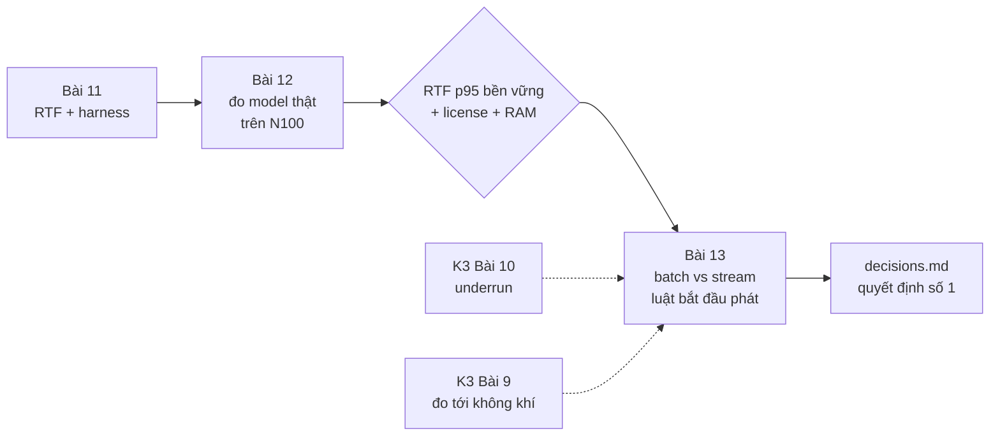
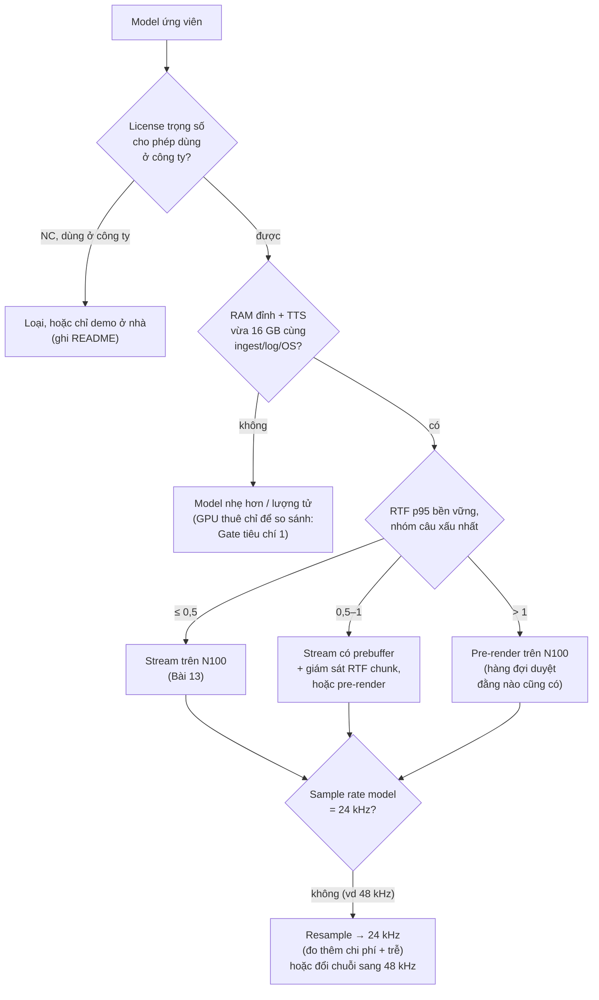

# Khóa 3 — Module 3: TTS và quyết định kiến trúc (14h)

Ba bài, một quyết định: **TTS chạy ở đâu và phát theo kiểu gì** (quyết định số 1 trong bốn quyết định của V1, lộ trình tổng mục 4.2). **Bài 11** dựng thước đo (RTF) và một harness đáng tin. **Bài 12** đo model tiếng Việt thật trên N100 (ở steady state nhiệt, có tải nền) và chọn model, số thread, chế độ. **Bài 13** chọn batch hay stream, độ sâu đệm trước để không đứt giữa câu, và đo độ trễ cảm nhận đầu–cuối. Câu trả lời phải là một bảng số và một chính sách chuyển chế độ, không phải cảm giác "máy yếu quá". Gate liên quan: tiêu chí 1 và 6 của Gate Khóa 3 (cuối `m4-he-thong-v1.md`).

Bài học xuyên module: hai chỉ số mà backend quen gộp làm một, **thời gian tới mẫu đầu tiên** và **tính liên tục sau đó**, ở đây tách hẳn ra. Một response HTTP được phép chậm một chút giữa chừng; âm thanh thì không.

| Bài | Giờ | Viên nang cần trước | Quyết định ra được |
|---|---|---|---|
| 11 — RTF: chỉ số quyết định kiến trúc | 3 | F1.2, F1.3, F7.4 | SLI nào quyết định stream/pre-render; chính sách chuyển chế độ |
| 12 — Chạy TTS tiếng Việt và đo RTF trên N100 | 6 | F1.3, F5.4, F7.2 | Model nào, runtime nào, số thread nào, chế độ nào cho V1 |
| 13 — Streaming chunk đầu | 5 | F1.2, F4.6 | Kích thước chunk, độ sâu đệm trước, cách đo độ trễ cảm nhận |



---

## Bài 11 — RTF: chỉ số quyết định kiến trúc (3h)

> **Vị trí:** Bài 10 → **Bài 11** → Bài 12 · **Cần trước:** F1.2 (phân bố, đuôi), F1.3 (warm-up, steady state), F7.1 (utilization), F7.4 (SLI/SLO), Bài 8 (ngân sách), Bài 10 (underrun) · **Sau bài này bạn quyết định được:** đo chỉ số nào (không chỉ RTF trung bình) để quyết stream hay pre-render, và viết được chính sách chuyển chế độ khi chỉ số đó xấu đi lúc vận hành.

### 1. Câu chuyện — ai đã khổ vì chuyện này

Cộng đồng nhận dạng giọng nói (ASR) đã báo tốc độ theo bội số thời gian thực ("0,5×RT", "xRT") từ nhiều thập kỷ trong các đợt đánh giá chung `[chuẩn]`: một hệ "1×RT" xử lý một giờ audio trong một giờ. Con số này gọn, so được giữa các hệ, và là thứ TTS thừa hưởng dưới tên RTF. Cái giá của sự gọn: nó là **trung bình trên cả đoạn**.

Game PC học bài học tương ứng theo cách đau hơn. Nhiều năm, card đồ họa được so bằng FPS trung bình. Người chơi vẫn thấy "giật" ở những card có FPS trung bình cao. Giới đánh giá phần cứng chuyển sang đo **thời gian từng frame** và báo phân vị ("1% low", frame time p99) `[chuẩn, khoảng 2011–2013 trở đi]`. Trung bình 60 FPS có thể chứa những frame 100 ms, và mắt thấy đúng những frame đó. Tai cũng vậy.

*Kịch bản:* một đội đo TTS trên máy dev, RTF trung bình 0,7, kết luận "stream được". Demo trước khách, máy chạy thêm ingest và log, nhiệt độ đã lên sau 20 phút, câu thứ năm đứt ở giữa. Không có số nào trong benchmark sai; chỉ là benchmark đo một thứ khác với thứ khách nghe.

### 2. Mô hình tư duy

```
RTF = thời_gian_sinh / độ_dài_audio_sinh_ra        (RTF < 1: sinh nhanh hơn phát)
```

Vẽ hai đường lũy kế theo thời gian thực:

```
audio sẵn có / đã phát (s)
  ▲
  │                                   ┌──┘ sinh (bậc thang, độ dốc trung bình 1/RTF)
  │                              ┌────┘
  │                         ┌────┘   ╱ phát (độ dốc 1, bắt đầu ở t_start)
  │                    ┌────┘     ╱
  │               ┌────┘       ╱     khoảng dọc giữa hai đường = đệm đang có
  │          ┌────┘         ╱        đường phát chạm/vượt đường sinh = UNDERRUN
  │     ┌────┘           ╱
  │     │             ╱
  └─────┴──────────┴───────────────────────────────────► thời gian
       TTFC      t_start
```

Ba con số đọc ra từ hình, và chỉ một trong số đó là RTF:

1. **TTFC** (time-to-first-chunk): điểm đường sinh rời trục hoành. Quyết định độ trễ cảm nhận (Bài 13).
2. **Độ dốc trung bình** 1/RTF: quyết định có thể stream câu **dài tùy ý** với đệm hữu hạn hay không. RTF < 1 là điều kiện cho việc đó.
3. **Đệm trước cần thiết** = khoảng cách dọc lớn nhất mà đường phát (nếu bắt đầu ngay ở TTFC) vượt lên trên đường sinh. Đây là chỉ số trực tiếp nhất của "có đứt không". Nó phụ thuộc **độ phân tán** của từng chunk, không chỉ trung bình.

Hệ quả: RTF trung bình < 1 **không đủ** (chunk chậm bất thường giữa câu vẫn gây đứt), và RTF > 1 **không cấm** stream (nếu chấp nhận đệm trước khoảng (RTF − 1) × D cho câu dài D). RTF là chỉ số kiến trúc; "đệm cần thiết" và TTFC là chỉ số vận hành.

**Mô phỏng 1** — dự đoán trước (phần 5), rồi chạy:

```python
# [đã chạy] Bài 11/13 — RTF trung bình < 1 có đủ để stream không? batch vs stream
import numpy as np
rng = np.random.default_rng(11)

def run(D=12.0, c=0.5, rtf=0.8, sig=0.0, first=0.6, pre=0, overhead=0.03):
    """D: độ dài câu (s); c: độ dài mỗi chunk (s); rtf: RTF trung vị; sig: độ phân tán log-normal;
    first: chi phí cố định cho chunk đầu (encode text, warm cache); pre: số chunk chờ trước khi phát."""
    n = int(np.ceil(D / c))
    g = c * rtf * np.exp(sig * rng.standard_normal(n)) + overhead
    g[0] += first
    ready = np.cumsum(g)                        # thời điểm chunk k sinh xong (s, tính từ lúc nhận text)
    t = ready[min(pre, n - 1)]                  # bắt đầu phát khi đủ 'pre' chunk đệm
    ttfa, gaps = t, 0
    for k in range(n):                          # phát tuần tự; chunk chưa xong ⇒ im lặng (underrun)
        if ready[k] > t:
            gaps += 1; t = ready[k]
        t += c
    batch_ttfa = ready[-1]                      # batch: đợi sinh xong cả câu
    return dict(rtf_tb=g.sum() / D, ttfa=ttfa, end=t, gaps=gaps,
                batch_ttfa=batch_ttfa, batch_end=batch_ttfa + D)

def show(tag, **kw):
    r = [run(**kw) for _ in range(500)]
    a = lambda k: np.array([x[k] for x in r])
    print(f"{tag:<34} RTF đo p50={np.median(a('rtf_tb')):.2f} | TTFA p50={np.median(a('ttfa')):.2f}s "
          f"| xong p50={np.median(a('end')):.1f}s | batch xong p50={np.median(a('batch_end')):.1f}s "
          f"| câu có đứt={np.mean(a('gaps') > 0):.0%}")

show("A. RTF 0.8, đều", rtf=0.8)
show("B. RTF 0.8, phân tán sig=0.5", rtf=0.8, sig=0.5)
show("C. như B, đệm trước 2 chunk", rtf=0.8, sig=0.5, pre=2)
show("D. RTF 1.2, không đệm", rtf=1.2)
show("E. RTF 1.2, đệm 5 chunk", rtf=1.2, pre=5)
```

Ba cách nhìn khác cùng một con số RTF:

| Cách nhìn | Công thức | Nói gì |
|---|---|---|
| **Utilization** | Phát liên tục thì worker TTS phải làm ra 1 s audio mỗi 1 s: ρ = RTF | ρ → 1 là đầu gối của hàng đợi (→ F7.1). RTF 0,95 không chỉ "hết biên", nó là ρ = 0,95 |
| Chi phí theo độ dài | thời_gian_sinh ≈ a + b·L → RTF(L) ≈ a/L + b | a = chi phí cố định (tiền xử lý văn bản, prefill, khởi tạo); b = chi phí mỗi giây audio. Câu ngắn có RTF **xấu hơn** câu dài |
| Tốc độ | 1/RTF = "x lần thời gian thực" | Gazebo (K6) báo đại lượng **ngược** này và cũng gọi là "real time factor": luôn ghi công thức cạnh con số |

Và số mẫu quyết định percentile nào được phép báo. Mô phỏng 2 (dự đoán trước: khoảng dao động của "p99" với n = 17 rộng cỡ nào; RTF p50 của câu 1,5 s so với câu 13 s):

```python
# [đã chạy] p99 của 17 mẫu là gì? Và vì sao RTF câu ngắn "xấu" hơn câu dài
import numpy as np

rng = np.random.default_rng(4)
def gen_time(audio_s, n):
    """Đồ chơi: chi phí cố định 0,4 s + 0,5 s mỗi giây audio, nhiễu lệch phải."""
    return (0.4 + 0.5 * audio_s) * rng.lognormal(0, 0.15, n)

true_p99 = np.percentile(gen_time(5.0, 1_000_000) / 5.0, 99)
for n in (17, 100, 1000):
    est = [np.percentile(gen_time(5.0, n) / 5.0, 99) for _ in range(2000)]
    lo, hi = np.percentile(est, [5, 95])
    print(f"n={n:5d}: p99 ước lượng dao động [{lo:.3f}, {hi:.3f}]  (thật {true_p99:.3f})")

for L in (1.5, 5.0, 13.0):                     # độ dài audio (s): câu ngắn / vừa / dài
    print(f"audio {L:4.1f} s: RTF p50 = {np.median(gen_time(L, 10_000) / L):.3f}")
```

### 3. Cầu nối từ backend

| Backend bạn biết | Ở đây | Gãy ở chỗ | Nếu dùng nhầm thì |
|---|---|---|---|
| Utilization ρ của một worker; đầu gối của M/M/1 khi ρ → 1 | RTF ≈ tỉ lệ thời gian worker TTS bận trên mỗi giây audio | Hàng đợi backend tăng độ trễ khi ρ cao; ở đây hàng đợi là **ngược** (đệm audio cạn dần) và "độ trễ quá hạn" là im lặng nghe được | Nhắm RTF 0,95 như nhắm utilization 95%: không còn biên cho bất kỳ dao động nào (→ F7.1) |
| Throughput benchmark (req/s trung bình) | RTF trung bình cả câu | Che độ phân tán giữa các chunk và chi phí cố định đầu câu | "RTF 0,8, stream được" trong khi 80% câu đứt (mô phỏng B) |
| Feature flag / circuit breaker / degrade mode | Chế độ stream / stream có đệm / pre-render / tạm dừng | Flag là **điều khiển**; RTF là **quan sát**. Cần một chính sách nối hai thứ, có trễ (hysteresis) để không nhảy qua lại | Coi RTF là một "flag" để bật tắt → chuyển chế độ liên tục mỗi khi số dao động quanh ngưỡng |
| Benchmark có warm-up rồi lấy steady state | Bỏ 3 lần đầu | Lần đầu sau boot là **một tình huống thật** của V1 (confession đầu tiên buổi sáng); và steady state về nhiệt chỉ tới sau hàng chục phút | Bỏ mất đúng hai tình huống xấu nhất: lạnh máy và nóng máy |

**Chấm mô hình:**

*Lượt 21 của bạn:* "RTF đại diện cho cách làm việc… càng có nhiều flag như RTF để đo realtime giữa thời gian xử lý với thông số business… nhiều công tắc, nhiều mode như batch hay streaming… có sẵn các kịch bản/mode… nếu lúc đo chưa cover đủ flag/khóa thì lúc runtime thực tế không thể đảm bảo mọi tình huống."

**ĐÚNG MỘT PHẦN.**

- *Phần đúng.* (a) Tỉ lệ "thời gian xử lý / thời gian thực mà đầu ra chiếm" là một chỉ số vận hành chung cho mọi pipeline có hạn chót: vòng điều khiển 100 Hz có ngân sách 10 ms mỗi vòng; một VLA sinh action chunk 1 s mà suy luận mất 1,5 s thì robot sớm muộn cũng "đói lệnh" (K4); pipeline cảm biến không xử lý kịp tốc độ đến thì drop (→ F3.9). (b) Thiết kế **trước** các chế độ (stream, pre-render, degrade) thay vì phát hiện lúc sự cố là đúng hướng.
- *Gãy 1 — trộn "flag" với "chỉ số".* RTF là phép đo (SLI). Mode là điều khiển. Thứ nối chúng là **chính sách**: "nếu RTF p90 của 20 chunk gần nhất > 0,8 trong 60 s thì chuyển sang pre-render; chỉ quay lại stream khi < 0,6 trong 10 phút". Không có chính sách viết ra, nhiều flag chỉ là nhiều cách hỏng.
- *Gãy 2 — RTF trung bình che đuôi.* Mô phỏng B: RTF trung vị 0,8, phần lớn câu vẫn đứt. Cái cần đo là phân bố theo chunk và "đệm cần thiết".
- *Gãy 3 — RTF < 1 vừa không đủ vừa không cần.* Không đủ: chunk đầu chậm làm độ trễ cảm nhận cao dù RTF tốt. Không cần: RTF 1,2 vẫn stream sạch với đệm đủ (mô phỏng E).
- *Gãy 4 — "cover đủ flag lúc đo" là không thể.* Không gian trạng thái là tích của nhiệt độ × tải nền × độ dài câu × nội dung × phiên bản model × trạng thái mạng. Không phép đo nào phủ hết. Nghề này giải bằng bốn thứ khác: đo **phân bố** trong điều kiện đại diện và điều kiện xấu có chủ đích; định nghĩa **vùng đã kiểm chứng** (ngành xe tự lái gọi là *operational design domain*, ODD); **giám sát lúc chạy** để biết khi nào rời vùng đó; và một **đường lùi an toàn** đúng bất kể chuyện gì xảy ra (với loa: im lặng tốt hơn nói đứt). Phản ví dụ: CPU hạ xung sau 20 phút tổng hợp liên tục. Benchmark 20 lần mỗi câu không bao giờ thấy nó, không flag nào "cover" nó; thứ cứu V1 là SLI lúc chạy kích hoạt pre-render.

*Gemini trả lời lượt 21:* mở đầu "Bạn đã chạm trúng tư duy cốt lõi nhất" và kết bằng "đảm bảo tính tất định (determinism)". — **ĐÚNG MỘT PHẦN**, và lời xác nhận không có chỗ gãy là thiếu sót chính. Ví dụ VLA "suy luận 1,5 s cho chunk 1 s thì robot khựng" đúng ở trạng thái dừng. Nhưng mục tiêu không phải determinism (thời gian TTS trên CPU chia sẻ không tất định và không cần tất định); mục tiêu là **hành vi bị chặn**: trễ có cận trên đã đo, và khi vượt cận thì hỏng an toàn.

*Mô hình phổ biến:* "Máy yếu quá thì không stream được." — **SAI** như một lập luận: nó không chỉ ra đại lượng nào, ngưỡng nào. Thay bằng: "Trên N100, model X, 4 thread, câu 20 từ: RTF p50 = …, p90 = …, đệm cần thiết p90 = … s, TTFC p50 = … s; với ngưỡng độ trễ cảm nhận … s, chọn chế độ …".

### 4. Thuật ngữ

| Mức | Thuật ngữ | Nghĩa trong một câu | Hay bị hiểu nhầm thành |
|---|---|---|---|
| 🟢 | RTF (×RT) | Thời gian sinh / độ dài audio sinh ra | Độ trễ |
| 🟢 | TTFC / TTFA | Thời gian tới chunk đầu sẵn sàng / tới sample đầu ra loa | Cùng một thứ (TTFA = TTFC + USB + ring + DMA + …) |
| 🟢 | Đệm trước cần thiết (required prebuffer) | Lượng audio phải có sẵn trước khi phát để không đứt | Hằng số của model |
| 🟢 | Warm-up, steady state | Giai đoạn đầu chậm do nạp/biên dịch/cache; giai đoạn ổn định sau đó | Chỉ là "lần đầu chậm" (còn steady state về **nhiệt**) |
| 🟢 | Degrade mode, hysteresis | Chế độ chất lượng thấp hơn nhưng an toàn; ngưỡng vào ≠ ngưỡng ra | Flag bật/tắt |
| 🟡 | ODD (operational design domain) | Tập điều kiện mà hệ đã được kiểm chứng để chạy | "Mọi tình huống" |
| 🟡 | Bootstrap CI cho percentile | Khoảng tin cậy của p90 bằng lấy mẫu lại | ± 2σ |
| 🔴 | Network calculus (arrival/service curve) | Lý thuyết cận trên độ trễ bằng đường lũy kế | Cần cho V1 (hình phần 2 là phiên bản trực giác) |

### 5. Dự đoán

**Câu 1 — mô phỏng 1.** Trước khi chạy, đoán cho A–E: "RTF đo" (cả câu, gồm chi phí chunk đầu và overhead) lớn hơn hay nhỏ hơn tham số `rtf`? Tỉ lệ câu có đứt? Thời điểm xong của stream so với batch?

**Câu 2 — cỡ mẫu.** Bản gốc yêu cầu N = 20 lần mỗi câu, bỏ 3 lần đầu, báo p50/p95/p99. Với 17 mẫu, p99 là gì? Cần bao nhiêu mẫu để p95 có ý nghĩa? Mô phỏng 2: khoảng "p99" với n = 17; RTF p50 câu 1,5 s vs 13 s.

**Câu 4 — RTF(L).** Model bạn định dùng ở Bài 12 có chi phí cố định a lớn cỡ nào (ước lượng từ TTFC hoặc một câu rất ngắn)? Dự đoán RTF p50 cho ba nhóm 5/20/50 từ trên N100. Tra: RTF tác giả công bố và **máy họ đo** (README/model card); N100 trên Intel ARK; tập lệnh CPU (`lscpu`, tìm `avx2`, `avx_vnni`).

**Câu 3 — chính sách.** Viết nháp chính sách chuyển chế độ cho V1 (dạng bảng), với các ngưỡng để trống tới Bài 12.

```markdown
# Bài 11 — prediction · ngày ____ · ký ____
| Mô phỏng | RTF đo (> hay < tham số) | % câu đứt | stream xong sớm hơn batch bao nhiêu |
|---|---|---|---|
| A | | | |
| B | | | |
| C | | | |
| D | | | |
| E | | | |
p99 của 17 mẫu là: ____ · Số mẫu tối thiểu cho p95 có nghĩa: ____ vì ____
Mô phỏng 2: khoảng "p99" n=17 ≈ [__, __] · RTF p50 câu 1,5 s / 13 s = __ / __
RTF(L) model định dùng: a ≈ __ s · RTF p50 5/20/50 từ trên N100: __ / __ / __ (tác giả công bố __ trên máy __)

## Chính sách chuyển chế độ (nháp)
| Chế độ | Điều kiện vào (SLI, cửa sổ) | Điều kiện ra | Hành vi |
|---|---|---|---|
| stream | | | |
| stream + đệm trước X s | | | |
| pre-render (sinh xong mới phát) | | | |
| tạm dừng phát (giữ hàng đợi) | | | im lặng, báo moderator |
```

### 6. Làm

1. **Viết harness** dùng lại được ở K4 Bài 4. Bộ khung dưới đây đã chạy với một TTS giả; Bài 12 thay `fake_tts` bằng model thật. Điểm chính: đo **từng chunk**, không chỉ tổng; đếm độ dài audio theo **số mẫu** ÷ sample rate (lỗi harness phổ biến nhất là tính theo byte, hoặc quên model trả float32/stereo); giữ lần lạnh trong dữ liệu, đánh dấu `cold`. **Known-answer test** (→ F2.5): chạy với `jitter=0` trước; harness phải ra đúng RTF bạn đặt (0,6), nếu không thì sửa harness trước khi đo model thật. Đây là đúng kỹ thuật "mock server để có bộ test chuẩn" bạn đã làm, áp vào chính dụng cụ đo.

```python
# [đã chạy với TTS giả] Bài 11 — harness đo RTF + chunk; thay fake_tts bằng model thật (API [tự đo])
import time, json, platform, statistics as st
import numpy as np

def fake_tts(text, sr=24000, rtf=0.6, chunk_s=0.5, jitter=0.3):
    """Giả lập TTS streaming: yield từng chunk PCM int16 mono. jitter=0 -> RTF biết trước (known-answer)."""
    dur = 0.35 * len(text.split())                        # ~0,35 s audio mỗi từ (giả định)
    for _ in range(max(1, int(np.ceil(dur / chunk_s)))):
        time.sleep(chunk_s * rtf * np.random.lognormal(0, jitter))
        yield np.zeros(int(sr * chunk_s), dtype=np.int16)

def cpu_mhz():                                            # xung hiện tại (Linux); không có thì None
    try:
        return [float(l.split(":")[1]) for l in open("/proc/cpuinfo") if l.startswith("cpu MHz")]
    except OSError:
        return None

def measure(tts, text, sr=24000, **kw):
    t0 = time.perf_counter(); ready, starts, audio = [], [], 0.0
    for pcm in tts(text, sr=sr, **kw):
        ready.append(time.perf_counter() - t0)            # chunk k sẵn sàng lúc nào
        starts.append(audio)                              # chunk k phải bắt đầu phát ở giây audio thứ mấy
        audio += pcm.size / sr                            # đếm theo SỐ MẪU (mono); stereo thì chia số kênh
    # đệm trước tối thiểu để không đứt nếu bắt đầu phát ngay khi chunk 0 xong
    need = max(0.0, max(r - (ready[0] + s) for r, s in zip(ready, starts)))
    return dict(rtf=ready[-1] / audio, ttfc=ready[0], audio_s=audio, prebuffer_s=need, mhz=cpu_mhz())

def bench(tts, sentences, reps=10, cold=1, out="rtf.jsonl", **kw):
    meta = dict(cpu=platform.processor() or platform.machine(), py=platform.python_version(), reps=reps)
    with open(out, "w") as f:
        f.write(json.dumps({"meta": meta}) + "\n")
        for i, s in enumerate(sentences):
            for r in range(reps):
                row = dict(len=len(s.split()), rep=r, cold=(i == 0 and r < cold), **measure(tts, s, **kw))
                f.write(json.dumps(row, ensure_ascii=False) + "\n")   # lần lạnh GIỮ LẠI, đánh dấu cold
    return [json.loads(l) for l in open(out)][1:]

def report(rows):
    for L in sorted({r["len"] for r in rows}):
        v = [r for r in rows if r["len"] == L and not r["cold"]]
        print(f"{L:>3} từ n={len(v)}: RTF p50/max={st.median(x['rtf'] for x in v):.2f}/"
              f"{max(x['rtf'] for x in v):.2f}  TTFC p50={st.median(x['ttfc'] for x in v):.2f}s  "
              f"đệm cần max={max(x['prebuffer_s'] for x in v):.2f}s")

if __name__ == "__main__":
    sents = ["xin chào mọi người"] * 3 + ["hôm nay trời đẹp quá " * 4] * 3
    print("known-answer (jitter=0, rtf=0.6):"); report(bench(fake_tts, sents[:3], reps=3, jitter=0.0))
    print("TTS giả có dao động:");               report(bench(fake_tts, sents, reps=4))
```

2. **Bộ câu.** Ba nhóm độ dài (~5, ~20, ~50 từ), **mỗi nhóm ≥ 10 câu khác nhau** (không lặp một câu 20 lần: nội dung ảnh hưởng thời gian sinh). Có dấu đầy đủ, có số ("3 giờ 15"), có từ tiếng Anh, có tên riêng. Lưu bộ câu thành file có hash, commit.
3. **Cỡ mẫu.** 10 câu × 10 lần = 100 mẫu mỗi nhóm. Báo p50, p90, max; p95 kèm khoảng tin cậy bootstrap (→ F1.4). Không báo p99 với dưới vài trăm mẫu.
4. **Ghi riêng lần lạnh.** Lần chạy đầu tiên sau khi khởi động process (và sau khi khởi động máy) **ghi vào một bảng riêng**, không vứt đi. Đó là confession đầu tiên buổi sáng.
5. **Ghi môi trường cùng mỗi lần đo:** CPU, số thread runtime dùng, phiên bản model/runtime, nhiệt độ và tần số CPU **trong** lúc chạy (luồng nền đọc mỗi giây), load average. Bài 12 cụ thể hóa trên N100.
6. **Chạy mô phỏng** phần 2, so với dự đoán câu 1.
7. **Viết chính sách chuyển chế độ** (câu 3) vào `decisions.md`, ngưỡng để trống.

Sai số cần ghi: `time.perf_counter()` có độ phân giải dưới µs trên Linux `[chuẩn]`, không phải nguồn sai số đáng kể. Nguồn đáng kể: tải nền khác giữa các lần, trạng thái nhiệt, và GC của Python trong vòng đo.

### 7. Số phải ra

<details><summary>🔒 MỞ SAU KHI COMMIT prediction.md</summary>

**Mô phỏng 1** (đã chạy, seed 11, câu 12 s, chunk 0,5 s, chunk đầu thêm 0,6 s, overhead 0,03 s/chunk):

| | RTF đo cả câu (p50) | TTFA p50 | Stream xong (p50) | Batch xong (p50) | % câu đứt |
|---|---|---|---|---|---|
| A. RTF 0,8 đều | ~0,91 | ~1,0 s | ~13,0 s | ~22,9 s | 0% |
| B. RTF 0,8, phân tán | ~1,01 | ~1,05 s | ~13,5 s | ~24,1 s | ~80% |
| C. như B, đệm 2 chunk | ~1,00 | ~2,0 s | ~14,1 s | ~24,0 s | ~20% |
| D. RTF 1,2, không đệm | ~1,31 | ~1,2 s | ~16,2 s | ~27,7 s | 100% |
| E. RTF 1,2, đệm 5 chunk | ~1,31 | ~4,4 s | ~16,4 s | ~27,7 s | 0% |

Đọc bảng:
- "RTF đo" luôn lớn hơn tham số: chi phí chunk đầu và overhead mỗi chunk cộng vào; với phân tán log-normal, trung bình lớn hơn trung vị. Một model quảng cáo "RTF 0,8" có thể đo ra ~1,0 trên câu ngắn chỉ vì chi phí cố định.
- B vs A: cùng trung vị, khác phân tán, kết quả ngược nhau. RTF không đủ, phải đo đệm cần thiết.
- E: RTF > 1 vẫn stream sạch, trả bằng độ trễ cảm nhận ~4,4 s. Vẫn sớm hơn batch (~27,7 s) rất xa.
- Stream luôn **xong** sớm hơn batch, gần bằng thời gian sinh − TTFC. Bản gốc Bài 13 nói "total-time xấp xỉ bằng batch" là sai nếu total-time tính tới sample cuối ra loa (Bài 13 sửa).

**Cỡ mẫu:** với 17 mẫu, p99 nội suy giữa mẫu lớn thứ hai và lớn nhất, thực chất là **max**. p95 với 17 mẫu cũng gần max. Để có ước lượng p95 không chỉ là max, cần cỡ ≥ 60–100 mẫu; khoảng tin cậy bootstrap sẽ cho thấy nó rộng tới đâu.

**Mô phỏng 2** (seed 4): khoảng 90% của "p99" ước lượng là [0,671; 0,854] với n = 17, [0,747; 0,869] với n = 100, [0,798; 0,844] với n = 1000; p99 thật 0,822. Với n = 17, "p99" thường **thấp hơn** thật (nó chỉ là max của 17 mẫu) và dao động ±13%. RTF p50 theo độ dài audio 1,5 / 5 / 13 s: 0,767 / 0,581 / 0,532: chi phí cố định 0,4 s làm câu ngắn xấu hơn 44% dù "model" là một. Thấy RTF câu ngắn > 1 trong khi câu dài < 0,5 thì đừng kết luận "model chậm"; tách a và b.

**Harness với TTS giả** (đã chạy): known-answer `jitter=0` cho RTF 0,60 đúng tham số; có dao động thì RTF p50 ~0,6–0,7, TTFC ~0,3 s, đệm cần max gần 0. Lệch xa 0,6 ở bước known-answer nghĩa là harness sai (thường là độ dài audio sai đơn vị).

**Luật quyết định (để Bài 12 dùng):** RTF p95 (và đệm cần p90) của **phiên bền vững nhiệt**, theo nhóm câu xấu nhất bạn sẽ phát (thường là nhóm ngắn vì a), không dùng p50 lúc máy nguội. Ngưỡng 0,5 của gốc là biên an toàn hợp lý vì ở ρ = 0,5 hàng đợi còn xa đầu gối `[ước lượng]`.

</details>

### 8. Nếu ra khác

| Triệu chứng | Nguyên nhân khả dĩ | Kiểm bằng cách | Sửa |
|---|---|---|---|
| RTF câu ngắn cao hơn hẳn câu dài | Chi phí cố định mỗi lời gọi (encode text, khởi tạo) | Vẽ thời gian sinh theo độ dài audio: có chặn khác 0 | Báo cả "chi phí cố định" và "RTF biên" (độ dốc) thay vì một RTF |
| RTF lần 1 gấp nhiều lần các lần sau | Nạp trọng số, biên dịch đồ thị, cache | Ghi riêng lần lạnh | Giữ process sống (daemon), làm warm-up khi khởi động daemon |
| RTF trôi lên theo thời gian chạy | Nhiệt / giới hạn công suất | Vẽ RTF và tần số CPU theo thời gian | Bài 12: đo steady state nhiệt |
| Harness báo đệm cần = 0 nhưng phát thật vẫn đứt | Harness đo lúc chunk **sinh xong**, chưa tính USB/ring/DMA, hoặc model không thật sự stream (trả hết một lần) | In thời điểm từng chunk; nếu tất cả gần nhau ở cuối thì model không stream | Bài 13 đo đầu–cuối |
| p50 giữa hai lần chạy cùng cấu hình lệch > 10% | Tải nền, nhiệt, governor | Chạy A/A: hai lần liên tiếp cùng cấu hình (→ F1.3) | Cô lập; ghi điều kiện; báo độ lệch A/A làm sàn của mọi so sánh |

### 9. Câu hỏi ngược

1. **[Vì sao không]** Vì sao không định nghĩa RTF bằng p99 thời gian sinh chia độ dài, cho an toàn?
<details><summary>Hướng nghĩ</summary>

Vẫn là một con số trên **cả câu**: không phân biệt chậm đều với chậm một cục ở giữa. Đại lượng trực tiếp là đệm cần thiết (phụ thuộc thứ tự các chunk), và TTFC. RTF giữ vai trò chỉ số kiến trúc: dài hạn có theo kịp không.

</details>

2. **[Failure mode]** Chính sách chuyển chế độ của bạn có thể dao động (stream ↔ pre-render) mỗi vài giây không? Hậu quả với người nghe?
<details><summary>Hướng nghĩ</summary>

Có, nếu ngưỡng vào = ngưỡng ra và SLI dao động quanh ngưỡng. Hậu quả: độ trễ cảm nhận nhảy loạn, có thể chuyển chế độ giữa câu. Sửa: hysteresis, cửa sổ đủ dài, và chỉ chuyển ở **ranh giới câu**.

</details>

3. **[Quy mô]** Hàng đợi có 30 confession đã duyệt (sau một buổi họp). RTF 0,6. Chế độ nào cho tổng thời gian xả hàng đợi ngắn nhất, chế độ nào cho người nghe dễ chịu nhất?
<details><summary>Hướng nghĩ</summary>

Với RTF < 1, sinh trước câu tiếp theo trong lúc đang phát câu hiện tại (pipelining) làm khoảng nghỉ giữa các câu gần 0. Đó là pre-render cho câu sau và stream cho câu đầu. Tổng thời gian bị chặn bởi tổng độ dài audio, không phải bởi TTS. Câu hỏi thật là: có nên phát 30 câu liền không (sản phẩm, không phải kỹ thuật).

</details>

4. **[Liên ngành]** Robot ở K7 có vòng điều khiển 100 Hz trên ESP32 và planner trên N100. "RTF" của planner là gì? Đệm trước tương ứng là gì?
<details><summary>Hướng nghĩ</summary>

Thời gian tính một kế hoạch / khoảng thời gian kế hoạch đó có hiệu lực. Đệm trước là quỹ đạo đã tính sẵn mà controller còn chạy được nếu planner trễ. Khi đệm cạn, chế độ an toàn là dừng (K7 C4.4: failsafe trong firmware), không phải "chạy tiếp lệnh cũ".

</details>

5. **[Phản biện]** "Chỉ cần đo nhiều tình huống hơn là cover được." Phản biện bằng một tình huống không thể đo trước.
<details><summary>Hướng nghĩ</summary>

Bản cập nhật model hoặc runtime tháng sau; một confession dài gấp đôi mọi câu trong bộ test; hai việc nặng trùng giờ lần đầu. Thứ bạn kiểm soát được là: phát hiện lúc chạy rằng mình đang ngoài vùng đã đo, và đường lùi an toàn đã được **test bằng lỗi cố ý** (→ F2.5).

</details>

### 10. Liên kết ra ngoài

- **Game — frame time.** Ngân sách 16,7 ms mỗi frame ở 60 Hz là "RTF = 1" của GPU. Ngành chuyển từ FPS trung bình sang phân vị frame time vì trung bình che giật. Chỗ khác: game có thể bỏ frame (drop), audio bỏ chunk thì thành tiếng đứt.
- **Xe tự lái — ODD.** Chuẩn SAE J3016 dùng khái niệm operational design domain: hệ chỉ được cam kết trong miền điều kiện đã định nghĩa, và phải phát hiện khi ra khỏi miền `[spec: SAE J3016]`. Đây là câu trả lời có tên cho "không thể cover mọi tình huống".
- **Mạng — network calculus.** Lý thuyết của Cruz (1991) và Le Boudec & Thiran cho cận trên độ trễ và kích thước buffer từ đường lũy kế đến (arrival curve) và đường phục vụ (service curve). Hình ở phần 2 chính là phiên bản đồ chơi của nó.

### 11. Độ tin cậy và sửa lỗi

| Khẳng định | Nhãn | Ghi chú / cách kiểm |
|---|---|---|
| RTF < 1 cho phép stream câu dài tùy ý với đệm hữu hạn (ở trạng thái dừng) | `[chuẩn]` | Hai đường lũy kế |
| RTF > 1 stream được với đệm ≈ (RTF − 1) × D | `[chuẩn]` (xấp xỉ, RTF đều) | Mô phỏng E |
| p99 của 17 mẫu ≈ max, chệch thấp, dao động lớn | `[chuẩn]` | F1.2; mô phỏng 2 |
| ρ = RTF khi phát liên tục; RTF(L) ≈ a/L + b | `[chuẩn]` | Utilization = tốc độ đến × thời gian phục vụ; fit trên số đo |
| Gazebo "real time factor" là đại lượng ngược | `[chuẩn]` | Kiểm trong giao diện Gazebo ở K6 |
| `perf_counter` độ phân giải dưới µs trên Linux | `[chuẩn]` | `time.get_clock_info('perf_counter')` |
| SAE J3016 định nghĩa ODD | `[spec]` | |

**Đã sửa so với bản gốc và bản Gemini:**
- Bản gốc: "RTF < 1 là điều kiện cần để streaming". Sửa: điều kiện để stream câu **dài tùy ý** với đệm cố định; với câu hữu hạn, RTF > 1 vẫn stream được nếu chấp nhận đệm trước tỉ lệ với độ dài câu.
- Gemini: "RTF > 1 bắt buộc phải pre-render". Sai cùng lý do.
- Bản gốc và Gemini: "N = 20, bỏ 3 lần đầu, báo p50/p95/p99". Với 17 mẫu, p99 và p95 gần như là max. Sửa: ≥ 10 câu × 10 lần mỗi nhóm, báo p50/p90/max, p95 kèm bootstrap CI.
- Bản gốc: bỏ 3 lần warm-up. Sửa: ghi riêng lần lạnh, vì nó là một tình huống vận hành thật.
- Bản gốc: không nói cách tính độ dài audio. Thêm known-answer test với TTS giả và đếm theo số mẫu.
- Gemini: tiêu chí "p50 giữa các lần chạy lại biến thiên < 5%" như chuẩn PASS: không có nguồn; thay bằng A/A và bootstrap CI.
- Gemini: "lần chạy đầu chậm do nạp trọng số" đúng, nhưng bỏ qua warm-up **nhiệt** (chiều ngược: chậm dần). Thêm phiên bền vững ở Bài 12.
- Bản gốc: "nhắm RTF ≤ 0,5". Giữ như một quy tắc ngón tay cái, nhưng thêm: chỉ tiêu quyết định là đệm cần thiết và TTFC theo phân bố, ở điều kiện nhiệt steady state.
- Gemini: xác nhận lượt 21 mà không chỉ chỗ gãy; đã chấm lại ở phần 3.

### 12. Đọc thêm và tự kiểm tra

- **Nguồn gốc:** F7.1 (utilization, đầu gối hàng đợi), F7.4 (SLI/SLO).
- **Giải thích:** Brendan Gregg, *Systems Performance* (2nd ed.), chương về phương pháp benchmark (active benchmarking).
- **Đào sâu (tùy chọn):** J.-Y. Le Boudec, P. Thiran, *Network Calculus* (sách, bản đọc trực tuyến do tác giả công bố).
- **Tự kiểm tra:** (1) giải thích cho một backend engineer khác trong 5 câu vì sao RTF 0,8 có thể vẫn đứt; (2) vẽ lại hình hai đường lũy kế, chỉ ra TTFC, RTF, đệm cần thiết; (3) hai câu dưới.

*Câu 1.* Câu dài 20 s, RTF đều 1,1, chi phí chunk đầu bỏ qua. Đệm trước tối thiểu để không đứt?
<details><summary>Đáp án</summary>

Sinh xong lúc 22 s. Phát bắt đầu lúc t₀ và kết thúc lúc t₀ + 20 s; chunk cuối phải sẵn sàng trước khi tới lượt nó, nên t₀ ≳ 2 s. Đệm ≈ (RTF − 1) × D = 2 s.

</details>

*Câu 2.* Bạn đổi model, RTF p50 giảm từ 0,7 xuống 0,5 nhưng TTFC tăng từ 0,4 s lên 1,5 s. Với confession 20 từ, đổi có lợi không?
<details><summary>Đáp án</summary>

Tùy SLI bạn cam kết. Nếu độ trễ cảm nhận là chỉ số chính và cả hai đều không đứt, model cũ tốt hơn cho người nghe. Model mới tốt hơn khi hàng đợi dài (xả nhanh hơn) hoặc khi máy nóng (còn biên). Viết cả hai chỉ số vào quyết định.

</details>

---

## Bài 12 — Chạy TTS tiếng Việt và đo RTF (6h)

> **Vị trí:** K3 Bài 11 (harness) → **Bài 12** → K3 Bài 13 (batch vs stream) · **Cần trước:** F1.3 (steady state, cô lập nhiễu), F2.2 (tái lập: lockfile, hash trọng số), F5.4 (tần số CPU, governor), F7.2 (băng thông vs compute, đọc lướt), K3 Bài 11 · **Sau bài này bạn quyết định được:** model nào và chạy ở đâu (stream, stream có đệm, hay pre-render, trên N100; với số thread nào), viết vào `decisions.md` kèm RTF p95 bền vững, RAM đỉnh, license và điều kiện xem lại.

### 1. Câu chuyện — ai đã khổ vì chuyện này

Các model TTS tiếng Việt mở thay đổi theo tháng, không theo năm. Ví dụ ngay trong danh sách của gốc: VieNeu-TTS mà gốc mô tả là "real-time trên CPU ở 24 kHz" là dòng v2 dùng GGUF; tới 10/2026 README của dự án đánh dấu v2 và các biến thể GGUF/ONNX CPU của v2 là **deprecated**, bản mặc định là v3 Turbo ra **48 kHz** chạy CPU qua ONNX Runtime, còn bản 24 kHz là v3 Nano (preview) `[tự đo: kiểm 10/2026, kiểm lại khi bạn làm]`. Một kế hoạch viết sáu tháng trước đã lệch ở cả phiên bản lẫn sample rate.

Cái bẫy thứ hai là **license của code khác license của trọng số**. VietTTS (dangvansam) có code Apache-2.0, nhưng README ghi model đã huấn luyện và audio mẫu theo CC BY-NC, vì dữ liệu huấn luyện lấy "in-the-wild" `[tự đo: README 10/2026]`. Gốc chỉ cảnh báo NC cho Viterbox. Người làm sản phẩm khổ vì chuyện này không phải ở lúc chạy thử, mà ở lúc pháp chế hỏi "trọng số này lấy từ đâu" sau khi đã ship.

### 2. Mô hình tư duy

Quyết định là một cây, và RTF chỉ là một nhánh:



Ứng viên (kiểm bằng tìm kiếm web 10/2026; mọi dòng `[tự đo]` theo phiên bản bạn cài):

| Model | Trạng thái và đặc điểm | Sample rate | License trọng số | Ghi chú cho N100 |
|---|---|---|---|---|
| **VieNeu-TTS** (pnnbao97) | v3 Turbo mặc định: CPU qua ONNX Runtime (không cần PyTorch), stream theo frame, có endpoint tương thích OpenAI `/v1/audio/speech`; v3 Nano (preview) nhẹ hơn, không stream theo frame; v2 GGUF deprecated; `pip install vieneu` | Turbo 48 kHz; Nano 24 kHz | README ghi Apache-2.0; **kiểm tag license trên trang trọng số** | Bản int8 cần CPU có VNNI; kiểm `lscpu` |
| **VietTTS** (dangvansam/viet-tts) | Server tương thích OpenAI (`/v1/audio/speech`); clone giọng từ file WAV; README ghi mượn code từ CosyVoice; Docker yêu cầu GPU NVIDIA, bản Python chỉ Linux | `[tự đo]` | Code Apache-2.0; **model + audio mẫu CC BY-NC** | Đường Docker của README không chạy trên N100; dùng đường Python |
| **Viterbox** | Fine-tune từ Chatterbox (bản đa ngôn ngữ), zero-shot clone với vài giây mẫu, >3.000 h dữ liệu tiếng Việt (ViVoice, PhoAudiobook, dữ liệu nội bộ) | `[tự đo]` | **CC BY-NC 4.0** (model card) | Chatterbox gốc là MIT `[tự đo]`; dữ liệu có điều khoản riêng |
| **F5-TTS-Vietnamese** (hynt) | Dựa trên F5-TTS (flow matching, nhiều bước khử nhiễu mỗi câu) | `[tự đo]` | **CC-BY-NC-SA-4.0** (model card); F5-TTS gốc huấn luyện trên dữ liệu Emilia có điều khoản NC | Không tự hồi quy nhưng nhiều bước; dự đoán nặng trên CPU `[ước lượng]` |

**Cận dưới RTF bằng băng thông bộ nhớ.** Với TTS tự hồi quy ở batch 1, mỗi bước sinh phải đọc gần hết trọng số từ RAM. Nếu phần đó memory-bound, thời gian mỗi bước ≥ byte trọng số / băng thông, và RTF ≥ (số bước cho 1 s audio) × (byte / băng thông) + phần giải mã codec. N100 dùng bộ nhớ **một kênh** `[spec: Intel ARK, N100]`, nên băng thông là tham số đáng đo trước tiên. Đây là roofline thu nhỏ (→ F7.2, K4 Bài 12):

```python
# [đã chạy] Cận dưới RTF cho TTS tự hồi quy bị chặn bởi băng thông bộ nhớ (đồ chơi)
# Mọi tham số là CHỖ TRỐNG: thay bằng số tra từ model card và số đo trên máy bạn.
weights_bytes   = 0.30e9   # byte trọng số phải đọc mỗi bước sinh (sau lượng tử)
steps_per_sec   = 50       # số BƯỚC tự hồi quy cho 1 giây audio (tra model card / codec)
bw_measured     = 20e9     # băng thông bộ nhớ ĐO ĐƯỢC (B/s), không phải số lý thuyết
decoder_rtf     = 0.05     # phần RTF của bộ giải mã codec -> waveform (đo riêng)

t_per_step = weights_bytes / bw_measured            # s/bước nếu thuần memory-bound
rtf_floor = steps_per_sec * t_per_step + decoder_rtf
print(f"thời gian mỗi bước >= {t_per_step*1e3:.1f} ms")
print(f"RTF cận dưới ≈ {rtf_floor:.2f}  (nếu giả định đúng, số đo thật không thể thấp hơn)")
for bw in (10e9, 20e9, 38.4e9):
    print(f"  BW {bw/1e9:5.1f} GB/s -> RTF >= {steps_per_sec*weights_bytes/bw + decoder_rtf:.2f}")
```

**Thêm thread không miễn phí.** Nút thắt băng thông thì 2–3 thread đã bão hòa; dùng cả 4 nhân (N100 không có hyperthreading) thì streamer và ingest (Bài 10, 14) bị tranh CPU, jitter tăng, underrun tăng. RTF tốt nhất và **hệ thống** tốt nhất có thể ở hai số thread khác nhau.

Mô hình này sai khi model không tự hồi quy (F5-TTS: compute-bound nhiều hơn), khi trọng số nằm vừa cache, hoặc khi một bước sinh nhiều token song song. Nó đáng giá ở chỗ cho một **cận dưới** để đối chiếu: nếu số đo thấp hơn cận dưới, phép đo hoặc giả định sai.

### 3. Cầu nối từ backend

| Backend bạn biết | Ở đây | Gãy ở chỗ | Nếu dùng nhầm thì |
|---|---|---|---|
| Chọn thư viện: xem license, star, lần commit cuối | Chọn model TTS | License của **trọng số** và **dữ liệu** tách khỏi license của code; repo "Apache-2.0" vẫn có thể ship trọng số NC | Dùng ở công ty, vi phạm điều khoản mà không biết |
| Benchmark trên laptop dev, suy ra prod | Laptop → N100 | Tỉ lệ không theo xung nhịp: N100 khác ở tập lệnh (kernel int8 nào được dùng), số kênh bộ nhớ, giới hạn công suất; cùng một runtime có thể chọn đường code khác | Ước lượng RTF N100 = RTF laptop × (GHz laptop / GHz N100) và sai cả bậc |
| Lockfile, pin phiên bản | Pin model + runtime + hash trọng số | Model "cùng tên" đổi trọng số giữa các bản phát hành; v2 → v3 đổi cả sample rate | Hai lần đo cùng tên model không so được |
| Canary deploy, giám sát p99 sau deploy | Phiên bền vững, theo dõi xung/nhiệt | Ở backend, tải ổn định thì hiệu năng ổn định. Ở N100, hiệu năng **giảm theo thời gian** dưới tải ổn định (nhiệt, giới hạn công suất PL1/PL2 do BIOS đặt) | Chọn stream dựa trên 2 phút đầu |
| OOM kill trong container có limit | RAM 16 GB dùng chung TTS, ingest, Docker, OS | Không gãy nhiều; khác là ở robot (K7) RAM là ngân sách cứng của cả hệ, không scale ngang | Model vừa RAM ở lab, OOM khi thêm ROS 2 ở K7 |

**Chấm mô hình:**

- *"RTF trên N100 ≈ RTF trên laptop × tỉ lệ xung nhịp."* — **SAI.** Phản ví dụ: một runtime dùng kernel int8 VNNI trên laptop có VNNI nhưng rơi về đường fp32 trên máy không có, chênh lệch không liên quan GHz; hoặc model memory-bound trên máy một kênh bộ nhớ chậm hơn nhiều so với tỉ lệ xung. Điểm so sánh trên laptop có giá trị để **tách** "model nặng" khỏi "máy yếu", không phải để suy ra.
- *"Model nặng (nhiều tham số) thì RTF > 1 trên CPU."* — **ĐÚNG MỘT PHẦN.** Kích thước là một biến; số bước sinh mỗi giây audio, độ chính xác số (fp32/int8), và kiến trúc (tự hồi quy vs flow matching nhiều bước) cũng là biến. Phản ví dụ: một model nhỏ nhưng chạy nhiều bước khử nhiễu có thể chậm hơn model lớn hơn tự hồi quy với codec tốc độ token thấp.
- *"Thêm thread thì nhanh hơn, dùng hết 4 nhân."* — **ĐÚNG MỘT PHẦN.** Đúng khi compute-bound và máy không làm gì khác. Gãy: decode tự hồi quy batch 1 thường memory-bound, bão hòa sớm; và cùng máy còn phải stream audio đúng hạn. Phản ví dụ phải tự tạo: đo RTF ở 3 và 4 thread **đồng thời** đếm underrun như Bài 10 (bước 6–7).
- *Gemini khuyên "chèn nghỉ 2–3 giây giữa các iteration để nhiệt độ hạ bớt".* — **SAI** cho mục đích này. Nó làm số đẹp hơn điều kiện vận hành thật (robot phát liên tục khi có hàng đợi). Đúng: đo cả hai, máy nguội và phiên bền vững, và dùng phiên bền vững để quyết định.

### 4. Thuật ngữ

| Mức | Thuật ngữ | Nghĩa trong một câu | Hay bị hiểu nhầm thành |
|---|---|---|---|
| 🟢 | Pre-render | Sinh trọn audio trước khi phát (thường trong lúc chờ duyệt) | Cache kết quả |
| 🟢 | License trọng số vs code | Trọng số model có điều khoản riêng, thường kế thừa từ dữ liệu | Một license cho cả repo |
| 🟢 | Throttling (PL1/PL2, nhiệt) | Giới hạn công suất ngắn/dài hạn và nhiệt độ làm CPU hạ xung | Lỗi |
| 🟡 | Tự hồi quy vs flow matching | Sinh từng bước token nối tiếp vs khử nhiễu cả đoạn qua nhiều bước | Chi tiết không ảnh hưởng hiệu năng |
| 🟡 | Neural audio codec | Mạng nén audio thành token rời rạc ở tốc độ token cố định | Codec MP3/Opus |
| 🟡 | Memory-bound | Tốc độ bị chặn bởi băng thông bộ nhớ chứ không bởi số phép tính | "CPU yếu" |
| 🟡 | Resampling | Đổi sample rate bằng bộ lọc; có chi phí tính toán và trễ | Bỏ bớt mẫu |
| 🔴 | VNNI | Lệnh tích vô hướng int8 của x86, tăng tốc inference lượng tử | Cần hiểu chi tiết ở V1 |

### 5. Dự đoán

**Đề:** cho model bạn chọn:
1. RTF p50 và p95 trên N100, ba nhóm câu, ở hai điều kiện: máy nguội (5 phút đầu) và phiên bền vững (sau ≥30 phút chạy liên tục), ở 3 và 4 thread.
2. RTF trên laptop của bạn, cùng model, cùng câu, cùng phiên bản thư viện. Tỉ lệ N100/laptop.
3. RAM đỉnh (RSS) của tiến trình TTS.
4. Xung CPU trung bình và nhiệt độ gói ở phút 1 và phút 10.
5. Cận dưới RTF theo băng thông bộ nhớ (code ở mục 2), với băng thông bạn **đo** trên N100.
6. Quyết định dự kiến (nhánh nào của cây ở mục 2).

**Tham số cần tra:**
- Model card / README: kích thước trọng số, độ chính xác số, tốc độ token của codec (nếu tự hồi quy), số bước khử nhiễu (nếu flow matching), sample rate đầu ra, license trọng số, RTF tác giả công bố và **máy họ đo**.
- N100: Intel ARK (số nhân, xung tối đa, công suất cơ sở, loại bộ nhớ hỗ trợ). BIOS của EQ12: giới hạn công suất PL1/PL2 thực tế đặt bao nhiêu `[tự đo]` (`turbostat` hiển thị công suất gói).
- Băng thông bộ nhớ đo được: một micro-benchmark (ví dụ STREAM, hoặc `sysbench memory`) `[tự đo]`.
- Tập lệnh: `lscpu | grep -o 'avx[^ ]*'`.

**Phương pháp:** cận dưới roofline (mục 2) + RTF tác giả công bố hiệu chỉnh theo khác biệt phần cứng (nói rõ bạn hiệu chỉnh bằng gì) → khoảng dự đoán. Nhiệt: dự đoán xung giảm bao nhiêu phần trăm sau 10 phút.

**Mẫu `prediction.md`:**

```markdown
# Bài 12 — TTS trên N100 (commit trước khi chạy)
Model: … phiên bản … hash trọng số … license trọng số: …
Sample rate đầu ra: …  (nếu ≠ 24 kHz: kế hoạch resample …)
Băng thông bộ nhớ đo: … GB/s → cận dưới RTF: …
| Nhóm | RTF p50 nguội | RTF p95 nguội | RTF p95 bền vững | Laptop p50 |
|---|---|---|---|---|
| 5 từ | | | | |
| 20 từ | | | | |
| 50 từ | | | | |
RAM đỉnh: … GB.  Xung phút 1 / phút 10: … / … MHz.  Nhiệt gói: … / … °C
Quyết định dự kiến: … (nhánh … của cây)
```

### 6. Làm

1. **Chọn một model.** Ghi lý do vào `decisions.md` dựa trên cây ở mục 2: license trọng số (đọc trang trọng số, không chỉ README repo), RAM, kiến trúc, sample rate, độ khó cài. Không được viết "vì nó phổ biến".
2. **Ghi môi trường:** `pip freeze > env.txt`, hash file trọng số (`sha256sum`), `lscpu`, `free -h`, phiên bản kernel. Commit cùng kết quả (→ F2.2).
3. **Đo băng thông bộ nhớ** trên N100 bằng một micro-benchmark, ghi số. Chạy code cận dưới RTF.
4. **Kiểm máy và chạy offline.** Ghi governor, turbo, giới hạn công suất, phiên bản BIOS, cấu hình RAM, nhiệt độ phòng. Sau khi tải trọng số, chạy ở chế độ offline (với Hugging Face hub: `HF_HUB_OFFLINE=1` `[tự đo]`) và **rút mạng** một lần để chứng minh chuỗi không gọi ra ngoài: đây là bằng chứng cho Gate tiêu chí 1. Chạy A/A: cùng cấu hình hai lần liền; chênh lệch p50 là sàn nhiễu của mọi so sánh sau (→ F1.3).
5. **Quét thread nhanh:** câu 20 từ, 1/2/3/4 thread (`intra_op_num_threads`/`torch.set_num_threads` tùy runtime `[tự đo]`), 20 mẫu mỗi mức. Đường phẳng từ 2–3 thread là dấu hiệu memory-bound.
6. **Đo chính thức** bằng harness Bài 11 ở 2 mức thread ứng viên: ba nhóm câu × ≥10 câu × 10 lần, thứ tự xáo trộn, host yên tĩnh (tắt Docker không cần thiết, ghi lại thứ còn chạy). Ghi riêng lần lạnh.
7. **Phiên bền vững:** ≥30 phút chạy liên tục (vòng qua bộ câu). Lặp lại một lần **với tải nền thật**: streamer đang phát (Bài 10) và một tiến trình giả lập ingest + log, đếm underrun đồng thời. Số ở điều kiện này là số đi vào quyết định. Song song ghi xung và nhiệt:
   ```bash
   # [chưa chạy] cần quyền root và module msr; tên cột kiểm theo phiên bản turbostat [tự đo]
   sudo turbostat --quiet --interval 1 --show Avg_MHz,Busy%,Bzy_MHz,PkgTmp,PkgWatt > turbostat.log
   ```
   (Lệnh `watch … turbostat -n 1` của Gemini gọi turbostat lặp lại với chu kỳ mặc định vài giây mỗi lần; một tiến trình `--interval 1` liên tục gọn và đều hơn.)
8. **RAM đỉnh:** chạy một lần dưới `/usr/bin/time -v` và đọc "Maximum resident set size".
9. **Chất lượng, nghe mù:** bạn và ≥2 người khác nghe cùng 5 câu (có số, tên riêng, từ tiếng Anh) mà không biết model/cấu hình nào; ghi chỗ đọc sai. Harness chỉ đo thời gian, không đo đúng nội dung.
10. **Chạy cùng model, cùng câu, cùng phiên bản thư viện trên laptop**: điểm so sánh thứ hai, miễn phí. Ghi CPU laptop và tập lệnh.
11. **Nếu model quá nặng cho N100**, thử model thứ hai (ví dụ biến thể nhẹ hơn của cùng họ) và ghi rõ **đây là so sánh hai model khác nhau**, không phải cùng một phép đo.
12. Nếu sample rate đầu ra ≠ 24 kHz: hoặc resample trên host (đo RTF riêng của bước resample và độ trễ bộ lọc resample, cộng vào ngân sách), hoặc đổi cả chuỗi I2S sang sample rate của model (48 kHz: BCK gấp đôi, ring tốn gấp đôi RAM, USB 192 KB/s vẫn dư cho full-speed; ảnh hưởng K3 Bài 3, Bài 10). Ghi vào `decisions.md`.
13. **Viết quyết định kiến trúc kèm số** (mẫu ở mục 7), điền ngưỡng cho chính sách chuyển chế độ của Bài 11 bằng số đo ở bước 7. GPU thuê, nếu có, chỉ là **điểm so sánh**: đưa nó vào chuỗi chạy V1 là vi phạm Gate tiêu chí 1 (không cloud TTS trong chuỗi) và đưa nội dung confession ra khỏi văn phòng.

### 7. Số phải ra

<details><summary>🔒 MỞ SAU KHI COMMIT prediction.md</summary>

**Dải kỳ vọng thô của gốc** (phép đo của bạn mới là con số):

| Máy | RTF kỳ vọng | Kết luận |
|---|---|---|
| N100, model on-device tối ưu | Có thể < 1 | Stream được (Bài 13 xác nhận) |
| N100, model nặng | Có thể > 1 | Pre-render (gốc ghi thêm "hoặc GPU thuê theo lô": mâu thuẫn Gate tiêu chí 1, xem mục 11) |
| GPU thuê | < 0,1 | Chỉ là điểm so sánh để quy nút thắt (model hay máy) |

**Số tác giả VieNeu-TTS công bố** (README, 10/2026, máy **Core i5 thế hệ 12 + RTX 3060**, không phải N100) `[tự đo: kiểm lại]`: CPU Turbo fp32 RTF ~0,55–0,62; int8 ~0,35–0,37; Nano ~0,11–0,22 (tùy số bước); thời gian tới audio đầu trên CPU ~140–300 ms; GPU một câu ~0,10. N100 có nhân Gracemont, xung thấp hơn và bộ nhớ một kênh so với i5 thế hệ 12 có P-core, nên RTF Turbo fp32 trên N100 có khả năng **cao hơn** con số trên, có thể chạm hoặc vượt vùng 0,5–1 `[ước lượng]`; bản int8 (nếu N100 có VNNI) hoặc Nano là chỗ để xem. Đây chính là loại phát hiện gốc nói: "bạn có thể phát hiện kế hoạch của mình sai, và đó là kết quả tốt".

**Nhiệt:** nếu xung trung bình ở phút 10 thấp hơn rõ phút 1 và RTF tăng tương ứng, bạn có một ràng buộc nhiệt/công suất cần ghi vào kiến trúc và vào ngân sách tài nguyên cho K7. Nếu xung không giảm, ghi lại công suất gói: giới hạn do BIOS đặt có thể đã đủ cao.

**Cận dưới roofline:** số đo thật phải **cao hơn** cận dưới. Nếu thấp hơn: hoặc model không đọc hết trọng số mỗi bước (cache, kiến trúc khác giả định), hoặc harness đo sai độ dài audio.

**Mẫu `decisions.md`:**

> **Quyết định kiến trúc TTS (QĐ số 1):** model … (phiên bản, hash), chế độ [stream / pre-render], chạy trên N100, ___ thread.
> **Số đỡ lưng (tải nền thật, phiên bền vững):** RTF p50/p95 = …, đệm cần p90 = … s, TTFC p50 = … s, underrun đồng thời = k trong t giờ.
> **Số đỡ lưng:** N100, phiên bền vững, nhóm câu ngắn (xấu nhất): RTF p50 = …, p95 = … (n = …, CI 95% …). Laptop: … RAM đỉnh … GB. Xung phút 1/10: …
> **License:** trọng số …, dữ liệu …; dùng ở công ty: [được / không — chỉ demo ở nhà].
> **Điều kiện xem lại:** đổi phiên bản model; thêm tải trên N100 (ROS 2 ở K7); RTF chunk giám sát lúc chạy vượt … trong … phút.
</details>

### 8. Nếu ra khác

| Triệu chứng | Nguyên nhân khả dĩ | Kiểm bằng cách | Sửa |
|---|---|---|---|
| RTF trên N100 < 0,5 | Model nhẹ hoặc tối ưu tốt | Kiểm known-answer harness; so cận dưới | Ghi lại: số đỡ lưng cho kiến trúc stream |
| RTF dao động mạnh giữa các lần | Hạ xung (nhiệt/công suất), swap, tiến trình nền | `turbostat.log`, `free -h`, `vmstat 1` | Ghi điều kiện; báo phiên bền vững riêng |
| RTF thấp hơn cận dưới roofline | Giả định sai, hoặc đo sai độ dài audio | Known-answer test; đọc lại kiến trúc model | Sửa giả định hoặc harness |
| RTF N100 / laptop lệch xa tỉ lệ xung | Tập lệnh khác, bộ nhớ một kênh, runtime chọn kernel khác | So `lscpu`; log của runtime | Ghi nguyên nhân; đừng suy N100 từ laptop |
| RTF 4 thread tệ hơn 3 thread, hoặc underrun tăng khi TTS chạy | Tranh nhân với streamer; memory-bound | `htop` trong lúc đo; bộ đếm underrun | Chọn 3 thread; ghim streamer vào nhân còn lại (`taskset`) |
| Model vẫn gọi mạng khi offline | Tải tokenizer/phụ trợ lúc chạy | Rút mạng, đọc log lỗi | Tải trước mọi thứ, pin đường dẫn cục bộ |
| Chênh hai cấu hình nhỏ hơn độ lệch A/A | Nhiễu | A/A | Chưa kết luận; chọn theo tiêu chí khác (nhân dư cho streamer) |
| Model không chạy (OOM / bị kill) | RAM không đủ cho trọng số + kích hoạt | RSS đỉnh, `dmesg` | Ghi giới hạn RAM: số thật cho ngân sách tài nguyên K7 |
| RTF quá tốt (< 0,1) trên N100 | Cache kết quả, đo hàm khởi tạo thay vì inference | Đổi câu mỗi lần; kiểm audio ra nghe được | Sửa harness |
| Không cài được theo README (Docker đòi GPU) | Đường cài mặc định nhắm GPU | Đọc phần cài CPU/Python | Dùng đường cài CPU; ghi phiên bản |

### 9. Câu hỏi ngược

1. **[Quy mô]** 1000 giờ confession đã đọc (pre-render) được lưu lại để V2 fine-tune giọng mình. License trọng số của model V1 ảnh hưởng gì tới tập dữ liệu đó?
   <details><summary>Hướng nghĩ</summary>Đầu ra của model NC có thể bị ràng buộc bởi điều khoản model (tùy license, đọc kỹ). Một tập dữ liệu "bẩn" về license lan sang mọi model huấn luyện từ nó: đây là lineage cho license (→ F3.8).</details>
2. **[Failure mode]** Tác giả model phát hành v4, thư viện `pip install` không pin tự lên bản mới, sample rate đổi. Chuyện gì xảy ra với chuỗi audio, và test nào bắt được trước khi tới loa?
   <details><summary>Hướng nghĩ</summary>Phát 48 kHz vào I2S 24 kHz: giọng chậm và trầm gấp đôi, không có lỗi nào. Test: kiểm sample rate đầu ra so với cấu hình chuỗi ở bước khởi động (contract test), pin phiên bản + hash trọng số.</details>
3. **[Vì sao không]** Vì sao không chọn GPU thuê ngay cho chắc, RTF < 0,1?
   <details><summary>Hướng nghĩ</summary>Thêm chặng mạng vào Bài 8 (có đuôi, có thể mất hẳn), thêm chi phí liên tục, thêm phụ thuộc bên ngoài cho một robot cần chạy 72 h không ai trông (K3 Bài 17). Với confession đã có hàng đợi duyệt, pre-render trên N100 có thể đủ dù RTF > 1. Và nó trượt Gate tiêu chí 1.</details>
4. **[Nếu…thì]** Nếu RTF p95 bền vững = 0,8: chọn stream hay pre-render? Viết điều kiện để chuyển từ cái này sang cái kia lúc chạy.
   <details><summary>Hướng nghĩ</summary>Cả hai đều bảo vệ được nếu có luật: stream khi hàng đợi rỗng và RTF chunk gần đây < ngưỡng; còn lại pre-render. Bài 13 cho bạn luật bắt đầu phát dựa trên RTF ước lượng.</details>
5. **[Failure mode]** Model cập nhật, RTF tốt hơn 20%, nhưng thỉnh thoảng đọc sai số ("15" thành "một năm"). Harness của bạn có bắt được không?
   <details><summary>Hướng nghĩ</summary>Không: harness đo thời gian, không đo đúng nội dung. Cần một kiểm tra chất lượng: bộ câu cố định có số, tên, tiếng Anh; nghe mù, hoặc chạy ASR ngược để so chữ (bản thân ASR cũng sai, nên nó là oracle không hoàn hảo, → F2.1). Chỉ tối ưu RTF là chỗ Goodhart xuất hiện.</details>
6. **[Liên ngành]** Ngành bán dẫn báo "TDP" nhưng hiệu năng bền vững do giới hạn công suất mà nhà sản xuất máy đặt trong BIOS quyết định. Điện thoại cũng vậy: benchmark "stress test" chạy nhiều vòng và báo độ ổn định. Ở N100 của bạn, con số nào tương đương "độ ổn định"?
   <details><summary>Hướng nghĩ</summary>Tỉ số RTF p50 phiên bền vững / RTF p50 máy nguội, hoặc xung phút 10 / xung phút 1. Báo nó cạnh mọi RTF.</details>

### 10. Liên kết ra ngoài

- **Điện thoại và hiệu năng bền vững.** Các bài stress test benchmark trên điện thoại chạy cùng một tải nhiều vòng liên tiếp và báo tỉ số giữa vòng tệ nhất và tốt nhất, vì chip di động thường không giữ được xung đỉnh lâu. Giống: hiệu năng là hàm của thời gian dưới tải. Khác: điện thoại tối ưu pin; mini PC của bạn tối ưu theo giới hạn BIOS và tản nhiệt.
- **Dược phẩm và "đối chứng cùng điều kiện".** Laptop là điểm đối chứng, nhưng chỉ có giá trị khi chỉ một biến đổi (máy), mọi thứ khác giữ nguyên (model, phiên bản, câu). Đổi model cùng lúc là thí nghiệm có hai biến, không kết luận được, đúng như gốc dặn "đừng giả vờ là cùng một phép đo".
- **Pháp lý phần mềm (license lan truyền).** Copyleft (GPL) lan qua mã liên kết; điều khoản NC/SA của dữ liệu lan qua trọng số huấn luyện từ nó. Giống: điều khoản đi theo dòng dõi. Khác: luật cho trọng số và đầu ra model còn đang tranh cãi, nên quy tắc an toàn là ghi lineage đầy đủ và hỏi pháp chế trước khi dùng ở công ty.

### 11. Độ tin cậy và sửa lỗi

| Khẳng định | Nhãn | Ghi chú / cách kiểm |
|---|---|---|
| VieNeu-TTS v3 Turbo 48 kHz, ONNX CPU, stream; v2 GGUF deprecated; Nano 24 kHz | [tự đo] | README GitHub pnnbao97/VieNeu-TTS, đọc 10/2026 |
| RTF VieNeu công bố trên i5 thế hệ 12 | [tự đo] | Số của tác giả, máy khác; giá trị ở khối 🔒 |
| VietTTS: code Apache-2.0, model CC BY-NC, Docker cần GPU NVIDIA | [tự đo] | README GitHub dangvansam/viet-tts, 10/2026 |
| Viterbox CC BY-NC 4.0, fine-tune từ Chatterbox | [tự đo] | Model card trên Hugging Face, 10/2026 |
| F5-TTS-Vietnamese CC-BY-NC-SA-4.0 | [tự đo] | Model card hynt, 10/2026 |
| N100 bộ nhớ một kênh, công suất cơ sở 6 W, 4 nhân/4 luồng | [spec] | Intel ARK, Intel Processor N100 |
| PL1/PL2 của EQ12 | [tự đo] | BIOS / `turbostat` PkgWatt |
| Cận dưới RTF bằng băng thông | [ước lượng] | Chỉ đúng cho tự hồi quy memory-bound ở batch 1 |

**Đã sửa so với bản gốc/Gemini:**
- *Gốc:* "VieNeu-TTS: on-device, real-time trên CPU ở 24 kHz, ứng viên số 1". Tới 10/2026 bản mặc định là v3 Turbo **48 kHz**; bản 24 kHz là Nano (preview); v2 GGUF deprecated. Thêm bước resample/đổi sample rate.
- *Gốc:* chỉ cảnh báo NC cho Viterbox. Thêm: VietTTS (trọng số CC BY-NC), F5-TTS-Vietnamese (CC-BY-NC-SA-4.0). Thêm nhánh license vào cây quyết định.
- *Gốc:* VietTTS "dễ tích hợp nhất, cài qua pip hoặc Docker". Đường Docker của README yêu cầu GPU NVIDIA; trên N100 dùng đường Python.
- *Gốc:* dòng F5-TTS-Vietnamese để trống. Điền theo model card.
- *Gemini:* "chèn nghỉ 2–3 giây giữa các iteration để hạ nhiệt" làm sai mục đích đo; thay bằng đo cả nguội và bền vững.
- *Gemini:* "N100 TDP 6–15 W" trộn công suất cơ sở với giới hạn do BIOS đặt; tách hai thứ.
- *Gemini:* lệnh `watch -n 1 "sensors && turbostat … -n 1"`; thay bằng một tiến trình `turbostat --interval 1`.
- *Gốc:* GPU thuê như một kiến trúc ("chạy trên GPU thuê theo lô"). Mâu thuẫn Gate tiêu chí 1 (không cloud TTS trong chuỗi) và với quyền riêng tư của confession. Sửa: GPU thuê chỉ làm điểm so sánh.
- *Gốc/Gemini:* chỉ ghi "nhiệt độ trước và sau". Sửa: ghi liên tục, phiên bền vững 30 phút, lặp lại với tải nền thật và đếm underrun đồng thời; thêm quét thread, A/A, chạy offline + rút mạng.
- *Gemini:* xếp VietTTS vào nhóm "nặng, RTF 1,5–3,0" không có số đo; bỏ.

### 12. Đọc thêm và tự kiểm tra

- **Nguồn gốc:** README của từng repo (pnnbao97/VieNeu-TTS, dangvansam/viet-tts) và model card trên Hugging Face (Viterbox, hynt/F5-TTS-Vietnamese) **đúng phiên bản bạn tải**; Intel ARK, trang Intel Processor N100.
- **Giải thích:** Samuel Williams, Andrew Waterman, David Patterson, "Roofline: An Insightful Visual Performance Model for Multicore Architectures", *Communications of the ACM*, 2009.
- **Đào sâu (tùy chọn):** Yushen Chen và cộng sự, bài báo F5-TTS (2024), để hiểu vì sao flow matching có số bước là núm chỉnh tốc độ/chất lượng.
- **Tự kiểm tra:** (1) giải thích lại cho một backend engineer khác trong 5 câu vì sao RTF trên laptop không suy ra được RTF trên N100; (2) vẽ lại cây quyết định từ trí nhớ; (3) hai câu:
  - Trọng số 0,5 GB đọc mỗi bước, 25 bước cho 1 s audio, băng thông đo 15 GB/s, bỏ qua giải mã. Cận dưới RTF?
  - Model ra 48 kHz, chuỗi I2S chạy 24 kHz, bạn quên resample. Người nghe nghe thấy gì?
  - RTF ở 3 thread = 0,62, ở 4 thread = 0,58; độ lệch A/A = 0,05. Kết luận?
  <details><summary>Đáp án</summary>25 × 0,5 / 15 ≈ 0,83. Mỗi giây audio bị phát trong 2 giây: chậm gấp đôi, cao độ giảm một quãng tám; không có lỗi nào được báo. Chênh 0,04 nằm trong sàn A/A: chưa kết luận 4 thread nhanh hơn; chọn 3 thread vì để lại một nhân cho streamer, trừ khi số underrun nói khác.</details>

---

## Bài 13 — Streaming chunk đầu: độ trễ cảm nhận vs độ trễ tổng (5h)

> **Vị trí:** Bài 12 → **Bài 13** → Bài 14 · **Cần trước:** F1.2, F4.6 (đặt sự kiện của hai đồng hồ lên một trục), Bài 9 (đo đầu–cuối), Bài 11 (đệm cần thiết), Bài 12 (RTF, TTFC trên N100) · **Sau bài này bạn quyết định được:** chế độ phát (batch / stream / stream có đệm trước), kích thước chunk, và độ sâu đệm trước của V1, kèm phép đo độ trễ cảm nhận đầu–cuối.

### 1. Câu chuyện — ai đã khổ vì chuyện này

Năm 2009, Jake Brutlag (Google) công bố thí nghiệm "Speed Matters for Google Web Search": cố tình làm chậm trang kết quả 100–400 ms cho một nhóm người dùng, và số lượt tìm kiếm của nhóm đó giảm, kéo dài cả sau khi bỏ độ trễ `[chuẩn, chi tiết số trong báo cáo gốc]`. Từ đó web tối ưu **thời điểm thấy thứ đầu tiên** (TTFB, first paint) riêng với tổng thời gian tải: stream HTML, progressive JPEG, skeleton UI. Bạn đã sống trong thế giới đó; LLM streaming token trên giao diện chat là phiên bản gần nhất.

Âm thanh có một ràng buộc mà web không có: khi đã bắt đầu nói thì phải nói **liền**. Trang web stream chậm thì chữ hiện chậm; audio stream chậm thì im lặng giữa một từ. Nghiên cứu hội thoại người cho thấy khoảng nghỉ giữa hai lượt nói thường chỉ cỡ vài trăm ms trên nhiều ngôn ngữ (Stivers và cộng sự, PNAS 2009) `[chuẩn]`; một khoảng im lặng giữa câu dài hơn thế là thứ tai nhận ra ngay.

### 2. Mô hình tư duy

```
BATCH   text ─┬─[ sinh cả câu: G = RTF·D + c₀ ]─┬─[đường đi B]─┬═══════ phát D ═══════┤
              0                                  G              G+B                    G+B+D

STREAM  text ─┬─[g₁]─┬─[đường đi B + đệm P]─┬═══════ phát D (song song với sinh) ══════┤
              0      g₁                     g₁+B+P                                     ≈ g₁+B+P+D (+ khoảng đứt)
                     └──[ sinh phần còn lại ............................ ]┘
```

- `G`: thời gian sinh cả câu (Bài 12). `g₁`: thời gian sinh chunk đầu (TTFC). `B`: đường đi USB + ring + DMA + DAC + không khí (Bài 9–10). `P`: đệm trước có chủ đích. `D`: độ dài audio.
- **Độ trễ cảm nhận** (TTFA): batch = G + B; stream = g₁ + B + P.
- **Thời điểm xong** (sample cuối ra loa): batch = G + B + D; stream ≈ g₁ + B + P + D nếu không đứt. Stream xong **sớm hơn** batch khoảng G − g₁ − P.
- **Tổng thời gian tính toán** (CPU) gần như không đổi, có thể tăng nhẹ do overhead mỗi chunk. Đây mới là đại lượng "không đổi" mà câu hỏi gốc nói tới.
- **Kích thước chunk** là một đánh đổi ba chiều: chunk nhỏ cho g₁ nhỏ, nhưng overhead mỗi lời gọi tăng, và ranh giới chunk có thể làm hỏng ngữ điệu nếu model không giữ ngữ cảnh qua chunk. Nhiều hệ cắt theo **câu/cụm từ** ở dấu câu thay vì theo số mẫu.

Mô phỏng Bài 11 (cột "stream xong" và "batch xong") là phiên bản số của hình này.

### 3. Cầu nối từ backend

| Backend bạn biết | Ở đây | Gãy ở chỗ | Nếu dùng nhầm thì |
|---|---|---|---|
| TTFB vs total load time; LLM streaming token qua SSE | TTFA vs thời điểm xong | Token LLM chậm thì chữ hiện chậm, chấp nhận được; audio chậm thì đứt giữa từ, không chấp nhận được, và không "vẽ lại" được phần đã nói | Stream không đệm vì "web cũng không đệm" → câu đứt |
| HTTP chunked transfer: client tự đọc theo tốc độ của nó | DMA đọc theo LRCK cố định | Consumer không chậm lại được để chờ producer | Thiết kế backpressure ngược chiều (bắt TTS chậm lại) là vô nghĩa |
| Skeleton UI để "cảm giác nhanh" | Phát câu ngắn đầu tiên trước | Giả lập tiến độ trên web không có hậu quả; ở đây mọi thứ phát ra là nội dung thật đã duyệt | Phát "đang tải…" bằng loa giữa văn phòng |
| Hủy request khi client đóng tab | Hủy sinh TTS khi bấm kill | Phần đã sinh vẫn có thể nằm trong ring/DMA; hủy worker không dừng loa | Kill dừng TTS nhưng loa vẫn nói thêm một đoạn (Bài 15) |

**Chấm mô hình:**

- *Bản gốc: "stream: total-time xấp xỉ bằng batch".* — **SAI** theo đúng định nghĩa bản gốc dùng (total-time = tới lúc sample cuối ra loa). Batch xong lúc G + B + D, stream xong lúc ≈ g₁ + B + P + D. Phản ví dụ: mô phỏng Bài 11 trường hợp A, câu 12 s: stream xong ~13 s, batch ~23 s. Thứ gần như không đổi là **thời gian CPU** để sinh.
- *Bản gốc và Gemini: "với RTF > 1 thì streaming phải đứt".* — **SAI** như phát biểu chung. Đúng khi không có đệm trước. Với đệm P ≈ (RTF − 1) × D, câu không đứt; trả giá bằng TTFA (mô phỏng Bài 11, E).
- *"Stream luôn tốt hơn batch."* — **ĐÚNG MỘT PHẦN**. Tốt hơn ở TTFA và thời điểm xong. Gãy: rủi ro đứt giữa câu (batch không bao giờ đứt vì toàn bộ audio đã có), overhead mỗi chunk, ngữ điệu ở ranh giới chunk, và kill giữa câu để lại câu nói dở. Phản ví dụ: khi máy nóng và RTF > 1, batch (pre-render) là chế độ an toàn; đó là đường lùi của chính sách Bài 11.

### 4. Thuật ngữ

| Mức | Thuật ngữ | Nghĩa trong một câu | Hay bị hiểu nhầm thành |
|---|---|---|---|
| 🟢 | TTFA (time-to-first-audio) | Từ lúc gửi text tới lúc sample đầu ra loa | TTFC (chỉ tới lúc chunk đầu sinh xong) |
| 🟢 | Thời điểm xong (end-to-end) | Từ lúc gửi text tới lúc sample cuối ra loa | Thời gian CPU |
| 🟢 | Đệm trước P | Lượng audio cố ý tích trước khi bắt đầu phát | Ring buffer |
| 🟢 | Chunk | Đơn vị audio (hoặc text) mà TTS trả ra mỗi lần | Descriptor DMA |
| 🟡 | Pipelining giữa các câu | Sinh câu sau trong lúc phát câu trước | Batch |
| 🟡 | Ngữ điệu ở ranh giới chunk (prosody) | Nhịp, cao độ bị gãy chỗ ghép | Lỗi âm lượng |
| 🔴 | Thuật toán streaming nội bộ của model | Cách model giữ ngữ cảnh qua chunk | Cần để đo |

### 5. Dự đoán

**Đầu vào lấy từ bài trước:** `B` (Bài 9–10, giữa luồng và lần đầu sau im lặng), `RTF`, `g₁`, đệm cần p90 (Bài 12, steady state + tải nền), độ dài audio của 3 nhóm câu.

**Đề:**
1. TTFA và thời điểm xong cho 3 nhóm độ dài × 2 chế độ (batch, stream với P = 0).
2. Ép RTF > 1 (bước 4 phần 6). Với P = 0: bao nhiêu % câu dài đứt? Với P = đệm cần p90 đo ở Bài 12: bao nhiêu %?
3. Kích thước chunk (nếu model cho chọn): TTFA và tổng thời gian CPU ở 3 mức.

```markdown
# Bài 13 — prediction · ngày ____ · ký ____
B (giữa luồng / sau im lặng) = __ / __ ms · RTF p50 = __ · g₁ p50 = __ s · đệm cần p90 = __ s
| Nhóm | D (s) | batch TTFA | batch xong | stream TTFA | stream xong |
|---|---|---|---|---|---|
| 5 từ | | | | | |
| 20 từ | | | | | |
| 50 từ | | | | | |
RTF ép = __ · % câu 50 từ đứt: P=0 → __ ; P=p90 → __
Chunk __/__/__ : TTFA __/__/__ · CPU __/__/__
```

### 6. Làm

1. **Hai chế độ trong streamer**, chọn bằng cấu hình: `batch` (sinh xong mới gửi) và `stream` (gửi từng chunk, tham số `prebuffer_s`). Nếu model không stream thật, cắt **text** theo dấu câu và sinh từng cụm như những chunk; ghi rõ đây là "stream theo câu".
2. **Đặt mọi mốc lên một trục.** TTFA bắt đầu ở host (lúc gửi text vào TTS) và kết thúc ở không khí. Host gửi một gói `SUBMIT` tới ESP32 đúng lúc gọi TTS; firmware bật một GPIO thứ hai khi nhận gói đó. Analyzer thấy GPIO này, GPIO marker của burst đầu tiên (Bài 9), và mic. Sai số của mốc đầu = độ trễ USB một chiều, bị chặn bởi RTT đo ở Bài 9 (cỡ ms, nhỏ so với TTFA cỡ trăm ms) (→ F4.6). Nếu không dùng analyzer: dùng phương pháp dự phòng đã hiệu chuẩn ở Bài 9 cho mốc cuối.
3. **Đo** 3 nhóm × 2 chế độ × ≥ 10 câu khác nhau. Với mỗi lần: TTFA, thời điểm xong, số lần đứt (bộ đếm underrun + khoảng im lặng trên mic), thời gian CPU (từ harness).
4. **Ép RTF > 1 có kiểm soát.** Cách lặp lại được: giới hạn tần số CPU (ví dụ `cpupower frequency-set --max <tần số>` `[tự đo]`) hoặc giảm số thread TTS xuống 1, thay vì chỉ dựa vào `stress-ng`. Đo lại RTF ở cấu hình ép bằng harness. Phát câu 50 từ với P = 0, rồi với P = đệm cần p90 và P = đệm cần max đo trong cấu hình ép.
5. **Kích thước chunk** (nếu model hỗ trợ): 3 mức. Đo TTFA, thời gian CPU, và cho ≥ 2 người nghe mù đánh dấu chỗ "nghe gãy".
6. **Kill giữa stream.** Bấm kill (phần mềm) khi đang phát câu dài: đo thời gian tới khi loa im (analyzer/mic), và kiểm worker TTS có thực sự dừng sinh không (CPU về nhàn). Ghi lại để Bài 15 dùng.
7. **Vẽ** TTFA theo D và thời điểm xong theo D, hai chế độ trên cùng hình; thêm đường lý thuyết từ công thức phần 2 với số Bài 9–12.
8. **Ghi `decisions.md`:** chế độ mặc định, P, kích thước chunk, và chế độ lùi khi chính sách Bài 11 kích hoạt.

Sai số cần ghi: mốc đầu sai cỡ độ trễ USB một chiều; mốc cuối theo ngân sách sai số Bài 9; "đứt" phụ thuộc định nghĩa (khoảng im lặng > bao nhiêu ms), ghi rõ ngưỡng.

### 7. Số phải ra

<details><summary>🔒 MỞ SAU KHI COMMIT prediction.md</summary>

| Đại lượng | Batch | Stream (P = 0) | Ghi chú |
|---|---|---|---|
| TTFA theo D | Tăng gần tuyến tính, độ dốc ≈ RTF | Gần phẳng, ≈ g₁ + B | Câu 50 từ: chênh nhau cỡ vài giây trở lên `[ước lượng]` |
| Thời điểm xong | G + B + D | ≈ g₁ + B + D (nếu không đứt) | Stream xong sớm hơn ≈ G − g₁ |
| Thời gian CPU | G | ≈ G, có thể nhỉnh hơn do overhead chunk | Chunk càng nhỏ, overhead càng lộ |
| Đứt khi RTF ép > 1, P = 0 | 0 (batch không đứt) | Câu dài: gần như luôn đứt | |
| Đứt với P = đệm cần p90 | 0 | **Khoảng 10% câu vẫn đứt** — đúng định nghĩa của p90 | Muốn gần 0 thì dùng max quan sát + biên, hoặc phân vị cao hơn với nhiều mẫu hơn |
| Đứt với P = đệm cần max + biên | 0 | Gần 0 trong bộ câu đã đo; câu dài hơn bộ đo vẫn có thể đứt | Đệm cần tỉ lệ với D khi RTF > 1 |
| Kill giữa stream | — | Loa im sau ≈ phần đã nằm trong ring + DMA (trừ khi kill xả ring) | Bài 15 |

Nếu stream xong **muộn hơn** batch: overhead chunk lớn hoặc có đứt. Nếu RTF ép > 1 mà P = 0 vẫn không đứt: có đệm ẩn (ring lớn hơn bạn nghĩ, buffer của thư viện serial, hoặc model trả hết một lần chứ không stream). Tìm ra chỗ đó.

</details>

### 8. Nếu ra khác

| Triệu chứng | Nguyên nhân khả dĩ | Kiểm bằng cách | Sửa |
|---|---|---|---|
| TTFA stream ≈ TTFA batch | Model không stream thật (trả cả câu một lần) | In thời điểm nhận từng chunk ở host | Stream theo câu (cắt text) |
| TTFA stream lớn hơn g₁ + B nhiều | Đường đi có đệm ẩn; streamer chờ đủ một khối lớn mới gửi | Đo từng chặng: lúc chunk sinh xong, lúc gửi, lúc vào ring | Gửi ngay khi có; giảm khối gửi |
| Stream xong muộn hơn batch | Overhead mỗi chunk; đứt nhiều | Thời gian CPU stream vs batch | Tăng chunk; đệm trước |
| Tiếng gãy ở ranh giới chunk | Model không giữ ngữ cảnh qua chunk | Nghe mù | Cắt theo dấu câu; chunk lớn hơn |
| Ép RTF > 1 không thành | Giới hạn tần số không áp dụng (governor), TTS dùng iGPU | Đọc lại tần số bằng `turbostat` | Đổi cách ép; ghi lại |
| Kill dừng TTS nhưng loa nói tiếp vài giây | Ring/DMA còn dữ liệu, kill không xả | Đo thời gian tới im lặng | Bài 15: kill xả ring ở MCU, tắt amp |

### 9. Câu hỏi ngược

1. **[Phản biện]** Confession được duyệt rồi mới phát, không ai đứng chờ bấm nút. TTFA có thật sự quan trọng với V1 không?
<details><summary>Hướng nghĩ</summary>

Với V1, gần như không: người gửi không biết khi nào câu được duyệt. Chỉ số quan trọng hơn là không đứt và kill nhanh. TTFA quan trọng khi robot **trả lời** người (K7 C12): khi đó nó là khoảng nghỉ giữa hai lượt nói. Chọn chỉ số theo sản phẩm, không theo thói quen web.

</details>

2. **[Failure mode]** Stream giữa câu thì TTS worker crash. Người nghe nghe gì? State machine (Bài 14) ghi trạng thái gì?
<details><summary>Hướng nghĩ</summary>

Phần đã nằm trong ring/DMA phát hết, rồi im lặng giữa câu. Trạng thái không thể là DONE (chưa nói hết) cũng không nên tự động phát lại cả câu (đã nói một nửa). Cần một trạng thái như INTERRUPTED để người quyết định. Batch không có failure mode này, vì lỗi xảy ra trước khi phát.

</details>

3. **[Quy mô]** Pipelining: sinh câu n+1 trong lúc phát câu n. Với RTF 0,6 và 30 câu trong hàng đợi, khoảng nghỉ giữa các câu bằng bao nhiêu? Chế độ batch hay stream lúc đó?
<details><summary>Hướng nghĩ</summary>

Câu đầu: stream để có TTFA thấp. Các câu sau: đã sinh xong trước khi tới lượt (RTF < 1 nên sinh nhanh hơn phát), tức là batch "miễn phí", khoảng nghỉ gần 0 (cộng khoảng nghỉ bạn cố ý chèn). Một hệ thật thường lai giữa hai chế độ.

</details>

4. **[Vì sao không]** Vì sao không dùng chunk thật nhỏ (50 ms) cho TTFA thấp nhất?
<details><summary>Hướng nghĩ</summary>

Overhead mỗi lời gọi chiếm phần lớn thời gian; model mất ngữ cảnh; nhiều gói USB nhỏ; và đệm cần thiết theo phân tán chunk có thể **tăng** khi chunk nhỏ vì mỗi chunk dao động tương đối nhiều hơn. Đây là batch size của bài toán, cùng đánh đổi như `dma_frame_num`.

</details>

5. **[Liên ngành]** Truyền hình trực tiếp có "độ trễ phát sóng" vài giây cố ý. Nó giống P ở đây ở chỗ nào, khác ở chỗ nào?
<details><summary>Hướng nghĩ</summary>

Giống: đệm cố ý đổi độ trễ lấy độ an toàn. Khác: truyền hình dùng đệm để **kiểm duyệt** (có thời gian cắt nội dung trước khi lên sóng), tức kill switch có thời gian tác động trước khi nội dung tới người nghe. V1 đã kiểm duyệt trước khi sinh, nên P chỉ để chống đứt.

</details>

### 10. Liên kết ra ngoài

- **Web — streaming HTML và LLM token.** Server gửi phần đầu trang hoặc token đầu ngay khi có. Giống: tối ưu thời điểm thấy thứ đầu tiên. Khác: không có hạn chót liên tục sau đó; chậm thì chữ dừng, không ai "nghe" thấy khoảng trống.
- **Truyền hình — broadcast delay.** Đệm vài giây để có thể cắt nội dung trước khi phát. Đó là đệm phục vụ kill switch, đúng chủ đề Bài 15.
- **Hàng không — kế hoạch bay và nhiên liệu dự phòng.** Phi công cất cánh với nhiên liệu đủ cho chặng **cộng** dự phòng theo quy định, vì không thể "đổ thêm giữa đường". P là nhiên liệu dự phòng của câu nói: phải có trước khi bắt đầu, vì giữa chừng không bổ sung kịp.

### 11. Độ tin cậy và sửa lỗi

| Khẳng định | Nhãn | Ghi chú / cách kiểm |
|---|---|---|
| Batch xong lúc G + B + D; stream ≈ g₁ + B + P + D | `[chuẩn]` | Mô phỏng Bài 11; đo bước 3 |
| P ≈ (RTF − 1) × D đủ khi RTF đều | `[chuẩn]` (xấp xỉ) | Với phân tán thì dùng đệm cần đo được |
| Khoảng nghỉ lượt nói người cỡ vài trăm ms | `[chuẩn]` | Stivers et al., PNAS 2009 |
| Brutlag 2009: chậm 100–400 ms làm giảm lượt tìm kiếm | `[chuẩn]` | Báo cáo của Google |
| `cpupower frequency-set` để ép tần số | `[tự đo]` | Theo governor và kernel |

**Đã sửa so với bản gốc và bản Gemini:**
- Bản gốc và Gemini: "total-time stream xấp xỉ bằng batch". Sửa: stream **xong sớm hơn** khoảng G − g₁; thứ không đổi là thời gian CPU. Tách hai đại lượng.
- Bản gốc và Gemini: "với RTF > 1, streaming phải đứt; nếu không đứt là đang buffer nhiều hơn mình nghĩ". Sửa: không đứt khi P đủ lớn; câu "nếu không đứt là có đệm ẩn" chỉ đúng khi P = 0, đã giữ với điều kiện đó.
- Bản gốc: "ép RTF > 1 bằng cách thêm tải CPU". Sửa: thêm cách ép có kiểm soát (giới hạn tần số, giảm thread) và đo lại RTF ở cấu hình ép.
- Bản gốc: "đo time-to-first-audio bằng phương pháp Bài 9" mà không nói hai đầu mốc ở hai đồng hồ. Sửa: gói `SUBMIT` + GPIO thứ hai đưa mốc host lên trục của analyzer, sai số bị chặn bởi RTT.
- Thêm: đặt P theo p90 thì khoảng 10% câu vẫn đứt.
- Thêm: kill giữa stream, nối sang Bài 15.

### 12. Đọc thêm và tự kiểm tra

- **Nguồn gốc:** J. Brutlag, "Speed Matters for Google Web Search", Google, 2009.
- **Giải thích:** T. Stivers et al., "Universals and cultural variation in turn-taking in conversation", *PNAS* 106(26), 2009. F4.6.
- **Đào sâu (tùy chọn):** tài liệu streaming của model TTS bạn dùng (cách giữ ngữ cảnh qua chunk) `[tự đo]`.
- **Tự kiểm tra:** (1) giải thích cho một backend engineer khác trong 5 câu vì sao stream không làm "tổng thời gian" không đổi; (2) vẽ lại timeline batch/stream; (3) hai câu dưới.

*Câu 1.* D = 10 s, RTF 0,5, g₁ = 0,4 s, B = 0,15 s, P = 0. TTFA và thời điểm xong của batch và stream?
<details><summary>Đáp án</summary>

G ≈ 5 s. Batch: TTFA ≈ 5,15 s, xong ≈ 15,15 s. Stream: TTFA ≈ 0,55 s, xong ≈ 10,55 s (không đứt vì RTF < 1 đều). Stream xong sớm hơn ≈ 4,6 s.

</details>

*Câu 2.* Bạn đặt P bằng đệm cần p90 đo trên 100 câu. Trong tuần đầu V1 phát 60 câu. Kỳ vọng bao nhiêu câu đứt, và đó có phải bug không?
<details><summary>Đáp án</summary>

Khoảng 10% ≈ 6 câu, nếu điều kiện giống lúc đo. Không phải bug, là hệ quả của chọn p90. Nếu không chấp nhận, chọn phân vị cao hơn (cần nhiều mẫu hơn để ước lượng) hoặc pre-render câu dài.

</details>
