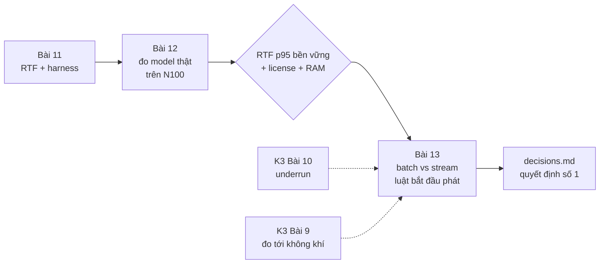
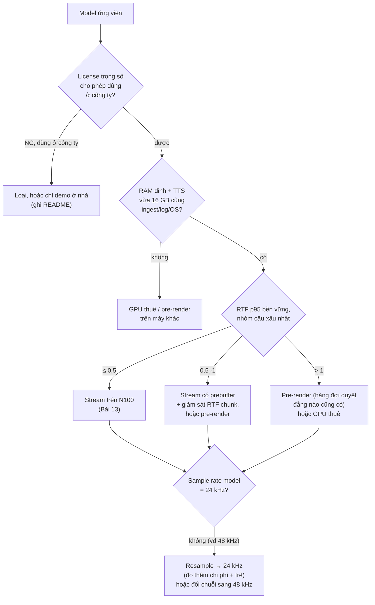

# Khóa 3 — Module 3: TTS và quyết định kiến trúc (14h)

Ba bài, một quyết định: **TTS chạy ở đâu và phát theo kiểu gì** (quyết định số 1 trong bốn quyết định của V1, lộ trình tổng mục 4.2). **Bài 11** dựng thước đo (RTF) và một harness đáng tin. **Bài 12** đo model tiếng Việt thật trên N100 và chọn nơi chạy. **Bài 13** chọn batch hay stream, và luật bắt đầu phát sao cho không đứt giữa câu.

Bài học xuyên module: hai chỉ số mà backend quen gộp làm một, **thời gian tới mẫu đầu tiên** và **tính liên tục sau đó**, ở đây tách hẳn ra. Một response HTTP được phép chậm một chút giữa chừng; âm thanh thì không.



---

## Bài 11 — RTF: chỉ số quyết định kiến trúc (3h)

> **Vị trí:** K3 Bài 10 (latency vs underrun) → **Bài 11** → K3 Bài 12 (đo model thật) · **Cần trước:** F1.2 (percentile, vì sao p99 của ít mẫu không tin được), F1.3 (warm-up, steady state, A/A), F1.4 (khoảng tin cậy, bootstrap), F7.1 (utilization) · **Sau bài này bạn quyết định được:** harness của mình có đủ tin để chọn giữa stream và pre-render hay chưa, và ngưỡng RTF nào (kèm percentile và biên) sẽ dùng làm luật quyết định.

### 1. Câu chuyện — ai đã khổ vì chuyện này

"Máy yếu quá" là câu mà ai từng làm hiệu năng cũng nghe, và nó không phân biệt được ba tình huống rất khác nhau: model quá nặng cho mọi CPU, CPU này chậm hơn CPU kia một hằng số, hay máy đang hạ xung vì nóng. Cộng đồng nhận dạng tiếng nói từ lâu đã chuẩn hóa câu trả lời bằng **real-time factor**: thời gian xử lý chia cho độ dài audio `[chuẩn]`. Một con số không có đơn vị, so được giữa các máy, và trả lời thẳng câu hỏi "có theo kịp thời gian thực không".

Cái giá của việc không có thước chung thì ngành ML trả bằng hàng năm số benchmark không so được với nhau: mỗi hãng đo một kiểu warm-up, một kiểu batch, một cách lấy số đẹp nhất. MLPerf Inference ra đời (khoảng 2019) chủ yếu để đặt *luật đo*: kịch bản tải (single-stream, server, offline…), thời lượng tối thiểu, cách báo percentile `[chuẩn]`. Bài này là phiên bản nhỏ của việc đó cho TTS của bạn: trước khi tin bất kỳ con số RTF nào, kể cả của chính bạn, phải có luật đo.

### 2. Mô hình tư duy

```
RTF = thời_gian_sinh / độ_dài_audio_sinh_ra          (RTF < 1: nhanh hơn thời gian thực)
```

Ba cách nhìn cùng một con số:

| Cách nhìn | Công thức | Nói gì |
|---|---|---|
| Tốc độ | 1/RTF = "x lần thời gian thực" | Ngành mô phỏng (Gazebo) báo đại lượng **ngược** này và cũng gọi là "real time factor" |
| **Utilization** | Khi audio phải phát liên tục, worker TTS phải làm ra 1 s audio mỗi 1 s: ρ = RTF | ρ → 1 là đầu gối của hàng đợi (→ F7.1). RTF 0,95 không chỉ "hết biên", nó là ρ = 0,95: mọi dao động nhỏ thành chờ lớn |
| Chi phí theo độ dài | thời_gian_sinh ≈ a + b·L → RTF(L) ≈ a/L + b | a = chi phí cố định (tiền xử lý văn bản, prefill, khởi tạo); b = chi phí mỗi giây audio. Câu ngắn có RTF **xấu hơn** câu dài |

Hệ quả cho harness:
1. RTF là **phân bố theo độ dài câu**, không phải một số của model. Báo theo nhóm độ dài.
2. Có **ba** đại lượng thời gian riêng: thời gian tới chunk đầu (TTFC, quyết định độ trễ cảm nhận, Bài 13), RTF toàn câu (quyết định có theo kịp không), và RTF **từng chunk** (quyết định có đứt giữa chừng không).
3. Số mẫu quyết định percentile nào được phép báo. 17 lần chạy (20 bỏ 3 warm-up) không có p99: p99 của 17 mẫu chính là giá trị lớn nhất, đổi mỗi lần chạy lại.

Mô phỏng đồ chơi (dự đoán trước: khoảng dao động của "p99" với n = 17 rộng cỡ nào so với giá trị thật; RTF p50 của câu 1,5 s so với câu 13 s):

```python
# [đã chạy] p99 của 17 mẫu là gì? Và vì sao RTF câu ngắn "xấu" hơn câu dài
import numpy as np

rng = np.random.default_rng(4)
def gen_time(audio_s, n):
    """Đồ chơi: chi phí cố định 0,4 s + 0,5 s mỗi giây audio, nhiễu lệch phải."""
    return (0.4 + 0.5 * audio_s) * rng.lognormal(0, 0.15, n)

true_p99 = np.percentile(gen_time(5.0, 1_000_000) / 5.0, 99)
for n in (17, 100, 1000):
    est = [np.percentile(gen_time(5.0, n) / 5.0, 99) for _ in range(2000)]
    lo, hi = np.percentile(est, [5, 95])
    print(f"n={n:5d}: p99 ước lượng dao động [{lo:.3f}, {hi:.3f}]  (thật {true_p99:.3f})")

for L in (1.5, 5.0, 13.0):                     # độ dài audio (s): câu ngắn / vừa / dài
    print(f"audio {L:4.1f} s: RTF p50 = {np.median(gen_time(L, 10_000) / L):.3f}")
```

### 3. Cầu nối từ backend

| Backend bạn biết | Ở đây | Gãy ở chỗ | Nếu dùng nhầm thì |
|---|---|---|---|
| Capacity planning: QPS tối đa ở p99 < X, giữ utilization ~70% | RTF ≤ 0,5 làm mục tiêu | Request backend có kích thước gần giống nhau; ở đây "kích thước" là độ dài câu, và RTF đổi theo nó | Mục tiêu đặt trên câu 20 từ, câu 5 từ vượt ngưỡng |
| Benchmark có warm-up (JIT, cache, connection pool) | Bỏ 3 lần đầu | Warm-up ở đây còn có **nhiệt**: máy lạnh chạy nhanh hơn máy đã nóng 10 phút. "Warm" về JIT ≠ "steady state" về nhiệt | Số đẹp ở phút đầu, kiến trúc gãy ở phút thứ 20 |
| p99 từ `wrk`/`k6` với hàng chục nghìn request | p50/p95/p99 của 17 lần chạy | Với 17 mẫu, p95 và p99 đều là mẫu lớn nhất hoặc gần nhất | Báo p99 như thể có nghĩa; so hai model bằng nhiễu |
| Mock server để có bộ test chuẩn (vốn của bạn) | Synth giả có RTF biết trước để kiểm harness | Không gãy, đây là đúng kỹ thuật: **known-answer test** cho chính dụng cụ đo (→ F2.5) | Harness đo sai (ví dụ tính độ dài audio theo byte thay vì mẫu) mà không ai biết |
| Một số "latency" cho một endpoint | TTFC, RTF toàn câu, RTF từng chunk | Ba số phục vụ ba quyết định khác nhau | Chọn model theo RTF toàn câu, rồi đứt giữa câu vì chunk không đều |

**Chấm mô hình:**

- *Mô hình của bạn ở K3 lượt 21:* "càng có nhiều flag như rtf, để đo đạc realtime… sẽ có thêm rất nhiều công tắc, rất nhiều mode như batch hay streaming… nếu lúc đo chưa cover đủ flag/khóa thì lúc runtime thực tế không thể đảm bảo mọi tình huống" — **ĐÚNG MỘT PHẦN.** Đúng: một đại lượng không thứ nguyên so tốc độ xử lý với tốc độ tiêu thụ là xương sống của mọi hệ thời gian thực; ở robot nó tên là *loop budget*/*deadline*, và ý chọn mode theo đo đạc là đúng hướng. Gãy một: bạn trộn **chỉ số đo** (RTF, mức đầy buffer) với **công tắc điều khiển** (mode batch/stream); chỉ số là đầu vào của luật chuyển mode, không phải bản thân mode. Gãy hai: "cover đủ flag lúc đo thì runtime mới đảm bảo" là mục tiêu không đạt được; không gian tổ hợp tải × nhiệt × độ dài câu × phiên bản model quá lớn để đo hết. Cách ngành làm là **thiết kế cho suy giảm** (biên an toàn, giám sát lúc chạy, chế độ lùi) chứ không phải liệt kê đủ tình huống. Gemini đã khen mô hình này mà không chỉ hai chỗ gãy. Phản ví dụ: RTF p95 = 0,6 đo lúc máy nguội; sau 20 phút chạy liên tục N100 chạm giới hạn công suất, RTF lên 1,1; không flag nào đo lúc lab bắt được trừ khi harness có phiên chạy bền vững, và kể cả vậy, runtime vẫn cần một luật "RTF chunk gần đây > ngưỡng thì chuyển sang pre-render".
- *"RTF < 1 là đủ để stream."* — **ĐÚNG MỘT PHẦN.** Cần, chưa đủ: RTF trung bình < 1 nhưng thời gian sinh từng chunk dao động thì vẫn có thể đứt (Bài 13 cho bạn mô phỏng để tự thấy khi nào). Và ngược lại, RTF > 1 vẫn stream được không đứt nếu chờ đủ trước khi phát (Bài 13).
- *"Báo p50/p95/p99 của 17 lần chạy là đủ chuẩn."* — **SAI.** Phản ví dụ: mô phỏng trên; khoảng dao động của "p99" với n = 17 rộng tới mức hai model khác nhau thật 10% không phân biệt được.

### 4. Thuật ngữ

| Mức | Thuật ngữ | Nghĩa trong một câu | Hay bị hiểu nhầm thành |
|---|---|---|---|
| 🟢 | RTF (real-time factor, TTS/ASR) | Thời gian xử lý / độ dài audio; < 1 là nhanh hơn thời gian thực | Cùng nghĩa với "real time factor" của Gazebo (ngược lại) |
| 🟢 | TTFC / time-to-first-audio | Từ lúc gửi văn bản tới chunk audio đầu (TTFC) hoặc tới khi loa kêu (TTFA) | Một phần của RTF |
| 🟢 | Warm-up vs steady state | Bỏ các lần chạy đầu bị chi phí khởi tạo; chạy tới khi phân bố ổn định (kể cả nhiệt) | Bỏ 3 lần đầu là xong |
| 🟢 | Harness | Code đo tái sử dụng: đầu vào cố định, ghi đủ ngữ cảnh, xuất dữ liệu thô | Script chạy một lần |
| 🟡 | Thermal/power throttling | CPU tự hạ xung khi chạm giới hạn nhiệt hoặc công suất gói | Lỗi phần cứng |
| 🟡 | Known-answer test | Chạy dụng cụ đo trên đầu vào có đáp án biết trước | Unit test thông thường |
| 🟡 | Bootstrap CI cho percentile | Lấy mẫu lại có hoàn lại để ước lượng độ bất định của p50/p95 | Khoảng min–max |
| 🔴 | MLPerf scenario | Bộ luật tải chuẩn hóa của MLPerf Inference | Cần tuân theo ở V1 |

### 5. Dự đoán

**Đề:**
1. Với synth giả trong harness mẫu (mục 6), RTF mỗi nhóm câu là bao nhiêu? (Tính từ code, không chạy.)
2. Cho model bạn định dùng ở Bài 12: dự đoán hình dạng RTF(L) (có chi phí cố định không, lớn cỡ nào) và RTF p50 cho ba nhóm câu 5/20/50 từ trên N100.
3. Với số mẫu bạn định thu, bạn được phép báo percentile nào? Độ rộng khoảng tin cậy 95% của p95 cỡ bao nhiêu phần trăm?
4. Mô phỏng đồ chơi: điền dự đoán trước khi chạy.

**Tham số cần tra:**
- RTF mà tác giả model công bố và **máy họ đo** (README/model card). Ghi rõ đó là số của máy khác.
- N100: số nhân, xung tối đa, công suất cơ sở (Intel ARK, trang Intel Processor N100); chế độ bộ nhớ của Beelink EQ12 (`sudo dmidecode -t memory`).
- Tập lệnh CPU (`lscpu`, tìm `avx2`, `avx_vnni`): một số runtime chọn kernel khác nhau theo tập lệnh.
- Độ dài audio của câu 20 từ: tự đọc to và bấm giờ, hoặc lấy từ lần chạy đầu.

**Phương pháp:** RTF(L) ≈ a/L + b; ước lượng a từ TTFC hoặc từ một câu rất ngắn. Với độ bất định của percentile: chạy lại mô phỏng với n của bạn, hoặc bootstrap trên dữ liệu thật sau khi có.

**Mẫu `prediction.md`:**

```markdown
# Bài 11 — RTF harness (commit trước khi chạy model thật)
Synth giả: RTF dự đoán = …  (tính từ code: …)
Model định dùng: …  RTF tác giả công bố: … trên máy …
| Nhóm câu | Độ dài audio dự đoán | RTF p50 dự đoán (N100) | TTFC dự đoán |
|---|---|---|---|
| 5 từ | | | |
| 20 từ | | | |
| 50 từ | | | |
Số mẫu mỗi nhóm: …  ⇒ được báo: p50 / p95 / p99 (gạch cái không được)
Độ rộng CI 95% của p95 dự đoán: ±…%
Mô phỏng: khoảng "p99" với n=17 ≈ […, …]; RTF p50 câu 1,5 s vs 13 s: … vs …
```

### 6. Làm

Viết harness tái sử dụng (bạn sẽ dùng lại ở K4 Bài 4):

- **Đầu vào:** danh sách câu tiếng Việt chia ba nhóm: ngắn ~5 từ, vừa ~20 từ, dài ~50 từ. **Nhiều câu mỗi nhóm** (ví dụ 10), không phải một câu, để RTF không phụ thuộc một câu đặc biệt.
- **Lặp:** mỗi câu N = 20 lần, đánh dấu 3 lần đầu là warm-up (giữ trong dữ liệu, loại khi tính). **Xáo trộn thứ tự** các câu giữa các nhóm, để nhóm "dài" không luôn rơi vào lúc máy đã nóng.
- **Ghi mỗi lần chạy:** thời gian sinh, độ dài audio (tính từ **số mẫu** ÷ sample rate, không từ số byte hay ước lượng), RTF, **time-to-first-chunk nếu model hỗ trợ streaming**, xung CPU hiện tại, nhiệt độ.
- **Ghi một lần mỗi phiên:** CPU model, số nhân, RAM, phiên bản model + hash file trọng số, phiên bản thư viện (`pip freeze`), nhiệt độ trước và sau.
- **Báo cáo:** p50, p95 theo nhóm, kèm khoảng tin cậy bootstrap; p99 chỉ khi mỗi nhóm có vài trăm mẫu trở lên, nếu không thì báo **max** và gọi đúng tên. Không báo trung bình làm chỉ số chính.
- **Known-answer test:** chạy harness với synth giả trước. Nếu harness không ra đúng RTF bạn tính ở mục 5, sửa harness trước khi đo model thật.
- **Phiên bền vững:** một phiên chạy liên tục ≥10 phút (lặp câu vừa), ghi RTF theo thời gian. Phiên này trả lời "steady state về nhiệt" (K4 Bài 6 làm kỹ hơn).

Khung harness (chạy được với synth giả; thay `synth` bằng model thật ở Bài 12):

```python
# [đã chạy] Khung harness RTF — chạy được với synth giả; thay `synth` bằng model thật
import json, os, platform, statistics, time

def synth(text):
    """GIẢ: thay bằng gọi model. Trả về (list chunk PCM int16 bytes, sample_rate)."""
    t0 = time.perf_counter(); chunks = []
    for _ in range(max(1, len(text.split()) // 4)):
        time.sleep(0.01); chunks.append(b"\x00\x00" * 2400)   # 0,1 s audio @24 kHz
        yield chunks[-1], 24_000, time.perf_counter() - t0

def cpu_mhz():
    try:
        with open("/proc/cpuinfo") as f:
            return [float(l.split(":")[1]) for l in f if l.startswith("cpu MHz")]
    except OSError:
        return []

def run(sentences, n=20, warmup=3, out="rtf.jsonl"):
    meta = {"host": platform.node(), "cpu": platform.processor() or platform.machine(),
            "ncpu": os.cpu_count(), "mhz_before": cpu_mhz()}
    with open(out, "w") as f:
        f.write(json.dumps({"meta": meta}) + "\n")
        for label, text in sentences.items():
            for i in range(n):
                t0 = time.perf_counter(); first = None; samples = 0
                for pcm, sr, _ in synth(text):
                    if first is None:
                        first = time.perf_counter() - t0      # time-to-first-chunk
                    samples += len(pcm) // 2
                wall = time.perf_counter() - t0
                rec = {"label": label, "iter": i, "warmup": i < warmup, "wall_s": wall,
                       "audio_s": samples / sr, "rtf": wall / (samples / sr),
                       "ttfc_s": first, "mhz": cpu_mhz()}
                f.write(json.dumps(rec) + "\n")
    print("ghi xong", out)

def report(path="rtf.jsonl"):
    rows = [json.loads(l) for l in open(path)][1:]
    for label in sorted({r["label"] for r in rows}):
        x = sorted(r["rtf"] for r in rows if r["label"] == label and not r["warmup"])
        q = statistics.quantiles(x, n=20, method="inclusive")  # q[9]=p50, q[18]=p95
        print(f"{label:6s} n={len(x)} RTF p50={q[9]:.3f} p95={q[18]:.3f} max={x[-1]:.3f}")

if __name__ == "__main__":
    run({"ngan": "xin chào mọi người nhé",
         "vua": " ".join(["từ"] * 20), "dai": " ".join(["từ"] * 50)}, n=8)
    report()
```

Việc còn lại cho bạn: thêm nhiều câu mỗi nhóm và xáo trộn thứ tự; đọc nhiệt độ (`/sys/class/thermal/thermal_zone*/temp` hoặc `sensors`); bootstrap CI cho p50/p95; lưu hash trọng số. Chú ý khung đếm `samples` theo int16 mono; nếu model trả float32 hoặc stereo, sửa phép tính độ dài audio, đây là lỗi harness phổ biến nhất.

### 7. Số phải ra

<details><summary>🔒 MỞ SAU KHI COMMIT prediction.md</summary>

**Synth giả:** mỗi chunk ngủ 10 ms và trả 0,1 s audio → RTF ≈ 0,10 cho mọi nhóm (đo được ~0,101 do overhead `sleep`). Lệch xa 0,1 nghĩa là harness sai: thường là tính độ dài audio sai đơn vị.

**Mô phỏng đồ chơi (seed 4):**

| n | Khoảng 90% của "p99" ước lượng | p99 thật |
|---|---|---|
| 17 | [0,671; 0,854] | 0,822 |
| 100 | [0,747; 0,869] | 0,822 |
| 1000 | [0,798; 0,844] | 0,822 |

Với n = 17, "p99" thường **thấp hơn** giá trị thật (vì nó chỉ là max của 17 mẫu) và dao động khoảng ±13%. Với n = 1000 mới còn khoảng ±3%.

| Audio | RTF p50 |
|---|---|
| 1,5 s | 0,767 |
| 5,0 s | 0,581 |
| 13,0 s | 0,532 |

Chi phí cố định 0,4 s làm câu ngắn có RTF xấu hơn 44% so với câu dài, dù "model" là một. Với model thật, nếu bạn thấy RTF câu ngắn > 1 trong khi câu dài < 0,5, đừng kết luận "model chậm"; hãy tách a và b.

**Số mẫu và percentile:** 10 câu × 17 lần = 170 mẫu mỗi nhóm: p50 và p95 có nghĩa (p95 với ~8 mẫu phía trên), p99 chỉ có ~2 mẫu phía trên nên báo max. Đây là quy ước của harness này, không phải luật trời; điều quan trọng là báo kèm n và khoảng tin cậy.

**Luật quyết định (để Bài 12 dùng):** dùng **RTF p95 của phiên bền vững, theo nhóm câu xấu nhất bạn sẽ phát** (thường là nhóm ngắn), không dùng p50 lúc máy nguội. Ngưỡng 0,5 của gốc là biên an toàn hợp lý vì ở ρ = 0,5 hàng đợi còn xa đầu gối `[ước lượng]`.
</details>

### 8. Nếu ra khác

| Triệu chứng | Nguyên nhân khả dĩ | Kiểm bằng cách | Sửa |
|---|---|---|---|
| Synth giả không ra RTF ≈ 0,1 | Tính độ dài audio theo byte/sample sai, hoặc đo thời gian sai chỗ | In số mẫu, sample rate, wall | Sửa harness; không đi tiếp |
| RTF giảm dần theo lần chạy trong cùng câu | Warm-up kéo dài hơn 3 lần (cache, lazy init) | Vẽ RTF theo `iter` | Tăng số lần warm-up, ghi lý do |
| RTF tăng dần theo thời gian phiên | Nhiệt/công suất | Vẽ RTF cùng xung CPU, nhiệt độ | Đó là kết quả, không phải lỗi: báo phiên bền vững |
| p95 nhóm ngắn > 1 nhưng nhóm dài < 0,5 | Chi phí cố định a lớn | Fit a + b·L | Ghi a riêng; ảnh hưởng TTFA (Bài 13) |
| Lần chạy lại cho p95 khác 15% | n nhỏ | Bootstrap CI | Thêm câu, thêm lần; không so số không có CI |
| TTFC = thời gian sinh toàn câu | Model/API không thật sự stream (trả một chunk duy nhất) | Đếm số chunk | Ghi "không stream"; Bài 13 phải tự chunk theo câu |

### 9. Câu hỏi ngược

1. **[Quy mô]** 100 robot, mỗi con một N100, cùng model. Bạn chỉ benchmark trên một máy. Cái gì gãy trước khi bạn tin con số đó cho cả đội?
   <details><summary>Hướng nghĩ</summary>Biến thiên giữa các máy (BIOS đặt giới hạn công suất khác nhau, keo tản nhiệt, nhiệt độ phòng đặt robot), phiên bản thư viện trôi. Cần harness chạy định kỳ trên từng máy và báo phân bố RTF giữa các máy, không phải một số.</details>
2. **[Failure mode]** Harness của bạn đo RTF bằng `time.time()` và máy chạy NTP. Kể một tình huống RTF đo ra âm hoặc nhảy vọt, và đồng hồ nào nên dùng.
   <details><summary>Hướng nghĩ</summary>Wall clock có thể bị NTP chỉnh bước. Dùng đồng hồ monotonic (`perf_counter`, `monotonic_ns`) cho khoảng thời gian (→ F4.3).</details>
3. **[Vì sao không]** Vì sao không báo RTF trung bình, khi trung bình mới là thứ quyết định "có theo kịp lâu dài không"?
   <details><summary>Hướng nghĩ</summary>Với một luồng phát liên tục, đúng là tốc độ trung bình quyết định có cạn dần không. Nhưng đứt tiếng xảy ra ở *từng chunk* và ở *câu ngắn*; trung bình gộp che cả hai. Báo trung bình như một dòng phụ thì được; dùng nó làm luật quyết định thì không.</details>
4. **[Liên ngành]** Gazebo báo "real time factor" = thời gian mô phỏng / thời gian thực, nên > 1 là *nhanh*. Khi K6 bạn chạy sim với RTF 0,5 và TTS với RTF 0,5, hai hệ đó ở tình trạng nào?
   <details><summary>Hướng nghĩ</summary>Sim chạy chậm gấp đôi thời gian thực (không theo kịp); TTS nhanh gấp đôi (theo kịp). Một tên, hai định nghĩa ngược nhau: luôn ghi công thức cạnh con số.</details>
5. **[Phản biện]** "Chỉ cần đo câu 20 từ, vì đó là độ dài confession điển hình." Phản biện bằng dữ liệu bạn sẽ có ở K3 Bài 14 (phân bố độ dài confession thật).
   <details><summary>Hướng nghĩ</summary>Luật quyết định phải phủ phần đuôi của phân bố độ dài thật (câu rất ngắn: RTF xấu; câu rất dài: tổng thời gian sinh và RAM). "Điển hình" là p50; SLO nằm ở đuôi.</details>

### 10. Liên kết ra ngoài

- **Nhận dạng tiếng nói (ASR).** RTF là chỉ số chuẩn cho decoder ASR từ lâu; ASR streaming còn tách thêm độ trễ tới kết quả tạm thời đầu tiên. Giống: thời gian xử lý so với độ dài audio. Khác: ASR *tiêu thụ* audio theo thời gian thực, TTS *sản xuất* audio cho người tiêu thụ theo thời gian thực; điểm nghẽn ở hai đầu ngược nhau.
- **Mô phỏng vật lý (Gazebo, K6).** Cùng tên, công thức ngược (mục 9). Giống: đo một hệ có nhịp riêng so với đồng hồ tường. Khác: sim chậm thì chỉ chậm (thời gian sim dừng chờ), TTS chậm thì người nghe nghe thấy.
- **Benchmark ML (MLPerf Inference).** Luật hóa kịch bản tải, thời lượng tối thiểu và percentile báo cáo để số của các hãng so được. Giống: harness có luật trước khi có số. Khác: MLPerf tối ưu cho so sánh giữa hãng; harness của bạn tối ưu cho *một quyết định* trên *một máy*, nên ghi nhiệt và xung quan trọng hơn chuẩn hóa.

### 11. Độ tin cậy và sửa lỗi

| Khẳng định | Nhãn | Ghi chú / cách kiểm |
|---|---|---|
| RTF = thời gian sinh / độ dài audio | [chuẩn] | Định nghĩa dùng trong ASR/TTS |
| Gazebo "real time factor" là đại lượng ngược | [chuẩn] | Kiểm trong giao diện Gazebo ở K6 |
| ρ = RTF khi phát liên tục | [chuẩn] | Utilization = tốc độ đến × thời gian phục vụ |
| Percentile cao của ít mẫu bị chệch thấp và dao động lớn | [chuẩn] | Mô phỏng; → F1.2 |
| RTF ≤ 0,5 là biên an toàn đủ | [ước lượng] | Quy tắc kinh nghiệm của gốc; kiểm bằng Bài 13 với tải thật |

**Đã sửa so với bản gốc/Gemini:**
- *Gốc + Gemini:* "N = 20, bỏ 3, báo p50, p95, p99". Với 17 mẫu mỗi câu, p95 và p99 không có nghĩa. Sửa: nhiều câu mỗi nhóm, báo p50/p95 kèm CI, p99 chỉ khi đủ mẫu, không thì báo max.
- *Gemini:* tiêu chí "p50 giữa các lần chạy lại biến thiên < 5%" xuất hiện như tiêu chuẩn PASS: không có nguồn; thay bằng khoảng tin cậy bootstrap.
- *Gemini:* "lần chạy đầu chậm do nạp trọng số…" đúng, nhưng bỏ qua warm-up **nhiệt** (ngược chiều: chậm dần). Thêm phiên bền vững.
- *Gốc:* không nói cách tính độ dài audio; thêm known-answer test với synth giả.
- Thêm: RTF(L) = a/L + b, xáo trộn thứ tự câu, RTF từng chunk, ρ = RTF.
- *Mô hình K3 lượt 21:* Gemini xác nhận là "tư duy cốt lõi nhất" mà không chỉ chỗ gãy (trộn chỉ số với công tắc; "đo đủ flag thì runtime đảm bảo"). Chấm lại ở mục 3.

### 12. Đọc thêm và tự kiểm tra

- **Nguồn gốc:** MLCommons, *MLPerf Inference rules* (phần scenarios và yêu cầu thời lượng/percentile).
- **Giải thích:** Brendan Gregg, *Systems Performance* (2nd ed.), chương về phương pháp benchmark (active benchmarking, các lỗi benchmark thường gặp).
- **Đào sâu (tùy chọn):** Bradley Efron, Robert Tibshirani, *An Introduction to the Bootstrap* (chương về khoảng tin cậy cho percentile).
- **Tự kiểm tra:** (1) giải thích lại cho một backend engineer khác trong 5 câu vì sao RTF là utilization; (2) vẽ lại bảng "ba cách nhìn" từ trí nhớ; (3) hai câu:
  - Model có a = 0,6 s, b = 0,3. RTF của câu audio 2 s và 12 s?
  - Bạn có 40 mẫu mỗi nhóm. Được báo những percentile nào?
  <details><summary>Đáp án</summary>(0,6 + 0,3·2)/2 = 0,60; (0,6 + 0,3·12)/12 = 0,35. Với 40 mẫu: p50 có nghĩa; p95 chỉ có ~2 mẫu phía trên, báo được nhưng kèm CI rất rộng; p99 không, báo max.</details>

---

## Bài 12 — Chạy TTS tiếng Việt và đo RTF (6h)

> **Vị trí:** K3 Bài 11 (harness) → **Bài 12** → K3 Bài 13 (batch vs stream) · **Cần trước:** F1.3 (steady state, cô lập nhiễu), F2.2 (tái lập: lockfile, hash trọng số), F7.2 (băng thông vs compute, đọc lướt), K3 Bài 11 · **Sau bài này bạn quyết định được:** model nào và chạy ở đâu (stream trên N100, pre-render trên N100, hay GPU thuê), viết vào `decisions.md` kèm RTF p95 bền vững, RAM đỉnh, license và điều kiện xem lại.

### 1. Câu chuyện — ai đã khổ vì chuyện này

Các model TTS tiếng Việt mở thay đổi theo tháng, không theo năm. Ví dụ ngay trong danh sách của gốc: VieNeu-TTS mà gốc mô tả là "real-time trên CPU ở 24 kHz" là dòng v2 dùng GGUF; tới 10/2026 README của dự án đánh dấu v2 và các biến thể GGUF/ONNX CPU của v2 là **deprecated**, bản mặc định là v3 Turbo ra **48 kHz** chạy CPU qua ONNX Runtime, còn bản 24 kHz là v3 Nano (preview) `[tự đo: kiểm 10/2026, kiểm lại khi bạn làm]`. Một kế hoạch viết sáu tháng trước đã lệch ở cả phiên bản lẫn sample rate.

Cái bẫy thứ hai là **license của code khác license của trọng số**. VietTTS (dangvansam) có code Apache-2.0, nhưng README ghi model đã huấn luyện và audio mẫu theo CC BY-NC, vì dữ liệu huấn luyện lấy "in-the-wild" `[tự đo: README 10/2026]`. Gốc chỉ cảnh báo NC cho Viterbox. Người làm sản phẩm khổ vì chuyện này không phải ở lúc chạy thử, mà ở lúc pháp chế hỏi "trọng số này lấy từ đâu" sau khi đã ship.

### 2. Mô hình tư duy

Quyết định là một cây, và RTF chỉ là một nhánh:



Ứng viên (kiểm bằng tìm kiếm web 10/2026; mọi dòng `[tự đo]` theo phiên bản bạn cài):

| Model | Trạng thái và đặc điểm | Sample rate | License trọng số | Ghi chú cho N100 |
|---|---|---|---|---|
| **VieNeu-TTS** (pnnbao97) | v3 Turbo mặc định: CPU qua ONNX Runtime (không cần PyTorch), stream theo frame, có endpoint tương thích OpenAI `/v1/audio/speech`; v3 Nano (preview) nhẹ hơn, không stream theo frame; v2 GGUF deprecated; `pip install vieneu` | Turbo 48 kHz; Nano 24 kHz | README ghi Apache-2.0; **kiểm tag license trên trang trọng số** | Bản int8 cần CPU có VNNI; kiểm `lscpu` |
| **VietTTS** (dangvansam/viet-tts) | Server tương thích OpenAI (`/v1/audio/speech`); clone giọng từ file WAV; README ghi mượn code từ CosyVoice; Docker yêu cầu GPU NVIDIA, bản Python chỉ Linux | `[tự đo]` | Code Apache-2.0; **model + audio mẫu CC BY-NC** | Đường Docker của README không chạy trên N100; dùng đường Python |
| **Viterbox** | Fine-tune từ Chatterbox (bản đa ngôn ngữ), zero-shot clone với vài giây mẫu, >3.000 h dữ liệu tiếng Việt (ViVoice, PhoAudiobook, dữ liệu nội bộ) | `[tự đo]` | **CC BY-NC 4.0** (model card) | Chatterbox gốc là MIT `[tự đo]`; dữ liệu có điều khoản riêng |
| **F5-TTS-Vietnamese** (hynt) | Dựa trên F5-TTS (flow matching, nhiều bước khử nhiễu mỗi câu) | `[tự đo]` | **CC-BY-NC-SA-4.0** (model card); F5-TTS gốc huấn luyện trên dữ liệu Emilia có điều khoản NC | Không tự hồi quy nhưng nhiều bước; dự đoán nặng trên CPU `[ước lượng]` |

**Cận dưới RTF bằng băng thông bộ nhớ.** Với TTS tự hồi quy ở batch 1, mỗi bước sinh phải đọc gần hết trọng số từ RAM. Nếu phần đó memory-bound, thời gian mỗi bước ≥ byte trọng số / băng thông, và RTF ≥ (số bước cho 1 s audio) × (byte / băng thông) + phần giải mã codec. N100 dùng bộ nhớ **một kênh** `[spec: Intel ARK, N100]`, nên băng thông là tham số đáng đo trước tiên. Đây là roofline thu nhỏ (→ F7.2, K4 Bài 12):

```python
# [đã chạy] Cận dưới RTF cho TTS tự hồi quy bị chặn bởi băng thông bộ nhớ (đồ chơi)
# Mọi tham số là CHỖ TRỐNG: thay bằng số tra từ model card và số đo trên máy bạn.
weights_bytes   = 0.30e9   # byte trọng số phải đọc mỗi bước sinh (sau lượng tử)
steps_per_sec   = 50       # số BƯỚC tự hồi quy cho 1 giây audio (tra model card / codec)
bw_measured     = 20e9     # băng thông bộ nhớ ĐO ĐƯỢC (B/s), không phải số lý thuyết
decoder_rtf     = 0.05     # phần RTF của bộ giải mã codec -> waveform (đo riêng)

t_per_step = weights_bytes / bw_measured            # s/bước nếu thuần memory-bound
rtf_floor = steps_per_sec * t_per_step + decoder_rtf
print(f"thời gian mỗi bước >= {t_per_step*1e3:.1f} ms")
print(f"RTF cận dưới ≈ {rtf_floor:.2f}  (nếu giả định đúng, số đo thật không thể thấp hơn)")
for bw in (10e9, 20e9, 38.4e9):
    print(f"  BW {bw/1e9:5.1f} GB/s -> RTF >= {steps_per_sec*weights_bytes/bw + decoder_rtf:.2f}")
```

Mô hình này sai khi model không tự hồi quy (F5-TTS: compute-bound nhiều hơn), khi trọng số nằm vừa cache, hoặc khi một bước sinh nhiều token song song. Nó đáng giá ở chỗ cho một **cận dưới** để đối chiếu: nếu số đo thấp hơn cận dưới, phép đo hoặc giả định sai.

### 3. Cầu nối từ backend

| Backend bạn biết | Ở đây | Gãy ở chỗ | Nếu dùng nhầm thì |
|---|---|---|---|
| Chọn thư viện: xem license, star, lần commit cuối | Chọn model TTS | License của **trọng số** và **dữ liệu** tách khỏi license của code; repo "Apache-2.0" vẫn có thể ship trọng số NC | Dùng ở công ty, vi phạm điều khoản mà không biết |
| Benchmark trên laptop dev, suy ra prod | Laptop → N100 | Tỉ lệ không theo xung nhịp: N100 khác ở tập lệnh (kernel int8 nào được dùng), số kênh bộ nhớ, giới hạn công suất; cùng một runtime có thể chọn đường code khác | Ước lượng RTF N100 = RTF laptop × (GHz laptop / GHz N100) và sai cả bậc |
| Lockfile, pin phiên bản | Pin model + runtime + hash trọng số | Model "cùng tên" đổi trọng số giữa các bản phát hành; v2 → v3 đổi cả sample rate | Hai lần đo cùng tên model không so được |
| Canary deploy, giám sát p99 sau deploy | Phiên bền vững, theo dõi xung/nhiệt | Ở backend, tải ổn định thì hiệu năng ổn định. Ở N100, hiệu năng **giảm theo thời gian** dưới tải ổn định (nhiệt, giới hạn công suất PL1/PL2 do BIOS đặt) | Chọn stream dựa trên 2 phút đầu |
| OOM kill trong container có limit | RAM 16 GB dùng chung TTS, ingest, Docker, OS | Không gãy nhiều; khác là ở robot (K7) RAM là ngân sách cứng của cả hệ, không scale ngang | Model vừa RAM ở lab, OOM khi thêm ROS 2 ở K7 |

**Chấm mô hình:**

- *"RTF trên N100 ≈ RTF trên laptop × tỉ lệ xung nhịp."* — **SAI.** Phản ví dụ: một runtime dùng kernel int8 VNNI trên laptop có VNNI nhưng rơi về đường fp32 trên máy không có, chênh lệch không liên quan GHz; hoặc model memory-bound trên máy một kênh bộ nhớ chậm hơn nhiều so với tỉ lệ xung. Điểm so sánh trên laptop có giá trị để **tách** "model nặng" khỏi "máy yếu", không phải để suy ra.
- *"Model nặng (nhiều tham số) thì RTF > 1 trên CPU."* — **ĐÚNG MỘT PHẦN.** Kích thước là một biến; số bước sinh mỗi giây audio, độ chính xác số (fp32/int8), và kiến trúc (tự hồi quy vs flow matching nhiều bước) cũng là biến. Phản ví dụ: một model nhỏ nhưng chạy nhiều bước khử nhiễu có thể chậm hơn model lớn hơn tự hồi quy với codec tốc độ token thấp.
- *Gemini khuyên "chèn nghỉ 2–3 giây giữa các iteration để nhiệt độ hạ bớt".* — **SAI** cho mục đích này. Nó làm số đẹp hơn điều kiện vận hành thật (robot phát liên tục khi có hàng đợi). Đúng: đo cả hai, máy nguội và phiên bền vững, và dùng phiên bền vững để quyết định.

### 4. Thuật ngữ

| Mức | Thuật ngữ | Nghĩa trong một câu | Hay bị hiểu nhầm thành |
|---|---|---|---|
| 🟢 | Pre-render | Sinh trọn audio trước khi phát (thường trong lúc chờ duyệt) | Cache kết quả |
| 🟢 | License trọng số vs code | Trọng số model có điều khoản riêng, thường kế thừa từ dữ liệu | Một license cho cả repo |
| 🟢 | Throttling (PL1/PL2, nhiệt) | Giới hạn công suất ngắn/dài hạn và nhiệt độ làm CPU hạ xung | Lỗi |
| 🟡 | Tự hồi quy vs flow matching | Sinh từng bước token nối tiếp vs khử nhiễu cả đoạn qua nhiều bước | Chi tiết không ảnh hưởng hiệu năng |
| 🟡 | Neural audio codec | Mạng nén audio thành token rời rạc ở tốc độ token cố định | Codec MP3/Opus |
| 🟡 | Memory-bound | Tốc độ bị chặn bởi băng thông bộ nhớ chứ không bởi số phép tính | "CPU yếu" |
| 🟡 | Resampling | Đổi sample rate bằng bộ lọc; có chi phí tính toán và trễ | Bỏ bớt mẫu |
| 🔴 | VNNI | Lệnh tích vô hướng int8 của x86, tăng tốc inference lượng tử | Cần hiểu chi tiết ở V1 |

### 5. Dự đoán

**Đề:** cho model bạn chọn:
1. RTF p50 và p95 trên N100, ba nhóm câu, ở hai điều kiện: máy nguội (5 phút đầu) và phiên bền vững (sau ≥10 phút chạy liên tục).
2. RTF trên laptop của bạn, cùng model, cùng câu, cùng phiên bản thư viện. Tỉ lệ N100/laptop.
3. RAM đỉnh (RSS) của tiến trình TTS.
4. Xung CPU trung bình và nhiệt độ gói ở phút 1 và phút 10.
5. Cận dưới RTF theo băng thông bộ nhớ (code ở mục 2), với băng thông bạn **đo** trên N100.
6. Quyết định dự kiến (nhánh nào của cây ở mục 2).

**Tham số cần tra:**
- Model card / README: kích thước trọng số, độ chính xác số, tốc độ token của codec (nếu tự hồi quy), số bước khử nhiễu (nếu flow matching), sample rate đầu ra, license trọng số, RTF tác giả công bố và **máy họ đo**.
- N100: Intel ARK (số nhân, xung tối đa, công suất cơ sở, loại bộ nhớ hỗ trợ). BIOS của EQ12: giới hạn công suất PL1/PL2 thực tế đặt bao nhiêu `[tự đo]` (`turbostat` hiển thị công suất gói).
- Băng thông bộ nhớ đo được: một micro-benchmark (ví dụ STREAM, hoặc `sysbench memory`) `[tự đo]`.
- Tập lệnh: `lscpu | grep -o 'avx[^ ]*'`.

**Phương pháp:** cận dưới roofline (mục 2) + RTF tác giả công bố hiệu chỉnh theo khác biệt phần cứng (nói rõ bạn hiệu chỉnh bằng gì) → khoảng dự đoán. Nhiệt: dự đoán xung giảm bao nhiêu phần trăm sau 10 phút.

**Mẫu `prediction.md`:**

```markdown
# Bài 12 — TTS trên N100 (commit trước khi chạy)
Model: … phiên bản … hash trọng số … license trọng số: …
Sample rate đầu ra: …  (nếu ≠ 24 kHz: kế hoạch resample …)
Băng thông bộ nhớ đo: … GB/s → cận dưới RTF: …
| Nhóm | RTF p50 nguội | RTF p95 nguội | RTF p95 bền vững | Laptop p50 |
|---|---|---|---|---|
| 5 từ | | | | |
| 20 từ | | | | |
| 50 từ | | | | |
RAM đỉnh: … GB.  Xung phút 1 / phút 10: … / … MHz.  Nhiệt gói: … / … °C
Quyết định dự kiến: … (nhánh … của cây)
```

### 6. Làm

1. **Chọn một model.** Ghi lý do vào `decisions.md` dựa trên cây ở mục 2: license trọng số (đọc trang trọng số, không chỉ README repo), RAM, kiến trúc, sample rate, độ khó cài. Không được viết "vì nó phổ biến".
2. **Ghi môi trường:** `pip freeze > env.txt`, hash file trọng số (`sha256sum`), `lscpu`, `free -h`, phiên bản kernel. Commit cùng kết quả (→ F2.2).
3. **Đo băng thông bộ nhớ** trên N100 bằng một micro-benchmark, ghi số. Chạy code cận dưới RTF.
4. **Chạy trên mini PC** bằng harness Bài 11: ba nhóm câu, nhiều câu mỗi nhóm, thứ tự xáo trộn. Đo trong lúc **không** có tải khác (host yên tĩnh: tắt Docker không cần thiết, ghi lại thứ còn chạy).
5. **Phiên bền vững:** ≥10 phút chạy liên tục câu vừa. Song song ghi xung và nhiệt:
   ```bash
   # [chưa chạy] cần quyền root và module msr; tên cột kiểm theo phiên bản turbostat [tự đo]
   sudo turbostat --quiet --interval 1 --show Avg_MHz,Busy%,Bzy_MHz,PkgTmp,PkgWatt > turbostat.log
   ```
   (Lệnh `watch … turbostat -n 1` của Gemini gọi turbostat lặp lại với chu kỳ mặc định vài giây mỗi lần; một tiến trình `--interval 1` liên tục gọn và đều hơn.)
6. **RAM đỉnh:** chạy một lần dưới `/usr/bin/time -v` và đọc "Maximum resident set size".
7. **Chạy cùng model, cùng câu, cùng phiên bản thư viện trên laptop**: điểm so sánh thứ hai, miễn phí. Ghi CPU laptop và tập lệnh.
8. **Nếu model quá nặng cho N100**, thử model thứ hai (ví dụ biến thể nhẹ hơn của cùng họ) và ghi rõ **đây là so sánh hai model khác nhau**, không phải cùng một phép đo.
9. Nếu sample rate đầu ra ≠ 24 kHz: đo thêm chi phí resample (RTF của riêng bước resample) và độ trễ của bộ lọc resample, hoặc quyết định đổi cả chuỗi sang sample rate của model (ảnh hưởng K3 Bài 3, Bài 10). Ghi vào `decisions.md`.
10. **Viết quyết định kiến trúc kèm số** (mẫu ở mục 7). Nếu RTF > 1 trên N100 và cân nhắc GPU thuê: đo thêm trên GPU thuê, và ghi độ trễ mạng + rủi ro mất kết nối như một chặng mới trong bảng Bài 8.

### 7. Số phải ra

<details><summary>🔒 MỞ SAU KHI COMMIT prediction.md</summary>

**Dải kỳ vọng thô của gốc** (phép đo của bạn mới là con số):

| Máy | RTF kỳ vọng | Kết luận |
|---|---|---|
| N100, model on-device tối ưu | Có thể < 1 | Stream được (Bài 13 xác nhận) |
| N100, model nặng | Có thể > 1 | Pre-render, hoặc GPU thuê theo lô |
| GPU thuê | < 0,1 | Dư sức, nhưng phụ thuộc mạng — ghi rõ đánh đổi |

**Số tác giả VieNeu-TTS công bố** (README, 10/2026, máy **Core i5 thế hệ 12 + RTX 3060**, không phải N100) `[tự đo: kiểm lại]`: CPU Turbo fp32 RTF ~0,55–0,62; int8 ~0,35–0,37; Nano ~0,11–0,22 (tùy số bước); thời gian tới audio đầu trên CPU ~140–300 ms; GPU một câu ~0,10. N100 có nhân Gracemont, xung thấp hơn và bộ nhớ một kênh so với i5 thế hệ 12 có P-core, nên RTF Turbo fp32 trên N100 có khả năng **cao hơn** con số trên, có thể chạm hoặc vượt vùng 0,5–1 `[ước lượng]`; bản int8 (nếu N100 có VNNI) hoặc Nano là chỗ để xem. Đây chính là loại phát hiện gốc nói: "bạn có thể phát hiện kế hoạch của mình sai, và đó là kết quả tốt".

**Nhiệt:** nếu xung trung bình ở phút 10 thấp hơn rõ phút 1 và RTF tăng tương ứng, bạn có một ràng buộc nhiệt/công suất cần ghi vào kiến trúc và vào ngân sách tài nguyên cho K7. Nếu xung không giảm, ghi lại công suất gói: giới hạn do BIOS đặt có thể đã đủ cao.

**Cận dưới roofline:** số đo thật phải **cao hơn** cận dưới. Nếu thấp hơn: hoặc model không đọc hết trọng số mỗi bước (cache, kiến trúc khác giả định), hoặc harness đo sai độ dài audio.

**Mẫu `decisions.md`:**

> **Quyết định kiến trúc TTS (QĐ số 1):** model … (phiên bản, hash), chế độ [stream / pre-render], chạy trên [N100 / GPU thuê].
> **Số đỡ lưng:** N100, phiên bền vững, nhóm câu ngắn (xấu nhất): RTF p50 = …, p95 = … (n = …, CI 95% …). Laptop: … RAM đỉnh … GB. Xung phút 1/10: …
> **License:** trọng số …, dữ liệu …; dùng ở công ty: [được / không — chỉ demo ở nhà].
> **Điều kiện xem lại:** đổi phiên bản model; thêm tải trên N100 (ROS 2 ở K7); RTF chunk giám sát lúc chạy vượt … trong … phút.
</details>

### 8. Nếu ra khác

| Triệu chứng | Nguyên nhân khả dĩ | Kiểm bằng cách | Sửa |
|---|---|---|---|
| RTF trên N100 < 0,5 | Model nhẹ hoặc tối ưu tốt | Kiểm known-answer harness; so cận dưới | Ghi lại: số đỡ lưng cho kiến trúc stream |
| RTF dao động mạnh giữa các lần | Hạ xung (nhiệt/công suất), swap, tiến trình nền | `turbostat.log`, `free -h`, `vmstat 1` | Ghi điều kiện; báo phiên bền vững riêng |
| RTF thấp hơn cận dưới roofline | Giả định sai, hoặc đo sai độ dài audio | Known-answer test; đọc lại kiến trúc model | Sửa giả định hoặc harness |
| RTF N100 / laptop lệch xa tỉ lệ xung | Tập lệnh khác, bộ nhớ một kênh, runtime chọn kernel khác | So `lscpu`; log của runtime | Ghi nguyên nhân; đừng suy N100 từ laptop |
| Model không chạy (OOM / bị kill) | RAM không đủ cho trọng số + kích hoạt | RSS đỉnh, `dmesg` | Ghi giới hạn RAM: số thật cho ngân sách tài nguyên K7 |
| RTF quá tốt (< 0,1) trên N100 | Cache kết quả, đo hàm khởi tạo thay vì inference | Đổi câu mỗi lần; kiểm audio ra nghe được | Sửa harness |
| Không cài được theo README (Docker đòi GPU) | Đường cài mặc định nhắm GPU | Đọc phần cài CPU/Python | Dùng đường cài CPU; ghi phiên bản |

### 9. Câu hỏi ngược

1. **[Quy mô]** 1000 giờ confession đã đọc (pre-render) được lưu lại để V2 fine-tune giọng mình. License trọng số của model V1 ảnh hưởng gì tới tập dữ liệu đó?
   <details><summary>Hướng nghĩ</summary>Đầu ra của model NC có thể bị ràng buộc bởi điều khoản model (tùy license, đọc kỹ). Một tập dữ liệu "bẩn" về license lan sang mọi model huấn luyện từ nó: đây là lineage cho license (→ F3.8).</details>
2. **[Failure mode]** Tác giả model phát hành v4, thư viện `pip install` không pin tự lên bản mới, sample rate đổi. Chuyện gì xảy ra với chuỗi audio, và test nào bắt được trước khi tới loa?
   <details><summary>Hướng nghĩ</summary>Phát 48 kHz vào I2S 24 kHz: giọng chậm và trầm gấp đôi, không có lỗi nào. Test: kiểm sample rate đầu ra so với cấu hình chuỗi ở bước khởi động (contract test), pin phiên bản + hash trọng số.</details>
3. **[Vì sao không]** Vì sao không chọn GPU thuê ngay cho chắc, RTF < 0,1?
   <details><summary>Hướng nghĩ</summary>Thêm chặng mạng vào Bài 8 (có đuôi, có thể mất hẳn), thêm chi phí liên tục, thêm phụ thuộc bên ngoài cho một robot cần chạy 72 h không ai trông (K3 Bài 17). Với confession đã có hàng đợi duyệt, pre-render trên N100 có thể đủ dù RTF > 1.</details>
4. **[Nếu…thì]** Nếu RTF p95 bền vững = 0,8: chọn stream hay pre-render? Viết điều kiện để chuyển từ cái này sang cái kia lúc chạy.
   <details><summary>Hướng nghĩ</summary>Cả hai đều bảo vệ được nếu có luật: stream khi hàng đợi rỗng và RTF chunk gần đây < ngưỡng; còn lại pre-render. Bài 13 cho bạn luật bắt đầu phát dựa trên RTF ước lượng.</details>
5. **[Liên ngành]** Ngành bán dẫn báo "TDP" nhưng hiệu năng bền vững do giới hạn công suất mà nhà sản xuất máy đặt trong BIOS quyết định. Điện thoại cũng vậy: benchmark "stress test" chạy nhiều vòng và báo độ ổn định. Ở N100 của bạn, con số nào tương đương "độ ổn định"?
   <details><summary>Hướng nghĩ</summary>Tỉ số RTF p50 phiên bền vững / RTF p50 máy nguội, hoặc xung phút 10 / xung phút 1. Báo nó cạnh mọi RTF.</details>

### 10. Liên kết ra ngoài

- **Điện thoại và hiệu năng bền vững.** Các bài stress test benchmark trên điện thoại chạy cùng một tải nhiều vòng liên tiếp và báo tỉ số giữa vòng tệ nhất và tốt nhất, vì chip di động thường không giữ được xung đỉnh lâu. Giống: hiệu năng là hàm của thời gian dưới tải. Khác: điện thoại tối ưu pin; mini PC của bạn tối ưu theo giới hạn BIOS và tản nhiệt.
- **Dược phẩm và "đối chứng cùng điều kiện".** Laptop là điểm đối chứng, nhưng chỉ có giá trị khi chỉ một biến đổi (máy), mọi thứ khác giữ nguyên (model, phiên bản, câu). Đổi model cùng lúc là thí nghiệm có hai biến, không kết luận được, đúng như gốc dặn "đừng giả vờ là cùng một phép đo".
- **Pháp lý phần mềm (license lan truyền).** Copyleft (GPL) lan qua mã liên kết; điều khoản NC/SA của dữ liệu lan qua trọng số huấn luyện từ nó. Giống: điều khoản đi theo dòng dõi. Khác: luật cho trọng số và đầu ra model còn đang tranh cãi, nên quy tắc an toàn là ghi lineage đầy đủ và hỏi pháp chế trước khi dùng ở công ty.

### 11. Độ tin cậy và sửa lỗi

| Khẳng định | Nhãn | Ghi chú / cách kiểm |
|---|---|---|
| VieNeu-TTS v3 Turbo 48 kHz, ONNX CPU, stream; v2 GGUF deprecated; Nano 24 kHz | [tự đo] | README GitHub pnnbao97/VieNeu-TTS, đọc 10/2026 |
| RTF VieNeu công bố trên i5 thế hệ 12 | [tự đo] | Số của tác giả, máy khác; giá trị ở khối 🔒 |
| VietTTS: code Apache-2.0, model CC BY-NC, Docker cần GPU NVIDIA | [tự đo] | README GitHub dangvansam/viet-tts, 10/2026 |
| Viterbox CC BY-NC 4.0, fine-tune từ Chatterbox | [tự đo] | Model card trên Hugging Face, 10/2026 |
| F5-TTS-Vietnamese CC-BY-NC-SA-4.0 | [tự đo] | Model card hynt, 10/2026 |
| N100 bộ nhớ một kênh, công suất cơ sở 6 W, 4 nhân/4 luồng | [spec] | Intel ARK, Intel Processor N100 |
| PL1/PL2 của EQ12 | [tự đo] | BIOS / `turbostat` PkgWatt |
| Cận dưới RTF bằng băng thông | [ước lượng] | Chỉ đúng cho tự hồi quy memory-bound ở batch 1 |

**Đã sửa so với bản gốc/Gemini:**
- *Gốc:* "VieNeu-TTS: on-device, real-time trên CPU ở 24 kHz, ứng viên số 1". Tới 10/2026 bản mặc định là v3 Turbo **48 kHz**; bản 24 kHz là Nano (preview); v2 GGUF deprecated. Thêm bước resample/đổi sample rate.
- *Gốc:* chỉ cảnh báo NC cho Viterbox. Thêm: VietTTS (trọng số CC BY-NC), F5-TTS-Vietnamese (CC-BY-NC-SA-4.0). Thêm nhánh license vào cây quyết định.
- *Gốc:* VietTTS "dễ tích hợp nhất, cài qua pip hoặc Docker". Đường Docker của README yêu cầu GPU NVIDIA; trên N100 dùng đường Python.
- *Gốc:* dòng F5-TTS-Vietnamese để trống. Điền theo model card.
- *Gemini:* "chèn nghỉ 2–3 giây giữa các iteration để hạ nhiệt" làm sai mục đích đo; thay bằng đo cả nguội và bền vững.
- *Gemini:* "N100 TDP 6–15 W" trộn công suất cơ sở với giới hạn do BIOS đặt; tách hai thứ.
- *Gemini:* lệnh `watch -n 1 "sensors && turbostat … -n 1"`; thay bằng một tiến trình `turbostat --interval 1`.
- *Gemini:* xếp VietTTS vào nhóm "nặng, RTF 1,5–3,0" không có số đo; bỏ.

### 12. Đọc thêm và tự kiểm tra

- **Nguồn gốc:** README của từng repo (pnnbao97/VieNeu-TTS, dangvansam/viet-tts) và model card trên Hugging Face (Viterbox, hynt/F5-TTS-Vietnamese) **đúng phiên bản bạn tải**; Intel ARK, trang Intel Processor N100.
- **Giải thích:** Samuel Williams, Andrew Waterman, David Patterson, "Roofline: An Insightful Visual Performance Model for Multicore Architectures", *Communications of the ACM*, 2009.
- **Đào sâu (tùy chọn):** Yushen Chen và cộng sự, bài báo F5-TTS (2024), để hiểu vì sao flow matching có số bước là núm chỉnh tốc độ/chất lượng.
- **Tự kiểm tra:** (1) giải thích lại cho một backend engineer khác trong 5 câu vì sao RTF trên laptop không suy ra được RTF trên N100; (2) vẽ lại cây quyết định từ trí nhớ; (3) hai câu:
  - Trọng số 0,5 GB đọc mỗi bước, 25 bước cho 1 s audio, băng thông đo 15 GB/s, bỏ qua giải mã. Cận dưới RTF?
  - Model ra 48 kHz, chuỗi I2S chạy 24 kHz, bạn quên resample. Người nghe nghe thấy gì?
  <details><summary>Đáp án</summary>25 × 0,5 / 15 ≈ 0,83. Mỗi giây audio bị phát trong 2 giây: chậm gấp đôi, cao độ giảm một quãng tám; không có lỗi nào được báo.</details>

---
