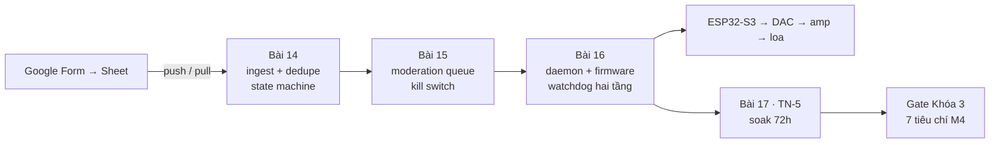
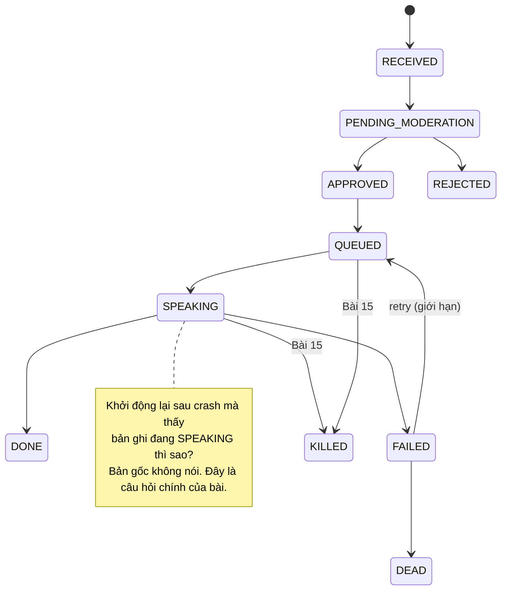
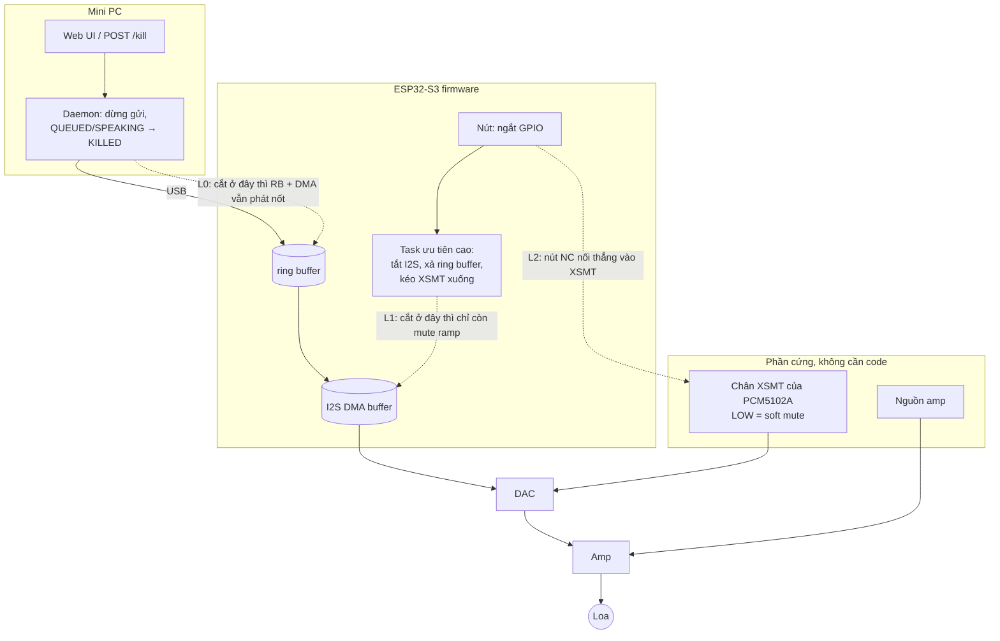
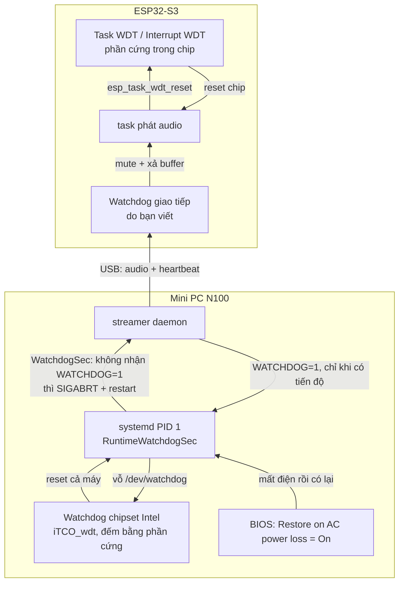
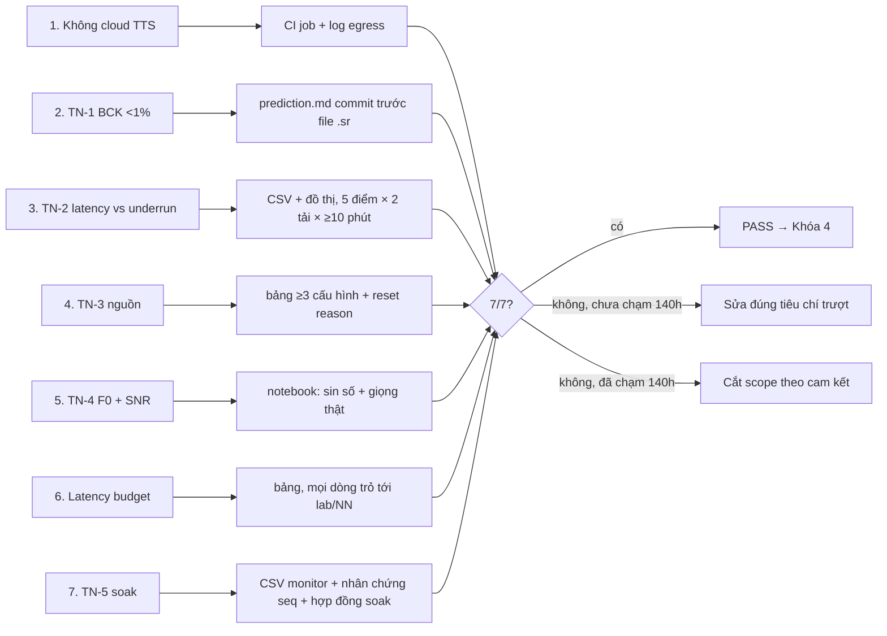

# Khóa 3 · Module 4 — Hệ thống V1 (22h) + Gate Khóa 3 (6h)

**Điều kiện vào module:** B2 (xin phép quản lý đặt hòm confession ở công ty) đã có câu trả lời **bằng văn bản**. Đồng ý hay từ chối đều được. Nếu bị từ chối: làm trọn module ở nhà và **bỏ hoàn toàn phần nhận diện mặt** của các version sau. Portfolio không mất gì, vì giá trị nằm ở lab notebook và số đo, không nằm ở chỗ đặt cái loa.

**Module này khác ba module trước ở một điểm:** phần mềm ở đây là nghề của bạn, nên giáo trình không dạy FastAPI hay SQLite. Nó chỉ vào **chỗ gãy**, tức những chỗ trực giác backend đúng 90% và 10% còn lại có hậu quả vật lý: âm thanh đã ra không khí thì không rollback được, nút dừng phải chạy được cả khi phần mềm đã chết, watchdog phải tự trả lời câu "ai canh người canh", và 72 giờ không lỗi chứng minh ít hơn bạn nghĩ.



| Bài | Giờ | Viên nang nền cần trước | Quyết định ra được |
|---|---|---|---|
| 14 — Ingest, dedupe, state machine | 6 | F3.5, F4.3, F2.5 | Push, pull hay lai; crash giữa lúc đang phát thì phát lại, bỏ, hay resume |
| 15 — Moderation queue và kill switch | 5 | F2.1, F5.2, F5.7 | Nút kill cắt ở tầng nào; khi hỏng thì hệ đứng về phía im lặng hay phía phát |
| 16 — Daemon, firmware, watchdog hai tầng | 5 | F5.7, F7.5, F7.7 | Watchdog vỗ ở đâu để nó bắt được treo thật; restart vô hạn hay dừng hẳn |
| 17 — TN-5: 72 giờ không ai trông | 6 + 72 treo máy | F7.6, F1.4, F1.6 | 72h không lỗi cho phép nói gì và không cho phép nói gì; số đầu tiên của power budget |
| Gate Khóa 3 | 6 | — | PASS / cắt scope |

---

## Bài 14 — Ingest, dedupe, state machine (6h)

> **Vị trí:** K3 Bài 13 (streaming chunk đầu) → **Bài 14** → Bài 15 (moderation, kill switch) · **Cần trước:** F3.5 (idempotency, exactly-once), F4.3 (wall/monotonic clock), F2.5 (fault injection), K3 Bài 4 (gói có số thứ tự, credit) · **Sau bài này bạn quyết định được:** chọn push, pull hay lai cho nguồn Google Sheet, và chọn chính sách cho một confession bị crash giữa chừng lúc đang phát (phát lại / bỏ / resume từ checkpoint), có số đỡ lưng và ghi vào `decisions.md`.

### 1. Câu chuyện — ai đã khổ vì chuyện này

Ngành thanh toán khổ vì đúng bài toán này trước bạn. Client gọi API "trừ tiền", mạng đứt **sau** khi server đã trừ nhưng **trước** khi response về. Client không biết lệnh đã chạy chưa, nên retry, và khách bị trừ hai lần. Stripe giải quyết bằng header `Idempotency-Key`: client sinh một khóa cho mỗi ý định, server nhớ kết quả theo khóa, lần gọi lặp lại nhận đúng response cũ. Brandur Leach (khi làm ở Stripe) viết bài *Implementing Stripe-like Idempotency Keys in Postgres* và chỉ ra phần khó nhất: khi một bước gọi ra **hệ bên ngoài** ("foreign state mutation"), không transaction nào của bạn bao được nó, nên phải chia việc thành các pha nguyên tử với *recovery point* giữa chúng [chuẩn].

Hệ của bạn có một hệ bên ngoài không có header nào: **không khí trong văn phòng**. Một confession phát hai lần là một sự cố mọi người cùng nghe thấy. Một confession bị cắt giữa câu rồi phát lại từ đầu thì còn tệ hơn: người nghe biết có trục trặc, và nội dung nhạy cảm được nhắc lại. Bản gốc gọi đúng tên chuyện này: idempotency ở đây có hậu quả vật lý. Bài này đi thêm một bước: chỉ ra rằng **không có cấu hình nào** cho bạn "đúng một lần" trọn vẹn với tác dụng phụ vật lý, và bạn phải chọn kiểu hỏng nào chấp nhận được.

### 2. Mô hình tư duy

State machine của bản gốc, với những chỗ bản gốc để trống (đường đứt) mà bạn phải tự quyết:



Vì sao câu hỏi đó khó: trạng thái nằm trong DB, còn tác dụng phụ nằm ngoài không khí, và **không có transaction nào bao cả hai**.

```
thời gian ─────────────────────────────────────────────────────────────►
  commit SPEAKING        phát audio 20 s ra loa                commit DONE
  |◄─ ~ms ─►|◄────────────────────────────────────────────►|◄─ ~ms ─►|
      crash ở đây:            crash ở đây:                     crash ở đây:
      chưa phát gì            đã phát một phần,                đã phát hết,
                              DB vẫn ghi SPEAKING              DB vẫn ghi SPEAKING
```

Mô phỏng: crash rơi ngẫu nhiên trong lúc xử lý một confession 20 giây, ba chính sách khôi phục.

```python
# [đã chạy] Mô phỏng: crash giữa lúc phát -> sau restart, chính sách nào cho kết quả gì?
import numpy as np
rng = np.random.default_rng(0)
PLAY = 20.0          # giây audio của một confession
T_COMMIT = 0.005     # thời gian một lần commit SQLite (fsync), giây
N = 100_000          # số lần crash mô phỏng, mỗi lần rơi ngẫu nhiên trong lúc xử lý

def run(policy, ckpt=None):
    total = T_COMMIT + PLAY + T_COMMIT          # commit SPEAKING -> phát -> commit DONE
    t = rng.uniform(0, total, N)                # thời điểm crash
    played = np.clip(t - T_COMMIT, 0, PLAY)     # số giây đã thực sự ra loa
    done = t >= total                           # crash sau khi DONE đã commit (gần như 0)
    in_speaking = t >= T_COMMIT                 # trạng thái đã ghi là SPEAKING
    dup = np.zeros(N); lost = np.zeros(N)
    if policy == "replay":                      # restart: SPEAKING/QUEUED -> phát lại từ đầu
        dup = np.where(done, 0, played)
    elif policy == "at_most_once":              # restart: SPEAKING -> INTERRUPTED, không phát lại
        lost = np.where(in_speaking & ~done, PLAY - played, 0)
    elif policy == "checkpoint":                # commit offset đã phát mỗi `ckpt` giây, resume từ đó
        last = np.floor(played / ckpt) * ckpt
        dup = np.where(done, 0, played - last)
    return dup, lost

rows = [("replay", None), ("at_most_once", None), ("checkpoint", 2.0), ("checkpoint", 0.5)]
print(f"{'chính sách':<22}{'P(nghe trùng)':>14}{'trùng TB (s)':>13}{'trùng max':>10}"
      f"{'P(mất)':>8}{'mất TB (s)':>11}{'commit/phát':>12}")
for p, c in rows:
    dup, lost = run(p, c)
    commits = 2 + (int(PLAY / c) if c else 0)
    name = p + (f" c={c}s" if c else "")
    print(f"{name:<22}{(dup > 0).mean():>14.3f}{dup.mean():>13.2f}{dup.max():>10.2f}"
          f"{(lost > 0).mean():>8.3f}{lost.mean():>11.2f}{commits:>12d}")
```

Chạy nó trước khi đọc tiếp. Bốn điều cần rút ra:

1. Cửa sổ nguy hiểm **không phải** lúc ghi DB (vài ms) mà là lúc **đang phát** (hàng chục giây). Khi crash, gần như chắc chắn nó rơi vào giữa câu.
2. Ba chính sách là ba điểm trên một đường đánh đổi: phát lại (at-least-once, nghe trùng), bỏ (at-most-once, mất đoạn cuối), checkpoint (trùng tối đa một khoảng checkpoint, đổi lại nhiều lần ghi đĩa hơn). Không có điểm nào trùng = 0 **và** mất = 0.
3. Checkpoint mịn hơn thì trùng ít hơn nhưng ghi nhiều hơn, và "offset đã phát" phải lấy từ chỗ âm thanh **thật sự** ra loa (ESP32 báo lên), không phải chỗ host đã gửi: giữa hai chỗ đó là ring buffer và DMA buffer của Bài 4.
4. Dedupe ở cửa vào (UNIQUE) giải quyết một bài toán khác hẳn: **record** trùng. Nó không chạm tới **lần phát** trùng.

### 3. Cầu nối từ backend

| Backend bạn biết | Ở đây | Gãy ở chỗ | Nếu dùng nhầm thì |
|---|---|---|---|
| `Idempotency-Key` của API thanh toán | `source_id` + ràng buộc UNIQUE ở ingest | Khóa chặn **record** trùng; lần **phát** trùng sinh ra sau đó, ở retry của player, không đi qua ingest | Test "gửi 5 lần" PASS, nhưng crash giữa câu vẫn phát lại cả câu |
| Kafka consumer commit offset sau khi xử lý (at-least-once) | Commit `DONE` sau khi phát xong | Ở backend, downstream thường idempotent (upsert, khóa tự nhiên), nên xử lý lặp vô hại. Loa không idempotent | Áp nguyên thói quen at-least-once thì mỗi crash là một lần nghe trùng |
| Kafka exactly-once semantics (transaction read-process-write) | "Exactly-once" cho chuỗi phát | EOS chỉ đúng **bên trong** Kafka. Ra khỏi Kafka (gửi email, gọi API ngoài, phát loa) thì quay về at-least/at-most | Tin rằng chọn đúng công cụ sẽ có "đúng một lần" và không thiết kế chính sách khôi phục |
| Transactional outbox | Đổi trạng thái + đẩy job vào hàng đợi trong **cùng** một transaction SQLite | Outbox giải bài dual-write DB + broker. Nó không giải DB + thế giới vật lý | Nghĩ rằng outbox đã đóng hết lỗ |
| Webhook có retry (Stripe, GitHub retry nhiều lần trong nhiều giờ) | Apps Script `onFormSubmit` gọi `UrlFetchApp` tới endpoint của bạn | Trigger Apps Script chạy một lần; endpoint chết thì execution báo lỗi, không có hàng đợi retry phía Google [tự đo: xem tab Executions sau khi cố tình tắt tunnel] | Push thuần + tunnel chết 5 phút = record trong 5 phút đó không bao giờ tới |
| `created_at` lấy từ DB server | `mono_ns` + `wall` trong log | `CLOCK_MONOTONIC` **về 0 mỗi lần boot**. Bài 17 rút điện 10 lần, tức 11 trục thời gian monotonic khác nhau | So sánh mono_ns qua reboot ra khoảng thời gian âm hoặc vô nghĩa. Phải kèm `boot_id` |

**Chấm mô hình:**

- *"Có UNIQUE constraint thì không bao giờ phát trùng."* **SAI.** UNIQUE chặn hai **dòng** cùng khóa. Phản ví dụ: bản ghi duy nhất, đã `SPEAKING`, phát được 15 giây thì daemon bị `kill -9`. systemd khởi động lại, code khôi phục thấy `SPEAKING` (hoặc retry thấy `FAILED`) và đẩy lại vào hàng đợi. Chỉ có một dòng trong DB, nhưng người nghe nghe 15 giây đầu hai lần.
- *Khóa dedupe của bản Gemini: `hash(row_id + nội dung + timestamp submit)`.* **ĐÚNG MỘT PHẦN.** Đúng ở chỗ cần một khóa ổn định. Gãy ở hai chỗ. (a) Số dòng trong Sheet không ổn định: ai đó sort hoặc xóa một dòng là cả bảng đổi số, các dòng cũ thành "record mới". (b) Trộn nội dung vào khóa nghĩa là sửa một dấu chấm trong Sheet cũng sinh ra record mới, và record mới đó lại vào hàng đợi phát. Tách hai vai trò ra: **khóa định danh** sinh ở nguồn và không bao giờ đổi (UUID do Apps Script ghi vào một cột lúc submit, hoặc ID response của Form), và **content_hash** lưu riêng để biết nội dung có đổi sau khi đã duyệt (Bài 15 cần cái này).
- *"Exactly-once là bài toán đã có lời giải, chỉ cần chọn đúng hạ tầng."* **ĐÚNG MỘT PHẦN.** Đúng cho *hiệu ứng* bên trong một hệ có transaction (Kafka EOS, DB). Phản ví dụ: consumer Kafka EOS gửi email, crash sau khi gửi và trước khi commit, khởi động lại, gửi lần nữa. Email và âm thanh có chung tính chất: không thu hồi được và không có khóa dedupe ở phía người nhận.

### 4. Thuật ngữ

| Mức | Thuật ngữ | Nghĩa trong một câu | Hay bị hiểu nhầm thành |
|---|---|---|---|
| 🟢 | Idempotency key | Khóa đại diện cho một *ý định*; xử lý lặp cùng khóa cho cùng kết quả | Hash nội dung (hai ý định khác nhau có thể cùng nội dung) |
| 🟢 | At-least-once / at-most-once | Hỏng thì làm lại (có thể trùng) / hỏng thì bỏ (có thể mất) | Thuộc tính của hạ tầng; thật ra là chính sách bạn chọn ở bước khôi phục |
| 🟢 | Exactly-once *effect* | Hiệu ứng cuối cùng như thể chạy đúng một lần, nhờ dedupe ở phía nhận | Exactly-once *delivery*, thứ không đạt được qua mạng không tin cậy |
| 🟢 | State machine tường minh | Bảng các chuyển trạng thái hợp lệ; mọi thứ ngoài bảng bị từ chối | Một cột `status` mà code nào cũng tự `UPDATE` |
| 🟢 | Compare-and-set khi chuyển trạng thái | `UPDATE ... WHERE id=? AND state=<cũ>` rồi kiểm số dòng bị ảnh hưởng | `SELECT` rồi `UPDATE` (race giữa hai worker) |
| 🟢 | Reconciliation | Định kỳ đối chiếu toàn bộ nguồn với đích để vá cái push bỏ sót | Việc chỉ cần khi có bug |
| 🟢 | `boot_id` | UUID của lần boot hiện tại (`/proc/sys/kernel/random/boot_id`) | Không cần, vì "đã có wall clock" |
| 🟡 | Transactional outbox | Ghi thay đổi và "việc cần làm" trong cùng transaction, worker đọc ra sau | Cách đạt exactly-once với thế giới bên ngoài |
| 🟡 | SQLite `journal_mode` / `synchronous` | Chế độ nhật ký (rollback/WAL) và mức fsync khi commit | "WAL là thứ chống hỏng file" (rollback journal cũng chống hỏng; khác nhau ở hiệu năng và durability) |
| 🟡 | Two Generals problem | Hai bên qua kênh không tin cậy không thể chắc chắn cùng biết một việc đã xong | Chuyện lý thuyết không liên quan |
| 🔴 | Saga / 2PC | Giao dịch phân tán nhiều bước | Cần cho V1 một máy |

### 5. Dự đoán

Viết vào `lab/14-ingest/prediction.md`, commit, rồi mới làm phần 6.

**P1 — Độ trễ phát hiện.** Với phương án bạn chọn: nếu poll, chu kỳ `T` là bao nhiêu, độ trễ phát hiện *trung bình* và *tối đa* là bao nhiêu (tính theo `T` cộng thời gian một lần gọi API); một ngày bạn tốn bao nhiêu request, và so với quota thì còn bao nhiêu dư. Tra quota ở trang *Usage limits* của Google Sheets API (con số có thể đổi, ghi ngày tra). Nếu push: dự đoán khoảng độ trễ submit → `RECEIVED`, kèm lý do.

**P2 — Bắn trúng "giữa lúc ghi DB".** Tiêu chí của bài yêu cầu kill process giữa lúc ghi DB. Tham số cần đo trước: số commit mỗi giây khi hệ chạy bình thường `w` (đếm trong log), thời gian một commit `t_c` (đo bằng `time.perf_counter()` quanh `COMMIT`, hoặc `strace -T -e trace=fsync,fdatasync -p <pid>`). Công thức: tỉ lệ thời gian có transaction đang mở `d = w · t_c`; số lần kill ngẫu nhiên cần để có ≥95% khả năng trúng ít nhất một lần là `n ≈ ln(0.05) / ln(1 − d)`. Tính `n` cho số của bạn và viết ra bạn định trúng cửa sổ bằng cách nào.

**P3 — Bảng khôi phục.** Trước khi viết code khôi phục, điền bảng: process chết và khởi động lại, tìm thấy bản ghi ở trạng thái X, hệ làm gì, người nghe trải qua gì.

**P4 — Mất mạng 5 phút.** Trong 5 phút mất mạng có `k` confession được submit. Với phương án của bạn, bao nhiêu cái tới được hệ sau khi có mạng lại, và vì sao.

```markdown
# prediction.md — Bài 14   (commit: <hash>, ngày: <yyyy-mm-dd>)
## P1 Độ trễ phát hiện
- Phương án: push | pull (T = ___ s) | lai
- Độ trễ TB = ___ s, tối đa = ___ s. Request/ngày = ___ ; quota (tra ngày ___) = ___
## P2 Kill trúng cửa sổ ghi
- w = ___ commit/s (đo từ ___), t_c = ___ ms (đo bằng ___) → d = ___ → n = ___
- Cách tôi sẽ trúng cửa sổ có chủ đích: ___
## P3 Bảng khôi phục
| Trạng thái thấy khi restart | Hệ làm gì | Người nghe trải qua |
|---|---|---|
| RECEIVED | | |
| PENDING_MODERATION | | |
| APPROVED | | |
| QUEUED | | |
| SPEAKING | | |
| FAILED | | |
## P4 Mất mạng 5 phút, k confession
- Tới được hệ: ___ / k. Lý do: ___
```

### 6. Làm

**Bước 1 — Ingest API (FastAPI) và quyết định push/pull.**

| | Apps Script webhook (push) | Sheets API polling (pull) |
|---|---|---|
| Độ trễ | <1 s [ước lượng của bản gốc, tự đo] | Phụ thuộc chu kỳ poll (P1) |
| Cần endpoint public | Có (Cloudflare Tunnel / ngrok) | Không |
| Điểm hỏng | Tunnel chết, quota Apps Script, trigger không retry | Quota Sheets API, chu kỳ poll |
| Phù hợp khi | Cần độ trễ thấp | Không muốn mở gì ra Internet |

Chọn và **ghi lý do vào `decisions.md`** (quyết định kiến trúc số 3). Cả hai đều đúng; không ghi lý do mới sai. Nếu chọn push, viết thêm một dòng trả lời: *"record submit lúc tunnel chết đi đâu?"*. Nhớ rằng độ trễ Form → Sheet nằm ngoài tầm kiểm soát của bạn, và nó cũng có trong latency budget Bài 8.

**Bước 2 — Dedupe.** Khóa định danh sinh ở nguồn: thêm một cột trong Sheet do Apps Script điền UUID lúc submit (hoặc dùng ID response của Form). Không dùng số dòng. Lưu `content_hash` (SHA-256 của nội dung) ở cột riêng. SQLite: `PRIMARY KEY`/`UNIQUE` trên khóa định danh, chèn bằng `INSERT ... ON CONFLICT DO NOTHING`, kiểm `rowcount` để biết là mới hay trùng. Bật `PRAGMA journal_mode=WAL` và `PRAGMA synchronous=FULL`, rồi **đọc lại** cả hai pragma và in ra lúc khởi động (thói quen từ Bài 4: đừng tin thứ mình set, đọc lại thứ hệ chấp nhận). Python 3.12 đổi cách module `sqlite3` quản transaction (thuộc tính `autocommit` mới) [tự đo theo phiên bản Python bạn chạy]; cách an toàn là mở với `isolation_level=None` và tự `BEGIN`/`COMMIT`.

**Bước 3 — State machine tường minh.** Một bảng chuyển trạng thái trong code; mọi chuyển ngoài bảng bị từ chối và ghi log. Mỗi chuyển là một compare-and-set trong một transaction, kèm một dòng vào bảng `transition`. Lõi tối thiểu:

```python
# [đã chạy] Lõi ingest + state machine: UNIQUE chống record trùng, compare-and-set chống chuyển trạng thái trùng.
import json, sqlite3, time, uuid, hashlib
BOOT_ID = open("/proc/sys/kernel/random/boot_id").read().strip()
ALLOWED = {  # bảng chuyển trạng thái tường minh - thứ không có trong bảng là bị cấm
    "RECEIVED": {"PENDING_MODERATION"}, "PENDING_MODERATION": {"APPROVED", "REJECTED"},
    "APPROVED": {"QUEUED"}, "QUEUED": {"SPEAKING", "KILLED"},
    "SPEAKING": {"DONE", "FAILED", "KILLED"}, "FAILED": {"QUEUED", "DEAD"},
}
db = sqlite3.connect("v1.db", isolation_level=None)      # tự quản transaction bằng BEGIN/COMMIT
db.execute("PRAGMA journal_mode=WAL"); db.execute("PRAGMA synchronous=FULL")
print("đọc lại:", db.execute("PRAGMA journal_mode").fetchone(), db.execute("PRAGMA synchronous").fetchone())
db.execute("""CREATE TABLE IF NOT EXISTS confession(
  source_id TEXT PRIMARY KEY, content_hash TEXT, body TEXT, state TEXT)""")
db.execute("CREATE TABLE IF NOT EXISTS transition(source_id, frm, to_, mono_ns, wall, boot_id)")

def log(**kv):
    kv.update(mono_ns=time.monotonic_ns(), wall=time.time(), boot_id=BOOT_ID)
    print(json.dumps(kv, ensure_ascii=False))

def ingest(source_id, body):
    h = hashlib.sha256(body.encode()).hexdigest()
    cur = db.execute("INSERT INTO confession VALUES(?,?,?,'RECEIVED') ON CONFLICT DO NOTHING",
                     (source_id, h, body))
    log(event="ingest", source_id=source_id, inserted=cur.rowcount == 1)

def transition(source_id, frm, to):
    if to not in ALLOWED.get(frm, ()):
        raise ValueError(f"cấm {frm} -> {to}")
    db.execute("BEGIN IMMEDIATE")
    cur = db.execute("UPDATE confession SET state=? WHERE source_id=? AND state=?", (to, source_id, frm))
    ok = cur.rowcount == 1                               # 0 = ai đó đã chuyển trước -> không làm gì
    if ok:
        db.execute("INSERT INTO transition VALUES(?,?,?,?,?,?)",
                   (source_id, frm, to, time.monotonic_ns(), time.time(), BOOT_ID))
    db.execute("COMMIT")
    log(event="transition", source_id=source_id, frm=frm, to=to, applied=ok)
    return ok

sid = str(uuid.uuid4())                                  # id ổn định sinh ở nguồn, KHÔNG phải số dòng
for _ in range(5):
    ingest(sid, "Cảm ơn team đã ở lại muộn hôm thứ Sáu")
for a, b in [("RECEIVED", "PENDING_MODERATION"), ("PENDING_MODERATION", "APPROVED"),
             ("APPROVED", "QUEUED"), ("APPROVED", "QUEUED")]:     # lần cuối: đúp do retry
    transition(sid, a, b)
try:
    transition(sid, "RECEIVED", "SPEAKING")
except ValueError as e:
    log(event="rejected", error=str(e))
print("số dòng:", db.execute("SELECT count(*) FROM confession").fetchone()[0],
      "| số lần vào QUEUED:", db.execute("SELECT count(*) FROM transition WHERE to_='QUEUED'").fetchone()[0])
```

Đoạn này **cố ý thiếu** phần khôi phục lúc khởi động. Bạn viết nó theo bảng P3, và ghi chính sách cho `SPEAKING` vào `decisions.md` (phát lại / bỏ / checkpoint, kèm số từ mô phỏng phần 2).

**Bước 4 — Log có cấu trúc.** Mọi chuyển trạng thái ghi một dòng JSON có `mono_ns`, `wall` **và** `boot_id`. Bản gốc ghi "nhớ Bài 3.1 của tài liệu nền", nay là → F4.3: wall clock trả lời "lúc mấy giờ", monotonic đo "bao lâu", và monotonic chỉ so được trong cùng một `boot_id`.

**Bước 5 — Test.** Ba test của bản gốc, cộng một test từ bản Gemini:

1. Gửi cùng record 5 lần, kiểm số lần vào `QUEUED`.
2. **Kill giữa lúc ghi DB.** Không trông vào tay bấm (xem P2). Dùng fault injection có chủ đích (→ F2.5): thêm một điểm crash điều khiển bằng biến môi trường, ví dụ `CRASH_AT=after_update_before_commit` thì gọi `os._exit(137)` đúng chỗ đó. Chạy mỗi điểm crash ít nhất một lần, rồi chạy thêm một vòng lặp script kill `-9` ở thời điểm ngẫu nhiên (≥100 lần) với một tiến trình tạo tải ghi liên tục. Sau mỗi lần: `PRAGMA integrity_check`, đối chiếu số record, đối chiếu bảng `transition` không có chuyển trạng thái nào lặp.
3. **Mất mạng 5 phút:** chặn đường ra Google (`sudo ip link set <iface> down`, hoặc rule firewall chặn riêng), submit vài confession trong lúc đó, mở lại, kiểm tất cả có trong DB.
4. **Chuyển trạng thái bất hợp pháp** (từ bản Gemini, giữ lại vì tốt): ép `RECEIVED → SPEAKING`, phải bị từ chối và có log.

Sai số dụng cụ đo: độ trễ phát hiện đo bằng hiệu giữa timestamp Google ghi lúc submit (đồng hồ của Google) và `wall` của mini PC, nên có thêm offset NTP giữa hai đồng hồ, thường cỡ ms [ước lượng, xem `chronyc tracking`]. Với độ trễ cỡ giây thì bỏ qua được; với độ trễ dưới 100 ms thì không.

### 7. Số phải ra

<details><summary>🔒 MỞ SAU KHI COMMIT prediction.md</summary>

**Tiêu chí gốc (giữ nguyên):**

| Kiểm tra | Kết quả đúng |
|---|---|
| Gửi lặp 5 lần cùng record | Đúng 1 lần vào `QUEUED` |
| Kill process giữa lúc ghi DB, khởi động lại | Không mất record, không phát trùng, `integrity_check` = `ok` |
| Mất mạng 5 phút rồi có lại | Ingest tự phục hồi, không mất record đã có trong Sheet |
| Ép chuyển trạng thái bất hợp pháp | Bị từ chối, có dòng log |

**P1.** Poll chu kỳ `T`: trung bình ≈ `T/2` + thời gian gọi API, tối đa ≈ `T` + thời gian gọi API [chuẩn, giả định submit rơi đều trong chu kỳ]. `T = 10 s` tốn 8640 request/ngày chỉ cho việc poll. Push: thường dưới vài giây, nhưng phân bố có đuôi (Apps Script có lúc khởi động chậm) [tự đo: lấy ≥20 mẫu, báo p50 và max, không báo trung bình].

**P2.** Ví dụ với hệ nhàn: `w = 0.2 commit/s`, `t_c = 5 ms` → `d = 0.001` → cần khoảng 3000 lần kill ngẫu nhiên để có 95% khả năng trúng một lần. Kết luận đúng là **không thể trúng bằng tay**; phải tạo cửa sổ (điểm crash có chủ đích) hoặc phóng to cửa sổ (tiến trình tạo tải ghi liên tục, `d` gần 1). Bài 17 gặp lại đúng bài toán này với việc rút điện.

**P3.** Một bảng hợp lý (không phải duy nhất):

| Thấy khi restart | Làm gì | Người nghe |
|---|---|---|
| RECEIVED | Đưa tiếp sang PENDING_MODERATION | Không gì |
| PENDING_MODERATION | Giữ nguyên, chờ người duyệt | Không gì |
| APPROVED | Đưa vào QUEUED (idempotent nhờ compare-and-set) | Không gì |
| QUEUED | Giữ nguyên, player lấy như thường | Không gì |
| SPEAKING | **Chính sách bạn chọn.** At-most-once: sang `FAILED` với lý do `interrupted`, không tự phát lại, đưa ra UI để người duyệt quyết | Nghe một câu bị cắt, không nghe lặp |
| FAILED | Retry có giới hạn, có backoff, rồi `DEAD` | Có thể nghe lại cả câu: đó là lý do retry phải có trần |

Lập luận cho at-most-once ở V1: một câu bị cắt là sự cố nhỏ; một nội dung nhạy cảm đọc hai lần là sự cố lớn hơn. Lập luận ngược (checkpoint) hợp lệ nếu bạn resume từ **ranh giới câu** chứ không từ giây thứ k, và lấy offset từ phía ESP32 (đã thật sự ra loa), không từ phía host (đã gửi).

**P4.** Pull: cả `k` record tới được, vì chúng nằm trong Sheet và lần poll đầu tiên sau khi có mạng sẽ thấy chúng (miễn là bạn quét lại các dòng chưa thấy, không chỉ "dòng mới hơn con trỏ"). Push thuần: các record submit trong 5 phút đó **mất**, vì trigger gọi endpoint thất bại và không có retry [tự đo: xem tab Executions]. Vì vậy push trong thực tế gần như luôn đi kèm một vòng reconciliation định kỳ kiểu pull. Đó là kiến trúc "lai": push cho độ trễ, pull cho tính đầy đủ.

**Vì sao lệch là bình thường:** độ trễ Apps Script phụ thuộc tải phía Google; thời gian commit phụ thuộc SSD và mức `synchronous`. Trên SSD consumer, `t_c` với `synchronous=FULL` có thể từ dưới 1 ms tới hàng chục ms [ước lượng, tự đo].

</details>

### 8. Nếu ra khác

| Triệu chứng | Nguyên nhân khả dĩ | Kiểm bằng cách | Sửa |
|---|---|---|---|
| Gửi 5 lần, vào `QUEUED` 2 lần | Hai worker cùng đọc `APPROVED` rồi cùng `UPDATE` không có điều kiện state cũ | Bảng `transition` có hai dòng `APPROVED→QUEUED` | Compare-and-set, kiểm `rowcount` |
| Record cũ "mới" lại sau khi ai đó sort Sheet | Khóa dựa trên số dòng | So khóa trong DB với cột UUID | Khóa sinh ở nguồn |
| Sửa một chữ trong Sheet, confession phát lại | Khóa có trộn nội dung | Hai dòng cùng UUID khác `content_hash` | Tách khóa định danh và `content_hash`; nội dung đổi sau duyệt thì quay về `PENDING_MODERATION` |
| Sau `kill -9`, `PRAGMA journal_mode` đọc ra `delete` | Pragma WAL chạy trên kết nối khác, hoặc file DB tạo trước khi bật | In pragma đọc lại lúc khởi động | Bật WAL một lần cho file (WAL là thuộc tính lưu trong file); `synchronous` thì phải set lại mỗi kết nối |
| Mất mạng xong, thiếu record | Push thuần, hoặc pull theo con trỏ "dòng cuối" mà có dòng bị chèn giữa | Đếm dòng Sheet và DB | Reconciliation quét toàn bộ (vài nghìn dòng là rẻ) |
| Log có khoảng thời gian âm | Trừ `mono_ns` của hai boot khác nhau | Lọc theo `boot_id` | Chỉ trừ monotonic trong cùng `boot_id`; qua boot dùng `wall` |
| `database is locked` khi tải cao | Transaction dài, nhiều writer | `strace`, log thời gian giữ lock | `BEGIN IMMEDIATE`, transaction ngắn, một writer |

### 9. Câu hỏi ngược

1. **[Failure mode]** Host bị `kill -9` lúc confession đang phát, nhưng ESP32 vẫn sống và trong ring buffer của nó còn khoảng nửa giây audio. Người nghe nghe gì, và "offset đã phát" mà host checkpoint lần cuối lệch với sự thật bao nhiêu, theo hướng nào?
   <details><summary>Hướng nghĩ</summary>ESP32 phát nốt buffer rồi gặp underrun; bạn đã thấy ở Bài 4 rằng driver có thể lặp descriptor cũ nếu không bật auto-clear. Offset phía host là offset *đã gửi*, đi trước offset *đã nghe* đúng bằng độ sâu buffer. Resume từ offset đã gửi thì hổng một đoạn; từ offset ESP32 báo thì trùng một đoạn. Chọn hướng nào là một quyết định, không phải chi tiết.</details>
2. **[Quy mô]** 100 robot trong 100 văn phòng cùng đọc một Sheet. Một confession phải được phát ở đúng một robot (theo văn phòng). Dedupe và state machine nằm ở đâu, một DB trung tâm hay SQLite trên từng robot? Cái gì gãy trước?
   <details><summary>Hướng nghĩ</summary>Nghĩ về việc ai "nhận" một confession: đó là lease/ownership, và khi robot nhận rồi chết thì lease phải hết hạn, và lúc đó lại quay về câu hỏi phát lại hay bỏ. Quota Sheets API cũng chia cho 100 người poll. Thứ gãy trước thường không phải DB mà là sự đồng ý về "ai sở hữu việc này".</details>
3. **[Vì sao không]** Vì sao không dùng Postgres + Redis + Celery cho V1 như ở công ty?
   <details><summary>Hướng nghĩ</summary>Đếm số tiến trình phải sống sót qua 10 lần rút điện ở Bài 17, và số chỗ trạng thái có thể nằm. Mỗi thành phần thêm vào là một chỗ trạng thái có thể lệch nhau sau crash. Câu trả lời ngược lại cũng có lý khi có nhiều máy.</details>
4. **[Nếu…thì]** Nếu người gửi sửa nội dung trong Sheet **sau khi** đã được duyệt nhưng **trước khi** phát, hệ của bạn phát bản nào? Bản đó có phải bản người duyệt đã đọc không?
   <details><summary>Hướng nghĩ</summary>Đây là TOCTOU (time-of-check to time-of-use). Quyết định duyệt phải gắn với `content_hash` cụ thể; player chỉ phát nội dung có hash trùng với hash đã duyệt. Bài 15 dựa vào điều này.</details>
5. **[Phản biện]** Có người nói: "Với audio, at-most-once là lựa chọn duy nhất đúng; đừng bao giờ tự phát lại." Tìm một tình huống mà câu đó sai.
   <details><summary>Hướng nghĩ</summary>Thử một thông báo an toàn (báo cháy, báo sơ tán) thay cho confession. Chi phí của *mất* và của *trùng* đổi chỗ cho nhau, và chính sách đổi theo. Chính sách khôi phục được suy ra từ chi phí của hai kiểu hỏng, không từ công nghệ.</details>

### 10. Liên kết ra ngoài

- **Idempotency key trong thanh toán (Stripe).** Giống: khóa đại diện cho ý định, server nhớ kết quả theo khóa. Khác: phía nhận (server thanh toán) *có* bộ nhớ để dedupe; không khí thì không. Vì vậy ở đây việc dedupe phải nằm hoàn toàn ở phía phát, trước khi tác dụng phụ xảy ra.
- **Máy ATM nhả tiền.** Nhả tiền là tác dụng phụ vật lý không hoàn tác được, đúng như phát loa. Thay vì đòi "đúng một lần", ngành ngân hàng chấp nhận rằng máy có thể hỏng giữa chừng và dựa vào **đối soát** định kỳ: so số giao dịch ghi nhận với số tiền thực còn trong hộc [chuẩn, mức khái quát]. Bài học chung: khi không bảo đảm được tại thời điểm làm, phải có một phép đo độc lập sau đó để phát hiện. Bài 17 dùng mic làm phép đo độc lập này.
- **Two Generals problem trong mạng máy tính.** Hai bên không thể cùng chắc chắn một việc đã xong qua kênh có thể mất tin. TCP không giải được nó, chỉ đẩy xác suất xuống. Ở đây "kênh" là ranh giới giữa SQLite và loa, và nó không cần mạng mới có vấn đề: chỉ cần một lần mất điện.

### 11. Độ tin cậy và sửa lỗi

| Khẳng định | Nhãn | Ghi chú / cách kiểm |
|---|---|---|
| SQLite trên Ubuntu 24.04 mặc định `journal_mode=delete`, `synchronous=FULL` (2) | [tự đo] | Đã chạy trên Ubuntu 24.04 (SQLite 3.45.1): đọc ra `delete` và `2`. Kiểm lại trên máy bạn bằng `PRAGMA` |
| WAL + `synchronous=NORMAL` có thể mất vài transaction cuối khi mất điện nhưng không hỏng file | [spec] | Tài liệu SQLite, mục PRAGMA synchronous và Write-Ahead Logging |
| `journal_mode=WAL` lưu bền trong file DB; `synchronous` phải set lại mỗi kết nối | [spec] | Tài liệu SQLite, PRAGMA journal_mode / synchronous |
| Trigger Apps Script không tự retry khi endpoint lỗi | [tự đo] | Tắt tunnel, submit, xem tab Executions và email báo lỗi |
| `CLOCK_MONOTONIC` bắt đầu lại sau mỗi lần boot | [chuẩn] | `man clock_gettime`; so `boot_id` trước và sau reboot |
| Quota Sheets API | [spec, đổi theo thời gian] | Trang Usage limits của Google Sheets API; ghi ngày tra |
| Thay đổi quản lý transaction của `sqlite3` trong Python 3.12 | [spec] | Python docs, module `sqlite3`, thuộc tính `autocommit` |

**Đã sửa so với bản gốc/Gemini:**
- Gốc "dedupe theo row id + hash nội dung" và Gemini `hash(row_id + text + timestamp)`: số dòng Sheet không ổn định và trộn nội dung vào khóa làm một lần sửa chữ thành record mới. Sửa: khóa định danh sinh ở nguồn, `content_hash` lưu riêng.
- Gemini: "SQLite không hỏng file nhờ chế độ WAL". Sai nguyên nhân: rollback journal mặc định cũng nguyên tử khi crash. WAL đổi hiệu năng và hành vi đọc/ghi đồng thời; durability do `synchronous` và do việc ổ đĩa có tôn trọng lệnh flush hay không quyết định (Bài 17).
- Gốc "kill process giữa lúc ghi DB" như một thao tác tay: xác suất trúng cửa sổ ghi rất nhỏ (P2). Sửa: điểm crash có chủ đích + vòng kill ngẫu nhiên có tải ghi.
- Gốc yêu cầu monotonic + wall nhưng thiếu `boot_id`; thêm vào vì Bài 17 có 10 lần reboot.
- Gốc "Bài 3.1 của tài liệu nền": đổi sang mã cố định → F4.3.
- State machine gốc không nói gì về bản ghi ở `SPEAKING` khi khởi động lại và chưa có `KILLED`; thêm thành câu hỏi chính và trạng thái cho Bài 15.

### 12. Đọc thêm và tự kiểm tra

- **Nguồn gốc:** SQLite docs, *Atomic Commit In SQLite* và *How To Corrupt An SQLite Database File* (sqlite.org).
- **Giải thích:** Brandur Leach, *Implementing Stripe-like Idempotency Keys in Postgres* (brandur.org, 2017): atomic phases, recovery points, foreign state mutations.
- **Đào sâu (tùy chọn):** Martin Kleppmann, *Designing Data-Intensive Applications*, chương 11 (stream processing, phần exactly-once và idempotence); Tyler Treat, *You Cannot Have Exactly-Once Delivery* (blog Brave New Geek, 2015).
- **Tự kiểm tra:** (1) giải thích lại cho một backend engineer khác trong 5 câu vì sao UNIQUE không chặn được phát trùng; (2) vẽ lại timeline "commit SPEAKING → phát → commit DONE" từ trí nhớ và đánh dấu ba vùng crash; (3) hai câu dưới.

  *a. Bạn đổi chính sách từ "phát lại" sang "checkpoint mỗi 0.5 s". Cái gì tăng, cái gì giảm, và tăng bao nhiêu lần?*
  <details><summary>Đáp án</summary>Thời lượng nghe trùng tối đa giảm từ cả câu xuống ≤0.5 s. Số lần ghi đĩa mỗi lần phát tăng từ 2 lên 2 + PLAY/0.5 (với câu 20 s: 42, tức khoảng 20 lần). Mỗi lần ghi có fsync, nên còn tốn thêm độ trễ và độ mòn SSD. Và resume giữa câu nghe vẫn lạ: thường nên lùi về ranh giới câu.</details>

  *b. Vì sao "đọc lại pragma" là một bước của bài này chứ không phải chi tiết vụn?*
  <details><summary>Đáp án</summary>`synchronous` là thiết lập theo kết nối; một kết nối mở ở chỗ khác (script migrate, tool admin) không set nó sẽ chạy với giá trị mặc định. Đây cùng một bài học với `dma_frame_num` ở Bài 4: giá trị bạn xin không phải giá trị hệ đang dùng cho tới khi bạn đọc lại.</details>

---

## Bài 15 — Moderation queue và kill switch (5h)

> **Vị trí:** Bài 14 (ingest, state machine) → **Bài 15** → Bài 16 (daemon, watchdog) · **Cần trước:** F2.1 (oracle có dương tính giả/âm tính giả), F2.4–F2.5 (property-based, mutation), F5.2 (buffer: âm thanh "đang bay"), F5.7 (watchdog, nguồn), K3 Bài 2 (chân XSMT của PCM5102A), K3 Bài 4 (độ sâu các buffer) · **Sau bài này bạn quyết định được:** nút kill cắt ở tầng nào (host, firmware, chân phần cứng, nguồn amp), mạch nút đi dây sao cho **hỏng thì im lặng**, và bộ lọc tên riêng gắn cờ hay chặn.

### 1. Câu chuyện — ai đã khổ vì chuyện này

Bản gốc nói thẳng và giáo trình giữ nguyên: một hòm confession ẩn danh gắn với cái loa đọc to giữa văn phòng là **một kênh quấy rối có khuếch đại**. Không phải "có thể bị lạm dụng" mà là *sẽ* bị, có lẽ ngay tuần thứ hai. Lộ trình ghi rõ (B5): bỏ moderation thì project chết vì lý do phi kỹ thuật. Đây là lý do bài này là **yêu cầu kỹ thuật**: một yêu cầu mà thiếu nó thì hệ không được phép chạy, giống như phanh của xe chứ không phải điều hòa.

Nửa kỹ thuật của câu chuyện có một tiền lệ nổi tiếng. **Therac-25** (máy xạ trị, 1985–1987) bỏ các khóa liên động phần cứng mà thế hệ trước (Therac-20) có, và giao toàn bộ việc bảo vệ cho phần mềm. Một race condition trong phần mềm đó làm bệnh nhân nhận liều xạ quá cao nhiều lần; ít nhất sáu tai nạn, có người chết (Leveson & Turner, *An Investigation of the Therac-25 Accidents*, IEEE Computer, 1993) [chuẩn]. Bài học rút ra không phải "viết phần mềm cẩn thận hơn". Bài học là: **một lớp bảo vệ chạy trên cùng phần mềm mà nó bảo vệ thì hỏng cùng lúc với phần mềm đó.** Nút kill của bạn được thiết kế ra để dùng đúng lúc phần mềm đang làm sai, nên nó không được phép phụ thuộc vào việc phần mềm đó còn chạy đúng.

### 2. Mô hình tư duy

Có bốn tầng có thể làm loa im. Tầng càng thấp thì càng ít thứ phải còn sống để nó hoạt động, và càng ít âm thanh "đang bay" còn nằm bên dưới chỗ cắt.



```
Bấm kill ở thời điểm 0. Thứ còn phải chảy qua loa sau khi lệnh kill tới mỗi tầng:

L0 host:     |── HTTP/USB tới daemon ──|── ring buffer ESP32 ──|── DMA buffer ──|  im
L1 firmware: |─ ISR→task ─|─ i2s disable / XSMT ramp ─|  im
L2 XSMT:     |─ soft-mute ramp của DAC ─|  im          (không cần firmware sống)
L3 nguồn:    |─ tụ lọc của amp xả ─|  im (có thể "bụp")  (không cần gì sống)
```

Ba ý cốt lõi:

1. **Buffer là âm thanh đã cam kết.** Bài 4 dạy rằng buffer mua độ ổn định bằng độ trễ. Ở đây cái giá thứ hai lộ ra: mọi thứ đã vào buffer nằm *dưới* chỗ cắt sẽ vẫn ra loa. Muốn dừng nhanh thì phải **bỏ** (drop) buffer ở tầng thấp, không chỉ ngừng nạp ở tầng cao.
2. **Fail-safe là câu hỏi "hỏng thì về trạng thái nào".** Với khóa cửa: *fail-safe* là mất điện thì mở (người thoát được), *fail-secure* là mất điện thì khóa (tài sản an toàn). "Safe" luôn là an toàn *cho cái gì đó*. Ở hệ này, trạng thái an toàn là **im lặng**. Vì vậy: dịch vụ duyệt không trả lời thì không phát (fail-closed); dây tới nút bị đứt thì phải im; ESP32 treo thì phải im.
3. **Nút thường đóng (NC) và tín hiệu "cho phép" chủ động.** Nếu nút là thường mở (NO) và bấm thì kéo chân xuống đất, đứt dây sẽ làm nút **chết im lặng**: bấm không có tác dụng và không ai biết. Nếu nút là NC nằm trong đường kéo lên của XSMT, bấm hoặc đứt dây đều làm XSMT xuống thấp, tức là đều mute. Cùng tinh thần: chân "cho phép phát" phải do firmware **chủ động** giữ ở mức cao; ESP32 reset thì chân về trạng thái mặc định, điện trở kéo xuống làm mute.

### 3. Cầu nối từ backend

| Backend bạn biết | Ở đây | Gãy ở chỗ | Nếu dùng nhầm thì |
|---|---|---|---|
| Feature flag / circuit breaker tắt tính năng | Nút kill | Flag được đọc bởi chính code đang chạy. Code treo hoặc kẹt trong vòng lặp phát thì không đọc flag nữa | "Kill" chỉ hoạt động khi không cần đến nó |
| Draining một instance trước khi tắt (graceful shutdown) | Dừng phát | Drain = làm nốt request đang chạy. Kill = **bỏ** việc đang chạy, kể cả buffer | Kill được cài như drain, loa đọc nốt câu nhạy cảm |
| Fail-open của API gateway khi auth service chết (giữ availability) | Moderation không trả lời | Ở đây chi phí của phát nhầm lớn hơn nhiều chi phí của im lặng | Moderation down thì hệ phát mọi thứ, đúng lúc tệ nhất |
| Review queue / approval workflow (PR cần approve) | Hàng đợi duyệt tay | Approve một PR rồi push thêm commit thì nhiều repo vẫn giữ approve. Ở đây duyệt phải gắn với **đúng** nội dung | Sửa chữ sau khi duyệt, phát nội dung không ai đọc |
| Spam filter / WAF rule chặn tự động | Filter tên riêng | Chặn sai ở đây là xóa lời của một người thật; lọt sai là quấy rối được khuếch đại. Cả hai chiều đều đắt | Tự động chặn thì người dùng bực và lách; tự động cho qua thì mất ý nghĩa |
| Audit log | Log quyết định duyệt | Log có nội dung confession và tên người duyệt là dữ liệu cá nhân | Lưu mãi mãi không có lý do, không có quyền truy cập |

**Chấm mô hình:**

- *Mô hình của bạn ở K3 lượt 3: "thực tế esp32 chỉ làm dispatcher/coordinator ... nó chỉ kiểm soát các flag như khi nào cần bật/tắt, tăng giảm âm lượng ... chứ thực sự nó không nên là nơi tạo ra âm thanh."* **ĐÚNG MỘT PHẦN.** Đúng: ESP32 không nên sinh hay chuyển đổi âm thanh; TTS ở host. Gãy: gọi nó là "dispatcher" làm bạn thiết kế nó như một bộ chuyển tiếp thụ động. Về an toàn, ESP32 là **tác nhân cuối cùng còn hành động được khi host đã chết**, nên nó sở hữu việc im lặng. Phản ví dụ: host treo giữa câu; một bộ chuyển tiếp thụ động không phát hiện được gì, và nếu driver I2S không bật tự xóa buffer (Bài 4) thì DMA lặp lại descriptor cuối, loa kêu một đoạn lặp vô hạn.
- *Mô hình của bạn ở K3 lượt 6: "luôn phải có buffer ... đánh đổi ... bù lại cho phép khả năng kiểm soát."* **ĐÚNG MỘT PHẦN.** Buffer cho bạn kiểm soát **tính liên tục**, nhưng lấy đi kiểm soát **ngắt**. Phản ví dụ: ring buffer ESP32 cỡ nửa giây và kill ở tầng host: lệnh kill tới tức thì, loa vẫn đọc tiếp nửa giây. Muốn cả hai thì phải có đường cắt nằm *dưới* buffer.
- *"Endpoint `/kill` phản hồi trong vài ms nên kill phần mềm là đủ."* **SAI** cho đúng trường hợp cần kill nhất. Phản ví dụ: chính daemon đang treo trong vòng gửi (kẹt lock), HTTP handler cùng tiến trình không bao giờ được chạy. Đây là câu chuyện Therac-25 thu nhỏ.

### 4. Thuật ngữ

| Mức | Thuật ngữ | Nghĩa trong một câu | Hay bị hiểu nhầm thành |
|---|---|---|---|
| 🟢 | Human-in-the-loop | Không có gì ra loa nếu chưa qua quyết định của một người | Người chỉ xem log sau khi đã phát |
| 🟢 | Fail-safe / fail-secure / fail-closed | Khi hỏng, hệ về trạng thái an toàn *cho đối tượng được bảo vệ*; ở đây là im lặng | "Fail-safe = không bao giờ hỏng" |
| 🟢 | Kill switch / E-stop | Dừng ngay, bỏ việc đang làm, **chốt** (latch) cho tới khi có người chủ động mở lại | Nút pause |
| 🟢 | Latching | Sau khi kill, thả nút ra **không** tự phát tiếp; phải có hành động "re-arm" riêng | Kill hết hiệu lực khi thả nút |
| 🟢 | Thường đóng (NC) / thường mở (NO) | Tiếp điểm đóng khi không bấm / mở khi không bấm | Chi tiết đi dây, không liên quan an toàn |
| 🟢 | Debounce | Lọc các lần nảy cơ học của nút (nhiều cạnh trong vài ms) | Chỉ cần cho bàn phím |
| 🟢 | TOCTOU | Điều kiện đúng lúc kiểm, sai lúc dùng (duyệt bản A, phát bản B) | Lỗi chỉ có trong hệ điều hành |
| 🟢 | Precision / recall của filter | Trong số bị gắn cờ, bao nhiêu đúng / trong số đáng gắn cờ, bao nhiêu bị bắt | Một con số "độ chính xác" |
| 🟡 | Soft mute (XSMT) | Chân của PCM5102A, mức thấp thì DAC giảm dần âm lượng về câm | Ngắt tức thì |
| 🟡 | Dead man's switch | Hệ chỉ chạy khi có tín hiệu "còn sống" liên tục; mất tín hiệu thì dừng | Nút kill bấm tay (ngược chiều nhau) |
| 🔴 | Safety PLC, SIL (IEC 61508) | Khung chứng nhận an toàn chức năng công nghiệp | Cần cho V1 |

### 5. Dự đoán

Viết vào `lab/15-moderation/prediction.md`, commit, rồi mới làm phần 6.

**P1 — Độ trễ kill theo tầng.** Với từng đường kill bạn định làm (ít nhất L0 `POST /kill` và L1 nút GPIO; L2 nếu làm), dự đoán thời gian từ lúc bấm tới khi loa im **trong trường hợp xấu nhất**. Tham số cần tra/đo:
- độ sâu ring buffer ESP32 và DMA buffer (ms): lấy từ `decisions.md` của Bài 4 và Bài 10 (`dma_desc_num × dma_frame_num / sample_rate`);
- độ trễ HTTP → daemon → USB tới ESP32: đo bằng round-trip một lệnh `ping` qua USB, lấy p99 chứ không lấy trung bình;
- độ trễ ISR → task trên ESP32: cỡ µs tới vài ms tùy ưu tiên task [ước lượng], đo bằng GPIO marker;
- thời gian soft-mute ramp khi XSMT xuống thấp: tra datasheet PCM5102A (TI), mục mô tả soft mute / XSMT.

Công thức: `t_kill ≈ t_phát hiện + t_truyền lệnh + (âm thanh nằm dưới điểm cắt)`. Nêu rõ trong mỗi tầng, số hạng nào chiếm phần lớn.

**P2 — Filter tên riêng.** Viết 50 câu thử: 25 câu thật sự nhắm vào một đồng nghiệp (có câu dùng tên không dấu, biệt danh, chức danh như "sếp phòng X"), 25 câu vô hại nhưng chứa từ trùng tên (ví dụ tên "Hùng" và từ "hùng hồn"). Dự đoán precision và recall của hai cách: (a) so khớp chính xác danh sách tên, (b) chuẩn hóa Unicode NFC, chữ thường, bỏ dấu, so theo ranh giới từ.

**P3 — Khi hỏng thì loa làm gì.** Với thiết kế bạn định đi dây, điền: dây tới nút kill đứt; ESP32 treo (vòng lặp vô hạn, không reset); ESP32 reset; daemon host chết giữa câu; rút cáp USB giữa câu. Mỗi ô: loa im / phát nốt buffer rồi im / lặp tiếng / phát tiếp bình thường.

```markdown
# prediction.md — Bài 15   (commit: <hash>, ngày: <yyyy-mm-dd>)
## P1 Độ trễ kill (trường hợp xấu nhất)
| Tầng | t_phát hiện | t_truyền | Âm thanh dưới điểm cắt | Tổng dự đoán | Số hạng lớn nhất |
|---|---|---|---|---|---|
| L0 POST /kill | | | ring ___ ms + DMA ___ ms | | |
| L1 nút GPIO | | | | | |
| L2 XSMT (nếu làm) | | | ramp ___ ms (datasheet trang ___) | | |
## P2 Filter
| Cách | Precision dự đoán | Recall dự đoán | Lỗi điển hình dự đoán |
|---|---|---|---|
| (a) khớp chính xác | | | |
| (b) chuẩn hóa + bỏ dấu | | | |
## P3 Khi hỏng
| Sự cố | Loa làm gì | Vì sao |
|---|---|---|
| Đứt dây nút kill | | |
| ESP32 treo không reset | | |
| ESP32 reset | | |
| Daemon chết giữa câu | | |
| Rút USB giữa câu | | |
```

### 6. Làm

**Bước 1 — Web UI duyệt tối giản.** Danh sách `PENDING_MODERATION`, nút Approve / Reject, hiển thị **toàn văn** nội dung, thời gian gửi và cờ tên riêng. Quyết định duyệt ghi kèm `content_hash` của đúng nội dung đang hiển thị; player chỉ nhận bản ghi có một lần duyệt khớp `(source_id, content_hash)`. Nếu Bài 14 bạn chọn push qua tunnel: **UI duyệt và `/kill` không được nằm sau tunnel đó.** Chạy chúng trên cổng riêng, bind vào LAN hoặc `127.0.0.1`, có đăng nhập. Một tunnel mở cho webhook mà đồng thời lộ nút Approve ra Internet là biến bài này thành vô nghĩa.

**Bước 2 — Filter tên riêng.** Danh sách tên đồng nghiệp (kèm biệt danh, dạng không dấu). Khớp thì **chuyển sang cần-duyệt-kỹ, không tự động từ chối**: chặn nhầm gây bực và khiến người ta học cách lách; gắn cờ thì người duyệt đọc kỹ hơn. Chuẩn hóa: `unicodedata.normalize("NFC", s)`, chữ thường, một bản bỏ dấu để so; so theo ranh giới từ. Chạy trên 50 câu của P2, ghi bảng nhầm lẫn (confusion matrix). Filter là một phép đo có dương tính giả và âm tính giả (→ F2.1); người duyệt là oracle cuối, và oracle đó cũng có tỉ lệ sai.

**Bước 3 — Nút kill, hai tầng bắt buộc, tầng thứ ba nên có.**
- **L0, phần mềm:** endpoint `POST /kill` trên mini PC: ngừng gửi, gửi lệnh `KILL` xuống ESP32, chuyển mọi `SPEAKING` và `QUEUED` sang `KILLED` (xả queue, như bản gốc), ghi log. Đặt handler `/kill` sao cho nó không chờ cùng lock với vòng gửi audio.
- **L1, nút vật lý trên ESP32:** GPIO có ngắt. Trong ISR chỉ làm việc ngắn: ghi một cờ, kéo chân mute (nếu có) và đánh thức một task ưu tiên cao; các lệnh như `i2s_channel_disable` có lock bên trong, gọi từ task chứ không từ ISR [tự đo theo phiên bản ESP-IDF: đọc mục "ISR-safe" của API]. Task: tắt kênh I2S, xả ring buffer, gửi sự kiện `KILLED` lên host. Có debounce (bỏ các cạnh trong vài chục ms sau cạnh đầu). Trạng thái kill được **chốt**: thả nút không phát tiếp; host phải gửi `REARM` từ UI.
- **L2, phần cứng không cần code (nên có):** đưa chân XSMT của PCM5102A qua nút **NC**: 3.3 V → nút NC → XSMT, và một điện trở kéo xuống tại XSMT. Bấm nút hoặc đứt dây thì XSMT xuống thấp và DAC tự mute, kể cả khi ESP32 treo. Một chân GPIO của ESP32 có thể đọc song song đường này để báo lên host. Trên module GY-PCM5102, XSMT thường được nối sẵn lên mức cao bằng jumper hàn; muốn đi dây kiểu này phải tách jumper đó [tự đo trên module của bạn, đo bằng multimeter trước khi hàn]. Kiểm ngưỡng mức thấp/cao của XSMT trong datasheet trước khi chọn điện trở.

Nút vật lý quan trọng vì lúc cần dừng gấp thì không ai mở laptop.

**Bước 4 — Audit log.** Mỗi quyết định: ai duyệt, lúc nào (wall + `boot_id`), `source_id`, `content_hash`, quyết định. Ghi thêm lý do nếu reject. Đặt thời hạn lưu và ai được đọc (xem phần 11 về khung pháp lý).

**Bước 5 — Chứng minh "chưa duyệt thì không bao giờ tới player" bằng test tự động.** "Không bao giờ" không chứng minh được bằng vài test ví dụ. Hai việc: (1) đặt kiểm tra ở **đúng một cổng** (hàm duy nhất gửi audio xuống ESP32 kiểm `(source_id, content_hash)` có trong bảng duyệt); (2) bắn chuỗi thao tác ngẫu nhiên vào hệ và kiểm bất biến sau mỗi bước, rồi **gài một lỗi cố ý** để chứng minh bài test bắt được (→ F2.4, F2.5). Mô hình đồ chơi:

```python
# [đã chạy] "Nội dung chưa duyệt không bao giờ tới player": kiểm bằng chuỗi thao tác ngẫu nhiên,
# rồi gài một đột biến (mutation) để chứng minh chính bài test bắt được lỗi (-> F2.4, F2.5).
import random, hashlib
H = lambda s: hashlib.sha256(s.encode()).hexdigest()

class System:
    def __init__(self, bug=False):
        self.rows = {}            # sid -> [hash, state]
        self.approvals = set()    # (sid, hash) mà một người đã duyệt
        self.sent = []            # (sid, hash) đã gửi xuống ESP32
        self.bug = bug
    def ingest(self, sid, body):  # Sheet gửi lại cùng sid, có thể với nội dung đã bị sửa
        h = H(body)
        if sid not in self.rows:
            self.rows[sid] = [h, "PENDING"]
        elif self.rows[sid][0] != h:
            if self.bug:          # ĐỘT BIẾN: upsert cập nhật nội dung nhưng giữ nguyên trạng thái
                self.rows[sid][0] = h
            else:                 # đúng: nội dung đổi -> quay về chờ duyệt
                self.rows[sid] = [h, "PENDING"]
    def approve(self, sid):
        if sid in self.rows and self.rows[sid][1] == "PENDING":
            self.rows[sid][1] = "APPROVED"; self.approvals.add((sid, self.rows[sid][0]))
    def play_next(self):          # cổng duy nhất ra loa
        for sid, (h, st) in self.rows.items():
            if st == "APPROVED" and (self.bug or (sid, h) in self.approvals):
                self.sent.append((sid, h)); self.rows[sid][1] = "DONE"; return

def invariant(s):                 # mọi thứ ra loa phải có một lần duyệt khớp ĐÚNG nội dung đó
    return all(x in s.approvals for x in s.sent)

def fuzz(bug, runs=2000, steps=30, seed=0):
    rnd = random.Random(seed)
    for r in range(runs):
        s = System(bug)
        for _ in range(steps):
            op, sid = rnd.choice(["ingest", "approve", "play"]), rnd.choice("abc")
            if op == "ingest": s.ingest(sid, rnd.choice(["xin chào", "xin chào!", "cảm ơn"]))
            elif op == "approve": s.approve(sid)
            else: s.play_next()
            if not invariant(s):
                return f"VI PHẠM ở chuỗi thứ {r}"
    return f"không vi phạm trong {runs} chuỗi x {steps} bước"

print("hệ đúng       :", fuzz(bug=False))
print("hệ có đột biến:", fuzz(bug=True))
```

Với hệ thật, dùng thư viện property-based (Hypothesis cho Python, stateful testing) thay vòng `random` tự viết, và chạy bất biến trên DB thật.

**Bước 6 — Test kill switch 10 lần, trong đó ≥3 lần đúng lúc đang phát giữa câu.** Đo, đừng ước bằng tai. Logic analyzer: CH0 đường nút kill (hoặc GPIO marker ESP32 bật khi nhận lệnh `KILL` qua USB), CH1 chân XSMT, CH2 `DIN` của I2S. Với L0 và L1, "im" thấy được trên `DIN` (dữ liệu về 0 hoặc dừng clock). Với L2, `DIN` vẫn chạy trong khi DAC đã mute, nên phải đo ở phía âm thanh: dùng mic INMP441 và phương pháp GPIO-marker của Bài 9. Sai số: logic analyzer 24 MHz cho độ phân giải cỡ 42 ns, thừa cho phép đo cỡ ms; với mic, sai số bị chặn bởi chu kỳ lấy mẫu của mic và cách bạn định nghĩa "im" (ngưỡng RMS nào, cửa sổ bao dài). Ghi định nghĩa đó **trước** khi đo. Báo cả 10 giá trị và giá trị lớn nhất, không báo trung bình.

### 7. Số phải ra

<details><summary>🔒 MỞ SAU KHI COMMIT prediction.md</summary>

**Tiêu chí gốc (giữ nguyên):**

| Kiểm tra | Kết quả đúng |
|---|---|
| Nội dung chưa duyệt | **Không bao giờ** đến được player. Chứng minh bằng test tự động (bất biến + đột biến bị bắt) |
| Bấm kill giữa lúc đang phát | Âm thanh dừng trong **<1 s** (cả 10 lần, tính lần chậm nhất), queue xả sạch, hệ thống vẫn sống |
| Sau kill, khởi động lại | Không tự động phát lại thứ đã bị kill (trạng thái `KILLED` đã ghi bền; ESP32 khởi động ở trạng thái chưa re-arm) |

**P1, ví dụ với số giả định** (thay bằng số của bạn): 24 kHz, `dma_desc_num = 3`, `dma_frame_num = 320` → DMA ≈ 40 ms; ring buffer ESP32 500 ms; round-trip USB p99 vài ms.
- L0: vài ms truyền lệnh + **tới ~540 ms** âm thanh dưới điểm cắt nếu lệnh `KILL` chỉ làm host ngừng gửi. Số hạng lớn nhất là ring buffer. Nếu lệnh `KILL` xuống tới ESP32 và ESP32 xả buffer, L0 co lại gần bằng L1 cộng độ trễ USB. Đây là lý do L0 không nên chỉ là "ngừng gửi".
- L1: debounce + ISR→task (µs tới vài ms) + phần DMA còn lại (≤ ~40 ms) hoặc ramp mute, tổng thường dưới 100 ms [ước lượng].
- L2: chỉ còn thời gian ramp soft-mute của DAC (tra datasheet; cỡ ms tới vài chục ms) [tự đo/tra].
Cả ba đều dưới 1 s, nhưng chỉ L1/L2 đạt khi **daemon treo**. Tiêu chí "<1 s" của bản gốc vì vậy nên được test thêm trong trạng thái daemon bị `SIGSTOP` (`kill -STOP <pid>`): đó mới là ca cần kill.

**P2:** khớp chính xác thường có precision khá nhưng recall thấp (lọt tên không dấu, biệt danh, chức danh). Chuẩn hóa + bỏ dấu tăng recall nhưng kéo precision xuống (đụng từ thường như "hùng hồn", "an toàn" khi có người tên An). Không cách nào bắt được "sếp phòng X" nếu danh sách không có. Kết luận đúng là bản gốc: filter chỉ **gắn cờ**, người quyết. Con số cụ thể phụ thuộc 50 câu bạn viết; điều cần thấy là đánh đổi precision/recall, không phải một con số đẹp.

**P3, với thiết kế tham chiếu** (L1 có XSMT do firmware chủ động giữ cao + kéo xuống; L2 nút NC; ESP32 có watchdog giao tiếp ở Bài 16):

| Sự cố | Loa làm gì |
|---|---|
| Đứt dây nút kill (NC) | Im (XSMT xuống thấp). Đây là "hỏng về phía an toàn"; nếu nút là NO thì loa phát bình thường và nút chết âm thầm |
| ESP32 treo không reset | Có L2/XSMT bằng tay: bấm là im. Không có: lặp tiếng hoặc phát nốt tới khi watchdog của ESP32 reset (Bài 16) |
| ESP32 reset | Im: chân GPIO về mặc định, điện trở kéo XSMT xuống |
| Daemon chết giữa câu | Phát nốt ring + DMA buffer rồi underrun; im nếu ESP32 có watchdog giao tiếp và tự xóa buffer, lặp tiếng nếu không |
| Rút USB giữa câu | Như trên, cộng: nếu ESP32 lấy nguồn từ chính cáp USB đó thì nó tắt, XSMT mất mức cao, im |

**Vì sao lệch là bình thường:** độ trễ L0 phụ thuộc mạnh vào việc ring buffer ESP32 bạn chọn ở Bài 10 sâu bao nhiêu; driver có thể ép `dma_frame_num` khác giá trị xin (bẫy số 7 của khóa).

</details>

### 8. Nếu ra khác

| Triệu chứng | Nguyên nhân khả dĩ | Kiểm bằng cách | Sửa |
|---|---|---|---|
| Kill qua web mất cả nửa giây | Lệnh chỉ làm host ngừng gửi; ESP32 phát nốt ring buffer | LA: thời điểm marker `KILL` tới ESP32 so với lúc `DIN` dừng | `KILL` phải xuống tới ESP32 và xả buffer |
| Bấm nút một lần, log ghi 3–5 sự kiện kill | Nảy cơ học | LA trên chân nút: nhiều cạnh trong vài ms | Debounce phần mềm hoặc RC |
| Sau kill, loa kêu một đoạn ngắn lặp lại | I2S DMA lặp descriptor cuối khi không còn dữ liệu | Nghe/ghi; xem cấu hình tự xóa buffer TX của driver | Tắt kênh I2S, hoặc bật tự xóa buffer TX (tên trường đổi theo phiên bản ESP-IDF) [tự đo] |
| `/kill` không trả lời khi daemon kẹt | Handler cùng tiến trình/lock với vòng gửi | `kill -STOP` daemon rồi gọi `/kill` | Kill bằng đường không qua daemon: lệnh thẳng xuống ESP32 từ tiến trình khác, hoặc nút L1/L2 |
| Khởi động lại sau kill, câu bị kill phát lại | Trạng thái `KILLED` chưa ghi bền trước khi tắt, hoặc khôi phục coi `SPEAKING` là "phát lại" | Bảng `transition` | Ghi `KILLED` trong transaction trước khi trả lời; xem lại bảng P3 của Bài 14 |
| Filter gắn cờ quá nhiều, người duyệt bỏ qua cờ | Precision thấp → cờ thành nhiễu | Đếm tỉ lệ cờ bị bỏ qua | Thu hẹp danh sách, hiển thị *từ nào* khớp |
| UI duyệt mở được từ Internet | App duyệt chung với endpoint webhook sau tunnel | Truy cập từ 4G | Tách app/cổng, bind LAN, có đăng nhập |

### 9. Câu hỏi ngược

1. **[Failure mode]** Nút kill NC bị nhấn nhầm hoặc dây lỏng, loa im vài lần mỗi tuần không lý do. Sau một tháng, ai đó bắc cầu tắt nút "cho đỡ phiền". Thiết kế fail-safe đã tạo ra rủi ro gì, và bạn đo nó thế nào?
   <details><summary>Hướng nghĩ</summary>Fail-safe đổi rủi ro "không dừng được" lấy rủi ro "dừng nhầm" (nuisance trip). Dừng nhầm nhiều thì con người vô hiệu hóa lớp bảo vệ, và hệ còn tệ hơn lúc đầu. Đếm số lần XSMT xuống thấp mà không có sự kiện kill chủ ý; đó là một SLI của chính lớp an toàn.</details>
2. **[Quy mô]** 100 robot ở 100 văn phòng, có thêm "kill toàn đội" từ cloud. Cloud mất kết nối với 30 robot đúng lúc cần kill. Kiến trúc nào để "mất liên lạc" tự nó là một lệnh im lặng, và cái giá là gì?
   <details><summary>Hướng nghĩ</summary>Đảo chiều: không gửi lệnh "dừng" mà gửi định kỳ lệnh "được phép phát" có hạn dùng (lease). Hết hạn thì im. Cái giá: mạng chập chờn làm loa im chập chờn. Đây là dead man's switch ở quy mô đội.</details>
3. **[Vì sao không]** Vì sao không dùng một LLM tự động duyệt và bỏ người duyệt?
   <details><summary>Hướng nghĩ</summary>Nghĩ theo F2.8: LLM-judge cần hiệu chuẩn so với người trên tập có nhãn, và nội dung quấy rối là đối kháng (người gửi sẽ thử cho tới khi lọt). Base rate thấp làm dương tính giả chiếm phần lớn cờ. LLM hợp làm bộ gắn cờ thứ hai trước mắt người, không hợp làm cổng cuối.</details>
4. **[Phản biện]** "Người duyệt là oracle hoàn hảo." Làm sao đo recall của chính người duyệt mà không làm hại ai?
   <details><summary>Hướng nghĩ</summary>Canary: thỉnh thoảng chèn một nội dung *giả* rõ ràng phải bị từ chối (đánh dấu nội bộ, không bao giờ phát), đếm tỉ lệ bị approve nhầm. Cùng ý với mutation testing (F2.5): kiểm chính bộ kiểm. Mệt mỏi và thói quen bấm Approve là failure mode thật của mọi hàng đợi duyệt.</details>
5. **[Nếu…thì]** Nếu thay PCM5102A + amp analog bằng MAX98357A (DAC + amp trong một chip, nhận I2S), tầng L2 của bạn nằm ở đâu?
   <details><summary>Hướng nghĩ</summary>Tra datasheet MAX98357A, chân SD_MODE: kéo xuống thấp thì chip vào shutdown. Cùng nguyên tắc: một chân "cho phép" được giữ cao chủ động, nút NC trong đường kéo lên.</details>

### 10. Liên kết ra ngoài

- **Broadcast delay và nút "dump" của đài phát thanh trực tiếp.** Chương trình gọi điện trực tiếp phát trễ vài giây; người điều phối có nút xóa phần đang nằm trong bộ trễ trước khi nó lên sóng. Giống: kill = **bỏ buffer**, không phải ngừng nạp. Khác: ở đài, buffer được cố ý làm dài để có thời gian người phản ứng; ở hệ của bạn, nội dung đã được duyệt *trước*, nên buffer nên ngắn để kill nhanh.
- **E-stop công nghiệp.** Nút dừng khẩn cấp trên máy móc dùng tiếp điểm thường đóng mở cưỡng bức, tự chốt khi bấm, và việc nhả chốt không được tự khởi động lại máy; khởi động lại là một hành động riêng (tinh thần của ISO 13850 và IEC 60204-1) [chuẩn]. Giống: NC, latching, re-arm riêng. Khác: E-stop công nghiệp thường cắt **năng lượng** (tầng L3 của bạn) và được chứng nhận theo mức an toàn; nút của bạn chỉ cần không phụ thuộc phần mềm.
- **Khóa cửa thoát hiểm: fail-safe vs fail-secure.** Cửa thoát hiểm dùng khóa từ mất điện thì mở; két sắt dùng khóa mất điện thì vẫn khóa. Cùng một câu hỏi "hỏng thì về đâu", hai đáp án ngược nhau vì đối tượng được bảo vệ khác nhau. Hệ của bạn có hai đối tượng: người trong văn phòng (cần im) và người gửi confession (cần được nghe). Khi hai thứ xung đột, bài này chọn im.

### 11. Độ tin cậy và sửa lỗi

| Khẳng định | Nhãn | Ghi chú / cách kiểm |
|---|---|---|
| PCM5102A có chân XSMT, mức thấp = soft mute | [spec] | Datasheet PCM5102A (TI); K3 Bài 2 đã dùng chân này. Thời gian ramp và ngưỡng mức: tra mục soft mute |
| MAX98357A: SD_MODE thấp = shutdown | [spec] | Datasheet MAX98357A (Analog Devices/Maxim) |
| Module GY-PCM5102 nối XSMT lên cao bằng jumper hàn | [tự đo] | Đo trên module của bạn, các bản clone khác nhau |
| `i2s_channel_disable` không gọi từ ISR | [tự đo] | Đọc tài liệu ESP-IDF I2S đúng phiên bản; mặc định coi API có lock là không ISR-safe |
| Therac-25: bỏ interlock phần cứng, race condition, ít nhất sáu tai nạn | [chuẩn] | Leveson & Turner, IEEE Computer, 1993 |
| E-stop: NC, tự chốt, nhả không tự khởi động lại | [chuẩn] | ISO 13850, IEC 60204-1 (tên chuẩn chắc chắn; điều khoản cụ thể chưa đối chiếu) |
| Khung pháp lý dữ liệu cá nhân ở Việt Nam | [spec, tự kiểm toàn văn] | Xem dưới |

**Đã sửa so với bản gốc/Gemini:**
- **Khung pháp lý đã đổi.** Bản gốc dẫn Nghị định 13/2023/NĐ-CP. Luật Bảo vệ dữ liệu cá nhân số 91/2025/QH15 có hiệu lực từ 01/01/2026, và Nghị định 356/2025/NĐ-CP hướng dẫn luật này thay thế Nghị định 13/2023; dữ liệu sinh trắc học vẫn thuộc nhóm dữ liệu cá nhân nhạy cảm [spec, theo tóm tắt của các trang pháp luật; đọc toàn văn trước khi dựa vào]. Ràng buộc của bản gốc giữ nguyên và không đàm phán: nhận diện mặt ở V3 chỉ làm trên chính mình và người tình nguyện có consent bằng văn bản. Lưu ý thêm: có nguồn coi giọng nói là dữ liệu sinh trắc học, nên việc clone giọng ở V2 cũng phải nằm trong cùng nguyên tắc.
- Gốc "nút vật lý ... ngắt ưu tiên cao, dừng I2S ngay tại MCU": vẫn phụ thuộc firmware còn sống. Thêm tầng L2 (XSMT qua nút NC) và nguyên tắc fail-safe; thêm yêu cầu chốt và re-arm.
- Gemini: "ISR ... ngắt ngay ngoại vi I2S, xả RingBuffer ... rồi bắn gói tin lên Host" làm hết trong ISR. Sửa: ISR chỉ đặt cờ/kéo chân mute và đánh thức task; việc có lock làm trong task.
- Gốc chưa nói kill ở tầng host chỉ dừng *nạp*; thêm phân tích âm thanh dưới điểm cắt và test kill khi daemon bị `SIGSTOP`.
- Gốc "không bao giờ đến player, chứng minh bằng test tự động": thêm cách chứng minh (một cổng duy nhất + bất biến + đột biến) và ràng buộc duyệt với `content_hash` (TOCTOU).
- Thêm: UI duyệt không được lộ qua tunnel của webhook.

### 12. Đọc thêm và tự kiểm tra

- **Nguồn gốc:** Datasheet PCM5102A (Texas Instruments), mục soft mute/XSMT; datasheet MAX98357A, mục SD_MODE.
- **Giải thích:** Nancy Leveson & Clark Turner, *An Investigation of the Therac-25 Accidents*, IEEE Computer, 1993.
- **Đào sâu (tùy chọn):** Nancy Leveson, *Engineering a Safer World* (MIT Press), cho cách nhìn an toàn như một bài toán ràng buộc của cả hệ thống, không chỉ của từng thành phần.
- **Tự kiểm tra:** (1) giải thích lại cho một backend engineer khác trong 5 câu vì sao `/kill` trong cùng tiến trình với vòng phát không phải là kill switch; (2) vẽ lại sơ đồ bốn tầng ở phần 2 và ghi phần âm thanh còn nằm dưới mỗi điểm cắt; (3) hai câu dưới.

  *a. Một đồng nghiệp đề xuất đi dây nút kill kiểu NO kéo GPIO xuống đất, "vì đơn giản hơn". Chỉ ra một failure mode mà kiểu NC phát hiện được còn kiểu NO thì không.*
  <details><summary>Đáp án</summary>Đứt dây hoặc lỏng đầu nối. Kiểu NO: đứt dây thì chân GPIO giữ mức kéo lên như lúc không bấm, hệ không biết nút đã chết, và lần cần bấm thật thì không có gì xảy ra. Kiểu NC: đứt dây giống như đang bấm, loa im ngay, lỗi lộ ra lúc vô hại.</details>

  *b. Người duyệt approve một confession, sau đó người gửi sửa một chữ trong Sheet. Hệ của bạn phải làm gì, và bất biến nào bắt được nếu bạn làm sai?*
  <details><summary>Đáp án</summary>Nội dung đổi thì `content_hash` đổi, bản ghi quay về `PENDING_MODERATION`. Bất biến "mọi `(source_id, content_hash)` gửi ra loa đều có trong bảng duyệt" bắt được lỗi upsert giữ nguyên trạng thái `APPROVED`, đúng như đột biến trong mô hình đồ chơi.</details>

---

## Bài 16 — Streamer daemon, firmware, watchdog hai tầng (5h)

> **Vị trí:** Bài 15 (moderation, kill) → **Bài 16** → Bài 17 (soak 72h) · **Cần trước:** F5.7 (nguồn, brownout, watchdog), F7.5 (observability), F7.7 (runbook), F3.9 (backpressure), K3 Bài 4 (ring buffer hai đầu, giao thức credit), K3 Bài 6 (reset reason, brownout) · **Sau bài này bạn quyết định được:** watchdog được "vỗ" ở đâu để nó bắt được treo thật chứ không chỉ bắt chết; restart vô hạn có giãn cách hay dừng hẳn sau N lần; và mỗi tình huống lỗi (mất mạng, Google lỗi, TTS chết, rút USB) có một hành vi xác định, được log.

### 1. Câu chuyện — ai đã khổ vì chuyện này

Tháng 5/1994, tàu thăm dò **Clementine** đang trên đường từ Mặt Trăng tới tiểu hành tinh Geographos thì máy tính trên tàu treo. Trong lúc treo, nó bật động cơ đẩy và không tắt; khi mặt đất khôi phục được bằng một lệnh reset phần cứng thì nhiên liệu gần như đã hết và tàu quay khoảng 80 vòng/phút. Nhóm thiết kế đã lo đúng chuyện này và viết một **timeout bằng phần mềm** cho động cơ đẩy. Timeout đó chạy trên chính firmware đã treo, nên không bao giờ chạy. Bộ xử lý có sẵn watchdog phần cứng nhưng không được dùng. Theo Jack Ganssle (*Great Watchdog Timers for Embedded Systems*), các kỹ sư tàu NEAR sau đó rút ra bài học "watchdog phải được nối cứng", và khi NEAR gặp một sự cố máy tính tương tự, watchdog còn hoạt động đã cắt từng lần phun ngay lập tức [chuẩn, theo Ganssle và tài liệu lessons-learned của Aerospace Corporation; nguyên nhân gốc của lần treo trên Clementine là suy luận, không phải kết luận chính thức].

Ví dụ ngược chiều: năm 1997, **Mars Pathfinder** liên tục tự reset trên sao Hỏa. Watchdog làm đúng việc: một task ưu tiên cao không xong việc đúng hạn vì priority inversion (→ F5.3), và hệ reset thay vì treo. Nhưng reset không sửa được nguyên nhân; nó chỉ biến "treo" thành "vòng reset". Nhóm phải tái hiện lỗi dưới đất và gửi lên một bản vá bật priority inheritance cho mutex đó [chuẩn]. Hai câu chuyện cùng nói: watchdog là lớp cuối biến trạng thái không biết thành trạng thái biết, và nó phải độc lập với thứ nó canh. Nhưng nó không thay được việc tìm nguyên nhân.

### 2. Mô hình tư duy

"Ai canh người canh": mỗi tầng canh tầng trên nó, và chuỗi phải kết thúc ở một bộ đếm phần cứng không cần phần mềm nào còn sống.



Mô phỏng: một worker kẹt ở giây 20. Hai cách gửi `WATCHDOG=1`.

```python
# [đã chạy] Ai canh người canh: heartbeat từ thread riêng vs heartbeat gắn với tiến độ.
# Thời gian rời rạc theo tick 0.1 s. Worker xử lý chunk audio; từ giây HANG nó kẹt (deadlock).
TICK, T_END, HANG, WDOG = 0.1, 60, 20, 5         # WatchdogSec=5 s

def simulate(mode):
    last_ping, progress, seen = 0, 0, 0
    for k in range(int(T_END / TICK)):
        t = k * TICK
        if k < HANG / TICK:
            progress += 1                        # worker còn làm được việc
        if k % 10 == 0:                          # mỗi 1 s có một cơ hội gửi WATCHDOG=1
            if mode == "thread":                 # thread phụ ping bất kể worker sống hay kẹt
                last_ping = t
            elif mode == "progress" and progress > seen:   # chỉ ping khi tiến độ có tăng
                seen, last_ping = progress, t
        if t - last_ping > WDOG:
            return f"watchdog bắn ở t={t:.1f}s (kẹt từ t={HANG}s)"
    return f"KHÔNG bắn trong {T_END}s: service kẹt nhưng systemd thấy 'khỏe'"

for m in ("thread", "progress"):
    print(f"{m:<9}: {simulate(m)}")
```

Bốn câu về bản chất:

1. Watchdog **không đo sức khỏe**. Nó đo một tín hiệu bạn chọn. Nếu tín hiệu đó là "tiến trình còn tồn tại" thì nó chỉ bắt được chết, không bắt được treo.
2. Vì vậy tín hiệu phải gắn với **tiến độ của việc chính** (một chunk audio vừa gửi xong, một vòng poll vừa xong), không gắn với một thread chỉ có nhiệm vụ ping.
3. Mỗi tầng chỉ có một hành động thô: giết và khởi động lại tầng trên. Hành động đó sửa được lỗi **thoáng qua** (kẹt lock, cổng USB rơi). Với lỗi **bền** (file cấu hình hỏng, đĩa đầy) nó tạo ra vòng restart, nên vòng restart phải có giãn cách và phải hiện ra trong log.
4. Tầng cuối phải là phần cứng: một bộ đếm trong chipset hoặc trong chip MCU, chạy bằng clock riêng, không cần dòng code nào của bạn còn chạy.

### 3. Cầu nối từ backend

| Backend bạn biết | Ở đây | Gãy ở chỗ | Nếu dùng nhầm thì |
|---|---|---|---|
| Liveness probe của Kubernetes | `WatchdogSec` + `WATCHDOG=1` | Probe HTTP thường do thread web trả lời, nên deadlock ở worker vẫn "live". Cùng bệnh, nhưng ở đây hậu quả là loa câm hoặc lặp tiếng hàng giờ | Daemon treo mà systemd báo `active (running)` |
| `restartPolicy: Always` + CrashLoopBackOff (giãn dần, không bỏ cuộc) | `Restart=always` | systemd mặc định **bỏ cuộc**: quá 5 lần start trong 10 s thì unit chuyển `failed` và không tự lên nữa [spec `systemd-system.conf`: `DefaultStartLimitIntervalSec=10s`, `DefaultStartLimitBurst=5`, `DefaultRestartSec=100ms`] | Sau một lần rút điện, daemon khởi động trước khi ESP32 enumerate xong, crash 5 lần trong 1 giây, rồi nằm chết suốt phần còn lại của soak |
| Health check của load balancer (rút instance khỏi pool) | Watchdog giao tiếp trên ESP32 | Ở backend "loại khỏi pool" là hành động của người khác. Ở đây ESP32 phải tự đổi trạng thái vật lý của chính nó (mute, xả buffer) | ESP32 chờ host "báo dừng" trong khi host đã chết |
| Gom log về ELK/Loki | JSON lines + journald trên chính máy đó | Không có kho log ở xa; log nằm cùng đĩa có thể đầy; journald mặc định chỉ đẩy xuống đĩa định kỳ [spec `journald.conf`: `SyncIntervalSec=5m`, trừ thông điệp mức CRIT trở lên] | Rút điện, mất đúng mấy phút log trước sự cố, đúng mấy phút bạn cần nhất |
| logrotate trên server | logrotate + giới hạn journald | logrotate chạy **theo lịch** (timer hằng ngày trên Ubuntu), không theo dung lượng; journald thì áp giới hạn lúc ghi | Tin rằng "đĩa đầy thì logrotate tự kích hoạt" |
| DNS / service discovery | `/dev/ttyACM0` | Tên thiết bị có thể đổi sau khi cắm lại (`ttyACM1` nếu handle cũ chưa đóng) | Daemon mở lại `ttyACM0` mãi không thấy. Dùng `/dev/serial/by-id/...` |

**Chấm mô hình:**

- *"`Restart=always` nghĩa là service luôn được khởi động lại."* **SAI** với cấu hình mặc định. Phản ví dụ: daemon thoát sau 0.2 s vì cổng USB chưa có lúc boot; `RestartSec` mặc định 100 ms; lần start thứ 6 trong 10 s bị từ chối và unit nằm ở `failed`. Sửa bằng `StartLimitIntervalSec=0` (tắt giới hạn) hoặc `RestartSec` đủ lớn, và tốt hơn nữa là daemon không thoát khi thiếu cổng mà chờ bên trong.
- *"Có watchdog thì hệ treo sẽ tự phục hồi."* **ĐÚNG MỘT PHẦN.** Đúng với treo thoáng qua. Gãy ở hai chỗ: tín hiệu vỗ có thể không gắn với tiến độ (mô phỏng phía trên), và nguyên nhân bền biến watchdog thành máy tạo vòng reset (Pathfinder). Phản ví dụ: SQLite báo `database disk image is malformed` lúc khởi động; mỗi lần watchdog restart lại gặp đúng lỗi đó.
- *Mô hình của bạn ở K3 lượt 21: "sẽ có thêm rất nhiều công tắc, rất nhiều mode ... nếu lúc đo chưa cover đủ flag/khóa thì lúc runtime thực tế không thể đảm bảo mọi tình huống diễn ra."* **ĐÚNG MỘT PHẦN.** Đúng: hành vi khi lỗi phải được định nghĩa trước khi chạy, không phải nghĩ ra lúc 3h sáng. Gãy: bạn không liệt kê hết được tình huống, và thêm mode/flag làm số tổ hợp chưa test tăng theo cấp số nhân. Cách nghề này xử lý là ngược lại: **ít trạng thái**, một trạng thái an toàn mặc định (im lặng, chờ), và watchdog đẩy mọi lỗi *không lường trước* về trạng thái đó. Phản ví dụ: rò file descriptor sau vài trăm lần cắm lại USB không nằm trong danh sách flag nào, nhưng watchdog + restart vẫn xử lý được nó mà không cần biết nó là gì (và log cho bạn tìm ra nó sau).

### 4. Thuật ngữ

| Mức | Thuật ngữ | Nghĩa trong một câu | Hay bị hiểu nhầm thành |
|---|---|---|---|
| 🟢 | Watchdog timer | Bộ đếm ngược; không được vỗ kịp thì reset thứ nó canh (roadmap xếp 🟡 ở mức từ điển; ở bài này bạn tự cấu hình nên là 🟢) | Health check |
| 🟢 | `Type=notify`, `READY=1`, `WATCHDOG=1` | Daemon báo systemd "đã sẵn sàng" và "vẫn tiến triển" qua `$NOTIFY_SOCKET` | Cần thư viện đặc biệt (chỉ là một datagram Unix socket) |
| 🟢 | Start rate limit | Quá `StartLimitBurst` lần start trong `StartLimitIntervalSec` thì unit `failed` | Chỉ áp cho start bằng tay |
| 🟢 | Crash loop / backoff | Restart lặp vì lỗi bền; giãn cách để không đốt CPU, đĩa, log | Bằng chứng watchdog hoạt động tốt |
| 🟢 | Reset reason | Lý do lần boot trước (`esp_reset_reason()`: brownout, task WDT, panic...) | Thông tin chỉ dùng khi debug |
| 🟢 | Restore on AC power loss | Tùy chọn BIOS: có điện lại thì tự bật máy | Mặc định đã bật (thường không) |
| 🟢 | `/dev/serial/by-id` | Đường dẫn ổn định theo serial của thiết bị USB, do udev tạo | Giống `ttyACM0` |
| 🟡 | `RuntimeWatchdogSec` / `iTCO_wdt` | systemd vỗ watchdog phần cứng của chipset Intel qua `/dev/watchdog` | Cùng thứ với `WatchdogSec` của service |
| 🟡 | TWDT / IWDT (ESP-IDF) | Task watchdog (task đăng ký phải vỗ) / interrupt watchdog (ngắt bị chặn quá lâu) | TWDT mặc định reset chip (mặc định chỉ in cảnh báo) |
| 🟡 | Watchdog giao tiếp | Bạn tự viết: mất heartbeat của host quá N giây thì vào trạng thái an toàn | Một tính năng có sẵn của ESP-IDF |
| 🟡 | `SystemMaxUse` / `SystemKeepFree` | Trần dung lượng journal / dung lượng đĩa journald chừa lại | Logrotate |
| 🔴 | Magic close, pretimeout của watchdog device | Chi tiết giao thức `/dev/watchdog` | Cần biết khi đã để systemd quản |

### 5. Dự đoán

Viết vào `lab/16-daemon/prediction.md`, commit, rồi mới làm phần 6. Đọc giá trị *thật* của unit bằng `systemctl show confession-streamer -p RestartUSec -p WatchdogUSec -p StartLimitBurst -p StartLimitIntervalUSec`, không đọc từ trí nhớ.

**P1 — `kill -9` daemon.** Thời gian từ lúc kill tới lúc daemon gửi `READY=1` lại. Tham số: `RestartSec` của bạn + thời gian khởi động (đo bằng log: dòng "start" tới dòng "ready", lấy 5 lần).

**P2 — Treo giả lập.** Chèn một `sleep` vô hạn vào vòng chính. Với `WatchdogSec` của bạn và chu kỳ gửi `WATCHDOG=1`, systemd phát hiện sau bao lâu, và tổng thời gian tới khi daemon mới `READY` là bao nhiêu? Dự đoán cho **cả hai** cách vỗ (thread phụ / theo tiến độ). Lưu ý systemd gửi `SIGABRT` trước, có thể kèm core dump.

**P3 — Vòng crash.** Phần 3 đã cho luật start rate limit. Áp nó: daemon crash sau mỗi lần start một khoảng 0.2 s, 2 s, hoặc 30 s. Với cấu hình mặc định (không có dòng `StartLimit*`, `RestartSec` mặc định) và với cấu hình của bạn, kịch bản nào làm unit nằm `failed` vĩnh viễn, sau bao lâu và sau bao nhiêu lần start? Tham số: `man systemd-system.conf` (mục `DefaultStartLimit*`, `DefaultRestartSec`), hoặc bản comment trong `/etc/systemd/system.conf`. Viết lập luận, không chỉ đáp số: biên giới giữa "bỏ cuộc" và "restart mãi" nằm ở đâu theo `crash_after + RestartSec`?

**P4 — Rút cáp USB giữa câu.** (a) Bao lâu sau khi rút thì loa im? Tham số: timeout watchdog giao tiếp `N` của ESP32, độ sâu ring + DMA buffer, nguồn của ESP32 lấy từ đâu. (b) Cắm lại, thiết bị hiện ra ở tên nào? (c) Bản ghi đang `SPEAKING` đi đâu (theo chính sách Bài 14)?

**P5 — Làm đầy 90% đĩa.** (a) journald làm gì với journal hiện có, và journal của bạn chiếm bao nhiêu trước/sau? Tham số: `SystemMaxUse`, `SystemKeepFree` mặc định trong `man journald.conf` (tính theo % dung lượng phân vùng, có trần), `journalctl --disk-usage`, `df`. (b) Nếu đẩy tới 100%, SQLite trả lỗi gì, daemon của bạn làm gì, và tiến trình chạy dưới user thường hết chỗ trước hay sau root? Tham số: số block dành cho root của ext4 (`sudo tune2fs -l /dev/<phân vùng> | grep -i reserved`).

```markdown
# prediction.md — Bài 16   (commit: <hash>, ngày: <yyyy-mm-dd>)
## Giá trị thật đọc từ systemctl show
RestartUSec=___ WatchdogUSec=___ StartLimitBurst=___ StartLimitIntervalUSec=___
## P1 kill -9 → READY lại sau ___ s (RestartSec ___ + khởi động ___)
## P2 Treo: phát hiện sau ___ s (thread phụ) / ___ s (theo tiến độ); READY lại sau ___ s
## P3 Vòng crash (mặc định / cấu hình của tôi)
| crash sau | mặc định: failed? sau ___ s, ___ lần start | cấu hình của tôi |
|---|---|---|
| 0.2 s | | |
| 2 s | | |
| 30 s | | |
- Biên giới: ___
## P4 Rút USB: im sau ___ ms (N = ___, buffer ___); tên thiết bị khi cắm lại ___; bản ghi SPEAKING → ___
## P5 Đĩa 90%: journald ___ (journal trước ___ MB, sau ___ MB) ; ở 100% SQLite báo ___ , daemon ___ , user thường hết chỗ ___ root
```

### 6. Làm

**Bước 1 — Đóng gói streamer thành daemon** (Python hoặc Rust) dưới systemd. Unit tham chiếu, sửa từ bản Gemini (thêm giới hạn start, giãn cách restart, `TimeoutAbortSec`, bỏ `After=network.target` vô nghĩa):

```ini
[Unit]
Description=Confession audio streamer (host -> ESP32 over USB)
Wants=network-online.target
After=network-online.target
# Mặc định: >5 lần start trong 10 s thì unit FAILED và không tự lên nữa. Tắt giới hạn đó:
StartLimitIntervalSec=0

[Service]
Type=notify
ExecStart=/usr/bin/python3 /opt/confession/streamer.py
User=confession
Restart=always
RestartSec=2s
# systemd >= 254: giãn dần thời gian chờ giữa các lần restart (2 s -> 60 s qua 5 bước)
RestartSteps=5
RestartMaxDelaySec=60s
WatchdogSec=10s
# Nếu treo: gửi SIGABRT (mặc định) để có core dump; quá TimeoutAbortSec thì SIGKILL
TimeoutAbortSec=10s
NotifyAccess=main

[Install]
WantedBy=multi-user.target
```

Ubuntu 24.04 đi kèm systemd 255, có `RestartSteps`/`RestartMaxDelaySec` [tự đo: `systemctl --version`]. Kiểm cú pháp bằng `systemd-analyze verify <file>`. Gửi `READY=1` và `WATCHDOG=1` không cần thư viện:

```python
# [đã chạy] sd_notify tối thiểu, không cần thư viện: gửi một datagram tới $NOTIFY_SOCKET.
import os, socket

def sd_notify(msg: str) -> bool:
    addr = os.environ.get("NOTIFY_SOCKET")
    if not addr:                       # không chạy dưới systemd (vd. khi dev) -> bỏ qua
        return False
    if addr.startswith("@"):           # abstract namespace socket
        addr = "\0" + addr[1:]
    with socket.socket(socket.AF_UNIX, socket.SOCK_DGRAM) as s:
        s.connect(addr)
        s.sendall(msg.encode())
    return True

# Trong daemon:
#   sd_notify("READY=1")                         sau khi mở DB, mở cổng USB, handshake xong
#   mỗi vòng chính, CHỈ khi có tiến độ thật:      sd_notify("WATCHDOG=1")
#   sd_notify("STATUS=waiting for /dev/serial/by-id/...")   hiện trong `systemctl status`
```

Quy tắc vỗ: `WATCHDOG=1` gửi từ **vòng chính**, sau một đơn vị việc thật (gửi xong một chunk, hoặc một vòng chờ có timeout khi rảnh), tần suất nhanh hơn `WatchdogSec/2`. Khi rảnh (không có confession), vòng chính vẫn phải quay (chờ queue với timeout 1 s) để vẫn vỗ được: rảnh khác với treo.

**Bước 2 — Ring buffer hai đầu** (Bài 4), để jitter mạng và jitter host không thành underrun. Giữ giao thức số thứ tự + credit; khi kết nối lại sau rút USB, handshake lại credit và **không gửi lại chunk ESP32 đã báo đã phát** (dùng số thứ tự).

**Bước 3 — Watchdog hai tầng, đúng kiến trúc robot thật.**

*Host.*
- `WatchdogSec=` cho daemon (bước 1).
- `RuntimeWatchdogSec=` để systemd vỗ watchdog phần cứng của chipset: trong `/etc/systemd/system.conf` đặt ví dụ `RuntimeWatchdogSec=30s` (mặc định là `off`) và giữ `RebootWatchdogSec=10min`. Kiểm có phần cứng không: `ls /dev/watchdog*`, `sudo wdctl`, `lsmod | grep -i -E 'wdt|tco'`, `dmesg | grep -i tco`. Driver `iTCO_wdt` thường có trên chipset Intel, nhưng BIOS có thể tắt nó [tự đo trên N100 của bạn]. Treo cả hệ điều hành thì máy tự reset.
- Test tầng phần cứng **một lần, trước soak**, khi không có gì quan trọng đang ghi: `sync; echo c | sudo tee /proc/sysrq-trigger` làm kernel crash. Nếu kernel không cấu hình tự reboot khi panic (`sysctl kernel.panic`), máy sẽ đứng cho tới khi watchdog chipset reset nó [tự đo]. Ghi lại thời gian từ crash tới khi máy boot lại.

*ESP32.*
- Task watchdog của ESP-IDF: đăng ký task phát audio (`esp_task_wdt_add`), vỗ trong vòng phát. **Bật `CONFIG_ESP_TASK_WDT_PANIC`** trong menuconfig: theo tài liệu ESP-IDF, mặc định TWDT hết hạn chỉ in cảnh báo + backtrace rồi chạy tiếp, không reset [spec, ESP-IDF Watchdogs; kiểm Kconfig đúng phiên bản bạn dùng]. Interrupt watchdog mặc định thì có gọi panic handler.
- Watchdog giao tiếp: mất kết nối host quá N giây (không có gói audio lẫn heartbeat) thì ESP32 tự dừng phát và chờ: kéo chân mute (Bài 15), tắt kênh I2S, xả ring buffer, vào trạng thái `WAIT_HOST`. Khi rảnh, host gửi heartbeat định kỳ để "im lặng hợp lệ" khác với "host chết".
- Lúc boot, firmware đọc `esp_reset_reason()` và gửi lên host trong gói handshake. Host log nó. Bài 17 cần đếm brownout (`ESP_RST_BROWNOUT`) và task WDT (`ESP_RST_TASK_WDT`) từ chính các dòng này.

```c
// [chưa chạy] Phác thảo watchdog giao tiếp trên ESP32 (ESP-IDF v5.x; tên API kiểm theo phiên bản bạn cài)
static volatile int64_t last_host_us;                 // cập nhật mỗi khi nhận gói (audio hoặc heartbeat)
static void comm_watchdog_task(void *arg) {
    for (;;) {
        int64_t idle_us = esp_timer_get_time() - last_host_us;
        if (idle_us > HOST_TIMEOUT_US && state == PLAYING) {
            gpio_set_level(PIN_XSMT_ENABLE, 0);       // mute phần cứng trước (Bài 15)
            i2s_channel_disable(tx_chan);             // dừng DMA để không lặp descriptor cũ
            ringbuf_flush();                          // bỏ âm thanh cũ, không phát khi host quay lại
            state = WAIT_HOST;
            report_event_when_connected("COMM_WDT_MUTE", idle_us);
        }
        vTaskDelay(pdMS_TO_TICKS(50));
    }
}
```

**Bước 4 — Structured logging (JSON lines).** Mỗi dòng có `wall` (UTC, ISO 8601), `mono_ns`, `boot_id`, `event`, và khóa liên quan (`source_id`, `seq`). Yêu cầu: trả lời được câu *"3h sáng thứ Bảy nó làm gì"* chỉ bằng grep/jq, ví dụ `journalctl -u confession-streamer --since "2026-10-10 03:00" --until "2026-10-10 03:10" -o cat | jq -c 'select(.event != "heartbeat")'`. Nếu khung giờ đó trống, log phải cho biết là "rảnh" (có heartbeat) chứ không phải "chết" (không có gì). Với journald, cân nhắc đặt `SyncIntervalSec` ngắn hơn mặc định, hoặc ghi các sự kiện quan trọng ở mức ưu tiên được sync ngay, để rút điện không nuốt mất mấy phút log cuối [tự đo trong Bài 17].

**Bước 5 — Log rotation.** journald: `SystemMaxUse=` trong `/etc/systemd/journald.conf` (hoặc file trong `journald.conf.d/`). File log riêng: logrotate với `maxsize`, và nhớ rằng logrotate chỉ chạy khi timer chạy; hoặc để chính ứng dụng xoay file (Python `RotatingFileHandler`). Chọn một trong hai cơ chế cho file đang mở: `copytruncate` (có thể mất vài dòng) hoặc `create` + tín hiệu để ứng dụng mở lại file. Xóa một file log đang được tiến trình giữ mở **không** giải phóng dung lượng (`lsof +L1` để thấy). Đĩa đầy là chuyện có thật, không phải lo xa.

**Bước 6 — Bốn tình huống lỗi, mỗi cái một hành vi xác định và được log.** Điền bảng này vào `decisions.md` trước khi viết code:

| Tình huống | Phát hiện bằng | Hành vi | Log event | Tự phục hồi khi |
|---|---|---|---|---|
| Mất mạng | | | | |
| Google API lỗi (5xx, quota) | | | | |
| TTS worker chết | | | | |
| Rút cáp USB tới ESP32 | | | | |

Với rút USB: mở cổng bằng `/dev/serial/by-id/usb-...`; bắt `SerialException`/`OSError`, **đóng** handle cũ, thử mở lại mỗi 1 s, handshake lại. Đếm số file descriptor của daemon (`ls /proc/<pid>/fd | wc -l`) trước và sau 20 lần rút cắm: phải bằng nhau.

**Bước 7 — BIOS mini PC: bật Auto Power On** (tên thường gặp: *Restore on AC Power Loss* hoặc *State After G3* → *Power On*) [tự đo: tên mục trong BIOS của EQ12]. Không bật thì bài rút điện ở Bài 17 trượt ngay lần đầu. Kiểm ngay: rút điện, cắm lại, máy phải tự lên tới `READY` mà không ai bấm nút.

### 7. Số phải ra

<details><summary>🔒 MỞ SAU KHI COMMIT prediction.md</summary>

**Tiêu chí gốc (giữ nguyên) và bổ sung:**

| Kiểm tra | Kết quả đúng |
|---|---|
| `kill -9` daemon | systemd khởi động lại trong **<5 s**, không mất record trong queue |
| Ngắt mạng 10 phút | Log ghi rõ, tự phục hồi khi có mạng, không crash loop |
| Rút rồi cắm lại cáp USB tới ESP32 | Daemon phát hiện, kết nối lại, không phát trùng; số fd không tăng |
| Treo daemon giả lập (sleep vô hạn) | systemd watchdog giết và khởi động lại |
| Làm đầy 90% đĩa (file rác) | Log bị giới hạn, hệ thống vẫn chạy |
| *(bổ sung)* Vòng crash lúc boot | Unit không bao giờ nằm ở `failed` vĩnh viễn |
| *(bổ sung)* Kernel crash (sysrq-c) | Watchdog chipset reset máy, máy tự lên lại |

**P1.** ≈ `RestartSec` + thời gian khởi động. Với `RestartSec=2s` và khởi động Python cỡ 1 s, khoảng 3 s, dưới tiêu chí 5 s. Nếu khởi động chờ handshake ESP32 thì thêm thời gian đó.

**P2.** Thread phụ: **không bao giờ** phát hiện (đúng như mô phỏng). Theo tiến độ: giữa `WatchdogSec` và `WatchdogSec` + một chu kỳ vỗ sau lần tiến độ cuối; cộng thời gian xử lý `SIGABRT` (core dump qua `systemd-coredump` có thể mất vài giây với tiến trình lớn [tự đo]) và `RestartSec` + khởi động. Với cấu hình mẫu: cỡ 10–15 s tới khi `READY` lại.

**P3.** Chạy mô phỏng dưới để kiểm dự đoán của bạn:

```python
# [đã chạy] Restart=always có thật sự "always"? Mô phỏng start rate limit của systemd.
# Mặc định [spec systemd-system.conf]: DefaultRestartSec=100ms,
# DefaultStartLimitIntervalSec=10s, DefaultStartLimitBurst=5.
def crash_loop(crash_after, restart_sec, interval=10.0, burst=5, horizon=600.0):
    starts, t = [], 0.0
    while t < horizon:
        recent = [s for s in starts if t - s < interval]
        if len(recent) >= burst:                 # lần start thứ burst+1 trong cửa sổ -> từ chối
            return f"unit FAILED ở t={t:.1f}s sau {len(starts)} lần start, không tự lên lại nữa"
        starts.append(t)
        t += crash_after + restart_sec           # chạy crash_after giây rồi chết, chờ RestartSec
    return f"vẫn restart sau {horizon:.0f}s ({len(starts)} lần start)"

for crash_after in (0.2, 2.0, 30.0):            # 0.2 s: lỗi config/ cổng USB chưa có lúc boot
    for rs in (0.1, 3.0):
        print(f"crash sau {crash_after:>4}s, RestartSec={rs:>3}s: {crash_loop(crash_after, rs)}")
```

Mặc định: crash sau 0.2 s cho 5 lần start trong khoảng 1.5 s rồi `failed`, không tự lên nữa; crash sau 2 s thì **không** chạm giới hạn (chu kỳ 2.1 s, 5 lần start trải trên 8.4 s, lần thứ 6 ở 10.5 s đã ra khỏi cửa sổ). Biên giới mặc định: chạm giới hạn khi chu kỳ `crash_after + RestartSec` nhỏ hơn 10 s / 5 = 2 s (lần start thứ 6 rơi vào trong 10 s kể từ lần start đầu). Đây là failure mode nguy hiểm nhất của bài, vì nó chỉ xảy ra lúc boot (thiết bị USB chưa sẵn sàng), tức là đúng sau mỗi lần rút điện của Bài 17. Với `StartLimitIntervalSec=0` hoặc `RestartSec` đủ lớn, unit không bao giờ bỏ cuộc; với `RestartSteps`, nó giãn dần để không spam log.

**P4.** (a) ≈ `N` + thời gian phát nốt buffer nếu ESP32 vẫn có nguồn; gần như ngay lập tức nếu ESP32 lấy nguồn từ chính cáp USB đó (nó tắt, chân mute về mặc định). (b) Thường lại là `ttyACM0` nếu handle cũ đã đóng; `ttyACM1` nếu chưa [tự đo]; đường `by-id` thì không đổi. (c) Theo chính sách Bài 14; nếu bạn chọn at-most-once thì `FAILED(interrupted)`, không phát lại.

**P5.** (a) journald mặc định giữ `SystemKeepFree` = 15% dung lượng phân vùng và `SystemMaxUse` = 10% (mỗi giá trị có trần 4 GiB) [spec `journald.conf(5)`]; với đĩa còn 10% trống, journald dưới ngưỡng keep-free và sẽ xóa file journal đã archive để cố giữ khoảng trống đó; kiểm bằng `journalctl --disk-usage` trước/sau [tự đo hành vi chi tiết]. Vì vậy câu "log rotation kích hoạt" của bản gốc đúng với journald, không đúng với logrotate (chạy theo timer, file rác không kích hoạt nó). (b) Ở 100%, SQLite trả `SQLITE_FULL` ("database or disk is full"); daemon phải log, chuyển trạng thái sang chế độ không ghi được (không phát thứ không ghi được trạng thái), và tự hồi khi có chỗ. Tiến trình chạy dưới user thường hết chỗ trước root vì ext4 mặc định dành ~5% block cho root [chuẩn, `mke2fs`].

**Vì sao lệch là bình thường:** thời gian khởi động phụ thuộc thời gian import của Python và handshake USB; thời gian phát hiện treo có độ rộng bằng một chu kỳ vỗ.

</details>

### 8. Nếu ra khác

| Triệu chứng | Nguyên nhân khả dĩ | Kiểm bằng cách | Sửa |
|---|---|---|---|
| Daemon treo mà `systemctl status` vẫn `active (running)` | `WATCHDOG=1` gửi từ thread phụ, hoặc chưa đặt `WatchdogSec` | `systemctl show -p WatchdogUSec`; đọc chỗ gọi `sd_notify` | Vỗ từ vòng chính, sau đơn vị việc thật |
| Service bị giết mỗi `WatchdogSec` dù chạy bình thường | Không gửi `WATCHDOG=1` lúc rảnh (vòng chính chặn vô hạn chờ queue) | Log: bị giết đúng các khoảng không có confession | Chờ queue có timeout |
| Unit `failed` sau khi boot, `start request repeated too quickly` | Start rate limit | `journalctl -b -u <unit>` | `StartLimitIntervalSec=0`, chờ thiết bị bên trong daemon |
| `Type=notify` mà unit treo ở `activating` rồi timeout | Không bao giờ gửi `READY=1`, hoặc `NotifyAccess` sai khi gửi từ tiến trình con | `systemctl status` | Gửi `READY=1` từ tiến trình chính sau khi khởi tạo |
| Không có `/dev/watchdog` | BIOS tắt TCO, hoặc driver chưa nạp | `dmesg | grep -i tco`, `modprobe iTCO_wdt` | Bật trong BIOS nếu có mục; nếu không có phần cứng, ghi rõ tầng này thiếu |
| ESP32 treo task phát mà không reset | `CONFIG_ESP_TASK_WDT_PANIC` tắt (mặc định) | Monitor serial: thấy cảnh báo TWDT lặp lại | Bật panic, hoặc tự gọi `esp_restart()` khi TWDT báo |
| Sau rút/cắm USB, daemon mở được cổng nhưng không có dữ liệu | Mở nhầm `ttyACM1`/`ttyACM0`, hoặc chưa handshake lại credit | `ls -l /dev/serial/by-id/` | Dùng `by-id`; handshake là bước bắt buộc sau mở cổng |
| Số fd tăng sau mỗi lần rút cắm | Không đóng handle cũ trong nhánh lỗi | `/proc/<pid>/fd` | `finally: port.close()` |
| Đĩa đầy dù đã có logrotate | File lớn sinh ra giữa hai lần timer chạy; hoặc file đã xóa nhưng còn mở | `du` vs `df`; `lsof +L1` | `maxsize` + chạy thường hơn, hoặc rotation trong ứng dụng; reopen sau rotate |

### 9. Câu hỏi ngược

1. **[Failure mode]** systemd (PID 1) vẫn vỗ `/dev/watchdog` đều đặn, trong khi hệ thống kẹt ở trạng thái swap nặng, mọi tiến trình khác gần như đứng. Watchdog chipset có reset không? Tầng nào bắt được tình huống này?
   <details><summary>Hướng nghĩ</summary>Watchdog phần cứng chỉ biết PID 1 còn vỗ. PID 1 còn chạy thì không reset. Tầng service watchdog của daemon (theo tiến độ) bắt được phần của nó, nhưng restart không giải được thiếu RAM. Câu hỏi thật: chỉ số nào (PSI memory pressure, `earlyoom`) đáng nối vào chuỗi canh.</details>
2. **[Quy mô]** 100 robot, mỗi con có watchdog hai tầng hoạt động tốt. Một bản cập nhật firmware lỗi làm cả đội vào vòng reset mỗi 30 giây. Watchdog đã giúp hay đã che?
   <details><summary>Hướng nghĩ</summary>Từng con đều "tự phục hồi" nên không con nào báo động theo kiểu cũ. Phải có metric đếm số lần reset (theo reset reason) gửi về trung tâm, và ngưỡng cảnh báo trên *tỉ lệ* reset của đội. Thêm câu hỏi: bản cập nhật có cơ chế rollback tự động khi reset quá N lần sau khi cập nhật không (A/B partition)?</details>
3. **[Vì sao không]** Vì sao không bỏ systemd và dùng Docker `--restart=always` cho daemon, khi bạn đã chạy ROS 2 trong Docker?
   <details><summary>Hướng nghĩ</summary>So xem Docker restart policy có tương đương `WatchdogSec` (phát hiện treo, không chỉ chết) không; HEALTHCHECK của Docker chạy lệnh định kỳ và chỉ đánh dấu `unhealthy`, tự nó không restart container. Cũng nghĩ về thứ tự khởi động sau boot và quyền truy cập thiết bị USB từ container.</details>
4. **[Nếu…thì]** Nếu đặt timeout watchdog giao tiếp `N` của ESP32 là 200 ms để im thật nhanh khi host chết, cái gì sẽ hỏng trong vận hành bình thường?
   <details><summary>Hướng nghĩ</summary>Nhìn lại phân bố jitter của host ở Bài 10 (có tải TTS). `N` nhỏ hơn đuôi của phân bố khoảng cách giữa các gói thì ESP32 tự mute giữa câu dù host vẫn sống: báo động giả của chính lớp an toàn. `N` phải đặt theo percentile đo được, không theo cảm giác.</details>
5. **[Liên ngành]** Thiết bị cấy ghép như máy tạo nhịp tim không thể "reset rồi thử lại" tùy ý. Nó dùng gì thay cho watchdog-reset, và điều đó nói gì về giới hạn của mô hình "chết thì khởi động lại"?
   <details><summary>Hướng nghĩ</summary>Tìm hiểu khái niệm chế độ dự phòng (backup/safety pacing mode) chạy trên mạch độc lập khi mạch chính lỗi. Ý chung: khi trạng thái an toàn không phải là "tắt", lớp cuối không phải là reset mà là một hệ đơn giản hơn chạy tiếp.</details>

### 10. Liên kết ra ngoài

- **Dead man's switch trên tàu hỏa.** Người lái phải giữ một tay nắm hoặc bàn đạp; nhả ra thì tàu tự phanh. Giống: im lặng của tín hiệu là lệnh dừng (như watchdog giao tiếp của ESP32). Khác và sâu hơn: một tay nắm có thể bị giữ bởi chính trọng lượng của người lái đã bất tỉnh. Vụ tàu trật bánh ở **Waterfall** (New South Wales, Úc, 2003) được điều tra kết luận là người lái lên cơn đau tim và thiết bị dead man không kích hoạt vì bàn đạp vẫn bị đè [chuẩn, kiểm lại báo cáo điều tra chính thức]. Vì vậy nhiều hệ chuyển sang *vigilance control*: định kỳ đòi một hành động xác nhận mới, không chấp nhận "giữ nguyên". Đó chính xác là khác biệt giữa thread phụ vỗ watchdog và vỗ theo tiến độ.
- **Watchdog trên tàu vũ trụ.** Clementine và NEAR (phần 1): cùng một loại sự cố, khác nhau ở chỗ watchdog có được nối cứng hay không. Khác với mini PC của bạn: tàu vũ trụ không có người cắm lại dây, nên mọi phục hồi phải tự động, và có thêm chế độ *safe mode* (hướng tấm pin về Mặt Trời, chờ lệnh). Safe mode là phiên bản lớn của trạng thái `WAIT_HOST`.
- **Supervisor trong Erlang/OTP.** Cây supervisor khởi động lại tiến trình con theo chiến lược, và có cường độ restart tối đa (quá N lần trong T giây thì supervisor tự chết và đẩy lỗi lên cha). Giống start rate limit của systemd: giới hạn này **cố ý** chuyển vòng restart vô ích thành lỗi lớn hơn để tầng trên xử lý. Khác: trong hệ của bạn, "tầng trên" của systemd là watchdog phần cứng, và nó chỉ biết reset cả máy.

### 11. Độ tin cậy và sửa lỗi

| Khẳng định | Nhãn | Ghi chú / cách kiểm |
|---|---|---|
| `DefaultRestartSec=100ms`, `DefaultStartLimitIntervalSec=10s`, `DefaultStartLimitBurst=5`, `RuntimeWatchdogSec=off`, `RebootWatchdogSec=10min` | [spec] | Comment mặc định trong `/etc/systemd/system.conf`, systemd 255 trên Ubuntu 24.04 (đã đọc) |
| `SyncIntervalSec=5m` mặc định của journald | [spec] | Comment mặc định trong `/etc/systemd/journald.conf` (đã đọc); `man journald.conf` cho ngoại lệ mức CRIT |
| `SystemMaxUse` 10%, `SystemKeepFree` 15%, trần 4 GiB | [spec] | `man journald.conf`; kiểm trên máy bằng `journalctl --disk-usage` |
| systemd 255 hỗ trợ `RestartSteps`, `RestartMaxDelaySec` | [spec] | Có trong thư viện systemd 255 (đã kiểm); `man systemd.service` |
| TWDT của ESP-IDF mặc định chỉ in cảnh báo, không reset | [spec] | ESP-IDF Programming Guide, *Watchdogs*, mục Task Watchdog Timer; `CONFIG_ESP_TASK_WDT_PANIC` |
| N100/EQ12 có `iTCO_wdt` dùng được | [tự đo] | `wdctl`, `dmesg` |
| Tên mục BIOS Auto Power On trên EQ12 | [tự đo] | Vào BIOS kiểm |
| Clementine: watchdog phần cứng không dùng; NEAR: watchdog cắt lệnh phun | [chuẩn] | Jack Ganssle, *Great Watchdog Timers for Embedded Systems*; nguyên nhân gốc trên Clementine là suy luận |
| Waterfall 2003, bàn đạp dead man bị đè | [chuẩn, chưa đối chiếu báo cáo gốc] | Báo cáo của Special Commission of Inquiry into the Waterfall Rail Accident |

**Đã sửa so với bản gốc/Gemini:**
- Gemini: unit file với `Restart=always`, `RestartSec=3s`, `WatchdogSec=5s` mà không nói về start rate limit. `RestartSec=3s` tình cờ tránh được giới hạn mặc định, nhưng không ai biết vì sao; bất kỳ ai hạ `RestartSec` sẽ mở lại lỗ. Thêm `StartLimitIntervalSec=0`, giãn cách, và mô phỏng.
- Gemini: "systemd sẽ lập tức bắn `SIGABRT`/`SIGKILL`" khi daemon kẹt: đúng là `SIGABRT` trước (mặc định `WatchdogSignal`), `SIGKILL` sau `TimeoutAbortSec`; điều kiện là daemon vỗ theo tiến độ, điều Gemini không nhắc.
- Gemini: "phần cứng bo mạch chủ sẽ tự động ngắt điện khởi động lại toàn bộ máy": watchdog chipset gây reset hệ thống, không phải ngắt điện; và nó chỉ bắt được PID 1/kernel ngừng vỗ (câu hỏi ngược 1).
- Gemini Bước 3 "Task Watchdog ... nếu task bị treo, chip tự reset": sai với cấu hình mặc định. Phải bật `CONFIG_ESP_TASK_WDT_PANIC`.
- Gốc "Log rotation kích hoạt" khi làm đầy đĩa: đúng với journald (áp giới hạn lúc ghi), không đúng với logrotate (chạy theo lịch). Ghi rõ hai cơ chế.
- Thêm: `/dev/serial/by-id`, kiểm rò fd, heartbeat lúc rảnh, `SyncIntervalSec`, test watchdog phần cứng bằng sysrq.

### 12. Đọc thêm và tự kiểm tra

- **Nguồn gốc:** `man systemd.service` (mục `WatchdogSec=`, `Restart=`, `RestartSteps=`), `man systemd-system.conf` (`RuntimeWatchdogSec=`), `man sd_notify`, `man journald.conf`; ESP-IDF Programming Guide, *Watchdogs* và *Reset reason*.
- **Giải thích:** Jack Ganssle, *Great Watchdog Timers for Embedded Systems* (ganssle.com).
- **Đào sâu (tùy chọn):** Lennart Poettering, loạt bài *systemd for Administrators*, phần về watchdog (blog 0pointer.de).
- **Tự kiểm tra:** (1) giải thích lại cho một backend engineer khác trong 5 câu vì sao liveness probe trả lời từ thread HTTP không bắt được deadlock; (2) vẽ lại chuỗi "ai canh người canh" từ trí nhớ, từ daemon tới bộ đếm phần cứng, cho cả mini PC và ESP32; (3) hai câu dưới.

  *a. Daemon của bạn gửi `WATCHDOG=1` ngay sau khi đọc được một gói từ USB. ESP32 treo theo kiểu vẫn gửi credit nhưng không phát. Watchdog của host có bắt được không? Tầng nào bắt?*
  <details><summary>Đáp án</summary>Không: tiến độ mà host đo là "nhận được gói", vẫn tăng. Tầng bắt được là TWDT trên ESP32 (task phát không vỗ), với điều kiện đã bật panic. Bài học: mỗi tầng chỉ thấy tiến độ ở phạm vi của nó; định nghĩa tiến độ càng gần đầu ra thật (mẫu đã ra DAC) càng tốt.</details>

  *b. Vì sao `RestartSec=100ms` mặc định lại nguy hiểm riêng cho hệ có thiết bị USB, sau mỗi lần mất điện?*
  <details><summary>Đáp án</summary>Lúc boot, systemd có thể khởi động daemon trước khi ESP32 enumerate xong. Nếu daemon thoát khi không thấy cổng, 5 lần thoát trong vài trăm ms chạm start rate limit và unit nằm `failed` vĩnh viễn. Không ai ở đó để `systemctl restart`, nên tiêu chí "0 can thiệp tay" của Bài 17 trượt.</details>

---

## Bài 17 — TN-5: 72 giờ không ai trông (6h người, 72h treo máy)

> **Vị trí:** Bài 16 (daemon, watchdog) → **Bài 17** → Gate Khóa 3 · **Cần trước:** F7.6 (soak test, chế độ hỏng, FMEA), F1.4 (khoảng tin cậy cho tỉ lệ, rule of three), F1.6 (fit xu hướng), F1.7 (preregistration), F2.1 (oracle độc lập), F4.3 (`boot_id`, đồng hồ qua reboot), K3 Bài 6 (brownout), K3 Bài 10 (đường cong underrun) · **Sau bài này bạn quyết định được:** một lần chạy 72h không lỗi cho phép bạn viết câu nào vào README và cấm câu nào; muốn khẳng định mạnh hơn thì cần bao nhiêu giờ / bao nhiêu lần rút điện; và con số công suất nào đi vào power budget của robot Khóa 7.

Thí nghiệm bắt buộc số 5, tiêu chí PASS số 7 của M4, và là tiêu chí khắt khe nhất. Câu hỏi của bài: **nó có thật sự chạy được không, hay chỉ chạy được lúc bạn đang nhìn?**

### 1. Câu chuyện — ai đã khổ vì chuyện này

Tháng 2/1991 ở Dhahran, một khẩu đội tên lửa Patriot không chặn được một tên lửa Scud; 28 lính Mỹ thiệt mạng. Báo cáo của GAO (IMTEC-92-26) chỉ ra nguyên nhân: đồng hồ hệ thống đếm thời gian theo đơn vị 1/10 giây và lưu trong thanh ghi 24-bit, nên mỗi lần đổi sang giây đều có sai số làm tròn nhỏ. Sai số này cộng dồn theo thời gian máy chạy liên tục. Sau khoảng 100 giờ, nó lên tới cỡ 0.34 s, đủ để cửa sổ theo dõi lệch hàng trăm mét so với mục tiêu. Lúc đó đã có khuyến cáo khởi động lại hệ định kỳ, nhưng chưa nói rõ "định kỳ" là bao lâu [chuẩn]. Năm 2015, FAA ban hành chỉ thị bắt các máy bay Boeing 787 phải ngắt điện định kỳ, vì một bộ đếm trong bộ điều khiển máy phát sẽ tràn sau 248 ngày cấp điện liên tục và làm mất toàn bộ điện xoay chiều [chuẩn, FAA AD 2015-09-07].

Hai câu chuyện có chung một kiểu hỏng: **không có gì sai trong một giờ, một ngày, một tuần**. Lỗi là một đại lượng cộng dồn đi tới ngưỡng. Một bài test ngắn, dù kỹ tới đâu, cũng không thấy được. Soak test tồn tại vì vậy. Nhưng câu chuyện 787 còn cho thấy điều thứ hai: một soak 72h cũng không thấy được lỗi 248 ngày. Soak không thay được việc **suy luận** về những thứ cộng dồn (bộ đếm, rò rỉ, đĩa) và **đo độ dốc** của chúng.

### 2. Mô hình tư duy

Một lần chạy dài gặp bốn loại lỗi khác nhau, và 72h trả lời mỗi loại theo một cách:

| Loại lỗi | Ví dụ trong hệ này | Mô hình | 72h cho bạn gì |
|---|---|---|---|
| Ngẫu nhiên, tỉ lệ đều | Gói USB hỏng, Google trả 5xx, race hiếm | Poisson với tỉ lệ λ | Chỉ một **cận trên** cho λ nếu không thấy lỗi nào |
| Theo sự kiện | Mỗi lần rút điện, mỗi lần cắm lại USB, mỗi lần phát | Bernoulli với xác suất p mỗi lần | Cận trên cho p, phụ thuộc **số lần thử**, không phụ thuộc số giờ |
| Cộng dồn | Rò bộ nhớ, rò fd, WAL phình, log đầy, trôi đồng hồ | Đại lượng tăng theo thời gian hoặc theo sự kiện, hỏng khi chạm ngưỡng | **Độ dốc**, để ngoại suy thời điểm chạm ngưỡng |
| Theo thời điểm | Bộ đếm tràn, chứng chỉ hết hạn, đổi giờ | Xác định, xảy ra ở một mốc | Gần như không gì; phải đọc code và tính |

Với loại thứ nhất, xem một soak dài T giờ có khả năng thấy được lỗi cỡ nào:

```python
# [đã chạy] Soak T giờ thấy được lỗi hiếm cỡ nào? Lỗi đến theo Poisson với tỉ lệ lam (lần/giờ).
import numpy as np, matplotlib.pyplot as plt
T = np.linspace(0, 500, 501)                         # thời lượng soak, giờ
for mtbf in (10, 50, 200, 1000):                     # MTBF thật của hệ (giờ) - bạn không biết số này
    p_see = 1 - np.exp(-T / mtbf)                    # P(thấy >= 1 lỗi trong T giờ)
    plt.plot(T, p_see, label=f"MTBF thật = {mtbf} h")
plt.axvline(72, ls="--", c="k"); plt.text(75, 0.05, "soak 72 h")
plt.xlabel("Thời lượng soak T (giờ)"); plt.ylabel("P(thấy ít nhất 1 lỗi)")
plt.legend(); plt.grid(alpha=.3); plt.show()
# Đổi góc nhìn: nếu soak thấy 0 lỗi, MTBF nào còn "không bị loại"? -> phần Dự đoán.
```

Nhìn đồ thị: với hệ có MTBF thật vài trăm giờ, một lần soak 72h *thường* kết thúc với 0 lỗi. "0 lỗi" vì vậy là một kết quả rất hay gặp ở cả hệ tốt lẫn hệ chỉ tạm được. Câu hỏi đúng không phải "có lỗi không" mà là "**0 lỗi trong T giờ loại bỏ được những giá trị λ nào**". Đó là rule of three (→ F1.4), và bạn sẽ tự tính nó ở phần Dự đoán.

### 3. Cầu nối từ backend

| Backend bạn biết | Ở đây | Gãy ở chỗ | Nếu dùng nhầm thì |
|---|---|---|---|
| Soak/endurance test trên staging | TN-5 | Ở backend soak thường đi với tải cao và nhiều instance. Ở đây tải thấp, một thiết bị (n = 1), cộng lỗi vật lý (mất điện, nhiệt) | Coi 72h trên một máy là bằng chứng như 72h trên 50 pod |
| SLO 99.9% và error budget | "0 lần can thiệp tay", "0 mất dữ liệu" | SLO có mẫu số lớn. Ở đây mẫu số nhỏ (72 giờ, 10 lần rút), nên "0" có khoảng tin cậy rất rộng | Viết "hệ bền với mất điện" khi bằng chứng chỉ loại được tỉ lệ hỏng trên khoảng một phần tư |
| Chaos engineering: giết instance | Rút điện | Giết VM/process không động tới cache ghi của ổ SSD, firmware ổ, đồng hồ RTC, BIOS. Rút điện thì có | Test `kill -9` PASS rồi tin rằng rút điện cũng PASS |
| `fsync` và durability của Postgres | `PRAGMA synchronous` | Dưới DB còn ổ đĩa. Ổ SSD consumer không có tụ bảo vệ mất điện có thể báo "đã ghi" khi dữ liệu còn trong cache tạm [chuẩn: Zheng và cộng sự, FAST 2013, rút điện 15 ổ SSD và thấy phần lớn có lỗi] | Đổ lỗi cho cấu hình SQLite khi thủ phạm là ổ, hoặc ngược lại |
| Dashboard Prometheus scrape mỗi 15–60 s | `soak_monitor.py` lấy mẫu mỗi 60 s | Một đợt hạ xung 5 s nằm gọn giữa hai mẫu thì gauge không thấy. Bộ **đếm** tích lũy thì thấy (→ F5.5, aliasing) | Báo "không throttle" dựa trên gauge nhiệt độ/tần số |
| Postmortem dựa trên log tập trung | Log trên chính máy bị rút điện | Mấy phút log cuối có thể chưa xuống đĩa (Bài 16: `SyncIntervalSec`) | Không tái dựng được chuyện gì xảy ra ngay trước lần rút |

**Chấm mô hình:**

- *Bản Gemini: "72 giờ (3 ngày đêm) là khoảng thời gian chuẩn để bộc lộ mọi điểm yếu tiềm ẩn."* **SAI.** 72h không có gì đặc biệt về mặt thống kê; nó là một ngân sách thời gian hợp lý. Với lỗi ngẫu nhiên, 0 lỗi trong 72h chỉ loại được những tỉ lệ đủ cao (P1). Với lỗi theo thời điểm, nó không nói gì. Phản ví dụ: bộ đếm tick 32-bit ở 1 kHz tràn sau khoảng 49.7 ngày (2³² ms); soak 72h không bao giờ chạm tới.
- *"10 lần rút điện không mất dữ liệu nghĩa là hệ bền với mất điện."* **ĐÚNG MỘT PHẦN.** Đúng là bằng chứng; sai ở độ mạnh. Hai chỗ gãy: cận trên của xác suất hỏng mỗi lần rút với n = 10 vẫn lớn (P1), và phần lớn lần rút bằng tay không trúng lúc đang ghi (P2), nên chúng kiểm một thứ dễ hơn thứ bạn nghĩ. Phản ví dụ: một hệ mất dữ liệu với xác suất 15% mỗi lần rút trúng giữa transaction vẫn có khả năng cao qua được 10 lần rút ngẫu nhiên.
- *Bản gốc: "SQLite với WAL mode và `synchronous=FULL` sẽ sống sót; SQLite mặc định thì có thể không."* **ĐÚNG MỘT PHẦN.** Trên Ubuntu 24.04, SQLite mặc định đã là rollback journal + `synchronous=FULL` (đã đọc lại ở Bài 14), vốn nguyên tử và bền khi mất điện, *với điều kiện ổ đĩa tôn trọng lệnh flush*. Cấu hình rủi ro thật là WAL + `synchronous=NORMAL` (mất vài transaction cuối, không hỏng file), `synchronous=OFF`, hoặc tầng dưới SQLite nói dối. Phản ví dụ: cùng một file cấu hình đúng, chạy trên ổ có cache ghi tạm không được bảo vệ, vẫn có thể mất transaction đã báo commit.

### 4. Thuật ngữ

| Mức | Thuật ngữ | Nghĩa trong một câu | Hay bị hiểu nhầm thành |
|---|---|---|---|
| 🟢 | Soak test | Chạy dài ở tải vận hành để lộ lỗi cộng dồn và lỗi hiếm | Stress test (tải cực đại, ngắn) |
| 🟢 | Rule of three | Thấy 0 lỗi trong n lần thử (hoặc T giờ) thì cận trên 95% của tỉ lệ lỗi ≈ 3/n (3/T) | "0 lỗi = tỉ lệ lỗi bằng 0" |
| 🟢 | MTBF | Thời gian trung bình giữa hai lần hỏng, có nghĩa khi tỉ lệ hỏng gần như không đổi | Tuổi thọ của thiết bị |
| 🟢 | Lỗi cộng dồn (aging) | Đại lượng tăng dần tới ngưỡng: bộ nhớ, fd, đĩa, sai số đồng hồ | Lỗi ngẫu nhiên hiếm |
| 🟢 | Thermal throttling | CPU tự hạ xung khi quá nhiệt hoặc chạm giới hạn công suất | Máy chậm do phần mềm |
| 🟢 | Power budget | Bảng công suất trung bình và đỉnh của từng khối, theo chu kỳ hoạt động (duty) | Tổng TDP ghi trên hộp |
| 🟢 | Oracle độc lập | Một cách kiểm kết quả không đi qua chính hệ đang kiểm (mic nghe loa, máy khác ghi seq) | Log của chính hệ |
| 🟡 | Software rejuvenation | Khởi động lại có kế hoạch để xóa trạng thái cộng dồn | Thừa nhận thất bại |
| 🟡 | Power-loss protection (PLP) | Tụ trên SSD đủ để ghi nốt cache khi mất điện | Có trên mọi SSD |
| 🟡 | Crash consistency | Sau mất điện, dữ liệu trên đĩa là một trạng thái hợp lệ nào đó | Durability (không mất cái đã commit) |
| 🟡 | FMEA | Bảng liệt kê chế độ hỏng, hậu quả, cách phát hiện, mức ưu tiên | Danh sách bug |
| 🔴 | Phân bố Weibull, đường cong bồn tắm | Mô hình tỉ lệ hỏng thay đổi theo tuổi | Cần cho V1 |

### 5. Dự đoán

Viết vào `lab/17-soak/prediction.md`, commit **trước khi** bắt đầu đồng hồ 72h.

**P1 — Bạn sẽ được phép nói gì nếu mọi thứ PASS.** Giả định 0 lỗi. Tính cận trên 95% cho: (a) tỉ lệ lỗi theo giờ sau 72h, quy ra MTBF tối thiểu; (b) xác suất mất dữ liệu mỗi lần rút điện sau 10 lần; (c) cùng câu hỏi chỉ với 3 lần rút "đúng lúc đang ghi". (d) Muốn khẳng định MTBF ≥ 1000 h ở mức 95% thì cần soak 0 lỗi trong bao nhiêu giờ? Công thức: Poisson, `P(0 lỗi) = e^(−λT)`, đặt bằng 0.05 rồi giải λ; Bernoulli, `(1 − p)^n = 0.05` rồi giải p. So với xấp xỉ 3/T và 3/n.

**P2 — Rút điện "đúng lúc đang ghi DB".** Dùng `w` và `t_c` đã đo ở Bài 14 (P2). Rút tay ngẫu nhiên thì xác suất mỗi lần trúng cửa sổ ghi là bao nhiêu, và bao nhiêu lần rút để trúng ≥3 lần? Viết ra quy trình bạn sẽ dùng để **chắc chắn** trúng, và bằng chứng nào cho thấy một lần rút đã trúng.

**P3 — Công suất.** Dự đoán công suất mini PC lúc nhàn và lúc TTS chạy, ESP32 + amp lúc nghỉ và lúc phát, rồi công suất trung bình 72h theo tỉ lệ thời gian (`P_avg = Σ duty_i × P_i`). Tham số: TDP của N100 (trang thông số Intel ARK), nhãn adapter 12 V của EQ12, số đo nguồn amp từ Bài 5–6. Đo ở ổ cắm AC hay ở dây 12 V DC thì số nào lớn hơn, lớn hơn khoảng bao nhiêu, và số nào mới đúng cho power budget của robot chạy pin ở Khóa 7?

**P4 — Nhiệt và xung.** Nhiệt độ CPU tối đa trong 72h, và có hạ xung kéo dài không. Tham số: nhiệt độ phòng, mức tải TTS (Bài 12), Tjunction max của N100 (Intel ARK).

**P5 — Underrun.** Từ đường cong Bài 10 tại điểm vận hành bạn chọn (underrun/giờ **phát**), nhân với **số giờ thật sự phát** trong 72h (không phải 72h). Dự đoán tổng số underrun.

**P6 — Brownout ESP32.** Dự đoán số brownout reset trong 72h, dựa trên cấu hình nguồn bạn chốt ở Bài 6.

```markdown
# prediction.md — Bài 17   (commit: <hash>, ngày: <yyyy-mm-dd>, giờ bắt đầu soak dự kiến: ___)
## P1 Nếu 0 lỗi thì được nói
- (a) λ ≤ ___ /h → MTBF ≥ ___ h     (b) 10 lần rút: p ≤ ___     (c) 3 lần trúng ghi: p ≤ ___
- (d) Để nói MTBF ≥ 1000 h cần ___ h soak 0 lỗi
## P2 Rút điện trúng cửa sổ ghi
- w = ___ /s, t_c = ___ ms → P(trúng mỗi lần) = ___ → số lần rút để trúng ≥3: ___
- Quy trình chắc chắn trúng: ___      Bằng chứng một lần rút đã trúng: ___
## P3 Công suất
| Khối | Nhàn (W) | Tải (W) | Duty tải | Trung bình (W) |
|---|---|---|---|---|
| Mini PC (đo ở ___ ) | | | | |
| ESP32 + amp | | | | |
- AC so với DC: ___ lớn hơn khoảng ___ % vì ___ . Số dùng cho Khóa 7: ___
## P4 Nhiệt: max ___ °C ở phòng ___ °C; hạ xung kéo dài: có/không vì ___
## P5 Underrun: ___ /giờ phát × ___ giờ phát = ___
## P6 Brownout ESP32: ___
```

### 6. Làm

**Bước 0 — Hợp đồng soak (viết cùng `prediction.md`, commit trước khi bắt đầu).** Định nghĩa **trước** thì lúc 2h sáng ngày thứ hai bạn không thể tự đổi luật:
- *Can thiệp tay* = bất kỳ hành động nào ngoài giao diện vận hành bình thường: SSH để sửa, restart service, cắm lại dây, sửa DB/config. **Không** tính: bấm Approve/Reject trên UI duyệt (đó là thiết kế của Bài 15), và các lần phá có lịch đã ghi trong hợp đồng (rút điện, làm đầy đĩa). Có can thiệp thì ghi trung thực; tiêu chí trượt.
- *Phát đúng* = câu được phát đủ, một lần, không vỡ. Oracle phải **độc lập với log của daemon** (→ F2.1): khuyến nghị dùng mic INMP441 trên bộ I2S thứ hai của ESP32, tính RMS mỗi 100 ms trong lúc phát và gửi lên host thời lượng "nghe thấy"; so với thời lượng audio TTS (ví dụ khớp trong ±10%). Mic nằm trên cùng ESP32 nên không độc lập hoàn toàn; ghi giới hạn đó.
- Lịch 10 lần rút điện (giờ dự kiến), ≥3 lần trong cửa sổ "bão ghi" (bước 3); lịch làm đầy đĩa; giờ bắt đầu và kết thúc.

**Bước 1 — Chạy liên tục 72 giờ, trong đó ≥20 confession thật được phát đúng.** Cần người gửi thật; báo trước cho đồng nghiệp (hoặc người nhà, nếu chạy ở nhà) rằng tuần đó cần ít nhất 20 lời gửi.

**Bước 2 — 0 lần can thiệp tay** theo định nghĩa ở bước 0.

**Bước 3 — Rút điện đột ngột 10 lần, trong đó ≥3 lần đúng lúc đang ghi DB. Bật lại. Kiểm dữ liệu.** Rút tay mà trông vào may mắn thì không trúng được (P2), nên làm như sau:
- Một script "bão ghi" chạy trên mini PC: liên tục mở transaction, chèn một dòng có số thứ tự `seq` tăng dần, `COMMIT`; **sau khi `COMMIT` trả về**, gửi `seq` qua UDP tới một máy khác trên LAN (laptop) làm **nhân chứng**. Nhân chứng ghi `seq` kèm giờ nhận.
- Ba lần rút được làm trong lúc bão ghi đang chạy. Bằng chứng trúng: luồng `seq` ở nhân chứng dừng đột ngột trong vài ms quanh thời điểm rút, và file `-wal` (nếu dùng WAL) khác rỗng sau khi lên lại.
- Sau mỗi lần lên lại: `PRAGMA integrity_check` phải ra `ok`; `max(seq)` trong DB phải **≥** `seq` cuối nhân chứng đã nhận (mọi thứ đã báo commit đều còn); các dòng sau đó có hay không đều hợp lệ. Kiểm bảng `confession`: không mất record, không có record nào đổi trạng thái sai (dùng bảng khôi phục Bài 14). Ghi thời gian từ lúc cắm điện tới khi daemon `READY`.
- Tùy chọn mạnh hơn (ngoài tiêu chí): dùng ổ cắm thông minh **thương mại** có API nội bộ, điều khiển từ laptop, để rút tự động hàng trăm lần trong lúc bão ghi. **Không tự đấu relay vào điện lưới 220 V.** Nhớ rằng rút điện lặp lại cũng là thử độ bền của chính ổ SSD.
- Mini PC tắt thì ESP32 (lấy nguồn USB) cũng tắt; amp nguồn riêng thì có thể kêu "bụp". Ghi lại.

**Bước 4 — Chứng minh log rotation bằng cách cố tình làm đầy đĩa** (theo lịch hợp đồng): `fallocate -l <dung lượng> /var/tmp/junk.img` tới khoảng 90% (Bài 16), quan sát `journalctl --disk-usage`, `df`, log của daemon. Xóa file rác theo lịch, không phải khi thấy hệ có vấn đề (đó sẽ là can thiệp).

**Bước 5 — Theo dõi nhiệt độ CPU suốt 72h, vẽ đồ thị**, kèm tần số và **bộ đếm** throttle. Chạy `soak_monitor.py` như một systemd service riêng (nó sống qua reboot và ghi `boot_id` để bạn nối 11 đoạn thời gian lại):

```python
# [đã chạy] Ghi "sinh hiệu" của hệ mỗi INTERVAL giây ra CSV (append, sống qua reboot).
# Dùng: python3 soak_monitor.py <pid_file> <db_path> <out.csv>   (chạy như một systemd service riêng)
import csv, glob, os, sys, time, datetime
pid_file, db, out = sys.argv[1:4]
INTERVAL = float(os.environ.get("INTERVAL", "60"))
boot_id = open("/proc/sys/kernel/random/boot_id").read().strip()   # monotonic chỉ có nghĩa trong một boot

def rd(path, default=""):
    try: return open(path).read().strip()
    except OSError: return default

def proc_stats():
    pid = rd(pid_file)
    if not pid: return "", ""
    rss = next((l.split()[1] for l in rd(f"/proc/{pid}/status").splitlines() if l.startswith("VmRSS")), "")
    try: nfd = len(os.listdir(f"/proc/{pid}/fd"))
    except OSError: nfd = ""
    return rss, nfd

def cpu_temp_c():
    for z in glob.glob("/sys/class/thermal/thermal_zone*"):
        if rd(f"{z}/type") == "x86_pkg_temp": return int(rd(f"{z}/temp", "0")) / 1000
    return ""

def cpu_mhz():
    f = [int(rd(p, "0")) for p in glob.glob("/sys/devices/system/cpu/cpu[0-9]*/cpufreq/scaling_cur_freq")]
    return round(sum(f) / len(f) / 1000) if f else ""

new = not os.path.exists(out)
with open(out, "a", newline="") as fh:
    w = csv.writer(fh)
    if new:
        w.writerow(["wall_utc", "mono_s", "boot_id", "rss_kb", "n_fd", "wal_bytes",
                    "disk_free_pct", "cpu_temp_c", "cpu_mhz_avg", "pkg_throttle_count"])
    while True:
        rss, nfd = proc_stats()
        st = os.statvfs(os.path.dirname(os.path.abspath(db)))
        wal = os.path.getsize(db + "-wal") if os.path.exists(db + "-wal") else 0
        w.writerow([datetime.datetime.now(datetime.timezone.utc).isoformat(timespec="seconds"),
                    round(time.monotonic(), 3), boot_id, rss, nfd, wal,
                    round(100 * st.f_bavail / st.f_blocks, 2), cpu_temp_c(), cpu_mhz(),
                    rd("/sys/devices/system/cpu/cpu0/thermal_throttle/package_throttle_count")])
        fh.flush(); os.fsync(fh.fileno())        # rút điện thì mất tối đa một dòng
        time.sleep(INTERVAL)
```

Các đường dẫn sysfs (`x86_pkg_temp`, `thermal_throttle/package_throttle_count`) có trên CPU Intel với driver thông thường [tự đo trên N100: `ls /sys/devices/system/cpu/cpu0/thermal_throttle/`]. `scaling_cur_freq` là ước lượng của kernel, không phải tần số đo; nếu cần chính xác, chạy thêm `sudo turbostat --quiet --interval 60` (cột `Bzy_MHz`, `PkgTmp`) [tự đo]. Bộ đếm throttle là thứ bắt được đợt hạ xung ngắn nằm giữa hai mẫu.

**Bước 6 — Đo công suất** trung bình của mini PC và của ESP32 + amp. **Số đầu tiên trong power budget của robot Khóa 7.**
- Mini PC, cách tốt nhất trong ngân sách: đồng hồ điện ổ cắm có bộ đếm năng lượng (Wh/kWh). Ghi số năng lượng lúc bắt đầu và lúc kết thúc; `P_avg = ΔE / Δt`. Tích phân của đồng hồ tốt hơn nhiều so với đọc số W tức thời rồi tự trung bình. Sai số: đọc độ phân giải bộ đếm năng lượng và cấp chính xác trong tài liệu của đồng hồ; đồng hồ rẻ thường kém chính xác ở công suất thấp [tự đo, so với một tải biết trước như bóng đèn sợi đốt nếu có].
- Số đo ở ổ cắm **gồm cả tổn hao của adapter**. Robot Khóa 7 cấp 12 V DC từ pin qua mạch DC-DC, nên số cần là phía DC. Đo phía DC bằng multimeter mắc nối tiếp trên dây 12 V (vài lần, lúc nhàn và lúc TTS chạy). Đọc giới hạn thời gian của dải 10 A trong manual UT33D+ trước khi để que đo lâu [tự đo]; burden voltage của dải dòng làm sụt áp cấp cho mini PC một chút.
- ESP32 + amp: USB power meter trên đường 5 V của ESP32; amp có nguồn riêng (Bài 5–6) thì đo riêng nguồn amp. Ghi lúc nghỉ và lúc phát to.

**Bước 7 — Phân tích sau 72h.** Nối các đoạn theo `boot_id`. Vẽ RSS, số fd, kích thước WAL, % đĩa trống, nhiệt độ, tần số theo thời gian, đánh dấu 10 lần rút điện. Tính độ dốc của các đại lượng cộng dồn và **đơn vị** của độ dốc (theo giờ hay theo sự kiện):

```python
# [đã chạy] Rò rỉ bộ nhớ có lộ ra trong 72 h không, và đo theo đơn vị nào? Dữ liệu giả lập.
import numpy as np
from scipy import stats
rng = np.random.default_rng(1)
t_h = np.arange(0, 72, 1/60)                          # mẫu mỗi phút, 72 giờ
saw = 6 * ((t_h * 2.7) % 1)                           # cache/allocator nở rồi xả: răng cưa 0-6 MB
base = 85 + saw + rng.normal(0, 1.5, t_h.size)        # MB

# Kịch bản A: rò theo thời gian (vd. list log trong RAM không bao giờ xóa) 0.3 MB/giờ
rss_a = base + 0.3 * t_h
# Kịch bản B: rò theo SỰ KIỆN (vd. mỗi lần phát giữ lại 2 MB buffer) - 25 lần phát ngẫu nhiên
ev = np.sort(rng.uniform(0, 72, 25))
n_ev = np.searchsorted(ev, t_h)                       # số sự kiện đã xảy ra tới thời điểm t
rss_b = base + 2.0 * n_ev

for name, y in (("A theo giờ", rss_a), ("B theo sự kiện", rss_b)):
    for hours in (1, 6, 72):
        m = t_h < hours
        r = stats.linregress(t_h[m], y[m])
        print(f"{name:<15} {hours:>2} h: slope theo thời gian = {r.slope:+.3f} ± {1.96*r.stderr:.3f} MB/h")
    r = stats.linregress(n_ev, y)
    print(f"{name:<15} 72 h: slope theo số lần phát  = {r.slope:+.3f} ± {1.96*r.stderr:.3f} MB/lần")
# CI ở đây giả định mẫu độc lập; răng cưa làm mẫu liền kề tương quan -> coi CI là lạc quan.
```

Chạy nó và để ý: cả hai kịch bản đều cho độ dốc "rõ ràng" theo cả hai đơn vị. Một hồi quy không phân biệt được rò theo giờ với rò theo sự kiện; phải nhìn residual hoặc so một đoạn đêm (không có confession) với một đoạn ngày. Đơn vị sai thì ngoại suy sai khi lượng confession mỗi ngày thay đổi. Lưu ý: mỗi lần reboot xóa trạng thái cộng dồn, nên chỉ fit trong từng `boot_id`; đoạn dài nhất giữa hai lần rút điện là đoạn có giá trị nhất.

**Bước 8 — Báo cáo.** Bảng "Số phải ra" bên dưới, cộng một đoạn "Được phép nói / Không được phép nói" viết bằng số từ P1, và một bảng FMEA ngắn (→ F7.6): mỗi chế độ hỏng đã gặp hoặc đã nghĩ tới, hậu quả, cách phát hiện, đã có biện pháp chưa.

### 7. Số phải ra

<details><summary>🔒 MỞ SAU KHI COMMIT prediction.md</summary>

**Tiêu chí gốc (giữ nguyên):**

| Đại lượng | Giá trị chấp nhận |
|---|---|
| Confession phát đúng | ≥20 (theo oracle đã định nghĩa trong hợp đồng) |
| Lần can thiệp tay | **0** |
| Mất dữ liệu sau 10 lần rút điện | **0** (`integrity_check` = ok, `max(seq)` ≥ seq cuối nhân chứng, ≥3 lần rút có bằng chứng trúng lúc đang ghi) |
| Nhiệt độ CPU tối đa | Ghi lại, cùng tần số CPU thật và bộ đếm throttle. Không được hạ xung kéo dài |
| Công suất trung bình mini PC | Ghi lại, nói rõ đo ở AC hay DC |
| Underrun trong 72h | Ghi lại, so với dự đoán từ Bài 10 |
| Brownout reset của ESP32 trong 72h | **0** (đếm từ reset reason gửi lên host) |

**P1.** Chạy để kiểm:

```python
# [đã chạy] Cận trên 95% khi quan sát 0 lỗi: thời gian (Poisson) và số lần thử (binomial).
import numpy as np
T = 72.0
lam_up = -np.log(0.05) / T                       # chính xác: 2.996/T ~ "rule of three" 3/T
print(f"72 h, 0 lỗi: lam <= {lam_up:.4f}/h  -> MTBF >= {1/lam_up:.1f} h (95%)")
for n in (3, 10, 30, 100, 300):
    p_exact = 1 - 0.05 ** (1 / n)                # P(0 lỗi trong n lần | p) = 0.05
    print(f"{n:>4} lần rút điện, 0 hỏng: p <= {p_exact:.3f} (exact)  ~ 3/n = {min(3/n,1):.3f}")
# Rút điện bằng tay "đúng lúc đang ghi DB": xác suất trúng cửa sổ ghi
for w_per_s, t_c in ((0.2, 0.005), (1.0, 0.005), (1.0, 0.020)):   # commit/giây, thời lượng commit (s)
    d = w_per_s * t_c                            # tỉ lệ thời gian đang có transaction mở
    need = np.ceil(np.log(0.05) / np.log(1 - d)) # số lần rút để P(>=1 lần trúng) >= 95%
    print(f"{w_per_s} commit/s x {t_c*1e3:.0f} ms: duty={d:.4f} -> cần ~{need:.0f} lần rút để trúng >=1 lần")
# Muốn >=3 lần trúng: duty phải ~1 -> phải tạo "bão ghi" (write storm) khi rút.
```

- (a) 72h, 0 lỗi: λ ≤ ~0.042/h, tức MTBF ≥ **~24 h** ở mức 95%. Nói gọn: PASS 72h chứng minh hệ *không tệ hơn* khoảng một lỗi mỗi ngày.
- (b) 10 lần rút, 0 hỏng: p ≤ **~0.26** (xấp xỉ 3/n cho 0.30; với n nhỏ, xấp xỉ hơi rộng hơn giá trị chính xác).
- (c) 3 lần trúng ghi: p ≤ **~0.63**. Ba lần chỉ loại được hệ hỏng phần lớn số lần.
- (d) MTBF ≥ 1000 h cần khoảng **3000 h** soak 0 lỗi (≈ 4 tháng một máy, hoặc 42 máy × 72h nếu lỗi thật sự có tỉ lệ đều và các máy độc lập).

Câu được phép viết vào README: *"72h, 0 can thiệp; 10 lần mất điện (3 lần trong lúc ghi liên tục), 0 mất dữ liệu đã commit. Với cỡ mẫu này, cận trên 95% của xác suất mất dữ liệu mỗi lần mất điện là khoảng 26%."* Câu cấm: *"hệ bền với mất điện"*, *"không bao giờ mất dữ liệu"*.

**P2.** Với hệ nhàn (0.2 commit/s × 5 ms), mỗi lần rút tay trúng cửa sổ ghi với xác suất khoảng 0.1%; cần cỡ 3000 lần rút để trúng một lần. Ba lần trúng bằng tay là không thực tế. Bão ghi đưa duty lên gần 1, nên mỗi lần rút trong lúc bão gần như chắc chắn trúng. Bằng chứng: luồng `seq` ở nhân chứng dừng trong vài ms quanh lần rút.

**P3.** [ước lượng, tự đo] Mini PC N100 lúc nhàn cỡ vài W tới khoảng 10 W ở ổ cắm; khi TTS chạy hết 4 nhân cao hơn nhiều lần; TDP 6 W của N100 [spec, Intel ARK] chỉ là của SoC, không gồm RAM, SSD, quạt, adapter, và không phải giới hạn công suất tức thời. Số AC lớn hơn số DC đúng bằng phần tổn hao adapter (adapter nhỏ thường hiệu suất khoảng 80–90% ở tải vừa, kém hơn ở tải rất nhẹ) [ước lượng]. Số dùng cho Khóa 7 là số **DC**, cộng biên cho đỉnh. Vì phần lớn thời gian hệ nhàn, `P_avg` gần với công suất nhàn hơn công suất tải: duty quan trọng hơn đỉnh khi tính dung lượng pin (Wh), còn đỉnh quyết định dòng tối đa của mạch DC-DC.

**P4.** Với TTS chạy theo đợt ngắn và tản nhiệt của EQ12, nhiệt độ thường dưới Tjunction max khá xa và không hạ xung kéo dài; nếu có, bộ đếm throttle tăng trong các đợt TTS [tự đo]. Kết luận phải dựa trên bộ đếm, không chỉ trên đồ thị nhiệt độ lấy mẫu 60 s.

**P5.** Nhầm phổ biến: nhân tỉ lệ underrun với 72h. Exposure đúng là giờ **phát**: 20–40 confession × 20–60 s chỉ là cỡ 10–40 phút phát trong 72h. Nếu điểm vận hành của bạn có underrun ~0 ở Bài 10 thì dự đoán đúng là 0, và một underrun nào đó xuất hiện đáng điều tra (tải TTS song song? nhiệt?).

**P6.** 0 nếu nguồn amp tách riêng, chung GND, có tụ đúng như cấu hình tốt nhất ở Bài 6. Một brownout duy nhất trong 72h là FAIL và là tín hiệu quay lại Bài 6, không phải xui.

**Về việc rút điện (giữ nguyên tinh thần bản gốc):** đây là bài test mà phần lớn hệ tự chế trượt. Nếu bạn mất dữ liệu, **đó là kết quả tốt**: nó dạy bạn về durability ở tầng mà backend thường được framework và ổ đĩa của server (có PLP) che cho. Khi mất, khoanh vùng theo thứ tự: pragma thật của *mọi* kết nối → code có trả lời "đã xong" trước `COMMIT` không → ổ đĩa có tôn trọng flush không.

</details>

### 8. Nếu ra khác

| Triệu chứng | Nguyên nhân khả dĩ | Kiểm bằng cách | Sửa |
|---|---|---|---|
| Sau một lần rút điện, máy không tự lên | BIOS Auto Power On chưa bật, hoặc adapter cần vài giây xả | Rút, chờ 10 s, cắm lại | Bật trong BIOS (Bài 16 bước 7) |
| Máy lên nhưng daemon `failed` | Start rate limit lúc boot (Bài 16 P3) | `journalctl -b -u confession-streamer` | `StartLimitIntervalSec=0`, chờ thiết bị trong daemon |
| `max(seq)` trong DB < seq cuối nhân chứng | Mất transaction đã báo commit: `synchronous` không phải FULL trên kết nối đó, hoặc ổ không tôn trọng flush | Đọc pragma của script bão ghi; lặp lại với `synchronous=FULL` + rollback journal; tra xem ổ có PLP không | Sửa pragma; nếu vẫn mất, ghi rõ giới hạn phần cứng, cân nhắc tắt cache ghi của ổ (`hdparm -W 0`, đổi hiệu năng) [tự đo] |
| `integrity_check` khác `ok` | Hỏng file: cấu hình `synchronous=OFF`/`journal_mode=OFF|MEMORY`, hoặc tầng dưới | Giữ lại bản DB hỏng để phân tích | Xem "How To Corrupt An SQLite Database File" |
| Log trống mấy phút trước mỗi lần rút | journald chưa sync (`SyncIntervalSec`) | So giờ dòng log cuối với giờ nhân chứng | Giảm `SyncIntervalSec` cho soak, hoặc ghi sự kiện quan trọng ở mức ưu tiên được sync ngay |
| RSS hoặc số fd tăng đều | Rò theo giờ hoặc theo sự kiện | Fit theo hai đơn vị, so đoạn đêm và ngày | Tìm nguồn; nếu chưa sửa kịp, ghi rõ và tính thời gian tới ngưỡng |
| File `-wal` phình không ngừng | Checkpoint bị chặn bởi một transaction đọc kéo dài | `PRAGMA wal_checkpoint(TRUNCATE)` trả về bao nhiêu trang chưa checkpoint được | Không giữ transaction đọc mở lâu; checkpoint định kỳ |
| Bộ đếm throttle tăng | Nhiệt hoặc giới hạn công suất trong đợt TTS | Đối chiếu thời điểm với log TTS | Ghi lại; cải thiện tản nhiệt/vị trí đặt máy; số này đi vào thiết kế Khóa 7 |
| Brownout ESP32 ≥1 | Cấu hình nguồn Bài 6 chưa đủ ở âm lượng thật | Reset reason + V_rail lúc phát to | Quay lại Bài 6 |
| Can thiệp tay ≥1 | Thiếu hành vi xác định cho một tình huống | Ghi tình huống | Thêm vào bảng Bài 16 bước 6, chạy lại soak |

### 9. Câu hỏi ngược

1. **[Quy mô]** Thay vì một máy chạy 3000 giờ, bạn có 100 robot chạy mỗi con 30 giờ: cũng 3000 robot-giờ. Hai cách cho cùng bằng chứng cho loại lỗi nào, và hoàn toàn khác nhau cho loại lỗi nào?
   <details><summary>Hướng nghĩ</summary>Quay lại bảng bốn loại lỗi ở phần 2. Lỗi ngẫu nhiên tỉ lệ đều: robot-giờ cộng được (nếu các máy độc lập). Lỗi cộng dồn và lỗi theo thời điểm: 100 × 30h không bao giờ chạm mốc 49 ngày của một bộ đếm. Lỗi chung nguyên nhân (cùng lô SSD lỗi, cùng bản firmware) phá giả định độc lập.</details>
2. **[Failure mode]** FreeRTOS trên ESP32 đếm tick bằng biến 32-bit. Ở tần số tick 1 kHz, nó tràn sau bao lâu? Code nào của bạn so sánh tick theo cách sẽ sai khi tràn, và soak 72h có thấy không?
   <details><summary>Hướng nghĩ</summary>2³² ms ≈ 49.7 ngày. So sánh kiểu `now > deadline` sai khi tràn; kiểu `(int32_t)(now - start) > timeout` thì đúng. 72h không thấy; cách kiểm là đọc code, hoặc khởi tạo bộ đếm ở gần giá trị tràn trong test (cùng ý với fault injection).</details>
3. **[Vì sao không]** Vì sao không nén 72h thành 7h bằng cách tăng tốc độ gửi confession lên 10 lần?
   <details><summary>Hướng nghĩ</summary>Tăng tốc (accelerated life testing) có ích cho lỗi theo sự kiện: 10 lần nhiều lần phát thì 10 lần nhiều cơ hội cho lỗi theo mỗi lần phát. Nó vô ích cho lỗi theo thời gian (trôi đồng hồ, bộ đếm, chứng chỉ) và có thể tạo lỗi không có thật (nhiệt cao hơn vận hành thật). Bài tập: phân từng chế độ hỏng trong FMEA của bạn vào hai nhóm này.</details>
4. **[Nếu…thì]** Nếu soak thấy đúng **1** lỗi trong 72h, khoảng tin cậy 95% cho λ là gì? Bạn có được phép gọi đó là "flaky, bỏ qua"?
   <details><summary>Hướng nghĩ</summary>Với Poisson, 1 sự kiện cho khoảng 95% hai phía cỡ 0.025/T tới 5.6/T; bằng 0 lỗi thì cận trên một phía là 3/T. Một lỗi không làm hệ "tệ hơn nhiều" so với 0 lỗi về mặt thống kê, nhưng nó là một **mẫu** của cơ chế hỏng: có log thì đó là thông tin quý nhất của cả 72h. Xem F2.3 về phán quyết ba trạng thái.</details>
5. **[Phản biện]** Một đồng nghiệp nói: "Restart theo lịch mỗi đêm là giải pháp sạch, khỏi lo rò rỉ." Patriot đã có khuyến cáo khởi động lại. Restart theo lịch là kỹ thuật đúng hay là che lỗi?
   <details><summary>Hướng nghĩ</summary>Software rejuvenation là kỹ thuật có tên và có lý thuyết. Nó đúng khi bạn đã **đo** độ dốc và biết thời gian tới ngưỡng dài hơn chu kỳ restart với biên rộng. Nó là che lỗi khi chưa đo, vì khi đó bạn không biết chu kỳ đủ ngắn chưa, như "định kỳ" không rõ bao lâu của Patriot.</details>

### 10. Liên kết ra ngoài

- **Thử nghiệm lâm sàng và rule of three.** Một thuốc thử trên n bệnh nhân không thấy tác dụng phụ nghiêm trọng nào; người ta không được viết "an toàn" mà viết cận trên ≈ 3/n. Hanley và Lippman-Hand đặt tên cho phép tính này trong bài *If nothing goes wrong, is everything all right?* (JAMA, 1983) [chuẩn]. Giống: cùng phép tính, cùng cám dỗ đọc "0" thành "không". Khác: y khoa có hàng nghìn bệnh nhân độc lập; bạn có một máy, nên mọi lỗi phụ thuộc chính máy đó (ổ SSD cụ thể, nhiệt độ phòng) không tổng quát hóa được.
- **Burn-in trong sản xuất điện tử và đường cong bồn tắm.** Linh kiện điện tử được chạy nóng một thời gian trước khi xuất xưởng để lọc ra các con hỏng sớm (infant mortality), vì tỉ lệ hỏng cao lúc đầu, thấp và đều ở giữa đời, rồi tăng lại khi lão hóa [chuẩn]. Giống: soak cũng lọc lỗi "sớm" của một hệ mới ghép. Khác: phần mềm không mòn như linh kiện; lỗi cuối đời của phần mềm là lỗi cộng dồn (bộ đếm, đĩa), và chúng tới đúng hẹn chứ không ngẫu nhiên.
- **Kiểm thử crash consistency của hệ file.** Pillai và cộng sự (*All File Systems Are Not Created Equal*, OSDI 2014) ghi lại chuỗi system call của các ứng dụng như SQLite, LevelDB, Git, rồi mô phỏng mất điện ở mọi điểm có thể giữa các lệnh ghi, và tìm ra nhiều lỗi ứng dụng phụ thuộc vào hành vi hệ file mà không ai nói ra [chuẩn]. Giống: thay vì rút điện ngẫu nhiên và trông vào may mắn, liệt kê **mọi** điểm cắt (như điểm crash có chủ đích ở Bài 14). Khác: họ mô phỏng hệ file, không kiểm được việc ổ SSD có nói dối hay không; rút điện thật thì kiểm được.

### 11. Độ tin cậy và sửa lỗi

| Khẳng định | Nhãn | Ghi chú / cách kiểm |
|---|---|---|
| Rule of three: 0 lỗi trong T → cận trên 95% ≈ 3/T (chính xác −ln 0.05/T ≈ 2.996/T) | [chuẩn] | Đã tính bằng code; F1.4 |
| Patriot Dhahran 1991: sai số đồng hồ cộng dồn ~0.34 s sau ~100 h | [chuẩn] | GAO, IMTEC-92-26 |
| Boeing 787: bộ đếm tràn sau 248 ngày cấp điện liên tục | [chuẩn] | FAA Airworthiness Directive 2015-09-07 |
| SSD dưới mất điện: nhiều ổ trong thử nghiệm có mất/hỏng dữ liệu | [chuẩn] | Zheng, Tucek, Qin, Lillibridge, *Understanding the Robustness of SSDs under Power Fault*, FAST 2013; con số chính xác đọc trong paper |
| Ổ SSD của EQ12 có PLP hay không | [tự đo] | Tra model ổ (`lsblk -o NAME,MODEL`), datasheet; ổ consumer thường không có |
| TDP N100 6 W | [spec] | Intel ARK, Processor N100 |
| Công suất EQ12 nhàn/tải | [ước lượng, tự đo] | Đo bằng bộ đếm năng lượng |
| Đường dẫn sysfs nhiệt/throttle trên N100 | [tự đo] | `ls` trước khi bắt đầu soak |
| Giới hạn thời gian dải 10 A của UT33D+ | [tự đo] | Manual của đồng hồ |

**Đã sửa so với bản gốc/Gemini:**
- Gemini: "72 giờ là khoảng thời gian chuẩn để bộc lộ mọi điểm yếu tiềm ẩn": sai; thay bằng phân loại bốn loại lỗi và rule of three.
- Gốc: "SQLite mặc định thì có thể không [sống sót]": trên Ubuntu 24.04 mặc định là rollback journal + `synchronous=FULL`, vốn bền khi mất điện nếu ổ tôn trọng flush. Rủi ro thật nằm ở `NORMAL`/`OFF` trên WAL, ở kết nối không set pragma, và ở ổ đĩa.
- Gốc: "≥3 lần đúng lúc đang ghi DB" mà không có phương pháp: rút tay gần như không trúng; thêm bão ghi + nhân chứng `seq` ngoài máy làm bằng chứng và oracle.
- Gốc ở phần "Số phải ra" lộ con số "N100 nhàn cỡ vài W": chuyển vào khối niêm phong và thêm phân biệt AC/DC.
- Gemini: "đồng hồ đo điện ổ cắm hoặc USB power meter" cho mini PC: USB power meter không đo được đầu vào 12 V của EQ12. Tách: ổ cắm (AC, có tổn hao adapter) và nối tiếp trên dây 12 V (DC, số đúng cho Khóa 7).
- Gemini: theo dõi tần số bằng `turbostat` mỗi 60 s: lấy mẫu thưa bỏ sót đợt hạ xung ngắn; thêm bộ đếm throttle.
- Lộ trình gốc (bản Pi): "làm đầy thẻ" và "thẻ SD hỏng vì ghi nhiều": với mini PC là SSD; đổi thành "đĩa".
- Thêm: định nghĩa "can thiệp tay" và "phát đúng" trước khi chạy; underrun tính theo giờ phát.

### 12. Đọc thêm và tự kiểm tra

- **Nguồn gốc:** GAO, *Patriot Missile Defense: Software Problem Led to System Failure at Dhahran, Saudi Arabia* (IMTEC-92-26, 1992); SQLite docs, *Atomic Commit In SQLite*.
- **Giải thích:** J. A. Hanley, A. Lippman-Hand, *If nothing goes wrong, is everything all right? Interpreting zero numerators* (JAMA, 1983).
- **Đào sâu (tùy chọn):** Mai Zheng và cộng sự, *Understanding the Robustness of SSDs under Power Fault* (USENIX FAST 2013); T. S. Pillai và cộng sự, *All File Systems Are Not Created Equal* (OSDI 2014).
- **Tự kiểm tra:** (1) giải thích lại cho một backend engineer khác trong 5 câu vì sao "72h không lỗi" chỉ nói được MTBF ≥ một con số, và con số đó cỡ nào; (2) vẽ lại bảng bốn loại lỗi ở phần 2 từ trí nhớ, mỗi loại một ví dụ trong hệ của bạn; (3) hai câu dưới.

  *a. Bạn chạy soak lần hai, lại 72h, 0 lỗi. Gộp hai lần thì được nói gì? Có điều kiện gì để được gộp?*
  <details><summary>Đáp án</summary>Gộp thành 144h, 0 lỗi: λ ≤ ~3/144 ≈ 0.021/h, MTBF ≥ ~48 h. Điều kiện: cùng phiên bản phần mềm/firmware và cùng điều kiện vận hành (nếu bạn đã sửa code giữa hai lần thì lần một không còn là bằng chứng cho phiên bản mới), và giả định tỉ lệ lỗi đều. Lỗi cộng dồn có ngưỡng dài hơn 72h vẫn không lộ ra vì mỗi lần chạy bắt đầu lại từ 0.</details>

  *b. Vì sao nhân chứng `seq` phải nằm trên một máy khác chứ không ghi vào một file khác trên chính mini PC?*
  <details><summary>Đáp án</summary>File trên cùng máy chịu cùng lần mất điện và cùng ổ đĩa có thể nói dối, nên nó hỏng cùng kiểu với thứ nó đang kiểm và không phát hiện được chính lỗi đó. Đây là bài toán oracle (F2.1): bộ kiểm phải độc lập với chế độ hỏng mà nó kiểm.</details>

---

## Gate Khóa 3 — Đối chiếu 7 tiêu chí M4 (6h) (khung rút gọn)

> **Vị trí:** Bài 17 (soak 72h) → **Gate Khóa 3** → Khóa 4 (đo inference trên edge) · **Cần trước:** toàn bộ Bài 1–17; F1.7 (preregistration, báo cáo trung thực), F2.3 (phán quyết ba trạng thái) · **Sau gate này bạn quyết định được:** Khóa 3 PASS, hay cắt scope theo cam kết đã ghi từ đầu và sang Khóa 4.

### 1. Câu chuyện — ai đã khổ vì chuyện này

Gate này không có câu chuyện kỹ thuật; nó có một câu chuyện về con người. Dự án cá nhân hiếm khi chết vì một lỗi kỹ thuật. Chúng chết vì "gần xong" kéo dài vô hạn: còn một tiêu chí nữa, còn một lần đo lại nữa, và Khóa 3 (Track C, chậm và tốn giờ nhất) lặng lẽ ăn hết năm đầu. Bản gốc chặn chuyện đó bằng một cam kết viết **trước** khi bắt đầu, ở đầu `decisions.md`: chạm 140h chưa PASS thì cắt scope, không gia hạn. Gate là lúc cam kết đó được thi hành, không phải lúc bàn lại nó.

### 2. Mô hình tư duy

Mỗi tiêu chí là một mệnh đề nhị phân, mỗi mệnh đề phải trỏ tới một **bằng chứng có thể mở ra được** (file, commit, đồ thị), không trỏ tới trí nhớ.



Ba câu về bản chất: gate là phép đo cuối của một khóa học, nên nó có cùng yêu cầu như mọi phép đo trong khóa (dự đoán commit trước, sai số ghi rõ). Một tiêu chí "gần đạt" là **trượt**, không có ô thứ ba trong gate này; ô "chưa rõ" (F2.3) chỉ dùng để ghi chú vì sao trượt. Và PASS gate chứng minh bạn đã **đo được** chuỗi audio, không chứng minh chuỗi đó tốt; đó là điều bạn được phép nói trong phỏng vấn.

### 3. Cầu nối từ backend

| Backend bạn biết | Ở đây | Gãy ở chỗ | Nếu dùng nhầm thì |
|---|---|---|---|
| Release gate trong CI (test xanh mới merge) | 7 tiêu chí M4 | CI chạy lại được bất cứ lúc nào; capture logic analyzer, soak 72h và lần rút điện thì không. Bằng chứng phải được **lưu** ngay lúc đo | Tới gate mới phát hiện thiếu file `.sr` hoặc CSV của một lần đo không lặp lại được |
| Definition of Done của một ticket | Mỗi tiêu chí | DoD thường do người làm tự chấm. Ở đây thứ tự commit (`prediction.md` trước số đo) là một phần của bằng chứng | Viết dự đoán sau khi đã thấy số, rồi tin rằng mình dự đoán đúng |
| Grep codebase tìm API bị cấm (lint rule) | Tiêu chí 1 | Grep tìm **chuỗi**, không tìm **lời gọi lúc chạy**: URL nằm trong biến môi trường, file config ngoài repo, hoặc một thư viện tự gọi cloud thì grep không thấy | CI xanh trong khi một thư viện fallback lên cloud mỗi khi model local lỗi |

**Chấm mô hình:**

- *"PASS 7/7 nghĩa là hệ V1 đáng tin."* **ĐÚNG MỘT PHẦN.** PASS nghĩa là mỗi phép đo đã được làm đúng quy trình và ra trong ngưỡng. Phản ví dụ: tiêu chí 7 PASS với 10 lần rút điện vẫn chỉ cho cận trên khoảng 26% cho xác suất mất dữ liệu mỗi lần (Bài 17). README phải nói bằng những con số đó, không bằng tính từ.
- *"Gần 140h rồi, gia hạn thêm 10h để làm nốt tiêu chí 7 là hợp lý."* **SAI** theo đúng hợp đồng bạn đã ký với chính mình. Phản ví dụ chính là lý do hợp đồng tồn tại: "thêm 10h" lặp lại vài lần là lý do các dự án cá nhân không bao giờ đóng.

### 6. Làm

**Bước 1 (1h) — Gom bằng chứng.** Mỗi tiêu chí một dòng trong `GATE.md`: mệnh đề, đường dẫn bằng chứng, commit hash, PASS/FAIL. Không có đường dẫn thì là FAIL.

**Bước 2 (3h) — Đối chiếu đúng 7 tiêu chí PASS của M4.** Nhị phân, không chấm bằng cảm giác. Tiêu chí giữ nguyên bản gốc; chỗ có chữ *(sửa)* là chỗ quy chuẩn bắt buộc sửa, lý do ở cuối mục này.

```
[ ] 1. Không còn lời gọi cloud TTS nào trong chuỗi
       → grep repo, chứng minh bằng CI check
       → (thêm, nên có) trong soak Bài 17, firewall chỉ cho phép ra Google Sheets/Apps Script
         và log mọi kết nối ra ngoài bị chặn: 0 kết nối tới dịch vụ TTS

[ ] 2. TN-1: BCK đo được sai <1% so với dự đoán, ở 2 sample rate khác nhau
       → file .sr commit sau prediction.md, kèm bảng dự đoán vs đo
       → tần số đo trên nhiều chu kỳ (ví dụ ≥1000), không đo một chu kỳ

[ ] 3. TN-2: đường cong latency vs underrun ≥5 điểm dma_frame_num, ≥2 kịch bản tải,
       mỗi điểm ≥10 phút chạy; latency GPIO→mic đo được với độ phân giải ≤1ms

[ ] 4. TN-3: bảng ≥3 cấu hình nguồn, mỗi dòng có V_rail lúc nghỉ và lúc phát,
       số brownout reset của ESP32, mô tả tiếng

[ ] 5. TN-4: F0 giọng mình bằng số;                                              (sửa)
       đồ thị SNR đo vs lý thuyết 6.02×bits+1.76 ở 4 mức bit depth (16/12/8/4),
       sai lệch <3dB, đo trên SIN SỐ full-scale tạo bằng code (không qua mic);
       với giọng thật qua mic: chỉ kiểm XU HƯỚNG ở 8 và 4 bit
       (nhiễu lượng tử lấn nhiễu mic), không áp ngưỡng <3dB

[ ] 6. Bảng latency budget: MỌI DÒNG là số đo, không dòng nào là ước tính,
       nút thắt được chỉ tên
       → kể cả dòng "Form → Sheet" (không kiểm soát được nhưng đo được)

[ ] 7. TN-5 soak 72h: ≥20 confession phát đúng, 0 lần can thiệp tay,
       log rotation đã chứng minh bằng cách cố tình làm đầy đĩa,               (sửa: "thẻ" → "đĩa")
       ≥3 lần rút điện đúng lúc đang ghi DB mà dữ liệu còn nguyên
       → "đúng lúc đang ghi" có bằng chứng (bão ghi + nhân chứng seq, Bài 17)
       → README ghi cận trên 95% tương ứng, không ghi "bền với mất điện"
```

**Bước 3 (1h) — Kiểm thứ tự commit.** Với mỗi thí nghiệm TN-1…TN-5: `git log --format='%h %cI %s' -- lab/<NN>/prediction.md lab/<NN>/<file đo>` phải cho thấy `prediction.md` đứng trước. Thời gian commit của git có thể chỉnh tay, nên đây là kỷ luật với chính mình chứ không phải bằng chứng chống gian lận; muốn mạnh hơn thì push `prediction.md` lên remote trước khi đo.

**Bước 4 (1h) — Viết phần README của M4** (bài về audio latency gộp vào đây theo lộ trình): bảng số có sai số, đồ thị TN-2, power budget đầu tiên (AC và DC), câu "được phép nói / không được phép nói" của Bài 17, và danh sách những gì chưa làm được.

**FAIL → action (cam kết trước, không bàn lại lúc nản):** chạm **140h** chưa PASS → **cắt scope, không gia hạn**. Bỏ tiêu chí 5 và 7, chỉ giữ "phát được audio ổn định 24h", publish nguyên trạng kèm ghi chú rõ cái gì chưa làm được, sang Khóa 4. V1 không được phép ăn hết năm đầu. Giờ tính theo `hours.csv`, không theo cảm giác.

**Nhắc từ bản gốc:** nếu Khóa 2 vẫn chưa xong khi bạn tới gate này, dừng Khóa 3 lại và đóng Khóa 2 trước. Khóa 3 là thứ khiến bạn không bị loại; Khóa 2 là thứ khiến bạn được gọi. Harness benchmark ở Bài 11 dùng lại được gần như nguyên vẹn cho Khóa 4, chỉ đổi payload từ TTS sang VLA.

**Đã sửa so với bản gốc/Gemini:**
- Tiêu chí 5 (lỗi đã biết, mục 7 quy chuẩn): công thức `6.02·bits + 1.76` giả định sin full-scale và nhiễu lượng tử phân bố đều. Kiểm nó trên giọng thật qua mic ở 16/12/8/4 bit là sai phương pháp, vì ở 16 và 12 bit nhiễu của mic và đường analog lớn hơn nhiễu lượng tử nhiều, và giọng nói không phải sin full-scale. Sửa: ngưỡng <3 dB áp cho sin số; giọng thật chỉ kiểm xu hướng ở 8 và 4 bit. Bản Gemini lặp lại nguyên lỗi này ở gate.
- Tiêu chí 7: lộ trình tổng ghi "làm đầy thẻ" (di sản bản Pi/thẻ SD); với mini PC là đĩa SSD.
- Tiêu chí 1: thêm kiểm ở mức mạng, vì grep không thấy lời gọi lúc chạy.
- Tiêu chí 2: thêm "đo trên nhiều chu kỳ": logic analyzer 24 MHz có bước lấy mẫu khoảng 42 ns; với BCK 768 kHz (chu kỳ khoảng 1.3 µs), đo một chu kỳ có sai số lượng tử cỡ vài phần trăm, lớn hơn chính ngưỡng 1% [ước lượng: 42 ns / 1302 ns ≈ 3%]. Đo trên N chu kỳ thì sai số này chia cho N.
- Tiêu chí 7: thêm yêu cầu bằng chứng "đúng lúc đang ghi" và báo cận trên, theo Bài 17.

### 8. Nếu ra khác

| Triệu chứng | Nguyên nhân khả dĩ | Kiểm bằng cách | Sửa |
|---|---|---|---|
| BCK lệch 2–4% ở một sample rate | Đo trên một chu kỳ (lượng tử của logic analyzer), hoặc driver chọn clock nguồn khác giá trị xin | Đo tần số trên ≥1000 chu kỳ; đọc lại cấu hình thật từ ESP32 | Đo lại đúng cách; nếu vẫn lệch, đó là số thật, ghi lý do (bẫy số 7 của khóa) |
| SNR của sin số lệch >3 dB ở 4 bit | Sin không full-scale, có dither, hoặc đo SNR gồm cả hài | Kiểm biên độ và cách tính (cửa sổ FFT, dải tích phân nhiễu) | Xem lại cách tính theo F5.5; không chỉnh ngưỡng |
| Một dòng latency budget vẫn là "ước tính" | Chặng đó khó đo (Form → Sheet) | Dùng timestamp của Google vs thời điểm phát hiện, kèm offset NTP | Đo; nếu thật sự không đo được thì tiêu chí 6 FAIL, ghi lý do |
| Không tìm được file `.sr` của TN-1 | Không lưu lúc đo | — | Đo lại (TN-1 lặp lại được); bài học cho các thí nghiệm không lặp lại được |
| Soak có 1 lần can thiệp | Thiếu hành vi xác định cho một tình huống | Log Bài 17 | Sửa, chạy lại soak nếu còn giờ dưới 140h; không còn thì cắt scope |
| Tổng giờ đã gần 140h, còn 2 tiêu chí | — | `hours.csv` | Thi hành FAIL action. Không đàm phán |

### 9. Câu hỏi ngược

1. **[Failure mode]** Tiêu chí 1 PASS bằng grep. Sáu tháng sau bạn nâng phiên bản thư viện TTS, và bản mới có tùy chọn mặc định "fallback lên API cloud khi model local lỗi". CI vẫn xanh. Gate nào, đặt ở đâu, bắt được chuyện này?
   <details><summary>Hướng nghĩ</summary>Kiểm ở biên mạng (egress allowlist, log kết nối bị chặn) đo hành vi thật lúc chạy, không đo chuỗi trong code. Cũng nghĩ về việc khóa phiên bản (lockfile, F2.2) và đọc changelog khi nâng phụ thuộc.</details>
2. **[Quy mô]** Nếu bạn phải PASS cùng 7 tiêu chí cho 100 bộ phần cứng (100 ESP32, 100 DAC, 100 mini PC), tiêu chí nào chạy tự động được trên dây chuyền, tiêu chí nào chỉ làm được trên mẫu, và cỡ mẫu nào là đủ?
   <details><summary>Hướng nghĩ</summary>Tiêu chí 2, 4 tự động hóa được bằng jig đo; tiêu chí 7 thì không thể chạy 72h trên từng bộ. Đây là bài toán lấy mẫu nghiệm thu (acceptance sampling) và rule of three lại xuất hiện: 0 lỗi trên n mẫu cho cận trên ≈ 3/n cho tỉ lệ lỗi của lô.</details>
3. **[Phản biện]** Có người cho rằng tiêu chí 5 (F0, SNR) không liên quan tới nghề robot data infra và nên bỏ ngay từ đầu chứ không đợi FAIL action. Lập luận tốt nhất cho việc giữ nó là gì?
   <details><summary>Hướng nghĩ</summary>Nó là lần đầu tiên bạn so một công thức giáo khoa với số đo thật và phải giải thích phần lệch theo giả định của công thức. Đó đúng là kỹ năng "đánh giá đúng/sai/chưa rõ" mà bạn sẽ dùng với sensor và dữ liệu ở Khóa 5. Lập luận ngược cũng có lý: bản gốc đã cho phép bỏ nó khi chạm 140h.</details>

### 12. Đọc thêm và tự kiểm tra

- **Nguồn gốc:** `khoa-3-chuoi-audio.md` (Gate Khóa 3) và `00-lo-trinh-tong.md` (mục M4) trong repo; `_QUY-CHUAN.md` mục 7 cho lỗi tiêu chí 5.
- **Giải thích:** Ben Goldacre, *Bad Pharma* (2012), các chương về đăng ký trước thử nghiệm lâm sàng: vì sao viết dự đoán và tiêu chí trước khi thấy số là thứ phân biệt bằng chứng với kể chuyện.
- **Tự kiểm tra:** (1) giải thích cho một backend engineer khác trong 5 câu vì sao tiêu chí 5 đo trên sin số chứ không trên giọng thật; (2) vẽ lại sơ đồ tiêu chí → bằng chứng từ trí nhớ; (3) câu dưới.

  *Bạn PASS 7/7. Viết một câu cho CV về Khóa 3 mà mọi từ trong câu đều có một con số hoặc một file đỡ lưng.*
  <details><summary>Một đáp án mẫu</summary>Ví dụ: "Built a host→ESP32→I2S DAC audio chain and measured it end to end: wire-level I2S clocks within X% of prediction, GPIO-to-microphone latency vs underrun curve across 5 DMA sizes and 2 load scenarios, and a 72-hour unattended soak with 10 power cuts and no committed-data loss." Thay X và các số bằng số thật của bạn; không có tính từ nào không có số đi kèm.</details>
