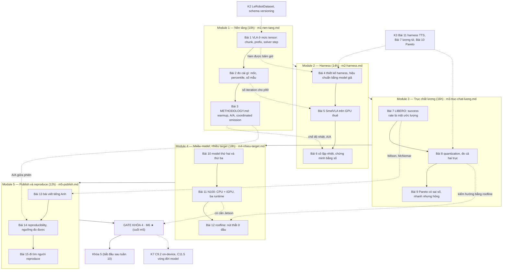

# Khóa 4 — Đo hiệu năng inference trên edge · Tổng quan

**Cho:** người đã PASS Khóa 2 (MCAP, schema, đọc dataset LeRobot). Khóa 1 và 3 **không** bắt buộc; nếu đã làm K3, harness đo TTS ở K3 Bài 11 và bài nhiễu lượng tử K3 Bài 7 là nền dùng lại ngay.
**Thời lượng:** **70h** (tổng giờ 15 bài khớp đúng bản gốc) · **Trần cứng: 95h**. Ở 6–7h/tuần là khoảng 11–13 tuần, cộng 60 ngày chạy nền cho tiêu chí 4 của gate.
**Chi phí:** thuê GPU theo giờ, bản gốc ước ~500k–1,5 triệu VNĐ cho cả khóa `[ước lượng 10/2026 — giá thuê đổi theo tuần, kiểm trang listing vast.ai/runpod]`. **Không mua phần cứng gì.** N100 (Beelink EQ12) đã có là target thứ hai.
**Tương ứng:** milestone **M6 ★** trong `00-lo-trinh-tong.md` — artifact ★ thứ hai sau K2.

**Xong khóa này bạn có:** một harness benchmark công khai chạy bằng một lệnh; báo cáo có số đo thật trên ≥3 model × ≥2 target, ở **hai trục** (latency và success rate theo nhiệm vụ, cùng bộ seed); một bài viết tiếng Anh; và ít nhất một người lạ đã chạy lại và xác nhận công khai.

**Luận điểm mang xuyên khóa (bản gốc):** đây là khóa duy nhất bạn làm đúng công việc 8 năm qua, chỉ đổi payload. Bài 3 chấm câu đó là **ĐÚNG MỘT PHẦN**: harness, percentile, reproducibility chuyển thẳng; thứ không chuyển là trạng thái nhiệt/công suất có quán tính hàng phút, trục chất lượng không nhị phân, mẫu đắt nên n nhỏ, và output mang ngữ nghĩa thời gian (action chunk). Con số của bạn sẽ lỗi thời trong sáu tháng; methodology thì không.

**Cam kết phạm vi (ghi vào đầu `decisions.md` trước Bài 1):** FAIL action của gate (cuối `m5-publish.md`) được cam kết **hôm nay**. Nếu phải cắt, cắt Module 4 xuống đúng 3 model × 2 target; **không** cắt Module 3. Ba model đo kỹ hơn sáu model đo hời hợt.

---

## Vị trí trong lộ trình và con số không được giấu

| Khóa | Tên | Giờ | Ghi chú |
|---|---|---|---|
| 1 | Từ zero đến đo được | 35 | Không bắt buộc cho K4 |
| 2 | Dữ liệu robot mà không cần robot | 80 | **Entry** của K4 (M2 PASS) |
| 3 | Chuỗi audio | 90 (tổng bài 92) | Không bắt buộc; nếu thiếu giờ, bản gốc khuyên chọn K4 trước K3 |
| **4** | **Đo hiệu năng inference trên edge** | **70** | ← khóa này · Track B, không bị chặn bởi ship hàng |
| 5 | Cảm biến, đồng bộ thời gian, data platform | 150 | Bắt đầu sau tuần 10 của K4, không chờ tiêu chí 4 |
| 6 | Hạ tầng mô phỏng và đánh giá | 120 | Dùng lại LIBERO (Bài 7), harness và roofline N100 |
| 7 | Robot di động — **thiết kế lại thành khóa build** | 561 lõi (K7 gốc: 340) | `khoa-7/_KE-HOACH-K7.md` |

**Ngân sách toàn lộ trình — không giấu.** K1–K6 = **545h**. Cộng K7 gốc = **885h**, đã vượt con số 650h của lộ trình gốc. Cộng K7 mới (lõi 561h, chưa tính tùy chọn) = **1.106h**; ở 6,5h/tuần ≈ 170 tuần ≈ **3,3 năm**. Đường lõi tối thiểu của K7 mới (~366h: C0–C7 trọn, C8 tối thiểu, C10.1–C10.2, C11.1–C11.3) cho **545 + 366 = 911h ≈ 2,7 năm**.

**Khóa nền F1–F7 nằm ngoài các con số trên** (~245h nếu học trọn, nhưng F được thiết kế để học **đúng lúc**). K4 dựa nặng nhất vào F1 (đo lường, thống kê): phần lớn viên nang F1.1–F1.7 bạn gặp lần đầu ở khóa này nếu chưa học ở K1–K3, cộng F2.2, F2.3, F2.8, F5.5, F7.2. Chọn học trọn hay đúng lúc là quyết định của bạn, ghi vào `decisions.md`.

**Vì sao K4 đáng 70h dù không có phần cứng mới:** Bài 11 trả lời bằng số câu "VLA có chạy được trên máy tính 3 triệu đặt trên robot không", và đó là phép chứng minh duy nhất lộ trình chấp nhận trước khi cho mua Jetson. Kết quả nối thẳng vào K7: model nào chạy on-device ở → K7 C9.2 (pipeline nhận diện), cái gì phải offload, và vòng đời model ở → K7 C11.5.

---

## Bản đồ khóa



## Bài → giờ → viên nang nền cần trước → quyết định ra được

| Bài | Giờ | Viên nang nền cần trước | Quyết định ra được |
|---|---|---|---|
| 1 — VLA ở mức tensor | 3 | F7.1 | Harness bấm giờ hàm nào (`predict_action_chunk`, không phải `select_action`); "chạy kịp" so latency với thời lượng chunk được thực thi, không với chu kỳ điều khiển |
| 2 — Đo cái gì, mốc hợp lý | 3 | F1.2, F1.4, F7.4 | Một con số là "đo nhầm thứ", "hợp lý" hay "đáng báo"; cần bao nhiêu iteration để percentile nào có cận trên; "1%" là 1% của cái gì |
| 3 — Methodology | 4 | F1.3, F1.1, F1.7, F2.2 | Kế hoạch đo viết trước (N, M, số phiên, vòng kín/vòng mở, chế độ nhiệt); quy tắc nhanh hơn / chậm hơn / không phân biệt được từ A/A |
| 4 — Thiết kế harness | 5 | F1.3, F1.2, F2.5, F3.2 | Harness đạt yêu cầu "một lệnh, config bằng file, JSON có schema, resumable, ba tầng thời gian" chưa; phân vị nó báo có tin được không (hiệu chuẩn bằng model giả) |
| 5 — Model đầu tiên trên GPU thuê | 5 | F1.3, F7.3, F2.2 | Số GPU đầu tiên có qua kiểm tỉnh táo bậc độ lớn không; precision/batch/solver step nào vào ma trận |
| 6 — Cô lập nhiệt | 4 | F1.1, F1.6, F5.4 | Bằng chứng nào đủ để người lạ tin phép đo không bị nhiễu nhiệt; đo chế độ burst hay sustained |
| 7 — LIBERO | 5 | F1.4, F1.5, F2.2, F2.3, F6.5 | Cần bao nhiêu episode mỗi cấu hình để được viết "A tốt hơn B"; khi nào kết luận đúng là "chưa phân biệt được" |
| 8 — Quantization | 6 | F5.5, F7.2, F1.5 | Kiểu lượng tử nào (weight-only hay W8A8, per-channel, lớp nào giữ cao) cho target nào; được viết "không giảm chất lượng" hay chỉ "chưa phát hiện suy giảm > X điểm" |
| 9 — Pareto và "nhanh nhưng hỏng" | 5 | F2.8, F1.5 | Với một ràng buộc vận hành, chọn cấu hình nào và điểm bị loại gần nhất vì sao, kể cả khi câu trả lời là "chưa phân biệt được" |
| 10 — Model thứ hai, thứ ba | 6 | F1.7, F7.2 | Harness có thật sự tổng quát không; bộ ba model nào phủ đủ chiều (kích thước, kiểu action head, backbone); ô trống nào và vì sao |
| 11 — N100: CPU, iGPU, ba runtime | 6 | F5.4, F7.2, F1.4 | Model nào chạy được trên chính máy sẽ lên robot, chậm hơn yêu cầu 10 Hz bao nhiêu lần → mua Jetson, offload, hay đủ |
| 12 — Roofline | 6 | F7.2, F7.3, F1.6 | Pha nào của model chậm vì compute, pha nào vì băng thông, trên phần cứng nào → tối ưu kernel hay giảm byte |
| 13 — Bài viết tiếng Anh *(khung rút gọn)* | 5 | F1.7, F1.4, F1.5, F1.3 | Mỗi câu khẳng định được viết ở mức "tốt hơn", "không phân biệt được", hay phải xóa |
| 14 — Reproducibility | 4 | F2.2, F3.8, F2.3, F1.3 | Đầu vào nào đóng băng, nào chỉ ghi lại, nào chặn bằng ngưỡng; ngưỡng "reproduce được" tính từ độ tản mát đo được |
| 15 — Đi tìm người reproduce *(khung rút gọn)* | 3 | F1.7, F2.2 | Phễu rơi ở ma sát setup hay ở kênh phân phối; bước tiếp theo sau 2 tuần, 4 tuần, 60 ngày |
| Gate *(khung rút gọn)* | — | toàn khóa | PASS; hoặc FAIL action đã cam kết; hoặc publish nguyên trạng ở trần 95h; và quyết định Jetson |

Giờ theo module: M1 10 · M2 14 · M3 16 · M4 18 · M5 12 = **70h**, khớp bản gốc. Cột viên nang chỉ ghi F; dòng **Vị trí** của từng bài ghi thêm bài K-khác cần trước. Viên nang ở hàng Bài 4–6 và 10–12 lấy theo nội dung bài gốc; file `m2-harness.md` và `m4-nhieu-target.md` là nguồn chính thức, nếu chúng ghi khác thì theo chúng.

---

## Bản đồ "chấm mô hình" — mô hình của bạn và của bản Gemini K4

`_ref/cau-hoi-cua-ban-trong-gemini.md` không có mô hình nào của bạn ở lượt K4 (chỉ "dạy bài tiếp theo"). Khóa này chấm lại ba mô hình bạn nêu ở K3 vì chúng quay lại đúng ở đây, cộng các mô hình của bản gốc và bản Gemini mà một backend engineer dễ tin theo. Chấm đầy đủ, có phản ví dụ, ở đúng bài.

| Nguồn | Ý chính (trích ngắn) | Chấm | Ở đâu |
|---|---|---|---|
| Bạn, K3 lượt 6 | "Luôn phải có buffer ở giữa… latency sẽ giảm nhưng bù lại kiểm soát" | ĐÚNG MỘT PHẦN | Bài 1 |
| Bạn, K3 lượt 12 | AI + prediction thay kết quả tầng vật lý, "không bị sai lệch bởi time clock" | SAI khi áp vào VLA | Bài 1 |
| Bạn, K3 lượt 21 | "Lúc đo chưa cover đủ flag/khóa thì runtime không đảm bảo" | ĐÚNG MỘT PHẦN | Bài 3, Bài 14 |
| Bản gốc | "Khóa duy nhất làm đúng công việc 8 năm, chỉ đổi payload" | ĐÚNG MỘT PHẦN | Bài 3 |
| Bản gốc + Gemini | "Model 4 Hz, chunk 50 → điều khiển tới 200 Hz" | SAI (nhầm đại lượng; tự phản biện ở Bài 1 câu hỏi ngược 5 trước khi đọc phần 11) | Bài 1 |
| Bản gốc + Gemini | "Shape action 2 chiều nghĩa là không chunking" | SAI với API LeRobot | Bài 1 |
| Bản gốc | "Không báo cáo mean" | ĐÚNG MỘT PHẦN | Bài 2, Gate |
| Bản gốc | "p99 gấp 9 lần p50 là dấu hiệu chưa cô lập" | ĐÚNG MỘT PHẦN | Bài 2 |
| Bản gốc | "1% số lần chạy chậm → robot mất ổn định 1% thời gian" | SAI về đơn vị đếm | Bài 2 |
| Bản gốc + Gemini | "Cùng seed, 3 lần chạy phải giống hệt" | ĐÚNG MỘT PHẦN | Bài 7, Bài 14 |
| Gemini | "70% → 68%, seed ±4% → không có khác biệt" | SAI ở cách phát biểu | Bài 7, Bài 13 |
| Bản gốc + Gemini | "VRAM giảm gần tuyến tính theo số bit" | ĐÚNG MỘT PHẦN | Bài 8 |
| Gemini | "B (155 ms, 71%) bị A (150 ms, 75%) trội, gạch ngay" | SAI khi có sai số | Bài 9 |
| Gemini | "Control loop 10 Hz ⇒ p99 < 100 ms" | ĐÚNG MỘT PHẦN | Bài 9 |
| Gemini | "Lockfile đóng băng môi trường tuyệt đối" | SAI | Bài 14 |
| Bản gốc + Gemini | "VLA batch 1 là compute-bound"; "N100 ≈ 0,7 TFLOPS" | SAI như sự thật chung (tùy pha); con số TFLOPS sai | Bài 12 (quy chuẩn mục 7) |

---

## Gate Khóa 4 — tóm tắt, không thay thế

**Văn bản chính thức của gate nằm ở cuối `m5-publish.md`** (mục *Gate Khóa 4 — M6 ★ VLA edge benchmark*): bảy tiêu chí giữ nguyên chữ của bản gốc, bảng "bằng chứng phải chỉ vào", FAIL action, quy trình chấm. Bảng dưới chỉ để bạn thấy từ Bài 1 mỗi module đang nuôi tiêu chí nào; khi chấm, mở file đó. Không tiêu chí nào bị nới hay đổi ngưỡng.

| # | Tiêu chí (tóm tắt) | Bằng chứng sinh ra ở | Chỗ hay hiểu sai (chi tiết trong m5) |
|---|---|---|---|
| 1 | ≥3 model × ≥2 target | Module 4 (Bài 10–11) | Ô trống phải có lý do; ba runtime trên cùng N100 là ba target theo Bài 11 |
| 2 | p50/p95/p99, RTF, VRAM peak, throughput; **không** báo mean | Bài 2 (định nghĩa), Module 2 | "Không mean" áp cho latency; success rate là tỉ lệ, báo kèm CI và theo nhiệm vụ |
| 3 | Methodology mô tả warm-up và cô lập thermal throttling, **kèm số chứng minh** (ví dụ ±2°C) | Bài 3, Bài 6 | ±2°C là điều kiện cần, chưa đủ: kèm vết xung thật và cờ/lý do throttle (N100 hạ xung theo PL1 cả khi nhiệt phẳng) |
| 4 | ≥1 người ngoài reproduce và xác nhận công khai | Bài 14–15 | Luật "xác nhận công khai" cam kết trước ở Bài 15 bước 0; có độ trễ, không chặn Khóa 5 |
| 5 | Bài viết tiếng Anh publish + repo public | Bài 13 | Mọi số truy về JSON |
| 6 | Trục chất lượng cùng bộ seed, báo **theo nhiệm vụ** | Module 3 | Khẳng định "task X dịch chuyển" cần hiệu chỉnh bội so sánh |
| 7 | ≥1 cấu hình "nhanh hơn nhưng hỏng" được tìm ra và ghi lại | Bài 8–9 | Không tìm được thì nén sâu hơn tới khi tìm được |

Tiêu chí 1–5 là 5 tiêu chí PASS của M6; 6–7 là bản gốc K4 thêm vào.

**FAIL → action (bản gốc, cam kết trước):** không đủ target phần cứng → chạy toàn bộ trên GPU thuê ở ≥2 cấu hình khác nhau (ví dụ 3090 vs 4090, hoặc cùng card khác batch size); vẫn hợp lệ, vẫn publish được. Chạm 95h chưa PASS → publish nguyên trạng với số đã có, ghi rõ cái gì chưa làm, sang Khóa 5.

**Mẹo đếm giờ (đề xuất của người soạn, không thuộc gate gốc):** nếu ở giờ 50 Module 4 chưa bắt đầu, áp quy tắc cắt scope ngay (3 model × 2 target đúng mức tối thiểu), đừng chờ chạm 95h. Module 4 là 18h và Module 5 là 12h; bắt đầu Module 4 sau giờ 65 là gần như chắc chạm trần.

---

## Lịch

Lịch 11 tuần của bản gốc cộng đúng 70h, nhưng giờ từng tuần không khớp giờ bài: tuần 4 có 7h cho Bài 5–6 (9h), tuần 9 có 7h cho Bài 11–12 (12h), tuần 10 có 6h cho Bài 13–14 (9h), trong khi tuần 2, 3, 5 dư 2h. Lịch dưới đây giữ nguyên thứ tự và giờ từng bài, trải ra 13 tuần, không tuần nào quá 7h (~5,4h/tuần). Cột "Máy" cho biết tuần nào phải thuê GPU hoặc cần N100, để bạn gom lượt thuê.

| Tuần | Tuần gốc | Giờ | Làm | Máy | Xong thì có |
|---|---|---|---|---|---|
| 1 | 1 | 6 | Bài 1 + Bài 2 · ghi FAIL action vào `decisions.md` | laptop (CPU) | `notes/01-model-anatomy.md`, `prediction.md` toàn khóa đã commit |
| 2 | 2 | 4 | **Bài 3** | laptop / N100 (đọc PL1/PL2) | `METHODOLOGY.md` bản 0, A/A diễn tập |
| 3 | 3 | 5 | Bài 4 | laptop | Harness đã hiệu chuẩn bằng model giả |
| 4 | 4 | 5 | Bài 5 | **GPU thuê** | Số đầu tiên đáng tin, đồ thị warmup |
| 5 | 4 | 4 | Bài 6 | GPU thuê (throttle cố ý) + N100 | Đồ thị đã cô lập vs chưa cô lập |
| 6 | 5 | 5 | Bài 7 | **GPU thuê** | Baseline LIBERO theo task, tỉ lệ lật, file episode thô |
| 7 | 6 | 6 | Bài 8 | **GPU thuê** | Bảng hai trục, cấu hình "nhanh nhưng hỏng" |
| 8 | 7 | 5 | Bài 9 | laptop | Pareto có sai số, `decisions.md` ba kịch bản, holdout |
| 9 | 8 | 6 | Bài 10 | **GPU thuê** | Ma trận model × precision có ô trống kèm lý do |
| 10 | 9 | 6 | Bài 11 | **N100** | Khoảng cách N100 vs yêu cầu 10 Hz, bằng số |
| 11 | 9 | 6 | Bài 12 | GPU thuê (profiler) + N100 | Roofline + kiểm hướng với Bài 8 |
| 12 | 10 | 5 | Bài 13 | laptop | Bài viết qua checklist 14 dòng, publish |
| 13 | 10–11 | 4 + 3 | Bài 14 + Bài 15 | **GPU thuê** (máy sạch + ≥3 instance) | Repo chạy lại < 30 phút; đăng tìm người reproduce |
| 14+ | 11 | ~1 | Chấm gate (`gate-k4.md`) `[ước lượng]` | — | **M6 PASS** trừ tiêu chí 4 đang chờ ≤60 ngày |

**Ba điểm không được bỏ (theo bản gốc):** Bài 3 (methodology là sản phẩm chính), Module 3 (trục chất lượng là moat), Bài 14 tự kiểm tra trên máy sạch. Tuần crunch rơi vào đâu thì hy sinh phần mở rộng của Module 4 (model thứ ba vượt mức tối thiểu, target thứ tư), không hy sinh ba điểm này.

**Gom lượt thuê GPU:** tuần 4–7 và 9 có thể gộp thành hai hoặc ba phiên thuê nếu harness và config đã sẵn (kỷ luật thuê GPU ở Bài 5). Đặt hẹn giờ tự tắt máy, ghi giờ thuê và tiền vào `hours.csv`/`costs.csv`. Giờ máy chạy LIBERO không tính vào giờ học, nhưng **giờ đồng hồ** thì có: ước trước bằng giây/episode đo ở Bài 7.

**Tiêu chí 4 có độ trễ:** bắt đầu Khóa 5 (hoặc quay lại đóng Khóa 3) ngay sau tuần 13, để Bài 15 chạy nền 60 ngày. Đừng ngồi chờ.

---

## Bẫy đã biết

Mỗi bẫy có một câu hỏi ngược. Trả lời trước khi mở hướng nghĩ.

**1. Bấm giờ nhầm hàm.** `select_action` trả một action từ hàng đợi và chỉ chạy model khi hàng đợi rỗng; bấm giờ nó cho ra một phân bố hai đỉnh mà phần lớn là thời gian `popleft()` (Bài 1). Trên GPU, quên đồng bộ thì đồng hồ CPU chỉ đo thời gian đẩy kernel vào hàng đợi (Bài 4–5).
- **[Failure mode]** Một bài blog báo "SmolVLA 0,08 ms/inference trên laptop". Ba giả thuyết, xếp theo khả năng?
<details><summary>Hướng nghĩ</summary>

Bấm giờ `select_action` và báo p50; không `synchronize` trên GPU; cache xuyên lần gọi với cùng input. Cả ba là đo nhầm thứ, không phải đồng hồ sai (Bài 1, tự kiểm tra 2).

</details>

**2. Deadline lấy từ "Hz" thay vì từ chunk.** Action thứ k của chunk gắn với `k/fps` của dataset lúc train; "theo kịp" là so latency với `n_action_steps / fps`, cộng một ràng buộc riêng về độ trễ phản ứng mà chunking không cứu được (Bài 1, Bài 9).
- **[Nếu…thì]** Dataset của bạn ghi ở 10 fps nhưng bộ điều khiển chạy 30 Hz và pop một action mỗi tick. Robot làm gì?
<details><summary>Hướng nghĩ</summary>

Quỹ đạo bị tua nhanh 3 lần so với lúc thu dữ liệu. Đọc `fps` trong `meta/info.json` trước khi viết dòng điều khiển nào (Bài 1, chấm mô hình K3 lượt 12).

</details>

**3. p99 từ quá ít mẫu, và "1%" không nói 1% của cái gì.** Một percentile cao chỉ có cận trên khi có đủ mẫu ở phía trên nó; con số 200 iteration của bản gốc cần xem lại (Bài 2). Tỉ lệ theo **lần inference**, theo **tick** và theo **thời gian** là ba đại lượng khác nhau; một lần chậm dài chiếm nhiều tick (Bài 2).
- **[Quy mô]** Ở N100, latency thang giây. Bạn còn báo được percentile nào, và báo thế nào cho trung thực?
<details><summary>Hướng nghĩ</summary>

Tự tính n tối thiểu cho từng percentile ở Bài 2 Đề 1. Thứ không ước lượng được thì **thấy** được: báo max và n, ghi rõ "p99 không có cận trên vì n < …".

</details>

**4. Harness vòng kín và một observation lặp lại.** Vòng kín đo service time và không thấy các observation đến trong lúc model khựng (coordinated omission); đưa cùng một observation 400 lần mở cửa cho cache và autotune làm số đẹp giả (Bài 3).
- **[Vì sao không]** Vì sao không đo luôn vòng mở FIFO cho "giống thật"?
<details><summary>Hướng nghĩ</summary>

Robot thường bỏ observation cũ (latest-only), không xếp hàng. Metric đúng cho hệ đó là tuổi observation + số observation bị bỏ. Chọn kịch bản theo hệ thật và khai báo trong `METHODOLOGY.md` (Bài 3 Đề 1).

</details>

**5. Nhiệt phẳng không có nghĩa là không throttle.** N100 hạ xung khi chạm giới hạn công suất (PL1/PL2) cả khi nhiệt ổn định; GPU giảm xung theo power cap. "Không tương quan latency–nhiệt" không phải bằng chứng khi nhiệt gần như không đổi: không có biến thiên thì không đo được tương quan. Kiểm throttle bằng `turbostat` và bộ đếm throttle, không chỉ `dmesg` (Bài 3, 6, Gate tiêu chí 3).
- **[Phản biện]** GPU thuê chạy ổn định 83°C ±1°C suốt phép đo. Tiêu chí 3 PASS chưa?
<details><summary>Hướng nghĩ</summary>

Ổn định nói phép đo nhất quán với chính nó, không nói card đang chạy ở xung danh định. Cần vết xung thật + lý do giảm xung + một lần đo mát để so (Gate, câu hỏi ngược 1).

</details>

**6. "Cùng seed thì giống hệt".** Chỉ được hứa khi cùng máy, cùng image, có bật cờ tất định. Ngoài điều kiện đó, số episode lật kết quả là một **số đo** phải báo, không phải bug; flow matching còn có nguồn ngẫu nhiên riêng là nhiễu ban đầu (Bài 1 bước 4b, Bài 7, Bài 14).
- **[Failure mode]** Người reproduce dùng đúng image của bạn trên một GPU khác loại, success rate tổng lệch 1 điểm, 6% episode lật. Họ sai, bạn sai, hay không ai sai?
<details><summary>Hướng nghĩ</summary>

Kernel và thứ tự cộng khác giữa kiến trúc GPU; PyTorch không hứa bit-exact giữa nền tảng. So bằng CI của hiệu, không bằng bit-exact (Bài 7 chấm mô hình 1, Bài 14 mô phỏng 1).

</details>

**7. "4-bit" chạy fp16 dưới một cái nhãn.** Lượng tử có thể bị bỏ qua lặng lẽ; weight-only giảm byte chứ không giảm FLOP nên có thể chậm hơn fp16 ở pha nghẽn compute; calibration activation sai phân bố thì cắt lặng lẽ (Bài 8).
- **[Nếu…thì]** Mọi mức precision cho success rate y hệt nhau và số cặp bất đồng bằng 0. Bạn kiểm gì đầu tiên?
<details><summary>Hướng nghĩ</summary>

dtype từng tham số, kiểu module, tổng byte theo dtype, kích thước file, peak VRAM. Không cặp bất đồng nào giữa fp32 và một mức nén sâu là đáng ngờ, không phải tin tốt (Bài 8 bước 3).

</details>

**8. Mặt Pareto không lọc được "nhanh nhưng hỏng", và người thắng luôn lạc quan.** Chọn max trên dữ liệu nhiễu tự sinh ra thiên lệch; một task "sụp" giữa mười task có thể chỉ là nhiễu lấy mẫu (Bài 8 bước 5, Bài 9).
- **[Liên ngành]** Danh mục Markowitz tối ưu trên lợi suất ước lượng có xu hướng chọn đúng tài sản bị ước lượng quá cao. Thuốc giải tương ứng của bạn là gì?
<details><summary>Hướng nghĩ</summary>

Sàn chất lượng cam kết trước, xác nhận trên init state chưa dùng (holdout), hiệu chỉnh bội so sánh khi nói về từng task (Bài 9 bước 5, → F2.8).

</details>

**9. Roofline đọc ngược chiều.** N100 CPU cỡ 0,19–0,22 TFLOPS FP32, iGPU ~0,29 TFLOPS lý thuyết `[ước lượng]`, không phải 0,7; một khe SO-DIMM DDR5-4800 cho ~38,4 GB/s lý thuyết `[ước lượng — kiểm bằng dmidecode]`. Bản gốc lập luận "N100 chỉ có một kênh RAM, nên đừng giả định nó compute-bound như GPU"; trước khi tin câu đó, tự tính ridge point (peak FLOP/s ÷ băng thông) của từng máy và xem nó nói gì về **cùng một kernel** trên hai máy (đáp ở bảng sửa lỗi 🔒 bên dưới). "Batch 1 compute-bound" tùy pha: prefix ảnh nhiều token khác decode (Bài 12, quy chuẩn mục 7).
- **[Quy mô]** Cùng SmolVLA, bạn đặt hai pha (prefix, một bước expert) lên roofline của RTX 4090 và của N100. Bạn dự đoán pha nào đổi phía, và kiểm bằng thí nghiệm nào ở Bài 8?
<details><summary>Hướng nghĩ</summary>

Tính arithmetic intensity từng pha bằng đếm token × tham số ÷ byte weight đọc; so với ridge từng máy. Kiểm hướng: weight-only giảm byte chỉ giúp pha memory-bound. Hai đường phải gặp nhau; không gặp thì một trong hai sai (Bài 12 bước 4).

</details>

**10. Ngưỡng reproduce đặt từ nhiễu trong một máy.** Chênh <10% của bản gốc là mục tiêu, nhưng độ tản mát giữa các máy thuê cùng SKU (power limit, CPU host, PCIe, driver) có thể lớn hơn; ngưỡng cố định vừa FAIL oan vừa bỏ sót bug thật (Bài 14).
- **[Phản biện]** "Reproducibility của benchmark latency là ảo tưởng, chỉ có reproducibility của phương pháp." Đồng ý tới đâu?
<details><summary>Hướng nghĩ</summary>

Số tuyệt đối gắn với phần cứng cụ thể; tỉ lệ và thứ hạng (fp16 nhanh hơn fp32 bao nhiêu lần trên cùng máy, ai nằm trên mặt Pareto) thường tái lập tốt hơn. Báo cả hai (Bài 14 câu hỏi ngược 6).

</details>

---

## Sửa lỗi so với bản gốc và bản Gemini (gom từ phần 11 các bài)

Bảng chứa kết luận của nhiều bài; mỗi dòng rút gọn, lý do đầy đủ ở phần 11 của bài. Đọc theo module, sau khi xong module đó. Dòng Bài 4–6 và 10–12 ghi các lỗi đã biết từ bản gốc, quy chuẩn mục 7 và ghi chú hợp nhất; danh sách đầy đủ nằm trong phần 11 của `m2-harness.md` và `m4-nhieu-target.md`.

<details><summary>🔒 MỞ SAU KHI XONG MODULE TƯƠNG ỨNG</summary>

| Bài | Sai (G = bản gốc, Ge = Gemini, C = bản Claude trước hợp nhất) | Đúng |
|---|---|---|
| 1 | Ge: import `lerobot.common.policies…` cố định; C: cố định một đường dẫn mới và thoát nếu hỏng | Không cố định import nào; thử theo phiên bản cài, in đường đã chạy, `[tự đo]` (quy chuẩn mục 7) |
| 1 | G+Ge: "4 Hz × chunk 50 → 200 Hz" | Đó là tốc độ cung action; tần số thực thi là `fps` của dataset; theo kịp khi L < `n_action_steps / fps` |
| 1 | G+Ge: "action 2 chiều = không chunking"; ảnh `(B, N_cam, 3, H, W)`; SO-101 "6 khớp + gripper" | `select_action` trả 2 chiều dù có chunk; mỗi camera một key `(B, 3, H, W)`; SO-101 6 motor tính cả gripper |
| 1 | G: latency giảm "gần tuyến tính" theo solver step | Affine: `t_prefix + K·t_step`, có hệ số chặn |
| 2 | G: "1% lần chậm → mất ổn định 1% thời gian, 18 lần/phút ở 30 Hz"; C lặp lại ở câu chuyện và cầu nối | Ba đại lượng khác nhau: theo lần (×số inference/phút), theo tick, theo thời gian (trọng số độ dài). Ví dụ 99%×120 ms + 1%×800 ms, chạy liền: ~6,3% thời gian, ~4,7 lần/phút |
| 2 | G: "không báo mean"; "p99 gấp 9 p50 = chưa cô lập"; 200 iteration cho p99 | Mean không là số tiêu đề nhưng cần cho chi phí/Little; tỉ lệ đó là giả thuyết, không phải chẩn đoán; p99 cần n ≥ 368 để có cận trên CI 95% |
| 2 | Ge: "N100 10–30 giây" lộ ngoài niêm phong; BitVLA so với "OpenVLA" | Bỏ, thay bằng phương pháp ước lượng; so với OpenVLA-OFT |
| 3 | G+Ge: chèn nghỉ giữa các iteration để mát; Ge: governor `ondemand` trên N100 | Chọn chế độ burst/sustained, nghỉ giữa **khối**; `intel_pstate` active chỉ có `performance`/`powersave` |
| 4 | G: model giả `sleep(0.1)` + N(0, 5 ms), 200 iteration → p99 ≈ 112 ms là "giá trị đúng" | p95/p99 lý thuyết của Gaussian đúng, nhưng `sleep` luôn ngủ **ít nhất** chừng đó (timer slack, lập lịch) nên số đo lệch lên; p99 từ 200 mẫu không có cận trên `[tự đo — chi tiết ở m2]` |
| 5 | G: "batch lớn không tăng throughput → bound bởi compute" | Một khả năng; cũng có thể nghẽn ở preprocess CPU hay truyền dữ liệu — kiểm bằng tách ba tầng thời gian trước khi kết luận |
| 6 | G: "không tương quan latency–nhiệt" là bằng chứng đã cô lập; throttle kiểm qua `dmesg` | Không có biến thiên nhiệt thì không đo được tương quan; bằng chứng là vết xung + bộ đếm throttle (`turbostat`), và một lần cố tình làm throttle để so |
| 7 | G+Ge: "cùng seed 3 lần phải giống hệt"; "3 bộ seed = sai số"; Ge: `pip install libero`, "không có khác biệt" | Chỉ khi cùng máy + image + cờ tất định; Wilson trên episode gộp, McNemar ghép cặp, 3 bộ seed để kiểm biến thiên ngoài nhị thức; extras `.[libero]`; "chưa phân biệt được ở MDE = X" |
| 8 | G+Ge: VRAM tuyến tính theo bit; bf16/fp16 gộp "miễn phí"; G: quy tắc "nhỏ hơn biến thiên seed" | Chỉ phần weight; tách bf16/fp16 (fp16 tràn > 65504); Wilson/McNemar + MDE; số GR00T là task Bridge, model card bên thứ ba |
| 9 | Ge: "B bị A trội, gạch ngay"; "10 Hz ⇒ p99 < 100 ms"; G: không nói mặt Pareto chứa điểm hỏng | Trội có sai số là ba trạng thái; ngân sách theo chunk; sàn chất lượng cam kết trước + holdout |
| 10 | — | Không có lỗi kỹ thuật đã biết từ nguồn; xem phần 11 của m4 |
| 11 | G: "N100 nhanh hơn Pi 4 vài lần" như sự thật | `[ước lượng]`, phải đo; giữ quy tắc "chỉ chậm hơn GPU 2–3 lần với model lớn thì nghi đo nhầm" |
| 12 | G+Ge: N100 ≈ 0,7 TFLOPS; "VLA batch 1 compute-bound" như sự thật chung; G: "N100 một kênh RAM nên đừng giả định compute-bound như GPU" | CPU ~0,19–0,22 TFLOPS, iGPU ~0,29 `[ước lượng]`; tùy pha và số token; ridge N100 ~5 FLOP/byte vs RTX 4090 ~80 → cùng kernel dễ memory-bound trên **GPU** hơn, lập luận gốc ngược chiều; "SM Active" không tách compute với chờ bộ nhớ |
| 13 | Ge: "73% vs 71%, N=50 → bảo toàn chất lượng" | Không bác bỏ được ≠ tương đương; ba phán quyết + biên tương đương cam kết trước |
| 14 | Ge: lockfile đóng băng tuyệt đối; 5 lệnh bỏ Docker, `python` ngoài venv của uv; `TORCH_CUDA_ARCH_LIST` cho wheel dựng sẵn; G: ngưỡng 10% cố định | Driver, image nền, apt, artifact biến mất; `uv run`/container; chọn bản PyTorch hỗ trợ arch; ngưỡng tính từ `sigma_b` đo trên ≥3 instance |
| 15 | Ge: tin nhắn mẫu có số bịa và "compute-bound ở batch 1"; G: "~15 nghìn tiền thuê" | Số thật của bạn; chi phí tính từ giá ngày đăng × thời gian đo được |
| Gate | Ge: "TUYỆT ĐỐI KHÔNG báo mean"; câu kết chúc mừng | "Không mean" áp cho latency; success rate báo kèm CI. Bảy tiêu chí và FAIL action giữ nguyên chữ |
| Tổng quan | G: lịch 11 tuần có tuần 7h cho 12h bài | 13 tuần ≤ 7h, giờ từng bài giữ nguyên |

</details>

---

## Cách học khóa này

Khóa này toàn phần mềm và đúng nghề bạn: bạn sẽ làm nhanh, và làm nhanh là lúc dễ bỏ bước dự đoán nhất. Rủi ro lớn nhất không phải code sai mà là **đo rất chính xác một thứ không ai cần** (hàm sai, kịch bản tải sai, chế độ nhiệt không đại diện).

**Vòng một bài (tuần thường, 4–7h):**
1. Đọc phần 1–4 (câu chuyện, mô hình, cầu nối, thuật ngữ) và viên nang F mà bảng ở trên chỉ tên.
2. Viết `prediction.md` bằng số, kèm cách tính và độ tự tin, **commit**. **Không dùng AI ở bước này**: dự đoán của AI không phải dự đoán của bạn, và nó xóa đúng thứ khóa này đo — khoảng cách giữa mô hình trong đầu bạn và kết quả. Ai đã thấy đáp án thì không còn là "tập giữ kín" (Bài 9).
3. Chạy mô phỏng đồ chơi của bài trước khi đụng GPU thuê.
4. Làm. Mỗi số đo quan trọng ghi n, phiên bản (LeRobot, torch, revision checkpoint), image digest, chế độ nhiệt.
5. Mở khối 🔒, so, viết giải thích chênh lệch **trước** khi tra cứu.
6. Trả lời câu hỏi ngược; mở hướng nghĩ sau.

**Tuần crunch (0–2h):** khóa này làm được trong tuần crunch (bản gốc), nhưng **không thuê GPU** khi không có đủ thời gian ngồi trông lượt thuê: kỷ luật thuê ở Bài 5 đổ vỡ đầu tiên khi bạn vội. Thay vào đó: viết hoặc sửa một mục của `METHODOLOGY.md`, đọc phần 1–4 bài kế tiếp hoặc một viên nang F1, chạy lại một mô phỏng đồ chơi với tham số khác (đổi `fps`, đổi n, đổi seed), hoặc trả lời một phản hồi ở Bài 15. Nhiều tuần crunch liên tiếp: cắt phần mở rộng Module 4, không cắt Bài 3, Module 3, Bài 14.

**Dùng AI ở đâu:** ở bước giải thích (bước 5), khi tự trừu tượng hóa, và khi rà bài viết ở Bài 13 — với prompt **chấm mô hình**, không phải "giải thích cho tôi":

```text
Đây là mô hình tôi đang tin, viết bằng lời của tôi:
"<dán nguyên văn>"
Chấm từng ý: ĐÚNG / ĐÚNG MỘT PHẦN / SAI. Với mỗi ý không ĐÚNG, chỉ đúng chỗ gãy
và đưa MỘT phản ví dụ cụ thể (con số, thí nghiệm, hoặc hệ thật). Không mở đầu bằng lời khen.
Nếu ý của tôi là một khẳng định về hiệu năng: hỏi lại hàm nào được bấm giờ, n bao nhiêu,
chế độ nhiệt nào, vòng kín hay vòng mở. Nếu là khẳng định về chất lượng: hỏi n mỗi cấu hình,
CI của hiệu, MDE và α khai báo trước. Mọi con số phải kèm nguồn hoặc ghi rõ là ước lượng.
```

Lý do: bản Gemini của khóa này xác nhận nhiều mô hình chỉ đúng một phần, đưa import LeRobot cố định mà không kiểm phiên bản, và viết tin nhắn mẫu có số đo bịa (Bài 1, 15). Mọi API AI gợi ý (LeRobot, torchao, bitsandbytes, OpenVINO, ONNX Runtime, `nvidia-smi` query field) kiểm theo phiên bản bạn ghim, ghi `[tự đo]` vào notes.

**Hai câu tự hỏi cuối mỗi tuần:** (1) Tuần này con số nào của tôi có kèm n, phiên bản và khoảng tin cậy mà tuần trước chưa có? (2) Mô hình nào của tôi vừa bị một con số phản bác?

---

## Sau Khóa 4

**Khóa 5 — Cảm biến, đồng bộ thời gian, data platform (150h).** Khóa nặng nhất, cần đợt mua 3. Nguyên tắc scope của nó (bản gốc): **số đo là deliverable, platform là vỏ** — đo trước, dựng platform sau. Bắt đầu ngay sau tuần 13 của lịch trên, để Bài 15 chạy nền.

**Trước khi sang Khóa 5, chạy M5 (đo thị trường) nếu chưa chạy.** Sau K2 và K4 bạn có hai artifact ★; apply là một phép đo, không phải bước cuối.

**K4 nuôi các khóa sau:**

| Sau này | Dùng lại từ K4 |
|---|---|
| K6 Bài 2, 8 | LIBERO và stack sim (Bài 7), giây/episode, roofline N100 (Bài 11–12) |
| K6 Bài 12–13 | Wilson, McNemar, MDE, phán quyết ba trạng thái (Bài 7, 13) |
| K7 C9.2 | Model nhận diện nào chạy on-device trên N100, đo theo đúng methodology Bài 3 |
| K7 C11.5 | Vòng đời model: revision, lockfile, image digest, ngưỡng reproduce (Bài 14) |
| Quyết định mua Jetson | Số Bài 11 + Gate bước 4, ghi trong `decisions.md` |
