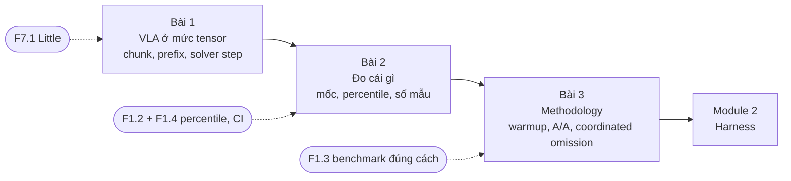
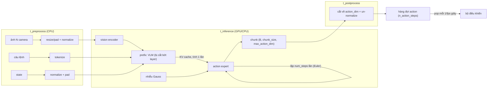
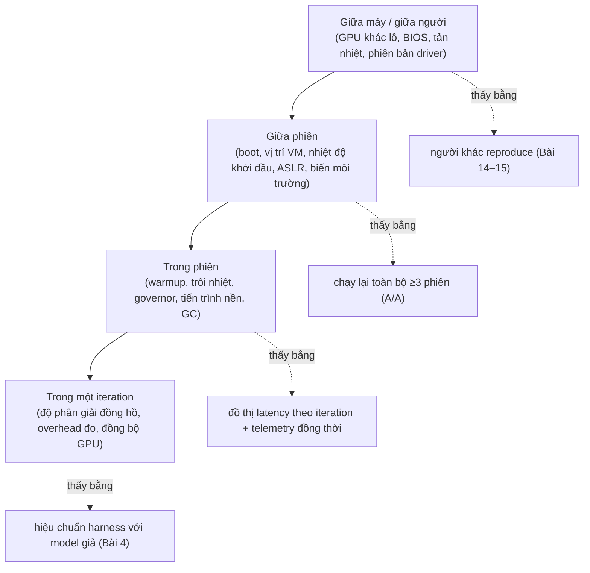

# Khóa 4 · Module 1 — Nền tảng: VLA là gì, đo cái gì, đo thế nào (10h)

Module này không chạy benchmark nào. Nó trả lời ba câu trước khi bạn chạm vào GPU thuê: hàm mình sắp bấm giờ là hàm nào (Bài 1), con số nào là hợp lý và phải báo cáo chỉ số gì (Bài 2), và làm sao biết con số là của model chứ không phải của máy (Bài 3). Nếu ba câu này sai, 60 giờ còn lại đo rất chính xác một thứ không ai cần.

Định dạng gốc sáu phần (Câu hỏi · Khái niệm · Làm · Số phải ra · Nếu ra khác · Tự kiểm tra) được mở rộng thành khung 12 phần của `giao-trinh/_QUY-CHUAN.md`. Mọi bước, tiêu chí và giờ của bản gốc được giữ; chỗ sai được sửa và ghi ở phần 11 từng bài.

> **Cần trước:** K2 PASS (MCAP, schema, đọc dataset LeRobot v3.0). Học đúng lúc: F7.1 (Bài 1), F1.2 + F1.4 + F7.4 (trước Bài 2), F1.3 + F1.1 + F1.7 + F2.2 (trước Bài 3) · **Artifact của module:** `notes/01-model-anatomy.md`, `prediction.md` toàn khóa (commit trước mọi phép đo), `METHODOLOGY.md` bản 0.



| Bài | Giờ | Viên nang nền cần trước | Quyết định ra được |
|---|---|---|---|
| 1 VLA ở mức tensor | 3 | F7.1 | Harness bấm giờ hàm nào; "chạy kịp" so với cái gì |
| 2 Đo cái gì | 3 | F1.2, F1.4, F7.4 | Một con số là "đo nhầm thứ", "hợp lý" hay "đáng báo"; bao nhiêu mẫu cho percentile nào |
| 3 Methodology | 4 | F1.3, F1.1, F1.7, F2.2 | Kế hoạch đo cam kết trước và quy tắc ba trạng thái nhanh hơn / chậm hơn / không phân biệt được |

---

## Bài 1 — VLA model là cái gì, ở mức tensor (3h)

> **Vị trí:** (mở khóa) → **Bài 1** → Bài 2 (mốc đối chiếu và chỉ số) · **Cần trước:** K2 PASS (đọc được `LeRobotDataset`, biết `fps` của dataset); F7.1 (định luật Little, chỉ cần trực giác) · **Sau bài này bạn quyết định được:** harness của bạn bấm giờ **hàm nào** (`predict_action_chunk`, không phải `select_action`), và tiêu chí "model chạy kịp" là so latency với **thời lượng chunk được thực thi**, không phải với chu kỳ điều khiển.

### 1. Câu chuyện — ai đã khổ vì chuyện này

Năm 2023, nhóm của Tony Zhao (Stanford) dựng ALOHA, một cặp tay robot giá rẻ, và gặp đúng vấn đề kinh điển của imitation learning: policy dự đoán từng bước một thì sai số nhỏ ở mỗi bước dồn lại, robot trôi dần ra khỏi vùng trạng thái mà nó từng thấy lúc học (compounding error). Lời giải trong paper ACT (*Learning Fine-Grained Bimanual Manipulation with Low-Cost Hardware*) là **action chunking**: mỗi lần chạy, model dự đoán cả một chuỗi hành động cho nhiều bước tương lai, nên số lần "quyết định" giảm đi nhiều lần và quỹ đạo mượt hơn `[chuẩn]`. Diffusion Policy (Chi và cộng sự, 2023) đi cùng hướng với cách thực thi kiểu receding horizon: dự đoán dài, thực thi một đoạn, dự đoán lại.

Chunking giải bài toán chất lượng nhưng đẻ ra bài toán hạ tầng. Khi model lớn lên thành VLA (π0 của Physical Intelligence năm 2024, rồi SmolVLA của Hugging Face năm 2025), một lần inference tốn hàng trăm mili-giây trên phần cứng tiêu dùng. Nếu chạy **đồng bộ** (hết chunk mới chạy model), robot đứng khựng mỗi khi chờ chunk mới. Paper SmolVLA đề xuất một stack **asynchronous inference** để tách việc dự đoán khỏi việc thực thi, chính vì cái khựng này `[spec: SmolVLA paper, arXiv 2506.01844, phần async inference]`. Physical Intelligence sau đó công bố *Real-Time Execution of Action Chunking Flow Policies* (real-time chunking, RTC) để xử lý chỗ nối giữa chunk cũ và chunk mới khi inference chậm `[chuẩn — tên paper; chi tiết đọc bản gốc]`. LeRobot hiện có hẳn một thư mục `policies/rtc` `[tự đo — kiểm trên nhánh bạn cài]`.

Bài học cho người làm benchmark: "latency của VLA" không có nghĩa nếu bạn không nói rõ nó được so với cái gì. Cùng một model 4 Hz có thể điều khiển robot mượt, hoặc làm robot khựng định kỳ một phần đáng kể thời gian, tùy cách thực thi chunk (bạn tự tính bao nhiêu ở Đề 4).

### 2. Mô hình tư duy

Ở mức bạn cần, một VLA là một hàm có trạng thái nhỏ bọc quanh một hàm thuần:

```
(ảnh từ N camera, vector trạng thái, câu lệnh) ──► chunk hành động  (B, H, action_dim)
```



Ba điều quyết định mọi thứ về hiệu năng:

1. **Output là một chunk, và mỗi phần tử của chunk gắn với một thời điểm.** Action thứ k trong chunk là lệnh cho thời điểm `t_obs + k/fps`, với `fps` là tần số của **dataset lúc train**. Chunk không cho phép bạn điều khiển "nhanh hơn"; nó cho phép model **chậm hơn** chu kỳ điều khiển mà robot vẫn không đói lệnh. Điều kiện để không đói là latency nhỏ hơn thời lượng phần chunk được thực thi, `n_action_steps / fps`.
2. **Hai phần chạy với chi phí rất khác nhau.** Prefix (vision encoder + VLM) chạy **một lần** mỗi observation và để lại KV cache. Action expert chạy **mỗi solver step một lần** (flow matching: tích phân Euler từ nhiễu tới action). Vì vậy:
   `L ≈ t_pre + t_prefix + num_steps × t_expert_step + t_post`. Đây là một đường thẳng theo `num_steps`, và hệ số góc/điểm cắt là thứ bạn sẽ đo ở Bài 5.
3. **Wrapper có trạng thái.** Trong LeRobot, `select_action` giữ một hàng đợi: chỉ khi hàng đợi rỗng nó mới chạy model và nạp `n_action_steps` action vào; các lần gọi còn lại chỉ `popleft()` `[spec: src/lerobot/policies/smolvla/modeling_smolvla.py, nhánh main 10/2026]`. Bấm giờ `select_action` cho ra một phân bố hai đỉnh: phần lớn lần gọi gần như 0 ms, một phần nhỏ là inference thật.

Mô phỏng 10 dòng cho điểm 3 (số latency là **giả định**, không phải số đo). Chạy nó, rồi tự hỏi: percentile nào trong này là "latency của model"?

```python
# [đã chạy] select_action trong vòng lặp: 1/50 lần gọi chạy model, 49/50 chỉ lấy từ hàng đợi
import numpy as np
rng = np.random.default_rng(0)
n = 5000
heavy = rng.normal(180.0, 8.0, n)      # ms — lần gọi có forward thật (GIẢ ĐỊNH)
light = rng.normal(0.03, 0.005, n)     # ms — chỉ popleft()
is_heavy = (np.arange(n) % 50) == 0    # n_action_steps = 50
lat = np.where(is_heavy, heavy, light)
for q in (50, 95, 98, 99, 99.9):
    print(f"select_action p{q}: {np.percentile(lat, q):8.3f} ms")
print(f"mean: {lat.mean():.2f} ms")
```

Chunk là một **buffer giữa producer (model) và consumer (bộ điều khiển)**. Định luật Little áp thẳng vào: hàng đợi action được tiêu với tốc độ λ = fps; một chunk H action "sống" trong hàng đợi H/fps giây. Khác với buffer audio ở K3, nội dung buffer này **mất giá trị theo tuổi**: action cuối cùng của chunk được tính từ một observation đã cũ H/fps giây.

Thời gian thực thi đồng bộ vs bất đồng bộ (L = latency, mỗi `a` là một tick điều khiển):

```
Đồng bộ:   obs─[ infer L ]─a a a a a … a (H action)─[ infer L ]─a a a …
                 robot đứng ↑                           robot đứng ↑
Async(k):  obs─[ infer L ]─a a a a a … a a a a a a a a a …
                                  obs─[ infer L ]──┘ (bắt đầu khi còn k action; xong thì thay chunk)
```

Mô phỏng đồ chơi dưới đây đo hai thứ: tỉ lệ tick robot không có action (đứng), và **tuổi của observation** đứng sau action đang thực thi. Chạy nó **sau** khi viết dự đoán ở phần 5. Mặc định `fps=30` là giả định cho một tay robot thu dữ liệu ở 30 fps; hai dataset có sẵn trong `data/` (LIBERO, PushT) ghi ở tần số khác — đọc `meta/info.json` rồi chạy lại với `fps` đúng của chúng để thấy cùng một latency có nghĩa khác nhau thế nào.

```python
# [đã chạy] Mô phỏng thực thi action chunk: đồng bộ vs bất đồng bộ
import numpy as np

def simulate(lat_s, fps=30, H=50, async_thresh=None, T=60.0, seed=0):
    """lat_s: hàm trả về latency một lần inference (giây).
    fps: tần số control (= fps của dataset lúc train). H: số action thực thi mỗi chunk.
    async_thresh: None = đồng bộ (hết hàng đợi mới chạy inference, robot đứng chờ);
                  k = bắt đầu inference mới khi còn <= k action trong hàng đợi."""
    rng = np.random.default_rng(seed)
    dt = 1.0 / fps
    t, queue = 0.0, []           # queue: list (thời điểm chụp obs của action này)
    busy_until, pending_obs = None, None
    idle_ticks = ticks = 0
    ages = []
    while t < T:
        # inference xong -> nạp chunk mới (bỏ phần còn lại của chunk cũ)
        if busy_until is not None and t >= busy_until:
            queue = [pending_obs] * H
            busy_until = None
        need = (len(queue) == 0) if async_thresh is None else (len(queue) <= async_thresh)
        if need and busy_until is None:
            pending_obs = t                          # chụp observation lúc này
            busy_until = t + lat_s(rng)
        ticks += 1
        if queue:
            ages.append(t - queue.pop(0))            # tuổi của obs đứng sau action này
        else:
            idle_ticks += 1                          # không có action: robot đứng/giữ
        t += dt
    a = np.array(ages)
    return idle_ticks / ticks, np.percentile(a, 50), np.percentile(a, 99)

if __name__ == "__main__":
    for name, lat in [("L=0.25s cố định", lambda r: 0.25),
                      ("L~lognormal p50 0.25s, đuôi dài", lambda r: 0.25 * r.lognormal(0, 0.5))]:
        for mode, th in [("đồng bộ", None), ("async k=10", 10), ("async k=25", 25)]:
            idle, a50, a99 = simulate(lat, async_thresh=th)
            print(f"{name:34s} {mode:11s} idle={idle:5.1%}  tuổi obs p50={a50*1000:5.0f} ms  p99={a99*1000:5.0f} ms")
```

Mô phỏng cố ý đơn giản: khi chunk mới tới, nó thay toàn bộ chunk cũ và thực thi từ action đầu tiên, dù action đầu tiên đó vốn dành cho thời điểm `t_obs` đã trôi qua L giây. Các triển khai thật bỏ qua những action "quá hạn" này hoặc trộn hai chunk (RTC). Sửa mô phỏng cho đúng điều đó là câu hỏi ngược số 2.

### 3. Cầu nối từ backend

| Backend bạn biết | Ở đây | Gãy ở chỗ | Nếu dùng nhầm thì |
|---|---|---|---|
| Prefetch/pagination: gọi một lần, lấy N item, tiêu dần | Action chunk | Item của bạn không hết hạn; action hết hạn theo thời gian vật lý vì thế giới đã đổi kể từ lúc chụp observation | Tăng chunk để "giảm số lần gọi" mà không đo tuổi observation; robot phản ứng chậm với vật bị xê dịch |
| LLM decode: latency tăng theo số token output | Solver step của flow matching | Solver step không sinh thêm phần tử, nó tinh chỉnh **cả chunk cùng lúc**; latency tăng theo `num_steps`, gần như không theo `chunk_size` | Tối ưu "time to first action" — vô nghĩa, cả chunk xuất hiện cùng lúc |
| Cache (Redis, CDN) giữa các request | KV cache của prefix | Cache này chỉ sống **trong một lần inference** (dùng lại qua các solver step); observation mới thì prefix mới | Bench với cùng một observation lặp lại, mà runtime nào đó có cache xuyên lần gọi → đo cache, ra số nhỏ phi lý |
| Endpoint stateless | `select_action` | Nó có trạng thái: hàng đợi action, và với RTC còn dùng chunk trước | Bấm giờ `select_action` → p50 gần 0 ms; quên `policy.reset()` giữa hai episode → robot thực thi action còn sót của episode trước |
| Jitter buffer của VoIP/video | Hàng đợi action | Jitter buffer phát lại nội dung đã ghi, đúng tuyệt đối; hàng đợi action phát một **dự đoán** dựa trên quá khứ | Coi buffer sâu hơn là "an toàn hơn" vô điều kiện |

**Chấm mô hình:**

- *"VLA là một endpoint stateless: obs vào, action ra, bấm giờ quanh lời gọi là xong."* → **ĐÚNG MỘT PHẦN.** Lõi tính toán (`predict_action_chunk`) gần như thuần. Wrapper thực thi (`select_action`) thì không. Phản ví dụ: gọi `select_action` hai lần liên tiếp với cùng observation; lần thứ hai không chạy model mà trả action thứ hai của chunk cũ, thời gian vài micro-giây.
- *Mô hình của bạn ở K3 lượt 6:* "luôn phải có buffer ở giữa… để kiểm soát sự ổn định và tradeoff… tất nhiên latency sẽ giảm nhưng bù lại cho phép khả năng kiểm soát" → **ĐÚNG MỘT PHẦN.** Phần đúng: chunk là buffer giữa hai miền tốc độ (model vài Hz, controller vài chục Hz), và đó là một đánh đổi. Hai chỗ gãy. Thứ nhất, buffer **tăng** độ trễ phản ứng chứ không giảm (có lẽ bạn gõ nhầm, nhưng cần nói thẳng): action cuối của chunk dựa trên observation cũ H/fps giây. Thứ hai, buffer audio chứa dữ liệu đúng tuyệt đối, buffer action chứa dự đoán mất giá trị theo tuổi. Phản ví dụ: tăng số action thực thi mỗi chunk từ 10 lên 50 làm robot ít đứng hơn nhưng tuổi observation p99 tăng gấp nhiều lần; nếu ai đó đẩy khối hộp giữa chừng, robot cứ thế với vào chỗ trống.
- *Mô hình của bạn ở K3 lượt 12:* "dùng AI model kết hợp prediction để thay thế kết quả của tầng vật lý… kết quả vẫn đảm bảo, không bị sai lệch bởi time clock vật lý" → **SAI** khi áp vào VLA. Model không xóa đồng hồ; nó **nhúng** đồng hồ vào dữ liệu train. Chỉ số k trong chunk nghĩa là "k/fps giây sau", với fps cố định của dataset. Phản ví dụ: policy học từ dataset 30 fps, bạn chạy bộ điều khiển 50 Hz và pop một action mỗi tick → toàn bộ quỹ đạo bị tua nhanh 1,67 lần; với tác vụ cầm nắm, đó là va chạm.

### 4. Thuật ngữ

| Mức | Thuật ngữ | Nghĩa trong một câu | Hay bị hiểu nhầm thành |
|---|---|---|---|
| 🟡 | VLA (Vision-Language-Action) | Model nhận ảnh + trạng thái + câu lệnh, xuất hành động | Một LLM "biết điều khiển robot"; thực ra phần action là một head riêng |
| 🟢 | Action chunk | Chuỗi action cho nhiều bước tương lai, xuất ra trong một lần inference | Cách để robot chạy ở tần số cao hơn |
| 🟢 | `chunk_size` vs `n_action_steps` | Số action model sinh ra vs số action thực sự được thực thi trước khi lấy chunk mới | Hai tên của cùng một thứ |
| 🟢 | `fps` của dataset | Tần số mà action được ghi lúc thu dữ liệu; quy định nhịp thực thi | Một tham số tự do của bộ điều khiển |
| 🟡 | Flow matching | Học một trường vận tốc đưa nhiễu thành action; inference = tích phân số | Diffusion "chậm hơn"; thực chất cùng họ, đổi cách huấn luyện và lấy mẫu |
| 🟢 | Solver step (`num_steps`) | Số bước tích phân Euler của action expert | Số action trong chunk |
| 🟡 | Action expert | Transformer nhỏ sinh chunk, cross-attend vào prefix | Một MLP head chạy một lần |
| 🟡 | Prefix / KV cache | Kết quả của phần vision-language, tính một lần, dùng lại qua mọi solver step | Cache giữa các lần gọi |
| 🟢 | `select_action` vs `predict_action_chunk` | Wrapper có hàng đợi (trả 1 action) vs lõi (trả cả chunk) | Hai API tương đương để bấm giờ |
| 🟡 | Async inference | Chạy inference chunk sau trong lúc đang thực thi chunk trước | Chạy song song nhiều model |
| 🔴 | Real-time chunking (RTC) | Kỹ thuật làm mượt chỗ nối giữa chunk cũ và chunk mới khi inference trễ | Cần cho benchmark latency (không cần ở khóa này) |
| 🟢 | Processor pipeline | Bước tiền/hậu xử lý (normalize, tokenize, pad) tách khỏi model trong LeRobot mới | Một phần của `forward`; quên nó thì input sai thang đo |

### 5. Dự đoán

Viết các dự đoán dưới đây vào `notes/prediction-b1.md`, commit, rồi mới làm phần 6.

**Đề 1 — Shape.** Với checkpoint `lerobot/smolvla_base`, dự đoán:
- shape một tensor ảnh **sau** preprocessor (một camera), và kích thước H×W model thực sự nhìn thấy;
- shape `observation.state` trước và sau khi pad;
- shape đầu ra của `predict_action_chunk` và của `select_action`.

Tra ở đâu: `src/lerobot/policies/smolvla/configuration_smolvla.py` (các trường `chunk_size`, `n_action_steps`, `num_steps`, `max_state_dim`, `max_action_dim`, `resize_imgs_with_padding`), `policy.config.input_features` / `output_features`, và `meta/info.json` của dataset bạn đã đọc ở K2 (SO-101 có bao nhiêu motor, tính cả gripper?).

**Đề 1b — Từ `info.json` ra byte.** Mở `data/libero/meta/info.json` và `data/lerobotpusht/meta/info.json` (đã tải ở K2; nếu máy bạn chưa có, `huggingface-cli download --repo-type dataset <repo> --include "meta/*"` chỉ tải phần meta, vài KB — dùng đúng repo id bạn đã tải ở K2, ví dụ `lerobot/pusht` `[tự đo — kiểm tên repo trên Hub]`). Đọc `fps`, các key `observation.image*` và `shape`, shape `observation.state` / `action`. Dự đoán cho mỗi dataset: số camera; byte một ảnh uint8; byte tensor ảnh float32 `(1, 3, H, W)` trước resize và sau resize-pad của SmolVLA; execution horizon `n_action_steps / fps` (giây). Phương pháp: byte = tích các chiều × byte/phần tử (uint8 = 1, float32 = 4).

**Đề 2 — Kích thước.** Paper SmolVLA công bố khoảng 450M tham số. Dự đoán phần trăm tham số nằm ở action expert so với phần VLM. Tra: trường `vlm_model_name`, `num_vlm_layers` trong config; số layer gốc của VLM đó trên model card.

**Đề 3 — Latency theo solver step.** Dùng công thức `L ≈ t_pre + t_prefix + num_steps × t_expert_step + t_post`. Dự đoán, ở giá trị `num_steps` mặc định, phần expert chiếm bao nhiêu phần trăm `t_inference`. Phương pháp: ước lượng FLOP thô = 2 × (số tham số phần đó) × (số token đi qua phần đó); prefix có bao nhiêu token (ảnh → bao nhiêu token mỗi camera? tra config/paper), expert có bao nhiêu token (= chunk_size). Không cần đúng, cần có lập luận. Số đo thật đến ở Bài 5.

**Đề 4 — Đồng bộ thì đứng bao lâu.** Với L = 0,25 s cố định, H = 50 action thực thi mỗi chunk, fps = 30: suy ra công thức tỉ lệ thời gian robot đứng khi chạy đồng bộ, rồi tính. Dự đoán chiều thay đổi của tuổi observation p99 khi chuyển sang async với k = 25.

```markdown
# prediction-b1.md — commit trước khi chạy bất cứ thứ gì
- Ảnh sau preprocessor: shape = ..., H×W model thấy = ...   (lý do: ...)
- State: trước pad = (B, ...), sau pad = (B, ...)
- libero / pusht: số camera ..., ...; byte ảnh uint8 ..., ...; byte float32 sau resize-pad ...; fps ..., ...; horizon (s) ..., ...
- predict_action_chunk -> (..., ..., ...)   select_action -> (..., ...)
- Tham số: tổng ≈ ...M, expert ≈ ...%      (cách tính: ...)
- Ở num_steps mặc định, expert chiếm ≈ ...% t_inference   (cách tính: ...)
- Đồng bộ: tỉ lệ đứng = công thức ... = ...%
- Async k=25: tuổi obs p99 sẽ (tăng/giảm) vì ...
- Độ tự tin (thấp/vừa/cao) cho từng dòng: ...
```

### 6. Làm

1. **Cài LeRobot, load `lerobot/smolvla_base`. Chưa benchmark gì.** Ghi `pip show lerobot` (phiên bản) và commit hash của checkpoint (`huggingface_hub` trả về revision) vào `notes/01-model-anatomy.md`. Bản phát hành gần nhất khi soạn là v0.6.1 `[tự đo — xem trang Releases của huggingface/lerobot]`.
2. **Chạy inference một lần trên observation giả, in shape mọi tensor vào/ra.** Đoạn code dưới đây viết theo bố cục package trên nhánh `main` tháng 10/2026; **kiểm theo phiên bản bạn cài**:

   ```python
   # [chưa chạy] — cần LeRobot + checkpoint (~1 GB). [tự đo] MỌI tên module/hàm/key dưới đây:
   # kiểm theo phiên bản bạn cài. Không có import nào ở đây là "đúng mãi mãi".
   import importlib, torch, lerobot
   print("lerobot", getattr(lerobot, "__version__", "?"), "tại", lerobot.__file__)

   def first_import(candidates):
       """Thử lần lượt các đường dẫn module:tên; trả về đối tượng đầu tiên import được."""
       for mod, name in candidates:
           try:
               return getattr(importlib.import_module(mod), name), f"{mod}.{name}"
           except (ImportError, AttributeError):
               pass
       raise SystemExit(f"Không tìm thấy {candidates[0][1]}: đọc cây thư mục policies/ của bản bạn cài")

   # Bố cục src/ (main 10/2026) trước, bố cục cũ lerobot.common.* sau — ghi lại cái nào chạy được
   SmolVLAPolicy, where = first_import([("lerobot.policies.smolvla.modeling_smolvla", "SmolVLAPolicy"),
                                        ("lerobot.common.policies.smolvla.modeling_smolvla", "SmolVLAPolicy")])
   make_pre_post_processors, where2 = first_import([("lerobot.policies.factory", "make_pre_post_processors"),
                                                    ("lerobot.policies", "make_pre_post_processors")])
   print("dùng:", where, "|", where2)   # chép hai dòng này vào notes/01-model-anatomy.md

   REPO = "lerobot/smolvla_base"
   policy = SmolVLAPolicy.from_pretrained(REPO).eval()
   cfg = policy.config
   for k in ["chunk_size", "n_action_steps", "num_steps", "max_state_dim",
             "max_action_dim", "resize_imgs_with_padding", "n_obs_steps", "num_vlm_layers"]:
       print(k, getattr(cfg, k, "KHÔNG CÓ"))
   print("input_features:", cfg.input_features)
   print("output_features:", cfg.output_features)
   print("params:", sum(p.numel() for p in policy.parameters()))

   pre, post = make_pre_post_processors(cfg, pretrained_path=REPO)   # [tự đo] chữ ký có thể khác
   obs = {k: torch.rand(1, *ft.shape) for k, ft in cfg.input_features.items()}
   obs["task"] = "pick up the cube"                                  # [tự đo] str hay list[str]
   batch = pre(obs)
   for k, v in batch.items():
       print("pre:", k, tuple(v.shape) if hasattr(v, "shape") else type(v))
   with torch.no_grad():
       chunk = policy.predict_action_chunk(batch)    # lõi: cả chunk
       policy.reset()
       one = policy.select_action(batch)             # wrapper: một action từ hàng đợi
   print("chunk:", tuple(chunk.shape), "| select_action:", tuple(one.shape))
   ```

   Nếu cả hai đường dẫn đều thất bại, **đừng** sao chép import từ tài liệu cũ, từ bản Gemini hay từ bài này; đọc cây thư mục `policies/` của đúng phiên bản bạn cài (`python -c "import lerobot, os; print(os.listdir(os.path.dirname(lerobot.__file__)))"`). Nếu chỉ đường dẫn `lerobot.common.*` chạy được, bạn đang ở bản cũ: các tên hàm khác (processor, `predict_action_chunk`) cũng có thể chưa tồn tại — nâng cấp và pin phiên bản trong lockfile thay vì vá code (→ F2.2).
3. **Đọc config:** `chunk_size`, `n_action_steps`, số solver step (`num_steps`), số camera đầu vào (đếm khóa `observation.images.*` trong `input_features`), kích thước ảnh sau resize. Ghi tất cả vào `notes/01-model-anatomy.md`, kèm câu "action thứ k của chunk dành cho thời điểm ___".
4. **Bấm giờ thô để thấy cái bẫy của wrapper** (không phải benchmark): `policy.reset()` một lần, rồi gọi `select_action` 100 lần liên tiếp trên cùng một batch, ghi thời gian mỗi lần bằng `time.perf_counter_ns()`. Vẽ thời gian theo chỉ số lần gọi và histogram. So với mô phỏng 10 dòng ở phần 2. Đây là lý do harness ở Bài 4 bấm giờ `predict_action_chunk`.
4b. **Nguồn ngẫu nhiên đầu tiên.** Flow matching bắt đầu từ nhiễu, nên hai lần gọi cùng observation cho hai chunk khác nhau. Nếu bản bạn cài cho truyền nhiễu vào (`predict_action_chunk(batch, noise=...)` `[tự đo — kiểm chữ ký hàm]`): gọi hai lần với cùng tensor nhiễu (shape `(1, chunk_size, max_action_dim)`), so hai chunk (phải trùng tới sai số float); gọi hai lần không truyền nhiễu, so (phải khác). Nếu không truyền được, `torch.manual_seed` trước mỗi lần gọi. Ghi lại: đây là nguồn ngẫu nhiên bạn phải kiểm soát ở Bài 7.
4c. **Thấy hình dạng `t_prefix + K·t_step`.** Đổi `policy.config.num_steps` (10 → 5 → 2) và đo `predict_action_chunk` thô trên CPU, mỗi mức 5 lần. Chưa warmup, chưa cô lập: chỉ để thấy hình dạng. Fit đường thẳng theo K, ghi hệ số chặn và hệ số góc **kèm câu "đo thô, chưa cô lập"**. Sai số của đồng hồ: `perf_counter_ns` có độ phân giải dưới micro-giây `[tự đo: đo chi phí một lần gọi bằng vòng 10⁵ lần]`, nhỏ không đáng kể so với thang giây trên CPU; trên GPU, đồng hồ CPU không đo được thời gian GPU nếu không đồng bộ (→ Bài 5).
5. **Đọc danh sách policy hiện có** trong docs LeRobot (hoặc cây `src/lerobot/policies/`). Ghi tên và kích thước của ít nhất 6 model, kiểu action head của từng cái (flow matching / diffusion / autoregressive token / regression trực tiếp). Đây là đầu vào cho lựa chọn bộ ba model ở Bài 10.
6. **Kiểm tra lại các con số mốc ở Bài 2 xem còn đúng không.** Lĩnh vực này đổi nhanh; ghi nguồn và ngày tra.
7. Chạy mô phỏng ở phần 2, so với Đề 4.

Sai số của dụng cụ ở bài này: không có phép đo vật lý chính thức nào (bước 4 và 4c là bấm giờ thô). Thứ dễ sai nhất là **phiên bản**: ghi phiên bản LeRobot, torch, transformers, revision checkpoint và đường dẫn import đã chạy ngay cạnh mọi shape bạn ghi.

### 7. Số phải ra

<details><summary>🔒 MỞ SAU KHI COMMIT prediction.md</summary>

Giá trị mặc định đọc từ `configuration_smolvla.py` trên nhánh `main` (10/2026) `[spec — mã nguồn; tự đo lại trên phiên bản của bạn]`:

| Kiểm tra | Kết quả đúng | Ghi chú |
|---|---|---|
| `chunk_size` | 50 | |
| `n_action_steps` | 50 | Mặc định thực thi hết chunk mới gọi lại → đồng bộ |
| `num_steps` (solver) | 10 | Euler; mỗi bước gọi `denoise_step` một lần, dùng lại KV cache của prefix |
| Ảnh model nhìn thấy | resize + pad về 512×512 | Ảnh vào preprocessor là `(B, 3, H, W)` mỗi camera, tách theo khóa; không gộp thành `(B, N_cam, …)` |
| State | `(B, state_dim)` theo dataset, pad nội bộ tới `max_state_dim` = 32 | SO-101 có 6 motor **tính cả gripper** (5 khớp + gripper) → `state_dim` = 6 `[tự đo — đọc meta/info.json]` |
| `predict_action_chunk` | `(B, 50, action_dim)` — 3 chiều | Bên trong là `max_action_dim` = 32, bị cắt về `action_dim` ở hậu xử lý |
| `select_action` | `(B, action_dim)` — **2 chiều là đúng** | Vì nó `popleft()` một phần tử của chunk |
| VLM | `SmolVLM2-500M-Video-Instruct`, chỉ giữ 16 layer đầu | Đây là lý do tổng ~450M dù VLM gốc ~500M |
| Số tham số | ~450M theo paper | Số bạn đếm có thể lệch vài chục M tùy có đếm vision encoder bị đóng băng, embedding, buffer hay không — ghi rõ bạn đếm gì |

**Đề 1b** — đọc từ `data/*/meta/info.json` trong repo (codebase v3.0, kiểm 10/2026) `[spec — file dataset; bản bạn tải có thể khác phiên bản]`:

| Mục | `data/libero` | `data/lerobotpusht` |
|---|---|---|
| Camera | 2 (`observation.images.image`, `observation.images.image2`), 256×256×3 | 1 (`observation.image`), 96×96×3 |
| Byte một ảnh uint8 | 196.608 B | 27.648 B |
| Tensor ảnh float32 `(1, 3, H, W)` trước resize | 786.432 B mỗi camera | 110.592 B |
| Sau resize-pad 512×512 | `(1, 3, 512, 512)` ≈ 3,15 MB mỗi camera | như bên trái |
| state / action | 8 / 7 | 2 / 2 |
| fps | 10 | 10 |
| Horizon với `n_action_steps = 50` | 5,0 s | 5,0 s |

Hai dataset đều 10 fps, không phải 30: cùng latency 0,25 s, chạy đồng bộ trên LIBERO thì tỉ lệ đứng chỉ ≈ 0,25 / (5 + 0,25) ≈ 4,8%, so với ~13% ở 30 fps. PushT 96×96 bị **phóng** lên 512×512: tensor model thấy lớn hơn ảnh gốc ~28 lần — tiền xử lý không miễn phí, và đó là lý do harness tách `t_preprocess`.

**Mô phỏng 10 dòng (`select_action`)**, seed 0: p50 ≈ 0,030 ms, p95 ≈ 0,039 ms, p98 ≈ 3,2 ms (nội suy giữa hai loại), p99 ≈ 182 ms, p99.9 ≈ 192 ms, mean ≈ 3,65 ms (≈ 180/50 + 0,03). p50 và p95 là latency **của hàng đợi**; chỉ từ p99 trở lên mới thấy model; mean không mô tả lần gọi nào cả.

**Bước 4c:** đường thẳng theo K phải có hệ số chặn dương rõ ràng (prefix). Nếu đường đi qua gốc, bạn đang đo nhầm chỉ phần expert, hoặc prefix bị cache sai giữa các lần gọi. Tỉ lệ chặn/góc trên CPU và GPU là số của bạn `[tự đo]`.

Đề 3: không có đáp án đúng duy nhất. Hai mốc công khai để so: vla.cpp báo cáo action expert chiếm **gần một nửa** thời gian của SmolVLA trên RTX 5070 dù đã cache prefix `[tự đo — theo tóm tắt paper arXiv 2606.08094, chưa đọc bảng gốc]`; tài liệu deployment của NVIDIA Isaac-GR00T ghi GR00T-N1.6-3B trên Orin (PyTorch eager, 4 bước denoise) tốn ~93 ms backbone và ~202 ms action head `[tự đo — thấy qua bản mirror tài liệu, kiểm trong repo NVIDIA/Isaac-GR00T]`. Nếu bạn dự đoán "backbone nặng, expert nhẹ, expert không đáng kể", hai mốc này nói điều ngược lại: lặp nhiều bước làm phần "nhẹ" thành phần nặng. Đây cũng là lý do giảm `num_steps` là một trục benchmark thật.

Đề 4: công thức `idle = L / (H/fps + L)` = 0,25 / (1,667 + 0,25) ≈ 13,0%. Mô phỏng ra ~13,9% vì L bị làm tròn lên bội số của tick 33 ms. Async k = 10 hoặc 25 đưa tỉ lệ đứng về gần 0 (phần còn lại là lần khởi động đầu). Tuổi observation p99 **giảm** khi k tăng (chunk được thay sớm hơn), đổi lại số lần inference mỗi giây tăng: k = 25 nghĩa là chỉ thực thi ~25 action mỗi chunk, máy phải chạy inference nhiều gấp đôi. Đó là đánh đổi compute ↔ độ tươi.

Kết quả mô phỏng tham khảo (seed cố định):

| Latency | Chế độ | Tỉ lệ đứng | Tuổi obs p50 | Tuổi obs p99 |
|---|---|---|---|---|
| 0,25 s cố định | đồng bộ | 13,9% | ~1083 ms | ~1900 ms |
| 0,25 s cố định | async k=10 | 0,4% | ~1033 ms | ~1833 ms |
| 0,25 s cố định | async k=25 | 0,4% | ~800 ms | ~1333 ms |
| lognormal, p50 0,25 s | async k=10 | 1,5% | ~1033 ms | ~1933 ms |

Hàng cuối là điểm nối sang Bài 2: với latency có đuôi dài, async k = 10 vẫn để robot đứng 1,5% thời gian, vì những lần inference nằm ở đuôi dài hơn khoảng đệm 10/30 s. **Đuôi phân bố latency quyết định ngưỡng k**, trung bình thì không.

Lệch so với bảng là bình thường nếu: phiên bản LeRobot của bạn khác (giá trị mặc định có thể đổi), hoặc checkpoint ghi đè config (đọc `config.json` của checkpoint, không chỉ file Python).

</details>

### 8. Nếu ra khác

| Triệu chứng | Nguyên nhân khả dĩ | Kiểm bằng cách | Sửa |
|---|---|---|---|
| `ModuleNotFoundError: lerobot.common` | Code mẫu viết cho bố cục package cũ | `python -c "import lerobot, os; print(os.path.dirname(lerobot.__file__))"` rồi liệt kê thư mục | Dùng `lerobot.policies.smolvla.modeling_smolvla` hoặc đường dẫn đúng của bản bạn cài |
| `KeyError` khi gọi model | Tên khóa observation không khớp `input_features` | In `cfg.input_features` | Tạo obs giả từ chính `input_features`, không gõ tay tên camera |
| Lỗi tokenize / thiếu `lang_tokens` | Bỏ qua preprocessor | Kiểm batch sau `pre(obs)` có khóa token chưa | Luôn đi qua processor pipeline; khi bấm giờ, đó là `t_preprocess` |
| Action 2 chiều | Bạn gọi `select_action` | Đổi sang `predict_action_chunk` | Không phải lỗi model; ghi rõ API nào được đo |
| Chiều cuối của action là 32 | Bạn lấy tensor nội bộ trước khi cắt | So `max_action_dim` với `action_dim` của dataset | Đo/ghi shape sau postprocessor |
| Số tham số lệch xa 450M (ví dụ ~500M+) | Load cả VLM đầy đủ, hoặc đếm cả buffer | `num_vlm_layers` trong config đã nạp | Ghi rõ đếm gì; so với paper |
| `select_action` lần nào cũng chậm | Gọi `reset()` mỗi lần, hoặc `n_action_steps = 1` | In độ dài hàng đợi sau mỗi lần gọi | `reset()` một lần mỗi episode |
| Cùng nhiễu mà hai chunk khác nhau đáng kể | Thiếu `.eval()` (dropout còn bật), hoặc kernel không tất định trên GPU | `policy.training`; chạy lại trên CPU | `.eval()`; nếu chỉ lệch ở mức sai số float thì ghi lại, không phải lỗi |
| Không có `data/libero` hoặc `data/lerobotpusht` | Chưa tải ở K2 | `dir data` | Tải riêng `meta/` (vài KB, Đề 1b); hoặc đọc `features` trên trang dataset của Hub |
| Một lần chạy CPU mất hàng chục giây | Bình thường với CPU, chưa phải benchmark | — | Không kết luận gì về latency ở bài này |

### 9. Câu hỏi ngược

1. **[Nếu…thì]** Nếu giảm `num_steps` từ 10 xuống 1, latency giảm bao nhiêu theo công thức của bạn, và chất lượng hỏng theo kiểu nào? Gợi ý tình huống: hai cách hợp lệ để vòng qua vật cản (trái hoặc phải).
   <details><summary>Hướng nghĩ</summary>Latency chỉ giảm phần expert; phần prefix giữ nguyên, nên tốc độ tăng không bao giờ là 10×. Về chất lượng: một bước Euler từ nhiễu gần với việc dự đoán "trung bình có điều kiện" của các quỹ đạo. Khi phân bố có hai mode (trái/phải), trung bình nằm giữa — đâm thẳng vào vật. Đó là lý do người ta dùng mô hình sinh thay vì hồi quy ngay từ đầu.</details>
2. **[Failure mode]** Mô phỏng ở phần 2 thực thi chunk mới từ action đầu tiên, dù action đó dành cho thời điểm đã qua L giây. Robot thật sẽ thấy gì ở chỗ nối hai chunk? Sửa mô phỏng để bỏ `ceil(L·fps)` action đầu, rồi đo lại tuổi observation.
   <details><summary>Hướng nghĩ</summary>Chỗ nối có thể giật lùi: robot "quay lại" vị trí model nghĩ nó đang đứng lúc chụp observation. Bỏ action quá hạn sửa được thời gian nhưng tạo bước nhảy nếu hai chunk không khớp nhau. Đây đúng là bài toán RTC giải. Câu hỏi đo lường kéo theo: harness có cần ghi thêm một chỉ số "độ gián đoạn ở chỗ nối" không?</details>
3. **[Quy mô]** 100 robot cùng gửi observation về một server GPU để inference. Chunk cho mỗi robot một khoảng đệm H/fps giây. Ở quy mô này cái gì gãy trước: throughput GPU, p99 latency, hay sự đồng bộ ngẫu nhiên của các robot (cùng hết chunk một lúc)?
   <details><summary>Hướng nghĩ</summary>Khoảng đệm cho phép batching (đổi latency lấy throughput) — đúng Little: số request trong hệ = tốc độ đến × thời gian lưu. Nhưng nếu các robot khởi động cùng lúc và cùng H, chúng hết chunk cùng lúc → bão request định kỳ (thundering herd). Backend gọi lời giải là jitter; ở đây là lệch pha n_action_steps giữa robot. Còn mạng: một lần mất gói ăn vào khoảng đệm.</details>
4. **[Vì sao không]** Vì sao không đặt `chunk_size` = 500 để robot gần như không bao giờ phải chờ?
   <details><summary>Hướng nghĩ</summary>Hai giá: tuổi observation (phản ứng chậm với nhiễu, vật bị dời) và chất lượng dự đoán xa (model ít chắc chắn hơn về tương lai xa, dataset ít có quỹ đạo dài nhất quán). Ngoài ra expert phải xử lý nhiều token hơn mỗi solver step. Chunking là một điểm trên một đường cong, không phải "càng dài càng tốt".</details>
5. **[Phản biện]** Bản gốc khóa này viết: "model 4 Hz với chunk 50 về lý thuyết điều khiển được tới 200 Hz". Phản biện câu đó bằng đơn vị: 4 lần/giây × 50 action/lần là đại lượng gì, và nó so với cái gì mới có nghĩa?
   <details><summary>Hướng nghĩ</summary>4 × 50 = 200 action/giây là **tốc độ cung** action. Tốc độ **cầu** do fps của dataset quy định. Cung lớn hơn cầu chỉ nói model theo kịp; nó không cho phép thực thi nhanh hơn fps. Câu đúng: "theo kịp khi L < n_action_steps / fps", và phần dư cung là phần bạn có thể đổi lấy độ tươi (replan sớm).</details>

### 10. Liên kết ra ngoài

- **Model Predictive Control (công nghiệp hóa chất, lọc dầu, từ những năm 1970–80):** tính một kế hoạch cho cả horizon, thực thi bước đầu, đo lại, tính lại (receding horizon). Giống: chunk + replan đúng là receding horizon. Khác: MPC giải lại bài toán tối ưu với mô hình vật lý tường minh ở **mỗi** chu kỳ và chỉ thực thi một bước; VLA thực thi nhiều bước vòng hở vì không đủ nhanh để làm như MPC.
- **Speculative execution trong CPU:** CPU đoán nhánh, chạy trước, sai thì xả pipeline. Giống: chunk là một suy đoán về tương lai, bị bỏ khi chunk mới tới. Khác: CPU kiểm chứng rồi mới commit, còn chuyển động vật lý đã thực thi thì không rollback được — "commit" của robot là không thể đảo ngược.
- **Jitter buffer trong VoIP:** buffer sâu hơn → ít đứt tiếng hơn nhưng trễ hội thoại hơn; ITU-T khuyến nghị giữ trễ một chiều dưới ~150 ms cho hội thoại tốt `[chuẩn — ITU-T G.114]`. Giống: đánh đổi độ sâu buffer ↔ độ trễ phản ứng. Khác: gói thoại tới muộn bị bỏ là xong; action cũ vẫn bị thực thi nếu không ai bỏ nó.

### 11. Độ tin cậy và sửa lỗi

| Khẳng định | Nhãn | Ghi chú / cách kiểm |
|---|---|---|
| SmolVLA nằm ở `src/lerobot/policies/smolvla/modeling_smolvla.py`, có `processor_smolvla.py` | `[spec]` | Cây GitHub huggingface/lerobot nhánh main, kiểm 10/2026; tự kiểm với bản cài |
| `select_action` popleft từ hàng đợi; `predict_action_chunk` trả cả chunk | `[spec]` | Đọc mã nguồn modeling_smolvla.py |
| Default: chunk_size 50, n_action_steps 50, num_steps 10, max_state/action_dim 32, ảnh 512×512, 16 layer VLM | `[spec]` | configuration_smolvla.py, main 10/2026; có thể đổi giữa phiên bản |
| Prefix tính một lần, KV cache dùng lại qua mỗi bước Euler | `[spec]` | `past_key_values.crop(prefix_len)` trong mã nguồn |
| ~450M tham số | `[spec]` | SmolVLA paper; tự đếm |
| SO-101: 6 motor gồm gripper | `[tự đo]` | Đọc `meta/info.json` của một dataset SO-101 |
| Expert ~½ thời gian SmolVLA (RTX 5070) | `[tự đo]` | Tóm tắt paper vla.cpp; đọc bảng gốc |
| GR00T-N1.6 Orin: 93 ms backbone / 202 ms action head | `[tự đo]` | Thấy qua bản mirror tài liệu Isaac-GR00T; kiểm repo NVIDIA |
| Tỉ lệ đứng ~13% ở L=0,25 s, 30 fps | `[ước lượng]` | Công thức + mô phỏng đồ chơi, không phải số đo |
| libero: 2 camera 256×256, state 8, action 7, 10 fps; pusht: 1 camera 96×96, state/action 2, 10 fps | `[spec]` | Đọc `data/*/meta/info.json` (codebase v3.0) khi hợp nhất 10/2026 |
| Import `lerobot.policies.smolvla.modeling_smolvla`, `make_pre_post_processors` ở `lerobot.policies.factory` (và re-export ở `lerobot.policies`) | `[tự đo]` | Đúng trên main 10/2026; code thử nhiều đường dẫn và in đường đã dùng |
| `predict_action_chunk(batch, noise=...)` | `[tự đo]` | Kiểm chữ ký hàm trong bản cài |

**Đã sửa so với bản gốc/Gemini:**
- Gemini K4 Bài 1: `from lerobot.common.policies.smolvla.modeling_smolvla import SmolVLAPolicy` là đường dẫn của bố cục cũ; nhánh main hiện hành dùng `lerobot.policies.smolvla.modeling_smolvla` (quy chuẩn mục 7). Bản sửa: không cố định import nào; code thử lần lượt các đường dẫn, in đường đã chạy để ghi vào notes, gắn `[tự đo]`; đi qua processor pipeline thay vì đưa chuỗi `"task"` thô vào model. (Hợp nhất: bản Claude trước đó cố định một đường dẫn và thoát nếu thất bại — vẫn là một import cố định, đã thay.)
- Gemini: obs giả với `"observation.state": torch.randn(1, 7)` cho "6 khớp + kẹp". SO-101 có 5 khớp + gripper = 6 motor; và tên/shape khóa phải lấy từ `input_features`, không gõ tay.
- Bản gốc + Gemini: "shape action đầu ra phải là 3 chiều; nếu 2 chiều, model không chunking". Sai với API LeRobot: `select_action` trả 2 chiều **dù** model chunking. Sửa: chỉ rõ hàm nào trả gì.
- Bản gốc + Gemini: "model 4 Hz, chunk 50 → về lý thuyết tới 200 Hz". Nhầm tốc độ cung action với tần số điều khiển; action gắn với fps dataset. Sửa ở câu hỏi ngược 5 và mục 2.
- Bản gốc: "giảm số solver step thì latency giảm gần tuyến tính" → latency là hàm **affine** theo `num_steps` (có hệ số chặn prefix + pre/post), nên không bao giờ giảm về 0 và không giảm tỉ lệ thuận. Bước 4c cho người học tự thấy.
- Bản gốc: ảnh đầu vào `(B, N_cam, 3, H, W)` → LeRobot đưa mỗi camera một key riêng `(B, 3, H, W)`; với `n_obs_steps = 1` không có chiều thời gian.
- Bản gốc: "SO-101 6 khớp + gripper thì `state_dim` ≈ 6–8" → SO-101 có 6 motor **tính cả** gripper; đọc `info.json`, không đoán.
- Bản gốc nói SmolVLA "nhỏ hơn khoảng một bậc" so với model 3–7B: 450M so với 3–7B là 7–15 lần, tức khoảng một bậc — giữ, nhưng thêm rằng tỉ lệ thời gian không theo tỉ lệ tham số (phần expert lặp nhiều bước).

### 12. Đọc thêm và tự kiểm tra

- **Nguồn gốc:** Shukor và cộng sự, *SmolVLA: A Vision-Language-Action Model for Affordable and Efficient Robotics* (arXiv 2506.01844) — đọc phần kiến trúc (layer skipping, action expert) và async inference; mã nguồn `src/lerobot/policies/smolvla/` của đúng phiên bản bạn cài.
- **Giải thích:** Zhao và cộng sự, *Learning Fine-Grained Bimanual Manipulation with Low-Cost Hardware* (ACT, 2023) — vì sao chunking ra đời; Black và cộng sự, *π0: A Vision-Language-Action Flow Model for General Robot Control* (Physical Intelligence, 2024) — action expert + flow matching.
- **Đào sâu (tùy chọn):** Lipman và cộng sự, *Flow Matching for Generative Modeling* (2022); *Real-Time Execution of Action Chunking Flow Policies* (Physical Intelligence, 2025).
- **Tự kiểm tra:** (1) giải thích lại cho một backend engineer khác trong 5 câu vì sao bấm giờ `select_action` cho p50 gần 0; (2) vẽ lại sơ đồ phần 2 từ trí nhớ, đánh dấu phần nào chạy một lần, phần nào chạy `num_steps` lần; (3) hai câu dưới.

  1. Dataset ghi ở 50 fps, `n_action_steps` = 25, đo được L = 400 ms (đã tính cả pre/post). Chạy đồng bộ, robot đứng bao nhiêu phần trăm thời gian? Async có cứu được không, với k nào?
     <details><summary>Đáp án</summary>Thời lượng thực thi = 25/50 = 0,5 s. Đồng bộ: 0,4/(0,5+0,4) ≈ 44% thời gian đứng. Async cần bắt đầu inference khi còn ít nhất L·fps = 0,4 × 50 = 20 action → k ≥ 20 (với đuôi latency thì cao hơn nữa). Khi đó mỗi chunk thực sự chỉ đóng góp 25 − 20 = 5 action mới trước khi bị thay — gần như chạy inference liên tục; nếu p99 vượt 0,5 s thì vẫn đói. Kết luận: cấu hình này ở sát giới hạn; cần model nhanh hơn hoặc n_action_steps lớn hơn.</details>
  2. Một bài blog báo "SmolVLA chạy 0,08 ms/inference trên laptop". Ba giả thuyết kỹ thuật, xếp theo khả năng?
     <details><summary>Đáp án</summary>(a) Bấm giờ `select_action` và báo p50 — phần lớn lần gọi chỉ pop hàng đợi. (b) Trên GPU, không `synchronize` nên chỉ đo thời gian đẩy kernel vào hàng đợi (Bài 4–5). (c) Cache/memoize xuyên lần gọi với cùng input. Cả ba đều là đo nhầm hàm, không phải đo sai đồng hồ.</details>

---

## Bài 2 — Đo cái gì, và những con số hợp lý trông như thế nào (3h)

> **Vị trí:** Bài 1 (hàm nào được bấm giờ) → **Bài 2** → Bài 3 (methodology) · **Cần trước:** Bài 1; F1.2 (phân bố, percentile, vì sao p99 của 100 mẫu không đáng tin); F1.4 (khoảng tin cậy cho percentile); F7.4 (SLO, deadline) · **Sau bài này bạn quyết định được:** một con số latency vừa đo là "đo nhầm thứ", "hợp lý", hay "kết quả thật đáng báo cáo" — bằng bậc độ lớn so với mốc; và cần **bao nhiêu iteration** thì p95/p99 mới có nghĩa.

### 1. Câu chuyện — ai đã khổ vì chuyện này

Câu hỏi của bài này là câu bạn đã nêu từ đầu lộ trình: người mới vào một miền không biết con số nào là đúng. Trong benchmark, cách duy nhất để biết là **có mốc đối chiếu**, và cách duy nhất để mốc có nghĩa là mọi người báo cùng loại chỉ số trong cùng loại điều kiện.

Ngành ML đã khổ vì thiếu điều đó. Trước 2018, mỗi hãng chip báo "images/second" theo cách riêng (batch bao nhiêu, precision nào, có tính preprocess không), và các con số không so được với nhau. MLPerf ra đời (2018) như một nỗ lực chung để cố định *kịch bản* đo: ở MLPerf Inference, kịch bản SingleStream báo một percentile cao của latency (p90), kịch bản Server bắn query theo phân bố Poisson và chấm theo p99 dưới một ngưỡng, kịch bản Offline chỉ đo throughput `[spec: MLPerf Inference Rules — kiểm lại theo phiên bản hiện hành]`. Bài học: "latency" không phải một con số; nó là **một phân bố trong một kịch bản**.

Ở hệ phân tán, Jeff Dean và Luiz Barroso viết *The Tail at Scale* (CACM, 2013): khi một request chạm 100 server, p99 của một server trở thành trải nghiệm thường gặp của người dùng. Robot có phiên bản riêng của chuyện này, với một cái bẫy đếm: "1% chậm" chỉ có nghĩa khi bạn nói **1% của cái gì**. Một vòng điều khiển 30 Hz có 1.800 tick mỗi phút; nếu 1% số **tick** lỡ deadline thì là 18 lần mỗi phút. Nhưng nếu 1% số **lần inference** chậm, số sự kiện mỗi phút phụ thuộc số lần inference mỗi phút (với chunking, ít hơn số tick nhiều lần), còn **phần thời gian** robot bị ảnh hưởng phụ thuộc mỗi lần chậm kéo dài bao lâu. Ba đại lượng này (theo lần, theo tick, theo thời gian) khác nhau, và mỗi lần trễ là một sự kiện **vật lý** (giật, trượt, va), không phải một trang web tải chậm.

### 2. Mô hình tư duy

Con số latency chỉ đọc được khi đặt lên một **trục log** cạnh hai loại vạch: mốc công khai, và deadline của ứng dụng.

```
log10(thời gian)   1 ms      10 ms     100 ms      1 s       10 s      1 phút    10 phút
                    |---------|---------|----------|---------|---------|---------|
deadline:                 33 ms (30 Hz)  100 ms (10 Hz)   1,67 s (50 action @30 fps — thời lượng chunk)
mốc GPU/Jetson:                     [~150–300 ms: GR00T Orin, LiteVLA-Edge, VLA-0 5090]
mốc CPU edge (Pi 4):                                       [~11 s]        [~2 phút]  [~18 phút]
"đo nhầm thứ":     [ vài ms cho model 3B trên phần cứng tiêu dùng ]
```

Bốn câu bản chất:

1. **Bậc độ lớn trước, chữ số sau.** Khi hai phần cứng cách nhau vài bậc, sai số 10% của phép đo không đổi kết luận. Khi so hai cấu hình trên cùng một máy (fp16 vs bf16), chênh lệch thật chỉ cỡ 10–30% và sai số 10% **có thể** đổi kết luận — lúc đó cần khoảng tin cậy (F1.4).
2. **Latency là một phân bố.** p50 nói "thường thì"; p95/p99 nói "robot đói action bao lâu một lần"; max nói "tệ nhất đã thấy". Mỗi percentile chỉ đáng tin khi có đủ mẫu **ở phía trên** nó.
3. **Một percentile cao cần nhiều mẫu.** Muốn có cận trên cho p99 từ dữ liệu, phải có ít nhất một mẫu chắc chắn nằm trên p99. Xác suất *không* mẫu nào trong n mẫu vượt p99 là 0,99ⁿ. Đây là toàn bộ lý thuyết bạn cần để trả lời "bao nhiêu iteration là đủ" — và bạn sẽ tự tính ở phần 5.
4. **Mỗi chỉ số trả lời một quyết định.** p99 → có đặt được lên robot không; throughput → chạy eval hàng loạt tốn bao nhiêu giờ GPU; RAM/VRAM peak → có vừa máy không; nhiệt/tần số → con số có lặp lại được không.

Mô phỏng: lấy mẫu latency từ một phân bố lệch phải đã biết p99 thật, rồi xem p99 ước lượng dao động ra sao theo n, và khoảng tin cậy phi tham số (từ thống kê thứ tự, không giả định phân bố) rộng bao nhiêu khi chỉ có **một** lần chạy.

```python
# [đã chạy] p99 của n mẫu dao động bao nhiêu? CI phi tham số từ thống kê thứ tự
import numpy as np
from scipy import stats

def order_stat_ci(x, q=0.99, conf=0.95):
    """CI phân phối-tự-do cho phân vị q: số mẫu <= x_(k) ~ Binomial(n, q)."""
    x = np.sort(x); n = len(x)
    lo = int(stats.binom.ppf((1 - conf) / 2, n, q))        # chỉ số (1-based) dưới
    hi = int(stats.binom.ppf(1 - (1 - conf) / 2, n, q)) + 1  # chỉ số trên
    lo_v = x[max(lo, 1) - 1]
    hi_v = x[hi - 1] if hi <= n else np.inf                 # inf = n quá nhỏ để chặn trên
    return lo_v, hi_v

rng = np.random.default_rng(1)
dist = stats.lognorm(s=0.35, scale=250)          # latency giả: median 250 ms, đuôi phải
true_p99 = dist.ppf(0.99)
print(f"p99 thật = {true_p99:.0f} ms")
for n in [30, 100, 200, 1000, 10000]:
    reps = np.array([np.percentile(dist.rvs(n, random_state=rng), 99) for _ in range(2000)])
    lo, hi = order_stat_ci(dist.rvs(n, random_state=rng))
    print(f"n={n:6d}: p99 ước lượng dao động [2.5%..97.5%] = {np.percentile(reps,2.5):5.0f}..{np.percentile(reps,97.5):5.0f} ms"
          f" | CI 95% từ MỘT lần chạy = {lo:5.0f}..{hi:5.0f} ms")
```

### 3. Cầu nối từ backend

**Tên chuẩn của thứ bạn đã làm.** Bạn đã dựng hệ metrics để quan sát/eval và đặt SLO latency. Những thứ đó có tên chuẩn và có chỗ còn thiếu:

| Bạn đã làm | Tên chuẩn | Chỗ còn thiếu khi sang đây | Học ở |
|---|---|---|---|
| Dashboard p50/p95/p99 | Percentile của phân bố latency; HDR Histogram (Gil Tene) để lưu phân bố mà không mất đuôi | Backend có hàng triệu mẫu mỗi giờ; ở đây một iteration tốn 0,1–10 s nên n nhỏ, và **độ bất định của chính p99** trở thành vấn đề chính | F1.2, F1.4 |
| SLO "p99 < 300 ms trong 30 ngày" | SLI/SLO, error budget | SLO backend tính trên cửa sổ tổng hợp; deadline của robot là **mỗi tick**, và mỗi lần trễ là một sự kiện vật lý không gộp được | F7.4 |
| So số với lần deploy trước | Mốc đối chiếu (baseline), kiểm tỉnh táo bằng bậc độ lớn | Mốc ở đây là số người khác đo trong điều kiện khác, thường chỉ báo mean | F1.1 |

| Backend bạn biết | Ở đây | Gãy ở chỗ | Nếu dùng nhầm thì |
|---|---|---|---|
| p99 latency của một API | p99 latency của một lần inference | n nhỏ: 200 iteration không đủ để chặn trên p99 (tự tính ở phần 5) | Báo p99 với hai chữ số thập phân trong khi nó chỉ là mẫu lớn thứ 2–3 |
| Throughput (req/s) ở tải cao | Throughput ở batch > 1 | Robot chạy batch 1; throughput chỉ có nghĩa cho eval/sim hàng loạt | Quảng cáo throughput batch 8 như thể nó là tốc độ trên robot |
| Mean để capacity planning | Mean service time | Vẫn cần cho Little và chi phí GPU-giờ, nhưng không bao giờ là con số tiêu đề | Ẩn đuôi, hoặc cực đoan ngược lại: cấm mean rồi không tính được chi phí |
| Error rate 1% "chấp nhận được" | 1% số lần inference chậm | Error rate backend đếm theo request và mỗi request độc lập; ở đây "1%" phải đổi sang **theo tick** (bao nhiêu lần robot đói lệnh) và **theo thời gian** (bao nhiêu phần trăm thời gian robot đứng/giật) — một lần chậm dài chiếm nhiều tick | Đọc "1% lần chậm" thành "giật 1% thời gian": sai cả hai chiều, tùy độ dài lần chậm và tần số inference |

**Chấm mô hình:**

- *Quy tắc của bản gốc: "Không báo cáo mean."* → **ĐÚNG MỘT PHẦN.** Đúng: mean không bao giờ được là con số **tiêu đề** cho latency, vì nó che đuôi. Gãy: mean là đại lượng đúng cho capacity và chi phí — định luật Little (L = λW) dùng W trung bình; số GPU-giờ để chạy 10.000 episode eval là n × mean, không phải n × p50. Phản ví dụ: phân bố hai đỉnh 90% ở 100 ms, 10% ở 1.000 ms có p50 = 100 ms nhưng mean = 190 ms; lập kế hoạch thuê GPU theo p50 sẽ hụt gần gấp đôi. Sửa: báo p50/p95/p99/max + n làm số chính; mean chỉ xuất hiện trong phần chi phí/throughput, ghi rõ tên.
- *Câu tự kiểm của bản gốc: "p99 gấp 9 lần p50 là dấu hiệu hệ thống chưa được cô lập."* → **ĐÚNG MỘT PHẦN.** Nó là một giả thuyết đáng kiểm đầu tiên, không phải chẩn đoán. Phân bố có thể hai đỉnh một cách nội tại: đường code khác nhau (Bài 1: `select_action` có p99/p50 hàng nghìn lần trên máy tĩnh tuyệt đối), Python GC, allocator xin thêm bộ nhớ. Phản ví dụ: chạy cùng harness trên máy đã ghim tần số, không tiến trình nền, nhiệt phẳng — tỉ lệ vẫn 9× nếu cứ mỗi 50 lần gọi có một lần chạy model.
- *"Bậc độ lớn là bạn bè: sai số 10% không làm hỏng kết luận."* (bản gốc) → **ĐÚNG** khi so phần cứng cách nhau ≥10×; **SAI** khi so cấu hình trên cùng phần cứng. Phản ví dụ: fp16 vs bf16 trên cùng GPU chênh 8% với sai số giữa phiên 5% — kết luận "fp16 nhanh hơn" chưa có cơ sở.
- *Câu tự kiểm của bản gốc: "1% số lần chạy mất 800 ms… robot mất ổn định 1% thời gian… ở 30 Hz là 18 lần mỗi phút."* → **SAI** về đơn vị đếm, dù kết luận "mean không đủ" vẫn đúng. Câu này trộn ba đại lượng: tỉ lệ **theo lần inference**, tỉ lệ **theo thời gian**, và số sự kiện **theo tick**. Phản ví dụ (không chunk, chạy liền nhau, 99% lần 120 ms, 1% lần 800 ms): phần thời gian nằm trong lần chậm là `0,01·800 / (0,99·120 + 0,01·800)` ≈ 6,3% — gấp sáu lần "1% thời gian"; còn số lần chậm mỗi phút là `0,01 × 60 / 0,1268` ≈ 4,7 — không phải 18, vì 30 Hz là nhịp tick chứ không phải nhịp inference (mỗi lần 120 ms thì chỉ có ~470 lần inference mỗi phút). Mỗi lần chậm 800 ms làm robot đói ~24 tick liền. Với chunk 50 @ 30 fps chạy async, số inference còn ~36 lần/phút, và một lần 800 ms có thể bị khoảng đệm nuốt trọn, không mất tick nào. Quy tắc: luôn ghi "1% **của cái gì**", và tính phần thời gian bằng trọng số độ dài, không bằng số lần.

### 4. Thuật ngữ

| Mức | Thuật ngữ | Nghĩa trong một câu | Hay bị hiểu nhầm thành |
|---|---|---|---|
| 🟢 | Percentile p50/p95/p99 | Giá trị mà 50/95/99% mẫu nằm dưới | Một con số chính xác bất kể n |
| 🟢 | Tail latency | Phần đuôi trên của phân bố | Lỗi hiếm, bỏ qua được |
| 🟢 | Max + n | Giá trị lớn nhất đã thấy và số mẫu | Thứ không cần báo vì "nhiễu" |
| 🟡 | Thống kê thứ tự (order statistic) | Mẫu thứ k sau khi sắp xếp; cho CI percentile không cần giả định phân bố | Bootstrap (cũng dùng được, nhưng kém với đuôi khi n nhỏ) |
| 🟡 | HDR Histogram | Cấu trúc lưu phân bố latency với sai số tương đối cố định trên nhiều bậc | Histogram bin đều |
| 🟢 | RTF (trong khóa này) | Latency ÷ thời lượng phần chunk được thực thi (`n_action_steps / fps`); < 1 là theo kịp | Inference/giây |
| 🟢 | Throughput | Số mẫu/giây ở batch > 1 | Nghịch đảo của latency batch 1 |
| 🟢 | RAM/VRAM peak | Bộ nhớ đỉnh trong phép đo | Kích thước file weight |
| 🟢 | Deadline miss | Một lần latency vượt ngưỡng của ứng dụng | Một lần "chậm" vô hại |
| 🟡 | Kịch bản MLPerf (SingleStream/Server/Offline) | Cách bắn tải chuẩn hóa | Tên benchmark |

### 5. Dự đoán

**Đề 1 — Bao nhiêu iteration cho p99.** Không chạy code ở phần 2 vội. Dùng lập luận ở mục 2.3: tìm n nhỏ nhất sao cho xác suất có ít nhất một mẫu vượt p99 thật là ≥ 97,5% (tức là cận trên của CI 95% hai phía là hữu hạn). Làm tương tự cho p95. Rồi trả lời: 200 iteration (con số của bản gốc ở Bài 4–5) có đủ để báo p99 có cận trên không?

**Đề 2 — Prediction cho toàn khóa (bước 3 của bản gốc).** Dự đoán latency p50 của SmolVLA, batch 1, `t_inference` và end-to-end:
- trên GPU thuê bạn định dùng (RTX 3090/4090 hoặc A10), ở fp32 và bf16;
- trên CPU N100, fp32.

Tham số cần tra:
- GPU: peak FP32 và FP16/BF16 (tensor core) TFLOPS, băng thông bộ nhớ (GB/s) — từ spec sheet NVIDIA của đúng card.
- N100: số nhân, tần số turbo, FLOP/chu kỳ — Intel ARK cho tần số; vi kiến trúc Gracemont có 2 đơn vị FMA 128-bit → 16 FLOP FP32/chu kỳ/nhân, nên cỡ 4 × ~2,9–3,4 GHz × 16 ≈ 0,19–0,22 TFLOPS `[ước lượng]`. Băng thông RAM: N100 có **một** kênh bộ nhớ; DDR5-4800 một kênh ≈ 38,4 GB/s lý thuyết `[ước lượng — kiểm module RAM thật bằng sudo dmidecode -t memory]`.
- Model: số tham số (Bài 1), số token prefix và expert, `num_steps`.

Phương pháp (chọn ít nhất hai, ghi cả hai):
- (a) **Cận dưới theo compute:** FLOP ≈ 2 × tham số × token cho từng phần, cộng lại (expert nhân `num_steps`), chia peak. Rồi nhân một hệ số hiệu suất bạn tin (PyTorch eager batch 1 hiếm khi dùng quá một phần nhỏ của peak).
- (b) **Cận dưới theo bộ nhớ:** byte weight phải đọc ít nhất một lần mỗi lần prefix (và mỗi solver step cho weight expert) ÷ băng thông.
- (c) **Tỉ lệ từ mốc:** lấy một mốc trong bảng phần 6, chỉnh theo tỉ lệ tham số và tỉ lệ phần cứng, nói rõ chỉnh vì sao.

**Đề 3 — Đối chiếu deadline (bước 2 của bản gốc).** Với mỗi dòng của bảng mốc, theo tiêu chí ở Bài 1 (`L < n_action_steps / fps`): nếu robot cần control 30 Hz, model nào đáp ứng ở dạng không chunk (L < 33 ms), model nào cần chunking, model nào không thể ngay cả với chunk 50?

```markdown
# prediction.md (toàn khóa) — commit trước khi đo bất cứ thứ gì
## Số mẫu
- n tối thiểu để p95 có cận trên: ...   p99: ...   (công thức: ...)
- 200 iteration đủ cho p99? (có/không) vì ...
## SmolVLA, batch 1
| Target | Precision | t_inference p50 (ms) | e2e p50 (ms) | Phương pháp | Tự tin |
|---|---|---|---|---|---|
| <GPU> | fp32 | | | | |
| <GPU> | bf16 | | | | |
| N100 CPU | fp32 | | | | |
- Tỉ lệ N100 / GPU (fp32): ... lần, vì ...
## Đối chiếu 30 Hz
| Mốc | Không chunk? | Cần chunk? | Không thể? |
```

### 6. Làm

**Bảng mốc đối chiếu.** Đây là số **người khác công bố**, trong điều kiện của họ. Mọi dòng gắn `[tự đo]` theo nghĩa: bạn phải tra lại nguồn gốc và ghi ngày tra; không dòng nào là sự thật về máy của bạn. Lưu ý thêm: nhiều mốc là **mean** — chính bảng mốc vi phạm quy tắc báo cáo của bạn, nên khi đối chiếu hãy so mean với mean và nói rõ.

| Model | Phần cứng | Cấu hình | Số công bố | Nhãn / nguồn |
|---|---|---|---|---|
| GR00T-N1.6-3B | Jetson AGX Orin | PyTorch eager, 4 bước denoise | ~300 ms e2e (≈3,3 Hz); tách: ~6 ms data, ~93 ms backbone, ~202 ms action head | `[tự đo]` tài liệu deployment Isaac-GR00T (NVIDIA); bản gốc ghi "p50 ≈ 306 ms" |
| GR00T-N1.6-3B | Jetson AGX Orin | torch.compile / TensorRT | ~199 ms / ~173 ms | `[tự đo]` cùng nguồn |
| GR00T-N1.6-3B | RTX 5090 | PyTorch eager | ≈17,3 Hz (~58 ms) | `[tự đo]` cùng nguồn |
| LiteVLA-Edge | Jetson AGX Orin | 4-bit GGUF (Q4_K_M) + llama.cpp, trong pipeline ROS 2 | ~150,5 ms **mean** e2e (≈6,6 Hz) | `[tự đo]` arXiv 2603.03380 (Williams và cộng sự, 2026) |
| VLA-0 | RTX 5090 | PyTorch chuẩn, streaming action | 4 Hz | `[tự đo]` bản gốc; chưa kiểm được nguồn |
| GR00T N1 + FAST decoding | — | parallel decoding | nhanh hơn tới ~2,5×, mỗi bước < 5 ms, đổi lại độ mượt | `[tự đo]` bản gốc; chưa kiểm được nguồn |
| SmolVLM-256 | Raspberry Pi 4 | FP32 | ~11 s mỗi inference | `[tự đo]` theo bản gốc dẫn arXiv 2511.05642 (Lite VLA); chưa kiểm được con số |
| LiteVLA | Raspberry Pi 4 | FP32 | ~18 phút mỗi forward pass | `[tự đo]` như trên |
| LiteVLA | Raspberry Pi 4 | NF4 backbone + FP32 projection head | ~2 phút (~9× nhanh hơn) | `[tự đo]` như trên |
| BitVLA | — | ternary weight + INT8 activation | bộ nhớ giảm ~4,4× so với **OpenVLA-OFT**, chất lượng tương đương | `[tự đo]` arXiv 2506.07530 |
| BitVLA trên vla.cpp | GPU tiêu dùng → module nhúng 8 GB | ternary | 100% LIBERO-Object trong 1,3 GiB | `[tự đo]` arXiv 2606.08094 (vla.cpp, 2026) |

Ba điều rút ra trước khi viết dòng code nào (giữ từ bản gốc, chỉnh câu chữ):

- **Latency VLA trên phần cứng tiêu dùng nằm ở thang trăm mili-giây** `[ước lượng — từ bảng mốc]`. Nếu bạn đo ra vài ms cho model 3B, gần như chắc chắn bạn đang đo một phần pipeline, đo `select_action`, hoặc quên đồng bộ GPU.
- **CPU edge chạy VLA sẽ ra số rất tệ, và đó chính là kết quả.** Nó trả lời câu "có chạy VLA trên máy tính 3 triệu đặt trên robot được không" bằng một con số thay vì một ý kiến.
- **Khoảng cách giữa phần cứng là vài bậc độ lớn, quantization thu hẹp được một phần.** Ở thang đó, sai số 10% không đổi kết luận; ở thang so cấu hình trên cùng máy thì có.

**Chỉ số phải báo cáo** (đã chỉnh so với bản gốc):

| Chỉ số | Định nghĩa | Vì sao | Ghi kèm |
|---|---|---|---|
| p50 / p95 / p99 / max latency | Phân vị thời gian một lần `predict_action_chunk` (và e2e) | Robot sống chết vì đuôi | **n**, và CI hoặc ghi "p99 không có cận trên vì n < …" |
| RTF | latency p99 ÷ (`n_action_steps` / fps) | Nối thẳng với điều kiện "theo kịp" ở Bài 1 | fps và n_action_steps giả định |
| RAM/VRAM peak | Bộ nhớ đỉnh | Có vừa phần cứng không | Đo bằng gì (allocator vs nvidia-smi khác nhau) |
| Throughput | Mẫu/giây ở batch > 1 | Kịch bản eval/sim hàng loạt | Batch size; mean service time được phép xuất hiện ở đây |
| Nhiệt độ, **tần số thật, công suất, bộ đếm throttle** | Trong suốt phép đo | Không có thì số không lặp lại được | Bài 3 và 6 |

Các bước:

1. Tra lại từng dòng trong bảng mốc. Cập nhật dòng lỗi thời, ghi nguồn và ngày tra. Dòng nào không tìm được nguồn gốc thì đánh dấu "không truy được" — đừng xóa lặng lẽ.
2. Làm Đề 3: đối chiếu mỗi mốc với control 30 Hz.
3. Làm Đề 1 và Đề 2, commit `prediction.md`. **Commit trước khi đo bất cứ thứ gì.**
4. Chạy mô phỏng ở phần 2, so với Đề 1.
5. Viết mục `## Chỉ số` trong `METHODOLOGY.md` (Bài 3 sẽ viết phần còn lại): định nghĩa từng chỉ số như bảng trên, kể cả RTF dùng fps nào.

### 7. Số phải ra

<details><summary>🔒 MỞ SAU KHI COMMIT prediction.md</summary>

**Đề 1.** Cận trên của CI 95% cho phân vị q hữu hạn khi `1 − qⁿ ≥ 0,975`, tức `n ≥ ln(0,025) / ln(q)`:

| Phân vị | n tối thiểu | 200 iteration đủ? |
|---|---|---|
| p95 | 72 | Có |
| p99 | 368 | **Không** |
| p99.9 | ~3.700 | Không |

Kết quả mô phỏng (lognormal, p99 thật ≈ 564 ms):

| n | p99 ước lượng dao động (95% giữa) | CI 95% từ một lần chạy |
|---|---|---|
| 30 | 371–710 ms | 400 ms – ∞ |
| 100 | 439–658 ms | 420 ms – ∞ |
| 200 | 469–660 ms | 536 ms – ∞ |
| 1.000 | 520–610 ms | 522–624 ms |
| 10.000 | 549–579 ms | 555–586 ms |

Hệ quả cho cả khóa: ở GPU (latency ~0,1 s) hãy đo **≥ 400 iteration** sau warm-up nếu muốn báo p99 — chỉ tốn thêm vài chục giây. Ở N100 với latency thang giây, p99 không thể có cận trên trong thời gian hợp lý: báo p50, p95 (nếu n ≥ 72), **max và n**, và nói rõ.

**Đề 2.** Không có đáp án đúng duy nhất. Các điểm dữ liệu công khai về SmolVLA tìm được khi soạn, **chưa kiểm bảng gốc**, điều kiện đo khác nhau, dùng để đối chiếu thô `[tự đo]`:

| Phần cứng | Số công bố | Phạm vi đo |
|---|---|---|
| RTX 5080 laptop | ~101 ms mỗi bước inference | trung bình 100 lần |
| RTX 3090 | ~405 ms mean, p95 ~408 ms | sinh một chunk, một observation LIBERO |
| Jetson Orin Nano (vla.cpp) | median ~353–457 ms tùy cấu hình chunk | runtime C++ |
| CPU i5-8500T | median ~7,1 s | chỉ phần lấy mẫu action |

Bản gốc kỳ vọng "fp32 thang 100–400 ms trên GPU tiêu dùng" `[ước lượng]` — các điểm trên nằm trong khoảng đó. Hai điều đáng chú ý: (1) ước lượng theo compute (Đề 2a) thường cho vài ms đến vài chục ms trên GPU lớn, thấp hơn số đo cả bậc — khoảng cách đó là overhead (Python, launch kernel, batch 1 không lấp đầy GPU) và là chủ đề của Bài 12; (2) điểm CPU desktop ~7 s gợi ý N100 ở thang **giây đến chục giây** fp32 — một tới hai bậc chậm hơn GPU. Nếu bạn dự đoán N100 "chậm hơn GPU 2–3 lần", ghi lại lập luận đó: nó sai ở đâu là thứ đáng học nhất bài này.

**Đề 3.** Không mốc nào trong bảng đạt 33 ms không chunk, trừ số "mỗi bước < 5 ms" của FAST (là thời gian mỗi bước, không phải một lần inference trọn). Với chunk 50 @ 30 fps (1,67 s), mọi mốc GPU/Jetson đều theo kịp về trung bình; mốc Pi 4 (11 s trở lên) không thể. Kết luận đúng đòi thêm p99 — bảng mốc không có.

</details>

### 8. Nếu ra khác

| Triệu chứng | Nguyên nhân khả dĩ | Kiểm bằng cách | Sửa |
|---|---|---|---|
| Không tìm thấy nguồn gốc của một mốc | Mốc truyền miệng/blog, hoặc paper đã sửa | Tìm paper/repo gốc, không dùng bài tóm tắt | Ghi "không truy được", giữ dòng với nhãn đó |
| Mốc mới mâu thuẫn bảng cũ | Lĩnh vực đổi nhanh; điều kiện đo khác | So cấu hình (precision, số bước, phần cứng, phạm vi đo) | Thêm dòng mới, giữ dòng cũ kèm ngày |
| Dự đoán Đề 2 lệch nhau 100× giữa hai phương pháp | Bình thường: (a)/(b) là cận dưới, (c) là thực tế của người khác | Đọc lại giả định hiệu suất | Ghi cả hai, đánh dấu cái nào là cận |
| Mô phỏng cho p99 khác bảng | Seed/phiên bản numpy | Đổi seed vài lần | Chỉ xu hướng theo n mới quan trọng |

### 9. Câu hỏi ngược

1. **[Quy mô]** Một server GPU phục vụ 100 robot, mỗi robot yêu cầu một chunk mỗi 1,67 s. Bạn nên đặt SLO là p99 của một request, hay "xác suất có ít nhất một robot đói action trong một giây"? Hai cái liên hệ với nhau thế nào?
   <details><summary>Hướng nghĩ</summary>Đây là *The Tail at Scale* lộn ngược: không phải một request chạm 100 server, mà 100 robot cùng chịu một server. Mỗi giây có ~60 request; nếu mỗi request có 1% vượt ngưỡng, xác suất ít nhất một lần vượt trong một giây là 1 − 0,99⁶⁰ ≈ 45%. SLO theo từng request nghe đẹp, SLO theo đội robot mới là thứ người vận hành cảm thấy.</details>
2. **[Failure mode]** Bạn báo "p99 = 412,37 ms" từ 200 iteration. Một reviewer chạy lại và ra 455 ms, kết luận harness của bạn sai. Ai sai?
   <details><summary>Hướng nghĩ</summary>Có thể không ai: với n = 200, p99 là khoảng mẫu lớn thứ 2–3 và không có cận trên. Hai chữ số thập phân là độ chính xác giả. Sửa cách báo, không sửa harness.</details>
3. **[Vì sao không]** Vì sao không báo cáo p99.9 cho chắc?
   <details><summary>Hướng nghĩ</summary>Cần vài nghìn mẫu; ở GPU thì được (vài phút), ở N100 thì không. Và trước khi đòi p99.9 hãy hỏi: quyết định nào thay đổi theo p99.9 mà không thay đổi theo p99 + max?</details>
4. **[Liên ngành]** Ngành tài chính đo rủi ro bằng VaR 99% (lỗ mà 99% ngày không vượt) và đã bị chỉ trích sau 2008 vì VaR không nói gì về độ lớn của 1% còn lại; ngành chuyển dần sang Expected Shortfall. Điều đó gợi ý gì cho cách báo cáo đuôi latency?
   <details><summary>Hướng nghĩ</summary>p99 cho biết ngưỡng, không cho biết vượt ngưỡng bao xa. Một deadline miss 40 ms và một miss 4 s đều "nằm trong 1%". Báo max, hoặc trung bình của phần trên p99, bổ sung đúng thông tin đó — với cái giá là cần nhiều mẫu hơn nữa.</details>
5. **[Phản biện]** "Bảng mốc trộn mean, p50, Hz và 'thời gian mỗi bước' — so chúng với nhau là vô nghĩa." Đồng ý đến đâu?
   <details><summary>Hướng nghĩ</summary>Vô nghĩa ở mức 10–30%; vẫn có nghĩa ở mức bậc độ lớn. Dùng bảng mốc để bắt lỗi thô (đo nhầm thứ), không dùng để xếp hạng. Đó chính là ranh giới của câu "bậc độ lớn là bạn bè".</details>

### 10. Liên kết ra ngoài

- **Tài chính (VaR → Expected Shortfall):** như câu hỏi 4. Giống: một percentile đơn lẻ che độ lớn của đuôi. Khác: tài chính có lịch sử dài để ước lượng đuôi; benchmark của bạn có vài trăm mẫu, nên đuôi chủ yếu được **thấy** (max), không được **ước lượng**.
- **Thiên văn (thang khoảng cách):** khoảng cách vũ trụ được đo bằng chuỗi "nến chuẩn" — mỗi bậc hiệu chuẩn bậc kế tiếp, và sai số tích lũy theo bậc. Giống: bảng mốc là một thang đối chiếu; mỗi mốc mượn uy tín của phương pháp đo đằng sau nó. Khác: thiên văn công bố sai số kèm từng bậc; mốc VLA hiếm khi có.
- **Hàng không (V-speeds và deadline cứng):** tốc độ quyết định V1 là ngưỡng mà sau đó cất cánh là bắt buộc. Giống: một deadline mà vượt qua thì hậu quả không thương lượng. Khác: V1 được tính có biên an toàn từ dữ liệu thử nghiệm phong phú; deadline robot của bạn thường được đặt bằng cảm giác — Bài 9 sẽ buộc bạn viết nó ra.

### 11. Độ tin cậy và sửa lỗi

| Khẳng định | Nhãn | Ghi chú / cách kiểm |
|---|---|---|
| Mọi số trong bảng mốc | `[tự đo]` | Tra nguồn gốc, ghi ngày; vài dòng chưa truy được |
| n ≥ ln(0,025)/ln(q) cho cận trên CI phi tham số | `[chuẩn]` | Thống kê thứ tự, phân bố nhị thức; kiểm bằng code |
| N100 ~0,19–0,22 TFLOPS FP32 CPU | `[ước lượng]` | 4 × tần số × 16 FLOP/chu kỳ; đo bằng micro-benchmark ở Bài 11–12 |
| N100 một kênh RAM, DDR5-4800 ≈ 38,4 GB/s | `[ước lượng]` | Intel ARK + `dmidecode`; nguồn thứ ba mâu thuẫn về số kênh, kiểm ARK |
| Kịch bản MLPerf (SingleStream p90, Server Poisson p99) | `[spec]` | MLPerf Inference Rules; đổi theo phiên bản |
| Điểm dữ liệu SmolVLA (🔒) | `[tự đo]` | Tìm qua tóm tắt tìm kiếm, chưa đọc bảng gốc |

**Đã sửa so với bản gốc/Gemini:**
- "Không báo cáo mean" → không dùng mean làm số tiêu đề cho latency; mean chỉ trong phần throughput/chi phí, ghi rõ.
- Bản gốc (tự kiểm 2): "1% số lần chạy chậm → robot mất ổn định 1% thời gian, ở 30 Hz là 18 lần mỗi phút" → lẫn đếm theo lần inference với theo thời gian và theo tick. Sửa: phần thời gian = tổng độ dài các lần chậm ÷ tổng thời gian (trọng số độ dài); số sự kiện/phút = tỉ lệ × số lần inference/phút, không phải × số tick. Đã sửa ở câu chuyện, bảng cầu nối và chấm mô hình. (Bản Claude trước hợp nhất lặp lại lỗi này ở câu chuyện và bảng cầu nối.)
- "p99 gấp 9 lần p50 là dấu hiệu chưa cô lập" → là giả thuyết đầu tiên cần kiểm, không phải chẩn đoán (phân bố có thể hai đỉnh nội tại).
- Bổ sung: tính số iteration tối thiểu để từng percentile có cận trên (Đề 1; đáp số ở 🔒 phần 7). Kết quả buộc xem lại con số 200 iteration của bản gốc ở Bài 4–5.
- Gemini Bài 2: "Đo ra 10–30 giây trên CPU N100 không phải là thí nghiệm thất bại" — đưa con số kỳ vọng ra ngoài khối niêm phong và không có cơ sở tính; đã bỏ, thay bằng phương pháp ước lượng.
- Gemini Bài 2: "BitVLA giảm RAM ~4,4× so với OpenVLA" và gộp hai dòng BitVLA thành một — bản gốc ghi so với **OpenVLA-OFT**, và hai dòng có điều kiện khác nhau; đã tách lại.
- Bảng mốc: thêm cột nhãn và nguồn, ghi rõ dòng nào là mean, thêm số GR00T tách theo phase (cho thấy action head > backbone).
- Định nghĩa RTF cho VLA (bản gốc chỉ ghi "RTF hoặc Hz").

### 12. Đọc thêm và tự kiểm tra

- **Nguồn gốc:** Dean & Barroso, *The Tail at Scale*, Communications of the ACM, 2013; MLPerf Inference Rules (MLCommons) — mục scenarios và early stopping/số query tối thiểu.
- **Giải thích:** Gil Tene, bài nói *How NOT to Measure Latency* (nhiều phiên bản 2013–2016) — phần về percentile và HDR Histogram (phần coordinated omission để dành cho Bài 3).
- **Đào sâu (tùy chọn):** David, Nagaraja & Nelson, *Order Statistics* (giáo trình) — chương về khoảng tin cậy phi tham số cho quantile.
- **Tự kiểm tra:** (1) giải thích cho một backend engineer khác trong 5 câu vì sao 200 iteration không đủ cho p99; (2) vẽ lại trục log ở phần 2 với ba vạch deadline; (3) hai câu dưới.

  1. Một benchmark báo "p50 = 120 ms, p99 = 160 ms, n = 50". Câu nào trong đó đáng tin, câu nào không?
     <details><summary>Đáp án</summary>p50 với n = 50 có CI khá hẹp (đáng tin vừa phải). p99 với n = 50 là mẫu lớn nhất hoặc nội suy giữa hai mẫu lớn nhất — thực chất là "max của 50 mẫu", không có cận trên. Nên viết "max (n = 50) = 160 ms".</details>
  2. Một policy **không chunk**, control 10 Hz (deadline 100 ms). Đo n = 1.000: p50 = 80 ms, p99 = 900 ms. Tối thiểu bao nhiêu deadline miss mỗi phút? Con số thật có thể lớn hơn vì sao?
     <details><summary>Đáp án</summary>10 Hz = 600 tick/phút, mỗi tick một lần inference khi mọi thứ đúng hạn. Ít nhất 1% số **lần inference** vượt 900 ms → cỡ 5–6 lần chậm mỗi phút (hơi dưới 6, vì mỗi lần chậm chiếm chỗ của ~9 tick nên số lần inference mỗi phút giảm). Đếm theo **tick** thì nhiều hơn hẳn: chạy đồng bộ, mỗi lần 900 ms chiếm chỗ ~9 tick, lỡ ~8 tick liền → cỡ 45–50 tick lỡ mỗi phút, tức ~8% thời gian robot không có lệnh mới. Và đó mới là cận dưới: phần giữa p50 và p99 có thể đã vượt 100 ms — biết p50 và p99 không cho biết p90. "1% lần" thành "~8% thời gian": đây là cửa vào coordinated omission ở Bài 3.</details>

---

## Bài 3 — Methodology: phần quan trọng nhất của cả khóa (4h)

> **Vị trí:** Bài 2 (chỉ số, số mẫu) → **Bài 3** → Bài 4 (harness hiện thực hóa methodology) · **Cần trước:** F1.3 (warmup, steady state, coordinated omission, cô lập nhiễu, active benchmarking, A/A test); F1.1 (sai số hệ thống vs ngẫu nhiên); F1.4 (CI cho percentile); F1.7 (preregistration); F2.2 (tái lập, nguồn phi tất định) · **Sau bài này bạn quyết định được:** kế hoạch đo viết ra **trước** khi đo — bao nhiêu warmup, bao nhiêu iteration, bao nhiêu phiên, tải vòng kín hay vòng mở, chế độ nhiệt nào — và quy tắc ba trạng thái để gọi một chênh lệch là "nhanh hơn", "chậm hơn" hay "không phân biệt được".

### 1. Câu chuyện — ai đã khổ vì chuyện này

Năm 2009, Mytkowicz, Diwan, Hauswirth và Sweeney công bố *Producing Wrong Data Without Doing Anything Obviously Wrong!* (ASPLOS). Họ cho thấy những thứ tưởng vô hại — **kích thước biến môi trường UNIX** và **thứ tự link các file object** — làm hiệu năng đo được thay đổi đủ để đảo ngược kết luận kiểu "-O3 nhanh hơn -O2" `[chuẩn]`. Không ai gian lận; chỉ là căn chỉnh bộ nhớ/cache đổi theo những thứ không ai ghi lại. Năm 2017, Barrett và cộng sự (*Virtual Machine Warmup Blows Hot and Cold*, OOPSLA) chạy lại các micro-benchmark của nhiều máy ảo ngôn ngữ (JVM, PyPy, V8…) rất lâu và thấy một tỉ lệ đáng kể **không bao giờ đạt steady state**, hoặc "ấm lên" rồi lại chậm đi `[chuẩn — đọc paper để lấy tỉ lệ cụ thể]`. Giả định "bỏ N lần đầu là xong" của cả ngành sai một cách có hệ thống.

Mặt tối của cùng câu chuyện: năm 2013 AnandTech phát hiện Samsung Galaxy S4 tự nâng xung GPU khi nhận ra một số ứng dụng benchmark đang chạy, và các vụ tương tự lặp lại với nhiều hãng điện thoại về sau `[chuẩn]`. Con số benchmark đúng là "của máy", nhưng của một chế độ máy không bao giờ chạy khi bạn dùng thật. Khóa này đòi bạn công bố **phương pháp**, vì chỉ phương pháp cho người đọc biết con số của bạn thuộc chế độ nào.

### 2. Mô hình tư duy

Mỗi nguồn nhiễu sống ở một **cấp**, và chỉ lặp lại ở đúng cấp đó mới thấy được nó:



Bốn câu bản chất:

1. **Tăng iteration chỉ thu hẹp nhiễu trong phiên.** Nhiễu giữa phiên không giảm khi bạn đo 10.000 lần thay vì 400; nó chỉ hiện ra khi bạn chạy lại cả quy trình (Kalibera & Jones, *Rigorous Benchmarking in Reasonable Time*, 2013, gọi đây là lặp lại đa cấp).
2. **Một benchmark là một mô hình của tải thật.** Harness vòng kín (gọi xong mới gọi tiếp) đo **service time**. Robot thì có camera bắn observation theo nhịp cố định, không chờ model. Khi model khựng, các observation đến trong lúc khựng hoặc xếp hàng (nếu xử lý hết) hoặc bị bỏ (nếu chỉ lấy cái mới nhất). Harness vòng kín không bao giờ thấy những observation đó: đó là **coordinated omission** (Gil Tene) — bộ đo "phối hợp" với hệ thống bị đo để bỏ sót đúng những mẫu tệ nhất.
3. **Methodology là preregistration.** Viết ra N, M, số phiên, quy tắc quyết định **trước** khi nhìn số — cùng logic với `prediction.md`. Nếu không, bạn sẽ dừng đo đúng lúc số đẹp (bẫy nhìn trộm, F1.5).
4. **Chênh lệch nhỏ hơn biến thiên A/A là "không phân biệt được".** Chạy cùng một cấu hình hai lần (A/A) cho bạn ngưỡng nhiễu của chính hệ đo. Chênh lệch A/B dưới ngưỡng đó không được gọi là cải thiện. Đây chính là phán quyết ba trạng thái pass/fail/inconclusive bạn đã làm, chỉ là có ngưỡng được đo thay vì đặt tay.

Mô phỏng coordinated omission: service time 80 ms, 1% lần khựng 900 ms (GC, swap, throttle…), camera 10 Hz. Ba cách đo cùng một hệ:

```python
# [đã chạy] Coordinated omission: harness vòng kín vs camera bắn theo lịch
import numpy as np
rng = np.random.default_rng(7)

def service(n):                       # 80 ms ± 5 ms, 1% lần "khựng" 900 ms (GC, swap, throttle...)
    s = rng.normal(0.080, 0.005, n)
    s[rng.random(n) < 0.01] = 0.900
    return s

N, period = 20000, 0.100              # camera 10 Hz -> obs mới mỗi 100 ms
S = service(N)

# 1) Harness vòng kín: gọi xong mới gọi tiếp -> chỉ thấy service time
closed = S

# 2) Vòng mở, FIFO: mọi obs đều phải xử lý -> response = chờ + phục vụ
arrive = np.arange(N) * period
finish = np.empty(N); free = 0.0
for i in range(N):
    start = max(arrive[i], free); free = finish[i] = start + S[i]
fifo = finish - arrive

# 3) Vòng mở, "chỉ lấy obs mới nhất" (drop cũ): đo tuổi obs lúc có action + số obs bị bỏ
t, ages, used, last_k = 0.0, [], 0, -1
while t < arrive[-1]:
    k = int(np.floor(t / period + 1e-9))            # chỉ số obs mới nhất đã có tại t
    if k == last_k: k += 1; t = k * period          # obs này đã dùng -> chờ obs kế
    t_done = t + S[used % N]; used += 1; last_k = k
    ages.append(t_done - k * period)                # tuổi obs khi action ra đời
    t = t_done
dropped = 1 - used / N

pct = lambda a: " ".join(f"p{q}={np.percentile(a, q)*1000:6.0f}" for q in (50, 99, 99.9))
print("vòng kín (service) :", pct(closed))
print("vòng mở FIFO       :", pct(fifo))
print("vòng mở latest-only:", pct(np.array(ages)), f"| obs bị bỏ = {dropped:.1%}")
```

**Bảng nguồn nhiễu → cách chứng minh đã kiểm soát** (đây là xương sống của `METHODOLOGY.md`):

| Nguồn nhiễu | Cấp | Kiểm soát | Số chứng minh (không phải lời kể) |
|---|---|---|---|
| Warmup: nạp weight, khởi tạo CUDA context, autotune kernel, allocator, JIT | Trong phiên | Bỏ N iteration đầu; warmup **đúng shape** sẽ đo (batch, độ dài prompt) | Đồ thị latency theo chỉ số iteration + quy tắc phát hiện điểm phẳng viết trước |
| Nhiệt và giới hạn công suất | Trong phiên + giữa phiên | Chọn **chế độ** (burst hay sustained) và đo trong chế độ đó; nghỉ giữa **khối**, không giữa từng iteration | Nhiệt độ, tần số thật, công suất ghi mỗi giây cùng file kết quả; bộ đếm throttle (Bài 6) |
| Tần số không cố định (governor, turbo, DVFS GPU) | Trong phiên | Ghim nếu được; nếu không, ghi lại và đo độ biến thiên | `Bzy_MHz`/`scaling_cur_freq` trên CPU, `clocks.sm` trên GPU, suốt phép đo |
| Tiến trình nền, IRQ, hàng xóm trên GPU thuê | Trong + giữa phiên | Máy tối giản; ghim CPU (`taskset`); ghi lại thứ không kiểm soát được | Tải nền (`/proc/loadavg`, `mpstat`) trước và trong lúc đo; A/A giữa phiên |
| Bố cục bộ nhớ, biến môi trường, ASLR (Mytkowicz) | Giữa phiên | Không kiểm soát hết được | A/A: biến thiên giữa phiên phản ánh nó |
| Kịch bản tải (vòng kín vs vòng mở) | Thiết kế | Đo service time vòng kín **và** nói rõ; tùy chọn: đo vòng mở theo nhịp camera | Ghi kịch bản trong methodology; vòng mở thì báo cả số obs bị bỏ |
| Độ chính xác số học thấp làm sai **im lặng** | Kết quả, không phải thời gian | Đo trục chất lượng (Module 3) | So output với tham chiếu fp32 trên cùng input |

Nguồn cuối không làm sai thời gian; nó làm sai **hành động**. Nhóm vla.cpp báo cáo runtime nhạy với precision thấp ở encoder đa phương thức, sai số nhỏ ở vision tower kéo theo hành động lệch qua các solver step `[tự đo — theo bản gốc dẫn arXiv 2606.08094, đọc phần limitations]`. Cơ chế hợp lý: prefix được tính một lần nhưng điều kiện hóa **mọi** bước tích phân, nên sai số của nó đi vào toàn bộ quỹ đạo. Một cấu hình có thể chạy nhanh hơn, không báo lỗi, và cho ra hành động sai. Module 3 tồn tại vì lý do này.

### 3. Cầu nối từ backend

**Tên chuẩn của thứ bạn đã làm.** Đây là bài bạn đã "làm rồi" nhiều nhất. Gọi đúng tên giúp bạn tìm được tài liệu, và thấy chỗ còn hụt:

| Bạn đã làm | Tên chuẩn | Chỗ còn thiếu | Học ở |
|---|---|---|---|
| Đo trên host "yên tĩnh" để test không nhiễu | Cô lập nhiễu (noise isolation); **active benchmarking** (Brendan Gregg): trong lúc benchmark chạy, dùng công cụ quan sát để xác nhận nút thắt và tài nguyên đúng như bạn nghĩ | "Yên tĩnh" phải được **chứng minh bằng telemetry đồng thời**, không phải tuyên bố; và yên tĩnh có thể là một chế độ robot không bao giờ chạy | F1.3, F7.3 |
| Bỏ vài request đầu khi load test | Warmup / phát hiện steady state | Phải chứng minh N đủ (đồ thị + quy tắc), và chấp nhận khả năng không bao giờ steady (Barrett 2017) | F1.3 |
| Dùng wrk/k6/JMeter | Bộ sinh tải vòng kín vs vòng mở; **coordinated omission** (Gil Tene; wrk2 ra đời để sửa nó) | Harness benchmark model mặc định là vòng kín → đo service time, không đo trải nghiệm của robot có nhịp camera | F1.3, F3.9 |
| Chạy lại test để xem có flaky không | **A/A test** (Kohavi và cộng sự); lặp lại đa cấp (Kalibera & Jones) | Định lượng: A/A cho **minimum detectable effect** — chênh lệch nhỏ nhất bạn được phép tuyên bố | F1.5, F2.3 |
| Báo p99 trên dashboard | Ước lượng percentile **có khoảng tin cậy** | n nhỏ (Bài 2): p99 cần ≥ 368 mẫu mới có cận trên | F1.2, F1.4 |
| Script chấm pass/fail/inconclusive | Quy tắc quyết định cam kết trước (preregistration) | Ngưỡng "inconclusive" phải **đo được** từ A/A, không đặt tay | F1.7, F2.1 |

| Backend bạn biết | Ở đây | Gãy ở chỗ | Nếu dùng nhầm thì |
|---|---|---|---|
| cgroups chia CPU/RAM giữa container | Cô lập nhiệt/công suất | Nhiệt và ngân sách công suất của chip là tài nguyên chung, không chia bằng cgroup; tiến trình khác làm nóng chip làm **bạn** hạ xung | Tin rằng `--cpus=2` đã cô lập benchmark |
| JIT warmup của JVM | Warmup CUDA (context, cuDNN/cuBLAS autotune, allocator) | Warmup phụ thuộc **shape**: đổi batch hay số token là warmup lại | Warmup ở batch 1 rồi đo batch 8, iteration đầu của batch 8 lọt vào số đo |
| Noisy neighbor trên VM cloud | GPU thuê | Bạn không quan sát được hàng xóm, chỉ thấy hệ quả; và máy spot đổi chỗ giữa các phiên | Gán biến thiên giữa phiên cho model, hoặc giấu nó |
| Load test bắn RPS cố định | Robot: camera bắn obs theo nhịp, model xử lý tới đâu hay tới đó | Hệ robot thường **bỏ** obs cũ (latest-only) chứ không xếp hàng; metric đúng là tuổi obs + số obs bị bỏ, không phải response time FIFO | Báo latency FIFO khổng lồ cho một hệ không bao giờ xếp hàng — hoặc báo service time cho một hệ thật sự xếp hàng |

**Chấm mô hình:**

- *Bản gốc: "đây là khóa duy nhất bạn làm đúng công việc 8 năm qua, chỉ đổi payload."* → **ĐÚNG MỘT PHẦN.** Kỹ năng harness, percentile, reproducibility chuyển thẳng. Bốn chỗ gãy: (1) phần cứng có **trạng thái nhiệt/công suất với quán tính hàng chục giây đến phút** — một biến ẩn backend gần như không gặp; (2) output có trục chất lượng không nhị phân (Module 3); (3) mỗi mẫu đắt nên n nhỏ; (4) output mang ngữ nghĩa thời gian (chunk, Bài 1). Phản ví dụ: benchmark chạy trong 30 giây đầu sau khi máy nguội đo chế độ burst (PL2) của N100; cùng harness chạy 10 phút sau cho số chậm hơn — không có gì "sai", chỉ là hai chế độ (Bài 6 mô phỏng điều này).
- *Mô hình của bạn ở K3 lượt 21:* "nếu lúc đo chưa cover đủ flag/khóa thì lúc runtime thực tế không thể đảm bảo mọi tình huống diễn ra" → **ĐÚNG MỘT PHẦN.** Đúng: điều kiện đo phải đại diện cho chế độ vận hành. Gãy: "cover đủ mọi tình huống" là không thể — chế độ nhiệt × governor × runtime × precision × batch bùng nổ tổ hợp. Methodology không cover mọi thứ; nó **khai báo** điều kiện đã đo và liệt kê thứ không đo (mục "Cái tôi KHÔNG đo"). Phản ví dụ: chỉ riêng N100 đã có ít nhất ba chế độ (burst, giới hạn công suất bền, giới hạn nhiệt) × 2 governor × 3 runtime = 18 tổ hợp cho một model; đo hết là hết khóa.
- *"Ghim tần số + tắt mọi thứ = số đúng."* → **ĐÚNG MỘT PHẦN.** Nó giảm phương sai (precision) nhưng có thể thêm sai số hệ thống (accuracy, F1.1): bạn đo rất ổn định một chế độ không đại diện. Phản ví dụ: ghim N100 ở tần số thấp để tránh chạm giới hạn công suất cho số rất phẳng, nhưng chậm hơn những gì robot thật đạt được; ghim ở turbo tối đa thì không giữ được lâu dưới PL1 — "ghim" thất bại lặng lẽ.

### 4. Thuật ngữ

| Mức | Thuật ngữ | Nghĩa trong một câu | Hay bị hiểu nhầm thành |
|---|---|---|---|
| 🟢 | Warmup | Giai đoạn đầu mà latency còn đổi vì khởi tạo/cache/autotune | Một số cố định (luôn 10 hay 20) |
| 🟢 | Steady state | Trạng thái mà phân bố latency không còn trôi theo thời gian | Điều chắc chắn đạt được |
| 🟢 | Coordinated omission | Bộ đo vòng kín bỏ sót các mẫu xảy ra trong lúc hệ đang khựng | Lỗi của đồng hồ |
| 🟢 | Vòng kín / vòng mở (closed/open-loop load) | Gọi khi xong vs gọi theo lịch độc lập với hệ | Hai tên của load test |
| 🟢 | A/A test | Chạy cùng cấu hình hai lần để đo nhiễu của chính quy trình | Thí nghiệm vô ích |
| 🟡 | Minimum detectable effect | Chênh lệch nhỏ nhất phân biệt được với nhiễu A/A ở cỡ mẫu đang có | Ngưỡng đặt tay ("5%") |
| 🟢 | Active benchmarking | Quan sát tài nguyên **trong lúc** benchmark chạy để xác nhận nút thắt | Chạy benchmark rồi đọc kết quả |
| 🟡 | Lặp lại đa cấp | Lặp ở cấp iteration, phiên, máy — mỗi cấp lộ một loại nhiễu | Tăng iteration là đủ |
| 🟢 | Preregistration | Cam kết phương pháp và quy tắc quyết định trước khi nhìn dữ liệu | Thủ tục hành chính |
| 🟡 | DVFS / governor / intel_pstate / HWP | Cơ chế đổi tần số-điện áp; `intel_pstate` ở chế độ active chỉ có governor `performance` và `powersave` | `ondemand`/`conservative` luôn có |
| 🟡 | Measurement bias (Mytkowicz) | Sai lệch có hệ thống do bố cục bộ nhớ/môi trường | Nhiễu ngẫu nhiên |
| 🔴 | MSER, phát hiện changepoint | Thuật toán tự động tìm điểm hết warmup | Cần ở khóa này (quy tắc đơn giản là đủ) |

### 5. Dự đoán

**Đề 1 — Coordinated omission.** Trước khi chạy mô phỏng ở phần 2, dự đoán p50 và p99 của ba cách đo, và tỉ lệ obs bị bỏ ở chế độ latest-only. Phương pháp: một lần khựng 900 ms khi obs đến mỗi 100 ms tạo ra bao nhiêu obs xếp hàng phía sau? Mỗi obs đó chờ bao lâu? Tỉ lệ khựng 1% → bao nhiêu phần trăm số obs bị ảnh hưởng?

**Đề 2 — Kế hoạch đo của bạn.** Cho từng target (GPU thuê, N100):
- N warmup bạn định dùng, và quy tắc phát hiện điểm phẳng (viết ra trước, ví dụ "median của khối 20 iteration liên tiếp nằm trong ±2% median của nửa sau, 3 khối liền");
- M iteration (dùng kết quả Bài 2), số phiên;
- dự đoán độ lệch p50 giữa 3 phiên (%) trên GPU thuê và trên N100, và nguồn nhiễu bạn nghĩ sẽ chiếm ưu thế ở mỗi target.

**Đề 3 — A/A diễn tập.** Script dưới đây chạy một tải CPU cố định (nhân ma trận) 400 lần sau 50 warmup và in p50 kèm CI 95% trong phiên. Bạn sẽ chạy nó 3 lần như 3 phiên. Dự đoán: ba khoảng tin cậy có chồng nhau không? Độ lệch p50 giữa phiên bao nhiêu %?

```python
# [đã chạy] Diễn tập A/A: chạy file này 3 lần (3 phiên), so p50 giữa phiên với CI trong phiên
import sys, time, json, numpy as np
from scipy import stats

def workload(a, b):                      # tải CPU cố định, thay cho model thật
    return a @ b

def session(warmup=50, iters=400, n=384, seed=0):
    rng = np.random.default_rng(seed)
    a, b = rng.random((n, n)), rng.random((n, n))
    out = []
    for i in range(warmup + iters):
        t0 = time.perf_counter_ns(); workload(a, b); t1 = time.perf_counter_ns()
        if i >= warmup: out.append((t1 - t0) / 1e6)
    x = np.sort(out)
    lo = int(stats.binom.ppf(0.025, iters, 0.5)); hi = int(stats.binom.ppf(0.975, iters, 0.5))
    return {"p50": float(np.median(x)), "p50_ci95": [float(x[lo - 1]), float(x[hi])],
            "p95": float(np.percentile(x, 95)), "max": float(x[-1]), "n": iters}

if __name__ == "__main__":
    r = session()
    r["session"] = sys.argv[1] if len(sys.argv) > 1 else "?"
    print(json.dumps(r))
```

```markdown
# prediction-b3.md
## Coordinated omission (mô phỏng)
| Cách đo | p50 (ms) | p99 (ms) | Lập luận |
|---|---|---|---|
| vòng kín | | | |
| vòng mở FIFO | | | |
| vòng mở latest-only | | | obs bị bỏ ≈ ...% |
## Kế hoạch
| Target | N warmup | Quy tắc điểm phẳng | M | Số phiên | Lệch p50 giữa phiên dự đoán | Nguồn nhiễu chính |
## A/A diễn tập
- CI ba phiên chồng nhau? ...   Lệch p50: ...%
```

### 6. Làm

**Viết `METHODOLOGY.md` trước khi viết harness.** Giữ đủ các mục bắt buộc của bản gốc, thêm ba mục (đánh dấu *mới*):

```markdown
## Phần cứng
- CPU/GPU model, RAM/VRAM, driver version, CUDA version
- Hệ điều hành, kernel version
- Làm mát: thụ động / chủ động / loại nào; với N100: giới hạn công suất PL1/PL2/tau đọc được

## Phần mềm
- Phiên bản của mọi thư viện liên quan (pin bằng lockfile)
- Commit hash của model checkpoint; digest của container image (mới)

## Kịch bản tải (mới)
- Hàm được bấm giờ (predict_action_chunk, không phải select_action) và ranh giới ba tầng thời gian
- Vòng kín (service time) hay vòng mở theo nhịp camera; nếu vòng mở: FIFO hay latest-only, có đếm obs bị bỏ
- Input: một observation cố định hay một tập observation thật (vì sao)

## Quy trình đo
- Warm-up: N iteration, kèm bằng chứng N đủ (đồ thị) và quy tắc phát hiện điểm phẳng viết trước
- Số iteration đo: M, kèm lý do M đủ (khoảng tin cậy; p99 cần M ≥ 368)
- Chế độ nhiệt đã chọn (burst / sustained) và cách đạt nó (heat-soak bao lâu)
- Cách cô lập nhiệt: mô tả + số đo chứng minh (nhiệt độ, tần số thật, công suất, bộ đếm throttle)
- Cách cố định tần số: mô tả hoặc thừa nhận không làm được
- Tải nền: cách kiểm soát và cách xác minh
- Thứ tự chạy các cấu hình: xen kẽ ngẫu nhiên, không chạy theo khối (tránh trôi theo thời gian trùng với cấu hình)

## Thống kê và quy tắc quyết định (mới)
- Báo: p50/p95/p99/max + n + CI (phương pháp: thống kê thứ tự)
- A/A: chạy cùng một cấu hình ≥3 phiên → biến thiên giữa phiên
- Quy tắc: chênh lệch A/B nhỏ hơn biến thiên A/A → "không phân biệt được"; lớn hơn và CI không chồng → "nhanh hơn/chậm hơn"

## Sai số của phép đo
- Độ phân giải đồng hồ dùng để đo (và đồng hồ nào: monotonic, perf_counter_ns, CUDA event)
- Overhead của chính code đo
- Độ biến thiên giữa các lần chạy lặp lại (chạy toàn bộ benchmark 3 lần, báo cáo độ lệch)

## Cái tôi KHÔNG đo và vì sao
```

Mục cuối cùng là mục làm bạn khác người khác. Một benchmark trung thực nói rõ giới hạn của nó.

Các bước:

1. Làm Đề 1, rồi chạy mô phỏng coordinated omission. Viết vào methodology bạn chọn kịch bản nào và vì sao.
2. Điền mọi mục có thể điền ngay (phần cứng, phần mềm, kịch bản tải, quy tắc quyết định). Mục nào chưa có số (bằng chứng warmup, nhiệt) thì để chỗ trống có tiêu đề — Bài 5–6 sẽ điền.
3. Với N100: đọc giới hạn công suất mà BIOS của Beelink đặt `[tự đo]`:
   ```bash
   # [chưa chạy] — cần N100 thật; đường dẫn powercap có thể khác theo kernel
   for c in 0 1; do
     cat /sys/class/powercap/intel-rapl:0/constraint_${c}_name \
         /sys/class/powercap/intel-rapl:0/constraint_${c}_power_limit_uw \
         /sys/class/powercap/intel-rapl:0/constraint_${c}_time_window_us 2>/dev/null
   done
   cat /sys/devices/system/cpu/cpufreq/policy0/scaling_driver \
       /sys/devices/system/cpu/cpufreq/policy0/scaling_available_governors \
       /sys/devices/system/cpu/cpufreq/policy0/base_frequency 2>/dev/null
   lscpu | grep -E 'Model name|Thread|Core|MHz|L2|L3'
   ```
   Ghi kết quả vào mục Phần cứng. Sai số: đây là **giới hạn cấu hình**, không phải công suất thật; công suất thật đo ở Bài 6 bằng `turbostat` (RAPL là ước lượng của chip, không phải đồng hồ điện).
4. Làm Đề 3: chạy script A/A 3 lần trên laptop hoặc N100 (lý tưởng: khởi động lại hoặc đợi máy nguội giữa các lần). So với dự đoán.
5. Commit `METHODOLOGY.md` **trước** khi commit dòng harness đầu tiên.

### 7. Số phải ra

<details><summary>🔒 MỞ SAU KHI COMMIT prediction.md</summary>

**Ngưỡng chấp nhận của cả khóa** (giữ từ bản gốc, có chú thích):

| Kiểm tra | Ngưỡng | Chú thích |
|---|---|---|
| Nhiệt độ trong suốt phép đo | **±2°C** ← tiêu chí PASS M6 | Đo ở chế độ đã khai báo (thường là sau heat-soak). Phải kèm tần số và công suất: nhiệt phẳng không loại trừ hạ xung do công suất (Bài 6) |
| Bộ đếm/cờ throttle | Không tăng trong lúc đo | Trên CPU: `thermal_throttle/*_throttle_count`; trên GPU: lý do giới hạn xung của `nvidia-smi` |
| Chênh lệch p50 giữa 3 lần chạy toàn bộ | < 5% | Đây là **dung sai kỹ thuật**. Kèm theo: CI trong phiên có chồng nhau không — nếu không chồng, có hiệu ứng phiên dù < 5% |
| Latency phẳng sau warm-up | Đồ thị cho thấy rõ điểm phẳng theo quy tắc đã viết trước | Nếu không bao giờ phẳng: ghi lại, đó là một phát hiện (Barrett 2017) |

**Đề 1 — kết quả mô phỏng:**

| Cách đo | p50 | p99 | p99.9 | Ghi chú |
|---|---|---|---|---|
| Vòng kín (service time) | 80 ms | 900 ms | 900 ms | Thấy mỗi lần khựng đúng một lần |
| Vòng mở FIFO | 85 ms | ~1.910 ms | ~2.360 ms | Mỗi lần khựng kéo theo ~9 obs xếp hàng; đuôi gấp đôi |
| Vòng mở latest-only | 80 ms | 900 ms | 900 ms | Tuổi obs giữ gần service time, nhưng **~7,6% obs bị bỏ** |

Đọc bảng: với hệ xếp hàng (FIFO), harness vòng kín báo p99 thấp hơn thực tế khoảng 2 lần — đó là coordinated omission. Với hệ latest-only (kiểu robot thường dùng), service time vòng kín **là** con số đúng cho tuổi action, **nếu** bạn báo kèm tỉ lệ obs bị bỏ — thứ vòng kín không thấy. Tỉ lệ đó ≈ (1% lần khựng) × (~8 obs bị bỏ mỗi lần) ≈ 8%. Quyết định cho harness: đo service time vòng kín (rẻ, so được với người khác) **và** ghi rõ trong methodology rằng nó tương ứng hệ latest-only; muốn chặt hơn thì thêm chế độ vòng mở ở Bài 10.

**Đề 3 — A/A trên máy ảo soạn bài (minh họa, máy bạn sẽ khác):**

| Phiên | p50 (ms) | CI 95% của p50 | max (ms) |
|---|---|---|---|
| 1 | 0,598 | 0,586–0,609 | 19,7 |
| 2 | 0,565 | 0,554–0,577 | 11,2 |
| 3 | 0,549 | 0,542–0,562 | 5,9 |

Lệch p50 giữa phiên ~9%, ba CI **không chồng nhau**: với một tải nhân ma trận thuần, trên một máy ảo, đã có hiệu ứng phiên lớn hơn hẳn nhiễu trong phiên. Đây là lý do "chạy toàn bộ 3 lần" tồn tại. Nếu máy bạn cho CI chồng nhau và lệch < 2%, máy bạn yên tĩnh hơn máy ảo; nếu không, bạn vừa đo được minimum detectable effect của chính mình — và mọi chênh lệch A/B nhỏ hơn mức đó phải được gọi là "không phân biệt được".

**Đề 2:** không có đáp án đúng duy nhất. Kỳ vọng thô `[ước lượng]`: GPU thuê có biến thiên giữa phiên **lớn hơn** N100 tại nhà nếu mỗi phiên là một máy khác; N100 có trôi trong phiên lớn hơn (giới hạn công suất, nhiệt). Nếu bạn dự đoán ngược lại, giữ lập luận — Bài 5–6 sẽ cho số.

</details>

### 8. Nếu ra khác

| Triệu chứng | Nguyên nhân khả dĩ | Kiểm bằng cách | Sửa |
|---|---|---|---|
| Nhiệt độ tăng đều suốt phép đo | Đo khi chưa đạt cân bằng nhiệt; đo quá lâu liên tục | Đồ thị nhiệt theo thời gian có tiệm cận không | Heat-soak trước rồi mới đo (chế độ sustained), **hoặc** chia thành nhiều khối ngắn có nghỉ giữa khối (chế độ burst). Không chèn nghỉ giữa từng iteration. Ghi rõ chế độ |
| p50 lệch > 5% giữa 3 phiên | Chưa cô lập đủ; trạng thái khởi đầu khác (nhiệt, cache đĩa, vị trí VM) | So nhiệt độ khởi đầu, governor, tải nền giữa các phiên | Tìm nguồn còn lại — thường là tiến trình nền hoặc governor; nếu là GPU thuê đổi máy: ghi lại |
| Latency giảm dần mãi không phẳng | Warmup chưa đủ; cache đang ấm dần; allocator còn mở rộng | Đồ thị log-log latency theo iteration; đổi input mỗi iteration xem còn giảm không | Tăng N; tìm cache không nên có; nếu vẫn không phẳng: báo "không đạt steady state sau X iteration" |
| Latency **tăng** dần | Trôi nhiệt / giới hạn công suất; rò bộ nhớ; phân mảnh | Đặt cạnh đồ thị tần số và RSS | Bài 6; nếu do bộ nhớ: lỗi harness hoặc runtime |
| GPU thuê cho số khác nhau giữa các phiên | Máy khác nhau, tenant khác, giới hạn công suất khác | Ghi `nvidia-smi -q` (power limit, clocks) mỗi phiên | **Ghi lại.** Đây là giới hạn thật của GPU thuê và phải nêu trong báo cáo |
| A/A trên laptop lệch rất lớn (>10%) | Laptop đổi chế độ nguồn (pin/sạc), governor `powersave` | Cắm sạc, kiểm governor | Diễn tập lại; nếu vẫn lớn, đó là ngưỡng thật của máy đó |

### 9. Câu hỏi ngược

1. **[Nếu…thì]** Nếu bạn chèn `sleep(0.5)` giữa mọi iteration "để chip mát", bạn đang đo chế độ nào của phần cứng — và robot có bao giờ chạy ở chế độ đó không?
   <details><summary>Hướng nghĩ</summary>Nghỉ ngắn giữa mọi iteration làm governor hạ xung lúc rảnh rồi phải tăng lại khi tải tới (độ trễ ramp-up nằm trong số đo của bạn), cache nguội đi, và chip ở một nhiệt độ trung bình thấp hơn mức robot chạy liên tục. Bạn có một con số ổn định cho một chế độ không tồn tại. Nghỉ giữa **khối** để đo burst có chủ đích thì khác — miễn là khai báo.</details>
2. **[Quy mô]** Ma trận Bài 10: 3 model × 4 precision × 2 target × 3 phiên. Nếu chạy theo khối (hết model A rồi tới B), một xu hướng trôi theo thời gian (nhiệt phòng tăng buổi chiều, GPU thuê bị xếp hàng xóm mới) sẽ trông giống cái gì trong kết quả? Bạn chống lại nó thế nào mà không tốn thêm giờ GPU?
   <details><summary>Hướng nghĩ</summary>Trôi theo thời gian trùng với trôi theo cấu hình → bạn gán hiệu ứng của thời gian cho model. Ngẫu nhiên hóa và xen kẽ thứ tự chạy (như thiết kế thí nghiệm khối ngẫu nhiên) cắt sự trùng hợp đó với chi phí bằng 0, chỉ cần harness hỗ trợ — một lý do nữa cho config bằng file ở Bài 4.</details>
3. **[Failure mode]** Harness đưa **cùng một observation** vào model 400 lần. Kể hai cơ chế khiến số đo nhanh hơn thực tế mà không ai gian lận.
   <details><summary>Hướng nghĩ</summary>Cache ở các tầng (ảnh đã resize nằm sẵn trong cache CPU; runtime nào đó memoize theo hash input; tokenizer cache câu lệnh), và với GPU: autotune chọn kernel tối ưu cho đúng shape đó. Ngoài ra branch predictor/prefetcher học được mẫu truy cập. Dùng một tập observation thật (ví dụ 50 frame từ dataset K2) xoay vòng — rẻ và đóng đúng lỗ này.</details>
4. **[Liên ngành]** Thử nghiệm lâm sàng có "run-in period" trước khi ngẫu nhiên hóa, và đăng ký đề cương trước (preregistration). Ánh xạ hai thứ đó vào benchmark của bạn. Chỗ nào không ánh xạ được?
   <details><summary>Hướng nghĩ</summary>Run-in ≈ warmup; đăng ký đề cương ≈ METHODOLOGY.md + prediction.md commit trước. Chỗ không ánh xạ: bệnh nhân không thể "chạy lại phiên"; benchmark thì chạy lại được gần như miễn phí, nên bạn không có lý do để thiếu A/A. Ngược lại, thử nghiệm có làm mù (blinding) — benchmark hiếm khi làm; bạn có cần không?</details>
5. **[Phản biện]** Bản gốc nói "methodology là phần quan trọng nhất, không phải con số." Dựng lập luận mạnh nhất cho phía ngược lại.
   <details><summary>Hướng nghĩ</summary>Người đọc là kỹ sư cần ra quyết định mua phần cứng: một con số đúng bậc độ lớn, có ngay, giá trị hơn methodology hoàn hảo đến muộn. Và methodology có thể thành nghi thức: đủ mục, đủ đồ thị, nhưng đo sai hàm (`select_action`). Phản bác lại: methodology tốt chính là thứ bắt được việc đo sai hàm. Cả hai phía đồng ý ở một điểm — methodology phải phục vụ một quyết định cụ thể.</details>
6. **[Vì sao không]** Vì sao không dùng thời gian CPU (`process_time`) thay cho thời gian thực (`perf_counter`) để loại nhiễu từ tiến trình khác?
   <details><summary>Hướng nghĩ</summary>Robot sống theo thời gian thực: thời gian bị tiến trình khác chiếm vẫn là thời gian robot chờ. Thời gian CPU còn bỏ sót thời gian GPU, I/O, chờ khóa. Nó có ích như một **chẩn đoán** (wall ≫ CPU → đang chờ cái gì đó), không phải như con số báo cáo.</details>

### 10. Liên kết ra ngoài

- **Thử nghiệm lâm sàng:** preregistration (ClinicalTrials.gov, yêu cầu đăng ký trước của các tạp chí y khoa lớn) ra đời vì kết quả âm bị giấu và tiêu chí kết cục bị đổi sau khi nhìn dữ liệu. Giống: `METHODOLOGY.md` + `prediction.md` commit trước chặn đúng hai lỗi đó. Khác: lâm sàng không lặp lại được với chi phí thấp; bạn thì có, nên chuẩn của bạn cho A/A phải cao hơn.
- **Vật lý hạt (blind analysis):** các nhóm phân tích ở máy gia tốc thường "che" vùng tín hiệu cho tới khi quy trình phân tích được chốt, để không vô thức chỉnh lát cắt theo kết quả mong muốn `[chuẩn]`. Giống: chốt quy tắc quyết định trước khi nhìn chênh lệch A/B. Khác: họ có mô phỏng Monte Carlo của nền để hiệu chuẩn; bạn có A/A.
- **Đo lường học (GUM, loại A/loại B):** sai số loại A ước lượng từ lặp lại thống kê (biến thiên trong và giữa phiên của bạn); loại B từ thông tin khác (độ phân giải đồng hồ, độ chính xác cảm biến nhiệt 1°C). Giống: bảng "Sai số của phép đo" trong methodology chính là ngân sách độ bất định. Khác: GUM cộng các thành phần theo quy tắc; benchmark thường chỉ liệt kê — hãy thử cộng (F1.1).

### 11. Độ tin cậy và sửa lỗi

| Khẳng định | Nhãn | Ghi chú / cách kiểm |
|---|---|---|
| Mytkowicz 2009: biến môi trường/thứ tự link đổi kết luận | `[chuẩn]` | Paper ASPLOS 2009 |
| Barrett 2017: nhiều benchmark VM không đạt steady state | `[chuẩn]` | Paper OOPSLA 2017; lấy tỉ lệ cụ thể từ paper |
| Samsung S4 nâng xung khi nhận diện benchmark (2013) | `[chuẩn]` | Phát hiện của AnandTech |
| `intel_pstate` active: chỉ `performance`/`powersave` | `[chuẩn]` | Tài liệu kernel `intel_pstate`; kiểm `scaling_available_governors` |
| Đường dẫn powercap/RAPL trên N100 | `[tự đo]` | Có thể khác theo kernel/BIOS |
| vla.cpp: precision thấp ở encoder làm lệch hành động | `[tự đo]` | Theo bản gốc; đọc phần limitations của arXiv 2606.08094 |
| Kết quả coordinated omission và A/A | `[đã chạy]` mô phỏng/VM | Số minh họa, không phải số đo của bạn |
| Ngưỡng ±2°C, <5% | Tiêu chí của lộ trình | Là dung sai đặt ra, không phải kiểm định thống kê |

**Đã sửa so với bản gốc/Gemini:**
- Bản gốc + Gemini: "Chèn nghỉ giữa các iteration" để chống trôi nhiệt → sửa thành: chọn chế độ (sustained sau heat-soak, hoặc burst với nghỉ giữa **khối**), khai báo; nghỉ giữa từng iteration đo một chế độ không đại diện.
- Gemini Bài 3: "chuyển governor sang `performance`… các governor mặc định (powersave, ondemand)" — với `intel_pstate` ở chế độ active (mặc định trên N100), không có `ondemand`; `powersave` của intel_pstate cũng không phải `powersave` kiểu cũ (ghim tần số thấp nhất). Kiểm bằng `scaling_driver`.
- Gemini Bài 3: "lần chạy đầu có thể chậm gấp hàng chục lần" — không có nhãn; giữ như `[tự đo]`, tỉ lệ phụ thuộc runtime.
- Gemini Bài 3: "sai số làm tròn… tích lũy qua các bước solver" — chỉnh cơ chế: prefix tính một lần nhưng điều kiện hóa mọi bước, nên sai số lan vào cả quỹ đạo; vẫn `[tự đo]`.
- Bổ sung so với bản gốc: kịch bản tải (vòng kín/vòng mở, coordinated omission), A/A và quy tắc ba trạng thái, xen kẽ thứ tự chạy, dùng tập observation thay vì một observation, chú thích ±2°C phải đi kèm tần số và công suất.

### 12. Đọc thêm và tự kiểm tra

- **Nguồn gốc:** Georges, Buytaert & Eeckhout, *Statistically Rigorous Java Performance Evaluation* (OOPSLA 2007); Kalibera & Jones, *Rigorous Benchmarking in Reasonable Time* (ISMM 2013); Mytkowicz và cộng sự, *Producing Wrong Data Without Doing Anything Obviously Wrong!* (ASPLOS 2009).
- **Giải thích:** Brendan Gregg, *Systems Performance* (ấn bản 2, 2020), chương Benchmarking — gồm active benchmarking; Gil Tene, *How NOT to Measure Latency* — phần coordinated omission.
- **Đào sâu (tùy chọn):** Kohavi, Tang & Xu, *Trustworthy Online Controlled Experiments* (2020) — chương về A/A test; Barrett và cộng sự, *Virtual Machine Warmup Blows Hot and Cold* (OOPSLA 2017).
- **Tự kiểm tra:** (1) giải thích cho một backend engineer khác trong 5 câu vì sao tăng iteration không thay được chạy lại phiên; (2) vẽ lại sơ đồ bốn cấp nhiễu ở phần 2 từ trí nhớ; (3) ba câu dưới.

  1. *Vì sao phải chạy toàn bộ benchmark 3 lần chứ không chỉ tăng số iteration?*
     <details><summary>Đáp án</summary>Tăng iteration giảm nhiễu **trong** một phiên. Chạy lại toàn bộ phát hiện nhiễu **giữa** các phiên — trạng thái máy, nhiệt độ khởi đầu, driver, bố cục bộ nhớ, tenant khác trên GPU thuê. Hai loại nhiễu này cộng lại thành độ bất định thật; bỏ cấp phiên là báo CI hẹp giả.</details>
  2. *Benchmark của bạn cho p50 = 95 ms, của người khác cho 140 ms cho cùng model cùng GPU. Ai đúng?*
     <details><summary>Đáp án</summary>Có thể cả hai. Câu hỏi đúng: hai methodology khác nhau ở đâu — hàm nào được bấm giờ (`predict_action_chunk` vs e2e có preprocess), precision, số solver step, đồng bộ GPU, chế độ nhiệt, vòng kín hay vòng mở, một obs hay tập obs. Đây là lý do METHODOLOGY.md tồn tại.</details>
  3. A/A cho biến thiên p50 giữa phiên 4%. Cấu hình B nhanh hơn A 3%, CI trong phiên không chồng nhau. Bạn viết gì vào báo cáo?
     <details><summary>Đáp án</summary>"Không phân biệt được." CI trong phiên không chồng chỉ nói hai **phiên** khác nhau; A/A đã cho thấy hai phiên của **cùng** cấu hình cũng khác nhau tới 4%. Muốn tách 3%, cần nhiều phiên xen kẽ A/B và so phân bố của các p50 theo phiên (F1.5).</details>

---
