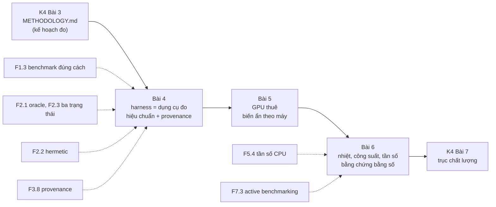
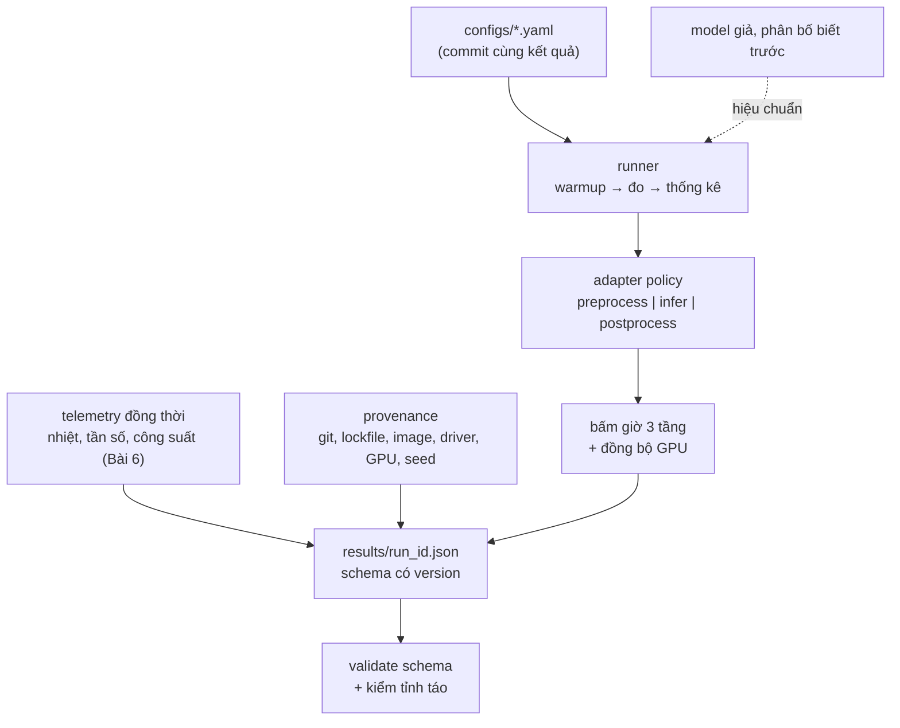
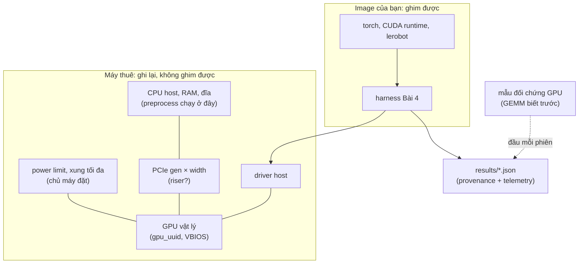
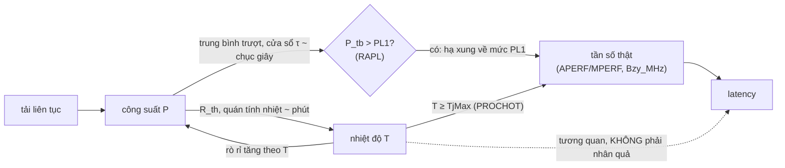

# Khóa 4 · Module 2 — Harness (14h)

Bài 4 (5h) · Bài 5 (5h) · Bài 6 (4h). Nguồn xương sống: `khoa-4-benchmark-edge.md`, Module 2.

Module 1 viết ra **kế hoạch đo** (`METHODOLOGY.md`, Bài 3). Module này dựng **dụng cụ đo** và dùng nó lần đầu trên phần cứng thật. Ba câu hỏi theo thứ tự: dụng cụ có đo đúng không (Bài 4, hiệu chuẩn trên model giả); trên một máy mình không kiểm soát, con số có thuộc về model không (Bài 5, GPU thuê); và làm sao chứng minh với người lạ rằng nhiệt và giới hạn công suất không lẫn vào con số (Bài 6). Khi Bài 3 đã định nghĩa một khái niệm (warmup, steady state, coordinated omission, A/A, CI của percentile, quy tắc ba trạng thái), module này trỏ về đó và chỉ dạy phần mới.



---

## Bài 4 — Thiết kế harness (5h)

> **Vị trí:** K4 Bài 3 (methodology) → **Bài 4** → K4 Bài 5 (GPU thuê) · **Cần trước:** F1.3 (benchmark đúng cách), F2.1 (bài toán oracle), F2.2 (tái lập, hermetic), F2.3 (phán quyết ba trạng thái), F3.8 (provenance), F3.2 (schema evolution, cho JSON output); K4 Bài 2 (n cho p99), Bài 3 · **Sau bài này bạn quyết định được:** harness của bạn đã được phép đo model thật chưa. Điều kiện: nó qua bài test hiệu chuẩn có dung sai **rút từ phân bố lấy mẫu** (không đặt tay), và mỗi trường trong JSON kết quả đã được xếp vào một trong ba loại: đóng băng, ghi lại, hay chặn bằng ngưỡng.

**Câu hỏi của bài (bản gốc):** làm sao để người khác chạy lại được bằng một lệnh?

### 1. Câu chuyện — ai đã khổ vì chuyện này

Khi MLCommons dựng MLPerf Inference, họ không chỉ định nghĩa model và tập dữ liệu. Họ bắt mọi bài nộp phải dùng chung một thư viện sinh tải và ghi log tên là **LoadGen** `[chuẩn — repo mlcommons/inference, thư mục loadgen]`. LoadGen quyết định khi nào gửi query (theo kịch bản SingleStream, Server, Offline), bấm giờ ở đâu, và ghi log theo định dạng cố định để kiểm toán. Lý do rất thực tế: nếu mỗi đội tự viết vòng đo, mỗi đội sẽ bấm giờ một đoạn khác nhau, gửi tải theo một nhịp khác nhau, và bảng xếp hạng thành bảng so các harness chứ không còn so phần cứng.

Ở quy mô nhỏ hơn, Victor Stinner (core developer CPython) viết một loạt bài năm 2016 về chuyện benchmark của CPython cho số nhảy lung tung giữa các lần chạy trên cùng một máy. Từ đó ra đời module `perf`, sau đổi tên thành `pyperf` `[chuẩn — tài liệu pyperf]`. `pyperf` chạy nhiều tiến trình worker riêng, tự hiệu chuẩn số vòng lặp, và tự ghi metadata vào kết quả: model CPU, tần số, governor, các nhân bị cô lập. Nó còn có lệnh `pyperf system tune` để đưa máy về trạng thái ít nhiễu. Bài học chung của hai câu chuyện: **harness là một dụng cụ đo**. Dụng cụ đo phải được hiệu chuẩn trước khi dùng. Mỗi con số nó in ra phải mang theo đủ ngữ cảnh để người khác biết con số đó thuộc chế độ máy nào.

### 2. Mô hình tư duy

Một harness có bốn tính chất. Thiếu tính chất nào thì con số hỏng theo một kiểu riêng:



1. **Đã hiệu chuẩn.** Trước khi đo thứ chưa biết, bạn đo một thứ đã biết đáp án. Model giả có phân bố latency biết trước. Harness phải trả lại đúng phân bố đó, trong dung sai mà **chính phép lấy mẫu** cho phép, và phải báo được overhead của nó. Đây là bài toán oracle (→ F2.1) áp vào chính dụng cụ: harness là một bài test, và bài test cũng có tỉ lệ báo sai.
2. **Mỗi con số mang ngữ cảnh của nó (provenance, → F3.8).** Một p50 không kèm git SHA, lockfile, image digest, driver, model GPU, power limit, tần số và nhiệt là một con số không truy ngược được. Hai người cãi nhau về 95 ms và 140 ms (Bài 3, tự kiểm 2) chỉ giải quyết được bằng cách so khối ngữ cảnh.
3. **Chạy lại không phá kết quả cũ, nhưng phân biệt "cùng thí nghiệm" với "lặp lại".** Idempotent ở đây nghĩa là: cùng config, cùng code, cùng số phiên thì không chạy lại và không ghi đè. Một phiên A/A mới (Bài 3) là một **thí nghiệm khác**, nên số phiên phải nằm trong khóa idempotency. Nếu không, harness sẽ âm thầm bỏ qua đúng phép lặp mà methodology đòi.
4. **Ranh giới thời gian rõ ràng.** Ba tầng `t_preprocess`, `t_inference`, `t_postprocess` cộng lại thành end-to-end. Trên GPU, lệnh gọi kernel là bất đồng bộ: CPU đẩy lệnh vào hàng đợi rồi chạy tiếp. Đồng hồ CPU đặt ngay sau lời gọi model đo **thời gian xếp hàng lệnh**, không đo thời gian GPU làm việc:

```
CPU (Python) |a-pre-|b enqueue k1 k2 k3 ... kN |c_SAI  ............ đợi ......... |sync|c_ĐÚNG
GPU stream          |       |  k1  |  k2  |  k3  | ...                     |  kN  |
             a = trước preprocess   b = trước infer   c_SAI = ngay sau lời gọi (chỉ đo enqueue)
             c_ĐÚNG = sau torch.cuda.synchronize() hoặc dùng cặp CUDA event ghi trên cùng stream
```

Lõi harness tối thiểu dưới đây chạy trên laptop, không cần GPU. Nó có model giả nhớ thời lượng nó *định* chạy ở mỗi lần gọi, nhờ vậy bạn so được **từng cặp mẫu** (đo được − định) chứ không chỉ so percentile. Nó có tùy chọn `spin` (busy-wait) để tách sai số của bộ hẹn giờ OS khỏi sai số của harness:

```python
# [đã chạy] mini_bench.py — lõi harness: 3 tầng thời gian, JSON có provenance, idempotent theo run_id
import hashlib, json, os, platform, subprocess, sys, time
import numpy as np

def git_sha():
    try:
        return subprocess.run(["git", "rev-parse", "HEAD"], capture_output=True, text=True, timeout=5).stdout.strip() or None
    except Exception:
        return None

class FakePolicy:                       # model giả có phân bố BIẾT TRƯỚC, nhớ thời lượng nó định chạy
    def __init__(self, mu=0.100, sd=0.005, seed=0, spin=False):
        self.rng, self.mu, self.sd, self.spin, self.intended = np.random.default_rng(seed), mu, sd, spin, []
    def preprocess(self, obs):  return obs
    def infer(self, x):
        d = max(0.0, self.rng.normal(self.mu, self.sd)) if self.mu > 0 else 0.0
        self.intended.append(d * 1e3)
        if self.spin:                                         # busy-wait: không phụ thuộc bộ hẹn giờ của OS
            end = time.perf_counter() + d
            while time.perf_counter() < end: pass
        elif d: time.sleep(d)
        return x
    def postprocess(self, y):   return y

def run(cfg, policy, out_dir="results"):
    sha = git_sha()
    run_id = hashlib.sha256((json.dumps(cfg, sort_keys=True) + (sha or "nogit")).encode()).hexdigest()[:12]
    path = os.path.join(out_dir, f"{run_id}.json")
    if os.path.exists(path):                                  # idempotent: có rồi thì không chạy, không ghi đè
        with open(path) as f: return json.load(f)
    t = {k: [] for k in ("preprocess", "inference", "postprocess", "end_to_end")}
    clk = time.perf_counter_ns
    for i in range(cfg["warmup_iters"] + cfg["measured_iters"]):
        a = clk(); x = policy.preprocess(i)
        b = clk(); y = policy.infer(x)        # GPU thật: synchronize hoặc CUDA event TRƯỚC khi lấy c
        c = clk(); policy.postprocess(y)
        d = clk()
        if i >= cfg["warmup_iters"]:
            for k, v in zip(t, (b - a, c - b, d - c, d - a)): t[k].append(v / 1e6)
    q = lambda v: {**{f"p{p}": round(float(np.percentile(v, p)), 4) for p in (50, 95, 99)}, "max": round(max(v), 4)}
    res = {"schema_version": "1.1", "run_id": run_id, "status": "ok",
           "timestamp_utc": time.strftime("%Y-%m-%dT%H:%M:%SZ", time.gmtime()), "config": cfg,
           "n": cfg["measured_iters"], "env": {"git_commit": sha, "python": sys.version.split()[0],
           "numpy": np.__version__, "os": platform.platform(), "timer": "perf_counter_ns"},
           "latency_ms": {k: q(v) for k, v in t.items()},
           "raw_ms": {k: [round(x, 4) for x in v] for k, v in t.items()},          # giữ mẫu thô
           "intended_ms": [round(x, 4) for x in policy.intended[cfg["warmup_iters"]:]],
           "telemetry": None, "quality": None}
    os.makedirs(out_dir, exist_ok=True)
    with open(path + ".tmp", "w") as f: json.dump(res, f)
    os.replace(path + ".tmp", path)                           # ghi nguyên tử: không bao giờ có file dở
    return res

if __name__ == "__main__":
    base = {"model": "fake", "warmup_iters": 20, "measured_iters": 200, "mu_s": 0.1, "sd_s": 0.005, "session": 1}
    null = run({**base, "model": "null", "measured_iters": 2000}, FakePolicy(mu=0))
    print("overhead e2e (null, ms):", null["latency_ms"]["end_to_end"])
    for spin in (False, True):
        r = run({**base, "spin": spin}, FakePolicy(spin=spin))
        diff = np.array(r["raw_ms"]["inference"]) - np.array(r["intended_ms"])   # so CẶP từng mẫu
        print(f"spin={spin}: {r['latency_ms']['inference']} | đo - định: median {np.median(diff):.3f}, max {diff.max():.3f} ms")
```

Ba chi tiết thiết kế đáng để ý. `run_id` là hash của config cộng git SHA, và config có trường `session`. Ghi file qua `.tmp` rồi `os.replace` nên một lần chạy bị giết giữa chừng không để lại file kết quả dở. Mẫu thô (`raw_ms`) được giữ lại, vì percentile tính lại được từ mẫu thô còn mẫu thô không tính lại được từ percentile.

### 3. Cầu nối từ backend

**Tên chuẩn của thứ bạn đã làm.** Harness AI của bạn đã có gần đủ các bộ phận. Thứ còn thiếu chủ yếu là lý thuyết về sai số của **chính** các bộ phận đó:

| Bạn đã làm | Tên chuẩn | Chỗ còn thiếu khi sang đây | Học ở |
|---|---|---|---|
| Dựng môi trường local tái tạo được các service | Hermetic environment: lockfile, image theo digest, seed | Container chỉ ghim userland. Kernel, driver GPU, firmware, microcode, giới hạn công suất do BIOS hay chủ máy đặt **không nằm trong image**. Những thứ đó phải được **ghi lại** (provenance), vì bạn không ghim được | F2.2, F3.8; K4 Bài 14 |
| Script chấm pass/fail/inconclusive, phần deterministic | Oracle, phán quyết ba trạng thái | Ngưỡng "inconclusive" phải **đo được** từ A/A (Bài 3), không đặt tay. Bản thân bài test hiệu chuẩn cũng có tỉ lệ đánh trượt oan, và bạn phải tính tỉ lệ đó (phần 5) | F2.1, F2.3 |
| Phần chấm có model AI review | LLM-as-judge | Judge phải được hiệu chuẩn với nhãn người (kappa) trước khi tin. Nó không được làm oracle cho **con số**; con số phải có kiểm tỉnh táo tất định (bậc độ lớn, Bài 2) | F2.8 |
| Server mock tự tạo bộ test chuẩn | Test double có đáp án biết trước. Trong đo lường gọi là **mẫu chuẩn** (reference standard) hay **mẫu đối chứng** (control sample) | Mock của bạn kiểm hành vi đúng/sai. Ở đây model giả kiểm **sai số của phép đo**, nên nó phải có phân bố biết trước, và chính nó cũng có sai số (bộ hẹn giờ OS) | F2.4, F1.1 |
| Đo trên host "yên tĩnh" | Cô lập nhiễu, active benchmarking | "Yên tĩnh" phải được chứng minh bằng telemetry lưu **cùng file** kết quả (Bài 6) | F1.3, F7.3 |
| Pipeline agent chạy → test → sửa → deploy → báo cáo | Lineage: mỗi artifact truy ngược được tới code, input, tham số | Báo cáo benchmark là một artifact. Thiếu `git_dirty`, hash lockfile hay hash tập input thì không tái tạo được | F3.8 |

| Backend bạn biết | Ở đây | Gãy ở chỗ | Nếu dùng nhầm thì |
|---|---|---|---|
| Idempotency key của API thanh toán | `run_id` = hash(config, code, session) | Backend: cùng key thì cùng **hiệu ứng**. Benchmark: chạy lại cùng config **không bao giờ** ra cùng số. Khóa phải tách "cùng thí nghiệm" (bỏ qua) với "lặp lại có chủ đích" (phiên mới) | Khóa thiếu `session` thì A/A bị bỏ qua lặng lẽ. Khóa thiếu git SHA thì sửa bug harness xong vẫn đọc kết quả cũ |
| Retry tự động khi request lỗi | Resume khi máy spot bị thu hồi | Resume giữa một ô đo sẽ trộn hai phiên (máy khác, nhiệt khác) vào một phân bố | p99 của một ô là hỗn hợp hai máy. Resume theo **ô**: ô dở thì bỏ, chạy lại trọn ô |
| Structured logging (JSON log) | JSON kết quả có schema version | Log được đọc bởi người hoặc truy vấn khi cần; kết quả ở đây được **so sánh qua thời gian**, nên đổi tên trường là phá so sánh | Đổi `latency` thành `latency_ms` không tăng version: script Pareto (Bài 9) âm thầm đọc `null` |
| Feature flag / config service | Config bằng file commit cùng kết quả | Flag backend đổi lúc chạy và không cần lưu lịch sử. Config benchmark là **một phần của kết quả** | Có số mà không biết chạy bằng `solver_steps` bao nhiêu |
| Đo latency của handler HTTP | Bấm giờ quanh lời gọi model | Handler đồng bộ: trả về là xong. Lời gọi CUDA trả về khi lệnh **mới vào hàng đợi** | Đo ra vài ms cho model trăm triệu tham số và tin đó là tốc độ |

**Chấm mô hình:**

- *"Harness chạy xong, ra JSON đúng schema, test xanh → số đúng."* → **SAI.** Schema đúng chỉ nói về **hình dạng** dữ liệu, không nói về sai số của phép đo. Phản ví dụ, đã chạy (phần 6): model giả dùng `time.sleep` cho p50/p95/p99 rơi trong dải dung sai, test percentile báo PASS. Vậy mà từng mẫu đo dài hơn thời lượng định ngủ một khoảng hệ thống, do bộ hẹn giờ của OS. Chỉ phép so **cặp** (đo − định) mới lộ ra khoảng lệch đó. Dụng cụ chưa được hiệu chuẩn bằng một phép so đủ nhạy thì chưa được dùng.
- *Vốn của bạn: "vừa deterministic vừa có model AI review"*, áp vào benchmark thành "để LLM đọc JSON và quyết định kết quả có hợp lý không" → **ĐÚNG MỘT PHẦN.** Đúng: LLM rất hợp để kiểm **checklist methodology** (có đủ trường provenance không, có mục "cái tôi không đo" không, câu chữ có nói quá dữ liệu không). Gãy: LLM không phải oracle cho con số. Phản ví dụ: một JSON SmolVLA trên GPU báo p50 vài ms vì quên đồng bộ CUDA. Judge không có phép tính cận dưới (Bài 2, Đề 2) sẽ có lý do nghe rất hợp lý để chấp nhận ("GPU hiện đại rất nhanh"). Một luật tất định "lệch hơn một bậc so với bảng mốc thì FAIL" bắt được ngay. Thứ tự đúng: kiểm tất định trước, LLM review sau, và LLM review phải được hiệu chuẩn trên một tập JSON đã gán nhãn tay (→ F2.8).
- *"Đóng gói Docker là tái lập rồi."* → **ĐÚNG MỘT PHẦN.** Đúng cho thư viện Python và CUDA runtime trong image. Gãy: container dùng **driver của host**, kernel của host, power limit do chủ máy đặt. Phản ví dụ: cùng một image chạy trên hai máy thuê, một máy driver cũ hơn và power limit bị hạ. Image digest giống hệt nhau, số khác nhau, và nếu JSON không ghi driver với power limit thì không ai giải thích được. Bài 14 làm cụ thể việc này bằng `capture_env.py` (khối `env`).

### 4. Thuật ngữ

| Mức | Thuật ngữ | Nghĩa trong một câu | Hay bị hiểu nhầm thành |
|---|---|---|---|
| 🟢 | Harness | Chương trình điều khiển phép đo: nạp config, chạy, bấm giờ, ghi kết quả có ngữ cảnh | Script chạy model |
| 🟢 | Hiệu chuẩn (calibration) | So dụng cụ với một chuẩn đã biết để biết sai số của nó | Chạy thử cho chắc |
| 🟢 | Overhead của harness | Thời gian harness tự tốn ngoài phần được đo; đo bằng policy rỗng | Số không đáng kể, khỏi đo |
| 🟢 | Provenance | Thông tin đủ để truy một kết quả về code, input, môi trường đã tạo ra nó | Metadata cho đẹp |
| 🟢 | Idempotent (ở đây) | Cùng (config, code, phiên) thì không chạy lại, không ghi đè | Chạy lại ra cùng số |
| 🟢 | Resumable theo ô | Đứt giữa ma trận thì chạy tiếp các ô chưa xong; ô dở thì bỏ | Chạy tiếp từ iteration dở |
| 🟢 | Ba tầng thời gian | `t_preprocess`, `t_inference`, `t_postprocess` và tổng end-to-end | Một con số "latency" |
| 🟢 | Đồng bộ GPU | `torch.cuda.synchronize()` hoặc cặp CUDA event để đồng hồ chờ GPU làm xong | Tùy chọn cho chính xác hơn |
| 🟡 | Ghi nguyên tử (atomic write) | Ghi file tạm rồi đổi tên một lần, nên không bao giờ có file dở | Ghi thẳng rồi `flush` |
| 🟡 | Schema version | Số hiệu của hợp đồng định dạng kết quả, tăng khi đổi tương thích | Ghi cho có |
| 🟡 | Mẫu đối chứng (control sample) | Mẫu biết trước đáp án, chạy kèm mỗi lô đo để phát hiện dụng cụ trôi | Test một lần lúc viết code |
| 🔴 | JSON Schema đầy đủ, `$ref`, draft | Chuẩn mô tả schema; dùng một tập con nhỏ là đủ | Cần học trọn trước khi dùng |

### 5. Dự đoán

Không chạy code ở phần 2 trước khi viết xong các dự đoán dưới đây vào `notes/prediction-b4.md` và commit.

**Đề 1 — Dung sai của bài test hiệu chuẩn.** Model giả: latency ~ N(100 ms, 5 ms), n = 200 (đúng bản gốc). Một harness **hoàn hảo** vẫn trả về p50/p95/p99 dao động từ lần chạy này sang lần chạy khác, vì đó là ước lượng từ 200 mẫu. Hãy tính dải chứa 99% số lần chạy của một harness hoàn hảo cho từng percentile. Phương pháp: sai số chuẩn của percentile mẫu thứ p xấp xỉ σ·√(p(1−p)/n) / φ(z_p), trong đó z_p là phân vị chuẩn tắc và φ là mật độ chuẩn tắc. Lấy ±2,58 lần sai số chuẩn. Kiểm lại bằng Monte Carlo (script `tolerance.py` ở phần 6).

**Đề 2 — Dung sai "đẹp" đặt tay.** Một bản hướng dẫn khác đặt dải chấp nhận p50 ∈ [99,0; 101,0], p95 ∈ [107,0; 109,5], p99 ∈ [110,5; 113,5]. Dự đoán: harness **hoàn hảo** bị dải này đánh trượt bao nhiêu phần trăm số lần, ở từng percentile?

**Đề 3 — Bộ hẹn giờ của OS là một phần của model giả.** `time.sleep(d)` thường ngủ lâu hơn d. Trên Linux, timer slack mặc định của luồng thường là 50 µs `[chuẩn — man prctl, PR_SET_TIMERSLACK]`. Cộng thêm độ trễ đánh thức của bộ lập lịch. Dự đoán trung vị của (đo − định) trên máy bạn cho `sleep` và cho `spin`.

**Đề 4 — Overhead.** Với policy rỗng, end-to-end p50 của harness ở thang nào: ns, µs hay ms? Tra độ phân giải đồng hồ bằng `python -c "import time; print(time.get_clock_info('perf_counter'))"`.

**Đề 5 — Phép so nào nhạy hơn.** Giả sử harness có một lỗi cộng thêm 0,4 ms vào mỗi mẫu. Test percentile (Đề 1) và test cặp (trung vị của đo − định) — test nào bắt được lỗi này ở n = 200? Lập luận bằng sai số chuẩn của từng phép so.

```markdown
# prediction-b4.md — commit trước khi chạy
## Đề 1: dải 99% của harness hoàn hảo, n=200, N(100,5)
| Percentile | Giá trị thật | Dải dưới | Dải trên | Cách tính |
| p50 | | | | |
| p95 | | | | |
| p99 | | | | |
## Đề 2: tỉ lệ đánh trượt oan của dải đặt tay
p50: ...%   p95: ...%   p99: ...%   (lý do: ...)
## Đề 3: trung vị (đo − định): sleep = ... ms, spin = ... ms (máy: ..., OS: ...)
## Đề 4: overhead p50 ≈ ... (thang: ns/µs/ms), độ phân giải perf_counter = ...
## Đề 5: test bắt được lỗi +0,4 ms: percentile / cặp / cả hai / không cái nào, vì ...
```

### 6. Làm

Giữ ba bước của bản gốc. Bước 1 và 2 được chia nhỏ. Thời gian gợi ý cho 5h: thiết kế và viết harness 2,5h; hiệu chuẩn 1,5h; ba phiên và kiểm idempotent 1h.

**Bước 1 — Viết harness theo sáu yêu cầu của bản gốc.**

1. **Một lệnh chạy được:** `python bench.py --config configs/smolvla_a100.yaml`. Không có bước thủ công nào.
2. **Cấu hình bằng file, không bằng flag.** File config được commit cùng kết quả. Băm config (sha256) và ghi hash vào JSON.
3. **Output JSON có schema** và có `schema_version`. Dùng lại tư duy schema versioning của Khóa 2 (→ F3.2): thêm trường thì tăng minor, đổi nghĩa hoặc đổi tên thì tăng major.
4. **Ghi toàn bộ ngữ cảnh vào output**, không chỉ số đo: phiên bản thư viện, commit hash, nhiệt độ trước, trong và sau, tải nền, thời điểm chạy. Danh sách đầy đủ ở schema bên dưới.
5. **Idempotent và resumable.** Benchmark dài có thể đứt. Chạy lại không được ghi đè kết quả cũ. Khóa idempotency gồm config, git SHA và **số phiên**. Resume theo ô của ma trận, không resume giữa một ô.
6. **Tách rõ ba tầng thời gian** `t_preprocess` (chuẩn bị input, kể cả copy host→device), `t_inference` (chỉ forward pass, có đồng bộ GPU), `t_postprocess` (decode ra action, un-normalize). Báo cả ba và tổng. Ghi ranh giới vào `METHODOLOGY.md` mục "Kịch bản tải" (Bài 3), kể cả hàm được bấm giờ (`predict_action_chunk`, Bài 1).

Schema đề xuất `1.1`. Nó giữ mọi trường của bản gốc và thêm các trường provenance. Trường ghi `<...>` là chỗ Bài 5 và Bài 14 điền thật:

```json
{
  "schema_version": "1.1",
  "run_id": "<sha256(config + git_commit)[:12]>",
  "cell": {"model": "smolvla_base", "precision": "fp16", "batch_size": 1, "target": "rtx4090"},
  "session": 2,
  "status": "ok",
  "reason": "",
  "timestamp_utc": "<ISO 8601>",
  "model": {"name": "lerobot/smolvla_base", "params": 450000000, "revision": "<HF commit sha>"},
  "config": {"precision": "fp16", "batch_size": 1, "solver_steps": 10, "chunk_size": 50,
             "warmup_iters": 20, "measured_iters": 400, "seed": 0,
             "timed_fn": "predict_action_chunk", "load": "closed_loop",
             "input_set": {"name": "k2_obs50", "sha256": "<hash tập observation>"},
             "config_sha256": "<hash file yaml>"},
  "provenance": {"git_commit": "<sha>", "git_dirty": false, "lockfile_sha256": "<sha256 uv.lock>",
                 "image_digest": "sha256:<...>", "harness_version": "<tag>"},
  "env": {"gpu_name": "<...>", "gpu_uuid": "<...>", "vbios": "<...>", "driver": "<...>",
          "cuda_driver_max": "<CUDA Version nvidia-smi in ra>", "torch": "<...>", "torch_cuda": "<...>",
          "power_limit_w": 0, "clocks_max_sm_mhz": 0, "pcie_link": "<gen x width>",
          "mig_mode": "<...>", "virtualization_mode": "<...>",
          "cpu_model": "<...>", "kernel": "<...>", "governor": "<...>", "pl1_w": null, "pl2_w": null},
  "timer": {"cpu": "perf_counter_ns", "gpu": "cuda_event", "sync": "synchronize_before_stop",
            "clock_resolution_ns": 0, "harness_overhead_ms_p50": 0.0},
  "n": 400,
  "latency_ms": {
    "preprocess":  {"p50": 0.0, "p95": 0.0, "p99": 0.0, "max": 0.0},
    "inference":   {"p50": 0.0, "p50_ci95": [0.0, 0.0], "p95": 0.0, "p99": 0.0, "max": 0.0},
    "postprocess": {"p50": 0.0, "p95": 0.0, "p99": 0.0, "max": 0.0},
    "end_to_end":  {"p50": 0.0, "p95": 0.0, "p99": 0.0, "max": 0.0}
  },
  "raw_ms": {"inference": [], "end_to_end": []},
  "memory": {"peak_vram_allocated_mb": 0, "peak_vram_reserved_mb": 0, "peak_ram_mb": 0},
  "thermal": {"temp_start_c": 0, "temp_max_c": 0, "temp_end_c": 0, "throttled": false,
              "throttle_evidence": "<turbostat Bzy_MHz/PkgWatt | nvidia-smi clocks event reasons>"},
  "telemetry": {"period_s": 1.0, "t_mono_s": [], "temp_c": [], "clock_mhz": [], "power_w": [], "reasons": []},
  "quality": null,
  "notes": ""
}
```

Vì sao từng nhóm trường tồn tại:

| Nhóm | Loại (→ K4 Bài 14) | Trả lời câu hỏi |
|---|---|---|
| `config`, `config_sha256`, `seed`, `input_set.sha256` | Đóng băng | Chạy **cái gì**, với input nào |
| `provenance` (git, `git_dirty`, lockfile, image digest) | Đóng băng | Bằng **code** nào. `git_dirty = true` thì kết quả không tái tạo được, nên đánh dấu |
| `env` (driver, GPU UUID, power limit, PL1/PL2, governor) | Ghi lại, vì không ghim được | Trên **máy** nào, ở chế độ nào. `gpu_uuid` cho biết hai phiên có cùng một card vật lý không |
| `timer` | Ghi lại | Đồng hồ nào, đã đồng bộ chưa, sai số của chính dụng cụ |
| `telemetry` (chuỗi theo thời gian, **cùng file**) | Ghi lại | Con số có bị nhiệt, công suất, tần số làm bẩn không (Bài 6) |
| `status`, `reason` | — | Ô không đo được thì vẫn là một dòng dữ liệu (K4 Bài 10 mở rộng danh sách status) |
| `quality: null` | — | Đặt sẵn chỗ cho Module 3: benchmark chưa xong |

Lưu ý hai trường hay bị nhầm. `CUDA Version` mà `nvidia-smi` in ra là phiên bản CUDA **cao nhất driver hỗ trợ**, không phải CUDA runtime mà PyTorch dùng (`torch.version.cuda`) `[chuẩn]`. Ghi cả hai. `measured_iters` của bản gốc là 200. Bài 3 đã tính rằng p99 cần ít nhất 368 mẫu mới có cận trên. Vì vậy với model thật, dùng ≥ 400 nếu bạn báo p99. Nếu giữ 200, ghi p99 thành "max (n=200)".

**Bước 2 — Viết test hiệu chuẩn với model giả** (bản gốc: hàm `sleep` có phân bố biết trước; kiểm harness báo đúng phân vị).

1. Chạy `mini_bench.py` ở phần 2, hoặc gắn `FakePolicy` vào harness thật của bạn qua đúng interface adapter mà model thật sẽ dùng.
2. **Đo overhead**: policy rỗng, n = 2000, lấy end-to-end. Ghi vào `timer.harness_overhead_ms_p50`.
3. **Ghi độ phân giải đồng hồ** bằng `time.get_clock_info('perf_counter')`. Với GPU ở Bài 5: CUDA event có độ phân giải khoảng 0,5 µs `[spec — CUDA Runtime API, cudaEventElapsedTime]`.
4. **Test percentile**, với dung sai rút từ phân bố lấy mẫu:

```python
# [đã chạy] tolerance.py — p50/p95/p99 của n mẫu từ phân bố ĐÃ BIẾT dao động bao nhiêu? Dùng: python tolerance.py results/<run_id>.json
import json, sys
import numpy as np
from scipy import stats

mu, sd, n, reps = 100.0, 5.0, 200, 20000
rng = np.random.default_rng(42)
true = {p: mu + sd * stats.norm.ppf(p / 100) for p in (50, 95, 99)}
samples = rng.normal(mu, sd, (reps, n))
band = {}
for p in (50, 95, 99):
    est = np.percentile(samples, p, axis=1)
    lo, hi = np.percentile(est, [0.5, 99.5])          # dải 99%: harness ĐÚNG rơi ngoài 1% số lần
    band[p] = (lo, hi)
    print(f"p{p}: thật = {true[p]:6.2f} ms | dải 99% của ước lượng (n={n}) = {lo:6.2f} .. {hi:6.2f} ms")

# Dung sai "đẹp" đặt tay: harness ĐÚNG bị đánh trượt bao nhiêu phần trăm số lần?
gem = {50: (99.0, 101.0), 95: (107.0, 109.5), 99: (110.5, 113.5)}
for p, (lo, hi) in gem.items():
    est = np.percentile(samples, p, axis=1)
    print(f"p{p}: dải {lo}..{hi} ms đánh trượt harness đúng {np.mean((est < lo) | (est > hi)):.1%} số lần")

# Áp vào một kết quả thật của mini_bench.py: so dải
if len(sys.argv) > 1:
    r = json.load(open(sys.argv[1]))["latency_ms"]["inference"]
    for p in (50, 95, 99):
        lo, hi = band[p]; v = r[f"p{p}"]
        print(f"đo p{p} = {v:7.2f} ms -> {'PASS' if lo <= v <= hi else 'NGOÀI DẢI'} (lệch tâm {v - true[p]:+.2f} ms)")
```

5. **Test cặp**: trung vị và max của (đo − định) cho `sleep` và `spin`. Đây là phép so nhạy hơn (Đề 5). Đặt ngưỡng cho nó **sau khi** đã đo `spin` trên máy bạn ba lần, theo tinh thần A/A: ngưỡng = mức lệch mà harness đúng thường cho.
6. Viết hai test này thành test tự động (pytest hoặc tương đương). Cho chúng chạy trong CI, và chạy **ở đầu mỗi phiên đo** như một mẫu đối chứng (Bài 5).

**Bước 3 — Chạy harness với model giả 3 lần, kiểm tính ổn định** (bản gốc).

1. Chạy ba phiên `session: 1, 2, 3`, mỗi phiên một tiến trình mới. So p50 của ba phiên. Đây là A/A của **chính harness** (Bài 3). Nó cho bạn sàn nhiễu thấp nhất có thể, vì model giả không có nhiệt hay cache.
2. **Kiểm idempotent:** chạy lại `session: 1`. Harness phải đọc file có sẵn, không đo lại. Sửa một dòng code harness rồi commit: `run_id` phải đổi, nghĩa là chạy mới.
3. **Kiểm resumable:** chạy một ma trận 4 ô, giết tiến trình (Ctrl+C) giữa ô thứ 3. Chạy lại lệnh cũ: ô 1–2 bỏ qua, ô 3 chạy lại từ đầu, không còn file `.tmp` nào sót lại thành kết quả.
4. Validate mọi JSON trong `results/` theo schema. Có thể dùng thư viện `jsonschema` (cài bằng pip, ghim phiên bản trong lockfile), hoặc một hàm kiểm tay danh sách trường bắt buộc.

**Sai số của dụng cụ ở bài này:** độ phân giải đồng hồ (thang 100 ns trên Windows QPC, thang ns trên Linux `[tự đo]`); độ trễ đánh thức của `sleep` (nằm trong model giả, không phải lỗi harness); overhead Python của chính vòng đo. Không có phép đo vật lý nào.

### 7. Số phải ra

<details><summary>🔒 MỞ SAU KHI COMMIT prediction.md</summary>

**Ngưỡng của bản gốc** (giữ nguyên), với model giả `sleep(0.1)` cộng nhiễu Gaussian σ = 5 ms, 200 iteration:

| Chỉ số | Giá trị đúng (bản gốc) | Dải 99% của harness hoàn hảo, n = 200 (Monte Carlo, `[đã chạy]`) |
|---|---|---|
| p50 | ≈ 100 ms | 98,87 – 101,13 ms |
| p95 | ≈ 108 ms (đúng: 100 + 1,645·5 = 108,22) | 106,29 – 110,06 ms |
| p99 | ≈ 112 ms (đúng: 100 + 2,326·5 = 111,63) | 108,49 – 114,66 ms |
| Overhead của chính harness | **< 1 ms, và phải được đo và ghi lại** | — |

**Đề 2 — dải đặt tay đánh trượt harness hoàn hảo:** p50 2,4%; p95 9,2%; p99 **33,3%**. Một phần ba số lần, một harness không có lỗi nào bị gọi là hỏng. Ở n = 200, p99 thực chất là mẫu lớn thứ hai hoặc thứ ba, nên dao động của nó lớn hơn nhiều so với cảm giác. Đây là F2.1 áp vào chính bài test: dải chấp nhận phải đến từ phân bố lấy mẫu.

**Phần 2 và Đề 3–5 — chạy trên máy soạn bài** (Windows, Python 3.12; máy bạn sẽ khác):

| Đo | sleep | spin |
|---|---|---|
| inference p50 / p95 / p99 (ms) | 100,52–100,88 / 108,39–109,27 / 110,45–111,85 (ba lần chạy) | 100,28–100,34 / 108,24–108,27 / 110,05–110,19 |
| Test percentile (dải 99%) | PASS | PASS |
| Trung vị (đo − định) | 0,37–0,45 ms | ~0,02 ms |
| Max (đo − định) | 1,5–9 ms | 0,08–3,4 ms (OS chiếm CPU) |
| Overhead e2e, policy rỗng | p50 ≈ 0,2 µs; max ≈ 13 µs | — |

Đọc bảng:
- **Test percentile PASS cả hai**, dù bản `sleep` lệch hệ thống khoảng 0,4 ms mỗi mẫu. Sai số chuẩn của p50 ở n = 200 khoảng 0,44 ms (1,2533·5/√200), nên một lệch 0,4 ms chìm trong dao động lấy mẫu. **Test cặp** loại được dao động đó, vì cùng một mẫu xuất hiện ở cả hai vế. Độ tản của (đo − định) chỉ cỡ chục µs, nên lệch 0,4 ms hiện rõ. Trả lời Đề 5: chỉ test cặp bắt được.
- Bản `spin` p99 = 110,05–110,19 ms rơi **ngoài** dải đặt tay [110,5; 113,5] ở cả ba lần chạy. Một harness đúng, model giả đúng, vẫn bị đánh trượt.
- Lệch của `sleep` thuộc về model giả (bộ hẹn giờ của OS), không thuộc về harness. Trên Linux, kỳ vọng lệch nhỏ hơn Windows, cỡ 50–100 µs `[ước lượng — timer slack 50 µs + độ trễ đánh thức; tự đo]`. Hệ quả: các giá trị "đúng" 100/108/112 của bản gốc chỉ đúng khi model giả không có sai số riêng. Dùng `spin` hoặc test cặp nếu muốn kiểm harness ở mức sub-ms.
- Overhead thang µs, nhỏ hơn ngưỡng 1 ms khoảng ba bậc. Với model thật trên GPU, overhead lớn hơn: đồng bộ, copy, Python quanh lời gọi. Đo lại ở Bài 5 bằng policy rỗng đặt trên GPU.

**Ba phiên model giả (Bước 3):** với `spin`, p50 ba phiên lệch nhau cỡ 0,1%. Đó là sàn: model thật không thể ổn định hơn chính harness. Với `sleep`, lệch giữa phiên lớn hơn (0,3–0,4%) vì bộ hẹn giờ OS phụ thuộc tải nền.

</details>

### 8. Nếu ra khác

| Triệu chứng | Nguyên nhân khả dĩ | Kiểm bằng cách | Sửa |
|---|---|---|---|
| p95 ra ≈ 100 ms hoặc ≈ 120 ms | Công thức percentile sai: lấy sai cột, sắp xếp sai, percentile trên tập đã gộp warmup | In 5 mẫu thô đầu và cuối; tính lại bằng `np.percentile` trên `raw_ms` | Sửa; thêm test so với tính tay trên mảng nhỏ |
| p50 lệch đều +0,5 đến +2 ms, test cặp đỏ | Bộ hẹn giờ OS (`sleep`), power saving của laptop | Chạy `spin`; nếu `spin` sạch thì lỗi ở model giả | Dùng `spin` để hiệu chuẩn; ghi lệch `sleep` vào methodology |
| Max (đo − định) vài ms ở `spin` | OS chiếm CPU (ngắt, tiến trình khác) | Lặp lại lúc máy rảnh; xem có trùng thời điểm tác vụ nền không | Bình thường ở mức đuôi; đừng đặt ngưỡng cho max, đặt cho trung vị |
| Overhead > 1 ms | Ghi file hoặc in log **trong** vòng đo; gọi `nvidia-smi` đồng bộ trong vòng đo | Profile vòng đo bằng policy rỗng | Thu số vào list trong RAM, ghi sau; telemetry chạy ở tiến trình riêng |
| Chạy lại phiên 2 nhưng harness bỏ qua | Khóa idempotency thiếu `session` | In `run_id` của hai lần | Thêm `session` vào config |
| Sửa code harness mà kết quả cũ vẫn được dùng | `run_id` không gồm git SHA, hoặc code chưa commit | Kiểm `git_dirty` | Chặn chạy đo chính thức khi `git_dirty = true` |
| Sau khi giết tiến trình có file JSON hỏng | Ghi thẳng vào file đích | Mở file, `json.load` lỗi | Ghi `.tmp` rồi `os.replace` |
| `t_inference` của model GPU nhỏ bất thường, `t_postprocess` lớn bất thường | Thiếu đồng bộ: thời gian GPU "rơi" sang tầng sau, nơi `.cpu()` buộc đồng bộ | Thêm `synchronize()` trước mỗi lần lấy giờ; tổng e2e phải gần như không đổi | Đồng bộ ở ranh giới mỗi tầng (Bài 5) |

### 9. Câu hỏi ngược

1. **[Nếu…thì]** Nếu máy spot bị thu hồi khi ô fp16 đã chạy được 300/400 iteration, vì sao "resume từ iteration 301 trên máy mới" là sai, dù nghe giống retry rất hợp lý?
   <details><summary>Hướng nghĩ</summary>Hai đoạn của ô đến từ hai máy, hai chế độ nhiệt, có thể hai driver. Phân bố bạn báo là hỗn hợp, và p99 có thể đến hoàn toàn từ một máy. Đơn vị nguyên tử của benchmark là ô × phiên, không phải iteration. Retry trong backend hợp lý vì các request độc lập và có cùng ngữ nghĩa; mẫu latency thì phụ thuộc trạng thái máy.</details>
2. **[Quy mô]** K4 Bài 10 có 3 model × 4 precision × 2 target × 3 phiên = 72 file JSON, mỗi file vài nghìn mẫu thô và chuỗi telemetry. Sang K6 (eval hàng nghìn episode) và K7 (robot chạy mỗi ngày), số file tăng lên hàng chục nghìn. Cái gì gãy trước: dung lượng, tốc độ truy vấn "p99 theo driver", hay schema? Bạn chuyển sang gì?
   <details><summary>Hướng nghĩ</summary>Thường gãy trước là truy vấn chéo, vì phải mở hàng nghìn JSON lồng nhau. Hướng: JSON giữ làm bản ghi gốc bất biến, rồi có một bước ETL ra bảng columnar (Parquet) với một hàng mỗi ô × phiên và một bảng mẫu thô riêng, truy vấn bằng DuckDB (→ F3.6). Schema version lúc này trở thành điều kiện để ETL không âm thầm sai (→ F3.2, F3.7).</details>
3. **[Failure mode]** Harness qua mọi test hiệu chuẩn trên CPU với model giả. Kể hai cách nó vẫn báo sai khi gắn model thật trên GPU, mà model giả không bao giờ lộ ra.
   <details><summary>Hướng nghĩ</summary>(a) Đồng bộ GPU: model giả không có hàng đợi bất đồng bộ nên không bao giờ lộ lỗi thiếu `synchronize`. (b) Warmup phụ thuộc shape: model giả không có autotune. (c) Bộ nhớ: allocator giữ bộ nhớ đệm, nên peak VRAM theo `nvidia-smi` khác peak theo `max_memory_allocated`. Cách đóng lỗ: thêm một model giả **trên GPU**, ví dụ một matmul có thời gian ổn định, đo bằng hai cách (CUDA event và `synchronize` + đồng hồ CPU) rồi so.</details>
4. **[Vì sao không]** Vì sao không dùng thẳng `pyperf` hay `pytest-benchmark` thay vì tự viết harness?
   <details><summary>Hướng nghĩ</summary>Chúng giải bài micro-benchmark: hàm nhanh, lặp nhiều, CPU. Ở đây một iteration tốn 0,1–10 s, có GPU bất đồng bộ, ba tầng thời gian, telemetry nhiệt đồng thời, trục chất lượng và ma trận ô × phiên. Mượn ý tưởng của chúng (worker riêng, metadata tự động, `system tune`) thì đúng. Ép bài toán vào khuôn của chúng thì mất đúng những thứ khóa này cần.</details>
5. **[Phản biện]** "Lưu mẫu thô trong JSON là thừa: p50/p95/p99 đã đủ, file nhẹ hơn." Dựng lập luận mạnh nhất cho phía này, rồi chỉ ra nó gãy ở câu hỏi nào bạn sẽ gặp ở Bài 6 và Bài 9.
   <details><summary>Hướng nghĩ</summary>Phía ủng hộ: file nhẹ, ít rủi ro rò dữ liệu nhạy cảm, đủ cho bảng tóm tắt. Gãy: Bài 6 cần ghép latency với telemetry **theo thời gian**, và percentile thì đã mất thứ tự. CI bootstrap, test cặp và mọi percentile mới (p99,9) đều cần mẫu thô. Thỏa hiệp: mẫu thô kèm timestamp đơn điệu, nén, có thể ở file Parquet đi kèm, nhưng phải có trong artifact.</details>

### 10. Liên kết ra ngoài

- **Xét nghiệm y khoa: mẫu đối chứng và luật Westgard.** Phòng xét nghiệm chạy mẫu đối chứng có giá trị biết trước kèm **mỗi lô** bệnh phẩm. Họ có bộ luật thống kê (luật Westgard, ví dụ một điểm vượt 3σ, hoặc hai điểm liên tiếp vượt 2σ) để quyết định lô đó có được trả kết quả không `[chuẩn]`. Giống: model giả chạy đầu mỗi phiên là một mẫu đối chứng, và dải dung sai rút từ phân bố lấy mẫu chính là tinh thần của luật Westgard. Khác: họ có lịch sử hàng nghìn lần chạy đối chứng để ước σ; bạn bắt đầu với ba phiên, nên ngưỡng của bạn sẽ thô hơn và phải cập nhật dần.
- **Đo lường học: chuỗi truy nguyên (metrological traceability).** Một phép đo hợp lệ khi truy được, qua một chuỗi hiệu chuẩn không đứt, về chuẩn quốc gia, và mỗi mắt xích có độ bất định ghi rõ `[chuẩn — VIM]`. Giống: đồng hồ hệ thống → harness hiệu chuẩn bằng model giả → model thật. Mỗi mắt xích có sai số riêng (độ phân giải, overhead, lệch đánh thức). Khác: đồng hồ máy tính của bạn không được hiệu chuẩn với chuẩn ngoài. Điều đó ổn cho latency ở thang ms, nhưng sẽ thành vấn đề ở K5 khi đồng bộ thời gian giữa các máy (→ F4.3).
- **Kiểm toán tài chính: dấu vết kiểm toán (audit trail).** Mỗi con số trên báo cáo tài chính phải truy được về chứng từ gốc, và chứng từ không được sửa sau khi ghi. Giống: kết quả JSON bất biến, ghi nguyên tử, có hash code và config. Khác: kiểm toán là con người lấy mẫu chứng từ; ở đây truy nguyên có thể tự động hoàn toàn, nên không có lý do để thiếu trường nào.

### 11. Độ tin cậy và sửa lỗi

| Khẳng định | Nhãn | Ghi chú / cách kiểm |
|---|---|---|
| MLPerf Inference bắt buộc dùng LoadGen | `[chuẩn]` | Repo mlcommons/inference, quy tắc nộp bài |
| pyperf: worker riêng, tự ghi metadata, `system tune` | `[chuẩn]` | Tài liệu pyperf; kiểm theo phiên bản |
| Lời gọi CUDA bất đồng bộ; cần đồng bộ để bấm giờ | `[chuẩn]` | PyTorch docs, CUDA semantics, mục Asynchronous execution |
| CUDA event có độ phân giải ~0,5 µs | `[spec]` | CUDA Runtime API, `cudaEventElapsedTime` |
| "CUDA Version" của `nvidia-smi` là bản tối đa driver hỗ trợ | `[chuẩn]` | So với `torch.version.cuda` |
| Timer slack mặc định 50 µs trên Linux | `[chuẩn]` | `man prctl` (PR_SET_TIMERSLACK) |
| Dải 99% và tỉ lệ đánh trượt oan | `[đã chạy]` | `tolerance.py`, seed 42, 20.000 lần lặp |
| Số đo `sleep`/`spin`/overhead | `[đã chạy]` trên Windows | Máy bạn sẽ khác; Linux kỳ vọng lệch `sleep` nhỏ hơn |

**Đã sửa so với bản gốc/Gemini:**
- Bản gốc, Số phải ra: p50/p95/p99 ≈ 100/108/112 không kèm dung sai. Đã thêm dải 99% rút từ phân bố lấy mẫu ở n = 200, và ghi rằng `sleep` tự thêm lệch hệ thống (của model giả, không của harness). Ngưỡng overhead < 1 ms giữ nguyên.
- Gemini Bài 4: dải p99 [110,5; 113,5], p95 [107,0; 109,5] đặt tay. Đã chạy: dải này đánh trượt harness hoàn hảo 33% (p99) và 9% (p95) số lần, và đánh trượt cả bản `spin` đúng ở cả ba lần chạy. Thay bằng dải tính được.
- Gemini Bài 4: đo overhead bằng một cặp `t0/t1` quanh wrapper. Một lần đo không đủ, và phép đo đó tự gồm cả overhead của lời gọi đồng hồ. Thay bằng policy rỗng n = 2000, báo phân bố.
- Bổ sung so với bản gốc: khóa idempotency phải gồm số phiên (nếu không, A/A của Bài 3 bị bỏ qua); resume theo ô, không theo iteration; ghi nguyên tử; giữ mẫu thô; test cặp; schema 1.1 với `provenance`, `env`, `timer`, `telemetry` chuỗi thời gian, `status`/`reason`. Mọi trường gốc vẫn còn.
- Bản gốc nói 200 iteration; Bài 3 đã chỉ ra p99 cần ≥ 368. Bài này giữ 200 cho model giả, khuyên ≥ 400 cho model thật nếu báo p99, hoặc ghi "max (n = 200)".
- Gemini Bài 4, tự kiểm câu 2 (đo ra 0,05 ms vì quên `synchronize`): giữ ý, chuyển vào sơ đồ thời gian và bảng "Nếu ra khác".

### 12. Đọc thêm và tự kiểm tra

- **Nguồn gốc:** MLCommons, *MLPerf Inference Rules* và tài liệu LoadGen (repo `mlcommons/inference`); tài liệu `pyperf` (Victor Stinner), các mục "Tune the system" và metadata.
- **Giải thích:** Brendan Gregg, *Systems Performance* (ấn bản 2, 2020), chương Benchmarking; PyTorch docs, *CUDA semantics*, mục về thực thi bất đồng bộ và đo thời gian bằng CUDA event.
- **Đào sâu (tùy chọn):** đặc tả SLSA Provenance (slsa.dev). Đây là chuẩn mô tả "artifact này được tạo từ đâu, bằng gì" của chuỗi cung ứng phần mềm; so nó với khối `provenance` của bạn để thấy bạn đang thiếu gì.
- **Tự kiểm tra:** (1) giải thích cho một backend engineer khác trong 5 câu vì sao test xanh của harness chưa nói gì về sai số đo; (2) vẽ lại sơ đồ CPU/GPU ở phần 2 từ trí nhớ, đánh dấu chỗ đặt đồng hồ đúng; (3) hai câu dưới.

  1. Harness báo `t_inference` p50 = 3 ms, `t_postprocess` p50 = 140 ms cho SmolVLA trên GPU. Bạn kết luận gì về postprocess?
     <details><summary>Đáp án</summary>Chưa kết luận gì về postprocess. Gần như chắc chắn thiếu đồng bộ sau `infer`: GPU vẫn đang chạy, và lệnh `.cpu()` hay `.numpy()` đầu tiên trong postprocess buộc CPU chờ, nên thời gian GPU bị tính vào postprocess. Kiểm: thêm `synchronize()` trước khi lấy `c`. Tổng e2e gần như không đổi, nhưng hai tầng đổi chỗ.</details>
  2. Bạn có 3 phiên A/A model giả (`spin`), p50 lệch nhau 0,1%. Ở Bài 5, model thật trên GPU thuê có p50 lệch nhau 4% giữa 3 phiên. 3,9% còn lại thuộc về ai?
     <details><summary>Đáp án</summary>Thuộc về mọi thứ model giả không có: máy khác nhau (power limit, xung boost, driver), nhiệt, warmup và autotune của runtime, hàng xóm trên host. Harness đóng góp không quá sàn của nó. Đó là lý do hiệu chuẩn với model giả là bước đầu tiên: nó cho bạn quyền nói "phần lệch này không phải do dụng cụ".</details>

---

## Bài 5 — Đo model đầu tiên trên GPU thuê (5h)

> **Vị trí:** K4 Bài 4 (harness đã hiệu chuẩn) → **Bài 5** → K4 Bài 6 (cô lập nhiệt) · **Cần trước:** F1.3 (warmup, steady state, coordinated omission, A/A, active benchmarking), F7.3 (USE, profiling), F2.2 (hermetic, thứ không ghim được); K4 Bài 2 (bảng mốc, n cho p99), Bài 3 (`METHODOLOGY.md`, quy tắc ba trạng thái), Bài 4 (harness, schema 1.1) · **Sau bài này bạn quyết định được:** con số GPU đầu tiên của SmolVLA có qua kiểm tỉnh táo bậc độ lớn không, thuộc về **model** hay về **chiếc máy thuê**, và cấu hình precision/batch/solver step nào đi tiếp vào ma trận Module 3–4.

**Câu hỏi của bài (bản gốc):** SmolVLA chạy bao nhiêu ms trên một GPU thật?

### 1. Câu chuyện — ai đã khổ vì chuyện này

Năm 2010, Schad, Dittrich và Quiané-Ruiz đo cùng một tải trên hàng loạt máy ảo EC2 cùng loại trong nhiều tuần (*Runtime Measurements in the Cloud*, VLDB 2010) `[chuẩn]`. Kết quả: hai máy "giống hệt" trên bảng giá cho hiệu năng CPU, bộ nhớ và I/O khác nhau rõ, vì chúng nằm trên các đời phần cứng vật lý khác nhau, và sự khác biệt đó không thấy được từ bên trong máy ảo. Leitner và Cito lặp lại nghiên cứu trên nhiều nhà cung cấp năm 2016 (*Patterns in the Chaos*, ACM TOIT) `[chuẩn]` và đi tới cùng kết luận: trên cloud, **máy là một biến ngẫu nhiên**, không phải một hằng số. Ai benchmark một lần trên một máy rồi công bố là đang công bố một mẫu của biến đó.

GPU thuê theo giờ (vast.ai, RunPod) còn lộ hơn. Nhiều máy là máy của cá nhân hoặc trung tâm dữ liệu nhỏ, cho thuê qua container. Chủ máy tự đặt power limit, tự chọn riser PCIe, tự chọn CPU host `[tự đo — xem thông tin máy trên trang thuê và `nvidia-smi -q`]`. Image Docker của bạn giống hệt nhau giữa hai lần thuê. Những thứ đó thì không. Bài này lấy con số đầu tiên. Nó cũng dạy bạn chứng minh rằng con số thuộc về SmolVLA chứ không thuộc về chiếc máy bạn tình cờ được giao.

### 2. Mô hình tư duy

Mỗi lần thuê là một phiên đo có vòng đời cố định. Mỗi tầng của máy thuê có những biến bạn không ghim được, chỉ ghi lại được:



Vòng đời một lần thuê, theo thời gian:

```
thuê ──► capture_env ──► mẫu đối chứng ──► [warmup ô 1 | đo ô 1] [warmup ô 2 | đo ô 2] ... ──► sync ──► hủy máy
           (Bài 14)        GEMM + null        thứ tự ô XÁO NGẪU NHIÊN, warmup LẠI cho mỗi shape mới
           telemetry 1 Hz chạy nền suốt từ đầu tới cuối ─────────────────────────────────────────►
```

Bốn ý bản chất:

1. **Warmup trên GPU phụ thuộc shape.** Lần gọi đầu tạo CUDA context, nạp kernel, cho allocator xin bộ nhớ, và nếu bật `cudnn.benchmark` thì thử nhiều thuật toán conv. Đổi `batch_size` hay độ dài input là shape mới, có thể kéo theo đợt autotune mới. Vì vậy warmup thuộc về **ô** (model × precision × batch), không thuộc về phiên. Bài 3 đã định nghĩa steady state. Ở đây bạn chứng minh nó bằng một **quy tắc viết trước**, không bằng mắt nhìn đồ thị.
2. **Hiệu chuẩn chiếc máy trước khi đo model.** Một GEMM có số FLOP biết trước, đo bằng CUDA event, cho TFLOPS đạt được của chiếc card này. So số đó với spec và với lần thuê trước, bạn phát hiện máy bị hạ power limit trước khi nó làm bẩn SmolVLA. Đây là mẫu đối chứng của Bài 4, chuyển sang GPU.
3. **CI trong phiên không thấy được máy.** Bootstrap 400 mẫu cho CI rất hẹp quanh p50 của *phiên đó*. Lệch giữa hai máy nằm ở cấp cao hơn (Bài 3, sơ đồ bốn cấp), và chỉ thấy được khi lặp lại ở đúng cấp đó: phiên mới, máy mới.
4. **Active benchmarking:** trong lúc đo, nhìn tài nguyên để xác nhận nút thắt là thứ bạn nghĩ (→ F1.3, F7.3). `utilization.gpu` thấp trong khi `t_inference` lớn nghĩa là GPU đang chờ: chờ CPU host, chờ copy, chờ Python. Lúc đó bạn đang đo máy host, không đo GPU.

Mô phỏng đồ chơi cho ý 1 và 3. Dữ liệu là giả: một vết latency có đoạn "nguội" tắt dần, và ba máy thuê, trong đó máy C bị hạ power limit:

```python
# [đã chạy] b5_warmup_aa.py — (1) quy tắc phát hiện steady state viết TRƯỚC; (2) A/A giữa các máy thuê
import numpy as np
rng = np.random.default_rng(3)

def session(p50, n_warm=60, n=400, cold=(900, 6), drift=0.0):
    """Vết latency giả: vài lần đầu cực chậm (CUDA context, autotune), rồi tắt dần; tùy chọn trôi chậm."""
    i = np.arange(n_warm + n)
    warm = cold[0] * np.exp(-i / cold[1])                      # phần "nguội": giảm theo hàm mũ
    return p50 * (1 + drift * i / len(i)) + warm + rng.normal(0, 0.02 * p50, len(i))

def steady_index(x, w=20, tol=0.01, k=3):
    """Quy tắc cam kết trước: điểm đầu tiên mà median của k cửa sổ liên tiếp (mỗi cửa sổ w mẫu)
    lệch nhau < tol. Không tìm thấy -> trả None = 'không đạt steady state' (một KẾT QUẢ, không phải lỗi)."""
    med = np.array([np.median(x[j:j + w]) for j in range(0, len(x) - w, w)])
    for j in range(len(med) - k + 1):
        m = med[j:j + k]
        if (m.max() - m.min()) / m.mean() < tol:
            return j * w
    return None

x = session(150)
print("steady từ iteration:", steady_index(x), "| warmup 20 của bản gốc có đủ không?",
      "đủ" if (steady_index(x) or 1e9) <= 20 else "KHÔNG")
def drift(x, start, q=100):
    """Quy tắc thứ hai: trung vị 100 mẫu ĐẦU vs 100 mẫu CUỐI của phần đo. Cửa sổ ngắn không thấy trôi chậm."""
    y = x[start:]
    return (np.median(y[-q:]) - np.median(y[:q])) / np.median(y)
xd = session(150, drift=0.06)
print("phiên trôi chậm: steady từ", steady_index(xd), f"| trôi đầu→cuối = {drift(xd, 60):+.1%}",
      f"(phiên sạch: {drift(x, 60):+.1%})")

# A/A: 3 máy thuê cùng loại card, mỗi máy 3 phiên. Máy khác nhau ở power limit/xung (biến ẩn).
machines = {"máy A": 150, "máy B": 151, "máy C": 163}            # C: power limit bị chủ máy hạ (giả định)
rows = []
for name, p in machines.items():
    for s in range(3):
        y = session(p * rng.normal(1, 0.004))[60:]               # bỏ warmup, giữ 400 mẫu đo
        b = np.median(rng.choice(y, (2000, y.size)), axis=1)    # bootstrap CI của p50 trong phiên
        rows.append((name, s + 1, np.median(y), *np.percentile(b, [2.5, 97.5])))
for r in rows:
    print(f"{r[0]} phiên {r[1]}: p50 = {r[2]:6.1f} ms  CI95 trong phiên [{r[3]:6.1f}, {r[4]:6.1f}]")
p = np.array([r[2] for r in rows]).reshape(3, 3)
print(f"lệch giữa phiên (cùng máy), max: {np.max((p.max(1) - p.min(1)) / p.mean(1)):.1%}")
print(f"lệch giữa máy (theo trung bình máy): {(p.mean(1).max() - p.mean(1).min()) / p.mean():.1%}")
```

Đừng chạy trước khi làm Đề 4 ở phần 5.

### 3. Cầu nối từ backend

| Backend bạn biết | Ở đây | Gãy ở chỗ | Nếu dùng nhầm thì |
|---|---|---|---|
| Load test trên một instance staging rồi suy ra production | Đo trên một máy thuê rồi công bố "SmolVLA trên 4090" | Staging và production của bạn cùng một loại máy do bạn kiểm soát. Máy thuê là một mẫu từ quần thể máy của người khác (power limit, PCIe, CPU host) | Công bố số của một máy bị hạ power limit như số của dòng card |
| Health check trước khi nhận traffic | Mẫu đối chứng GEMM đầu phiên | Health check hỏi "sống không". Mẫu đối chứng hỏi "**nhanh đúng mức** không", nên phải có giá trị kỳ vọng và dung sai | Máy sống nhưng chậm 15% vẫn được dùng để đo |
| Đọc dashboard CPU% để biết service bận | `utilization.gpu` của `nvidia-smi` | Chỉ số này là tỉ lệ thời gian có **ít nhất một** kernel đang chạy, không phải tỉ lệ đơn vị tính đang bận `[chuẩn — tài liệu nvidia-smi]` | Thấy 100% rồi kết luận "GPU đã bão hòa, hết dư địa" trong khi kernel chỉ dùng vài phần trăm sức tính (Bài 12) |
| Tăng concurrency để tăng throughput | Quét `batch_size` 1–8 | Server phục vụ nhiều client độc lập. Robot có **một** observation mỗi tick, nên batch > 1 chỉ có nghĩa khi nhiều robot chung một server | Chọn batch 8 vì throughput đẹp, trong khi robot cần latency batch 1 |

**Chấm mô hình:**

- *Bản gốc, bảng "Nếu ra khác": "Batch lớn không tăng throughput → bị bound bởi compute chứ không phải bandwidth."* → **ĐÚNG MỘT PHẦN.** Đúng khi batch 1 đã đủ nhiều token để vượt ridge của GPU, ví dụ encoder ảnh với hàng nghìn patch. Gãy: còn ít nhất ba nguyên nhân khác cho cùng triệu chứng. Thứ nhất, preprocess trên CPU host chạy tuần tự từng mẫu. Thứ hai, adapter tự lặp `for` qua batch nên GPU không bao giờ thấy batch thật. Thứ ba, overhead launch kernel và Python chiếm phần lớn thời gian (Bài 2 đã thấy khoảng cách cả bậc giữa ước lượng compute và số đo). **Phản ví dụ:** `t_preprocess` tăng tuyến tính theo batch trong khi `t_inference` gần như phẳng. Throughput end-to-end không tăng, nhưng GPU **không** compute-bound. Kết luận về bound chỉ được rút từ `t_inference` có đồng bộ, kèm roofline theo pha (Bài 12).
- *Bản gốc và Gemini: "Latency dao động mạnh → chia sẻ GPU với tenant khác."* → **ĐÚNG MỘT PHẦN.** Trên vast.ai và RunPod, một instance thường được cấp **trọn** GPU `[tự đo — kiểm điều khoản và `nvidia-smi` trên máy thuê]`. Hàng xóm thường chia sẻ CPU host, băng thông RAM, đĩa và mạng, không chia sẻ GPU. GPU bị chia thật chỉ khi dùng MIG hoặc vGPU, và `nvidia-smi -q` cho biết điều đó (trường `mig_mode`, `virtualization_mode` trong schema Bài 4). **Phản ví dụ:** GPU riêng, nhưng hàng xóm chạy nén video trên CPU host. `t_preprocess` dao động, end-to-end dao động theo. Đổ cho "tenant trên GPU" thì bạn đổi máy mà không biết vì sao máy mới tốt hơn.
- *"CI 95% của p50 chỉ rộng ±0,3%, vậy số của tôi chính xác tới ±0,3%."* → **SAI.** CI trong phiên chỉ đo nhiễu **trong phiên**. Phản ví dụ chạy được ở phần 2: CI của từng phiên hẹp, nhưng các máy lệch nhau nhiều hơn hẳn bề rộng CI. Đơn vị độc lập để nói về "SmolVLA trên dòng card X" là **máy**. Để nói về "chiếc máy này", đơn vị là **phiên**. Mẫu trong một phiên không phải đơn vị độc lập cho cả hai câu đó.

### 4. Thuật ngữ

| Mức | Thuật ngữ | Nghĩa trong một câu | Hay bị hiểu nhầm thành |
|---|---|---|---|
| 🟢 | Warmup / steady state | Đoạn đầu chưa ổn định / trạng thái mà phân bố latency không còn trôi | "Bỏ 20 lần đầu là xong" |
| 🟢 | Quy tắc steady state viết trước | Tiêu chí số (cửa sổ, dung sai) ghi trong methodology trước khi nhìn dữ liệu | Nhìn đồ thị thấy phẳng |
| 🟢 | Mẫu đối chứng GPU | Kernel có FLOP biết trước, đo đầu mỗi phiên để biết chiếc card này đạt bao nhiêu | Benchmark phụ cho vui |
| 🟢 | A/A giữa máy | Cùng cấu hình trên hai máy thuê khác nhau để đo biến thiên do máy | Thừa, vì cùng loại card |
| 🟢 | Active benchmarking | Nhìn tài nguyên trong lúc đo để xác nhận nút thắt | Chạy nhiều lần |
| 🟢 | Throughput vs latency theo batch | Mẫu/giây của cả batch vs thời gian một lần gọi | Hai cách nói cùng một thứ |
| 🟢 | Power limit (`power.limit`) | Trần công suất card đang áp, có thể thấp hơn mặc định | TDP trên spec sheet |
| 🟡 | TF32 | Chế độ matmul của Ampere/Ada dùng mantissa 10 bit cho phép tính "fp32" | fp32 thật |
| 🟡 | `clocks_event_reasons` | Bộ cờ `nvidia-smi` cho biết vì sao xung đang thấp (power cap, nhiệt, idle) | Chỉ có ở GPU datacenter |

### 5. Dự đoán

**Tham số cần tra:**
- Spec của card bạn định thuê, tra spec sheet hoặc whitepaper kiến trúc của NVIDIA: FP32 TFLOPS, FP16/BF16 Tensor TFLOPS (dense, không tính sparsity), băng thông bộ nhớ, công suất mặc định.
- Trên máy thuê, sau khi khởi động: `nvidia-smi -q -d POWER,CLOCK,PERFORMANCE` cho power limit đang áp và xung tối đa. `nvidia-smi -q | grep -i -A2 "link"` cho PCIe gen và width hiện tại.
- Bảng mốc K4 Bài 2 (VLA-0 4 Hz trên RTX 5090, các điểm SmolVLA công khai). Số tham số SmolVLA, `num_steps`, `chunk_size` trong config của policy (Bài 1).
- PyTorch: `torch.get_float32_matmul_precision()` và `torch.backends.cuda.matmul.allow_tf32` `[chuẩn — PyTorch docs, mục TF32]`. Chúng quyết định "fp32" của bạn có thật là fp32 không.

**Đề:**
1. p50 `t_inference` của SmolVLA batch 1 ở fp32, bf16, fp16 trên card bạn chọn. Tỉ lệ fp32/fp16.
2. Mẫu đối chứng: GEMM fp16 4096² đạt bao nhiêu phần trăm Tensor TFLOPS spec? GEMM fp32 với TF32 tắt và bật khác nhau bao nhiêu?
3. Cần bao nhiêu iteration để đạt steady state theo quy tắc ở phần 2 (cửa sổ 20, dung sai 1%, 3 cửa sổ)? 20 warmup của bản gốc có đủ không?
4. Chạy mô phỏng ở phần 2 trong đầu: CI trong phiên rộng bao nhiêu so với lệch giữa máy A và máy C?
5. Batch 1 → 8: throughput tăng bao nhiêu lần? Latency mỗi lần gọi tăng bao nhiêu lần? Phần nào (`t_preprocess`, `t_inference`) tăng?
6. Ba phiên A/A (hai trên cùng một máy, một trên máy khác cùng loại card): lệch p50 giữa phiên và giữa máy là bao nhiêu %?
7. Chi phí: số giờ thuê thực tế so với số giờ bạn lên kế hoạch.

```markdown
# prediction-b5.md — commit trước khi thuê máy
- Card: ___ ; spec FP32 ___ TFLOPS, FP16 Tensor (dense) ___ , BW ___ GB/s, power mặc định ___ W
- p50 t_inference batch 1: fp32 ___ ms ; bf16 ___ ; fp16 ___ ; fp32/fp16 = ___  (lập luận: ___)
- Mẫu đối chứng: GEMM fp16 ___% spec ; fp32 TF32 tắt/bật = ___ / ___ TFLOPS
- Steady state từ iteration ___ ; 20 warmup đủ? ___
- Mô phỏng: CI trong phiên ±___% ; lệch máy A–C ___%
- Batch 8 / batch 1: throughput ×___ ; latency ×___ ; phần tăng: ___
- A/A: giữa phiên ___% ; giữa máy ___%
- Giờ thuê dự kiến ___ h ; chi phí dự kiến ___
```

### 6. Làm

Thời gian gợi ý cho 5h: chuẩn bị ở local 1,5h; trên máy thuê 2h (gồm hai lần thuê ngắn cho A/A giữa máy); phân tích và ghi `METHODOLOGY.md` 1,5h.

**Bước 0 — Kỷ luật thuê GPU** (bản gốc, giữ nguyên checklist, dán cạnh màn hình). Ngân sách của bản gốc là 500k–1,5tr VNĐ cho cả khóa `[ước lượng — theo bản gốc, giá 10/2026, kiểm lại trên trang thuê]`. Đủ nếu bạn kỷ luật: chuẩn bị mọi thứ ở local, thuê máy, chạy, tải kết quả về, tắt máy.

```
[ ] Dockerfile / script setup đã test ở local (dùng CPU) trước khi thuê
[ ] Config file đã viết xong và commit
[ ] Script chạy toàn bộ benchmark không cần tương tác
[ ] Kết quả tự động sync ra ngoài (S3/HF Hub) phòng khi máy bị thu hồi
[ ] Đặt hẹn giờ tự tắt máy
[ ] Ghi giờ thuê và chi phí vào hours.csv / costs.csv
```

Thêm hai dòng (mới): `[ ] tải weight model vào image hoặc volume trước, không tải trong giờ thuê`; `[ ] chạy thử toàn bộ ma trận với FakePolicy (Bài 4) trên CPU local, kể cả sync và hủy máy`. Máy spot có thể bị thu hồi giữa chừng. Harness resumable theo ô của Bài 4 tồn tại vì lý do này.

**Bước 1 — Chọn GPU** (bản gốc). Một GPU phổ thông, dễ để người khác lặp lại: RTX 3090/4090 hoặc A10. Đừng chọn card hiếm. Trên trang thuê, ghi lại các thông tin máy mà trang hiển thị (PCIe, CPU host, vị trí) vào `notes/rental-<ngày>.md` `[tự đo — trường hiển thị khác nhau giữa các trang]`.

**Bước 2 — Đầu phiên: môi trường + mẫu đối chứng + overhead (mới, Bài 4 đã hứa).** Chạy `capture_env.py` (K4 Bài 14) để điền khối `env` của schema 1.1. Bật telemetry nền **trước** mọi thứ khác:

```bash
# [chưa chạy] cần máy có GPU NVIDIA; tên trường đổi theo driver — kiểm bằng `nvidia-smi --help-query-gpu` [tự đo]
nvidia-smi --query-gpu=timestamp,temperature.gpu,power.draw,power.limit,clocks.sm,clocks.max.sm,\
clocks_event_reasons.active,utilization.gpu,memory.used,pcie.link.gen.current,pcie.link.width.current \
  --format=csv,nounits -l 1 > results/telemetry_gpu_<session>.csv &
# driver cũ: clocks_throttle_reasons.active thay cho clocks_event_reasons.active
```

Rồi chạy mẫu đối chứng. Một GEMM đo bằng hai cách (CUDA event, và đồng hồ CPU + `synchronize`). Đây cũng là "model giả trên GPU" mà Bài 4 câu hỏi ngược 3 đề xuất:

```python
# [chưa chạy] cần GPU + PyTorch; gpu_control.py — mẫu đối chứng đầu mỗi phiên. Ghi kết quả vào JSON của phiên.
import time, torch

def gemm_control(n=4096, dtype=torch.float16, iters=50):
    a = torch.randn(n, n, device="cuda", dtype=dtype); b = torch.randn(n, n, device="cuda", dtype=dtype)
    for _ in range(10): a @ b                                  # warmup: context, heuristics của cuBLAS
    torch.cuda.synchronize()
    ev, cpu = [], []
    for _ in range(iters):
        s, e = torch.cuda.Event(enable_timing=True), torch.cuda.Event(enable_timing=True)
        t0 = time.perf_counter_ns(); s.record(); a @ b; e.record(); torch.cuda.synchronize()
        cpu.append((time.perf_counter_ns() - t0) / 1e6); ev.append((s, e))
    g = sorted(s.elapsed_time(e) for s, e in ev)[iters // 2]   # median, ms
    c = sorted(cpu)[iters // 2]
    return {"n": n, "dtype": str(dtype), "ms_event": g, "ms_cpu_sync": c,
            "tflops": 2 * n**3 / (g / 1e3) / 1e12,
            "fp32_matmul_precision": torch.get_float32_matmul_precision()}

print(gemm_control(dtype=torch.float16))
print(gemm_control(dtype=torch.float32))                       # TF32 tắt (mặc định matmul) — kiểm trường in ra
```

Ghi `tflops` so với spec. Đặt dung sai cho mẫu đối chứng **sau** lần thuê đầu tiên, theo tinh thần A/A. Từ lần thuê thứ hai, máy nào thấp hơn mức đó quá dung sai thì đánh dấu `status: "suspect_host"`, ghi lý do (power limit, xung), rồi quyết định đổi máy hay đo tiếp và ghi rõ. Tiếp theo là overhead của harness trên GPU: policy rỗng chỉ gọi `torch.cuda.synchronize()`, n = 2000, ghi `timer.harness_overhead_ms_p50`.

**Bước 3 — SmolVLA qua harness ở fp32, bf16, fp16** (bản gốc: mỗi cấu hình 200 iteration sau 20 warmup). Giữ con số đó làm mức tối thiểu. Hai điều chỉnh có lý do:
- Nếu báo p99 thì đo ≥ 400 iteration (Bài 2: p99 cần n ≥ 368). Với latency ~0,1–0,4 s, việc này chỉ tốn thêm vài chục giây mỗi ô. Nếu giữ 200, ghi p99 thành "max (n = 200)".
- Warmup 20 là giá trị khởi đầu. Số chính thức là số mà quy tắc ở Bước 4 xác nhận.

Xáo thứ tự các ô ngẫu nhiên, ghi seed của phép xáo (Bài 3: tránh trôi theo thời gian trùng với cấu hình). Ghi `fp32_matmul_precision` vào `config` của ô fp32. Kiểm số học trước khi kiểm thời gian: với 5 observation cố định, so action của bf16/fp16 với fp32 (max |Δ|), và có NaN thì ô đó là `status: "numeric_fail"`. Trục chất lượng đầy đủ để Module 3.

**Bước 4 — Chứng minh warmup đủ** (bản gốc: vẽ latency theo chỉ số iteration). Vẽ **toàn bộ** iteration, kể cả warmup, trục y log, mỗi ô một hình. Áp hai quy tắc đã viết trong `METHODOLOGY.md` trước khi thuê máy: (a) quy tắc cửa sổ của `steady_index`; (b) trôi đầu–cuối của phần đo nhỏ hơn ngưỡng bạn chọn (ví dụ 2%). Phần đo bắt đầu sau điểm steady state *và* sau warmup tối thiểu, lấy cái muộn hơn. Không đạt (a) hoặc (b) thì ghi "không đạt steady state sau X iteration". Đó là một kết quả (Bài 3, Barrett 2017), không được cắt đồ thị cho đẹp.

**Bước 5 — Quét `batch_size` 1, 2, 4, 8** (bản gốc), đo throughput. Ghi riêng ba tầng thời gian cho mỗi batch. Throughput = batch / p50(end-to-end). Warmup lại cho mỗi batch, vì đó là shape mới. Kiểm adapter có thật sự đưa batch vào một lời gọi model không: in shape tensor ở đầu `infer`.

**Bước 6 — Quét số solver step nếu model cho phép** (bản gốc). Ba mức (ví dụ 5, 10, 20) là đủ cho bài này. Fit affine đầy đủ `t_prefix + N·t_step` ở K4 Bài 10.

**Bước 7 — Telemetry mỗi giây suốt phép đo, vẽ nhiệt độ và power** (bản gốc). File CSV ở Bước 2 đã chạy nền từ đầu phiên. Vẽ nhiệt, power, `clocks.sm` theo thời gian, đánh dấu ranh giới các ô. Phân tích đầy đủ (ghép với latency từng mẫu, ±2 °C, cờ throttle) là việc của Bài 6. Ở bài này chỉ cần file tồn tại, đủ dòng, và cùng `run_id`.

**Bước 8 — Active benchmarking (mới).** Trong lúc một ô đang đo, ở terminal thứ hai:
- `nvidia-smi dmon -s pucm -d 1` xem power, util, xung, bộ nhớ theo giây `[tự đo — cờ theo phiên bản]`.
- `mpstat -P ALL 1` hoặc `top` trên CPU host: một nhân 100% trong khi GPU util thấp nghĩa là nút thắt nằm ở Python/preprocess.
- Một iteration dưới `torch.profiler.profile(activities=[ProfilerActivity.CPU, ProfilerActivity.CUDA])`. In `key_averages().table(...)` sắp theo thời gian GPU, rồi xem khoảng trống giữa các kernel `[tự đo — tên cột sort đổi giữa các bản PyTorch]`. Giữ file trace. Bài 12 dùng nó.

Ghi một dòng cho mỗi ô vào `METHODOLOGY.md`: "trong lúc đo, GPU util ≈ __%, CPU host nhân bận nhất ≈ __%, nút thắt nghi ngờ: __".

**Bước 9 — A/A (Bài 3), có cấp máy.** Ba phiên cho ô chuẩn (SmolVLA, fp16, batch 1). Phiên 1 và 2 trên cùng máy, mỗi phiên một tiến trình mới. Phiên 3 trên **một máy thuê khác** cùng loại card. Báo hai con số: lệch giữa phiên và lệch giữa máy. Quy tắc ba trạng thái của Bài 3 dùng ngưỡng lớn hơn trong hai con số khi so hai cấu hình đo trên hai lần thuê khác nhau.

**Bước 10 — Kiểm tra tỉnh táo, sync, hủy máy, ghi chi phí** (bản gốc). So với mốc Bài 2 trước khi tin bất cứ số nào (phần 7). Sync `results/`, kiểm checksum ở đích, rồi mới hủy máy. Ghi `hours.csv`, `costs.csv`.

**Sai số của dụng cụ:** CUDA event ~0,5 µs `[spec — CUDA Runtime API]`; `nvidia-smi` lấy mẫu 1 Hz nên sự kiện ngắn hơn 1 s có thể không hiện; `power.draw` là số trung bình driver báo, cách tính khác nhau giữa các đời card `[tự đo]`. Biến thiên giữa máy thường lớn hơn mọi sai số này, nên A/A ở Bước 9 là phép đo quan trọng nhất của bài.

### 7. Số phải ra

<details><summary>🔒 MỞ SAU KHI COMMIT prediction.md</summary>

**Bảng kỳ vọng của bản gốc** (giữ nguyên), SmolVLA (~450M) trên GPU tiêu dùng hiện đại, batch 1:

| Cấu hình | Latency p50 kỳ vọng | Ghi chú |
|---|---|---|
| fp32 | thang 100–400 ms | Mốc tham chiếu |
| bf16 / fp16 | nhanh hơn fp32 đáng kể | Tăng tốc tùy kiến trúc và card |
| batch 8 | latency mỗi request tăng, throughput tổng tăng | Đường cong quen thuộc |

**Kiểm tra tỉnh táo bắt buộc** (bản gốc): VLA-0 chạy 4 Hz trên RTX 5090 với PyTorch chuẩn, tức 250 ms. SmolVLA ra **5 ms** thì gần như chắc chắn bạn đang đo nhầm: thiếu đồng bộ, bấm giờ nhầm hàm (`select_action` trả action từ hàng đợi chunk, Bài 1), hoặc chạy ít bước solver. Ra **3 giây** thì có gì đó chặn bạn: model chạy trên CPU, copy host↔device mỗi bước, hoặc swap. Cả hai trường hợp đều phải điều tra trước khi đi tiếp. Chính xác hóa (mới): cận dưới roofline của SmolVLA fp16 trên 4090 ở 100% sức tính chỉ cỡ vài ms (K4 Bài 12, đã chạy). Vậy 5 ms không bất khả về vật lý, nhưng đòi hiệu suất gần trần ở batch 1, điều không runtime PyTorch nào đạt. Vì vậy dùng quy tắc "nghi ngờ mạnh, chứng minh bằng mẫu đối chứng và profiler", không dùng quy tắc "bất khả".

**Bảng mốc Bài 2** cho SmolVLA trên GPU tiêu dùng nằm ở thang ~100–400 ms `[tự đo — chưa kiểm bảng gốc của các nguồn]`. Số của bạn lệch hơn một bậc khỏi dải đó thì phải có lời giải thích bằng số, không bằng tính từ.

**Mô phỏng phần 2** (`[đã chạy]`, numpy 2.x, seed 3; dữ liệu giả):

| Đo | Kết quả |
|---|---|
| Steady state theo quy tắc cửa sổ | từ iteration 80. Với vết giả này, 20 warmup **không đủ** |
| Phiên trôi chậm 6% | quy tắc cửa sổ vẫn báo steady từ 40; quy tắc đầu–cuối bắt được trôi +3,8% (phiên sạch +0,3%) |
| CI 95% của p50 trong phiên | rộng ~±0,25% |
| Lệch giữa phiên cùng máy | ≤ 0,8% |
| Lệch giữa máy (A/B vs C) | 8,0% |

Đọc: hằng số "nguội" của vết giả là tự đặt, nên con số 80 không nói gì về GPU của bạn. Điều bài học cần là cơ chế. (1) Một quy tắc cửa sổ ngắn không thấy trôi chậm, nên cần quy tắc thứ hai trên toàn phiên. (2) CI trong phiên hẹp gấp hơn chục lần lệch giữa máy. Báo "±0,25%" cho một con số mà máy kế tiếp có thể lệch 8% là báo sai độ chính xác.

**Kỳ vọng trên máy thật `[ước lượng — tự đo]`:**
- Lần gọi đầu chậm hơn steady hàng chục đến hàng trăm lần (context, nạp kernel), thường phẳng sau vài chục iteration. `torch.compile` nếu dùng là cold-start riêng, không phải warmup.
- fp16/bf16 so với fp32: tăng tốc end-to-end thường **nhỏ hơn** tỉ lệ Tensor TFLOPS / FP32 TFLOPS của spec, vì ở batch 1 phần lớn thời gian không nằm ở GEMM lớn (Bài 12).
- Mẫu đối chứng GEMM fp16: phần lớn nhưng không trọn Tensor TFLOPS dense. Máy bị hạ power limit cho TFLOPS thấp hơn kèm cờ `SW Power Cap`.
- Batch 1 → 8: throughput tăng dưới 8 lần, latency mỗi lần gọi tăng dưới 8 lần; tỉ lệ phụ thuộc pha nào chiếm thời gian. Ví dụ 150 → 350 ms của Gemini là số học minh họa, không phải số đo.
- A/A: giữa phiên cùng máy cỡ dưới 1–2%; giữa máy có thể vài phần trăm hoặc hơn. Con số này là ngưỡng "không phân biệt được" cho mọi so sánh giữa các lần thuê.

</details>

### 8. Nếu ra khác

| Triệu chứng | Nguyên nhân khả dĩ | Kiểm bằng cách | Sửa |
|---|---|---|---|
| fp16 **không** nhanh hơn fp32 (bản gốc) | Model chưa thật sự chạy fp16; bị chặn bởi preprocess hoặc copy; "fp32" thật ra đang chạy TF32 | `dtype` của weight và activation trong `infer`; tách ba tầng (Bài 4); `fp32_matmul_precision` | Ghi lại; nếu TF32 bật thì ô "fp32" phải ghi là TF32 |
| Latency dao động mạnh (bản gốc) | Hàng xóm trên CPU host, nhiệt/power của card, GPU bị chia (MIG/vGPU) | `t_preprocess` dao động?; `clocks_event_reasons`; `mig_mode` | Thử máy khác và **ghi lại hiện tượng**. Đó là dữ liệu về giới hạn của GPU thuê (bản gốc) |
| VRAM peak lớn hơn nhiều so với kích thước model (bản gốc) | Activation, KV cache của prefix, batch, CUDA context, allocator giữ chỗ | So `max_memory_allocated` với `max_memory_reserved` và `nvidia-smi` | Bình thường. Ghi tỉ lệ, nó hữu ích cho người khác (bản gốc) |
| Batch lớn không tăng throughput (bản gốc) | Pha nhiều token đã compute-bound ở batch 1; **hoặc** preprocess tuần tự, adapter lặp `for`, overhead launch | Ba tầng thời gian theo batch; shape trong `infer`; profiler | Đây là một phát hiện thật khi đã loại ba nguyên nhân sau. Xem Bài 12 |
| Mẫu đối chứng thấp hơn spec nhiều | Power limit bị hạ, xung bị khóa, PCIe không liên quan (GEMM nằm trong VRAM) | `nvidia-smi -q -d POWER,CLOCK,PERFORMANCE` | Đổi máy hoặc ghi `suspect_host` kèm số |
| Không đạt steady state | Nhiệt/power trôi; allocator mở rộng dần; input lặp lại làm cache ấm dần | Bài 6; đổi input theo vòng tập observation | Báo "không đạt steady state sau X"; không cắt đồ thị |
| GPU util thấp, `t_inference` vẫn lớn | Thiếu đồng bộ làm thời gian rơi sai tầng; nút thắt ở CPU host | Profiler: khoảng trống giữa kernel | Đồng bộ ở ranh giới tầng; ghi CPU host vào `env` |

### 9. Câu hỏi ngược

1. **[Quy mô]** Một đội cần số "SmolVLA trên 4090" đáng tin cho 100 robot sẽ gọi về server. Bạn có ngân sách 20 giờ thuê. Chia thế nào: 1 máy × 20 phiên, 20 máy × 1 phiên, hay 5 máy × 4 phiên? Cái gì gãy trước nếu chọn sai?
   <details><summary>Hướng nghĩ</summary>Thiết kế lồng nhau (nested): biến thiên giữa máy và giữa phiên là hai thành phần phương sai riêng. Nhiều máy ít phiên ước lượng tốt thành phần giữa máy, nhưng không tách được nó khỏi thành phần giữa phiên. Một máy nhiều phiên thì không nói gì về dòng card. Kalibera & Jones (Bài 3) có công thức chia ngân sách theo thành phần phương sai. Ở 100 robot, số bạn cần là đuôi của *server* dưới tải nhiều robot, một câu hỏi vòng mở (coordinated omission, Bài 3), không phải p50 batch 1.</details>
2. **[Failure mode]** Máy spot bị thu hồi lúc ô bf16 xong, ô fp16 chưa chạy. Máy mới có power limit thấp hơn 10%. Bạn so fp16 với bf16 và thấy fp16 chậm hơn 8%. Bạn viết gì vào báo cáo, và harness lẽ ra phải chặn điều này ở đâu?
   <details><summary>Hướng nghĩ</summary>So sánh này lẫn biến "máy" với biến "precision" (confounding). Mẫu đối chứng đầu phiên trên máy mới lẽ ra đã lộ chênh lệch. Quy tắc: mọi cặp so sánh phải đo trên cùng một máy, xen kẽ trong cùng phiên. Nếu không được, ngưỡng "không phân biệt được" là lệch giữa máy từ A/A. Câu đúng ở đây là "chưa phân biệt được".</details>
3. **[Vì sao không]** Vì sao không khóa xung GPU (`nvidia-smi -lgc`) cho mọi phép đo để triệt biến "máy"?
   <details><summary>Hướng nghĩ</summary>Trên máy thuê thường không có quyền `[tự đo]`. Kể cả có quyền, khóa xung đổi câu hỏi: bạn đo SmolVLA ở một xung nhân tạo, không phải ở chế độ người dùng thật gặp. Khóa xung hợp cho so sánh A/B (giảm nhiễu). Báo số tuyệt đối thì nên đo ở mặc định và ghi xung thật. Hai mục đích, hai chế độ, ghi rõ trong methodology.</details>
4. **[Nếu…thì]** Nếu `utilization.gpu` báo 100% suốt phép đo, bạn đã chứng minh được GPU là nút thắt chưa?
   <details><summary>Hướng nghĩ</summary>Chưa. 100% nghĩa là luôn có ít nhất một kernel đang chạy, kể cả kernel nhỏ dùng vài SM. Cần thêm chỉ số tách được (throughput pipe tính, băng thông DRAM, Nsight "Speed of Light") hoặc thí nghiệm can thiệp: đổi byte, đổi FLOP. Đây là cầu sang Bài 12, và là lỗi "SM Active" mà F7.2 mục 6(d) đã chấm.</details>

### 10. Liên kết ra ngoài

- **Đo lường học: repeatability vs reproducibility (ISO 5725).** Chuẩn này tách độ lặp lại (cùng phòng thí nghiệm, cùng người, cùng thiết bị, thời gian ngắn) với độ tái lập (khác phòng thí nghiệm). Nó ước lượng hai thành phần bằng thí nghiệm liên phòng (interlaboratory study) `[chuẩn]`. Giống: phiên ≈ lặp lại, máy thuê ≈ phòng thí nghiệm khác. Khác: thí nghiệm liên phòng gửi **cùng một mẫu vật** tới mọi nơi. Bạn thì mang model tới nhiều máy, và "mẫu vật" (image) giống hệt nhau, nên toàn bộ lệch còn lại là của máy.
- **Thử nghiệm lâm sàng đa trung tâm.** Kết quả có "hiệu ứng trung tâm" (center effect): cùng phác đồ, khác bệnh viện, khác kết quả. Thiết kế đúng là phân tầng theo trung tâm và so điều trị **trong** từng trung tâm `[chuẩn]`. Giống: so precision **trong cùng máy**, xen kẽ. Khác: bệnh nhân không chạy lại được; bạn thì chạy lại được, nên không có lý do bỏ A/A.

### 11. Độ tin cậy và sửa lỗi

| Khẳng định | Nhãn | Ghi chú / cách kiểm |
|---|---|---|
| Schad và cộng sự (VLDB 2010), Leitner & Cito (ACM TOIT 2016): hiệu năng máy ảo cùng loại biến thiên | `[chuẩn]` | Đọc paper để lấy số cụ thể; giáo trình không trích số |
| `utilization.gpu` là tỉ lệ thời gian có kernel chạy | `[chuẩn]` | `nvidia-smi --help-query-gpu`, mô tả trường `utilization.gpu` |
| Trường `clocks_event_reasons.*` (driver cũ: `clocks_throttle_reasons.*`) | `[tự đo]` | `nvidia-smi --help-query-gpu` trên máy thuê |
| PyTorch mặc định không dùng TF32 cho matmul, cuDNN conv thì có | `[chuẩn]` | PyTorch docs, "TensorFloat-32 (TF32) on Ampere (and later) devices"; kiểm theo phiên bản |
| Instance vast.ai/RunPod thường được trọn GPU | `[tự đo]` | Điều khoản của trang; `mig_mode`, `virtualization_mode` |
| API `torch.profiler`, cờ `nvidia-smi dmon` | `[tự đo]` | Đổi theo phiên bản |
| Ngân sách 500k–1,5tr VNĐ | `[ước lượng]` | Theo bản gốc, 10/2026; kiểm giá trên trang thuê |
| Kết quả mô phỏng | `[đã chạy]` | Dữ liệu giả, chỉ minh họa cơ chế |

**Đã sửa so với bản gốc/Gemini:**
- Bản gốc, "Nếu ra khác": "Batch lớn không tăng throughput → compute-bound" → chấm ĐÚNG MỘT PHẦN; thêm ba nguyên nhân khác và cách tách bằng ba tầng thời gian.
- Bản gốc và Gemini: "Latency dao động mạnh → chia sẻ GPU với tenant khác" → hàng xóm thường chia CPU host/đĩa/mạng; GPU chỉ bị chia khi có MIG/vGPU. Hành động của bản gốc ("ghi lại hiện tượng") giữ nguyên.
- Bản gốc, kiểm tỉnh táo "5 ms là đo nhầm" → giữ quy tắc hành động (điều tra). Chính xác hóa: cận dưới roofline fp16 trên 4090 cỡ vài ms, nên 5 ms là "nghi ngờ mạnh" chứ không phải "bất khả".
- Gemini Bài 5, bước 3: "20 lần đầu cao rồi phẳng lì" được nói như sự thật → thay bằng quy tắc steady state viết trước, cộng quy tắc trôi đầu–cuối (mô phỏng cho thấy quy tắc cửa sổ ngắn bỏ sót trôi chậm).
- Gemini Bài 5, bước 6: lệnh `nvidia-smi` thiếu `power.limit`, `clocks.max.sm`, cờ lý do giảm xung, PCIe → bổ sung, và ghi chú tên trường đổi theo driver.
- Bổ sung so với bản gốc (giữ đủ 6 bước gốc): mẫu đối chứng GEMM đầu phiên, overhead trên GPU (Bài 4 đã hứa), xáo thứ tự ô, ≥ 400 iteration nếu báo p99, kiểm NaN/lệch số học trước khi đo thời gian, active benchmarking, A/A có cấp máy, TF32.

### 12. Đọc thêm và tự kiểm tra

- **Nguồn gốc:** J. Schad, J. Dittrich, J.-A. Quiané-Ruiz, "Runtime Measurements in the Cloud: Observing, Analyzing, and Reducing Variance", *PVLDB* 3(1), 2010. PyTorch docs, *CUDA semantics* (mục asynchronous execution, TF32).
- **Giải thích:** Brendan Gregg, *Systems Performance* (ấn bản 2), chương Benchmarking, mục active benchmarking.
- **Đào sâu (tùy chọn):** P. Leitner, J. Cito, "Patterns in the Chaos — A Study of Performance Variation and Predictability in Public IaaS Clouds", *ACM Transactions on Internet Technology*, 2016.
- **Tự kiểm tra:** (1) giải thích cho một backend engineer khác trong 5 câu vì sao CI trong phiên không nói gì về dòng card; (2) vẽ lại vòng đời một lần thuê ở phần 2 từ trí nhớ, đánh dấu chỗ đặt mẫu đối chứng và telemetry; (3) hai câu dưới.

  1. Ô fp32 trên RTX 4090: `t_inference` p50 = 120 ms, `utilization.gpu` ≈ 35%, một nhân CPU host 100%. Ô fp16: 110 ms. Bạn kết luận gì về "fp16 chỉ nhanh hơn 8%"?
     <details><summary>Đáp án</summary>Chưa kết luận được gì về fp16. GPU rảnh gần hai phần ba thời gian, và một nhân CPU bão hòa: nút thắt là Python/launch kernel/preprocess trên host. Đổi precision chỉ rút ngắn phần GPU, vốn đã nhỏ. Kiểm bằng profiler (khoảng trống giữa kernel). Hướng sửa (CUDA Graphs, `torch.compile`, gộp op) là một cấu hình khác, ghi riêng.</details>
  2. Mẫu đối chứng GEMM fp16 trên máy thuê lần 2 đạt thấp hơn lần 1 khoảng 12%, `clocks_event_reasons` có `SW Power Cap`. Ô SmolVLA fp16 trên máy 2 chậm hơn máy 1 khoảng 5%. Bạn có được hiệu chỉnh số máy 2 lên 12% không?
     <details><summary>Đáp án</summary>Không. GEMM lớn là compute-bound và nhạy với xung. SmolVLA batch 1 gồm nhiều phần ít nhạy với xung hơn (overhead, pha memory-bound), nên tỉ lệ lệch khác nhau, đúng như số cho thấy (5% vs 12%). Mẫu đối chứng dùng để **phát hiện** và **ghi lý do**, không để hiệu chỉnh. Báo hai máy riêng, hoặc chỉ dùng máy 1 cho so sánh và nêu máy 2 như một điểm dữ liệu về biến thiên của GPU thuê.</details>

---

## Bài 6 — Cô lập nhiệt và chứng minh bằng số (4h)

> **Vị trí:** K4 Bài 5 (SmolVLA trên GPU thuê, telemetry đã chạy nền) → **Bài 6** → K4 Bài 7 (trục chất lượng) · **Cần trước:** F5.4 (tần số CPU, governor), F1.3 (steady state, cô lập nhiễu, active benchmarking), F1.6 (tương quan ≠ nhân quả), F7.3 (USE); K4 Bài 3 (mục Phần cứng: PL1/PL2 đọc từ powercap), Bài 4 (schema có `telemetry` cùng file), Bài 5 (CSV `nvidia-smi` 1 Hz) · **Sau bài này bạn quyết định được:** mỗi con số của bạn thuộc **chế độ** nào (burst hay sustained), và câu nào được phép ghi vào `METHODOLOGY.md`: "nhiệt/công suất ảnh hưởng không quá X% latency" (kèm cách tính X), hay "chưa chứng minh được".

**Câu hỏi của bài (bản gốc):** làm sao chứng minh được với người lạ rằng phép đo của bạn không bị nhiễu nhiệt?

### 1. Câu chuyện — ai đã khổ vì chuyện này

Tháng 12/2017, John Poole (Primate Labs, công ty làm Geekbench) vẽ phân bố điểm Geekbench của iPhone 6s theo phiên bản iOS. Phân bố của iOS 10.2.0 có một đỉnh. Phân bố của iOS 10.2.1 và 11.2 có thêm các cụm thấp hơn hẳn `[chuẩn — bài blog "iPhone Performance and Battery Age", Geekbench, 12/2017]`. Vài ngày sau Apple xác nhận: từ iOS 10.2.1, hệ điều hành hạ trần hiệu năng khi pin đã chai không cấp nổi dòng đỉnh, để máy khỏi tắt đột ngột `[chuẩn]`. Không ai cảm thấy máy nóng. Nhiệt độ không liên quan. Nguyên nhân là **giới hạn công suất**, và nó chỉ lộ ra khi có người nhìn *phân bố* của hàng nghìn lần đo, không nhìn một con số.

Bài học cho benchmark của bạn có hai nửa. (1) Chip hạ xung vì nhiều lý do, nhiệt chỉ là một. N100 trong Beelink hạ xung khi công suất trung bình chạm PL1, thường xảy ra lúc chip còn cách TjMax rất xa. (2) "Tôi có để quạt", "phòng có điều hòa" là lời kể. Người lạ cần thấy vết xung thật, bộ đếm throttle, và một con số giới hạn ảnh hưởng. Bài này dạy tạo ra ba thứ đó.

### 2. Mô hình tư duy

Latency không phụ thuộc trực tiếp vào nhiệt độ. Nó phụ thuộc vào **tần số thật** của chip. Tần số bị ít nhất hai vòng phản hồi kéo xuống, mỗi vòng có hằng số thời gian riêng:



Bốn ý bản chất:

1. **Nhiệt là đại lượng ủy nhiệm (proxy). Tần số mới là biến gây ra latency.** Đo nhiệt mà không đo tần số là đo một biến chỉ liên quan gián tiếp tới latency. Trên CPU Intel, tần số thật lấy từ cặp bộ đếm APERF/MPERF (cột `Bzy_MHz` của `turbostat`), không lấy từ tần số governor *yêu cầu* `[chuẩn — man turbostat]`.
2. **Có hai chế độ ổn định, không phải một.** *Burst:* máy nguội, còn ngân sách PL2, chạy ở xung cao trong vài chục giây đầu. *Sustained:* công suất trung bình bị ghim ở PL1, xung thấp hơn, nhiệt phẳng sau vài phút. Cả hai đều là steady state hợp lệ. Lỗi là trộn hai chế độ trong một phân bố, hoặc báo số burst như số robot chạy cả giờ sẽ gặp.
3. **Nhiệt phẳng ±2 °C là điều kiện cần, không đủ.** Mô phỏng dưới đây có một cửa sổ nhiệt phẳng, không cờ throttle nhiệt nào bật, mà latency vẫn cao hơn lúc máy nguội một khoảng đáng kể.
4. **"Không tương quan" không phải bằng chứng khi biến không đổi.** Trong một phiên đã cô lập tốt, nhiệt dao động ít, nên hệ số tương quan latency–nhiệt gần 0 *dù độ nhạy thật khác 0*. Thống kê gọi đây là thu hẹp miền (restriction of range) `[chuẩn — F1.6]`. Muốn chứng minh "ảnh hưởng nhỏ", phải **đo độ nhạy** ở nơi nhiệt có biến thiên (thí nghiệm nóng/lạnh), rồi nhân với dải nhiệt của phiên chính thức. Kết quả là một cận trên, đúng kiểu một hệ số độ nhạy trong ngân sách bất định GUM (→ F1.1).

Mô phỏng 1: một N100 đồ chơi có PL2 → PL1, nhiệt RC, rò rỉ tăng theo nhiệt. **Mọi tham số là giả định**, không phải spec của máy bạn.

```python
# [đã chạy] n100_modes.py — Mô hình đồ chơi N100: PL2 -> PL1, nhiệt RC, rò rỉ tăng theo nhiệt. Tham số GIẢ ĐỊNH.
import numpy as np
from scipy import stats
rng = np.random.default_rng(3)
PL1, PL2, TAU = 12.0, 20.0, 28.0          # W, W, s  (đọc giá trị thật của máy bạn từ powercap, Bài 3)
R_TH, TAU_TH, T_AMB, T_J = 3.0, 60.0, 25.0, 105.0   # °C/W, s, °C, °C
F_MAX, C_DYN = 2.9, 0.64                  # GHz all-core (giả định), W/GHz^3
leak = lambda T: 1.0 * np.exp((T - 25.0) / 40.0)    # W, rò rỉ tăng theo nhiệt

dt, T, p_avg, t = 0.01, T_AMB + 5, 3.0, 0.0
log = []                                  # (t_kết_thúc, latency, nhiệt cảm biến, f)
work, done, t_start = 1.0, 0.0, 0.0       # mỗi iteration cần 1.0 "GHz·s" -> ở F_MAX mất 0.345 s
while t < 900:
    limit = PL2 if p_avg < PL1 else PL1                       # RAPL rút gọn: cửa sổ trượt TAU
    f = min(F_MAX, max(0.4, ((limit - leak(T)) / C_DYN) ** (1 / 3)))
    if T >= T_J: f = 0.8                                      # thermal throttle thật (PROCHOT)
    P = leak(T) + C_DYN * f ** 3
    p_avg += (P - p_avg) * dt / TAU
    T += (T_AMB + P * R_TH - T) * dt / TAU_TH
    done += f * dt; t += dt
    if done >= work:                                          # xong một inference
        log.append((t, (t - t_start) * (1 + rng.normal(0, 0.01)), np.round(T), f))
        done, t_start = 0.0, t
log = np.array(log)
L0 = np.median(log[log[:, 0] < 10, 1])                       # latency "lạnh" làm mốc 1.00

print(" cửa sổ (s) |  n  | T cảm biến (min..max) | f TB (GHz) | L/L_lạnh p50 | r(L,T) | trôi L (%/phút, CI95)")
for a, b in [(0, 30), (30, 120), (120, 300), (600, 900)]:
    w = log[(log[:, 0] >= a) & (log[:, 0] < b)]
    L, Tm = w[:, 1] / L0, w[:, 2]
    r = np.corrcoef(L, Tm)[0, 1] if Tm.std() > 0 else float("nan")
    s, _, lo, hi = stats.theilslopes(L, w[:, 0] / 60)          # độ dốc bền vững theo thời gian
    print(f" {a:4d}-{b:<4d}  | {len(w):3d} | {Tm.min():5.0f} .. {Tm.max():5.0f}        | {w[:, 3].mean():6.2f}"
          f"     | {np.median(L):8.3f}     | {r:+.2f}  | {100*s/np.median(L):+6.2f} ({100*lo/np.median(L):+.2f}..{100*hi/np.median(L):+.2f})")
print("có lần nào chạm T_J (throttle nhiệt)?", bool((log[:, 2] >= T_J).any()))
```

Mô phỏng 2: vì sao "r ≈ 0" trong phiên đã cô lập không chứng minh gì, và thiết kế nào chứng minh được. Độ nhạy thật được gài sẵn để bạn so.

```python
# [đã chạy] hot_cold.py — "Không tương quan" khi nhiệt gần như không đổi KHÔNG chứng minh gì.
import numpy as np
from scipy import stats
rng = np.random.default_rng(11)
BETA = 0.4            # %/°C: độ nhạy THẬT của latency theo nhiệt (giả định; người đo không biết)
SIGMA = 1.5           # % nhiễu latency mỗi iteration

def session(T_center, T_spread, n):
    T_true = T_center + rng.uniform(-T_spread, T_spread, n)
    T_read = np.round(T_true)                                  # cảm biến nguyên độ (PkgTmp, temperature.gpu)
    L = 100 * (1 + BETA / 100 * (T_true - 60)) * (1 + rng.normal(0, SIGMA / 100, n))
    return T_read, L

def fit(T, L):
    if np.ptp(T) == 0: return float("nan"), float("nan"), float("nan")
    r = stats.linregress(T, L)
    return r.rvalue, r.slope, 1.96 * r.stderr

print("Thiết kế A — một phiên 'đã cô lập' (nhiệt 60 ± 0.8 °C), lặp 1000 lần:")
res = np.array([fit(*session(60, 0.8, 200)) for _ in range(1000)])
ok = ~np.isnan(res[:, 0])
print(f"  |r| trung vị = {np.median(np.abs(res[ok, 0])):.2f};  tỉ lệ phiên có CI độ dốc chứa 0 = "
      f"{np.mean(np.abs(res[ok, 1]) < res[ok, 2]):.0%}")

print("Thiết kế B — nóng/lạnh: 3 phiên khởi động lạnh (~45 °C) + 3 phiên sau heat-soak (~75 °C):")
sess = [session(c, 2.0, 200) for c in (45, 45, 45, 75, 75, 75)]
T, L = np.concatenate([x[0] for x in sess]), np.concatenate([x[1] for x in sess])
r, s, ci = fit(T, L)
print(f"  r = {r:+.2f};  độ dốc = {s:.3f} ± {ci:.3f} %/°C  (thật: {BETA})")

span = 4.0            # ±2 °C của tiêu chí PASS -> khoảng nhiệt tối đa 4 °C trong phiên
print(f"Biên ảnh hưởng nhiệt trong một phiên đạt ±2 °C: ≤ {(s + ci) * span:.2f} % latency "
      f"(= cận trên độ dốc × {span:.0f} °C) — so với ngưỡng A/A < 5 %")
```

Đừng chạy hai khối này trước khi làm Đề 2 và Đề 3 ở phần 5.

### 3. Cầu nối từ backend

| Backend bạn biết | Ở đây | Gãy ở chỗ | Nếu dùng nhầm thì |
|---|---|---|---|
| Instance burstable (AWS t3): tiêu hết CPU credit thì rơi về baseline | PL2 → PL1 sau cửa sổ τ của RAPL | Credit là số đếm bạn đọc được trên dashboard. RAPL là trung bình trượt công suất bên trong chip, không có "số dư" nào hiện ra; bạn chỉ thấy hệ quả ở `Bzy_MHz` và `PkgWatt` ≈ PL1. Thêm một vòng mà cloud không có: nhiệt làm tăng rò rỉ, rò rỉ ăn vào ngân sách công suất | Benchmark 20 giây trên máy nguội, báo số burst, robot chạy cả giờ chậm hơn mà không ai biết vì sao |
| Đo trên host "yên tĩnh" để test khỏi nhiễu (việc bạn đã làm) | Cô lập nhiệt/công suất | Ở backend "yên tĩnh" nghĩa là không có tiến trình khác. Ở đây chính tải của bạn làm nóng máy: không có hàng xóm nào cũng vẫn trôi | Tin rằng tắt hết tiến trình khác là đủ, bỏ qua telemetry |
| Dashboard "CPU% và latency không tương quan → CPU không phải nguyên nhân" | "r(latency, nhiệt) ≈ 0 → nhiệt không ảnh hưởng" | Tương quan đo độ đồng biến *trong dải đã quan sát*. Dải hẹp thì r nhỏ dù độ nhạy lớn | Viết "không ảnh hưởng" trong khi chỉ có "không đủ biến thiên để thấy" |
| Warmup JIT trước load test | Heat-soak trước phép đo sustained | JIT ấm xong là xong. Heat-soak có hai giai đoạn với hai hằng số thời gian (τ của RAPL cỡ chục giây, quán tính nhiệt cỡ phút), và máy nguội lại khi bạn dừng | Warmup 20 iteration (vài giây) rồi đo, rơi đúng vào chuyển tiếp PL2 → PL1 |

**Chấm mô hình:**

- *Bản gốc và Gemini: "Một đồ thị nhiệt độ phẳng ±2 °C trong suốt 200 iteration là bằng chứng."* → **ĐÚNG MỘT PHẦN.** Đúng: nó loại được throttle nhiệt và trôi nhiệt lớn. Gãy: nó không loại được hạ xung do công suất, vốn xảy ra ở nhiệt độ thấp, và không cho biết bạn đang ở chế độ nào. **Phản ví dụ:** mô phỏng 1 có một cửa sổ nhiệt phẳng, không chạm TjMax, mà latency vẫn khác latency lúc nguội. Tìm cửa sổ đó ở Đề 2, kết quả ở phần 7. Vì vậy phải kèm vết tần số và công suất. Tổng quan K4 (bảng gate, tiêu chí 3) đã ghi chỗ này.
- *Bản gốc và Gemini, bảng "Số phải ra": "Đã cô lập: tương quan latency–nhiệt không có (r ≈ 0)."* → **SAI như một bằng chứng.** Ghi chú hợp nhất (w-F1) đã nêu: không tương quan khi nhiệt gần như không đổi thì không chứng minh gì. **Phản ví dụ:** mô phỏng 2 gài sẵn một độ nhạy thật khác 0, vậy mà trong nhiều phiên "đã cô lập", CI của độ dốc vẫn chứa 0 (tỉ lệ ở phần 7). Thay bằng: độ nhạy đo ở thí nghiệm nóng/lạnh × dải nhiệt của phiên = cận trên ảnh hưởng.
- *Gemini, bảng "Nếu ra khác": "Nhiệt tăng đều → chèn `time.sleep(0.5)` giữa các iteration."* → **SAI về cách sửa.** Nghỉ giữa *từng* iteration đổi thứ bạn đo. Governor hạ xung trong lúc nghỉ, và mỗi lần gọi bắt đầu ở trạng thái nửa nguội. Khi đó bạn đo latency "đánh thức", không đo latency steady state. Bài 3 đã chốt: nghỉ giữa **khối**, không giữa từng iteration. **Phản ví dụ:** trên laptop chạy governor `powersave`, latency một tác vụ ngắn khi có `sleep(0.5)` ở giữa có thể *cao hơn* khi chạy liên tục `[tự đo — Đề 5]`. Ngoại lệ có chủ đích: nếu robot thật gọi model theo chu kỳ có khoảng nghỉ (mỗi chunk một lần), thì đo đúng chu kỳ đó là một **chế độ thứ ba** hợp lệ. Phải khai báo nó, không dùng nó để "sửa" nhiệt.

### 4. Thuật ngữ

| Mức | Thuật ngữ | Nghĩa trong một câu | Hay bị hiểu nhầm thành |
|---|---|---|---|
| 🟢 | Thermal throttling | Chip tự hạ xung khi nhiệt chạm ngưỡng (TjMax, PROCHOT) | Mọi kiểu hạ xung |
| 🟢 | Power limit (PL1/PL2, τ) | Trần công suất dài hạn / ngắn hạn mà RAPL áp; PL2 dùng được trong cửa sổ τ | TDP trên hộp |
| 🟢 | Burst / sustained | Chế độ còn ngân sách PL2 / chế độ bị ghim ở PL1 sau heat-soak | "Máy nhanh" / "máy chậm" |
| 🟢 | Heat-soak | Chạy tải tới khi nhiệt và xung phẳng theo quy tắc viết trước | Warmup vài iteration |
| 🟢 | Tần số thật (`Bzy_MHz`) | Xung trung bình khi nhân bận, tính từ APERF/MPERF | `scaling_cur_freq` hay xung governor yêu cầu |
| 🟢 | Bộ đếm throttle | `thermal_throttle/*_throttle_count`, tăng mỗi lần chip vào trạng thái throttle nhiệt | Bộ đếm mọi lý do hạ xung |
| 🟢 | Cận trên ảnh hưởng | Độ nhạy đo được (cận trên CI) × dải biến thiên trong phiên | "Không tương quan" |
| 🟡 | Restriction of range | Dải biến quan sát hẹp làm tương quan nhỏ đi dù quan hệ thật mạnh | Bằng chứng không có quan hệ |
| 🟡 | GPU Boost | Cơ chế NVIDIA tăng/giảm xung theo nhiệt, công suất, điện áp, theo từng nấc | Chỉ hạ xung khi quá nóng |
| 🟡 | Theil–Sen | Độ dốc = trung vị độ dốc mọi cặp điểm; bền với ngoại lai | Hồi quy thường |
| 🔴 | MSR perf-limit-reasons | Thanh ghi lý do giới hạn xung của Intel; có hay không tùy dòng chip | Thứ bắt buộc phải đọc |

### 5. Dự đoán

**Tham số cần tra:**
- PL1, PL2, τ của chiếc EQ12: đã đọc ở K4 Bài 3, bước 3 (`/sys/class/powercap/intel-rapl:0/constraint_*`). Processor Base Power và TjMax của N100: Intel ARK, trang "Intel Processor N100" `[spec]`.
- Card GPU định thuê: nhiệt mục tiêu và nhiệt tối đa trong spec sheet hoặc `nvidia-smi -q -d TEMPERATURE` (các dòng "Slowdown Temp", "Target Temperature") `[tự đo — tên dòng đổi theo driver]`.
- Độ phân giải cảm biến: `temperature.gpu` và `PkgTmp` báo theo **độ nguyên** `[tự đo]`. Một dải "±2 °C" chỉ có khoảng năm giá trị đọc khả dĩ.

**Đề:**
1. N100 chạy SmolVLA (hoặc tải CPU nặng) liên tục từ lúc nguội. Sau bao nhiêu giây thì `Bzy_MHz` rơi? Rơi bao nhiêu phần trăm? Lúc đó `PkgTmp` khoảng bao nhiêu, cách TjMax bao xa? Bộ đếm throttle nhiệt có tăng không?
2. Mô phỏng 1, chỉ đọc code: cửa sổ nào đạt tiêu chí ±2 °C? Ở cửa sổ đó, L/L_lạnh là bao nhiêu? r(L,T) ở cửa sổ 30–120 s dương hay âm, và nó có nghĩa là nhiệt gây ra latency không?
3. Mô phỏng 2, chỉ đọc code: trong thiết kế A, bao nhiêu phần trăm phiên có CI độ dốc chứa 0? Thiết kế B ước lượng lại 0,4 %/°C tốt tới đâu? Cận trên ảnh hưởng nhiệt cho một phiên ±2 °C là bao nhiêu?
4. GPU thuê, chạy SmolVLA fp16 batch 1 liên tục 15 phút: nhiệt tăng bao nhiêu °C? `clocks.sm` có giảm không, giảm theo nấc hay đột ngột? Cờ nào trong `clocks_event_reasons` bật?
5. N100, cùng tải: (a) chạy liên tục; (b) `sleep(0.5)` giữa từng iteration. p50 của (b) so với (a): cao hơn, thấp hơn, hay bằng? Vì sao?

```markdown
# prediction-b6.md — commit trước khi chạy bất cứ tải nào
- N100: PL1 = ___ W, PL2 = ___ W, τ = ___ s (từ Bài 3); TjMax = ___ °C (ARK)
- Đề 1: xung rơi sau ___ s, từ ___ xuống ___ MHz (___%); PkgTmp lúc đó ___ °C; bộ đếm throttle tăng? ___
- Đề 2: cửa sổ đạt ±2 °C: ___ ; L/L_lạnh = ___ ; r(30–120 s) = ___ , nghĩa là ___
- Đề 3: CI chứa 0 ở ___% phiên ; độ dốc B = ___ ± ___ ; cận trên = ___%
- Đề 4: ΔT = ___ °C ; clocks.sm: ___ (nấc/đột ngột) ; cờ bật: ___
- Đề 5: p50(b) ___ p50(a), vì ___
- Chế độ tôi sẽ báo làm số chính: burst / sustained / chu kỳ robot, vì ___
```

### 6. Làm

Gợi ý chia 4h: chuẩn bị và hai mô phỏng 0,5h; N100 2h (phần lớn là chờ máy nóng/nguội); GPU 0,5h, gộp vào một lần thuê có sẵn của Bài 5 hoặc Bài 7; viết mục methodology 1h.

**Bước 1 — Ghi telemetry mỗi giây, cùng file kết quả** (bản gốc). GPU: CSV `nvidia-smi` của Bài 5, Bước 2 đã đủ trường. N100: `turbostat` là nguồn chuẩn cho tần số thật và công suất RAPL. Chụp bộ đếm throttle trước và sau mỗi phiên:

```bash
# [chưa chạy] cần N100 + linux-tools; tên cột/cờ đổi theo phiên bản turbostat — kiểm bằng `turbostat --list` [tự đo]
RID=<run_id>
grep . /sys/devices/system/cpu/cpu*/thermal_throttle/*_throttle_count > results/throttle_before_$RID.txt
sudo turbostat --quiet --interval 1 \
  --show Time_Of_Day_Seconds,Busy%,Bzy_MHz,PkgTmp,CoreTmp,PkgWatt \
  --out results/telemetry_n100_$RID.tsv &
TS=$!
python bench.py --run-id $RID ...            # harness Bài 4; ghi cặp (time_ns, monotonic_ns) lúc bắt đầu
sudo kill $TS
grep . /sys/devices/system/cpu/cpu*/thermal_throttle/*_throttle_count > results/throttle_after_$RID.txt
```

Ba lưu ý đo lường:
- *Ghép thời gian.* Telemetry dùng giờ hệ thống (`Time_Of_Day_Seconds`). Harness dùng `perf_counter`/monotonic. Harness ghi một cặp (`time.time_ns()`, `time.monotonic_ns()`) lúc bắt đầu phiên để đổi trục. Ghép mỗi mẫu latency với dòng telemetry gần nhất **trước** nó (as-of join, → F3.4). Sai số căn chỉnh tối đa 1 s: đủ cho nhiệt (quán tính phút), không đủ cho sự kiện ngắn hơn 1 s. Sau phiên, gộp telemetry vào mảng `telemetry` của file JSON (schema Bài 4). "Cùng file" là yêu cầu của bản gốc, giữ nguyên.
- *Cái công cụ không thấy.* Bộ đếm `*_throttle_count` chỉ đếm throttle **nhiệt**. Hạ xung do PL1 không làm nó tăng `[tự đo — kiểm trên kernel của bạn]`. Dấu hiệu của PL1 là `PkgWatt` ≈ PL1 cùng lúc `Bzy_MHz` rơi. `PkgWatt` là ước lượng RAPL của chip, không phải đồng hồ điện (Bài 3).
- *Đừng tự nhiễu.* `turbostat` 1 Hz tốn rất ít CPU. Vẫn đo lại overhead bằng FakePolicy (Bài 4) có bật và tắt telemetry, ghi vào `METHODOLOGY.md`.

**Bước 2 — Chọn chế độ và heat-soak có quy tắc (mới, cần cho Bước 3 gốc).** Viết vào `METHODOLOGY.md` *trước khi chạy*: chế độ báo làm số chính (khuyến nghị: sustained, vì robot chạy liên tục); quy tắc heat-soak, ví dụ "chạy tải cho tới khi trung vị `Bzy_MHz` của 3 cửa sổ 60 s liên tiếp lệch < 1% và `PkgTmp` của 3 cửa sổ đó nằm trong ±1 °C, tối thiểu 5 phút". Chạy hai mô phỏng ở phần 2, so với Đề 2–3.

**Bước 3 — Vẽ ba đường chồng nhau** (bản gốc: latency, nhiệt, clock theo thời gian). Thêm đường thứ tư: công suất. Trục x là thời gian, đánh dấu ranh giới heat-soak / đo. Rồi tính, cho phần đo:
- dải nhiệt (min..max theo giá trị đọc) → kiểm ±2 °C;
- p5..p95 của `Bzy_MHz` hoặc `clocks.sm`;
- hiệu bộ đếm throttle (sau − trước), cờ `clocks_event_reasons` có bật trong phần đo không;
- độ dốc latency theo thời gian bằng Theil–Sen, kèm CI (mô phỏng 1 dùng `scipy.stats.theilslopes`), và trôi đầu–cuối của Bài 5.

Cách đọc của bản gốc ("latency tăng đúng lúc nhiệt tăng thì chưa cô lập") giữ nguyên, kèm một sửa: latency đi cùng **tần số** mới là chẩn đoán. Đi cùng nhiệt chỉ là gợi ý.

**Bước 4 — Cố tình tạo throttle để biết nó trông thế nào** (bản gốc). Ba phiên xấu, ghi đồ thị như Bước 3:
- *GPU thuê* (bản gốc): chạy liên tục không nghỉ 15 phút. Máy trong trung tâm dữ liệu có thể không bao giờ throttle nhiệt trong 15 phút. Khi đó bạn ghi "không tạo được throttle nhiệt trong 15 phút ở nhiệt phòng máy X °C", và đó là một kết quả. Xem `clocks.sm` có đi xuống theo nấc khi nhiệt tăng dù không cờ nào bật không (GPU Boost) `[tự đo]`.
- *N100, throttle công suất* (mới, an toàn, đảo ngược được): hạ PL1 tạm thời qua powercap, ví dụ còn một nửa giá trị BIOS, chạy 5 phút, rồi trả lại. Cần root. Giá trị mất khi khởi động lại `[tự đo — ghi giá trị gốc ra file trước khi sửa]`. Phiên này cho đúng hình ảnh "nhiệt phẳng, xung thấp" mà ±2 °C không bắt được.
- *N100, throttle nhiệt* (bản gốc: hộp kín hoặc chặn khe gió). Làm có giám sát, **tối đa 15 phút**, dừng ngay khi `PkgTmp` ≥ 95 °C. Không bọc máy bằng vật dễ cháy. Không bịt cục nguồn 12 V. Nếu ngửi thấy mùi khét thì dừng. Chip tự bảo vệ ở TjMax, nhưng SSD và cục nguồn không có cơ chế đó. Chỉ cần đến khi thấy bộ đếm throttle tăng một lần là đủ.

**Bước 5 — Đo độ nhạy, rút cận trên (mới; thay cho "tương quan ≈ 0").** Thí nghiệm nóng/lạnh: 3 phiên ngắn bắt đầu từ máy nguội (tắt máy ≥ 20 phút, hoặc chờ `PkgTmp` về mức idle đã ghi), 3 phiên sau heat-soak, **xen kẽ** lạnh–nóng–lạnh… Mỗi phiên dùng cùng một tập observation. Fit latency theo nhiệt (hoặc tốt hơn: theo `Bzy_MHz`). Cận trên ảnh hưởng trong phiên chính thức = (cận trên CI độ dốc) × (dải nhiệt của phiên đó). Lưu ý: thiết kế này trộn nhiệt với ngân sách PL2 (phiên lạnh còn ngân sách burst). Nên con số là cận trên của **trạng thái máy** nói chung, không phải của riêng nhiệt độ. Ghi đúng như vậy.

**Bước 6 — Đặt hai đồ thị cạnh nhau trong báo cáo** (bản gốc), thêm đồ thị throttle công suất, và viết đoạn methodology theo mẫu:

```markdown
## Nhiệt và công suất (K4 Bài 6)
- Chế độ báo: sustained, sau heat-soak theo quy tắc ___ (đạt sau ___ s).
- Phiên chính thức: PkgTmp ___..___ °C; Bzy_MHz p5..p95 = ___..___; PkgWatt p50 ___ W (PL1 = ___ W);
  bộ đếm throttle nhiệt tăng ___ ; cờ GPU trong lúc đo: ___
- Độ nhạy (thí nghiệm nóng/lạnh, 6 phiên xen kẽ): ___ ± ___ %/°C → ảnh hưởng tối đa trong dải ___ °C: ≤ ___ %
- Burst (máy nguội, 30 s đầu): p50 = ___ ms — báo riêng, KHÔNG trộn vào số chính.
- Phiên xấu cố ý: hình ___ (GPU 15 phút), ___ (PL1 hạ), ___ (nhiệt).
```

**Bước 7 — Đề 5.** Chạy (a) liên tục, (b) có `sleep(0.5)` giữa iteration, mỗi kiểu 200 iteration sau heat-soak, xen kẽ hai khối. Ghi governor đang dùng.

**Sai số của dụng cụ:** cảm biến nhiệt báo theo độ nguyên và đặt ở một vị trí trên die. Nhiệt "phẳng" ±1 giá trị đọc có thể che dao động thật cỡ 1 °C `[tự đo]`. `turbostat` lấy trung bình trong 1 s, nên một lần hạ xung 100 ms chỉ hiện thành một vết lõm nhỏ. RAPL ±vài phần trăm so với đồng hồ điện, tùy chip `[ước lượng]`. `nvidia-smi` 1 Hz như Bài 5. Mọi sai số này nhỏ hơn hiệu ứng burst/sustained cỡ chục phần trăm. Chúng chỉ quan trọng khi bạn khẳng định "ảnh hưởng < 1%".

### 7. Số phải ra

<details><summary>🔒 MỞ SAU KHI COMMIT prediction.md</summary>

**Bảng của bản gốc** (giữ nguyên tiêu chí; cột "Chú thích" là phần sửa):

| Kiểm tra | Đã cô lập | Chưa cô lập | Chú thích |
|---|---|---|---|
| Biến thiên nhiệt độ | ±2 °C | Tăng đơn điệu hàng chục độ | Điều kiện cần. Kèm vết tần số và công suất |
| Cờ throttle | Không bật | Bật | Bộ đếm CPU chỉ đếm throttle nhiệt; PL1 không làm nó tăng |
| Tương quan latency–nhiệt độ | Không có | Rõ ràng | "Không có" không phải bằng chứng. Thay bằng cận trên từ Bước 5 |
| p99/p50 | Gần nhau | p99 tách xa | Chỉ tách xa khi phiên trộn hai chế độ. Throttle đều từ đầu tới cuối dịch cả phân bố, p99/p50 vẫn gần nhau. Dùng trôi đầu–cuối và Theil–Sen |

**Mô phỏng 1** (`[đã chạy]`, numpy 2.2, seed 3, tham số giả định):

| Cửa sổ (s) | T đọc (°C) | f TB (GHz) | L/L_lạnh | r(L,T) | Trôi (%/phút, CI95) |
|---|---|---|---|---|---|
| 0–30 | 30..48 | 2,88 | 1,00 | +0,31 | +1,3 (−0,6..+3,3) |
| 30–120 | 48..58 | 2,49 | 1,17 | +0,64 | +2,1 (+1,7..+2,5) |
| 120–300 | 58..61 | 2,47 | 1,18 | +0,01 | −0,03 (−0,14..+0,08) |
| 600–900 | 61..61 | 2,46 | 1,18 | không xác định | −0,01 (−0,06..+0,04) |

Không lần nào chạm TjMax. Đọc: (1) Cửa sổ 120–300 s và 600–900 s đạt ±2 °C, không trôi, r ≈ 0. Cả hai vẫn chậm hơn lúc nguội ~18%. Đó là chế độ sustained, không phải lỗi, nhưng phải khai báo. (2) r = +0,64 ở 30–120 s là tương quan thật mà **không** do nhiệt: trong mô hình, xung rơi vì công suất trung bình chạm PL1, còn nhiệt chỉ tình cờ tăng cùng lúc. (3) Ở 600–900 s, nhiệt đọc không đổi nên r không tính được. "Không tương quan" ở đây là chia cho 0, không phải bằng chứng.

**Mô phỏng 2** (`[đã chạy]`, seed 11): thiết kế A cho |r| trung vị 0,11, và **67%** số phiên có CI độ dốc chứa 0, dù độ nhạy thật là 0,4 %/°C. Thiết kế B: r = +0,97, độ dốc 0,403 ± 0,006 %/°C. Cận trên cho phiên ±2 °C: **≤ 1,64%** latency. Câu được phép viết: "ảnh hưởng nhiệt trong phiên chính thức ≤ 1,6%, nhỏ hơn dung sai A/A 5%". Câu không được phép viết: "không có tương quan, nên nhiệt không ảnh hưởng".

**Kỳ vọng trên máy thật** `[ước lượng — tự đo]`:
- N100 trong EQ12: `Bzy_MHz` rơi sau cỡ τ của PL2 (vài chục giây) khi tải đủ nặng. `PkgTmp` lúc rơi còn cách TjMax (105 °C theo ARK) vài chục độ. Bộ đếm throttle nhiệt không tăng. Mức rơi phụ thuộc PL1 mà Beelink đặt trong BIOS; có máy đặt PL1 đủ cao để gần như không rơi. Nếu thế, ghi số đo và ghi rằng chế độ burst và sustained gần trùng nhau trên máy này.
- GPU thuê 15 phút: nhiệt tăng rồi phẳng theo quạt. Thường không có cờ throttle nhiệt. `clocks.sm` có thể giảm vài nấc khi nóng lên. Một card bị hạ power limit cho cờ `SW Power Cap` ngay từ đầu, không đợi nóng.
- Đề 5: với governor `powersave`/`schedutil`, (b) thường **không** nhanh hơn (a) sau heat-soak, và có thể chậm hơn do xung phải tăng lại sau mỗi lần nghỉ. Nếu (b) nhanh hơn rõ, bạn đang thấy (b) chạy gần chế độ burst hơn. Cả hai cách đọc đều nói cùng một điều: sleep đổi chế độ, không "sửa" phép đo.

</details>

### 8. Nếu ra khác

| Triệu chứng | Nguyên nhân khả dĩ | Kiểm bằng cách | Sửa |
|---|---|---|---|
| Nhiệt tăng đều suốt phép đo (bản gốc) | Chưa heat-soak; đo trong chuyển tiếp | Quy tắc heat-soak Bước 2 có đạt không | Heat-soak đủ, hoặc báo burst có khai báo. **Không** chèn sleep giữa từng iteration |
| Xung tụt dù nhiệt chưa cao (Gemini, đúng) | PL1; trên GPU là power limit | `PkgWatt` ≈ PL1; `clocks_event_reasons` = `SW Power Cap` | Ghi là power throttling, tách khỏi thermal |
| p50 lệch > 5% giữa 3 lần chạy (Gemini) | Phiên bắt đầu ở trạng thái nhiệt khác nhau | Nhiệt và xung lúc bắt đầu mỗi phiên | Quy tắc heat-soak giống nhau cho mọi phiên; hoặc chờ nguội tới mức idle đã ghi (cách của Gemini, chỉ hợp cho chế độ burst) |
| Nhiệt phẳng, xung phẳng, latency vẫn trôi | Không phải nhiệt: rò bộ nhớ, allocator, cache input, tiến trình nền | RSS theo thời gian; đổi vòng observation; `top` | Bài 5 phần 8; Bài 4 FakePolicy |
| Không tạo được throttle nhiệt trên N100 | Tản nhiệt tốt hơn bạn nghĩ, hoặc PL1 thấp nên chip không đủ nóng | `PkgWatt`, `PkgTmp` cuối 15 phút | Ghi kết quả âm. Phiên PL1 hạ vẫn cho đủ hình "xấu" |
| `turbostat` không có cột `PkgWatt` | Không có quyền đọc RAPL (cần root từ bản vá PLATYPUS năm 2020) | Chạy bằng `sudo`; `ls -l .../energy_uj` | Chạy bằng root, ghi lý do |

### 9. Câu hỏi ngược

1. **[Quy mô]** 100 robot dùng cùng N100, chạy trong vỏ kín, ở kho Bình Dương mùa hè (35 °C) và văn phòng máy lạnh (24 °C). Benchmark của bạn đo ở 26 °C, máy để trần. Con số nào gãy trước, và bạn phải thêm phép đo nào trước khi đưa nó vào spec?
   <details><summary>Hướng nghĩ</summary>Nhiệt môi trường cộng thẳng vào nhiệt die. Vỏ kín tăng R_th. Rò rỉ tăng theo nhiệt làm ăn vào ngân sách PL1, nên xung sustained thấp hơn ngay cả khi chưa chạm TjMax. Phép đo cần thêm là sustained ở nhiệt môi trường cao nhất dự kiến, trong vỏ thật. Spec ghi theo trường hợp xấu nhất, giống cách ngành ô tô ghi dải nhiệt hoạt động cho linh kiện.</details>
2. **[Failure mode]** Sáu tháng sau, một robot chậm dần 15%. Telemetry cho thấy `PkgTmp` cao hơn lúc nghiệm thu 12 °C ở cùng tải. Liệt kê các nguyên nhân theo thứ tự bạn sẽ kiểm, và ghi trong runbook số nào làm mốc.
   <details><summary>Hướng nghĩ</summary>Bụi bám tản nhiệt, quạt mòn hoặc chết, keo tản nhiệt khô, nhiệt môi trường đổi vì robot được chuyển chỗ. Mốc là đường cong (công suất → nhiệt) lúc nghiệm thu: cùng `PkgWatt` mà nhiệt cao hơn nghĩa là R_th tăng (phần cứng tản nhiệt), không phải tải tăng. Đây là lý do telemetry nhiệt nên nằm trong log vận hành của robot, không chỉ trong benchmark (→ F7.5).</details>
3. **[Vì sao không]** Vì sao không tắt turbo, khóa xung ở base cho mọi phép đo để triệt cả hai vòng phản hồi?
   <details><summary>Hướng nghĩ</summary>Bạn có được phép đo ổn định của một máy mà không ai dùng. Khóa xung hợp cho A/B (giảm phương sai khi so hai cấu hình), giống `nvidia-smi -lgc` ở Bài 5. Số tuyệt đối thì phải đo ở cấu hình triển khai. Hai mục đích, ghi cả hai chế độ.</details>
4. **[Phản biện]** "Chỉ số sustained là thật, số burst là ảo, đừng báo." Dựng lập luận mạnh nhất cho phía ngược lại.
   <details><summary>Hướng nghĩ</summary>Robot không chạy model liên tục. Nếu model chỉ được gọi mỗi chunk và giữa hai lần gọi chip có thời gian hồi ngân sách, thì chế độ thật nằm giữa burst và sustained. Câu trả lời đúng là đo theo chu kỳ tải thật của robot (chế độ thứ ba ở phần 3), và báo cả ba nếu khác nhau.</details>
5. **[Liên ngành]** Thử nghiệm lâm sàng có một nguyên tắc: "absence of evidence is not evidence of absence". Để kết luận "thuốc mới không kém thuốc cũ", người ta dùng thiết kế non-inferiority với biên định trước. Bước 5 của bạn tương ứng với phần nào của thiết kế đó?
   <details><summary>Hướng nghĩ</summary>Biên định trước ≈ ngưỡng ảnh hưởng chấp nhận được (ví dụ 2%). Cận trên CI của ảnh hưởng phải nằm dưới biên. Đó là logic của kiểm định tương đương (TOST): chứng minh ảnh hưởng *nhỏ* đòi CI hẹp, nghĩa là đòi thiết kế có biến thiên đủ, không phải đòi p-value lớn.</details>

### 10. Liên kết ra ngoài

- **Đo lường học: đại lượng ảnh hưởng (influence quantity) và hệ số độ nhạy (GUM).** Phòng hiệu chuẩn không viết "nhiệt độ phòng không ảnh hưởng". Họ ghi nhiệt độ trong lúc đo, lấy hệ số độ nhạy (đo riêng hoặc từ tài liệu), rồi đưa tích của hai thứ vào ngân sách bất định như một thành phần loại B `[chuẩn — JCGM 100:2008]`. Giống: Bước 5 chính là việc này. Khác: hệ số của bạn phải tự đo trên chính máy, vì không có tài liệu nào cho "SmolVLA trên EQ12".
- **Thử nghiệm lâm sàng: Altman & Bland, "Absence of evidence is not evidence of absence", BMJ 1995** `[chuẩn]`. Bài báo hai trang chỉ ra các thử nghiệm nhỏ, không có ý nghĩa thống kê, bị đọc thành "không có tác dụng". Giống: r ≈ 0 trong một phiên hẹp bị đọc thành "nhiệt không ảnh hưởng". Khác: bạn có thể tự tạo biến thiên (nóng/lạnh). Người làm lâm sàng thường không được phép làm bệnh nhân ốm hơn.
- **Hàng không: phân loại "hot and high".** Máy bay có hiệu năng cất cánh thấp hơn ở sân bay nóng và cao, và tài liệu bay cho bảng hiệu năng theo nhiệt độ và độ cao `[chuẩn]`. Giống: hiệu năng là hàm của điều kiện môi trường, phải ghi kèm điều kiện. Khác: hàng không dùng bảng theo điều kiện xấu nhất có chứng nhận, còn benchmark của bạn mới có một điểm đo.

### 11. Độ tin cậy và sửa lỗi

| Khẳng định | Nhãn | Ghi chú / cách kiểm |
|---|---|---|
| Batterygate: Geekbench phát hiện cụm điểm thấp, Apple xác nhận quản lý công suất từ iOS 10.2.1 (12/2017) | `[chuẩn]` | Blog Geekbench "iPhone Performance and Battery Age"; thông cáo Apple 12/2017 |
| `Bzy_MHz` tính từ APERF/MPERF | `[chuẩn]` | `man turbostat` |
| `*_throttle_count` chỉ đếm throttle nhiệt; PL1 không làm tăng | `[tự đo]` | Kiểm trên kernel của bạn bằng phiên PL1 hạ ở Bước 4 |
| RAPL `energy_uj` cần root từ 2020 (PLATYPUS, CVE-2020-8694) | `[chuẩn]` | Bản vá kernel 11/2020 |
| N100 TjMax 105 °C, Processor Base Power 6 W | `[spec — Intel ARK]` | Kiểm lại trên ARK; PL1/PL2 thật do BIOS Beelink đặt `[tự đo]` |
| Cảm biến nhiệt báo theo độ nguyên | `[tự đo]` | Nhìn giá trị trong TSV |
| GPU Boost giảm xung theo nấc khi nhiệt tăng, trước ngưỡng throttle | `[tự đo]` | Vết `clocks.sm` theo `temperature.gpu` trong phiên 15 phút |
| Kết quả hai mô phỏng | `[đã chạy]` | Tham số giả định; chỉ minh họa cơ chế |

**Đã sửa so với bản gốc/Gemini:**
- Bản gốc và Gemini: "đồ thị nhiệt phẳng ±2 °C là bằng chứng" → giữ ±2 °C làm tiêu chí (không đổi ngưỡng). Thêm điều kiện đi kèm: vết tần số, công suất, bộ đếm throttle. Lý do: hạ xung do PL1 xảy ra khi nhiệt phẳng.
- Bản gốc và Gemini: "tương quan latency–nhiệt: không có" là dấu hiệu đã cô lập → sai khi nhiệt gần như không đổi (ghi chú hợp nhất w-F1). Thay bằng cận trên từ thí nghiệm nóng/lạnh (Bước 5).
- Bản gốc: "p99/p50 gần nhau vs tách xa" → chỉ đúng khi phiên trộn hai chế độ. Thêm Theil–Sen và trôi đầu–cuối.
- Gemini, "Nếu ra khác": sửa nhiệt bằng `time.sleep(0.5)` giữa iteration → sai, vì nó đổi chế độ đo. Nghỉ giữa khối (Bài 3); chu kỳ robot là chế độ riêng, phải khai báo.
- Gemini, Bước 1: đọc `/sys/class/thermal/...` và `sensors` cho N100 → bổ sung `turbostat` (tần số thật, PkgWatt), bộ đếm throttle trước/sau, ghép thời gian bằng cặp đồng hồ.
- Bản gốc, Bước 3 "chặn khe gió": giữ, thêm giới hạn an toàn (15 phút, dừng ở 95 °C, không bịt cục nguồn), và thêm phiên PL1 hạ (an toàn, đảo ngược được) để thấy throttle công suất.

### 12. Đọc thêm và tự kiểm tra

- **Nguồn gốc:** Intel, *64 and IA-32 Architectures Software Developer's Manual*, Vol. 3B, chương Power and Thermal Management (RAPL, PROCHOT, APERF/MPERF). Trang `man turbostat`. Tài liệu kernel `Documentation/power/powercap/powercap.rst`.
- **Giải thích:** Brendan Gregg, *Systems Performance* (ấn bản 2), chương CPUs, mục về tần số và trạng thái công suất.
- **Đào sâu (tùy chọn):** D. G. Altman, J. M. Bland, "Absence of evidence is not evidence of absence", *BMJ* 311:485, 1995.
- **Tự kiểm tra:** (1) giải thích cho một backend engineer khác trong 5 câu vì sao nhiệt phẳng chưa đủ; (2) vẽ lại sơ đồ hai vòng phản hồi ở phần 2 từ trí nhớ, ghi hằng số thời gian của từng vòng; (3) hai câu dưới.

  1. Phiên chính thức trên N100: `PkgTmp` 62..63 °C, `Bzy_MHz` p5..p95 = 2390..2410, `PkgWatt` p50 = 15,0 W, PL1 = 15 W, bộ đếm throttle tăng 0. Có PASS tiêu chí 3 không, và bạn ghi chế độ gì?
     <details><summary>Đáp án</summary>PASS phần nhiệt (dải 1 °C) và phần cờ. Nhưng `PkgWatt` = PL1 nghĩa là chip đang bị ghim bởi giới hạn công suất. Đây là chế độ sustained, xung thấp hơn xung burst. Ghi rõ "sustained, giới hạn bởi PL1 = 15 W", kèm số burst riêng. Không ghi "không throttle".</details>
  2. Bạn chạy thí nghiệm nóng/lạnh và được độ dốc 0,10 ± 0,30 %/°C. Phiên chính thức có dải 3 °C. Bạn viết gì?
     <details><summary>Đáp án</summary>Cận trên độ dốc = 0,40 %/°C, nhân 3 °C → ảnh hưởng ≤ 1,2%. Viết: "ảnh hưởng của trạng thái nhiệt trong phiên chính thức ≤ 1,2% (cận trên CI 95%)". CI chứa 0 không có nghĩa là "không ảnh hưởng". Nó chỉ làm cận trên trở thành thứ duy nhất được phép báo.</details>

---
