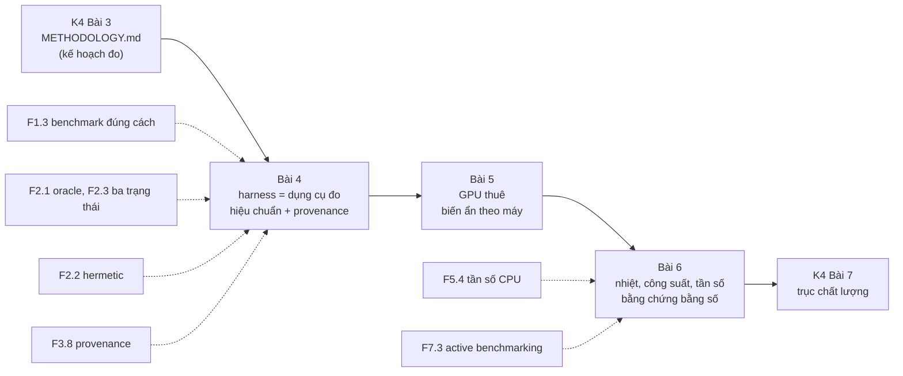
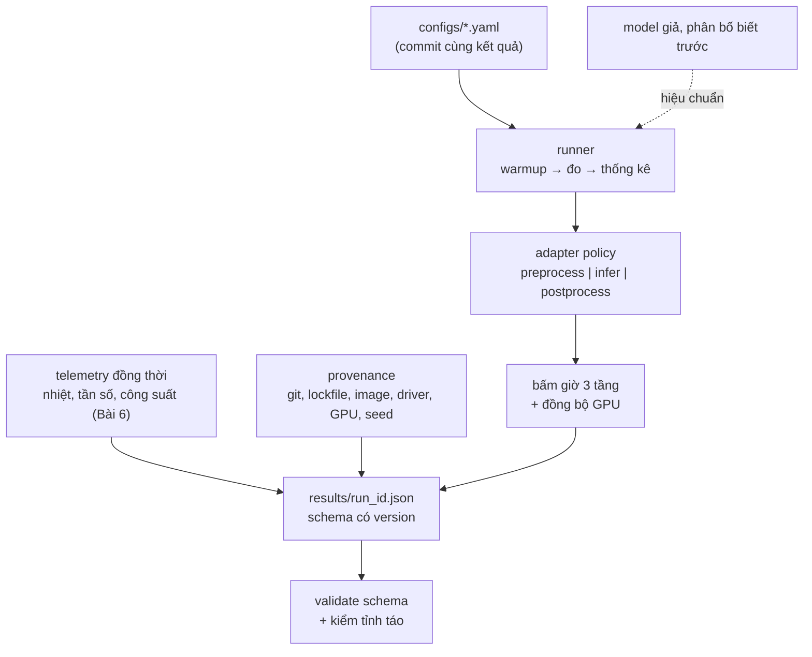

# Khóa 4 · Module 2 — Harness (14h)

Bài 4 (5h) · Bài 5 (5h) · Bài 6 (4h). Nguồn xương sống: `khoa-4-benchmark-edge.md`, Module 2.

Module 1 viết ra **kế hoạch đo** (`METHODOLOGY.md`, Bài 3). Module này dựng **dụng cụ đo** và dùng nó lần đầu trên phần cứng thật. Ba câu hỏi theo thứ tự: dụng cụ có đo đúng không (Bài 4, hiệu chuẩn trên model giả); trên một máy mình không kiểm soát, con số có thuộc về model không (Bài 5, GPU thuê); và làm sao chứng minh với người lạ rằng nhiệt và giới hạn công suất không lẫn vào con số (Bài 6). Khi Bài 3 đã định nghĩa một khái niệm (warmup, steady state, coordinated omission, A/A, CI của percentile, quy tắc ba trạng thái), module này trỏ về đó và chỉ dạy phần mới.



---

## Bài 4 — Thiết kế harness (5h)

> **Vị trí:** K4 Bài 3 (methodology) → **Bài 4** → K4 Bài 5 (GPU thuê) · **Cần trước:** F1.3 (benchmark đúng cách), F2.1 (bài toán oracle), F2.2 (tái lập, hermetic), F2.3 (phán quyết ba trạng thái), F3.8 (provenance), F3.2 (schema evolution, cho JSON output); K4 Bài 2 (n cho p99), Bài 3 · **Sau bài này bạn quyết định được:** harness của bạn đã được phép đo model thật chưa. Điều kiện: nó qua bài test hiệu chuẩn có dung sai **rút từ phân bố lấy mẫu** (không đặt tay), và mỗi trường trong JSON kết quả đã được xếp vào một trong ba loại: đóng băng, ghi lại, hay chặn bằng ngưỡng.

**Câu hỏi của bài (bản gốc):** làm sao để người khác chạy lại được bằng một lệnh?

### 1. Câu chuyện — ai đã khổ vì chuyện này

Khi MLCommons dựng MLPerf Inference, họ không chỉ định nghĩa model và tập dữ liệu. Họ bắt mọi bài nộp phải dùng chung một thư viện sinh tải và ghi log tên là **LoadGen** `[chuẩn — repo mlcommons/inference, thư mục loadgen]`. LoadGen quyết định khi nào gửi query (theo kịch bản SingleStream, Server, Offline), bấm giờ ở đâu, và ghi log theo định dạng cố định để kiểm toán. Lý do rất thực tế: nếu mỗi đội tự viết vòng đo, mỗi đội sẽ bấm giờ một đoạn khác nhau, gửi tải theo một nhịp khác nhau, và bảng xếp hạng thành bảng so các harness chứ không còn so phần cứng.

Ở quy mô nhỏ hơn, Victor Stinner (core developer CPython) viết một loạt bài năm 2016 về chuyện benchmark của CPython cho số nhảy lung tung giữa các lần chạy trên cùng một máy. Từ đó ra đời module `perf`, sau đổi tên thành `pyperf` `[chuẩn — tài liệu pyperf]`. `pyperf` chạy nhiều tiến trình worker riêng, tự hiệu chuẩn số vòng lặp, và tự ghi metadata vào kết quả: model CPU, tần số, governor, các nhân bị cô lập. Nó còn có lệnh `pyperf system tune` để đưa máy về trạng thái ít nhiễu. Bài học chung của hai câu chuyện: **harness là một dụng cụ đo**. Dụng cụ đo phải được hiệu chuẩn trước khi dùng. Mỗi con số nó in ra phải mang theo đủ ngữ cảnh để người khác biết con số đó thuộc chế độ máy nào.

### 2. Mô hình tư duy

Một harness có bốn tính chất. Thiếu tính chất nào thì con số hỏng theo một kiểu riêng:



1. **Đã hiệu chuẩn.** Trước khi đo thứ chưa biết, bạn đo một thứ đã biết đáp án. Model giả có phân bố latency biết trước. Harness phải trả lại đúng phân bố đó, trong dung sai mà **chính phép lấy mẫu** cho phép, và phải báo được overhead của nó. Đây là bài toán oracle (→ F2.1) áp vào chính dụng cụ: harness là một bài test, và bài test cũng có tỉ lệ báo sai.
2. **Mỗi con số mang ngữ cảnh của nó (provenance, → F3.8).** Một p50 không kèm git SHA, lockfile, image digest, driver, model GPU, power limit, tần số và nhiệt là một con số không truy ngược được. Hai người cãi nhau về 95 ms và 140 ms (Bài 3, tự kiểm 2) chỉ giải quyết được bằng cách so khối ngữ cảnh.
3. **Chạy lại không phá kết quả cũ, nhưng phân biệt "cùng thí nghiệm" với "lặp lại".** Idempotent ở đây nghĩa là: cùng config, cùng code, cùng số phiên thì không chạy lại và không ghi đè. Một phiên A/A mới (Bài 3) là một **thí nghiệm khác**, nên số phiên phải nằm trong khóa idempotency. Nếu không, harness sẽ âm thầm bỏ qua đúng phép lặp mà methodology đòi.
4. **Ranh giới thời gian rõ ràng.** Ba tầng `t_preprocess`, `t_inference`, `t_postprocess` cộng lại thành end-to-end. Trên GPU, lệnh gọi kernel là bất đồng bộ: CPU đẩy lệnh vào hàng đợi rồi chạy tiếp. Đồng hồ CPU đặt ngay sau lời gọi model đo **thời gian xếp hàng lệnh**, không đo thời gian GPU làm việc:

```
CPU (Python) |a-pre-|b enqueue k1 k2 k3 ... kN |c_SAI  ............ đợi ......... |sync|c_ĐÚNG
GPU stream          |       |  k1  |  k2  |  k3  | ...                     |  kN  |
             a = trước preprocess   b = trước infer   c_SAI = ngay sau lời gọi (chỉ đo enqueue)
             c_ĐÚNG = sau torch.cuda.synchronize() hoặc dùng cặp CUDA event ghi trên cùng stream
```

Lõi harness tối thiểu dưới đây chạy trên laptop, không cần GPU. Nó có model giả nhớ thời lượng nó *định* chạy ở mỗi lần gọi, nhờ vậy bạn so được **từng cặp mẫu** (đo được − định) chứ không chỉ so percentile. Nó có tùy chọn `spin` (busy-wait) để tách sai số của bộ hẹn giờ OS khỏi sai số của harness:

```python
# [đã chạy] mini_bench.py — lõi harness: 3 tầng thời gian, JSON có provenance, idempotent theo run_id
import hashlib, json, os, platform, subprocess, sys, time
import numpy as np

def git_sha():
    try:
        return subprocess.run(["git", "rev-parse", "HEAD"], capture_output=True, text=True, timeout=5).stdout.strip() or None
    except Exception:
        return None

class FakePolicy:                       # model giả có phân bố BIẾT TRƯỚC, nhớ thời lượng nó định chạy
    def __init__(self, mu=0.100, sd=0.005, seed=0, spin=False):
        self.rng, self.mu, self.sd, self.spin, self.intended = np.random.default_rng(seed), mu, sd, spin, []
    def preprocess(self, obs):  return obs
    def infer(self, x):
        d = max(0.0, self.rng.normal(self.mu, self.sd)) if self.mu > 0 else 0.0
        self.intended.append(d * 1e3)
        if self.spin:                                         # busy-wait: không phụ thuộc bộ hẹn giờ của OS
            end = time.perf_counter() + d
            while time.perf_counter() < end: pass
        elif d: time.sleep(d)
        return x
    def postprocess(self, y):   return y

def run(cfg, policy, out_dir="results"):
    sha = git_sha()
    run_id = hashlib.sha256((json.dumps(cfg, sort_keys=True) + (sha or "nogit")).encode()).hexdigest()[:12]
    path = os.path.join(out_dir, f"{run_id}.json")
    if os.path.exists(path):                                  # idempotent: có rồi thì không chạy, không ghi đè
        with open(path) as f: return json.load(f)
    t = {k: [] for k in ("preprocess", "inference", "postprocess", "end_to_end")}
    clk = time.perf_counter_ns
    for i in range(cfg["warmup_iters"] + cfg["measured_iters"]):
        a = clk(); x = policy.preprocess(i)
        b = clk(); y = policy.infer(x)        # GPU thật: synchronize hoặc CUDA event TRƯỚC khi lấy c
        c = clk(); policy.postprocess(y)
        d = clk()
        if i >= cfg["warmup_iters"]:
            for k, v in zip(t, (b - a, c - b, d - c, d - a)): t[k].append(v / 1e6)
    q = lambda v: {**{f"p{p}": round(float(np.percentile(v, p)), 4) for p in (50, 95, 99)}, "max": round(max(v), 4)}
    res = {"schema_version": "1.1", "run_id": run_id, "status": "ok",
           "timestamp_utc": time.strftime("%Y-%m-%dT%H:%M:%SZ", time.gmtime()), "config": cfg,
           "n": cfg["measured_iters"], "env": {"git_commit": sha, "python": sys.version.split()[0],
           "numpy": np.__version__, "os": platform.platform(), "timer": "perf_counter_ns"},
           "latency_ms": {k: q(v) for k, v in t.items()},
           "raw_ms": {k: [round(x, 4) for x in v] for k, v in t.items()},          # giữ mẫu thô
           "intended_ms": [round(x, 4) for x in policy.intended[cfg["warmup_iters"]:]],
           "telemetry": None, "quality": None}
    os.makedirs(out_dir, exist_ok=True)
    with open(path + ".tmp", "w") as f: json.dump(res, f)
    os.replace(path + ".tmp", path)                           # ghi nguyên tử: không bao giờ có file dở
    return res

if __name__ == "__main__":
    base = {"model": "fake", "warmup_iters": 20, "measured_iters": 200, "mu_s": 0.1, "sd_s": 0.005, "session": 1}
    null = run({**base, "model": "null", "measured_iters": 2000}, FakePolicy(mu=0))
    print("overhead e2e (null, ms):", null["latency_ms"]["end_to_end"])
    for spin in (False, True):
        r = run({**base, "spin": spin}, FakePolicy(spin=spin))
        diff = np.array(r["raw_ms"]["inference"]) - np.array(r["intended_ms"])   # so CẶP từng mẫu
        print(f"spin={spin}: {r['latency_ms']['inference']} | đo - định: median {np.median(diff):.3f}, max {diff.max():.3f} ms")
```

Ba chi tiết thiết kế đáng để ý. `run_id` là hash của config cộng git SHA, và config có trường `session`. Ghi file qua `.tmp` rồi `os.replace` nên một lần chạy bị giết giữa chừng không để lại file kết quả dở. Mẫu thô (`raw_ms`) được giữ lại, vì percentile tính lại được từ mẫu thô còn mẫu thô không tính lại được từ percentile.

### 3. Cầu nối từ backend

**Tên chuẩn của thứ bạn đã làm.** Harness AI của bạn đã có gần đủ các bộ phận. Thứ còn thiếu chủ yếu là lý thuyết về sai số của **chính** các bộ phận đó:

| Bạn đã làm | Tên chuẩn | Chỗ còn thiếu khi sang đây | Học ở |
|---|---|---|---|
| Dựng môi trường local tái tạo được các service | Hermetic environment: lockfile, image theo digest, seed | Container chỉ ghim userland. Kernel, driver GPU, firmware, microcode, giới hạn công suất do BIOS hay chủ máy đặt **không nằm trong image**. Những thứ đó phải được **ghi lại** (provenance), vì bạn không ghim được | F2.2, F3.8; K4 Bài 14 |
| Script chấm pass/fail/inconclusive, phần deterministic | Oracle, phán quyết ba trạng thái | Ngưỡng "inconclusive" phải **đo được** từ A/A (Bài 3), không đặt tay. Bản thân bài test hiệu chuẩn cũng có tỉ lệ đánh trượt oan, và bạn phải tính tỉ lệ đó (phần 5) | F2.1, F2.3 |
| Phần chấm có model AI review | LLM-as-judge | Judge phải được hiệu chuẩn với nhãn người (kappa) trước khi tin. Nó không được làm oracle cho **con số**; con số phải có kiểm tỉnh táo tất định (bậc độ lớn, Bài 2) | F2.8 |
| Server mock tự tạo bộ test chuẩn | Test double có đáp án biết trước. Trong đo lường gọi là **mẫu chuẩn** (reference standard) hay **mẫu đối chứng** (control sample) | Mock của bạn kiểm hành vi đúng/sai. Ở đây model giả kiểm **sai số của phép đo**, nên nó phải có phân bố biết trước, và chính nó cũng có sai số (bộ hẹn giờ OS) | F2.4, F1.1 |
| Đo trên host "yên tĩnh" | Cô lập nhiễu, active benchmarking | "Yên tĩnh" phải được chứng minh bằng telemetry lưu **cùng file** kết quả (Bài 6) | F1.3, F7.3 |
| Pipeline agent chạy → test → sửa → deploy → báo cáo | Lineage: mỗi artifact truy ngược được tới code, input, tham số | Báo cáo benchmark là một artifact. Thiếu `git_dirty`, hash lockfile hay hash tập input thì không tái tạo được | F3.8 |

| Backend bạn biết | Ở đây | Gãy ở chỗ | Nếu dùng nhầm thì |
|---|---|---|---|
| Idempotency key của API thanh toán | `run_id` = hash(config, code, session) | Backend: cùng key thì cùng **hiệu ứng**. Benchmark: chạy lại cùng config **không bao giờ** ra cùng số. Khóa phải tách "cùng thí nghiệm" (bỏ qua) với "lặp lại có chủ đích" (phiên mới) | Khóa thiếu `session` thì A/A bị bỏ qua lặng lẽ. Khóa thiếu git SHA thì sửa bug harness xong vẫn đọc kết quả cũ |
| Retry tự động khi request lỗi | Resume khi máy spot bị thu hồi | Resume giữa một ô đo sẽ trộn hai phiên (máy khác, nhiệt khác) vào một phân bố | p99 của một ô là hỗn hợp hai máy. Resume theo **ô**: ô dở thì bỏ, chạy lại trọn ô |
| Structured logging (JSON log) | JSON kết quả có schema version | Log được đọc bởi người hoặc truy vấn khi cần; kết quả ở đây được **so sánh qua thời gian**, nên đổi tên trường là phá so sánh | Đổi `latency` thành `latency_ms` không tăng version: script Pareto (Bài 9) âm thầm đọc `null` |
| Feature flag / config service | Config bằng file commit cùng kết quả | Flag backend đổi lúc chạy và không cần lưu lịch sử. Config benchmark là **một phần của kết quả** | Có số mà không biết chạy bằng `solver_steps` bao nhiêu |
| Đo latency của handler HTTP | Bấm giờ quanh lời gọi model | Handler đồng bộ: trả về là xong. Lời gọi CUDA trả về khi lệnh **mới vào hàng đợi** | Đo ra vài ms cho model trăm triệu tham số và tin đó là tốc độ |

**Chấm mô hình:**

- *"Harness chạy xong, ra JSON đúng schema, test xanh → số đúng."* → **SAI.** Schema đúng chỉ nói về **hình dạng** dữ liệu, không nói về sai số của phép đo. Phản ví dụ, đã chạy (phần 6): model giả dùng `time.sleep` cho p50/p95/p99 rơi trong dải dung sai, test percentile báo PASS. Vậy mà từng mẫu đo dài hơn thời lượng định ngủ một khoảng hệ thống, do bộ hẹn giờ của OS. Chỉ phép so **cặp** (đo − định) mới lộ ra khoảng lệch đó. Dụng cụ chưa được hiệu chuẩn bằng một phép so đủ nhạy thì chưa được dùng.
- *Vốn của bạn: "vừa deterministic vừa có model AI review"*, áp vào benchmark thành "để LLM đọc JSON và quyết định kết quả có hợp lý không" → **ĐÚNG MỘT PHẦN.** Đúng: LLM rất hợp để kiểm **checklist methodology** (có đủ trường provenance không, có mục "cái tôi không đo" không, câu chữ có nói quá dữ liệu không). Gãy: LLM không phải oracle cho con số. Phản ví dụ: một JSON SmolVLA trên GPU báo p50 vài ms vì quên đồng bộ CUDA. Judge không có phép tính cận dưới (Bài 2, Đề 2) sẽ có lý do nghe rất hợp lý để chấp nhận ("GPU hiện đại rất nhanh"). Một luật tất định "lệch hơn một bậc so với bảng mốc thì FAIL" bắt được ngay. Thứ tự đúng: kiểm tất định trước, LLM review sau, và LLM review phải được hiệu chuẩn trên một tập JSON đã gán nhãn tay (→ F2.8).
- *"Đóng gói Docker là tái lập rồi."* → **ĐÚNG MỘT PHẦN.** Đúng cho thư viện Python và CUDA runtime trong image. Gãy: container dùng **driver của host**, kernel của host, power limit do chủ máy đặt. Phản ví dụ: cùng một image chạy trên hai máy thuê, một máy driver cũ hơn và power limit bị hạ. Image digest giống hệt nhau, số khác nhau, và nếu JSON không ghi driver với power limit thì không ai giải thích được. Bài 14 làm cụ thể việc này bằng `capture_env.py` (khối `env`).

### 4. Thuật ngữ

| Mức | Thuật ngữ | Nghĩa trong một câu | Hay bị hiểu nhầm thành |
|---|---|---|---|
| 🟢 | Harness | Chương trình điều khiển phép đo: nạp config, chạy, bấm giờ, ghi kết quả có ngữ cảnh | Script chạy model |
| 🟢 | Hiệu chuẩn (calibration) | So dụng cụ với một chuẩn đã biết để biết sai số của nó | Chạy thử cho chắc |
| 🟢 | Overhead của harness | Thời gian harness tự tốn ngoài phần được đo; đo bằng policy rỗng | Số không đáng kể, khỏi đo |
| 🟢 | Provenance | Thông tin đủ để truy một kết quả về code, input, môi trường đã tạo ra nó | Metadata cho đẹp |
| 🟢 | Idempotent (ở đây) | Cùng (config, code, phiên) thì không chạy lại, không ghi đè | Chạy lại ra cùng số |
| 🟢 | Resumable theo ô | Đứt giữa ma trận thì chạy tiếp các ô chưa xong; ô dở thì bỏ | Chạy tiếp từ iteration dở |
| 🟢 | Ba tầng thời gian | `t_preprocess`, `t_inference`, `t_postprocess` và tổng end-to-end | Một con số "latency" |
| 🟢 | Đồng bộ GPU | `torch.cuda.synchronize()` hoặc cặp CUDA event để đồng hồ chờ GPU làm xong | Tùy chọn cho chính xác hơn |
| 🟡 | Ghi nguyên tử (atomic write) | Ghi file tạm rồi đổi tên một lần, nên không bao giờ có file dở | Ghi thẳng rồi `flush` |
| 🟡 | Schema version | Số hiệu của hợp đồng định dạng kết quả, tăng khi đổi tương thích | Ghi cho có |
| 🟡 | Mẫu đối chứng (control sample) | Mẫu biết trước đáp án, chạy kèm mỗi lô đo để phát hiện dụng cụ trôi | Test một lần lúc viết code |
| 🔴 | JSON Schema đầy đủ, `$ref`, draft | Chuẩn mô tả schema; dùng một tập con nhỏ là đủ | Cần học trọn trước khi dùng |

### 5. Dự đoán

Không chạy code ở phần 2 trước khi viết xong các dự đoán dưới đây vào `notes/prediction-b4.md` và commit.

**Đề 1 — Dung sai của bài test hiệu chuẩn.** Model giả: latency ~ N(100 ms, 5 ms), n = 200 (đúng bản gốc). Một harness **hoàn hảo** vẫn trả về p50/p95/p99 dao động từ lần chạy này sang lần chạy khác, vì đó là ước lượng từ 200 mẫu. Hãy tính dải chứa 99% số lần chạy của một harness hoàn hảo cho từng percentile. Phương pháp: sai số chuẩn của percentile mẫu thứ p xấp xỉ σ·√(p(1−p)/n) / φ(z_p), trong đó z_p là phân vị chuẩn tắc và φ là mật độ chuẩn tắc. Lấy ±2,58 lần sai số chuẩn. Kiểm lại bằng Monte Carlo (script `tolerance.py` ở phần 6).

**Đề 2 — Dung sai "đẹp" đặt tay.** Một bản hướng dẫn khác đặt dải chấp nhận p50 ∈ [99,0; 101,0], p95 ∈ [107,0; 109,5], p99 ∈ [110,5; 113,5]. Dự đoán: harness **hoàn hảo** bị dải này đánh trượt bao nhiêu phần trăm số lần, ở từng percentile?

**Đề 3 — Bộ hẹn giờ của OS là một phần của model giả.** `time.sleep(d)` thường ngủ lâu hơn d. Trên Linux, timer slack mặc định của luồng thường là 50 µs `[chuẩn — man prctl, PR_SET_TIMERSLACK]`. Cộng thêm độ trễ đánh thức của bộ lập lịch. Dự đoán trung vị của (đo − định) trên máy bạn cho `sleep` và cho `spin`.

**Đề 4 — Overhead.** Với policy rỗng, end-to-end p50 của harness ở thang nào: ns, µs hay ms? Tra độ phân giải đồng hồ bằng `python -c "import time; print(time.get_clock_info('perf_counter'))"`.

**Đề 5 — Phép so nào nhạy hơn.** Giả sử harness có một lỗi cộng thêm 0,4 ms vào mỗi mẫu. Test percentile (Đề 1) và test cặp (trung vị của đo − định) — test nào bắt được lỗi này ở n = 200? Lập luận bằng sai số chuẩn của từng phép so.

```markdown
# prediction-b4.md — commit trước khi chạy
## Đề 1: dải 99% của harness hoàn hảo, n=200, N(100,5)
| Percentile | Giá trị thật | Dải dưới | Dải trên | Cách tính |
| p50 | | | | |
| p95 | | | | |
| p99 | | | | |
## Đề 2: tỉ lệ đánh trượt oan của dải đặt tay
p50: ...%   p95: ...%   p99: ...%   (lý do: ...)
## Đề 3: trung vị (đo − định): sleep = ... ms, spin = ... ms (máy: ..., OS: ...)
## Đề 4: overhead p50 ≈ ... (thang: ns/µs/ms), độ phân giải perf_counter = ...
## Đề 5: test bắt được lỗi +0,4 ms: percentile / cặp / cả hai / không cái nào, vì ...
```

### 6. Làm

Giữ ba bước của bản gốc. Bước 1 và 2 được chia nhỏ. Thời gian gợi ý cho 5h: thiết kế và viết harness 2,5h; hiệu chuẩn 1,5h; ba phiên và kiểm idempotent 1h.

**Bước 1 — Viết harness theo sáu yêu cầu của bản gốc.**

1. **Một lệnh chạy được:** `python bench.py --config configs/smolvla_a100.yaml`. Không có bước thủ công nào.
2. **Cấu hình bằng file, không bằng flag.** File config được commit cùng kết quả. Băm config (sha256) và ghi hash vào JSON.
3. **Output JSON có schema** và có `schema_version`. Dùng lại tư duy schema versioning của Khóa 2 (→ F3.2): thêm trường thì tăng minor, đổi nghĩa hoặc đổi tên thì tăng major.
4. **Ghi toàn bộ ngữ cảnh vào output**, không chỉ số đo: phiên bản thư viện, commit hash, nhiệt độ trước, trong và sau, tải nền, thời điểm chạy. Danh sách đầy đủ ở schema bên dưới.
5. **Idempotent và resumable.** Benchmark dài có thể đứt. Chạy lại không được ghi đè kết quả cũ. Khóa idempotency gồm config, git SHA và **số phiên**. Resume theo ô của ma trận, không resume giữa một ô.
6. **Tách rõ ba tầng thời gian** `t_preprocess` (chuẩn bị input, kể cả copy host→device), `t_inference` (chỉ forward pass, có đồng bộ GPU), `t_postprocess` (decode ra action, un-normalize). Báo cả ba và tổng. Ghi ranh giới vào `METHODOLOGY.md` mục "Kịch bản tải" (Bài 3), kể cả hàm được bấm giờ (`predict_action_chunk`, Bài 1).

Schema đề xuất `1.1`. Nó giữ mọi trường của bản gốc và thêm các trường provenance. Trường ghi `<...>` là chỗ Bài 5 và Bài 14 điền thật:

```json
{
  "schema_version": "1.1",
  "run_id": "<sha256(config + git_commit)[:12]>",
  "cell": {"model": "smolvla_base", "precision": "fp16", "batch_size": 1, "target": "rtx4090"},
  "session": 2,
  "status": "ok",
  "reason": "",
  "timestamp_utc": "<ISO 8601>",
  "model": {"name": "lerobot/smolvla_base", "params": 450000000, "revision": "<HF commit sha>"},
  "config": {"precision": "fp16", "batch_size": 1, "solver_steps": 10, "chunk_size": 50,
             "warmup_iters": 20, "measured_iters": 400, "seed": 0,
             "timed_fn": "predict_action_chunk", "load": "closed_loop",
             "input_set": {"name": "k2_obs50", "sha256": "<hash tập observation>"},
             "config_sha256": "<hash file yaml>"},
  "provenance": {"git_commit": "<sha>", "git_dirty": false, "lockfile_sha256": "<sha256 uv.lock>",
                 "image_digest": "sha256:<...>", "harness_version": "<tag>"},
  "env": {"gpu_name": "<...>", "gpu_uuid": "<...>", "vbios": "<...>", "driver": "<...>",
          "cuda_driver_max": "<CUDA Version nvidia-smi in ra>", "torch": "<...>", "torch_cuda": "<...>",
          "power_limit_w": 0, "clocks_max_sm_mhz": 0, "pcie_link": "<gen x width>",
          "mig_mode": "<...>", "virtualization_mode": "<...>",
          "cpu_model": "<...>", "kernel": "<...>", "governor": "<...>", "pl1_w": null, "pl2_w": null},
  "timer": {"cpu": "perf_counter_ns", "gpu": "cuda_event", "sync": "synchronize_before_stop",
            "clock_resolution_ns": 0, "harness_overhead_ms_p50": 0.0},
  "n": 400,
  "latency_ms": {
    "preprocess":  {"p50": 0.0, "p95": 0.0, "p99": 0.0, "max": 0.0},
    "inference":   {"p50": 0.0, "p50_ci95": [0.0, 0.0], "p95": 0.0, "p99": 0.0, "max": 0.0},
    "postprocess": {"p50": 0.0, "p95": 0.0, "p99": 0.0, "max": 0.0},
    "end_to_end":  {"p50": 0.0, "p95": 0.0, "p99": 0.0, "max": 0.0}
  },
  "raw_ms": {"inference": [], "end_to_end": []},
  "memory": {"peak_vram_allocated_mb": 0, "peak_vram_reserved_mb": 0, "peak_ram_mb": 0},
  "thermal": {"temp_start_c": 0, "temp_max_c": 0, "temp_end_c": 0, "throttled": false,
              "throttle_evidence": "<turbostat Bzy_MHz/PkgWatt | nvidia-smi clocks event reasons>"},
  "telemetry": {"period_s": 1.0, "t_mono_s": [], "temp_c": [], "clock_mhz": [], "power_w": [], "reasons": []},
  "quality": null,
  "notes": ""
}
```

Vì sao từng nhóm trường tồn tại:

| Nhóm | Loại (→ K4 Bài 14) | Trả lời câu hỏi |
|---|---|---|
| `config`, `config_sha256`, `seed`, `input_set.sha256` | Đóng băng | Chạy **cái gì**, với input nào |
| `provenance` (git, `git_dirty`, lockfile, image digest) | Đóng băng | Bằng **code** nào. `git_dirty = true` thì kết quả không tái tạo được, nên đánh dấu |
| `env` (driver, GPU UUID, power limit, PL1/PL2, governor) | Ghi lại, vì không ghim được | Trên **máy** nào, ở chế độ nào. `gpu_uuid` cho biết hai phiên có cùng một card vật lý không |
| `timer` | Ghi lại | Đồng hồ nào, đã đồng bộ chưa, sai số của chính dụng cụ |
| `telemetry` (chuỗi theo thời gian, **cùng file**) | Ghi lại | Con số có bị nhiệt, công suất, tần số làm bẩn không (Bài 6) |
| `status`, `reason` | — | Ô không đo được thì vẫn là một dòng dữ liệu (K4 Bài 10 mở rộng danh sách status) |
| `quality: null` | — | Đặt sẵn chỗ cho Module 3: benchmark chưa xong |

Lưu ý hai trường hay bị nhầm. `CUDA Version` mà `nvidia-smi` in ra là phiên bản CUDA **cao nhất driver hỗ trợ**, không phải CUDA runtime mà PyTorch dùng (`torch.version.cuda`) `[chuẩn]`. Ghi cả hai. `measured_iters` của bản gốc là 200. Bài 3 đã tính rằng p99 cần ít nhất 368 mẫu mới có cận trên. Vì vậy với model thật, dùng ≥ 400 nếu bạn báo p99. Nếu giữ 200, ghi p99 thành "max (n=200)".

**Bước 2 — Viết test hiệu chuẩn với model giả** (bản gốc: hàm `sleep` có phân bố biết trước; kiểm harness báo đúng phân vị).

1. Chạy `mini_bench.py` ở phần 2, hoặc gắn `FakePolicy` vào harness thật của bạn qua đúng interface adapter mà model thật sẽ dùng.
2. **Đo overhead**: policy rỗng, n = 2000, lấy end-to-end. Ghi vào `timer.harness_overhead_ms_p50`.
3. **Ghi độ phân giải đồng hồ** bằng `time.get_clock_info('perf_counter')`. Với GPU ở Bài 5: CUDA event có độ phân giải khoảng 0,5 µs `[spec — CUDA Runtime API, cudaEventElapsedTime]`.
4. **Test percentile**, với dung sai rút từ phân bố lấy mẫu:

```python
# [đã chạy] tolerance.py — p50/p95/p99 của n mẫu từ phân bố ĐÃ BIẾT dao động bao nhiêu? Dùng: python tolerance.py results/<run_id>.json
import json, sys
import numpy as np
from scipy import stats

mu, sd, n, reps = 100.0, 5.0, 200, 20000
rng = np.random.default_rng(42)
true = {p: mu + sd * stats.norm.ppf(p / 100) for p in (50, 95, 99)}
samples = rng.normal(mu, sd, (reps, n))
band = {}
for p in (50, 95, 99):
    est = np.percentile(samples, p, axis=1)
    lo, hi = np.percentile(est, [0.5, 99.5])          # dải 99%: harness ĐÚNG rơi ngoài 1% số lần
    band[p] = (lo, hi)
    print(f"p{p}: thật = {true[p]:6.2f} ms | dải 99% của ước lượng (n={n}) = {lo:6.2f} .. {hi:6.2f} ms")

# Dung sai "đẹp" đặt tay: harness ĐÚNG bị đánh trượt bao nhiêu phần trăm số lần?
gem = {50: (99.0, 101.0), 95: (107.0, 109.5), 99: (110.5, 113.5)}
for p, (lo, hi) in gem.items():
    est = np.percentile(samples, p, axis=1)
    print(f"p{p}: dải {lo}..{hi} ms đánh trượt harness đúng {np.mean((est < lo) | (est > hi)):.1%} số lần")

# Áp vào một kết quả thật của mini_bench.py: so dải
if len(sys.argv) > 1:
    r = json.load(open(sys.argv[1]))["latency_ms"]["inference"]
    for p in (50, 95, 99):
        lo, hi = band[p]; v = r[f"p{p}"]
        print(f"đo p{p} = {v:7.2f} ms -> {'PASS' if lo <= v <= hi else 'NGOÀI DẢI'} (lệch tâm {v - true[p]:+.2f} ms)")
```

5. **Test cặp**: trung vị và max của (đo − định) cho `sleep` và `spin`. Đây là phép so nhạy hơn (Đề 5). Đặt ngưỡng cho nó **sau khi** đã đo `spin` trên máy bạn ba lần, theo tinh thần A/A: ngưỡng = mức lệch mà harness đúng thường cho.
6. Viết hai test này thành test tự động (pytest hoặc tương đương). Cho chúng chạy trong CI, và chạy **ở đầu mỗi phiên đo** như một mẫu đối chứng (Bài 5).

**Bước 3 — Chạy harness với model giả 3 lần, kiểm tính ổn định** (bản gốc).

1. Chạy ba phiên `session: 1, 2, 3`, mỗi phiên một tiến trình mới. So p50 của ba phiên. Đây là A/A của **chính harness** (Bài 3). Nó cho bạn sàn nhiễu thấp nhất có thể, vì model giả không có nhiệt hay cache.
2. **Kiểm idempotent:** chạy lại `session: 1`. Harness phải đọc file có sẵn, không đo lại. Sửa một dòng code harness rồi commit: `run_id` phải đổi, nghĩa là chạy mới.
3. **Kiểm resumable:** chạy một ma trận 4 ô, giết tiến trình (Ctrl+C) giữa ô thứ 3. Chạy lại lệnh cũ: ô 1–2 bỏ qua, ô 3 chạy lại từ đầu, không còn file `.tmp` nào sót lại thành kết quả.
4. Validate mọi JSON trong `results/` theo schema. Có thể dùng thư viện `jsonschema` (cài bằng pip, ghim phiên bản trong lockfile), hoặc một hàm kiểm tay danh sách trường bắt buộc.

**Sai số của dụng cụ ở bài này:** độ phân giải đồng hồ (thang 100 ns trên Windows QPC, thang ns trên Linux `[tự đo]`); độ trễ đánh thức của `sleep` (nằm trong model giả, không phải lỗi harness); overhead Python của chính vòng đo. Không có phép đo vật lý nào.

### 7. Số phải ra

<details><summary>🔒 MỞ SAU KHI COMMIT prediction.md</summary>

**Ngưỡng của bản gốc** (giữ nguyên), với model giả `sleep(0.1)` cộng nhiễu Gaussian σ = 5 ms, 200 iteration:

| Chỉ số | Giá trị đúng (bản gốc) | Dải 99% của harness hoàn hảo, n = 200 (Monte Carlo, `[đã chạy]`) |
|---|---|---|
| p50 | ≈ 100 ms | 98,87 – 101,13 ms |
| p95 | ≈ 108 ms (đúng: 100 + 1,645·5 = 108,22) | 106,29 – 110,06 ms |
| p99 | ≈ 112 ms (đúng: 100 + 2,326·5 = 111,63) | 108,49 – 114,66 ms |
| Overhead của chính harness | **< 1 ms, và phải được đo và ghi lại** | — |

**Đề 2 — dải đặt tay đánh trượt harness hoàn hảo:** p50 2,4%; p95 9,2%; p99 **33,3%**. Một phần ba số lần, một harness không có lỗi nào bị gọi là hỏng. Ở n = 200, p99 thực chất là mẫu lớn thứ hai hoặc thứ ba, nên dao động của nó lớn hơn nhiều so với cảm giác. Đây là F2.1 áp vào chính bài test: dải chấp nhận phải đến từ phân bố lấy mẫu.

**Phần 2 và Đề 3–5 — chạy trên máy soạn bài** (Windows, Python 3.12; máy bạn sẽ khác):

| Đo | sleep | spin |
|---|---|---|
| inference p50 / p95 / p99 (ms) | 100,52–100,88 / 108,39–109,27 / 110,45–111,85 (ba lần chạy) | 100,28–100,34 / 108,24–108,27 / 110,05–110,19 |
| Test percentile (dải 99%) | PASS | PASS |
| Trung vị (đo − định) | 0,37–0,45 ms | ~0,02 ms |
| Max (đo − định) | 1,5–9 ms | 0,08–3,4 ms (OS chiếm CPU) |
| Overhead e2e, policy rỗng | p50 ≈ 0,2 µs; max ≈ 13 µs | — |

Đọc bảng:
- **Test percentile PASS cả hai**, dù bản `sleep` lệch hệ thống khoảng 0,4 ms mỗi mẫu. Sai số chuẩn của p50 ở n = 200 khoảng 0,44 ms (1,2533·5/√200), nên một lệch 0,4 ms chìm trong dao động lấy mẫu. **Test cặp** loại được dao động đó, vì cùng một mẫu xuất hiện ở cả hai vế. Độ tản của (đo − định) chỉ cỡ chục µs, nên lệch 0,4 ms hiện rõ. Trả lời Đề 5: chỉ test cặp bắt được.
- Bản `spin` p99 = 110,05–110,19 ms rơi **ngoài** dải đặt tay [110,5; 113,5] ở cả ba lần chạy. Một harness đúng, model giả đúng, vẫn bị đánh trượt.
- Lệch của `sleep` thuộc về model giả (bộ hẹn giờ của OS), không thuộc về harness. Trên Linux, kỳ vọng lệch nhỏ hơn Windows, cỡ 50–100 µs `[ước lượng — timer slack 50 µs + độ trễ đánh thức; tự đo]`. Hệ quả: các giá trị "đúng" 100/108/112 của bản gốc chỉ đúng khi model giả không có sai số riêng. Dùng `spin` hoặc test cặp nếu muốn kiểm harness ở mức sub-ms.
- Overhead thang µs, nhỏ hơn ngưỡng 1 ms khoảng ba bậc. Với model thật trên GPU, overhead lớn hơn: đồng bộ, copy, Python quanh lời gọi. Đo lại ở Bài 5 bằng policy rỗng đặt trên GPU.

**Ba phiên model giả (Bước 3):** với `spin`, p50 ba phiên lệch nhau cỡ 0,1%. Đó là sàn: model thật không thể ổn định hơn chính harness. Với `sleep`, lệch giữa phiên lớn hơn (0,3–0,4%) vì bộ hẹn giờ OS phụ thuộc tải nền.

</details>

### 8. Nếu ra khác

| Triệu chứng | Nguyên nhân khả dĩ | Kiểm bằng cách | Sửa |
|---|---|---|---|
| p95 ra ≈ 100 ms hoặc ≈ 120 ms | Công thức percentile sai: lấy sai cột, sắp xếp sai, percentile trên tập đã gộp warmup | In 5 mẫu thô đầu và cuối; tính lại bằng `np.percentile` trên `raw_ms` | Sửa; thêm test so với tính tay trên mảng nhỏ |
| p50 lệch đều +0,5 đến +2 ms, test cặp đỏ | Bộ hẹn giờ OS (`sleep`), power saving của laptop | Chạy `spin`; nếu `spin` sạch thì lỗi ở model giả | Dùng `spin` để hiệu chuẩn; ghi lệch `sleep` vào methodology |
| Max (đo − định) vài ms ở `spin` | OS chiếm CPU (ngắt, tiến trình khác) | Lặp lại lúc máy rảnh; xem có trùng thời điểm tác vụ nền không | Bình thường ở mức đuôi; đừng đặt ngưỡng cho max, đặt cho trung vị |
| Overhead > 1 ms | Ghi file hoặc in log **trong** vòng đo; gọi `nvidia-smi` đồng bộ trong vòng đo | Profile vòng đo bằng policy rỗng | Thu số vào list trong RAM, ghi sau; telemetry chạy ở tiến trình riêng |
| Chạy lại phiên 2 nhưng harness bỏ qua | Khóa idempotency thiếu `session` | In `run_id` của hai lần | Thêm `session` vào config |
| Sửa code harness mà kết quả cũ vẫn được dùng | `run_id` không gồm git SHA, hoặc code chưa commit | Kiểm `git_dirty` | Chặn chạy đo chính thức khi `git_dirty = true` |
| Sau khi giết tiến trình có file JSON hỏng | Ghi thẳng vào file đích | Mở file, `json.load` lỗi | Ghi `.tmp` rồi `os.replace` |
| `t_inference` của model GPU nhỏ bất thường, `t_postprocess` lớn bất thường | Thiếu đồng bộ: thời gian GPU "rơi" sang tầng sau, nơi `.cpu()` buộc đồng bộ | Thêm `synchronize()` trước mỗi lần lấy giờ; tổng e2e phải gần như không đổi | Đồng bộ ở ranh giới mỗi tầng (Bài 5) |

### 9. Câu hỏi ngược

1. **[Nếu…thì]** Nếu máy spot bị thu hồi khi ô fp16 đã chạy được 300/400 iteration, vì sao "resume từ iteration 301 trên máy mới" là sai, dù nghe giống retry rất hợp lý?
   <details><summary>Hướng nghĩ</summary>Hai đoạn của ô đến từ hai máy, hai chế độ nhiệt, có thể hai driver. Phân bố bạn báo là hỗn hợp, và p99 có thể đến hoàn toàn từ một máy. Đơn vị nguyên tử của benchmark là ô × phiên, không phải iteration. Retry trong backend hợp lý vì các request độc lập và có cùng ngữ nghĩa; mẫu latency thì phụ thuộc trạng thái máy.</details>
2. **[Quy mô]** K4 Bài 10 có 3 model × 4 precision × 2 target × 3 phiên = 72 file JSON, mỗi file vài nghìn mẫu thô và chuỗi telemetry. Sang K6 (eval hàng nghìn episode) và K7 (robot chạy mỗi ngày), số file tăng lên hàng chục nghìn. Cái gì gãy trước: dung lượng, tốc độ truy vấn "p99 theo driver", hay schema? Bạn chuyển sang gì?
   <details><summary>Hướng nghĩ</summary>Thường gãy trước là truy vấn chéo, vì phải mở hàng nghìn JSON lồng nhau. Hướng: JSON giữ làm bản ghi gốc bất biến, rồi có một bước ETL ra bảng columnar (Parquet) với một hàng mỗi ô × phiên và một bảng mẫu thô riêng, truy vấn bằng DuckDB (→ F3.6). Schema version lúc này trở thành điều kiện để ETL không âm thầm sai (→ F3.2, F3.7).</details>
3. **[Failure mode]** Harness qua mọi test hiệu chuẩn trên CPU với model giả. Kể hai cách nó vẫn báo sai khi gắn model thật trên GPU, mà model giả không bao giờ lộ ra.
   <details><summary>Hướng nghĩ</summary>(a) Đồng bộ GPU: model giả không có hàng đợi bất đồng bộ nên không bao giờ lộ lỗi thiếu `synchronize`. (b) Warmup phụ thuộc shape: model giả không có autotune. (c) Bộ nhớ: allocator giữ bộ nhớ đệm, nên peak VRAM theo `nvidia-smi` khác peak theo `max_memory_allocated`. Cách đóng lỗ: thêm một model giả **trên GPU**, ví dụ một matmul có thời gian ổn định, đo bằng hai cách (CUDA event và `synchronize` + đồng hồ CPU) rồi so.</details>
4. **[Vì sao không]** Vì sao không dùng thẳng `pyperf` hay `pytest-benchmark` thay vì tự viết harness?
   <details><summary>Hướng nghĩ</summary>Chúng giải bài micro-benchmark: hàm nhanh, lặp nhiều, CPU. Ở đây một iteration tốn 0,1–10 s, có GPU bất đồng bộ, ba tầng thời gian, telemetry nhiệt đồng thời, trục chất lượng và ma trận ô × phiên. Mượn ý tưởng của chúng (worker riêng, metadata tự động, `system tune`) thì đúng. Ép bài toán vào khuôn của chúng thì mất đúng những thứ khóa này cần.</details>
5. **[Phản biện]** "Lưu mẫu thô trong JSON là thừa: p50/p95/p99 đã đủ, file nhẹ hơn." Dựng lập luận mạnh nhất cho phía này, rồi chỉ ra nó gãy ở câu hỏi nào bạn sẽ gặp ở Bài 6 và Bài 9.
   <details><summary>Hướng nghĩ</summary>Phía ủng hộ: file nhẹ, ít rủi ro rò dữ liệu nhạy cảm, đủ cho bảng tóm tắt. Gãy: Bài 6 cần ghép latency với telemetry **theo thời gian**, và percentile thì đã mất thứ tự. CI bootstrap, test cặp và mọi percentile mới (p99,9) đều cần mẫu thô. Thỏa hiệp: mẫu thô kèm timestamp đơn điệu, nén, có thể ở file Parquet đi kèm, nhưng phải có trong artifact.</details>

### 10. Liên kết ra ngoài

- **Xét nghiệm y khoa: mẫu đối chứng và luật Westgard.** Phòng xét nghiệm chạy mẫu đối chứng có giá trị biết trước kèm **mỗi lô** bệnh phẩm. Họ có bộ luật thống kê (luật Westgard, ví dụ một điểm vượt 3σ, hoặc hai điểm liên tiếp vượt 2σ) để quyết định lô đó có được trả kết quả không `[chuẩn]`. Giống: model giả chạy đầu mỗi phiên là một mẫu đối chứng, và dải dung sai rút từ phân bố lấy mẫu chính là tinh thần của luật Westgard. Khác: họ có lịch sử hàng nghìn lần chạy đối chứng để ước σ; bạn bắt đầu với ba phiên, nên ngưỡng của bạn sẽ thô hơn và phải cập nhật dần.
- **Đo lường học: chuỗi truy nguyên (metrological traceability).** Một phép đo hợp lệ khi truy được, qua một chuỗi hiệu chuẩn không đứt, về chuẩn quốc gia, và mỗi mắt xích có độ bất định ghi rõ `[chuẩn — VIM]`. Giống: đồng hồ hệ thống → harness hiệu chuẩn bằng model giả → model thật. Mỗi mắt xích có sai số riêng (độ phân giải, overhead, lệch đánh thức). Khác: đồng hồ máy tính của bạn không được hiệu chuẩn với chuẩn ngoài. Điều đó ổn cho latency ở thang ms, nhưng sẽ thành vấn đề ở K5 khi đồng bộ thời gian giữa các máy (→ F4.3).
- **Kiểm toán tài chính: dấu vết kiểm toán (audit trail).** Mỗi con số trên báo cáo tài chính phải truy được về chứng từ gốc, và chứng từ không được sửa sau khi ghi. Giống: kết quả JSON bất biến, ghi nguyên tử, có hash code và config. Khác: kiểm toán là con người lấy mẫu chứng từ; ở đây truy nguyên có thể tự động hoàn toàn, nên không có lý do để thiếu trường nào.

### 11. Độ tin cậy và sửa lỗi

| Khẳng định | Nhãn | Ghi chú / cách kiểm |
|---|---|---|
| MLPerf Inference bắt buộc dùng LoadGen | `[chuẩn]` | Repo mlcommons/inference, quy tắc nộp bài |
| pyperf: worker riêng, tự ghi metadata, `system tune` | `[chuẩn]` | Tài liệu pyperf; kiểm theo phiên bản |
| Lời gọi CUDA bất đồng bộ; cần đồng bộ để bấm giờ | `[chuẩn]` | PyTorch docs, CUDA semantics, mục Asynchronous execution |
| CUDA event có độ phân giải ~0,5 µs | `[spec]` | CUDA Runtime API, `cudaEventElapsedTime` |
| "CUDA Version" của `nvidia-smi` là bản tối đa driver hỗ trợ | `[chuẩn]` | So với `torch.version.cuda` |
| Timer slack mặc định 50 µs trên Linux | `[chuẩn]` | `man prctl` (PR_SET_TIMERSLACK) |
| Dải 99% và tỉ lệ đánh trượt oan | `[đã chạy]` | `tolerance.py`, seed 42, 20.000 lần lặp |
| Số đo `sleep`/`spin`/overhead | `[đã chạy]` trên Windows | Máy bạn sẽ khác; Linux kỳ vọng lệch `sleep` nhỏ hơn |

**Đã sửa so với bản gốc/Gemini:**
- Bản gốc, Số phải ra: p50/p95/p99 ≈ 100/108/112 không kèm dung sai. Đã thêm dải 99% rút từ phân bố lấy mẫu ở n = 200, và ghi rằng `sleep` tự thêm lệch hệ thống (của model giả, không của harness). Ngưỡng overhead < 1 ms giữ nguyên.
- Gemini Bài 4: dải p99 [110,5; 113,5], p95 [107,0; 109,5] đặt tay. Đã chạy: dải này đánh trượt harness hoàn hảo 33% (p99) và 9% (p95) số lần, và đánh trượt cả bản `spin` đúng ở cả ba lần chạy. Thay bằng dải tính được.
- Gemini Bài 4: đo overhead bằng một cặp `t0/t1` quanh wrapper. Một lần đo không đủ, và phép đo đó tự gồm cả overhead của lời gọi đồng hồ. Thay bằng policy rỗng n = 2000, báo phân bố.
- Bổ sung so với bản gốc: khóa idempotency phải gồm số phiên (nếu không, A/A của Bài 3 bị bỏ qua); resume theo ô, không theo iteration; ghi nguyên tử; giữ mẫu thô; test cặp; schema 1.1 với `provenance`, `env`, `timer`, `telemetry` chuỗi thời gian, `status`/`reason`. Mọi trường gốc vẫn còn.
- Bản gốc nói 200 iteration; Bài 3 đã chỉ ra p99 cần ≥ 368. Bài này giữ 200 cho model giả, khuyên ≥ 400 cho model thật nếu báo p99, hoặc ghi "max (n = 200)".
- Gemini Bài 4, tự kiểm câu 2 (đo ra 0,05 ms vì quên `synchronize`): giữ ý, chuyển vào sơ đồ thời gian và bảng "Nếu ra khác".

### 12. Đọc thêm và tự kiểm tra

- **Nguồn gốc:** MLCommons, *MLPerf Inference Rules* và tài liệu LoadGen (repo `mlcommons/inference`); tài liệu `pyperf` (Victor Stinner), các mục "Tune the system" và metadata.
- **Giải thích:** Brendan Gregg, *Systems Performance* (ấn bản 2, 2020), chương Benchmarking; PyTorch docs, *CUDA semantics*, mục về thực thi bất đồng bộ và đo thời gian bằng CUDA event.
- **Đào sâu (tùy chọn):** đặc tả SLSA Provenance (slsa.dev). Đây là chuẩn mô tả "artifact này được tạo từ đâu, bằng gì" của chuỗi cung ứng phần mềm; so nó với khối `provenance` của bạn để thấy bạn đang thiếu gì.
- **Tự kiểm tra:** (1) giải thích cho một backend engineer khác trong 5 câu vì sao test xanh của harness chưa nói gì về sai số đo; (2) vẽ lại sơ đồ CPU/GPU ở phần 2 từ trí nhớ, đánh dấu chỗ đặt đồng hồ đúng; (3) hai câu dưới.

  1. Harness báo `t_inference` p50 = 3 ms, `t_postprocess` p50 = 140 ms cho SmolVLA trên GPU. Bạn kết luận gì về postprocess?
     <details><summary>Đáp án</summary>Chưa kết luận gì về postprocess. Gần như chắc chắn thiếu đồng bộ sau `infer`: GPU vẫn đang chạy, và lệnh `.cpu()` hay `.numpy()` đầu tiên trong postprocess buộc CPU chờ, nên thời gian GPU bị tính vào postprocess. Kiểm: thêm `synchronize()` trước khi lấy `c`. Tổng e2e gần như không đổi, nhưng hai tầng đổi chỗ.</details>
  2. Bạn có 3 phiên A/A model giả (`spin`), p50 lệch nhau 0,1%. Ở Bài 5, model thật trên GPU thuê có p50 lệch nhau 4% giữa 3 phiên. 3,9% còn lại thuộc về ai?
     <details><summary>Đáp án</summary>Thuộc về mọi thứ model giả không có: máy khác nhau (power limit, xung boost, driver), nhiệt, warmup và autotune của runtime, hàng xóm trên host. Harness đóng góp không quá sàn của nó. Đó là lý do hiệu chuẩn với model giả là bước đầu tiên: nó cho bạn quyền nói "phần lệch này không phải do dụng cụ".</details>

---
