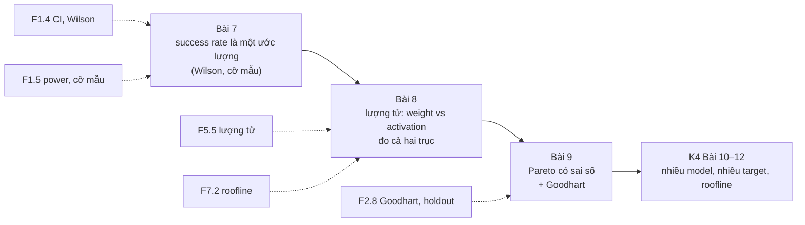
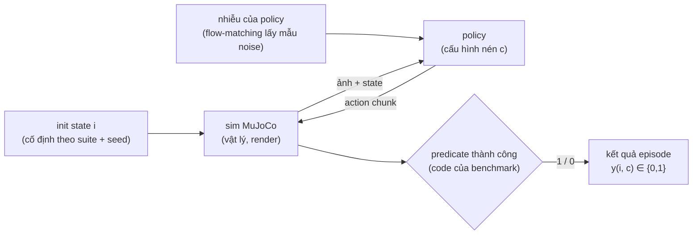
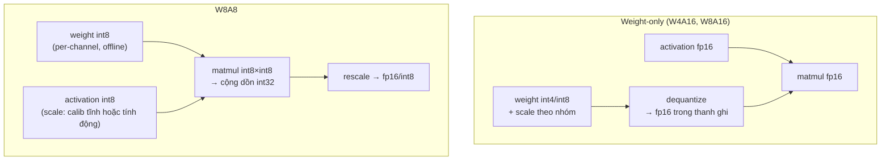

# Khóa 4 — Module 3: Trục chất lượng (16h)

Bài 7 (5h) · Bài 8 (6h) · Bài 9 (5h). Nguồn xương sống: `khoa-4-benchmark-edge.md`, Module 3.

**Luận điểm của module:** đo độ trễ mà không đo chất lượng là một tuyên bố nửa vời. Kỹ thuật nén nào cũng làm model nhanh hơn, và một policy đã hỏng vẫn chạy rất nhanh. Một benchmark chỉ có trục latency không phân biệt được "tối ưu tốt" với "làm hỏng model". Module này thêm trục thứ hai. Nó cũng dạy một điều khó chịu hơn: trục thứ hai là một **tỉ lệ ước lượng từ vài trăm lần thử**. Vì vậy phần lớn chênh lệch bạn thấy giữa các cấu hình sẽ phải được ghi là **"chưa rõ"**.



---

## Bài 7 — LIBERO: đo chất lượng mà không cần robot (5h)

> **Vị trí:** K4 Bài 6 (cô lập nhiệt) → **Bài 7** → K4 Bài 8 (quantization) · **Cần trước:** F1.4 (CI cho tỉ lệ, Wilson), F1.5 (power và cỡ mẫu), F2.2 (seed, nguồn phi tất định), F2.3 (phán quyết ba trạng thái), F6.5 (sim-to-real gap) · **Sau bài này bạn quyết định được:** mỗi cấu hình cần chạy bao nhiêu episode thì mới được phép viết "A tốt hơn B". Bạn cũng biết khi nào kết luận đúng là "chưa phân biệt được ở cỡ mẫu này".

### 1. Câu chuyện — ai đã khổ vì chuyện này

Trước khi có benchmark mô phỏng chung, mỗi phòng lab robot learning tự đánh giá policy trên robot của mình: vài chục lần thử, bàn khác, đèn khác, vật khác. Con số "82% thành công" của lab A và "75%" của lab B không so được với nhau. Chạy lại thì tốn hàng ngày công người đứng cạnh robot để reset cảnh. LIBERO (Bo Liu và cộng sự, *"LIBERO: Benchmarking Knowledge Transfer for Lifelong Robot Learning"*, NeurIPS 2023 Datasets & Benchmarks) chạy trên robosuite/MuJoCo. Nó đóng gói các bộ nhiệm vụ thao tác có điều kiện thành công viết bằng code, và mỗi nhiệm vụ có một tập trạng thái khởi tạo cố định. Nhờ vậy ai cũng chạy được cùng một bài thi `[chuẩn]`. Các suite thường dùng là `libero_spatial`, `libero_object`, `libero_goal`, `libero_10` (dài) và `libero_90`. LeRobot đã tích hợp LIBERO như một env `[spec: LeRobot docs, trang LIBERO]`.

Phần thứ hai của câu chuyện là một ví dụ của Goodhart (→ F2.8). Khi LIBERO thành thước đo chung, các VLA hàng đầu nhanh chóng đẩy điểm lên gần trần. Ở gần trần, benchmark mất khả năng phân biệt, và người ta bắt đầu nghi model học thuộc cảnh thay vì hiểu nhiệm vụ. Vì thế mới có LIBERO-PRO và LIBERO-Plus: chúng xáo trộn vị trí, ánh sáng, câu lệnh để thử độ bền `[spec: LeRobot docs có trang libero_plus; chi tiết từng biến thể — tự đọc]`. Với bạn, điều này có hệ quả trực tiếp. Bạn không dùng LIBERO để tuyên bố "model này giỏi". Bạn dùng nó để hỏi: **cùng một model, cấu hình nén này có làm nó tệ đi không?** Đó là phép so sánh tương đối, và đó đúng là thứ benchmark quantization cần.

### 2. Mô hình tư duy



Bản chất cần nắm có năm ý.

1. **Mỗi episode là một phép thử Bernoulli.** Success rate là một **tỉ lệ ước lượng** từ n phép thử, và nó có khoảng tin cậy giống mọi số đo (→ F1.1, F1.4). Với tỉ lệ, dùng **Wilson interval**. Đừng dùng `p ± 1.96·sqrt(p(1−p)/n)` (Wald), vì Wald hỏng khi p gần 0 hoặc 1 hoặc n nhỏ: với 0/10 nó cho khoảng [0, 0], một kết luận vô lý `[chuẩn: Brown, Cai, DasGupta 2001]`.
2. **Có ba nguồn ngẫu nhiên, đừng gộp làm một.** (a) Trạng thái khởi tạo của cảnh: benchmark cố định nó, seed chọn tập nào. (b) Bản thân policy: model flow-matching như SmolVLA **lấy mẫu nhiễu ban đầu** rồi khử dần, nên cùng một ảnh có thể ra action khác nếu RNG khác. (c) Phi tất định số học: thứ tự cộng float trên GPU, số luồng BLAS, render EGL. Seed khống chế (a) và (b). Seed **không** tự khống chế (c).
3. **Cùng init state cho mọi cấu hình là một thiết kế ghép cặp (paired design).** Khi FP32 và INT8 chạy trên đúng 500 init state giống nhau, mỗi init state cho một cặp (y_fp32, y_int8). Chỉ những cặp **bất đồng** (1/0 hoặc 0/1) mới mang thông tin về khác biệt. Đây là kiểm định McNemar `[chuẩn]`. Nó mạnh hơn nhiều so với so hai tỉ lệ độc lập, vì độ khó riêng của từng cảnh đã bị trừ ra.
4. **Độ nhạy của benchmark phụ thuộc vị trí của baseline.** Ở 98% thì hầu như không còn chỗ để thấy suy giảm (hiệu ứng trần). Ở 2% thì không còn chỗ để thấy gì cả. Suite tốt cho bài toán của bạn là suite mà baseline nằm khoảng giữa.
5. **Predicate thành công là một oracle, và oracle có thể sai** (→ F2.1). Nó là code kiểm tra vị trí và tiếp xúc của vật. Một cái bát rơi đúng chỗ vì bị hất văng vẫn có thể được tính là "thành công".

Mô phỏng đồ chơi dưới đây cho thấy độ rộng CI và cỡ mẫu cần thiết. Chạy nó **sau** khi đã viết `prediction.md`, vì nó in ra chính các con số bạn được yêu cầu dự đoán ở phần 5.

```python
# [đã chạy] Wilson CI cho success rate + số episode cần để phân biệt hai model
import numpy as np
from scipy.stats import norm

def wilson(k, n, conf=0.95):
    z = norm.ppf(1 - (1 - conf) / 2)
    p = k / n
    c = (p + z*z/(2*n)) / (1 + z*z/n)
    h = z * np.sqrt(p*(1-p)/n + z*z/(4*n*n)) / (1 + z*z/n)
    return c - h, c + h

# 1) Cùng tỉ lệ quan sát, khác số episode: CI co lại theo ~1/sqrt(n)
for k, n in [(7, 10), (35, 50), (350, 500), (10, 10), (0, 10)]:
    lo, hi = wilson(k, n)
    print(f"{k:4d}/{n:<4d} p̂={k/n:.2f}  Wilson95=[{lo:.3f}, {hi:.3f}]  rộng={hi-lo:.3f}")

# 2) Cỡ mẫu mỗi nhánh để phát hiện p1 -> p2 (kiểm định hai tỉ lệ, alpha=0.05 hai phía, power=0.8)
def n_per_arm(p1, p2, alpha=0.05, power=0.8):
    za, zb = norm.ppf(1 - alpha/2), norm.ppf(power)
    pbar = (p1 + p2) / 2
    num = (za*np.sqrt(2*pbar*(1-pbar)) + zb*np.sqrt(p1*(1-p1) + p2*(1-p2)))**2
    return int(np.ceil(num / (p1 - p2)**2))
for p1, p2 in [(0.70, 0.75), (0.70, 0.60), (0.90, 0.80), (0.065, 0.040)]:
    print(f"phân biệt {p1:.3f} vs {p2:.3f}: cần ~{n_per_arm(p1, p2)} episode MỖI cấu hình")

# 3) Mô phỏng: hai model GIỐNG HỆT nhau (p=0.70), mỗi cái 20 episode -> chênh lệch nhìn thấy bao nhiêu?
rng = np.random.default_rng(0)
a = rng.binomial(20, 0.70, 100_000) / 20
b = rng.binomial(20, 0.70, 100_000) / 20
d = np.abs(a - b)
print(f"2 model giống hệt, 20 ep: P(|chênh| >= 5 điểm) = {np.mean(d >= 0.05):.2f}, "
      f"P(|chênh| >= 10 điểm) = {np.mean(d >= 0.10):.2f}")
```

Công thức ở mục 2 dành cho hai nhánh **độc lập**, tức là trường hợp xấu nhất. Thiết kế ghép cặp cần ít episode hơn, và mức tiết kiệm phụ thuộc tỉ lệ cặp bất đồng. Bạn sẽ đo tỉ lệ này ở Bài 8.

### 3. Cầu nối từ backend

| Backend bạn biết | Ở đây | Gãy ở chỗ | Nếu dùng nhầm thì |
|---|---|---|---|
| Test suite xanh/đỏ trong CI | Success rate theo task | Test backend kỳ vọng 100% pass, và một lần fail là tín hiệu. Ở đây 70% là bình thường, và mỗi episode tự nó là một "flaky test" có xác suất. | Coi một task fail ở một lần chạy là regression, rồi đuổi theo bóng ma |
| A/B test conversion rate | So FP32 vs INT8 | A/B có hàng nghìn user mỗi nhánh. Ở đây mỗi episode tốn vài giây đến vài phút GPU, nên n chỉ vài trăm. Bù lại, bạn có thể **cho cùng một "user" (init state) đi cả hai nhánh**, điều A/B web không làm được. | So hai tỉ lệ như độc lập, bỏ phí sức mạnh của ghép cặp, rồi kết luận "không khác" chỉ vì thiếu power |
| Server mock để tạo bộ test chuẩn (bạn đã làm) | LIBERO là "mock của thế giới" | Mock server trả lời tất định theo hợp đồng bạn viết. Sim có vật lý tiếp xúc, render và độ lệch so với thực tế mà bạn không viết ra. Ngoài ra sim đúng hợp đồng không có nghĩa robot thật đúng. | Viết "model chạy tốt" thay vì "model đạt X% trên sim, so sánh tương đối" |
| Bộ eval cố định + LLM-judge (bạn đã làm) | Predicate thành công của LIBERO | Judge của bạn có thể hiệu chuẩn bằng kappa với người chấm. Predicate LIBERO là code cứng, ít ai kiểm, và nó có dương tính giả. | Tin 100% vào "success" mà không xem video vài episode |
| Đo trên host yên tĩnh (bạn đã làm) | Cố định seed, thread, deterministic flags | Host yên tĩnh giảm nhiễu thời gian. Ở đây nhiễu nằm ngay trong **giá trị** đầu ra (bit cuối của float), và hệ tiếp xúc hỗn loạn khuếch đại nó. | Tưởng "cùng seed" là đủ để kết quả bit-exact trên GPU |

**Chấm mô hình:**

- *"Cùng seed thì 3 lần chạy phải giống hệt; khác là có bug"* (bản gốc, Gemini). **ĐÚNG MỘT PHẦN.** Câu này chỉ đúng khi đủ cả ba điều kiện: **cùng máy** (cùng model CPU/GPU, cùng driver), **cùng image** (cùng phiên bản PyTorch/CUDA/cuDNN/MuJoCo/LeRobot, ghim bằng lockfile + digest image), và **bật cờ tất định** (`torch.use_deterministic_algorithms(True)`, `CUBLAS_WORKSPACE_CONFIG`, số luồng cố định, mọi RNG được seed). Đổi GPU hay đổi phiên bản cuDNN thì kernel được chọn khác, thứ tự cộng khác, và bit-exact không còn được hứa nữa, kể cả khi đã bật cờ. Thiếu cờ tất định thì ngay trên cùng máy cũng không được hứa: trên GPU, nhiều kernel dùng atomic hoặc chia nhỏ phép cộng (split-K), nên thứ tự cộng float thay đổi giữa các lần chạy. Bit cuối khác nhau, và trong mô phỏng tiếp xúc, một lệch nhỏ ở bước 50 có thể làm vật trượt khỏi tay ở bước 200. **Phản ví dụ:** cùng seed, GPU, không bật `torch.use_deterministic_algorithms(True)`, ba lần chạy 500 episode có vài episode lật kết quả. Đó không phải bug logic, đó là một **số đo** (tỉ lệ lật) bạn phải báo cáo (→ F2.3). Cũng phải tách riêng: **cùng máy, cùng image, đã bật cờ** mà vẫn khác thì mới là nguồn ngẫu nhiên chưa kiểm soát (bug). Khác máy hoặc khác image thì lệch vài episode là bình thường, và người reproduce ở Module 5 sẽ gặp đúng điều này: so sánh với họ bằng CI, không bằng bit-exact.
- *"Biến thiên giữa 3 bộ seed là sai số của phép đo chất lượng"* (bản gốc). **ĐÚNG MỘT PHẦN.** Hướng thì đúng: phải có sai số. Nhưng độ lệch chuẩn ước lượng từ **3 điểm** cũng rất bấp bênh. Với 2 bậc tự do, khoảng tin cậy 95% của s/σ là khoảng [0.16; 1.92] `[chuẩn: phân phối χ² với 2 bậc tự do]`. Nghĩa là ba bộ seed có thể "may mắn" cho ra biến thiên nhỏ gấp 6 lần thực tế. **Phản ví dụ:** p = 0.7, mỗi bộ 50 episode. Lý thuyết nhị thức cho SD ≈ 6.5 điểm, nhưng ba bộ của bạn có thể ra 69/70/71% và khiến bạn tin sai số chỉ ±1 điểm. Cách làm đúng: gộp episode, dùng Wilson cho tỉ lệ, dùng McNemar cho so sánh, và dùng 3 bộ seed để **kiểm tra** xem biến thiên có lớn hơn nhị thức không (nếu lớn hơn thì có nguồn biến thiên ngoài phép thử Bernoulli).
- *"70% → 68% với biến thiên seed ±4% thì kết luận: không có khác biệt có ý nghĩa thống kê"* (Gemini, Bài 7, tự kiểm tra 1). **SAI ở cách phát biểu.** "Không phát hiện được khác biệt" khác với "không có khác biệt". Câu đúng: "chưa phân biệt được; với n này, phép đo chỉ phát hiện được chênh lệch từ X điểm trở lên (MDE)". **Phản ví dụ:** mục 3 của mô phỏng trên dựng hai model *giống hệt nhau* với 20 episode mỗi cái; chạy nó (sau khi dự đoán Q3) và xem chênh lệch "nhìn thấy được" xuất hiện thường xuyên thế nào dù khác biệt thật bằng 0. Ngược lại, một model kém thật 3 điểm cũng sẽ thường xuyên "không có ý nghĩa thống kê" ở n = 50.

### 4. Thuật ngữ

| Mức | Thuật ngữ | Nghĩa trong một câu | Hay bị hiểu nhầm thành |
|---|---|---|---|
| 🟢 | Episode / rollout | Một lần chạy policy trong sim từ init state tới khi thành công hoặc hết bước | Một lần forward pass |
| 🟢 | Success rate theo task | k/n episode thành công của một task cụ thể | Một số "độ chính xác" chắc chắn |
| 🟢 | Suite / task / init state | Bộ nhiệm vụ → nhiệm vụ → cấu hình cảnh ban đầu cố định | Seed (seed chỉ *chọn* hoặc *xáo* init state và nhiễu policy) |
| 🟢 | Wilson interval | CI cho tỉ lệ nhị thức, đúng cả khi p gần 0/1 và n nhỏ | p ± 1.96·SE (Wald) |
| 🟢 | MDE (minimum detectable effect) | Chênh lệch nhỏ nhất phát hiện được với α, power, n đã chọn | "Ngưỡng có ý nghĩa" tùy ý |
| 🟢 | Power | Xác suất phát hiện một khác biệt có thật cỡ δ | Độ tin cậy 95% |
| 🟡 | McNemar / so sánh ghép cặp | Kiểm định chỉ dùng các cặp bất đồng trên cùng init state | So hai tỉ lệ độc lập |
| 🟡 | Rule of three | 0/n thành công → cận trên 95% của p ≈ 3/n | "0% nghĩa là không bao giờ" |
| 🟡 | LIBERO-PRO / LIBERO-Plus | Biến thể xáo trộn cảnh và lệnh để thử độ bền | Thay thế LIBERO cho so sánh nén |
| 🟡 | `MUJOCO_GL=egl` | Render MuJoCo không cần màn hình trên máy chủ | Tùy chọn hiệu năng |
| 🔴 | BDDL | Ngôn ngữ mô tả task và điều kiện thắng của LIBERO | Thứ phải học để làm khóa này |

### 5. Dự đoán

Viết `prediction.md` và commit **trước** khi chạy mô phỏng ở phần 2 và trước khi chạy LIBERO.

**Tham số cần tra:**
- Số task trong suite bạn chọn, và số episode mỗi task mặc định: tra trang LIBERO trong LeRobot docs và `lerobot-eval --help` (ý nghĩa của `--eval.n_episodes` khác nhau giữa các phiên bản, có trang nói là tổng, có trang nói là mỗi task) `[tự đo]`.
- Thời gian một episode trên GPU thuê: chạy thử 2 episode, đo bằng đồng hồ.
- Checkpoint SmolVLA **đã fine-tune trên LIBERO**: tìm trên HF Hub (tên repo thay đổi theo thời gian). `smolvla_base` chưa fine-tune cho LIBERO `[tự đo]`.

**Câu hỏi (chỉ đề, không có đáp án ở đây):**
1. Với p ≈ 0.7: Wilson 95% rộng bao nhiêu điểm ở n = 10, 50, 500? Tính tay theo công thức ở phần 2, đừng chạy code.
2. Cần bao nhiêu episode mỗi cấu hình (hai nhánh độc lập, α = 0.05, power = 0.8) để phân biệt 70% vs 75%? 70% vs 60%? 6.5% vs 4.0% (con số `stack_cube` ở Bài 8)?
3. Hai cấu hình giống hệt nhau, mỗi cái 20 episode: xác suất thấy chênh ≥ 5 điểm là bao nhiêu?
4. Trên GPU, cùng seed, 3 lần chạy: bao nhiêu episode trên 500 sẽ lật kết quả (a) cùng máy, không bật cờ tất định, (b) cùng máy, cùng image, có bật cờ, (c) có bật cờ nhưng chạy trên một GPU thuê khác loại?
5. Trong suite, bao nhiêu task bạn đoán baseline đạt 0% hoặc 100%?
6. Chi phí GPU để chạy một suite đầy đủ cho một cấu hình.

```markdown
# prediction.md — K4 Bài 7 (commit trước khi chạy)
- Suite: ___ · số task: ___ · episode/task: ___ (nguồn: ___ , phiên bản lerobot: ___)
- Checkpoint: ___ (revision: ___)
- Q1 Wilson rộng @p=0.7: n=10 ___ · n=50 ___ · n=500 ___ (cách tính: ___)
- Q2 n mỗi cấu hình: 70/75 ___ · 70/60 ___ · 6.5/4.0 ___
- Q3 P(|chênh|≥5 điểm | hai model giống nhau, n=20): ___
- Q4 số episode lật: cùng máy không cờ ___ · cùng máy+image có cờ ___ · khác GPU có cờ ___
- Q5 số task 0% hoặc 100%: ___
- Q6 giây/episode ___ → giờ GPU/suite ___ → chi phí ___
- Quy tắc diễn giải (cam kết trước): ___
- Quy tắc loại task "luôn thất bại": quyết định CHỈ dựa trên baseline, trước khi xem cấu hình nén
```

### 6. Làm

Giữ năm bước của bản gốc, thêm các bước làm phép đo có sai số.

1. **Cài LIBERO qua LeRobot.** Theo LeRobot docs hiện hành: cài LeRobot, rồi `pip install -e ".[libero]"`. LIBERO yêu cầu Linux. Trên máy không màn hình, đặt `export MUJOCO_GL=egl` `[tự đo — kiểm theo phiên bản bạn cài]`. Bản Gemini viết `pip install libero`; đừng dùng cách đó (xem phần 11).
2. **Chạy SmolVLA baseline (fp32 hoặc bf16) trên một suite.** Mẫu lệnh theo docs (tên flag `[tự đo]`):
   ```bash
   # [chưa chạy] cần GPU + LeRobot + LIBERO; đổi checkpoint thành bản đã fine-tune LIBERO
   export MUJOCO_GL=egl
   lerobot-eval \
     --policy.path=<checkpoint_smolvla_libero> \
     --env.type=libero --env.task=libero_object \
     --eval.batch_size=1 --eval.n_episodes=<theo power analysis> \
     --seed=1000
   ```
   Ghi success rate **theo từng task**, không chỉ trung bình. Kiểm thêm `--env.control_mode` (relative/absolute) khớp với cách checkpoint được huấn luyện. Lệch chỗ này cho ra 0% ở mọi task, trông y như model hỏng.
3. **Kiểm tra tính tất định.** Cố định seed, chạy 3 lần **trên cùng máy, cùng image Docker (ghi digest), có bật cờ tất định**. Chỉ trong điều kiện đó kỳ vọng "giống hệt" của bản gốc mới áp dụng. Hãy đo cụ thể: lưu kết quả **từng episode** (task_id, init_state_id, seed, success, số bước), rồi đếm số episode lật giữa các lần. Nếu có lật: bật `torch.use_deterministic_algorithms(True)` và `CUBLAS_WORKSPACE_CONFIG=:4096:8` (theo PyTorch docs về reproducibility), ghim số luồng (`OMP_NUM_THREADS`), rồi chạy lại. Còn lật sau đó thì đi tìm nguồn ngẫu nhiên: RNG của policy chưa được seed, env không reset đủ, render.
4. **Chạy 3 bộ seed khác nhau.** Ghi số thành công mỗi bộ. So độ phân tán quan sát được với độ phân tán nhị thức kỳ vọng `sqrt(p(1−p)/n)`. Phân tán lớn hơn rõ rệt nghĩa là có nguồn biến thiên ngoài Bernoulli (ví dụ một bộ seed rơi vào nhiều init state khó).
5. **Thêm trường `quality` vào JSON output của harness.** Lưu cả dữ liệu thô, không chỉ tỉ lệ:
   ```json
   "quality": {
     "benchmark": "libero_object", "lerobot_version": "...", "checkpoint_revision": "...",
     "seeds": [1000, 2000, 3000], "deterministic_flags": true,
     "per_task": {"<task_name>": {"k": 0, "n": 0, "wilson95": [0.0, 0.0]}},
     "overall": {"k": 0, "n": 0, "wilson95": [0.0, 0.0]},
     "episodes_file": "episodes/<run_id>.parquet",
     "flip_rate_same_seed": 0.0,
     "excluded_tasks": {"rule": "baseline 0/n trên cả 3 seed", "tasks": []}
   }
   ```
   `episodes_file` là thứ cho phép Bài 8 làm so sánh ghép cặp. Thiếu nó thì Bài 8 chỉ còn so được hai tỉ lệ.
6. **Kiểm oracle.** Xem video của 10 episode "thành công" và 10 episode "thất bại" (LeRobot có tùy chọn lưu video `[tự đo]`). Đếm số ca predicate chấm sai. Đây là sai số của chính dụng cụ đo (→ F2.1).
7. **Viết quy tắc diễn giải vào `METHODOLOGY.md` trước Bài 8:** α, power, MDE ở n bạn chạy được, phép kiểm định dùng (McNemar cho ghép cặp), và quy tắc loại task.

**Sai số của dụng cụ ở mỗi phép đo:** success rate có sai số lấy mẫu (Wilson), sai số oracle (bước 6) và sai số phi tất định (tỉ lệ lật ở bước 3). Báo cáo cả ba.

### 7. Số phải ra

<details><summary>🔒 MỞ SAU KHI COMMIT prediction.md</summary>

**Kết quả mô phỏng (đã chạy):**

| Quan sát | Wilson 95% | Độ rộng |
|---|---|---|
| 7/10 | [0.397; 0.892] | ≈ 49 điểm |
| 35/50 | [0.562; 0.809] | ≈ 25 điểm |
| 350/500 | [0.658; 0.739] | ≈ 8 điểm |
| 10/10 | [0.722; 1.000] | ≈ 28 điểm |
| 0/10 | [0.000; 0.278] | ≈ 28 điểm |

| Phân biệt (độc lập, α = 0.05, power = 0.8) | Episode mỗi cấu hình |
|---|---|
| 70% vs 75% | ~1251 |
| 70% vs 60% | ~356 |
| 90% vs 80% | ~199 |
| 6.5% vs 4.0% | ~1249 |

Hai model giống hệt, 20 episode mỗi model: P(|chênh| ≥ 5 điểm) ≈ 0.76, P(|chênh| ≥ 10 điểm) ≈ 0.44.

**Đọc các con số:**
- Ở cỡ mẫu thường thấy trong các báo cáo VLA (vài chục đến vài trăm episode mỗi suite), **chênh lệch 5 điểm gần như không bao giờ phân biệt được** khi so độc lập. Ghép cặp giúp được, nhưng không biến 50 episode thành 1000.
- Con số `stack_cube` 6.5% → 4.0% ở Bài 8: muốn khẳng định nó là thật cần khoảng 1250 episode mỗi nhánh. Hãy tự hỏi nguồn gốc của con số đó dùng bao nhiêu.
- Task 0/n hoặc n/n: dùng rule of three. 0/50 cho cận trên ≈ 6%, không phải "không bao giờ thành công".

**Thực tế trên GPU thuê `[tự đo]`:**

| Kiểm tra | Khoảng chấp nhận | Vì sao lệch là bình thường |
|---|---|---|
| Cùng seed, cùng máy, cùng image, có cờ tất định | 0 episode lật | Nếu vẫn lật: nguồn ngẫu nhiên chưa kiểm soát, phải tìm |
| Cùng seed, có cờ, nhưng khác GPU hoặc khác image | Có thể lật vài episode | Kernel và thứ tự cộng khác; so bằng CI, không bằng bit-exact |
| Cùng seed, không cờ | 0 tới vài % số episode lật | Thứ tự cộng float trên GPU, hệ tiếp xúc khuếch đại |
| 3 bộ seed khác nhau | Phân tán cỡ `sqrt(p(1−p)/n)` mỗi bộ | Lớn hơn nhiều thì có biến thiên ngoài Bernoulli |
| Có task 0% ở baseline | Bình thường | Đó là thất bại của policy, không phải của runtime. Loại theo quy tắc đã cam kết |
| Mọi task 0% | Không bình thường | Xem bảng phần 8 |

</details>

### 8. Nếu ra khác

| Triệu chứng | Nguyên nhân khả dĩ | Kiểm bằng cách | Sửa |
|---|---|---|---|
| Mọi task 0% | Checkpoint chưa fine-tune LIBERO; `control_mode` lệch; chuẩn hóa state/action sai; thứ tự hoặc kênh camera sai | Xem 2 video; in action đầu tiên so với dải action trong dataset LIBERO | Dùng checkpoint đúng, khớp `control_mode`, kiểm stats chuẩn hóa |
| Cùng seed, cùng máy, cùng image, có cờ tất định vẫn lật | RNG policy không được seed (noise flow-matching), env không reset sạch, worker song song không seed | Chạy `--eval.batch_size=1`; seed rõ torch/numpy/random trong code eval | Seed từng nguồn; ghi seed từng episode vào file |
| Bật cờ deterministic thì crash | Có op không có bản deterministic | Thông báo lỗi PyTorch nêu op | Chạy op đó trên CPU, hoặc chấp nhận và *báo cáo* tỉ lệ lật |
| 3 bộ seed lệch nhau nhiều hơn nhị thức | Init state theo seed có độ khó khác nhau; tài nguyên GPU thay đổi giữa phiên | So theo task: lệch tập trung ở vài task? | Báo cáo theo task; tăng n; dùng ghép cặp |
| Success rate cao bất thường (≈100% mọi task) | Suite bão hòa với checkpoint này; predicate quá dễ | Kiểm video "thành công" | Chọn suite khó hơn để còn độ nhạy |
| Một episode chạy rất lâu | Policy kẹt, chạy đến hết `max_steps` | Đếm số bước mỗi episode | Bình thường; ghi lại phân bố số bước |

### 9. Câu hỏi ngược

1. **[Quy mô]** 3 model × 5 mức precision × 4 suite × 500 episode. Cái gì gãy trước: giờ GPU, dung lượng video, hay sức chú ý của bạn khi đọc 60 bảng theo task?
   <details><summary>Hướng nghĩ</summary>Nhân thử: 30.000 episode × giây/episode của bạn. Ngoài tiền, hãy nghĩ tới bội so sánh (→ F1.5): 60 bảng theo task với α = 0.05 thì có vài "khác biệt" sẽ là ngẫu nhiên. Quy tắc diễn giải cam kết trước phải tính tới điều này.</details>
2. **[Failure mode]** Predicate tính "thành công" khi vật nằm trong vùng đích, kể cả khi nó bị hất văng vào đó. Cấu hình nén làm action giật hơn thì success rate sẽ đi theo hướng nào, và bạn phát hiện bằng cách nào?
   <details><summary>Hướng nghĩ</summary>Oracle có dương tính giả, và tỉ lệ dương tính giả có thể *phụ thuộc cấu hình*. Đó là chỗ nguy hiểm. Nghĩ tới chỉ số phụ (số bước tới thành công, độ giật của action, va chạm) và việc lấy mẫu video ngẫu nhiên có ghi lại.</details>
3. **[Vì sao không]** Vì sao không đo chất lượng rẻ hơn bằng cách chạy model nén và model gốc trên cùng một bộ observation offline rồi so sai số action (MSE)?
   <details><summary>Hướng nghĩ</summary>Nó rẻ và tất định, nên rất tốt làm smoke test hoặc để định vị lớp hỏng. Nhưng nó là vòng hở. Trong vòng kín, một lệch nhỏ đưa robot tới trạng thái mà dữ liệu chưa từng có (covariate shift), và lỗi tích lũy. Hỏi thêm: ngưỡng MSE nào tương ứng với "hỏng"? Bạn không biết nếu chưa có trục vòng kín để hiệu chuẩn.</details>
4. **[Phản biện]** "LIBERO bão hòa rồi, dùng nó là lỗi thời." Đúng trong trường hợp nào, sai trong trường hợp nào, xét đúng câu hỏi của khóa này?
   <details><summary>Hướng nghĩ</summary>Câu hỏi "model nào giỏi nhất" khác với câu hỏi "nén có làm model này tệ đi không". Với câu hỏi thứ hai, vấn đề là hiệu ứng trần: ở 98% thì không còn chỗ để thấy suy giảm nhỏ. Lời giải có thể là chọn suite hoặc biến thể mà baseline nằm khoảng giữa.</details>
5. **[Liên ngành]** Thử nghiệm thuốc dùng thiết kế bắt chéo (crossover): cùng một bệnh nhân lần lượt dùng hai thuốc. Thiết kế ghép cặp của bạn giống và khác crossover ở đâu?
   <details><summary>Hướng nghĩ</summary>Giống: mỗi đơn vị là đối chứng của chính nó, nên phương sai giữa các đơn vị bị loại bỏ. Khác: bệnh nhân có hiệu ứng mang sang (carry-over) và cần thời gian rửa thuốc. Init state trong sim reset hoàn hảo, đó là thứ y học mơ ước.</details>

### 10. Liên kết ra ngoài

- **Thăm dò dư luận.** Biên sai số ±3 điểm cần khoảng một nghìn người được hỏi. Đó cùng là phép tính sqrt(p(1−p)/n) bạn vừa làm, và vì sao không ai tin một khảo sát 50 người. Khác biệt: khảo sát lo sai lệch lấy mẫu (ai trả lời điện thoại). Bạn lo init state của sim có đại diện cho thế giới thật không, tức sim-to-real (→ F6.5).
- **Kiểm định độ tin cậy phần cứng (zero-failure testing).** Kỹ sư độ tin cậy dùng "rule of three": thử n lần không hỏng thì chỉ nói được tỉ lệ hỏng < 3/n ở 95%. Áp đúng nguyên lý này cho task 0/n hoặc n/n của bạn. Khác biệt: ngành đó thường thiết kế n từ mục tiêu tỉ lệ hỏng trước khi thử. Đó chính là thói quen bạn cần (power analysis trước khi chạy).
- **Thử nghiệm lâm sàng.** Ngành y đăng ký trước giao thức (preregistration), cỡ mẫu và điểm cuối chính. Đó là `prediction.md` + `METHODOLOGY.md` của bạn (→ F1.7). Khác biệt: ở y khoa, đăng ký trước là bắt buộc pháp lý vì đã có quá nhiều thử nghiệm chỉ công bố kết quả đẹp. Ở benchmark ML, đó vẫn là kỷ luật tự nguyện.

### 11. Độ tin cậy và sửa lỗi

| Khẳng định | Nhãn | Ghi chú / cách kiểm |
|---|---|---|
| LIBERO: Liu và cộng sự, NeurIPS 2023 D&B, trên robosuite/MuJoCo | [chuẩn] | Đọc bài gốc |
| Cài qua LeRobot `pip install -e ".[libero]"`, cần Linux, `MUJOCO_GL=egl` khi không màn hình | [spec: LeRobot docs, trang LIBERO] / [tự đo] | Tên flag và extras đổi theo phiên bản |
| `--eval.n_episodes` là tổng hay mỗi task | [tự đo] | Các trang docs mô tả khác nhau; đọc `--help` và đếm episode thực chạy |
| Wilson đúng hơn Wald cho tỉ lệ khi n nhỏ hoặc p gần 0/1 | [chuẩn] | Brown, Cai, DasGupta 2001 |
| Bảng cỡ mẫu và CI ở phần 7 | [ước lượng] | Từ công thức xấp xỉ chuẩn và mô phỏng (đã chạy). Ghép cặp sẽ cho số khác |
| GPU không bit-exact giữa các lần chạy nếu không bật chế độ deterministic | [chuẩn] | PyTorch docs, mục Reproducibility |
| "Nhóm benchmark VLA trên Intel thấy một nhóm seed thất bại ở mọi runtime" | chưa kiểm nguồn | Bản gốc không ghi nguồn; tìm web không thấy báo cáo khớp. Ý phương pháp (tách thất bại của policy khỏi thất bại của runtime) vẫn đúng |
| LIBERO-PRO và LIBERO-Plus nhắm vào độ bền và học thuộc | [spec: LeRobot docs có trang libero_plus] | Chi tiết LIBERO-PRO: tự tra |

**Đã sửa so với bản gốc / Gemini:**
- Bản gốc nói "3 bộ seed → biến thiên = sai số của phép đo". Đã sửa: sai số của tỉ lệ đến từ Wilson trên episode gộp, so sánh dùng McNemar ghép cặp, còn 3 bộ seed dùng để *kiểm* biến thiên ngoài nhị thức. Lý do: SD từ 3 điểm có khoảng tin cậy rộng gấp khoảng 12 lần.
- Bản gốc yêu cầu "cùng seed → giống hệt" như tiêu chí đạt/trượt. Đã sửa: "giống hệt" chỉ được hứa khi **cùng máy, cùng image, có bật cờ tất định**. Ngoài điều kiện đó (không cờ, hoặc khác GPU/driver/phiên bản thư viện), số episode lật là một số đo phải báo cáo, không phải bug.
- Gemini: `pip install libero`. Đã sửa theo docs LeRobot (`".[libero]"` extras); cài lệch phiên bản dễ hỏng khi chạy cùng LeRobot.
- Gemini tự kiểm tra 1: "không có khác biệt có ý nghĩa thống kê" → "chưa phân biệt được ở MDE = X".
- Gemini ví dụ JSON có trường `seed_variance` là một con số duy nhất. Đã thay bằng k/n theo task, Wilson, file episode thô và tỉ lệ lật.
- Thêm: dùng checkpoint đã fine-tune trên LIBERO; khớp `control_mode`; kiểm oracle bằng video; quy tắc loại task chỉ dựa trên baseline (tránh chọn sau khi đã thấy kết quả).
- Reviewer sửa (niêm phong): chấm mô hình thứ ba nêu sẵn mức chênh "5–10 điểm" của hai model giống hệt, tức đáp án Q3; đã thay bằng lời mời chạy mô phỏng sau khi dự đoán. Đã chạy lại 4 khối Python của module, số khớp các bảng 🔒.

### 12. Đọc thêm và tự kiểm tra

- **Nguồn gốc:** Bo Liu và cộng sự, *LIBERO: Benchmarking Knowledge Transfer for Lifelong Robot Learning* (NeurIPS 2023 Datasets & Benchmarks). LeRobot docs, trang "LIBERO".
- **Giải thích:** Brown, Cai, DasGupta, *Interval Estimation for a Binomial Proportion*, Statistical Science, 2001. Đọc phần so sánh Wald và Wilson.
- **Đào sâu (tùy chọn):** Agresti & Coull, *Approximate is better than "exact" for interval estimation of binomial proportions*, The American Statistician, 1998.
- **Tự kiểm tra:** (1) Giải thích cho một backend engineer khác trong 5 câu: vì sao "INT8 75% vs FP32 70%" không phải tin tốt. (2) Vẽ lại sơ đồ phần 2 từ trí nhớ, đánh dấu ba nguồn ngẫu nhiên. (3) Hai câu:
  - a) FP32 và INT8 chạy trên cùng 200 init state. 150 cặp cùng thành công, 30 cặp cùng thất bại, 12 cặp FP32 thành công còn INT8 thất bại, 8 cặp ngược lại. Có phân biệt được không?
  - b) Task X đạt 0/50 ở baseline. Bạn được viết gì về task X?

  <details><summary>Đáp án</summary>
  a) Chỉ 20 cặp bất đồng mang thông tin. Dưới giả thuyết không khác, số cặp "FP32 thắng" ~ Binomial(20, 0.5). Quan sát 12 trên 20 cho p hai phía ≈ 0.50 (McNemar chính xác). Kết luận: chưa phân biệt được. Success rate là 81% vs 79%, nhưng thông tin thực sự nằm trong 20 cặp, không phải 200.
  b) "0/50, cận trên 95% của tỉ lệ thành công ≈ 6% (rule of three), Wilson 95% ≈ [0; 7.1%]. Task bị loại khỏi so sánh theo quy tắc đã cam kết trước." Không được viết "model không làm được task X".
  </details>

---

## Bài 8 — Quantization: fp32 → 4-bit (6h)

> **Vị trí:** K4 Bài 7 (success rate có sai số) → **Bài 8** → K4 Bài 9 (Pareto) · **Cần trước:** F5.5 (lấy mẫu và lượng tử, nhiễu lượng tử, SNR), F7.2 (băng thông vs compute; chỉ cần trực giác, Bài 12 đào sâu), F1.5 (so sánh hai thứ), K3 Bài 7 (SNR theo số bit) · **Sau bài này bạn quyết định được:** với một target cụ thể, chọn kiểu lượng tử nào (weight-only hay W8A8, per-tensor hay per-channel, lớp nào giữ precision cao). Bạn cũng biết khi nào được phép viết "mức nén này không làm giảm chất lượng" và khi nào chỉ được viết "chưa phát hiện suy giảm lớn hơn X điểm".

### 1. Câu chuyện — ai đã khổ vì chuyện này

Lượng tử hóa INT8 cho mạng CNN trên điện thoại đã thành nghề từ khoảng 2017–2018. Bài của Jacob và cộng sự (Google, *"Quantization and Training of Neural Networks for Efficient Integer-Arithmetic-Only Inference"*, CVPR 2018) đặt nền cho cách làm scale + zero-point mà TFLite và nhiều runtime khác dùng `[chuẩn]`. Với CNN, lượng tử cả weight lẫn activation xuống INT8 thường chỉ mất rất ít độ chính xác.

Rồi transformer lớn xuất hiện, và công thức đó gãy. Dettmers và cộng sự (*"LLM.int8()"*, 2022) báo cáo rằng từ khoảng vài tỉ tham số trở lên, activation xuất hiện **một số ít kênh có giá trị lớn gấp hàng chục lần phần còn lại** (outlier features). Lượng tử activation per-tensor xuống INT8 làm hỏng model, vì scale bị outlier kéo giãn và mọi kênh bình thường bị làm tròn về gần 0 `[chuẩn]`. Từ đó sinh ra cả một họ kỹ thuật. LLM.int8() tách các kênh outlier ra để tính riêng bằng fp16. SmoothQuant (Xiao và cộng sự, 2023) chuyển độ khó từ activation sang weight bằng một phép co giãn tương đương. Còn GPTQ (Frantar và cộng sự, 2022), AWQ (Lin và cộng sự, 2023) và NF4 trong QLoRA (Dettmers và cộng sự, 2023) chọn chỉ lượng tử **weight** xuống 4-bit và giữ activation ở 16-bit `[chuẩn]`. Bài học lịch sử: **weight và activation là hai bài toán lượng tử khác nhau**, và gộp chúng thành một chữ "nén" là nguồn gốc của rất nhiều kết luận sai.

Với VLA, bản gốc dẫn ba quan sát công khai (kiểm nguồn ở phần 11): (1) một bản GR00T-N1.6 INT8 giữ nguyên trung bình nhưng dịch chuyển kết quả từng task; (2) một cấu hình INT8 trên CPU cho điểm *cao hơn* FP32, và tác giả từ chối gọi đó là "thắng"; (3) nhóm vla.cpp thấy precision thấp ở vision encoder làm lệch action qua các bước solver, tới mức họ phải chặn cấu hình đó ở tầng build. Cả ba là cùng một bài học: **chỉ trục chất lượng mới cho bạn biết**.

### 2. Mô hình tư duy

Lượng tử hóa là ADC cho con số (→ K3 Bài 7, F5.5). Bạn chọn một **scale** s và làm tròn x/s về số nguyên trong [−(2^(b−1)−1), 2^(b−1)−1]. Lỗi gồm hai phần: **làm tròn** (≤ s/2 mỗi giá trị) và **cắt** (giá trị vượt dải bị kẹp). Scale lớn thì ít cắt nhưng làm tròn thô; scale nhỏ thì ngược lại. Mọi kỹ thuật lượng tử là cách chọn s cho khéo.



| | Weight | Activation |
|---|---|---|
| Biết trước? | Có, cố định sau huấn luyện | Không, phụ thuộc đầu vào (ảnh, câu lệnh, state) |
| Chọn scale | Offline, có thể per-channel/per-group, có thể tối ưu (GPTQ/AWQ) | Từ tập calibration (tĩnh) hoặc tính lúc chạy (động, tốn thêm thời gian) |
| Bản chất lỗi | **Tất định**: cùng weight → cùng lệch, lần nào chạy cũng thế | Phụ thuộc dữ liệu: ảnh ngoài phân bố calibration → bị cắt |
| Outlier | Ít, phân bố gần chuẩn | Có kênh outlier lớn (đã ghi nhận ở LLM/ViT) |
| Tiết kiệm gì | **Byte đọc từ bộ nhớ** (giúp khi memory-bound) | **FLOP rẻ hơn** nhờ đơn vị tính số nguyên (giúp khi compute-bound, *nếu* có kernel) |

Bốn ý bản chất:
1. Weight-only giảm **byte**, không giảm FLOP: phép nhân vẫn chạy fp16 sau khi giải nén. Nó giúp khi phép tính bị chặn bởi băng thông (decode batch 1), và có thể *làm chậm* khi phép tính bị chặn bởi compute (prefix ảnh nhiều token). Bài 12 sẽ đo điều này.
2. W8A8 giảm cả byte lẫn FLOP, nhưng chỉ nhanh khi runtime có kernel int8 thật cho phần cứng của bạn (Tensor Core INT8, VNNI, AMX). Không có kernel thì runtime giải nén về float và bạn chỉ trả thêm chi phí.
3. **Lỗi weight là sai lệch hệ thống (bias), không phải nhiễu.** Nhiễu ngẫu nhiên có thể trung bình hóa qua nhiều bước; bias thì không. Với flow-matching, cùng một bias lặp lại ở mỗi bước solver.
4. Đừng nghĩ tới "độ chính xác của model" mà hãy nghĩ tới **SQNR từng tensor**, rồi lan truyền qua mạng, rồi qua vòng kín với môi trường.

Mô phỏng (chạy sau khi đã ghi dự đoán):

```python
# [đã chạy] Lỗi lượng tử của weight vs của activation (có outlier), per-tensor vs per-channel
import numpy as np
rng = np.random.default_rng(0)
D, T = 512, 64
W = rng.standard_normal((D, D)) / np.sqrt(D)          # weight: gần Gaussian, ít outlier
X = rng.standard_normal((T, D))
out = rng.choice(D, 4, replace=False); X[:, out] *= 60   # activation: vài kênh outlier (đã ghi nhận ở LLM/ViT)
norm_ch = np.setdiff1d(np.arange(D), out)              # các kênh "bình thường"

def q(x, bits, axis=None):                             # lượng tử đối xứng, scale = max|x| / (2^(b-1)-1)
    qmax = 2**(bits-1) - 1
    s = np.max(np.abs(x), axis=axis, keepdims=axis is not None) / qmax
    return np.clip(np.round(x / s), -qmax, qmax) * s

def sqnr_db(ref, approx):                              # tỉ số tín hiệu / nhiễu lượng tử, dB
    return 10*np.log10(np.sum(ref**2) / np.sum((ref - approx)**2))

Y = X @ W
print("bits | W per-tensor | W per-chan | X per-tensor | X kênh thường | W8A8 output")
for b in (8, 6, 4):
    r = [sqnr_db(W, q(W, b)), sqnr_db(W, q(W, b, axis=0)),
         sqnr_db(X, q(X, b)), sqnr_db(X[:, norm_ch], q(X, b)[:, norm_ch]),
         sqnr_db(Y, q(X, b) @ q(W, b, axis=0))]
    print(f"{b:4d} | " + " | ".join(f"{v:11.1f}" for v in r))
print("lý thuyết sin full-scale 6.02b+1.76:", [round(6.02*b+1.76, 1) for b in (8, 6, 4)], "(→ F5.5, giả định khác hẳn)")

# Tích lũy qua solver: x_{k+1} = x_k + dt*f(x_k). Lỗi lượng tử là TẤT ĐỊNH (cùng weight -> cùng lệch),
# khác nhiễu ngẫu nhiên: không trung bình hóa được qua các bước.
def rollout(err, steps=10, kind="rand"):
    x = np.zeros(8); dt = 1/steps; A = np.linspace(0.5, 1.5, 8); bias = err * np.ones(8)
    for _ in range(steps):
        e = err * rng.standard_normal(8) if kind == "rand" else bias
        x = x + dt * (A * (2 - x) * x + 0.2 + e)       # trường phi tuyến đồ chơi
    return x
for steps in (1, 10, 50):
    r = np.mean([np.abs(rollout(0.02, steps) - rollout(0.0, steps)).max() for _ in range(300)])
    s_ = np.abs(rollout(0.02, steps, "bias") - rollout(0.0, steps)).max()
    print(f"{steps:3d} bước: lệch do nhiễu ngẫu nhiên {r:.4f} | lệch do sai lệch hệ thống {s_:.4f}")
```

Khi đọc kết quả, đặt cột "X per-tensor (toàn tensor)" cạnh cột "X kênh thường" và hỏi: một chỉ số tính trên **toàn tensor** có thể che hỏng hóc ở **một nhóm kênh** không? Câu hỏi đó cùng hình dạng với "trung bình 61.07% không đổi nhưng từng task dịch chuyển", chỉ ở tầng tensor. Phần đọc kết quả nằm trong khối 🔒 ở phần 7.

### 3. Cầu nối từ backend

| Backend bạn biết | Ở đây | Gãy ở chỗ | Nếu dùng nhầm thì |
|---|---|---|---|
| Nén gzip/zstd payload, nén ảnh docker | "Nén model" | gzip **không mất dữ liệu**: giải nén ra đúng từng byte. Lượng tử **mất dữ liệu và không đảo ngược**: dequantize không trả lại weight cũ. Ngoài ra nó đổi cả *phép tính*, không chỉ cách lưu. | Bỏ trục chất lượng vì nghĩ "nén thì ra giống hệt" |
| Nén để tiết kiệm băng thông mạng, trả bằng CPU giải nén | Weight-only 4-bit | Giống ở chỗ đổi byte lấy compute. Khác ở chỗ phép "giải nén" chạy *bên trong* vòng lặp matmul, mỗi lần chạy. Nếu bạn vốn đã nghẽn compute, nó làm chậm thêm. | Kỳ vọng 4-bit nhanh gấp 4 lần fp16 ở mọi pha |
| Lossy codec (JPEG, video bitrate) có chỉ số chất lượng cảm nhận | Lượng tử có trục success rate | Gần đúng nhất. Nhưng lỗi JPEG không tự khuếch đại. Lỗi lượng tử đi qua hàng chục lớp, qua N bước solver, rồi qua vòng kín robot–môi trường, nơi một action lệch tạo ra ảnh kế tiếp lệch. | Dùng một ngưỡng "PSNR đủ cao" tĩnh thay vì đo vòng kín |
| Sai số làm tròn tiền tệ dùng float | Làm tròn weight | Tài chính chọn decimal chính xác vì luật đòi đúng từng đồng. Ở đây bạn *cố ý* chấp nhận sai, đổi lấy tốc độ, và phải đo cái giá. | Đòi bit-exact giữa fp32 và int8, rồi coi mọi lệch là bug |
| Tập dữ liệu warm-up cho cache | Tập calibration cho activation (tĩnh) | Cache warm-up sai thì chỉ chậm. Calibration sai phân bố (ảnh LIBERO vs bếp thật) thì **cắt** activation, sai lặng lẽ, và không có lỗi nào được báo. | Calibrate trên sim rồi deploy ngoài đời mà không kiểm |

**Chấm mô hình:**

- *"Quantization là nén model, như zip"*. **SAI** về bản chất (xem bảng). **Phản ví dụ:** dequantize(quantize(W)) ≠ W, và W8A8 thay hẳn phép nhân float bằng phép nhân số nguyên rồi co giãn.
- *"VRAM giảm gần tuyến tính theo số bit của weight"* (bản gốc, Gemini). **ĐÚNG MỘT PHẦN.** Chỉ **phần weight** giảm tuyến tính, và kể cả phần đó cũng cộng thêm scale/zero-point. Nhóm 128 phần tử với scale fp16 tốn thêm 16/128 = 0.125 bit mỗi weight `[ước lượng]`. Ngoài ra luôn có vài lớp bị giữ precision cao. Activation, KV cache, CUDA context (cỡ vài trăm MB `[ước lượng, tự đo]`) và phân mảnh allocator không đổi. **Phản ví dụ (số giả định):** peak VRAM fp32 = W (weight) + R (phần còn lại). Với W = 2 GiB, R = 1 GiB, xuống bf16 cho 1 + 1 = 2 GiB, tức 2/3 chứ không phải 1/2. Tỉ lệ giảm phụ thuộc R lớn bao nhiêu so với W.
- *"Ít bit hơn thì nhanh hơn"*. **ĐÚNG MỘT PHẦN.** Nhanh hơn khi (a) pha đó nghẽn băng thông và runtime đọc weight nén, hoặc (b) có kernel số nguyên thật. **Phản ví dụ:** chế độ LLM.int8() của bitsandbytes tách outlier ra tính riêng. Trong nhiều báo cáo, nó chậm hơn fp16 ở inference `[tự đo trên phiên bản bạn cài]`. Lý do: tiết kiệm byte, nhưng trả thêm cho tách, ghép và giải nén.
- *"bf16/fp16 gần như miễn phí"* (bản gốc). **ĐÚNG MỘT PHẦN, và hai kiểu này không giống nhau.** bf16 có 8 bit mũ như fp32 nhưng chỉ 7 bit mantissa, nên dải rộng và độ phân giải thô. fp16 có 5 bit mũ, 10 bit mantissa, giá trị lớn nhất khoảng 65504 `[chuẩn: IEEE 754 binary16]`, nên mịn hơn nhưng dễ tràn. **Phản ví dụ:** một activation vượt 65504 trong fp16 thành `inf`, rồi NaN lan ra sau, trong khi bf16 chạy bình thường.

### 4. Thuật ngữ

| Mức | Thuật ngữ | Nghĩa trong một câu | Hay bị hiểu nhầm thành |
|---|---|---|---|
| 🟢 | PTQ | Lượng tử sau huấn luyện, chỉ cần (hoặc không cần) tập calibration | Luôn kém QAT |
| 🟢 | QAT | Huấn luyện tiếp với phép lượng tử giả lập để weight thích nghi | Thứ bạn sẽ làm trong khóa này (tốn GPU, thường không) |
| 🟢 | Weight-only (W4A16, W8A16) | Chỉ weight bị lượng tử, tính toán vẫn bằng float | "Model chạy int4" |
| 🟢 | W8A8 | Cả weight và activation int8, matmul số nguyên | Weight-only 8-bit |
| 🟢 | Per-tensor / per-channel / per-group | Một scale cho cả tensor / mỗi kênh ra / mỗi nhóm k phần tử | Chi tiết không quan trọng |
| 🟢 | Calibration | Chạy dữ liệu đại diện để chọn scale activation | Huấn luyện |
| 🟢 | Outlier activation | Vài kênh có biên độ lớn hơn hẳn, kéo giãn scale | Dữ liệu bẩn |
| 🟢 | SQNR | Tỉ số năng lượng tín hiệu / năng lượng lỗi lượng tử (dB) | Accuracy |
| 🟢 | bf16 vs fp16 | Cùng 16 bit, phân chia mũ/mantissa khác nhau | Hai tên của một thứ |
| 🟡 | NF4 | 4-bit với các mức chọn theo phân bố chuẩn (QLoRA) | int4 thường |
| 🟡 | GGUF Q4_K và họ hàng | Định dạng lượng tử theo khối của llama.cpp | Một chuẩn chung cho mọi runtime |
| 🟡 | GPTQ / AWQ / SmoothQuant | Các thuật toán chọn scale/weight để giảm lỗi | Định dạng file |
| 🟡 | Mixed precision theo lớp | Giữ một số lớp nhạy (vision tower, head) ở precision cao | Gian lận |
| 🔴 | Ternary / 1-bit (BitVLA) | Weight ∈ {−1, 0, +1}, phải huấn luyện từ đầu cho nó | Mức nén tiếp theo của checkpoint thường |

### 5. Dự đoán

**Tham số cần tra:**
- Số tham số SmolVLA và cách chia giữa VLM backbone và action expert: in `sum(p.numel())` theo module con (Bài 1).
- dtype các tensor sau khi bạn áp lượng tử: in `{p.dtype for p in model.parameters()}` và kiểu module (`type(m)`).
- GPU thuê có Tensor Core INT8 không, và peak fp16 vs int8 là bao nhiêu: whitepaper kiến trúc của đúng card đó.
- Runtime lượng tử bạn dùng (bitsandbytes, torchao, ...) hỗ trợ W8A8 thật hay chỉ weight-only trên card đó: đọc docs của đúng phiên bản `[tự đo]`.

**Câu hỏi:**
1. Bytes weight của SmolVLA ở fp32, bf16, int8, 4-bit (kèm overhead scale nhóm 128).
2. Peak VRAM ở mỗi mức, viết dạng tỉ lệ so với fp32. Giải thích vì sao không bằng tỉ lệ bit.
3. Tăng tốc p50 của bf16, int8 weight-only, 4-bit so với fp32 trên GPU thuê, batch 1. Mức nào có thể *chậm hơn* fp16, và vì sao?
4. Với mô phỏng ở phần 2, **trước khi chạy**: SQNR của weight per-tensor 8-bit cao hơn hay thấp hơn 49.9 dB (công thức sin full-scale)? Activation có outlier thì sao? Lý do?
5. Mức precision nào là mức đầu tiên success rate giảm vượt MDE của bạn (từ Bài 7)? Thành phần nào (vision tower, VLM, action expert) nhạy nhất?
6. Tỉ lệ cặp bất đồng giữa fp32 và bf16 trên cùng init state.

```markdown
# prediction.md — K4 Bài 8
- Tham số: tổng ___ · vision ___ · VLM text ___ · action expert ___
- Weight bytes: fp32 ___ · bf16 ___ · int8 ___ · 4-bit(+scale) ___
- Peak VRAM / fp32: bf16 ___ · int8 ___ · 4-bit ___ (lý do không tuyến tính: ___)
- Tăng tốc p50 so với fp32: bf16 ___ · int8-wo ___ · 4-bit ___ · có thể chậm hơn fp16: ___ vì ___
- SQNR dự đoán 8-bit: W per-tensor ___ dB · X có outlier ___ dB · lý do lệch khỏi 6.02b+1.76: ___
- Mức đầu tiên giảm > MDE: ___ · thành phần nhạy nhất: ___
- Tỉ lệ cặp bất đồng fp32↔bf16: ___
- Quy tắc diễn giải (copy từ METHODOLOGY.md): ___
```

### 6. Làm

1. **Ma trận ≥4 mức precision cho SmolVLA, đo cả hai trục.** Gợi ý: fp32, bf16, fp16, int8 weight-only, 4-bit (NF4). Latency theo harness Module 2, success rate theo task theo Bài 7. Công cụ đổi nhanh theo phiên bản, nên ghi rõ phiên bản và kiểm theo bản bạn cài `[tự đo]`:
   - bf16/fp16: `policy.to(torch.bfloat16)`. Kiểm xem LeRobot có ép dtype ở preprocess hay không.
   - int8/4-bit trên GPU: bitsandbytes (`Linear8bitLt`, `Linear4bit` với `quant_type="nf4"`) hoặc torchao (`quantize_(model, <config>)`; tên config đã đổi giữa các phiên bản).
   - Muốn thấy weight-only và W8A8 khác nhau thế nào: chạy cả hai nếu runtime hỗ trợ, và ghi rõ trong JSON là kiểu nào.
2. **Cùng bộ init state và seed cho mọi cấu hình**, giữ file episode thô. Không so được nếu seed khác.
3. **Kiểm rằng lượng tử thật sự được áp.** In dtype của từng tham số, kiểu module, và tổng byte tham số theo dtype. So kích thước file và peak VRAM. Thiếu bước này thì dòng "4-bit" có thể đang chạy fp32 dưới một cái nhãn.
4. **Lập bảng** precision × (p50, p95, p99, peak VRAM, success rate tổng với Wilson, success rate theo task, số cặp bất đồng so với fp32, McNemar p).
5. **Phân tích ghép cặp** từ file episode:
   ```python
   # [đã chạy] So sánh ghép cặp hai cấu hình trên cùng init state (McNemar chính xác) + theo task
   import numpy as np
   from scipy.stats import binomtest
   rng = np.random.default_rng(0)
   # GIẢ ĐỊNH: thay bằng episodes_file của bạn: mảng (task_id, y_ref, y_new) trên CÙNG init state
   n_task, per_task = 10, 50
   task = np.repeat(np.arange(n_task), per_task)
   diff = rng.uniform(0.2, 0.95, n_task)[task]               # độ khó riêng từng cảnh
   y_ref = rng.random(task.size) < diff
   y_new = np.where(rng.random(task.size) < 0.7, y_ref,     # 70% episode giữ nguyên kết quả,
                    rng.random(task.size) < diff - 0.15)     # 30% "lắc lại" với p thấp hơn 15 điểm

   def mcnemar(a, b):
       b10, b01 = np.sum(a & ~b), np.sum(~a & b)           # chỉ cặp bất đồng mang thông tin
       p = binomtest(b10, b10 + b01).pvalue if b10 + b01 else 1.0
       return b10, b01, p
   b10, b01, p = mcnemar(y_ref, y_new)
   print(f"tổng: ref {y_ref.mean():.3f} vs new {y_new.mean():.3f} | bất đồng {b10}/{b01} | McNemar p={p:.3f}")
   for t in range(n_task):
       m = task == t
       b10, b01, p = mcnemar(y_ref[m], y_new[m])
       print(f"task {t}: {y_ref[m].mean():.2f} -> {y_new[m].mean():.2f}  bất đồng {b10}/{b01}  p={p:.2f}")
   print("Bội so sánh: 10 task × α=0.05 → kỳ vọng ~0.5 'phát hiện' giả ngay cả khi không có gì khác")
   ```
   Để ý hai điều. Thứ nhất, phép thử trên tổng có thể phát hiện được một suy giảm mà phần lớn task riêng lẻ không đủ power để thấy. Thứ hai, đọc kỹ cách dữ liệu giả được sinh: suy giảm thật là **như nhau ở mọi task** (30% episode lắc lại với p thấp hơn 15 điểm). Nếu output cho thấy một task "sụp" mạnh hơn hẳn các task khác, đó là nhiễu lấy mẫu trên 50 episode, không phải hành vi bị dịch chuyển ở task đó. Một khẳng định "task X dịch chuyển" cần (a) hiệu chỉnh bội so sánh (Holm hoặc Bonferroni trên số task), và (b) tốt nhất là xác nhận lại trên init state chưa dùng. Đó là lý do "dịch chuyển theo task" là một khẳng định mạnh, cần nhiều episode hơn khẳng định về trung bình. Đổi seed của script vài lần và xem task "sụp" có đổi chỗ không.
6. **Định vị chỗ nhạy (thêm so với bản gốc, tùy chọn nếu dư giờ).** Lượng tử *từng phần một*: chỉ vision tower, chỉ VLM, chỉ action expert. Trước tiên đo trên một bộ 50 observation cố định (vòng hở): sai số action so với fp32. Sau đó chạy LIBERO cho phần nghi ngờ nhất. Đây là kiểm chứng trực tiếp quan sát của nhóm vla.cpp.
7. **Vẽ đồ thị hai trục:** latency p50 trên trục X, success rate (có thanh Wilson) trên trục Y. Mỗi cấu hình một điểm. Đây là hình chính của bài viết, và là đầu vào của Bài 9.
8. **Tìm ít nhất một cấu hình "nhanh hơn nhưng hỏng".** Không tìm được thì nén sâu hơn (4-bit cả vision tower, hoặc giảm solver step) cho tới khi tìm được. Một benchmark không có điểm hỏng nào chưa chứng minh được rằng nó *đo được* chuyện hỏng (→ F2.5: canary lỗi cố ý).
9. **Viết quy tắc diễn giải vào `METHODOLOGY.md` trước khi nhìn kết quả** (giữ từ bản gốc, sửa cách nói): "Chênh lệch có Wilson/McNemar không phân biệt được ở α = 0.05 thì được ghi **'chưa phân biệt được (MDE ≈ X điểm)'**, không gọi là cải thiện hay suy giảm." Bản gốc dùng "nhỏ hơn biến thiên giữa các seed"; Bài 7 đã giải thích vì sao thay.

**Sai số dụng cụ:** VRAM peak từ `torch.cuda.max_memory_allocated` chỉ thấy allocator của PyTorch, không thấy CUDA context. `nvidia-smi` thấy cả process nhưng lấy mẫu thô theo thời gian. Ghi cả hai và nói rõ dùng cái nào.

### 7. Số phải ra

<details><summary>🔒 MỞ SAU KHI COMMIT prediction.md</summary>

**Mô phỏng phần 2 (đã chạy, numpy, seed 0):**

| bits | W per-tensor | W per-channel | X per-tensor (toàn tensor) | X kênh thường | Đầu ra W8A8 |
|---|---|---|---|---|---|
| 8 | 39.4 dB | 42.5 dB | 21.5 dB | **7.2 dB** | 21.4 dB |
| 6 | 27.1 dB | 30.3 dB | 14.3 dB | **0.0 dB** | 14.1 dB |
| 4 | 14.2 dB | 17.4 dB | 12.7 dB | **0.0 dB** | 11.4 dB |

- Weight Gaussian thấp hơn 6.02b+1.76 khoảng 10 dB: công thức giả định sin full-scale. Gaussian có hệ số đỉnh cao (max lớn so với RMS), nên phần lớn dải mã bị bỏ phí. Per-channel lấy lại khoảng 3 dB.
- Activation có outlier: các kênh bình thường gần như bị xóa sạch (0 dB nghĩa là lỗi bằng tín hiệu: mọi giá trị bị làm tròn về 0). SQNR toàn tensor vẫn trông "chấp nhận được" vì outlier chiếm phần lớn năng lượng. Cột "X kênh thường" là cột quan trọng nhất: chỉ số trung bình che hỏng hóc cục bộ.
- Solver: lệch do nhiễu ngẫu nhiên **giảm** khi tăng số bước (0.036 → 0.027 → 0.014), vì nhiễu trung bình hóa. Lệch do bias **giữ hoặc tăng** (0.020 → 0.055 → 0.057). Lỗi lượng tử weight thuộc loại thứ hai.

**Kỳ vọng thực nghiệm `[tự đo]`, dạng xu hướng:**

| Kiểm tra | Kỳ vọng | Vì sao lệch là bình thường |
|---|---|---|
| Weight bytes SmolVLA (~0.45B) | fp32 ≈ 1.7 GiB · bf16 ≈ 0.84 · int8 ≈ 0.42 · 4-bit ≈ 0.21 (+ ~3% scale) | Số tham số thật của checkpoint; lớp giữ cao |
| Peak VRAM | Giảm ít hơn tỉ lệ bit, càng nén sâu càng xa tuyến tính | Activation, context, workspace không đổi |
| bf16/fp16 vs fp32 | Nhanh hơn rõ trên GPU có Tensor Core | Phụ thuộc card; preprocess trên CPU có thể che bớt |
| int8 weight-only, 4-bit | Có thể nhanh hơn hoặc **chậm hơn** fp16 ở batch 1 | Pha nào nghẽn gì (Bài 12) + chi phí dequantize |
| Success rate bf16 vs fp32 | Thường chưa phân biệt được | Không phải luôn: xem chuyện fp16/encoder |
| Success rate ở mức nén sâu nhất | Phải giảm rõ, nếu không thì nghi bước 3 | Model không được huấn luyện cho mức đó |
| Cặp bất đồng fp32↔bf16 | Ít nhưng khác 0 | Phi tất định + lệch số nhỏ, hệ tiếp xúc khuếch đại |

</details>

### 8. Nếu ra khác

| Triệu chứng | Nguyên nhân khả dĩ | Kiểm bằng cách | Sửa |
|---|---|---|---|
| int8 không nhanh hơn fp16 (bản gốc) | Kernel int8 không thật sự được dùng; weight-only trên pha compute-bound; nghẽn ở preprocess | `torch.profiler`: tên kernel, thời gian dequant; tách 3 tầng thời gian | Ghi lại; đối chiếu Bài 12 |
| 4-bit nhanh hơn nhiều nhưng success rate sập (bản gốc) | **Đây là kết quả bạn tìm** | Video vài episode; vòng hở: sai số action theo thành phần | Làm nó thành trọng tâm bài viết |
| Mọi mức precision cho success rate y hệt (bản gốc) | Lượng tử chưa được áp; hoặc policy tất định và lệch quá nhỏ để lật episode nào | Bước 3: dtype, kiểu module, bytes; đếm cặp bất đồng (= 0 là đáng ngờ) | Sửa đường áp lượng tử |
| fp16 ra NaN/hành động vô nghĩa, bf16 thì ổn | Tràn dải fp16 (> 65504) trong activation | Hook đo max\|activation\| theo lớp | Dùng bf16, hoặc giữ lớp đó ở fp32 |
| VRAM không giảm khi lượng tử | Weight gốc vẫn được giữ trong bộ nhớ; load fp32 rồi mới lượng tử | So `max_memory_allocated` trước và sau khi xóa bản gốc | Load thẳng ở dạng lượng tử, hoặc `del` + `empty_cache` |
| int8 *tốt hơn* fp32 rõ | Nhiễu (Bài 7); hoặc cấu hình fp32 có lỗi khác | McNemar; chạy lại fp32 với seed khác | Không viết "int8 thắng" (đúng kỷ luật của bản gốc) |

### 9. Câu hỏi ngược

1. **[Quy mô]** 100 robot chạy bản INT8 làm việc gắp xếp, mỗi robot 1000 lần gắp mỗi ngày. Task `stack_cube` giảm 2.5 điểm (nếu là thật). Mỗi ngày cả đội có thêm bao nhiêu lần hỏng? Để *phát hiện* mức giảm đó từ log vận hành (không phải sim), cần bao lâu?
   <details><summary>Hướng nghĩ</summary>Nhân thẳng ra để thấy "2.5 điểm" ở quy mô đội máy là con số lớn. Rồi dùng công thức cỡ mẫu Bài 7 cho p ≈ 0.05. Ở quy mô lớn, log vận hành trở thành phép đo chất lượng mạnh hơn sim, với điều kiện bạn ghi được cấu hình (precision, hash model) vào từng episode thật (→ F3.8 lineage).</details>
2. **[Failure mode]** Bạn calibrate activation INT8 tĩnh bằng ảnh LIBERO, rồi deploy trên robot ở bếp thật, ánh đèn vàng, ngược sáng. Cái gì hỏng, hỏng có tiếng hay lặng lẽ, và bạn phát hiện ở đâu trong pipeline?
   <details><summary>Hướng nghĩ</summary>Activation ngoài dải calibration bị cắt (clip), không có exception nào. Nghĩ tới một metric runtime: tỉ lệ giá trị bị kẹp ở biên theo lớp, giống đếm saturation của ADC (→ F5.5). Nghĩ tới tính động (dynamic quantization) và cái giá về latency của nó.</details>
3. **[Vì sao không]** Vì sao người ta không luôn dùng QAT, khi nó phục hồi chất lượng tốt hơn PTQ?
   <details><summary>Hướng nghĩ</summary>Nó cần dữ liệu huấn luyện, GPU, và pipeline huấn luyện của model gốc. Với checkpoint bạn chỉ tải về, bạn không có những thứ đó. Mỗi lần model cập nhật lại phải chạy lại. Hỏi: khóa này đo "nén" hay đo "huấn luyện lại"? Ghi rõ trong báo cáo.</details>
4. **[Liên ngành]** Ở K3 Bài 7 bạn gặp dither: thêm nhiễu nhỏ trước khi lượng tử để lỗi trở thành nhiễu trắng thay vì méo có cấu trúc. Lượng tử model có tương đương nào không (stochastic rounding)? Vì sao inference gần như không dùng nó?
   <details><summary>Hướng nghĩ</summary>Stochastic rounding có mặt trong huấn luyện precision thấp. Ở inference, bạn cần tất định (để test được, để bit-exact giữa các lần chạy), và lỗi weight làm tròn một lần lúc lượng tử chứ không phải mỗi lần chạy. Nghĩ xem dither đổi bias thành variance thì có lợi gì cho bài toán bias tích lũy qua solver.</details>
5. **[Phản biện]** "INT8-CPU đạt 75%, FP32 đạt 70%" (bản gốc). Giả sử mỗi cấu hình 20 episode. Hãy viết câu mà một reviewer khó tính chấp nhận được.
   <details><summary>Hướng nghĩ</summary>Dùng Wilson cho từng con số và mô phỏng phần 2 của Bài 7: 20 episode thì hai model giống hệt cũng thường lệch 5 điểm. Câu đúng có dạng "chưa phân biệt được; với n = 20, MDE khoảng ___ điểm".</details>

### 10. Liên kết ra ngoài

- **Âm thanh số và codec cảm nhận (MP3/AAC).** Codec phân bổ bit không đều: băng tần tai người nhạy thì nhiều bit, băng bị che (masking) thì ít bit. Đó chính là mixed precision theo lớp: lớp nhạy giữ 16-bit, lớp chịu được thì 4-bit. Khác biệt: codec có mô hình tâm lý âm học được nghiên cứu hàng chục năm. Độ nhạy theo lớp của một VLA thì bạn phải tự đo (→ F6.6 sensitivity analysis).
- **Dự báo thời tiết số với precision thấp.** ECMWF đã chuyển hệ dự báo IFS sang single precision (khoảng 2021) và dùng phần tính toán tiết kiệm được để tăng độ phân giải `[chuẩn — kiểm chi tiết cycle nếu trích]`. Giống: đánh đổi precision lấy tài nguyên cho thứ khác, kèm kiểm chứng kỹ năng dự báo không giảm. Khác: họ có hàng chục năm số liệu kiểm chứng và một thước đo kỹ năng chuẩn hóa. Bạn có vài trăm episode.
- **ADC trong đo lường (K3, F5.5).** Bài toán chọn scale giống hệt chọn dải đo của ADC. Dải quá rộng thì phí bit, dải quá hẹp thì bão hòa. Khác biệt: ADC đo một đại lượng vật lý có dải biết trước từ datasheet cảm biến. Activation có dải phụ thuộc dữ liệu và có outlier, không datasheet nào cho bạn.

### 11. Độ tin cậy và sửa lỗi

| Khẳng định | Nhãn | Ghi chú / cách kiểm |
|---|---|---|
| Outlier activation làm hỏng INT8 per-tensor ở transformer lớn | [chuẩn] | Dettmers và cộng sự 2022 (LLM.int8()); Xiao và cộng sự 2023 (SmoothQuant) |
| Weight-only giảm byte, không giảm FLOP | [chuẩn] | Xem kernel: dequantize rồi matmul float |
| fp16 max ≈ 65504; bf16 có 8 bit mũ, 7 bit mantissa | [chuẩn] | IEEE 754 binary16; định dạng bfloat16 |
| GR00T-N1.6 INT8 (PTQ+QAT) trung bình 61.07% = FP16; `stack_cube` 6.5% → 4.0%; một task +~6 điểm | [spec: model card bên thứ ba trên HF, "GR00T-N1.6-bridge-INT8-Edge" của VRFAI] | Kiểm lại: số tự báo cáo; đó là 7 task **Bridge**, không phải LIBERO; Jetson AGX Orin là nền tảng deploy. Không rõ số episode. Bản gốc không nói rõ những điều này |
| INT8-CPU 75% vs FP32 70% trong "benchmark VLA trên Intel" | chưa kiểm nguồn | Không tìm thấy báo cáo khớp. Dùng như ví dụ phương pháp, đừng trích như số liệu |
| vla.cpp: precision thấp ở encoder làm lệch action qua solver, phải chặn ở build | [spec: vla.cpp, arXiv 2606.08094 — tự đọc mục tương ứng] | Bài báo tồn tại; câu cụ thể chưa đối chiếu |
| Overhead scale nhóm 128 ≈ 0.125 bit/weight | [ước lượng] | 16 bit scale / 128 weight; asymmetric thêm zero-point |
| LLM.int8() thường chậm hơn fp16 ở inference | [tự đo] | Phụ thuộc phiên bản bitsandbytes và GPU |
| API bitsandbytes/torchao | [tự đo] | Đổi nhanh; ghi phiên bản trong JSON |

**Đã sửa so với bản gốc / Gemini:**
- Bản gốc: "VRAM giảm gần tuyến tính với số bit của weight". Đã sửa thành: chỉ phần weight; peak VRAM giảm ít hơn, kèm lý do.
- Bản gốc / Gemini: "bf16 / fp16" gộp chung là "gần như miễn phí". Đã tách hai kiểu và nêu bẫy tràn dải của fp16.
- Gemini tự kiểm tra 1 trộn hai lời giải thích ("giải phóng băng thông" + "compute-bound") cho cùng một quan sát. Đã tách: weight-only giúp pha memory-bound và không giúp (có thể hại) pha compute-bound. Phải đo theo pha (Bài 12).
- Bản gốc: quy tắc "chênh lệch nhỏ hơn biến thiên giữa các seed". Đã thay bằng Wilson/McNemar + MDE (lý do ở Bài 7).
- Thêm phân biệt lỗi weight (tất định, bias) và lỗi activation (phụ thuộc dữ liệu, outlier); thêm bước kiểm lượng tử thật sự được áp; thêm định vị thành phần nhạy.
- Ghi rõ con số GR00T là của task Bridge, từ model card bên thứ ba, không phải LIBERO.
- Reviewer sửa (niêm phong): đoạn ngay sau mô phỏng SQNR nói sẵn kết luận (outlier che kênh thường), trong khi Q4 hỏi đúng điều đó; đã chuyển kết luận vào 🔒, thân bài chỉ còn câu hỏi dẫn.
- Reviewer bổ sung (chiều sâu): mô phỏng McNemar sinh suy giảm **đều** ở mọi task, nhưng output thường có một task trông "sụp" — đó là nhiễu 50 episode. Thêm cảnh báo: khẳng định "task X dịch chuyển" cần hiệu chỉnh bội so sánh và xác nhận trên init state mới.

### 12. Đọc thêm và tự kiểm tra

- **Nguồn gốc:** Jacob và cộng sự, *Quantization and Training of Neural Networks for Efficient Integer-Arithmetic-Only Inference*, CVPR 2018. Dettmers và cộng sự, *LLM.int8(): 8-bit Matrix Multiplication for Transformers at Scale*, 2022.
- **Giải thích:** Nagel và cộng sự (Qualcomm AI Research), *A White Paper on Neural Network Quantization*, 2021. Đọc các mục về PTQ, per-channel và calibration.
- **Đào sâu (tùy chọn):** Xiao và cộng sự, *SmoothQuant*, 2023 (cách chuyển độ khó từ activation sang weight).
- **Tự kiểm tra:** (1) Giải thích cho một backend engineer khác trong 5 câu: vì sao "4-bit" có thể chậm hơn "16-bit". (2) Vẽ lại sơ đồ weight-only vs W8A8 từ trí nhớ. (3) Hai câu:
  - a) Một runtime báo "INT8" nhưng `{p.dtype}` toàn là `torch.float16` và VRAM không đổi. Ba khả năng?
  - b) Vì sao lượng tử per-channel cho weight gần như luôn được dùng, còn activation thường là per-tensor hoặc per-token?

  <details><summary>Đáp án</summary>
  a) (1) Lượng tử chưa được áp (cấu hình bị bỏ qua lặng lẽ). (2) Weight được lưu trong một kiểu module riêng hoặc buffer, không phải `parameters()`; kiểm kiểu module và `state_dict`. (3) Runtime "fake quant": làm tròn giá trị nhưng vẫn lưu fp16 (mô phỏng lỗi, không tiết kiệm gì). Phân biệt bằng bytes thật và tên kernel trong profiler.
  b) Scale per-channel của weight tính offline một lần và có thể gộp vào bước rescale sau matmul (mỗi kênh ra một hệ số), nên miễn phí lúc chạy. Scale per-channel theo chiều *đầu vào* của activation thì không tách ra khỏi tổng của matmul được (mỗi số hạng của tổng có scale khác nhau). Vì vậy người ta dùng per-tensor/per-token, hoặc chuyển độ khó sang weight (SmoothQuant).
  </details>

---

## Bài 9 — Đường cong Pareto và bẫy "nhanh nhưng hỏng" (5h)

> **Vị trí:** K4 Bài 8 (ma trận precision × hai trục) → **Bài 9** → K4 Bài 10 (model thứ hai, thứ ba) · **Cần trước:** F2.8 (Goodhart, tập giữ kín), F1.5 (bội so sánh), K3 Bài 10 (latency vs underrun, chọn điểm vận hành), K4 Bài 1 (action chunking) · **Sau bài này bạn quyết định được:** với một ràng buộc vận hành cụ thể, chọn một cấu hình và viết ra **điểm bị loại gần nhất và vì sao**, kể cả khi câu trả lời trung thực là "hai điểm này chưa phân biệt được, chọn theo tiêu chí phụ ___".

### 1. Câu chuyện — ai đã khổ vì chuyện này

Khái niệm "không thể làm ai tốt hơn mà không làm người khác tệ đi" đến từ kinh tế học cuối thế kỷ 19 (Edgeworth, Pareto) `[chuẩn]`. Kỹ thuật đa mục tiêu mượn nó vì cùng lý do: khi có hai trục, không có "tốt nhất", chỉ có **mặt các điểm không bị trội**.

Phần đau hơn là Goodhart. Charles Goodhart (1975) nhận xét về chính sách tiền tệ, và Marilyn Strathern (1997) phát biểu lại thành câu quen thuộc: *"Khi một thước đo trở thành mục tiêu, nó không còn là thước đo tốt"* `[chuẩn]`. Trong ML có một ví dụ có số liệu. Recht và cộng sự (*"Do ImageNet Classifiers Generalize to ImageNet?"*, ICML 2019) dựng lại một tập test mới theo đúng quy trình ImageNet. Độ chính xác của các model giảm khoảng 11–14 điểm, dù thứ hạng giữa các model phần lớn giữ nguyên `[chuẩn]`. Nhiều năm cộng đồng chọn model theo cùng một tập test đã khiến con số trên tập đó lạc quan hơn thực tế. MLPerf Inference có cách tự vệ ngay trong luật: một bài nộp chỉ được tính khi model đạt ít nhất một tỉ lệ cố định (ví dụ 99% hoặc 99.9%) chất lượng của bản tham chiếu `[spec: luật MLPerf Inference — kiểm theo vòng hiện hành]`. Nói cách khác, **chất lượng là ràng buộc, không phải trục để đánh đổi tự do**. Bài này dựng đúng kỷ luật đó cho benchmark của bạn.

### 2. Mô hình tư duy

```
success rate
  1.0 ┤
      │          ┌───────────┐  ← thanh Wilson 95%
      │    B ●───┤     A ●   │        A, B, C: trên mặt Pareto (nếu xét điểm trung tâm)
      │          └───────────┘        D: bị A trội rõ ràng (chậm hơn VÀ CI tách hẳn)
      │  C ●                  D ×
 sàn ─┼─ ─ ─ ─ ─ ─ ─ ─ ─ ─ ─ ─ ─ ─ ─  ← sàn chất lượng (cam kết trước)
      │ E ●  "nhanh nhưng hỏng": KHÔNG bị ai trội, vẫn nằm trên mặt Pareto!
  0.0 ┼───────────┬──────────────────► latency (thấp = tốt)
                  └ deadline (từ ràng buộc vận hành, không phải từ "Hz")
```

Năm ý bản chất:
1. **Trội (dominance):** A trội B nếu A không tệ hơn ở trục nào và tốt hơn ở ít nhất một trục. Mặt Pareto là tập các điểm không bị ai trội.
2. **Mặt Pareto không lọc được "nhanh nhưng hỏng".** Cấu hình nhanh nhất luôn nằm trên mặt, dù nó hỏng đến đâu, vì không ai nhanh hơn nó. Phải có **sàn chất lượng** cam kết trước (đúng kiểu MLPerf) để loại nó. Đây là lỗi tư duy phổ biến nhất của bài này.
3. **Trội khi có sai số là phán quyết ba trạng thái** (→ F2.3): *trội rõ* (CI tách hẳn), *không trội*, *chưa rõ*. Với vài trăm episode, phần lớn cặp cấu hình gần nhau là "chưa rõ".
4. **Ràng buộc phải dịch từ vận hành, không dịch từ khẩu hiệu.** Với action chunking (Bài 1), "control loop 10 Hz" không có nghĩa là inference phải xong trong 100 ms. Nó có nghĩa là inference phải xong trước khi phần chunk đang thực thi cạn (trừ biên an toàn), cộng thêm một ràng buộc riêng về độ trễ phản ứng.
5. **Goodhart ở quy mô nhỏ: lời nguyền người thắng.** Bạn đo 20 cấu hình rồi chọn cái có success rate cao nhất. Con số của "người thắng" bị chọn *chính vì* nó may mắn, nên nó lạc quan. Thuốc giải: đo lại cấu hình được chọn trên **init state chưa dùng** (tập giữ kín).

```python
# [đã chạy] Mặt Pareto có sai số + "lời nguyền người thắng" khi chọn theo một con số
import numpy as np, matplotlib
matplotlib.use("Agg"); import matplotlib.pyplot as plt

# Dữ liệu GIẢ ĐỊNH (thay bằng JSON của bạn): tên, p50 ms, số thành công, số episode
cfg = [("fp32", 210, 140, 200), ("bf16", 120, 141, 200), ("fp16", 118, 136, 200),
       ("int8", 95, 133, 200), ("int8-wo", 130, 138, 200), ("nf4", 80, 112, 200), ("nf4-all", 70, 30, 200)]
def wilson(k, n, z=1.96):
    p = k/n; c = (p + z*z/(2*n))/(1 + z*z/n); h = z*np.sqrt(p*(1-p)/n + z*z/(4*n*n))/(1 + z*z/n)
    return c-h, c+h
names = [c[0] for c in cfg]; lat = np.array([c[1] for c in cfg]); p = np.array([c[2]/c[3] for c in cfg])
ci = np.array([wilson(c[2], c[3]) for c in cfg])

def dominated(i, strict):       # strict=True: chỉ loại khi CI tách hẳn (thắng chắc ở chất lượng)
    for j in range(len(cfg)):
        if j == i: continue
        faster = lat[j] <= lat[i]
        better = ci[j, 0] > ci[i, 1] if strict else p[j] >= p[i]
        if faster and better and (lat[j] < lat[i] or p[j] > p[i]): return True
    return False
for strict in (False, True):
    print("loại theo", "CI tách hẳn" if strict else "điểm trung tâm", ":",
          [n for i, n in enumerate(names) if dominated(i, strict)])

plt.errorbar(lat, p, yerr=[p-ci[:, 0], ci[:, 1]-p], fmt="o", capsize=3)
for n, x, y in zip(names, lat, p): plt.annotate(n, (x, y), textcoords="offset points", xytext=(4, 4))
plt.xlabel("latency p50 (ms)  ← tốt hơn"); plt.ylabel("success rate (Wilson 95%)")
plt.savefig("pareto.png", dpi=120)

# Goodhart / winner's curse: 20 cấu hình CÙNG chất lượng thật 0.65, mỗi cái 50 episode; chọn cái cao nhất
rng = np.random.default_rng(1)
best = rng.binomial(50, 0.65, (10_000, 20)).max(axis=1) / 50
print(f"chất lượng thật 0.650, 'người thắng' báo cáo trung bình {best.mean():.3f}, "
      f"P(người thắng >= 0.75) = {np.mean(best >= 0.75):.2f}")
```

Latency cũng có sai số (CI của p50, → F1.2). Script trên bỏ qua điều đó cho gọn. Với p50 từ 200 mẫu trên GPU đã cô lập nhiệt, sai số latency thường nhỏ hơn nhiều so với sai số success rate, nhưng hãy kiểm bằng số thay vì giả định.

### 3. Cầu nối từ backend

| Backend bạn biết | Ở đây | Gãy ở chỗ | Nếu dùng nhầm thì |
|---|---|---|---|
| Chọn instance type theo latency vs chi phí | Chọn precision theo latency vs success rate | Ở API, "đúng" là nhị phân và có test. Ở đây chất lượng là một ước lượng có CI rộng, và mặt Pareto khác nhau theo từng task. | Gạch một cấu hình vì nó kém 2 điểm trong khi CI chồng nhau |
| SLO p99 < X ms | Deadline của policy | Lỡ SLO API thì response chậm. Lỡ deadline robot thì robot thực thi action cũ hoặc đứng khựng, một hỏng hóc vật lý. Nhưng với chunking, deadline là thời gian cạn chunk chứ không phải chu kỳ control loop. | Loại oan các cấu hình dùng được (vì lấy 1/Hz làm deadline), hoặc chọn cấu hình không đủ phản ứng |
| KPI bị game (tối ưu thời gian đóng ticket → đóng ticket ẩu) | Tối ưu latency, chất lượng chỉ là "thông tin thêm" | Ở tổ chức, người game KPI có ý đồ. Ở đây không ai có ý đồ: phép chọn max trên dữ liệu nhiễu tự sinh ra lạc quan. | Báo cáo con số của cấu hình thắng như ước lượng không chệch |
| Bộ eval của pipeline agent + tinh chỉnh prompt cho tới khi pass (bạn đã làm) | Chọn cấu hình theo LIBERO | Chính là overfitting vào eval set. Ở backend bạn hiếm khi có tập giữ kín cho eval của agent. Ở đây có thể tạo dễ dàng: init state chưa dùng, suite khác. | Bản "tốt nhất" tụt điểm khi người khác reproduce (tiêu chí PASS 4 của M6) |
| ADR (Architecture Decision Record) | `decisions.md` | Giống hệt về hình thức. Khác ở chỗ mỗi quyết định ở đây phải trích số có CI và nêu điều kiện làm nó đảo ngược. | Viết "chọn int8 vì nhanh" mà không có điều kiện đảo ngược |

**Chấm mô hình:**

- *"Mặt Pareto = danh sách các lựa chọn tốt"*. **ĐÚNG MỘT PHẦN.** Mặt Pareto là danh sách các lựa chọn *không bị trội*. **Phản ví dụ:** `nf4-all` trong mô phỏng (success rate ~15%) nhanh nhất nên không bị ai trội, và nằm trên mặt. Phải lọc bằng sàn chất lượng trước rồi mới nói "tốt".
- *"Cấu hình B (155 ms, 71%) bị A (150 ms, 75%) trội hoàn toàn, gạch ngay, không bao giờ chọn"* (Gemini, Bài 9, tự kiểm tra 1). **SAI khi có sai số.** 5 ms và 4 điểm đều có thể nằm trong nhiễu: với 200 episode, Wilson của 71% và 75% chồng nhau rộng, và p50 có CI riêng. Kết luận đúng: "chưa rõ; không có bằng chứng B kém A". Lời giải thích nguyên nhân Gemini đưa ra ("kernel INT8 overhead cao hơn...") là đoán không có số đo. **Phản ví dụ:** chạy lại hai cấu hình với bộ init state khác, thứ tự có thể đảo.
- *"Control loop 10 Hz ⇒ p99 < 100 ms"* (Gemini, kịch bản 1). **ĐÚNG MỘT PHẦN.** Đúng chỉ khi policy chạy đồng bộ và mỗi lần inference chỉ dùng một action. Với chunk thực thi n bước ở chu kỳ T, nếu chạy bất đồng bộ thì ràng buộc thô là p99(latency) < n·T − biên. Còn độ trễ phản ứng với thay đổi bất ngờ là một ràng buộc *khác* mà chunking không cứu được. **Phản ví dụ:** chunk 50, mỗi lần thực thi 25 bước ở 10 Hz cho 2.5 s ngân sách. Một cấu hình 400 ms bị Gemini loại vẫn dùng được, nếu nhiệm vụ không đòi phản ứng dưới 0.5 s.

### 4. Thuật ngữ

| Mức | Thuật ngữ | Nghĩa trong một câu | Hay bị hiểu nhầm thành |
|---|---|---|---|
| 🟢 | Pareto front / mặt Pareto | Tập các cấu hình không bị cấu hình nào khác trội | Tập các cấu hình tốt |
| 🟢 | Dominated / bị trội | Có cấu hình khác không tệ hơn ở mọi trục, tốt hơn ở ít nhất một | "Kém hơn ở trục tôi quan tâm" |
| 🟢 | Ràng buộc vs mục tiêu | Ràng buộc: phải thỏa (sàn chất lượng, deadline, bộ nhớ). Mục tiêu: tối ưu trong vùng thỏa | Trộn tất cả vào một điểm số có trọng số |
| 🟢 | Sàn chất lượng | Mức chất lượng tối thiểu (tuyệt đối hoặc % so với baseline), cam kết trước | Lấy theo kết quả cho đẹp |
| 🟢 | Goodhart | Thước đo bị tối ưu trực tiếp thì mất giá trị đo | Gian lận có chủ ý |
| 🟢 | Winner's curse / thiên lệch chọn lọc | Con số của lựa chọn tốt nhất (chọn trên dữ liệu nhiễu) bị lạc quan | Không tồn tại khi không ai gian lận |
| 🟢 | Tập giữ kín (holdout) | Init state/suite không dùng khi chọn, chỉ dùng để xác nhận | Tập test đã dùng nhiều lần |
| 🟡 | Non-inferiority | Kiểm định "không kém hơn baseline quá δ" (từ thử nghiệm lâm sàng) | "Không khác biệt có ý nghĩa" |
| 🟡 | ε-dominance | Coi chênh lệch < ε là hòa | Phép làm tròn tùy tiện |
| 🟡 | Execution horizon | Số bước của chunk thực thi trước khi lập lại kế hoạch | chunk_size |

### 5. Dự đoán

Làm trên dữ liệu Bài 8 của bạn **trước khi vẽ**.

**Tham số cần tra:** `chunk_size` và số bước thực thi mỗi chunk (`n_action_steps` hoặc tương đương trong config policy, Bài 1); chu kỳ control dự kiến của robot K7; RAM có sẵn trên target (N100: dung lượng thanh RAM của máy bạn, EQ12 thường bán bản 16 GB `[tự đo: free -h]`, trừ OS + ROS 2; module nhúng 8 GB: bộ nhớ dùng chung CPU/GPU); peak RAM/VRAM của từng cấu hình (Bài 8).

**Câu hỏi:**
1. Từ bảng số Bài 8, liệt kê cấu hình bạn đoán bị trội (a) theo điểm trung tâm, (b) theo CI tách hẳn.
2. Cấu hình "nhanh nhưng hỏng" của bạn (từ Bài 8) là cấu hình nào? Sàn chất lượng bạn sắp cam kết có loại được nó không, và có loại oan cấu hình nào khác không (CI chạm sàn)?
3. Có bao nhiêu cấu hình có CI chồng với cấu hình có success rate cao nhất?
4. Với số cấu hình K và số episode n của bạn, "người thắng" bị lạc quan bao nhiêu điểm (ước lượng bằng cách đổi tham số trong mô phỏng phần 2)?
5. Cho ba kịch bản của bản gốc, dịch thành ràng buộc số và chọn trước cấu hình:
   - *"Control loop 10 Hz, chạy trên GPU workstation"*
   - *"Chạy trên module nhúng 8 GB, chấp nhận 5 Hz"*
   - *"Chạy offline để đánh giá hàng loạt, chỉ quan tâm throughput"*

```markdown
# prediction.md — K4 Bài 9
- Sàn chất lượng (cam kết trước): ≥ ___ % success rate tuyệt đối HOẶC ≥ ___ % của baseline fp32
- Bị trội (điểm trung tâm): ___ · bị trội (CI tách hẳn): ___
- "Nhanh nhưng hỏng": ___ · sàn loại được nó? ___ · cấu hình có CI chạm sàn: ___
- Số cấu hình CI chồng với cấu hình đứng đầu: ___
- Lạc quan của người thắng (K=___, n=___): ~___ điểm
- Kịch bản 1: ràng buộc ___ (dịch từ chunk ___ × T ___ − biên ___) → chọn ___
- Kịch bản 2: ràng buộc bộ nhớ ___ , latency ___ → chọn ___
- Kịch bản 3: mục tiêu throughput ở batch ___ , sàn ___ → chọn ___
```

### 6. Làm

Giữ bốn bước của bản gốc, thêm sàn chất lượng, trội có sai số và bước xác nhận chống Goodhart.

1. **Vẽ mặt Pareto cho mọi cấu hình đã đo:** latency p50 (hoặc p99 nếu ràng buộc dùng p99) với success rate có thanh Wilson. Vẽ thêm một hình theo task cho 2–3 task quan trọng: mặt Pareto theo task có thể khác mặt tổng.
2. **Kẻ sàn chất lượng** (từ `prediction.md`, không chỉnh sau khi xem). Cấu hình nào dưới sàn thì đánh dấu "loại do hỏng", tách khỏi "loại do bị trội".
3. **Đánh dấu điểm bị trội và giải thích**, theo ba trạng thái: trội rõ (CI tách), không trội, chưa rõ. Mỗi điểm bị loại có một dòng lý do.
4. **Với ba ràng buộc, chọn ba điểm và viết lý do.** Dịch từng ràng buộc thành số trước khi chọn:
   - *10 Hz trên GPU workstation:* ngân sách latency = (số bước thực thi mỗi chunk × 100 ms) − biên, nếu chạy bất đồng bộ. Nếu chạy đồng bộ thì ngân sách là chu kỳ. Ghi rõ bạn giả định chế độ nào. Thêm ràng buộc độ trễ phản ứng nếu nhiệm vụ có vật di chuyển.
   - *Module nhúng 8 GB, 5 Hz:* ràng buộc bộ nhớ là peak RAM của *cả tiến trình* + OS + ROS 2, không phải chỉ kích thước weight. Bộ nhớ dùng chung CPU/GPU. Latency đo trên GPU thuê **không** chuyển thẳng sang module nhúng; ghi đây là giới hạn (Bài 11 đo thật trên N100).
   - *Offline, throughput:* mục tiêu là số episode eval/giờ ở batch lớn nhất vừa bộ nhớ, với sàn chất lượng. p99 không còn là ràng buộc.
5. **Xác nhận trên tập giữ kín (thêm so với bản gốc).** Với mỗi cấu hình được chọn, chạy lại LIBERO trên init state/seed **chưa dùng** khi chọn (hoặc một suite khác). Báo cáo con số này, không phải con số lúc chọn. Nếu tụt, đó là kết quả: hãy ghi lại.
6. **Viết `decisions.md` cho từng ràng buộc** theo mẫu:
   ```markdown
   ## D-K4-09-<n>: cấu hình runtime cho <kịch bản>
   - Ràng buộc (số): latency ___ (dịch từ ___), bộ nhớ ___ , sàn chất lượng ___
   - Ứng viên thỏa ràng buộc: ___
   - Chọn: ___ vì ___ (số + CI; nếu chưa phân biệt được với ứng viên khác thì nói rõ và nêu tiêu chí phụ)
   - Điểm bị loại gần nhất: ___ — lý do: (trội rõ | dưới sàn | vi phạm ràng buộc ___ | chưa rõ nên chọn theo ___)
   - Xác nhận trên holdout: ___ (Wilson ___)
   - Điều kiện làm quyết định này đảo ngược: ___ (ví dụ: deadline thật ngắn hơn ___ , target đổi sang ___)
   - Dữ liệu: <đường dẫn JSON + hash>
   ```

### 7. Số phải ra

<details><summary>🔒 MỞ SAU KHI COMMIT prediction.md</summary>

Không có số đúng, chỉ có **lập luận đúng** (giữ nguyên tinh thần bản gốc). Mỗi lựa chọn phải nêu: ràng buộc là gì (bằng số), cấu hình nào thỏa, trong số đó cái nào tốt nhất theo tiêu chí nào, và **điểm bị loại gần nhất là gì, vì sao**. Mục cuối là mục người phỏng vấn sẽ hỏi.

**Mô phỏng (dữ liệu giả định, đã chạy):**
- Loại theo điểm trung tâm: `fp32` (bị bf16 trội: nhanh hơn, cao hơn 0.5 điểm) và `int8-wo` (bị bf16 trội).
- Loại theo CI tách hẳn: **không loại được ai**. fp32 và bf16 chỉ cách nhau 1 episode trên 200.
- `nf4-all` (15%) **không bị trội ở cả hai cách**, vì nó nhanh nhất. Chỉ sàn chất lượng loại được nó.
- Lời nguyền người thắng: 20 cấu hình cùng chất lượng thật 0.65, mỗi cái 50 episode. "Người thắng" báo cáo trung bình ≈ 0.77, và xác suất người thắng ≥ 0.75 là ≈ 0.74. Lạc quan khoảng 12 điểm mà không ai gian lận.

**Kỳ vọng với dữ liệu thật `[tự đo]`:**

| Kiểm tra | Kỳ vọng |
|---|---|
| fp32 so với bf16 trên GPU có Tensor Core | Thường bị trội theo điểm trung tâm, "chưa rõ" theo CI |
| Cấu hình nén sâu nhất | Nằm trên mặt Pareto, bị loại bởi sàn |
| Số cặp "chưa rõ" | Chiếm đa số khi n ≤ vài trăm |
| Con số holdout của cấu hình được chọn | Bằng hoặc thấp hơn con số lúc chọn. Cao hơn nhiều thì nghi nhiễu |
| Kịch bản 1 khi tính đúng ngân sách chunk | Nhiều cấu hình hơn thỏa so với cách "1/Hz" |

</details>

### 8. Nếu ra khác

| Triệu chứng | Nguyên nhân khả dĩ | Kiểm bằng cách | Sửa |
|---|---|---|---|
| Mọi điểm "chưa rõ", không chọn được gì | n quá nhỏ so với khác biệt thật | MDE từ Bài 7 | Chọn theo tiêu chí phụ (bộ nhớ, đơn giản, độ chín của runtime) và **nói rõ là vậy**; hoặc tăng n cho 2–3 ứng viên cuối |
| Mặt Pareto theo task khác hẳn mặt tổng | Nén ảnh hưởng không đều giữa các kỹ năng | Bảng theo task | Chọn theo task quan trọng nhất của ứng dụng; ghi trong `decisions.md` |
| Holdout tụt mạnh so với lúc chọn | Winner's curse; hoặc init state lúc chọn dễ hơn | So độ khó baseline trên hai tập | Báo cáo con số holdout; giảm số cấu hình cạnh tranh |
| Không cấu hình nào thỏa kịch bản 2 | Bộ nhớ hoặc latency vượt | Bảng ràng buộc | **Đây là kết quả**: ghi "không có cấu hình thỏa" + khoảng cách (dẫn sang quyết định Jetson ở Bài 11) |
| Cấu hình chọn cho kịch bản 1 và 3 giống nhau | Có thể đúng | Kiểm throughput ở batch lớn | Ghi rõ; không bắt buộc ba điểm khác nhau nếu số liệu nói vậy |

### 9. Câu hỏi ngược

1. **[Quy mô]** Ở Module 4, ma trận nở thành 3 model × 5 precision × 3 target × vài mức solver step: hơn 100 cấu hình. Cái gì của bài này gãy trước?
   <details><summary>Hướng nghĩ</summary>Lời nguyền người thắng lớn lên theo K. Bội so sánh: số cặp "trội rõ" giả tăng. Chi phí holdout tăng. Nghĩ tới việc chia hai giai đoạn: sàng lọc rẻ (vòng hở, ít episode) rồi xác nhận đắt cho vài ứng viên. Đó là cách ngành thuốc làm (phase I/II/III).</details>
2. **[Failure mode]** Bạn chọn cấu hình theo kịch bản "10 Hz trên GPU workstation". Ở K7, robot chạy trên N100 với ba node ROS 2 khác tranh CPU. Quyết định của bạn hỏng theo cách nào, và `decisions.md` nên viết gì để người đọc thấy trước điều đó?
   <details><summary>Hướng nghĩ</summary>Điều kiện đảo ngược quyết định: target khác, tải nền khác, deadline thật khác. Một ADR tốt ghi giả định đủ cụ thể để người sau kiểm được nó còn đúng không.</details>
3. **[Vì sao không]** Vì sao không gộp hai trục thành một điểm số `score = success − λ·latency` rồi chọn max cho gọn?
   <details><summary>Hướng nghĩ</summary>λ là tùy ý, và ai chọn λ là đã chọn đáp án. Tổng có trọng số không bao giờ chọn được các điểm nằm ở phần lõm của mặt Pareto, dù có quét λ thế nào (một tính chất đã biết của tối ưu đa mục tiêu). Nó cũng che đi việc một điểm vi phạm ràng buộc cứng.</details>
4. **[Liên ngành]** Danh mục đầu tư Markowitz cũng là một mặt hiệu quả (lợi suất vs rủi ro). Người làm tài chính phát hiện tối ưu trên lợi suất *ước lượng* có xu hướng chọn đúng những tài sản bị ước lượng quá cao ("error maximization"). Nối với lời nguyền người thắng của bạn.
   <details><summary>Hướng nghĩ</summary>Cùng cơ chế: tối ưu trên ước lượng nhiễu khuếch đại nhiễu. Thuốc giải bên tài chính: co ước lượng về trung bình (shrinkage), ràng buộc danh mục, kiểm trên dữ liệu ngoài mẫu. Thuốc giải tương ứng của bạn là gì?</details>
5. **[Phản biện]** "Sàn chất lượng 99% của fp32 như MLPerf là quá khắt khe cho robot, vì 5% suy giảm vẫn dùng được." Lập luận cho và chống.
   <details><summary>Hướng nghĩ</summary>Sàn nên dịch từ hậu quả vận hành (chi phí một lần gắp hỏng, an toàn), không chép từ chuẩn khác. Nhưng có một vấn đề đo lường: với n của bạn, bạn có *đo* được sàn 99% không? Một sàn mà MDE của bạn không với tới là một sàn trang trí.</details>

### 10. Liên kết ra ngoài

- **Thử nghiệm non-inferiority trong y khoa.** Khi thuốc mới rẻ hơn hoặc dễ dùng hơn, người ta không cần chứng minh nó *tốt hơn*, chỉ cần chứng minh nó *không kém quá δ*. δ được chọn trước theo ý nghĩa lâm sàng. Đó chính xác là câu hỏi "INT8 có chấp nhận được không". Khác biệt: y khoa đòi chứng minh *cận dưới* CI của hiệu số nằm trên −δ, một đòi hỏi về cỡ mẫu mà benchmark ML hiếm khi đáp ứng. Hãy viết thẳng nếu bạn chưa đáp ứng.
- **Luật MLPerf Inference.** Ràng buộc chất lượng theo % bản tham chiếu, cộng với các kịch bản tách biệt (single-stream latency, offline throughput). Đó là hai bài học bạn vừa tự dựng lại. Khác biệt: MLPerf dùng metric tất định trên tập dữ liệu cố định (accuracy, mAP), không có vòng kín với môi trường, nên sai số của chất lượng nhỏ hơn nhiều so với success rate trong sim.
- **Đường cong ROC trong chẩn đoán.** Chọn ngưỡng trên ROC cũng là chọn một điểm trên đường đánh đổi theo chi phí của hai loại lỗi. Khác biệt: ROC là một đường liên tục của *một* model. Mặt Pareto của bạn là tập rời rạc của *nhiều* cấu hình, mỗi điểm đắt để đo.

### 11. Độ tin cậy và sửa lỗi

| Khẳng định | Nhãn | Ghi chú / cách kiểm |
|---|---|---|
| Recht và cộng sự 2019: ImageNet tập test mới, độ chính xác giảm ~11–14 điểm, thứ hạng phần lớn giữ | [chuẩn] | ICML 2019 |
| MLPerf Inference yêu cầu đạt tỉ lệ chất lượng so với tham chiếu (ví dụ 99%/99.9%) | [spec: luật MLPerf Inference] | Kiểm vòng hiện hành, tùy benchmark |
| Tổng có trọng số không tìm được điểm ở phần lõm của mặt Pareto | [chuẩn] | Giáo khoa tối ưu đa mục tiêu |
| Số liệu lời nguyền người thắng | [ước lượng] | Mô phỏng (đã chạy), phụ thuộc K, n, p |
| Với chunking bất đồng bộ, ngân sách latency ≈ bước thực thi × chu kỳ − biên | [ước lượng] | Mô hình đơn giản; bỏ qua độ trễ phản ứng và độ cũ của chunk (Bài 11) |

**Đã sửa so với bản gốc / Gemini:**
- Gemini tự kiểm tra 1: "B bị trội hoàn toàn, gạch ngay". Đã sửa: trội khi có sai số là ba trạng thái; với 5 ms và 4 điểm thì "chưa rõ". Bỏ lời giải thích nguyên nhân không có số đo.
- Gemini kịch bản 1: "10 Hz ⇒ p99 < 100 ms". Đã sửa theo action chunking (bản gốc Bài 1 đã nhấn mạnh chunking mà Gemini bỏ qua ở đây).
- Gemini tự kiểm tra 2 nói cấu hình 4-bit "bị loại vì không thỏa Task Feasibility Boundary" mà không định nghĩa ranh giới đó trước. Đã thay bằng sàn chất lượng cam kết trước.
- Bản gốc chưa nói mặt Pareto chứa cả điểm "nhanh nhưng hỏng". Đã thêm sàn chất lượng và bước xác nhận holdout (Goodhart → F2.8).
- Reviewer sửa (niêm phong): câu dự đoán 2 hỏi "nhanh nhưng hỏng có nằm trên mặt Pareto không" trong khi phần 2 đã trả lời; đổi thành câu hỏi về chính dữ liệu Bài 8 của người học (sàn có loại được nó, có loại oan cấu hình nào). RAM N100 "16 GB" hạ thành `[tự đo]` (tùy thanh RAM lắp).

### 12. Đọc thêm và tự kiểm tra

- **Nguồn gốc:** Recht, Roelofs, Schmidt, Shankar, *Do ImageNet Classifiers Generalize to ImageNet?*, ICML 2019. Luật MLPerf Inference (MLCommons), phần yêu cầu chất lượng và các kịch bản.
- **Giải thích:** Strathern, *"Improving ratings: audit in the British University system"*, European Review, 1997 (nguồn của câu phát biểu Goodhart quen thuộc).
- **Đào sâu (tùy chọn):** tài liệu nhập môn về thử nghiệm non-inferiority, ví dụ hướng dẫn ICH E9 *Statistical Principles for Clinical Trials* (phần so sánh tương đương/không kém).
- **Tự kiểm tra:** (1) Giải thích cho một backend engineer khác trong 5 câu: vì sao cấu hình nhanh nhất luôn nằm trên mặt Pareto, và vì sao điều đó nguy hiểm. (2) Vẽ lại hình ASCII ở phần 2 từ trí nhớ, có sàn và deadline. (3) Hai câu:
  - a) Policy có chunk 50, thực thi 20 bước mỗi lần ở 20 Hz, chạy bất đồng bộ, biên an toàn 200 ms. Ngân sách latency thô là bao nhiêu? Cấu hình p99 = 700 ms có thỏa không?
  - b) Bạn chọn 1 trong 12 cấu hình theo LIBERO-Object (n = 100 mỗi cấu hình) và báo cáo 84%. Người reproduce đo được 77%. Ba giải thích, xếp theo khả năng?

  <details><summary>Đáp án</summary>
  a) 20 bước × 50 ms = 1000 ms; trừ biên còn 800 ms. p99 = 700 ms thỏa ràng buộc thô. Nhưng còn phải kiểm độ trễ phản ứng: một thay đổi xảy ra ngay sau khi chụp ảnh chỉ được phản ánh sau ~700 ms + thời gian thực thi phần chunk cũ.
  b) (1) Lời nguyền người thắng + nhiễu lấy mẫu: với n = 100, Wilson của 84% đã rộng khoảng ±7 điểm, và chọn max trong 12 cấu hình còn cộng thêm lạc quan. (2) Khác init state/seed hoặc phi tất định GPU. (3) Khác môi trường (phiên bản LeRobot/LIBERO, `control_mode`, GPU). Kiểm (3) trước vì rẻ (so `METHODOLOGY.md` và lockfile), nhưng (1) là giải thích mặc định nếu bạn chưa có holdout.
  </details>
