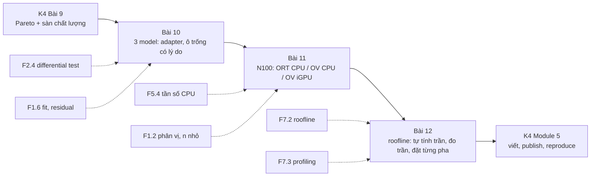
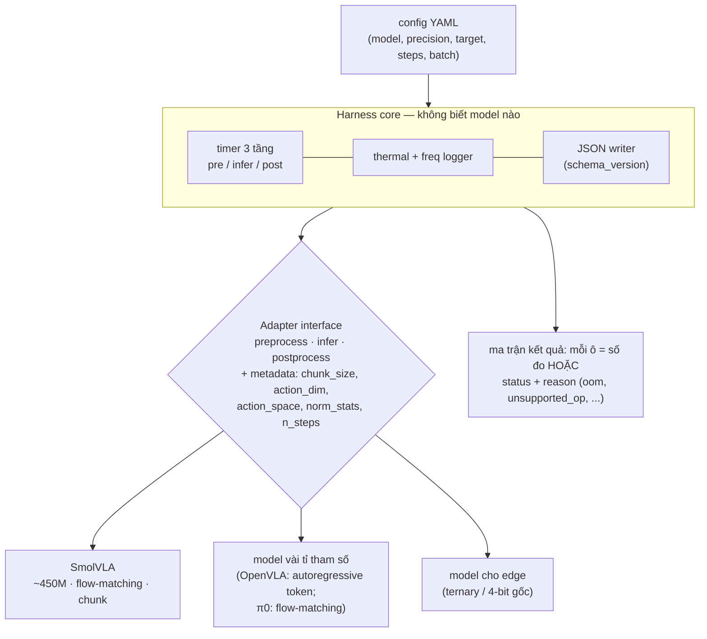

# Khóa 4 — Module 4: Nhiều model, nhiều target (18h)

Bài 10 (6h) · Bài 11 (6h) · Bài 12 (6h). Nguồn xương sống: `khoa-4-benchmark-edge.md`, Module 4.

Tiêu chí PASS số 1 của M6 đòi **≥3 model × ≥2 target**. Module này có ba câu hỏi. Harness có thật sự tổng quát không (Bài 10)? Trên chính chiếc N100 sẽ nằm trên robot, chạy được gì (Bài 11)? Và vì sao các con số ra như vậy (Bài 12)? Bài 12 là bài biến bảng số thành phân tích. Nó cũng sửa một lỗi của bản Gemini: con số "0.7 TFLOPS" cho N100 và câu "VLA batch 1 là compute-bound" được nói như một sự thật chung.



---

## Bài 10 — Model thứ hai và thứ ba (6h)

> **Vị trí:** K4 Bài 9 (chọn cấu hình) → **Bài 10** → K4 Bài 11 (N100) · **Cần trước:** K4 Bài 4 (thiết kế harness), F2.4 (differential test, golden file), F1.6 (fit mô hình vào số đo, residual), F3.2 (schema evolution, cho JSON output) · **Sau bài này bạn quyết định được:** chọn bộ ba model theo độ phủ (kích thước × kiểu action head × backbone), và quyết định harness có cần refactor không, dựa trên số giờ đo được và kết quả contract test, không dựa trên cảm giác.

### 1. Câu chuyện — ai đã khổ vì chuyện này

Trước 2018, mỗi hãng phần cứng tự công bố số "inference/giây" theo cách đo của mình: model khác, batch khác, precision khác, độ chính xác không ai kiểm. Không con số nào so được với con số nào. MLPerf (nay thuộc MLCommons) ra đời để chấm dứt việc đó. Vòng inference đầu tiên (v0.5, 2019) cố định model tham chiếu, ràng buộc chất lượng, và tách bốn kịch bản đo: SingleStream, MultiStream, Server, Offline `[spec: luật MLPerf Inference]`. Bài học họ trả giá để có: **một benchmark chỉ chạy được trên một cấu hình thì không phải benchmark, mà là một phép đo.**

Ở cấp độ code, nghề phần mềm có một kinh nghiệm cũ: lần đầu viết thì cứ viết, lần thứ hai thấy lặp thì nhăn mặt nhưng vẫn viết, lần thứ ba thì refactor. Martin Fowler ghi lại "rule of three" này trong *Refactoring* và ghi công cho Don Roberts `[chuẩn]`. Model thứ hai là lúc mọi giả định ngầm về model thứ nhất lộ ra: shape cố định, chuẩn hóa action viết cứng, số camera viết cứng, "inference" mặc định là một lần forward. Model thứ ba là lúc bạn biết abstraction của mình có đúng không.

### 2. Mô hình tư duy



Bốn ý bản chất:
1. **Interface bắt được lỗi kiểu, không bắt được lỗi nghĩa.** Hai model có thể cùng trả `(1, chunk, 7)` float32. Nhưng một cái trả action đã khử chuẩn hóa theo radian, cái kia trả giá trị chuẩn hóa trong [−1, 1], hoặc delta thay vì tuyệt đối. Harness vẫn chạy, latency vẫn đo, và trục chất lượng sẽ sập mà không ai biết vì sao. Thứ bảo vệ bạn là **differential test** với script inference gốc của từng model (→ F2.4).
2. **"Inference" không cùng một hình dạng tính toán giữa các họ model.** Có ba kiểu cơ bản. *Autoregressive* (OpenVLA): prefill ảnh + lệnh, rồi giải mã tuần tự từng token action. *Flow-matching/diffusion* (SmolVLA, π0): prefix một lần, rồi action expert chạy N bước. *Hồi quy trực tiếp có chunking* (ACT): một lần forward. Latency có cấu trúc khác nhau, và Bài 12 cho thấy chúng nằm ở chỗ khác nhau trên roofline.
3. **Latency là một mô hình affine, không phải một con số.** Với flow-matching: L(N) ≈ t_prefix + N·t_step. Quét N rồi fit, bạn có hai tham số có nghĩa vật lý thay vì một bảng. Residual có cấu trúc nghĩa là mô hình thiếu một thành phần (→ F1.6).
4. **Ô trống là dữ liệu.** `oom`, `unsupported_op`, `unsupported_dtype` là phát hiện về độ chín của tooling. Chúng phải có schema như mọi số đo khác.

Hai mô phỏng. Thứ nhất, contract test bắt một lỗi ngữ nghĩa mà kiểu dữ liệu không bắt được:

```python
# [đã chạy] Adapter cho nhiều model + contract test: kiểu đúng chưa đủ, phải kiểm NGỮ NGHĨA
from dataclasses import dataclass
import numpy as np

@dataclass
class Cell:                       # một ô của ma trận model × precision × target
    status: str                   # ok | oom | unsupported_op | unsupported_dtype | too_slow | not_attempted
    reason: str = ""

class Adapter:                    # harness chỉ biết interface này
    name = "base"; chunk_size = 1; action_dim = 7
    def preprocess(self, obs): raise NotImplementedError
    def infer(self, batch): raise NotImplementedError          # trả action ĐÃ chuẩn hóa của model
    def postprocess(self, raw): raise NotImplementedError       # trả action ĐƠN VỊ VẬT LÝ (rad, m)

class FakeFlow(Adapter):          # giả lập model chunking, action chuẩn hóa theo mean/std của dataset
    name, chunk_size = "fake_flow", 50
    mean, std = np.full(7, 0.1), np.full(7, 0.5)
    def preprocess(self, obs): return {"img": obs["img"] / 255.0, "state": obs["state"]}
    def infer(self, b): return np.tanh(b["state"].mean()) * np.ones((1, self.chunk_size, 7))
    def postprocess(self, raw): return raw * self.std + self.mean

class FakeAR(FakeFlow):           # giả lập model khác: QUÊN khử chuẩn hóa — vẫn đúng shape, đúng dtype
    name, chunk_size = "fake_ar", 1
    def postprocess(self, raw): return raw

def contract(ad, obs, ref_action=None, tol=1e-3):
    out = ad.postprocess(ad.infer(ad.preprocess(obs)))
    errs = []
    if out.shape != (1, ad.chunk_size, ad.action_dim): errs.append(f"shape {out.shape}")
    if not np.isfinite(out).all(): errs.append("NaN/inf")
    if ref_action is not None and np.abs(out[0, 0] - ref_action).max() > tol:   # differential test (→ F2.4)
        errs.append(f"lệch so với script tham chiếu: {np.abs(out[0, 0] - ref_action).max():.3f}")
    return Cell("ok") if not errs else Cell("contract_fail", "; ".join(errs))

obs = {"img": np.zeros((224, 224, 3)), "state": np.full(8, 0.3)}
ref = np.tanh(0.3) * 0.5 + 0.1          # action mà script inference GỐC của model trả ra (đơn vị vật lý)
for ad in (FakeFlow(), FakeAR()):
    print(ad.name, contract(ad, obs, ref))
```

Thứ hai, tách latency thành hai tham số và ước lượng bộ nhớ weight (chạy *sau* khi ghi dự đoán):

```python
# [đã chạy] Tách latency = t_prefix + N_step * t_step bằng hồi quy, và ước lượng bộ nhớ weight
import numpy as np
rng = np.random.default_rng(0)
# Dữ liệu GIẢ ĐỊNH: quét số solver step, mỗi mức 30 mẫu (thay bằng JSON harness của bạn)
steps = np.repeat([1, 2, 5, 10, 20], 30)
lat = 60 + 9.0*steps + 4*(steps >= 10) + rng.normal(0, 3, steps.size)   # có một "bậc" ẩn ở >=10 bước
A = np.column_stack([np.ones_like(steps), steps])
coef, *_ = np.linalg.lstsq(A, lat, rcond=None)
res = lat - A @ coef
print(f"t_prefix ≈ {coef[0]:.1f} ms, t_step ≈ {coef[1]:.2f} ms/step")
for s in np.unique(steps):                       # residual theo nhóm: phải quanh 0 nếu mô hình tuyến tính đúng
    print(f"  steps={s:2d}: residual trung bình {res[steps == s].mean():+5.2f} ms")
# Bộ nhớ weight theo precision (chỉ weight! chưa tính activation, KV cache, CUDA context, allocator)
models = {"SmolVLA ~0.45B": 0.45e9, "model ~3B": 3e9, "OpenVLA ~7B": 7e9}
bytes_per = {"fp32": 4, "bf16": 2, "int8": 1, "4-bit": 0.5}
print(f"{'':16s}" + "".join(f"{k:>9s}" for k in bytes_per))
for m, n in models.items():
    print(f"{m:16s}" + "".join(f"{n*b/2**30:8.1f}G" for b in bytes_per.values()))
```

Ở dữ liệu giả định, residual ở `steps=10` dương rõ rệt so với các nhóm khác. Đó là dấu vết của "bậc" ẩn mà mô hình affine không có. Ở dữ liệu thật, bậc kiểu này có thể là một lần cấp phát bộ nhớ mới, một lần đổi kernel, hoặc cache bị tràn.

### 3. Cầu nối từ backend

| Backend bạn biết | Ở đây | Gãy ở chỗ | Nếu dùng nhầm thì |
|---|---|---|---|
| Adapter/plugin, interface + nhiều implementation | Adapter cho từng model | Ở backend, contract chủ yếu là kiểu và mã lỗi. Ở đây contract gồm cả **ngữ nghĩa số**: đơn vị, chuẩn hóa, khung tọa độ, delta hay tuyệt đối, thứ tự camera. | Bảng latency đẹp, trục chất lượng của model thứ hai bằng 0 mà không ai hiểu vì sao |
| ORM hỗ trợ nhiều DB | Harness hỗ trợ nhiều model | ORM thường chọn mẫu số chung nhỏ nhất. Ở đây mẫu số chung nhỏ nhất (một lần forward, batch 1) xóa mất thứ quan trọng nhất của từng model: số bước solver, KV cache, decode tuần tự. | So "một forward" của OpenVLA với "một forward" của SmolVLA, trong khi chúng không làm cùng một việc |
| Contract test giữa service (consumer-driven) | Differential test với script gốc của model | Giống về tinh thần. Khác ở chỗ "đúng" không phải bằng nhau tuyệt đối mà là trong dung sai số học. Dung sai phải chọn có lý do (fp32 vs bf16 khác nhau). | Dung sai quá lỏng nuốt lỗi chuẩn hóa; quá chặt thì fail vì nhiễu số học |
| Load test endpoint mới, so baseline | Thêm model, chạy cùng ma trận | Endpoint mới cùng giao thức. Model mới có thể không chạy được một nửa ma trận (dtype, op), và đó là kết quả chứ không phải sự cố. | Ngoại suy để lấp ô trống |
| Schema migration | `schema_version` của JSON khi thêm trường cho model mới | Giống (→ F3.2). Khác: kết quả cũ phải còn đọc được để so sánh. Đổi nghĩa một trường là phá lịch sử benchmark. | So số mới với số cũ khác định nghĩa |

**Chấm mô hình:**

- *"Thời gian thêm model đo chất lượng thiết kế harness: > 4h là harness có vấn đề"* (bản gốc). **ĐÚNG MỘT PHẦN.** Nó đo tổng của ba thứ: thiết kế harness, độ chín hệ sinh thái của model (có script inference chuẩn không, có trong LeRobot không), và đường cong học của bạn. **Phản ví dụ:** OpenVLA cần tải checkpoint 7B, cài phụ thuộc riêng và xử lý tokenizer action. Việc đó có thể mất hơn 4h dù harness hoàn hảo. Ghi tách: giờ cho môi trường, giờ cho adapter, giờ cho debug ngữ nghĩa. Chỉ giờ adapter mới nói về harness.
- *"Model 3B chậm hơn 450M khoảng tỉ lệ tham số"*. **ĐÚNG MỘT PHẦN.** Với pha bị chặn bởi băng thông, thời gian tỉ lệ với byte weight. Nhưng kiểu action head, số token ảnh và số bước quyết định ngang hoặc hơn số tham số. **Phản ví dụ:** model autoregressive phải đọc toàn bộ weight một lần *mỗi token action*. Model flow-matching đọc weight của expert nhỏ mỗi bước nhưng xử lý cả chunk một lượt. Cùng số tham số, hai họ có latency rất khác nhau.
- *"Model flow-matching: giảm solver step thì latency giảm gần tuyến tính"* (bản gốc). **ĐÚNG MỘT PHẦN.** Latency giảm **affine**: phần prefix không đổi. **Phản ví dụ:** nếu t_prefix = 60 ms và t_step = 9 ms, giảm từ 10 xuống 5 bước làm latency đi từ 150 ms xuống 105 ms (−30%), không phải −50%. Nếu prefix chiếm phần lớn, giảm bước gần như không giúp gì.

### 4. Thuật ngữ

| Mức | Thuật ngữ | Nghĩa trong một câu | Hay bị hiểu nhầm thành |
|---|---|---|---|
| 🟢 | Action head: autoregressive / flow-matching / direct | Cách sinh action: token tuần tự / khử nhiễu N bước / một lần forward | Chi tiết kiến trúc không ảnh hưởng hạ tầng |
| 🟢 | Prefix / prefill | Lần xử lý ảnh + lệnh (+ state) để tạo ngữ cảnh | Toàn bộ inference |
| 🟢 | KV cache | Kết quả trung gian của prefix được giữ lại cho các bước sau | Cache ứng dụng |
| 🟢 | Solver step | Một lần chạy action expert trong flow-matching/diffusion | Một iteration benchmark |
| 🟢 | Differential test | Chạy hai implementation trên cùng đầu vào, so đầu ra | Unit test |
| 🟢 | Ma trận có ô trống + status | Mỗi ô là số đo hoặc lý do không đo được | Bảng thiếu sót |
| 🟢 | Norm stats | Mean/std hoặc min/max dùng chuẩn hóa state/action | Tham số của model |
| 🟡 | Backbone VLM (SmolVLM2, PaliGemma, Prismatic/Llama 2) | Phần vision-language được tiền huấn luyện | Một tên khác của model |
| 🟡 | Action tokenization (bin, FAST) | Biến action liên tục thành token rời rạc | Lượng tử weight |
| 🟡 | Parallel decoding (ví dụ OpenVLA-OFT) | Sinh nhiều token action một lượt thay vì tuần tự | Batch |
| 🔴 | Chi tiết huấn luyện từng model | | Thứ cần cho benchmark inference |

### 5. Dự đoán

**Tham số cần tra:**
- Danh sách policy LeRobot hiện hành: LeRobot docs, mục Policies (đổi nhanh) `[tự đo]`. Với model ngoài LeRobot (OpenVLA, openpi): README repo chính chủ.
- Với mỗi model: tổng tham số và tham số của từng phần (in từ code); kiểu action head; `chunk_size`; số solver step mặc định; số token ảnh mỗi camera (từ config processor); action space (delta/tuyệt đối, đơn vị).
- VRAM GPU thuê bạn định dùng.

**Câu hỏi:**
1. Giờ để thêm model 2 và model 3, tách theo môi trường / adapter / debug ngữ nghĩa.
2. Bảng weight bytes cho 3 model × 4 precision. Ô nào không vừa VRAM của GPU thuê *chỉ tính weight*? Ô nào có thể không vừa khi tính cả activation/KV?
3. Tỉ lệ latency p50 (model lớn / SmolVLA) cùng GPU, cùng precision. Lập luận theo byte weight và theo cấu trúc tính toán: hai lập luận cho cùng một số không?
4. t_prefix và t_step của SmolVLA trên GPU thuê. Phần trăm latency mặc định nằm ở prefix là bao nhiêu?
5. Ô nào trong ma trận sẽ trống, và vì lý do nào?

```markdown
# prediction.md — K4 Bài 10
- Bộ ba: (1) ___ [cỡ, head, backbone] (2) ___ (3) ___ — các chiều khác nhau: ___
- Giờ thêm model 2: môi trường ___ / adapter ___ / debug ___ ; model 3: ___ / ___ / ___
- Weight bytes (GiB): bảng 3×4 ___ ; ô không vừa VRAM ___ GB: ___
- Tỉ lệ p50 model lớn / SmolVLA: ___ (lập luận byte: ___ ; lập luận cấu trúc: ___)
- SmolVLA: t_prefix ___ ms, t_step ___ ms, % prefix ở cấu hình mặc định ___
- Ô trống dự đoán + lý do: ___
```

### 6. Làm

1. **Thêm model thứ hai vào harness, đo thời gian thêm.** Ghi vào `hours.csv` theo ba cột: môi trường, adapter, debug ngữ nghĩa. Nếu riêng phần adapter > 4h, harness có vấn đề thiết kế: ghi lại và refactor (giữ ngưỡng của bản gốc, áp đúng chỗ).
2. **Contract test cho mọi adapter, trước khi đo gì.** Gồm: shape `(B, chunk, action_dim)`; finite; dải action hợp lý so với norm stats; và **differential test** với script inference gốc của model trên 5 observation cố định (golden file), với dung sai ghi rõ theo precision. Không qua contract test thì ô đó là `contract_fail`, không được có số.
3. **Thêm model thứ ba.** Kỳ vọng thời gian adapter ngắn hơn rõ. Nếu không, xem lại interface.
4. **Chạy toàn bộ ma trận model × precision trên GPU thuê.** Dùng kỷ luật thuê GPU của Bài 5: script không tương tác, sync kết quả ra ngoài, hẹn giờ tắt.
5. **Với mỗi model, ghi rõ cái gì không đo được và vì sao**: `oom` (kèm peak trước khi chết), `unsupported_dtype`, `unsupported_op`, `too_slow` (kèm ước lượng thời gian), `not_attempted` (kèm lý do phạm vi). Mỗi ô trống là một dòng trong JSON, không phải một chỗ thiếu.
6. **Quét solver step cho model flow-matching** (ít nhất 5 mức), fit L(N) = t_prefix + N·t_step, báo cáo hai tham số kèm residual theo nhóm. Với model autoregressive, quét số token sinh nếu có thể (thường cố định bằng action_dim) và đo riêng thời gian prefill vs decode bằng profiler.
7. **Cảnh báo phạm vi (giữ từ bản gốc):** đừng cố chạy 6 model. Ba model đo kỹ có giá trị hơn sáu model đo hời hợt, và trần giờ của khóa là 95h.

**Gợi ý bộ ba theo nguyên tắc phủ (bản gốc, kiểm lại khi bắt đầu):** SmolVLA (~450M, flow-matching, nhẹ nhất: bắt đầu ở đây); một model vài tỉ tham số (OpenVLA ~7B autoregressive, hoặc π0 ~3B flow-matching, hoặc GR00T); một model thiết kế cho edge (dòng BitVLA hoặc tương đương). Chọn sao cho ít nhất **hai chiều** khác nhau. Ví dụ: SmolVLA + π0 cùng là flow-matching, nên cặp này chỉ khác kích thước và backbone.

**Sai số dụng cụ:** khi so model, latency mỗi ô có CI (Bài 5, Bài 6). Tỉ lệ latency giữa hai model là tỉ số của hai số có sai số. Bậc độ lớn thì an toàn, chênh lệch 10–20% giữa hai model thì phải kèm CI.

### 7. Số phải ra

<details><summary>🔒 MỞ SAU KHI COMMIT prediction.md</summary>

**Mô phỏng (đã chạy):** contract test bắt `fake_ar`: đúng shape, đúng dtype, nhưng lệch 0.046 so với script tham chiếu vì quên khử chuẩn hóa. Fit giả định ra t_prefix ≈ 60.0 ms, t_step ≈ 9.23 ms/step. Residual theo nhóm: −0.64, +0.32, −0.67, **+1.65**, −0.66 ms. Nhóm `steps=10` nổi lên, đúng chỗ có bậc ẩn.

**Weight bytes (chỉ weight, GiB):**

| | fp32 | bf16 | int8 | 4-bit |
|---|---|---|---|---|
| ~0.45B | 1.7 | 0.8 | 0.4 | 0.2 |
| ~3B | 11.2 | 5.6 | 2.8 | 1.4 |
| ~7B | 26.1 | 13.0 | 6.5 | 3.3 |

(Số tham số danh nghĩa; số thật: tự in từ checkpoint.) Một model ~7B ở fp32 không vừa GPU 24 GB chỉ riêng weight. bf16 vừa weight nhưng sát nút khi cộng activation và context.

**Kỳ vọng thực nghiệm `[tự đo]`:**

| Kiểm tra (bản gốc) | Kỳ vọng | Ghi chú |
|---|---|---|
| Thời gian thêm model thứ ba | Phần adapter ngắn hơn model thứ hai rõ | Phần môi trường có thể không ngắn hơn |
| Model vài tỉ vs 450M, cùng GPU | Chậm hơn nhiều lần, VRAM lớn hơn nhiều lần | Tỉ lệ latency không nhất thiết bằng tỉ lệ tham số |
| Flow-matching giảm solver step | Latency giảm **affine**: gần tuyến tính theo N với hệ số góc t_step, có tung độ gốc t_prefix | Bản gốc viết "gần tuyến tính", đúng theo nghĩa affine |
| Bảng kết quả | Có ô trống, mỗi ô có status + lý do | Bảng có ô trống kèm lý do trung thực hơn bảng đầy số bịa. Đừng ngoại suy |

</details>

### 8. Nếu ra khác

| Triệu chứng | Nguyên nhân khả dĩ | Kiểm bằng cách | Sửa |
|---|---|---|---|
| Model mới chạy, latency hợp lý, success rate ≈ 0 | Lỗi ngữ nghĩa: chuẩn hóa, action space, thứ tự camera, kích thước ảnh | Differential test với script gốc; vẽ action dự đoán vs action trong dataset | Sửa adapter; thêm trường ngữ nghĩa vào metadata adapter |
| Adapter model 3 vẫn mất lâu như model 2 | Interface bị may đo cho model 1 | Đếm dòng `if model == ...` trong core | Refactor: đẩy khác biệt vào adapter + metadata |
| OOM ở bf16 dù weight vừa | Activation của nhiều camera × độ phân giải; KV cache; workspace kernel | `torch.cuda.memory_summary()` ở điểm peak | Ghi `oom` + phân rã bộ nhớ; thử batch 1, ít camera hơn (ghi rõ đó là cấu hình khác) |
| Residual có cấu trúc khi quét step | Thành phần ngoài mô hình affine (cấp phát, đổi kernel, CPU sync) | Profiler ở hai mức step hai bên bậc | Báo cáo mô hình hai đoạn, hoặc nêu bậc như một phát hiện |
| t_step âm hoặc t_prefix âm | Ít mức step quá, hoặc nhiễu lớn, hoặc thermal trôi theo thứ tự đo | Xáo thứ tự đo các mức step; kiểm nhiệt (Bài 6) | Đo xen kẽ ngẫu nhiên, thêm mức step |

### 9. Câu hỏi ngược

1. **[Quy mô]** Đội của bạn phải benchmark 30 model mỗi quý, mỗi model ra phiên bản mới hàng tháng. Thiết kế adapter nào còn đứng được, và thứ gì phải tự động hóa trước tiên?
   <details><summary>Hướng nghĩ</summary>Contract test + golden file chạy trong CI cho mỗi model mới, giống hệt kiểm thử tương thích API. Metadata ngữ nghĩa (action space, chuẩn hóa) phải là dữ liệu khai báo, không phải code. Nghĩ tới chuẩn hóa từ phía nhà phát hành model: một "model card cho inference".</details>
2. **[Failure mode]** Hai model cùng được đo "batch 1, 10 solver step". Một model mặc định dùng 2 camera, model kia 3 camera. Bảng so sánh của bạn sai ở đâu, và schema JSON cần trường nào để không ai lặp lại lỗi này?
   <details><summary>Hướng nghĩ</summary>Đầu vào khác thì công việc khác. Số token ảnh là một biến điều khiển của latency. Schema cần ghi cấu hình đầu vào thực tế (số camera, độ phân giải, số token) chứ không chỉ tên model.</details>
3. **[Vì sao không]** Vì sao không export mọi model sang một định dạng chung (ONNX) rồi đo bằng một runtime duy nhất, cho "công bằng"?
   <details><summary>Hướng nghĩ</summary>Công bằng với ai? Bạn sẽ đo độ chín của exporter thay vì đo model. Vòng lặp solver, KV cache và op tùy biến thường export kém (Bài 11). Nhưng có một mặt đúng: một runtime chung loại bỏ một biến. Hỏi: câu hỏi của benchmark là "model nào nhanh" hay "model nào nhanh *trong stack người ta thật sự dùng*"?</details>
4. **[Liên ngành]** Trong hóa phân tích, một phương pháp đo mới phải được thẩm định (method validation) trên mẫu chuẩn đã biết nồng độ trước khi dùng cho mẫu thật. Differential test với script gốc tương ứng với bước nào, và còn thiếu bước nào?
   <details><summary>Hướng nghĩ</summary>Script gốc giống mẫu chuẩn tham chiếu. Thẩm định còn có độ lặp lại, độ tái lập giữa phòng lab, và dải tuyến tính. Ánh xạ: tỉ lệ lật (Bài 7), người reproduce (Module 5), quét solver step.</details>
5. **[Phản biện]** "Ô trống trong bảng làm báo cáo trông chưa xong" (đồng nghiệp ở bản Gemini). Viết câu trả lời bằng ngôn ngữ của người vận hành, không phải của người làm nghiên cứu.
   <details><summary>Hướng nghĩ</summary>Người vận hành cần biết cấu hình nào *không deploy được* và vì sao, trước khi họ thử. Một ô `oom` kèm số GB cần là thông tin mua phần cứng. Một ô bị ngoại suy là một sự cố đang chờ xảy ra.</details>

### 10. Liên kết ra ngoài

- **SPEC CPU và MLPerf.** Benchmark công nghiệp ghi kèm mọi cấu hình (compiler flag, firmware) và có quy trình duyệt bài nộp. Giống: kỷ luật "mọi số kèm cấu hình". Khác: họ có ủy ban duyệt. Bạn có một người lạ trên Discord. Vì vậy cấu hình của bạn phải đủ để người đó tự tái lập mà không cần hỏi.
- **Kiểm thử tương thích trình duyệt.** Web cùng một chuẩn nhưng mỗi engine hỗ trợ một phần, và bảng "caniuse" là ma trận có ô trống với lý do. Ma trận model × runtime × dtype của bạn là đúng loại bảng đó. Khác: tính năng web là có/không. Ở đây "hỗ trợ" còn có mức: chạy được nhưng chậm, chạy được nhưng sai số lớn.
- **Thẩm định phương pháp trong hóa phân tích.** Xem câu hỏi ngược 4. Điểm chung: một phương pháp đo chỉ được tin sau khi kiểm trên mẫu chuẩn. Điểm khác: mẫu chuẩn hóa học có giấy chứng nhận. "Mẫu chuẩn" của bạn là script của tác giả model, và chính nó cũng có thể sai.

### 11. Độ tin cậy và sửa lỗi

| Khẳng định | Nhãn | Ghi chú / cách kiểm |
|---|---|---|
| MLPerf Inference v0.5 (2019) với 4 kịch bản SingleStream/MultiStream/Server/Offline | [spec: tài liệu MLCommons] | |
| Rule of three trong Fowler *Refactoring*, ghi công Don Roberts | [chuẩn] | |
| SmolVLA ~450M, flow-matching, backbone SmolVLM2 | [spec: bài báo SmolVLA, Hugging Face 2025] | In số tham số thật từ checkpoint |
| OpenVLA ~7B, backbone Prismatic (SigLIP + DINOv2, Llama 2), action rời rạc thành token, sinh tuần tự | [spec: Kim và cộng sự 2024, OpenVLA] | |
| π0 ~3B (PaliGemma + action expert), flow-matching, chunk 50 | [spec: Black và cộng sự 2024, π0] — kiểm lại khi dùng | Phiên bản openpi/LeRobot có thể khác |
| Danh sách policy trong LeRobot | [tự đo] | Đổi nhanh |
| Bảng weight bytes | [ước lượng] | Chỉ weight; số tham số danh nghĩa |

**Đã sửa so với bản gốc / Gemini:**
- Bản gốc: "giảm solver step → latency giảm gần tuyến tính". Đã chính xác hóa thành affine (có t_prefix), kèm cách fit và đọc residual.
- Bản gốc: ngưỡng "> 4h thêm model" áp cho tổng giờ. Đã tách giờ môi trường / adapter / debug; ngưỡng chỉ áp cho adapter.
- Gemini: "< 2 giờ là đạt chuẩn" là con số tự đặt, không có cơ sở. Đã bỏ.
- Gemini tự kiểm tra 1: "7B FP32 trên 24 GB → OOM, ghi status". Đúng hướng. Đã thêm phân rã bộ nhớ và các status khác.
- Thêm (không có ở cả hai bản): contract test ngữ nghĩa + differential test trước khi đo; trường cấu hình đầu vào (số camera, token) trong JSON.

### 12. Đọc thêm và tự kiểm tra

- **Nguồn gốc:** Reddi và cộng sự, *MLPerf Inference Benchmark*, ISCA 2020 (lý do và thiết kế các kịch bản). Bài báo của từng model bạn chọn (SmolVLA, OpenVLA, π0).
- **Giải thích:** LeRobot docs, mục Policies và hướng dẫn thêm policy/benchmark (đọc bản đúng phiên bản bạn cài).
- **Đào sâu (tùy chọn):** McKeeman, *Differential Testing for Software*, Digital Technical Journal, 1998.
- **Tự kiểm tra:** (1) Giải thích cho một backend engineer khác trong 5 câu: vì sao interface đúng kiểu chưa đủ để thêm model. (2) Vẽ lại sơ đồ harness/adapter từ trí nhớ, có metadata ngữ nghĩa. (3) Hai câu:
  - a) Quét SmolVLA được L(5) = 110 ms và L(10) = 155 ms. Ước lượng t_prefix, t_step, và L(2). Giảm từ 10 xuống 2 bước cắt bao nhiêu % latency?
  - b) Model A autoregressive sinh 7 token action, mỗi token đọc 14 GB weight bf16. Băng thông thực đo 800 GB/s. Cận dưới thời gian decode?

  <details><summary>Đáp án</summary>
  a) t_step = (155 − 110)/5 = 9 ms; t_prefix = 110 − 45 = 65 ms; L(2) = 83 ms. Từ 155 xuống 83 ms là −46%, không phải −80%.
  b) Mỗi token ≥ 14 GB / 800 GB/s = 17.5 ms; 7 token ≥ 122.5 ms, chưa tính prefill. Đây là cận dưới kiểu roofline (Bài 12): nhanh hơn số này thì bạn đang đo sai, hoặc runtime không đọc toàn bộ weight.
  </details>

---
