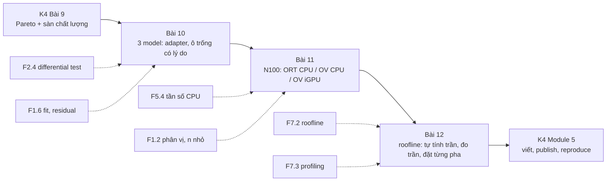
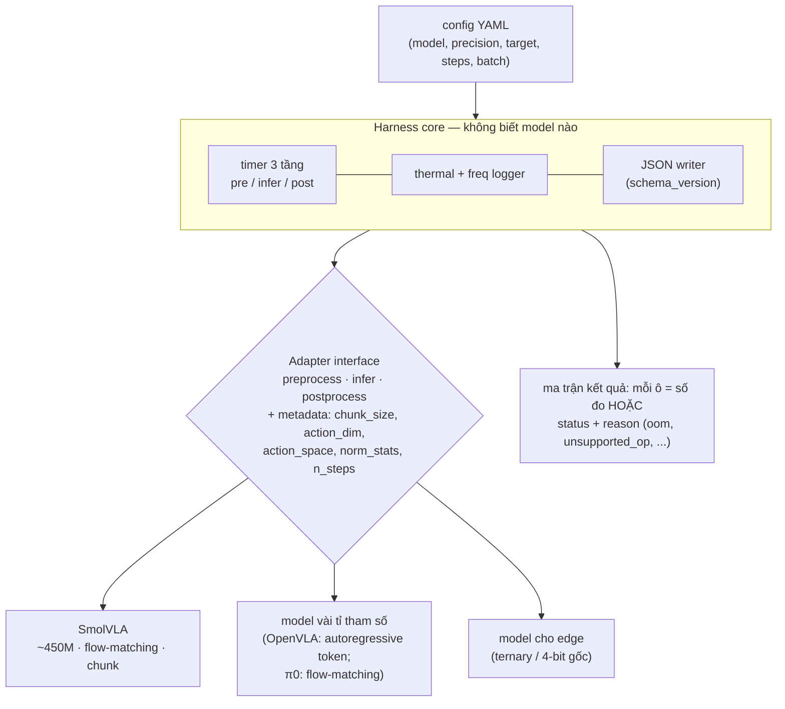
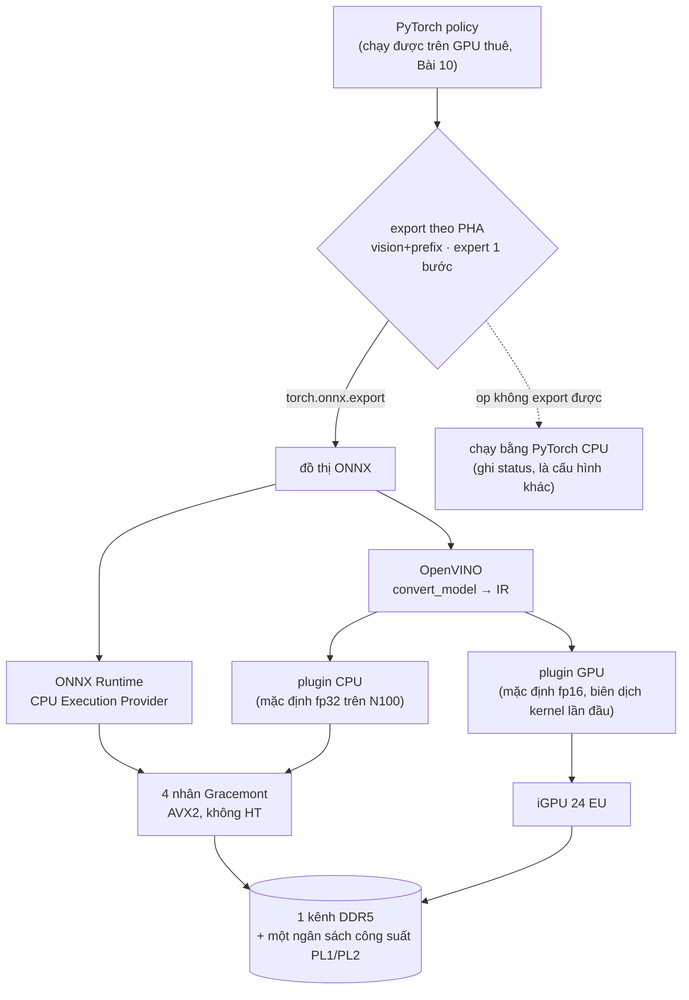
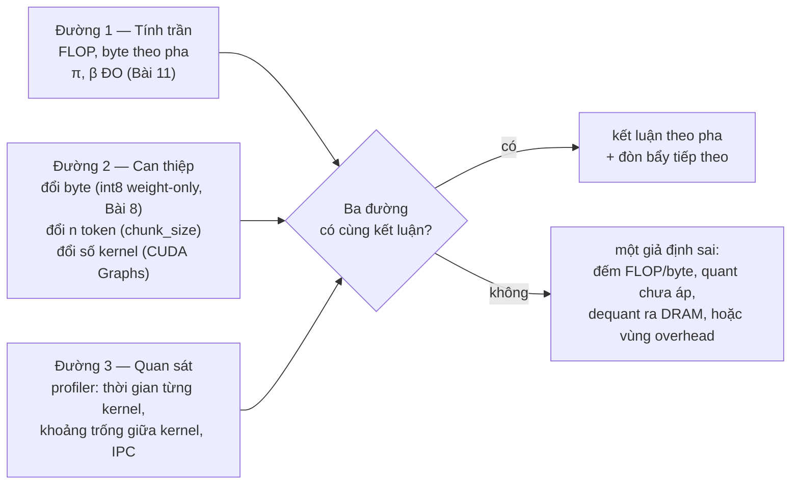

# Khóa 4 — Module 4: Nhiều model, nhiều target (18h)

Bài 10 (6h) · Bài 11 (6h) · Bài 12 (6h). Nguồn xương sống: `khoa-4-benchmark-edge.md`, Module 4.

Tiêu chí PASS số 1 của M6 đòi **≥3 model × ≥2 target**. Module này có ba câu hỏi. Harness có thật sự tổng quát không (Bài 10)? Trên chính chiếc N100 sẽ nằm trên robot, chạy được gì (Bài 11)? Và vì sao các con số ra như vậy (Bài 12)? Bài 12 là bài biến bảng số thành phân tích. Nó cũng sửa một lỗi của bản Gemini: con số "0.7 TFLOPS" cho N100 và câu "VLA batch 1 là compute-bound" được nói như một sự thật chung.



---

## Bài 10 — Model thứ hai và thứ ba (6h)

> **Vị trí:** K4 Bài 9 (chọn cấu hình) → **Bài 10** → K4 Bài 11 (N100) · **Cần trước:** K4 Bài 4 (thiết kế harness), F2.4 (differential test, golden file), F1.6 (fit mô hình vào số đo, residual), F3.2 (schema evolution, cho JSON output) · **Sau bài này bạn quyết định được:** chọn bộ ba model theo độ phủ (kích thước × kiểu action head × backbone), và quyết định harness có cần refactor không, dựa trên số giờ đo được và kết quả contract test, không dựa trên cảm giác.

### 1. Câu chuyện — ai đã khổ vì chuyện này

Trước 2018, mỗi hãng phần cứng tự công bố số "inference/giây" theo cách đo của mình: model khác, batch khác, precision khác, độ chính xác không ai kiểm. Không con số nào so được với con số nào. MLPerf (nay thuộc MLCommons) ra đời để chấm dứt việc đó. Vòng inference đầu tiên (v0.5, 2019) cố định model tham chiếu, ràng buộc chất lượng, và tách bốn kịch bản đo: SingleStream, MultiStream, Server, Offline `[spec: luật MLPerf Inference]`. Bài học họ trả giá để có: **một benchmark chỉ chạy được trên một cấu hình thì không phải benchmark, mà là một phép đo.**

Ở cấp độ code, nghề phần mềm có một kinh nghiệm cũ: lần đầu viết thì cứ viết, lần thứ hai thấy lặp thì nhăn mặt nhưng vẫn viết, lần thứ ba thì refactor. Martin Fowler ghi lại "rule of three" này trong *Refactoring* và ghi công cho Don Roberts `[chuẩn]`. Model thứ hai là lúc mọi giả định ngầm về model thứ nhất lộ ra: shape cố định, chuẩn hóa action viết cứng, số camera viết cứng, "inference" mặc định là một lần forward. Model thứ ba là lúc bạn biết abstraction của mình có đúng không.

### 2. Mô hình tư duy



Bốn ý bản chất:
1. **Interface bắt được lỗi kiểu, không bắt được lỗi nghĩa.** Hai model có thể cùng trả `(1, chunk, 7)` float32. Nhưng một cái trả action đã khử chuẩn hóa theo radian, cái kia trả giá trị chuẩn hóa trong [−1, 1], hoặc delta thay vì tuyệt đối. Harness vẫn chạy, latency vẫn đo, và trục chất lượng sẽ sập mà không ai biết vì sao. Thứ bảo vệ bạn là **differential test** với script inference gốc của từng model (→ F2.4).
2. **"Inference" không cùng một hình dạng tính toán giữa các họ model.** Có ba kiểu cơ bản. *Autoregressive* (OpenVLA): prefill ảnh + lệnh, rồi giải mã tuần tự từng token action. *Flow-matching/diffusion* (SmolVLA, π0): prefix một lần, rồi action expert chạy N bước. *Hồi quy trực tiếp có chunking* (ACT): một lần forward. Latency có cấu trúc khác nhau, và Bài 12 cho thấy chúng nằm ở chỗ khác nhau trên roofline.
3. **Latency là một mô hình affine, không phải một con số.** Với flow-matching: L(N) ≈ t_prefix + N·t_step. Quét N rồi fit, bạn có hai tham số có nghĩa vật lý thay vì một bảng. Residual có cấu trúc nghĩa là mô hình thiếu một thành phần (→ F1.6).
4. **Ô trống là dữ liệu.** `oom`, `unsupported_op`, `unsupported_dtype` là phát hiện về độ chín của tooling. Chúng phải có schema như mọi số đo khác.

Hai mô phỏng. Thứ nhất, contract test bắt một lỗi ngữ nghĩa mà kiểu dữ liệu không bắt được:

```python
# [đã chạy] Adapter cho nhiều model + contract test: kiểu đúng chưa đủ, phải kiểm NGỮ NGHĨA
from dataclasses import dataclass
import numpy as np

@dataclass
class Cell:                       # một ô của ma trận model × precision × target
    status: str                   # ok | oom | unsupported_op | unsupported_dtype | too_slow | not_attempted
    reason: str = ""

class Adapter:                    # harness chỉ biết interface này
    name = "base"; chunk_size = 1; action_dim = 7
    def preprocess(self, obs): raise NotImplementedError
    def infer(self, batch): raise NotImplementedError          # trả action ĐÃ chuẩn hóa của model
    def postprocess(self, raw): raise NotImplementedError       # trả action ĐƠN VỊ VẬT LÝ (rad, m)

class FakeFlow(Adapter):          # giả lập model chunking, action chuẩn hóa theo mean/std của dataset
    name, chunk_size = "fake_flow", 50
    mean, std = np.full(7, 0.1), np.full(7, 0.5)
    def preprocess(self, obs): return {"img": obs["img"] / 255.0, "state": obs["state"]}
    def infer(self, b): return np.tanh(b["state"].mean()) * np.ones((1, self.chunk_size, 7))
    def postprocess(self, raw): return raw * self.std + self.mean

class FakeAR(FakeFlow):           # giả lập model khác: QUÊN khử chuẩn hóa — vẫn đúng shape, đúng dtype
    name, chunk_size = "fake_ar", 1
    def postprocess(self, raw): return raw

def contract(ad, obs, ref_action=None, tol=1e-3):
    out = ad.postprocess(ad.infer(ad.preprocess(obs)))
    errs = []
    if out.shape != (1, ad.chunk_size, ad.action_dim): errs.append(f"shape {out.shape}")
    if not np.isfinite(out).all(): errs.append("NaN/inf")
    if ref_action is not None and np.abs(out[0, 0] - ref_action).max() > tol:   # differential test (→ F2.4)
        errs.append(f"lệch so với script tham chiếu: {np.abs(out[0, 0] - ref_action).max():.3f}")
    return Cell("ok") if not errs else Cell("contract_fail", "; ".join(errs))

obs = {"img": np.zeros((224, 224, 3)), "state": np.full(8, 0.3)}
ref = np.tanh(0.3) * 0.5 + 0.1          # action mà script inference GỐC của model trả ra (đơn vị vật lý)
for ad in (FakeFlow(), FakeAR()):
    print(ad.name, contract(ad, obs, ref))
```

Thứ hai, tách latency thành hai tham số và ước lượng bộ nhớ weight (chạy *sau* khi ghi dự đoán):

```python
# [đã chạy] Tách latency = t_prefix + N_step * t_step bằng hồi quy, và ước lượng bộ nhớ weight
import numpy as np
rng = np.random.default_rng(0)
# Dữ liệu GIẢ ĐỊNH: quét số solver step, mỗi mức 30 mẫu (thay bằng JSON harness của bạn)
steps = np.repeat([1, 2, 5, 10, 20], 30)
lat = 60 + 9.0*steps + 4*(steps >= 10) + rng.normal(0, 3, steps.size)   # có một "bậc" ẩn ở >=10 bước
A = np.column_stack([np.ones_like(steps), steps])
coef, *_ = np.linalg.lstsq(A, lat, rcond=None)
res = lat - A @ coef
print(f"t_prefix ≈ {coef[0]:.1f} ms, t_step ≈ {coef[1]:.2f} ms/step")
for s in np.unique(steps):                       # residual theo nhóm: phải quanh 0 nếu mô hình tuyến tính đúng
    print(f"  steps={s:2d}: residual trung bình {res[steps == s].mean():+5.2f} ms")
# Bộ nhớ weight theo precision (chỉ weight! chưa tính activation, KV cache, CUDA context, allocator)
models = {"SmolVLA ~0.45B": 0.45e9, "model ~3B": 3e9, "OpenVLA ~7B": 7e9}
bytes_per = {"fp32": 4, "bf16": 2, "int8": 1, "4-bit": 0.5}
print(f"{'':16s}" + "".join(f"{k:>9s}" for k in bytes_per))
for m, n in models.items():
    print(f"{m:16s}" + "".join(f"{n*b/2**30:8.1f}G" for b in bytes_per.values()))
```

Đọc residual theo nhóm, không đọc R². Nhóm nào lệch khỏi 0 có hệ thống là dấu vết của một thành phần mà mô hình affine không có (dữ liệu giả định ở trên cố ý cài một "bậc"; tìm nó trước khi mở 🔒 ở phần 7). Ở dữ liệu thật, bậc kiểu này có thể là một lần cấp phát bộ nhớ mới, một lần đổi kernel, hoặc cache bị tràn.

### 3. Cầu nối từ backend

| Backend bạn biết | Ở đây | Gãy ở chỗ | Nếu dùng nhầm thì |
|---|---|---|---|
| Adapter/plugin, interface + nhiều implementation | Adapter cho từng model | Ở backend, contract chủ yếu là kiểu và mã lỗi. Ở đây contract gồm cả **ngữ nghĩa số**: đơn vị, chuẩn hóa, khung tọa độ, delta hay tuyệt đối, thứ tự camera. | Bảng latency đẹp, trục chất lượng của model thứ hai bằng 0 mà không ai hiểu vì sao |
| ORM hỗ trợ nhiều DB | Harness hỗ trợ nhiều model | ORM thường chọn mẫu số chung nhỏ nhất. Ở đây mẫu số chung nhỏ nhất (một lần forward, batch 1) xóa mất thứ quan trọng nhất của từng model: số bước solver, KV cache, decode tuần tự. | So "một forward" của OpenVLA với "một forward" của SmolVLA, trong khi chúng không làm cùng một việc |
| Contract test giữa service (consumer-driven) | Differential test với script gốc của model | Giống về tinh thần. Khác ở chỗ "đúng" không phải bằng nhau tuyệt đối mà là trong dung sai số học. Dung sai phải chọn có lý do (fp32 vs bf16 khác nhau). | Dung sai quá lỏng nuốt lỗi chuẩn hóa; quá chặt thì fail vì nhiễu số học |
| Load test endpoint mới, so baseline | Thêm model, chạy cùng ma trận | Endpoint mới cùng giao thức. Model mới có thể không chạy được một nửa ma trận (dtype, op), và đó là kết quả chứ không phải sự cố. | Ngoại suy để lấp ô trống |
| Schema migration | `schema_version` của JSON khi thêm trường cho model mới | Giống (→ F3.2). Khác: kết quả cũ phải còn đọc được để so sánh. Đổi nghĩa một trường là phá lịch sử benchmark. | So số mới với số cũ khác định nghĩa |

**Chấm mô hình:**

- *"Thời gian thêm model đo chất lượng thiết kế harness: > 4h là harness có vấn đề"* (bản gốc). **ĐÚNG MỘT PHẦN.** Nó đo tổng của ba thứ: thiết kế harness, độ chín hệ sinh thái của model (có script inference chuẩn không, có trong LeRobot không), và đường cong học của bạn. **Phản ví dụ:** OpenVLA cần tải checkpoint 7B, cài phụ thuộc riêng và xử lý tokenizer action. Việc đó có thể mất hơn 4h dù harness hoàn hảo. Ghi tách: giờ cho môi trường, giờ cho adapter, giờ cho debug ngữ nghĩa. Chỉ giờ adapter mới nói về harness.
- *"Model 3B chậm hơn 450M khoảng tỉ lệ tham số"*. **ĐÚNG MỘT PHẦN.** Với pha bị chặn bởi băng thông, thời gian tỉ lệ với byte weight. Nhưng kiểu action head, số token ảnh và số bước quyết định ngang hoặc hơn số tham số. **Phản ví dụ:** model autoregressive phải đọc toàn bộ weight một lần *mỗi token action*. Model flow-matching đọc weight của expert nhỏ mỗi bước nhưng xử lý cả chunk một lượt. Cùng số tham số, hai họ có latency rất khác nhau.
- *"Model flow-matching: giảm solver step thì latency giảm gần tuyến tính"* (bản gốc). **ĐÚNG MỘT PHẦN.** Latency giảm **affine**: phần prefix không đổi. **Phản ví dụ:** nếu t_prefix = 60 ms và t_step = 9 ms, giảm từ 10 xuống 5 bước làm latency đi từ 150 ms xuống 105 ms (−30%), không phải −50%. Nếu prefix chiếm phần lớn, giảm bước gần như không giúp gì.

### 4. Thuật ngữ

| Mức | Thuật ngữ | Nghĩa trong một câu | Hay bị hiểu nhầm thành |
|---|---|---|---|
| 🟢 | Action head: autoregressive / flow-matching / direct | Cách sinh action: token tuần tự / khử nhiễu N bước / một lần forward | Chi tiết kiến trúc không ảnh hưởng hạ tầng |
| 🟢 | Prefix / prefill | Lần xử lý ảnh + lệnh (+ state) để tạo ngữ cảnh | Toàn bộ inference |
| 🟢 | KV cache | Kết quả trung gian của prefix được giữ lại cho các bước sau | Cache ứng dụng |
| 🟢 | Solver step | Một lần chạy action expert trong flow-matching/diffusion | Một iteration benchmark |
| 🟢 | Differential test | Chạy hai implementation trên cùng đầu vào, so đầu ra | Unit test |
| 🟢 | Ma trận có ô trống + status | Mỗi ô là số đo hoặc lý do không đo được | Bảng thiếu sót |
| 🟢 | Norm stats | Mean/std hoặc min/max dùng chuẩn hóa state/action | Tham số của model |
| 🟡 | Backbone VLM (SmolVLM2, PaliGemma, Prismatic/Llama 2) | Phần vision-language được tiền huấn luyện | Một tên khác của model |
| 🟡 | Action tokenization (bin, FAST) | Biến action liên tục thành token rời rạc | Lượng tử weight |
| 🟡 | Parallel decoding (ví dụ OpenVLA-OFT) | Sinh nhiều token action một lượt thay vì tuần tự | Batch |
| 🔴 | Chi tiết huấn luyện từng model | | Thứ cần cho benchmark inference |

### 5. Dự đoán

**Tham số cần tra:**
- Danh sách policy LeRobot hiện hành: LeRobot docs, mục Policies (đổi nhanh) `[tự đo]`. Với model ngoài LeRobot (OpenVLA, openpi): README repo chính chủ.
- Với mỗi model: tổng tham số và tham số của từng phần (in từ code); kiểu action head; `chunk_size`; số solver step mặc định; số token ảnh mỗi camera (từ config processor); action space (delta/tuyệt đối, đơn vị).
- VRAM GPU thuê bạn định dùng.

**Câu hỏi:**
1. Giờ để thêm model 2 và model 3, tách theo môi trường / adapter / debug ngữ nghĩa.
2. Bảng weight bytes cho 3 model × 4 precision. Ô nào không vừa VRAM của GPU thuê *chỉ tính weight*? Ô nào có thể không vừa khi tính cả activation/KV?
3. Tỉ lệ latency p50 (model lớn / SmolVLA) cùng GPU, cùng precision. Lập luận theo byte weight và theo cấu trúc tính toán: hai lập luận cho cùng một số không?
4. t_prefix và t_step của SmolVLA trên GPU thuê. Phần trăm latency mặc định nằm ở prefix là bao nhiêu?
5. Ô nào trong ma trận sẽ trống, và vì lý do nào?

```markdown
# prediction.md — K4 Bài 10
- Bộ ba: (1) ___ [cỡ, head, backbone] (2) ___ (3) ___ — các chiều khác nhau: ___
- Giờ thêm model 2: môi trường ___ / adapter ___ / debug ___ ; model 3: ___ / ___ / ___
- Weight bytes (GiB): bảng 3×4 ___ ; ô không vừa VRAM ___ GB: ___
- Tỉ lệ p50 model lớn / SmolVLA: ___ (lập luận byte: ___ ; lập luận cấu trúc: ___)
- SmolVLA: t_prefix ___ ms, t_step ___ ms, % prefix ở cấu hình mặc định ___
- Ô trống dự đoán + lý do: ___
```

### 6. Làm

1. **Thêm model thứ hai vào harness, đo thời gian thêm.** Ghi vào `hours.csv` theo ba cột: môi trường, adapter, debug ngữ nghĩa. Nếu riêng phần adapter > 4h, harness có vấn đề thiết kế: ghi lại và refactor (giữ ngưỡng của bản gốc, áp đúng chỗ).
2. **Contract test cho mọi adapter, trước khi đo gì.** Gồm: shape `(B, chunk, action_dim)`; finite; dải action hợp lý so với norm stats; và **differential test** với script inference gốc của model trên 5 observation cố định (golden file), với dung sai ghi rõ theo precision. Không qua contract test thì ô đó là `contract_fail`, không được có số.
3. **Thêm model thứ ba.** Kỳ vọng thời gian adapter ngắn hơn rõ. Nếu không, xem lại interface.
4. **Chạy toàn bộ ma trận model × precision trên GPU thuê.** Dùng kỷ luật thuê GPU của Bài 5: script không tương tác, sync kết quả ra ngoài, hẹn giờ tắt.
5. **Với mỗi model, ghi rõ cái gì không đo được và vì sao**: `oom` (kèm peak trước khi chết), `unsupported_dtype`, `unsupported_op`, `too_slow` (kèm ước lượng thời gian), `not_attempted` (kèm lý do phạm vi). Mỗi ô trống là một dòng trong JSON, không phải một chỗ thiếu.
6. **Quét solver step cho model flow-matching** (ít nhất 5 mức), fit L(N) = t_prefix + N·t_step, báo cáo hai tham số kèm residual theo nhóm. Với model autoregressive, quét số token sinh nếu có thể (thường cố định bằng action_dim) và đo riêng thời gian prefill vs decode bằng profiler.
7. **Cảnh báo phạm vi (giữ từ bản gốc):** đừng cố chạy 6 model. Ba model đo kỹ có giá trị hơn sáu model đo hời hợt, và trần giờ của khóa là 95h.

**Gợi ý bộ ba theo nguyên tắc phủ (bản gốc, kiểm lại khi bắt đầu):** SmolVLA (~450M, flow-matching, nhẹ nhất: bắt đầu ở đây); một model vài tỉ tham số (OpenVLA ~7B autoregressive, hoặc π0 ~3B flow-matching, hoặc GR00T); một model thiết kế cho edge (dòng BitVLA hoặc tương đương). Chọn sao cho ít nhất **hai chiều** khác nhau. Ví dụ: SmolVLA + π0 cùng là flow-matching, nên cặp này chỉ khác kích thước và backbone.

**Sai số dụng cụ:** khi so model, latency mỗi ô có CI (Bài 5, Bài 6). Tỉ lệ latency giữa hai model là tỉ số của hai số có sai số. Bậc độ lớn thì an toàn, chênh lệch 10–20% giữa hai model thì phải kèm CI.

### 7. Số phải ra

<details><summary>🔒 MỞ SAU KHI COMMIT prediction.md</summary>

**Mô phỏng (đã chạy):** contract test bắt `fake_ar`: đúng shape, đúng dtype, nhưng lệch 0.046 so với script tham chiếu vì quên khử chuẩn hóa. Fit giả định ra t_prefix ≈ 60.0 ms, t_step ≈ 9.23 ms/step. Residual theo nhóm: −0.64, +0.32, −0.67, **+1.65**, −0.66 ms. Nhóm `steps=10` nổi lên, đúng chỗ có bậc ẩn.

**Weight bytes (chỉ weight, GiB):**

| | fp32 | bf16 | int8 | 4-bit |
|---|---|---|---|---|
| ~0.45B | 1.7 | 0.8 | 0.4 | 0.2 |
| ~3B | 11.2 | 5.6 | 2.8 | 1.4 |
| ~7B | 26.1 | 13.0 | 6.5 | 3.3 |

(Số tham số danh nghĩa; số thật: tự in từ checkpoint.) Một model ~7B ở fp32 không vừa GPU 24 GB chỉ riêng weight. bf16 vừa weight nhưng sát nút khi cộng activation và context.

**Kỳ vọng thực nghiệm `[tự đo]`:**

| Kiểm tra (bản gốc) | Kỳ vọng | Ghi chú |
|---|---|---|
| Thời gian thêm model thứ ba | Phần adapter ngắn hơn model thứ hai rõ | Phần môi trường có thể không ngắn hơn |
| Model vài tỉ vs 450M, cùng GPU | Chậm hơn nhiều lần, VRAM lớn hơn nhiều lần | Tỉ lệ latency không nhất thiết bằng tỉ lệ tham số |
| Flow-matching giảm solver step | Latency giảm **affine**: gần tuyến tính theo N với hệ số góc t_step, có tung độ gốc t_prefix | Bản gốc viết "gần tuyến tính", đúng theo nghĩa affine |
| Bảng kết quả | Có ô trống, mỗi ô có status + lý do | Bảng có ô trống kèm lý do trung thực hơn bảng đầy số bịa. Đừng ngoại suy |

</details>

### 8. Nếu ra khác

| Triệu chứng | Nguyên nhân khả dĩ | Kiểm bằng cách | Sửa |
|---|---|---|---|
| Model mới chạy, latency hợp lý, success rate ≈ 0 | Lỗi ngữ nghĩa: chuẩn hóa, action space, thứ tự camera, kích thước ảnh | Differential test với script gốc; vẽ action dự đoán vs action trong dataset | Sửa adapter; thêm trường ngữ nghĩa vào metadata adapter |
| Adapter model 3 vẫn mất lâu như model 2 | Interface bị may đo cho model 1 | Đếm dòng `if model == ...` trong core | Refactor: đẩy khác biệt vào adapter + metadata |
| OOM ở bf16 dù weight vừa | Activation của nhiều camera × độ phân giải; KV cache; workspace kernel | `torch.cuda.memory_summary()` ở điểm peak | Ghi `oom` + phân rã bộ nhớ; thử batch 1, ít camera hơn (ghi rõ đó là cấu hình khác) |
| Residual có cấu trúc khi quét step | Thành phần ngoài mô hình affine (cấp phát, đổi kernel, CPU sync) | Profiler ở hai mức step hai bên bậc | Báo cáo mô hình hai đoạn, hoặc nêu bậc như một phát hiện |
| t_step âm hoặc t_prefix âm | Ít mức step quá, hoặc nhiễu lớn, hoặc thermal trôi theo thứ tự đo | Xáo thứ tự đo các mức step; kiểm nhiệt (Bài 6) | Đo xen kẽ ngẫu nhiên, thêm mức step |

### 9. Câu hỏi ngược

1. **[Quy mô]** Đội của bạn phải benchmark 30 model mỗi quý, mỗi model ra phiên bản mới hàng tháng. Thiết kế adapter nào còn đứng được, và thứ gì phải tự động hóa trước tiên?
   <details><summary>Hướng nghĩ</summary>Contract test + golden file chạy trong CI cho mỗi model mới, giống hệt kiểm thử tương thích API. Metadata ngữ nghĩa (action space, chuẩn hóa) phải là dữ liệu khai báo, không phải code. Nghĩ tới chuẩn hóa từ phía nhà phát hành model: một "model card cho inference".</details>
2. **[Failure mode]** Hai model cùng được đo "batch 1, 10 solver step". Một model mặc định dùng 2 camera, model kia 3 camera. Bảng so sánh của bạn sai ở đâu, và schema JSON cần trường nào để không ai lặp lại lỗi này?
   <details><summary>Hướng nghĩ</summary>Đầu vào khác thì công việc khác. Số token ảnh là một biến điều khiển của latency. Schema cần ghi cấu hình đầu vào thực tế (số camera, độ phân giải, số token) chứ không chỉ tên model.</details>
3. **[Vì sao không]** Vì sao không export mọi model sang một định dạng chung (ONNX) rồi đo bằng một runtime duy nhất, cho "công bằng"?
   <details><summary>Hướng nghĩ</summary>Công bằng với ai? Bạn sẽ đo độ chín của exporter thay vì đo model. Vòng lặp solver, KV cache và op tùy biến thường export kém (Bài 11). Nhưng có một mặt đúng: một runtime chung loại bỏ một biến. Hỏi: câu hỏi của benchmark là "model nào nhanh" hay "model nào nhanh *trong stack người ta thật sự dùng*"?</details>
4. **[Liên ngành]** Trong hóa phân tích, một phương pháp đo mới phải được thẩm định (method validation) trên mẫu chuẩn đã biết nồng độ trước khi dùng cho mẫu thật. Differential test với script gốc tương ứng với bước nào, và còn thiếu bước nào?
   <details><summary>Hướng nghĩ</summary>Script gốc giống mẫu chuẩn tham chiếu. Thẩm định còn có độ lặp lại, độ tái lập giữa phòng lab, và dải tuyến tính. Ánh xạ: tỉ lệ lật (Bài 7), người reproduce (Module 5), quét solver step.</details>
5. **[Phản biện]** "Ô trống trong bảng làm báo cáo trông chưa xong" (đồng nghiệp ở bản Gemini). Viết câu trả lời bằng ngôn ngữ của người vận hành, không phải của người làm nghiên cứu.
   <details><summary>Hướng nghĩ</summary>Người vận hành cần biết cấu hình nào *không deploy được* và vì sao, trước khi họ thử. Một ô `oom` kèm số GB cần là thông tin mua phần cứng. Một ô bị ngoại suy là một sự cố đang chờ xảy ra.</details>

### 10. Liên kết ra ngoài

- **SPEC CPU và MLPerf.** Benchmark công nghiệp ghi kèm mọi cấu hình (compiler flag, firmware) và có quy trình duyệt bài nộp. Giống: kỷ luật "mọi số kèm cấu hình". Khác: họ có ủy ban duyệt. Bạn có một người lạ trên Discord. Vì vậy cấu hình của bạn phải đủ để người đó tự tái lập mà không cần hỏi.
- **Kiểm thử tương thích trình duyệt.** Web cùng một chuẩn nhưng mỗi engine hỗ trợ một phần, và bảng "caniuse" là ma trận có ô trống với lý do. Ma trận model × runtime × dtype của bạn là đúng loại bảng đó. Khác: tính năng web là có/không. Ở đây "hỗ trợ" còn có mức: chạy được nhưng chậm, chạy được nhưng sai số lớn.
- **Thẩm định phương pháp trong hóa phân tích.** Xem câu hỏi ngược 4. Điểm chung: một phương pháp đo chỉ được tin sau khi kiểm trên mẫu chuẩn. Điểm khác: mẫu chuẩn hóa học có giấy chứng nhận. "Mẫu chuẩn" của bạn là script của tác giả model, và chính nó cũng có thể sai.

### 11. Độ tin cậy và sửa lỗi

| Khẳng định | Nhãn | Ghi chú / cách kiểm |
|---|---|---|
| MLPerf Inference v0.5 (2019) với 4 kịch bản SingleStream/MultiStream/Server/Offline | [spec: tài liệu MLCommons] | |
| Rule of three trong Fowler *Refactoring*, ghi công Don Roberts | [chuẩn] | |
| SmolVLA ~450M, flow-matching, backbone SmolVLM2 | [spec: bài báo SmolVLA, Hugging Face 2025] | In số tham số thật từ checkpoint |
| OpenVLA ~7B, backbone Prismatic (SigLIP + DINOv2, Llama 2), action rời rạc thành token, sinh tuần tự | [spec: Kim và cộng sự 2024, OpenVLA] | |
| π0 ~3B (PaliGemma + action expert), flow-matching, chunk 50 | [spec: Black và cộng sự 2024, π0] — kiểm lại khi dùng | Phiên bản openpi/LeRobot có thể khác |
| Danh sách policy trong LeRobot | [tự đo] | Đổi nhanh |
| Bảng weight bytes | [ước lượng] | Chỉ weight; số tham số danh nghĩa |

**Đã sửa so với bản gốc / Gemini:**
- Bản gốc: "giảm solver step → latency giảm gần tuyến tính". Đã chính xác hóa thành affine (có t_prefix), kèm cách fit và đọc residual.
- Bản gốc: ngưỡng "> 4h thêm model" áp cho tổng giờ. Đã tách giờ môi trường / adapter / debug; ngưỡng chỉ áp cho adapter.
- Gemini: "< 2 giờ là đạt chuẩn" là con số tự đặt, không có cơ sở. Đã bỏ.
- Gemini tự kiểm tra 1: "7B FP32 trên 24 GB → OOM, ghi status". Đúng hướng. Đã thêm phân rã bộ nhớ và các status khác.
- Thêm (không có ở cả hai bản): contract test ngữ nghĩa + differential test trước khi đo; trường cấu hình đầu vào (số camera, token) trong JSON.

### 12. Đọc thêm và tự kiểm tra

- **Nguồn gốc:** Reddi và cộng sự, *MLPerf Inference Benchmark*, ISCA 2020 (lý do và thiết kế các kịch bản). Bài báo của từng model bạn chọn (SmolVLA, OpenVLA, π0).
- **Giải thích:** LeRobot docs, mục Policies và hướng dẫn thêm policy/benchmark (đọc bản đúng phiên bản bạn cài).
- **Đào sâu (tùy chọn):** McKeeman, *Differential Testing for Software*, Digital Technical Journal, 1998.
- **Tự kiểm tra:** (1) Giải thích cho một backend engineer khác trong 5 câu: vì sao interface đúng kiểu chưa đủ để thêm model. (2) Vẽ lại sơ đồ harness/adapter từ trí nhớ, có metadata ngữ nghĩa. (3) Hai câu:
  - a) Quét SmolVLA được L(5) = 110 ms và L(10) = 155 ms. Ước lượng t_prefix, t_step, và L(2). Giảm từ 10 xuống 2 bước cắt bao nhiêu % latency?
  - b) Model A autoregressive sinh 7 token action, mỗi token đọc 14 GB weight bf16. Băng thông thực đo 800 GB/s. Cận dưới thời gian decode?

  <details><summary>Đáp án</summary>
  a) t_step = (155 − 110)/5 = 9 ms; t_prefix = 110 − 45 = 65 ms; L(2) = 83 ms. Từ 155 xuống 83 ms là −46%, không phải −80%.
  b) Mỗi token ≥ 14 GB / 800 GB/s = 17.5 ms; 7 token ≥ 122.5 ms, chưa tính prefill. Đây là cận dưới kiểu roofline (Bài 12): nhanh hơn số này thì bạn đang đo sai, hoặc runtime không đọc toàn bộ weight.
  </details>

---

## Bài 11 — Target thứ hai: CPU N100 (ONNX Runtime CPU, OpenVINO CPU, OpenVINO iGPU) (6h)

> **Vị trí:** K4 Bài 10 (ma trận 3 model trên GPU thuê) → **Bài 11** → K4 Bài 12 (roofline) · **Cần trước:** F7.2 (tự tính peak, băng thông, roofline), F5.4 (tần số CPU, governor), F1.2 + F1.3 (n nhỏ, warm-up, cô lập nhiễu), K4 Bài 1 (so latency với thời lượng chunk được thực thi), Bài 2 (bao nhiêu iteration thì p95 có nghĩa), Bài 6 (thermal), Bài 8 (quantization) · **Sau bài này bạn quyết định được:** policy của robot K7 chạy on-device trên N100, chạy trên N100 với điều kiện (runtime nào, precision nào, chunk bao nhiêu), hay phải offload/mua Jetson. Quyết định dựa trên một con số "chậm hơn ngân sách k lần" có sai số, đo trên đúng chiếc máy sẽ nằm trên robot.

### 1. Câu chuyện — ai đã khổ vì chuyện này

Năm 2017 Microsoft và Facebook công bố ONNX, một định dạng đồ thị trung gian chung cho model học sâu `[chuẩn]`. Năm 2018 Intel phát hành bộ công cụ OpenVINO và Microsoft mở mã ONNX Runtime `[chuẩn]`. Cả ba sinh ra từ cùng một nỗi khổ: model được huấn luyện trên PyTorch + GPU NVIDIA, nhưng phải chạy trên camera, PC công nghiệp, điện thoại, CPU Intel/AMD/ARM. Mỗi loại phần cứng cần thư viện kernel riêng: oneDNN cho CPU Intel, kernel OpenCL cho iGPU Intel, MLAS trong ONNX Runtime. Mỗi framework lại xuất đồ thị theo kiểu riêng. Lời giải là tách thành tầng: framework → đồ thị trung gian → runtime (tối ưu đồ thị, chọn kernel) → phần cứng. Cái giá là mỗi tầng có thể làm hỏng: op không export được, op export được nhưng không có kernel nhanh, kernel nhanh nhưng đổi precision ngầm.

Bản gốc gọi bài này là "con số gây sốc", và giữ ý đó. Lộ trình ghi rõ: **Jetson chỉ mua nếu M6 chứng minh được là cần.** Bài này là phép chứng minh. Bạn đo trên đúng chiếc N100 sẽ lên khung xe ở K7, với ba runtime miễn phí trên cùng một hộp. Kết quả âm ở đây vẫn là kết quả: "N100 chậm hơn ngân sách k lần, đã thử ba runtime và INT8" là một câu có giá trị mua sắm. Con số cụ thể nằm trong 🔒 ở phần 7. Ghi dự đoán trước.

### 2. Mô hình tư duy



Năm ý bản chất:

1. **Runtime là một trình biên dịch đồ thị cộng một thư viện kernel.** Cùng file weight, ba runtime cho ba con số. Chênh lệch đo độ chín của *kernel và các phép biến đổi đồ thị* (fusion, layout, chọn đường AVX2 hay VNNI), không đo model. Đó là lý do phải có ba target trên một hộp: nó cô lập biến "runtime" trong khi giữ phần cứng cố định.
2. **Tính trần trước khi đo.** Mỗi pha có cận dưới thời gian t ≥ max(FLOP/π, byte/β) (→ F7.2). Số đo nhanh hơn cận dưới nghĩa là bạn đo sai: model không chạy thật, chạy ít bước hơn, hoặc đếm sai byte. Số đo chậm hơn cận dưới 10 lần là chỗ có dư địa.
3. **CPU và iGPU không độc lập.** Chúng chung một kênh RAM và chung một ngân sách công suất của gói chip. "Target thứ ba" chạy song song với ROS 2 trên CPU sẽ không cho con số của lúc chạy một mình.
4. **Tần số là một biến, không phải hằng số.** N100 tăng tốc lên turbo trong khi công suất còn dưới PL2, rồi tụt về mức PL1 do hãng máy đặt trong BIOS. Latency đo trong 10 giây đầu và sau 5 phút có thể khác nhau. Ghi tần số thật song song với mỗi mẫu latency.
5. **Con số cần ra không phải latency, mà là latency chia cho ngân sách.** Ngân sách là thời lượng phần chunk được thực thi (K4 Bài 1). Với vòng chặn (đồng bộ), tần số action thực thi là f_exec ≈ S / (L + S·Δt), trong đó S là số action thực thi mỗi chunk, Δt là chu kỳ điều khiển, L là latency khứ hồi `[spec: vla.cpp, arXiv 2606.08094, phương trình (6)]`.

**Tự tính peak N100 (bắt buộc, không chép).** Cùng công thức với F7.2, nhắc lại để bạn kiểm số trên máy mình:

```
CPU fp32  = 4 nhân × f × 16 FLOP/chu kỳ           (2 đơn vị FMA 128-bit × 4 lane fp32 × 2 FLOP/FMA)
          = 4 × (2,9…3,4) GHz × 16 ≈ 0,19…0,22 TFLOPS                      [ước lượng]
iGPU fp32 = 24 EU × 8 lane × 2 (FMA) × 0,75 GHz ≈ 0,29 TFLOPS              [ước lượng]
iGPU fp16 ≈ 2 × fp32 ≈ 0,58 TFLOPS  (Xe-LP chạy fp16 gấp đôi fp32)          [ước lượng]
β         = 4800 MT/s × 8 byte (một kênh 64-bit) = 38,4 GB/s lý thuyết      [ước lượng từ spec]
```

Tần số đồ họa tối đa 750 MHz và 24 EU lấy từ Intel ARK `[spec]` (đối chiếu Notebookcheck ghi 450–750 MHz). f của CPU khi cả 4 nhân bận lâu thường thấp hơn 3,4 GHz `[tự đo: turbostat]`.

**Micro-benchmark: đo hai trần thật.** Chạy trên laptop để làm quen, rồi chạy lại trên N100. Số của N100 là `[tự đo]`; Bài 12 dùng chúng thay cho số lý thuyết.

```python
# [đã chạy] microbench.py — đo trần TÍNH (GEMM) và trần BĂNG THÔNG (kiểu STREAM) của máy đang chạy
# Chạy trên laptop để làm quen; chạy lại trên N100 (không tải nền, đã warm-up) để lấy số [tự đo] cho Bài 12.
import os, time, json, platform
import numpy as np

def best_and_median(f, rep=7):
    f()                                               # warm-up: cấp phát, page fault, nạp thư viện BLAS
    ts = []
    for _ in range(rep):
        t0 = time.perf_counter(); f(); ts.append(time.perf_counter() - t0)
    return min(ts), float(np.median(ts))              # min = "máy làm được bao nhiêu"; median = "thường ra bao nhiêu"

out = {"host": platform.processor() or platform.machine(), "cpu_count": os.cpu_count(),
       "numpy": np.__version__}

# 1) Trần tính: GEMM fp32 n×n, FLOP = 2n³. Dùng mọi luồng BLAS (OMP/OPENBLAS_NUM_THREADS quyết định).
for n in (1024, 2048):
    A = np.random.rand(n, n).astype(np.float32); B = np.random.rand(n, n).astype(np.float32)
    tmin, tmed = best_and_median(lambda: A @ B)
    out[f"gemm{n}_gflops_best"] = round(2 * n**3 / tmin / 1e9, 1)
    out[f"gemm{n}_gflops_med"] = round(2 * n**3 / tmed / 1e9, 1)

# 2) Trần băng thông kiểu STREAM: mảng 64 Mi phần tử fp32 = 256 MB mỗi mảng, lớn hơn mọi cache.
#    Đếm byte theo quy ước STREAM: copy/scale = 2 mảng, add/triad = 3 mảng (KHÔNG đếm write-allocate).
N = 64 * 2**20
a = np.ones(N, np.float32); b = np.ones(N, np.float32); c = np.empty(N, np.float32); s = np.float32(3.0)
kernels = {
    "copy":  (lambda: np.copyto(c, a), 2),
    "scale": (lambda: np.multiply(a, s, out=c), 2),
    "add":   (lambda: np.add(a, b, out=c), 3),
    "triad": (lambda: (np.multiply(b, s, out=c), np.add(c, a, out=c)), 3),  # numpy: 2 lượt qua c → đếm thiếu byte
}
for k, (f, narr) in kernels.items():
    tmin, _ = best_and_median(f)
    out[f"stream_{k}_GBps"] = round(narr * a.nbytes / tmin / 1e9, 1)

# 3) GEMV fp32 8192² (= decode batch 1): đọc mỗi trọng số một lần → bị chặn bởi băng thông
W = np.random.rand(8192, 8192).astype(np.float32); x = np.random.rand(8192).astype(np.float32)
tmin, _ = best_and_median(lambda: W @ x)
out["gemv8192_gflops"] = round(2 * W.size / tmin / 1e9, 1)
out["gemv8192_weight_GBps"] = round(W.nbytes / tmin / 1e9, 1)

print(json.dumps(out, indent=1, ensure_ascii=False))
with open("microbench.json", "w") as fh:            # commit file này cùng kết quả Bài 11
    json.dump(out, fh, indent=1)
```

Hai điều cần biết trước khi đọc số. Phép toán từng phần tử của numpy chạy **một luồng**, nên bốn dòng `stream_*` đo băng thông mà *một nhân* kéo được. GEMV đi qua BLAS đa luồng nên gần với băng thông cả kênh hơn. Muốn số STREAM chuẩn đa luồng, biên dịch `stream.c` của John McCalpin với OpenMP (`gcc -O3 -fopenmp -DSTREAM_ARRAY_SIZE=80000000 stream.c`) `[chuẩn]`.

### 3. Cầu nối từ backend

| Backend bạn biết | Ở đây | Gãy ở chỗ | Nếu dùng nhầm thì |
|---|---|---|---|
| Cùng container chạy trên mọi máy x86 | Cùng model, ORT vs OpenVINO, CPU vs iGPU | Container đóng gói user-space, không đóng gói kernel tính. Runtime dò cờ ISA (`avx2`, `avx_vnni`) **lúc chạy** và chọn đường kernel khác nhau trên máy khác nhau | Lấy số từ laptop i7 (có thể có AVX-VNNI, nhiều nhân P) rồi "điều chỉnh" sang N100 |
| JIT warm-up của JVM | OpenVINO GPU biên dịch kernel ở lần `compile_model` đầu tiên | Warm-up JVM mất vài giây và tự lặp lại mỗi lần khởi động. Biên dịch kernel GPU có thể lâu hơn nhiều, và chỉ tránh được bằng model cache trên đĩa | Gộp thời gian biên dịch vào p50 (số sai), hoặc bỏ hẳn nó và robot K7 mất hàng chục giây mỗi lần boot mà không ai lường trước |
| Load test trên VM cloud | Benchmark trên mini PC | VM giấu tần số nhưng thường ổn định trong phiên. Mini PC tăng turbo khi công suất còn dưới PL2 rồi tụt về PL1, theo giây chứ không theo phút | Benchmark 30 s báo số của chế độ turbo, robot chạy cả giờ ở chế độ PL1 |
| Thêm thread worker để tăng throughput | `intra_op_num_threads`, `INFERENCE_NUM_THREADS` | 4 nhân, không HT, chung L2 và một kênh RAM. Quá 4 luồng là tranh chấp; ROS 2 node trên robot cũng cần nhân | Đo với 4 luồng trên máy rảnh, deploy cạnh 3 node ROS và latency tăng gấp rưỡi |
| Fallback khi feature không có | Phần không export được chạy bằng PyTorch CPU | Fallback ở backend thường cùng hiệu năng. Ở đây ranh giới hai runtime có copy tensor và mất fusion; đó là một **cấu hình khác** | Báo "OpenVINO: x ms" trong khi 40% thời gian là PyTorch |

**Chấm mô hình:**

- *"N100 nhanh hơn Pi 4 vài lần ở CPU, nhưng không nhanh hơn hai bậc"* (bản gốc). **ĐÚNG MỘT PHẦN.** Hướng đúng, nhưng "vài lần" không có đơn vị. Tỉ lệ giữa hai máy **khác nhau theo pha**: pha bị chặn bởi tính tỉ lệ với π, pha bị chặn bởi băng thông tỉ lệ với β, và tỉ lệ π khác tỉ lệ β. **Phản ví dụ:** Pi 4 dùng LPDDR4-3200 bus 32 bit (12,8 GB/s lý thuyết `[ước lượng từ spec]`). Một pha decode đọc weight sẽ tăng tốc theo tỉ lệ β, còn prefix ảnh tăng tốc theo tỉ lệ π. Tự tính π của Cortex-A72 bằng cùng công thức (nhân × f × FLOP/chu kỳ, tra tài liệu ARM), rồi so hai tỉ lệ.
- *"iGPU là GPU, nên sẽ nhanh hơn CPU"*. **ĐÚNG MỘT PHẦN.** Trần tính fp16 của iGPU cao hơn trần tính fp32 của CPU, nhưng **cùng β**. Pha memory-bound có cùng trần trên cả hai. Thêm ba khác biệt không nằm trên roofline: plugin GPU mặc định chạy fp16 (số học khác, phải qua contract test), thời gian biên dịch kernel, và độ chín kernel cho từng op. **Phản ví dụ:** một GEMV decode fp16 trên iGPU và một GEMV int8 trên CPU đọc cùng số byte mỗi weight ở mức 2 so với 1. Cái int8 trên CPU có trần cao hơn dù "không phải GPU".
- *Bản Gemini, tự kiểm 1:* "850 ms < 2,5 s (chunk 50 ở 20 Hz) nên chạy được bằng suy luận bất đồng bộ; độ trễ phản ứng tối thiểu 850 ms". **ĐÚNG MỘT PHẦN.** Điều kiện throughput đúng, với hai sửa: ngân sách là số action **thực thi** mỗi chunk (`n_action_steps`), không phải `chunk_size`; và so với đuôi (max, p95), không phải p50. Phần độ trễ phản ứng sai: quan sát được chụp trước khi suy luận, và chunk mới chỉ thay chunk cũ ở ranh giới. Một sự kiện xảy ra ngay sau lúc chụp quan sát chỉ được phản ánh sau chu kỳ suy luận kế tiếp. Trễ phản ứng xấu nhất cỡ L cộng thời lượng một đoạn thực thi, không phải L. **Phản ví dụ:** với S·Δt = 2,5 s, vật bị đẩy lệch ngay sau lúc chụp có thể chưa được phản ứng sau hơn 3 s.

### 4. Thuật ngữ

| Mức | Thuật ngữ | Nghĩa trong một câu | Hay bị hiểu nhầm thành |
|---|---|---|---|
| 🟢 | ONNX / OpenVINO IR | Đồ thị trung gian độc lập framework / định dạng riêng của OpenVINO (`.xml` + `.bin`) | Một runtime |
| 🟢 | Execution Provider (ORT), device plugin (OV) | Phần nối runtime với một loại phần cứng và thư viện kernel của nó | Driver |
| 🟢 | Peak (tự tính) vs sustained (micro-benchmark) | Trần lý thuyết vs trần đo được | Số trên spec sheet là số đạt được |
| 🟢 | PL1 / PL2 | Giới hạn công suất dài hạn / ngắn hạn của gói chip, hãng máy đặt trong BIOS | Giới hạn nhiệt |
| 🟢 | `Bzy_MHz` (turbostat) | Tần số trung bình trong lúc nhân bận | `scaling_cur_freq` (là tần số được yêu cầu, có thể khác tần số thật) |
| 🟢 | Weight-only INT8 vs W8A8 | Chỉ nén weight / nén cả weight lẫn activation, cần dữ liệu hiệu chuẩn | Cùng một thứ "INT8" |
| 🟢 | Ngân sách chunk, f_exec | Thời lượng phần chunk được thực thi; số action thực thi mỗi giây đồng hồ | Chu kỳ điều khiển |
| 🟡 | `INFERENCE_PRECISION_HINT`, `PERFORMANCE_HINT` | Thuộc tính OpenVINO chọn precision tính và chế độ latency/throughput | Tham số model |
| 🟡 | Model cache (`CACHE_DIR`) | Lưu kernel/đồ thị đã biên dịch để lần sau khỏi biên dịch lại | Cache kết quả inference |
| 🟡 | NNCF | Thư viện nén của OpenVINO (weight compression, post-training quantization) | Một runtime |
| 🟡 | AVX2, AVX-VNNI | Lệnh vector 256-bit; lệnh tích vô hướng int8 tăng tốc INT8 | Có trên mọi CPU x86 |
| 🔴 | Chi tiết oneDNN/MLAS, OpenCL kernel tuning | | Thứ cần cho bài này |

### 5. Dự đoán

**Tham số cần tra:**
- Intel ARK trang "Intel Processor N100": số nhân, Max Turbo Frequency, cache, Max Memory Channels, Graphics Max Dynamic Frequency, số EU. RAM thật: `sudo dmidecode -t memory` (tốc độ cấu hình, số khe dùng). Cờ ISA: `lscpu | grep -o 'avx2\|fma\|avx_vnni'`.
- PL1/PL2 thật của máy bạn: `cat /sys/class/powercap/intel-rapl:0/constraint_*_power_limit_uw` và `constraint_*_name` `[tự đo: đường dẫn có thể khác theo kernel]`.
- Với model nhỏ nhất của bộ ba (Bài 10): tham số từng phần, số token ảnh mỗi camera, độ phân giải ảnh vào encoder (trong config của policy), số camera, `num_steps`, `chunk_size`, `n_action_steps`.
- Bảng mốc của K4 Bài 2 (Pi 4, CPU desktop). t_prefix và t_step trên GPU thuê (Bài 10).

**Câu hỏi:**
1. π CPU (khi 4 nhân bận), π iGPU fp32/fp16, β lý thuyết.
2. Micro-benchmark trên N100: GEMM đạt bao nhiêu % π? GEMV đạt bao nhiêu GB/s, tức bao nhiêu % β? `stream_copy` một luồng so với GEMV đa luồng?
3. Cận dưới latency của model nhỏ nhất, fp32, trên N100 CPU: ước FLOP của từng pha (≈ 2 × tham số × số token xử lý, cộng attention nếu đáng kể), chia cho π *đo được*. Pha nào chiếm phần lớn?
4. p50 cho ba runtime (ORT CPU, OV CPU, OV iGPU). Xếp hạng. Tỉ lệ N100 / GPU thuê ở cùng model.
5. INT8 tăng tốc bao nhiêu lần trên mỗi runtime, và pha nào được lợi?
6. `Bzy_MHz` sau 5 phút chạy liên tục so với 3,4 GHz. `PkgWatt` so với PL1.
7. Con số gây sốc: latency / 100 ms (10 Hz, gốc), và latency / ngân sách chunk. Theo quy tắc Jetson của lộ trình, kết luận của bạn là gì?

```markdown
# prediction.md — K4 Bài 11
- Peak: CPU ___ TFLOPS (f = ___ GHz) ; iGPU fp32 ___ / fp16 ___ ; β ___ GB/s ; ridge CPU ___
- Micro-benchmark N100: GEMM ___ GFLOP/s (___% π) ; GEMV ___ GB/s (___% β) ; copy 1 luồng ___ GB/s
- Cận dưới latency fp32 CPU: vision ___ s + prefix ___ s + expert×steps ___ s = ___ s ; pha lớn nhất ___
- p50: ORT CPU ___ ; OV CPU ___ ; OV iGPU ___ ; xếp hạng ___ ; N100/GPU ≈ ___ lần
- INT8: ORT ___× ; OV CPU ___× ; OV iGPU ___× ; pha được lợi ___
- Bzy_MHz sau 5 phút ___ ; PkgWatt ___ W vs PL1 ___ W
- Chậm hơn 10 Hz ___ lần ; so với ngân sách chunk ___ lần ; kết luận Jetson: ___
```

### 6. Làm

**Bước 0 — Chuẩn bị máy (30 phút).** Ghi môi trường bằng script `capture_env` của K4 Bài 14. Governor: `cpupower frequency-info`, đặt `performance` nếu được (ghi lại nếu không). Kiểm iGPU: `ls /dev/dri` phải có `renderD128`; trong Docker cần `--device /dev/dri` và user thuộc nhóm `render` `[tự đo]`. Tắt mọi tải nền, kể cả ROS 2, cho phép đo "một mình". Phép đo "cạnh ROS 2" là một cấu hình riêng, làm sau nếu còn giờ.

**Bước 1 — Micro-benchmark (30 phút).** Chạy `microbench.py` ba lần, commit `microbench.json`. Tùy chọn: STREAM C đa luồng. Sai số: perf_counter có độ phân giải dưới 1 µs, không đáng kể so với phép đo cỡ ms. Biến thiên giữa các lần chạy đến từ tần số, nhiệt và vị trí trang bộ nhớ. Báo min và median kèm số lần chạy (→ F1.3).

**Bước 2 — Chọn model nhỏ nhất trong bộ ba** (gốc). Đừng bắt đầu bằng model 3B: mỗi iteration có thể mất hàng chục giây đến hàng phút.

**Bước 3 — Export theo pha** (gốc, sửa cách làm). Đừng cố export cả vòng solver thành một đồ thị. Export hai đồ thị: (a) vision + prefix, (b) **một bước** action expert. Chạy vòng `num_steps` bằng Python. Cách này vừa tránh lỗi export vòng lặp, vừa cho thời gian từng pha mà Bài 12 cần. Nếu một phần export thất bại, **ghi op nào thất bại** (status `unsupported_op` + tên op + phiên bản torch/onnx). Chạy phần đó bằng PyTorch CPU, và đánh dấu ô là cấu hình lai.

```python
# [chưa chạy] cần N100 + onnxruntime + openvino; API đổi theo phiên bản — [tự đo], kiểm theo bản bạn cài
import numpy as np, onnxruntime as ort, openvino as ov

so = ort.SessionOptions()
so.intra_op_num_threads = 4                                   # 4 nhân, không HT
so.graph_optimization_level = ort.GraphOptimizationLevel.ORT_ENABLE_ALL
s_ort = ort.InferenceSession("expert_step.onnx", so, providers=["CPUExecutionProvider"])

core = ov.Core()
print(core.available_devices)                                 # mong thấy ['CPU', 'GPU']
core.set_property({"CACHE_DIR": "ov_cache"})                  # tránh biên dịch lại kernel GPU mỗi lần
m = core.read_model("expert_step.onnx")                       # hoặc ov.convert_model(...)
for dev in ("CPU", "GPU"):
    cm = core.compile_model(m, dev, {"PERFORMANCE_HINT": "LATENCY"})
    print(dev, cm.get_property("INFERENCE_PRECISION_HINT"))   # GHI vào JSON: precision thật đang chạy
    req = cm.create_infer_request()
    # req.infer({...}) trong vòng đo; lần compile đầu tiên ghi riêng làm t_cold
```

**Bước 4 — Contract test trên từng runtime (thêm so với gốc).** Dùng golden file của Bài 10: 5 observation cố định, so action của mỗi runtime với PyTorch CPU fp32. Dung sai ghi theo precision: iGPU chạy fp16 phải có dung sai riêng. Không qua thì ô là `contract_fail`, không có số. Lý do: một runtime "nhanh" vì tính sai thì không phải runtime nhanh (→ K4 Bài 8, chuyện encoder nhạy precision).

**Bước 5 — Ít iteration hơn, báo cáo đúng với n nhỏ** (gốc). Latency thang giây thì 200 iteration là vô lý: 5 warm-up, 20–30 lần đo. Theo K4 Bài 2: với n = 30, báo p50, max và n. Chỉ báo p95 khi n ≥ 72. Ghi trong `METHODOLOGY.md` rằng n nhỏ nên khoảng tin cậy rộng. Với OV GPU, thời gian `compile_model` lần đầu (không cache) và lần có cache ghi thành hai trường cold-start riêng.

**Bước 6 — Tần số và công suất thật suốt phép đo** (gốc, sửa công cụ). Chạy song song với benchmark:

```bash
# [chưa chạy] cần N100 + linux-tools; tên cột đổi theo phiên bản turbostat — [tự đo]
sudo turbostat --quiet --interval 1 --show Time_Of_Day_Seconds,Busy%,Bzy_MHz,PkgTmp,PkgWatt,GFXWatt,GFXMHz \
     --out turbostat.log &
python bench_n100.py --runtime ov --device CPU --iters 30 --warmup 5 --out results/smolvla_fp32_n100_ov.json
```

`scaling_cur_freq` là tần số governor *yêu cầu*. `Bzy_MHz` của turbostat tính từ bộ đếm chu kỳ thật, nên dùng nó. Ghép hai log theo timestamp: latency từng mẫu và `Bzy_MHz`/`PkgWatt` của giây đó. Bản Gemini đưa cột `RAMWatt`. Trên chip client như N100, miền RAPL DRAM thường không có. Thiếu cột không phải lỗi `[tự đo]`. Không chỉ nhìn `dmesg`: hạ xung do giới hạn công suất không để lại dòng log nào.

**Bước 7 — RAM peak và swap** (gốc). `/usr/bin/time -v` cho "Maximum resident set size". Chạy `vmstat 1` song song: cột `si`/`so` khác 0 là đang swap, và số latency lúc đó vô nghĩa, phải nói rõ. Với iGPU, bộ nhớ GPU lấy từ RAM hệ thống và có thể không hiện trong RSS. Xem thêm `free -m` trước/sau.

**Bước 8 — Một mức nén** (gốc). ORT: `onnxruntime.quantization.quantize_dynamic` (weight int8, activation lượng tử động). OpenVINO: `nncf.compress_weights` (weight-only) hoặc `nncf.quantize` với tập hiệu chuẩn vài chục observation (W8A8) `[tự đo: API theo phiên bản]`. Đo lại, ghi tỉ lệ tăng tốc **theo pha**. Kiểm INT8 có chạy thật không: OV có thống kê từng layer (`PERF_COUNT`, xem kiểu kernel và precision thực thi). Lại contract test.

**Bước 9 — Con số quan trọng nhất** (gốc). Nếu control loop cần 10 Hz, N100 chậm hơn yêu cầu bao nhiêu lần: tính `p50/100 ms` và `max/100 ms`. Thêm phép so đúng hơn (K4 Bài 1, Bài 9): latency so với ngân sách chunk = `n_action_steps × Δt`, và f_exec cho vòng chặn. Áp quy tắc của lộ trình: Jetson chỉ mua nếu sau khi đã thử INT8, OpenVINO và iGPU, cấu hình tốt nhất trên N100 vẫn không vào ngân sách chunk với sàn chất lượng của Bài 9.

**Bước 10 — Ghi kết quả.** Mỗi runtime × precision là một JSON trong `results/`, theo schema Bài 10. Nếu chạy được nhưng quá chậm để đo LIBERO thì: latency đo trên N100, chất lượng đo trên GPU, và **báo cáo ghi rõ hai trục đo trên hai target khác nhau** (gốc). Contract test ở bước 4 là bằng chứng hai target tính cùng một hàm.

### 7. Số phải ra

<details><summary>🔒 MỞ SAU KHI COMMIT prediction.md</summary>

**Peak tự tính `[ước lượng]`:** CPU 0,19 TFLOPS ở 2,9 GHz, 0,22 ở 3,4 GHz. iGPU 0,29 TFLOPS fp32, ~0,58 fp16. β 38,4 GB/s. Ridge CPU ≈ 5 FLOP/byte.

**Micro-benchmark trên máy soạn giáo trình** (laptop i7-13700H, 14 nhân / 20 luồng, numpy 2.2.6, Windows, **không phải N100**; ba lần chạy):

| | Lần 1 | Lần 2 | Lần 3 |
|---|---|---|---|
| GEMM 2048² fp32, best | 487 GFLOP/s | 328 | 433 |
| GEMV 8192² fp32 | 18 GFLOP/s (37 GB/s) | 19 (38) | 22 (44) |
| stream copy, 1 luồng | 28 GB/s | 22 | 25 |
| stream triad, 1 luồng (đếm thiếu) | 13 GB/s | 12 | 14 |

Đọc: GEMM/GEMV chênh hơn 20 lần trên cùng máy, cùng thư viện. Lần 2 thấp hơn lần 1 tới 30% trên laptop (tần số, nhiệt, nền), đúng lý do phải báo nhiều lần chạy. Triad numpy báo thấp vì đi hai lượt qua `c` nhưng chỉ đếm 3 mảng.

**Kỳ vọng trên N100 `[ước lượng — tự đo]`:** GEMM cỡ 50–80% π nếu BLAS dùng đủ 4 nhân và đường AVX2/FMA. GEMV/STREAM đa luồng cỡ 60–80% của 38,4 GB/s. Một luồng thấp hơn rõ, vì một nhân E-core không đủ yêu cầu bộ nhớ treo để lấp kênh.

**Cận dưới latency (ví dụ SmolVLA, chỉ để kiểm cách tính `[ước lượng]`):** nếu encoder ảnh là SigLIP-B/16 ở 512×512 (1024 patch, ~86M tham số trong transformer), một camera ≈ 2·86M·1024 ≈ 0,18 TFLOP, cộng attention ~0,04 TFLOP. Tức là **riêng vision ≈ 1 s mỗi camera ở π lý thuyết của N100 CPU**. Prefix LM và expert × 10 bước cộng thêm vài trăm GFLOP. Với 2 camera, cận dưới fp32 cỡ **3 s**. Số thật cao hơn vì không kernel nào đạt 100% π. Đối chiếu bảng mốc Bài 2 (CPU desktop i5-8500T ~7 s cho SmolVLA). Kiểm lại độ phân giải và số camera trong config của bạn: mọi thứ tỉ lệ với hai số đó.

**Bảng kỳ vọng của bản gốc (giữ nguyên):**

| Kiểm tra | Kỳ vọng |
|---|---|
| Latency N100 CPU, model nhỏ, FP32 | Nhiều khả năng thang **trăm ms tới giây** (theo cận dưới ở trên, nghiêng về **giây**) |
| Latency N100, model 3B | Có thể thang **chục giây tới phút**, hoặc không chạy nổi vì RAM |
| iGPU vs CPU qua OpenVINO | Có thể nhanh hơn, có thể không: **đo, đừng đoán** |
| Tăng tốc nhờ INT8 | Thang **vài lần** (sau Bài 12: chỉ ở pha memory-bound; pha compute-bound chỉ nhanh nếu có kernel int8 thật, ví dụ AVX-VNNI) |
| Hạ xung | Có khả năng khi chạy liên tục. Ghi lại, đừng che |
| Khoảng cách N100 vs GPU thuê | **Một tới vài bậc độ lớn** |

**Con số gây sốc:** với latency thang giây và 10 Hz, N100 chậm hơn yêu cầu **hàng chục lần** nếu chạy đồng bộ mỗi tick. So với ngân sách chunk (ví dụ 50 action × 50 ms = 2,5 s), khoảng cách nhỏ hơn nhiều, có thể vào được. Nhưng phải trả bằng phản ứng chậm (phần 3, chấm mô hình 3) và chất lượng có thể giảm khi thực thi cả chunk không quan sát lại. vla.cpp báo SmolVLA trên LIBERO-Object tụt rõ khi S = H = 50 so với S nhỏ hơn `[spec: arXiv 2606.08094, Hình 5]`.

**Kiểm tra tỉnh táo (gốc):** nếu N100 chỉ chậm hơn GPU 2–3 lần với model lớn, dừng lại. Gần như chắc chắn đo nhầm: đo cache, model không thực sự chạy, hoặc chạy ít bước solver hơn. Thêm: nếu số đo nhanh hơn cận dưới FLOP/π, phép đo sai.

**Mốc Pi 4 (bản gốc dẫn, chưa truy nguồn `[tự đo]`):** SmolVLM-256 fp32 ~11 s mỗi lần inference; LiteVLA fp32 ~18 phút mỗi forward; NF4 backbone + projection head fp32 ~2 phút.

</details>

### 8. Nếu ra khác

| Triệu chứng | Nguyên nhân khả dĩ | Kiểm bằng cách | Sửa |
|---|---|---|---|
| Hết RAM, process bị kill | Model quá lớn | `dmesg` có OOM killer; RSS peak | **Đây là kết quả** (gốc): ghi RAM cần vs RAM có, status `oom` |
| Latency biến thiên cực mạnh | Hạ xung, swap (gốc) | Ghép latency với `Bzy_MHz`, `PkgWatt`, `vmstat si/so` | Báo phân bố, không báo một số; tách cửa sổ turbo và PL1 |
| Phân bố hai đỉnh, đỉnh nhanh ở đầu phiên | Turbo dưới PL2 rồi tụt về PL1 | `PkgWatt` theo thời gian | Warm-up đủ lâu để vào trạng thái dừng, hoặc báo cả hai chế độ |
| ONNX export thất bại | Op chưa hỗ trợ, vòng lặp solver (gốc) | Thông báo lỗi exporter | Ghi op; export theo pha; chạy phần lỗi bằng PyTorch CPU và nói rõ |
| `available_devices` không có `GPU` | Thiếu driver compute (Level Zero/OpenCL), thiếu quyền `/dev/dri` | `ls -l /dev/dri`, `clinfo` | Cài runtime GPU của Intel, thêm nhóm `render`; trong Docker `--device /dev/dri` `[tự đo]` |
| iGPU lần đầu cực chậm, lần sau nhanh | Biên dịch kernel | Đo `compile_model` riêng | `CACHE_DIR`; ghi cold-start riêng |
| iGPU qua contract test với fp32 nhưng lệch lớn ở fp16 | Precision mặc định của plugin GPU | `INFERENCE_PRECISION_HINT` | Ghi; thử ép f32 làm cấu hình riêng |
| ORT chậm hơn OV nhiều lần | Số luồng mặc định, thiếu fusion, đường kernel khác | ORT profiling (`enable_profiling`), so số luồng thật | Đặt luồng = 4; ghi phiên bản; đó có thể là kết quả thật |
| INT8 không nhanh hơn | Pha compute-bound không có kernel int8; hoặc lượng tử không được áp | `PERF_COUNT` từng layer: precision thực thi | Ghi theo pha; xem Bài 12 |
| GEMM micro-benchmark rất thấp | BLAS một luồng hoặc bản numpy không tối ưu | `np.show_config()`, biến `OPENBLAS_NUM_THREADS` | Đặt luồng; ghi bản BLAS vào JSON |
| Quá chậm để đo LIBERO | Bình thường (gốc) | | Latency trên N100, chất lượng trên GPU, nói rõ hai trục hai target |

### 9. Câu hỏi ngược

1. **[Quy mô]** Đội 100 robot, mỗi con một N100, cùng chạy policy on-device. So với một GPU server chung qua Wi-Fi, cái gì gãy trước ở mỗi kiến trúc, và con số nào từ bài này quyết định ranh giới?
   <details><summary>Hướng nghĩ</summary>

   On-device: không cần mạng, nhưng chậm, và mỗi lần đổi model là deploy 100 máy. Server: nhanh, gom batch được (Bài 12: tăng I), nhưng latency đuôi của Wi-Fi và hàng đợi (→ F7.1). Ranh giới là khi `L_n100` vượt ngân sách chunk trong khi `L_server + RTT_p99` thì không. Thêm câu hỏi: robot làm gì khi mất mạng?

   </details>
2. **[Failure mode]** Ở K7, TTS (K3) chạy trên CPU trong khi policy chạy trên iGPU. Mỗi cái chạy riêng đều vào ngân sách. Chạy cùng lúc thì hỏng theo cách nào, và bạn đo trước bằng cách nào ngay trong bài này?
   <details><summary>Hướng nghĩ</summary>

   Chung β và chung PL1. Pha memory-bound của cả hai chia nhau kênh RAM; công suất iGPU ăn vào ngân sách của CPU nên `Bzy_MHz` tụt. Thí nghiệm: chạy `microbench.py` (GEMV) trên CPU song song với benchmark iGPU, so với chạy riêng. Ghi đó là một cấu hình.

   </details>
3. **[Vì sao không]** Vì sao không mua luôn Jetson rồi đo trên đó, cho nhanh, thay vì tốn 6 giờ chứng minh N100 không đủ?
   <details><summary>Hướng nghĩ</summary>

   Mua trước thì không bao giờ biết N100 có đủ không, và không có lý do định lượng cho quyết định. Hỏi ngược: nếu Jetson nhanh hơn 5 lần mà N100 chậm hơn ngân sách 20 lần thì Jetson cũng không cứu được. Con số của bài này nói phải tìm cải thiện *bao nhiêu lần*, và đó là tiêu chí chọn phần cứng.

   </details>
4. **[Nếu…thì]** Nếu bạn vào BIOS nâng PL1 từ mức mặc định lên gấp đôi, số nào trong bảng đổi, số nào không, và cái giá nằm ở đâu trên robot?
   <details><summary>Hướng nghĩ</summary>

   Pha compute-bound nhanh lên nếu f tăng; pha memory-bound gần như không đổi (β không đổi). Cái giá: nhiệt trong hộp kín trên khung xe, dòng từ nguồn 12 V, thời lượng pin (→ K7). Chỉ kết luận khi đã đo `Bzy_MHz` ở trạng thái dừng.

   </details>
5. **[Liên ngành]** Trong hàng không, chuẩn DO-178C đòi một phần kiểm thử chạy trên phần cứng đích, không chỉ trên máy phát triển. Ngành game mobile duy trì "device farm" máy cấu hình thấp. Hai ngành này giống và khác bài của bạn ở đâu?
   <details><summary>Hướng nghĩ</summary>

   Giống: hành vi trên máy đích không suy ra được từ máy phát triển. Khác: hàng không quan tâm tính đúng và thời gian xấu nhất (WCET, → F5.3); game quan tâm phân bố khung hình trên hàng nghìn loại máy. Bạn có một máy đích, nên vấn đề của bạn là độ biến thiên theo trạng thái (nhiệt, PL1), không theo loại máy.

   </details>
6. **[Phản biện]** Đồng nghiệp: "Benchmark VLA trên N100 vô nghĩa, ai cũng biết nó chậm. Cứ chọn model nhỏ hơn là xong." Trả lời bằng số.
   <details><summary>Hướng nghĩ</summary>

   "Ai cũng biết" không có đơn vị. Model nhỏ hơn nhỏ hơn bao nhiêu? Cận dưới FLOP/π cho biết cần giảm FLOP bao nhiêu lần (ít camera hơn, độ phân giải thấp hơn, ít bước hơn) để vào ngân sách, và trục chất lượng (Bài 9) cho biết cái giá.

   </details>

### 10. Liên kết ra ngoài

- **Hàng không: kiểm thử trên phần cứng đích.** DO-178C phân biệt kiểm thử trên máy chủ với kiểm thử tích hợp trên máy tính đích `[chuẩn]`. Giống: số trên máy phát triển không phải bằng chứng cho máy đích. Khác: hàng không đòi cận trên thời gian thực thi (WCET) có chứng minh. Bạn chỉ có phân bố thực nghiệm với n = 30, nên viết "max trong 30 lần", không viết "trường hợp xấu nhất".
- **Phát triển app mobile cho máy cấu hình thấp.** Đội Android tối ưu cho máy RAM ít, CPU yếu, và đo trên máy thật vì giới hạn nhiệt của điện thoại thay đổi hiệu năng theo phút. Giống: turbo ngắn hạn và giới hạn công suất dài hạn. Khác: app có thể giảm chất lượng hình ảnh để giữ FPS. Policy robot giảm "chất lượng" (ít bước, ít camera) là thay đổi hành vi điều khiển, phải đo lại trục chất lượng.
- **HPC: performance portability.** Khi một mã khoa học chuyển sang kiến trúc mới, người ta đo cùng mã trên nhiều backend (OpenMP, CUDA, SYCL) và báo cáo hiệu suất so với trần của từng máy, không so thời gian tuyệt đối. Giống: ba runtime trên một hộp. Khác: HPC có thời gian tối ưu hàng tháng; bạn có 6 giờ, nên mục tiêu là đo đúng, không phải tối ưu xong.

### 11. Độ tin cậy và sửa lỗi

| Khẳng định | Nhãn | Ghi chú / cách kiểm |
|---|---|---|
| ONNX (2017, Microsoft + Facebook); OpenVINO và mã nguồn ORT (2018) | [chuẩn] | |
| N100: 4 nhân/4 luồng, turbo 3,4 GHz, 6 MB cache, 1 kênh RAM; iGPU 24 EU, tối đa 750 MHz | [spec: Intel ARK] | ARK chặn tải tự động khi soạn; số EU/tần số đối chiếu Notebookcheck (450–750 MHz) |
| Gracemont 16 FLOP fp32/chu kỳ; peak CPU 0,19–0,22 TFLOPS; iGPU ~0,29 fp32, ~0,58 fp16 | [ước lượng] | Nhất quán với F7.2; kiểm bằng micro-benchmark |
| EQ12 một khe SO-DIMM DDR5-4800, β 38,4 GB/s | [spec, nguồn thứ ba] + [ước lượng] | `dmidecode` |
| Pi 4 LPDDR4-3200 bus 32 bit → 12,8 GB/s | [ước lượng từ spec] | Tra tài liệu Raspberry Pi |
| Plugin OV CPU mặc định fp32 trên N100, GPU mặc định fp16 | [tự đo] | `INFERENCE_PRECISION_HINT` |
| API ORT/OV/NNCF trong bài | [tự đo] | Đổi theo phiên bản |
| Cột turbostat, đường dẫn powercap | [tự đo] | Đổi theo kernel/phiên bản |
| f_exec ≈ S/(L + S·Δt); SmolVLA tụt chất lượng ở S = H = 50 | [spec: vla.cpp, arXiv 2606.08094] | Đã đọc đoạn liên quan; điều kiện thí nghiệm của họ khác |
| Cận dưới vision SmolVLA (🔒) | [ước lượng] | Phụ thuộc độ phân giải, số camera trong config |
| Mốc Pi 4 (🔒) | [tự đo] | Bản gốc dẫn, chưa truy nguồn |
| Micro-benchmark (🔒) | [đã chạy] | Trên laptop i7-13700H, không phải N100 |

**Đã sửa so với bản gốc / Gemini:**
- Bản gốc: "N100 nhanh hơn Pi 4 vài lần" → chấm ĐÚNG MỘT PHẦN; tỉ lệ khác nhau theo pha (π vs β), bắt tự tính.
- Bản gốc: "theo dõi `scaling_cur_freq`" ngang hàng với turbostat → `scaling_cur_freq` là tần số yêu cầu; dùng `Bzy_MHz` (theo ghi chú hợp nhất: kiểm throttle bằng turbostat, không chỉ `dmesg`).
- Gemini: lệnh turbostat có `RAMWatt`, `Bclk` → bỏ; miền RAPL DRAM thường không có trên chip client `[tự đo]`.
- Gemini tự kiểm 1: dùng `chunk_size` và p50 làm ngân sách; "độ trễ phản ứng tối thiểu = L" → sửa thành `n_action_steps × Δt`, so với đuôi, trễ phản ứng xấu nhất ≈ L + một đoạn thực thi.
- Gemini: "máy 3 triệu", "Jetson 8–10 triệu" → bỏ giá; giá không phải dữ kiện của bài.
- Thêm (không có ở cả hai bản): tự tính peak + micro-benchmark làm trần; export theo pha; contract test trên từng runtime (iGPU fp16); cold-start biên dịch GPU tách riêng; quy tắc báo cáo n = 30 theo Bài 2; quy tắc Jetson viết thành điều kiện kiểm được.

### 12. Đọc thêm và tự kiểm tra

- **Nguồn gốc:** Intel ARK "Intel Processor N100"; OpenVINO documentation, mục Performance Hints và GPU Device; ONNX Runtime documentation, mục Threading và Quantization (đọc bản đúng phiên bản).
- **Giải thích:** John D. McCalpin, STREAM benchmark (trang chính thức của STREAM, Đại học Virginia) cho cách đếm byte và luật chạy. Trang man `turbostat(8)`.
- **Đào sâu (tùy chọn):** vla.cpp: *A Unified Inference Runtime for Vision-Language-Action Models*, arXiv 2606.08094 (có backend CPU và phần chunk/execution horizon).
- **Tự kiểm tra:** (1) Giải thích cho một backend engineer trong 5 câu vì sao ba runtime trên cùng một máy cho ba con số, và con số nào trong ba số là "của N100". (2) Vẽ lại sơ đồ stack ở phần 2 từ trí nhớ, đánh dấu chỗ CPU và iGPU dùng chung tài nguyên. (3) Hai câu:
  - a) Một pha có 120 GFLOP. Micro-benchmark GEMM trên N100 đo được 130 GFLOP/s. Harness báo pha đó mất 0,6 s. Bạn kết luận gì?
  - b) Policy cần 2,8 s mỗi chunk trên N100, `n_action_steps = 25`, Δt = 50 ms, vòng chặn. f_exec bằng bao nhiêu? Chạy bất đồng bộ thì có vào ngân sách không?

  <details><summary>Đáp án</summary>

  a) Cận dưới = 120/130 ≈ 0,92 s > 0,6 s. Số đo nhanh hơn trần đo được: đếm FLOP thừa (ví dụ đếm 2 camera nhưng chạy 1), model chạy ít bước hơn cấu hình, hoặc đồng hồ bấm sai chỗ. Không phải "runtime giỏi".
  b) f_exec ≈ 25 / (2,8 + 25 × 0,05) = 25 / 4,05 ≈ 6,2 action/s, so với 20 Hz danh nghĩa. Bất đồng bộ: ngân sách 25 × 50 ms = 1,25 s < 2,8 s, nên **không** vào, kể cả ở p50.

  </details>

---

## Bài 12 — Roofline: nút thắt nằm ở đâu (6h)

> **Vị trí:** K4 Bài 11 (N100: ba runtime, micro-benchmark π và β) → **Bài 12** → K4 Bài 13 (viết bài) · **Cần trước:** F7.2 (tự tính π, β, ridge, arithmetic intensity — **bắt buộc học trước**, bài này không dạy lại), F7.3 (profiling), F1.6 (fit mô hình vào số đo); K4 Bài 5 (mẫu đối chứng GEMM, trace profiler), Bài 8 (bảng precision), Bài 10 (fit t_prefix + N·t_step), Bài 11 (`microbench.json`) · **Sau bài này bạn quyết định được:** với từng **pha** của model trên từng target, đòn bẩy tiếp theo là giảm byte (quantization weight-only), nâng trần tính (kernel int8 thật, đổi runtime), hay cắt chi phí cố định (gộp kernel, CUDA Graphs). Bạn trả lời được câu "why not double?" của Bài 13 bằng số.

**Câu hỏi của bài (bản gốc):** model chậm vì thiếu compute hay vì thiếu băng thông bộ nhớ?

### 1. Câu chuyện — ai đã khổ vì chuyện này

Trước năm 2022, attention trong transformer được tối ưu theo số FLOP. Các biến thể "attention xấp xỉ" giảm FLOP, nhưng nhiều cái không nhanh hơn trên đồng hồ treo tường. Tri Dao và cộng sự (*FlashAttention: Fast and Memory-Efficient Exact Attention with IO-Awareness*, NeurIPS 2022) chỉ ra lý do: attention chuẩn bị chặn bởi việc đọc và ghi ma trận trung gian ra bộ nhớ HBM của GPU, không bị chặn bởi phép tính `[chuẩn]`. Lời giải của họ chia ô (tiling) để ma trận trung gian không bao giờ rời SRAM. Ở lượt backward nó còn **tính lại** một phần thay vì lưu. Tức là làm **nhiều** FLOP hơn mà vẫn chạy nhanh hơn. Đọc theo roofline: họ không leo lên trần tính, họ dời điểm sang phải bằng cách giảm byte.

Cùng năm, Horace He viết bài *Making Deep Learning Go Brrrr From First Principles* `[chuẩn]`. Bài chia thời gian chạy model thành ba vùng: compute, băng thông bộ nhớ, và **overhead** (Python, dispatch, launch kernel). Vùng thứ ba không có trên hình roofline của Williams–Patterson, vì hình đó giả định kernel đủ lớn. Ở batch 1, nhiều kernel không đủ lớn. Bài này dùng cả ba vùng.

### 2. Mô hình tư duy

F7.2 đã cho bạn hình roofline và cách tính I cho một lớp. Bài này thêm ba thứ: đặt **pha** chứ không đặt model; thêm vùng overhead; và **ba đường** phải gặp nhau trước khi được kết luận.

```
GFLOP/s đạt được (log)
   ▲             ┌──────────────── trần tính π (đo bằng GEMM, Bài 5/11)
   │           ╱ ★ pha A (gần trần: kernel lớn, I cao)
   │         ╱
   │       ╱   ☆ pha B: ĐÚNG phía mem, nhưng nằm xa dưới trần β·I
   │     ╱       → khoảng trống dọc = overhead (launch, Python, kernel nhỏ)
   │   ╱  trần β·I (đo bằng GEMV/STREAM)
   └──────────────┼────────────────────► I (FLOP/byte)
               ridge = π/β
   Khoảng cách dọc từ điểm đo tới mái = "% trần đạt". Thấp tới mức đó thì mái nào cũng chưa chặn bạn.
```



Bốn ý bản chất:

1. **Đơn vị phân tích là pha.** SmolVLA có ít nhất ba pha với cường độ rất khác nhau: vision encoder (hàng nghìn patch), prefix LM (vài trăm token), action expert (n = chunk_size token, chạy `num_steps` lần). Một điểm "SmolVLA" trên roofline là trung bình của ba điểm nằm ở ba chỗ khác nhau. Nó không nằm ở đâu cả.
2. **Mái phải là số đo.** π lý thuyết của N100 giả định 4 nhân ở xung tối đa và kernel hoàn hảo. Bài 11 đã đo π (GEMM) và β (GEMV, STREAM). Dùng hai số đó. Trên GPU, mẫu đối chứng GEMM của Bài 5 cho π của *chiếc máy đó*.
3. **"% trần đạt" thấp không có nghĩa là bị chặn bởi trần.** Một pha chỉ đạt vài phần trăm trần β·I của nó thì không bị băng thông chặn. Nó bị chặn bởi thứ khác: kernel quá nhỏ để lấp GPU, chi phí launch, đồng bộ, Python. Khi đó quantization (giảm byte) gần như không giúp, dù roofline xếp pha đó vào phía memory.
4. **Roofline là dự đoán. Can thiệp là kiểm định.** Đổi byte mà giữ FLOP (weight-only), đổi FLOP mà giữ byte weight (đổi số token n), đổi số kernel mà giữ cả hai (CUDA Graphs). Pha phản ứng với can thiệp nào thì bị chặn bởi thứ đó. Đây là cách làm của bản gốc ("hai đường phải gặp nhau"), mở rộng thành ba can thiệp.

Mô phỏng: một VLA cỡ SmolVLA, kích thước **giả định** theo config công khai (in lại từ checkpoint của bạn). Cận dưới roofline theo từng Linear, cộng một chi phí cố định mỗi kernel:

```python
# [đã chạy] b12_phases.py — đặt từng PHA của một VLA cỡ SmolVLA lên roofline, có và không có overhead
import numpy as np
# Kích thước [ước lượng] — IN LẠI từ config.json của checkpoint bạn dùng (Bài 1, Bài 11)
def block(h, inter, kv, n):            # một lớp transformer = các Linear (n token, k vào, m ra); bỏ qua attention
    return [(n, h, h), (n, h, kv), (n, h, kv), (n, h, h), (n, h, inter), (n, h, inter), (n, inter, h)]
CAMS, STEPS = 2, 10
PHASES = {   # tên: (các Linear của MỘT lần chạy, số kernel phụ mỗi lần chạy: norm, rotary, softmax..., số lần chạy)
    "vision": (block(768, 3072, 768, 1024) * 12, 12 * 15, CAMS),
    "prefix": (block(960, 2560, 320, CAMS * 64 + 49) * 16, 16 * 15, 1),
    "expert": (block(720, 1920, 240, 50) * 16, 16 * 15, STEPS),
}
# (π FLOP/s, β B/s, byte/phần tử, chi phí cố định mỗi kernel s, trần int8 / trần gốc). Thay π, β bằng số ĐO ở Bài 11.
HW = {"N100 CPU fp32": (0.12e12, 25e9, 4, 2e-6, 2),     # ~60% π, ~65% β lý thuyết; int8 VNNI ×2 [giả định]
      "RTX 4090 bf16": (165e12, 1008e9, 2, 8e-6, 4)}    # spec dense; 8 µs/kernel PyTorch eager [giả định]

def phase(linears, n_aux, P, B, b, t_k, b_w=None):
    """Cận dưới roofline (cộng theo từng Linear) và thời gian khi thêm chi phí cố định mỗi kernel."""
    b_w = b if b_w is None else b_w                       # byte/trọng số: weight-only quant đổi đúng số này
    t, F, Y = 0.0, 0.0, 0.0
    for n, k, m in linears:
        f, y = 2 * n * k * m, b_w * k * m + b * (n * k + n * m)
        t += max(f / P, y / B); F += f; Y += y
    return np.array([t, t + (len(linears) + n_aux) * t_k]), F, Y

for hw, (P, B, b, t_k, k8) in HW.items():
    print(f"--- {hw}: ridge = {P / B:.0f} FLOP/B   (tăng tốc ghi dạng roofline / +overhead)")
    print("  pha    | I (F/B) | phía | roofline ms | +overhead ms | % trần | int8 w-only  | W8A8")
    tot = np.zeros((3, 2))
    for ph, (lin, n_aux, reps) in PHASES.items():
        t, F, Y = phase(lin, n_aux, P, B, b, t_k)
        tw, _, _ = phase(lin, n_aux, P, B, b, t_k, b_w=1)          # chỉ weight 1 byte, tính vẫn ở dtype gốc
        ta, _, _ = phase(lin, n_aux, k8 * P, B, 1, t_k)            # weight + activation int8, kernel int8 thật
        tot += reps * np.array([t, tw, ta])
        print(f"  {ph:6s} | {F / Y:7.1f} | {'CMP' if F / Y > P / B else 'MEM'}  | {reps * t[0] * 1e3:11.2f} |"
              f" {reps * t[1] * 1e3:12.2f} | {100 * t[0] / t[1]:5.0f}% | {t[0] / tw[0]:4.2f}x/{t[1] / tw[1]:4.2f}x"
              f" | {t[0] / ta[0]:4.2f}x/{t[1] / ta[1]:4.2f}x")
    s = tot[0]
    print(f"  TỔNG   |         |      | {s[0] * 1e3:11.2f} | {s[1] * 1e3:12.2f} | {100 * s[0] / s[1]:5.0f}% |"
          f" {s[0] / tot[1][0]:4.2f}x/{s[1] / tot[1][1]:4.2f}x | {s[0] / tot[2][0]:4.2f}x/{s[1] / tot[2][1]:4.2f}x")
```

Mô hình này cố ý thô: bỏ attention (đáng kể ở vision 1024 patch), coi mọi Linear chạm DRAM (bỏ qua cache), và một chi phí cố định cho mọi kernel. Nó đủ để thấy **thứ tự độ lớn** và **hướng** của mỗi can thiệp. Nó không đủ để thay số đo. Đừng chạy trước khi làm Đề 2 và Đề 4.

### 3. Cầu nối từ backend

| Backend bạn biết | Ở đây | Gãy ở chỗ | Nếu dùng nhầm thì |
|---|---|---|---|
| N+1 query: mỗi query nhanh, nhưng N lần round-trip giết latency | Vùng overhead: hàng nghìn kernel nhỏ, mỗi cái trả một chi phí launch cố định | Gộp query (JOIN, batch) chỉ cắt round-trip. Gộp kernel (fusion, `torch.compile`) cắt launch **và** cắt luôn byte, vì tensor trung gian không phải ghi ra DRAM | Chỉ đếm launch, không thấy fusion còn dời điểm sang phải trên roofline |
| Trace APM: span nào chiếm bao nhiêu ms | Profiler: kernel nào chiếm bao nhiêu thời gian GPU | Span nói thời gian đi **đâu**. Nó không nói **vì sao** chậm (trần nào). Phải ghép với FLOP/byte của chính span đó | Tối ưu kernel chiếm nhiều thời gian nhất trong khi nó đã sát trần, bỏ qua kernel chỉ đạt 5% trần |
| Service "CPU-bound" vs "IO-bound" | Compute-bound vs memory-bound | Service IO-bound nhanh lên khi tăng concurrency (async, thêm worker), vì chờ IO thì CPU rảnh. Kernel memory-bound **không** nhanh lên khi thêm nhân, sau khi các nhân đã lấp đầy β; 4 nhân N100 chung một kênh | Thêm luồng cho pha memory-bound, latency không đổi, rồi kết luận "runtime tệ" |
| Load test đổi kích thước payload để tìm nút thắt | Can thiệp: đổi byte, đổi n, đổi số kernel | Mỗi can thiệp ML đổi **nhiều hơn một biến**. Weight-only int8 giảm byte, nhưng thêm FLOP giải nén và đổi kernel được chọn | Gán toàn bộ thay đổi latency cho "byte giảm" |

**Chấm mô hình:**

- *Bản gốc: "Hiệu năng của một phép tính bị chặn bởi một trong hai thứ: compute hoặc băng thông."* → **ĐÚNG MỘT PHẦN.** Đúng cho kernel đủ lớn, và đó là giả định của mô hình gốc. Gãy: ở batch 1 trên GPU lớn có vùng thứ ba, overhead, và nó thường chiếm phần lớn thời gian. **Phản ví dụ:** cột "% trần" của 4090 trong mô phỏng (phần 7). Một pha có thể nằm đúng phía memory mà chỉ đạt một phần nhỏ trần β·I, tức là mái nào cũng chưa chạm.
- *Bản gốc: "Nếu roofline nói memory-bound mà quantization không giúp gì, một trong hai sai."* → **ĐÚNG MỘT PHẦN.** Tinh thần đúng: không gặp nhau là có giả định sai. Gãy: có ít nhất bốn giả định có thể sai mà không cái nào là "roofline sai". (1) Pha ở vùng overhead. (2) Kernel giải nén weight ra bf16 **trong DRAM** rồi mới nhân, nên byte đọc không giảm, thậm chí tăng. (3) Lượng tử chưa được áp (Bài 8 bước 3). (4) Bạn so end-to-end trong khi chỉ một pha memory-bound. **Phản ví dụ:** so hai cột "roofline" và "+overhead" của int8 weight-only trên 4090 trong mô phỏng (phần 7).
- *Bản gốc, bảng "Nếu compute-bound thì quantization giúp ít hơn".* → **ĐÚNG MỘT PHẦN.** Đúng cho weight-only. Gãy: W8A8 có kernel int8 thật **nâng trần tính**, không chỉ giảm byte. Tensor core int8 của Ada có trần dense cao hơn bf16 `[spec — NVIDIA Ada whitepaper]`. Lệnh AVX-VNNI trên CPU Intel cũng nâng trần int8 `[tự đo — kiểm cờ avx_vnni bằng lscpu]`. Đó chính là trường hợp BitVLA mà bản gốc dẫn: cùng weight, đổi kernel sang đơn vị tính số nguyên. Nói theo roofline, họ nâng mái chứ không dời điểm. **Phản ví dụ:** so cột W8A8 với cột weight-only của N100 trong mô phỏng (phần 7).
- *Bản gốc: "N100 chỉ có một kênh RAM, nên đừng giả định nó compute-bound như GPU."* → lời khuyên "đo rồi mới kết luận" đúng, **lý do ngược chiều**. Ridge N100 ~5 FLOP/B, 4090 ~82–164 FLOP/B. Cùng một pha dễ compute-bound trên N100 hơn. Đã chấm đầy đủ ở F7.2 mục 6(c).

### 4. Thuật ngữ

| Mức | Thuật ngữ | Nghĩa trong một câu | Hay bị hiểu nhầm thành |
|---|---|---|---|
| 🟢 | Roofline, I, ridge | Xem F7.2 | |
| 🟢 | Điểm đạt được | (FLOP của pha) / (thời gian đo của pha), đặt tại I của pha | Điểm lý thuyết |
| 🟢 | % trần đạt | Điểm đạt được / mái tại I đó | Hiệu suất so với π |
| 🟢 | Vùng overhead | Thời gian bị chặn bởi chi phí cố định mỗi op (launch, dispatch, Python), không bởi FLOP hay byte | "GPU chậm" |
| 🟢 | Can thiệp | Đổi một biến (byte, n, số kernel) để xem pha phản ứng thế nào | Thử nhiều cấu hình rồi chọn cái nhanh nhất |
| 🟢 | Weight-only vs W8A8 trên roofline | Weight-only dời điểm sang phải (ít byte hơn); W8A8 có kernel int8 nâng mái π | Hai tên của cùng một thứ |
| 🟡 | Kernel fusion, CUDA Graphs, `torch.compile` | Gộp nhiều op thành một kernel; ghi lại chuỗi launch để phát lại một lần; trình biên dịch làm cả hai | Tối ưu thuật toán |
| 🟡 | `torch.utils.flop_counter.FlopCounterMode` | Đếm FLOP của các op PyTorch khi chạy thật | FLOP đo bằng phần cứng |
| 🟡 | Nsight Compute "Speed of Light" | % thông lượng tính và % băng thông DRAM của **một** kernel so với trần | `utilization.gpu` |
| 🟡 | IPC (`perf stat`) | Lệnh mỗi chu kỳ; thấp ở pha memory-bound trên CPU | %CPU |
| 🔴 | Hierarchical roofline (L1/L2/DRAM) | Một mái cho mỗi tầng bộ nhớ | Cần cho bài này |

### 5. Dự đoán

**Tham số cần tra:**
- Config của checkpoint: số lớp, hidden, intermediate, số head KV của vision encoder, của LM (số lớp *thật sự dùng*), của action expert; độ phân giải ảnh, patch size, số token ảnh sau khi nén (pixel shuffle); `chunk_size`, `num_steps`, số camera. Lấy từ `config.json` và code policy (Bài 1).
- π, β đo được: `microbench.json` của Bài 11 (N100 CPU), mẫu đối chứng GEMM của Bài 5 (GPU). β của GPU: spec sheet, hoặc một phép copy lớn device→device (Bước 2).
- Trần int8: NVIDIA Ada whitepaper (INT8 Tensor TOPS dense). N100: cờ `avx_vnni` trong `lscpu`.
- Thời gian theo pha bạn đã có: t_prefix, t_step của Bài 10 (GPU), thời gian hai đồ thị export theo pha của Bài 11 (N100).

**Đề:**
1. FLOP và byte weight của từng pha, theo config của bạn (không theo mô phỏng). I của từng pha trên 4090 bf16, N100 CPU fp32, N100 iGPU fp16.
2. Với π, β **đo được**: pha nào phía nào trên từng target? Có pha nào đổi phía giữa N100 và 4090 không?
3. Cận dưới roofline của cả model trên từng target. So với latency đo được: % trần đạt của cả model, và của từng pha. Pha nào xa trần nhất?
4. Weight-only int8 (Bài 8): roofline dự đoán mỗi pha nhanh lên bao nhiêu trên 4090? Bài 8 đã đo end-to-end bao nhiêu? Hai số có gặp nhau không, và nếu không thì vì giả định nào?
5. Can thiệp n: tăng `chunk_size` từ 50 lên 100 (giữ weight). Nếu expert step memory-bound thì t_step đổi bao nhiêu? Nếu compute-bound? Nếu overhead-bound?
6. Profiler một lần inference trên GPU: bao nhiêu kernel? Tổng thời gian kernel chiếm bao nhiêu phần trăm thời gian tường?

```markdown
# prediction-b12.md — commit trước khi mở profiler hay chạy mô phỏng
| pha | FLOP | byte weight | I 4090 bf16 | I N100 fp32 | phía 4090 / N100 |
|---|---|---|---|---|---|
| vision | | | | | |
| prefix | | | | | |
| expert (1 bước) | | | | | |
- π, β dùng: 4090 ___ / ___ ; N100 CPU ___ / ___ (nguồn: ___)
- Cận dưới: 4090 ___ ms ; N100 ___ s ; % trần đạt cả model: ___ / ___ ; pha xa trần nhất: ___
- int8 w-only trên 4090: dự đoán vision ___× prefix ___× expert ___× ; Bài 8 đo ___× ; gặp nhau? ___
- chunk_size 50 → 100: t_step ×___ (nếu mem) / ×___ (nếu cmp) / ×___ (nếu overhead) ; tôi đoán: ___
- Profiler: ___ kernel ; kernel chiếm ___% thời gian tường
```

### 6. Làm

Gợi ý chia 6h: tính và vẽ 1,5h; can thiệp trên GPU 2h (gộp vào một lần thuê, chuẩn bị script từ trước); N100 1h; viết đoạn phân tích 1,5h.

**Bước 1 — Tính arithmetic intensity theo pha** (gốc: "của model", sửa thành "của từng pha"). Thay `PHASES` trong mô phỏng bằng kích thước thật. Đếm FLOP bằng hai cách rồi so: (a) tay, theo công thức Linear (→ F7.2); (b) `FlopCounterMode` của PyTorch quanh **một** lần chạy mỗi pha `[tự đo — có từ PyTorch 2.1; op nào không có công thức thì nó không đếm]`. Lệch hơn 20% thì đi tìm phần bạn quên: attention, conv patch embedding, cross-attention của expert vào KV của prefix.

**Bước 2 — Mái là số đo** (gốc: "tra thông số lý thuyết"; giữ, thêm số đo cạnh số lý thuyết). Bảng có hai cột cho mỗi target: lý thuyết `[ước lượng]` và đo `[tự đo]`. N100: `microbench.json`. GPU: π từ mẫu đối chứng GEMM của Bài 5; β đo bằng một phép copy lớn:

```python
# [chưa chạy] cần GPU + PyTorch — β sustained của chiếc card đang thuê (device→device)
import torch
x = torch.empty(512 * 2**20, dtype=torch.uint8, device="cuda"); y = torch.empty_like(x)   # 512 MB
for _ in range(3): y.copy_(x)
s, e = torch.cuda.Event(enable_timing=True), torch.cuda.Event(enable_timing=True)
s.record(); [y.copy_(x) for _ in range(20)]; e.record(); torch.cuda.synchronize()
print("β ≈", 2 * x.numel() * 20 / (s.elapsed_time(e) / 1e3) / 1e9, "GB/s (đọc + ghi)")
```

**Bước 3 — Vẽ roofline, đặt điểm đo** (gốc). Dùng khối vẽ của F7.2 mục 5, thay `HW` bằng mái đo. Thời gian từng pha lấy theo một trong hai cách, ghi rõ cách nào: (a) từ fit affine của Bài 10 (t_prefix gồm vision + prefix, t_step là một bước expert); (b) bọc từng pha bằng `torch.profiler.record_function("vision")`... rồi đọc thời gian GPU của từng nhãn. Mỗi pha một ngôi sao tại (I, FLOP/t), kèm thanh sai số từ CI của t (Bài 5). Ghi cạnh mỗi ngôi sao: "% trần".

**Bước 4 — Kiểm chứng bằng can thiệp** (gốc: đối chiếu với quantization của Bài 8; mở rộng thành ba can thiệp, mỗi cái đổi một biến chính):

| Can thiệp | Đổi | Giữ | Nếu pha memory-bound | Nếu compute-bound | Nếu overhead-bound |
|---|---|---|---|---|---|
| (a) weight-only int8 (Bài 8) | byte weight | FLOP (gần đúng) | nhanh lên rõ | không đổi hoặc chậm đi (giải nén) | gần như không đổi |
| (b) `chunk_size` 50 → 100 | n token, tức FLOP và I | byte weight | gần như không đổi | gần gấp đôi | gần như không đổi |
| (c) CUDA Graphs hoặc `torch.compile` | số lần launch, Python | FLOP, byte | ít đổi | ít đổi | nhanh lên rõ |

Ba bảng trạng thái ở ba cột cuối là **dự đoán của mô hình**, không phải số đo. Bạn đối chiếu số đo với chúng. Lưu ý từng can thiệp:
- (a) Đo **theo pha**, không chỉ end-to-end: lặp Bước 3 cho cấu hình int8. Kiểm byte thật sự giảm: profiler có kernel giải nén riêng ghi ra một tensor bf16 cỡ cả ma trận weight không? Nếu có, byte DRAM *không* giảm.
- (b) Chỉ là phép đo thời gian, không phải cấu hình triển khai: đổi `chunk_size` làm hỏng policy đã train. Không chạy LIBERO với cấu hình này. Nếu code không cho đổi n mà không train lại, thay bằng vision encoder với 1 camera vs 2 camera gộp một batch.
- (c) `torch.compile` có thể không chạy được với policy của bạn `[tự đo]`. Ghi lỗi; can thiệp (c) khi đó dựa vào profiler ở Bước 5.

Kết luận một pha "bị chặn bởi X" chỉ khi đường 1 (vị trí so với ridge, % trần) và ít nhất một can thiệp đồng ý. Nếu không đồng ý, ghi "chưa xác định" kèm giả định nghi ngờ.

**Bước 5 — Profiler** (gốc: "xem đơn vị tính được dùng bao nhiêu phần trăm"; sửa chỉ số). Dùng trace của Bài 5, Bước 8, hoặc chụp mới:
- GPU: đếm số kernel một lần inference; tổng thời gian kernel / thời gian tường (phần còn lại là GPU rảnh, vùng overhead). Top 10 kernel theo thời gian, mỗi kernel ước I (GEMM nào, shape nào). Nếu được quyền: Nsight Compute cho 2–3 kernel lớn nhất, đọc % băng thông DRAM và % thông lượng tính trong mục "GPU Speed Of Light". Trên máy thuê, bộ đếm hiệu năng GPU thường bị khóa cho user thường. Lỗi `ERR_NVGPUCTRPERM` là triệu chứng, không phải lỗi của bạn `[chuẩn — tài liệu NVIDIA về quyền truy cập performance counter]`. Ghi lại rồi dựa vào profiler PyTorch.
- **Không** dùng `utilization.gpu` hay "SM Active" làm bằng chứng compute-bound (Bài 5 câu hỏi ngược 4; F7.2 mục 6(d)).
- N100: `perf stat -e cycles,instructions,cache-misses` quanh một lần chạy mỗi pha (đồ thị export theo pha của Bài 11). IPC thấp cùng nhiều LLC miss ở pha bạn đoán memory-bound là đồng thuận. IPC cao ở pha đoán compute-bound cũng vậy `[tự đo — tên sự kiện theo `perf list`]`.

**Bước 6 — So ba target trên cùng hình** (gốc). CPU N100 fp32, iGPU N100 fp16 (OpenVINO, Bài 11), GPU thuê bf16. Một bảng pha × target: phía, % trần, đòn bẩy tiếp theo. Tìm ít nhất một pha đổi phía giữa N100 và GPU, và chứng minh bằng can thiệp (a) hoặc (b) trên **cả hai** máy. Bản gốc gọi đây là "kiểm tra chéo ba đường của Khóa 1, ở tầng cao hơn". Giữ đúng tinh thần đó.

**Bước 7 — Viết đoạn "Why not double?" cho Bài 13.** Mỗi target một đoạn ≤ 5 câu: pha chiếm thời gian nhiều nhất, nó bị chặn bởi gì (kèm bằng chứng từ ít nhất hai đường), và nếu sửa nó thì cận trên của tăng tốc là bao nhiêu. Áp định luật Amdahl: nếu pha chiếm tỉ lệ p của thời gian và nhanh lên s lần, tăng tốc tổng là 1/((1−p) + p/s).

**Sai số:** đếm FLOP tay sai ±20% là bình thường (bỏ attention, bias, norm). Byte còn bất định hơn, vì cache có thể giữ một phần weight hoặc activation: SmolVLA bf16 ~0,9 GB thì không vừa LLC, nhưng một lớp nhỏ thì vừa L2 của GPU `[ước lượng]`. Vì vậy % trần chỉ đáng tin tới thừa số ~1,5. Đủ để nói "5% hay 50%", không đủ để nói "38% hay 45%". Thời gian theo pha từ fit affine mang CI của fit (Bài 10). Lấy CI đó làm thanh sai số.

### 7. Số phải ra

<details><summary>🔒 MỞ SAU KHI COMMIT prediction.md</summary>

**Bảng của bản gốc** (giữ nguyên tiêu chí, thêm chú thích):

| Kiểm tra | Kỳ vọng | Chú thích |
|---|---|---|
| Dự đoán từ roofline vs số đo ở Bài 8 | **Phải khớp về hướng.** Nếu roofline nói memory-bound mà quantization không giúp gì, một trong hai sai | So **theo pha**. Không khớp thì kiểm theo thứ tự: quant đã áp chưa → dequant có ghi ra DRAM không → pha có ở vùng overhead không → đếm FLOP/byte |
| Hiệu suất sử dụng đơn vị tính | Thường thấp hơn nhiều so với peak, đó là bình thường và là chỗ có dư địa | Đo bằng % trần tại I của pha, không bằng % π |
| Vị trí N100 vs GPU trên roofline | Có thể khác phía, đo rồi mới kết luận | Chiều đúng: cùng pha dễ compute-bound trên N100 hơn (ridge thấp), không phải ngược lại |

**Mô phỏng** (`[đã chạy]`, numpy 2.2; kích thước và overhead giả định):

| Target | Pha | I | Phía | Roofline | + overhead | % trần | int8 w-only (roof / +oh) | W8A8 (roof / +oh) |
|---|---|---|---|---|---|---|---|---|
| N100 CPU fp32 (π 0,12 T, β 25 GB/s) | vision ×2 | 176 | CMP | 3865 ms | 3867 ms | 100% | 1,00 / 1,00 | 2,00 / 2,00 |
| | prefix | 68 | CMP | 464 ms | 465 ms | 100% | 1,00 / 1,00 | 2,00 / 2,00 |
| | expert ×10 | 22 | CMP | 737 ms | 744 ms | 99% | 1,00 / 1,00 | 2,00 / 1,98 |
| | **tổng** | | | **5,07 s** | **5,08 s** | 100% | **1,00** | **2,00** |
| RTX 4090 bf16 (ridge 164) | vision ×2 | 351 | CMP | 2,81 ms | 7,04 ms | 40% | 1,00 / 1,00 | 3,83 / 1,42 |
| | prefix | 136 | MEM | 0,41 ms | 3,22 ms | 13% | 1,20 / 1,02 | 2,00 / 1,07 |
| | expert ×10 | 45 | MEM | 1,96 ms | 30,1 ms | 6% | 1,81 / 1,03 | 2,00 / 1,03 |
| | **tổng** | | | **5,18 ms** | **40,4 ms** | 13% | **1,22 / 1,02** | **2,70 / 1,09** |

Đọc:
1. **Expert đổi phía:** I ≈ 22 compute-bound trên N100 (ridge 5), I ≈ 45 memory-bound trên 4090 (ridge 164). Cùng pha, cùng model, hai kết luận ngược nhau. Đó là chiều đúng của câu bản gốc về N100.
2. **Trên N100, weight-only int8 không giúp gì theo roofline**, vì mọi pha compute-bound. Đòn bẩy là kernel int8 thật (W8A8 có VNNI) hoặc giảm FLOP (ít camera, ảnh nhỏ hơn, ít bước solver). Điều này khớp với dự đoán đã ghi ở Bài 11 phần 7: "INT8 chỉ giúp ở pha memory-bound". Nếu Bài 11 đo được weight-only nhanh hơn rõ trên N100, hãy nghi phần nào đó memory-bound mà mô phỏng bỏ sót (attention, activation lớn) và kiểm bằng can thiệp (b).
3. **Trên 4090, roofline dự đoán int8 weight-only nhanh 1,8 lần ở expert, nhưng khi cộng overhead chỉ còn ~1,03 lần.** Với overhead giả định 8 µs/kernel, khoảng 4.400 kernel chiếm phần lớn thời gian. Cận dưới roofline cỡ 5 ms, khớp câu "cận dưới vài ms" ở Bài 5 phần 7. Số đo thật thang 100–400 ms của bảng mốc Bài 2 còn xa hơn nữa so với mô phỏng: preprocess, copy host↔device, Python của policy. Pha nào chiếm phần đó thì profiler mới nói được.
4. **Không có pha nào trên 4090 bị chặn bởi một mái.** Đòn bẩy lớn nhất là cắt overhead (CUDA Graphs, gộp kernel, ít bước solver), không phải quantization. "Why not double?" trên GPU có câu trả lời là overhead, không phải compute.

**Kỳ vọng trên máy thật** `[ước lượng — tự đo]`:
- Đếm FLOP tay vs `FlopCounterMode` lệch 5–20%. Phần lệch lớn nhất thường là attention của vision encoder.
- 4090: số kernel mỗi inference cỡ nghìn tới vài nghìn ở PyTorch eager. Tổng thời gian kernel là phần nhỏ của thời gian tường ở batch 1. Can thiệp (b) cho t_step gần như không đổi khi nhân đôi chunk (overhead hoặc memory-bound). Phân biệt hai khả năng đó bằng (c) hoặc profiler.
- N100 CPU: % trần của vision/prefix có thể cao (GEMM lớn, oneDNN tốt). Pha expert thấp hơn vì GEMM nhỏ (50 × 720). Weight-only int8 trên CPU: ít hoặc không tăng tốc. W8A8 có VNNI có thể nhanh hơn, phải kèm contract test (Bài 11 bước 4).
- iGPU fp16: ridge cao hơn CPU (π fp16 cao hơn, cùng β) nhưng vẫn thấp: 0,58 T / 38,4 GB/s ≈ 15 FLOP/B lý thuyết `[ước lượng]`. I của expert ở fp16 ≈ 45, nên expert vẫn compute-bound trên iGPU; vision và prefix càng vậy. Trên cả CPU lẫn iGPU của N100, đòn bẩy là trần tính, không phải byte. Tự kiểm lại phía bằng mái đo.

</details>

### 8. Nếu ra khác

| Triệu chứng | Nguyên nhân khả dĩ | Kiểm bằng cách | Sửa |
|---|---|---|---|
| Điểm đo nằm **trên** mái | Đếm thiếu byte (weight nằm trong cache), đếm thừa FLOP, đồng hồ thiếu đồng bộ, π/β đo thấp hơn thật | Đổi kích thước để vượt cache; `FlopCounterMode`; mẫu đối chứng | Sửa giả định, không sửa mái (F7.2 câu hỏi ngược 4) |
| int8 weight-only chậm hơn bf16 trên GPU | Kernel giải nén ra DRAM; pha ở vùng overhead; kernel int8 của thư viện kém ở batch 1 | Profiler: kernel dequant, tensor tạm cỡ weight | Ghi đúng nguyên nhân. Đó là kết quả về **thư viện**, không về int8 |
| Weight-only int8 nhanh rõ trên N100 dù roofline nói compute-bound | Phần memory-bound bị mô hình bỏ sót; runtime đổi đường kernel khi int8 | Can thiệp (b) trên N100; `PERF_COUNT` của OpenVINO | Thêm thành phần thiếu vào mô hình; ghi |
| t_step không đổi khi đổi chunk_size | Memory-bound **hoặc** overhead | Can thiệp (c); profiler: % thời gian kernel | Không kết luận từ một can thiệp |
| `FlopCounterMode` báo 0 cho một phần | Op tự viết, op không có công thức đếm | Liệt kê op theo profiler | Đếm tay phần đó |
| Nsight Compute báo `ERR_NVGPUCTRPERM` | Bộ đếm hiệu năng bị khóa trên máy thuê | Thông báo lỗi | Ghi; dùng profiler PyTorch |
| Ba target cho cùng phía ở mọi pha | Mái đặt bằng số lý thuyết, hoặc I tính sai dtype | Kiểm b (byte/phần tử) của từng target | Dùng dtype runtime thật sự chạy (Bài 11: iGPU mặc định fp16) |

### 9. Câu hỏi ngược

1. **[Quy mô]** Đội 100 robot dùng N100. Một kỹ sư dành 3 tuần viết lại kernel expert cho nhanh gấp đôi. Một kỹ sư khác đề xuất mua Jetson cho cả đội. Bạn quyết bằng số nào từ bài này?
   <details><summary>Hướng nghĩ</summary>Amdahl trước: pha expert chiếm bao nhiêu phần thời gian trên N100? Nếu vision chiếm phần lớn, nhân đôi expert gần như không đổi tổng. Rồi roofline: pha đó đang ở mấy % trần? Ở 90% thì không có gấp đôi nào để lấy. Ở 20% thì có. Chi phí phần mềm trả một lần cho 100 máy; phần cứng trả 100 lần. Nhưng phần mềm có rủi ro: kernel tự viết cần contract test và bảo trì qua mỗi lần đổi runtime.</details>
2. **[Failure mode]** Sau khi nâng phiên bản OpenVINO, p50 trên N100 tăng 30%, không ai đổi model. CI của bạn (K6) chỉ đo end-to-end. Bạn muốn CI bắt được và chỉ ra ngay pha nào hỏng. Nó cần đo và lưu gì?
   <details><summary>Hướng nghĩ</summary>Thời gian từng pha và % trần từng pha, lưu theo phiên bản runtime. Một kernel mất fusion hoặc runtime đổi đường kernel (AVX2 thay VNNI) sẽ hiện thành một pha tụt % trần trong khi FLOP/byte không đổi. Đó là regression có địa chỉ. Ngưỡng phải lấy từ A/A theo pha (Bài 3, Bài 14), không đặt tay.</details>
3. **[Vì sao không]** Profiler đã cho biết kernel nào tốn thời gian. Vì sao còn cần roofline?
   <details><summary>Hướng nghĩ</summary>Profiler nói thời gian đi đâu. Roofline nói thời gian đó có hợp lý không: một kernel chiếm 40% thời gian mà đã ở 95% trần thì không còn gì để lấy, phải giảm FLOP/byte bằng thuật toán. Một kernel chiếm 10% mà ở 3% trần có thể là mục tiêu tốt hơn. Thiếu roofline, bạn tối ưu theo kích thước thanh trong trace, không theo dư địa.</details>
4. **[Phản biện]** "Ở batch 1 trên GPU, mọi thứ đều overhead-bound, nên roofline vô dụng cho robot." Dựng lập luận mạnh nhất, rồi chỉ ra nó gãy ở đâu.
   <details><summary>Hướng nghĩ</summary>Phía ủng hộ có mô phỏng của chính bài này làm bằng chứng. Gãy ở ba chỗ: (1) N100, máy thật trên robot, không overhead-bound ở các pha lớn; (2) cận dưới roofline là kiểm tỉnh táo cho mọi số đo (Bài 5, Bài 11); (3) khi overhead được cắt (CUDA Graphs, runtime biên dịch), điểm leo lên và mái lại quyết định. Roofline cho biết điểm dừng của việc cắt overhead.</details>
5. **[Liên ngành]** Router mạng có hai giới hạn: gói/giây (chi phí xử lý mỗi gói) và bit/giây (băng thông). Gói nhỏ thì router chạm giới hạn gói/giây trước. Ánh xạ hai giới hạn đó và "kích thước gói" vào ba vùng của bài này.
   <details><summary>Hướng nghĩ</summary>Chi phí mỗi gói ≈ chi phí launch mỗi kernel (vùng overhead). Băng thông ≈ β. Kích thước gói ≈ lượng việc trong một kernel. Router không có trần "tính" theo nghĩa FLOP, nên ánh xạ không trọn: ở GPU, kernel lớn có thể chạm mái π, còn gói lớn chỉ chạm băng thông. Chỗ giống nhau đáng giữ: gộp gói (jumbo frame, GRO) cũng là cách cắt chi phí cố định, giống fusion.</details>

### 10. Liên kết ra ngoài

- **Lý thuyết ràng buộc (Goldratt, *The Goal*, 1984).** Throughput của một dây chuyền do khâu chậm nhất quyết định. Cải thiện khâu khác không đổi gì. Sửa xong khâu đó thì nút thắt chuyển sang khâu khác `[chuẩn]`. Giống: quantization int4 có thể chuyển một pha từ memory sang compute-bound (F7.2), và Amdahl giới hạn lợi ích theo tỉ lệ thời gian. Khác: dây chuyền tối ưu throughput ở trạng thái dừng. Bạn tối ưu latency của **một** lần chạy, nên các pha nối tiếp nhau chứ không chạy song song như các khâu của dây chuyền.
- **Mạng: gói/giây vs bit/giây.** Thiết bị mạng được quảng cáo bằng cả hai con số. Bài kiểm tra RFC 2544 đo thông lượng ở nhiều kích thước khung, từ 64 tới 1518 byte, chính vì giới hạn đổi theo kích thước `[chuẩn — RFC 2544]`. Giống: một benchmark đúng phải quét kích thước để thấy giới hạn đổi chỗ, như can thiệp (b) quét n. Khác: mạng không có tương đương của "tính lại để đỡ đọc" kiểu FlashAttention.

### 11. Độ tin cậy và sửa lỗi

| Khẳng định | Nhãn | Ghi chú / cách kiểm |
|---|---|---|
| FlashAttention: attention chuẩn bị chặn bởi truy cập HBM; tiling + tính lại nhanh hơn dù nhiều FLOP hơn | `[chuẩn]` | Dao và cộng sự, NeurIPS 2022 |
| Ba vùng compute / bandwidth / overhead | `[chuẩn]` | Horace He, "Making Deep Learning Go Brrrr From First Principles", 2022 |
| Kích thước SmolVLA trong mô phỏng (SigLIP-B 1024 patch, LM 960/2560 × 16 lớp, expert 720 × 16 lớp, 64 token/ảnh) | `[ước lượng]` | In lại từ `config.json` của checkpoint |
| 8 µs/kernel cho PyTorch eager trên GPU | `[giả định]` | Đo: chia (thời gian tường − tổng thời gian kernel) cho số kernel trong trace |
| Ada: trần INT8 Tensor dense cao hơn BF16 (tích lũy fp32) | `[spec]` | NVIDIA Ada GPU Architecture whitepaper, bảng thông số RTX 4090 |
| N100 có AVX-VNNI | `[tự đo]` | `lscpu | grep -o avx_vnni` |
| `FlopCounterMode` có từ PyTorch 2.1 | `[tự đo]` | Kiểm theo phiên bản bạn cài |
| Bộ đếm hiệu năng GPU bị khóa cho user thường (`ERR_NVGPUCTRPERM`) | `[chuẩn]` | Tài liệu NVIDIA Developer về quyền performance counters; tùy cấu hình máy thuê |
| Kết quả mô phỏng | `[đã chạy]` | Chỉ minh họa hướng và bậc độ lớn |

**Đã sửa so với bản gốc/Gemini** (phần N100 0,7 TFLOPS, "batch 1 compute-bound", chiều ridge, "SM Active" đã sửa và chấm ở F7.2 mục 6; ở đây chỉ ghi phần mới):
- Bản gốc: "hiệu năng bị chặn bởi một trong hai thứ" → thêm vùng overhead; ở batch 1 trên GPU nó thường chiếm phần lớn thời gian.
- Bản gốc, bước 1: "arithmetic intensity của model" → của từng pha. Một điểm cho cả model không nằm ở đâu.
- Bản gốc, bước 2: "tra thông số lý thuyết" → giữ, thêm mái đo (Bài 5, Bài 11) và dùng mái đo để kết luận.
- Bản gốc, bước 4: "nếu memory-bound mà quantization không giúp, một trong hai sai" → liệt kê bốn giả định có thể sai. Thêm hai can thiệp đổi n và đổi số kernel để không phải kết luận từ một can thiệp.
- Bản gốc, bảng tối ưu: "compute-bound thì quantization giúp ít" → chỉ đúng cho weight-only; W8A8 có kernel int8 nâng mái π.
- Bản gốc, bước 5: "xem đơn vị tính được dùng bao nhiêu phần trăm" → không dùng `utilization.gpu`/SM Active; dùng % trần tại I, tổng thời gian kernel / thời gian tường, Nsight Compute SOL nếu có quyền, `perf stat` IPC trên N100.
- Bản gốc: "vla.cpp kết luận VLA batch 1 compute-bound" → xem F7.2 mục 6(b). Ở đây giữ đúng phần bài học "cùng weight, khác kernel" và đọc nó thành nâng mái.

### 12. Đọc thêm và tự kiểm tra

- **Nguồn gốc:** S. Williams, A. Waterman, D. Patterson, "Roofline: An Insightful Visual Performance Model for Multicore Architectures", *CACM* 52(4), 2009. T. Dao và cộng sự, "FlashAttention", NeurIPS 2022.
- **Giải thích:** Horace He, "Making Deep Learning Go Brrrr From First Principles" (2022), blog cá nhân.
- **Đào sâu (tùy chọn):** NVIDIA, *Nsight Compute Documentation*, mục "Roofline Charts" và "Speed Of Light".
- **Tự kiểm tra:** (1) giải thích cho một backend engineer khác trong 5 câu vì sao một pha "memory-bound" có thể không nhanh lên khi giảm byte; (2) vẽ lại hình roofline có ba vùng ở phần 2 và đặt ba pha SmolVLA trên hai target từ trí nhớ; (3) hai câu dưới.

  1. Trên GPU thuê: expert một bước đo 2,9 ms, FLOP 8,8 GFLOP, byte weight bf16 177 MB. Mái đo: π = 150 TFLOPS, β = 900 GB/s. Pha này ở đâu, và đòn bẩy tiếp theo là gì?
     <details><summary>Đáp án</summary>I ≈ 8,8e9 / 177e6 ≈ 50 FLOP/B. Ridge đo ≈ 167, vậy phía memory. Mái tại I = 50 là β·I ≈ 45 TFLOPS. Điểm đạt 8,8e9 / 2,9e-3 ≈ 3 TFLOPS, tức ~7% trần. Không bị băng thông chặn. Đòn bẩy là cắt overhead (CUDA Graphs, gộp kernel, ít bước hơn). Weight-only int8 dự đoán gần như không giúp. Kiểm bằng can thiệp (c).</details>
  2. Trên N100: vision chiếm 75% thời gian, ở 70% trần; expert chiếm 15%, ở 25% trần. Một kernel expert tốt hơn đưa expert lên 70% trần. Tăng tốc tổng tối đa là bao nhiêu?
     <details><summary>Đáp án</summary>Expert nhanh lên 70/25 = 2,8 lần. Amdahl: 1 / (0,85 + 0,15/2,8) ≈ 1 / (0,85 + 0,054) ≈ 1,11 lần. Khoảng 11%. Muốn nhiều hơn phải đụng vision: giảm FLOP (ít camera, ảnh nhỏ hơn) hoặc nâng mái (W8A8 có VNNI, iGPU), vì vision đã gần trần.</details>

---
