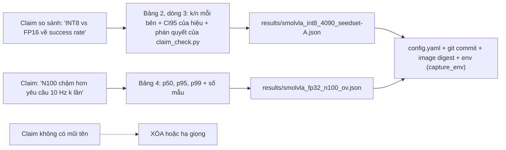
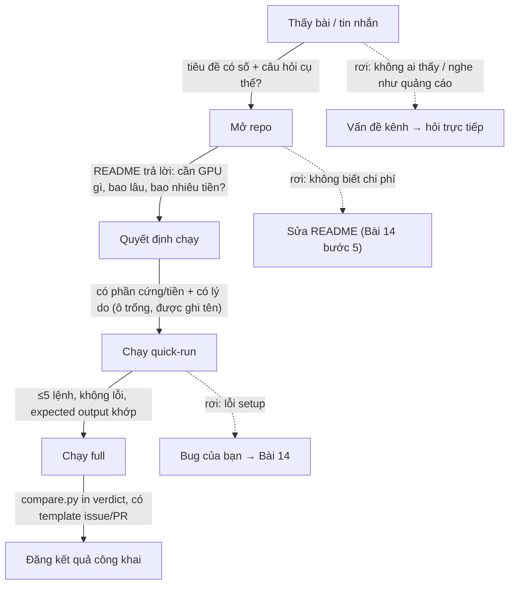
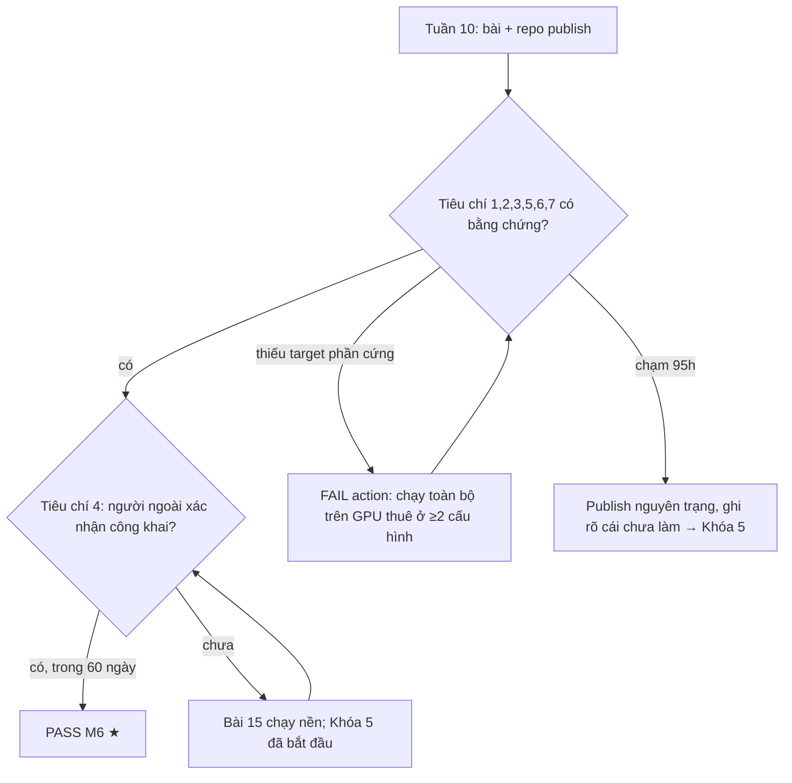

# Khóa 4 · Module 5 — Publish và reproduce (12h) + Gate Khóa 4

Nguồn: `khoa-4-benchmark-edge.md` (Module 5, Gate), `00-lo-trinh-tong.md` (M6), bản Gemini K4 (Bài 13–15, Gate). Bài 13 và 15 dùng khung rút gọn; Bài 14 dùng khung đầy đủ vì nó chứa phần bản chất nặng nhất của module (hermetic, phi tất định, ngưỡng chấp nhận). Gate dùng khung rút gọn, giữ nguyên 7 tiêu chí gốc.

Bốn tiêu chí PASS của M6 do bạn kiểm soát. Tiêu chí số 4 (**≥1 người ngoài reproduce được và xác nhận công khai**) do người khác chấm. Module này tồn tại để tiêu chí đó xảy ra, không phải để hy vọng nó xảy ra.

| Bài | Giờ | Khung | Viên nang nền cần trước | Quyết định ra được |
|---|---|---|---|---|
| 13 — Viết bài tiếng Anh | 5 | rút gọn | F1.7, F1.4, F1.5, F1.3 | Câu nào được phép viết, câu nào phải hạ giọng hoặc xóa |
| 14 — Làm cho người khác chạy lại được | 4 | đầy đủ | F2.2, F3.8, F2.3, F1.3 | Cái gì đóng băng, cái gì chỉ ghi lại, và ngưỡng chênh bao nhiêu thì gọi là "reproduce được" |
| 15 — Đi tìm người reproduce | 3 | rút gọn | F1.7, F2.2 | Kênh nào, câu hỏi nào, và khi nào đổi chiến thuật |
| Gate Khóa 4 | — | rút gọn | toàn khóa | PASS / FAIL action / publish nguyên trạng |

---

## Bài 13 — Viết bài tiếng Anh (5h) (khung rút gọn)

> **Vị trí:** K4 Bài 12 (roofline) → **Bài 13** → Bài 14 (reproducibility) · **Cần trước:** F1.7 (báo cáo trung thực, kết quả âm), F1.4 (CI cho tỉ lệ, Wilson), F1.5 (so sánh hai thứ, power), F1.3 (benchmark đúng cách), K4 Bài 3 (`METHODOLOGY.md`), Bài 8–9 (bảng hai trục, Pareto) · **Sau bài này bạn quyết định được:** với từng câu trong bài viết, câu đó được viết ở mức "A tốt hơn B", "không phân biệt được", hay phải xóa — dựa trên dữ liệu, không dựa trên cảm giác.

**Câu hỏi của bài:** ai sẽ đọc cái này, và họ muốn biết gì?

### 1. Câu chuyện — ai đã khổ vì chuyện này

Brendan Gregg (Netflix, trước đó Sun/Joyent) dành nhiều năm bác bỏ benchmark sai; các công ty cũ của ông không cho đăng benchmark nếu ông chưa duyệt. Năm 2018 ông viết một checklist bảy câu hỏi để chấm một kết quả benchmark: *Why not double? Was it tuned? Did it break limits? Did it error? Does it reproduce? Does it matter? Did it even happen?* [spec — Brendan Gregg, "Evaluating the Evaluation: A Benchmarking Checklist", blog 30/6/2018]. Trong bài nói ở Intel InnovatiON 2021, ông kể một ví dụ: một benchmark CPU phổ biến nói bộ xử lý mới nhanh hơn 2,6 lần; phân tích ở mức lệnh cho thấy benchmark gần như chỉ đo phép chia, mà phép chia chiếm dưới 1% chu kỳ trên workload thật của Netflix, nên lợi ích thực tế là dưới 1%, không phải 2,6 lần [spec — slide "Processor Benchmarking", Brendan Gregg, Intel InnovatiON 2021]. Con số 2,6 không sai: nó đo đúng cái nó đo. Bài viết sai ở chỗ không nói nó đo cái gì và không đo cái gì.

Người đọc bài của bạn là loại người đã thấy hàng chục benchmark VLA kiểu "model X chạy 30 Hz trên Jetson". Họ không đọc từ trên xuống. Họ nhảy thẳng vào Methodology và Limitations để tìm lý do không tin. Bài viết của bạn tồn tại để vượt qua đúng cái lọc đó.

### 2. Mô hình tư duy

Một bài benchmark đáng tin là một **đồ thị truy vết ngược**: mỗi câu khẳng định trỏ về một số; mỗi số trỏ về một file JSON; mỗi JSON trỏ về config, commit, image và môi trường đã ghi (→ F3.8). Câu nào không truy về được thì không có quyền đứng trong bài.



Thứ tự các phần **không** phải thứ tự tầm quan trọng với bạn, mà là thứ tự người đọc chuyên nghiệp cần để quyết định có tin không:

| Phần | Nội dung | Độ dài | Người đọc dùng nó để |
|---|---|---|---|
| TL;DR | 3–5 gạch đầu dòng, có số **và** khoảng sai số | Ngắn | Quyết định đọc tiếp hay không |
| Why this matters | Quyết định thực tế nào phụ thuộc vào số này (đặt model ở robot hay offload) | 1 đoạn | Biết bài có liên quan tới họ không |
| Setup | Model (+ revision), target, runtime, precision. Link config file | Ngắn, bảng | Đối chiếu với môi trường của họ |
| **Methodology** | Warm-up kèm đồ thị, thermal kèm số chứng minh, số mẫu và lý do, sai số của chính harness, ba tầng thời gian | **Dài nhất** | Tìm lý do không tin |
| Results | Bảng có sai số + hình Pareto + hình roofline | Nhiều hình | Lấy số |
| What surprised me | Phát hiện phản trực giác, **kể cả kết quả âm** | 1–2 đoạn | Đây là phần được đọc và chia sẻ nhiều nhất |
| Limitations / What I did not measure | Cái không đo, vì sao; ô trống trong bảng và lý do | Không được thiếu | Biết giới hạn dùng số |
| Reproduce | Lệnh cụ thể, thời gian, chi phí | Ngắn | Chạy lại (Bài 14) |

Ba quy tắc viết của bản gốc, giữ nguyên:
1. **Mọi con số có link tới file kết quả thô.** Không số nào trong bài mà không truy được về JSON trong repo.
2. **Không tuyên bố vượt quá dữ liệu.** Chênh lệch trong ngưỡng nhiễu thì gọi là "không phân biệt được", không gọi là "tốt hơn".
3. **Nêu giới hạn trước khi người khác nêu hộ.**

Quy tắc 2 có một nửa thứ hai mà bản Gemini làm sai: "không phân biệt được" **cũng không** có nghĩa là "bằng nhau". Muốn viết "bảo toàn chất lượng" thì phải chứng minh khoảng tin cậy của hiệu nằm gọn trong một biên tương đương bạn đã cam kết trước (→ F1.5, equivalence testing). Với vài chục episode, khoảng đó thường rộng hơn mọi biên hợp lý. Script ở phần 6 cho ba phán quyết thay vì hai.

**Kết quả âm là kết quả** (→ F1.7). "4-bit nhanh hơn 2,x lần nhưng success rate sập" và "N100 không chạy nổi model 3B vì hết RAM" là những câu có giá trị nhất của bài, vì chúng tiết kiệm cho người đọc một tuần thử. Bỏ chúng đi để bài "đẹp" là đúng loại thiên lệch làm khoa học mất niềm tin (publication bias).

### 3. Cầu nối từ backend

| Backend bạn biết | Ở đây | Gãy ở chỗ | Nếu dùng nhầm thì |
|---|---|---|---|
| Blog "chúng tôi tăng throughput API 3×" | Bài benchmark VLA | Blog backend thường đo một hệ thống của chính tác giả, người đọc không chạy lại; ở đây người đọc **sẽ** đem số của bạn so với số của họ, và trục chất lượng có thể âm thầm hỏng | Viết giọng marketing, không có trục chất lượng → người đọc chuyên nghiệp gạt bỏ cả bài |
| Postmortem / design doc có mục "Non-goals" | Mục "What I did not measure" | Non-goals là lựa chọn phạm vi; "không đo" ở đây còn gồm cả thứ bạn **muốn** đo mà không đo được (N100 quá chậm cho LIBERO, model không vừa VRAM) | Gộp hai loại → người đọc tưởng bạn bỏ qua có chủ ý thứ thật ra là giới hạn phần cứng |
| Dashboard SLO hiển thị p99 | Bảng kết quả có p50/p95/p99 | SLO dashboard có hàng triệu request; bảng của bạn có 200 iteration trên GPU và 20–30 trên N100. p99 của 30 mẫu là mẫu lớn nhất hoặc gần lớn nhất (→ F1.2) | Báo p99 của N100 như thể nó ổn định cỡ p99 production |
| Script pass/fail/inconclusive của bạn | Phán quyết cho mỗi câu khẳng định | Đúng tinh thần, nhưng ngưỡng "inconclusive" ở đây phải tính từ CI của tỉ lệ (Wilson) và cỡ mẫu, không phải cảm giác | Chỉ có pass/fail → mọi chênh lệch nhỏ thành "tốt hơn" hoặc "kém hơn" |
| PR description: "đã test trên local" | Methodology | Reviewer PR tin bạn vì cùng team; người đọc internet không có lý do tin, chỉ có bằng chứng | Viết "đã cô lập nhiệt" không kèm đồ thị → bị coi là không làm |

**Chấm mô hình:**

- *"Bài benchmark tốt = nhiều số và nhiều hình."* — **SAI.** Số không có sai số và methodology là nhiễu có định dạng đẹp. Phản ví dụ: benchmark "2,6×" ở phần 1 có số rất rõ, và vô dụng cho quyết định thật.
- *"Nêu giới hạn làm bài yếu đi."* — **SAI** với khán giả này. Bản gốc kể một nhóm benchmark VLA trên Intel thấy INT8-CPU đạt 75% so với 70% của fp32 và nói rõ họ **không** tuyên bố INT8 thắng (K4 Bài 8; nguồn chưa truy được, xem phần 11 của Bài 8 — dùng như ví dụ phương pháp, đừng trích như số liệu). Chính câu tự giới hạn đó làm phần còn lại của báo cáo đáng tin. Phản ví dụ cho mô hình: bài không có Limitations thì người đọc tự viết Limitations hộ bạn trong phần bình luận, với giọng kém thiện chí hơn.
- *"Chênh lệch không có ý nghĩa thống kê nghĩa là hai cấu hình như nhau."* (đây là đáp án của bản Gemini cho câu tự kiểm tra INT8 73% vs FP16 71%, N=50) — **SAI.** Không bác bỏ được H0 ≠ chứng minh H0. Phản ví dụ: với vài chục episode mỗi bên, CI95 của hiệu hai tỉ lệ rộng tới mức một INT8 kém thật 10 điểm vẫn rơi vào "không phân biệt được" [ước lượng — tự kiểm bằng `claim_check.py` ở phần 6]. Câu đúng: "không phân biệt được; thí nghiệm này không đủ mạnh để loại trừ chênh lệch nhỏ hơn ~X điểm".

### 6. Làm

**Bước 1 (≈1,5h) — Dàn ý từ dữ liệu, không từ cảm hứng.** Liệt kê mọi file JSON trong `results/`. Viết TL;DR **sau cùng**, chỉ từ những dòng trong bảng. Nếu một gạch đầu dòng TL;DR không chỉ được vào một ô bảng, xóa.

**Bước 2 (≈2h) — Viết bài. Tiếng Anh.** Theo bảng cấu trúc ở phần 2. Hai hình bắt buộc: Pareto (Bài 9) và roofline (Bài 12); thêm hình latency–nhiệt độ–clock chồng nhau (Bài 6) trong Methodology. Mọi bảng có cột số mẫu (N) và cột khoảng sai số. Bảng có ô trống thì ô trống có lý do (Bài 10). Ở mục What surprised me, ứng viên từ bản gốc: trung bình không đổi nhưng phân bố theo nhiệm vụ dịch chuyển; precision thấp làm sai im lặng; khoảng cách CPU edge–GPU; kernel quan trọng hơn weight. **Chỉ chọn cái bạn có số của chính mình đỡ lưng.** Với "kernel quan trọng hơn weight" và "compute-bound hay memory-bound": đây là kết luận phụ thuộc phase (prefix ảnh vs decode) và phần cứng (quy chuẩn mục 7, lỗi K4 Bài 12); chỉ viết điều roofline + số đo của bạn cho thấy, đừng chép kết luận "VLA batch 1 là compute-bound" của nguồn khác như sự thật chung.

**Bước 3 (≈1h) — Kiểm từng câu khẳng định.** In bài ra, tô mọi câu có động từ so sánh hoặc tính từ đánh giá ("faster", "preserves", "negligible", "significant", "real-time"). Với mỗi câu: dữ liệu nào đỡ lưng? Câu so sánh hai tỉ lệ thì chạy qua script dưới đây và viết đúng mức phán quyết nó cho. Câu không có dữ liệu thì xóa hoặc hạ giọng. Lưu ý: nếu hai cấu hình chạy **cùng bộ seed**, dữ liệu là cặp; McNemar trên các episode bất đồng chặt hơn so sánh hai tỉ lệ độc lập (→ F1.5). Script dưới dùng xấp xỉ độc lập, tức là bảo thủ hơn.

```python
# [đã chạy] claim_check.py — câu "A tốt hơn B" có được phép viết không?
import numpy as np
from scipy.stats import norm

def wilson(k, n, conf=0.95):
    """Khoảng tin cậy Wilson cho tỉ lệ k/n (→ F1.4)."""
    z = norm.ppf(1 - (1 - conf) / 2)
    p = k / n
    den = 1 + z**2 / n
    c = (p + z**2 / (2 * n)) / den
    h = z * np.sqrt(p * (1 - p) / n + z**2 / (4 * n**2)) / den
    return c - h, c + h

def diff_ci(k1, n1, k2, n2, conf=0.95):
    """CI xấp xỉ cho hiệu hai tỉ lệ (Newcombe, ghép hai khoảng Wilson)."""
    p1, p2 = k1 / n1, k2 / n2
    l1, u1 = wilson(k1, n1, conf)
    l2, u2 = wilson(k2, n2, conf)
    d = p1 - p2
    lo = d - np.sqrt((p1 - l1) ** 2 + (u2 - p2) ** 2)
    hi = d + np.sqrt((u1 - p1) ** 2 + (p2 - l2) ** 2)
    return d, lo, hi

def verdict(k1, n1, k2, n2, margin=0.05):
    """Ba trạng thái, giống script pass/fail/inconclusive của bạn."""
    d, lo, hi = diff_ci(k1, n1, k2, n2)
    if lo > 0:
        v = "A TỐT HƠN (CI không chứa 0)"
    elif hi < 0:
        v = "A KÉM HƠN (CI không chứa 0)"
    elif -margin < lo and hi < margin:
        v = f"TƯƠNG ĐƯƠNG trong ±{margin:.0%} (CI nằm gọn trong biên)"
    else:
        v = "KHÔNG PHÂN BIỆT ĐƯỢC — và cũng KHÔNG chứng minh được tương đương"
    return f"d={d:+.3f}  CI95=[{lo:+.3f}, {hi:+.3f}]  -> {v}"

if __name__ == "__main__":
    # Thay bằng số thật của bạn: (thành công, số episode) cho cấu hình A và B
    for k1, n1, k2, n2 in [(37, 50, 35, 50), (370, 500, 350, 500), (1840, 2000, 1830, 2000)]:
        print(f"A={k1}/{n1}  B={k2}/{n2}  ", verdict(k1, n1, k2, n2))
```

Biên tương đương (`margin`) phải được **viết vào `METHODOLOGY.md` trước khi nhìn kết quả**, cùng chỗ với quy tắc diễn giải của Bài 8. Đặt nó sau khi thấy số là p-hacking dưới tên khác.

**Bước 4 (≈0,5h) — Tự chấm bằng checklist của người đọc chuyên nghiệp.** Dùng bảng dưới như rubric; mỗi dòng ghi ĐẠT / CHƯA / KHÔNG ÁP DỤNG kèm chỗ trong bài. Bảy câu đầu là checklist của Gregg; phần sau là những gì một kỹ sư robotics sẽ hỏi thêm (gộp từ Hoefler & Belli 2015 và chính khóa này).

| # | Câu người đọc hỏi | Bài của bạn trả lời ở đâu |
|---|---|---|
| 1 | *Why not double?* Cái gì giới hạn con số này (compute, bandwidth, kernel, preprocess)? | Roofline + profiler (Bài 12) |
| 2 | *Was it tuned?* Runtime có dùng đúng kernel/precision mà một người triển khai thật sẽ dùng không? | Setup + Bài 8 "int8 có thật sự chạy không" |
| 3 | *Did it break limits?* Số có vượt giới hạn vật lý (peak FLOPS, băng thông RAM) không? | Đối chiếu với roofline |
| 4 | *Did it error?* Có run nào lỗi, NaN, OOM, bị bỏ ra khỏi thống kê không? Bỏ bao nhiêu? | Methodology: đếm run hỏng |
| 5 | *Does it reproduce?* Chạy lại toàn bộ 3 lần lệch bao nhiêu? Người khác chạy ra sao? | Bài 3 (3 lần), Bài 14–15 |
| 6 | *Does it matter?* Chênh lệch này có đổi quyết định triển khai nào không (10 Hz có đạt không)? | Why this matters + decisions.md |
| 7 | *Did it even happen?* Model có thật sự chạy ở precision đó không, hay fallback im lặng? | Kích thước weight, profiler, log runtime |
| 8 | Báo phân bố hay chỉ một số? Có số mẫu N không? | Bảng có N, p50/p95/p99 |
| 9 | Có trục chất lượng, cùng bộ seed, theo nhiệm vụ không? | Bài 7–8 |
| 10 | Ba tầng thời gian tách riêng hay gộp? So với số người khác thì so tầng nào? | Bài 4 |
| 11 | Bằng chứng thermal/clock là đồ thị hay lời kể? | Bài 6 |
| 12 | Có kết quả âm, có "nhanh hơn nhưng hỏng" không? | What surprised me, Gate tiêu chí 7 |
| 13 | Có mục "cái tôi không đo" không? | Limitations |
| 14 | Mỗi số có link về JSON không? | Toàn bài |

**Bước 5 — Cross-post** (giữ nguyên bản gốc): r/robotics, Hacker News, LinkedIn, LeRobot Discord, Foxglove Discord. Mỗi nơi một câu mở đầu khác nhau theo người đọc ở đó, nhưng **cùng số**. Bài 15 lo phần phân phối có chủ đích; ở đây chỉ đăng.

### 8. Nếu ra khác

| Triệu chứng | Nguyên nhân khả dĩ | Kiểm bằng cách | Sửa |
|---|---|---|---|
| TL;DR có câu không chỉ được vào ô bảng nào | Viết từ ấn tượng, không từ dữ liệu | Bước 3 | Xóa, hoặc thêm phép đo rồi mới viết |
| Mọi so sánh chất lượng đều ra "không phân biệt được" | Số episode quá ít | `claim_check.py` với N lớn hơn để xem cần bao nhiêu | Hoặc chạy thêm episode trên GPU, hoặc viết thẳng "thí nghiệm không đủ mạnh để kết luận" — đó cũng là một kết quả |
| Methodology ngắn hơn Results | Coi methodology là thủ tục | Đếm từ mỗi phần | Chuyển đồ thị warm-up, thermal, A/A vào Methodology |
| Bài không có kết quả âm nào | Đã lọc bỏ, hoặc chưa nén đủ sâu (Bài 8 bước 5) | Xem lại `results/` có cấu hình nào bị bỏ khỏi bài | Đưa lại vào; nếu chưa có, quay lại Bài 8 |
| Người bình luận chỉ ra một giới hạn bạn chưa nêu | Thiếu mục 13 của checklist | — | Cập nhật bài, ghi changelog ở cuối bài, cảm ơn người chỉ ra |
| Số trong bài khác số trong JSON | Copy tay | `grep` từng số trong `results/` | Sinh bảng trong bài bằng script từ JSON, không gõ tay |

### 9. Câu hỏi ngược

1. **[Phản biện]** Bản gốc yêu cầu Methodology là phần dài nhất. Một người đọc HN thường chỉ đọc TL;DR. Vậy viết dài Methodology cho ai, và có cách nào để TL;DR "mang theo" độ tin cậy của Methodology không?
   <details><summary>Hướng nghĩ</summary>Người quyết định tin hay không thường là thiểu số đọc kỹ, và họ lan truyền đánh giá cho số đông. TL;DR có thể mang độ tin cậy bằng cách gắn N và khoảng sai số ngay cạnh số, và một câu giới hạn quan trọng nhất. So với abstract của paper: abstract tốt nêu điều kiện của kết quả.</details>
2. **[Nếu…thì]** Nếu bạn chạy thêm episode cho tới khi INT8 "tốt hơn có ý nghĩa thống kê" rồi dừng, kết luận có còn đáng tin không?
   <details><summary>Hướng nghĩ</summary>Đây là optional stopping / peeking (→ F1.5). Tỉ lệ dương tính giả thật cao hơn α danh nghĩa. Cỡ mẫu phải cam kết trước, hoặc dùng thiết kế tuần tự có hiệu chỉnh.</details>
3. **[Quy mô]** Nếu bảng của bạn có 3 model × 4 precision × 3 target × 10 nhiệm vụ, và bạn so từng cặp, bao nhiêu câu "có ý nghĩa" sẽ xuất hiện chỉ do ngẫu nhiên? Điều đó đổi cách viết mục What surprised me thế nào?
   <details><summary>Hướng nghĩ</summary>Bội so sánh (→ F1.5). Với hàng trăm phép so, vài phần trăm sẽ "có ý nghĩa" ở α=0,05 dù không có gì thật. Phát hiện bất ngờ nhất lại là ứng viên dương tính giả cao nhất. Ghi rõ đâu là giả thuyết đã cam kết trước, đâu là phát hiện khám phá cần xác nhận lại.</details>
4. **[Failure mode]** Bài đăng 3 tháng sau, LeRobot đổi phiên bản và một người chạy lại ra số khác 30%. Bài của bạn sai, hay thế giới đã đổi? Bài viết cần có gì để người đọc tự phân biệt được?
   <details><summary>Hướng nghĩ</summary>Phiên bản pin trong Setup, ngày đo, digest image, và một changelog cuối bài. Một benchmark là ảnh chụp tại một điểm trong không gian phiên bản; bài phải nói điểm đó là đâu (Bài 14).</details>
5. **[Liên ngành]** Thử nghiệm lâm sàng phải đăng ký trước (ClinicalTrials.gov) endpoint chính. Phần nào của bài benchmark tương ứng với "primary endpoint", và vì sao cần cam kết nó trước khi có số?
   <details><summary>Hướng nghĩ</summary>`prediction.md` và quy tắc diễn giải trong `METHODOLOGY.md` là preregistration (→ F1.7). Primary endpoint ở đây có thể là "p50 end-to-end batch 1 + success rate theo nhiệm vụ cùng bộ seed". Đổi endpoint sau khi thấy số là cách phổ biến nhất để mọi thứ trông như thành công.</details>

### 11. Độ tin cậy và sửa lỗi

| Khẳng định | Nhãn | Ghi chú / cách kiểm |
|---|---|---|
| Checklist 7 câu của Gregg | [spec] | Blog brendangregg.com, 30/6/2018 |
| Ví dụ "2,6× → <1%" | [spec] | Slide Intel InnovatiON 2021 của Gregg |
| Độ rộng CI95 của hiệu tỉ lệ ở N=50 | [ước lượng] | Từ `claim_check.py`, giả định episode độc lập; số cụ thể trong khối 🔒 phần 12 |
| Benchmark Intel: INT8 75% vs fp32 70%, tác giả không tuyên bố INT8 thắng | chưa kiểm nguồn | Bản gốc K4 Bài 8 không nêu tên báo cáo; Bài 8 cũng chưa tìm được. Tự tìm và đọc trước khi dẫn trong bài (Reviewer sửa: nhãn cũ `[spec theo bản gốc]` mạnh hơn bằng chứng, lệch với Bài 8) |

**Đã sửa so với bản gốc/Gemini:**
- Gemini (tự kiểm tra câu 2): kết luận "INT8 bảo toàn chất lượng trong phạm vi sai số" từ 73% vs 71%, N=50 → sai, đó là nhầm "không bác bỏ được" với "chứng minh tương đương". Đã thay bằng ba phán quyết và biên tương đương cam kết trước.
- Gemini thêm yêu cầu "1.200–1.800 từ" và "Limitations ≥3 mục" — không có trong bản gốc. Giữ làm gợi ý, không phải tiêu chí.
- Gemini liệt kê "khoảng cách CPU edge–GPU hàng chục đến hàng trăm lần" như sự thật trong bài học → đã bỏ; đó là số bạn phải đo (Bài 11), không phải số được viết trước.
- Bản gốc gợi ý "kernel quan trọng hơn weight" làm ứng viên What surprised me dựa trên kết luận "VLA batch 1 compute-bound" → thêm điều kiện: chỉ viết khi roofline và số đo của chính bạn cho thấy (quy chuẩn mục 7).
- Reviewer sửa (niêm phong): hình truy vết ở phần 2 dùng đúng cặp 37/50 vs 35/50 kèm phán quyết "không phân biệt được", tức là đáp án câu tự kiểm tra; đã thay bằng placeholder.

### 12. Đọc thêm và tự kiểm tra

- **Nguồn gốc:** Brendan Gregg, "Evaluating the Evaluation: A Benchmarking Checklist" (blog, 2018).
- **Giải thích:** Torsten Hoefler, Roberto Belli, "Scientific Benchmarking of Parallel Computing Systems: Twelve ways to tell the masses when reporting performance results" (SC'15). Mười hai quy tắc báo cáo; đọc phần về báo cáo biến thiên và về số mẫu.
- **Đào sâu (tùy chọn):** SIGPLAN Empirical Evaluation Guidelines (Berger, Blackburn, Hauswirth, Hicks) — checklist reviewer dùng để chấm phần đánh giá thực nghiệm của paper.
- **Tự kiểm tra:** (1) giải thích cho một backend engineer khác trong 5 câu vì sao Methodology dài hơn Results; (2) vẽ lại đồ thị truy vết claim → số → JSON → môi trường từ trí nhớ; (3) câu hỏi dưới.

**Câu hỏi:** cấu hình A: 37/50 episode thành công; B: 35/50. Một đồng nghiệp đề xuất viết "A and B perform equivalently". Bạn sửa câu này thành gì, và cần bao nhiêu episode mỗi bên để có hy vọng viết được "equivalent within ±5 points"?

<details><summary>🔒 MỞ SAU KHI COMMIT prediction.md</summary>

Chạy `claim_check.py`: d = +0,04, CI95 ≈ [−0,13; +0,21]. Phán quyết: không phân biệt được và không chứng minh được tương đương. Câu đúng kiểu: *"A (74%, 37/50) and B (70%, 35/50) are statistically indistinguishable in this experiment; with 50 episodes per configuration we cannot rule out differences of up to ~±15–20 points."*

Để CI95 của hiệu nằm gọn trong ±5 điểm khi p≈0,7–0,9, cần cỡ vài trăm tới hơn một nghìn episode mỗi bên (ví dụ trong script, 2000/bên với p≈0,92 cho CI ≈ [−0,012; +0,022]). Nửa độ rộng xấp xỉ 1,96·√(2p(1−p)/n): với p=0,7, muốn ≤0,05 cần n ≈ 650 mỗi bên [ước lượng]. Dùng cùng bộ seed và McNemar giảm con số này nếu hai cấu hình bất đồng trên ít episode. Kết luận thực tế: ở ngân sách GPU của khóa này, bạn gần như chắc chắn chỉ viết được "không phân biệt được", và đó là câu trung thực.

</details>

---

## Bài 14 — Làm cho người khác chạy lại được (4h)

> **Vị trí:** Bài 13 (bài viết) → **Bài 14** → Bài 15 (đi tìm người chạy lại) · **Cần trước:** F2.2 (tái lập và hermetic), F3.8 (lineage, provenance, hash nội dung), F2.3 (flaky test là một số đo, phán quyết ba trạng thái), F1.3 (A/A test, cô lập nhiễu), K4 Bài 3 (`METHODOLOGY.md`), Bài 4 (harness ghi ngữ cảnh), Bài 7 (seed) · **Sau bài này bạn quyết định được:** với mỗi đầu vào của benchmark, nó được **đóng băng** (hermetic), chỉ **ghi lại** (provenance), hay được **chặn bằng ngưỡng** (tolerance) — và ngưỡng "reproduce được" là bao nhiêu phần trăm, tính từ số đo chứ không chọn bằng cảm giác.

**Câu hỏi của bài:** người lạ mất bao lâu từ lúc thấy repo tới lúc có số của riêng họ, và khi số của họ khác số của bạn, ai sai?

### 1. Câu chuyện — ai đã khổ vì chuyện này

Tháng 3/2016, một lập trình viên gỡ khoảng 270 package của mình khỏi npm sau một tranh chấp tên package. Một trong số đó là `left-pad`, 11 dòng code đệm chuỗi. Hàng nghìn build trên thế giới gãy trong vài giờ, kể cả các dự án lớn phụ thuộc gián tiếp vào nó; npm phải khôi phục package và đổi chính sách gỡ package [chuẩn — sự cố left-pad, 2016]. Bài học cho bạn: lockfile ghim **tên và phiên bản** (kèm hash), nhưng nếu artifact biến mất khỏi registry thì lockfile chỉ còn là bằng chứng về thứ bạn không còn cài được. "Pin" khác "có".

Phía ML có câu chuyện riêng. Henderson và cộng sự ("Deep Reinforcement Learning that Matters", AAAI 2018) cho thấy chỉ đổi random seed, cùng thuật toán, cùng code, đã đủ tạo ra các đường học khác nhau tới mức chia 10 lần chạy thành hai nhóm 5 có thể trông như hai thuật toán khác nhau [spec — Henderson et al., 2018]. Và tài liệu chính thức của PyTorch viết thẳng: kết quả hoàn toàn tái lập **không được đảm bảo** giữa các phiên bản PyTorch, các commit, các nền tảng, và giữa CPU với GPU, kể cả khi dùng cùng seed [spec — PyTorch docs, "Reproducibility"]. Policy VLA của bạn là mạng nơ-ron chạy trong vòng kín với một bộ mô phỏng vật lý: nó thừa hưởng cả hai vấn đề.

### 2. Mô hình tư duy

Benchmark của bạn là một hàm của nhiều tầng đầu vào. Docker chỉ bọc **một phần** của chồng này:

```
 ┌───────────────────────────────────────────────┐  CHIẾN LƯỢC
 │ code + config.yaml + seed set                 │  ĐÓNG BĂNG: git commit
 │ model weights (HF revision)                   │  ĐÓNG BĂNG: commit sha, không dùng "main"
 │ Python packages (torch, lerobot, ...)         │  ĐÓNG BĂNG: lockfile có hash
 │ CUDA runtime, cuDNN, cuBLAS, libc, apt libs   │  ĐÓNG BĂNG: image digest @sha256
 ├──────────────── ranh giới image ──────────────┤
 │ libcuda.so + kernel module NVIDIA (driver)    │  GHI LẠI: driver_version
 │ kernel Linux, container runtime               │  GHI LẠI: uname -r
 │ CPU: model, ISA (AVX2/AVX-512/AMX), microcode │  GHI LẠI: /proc/cpuinfo
 │ BIOS: power limit PL1/PL2, turbo, SMT         │  GHI LẠI (nếu đọc được) + đo
 │ governor, xung thật, power cap GPU, PCIe      │  GHI LẠI + đo suốt phép đo
 │ nhiệt độ, luồng gió, tenant khác trên máy thuê│  CHẶN BẰNG NGƯỠNG: đo độ tản mát
 └───────────────────────────────────────────────┘
```

Ba chiến lược, theo thứ tự ưu tiên:

1. **Đóng băng (hermetic)** những gì kiểm soát được: mọi đầu vào được khai báo và định danh bằng **nội dung** (hash), không bằng **tên** (tag, "latest", "main"). Tag là con trỏ có thể bị đẩy lại; digest là địa chỉ nội dung, không đổi được [chuẩn].
2. **Ghi lại (provenance)** những gì không đóng băng được: driver, CPU, microcode, xung, nhiệt. Ghi vào **cùng file JSON kết quả**, không phải file riêng (→ F3.8). Khi hai kết quả khác nhau, cái này cho bạn danh sách nghi phạm.
3. **Chặn bằng ngưỡng (tolerance)** phần còn lại: hiệu năng là thuộc tính của **phần cứng cụ thể đang chạy**, không phải của image. Bạn không làm nó tất định được; bạn chỉ đo được nó tản mát bao nhiêu giữa các máy cùng loại, rồi đặt ngưỡng chấp nhận từ đó.

Điểm cốt lõi: trong benchmark có **hai loại tái lập khác nhau về bản chất**.
- **Tái lập tính toán** (trục chất lượng): cùng đầu vào → cùng output số. Có thể đạt gần tất định trên cùng loại phần cứng nếu khóa các nguồn phi tất định (phần 6 bước 2).
- **Tái lập phép đo** (trục latency): output là một phân bố thời gian của một quá trình vật lý. Không bao giờ bit-for-bit. Câu hỏi đúng không phải "có giống không" mà "có nằm trong độ tản mát đã biết không".

"Works on my machine" vì thế không phải câu đùa, mà là **một phép đo có n = 1 máy**. Nó ước lượng hiệu ứng của một máy cụ thể, gộp lẫn với hiệu ứng của model. Muốn tách hai thứ, bạn cần n > 1 máy — đó là A/A test giữa các instance (→ F1.3), và chính người reproduce ở Bài 15 là điểm dữ liệu thứ n+1.

**Mô phỏng 1 — vì sao cùng seed chưa đủ.** Cộng float32 không có tính kết hợp; GPU reduction song song (atomicAdd, split-K GEMM) có thể đổi thứ tự cộng giữa các lần chạy. Trong một vòng kín policy → sim → observation, sai khác cỡ 1 ULP được khuếch đại qua từng bước. Chạy và ghi lại bạn thấy gì ở cột "episode đổi kết quả" so với cột success rate tổng.

```python
# [đã chạy] nondet.py — vì sao "cùng seed" chưa đủ để ra cùng kết quả
import numpy as np

rng = np.random.default_rng(0)

# (1) Cộng float32 không có tính kết hợp: đổi THỨ TỰ cộng là đổi kết quả.
#     GPU reduction song song (atomicAdd, split-K) đổi thứ tự giữa các lần chạy.
x = rng.standard_normal(1_000_000).astype(np.float32)
sums = {float(np.sum(x[rng.permutation(x.size)], dtype=np.float32)) for _ in range(20)}
print(f"20 thứ tự cộng khác nhau -> {len(sums)} giá trị tổng khác nhau")
print(f"chênh lớn nhất: {max(sums) - min(sums):.2e}")

# (2) Một 'rollout' đồ chơi: hệ hỗn loạn khuếch đại sai khác nhỏ qua từng bước,
#     giống action -> sim vật lý -> observation -> action ... trong LIBERO.
def rollout(x0, eps, steps=60):
    x = x0
    for t in range(steps):
        x = 3.9 * x * (1 - x)          # logistic map, chế độ hỗn loạn
        if t == 0:
            x += eps                    # nhiễu cỡ 1 ULP float32 ở bước đầu
    return x > 0.5                      # 'thành công' là nhị phân

x0s = rng.uniform(0.1, 0.9, 1000)       # 1000 episode, mỗi episode 1 'seed'
for eps in [0.0, 1e-7, 1e-4]:
    a = np.array([rollout(x, 0.0) for x in x0s])
    b = np.array([rollout(x, eps) for x in x0s])
    print(f"eps={eps:.0e}: success A={a.mean():.3f} B={b.mean():.3f} "
          f"| episode đổi kết quả: {(a != b).mean():.1%}")
```

Logistic map là đồ chơi, không phải LIBERO: nó hỗn loạn hơn nhiều so với một policy tốt đang bám quỹ đạo. Thứ nó minh họa là **cơ chế** (sai khác nhỏ + vòng kín + kết quả nhị phân), không phải tỉ lệ.

**Mô phỏng 2 — ngưỡng 10% có tỉ lệ sai bao nhiêu.** Mỗi máy thuê cùng SKU có hiệu ứng riêng `b` (power limit do nhà cung cấp đặt, CPU host, thế hệ PCIe, driver, xung boost theo chất lượng chip và nhiệt). Script tính xác suất một lần reproduce **không có bug nào** vẫn bị phán FAIL bởi ngưỡng 10%, theo độ tản mát giữa các máy `sigma_b` — đại lượng bạn chưa biết và sẽ đo ở bước 4.

```python
# [đã chạy] tolerance.py — "chạy được trên máy tôi" như một phép đo có tỉ lệ sai
import numpy as np

rng = np.random.default_rng(1)
N = 200_000            # số cặp (máy của bạn, máy người reproduce) mô phỏng
SIGMA_W = 0.02         # nhiễu giữa các phiên trên CÙNG một máy (Bài 3: p50 lệch <5%)
TOL = 0.10             # ngưỡng của Bài 14: chênh p50 < 10%

def p50_ratio(sigma_b):
    """Tỉ lệ p50(người khác)/p50(bạn). Mỗi máy thuê có hiệu ứng riêng b
    (power limit, CPU host, PCIe, driver, xung boost) ~ lognormal(0, sigma_b)."""
    b1, b2 = rng.normal(0, sigma_b, (2, N))
    w1, w2 = rng.normal(0, SIGMA_W, (2, N))
    return np.exp((b2 + w2) - (b1 + w1))

print("sigma_b  P(FAIL oan | không có bug)   ngưỡng để FAIL oan <=5%")
for sigma_b in [0.0, 0.02, 0.04, 0.06, 0.08]:
    r = p50_ratio(sigma_b)
    false_fail = np.mean(np.abs(r - 1) > TOL)
    tol95 = np.quantile(np.abs(r - 1), 0.95)
    print(f"{sigma_b:6.2f}   {false_fail:10.1%}                   ±{tol95:.1%}")

# Ngược lại: một bug THẬT làm chậm 12% có bị ngưỡng 10% bắt không?
sigma_b = 0.06
r = p50_ratio(sigma_b) * 1.12
print(f"\nbug chậm 12%, sigma_b={sigma_b}: P(bị bắt) = {np.mean(np.abs(r - 1) > TOL):.1%}")
```

Đây là bài toán oracle của F2.1 áp lên chính tiêu chí PASS: ngưỡng chấp nhận là một bài test, và bài test có dương tính giả lẫn âm tính giả.

### 3. Cầu nối từ backend

| Backend bạn biết | Ở đây | Gãy ở chỗ | Nếu dùng nhầm thì |
|---|---|---|---|
| Docker / docker-compose dựng môi trường local tái tạo được (bạn đã làm) | Dockerfile của benchmark | Container dùng chung **kernel và driver GPU của host**: NVIDIA Container Toolkit gắn `libcuda.so` và thư viện driver từ host vào container lúc chạy [spec — NVIDIA Container Toolkit docs]. CUDA runtime trong image phải tương thích với driver ngoài image. CPU, microcode, BIOS, governor, nhiệt, power cap không bao giờ nằm trong image | Tin "đã có Docker nên ai chạy cũng ra số như tôi" → coi chênh lệch do phần cứng là bug, hoặc ngược lại bỏ qua bug thật vì "chắc do máy" |
| `package-lock.json`, `poetry.lock` | `uv.lock` / `requirements.txt --require-hashes` | Lockfile Python ghim wheel; nhưng wheel PyTorch CUDA thường lấy từ index riêng của PyTorch, và wheel chứa kernel đã biên dịch cho một tập kiến trúc GPU nhất định. Cùng lockfile, khác GPU → "no kernel image is available" hoặc đường code khác | Lockfile pass, chạy fail trên card mới/cũ hơn; hoặc tệ hơn: chạy được nhưng qua đường fallback chậm |
| Image tag `myapp:1.4` | `FROM pytorch/...:<tag>` | Tag có thể bị đẩy lại cùng tên với nội dung khác; digest thì không | Hai người "cùng image" nhưng khác CUDA patch, khác cuDNN |
| Seed cố định trong unit test | `torch.manual_seed`, seed LIBERO | Unit test backend thường tất định một khi cố định seed. GPU kernel có thể phi tất định **dù** cùng seed (atomic, autotuner cuDNN chọn thuật toán theo thời gian đo) | Bài 7 "cùng seed 3 lần phải giống hệt" thất bại và bạn đi tìm nguồn ngẫu nhiên ở sai chỗ |
| Flaky test → retry tới khi xanh | Reproduce lệch → chạy lại tới khi khớp | Retry tới khi khớp là p-hacking: bạn chọn mẫu đẹp nhất | Báo "reproduced" trên mẫu đã lọc; người thứ hai chạy sẽ không khớp |
| Đo trên host "yên tĩnh" (bạn đã làm) | Cô lập nhiệt, governor, tải nền | Yên tĩnh giảm nhiễu **trong** một máy; nó không cho biết máy của bạn khác máy người khác bao nhiêu | Ngưỡng chấp nhận đặt từ nhiễu trong máy (2–5%) → FAIL oan hàng loạt khi đổi máy |
| CPU feature trong backend (thường không quan tâm) | ISA của CPU quyết định kernel | oneDNN/MKL/OpenVINO **chọn kernel lúc chạy theo ISA** (AVX2, AVX-512, AVX-VNNI, AMX). Cùng image, CPU máy thuê có AVX-512/AMX còn N100 không có AVX-512 [spec — Intel ARK; kiểm `lscpu`] → khác đường code, khác tốc độ, có thể khác cả bit cuối của kết quả | So preprocess hoặc phần chạy CPU giữa máy thuê và N100 như thể cùng code |

**Chấm mô hình:**

- *"Có Docker image là môi trường đã đóng băng."* (mô hình tự nhiên từ kinh nghiệm dựng môi trường local của bạn) — **ĐÚNG MỘT PHẦN.** Đúng cho userspace: thư viện, Python, CUDA runtime. Gãy ở mọi thứ dưới ranh giới image: driver GPU, kernel, CPU/ISA, firmware, nhiệt. Phản ví dụ: cùng một image chạy trên hai máy thuê RTX 4090; một máy nhà cung cấp đặt power limit thấp hơn mặc định. Image giống hệt, p50 khác — và không gì trong image cho bạn biết vì sao. Chỉ `nvidia-smi --query-gpu=power.limit` ghi trong JSON mới cho biết.
- *"Lockfile đảm bảo môi trường được đóng băng tuyệt đối theo thời gian."* (bản Gemini, tự kiểm tra Bài 14 câu 2) — **SAI.** Lockfile ghim gói Python, không ghim driver, image nền, gói apt cài lúc build (`apt-get update` lấy bản mới nhất ngày build), và không đảm bảo artifact còn tồn tại trên registry (left-pad). Phản ví dụ: Dockerfile có `RUN apt-get update && apt-get install -y libgl1` build lại sau 6 tháng ra một image khác, dù `uv.lock` không đổi một byte.
- *"Nếu lúc đo chưa cover đủ flag/khóa thì lúc runtime không thể đảm bảo mọi tình huống."* (mô hình của bạn ở K3 lượt 21) — **ĐÚNG MỘT PHẦN.** Đúng là thứ không đo thì không bảo đảm. Gãy ở giả định rằng có thể liệt kê đủ flag: tập yếu tố ảnh hưởng (microcode, power limit của nhà cung cấp, chất lượng silicon, nhiệt độ phòng) là mở và bạn không biết hết. Phản ví dụ: bạn ghi đủ driver, CUDA, governor, nhiệt, vẫn có hai máy cùng SKU lệch nhau vì power limit bạn không nghĩ tới việc đọc. Đối sách đúng không phải "cover đủ flag" mà là **ghi những gì biết + đo độ tản mát tổng của những gì không biết + để người ngoài lấy mẫu thêm** (Bài 15).

### 4. Thuật ngữ

| Mức | Thuật ngữ | Nghĩa trong một câu | Hay bị hiểu nhầm thành |
|---|---|---|---|
| 🟢 | Hermetic build/run | Mọi đầu vào được khai báo tường minh và định danh bằng nội dung; không lấy gì ngầm từ mạng hay máy host | "Chạy trong Docker" |
| 🟡 | Reproducible build (bit-for-bit) | Build lại từ cùng nguồn ra artifact giống từng byte (Reproducible Builds project) | Benchmark tái lập được (benchmark không bao giờ bit-for-bit về latency) |
| 🟢 | Lockfile có hash | Danh sách phiên bản chính xác + hash từng artifact, installer từ chối artifact sai hash | Bảo đảm còn cài được mãi |
| 🟢 | Image digest | `@sha256:...`, địa chỉ nội dung của image, bất biến | Tag (`:2.x`, `:latest`) |
| 🟢 | Model revision | Commit sha của repo model trên HF Hub, truyền qua `revision=` | Tên model ("smolvla_base") |
| 🟢 | Repeatability / Reproducibility / Replicability | Theo ACM badging v1.1: cùng nhóm cùng setup / **khác nhóm, cùng setup** (dùng artifact của tác giả) / khác nhóm, khác setup [spec — ACM Artifact Review and Badging v1.1, 2020] | Ba từ đồng nghĩa; lưu ý ACM đã **đảo** nghĩa hai từ sau năm 2020 để khớp NISO, tài liệu cũ dùng ngược |
| 🟢 | Provenance | Hồ sơ đầu vào và môi trường đi kèm mỗi kết quả (→ F3.8) | Log chạy |
| 🟢 | Tolerance / acceptance band | Ngưỡng chênh được coi là "cùng kết quả", tính từ độ tản mát đo được | Con số tròn chọn cho đẹp (10%) |
| 🟢 | Nguồn phi tất định | Thứ làm cùng đầu vào ra khác output: thứ tự reduction, autotuner, đa luồng, thời gian, hash ngẫu nhiên | Chỉ có random seed |
| 🟡 | `torch.use_deterministic_algorithms`, `CUBLAS_WORKSPACE_CONFIG`, `cudnn.benchmark` | Công tắc buộc PyTorch/cuBLAS/cuDNN dùng kernel tất định hoặc báo lỗi [spec — PyTorch docs, Reproducibility] | Công tắc miễn phí (có thể chậm hơn, tức là đổi chính số latency bạn đo) |
| 🟡 | CUDA compatibility (driver ↔ runtime) | Quy tắc runtime CUDA nào chạy được trên driver nào [spec — NVIDIA CUDA Compatibility guide] | "Cứ có CUDA là chạy" |
| 🟡 | Runtime ISA dispatch | Thư viện chọn kernel theo tập lệnh CPU phát hiện lúc chạy (oneDNN, MKL, OpenVINO) | Cùng binary = cùng code path |
| 🟡 | Ubuntu/Debian snapshot archive | Cài gói apt như kho tại một thời điểm (`apt --snapshot <ID>` trên Ubuntu 24.04+) [spec — Ubuntu Snapshot Service docs] | Không cần thiết vì "apt ổn định" |
| 🔴 | Nix / Guix, Bazel remote execution, SLSA | Hệ build hermetic toàn phần / chuẩn chuỗi cung ứng | Thứ cần cho benchmark cá nhân (quá tay ở khóa này) |

### 5. Dự đoán

Viết `prediction.md` và commit **trước** khi làm phần 6. Không dùng AI ở bước này.

1. **Thời gian từ máy sạch.** Với repo **hiện tại** (chưa sửa gì), từ lúc SSH vào một máy GPU thuê mới tới lúc in ra số đầu tiên mất bao lâu? Bao nhiêu lệnh? Bao nhiêu lần bạn phải sửa gì đó? Phương pháp: liệt kê từng bước (pull image, cài driver?, tải weight, tải asset LIBERO, warm-up), ước lượng mỗi bước từ dung lượng (tra kích thước image bằng `docker image ls`, kích thước weight trên trang HF) chia cho băng thông máy thuê (tra trên trang listing của vast.ai/runpod).
2. **Độ tản mát giữa các máy cùng SKU (`sigma_b`).** Thuê 3 instance cùng loại GPU (thời điểm/nhà cung cấp khác nhau nếu được), chạy quick-run. Dự đoán: chênh p50 lớn nhất giữa 3 máy là bao nhiêu %? So với chênh <5% giữa 3 lần chạy trên **cùng** một máy (Bài 3), lớn hơn hay nhỏ hơn, bao nhiêu lần?
3. **Ngưỡng 10% của bản gốc** có đủ rộng không, khi đặt cạnh số của câu 2? Dùng `tolerance.py` với `sigma_b` bạn dự đoán để tính tỉ lệ FAIL oan.
4. **Cùng seed trên GPU.** Chạy cùng một suite LIBERO 3 lần, cùng seed, **không** bật cờ tất định: success rate tổng giống hệt? Từng episode giống hệt? Rồi **bật** cờ tất định: hai câu trả lời đổi thế nào, và latency đổi bao nhiêu %?
5. **ISA.** CPU host của máy thuê bạn sẽ dùng có những tập lệnh vector nào (chạy `capture_env.py` trên cả máy thuê và N100)? Phần nào trong pipeline của bạn chạy trên CPU và sẽ đi đường kernel khác giữa hai máy?

Mẫu:

```markdown
# prediction.md — K4 Bài 14 (commit trước khi chạy)
ngày: YYYY-MM-DD   commit: <sha>

## 1. Máy sạch → số đầu tiên (repo hiện tại)
- tổng thời gian dự đoán: __ phút (pull image __ + weight __ + asset __ + warm-up/run __)
- số lệnh: __   số lần phải sửa: __
- bước tôi đoán sẽ gãy đầu tiên: __

## 2. sigma_b giữa 3 máy cùng SKU
- chênh p50 lớn nhất: __ %   (so với cùng máy: __ %)
- nguồn tản mát tôi nghi nhất: __ (power limit / CPU host / PCIe / driver / nhiệt)

## 3. Ngưỡng 10%
- với sigma_b dự đoán, P(FAIL oan) ≈ __ %   → ngưỡng tôi sẽ đề xuất: ±__ %

## 4. Cùng seed, GPU
- không cờ tất định: tổng giống? __  từng episode giống? __
- có cờ tất định:    tổng giống? __  từng episode giống? __  latency đổi: __ %

## 5. ISA: host thuê = __ ; N100 = __ ; phần chạy CPU bị ảnh hưởng: __
```

### 6. Làm

Mục tiêu của bản gốc, giữ nguyên: **dưới 30 phút, dưới 5 lệnh** từ máy sạch tới số đầu tiên. Mỗi phút ma sát thêm là một người bỏ cuộc, và bạn cần đúng một người không bỏ cuộc để đạt tiêu chí PASS số 4.

**Checklist reproducibility của bản gốc** (giữ nguyên; cột phải là cách bài này làm từng mục cho chặt):

| Mục gốc | Làm thế nào cho chặt |
|---|---|
| [ ] Dockerfile hoặc devcontainer chạy được từ máy sạch | `FROM ...@sha256:<digest>`; không `apt-get update` trôi nổi (dùng snapshot hoặc không cài apt ngoài image nền) |
| [ ] Lockfile pin chính xác mọi phiên bản (`uv.lock` / `requirements.txt` có hash) | `uv sync --frozen` trong Docker; nếu dùng pip: `--require-hashes`. Ghi rõ index URL của wheel PyTorch |
| [ ] Commit hash hoặc revision của mọi model checkpoint | `revision="<commit sha>"`, không dùng `main`; ghi sha vào JSON |
| [ ] Một lệnh chạy phiên bản rút gọn (5 phút) để người ta thấy nó hoạt động | `configs/quick.yaml`: model nhỏ nhất, ít iteration, **in ra verdict của compare.py** |
| [ ] Một lệnh chạy phiên bản đầy đủ | `configs/full_<gpu>.yaml` |
| [ ] Script tự động so kết quả của họ với kết quả của bạn, in ra bảng chênh lệch | `compare.py` dưới đây, **ba phán quyết**, ngưỡng lấy từ bước 4 |
| [ ] Kết quả thô của bạn được commit trong repo để so | `results/baseline/*.json`, mỗi file có khối `env` |
| [ ] README nói rõ cần GPU gì, bao nhiêu VRAM, mất bao lâu, tốn khoảng bao nhiêu tiền thuê | Số lấy từ lần tự kiểm tra ở bước 6, không ước đoán |
| [ ] Phần "expected output" có số thật để người ta biết mình chạy đúng | Dán output thật của quick-run, kèm khoảng chấp nhận |

Mục "script tự động so kết quả" là mục biến một repo benchmark thành một **công cụ**: người ta không chỉ chạy lại của bạn, họ có số của phần cứng họ.

**Bước 1 (≈0,5h) — Phân loại mọi đầu vào.** Lập bảng ba cột Đóng băng / Ghi lại / Chặn bằng ngưỡng cho benchmark **của bạn** (dùng hình ở phần 2 làm khung). Mọi dòng phải có câu trả lời "định danh bằng gì" (sha, digest, phiên bản) hoặc "đọc bằng lệnh gì".

**Bước 2 (≈1h) — Đóng băng.**

```dockerfile
# [chưa chạy] Dockerfile — điền tag/digest thật theo phiên bản bạn dùng.
# Lấy digest: docker buildx imagetools inspect <image>:<tag>
FROM nvidia/cuda:<cuda-ver>-cudnn-runtime-ubuntu<ver>@sha256:<digest>

# uv ghim phiên bản qua image chính thức của nó (kiểm theo tài liệu uv bạn cài)
COPY --from=ghcr.io/astral-sh/uv:<uv-ver> /uv /bin/uv

WORKDIR /app
COPY pyproject.toml uv.lock ./
RUN uv sync --frozen --no-install-project     # chỉ cài từ lockfile, không resolve lại
COPY . .
RUN uv sync --frozen
ENV CUBLAS_WORKSPACE_CONFIG=:4096:8 PYTHONHASHSEED=0
ENTRYPOINT ["uv", "run", "python", "bench.py"]
```

Weight model: tải bằng `huggingface_hub.snapshot_download(repo_id, revision="<sha>")` trong harness, ghi sha vào JSON. Asset LIBERO và dữ liệu khác: ghi URL + sha256 của file tải về, harness kiểm hash trước khi chạy.

Cờ tất định cho **trục chất lượng** (kiểm tên API theo phiên bản PyTorch bạn cài):

```python
# [chưa chạy] determinism.py — gọi TRƯỚC khi tạo tensor CUDA đầu tiên. Cần torch.
import os, random
import numpy as np
import torch

def make_deterministic(seed: int) -> None:
    os.environ.setdefault("CUBLAS_WORKSPACE_CONFIG", ":4096:8")  # cuBLAS tất định
    random.seed(seed); np.random.seed(seed); torch.manual_seed(seed)
    torch.backends.cudnn.benchmark = False        # tắt autotuner chọn thuật toán theo thời gian
    torch.use_deterministic_algorithms(True)      # op không có bản tất định -> báo lỗi, không im lặng
```

Quyết định phải ghi vào `METHODOLOGY.md`: cờ tất định có thể làm chậm. Hoặc bạn đo latency ở chế độ thường và chất lượng ở chế độ tất định (và nói rõ hai trục đo ở hai chế độ khác nhau), hoặc bạn đo cả hai ở chế độ thường và báo độ tản mát chất lượng giữa các lần chạy cùng seed như một nguồn sai số. Không có lựa chọn miễn phí.

**Bước 3 (≈0,5h) — Ghi lại.** Gọi đoạn dưới trong harness và nhúng output vào khối `env` của mọi JSON kết quả (yêu cầu 4 của Bài 4 "ghi toàn bộ ngữ cảnh", làm cụ thể).

```python
# [đã chạy] capture_env.py — ghi lại thứ KHÔNG nằm trong image (provenance)
import json, os, platform, subprocess, sys
from pathlib import Path

def sh(cmd):
    try:
        return subprocess.run(cmd, shell=True, capture_output=True, text=True,
                              timeout=10).stdout.strip() or None
    except Exception:
        return None

def read(p):
    try:
        return Path(p).read_text().strip()
    except OSError:
        return None

def cpu_flags():
    for line in (read("/proc/cpuinfo") or "").splitlines():
        if line.startswith("flags"):
            f = set(line.split(":")[1].split())
            return sorted(f & {"avx2", "avx512f", "avx_vnni", "avx512_vnni", "amx_tile"})
    return None

env = {
    "kernel": platform.release(),
    "python": sys.version.split()[0],
    "cpu_model": sh("lscpu | grep 'Model name' | cut -d: -f2"),
    "cpu_isa_flags": cpu_flags(),               # quyết định kernel oneDNN/MKL nào chạy
    "microcode": sh("grep -m1 microcode /proc/cpuinfo | cut -d: -f2"),
    "governor": read("/sys/devices/system/cpu/cpu0/cpufreq/scaling_governor"),
    "no_turbo": read("/sys/devices/system/cpu/intel_pstate/no_turbo"),
    "gpu": sh("nvidia-smi --query-gpu=name,driver_version,power.limit,"
              "clocks.max.sm,pcie.link.gen.current,pcie.link.width.current "
              "--format=csv,noheader"),
    "in_container": Path("/.dockerenv").exists(),
    "image_digest": os.environ.get("IMAGE_DIGEST"),  # truyền vào lúc docker run
    "git_commit": sh("git rev-parse HEAD"),
    "git_dirty": bool(sh("git status --porcelain")),
    "determinism": {k: os.environ.get(k) for k in
                    ["CUBLAS_WORKSPACE_CONFIG", "PYTHONHASHSEED", "OMP_NUM_THREADS"]},
}
try:
    import torch
    env["torch"] = torch.__version__
    env["torch_cuda"] = torch.version.cuda
    env["cudnn"] = torch.backends.cudnn.version()
except ImportError:
    env["torch"] = None
print(json.dumps(env, indent=2, ensure_ascii=False))
```

Script đã chạy trên một máy Linux không GPU, không có cpufreq trong sandbox: các trường không đọc được ra `null`, đúng như ý muốn — `null` là thông tin ("không đọc được"), còn thiếu trường là im lặng. Trên máy đó, `cpu_isa_flags` có `avx512f` và `amx_tile`; chạy trên N100 của bạn và so. `git_dirty: true` trong một kết quả baseline nghĩa là kết quả đó không truy về được commit nào — chặn ở harness.

**Bước 4 (≈1h, gộp với lần thuê ở bước 6) — Chặn bằng ngưỡng: đo `sigma_b` của chính bạn.** Chạy quick-run (cùng config, cùng image) trên **≥3 instance cùng SKU**. Tính chênh p50 lớn nhất và độ lệch chuẩn log(p50) giữa các máy. Đưa vào `tolerance.py` để chọn ngưỡng sao cho tỉ lệ FAIL oan ≤5%. Ghi ngưỡng **và cách tính** vào README. Nếu ngưỡng tính ra rộng hơn 10% của bản gốc, đó không phải bạn trượt tiêu chí: đó là phát hiện về giới hạn của GPU thuê (Bài 3, dòng cuối bảng "Nếu ra khác"), và phải nêu trong bài viết.

So sánh của người reproduce đi qua `compare.py` với ba phán quyết (→ F2.3) cộng một trạng thái thứ tư cho phần cứng khác:

```python
# [đã chạy] compare.py — so kết quả người khác với baseline, phán quyết 3 trạng thái
# Chạy: python compare.py results/baseline/<gpu>.json results/latest.json  (cần 2 file JSON theo schema Bài 4)
import json, sys

TOL = {"p50": 0.10, "p95": 0.15, "p99": 0.25}   # thay bằng ngưỡng ĐO ĐƯỢC (Bài 14 bước 4)
SAME_SKU_KEYS = ["device", "driver", "cuda"]
RANK = {"PASS": 0, "INCONCLUSIVE": 1, "FAIL": 2}

def load(p):
    with open(p) as f:
        return json.load(f)

def verdict(base, mine):
    same_sku = base["target"]["device"] == mine["target"]["device"]
    diffs = {k: base["target"].get(k) for k in SAME_SKU_KEYS
             if base["target"].get(k) != mine["target"].get(k)}
    rows, worst = [], "PASS"
    for q, tol in TOL.items():
        b = base["latency_ms"]["end_to_end"][q]
        m = mine["latency_ms"]["end_to_end"][q]
        rel = (m - b) / b
        ok = abs(rel) <= tol
        rows.append(f"{q:>4}: base={b:8.1f}  you={m:8.1f}  {rel:+6.1%}  (tol ±{tol:.0%}) "
                    + ("ok" if ok else "OUT"))
        if not ok:
            v = "FAIL" if q == "p50" else "INCONCLUSIVE"   # đuôi dao động hơn p50
            worst = max(worst, v, key=RANK.get)
    if not same_sku:
        worst = "NEW DATAPOINT"     # khác phần cứng: không phải reproduce, là đóng góp
    elif diffs and worst == "FAIL":
        worst = "INCONCLUSIVE"      # cùng SKU nhưng khác driver/CUDA: chưa kết luận được
    return rows, diffs, worst

if __name__ == "__main__":
    base, mine = load(sys.argv[1]), load(sys.argv[2])
    rows, diffs, v = verdict(base, mine)
    print("\n".join(rows))
    if diffs:
        print("khác môi trường:", diffs)
    print("VERDICT:", v)
```

Đã chạy với năm file giả: cùng SKU, p99 vượt ngưỡng → INCONCLUSIVE; cùng SKU khác driver, p50 vượt → INCONCLUSIVE kèm danh sách khác biệt; Jetson → NEW DATAPOINT; cùng SKU cùng driver, p50 vượt → FAIL; mọi chỉ số trong ngưỡng → PASS. Viết năm file giả này thành test của chính `compare.py` (→ F2.5). Mở rộng cho trục chất lượng: so success rate theo nhiệm vụ trên cùng bộ seed, ngưỡng lấy từ độ biến thiên giữa các bộ seed (Bài 7 bước 4), dùng `claim_check.py` của Bài 13.

**Bước 5 (≈0,5h) — README.** Phần cứng/VRAM/thời gian/chi phí lấy từ lần chạy thật ở bước 6. Expected output dán nguyên văn output quick-run, kèm "nếu số của bạn nằm trong ±X% thì bạn đang chạy đúng". Chi phí tính bằng công thức, không đoán: `giá thuê/giờ (tra trang listing tại ngày chạy) × thời gian đo được`.

**Bước 6 (≈0,5h + thời gian máy) — Tự kiểm tra khắc nghiệt** (giữ nguyên bản gốc): thuê một máy GPU mới tinh, clone repo từ đầu, bấm giờ. Không được dùng bất cứ thứ gì có sẵn trên máy cũ (không cache image, không cache HF, không token đã đăng nhập). Ghi từng điểm ma sát vào `friction.log` với thời điểm. Nếu mất hơn 30 phút, sửa và chạy lại từ đầu. Mọi lỗi gặp phải là bug của bạn. Tận dụng chính lần thuê này cho bước 4 (thuê 3 máy, chạy song song).

Năm lệnh mục tiêu, dạng mẫu (kiểm tên lệnh theo repo của bạn):

```bash
# [chưa chạy] — trên máy thuê đã có Docker + NVIDIA Container Toolkit
IMG=ghcr.io/<you>/vla-edge-benchmark@sha256:<digest>                  # image build sẵn, không build trên máy người lạ
git clone https://github.com/<you>/vla-edge-benchmark && cd vla-edge-benchmark
docker pull "$IMG"
docker run --gpus all -v "$PWD/results:/app/results" -e IMAGE_DIGEST=<digest> \
  "$IMG" --config configs/quick.yaml
docker run -v "$PWD/results:/app/results" --entrypoint uv "$IMG" \
  run python compare.py results/baseline/<gpu>.json results/latest.json
```

Lưu ý so với bản Gemini: chuỗi lệnh của Gemini (`pip install uv && uv sync --frozen` rồi `python bench.py`) bỏ qua Docker dù checklist mục 1 đòi Docker, và `python bench.py` sau `uv sync` sẽ không chạy trong virtualenv mà uv vừa tạo trừ khi kích hoạt nó hoặc dùng `uv run` [chuẩn — tài liệu uv]. Nó cũng mặc định driver và CUDA trên máy thuê khớp với wheel, đúng chỗ dễ gãy nhất.

### 7. Số phải ra

Ngưỡng của bản gốc, giữ nguyên làm mục tiêu:

| Kiểm tra | Ngưỡng |
|---|---|
| Từ máy sạch tới số đầu tiên | <30 phút |
| Số lệnh phải gõ | ≤5 |
| Kết quả chạy lại trên **cùng loại GPU** vs kết quả của bạn | Chênh <10% (p50) — **với điều kiện** `sigma_b` đo ở bước 4 cho phép; nếu không, dùng ngưỡng tính được và ghi lý do |

<details><summary>🔒 MỞ SAU KHI COMMIT prediction.md</summary>

**Mô phỏng 2 (`tolerance.py`)**, output đã chạy:

| sigma_b | P(FAIL oan, không có bug) với ngưỡng 10% | Ngưỡng để FAIL oan ≤5% |
|---|---|---|
| 0,00 | 0,0% | ±5,6% |
| 0,02 | 1,2% | ±7,8% |
| 0,04 | 11,4% | ±12,4% |
| 0,06 | 26,4% | ±17,7% |
| 0,08 | 39,0% | ±23,1% |

Một bug thật làm chậm 12% với sigma_b = 0,06 chỉ bị ngưỡng 10% bắt khoảng 59% số lần. Nghĩa là: khi độ tản mát giữa các máy vượt vài phần trăm, một ngưỡng cố định vừa FAIL oan nhiều vừa bỏ sót bug. Một lần reproduce duy nhất là một mẫu n=1 của phân bố này; nó xác nhận được pipeline chạy đúng, nhưng không xác nhận được số tới ±vài %.

Độ tản mát p50 giữa các máy thuê cùng SKU: không có con số chung đáng tin; nhiều khả năng lớn hơn nhiễu trong một máy (2–5% của Bài 3) vì cộng thêm power limit, CPU host, PCIe, driver [ước lượng — **tự đo**]. Nếu ba máy của bạn lệch nhau dưới 5%, ngưỡng 10% là thoải mái; nếu lệch 10–15%, ngưỡng 10% không đủ và phải nới, có lý do.

**Mô phỏng 1 (`nondet.py`)**, output đã chạy: 20 thứ tự cộng cho từ vài tới hơn chục giá trị tổng khác nhau (máy soạn: 8 giá trị, chênh ~5·10⁻⁴; máy reviewer, Windows/numpy khác: 13 giá trị, chênh ~9·10⁻⁴ — số cụ thể phụ thuộc CPU và phiên bản numpy, bản thân điều đó cũng là một minh họa) trên tổng của 10⁶ số; với nhiễu ε = 10⁻⁷, khoảng 47% episode đổi kết quả nhưng success rate tổng chỉ đổi từ 0,579 lên 0,595. Bài học: **kết quả từng episode không tái lập, kết quả tổng hợp tái lập trong sai số lấy mẫu.** Với LIBERO thật, tỉ lệ episode đổi kết quả nhỏ hơn nhiều so với đồ chơi hỗn loạn này [tự đo].

**Cùng seed trên GPU (câu 4):** không bật cờ tất định, có khả năng success rate tổng giống hoặc lệch nhỏ, còn một số episode đổi kết quả; bật cờ tất định trên cùng máy, cùng image, cùng driver, kỳ vọng giống hệt từng episode — nếu không, còn nguồn phi tất định ngoài PyTorch (đa luồng trong sim, thời gian thực, thứ tự đọc file) [tự đo]. Giữa hai **loại** GPU khác nhau, kể cả có cờ tất định, không có bảo đảm giống từng bit [spec — PyTorch docs]. Vì thế yêu cầu "cùng seed 3 lần → giống hệt" của Bài 7 chỉ đúng **trên cùng máy, có cờ tất định**.

**Máy sạch → số đầu tiên (câu 1):** lần thử đầu với repo chưa sửa thường vượt 30 phút; phần lớn thời gian nằm ở tải (image PyTorch+CUDA cỡ vài GB, weight, asset sim) và ở lỗi thiếu thứ gì đó lần đầu [ước lượng]. Image dựng sẵn và đẩy lên registry, cộng HF cache trong image cho model của quick-run, là hai đòn bẩy lớn nhất.

**ISA (câu 5):** máy chủ thuê thường là Xeon/EPYC đời mới có AVX-512 (và Xeon đời mới có AMX); N100 có AVX2 và AVX-VNNI, không có AVX-512 [spec — Intel ARK; kiểm bằng `capture_env.py`]. Mọi phần chạy trên CPU (preprocess ảnh, tokenizer, phần ONNX Runtime/OpenVINO) đi đường kernel khác nhau giữa hai máy.

</details>

### 8. Nếu ra khác

| Triệu chứng | Nguyên nhân khả dĩ | Kiểm bằng cách | Sửa |
|---|---|---|---|
| `CUDA error: no kernel image is available for execution on the device` | Wheel/kernel không biên dịch cho compute capability của GPU đó | `torch.cuda.get_device_capability()`, so với danh sách arch của bản PyTorch đang cài (`torch.cuda.get_arch_list()`) | Chọn bản PyTorch/CUDA có hỗ trợ arch đó; `TORCH_CUDA_ARCH_LIST` chỉ liên quan khi **tự build** extension/kernel |
| Container báo driver quá cũ cho CUDA runtime | CUDA trong image mới hơn driver host cho phép | `nvidia-smi` (driver) vs CUDA trong image | Ghi trong README driver tối thiểu; chọn máy thuê theo driver; hoặc hạ CUDA của image [spec — NVIDIA CUDA Compatibility guide] |
| Cùng SKU, p50 lệch >ngưỡng, không lỗi gì | Power limit, xung, CPU host, PCIe khác | So khối `env` hai JSON: `power.limit`, `clocks.max.sm`, `pcie.link.*`, `cpu_model` | Không "sửa" được; ghi như hiệu ứng máy, cập nhật `sigma_b` |
| Build lại image sau vài tháng ra image khác | `apt-get update` trôi nổi, tag nền bị đẩy lại | So digest image cũ/mới; `docker history` | Ghim digest nền, dùng snapshot apt, đẩy image đã build lên registry và **không** build lại cho người reproduce |
| Cùng seed, cùng máy, có cờ tất định, vẫn khác từng episode | Nguồn phi tất định ngoài PyTorch: đa luồng sim, wall-clock trong logic, thứ tự duyệt `set`/file | Chạy 1 luồng (`OMP_NUM_THREADS=1`), so log từng bước để tìm bước đầu tiên lệch | Loại bỏ nguồn đó, hoặc ghi rõ và dùng sai số theo seed |
| `torch.use_deterministic_algorithms(True)` báo lỗi ở một op | Op đó không có bản tất định trên CUDA | Đọc thông báo lỗi, tra danh sách trong docs PyTorch | Chọn giữa: thay op / bật `warn_only=True` và ghi rõ / chấp nhận phi tất định và đo tản mát |
| `compare.py` ra PASS dù một chỉ số OUT | Lỗi chính script so | Test script bằng file giả có kết quả biết trước (→ F2.5) | Khi soạn bài này, phiên bản đầu của `compare.py` dùng `max()` trên chuỗi: `"PASS" > "INCONCLUSIVE"` theo thứ tự chữ cái nên một p99 vượt ngưỡng vẫn ra PASS. Ba file giả đã bắt được. Công cụ chấm cũng cần được chấm |
| Người reproduce mất >30 phút | Tải weight/asset lâu, bước thủ công ẩn (đăng nhập HF, chấp nhận license model) | `friction.log` của họ (xin họ gửi) | Đưa bước thủ công lên đầu README; quick-run dùng model không cần đăng nhập |

### 9. Câu hỏi ngược

1. **[Vì sao không]** Vì sao không làm cho latency tất định luôn: ghim xung GPU, ghim xung CPU, một luồng, cờ tất định — rồi đòi người reproduce ra số giống từng ms?
   <details><summary>Hướng nghĩ</summary>Một phần làm được (ghim xung giảm tản mát), nhưng hai vấn đề: (a) bạn đo một cấu hình không ai triển khai thật — số "sạch" nhưng không trả lời câu hỏi người đọc có; (b) phần cứng khác nhau vẫn khác nhau. Có một đánh đổi giữa khả năng tái lập và tính đại diện; nói rõ bạn chọn điểm nào.</details>
2. **[Quy mô]** Ở quy mô một đội eval có 100 GPU chạy benchmark hàng đêm cho mọi commit, `sigma_b` của bạn trở thành gì? Bạn sẽ thiết kế phép so "commit này có làm chậm không" thế nào khi mỗi commit chạy trên một máy ngẫu nhiên trong pool?
   <details><summary>Hướng nghĩ</summary>Hiệu ứng máy trở thành biến gây nhiễu lớn nhất. Hướng: chạy baseline và candidate trên **cùng** máy (paired design), hoặc ghim máy, hoặc mô hình hiệu ứng ngẫu nhiên theo máy. Đây là lý do các hệ benchmark CI lớn chạy A/B xen kẽ trên cùng host. Liên hệ F1.5 (thiết kế cặp giảm phương sai).</details>
3. **[Failure mode]** Người reproduce ra số **khớp** với bạn trong ±3%. Liệt kê ít nhất hai cách mà cả hai cùng sai.
   <details><summary>Hướng nghĩ</summary>Cùng image nghĩa là cùng bug: nếu quantization không thực sự được áp dụng (Bài 8), cả hai cùng đo fp16 và gọi là int8. Cùng harness có lỗi phân vị nghĩa là cùng lệch. Reproduce bằng artifact của tác giả (ACM "reproducibility") kiểm môi trường, không kiểm phương pháp; muốn kiểm phương pháp cần replication độc lập — người khác đo bằng công cụ của họ.</details>
4. **[Nếu…thì]** Nếu HF Hub hoặc registry image ngừng phục vụ artifact của bạn sau 2 năm, cái gì còn lại có giá trị? Bạn sẽ lưu trữ gì, ở đâu, để "reproduce sau 5 năm" còn có nghĩa?
   <details><summary>Hướng nghĩ</summary>left-pad và Papers with Code (ngừng năm 2025, Bài 15) là cùng một bài học: hạ tầng bên ngoài không vĩnh viễn. Kết quả thô + methodology + hash vẫn còn giá trị kể cả khi không chạy lại được. Lưu trữ lâu dài kiểu Zenodo/Software Heritage tồn tại vì lý do này.</details>
5. **[Liên ngành]** Trong đo lường, ISO 5725 phân biệt "điều kiện lặp lại" (cùng người, cùng thiết bị, thời gian ngắn) và "điều kiện tái lập" (khác phòng thí nghiệm, khác người, khác thiết bị). Ba lần chạy ở Bài 3 và lần reproduce ở Bài 15 mỗi cái thuộc loại nào? Độ lệch nào phải lớn hơn, và vì sao?
   <details><summary>Hướng nghĩ</summary>Bài 3 là điều kiện lặp lại; Bài 15 là điều kiện tái lập. Độ lệch tái lập ≥ độ lệch lặp lại, vì nó cộng thêm các thành phần biến thiên giữa phòng thí nghiệm (ở đây: giữa máy). Đặt ngưỡng reproduce bằng nhiễu lặp lại là sai về cấu trúc.</details>
6. **[Phản biện]** Có người nói: "reproducibility của benchmark latency là ảo tưởng, chỉ có reproducibility của phương pháp". Đồng ý tới đâu?
   <details><summary>Hướng nghĩ</summary>Đúng ở chỗ số tuyệt đối gắn với phần cứng cụ thể. Sai ở chỗ **tỉ lệ** và **thứ hạng** (fp16 nhanh hơn fp32 bao nhiêu lần trên cùng máy, cấu hình nào nằm trên mặt Pareto) thường tái lập tốt hơn số tuyệt đối. Thử báo cả hai và xem người reproduce khớp cái nào.</details>

### 10. Liên kết ra ngoài

- **Đo lường — so sánh liên phòng thí nghiệm (ISO 5725, proficiency testing).** Nhiều phòng thí nghiệm đo cùng một mẫu chuẩn, rồi tách phương sai thành phần lặp lại và phần giữa các phòng. Giống: đúng cấu trúc `sigma_w` và `sigma_b` của mô phỏng 2. Khác: họ gửi cùng một **mẫu vật lý** đi khắp nơi; bạn thì mỗi người đo trên **dụng cụ khác** (GPU của họ), nên phần "giữa các phòng" của bạn gộp cả đối tượng đo lẫn dụng cụ.
- **Phần mềm — Reproducible Builds (Debian và các distro khác).** Mục tiêu: ai build lại từ cùng nguồn cũng ra binary giống từng byte, để kiểm được binary không bị cài thêm gì — động cơ bắt nguồn từ bài "Reflections on Trusting Trust" (Ken Thompson, 1984). Họ phải xử lý timestamp nhúng, thứ tự file, đường dẫn build (biến `SOURCE_DATE_EPOCH` sinh ra từ đây). Giống: săn nguồn phi tất định. Khác: build là một hàm thuần có thể ép tất định; benchmark latency đo một quá trình vật lý, nên mục tiêu của bạn là "trong ngưỡng" chứ không phải "giống từng byte".
- **Tài chính — backtest point-in-time.** Một chiến lược backtest lại phải dùng dữ liệu **như nó tồn tại tại thời điểm đó** (kể cả công ty sau này phá sản), nếu không kết quả bị thiên lệch sống sót. Giống: snapshot apt, HF revision, image digest đều là "point-in-time" cho đầu vào phần mềm. Khác: trong tài chính, đầu vào sai làm kết quả **đẹp hơn** một cách có hệ thống; ở đây đầu vào trôi thường chỉ làm kết quả **khác đi**, không có hướng.

### 11. Độ tin cậy và sửa lỗi

| Khẳng định | Nhãn | Ghi chú / cách kiểm |
|---|---|---|
| NVIDIA Container Toolkit gắn thư viện driver từ host vào container | [spec] | NVIDIA Container Toolkit docs |
| CUDA runtime trong image phải tương thích driver host | [spec] | NVIDIA CUDA Compatibility guide (tra bảng phiên bản, không nhớ số) |
| PyTorch không bảo đảm tái lập giữa phiên bản/nền tảng/CPU–GPU | [spec] | PyTorch docs, mục Reproducibility |
| `CUBLAS_WORKSPACE_CONFIG=:4096:8`, `use_deterministic_algorithms`, `cudnn.benchmark=False` | [spec] | PyTorch docs; **kiểm theo phiên bản bạn cài** |
| ACM v1.1: reproducibility = khác nhóm, cùng setup; replicability = khác nhóm, khác setup; đã đảo năm 2020 | [spec] | ACM "Artifact Review and Badging – Current" và thông báo "New Changes to Badging Terminology" |
| Ubuntu 24.04+ hỗ trợ `apt --snapshot`, snapshot từ 3/2023 | [spec] | snapshot.ubuntu.com, Ubuntu Server docs |
| N100 không có AVX-512; có AVX2, AVX-VNNI | [spec] | Intel ARK; kiểm `lscpu` trên máy bạn |
| oneDNN/OpenVINO chọn kernel theo ISA lúc chạy | [chuẩn] | Tài liệu oneDNN (CPU dispatcher); kiểm bằng `ONEDNN_VERBOSE=1` [tự đo] |
| Độ tản mát p50 giữa máy thuê cùng SKU | [tự đo] | Bước 4 |
| left-pad 2016: ~270 package bị gỡ, build hàng loạt gãy | [chuẩn] | Sự cố công khai, npm blog thời điểm đó |
| Henderson et al. 2018, seed đổi kết luận RL | [spec] | "Deep Reinforcement Learning that Matters", AAAI 2018 |

**Đã sửa so với bản gốc/Gemini:**
- Bản gốc: ngưỡng "chênh <10% trên cùng loại GPU" là con số cố định → giữ làm mục tiêu nhưng buộc kiểm bằng độ tản mát đo được giữa ≥3 instance; nếu tản mát lớn hơn, ngưỡng nới có lý do. Thêm: ngưỡng áp cho p50; p95/p99 cần ngưỡng rộng hơn.
- Bản gốc K4 Bài 7: "cùng seed, 3 lần chạy → giống hệt, nếu khác thì tìm nguồn ngẫu nhiên" → chỉ đúng trên cùng máy, cùng image, cùng driver, có cờ tất định. Trên GPU không có cờ tất định, khác biệt từng episode là bình thường (thứ tự reduction, autotuner). Bài 7 (m3) đã sửa theo cùng điều kiện.
- Gemini Bài 14 câu 2: "lockfile đóng băng môi trường tuyệt đối theo thời gian" → sai (driver, image nền, apt, artifact biến mất).
- Gemini Bài 14 chuỗi 5 lệnh: bỏ qua Docker dù checklist đòi; `python bench.py` sau `uv sync` không dùng venv của uv → dùng `uv run` hoặc chạy trong container.
- Gemini Bài 15 câu 2 (lỗi "no kernel image"): đề xuất sửa bằng `TORCH_CUDA_ARCH_LIST` → chỉ đúng khi tự build kernel/extension; với wheel PyTorch dựng sẵn, sửa bằng chọn bản PyTorch/CUDA hỗ trợ arch đó. Đã đưa vào bảng phần 8.

### 12. Đọc thêm và tự kiểm tra

- **Nguồn gốc:** PyTorch docs, "Reproducibility" (notes/randomness); NVIDIA "CUDA Compatibility" guide; ACM "Artifact Review and Badging – Current".
- **Giải thích:** reproducible-builds.org — mục Documentation (timestamps, `SOURCE_DATE_EPOCH`, build path). Đọc như một danh mục nguồn phi tất định.
- **Đào sâu (tùy chọn):** Henderson et al., "Deep Reinforcement Learning that Matters" (AAAI 2018) — phần về seed và số lần chạy.
- **Tự kiểm tra:** (1) giải thích cho một backend engineer khác trong 5 câu vì sao "có Docker" không đủ cho benchmark GPU; (2) vẽ lại chồng tầng ở phần 2 từ trí nhớ, đánh dấu ranh giới image và chiến lược cho từng tầng; (3) hai câu dưới.

**Câu 1:** Bạn đo p50 = 100 ms trên một máy thuê. Người reproduce ra 113 ms trên cùng SKU, cùng image digest, driver khác một bản minor. Phán quyết là gì, và bạn cần thêm thông tin gì để đổi nó thành PASS hoặc FAIL?

**Câu 2:** Vì sao một lần reproduce "khớp" không đủ để kết luận harness của bạn đúng?

<details><summary>🔒 MỞ SAU KHI COMMIT prediction.md</summary>

**Câu 1:** INCONCLUSIVE. Lệch 13% vượt 10%, nhưng có một khác biệt môi trường đã biết (driver) và chưa biết `sigma_b`. Cần: (a) `sigma_b` của bạn từ ≥3 máy — nếu nó ~5–6%, 13% nằm trong vùng FAIL oan khá thường gặp (mô phỏng 2); (b) khối `env` của họ: power limit, xung tối đa, PCIe, CPU host; (c) lý tưởng: họ chạy lại trên một máy khác, hoặc bạn chạy trên đúng driver đó. Chỉ khi hiệu ứng máy được loại trừ mà vẫn lệch mới là FAIL.

**Câu 2:** Cùng image và cùng harness nghĩa là cùng mọi lỗi hệ thống của harness (phân vị sai, quantization không áp dụng, đo nhầm tầng thời gian). Khớp chỉ chứng minh môi trường tái lập được (ACM "reproducibility"), không chứng minh phép đo đúng. Muốn kiểm phép đo cần một đường độc lập: harness đã hiệu chuẩn bằng model giả (Bài 4), profiler (Bài 12), hoặc người khác đo bằng công cụ của họ (replication).

</details>

---

## Bài 15 — Đi tìm người reproduce (3h) (khung rút gọn)

> **Vị trí:** Bài 14 (repo chạy lại được) → **Bài 15** → Gate Khóa 4; chạy nền song song với Khóa 5 · **Cần trước:** Bài 14 (`compare.py`, quick-run, expected output), F1.7 (kết quả âm), F2.2 · **Sau bài này bạn quyết định được:** sau mỗi mốc thời gian (2 tuần, 4 tuần, 60 ngày), tín hiệu bạn nhận được nói vấn đề nằm ở ma sát setup hay ở kênh phân phối, và bước tiếp theo là gì.

**Câu hỏi của bài:** làm sao để một người lạ bỏ 30 phút và tiền thuê GPU cho repo của bạn?

### 1. Câu chuyện — ai đã khổ vì chuyện này

Năm 2015, Open Science Collaboration công bố kết quả lặp lại 100 nghiên cứu tâm lý học đã đăng trên ba tạp chí hàng đầu. Khoảng 97% nghiên cứu gốc báo kết quả có ý nghĩa thống kê; trong các lần lặp lại, chỉ khoảng 36% còn có ý nghĩa, và cỡ hiệu ứng trung bình giảm khoảng một nửa [spec — Open Science Collaboration, "Estimating the reproducibility of psychological science", Science, 2015]. Điều đáng chú ý không chỉ là tỉ lệ, mà là chuyện phải có **270 nhà nghiên cứu** tự nguyện làm việc không ai thưởng mới có được con số đó: không ai được thăng chức nhờ lặp lại nghiên cứu của người khác.

ML có phiên bản riêng. Edward Raff tự tay cài lại 255 paper ML (1984–2017) mà không nhìn code của tác giả, thành công khoảng 63,5% [spec — Raff, "A Step Toward Quantifying Independently Reproducible Machine Learning Research", NeurIPS 2019; con số 63,5% theo slide trình bày]. Cùng năm, NeurIPS 2019 chạy chương trình reproducibility: chính sách nộp code, checklist reproducibility bắt buộc, và một thử thách reproduce mở cho cộng đồng [spec — Pineau et al., "Improving Reproducibility in Machine Learning Research", JMLR 2021]. Và hạ tầng cũng không vĩnh viễn: Papers with Code, nơi nhiều năm gom paper, code và leaderboard SOTA, bị Meta ngừng vận hành vào tháng 7/2025; trang chuyển hướng sang mục Trending Papers của Hugging Face, còn leaderboard không được chuyển theo [spec — tin công khai tháng 7/2025; dữ liệu cuối cùng lưu ở repo `paperswithcode/paperswithcode-data` trên GitHub]. Bài học cho bạn: reproduce **không tự xảy ra**, nó cần động lực, ma sát thấp, và một nơi lưu kết quả bạn kiểm soát.

Tiêu chí PASS số 4 giống tiêu chí số 5 của Khóa 2 (K2 Bài 14: tín hiệu ngoài trong 60 ngày) và nó trượt vì cùng một lý do: kênh phân phối, không phải chất lượng công việc.

### 2. Mô hình tư duy

Reproduce là một **phễu chuyển đổi**, mỗi tầng rơi người vì một lý do khác nhau, và mỗi lý do có một cách sửa khác nhau:



Hai chiến lược phân phối có toán học khác nhau. Kịch bản minh họa (con số giả định, không phải số đo): đăng rộng tới 500 người, mỗi người có xác suất chạy 0,1% → P(≥1 người chạy) = 1 − 0,999⁵⁰⁰ ≈ 39%; tới 2000 người ≈ 86%. Hỏi trực tiếp 5 người đúng chuyên môn, mỗi người 10–20% → 1 − 0,9⁵ ≈ 41% tới 1 − 0,8⁵ ≈ 67% [ước lượng — kịch bản]. Năm tin nhắn đúng người có thể ngang hàng nghìn lượt xem. Tham số bạn kiểm soát được là xác suất mỗi người (ma sát, lý do, cách hỏi), không phải số người.

**Cái làm người ta muốn chạy** (bản gốc): họ có phần cứng bạn **chưa** đo (Jetson, Apple Silicon, AMD, card đời khác) — bảng có ô trống là một lời mời; chi phí thấp và rõ ràng; họ được ghi tên trong bảng "Contributed results". **Cái làm người ta không chạy:** không có expected output (không biết mình chạy đúng chưa), setup lằng nhằng, bài nghe như quảng cáo.

### 3. Cầu nối từ backend

| Backend bạn biết | Ở đây | Gãy ở chỗ | Nếu dùng nhầm thì |
|---|---|---|---|
| Open source: nhãn "good first issue", CONTRIBUTING.md | Mục "Wanted: results on hardware I don't have" + template issue | Người đóng góp code nhận lại kỹ năng/danh tiếng lâu dài; người reproduce benchmark bỏ **tiền thuê máy** và chỉ nhận lại một dòng trong bảng | Trông chờ động lực kiểu open source → không ai chạy. Phải hạ chi phí và cho họ thứ họ cần (số của phần cứng họ) |
| Beta tester / dogfooding nội bộ | Người reproduce đầu tiên | Beta tester nội bộ có nghĩa vụ; người lạ không có. Họ gặp lỗi một lần là đi | Coi báo lỗi là "họ dùng sai" → mất người duy nhất bạn có |
| Bug report của người dùng | Một lần reproduce **thất bại** | Bug report là tiêu cực cần đóng; reproduce thất bại kèm `env` là **dữ liệu** về `sigma_b` hoặc về một giới hạn bạn chưa thấy (→ F1.7) | Đóng issue "không reproduce được" mà không phân tích → bỏ phí phát hiện tốt nhất |
| SLA trả lời ticket | Trả lời mọi phản hồi trong 24h | Không có hợp đồng; 24h là để giữ người đang ấm, không phải nghĩa vụ | — |

**Chấm mô hình:**

- *"Công việc tốt sẽ tự có người chạy lại."* — **SAI.** Dự án tâm lý học 2015 cần 270 người tự nguyện có tổ chức; chương trình NeurIPS 2019 phải dựng hẳn một thử thách. Phản ví dụ gần bạn: tiêu chí ngoài của Khóa 2 có cùng cấu trúc và trượt vì kênh, không vì chất lượng.
- *"Nhiều lượt xem thì nhiều người reproduce."* — **ĐÚNG MỘT PHẦN.** Đúng là xác suất tăng theo số người thấy. Gãy ở chỗ xác suất mỗi người với bài đăng rộng rất nhỏ; một câu hỏi kỹ thuật cụ thể tới đúng người có xác suất cao hơn hàng chục lần (kịch bản ở phần 2). Phản ví dụ: một bài lên trang nhất HN có thể có hàng nghìn lượt xem và không ai mở terminal.
- *"Ai đó reproduce ra số khác thì tôi trượt tiêu chí 4."* — **ĐÚNG MỘT PHẦN.** Theo nghĩa chữ của tiêu chí, cần một lần xác nhận. Nhưng một lần chạy cùng SKU ra INCONCLUSIVE kèm `env`, hay một NEW DATAPOINT trên phần cứng khác với trục chất lượng khớp trong sai số seed, là bằng chứng mạnh rằng pipeline của bạn **chạy được bởi người khác** — đó là điều tiêu chí muốn đo. Xem cách chấm ở phần Gate.

### 6. Làm

Giữ đủ 5 bước của bản gốc; thêm bước 0 và bước 6.

**Bước 0 (≈0,5h) — Định nghĩa trước "xác nhận công khai".** Viết vào README trước khi đăng, để không ai (kể cả bạn) đổi luật sau:
- Công khai = issue hoặc PR trên repo (hoặc bài đăng có link) chứa: file JSON kết quả với khối `env`, output của `compare.py`, và tên/handle người chạy.
- Phân loại theo ACM v1.1: **cùng SKU, dùng image của bạn** → reproducibility; **phần cứng khác** → đóng góp điểm dữ liệu mới, đồng thời kiểm pipeline chạy được; **người khác đo bằng công cụ riêng** → replication (hiếm, quý nhất).
- Một tin nhắn "chạy được rồi" trên Discord không có JSON **không** tính.

Template issue (đặt ở `.github/ISSUE_TEMPLATE/result.md`):

```markdown
---
name: Contributed result
about: Share your benchmark run (any hardware)
---
**Hardware:** (GPU/CPU model, VRAM/RAM)
**Command(s) run:** (paste exactly)
**Wall time from clone to first number:** __ min   **Commands typed:** __
**compare.py output:** (paste)
**Result JSON:** (attach results/latest.json — it includes the env block)
**Anything that broke or confused you:** (this is the most useful part)
```

**Bước 1 — Mục "Wanted: results on hardware I don't have" trong README**, liệt kê cụ thể phần cứng đang thiếu.

**Bước 2 — Bảng "Contributed results" trống**, có sẵn định dạng và **một dòng ví dụ của chính bạn** (dòng ví dụ dùng số thật từ `results/`, không dùng số minh họa). Cột: device, runtime, precision, p50/p95/p99 (N), success rate theo bộ seed, verdict của `compare.py`, contributor, link issue.

**Bước 3 — Đăng vào LeRobot Discord với câu hỏi cụ thể**, không phải lời mời chung chung. Mẫu của bản gốc: *"tôi đo được X trên A; ai có Jetson Orin chạy giúp một lệnh được không, mất 10 phút và tôi có script so kết quả sẵn"*. X và A là số và phần cứng **thật** của bạn; chi phí và thời gian lấy từ lần tự kiểm tra ở Bài 14 bước 6, tính bằng `giá/giờ tại ngày đăng × thời gian đo được` — đừng chép con số tiền của bản gốc ("~40 phút trên 4090, khoảng 15 nghìn") vì giá thuê đổi theo tuần [ước lượng].

**Bước 4 — Trả lời mọi phản hồi trong 24h.** Nếu ai đó gặp lỗi lúc setup, **đó là bug của bạn, không phải của họ** — sửa, ghi vào changelog, cảm ơn công khai, và mời họ chạy lại.

**Bước 5 — Nếu sau 4 tuần không ai chạy:** gửi trực tiếp cho 5 người cụ thể đang làm đúng lĩnh vực này (tác giả các repo/paper bạn đã đọc trong khóa). Hỏi **một câu kỹ thuật thật** kèm link, đừng xin xỏ. Ví dụ dạng: "Tôi thấy [hiện tượng X trong số của tôi] trên [phần cứng], khác với điều paper của anh/chị báo ở [mục]. Tôi đang đo sai chỗ nào không?". Câu hỏi thật là thứ duy nhất khiến người bận trả lời.

**Bước 6 — Ghi phễu.** Mỗi tuần một dòng trong `outreach.csv`: kênh, ngày, số người thấy (ước), số mở repo (GitHub traffic), số issue/PR, số chạy xong, lỗi gặp phải. Sau 60 ngày bạn có số đo về **phân phối** của chính mình, không chỉ cảm giác "không ai quan tâm".

**Tiêu chí sau 60 ngày** (bản gốc, giữ nguyên):

| Kết quả sau 60 ngày | Kết luận | Hành động |
|---|---|---|
| ≥1 người reproduce và xác nhận công khai | **PASS** | Tiếp tục |
| Có phản hồi nhưng không ai chạy | Ma sát setup còn cao | Quay lại Bài 14, giảm ma sát, thử lại một lần |
| Không phản hồi gì | Vấn đề kênh phân phối | Giống FAIL action của M3: cấp thêm giờ cho phân phối, vào Discord hỏi trực tiếp |

Không ngồi chờ: bắt đầu Khóa 5 (hoặc quay lại đóng Khóa 3) ngay sau tuần 10 của lịch, để bài này chạy nền.

### 8. Nếu ra khác

| Triệu chứng | Nguyên nhân khả dĩ | Kiểm bằng cách | Sửa |
|---|---|---|---|
| Nhiều star, không issue kết quả nào | Người ta thấy có ích nhưng không có lý do/khả năng chạy | `outreach.csv`: mở repo nhiều, không ai qua bước "quyết định chạy" | Làm rõ chi phí; quick-run chạy được trên CPU (không cần GPU) để hạ ngưỡng |
| Có người bắt đầu, bỏ giữa chừng | Ma sát setup | Hỏi thẳng "bạn dừng ở bước nào?" | Bài 14; đưa bước đó vào checklist máy sạch |
| Người chạy ra số rất khác, cùng SKU | Hiệu ứng máy hoặc bug thật | `compare.py` + khối `env` | Không phòng thủ; phân tích công khai trong issue; nếu là hiệu ứng máy, cập nhật `sigma_b` |
| Phản hồi chỉ là tranh luận về model, không về số | Bài viết nghe như so sánh model ("model nào tốt") thay vì đo hạ tầng | Đọc lại TL;DR | Đưa trọng tâm về phương pháp và câu hỏi triển khai |
| Kênh xóa bài vì quảng cáo | Đăng link trần, không có nội dung | Quy định của kênh | Đăng nội dung (số + câu hỏi) ngay trong tin nhắn, link để cuối |

### 9. Câu hỏi ngược

1. **[Phản biện]** Bạn chọn người reproduce là người bạn quen trong Discord, họ dùng image của bạn và ra số khớp. Tiêu chí 4 PASS. Một người đọc hoài nghi sẽ nói gì về độ độc lập của lần reproduce này?
   <details><summary>Hướng nghĩ</summary>Độc lập có nhiều mức: khác người, khác máy, khác image, khác công cụ đo. Lần này độc lập ở mức người và máy, không ở mức artifact. Nói rõ mức độc lập trong bảng Contributed results thay vì gọi chung là "reproduced".</details>
2. **[Quy mô]** Nếu 50 người gửi kết quả trên 20 loại phần cứng, bảng Contributed results trở thành một dataset. Cái gì gãy trước: định dạng, chất lượng dữ liệu, hay sự tin tưởng? Bạn cần gì để không biến nó thành một Papers with Code thu nhỏ rồi chết theo người duy trì?
   <details><summary>Hướng nghĩ</summary>Schema JSON có version (Bài 4) và validate tự động trong CI cho PR kết quả; kiểm `env` đủ trường; phân biệt kết quả tự báo cáo với kết quả đã kiểm. Liên hệ F3.7 (data contract) và chính bài học Papers with Code: dữ liệu phải xuất được thành file mở, không chỉ nằm trong một dịch vụ.</details>
3. **[Failure mode]** Một người reproduce chỉ ra rằng cấu hình "int8" của bạn thật ra không áp dụng quantization (Bài 8 "Nếu ra khác"). Bài viết đã có 2000 lượt đọc. Bạn làm gì, theo thứ tự nào?
   <details><summary>Hướng nghĩ</summary>Xác nhận, sửa, đo lại, cập nhật bài với changelog rõ ràng ở đầu bài, cảm ơn và ghi tên người phát hiện. Một erratum công khai là kết quả âm có giá trị (→ F1.7) và thường làm tăng độ tin cậy, không giảm. So với postmortem không đổ lỗi (→ F7.7).</details>
4. **[Liên ngành]** Trong tâm lý học, phản ứng với khủng hoảng tái lập là "registered reports": tạp chí chấp nhận bài **trước khi** có kết quả, dựa trên phương pháp. Phần nào của Khóa 4 đã là registered report, và phần nào chưa?
   <details><summary>Hướng nghĩ</summary>`prediction.md`, `METHODOLOGY.md` viết trước harness, quy tắc diễn giải cam kết trước ở Bài 8 là preregistration. Chưa có: một người ngoài duyệt phương pháp trước khi bạn chạy. Có thể đăng METHODOLOGY.md xin góp ý trước khi đo — vừa là preregistration vừa là kênh phân phối sớm.</details>
5. **[Nếu…thì]** Nếu sau 60 ngày không ai chạy, nhưng bạn nhận được 3 phản hồi chất vấn methodology rất kỹ, đó là PASS, FAIL, hay một thứ khác?
   <details><summary>Hướng nghĩ</summary>Theo chữ của tiêu chí: chưa PASS. Theo mục đích: methodology đang được đọc kỹ, tức là phễu rơi ở bước "quyết định chạy", không ở bước "thấy". Hành động khác hẳn trường hợp im lặng: giảm chi phí chạy, không cần thêm kênh.</details>

### 11. Độ tin cậy và sửa lỗi

| Khẳng định | Nhãn | Ghi chú / cách kiểm |
|---|---|---|
| OSC 2015: 100 nghiên cứu, ~97% gốc có ý nghĩa, ~36% lặp lại có ý nghĩa | [spec] | Science 349(6251), 2015 |
| Raff 2019: 255 paper, ~63,5% thành công | [spec] | NeurIPS 2019; 63,5% lấy từ slide trình bày, chưa đối chiếu toàn văn |
| NeurIPS 2019: chính sách code, checklist, reproducibility challenge | [spec] | Pineau et al., JMLR 2021 |
| Papers with Code ngừng 7/2025, chuyển hướng sang HF Trending Papers, leaderboard không chuyển | [spec] | Tin công khai; không có thông báo chính thức chi tiết từ Meta mà tôi tìm được |
| Xác suất trong phễu | [ước lượng — kịch bản] | Giả định, không phải số đo; thay bằng `outreach.csv` của bạn |

**Đã sửa so với bản gốc/Gemini:**
- Gemini Bài 15 bước 3, tin nhắn mẫu: chứa số cụ thể (142 ms trên 4090, 850 ms trên N100) và câu "runtime bị compute-bound ở batch=1" → bỏ. Số trong tin nhắn phải là số thật của bạn; "compute-bound ở batch 1" là khẳng định sai khi nói chung (quy chuẩn mục 7, K4 Bài 12).
- Gemini Bài 15: bảng Contributed results mẫu có dòng "RTX 4090 FP16 142 ms 3.2 GB" như số thật → bản này yêu cầu dòng ví dụ lấy từ `results/` của bạn.
- Bản gốc: chi phí "~40 phút trên một 4090, khoảng 15 nghìn tiền thuê" → giữ ý (nêu chi phí cụ thể), nhưng tính lại từ giá tại ngày đăng [ước lượng].
- Gemini câu tự kiểm tra 2 (lỗi "no kernel image"): cách sửa bằng `TORCH_CUDA_ARCH_LIST` chỉ đúng khi tự build kernel → sửa ở Bài 14 phần 8.
- Thêm bước 0 (định nghĩa "xác nhận công khai" trước) và bước 6 (đo phễu) — bản gốc không có; lý do: tiêu chí do người ngoài chấm cần luật chấm cam kết trước, giống `prediction.md`.

### 12. Đọc thêm và tự kiểm tra

- **Nguồn gốc:** Open Science Collaboration, "Estimating the reproducibility of psychological science", Science, 2015.
- **Giải thích:** Pineau et al., "Improving Reproducibility in Machine Learning Research (A Report from the NeurIPS 2019 Reproducibility Program)", JMLR, 2021 — đọc checklist ở phụ lục và so với README của bạn.
- **Đào sâu (tùy chọn):** Raff, "A Step Toward Quantifying Independently Reproducible Machine Learning Research", NeurIPS 2019 — các đặc điểm của paper tương quan với khả năng reproduce.
- **Tự kiểm tra:** (1) giải thích cho một backend engineer khác trong 5 câu vì sao tiêu chí 4 trượt vì kênh chứ không vì chất lượng; (2) vẽ lại phễu ở phần 2 và ghi cách sửa cho từng điểm rơi; (3) câu dưới.

**Câu hỏi:** Sau 4 tuần: 1200 lượt xem bài, 90 lượt mở repo, 2 issue hỏi về chi phí, 0 kết quả. Phễu rơi ở đâu, và bước tiếp theo là gì?

<details><summary>🔒 MỞ SAU KHI COMMIT prediction.md</summary>

Rơi chủ yếu giữa "mở repo" và "quyết định chạy": người ta tới được repo, và hai câu hỏi về chi phí cho thấy README chưa trả lời rõ chi phí/thời gian. Không phải vấn đề kênh (đã có 1200 lượt xem). Bước tiếp theo: sửa README với chi phí đo được và quick-run rẻ nhất có thể (lý tưởng chạy được không cần GPU), trả lời hai issue kèm con số, rồi nhắn trực tiếp cho hai người hỏi mời họ chạy quick-run. Theo bảng 60 ngày, đây gần với dòng "có phản hồi nhưng không ai chạy → giảm ma sát".

</details>

---

## Gate Khóa 4 — M6 ★ VLA edge benchmark (khung rút gọn)

> **Vị trí:** Bài 15 (chạy nền) → **Gate** → Khóa 5 (bắt đầu ngay sau tuần 10, không chờ tiêu chí 4) · **Cần trước:** toàn bộ K4; F1.7 (cam kết trước), F2.3 (phán quyết ba trạng thái) · **Sau gate này bạn quyết định được:** PASS và sang Khóa 5; hoặc kích hoạt FAIL action đã cam kết; hoặc publish nguyên trạng ở trần 95h. Và một quyết định phần cứng: có cần mua Jetson không (lộ trình chỉ cho mua nếu M6 chứng minh được là cần).

### 1. Câu chuyện — vì sao gate phải cam kết trước

Gate này là `prediction.md` ở cấp khóa: tiêu chí và FAIL action được viết **trước** khi biết kết quả, để bạn không thể đổi luật khi thấy mình sắp trượt. Đó là cùng lý do khoa học thực nghiệm chuyển sang preregistration sau khủng hoảng tái lập (Bài 15): khi luật chấm viết sau, gần như mọi thứ đều trông như thành công. Bản gốc thêm tiêu chí 6–7 ngoài 5 tiêu chí của M6 vì chúng là thứ phân biệt benchmark của bạn với phần lớn benchmark trên internet, với chi phí thấp.

### 2. Mô hình tư duy



Gate có hai loại tiêu chí khác nhau về bản chất: **sáu tiêu chí bạn tự kiểm bằng file** (có hay không có bằng chứng) và **một tiêu chí do người khác chấm, có độ trễ** (tiêu chí 4). Đừng để tiêu chí có độ trễ chặn tiêu chí không có độ trễ: lịch gốc ghi rõ bắt đầu Khóa 5 sau tuần 10.

### 3. Cầu nối từ backend

| Backend bạn biết | Ở đây | Gãy ở chỗ | Nếu dùng nhầm thì |
|---|---|---|---|
| Definition of Done / release gate trong CI | Checklist 7 tiêu chí | CI gate chạy tự động và tất định; tiêu chí 4 do con người ngoài, có độ trễ vài tuần, có thể không bao giờ đến | Chặn cả lộ trình chờ một tín hiệu bạn không kiểm soát |
| "Feature flag off nhưng vẫn ship" | Publish nguyên trạng ở trần 95h | Ship có flag thì phần chưa xong vô hình với người dùng; ở đây phần chưa xong phải được **ghi rõ** trong bài | Giấu phần chưa làm → mất đúng thứ làm benchmark của bạn đáng tin (Limitations) |
| SLO dashboard "không báo mean" | Tiêu chí 2 | Với latency, đúng: mean che đuôi. Với success rate, chính tỉ lệ **là** một trung bình — và phải báo kèm CI và theo nhiệm vụ | Hiểu "không báo mean" tuyệt đối → không báo được success rate |

**Chấm mô hình:** *"Đủ 7 ô tick là benchmark đáng tin."* — **ĐÚNG MỘT PHẦN.** Checklist đo sự hiện diện của bằng chứng, không đo chất lượng của nó. Phản ví dụ: tiêu chí 3 tick với đồ thị nhiệt độ phẳng ±2°C, trong khi N100 vẫn hạ xung vì chạm PL1 ở nhiệt độ ổn định — nhiệt phẳng, xung không phẳng. Vì vậy cột "bằng chứng" ở phần 6 đòi thêm xung và cờ throttle.

### 6. Làm

**Tiêu chí — đối chiếu đúng 5 tiêu chí PASS của M6 + 2 tiêu chí bản gốc thêm vào** (giữ nguyên văn), kèm bằng chứng phải chỉ vào được:

| # | Tiêu chí (nguyên văn) | Bằng chứng phải chỉ vào | Ghi chú làm rõ |
|---|---|---|---|
| 1 | ≥3 model × ≥2 target | Bảng ma trận trong bài + JSON tương ứng; ô trống có lý do (Bài 10) | Ba runtime trên cùng N100 (ORT CPU, OpenVINO CPU, OpenVINO iGPU) là ba target theo Bài 11 |
| 2 | Báo cáo p50/p95/p99, RTF, VRAM peak, throughput → **KHÔNG báo cáo mean** | Bảng kết quả, mỗi dòng có N | "Không báo mean" áp cho **latency**: mean không được là số chính. Success rate là một tỉ lệ (tức là một trung bình) — báo kèm CI (Wilson) và theo nhiệm vụ. Throughput cũng là đại lượng trung bình theo thời gian; báo kèm điều kiện đo |
| 3 | Methodology mô tả rõ warm-up và cách cô lập thermal throttling, **KÈM SỐ CHỨNG MINH** đã cô lập được (ví dụ: nhiệt độ ổn định ±2°C trong suốt phép đo) | Đồ thị latency theo iteration (điểm phẳng); đồ thị latency–nhiệt–**xung** chồng nhau; cờ throttle; số mẫu và p50 của 3 lần chạy toàn bộ (<5%, Bài 3) | ±2°C là điều kiện cần, chưa đủ: N100 hạ xung theo giới hạn công suất cả khi nhiệt ổn định; GPU có lý do giảm xung theo power cap (`nvidia-smi` báo clock event/throttle reasons). Kèm vết xung thật |
| 4 | ≥1 người ngoài reproduce được và xác nhận công khai | Link issue/PR theo template Bài 15, có JSON + `env` + output `compare.py` | Luật chấm cam kết ở Bài 15 bước 0. PASS chặt: một lần cùng SKU với verdict PASS theo ngưỡng đã đo ở Bài 14. Một kết quả trên phần cứng khác (NEW DATAPOINT) chạy hết pipeline và có trục chất lượng khớp trong sai số seed là bằng chứng pipeline tái lập được; ghi rõ loại nào trong bài, đừng gọi chung là "reproduced" |
| 5 | Bài viết tiếng Anh publish + repo public | URL bài + URL repo | Bài qua checklist tự chấm 14 dòng của Bài 13 |
| 6 | Trục chất lượng (LIBERO success rate) đo cùng bộ seed cho mọi cấu hình, báo cáo **THEO NHIỆM VỤ** chứ không chỉ trung bình | Bảng per-task, bộ seed ghi trong config | Ghi rõ chế độ tất định dùng khi đo chất lượng (Bài 14 bước 2) và độ biến thiên giữa các bộ seed |
| 7 | Ít nhất một cấu hình "nhanh hơn nhưng hỏng" được tìm ra và ghi lại | Điểm đó trên hình Pareto + dòng trong bảng + đoạn trong What surprised me | Nếu không tìm được, Bài 8 bảo nén sâu hơn tới khi tìm được |

**Ưu tiên khi phải cắt scope** (bản gốc): cắt ở Module 4 (giảm còn đúng 3 model × 2 target), **không** cắt Module 3. Tiêu chí 6–7 là phần làm benchmark khác người khác.

**FAIL → action (cam kết trước, giữ nguyên bản gốc):**
- Không đủ target phần cứng → chạy toàn bộ trên GPU thuê ở ≥2 cấu hình khác nhau (ví dụ 3090 vs 4090, hoặc cùng card khác batch size — theo `00-lo-trinh-tong.md`). Vẫn hợp lệ, vẫn publish được.
- Chạm 95h chưa PASS → publish nguyên trạng với số đã có, ghi rõ cái gì chưa làm, sang Khóa 5.

**Quy trình chấm gate (≈1h, không tính vào 12h của module):**
1. Mở file `gate-k4.md`, chép bảng trên, điền cột bằng chứng bằng **link**, không bằng lời.
2. Với mỗi tiêu chí, chấm PASS / CHƯA / KHÔNG ÁP DỤNG. Tiêu chí 4 được phép ở trạng thái "đang chờ, Bài 15 chạy nền, ngày bắt đầu đếm 60 ngày: ___".
3. Đếm giờ thực tế trong `hours.csv` so với 70h dự kiến / 95h trần. Ghi chênh lệch và nguyên nhân lớn nhất.
4. Ghi kết luận về Jetson: số Bài 11 (N100 chậm hơn yêu cầu 10 Hz bao nhiêu lần) có chứng minh cần một target mạnh hơn trên robot không, hay offload là đủ? Đây là đầu vào cho Khóa 7.

### 8. Nếu ra khác

| Triệu chứng | Nguyên nhân khả dĩ | Kiểm bằng cách | Sửa |
|---|---|---|---|
| Tiêu chí 3 có đồ thị nhiệt nhưng không có đồ thị xung | Chỉ ghi `sensors`/nhiệt | Xem JSON có trường xung theo thời gian không | Thêm `turbostat` (N100) / `nvidia-smi --query-gpu=clocks.sm,...` (GPU), đo lại một cấu hình làm bằng chứng |
| Bảng có mean latency làm số chính | Thói quen | Grep "mean"/"avg" trong bài | Thay bằng p50/p95/p99 kèm N |
| Ma trận đủ 3×2 nhưng ô trống không có lý do | Bỏ qua Bài 10 bước 4 | Đếm ô trống | Ghi lý do (không vừa RAM, export thất bại ở op nào...) |
| Tiêu chí 4 có người chạy nhưng không có JSON | Xác nhận miệng | Bài 15 bước 0 | Xin họ đăng theo template; chưa có thì chưa tính |
| Vượt 95h mà tiêu chí 6–7 chưa xong | Scope Module 4 phình | `hours.csv` theo module | Publish nguyên trạng theo FAIL action; ghi rõ trong Limitations |

### 9. Câu hỏi ngược

1. **[Phản biện]** Tiêu chí 3 lấy "±2°C" làm ví dụ bằng chứng. Nếu GPU thuê chạy ổn định ở 83°C ±1°C nhưng đang ở chế độ giảm xung theo nhiệt suốt phép đo, bằng chứng ±2°C nói gì và không nói gì?
   <details><summary>Hướng nghĩ</summary>Ổn định ≠ không throttle. Nó nói phép đo nhất quán với chính nó; không nói đó là hiệu năng danh định của card. Bằng chứng đúng là xung thật + lý do giảm xung + so với một lần đo mát.</details>
2. **[Quy mô]** Nếu một công ty dùng harness của bạn làm gate cho mọi lần đổi model trên 100 robot, tiêu chí nào trong 7 tiêu chí trở thành tự động được, tiêu chí nào không bao giờ tự động được?
   <details><summary>Hướng nghĩ</summary>1, 2, 3, 6 tự động được (schema + kiểm bằng chứng trong JSON). 7 bán tự động (tìm điểm dominated trên Pareto). 4 và 5 là tín hiệu xã hội — trong công ty, 4 tương ứng với review độc lập của đội khác.</details>
3. **[Failure mode]** Bạn PASS gate, Khóa 5 bắt đầu, rồi 3 tháng sau ai đó phát hiện số N100 sai do swap không được ghi. Gate có "mở lại" không? Bạn xử lý thế nào để artifact ★ vẫn đáng tin?
   <details><summary>Hướng nghĩ</summary>Artifact là thứ sống: erratum công khai, đo lại, changelog. Gate là một ảnh chụp tại thời điểm chấm; độ tin của artifact được duy trì bằng cách xử lý lỗi công khai, giống Bài 15 câu hỏi ngược 3.</details>
4. **[Nếu…thì]** Nếu số Bài 11 cho thấy model nhỏ nhất trên N100 chỉ chậm hơn yêu cầu 10 Hz khoảng 2–3 lần sau INT8, quyết định mua Jetson thay đổi thế nào so với trường hợp chậm hơn 100 lần?
   <details><summary>Hướng nghĩ</summary>Khoảng cách vài lần có thể đóng bằng tối ưu runtime, giảm solver step, action chunking chạy ở tần số thấp hơn vòng điều khiển; khoảng cách hai bậc độ lớn thì không. Viết quyết định này vào `decisions.md` với con số, đó là đầu vào Khóa 7.</details>

### 11. Độ tin cậy và sửa lỗi (gate)

- Giữ nguyên văn 7 tiêu chí và FAIL action của bản gốc; không thêm, không bớt tiêu chí.
- Làm rõ tiêu chí 2: "không báo mean" áp cho latency; success rate là tỉ lệ và được báo kèm CI. Bản Gemini viết "TUYỆT ĐỐI KHÔNG báo cáo mean" — hiểu theo chữ sẽ cấm luôn success rate.
- Làm rõ tiêu chí 3: ±2°C là điều kiện cần; thêm vết xung thật và cờ/lý do throttle làm bằng chứng (N100 hạ xung theo PL1/PL2 cả khi nhiệt ổn định — bản gốc Bài 3 và Bài 11 đã nói ý này, gate gốc chưa đưa vào).
- Làm rõ tiêu chí 4: định nghĩa "xác nhận công khai" và phân loại reproduce/đóng góp/replication theo ACM v1.1, cam kết trước ở Bài 15 bước 0. Đây là quyết định diễn giải của bản này, không phải thay đổi tiêu chí.
- Bỏ câu kết "Chúc mừng bạn đã hoàn thành..." của bản Gemini.

- Reviewer (đối chiếu `khoa-4-benchmark-edge.md`, mục GATE KHÓA 4): 7 tiêu chí, ngưỡng ±2°C, FAIL action và quy tắc "cắt Module 4, không cắt Module 3" khớp nguyên văn; không ngưỡng nào bị đổi. Đổi tiêu đề phần 12 cho đúng khung rút gọn và thêm nguồn.

### 12. Đọc thêm và tự kiểm tra

- **Nguồn gốc:** `00-lo-trinh-tong.md`, mục M6 (5 tiêu chí PASS và FAIL action gốc); `khoa-4-benchmark-edge.md`, mục GATE KHÓA 4 (tiêu chí 6–7).
- **Giải thích:** Brendan Gregg, "Evaluating the Evaluation: A Benchmarking Checklist" (blog, 2018) — dùng như rubric cuối cùng trước khi tick tiêu chí 5.
- **Đào sâu (tùy chọn):** ACM, "Artifact Review and Badging – Current" (v1.1) — để phân loại đúng loại xác nhận ở tiêu chí 4.

- (1) Giải thích trong 5 câu vì sao tiêu chí 4 không được phép chặn việc bắt đầu Khóa 5.
- (2) Với mỗi tiêu chí, nói ra file nào trong repo là bằng chứng, không nhìn bảng.
- (3) Câu dưới.

**Câu hỏi:** Đồng nghiệp đọc bài của bạn và nói: "Bảng của anh không có mean, nhưng success rate 74% chẳng phải là mean sao? Anh vi phạm tiêu chí 2." Trả lời thế nào?

<details><summary>🔒 MỞ SAU KHI COMMIT prediction.md</summary>

Đúng là success rate là trung bình của các biến nhị phân. Tiêu chí 2 nhắm vào **latency**: phân bố latency lệch phải, có đuôi, nên mean vừa không đại diện vừa che p99 — đó là lý do lộ trình cấm mean làm số chính. Với biến nhị phân, tỉ lệ là thống kê đủ (sufficient statistic): nó chứa toàn bộ thông tin về p, không có đuôi để che. Cái phải kèm là N, CI (Wilson) và phân tích theo nhiệm vụ (tiêu chí 6), vì trung bình tổng có thể giữ nguyên khi phân bố theo nhiệm vụ dịch chuyển (ví dụ GR00T INT8 ở Bài 8).

</details>
