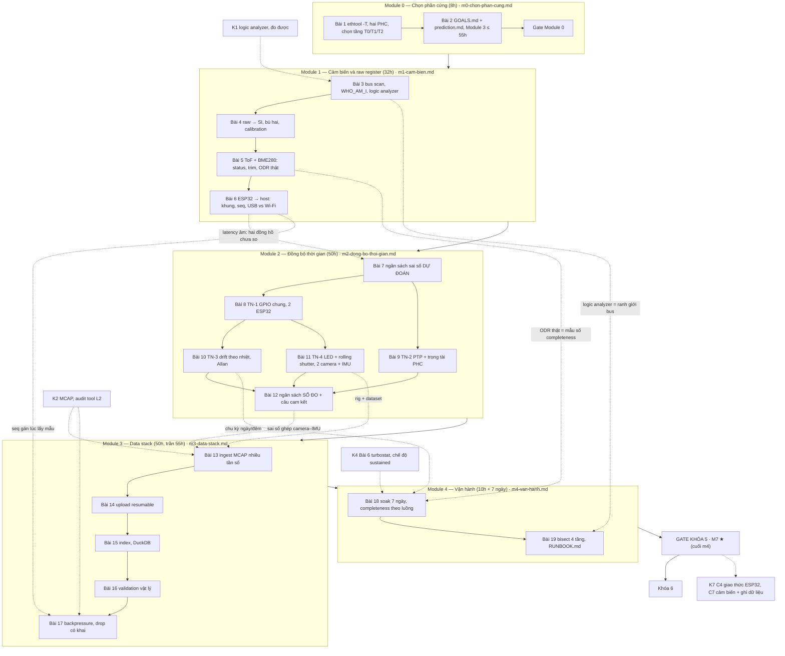

# Khóa 5 — Cảm biến, đồng bộ thời gian, data platform · Tổng quan

**Cho:** người đã PASS Khóa 2 (MCAP, schema) và Khóa 1 (đo được). Khóa 3 và 4 nên xong trước nhưng không bắt buộc (bản gốc). Nếu đã làm K4: harness, A/A, cô lập nhiệt và `turbostat` dùng lại ngay ở Bài 18; nếu đã làm K3: ngân sách độ trễ của K3 Bài 8 là bản cùng phương pháp với ngân sách thời gian ở Bài 7.
**Thời lượng:** **~150h** (tổng giờ 19 bài khớp đúng bản gốc) · **Trần: 200h**. Ở 6–7h/tuần là khoảng **25 tuần** (bản gốc: 22–26 tuần), cộng 7 ngày treo máy ở Bài 18 nằm trong tuần 23–24.
**Chi phí:** đợt mua 3, khoảng 2–3 triệu VNĐ ở cấu hình khuyến nghị `[ước lượng 10/2026 — bản gốc; kiểm giá ở cửa hàng]`. Danh sách mua tầng T0 ở Bài 1 (ESP32-S3 thứ hai, 2 IMU, ToF, BME280, 2 webcam khác model, cáp Ethernet). **Không mua:** Raspberry Pi, Jetson, lidar, máy in 3D, GPU.
**Tương ứng:** milestone **M7 ★** trong `00-lo-trinh-tong.md`, artifact ★ thứ ba và nặng nhất.

**Xong khóa này bạn có** (bản gốc): artifact duy nhất trong toàn lộ trình mà kỹ năng dữ liệu gặp phần cứng thật, **với số đo đồng bộ thật**: bốn phân bố sai số thời gian (TN-1…TN-4), mỗi cái kèm phương pháp và sai số của chính phép đo; một câu cam kết về độ đồng bộ của hệ (Bài 12); một data platform chạy 7 ngày không người trông; một dataset mang tên bạn trên HF Hub (Bài 11); một bài viết tiếng Anh.

**Nguyên tắc scope (bản gốc, đọc trước, đọc lại giữa khóa):**

> **Số đo là deliverable. Platform là vỏ.**

Rủi ro lớn nhất không phải là khó. Nó là phần mềm, thế mạnh của bạn, xong nhanh và đẹp, còn phần khác biệt thật là số đo sync thì mỏng. **Đảo thứ tự làm: đo trước, dựng platform sau.** Module 2 (đồng bộ thời gian) đứng trước Module 3 (data stack) không phải ngẫu nhiên. Chạm trần 200h thì cắt Module 3 xuống MVP và giữ nguyên Module 2. Không được làm ngược lại.

**Cam kết phạm vi (ghi vào `GOALS.md` và `decisions.md` ở Bài 2, trước dòng code đầu tiên):** hai FAIL action của gate. (1) PTP không chạy sau 60h → hardware-trigger-only. (2) Chạm 200h chưa PASS → Module 3 xuống MVP (chỉ MCAP + validation), giữ Module 2, publish. Thêm ràng buộc tự áp của Bài 2: **Module 3 không vượt 55h**, gắn tag module cho mọi dòng `hours.csv`.

---

## Vị trí trong lộ trình và con số không được giấu

| Khóa | Tên | Giờ | Ghi chú |
|---|---|---|---|
| 1 | Từ zero đến đo được | 35 | **Entry** của K5 (đo được, logic analyzer) |
| 2 | Dữ liệu robot mà không cần robot | 80 | **Entry** của K5 (MCAP, schema, audit tool dùng lại ở Bài 17) |
| 3 | Chuỗi audio | 90 (tổng bài 92) | Nên xong trước; ngân sách độ trễ K3 Bài 8 |
| 4 | Đo hiệu năng inference trên edge | 70 | Nên xong trước; bắt đầu K5 sau tuần 13 của K4, không chờ tiêu chí 4 |
| **5** | **Cảm biến, đồng bộ thời gian, data platform** | **150** | ← khóa này · trần 200h |
| 6 | Hạ tầng mô phỏng và đánh giá | 120 | Không cần mua gì; điều kiện của K7 C11 |
| 7 | Robot di động, **thiết kế lại thành khóa build** | 561 lõi (K7 gốc: 340) | `khoa-7/_KE-HOACH-K7.md`; C7 (cảm biến, ghi dữ liệu) dùng thẳng K5 M1–M3 |

**Ngân sách toàn lộ trình, không giấu.** K1–K6 = **545h**. Cộng K7 gốc = **885h**, đã vượt con số 650h của lộ trình gốc. Cộng K7 mới (lõi 561h) = **1.106h**, ở 6,5h/tuần khoảng **3,3 năm**. Đường lõi tối thiểu của K7 mới (~340h) cho 545 + 340 = 885h, khoảng 2,6 năm. Đường lõi đó còn một điểm chưa khớp đang chờ bạn quyết: C11.3 cần Nav2, mà C8 không nằm trong đường lõi (xem `khoa-7/00-tong-quan.md` mục 6). K5 là khóa lớn nhất trong K1–K6: 150h, gần 28% của 545h.

**Khóa nền F nằm ngoài các con số trên** (~245h nếu học trọn; thiết kế để học **đúng lúc**). K5 dựa nặng nhất vào **F4** (thời gian và đồng hồ: gần như mọi viên nang F4.1–F4.7 gặp ở Module 2), **F3** (Module 3: F3.1–F3.9), F5.2–F5.3 (ngắt, ISR, jitter), F1.1/F1.6 (sai số, fit), F7.4–F7.7 (Module 4). Chọn học trọn hay đúng lúc là quyết định của bạn, ghi vào `decisions.md`.

**Vì sao K5 đáng 150h:** đây là chỗ hệ phân tán gặp vật lý (bản gốc). Mỗi node một đồng hồ, không node nào biết "giờ thật", và đồng hồ là một miếng thạch anh rung khác đi khi nóng lên. Tám năm backend có giá trực tiếp ở đây, và cũng chính ở đây trực giác backend gãy nhiều nhất, vì ở backend bạn hầu như chưa bao giờ phải hỏi "timestamp này sai bao nhiêu micro-giây".

---

## Bản đồ khóa



## Bài → giờ → viên nang nền cần trước → quyết định ra được

| Bài | Giờ | Viên nang nền cần trước | Quyết định ra được |
|---|---|---|---|
| 1 — Kiểm tra ràng buộc phần cứng | 3 | F4.3, F4.5 | Chọn tầng T0/T1/T2, đặt hàng đợt 3, hoặc đổi trả máy |
| 2 — Kế hoạch đo trước *(khung rút gọn)* | 5 | F1.7, F4.7 | Khóa phạm vi: Module 2 là lõi, Module 3 có trần 55h; trọng tài cho từng TN |
| Gate Module 0 | — | Bài 1–2 | Dừng trước khi tốn giờ Module 2 nếu hai PHC không dùng được |
| 3 — Quét bus và bắt tay với chip | 5 | F5.1 | Bus/pull-up/tốc độ nào cho 3 cảm biến chung bus; khi nào được phép nghi code |
| 4 — Raw register → đơn vị vật lý | 8 | F1.1, F5.5, F3.2 | Lưu gì cùng mỗi mẫu (raw, cấu hình, calibration) để tái tạo được giá trị vật lý |
| 5 — Cảm biến thứ hai và thứ ba | 7 | F1.1, F1.6, F3.7 | Trường nào bắt buộc đi kèm giá trị (status, nguồn calibration, ODR thật) |
| 6 — ESP32-S3: USB-serial vs mạng | 12 | F3.9, F4.6, F1.2, F4.4 | Luồng nào đi đường nào, đóng dấu ở đâu, khung gói tối thiểu (`seq`, `boot_id`, CRC) |
| 7 — Ngân sách sai số thời gian | 6 | F4.1, F4.7, F1.1 | Ứng dụng nào cần cơ chế sync nào, sync bao lâu một lần |
| 8 — TN-1: GPIO chung | 10 | F4.1, F1.6, F5.2, F5.3 | Timestamp trong ISR có đủ không, hay phải dùng capture phần cứng |
| 9 — TN-2: PTP, trước và sau | 12 | F4.4, F4.5, F4.3, F2.1 | Được phép báo con số nào về PTP; khi nào một con số "tự báo" bị loại |
| 10 — TN-3: drift theo nhiệt | 8 | F4.1, F4.2, F1.6 | Chu kỳ sync và cửa sổ ước lượng drift cho robot có nhiệt độ thay đổi |
| 11 — TN-4: hardware trigger, 2 camera + IMU | 14 | F4.6, F5.6, F3.4, F4.7 | Rig không trigger có dùng được cho fusion không; có phải bù theo hàng không; sai số thời gian của dataset |
| 12 — Tổng hợp ngân sách *(cùng Bài 7–11, khung rút gọn)* | — | F4.7, F1.1, F1.7 | Câu cam kết về độ đồng bộ, đủ hai con số (U và trần) |
| 13 — Ingest nhiều luồng vào MCAP | 14 | F3.1, F3.2, F3.3, F3.4, F4.6 | Mỗi luồng đóng dấu bằng clock nào, ghi ở trường nào; ghép as-of hay nội suy |
| 14 — Upload resumable, object store | 10 | F3.5, F7.1 | Khi nào được xóa local; key đặt thế nào để retry vô hại; đệm bao nhiêu ngày offline |
| 15 — Index và truy vấn | 10 | F3.6, F3.8 | Cái gì vào index, tóm tắt bằng thống kê nào, cái gì chỉ sống trong MCAP |
| 16 — Validation theo vật lý | 10 | F3.7, F2.1, F1.1, F1.4 | Rule nào chặn dữ liệu, rule nào chỉ gắn cờ, ngưỡng lấy từ đâu |
| 17 — Backpressure và drop policy | 6 | F3.9, F7.1 | Hàng đợi bao nhiêu byte; khi tràn bỏ luồng nào; bản ghi drop nằm ở đâu |
| 18 — Soak 7 ngày | 6 | F7.4, F7.5, F7.6 | Hệ có được ghi không người trông chưa; luồng nào chưa đạt và vì sao |
| 19 — Bisect qua bốn tầng | 4 | F7.7, F2.1, F2.3, F5.7 | Kiểm ranh giới nào trước; điểm quan sát nào phải có sẵn trước sự cố |
| Gate *(khung rút gọn)* | — | toàn khóa | PASS; hoặc FAIL action đã cam kết; hoặc publish nguyên trạng ở trần 200h |

Giờ theo module: M0 8 · M1 32 · M2 50 · M3 50 · M4 10 = **150h**, khớp bản gốc. Bài viết tiếng Anh của gate không có giờ riêng trong bản gốc. Ước ~5h, giống K4 Bài 13 `[ước lượng]`, nằm trong biên giữa 150h và trần 200h. Dòng **Vị trí** của từng bài ghi thêm bài K-khác cần trước. Nếu file module ghi khác bảng này, theo file module.

---

## Bản đồ "chấm mô hình" — mô hình của bạn và của bản gốc/Gemini K5

Ba mô hình bạn nêu ở K3 quay lại ở khóa này, vì K5 là chỗ chúng gặp phần cứng thật. Chấm đầy đủ, có phản ví dụ, ở đúng bài.

| Nguồn | Ý chính (trích ngắn) | Chấm | Ở đâu |
|---|---|---|---|
| Bạn, K3 lượt 2 | "Data đi qua dây data, còn cách đọc/ghi, schema phải dùng các dây khác như clock để phối hợp" | ĐÚNG MỘT PHẦN | Bài 3 |
| Bạn, K3 lượt 6 | "Luôn phải có buffer để ổn định… đánh đổi bằng RAM" | ĐÚNG MỘT PHẦN | Bài 13 |
| Bạn, K3 lượt 7 | "Mỗi thiết bị có clock và thời gian riêng, lệch nhau, nên phải có buffer ở giữa" | ĐÚNG MỘT PHẦN | Bài 5, Bài 7 |
| Bạn, K3 lượt 12 | "Hệ vật lý có tác nhân biết trước, thu đủ dữ liệu thì mọi công thức gần như hằng số" | ĐÚNG MỘT PHẦN | Bài 4, Bài 10 |
| Bản gốc | "PTP hardware timestamping là năng lực **duy nhất** không thay được bằng phần mềm" | ĐÚNG MỘT PHẦN | Bài 1 |
| Bản gốc | "Accel Z ≈ +16384 raw ≈ 9,79 m/s² ở Hà Nội" | SAI (hai số không cùng đúng) | Bài 4 |
| Bản gốc | "Latency: từ timestamp MCU tới lúc máy chủ nhận" | SAI như một phép đo không có đồng hồ chung | Bài 6 |
| Gemini | "Latency âm → trừ mốc t₀ là xong" | SAI (skew còn nguyên) | Bài 6 |
| Gemini | "−0,04 ppm/°C² cho thạch anh 40 MHz" | SAI (đó là tuning-fork 32 kHz) | Bài 10 (quy chuẩn mục 7) |
| Gemini | `ptp4l … -p /var/run/…` để tách socket | SAI (`-p` là thiết bị PHC) | Bài 9 (quy chuẩn mục 7) |
| Bản gốc + Gemini | "t_row = t_pulse / số hàng sáng" | SAI (thiếu exposure) | Bài 11 (quy chuẩn mục 7) |
| Gemini | "41,7 ns / 52 µs là sai số của phép đo" | SAI (độ phân giải ≠ độ bất định) | Bài 12 |
| Bản gốc + Gemini | "IMU 200 Hz × ~50 byte ≈ 36 MB/giờ" | SAI với `sensor_msgs/Imu` | Bài 13 |
| Bản gốc | "Schema validation bắt được sai đơn vị" | SAI | Bài 16 |
| Bản gốc | "Tool K2 phát hiện đúng những lỗ đã ghi nhận" | ĐÚNG MỘT PHẦN (lỗ ≥ drop đã khai) | Bài 17 |
| Gemini | "Kỳ vọng = ODR danh định × thời gian" | SAI | Bài 18 |
| Bản gốc | "Bus: chip trả đúng, MCU đọc sai" | SAI ở cách gán tầng | Bài 19 |

---

## Gate Khóa 5 — tóm tắt, không thay thế

**Văn bản chính thức của gate nằm ở cuối `m4-van-hanh.md`** (mục *Gate Khóa 5 — M7 ★*): năm tiêu chí giữ nguyên chữ của bản gốc, bảng "bằng chứng phải chỉ vào", cách đọc đã thống nhất, FAIL action, quy trình chấm. Bảng dưới để bạn thấy từ Bài 1 mỗi module nuôi tiêu chí nào. Không tiêu chí nào bị nới hay đổi ngưỡng.

| # | Tiêu chí (tóm tắt) | Bằng chứng sinh ra ở | Chỗ hay hiểu sai |
|---|---|---|---|
| 1 | 2 thiết bị, 3 sensor, MCAP bằng message chuẩn ROS 2, metadata có version, `ros2 bag info` đọc được | Module 1 + Bài 13 | ROS 2 Header không có `seq`; `seq` MCU vào trường `sequence` của MCAP |
| 2 | Sync đo được: offset TRƯỚC/SAU PTP, trọng tài đọc PHC, ≥ 1 giờ, **phương pháp và sai số của phép đo** (hoặc hardware-trigger-only) | Module 2, Bài 12 | Số báo là số trọng tài, không phải số `ptp4l` tự báo; sai số là độ bất định, không phải độ phân giải |
| 3 | ≥ 1 rule vật lý bắt được dữ liệu xấu **thật**, chứng minh bằng một lần cố tình gây lỗi | Bài 16 | Rule có tiền điều kiện và FPR đo được |
| 4 | 7 ngày không can thiệp, completeness ≥ 99%, alert freshness **đã bắn** | Bài 18 | Completeness **theo luồng**, mẫu số theo `seq` |
| 5 | Bisect lỗi qua 4 tầng, ≥ 1 lần thật trong notebook | Bài 19 | "Bisect" của bản gốc là tìm tuyến tính; chọn thứ tự theo prior × chi phí |

**FAIL → action (bản gốc, cam kết trước):** PTP không chạy sau 60h → hardware-trigger-only, publish nguyên trạng. Chạm 200h chưa PASS → Module 3 xuống MVP, giữ Module 2, publish.

**Mẹo đếm giờ (đề xuất của người soạn, không thuộc gate gốc):** nếu ở giờ 100 Module 2 chưa xong Bài 11, dừng mọi việc Module 3 và đóng Module 2 trước. Module 3 + 4 cần 60h. Bắt đầu Module 3 sau giờ 140 là gần như chắc chạm trần.

---

## Lịch

Lịch 24 tuần của bản gốc cộng đúng ~148h, nhưng giờ từng tuần không khớp giờ bài. Tuần 1 có 6h cho Bài 1–2 (8h). Tuần 2–4 có 20h cho Bài 3–4 (13h). Tuần 5–6 có 12h cho Bài 5–6 (19h). Tuần 24 dồn Bài 18, Bài 19 và bài viết. Lịch dưới giữ thứ tự và giờ từng bài, không tuần nào quá 7h (~6,2h/tuần, 25 tuần). Tuần 2 chỉ có 1h bài vì Bài 3 cần hàng đã về. Cột "Cần" cho biết tuần nào cần hàng đã về hoặc cần treo máy.

| Tuần | Tuần gốc | Giờ | Làm | Cần | Xong thì có |
|---|---|---|---|---|---|
| 1 | 1 | 7 | Bài 1 + đầu Bài 2 | mini PC | `decisions.md`: `ethtool -T`, ánh xạ PHC, tầng đã chọn |
| 2 | 1 | 1 | hết Bài 2 + **Gate M0** · đặt hàng T0 · chờ hàng: đọc F4.1–F4.3, F5.1 (giờ F tính riêng) | đặt hàng | `GOALS.md` + `prediction.md` TN-1…4 đã commit |
| 3 | 2–4 | 7 | Bài 3 + đầu Bài 4 | **hàng đã về** | Bus scan, WHO_AM_I, capture PulseView |
| 4 | 2–4 | 6 | hết Bài 4 | IMU | raw → SI, calibration 6 hướng |
| 5 | 5–6 | 7 | Bài 5 | ToF, BME280 | Bảng "mỗi mẫu phải mang gì", ODR thật |
| 6 | 5–6 | 7 | Bài 6 (khung, firmware, parser) | 2 đường USB | `frame_spec.md`, parser đồng bộ lại |
| 7 | 5–6 | 5 | hết Bài 6 (đo 1 giờ mỗi đường, ép hỏng) | Wi-Fi | Bảng luồng × đường; skew ESP32 ↔ host |
| 8 | 7 | 6 | **Bài 7** | — | Ngân sách dự đoán đã commit, `b12_budget.py` |
| 9 | 8–9 | 7 | **Bài 8** (TN-1) | 2 ESP32, LA | Rig GPIO chung, dữ liệu 1 giờ |
| 10 | 8–9 | 3 + 4 | hết Bài 8 + đầu **Bài 9** | — | Fit drift + jitter; cấu hình hai `ptp4l` |
| 11 | 10–12 | 7 | **Bài 9** (TN-2) | cáp nối hai cổng | Trọng tài PHC, phân bố trước PTP |
| 12 | 10–12 | 1 + 6 | hết Bài 9 + **Bài 10** | máy sấy | Phân bố sau PTP ≥ 1 giờ; nền Allan 2 giờ |
| 13 | 13–14 | 2 + 5 | hết Bài 10 + **Bài 11** (rig, Phần A) | 2 webcam, LED | Drift theo nhiệt; t_row hai camera |
| 14 | 15–17 | 7 | **Bài 11** (Phần B, C) | — | Lệch hai camera theo thời gian, camera ↔ IMU |
| 15 | 15–17 | 2 (+ ~2) | hết Bài 11 (Phần D, E) + **Bài 12** (gộp, không có giờ riêng) | — | Dataset trên HF Hub; câu cam kết |
| 16 | 18–19 | 7 | Bài 13 | ROS 2 Docker | MCAP nhiều luồng, đo `kill -9` |
| 17 | 18–19 | 7 | hết Bài 13 | — | Ghép camera ↔ IMU với sai số Bài 12 |
| 18 | 20 | 7 | Bài 14 | object store | Upload resumable, chỉ xóa khi checksum khớp |
| 19 | 20–21 | 3 + 3 | hết Bài 14 + đầu Bài 15 | DuckDB | Bảng trạng thái upload; extractor |
| 20 | 21 | 7 | hết Bài 15 | — | Index Parquet, truy vấn |
| 21 | 22 | 7 | Bài 16 | — | Rule vật lý có test |
| 22 | 22–23 | 3 + 3 | hết Bài 16 + đầu Bài 17 | — | Ma trận lỗi × rule, FPR; chính sách drop |
| 23 | 23–24 | 3 + 3 | hết Bài 17 + **Bài 18** (kiểm trước, khởi động 7 ngày) | **treo máy** | Bản ghi drop trong MCAP; soak đang chạy |
| 24 | 24 | 3 + 4 | hết Bài 18 (phân tích, sau 7 ngày) + **Bài 19** | — | `soak.md`; ba lượt bisect, `RUNBOOK.md` |
| 25 | 24 | ~6 | bài viết (~5h) + chấm gate (~1h) | — | **M7 PASS** |

**Tuần 9–15 (Bài 8–12) là trái tim của khóa** (bản gốc: tuần 8–17). Tuần crunch rơi vào đâu thì hy sinh Module 3 (tuần 16–22), không hy sinh tuần 9–15.

**Hai ràng buộc lịch mà bản gốc không nói:**
- **Hàng về muộn.** Module 1 cần hàng đã về từ tuần 3. Nếu chưa về: làm Bài 7 (chỉ cần datasheet) và đọc trước F4.1–F4.3, rồi quay lại. Đừng mua lẻ ở chợ gần nhà một module khác loại chỉ để "không mất tuần": nó đổi mọi con số của Bài 4–5.
- **Bài 19 không được chạm rig đang soak.** Tiêm lỗi vào rig trong 7 ngày soak là một lần can thiệp tay, làm FAIL tiêu chí 4. Chuẩn bị kịch bản tiêm lỗi và `RUNBOOK.md` khung trong lúc soak chạy, bisect thật sau khi soak xong.

---

## Bẫy đã biết

Mỗi bẫy có một câu hỏi ngược. Trả lời trước khi mở hướng nghĩ.

**1. Dựng platform trước vì dễ.** Module 3 là sân nhà. Sau bốn tuần bạn có object store, index, dashboard, và chưa có phân bố offset nào.
- **[Failure mode]** `hours.csv` tuần 10 cho thấy tag `k5-m3` đã 30h, `k5-m2` 6h. Quy tắc nào của Bài 2 áp dụng, và bạn làm gì trong tuần 11?
<details><summary>Hướng nghĩ</summary>

Dừng Module 3, quay lại Module 2 theo quy tắc đã viết ở Bài 2. Ghi sự cố vào `decisions.md`: cái gì kéo bạn vào Module 3 (thường là "chưa có hàng" hoặc "PTP khó"). Nếu vướng PTP: đồng hồ 60h của FAIL action đã chạy chưa?

</details>

**2. Đóng dấu ở sai chỗ.** Đóng dấu ở host lúc nhận, hoặc ở task sau `vTaskDelay`, thay vì ở ISR data-ready (Bài 6). Mọi phân tích thời gian sau đó mang jitter của đường truyền hoặc của lịch FreeRTOS.
- **[Nếu…thì]** Nếu host đọc serial theo chunk 512 byte, khung 30 byte, IMU 200 Hz, thì sai số tối đa khi dùng t_host làm timestamp là bao nhiêu?
<details><summary>Hướng nghĩ</summary>

Một chunk chứa ~17 khung, khoảng 85 ms dữ liệu, cùng một t_host (Bài 6, câu hỏi ngược 4). Con số này đi thẳng vào sai số ghép của Bài 13.

</details>

**3. Coi số tự báo là số đo.** `ptp4l` in offset vài chục ns. Đó là servo tự báo về chính nó, không phải trọng tài (Bài 9). Tương tự: timestamp của driver camera "trông hợp lý" nhưng lệch β cỡ ms (Bài 11).
- **[Phản biện]** "Servo PTP biết rõ nhất offset của chính nó, cần gì trọng tài." Dựng lập luận mạnh nhất rồi chỉ chỗ gãy.
<details><summary>Hướng nghĩ</summary>

Servo đo offset bằng chính các timestamp nó dùng để điều khiển. Mọi bất đối xứng đường truyền, mọi lỗi timestamp chung đều vô hình với nó. Trọng tài phải đo bằng một đường độc lập: đọc PHC kẹp giữa hai lần đọc đồng hồ hệ thống (Bài 9), hoặc một sự kiện vật lý chung (Bài 8, 11).

</details>

**4. Nhầm độ phân giải với độ bất định.** "Logic analyzer 24 MHz nên sai số 41,7 ns"; "một hàng ảnh 52 µs nên sai số 52 µs" (Bài 12).
- **[Failure mode]** Bạn báo lệch camera ↔ IMU "< 52 µs vì độ phân giải hàng". Kể ba thành phần bị bỏ sót.
<details><summary>Hướng nghĩ</summary>

Sai số t_row nhân với số hàng; β của timestamp camera (nếu so qua đồng hồ host); ánh xạ đồng hồ ESP32 ↔ host qua USB; trễ DLPF trong IMU. Thường thành phần lớn nhất không phải ảnh (Bài 12, mô phỏng).

</details>

**5. Hệ số nhiệt của tinh thể sai loại.** −0,04 ppm/°C² là parabol của tuning-fork 32,768 kHz. Thạch anh 40 MHz của ESP32-S3 là AT-cut, đường bậc ba, lệch ít hơn hẳn trong dải phòng (Bài 10, quy chuẩn mục 7).
- **[Vì sao không]** Vì sao không lấy một hệ số từ datasheet thạch anh rồi bù luôn, khỏi đo Bài 10?
<details><summary>Hướng nghĩ</summary>

Datasheet cho dải dung sai, không cho đường cong của con thạch anh của bạn. Thạch anh nằm dưới vỏ module, nhiệt của nó trễ so với nhiệt không khí BME280 đo. Bù bằng hệ số chung có thể làm tệ hơn không bù. Bài 10 đo cái bạn thật sự có.

</details>

**6. Rolling shutter đếm sai.** "t_row = t_pulse / số hàng sáng" bỏ exposure, sai nhiều lần (Bài 11).
- **[Nếu…thì]** Exposure 1 ms, xung 200 µs. Công thức sai cho t_row nhỏ hơn thật bao nhiêu lần?
<details><summary>Hướng nghĩ</summary>

N ≈ (200 + 1000)/t_row, nên 200/N ≈ t_row/6. Đo bằng hai độ dài xung để exposure triệt tiêu (Bài 11 mô phỏng).

</details>

**7. Completeness gộp, mẫu số danh định.** Một con số cho cả hệ, mẫu số theo ODR trong cấu hình (Bài 18). Cả hai che đúng thứ cần thấy.
- **[Quy mô]** Ở 50 robot, mỗi robot 4 luồng, bạn báo completeness thế nào để một luồng chết ở một robot không bị nuốt?
<details><summary>Hướng nghĩ</summary>

Theo (robot, luồng), mẫu số theo `seq`; báo phân vị thấp (luồng tệ nhất) chứ không báo trung bình; cảnh báo theo burn rate từng cặp (→ F7.4).

</details>

**8. Drop im lặng.** Chặn producer thay vì drop có khai; bản ghi drop đi qua chính hàng đợi đang đầy; `seq` gán sau chỗ drop (Bài 17).
- **[Failure mode]** Audit thấy 131 lỗ IMU, heartbeat khai 120, bản ghi drop cộng lại 96. Có gì đã xảy ra?
<details><summary>Hướng nghĩ</summary>

Bản ghi chi tiết của 24 drop bị mất (khe dự trữ thiếu); 11 lỗ chưa khai ở tầng dưới. Quan hệ "lỗ ≥ khai" vẫn đúng (Bài 17, tự kiểm 2).

</details>

---

## Sửa lỗi so với bản gốc và bản Gemini (gom từ phần 11 các bài)

Bảng rút gọn; lý do đầy đủ ở phần 11 của bài. Đọc theo module, sau khi xong module đó.

<details><summary>🔒 MỞ SAU KHI XONG MODULE TƯƠNG ỨNG</summary>

| Bài | Sai (G = bản gốc, Ge = Gemini) | Đúng |
|---|---|---|
| 1 | G: "chỉ có `software-*` → không phải NIC Intel"; "PTP hardware timestamping là năng lực duy nhất…"; Ge: `igc` khai `ptpv2-l2-event`; webcam khác model "để tránh xung đột cổng" | Có thể là VM, interface ảo, kernel cũ; mở rộng thành "đóng dấu tại biên vật lý"; `igc` chỉ khai `none`/`all`; khác model để có hai t_row khác nhau |
| 3 | G+Ge: "thêm cảm biến thứ ba thì cái khác biến mất → pull-up tổng quá mạnh" làm nguyên nhân mặc định | Tính R tương đương và dòng sink; ba module 4,7 kΩ vẫn trong chuẩn; liệt kê nguyên nhân khác |
| 4 | G: "Accel Z ≈ +16384 ≈ 9,79 m/s² ở Hà Nội"; "chênh 0,2% là kiểm chéo thật"; Ge: đổi đơn vị bằng g địa phương | ≈ 16.351 với chip hoàn hảo, kèm dung sai; kiểm thật là nhất quán 6 hướng; đổi bằng g₀ = 9,80665 |
| 5 | G+Ge: "IMU cao hơn vài độ" như kết quả đúng; "BME280 ±1 °C" PASS không trọng tài; G: đếm mẫu không nói cách | Không bảo đảm dấu; không trọng tài thì CHƯA RÕ; đếm theo data-ready, fit chu kỳ cho cảm biến chậm |
| 6 | G: "latency MCU → host" đo được; Ge: trừ t₀ là đủ; jitter = σ khoảng cách gói | Chỉ đo được biến thiên trễ sau khi loại skew (đường bao dưới); tách jitter lấy mẫu với jitter đường truyền; 0 lần mất có cận trên 3/n |
| 7 | Ge: "±20–30 ppm theo dải nhiệt" không nguồn; chỉ quy ra sai số tịnh tiến | Tra và ghi điều kiện; thêm sai số quay r·ω·Δt |
| 8 | Ge: "hai thạch anh cùng mẻ lệch ±10 đến ±20 ppm" | Nhầm cận dung sai với giá trị điển hình |
| 9 | Ge: `-p` để tách socket; `-2` bật hardware timestamping; L2 "ổn định hơn vì bỏ IP stack"; hai lệnh `phc_ctl cmp` nối tiếp làm trọng tài | Hai file cấu hình riêng; `-2` chỉ chọn transport L2; lý do là định tuyến nội bộ; trọng tài A–B–A kẹp; không lấy độ rộng kẹp làm tiêu chí PASS |
| 10 | Ge: −0,04 ppm/°C² cho thạch anh 40 MHz; "R² > 0,85"; cửa sổ 120 s cố định; G: "drift vài chục ppm" | AT-cut bậc ba; bỏ R² làm tiêu chí; chọn cửa sổ ở cực tiểu Allan; nền lấy từ Bài 8 |
| 11 | G+Ge: t_row = t_pulse / N; G: t_bật_LED từ "t_đầu_frame"; Ge: lệch hai camera "ngẫu nhiên 0–33 ms"; "USB 2.0 đủ cho YUYV 1080p30" | N ≈ (t_pulse + t_exp)/t_row; hàng sáng đầu ứng với lúc đọc; β của driver phải đo; răng cưa có chu kỳ phách; ~995 Mbit/s không vừa |
| 12 | Ge: 41,7 ns / 52 µs là "sai số của phép đo"; "công bố < 1,5 µs" | Đó là độ phân giải; cận trên = giá trị đo + sai số của phép đo; bias chưa bù đứng ngoài RSS |
| 13 | G+Ge: "IMU ~50 byte ≈ 36 MB/giờ"; Ge: `publish_time` là lúc đo; `sequence` trong metadata channel; "append-only chống mất điện" | `sensor_msgs/Imu` ≈ 265 MB/giờ; thời điểm đo ở `header.stamp`; `sequence` ở Message record; `kill -9` không kiểm mất điện |
| 14 | G+Ge: retention để "tránh hỏng SSD vài tháng"; Ge: SQLite mặc định hỏng khi rút điện; so `x-amz-meta-sha256`; "đầy đĩa → kernel panic"; MinIO không pin | Mài mòn tính bằng thập kỷ; mặc định đã atomic nếu fsync được tôn trọng; dùng `x-amz-checksum-*`; đầy đĩa là `ENOSPC`; pin digest |
| 15 | Ge: một dòng index mỗi session với `max_accel`; tên output chỉ theo sha256 nguồn | Tóm tắt theo cửa sổ ngắn; tên gồm sha256 **và** phiên bản extractor |
| 16 | G: schema bắt được sai đơn vị; "\|a\| = g bắt sai scale ngay"; "σ = 0 trong 1 s = kênh đơ"; Ge: bật lửa, ngưỡng FPR tự đặt | Schema không có đơn vị; rule có tiền điều kiện đứng yên; tính σ trên mẫu mới; máy sấy, FPR đo và ghi |
| 17 | G: "tool K2 phát hiện đúng những lỗ đã ghi nhận" | Mỗi lỗ đã khai đều thấy; tổng lỗ ≥ tổng đã khai; phần chênh có giải thích |
| 18 | G+Ge: kỳ vọng = ODR × thời gian; Ge: "sẽ thấy offset PTP hình sin" | Mẫu số theo `seq` + offline, theo từng luồng; chu kỳ nhiệt ở `freq` của servo; `turbostat` thay cho chỉ `dmesg` |
| 19 | G: "Bus: chip trả đúng, MCU đọc sai"; G+Ge: quy trình tuần tự gọi là "bisect"; Ge: "module bị nướng hỏng" | Đó là firmware; gọi đúng là tìm tuyến tính, chọn thứ tự theo prior × chi phí; không cố ý làm hỏng phần cứng |
| Gate | — | Năm tiêu chí và FAIL action giữ nguyên chữ; thêm cột cách đọc |
| Tổng quan | G: lịch 24 tuần có tuần 12h cho 19h bài; Bài 3 xếp trước khi hàng kịp về | 25 tuần ≤ 7h, giờ từng bài giữ nguyên; Bài 19 sau khi soak xong |

</details>

---

## Cách học khóa này

Khóa này nửa phần cứng, nửa đúng nghề bạn. Hai rủi ro ngược chiều nhau. Ở Module 1–2, bạn chậm vì tay chưa quen: dây lỏng, chân hàn, que đo. Ở Module 3, bạn nhanh vì đã quen, và nhanh là lúc dễ bỏ bước dự đoán nhất. Rủi ro lớn nhất của cả khóa là có một platform đẹp mà không có phân bố sai số nào đáng tin.

**Vòng một bài (tuần thường, 6–7h):**
1. Đọc phần 1–4 (câu chuyện, mô hình, cầu nối, thuật ngữ) và viên nang F mà bảng ở trên chỉ tên.
2. Viết `prediction.md` bằng số, kèm cách tính, nguồn tra (datasheet nào, mục nào) và độ tự tin. **Commit.** **Không dùng AI ở bước này.** Dự đoán của AI không phải dự đoán của bạn, và nó xóa đúng thứ khóa này đo: khoảng cách giữa mô hình trong đầu bạn và vật lý.
3. Chạy mô phỏng đồ chơi của bài trước khi cắm dây.
4. Làm. Mỗi số đo quan trọng ghi n, cấu hình thanh ghi, nhiệt độ phòng, phiên bản firmware/kernel/driver, và **sai số của dụng cụ** (bài nào cũng có một đoạn "Sai số của dụng cụ").
5. Mở khối 🔒, so, viết giải thích chênh lệch **trước** khi tra cứu.
6. Trả lời câu hỏi ngược; mở hướng nghĩ sau.

**Tuần có phần cứng:** an toàn trước tốc độ. Ngắt nguồn trước khi đổi dây. Không cắm USB khi mạch đang có nguồn ngoài chưa chung GND. Không hơ nóng bằng lửa (Bài 10, 16: dùng máy sấy ở khoảng cách). Khi một con số vô lý, nghi dây và nguồn trước khi nghi code (Bài 3, F5.7).

**Tuần crunch (0–2h):** không cắm dây mới và không bắt đầu một phép đo 1 giờ khi không có thời gian trông. Thay vào đó: đọc viên nang F sắp cần (F4 là ứng viên tốt nhất); điền một dòng của bảng ngân sách Bài 12 từ số đã có; chạy lại một mô phỏng với tham số của rig bạn (`b8_fit.py`, `b10_drift.py`, `bai6_owd.py` với CSV thật); hoặc viết một mục của `RUNBOOK.md`. Nhiều tuần crunch liên tiếp: cắt Module 3 theo FAIL action, không cắt Bài 8–12.

**Dùng AI ở đâu:** ở bước giải thích (bước 5), khi tự trừu tượng hóa, và khi rà bài viết của gate, với prompt **chấm mô hình**, không phải "giải thích cho tôi":

```text
Đây là mô hình tôi đang tin, viết bằng lời của tôi:
"<dán nguyên văn>"
Chấm từng ý: ĐÚNG / ĐÚNG MỘT PHẦN / SAI. Với mỗi ý không ĐÚNG, chỉ đúng chỗ gãy
và đưa MỘT phản ví dụ cụ thể (con số, thí nghiệm, hoặc hệ thật). Không mở đầu bằng lời khen.
Nếu ý của tôi là một khẳng định về thời gian/đồng bộ: hỏi lại đồng hồ nào đóng dấu, ở đâu
trong đường đi của mẫu, trọng tài là gì, và sai số của chính trọng tài. Nếu là khẳng định về
dữ liệu: hỏi mẫu số đếm thế nào, gộp thế nào, và cái gì bị mất mà không ai khai.
Mọi thông số phần cứng phải kèm datasheet + mục, hoặc ghi rõ là ước lượng.
```

Lý do: bản Gemini của khóa này đưa cờ `ptp4l` sai (`-p`, `-2`), hệ số nhiệt của sai loại tinh thể, và công thức rolling shutter thiếu exposure, và đã xác nhận nhiều mô hình chỉ đúng một phần. Mọi lệnh AI gợi ý (`ptp4l`, `phc2sys`, `ethtool`, `v4l2-ctl`, ESP-IDF API, `mcap`) kiểm bằng `man` hoặc tài liệu đúng phiên bản bạn cài, ghi `[tự đo]` vào notes.

**Hai câu tự hỏi cuối mỗi tuần:** (1) Tuần này con số thời gian nào của tôi có trọng tài và sai số của trọng tài mà tuần trước chưa có? (2) Tôi vừa đóng dấu thời gian ở đâu, và tôi có chắc đó là chỗ gần phép đo nhất không?

---

## Sau Khóa 5

Đến đây bạn có **ba artifact ★** (bản gốc): dataset audit tool (K2), VLA edge benchmark (K4), sensor data platform có số đo sync (K5), cộng ba bài viết tiếng Anh và một dataset mang tên bạn trên HF Hub.

**Tiếp theo: Khóa 6 — Hạ tầng mô phỏng và đánh giá (120h, gần như không tốn tiền).** Không cần mua gì. Nó đóng vòng lặp "đổi một thứ, nhận một phán quyết có căn cứ thống kê", và là điều kiện của K7 C11 (sim/HIL/CI).

**Trước khi sang Khóa 6, chạy lại M5 (đo thị trường).** Với ba artifact trong tay, tỉ lệ phản hồi khác hẳn lần đầu. Apply là một phép đo, không phải bước cuối (bản gốc).

**K5 nuôi các khóa sau:**

| Sau này | Dùng lại từ K5 |
|---|---|
| K6 Bài 15 (sim-to-real theo kênh) | Thời điểm của phép đo cảm biến, sai số ghép (Bài 11–13) |
| K7 C4.3 (giao thức ESP32 ↔ host) | Khung `seq`/`boot_id`/CRC, parser đồng bộ lại, USB cho vòng điều khiển, Wi-Fi chỉ cho telemetry (Bài 6) |
| K7 C7 (cảm biến, ghi dữ liệu) | Raw → SI và metadata (Bài 4–5), MCAP nhiều luồng (Bài 13), drop có khai (Bài 17), validation vật lý (Bài 16) |
| K7 C10 (an toàn, vận hành) | Soak, freshness, completeness theo luồng (Bài 18); runbook bisect (Bài 19) |
| K7 C11 (sim/HIL/CI) | Ngân sách sai số thời gian khi so sim với thật (Bài 12) |

**Ba điều mang đi** (bản gốc, giữ nguyên ý):
1. **Time sync là kỹ năng hệ thống, không phải kỹ năng cơ điện tử.** Bạn không cạnh tranh với người học cơ điện tử 5 năm ở đây. Bạn cạnh tranh với backend engineer chưa từng cắm que đo, và bạn đã cắm rồi.
2. **Rig 900 nghìn dạy đúng những bài học mà rig 900 triệu dạy.** Hai webcam rẻ lệch nhau hàng chục mili-giây vì đúng những lý do khiến hệ camera công nghiệp lệch nhau: rolling shutter, tranh chấp băng thông, đồng hồ độc lập, không có trigger chung. Khác nhau ở quy mô, không ở bản chất.
3. **Số đo là deliverable, platform là vỏ.** Bốn đồ thị chắc chắn và một platform xấu xí nhưng chạy 7 ngày là làm đúng khóa này. Một platform đẹp và bốn đồ thị mỏng là làm sai.
