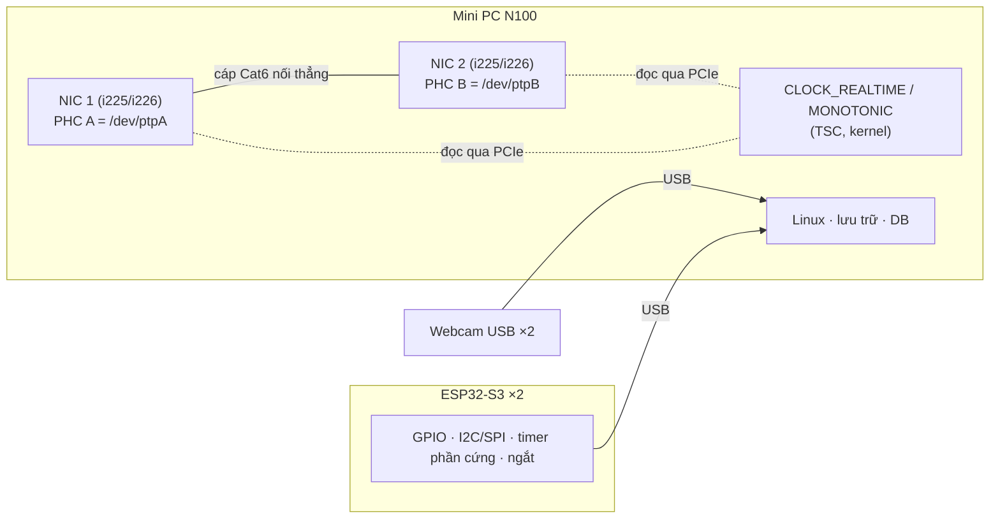
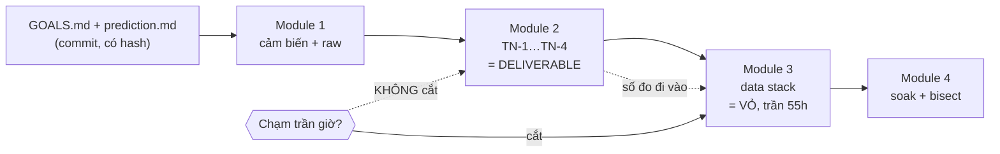

# Khóa 5 · Module 0 — Chọn phần cứng (8h)

Hai bài, một câu hỏi: **phần cứng đã có cho phép đo cái gì, và vì sao số đo, không phải platform, là thứ khóa này giao nộp.** Bài 1 kiểm ràng buộc vật lý (PHC trên NIC) trước khi tiêu tiền. Bài 2 khóa kế hoạch đo và dự đoán trước khi viết dòng code nào.

| Bài | Giờ | Khung | Ra quyết định |
|---|---|---|---|
| 1 — Kiểm tra ràng buộc phần cứng trước khi mua gì | 3 | đầy đủ | Chọn tầng T0/T1/T2, đặt hàng đợt 3, hoặc đổi trả máy |
| 2 — Kế hoạch đo trước, platform sau | 5 | rút gọn | Khóa phạm vi: Module 2 là lõi, Module 3 có trần 55h |

---

## Bài 1 — Kiểm tra ràng buộc phần cứng trước khi mua gì (3h)

> **Vị trí:** Gate Khóa 4 → **Bài 1** → Bài 2 · **Cần trước:** F4.3 (đồng hồ trong máy tính, phần "timestamp ở kernel/driver/app"), F4.5 (PTP, chỉ đọc phần PHC và hardware timestamping, ~30 phút) · **Sau bài này bạn quyết định được:** máy bạn đang có làm được thí nghiệm PTP "hai PHC trong một hộp" hay không, từ đó chọn tầng T0/T1/T2 và đặt hàng đợt 3, hoặc đổi trả máy.

### 1. Câu chuyện — ai đã khổ vì chuyện này

NTP (David Mills, giữa thập niên 1980) đồng bộ đồng hồ qua Internet tới cỡ mili-giây là đủ cho email, log, giao dịch web. Nó đóng dấu thời gian bằng phần mềm: lúc gói đi qua stack mạng của kernel, hoặc tệ hơn, lúc ứng dụng gọi `read()`. Mọi thứ nằm giữa dây mạng và chỗ đóng dấu (hàng đợi NIC, ngắt, scheduler, cache miss) cộng thẳng vào sai số, và nó dao động. Đầu thập niên 2000, ngành đo lường và tự động hóa công nghiệp cần các thiết bị trên cùng một mạng Ethernet đồng bộ tới micro-giây để ghép số đo từ nhiều điểm. Kết quả là IEEE 1588-2002 (PTP). Ý tưởng cốt lõi không nằm ở thuật toán trao đổi gói (khá giống NTP) mà ở chỗ **đóng dấu ngay tại phần cứng mạng**, bằng một bộ đếm thời gian nằm trên NIC: PTP Hardware Clock (PHC) `[chuẩn]`.

Ngày nay các ngành có hậu quả tài chính hoặc vật lý đều viết yêu cầu này thành luật hoặc chuẩn: sàn giao dịch châu Âu theo MiFID II (RTS 25) buộc hệ giao dịch tần suất cao lệch UTC không quá 100 µs `[spec]`; mạng di động TDD cần pha đồng bộ cỡ ±1,5 µs giữa các trạm (ITU-T G.8271) `[spec]`. Không yêu cầu nào trong đó đạt được bằng phần mềm thuần, và đó là lý do lộ trình đổi Raspberry Pi 5 lấy một mini PC có **hai cổng Intel i225/i226** (`THAY-DOI-10-2026.md`, mục 0.7 lộ trình tổng). Bài này biến quyết định mua hàng đó thành một phép kiểm có bằng chứng, **trước khi** bạn tiêu tiền cho đợt 3.

### 2. Mô hình tư duy



```
Đóng dấu thời gian ở đâu → sai số gồm những gì
  ứng dụng (read() trả về)   : dây + NIC + DMA + ngắt + softirq + scheduler + app   ← tệ nhất
  kernel (software tstamp)   : dây + NIC + DMA + ngắt                              ← hàng chục–trăm µs
  NIC (hardware tstamp, PHC) : dây (+ PHY)                                          ← tốt nhất
```

Bốn câu về bản chất:
- **Một máy tính có nhiều đồng hồ, không phải một.** Mini PC này có ít nhất ba: system clock (kernel, dựa trên TSC của CPU) và hai PHC, mỗi cái là một bộ đếm trên NIC, chạy theo dao động riêng của NIC, chỉnh được tốc độ (`adjfine`) và nhảy bước (`settime`) `[spec: Linux Documentation/driver-api/ptp.rst]`.
- **Hardware timestamp = chốt giá trị PHC tại lúc khung PTP đi qua biên MAC/PHY.** Vì chốt ở phần cứng, phần mềm phía trên có chậm bao nhiêu cũng không làm sai con số đã chốt; nó chỉ làm con số đến muộn.
- **`ethtool -T` là lời khai của driver, không phải bằng chứng hiệu năng.** Nó nói driver *đăng ký* năng lực gì. Bằng chứng là số đo ở Bài 9.
- **Hai PHC trong một hộp** nối nhau bằng một sợi cáp cho bạn một thí nghiệm master/slave hoàn chỉnh với một máy, và một trọng tài độc lập (đọc thẳng hai PHC so với cùng system clock, → K5 Bài 9). Cái giá: điều kiện "đẹp hơn đời thật" (xem Chấm mô hình).

### 3. Cầu nối từ backend

| Backend bạn biết | Ở đây | Gãy ở chỗ | Nếu dùng nhầm thì |
|---|---|---|---|
| Kiểm instance type có tính năng cần (SR-IOV, NVMe local, AVX-512) trước khi thiết kế | `ethtool -T`, `ls /dev/ptp*` trước khi mua cảm biến | Capability flag của cloud thường là cam kết của nhà cung cấp; ở đây là **driver tự khai**. Mã nguồn driver `igc` còn ghi chú rằng i225-V "không có hỗ trợ PTP" nhưng vẫn đăng ký PHC cho nó `[spec: drivers/net/ethernet/intel/igc/igc_ptp.c]` | Thiết kế cả Module 2 trên một dòng in ra màn hình; tới Bài 9 mới thấy kết quả ngang NTP |
| `now()` là một giá trị toàn cục của máy | Mỗi máy có nhiều đồng hồ (system clock, PHC A, PHC B), trôi khác nhau, có thể khác thang thời gian (UTC vs TAI) | Backend gần như không bao giờ hỏi "now() của đồng hồ nào" | Trừ timestamp PHC cho timestamp system clock như cùng thang → lệch đúng 37 s (TAI−UTC) hoặc lệch dần theo drift |
| Chạy hai service trong docker-compose trên một máy để "test phân tán" | Hai PHC trong một hộp | Chung nguồn, chung nhiệt độ, cáp ngắn đối xứng, không switch, không hàng đợi mạng → điều kiện tốt nhất có thể | Báo "PTP của tôi sub-µs" như năng lực của hệ thật qua switch có tải |

**Chấm mô hình:**

1. *"PTP hardware timestamping là năng lực duy nhất không thể thay thế bằng phần mềm"* (bản gốc). **ĐÚNG MỘT PHẦN.** Đúng trong phạm vi mạng. Nhưng timer capture/ngắt GPIO trên ESP32 và hardware trigger camera cũng không thay được bằng phần mềm Linux: TN-1 (→ K5 Bài 8) chỉ có nghĩa vì cạnh GPIO được chốt bằng ngắt trên MCU, không phải bằng một vòng `poll()` trong userspace. **Phản ví dụ:** đọc cạnh GPIO qua `libgpiod` từ userspace cho jitter cỡ scheduler, không phải cỡ µs. Câu đúng hơn: *đóng dấu tại biên vật lý (dây mạng, chân GPIO, xung trigger) không thay được bằng phần mềm ở tầng trên.*
2. *"`ethtool -T` có `PTP Hardware Clock` và `hardware-transmit` thì PTP sẽ sub-µs."* **ĐÚNG MỘT PHẦN**, vì đây là điều kiện cần, không phải điều kiện đủ. **Phản ví dụ:** PHC đồng bộ hoàn hảo nhưng không chạy `phc2sys`, nên system clock (thứ mọi ứng dụng đọc) vẫn sai cỡ NTP. Ví dụ khác: driver timeout khi lấy TX timestamp, `ptp4l` liên tục báo lỗi và không khóa được `[tự đo]`.
3. *"Hai cổng là hai đồng hồ độc lập, y như hai máy."* **ĐÚNG MỘT PHẦN.** Hai chip NIC rời thường có hai thạch anh riêng, nên trôi riêng; nhưng chúng **chung nhiệt độ**, nên drift theo nhiệt của hai bên tương quan và hiệu của chúng nhỏ hơn hai máy ở hai phòng. **Phản ví dụ:** nếu bo mạch cấp chung một nguồn xung cho hai NIC, drift tương đối gần như bằng 0, và baseline "trước PTP" ở Bài 9 trông tốt bất thường. Phải đo, không suy ra.

### 4. Thuật ngữ

| Mức | Thuật ngữ | Nghĩa trong một câu | Hay bị hiểu nhầm thành |
|---|---|---|---|
| 🟢 | PHC (PTP Hardware Clock) | Bộ đếm thời gian trên NIC, lộ ra Linux dưới dạng `/dev/ptpN` | "Đồng hồ của máy" (nó chỉ là một trong nhiều đồng hồ) |
| 🟢 | Hardware timestamping | NIC chốt giá trị PHC lúc khung đi qua MAC/PHY | "Timestamp chính xác hơn vì phần mềm nhanh hơn" |
| 🟢 | Software timestamping | Kernel đóng dấu bằng system clock khi xử lý gói | "Đủ tốt nếu máy nhàn" (nó vẫn dao động theo ngắt) |
| 🟢 | `ethtool -T` | Hỏi driver các chế độ timestamp nó hỗ trợ và chỉ số PHC | Bằng chứng rằng PTP sẽ chạy tốt |
| 🟡 | `igc` | Driver Linux cho Intel i225/i226 | Tên chip |
| 🟡 | TAI vs UTC | TAI không có giây nhuận; hiện TAI − UTC = 37 s | "Hai tên của cùng một thang" |
| 🟡 | SDP / PPS pin | Chân của NIC xuất xung hoặc chốt sự kiện ngoài theo PHC | Có sẵn trên mọi máy có i226 (thường không được nối ra ngoài) |
| 🟡 | PCIe PTM / cross-timestamp | Cơ chế phần cứng đọc PHC và system clock "cùng lúc" | Thứ phải dùng được ngay. Biết tên là đủ, Bài 9 sẽ đo cái kẹp |

### 5. Dự đoán

Viết `prediction.md` **trước khi** gõ lệnh đầu tiên. Không có đáp án ở đây; đáp án nằm ở phần 7.

1. **Driver và model NIC.** `ethtool -i` sẽ báo driver gì? `lspci -nn` sẽ báo PCI ID nào? Tra: bảng ID thiết bị trong `drivers/net/ethernet/intel/igc/igc_hw.h` (mã nguồn kernel), so với model máy bạn mua.
2. **Chỉ số PHC.** Hai cổng có hai số `PTP Hardware Clock` khác nhau không? Có bao nhiêu file `/dev/ptp*`? Nếu nhiều hơn hai thì cái thừa từ đâu ra?
3. **Chế độ lọc gói nhận.** Dòng `Hardware Receive Filter Modes` sẽ liệt kê gì? Tra: hàm `igc_ethtool_get_ts_info` trong `igc_ethtool.c`.
4. **PHC lúc vừa boot.** Trước khi chạy bất kỳ dịch vụ PTP nào, `PHC A − CLOCK_REALTIME` cỡ bao nhiêu: giây, mili-giây hay micro-giây? Tra: `igc_ptp_init`/`igc_ptp_reset` trong `igc_ptp.c` để xem driver khởi tạo PHC từ đâu.
5. **Drift tương đối sau 10 phút.** `(PHC A − PHC B)` thay đổi bao nhiêu sau 600 s? Phương pháp: drift tương đối (ppm) × 600 s. Tham số cần tra: dung sai tần số thạch anh 25 MHz mà Intel yêu cầu cho i225/i226 (datasheet NIC, mục crystal/clock). Không tìm được thì ghi giả định và lý do.
6. **Chân phần cứng.** `n_programmable_pins` và `pps_available` trong `/sys/class/ptp/ptpN/` sẽ là bao nhiêu? Và bạn **dùng được** chúng trên mini PC này không? Tầng T2 phụ thuộc câu trả lời này.

```markdown
# prediction.md — K5 Bài 1 (commit trước khi chạy lệnh)
| # | Câu hỏi | Dự đoán | Cách suy ra / nguồn tra |
|---|---|---|---|
| 1 | driver / PCI ID | | |
| 2 | số PHC, /dev/ptp* | | |
| 3 | rx filter modes | | |
| 4 | PHC − REALTIME lúc boot | | |
| 5 | Δ(PHC A − PHC B) sau 600 s | ___ µs (từ ___ ppm) | |
| 6 | pins / pps, có dùng được không | | |
Sai số tôi chấp nhận cho câu 5: ×___ (lý do: ___)
```

### 6. Làm

**Bước 0 — ghi danh tính máy (10 phút).**
```bash
sudo dmidecode -s system-product-name      # model máy
lspci -nn | grep -i ethernet               # PCI ID của từng NIC
uname -r; ethtool --version                # phiên bản kernel và ethtool, ghi vào decisions.md
```

**Bước 1 — kiểm lại NIC (đã làm khi nhận máy, giờ ghi đầy đủ).**
```bash
ip link                    # tìm tên hai interface
ethtool -T <iface1>
ethtool -T <iface2>
ls -l /dev/ptp*            # phải có ít nhất hai PHC
ethtool -i <iface1>        # driver phải là igc
```

| Thấy gì | Nghĩa là |
|---|---|
| Hai cổng đều có `PTP Hardware Clock: N` + `hardware-transmit` + `hardware-receive`, và hai số N khác nhau | Hai PHC độc lập. Làm được toàn bộ Module 2 với một máy |
| Chỉ có `software-*` | Không có hardware timestamping. Kiểm lại model máy và driver (xem phần 8) |

**Bước 1b — ánh xạ cổng ↔ PHC không dựa vào số thứ tự (15 phút).** Chỉ số `ptpN` có thể đổi giữa các lần boot hoặc khi thêm thiết bị. Ghi ánh xạ bằng thứ ổn định hơn:
```bash
ls /sys/class/net/<iface1>/device/ptp/     # → ptpN của cổng 1
for p in /sys/class/ptp/ptp*; do
  echo "== $p"; for f in clock_name max_adjustment n_programmable_pins \
    n_external_timestamps n_periodic_outputs pps_available; do
    printf "%-24s %s\n" $f "$(cat $p/$f)"; done; done
```
Trong script đo ở Module 2, tìm PHC theo **tên interface** (qua sysfs), không hardcode `/dev/ptp0`.

**Bước 1c — 10 phút baseline đầu tiên (30 phút, tùy chọn nhưng đáng làm).** Cần `linuxptp` (`sudo apt install linuxptp`).
```bash
# [chưa chạy] — cần phần cứng; thay ptpA/ptpB theo bước 1b
for i in $(seq 60); do
  date +%s.%N
  sudo phc_ctl /dev/ptpA cmp
  sudo phc_ctl /dev/ptpB cmp
  sleep 10
done | tee phc_baseline_10min.log
```
`phc_ctl ... cmp` in độ lệch của PHC so với `CLOCK_REALTIME`. Lấy hiệu hai dòng ở cùng vòng lặp → `PHC A − PHC B`, vẽ theo thời gian, fit đường thẳng: độ dốc là drift tương đối. **Sai số của phép đo này:** mỗi lần đọc PHC phải đi qua PCIe, nên tồn tại một "cái kẹp" cỡ micro-giây `[tự đo]`, và hai lần đọc A, B cách nhau một khoảng nhỏ (không đồng thời). Trên 600 s, sai số 1–2 µs ở mỗi đầu tương đương độ phân giải drift cỡ vài phần nghìn ppm `[ước lượng: 2 µs / 600 s ≈ 0,003 ppm]`, đủ tốt cho câu hỏi "cỡ ppm nào". Bài 9 sẽ làm phép đo này nghiêm túc.

**Bước 2 — lặp bước 1 trên laptop và mọi máy khác bạn có.** Một máy thứ hai có PTP hardware là **điểm cộng** (thí nghiệm hai máy thật), không phải điều kiện.

**Bước 3 — chọn tầng phần cứng.**

| Tầng | Gồm | Giá thêm | Làm được PASS nào |
|---|---|---|---|
| **T0 — mặc định** | Mini PC (2 PHC) + ESP32-S3 ×2 + 3 cảm biến + 2 webcam USB + 1 cáp nối thẳng hai cổng | ~900k–1.2tr | **Cả 5.** PTP đo giữa hai PHC trong một hộp, trọng tài là đọc trực tiếp PHC |
| **T1 — thêm máy thứ hai** | T0 + laptop/PC có NIC hỗ trợ PTP (hoặc card Intel i210 cũ cho PC có khe PCIe) | +0–600k | Cả 5, cộng thí nghiệm hai máy thật qua switch |
| **T2 — trọng tài PPS** | T1 + card NIC có **chân PPS/SDP lộ ra** (không phải card nào cũng có, kiểm trước) cắm vào máy có khe PCIe | +0.5–1.5tr | Trọng tài độc lập cấp µs bằng logic analyzer. **Chỉ làm nếu dư giờ** |

**Danh sách mua tầng T0:**

| Món | Spec | Giá ~ |
|---|---|---|
| ESP32-S3 DevKit | **×2** (đã có một từ Khóa 1) | 200k/cái |
| IMU | ICM-42688 tốt hơn, MPU6050 rẻ và nhiều tài liệu. **Mua 2** (để Bài 19 đổi module khi bisect) | 85–250k/cái |
| ToF | VL53L1X | ~150k |
| Nhiệt/ẩm/áp | BME280 (kiểm chip ID ở Bài 3, hàng nhầm BMP280 rất phổ biến) | ~80k |
| Webcam USB | **×2, khác model**, có chủ đích: hai thời gian đọc rolling shutter khác nhau (→ K5 Bài 11) | 200–400k/cái |
| LED + điện trở | Đã có trong kit Khóa 1 | — |
| Cáp Ethernet Cat6 ×2 | Một sợi nối thẳng hai cổng mini PC (i225/i226 tự nhận chéo/thẳng `[tự đo]`) | 30–50k |

**Không mua:** Raspberry Pi, Jetson (Khóa 4 đã chứng minh có cần hay không), lidar, máy in 3D, GPU.

**Bước 4 — viết `decisions.md`.** Phải có:
- Bảng `ethtool -T` của cả hai cổng mini PC và mọi máy khác (dán nguyên văn output, kèm phiên bản kernel/ethtool)
- Ánh xạ cổng ↔ `/dev/ptpN` ↔ `clock_name`
- Tầng phần cứng đã chọn + lý do
- Nếu chạy bước 1c: drift tương đối đo được, kèm sai số phép đo
- Câu FAIL action: *"Nếu một trong hai cổng không có hardware timestamping → đổi trả máy (mục 0.7 lộ trình tổng). Nếu PTP không chạy được sau 60h ở Bài 9 → hardware-trigger-only."*

### 7. Số phải ra

<details><summary>🔒 MỞ SAU KHI COMMIT prediction.md</summary>

| # | Kỳ vọng | Nhãn | Vì sao có thể lệch |
|---|---|---|---|
| 1 | Driver `igc`. PCI ID `8086:125c` = i226-V, `8086:15f3` = i225-V (các biến thể -LM/-IT có ID khác) | `[spec: igc_hw.h]` | Hãng có thể đổi lô NIC giữa các đợt sản xuất cùng tên máy |
| 2 | Hai số PHC khác nhau (thường 0 và 1), `/dev/ptp0`, `/dev/ptp1` | `[tự đo]` | `/dev/ptp*` thừa có thể đến từ thiết bị khác (ví dụ `ptp_kvm` trong máy ảo) |
| 3 | `Hardware Transmit Timestamp Modes: off on`; `Hardware Receive Filter Modes: none all`. Driver `igc` chỉ khai `none` và `all`, nghĩa là đóng dấu mọi gói nhận, không lọc riêng PTPv2 | `[spec: igc_ethtool_get_ts_info]` | Kernel khác phiên bản có thể khai khác. Bản Gemini nói sẽ thấy `ptpv2-l2-event`, điều đó sai với driver này |
| 4 | Driver khởi tạo PHC từ `ktime_get_real()`, tức là từ system clock lúc nạp driver. Vì vậy lúc vừa boot, `PHC − REALTIME` nhỏ (cỡ ms trở xuống), rồi lớn dần theo drift | `[spec: igc_ptp.c]` + `[tự đo]` | Nếu trước đó đã có `ptp4l`/`phc2sys` chạy (kể cả từ systemd), PHC có thể theo thang TAI → lệch ~37 s |
| 5 | Drift tương đối là hiệu của hai sai số tần số thạch anh, mỗi cái thường cỡ vài đến vài chục ppm. Sau 600 s: từ vài µs tới vài chục ms | `[ước lượng]` | Nếu gần 0 tuyệt đối: hai NIC có thể dùng chung nguồn xung, hoặc bạn đang đọc cùng một PHC hai lần |
| 6 | `n_programmable_pins = 4`, `n_external_timestamps = 2`, `n_periodic_outputs = 2`, `pps_available = 1`, `max_adjustment = 62499999` (ppb). Nhưng trên mini PC các chân SDP gần như chắc chắn **không được nối ra ngoài**, nên T2 cần card rời | `[spec: igc_ptp.c]` + `[tự đo]` | Driver khai năng lực của **chip**, không phải của **bo mạch** |

`clock_name` của PHC trong driver `igc` là địa chỉ MAC của cổng (không có dấu hai chấm) `[spec: igc_ptp.c, ptp_caps.name = "%pm"]`, nên đây là cách ánh xạ PHC ↔ cổng chắc chắn hơn chỉ số `ptpN`.

**Đạt bài này khi:** cả hai cổng có hardware TX/RX và hai PHC khác nhau; `decisions.md` có đủ bốn mục ở bước 4.
</details>

### 8. Nếu ra khác

| Triệu chứng | Nguyên nhân khả dĩ | Kiểm bằng cách | Sửa |
|---|---|---|---|
| Chỉ có `software-*` | NIC Realtek (`r8169`); hoặc NIC Intel nhưng chạy trong VM/container không thấy NIC thật | `ethtool -i`, `lspci -nn`, chạy trên host thật | Realtek → đổi trả (mục 0.7). VM → chạy trên host |
| `ethtool -T` báo `Operation not supported` | Kernel/driver cũ, hoặc interface ảo (bridge, veth) | Gọi đúng interface vật lý từ `ip link` | Dùng kernel của Ubuntu 24.04 trở lên |
| Hai cổng cùng một số PHC | NIC nhiều cổng dùng chung một PHC (có ở một số card, không phải i225/i226 rời) | `ls /sys/class/net/*/device/ptp/` | Không làm được "hai PHC trong một hộp" → cần T1 |
| Có hơn hai `/dev/ptp*` | `ptp_kvm`, card khác, hoặc NIC thứ ba | `cat /sys/class/ptp/ptp*/clock_name` | Ánh xạ theo sysfs như bước 1b |
| `phc_ctl: command not found` | Chưa cài `linuxptp` | `dpkg -l linuxptp` | `sudo apt install linuxptp` |
| `PHC − REALTIME` ≈ 37 s | PHC đang ở thang TAI do lần chạy `ptp4l`/`phc2sys` trước | `systemctl status ptp4l phc2sys` | Ghi lại. Đây là bài học về thang thời gian, không phải lỗi |
| Drift tương đối đúng bằng 0,000 ppm | Đọc cùng một PHC hai lần, hoặc hai NIC chung nguồn xung | Kiểm lại đường dẫn `/dev/ptpX` hai lệnh | Sửa script; nếu thật sự chung nguồn xung, ghi lại vì Bài 9 sẽ cần máy thứ hai |
| Chỉ số `ptpN` đổi sau reboot | Thứ tự probe driver thay đổi | So `clock_name` trước/sau | Không hardcode `ptpN` |

### 9. Câu hỏi ngược

1. **[Phản biện]** Webcam 30 fps có thời gian phơi sáng và đọc rolling shutter cỡ hàng chục mili-giây. Vậy với rig camera + IMU, đồng bộ PHC tới micro-giây có quan trọng không, hay chrony với software timestamping là đủ?
   <details><summary>Hướng nghĩ</summary>Sai số tổng là tổng (căn bậc hai nếu độc lập) của nhiều nguồn; nguồn lớn nhất quyết định. Hỏi: PTP sẽ đồng bộ **cái gì**, đồng hồ của máy, còn khoảnh khắc phơi sáng thì sao? Đây chính là câu hỏi của bảng ngân sách sai số (→ K5 Bài 7, F4.7). PHC đáng giá khi nguồn khác đã nhỏ (hardware trigger), hoặc khi bạn cần một trọng tài chính xác hơn thứ đang đo.</details>
2. **[Failure mode]** Sáu tháng sau, một bản cập nhật kernel làm `ptp0` và `ptp1` đổi chỗ. Script trọng tài của bạn hardcode `/dev/ptp0`. Chuyện gì xảy ra với dữ liệu, và bạn phát hiện bằng gì?
   <details><summary>Hướng nghĩ</summary>Trọng tài vẫn ra số, nhưng là offset của cặp đồng hồ khác (hoặc dấu bị đảo). Không có lỗi nào được báo. Phát hiện bằng metadata: ghi `clock_name`/MAC của PHC vào mỗi phiên đo (`clock_source` trong CONVENTIONS mục 4). Đây là provenance (F3.8) áp vào đồng hồ.</details>
3. **[Quy mô]** 100 robot, mỗi con một mini PC hai PHC, hai camera, một ESP32. Fleet có bao nhiêu "miền đồng hồ"? Cái gì gãy trước: kỹ thuật đồng bộ, hay việc biết mỗi timestamp đến từ đồng hồ nào?
   <details><summary>Hướng nghĩ</summary>Đếm: mỗi robot ít nhất 3 (system, PHC×2) + ESP32 + đồng hồ nội của từng camera. Ở quy mô, kỹ thuật thì đã có chuẩn (PTP, boundary clock), còn kiểm kê thì không: một dataset trộn timestamp không ghi nguồn sẽ không ai sửa được. Liên hệ: cardinality của metric labels (F7.5).</details>
4. **[Vì sao không]** Vì sao không mua một USB-Ethernet adapter "có PTP" cho laptop để làm T1?
   <details><summary>Hướng nghĩ</summary>Hỏi: PHC nằm ở đâu và đọc nó qua đường nào? Đường USB thêm độ trễ có lượng tử và dao động giữa PHC và system clock, nên "cái kẹp" của trọng tài rộng ra. Kiểm `ethtool -T` của adapter cụ thể trước khi tin quảng cáo.</details>
5. **[Nếu…thì]** Nếu máy thứ hai của bạn chỉ có software timestamping, thí nghiệm hai máy (T1) còn đáng làm không? Nó trả lời câu hỏi gì mà thí nghiệm trong một hộp không trả lời được?
   <details><summary>Hướng nghĩ</summary>Nó đo được PTP-có-một-đầu-phần-mềm qua switch thật: con số gần với đời thật của nhiều hệ hơn. Nhưng bạn phải nói rõ trọng tài lúc này thô hơn (Bài 9 bước 6). Câu hỏi đáng giá là "đầu yếu nhất quyết định bao nhiêu".</details>

### 10. Liên kết ra ngoài

- **Viễn thông (5G TDD).** Trạm phát sóng cần pha đồng bộ cỡ ±1,5 µs, dùng PTP với hồ sơ viễn thông và switch có boundary/transparent clock trên mọi chặng `[spec: ITU-T G.8271, G.8275.1]`. *Giống:* đóng dấu bằng phần cứng là bắt buộc. *Khác:* họ thiết kế mạng **cho** PTP (mọi switch tham gia), còn robot thường đi qua switch phổ thông, nên sai số vì hàng đợi ở switch là chuyện của bạn.
- **Tài chính (MiFID II RTS 25).** Hệ giao dịch tần suất cao phải truy được về UTC với sai lệch ≤100 µs và **chứng minh được** chuỗi truy nguyên `[spec]`. *Giống:* "có số" chưa đủ, phải có bằng chứng phương pháp, đúng tinh thần "sai số của chính phép đo" của khóa này. *Khác:* họ cần truy về UTC tuyệt đối; robot thường chỉ cần các cảm biến khớp **với nhau**.
- **Đo lường lưới điện (PMU).** Thiết bị đo pha (synchrophasor) đóng dấu từng mẫu bằng thời gian GPS cỡ µs để ghép pha điện áp giữa các trạm cách nhau hàng trăm km `[chuẩn]`. *Giống:* timestamp là một phần của phép đo, không phải metadata. *Khác:* nguồn thời gian là GPS ở mỗi điểm, không đồng bộ qua mạng.

### 11. Độ tin cậy và sửa lỗi

| Khẳng định | Nhãn | Ghi chú / cách kiểm |
|---|---|---|
| Driver `igc` khai rx filter `none` + `all` | `[spec]` | Mã nguồn `igc_ethtool.c` (kernel mainline, kiểm 10/2026). Chạy `ethtool -T` để xác nhận trên kernel của bạn |
| PHC khởi tạo từ system real time khi nạp driver | `[spec]` + `[tự đo]` | `igc_ptp.c`; xác nhận bằng `phc_ctl cmp` ngay sau boot |
| igc khai 4 SDP, 2 extts, 2 perout, pps | `[spec]` | `igc_ptp.c`/`igc.h`. Chân có nối ra ngoài hay không là chuyện của bo mạch |
| Hai chip NIC có hai thạch anh riêng | `[tự đo]` | Không có sơ đồ mạch Beelink; drift tương đối ≠ 0 là bằng chứng gián tiếp |
| MiFID II RTS 25: 100 µs cho HFT; ITU-T G.8271: ±1,5 µs | `[spec]` | Tên văn bản đúng; chi tiết hồ sơ đọc ở nguồn gốc nếu cần |
| Cáp nối thẳng hai cổng hoạt động không cần cáp chéo | `[tự đo]` | Auto-MDIX là chuẩn ở 1000BASE-T; xác nhận bằng `ip link` thấy `state UP` |

**Đã sửa so với bản gốc/Gemini:**
- Bản gốc: "Chỉ có `software-*` → không phải NIC Intel". Sửa: còn có thể là NIC Intel chạy trong VM, interface ảo, hoặc kernel cũ. Đã thêm cách phân biệt.
- Bản gốc: "PTP hardware timestamping là năng lực **duy nhất** không thay được bằng phần mềm". Sửa: mở rộng thành "đóng dấu tại biên vật lý" (GPIO capture, trigger cũng vậy).
- Gemini: "`Hardware Receive Filter Modes` có `ptpv2-l2-event`, `ptpv2-event`". Sai với `igc`: driver chỉ khai `none`/`all`.
- Gemini: "Webcam khác model để tránh xung đột định danh cổng USB". Sai lý do: mua khác model để có hai thời gian đọc rolling shutter khác nhau (→ K5 Bài 11).
- Gemini khẳng định chắc chắn "mỗi cổng gắn liền một bộ dao động thạch anh riêng". Hạ xuống `[tự đo]`, kiểm bằng drift tương đối.
- Thêm: ánh xạ PHC theo sysfs/`clock_name` thay vì chỉ số `ptpN`; baseline 10 phút; ghi phiên bản kernel/ethtool.

### 12. Đọc thêm và tự kiểm tra

- **Nguồn gốc:** Linux kernel `Documentation/driver-api/ptp.rst` (PTP hardware clock infrastructure) và `Documentation/networking/timestamping.rst`; mã nguồn `drivers/net/ethernet/intel/igc/igc_ptp.c`.
- **Giải thích:** man page `ptp4l(8)`, `phc_ctl(8)` của dự án linuxptp (Richard Cochran).
- **Đào sâu (tùy chọn):** John C. Eidson, *Measurement, Control, and Communication Using IEEE 1588* (Springer, 2006), người đứng sau chuẩn gốc.
- **Tự kiểm tra:** (1) giải thích lại cho một backend engineer khác trong 5 câu vì sao `ethtool -T` cần mà chưa đủ; (2) vẽ lại hình "đóng dấu ở đâu → sai số gồm gì" từ trí nhớ; (3) hai câu dưới.

<details><summary>Câu 3a: Bạn chạy `phc_ctl /dev/ptp0 cmp` và thấy −37 000 000 xxx ns. Có gì sai?</summary>
Không nhất thiết sai: PHC đang ở thang TAI (do ptp4l/phc2sys từng chạy), còn CLOCK_REALTIME ở UTC; hiệu là 37 s cộng phần lệch thật. Ghi thang thời gian vào metadata và đừng trừ timestamp khác thang.
</details>
<details><summary>Câu 3b: Vì sao script đo không được hardcode `/dev/ptp0`?</summary>
Chỉ số do thứ tự đăng ký quyết định và có thể đổi; đo nhầm cặp đồng hồ không báo lỗi gì. Tìm PHC theo interface qua `/sys/class/net/<iface>/device/ptp/` và ghi `clock_name` vào metadata.
</details>

---

## Bài 2 — Kế hoạch đo trước, platform sau (5h) (khung rút gọn)

> **Vị trí:** Bài 1 → **Bài 2** → Bài 3 · **Cần trước:** F1.7 (preregistration = `prediction.md`), F4.7 (ngân sách sai số và trọng tài đo), F1.1 (sai số của chính phép đo) · **Sau bài này bạn quyết định được:** khi giờ vượt kế hoạch, cắt cái gì (Module 3) và giữ cái gì (Module 2), bằng một quy tắc đã viết từ trước chứ không phải cảm hứng lúc mệt.

### 1. Câu chuyện — ai đã khổ vì chuyện này

Năm 2015, Open Science Collaboration lặp lại 100 thí nghiệm tâm lý học đã công bố. Khoảng một phần ba cho kết quả có ý nghĩa thống kê như bản gốc (*Science*, "Estimating the reproducibility of psychological science") `[chuẩn]`. Một nguyên nhân lớn: người nghiên cứu quyết định đo gì, phân tích thế nào, dừng khi nào **sau khi** đã nhìn dữ liệu. Phản ứng của ngành là **preregistration**: nộp kế hoạch và dự đoán trước khi thu dữ liệu (Nosek và cộng sự, *PNAS* 2018, "The preregistration revolution"). `prediction.md` trong lộ trình này chính là cơ chế đó, thu nhỏ cho một người.

Rủi ro thứ hai đã được lộ trình tổng ghi rõ (rủi ro số 3, "Xây phần mềm đẹp, số đo mỏng"): người mạnh backend sẽ dựng MinIO, ClickHouse, dashboard trong hai tuần vì đó là sân nhà; còn bốn thí nghiệm đồng bộ, thứ duy nhất khiến artifact này khác mọi data platform khác, bị dồn vào cuối và làm vội. Bài này đặt rào chắn trước khi bạn có cơ hội làm thế.

### 2. Mô hình tư duy



Deliverable thật là **bốn phân bố sai số thời gian**, mỗi cái kèm phương pháp đo và **sai số của chính phép đo**. Bảng dưới là khung của `GOALS.md`. Cột độ lớn kỳ vọng bị niêm phong: bạn tự điền nó trong `prediction.md`.

| Thí nghiệm | Đo cái gì | Trọng tài / sai số phép đo đến từ đâu | Tham số cần tra để dự đoán | Bài |
|---|---|---|---|---|
| TN-1 | Lệch timestamp giữa 2 ESP32 khi cùng thấy một cạnh GPIO, **theo thời gian** | Logic analyzer: độ phân giải = 1 / sample rate; jitter ngắt trên mỗi ESP32 | ppm thạch anh của module ESP32-S3 (datasheet module); độ trễ ngắt | → K5 Bài 8 |
| TN-2 | Offset PHC A − PHC B trước/sau khi bật PTP, ≥1 giờ | Độ rộng "cái kẹp" khi đọc PHC qua PCIe (`PTP_SYS_OFFSET_EXTENDED`) | Drift tương đối từ Bài 1 bước 1c; độ chính xác PTP hardware theo tài liệu linuxptp | → K5 Bài 9 |
| TN-3 | Drift của thạch anh ESP32 (ppm) theo nhiệt độ | Sai số ước lượng ppm trong cửa sổ trượt; sai số BME280 (±1 °C theo datasheet) | Loại cắt thạch anh (tuning-fork hay AT-cut?) và đường cong nhiệt độ của nó | → K5 Bài 10 |
| TN-4 | Lệch giữa 2 camera + IMU, có và không có LED làm mốc | Thời gian một hàng rolling shutter; thời gian phơi sáng | `t_row`, exposure, fps của từng webcam (`v4l2-ctl`) | → K5 Bài 11 |

Ba câu bản chất: (1) dự đoán không phải để đúng, mà để **sai có thông tin**: lệch giữa dự đoán và số đo là thứ bạn học được; (2) một dự đoán không kèm cách tính thì không chấm được; (3) một quy tắc cắt phạm vi phải được viết **trước** khi bạn mệt, vì lúc mệt bạn sẽ cắt cái khó (Module 2) và giữ cái dễ (Module 3).

### 3. Cầu nối từ backend

| Backend bạn biết | Ở đây | Gãy ở chỗ | Nếu dùng nhầm thì |
|---|---|---|---|
| Viết test trước code (TDD) | Viết `prediction.md` trước thí nghiệm | Test TDD là assert đúng/sai; prediction là **ước lượng có khoảng**, lệch ra ngoài không phải "test đỏ" mà là phát hiện | Sửa dự đoán cho khớp số đo ("cho test xanh") → mất đúng thứ preregistration bảo vệ |
| Error budget / SLO đặt trước, dùng để quyết định khi nào ngừng ship tính năng | Trần 55h cho Module 3, đặt trước | SLO đo một hệ đang chạy; trần giờ đo **chính bạn**, và người đo cũng là người muốn vượt | Trần "mềm" bị nới mỗi tuần một ít; tới tuần 20 Module 2 chỉ còn một thí nghiệm |
| North-star metric của sản phẩm | "Bốn phân bố sai số + sai số phép đo" | North-star thường là một số; ở đây là **bốn phân bố**, mỗi cái có thanh sai số riêng | Báo một con số trung bình ("PTP lệch 0,8 µs") và bỏ mất đuôi phân bố lẫn giới hạn của trọng tài |

**Chấm mô hình:**
1. *"Platform là phần khó và có giá trị; số đo chỉ là dữ liệu chạy qua nó."* **SAI** với khóa này. Phản ví dụ: hai ứng viên, một người có platform đẹp với dữ liệu sync giả lập, một người có đồ thị offset trước/sau PTP với thanh sai số của trọng tài. Câu hỏi phỏng vấn "anh xử lý clock drift thế nào" chỉ người thứ hai trả lời được bằng số.
2. *"`prediction.md` giống test case viết trước."* **ĐÚNG MỘT PHẦN.** Giống: viết trước, commit, không được sửa sau. Gãy: test case có đáp án đúng duy nhất; dự đoán là một khoảng kèm lập luận, và giá trị của nó nằm ở **lập luận sai chỗ nào** khi số đo rơi ngoài khoảng. Phản ví dụ: dự đoán "drift 20–50 ppm" mà số đo ra 8 ppm. Test "đỏ", nhưng phát hiện là module của bạn dùng thạch anh tốt hơn giả định, và đó là thông tin đáng ghi.

### 6. Làm

1. **`GOALS.md`** (1h): bảng ở phần 2 (không có cột độ lớn kỳ vọng) và một câu ở đầu: *"Nếu chỉ làm được một thứ trong khóa này, đó là Module 2."* Thêm mục *FAIL action cam kết trước*, chép từ gate: PTP không chạy sau 60h → hardware-trigger-only; chạm 200h chưa PASS → cắt Module 3 xuống MVP (chỉ MCAP + validation), giữ nguyên Module 2.
2. **`prediction.md` cho cả bốn thí nghiệm** (3h): dự đoán bằng số, có cách tính, có nguồn tra cho từng tham số. Mỗi TN có ba dòng: *đại lượng chính* (ví dụ: độ dốc offset theo thời gian, ppm), *sai số phép đo dự kiến*, *điều kiện làm dự đoán sai* (ví dụ: "nếu module dùng TCXO thì drift nhỏ hơn nhiều"). Commit. Ghi hash commit vào `GOALS.md`.
   ```markdown
   ## TN-1 — GPIO chung (Bài 8)
   - Drift tương đối hai ESP32: ___ ppm → ___ ms sau 1 giờ (từ: datasheet ___, mục ___)
   - Nhiễu quanh đường thẳng: ___ µs (từ: độ trễ ngắt ước lượng ___)
   - Sai số trọng tài (logic analyzer ___ MHz): ___ ns
   - Dự đoán sai nếu: ___
   ## TN-2 … TN-4: cùng khung
   ```
3. **Ràng buộc giờ tự áp** (30 phút): **Module 3 không được vượt 55h.** Gắn tag module cho từng dòng trong `hours.csv` (ví dụ `k5-m2`, `k5-m3`) để cộng được bằng một lệnh. Đặt lịch xem lại giờ mỗi 4 tuần.
4. **Kiểm chéo kế hoạch** (30 phút): với mỗi TN, trả lời "trọng tài của tôi là gì, và nó tốt hơn thứ tôi đo bao nhiêu lần?". Nếu không trả lời được, TN đó chưa sẵn sàng.

<details><summary>🔒 MỞ SAU KHI COMMIT prediction.md — độ lớn kỳ vọng theo bản gốc</summary>

| Thí nghiệm | Độ lớn kỳ vọng (bản gốc) | Ghi chú của người soạn |
|---|---|---|
| TN-1 | ms tới hàng chục ms | Đây là **offset tích lũy** sau một khoảng thời gian, không phải một hằng số: offset ban đầu tùy ý, rồi lớn dần theo drift. Đại lượng nên dự đoán là **độ dốc** (ppm) và **nhiễu quanh đường thẳng** (µs) |
| TN-2 | trước: ms · sau: µs hoặc nhỏ hơn | "Trước" phụ thuộc thời điểm khởi tạo PHC (Bài 1: từ system clock lúc nạp driver) và drift tương đối. "Sau" **không thể báo nhỏ hơn sai số trọng tài** |
| TN-3 | ppm | Thạch anh MHz trên module ESP32 là loại AT-cut, đường cong bậc ba, khác hẳn thạch anh 32,768 kHz (parabol, đỉnh ~25 °C). Đừng dùng hệ số −0,04 ppm/°C² cho thạch anh 40 MHz (lỗi đã biết của bản Gemini, quy chuẩn mục 7) |
| TN-4 | hàng chục ms → dưới 1 ms khi có mốc LED | Độ phân giải theo hàng rolling shutter phụ thuộc cả exposure: số hàng sáng ≈ (t_pulse + t_exposure) / t_row (lỗi đã biết của bản gốc Bài 11, quy chuẩn mục 7) |
</details>

### 8. Nếu ra khác

| Triệu chứng | Nguyên nhân khả dĩ | Kiểm bằng cách | Sửa |
|---|---|---|---|
| Không dự đoán được TN-3 vì không biết thạch anh loại gì | Chưa đọc datasheet module ESP32-S3 | Tra datasheet module (WROOM/MINI) mục clock | Ghi giả định rõ ràng + khoảng rộng; dự đoán vẫn có giá trị |
| Dự đoán chỉ có một số, không có khoảng | Thói quen "đáp án đúng" | Đọc lại F1.1 | Thêm khoảng và lập luận vì sao rộng/hẹp |
| Không nêu được trọng tài cho một TN | TN chưa thiết kế xong | Bước 4 | Thiết kế trọng tài trước khi đo, hoặc ghi rõ "chưa có trọng tài" như một giới hạn |
| Tuần 10 Module 3 đã ăn 30h | Làm platform trước vì dễ | `hours.csv` lọc theo tag | Dừng Module 3, quay lại Module 2 theo quy tắc đã viết |

### 9. Câu hỏi ngược

1. **[Failure mode]** Sau khi đo TN-2, bạn thấy dự đoán sai gấp 100 lần. Có ba lựa chọn: sửa `prediction.md`, giữ nguyên và ghi phân tích, hoặc bỏ TN-2 khỏi bài viết. Chọn cái nào, và cái nào phá hỏng giá trị của cả khóa?
   <details><summary>Hướng nghĩ</summary>Git history là bằng chứng preregistration. Sai gấp 100 lần là phát hiện tốt nhất bạn có thể viết ("what surprised me"). Câu hỏi thật là: lập luận sai ở đâu, tham số tra nhầm, mô hình thiếu nguồn sai số, hay trọng tài hỏng?</details>
2. **[Quy mô]** Nếu đây là dự án của một team 5 người cho 100 robot, "trần 55h cho platform" sẽ trông như thế nào? Cái gì thay thế cho kỷ luật cá nhân?
   <details><summary>Hướng nghĩ</summary>Định nghĩa "done" bằng số đo (gate), review kế hoạch đo bởi người không viết nó, ngân sách theo milestone. Liên hệ: error budget policy, ai có quyền dừng release.</details>
3. **[Vì sao không]** Vì sao không làm platform trước để "có chỗ chứa số đo" rồi mới đo?
   <details><summary>Hướng nghĩ</summary>Số đo của TN-1…TN-4 nằm gọn trong vài file CSV/MCAP; một thư mục và một notebook là đủ chứa. Platform viết trước sẽ đóng băng schema trước khi bạn biết mình cần lưu gì (ví dụ độ rộng kẹp của trọng tài, `clock_source`).</details>
4. **[Liên ngành]** Thử nghiệm lâm sàng phải đăng ký endpoint chính trước khi tuyển bệnh nhân (ClinicalTrials.gov). Endpoint chính của khóa này là gì, và "endpoint phụ" nào bạn được phép báo cáo nhưng không được dùng để kết luận?
   <details><summary>Hướng nghĩ</summary>Chính: bốn phân bố + sai số trọng tài. Phụ: throughput writer, latency truy vấn. Đổi endpoint chính sau khi nhìn dữ liệu được gọi là outcome switching, và giới y khoa coi đó là lỗi nghiêm trọng.</details>

### 12. Đọc thêm và tự kiểm tra

- **Nguồn gốc:** Open Science Collaboration, "Estimating the reproducibility of psychological science", *Science* 349 (2015).
- **Giải thích:** Nosek, Ebersole, DeHaven, Mellor, "The preregistration revolution", *PNAS* 115 (2018).
- **Đào sâu (tùy chọn):** Richard Feynman, "Cargo Cult Science" (bài phát biểu tốt nghiệp Caltech, 1974), đoạn về Millikan và việc người sau "sửa" số cho gần số cũ.
- **Tự kiểm tra:** (1) giải thích cho một backend engineer khác trong 5 câu vì sao Module 2 đứng trước Module 3; (2) vẽ lại sơ đồ ở phần 2 từ trí nhớ; (3) câu dưới.

<details><summary>Câu 3: Một dự đoán "TN-2 sau PTP: 50 ns" có vấn đề gì kể cả khi số đo ra đúng 50 ns?</summary>
Nếu trọng tài có độ rộng kẹp cỡ µs, bạn không thể đo được 50 ns. Kết luận đúng chỉ là "offset nhỏ hơn X µs", với X là sai số trọng tài. Dự đoán phải nói cả về giới hạn của phép đo, không chỉ về đại lượng.
</details>
