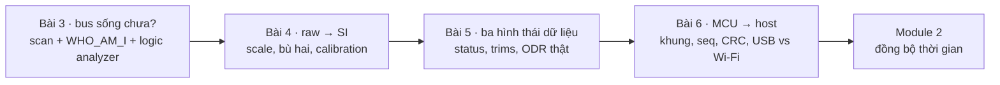
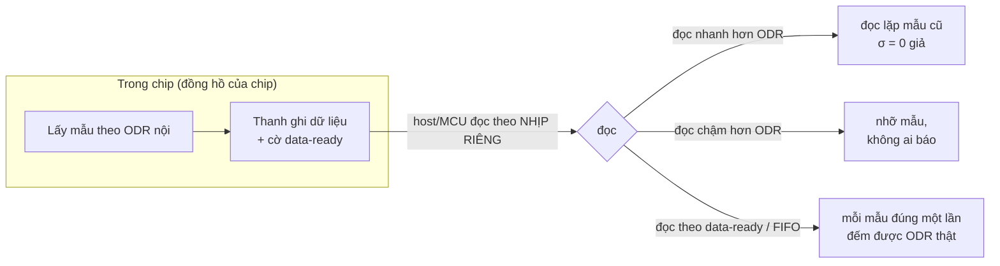

# Khóa 5 · Module 1 — Cảm biến và raw register (32h)

Bốn bài, đi từ dây đồng tới một gói tin có số thứ tự trên mini PC:



| Bài | Giờ | Viên nang nền cần trước | Quyết định ra được |
|---|---|---|---|
| 3 — Quét bus và bắt tay với chip | 5 | F5.1, (K1 Bài 7, 12) | Bus/pull-up/tốc độ nào cho 3 cảm biến chung bus; khi nào được phép nghi code |
| 4 — Raw register → đơn vị vật lý, tự tay | 8 | F1.1, F5.5, F3.2 | Lưu gì cùng mỗi mẫu (raw, cấu hình, calibration) để tái tạo được giá trị vật lý |
| 5 — Cảm biến thứ hai và thứ ba | 7 | F1.1, F1.6, F3.7 | Trường nào bắt buộc đi kèm giá trị (status, variance, nguồn calibration, ODR thật) |
| 6 — ESP32-S3 làm node cảm biến: USB-serial vs mạng | 12 | F3.9, F4.6, F1.2, F4.4 | Đường nào cho luồng nào, đóng dấu ở đâu, khung gói tối thiểu |

Code đi kèm module này (đã chạy thử, Python 3 + numpy/matplotlib): `bai4_bme_comp.py`, `bai4_gyro_drift.py`, `bai5_odr_count.py`, `bai6_framing.py`, `bai6_owd.py`. Chép từ khối code trong bài vào `lab/k5/`.

---

## Bài 3 — Quét bus và bắt tay với chip (5h)

> **Vị trí:** Bài 2 → **Bài 3** → Bài 4 · **Cần trước:** K1 Bài 7 (logic analyzer + PulseView), K1 Bài 12 (I2C ACK), F5.1 (MCU vs Linux), đọc lướt F2.1 (test là một phép đo có dương tính giả) · **Sau bài này bạn quyết định được:** bus I2C với ba module này có đáng tin không (pull-up, tốc độ, dây), và từ lúc nào lỗi mới được phép là lỗi của code.

### 1. Câu chuyện — ai đã khổ vì chuyện này

I2C ra đời ở Philips đầu thập niên 1980 để giảm số dây giữa các chip trong tivi: hai dây chung cho mọi thiết bị, mỗi chip một địa chỉ, ai muốn nói thì kéo dây xuống `[chuẩn]`. Cái giá của sự rẻ đó: bus không tự mô tả (không có chuyện "liệt kê thiết bị, hỏi tên" như USB), không có checksum, không có xác thực. Một byte trên dây chỉ có nghĩa khi bạn biết **chip nào** đang trả lời. Vì thế gần như mọi cảm biến tử tế đều có một thanh ghi nhận dạng giá trị cố định (`WHO_AM_I`, `CHIP_ID`, `MODEL_ID`). Đọc ra đúng giá trị là bước "test thông mạch" của thế giới số: dây đúng, nguồn đúng, địa chỉ đúng, bus chạy, và chip là con chip bạn nghĩ.

Bỏ bước này là cách phổ biến nhất để mất ba ngày debug một lỗi đấu dây. Lý do thứ hai mang tính thị trường: linh kiện giả và nhầm hàng là chuyện công nghiệp, nặng tới mức ngành hàng không vũ trụ có hẳn chuẩn kiểm soát linh kiện giả (SAE AS5553) `[chuẩn]`. Ở tầm module 80k, kịch bản thường gặp nhất là mua BME280 nhận về BMP280 (không có cảm biến ẩm), và các module bán dưới tên "MPU6050" nhưng `WHO_AM_I` trả về giá trị khác.

### 2. Mô hình tư duy

Một lần đọc thanh ghi nhận dạng, nhìn từ dây (MPU6050, địa chỉ 0x68, thanh ghi 0x75):

```
SCL  ‾‾\_/‾\_/‾ … ‾\_/‾\_/‾‾‾\_/‾\_/‾ … ‾\_/‾\_/‾‾‾\_/‾ … ‾\_/‾\_/‾‾‾\_/‾ … ‾\_/‾\_/‾‾‾‾
SDA  ‾\_[ 1101000 | W ][A][ 0111 0101 ][A]‾\_[ 1101000 | R ][A][ 0110 1000 ][N]_/‾
     S    addr 0x68  0  ↑     reg 0x75   ↑   Sr   addr 0x68  1  ↑   data 0x68   ↑  P
                     slave kéo SDA xuống        slave ACK         master NACK: "đủ rồi"
Đếm chu kỳ SCL: 4 byte × 9 = 36 (+ S, Sr, P)
```

VL53L1X dùng **chỉ số thanh ghi 16 bit** (0x010F), nên phần ghi có hai byte index thay vì một, và nó đọc hai byte (0xEA, 0xCC) trước khi NACK.

Một `WHO_AM_I` đúng chứng minh được gì và **không** chứng minh được gì:

| Tầng | WHO_AM_I đúng chứng minh? |
|---|---|
| Nguồn tới chip, GND chung | Có |
| SDA/SCL đúng chân, pull-up đủ ở tốc độ này | Có (ở lần đọc này) |
| Địa chỉ đúng, không trùng địa chỉ với thiết bị khác | Gần như (trùng địa chỉ có thể vẫn ra đúng nếu hai chip trả cùng bit) |
| Chip đúng model | Có, trừ hàng nhái chép luôn giá trị ID |
| Phần tử cảm biến (MEMS, cảm biến áp) còn sống | **Không**: ID là hằng số trong logic số, không qua phần tử đo |
| Cấu hình đúng, dữ liệu đúng | **Không** |
| Bus ổn định qua 10 000 giao dịch | **Không**: một lần đọc là một mẫu, không phải một tỉ lệ lỗi |

Bản chất: I2C là **open-drain**, nghĩa là thiết bị chỉ kéo được dây xuống 0, còn điện trở pull-up kéo dây lên 1. Vì vậy (1) thiếu pull-up thì bus im lặng; (2) pull-up quá yếu cộng với điện dung dây làm cạnh lên chậm, hỏng ở tốc độ cao; (3) pull-up quá mạnh thì chip không kéo xuống đủ thấp; (4) hai thiết bị cùng nói thì ra phép AND của hai bên (wired-AND), không có báo lỗi va chạm nào.

### 3. Cầu nối từ backend

| Backend bạn biết | Ở đây | Gãy ở chỗ | Nếu dùng nhầm thì |
|---|---|---|---|
| `/health` liveness probe | Đọc `WHO_AM_I` | Liveness ≠ readiness. ID là hằng số trong ROM, MEMS chết vẫn trả 0x68; chip vừa brownout reset vẫn trả đúng ID nhưng cấu hình đã về mặc định (thường là chế độ ngủ) | Health check xanh, dữ liệu đơ hoặc toàn 0. Cần rule kiểm dữ liệu (→ K5 Bài 16) |
| Port scan / service discovery | I2C scanner | Scanner chỉ gửi địa chỉ và xem có ACK không. Hai chip trùng địa chỉ cùng ACK, scanner thấy **một** thiết bị. Một số chip coi việc bị "dò" là một lệnh | Hai module trùng 0x68 (MPU6050 và module RTC DS1307/DS3231, cả hai đều 0x68) trông như một module khỏe, đọc ra rác |
| TCP ACK | I2C ACK | ACK của I2C là **một bit**: "tôi có mặt và đã nhận một byte". Không checksum, không gửi lại. BME280 và MPU6050 không có CRC trên dữ liệu | Coi ACK là bằng chứng dữ liệu nguyên vẹn; nhiễu lật bit đi thẳng vào dataset |

**Chấm mô hình:**

1. *"WHO_AM_I đúng nghĩa là cảm biến tốt."* **ĐÚNG MỘT PHẦN.** Đúng cho tầng dây, bus và danh tính. Sai cho tầng đo. **Phản ví dụ:** MPU6050 bị rơi vỡ phần tử gyro vẫn trả 0x68; dữ liệu gyro đơ ở một giá trị. Phát hiện bằng phương sai = 0 (Bài 4), không bằng ID.
2. *"Cắm thêm module thì pull-up song song mạnh lên, đó là lý do cái thứ ba biến mất"* (bản gốc và Gemini). **ĐÚNG MỘT PHẦN.** Cơ chế có thật, nhưng **tính được**, và với ba module thường gặp có thể nó chưa vượt giới hạn. Phép tính nằm ở Dự đoán 3. **Phản ví dụ:** ba module mỗi cái pull-up 10 kΩ cho tương đương ~3,3 kΩ, vẫn trong vùng an toàn của chuẩn. Nếu thiết bị thứ ba biến mất trong trường hợp đó, hãy tìm nguyên nhân khác (trùng địa chỉ, chân XSHUT/CS, dây dài, nguồn).
3. *Mô hình của bạn ở K3 lượt 2:* "data đi qua dây data, còn cách đọc/ghi, schema phải dùng các dây khác như clock để phối hợp". **ĐÚNG MỘT PHẦN.** Clock quyết định **khi nào** đọc một bit, không mang schema. "Schema" của I2C (byte ở thanh ghi 0x75 nghĩa là gì) không nằm trên dây nào: nó nằm trong datasheet, tức một quy ước ngoài băng. **Phản ví dụ:** cùng chuỗi byte "ghi 0x75 vào địa chỉ 0x68, đọc 1 byte" gửi tới MPU6050 và tới một RTC DS3231 (cũng ở 0x68) cho hai kết quả không liên quan gì nhau, dây và clock y hệt.

### 4. Thuật ngữ

| Mức | Thuật ngữ | Nghĩa trong một câu | Hay bị hiểu nhầm thành |
|---|---|---|---|
| 🟢 | Địa chỉ 7-bit vs 8-bit | Địa chỉ I2C là 7 bit; một số datasheet ghi kèm bit R/W thành 8 bit (VL53L1X: 0x29 = 0x52 >> 1) | Hai chip khác nhau, hoặc datasheet sai |
| 🟢 | ACK / NACK | Bit thứ 9 do bên nhận kéo xuống (ACK) hoặc để lên (NACK) | NACK luôn là lỗi (NACK byte cuối khi đọc là bình thường) |
| 🟢 | Repeated START (Sr) | Bắt đầu giao dịch mới mà không nhả bus, dùng để "ghi chỉ số rồi đọc" | Hai giao dịch độc lập |
| 🟢 | Pull-up, open-drain | Thiết bị chỉ kéo xuống, điện trở kéo lên | "Tín hiệu do chip đẩy lên 3,3 V" |
| 🟢 | WHO_AM_I / CHIP_ID | Thanh ghi hằng số để nhận dạng model | Số serial riêng của từng con chip |
| 🟡 | Bus capacitance (Cb) | Điện dung tổng của dây + chân, quyết định tốc độ cạnh lên | Chỉ quan trọng ở tần số radio |
| 🟡 | Clock stretching | Slave giữ SCL thấp để xin thêm thời gian | Lỗi bus |
| 🟡 | Bus recovery (9 xung SCL) | Cách giải phóng SDA bị slave giữ thấp sau reset giữa giao dịch | Phải rút điện |
| 🟡 | Auto-increment | Đọc liên tiếp nhiều thanh ghi trong một giao dịch | Hành vi mặc định của mọi chip |

### 5. Dự đoán

**Bảng nhận dạng — dán cạnh bàn** (đây là spec để đối chiếu, không phải kết quả đo; tự kiểm lại trong datasheet của chip bạn mua):

| Chip | Địa chỉ I2C (7-bit) | Thanh ghi | Giá trị đúng | Nguồn |
|---|---|---|---|---|
| MPU6050 | 0x68 (AD0→GND) hoặc 0x69 | `WHO_AM_I` 0x75 | **0x68** | `[spec]` InvenSense RM-MPU-6000A-00 (Register Map) |
| ICM-42688-P | 0x68 hoặc 0x69 | `WHO_AM_I` 0x75 | **0x47** | `[spec]` TDK ICM-42688-P datasheet |
| BME280 | 0x76 (SDO→GND) hoặc 0x77 | `id` 0xD0 | **0x60** | `[spec]` Bosch BST-BME280-DS002; cũng là hằng `BME280_CHIP_ID` trong BME280_SensorAPI |
| VL53L1X | 0x29 | Model ID 0x010F–0x0110 (16 bit) | **0xEACC** | `[spec]` ST VL53L1X datasheet, ULD UM2510 |

BMP280 (không có ẩm) trả về 0x58 ở thanh ghi 0xD0: nếu mua nhầm, đây là cách phát hiện.

Dự đoán, viết vào `prediction.md` trước khi cắm:

1. **Thời gian một giao dịch.** Đọc `WHO_AM_I` của MPU6050 mất bao lâu ở SCL 100 kHz và 400 kHz? Đọc Model ID 16 bit của VL53L1X mất bao lâu? Phương pháp: đếm byte trên dây (mỗi byte 9 chu kỳ SCL), cộng START/Sr/STOP, nhân chu kỳ. Phần mềm ESP-IDF thêm bao nhiêu overhead giữa các giao dịch? Không tra được thì dự đoán khoảng và để logic analyzer trả lời.
2. **Logic analyzer đủ nhanh không?** Ở 24 MHz, mỗi bit SCL 400 kHz có bao nhiêu mẫu? Độ phân giải thời gian là bao nhiêu ns?
3. **Pull-up tổng.** Trước khi cấp nguồn, đo điện trở giữa SDA và VCC trên **từng** module (multimeter, mạch không có điện). Tính:
   - R tương đương khi ba module chung bus: `1/R = Σ 1/R_i`
   - Dòng chip phải hút để kéo xuống: `I = (3,3 V − V_OL) / R_tđ`, với `V_OL ≤ 0,4 V` và giới hạn dòng hút 3 mA ở Standard/Fast-mode `[spec: NXP UM10204, mục pull-up resistor sizing]`. Từ đó `R_min = (V_DD − V_OL,max) / I_OL`.
   - R lớn nhất cho phép ở 400 kHz: `R_max = t_r / (0,8473 · C_b)` với `t_r ≤ 300 ns` (Fast-mode). Ước lượng C_b: ~10 pF mỗi chân thiết bị + dây jumper (tra hoặc giả định, ghi rõ).
   - Kết luận: bus 3 module có nằm trong `[R_min, R_max]` không? Nếu chỉ dùng pull-up nội của ESP32-S3 (tra datasheet ESP32-S3, mục điện trở pull-up GPIO) thì sao?
4. **Hai tình huống xấu.** Scanner sẽ in gì nếu (a) SDA và SCL bị đảo, (b) hai thiết bị cùng địa chỉ? Và (c) nếu MPU6050 có AD0 nối lên 3,3 V, `WHO_AM_I` đọc ra giá trị gì?

```markdown
# prediction.md — K5 Bài 3
| # | Đại lượng | Dự đoán | Cách tính / nguồn |
|---|---|---|---|
| 1 | t giao dịch WHO_AM_I @100k / @400k | ___ µs / ___ µs | ___ byte × 9 chu kỳ … |
| 1 | t giao dịch Model ID VL53L1X @400k | ___ µs | |
| 2 | mẫu/bit @400k, độ phân giải | ___ / ___ ns | |
| 3 | R_i từng module (đo) | ___ / ___ / ___ kΩ | multimeter, sai số ___ |
| 3 | R_tđ, I_sink, trong [R_min, R_max]? | | |
| 4 | (a) (b) (c) | | |
```

### 6. Làm

1. **Đo pull-up từng module trước khi cấp nguồn** (15 phút). Ghi kèm sai số đồng hồ ở thang điện trở (tra manual UT33D+). Chụp ảnh mặt sau module: điện trở pull-up thường in mã "472" (4,7 kΩ) hoặc "103" (10 kΩ).
2. **Đấu từng cảm biến lên ESP32-S3, mỗi lần một cái. 3,3 V, không phải 5 V.** Nhiều module (GY-521, GY-BME280) có sẵn LDO 3,3 V và mạch chuyển mức. Cấp 3,3 V vào chân VCC của LDO thì chip nhận áp thấp hơn một chút. Đo áp ngay tại chân chip/đầu ra LDO, so với dải hoạt động trong datasheet `[tự đo]`.
3. **Chạy I2C scanner.** Với ESP-IDF v5.x driver mới: `i2c_master_probe()` cho từng địa chỉ 0x08–0x77 `[tự đo: kiểm theo phiên bản ESP-IDF bạn cài]`. Ghi địa chỉ tìm được.
4. **Đọc thanh ghi nhận dạng.** So với bảng. Với MPU6050 nhớ đánh thức chip trước khi đọc dữ liệu (Bài 4); `WHO_AM_I` đọc được cả khi chip đang ngủ.
5. **Cắm logic analyzer và xem giao dịch đó.** Bạn đã làm ở K1 Bài 12, làm lại vì giờ bạn hiểu nhiều hơn. Kênh D0 = SCL, D1 = SDA, **GND chung**. Lấy mẫu 24 MHz, decoder I²C trong PulseView. Nhìn thấy: START, địa chỉ, ACK, thanh ghi, repeated START, đọc, NACK, STOP. Đo thêm: **chu kỳ SCL thật** (cấu hình 400 kHz chưa chắc ra 400 kHz) và **khoảng hở giữa hai giao dịch** liên tiếp (overhead phần mềm). Sai số phép đo thời gian: ±1 mẫu = ±41,7 ns ở 24 MHz.
6. **Đấu cả ba cảm biến lên cùng một bus. Scan lại. Cả ba phải xuất hiện.**
7. **Biến "chạy được" thành một con số** (30 phút, thêm so với bản gốc): vòng lặp đọc `WHO_AM_I` của cả ba chip 10 000 lần ở 100 kHz, rồi ở 400 kHz; đếm số lần lỗi (NACK, timeout, sai giá trị). Tỉ lệ lỗi là một phép đo có khoảng tin cậy: 0 lỗi trên 10 000 lần **không** có nghĩa là tỉ lệ lỗi bằng 0, chỉ có nghĩa là nó nhỏ hơn khoảng 3 × 10⁻⁴ ở độ tin cậy 95% (quy tắc "rule of three", → F1.4).
8. **Ép nó hỏng (tùy chọn, 30 phút):** thay dây 10 cm bằng dây 50 cm, hoặc tháo pull-up ngoài và chỉ dùng pull-up nội; lặp bước 7. Ghi tốc độ nào bắt đầu lỗi.

### 7. Số phải ra

<details><summary>🔒 MỞ SAU KHI COMMIT prediction.md</summary>

| Kiểm tra | Kết quả đúng | Ghi chú |
|---|---|---|
| Scanner tìm thấy | Đúng địa chỉ trong bảng | |
| WHO_AM_I | Đúng giá trị trong bảng | MPU6050 trả **0x68 kể cả khi địa chỉ là 0x69**: thanh ghi không phản ánh chân AD0 `[spec: Register Map, WHO_AM_I]` |
| Ba cảm biến chung bus | Cả ba đều xuất hiện, không cái nào biến mất | |
| Trên logic analyzer | ACK sau mỗi byte, NACK chỉ ở byte đọc cuối | |
| t giao dịch WHO_AM_I | ~36 chu kỳ SCL + S/Sr/P: ≈ 0,37 ms @100 kHz, ≈ 0,09–0,1 ms @400 kHz trên dây | `[ước lượng]`; khoảng hở giữa các giao dịch do driver thêm thường lớn hơn chính giao dịch `[tự đo]` |
| t Model ID VL53L1X | 5 byte × 9 = 45 chu kỳ + S/Sr/P ≈ 0,12 ms @400 kHz | `[ước lượng]` |
| Mẫu/bit @400 kHz, 24 MHz | 60 mẫu/chu kỳ SCL; độ phân giải 41,7 ns | `[chuẩn]` |
| R_min / R_max | R_min ≈ (3,3 − 0,4)/3 mA ≈ 0,97 kΩ. R_max @400 kHz, C_b = 100 pF ≈ 3,5 kΩ; @100 kHz (t_r ≤ 1000 ns) ≈ 11,8 kΩ | `[spec: UM10204]` + `[ước lượng C_b]` |
| Ba module 10 kΩ / 4,7 kΩ / 2,2 kΩ | R_tđ ≈ 3,3 / 1,57 / 0,73 kΩ; I_sink ≈ 0,9 / 1,9 / 4,0 mA | Chỉ trường hợp 3 × 2,2 kΩ vượt 3 mA. Với 3 × 4,7 kΩ bus vẫn trong chuẩn, nên "mất thiết bị thứ ba" thường có nguyên nhân khác |
| Pull-up nội ESP32-S3 | Cỡ vài chục kΩ `[spec: datasheet ESP32-S3, kiểm giá trị]` | Lớn hơn R_max ở 400 kHz nhiều lần: chạy được ở 100 kHz dây ngắn thì là may, không phải thiết kế |
| (a) SDA/SCL đảo | Không thấy thiết bị nào (hoặc driver báo timeout) | |
| (b) Hai thiết bị cùng địa chỉ | Thấy **một** địa chỉ; đọc dữ liệu ra AND của hai bên | |
| (c) AD0 = 1 | Địa chỉ 0x69, WHO_AM_I vẫn 0x68 | |
| 10 000 lần đọc, 0 lỗi | Tỉ lệ lỗi < ~3 × 10⁻⁴ (95%) | Muốn chứng minh < 10⁻⁶ cần ~3 triệu lần đọc |
</details>

### 8. Nếu ra khác

| Triệu chứng | Nguyên nhân khả dĩ | Kiểm bằng cách | Sửa |
|---|---|---|---|
| Scanner không thấy gì | Thiếu pull-up, SDA/SCL đảo, chưa cấp nguồn, thiếu GND chung | Đo áp SDA và SCL lúc idle: cả hai ≈ 3,3 V. 0 V → thiếu pull-up hoặc bị chập | Thêm pull-up 4,7 kΩ; đảo dây; nối GND |
| Thấy 0x52 hoặc 0xA4 thay vì 0x29 trong code mẫu | Lẫn địa chỉ 7-bit và 8-bit | Đọc datasheet ghi "0x52 (write)" | Dùng 0x29 với API nhận địa chỉ 7-bit |
| Thấy địa chỉ nhưng WHO_AM_I sai | Mua nhầm chip, module nhái, hoặc chip cùng họ | So bảng: 0x58 → BMP280; 0x70 → MPU-6500 `[spec: MPU-6500 register map]` | Ghi model thật vào `decisions.md`, đổi driver hoặc đổi hàng |
| Thêm cảm biến thứ ba thì cái khác biến mất | Pull-up tổng quá mạnh (tính lại ở Dự đoán 3); trùng địa chỉ; chân XSHUT/CS bị kéo; dây dài | Đo từng R_i, tính I_sink; scan từng cặp | Tháo bớt pull-up trên module, giảm tốc độ bus, rút ngắn dây |
| Hoạt động lúc được lúc không | Dây dài, nhiễu, tiếp xúc breadboard kém | Bước 7: tỉ lệ lỗi theo tốc độ | Rút ngắn dây, hàn thay vì cắm |
| SDA bị giữ thấp sau khi reset ESP32 giữa giao dịch | Slave đang chờ xung clock để xả bit | Logic analyzer: SDA = 0 lúc idle | Bus recovery: phát 9 xung SCL rồi STOP (driver ESP-IDF có hàm reset bus `[tự đo]`) |
| VL53L1X không trả lời ngay sau cấp nguồn | Chip cần thời gian boot firmware nội bộ; chân XSHUT để thả nổi hoặc kéo thấp | Đọc trạng thái boot của chip (UM2510) | Nối XSHUT lên 3,3 V, chờ boot trước khi đọc |
| Chu kỳ SCL đo được thấp hơn cấu hình rõ rệt | Cạnh lên chậm (pull-up yếu) hoặc clock stretching | Logic analyzer: thời gian mức cao/thấp | Pull-up mạnh hơn (trong giới hạn R_min) |

### 9. Câu hỏi ngược

1. **[Failure mode]** IMU brownout reset giữa lúc ghi (motor khởi động, → F5.7). Bus vẫn chạy, WHO_AM_I vẫn đúng. Dữ liệu trông thế nào, và tầng nào của bạn phát hiện được?
   <details><summary>Hướng nghĩ</summary>Sau reset, thanh ghi cấu hình về mặc định: MPU6050 về chế độ ngủ (dữ liệu đứng yên), dải đo về mặc định (scale đổi). Health check bằng ID không thấy gì. Phải có: đọc lại cấu hình định kỳ và so với cấu hình mong muốn, cộng rule "phương sai = 0" và rule "|a| = g" ở Bài 16.</details>
2. **[Quy mô]** 100 robot, mỗi con ba cảm biến I2C. MPU6050 và BME280 không có số serial riêng. Khi một robot báo dữ liệu lạ, làm sao biết **con chip nào** đã sinh ra nó, và calibration nào thuộc về con chip đó?
   <details><summary>Hướng nghĩ</summary>ID thanh ghi chỉ là model. Với BME280, bộ trim 33 byte trong NVM khác nhau giữa các con chip: hash của nó là một "dấu vân tay" gần như duy nhất (không đảm bảo). Với IMU: gán ID khi lắp ráp, dán nhãn, ghi vào `source_device_id`. Đây là kiểm kê tài sản, không phải kỹ thuật bus.</details>
3. **[Vì sao không]** Vì sao không dùng SPI cho tất cả (nhanh hơn, không có địa chỉ, không cần pull-up)?
   <details><summary>Hướng nghĩ</summary>Đổi số dây: SPI cần một chân CS cho mỗi thiết bị. Và SPI sai mode (CPOL/CPHA) đọc ra rác mà không báo lỗi. Hỏi: ở 3 cảm biến chậm thì cái gì là nút cổ chai thật? Ở IMU 1 kHz đọc 14 byte, I2C 400 kHz chiếm bao nhiêu phần trăm bus?</details>
4. **[Phản biện]** Man page `i2cdetect` của Linux cảnh báo chương trình này "có thể làm rối bus I2C, gây mất dữ liệu và tệ hơn". Một công cụ quét đơn giản như vậy thì hại gì?
   <details><summary>Hướng nghĩ</summary>Một số chip coi việc ghi địa chỉ (hoặc một lệnh đọc nhanh) là một lệnh thật, ví dụ bắt đầu chuyển đổi hoặc ghi vào thanh ghi con trỏ. Scanner trên bus của robot đang chạy là một thao tác ghi, không phải chỉ đọc. Liên hệ: probe health check có side effect.</details>
5. **[Liên ngành]** USB tự liệt kê thiết bị (descriptor, VID/PID, số serial); I2C thì không. CAN dùng ID thông điệp thay vì địa chỉ thiết bị. Ba cách thiết kế này đổi lấy gì?
   <details><summary>Hướng nghĩ</summary>Tự mô tả tốn silicon và giao thức (USB phức tạp tới mức lộ trình bảo "không tự implement"). Địa chỉ cố định thì rẻ nhưng va chạm. ID theo thông điệp (CAN) cho phép ưu tiên và nhiều bên nghe. Chi phí trên mỗi chip quyết định nhiều hơn sự thanh lịch.</details>

### 10. Liên kết ra ngoài

- **Hàng không: Built-In Test (BIT) và power-on self-test.** Thiết bị điện tử máy bay tự kiểm khi bật nguồn và định kỳ khi bay. *Giống:* kiểm danh tính và kênh trước khi tin dữ liệu. *Khác:* BIT tử tế kiểm cả **phần tử đo** (bơm tín hiệu kiểm vào cảm biến). Nhiều IMU có chức năng self-test tương tự (MPU6050 có bit self-test trong thanh ghi cấu hình gyro/accel `[spec: Register Map]`), đó là bước tiếp theo sau WHO_AM_I nếu bạn muốn kiểm phần tử MEMS.
- **Mạng: ARP và ping.** ping trả lời được chỉ chứng minh stack IP còn sống, không chứng minh dịch vụ chạy đúng. *Khác:* trong mạng, địa chỉ trùng (IP conflict) thường được phát hiện và báo; trên I2C, địa chỉ trùng im lặng và trộn dữ liệu bằng phép AND.

### 11. Độ tin cậy và sửa lỗi

| Khẳng định | Nhãn | Ghi chú / cách kiểm |
|---|---|---|
| Bảng WHO_AM_I/CHIP_ID | `[spec]` | BME280 0x60 đã đối chiếu với `bme280_defs.h` trong BME280_SensorAPI (GitHub, Bosch). Các giá trị khác theo datasheet, tự kiểm bằng bước 4 |
| V_OL ≤ 0,4 V @ 3 mA; t_r ≤ 300 ns (Fast-mode), ≤ 1000 ns (Standard-mode); R_max = t_r / (0,8473 C_b) | `[spec]` | NXP UM10204 (I2C-bus specification and user manual). Số mục khác nhau giữa các revision |
| Pull-up nội ESP32-S3 cỡ vài chục kΩ | `[spec]` cần kiểm | Datasheet ESP32-S3, bảng đặc tính DC của GPIO |
| MPU-6500 trả 0x70 | `[spec]` | MPU-6500 Register Map |
| Thời gian giao dịch | `[ước lượng]` | Đo trực tiếp bằng logic analyzer ở bước 5 |
| `i2c_master_probe()` | `[tự đo]` | API driver I2C mới của ESP-IDF v5.x; tên hàm có thể đổi theo phiên bản |

**Đã sửa so với bản gốc/Gemini:**
- Bản gốc và Gemini: "thêm cảm biến thứ ba thì cái khác biến mất → pull-up tổng quá mạnh" như nguyên nhân mặc định. Sửa: tính được R_tđ và I_sink; ba module 4,7 kΩ vẫn trong chuẩn. Đã thêm các nguyên nhân khác và cách phân biệt.
- Gemini (tự kiểm tra câu 2): "chân AD0 thả nổi → địa chỉ nhảy 0x68/0x69". Có thể xảy ra với chip trần, nhưng module GY-521 thường đã có điện trở kéo AD0 xuống trên bo `[tự đo: xem mạch module]`. Đừng dùng hiện tượng này để chẩn đoán trước khi kiểm module.
- Thêm: nhầm địa chỉ 7/8-bit (VL53L1X 0x29/0x52), MPU6050 trả 0x68 ở cả địa chỉ 0x69, trùng địa chỉ với module RTC, tỉ lệ lỗi bus như một phép đo có khoảng tin cậy.

### 12. Đọc thêm và tự kiểm tra

- **Nguồn gốc:** NXP, *UM10204 — I2C-bus specification and user manual*; datasheet và register map của chip bạn mua.
- **Giải thích:** Texas Instruments, *I2C Bus Pullup Resistor Calculation* (application report SLVA689).
- **Đào sâu (tùy chọn):** man page `i2cdetect(8)` (gói i2c-tools), đọc phần cảnh báo và lý do.
- **Tự kiểm tra:** (1) giải thích cho một backend engineer khác trong 5 câu vì sao WHO_AM_I là liveness chứ không phải readiness; (2) vẽ lại timing diagram một lần đọc thanh ghi từ trí nhớ; (3) hai câu dưới.

<details><summary>Câu 3a: Vì sao master gửi NACK ở byte đọc cuối?</summary>
Để báo slave "đủ rồi, nhả SDA": nếu master ACK, slave hiểu là còn đọc tiếp và sẽ lái SDA cho byte sau, khiến master không phát được STOP sạch.
</details>
<details><summary>Câu 3b: Bạn đọc WHO_AM_I của MPU6050 ở 0x68 ra đúng 0x68, nhưng accel đọc ra toàn 0. Ba giả thuyết theo thứ tự nên kiểm?</summary>
(1) Chip đang ngủ (bit SLEEP trong PWR_MGMT_1 mặc định bật sau reset); (2) đọc nhầm địa chỉ thanh ghi dữ liệu; (3) có chip khác cùng 0x68 trên bus (scan từng module riêng). Phần tử MEMS hỏng đứng sau cùng.
</details>

---

## Bài 4 — Raw register → đơn vị vật lý, tự tay (8h)

> **Vị trí:** Bài 3 → **Bài 4** → Bài 5 · **Cần trước:** K1 Bài 11 (đọc trọn một datasheet), K2 Bài 8b (`ImuSample` → `sensor_msgs/Imu`), F1.1 (resolution/accuracy/precision, sai số hệ thống vs ngẫu nhiên), F5.5 (lượng tử, dither), F3.2 (encoding) · **Sau bài này bạn quyết định được:** mỗi mẫu phải mang theo gì (raw, cấu hình dải đo, tham chiếu calibration, phiên bản firmware) để năm sau vẫn tái tạo được giá trị vật lý; và IMU của bạn có cần hiệu chuẩn 6 hướng trước khi dùng nó cho rule `|a| = g` ở Bài 16 không.

### 1. Câu chuyện — ai đã khổ vì chuyện này

**Ariane 5, chuyến bay 501 (4/6/1996).** 37 giây sau khi cất cánh, phần mềm hệ tham chiếu quán tính chuyển một giá trị dấu phẩy động 64 bit (liên quan tới vận tốc ngang) sang số nguyên **có dấu 16 bit**. Giá trị lớn hơn 32 767, phép chuyển gây ngoại lệ, cả hai hệ quán tính (chính và dự phòng, chạy cùng phần mềm) tắt, tên lửa lệch hướng và tự hủy (báo cáo của Inquiry Board, J.-L. Lions) `[chuẩn]`. Đoạn code đó được dùng lại từ Ariane 4, nơi giá trị không bao giờ lớn tới vậy.

**Mars Climate Orbiter (1999).** Phần mềm mặt đất của một bên xuất xung lực theo pound-force·giây, bên kia hiểu là newton·giây. Sai hệ số 4,45 tích lũy qua nhiều lần hiệu chỉnh quỹ đạo, tàu đi quá sâu vào khí quyển sao Hỏa `[chuẩn]`.

Cả hai không phải lỗi "tính toán khó". Chúng là lỗi ở **biên biểu diễn**: một con số đổi chỗ ở (kiểu dữ liệu, đơn vị, hệ quy chiếu) mà không mang theo ngữ nghĩa của nó. Raw register của cảm biến chính là biên đó ở tầng thấp nhất: chip trả về số nguyên không thứ nguyên, còn ngữ nghĩa nằm ở datasheet, ở thanh ghi cấu hình, ở bộ nhớ trim của từng con chip. Đó là lý do lộ trình ghi rõ: **đọc raw register, không dùng thư viện wrapper**. Wrapper che đúng những thứ bạn đang đi tìm.

### 2. Mô hình tư duy



```mermaid
flowchart LR
  Q["Đại lượng vật lý<br/>(lực riêng, áp suất…)"] --> T[Phần tử cảm biến<br/>MEMS / màng áp]
  T --> ADC["ADC → số nguyên<br/>(int16 bù hai, 20-bit…)"]
  ADC --> R["Thanh ghi H/L<br/>(big/little-endian)"]
  R -->|"giải mã: ghép byte, ép kiểu"| C[counts]
  C -->|"× scale (phụ thuộc thanh ghi cấu hình)"| U1[đơn vị của chip: g, °/s]
  U1 -->|"trừ offset, nhân hệ số<br/>(calibration của TỪNG con chip)"| U2[giá trị đã hiệu chuẩn]
  U2 -->|"đổi sang SI theo REP-103"| SI["m/s², rad/s, Pa, °C"]
```

Thông tin cần để đi hết đường trên nằm ở **năm chỗ khác nhau**, thay đổi theo năm nhịp khác nhau. Đây là bảng quan trọng nhất của bài:

| Thông tin | Nằm ở đâu | Đổi khi nào | Trong dữ liệu phải lưu ở đâu |
|---|---|---|---|
| Thứ tự byte, có dấu hay không, công thức bù trừ | Datasheet (giống nhau cho mọi con chip cùng model) | Khi đổi model chip | Code driver + `firmware_version` |
| Dải đo → scale factor (LSB/g, LSB/(°/s)) | Thanh ghi cấu hình (`ACCEL_CONFIG`…) | Mỗi lần bạn ghi thanh ghi, hoặc khi chip reset | Metadata phiên đo; lý tưởng là đọc lại từ chip |
| Hệ số trim xuất xưởng (BME280 `dig_T1…dig_H6`) | NVM bên trong **từng con chip** | Không đổi (ghi lúc sản xuất) | Dump nguyên khối + hash, trỏ bằng `calibration_id` |
| Offset/scale do bạn hiệu chuẩn (6 hướng) | File của bạn | Mỗi lần hiệu chuẩn lại; trôi theo nhiệt độ, tuổi | `calibration_id` có version (`imu-01@2026-11-02-a`, CONVENTIONS mục 4) |
| g địa phương | Vị trí địa lý | Khi robot đổi nơi | Không đi vào phép đổi đơn vị; chỉ dùng cho **kiểm tra** |

Ba kiểu chuyển đổi bạn sẽ gặp trong khóa này:

| Kiểu | Ví dụ | Raw → vật lý | Hỏng thế nào |
|---|---|---|---|
| A — tuyến tính, scale theo cấu hình | Accel/gyro MPU6050, ICM-42688 | `giá trị = counts / sensitivity` | Đổi dải đo quên đổi scale → sai đúng một hệ số (×2, ×4) |
| B — đa thức với trim riêng của từng chip | BME280 nhiệt/áp/ẩm | Công thức bù trừ của Bosch dùng `dig_*` đọc từ NVM | Dùng trim của chip khác → số **hợp lý nhưng sai** |
| C — chip tự tính bằng firmware nội | VL53L1X trả mm + mã trạng thái | Đọc thẳng | Bỏ qua mã trạng thái → số mm của phép đo hỏng lọt vào dữ liệu (→ Bài 5) |

**Kiểu B, nhìn gần.** BME280 trả về nhiệt độ thô 20 bit (`adc_T`). Muốn ra °C, bạn đưa nó qua công thức bù trừ dùng ba hệ số `dig_T1` (uint16) và `dig_T2`, `dig_T3` (int16), đọc từ vùng thanh ghi bắt đầu tại 0x88 theo thứ tự little-endian `[spec: Bosch BST-BME280-DS002, mục 4.2.2 "Trimming parameter readout" và 4.2.3 "Compensation formulas"; số trang đổi theo revision, tự kiểm]`. Bosch cho **hai bản** cùng công thức: số thực double và số nguyên cố định 32 bit (phụ lục 8.1/8.2 của datasheet; cả hai có trong mã nguồn chính thức `BME280_SensorAPI`). Bản số nguyên tồn tại vì nhiều MCU không có FPU; ESP32-S3 có FPU nhưng chỉ cho số thực đơn (single precision), nên `double` chạy bằng phần mềm, chậm hơn nhiều `[spec: ESP32-S3 TRM, Xtensa LX7]`. Bản số nguyên trả nhiệt độ theo đơn vị **0,01 °C** (ví dụ 5123 nghĩa là 51,23 °C). Một biến trung gian `t_fine` sinh ra từ phép bù nhiệt độ được dùng lại để bù áp suất và độ ẩm: **phải tính nhiệt độ trước**.

Mô phỏng đồ chơi, chạy trên laptop trước khi chạm chip. Bộ trim "chip A" là bộ số ví dụ trong datasheet BMP280 (cùng công thức nhiệt độ với BME280); "chip B" là bộ trim giả định của một con chip thứ hai.

```python
# [đã chạy]
# Bù trừ nhiệt độ BME280/BMP280: float vs fixed-point, và "trim của chip khác"
import struct

def t_float(adc_T, T1, T2, T3):            # theo công thức double của Bosch
    v1 = (adc_T / 16384.0 - T1 / 1024.0) * T2
    v2 = (adc_T / 131072.0 - T1 / 8192.0) ** 2 * T3
    return (v1 + v2) / 5120.0, int(v1 + v2)   # (°C, t_fine)

def t_int32(adc_T, T1, T2, T3):            # theo công thức int32 của Bosch
    v1 = (((adc_T >> 3) - (T1 << 1)) * T2) >> 11
    v2 = (((((adc_T >> 4) - T1) * ((adc_T >> 4) - T1)) >> 12) * T3) >> 14
    t_fine = v1 + v2
    return (t_fine * 5 + 128) >> 8, t_fine   # đơn vị 0.01 °C

def parse_trim_T(raw6: bytes):             # 0x88..0x8D, little-endian
    return struct.unpack('<Hhh', raw6)      # dig_T1 uint16, T2/T3 int16

# Bộ trim ví dụ trong datasheet BMP280 (mục "Calculating pressure and temperature")
chip_A = bytes.fromhex('706b 4367 18fc')   # = 27504, 26435, -1000
chip_B = bytes.fromhex('a46d 0a68 32fc')   # bộ trim GIẢ ĐỊNH của con chip thứ hai
adc_T = 519888                              # cùng một số raw 20-bit

for name, raw in [('A', chip_A), ('B', chip_B)]:
    T1, T2, T3 = parse_trim_T(raw)
    tf, _ = t_float(adc_T, T1, T2, T3)
    ti, _ = t_int32(adc_T, T1, T2, T3)
    print(f'chip {name}: trim={T1},{T2},{T3}  float={tf:.4f} °C  int32={ti/100:.2f} °C')

# Lỗi đọc trim kinh điển: coi T2 là uint16 hoặc đọc big-endian
T1, T2, T3 = struct.unpack('>Hhh', chip_A)
print('đọc nhầm big-endian:', round(t_float(adc_T, T1, T2, T3)[0], 2), '°C')
```

Bốn câu bản chất: (1) chip không biết đơn vị; đơn vị là **quy ước bạn gắn vào**, và trường `unit` trong schema tồn tại vì thế; (2) **raw thuộc về chip, giá trị vật lý thuộc về thế giới**: đổi dải đo thì raw đổi, giá trị vật lý không được đổi; (3) calibration là **dữ liệu của một con chip cụ thể tại một thời điểm**, không phải một phần của schema hay của code; (4) gia tốc kế đo **lực riêng** (specific force), không đo gia tốc: nằm yên trên bàn, nó đọc +1 g hướng **lên**, rơi tự do thì đọc 0.

### 3. Cầu nối từ backend

| Backend bạn biết | Ở đây | Gãy ở chỗ | Nếu dùng nhầm thì |
|---|---|---|---|
| Deserialization (Protobuf decode bytes → object có kiểu) | Ghép `H<<8 | L` thành `int16` | Protobuf mang tag và wire type trên dây; thanh ghi không mang gì. Thứ tự byte và dấu chỉ nằm trong datasheet. Giải mã sai **không báo lỗi**, chỉ ra số khác | Ép `uint16`: một nhiễu nhỏ quanh 0 thành nhảy 0 ↔ 65 535. Đảo endian: nhiễu ±5 LSB thành ±1280 |
| Tiền lưu bằng đơn vị nhỏ nhất (cents) + mã tiền tệ | Lưu raw counts + scale + đơn vị | Tỉ giá là toàn cục, ai cũng tra được; scale phụ thuộc **thanh ghi của một con chip tại thời điểm đó**, calibration phụ thuộc **con chip đó** | Chỉ lưu float SI: không sửa ngược được khi phát hiện bug scale. Chỉ lưu raw không lưu cấu hình: không ai đổi được sang SI |
| Schema registry: message mang schema ID, registry giữ schema (Kafka + Confluent) | Message mang `calibration_id`, registry giữ bộ trim/offset | Schema thuộc về một **kiểu** (dùng chung cho mọi producer, bất biến); calibration thuộc về một **thực thể vật lý**, có thể đổi theo thời gian (hiệu chuẩn lại, lão hóa, thay module). Registry phải khóa theo `source_device_id` + thời gian | Hardcode trim của một con chip vào code ("constants"): thay module ngoài hiện trường, dữ liệu vẫn đúng schema, giá trị lệch vài độ, không ai biết (đồ chơi ở trên cho thấy) |
| ORM che SQL | Thư viện Adafruit/Arduino che thanh ghi | ORM sai thì truy vấn chậm hoặc lỗi rõ ràng; wrapper cảm biến sai thì ra **một con số hợp lý** | Tin con số vì "thư viện phổ biến": sai scale, sai dải mặc định, sai công thức cho biến thể chip |

**Chấm mô hình:**

1. *"g ở Hà Nội ≈ 9,787 m/s², lệch ~0,2% so với 9,80665 — đó là một phép kiểm tra chéo thật cho IMU"* (bản gốc). **ĐÚNG MỘT PHẦN.** Vật lý đúng (xem Dự đoán 1 để tự tính). Nhưng với IMU **chưa hiệu chuẩn**, sai số cho phép của chính chip (dung sai độ nhạy và offset 0 g trong datasheet) lớn hơn 0,2% hàng chục lần, nên phép kiểm này không phân biệt được 9,787 với 9,807. Và nếu bạn hiệu chuẩn 6 hướng bằng cách **giả định** `|a| = g_địa_phương`, thì kiểm lại `|a| = g_địa_phương` là vòng tròn. **Phản ví dụ:** một chip có độ nhạy cao hơn 1% (vẫn trong dung sai) đọc |a| ≈ 9,89 ở mọi hướng; bạn sẽ "phát hiện g Hà Nội sai". Thứ phép kiểm này bắt được thật: **sai số thô** (scale ×2 vì quên đổi dải) và **bất nhất giữa các hướng** (|a| khác nhau giữa 6 hướng). Đó là rule ở Bài 16, với ngưỡng lấy từ dung sai đo được, không phải 0,2%.
2. *Code của Gemini: `ax_mps2 = raw / 16384.0 * 9.787f`.* **SAI.** "LSB/g" trong datasheet dùng g như một **đơn vị** (g₀ = 9,80665 m/s² theo định nghĩa), không phải trọng trường tại chỗ bạn ngồi. Nhân với g địa phương là nhét đáp án mong đợi vào phép đổi đơn vị: nằm yên thì luôn "khớp Hà Nội" do cách tính, và mang robot ra Hà Giang hay Oslo thì cùng một chip, cùng vật lý, dữ liệu dịch đi. **Phản ví dụ:** đặt máy ở xích đạo và ở cực, raw khác nhau ~0,5%, nhưng code Gemini sẽ đổi cả hai ra "đúng g địa phương" chỉ khi bạn sửa hằng số trong code. Đổi đơn vị dùng g₀; g địa phương chỉ dùng để kiểm.
3. *Mô hình của bạn ở K3 lượt 12:* "hệ vật lý có tác nhân biết trước, thu đủ dữ liệu thì mọi công thức gần như hằng số, AI biểu diễn và dự đoán được". **ĐÚNG MỘT PHẦN.** Đúng với phần tất định và ổn định (công thức bù trừ của Bosch là một mô hình như vậy, fit lúc sản xuất). Gãy ở chỗ "hằng số" thường là **hằng số của một thực thể**, không phải của loại: mỗi con BME280 một bộ trim, mỗi lần bật nguồn gyro một bias khởi động khác nhau (turn-on bias repeatability), bias trôi theo nhiệt. **Phản ví dụ:** học bias gyro từ 1000 giờ dữ liệu của con chip A, đem dùng cho con chip B hoặc cho chính con A sau lần bật nguồn kế tiếp: sai cỡ chính bias. Thứ cần học là **cấu trúc** (bias có tồn tại, trôi theo nhiệt), còn **giá trị** phải ước lượng lại tại chỗ.

### 4. Thuật ngữ

| Mức | Thuật ngữ | Nghĩa trong một câu | Hay bị hiểu nhầm thành |
|---|---|---|---|
| 🟢 | Sensitivity / scale factor (LSB/g) | Số đếm ADC ứng với một đơn vị vật lý, phụ thuộc dải đo | Hằng số của chip (nó đổi theo thanh ghi cấu hình) |
| 🟢 | Full-scale range (FSR) | Dải đo cấu hình (±2 g, ±250 °/s…) | Độ chính xác (dải rộng hơn thì thô hơn, không chính xác hơn) |
| 🟢 | Bù hai (two's complement) | Cách biểu diễn số nguyên có dấu; 0xFFFF = −1 | "Bit cao là dấu, phần còn lại là độ lớn" |
| 🟢 | Endianness | Byte cao đứng trước (big) hay sau (little). MPU6050 big-endian, trim BME280 little-endian | Một thuộc tính của máy tính, không phải của từng thanh ghi |
| 🟢 | Bias / offset | Sai lệch hệ thống: giá trị khi đại lượng thật bằng 0 | Nhiễu |
| 🟢 | Noise (σ) | Dao động ngẫu nhiên quanh giá trị trung bình | Bias |
| 🟢 | Trim / NVM calibration | Hệ số hiệu chuẩn nạp lúc sản xuất vào từng con chip | Hằng số trong datasheet |
| 🟢 | Intrinsic calibration | Tham số nội tại của một cảm biến (scale, offset từng trục) | Extrinsic (vị trí/hướng giữa các cảm biến) |
| 🟡 | Specific force | Thứ gia tốc kế đo thật: gia tốc trừ trọng trường | Gia tốc |
| 🟡 | Fixed-point Qm.n | Số nguyên ngầm hiểu có n bit phần thập phân (BME280 áp suất Q24.8) | Số thực bị làm tròn |
| 🟡 | Noise density, angle random walk | Nhiễu trên √Hz; tích phân nhiễu trắng làm góc trôi theo √t | Bias (trôi theo t) |
| 🔴 | `t_fine`, chi tiết từng hệ số `dig_P1…P9` | Biến trung gian riêng của Bosch | Thứ cần nhớ. Chỉ cần biết nó tồn tại và thứ tự tính |

### 5. Dự đoán

Đọc **trọn** datasheet IMU trước (product specification + register map). Tham số cần tra ghi kèm từng câu.

1. **Nằm yên, trục Z lên, dải ±2 g.** Raw Z bao nhiêu nếu chip hoàn hảo? Giá trị m/s² bao nhiêu? Và **khoảng** raw mà một chip *trong dung sai* có thể đọc ra là bao nhiêu?
   - g địa phương: tính bằng công thức trọng lực chuẩn WGS84 (Somigliana) cho vĩ độ chỗ bạn ngồi, trừ ~3,086 × 10⁻⁶ m/s² mỗi mét độ cao:
     `g(φ) = 9,7803253359 · (1 + 0,00193185265241·sin²φ) / √(1 − 0,00669437999013·sin²φ)`
   - Sensitivity ở ±2 g; dung sai độ nhạy ban đầu (%); dung sai offset 0 g cho trục X/Y và Z (mg). Tra: bảng thông số accelerometer trong product specification (MPU6050: PS-MPU-6000A-00; ICM-42688-P: datasheet TDK).
2. **Sáu hướng.** Với mỗi hướng (±X, ±Y, ±Z lên), raw từng trục bao nhiêu? |a| giữa các hướng chênh nhau tối đa bao nhiêu phần trăm nếu chip ở mép dung sai?
3. **Đổi sang ±4 g.** Raw đổi thế nào, giá trị vật lý đổi thế nào?
4. **Gyro nằm yên 10 phút.** Bias có thể lớn tới đâu (tra: dung sai "initial ZRO" trong datasheet)? σ bao nhiêu (tra: "total RMS noise" hoặc rate noise density × √băng thông của bộ lọc DLPF bạn chọn)?
5. **Tích phân 60 s và 600 s.** Góc trôi do bias = `bias × t`; do nhiễu trắng ≈ `ARW × √t` (ARW = noise density). Cái nào thắng ở 60 s? Ở 600 s? Chạy đồ chơi dưới đây **sau khi** viết dự đoán, với số bạn tra được.
6. **Đồ chơi BME280 ở phần 2.** Trước khi chạy: chip B ra nhiệt độ cao hơn hay thấp hơn chip A? Bản đọc nhầm big-endian ra số "vô lý rõ ràng" (−200 °C, 900 °C) hay một số trông hợp lý?

```python
# [đã chạy]
# Gyro đứng yên: bias (hệ thống) vs nhiễu trắng (ngẫu nhiên) khi tích phân thành góc
import numpy as np, matplotlib
matplotlib.use("Agg")                       # trong bài: bỏ dòng này, thay savefig bằng plt.show()
import matplotlib.pyplot as plt

fs, T = 200.0, 600.0                        # ODR (Hz), thời lượng (s): cấu hình của bạn
bias, sigma = 0.5, 0.05                     # °/s, °/s rms: GIÁ TRỊ MINH HỌA, thay bằng số bạn đo
lsb = 1 / 131.0                             # °/s mỗi LSB ở dải ±250 °/s (tra datasheet)
rng = np.random.default_rng(0)
n = int(fs * T); t = np.arange(n) / fs

def gyro(b, s):                             # mẫu gyro đã lượng tử hóa như ADC thật
    return np.round((b + s * rng.standard_normal(n)) / lsb) * lsb

def angle(w):                               # tích phân Euler -> góc (°)
    return np.cumsum(w) / fs

w = gyro(bias, sigma)
cases = {
    "chỉ bias":                    angle(gyro(bias, 0.0)),
    "chỉ nhiễu":                   angle(gyro(0.0, sigma)),
    "bias + nhiễu":                angle(w),
    "trừ bias ước lượng 10 s đầu": angle(w - w[: int(10 * fs)].mean()),
    "bias 0.4 LSB, không nhiễu":   angle(gyro(0.4 * lsb, 0.0)),
    "bias 0.4 LSB, có nhiễu":      angle(gyro(0.4 * lsb, sigma)),
}
for k, th in cases.items():
    print(f"{k:28s} góc sau 60 s = {th[int(60*fs)-1]:+9.3f}°   sau {T:.0f} s = {th[-1]:+9.3f}°")
    plt.plot(t, th, label=k)
plt.xlabel("t (s)"); plt.ylabel("góc tích phân (°)"); plt.legend(); plt.grid()
plt.savefig("gyro_drift.png", dpi=100)
```

Hai dòng cuối của đồ chơi là câu hỏi riêng: một bias nhỏ hơn nửa LSB, **không có nhiễu**, có bị tích phân thành góc trôi không? **Có nhiễu** thì sao? Dự đoán trước (→ F5.5, dither).

```markdown
# prediction.md — K5 Bài 4 (IMU: ___ , dải ±2 g, DLPF ___)
| # | Đại lượng | Dự đoán | Tra ở đâu / cách tính |
|---|---|---|---|
| 1 | g tại (vĩ độ ___, cao ___ m) | ___ m/s² | công thức WGS84 |
| 1 | raw Z chip hoàn hảo / khoảng raw trong dung sai | ___ / [___, ___] | sensitivity ___, dung sai ___%, offset ___ mg |
| 2 | chênh |a| tối đa giữa 6 hướng | ___ % | |
| 3 | ±4 g: raw / vật lý | | |
| 4 | bias gyro tối đa theo spec / σ | ___ °/s / ___ °/s | ZRO tolerance; noise ___ |
| 5 | góc sau 60 s / 600 s (bias, nhiễu riêng) | | bias×t ; ARW×√t |
| 6 | chip B cao/thấp hơn; big-endian trông hợp lý? | | |
```

### 6. Làm

1. **Đọc trọn datasheet IMU, không skim. Viết tay register map** như ở K1 Bài 11. Tối thiểu cho MPU6050 `[spec: RM-MPU-6000A-00]`: `PWR_MGMT_1` 0x6B (bit SLEEP mặc định bật sau reset, phải ghi để đánh thức; nên chọn nguồn clock là PLL theo gyro thay vì dao động nội), `SMPLRT_DIV` 0x19, `CONFIG` 0x1A (DLPF), `GYRO_CONFIG` 0x1B, `ACCEL_CONFIG` 0x1C (bit [4:3] chọn dải), dữ liệu 0x3B…0x48 (accel 6 byte, nhiệt 2 byte, gyro 6 byte, big-endian). Với ICM-42688-P: cảm biến **tắt** sau reset cho tới khi ghi `PWR_MGMT0`, và mã dải đo **ngược** MPU6050 (giá trị 0 là dải **lớn nhất**) `[spec: kiểm datasheet ICM-42688-P, mục ACCEL_CONFIG0/GYRO_CONFIG0]`.
2. **Driver tối thiểu**: đọc 14 byte trong **một** giao dịch I2C bắt đầu từ 0x3B. Register map của MPU6050 nói rõ thanh ghi phía người dùng được sao từ bộ thanh ghi nội khi bus rảnh, nên burst read đảm bảo các trục thuộc **cùng một lần lấy mẫu** `[spec: Register Map, mục thanh ghi dữ liệu cảm biến]`. Ghép `int16_t v = (int16_t)((buf[0] << 8) | buf[1]);`. **Ghi đọc lại** thanh ghi cấu hình sau khi ghi (thói quen K3 Bài 4: đừng tin thứ mình set). Log cả **raw int16** lẫn giá trị SI, kèm dải đo đọc lại từ chip. Đổi đơn vị bằng g₀ = 9,80665 m/s² và π/180 cho °/s → rad/s (REP-103).
3. **Dự đoán trước, commit** (phần 5). Rồi đo: đặt nằm yên, mỗi trục đọc ra bao nhiêu? Lấy trung bình N = 1000 mẫu; sai số chuẩn của trung bình = σ/√N (→ F1.1).
4. **Lật cảm biến qua 6 hướng** (mỗi trục lên và xuống). Với mỗi hướng, dự đoán rồi đo. Kê cảm biến vào một khối vuông có mặt phẳng (hộp, cục gỗ). **Sai số của phép đo:** bàn nghiêng 1° làm trục chính giảm (1 − cos 1°) ≈ 0,015%, nhưng "rò" sin 1° ≈ 1,7% của g vào trục ngang `[chuẩn]`; đọc trục ngang là cách kiểm độ phẳng của bàn.
5. **Tính `|a| = √(ax² + ay² + az²)` cho cả 6 hướng.** Từ 6 hướng, ước lượng offset và scale từng trục: với trục Z, `offset_z = (Z_lên + Z_xuống)/2`, `scale_z = (Z_lên − Z_xuống)/2` (đơn vị counts/g). Đây là **intrinsic calibration** dạng đơn giản nhất. Lưu thành file JSON, đặt `calibration_id` có version.
6. **Đổi dải đo sang ±4 g. Dự đoán raw sẽ đổi thế nào.** Đo lại. Kiểm thêm: nếu bạn ghi thanh ghi mà quên đổi scale trong code, giá trị SI sai thế nào? Đây chính là lỗi mà rule ở Bài 16 phải bắt.
7. **Để yên 10 phút, ghi gyro.** Tính **bias** (trung bình) và **nhiễu** (độ lệch chuẩn) mỗi trục. Vẽ histogram (→ F1.2). Ghi nhiệt độ chip song song (MPU6050: `TEMP_OUT/340 + 36,53` °C `[spec: Register Map]`), vì bias trôi theo nhiệt.
8. **Tích phân gyro theo thời gian để thấy drift.** Chạy đồ chơi phần 5 với bias và σ **bạn đo được**, so với tích phân trên dữ liệu thật. Rồi trừ bias ước lượng từ 10 s đầu và tích phân lại.
9. **Chạy đồ chơi BME280** (phần 2), ghi kết quả vào notebook. Bài 5 sẽ làm thật trên chip.

### 7. Số phải ra

<details><summary>🔒 MỞ SAU KHI COMMIT prediction.md</summary>

| Kiểm tra | Giá trị kỳ vọng | Nhãn / ghi chú |
|---|---|---|
| g Hà Nội (21,03° B, ~10 m) | ≈ 9,7869 m/s² (lệch g₀ khoảng −0,20%) | `[chuẩn]` công thức WGS84, đã tính bằng Python |
| Raw Z, chip hoàn hảo, ±2 g | 16 384 × 9,7869 / 9,80665 ≈ **16 351**, không phải 16 384; giá trị SI ≈ 9,787 m/s² | Bản gốc ghi "≈ +16384 raw · ≈ 9,79 m/s²". Hai số đó không cùng đúng: 16 384 counts đổi bằng g₀ ra 9,807 |
| Khoảng raw trong dung sai | MPU6050: dung sai độ nhạy ±3%, offset 0 g ±50 mg (X/Y), ±80 mg (Z) `[spec: PS-MPU-6000A-00 mục thông số accelerometer, kiểm lại bảng]` → ±490 LSB do scale, ±1300 LSB do offset Z: mọi giá trị trong khoảng ~14 600–18 100 đều "trong spec" khi chưa hiệu chuẩn | Chênh 33 LSB giữa g Hà Nội và g₀ nhỏ hơn dung sai hàng chục lần |
| |a| ở 6 hướng | Thường lệch < 2%; tới vài % vẫn trong spec; > 5% nghi cảm biến hoặc cách đặt | Không phải lỗi: là dữ liệu để hiệu chuẩn |
| Đổi sang ±4 g | Raw giảm **một nửa** (≈ 8 176 với chip hoàn hảo ở Hà Nội), giá trị vật lý **không đổi** | Nếu SI cũng giảm một nửa: quên đổi scale |
| Gyro nằm yên, trung bình | Khác 0. MPU6050 cho phép tới ±20 °/s ban đầu `[spec]`; chip thật thường vài °/s hoặc nhỏ hơn | |
| Gyro nằm yên, σ | MPU6050 cỡ 0,05 °/s rms ở DLPF 100 Hz `[spec: total RMS noise, kiểm lại]`. **σ = 0 chính xác: nghi kênh đơ** | |
| Tích phân 60 s | Góc trôi rõ rệt. Bias thống trị: 1 °/s × 60 s = 60° | |
| Đồ chơi gyro (số minh họa 0,5 °/s, 0,05 °/s) | Chỉ bias: ~+30° (60 s), ~+302° (600 s), không đúng 300° vì bias bị lượng tử thành 66 LSB. Chỉ nhiễu: cỡ hàng phần trăm độ. Trừ bias ước lượng 10 s: còn < 1° sau 600 s (sai số ước lượng bias σ/√N × t). Bias 0,4 LSB không nhiễu: **0°** (bị làm tròn mất); có nhiễu: ~+1,9° sau 600 s | Nhiễu làm lộ ra bias nhỏ hơn 1 LSB: đó là dither (→ F5.5). Cảm biến "sạch quá" không tốt hơn |
| Đồ chơi BME280 | Chip A: **25,08 °C** (khớp ví dụ trong datasheet BMP280, cả float lẫn int32). Chip B: 22,42 °C, cùng raw. Đọc nhầm big-endian: **12,48 °C** | Trim sai cho ra một nhiệt độ hoàn toàn hợp lý cho một căn phòng. Schema validation không bắt được. Chỉ bắt được bằng kiểm chéo vật lý (so với cảm biến nhiệt khác) hoặc bằng provenance (hash trim) |

Ba điểm đáng dừng lại:

**|a| bằng nhau ở 6 hướng** là phép kiểm tra chéo mạnh nhất bạn có với IMU: nó kiểm **sự nhất quán** giữa các trục, không cần biết g chính xác. Khi lệch nhiều, cảm biến cần hiệu chuẩn (scale và offset từng trục) — đó là intrinsic calibration.

**Raw đổi mà giá trị vật lý không đổi** chứng minh bạn đã tách đúng tầng: raw thuộc về chip, giá trị vật lý thuộc về thế giới.

**Tích phân gyro trôi** là lý do tồn tại của sensor fusion: một IMU đơn lẻ không định vị được lâu. Sau khi trừ bias, phần còn lại trôi theo √t (random walk), chậm hơn nhưng không bao giờ dừng.
</details>

### 8. Nếu ra khác

| Triệu chứng | Nguyên nhân khả dĩ | Kiểm bằng cách | Sửa |
|---|---|---|---|
| Giá trị nhảy giữa +32 767 và −32 768 (hoặc 0 ↔ 65 535) | Xử lý sai bù hai, dùng `uint16` | In hex raw quanh 0 | Ép `int16_t` đúng cách |
| Nhiễu lớn bất thường (hàng trăm LSB) khi nằm yên | Đảo thứ tự byte H/L | So `buf[0]`, `buf[1]` với register map | Ghép theo đúng endian của chip |
| Mọi giá trị bằng 0 | MPU6050 đang ngủ (SLEEP bit) | Đọc lại `PWR_MGMT_1` | Ghi đánh thức, đọc lại |
| Mọi giá trị bằng −32 768 (0x8000) với ICM-42688 | Cảm biến chưa bật / dữ liệu không hợp lệ `[spec: kiểm datasheet]` | Đọc lại `PWR_MGMT0` | Bật accel/gyro, chờ thời gian khởi động |
| Trục Z đọc ≈ −16 000 | Cảm biến úp ngược | Nhìn ký hiệu trục in trên module | Không phải lỗi. Ghi hướng lắp: đó là **extrinsic**, phần đầu của bài toán frame (REP-105) |
| Đổi sang ±4 g mà raw không đổi | Ghi thanh ghi thất bại im lặng, hoặc ghi sai bit | Đọc lại `ACCEL_CONFIG` | Sửa mặt nạ bit; luôn đọc lại sau khi ghi |
| \|a\| lệch > 5% giữa các hướng | Cần hiệu chuẩn, hoặc mặt kê không vuông | Đọc trục ngang ở từng hướng | Ghi lại độ lệch. Đây là dữ liệu, không phải lỗi |
| Gyro bias rất lớn | Bình thường với chip rẻ | So với dung sai ZRO | Ghi bias, trừ đi khi dùng, **và ghi rằng bạn đã trừ** (provenance) |
| Không có nhiễu chút nào (σ = 0) | Đang đọc lại cùng một mẫu (đọc nhanh hơn ODR, không kiểm data-ready), hoặc kênh đơ | Kiểm cờ data-ready; xem raw có đổi giữa các lần đọc | Đọc theo data-ready (Bài 5) |
| Nhiệt độ chip đọc ra vô lý | Dùng công thức của biến thể khác (MPU6050 vs MPU6500 vs ICM-42688 khác nhau) | Đối chiếu WHO_AM_I với công thức | Dùng đúng công thức của chip |

### 9. Câu hỏi ngược

1. **[Quy mô]** Sau 1000 giờ dữ liệu từ 20 robot, bạn phát hiện firmware v1.2 dùng sai scale gyro suốt 3 tuần. Để sửa ngược mà không thu lại dữ liệu, mỗi mẫu (hoặc mỗi file) **phải** đã mang theo những gì? Nếu chỉ lưu float SI thì còn cứu được không?
   <details><summary>Hướng nghĩ</summary>Cần: raw (hoặc SI cùng scale đã dùng), dải đo thật đọc lại từ chip, `firmware_version`, `source_device_id`. Nếu lưu SI và biết chắc scale sai là một hệ số cố định thì nhân ngược được; nếu có phiên mà dải đo đổi giữa chừng thì không. Đây là lineage (→ F3.8): sửa lỗi ngược cần biết từng giá trị đã đi qua những phép biến đổi nào.</details>
2. **[Failure mode]** Firmware đọc trim BME280 một lần lúc boot đầu tiên rồi cache vào NVS của ESP32 cho "nhanh". Sáu tháng sau, kỹ thuật viên thay module BME280 hỏng. Dữ liệu trông thế nào? Phát hiện bằng gì?
   <details><summary>Hướng nghĩ</summary>Nhiệt độ/áp suất lệch một lượng cố định, vẫn hợp lý (đồ chơi: 25,08 → 22,42 °C). Không lỗi nào được báo. Phát hiện: đọc trim **mỗi lần boot** và ghi hash vào metadata (hash đổi = chip đổi); kiểm chéo với cảm biến nhiệt thứ hai (Bài 5).</details>
3. **[Nếu…thì]** Nếu bạn đổi dải đo IMU giữa một phiên ghi (ví dụ tự động nâng dải khi gần bão hòa), downstream biết bằng cách nào? Đặt thông tin đó ở metadata channel, trong từng message, hay ở topic riêng?
   <details><summary>Hướng nghĩ</summary>`sensor_msgs/Imu` không có trường scale, vì nó đã ở SI: nếu đổi đơn vị ở driver đúng lúc, downstream không cần biết. Nhưng covariance và giới hạn bão hòa đổi theo dải. Metadata channel MCAP là theo phiên; một thay đổi giữa phiên cần một sự kiện có timestamp (topic chẩn đoán).</details>
4. **[Vì sao không]** Vì sao REP-103 và CONVENTIONS bắt đổi sang SI **ở driver**, thay vì lưu raw và để downstream đổi?
   <details><summary>Hướng nghĩ</summary>Mỗi consumer tự đổi là N chỗ có thể sai, và mỗi consumer phải biết datasheet. Đổi ở driver là một chỗ, gần nguồn sự thật (driver biết cấu hình thật). Cái giá: mất raw nếu không lưu riêng. Cách dung hòa: payload SI theo chuẩn + raw/calibration ở nơi khác để tái tạo được. Liên hệ: chuẩn hóa ở biên (normalize at the edge) trong data pipeline.</details>
5. **[Liên ngành]** Thiên văn học lưu ảnh CCD thô cùng bộ ảnh hiệu chuẩn (bias, dark, flat) tách riêng, và chỉ áp hiệu chuẩn lúc xử lý. Vì sao họ không lưu ảnh đã hiệu chuẩn cho gọn?
   <details><summary>Hướng nghĩ</summary>Hiệu chuẩn được cải tiến về sau; ảnh thô thì không thu lại được. Chỗ giống: raw + calibration là hai mảnh dữ liệu riêng, có version. Chỗ khác: ảnh CCD lớn nên chi phí lưu hai lần là thật, còn IMU raw thì rẻ.</details>
6. **[Phản biện]** "Dùng thư viện Adafruit là đủ, họ test kỹ hơn tôi." Khi nào câu này đúng?
   <details><summary>Hướng nghĩ</summary>Đúng khi bạn chỉ cần một con số để hiển thị. Sai khi bạn cần biết dải đo mặc định, bộ lọc, ODR thật, cách xử lý data-ready, trim. Tức là khi con số đi vào một dataset người khác sẽ tin. Bài này không cấm thư viện vĩnh viễn: nó bắt bạn biết thư viện giấu gì, rồi mới chọn.</details>

### 10. Liên kết ra ngoài

- **Thiên văn học (FITS, ảnh hiệu chuẩn).** Ảnh thô và bộ ảnh hiệu chuẩn được lưu riêng, ghi trong header thông tin cần để tái xử lý. *Giống:* `calibration_id` trỏ tới dữ liệu hiệu chuẩn có version. *Khác:* trong thiên văn, hiệu chuẩn thường làm mỗi đêm quan sát; với BME280, trim cố định suốt đời chip, còn với IMU, bias đổi mỗi lần bật nguồn.
- **Xét nghiệm y khoa.** Cùng một mẫu máu, glucose có thể báo theo mg/dL hoặc mmol/L (hệ số ~18), và mỗi máy phân tích được hiệu chuẩn riêng với khoảng tham chiếu riêng của phòng xét nghiệm. *Giống:* con số vô nghĩa nếu tách khỏi đơn vị và máy đo. *Khác:* y khoa có quy trình bắt buộc ghi đơn vị trên mọi kết quả; dữ liệu cảm biến thì chỉ có nếu bạn tự đặt luật.
- **Tài chính.** Tiền lưu bằng số nguyên đơn vị nhỏ nhất (cents) hoặc decimal, không bao giờ bằng float, vì sai số làm tròn tích lũy qua hàng triệu giao dịch. *Giống:* bản fixed-point của Bosch giữ độ phân giải đã biết, không phụ thuộc phần cứng có FPU. *Khác:* tiền cần chính xác tuyệt đối; cảm biến chỉ cần sai số tính toán nhỏ hơn nhiều so với sai số đo.

### 11. Độ tin cậy và sửa lỗi

| Khẳng định | Nhãn | Ghi chú / cách kiểm |
|---|---|---|
| Sensitivity MPU6050 16 384 / 8 192 LSB/g, 131 / 65,5 LSB/(°/s) | `[spec]` | PS-MPU-6000A-00 |
| Dung sai độ nhạy ±3%, offset 0 g ±50/±80 mg, ZRO ±20 °/s, nhiễu gyro ~0,05 °/s rms | `[spec]` cần kiểm | Theo trí nhớ về PS-MPU-6000A-00 rev 3.4; người soạn không tải được PDF để đối chiếu lần cuối. Kiểm bảng thông số trước khi dùng làm ngưỡng |
| g Hà Nội ≈ 9,7869 m/s² | `[chuẩn]` | Công thức WGS84, tính bằng Python |
| Công thức bù trừ BME280, float và int32, trim tại 0x88 little-endian | `[spec]` | Đối chiếu với `bme280.c`/`bme280_defs.h` trong BME280_SensorAPI (Bosch, GitHub). Ví dụ 25,08 °C khớp ví dụ datasheet BMP280 |
| Số mục 4.2.2/4.2.3/8.1/8.2 trong datasheet BME280 | `[spec]` cần kiểm | Mục 4.2.3 được mã nguồn Zephyr dẫn; số trang đổi theo revision |
| Burst read đảm bảo cùng lần lấy mẫu (MPU6050) | `[spec]` | Register Map, mô tả thanh ghi dữ liệu |
| ICM-42688 đọc 0x8000 khi cảm biến tắt; mã FS ngược | `[spec]` cần kiểm | Datasheet ICM-42688-P |
| ESP32-S3 FPU chỉ single precision | `[spec]` | ESP32-S3 Technical Reference Manual |

**Đã sửa so với bản gốc/Gemini:**
- Bản gốc: "Accel Z ≈ +16384 raw · ≈ 9,79 m/s² ở Hà Nội". Hai số không cùng đúng; sửa thành ≈ 16 351 với chip hoàn hảo, và thêm khoảng dung sai.
- Bản gốc: "chênh 0,2% là một phép kiểm tra chéo thật". Sửa: nhỏ hơn dung sai chip chưa hiệu chuẩn hàng chục lần, và vòng tròn nếu hiệu chuẩn bằng chính g. Phép kiểm thật là nhất quán giữa 6 hướng và bắt lỗi thô.
- Gemini: đổi đơn vị bằng `raw/16384 × 9.787`. Sai: đổi bằng g₀ = 9,80665; g địa phương chỉ dùng để kiểm.
- Gemini: "Bias vài °/s" như kỳ vọng chắc chắn. Giữ là "thường gặp", kèm giới hạn spec ±20 °/s.
- Thêm: phân biệt ba kiểu chuyển đổi (A/B/C), bảng "thông tin nằm ở đâu", fixed-point vs float của Bosch, ICM-42688 khác MPU6050 ở mã dải đo và trạng thái sau reset, dither ở bias nhỏ hơn 1 LSB, lực riêng.

### 12. Đọc thêm và tự kiểm tra

- **Nguồn gốc:** InvenSense *MPU-6000/MPU-6050 Product Specification* (PS-MPU-6000A-00) và *Register Map and Descriptions* (RM-MPU-6000A-00); Bosch *BME280 datasheet* (BST-BME280-DS002) cùng mã nguồn `boschsensortec/BME280_SensorAPI` trên GitHub.
- **Giải thích:** Oliver J. Woodman, *An introduction to inertial navigation*, University of Cambridge Technical Report UCAM-CL-TR-696 (2007). Phần nhiễu, bias và tích phân sai số viết rất rõ.
- **Đào sâu (tùy chọn):** báo cáo của Inquiry Board về Ariane 5 Flight 501 (J.-L. Lions, 1996), ngắn và đáng đọc như một postmortem.
- **Tự kiểm tra:** (1) giải thích cho một backend engineer khác trong 5 câu vì sao calibration không phải một phần của schema; (2) vẽ lại bảng "thông tin nằm ở đâu, đổi khi nào" từ trí nhớ; (3) hai câu dưới.

<details><summary>Câu 3a: Raw accel Z ở ±2 g là 0xC000. Giá trị bao nhiêu g? Cảm biến đang ở tư thế nào?</summary>
0xC000 dạng int16 = −16 384 → −1 g (đổi bằng g₀ ra −9,807 m/s²). Trục Z hướng xuống: cảm biến úp ngược (hoặc lắp ngược). Nếu ép kiểu `uint16` bạn sẽ đọc 49 152 → +3 g, một giá trị vượt cả dải đo ±2 g, và đó là dấu hiệu nhận ra lỗi.
</details>
<details><summary>Câu 3b: Vì sao không được đọc 6 thanh ghi accel bằng 3 giao dịch riêng (mỗi trục một lần)?</summary>
Giữa hai giao dịch, chip có thể cập nhật mẫu mới; X thuộc mẫu t, Y, Z thuộc mẫu t+Δt. Vector 3D trộn hai thời điểm, sai rõ khi đang chuyển động. Burst read một giao dịch thì chip giữ nguyên bộ thanh ghi phía người dùng trong lúc bus bận.
</details>

---

## Bài 5 — Cảm biến thứ hai và thứ ba (7h)

> **Vị trí:** Bài 4 (raw → SI cho IMU) → **Bài 5** → Bài 6 (đưa ba luồng về host) · **Cần trước:** Bài 3–4, F1.1 (sai số hệ thống vs ngẫu nhiên, trọng tài đo), F1.6 (fit đo vs thật, residual), F3.7 (validate theo schema vs theo vật lý), lướt F4.1 (mỗi chip có dao động riêng) · **Sau bài này bạn quyết định được:** mỗi mẫu của từng cảm biến bắt buộc mang theo trường nào ngoài giá trị (mã trạng thái, ODR **đo được**, nguồn calibration, chỗ đặt cảm biến), và mẫu `status ≠ 0` thì giữ, đánh dấu hay bỏ.

### 1. Câu chuyện — ai đã khổ vì chuyện này

**Air France 447 (1/6/2009).** Ở độ cao bay bằng trên Đại Tây Dương, các ống pitot đóng băng, ba nguồn tốc độ bất đồng nhau. Hệ thống coi tốc độ là không hợp lệ, autopilot tự ngắt, phi công lái tay và đưa máy bay vào thất tốc. Chi tiết đáng nhớ nhất của báo cáo cuối cùng (BEA, 2012) `[chuẩn]`: cảnh báo thất tốc **ngừng kêu** khi tốc độ đo được xuống dưới ngưỡng mà hệ thống coi là không hợp lệ, rồi **kêu lại** khi phi công chúc mũi xuống (đúng hành động cứu máy bay), vì lúc đó tốc độ lại "hợp lệ". Logic hợp lệ/không hợp lệ đúng theo thiết kế, nhưng người dùng dữ liệu không biết nó tồn tại và hiểu sai tín hiệu.

Bài này có cùng cấu trúc ở quy mô bàn làm việc. VL53L1X trả về một số mm **và** một mã trạng thái: số mm khi trạng thái xấu vẫn là một con số trông hợp lý. BME280 trả về số raw chỉ có nghĩa khi đi cùng bộ trim của đúng con chip đó. IMU và BME280 cùng có trường "nhiệt độ" nhưng đo hai thứ khác nhau. Và "100 Hz" trong cấu hình là 100 Hz theo dao động nội của chip, không theo đồng hồ của bạn.

### 2. Mô hình tư duy

Ba cảm biến được chọn vì chúng là ba **hình thái dữ liệu**, không phải ba cái cho đủ số:

| Cảm biến | Ai quyết định nhịp | Nhịp danh định (tính từ đâu) | Đi kèm giá trị bắt buộc | Vấn đề dữ liệu đặc trưng |
|---|---|---|---|---|
| **IMU** | Dao động nội/PLL của IMU | `rate = gyro_output_rate / (1 + SMPLRT_DIV)`; gyro output 8 kHz khi tắt DLPF, 1 kHz khi bật `[spec: RM-MPU-6000A-00, thanh ghi 25]` | Dải đo, `calibration_id`, nhiệt độ die | Bias, drift; cần timestamp chính xác |
| **ToF (VL53L1X)** | Firmware trong chip: *timing budget* + *inter-measurement period* | `ODR = 1 / max(inter_measurement, timing_budget + overhead)`; tối đa 50 Hz `[spec: datasheet VL53L1X; UM2510 cho ULD]` | **Range status**, distance mode, ROI | Có trạng thái "không hợp lệ"; nhiễu và tầm phụ thuộc bề mặt, ánh sáng, **trường nhìn** |
| **BME280** | Đồng hồ nội của BME280, chế độ normal/forced | normal: `ODR = 1 / (t_measure + t_standby)`; `t_measure,typ ≈ 1 + 2·osrs_t + (2·osrs_p + 0,5) + (2·osrs_h + 0,5)` ms `[spec: BST-BME280-DS002, phụ lục "Measurement time"; kiểm công thức theo revision]` | Hash bộ trim 0x88…/0xE1…, oversampling, IIR filter | Hệ số hiệu chuẩn nằm **trong chip**; tự nóng làm lệch nhiệt độ |

Một **mẫu** không phải là một con số. Nó là một bộ:

```
mẫu = ( giá trị , trạng thái , thời điểm , cấu hình lúc đo , nguồn calibration , thiết bị )
        mm/°C/…   status/valid  t_mcu+seq   mode, ODR, ROI    calibration_id      source_device_id
```

Bỏ bất kỳ phần nào là mất khả năng trả lời một câu hỏi về sau: bỏ trạng thái thì không phân biệt được "1200 mm thật" với "1200 mm khi tín hiệu hỏng"; bỏ cấu hình thì không biết tầm đo thay đổi vì bề mặt hay vì đổi distance mode.

**Trường nhìn là một phần của phép đo ToF.** VL53L1X có trường nhìn ~27° (toàn góc) `[spec: datasheet VL53L1X]`. Đường kính vùng sáng ở khoảng cách d là `2·d·tan(13,5°)`. Nếu mục tiêu nhỏ hơn vùng sáng, cảm biến đo **một trộn** giữa mục tiêu và nền phía sau. Phần Dự đoán bắt bạn tính con số này trước khi đặt tờ giấy trước cảm biến.



Mô phỏng đồ chơi trước khi đụng chip: cảm biến tự lấy mẫu theo dao động nội (lệch 1,5% so với cấu hình, số giả định), host đọc theo nhịp riêng. Ba cách "đếm mẫu mới" cho ba con số khác nhau.

```python
# [đã chạy]
# Đếm ODR thật: đếm lần đọc, đếm "giá trị đổi", hay đếm theo data-ready? (60 s, IMU giả lập + BME280 giả lập)
import numpy as np
rng = np.random.default_rng(1)
T = 60.0

def sensor(odr_cfg, clk_err, sigma_lsb, bias=12.0):
    """Cảm biến tự lấy mẫu theo dao động NỘI của nó (sai clk_err), trả thời điểm cập nhật + giá trị raw nguyên."""
    t = np.arange(0, T, 1 / (odr_cfg * (1 + clk_err)))
    return t, np.round(bias + sigma_lsb * rng.standard_normal(t.size)).astype(int)

def poll(t_upd, val, f_poll, jitter_s):
    """Host đọc thanh ghi theo nhịp riêng: luôn thấy mẫu MỚI NHẤT đã cập nhật (không có FIFO)."""
    tp = np.arange(0.01, T, 1 / f_poll) + rng.uniform(0, jitter_s, int(np.ceil((T - 0.01) * f_poll)))
    tp = np.sort(tp[tp < T])
    idx = np.searchsorted(t_upd, tp, side="right") - 1          # chỉ số mẫu đang nằm trong thanh ghi
    return idx, val[idx]

t, v = sensor(100, +0.015, sigma_lsb=0.6)                       # cấu hình 100 Hz, dao động nội nhanh 1,5 %
print(f"IMU thật cập nhật: {t.size} mẫu/60 s = {t.size/T:.2f} Hz (cấu hình 100 Hz)")
for f_poll in (150, 95):
    idx, seen = poll(t, v, f_poll, jitter_s=0.002)
    n_reads = idx.size
    n_change = 1 + np.count_nonzero(np.diff(seen))              # "đếm mẫu mới" = đếm lần giá trị đổi
    n_dr = np.unique(idx).size                                  # đếm theo data-ready: mỗi mẫu mới đúng 1 lần
    print(f"  host đọc {f_poll} Hz: số lần đọc={n_reads}, giá trị đổi={n_change}, "
          f"data-ready={n_dr}, mẫu bị nhỡ={t.size - n_dr}")

# BME280: ~1 Hz, host đọc 10 Hz; rule "σ = 0 trong cửa sổ 1 s → kênh đơ"
tb, vb = sensor(1.0, -0.01, sigma_lsb=3.0, bias=520000)
idx, seen = poll(tb, vb, 10, jitter_s=0.005)
win = seen[: (seen.size // 10) * 10].reshape(-1, 10)           # cửa sổ 10 lần đọc ≈ 1 s
print(f"BME280: {np.mean(win.std(axis=1) == 0)*100:.0f}% cửa sổ 1 s có σ = 0 (báo 'đơ' nhầm)")
win3 = seen[: (seen.size // 30) * 30].reshape(-1, 30)          # cửa sổ 3 s > 1/ODR
print(f"        cửa sổ 3 s: {np.mean(win3.std(axis=1) == 0)*100:.0f}% có σ = 0")

# Độ phân giải của phép đếm 60 s: ±1 mẫu
for f in (101.5, 0.99):
    print(f"đếm 60 s ở {f} Hz: ±1 mẫu = ±{1/T:.4f} Hz = ±{1/(T*f)*1e6:,.0f} ppm")
```

Bản chất, bốn câu: (1) cảm biến là một hệ có **đồng hồ riêng** và **điều kiện hoạt động riêng**, host chỉ nhìn thấy nó qua một cửa sổ đọc; (2) giá trị không có trạng thái thì không phân biệt được đo đúng với đo hỏng; (3) hai trường cùng tên "temperature" có thể là hai đại lượng vật lý khác nhau; (4) cấu hình là **ý định**, số đo mới là **thực tế**, và dữ liệu phải ghi thực tế.

### 3. Cầu nối từ backend

| Backend bạn biết | Ở đây | Gãy ở chỗ | Nếu dùng nhầm thì |
|---|---|---|---|
| `NULL` / `Option<T>` / HTTP 200 kèm `error` trong body | Range status của VL53L1X | Không có giá trị "rỗng": chip **luôn** trả số mm, kể cả khi status xấu. Và status 0 chưa chắc đúng với câu hỏi của bạn (kính: đo xuyên qua, status hợp lệ) | Lưu mỗi `distance_mm` → dataset có "chướng ngại ở 1,2 m" không tồn tại |
| Desired state vs observed state (Kubernetes spec/status) | ODR cấu hình vs ODR đếm được | Ở k8s, controller kéo observed về desired. Ở đây **không ai kéo**: ODR thật lệch cấu hình vĩnh viễn theo dao động nội của chip | Downstream nội suy theo 100 Hz danh định → lệch tích lũy, ghép luồng sai (→ F3.4) |
| Hai service cùng có field `temperature` → join theo tên | Nhiệt die IMU vs nhiệt BME280 | Tên giống, đại lượng khác. Schema validation pass cả hai | Fusion/regression trộn hai đại lượng như một → bộ lọc tự tin sai |
| Polling một endpoint metrics vs push/event | Đọc thanh ghi theo nhịp host vs đọc theo data-ready/FIFO | Polling metrics chậm hơn thì chỉ mất độ phân giải; polling cảm biến chậm hơn ODR thì **mất mẫu không để lại dấu**, nhanh hơn thì **nhân bản mẫu** | Đếm ODR sai; rule "σ = 0 → kênh đơ" báo nhầm |

**Chấm mô hình:**

1. *"IMU đo nhiệt cao hơn BME280 vì nó đo nhiệt của die silicon đang phát nhiệt"* (bản gốc, Gemini thêm "cao hơn 2–6 °C" như tiêu chí PASS). **ĐÚNG MỘT PHẦN.** Tự nóng có thật, nhưng có hai thành phần khác: (a) cảm biến nhiệt trong MPU6050 có độ nhạy **không được trim** từng con chip `[spec cần kiểm: PS-MPU-6000A-00, bảng "Temperature sensor"]`, nghĩa là sai số tuyệt đối không được nhà sản xuất cam kết; (b) chính BME280 cũng tự nóng và Bosch ghi nhiệt độ nó đo thường **trên** nhiệt độ môi trường `[spec cần kiểm: BST-BME280-DS002, phần đo nhiệt độ]`. **Phản ví dụ:** một module IMU có offset nhiệt âm vài độ, đặt cạnh BME280 nằm gần LDO nóng của ESP32: IMU đọc **thấp** hơn. Dấu của hiệu số không phải định luật. Cách tách: ghi từ lúc cấp nguồn nguội; phần tự nóng là một **quá độ** có hằng số thời gian, phần offset là **hằng số** ngay từ giây đầu.
2. *"Đếm tần số thật = đếm số lần giá trị đổi trong 60 giây."* **SAI.** Với IMU nằm yên, nhiễu cỡ 1 LSB thì hai mẫu liền nhau trùng giá trị thường xuyên; với BME280 đọc nhanh hơn ODR thì đếm ra số lần đọc. Mô phỏng ở phần 2 cho thấy ba cách đếm ra ba số. Đếm đúng cần **cờ data-ready** (MPU6050 `INT_STATUS`, VL53L1X `CheckForDataReady`, BME280 bit `measuring` trong `status`) hoặc bộ đếm FIFO.
3. *"Mẫu có status ≠ 0 thì bỏ đi cho sạch dataset."* **ĐÚNG MỘT PHẦN.** Đúng cho tầng điều khiển (không phanh vì một mẫu hỏng). Sai cho tầng dữ liệu: bỏ ở nguồn là **lọc có hệ thống**. **Phản ví dụ:** robot đi qua thảm đen, ToF hướng xuống trả signal fail suốt 3 m. Bỏ mẫu → dataset không có đoạn thảm đen, model học xong tin rằng sàn luôn trả tín hiệu tốt. Giữ mẫu + status, lọc ở consumer.
4. *Mô hình của bạn ở K3 lượt 7:* "mọi thành phần digital khi làm việc với hardware sẽ chỉ quan tâm tần số… từ đó mỗi thiết bị có khái niệm về clock, về thời gian của chúng". **ĐÚNG MỘT PHẦN.** Đúng: mỗi thiết bị có thời gian riêng (đó chính là lý do ODR cấu hình ≠ ODR thật). Gãy: "tần số" của chip không phải một hằng số chung; nó là tần số danh định **cộng sai số của dao động nội**, có thể lệch tới phần trăm với dao động RC nội, so với vài chục ppm của thạch anh `[ước lượng]`. **Phản ví dụ:** hai MPU6050 cùng cấu hình 100 Hz chạy tự do, sau một giờ chênh nhau hàng nghìn mẫu nếu dao động nội của chúng lệch nhau 1%.

### 4. Thuật ngữ

| Mức | Thuật ngữ | Nghĩa trong một câu | Hay bị hiểu nhầm thành |
|---|---|---|---|
| 🟢 | ODR (output data rate) | Số mẫu mới mỗi giây **theo đồng hồ của chip** | Số lần host đọc mỗi giây |
| 🟢 | Data-ready / FIFO count | Cờ hoặc bộ đếm cho biết có mẫu mới chưa đọc | Thứ chỉ cần khi dùng ngắt |
| 🟢 | Range status | Mã chất lượng đi kèm mỗi phép đo ToF (0 hợp lệ; các mã khác: sigma, signal, out of bounds, wrap-around) `[spec cần kiểm: UM2510]` | Cờ lỗi giao tiếp |
| 🟢 | Timing budget (ToF) | Thời gian tích lũy photon cho một phép đo | Chu kỳ đo (chu kỳ do inter-measurement quyết định) |
| 🟢 | Trường nhìn (FoV), ROI | Hình nón cảm biến "thấy"; ROI chọn một phần mảng SPAD để thu hẹp nó | Tia laser một điểm |
| 🟢 | Oversampling, IIR filter (BME280) | Lấy nhiều mẫu trong một lần đo / lọc giữa các lần đo; đổi nhiễu lấy thời gian và độ trễ | Tăng độ chính xác tuyệt đối |
| 🟡 | Normal / forced mode (BME280) | Tự đo tuần hoàn / đo một lần theo lệnh rồi ngủ | Hai mức tiết kiệm năng lượng |
| 🟡 | Distance mode (short/medium/long) | Đổi tầm đo lấy khả năng chịu ánh sáng môi trường | Đổi độ phân giải |
| 🟡 | Crosstalk (kính phủ) | Ánh sáng phản xạ từ tấm kính che cảm biến quay về mảng SPAD | Nhiễu điện |

### 5. Dự đoán

Tra trước, ghi nguồn cạnh từng số: datasheet VL53L1X (FoV, tầm theo distance mode, dải timing budget), UM2510 (danh sách range status), BST-BME280-DS002 (bảng thời gian đo theo oversampling, giá trị `t_sb`, sai số nhiệt độ tuyệt đối), Register Map MPU6050 (thanh ghi 25–26, `INT_STATUS`), PS-MPU-6000A-00 (cảm biến nhiệt, dao động nội).

1. **Vùng sáng ToF.** Với FoV 27°, đường kính vùng sáng ở 10/30/50/100/200 cm là bao nhiêu? Tờ A4 (21 × 29,7 cm) còn lấp kín vùng sáng tới khoảng cách nào? Ở 200 cm bạn thực sự đang đo cái gì?
2. **Sai số đo vs thước.** Ở mỗi khoảng cách, dự đoán độ lệch (mm và %) và σ của 100 mẫu. Sai số của **thước** khi đặt bằng tay, mặt cảm biến không trùng vạch 0, là bao nhiêu mm? Ở 10 cm, sai số đó chiếm bao nhiêu phần trăm?
3. **Ba bề mặt ở 50 cm** (giấy trắng, vải đen, kính có vật phía sau): mỗi cái, dự đoán mm, σ và status.
4. **ODR.** Từ cấu hình bạn sẽ đặt: ODR danh định của IMU (từ `SMPLRT_DIV`, DLPF), ToF (timing budget, inter-measurement), BME280 (oversampling, `t_sb`). Phép đếm 60 giây có độ phân giải bao nhiêu Hz, bao nhiêu ppm ở mỗi ODR? Với BME280 ~1 Hz, phép đếm 60 s có đủ phân biệt lệch 1% không?
5. **Nhiệt độ.** Dấu và độ lớn của `T_IMU − T_BME` sau 15 phút. Đường cong theo thời gian từ lúc cấp nguồn nguội trông thế nào nếu nguyên nhân là tự nóng? Nếu là offset?
6. **Mô phỏng phần 2.** Trước khi chạy: ba cách đếm ở 150 Hz và 95 Hz cho số nào gần 6090? Bao nhiêu phần trăm cửa sổ 1 s của BME280 có σ = 0?

```markdown
# prediction.md — K5 Bài 5
| # | Đại lượng | Dự đoán | Cách tính / nguồn |
|---|---|---|---|
| 1 | Ø vùng sáng @10/30/50/100/200 cm; A4 kín tới ___ cm | | 2·d·tan(FoV/2), FoV từ ___ |
| 2 | lệch & σ @5 khoảng cách; sai số thước | | |
| 3 | trắng/đen/kính @50 cm: mm, σ, status | | |
| 4 | ODR danh định IMU/ToF/BME; độ phân giải phép đếm 60 s | | công thức + thanh ghi ___ |
| 5 | T_IMU − T_BME @15 phút; hình dạng đường cong | | |
| 6 | mô phỏng: số đếm ×3 cách ×2 nhịp; % cửa sổ σ=0 | | |
```

### 6. Làm

**Ghi chung cho cả ba cảm biến:** mỗi mẫu log `(t_mcu_us, giá trị raw, giá trị SI, status nếu có, cấu hình đọc lại từ chip)`. Đọc theo cờ data-ready (hoặc FIFO), không theo `delay()`. Sai số thời gian: `esp_timer_get_time()` đếm µs; độ chính xác tần số của nó bằng thạch anh 40 MHz của module, cỡ chục ppm `[ước lượng: kiểm datasheet module ESP32-S3]` — nhỏ hơn mọi sai lệch ODR bạn sắp thấy hàng chục lần, nên ở bài này nó là trọng tài đủ tốt.

1. **VL53L1X vs thước** (1,5h). Cố định cảm biến (băng dính lên hộp), mục tiêu là tấm bìa trắng **đủ lớn để lấp vùng sáng** ở mọi khoảng cách (tính ở Dự đoán 1; ở 2 m, dùng tường). Đo thật bằng thước ở 5 khoảng cách: 10, 30, 50, 100, 200 cm. Mỗi điểm: 100 mẫu, ghi trung bình, σ, phân bố status. Vẽ **đo vs thật** và **residual vs thật** (→ F1.6): đường thẳng `đo = a·thật + b` cho biết offset (b, thường do mặt kính phía trước chip và vị trí vạch 0) và hệ số (a). Ghi distance mode, timing budget. **Sai số phép đo:** thước đặt tay ±2–5 mm `[ước lượng]`; ghi lại để biết ở 10 cm bạn không phân biệt được lệch 3% với lỗi đặt thước.
2. **Ba bề mặt** (1h). Ở 50 cm: giấy trắng, vải đen, kính (một tấm kính với vật ở sau 30 cm). Thêm một lần: tờ A4 trắng ở 150 cm trước một bức tường cách 250 cm (mục tiêu nhỏ hơn vùng sáng). Ghi mm, σ, status. Nếu còn giờ: thu ROI nhỏ lại (ULD cho phép, tối thiểu 4×4 SPAD `[spec cần kiểm: UM2510]`) và lặp lần đo A4.
3. **BME280: trim và bù trừ, trên chip thật** (1,5h). Đọc vùng trim (0x88…0xA1 và 0xE1…0xE7), in hex, lưu `calibration_dump.json` cùng SHA-256 của chuỗi byte. Dùng hàm bù trừ nhiệt độ đã chạy ở Bài 4 (int32 và double), thêm áp suất và độ ẩm theo datasheet. Kiểm: hai bản int32 và double khớp nhau tới 0,01 °C. Ghi `osrs_t/p/h`, filter, mode, `t_sb` **đọc lại** từ `ctrl_meas`, `ctrl_hum`, `config`. Lưu ý thứ tự ghi: `ctrl_hum` chỉ có hiệu lực sau khi ghi `ctrl_meas` `[spec: BST-BME280-DS002, mô tả thanh ghi ctrl_hum]`.
4. **Nhiệt độ IMU vs BME280** (1,5h). Để mạch tắt nguồn ≥ 30 phút cho nguội. Đặt hai module cạnh nhau, **cách xa ESP32 và LDO** ≥ 5 cm (dây dài hơn). Cấp nguồn và ghi cả hai mỗi giây trong 15 phút. Vẽ hai đường và hiệu số theo thời gian. Lặp một lần với BME280 ở forced mode, oversampling ×1, đo mỗi 60 s (chế độ Bosch gợi ý cho đo thời tiết để giảm tự nóng `[spec cần kiểm: mục "Suggestions for weather monitoring"]`). **Trọng tài:** "nhiệt độ phòng" cần một nhiệt kế có sai số ghi rõ; màn hình điều hòa không phải trọng tài. Không có trọng tài thì kiểm "BME280 ±1 °C" có phán quyết **CHƯA RÕ**, không phải PASS.
5. **Tần số cập nhật thật** (1h). Với cả ba: đếm số mẫu mới (theo data-ready) trong 60 s, **và** fit đường thẳng `t_mcu` theo chỉ số mẫu để ra chu kỳ trung bình (chính xác hơn phép đếm). So với ODR danh định ở Dự đoán 4. Ghi số đo vào `decisions.md` cạnh cấu hình. Chạy mô phỏng phần 2 và so cách đếm "giá trị đổi" trên dữ liệu thật của bạn.
6. **Viết trường bắt buộc** (30 phút): bảng "mỗi mẫu của cảm biến X phải mang gì", đây là đầu vào cho khung gói ở Bài 6 và metadata ở Bài 13.

### 7. Số phải ra

<details><summary>🔒 MỞ SAU KHI COMMIT prediction.md</summary>

| Kiểm tra | Kết quả đúng (bản gốc, giữ) | Ghi chú của người soạn |
|---|---|---|
| VL53L1X vs thước | Sai lệch vài phần trăm ở khoảng cách trung bình; tệ hơn ở rất gần và rất xa | Offset cố định vài mm–cm thường gặp; ở 10 cm, offset này chiếm nhiều phần trăm. Fit `a, b` rồi mới nói "%" `[tự đo]` |
| Bề mặt đen / kính | Sai số tăng rõ, hoặc trả về trạng thái không hợp lệ. **Cảm biến có điều kiện hoạt động** | Kính thường cho status **hợp lệ** với khoảng cách tới vật phía sau (hoặc tới chính tấm kính nếu crosstalk mạnh) `[tự đo]`: status 0 trả lời "phép đo có tin được không", không trả lời "thứ được đo có phải thứ bạn nghĩ không" |
| BME280 nhiệt độ | Gần nhiệt độ phòng, ±1 °C | Datasheet: ±0,5 °C ở 25 °C, ±1 °C trong 0–65 °C `[spec cần kiểm: bảng thông số nhiệt độ]`. Không trọng tài → CHƯA RÕ |
| Nhiệt độ IMU vs BME280 | IMU thường cao hơn vài độ | Thường gặp, **không bảo đảm dấu** (Chấm mô hình 1). Hiệu số có quá độ cỡ phút sau cấp nguồn (tự nóng) cộng một hằng số (offset). BME280 forced ×1 đọc thấp hơn normal ×16 một chút nếu tự nóng đáng kể `[tự đo]` |
| Tần số thật vs cấu hình | Có thể lệch. Ghi lại số thật, đừng tin config | Lệch cỡ phần trăm với dao động nội là bình thường; lệch nhiều lần (ví dụ 8× ở IMU) là đọc sai DLPF/`SMPLRT_DIV` |

Phép tính:

| Đại lượng | Giá trị | Nhãn |
|---|---|---|
| Ø vùng sáng (FoV 27°) @10/30/50/100/200 cm | 4,8 / 14,4 / 24,0 / 48,0 / 96,0 cm | `[ước lượng]` từ `[spec]` FoV |
| A4 (cạnh ngắn 21 cm) lấp kín vùng sáng tới | ≈ 44 cm (21 / 0,48). Ở 150 cm, A4 chỉ chiếm ~5% diện tích vùng sáng (≈ 72 cm): số đo kéo về phía tường | `[ước lượng]`; độ "kéo" phụ thuộc tín hiệu từng phần `[tự đo]` |
| BME280 ×1/×1/×1, `t_sb` = 1000 ms | `t_measure,typ` = 8 ms → ODR ≈ 0,992 Hz | `[spec]` công thức, cần kiểm |
| BME280 ×16/×16/×16, `t_sb` = 1000 ms | `t_measure,typ` = 98 ms → ODR ≈ 0,911 Hz: "1 Hz" lệch 9% chỉ vì oversampling | như trên |
| Độ phân giải phép đếm 60 s | ±1/60 Hz: ~164 ppm ở 101,5 Hz; ~1,7% ở 0,99 Hz. BME280 cần fit chu kỳ, không đếm | `[chuẩn]` |

Mô phỏng phần 2 (IMU thật 6090 mẫu trong 60 s):

| Host đọc | Số lần đọc | "Giá trị đổi" | Data-ready | Nhỡ |
|---|---|---|---|---|
| 150 Hz | 8999 | 3464 | 6089 | 1 (mẫu trước lần đọc đầu) |
| 95 Hz | 5699 | 3189 | 5640 | **450**, không ai báo |

"Giá trị đổi" thiếu gần một nửa vì nhiễu 0,6 LSB làm mẫu liền nhau trùng giá trị. BME280 đọc 10 Hz: **8%** cửa sổ 1 s có σ = 0, tức rule "σ = 0 trong 1 s → kênh đơ" báo nhầm 8% thời gian; cửa sổ 3 s (lớn hơn 1/ODR nhiều lần): 0%. Bài học cho Bài 16: cửa sổ của rule "kênh đơ" phải tính theo **số mẫu mới** (data-ready), không theo số lần đọc hay số giây.

Điểm đáng dừng lại: hai cảm biến đo "cùng một đại lượng" ra hai số khác nhau, và cả hai có thể đúng với **thứ chúng thật sự đo**. Đó là loại nhầm lẫn phá hỏng sensor fusion, gặp ở dạng vô hại.
</details>

### 8. Nếu ra khác

| Triệu chứng | Nguyên nhân khả dĩ | Kiểm bằng cách | Sửa |
|---|---|---|---|
| VL53L1X luôn 0 mm hoặc không đổi | Chưa nạp cấu hình mặc định (ULD `SensorInit`) hoặc chưa `StartRanging`; đọc không chờ data-ready | Đọc trạng thái boot, cờ data-ready | Theo trình tự UM2510: boot → init → start → chờ ready → đọc → clear interrupt |
| Số đo ở 2 m ngắn hơn thật nhiều | Vùng sáng chạm sàn/bàn/vật bên cạnh | Đổi góc, đo lại với tường | Đặt cảm biến xa mặt bàn; thu ROI |
| Status lỗi liên tục kể cả giấy trắng gần | Ánh nắng trực tiếp (IR 940 nm), distance mode long ngoài trời, kính bảo vệ bẩn | Che nắng, đổi short mode | Ghi điều kiện ánh sáng vào metadata phiên |
| BME280 ra −40 °C hoặc > 80 °C | Trim đọc sai kiểu/endian (`dig_T1` uint16, `dig_T2/T3` int16) hoặc `adc_T` ghép sai (20 bit, 3 byte) | So với đồ chơi Bài 4 (lỗi big-endian ra 12,48 °C) | Đọc lại trim, in hex |
| Độ ẩm luôn 0 hoặc cố định | Chip là BMP280 (ID 0x58), hoặc `ctrl_hum` ghi sau `ctrl_meas` | WHO_AM_I Bài 3; đọc lại `ctrl_hum` | Ghi `ctrl_hum` rồi `ctrl_meas` |
| Nhiệt độ IMU thấp hơn BME280 | Offset của cảm biến nhiệt IMU, BME280 nằm gần nguồn nhiệt, hoặc công thức nhiệt của chip khác (MPU6050 ≠ MPU6500 ≠ ICM-42688) | Đường cong từ lúc nguội; WHO_AM_I đối chiếu công thức | Không phải lỗi nếu công thức đúng: ghi lại cả hai, không "sửa" cho khớp |
| ODR IMU gấp 8 lần dự kiến | DLPF tắt → gyro output 8 kHz | Đọc lại `CONFIG` (0x1A) | Bật DLPF hoặc tính lại `SMPLRT_DIV` |
| Số mẫu đếm được dao động giữa các lần 60 s nhiều hơn ±1 | Host/MCU nhỡ data-ready (đọc chậm), hoặc đếm theo giá trị đổi | So đếm data-ready với fit chu kỳ | Đọc theo ngắt hoặc FIFO |

### 9. Câu hỏi ngược

1. **[Failure mode]** Robot giao hàng dùng ToF hướng xuống để phát hiện mép cầu thang. Đi qua một tấm thảm đen, status chuyển signal fail. Firmware "an toàn" thay mẫu lỗi bằng giá trị hợp lệ cuối cùng (sample-and-hold). Hậu quả ở tầng điều khiển và ở tầng dataset?
   <details><summary>Hướng nghĩ</summary>Điều khiển: robot tin sàn vẫn ở chỗ cũ, đúng lúc nó không còn thấy gì. Dataset: mẫu giả mang status 0, không ai tách được. Mẫu thay thế phải mang cờ "đã thay" (provenance), và điều khiển phải coi "không biết" khác "an toàn".</details>
2. **[Quy mô]** 100 robot, mỗi con một BME280. Sau một năm, trung bình nhiệt độ của đội robot cao hơn trạm khí tượng 1,5 °C. Lỗi của ai, và dữ liệu nào bạn cần để trả lời mà không phải thu lại?
   <details><summary>Hướng nghĩ</summary>Ứng viên: tự nóng do chế độ đo (oversampling, normal mode), vị trí lắp gần nguồn nhiệt, bản firmware đổi cấu hình. Cần: cấu hình đọc lại từ chip theo phiên, `firmware_version`, vị trí lắp (extrinsic không chỉ là pose, còn là "nằm cạnh cái gì"). Không có thì chỉ đoán được.</details>
3. **[Vì sao không]** Vì sao không để MCU chuyển hết sang SI và bỏ raw, cho gói nhỏ?
   <details><summary>Hướng nghĩ</summary>BME280: SI không tái tạo được nếu sau này phát hiện bug ở hàm bù trừ (Bài 4 câu 1). Cái giá của raw rất nhỏ ở < 1 Hz. Với IMU 1 kHz, cân nhắc thật: raw int16 lại **nhỏ hơn** float32. Câu hỏi đúng không phải "raw hay SI" mà "từ dữ liệu lưu, có tái tạo được giá trị vật lý khi phát hiện lỗi không".</details>
4. **[Nếu…thì]** Nếu bạn đặt BME280 ở forced mode và kích đo mỗi 1 s từ timer của ESP32, ODR thật do đồng hồ nào quyết định? Điều đó đổi gì cho bài toán đồng bộ ở Module 2?
   <details><summary>Hướng nghĩ</summary>Nhịp do ESP32 quyết định, thời điểm đo = lúc kích + `t_measure` (đã biết). Cảm biến hết là một đồng hồ tự do thứ hai. Đây là ý của hardware trigger (→ K5 Bài 11): ai ra lệnh lấy mẫu thì người đó sở hữu thời gian.</details>
5. **[Liên ngành]** Y khoa: cùng một bệnh nhân, nhiệt độ đo ở trán, nách, miệng, trực tràng cho bốn số khác nhau và cả bốn "đúng". Ngành y xử lý thế nào, và dữ liệu cảm biến robot học được gì?
   <details><summary>Hướng nghĩ</summary>Vị trí đo là một phần của giá trị (ghi kèm), và ngưỡng bất thường khác nhau theo vị trí. Giống: `frame_id`/vị trí lắp là metadata bắt buộc. Khác: y khoa có bảng quy đổi gần đúng giữa các vị trí; với die IMU và không khí thì không có bảng chung.</details>

### 10. Liên kết ra ngoài

- **Hàng không: dữ liệu khí động có cờ hợp lệ (AF447).** Hệ thống máy bay truyền giá trị kèm trạng thái (chuẩn ARINC 429 có trường SSM — sign/status matrix — trong mỗi từ dữ liệu `[chuẩn]`). *Giống:* status đi cùng giá trị, ở tầng giao thức. *Khác:* hàng không có quy trình huấn luyện người đọc hiểu trạng thái; dataset robot thì người đọc là một model không hỏi lại được.
- **Khí tượng: tấm chắn bức xạ (Stevenson screen).** Trạm khí tượng đặt nhiệt kế trong hộp sơn trắng có lá chớp, cách mặt đất theo quy định, vì nhiệt độ đo phụ thuộc vào nơi đặt đến vài độ `[chuẩn]`. *Giống:* "nhiệt độ" là nhiệt độ của **cảm biến**, chỉ bằng nhiệt độ không khí khi vị trí đặt đúng. *Khác:* trạm khí tượng chuẩn hóa vị trí; robot thì mỗi thiết kế một kiểu, nên vị trí phải nằm trong metadata.

### 11. Độ tin cậy và sửa lỗi

| Khẳng định | Nhãn | Ghi chú / cách kiểm |
|---|---|---|
| FoV VL53L1X ~27°, tối đa 50 Hz, tầm tới ~4 m (long mode) | `[spec]` cần kiểm | Datasheet VL53L1X, trang đầu và bảng ranging |
| Danh sách range status (0, 1, 2, 4, 7) và ROI tối thiểu 4×4 | `[spec]` cần kiểm | UM2510 (ULD API). API ST đầy đủ (UM2356) có bộ mã khác: ghi rõ dùng API nào |
| `rate = gyro_output_rate / (1 + SMPLRT_DIV)`, 8 kHz / 1 kHz | `[spec]` | Register Map MPU6050, thanh ghi 25 |
| Công thức `t_measure` BME280, các giá trị `t_sb`, thứ tự ghi `ctrl_hum` | `[spec]` cần kiểm | BST-BME280-DS002, phụ lục thời gian đo và mô tả thanh ghi |
| BME280 ±0,5 °C @25 °C, ±1 °C 0–65 °C | `[spec]` cần kiểm | Bảng thông số nhiệt độ của datasheet |
| Cảm biến nhiệt MPU6050 untrimmed | `[spec]` cần kiểm | PS-MPU-6000A-00, bảng "Temperature sensor" |
| Mô phỏng đếm ODR (số trong 🔒) | `[đã chạy]` | numpy, seed cố định |
| AF447: cảnh báo thất tốc tắt/bật theo tính hợp lệ của tốc độ | `[chuẩn]` | BEA, *Final Report* (2012) |

**Đã sửa so với bản gốc/Gemini:**
- Bản gốc: "IMU **cao hơn** vài độ" như kết quả đúng; Gemini: "cao hơn 2–6 °C" là PASS. Sửa: thường gặp, không bảo đảm dấu; thêm offset untrimmed và tự nóng của chính BME280; thêm phép tách bằng đường cong từ lúc nguội. Tiêu chí của bản gốc giữ nguyên làm kỳ vọng, không thành điều kiện PASS.
- Bản gốc bước 5 "đếm số mẫu mới trong 60 giây" không nói đếm thế nào. Thêm: đếm theo data-ready; fit chu kỳ cho cảm biến chậm (phép đếm 60 s chỉ phân giải ~1,7% ở 1 Hz).
- Bản gốc đo 5 khoảng cách tới 200 cm mà không nói kích thước mục tiêu. Thêm phép tính vùng sáng: ở 200 cm, một mục tiêu nhỏ hơn ~1 m không lấp được FoV.
- Gemini: "BME280 ±1 °C" là PASS khi so với "nhiệt độ phòng thực tế". Thêm: cần trọng tài có sai số; không có thì CHƯA RÕ.
- Gemini: "ODR IMU ≈ 100–200 Hz, ToF 20–30 Hz, BME280 ≈ 1 Hz" như kỳ vọng chung. Bỏ: ODR do cấu hình của bạn quyết định; dự đoán từ thanh ghi.
- Áp ghi chú hợp nhất K5 (Bài 16): rule "σ = 0 trong 1 s là kênh đơ" báo nhầm khi host đọc nhanh hơn ODR; đã cho mô phỏng định lượng.

### 12. Đọc thêm và tự kiểm tra

- **Nguồn gốc:** ST *VL53L1X datasheet* và *UM2510 — VL53L1X ultra lite driver*; Bosch *BST-BME280-DS002*; InvenSense *RM-MPU-6000A-00*.
- **Giải thích:** BEA, *Final Report on the accident on 1st June 2009 to the Airbus A330-203, flight AF 447* (2012), phần phân tích cảnh báo thất tốc.
- **Đào sâu (tùy chọn):** ST AN4907 hoặc các application note về cover glass/crosstalk cho cảm biến ToF dòng VL53 `[tự đo: tra tên chính xác trên trang ST]`.
- **Tự kiểm tra:** (1) giải thích cho một backend engineer khác trong 5 câu vì sao `distance_mm` không có status là dữ liệu hỏng dù schema hợp lệ; (2) vẽ lại sơ đồ "đọc nhanh hơn / chậm hơn / theo data-ready" từ trí nhớ; (3) hai câu dưới.

<details><summary>Câu 3a: BME280 cấu hình ×16/×16/×16, t_sb = 500 ms, host đọc mỗi 100 ms. ODR danh định? Rule "σ = 0 trong 1 s" có an toàn không?</summary>
t_measure,typ = 98 ms → chu kỳ ≈ 598 ms → ≈ 1,67 Hz. Cửa sổ 1 s chứa 1–2 mẫu mới, nên có lúc chỉ 1 mẫu mới → σ = 0 giả. Rule phải đòi ≥ N mẫu mới (theo data-ready) trong cửa sổ, ví dụ N = 10 → cửa sổ ~6 s.
</details>
<details><summary>Câu 3b: ToF trả 480 mm, status 0, trong khi thước chỉ 500 mm tới tấm kính. Kết luận gì?</summary>
Không đủ dữ kiện để gọi là "lệch 4%": có thể là tấm kính (crosstalk), vật phía sau, hay offset. Status 0 chỉ nói phép đo đủ tín hiệu. Đo lại không có kính ở cùng khoảng cách để tách offset; dời vật phía sau xem số có đổi theo không.
</details>

---
