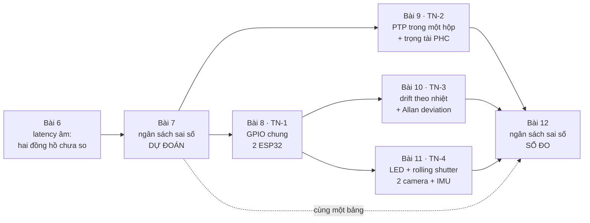
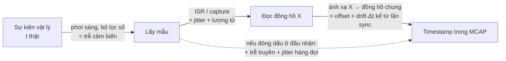
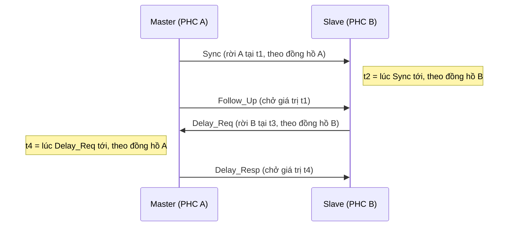

# Khóa 5 · Module 2 — Đồng bộ thời gian (50h)

**Đây là module quan trọng nhất của Khóa 5 và của cả lộ trình.** Time sync là kỹ năng hệ thống, không phải cơ điện tử: nó là bài toán hệ phân tán (mỗi node một đồng hồ, không node nào biết "giờ thật") gặp vật lý (đồng hồ là một miếng thạch anh rung, nóng lên thì rung khác). Tám năm backend của bạn có giá trực tiếp ở đây, và cũng chính ở đây trực giác backend gãy nhiều nhất, vì ở backend bạn hầu như chưa bao giờ phải hỏi "cái timestamp này sai bao nhiêu micro-giây".

**Luật của module (giữ nguyên từ bản gốc):** số đo là deliverable. Bài 12 không có giờ riêng: bạn điền nó **dần dần** trong lúc làm Bài 8–11. **FAIL action đã cam kết trước:** PTP không chạy được sau 60h → chuyển sang hardware-trigger-only (GPIO chung giữa hai ESP32 + LED trong camera). Không đâm đầu vào `linuxptp`.



| Bài | Giờ | Viên nang nền cần trước | Quyết định ra được |
|---|---|---|---|
| 7 — Ngân sách sai số thời gian | 6 | F4.1, F4.7, F1.1 | Ứng dụng nào cần cơ chế sync nào (không sync / sync định kỳ / PTP / trigger), sync bao lâu một lần |
| 8 — TN-1: GPIO chung, sự kiện duy nhất | 10 | F4.1, F1.6, F5.2, F5.3 | Timestamp trong ISR có đủ không, hay phải dùng capture phần cứng |
| 9 — TN-2: PTP, trước và sau | 12 | F4.4, F4.5, F4.3, F2.1 | Được phép báo cáo con số nào về PTP, và khi nào một con số "tự báo" bị loại |
| 10 — TN-3: Drift theo nhiệt độ | 8 | F4.1, F4.2, F1.6 | Chu kỳ sync và cửa sổ ước lượng drift cho robot có nhiệt độ thay đổi |
| 11 — TN-4: Hardware trigger, 2 camera + IMU | 14 | F4.6, F5.6, F3.4 | Rig không trigger có dùng được cho fusion không, và sai số thời gian của dataset là bao nhiêu |
| 12 — Tổng hợp ngân sách sai số | (cùng Bài 7–11) | F4.7, F1.1, F1.7 | Câu cam kết về độ đồng bộ của hệ, đủ sức đứng trước người phỏng vấn |

---

## Bài 7 — Ngân sách sai số thời gian (6h)

> **Vị trí:** K5 Bài 6 (USB vs WiFi; "latency âm") → **Bài 7** → Bài 8 (TN-1) · **Cần trước:** F4.1 (thạch anh, ppm, offset/skew/drift), F4.7 (ngân sách sai số và trọng tài đo), F1.1 (sai số hệ thống vs ngẫu nhiên, GUM loại A/B), K3 latency budget · **Sau bài này bạn quyết định được:** với một ứng dụng cụ thể (log nhiệt độ 1 Hz, ghép IMU 200 Hz với camera 30 fps, VIO trên robot quay nhanh), cơ chế đồng bộ nào là đủ và phải đồng bộ lại bao lâu một lần, kèm một bảng dự đoán đã commit để Bài 8–11 có cái mà bác bỏ.

### 1. Câu chuyện — ai đã khổ vì chuyện này

Dhahran, Ả Rập Xê Út, 25/2/1991. Một khẩu đội tên lửa Patriot đã chạy liên tục hơn 100 giờ. Một tên lửa Scud bay tới; radar phát hiện, hệ thống tính "cổng theo dõi" (range gate) xem lần quét sau mục tiêu sẽ ở đâu, nhìn vào đó, không thấy gì, và kết luận báo động giả. Scud rơi vào doanh trại, 28 lính Mỹ thiệt mạng [spec: GAO/IMTEC-92-26, 1992]. Nguyên nhân: đồng hồ hệ thống đếm số tick 0,1 s dưới dạng số nguyên; để ra giây, phần mềm nhân với 0,1 biểu diễn trong thanh ghi 24 bit. 0,1 không biểu diễn chính xác được trong nhị phân (giống 1/3 trong thập phân), phần đuôi bị cắt, mỗi tick sai khoảng 9,5×10⁻⁸ s; sau 100 giờ, sai tích lũy khoảng 0,34 s [spec: R. Skeel, *Roundoff Error and the Patriot Missile*, SIAM News 7/1992]. Hai tuần trước đó, phía Israel đã báo hệ thống mất chính xác sau 8 giờ chạy liên tục; cách xử lý tạm là khởi động lại định kỳ, và bản vá phần mềm tới Dhahran một ngày sau vụ tấn công [spec: GAO/IMTEC-92-26].

Ba chi tiết khiến câu chuyện này thuộc về bài học hôm nay. **Thứ nhất**, quy ra đơn vị của module: 9,5×10⁻⁸ s trên mỗi 0,1 s là một sai tần số tương đối cỡ **1 ppm** [ước lượng: tính từ số của Skeel]. Đó là nhỏ hơn dung sai của thạch anh trên ESP32 bạn sắp đo. **Thứ hai**, "khởi động lại định kỳ" chính là "sync lại định kỳ" ở dạng thô: sai số tích lũy theo thời gian kể từ lần đặt lại gần nhất, nên một ngân sách sai số không ghi "sau bao lâu" là vô nghĩa. **Thứ ba**, và đắt nhất: theo Skeel, phần mềm đã được sửa để đổi thời gian chính xác hơn ở *một số* chỗ nhưng không phải *mọi* chỗ. Phép tính vị trí dùng **hiệu** hai thời điểm; nếu cả hai cùng mang một lỗi, lỗi triệt tiêu khi trừ. Chính vì một bên được sửa còn bên kia không, lỗi không còn triệt tiêu. Lỗi chung triệt tiêu trong phép hiệu, lỗi riêng thì không: đó là toàn bộ lý thuyết ngân sách sai số của bài này, gói trong một sự cố.

### 2. Mô hình tư duy

Một timestamp không phải "thời điểm sự kiện". Nó là thời điểm sự kiện **cộng với** một chuỗi lỗi, mỗi mũi tên dưới đây thêm một số hạng:



Viết thành công thức cho một luồng `i`:

```
ts_i = t_thật + b_i  +  y_i·(t − t_sync)  +  n_i
         bias (hằng)   drift tích lũy        ngẫu nhiên (jitter, lượng tử)
```

Sai số giữa hai luồng là **hiệu** hai vế: `(b_A − b_B) + (y_A − y_B)·Δt + (n_A − n_B)`. Bốn quy tắc rút ra từ đó [chuẩn: GUM, JCGM 100:2008]:

1. **Phân loại trước khi cộng.** Bias đo được thì trừ được, phần còn lại chỉ là sai số của *phép đo bias*. Drift không phải biến ngẫu nhiên dừng: nó lớn dần từ lần sync cuối, nên ngân sách ghi giá trị ở **thời điểm xấu nhất trước lần sync kế**. Chỉ phần ngẫu nhiên mới có "độ lệch chuẩn" theo nghĩa thông thường.
2. **Cộng theo quan hệ, không theo thói quen.** Các thành phần **độc lập**: `u_c = √(u₁² + u₂² + …)` (căn tổng bình phương, RSS). Các thành phần **tương quan hoàn toàn** (chung một nguyên nhân, ví dụ cùng một cơn nóng làm cả hai thạch anh trôi cùng chiều): cộng thẳng. Trong một **phép hiệu**, thành phần chung triệt tiêu.
3. **Biên khác độ lệch chuẩn.** Nếu chỉ biết "|sai| ≤ a" và không biết gì hơn, coi phân bố đều: `u = a/√3` (GUM loại B). Trộn "±a tối đa" với "σ" trong cùng một phép RSS là lỗi phổ biến nhất của bảng ngân sách.
4. **RSS bị thống trị bởi số hạng lớn nhất.** Thành phần bằng 1/3 thành phần lớn nhất chỉ đóng góp ~5% vào tổng. Giống profiling: tối ưu hàm chiếm 2% thời gian là phí công.

Phép đổi đơn vị phải thuộc: **sai tần số tương đối `y` (ppm) × thời gian = sai pha tích lũy**. `y` ppm nghĩa là mỗi giây lệch `y` µs; một giờ là 3600 s, nên `ms/giờ = ppm × 3,6`. Ví dụ phương pháp: 7 ppm × 3600 s = 25 200 µs = 25,2 ms [chuẩn]. Chú ý cái bạn đo được luôn là **hiệu** ppm của hai đồng hồ, không phải ppm của từng cái.

Mô phỏng đồ chơi để thấy ba quy tắc cộng bằng số (chạy trước khi tin):

```python
# [đã chạy] Ngân sách sai số: khi nào cộng căn tổng bình phương (RSS), khi nào cộng thẳng, khi nào triệt tiêu
import numpy as np
rng = np.random.default_rng(0)
N = 200_000
# Ba thành phần sai số của MỘT timestamp (đơn vị us) [giả định, chỉ để minh họa]
jitter_isr = rng.normal(0, 3, N)          # jitter ngắt: ngẫu nhiên, độc lập từng mẫu
usb_latency = rng.uniform(0, 1000, N)     # chờ USB polling 1 ms: ngẫu nhiên, KHÔNG phải Gauss
ptp_resid = rng.normal(0, 0.5, N)         # dư PTP
total = jitter_isr + usb_latency + ptp_resid
s = [np.std(c) for c in (jitter_isr, usb_latency, ptp_resid)]
print("std từng phần:", ", ".join(f"{v:.1f}" for v in s))
print(f"RSS dự đoán  : {np.sqrt(sum(v*v for v in s)):.1f}   cộng thẳng: {sum(s):.1f}   "
      f"mô phỏng: {np.std(total):.1f}")
print(f"chú ý: mean(total) = {np.mean(total):.0f} us -> bias, không nằm trong std")

# Hai thành phần TƯƠNG QUAN HOÀN TOÀN (cùng một nguyên nhân, ví dụ cùng nhiệt độ làm trôi)
common = rng.normal(0, 10, N)
a, b = common, 0.8 * common               # cùng dấu, cùng lúc
print(f"tương quan, tổng a+b: std={np.std(a+b):.1f}  (RSS sẽ nói {np.sqrt(10**2+8**2):.1f}, thẳng {18:.1f})")
# Hiệu hai timestamp mang CÙNG lỗi: lỗi chung triệt tiêu (bài học Patriot theo chiều ngược)
t_true = rng.uniform(0, 1e6, N); err = rng.normal(0, 50, N)
d_same = (t_true + err) - (t_true - 3000 + err)     # cả hai đi qua cùng phép đổi lỗi
d_mixed = (t_true + err) - (t_true - 3000)          # chỉ một bên được "sửa"
print(f"hiệu, lỗi chung: std={np.std(d_same - 3000):.2f}   hiệu, chỉ sửa một bên: std={np.std(d_mixed - 3000):.1f}")
```

Đọc kết quả với ba câu hỏi: thành phần 0,5 µs có đáng để tối ưu không; dòng "mean" nói gì về chỗ RSS không nhìn thấy; vì sao "sửa một bên" lại tệ hơn "không sửa bên nào".

### 3. Cầu nối từ backend

| Backend bạn biết | Ở đây | Gãy ở chỗ | Nếu dùng nhầm thì |
|---|---|---|---|
| Latency budget (K3): cộng các chặng trễ | Time error budget: gộp các sai số | Trễ luôn dương và nối tiếp nên cộng thẳng. Sai số có dấu; độc lập thì RSS, tương quan thì cộng thẳng, trong phép hiệu thì phần chung triệt tiêu | Cộng thẳng mọi thứ → ngân sách bi quan, mua phần cứng trigger không cần. RSS cho thứ tương quan → ngân sách lạc quan, fusion sai mà không ai biết |
| `chrony`/NTP trên server, alert "clock skew" | Đồng bộ ESP32, PHC, camera | Server có kernel + NIC + client NTP. Camera USB không có đồng hồ bạn chỉnh được; ESP32 không có client NTP trừ khi bạn viết | Tưởng "máy đã chạy NTP" nghĩa là dữ liệu đã đồng bộ; thực ra chỉ đồng hồ hệ thống đúng, còn timestamp dữ liệu là lúc *đọc* đồng hồ đó |
| Event time vs processing time trong Kafka/Flink (F3.3) | Timestamp tại nguồn vs tại đầu nhận | Ở stream processing, event time sai vài giây vẫn đúng window phút. Ở đây "đúng" là µs, và đồng hồ của producer (MCU) trôi hàng chục ms/giờ | Dùng processing time cho fusion → sai số bằng chính phân bố latency (đuôi WiFi ở Bài 6) |
| SLO theo phân vị (p99 latency) | Ngân sách theo phân vị của \|sai số\| | Latency là thời gian chờ; sai số thời gian là lỗi có dấu, có bias. p99 của \|err\| không cộng được giữa các chặng như p99 latency cũng không cộng được | Cộng p99 từng chặng → con số vô nghĩa (giống lỗi cộng p99 trong tracing) |

**Chấm mô hình:**

- *"Mỗi thiết bị có clock và thời gian riêng, chúng lệch nhau, nên phải có buffer ở giữa để các giao thức hoạt động"* (mô hình của bạn ở K3 lượt 7) — **ĐÚNG MỘT PHẦN.** Đúng: mỗi thiết bị có time base riêng và chúng lệch nhau; đó chính là chủ đề module này. Gãy: buffer xử lý lệch **tốc độ** trong một khoảng thời gian (hấp thụ chênh lệch), không xử lý lệch **thời điểm**, và nó còn **xóa** thông tin thời gian: mẫu nằm trong buffer bao lâu thì timestamp lúc lấy ra sai bấy nhiêu. Lệch tốc độ kéo dài thì buffer nào cũng tràn hoặc cạn (underrun ở K3); thứ giải quyết thật là khôi phục tần số (clock recovery, sample rate conversion) hoặc đóng dấu ở nguồn. **Phản ví dụ:** Bài 6, đường USB có buffer ở cả hai đầu, vẫn cho "latency âm" khi so timestamp ESP32 với timestamp host.
- *"Sai số thời gian cộng giống latency"* — **SAI** như một quy tắc chung. Đúng trong một trường hợp: các thành phần cùng dấu và cùng nguyên nhân. **Phản ví dụ:** jitter ngắt 3 µs và chờ USB polling cỡ 300 µs (σ) độc lập; tổng σ gần như bằng thành phần lớn, không phải tổng hai số (chạy mô phỏng trên).
- *"Đồng hồ trôi 20 ppm thì timestamp của tôi sai 20 ppm"* — **SAI.** ppm là sai **tốc độ**; sai **thời điểm** là ppm × thời gian từ lần sync cuối, cộng offset lúc sync. **Phản ví dụ:** hai đồng hồ cùng trôi đúng 20 ppm cùng chiều thì hiệu của chúng không trôi chút nào.

### 4. Thuật ngữ

| Mức | Thuật ngữ | Nghĩa trong một câu | Hay bị hiểu nhầm thành |
|---|---|---|---|
| 🟢 | Offset | Hiệu số đọc của hai đồng hồ tại cùng một thời điểm | Một hằng số; thực ra nó đổi liên tục theo drift |
| 🟢 | Skew / sai tần số tương đối (ppm) | Hai đồng hồ chạy nhanh chậm hơn nhau bao nhiêu phần triệu | Sai số thời điểm; thực ra là sai *tốc độ* |
| 🟢 | Drift | Sự thay đổi của offset theo thời gian (và nghĩa hẹp: sự thay đổi của skew, ví dụ theo nhiệt) | Một nghĩa duy nhất; tài liệu dùng lẫn, đọc kỹ đơn vị |
| 🟢 | Time sync error budget | Bảng liệt kê từng nguồn sai số, loại, độ lớn, cách gộp | Bảng latency đổi tên cột |
| 🟢 | Timestamp at source vs at receive | Đóng dấu lúc lấy mẫu hay lúc nhận | Chênh nhau một hằng số; thực ra chênh một *phân bố* |
| 🟢 | RSS (root-sum-square) | Gộp thành phần độc lập bằng căn tổng bình phương | Áp được cho mọi thứ |
| 🟡 | GUM loại A / loại B | Loại A: ước lượng từ thống kê số đo; loại B: từ thông tin khác (datasheet, biên) | Loại B kém tin hơn loại A |
| 🟡 | Hệ số phủ k, độ bất định mở rộng U | `U = k·u_c`, k=2 ~ 95% nếu gần Gauss | "95%" luôn đúng; sai khi phân bố đuôi dài |
| 🔴 | Covariance đầy đủ giữa mọi thành phần | Ma trận tương quan để gộp chính xác | Cần cho bài này; nhóm "tương quan/độc lập" là đủ |

### 5. Dự đoán

**Đề:** điền bảng ngân sách sai số giữa ba thực thể ESP32-S3 (IMU) ↔ mini PC ↔ camera USB **trước** khi làm Bài 8. Không có số đúng ở bài này; có bảng dự đoán đã commit để Bài 12 so lại.

**Tham số cần tra và tra ở đâu:**

| Tham số | Tra ở đâu |
|---|---|
| Độ chính xác thạch anh 40 MHz của ESP32-S3 | *ESP32-S3 Hardware Design Guidelines*, mục "External Crystal Clock Source"; datasheet module bạn mua (ESP32-S3-WROOM-1 có thạch anh tích hợp trong vỏ kim loại) |
| Thạch anh của i225/i226 | Datasheet Intel Ethernet Controller I225/I226, mục clock/crystal; nếu không tìm được, ghi "chưa rõ" + giới hạn của chuẩn Ethernet |
| Camera rolling hay global, thời gian đọc frame | `lsusb -v` (tên thiết bị), `v4l2-ctl -d /dev/videoN --list-formats-ext`, `v4l2-ctl -d /dev/videoN -l` (dải exposure); trang sản phẩm; nếu không có, ghi "đo ở Bài 11" |
| Exposure đang dùng | `v4l2-ctl -l`: tên control có thể là `exposure_time_absolute` hoặc `exposure_absolute` tùy kernel, đơn vị 100 µs theo UVC [spec: V4L2 `V4L2_CID_EXPOSURE_ABSOLUTE`] [tự đo] |
| Chu kỳ USB | Chuẩn USB: full-speed khung 1 ms, high-speed microframe 125 µs [chuẩn]; ESP32-S3 USB là full-speed [spec: ESP32-S3 datasheet] |
| Độ phân giải đồng hồ ESP32 | ESP-IDF `esp_timer_get_time()` trả về µs [spec: ESP-IDF API reference] |
| Trễ bộ lọc số của IMU | Datasheet IMU: MPU6050 có bảng DLPF với cột *Delay (ms)* (register 26 CONFIG); ICM-42688 có group delay theo cấu hình bộ lọc |

**Phương pháp:** với mỗi dòng ghi (a) loại: bias / drift / ngẫu nhiên; (b) độ lớn kèm đơn vị và *cách ra số* (từ datasheet, tính, hay đoán); (c) nhóm tương quan; (d) bài nào sẽ đo nó. Drift ghi theo hai mốc: sau 1 giây và sau 1 giờ không sync. Gộp bằng `b12_budget.py` ở Bài 12 (dùng được ngay từ bây giờ với số dự đoán).

**Mẫu `prediction.md`** (copy vào `lab/k5/b07/prediction.md`):

```markdown
# Bài 7 — dự đoán ngân sách sai số thời gian (commit trước Bài 8)
Ngày: ____  Commit: ____

| # | Nguồn sai số | Loại (bias/drift/ngẫu nhiên) | Dự đoán | Cách tôi ra số này | Nhóm tương quan | Đo ở |
|---|---|---|---|---|---|---|
| 1 | Hai ESP32 tự do, sau 1 h | drift | ___ ms | ppm × 3,6 từ datasheet ___ | xtal | Bài 8 |
| 2 | Drift thêm do nhiệt (ΔT = ___ °C) | drift | ___ ppm | ___ | nhiệt | Bài 10 |
| 3 | Jitter ISR trên ESP32 | ngẫu nhiên | ___ µs | ___ | — | Bài 8 |
| 4 | ESP32 → host qua USB, đóng dấu ở host | ngẫu nhiên + bias | ___ | ___ | usb | Bài 6/9 |
| 5 | PHC ↔ PHC, PTP hardware timestamping | ngẫu nhiên | ___ | ___ | ptp | Bài 9 |
| 6 | Trọng tài đọc PHC (độ rộng kẹp) | biên | ___ | ___ | ptp | Bài 9 |
| 7 | Camera: exposure (timestamp đầu/giữa/cuối?) | bias | ___ | ___ | cam | Bài 11 |
| 8 | Camera: rolling shutter (hàng đầu → cuối) | biên | ___ ms | ___ | cam | Bài 11 |
| 9 | Camera ↔ camera, không trigger | ___ | ___ | ___ | cam | Bài 11 |
| 10 | IMU: trễ bộ lọc số | bias | ___ ms | datasheet, cấu hình ___ | imu | Bài 11 |

Tổng (RSS theo nhóm): ___   Tổng cộng thẳng: ___   Thành phần thống trị: ___
Ứng dụng chấp nhận được với tổng này: ___   Không chấp nhận được: ___ (vì ___)
```

### 6. Làm

1. **(1h) Đổi đơn vị cho thuộc.** Không nhìn ghi chú, tính: 10, 20, 50 ppm ra µs/giây, ms/giờ, giây/ngày. Rồi tính ngược: muốn sai < 1 ms trước lần sync kế, với hiệu ppm `y`, phải sync mỗi bao lâu? Ghi công thức `T_sync = e_max / y` vào notebook.
2. **(1,5h) Tra datasheet thạch anh của board ESP32-S3 bạn mua.** Ghi rõ con số là dung sai ban đầu ở 25 °C, độ ổn định theo nhiệt, hay tổng; nhiều tài liệu chỉ ghi một con số "accuracy" mà không nói. Tính ra ms/giờ cho *hiệu* hai board ở trường hợp xấu nhất (hai board lệch về hai phía). Làm tương tự cho i225/i226 nếu tìm được.
3. **(1h) Tra thông số camera.** Rolling hay global shutter? Thời gian đọc frame bao nhiêu? Đa số webcam không công bố: ghi "không công bố" là một kết quả hợp lệ, và đó là lý do Bài 11 tồn tại. Ghi luôn exposure hiện tại và chế độ auto/manual.
4. **(1h) Lập bảng ngân sách** theo mẫu ở phần 5, điền dự đoán cho mọi dòng, chạy `b12_budget.py` với số dự đoán để thấy thành phần thống trị. **Commit.**
5. **(1,5h) Viết đoạn "ứng dụng":** với ứng dụng nào sai số tổng này chấp nhận được, với ứng dụng nào thì không. Bắt buộc quy sai số thời gian ra sai số **không gian** cho ít nhất hai ứng dụng: tịnh tiến `Δx = v·Δt` và quay `Δθ = ω·Δt`, rồi điểm ảnh lệch `≈ r·Δθ` ở khoảng cách `r`. Chọn v, ω, r theo robot Khóa 7 của bạn (ghi giả định).

Dụng cụ đo ở bài này là datasheet: sai số của nó là "nhà sản xuất cam kết gì, ở điều kiện nào". Ghi điều kiện (nhiệt độ, tải, tuổi) cạnh mỗi con số tra được.

### 7. Số phải ra

<details><summary>🔒 MỞ SAU KHI COMMIT prediction.md</summary>

**Đổi đơn vị:** 10 ppm = 10 µs/s = 36 ms/giờ = 0,864 s/ngày; 20 ppm = 72 ms/giờ; 50 ppm = 180 ms/giờ. Muốn sai < 1 ms với hiệu 20 ppm: sync ít nhất mỗi 50 s.

**Thạch anh ESP32-S3:** hướng dẫn thiết kế của Espressif yêu cầu thạch anh 40 MHz có độ chính xác trong ±10 ppm [spec: ESP32-S3 Hardware Design Guidelines, mục External Crystal Clock Source]. Hai board lệch hai phía → hiệu tối đa ~20 ppm ≈ 72 ms/giờ; thực tế thường nhỏ hơn nhiều vì ±10 ppm là cận, không phải giá trị điển hình [ước lượng]. Bảng gốc ghi "20–50 ppm" là con số chung cho thạch anh rẻ; với ESP32-S3 đó là cận quá rộng.

**Bảng độ lớn điển hình** (bản gốc, đã sửa; đều là [ước lượng] trừ chỗ ghi khác):

| Nguồn | Độ lớn điển hình | Giảm được bằng |
|---|---|---|
| Không sync, hai clock tự do | Trôi không giới hạn theo thời gian | Bất kỳ cơ chế sync nào |
| Dung sai thạch anh | ±10 ppm (ESP32-S3, [spec]) tới 20–50 ppm (thạch anh rẻ) → 36–180 ms/giờ | Sync định kỳ |
| Drift thêm do nhiệt | Vài ppm trong dải phòng với AT-cut (Bài 10 đo) | Bù nhiệt, TCXO, sync dày hơn |
| NTP/chrony qua LAN | Chục µs tới dưới 1 ms tùy mạng và tải; 1–10 ms là mức qua Internet/WiFi | PTP, hoặc chrony + hardware timestamping |
| PTP software timestamping | Vài µs tới hàng trăm µs, phụ thuộc tải | PTP hardware timestamping |
| PTP hardware timestamping | Sub-µs, nhưng bạn chỉ *chứng minh* được tới mức sai số của trọng tài | Hardware trigger |
| Đóng dấu ở đầu nhận | Bằng phân bố latency + jitter (USB: tới ~1 ms theo khung full-speed; WiFi: đuôi dài) | Đóng dấu ở nguồn + ước lượng offset |
| Exposure camera | Nửa exposure *nếu* biết timestamp ứng với đầu hay cuối exposure; tới cả exposure nếu không biết | Ghi exposure, quy về giữa phơi sáng |
| Rolling shutter | Tới cả thời gian đọc frame (10–30 ms ở webcam) nếu không bù theo hàng | Global shutter, bù theo hàng |
| Trễ bộ lọc số IMU | 0 tới ~19 ms tùy cấu hình DLPF (MPU6050) [spec: MPU-6000/6050 Register Map, register 26] | Ghi cấu hình, trừ bias |

**Thành phần thống trị** gần như chắc chắn là camera (rolling shutter + timestamp driver) hoặc drift ESP32 nếu không sync lại; PTP giữa hai PHC nhỏ hơn vài bậc. Nếu bảng của bạn cho PTP là thành phần thống trị, bạn đã đặt ngân sách cho sai chỗ.

**Ứng dụng (ví dụ cách quy):** robot đi 1 m/s, lệch 10 ms → 1 cm; robot quay 1 rad/s, lệch 10 ms → 0,01 rad → điểm ở 5 m lệch 5 cm. Phép quay hầu như luôn đau hơn phép tịnh tiến; đó là lý do VIO và lidar deskew nhạy với sai số thời gian. BME280 1 Hz: sai 100 ms vẫn vô hại vì nhiệt độ không đổi đáng kể trong 100 ms.

**Vì sao lệch là bình thường:** bảng dự đoán ở bài này đáng giá vì nó *sai ở đâu*, không phải vì nó đúng. Bài 12 chấm từng dòng.
</details>

### 8. Nếu ra khác

| Triệu chứng | Nguyên nhân khả dĩ | Kiểm bằng cách | Sửa |
|---|---|---|---|
| Không tìm được ppm thạch anh của board | Board clone không công bố; thạch anh nằm trong module | Đọc datasheet module (WROOM/MINI), đọc hướng dẫn thiết kế của chip | Dùng yêu cầu của Espressif làm cận, đánh dấu loại B, đo ở Bài 8 |
| Camera không có thông số shutter | Webcam tiêu dùng hầu như không công bố | Tìm tên sensor (đôi khi trong `lsusb -v` hoặc tháo vỏ) | Ghi "đo ở Bài 11"; giả định rolling shutter (đa số webcam CMOS) |
| Tổng ngân sách bằng tổng các dòng | Cộng thẳng theo thói quen latency budget | Xem lại cột "nhóm tương quan" | Gộp theo nhóm: cộng thẳng trong nhóm, RSS giữa nhóm |
| Một dòng ghi "±5 ms", dòng khác "σ = 2 ms" rồi RSS thẳng | Trộn biên với độ lệch chuẩn | Hỏi: con số này là cận hay σ? | Biên đều → chia √3 trước khi gộp |
| Không biết camera đóng dấu đầu hay cuối exposure | Driver không nói rõ | Bài 11 đo được bias này | Ghi là bias chưa biết với biên = exposure + thời gian đọc frame |

### 9. Câu hỏi ngược

1. **[Nếu…thì]** Nếu hai ESP32 dùng thạch anh từ cùng một cuộn linh kiện, đặt cạnh nhau, thì hiệu ppm của chúng nhỏ hơn hay lớn hơn hai board khác lô? Điều đó tốt hay xấu cho *thí nghiệm*?
   <details><summary>Hướng nghĩ</summary>Cùng lô thường gần nhau hơn (tương quan dương trong sản xuất) và cùng nhiệt độ thì trôi cùng chiều. Tốt cho hệ (hiệu nhỏ), xấu cho thí nghiệm (độ dốc nhỏ, khó tách khỏi nhiễu, và Bài 10 phải hơ *một* board). Nghĩ xem điều này đổi cột "nhóm tương quan" thế nào.</details>
2. **[Vì sao không]** Vì sao không "sync một lần lúc khởi động rồi bù drift bằng ppm đo được"?
   <details><summary>Hướng nghĩ</summary>Bù được phần drift *hằng*. Phần còn lại: drift đổi theo nhiệt (Bài 10), lão hóa, nhiễu random-walk tần số (Bài 10, Allan). Hỏi: sau bao lâu phần còn lại vượt ngân sách? Câu trả lời là một con số, không phải "có/không".</details>
3. **[Quy mô]** Ở 100 robot × 1000 giờ dữ liệu, dòng nào trong bảng gãy trước: sai số trung bình, hay đuôi (robot có thạch anh tệ nhất, robot đứng gần motor nóng nhất)? Bạn sẽ phát hiện robot đó bằng metric nào?
   <details><summary>Hướng nghĩ</summary>Ngân sách cho một robot là σ; cho một đội robot là phân vị theo robot. Một robot tệ làm hỏng mọi episode của nó. Nghĩ tới việc ghi `clock_source` và ước lượng offset theo thời gian vào metadata (CONVENTIONS mục 4) để lọc được.</details>
4. **[Failure mode]** Ngân sách ghi PTP sub-µs, nhưng `phc2sys` chưa chạy. Dataset trông thế nào, và kiểm tra tự động nào bắt được?
   <details><summary>Hướng nghĩ</summary>PHC đúng, đồng hồ hệ thống (thứ code ghi MCAP đọc) không theo. Timestamp vẫn đơn điệu, schema vẫn hợp lệ. Chỉ một phép kiểm theo vật lý (sự kiện chung thấy trên hai luồng) hoặc kiểm trạng thái sync lúc ghi mới bắt được.</details>
5. **[Liên ngành]** Vụ Patriot là lỗi biểu diễn số, không phải lỗi thạch anh. Vì sao nó vẫn thuộc ngân sách sai số thời gian, và dòng nào trong bảng của bạn cùng họ với nó?
   <details><summary>Hướng nghĩ</summary>Lỗi tích lũy tỉ lệ với thời gian chạy = một "ppm" do phần mềm tạo ra. Họ hàng: lưu timestamp bằng float64 giây (roadmap đã cảnh báo: mất độ phân giải ns khi giá trị lớn), đổi đơn vị µs↔ns bằng số thực, `esp_timer` 64 bit vs counter 32 bit bị tràn.</details>

### 10. Liên kết ra ngoài

- **Tài chính — MiFID II RTS 25.** Quy định EU yêu cầu sàn và công ty giao dịch tần suất cao giữ đồng hồ lệch UTC không quá 100 µs, độ phân giải timestamp 1 µs [spec: Commission Delegated Regulation (EU) 2017/574]. Giống: họ phải chứng minh bằng ngân sách và truy xuất được tới UTC. Khác: họ cần *thời điểm tuyệt đối* (UTC, để xử lý tranh chấp), robot của bạn thường chỉ cần *thời điểm tương đối* giữa các cảm biến trên cùng một xe.
- **Viễn thông 5G TDD.** Trạm phát cùng tần số phải chia khe thời gian phát/thu; ITU-T G.8271 đặt giới hạn sai pha cỡ ±1,5 µs so với nguồn chung [spec: ITU-T G.8271]. Giống: ngân sách chia theo chặng (grandmaster, mạng, đầu cuối). Khác: họ có ngân sách tiền cho boundary clock ở mọi switch; bạn có một sợi cáp và hai ESP32.
- **Hàng không vũ trụ — pointing budget.** Ngân sách sai số hướng ngắm của vệ tinh phân loại sai số theo đặc tính thời gian (bias, trôi, ngẫu nhiên) trước khi gộp, đúng như quy tắc 1 ở trên [spec: ESA Pointing Error Engineering Handbook, ESSB-HB-E-003]. Khác: họ có mô hình thống kê đầy đủ cho từng loại; bạn dùng nhóm "tương quan/độc lập" là đủ.

### 11. Độ tin cậy và sửa lỗi

| Khẳng định | Nhãn | Ghi chú / cách kiểm |
|---|---|---|
| Patriot: 28 người chết, >100 giờ chạy, Israel báo sau 8 giờ, bản vá tới sau một ngày | [spec] | GAO/IMTEC-92-26 (2/1992) |
| Sai 9,5×10⁻⁸ s/tick, 0,34 s sau 100 giờ, thanh ghi 24 bit; sửa một phần làm lỗi không triệt tiêu | [spec] | Skeel, SIAM News 25(4), 7/1992 |
| Tương đương ~1 ppm | [ước lượng] | 9,5×10⁻⁸ / 0,1 |
| ESP32-S3 yêu cầu thạch anh 40 MHz, ±10 ppm | [spec] | ESP32-S3 Hardware Design Guidelines; kiểm bản bạn đọc |
| RSS cho thành phần độc lập, a/√3 cho biên đều | [chuẩn] | JCGM 100:2008 (GUM) |
| `esp_timer_get_time()` độ phân giải 1 µs | [spec] | ESP-IDF API reference, kiểm theo phiên bản cài |
| Tên control exposure trên V4L2 | [tự đo] | `v4l2-ctl -l`; kernel mới đặt tên "Exposure Time, Absolute" |

**Đã sửa so với bản gốc/Gemini:**
- Dòng "NTP qua LAN 1–10 ms" (gốc và Gemini): quá bi quan cho LAN có dây; chrony trên LAN thường cỡ chục µs tới dưới 1 ms. Giữ 1–10 ms cho Internet/WiFi. Gắn [ước lượng].
- "Thời gian phơi sáng: nửa thời gian phơi sáng" (gốc): chỉ đúng khi biết timestamp ứng với đầu hoặc cuối phơi sáng; nếu không biết, biên là cả exposure.
- "Sai số cộng theo căn bậc hai nếu độc lập" (gốc): giữ, bổ sung ba trường hợp gốc bỏ qua: bias không nằm trong σ, thành phần tương quan cộng thẳng, phần chung triệt tiêu trong phép hiệu; và biên phải chia √3.
- Gemini Bước 1: "thạch anh ESP32 ±10 ppm ở 25 °C và ±20–30 ppm theo dải nhiệt" — con số thứ hai không có nguồn; tài liệu Espressif chỉ nêu một yêu cầu ±10 ppm. Bắt người học tra và ghi rõ điều kiện.
- Gemini ví dụ tự kiểm tra chỉ quy sai số thời gian ra sai số tịnh tiến; thêm sai số quay (`r·ω·Δt`), thường lớn hơn.

**Reviewer sửa (K5-m2):** ví dụ đổi đơn vị ở mục 2 dùng đúng 20 ppm mà bước 1 bắt tính → đổi sang 7 ppm để không lộ đáp án bước 1. Đã chạy lại mô phỏng ngân sách: khớp mô tả. `b12_budget.py` mà bước 4 nhắc tới nằm ở Bài 12.

### 12. Đọc thêm và tự kiểm tra

- **Nguồn gốc:** GAO, *Patriot Missile Defense: Software Problem Led to System Failure at Dhahran, Saudi Arabia*, GAO/IMTEC-92-26 (1992). JCGM 100:2008, *Evaluation of measurement data — Guide to the expression of uncertainty in measurement* (GUM).
- **Giải thích:** Robert Skeel, *Roundoff Error and the Patriot Missile*, SIAM News, 7/1992 (một trang, đọc trong 10 phút).
- **Đào sâu (tùy chọn):** NIST/SEMATECH, *e-Handbook of Statistical Methods*, phần propagation of error.
- **Tự kiểm tra:** (1) giải thích lại cho một backend engineer khác trong 5 câu vì sao ngân sách thời gian không cộng như latency budget; (2) vẽ lại sơ đồ "sự kiện → MCAP" ở phần 2 từ trí nhớ, ghi số hạng lỗi ở mỗi mũi tên; (3) hai câu dưới.

  *Câu A:* Hai luồng cùng đóng dấu bằng system clock của mini PC, đồng hồ này lệch UTC 40 ms. Sai số *giữa hai luồng* do lệch UTC này là bao nhiêu?
  *Câu B:* Thành phần (i) jitter σ = 4 µs, (ii) biên ±3 µs (đều), (iii) σ = 0,5 µs, độc lập. Tổng 1σ?
  <details><summary>Đáp án</summary>A: bằng 0, vì lỗi chung triệt tiêu trong phép hiệu (nhưng nếu so với một luồng đóng dấu bằng đồng hồ khác, nó xuất hiện đủ 40 ms). B: (ii) → 3/√3 ≈ 1,73 µs; √(16 + 3 + 0,25) ≈ 4,39 µs, gần như toàn bộ đến từ (i).</details>

---

## Bài 8 — TN-1: GPIO chung, sự kiện duy nhất (10h)

> **Vị trí:** Bài 7 (ngân sách dự đoán) → **Bài 8** → Bài 10 (cùng thí nghiệm, thêm nhiệt) và Bài 11 (dùng lại ESP32 làm nguồn xung LED) · **Cần trước:** F4.1 (offset/skew/drift), F1.6 (fit đường thẳng, phần dư), F5.2 (interrupt, ISR), F5.3 (jitter, trường hợp xấu nhất), K5 Bài 6 (giao thức serial có số thứ tự) · **Sau bài này bạn quyết định được:** timestamp đọc trong ISR có đủ cho ngân sách của bạn không, hay phải chuyển sang capture phần cứng; và cần sync ESP32 lại bao lâu một lần.

### 1. Câu chuyện — ai đã khổ vì chuyện này

Kính thiên văn vô tuyến giao thoa đường đáy rất dài (VLBI) là người khổ nhất vì bài toán này và giải nó đẹp nhất. Các đài cách nhau hàng nghìn km cùng thu *một* mặt sóng vô tuyến từ một quasar; mỗi đài ghi dữ liệu lên đĩa kèm timestamp từ đồng hồ maser hydro của riêng mình, rồi gửi đĩa về trung tâm xử lý. Ở đó, máy tương quan tìm độ lệch thời gian và độ lệch *tốc độ* giữa các đồng hồ như những tham số chưa biết, bằng chính tín hiệu chung mà các đài cùng thấy [chuẩn]. Mạng Event Horizon Telescope, công bố ảnh lỗ đen đầu tiên năm 2019 (dữ liệu ghi năm 2017), làm đúng như vậy. Họ không tin đồng hồ nào là "thật"; họ tin *sự kiện chung*.

Thí nghiệm của bạn là phiên bản trên bàn của ý tưởng đó: một cạnh điện áp là "mặt sóng", hai ESP32 là hai "đài", và đường thẳng bạn fit là "fringe fitting" của người nghèo. Nó đẹp vì không có mạng, không có hệ điều hành ở giữa: hiệu timestamp là sai lệch đồng hồ cộng với sai số của chính cách bạn đọc đồng hồ, và bài này bắt bạn tách hai thứ đó ra.

### 2. Mô hình tư duy

```
dây GPIO chung  ______________/‾‾‾‾‾‾‾‾‾‾‾‾‾‾‾‾‾‾‾‾‾‾‾‾‾   cạnh lên tại t_e, chung cho hai board
ISR trên A      ________________|▓▓|____________________   A đọc esp_timer sau trễ ngắt L_A
ISR trên B      ___________________|▓▓|_________________   B đọc esp_timer sau trễ ngắt L_B
ACK của B       ___________________/‾‾\_________________   B bật chân ACK ngay đầu ISR
lưới mẫu LA     |  |  |  |  |  |  |  |  |  |  |  |  |  |   1/f_s (41,7 ns ở 24 MHz)
                              ◄─L_B─►
```

Mỗi cạnh `k` cho một cặp số. Hiệu của chúng:

```
off[k] = tB[k] − tA[k] = θ₀ + Δy·t[k] + ½·Δẏ·t[k]² + (L_B − L_A)[k] + (q_B − q_A)[k]
         offset ban đầu   skew (ppm)    drift của skew     trễ ngắt          lượng tử 1 µs
                                        (nhiệt, Bài 10)    (jitter + bias)   của esp_timer
```

Ba điều rút ra. **Một**, fit đường thẳng tách được phần *tích lũy* (độ dốc = Δy, đơn vị µs/s = ppm) khỏi phần *không tích lũy* (phần dư = jitter). **Hai**, phần trễ ngắt chung cho hai board (cùng firmware, cùng chip) là thành phần tương quan: nó triệt tiêu một phần trong phép hiệu (Bài 7, quy tắc 2), nên hãy làm hai phía **đối xứng**: cả A lẫn B đều bắt cạnh bằng cùng một đoạn code ISR, kể cả board phát xung (nối chân phát xung của A vào chân vào của chính A). **Ba**, xung được phát chính xác đến đâu không quan trọng: hai board đo *cùng* một cạnh, nên jitter của bộ phát triệt tiêu hoàn toàn.

Logic analyzer không phải "đồng hồ thật". Nó là **đồng hồ thứ ba** (thạch anh của bo FX2 clone, ppm chưa biết) có độ phân giải tốt; vai trò đúng của nó là đo **trễ ngắt** `L_B` trực tiếp (cạnh → ACK) trong những cửa sổ ngắn, tức là đo sai số của chính phép đo.

Có hai cách đọc đồng hồ tại cạnh, và đây là quyết định của bài:

| Cách | Cơ chế | Độ phân giải | Jitter chủ yếu |
|---|---|---|---|
| ISR + `esp_timer_get_time()` | CPU vào ngắt rồi đọc bộ đếm | 1 µs [spec: ESP-IDF] | Trễ vào ngắt, cache flash, ngắt khác (WiFi) |
| Capture phần cứng (MCPWM capture trên ESP32-S3) | Phần cứng chốt giá trị bộ đếm đúng lúc cạnh tới, CPU đọc sau | Chu kỳ clock của bộ đếm capture [tự đo theo ESP-IDF bạn cài] | Gần như chỉ còn lượng tử và đồng bộ hóa chân vào |

Mô phỏng/khung phân tích dưới đây chạy được ngay trên dữ liệu giả, và là script bạn sẽ dùng cho dữ liệu thật. Điểm thiết kế: **ghép cạnh bằng thời gian thô của host, đo bằng thời gian tinh của ESP32.** Đừng ghép theo số đếm cạnh của từng board: một cạnh bị mất ở một bên làm lệch mọi cặp sau đó đúng 1 s. Đây là cùng ý với GPS: xung PPS cho biết *chính xác khi nào*, câu NMEA đi kèm cho biết *đó là giây nào*.

```python
# [đã chạy] Phân tích TN-1: ghép cạnh, offset theo thời gian -> drift (ppm) + jitter. Không tham số = dữ liệu giả.
# Dữ liệu thật: python b8_fit.py a.csv b.csv ; mỗi file cột host_ns,t_us
#   host_ns: lúc mini PC nhận dòng (thô, ms) -> chỉ để GHÉP cạnh nào với cạnh nào
#   t_us   : esp_timer của chính board đó tại cạnh (tinh) -> để ĐO
import sys, numpy as np, matplotlib
matplotlib.use("Agg")
import matplotlib.pyplot as plt

if len(sys.argv) == 3:
    A, B = (np.loadtxt(p, delimiter=",", skiprows=1) for p in sys.argv[1:3])
else:                                            # giả lập: B nhanh hơn A 3.7 ppm [giả định]
    rng = np.random.default_rng(2); n = 3600
    tA = 5e6 + np.arange(n) * 1e6 + rng.normal(0, 1.5, n)
    tB = 9e6 + (tA - 5e6) * (1 + 3.7e-6) + rng.normal(0, 1.5, n)
    host = 1.7e18 + np.arange(n) * 1e9           # thời điểm host nhận, jitter USB vài ms
    keep = np.ones(n, bool); keep[rng.choice(n, 5, replace=False)] = False   # B mất 5 cạnh
    A = np.c_[host + rng.uniform(0, 3e6, n), tA]
    B = np.c_[host + rng.uniform(0, 3e6, n), tB][keep]

# Ghép theo thời gian host (thô): cạnh cách nhau 1 s >> jitter USB, nên không nhầm cạnh
j = np.searchsorted(A[:, 0], B[:, 0]).clip(1, len(A) - 1)
j = np.where(abs(A[j - 1, 0] - B[:, 0]) < abs(A[j, 0] - B[:, 0]), j - 1, j)
ok = abs(A[j, 0] - B[:, 0]) < 0.3e9
ta, tb = A[j[ok], 1], B[ok, 1]
print(f"cạnh A={len(A)}  B={len(B)}  ghép được={ok.sum()}")

t = (ta - ta[0]) * 1e-6                          # giây theo đồng hồ A
off = tb - ta                                    # us
(p, c), cov = np.polyfit(t, off, 1, cov=True)    # p tính bằng us/s = ppm
res = off - (p * t + c)
print(f"drift = {p:.4f} ppm ± {np.sqrt(cov[0,0])*1e3:.2f} ppb (1σ, nếu phần dư trắng)  = {p*3.6:.2f} ms/giờ")
print(f"jitter: std phần dư = {res.std():.2f} us   p99 |phần dư| = {np.percentile(abs(res), 99):.2f} us")
for L in (600, 3600):
    m = t < L
    print(f"  fit {L:5d} s đầu: drift = {np.polyfit(t[m], off[m], 1)[0]:.4f} ppm")

fig, ax = plt.subplots(3, 1, figsize=(8, 8))
ax[0].plot(t / 60, off - off[0], "."); ax[0].set_ylabel("offset - offset[0] (us)")
ax[1].plot(t / 60, res, "."); ax[1].set_ylabel("phần dư (us)"); ax[1].set_xlabel("phút")
ax[2].hist(res, bins=80); ax[2].set_xlabel("phần dư (us)")
plt.tight_layout(); plt.savefig("b8_fit.png", dpi=90)
```

Chú ý dòng "± ppb": nó giả định phần dư là nhiễu trắng. Khi nhiệt độ làm độ dốc thay đổi chậm, phần dư không còn trắng và sai số thật của độ dốc lớn hơn con số in ra. Bài 10 cho bạn công cụ (Allan deviation) để biết điều đó xảy ra từ thang thời gian nào.

### 3. Cầu nối từ backend

| Backend bạn biết | Ở đây | Gãy ở chỗ | Nếu dùng nhầm thì |
|---|---|---|---|
| Đo clock skew giữa hai server bằng cách so log cùng một request | So timestamp của cùng một cạnh điện | Request đi qua mạng, có trễ chưa biết giữa hai lần ghi log; cạnh điện tới hai chân gần như cùng lúc (ns), nên hiệu chỉ còn sai đồng hồ + trễ đọc | Mang thói quen "trừ đi RTT/2" vào đây → thêm một sai số không tồn tại |
| Correlation ID để ghép log hai service | Ghép cạnh A với cạnh B | Ghép theo số đếm cục bộ của mỗi bên giống dùng auto-increment riêng của hai DB làm khóa join: lệch một là lệch hết | Mất một cạnh → mọi cặp sau lệch 1 s, độ dốc vẫn đẹp, offset sai đúng 1 s |
| Histogram latency | Histogram offset | Offset có xu hướng (drift); histogram trộn các thời điểm khác nhau thành một vệt rộng vô nghĩa | Báo "σ offset = 20 ms" trong khi thật ra là đường thẳng trôi 40 ms + jitter 2 µs |
| Profiling bằng log trong hot path | `printf` trong ISR | `printf` qua USB chặn, tốn hàng trăm µs tới ms và làm hỏng chính thứ đang đo | Jitter ms, kết luận nhầm "ESP32 jitter lớn" |

**Chấm mô hình:**

- *"Offset theo thời gian phẳng thì thí nghiệm sai"* (bản gốc và Gemini) — **ĐÚNG MỘT PHẦN.** Đúng: phẳng *tuyệt đối* (độ dốc nhỏ hơn sai số của chính độ dốc) gần như chắc là đang đo một đồng hồ hai lần hoặc host đã trừ ngầm. Gãy: "phẳng bằng mắt" không phải tiêu chí; hai thạch anh tốt cùng lô có thể chỉ lệch vài phần mười ppm, trông phẳng trên trục ms nhưng vẫn dốc rõ trên trục µs. **Phản ví dụ:** hiệu 0,3 ppm trôi 1,08 ms/giờ: phẳng trên đồ thị thang 100 ms, dốc rõ trên đồ thị thang µs. Tiêu chí đúng: so độ dốc với sai số chuẩn của nó.
- *"Logic analyzer 24 MHz cho sai số phép đo 41,7 ns"* (Gemini) — **SAI** như phát biểu. 41,7 ns là độ phân giải lấy mẫu của LA; LA không đọc `esp_timer`, nên nó không trực tiếp đo sai số của timestamp. Sai số của phép đo timestamp chủ yếu là trễ ngắt và lượng tử 1 µs. **Phản ví dụ:** LA lấy mẫu ở 24 MHz nhưng ISR trễ 2 µs và dao động 1 µs; sai số timestamp cỡ µs, gấp hàng chục lần 41,7 ns. Vai trò đúng: LA đo trễ ngắt (cạnh → ACK) với độ phân giải 41,7 ns.
- *"Jitter quanh đường thẳng là jitter của interrupt"* (bản gốc) — **ĐÚNG MỘT PHẦN.** Là jitter *hiệu* trễ ngắt của hai board cộng lượng tử của hai bộ đếm, cộng bất kỳ biến thiên ngắn hạn nào của chính dao động. Với ISR, thành phần ngắt thống trị; với capture phần cứng, lượng tử và dao động có thể lộ ra.

### 4. Thuật ngữ

| Mức | Thuật ngữ | Nghĩa trong một câu | Hay bị hiểu nhầm thành |
|---|---|---|---|
| 🟢 | Interrupt latency / jitter | Thời gian từ cạnh tới lệnh đầu của ISR; jitter là độ biến thiên của nó | Một hằng số của chip |
| 🟢 | Hardware capture (input capture) | Phần cứng chốt giá trị bộ đếm tại cạnh, không chờ CPU | Ngắt nhanh hơn |
| 🟢 | Phần dư (residual) | Số đo trừ mô hình fit | Lỗi đo thuần; thực ra còn chứa mọi thứ mô hình không mô tả |
| 🟢 | Lượng tử hóa thời gian | Bộ đếm 1 µs làm tròn thời điểm; σ của phân bố đều = 1/√12 µs ≈ 0,29 µs [chuẩn] | Không đáng kể ở mọi trường hợp |
| 🟡 | IRAM ISR | ISR đặt trong RAM nội để không chờ cache flash | Tùy chọn làm đẹp |
| 🟡 | Coarse/fine time (PPS + ToD) | Kênh thô cho biết "giây nào", kênh tinh cho biết "chính xác khi nào trong giây đó" | Hai kênh thừa nhau |
| 🔴 | Metastability của chân vào | Bộ đồng bộ hóa chân vào thêm 1–2 chu kỳ không xác định | Cần cho thí nghiệm cỡ µs |

### 5. Dự đoán

**Đề:** dự đoán bốn số trước khi cắm dây: (1) độ dốc |Δy| giữa hai board (ppm) và khoảng của nó; (2) độ lệch chuẩn phần dư khi đọc `esp_timer` trong ISR IRAM; (3) độ lệch chuẩn phần dư nếu bạn (cố tình) đọc trong một FreeRTOS task thay vì ISR; (4) trễ ngắt trung bình và p99 mà LA sẽ đo (cạnh → ACK).

**Tham số cần tra:** ppm từ Bài 7 (cho 1); tần số CPU ESP32-S3 bạn cấu hình (`idf.py menuconfig`, thường 160 hoặc 240 MHz) và tài liệu ESP-IDF mục *Interrupt allocation* / *IRAM* (cho 2, 4); tick FreeRTOS (`CONFIG_FREERTOS_HZ`, mặc định 100 Hz trong ESP-IDF [tự đo]) cho 3; tần số lấy mẫu LA thực sự ổn định trên máy bạn (cho 4).

**Phương pháp:** (1) là hiệu hai biến ngẫu nhiên trong ±cận datasheet, viết khoảng chứ không phải một số. (2) và (4): trễ ngắt ≈ vài chục tới vài trăm chu kỳ CPU [ước lượng] → đổi ra µs; jitter ≈ ? (3): task chỉ chạy khi scheduler cho chạy. Ghi lý do cho mỗi số.

**Mẫu `prediction.md`** (`lab/k5/b08/prediction.md`):

```markdown
# Bài 8 — TN-1 dự đoán (commit trước khi cắm dây)
| Đại lượng | Dự đoán | Khoảng | Lý do |
|---|---|---|---|
| Độ dốc \|Δy\| (ppm) | ___ | ___–___ | từ ±___ ppm của Bài 7 |
| Drift sau 1 h (ms) | ___ | | ppm × 3,6 |
| σ phần dư, ISR IRAM (µs) | ___ | | ___ chu kỳ @ ___ MHz + lượng tử 1 µs |
| σ phần dư, đọc trong task (µs) | ___ | | tick FreeRTOS = ___ |
| Trễ ngắt LA: mean / p99 (µs) | ___ / ___ | | |
| Offset theo thời gian: thẳng hay cong? | ___ | | nhiệt độ phòng ổn định ___ °C? |
```

### 6. Làm

1. **(1h) Đấu dây.** Một chân ra của ESP32 A (ví dụ GPIO 4) nối tới một chân vào của **chính A** và một chân vào của **ESP32 B**. **Nối GND chung** giữa hai board (và với LA). Đây là lý do mua 2 con; mini PC không có GPIO, và đây đúng là cách đo trong ngành: hai node cảm biến, một sự kiện chung. Dây ngắn; cạnh chậm hoặc dội trên dây dài có thể bị đếm hai lần.
2. **(2h) Firmware.** A phát xung 1 Hz, rộng ~10 ms (độ chính xác của bộ phát không quan trọng: hai board đo cùng một cạnh). Cả A và B chạy **cùng** đoạn bắt cạnh dưới đây, có thêm chân ACK để LA đo trễ ngắt. Mỗi dòng gửi qua USB-serial gồm `seq,t_us`; host ghi thêm `host_ns` lúc nhận để ghép cạnh.

   ```c
   // [chưa chạy] ESP-IDF v5.x — kiểm tên API theo phiên bản bạn cài
   #include <stdio.h>
   #include "driver/gpio.h"
   #include "esp_timer.h"
   #include "freertos/FreeRTOS.h"
   #include "freertos/queue.h"
   #include "soc/gpio_reg.h"
   #define PIN_IN  GPIO_NUM_5
   #define PIN_ACK GPIO_NUM_6          // chân báo "ISR đã bắt đầu" cho logic analyzer
   static QueueHandle_t q;

   static void IRAM_ATTR on_edge(void *arg) {
       int64_t t = esp_timer_get_time();                 // đọc đồng hồ là việc ĐẦU TIÊN
       REG_WRITE(GPIO_OUT_W1TS_REG, 1UL << PIN_ACK);     // ACK lên (ghi thanh ghi trực tiếp, an toàn trong ISR)
       BaseType_t woke = pdFALSE;
       xQueueSendFromISR(q, &t, &woke);                  // KHÔNG printf trong ISR
       REG_WRITE(GPIO_OUT_W1TC_REG, 1UL << PIN_ACK);     // ACK xuống
       if (woke) portYIELD_FROM_ISR();
   }

   void app_main(void) {
       q = xQueueCreate(64, sizeof(int64_t));
       gpio_config_t in = {.pin_bit_mask = 1ULL << PIN_IN, .mode = GPIO_MODE_INPUT,
                           .intr_type = GPIO_INTR_POSEDGE};
       gpio_config(&in);
       gpio_config_t out = {.pin_bit_mask = 1ULL << PIN_ACK, .mode = GPIO_MODE_OUTPUT};
       gpio_config(&out);
       gpio_install_isr_service(ESP_INTR_FLAG_IRAM);
       gpio_isr_handler_add(PIN_IN, on_edge, NULL);
       uint32_t seq = 0; int64_t t;
       printf("seq,t_us\n");
       for (;;) if (xQueueReceive(q, &t, portMAX_DELAY)) printf("%lu,%lld\n", (unsigned long)seq++, (long long)t);
   }
   ```
   Phần phát xung trên A (timer định kỳ bật/tắt chân ra) tự viết; tách khỏi phần bắt cạnh. Tắt WiFi trong lần chạy chính; WiFi bật là một biến thể "ép nó hỏng".
3. **(1h + 1h chờ) Chạy ≥1 giờ**, thu ≥3600 cặp. Logger host ghi mỗi board ra một file CSV `host_ns,t_us` (bỏ `seq` khi ghép, giữ nó để đếm cạnh mất). Ghi nhiệt độ phòng đầu và cuối (BME280 nếu đã nối).
4. **(1,5h) Phân tích** bằng `b8_fit.py a.csv b.csv`: offset của từng cặp, **histogram** offset, và quan trọng hơn: **offset theo thời gian**. Fit đường thẳng: **độ dốc là drift, đơn vị ppm** (µs/s). Phần dư là jitter. So fit 10 phút đầu với fit cả giờ.
5. **(1,5h) Logic analyzer làm trục thời gian thứ ba.** Kẹp kênh 0 vào dây cạnh chung, kênh 1 vào ACK của B (và kênh 2 vào ACK của A nếu đủ kênh). Không cố ghi cả giờ ở 24 MHz: 24 MS/s × 1 byte ≈ 86 GB/giờ [ước lượng]. Thay vào đó ghi 5–10 cửa sổ 30–60 s rải trong giờ chạy (`sigrok-cli` hoặc PulseView), đo phân bố cạnh → ACK. Sai số của phép đo LA = 1/f_s cho mỗi cạnh; ghi f_s bạn thực sự dùng (bo clone đôi khi mất mẫu ở 24 MHz; nếu thấy, hạ xuống 12 hoặc 16 MHz và ghi lại).
6. **(1h) Biến thể đối chứng.** (a) Đọc `esp_timer_get_time()` trong task sau khi nhận từ queue thay vì trong ISR, chạy 10 phút, so σ phần dư. (b) Tùy chọn, nếu còn giờ: MCPWM capture trên B, so σ phần dư với ISR. Ghi chênh lệch giữa các cách: đó là bài học về determinism.
7. **Kiểm tra chéo ba đường:** độ dốc đo được phải nằm trong khoảng tính từ ppm datasheet ở Bài 7; trễ ngắt LA đo phải giải thích được σ phần dư (σ_dư² ≈ σ_LA,A² + σ_LA,B² + 2·(1/12) µs², nếu hai phía độc lập).

### 7. Số phải ra

<details><summary>🔒 MỞ SAU KHI COMMIT prediction.md</summary>

| Đại lượng | Giá trị kỳ vọng | Ghi chú |
|---|---|---|
| Offset ban đầu | Tùy ý (giây tới chục giây) | Hai board khởi động lúc khác nhau |
| Offset theo thời gian | Đường thẳng dốc lên hoặc xuống; có thể hơi cong nếu nhiệt độ phòng đổi | Cong → ghi nhiệt độ, đây là Bài 10 |
| Độ dốc \|Δy\| | Trong khoảng 0–20 ppm (hai board ±10 ppm); thường vài ppm hoặc nhỏ hơn [ước lượng] | Gốc ghi "vài chục ppm", Gemini ghi "20–50 ppm": quá cao so với yêu cầu ±10 ppm của Espressif |
| Drift sau 1 giờ | \|Δy\| × 3,6 ms; vài ms tới vài chục ms | |
| Sai số chuẩn của độ dốc (1 giờ, jitter µs) | Cỡ ppb hoặc nhỏ hơn | Vì thế "phẳng" phải so với con số này, không so bằng mắt |
| σ phần dư, ISR IRAM, WiFi tắt | Cỡ 1 µs, vài µs ở p99 [ước lượng] | Gồm lượng tử 1 µs của mỗi board (σ ≈ 0,29 µs mỗi bên) |
| σ phần dư, đọc trong task | Lớn hơn nhiều bậc nếu task bị trễ một tick (10 ms ở 100 Hz) [ước lượng] | Đây là bài học "đừng đóng dấu ở tầng có scheduler" |
| Trễ ngắt LA (cạnh → ACK) | Cỡ µs, đuôi dài hơn khi WiFi bật hoặc có truy cập flash [ước lượng] [tự đo] | |
| Độ phân giải LA | 1/f_s = 41,7 ns ở 24 MHz | Là độ phân giải *đo trễ ngắt*, không phải sai số timestamp |

**Nếu offset theo thời gian phẳng:** tính độ dốc và sai số chuẩn của nó. Nếu |độ dốc| < 3 × sai số chuẩn *và* sai số chuẩn chỉ cỡ ppb, gần như chắc bạn đang đo cùng một đồng hồ hai lần (ví dụ chép nhầm file), hoặc host đang trừ ngầm. Nếu độ dốc nhỏ nhưng rõ (0,1–1 ppm), đó là hai thạch anh tốt, không phải lỗi.

**Con số drift phải khớp với dự đoán từ ppm datasheet ở Bài 7** theo nghĩa *nằm trong khoảng*, không phải bằng một giá trị. Đây là kiểm tra chéo ba đường: tính từ datasheet, đo trực tiếp, đo bằng dụng cụ thứ ba.
</details>

### 8. Nếu ra khác

| Triệu chứng | Nguyên nhân khả dĩ | Kiểm bằng cách | Sửa |
|---|---|---|---|
| Jitter rất lớn (ms) | Đóng dấu trong task có scheduler, hoặc `printf` trong ISR | Xem đoạn code đọc `esp_timer`; so với LA cạnh → ACK | Đọc đồng hồ việc đầu tiên trong ISR IRAM, hoặc capture phần cứng. Ghi chênh lệch giữa hai cách: đó là bài học về determinism |
| Mất một số cạnh | Ngắt bị nghẽn, cạnh dội, thiếu GND chung | Đếm `seq` mỗi bên; xem cạnh trên LA | Kiểm debounce, GND chung, dây ngắn; giảm tần số xung |
| Đếm thừa cạnh (hai ngắt trong vài µs) | Cạnh chậm hoặc nhiễu qua ngưỡng hai lần | LA phóng to cạnh | Dây ngắn hơn, GND chung, bỏ ngắt thứ hai trong cửa sổ ngắn |
| Offset nhảy đúng ±1 s ở một số điểm | Ghép sai cạnh | Vẽ `host_ns` B − A | Ghép theo thời gian host như `b8_fit.py`, không theo số đếm |
| Drift không tuyến tính | Nhiệt độ thay đổi trong lúc đo | Vẽ phần dư cạnh nhiệt độ | **Đây là Bài 10.** Ghi nhiệt độ song song |
| Phần dư có các "bậc" đều đặn | Lượng tử 1 µs khi jitter nhỏ hơn 1 µs | Histogram phần dư có các cột rời | Bình thường; muốn mịn hơn thì capture phần cứng |
| LA báo mất mẫu / dữ liệu rỗng ở 24 MHz | Băng thông USB 2.0 của bo FX2 clone | Thử 12/16 MHz | Hạ tần số, ghi lại độ phân giải thực dùng |

### 9. Câu hỏi ngược

1. **[Nếu…thì]** Nếu bạn để A đóng dấu cạnh ở *chỗ phát* (trong callback timer, ngay trước khi bật chân) thay vì bắt lại cạnh qua chân vào, thành phần nào trong công thức `off[k]` đổi tính chất?
   <details><summary>Hướng nghĩ</summary>Hai phía không còn đối xứng: trễ ngắt của B không còn "người anh em" để triệt tiêu một phần, và xuất hiện một bias mới (từ lúc đọc đồng hồ tới lúc chân thật sự lên). Bias thì fit đường thẳng không thấy được.</details>
2. **[Vì sao không]** Vì sao không dùng luôn mini PC làm "board thứ hai" bằng cách cho ESP32 gửi một byte qua USB tại cạnh?
   <details><summary>Hướng nghĩ</summary>Byte đó đi qua khung USB, driver, scheduler. Bạn đang đo phân bố trễ USB (Bài 6), không còn đo đồng hồ. Sự kiện chung phải tới hai bên *bằng vật lý*, không bằng giao thức.</details>
3. **[Quy mô]** Có 20 node cảm biến thay vì 2. Phát một cạnh chung tới tất cả bằng dây có khả thi không, và thứ gì gãy trước: điện (tải, phản xạ trên dây dài), trễ lan truyền, hay quản lý dữ liệu?
   <details><summary>Hướng nghĩ</summary>Tính trễ lan truyền ~5 ns/m so với ngân sách µs: không phải vấn đề. Tải điện và nhiễu trên dây dài là vấn đề trước. Ở quy mô xe, người ta phát xung đồng bộ (PPS) qua bộ đệm/differential, hoặc chuyển sang PTP và chỉ dùng xung cho cảm biến cần trigger.</details>
4. **[Failure mode]** Sau 10 ngày chạy liên tục, offset bỗng nhảy một bậc lớn rồi tiếp tục thẳng. Ba giả thuyết, và cách phân biệt?
   <details><summary>Hướng nghĩ</summary>Một board reset (brownout, watchdog; Khóa 3) → `esp_timer` về 0; một bộ đếm 32 bit tràn nếu bạn dùng counter 32 bit; ghép sai cạnh sau một quãng mất dữ liệu. Phân biệt bằng log reset reason, độ lớn bậc nhảy, và `seq`.</details>
5. **[Phản biện]** Một đồng nghiệp nói: "jitter 2 µs của ISR là đủ tốt, khỏi capture phần cứng". Với ngân sách Bài 7 của bạn, câu đó đúng hay sai? Trả lời bằng phần trăm phương sai mà thành phần này chiếm.
   <details><summary>Hướng nghĩ</summary>Bài 7, quy tắc 4: nếu camera đóng góp hàng ms, 2 µs chiếm phần không đáng kể của phương sai. Câu đó đúng *cho hệ này*. Nó sai cho một hệ có global shutter + trigger phần cứng, nơi µs là thành phần thống trị.</details>

### 10. Liên kết ra ngoài

- **Thiên văn vô tuyến (VLBI).** Như ở phần 1: nhiều đầu ghi, một tín hiệu chung, offset và tốc độ trôi của đồng hồ được ước lượng như tham số khi xử lý sau. Giống: "fit đường thẳng" cho phép tin đồng hồ ít hơn. Khác: họ tương quan tín hiệu liên tục (dạng sóng), bạn chỉ có một cạnh mỗi giây; và maser hydro ổn định hơn thạch anh hàng nghìn lần nên mô hình tuyến tính đúng trong thời gian dài hơn nhiều.
- **GPS PPS + NMEA.** Bộ thu GPS phát một xung mỗi giây (cạnh chính xác cỡ chục ns [ước lượng]) và một câu văn bản qua UART nói "đó là giây nào". Giống: tách kênh thô/kênh tinh như cách `b8_fit.py` ghép cạnh. Khác: PPS còn được truy xuất về UTC; cạnh của bạn chỉ có ý nghĩa tương đối.
- **Hệ phân tán: Lamport và thứ tự sự kiện (→ F4.8).** Lamport chỉ ra rằng nhiều khi bạn chỉ cần *thứ tự*, không cần đồng hồ chung. Ở đây ngược lại: fusion cần *khoảng cách thời gian* giữa hai mẫu, thứ tự là không đủ. Nhận ra bạn đang ở bài toán nào là một nửa thiết kế.

### 11. Độ tin cậy và sửa lỗi

| Khẳng định | Nhãn | Ghi chú / cách kiểm |
|---|---|---|
| `esp_timer_get_time()` trả µs, 64 bit | [spec] | ESP-IDF API reference |
| `esp_timer` và timer phần cứng chạy từ thạch anh 40 MHz (qua PLL hoặc trực tiếp) khi chip không ngủ | [spec] / [tự đo] | ESP-IDF *Clock Tree*; nếu bật light sleep, nguồn đồng hồ có thể đổi |
| MCPWM capture có trên ESP32-S3; độ phân giải theo clock của bộ capture | [tự đo] | ESP-IDF *MCPWM* → *Capture*, kiểm theo phiên bản |
| Trễ ngắt cỡ µs với ISR IRAM | [ước lượng] | Đo bằng LA ở bước 5 |
| Ghi LA 1 giờ ở 24 MHz ≈ 86 GB thô | [ước lượng] | 24·10⁶ B/s × 3600 s |
| Tick FreeRTOS mặc định 100 Hz trong ESP-IDF | [tự đo] | `CONFIG_FREERTOS_HZ` trong menuconfig |

**Đã sửa so với bản gốc/Gemini:**
- "Sai số phép đo = 41,7 ns" (gốc bảng số, Gemini bước 5): đó là độ phân giải của LA khi đo cạnh, không phải sai số timestamp; vai trò đúng của LA là đo trễ ngắt qua chân ACK, trong các cửa sổ ngắn.
- "Độ dốc vài chục ppm" (gốc) và "20–50 ppm" (Gemini): quá cao với ESP32-S3 (yêu cầu ±10 ppm mỗi board); sửa thành khoảng 0–20 ppm, thường nhỏ hơn.
- "Offset phẳng thì có gì đó sai" (gốc, Gemini): giữ ý, thêm tiêu chí định lượng (so với sai số chuẩn của độ dốc).
- Gemini bước 2: board A đóng dấu bằng ISR cạnh của chính nó nhưng không nói vì sao; bổ sung nguyên tắc đối xứng và lý do (thành phần chung triệt tiêu).
- Gemini đáp án tự kiểm tra 2: "hai thạch anh cùng mẻ lệch nhau ±10 đến ±20 ppm" — nhầm cận dung sai với giá trị điển hình.
- Thêm: ghép cạnh theo thời gian host (gốc và Gemini ghép theo số thứ tự, gãy khi mất cạnh); không ghi LA cả giờ ở 24 MHz.

**Reviewer sửa (K5-m2):** EHT "chụp ảnh lỗ đen năm 2019" → công bố 2019, dữ liệu ghi 2017. Đã chạy lại `b8_fit.py` với dữ liệu giả: khớp.

### 12. Đọc thêm và tự kiểm tra

- **Nguồn gốc:** ESP-IDF Programming Guide (ESP32-S3): *High Resolution Timer (ESP Timer)*, *GPIO & RTC GPIO*, *Interrupt Allocation*, *MCPWM*; kiểm theo phiên bản bạn cài.
- **Giải thích:** David W. Allan, Neil Ashby, Clifford C. Hodge, *The Science of Timekeeping*, Hewlett-Packard Application Note 1289 (1997), phần về so sánh đồng hồ.
- **Đào sâu (tùy chọn):** A. R. Thompson, J. M. Moran, G. W. Swenson, *Interferometry and Synthesis in Radio Astronomy* (Springer, bản truy cập mở 2017), chương VLBI.
- **Tự kiểm tra:** (1) giải thích trong 5 câu vì sao fit đường thẳng tách được drift khỏi jitter, và khi nào nó thôi tách được; (2) vẽ lại timing diagram ở phần 2 từ trí nhớ; (3) hai câu dưới.

  *Câu A:* Độ dốc fit = 4,2 ppm. Bao lâu thì hai board lệch thêm 1 ms?
  *Câu B:* σ phần dư = 1,1 µs. LA đo σ trễ ngắt của mỗi board = 0,6 µs. Phần còn lại của phương sai đến từ đâu, và có hợp lý không?
  <details><summary>Đáp án</summary>A: 1000 µs / 4,2 µs/s ≈ 238 s ≈ 4 phút. B: 1,1² = 1,21; 2 × 0,6² = 0,72; lượng tử 2 × 1/12 ≈ 0,17; còn ~0,32 µs² (σ ≈ 0,57 µs). Hợp lý nếu có biến thiên ngắn hạn không nằm trong cửa sổ LA đo (ví dụ đuôi trễ hiếm), hoặc nhiệt độ làm phần dư không trắng; kiểm bằng cách so phần dư theo thời gian với thời điểm các cửa sổ LA.</details>

---

## Bài 9 — TN-2: PTP, trước và sau (12h)

> **Vị trí:** Bài 8 (đồng hồ ESP32, sự kiện chung) → **Bài 9** → Bài 11 (camera) và Bài 12 (ngân sách) · **Cần trước:** F4.4 (NTP, bốn timestamp, giả định đối xứng), F4.5 (PTP, PHC, ptp4l/phc2sys, servo), F4.3 (CLOCK_REALTIME/MONOTONIC, timestamp ở kernel/driver), F2.1 (bài toán oracle: dụng cụ kiểm cũng có sai) · **Sau bài này bạn quyết định được:** được phép báo cáo con số nào về độ đồng bộ PTP (và loại bỏ con số nào), PTP có đáng chi phí cấu hình cho hệ của bạn không, hay phải kích hoạt FAIL action.

Đây là **tiêu chí PASS số 2** của M7: phân bố offset clock **trước/sau** khi bật PTP, **≥1 giờ dữ liệu**, có nêu phương pháp đo **và sai số của phép đo đó**.

### 1. Câu chuyện — ai đã khổ vì chuyện này

NTP (David Mills, từ giữa thập niên 1980) đồng bộ được Internet tới mili-giây bằng phần mềm thuần. Cuối thập niên 1990, ngành đo lường và tự động hóa công nghiệp cần nhiều hơn thế: các thiết bị đo phân tán trên Ethernet phải lấy mẫu cùng lúc tới cỡ micro-giây, mà gắn bộ thu GPS cho từng thiết bị thì đắt và không dùng được trong nhà xưởng. Nút thắt không nằm ở thuật toán (NTP và PTP dùng cùng một ý bốn timestamp) mà ở **chỗ đóng dấu**: phần mềm đóng dấu sau khi gói đi qua driver, hàng đợi, scheduler, nên mỗi timestamp mang theo một trễ ngẫu nhiên cỡ chục tới trăm µs. IEEE 1588 (bản đầu 2002) chuẩn hóa việc đóng dấu **ngay ở phần cứng mạng**, lúc khung thật sự đi qua dây [chuẩn]. Sau đó viễn thông (đồng bộ trạm phát qua mạng gói), tài chính (MiFID II) và ô tô (gPTP, IEEE 802.1AS) cùng dùng nó.

Bài học thứ hai của bài này không có trong chuẩn: **phần mềm PTP tự báo offset của chính nó**, và con số đó có thể đẹp một cách vô căn cứ. `ptp4l` tính offset từ chính các timestamp nó dùng để điều chỉnh đồng hồ, dưới giả định đường đi và đường về dài bằng nhau. Nếu hai chiều lệch nhau (PHY phát/thu có trễ khác nhau, cáp quang hai bước sóng), offset thật lệch một nửa độ bất đối xứng, còn offset tự báo vẫn quanh 0. Đây là "tự chấm điểm" theo nghĩa đen; ptp4l có hẳn tùy chọn `delayAsymmetry` để bạn khai báo thứ nó không tự thấy được [spec: ptp4l(8)]. Vì thế bài này cần một **trọng tài**.

### 2. Mô hình tư duy

**Bốn timestamp** (cơ chế end-to-end, hai bước):



Với `θ` = offset thật của B so với A, `d_ms`, `d_sm` = trễ hai chiều:

```
t2 − t1 = d_ms + θ        t4 − t3 = d_sm − θ
offset ước lượng = [(t2 − t1) − (t4 − t3)] / 2 = θ + (d_ms − d_sm)/2
delay  ước lượng = [(t2 − t1) + (t4 − t3)] / 2
```

Bốn phương trình, ba ẩn (`θ`, `d_ms`, `d_sm`): **không giải được** nếu không thêm giả định. Giả định là `d_ms = d_sm`. Mọi bất đối xứng biến thành sai offset bằng một nửa của nó, và **không phép đo nào trong giao thức nhìn thấy được** [chuẩn]. Hardware timestamping không sửa giả định này; nó chỉ làm `t1..t4` không còn mang theo jitter của phần mềm.

**Servo PI.** Offset ước lượng đi vào một bộ điều khiển PI chỉnh *tần số* PHC của slave: phần P kéo offset về 0, phần I "học" sai tần số cố định của thạch anh. Với hardware timestamping và sync 1 s, ptp4l chọn `kp = 0,7`, `ki = 0,3`; với software, `0,1` và `0,001` [spec: ptp4l(8), `pi_proportional_scale`, `pi_integral_scale`]. Lần đầu, nếu offset > 20 µs, servo **nhảy** đồng hồ thay vì chỉnh tần số [spec: `first_step_threshold`].

**Hai tầng đồng hồ**, người mới hay quên tầng thứ hai:

```
PHC A ──(cáp, ptp4l, Sync/Delay_Req)──► PHC B         tầng 1: ptp4l đồng bộ PHC qua mạng
  │
  └──(PCIe, phc2sys)──► CLOCK_REALTIME                 tầng 2: phc2sys đồng bộ PHC ↔ đồng hồ hệ thống
```

Bỏ tầng 2 thì `date`, Python `time.time_ns()`, ROS 2 `now()` vẫn sai dù ptp4l chạy hoàn hảo.

**"Hai PHC trong một hộp":**

```
 mini PC
 ┌─────────────────────────────────────────────────────┐
 │  PHC A (/dev/ptpA)               PHC B (/dev/ptpB)  │
 │  cổng 1 ── ptp4l (master.cfg)    cổng 2 ── ptp4l (slave.cfg)
 │        ▲                                ▲           │
 │        └──── trọng tài: đọc A, B, A ────┘           │
 │             kẹp giữa CLOCK_REALTIME                 │
 └─────┬───────────────────────────────────┬──────────┘
       └────────── cáp Cat6 nối thẳng ──────┘
```

Hai PHC là hai đồng hồ phần cứng độc lập (mỗi i225/i226 một thạch anh riêng [tự đo: kiểm `ethtool -T` ra hai chỉ số PHC khác nhau]), trôi riêng, đúng như hai máy. Chạy ptp4l với **transport L2** (`-2` hoặc `network_transport L2`, khung Ethernet thô): với UDP/IP (mặc định `-4`), hai cổng mang hai địa chỉ IP của *cùng* một máy, và đường IP giữa hai địa chỉ cục bộ dễ bị kernel đi tắt nội bộ hoặc loại gói đến có địa chỉ nguồn là IP của chính máy [tự đo]; khung L2 không qua định tuyến IP nên chắc chắn ra dây. Đừng nhầm `-2` với chế độ đóng dấu: `-2` chỉ chọn transport; hardware timestamping là `-H`, và đó đã là **mặc định** [spec: ptp4l(8), OPTIONS]. Cũng vì `-H` đòi mọi cổng của một instance gắn cùng một PHC [spec: ptp4l(8)], hai cổng hai PHC trong bài này cần **hai instance**.

**Trọng tài.** Kernel cho đọc PHC "kẹp" giữa hai lần đọc đồng hồ hệ thống: ioctl `PTP_SYS_OFFSET_EXTENDED` trả về các bộ ba `(sys_trước, phc, sys_sau)` [spec: `include/uapi/linux/ptp_clock.h`]. `phc − (sys_trước + sys_sau)/2` là offset PHC so với hệ thống, sai không quá `(sys_sau − sys_trước)/2`: đó là **độ rộng kẹp**, sai số của trọng tài. Đọc A, rồi B, rồi A lần nữa; nội suy A về thời điểm đọc B; lấy hiệu → offset A−B. CLOCK_REALTIME chỉ là "đồng hồ trung chuyển": giá trị của nó triệt tiêu trong hiệu, chỉ có tốc độ của nó trong vài µs giữa hai lần đọc là còn (và nội suy A–B–A khử phần tuyến tính). Phép đo này độc lập với ptp4l ở chỗ quan trọng: ptp4l ước lượng offset từ **timestamp gói tin đi qua dây**; trọng tài đọc **thanh ghi đồng hồ** qua PCIe. Hai phương pháp, hai nguồn sai số khác nhau; đúng tinh thần kiểm tra chéo của Khóa 1.

Mô phỏng đồ chơi trước khi đụng phần cứng: bốn timestamp + servo PI kiểu ptp4l, ba trường hợp. Chạy và tự trả lời: trường hợp nào offset tự báo **nói dối**, và nói dối bao nhiêu?

```python
# [đã chạy] Mô phỏng đồ chơi: 4 timestamp PTP + servo PI kiểu ptp4l (kp=0.7, ki=0.3 khi sync 1 s)
import numpy as np, matplotlib
matplotlib.use("Agg")  # trong bài có thể bỏ dòng này và dùng plt.show()
import matplotlib.pyplot as plt

def run(sigma_ts, asym=0.0, y_ppm=25.0, N=600, kp=0.7, ki=0.3, seed=1):
    rng = np.random.default_rng(seed)
    theta = 3e-3                 # offset thật ban đầu của slave: 3 ms
    y = y_ppm * 1e-6             # sai tần số của slave so với master
    d = 2e-6                     # trễ đường truyền trung bình (s)
    I, true, rep = 0.0, [], []
    for k in range(N):
        t1 = float(k)                                     # master gửi Sync (đồng hồ master)
        t2 = t1 + d + asym/2 + theta + rng.normal(0, sigma_ts)  # slave nhận (đồng hồ slave)
        t3 = t2 + 1e-3                                    # slave gửi Delay_Req
        t4 = t3 - theta + d - asym/2 + rng.normal(0, sigma_ts)  # master nhận
        off = ((t2 - t1) - (t4 - t3)) / 2                 # offset ước lượng (giả định đối xứng)
        if k == 0 and abs(off) > 20e-6:                   # first_step_threshold: bước nhảy lần đầu
            theta -= off; true.append(theta); rep.append(off); continue
        I += ki * off                                     # phần tích phân "học" sai tần số
        f = kp * off + I                                  # hiệu chỉnh tần số (s/s)
        theta += (y - f) * 1.0                            # 1 s trôi tới gói Sync kế tiếp
        true.append(theta); rep.append(off)
    return np.array(true), np.array(rep)

cases = {"HW, sigma=8 ns": (8e-9, 0, 0.7, 0.3),            # kp, ki mặc định của ptp4l cho HW
         "SW, sigma=20 us": (20e-6, 0, 0.1, 0.001),         # ... và cho software timestamping
         "HW + bat doi xung 200 ns": (8e-9, 200e-9, 0.7, 0.3)}
fig, ax = plt.subplots(figsize=(8, 4))
for name, (s, a, kp, ki) in cases.items():
    true, rep = run(s, a, kp=kp, ki=ki)
    ss = slice(120, None)  # bỏ 2 phút đầu (hội tụ)
    print(f"{name:26s} |offset thật| p50={np.median(abs(true[ss]))*1e9:9.1f} ns"
          f"   |offset tự báo| p50={np.median(abs(rep[ss]))*1e9:9.1f} ns")
    ax.semilogy(abs(true) + 1e-10, label=name)
ax.set_xlabel("giây"); ax.set_ylabel("|offset thật| (s)"); ax.legend()
plt.savefig("b9_servo.png", dpi=90)
```

Các σ timestamp trong mô phỏng là [giả định] để thấy hình dạng, không phải số của i226. Thử thêm: tăng `ki` lên 1,0; đổi `y_ppm` thành 100; xem servo phản ứng thế nào.

### 3. Cầu nối từ backend

| Backend bạn biết | Ở đây | Gãy ở chỗ | Nếu dùng nhầm thì |
|---|---|---|---|
| `chrony`/NTP trên server | ptp4l + phc2sys | Cùng ý bốn timestamp; khác ở chỗ đóng dấu (phần cứng NIC) và ở chỗ có **hai** tầng đồng hồ. Lưu ý: chrony cũng dùng được hardware timestamping | Nghĩ "PTP là NTP nhanh hơn" → quên phc2sys, quên rằng giới hạn là giả định đối xứng chứ không phải tốc độ |
| Health check tự báo (`/health` trả 200) vs blackbox probe từ ngoài | Log `master offset` của ptp4l vs trọng tài đọc PHC | Probe ở đây không hoàn toàn "ngoài": nó dùng chung PHC và CLOCK_REALTIME; độc lập với *timestamp gói tin*, không độc lập với mọi thứ | Tin log ptp4l như tin `/health`: báo cáo ns trong khi phép đo duy nhất bạn có chỉ phân giải được µs |
| Ước lượng RTT trong TCP (Jacobson/Karels) | Ước lượng path delay | TCP chỉ cần RTT; PTP cần *một chiều* và phải giả định một chiều = RTT/2 | Mang trực giác "RTT nhỏ là tốt" → bỏ qua bất đối xứng, thứ RTT không bao giờ cho thấy |
| Autoscaler/feedback loop (HPA) | Servo PI | Autoscaler thường chỉ có phần P và chạy theo phút; servo có phần I để khử sai tần số cố định, chạy mỗi giây | Chỉnh kp/ki như chỉnh threshold → servo dao động hoặc hội tụ chậm sau khi rút cáp |

**Chấm mô hình:**

- *"`ptp4l` báo master offset vài ns, vậy hai đồng hồ lệch vài ns"* — **SAI.** Offset tự báo chỉ chứa phần nhiễu timestamp mà servo thấy; nó mù với bất đối xứng đường truyền, với sai số của bộ đếm PHC khi được đọc, và với tầng 2 (phc2sys). **Phản ví dụ:** mô phỏng trên, trường hợp bất đối xứng 200 ns: tự báo vài ns, thật ~100 ns.
- *"`-2` (L2) ổn định hơn UDP vì bỏ được IP stack"* (Gemini, đáp án tự kiểm tra 1) — **SAI** về lý do. Với hardware timestamping, timestamp lấy ở NIC nên chi phí IP stack không vào phép đo. Lý do thật để dùng L2 *trong bài này*: hai cổng cùng máy, đường IP giữa hai địa chỉ cục bộ dễ bị kernel đi tắt hoặc loại [tự đo]; khung L2 không qua định tuyến IP. **Phản ví dụ:** hai máy khác nhau qua switch, PTP UDPv4 với hardware timestamping cho độ chính xác tương đương L2 [chuẩn].
- *"Trọng tài đọc PHC là độc lập hoàn toàn"* (dễ tự xây từ bản gốc) — **ĐÚNG MỘT PHẦN.** Độc lập với timestamp gói tin, nên bắt được lỗi servo, lỗi cấu hình, tầng 2. Không độc lập với bất đối xứng của PHY dưới mức độ rộng kẹp: nếu bất đối xứng gây sai 30 ns và kẹp rộng 1 µs, trọng tài cũng không thấy. Kết luận đúng là "offset < X", với X là sai số trọng tài.

### 4. Thuật ngữ

| Mức | Thuật ngữ | Nghĩa trong một câu | Hay bị hiểu nhầm thành |
|---|---|---|---|
| 🟢 | PHC (PTP Hardware Clock) | Bộ đếm thời gian trên NIC, lộ ra thành `/dev/ptpN` | Đồng hồ hệ thống |
| 🟢 | Hardware timestamping | NIC đóng dấu lúc khung đi qua MAC/PHY | Làm PTP chính xác tuyệt đối |
| 🟢 | ptp4l / phc2sys | ptp4l: đồng bộ PHC qua mạng; phc2sys: đồng bộ giữa PHC và đồng hồ khác (thường CLOCK_REALTIME) | Một cái là đủ |
| 🟢 | Delay asymmetry | Hiệu trễ hai chiều; gây sai offset = ½ hiệu đó, giao thức không tự thấy | Thứ hardware timestamping loại bỏ |
| 🟢 | Trọng tài / độ rộng kẹp | Phép đo độc lập; khoảng `sys_sau − sys_trước` bao quanh lần đọc PHC | Độ trễ của trọng tài (không phải: nó là *biên* sai số) |
| 🟡 | Sync, Follow_Up, Delay_Req, Delay_Resp | Bốn loại gói cho bốn timestamp (hai bước) | — |
| 🟡 | Servo PI, `first_step_threshold`, `step_threshold` | Bộ điều khiển chỉnh tần số; ngưỡng nhảy đồng hồ thay vì chỉnh | Thứ không cần biết; nó quyết định hành vi khi rút/cắm cáp |
| 🟡 | BMCA | Thuật toán chọn master tốt nhất từ gói Announce | Cấu hình tay ai làm master |
| 🟡 | gPTP (IEEE 802.1AS) | Profile PTP cho ô tô/AV-TSN, đo trễ theo từng link (P2P) | PTP khác hẳn |
| 🟡 | TAI vs UTC | PTP thường chạy theo TAI (không có giây nhuận); UTC đang chậm hơn 37 s | Bug của phc2sys khi thấy lệch 37 s |
| 🔴 | Transparent / boundary clock | Switch biết PTP, bù thời gian gói nằm trong switch | Cần cho bài này (cáp nối thẳng thì không) |

### 5. Dự đoán

**Đề:** dự đoán trước khi chạy ptp4l: (1) độ dốc offset A−B khi chưa sync (ppm) và |offset| sau 1 giờ; (2) độ rộng kẹp của trọng tài, p50 và p99; (3) |offset A−B| theo trọng tài sau khi bật PTP, p50/p95/p99; (4) `master offset` mà ptp4l tự báo, p50; (5) thời gian hội tụ lại sau khi rút cáp 10 s; (6) |offset| khi có tải iperf3 trên cùng cáp.

**Tham số cần tra:** ppm thạch anh của i225/i226 (datasheet Intel, mục clock; nếu không có: chuẩn Ethernet đòi đồng hồ phát trong ±100 ppm [chuẩn: IEEE 802.3, 1000BASE-T]); `logSyncInterval`, `first_step_threshold`, `pi_*` trong `man ptp4l` của bản bạn cài (`ptp4l -v`); trễ một lần đọc thanh ghi qua PCIe (ước lượng từ tài liệu PCIe hoặc đo bằng `testptp -x` ở bước 0); bảng ngân sách Bài 7.

**Phương pháp:** (1) như Bài 8, nhân ppm với thời gian. (2) một lần đọc thanh ghi PHC qua PCIe tốn bao lâu, cộng chi phí `ktime_get` hai lần. (3) không thể nhỏ hơn *sai số của trọng tài*; vậy dự đoán thật là "trọng tài sẽ thấy gì", không phải "PTP tốt đến đâu". (5) servo + BMCA + trạng thái port; dùng mô phỏng trên để đoán bậc độ lớn. (6) timestamp phần cứng có bị ảnh hưởng bởi hàng đợi TX không?

**Mẫu `prediction.md`** (`lab/k5/b09/prediction.md`):

```markdown
# Bài 9 — TN-2 dự đoán
linuxptp version: ___  kernel: ___  driver (ethtool -i): ___
| # | Đại lượng | Dự đoán | Lý do |
|---|---|---|---|
| 1 | Độ dốc A−B khi chưa sync (ppm); \|offset\| sau 1 h | ___ ; ___ | |
| 2 | Độ rộng kẹp p50 / p99 | ___ / ___ | |
| 3 | \|offset A−B\| trọng tài sau PTP: p50/p95/p99 | ___ | không nhỏ hơn ___ (sai số trọng tài) |
| 4 | ptp4l master offset tự báo p50 | ___ | |
| 5 | Hội tụ lại sau rút cáp 10 s | ___ s | |
| 6 | \|offset\| p99 khi có iperf3 | ___ | |
| 7 | Hai con số (3) và (4) khác nhau bao nhiêu, vì sao | ___ | |
```

### 6. Làm

**Bước 0 — chuẩn bị (1h).** Tìm PHC của từng cổng: `ethtool -T <iface1>` và `ethtool -T <iface2>` (dòng `PTP Hardware Clock: N` → `/dev/ptpN`; hai số phải khác nhau). Ghi `ptp4l -v`, `uname -r`, `ethtool -i <iface>` (driver `igc`). Biên dịch `testptp` từ cây nguồn kernel (`tools/testing/selftests/ptp/testptp.c`) và chạy `sudo ./testptp -d /dev/ptpN -x 10`: mỗi mẫu in một bộ ba (đồng hồ hệ thống trước, PHC, đồng hồ hệ thống sau) [tự đo: định dạng in theo bản kernel], hiệu của số đầu và số cuối là độ rộng kẹp. Đây là phép đo đầu tiên của sai số trọng tài.

**Bước 1 — đo baseline, trước (1h chạy + 0,5h).** Không chạy ptp4l. Chạy trọng tài mỗi giây trong **≥1 giờ**:

```python
# [chưa chạy trên PHC thật — cần i225/i226; đã kiểm số ioctl và kích thước struct với linux/ptp_clock.h]
# Trọng tài: đọc PHC A và B "kẹp" giữa hai lần đọc CLOCK_REALTIME (PTP_SYS_OFFSET_EXTENDED).
# Dùng: sudo python3 b9_arbiter.py /dev/ptp0 /dev/ptp1 3600 > arbiter.csv
import fcntl, os, struct, sys, time

NS, MAXS = 5, 25                                # số mẫu mỗi lần gọi; PTP_MAX_SAMPLES = 25
SIZE = 16 + MAXS * 3 * 16                       # n_samples, clockid, rsv[2] + ts[25][3] = 1216 byte
IOC = (3 << 30) | (SIZE << 16) | (ord("=") << 8) | 9   # _IOWR('=', 9, ...) = PTP_SYS_OFFSET_EXTENDED

def read_ext(fd):
    buf = bytearray(struct.pack("Ii2I", NS, 0, 0, 0) + bytes(SIZE - 16))  # clockid 0 = REALTIME
    fcntl.ioctl(fd, IOC, buf, True)
    best = None
    for i in range(NS):
        o = 16 + i * 48
        pre, phc, post = (s * 10**9 + n for s, n, _ in
                          (struct.unpack_from("qII", buf, o + 16 * j) for j in range(3)))
        w = post - pre                          # độ rộng "kẹp" (ns)
        if best is None or w < best[0]:
            best = (w, phc - (pre + post) // 2, (pre + post) // 2)
    return best                                 # (kẹp, phc - sys, thời điểm sys)

if __name__ == "__main__":
    fa, fb = (os.open(p, os.O_RDONLY) for p in sys.argv[1:3])
    n = int(sys.argv[3]) if len(sys.argv) > 3 else 3600
    print("sys_ns,offset_AB_ns,wA_ns,wB_ns,gap_ns")
    for _ in range(n):
        wA1, oA1, tA1 = read_ext(fa)            # A - B - A: nội suy A về thời điểm đọc B,
        wB, oB, tB = read_ext(fb)               # khử trôi của CLOCK_REALTIME giữa hai lần đọc
        wA2, oA2, tA2 = read_ext(fa)
        oA = oA1 + (oA2 - oA1) * (tB - tA1) // max(tA2 - tA1, 1)   # số nguyên: float64 chỉ còn bước 256 ns ở 1,7e18 ns
        print(f"{tB},{oA - oB},{max(wA1, wA2)},{wB},{tA2 - tA1}", flush=True)
        time.sleep(1)
```

Ba ghi chú về script. Mọi phép tính trên ns là **số nguyên**: thời gian Unix tính bằng ns cỡ 1,7×10¹⁸, ở đó float64 chỉ phân giải được bước 256 ns; đây là họ hàng gần của lỗi Patriot ở Bài 7. Trường `clockid` (0 = CLOCK_REALTIME) chỉ có nghĩa từ kernel 6.12; kernel cũ hơn coi nó là ô dự trữ phải bằng 0, nên giá trị 0 chạy được trên cả hai [spec: `ptp_clock.h`, so bản v6.11 với v6.12]. Từ 6.12 bạn có thể đặt 4 (CLOCK_MONOTONIC_RAW) để đồng hồ trung chuyển không bị NTP/phc2sys chỉnh. Nếu ioctl trả lỗi quyền, mở thiết bị bằng `O_RDWR` [tự đo]. Đối chiếu nhanh bằng công cụ có sẵn: `sudo phc_ctl /dev/ptpA cmp` in offset PHC so với CLOCK_REALTIME [spec: phc_ctl(8)], nhưng **không** in độ rộng kẹp, và gọi hai lệnh `phc_ctl` nối tiếp cho A rồi B cách nhau cỡ mili-giây: trong khoảng đó đồng hồ hệ thống chưa đồng bộ trôi tới hàng chục ppm × ms = hàng chục ns, cộng thêm thời gian khởi động tiến trình không xác định. Dùng nó để kiểm tra nhanh, không dùng làm trọng tài.

Bạn sẽ thấy hai PHC trôi xa dần: đó là drift của hai bộ dao động.

**Bước 2 — bật PTP giữa hai cổng (2h).** Hai instance ptp4l cùng một máy **cần hai file cấu hình riêng**: mỗi instance mở một UNIX socket quản lý (`uds_address`, mặc định `/var/run/ptp4l`) và một socket chỉ đọc (`uds_ro_address`, mặc định `/var/run/ptp4lro`) [spec: ptp4l(8), linuxptp v4.0–v4.4; nhánh phát triển sau v4.4 chuyển mặc định sang `/var/run/ptp/ptp4l`, kiểm `man ptp4l` của bản bạn cài]. Hai instance cùng mặc định **không báo lỗi**: instance thứ hai xóa (`unlink`) socket cũ rồi bind lại, im lặng ở v4.0–v4.2, từ v4.3 chỉ có một dòng log "uds: removed existing …" [spec: `uds.c` trong mã nguồn linuxptp; hành vi tự kiểm, → F4.5]. Instance đầu vẫn chạy, nhưng mọi lệnh `pmc` từ đó về sau nói với instance thứ hai: bạn tưởng đang hỏi trạng thái slave mà thật ra đọc của master. Hỏng im lặng, nên phải phòng từ cấu hình. `clockIdentity` mặc định được sinh tự động (từ địa chỉ MAC) nên hai cổng tự khác nhau; chỉ đặt tay nếu bạn đã đặt nó ở đâu đó. `domainNumber` phải **giống** nhau (mặc định 0) thì hai bên mới nói chuyện; chỉ đổi domain khi muốn cách ly khỏi PTP khác trên cùng mạng.

```ini
# master.cfg  [tự đo: kiểm tên tùy chọn theo `man ptp4l` của bản bạn cài]
[global]
network_transport   L2
time_stamping       hardware
priority1           127          # thấp hơn mặc định 128 → BMCA chọn làm master
uds_address         /var/run/ptp4l-a
uds_ro_address      /var/run/ptp4l-a-ro
[enp1s0]
```

```ini
# slave.cfg
[global]
network_transport   L2
time_stamping       hardware
clientOnly          1            # tên cũ slaveOnly đã deprecated
uds_address         /var/run/ptp4l-b
uds_ro_address      /var/run/ptp4l-b-ro
[enp2s0]
```

```bash
# [chưa chạy] — thay enp1s0/enp2s0 bằng tên interface của bạn
sudo ptp4l -f master.cfg -m                 # terminal 1
sudo ptp4l -f slave.cfg  -m                 # terminal 2 (cờ -s tương đương clientOnly 1)
sudo pmc -u -s /var/run/ptp4l-b -b 0 'GET CURRENT_DATA_SET'   # hỏi đúng instance qua đúng socket
# tầng 2: đồng hồ hệ thống theo PHC của cổng 1
sudo timedatectl set-ntp false              # tránh hai bộ cùng chỉnh CLOCK_REALTIME
sudo phc2sys -s enp1s0 -c CLOCK_REALTIME -O 0 -m
```

Ba lệnh của bản gốc được sửa: `--masterOnly 1` và `--slaveOnly 1` là tên cũ, đã deprecated (thay bằng `serverOnly`/`clientOnly`); và **`-p` không tách socket** như bản Gemini viết: `-p` chỉ định *thiết bị PHC* (đã deprecated, dành cho kernel cũ trước v3.5) [spec: ptp4l(8)]. Gõ `-p /var/run/ptp4l_slave` theo Gemini thì ptp4l cố mở đường dẫn đó như một PHC, thất bại và thoát lỗi ngay lúc khởi động [spec: `clock.c`, mã nguồn linuxptp; tự kiểm trên bản cài: đây là một thí nghiệm 10 giây đáng làm để thấy tài liệu sai trông thế nào]. Cảnh báo với `phc2sys -O 0`: nếu PHC A chưa từng được đặt giờ, phc2sys sẽ nhảy CLOCK_REALTIME về giờ của PHC (có thể là năm 1970 hoặc lệch 37 s do TAI); đặt PHC A theo giờ hệ thống trước bằng `sudo phc_ctl /dev/ptpA set` [spec: phc_ctl(8)], hoặc chỉ chạy phc2sys ở lần đo riêng. Trọng tài không cần phc2sys để chạy.

Ghi lại **toàn bộ** log ptp4l (`master offset`, `freq`, `path delay`; dòng có `s0/s1/s2` là trạng thái servo) [tự đo: định dạng theo phiên bản]. Đừng chỉ tin con số đó. Kiểm hai instance không giẫm lên nhau: `ls -l /var/run/ptp4l*` phải thấy bốn socket riêng, và `pmc -u -s /var/run/ptp4l-a …` với `… -s /var/run/ptp4l-b …` phải trả về hai `clockIdentity` khác nhau. Ghi kết quả vào lab notebook.

**Bước 3 — đo lại bằng trọng tài (0,5h).** Chạy lại `b9_arbiter.py` khi slave đã ở trạng thái SLAVE và servo đã khóa (`s2`). Đây là điểm quan trọng nhất của bài: ptp4l tự báo offset của chính nó, và đó là **tự chấm điểm**. Nếu hai con số khác nhau nhiều, tìm hiểu vì sao trước khi tin bên nào.

**Bước 4 — ≥1 giờ dữ liệu sau (1h chạy + 2h phân tích).** Vẽ:
- \|offset A−B\| theo thời gian, **trước và sau chồng lên nhau trên cùng trục log**
- Histogram của cả hai
- Bảng p50, p95, p99 của \|offset\|
- **Phân bố độ rộng kẹp** của trọng tài: đó là sai số phép đo
- Log `master offset` của ptp4l trên cùng trục thời gian với trọng tài

**Bước 5 — ép nó hỏng (2h).** (a) Tải mạng nặng qua **cùng cáp**: hai IP trên cùng máy thì kernel đi tắt qua loopback, nên `iperf3` thường không ra dây. Đưa cổng 2 vào một network namespace (`ip netns add nsB; ip link set enp2s0 netns nsB`), chạy ptp4l của slave và `iperf3 -s` *trong* namespace đó (`ip netns exec nsB …`), `iperf3 -c` từ namespace gốc [tự đo: PHC vẫn truy cập được qua `/dev/ptpN` từ mọi namespace]. Xác nhận lưu lượng thật sự qua cáp bằng bộ đếm `ip -s link`. (b) Rút cáp 10 s rồi cắm lại; đo thời gian từ lúc cắm tới khi \|offset\| trọng tài trở về mức trước đó. (c) Tùy chọn: đổi tốc độ link (2,5G ↔ 1G) và xem offset trọng tài có dịch một hằng số không: trễ PHY khác nhau theo tốc độ là một nguồn bất đối xứng.

**Bước 6 (T1, nếu có máy thứ hai) — hai máy thật qua switch.** Lặp lại bước 2–4 giữa mini PC và máy thứ hai. Trọng tài trong-một-hộp không dùng được nữa; dùng hardware trigger của Bài 11 (LED thấy bởi camera trên cả hai máy) làm đối chứng cấp ms, và **nói rõ** trọng tài lúc này thô hơn. Switch thường không phải transparent clock: thời gian gói nằm trong switch là jitter ptp4l thấy được, còn bất đối xứng do switch thì không.

**Bước 7 — nối PTP với cảm biến (1h).** Đồng hồ ESP32 vẫn chưa được sync. Đo offset ESP32 ↔ system clock của mini PC: cách thô là ESP32 gửi timestamp của nó qua USB và host ghi lúc nhận; `nhận − gửi = offset + trễ USB`, và phân bố của trễ đó chính là giới hạn của chặng USB. Cách tốt hơn, cùng ý với PTP: host gửi yêu cầu (ghi `t1`), ESP32 ghi `t2` lúc nhận và `t3` lúc trả lời, host ghi `t4`; chỉ giữ các lượt có `(t4 − t1) − (t3 − t2)` nhỏ nhất (lượt ít bị xếp hàng nhất), rồi tính offset như phần 2. Giả định đối xứng vẫn còn; bất đối xứng của USB (hướng vào/ra có lịch khác nhau) là sai số loại B, ghi biên của nó. Ghi vào ngân sách Bài 12.

### 7. Số phải ra

<details><summary>🔒 MỞ SAU KHI COMMIT prediction.md</summary>

| Cấu hình | \|offset\| kỳ vọng |
|---|---|
| Hai PHC không sync, sau 1 giờ | Lớn dần tuyến tính (drift tích lũy); hai thạch anh NIC lệch vài tới vài chục ppm → vài chục tới trăm ms/giờ [ước lượng] |
| PTP hardware timestamping, cáp nối thẳng, nhàn | Sub-µs tới vài µs theo trọng tài — nhưng **không thể đo nhỏ hơn sai số của trọng tài** |
| `master offset` ptp4l tự báo, đã khóa | Cỡ chục ns hoặc nhỏ hơn [ước lượng] — nhỏ hơn hẳn số trọng tài; đó là chuyện bình thường, không phải mâu thuẫn |
| PTP hardware, có tải iperf3 | Xấu đi chút ít, vẫn tốt hơn NTP nhiều; timestamp phần cứng lấy lúc khung thật sự rời NIC nên thời gian chờ trong hàng đợi TX phần lớn không vào offset [ước lượng] |
| Độ rộng kẹp của trọng tài | Cỡ µs hoặc dưới µs; **tự đo**, có đuôi khi CPU bận hoặc bị ngắt giữa chừng [tự đo] |
| Hội tụ lại sau rút cáp 10 s | Chục giây tới vài phút tùy servo và việc có nhảy đồng hồ hay không [ước lượng] |
| NTP qua LAN (để so, nếu có máy thứ hai) | Chục µs tới ms tùy chrony/ntpd, tải, có HW timestamping hay không |

Gemini ghi "kẹp ≈ 1–2 µs" và đánh dấu nó là PASS: sai vai trò. Độ rộng kẹp là độ bất định của **trọng tài**, không phải tiêu chí PASS của hệ; gate gốc chỉ đòi phân bố offset trước/sau ≥ 1 giờ kèm phương pháp và sai số của phép đo, không đặt ngưỡng cho kẹp. Con số 1–2 µs cũng chưa có nguồn: giữ [tự đo], báo phân bố (p50/p99, số lần loại) chứ không báo một số (→ F4.7).

**Nếu PTP của bạn chỉ ngang NTP**, gần như chắc chắn đang chạy software timestamping. Kiểm `ethtool -T`, tùy chọn `time_stamping` trong file cấu hình, cờ `-S`, và dòng ptp4l in lúc khởi động về chế độ đóng dấu.

**Câu quan trọng phải viết trong báo cáo:** khi PTP tốt hơn sai số của trọng tài, bạn chỉ được kết luận "\|offset A−B\| < X µs (p99), X là sai số trọng tài đo được" — không được báo con số nhỏ hơn, và không được báo con số ptp4l tự báo như kết quả. Đây là đúng bài học FAR "không báo cáo 0" của Khóa 7, áp dụng sớm.
</details>

### 8. Nếu ra khác

| Triệu chứng | Nguyên nhân khả dĩ | Kiểm bằng cách | Sửa |
|---|---|---|---|
| `pmc` trả lời từ sai instance (hai lần hỏi ra cùng `clockIdentity`), hoặc log có "uds: removed existing" | Hai instance dùng chung `uds_address` (hoặc `uds_ro_address`): instance sau xóa socket của instance trước, không báo "Address already in use" | `ls -l /var/run/ptp4l*`; `pmc -s <socket> 'GET DEFAULT_DATA_SET'` cho từng socket | Hai file cấu hình riêng như bước 2 |
| ptp4l thoát ngay lúc khởi động khi có `-p /var/run/...` | `-p` là thiết bị PHC (deprecated), không phải socket | Đọc dòng lỗi đầu tiên; `man ptp4l` mục `-p` | Bỏ `-p`; tách socket bằng `uds_address` trong file cấu hình |
| ptp4l từ chối tùy chọn `uds_ro_address` hoặc `clientOnly` | Bản linuxptp cũ | `ptp4l -v` | Dùng tên tùy chọn của bản đó (`slaveOnly`), hoặc cài bản mới hơn; ghi lại |
| Cả hai bên đều ở trạng thái MASTER | Không nhận được Announce của nhau: một bên L2 một bên UDP, khác domain, cáp/link chưa lên | `ip link`, log "new foreign master", `pmc ... GET PORT_DATA_SET` | Đồng bộ `network_transport` và `domainNumber`; kiểm link |
| "timed out while polling for tx timestamp" | Driver trả timestamp TX chậm | Log ptp4l; man ptp4l mục lỗi này | Tăng `tx_timestamp_timeout` (mặc định 10 ms [spec]); ghi lại, man page nói khả năng cao là lỗi driver |
| Offset sau PTP vẫn cỡ ms hoặc trăm µs | Software timestamping | `ethtool -T`; `time_stamping` trong cfg; cờ `-S` | Đặt `time_stamping hardware` (mặc định). *Không phải* do thiếu `-2` như Gemini viết: `-2` chọn transport, không chọn chỗ đóng dấu |
| Đồng hồ hệ thống nhảy (log, TLS lỗi) khi bật phc2sys | PHC chưa đặt giờ, `-O 0` kéo CLOCK_REALTIME theo | `phc_ctl /dev/ptpA get` so `date` | `phc_ctl /dev/ptpA set` trước; tắt `systemd-timesyncd` để hai bộ không giành nhau |
| Trọng tài cho offset dao động hình răng cưa đúng chu kỳ 1 s | Tương tác servo với lúc đọc; hoặc đọc A và B cách xa nhau | Cột `gap_ns` | Giữ A–B–A sát nhau; báo phân bố, không báo một điểm |
| Kẹp có đuôi dài (thỉnh thoảng hàng chục µs) | Bị ngắt/preempt giữa hai lần đọc system clock | Histogram `wA_ns`, `wB_ns` | Script đã lấy mẫu kẹp nhỏ nhất trong 5; loại các lần kẹp > ngưỡng và **ghi số lần loại** |
| `iperf3` chạy nhưng bộ đếm cáp không tăng | Lưu lượng đi qua loopback | `ip -s link show enp1s0` | Network namespace như bước 5 |
| PTP không chạy sau 60h | — | — | **FAIL action** (dưới) |

### FAIL action — cam kết trước

Lộ trình ghi rõ: **PTP không chạy được sau 60h → chuyển sang hardware-trigger-only sync**, đo lệch bằng GPIO chung giữa hai ESP32 (Bài 8) và LED trong camera (Bài 11). Kết quả vẫn publish được, vẫn trả lời được câu hỏi phỏng vấn. **Không đâm đầu vào `linuxptp`.** Viết câu này vào `decisions.md` hôm nay, kèm cách đếm giờ (giờ nào tính vào 60h).

### 9. Câu hỏi ngược

1. **[Nếu…thì]** Nếu bạn cố ý khai `delayAsymmetry 200` (ns) trên slave mà đường truyền thật đối xứng, ptp4l tự báo gì và trọng tài thấy gì? Thí nghiệm này chứng minh được điều gì về trọng tài của bạn?
   <details><summary>Hướng nghĩ</summary>Servo sẽ khóa vào một offset thật lệch ~100 ns trong khi tự báo vẫn quanh 0. Nếu trọng tài thấy được 100 ns, bạn vừa đo *độ nhạy* của trọng tài bằng một lỗi cấy có chủ đích (F2.5, canary). Nếu không thấy, bạn có cận dưới cho X.</details>
2. **[Vì sao không]** chrony cũng hỗ trợ hardware timestamping. Vì sao robot vẫn hay dùng ptp4l/gPTP?
   <details><summary>Hướng nghĩ</summary>So sánh: cảm biến (lidar, camera công nghiệp) nói PTP chứ không nói NTP; switch TSN/ô tô bù trễ theo PTP; BMCA cho failover master. Nhưng cho đồng bộ server-to-server, chrony + HW timestamping là lựa chọn hợp lệ. Câu hỏi là hệ sinh thái thiết bị, không phải thuật toán.</details>
3. **[Quy mô]** Đội 100 robot, mỗi robot một grandmaster nội bộ. Bạn cần so dữ liệu *giữa* các robot (ví dụ hai robot thấy cùng một người). Cái gì gãy trước, và bạn cần thêm gì?
   <details><summary>Hướng nghĩ</summary>Đồng bộ trong xe không cho thời gian chung giữa xe. Cần một nguồn chung (GNSS trên mỗi xe, hoặc PTP/NTP về một máy chủ khi xe ở dock) và ghi sai số của *chặng đó* vào metadata. Ngân sách giữa xe khác ngân sách trong xe.</details>
4. **[Failure mode]** Grandmaster khởi động lại và PHC của nó bắt đầu lại từ một giá trị khác. Slave làm gì (nhảy hay trôi dần), dữ liệu ghi trong lúc đó trông thế nào, và kiểm tra nào trong data pipeline bắt được?
   <details><summary>Hướng nghĩ</summary>Xem `step_threshold`/`first_step_threshold`: lệch lớn có thể dẫn tới nhảy đồng hồ; timestamp có thể đi lùi hoặc có lỗ. Kiểm tính đơn điệu theo từng luồng, và ghi trạng thái servo (`s0/s1/s2`) vào metadata để biết đoạn nào đang "chưa khóa".</details>
5. **[Liên ngành]** TCP chỉ cần RTT, PTP cần một chiều. Kể một hệ khác cần trễ một chiều và cách họ né giả định đối xứng.
   <details><summary>Hướng nghĩ</summary>GPS: vệ tinh chỉ phát, không có chiều về; đổi lại phải mô hình trễ tầng điện ly. White Rabbit: đo và hiệu chuẩn bất đối xứng của cáp quang và bộ thu phát. Đo một chiều luôn cần hoặc một đồng hồ chung có sẵn, hoặc một mô hình bất đối xứng đã hiệu chuẩn.</details>
6. **[Phản biện]** "Thí nghiệm hai PHC trong một hộp không chứng minh gì cho hai máy thật." Đồng ý tới đâu?
   <details><summary>Hướng nghĩ</summary>Nó chứng minh cấu hình, servo, hardware timestamping và phương pháp trọng tài. Nó không chứng minh hành vi qua switch, hai nguồn điện, hai nhiệt độ, và bất đối xứng của mạng thật. Viết rõ phạm vi hiệu lực trong báo cáo (F6.1).</details>

### 10. Liên kết ra ngoài

- **CERN White Rabbit.** Mở rộng PTP với Synchronous Ethernet (truyền tần số qua chính tín hiệu đường truyền) và đo pha chính xác, đạt cỡ dưới ns trên khoảng cách km [chuẩn]. Giống: vẫn bốn timestamp. Khác: họ *hiệu chuẩn* bất đối xứng của từng sợi quang và bộ thu phát thay vì giả định nó bằng 0, và tách đồng bộ tần số khỏi đồng bộ pha.
- **Google TrueTime (→ F4.8).** Spanner không nói "bây giờ là t"; nó trả về khoảng `[earliest, latest]` và chờ hết độ bất định trước khi commit [chuẩn: Corbett et al., *Spanner*, OSDI 2012]. Giống hệt câu báo cáo bạn phải viết: "offset < X µs", thời gian là một khoảng. Khác: Spanner dùng độ bất định đó trong logic của hệ; dataset của bạn mới chỉ ghi nó vào metadata.
- **Viễn thông (ITU-T G.8275.1).** Profile "full timing support": mọi switch trên đường đều là boundary clock để chặn tích lũy jitter và bất đối xứng. Khác: bạn có một sợi cáp, nên không có gì để chặn; nhưng ở robot nhiều switch, đây là câu hỏi mua phần cứng.

### 11. Độ tin cậy và sửa lỗi

| Khẳng định | Nhãn | Ghi chú / cách kiểm |
|---|---|---|
| `-p` là thiết bị PHC, deprecated (kernel < v3.5); `-s` = clientOnly; `-2` = IEEE 802.3 transport; `-H` = hardware timestamping, là mặc định, mọi cổng của instance phải chung một PHC | [spec] | ptp4l(8) OPTIONS; reviewer đối chiếu trang man linuxptp (linuxptp.nwtime.org) |
| `-p /var/run/...` làm ptp4l thoát lỗi lúc khởi động | [spec] / [tự đo] | `clock.c`; chạy thử 10 giây trên bản cài |
| Instance thứ hai cùng `uds_address` xóa socket cũ, không báo "Address already in use" (log "uds: removed existing" từ v4.3) | [spec] / [tự đo] | `uds.c` các tag v4.0–v4.4; → F4.5 |
| UDP giữa hai IP cục bộ bị kernel đi tắt/loại | [tự đo] | Thử `-4` rồi xem bộ đếm `ip -s link` có tăng không |
| `uds_address` mặc định `/var/run/ptp4l`, `uds_ro_address` `/var/run/ptp4lro` (v4.0–v4.4); nhánh chính chuyển sang `/var/run/ptp/…` | [spec] | So man page theo tag; kiểm bản cài |
| `masterOnly`/`slaveOnly` deprecated → `serverOnly`/`clientOnly` | [spec] | ptp4l(8) |
| kp/ki: 0,7/0,3 (HW), 0,1/0,001 (SW); `first_step_threshold` 20 µs; `tx_timestamp_timeout` 10 ms; `logSyncInterval` 0 (1 s) | [spec] | ptp4l(8) |
| `PTP_SYS_OFFSET_EXTENDED` = `_IOWR('=', 9, …)`, struct 1216 byte, tối đa 25 mẫu; trường `clockid` từ kernel 6.12 | [spec] | `include/uapi/linux/ptp_clock.h`; số ioctl đã kiểm bằng gcc với header |
| `testptp -x N` in bộ ba trước/PHC/sau; `-y` chọn timebase | [spec] | `tools/testing/selftests/ptp/testptp.c` |
| `phc_ctl cmp` so PHC với CLOCK_REALTIME | [spec] | phc_ctl(8) |
| igc hỗ trợ đọc kẹp (gettimex64) | [tự đo] | `testptp -x` trả lỗi thì driver không hỗ trợ |
| Network namespace cho iperf3 qua cáp, ptp4l chạy được trong namespace | [tự đo] | Bước 5 |
| Ethernet 1000BASE-T: đồng hồ phát trong ±100 ppm | [chuẩn] | IEEE 802.3 điều khoản 40 |

**Đã sửa so với bản gốc/Gemini:**
- Gemini: `ptp4l ... -p /var/run/ptp4l_slave` để tách socket. Sai: `-p` là thiết bị PHC. Thay bằng hai file cấu hình riêng (`uds_address`, `uds_ro_address`, interface; `clockIdentity` tự khác; `domainNumber` phải giống).
- Gốc và Gemini: `--masterOnly 1`, `--slaveOnly 1` là tên đã deprecated; dùng `clientOnly`/`-s` cho slave, `priority1` cho master.
- Gemini đáp án tự kiểm tra 1: L2 "ổn định hơn vì bỏ IP stack" — sai lý do; lý do thật là định tuyến nội bộ khi hai cổng cùng máy.
- Gemini bảng "Nếu ra khác": offset ms "do thiếu `-2`" — sai; `-2` không chọn hardware/software timestamping.
- Gemini bước 1: đọc A rồi B bằng hai lệnh `phc_ctl cmp` nối tiếp làm trọng tài — thêm sai số do trôi đồng hồ hệ thống giữa hai tiến trình, và `phc_ctl cmp` không in độ rộng kẹp; thay bằng script A–B–A với ioctl, giữ `phc_ctl` để kiểm tra nhanh.
- Gemini: "độ rộng kẹp ≈ 1–2 µs" như sự thật → [tự đo].
- Bổ sung: `iperf3` giữa hai cổng cùng máy đi qua loopback (cần network namespace); cảnh báo `phc2sys -O 0` nhảy đồng hồ hệ thống; số học ns phải là số nguyên.

**Reviewer sửa (K5-m2):**
- Bảng "Nếu ra khác" dòng đầu ghi triệu chứng "Address already in use" (lặp lại Gemini) → sai: instance thứ hai `unlink` socket cũ rồi bind, không báo lỗi; triệu chứng thật là `pmc` nói với sai instance. Thêm dòng "`-p /var/run/...` làm ptp4l thoát lỗi".
- Bước 2: thêm hành vi xóa socket im lặng và cách kiểm (bốn socket, hai `clockIdentity`); thêm hậu quả của `-p` theo Gemini (thoát lỗi, không phải "tách socket").
- Mục 2: tách rõ `-2` (transport) với `-H` (hardware timestamping, mặc định); thêm lý do cần hai instance (`-H` đòi mọi cổng chung một PHC). Lý do dùng L2 hạ xuống [tự đo] (đường IP giữa hai địa chỉ cục bộ), vì PTP UDP mặc định là multicast, câu "kernel giao nội bộ" không chắc đúng cho mọi gói.
- Mục 7: độ rộng kẹp 1–2 µs không được dùng làm tiêu chí PASS; nói rõ vai trò (U của trọng tài).
- Mô phỏng servo: trường hợp software timestamping dùng kp/ki của software (0,1/0,001) thay vì của hardware, đúng như văn bản mô tả; đã chạy lại.
- `testptp -x`: không khẳng định chuỗi in ra, hạ [tự đo].

### 12. Đọc thêm và tự kiểm tra

- **Nguồn gốc:** IEEE Std 1588-2019; man page linuxptp `ptp4l(8)`, `phc2sys(8)`, `phc_ctl(8)`, `pmc(8)` của bản bạn cài; tài liệu kernel `Documentation/driver-api/ptp.rst` và `include/uapi/linux/ptp_clock.h`.
- **Giải thích:** Red Hat Enterprise Linux, *System Administrator's Guide*, chương "Configuring PTP Using ptp4l" (đi từng bước ptp4l/phc2sys/pmc). RFC 5905 (NTPv4) mục on-wire protocol cho bốn timestamp.
- **Đào sâu (tùy chọn):** J. C. Corbett et al., *Spanner: Google's Globally-Distributed Database*, OSDI 2012, phần TrueTime.
- **Tự kiểm tra:** (1) giải thích trong 5 câu vì sao ptp4l không thể tự phát hiện bất đối xứng; (2) vẽ lại sequence diagram bốn timestamp và viết công thức offset từ trí nhớ; (3) hai câu dưới.

  *Câu A:* t1 = 100,000000, t2 = 100,000350, t3 = 100,001000, t4 = 100,000950 (giây, mỗi giá trị theo đồng hồ của bên ghi nó). Offset và delay ước lượng?
  *Câu B:* Trọng tài: p99 \|offset\| = 0,8 µs, p99 kẹp/2 = 0,6 µs. ptp4l tự báo p99 = 25 ns. Câu báo cáo đúng là gì?
  <details><summary>Đáp án</summary>A: t2−t1 = 350 µs; t4−t3 = −50 µs; offset = (350 − (−50))/2 = 200 µs; delay = (350 + (−50))/2 = 150 µs. B: "\|offset A−B\| < ~0,8 µs ở p99 theo trọng tài đọc PHC kẹp giữa CLOCK_REALTIME, sai số trọng tài 0,6 µs (p99 nửa độ rộng kẹp); số tự báo của ptp4l (25 ns) không được dùng làm kết quả vì không độc lập và không thấy bất đối xứng." Không viết "25 ns".</details>

---

## Bài 10 — TN-3: Clock drift theo nhiệt độ (8h)

> **Vị trí:** Bài 8 (rig GPIO chung, `b8_fit.py`) → **Bài 10** → Bài 12 (dòng "drift nhiệt" của ngân sách) · **Cần trước:** F4.1 (tuning-fork vs AT-cut, mô hình offset/skew/drift), F4.2 (Allan deviation, chọn cửa sổ), F1.6 (fit, phần dư, R²), Bài 8 · **Sau bài này bạn quyết định được:** với một robot mà nhiệt độ board thay đổi ΔT trong một phiên, chu kỳ sync phải ngắn bao nhiêu, cửa sổ ước lượng skew dài bao nhiêu, và có cần bù nhiệt (TCXO hoặc bảng bù bằng phần mềm) hay không.

### 1. Câu chuyện — ai đã khổ vì chuyện này

Thế kỷ 18, bài toán kinh độ trên biển là bài toán đồng hồ: biết giờ ở cảng gốc và giờ Mặt Trời tại chỗ thì suy ra kinh độ, mỗi phút sai là một phần tư độ. Nghị viện Anh treo giải năm 1714. Thứ làm đồng hồ biển thất bại không phải độ chính xác lúc ở xưởng, mà là **nhiệt độ**: dây tóc và con lắc giãn nở khi tàu đi từ biển lạnh vào vùng nhiệt đới. John Harrison mất nhiều chục năm, và phần lớn sáng chế của ông là cơ cấu **bù nhiệt**: con lắc ghép thanh đồng và thép giãn ngược nhau, rồi dải lưỡng kim trong các đồng hồ H3, H4 [chuẩn: lịch sử đo thời gian; xem D. Sobel, *Longitude*]. Bài học hai trăm năm tuổi: một đồng hồ được "chỉnh đúng" ở một nhiệt độ thì chỉ đúng ở nhiệt độ đó.

Thạch anh lặp lại câu chuyện ở thang ppm. Những năm 1930, người ta tìm ra các góc cắt tinh thể (AT-cut là một) để hệ số nhiệt bậc một gần bằng 0 quanh nhiệt độ phòng; phần còn lại là đường bậc ba [chuẩn: J. Vig, *Quartz Crystal Resonators and Oscillators* tutorial]. Nhưng gần 0 không phải bằng 0, và vài ppm sau khi nhân với một giờ là hàng chục mili-giây. Đây là lý do "sync một lần lúc khởi động rồi thôi" thất bại trên robot: motor nóng, CPU nóng, robot đi từ bóng râm ra nắng. Và đây là chi tiết mà phần lớn người làm data pipeline không biết: họ thấy offset trôi "không đều" và đổ cho mạng.

### 2. Mô hình tư duy

Thí nghiệm là Bài 8 cộng một biến cố ý thay đổi. Chuỗi nhân quả, mỗi mũi tên là một chỗ có thể sai:

```
máy sấy / đá ──► nhiệt độ không khí quanh B ──(trễ nhiệt τ_th)──► nhiệt độ thạch anh B ──► skew y_B(T)
                     ▲ BME280 đo cái này                              ▲ không ai đo trực tiếp
                                                                       │
board A (giữ ở nhiệt độ phòng) ──► y_A ≈ hằng                         │
                                                                       ▼
offset[k] = tB[k] − tA[k]   ──đạo hàm trong cửa sổ W──►  Δy(t) = y_B − y_A   ──ghép với T(t)──►  đồ thị Δy theo T
```

Bốn điều bản chất:

1. **Thứ bạn đo là hiệu skew** của hai board (F4.1). Giữ A ở nhiệt độ ổn định thì *thay đổi* của Δy là thay đổi của y_B theo nhiệt. Nếu A cũng nóng theo (đặt quá gần), một phần hiệu ứng triệt tiêu (Bài 7, quy tắc 2).
2. **Thạch anh 40 MHz của ESP32-S3 là AT-cut, không phải tuning-fork.** Đường cong bậc ba của nó lệch ít hơn hẳn parabol của tuning-fork 32,768 kHz trong dải phòng; bảng so sánh và hai hàm mô hình nằm ở F4.1 mục 2, đừng chép hệ số của loại này sang loại kia. Dải hai giờ sấy của bạn chỉ phủ một khúc ngắn của đường bậc ba, khúc đó trông gần như thẳng.
3. **Đạo hàm của dữ liệu nhiễu là một bài toán chọn cửa sổ.** Cửa sổ ngắn: jitter timestamp (white PM, F4.2) lấn độ dốc. Cửa sổ dài: làm mờ chính sự thay đổi nhiệt bạn muốn thấy. Điểm cân bằng không đoán: vẽ **Allan deviation của 2 giờ nền** và lấy τ tại cực tiểu (F4.2 mục 9 nói đúng việc này). Bên trái cực tiểu, nhiễu đo còn trội; bên phải, đồng hồ thật sự thay đổi.
4. **Nhiệt độ bạn ghi không phải nhiệt độ của thạch anh.** BME280 đo không khí; cảm biến nhiệt nội của ESP32 đo die của chip, nóng lên vì chính chip chạy; thạch anh là linh kiện riêng nằm dưới vỏ kim loại của module. Mỗi chặng có quán tính nhiệt. Trễ nhiệt vẽ ra một vòng lặp trên đồ thị Δy–T trông y hệt hysteresis.

Mô phỏng 6 giờ theo đúng kịch bản của bài (2 h nền, 1 h sấy, 2 h nguội, 1 h lạnh), có trễ nhiệt hai chặng và jitter ISR 1 µs. Cùng script chạy được với dữ liệu thật của bạn (bước 3):

```python
# [đã chạy] b10_drift.py — drift theo nhiệt: chọn cửa sổ bằng Allan, đạo hàm trượt, fit, R², trễ nhiệt
# Dữ liệu giả lập (mặc định) hoặc thật: python b10_drift.py off.csv  (cột t_s,off_us,temp_c; 1 dòng/giây)
import sys, numpy as np, matplotlib; matplotlib.use("Agg"); import matplotlib.pyplot as plt
rng = np.random.default_rng(3)
def at_cut(T, a1=-0.2, a3=1e-4, T0=25.0):              # mô hình AT-cut của F4.1 [ước lượng]
    return a1*(T-T0) + a3*(T-T0)**3
if len(sys.argv) > 1:
    t, off, Tair = np.loadtxt(sys.argv[1], delimiter=",", skiprows=1, unpack=True)
else:                                                   # kịch bản 6 h: 2h nền, 1h sấy, 2h nguội, 1h lạnh
    t = np.arange(0, 6*3600.0)
    room = 26 + 0.4*np.sin(2*np.pi*t/1200)              # điều hòa bật/tắt chu kỳ 20 phút [giả định]
    target = np.select([t < 7200, t < 10800, t < 18000], [room, room + 28, room], room - 8)
    Tair = np.empty_like(t); Tair[0] = room[0]
    for k in range(1, t.size):                          # không khí quanh board theo máy sấy, τ = 3 phút
        Tair[k] = Tair[k-1] + (target[k] - Tair[k-1])/180
    Txtal = np.empty_like(t); Txtal[0] = Tair[0]
    for k in range(1, t.size):                          # thạch anh trong vỏ module trễ thêm τ = 4 phút
        Txtal[k] = Txtal[k-1] + (Tair[k] - Txtal[k-1])/240
    y = 3.0 + at_cut(Txtal)                             # hiệu skew B−A (ppm); A giữ ở nhiệt độ phòng
    off = np.cumsum(y) + rng.normal(0, 1.0, t.size)     # µs; jitter ISR σ = 1 µs (Bài 8) [giả định]
def adev_phase(x, m):                                   # overlapping ADEV từ phase x (µs → giây)
    d = x[2*m:] - 2*x[m:-m] + x[:-2*m]
    return np.sqrt(np.mean(d**2)/2)/m*1e-6              # τ0 = 1 s
base = off[t < 7200]
ms = np.unique(np.logspace(0, np.log10(base.size//10), 25).astype(int))
ad = np.array([adev_phase(base, m) for m in ms])
W = int(ms[ad.argmin()]); print(f"ADEV nền: min {ad.min()*1e6:.4f} ppm tại τ = {W} s -> cửa sổ W = {W} s")
def slide(off, W, step=30):                             # độ dốc (ppm) trong cửa sổ trượt W giây
    c = np.arange(W//2, off.size - W//2, step); out = []
    for i in c:
        s = slice(i - W//2, i + W//2); out.append(np.polyfit(t[s], off[s], 1)[0])
    return c, np.array(out)
for Wtry in (10, 30, W, 600, 1800):                    # dữ liệu giả lập có đáp án thật y: đo sai bao nhiêu
    c, d = slide(off, Wtry); hot = (c > 7200) & (c < 9000)
    if len(sys.argv) == 1:
        print(f"W={Wtry:5d} s: RMS sai so với y thật: lúc nền {np.sqrt(np.mean((d-y[c])[c < 7200]**2)):.3f},"
              f" lúc đang sấy {np.sqrt(np.mean((d-y[c])[hot]**2)):.3f} ppm")
c, d = slide(off, W); T = Tair[c]
for deg in (1, 2, 3):
    p = np.polyfit(T, d, deg); r = d - np.polyval(p, T)
    nb = c < 7200; pb = np.polyfit(T[nb], d[nb], deg); rb = d[nb] - np.polyval(pb, T[nb])
    print(f"bậc {deg}: R² = {1 - r.var()/d.var():.3f}, σ phần dư {r.std():.3f} ppm | chỉ 2 h nền: R² = {1 - rb.var()/d[nb].var():.3f}")
heat, cool = (c >= 7200) & (c < 10800), (c >= 10800) & (c < 18000)
for name, Tq in [("nhiệt độ không khí", Tair)] + ([("nhiệt độ thạch anh", Txtal)] if len(sys.argv) == 1 else []):
    g = lambda m: np.interp(40, Tq[c[m]][np.argsort(Tq[c[m]])], d[m][np.argsort(Tq[c[m]])])
    print(f"theo {name}: drift tại 40 °C khi nóng lên {g(heat):+.2f}, khi nguội {g(cool):+.2f} ppm")
fig, ax = plt.subplots(1, 2, figsize=(10, 4))
ax[0].loglog(ms, ad*1e6, "o-"); ax[0].set_xlabel("τ (s)"); ax[0].set_ylabel("σ_y (ppm)")
ax[1].scatter(T, d, s=4, c=c, cmap="viridis"); ax[1].set_xlabel("°C (BME280)"); ax[1].set_ylabel("drift (ppm)")
plt.tight_layout(); plt.savefig("b10_drift.png", dpi=90)   # trong notebook có thể thay bằng plt.show()
```

Trước khi chạy, ghi dự đoán cho ba thứ script in ra (mục 5, câu 4–6). Rồi đọc: cửa sổ nào cho sai số nhỏ nhất *cả lúc nền lẫn lúc đang sấy*; R² có phân biệt được bậc fit không; hai dòng "nóng lên / nguội" khác nhau vì thạch anh hay vì cách đo.

### 3. Cầu nối từ backend

| Backend bạn biết | Ở đây | Gãy ở chỗ | Nếu dùng nhầm thì |
|---|---|---|---|
| Thermal throttling (K4): CPU nóng thì chậm | Thạch anh nóng thì tần số đổi | Throttling là quyết định rời rạc của firmware, có log, `turbostat` thấy. Drift nhiệt là vật lý liên tục, không log nào ghi, chỉ thấy khi so với một đồng hồ khác | Tìm nguyên nhân offset trôi trong `dmesg`; không có gì ở đó |
| `rate(x[5m])` của Prometheus: chọn cửa sổ cho đẹp | Đạo hàm offset trong cửa sổ W | Ở metrics, cửa sổ là chuyện thẩm mỹ. Ở đây có cửa sổ tối ưu, đọc được từ Allan deviation; lệch về hai phía đều tăng sai số | Cửa sổ dài "cho mượt" xóa mất chính hiệu ứng nhiệt; ngắn quá thì vẽ ra nhiễu jitter |
| Load config/warm cache một lần lúc start | Sync một lần lúc khởi động | Config không đổi khi chạy; skew đổi theo nhiệt của board, và lỗi tích lũy theo thời gian (tích phân của skew) | Dataset giờ đầu khớp, giờ thứ ba lệch hàng chục ms mà không có bậc nhảy nào để alert bắt |
| Hệ số tương quan / R² trên dashboard | Tiêu chí "R² > 0,85" của Gemini | R² phụ thuộc dải của biến X (ΔT), không chỉ độ khớp; điểm trên cửa sổ chồng nhau không độc lập; R² cao không chọn được bậc mô hình, không phát hiện trễ nhiệt | PASS một mô hình sai; FAIL một thí nghiệm đúng chỉ vì dải nhiệt hẹp |

**Chấm mô hình:**

- *"Trong một system vật lý có số tác nhân biết trước, thu dữ liệu đủ lâu, thì mọi công thức vật lý gần như là hằng số, nên tầng AI/model dự đoán được mọi biến số"* (mô hình của bạn ở K3 lượt 12) — **ĐÚNG MỘT PHẦN.** Đúng: đường cong nhiệt của thạch anh là tất định, và bù bằng mô hình là một kỹ thuật có thật (TCXO làm đúng vậy bằng mạch; bù bằng phần mềm từ nhiệt độ đo được cũng làm được). Gãy ở ba chỗ: "hằng số" là **của từng con** (mỗi thạch anh có dung sai và a₁ riêng, phải hiệu chuẩn từng board), nó **trôi theo tuổi** (aging, F4.1), và mô hình chỉ tốt bằng **đầu vào** của nó: bạn không đo được nhiệt độ thạch anh, chỉ đo được không khí cạnh nó. **Phản ví dụ:** trong mô phỏng trên, cùng một thạch anh hoàn toàn tất định, mô hình theo nhiệt độ không khí cho hai giá trị khác nhau ở cùng 40 °C tùy đang nóng lên hay nguội đi.
- *"Thạch anh nóng lên thì chạy chậm lại"* — **SAI** như quy tắc chung. Đúng với tuning-fork (parabol úp xuống, lệch khỏi T₀ về phía nào cũng chậm). Với AT-cut, dấu phụ thuộc góc cắt và bạn đang ở nhánh nào của đường bậc ba. **Phản ví dụ:** mô hình AT-cut của F4.1 với a₁ âm cho skew giảm khi nóng nhưng *tăng* khi lạnh xuống dưới 25 °C; đổi dấu a₁ thì ngược lại. Đo, đừng đoán dấu.
- *"Đồ thị drift–nhiệt độ có vòng lặp thì thạch anh có hysteresis"* — **ĐÚNG MỘT PHẦN.** Hysteresis nhiệt thật có tồn tại ở thạch anh (F4.1 thuật ngữ 🔴), nhưng trong thí nghiệm máy sấy, vòng lặp lớn nhất thường đến từ trễ nhiệt giữa cảm biến và thạch anh. **Phản ví dụ:** cùng dữ liệu, vẽ theo nhiệt độ đã dịch trễ (bước 6) mà vòng lặp xẹp lại thì đó là trễ đo, không phải tính chất tinh thể.

### 4. Thuật ngữ

| Mức | Thuật ngữ | Nghĩa trong một câu | Hay bị hiểu nhầm thành |
|---|---|---|---|
| 🟢 | Frequency–temperature curve | Δf/f theo nhiệt độ của một loại thạch anh | Một hệ số dùng chung cho mọi thạch anh |
| 🟢 | Tuning-fork 32,768 kHz vs AT-cut MHz | Parabol (RTC) vs bậc ba (clock chính MCU, NIC) | Cùng một loại "thạch anh" |
| 🟢 | Drift tức thời (sliding-window slope) | Độ dốc offset trong cửa sổ W quanh thời điểm t, đơn vị ppm | Đạo hàm từng điểm (vô dụng vì nhiễu) |
| 🟢 | Trễ nhiệt (thermal lag, hằng số thời gian τ_th) | Nhiệt độ một vật đuổi theo môi trường sau một khoảng | Không đáng kể với linh kiện nhỏ |
| 🟡 | Turnover / inflection temperature | Điểm cực trị của parabol / điểm uốn của đường bậc ba | Luôn đúng 25 °C |
| 🟡 | TCXO, OCXO | Bù nhiệt bằng mạch / giữ thạch anh trong lò ổn nhiệt | Thứ chỉ phòng lab mới dùng; GPS và điện thoại dùng TCXO |
| 🟡 | Hysteresis nhiệt | Lên và xuống nhiệt không trùng đường | Mọi vòng lặp trên đồ thị |
| 🔴 | Activity dip | Tần số nhảy bất thường ở một nhiệt độ hẹp do mode rung phụ | Cần cho bài này |

### 5. Dự đoán

**Đề:** trước khi bật máy sấy, dự đoán sáu số.

1. Δy ở nhiệt độ phòng (ppm): lấy từ Bài 8, kèm khoảng.
2. Δy thay đổi bao nhiêu ppm khi board B đi từ nhiệt độ phòng lên nhiệt độ cao nhất bạn định đạt (ghi con số đó, ví dụ 50 °C đo ở BME280), và khi xuống mức lạnh nhất. Tính **hai lần**: một lần bằng mô hình AT-cut, một lần bằng parabol tuning-fork, để thấy hai loại khác nhau bao nhiêu lần.
3. Dấu của thay đổi đó (nhanh lên hay chậm đi), hoặc ghi "không biết, vì ___".
4. Cửa sổ W tại cực tiểu Allan của 2 giờ nền.
5. Độ rộng vòng lặp "nóng lên vs nguội đi" ở cùng một nhiệt độ, nếu trễ nhiệt cỡ vài phút.
6. Offset tích lũy thêm trong 10 phút giữa hai lần sync khi board đang nóng, chỉ do phần nhiệt (so với lúc sync ở nhiệt độ phòng).

**Tham số cần tra:**

| Tham số | Tra ở đâu |
|---|---|
| Đường cong hoặc cận "frequency stability over temperature" của thạch anh 40 MHz | Datasheet module (ESP32-S3-WROOM-1/-MINI-1: thạch anh tích hợp, thường chỉ ghi tần số); nếu board dùng thạch anh rời, đọc mã trên vỏ và tìm datasheet của nhà sản xuất (dạng ±10/±20/±30 ppm trên dải nhiệt). Thường chỉ có **cận**, không có đường cong: đó là lý do bài này đo |
| a₁, a₃ để thử | F4.1 mục 2 (giá trị [ước lượng]); thử a₁ cả âm và dương |
| k tuning-fork | F4.1 mục 2 (datasheet tuning-fork 32,768 kHz) |
| Giới hạn nhiệt độ làm việc | Datasheet **đúng mã** module của bạn, bảng "operating ambient temperature"; một số biến thể có giới hạn thấp hơn các biến thể khác [spec: tự kiểm] |
| Sai số BME280 | Datasheet Bosch BME280, mục temperature: ±1 °C trong 0–65 °C [spec] |
| Cảm biến nhiệt nội ESP32-S3 | ESP-IDF API reference, *Temperature Sensor* (`driver/temperature_sensor.h`): đo nhiệt độ die, có dải đo phải chọn khi cài [spec: kiểm theo phiên bản]; độ chính xác tuyệt đối [tự đo] |
| σ jitter timestamp | Bài 8 (σ phần dư) |

**Phương pháp:** câu 2: `Δy(T) − Δy(T_phòng)` theo từng mô hình. Câu 4: white PM cho `σ_y(τ) = √3·σ_x/τ` (F4.2); đặt nó bằng biến thiên skew do dao động nhiệt độ phòng (ΔT_phòng × |dy/dT|) để ra τ cỡ nào. Câu 5: với trễ τ_th và tốc độ đổi nhiệt dT/dt, nhiệt độ ghi được lệch nhiệt độ thạch anh cỡ `τ_th·dT/dt`; nhân |dy/dT|, nhân 2 (lên và xuống lệch ngược chiều). Câu 6: `|ΔΔy| × 600 s`, ppm × s = µs.

**Mẫu `prediction.md`** (`lab/k5/b10/prediction.md`):

```markdown
# Bài 10 — TN-3 dự đoán (commit trước khi bật máy sấy)
| # | Đại lượng | Dự đoán | Cách ra số |
|---|---|---|---|
| 1 | Δy ở nhiệt độ phòng (ppm) | ___ ± ___ | Bài 8 |
| 2a | ΔΔy phòng → ___ °C, mô hình AT-cut (ppm) | ___ | a1 = ___, a3 = ___ |
| 2b | ΔΔy phòng → ___ °C, nếu là tuning-fork (ppm) | ___ | k = ___ |
| 2c | ΔΔy phòng → ___ °C (lạnh), AT-cut (ppm) | ___ | |
| 3 | Dấu khi nóng | ___ | ___ |
| 4 | W tại cực tiểu Allan (s) | ___ | σ_x = ___ µs, dao động nhiệt phòng ___ °C |
| 5 | Vòng lặp nóng/nguội ở cùng T (ppm) | ___ | τ_th ≈ ___ phút, dT/dt ≈ ___ °C/phút |
| 6 | Offset thêm trong 10 phút lúc nóng (ms) | ___ | |
Tôi sẽ ngạc nhiên nếu: ___
```

### 6. Làm

**An toàn trước (đọc hết rồi mới cắm điện):** máy sấy để mức nhiệt thấp, cách board ≥30 cm, thổi từng đợt; không thổi vào cáp USB và đầu cắm. Mục tiêu tối đa ≤55 °C đo ở BME280 sát module, thấp hơn nhiều so với giới hạn trong datasheet (thường 85 °C với linh kiện thương mại, có biến thể thấp hơn: kiểm đúng mã module). Đây là lúc mục "Absolute Maximum Ratings" ở Khóa 1 có ích thật. Làm lạnh: đá trong túi zip kín, bọc khăn, đặt cạnh (không chạm) board; **nước đọng trên board đang cắm điện có thể gây chập**: thấy hơi nước trên board thì rút điện, để khô hẳn rồi mới cắm lại. Không dùng bình xịt làm lạnh.

1. **(0,5h) Chuẩn bị.** Dùng nguyên rig và firmware Bài 8. Thêm vào firmware của **cả hai** board: đọc cảm biến nhiệt nội mỗi giây và gửi kèm (cột `die_c`). Gắn BME280 sát vỏ kim loại module của B (băng dính giấy chịu nhiệt, cảm biến hướng vào module), log `host_ns,temp_c`. Đặt A cách xa ≥50 cm, có tấm bìa chắn gió máy sấy. Ghi vào notebook: vị trí, khoảng cách, nhiệt độ phòng, điều hòa bật hay tắt. Sai số dụng cụ: BME280 ±1 °C tuyệt đối [spec], nhưng thứ bạn cần là *thay đổi* nhiệt độ, tốt hơn con số tuyệt đối nhiều [ước lượng]; die sensor đo chip, không đo thạch anh.
2. **(6h chạy, ~1h người) Chạy TN-1 liên tục 6 tiếng**, thay đổi nhiệt độ có chủ đích theo đúng kịch bản gốc: **để bình thường 2h → hơ máy sấy 1h → để nguội 2h → làm lạnh 1h** (quạt hoặc đá bọc túi). Ghi giờ bắt đầu/kết thúc từng giai đoạn vào notebook (cột `phase`). Tắt WiFi như Bài 8.
3. **(1h) Tính drift tức thời bằng đạo hàm của offset trong cửa sổ trượt**, nhưng chọn cửa sổ có căn cứ:
   - Ghép cạnh bằng `b8_fit.py` như Bài 8, rồi thêm vào cuối script ba dòng xuất chuỗi offset kèm nhiệt độ:
     ```python
     # [đã chạy] thêm vào cuối b8_fit.py: xuất offset + nhiệt độ cho b10_drift.py (temp.csv: host_ns,temp_c)
     T = np.loadtxt("temp.csv", delimiter=",", skiprows=1)
     temp = np.interp(B[ok, 0], T[:, 0], T[:, 1])          # nhiệt độ tại lúc host nhận cạnh của B
     np.savetxt("off.csv", np.c_[t, off, temp], delimiter=",", header="t_s,off_us,temp_c", comments="", fmt="%.6f")
     ```
   - `python b10_drift.py off.csv`. Script vẽ Allan deviation của 2 giờ nền và lấy W tại cực tiểu. Nếu cạnh bị mất nhiều (>1%), chuỗi không còn đều 1 s: nội suy offset lên lưới 1 s trước khi tính Allan, ghi số cạnh mất.
   - Chạy lại phần đạo hàm với W/3 và 3W. Ghi biên độ drift lúc sấy ở ba cửa sổ: nếu đổi mạnh theo W, kết luận của bạn phụ thuộc lựa chọn xử lý, phải nói ra.
4. **(0,5h) Vẽ drift (ppm) theo nhiệt độ (°C). Đây là hình chính của thí nghiệm.** Tô màu theo thời gian (script đã làm) để thấy nhánh nóng lên, nhánh nguội, nhánh lạnh. Vẽ thêm chuỗi thời gian: nhiệt độ và drift trên cùng trục thời gian (hai trục y).
5. **(1h) Fit một đường (tuyến tính hoặc bậc hai) và ghi hệ số**, như bản gốc, cộng thêm bậc ba. Ghi hệ số kèm sai số chuẩn (`np.polyfit(..., cov=True)`), và vẽ **phần dư theo nhiệt độ**, tách theo nhánh. Không dùng R² làm tiêu chí đạt: R² chỉ được ghi kèm dải ΔT, và kết luận bậc mô hình dựa vào phần dư có cấu trúc hay không. Nếu bậc hai và bậc ba cho phần dư như nhau, kết luận đúng là "dải nhiệt này không phân biệt được", không phải "thạch anh này là parabol".
6. **(0,5h) Kiểm trễ nhiệt trước khi gọi là hysteresis.** Dịch chuỗi nhiệt độ trễ đi `L` giây (0, 60, 120, … 600 s), vẽ lại drift theo nhiệt độ dịch; chọn L làm hai nhánh nóng/nguội gần nhau nhất. Vòng lặp xẹp lại với L cỡ vài phút → trễ nhiệt. Còn lệch rõ sau khi dịch, và drift sau khi nguội hẳn (≥1 giờ ổn định) không về giá trị nền → ứng viên hysteresis thật, **phát hiện đáng ghi**. Tiêu chí "rõ": lệch lớn hơn vài lần σ của độ dốc trong cửa sổ W (đo ở 2 giờ nền).
7. **(0,5h) Đưa vào ngân sách và quyết định.** Ghi vào bảng Bài 12 dòng "drift nhiệt": |dΔy/dT| quanh nhiệt độ phòng (ppm/°C), ΔT bạn giả định cho robot Khóa 7, và cửa sổ W kèm sai số độ dốc của nó. Ghi vào `decisions.md`: chu kỳ sync tối đa `T_sync = e_max / (|dΔy/dT|·ΔT)` cho ngân sách e_max của bạn (Bài 7), và có cần bù nhiệt không.

### 7. Số phải ra

<details><summary>🔒 MỞ SAU KHI COMMIT prediction.md</summary>

**Mô phỏng (seed 3):** cực tiểu Allan ở τ ≈ 138 s (bị kéo về đó bởi dao động điều hòa ±0,4 °C chu kỳ 20 phút). Sai số RMS của drift tức thời so với giá trị thật:

| W (s) | Lúc nền (ppm) | Lúc đang sấy (ppm) |
|---|---|---|
| 10 | 0,110 | 0,109 |
| 30 | 0,021 | 0,021 |
| **138 (cực tiểu Allan)** | **0,002** | **0,010** |
| 600 | 0,022 | 0,119 |
| 1800 | 0,151 | 0,434 |

Cửa sổ Allan thắng ở cả hai pha. Cửa sổ dài "để triệt tiêu jitter" (lời khuyên của Gemini) tệ hơn 40 lần lúc đang sấy. R²: bậc 1 = 0,93, bậc 2 = bậc 3 = 0,96 trên cả 6 giờ; chỉ 2 giờ nền: 0,41 với mọi bậc. Cùng một thạch anh tất định: R² "trượt" ngưỡng 0,85 khi dải nhiệt hẹp và "đạt" với mô hình tuyến tính sai. Trễ nhiệt: theo nhiệt độ không khí, ở 40 °C drift khi nóng lên +2,13 ppm, khi nguội −0,42 ppm (vòng lặp ~2,5 ppm); theo nhiệt độ thạch anh: +0,35 / +0,34 ppm. Toàn bộ "hysteresis" trong mô phỏng là trễ đo.

**Con số cho câu 2 (với mô hình F4.1, a₁ = −0,2, a₃ = 10⁻⁴):** 26 → 54 °C, AT-cut đổi ≈ −3,2 ppm; tuning-fork đổi ≈ −27 ppm (k = −0,034 × 28²): lệch nhau ~8 lần. 26 → 18 °C, AT-cut ≈ +1,6 ppm (đổi dấu so với nhánh nóng). Câu 6: ~3 ppm × 600 s ≈ 2 ms trong 10 phút; Gemini với −0,04 ppm/°C² ra 21,6 ms, sai một bậc cho thạch anh ESP32.

**Bảng kỳ vọng (bản gốc, đã sửa):**

| Kiểm tra | Kỳ vọng |
|---|---|
| Drift ở nhiệt độ phòng | Bằng độ dốc đo ở Bài 8 (trong 0–20 ppm, thường vài ppm hoặc nhỏ hơn); bản gốc ghi "vài chục ppm", quá cao cho ESP32-S3 (Bài 8 đã sửa) |
| Drift đổi khi hơ nóng | **Phải đổi rõ rệt** so với σ của độ dốc (cỡ phần nghìn ppm với timestamp ISR). Biên độ: vài ppm cho AT-cut trong dải này [ước lượng], không phải 10–30 ppm. Nếu không đổi, hơ chưa đủ, đo chưa đủ lâu, hoặc A nóng theo B |
| Quan hệ drift–nhiệt độ | AT-cut: bậc ba, trong một khúc hẹp trông đơn điệu gần thẳng. **Parabol rõ là dấu hiệu bạn đang đo một tuning-fork** (ví dụ RTC slow clock gắn thạch anh 32 kHz), kiểm lại nguồn đồng hồ |
| Sau khi nguội về nhiệt độ ban đầu | Drift quay về gần giá trị cũ. Nếu không, **sau khi đã loại trễ nhiệt (bước 6)**, có hysteresis, và đó là phát hiện đáng ghi |

**Vì sao lệch là bình thường:** a₁ của từng con thạch anh khác nhau; mô phỏng chỉ đúng dạng, không đúng số. Dấu và độ dốc của bạn có thể ngược mô phỏng. Thứ phải khớp: drift đổi rõ so với nhiễu, cửa sổ theo Allan cho kết quả ổn định khi đổi W/3–3W ít hơn các cửa sổ khác, vòng lặp co lại khi dịch trễ.

**Quyết định mẫu:** |dΔy/dT| ≈ 0,1–0,3 ppm/°C, robot ấm thêm 20 °C → 2–6 ppm; ngân sách 1 ms → sync ít nhất mỗi 170–500 s [ước lượng]. Bù nhiệt bằng phần mềm chỉ đáng làm khi sync bị giới hạn (pin, băng thông); trên robot có PTP hoặc sync qua USB định kỳ, sync dày hơn rẻ hơn.

</details>

### 8. Nếu ra khác

| Triệu chứng | Nguyên nhân khả dĩ | Kiểm bằng cách | Sửa |
|---|---|---|---|
| Nhiệt độ lên 50 °C mà drift không đổi | Thạch anh chưa kịp nóng (hơ ngắn); A nóng theo B; cửa sổ quá dài | Nhiệt độ die của A có tăng không; vẽ drift với W nhỏ hơn | Hơ ổn định ≥15 phút; chắn A; dùng W theo Allan |
| Drift nhảy loạn, không thành đường | W ngắn hơn cực tiểu Allan; hoặc cạnh mất làm ghép sai | Đồ thị Allan; đếm `seq` | Dùng W tại cực tiểu, không "tăng W cho tới khi đẹp"; sửa ghép |
| Drift đổi theo nhiệt quá lớn (hàng chục ppm) | Đang đo đồng hồ khác (RTC slow clock, nguồn RC), hoặc firmware bật light sleep | `esp_clk_tree`/menuconfig nguồn clock; log khởi động | Tắt sleep; xác nhận `esp_timer` chạy từ thạch anh 40 MHz (Bài 8 mục 11) |
| Vòng lặp lớn trên đồ thị drift–T | Trễ nhiệt | Bước 6: dịch trễ | Báo L tìm được; chỉ gọi hysteresis phần còn lại |
| Nhiệt độ BME280 nhảy khi máy sấy bật/tắt, drift không theo | Cảm biến đo luồng khí, không đo board | So với die sensor của B | Dán chặt BME280 vào module, che gió trực tiếp |
| Board reset khi hơ hoặc làm lạnh | Nước đọng, quá nhiệt, cáp USB lỏng do gió | Reset reason trong log; nhìn board | Dừng, để khô; giảm nhiệt; cố định cáp |
| Offset có bậc nhảy | Một board reset hoặc mất cạnh hàng loạt | Bài 8 câu hỏi ngược 4 | Cắt đoạn, phân tích từng đoạn |

### 9. Câu hỏi ngược

1. **[Nếu…thì]** Nếu bạn hơ *cả hai* board cùng lúc, như nhau, đồ thị drift–T trông thế nào? Điều đó nói gì về hai robot cùng đi ra nắng, so với một cảm biến gắn sát motor nóng còn cảm biến kia ở xa?
   <details><summary>Hướng nghĩ</summary>Phần chung triệt tiêu trong hiệu (Bài 7, quy tắc 2), chỉ còn chênh lệch giữa hai đường cong riêng. Cái nguy hiểm trên robot là **chênh lệch nhiệt** giữa các node, không phải nhiệt độ tuyệt đối. Nghĩ xem node nào trên robot Khóa 7 nằm gần nguồn nhiệt.</details>
2. **[Vì sao không]** Vì sao không bù nhiệt bằng phần mềm luôn, dùng đường cong bạn vừa fit, rồi bỏ sync định kỳ?
   <details><summary>Hướng nghĩ</summary>Đường cong là của một con, ở một tuổi, đo theo một cảm biến có trễ. Phần dư sau bù (σ phần dư bước 5, cộng sai do trễ nhiệt khi nhiệt đổi nhanh) vẫn tích lũy. Tính: phần dư 0,3 ppm cho bao nhiêu ms sau 1 giờ? Bù nhiệt kéo dài chu kỳ sync, không thay được sync. Ý tưởng của Gemini ở đây (tiết kiệm năng lượng vô tuyến cho node pin) đúng hướng cho mạng cảm biến không dây.</details>
3. **[Quy mô]** 100 robot, mỗi con 2–4 node, chạy ngày đêm trong nhà kho có nhiệt độ dao động 15 °C giữa trưa và đêm. Bạn có hiệu chuẩn đường cong cho từng node không? Nếu không, metric nào trong dữ liệu đã ghi cho bạn biết node nào trôi tệ nhất?
   <details><summary>Hướng nghĩ</summary>Hiệu chuẩn từng node tốn giờ máy sấy × 300. Thay vào đó: ghi skew ước lượng ở mỗi lần sync (`clock_source`, offset trước khi chỉnh) cùng nhiệt độ vào metadata, rồi đội robot tự tạo dữ liệu hiệu chuẩn theo chu kỳ ngày đêm. Đuôi phân bố |dy/dT| theo node là thứ cần theo dõi, không phải trung bình.</details>
4. **[Failure mode]** Dataset 6 giờ của một đồng nghiệp có offset ESP32–host hiệu chỉnh bằng một đường thẳng fit trên cả 6 giờ. Phần dư hình chữ S. Cái gì sai, sai bao nhiêu ở đâu trong dataset, và tại sao kiểm tra schema hay đơn điệu timestamp không bắt được?
   <details><summary>Hướng nghĩ</summary>Fit tuyến tính trên một skew thay đổi theo nhiệt: phần dư là tích phân của phần skew không mô hình hóa, lớn nhất ở giữa các pha nhiệt. Timestamp vẫn đơn điệu, vẫn hợp lệ. Chỉ kiểm theo vật lý (sự kiện chung, Bài 11) hoặc fit theo cửa sổ mới thấy.</details>
5. **[Liên ngành]** GPS trong điện thoại dùng TCXO; trạm gốc 4G/5G dùng OCXO hoặc khóa theo GPS. Vì sao mỗi nơi chọn mức đó, và robot của bạn gần bên nào hơn?
   <details><summary>Hướng nghĩ</summary>Bộ thu GPS phải tìm tín hiệu trong một dải tần lệch Doppler cộng sai tần số của chính nó: thạch anh trôi nhiều thì tìm lâu. Trạm gốc cần ổn định tần số và pha cho cả mạng. Robot có thể sync thường xuyên qua dây, nên thạch anh thường cộng sync dày là đủ: thứ mua bằng phần cứng ở nơi khác, bạn mua bằng giao thức.</details>
6. **[Phản biện]** "Thí nghiệm này vô nghĩa vì sync PTP mỗi giây là xong." Đúng hay sai cho hệ của bạn?
   <details><summary>Hướng nghĩ</summary>PTP sync PHC của NIC, không sync ESP32 (Bài 9 bước 7). Chặng ESP32 ↔ host sync qua USB, có trễ và giới hạn tần suất. Và giữa hai lần sync, skew thay đổi theo nhiệt là thứ quyết định sai số. Câu đó đúng cho hai PHC, sai cho chặng MCU.</details>

### 10. Liên kết ra ngoài

- **Đồng hồ biển của Harrison.** Giống: bù nhiệt cơ học là phiên bản cơ khí của TCXO, và kiểm định đồng hồ trên chuyến đi thật là "đo trong điều kiện vận hành". Khác: họ không sync lại được giữa đại dương; bạn có dây và giao thức, nên bài toán của bạn là chọn chu kỳ sync, không phải làm đồng hồ hoàn hảo.
- **Thiên văn và đo lường: đồng hồ nguyên tử trong lò ổn nhiệt.** Phòng đo chuẩn tần số giữ nhiệt độ phòng ổn định và theo dõi Allan deviation dài hạn để thấy hiệu ứng môi trường. Giống: Allan deviation dùng để biết lúc nào môi trường bắt đầu lấn nhiễu. Khác: họ loại môi trường, bạn cố ý tạo ra nó để đo.
- **Hệ phân tán: Spanner TrueTime.** TrueTime giả định một tốc độ trôi xấu nhất cho thạch anh giữa hai lần sync và cộng vào khoảng bất định ε [spec: Corbett et al., OSDI 2012]. Giống: drift nhân thời gian từ lần sync là một dòng trong ngân sách. Khác: họ dùng cận bảo thủ cho mọi máy; bạn đo một máy cụ thể và biết nó đổi theo nhiệt.

### 11. Độ tin cậy và sửa lỗi

| Khẳng định | Nhãn | Ghi chú / cách kiểm |
|---|---|---|
| Thạch anh 40 MHz là AT-cut, bậc ba; tuning-fork 32 kHz là parabol | [chuẩn] | Vig tutorial; F4.1 |
| a₁ = −0,2 ppm/°C, a₃ = 10⁻⁴ ppm/°C³ trong mô phỏng | [ước lượng] | F4.1; giá trị thật phụ thuộc từng con, đo |
| k tuning-fork ≈ −0,034 ppm/°C² | [spec] | F4.1 (datasheet tuning-fork) |
| BME280 ±1 °C trong 0–65 °C | [spec] | Datasheet Bosch BME280 |
| Cảm biến nhiệt ESP32-S3 đo die, không đo thạch anh | [spec] / [tự đo] | ESP-IDF *Temperature Sensor*; độ lệch so với thạch anh tự đo |
| Trễ nhiệt vài phút giữa không khí và thạch anh trong module | [ước lượng] | Bước 6 cho ra L thật |
| Cửa sổ tại cực tiểu Allan cho sai số nhỏ nhất | [chuẩn] cho dạng nhiễu trong mô phỏng | Đã chạy; với dữ liệu thật kiểm bằng W/3–3W |
| Harrison, bù nhiệt bằng con lắc ghép và dải lưỡng kim | [chuẩn] | Sobel, *Longitude*; tài liệu Royal Museums Greenwich |

**Đã sửa so với bản gốc/Gemini:**
- Gemini (tự kiểm tra 1): k ≈ −0,04 ppm/°C² cho thạch anh ESP32 → đó là hệ số tuning-fork 32,768 kHz; thạch anh 40 MHz là AT-cut bậc ba, lệch nhỏ hơn nhiều trong dải phòng (quy chuẩn mục 7). Đáp án "21,6 ms trong 10 phút" sai một bậc.
- Gemini (Số phải ra): "drift nền 20–40 ppm", "vọt thêm 10–30 ppm khi hơ" → nền lấy từ Bài 8 (thường vài ppm), thay đổi nhiệt vài ppm với AT-cut.
- Gemini: tiêu chí "R² > 0,85" → bỏ làm tiêu chí: R² phụ thuộc dải ΔT, không chọn được bậc mô hình, không phát hiện trễ nhiệt (mô phỏng: 0,41 cho mô hình đúng ở dải hẹp, 0,93 cho mô hình tuyến tính sai). Thay bằng phần dư theo nhánh. Bản gốc không có ngưỡng R², nên không đổi tiêu chí gốc nào.
- Gemini (cửa sổ cố định 120 s; "tăng cửa sổ để triệt tiêu jitter") → chọn W tại cực tiểu Allan của 2 giờ nền, kiểm độ nhạy W/3–3W (F4.2).
- Gemini: "truyền nhiệt vào die silicon của thạch anh", "BME280 đo sát die nhất" → thạch anh không phải die silicon; nó là linh kiện riêng trong module; die sensor của ESP32 đo chip.
- Bản gốc "drift ở nhiệt độ phòng vài chục ppm" → theo Bài 8; "đơn điệu hoặc parabol tùy loại cắt" → giữ ý, nói rõ parabol là tuning-fork, AT-cut là bậc ba.
- Bản gốc "nếu không quay về → hysteresis" → giữ, thêm điều kiện loại trễ nhiệt trước (bước 6).
- Thêm an toàn: nước đọng khi làm lạnh, không thổi vào cáp, mục tiêu ≤55 °C.

### 12. Đọc thêm và tự kiểm tra

- **Nguồn gốc:** John R. Vig, *Quartz Crystal Resonators and Oscillators for Frequency Control and Timing Applications — A Tutorial* (US Army CECOM), phần frequency vs temperature. Datasheet thạch anh 40 MHz SMD bất kỳ của nhà sản xuất lớn, mục "frequency stability over operating temperature".
- **Giải thích:** W. J. Riley, *Handbook of Frequency Stability Analysis*, NIST SP 1065 (2008), phần đọc đồ thị Allan và hiệu ứng môi trường.
- **Đào sâu (tùy chọn):** Dava Sobel, *Longitude* (1995).
- **Tự kiểm tra:** (1) giải thích trong 5 câu vì sao "sync một lần" thất bại và vì sao cửa sổ ước lượng skew có một giá trị tối ưu; (2) vẽ lại chuỗi nhân quả ở phần 2 từ trí nhớ, chỉ ra chỗ trễ nhiệt; (3) hai câu dưới.

  *Câu A:* Một bài blog viết: "thạch anh của ESP32 trôi −0,04 ppm/°C², nên từ 25 lên 55 °C lệch 36 ppm". Chấm ĐÚNG / ĐÚNG MỘT PHẦN / SAI và sửa câu.
  *Câu B:* Allan deviation nền của bạn có cực tiểu ở τ = 200 s. Thí nghiệm sốc nhiệt đổi nhiệt độ 20 °C trong 3 phút. Cửa sổ 200 s có đủ ngắn không, và bạn báo cáo điều gì?
  <details><summary>Đáp án</summary>A: SAI cho thạch anh 40 MHz. −0,034…−0,04 ppm/°C² là hệ số parabol của tuning-fork 32,768 kHz; câu đúng cho RTC 32 kHz. Thạch anh 40 MHz là AT-cut, bậc ba, lệch cỡ vài ppm trong dải đó; tra datasheet hoặc đo. B: 200 s dài hơn thời gian đổi nhiệt, nên trong pha sốc, độ dốc ước lượng là trung bình làm mờ cú sốc (biên độ thấp hơn thật, lệch thời gian). Báo cáo: dùng W theo Allan cho các pha nhiệt đổi chậm, ghi rõ pha sốc bị làm mờ; muốn thấy sốc thì giảm W và chấp nhận nhiễu lớn hơn (ghi σ của W đó), hoặc làm sốc chậm hơn.</details>

---
