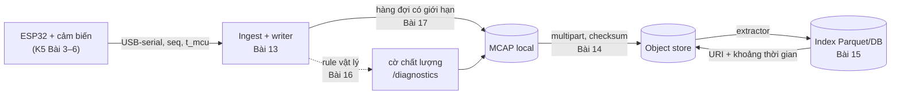
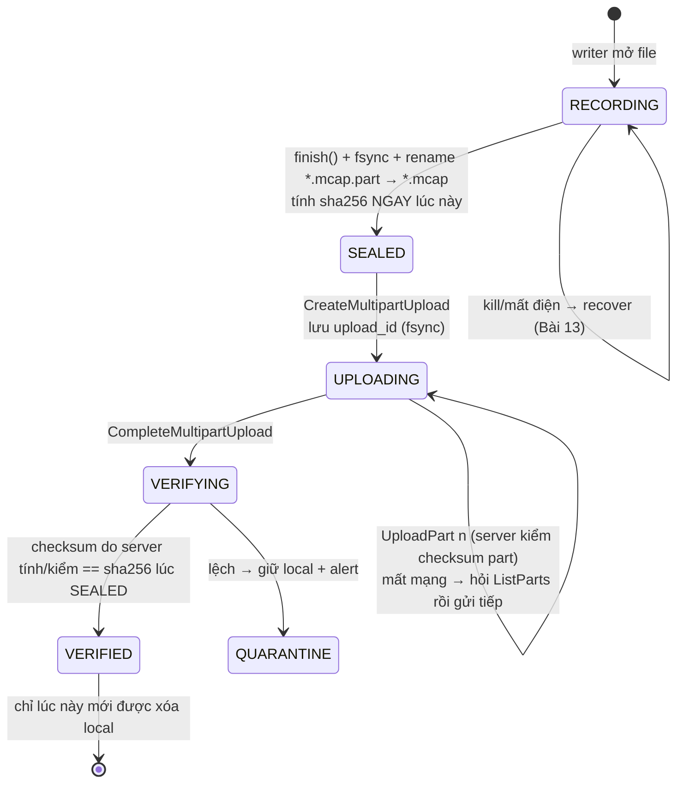
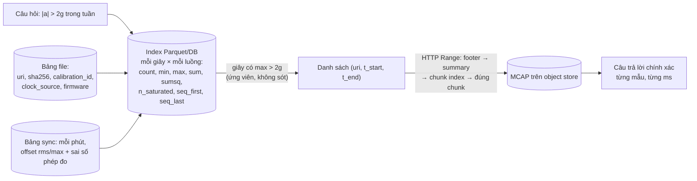
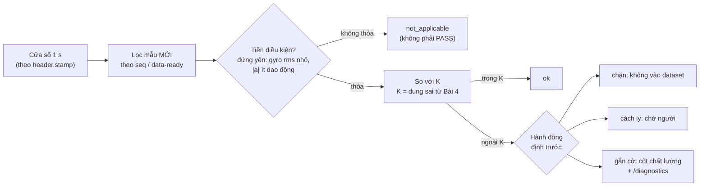

# Khóa 5 · Module 3 — Data stack (50h, trần cứng 55h)

Nguồn: `khoa-5-sensor-timesync-platform.md` (Module 3), `00-lo-trinh-tong.md` (M7, mục 7.3), `CONVENTIONS.md`, bản Gemini K5 (Bài 13–17). Cả năm bài dùng khung đầy đủ: đây là phần "đúng nghề" của bạn, nên giá trị không nằm ở công cụ mà nằm ở **chỗ trực giác backend gãy khi gặp dữ liệu vật lý**.

**Ràng buộc tự áp từ Bài 2, giữ nguyên:** module này không được vượt 55h. Nếu vượt, cắt tính năng, không cắt Module 2. Số đo sync là deliverable, platform là vỏ. Nếu chạm trần 200h của cả khóa, Gate cho phép cắt Module 3 xuống MVP (chỉ MCAP + validation, bỏ object store và DB).

| Bài | Giờ | Viên nang nền cần trước | Quyết định ra được |
|---|---|---|---|
| 13 — Ingest nhiều luồng khác tần số vào MCAP | 14 | F3.1, F3.2, F3.3, F3.4, F4.6 | Mỗi luồng đóng dấu bằng clock nào, ghi ở trường nào; khi ghép thì as-of hay nội suy, dung sai bao nhiêu ms |
| 14 — Upload resumable và object store | 10 | F3.5, F7.1 | Khi nào được xóa file local; key đặt thế nào để retry vô hại; dung lượng đệm cần bao nhiêu ngày mất mạng |
| 15 — Index và truy vấn | 10 | F3.6, F3.8 | Cái gì vào index, tóm tắt bằng thống kê nào, cái gì chỉ sống trong MCAP |
| 16 — Validation theo vật lý | 10 | F3.7, F2.1, F1.1, F1.4 | Rule nào chặn dữ liệu, rule nào chỉ gắn cờ, ngưỡng lấy từ đâu |
| 17 — Backpressure và drop policy | 6 | F3.9, F7.1 | Khi tràn thì bỏ luồng nào, bỏ cũ hay mới hay thưa ra, và ghi lại ở đâu |



---

## Bài 13 — Ingest nhiều luồng khác tần số vào MCAP (14h)

> **Vị trí:** K5 Bài 11–12 (rig 2 camera + IMU, ngân sách sai số) → **Bài 13** → Bài 14 (đưa file lên object store) · **Cần trước:** F3.1 (log là trung tâm), F3.2 (schema, file tự mô tả), F3.3 (event time vs processing time), F3.4 (ghép luồng khác tần số), F4.6 (thời điểm của một phép đo), K2 Bài 4, 7, 8b (cấu trúc MCAP, file bị cắt, converter sang `sensor_msgs/Imu`) · **Sau bài này bạn quyết định được:** với mỗi luồng, timestamp nào là "sự thật" (`header.stamp` theo clock nguồn) và timestamp nào chỉ là nhật ký (`log_time`); khi ghép camera 30 Hz với IMU 200 Hz thì dùng as-of hay nội suy, và kết quả ghép đáng tin tới mức bao nhiêu ms.

**Câu hỏi của bài:** làm sao ghi ba luồng 200 Hz, 30 fps, 1 Hz vào một file mà vẫn truy vấn được, và vẫn ghép lại được cho đúng?

### 1. Câu chuyện — ai đã khổ vì chuyện này

Thị trường chứng khoán Mỹ có hai luồng dữ liệu khác nhịp: **giao dịch** (trade, xảy ra thưa và không đều) và **báo giá** (quote, cập nhật dày hơn nhiều). Để biết một giao dịch là bên mua hay bên bán chủ động, nhà nghiên cứu ghép mỗi trade với báo giá "đang hiệu lực" tại cùng thời điểm, rồi so giá trade với điểm giữa bid/ask. Lee và Ready (1991, *Journal of Finance*, "Inferring Trade Direction from Intraday Data") phát hiện hai luồng này được ghi bởi hai quy trình khác nhau với độ trễ ghi khác nhau: báo giá thường được ghi **trước** trade mà chính nó gây ra. Ghép theo timestamp ngây thơ thì trade bị so với báo giá đã cập nhật sau nó, và phân loại mua/bán sai hàng loạt. Đề xuất của họ là dùng báo giá cũ hơn trade ít nhất 5 giây. Các nghiên cứu sau trên dữ liệu mới hơn thấy độ trễ đúng đã khác hẳn vì hệ thống ghi đã khác [chuẩn — lịch sử vi cấu trúc thị trường; chi tiết các nghiên cứu sau: tự tra].

Bài học không nằm ở con số 5 giây. Nó nằm ở chỗ: **độ lệch giữa hai luồng là thuộc tính của đường ghi, không phải hằng số của tự nhiên**, và nếu không đo nó thì mọi phép ghép đều sai một lượng không biết. Ngành tài chính phát triển hẳn một phép toán cho việc này: **as-of join** (`aj` trong kdb+/q, `merge_asof` trong pandas, `ASOF JOIN` trong DuckDB/ClickHouse). Robot của bạn có đúng bài toán ấy, chỉ khác ở thang thời gian: không phải 5 giây mà vài mili-giây, và không phải giá cổ phiếu mà là vận tốc góc của một vật đang quay.

### 2. Mô hình tư duy

Mỗi message có **hai thời gian**, và chúng trả lời hai câu hỏi khác nhau:

| Trường | Trả lời câu hỏi | Clock nào | Dùng để |
|---|---|---|---|
| `header.stamp` | Thế giới ở trạng thái này **lúc nào**? (event time) | Clock nguồn: timer ESP32 đã quy đổi theo mô hình offset/drift từ Module 2, hoặc PHC/system clock đã PTP-sync | Ghép luồng, fusion, training |
| MCAP `log_time` | Writer nhận message này **lúc nào**? (processing time) | Clock của mini PC tại writer | Index trong file, chẩn đoán trễ, tìm lỗ hổng do writer |
| MCAP `publish_time` | Publisher gửi đi lúc nào | Clock của publisher | Thường bằng `log_time` khi bạn tự ghi; **không** nhét thời điểm đo vào đây |
| MCAP `sequence` + `/diagnostics` | Có mất message nào giữa nguồn và writer không? | Bộ đếm của MCU | Phát hiện mất gói độc lập với mọi clock |

```
event time (header.stamp, theo clock nguồn)
IMU 200 Hz  |·|·|·|·|·|·|·|·|·|·|·|·|·|·|·|·|·|·|·|·|·|·|·|·|·|·|·|·|·|   mỗi 5 ms
Cam 30 Hz   |      exp      |      exp      |      exp      |               mỗi 33.3 ms, mốc = giữa phơi sáng?
Env 1 Hz    |                                                    ...       mỗi 1 s

processing time (log_time, lúc writer nhận)
IMU         ·  ·· ·  ···   ·  ·· ·  ···     <- đến theo cụm USB, trễ 1–vài ms, jitter
Cam                      ▓          ▓           <- frame đến sau khi phơi sáng + đọc + nén + USB: trễ hàng chục ms
Env                                        ·
            └── một cửa sổ 10 s theo log_time KHÔNG chứa đúng các mẫu của 10 s theo event time ──┘
```

Ba hệ quả, mỗi cái là một quyết định thiết kế:

1. **Index của MCAP xây trên `log_time`**, còn câu hỏi của người dùng ("cho tôi 10 giây quanh cú va") là theo event time. Muốn đọc đủ cửa sổ `[t, t+10]` theo `header.stamp`, bạn phải đọc `log_time` trong `[t − ε₁, t + 10 + L_max]`, với `L_max` là độ trễ lớn nhất từ lúc đo tới lúc ghi của luồng chậm nhất. `L_max` chính là khái niệm **watermark / allowed lateness** của xử lý luồng (→ F3.3): một giới hạn trên của độ muộn mà bạn **đo** được, không đoán.
2. **Ghép hai luồng khác tần số** (→ F3.4) có hai nguồn sai số cộng vào nhau. Sai số do lệch đồng hồ δ: e₁ ≈ |dx/dt| · δ. Sai số do phương pháp ghép: as-of (lấy mẫu gần nhất trước đó) trễ trung bình nửa chu kỳ IMU; nội suy tuyến tính có sai số cỡ (h²/8)·|d²x/dt²| với h = 5 ms. Cái nào trội phụ thuộc vào δ bạn đo được ở Bài 8–11.
3. **Writer giữ chunk đang ghi trong RAM.** Chunk là đơn vị nén và đơn vị index, nên chunk to thì nén tốt, index gọn, nhưng **bán kính vụ nổ** khi process chết cũng to. Kích thước chunk là một nút vặn đánh đổi, không phải mặc định để quên.

Mô phỏng đồ chơi cho hệ quả số 2. Chạy trước khi đụng phần cứng; đây là thứ cho bạn trực giác "lệch bao nhiêu ms thì phương pháp ghép không còn quan trọng".

```python
# [đã chạy] Sai số căn chỉnh khi ghép IMU 200 Hz vào mốc camera 30 Hz
import numpy as np, matplotlib
matplotlib.use("Agg")
import matplotlib.pyplot as plt

rng = np.random.default_rng(1)
def gyro(t):  # tín hiệu "thật": cử động tay 1.5 Hz + rung 12 Hz (rad/s)
    return 2.0*np.sin(2*np.pi*1.5*t) + 0.3*np.sin(2*np.pi*12*t)

T = 60.0
t_imu = np.arange(0, T, 1/200) + rng.normal(0, 50e-6, int(T*200))   # jitter đóng dấu ~50 µs
x_imu = gyro(t_imu) + rng.normal(0, 0.005, t_imu.size)               # nhiễu cảm biến
t_cam = np.arange(0.5, T-0.5, 1/30)                                   # mốc camera (thời điểm thật)

def asof(tq):      # lấy mẫu gần nhất TRƯỚC tq (merge_asof direction="backward")
    i = np.searchsorted(t_imu, tq, side="right") - 1
    return x_imu[i]
def nearest(tq):
    i = np.clip(np.searchsorted(t_imu, tq), 1, t_imu.size-1)
    j = np.where(np.abs(t_imu[i-1]-tq) < np.abs(t_imu[i]-tq), i-1, i)
    return x_imu[j]
def linear(tq):
    return np.interp(tq, t_imu, x_imu)

offsets_ms = [0, 0.5, 1, 2, 5, 10, 20, 33]
truth = gyro(t_cam)
print("offset_ms  asof_rms  nearest_rms  linear_rms   (rad/s)")
res = {k: [] for k in ("asof", "nearest", "linear")}
for d in offsets_ms:
    tq = t_cam + d/1000           # camera bị gán nhãn lệch d ms so với thật
    for name, f in (("asof", asof), ("nearest", nearest), ("linear", linear)):
        res[name].append(np.sqrt(np.mean((f(tq) - truth)**2)))
    print(f"{d:8.1f}  {res['asof'][-1]:8.4f}  {res['nearest'][-1]:11.4f}  {res['linear'][-1]:10.4f}")

for name in res:
    plt.loglog(np.array(offsets_ms[1:]), res[name][1:], "o-", label=name)
plt.xlabel("độ lệch đồng hồ camera↔IMU (ms)"); plt.ylabel("RMS sai số (rad/s)")
plt.legend(); plt.grid(True, which="both"); plt.show()
```

Đọc kết quả: tìm độ lệch mà tại đó ba đường gần như trùng nhau. Bên trái điểm đó, phương pháp ghép quyết định; bên phải, chỉ đồng hồ quyết định. Một chi tiết đáng để ý: 200/30 = 20/3, nên mốc camera chỉ rơi vào **ba** pha khác nhau trong chu kỳ IMU, lặp lại mỗi 3 frame. Sai số của as-of vì thế không ngẫu nhiên mà có cấu trúc. Hai tần số có tỉ số hữu tỉ đơn giản tạo ra mẫu hình lặp; người thiết kế rig thường không để ý điều này.

### 3. Cầu nối từ backend

| Backend bạn biết | Ở đây | Gãy ở chỗ | Nếu dùng nhầm thì |
|---|---|---|---|
| Kafka topic/partition, offset | MCAP channel, `sequence`, chunk | Kafka offset do broker cấp nên không bao giờ thiếu; `sequence` ở đây do **MCU** cấp, và lỗ hổng trong nó là dữ liệu đã mất trước khi tới writer | Tin rằng "file đầy đủ vì không có lỗi ghi", trong khi USB đã rớt gói từ trước |
| Kafka `CreateTime` vs `LogAppendTime` | `header.stamp` vs `log_time` | `CreateTime` thường là wall clock của producer đã NTP-sync. Ở đây clock nguồn là timer MCU đếm µs từ lúc boot, trôi hàng chục ppm; phải quy đổi qua một **mô hình** offset/drift, và mô hình đó là một artifact có version (`clock_source`) | Sort/ghép theo `log_time` cho "tiện", nhúng jitter USB (vài ms) vào dữ liệu fusion |
| Stream join có cửa sổ (Flink interval join) | As-of join + nội suy | Join trong backend ghép **sự kiện rời rạc** theo khóa; không ai nội suy giữa hai đơn hàng. Tín hiệu vật lý **liên tục**, nên nội suy hợp lệ, nhưng chỉ cho đại lượng liên tục: không nội suy `range_status`, không nội suy ảnh, quaternion phải dùng slerp | Nội suy cờ trạng thái ra giá trị vô nghĩa; hoặc ngược lại, dùng as-of cho tín hiệu nhanh và mang theo sai số nửa chu kỳ |
| Schema registry (Avro/Protobuf) | Schema nhúng trong từng file MCAP | Không có registry trung tâm; mỗi file mang schema của chính nó. Tương thích được kiểm khi **đọc**, bởi reader cụ thể | Đổi field trong message chuẩn (cấm) thay vì thêm khóa metadata, làm Foxglove/rosbag2 không đọc được |
| Kafka không fsync từng message, dựa vào replication | Writer MCAP không fsync, không có replica | Robot không có broker thứ hai. `kill -9` mất chunk đang trong RAM của process; **mất điện** mất thêm phần đã `write()` nhưng còn trong page cache | Kết luận "kill -9 không mất gì nên an toàn khi mất điện" (đây là hai thí nghiệm khác nhau, cái sau ở Bài 14) |

**Chấm mô hình:**

- *"Timestamp là timestamp; cứ sort theo nó là xong."* — **SAI.** Trong file có ít nhất hai thời gian đến từ hai clock khác nhau, và một trong hai clock (MCU) không cùng gốc, không cùng tốc độ với clock kia. Phản ví dụ: ESP32 đóng dấu bằng `esp_timer` (µs từ lúc boot); nếu bạn ghi thẳng giá trị đó vào `header.stamp` thì mọi message IMU nằm ở năm 1970, Foxglove vẽ hai luồng cách nhau 56 năm.
- *"Nội suy tuyến tính luôn tốt hơn lấy mẫu gần nhất."* — **ĐÚNG MỘT PHẦN.** Đúng khi độ lệch đồng hồ đã được bù tới dưới khoảng một chu kỳ IMU và tín hiệu liên tục. Gãy khi: δ lớn (sai số đồng hồ trội, phương pháp ghép hết ý nghĩa — mô phỏng trên cho thấy điểm đó), dữ liệu rời rạc, hoặc ứng dụng cần **nhân quả** (một bộ điều khiển chạy online không được dùng mẫu tương lai; nội suy dùng mẫu sau t, as-of thì không). Phản ví dụ: trong replay để train policy, nội suy "nhìn trước" 5 ms của IMU là rò rỉ thông tin mà robot thật lúc chạy không có.
- *Mô hình của bạn ở K3 lượt 6: "luôn phải có buffer để ổn định… đánh đổi bằng RAM".* — **ĐÚNG MỘT PHẦN.** Đúng là buffer có mặt ở mọi ranh giới. Thiếu hai thứ: (1) buffer **tăng** trễ chứ không giảm (độ trễ trung bình qua buffer = số phần tử trong buffer / tốc độ vào, chính là định luật Little L = λW, → F7.1); (2) buffer còn là **lượng dữ liệu mất khi chết**. Chunk 1 MiB của MCAP vừa là buffer nén vừa là bán kính vụ nổ của `kill -9`.

### 4. Thuật ngữ

| Mức | Thuật ngữ | Nghĩa trong một câu | Hay bị hiểu nhầm thành |
|---|---|---|---|
| 🟢 | Event time / processing time | Lúc sự việc xảy ra / lúc hệ thống xử lý nó | Cùng một thứ nếu "mạng nhanh" |
| 🟢 | As-of join | Ghép mỗi bản ghi với bản ghi gần nhất **không muộn hơn** nó của luồng kia | Join bằng nhau trên timestamp (gần như không bao giờ khớp) |
| 🟢 | `header.stamp` / `log_time` / `publish_time` | Thời điểm đo / lúc writer nhận / lúc publisher gửi | `publish_time` là chỗ để thời điểm đo (Gemini mắc lỗi này) |
| 🟢 | Chunk, message index, summary, footer | Khối message nén chung; chỉ mục thời gian→offset; phần cuối file chứa chunk index và thống kê | Summary là bắt buộc để đọc được file (không: thiếu summary vẫn đọc tuần tự được) |
| 🟢 | CDR | Định dạng tuần tự hóa nhị phân của DDS/ROS 2, có căn lề (alignment) | "Nhỏ gọn như Protobuf" (không có varint, có padding) |
| 🟢 | Covariance = −1 ở phần tử đầu | Quy ước của `sensor_msgs/Imu`: "không có ước lượng cho đại lượng này" | Covariance toàn 0 (nghĩa là "không biết covariance", khác hẳn) |
| 🟡 | Watermark / allowed lateness | Giới hạn trên của độ muộn, sau mốc đó coi như cửa sổ đã đủ | Timeout mạng |
| 🟡 | Slerp | Nội suy cầu cho quaternion | Nội suy tuyến tính từng thành phần rồi chuẩn hóa (chấp nhận được khi góc nhỏ) |
| 🟡 | micro-ROS | ROS 2 client chạy trên MCU, nói chuyện với host qua agent | Thay thế được việc đo đồng hồ (không: nó vẫn cần đồng bộ thời gian) |
| 🔴 | Nội dung chi tiết của rosbag2 storage plugin API | Cách viết plugin lưu trữ mới | Cần để dùng MCAP |

### 5. Dự đoán

Viết `prediction.md`, commit, rồi mới làm phần 6.

**Đề 1 — kích thước.** Tính số byte mỗi message và MB/giờ của từng luồng **khi dùng message chuẩn**, chưa nén.
- Tra định nghĩa `sensor_msgs/msg/Imu`, `Range`, `Temperature`, `FluidPressure`, `RelativeHumidity`, `CompressedImage` (`ros2 interface show sensor_msgs/msg/Imu` trong container `ros:jazzy`, hoặc repo `ros2/common_interfaces` nhánh `jazzy`).
- Quy tắc CDR: 4 byte encapsulation header; `int32/uint32` căn lề 4, `float64` căn lề 8 (tính từ sau encapsulation); `string` = 4 byte độ dài + nội dung + byte `\0`; mảng cố định `float64[9]` không có tiền tố độ dài.
- Overhead mỗi Message record trong MCAP: opcode (1) + độ dài record (8) + channel id (2) + sequence (4) + log_time (8) + publish_time (8). Tra lại ở MCAP spec, mục "Message".
- Camera: tự đo kích thước JPEG trung bình ở độ phân giải bạn dùng (`v4l2-ctl --list-formats-ext`, chụp 30 frame, lấy trung bình).
- So con số IMU của bạn với dòng "IMU 200 Hz × ~50 byte ≈ 36 MB/giờ" trong bản gốc. Nếu khác, giải thích vì sao.

**Đề 2 — nén.** Dự đoán tỉ lệ nén zstd cho luồng IMU và cho luồng JPEG. Phương pháp: phần nào của message `Imu` gần như không đổi giữa các mẫu (covariance, frame_id, quaternion)? Entropy của JPEG đã nén còn lại bao nhiêu?

**Đề 3 — `kill -9`.** Dự đoán lượng dữ liệu mất mỗi lần, tính bằng **giây** của từng luồng. Phương pháp: tra `chunk_size` mặc định của writer bạn dùng (Python `mcap`: tham số của `Writer.__init__`; rosbag2: tham số storage config của plugin MCAP), chia cho tốc độ byte gộp của mọi luồng đang ghi vào **cùng** chunk.

**Đề 4 — truy vấn 10 giây.** Dự đoán tỉ số thời gian đọc 10 s qua index so với scan cả file 1 giờ. Thêm: để có **đủ** mọi frame camera có `header.stamp` trong cửa sổ, cần nới cửa sổ `log_time` thêm bao nhiêu ms? (Tra độ trễ camera đã đo ở Bài 11.)

**Đề 5 — ghép.** Với độ lệch camera↔IMU bạn đã đo ở Bài 11 (sau khi bù bằng LED) và tốc độ góc RMS khi rig được cầm tay di chuyển, dự đoán sai số RMS của vận tốc góc gán cho mỗi frame theo as-of và theo nội suy tuyến tính. Công thức ở phần 2.

```markdown
# prediction.md — K5 Bài 13
Ngày: ____  Commit: ____
## Đề 1: byte/message (CDR) và MB/giờ chưa nén
| Luồng | byte CDR | + overhead MCAP | Hz | MB/giờ |
| IMU | | | 200 | |
| ToF Range | | | 30 | |
| Env (3 msg) | | | 1 | |
| Camera ×2 | (đo JPEG) | | 30 | |
Vì sao khác 36 MB/giờ: ____
## Đề 2: tỉ lệ nén zstd — IMU: __×, JPEG: __×. Lý do: ____
## Đề 3: chunk_size = ____ ; tốc độ gộp = ____ B/s ; mất ≈ ____ s mỗi lần kill
## Đề 4: index nhanh hơn scan __ lần; nới cửa sổ log_time thêm __ ms vì ____
## Đề 5: δ = __ ms, |ω|rms = __ rad/s → e_asof ≈ __, e_linear ≈ __ rad/s
## Độ tự tin (1–5) cho từng đề: __
```

### 6. Làm

Giữ đủ bảy bước của bản gốc; thêm bước 4b (ghép) vì đó là chỗ bài này trả lời câu hỏi "vẫn dùng được không", không chỉ "vẫn mở được không".

**Bước 1 — Quy ước (≈1h).** Viết mục "sensor topics" trong `CONVENTIONS.md`: topic, kiểu message, `frame_id`, tần số, `clock_source`, cách điền covariance. Bảng mục 3 của `CONVENTIONS.md` đã có khung, bổ sung theo thực tế:
- `/imu/data_raw` (`sensor_msgs/msg/Imu`): `orientation_covariance[0] = -1` vì bạn không ước lượng hướng [spec — chú thích trong `Imu.msg`]; covariance gia tốc và gyro điền **phương sai đo được ở Bài 4** lên đường chéo.
- `/tof/range` (`sensor_msgs/msg/Range`): `radiation_type = INFRARED` (VL53L1X dùng laser hồng ngoại 940 nm [spec — datasheet VL53L1X]); `min_range`/`max_range` lấy từ datasheet ở chế độ bạn cấu hình; trường `variance` có trong bản Jazzy [tự đo — `ros2 interface show` để chắc].
- Metadata có version từ đầu: `metadata_version`, `calibration_id`, `clock_source`, `source_device_id`, `firmware_version` (mục 4 `CONVENTIONS.md`). Quy tắc ghi: thông tin tĩnh của cả file vào một **Metadata record** (ví dụ tên `sensor_metadata`); thông tin tĩnh theo luồng vào **metadata của Channel**. Nếu `calibration_id` đổi giữa chừng, **cắt file mới**, đừng sửa metadata của channel đã ghi.
- Tùy chọn (+3h, rất đáng): micro-ROS trên ESP32-S3 thay giao thức tự chế. Nếu làm, ghi lại: timestamp do ai gán (MCU hay agent trên host)? Đây chính là câu hỏi `clock_source`. [tự đo — API micro-ROS đổi theo bản, kiểm theo phiên bản bạn cài]

**Bước 2 — Writer (≈3h).** Một process ghi cả ba luồng (IMU, ToF, env) cộng hai camera vào **một** MCAP, mỗi luồng một channel. Hai đường đều hợp lệ: `ros2 bag record -s mcap` nếu dữ liệu đã đi qua ROS 2 topic; hoặc writer Python `mcap` + `mcap-ros2-support` nếu bạn đọc serial trực tiếp (đã dùng ở K2 Bài 8b).
- `header.stamp` = thời điểm đo theo clock nguồn, đã quy đổi về epoch bằng mô hình offset/drift của Module 2. Ghi rõ mô hình đang dùng (tham số, thời điểm ước lượng) vào metadata.
- `log_time` = lúc writer nhận, đọc từ `CLOCK_REALTIME` của mini PC (đã PTP/chrony sync). Cùng lúc ghi thêm `CLOCK_MONOTONIC` nếu bạn muốn đo trễ không bị ảnh hưởng bởi bước nhảy đồng hồ [chuẩn — → F4.3].
- `sequence` của MCAP Message record = số thứ tự MCU gửi. Mất gói phát hiện ở tầng truyền thì ghi vào `/diagnostics` (`diagnostic_msgs/msg/DiagnosticArray`) như `CONVENTIONS.md` mục 4 quy định.

**Bước 3 — Đo chi phí ghi (≈2h).** Chạy 1 giờ ở mỗi cấu hình: không nén, zstd, lz4. Đo throughput tối đa (msg/s và MB/s), CPU (`pidstat -u -p <pid> 1`), kích thước file/giờ. Sai số dụng cụ: `pidstat` lấy mẫu mỗi 1 s, nên CPU của một luồng nén ngắn (vài chục ms mỗi chunk) bị làm tròn theo trung bình; đọc cột trung bình 60 s, không đọc từng dòng. Kích thước file: lấy sau khi writer đã `finish()`, vì summary được ghi ở cuối.

**Bước 4 — Truy vấn 10 giây (≈2h).** Đọc 10 giây bất kỳ mà không scan cả file (đã làm ở K2 Bài 7; xác nhận vẫn đúng với file thật 1 giờ, nhiều channel). Làm **hai** phiên bản:
- (a) theo `log_time`: `reader.iter_messages(start_time=…, end_time=…)` dùng chunk index;
- (b) theo `header.stamp`: đọc `log_time` trong cửa sổ đã nới thêm `L_max`, decode, lọc theo `header.stamp`. Đo `L_max` của mỗi luồng = max(`log_time − header.stamp`) trên cả file. So số message của (a) và (b) trong cùng một khoảng 10 s.
- Đo thời gian: chạy mỗi truy vấn 5 lần, bỏ lần đầu (cache lạnh), báo median và min/max. Nếu muốn đo cache lạnh thật: `echo 3 | sudo tee /proc/sys/vm/drop_caches` trước mỗi lần (→ F1.3).

**Bước 4b — Ghép camera ↔ IMU (≈2h, nằm trong 14h; nếu thiếu giờ, rút từ bước 6).** Dùng file từ rig Bài 11. Với mỗi frame camera, gán vận tốc góc IMU theo ba cách: as-of (`pandas.merge_asof(direction="backward")`), nearest, nội suy tuyến tính. Ghép **hai lần**: một lần với offset camera↔IMU bạn đo được ở Bài 11 đã bù, một lần không bù. Không có "sự thật" để so, nên dùng một tín hiệu tự kiểm: chuyển động quay đều quanh trục quang của camera, ước lượng góc quay từ ảnh (vị trí LED hoặc một marker), so với tích phân gyro. Báo cáo sai số như một bảng hai chiều (cách ghép × có/không bù offset).

**Bước 5 — `kill -9` 10 lần (≈1.5h).** Script: chạy writer, đợi thời gian ngẫu nhiên 20–120 s, `kill -9`. Sau mỗi lần:
- `mcap info file.mcap` và `mcap doctor file.mcap` (CLI `mcap`) — ghi lỗi gì;
- `mcap recover file.mcap -o fixed.mcap` — số message cứu được;
- so với số message đã gửi (lấy từ `sequence` cuối cùng mà MCU log ra, hoặc log của chính writer ghi ra một file khác mỗi giây) → mất bao nhiêu message, bao nhiêu giây cho mỗi luồng.
- Ghi rõ: đây là thí nghiệm **process chết**, không phải **máy mất điện**. Page cache vẫn được kernel ghi xuống đĩa sau `kill -9`. Mất điện là Bài 14.

**Bước 6 — Foxglove (≈1h).** Mở file, panel Plot cho gia tốc 3 trục, Raw Messages để soi covariance và metadata, Image cho camera. Chụp màn hình. Kiểm tần số hiển thị của từng luồng bằng panel Topic hoặc Diagnostics.

**Bước 7 — Metadata v1 → v2 (≈1.5h).** Thêm một khóa (ví dụ `mount_orientation`). Test: reader cũ (viết cho v1) đọc file v2 không lỗi và bỏ qua khóa lạ; reader mới đọc file v1 và xử lý khóa thiếu bằng giá trị mặc định có ghi rõ. Chạy `ros2 bag info <file>.mcap` trong container `ros:jazzy` [tự đo — với bản Jazzy bạn cài, có thể cần trỏ vào thư mục bag hoặc thêm `-s mcap`]. File phải là một rosbag2 hợp lệ. Chạy thêm `mcap doctor` — `CONVENTIONS.md` mục 5 yêu cầu cả hai.

### 7. Số phải ra

<details><summary>🔒 MỞ SAU KHI COMMIT prediction.md</summary>

| Kiểm tra | Kết quả đúng | Ghi chú |
|---|---|---|
| File mở được trong Foxglove | Không lỗi, các luồng hiện đúng tần số | Giữ từ bản gốc |
| `sensor_msgs/Imu` CDR | **324 byte/message** với `frame_id = "imu_link"` | [đã chạy — `mcap-ros2-support` 0.5.7]. encapsulation 4 + stamp 8 + chuỗi `imu_link` 13 + padding 3 + quaternion 32 + 2 vector × 24 + 3 ma trận covariance × 72 |
| IMU trong MCAP, không nén | ≈ **370 byte/message → ≈ 265 MB/giờ** | Gồm overhead Message record (31 byte) và message index. **Gấp ~7 lần** con số 36 MB/giờ của bản gốc. 36 MB/giờ ứng với ≈ 50 byte/mẫu: cỡ gói thô từ MCU (6 × int16 + timestamp + header), không phải message chuẩn; ngay cả `ImuSample` Protobuf tự chế ở Khóa 2, khi điền đủ trường, đo được ≈ 190 byte (→ F3.2, mục 5) |
| IMU, zstd | ≈ 55–70 MB/giờ trên dữ liệu tổng hợp (×4–5) | [đã chạy, dữ liệu tổng hợp]. Covariance, quaternion, `frame_id` lặp lại y hệt nên nén rất tốt; dữ liệu thật của bạn sẽ khác vài chục phần trăm [tự đo] |
| JPEG, zstd | Gần như không giảm (×1.0–1.05) | Đã nén entropy; nén thêm chỉ tốn CPU. Giữ nguyên kết luận bản gốc |
| Sau `kill -9` | File đọc được bằng đọc tuần tự hoặc sau `mcap recover`; mất **tối đa khoảng một chunk** | Python `mcap` 1.5.0 mặc định `chunk_size = 1 MiB` [spec — chữ ký `Writer.__init__`]. Thử nghiệm của người soạn: ghi 200 800 message, cứu được 199 452 (chunk dở bị mất). Đổi ra giây: nếu chỉ có IMU ≈ 1 MiB / (370 B × 200/s) ≈ **14 s**; có thêm 2 camera JPEG ~45 kB thì tốc độ gộp ~2.8 MB/s và một chunk chỉ còn ≈ **0.4 s** |
| Truy vấn 10 s qua index | Nhanh hơn scan cả file ít nhất một bậc | Tỉ số tăng theo độ dài file |
| (a) vs (b) | Số frame camera của (b) lệch so với (a) ở hai mép cửa sổ | Độ lệch = số frame có `log_time − header.stamp` vượt qua mép. Đây là watermark của bạn |
| Ghép (mô phỏng phần 2) | Không lệch: nội suy tuyến tính sai số ≈ nhiễu cảm biến, nearest lớn hơn ~6 lần, as-of ~12 lần. Từ ≈ **2–5 ms** trở lên: ba cách gần như trùng nhau, sai số ≈ |ω̇|rms · δ (ví dụ δ = 10 ms → ≈ 0.2 rad/s với tín hiệu mô phỏng có |ω̇|rms ≈ 21 rad/s²) | Kết luận dùng được: **bù offset trước, chọn phương pháp ghép sau**. Bù offset từ 20 ms về 1 ms đáng giá hơn mọi phương pháp nội suy |
| Reader v1 đọc file v2 | Thành công | Giữ từ bản gốc |

Vì sao lệch là bình thường: kích thước JPEG phụ thuộc cảnh và ánh sáng (một cảnh tối nhiều nhiễu có thể lớn gấp đôi); tỉ lệ nén IMU phụ thuộc số bit nhiễu thật; thời gian truy vấn phụ thuộc page cache.

</details>

### 8. Nếu ra khác

| Triệu chứng | Nguyên nhân khả dĩ | Kiểm bằng cách | Sửa |
|---|---|---|---|
| Foxglove vẽ IMU và camera cách nhau hàng chục năm | `header.stamp` của IMU là µs từ lúc boot ESP32, chưa quy đổi về epoch | In 5 giá trị `header.stamp` đầu của mỗi channel | Áp mô hình offset/drift của Module 2 ở ingest; ghi `clock_source` |
| Foxglove báo file unindexed hoặc mở rất chậm | Writer không gọi `finish()`, thiếu summary | `mcap info` báo thiếu summary | Dùng `with`/`try-finally`; xử lý SIGTERM để đóng file sạch |
| `ros2 bag info` báo encoding không hỗ trợ | Ghi `protobuf`/`json` thay vì `cdr` với schema `ros2msg` | `mcap info` liệt kê encoding từng channel | Dùng `mcap-ros2-support` hoặc rosbag2 |
| File 1 giờ lớn bất thường (vài GB) | Camera ghi `Image` raw thay vì `CompressedImage` | Kích thước trung bình message theo channel | Nén JPEG ở nguồn; hoặc giảm độ phân giải |
| Mất dữ liệu sau `kill -9` lớn hơn một chunk | Writer có hàng đợi nội bộ không giới hạn phía trước chunk, hoặc nhiều chunk dở do ghi nhiều file | So số message trong hàng đợi lúc kill (log) | Giới hạn hàng đợi (Bài 17); giảm `chunk_size` nếu bán kính vụ nổ quá lớn |
| Tần số IMU trong Foxglove thấp hơn 200 Hz đều đặn 1–3% | ODR thật của chip khác danh định (dao động nội) | Đếm `sequence` trên 600 s, chia cho thời gian theo clock đã sync | Không phải lỗi ghi. Ghi ODR đo được vào metadata (Bài 18 cần nó) |
| Ghép có bù offset vẫn sai nhiều hơn mô phỏng | Offset không hằng: drift theo nhiệt (Bài 10) hoặc thay đổi khi USB đổi lịch polling | Ước lượng offset theo từng cửa sổ 60 s (cross-correlation, → F4.6), vẽ theo thời gian | Mô hình offset theo thời gian thay vì hằng số |

### 9. Câu hỏi ngược

1. **[Nếu…thì]** Nếu bạn đổi clock nguồn của IMU từ timer ESP32 sang "thời điểm host nhận gói" vì code gọn hơn, thì phép đo nào của Module 2 bị vô hiệu, và sai số ghép ở bước 4b tăng lên cỡ bao nhiêu?
   <details><summary>Hướng nghĩ</summary>Jitter USB (đã đo ở Bài 6) đi thẳng vào `header.stamp`. Nó không chỉ làm lệch trung bình mà làm nhiễu từng mẫu, nên phép bù offset hằng không khử được. Đặt jitter đó vào công thức |ω̇|·δ.</details>
2. **[Vì sao không]** Vì sao không ghi mỗi luồng một file MCAP riêng cho đơn giản, rồi ghép khi đọc?
   <details><summary>Hướng nghĩ</summary>Nghĩ tới: một lần mở để xem cả rig trong Foxglove; tính nguyên tử khi upload (một file là một đơn vị bằng chứng); nhưng cũng nghĩ tới bán kính vụ nổ khi một luồng camera làm chunk phình. Có thiết kế nào lấy được cả hai không (ví dụ cắt file theo thời gian, mọi luồng chung file)?</details>
3. **[Quy mô]** Ở 100 robot × 8 giờ/ngày, cái gì gãy trước: dung lượng, CPU nén trên N100, số file nhỏ trên object store, hay số channel × metadata? Ước lượng từng cái bằng số bạn đo ở bước 3.
   <details><summary>Hướng nghĩ</summary>Bắt đầu từ MB/giờ của bạn × 800 giờ/ngày. Rồi hỏi: nén chạy trên robot hay trên server? Kích thước file khi cắt theo giờ ảnh hưởng thế nào tới số request PUT và tới thời gian liệt kê?</details>
4. **[Failure mode]** Liệt kê ba cách mà file vẫn qua `mcap doctor`, `ros2 bag info` và mở đẹp trong Foxglove, nhưng **không dùng được để train**.
   <details><summary>Hướng nghĩ</summary>Gợi ý: đơn vị đúng nhưng trục sai (REP-103), covariance toàn 0, `header.stamp` theo clock chưa sync, `calibration_id` trỏ tới bản hiệu chuẩn đã bị ghi đè. Mỗi cái thuộc Bài 16 hay Bài 15?</details>
5. **[Phản biện]** "Chunk nhỏ thì mất ít khi crash, vậy cứ đặt 64 kB." Phản biện bằng số.
   <details><summary>Hướng nghĩ</summary>Mỗi chunk có overhead index và một lần khởi động bộ nén; zstd nén kém hơn khi khối nhỏ; summary phình theo số chunk. Đo tỉ lệ nén và kích thước summary ở 64 kB, 1 MiB, 4 MiB rồi vẽ.</details>

### 10. Liên kết ra ngoài

- **Tài chính (TAQ, kdb+):** as-of join là phép toán hạng nhất của kdb+ (`aj`) vì mọi phân tích vi cấu trúc thị trường đều là ghép luồng khác nhịp. Giống: luồng thưa ghép vào luồng dày theo "giá trị đang hiệu lực". Khác: giá là đại lượng bậc thang (giữ nguyên tới lần cập nhật sau), nên as-of là **đúng**; vận tốc góc là đại lượng liên tục, nên as-of là **xấp xỉ**.
- **Thiên văn vô tuyến (VLBI):** các kính thiên văn cách nhau hàng nghìn km ghi tín hiệu kèm timestamp từ đồng hồ maser hydro tại chỗ, rồi ghép (correlate) **sau**, ở trung tâm xử lý. Giống: event time gắn tại nguồn, ghép offline, độ chính xác của ghép bị chặn bởi đồng hồ. Khác: họ ước lượng và hiệu chỉnh độ trễ của từng trạm như một tham số của phép ghép, đúng cái bạn làm ở bước 4b bằng LED, nhưng ở thang pico-giây [chuẩn].
- **Xử lý luồng (Dataflow/Flink):** watermark sinh ra vì Google gặp đúng vấn đề "cửa sổ theo event time bao giờ mới đủ dữ liệu" ở quy mô log toàn cầu. Khác: ở đó dữ liệu muộn có thể muộn hàng giờ (điện thoại offline); ở đây độ muộn bị chặn bởi phần cứng và đo được, nên watermark có thể là một hằng số có căn cứ.

### 11. Độ tin cậy và sửa lỗi

| Khẳng định | Nhãn | Ghi chú / cách kiểm |
|---|---|---|
| `sensor_msgs/Imu` CDR = 324 byte với `frame_id` 8 ký tự | [đã chạy] | Serialize bằng `mcap-ros2-support`; tự kiểm lại với `ros2 bag` |
| IMU 200 Hz không nén ≈ 265 MB/giờ trong MCAP | [đã chạy] + [tự đo] | Đo lại với writer và chunk size của bạn |
| Python `mcap` mặc định chunk 1 MiB, nén zstd | [spec] | `mcap` 1.5.0; kiểm theo phiên bản bạn cài |
| `orientation_covariance[0] = -1` khi không có ước lượng hướng | [spec] | Chú thích trong `sensor_msgs/msg/Imu.msg` (nhánh `jazzy`) |
| `Range` có `radiation_type` ULTRASOUND/INFRARED, giá trị ngoài `[min_range, max_range]` nên loại, ±Inf cho cảm biến khoảng cố định theo REP-117 | [spec] | Chú thích trong `Range.msg`; xem thêm Bài 16 |
| `mcap recover`, `mcap doctor` có trong CLI `mcap` | [spec] | `mcap --help` theo bản bạn cài |
| `ros2 bag info` đọc được file `.mcap` đơn lẻ trong Jazzy | [tự đo] | Cú pháp tham số có thể khác giữa các bản |
| Lee & Ready (1991) đề xuất trễ 5 giây giữa quote và trade | [chuẩn] | Bài báo gốc *Journal of Finance* 46(2) |

**Đã sửa so với bản gốc/Gemini:**
- Bản gốc (bảng "Số phải ra") và Gemini: "IMU 200 Hz × ~50 byte ≈ 36 MB/giờ". Sai với message chuẩn mà chính bài này bắt buộc: `sensor_msgs/Imu` là 324 byte CDR (vì ba ma trận covariance 9 × `float64`), ≈ 265 MB/giờ trong MCAP chưa nén. 50 byte cỡ gói thô từ MCU; `ImuSample` Protobuf của Khóa 2 khi đủ trường là ≈ 190 byte.
- Gemini: "`publish_time` (timestamp lúc cảm biến đo)". Sai ngữ nghĩa MCAP: thời điểm đo thuộc `header.stamp`; `publish_time` là lúc publisher gửi.
- Gemini: "`calibration_id`, `clock_source`, `sequence` … phải được lưu vào metadata của channel". `sequence` thay đổi theo từng message nên không thể nằm trong metadata tĩnh của channel; nó thuộc trường `sequence` của Message record và/hoặc `/diagnostics` (đúng như `CONVENTIONS.md` mục 4).
- Gemini: "cấu trúc append-only của MCAP bảo toàn dữ liệu khi mất điện" (diễn giải kết quả `kill -9`). `kill -9` không kiểm được mất điện: page cache vẫn được flush. Hai thí nghiệm tách riêng; mất điện ở Bài 14.
- Bổ sung so với bản gốc: phân biệt cửa sổ theo `log_time` và theo `header.stamp` (watermark), và bước 4b ghép camera↔IMU có đo sai số. Không đổi giờ (rút từ bước 6 nếu cần).
- **Sửa sau:** (lượt hợp nhất 10/2026, theo đo của F3.2) giải thích nguồn gốc con số 50 byte: không phải `ImuSample` Protobuf tự chế (đủ trường ≈ 190 byte) mà cỡ gói thô từ MCU. Kết luận "thiếu ~7 lần so với `sensor_msgs/Imu`" giữ nguyên.

### 12. Đọc thêm và tự kiểm tra

- **Nguồn gốc:** MCAP specification (mcap.dev, mục Records: Message, Chunk, Message Index, Summary, Footer); định nghĩa message trong repo `ros2/common_interfaces` nhánh `jazzy` (`sensor_msgs/msg/*.msg`).
- **Giải thích:** Tyler Akidau, Slava Chernyak, Reuven Lax — *Streaming Systems* (O'Reilly, 2018), chương 2–3 (event time, watermark).
- **Đào sâu (tùy chọn):** Akidau và cộng sự, "The Dataflow Model" (VLDB 2015); tài liệu `pandas.merge_asof` (tham số `direction`, `tolerance`).
- **Tự kiểm tra:** (1) giải thích lại cho một backend engineer khác trong 5 câu vì sao một message cần hai thời gian; (2) vẽ lại sơ đồ ASCII ở phần 2 từ trí nhớ; (3) hai câu dưới.

  (a) Bạn có cửa sổ 10 s theo `header.stamp` cần xuất cho training. Camera có `log_time − header.stamp` trong khoảng 40–90 ms, IMU 1–6 ms. Đọc cửa sổ `log_time` nào?
  <details><summary>Đáp án</summary>Từ t + 1 ms (độ trễ nhỏ nhất của mọi luồng) tới t + 10 s + 90 ms; an toàn hơn thì nới thêm biên cho đuôi phân bố trễ mà bạn chưa thấy, rồi lọc lại theo `header.stamp`. Đọc đúng `[t, t+10]` theo `log_time` sẽ mất các frame cuối và kéo vào vài frame của trước cửa sổ.</details>

  (b) Vì sao trường `variance` = 0 của `Range` và covariance toàn 0 của `Imu` là cùng một loại lỗi dữ liệu, và vì sao schema không bắt được?
  <details><summary>Đáp án</summary>Cả hai theo quy ước đều có nghĩa "không biết độ bất định", không phải "đo hoàn hảo". Về schema đó là `float64` hợp lệ. Downstream (EKF) sẽ tin phép đo tuyệt đối hoặc phải tự đoán. Bắt bằng rule ở Bài 16: covariance đường chéo phải > 0 và gần với phương sai đo được ở Bài 4.</details>

---

## Bài 14 — Upload resumable và object store (10h)

> **Vị trí:** Bài 13 (file MCAP local) → **Bài 14** → Bài 15 (index trỏ vào object store) · **Cần trước:** F3.5 (idempotency, exactly-once, upload resumable, ngữ nghĩa object store), F7.1 (hàng đợi, định luật Little), F2.5 (fault injection), Bài 13 (MCAP sau `kill -9`) · **Sau bài này bạn quyết định được:** điều kiện chính xác để được xóa một file local; key của object đặt thế nào để mọi lần retry đều vô hại; ổ đĩa robot phải chừa bao nhiêu GB cho bao nhiêu ngày mất mạng.

**Câu hỏi của bài:** làm sao đưa 24 GB/ngày lên storage qua một đường mạng hay đứt?

### 1. Câu chuyện — ai đã khổ vì chuyện này

Ngày 31/1/2017, một kỹ sư GitLab.com đang xử lý sự cố replication thì chạy lệnh xóa thư mục dữ liệu PostgreSQL trên nhầm máy: máy primary thay vì máy replica. Khi quay sang khôi phục, nhóm phát hiện các cơ chế backup mà họ tin là đang chạy đều không dùng được: bản `pg_dump` định kỳ thất bại âm thầm vì lệch phiên bản PostgreSQL, và email báo lỗi của nó bị chặn nên không ai thấy. Họ khôi phục từ một snapshot tình cờ được tạo khoảng 6 giờ trước đó cho môi trường staging, và mất khoảng 6 giờ dữ liệu production [chuẩn — postmortem công khai của GitLab, "Postmortem of database outage of January 31", 2/2017]. Bài học không phải "đừng gõ nhầm máy". Bài học là: **"backup đã chạy" và "dữ liệu khôi phục được" là hai mệnh đề khác nhau**, và chỉ mệnh đề thứ hai cho phép bạn xóa bản gốc.

Câu chuyện thứ hai là về chính object store. Trước 12/2020, Amazon S3 chỉ đảm bảo eventual consistency cho ghi đè, xóa và LIST: ghi xong rồi liệt kê có thể chưa thấy. Netflix viết `s3mper` (2014) và cộng đồng Hadoop viết S3Guard (dùng DynamoDB làm sổ phụ) chỉ để vá chỗ này. Từ 1/12/2020, S3 đảm bảo **strong read-after-write consistency** cho mọi PUT, DELETE và LIST, không tốn thêm tiền [spec — AWS What's New, 12/2020]. Hai bài học: ngữ nghĩa của store bạn dựa vào **thay đổi theo thời gian**, và "S3-compatible" là một dải chứ không phải một điểm. Mỗi store tương thích S3 (MinIO, Garage, SeaweedFS, Ceph RGW) phải được kiểm lại đúng những tính năng bạn dùng.

### 2. Mô hình tư duy

Mỗi file đi qua một **máy trạng thái**, và mỗi mũi tên phải bền qua mất điện. Trạng thái được lưu trên đĩa local, không trong RAM.



Bốn ý lõi:

1. **Checksum phải được tính càng gần nguồn càng tốt** (lúc niêm phong file), không phải lúc upload. Nếu bạn băm file ngay trước khi gửi, bạn chỉ chứng minh được "cái đã gửi bằng cái đã đọc", không chứng minh được "cái đã đọc bằng cái writer đã ghi". MCAP còn có CRC riêng cho từng chunk (bật mặc định trong writer Python) — một lớp bảo vệ khi dữ liệu nằm yên.
2. **Idempotency đến từ key, không từ request.** Đặt key theo nội dung (ví dụ `raw/<sha256>.mcap`, hoặc tên xác định từ robot + thời điểm + sha) thì retry bao nhiêu lần cũng ghi đè đúng nội dung ấy. S3 có thêm conditional write `If-None-Match: *` (từ 8/2024) để từ chối ghi đè một key đã tồn tại [spec — AWS What's New 8/2024; MinIO/Garage hỗ trợ tới đâu: tự đo].
3. **Nguồn sự thật về tiến độ upload là server**, không phải biến trong process. Khi khởi động lại, hỏi `ListParts` với `upload_id` đã lưu, rồi gửi phần còn thiếu. Mất mạng giữa part chỉ lãng phí tối đa một part.
4. **Hàng đợi upload là một bể chứa** (→ F7.1): nước vào đều (24 GB/ngày), ra theo mạng, tràn theo đĩa. Độ sâu bể sau một lần mất mạng dài T là ingest × T; thời gian rút cạn là backlog / (uplink − ingest). Nếu uplink trung bình nhỏ hơn ingest, bể không bao giờ cạn, chỉ là chưa tràn.

Mô phỏng chất lỏng của ý 4 (thay các hằng số bằng số của bạn):

```python
# [đã chạy] Hàng đợi upload là một bể chứa: vào đều, ra theo mạng, tràn theo đĩa
import numpy as np, matplotlib
matplotlib.use("Agg")
import matplotlib.pyplot as plt

IN_MBPS   = 24e3/86400           # 24 GB/ngày ≈ MB/s đi vào hàng đợi
UP_MBPS   = 5.0                  # băng thông upload thực tế khi có mạng (tự đo, MB/s)
FREE_GB   = 380                  # dung lượng dành cho buffer trên SSD 500 GB (trừ OS, dự trữ)
HIGH_WM   = 0.85                 # ngưỡng ngừng ghi có kiểm soát
dt = 60                          # bước 1 phút
t = np.arange(0, 14*86400, dt)
online = np.ones_like(t, bool)
online[(t > 2*86400) & (t < 2.5*86400)] = False     # mất mạng 12 h
online[(t > 5*86400) & (t < 9*86400)] = False       # mất mạng 4 ngày
online &= ~((t % 86400 > 8*3600) & (t % 86400 < 18*3600))  # chỉ có mạng ngoài giờ làm (kịch bản)

backlog, hist, stopped = 0.0, [], 0
for on in online:
    inflow = IN_MBPS*dt
    if backlog/1e3 > HIGH_WM*FREE_GB: inflow = 0; stopped += dt    # ghi dừng, KHÔNG xóa dữ liệu cũ
    out = min(backlog + inflow, UP_MBPS*dt) if on else 0
    backlog += inflow - out; hist.append(backlog/1e3)
print(f"ingest {IN_MBPS:.3f} MB/s; backlog max {max(hist):.0f} GB; thời gian ngừng ghi {stopped/3600:.1f} h")
print(f"đĩa đầy sau {HIGH_WM*FREE_GB*1e3/IN_MBPS/86400:.1f} ngày mất mạng liên tục")
plt.plot(t/86400, hist); plt.axhline(HIGH_WM*FREE_GB, ls="--")
plt.xlabel("ngày"); plt.ylabel("backlog (GB)"); plt.savefig("b14_backlog.png")   # trong bài: plt.show()
```

Và một uploader tối thiểu chứng minh ý 1–3, chạy được ngay trên laptop với S3 giả lập `moto`; thay client bằng endpoint MinIO/Garage để chạy thật:

```python
# [đã chạy] Upload multipart tiếp tục được sau khi chết; chỉ xóa local khi checksum khớp
import os, json, hashlib, boto3
from moto import mock_aws                      # S3 giả lập trong RAM; thay bằng endpoint MinIO/Garage khi chạy thật

PART = 5*1024*1024                             # S3: mọi part trừ part cuối ≥ 5 MiB
class Crash(Exception): pass

def sha256(path):
    h = hashlib.sha256()
    with open(path, "rb") as f:
        for b in iter(lambda: f.read(1 << 20), b""): h.update(b)
    return h.hexdigest()

def upload(s3, bucket, path, state_path, crash_after=None):
    st = json.load(open(state_path)) if os.path.exists(state_path) else {}
    if "sha256" not in st:                     # hash tính MỘT lần lúc niêm phong file, trước mọi lần upload
        st = {"sha256": sha256(path)}
        st["key"] = f"raw/{st['sha256']}.mcap" # key theo nội dung: retry ghi đè chính nó, vô hại
        st["upload_id"] = s3.create_multipart_upload(Bucket=bucket, Key=st["key"],
                                                     ChecksumAlgorithm="SHA256")["UploadId"]
        json.dump(st, open(state_path + ".tmp", "w")); os.replace(state_path + ".tmp", state_path)
    # Hỏi server đã có part nào (nguồn sự thật là server, không phải bộ nhớ của process)
    done = {p["PartNumber"]: p for p in s3.list_parts(Bucket=bucket, Key=st["key"],
                                                      UploadId=st["upload_id"]).get("Parts", [])}
    sent = 0
    with open(path, "rb") as f:
        n = 1
        while chunk := f.read(PART):
            if n not in done:
                r = s3.upload_part(Bucket=bucket, Key=st["key"], UploadId=st["upload_id"], PartNumber=n,
                                   Body=chunk, ChecksumAlgorithm="SHA256")   # server kiểm checksum từng part
                done[n] = {"PartNumber": n, "ETag": r["ETag"], "ChecksumSHA256": r["ChecksumSHA256"]}
                sent += 1
                if crash_after and sent == crash_after: raise Crash(f"chết sau part {n}")
            n += 1
    parts = [{k: done[i][k] for k in ("PartNumber", "ETag", "ChecksumSHA256") if k in done[i]}
             for i in sorted(done)]   # moto có thể không trả ChecksumSHA256 trong ListParts; S3 thật thì có
    s3.complete_multipart_upload(Bucket=bucket, Key=st["key"], UploadId=st["upload_id"],
                                 MultipartUpload={"Parts": parts})
    # Kiểm độc lập: tải về và băm lại (đắt nhưng không tin vào bất kỳ ETag/metadata nào)
    h = hashlib.sha256(s3.get_object(Bucket=bucket, Key=st["key"])["Body"].read()).hexdigest()
    if h != st["sha256"]: raise RuntimeError("checksum lệch: GIỮ file local, chuyển quarantine, alert")
    os.remove(path); os.remove(state_path)     # chỉ tới đây mới được xóa
    return st["key"], sent

with mock_aws():
    s3 = boto3.client("s3", region_name="us-east-1"); s3.create_bucket(Bucket="robot")
    with open("demo.mcap", "wb") as f: f.write(os.urandom(23*1024*1024))   # 5 part
    try: upload(s3, "robot", "demo.mcap", "demo.state", crash_after=2)
    except Crash as e: print("lần 1:", e)
    key, sent = upload(s3, "robot", "demo.mcap", "demo.state")
    print("lần 2: gửi thêm", sent, "part; key", key[:20] + "…; local còn:", os.path.exists("demo.mcap"))
```

Bước kiểm cuối (tải về và băm lại) là cách mạnh nhất và đắt nhất. Trên S3 thật, bạn có thể thay nó bằng **checksum do server kiểm**: gửi `ChecksumAlgorithm` cho mỗi part, server từ chối part nếu checksum không khớp; với multipart, AWS còn hỗ trợ checksum "full object" kiểu CRC (ví dụ CRC64NVME) để so trực tiếp với CRC bạn tính trên cả file [spec — AWS S3 User Guide, "Checking object integrity"]. Store tương thích S3 hỗ trợ tới đâu thì phải tự kiểm.

### 3. Cầu nối từ backend

| Backend bạn biết | Ở đây | Gãy ở chỗ | Nếu dùng nhầm thì |
|---|---|---|---|
| Transactional outbox | Thư mục `SEALED/` + file state là outbox | Outbox trong backend là bảng trong một DB đã replicate; mất máy vẫn còn bản khác. Ở robot, đĩa local là **bản duy nhất** cho tới lúc VERIFIED | Coi queue là "cache" có thể dựng lại, và xóa nó khi dọn đĩa |
| Idempotency key (kiểu Stripe) | Key theo nội dung | Stripe lưu key → kết quả ở server trong một thời hạn; S3 không khử trùng request. Idempotency phải nằm trong **tên** object | Key kiểu `upload-<timestamp-lúc-gửi>`: mỗi lần retry tạo một object mới, trùng dữ liệu, index (Bài 15) đếm đôi |
| Retry + exponential backoff + circuit breaker | Upload theo cửa sổ có mạng | Backend coi mất kết nối là sự cố ngắn. Robot mất mạng **hàng ngày**, có khi nhiều ngày; backoff phải có trần, và upload nên được lên lịch theo trạng thái (đang sạc, đang ở dock) | Backoff tăng tới hàng giờ; robot về dock 30 phút mà không upload byte nào |
| TLS đảm bảo toàn vẹn trên đường truyền | Checksum end-to-end | TLS chỉ bảo vệ đoạn giữa hai đầu socket. Hỏng xảy ra trước đó (đọc nhầm file, file bị cắt, bit lật trong RAM, lỗi ghép part) hoặc sau đó (lưu trữ) thì TLS không thấy | Bỏ checksum "vì đã có HTTPS", xóa local, mất dữ liệu mà không ai biết |
| ETag = MD5 của object | ETag multipart = MD5 của chuỗi MD5 các part, kèm hậu tố `-<số part>` | Không so được với MD5 của file local trừ khi tái tạo đúng cách chia part | So ETag với `md5sum`, thấy lệch, tưởng hỏng; hoặc tệ hơn, so với metadata do chính client gắn (`x-amz-meta-sha256`), vốn không được server kiểm |

**Chấm mô hình:**

- *"`upload_file()` trả về thành công thì xóa local được."* — **SAI.** Thành công chỉ nói request cuối cùng được server chấp nhận. Phản ví dụ: file đang được writer ghi dở (chưa SEALED) bị upload; upload thành công, object hợp lệ về HTTP nhưng là MCAP bị cắt. Điều kiện xóa phải là: object tồn tại + checksum server kiểm (hoặc tải về băm lại) bằng sha256 lúc niêm phong + trạng thái VERIFIED đã fsync.
- *"Retention trên robot là để tránh mài mòn phần cứng, không phải tối ưu chi phí"* (bản gốc). — **ĐÚNG MỘT PHẦN.** Đúng với thẻ SD và eMMC rẻ. Với SSD của mini PC thì gãy: 24 GB/ngày ≈ 8.8 TB/năm; một SSD 500 GB tiêu dùng thường được bảo hành vài trăm TBW [ước lượng — tra TBW của đúng SSD trong máy bằng model, đọc `smartctl -a` mục "Data Units Written" và "Percentage Used"], nên mài mòn tính bằng thập kỷ, kể cả nhân hệ số khuếch đại ghi 2–3. Ràng buộc thật trên N100 là **dung lượng**: bể tràn sau bao nhiêu ngày mất mạng.
- *"S3 eventual consistency nên sau khi upload phải đợi rồi mới kiểm."* — **SAI với AWS S3 từ 12/2020.** Còn đúng hay không với store khác thì phải đọc tài liệu của chính store đó và thử: ghi rồi `HEAD` và `LIST` ngay lập tức trong vòng lặp 1000 lần.

### 4. Thuật ngữ

| Mức | Thuật ngữ | Nghĩa trong một câu | Hay bị hiểu nhầm thành |
|---|---|---|---|
| 🟢 | Multipart upload | Chia object thành các part tải riêng, ghép bằng `Complete` | Nhiều object nhỏ |
| 🟢 | `upload_id`, `ListParts` | Định danh phiên upload dở; hỏi server đã nhận part nào | Thứ client tự nhớ là đủ |
| 🟢 | Idempotent | Làm lại nhiều lần cho cùng kết quả như một lần | "Không bao giờ chạy hai lần" |
| 🟢 | Content-addressed key | Tên object suy ra từ hash nội dung | Một kiểu đặt tên cho đẹp |
| 🟢 | Strong read-after-write | Ghi xong thì mọi lần đọc/LIST sau thấy ngay | Đúng với mọi store "S3-compatible" |
| 🟢 | Checksum end-to-end | Hash tính ở nguồn, kiểm ở đích sau khi lưu | Checksum của TLS hay của TCP |
| 🟡 | Conditional write (`If-None-Match`, `If-Match`) | Ghi chỉ khi điều kiện về object hiện tại đúng | Khóa phân tán |
| 🟡 | Lifecycle `AbortIncompleteMultipartUpload` | Dọn các upload dở bị bỏ quên, vốn vẫn chiếm dung lượng | Không cần vì part dở "không tính tiền" |
| 🟡 | TBW, write amplification | Tổng byte ghi được bảo hành; hệ số ghi thật / ghi logic | Tuổi thọ tính bằng "số lần ghi file" |
| 🔴 | Erasure coding nội bộ của object store | Cách store chia dữ liệu lên nhiều đĩa | Cần để dùng S3 API |

### 5. Dự đoán

**Đề 1 — bể chứa.** Với ingest đo được ở Bài 13 (MB/giờ gộp mọi luồng, sau nén), dung lượng trống thực tế trên SSD (`df -h`, trừ phần OS và dự trữ), và ngưỡng ngừng ghi bạn chọn: robot chịu được bao nhiêu ngày mất mạng liên tục trước khi phải ngừng ghi?

**Đề 2 — rút cạn.** Đo băng thông upload thực tế tới MinIO qua WiFi (`iperf3` rồi một lần upload 1 GB thật; hai con số sẽ khác). Sau 4 ngày mất mạng, cần bao lâu để rút cạn backlog nếu robot vẫn đang ghi?

**Đề 3 — lãng phí khi đứt mạng.** Với part size bạn chọn, mỗi lần đứt mạng lãng phí tối đa bao nhiêu byte? Phương pháp: một part đang bay dở + (tùy client) các part đang gửi song song.

**Đề 4 — rút điện.** Liệt kê mọi trạng thái mà file có thể ở khi rút điện (theo máy trạng thái phần 2). Với mỗi trạng thái, dự đoán: sau khi bật lại thì mất dữ liệu, trùng dữ liệu, hay không sao? Đặc biệt: điều gì xảy ra nếu bạn `rename` file state mà không `fsync` file trước đó?

**Đề 5 — mài mòn.** Tra TBW của SSD trong máy. Tính số năm tới TBW với ingest của bạn, giả định hệ số khuếch đại ghi 2.

```markdown
# prediction.md — K5 Bài 14
## Đề 1: ingest = __ GB/ngày, trống = __ GB, ngưỡng ngừng = __% → chịu __ ngày offline
## Đề 2: uplink iperf3 = __ MB/s, upload thật = __ MB/s → rút cạn 4 ngày backlog mất __ giờ
## Đề 3: part = __ MiB, song song = __ → lãng phí tối đa __ MiB/lần đứt
## Đề 4: bảng trạng thái × (mất / trùng / ổn) + lý do
## Đề 5: TBW = __ TB → __ năm
## Độ tự tin (1–5) từng đề: __
```

### 6. Làm

**Bước 1 — Object store local (≈1.5h).** MinIO local (hoặc S3), như bản gốc. Lưu ý trạng thái 10/2026: MinIO đã ngừng phát hành binary và Docker image dựng sẵn cho bản community từ khoảng 10/2025 và chuyển bản community sang chế độ bảo trì (12/2025) [spec — README repo `minio/minio` và tin InfoQ 12/2025; kiểm lại trạng thái hiện tại]. Ba lựa chọn cho lab: (a) dùng bản phát hành cuối cùng, **pin theo digest**; (b) build từ source; (c) dùng một store S3-compatible khác còn phát triển (Garage, SeaweedFS). Chọn cái nào cũng được, nhưng ghi vào `decisions.md` và chạy bài kiểm ngữ nghĩa nhỏ: PUT rồi HEAD/LIST ngay 1000 lần; multipart + `ListParts`; checksum theo part; `If-None-Match`. Ghi tính năng nào store của bạn hỗ trợ.

**Bước 2 — Upload resumable theo phần (≈2h).** Bắt đầu từ uploader ở phần 2. Thêm: hàng đợi nhiều file, upload theo thứ tự cũ trước, part size 8–64 MiB (≤10 000 part mỗi object, mọi part trừ part cuối ≥5 MiB [spec — AWS S3 User Guide, "Amazon S3 multipart upload limits"]), lifecycle rule dọn upload dở sau vài ngày.

**Bước 3 — Checksum hai đầu (≈1h).** sha256 tính lúc SEALED (hoặc do chính writer tính khi ghi); kiểm bằng checksum server hoặc tải về băm lại. **Chỉ xóa local khi khớp.** Lệch → chuyển `quarantine/`, alert, không xóa. Viết test: sửa một byte của object trên server sau khi upload (bằng `mc`/`aws s3 cp` đè), chạy lại bước kiểm, xác nhận file local còn.

**Bước 4 — Hàng đợi bền qua restart (≈1h).** Trạng thái lưu trên đĩa: hoặc thư mục theo trạng thái + file state JSON (ghi file tạm → `fsync` → `rename` → `fsync` thư mục), hoặc SQLite. SQLite ở chế độ mặc định (rollback journal, `synchronous=FULL`) đã chịu được mất điện [chuẩn — tài liệu SQLite "Atomic Commit"]; WAL cho hiệu năng ghi đồng thời, không phải "chống hỏng".

**Bước 5 — Ép hỏng (≈3h).** Như bản gốc, cộng cách gây lỗi cụ thể:
- **Ngắt mạng giữa upload 5 lần:** `sudo ip link set <iface> down` trong 30–300 s ngẫu nhiên, hoặc `tc qdisc add dev <iface> root netem loss 100%`. Ghi part nào đang bay.
- **Rút điện 3 lần:** rút jack DC, chọn thời điểm khác nhau: giữa part, ngay sau `Complete` trước khi ghi VERIFIED, giữa lúc writer đang ghi MCAP. BIOS Auto Power On đã bật (K3 Bài 16), service khởi động lại bằng systemd.
- **Làm đầy đĩa 1 lần:** đừng làm đầy đĩa hệ thống. Tạo một filesystem nhỏ riêng cho thư mục dữ liệu (`truncate -s 4G buf.img && mkfs.ext4 buf.img && sudo mount -o loop buf.img /data`), rồi `fallocate` lấp đầy. Writer phải ngừng ghi có kiểm soát ở ngưỡng, bắn alert, không crash, không xóa file chưa VERIFIED.

**Bước 6 — Đo (≈1.5h).** Throughput upload (MB/s, median của ≥5 file), thời gian phục hồi sau đứt (từ lúc mạng lên tới byte đầu tiên được gửi lại; sai số = chu kỳ thăm dò mạng của uploader), dung lượng hàng đợi tối đa chịu được (theo đề 1, kiểm bằng filesystem nhỏ ở bước 5 rồi nhân tỉ lệ).

### 7. Số phải ra

<details><summary>🔒 MỞ SAU KHI COMMIT prediction.md</summary>

| Kiểm tra | Kết quả đúng | Ghi chú |
|---|---|---|
| Ngắt mạng giữa upload | Tiếp tục từ chỗ dở, **không** upload lại từ đầu; lãng phí ≤ (số part song song) × part size | Giữ từ bản gốc |
| Rút điện giữa upload | Sau khởi động lại, hàng đợi còn nguyên, không mất file, không có object trùng nội dung dưới hai key | Trùng nội dung là dấu hiệu key không idempotent |
| Rút điện giữa lúc writer ghi | File đang ghi bị cắt; recover được tới chunk cuối đã xuống đĩa; mất nhiều hơn `kill -9` vì page cache chưa flush | Đối chiếu với Bài 13 |
| Checksum không khớp | File **không** bị xóa local, có alert, nằm trong `quarantine/` | Giữ từ bản gốc |
| Đĩa đầy | Ghi dừng có kiểm soát, có alert, **không** crash, không xóa file chưa VERIFIED | Giữ từ bản gốc |
| Bể chứa (mô phỏng, số giả định) | 24 GB/ngày ≈ 0.28 MB/s; 380 GB trống, ngưỡng 85% → ≈ 13 ngày offline | Thay bằng số đo của bạn |
| Mài mòn | 24 GB/ngày × 365 × WAF 2 ≈ 18 TB/năm; SSD vài trăm TBW → hàng chục năm | Kết luận: retention trên N100 là bài toán **dung lượng**, không phải mài mòn |
| Trạng thái rename không fsync | Sau mất điện có thể thấy file state rỗng hoặc cũ | Lý do của quy tắc ghi tạm → fsync → rename → fsync thư mục |

Vì sao lệch là bình thường: WiFi trong nhà có băng thông dao động theo giờ; MinIO/Garage chạy trên cùng mini PC cạnh tranh I/O với writer, nên throughput đo được thấp hơn khi store ở máy khác.

</details>

### 8. Nếu ra khác

| Triệu chứng | Nguyên nhân khả dĩ | Kiểm bằng cách | Sửa |
|---|---|---|---|
| Sau đứt mạng, upload lại từ part 1 | `upload_id` chỉ nằm trong RAM; hoặc client cấp cao (`upload_file`) tự tạo upload mới mỗi lần | Log `upload_id` trước/sau restart | Lưu `upload_id` bền; dùng API multipart cấp thấp |
| Object trùng nội dung dưới nhiều key | Key chứa thời điểm upload | `LIST` + so sha256 | Key theo nội dung hoặc theo định danh lúc SEALED |
| Checksum lệch dù file không hỏng | So ETag multipart với MD5 cả file | Đếm hậu tố `-N` của ETag | So bằng checksum đúng loại (part/full object) hoặc tải về băm lại |
| Dung lượng bucket lớn hơn tổng object | Upload dở bị bỏ quên | `ListMultipartUploads` | Lifecycle abort upload dở |
| File state rỗng sau mất điện | `rename` trước khi `fsync` nội dung | Đọc file state ngay sau boot | Ghi tạm → fsync → rename → fsync thư mục |
| Đĩa đầy làm writer crash | Ghi không kiểm `ENOSPC`, hoặc ngưỡng kiểm theo % đĩa hệ thống chứ không theo filesystem dữ liệu | `strace -e write` lúc lấp đầy | Kiểm `statvfs` của đúng mount point trước mỗi file mới; ngưỡng cao/thấp có trễ (hysteresis) |
| PUT xong LIST không thấy ngay | Store không strong-consistent cho LIST | Bài kiểm ở bước 1 | Không dựa vào LIST để quyết định xóa; dùng HEAD theo key |

### 9. Câu hỏi ngược

1. **[Nếu…thì]** Nếu bạn cho phép xóa file local khi đĩa đầy dù chưa VERIFIED (theo mức ưu tiên: video cũ trước), thì bản ghi về việc xóa đó phải nằm ở đâu để Bài 15 và Bài 18 vẫn tính đúng completeness?
   <details><summary>Hướng nghĩ</summary>Một file đã bị xóa không thể tự mang bản ghi về sự biến mất của nó. Nghĩ tới một manifest/tombstone được upload riêng, và tới việc completeness phải phân biệt "chưa từng ghi", "ghi rồi bị drop" và "ghi rồi bị xóa trước khi upload".</details>
2. **[Vì sao không]** Vì sao không upload trực tiếp từng message (streaming lên Kafka/Kinesis) thay vì file MCAP theo giờ?
   <details><summary>Hướng nghĩ</summary>Đặt hai thiết kế cạnh nhau theo: hành vi khi offline nhiều ngày, đơn vị kiểm checksum, chi phí mỗi request, khả năng mở bằng Foxglove, và chỗ nào dữ liệu nằm khi robot vừa mất điện. Có trường hợp nào streaming đáng giá (telemetry sức khỏe nhỏ)?</details>
3. **[Quy mô]** 100 robot cùng về dock lúc 18h và bắt đầu upload. Cái gì gãy trước: uplink của tòa nhà, số kết nối đồng thời vào store, hay đĩa của store? Bạn điều phối thế nào?
   <details><summary>Hướng nghĩ</summary>Tính tổng backlog × 100 rồi chia cho uplink. Nghĩ tới thundering herd và jitter khởi động, tới việc ưu tiên file nhỏ quan trọng (sự kiện, metadata) trước video.</details>
4. **[Failure mode]** Thiết kế một lỗi mà uploader của bạn **không** phát hiện được: mọi checksum đều khớp nhưng dữ liệu trên server vẫn sai.
   <details><summary>Hướng nghĩ</summary>Checksum chỉ chứng minh "giống cái đã niêm phong". Nếu cái đã niêm phong đã sai (writer ghi sai, đồng hồ sai, scale factor sai) thì sao? Đó là việc của Bài 16, và là ranh giới giữa toàn vẹn (integrity) và đúng đắn (validity).</details>
5. **[Liên ngành]** Giao thức truyền file của tàu vũ trụ (CCSDS File Delivery Protocol) dùng NAK thay vì ACK cho từng phần. Vì sao lựa chọn đó hợp với liên kết có độ trễ hàng phút, và nó tương ứng với thứ gì trong uploader của bạn?
   <details><summary>Hướng nghĩ</summary>Với RTT dài, chờ ACK từng phần lãng phí cửa sổ liên lạc. Bên nhận chỉ cần báo phần **thiếu**. `ListParts` là phiên bản "hỏi bên nhận thiếu gì" của bạn.</details>

### 10. Liên kết ra ngoài

- **Mạng (lập luận end-to-end):** Saltzer, Reed và Clark (1984, *ACM TOCS*, "End-to-End Arguments in System Design") dùng chính ví dụ truyền file cẩn thận: kiểm tra ở tầng mạng không thay được kiểm tra ở hai đầu ứng dụng, vì lỗi có thể xảy ra ở đĩa, bộ nhớ, phần mềm hai đầu. Giống: checksum lúc SEALED và lúc VERIFIED. Khác: họ chấp nhận kiểm tra tầng thấp như tối ưu hiệu năng; bạn cũng vậy (checksum theo part giúp phát hiện sớm, không thay kiểm cuối).
- **Không gian (DTN, custody transfer):** mạng chịu gián đoạn của NASA/CCSDS (Bundle Protocol) có khái niệm custody transfer: một nút giữ bundle cho tới khi nút kế tiếp nhận "quyền giữ" nó. Giống hệt quy tắc "không xóa cho tới khi VERIFIED". Khác: ở đó lịch liên lạc biết trước (quỹ đạo), nên upload được lên lịch theo cửa sổ; robot của bạn có thể học điều này (lịch dock).
- **Hàng không (FOQA/QAR):** dữ liệu bay của hãng hàng không ghi vào bộ ghi truy cập nhanh trên máy bay và được tải xuống định kỳ khi máy bay ở mặt đất, không truyền liên tục trong lúc bay [chuẩn]. Giống: offline-first, ghi trước, gửi sau. Khác: hộp đen chống va đập (FDR) là để sống sót sự cố, không phải để upload; robot của bạn chỉ có một loại bộ nhớ, nên chiến lược phải phục vụ cả hai mục tiêu.

### 11. Độ tin cậy và sửa lỗi

| Khẳng định | Nhãn | Ghi chú / cách kiểm |
|---|---|---|
| S3 strong read-after-write cho PUT/DELETE/LIST từ 12/2020 | [spec] | AWS What's New 12/2020; S3 User Guide "Data consistency model" |
| Conditional write `If-None-Match` trên S3 từ 8/2024 | [spec] | AWS What's New; MinIO/Garage: tự đo |
| Multipart: part ≥ 5 MiB (trừ part cuối), ≤ 10 000 part | [spec] | S3 User Guide, "multipart upload limits". Kích thước object tối đa được nâng lên 50 TB (12/2025) |
| Checksum full-object (CRC64NVME) cho multipart | [spec] | S3 User Guide "Checking object integrity"; store khác: tự đo |
| MinIO ngừng binary/image dựng sẵn từ ~10/2025, community vào chế độ bảo trì 12/2025 | [spec] | README repo `minio/minio`, InfoQ 12/2025. Trạng thái sau đó: kiểm lại |
| SSD 500 GB tiêu dùng có vài trăm TBW | [ước lượng] | Tra model SSD thật trong EQ12 |
| SQLite rollback journal mặc định chịu được mất điện | [chuẩn] | Tài liệu SQLite "Atomic Commit In SQLite"; giả định đĩa tôn trọng fsync |
| Sự cố GitLab 31/1/2017 | [chuẩn] | Postmortem công khai của GitLab |

**Đã sửa so với bản gốc/Gemini:**
- Bản gốc: "retention … không phải tối ưu chi phí, mà là tránh hỏng phần cứng" và Gemini: "làm chai và chết ổ đĩa chỉ sau vài tháng". Với SSD của N100 ở 24 GB/ngày, mài mòn tính bằng thập kỷ; ràng buộc thật là dung lượng. Mài mòn chỉ là mối lo thật với thẻ SD/eMMC.
- Gemini: "SQLite mặc định `journal_mode=DELETE` gây `database disk image is malformed` khi rút điện; bật WAL để chống crash". Sai: chế độ mặc định đã atomic và bền qua mất điện nếu đĩa tôn trọng fsync; `WAL` + `synchronous=NORMAL` còn có thể mất giao dịch cuối khi mất điện. Hỏng file SQLite sau mất điện thường do phần cứng nói dối về fsync hoặc do tắt sync.
- Gemini: so checksum bằng "custom header `x-amz-meta-sha256`". Metadata người dùng do client tự khai, server không kiểm; so nó với hash local là so client với chính client. Dùng `x-amz-checksum-*` (server kiểm) hoặc tải về băm lại.
- Gemini: "disk guard ngăn chặn kernel panic". Đầy đĩa dữ liệu không gây kernel panic; nó gây `ENOSPC` cho process và có thể làm hỏng dịch vụ khác nếu chung filesystem với hệ thống. Bài này tách filesystem dữ liệu để kiểm an toàn.
- Gemini: lệnh `docker run … quay.io/minio/minio` không pin phiên bản và image community không còn được cập nhật; thay bằng pin digest hoặc store khác (bước 1).

### 12. Đọc thêm và tự kiểm tra

- **Nguồn gốc:** Amazon S3 User Guide — các mục "Uploading and copying objects using multipart upload", "Checking object integrity", "Amazon S3 data consistency model".
- **Giải thích:** J. H. Saltzer, D. P. Reed, D. D. Clark, "End-to-End Arguments in System Design", ACM TOCS 2(4), 1984.
- **Đào sâu (tùy chọn):** postmortem GitLab 31/1/2017 trên blog GitLab; tài liệu SQLite "Atomic Commit In SQLite".
- **Tự kiểm tra:** (1) giải thích lại cho một backend engineer khác trong 5 câu vì sao "upload thành công" chưa đủ để xóa; (2) vẽ lại máy trạng thái ở phần 2 từ trí nhớ; (3) hai câu dưới.

  (a) Uploader chết ngay sau khi `CompleteMultipartUpload` trả 200 nhưng trước khi ghi trạng thái VERIFIED. Khi khởi động lại, nó nên làm gì?
  <details><summary>Đáp án</summary>Trạng thái trên đĩa vẫn là UPLOADING với `upload_id` cũ; `ListParts` sẽ báo upload không còn (đã hoàn tất). Uploader phải `HEAD` key (key theo nội dung nên biết trước), kiểm checksum, rồi chuyển VERIFIED. Nếu key không theo nội dung, nó không biết object nào là của mình và có thể upload lại thành bản trùng.</details>

  (b) Vì sao tính sha256 lúc upload (thay vì lúc niêm phong) làm yếu bảo đảm?
  <details><summary>Đáp án</summary>Hash lúc upload chỉ chứng minh server nhận đúng những gì uploader đọc. Nếu file bị sửa/cắt/hỏng giữa lúc niêm phong và lúc upload (ví dụ writer chưa đóng xong, recover ghi đè, lỗi đĩa), hash mới sẽ "khớp" với dữ liệu đã hỏng. Hash lúc niêm phong neo vào trạng thái mà writer xác nhận.</details>

---

## Bài 15 — Index và truy vấn (10h)

> **Vị trí:** Bài 14 (MCAP đã VERIFIED trên object store) → **Bài 15** → Bài 16 (rule vật lý chạy trên cùng dữ liệu) · **Cần trước:** F3.6 (columnar, partition, index, DuckDB), F3.8 (lineage: index trỏ về file nào, bản nào), F1.2 (phân bố, histogram), Bài 13 (`log_time` vs `header.stamp`) · **Sau bài này bạn quyết định được:** cái gì vào index và tóm tắt bằng thống kê nào (min/max/count, không phải trung bình); cái gì chỉ sống trong MCAP; và chọn DuckDB+Parquet hay một DB server cho quy mô của bạn.

**Câu hỏi của bài:** trả lời "cho tôi mọi lúc gia tốc vượt 2g trong tuần qua" mất bao lâu, và câu trả lời có **đúng** không?

### 1. Câu chuyện — ai đã khổ vì chuyện này

Đầu những năm 2000, các nhóm ở Google cần hỏi những câu tương tác trên log hàng nghìn tỉ dòng, mỗi dòng có hàng trăm trường lồng nhau, trong khi mỗi câu hỏi chỉ đụng vài trường. Lưu theo hàng nghĩa là đọc cả trăm trường để lấy ba. Dremel (Melnik và cộng sự, VLDB 2010) lưu dữ liệu lồng nhau **theo cột** và trả lời trong vài giây. Năm 2013, Twitter và Cloudera dựng Parquet dựa trên ý tưởng đó; ngày nay nó là định dạng của LeRobot cho state/action. Lý do tồn tại của columnar không phải "nhanh hơn" chung chung: nó là **đọc ít byte hơn khi câu hỏi hẹp hơn dữ liệu**.

Câu chuyện thứ hai nhỏ hơn và gần bạn hơn. RRDtool (Tobias Oetiker, 1999), công cụ lưu metrics kinh điển của giới vận hành mạng, buộc người dùng chọn **consolidation function** (AVERAGE, MIN, MAX, LAST) khi gộp dữ liệu cũ thành độ phân giải thô hơn. Nó tồn tại vì người vận hành đã khổ: gộp bằng trung bình thì một đỉnh lưu lượng 30 giây biến mất trong ô 5 phút, và đồ thị tuần trông yên bình đúng vào tuần mạng sập. Index cảm biến của bạn có đúng bẫy này, chỉ khác là đỉnh của bạn dài 5 mili-giây.

### 2. Mô hình tư duy

Hai tầng, một mũi tên một chiều: raw là sự thật bất biến; index là **bộ lọc bảo thủ** (không có âm tính giả) để biết phải đọc raw ở đâu.



Năm ý lõi:

1. **Tóm tắt phải giữ đúng thứ câu hỏi cần.** "Có mẫu nào vượt ngưỡng không" cần **max**, không cần mean. Câu hỏi về nhiễu cần **sumsq** (để ra phương sai). Câu hỏi về mất dữ liệu cần **count** và số thứ tự đầu/cuối.
2. **Tóm tắt nên gộp được (mergeable).** count, sum, sumsq, min, max gộp từ giây lên phút lên ngày mà không cần raw. Median và p99 **không** gộp được; muốn phân bố theo ngày thì lưu histogram với biên bucket cố định (→ F1.2, HDR histogram) rồi cộng bucket.
3. **Index trên thời gian nào?** Câu hỏi của người dùng là theo event time (`header.stamp`). Partition và sắp xếp index theo event time; giữ `log_time` như cột chẩn đoán (Bài 13).
4. **Parquet tự có một index thô:** mỗi row group lưu min/max của từng cột. Truy vấn `WHERE t_sec BETWEEN …` bỏ qua cả row group mà không đọc (predicate pushdown / zone map). Sắp xếp dữ liệu theo thời gian trước khi ghi là cái làm cho cơ chế đó có tác dụng.
5. **Raw có khuếch đại đọc.** Một chunk MCAP chứa xen kẽ mọi luồng ghi cùng lúc. Đọc 10 giây IMU nghĩa là đọc cả 10 giây camera nằm chung chunk. Đây là cái giá của "một file cho cả rig" (Bài 13, câu hỏi ngược 2).

Mô phỏng: 7 ngày tóm tắt 1 giây, 300 cú va ngắn, truy vấn bằng DuckDB.

```python
# [đã chạy] Tầng index: tóm tắt 1 giây vào Parquet, truy vấn bằng DuckDB
import numpy as np, pyarrow as pa, pyarrow.parquet as pq, duckdb, time

G = 9.787
rng = np.random.default_rng(2)
DAYS, ODR = 7, 200
n_sec = DAYS*86400
# Không sinh 121 triệu mẫu raw: sinh thẳng thống kê từng giây cho dữ liệu "lành"
mean_a = G + rng.normal(0, 0.01, n_sec)
max_a = mean_a + np.abs(rng.normal(0.06, 0.02, n_sec))
# 300 cú va ngắn (1-3 mẫu = 5-15 ms) đỉnh 2.2-4 g: raw có, mean gần như không thấy
hits = rng.choice(n_sec, 300, replace=False)
peak = rng.uniform(2.2, 4.0, 300)*G
max_a[hits] = peak
mean_a[hits] += (peak - G)*2/ODR          # 2 mẫu cao trong 200 mẫu
FS = 2.0*G*32767/32768                   # trần của dải ±2g (giá trị lớn nhất mã hóa được)
t0 = 1_790_000_000
tbl = pa.table({"device_id": pa.array(["esp32-01"]*n_sec).dictionary_encode(),
                "t_sec": pa.array(t0 + np.arange(n_sec), pa.int64()),
                "a_mean": mean_a.astype("f4"), "a_max": max_a.astype("f4"),
                "n_samples": np.full(n_sec, ODR, "i2"),
                "mcap_uri": pa.array([f"s3://raw/{t0//3600+i//3600}.mcap" for i in range(n_sec)]).dictionary_encode()})
pq.write_table(tbl, "imu_1s.parquet", row_group_size=86400)   # ~1 row group / ngày
print("rows:", n_sec, "file MB:", round(__import__("os").path.getsize("imu_1s.parquet")/1e6, 1))

con = duckdb.connect()
for col in ("a_mean", "a_max"):
    q = f"SELECT count(*) FROM 'imu_1s.parquet' WHERE {col} > 2*{G}"
    t = time.perf_counter(); n = con.execute(q).fetchone()[0]
    print(f"{col:7s} > 2g : {n:4d} giây   ({(time.perf_counter()-t)*1e3:.0f} ms)")

# Cảm biến cấu hình ±2g, cú va chủ yếu dọc một trục: trục đó bị kẹp ở FS
clipped = np.minimum(max_a, FS)
print("±2g: số giây vượt 2g sau khi kẹp:", int((clipped > 2*G).sum()),
      "| số giây chạm trần (bão hòa):", int((clipped >= FS*0.999).sum()))
```

Hai dòng in cuối là toàn bộ bài học của phần này. Chạy trước khi đọc tiếp.

### 3. Cầu nối từ backend

| Backend bạn biết | Ở đây | Gãy ở chỗ | Nếu dùng nhầm thì |
|---|---|---|---|
| TSDB downsampling (Prometheus recording rule, Timescale continuous aggregate) | Bảng tóm tắt 1 giây | Metrics backend thường là bộ đếm hoặc gauge mà trung bình có nghĩa. Đại lượng vật lý có **sự kiện ngắn hơn ô gộp**; trung bình xóa chúng | Câu hỏi "vượt 2g" trả về rỗng; ai đó kết luận robot chưa từng va |
| Data lake: manifest trỏ tới file (Iceberg/Delta) | Index trỏ tới MCAP qua URI + sha256 | File Parquet trong lake là columnar nên đọc một cột rẻ. MCAP xếp theo thời gian, các luồng xen nhau trong chunk | Ước lượng chi phí đọc raw theo kích thước luồng IMU, trong khi thực tế phải kéo cả video |
| B-tree index trên giá trị | Chunk index của MCAP | MCAP chỉ có index theo **thời gian**, không có index theo giá trị. "Index theo giá trị" chính là bảng tóm tắt bạn tự xây | Tìm "|a| > 2g" bằng cách quét toàn bộ MCAP mỗi lần |
| Câu truy vấn nhanh = schema index tốt | Câu truy vấn đúng = thống kê đúng + hiểu cảm biến | Một truy vấn có thể nhanh, đúng cú pháp, và **sai vật lý**: IMU ở dải ±2g không bao giờ ghi được giá trị vượt 2g trên một trục | Báo cáo "0 lần vượt 2g" trong khi thực tế có 300 lần cảm biến bão hòa |

**Chấm mô hình:**

- *"Downsample bằng trung bình theo giây là đủ, raw vẫn còn mà."* — **SAI** cho câu hỏi sự kiện. Raw còn nhưng index không trỏ tới nó, nên trên thực tế raw không bao giờ được đọc. Phản ví dụ: mô phỏng trên, `a_mean > 2g` trả 0 giây, `a_max > 2g` trả 300.
- *"Không nhét raw 200 Hz vào ClickHouse vì DB sẽ phình và chậm."* (Gemini và tinh thần bản gốc) — **ĐÚNG MỘT PHẦN.** 7 ngày × 200 Hz ≈ 121 triệu dòng, là cỡ ClickHouse xử lý thoải mái trên một máy [ước lượng]. Lý do thật để không nhét raw vào DB là: (1) **một nguồn sự thật** — raw đã có trong MCAP, có checksum, có schema tự mô tả, mở được bằng Foxglove; bản thứ hai trong DB sẽ lệch khỏi bản thứ nhất khi bạn sửa pipeline; (2) video không vào DB được, nên kiểu gì cũng cần tầng file; (3) ở 100 robot × 1 năm, raw IMU là ~6 × 10¹¹ dòng, lúc đó mới là bài toán chi phí. Lý do quyết định đổi theo quy mô, nên ghi nó vào `decisions.md` kèm con số.
- *"Sai số sync là một trường dữ liệu, không phải ghi chú trong README."* (bản gốc) — **ĐÚNG**, và còn thiếu một nửa: trường đó phải đi kèm **sai số của chính phép đo sync** (Module 2). Một session có `sync_error_rms = 3 µs` đo bằng trọng tài có độ phân giải 20 µs không phải là session tốt hơn session `8 µs`; nó là session chưa đo được.

### 4. Thuật ngữ

| Mức | Thuật ngữ | Nghĩa trong một câu | Hay bị hiểu nhầm thành |
|---|---|---|---|
| 🟢 | Columnar storage | Lưu các giá trị của cùng một cột liền nhau | Luôn nhanh hơn row store (sai với truy vấn lấy cả dòng) |
| 🟢 | Row group, column statistics | Khối dòng trong Parquet, có min/max từng cột | Chỉ là chi tiết định dạng |
| 🟢 | Predicate pushdown | Đẩy điều kiện lọc xuống tầng đọc để bỏ qua khối không khớp | Tối ưu hóa của riêng DB server |
| 🟢 | Partition (kiểu hive: `date=…/device=…`) | Chia file theo giá trị cột để bỏ qua cả thư mục | Càng nhiều partition càng tốt (nhiều file nhỏ là bệnh) |
| 🟢 | Mergeable summary | Thống kê gộp được từ các phần (count, sum, min, max) | Mọi thống kê đều gộp được (median, p99 thì không) |
| 🟢 | HTTP Range request | Đọc một đoạn byte của object | Phải tải cả object |
| 🟢 | Saturation / clipping | Giá trị bị kẹp ở giới hạn dải đo của cảm biến | Giá trị lớn hợp lệ |
| 🟡 | Sketch (t-digest, DDSketch, HDR) | Cấu trúc xấp xỉ phân bố có thể gộp | Thay được dữ liệu raw cho mọi câu hỏi |
| 🟡 | Catalog (Iceberg, Hive metastore) | Sổ cái liệt kê file nào thuộc bảng nào, phiên bản nào | Cần cho một máy một người |
| 🔴 | Tối ưu MergeTree/hypertable chi tiết | Cấu hình engine sâu | Cần cho 7 ngày dữ liệu |

### 5. Dự đoán

**Đề 1 — kích thước index.** Với 7 ngày, tóm tắt mỗi giây cho mỗi luồng (IMU, ToF, env, camera ×2), mỗi dòng ~10 cột số: bao nhiêu dòng, bao nhiêu MB Parquet? Phương pháp: dòng = giây × số luồng; byte/dòng trước nén ≈ tổng kích thước cột; Parquet nén cột thời gian và cột ít thay đổi rất tốt.

**Đề 2 — độ trễ.** Câu Q1 (bên dưới) trên index đó, DuckDB trên N100, cache ấm: bao nhiêu ms? So với ngưỡng 2 s của bản gốc. Phần nào của thời gian end-to-end (hỏi → có từng mẫu raw) là index, phần nào là lấy raw từ object store?

**Đề 3 — khuếch đại đọc.** Để lấy 10 s raw IMU quanh một cú va, phải đọc bao nhiêu byte từ object store? Phương pháp: các chunk phủ 10 s đó chứa mọi luồng; byte ≈ tốc độ byte gộp × (10 s + 1 chunk ở mỗi mép).

**Đề 4 — bẫy dải đo.** Tra dải đo gia tốc bạn đang cấu hình (thanh ghi `ACCEL_CONFIG` của MPU6050 hoặc thanh ghi tương ứng của ICM-42688). Câu "|a| > 2g" trả về gì nếu dải là ±2g? Nếu là ±4g? Câu hỏi đúng phải viết lại thế nào?

**Đề 5 — histogram dt.** Để thấy được cấu trúc do chu kỳ polling USB (Bài 6) trong phân bố dt của IMU, bucket histogram phải rộng tối đa bao nhiêu µs? Tra chu kỳ polling của đường USB bạn dùng (full-speed vs high-speed).

```markdown
# prediction.md — K5 Bài 15
## Đề 1: __ dòng, __ MB
## Đề 2: Q1 index __ ms; end-to-end __ s (index __%, raw __%)
## Đề 3: đọc __ MB cho 10 s IMU (__ lần so với chỉ IMU)
## Đề 4: dải = ±__g → Q1 trả __; câu hỏi đúng: ____
## Đề 5: bucket ≤ __ µs vì polling __ µs
## Độ tự tin (1–5) từng đề: __
```

### 6. Làm

**Bước 1 — Chọn engine (≈0.5h).** Bản gốc: ClickHouse hoặc TimescaleDB, vì bạn đã có kinh nghiệm time-series ở quy mô. Thêm một lựa chọn mặc định hợp với ràng buộc 55h và một máy: **DuckDB + Parquet** (không có server để vận hành, file Parquet sống ngay cạnh MCAP trên object store, đọc được bằng pandas/Polars/Spark sau này). Ghi lựa chọn và lý do vào `decisions.md`. Bất kể engine nào, nguyên tắc giữ nguyên: **index metadata + tóm tắt, không nhét raw vào DB.** Raw sống trong MCAP; DB chỉ trỏ tới.

**Bước 2 — Viết 5 câu hỏi trước, rồi mới thiết kế bảng (≈1h).** Năm câu của bản gốc, kèm cột index mà mỗi câu cần:

| # | Câu hỏi | Cột cần trong index |
|---|---|---|
| Q1 | Mọi lúc \|a\| vượt ngưỡng trong khoảng X | `a_max` mỗi giây, `n_saturated`, `uri` |
| Q2 | Khoảng nào cảm biến Y thiếu dữ liệu | `count`, `seq_first`, `seq_last` mỗi giây; ODR đo được (Bài 13) |
| Q3 | Phân bố dt của luồng Z theo ngày | Histogram dt bucket cố định mỗi giờ (gộp lên ngày) |
| Q4 | Dữ liệu nào ghi với `calibration_id` cũ | Bảng file: `uri`, `calibration_id`, `t_start`, `t_end` |
| Q5 | Session nào có sync error vượt ngưỡng | Bảng sync mỗi phút: offset rms/max, nguồn đo, **sai số của phép đo** |

Viết năm câu SQL **trước** khi có dữ liệu thật; chạy chúng trên dữ liệu tổng hợp (mô phỏng ở phần 2 là điểm khởi đầu).

**Bước 3 — Extractor (≈3h).** Một worker chạy khi file chuyển sang VERIFIED (Bài 14): đọc MCAP (từ local trước khi xóa, hoặc từ object store), tính tóm tắt theo giây theo `header.stamp`, ghi Parquet partition theo `date=…/device=…`. Tính |a| từ ba trục **và** đếm mẫu có bất kỳ trục nào chạm trần mã hóa (`raw == 32767` hoặc `-32768`). Extractor phải **idempotent**: chạy lại trên cùng file với cùng phiên bản extractor cho ra cùng file Parquet. Đặt tên output theo sha256 của MCAP nguồn **và** phiên bản extractor (ví dụ `<sha256>__ext-v3.parquet`); chỉ theo sha256 thì sau khi sửa bug extractor, output mới trùng tên output lỗi và không phân biệt được bản nào đã chạy lại. Có version trong tên, sửa bug rồi chạy lại toàn bộ là an toàn (→ F3.8).

**Bước 4 — Đo latency với 7 ngày dữ liệu (≈2h).** Nếu chưa có 7 ngày thật (soak ở Bài 18 sẽ tạo ra), dựng 7 ngày bằng cách phát lại một giờ thật với timestamp dời (ghi rõ trong báo cáo: dữ liệu lặp, phân bố giá trị không thật, chỉ dùng để đo latency). Mỗi câu chạy 5 lần, báo median và max, tách cache lạnh/ấm. Sai số dụng cụ: đo bằng `time.perf_counter()` quanh `execute().fetchall()`; độ phân giải dưới µs, nhưng biến thiên do page cache lớn hơn nhiều, nên phải báo cả hai trạng thái cache.

**Bước 5 — Khép vòng: từ một dòng index tới Foxglove (≈2h).** Lấy một kết quả Q1, đọc đúng 10 s raw từ object store bằng range read (đọc footer, summary, chunk index, rồi chunk), ghi ra một MCAP nhỏ, mở trong Foxglove. Đo số byte đã đọc so với kích thước file (đề 3).

**Bước 6 — Thử phá index (≈1.5h).** Ba phép thử: (a) tóm tắt bằng mean thay vì max cho Q1, đếm số sự kiện mất; (b) cấu hình IMU ±2g, gõ mạnh vào bàn, chạy Q1 rồi chạy đếm `n_saturated`; (c) xóa một file MCAP khỏi object store mà không xóa dòng index, chạy bước 5 — hệ thống phải báo lỗi rõ ràng (index trỏ tới object không tồn tại), không im lặng trả rỗng.

### 7. Số phải ra

<details><summary>🔒 MỞ SAU KHI COMMIT prediction.md</summary>

| Kiểm tra | Kết quả đúng | Ghi chú |
|---|---|---|
| Câu truy vấn điển hình trên 7 ngày | **Dưới 2 giây** (tiêu chí gốc) | Trên tóm tắt 1 giây, DuckDB thường ở mức ms tới vài chục ms; 2 s là ngưỡng rộng. Nếu chậm hơn, xem lại schema index, partition, và thứ tự sắp xếp |
| Kích thước index (mô phỏng, 1 luồng) | 604 800 dòng, ≈ 8.5 MB Parquet | [đã chạy]. Nhân theo số luồng của bạn |
| Mean vs max (mô phỏng) | `a_mean > 2g`: **0** giây; `a_max > 2g`: **300** giây | Cú va 5–15 ms bị trung bình 200 mẫu pha loãng còn ~1% biên độ |
| Dải ±2g | Q1 trả **0**; `n_saturated` > 0 đúng ở các giây có va | Với dải ±2g, mỗi trục kẹp ở ≈ 2g; |a| có thể vượt 2g chỉ khi va chạm trải trên nhiều trục, và khi đó |a| bị **đánh giá thấp**. Câu hỏi đúng: "|a| > ngưỡng **hoặc** có trục bão hòa", và cấu hình dải đủ rộng cho sự kiện bạn quan tâm |
| Khuếch đại đọc | 10 s IMU kéo theo ~10 s mọi luồng: với 2 camera JPEG, cỡ hàng chục MB thay vì < 1 MB | Tỉ lệ ≈ tốc độ byte gộp / tốc độ byte IMU |
| Histogram dt | Bucket ≤ vài trăm µs mới thấy cấu trúc polling | USB full-speed đóng khung 1 ms; high-speed 125 µs [spec — USB 2.0, frame/microframe] |
| Index trỏ tới object đã mất | Lỗi rõ ràng, không trả rỗng | Nếu trả rỗng: một lớp mất dữ liệu im lặng |

Vì sao lệch là bình thường: latency phụ thuộc mạnh vào cache; số dòng index phụ thuộc số luồng và độ hạt bạn chọn.

</details>

### 8. Nếu ra khác

| Triệu chứng | Nguyên nhân khả dĩ | Kiểm bằng cách | Sửa |
|---|---|---|---|
| Truy vấn > 2 s | Quét toàn bộ do điều kiện không khớp partition/sắp xếp; quá nhiều file Parquet nhỏ | `EXPLAIN ANALYZE` (DuckDB) xem số row group/file đọc | Gộp file theo ngày; sắp xếp theo `(device, t)`; row group lớn hơn |
| Q1 trả rỗng nhưng biết có va | Tóm tắt bằng mean; hoặc bão hòa | Đếm `n_saturated`; xem raw quanh thời điểm va | Lưu max và cờ bão hòa; đổi dải đo |
| Q2 báo thiếu dữ liệu khắp nơi ~1–3% | Kỳ vọng tính theo ODR danh định, ODR thật thấp hơn | So count với `seq_last − seq_first + 1` | Kỳ vọng tính từ số thứ tự (Bài 18) |
| Index và raw không khớp sau khi sửa extractor | Bản index cũ và mới lẫn nhau | Cột `extractor_version` | Ghi version extractor vào mỗi dòng; chạy lại idempotent theo sha256 |
| Range read chậm hơn tải cả file | Nhiều request nhỏ qua WiFi, mỗi request tốn RTT | Đếm số request | Gộp đọc các chunk liền nhau; đọc summary một lần rồi cache |
| Q5 không có dữ liệu cho luồng ESP32 | Sync error của ESP32 không đến từ `ptp4l` mà từ phần dư mô hình đồng hồ | Xem Module 2 bạn đo ESP32 thế nào | Ghi phần dư của mô hình offset/drift theo phút như một luồng chẩn đoán |

### 9. Câu hỏi ngược

1. **[Nếu…thì]** Nếu bạn đổi độ hạt index từ 1 giây sang 1 phút, câu nào trong năm câu vẫn trả lời đúng, câu nào trả lời đúng nhưng chậm hơn (phải đọc raw nhiều hơn), câu nào sai?
   <details><summary>Hướng nghĩ</summary>Phân biệt câu chỉ cần biết "có hay không" trong một ô (max vẫn đúng ở ô lớn) với câu cần vị trí (ô lớn → nhiều raw phải đọc) và câu cần phân bố (bucket cố định vẫn gộp được).</details>
2. **[Vì sao không]** Vì sao không dùng luôn chunk index và Statistics record trong summary của MCAP làm index, khỏi cần Parquet?
   <details><summary>Hướng nghĩ</summary>Summary của MCAP biết khoảng thời gian và số message của từng chunk/channel, không biết giá trị. Nó trả lời Q4 một phần và Q2 rất thô; Q1, Q3, Q5 thì không. Và để biết file nào cần mở, bạn vẫn phải mở mọi file.</details>
3. **[Quy mô]** 100 robot × 1 năm: bảng tóm tắt 1 giây có bao nhiêu dòng? Lúc nào DuckDB trên một máy không còn đủ, và dấu hiệu đầu tiên là gì?
   <details><summary>Hướng nghĩ</summary>86 400 × 365 × 100 × số luồng. So với RAM của một máy và với số file Parquet; nghĩ tới việc tóm tắt nhiều tầng (giây → phút → ngày) và chỉ giữ tầng giây trong N ngày.</details>
4. **[Failure mode]** Index nói "không có sự kiện" và người dùng tin. Liệt kê ba cơ chế khiến index có **âm tính giả** dù extractor không có bug cú pháp.
   <details><summary>Hướng nghĩ</summary>Thống kê sai loại (mean), cảm biến bão hòa, file chưa được index (extractor chết giữa chừng, không có cơ chế bắt kịp), index theo `log_time` trong khi câu hỏi theo `header.stamp` ở mép cửa sổ.</details>
5. **[Liên ngành]** Thanh nến OHLC (open/high/low/close) của tài chính là một kiểu tóm tắt. Vì sao ngành đó chọn đúng bốn số này, và bốn số tương ứng cho tín hiệu IMU của bạn là gì?
   <details><summary>Hướng nghĩ</summary>High/low giữ cực trị (sự kiện), open/close cho phép nối các ô liên tiếp. Với IMU: min/max cho sự kiện, sum/sumsq cho mức và nhiễu, count cho độ đầy đủ.</details>

### 10. Liên kết ra ngoài

- **Tài chính (OHLC):** thanh nến là tóm tắt gộp được có giữ cực trị; mọi biểu đồ tuần/tháng gộp từ thanh ngày mà không cần tick. Giống: bạn gộp giây → phút → ngày bằng min/max/count/sum. Khác: giá là một chuỗi đơn; IMU có ba trục, và cực trị của |a| không suy ra được từ cực trị của từng trục (phải tính |a| trước rồi mới lấy max).
- **Địa chấn học:** dữ liệu sóng thô lưu trong file miniSEED, còn danh mục sự kiện (thời điểm, độ lớn, vị trí) nằm trong cơ sở dữ liệu; danh mục được sinh bởi bộ phát hiện kiểu STA/LTA (trung bình ngắn / trung bình dài) [chuẩn]. Giống: hai tầng raw/index, và index là sản phẩm của một bộ phát hiện có tỉ lệ sai. Khác: họ cố ý chấp nhận bỏ sót sự kiện nhỏ dưới ngưỡng; index của bạn được thiết kế để không bỏ sót trên ngưỡng.
- **Thiên văn (sky survey):** các cuộc khảo sát bầu trời lớn lưu ảnh trong file và danh mục thiên thể (vị trí, độ sáng, cờ chất lượng) trong DB truy vấn được bằng SQL [chuẩn]. Giống: cờ chất lượng (bão hòa pixel!) là cột hạng nhất trong danh mục, đúng như `n_saturated` của bạn.

### 11. Độ tin cậy và sửa lỗi

| Khẳng định | Nhãn | Ghi chú / cách kiểm |
|---|---|---|
| 7 ngày tóm tắt 1 s/1 luồng ≈ 8.5 MB Parquet; truy vấn vài ms | [đã chạy] | DuckDB 1.5.6, pyarrow 25.0.1, máy của người soạn; N100 của bạn: tự đo |
| MPU6050 ±2g: 16384 LSB/g, trần mã hóa 32767 | [spec] | Datasheet MPU-6000/6050, bảng thông số gia tốc |
| USB full-speed frame 1 ms, high-speed microframe 125 µs | [spec] | USB 2.0 Specification |
| ClickHouse xử lý ~10⁸ dòng trên một máy thoải mái | [ước lượng] | Tự đo nếu chọn ClickHouse |
| Dremel 2010, Parquet 2013 (Twitter + Cloudera) | [chuẩn] | Paper VLDB 2010; lịch sử dự án Apache Parquet |

**Đã sửa so với bản gốc/Gemini:**
- Bổ sung so với bản gốc: bẫy dải đo. Bản gốc K5 Bài 4 cấu hình IMU ±2g, và câu hỏi mẫu của bài này là "gia tốc vượt 2g"; với cấu hình đó câu hỏi luôn trả rỗng trên từng trục. Câu hỏi đúng phải kèm cờ bão hòa và dải đo phải đủ rộng.
- Gemini: bảng index với một dòng mỗi **session** và cột `max_accel_magnitude`. Một giá trị max cho cả session không trả lời được "**mọi lúc** vượt ngưỡng"; cần tóm tắt theo cửa sổ thời gian ngắn.
- Mở rộng bước 1 của bản gốc: thêm DuckDB+Parquet như lựa chọn mặc định cho một máy (→ F3.6); ClickHouse/TimescaleDB vẫn hợp lệ. Lý do ghi ở phần 1 bước 1.
- Làm rõ lý do "không nhét raw vào DB": không phải vì ClickHouse chậm ở quy mô này, mà vì một nguồn sự thật và vì video.
- **Sửa sau:** (lượt hợp nhất 10/2026, → F3.8) bước 3: tên output extractor gồm sha256 nguồn **và** phiên bản extractor. Chỉ theo sha256 thì output sau khi sửa bug trùng tên output lỗi.

### 12. Đọc thêm và tự kiểm tra

- **Nguồn gốc:** Sergey Melnik và cộng sự, "Dremel: Interactive Analysis of Web-Scale Datasets", VLDB 2010; Apache Parquet format specification (mục row group, column chunk statistics).
- **Giải thích:** tài liệu DuckDB phần "Parquet" (đọc file, filter pushdown, partition kiểu hive).
- **Đào sâu (tùy chọn):** Daniel Abadi, Samuel Madden, Nabil Hachem, "Column-Stores vs. Row-Stores: How Different Are They Really?", SIGMOD 2008.
- **Tự kiểm tra:** (1) giải thích lại cho một backend engineer khác trong 5 câu vì sao index phải là bộ lọc không có âm tính giả; (2) vẽ lại sơ đồ ở phần 2 từ trí nhớ; (3) hai câu dưới.

  (a) Bạn có `count`, `sum`, `sumsq` theo từng giây. Viết công thức phương sai của cả một giờ mà không đọc raw.
  <details><summary>Đáp án</summary>N = Σcount, S = Σsum, Q = Σsumsq; phương sai = Q/N − (S/N)². Cảnh báo số học: khi trung bình lớn so với độ lệch (|a| ≈ 9.8, σ ≈ 0.02), công thức này mất chính xác nghiêm trọng ở float32; lưu sum/sumsq ở float64, hoặc lưu theo độ lệch so với một giá trị tham chiếu (ví dụ g), hoặc dùng công thức gộp của Welford/Chan.</details>

  (b) Vì sao "p99 của dt mỗi giờ" không gộp được thành "p99 của dt mỗi ngày", và bạn lưu gì thay thế?
  <details><summary>Đáp án</summary>Percentile của các phần không xác định percentile của tổng (phụ thuộc toàn bộ hình dạng phân bố). Lưu histogram với biên bucket cố định (ví dụ log-spaced) mỗi giờ; cộng bucket để có histogram ngày rồi đọc percentile, với sai số bị chặn bởi độ rộng bucket.</details>

---

## Bài 16 — Validation theo vật lý, không chỉ theo schema (10h)

> **Vị trí:** Bài 15 (index, cột `n_saturated`) → **Bài 16** → Bài 17 (drop có ghi nhận; rule `dt` của bài này phát hiện lỗ) · **Cần trước:** F3.7 (bốn tầng kiểm, tiền điều kiện của rule — đọc mục 2 và 6), F2.1 (rule là detector có FP/FN), F1.1 (dung sai từ độ bất định), F1.4 (CI cho tỉ lệ báo giả), K5 Bài 4 (nhiễu và offset IMU đã đo), K2 Bài 11–12 (detector và lỗi tiêm) · **Sau bài này bạn quyết định được:** rule nào **chặn** dữ liệu, rule nào chỉ **gắn cờ**, mỗi rule có tiền điều kiện gì, và ngưỡng lấy từ con số đo nào.

**Câu hỏi của bài:** dữ liệu hợp lệ về schema nhưng sai về vật lý thì bắt bằng gì? Đây là tiêu chí PASS số 3 của gate.

### 1. Câu chuyện — ai đã khổ vì chuyện này

Tháng 9/1999, Mars Climate Orbiter cháy trong khí quyển sao Hỏa. Báo cáo của Mishap Investigation Board (NASA, 11/1999) nêu nguyên nhân gốc: phần mềm mặt đất `SM_FORCES` của nhà thầu xuất xung lực của các lần đốt động cơ nhỏ theo pound-force·giây, trong khi phần mềm điều hướng đọc file đó như newton·giây, đúng như giao diện quy định. File đúng định dạng, đúng số cột, đúng kiểu số. Mọi phép kiểm cấu trúc đều xanh suốt chín tháng bay. Thứ có thể bắt nó là một phép kiểm **theo vật lý**: quỹ đạo dự báo và quỹ đạo đo bằng tín hiệu radio lệch nhau dần; vài người trong đội điều hướng đã thấy điều đó nhưng không có quy trình nào biến "lệch" thành "chặn".

IMU của bạn có đúng loại lỗi này ở quy mô bàn làm việc: ghi `ACCEL_CONFIG` sang ±4g nhưng code vẫn chia 16384. Message `sensor_msgs/Imu` vẫn hoàn hảo về CDR. Dataset vào training, model học rằng trọng lực bằng một nửa, và không ai biết vì sao.

### 2. Mô hình tư duy

Một rule vật lý là **một detector có tiền điều kiện**: "nếu thế giới đang ở trạng thái S thì đại lượng X phải nằm trong khoảng K". Thiếu S, rule báo giả. Thiếu K đo được, rule hoặc báo giả hoặc mù.



Ba ý lõi:

1. **Schema kiểm hình dạng, vật lý kiểm nghĩa.** `float64` mang m/s² và `float64` mang g là cùng một chuỗi byte với parser. Sai đơn vị chỉ lộ ra khi bạn so giá trị với một sự thật bên ngoài dữ liệu: trọng lực khi đứng yên, áp suất khí quyển, khoảng cách không âm.
2. **Rule thấy một bất biến, và mù với mọi phép biến đổi giữ bất biến đó.** |a| không đổi khi xoay cảm biến, nên rule |a| = g không thể thấy IMU lắp ngược hay hai trục bị tráo. Muốn thấy hướng, cần rule về hướng (trọng lực dọc +z của `imu_link` khi robot nằm ngang, REP-103).
3. **Cửa sổ tính theo mẫu mới, không theo lần đọc.** Nếu host đọc thanh ghi nhanh hơn ODR của chip mà không chờ data-ready, nó đọc lại cùng một mẫu nhiều lần. Rule "giá trị lặp lại = kênh đơ" sẽ báo động trên kênh lành. Rule "σ = 0" chỉ có nghĩa khi tính trên các mẫu có `seq`/data-ready khác nhau, và khi cửa sổ chứa đủ mẫu mới (BME280 ở 1 Hz cho tối đa một mẫu mới trong cửa sổ 1 s: σ không xác định, không phải bằng 0).

Mô phỏng: ma trận lỗi × rule. Năm rule, bảy kịch bản, 120 s (60 s đứng yên, 60 s chuyển động).

```python
# [đã chạy] Ma trận lỗi × rule: rule vật lý nào bắt lỗi nào, và báo giả ở đâu
import numpy as np
rng = np.random.default_rng(16)
G, ODR, T = 9.787, 200, 120                    # g Hà Nội, 200 Hz, 120 s (60 s yên + 60 s chạy)
LSB_A, LSB_G = 9.80665/16384, np.radians(1/131) # MPU6050 ±2g, ±250 °/s
t = np.arange(T*ODR)/ODR
moving = t >= 60

def clean():
    a = rng.normal(0, 0.033, (t.size, 3)); a[:, 2] += G          # đứng yên, z lên (REP-103)
    w = rng.normal(0, 7e-4, (t.size, 3))
    a[moving, 0] += 3.0*np.sin(2*np.pi*0.5*t[moving])             # chạy: gia tốc tịnh tiến + quay
    w[moving, 2] += 0.5*np.sin(2*np.pi*0.5*t[moving])
    return np.round(a/LSB_A)*LSB_A, np.round(w/LSB_G)*LSB_G      # lượng tử về LSB

def fault(name):
    a, w = clean(); seq = np.arange(t.size)
    if name == "scale x0.5": a *= 0.5          # chip ±4g, code vẫn chia 16384
    if name == "scale x1.02": a *= 1.02
    if name == "scale x1.01": a *= 1.01
    if name == "lắp ngược": a[:, [0, 2]] *= -1   # xoay 180° quanh trục y
    if name == "kênh đơ t>30s": a[t > 30] = a[t <= 30][-1]; w[t > 30] = w[t <= 30][-1]
    if name == "host đọc 1 kHz": # không chờ data-ready: mỗi mẫu bị đọc lại 5 lần
        a, w, seq = (np.repeat(x, 5, axis=0) for x in (a, w, seq))
    return a, w, seq

def rules(a, w, seq):
    fresh = np.r_[True, np.diff(seq) != 0]                      # mẫu mới theo seq
    out = {k: 0 for k in ("R1 thô", "R1 có ĐK", "R2 hướng g", "R3 lặp 5", "R3 σ theo seq")}
    n_win = int(seq[-1]//ODR) + 1
    for k in range(n_win):
        m = (seq//ODR) == k; mf = m & fresh
        am, wm = a[mf], w[mf]
        mag = np.linalg.norm(am, axis=1)
        still = np.sqrt((wm**2).mean()) < 0.01 and mag.std() < 0.1   # tiền điều kiện đứng yên
        e = abs(mag.mean() - G) > 0.15
        out["R1 thô"] += e
        out["R1 có ĐK"] += e and still
        out["R2 hướng g"] += still and am[:, 2].mean() < 0.8*G
        x = w[m, 0]; runs = np.diff(np.flatnonzero(np.r_[True, np.diff(x) != 0, True]))
        out["R3 lặp 5"] += runs.max() >= 5                         # trên chuỗi host đọc
        out["R3 σ theo seq"] += np.ptp(wm[:, 0]) == 0              # mẫu mới; ptp, không std()==0
    return {k: f"{v}/{n_win}" for k, v in out.items()}

names = ["lành", "scale x0.5", "scale x1.02", "scale x1.01", "lắp ngược", "kênh đơ t>30s", "host đọc 1 kHz"]
res = {n: rules(*fault(n)) for n in names}
cols = list(res["lành"])
print(f"{'lỗi tiêm':15s}" + "".join(f"{c:>14s}" for c in cols))
for n in names:
    print(f"{n:15s}" + "".join(f"{res[n][c]:>14s}" for c in cols))
```

Đọc bảng in ra theo hai chiều: theo hàng (lỗi này có rule nào bắt không), theo cột (rule này báo bao nhiêu trên hàng "lành", và trên những hàng mà nó không được thiết kế để bắt). Ghi dự đoán trước khi chạy (phần 5, đề 1).

Một chi tiết số học trong code: cột R3 dùng `np.ptp(...) == 0` (max − min) chứ không dùng `std() == 0`. Trên máy người soạn, `np.std` của 200 giá trị `0.1 + 0.2` giống hệt nhau trả về `5.55e-17`, không phải 0. Đếm số mã LSB phân biệt hoặc so số nguyên raw là cách chắc chắn.

### 3. Cầu nối từ backend

| Backend bạn biết | Ở đây | Gãy ở chỗ | Nếu dùng nhầm thì |
|---|---|---|---|
| JSON Schema / Pydantic / Protobuf validate | Tầng 1 của F3.7: giải mã được, đủ trường, đúng kiểu | Request sai → 400, client gửi lại. Phép đo sai → không ai gửi lại; và schema không có khái niệm đơn vị | Tin "contract xanh = dữ liệu đúng"; sai scale vào dataset |
| Great Expectations / dbt `between(min, max)` | Rule dải tĩnh (ToF ≥ 0, áp suất trong dải) | Expectation xét từng dòng độc lập; rule vật lý xét **cửa sổ** (σ, đạo hàm), **trạng thái** (đứng yên) và **nhiều luồng** | Viết `between(-19.6, 19.6)` cho gia tốc và tưởng đã validate vật lý |
| Invariant / assertion trong code (`assert balance >= 0`) | Bất biến vật lý (|a| = g khi đứng yên) | Assertion trong code đúng mọi lúc; bất biến vật lý chỉ đúng **dưới tiền điều kiện** và chỉ **trong dung sai đo** | Rule báo động mỗi khi robot chạy; người ta tắt rule; lỗi thật lọt qua |
| Alert có FPR cao → pager fatigue | Rule báo giả trên dữ liệu lành | Ở backend alert giả tốn giấc ngủ; ở đây rule **chặn** giả là mất dữ liệu thật vĩnh viễn | Chặn cả phiên vì một rule chưa đo FPR |
| Liveness probe (`/health` trả 200) | Đọc `WHO_AM_I`, process còn sống | Chip trả đúng ID, process sống, mà kênh vẫn đơ (K5 Bài 3) | Dashboard xanh trong khi dữ liệu là một hằng số |

**Chấm mô hình** (chấm chi tiết ở → F3.7 mục 6; ở đây kèm phản ví dụ từ mô phỏng trên):

- *"Schema validation bắt được: thiếu trường, sai kiểu, sai đơn vị đo."* (bản gốc) — **SAI ở vế cuối.** Phản ví dụ: hàng `scale x0.5` của mô phỏng là message hợp lệ tuyệt đối; chỉ rule có tham chiếu vật lý thấy nó. Chính đoạn cuối của bài gốc ("sai scale factor tạo ra dữ liệu hoàn toàn hợp lệ về cấu trúc") mâu thuẫn với câu này.
- *"Rule |a| = g phát hiện được sai scale factor ngay lập tức."* (bản gốc) — **ĐÚNG MỘT PHẦN.** Đúng khi có đoạn đứng yên và lỗi scale lớn hơn dung sai. Gãy ở ba chỗ: chỉ trong đoạn đứng yên; lỗi scale nhỏ hơn dung sai thì không thấy; và rule mù với lắp ngược/tráo trục vì |a| bất biến khi xoay. Phản ví dụ: hai hàng `scale x1.01` và `lắp ngược`.
- *"σ = 0 trong > 1 s = kênh đơ."* (bản gốc) — **ĐÚNG MỘT PHẦN.** Ý đúng: kênh thật luôn có nhiễu. Gãy khi host đọc nhanh hơn ODR (đọc lặp cùng một mẫu), khi cửa sổ chứa quá ít mẫu mới (cảm biến chậm), và khi nhiễu nhỏ hơn một LSB. Phản ví dụ: hàng `host đọc 1 kHz`, cột "R3 lặp 5".

### 4. Thuật ngữ

| Mức | Thuật ngữ | Nghĩa trong một câu | Hay bị hiểu nhầm thành |
|---|---|---|---|
| 🟢 | Physical validation / plausibility check | Kiểm giá trị theo quy luật của thế giới | Kiểm dải min/max |
| 🟢 | Tiền điều kiện (precondition) | Trạng thái thế giới mà rule có nghĩa | Chi tiết cài đặt, bỏ được |
| 🟢 | Frozen / stuck channel | Kênh trả mãi một giá trị trong khi đại lượng thật thay đổi | Kênh không gửi gì (đó là mất dữ liệu, freshness bắt) |
| 🟢 | False positive rate (FPR) của rule | Tỉ lệ cửa sổ lành bị rule báo | Hằng số của rule (nó phụ thuộc dữ liệu và ngưỡng) |
| 🟢 | Chặn / cách ly / gắn cờ | Ba hành động khi vi phạm | Mọi vi phạm đều chặn |
| 🟢 | Data-ready / sample counter | Cờ hoặc bộ đếm cho biết chip có mẫu mới | Không cần nếu đọc đủ nhanh |
| 🟡 | Cross-sensor check | Hai nguồn độc lập phải đồng ý | Hai kênh cùng MCU là "độc lập" (chung đồng hồ, chung nguồn) |
| 🟡 | Delta check | So giá trị với giá trị trước, giới hạn tốc độ đổi | Rule dải |
| 🔴 | Anomaly detection bằng ML | Học "bình thường" rồi báo lạ | Thay được rule vật lý (nó coi lỗi có hệ thống từ ngày đầu là bình thường) |

### 5. Dự đoán

**Đề 1 — ma trận mô phỏng.** Trước khi chạy code phần 2, điền bảng 7 hàng × 5 cột: mỗi ô là "0", "≈ một nửa", hay "gần hết" số cửa sổ. Lý do cho từng ô "≠ 0" ở hàng `lành`.

**Đề 2 — dung sai cho R1 trên IMU của bạn.** Lấy từ dữ liệu K5 Bài 4: offset còn lại sau hiệu chuẩn (hoặc dung sai offset/độ nhạy trong datasheet nếu chưa hiệu chuẩn — `PS-MPU-6000A-00`, bảng thông số accelerometer), σ nhiễu mỗi mẫu, số mẫu mỗi cửa sổ. Công thức: dung sai ≈ k × √(sai số hiệu chuẩn² + (σ/√N)²), chọn k. Với dung sai đó, lỗi scale nhỏ nhất bắt được là bao nhiêu %?

**Đề 3 — lỗi cố tình gây ở bước 3, rule nào bắt.** Với bốn lỗi của bản gốc (rút dây, hơ nóng, sai scale, nghẽn USB): rule nào của bạn bắt, sau bao lâu, và có lỗi nào **không** rule nào bắt? Trước khi rút dây, đọc firmware của bạn: khi `i2c_master_transmit_receive` (hoặc hàm bạn dùng) trả lỗi, code gửi gì lên host — không gửi, gửi giá trị cũ, gửi 0, hay gửi cờ lỗi? Câu trả lời quyết định rule nào sẽ thấy.

**Đề 4 — FPR.** Với 7 ngày dữ liệu lành (hoặc vài giờ nếu chưa có), mỗi rule báo bao nhiêu cửa sổ? Nếu rule báo 0 lần trên n cửa sổ, cận trên 95% của FPR là bao nhiêu (quy tắc ba, → F1.4)?

```markdown
# prediction.md — K5 Bài 16
## Đề 1: bảng 7×5 (0 / ½ / hết) + lý do cho mỗi ô ≠ 0 ở hàng "lành"
## Đề 2: offset sau hiệu chuẩn = __ m/s², σ = __, N = __ → dung sai = __ → lỗi scale nhỏ nhất = __%
## Đề 3: rút dây → firmware gửi ____ → rule ____ bắt sau __ s
##        hơ nóng → rule ____ (có/không) vì ____
##        sai scale → rule ____ ; nghẽn USB → rule ____ dựa trên (seq / thời gian nhận / thời gian nguồn)
## Đề 4: FPR dự đoán mỗi rule: __ ; n cửa sổ = __ → cận trên nếu 0 lần = __
## Độ tự tin (1–5) từng đề: __
```

### 6. Làm

**Bước 1 — Implement ≥5 rule, mỗi rule kèm test tổng hợp (≈4h).** Dùng lại phương pháp K2 Bài 12: mỗi rule có (a) test sạch không báo, (b) test lỗi tiêm phải bắt, (c) test **không áp dụng** (tiền điều kiện không thỏa → trả `not_applicable`, không trả `ok`). Bộ rule khởi đầu của bản gốc, kèm tiền điều kiện và chỗ đã sửa:

| Rule | Cơ sở vật lý | Ngưỡng (gốc) | Tiền điều kiện / cách tính đúng |
|---|---|---|---|
| \|a\| lúc đứng yên = g địa phương | Trọng trường | 9.787 m/s² ở Hà Nội, ± ngưỡng đo ở Bài 4 | Chỉ khi đứng yên (gyro rms nhỏ và \|a\| ít dao động trong cửa sổ). Dung sai từ đề 2 |
| *(thêm)* Trọng lực dọc +z của `imu_link` | Trọng trường + REP-103 | a_z trung bình > 0.8 g | Đứng yên **và** robot/bàn nằm ngang. Bắt lắp ngược mà rule trên mù |
| Nhiệt độ không đổi > X °C trong 100 ms | Quán tính nhiệt | Nhiệt độ không khí đổi chậm | Cửa sổ phải chứa ≥ 2 mẫu mới: BME280 ở normal mode chỉ ra mẫu theo `t_standby` bạn chọn (tra datasheet BME280, mục chế độ và bảng `t_sb`). Ngưỡng X lấy từ tốc độ đổi lớn nhất đo được trên dữ liệu lành |
| ToF không đọc giá trị âm | Khoảng cách không âm | Bất kỳ giá trị âm nào | Kiểm cả `range_status` của VL53L1X: giá trị dương với status lỗi cũng không hợp lệ |
| Áp suất trong dải hợp lý | Khí quyển | ~870–1085 hPa ở mặt đất | Dải này là áp suất **quy về mực nước biển** của các kỷ lục khí tượng. Áp suất trạm ở độ cao ~1.5 km (Đà Lạt) thấp hơn ~850 hPa `[ước lượng: khí quyển chuẩn]`: dải phải theo độ cao nơi đặt rig |
| Gyro có phương sai > 0 | Mọi cảm biến thật có nhiễu | σ = 0 trong > 1 s = kênh đơ | Tính trên **mẫu mới** theo `seq`/data-ready; so số mã LSB phân biệt, không `std() == 0` trên float; cửa sổ phải có đủ mẫu mới |
| dt giữa hai mẫu ≈ 1/ODR | Cấu hình phần cứng | Lệch > 10% là frame drop | dt theo **timestamp nguồn** hoặc khe hở `seq`. Theo thời gian host nhận, jitter USB (khung 1 ms ở full-speed) đã vượt 10% của 5 ms |
| Timestamp đơn điệu tăng | Thời gian một chiều | Bất kỳ vi phạm nào | Trong một epoch: ESP32 reset làm `t_mcu` và `seq` về 0 hợp lệ; tách epoch theo sự kiện reset (→ F3.3) |
| Gia tốc và gyro cùng thấy cú va | Tương quan vật lý | Va chạm thấy trên cả hai | Hai kênh cùng chip, cùng MCU không độc lập. Rule chéo mạnh hơn khi nguồn thứ hai đi đường khác (camera rung, bản gốc gợi ý) |

**Bước 2 — Chạy trên toàn bộ dữ liệu đã thu (≈1h).** Kết quả mỗi rule cho mỗi cửa sổ là một trong `ok / violation / not_applicable`, ghi vào cột chất lượng của index Bài 15 (theo giây) và vào `/diagnostics` trong MCAP. Báo `not_applicable` theo tỉ lệ: một rule không áp dụng 99% thời gian thì gần như không bảo vệ gì.

**Bước 3 — Cố tình gây lỗi thật và chứng minh rule bắt được (≈3h).** Bốn lỗi của bản gốc, kèm điều kiện an toàn và cách đọc kết quả:

- **Rút dây một cảm biến giữa lúc ghi → kênh đơ.** Rút **dây SDA** (không rút VCC/GND, tránh chạm chập trên breadboard). Kết quả phụ thuộc firmware (đề 3): nếu firmware không gửi gì, đây là mất dữ liệu và rule `dt`/freshness bắt (Bài 18), không phải rule kênh đơ; nếu gửi lại giá trị cũ, rule σ bắt; nếu gửi 0, cả rule dải và σ. Ghi cả ba trường hợp vào bảng lỗi × rule; sửa firmware để khi đọc lỗi thì gửi cờ lỗi rõ ràng.
- **Hơ nóng cảm biến đột ngột → rule quán tính nhiệt.** Dùng máy sấy tóc cách ≥ 20 cm hoặc đầu ngón tay; **không** dùng bật lửa (bản Gemini đề xuất): lửa trần gần mạch và dây nhựa. Ghi tốc độ đổi nhiệt lớn nhất đo được. Đọc kết quả cẩn thận: hơ nóng là một thay đổi **có thật về vật lý**. Nếu rule quán tính nhiệt của bạn báo, hoặc ngưỡng quá chặt, hoặc nó đúng là thứ bạn muốn gắn cờ (môi trường bất thường). Rule quán tính nhiệt được thiết kế để bắt bước nhảy **không thể có** (lỗi đọc, sai trim, bit lật), loại mà máy sấy không tạo ra. Thêm một lỗi tiêm phần mềm cho đúng lớp này: trong firmware, ghép sai một byte của giá trị nhiệt raw trong một mẫu.
- **Chỉnh sai scale factor → |a| lúc đứng yên khác g.** Ghi `ACCEL_CONFIG` sang ±4g, giữ chia 16384 (hoặc ngược lại). Thêm một lần **lắp ngược** IMU (lật module, dán băng dính) để thấy rule nào mù.
- **Làm nghẽn USB → frame drop.** Cắm webcam thứ hai ở độ phân giải cao nhất chung hub/controller với ESP32 (`lsusb -t` xem chung bus nào), hoặc ép CPU host. Rule `dt` theo `seq` phải thấy lỗ; theo thời gian host nhận, nó báo cả khi không mất gì.

Sai số dụng cụ: "rule bắt sau bao lâu" đo theo `header.stamp` của cửa sổ đầu tiên vi phạm trừ thời điểm gây lỗi (ghi thời điểm bằng một nút nhấn GPIO vào ESP32, hoặc một dòng log có timestamp host). Độ phân giải bị chặn bởi độ dài cửa sổ (1 s).

**Bước 4 — FPR cho mỗi rule trên dữ liệu lành (≈2h).** Đếm cửa sổ vi phạm / cửa sổ áp dụng, kèm CI (Wilson; quy tắc ba khi 0 lần). Tiêu chí bản gốc: phải đo và ghi; rule báo động liên tục là rule vô dụng. Với rule có FPR đo được > 0, quyết định: chặn (chỉ khi FPR ≈ 0 và lỗi nghiêm trọng), cách ly, hay gắn cờ. Ghi vào `decisions.md`.

### 7. Số phải ra

<details><summary>🔒 MỞ SAU KHI COMMIT prediction.md</summary>

**Mô phỏng phần 2** (seed 16, đã chạy):

| Lỗi tiêm | R1 thô | R1 có ĐK | R2 hướng g | R3 lặp 5 | R3 σ theo seq |
|---|---|---|---|---|---|
| lành | **60/120** | 0/120 | 0/120 | **1/120** | 0/120 |
| scale ×0.5 | 120/120 | 60/120 | 60/120 | 0/120 | 0/120 |
| scale ×1.02 | 120/120 | 60/120 | 0/120 | 0/120 | 0/120 |
| scale ×1.01 | 60/120 | **0/120** | 0/120 | 0/120 | 0/120 |
| lắp ngược | 60/120 | **0/120** | 60/120 | 0/120 | 0/120 |
| kênh đơ t > 30 s | **0/120** | 0/120 | 0/120 | 91/120 | 90/120 |
| host đọc 1 kHz | 60/120 | 0/120 | 0/120 | **120/120** | 0/120 |

Đọc:
- **R1 thô** báo cả 60 cửa sổ chuyển động của dữ liệu lành: gia tốc tịnh tiến cộng vào g. Cột R1 thô ở các hàng lỗi vì vậy không nói gì; "120/120" ở `scale ×0.5` là 60 bắt thật + 60 báo giả.
- **R1 có ĐK** bắt `scale ×0.5` và `×1.02` trong đúng 60 cửa sổ đứng yên, mù với `×1.01` (lệch ≈ 0.098 m/s², dưới dung sai 0.15) và mù hoàn toàn với `lắp ngược`. "Ngay lập tức" của bản gốc = "ở cửa sổ đứng yên đầu tiên".
- **R2** bắt `lắp ngược`. Nó cũng bắt `scale ×0.5` (a_z ≈ 0.5 g), không bắt `×1.02`.
- **Kênh đơ** làm R1 thô *im lặng* ở cả đoạn chuyển động: giá trị bị giữ ở lúc đứng yên, |a| = g. Kênh đơ trông "khỏe" hơn kênh lành dưới rule sai.
- **R3 lặp 5** báo 120/120 khi host đọc 1 kHz không chờ data-ready, và 1/120 trên dữ liệu lành (gyro nhiễu ≈ 5 LSB, thỉnh thoảng có 5 mã liền nhau trùng). **R3 σ theo seq** bắt kênh đơ, không báo giả ở cả hai.

**Trên rig thật** (kỳ vọng, không phải số chắc):

| Kiểm tra | Kết quả đúng | Ghi chú |
|---|---|---|
| Rule bắt được lỗi cố tình gây | **≥ 1 rule bắt được lỗi thật** ← tiêu chí PASS | Sai scale với R1 có ĐK gần như chắc chắn đạt, nếu có đoạn đứng yên |
| FPR trên dữ liệu lành | Đo và ghi cho mỗi rule (tiêu chí gốc) | R1 thô, rule `dt` theo thời gian host nhận: cao. Rule có tiền điều kiện, theo `seq`: thấp `[tự đo]` |
| Rule \|a\| = g | Bắt sai scale ±4g/±2g ở cửa sổ đứng yên đầu tiên; không bắt lắp ngược | Lỗi scale nhỏ hơn dung sai đề 2 không bắt được |
| Rút SDA | Rule nào bắt tùy firmware gửi gì | Nếu không rule nào bắt: firmware đang nuốt lỗi; đó là phát hiện đáng ghi |
| Máy sấy | Thường không vượt ngưỡng quán tính nhiệt đặt từ dữ liệu lành có biên rộng `[tự đo]` | Thay đổi có thật; rule đúng khi im |

</details>

### 8. Nếu ra khác

| Triệu chứng | Nguyên nhân khả dĩ | Kiểm bằng cách | Sửa |
|---|---|---|---|
| R1 báo liên tục khi robot/bàn rung nhẹ | Tiền điều kiện đứng yên quá lỏng | Vẽ gyro rms và σ(\|a\|) của các cửa sổ bị báo | Siết ngưỡng đứng yên; ghi tỉ lệ `not_applicable` |
| R1 báo trên mọi cửa sổ đứng yên dù không tiêm lỗi | Offset accel chưa hiệu chuẩn (datasheet cho phép ±50/±80 mg) hoặc dùng 9.80665 với dung sai rất hẹp | So \|a\| trung bình với g ở sáu tư thế (Bài 4) | Áp hiệu chuẩn Bài 4 trước rule; dung sai theo đề 2 |
| Rule kênh đơ báo trên kênh lành | Host đọc nhanh hơn ODR; hoặc cửa sổ có quá ít mẫu mới | Đếm `seq` phân biệt trong cửa sổ | Tính trên mẫu mới; dùng data-ready; cửa sổ ≥ k mẫu mới |
| Rút SDA mà không rule nào báo | Firmware gửi giá trị cũ kèm `seq` mới, hoặc không gửi gì | Đọc log firmware khi I2C trả lỗi | Firmware gửi cờ lỗi; freshness (Bài 18) cho trường hợp không gửi |
| Rule `dt` báo drop khắp nơi | dt tính theo thời gian host nhận | So khe hở `seq` với số báo | Dùng `seq` hoặc timestamp nguồn |
| Rule áp suất báo cả ngày ở nơi cao | Dải 870–1085 là áp suất mực nước biển | Tra độ cao nơi đặt rig | Dải theo áp suất trạm |

### 9. Câu hỏi ngược

1. **[Failure mode]** Liệt kê ba lớp lỗi mà **không** rule nào trong bảng bước 1 bắt được, kể cả khi mọi tiền điều kiện thỏa.
   <details><summary>Hướng nghĩ</summary>

   Nghĩ theo bất biến: rule nào cũng mù với phép biến đổi giữ bất biến của nó. Tráo trục x↔y khi đứng yên ngang, timestamp lệch hằng số (đơn điệu, dt đúng, chỉ sai offset), scale sai nhỏ hơn dung sai, gyro bias trôi chậm. Cái cuối cùng cần đối chiếu với nguồn ngoài (odometry, camera).

   </details>
2. **[Quy mô]** 100 robot, 9 rule, cửa sổ 1 s, FPR mỗi rule 10⁻⁴. Mỗi ngày có bao nhiêu cửa sổ bị báo giả? Nếu rule chặn dữ liệu, mất bao nhiêu giờ dữ liệu lành mỗi ngày?
   <details><summary>Hướng nghĩ</summary>

   100 × 9 × 86 400 × 10⁻⁴ ≈ 7 800 cửa sổ/ngày. Phép tính này là lý do phần lớn rule chỉ gắn cờ, và chỉ rule có FPR đo được gần 0 trên lượng dữ liệu lớn mới được chặn. Nghĩ thêm: báo theo tỉ lệ trong phiên thay vì theo từng cửa sổ (→ F1.5, bội so sánh).

   </details>
3. **[Vì sao không]** Vì sao không bỏ hết rule tay, để một mô hình ML học "bình thường" rồi báo bất thường?
   <details><summary>Hướng nghĩ</summary>

   Lỗi có hệ thống từ ngày đầu (sai scale trên mọi file) là "bình thường" với mô hình học từ chính dữ liệu đó. Rule vật lý có oracle **ngoài** dữ liệu (g, áp suất). ML là lớp bổ sung cho lỗi hiếm và phức tạp.

   </details>
4. **[Nếu…thì]** Nếu robot của K7 không bao giờ đứng yên quá 1 s trong lúc làm việc, rule |a| = g còn dùng được không? Bạn tạo tiền điều kiện cho nó bằng cách nào?
   <details><summary>Hướng nghĩ</summary>

   Tạo trạng thái đứng yên có chủ đích (lúc khởi động, lúc sạc, lúc dừng chờ), hoặc đổi bất biến: khi biết gia tốc tịnh tiến từ odometry, |a − a_odom| ≈ g. Rule thứ hai phụ thuộc odometry đúng: một rule chéo, kèm chế độ hỏng chung nếu cùng ESP32.

   </details>
5. **[Liên ngành]** Phòng xét nghiệm dùng "delta check": so kết quả mới của bệnh nhân với kết quả cũ, nếu đổi quá nhanh thì giữ lại kiểm. Rule nào của bạn là delta check, và ngưỡng của họ lấy từ đâu?
   <details><summary>Hướng nghĩ</summary>

   Rule quán tính nhiệt. Ngưỡng của họ dựa trên biến thiên sinh học trong người và sai số phép đo; của bạn: tốc độ đổi lớn nhất trên dữ liệu lành + sai số cảm biến. Cả hai giữ lại để kiểm, không xóa kết quả.

   </details>

### 10. Liên kết ra ngoài

- **Hàng không (737 MAX, 2018–2019):** MCAS đọc **một** cảm biến góc tấn; báo cáo điều tra tai nạn Lion Air 610 (KNKT, 2019) nêu cảm biến bị lệch khoảng 21° sau khi thay, và cảnh báo "AOA disagree" so sánh hai cảm biến không hoạt động trên chiếc máy bay đó `[chuẩn — kiểm chi tiết trong báo cáo KNKT]`. Giống: rule chéo giữa hai nguồn độc lập là phép kiểm duy nhất thấy một cảm biến lệch nhưng "hợp lệ". Khác: ở đó rule chéo là an toàn tính mạng và phải chạy trong vòng điều khiển; ở bạn nó chạy sau, trên dataset.
- **Xét nghiệm lâm sàng:** ngoài delta check (câu hỏi 5), phòng xét nghiệm có kiểm "giới hạn tương thích với sự sống": kết quả vượt dải sinh học thì không được trả, vì gần như chắc là lỗi mẫu. Giống: rule dải tĩnh (áp suất, ToF âm). Khác: họ có mẫu lưu để đo lại; bạn không.
- **Kế toán (bút toán kép):** tổng Nợ = tổng Có là một bất biến; sổ cân vẫn có thể sai nếu ghi nhầm cả hai vế cùng một lượng. Giống: rule |a| = g mù với lỗi giữ bất biến (lắp ngược). Bài học chung: một bất biến chỉ loại một lớp lỗi; cần nhiều bất biến trực giao.

### 11. Độ tin cậy và sửa lỗi

| Khẳng định | Nhãn | Ghi chú / cách kiểm |
|---|---|---|
| Ma trận lỗi × rule ở phần 7 | [đã chạy] | numpy, seed 16; nhiễu accel 0.033 m/s², gyro 7·10⁻⁴ rad/s là giả định gần MPU6050 |
| MPU6050 ±2g 16384 LSB/g, ±250 °/s 131 LSB/(°/s); dung sai độ nhạy ±3%, offset 0 g ±50/±80 mg | [spec] | PS-MPU-6000A-00; như K5 Bài 4 phần 11, cần kiểm lại bảng |
| `np.std` của 200 giá trị giống hệt nhau trả `5.55e-17` | [đã chạy] | numpy trên máy người soạn; giá trị cụ thể phụ thuộc số |
| Dải 870–1085 hPa là áp suất mực nước biển (kỷ lục thấp ~870 hPa bão Tip 1979, cao ~1084 hPa Mông Cổ/Siberia) | [chuẩn] | Kiểm số trong danh mục kỷ lục của WMO |
| Áp suất trạm ở ~1.5 km khoảng 850 hPa | [ước lượng] | Khí quyển chuẩn ISA |
| Mars Climate Orbiter: lbf·s vs N·s trong output `SM_FORCES` | [chuẩn] | Mars Climate Orbiter Mishap Investigation Board Phase I Report, NASA, 11/1999 |

**Đã sửa so với bản gốc/Gemini:**
- Bản gốc: "Schema validation bắt được … sai đơn vị đo". Sai: schema không có khái niệm đơn vị; đơn vị chỉ lộ ra qua rule vật lý (→ F3.7).
- Bản gốc: "Rule |a| = g phát hiện sai scale factor ngay lập tức". Thêm tiền điều kiện (chỉ khi đứng yên), giới hạn (lỗi nhỏ hơn dung sai không thấy), và điểm mù (lắp ngược, tráo trục); thêm rule hướng trọng lực.
- Bản gốc: "σ = 0 trong > 1 s = kênh đơ". Báo nhầm khi host đọc nhanh hơn ODR; sửa: tính trên mẫu mới theo `seq`/data-ready, đủ mẫu mới, so mã LSB.
- Bản gốc: rule `dt` lệch > 10%: thêm "theo timestamp nguồn hoặc `seq`". Rule đơn điệu: thêm "trong một epoch". Rule áp suất: thêm "theo độ cao".
- Bản gốc bước 3 "hơ nóng → vi phạm quán tính nhiệt": giữ bước, sửa cách đọc (thay đổi có thật; rule nhắm bước nhảy bất khả), thêm lỗi tiêm phần mềm cho đúng lớp.
- Gemini: "dùng bật lửa" → máy sấy ở khoảng cách, vì an toàn. Gemini: "FPR < 0.1%" và "1000 mẫu < 5 ms" là ngưỡng tự đặt không có trong bản gốc; bỏ, tiêu chí gốc là đo và ghi FPR. Gemini: "rút SDA → rule σ báo sau đúng 1 giây" phụ thuộc firmware gửi gì; có thể không rule nào thấy. Gemini: kênh đơ "so `== 0.0` với float đã bị làm tròn" — hướng đúng, đã kiểm bằng số.
- Tiêu chí PASS (≥ 1 rule bắt lỗi thật, đo FPR) giữ nguyên.

### 12. Đọc thêm và tự kiểm tra

- **Nguồn gốc:** Mars Climate Orbiter Mishap Investigation Board, *Phase I Report*, NASA, 10/11/1999. Datasheet MPU-6000/6050 (PS-MPU-6000A-00) và BME280 (Bosch), mục chế độ đo và thông số nhiễu.
- **Giải thích:** → F3.7 (bốn tầng kiểm, ma trận lỗi × rule, data contract).
- **Đào sâu (tùy chọn):** tài liệu Great Expectations hoặc dbt về "data tests", đọc để thấy chính xác chúng dừng ở đâu so với rule cửa sổ/trạng thái.
- **Tự kiểm tra:** (1) giải thích cho một backend engineer trong 5 câu vì sao một rule vật lý cần tiền điều kiện; (2) vẽ lại sơ đồ phần 2; (3) hai câu dưới.

  (a) IMU lắp ngược 180° quanh trục y, robot đứng yên ngang. R1 có ĐK và R2 trả gì? Còn khi lật 90° quanh trục x?
  <details><summary>Đáp án</summary>Lật 180° quanh y: |a| không đổi nên R1 im; a_z ≈ −g nên R2 báo. Lật 90° quanh x: trọng lực nằm trên trục y, a_z ≈ 0, R2 báo; R1 vẫn im. R1 chỉ thấy độ lớn, không bao giờ thấy hướng.</details>

  (b) BME280 chạy normal mode với `t_standby` = 1000 ms, host đọc 10 lần/giây. Rule "σ = 0 trong 1 s" trên chuỗi host đọc báo gì, và vì sao đó không phải kênh đơ?
  <details><summary>Đáp án</summary>Phần lớn cửa sổ 1 s chỉ có tối đa một mẫu mới; mười lần đọc trả cùng giá trị từ thanh ghi dữ liệu → σ = 0 → báo đơ trên kênh lành. Sửa: chỉ tính trên mẫu mới (theo cờ `measuring`/bộ đếm, hoặc so thời điểm đo), cửa sổ đủ dài cho ≥ k mẫu mới.</details>

---
