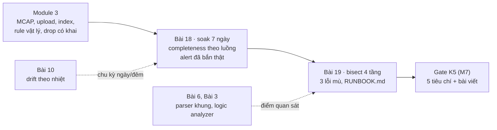
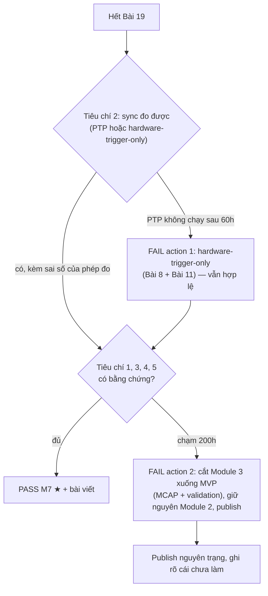

# Khóa 5 · Module 4 — Vận hành (10h người, 7 ngày treo máy) + Gate Khóa 5

Hai bài, một tuần treo máy. Bài 18 hỏi hệ có tự sống khi không ai nhìn không, và đo câu trả lời bằng một SLO viết đủ (→ F7.4). Bài 19 hỏi khi một con số sai xuất hiện, bạn tìm ra tầng gây lỗi bằng phương pháp hay bằng đoán. Gate Khóa 5 ở cuối file.



| Bài | Giờ | Viên nang nền cần trước | Quyết định ra được |
|---|---|---|---|
| 18 — Soak 7 ngày | 6 (+ 7 ngày treo máy) | F7.4, F7.5, F7.6 | Hệ có được phép ghi dữ liệu không người trông không; luồng nào chưa đạt và vì sao; alert nào giữ, alert nào bỏ |
| 19 — Bisect qua bốn tầng | 4 | F7.7, F2.1, F2.3, F5.7 | Thứ tự kiểm khi một con số sai; điểm quan sát nào phải có sẵn trước khi sự cố xảy ra |

Code đi kèm module này (đã chạy thử, Python 3 + numpy): `b18_completeness.py`, `b19_bisect.py`.

---

## Bài 18 — Soak 7 ngày (6h)

> **Vị trí:** K5 Bài 17 (drop có khai, heartbeat cộng dồn) → **Bài 18** → Bài 19 · **Cần trước:** F7.4 (SLO đủ sáu câu: sự kiện, mẫu số, tử số, gộp, cửa sổ, sự kiện cố ý), F7.5 (alert có chủ đích), F7.6 (soak, chế độ hỏng theo hằng số thời gian); K5 Bài 10 (drift theo nhiệt), Bài 14 (upload, xóa local, chịu được bao nhiêu ngày offline), Bài 16 (rule vật lý) · **Sau bài này bạn quyết định được:** hệ có được phép ghi dữ liệu không người trông hay chưa; nếu chưa thì luồng nào, vì cơ chế nào; và alert nào đáng giữ.

**Tiêu chí PASS số 4 (bản gốc, giữ nguyên):** chạy 7 ngày không can thiệp, completeness ≥ 99%, alert freshness **đã thực sự bắn** ≥ 1 lần khi cố tình ngắt một nguồn.

### 1. Câu chuyện — ai đã khổ vì chuyện này

Năm 2015, FAA ban hành chỉ thị về Boeing 787. Bộ đếm phần mềm trong các bộ điều khiển máy phát (GCU) tràn sau **248 ngày** cấp điện liên tục, và khi đó cả bốn GCU có thể cùng chuyển sang chế độ an toàn, làm mất toàn bộ điện xoay chiều, kể cả khi đang bay `[chuẩn — FAA Airworthiness Directive 2015-09-07]`. Con số 248 ngày khớp với một bộ đếm 32 bit có dấu đếm theo đơn vị 10 ms: 2³¹ × 10 ms ≈ 248,5 ngày `[ước lượng — phép tính, không phải nguyên văn AD]`. Biện pháp tạm thời: tắt nguồn máy bay định kỳ. Mọi bài test chạy vài giờ đều đã pass.

Năm 1991, hệ Patriot ở Dhahran chạy liên tục hơn 100 giờ. Sai số làm tròn khi đổi bộ đếm thời gian sang giây tích lũy thành khoảng 0,34 s, đủ để cổng theo dõi lệch khỏi tên lửa Scud `[chuẩn — GAO/IMTEC-92-26]`. Hệ được thiết kế cho các đợt chạy ngắn.

Hai sự cố có chung một hình dạng: lỗi chỉ tồn tại sau một **thời gian chạy**, nên không bài test ngắn nào thấy. Soak test tồn tại vì loại lỗi này. Hệ của bạn có những bộ đếm, những file log, những ổ đĩa đầy dần, và một nhiệt độ phòng đổi theo ngày. Bảy ngày là đủ để vài thứ trong số đó lộ ra.

### 2. Mô hình tư duy

Chế độ hỏng sắp theo hằng số thời gian. Mỗi thang chỉ lộ ra khi phép chạy dài hơn nó (→ F7.6):

| Thang | Ví dụ trên hệ K5 | Thấy bằng gì |
|---|---|---|
| giây – phút | hàng đợi tràn khi đĩa khựng (Bài 17), USB reset | bản ghi drop, lỗ `seq` |
| giờ | rò bộ nhớ, file log không xoay vòng, cache index phình | RSS theo thời gian, `du` |
| ngày | đĩa đầy (upload chậm hơn ingest), chu kỳ nhiệt ngày/đêm, cron chạy một lần một ngày | dung lượng trống, nhiệt độ, `freq` của servo PTP |
| tuần – tháng | bộ đếm tràn, chứng chỉ hết hạn, `seq` u16 quay vòng (nếu lỡ dùng) | đọc code, không đợi được |

Ba điều bản chất của bài:

1. **Completeness là một SLO, và một SLO phải viết đủ.** F7.4 đã đưa sáu câu. Áp vào đây: mỗi luồng một SLO; mẫu số theo `seq` (ODR **thật**), không theo ODR danh định; khoảng thời gian thiết bị offline được cộng vào mẫu số bằng ODR thật × thời gian; quyết định **trước** việc lần rút cảm biến ngày 4 có tính hay không. Ghi chú hợp nhất (w-F7) chốt cách đọc này. Ngưỡng 99% giữ nguyên.
2. **Freshness đo theo nguồn, không theo lúc đến.** Một luồng "còn đến" chưa chắc còn sống: firmware có thể gửi lại giá trị cũ, hoặc driver đọc lặp thanh ghi (Bài 5). Freshness đúng là tuổi của mẫu **mới** gần nhất: `seq` tăng *và* thời điểm nguồn tăng. Thời gian từ lúc rút tới lúc bạn nhận được cảnh báo = ngưỡng timeout + chu kỳ đánh giá + thời gian chuyển cảnh báo tới bạn. Alert "bắn" mà chỉ nằm trong log thì chưa ai nhận.
3. **Chu kỳ nhiệt ngày/đêm hiện ở chỗ servo phải bù, không ở chỗ servo đã bù xong.** Khi PTP khóa, `ptp4l` liên tục chỉnh tần số PHC để offset nhỏ. Thạch anh trôi theo nhiệt thì **lượng chỉnh tần số** (cột `freq`, ppb, trong log `ptp4l`/`phc2sys`) đi theo nhiệt. Offset chỉ dao động theo ngày nếu servo bù không kịp `[chuẩn — F4.5]`. Câu của bản gốc ("nếu bạn thấy offset PTP dao động theo chu kỳ 24 giờ…") giữ nguyên, kèm chỉ dẫn: vẽ cả `freq`. Với đồng hồ ESP32, vốn không được PTP chỉnh, skew ước lượng theo từng cửa sổ (Bài 6, Bài 10) là chỗ thấy chu kỳ.

Mô phỏng: ba luồng trong 7 ngày, ODR thật lệch danh định (như Bài 5), chính sách Bài 17 hy sinh camera khi đĩa khựng, ngày 4 rút USB của ESP32 trong 6 phút. **Tham số giả định.** Bốn cách tính completeness:

```python
# [đã chạy] b18_completeness.py — completeness 7 ngày: mẫu số theo ODR danh định hay theo seq; gộp hay theo luồng
DAY = 86_400
T = 7 * DAY
# luồng: (ODR danh định, ODR thật [giả định, như Bài 5], tỉ lệ drop có khai, có nằm trên ESP32 không)
STREAMS = {"imu": (200.0, 197.1, 0.0004, True),     # chip chạy chậm 1,45% so với cấu hình
           "cam": (30.0, 29.97, 0.012, False),      # chính sách Bài 17 hy sinh camera khi đĩa khựng
           "env": (1.0, 0.9862, 0.0, True)}
UNPLUG = 6 * 60                                     # ngày 4: rút USB ESP32 6 phút → MCU mất nguồn, reset, seq về 0

rows = {}
for k, (nom, true, p_drop, on_esp) in STREAMS.items():
    offline = UNPLUG if on_esp else 0
    produced = true * (T - offline)                 # mẫu cảm biến thật sự lấy được (theo seq, hai phiên boot)
    received = produced * (1 - p_drop)
    by_seq = received / (produced + true * offline) # mẫu số: seq của hai phiên + ODR thật × thời gian offline
    by_nominal = received / (nom * T)
    rows[k] = (received, nom * T, received / by_seq)
    print(f"{k}: nhận {received:,.0f} | theo ODR danh định {by_nominal:7.3%} | theo seq (+offline) {by_seq:7.3%}")
got = sum(r[0] for r in rows.values())
print(f"GỘP mọi luồng: theo danh định {got / sum(r[1] for r in rows.values()):.3%} | "
      f"theo seq {got / sum(r[2] for r in rows.values()):.3%}  ← IMU chiếm đa số mẫu, che luồng camera")
print(f"rút 6 phút chiếm {UNPLUG / T:.3%} thời gian; drop 1% của IMU = {0.01 * 197.1 * T:,.0f} mẫu")
```

Đừng chạy trước khi làm Đề 1.

### 3. Cầu nối từ backend

| Backend bạn biết | Ở đây | Gãy ở chỗ | Nếu dùng nhầm thì |
|---|---|---|---|
| Soak test ở staging trước release | Soak 7 ngày trên chính rig | Staging của bạn không có nhiệt độ phòng, không có cảm biến tự ngừng, không có ổ USB rời. Ở đây môi trường vật lý là một phần của hệ | Soak trong phòng máy lạnh rồi lắp robot vào kho nóng |
| Availability = request thành công / tổng request | Completeness = mẫu nhận / mẫu kỳ vọng | Request bị mất vẫn để lại dấu ở load balancer. Mẫu cảm biến bị mất không để lại gì, nên mẫu số phải suy ra (`seq`, ODR thật) | Mẫu số theo ODR danh định: FAIL oan khi chip chậm 1,5%, hoặc che 1,5% mất mát khi chip nhanh |
| Health check `/healthz` trả 200 | Freshness theo nguồn | Process sống không có nghĩa dữ liệu sống. Firmware có thể gửi giá trị cũ mãi mãi | Alert không bao giờ bắn khi cảm biến kẹt |
| Cert hết hạn, cron hàng tháng | Lỗi theo thời gian chạy (bảng phần 2) | Backend có lịch hết hạn đọc được. Bộ đếm tràn trong firmware thì không có lịch nào, phải đọc code | Tin "chạy 7 ngày ổn" là "chạy mãi ổn" |

**Chấm mô hình:**

- *Gemini: "Số message kỳ vọng = ODR danh định × thời gian chạy; IMU 200 Hz trong 7 ngày là đúng 120.960.000 mẫu."* → **SAI.** ODR thật của chip lệch danh định cỡ phần trăm (Bài 5 đã đo), lớn hơn cả biên 1% của tiêu chí. **Phản ví dụ:** mô phỏng có IMU chạy chậm hơn danh định 1,45% và drop rất ít. So hai cột của dòng IMU ở phần 7: cùng một dữ liệu, hai phán quyết.
- *"Một con số completeness cho cả hệ là đủ."* → **SAI.** **Phản ví dụ:** dòng "gộp" và dòng camera của mô phỏng ở phần 7. IMU có số mẫu gấp nhiều lần camera, nên con số gộp gần như là con số của IMU. F7.4 đã nêu quy tắc: mỗi luồng một SLO.
- *Gemini: "vẽ offset PTP và độ trôi thạch anh ESP32 trong 168 giờ, bạn sẽ thấy đồ thị uốn lượn hình sin theo chu kỳ 24 giờ."* → **ĐÚNG MỘT PHẦN.** Với ESP32 (không được PTP chỉnh), skew theo cửa sổ có thể đi theo nhiệt ngày/đêm, nếu biên độ nhiệt đủ lớn. Với PTP đã khóa, chu kỳ nằm ở `freq` của servo, không ở offset. "Sẽ thấy" là lời hứa: phòng có máy lạnh chạy 24/24 có thể không có chu kỳ nào. Bản gốc viết đúng thể điều kiện ("nếu bạn thấy").

### 4. Thuật ngữ

| Mức | Thuật ngữ | Nghĩa trong một câu | Hay bị hiểu nhầm thành |
|---|---|---|---|
| 🟢 | Soak test | Chạy liên tục đủ lâu để lỗi theo thời gian chạy lộ ra | Load test kéo dài |
| 🟢 | Completeness theo luồng | Mẫu nhận / mẫu kỳ vọng, mẫu số từ `seq` + ODR thật × thời gian offline | Một tỉ lệ chung cho cả hệ |
| 🟢 | Freshness | Tuổi của mẫu **mới** gần nhất, theo thời gian nguồn và `seq` | "Còn nhận được message" |
| 🟢 | Độ trễ cảnh báo | Từ lúc sự cố tới lúc người nhận được: timeout + chu kỳ đánh giá + chuyển phát | Timeout |
| 🟢 | Can thiệp tay | Bất kỳ lệnh, khởi động lại, sửa file nào của người trong 7 ngày | Chỉ khi hệ đã chết |
| 🟢 | Sự kiện cố ý | Lần rút cảm biến ngày 4; quyết định trước có tính vào completeness không | Ngoại lệ được bỏ qua sau |
| 🟡 | `freq` của servo PTP | Lượng chỉnh tần số (ppb) mà `ptp4l`/`phc2sys` áp mỗi lần | Offset |
| 🟡 | `Restart=always`, `WatchdogSec` (systemd) | Tự khởi động lại service chết; service phải báo "còn sống" định kỳ | Một can thiệp tay |
| 🟡 | Burn rate | Tốc độ tiêu ngân sách lỗi so với tốc độ cho phép (F7.4) | Tỉ lệ lỗi |

### 5. Dự đoán

**Tham số cần tra:**
- ODR thật của từng luồng (Bài 5) và tỉ lệ drop từng luồng ở chính sách đang dùng (Bài 17).
- MB/giờ ghi ra đĩa (Bài 13), băng thông upload thật và chính sách xóa local (Bài 14), dung lượng trống của mini PC.
- Độ dốc skew theo nhiệt của board (Bài 10, ppm/°C) và biên độ nhiệt ngày/đêm của phòng: ghi bằng BME280 một ngày trước khi bắt đầu soak.
- Ngưỡng freshness, chu kỳ đánh giá, kênh nhận cảnh báo của bạn (điện thoại? email?).

**Đề:**
1. **Mô phỏng, chỉ đọc code:** completeness của từng luồng theo danh định và theo `seq`; gộp theo hai cách. Luồng nào PASS, luồng nào FAIL ở mỗi cách?
2. **Completeness của bạn** theo từng luồng sau 7 ngày. Luồng nào gần ngưỡng nhất, và vì cơ chế nào (drop có khai, mất trên dây, offline)?
3. **Đĩa.** Dung lượng dùng sau 7 ngày nếu upload chạy bình thường; nếu upload dừng từ ngày 2 thì ngày nào đĩa đầy?
4. **Alert.** Từ lúc rút cảm biến tới lúc điện thoại bạn rung: bao nhiêu giây? Thành phần nào lớn nhất?
5. **Nhiệt.** Biên độ `freq` của servo PTP theo ngày (ppb) = độ dốc theo nhiệt × biên độ nhiệt phòng. Có thấy được trên nhiễu của `freq` không?
6. **RSS** của ingest sau 7 ngày, so với ngày 1.

```markdown
# prediction-b18.md — K5 Bài 18 (commit trước khi bắt đầu 7 ngày)
- Sự kiện cố ý ngày 4: TÍNH / KHÔNG TÍNH vào completeness, vì ___
- Mô phỏng: imu ___/___ , cam ___/___ , env ___/___ (danh định / seq) ; gộp ___/___
- Rig của tôi: imu ___% , cam ___% , env ___% , tof ___% ; gần ngưỡng nhất: ___ vì ___
- Đĩa: dùng ___ GB sau 7 ngày ; upload dừng từ ngày 2 → đầy ngày ___
- Alert: ___ s = timeout ___ + đánh giá ___ + chuyển ___
- PTP freq: biên độ ngày ___ ppb (từ ___ ppm/°C × ___ °C) ; nhiễu freq ___ ppb → thấy / không thấy
- RSS ingest: ngày 1 ___ MB → ngày 7 ___ MB
```

### 6. Làm

Chia 6h người gợi ý: chuẩn bị và kiểm trước khi chạy 2h; sự kiện ngày 4 và kiểm giữa kỳ 1h; phân tích và dashboard 2h; ghi kết quả 1h. Bảy ngày treo máy không tính giờ.

**Bước 0 — Kiểm trước khi chạy (mới; tránh mất 7 ngày vì một lỗi 5 phút).**
- Mọi service chạy dưới systemd với `Restart=always`. Ingest có `WatchdogSec` và gọi `sd_notify("WATCHDOG=1")` từ vòng nhận **chỉ khi có mẫu mới**, để một vòng treo bị khởi động lại `[tự đo — kiểm man systemd.service]`. Mỗi lần systemd tự khởi động lại thì ghi một sự kiện vào MCAP. Đó không phải can thiệp tay, nhưng nó là dữ liệu.
- Xoay vòng: MCAP theo giờ hoặc dung lượng (Bài 13); `journald` có `SystemMaxUse`; upload và xóa local theo Bài 14. Tính trước số ngày đĩa chịu được nếu upload dừng (Đề 3).
- BIOS: bật tự khởi động khi có điện lại (gợi ý của bản Gemini, giữ). Mất điện lưới là chuyện có thật ở Việt Nam. Quyết định trước: một lần mất điện có tính là can thiệp không (đề xuất: không, nếu hệ tự lên lại; nhưng thời gian mất tính vào completeness).
- Chạy thử 2 giờ toàn bộ pipeline, kể cả một lần rút và cắm lại, một lần alert tới điện thoại, và một lần xem dashboard. Rồi mới bắt đầu đồng hồ 7 ngày.

**Bước 1 — Chạy toàn hệ 7 ngày liên tục** (bản gốc). Ghi giờ bắt đầu theo cả `CLOCK_REALTIME` và `CLOCK_MONOTONIC` vào `soak.md`.

**Bước 2 — Định nghĩa completeness trước khi đo** (bản gốc: viết định nghĩa vào README). Sửa định nghĩa theo F7.4 và ghi chú hợp nhất: **mỗi luồng một con số**; mẫu số = Σ theo từng `boot_id` (last_seq − first_seq + 1) + ODR thật × tổng thời gian thiết bị offline; tử số = số `seq` duy nhất đã ghi bền vào MCAP. ODR thật lấy từ fit `t_mcu` theo `seq` trên một đoạn sạch (Bài 5). Ngưỡng ≥ 99% cho **mỗi** luồng, giữ nguyên. Báo kèm: tổng drop đã khai, tổng lỗ chưa khai (Bài 17), lỗ dài nhất.

**Bước 3 — Alert freshness** (bản gốc: nếu một luồng không có dữ liệu mới trong N giây thì bắn cảnh báo). "Dữ liệu mới" nghĩa là `seq` tăng và thời gian nguồn tăng, không phải "có message đến". N theo từng luồng: vài lần chu kỳ của luồng, nhưng đủ lớn để không bắn khi upload hay xoay file làm khựng (đọc phân bố lỗ của Bài 17). Cảnh báo đi ra **ngoài** máy, tới một kênh bạn thật sự nhận (tin nhắn điện thoại, chat). Thêm một alert ngược: "không có heartbeat của chính hệ cảnh báo trong 10 phút". Nếu không có nó, alert chết thì im lặng (→ F7.5).

**Bước 4 — Ngày thứ 4, cố tình rút một cảm biến** (bản gốc). Alert phải bắn. Ghi thời điểm rút theo đồng hồ (có ảnh chụp màn hình đồng hồ hoặc một nút bấm ghi sự kiện), thời điểm alert tới điện thoại, và tách ba thành phần (Đề 4). Cắm lại: hệ phải tự nối lại không cần lệnh. Nếu phải gõ lệnh, đó là **một lần can thiệp tay**. Ghi lại, và tiêu chí "0 can thiệp" FAIL.

**Bước 5 — Theo dõi suốt 7 ngày** (bản gốc: nhiệt độ, dung lượng đĩa, RAM, offset PTP, tỉ lệ drop). Thêm: tần số CPU thật và cờ throttle bằng `turbostat`, không chỉ `dmesg` (ghi chú hợp nhất w-F7; hạ xung do công suất không để lại dòng log nào, K4 Bài 6); `freq` của `ptp4l`/`phc2sys`; RSS của từng service; số lần systemd tự khởi động lại; nhiệt độ phòng từ BME280. Mọi metric có timestamp và lưu ít nhất 7 ngày.

**Bước 6 — Dashboard trả lời được "3h sáng thứ Ba nó làm gì?"** (bản gốc). Chọn trước ba câu hỏi cụ thể cho một thời điểm ngẫu nhiên ngoài giờ, ví dụ: luồng nào đang nhận và với completeness 10 phút gần nhất bao nhiêu; đĩa còn bao nhiêu và upload đang tụt lại bao lâu; nhiệt độ, `Bzy_MHz` và `freq` PTP lúc đó. Trả lời bằng dashboard và truy vấn index (Bài 15), không bằng đọc log tay.

**Sai số của dụng cụ:** completeness đếm từ `seq` là phép đếm, không có sai số lấy mẫu. Sai số nằm ở ODR thật dùng cho phần offline: ±1% ODR trên 6 phút offline đổi completeness cỡ 10⁻⁵, không đáng kể. Độ trễ cảnh báo đo bằng tay với đồng hồ điện thoại: ±1–2 s, đủ cho ngưỡng "dưới 1 phút". `freq` của servo có nhiễu riêng. Lấy trung bình theo giờ trước khi so với nhiệt.

### 7. Số phải ra

<details><summary>🔒 MỞ SAU KHI COMMIT prediction.md</summary>

**Bảng của bản gốc** (giữ nguyên ngưỡng; cột cuối là phần sửa cách đọc):

| Đại lượng | Ngưỡng | Cách đọc |
|---|---|---|
| Completeness | **≥ 99%** ← tiêu chí PASS | Cho **từng** luồng, mẫu số theo `seq` + ODR thật × thời gian offline |
| Alert bắn khi ngắt nguồn | **≥ 1 lần thật** ← tiêu chí PASS | "Bắn" = tới được người, có thời điểm nhận |
| Thời gian phát hiện | Ghi lại. Dưới 1 phút là tốt | Tách timeout / đánh giá / chuyển phát |
| Số lần can thiệp tay | **0** | Systemd tự khởi động lại không tính, nhưng phải đếm và ghi |
| Offset PTP suốt 7 ngày | Vẽ ra. Có tăng theo nhiệt độ ngày/đêm không? ← nối với Bài 10 | Vẽ cả `freq` của servo: chu kỳ nhiệt thường hiện ở đó |

**Mô phỏng** (`[đã chạy]`, tham số giả định):

| Luồng | Theo ODR danh định | Theo `seq` (+ offline) |
|---|---|---|
| IMU | 98,45% (FAIL oan) | **99,90%** (PASS) |
| Camera | 98,70% | **98,80%** (FAIL thật: drop 1,2% do chính sách Bài 17) |
| BME280 | 98,56% (FAIL oan) | **99,94%** (PASS) |
| Gộp mọi luồng | 98,49% | 99,76% (PASS giả: che camera) |

Đọc: mẫu số danh định FAIL oan hai luồng không có vấn đề gì. Gộp theo `seq` PASS một hệ có một luồng thật sự không đạt. Chỉ cách "theo luồng, theo `seq`" cho đúng câu trả lời: camera FAIL vì chính sách drop của Bài 17 hy sinh nó. Quyết định đi kèm: tăng hàng đợi theo λ·S_max, hoặc chấp nhận và ghi rõ camera không đạt SLO. Lần rút 6 phút chỉ chiếm 0,06% thời gian, nhỏ so với ngân sách 1%.

**Kỳ vọng trên rig thật** `[ước lượng — tự đo]`:
- Ít nhất một sự kiện bạn không lường trước trong 7 ngày: USB reset, systemd tự khởi động lại, một lần upload tụt lại cả giờ, mất điện. Không có sự kiện nào là đáng nghi về độ phủ của telemetry, không phải tin tốt.
- Độ trễ cảnh báo vài chục giây, chủ yếu do timeout và chu kỳ đánh giá.
- `freq` của servo PTP có thể đi theo nhiệt phòng nếu biên độ nhiệt ngày/đêm vài °C. Offset thì thường không thấy chu kỳ.
- RSS phẳng sau ngày đầu nếu không rò. Tăng tuyến tính thì đó là rò, và ngày thứ mấy nó chạm trần là con số phải ghi.

</details>

### 8. Nếu ra khác

| Triệu chứng | Nguyên nhân khả dĩ | Kiểm bằng cách | Sửa |
|---|---|---|---|
| Completeness < 99% ở một luồng | Drop có khai (Bài 17), mất trên dây, thiết bị offline | Tách ba nguồn bằng heartbeat, lỗ `seq`, khoảng `boot_id` | Sửa cơ chế lớn nhất; nếu là camera thì xem lại kích thước hàng đợi |
| Completeness > 100% | Mẫu số theo ODR danh định trong khi chip chạy nhanh hơn; hoặc đếm trùng | So ODR thật với danh định; đếm `seq` duy nhất | Mẫu số theo `seq` |
| Rút cảm biến nhưng alert không bắn | Freshness theo lúc đến, mà firmware vẫn gửi giá trị cũ; hoặc alert chỉ ghi log | Xem `seq` có tăng sau khi rút không | Freshness theo `seq` + thời gian nguồn; kênh nhận ngoài máy |
| Alert bắn liên tục vào giờ upload | N quá nhỏ so với lỗ do khựng đĩa | Phân bố lỗ theo giờ trong ngày | N theo phân bố lỗ; hoặc tách upload khỏi đĩa ghi |
| Đĩa đầy ngày 5 | Upload chậm hơn ingest; không xóa local sau VERIFIED | Đồ thị dung lượng; backlog upload | Sửa Bài 14; ngưỡng ngừng ghi có cảnh báo trước |
| Hệ tự khởi động lại nhiều lần một đêm | Watchdog quá chặt; rò bộ nhớ chạm trần; USB reset | `journalctl -u`, RSS trước lúc chết | Tìm nguyên nhân; số lần tự khởi động lại là một metric |
| `turbostat` cho thấy `Bzy_MHz` tụt vào buổi chiều | Phòng nóng, PL1, bụi | `PkgTmp`, `PkgWatt` theo giờ | Ghi lại; là dữ liệu về chế độ sustained (K4 Bài 6) |

### 9. Câu hỏi ngược

1. **[Quy mô]** Bạn chạy 7 ngày trên một rig và PASS. Đội có 50 rig, mỗi rig chạy 8 giờ một ngày trong kho. Kết quả của bạn nói gì và không nói gì về completeness của đội trong một tháng?
   <details><summary>Hướng nghĩ</summary>Một rig, một môi trường, một tuần là một mẫu. Lỗi hiếm (1 lần/1.000 giờ) gần như chắc chắn không lộ trong 168 giờ của bạn, nhưng sẽ xảy ra vài lần mỗi tháng ở đội (50 × 240 giờ). Cần completeness và số sự cố tính theo rig-giờ, cận trên kiểu "quy tắc ba" cho sự kiện chưa thấy, và telemetry ở mọi rig chứ không chỉ ở rig soak.</details>
2. **[Failure mode]** Ngày 6, router mất mạng 9 giờ. Upload dừng, nhưng ghi local vẫn chạy. Ngày 7 mạng có lại, upload dồn. Liệt kê mọi thứ có thể hỏng trong 24 giờ sau, theo thứ tự.
   <details><summary>Hướng nghĩ</summary>Upload dồn chiếm băng thông đĩa đọc trong khi writer đang ghi, có thể làm khựng thêm và tăng drop (Bài 17). Alert freshness của upload bắn hay không? Có nên bắn không? Dung lượng đĩa sát ngưỡng ngừng. Index (Bài 15) tụt lại vì extractor chạy theo file VERIFIED. Thứ tự hỏng phụ thuộc tài nguyên nào chung: đĩa là tài nguyên chung của cả ba.</details>
3. **[Vì sao không]** Vì sao không chạy 1 ngày với tải gấp 7 lần thay cho 7 ngày?
   <details><summary>Hướng nghĩ</summary>Tăng tải làm tăng tốc các lỗi tỉ lệ với **số sự kiện** (bộ đếm theo message, rò bộ nhớ theo message). Nó không tăng tốc các lỗi tỉ lệ với **thời gian đồng hồ** (bộ đếm theo ms như 787, cron hằng ngày, chu kỳ nhiệt, chứng chỉ). Hai loại cần hai phép thử. Ngành hàng không và ô tô có kiểm thử gia tốc, nhưng luôn nói rõ cơ chế nào được gia tốc.</details>
4. **[Phản biện]** "Completeness ≥ 99% là tiêu chí sai cho dữ liệu huấn luyện: cái cần là số episode dùng được." Đồng ý tới đâu?
   <details><summary>Hướng nghĩ</summary>Đồng ý một phần: 1% mất rải đều có thể làm hỏng 0 episode, 1% dồn cục có thể làm hỏng 10%. Tiêu chí 99% là SLO của **pipeline**, đo được, độc lập với downstream. "Episode dùng được" là SLO của **dataset**, phụ thuộc định nghĩa của người dùng. Cần cả hai. Báo phân bố độ dài lỗ (Bài 17) là cầu nối giữa hai thứ.</details>
5. **[Liên ngành]** Thiết bị y tế cấy ghép (máy tạo nhịp) và vệ tinh có yêu cầu chạy nhiều năm không khởi động lại. Họ làm gì để không phải đợi nhiều năm mới biết bộ đếm có tràn không?
   <details><summary>Hướng nghĩ</summary>Phân tích tĩnh độ rộng mọi bộ đếm, kiểm thử với đồng hồ được tua nhanh (khởi tạo bộ đếm ở gần giá trị tràn), và yêu cầu chứng nhận bằng chứng cho từng cơ chế phụ thuộc thời gian. Giống: bảng hằng số thời gian ở phần 2. Khác: họ không được phép "chạy rồi xem". Bạn thì làm được, với một bước rẻ: đặt `seq` khởi đầu gần 2³² trong một lần chạy thử để xem hệ có chịu quay vòng không.</details>

### 10. Liên kết ra ngoài

- **Hàng không: Boeing 787 GCU và Airbus A350.** Ngoài 787, EASA tháng 7/2017 yêu cầu các A350-941 tắt nguồn toàn máy bay trước khi chạy liên tục 149 giờ, vì sau mốc đó một số hệ avionics có thể mất liên lạc với mạng avionics `[chuẩn — EASA AD 2017-0129]`. Giống: lỗi theo thời gian chạy, biện pháp tạm là khởi động lại có lịch. Khác: máy bay có quy trình bảo dưỡng ép buộc khởi động lại. Robot dữ liệu của bạn thì không, trừ khi bạn thêm nó vào runbook.
- **SRE: chaos engineering có kế hoạch.** Netflix Chaos Monkey tắt ngẫu nhiên các instance trong giờ làm việc, để đội phát hiện điểm yếu khi người còn thức `[chuẩn]`. Giống: rút cảm biến ngày 4 là một "game day" có kế hoạch, và alert phải bắn thật. Khác: chaos ở cloud kiểm khả năng tự phục hồi của một hệ dư thừa. Rig của bạn không có dư thừa, nên câu hỏi là phát hiện và ghi nhận, không phải che giấu sự cố.

### 11. Độ tin cậy và sửa lỗi

| Khẳng định | Nhãn | Ghi chú / cách kiểm |
|---|---|---|
| FAA AD 2015-09-07: GCU 787 sau 248 ngày cấp điện liên tục | `[chuẩn]` | 2³¹ × 10 ms ≈ 248,5 ngày là phép tính của giáo trình |
| Patriot Dhahran 1991, ~0,34 s sau ~100 giờ | `[chuẩn — GAO/IMTEC-92-26]` | |
| EASA AD 2017-0129 (A350-941, 149 giờ cấp điện liên tục, 25/7/2017) | `[chuẩn]` | Reviewer đã kiểm trên cơ sở dữ liệu AD của EASA (10/2026) |
| Chu kỳ nhiệt hiện ở `freq` của servo PTP khi đã khóa | `[chuẩn — F4.5]` | Kiểm trên log của bạn |
| `WatchdogSec`, `sd_notify` của systemd | `[tự đo]` | `man systemd.service`, `man sd_notify` |
| Mẫu số completeness theo `seq`, theo luồng | `[chuẩn]` | F7.4; ghi chú hợp nhất w-F7 |
| Kết quả mô phỏng | `[đã chạy]` | Tham số giả định |

**Đã sửa so với bản gốc/Gemini:**
- Bản gốc, bước 2: "completeness = nhận / kỳ vọng, kỳ vọng = ODR × thời gian" → giữ cấu trúc và ngưỡng 99%; sửa mẫu số thành theo `seq` (ODR thật) + offline, và tính **theo từng luồng** (ghi chú hợp nhất w-F7, F7.4).
- Gemini: "120.960.000 mẫu kỳ vọng" theo ODR danh định → sai khi chip lệch ODR (mô phỏng).
- Gemini: "bạn sẽ thấy offset PTP uốn lượn hình sin" → chu kỳ thường ở `freq` của servo, và chỉ khi nhiệt phòng thật sự đổi. Giữ thể điều kiện của bản gốc.
- Bổ sung so với bản gốc (giữ đủ 6 bước): kiểm trước khi chạy (systemd, xoay vòng, BIOS tự bật, chạy thử 2 giờ), freshness theo nguồn, alert ra ngoài máy và alert cho chính hệ alert, tách độ trễ cảnh báo, `turbostat` thay cho chỉ `dmesg` (ghi chú hợp nhất w-F7), quyết định trước về sự kiện cố ý và mất điện.

### 12. Đọc thêm và tự kiểm tra

- **Nguồn gốc:** FAA, Airworthiness Directive 2015-09-07 (Boeing 787, GCU). GAO, *Patriot Missile Defense: Software Problem Led to System Failure at Dhahran, Saudi Arabia* (GAO/IMTEC-92-26, 1992).
- **Giải thích:** B. Beyer và cộng sự (biên tập), *Site Reliability Engineering*, O'Reilly 2016, chương "Service Level Objectives" và "Monitoring Distributed Systems".
- **Đào sâu (tùy chọn):** C. Rosenthal, N. Jones, *Chaos Engineering*, O'Reilly 2020.
- **Tự kiểm tra:** (1) giải thích cho một backend engineer khác trong 5 câu vì sao mẫu số completeness không được lấy từ ODR trong cấu hình; (2) vẽ lại bảng hằng số thời gian ở phần 2 từ trí nhớ, mỗi thang một ví dụ trên rig của bạn; (3) hai câu dưới.

  1. Freshness của IMU đặt N = 2 s, đánh giá mỗi 30 s, cảnh báo đi qua một bot chat có độ trễ 5–20 s. Rút cảm biến lúc 10:00:00. Thời điểm sớm nhất và muộn nhất điện thoại rung?
     <details><summary>Đáp án</summary>Sớm nhất: luồng được đánh giá ngay sau khi quá N, tức ~10:00:02 + 5 s ≈ 10:00:07. Muộn nhất: vừa lỡ một lần đánh giá, nên đợi tới lần sau ~30 s, cộng 20 s chuyển phát: ≈ 10:00:52. Thành phần lớn nhất là chu kỳ đánh giá, không phải N. Muốn dưới 1 phút ổn định thì giảm chu kỳ đánh giá trước.</details>
  2. Camera đạt 98,8% theo `seq` vì chính sách drop ưu tiên IMU. Bạn có được viết "PASS tiêu chí 4" không?
     <details><summary>Đáp án</summary>Không, nếu tiêu chí áp cho mọi luồng, và theo cách đọc của bài này thì có áp. Hai lựa chọn trung thực: sửa (hàng đợi lớn hơn theo λ·S_max, đĩa nhanh hơn) rồi chạy lại; hoặc ghi "FAIL ở camera, nguyên nhân ___, quyết định ___" và không tuyên bố PASS. Không được gộp các luồng cho tới khi con số vượt 99%.</details>

---

## Bài 19 — Bisect qua bốn tầng (4h)

> **Vị trí:** K5 Bài 18 (soak, telemetry đủ) → **Bài 19** → Gate Khóa 5 · **Cần trước:** F7.7 (bisect cần không gian có thứ tự và oracle ở mỗi điểm cắt; tầng biểu hiện ≠ tầng nguyên nhân; runbook), F2.1 (mỗi phép kiểm là một detector có FP/FN), F2.3 (oracle chập chờn), F5.7 (nguồn điện và lỗi "phần mềm" giả); K1 (logic analyzer, PulseView), K5 Bài 3 (bus scan, WHO_AM_I), Bài 4 (raw → SI), Bài 6 (parser khung thô) · **Sau bài này bạn quyết định được:** khi một con số sai xuất hiện, kiểm điểm quan sát nào trước, vì sao; và điểm quan sát nào phải có sẵn **trước** khi sự cố xảy ra.

**Tiêu chí PASS số 5 (bản gốc, giữ nguyên):** bisect được lỗi qua 4 tầng (pipeline → firmware → bus → sensor), có ghi lại ≥ 1 lần bisect thật.

### 1. Câu chuyện — ai đã khổ vì chuyện này

Tháng 7/1997, vài ngày sau khi hạ cánh, Mars Pathfinder bắt đầu tự khởi động lại toàn hệ. Từ Trái Đất không ai chạm được vào máy. Đội JPL có một bản sao phần cứng dưới mặt đất, và hệ điều hành VxWorks trên tàu có một chế độ ghi vết (trace) sự kiện chi tiết. Họ chạy bản sao với trace bật cho tới khi tái tạo được lỗi. Vết cho thấy một tác vụ ưu tiên thấp giữ mutex của một bus dữ liệu chung, bị các tác vụ ưu tiên trung bình chen ngang, khiến tác vụ ưu tiên cao chờ quá hạn và watchdog khởi động lại hệ (priority inversion). Bản vá chỉ là bật priority inheritance cho mutex đó, gửi lên qua đường truyền `[chuẩn — Glenn Reeves, "What really happened on Mars?", 1997]`.

Hai chi tiết đáng học. Thứ nhất, điểm quan sát (trace, bản sao phần cứng) đã có sẵn **trước** sự cố. Không ai kịp xây nó lúc khủng hoảng. Thứ hai, họ không đoán tầng: họ tái tạo được lỗi, rồi quan sát ở ranh giới giữa các tác vụ. Rig của bạn có bốn tầng và ba ranh giới. Bài này làm cho mỗi ranh giới có một điểm quan sát rẻ, rồi luyện cách chọn ranh giới nào để nhìn trước.

### 2. Mô hình tư duy

Bốn tầng là một chuỗi. Bisect diễn ra ở các **ranh giới**, không ở các tầng:

```
 sensor ──(dây I2C/SPI)──► MCU: driver + firmware ──(khung USB)──► parser host ──► pipeline ──► dashboard
        ▲ ranh giới bus|sensor  ▲ ranh giới firmware|bus          ▲ ranh giới pipeline|firmware
        đổi module thứ hai      logic analyzer giải mã             dump khung thô ở host,
                                byte trên dây                      tự tính lại SI (Bài 4)
```

| Ranh giới | Điểm quan sát | Câu nó trả lời | Chi phí điển hình |
|---|---|---|---|
| pipeline \| firmware | Dump khung thô ở host bằng parser Bài 6, tự đổi raw → SI theo Bài 4 | Byte MCU gửi có đúng không? Đúng mà dashboard sai thì lỗi ở pipeline | vài phút |
| firmware \| bus | Logic analyzer giải mã I2C/SPI trên dây (K1, Bài 3) | Byte trên dây có đúng không? Đúng mà khung USB sai thì lỗi ở firmware | nửa giờ (kẹp que, bắt, giải mã) |
| bus \| sensor | Đổi sang module thứ hai (lý do mua 2, Bài 1) | Lỗi theo chip hay theo dây/điện? | vài chục phút |

Bốn ý bản chất:

1. **Mỗi tầng được định nghĩa bằng ranh giới của nó.** *Bus* là tầng điện và giao thức trên dây: pull-up, rise time, ACK/NACK, glitch, địa chỉ. *Firmware* là mọi thứ MCU làm từ lúc driver I2C trả byte tới lúc khung rời USB, **gồm cả cấu hình driver**. Vì vậy "byte đúng trên dây nhưng MCU đọc sai" là tầng firmware (ghi chú hợp nhất w-F7), không phải bus như bảng của bản gốc. Ngoại lệ có thật: logic analyzer và ESP32 có ngưỡng logic khác nhau. Một sườn lên chậm do pull-up yếu có thể được LA đọc là 1 trong khi chân ESP32 đọc là 0 `[tự đo — so ngưỡng V_IH trong datasheet ESP32-S3 với ngưỡng của LA]`. LA chỉ thấy số, không thấy điện áp. Khi nghi trường hợp này, đổi pull-up hoặc rút ngắn dây và xem lỗi có đi không.
2. **Bisect là chọn ranh giới chia đôi không gian nghi ngờ. Đi tuần tự từ trên xuống là tìm tuyến tính.** Cả hai đều hợp lệ. Cái nào nhanh hơn phụ thuộc **xác suất** lỗi ở mỗi tầng và **chi phí** của mỗi điểm quan sát (→ F7.7). Bản gốc gọi quy trình của mình là "bisect". Bảng của nó thật ra là tuần tự (ghi chú hợp nhất w-F7). Gọi đúng tên để chọn đúng.
3. **Triệu chứng giống nhau ở dashboard, khác nhau ở ranh giới.** Pipeline nhân sai scale ×0,5 và firmware ghi nhầm dải ±4 g thay cho ±2 g cho **cùng** một con số |a| ≈ 4,9 m/s² trên dashboard. Chỉ dump khung thô mới phân biệt được: raw đúng mà SI sai, hay raw đã nhỏ đi một nửa. Đây là "tầng biểu hiện ≠ tầng nguyên nhân" của F7.7. Firmware cấu hình sai thanh ghi, chip trả đúng **theo cấu hình sai**, nên trên dây mọi byte dữ liệu "đúng".
4. **Lỗi chập chờn phá bisect.** Dây SDA lỏng gây lỗi 1 lần trong 50 lần đọc. Một lần quan sát "sạch" ở ranh giới không chứng minh phía dưới sạch. Mỗi quan sát phải đủ dài để có xác suất thấy lỗi cao (→ F2.3). Với tỉ lệ p mỗi lần đọc, n lần đọc không thấy lỗi có xác suất (1 − p)ⁿ.

Mô phỏng: chi phí kỳ vọng để khoanh đúng tầng, với ba cách chọn ranh giới và hai bộ xác suất tiên nghiệm. Chi phí và xác suất là **giả định**; thay bằng số trong notebook của bạn.

```python
# [đã chạy] b19_bisect.py — thứ tự kiểm qua 4 tầng: tuần tự từ trên xuống, chia đôi, hay theo xác suất × chi phí
from functools import lru_cache
LAYERS = ["pipeline", "firmware", "bus", "sensor"]
# Điểm quan sát ở RANH GIỚI giữa hai tầng liền nhau; chi phí (phút) [giả định — thay bằng giờ đo trong notebook]
PROBE = {1: ("host", 5),     # dump khung thô ở host, tính lại tay (parser Bài 6): ranh giới pipeline | firmware
         2: ("LA", 30),      # logic analyzer giải mã byte trên dây I2C:          ranh giới firmware | bus
         3: ("đổi", 20)}     # đổi sang module thứ hai:                            ranh giới bus | sensor

def plan(prior, rule):
    @lru_cache(None)
    def E(lo, hi):                                   # (chi phí kỳ vọng, cây quyết định) để khoanh lỗi trong lo..hi
        if lo == hi: return 0.0, LAYERS[lo]
        p = sum(prior[lo:hi + 1])
        opts = []
        for b in range(lo + 1, hi + 1):              # thăm ranh giới b: lỗi ở [lo, b-1] (phía trên) hay [b, hi]?
            (cu, tu), (cd, td) = E(lo, b - 1), E(b, hi)
            pu = sum(prior[lo:b]) / p
            opts.append((PROBE[b][1] + pu * cu + (1 - pu) * cd, f"{PROBE[b][0]}?[trên: {tu} | dưới: {td}]"))
        if rule == "trên xuống": return opts[0]      # luôn thăm ranh giới trên cùng trước
        if rule == "chia đôi":   return opts[(len(opts) - 1) // 2]
        return min(opts)                             # tối ưu theo xác suất × chi phí
    return E(0, 3)

for name, prior in {"rig mới dựng (lỗi phần mềm hay gặp)": (0.4, 0.3, 0.2, 0.1),
                    "sau khi chở robot đi xa (rung, lỏng dây)": (0.1, 0.1, 0.5, 0.3)}.items():
    print(f"--- {name}: prior {dict(zip(LAYERS, prior))}")
    for rule in ("trên xuống", "chia đôi", "tối ưu"):
        cost, tree = plan(prior, rule)
        print(f"   {rule:10s}: kỳ vọng {cost:5.1f} phút | {tree}")
```

Mô hình giả định mỗi quan sát luôn cho câu trả lời đúng (oracle hoàn hảo) và lỗi nằm ở đúng một tầng. Lỗi chập chờn và lỗi hai tầng (ý 3, ý 4) phá cả hai giả định. Đừng chạy trước khi làm Đề 2.

### 3. Cầu nối từ backend

| Backend bạn biết | Ở đây | Gãy ở chỗ | Nếu dùng nhầm thì |
|---|---|---|---|
| `git bisect` trên lịch sử commit | Bisect trên vị trí dọc đường dữ liệu | Commit có thứ tự và mỗi lần test tốn như nhau. Ranh giới vật lý tốn khác nhau tới 6 lần (dump host vs kẹp LA) | Kẹp LA trước vì "chia đôi", trong khi lỗi phần mềm chiếm phần lớn xác suất |
| Distributed tracing: xem span nào sai | Quan sát ở ranh giới | Span có sẵn khi bạn đã instrument. Ranh giới bus thì không có "span": chỉ có dụng cụ đo, và phải kẹp vào tay | Không có LA trong túi lúc robot ở hiện trường |
| `tcpdump` hai đầu để xem "có phải mạng không" | Logic analyzer trên dây I2C | `tcpdump` thấy đúng thứ NIC thấy. LA thấy theo ngưỡng của chính nó, có thể khác ngưỡng của MCU | Kết luận "dây sạch" trong khi sườn tín hiệu sát ngưỡng của ESP32 |
| Feature flag tắt từng tầng | Đổi module, đổi dây, đổi về firmware đã biết tốt | Phần mềm đổi được ngay và trả lại được. Phần cứng có thể hỏng thêm khi tháo lắp | Rút cắm khi còn cấp điện, làm hỏng luôn module thứ hai |

**Chấm mô hình:**

- *Bản gốc, bảng bốn tầng: "Bus — Chip trả đúng, MCU đọc sai? → logic analyzer."* → **SAI ở cách gán.** Nếu chip trả đúng (LA thấy byte đúng trên dây) mà MCU đọc sai thì lỗi nằm trong MCU: driver, cấu hình, xử lý. Đó là tầng firmware (ghi chú hợp nhất w-F7). Câu hỏi đúng của tầng bus là "byte và tín hiệu trên dây có đúng giao thức và đủ điện không": ACK/NACK, glitch, clock stretching, rise time. **Phản ví dụ:** firmware đặt tốc độ I2C 400 kHz cho một bus dài có pull-up yếu. LA thấy NACK và byte vỡ trên dây. Đây mới là tầng bus, dù nguyên nhân là một dòng cấu hình (ý 3).
- *Gemini: "Phương pháp Bisect (chia đôi / cô lập tầng)" kèm cây kiểm pipeline → firmware → bus → sensor theo thứ tự.* → **ĐÚNG MỘT PHẦN.** Cô lập theo ranh giới là đúng. Gọi nó là chia đôi thì sai: đó là tìm tuyến tính từ trên xuống. **Phản ví dụ:** mô phỏng so ba chiến lược ở hai bộ prior (phần 7). Thứ tự tốt nhất đổi theo prior và chi phí, nên không cái tên nào ("tuần tự" hay "chia đôi") đúng cho mọi lúc.
- *Gemini, bước 2.3: "hexa trên dây đúng nhưng MCU đọc ra số khác → lỗi bus I2C (driver I2C của MCU bắt sai ACK/cạnh clock)."* → **SAI.** Driver là firmware. Ngoại lệ duy nhất là trường hợp ngưỡng logic khác nhau (ý 1). Ngoại lệ đó được kiểm bằng cách đổi điện, không phải bằng cách gán nhãn.

### 4. Thuật ngữ

| Mức | Thuật ngữ | Nghĩa trong một câu | Hay bị hiểu nhầm thành |
|---|---|---|---|
| 🟢 | Ranh giới / điểm quan sát | Chỗ giữa hai tầng có một cách nhìn dữ liệu độc lập | Tầng |
| 🟢 | Bisect | Chọn ranh giới chia không gian nghi ngờ làm hai, lặp lại | Mọi quy trình tìm lỗi |
| 🟢 | Tìm tuyến tính | Kiểm lần lượt từ một đầu chuỗi | "Bisect" |
| 🟢 | Tầng biểu hiện / tầng nguyên nhân | Điểm đầu tiên dữ liệu sai / chỗ gây ra cái sai đó | Cùng một tầng |
| 🟢 | Tiêm lỗi mù | Người khác hoặc script gây lỗi mà bạn không biết là gì | Tự gây lỗi rồi tự tìm |
| 🟢 | Runbook | Cây quyết định cho người không phải bạn, lúc 3 giờ sáng | Tài liệu mô tả hệ |
| 🟡 | V_IH / V_IL | Ngưỡng điện áp để một chân đọc là 1 / là 0 | Một ngưỡng chung cho mọi thiết bị |
| 🟡 | Rise time, pull-up | Thời gian sườn lên; điện trở kéo lên của I2C quyết định nó | Chi tiết không ảnh hưởng dữ liệu |
| 🟡 | Clock stretching | Slave I2C giữ SCL thấp để xin thêm thời gian | Lỗi bus |

### 5. Dự đoán

**Tham số cần tra:**
- Thời gian thật của ba điểm quan sát trên rig của bạn: lần đầu dump khung thô, lần đầu kẹp LA và giải mã I2C, lần đầu đổi module. Đo trong một buổi tập không có lỗi.
- V_IH của ESP32-S3 (datasheet, bảng DC characteristics) và ngưỡng đầu vào của logic analyzer bạn có (trang sản phẩm hoặc chip đệm trên board) `[tự đo]`.
- Bảng cấu hình dải đo của IMU (Bài 4): bit nào trong thanh ghi nào đổi ±2 g thành ±4 g.

**Đề:**
1. **Triệu chứng.** |a| đứng yên trên dashboard là 4,9 m/s² thay vì ~9,8. Liệt kê mọi lỗi ở cả bốn tầng có thể cho đúng triệu chứng này. Mỗi lỗi để lại dấu gì ở ba ranh giới?
2. **Mô phỏng, chỉ đọc code:** với hai bộ prior, chi phí kỳ vọng của ba chiến lược, và cây tối ưu bắt đầu bằng ranh giới nào?
3. **Prior của bạn.** Từ những gì đã hỏng trong K5 (ghi trong notebook), đặt prior cho bốn tầng. Thứ tự tối ưu cho rig của bạn là gì?
4. **Lỗi chập chờn.** Dây SDA lỏng gây lỗi 1/50 lần đọc. Cần bao nhiêu lần đọc ở ranh giới để xác suất bỏ sót dưới 5%? Ở IMU 200 Hz, đó là bao nhiêu giây bắt LA?

```markdown
# prediction-b19.md — K5 Bài 19 (commit trước lượt tiêm lỗi đầu tiên)
- Đề 1: lỗi ứng viên ___ ; dấu ở host / dây / đổi module: ___
- Đề 2: rig mới: trên xuống ___ , chia đôi ___ , tối ưu ___ ; sau chở đi xa: ___ / ___ / ___ ; cây tối ưu bắt đầu ___
- Đề 3: prior của tôi P/F/B/S = ___ ; chi phí host/LA/đổi = ___ phút ; thứ tự tối ưu ___
- Đề 4: n ≈ ___ lần đọc ≈ ___ s ở 200 Hz
- Dự đoán thời gian lượt 1/2/3: ___ / ___ / ___ phút
```

### 6. Làm

Chia 4h gợi ý: chuẩn bị điểm quan sát và kịch bản tiêm 1h; ba lượt bisect 2h; `RUNBOOK.md` và người khác chạy thử 1h.

1. **Nhờ ai đó (hoặc script) gây một lỗi mà bạn không biết là gì, ở một trong bốn tầng** (bản gốc). Lỗi gợi ý theo bản gốc: đổi scale factor trong pipeline, đảo byte order trong firmware, nới lỏng một dây SDA, thay bằng module hỏng. Thêm (mới): firmware ghi nhầm thanh ghi dải đo (cùng triệu chứng với lỗi scale, Đề 1); bỏ một pull-up (chỉ khi module có pull-up tháo được). Nếu không có người giúp: một script chọn ngẫu nhiên một patch trong danh sách đã chuẩn bị, áp vào nhánh làm việc, ghi lựa chọn vào một file bạn không mở, kèm hash của file đó để chứng minh không sửa sau. Lỗi phần cứng thì cần người khác. **Không** cố ý làm hỏng module bằng quá áp hay đảo cực. Lỗi tầng sensor mô phỏng bằng module hỏng sẵn nếu có, che cửa sổ ToF, hoặc gắn IMU lỏng trên bề mặt rung. Ngắt nguồn trước khi tháo lắp dây.
2. **Bisect. Ghi lại từng bước, kèm thời gian** (bản gốc). Mỗi bước một dòng trong notebook: giờ (đồng hồ thật), ranh giới quan sát, cách quan sát, thấy gì, suy ra gì, xác suất còn lại của từng tầng. Với lỗi có thể chập chờn, ghi số lần đọc ở mỗi quan sát (Đề 4).
3. **Lặp lại 3 lần với 3 lỗi ở 3 tầng khác nhau** (bản gốc). Sau mỗi lượt, cập nhật prior và chi phí thật, chạy lại `b19_bisect.py` với số của bạn, và xem thứ tự tối ưu có đổi không.
4. **Viết `RUNBOOK.md`: cây quyết định để người khác bisect được** (bản gốc). Mỗi nút: triệu chứng → lệnh hoặc thao tác ở một ranh giới → kết quả mong đợi khi sạch → nhánh tiếp theo. Có ảnh vị trí kẹp que LA, lệnh dump khung thô copy được, và danh sách "đừng làm" (rút cắm khi còn điện, đổi hai thứ cùng lúc). Đưa cho một người khác (bạn bè, đồng nghiệp, hoặc chính bạn sau một tuần không đụng) chạy theo trên một lỗi mới. Ghi chỗ họ bị kẹt. Bản gốc yêu cầu "người khác đọc và làm theo được". Chưa ai chạy thử thì vẫn là bản nháp (F7.7).

**Sai số của dụng cụ:** dump khung thô chỉ đúng nếu parser đúng. Kiểm parser bằng golden frame của Bài 6 trước khi tin nó. LA 24 MHz đủ cho I2C 400 kHz (60 mẫu mỗi chu kỳ SCL), nhưng không thấy điện áp, không thấy sườn chậm (ý 1). Đổi module chỉ phân biệt sensor với phần còn lại nếu module thứ hai tốt và dây giữ nguyên.

### 7. Số phải ra

<details><summary>🔒 MỞ SAU KHI COMMIT prediction.md</summary>

**Bảng của bản gốc** (giữ nguyên):

| Kiểm tra | Kết quả đúng |
|---|---|
| Tìm đúng tầng | 3/3 |
| Thời gian mỗi lần | Ghi lại. Lần sau nhanh hơn lần trước |
| Runbook | Người khác đọc và làm theo được |

Chú thích cách đọc: "đúng tầng" nghĩa là tầng **nguyên nhân**, có bằng chứng từ ranh giới, không chỉ tầng biểu hiện. "Lần sau nhanh hơn" kỳ vọng đúng khi chi phí quan sát giảm vì đã quen. Nếu lỗi lượt 3 khó hơn (chập chờn) thì chậm hơn là bình thường. Ghi lý do.

**Mô phỏng** (`[đã chạy]`, chi phí host/LA/đổi = 5/30/20 phút, giả định):

| Prior (P / F / B / S) | Trên xuống | Chia đôi | Tối ưu | Cây tối ưu |
|---|---|---|---|---|
| Rig mới dựng (0,4 / 0,3 / 0,2 / 0,1) | **29,0** phút | 39,5 | **29,0** | host → LA → đổi (chính là trên xuống) |
| Sau khi chở đi xa (0,1 / 0,1 / 0,5 / 0,3) | 48,0 | 47,0 | **41,0** | host → **đổi** → LA |

Đọc: không có thứ tự đúng cho mọi lúc. Khi lỗi phần mềm chiếm đa số, đi từ trên xuống đã tối ưu vì điểm quan sát đầu rẻ nhất. "Chia đôi" theo nghĩa đen (LA trước) đắt hơn 10 phút. Khi lỗi phần cứng chiếm đa số, đổi module (20 phút) trước LA (30 phút) tiết kiệm 6–7 phút so với cả hai cách "chuẩn". Runbook nên ghi thứ tự **theo hoàn cảnh**, không ghi một thứ tự duy nhất.

**Đề 1, các lỗi cùng triệu chứng 4,9 m/s²:** pipeline chia đôi (scale sai) → khung thô đúng; firmware ghi dải ±4 g mà parser vẫn hiểu ±2 g → khung thô **và** byte dữ liệu trên dây đều nhỏ đi một nửa, còn lần ghi thanh ghi cấu hình trên dây cho thấy giá trị ±4 g (nguyên nhân ở firmware, biểu hiện từ sensor trở lên); firmware bỏ bit cao khi ghép byte → byte trên dây đúng, khung sai; sensor hỏng → đổi module thì hết.

**Đề 4:** (1 − 1/50)ⁿ < 0,05 → n > ln(0,05)/ln(0,98) ≈ 148 lần đọc, khoảng 0,75 s ở 200 Hz. Bắt LA vài giây là đủ. Dump host trong một lần chạy ngắn có thể không đủ nếu lỗi hiếm hơn.

</details>

### 8. Nếu ra khác

| Triệu chứng | Nguyên nhân khả dĩ | Kiểm bằng cách | Sửa |
|---|---|---|---|
| Kết luận sai tầng | Dừng ở tầng biểu hiện; oracle ở một ranh giới sai (parser lỗi) | Golden frame cho parser; đọc lại thanh ghi cấu hình trên dây | Thêm bước "kiểm điểm quan sát" vào runbook |
| Ranh giới nào cũng "sạch" mà lỗi vẫn còn | Lỗi chập chờn, quan sát quá ngắn; hoặc lỗi chỉ xuất hiện khi cả rig chạy (nguồn sụt khi motor/camera chạy) | Quan sát dài hơn theo Đề 4; quan sát khi toàn hệ chạy | Lỗi "phần mềm" giả do nguồn (→ F5.7) |
| LA thấy byte đúng, MCU đọc sai, đổi firmware không hết | Ngưỡng logic khác nhau, sườn chậm | Pull-up mạnh hơn, dây ngắn hơn, I2C chậm hơn | Ghi là lỗi **bus** (điện), kèm bằng chứng can thiệp |
| Lượt 2 chậm hơn lượt 1 nhiều | Lỗi khó hơn, hoặc runbook dẫn sai thứ tự | Đối chiếu từng bước với cây tối ưu | Cập nhật prior và cây |
| Người khác không chạy được runbook | Thiếu lệnh copy được, thiếu ảnh vị trí que, giả định kiến thức ngầm | Ghi chỗ họ dừng | Sửa đúng chỗ đó, chạy lại với người khác |

### 9. Câu hỏi ngược

1. **[Quy mô]** 50 robot ở 3 kho. Một kỹ thuật viên không biết lập trình nhận cuộc gọi "robot 17 báo gia tốc sai". Runbook của bạn phải đổi gì để dùng được ở đó, và điểm quan sát nào phải được xây sẵn vào robot?
   <details><summary>Hướng nghĩ</summary>Ranh giới đầu (dump khung thô) phải là một nút bấm hoặc một lệnh từ xa, không phải bạn ngồi gõ Python. Ranh giới cuối (đổi module) phải là một thao tác cơ khí có đầu nối, không phải hàn. Ranh giới LA không làm được ở hiện trường: thay bằng tự kiểm của firmware (đọc WHO_AM_I, đếm NACK, gửi lên trong heartbeat). Điểm quan sát được xây vào sản phẩm là thứ quyết định thời gian sửa ở quy mô.</details>
2. **[Failure mode]** Lỗi chỉ xuất hiện khi motor của robot K7 chạy. Trên bàn, mọi ranh giới sạch. Bạn đổi chiến lược thế nào?
   <details><summary>Hướng nghĩ</summary>Điều kiện tái tạo là một phần của oracle. Quan sát phải diễn ra **trong** điều kiện lỗi (motor chạy), nên LA phải bắt khi robot chạy. Đây là dấu hiệu của nhiễu nguồn hoặc ground (→ F5.7, K7 C3/C5): tầng bus về điện, dù triệu chứng trông như phần mềm. Thêm một ranh giới mới: điện áp nguồn của cảm biến, đo bằng multimeter (chỉ thấy trung bình) hoặc thứ đo nhanh hơn.</details>
3. **[Vì sao không]** Vì sao không kẹp LA thường trực và log toàn bộ bus suốt đời robot, cho khỏi phải bisect?
   <details><summary>Hướng nghĩ</summary>Dữ liệu: lấy mẫu 24 MHz là 24 triệu mẫu/s mỗi kênh, quá nhiều để giữ lâu. Thêm phần cứng thêm điểm hỏng. Thỏa hiệp ngành dùng: firmware tự đếm lỗi bus (NACK, timeout) và gửi trong heartbeat, kèm một "flight recorder" giữ vài giây gần nhất trong ring buffer, chỉ đổ ra khi có sự kiện. Đó là quan sát có chọn lọc, không phải không quan sát.</details>
4. **[Liên ngành]** Y khoa dùng chẩn đoán phân biệt: liệt kê bệnh có thể, chọn xét nghiệm theo xác suất trước, chi phí và rủi ro, cập nhật sau mỗi kết quả. Giống và khác bisect của bạn ở đâu?
   <details><summary>Hướng nghĩ</summary>Giống: prior × chi phí quyết định thứ tự, và mỗi kết quả cập nhật xác suất (Bayes). Khác: xét nghiệm y khoa có độ nhạy và độ đặc hiệu được công bố, và có thể gây hại (rủi ro là một phần chi phí). Điểm quan sát của bạn cũng có FP/FN (parser sai, LA ngưỡng khác), nhưng hiếm ai ghi chúng. Đó là cầu nối với F2.1.</details>

### 10. Liên kết ra ngoài

- **Hàng không: Fault Isolation Manual (FIM).** Máy bay thương mại có sổ tay cô lập lỗi: từ một mã lỗi hoặc triệu chứng, cây quyết định dẫn kỹ thuật viên qua các phép kiểm tới một thiết bị thay thế được (LRU) `[chuẩn]`. Giống: runbook của bạn, viết cho người không thiết kế hệ, với các điểm quan sát được xây sẵn vào máy. Khác: FIM được viết từ phân tích thiết kế (FMEA) **trước** khi có sự cố. Runbook của bạn được viết sau ba lượt tập. Cả hai cùng mù ở chỗ chưa từng gặp.
- **Phần mềm: delta debugging (Zeller).** Thuật toán tự động thu nhỏ một input gây lỗi bằng cách bỏ dần từng phần và kiểm lại `[chuẩn — A. Zeller, "Yesterday, my program worked. Today, it does not. Why?", ESEC/FSE 1999]`. Giống: tìm ranh giới nhỏ nhất còn giữ lỗi. Khác: delta debugging cần một oracle chạy tự động hàng trăm lần. Ranh giới vật lý của bạn mỗi lần quan sát tốn phút tới nửa giờ, nên thứ tự quan sát quan trọng hơn số lần.

### 11. Độ tin cậy và sửa lỗi

| Khẳng định | Nhãn | Ghi chú / cách kiểm |
|---|---|---|
| Mars Pathfinder 1997: reset do priority inversion, tìm bằng trace trên bản sao mặt đất, sửa bằng priority inheritance | `[chuẩn]` | G. Reeves, "What really happened on Mars?", 1997 |
| "Byte đúng trên dây nhưng MCU đọc sai" thuộc tầng firmware | `[chuẩn]` | Ghi chú hợp nhất w-F7 |
| Ngưỡng logic LA khác V_IH của ESP32-S3 | `[tự đo]` | Datasheet ESP32-S3 (DC characteristics); tài liệu của LA |
| (1 − p)ⁿ cho xác suất bỏ sót lỗi chập chờn | `[chuẩn]` | |
| Delta debugging (Zeller 1999) | `[chuẩn]` | |
| Kết quả mô phỏng | `[đã chạy]` | Chi phí và prior giả định; oracle hoàn hảo |

**Đã sửa so với bản gốc/Gemini:**
- Bản gốc, bảng bốn tầng: "Bus — chip trả đúng, MCU đọc sai" → đó là firmware. Câu hỏi của tầng bus là tín hiệu và giao thức trên dây (ghi chú hợp nhất w-F7). Giữ nguyên công cụ (logic analyzer).
- Bản gốc và Gemini: gọi quy trình tuần tự là "bisect" → gọi đúng tên; chọn thứ tự theo prior × chi phí (mô phỏng). Giữ nguyên tiêu chí "bisect được lỗi qua 4 tầng".
- Gemini, bước 2.3: "hexa trên dây đúng mà MCU đọc khác → lỗi bus (driver)" → driver là firmware; ngoại lệ ngưỡng logic được kiểm bằng can thiệp điện.
- Gemini, bước 1: "module bị nướng hỏng" → không cố ý làm hỏng phần cứng; dùng module hỏng sẵn hoặc mô phỏng lỗi tầng sensor bằng cách an toàn; ngắt nguồn trước khi tháo lắp.
- Bổ sung so với bản gốc (giữ đủ 4 bước): định nghĩa tầng bằng ranh giới, tầng biểu hiện vs nguyên nhân với một ví dụ cùng triệu chứng, lỗi chập chờn và số lần đọc cần, tiêm lỗi mù bằng script có hash, người khác chạy thử runbook.

### 12. Đọc thêm và tự kiểm tra

- **Nguồn gốc:** G. Reeves, "What really happened on Mars?" (thư gửi M. Jones, 12/1997). Tài liệu `git bisect` (`man git-bisect`).
- **Giải thích:** D. J. Agans, *Debugging: The 9 Indispensable Rules for Finding Even the Most Elusive Software and Hardware Problems*, AMACOM 2002 (các chương "Make It Fail", "Divide and Conquer", "Quit Thinking and Look").
- **Đào sâu (tùy chọn):** A. Zeller, *Why Programs Fail*, ấn bản 2, Morgan Kaufmann 2009.
- **Tự kiểm tra:** (1) giải thích cho một backend engineer khác trong 5 câu vì sao "byte đúng trên dây mà MCU đọc sai" không phải lỗi bus, và ngoại lệ duy nhất; (2) vẽ lại chuỗi bốn tầng, ba ranh giới và ba điểm quan sát ở phần 2; (3) câu dưới.

  1. Lượt 2: dashboard |a| = 0 trên trục Z, hai trục kia bình thường. Dump khung thô: byte Z bằng 0x0000. LA trên dây: byte Z thay đổi bình thường. Tầng nào, và bước kế tiếp?
     <details><summary>Đáp án</summary>Dây đúng, khung sai: lỗi ở firmware (giữa lúc driver trả byte và lúc đóng khung). Ví dụ: đọc thiếu byte (đọc 4 thay vì 6), ghi đè buffer, sai offset khi đóng khung. Bước kế tiếp: in buffer ngay sau lệnh đọc I2C trong firmware để chia tầng firmware làm hai (driver vs đóng khung). Đó là một ranh giới phụ, rẻ khi đã ở trong code.</details>

---

## Gate Khóa 5 — M7 ★ cảm biến, đồng bộ thời gian, data platform (khung rút gọn)

> **Vị trí:** Bài 19 → **Gate** → Khóa 6 · **Cần trước:** toàn bộ K5; F1.7 (cam kết trước, báo cáo kết quả âm), F2.3 (phán quyết ba trạng thái), F7.4 (SLO viết đủ) · **Sau gate này bạn quyết định được:** PASS và sang Khóa 6; hoặc kích hoạt FAIL action đã cam kết (hardware-trigger-only, cắt Module 3 xuống MVP); hoặc publish nguyên trạng ở trần 200h.

### 1. Câu chuyện — vì sao gate này cam kết trước

Bản gốc mở đầu khóa bằng một câu: **"Số đo là deliverable. Platform là vỏ."** Rủi ro của khóa không phải độ khó. Rủi ro là phần mềm, vốn là thế mạnh của bạn, xong nhanh và đẹp, còn số đo đồng bộ thì mỏng. Gate này là nơi câu đó được kiểm. Năm tiêu chí và hai FAIL action đã được ghi vào `GOALS.md` ở Bài 2, trước dòng code đầu tiên (Gate Module 0, tiêu chí 5–6). Ở đây bạn chỉ đối chiếu, không viết lại luật.

### 2. Mô hình tư duy



Thứ tự của hình là thứ tự ưu tiên của bản gốc: tiêu chí 2 (sync) đứng trước. Khi phải cắt, cắt Module 3, không bao giờ cắt Module 2.

### 3. Cầu nối từ backend

| Backend bạn biết | Ở đây | Gãy ở chỗ | Nếu dùng nhầm thì |
|---|---|---|---|
| Release gate trong CI: mọi check xanh thì ship | Checklist 5 tiêu chí | Check CI tất định, chạy lại được. Tiêu chí 4 (soak 7 ngày) tốn một tuần mỗi lần chạy lại, nên đổi luật sau khi thấy kết quả rất hấp dẫn | Sửa định nghĩa completeness sau khi thấy 98,8% |
| "Platform đẹp = dự án tốt" | Module 3 bóng bẩy | Nhà tuyển dụng thấy platform ở mọi CV. Số đo đồng bộ có sai số thì hiếm | Dành 80h cho object store và DB, còn 6h cho PTP |
| Feature flag tắt phần chưa xong | FAIL action cắt Module 3 xuống MVP | Ở đây phần bị cắt phải được **ghi rõ** trong bài viết và README | Giấu phần chưa làm; người đọc tưởng hệ có object store |

**Chấm mô hình:** *"Đủ 5 ô tick là PASS."* → **ĐÚNG MỘT PHẦN.** Checklist đo sự **có mặt** của bằng chứng, không đo cách đọc nó. **Phản ví dụ:** tiêu chí 4 tick với "completeness 99,76%" gộp mọi luồng, trong khi camera riêng chỉ 98,8% (Bài 18, mô phỏng). Vì vậy cột "cách đọc" ở phần 6 là một phần của tiêu chí, không phải ghi chú.

### 6. Làm

**Năm tiêu chí PASS của M7** (giữ nguyên văn bản gốc), kèm bằng chứng phải chỉ vào được và cách đọc đã thống nhất trong các bài:

| # | Tiêu chí (nguyên văn) | Bằng chứng phải chỉ vào | Cách đọc (sửa, không đổi ngưỡng) |
|---|---|---|---|
| 1 | 2 thiết bị, 3 sensor, ghi MCAP bằng message chuẩn ROS 2, metadata (`calibration_id`, `clock_source`) có version, `ros2 bag info` đọc được | File MCAP mẫu; output `ros2 bag info` trong container `ros:jazzy`; metadata channel | Bài 13. Metadata đủ các khóa của `CONVENTIONS.md` mục 4. `seq` của MCU nằm trong trường `sequence` của MCAP hoặc payload (Bài 17) |
| 2 | Sync đo được: phân bố offset clock TRƯỚC/SAU khi bật PTP (hai PHC của mini PC, trọng tài đọc PHC trực tiếp), ≥ 1 giờ dữ liệu, có nêu phương pháp đo VÀ SAI SỐ CỦA PHÉP ĐO ĐÓ → nếu không có PTP: hardware-trigger-only, vẫn hợp lệ | Phân bố \|offset\| trước/sau (Bài 9) kèm phân bố độ rộng kẹp của trọng tài; bảng ngân sách số đo và câu cam kết (Bài 12) | Số báo là số **trọng tài** đo, không phải số `ptp4l` tự báo (Bài 9). Sai số của phép đo là độ bất định của chuỗi đo, không phải độ phân giải (Bài 12). Không lấy độ rộng kẹp 1–2 µs làm tiêu chí PASS (ghi chú hợp nhất w-F4) |
| 3 | ≥ 1 rule validation theo vật lý bắt được dữ liệu xấu THẬT, chứng minh bằng một lần cố tình gây lỗi | Rule, test tiêm lỗi, và một lần bắt được trên dữ liệu thật (Bài 16) | Rule có tiền điều kiện và tỉ lệ báo giả đo được (Bài 16, F3.7) |
| 4 | Chạy 7 ngày không can thiệp, completeness ≥ 99%, alert freshness ĐÃ THỰC SỰ BẮN ≥ 1 lần khi cố tình ngắt một nguồn | `soak.md`: completeness theo luồng, log alert tới điện thoại, số lần can thiệp tay = 0 | Completeness **theo từng luồng**, mẫu số theo `seq` + ODR thật × thời gian offline (Bài 18, ghi chú hợp nhất w-F7). Freshness theo nguồn. Sự kiện cố ý tính hay không theo `prediction-b18.md` |
| 5 | Bisect được lỗi qua 4 tầng, có ghi ≥ 1 lần bisect thật trong notebook | Ba lượt trong notebook (giờ, ranh giới, kết luận); `RUNBOOK.md` đã có người khác chạy thử | "Đúng tầng" là tầng nguyên nhân có bằng chứng ranh giới (Bài 19). "Byte đúng trên dây, MCU đọc sai" là firmware |

**Stretch — KHÔNG phải gate, đừng làm nếu chưa PASS cả 5** (bản gốc): calibration registry có version, dashboard drift, mission registry, retention/review-for-deletion.

**Bài viết** (bản gốc): *"Time synchronization for multi-sensor robots: PTP vs hardware trigger, measured"*. Cấu trúc theo K4 Bài 13. Ứng viên mạnh nhất cho mục "What surprised me" có sẵn: hai camera "chụp cùng lúc" lệch nhau hàng chục mili-giây, và không ai kiểm tra (Bài 11). Bài viết phải có câu cam kết của Bài 12, đủ hai con số (U và trần), và nói rõ phần nào là đánh giá loại B.

**FAIL → action (cam kết trước, giữ nguyên bản gốc):**
- PTP không chạy sau 60h → hardware-trigger-only. Publish nguyên trạng.
- Chạm 200h chưa PASS → cắt Module 3 xuống MVP (chỉ MCAP + validation, bỏ object store và DB), giữ nguyên Module 2, publish.

**Quy trình chấm gate (≈1h, không tính vào giờ module):**
1. Mở `gate-k5.md`, chép bảng trên, điền cột bằng chứng bằng **link** tới file và commit, không bằng lời.
2. Mỗi tiêu chí chấm PASS / CHƯA / KHÔNG ÁP DỤNG (ví dụ tiêu chí 2 phần PTP sau khi đã kích hoạt FAIL action 1). Tiêu chí nào CHƯA thì ghi đúng cái thiếu.
3. Đối chiếu `GOALS.md`: luật chấm hôm nay có trùng với luật đã commit ở Bài 2 không? `git diff` của `GOALS.md` từ commit đó. Mọi thay đổi phải có lý do ghi ngày.
4. Cộng giờ theo tag trong `hours.csv`: tổng so với ~150h dự kiến / 200h trần, và Module 3 so với trần 55h. Ghi chênh lệch và nguyên nhân lớn nhất.
5. Đếm dự đoán sai trong mọi `prediction-*.md` của khóa. Không có cái nào sai là dấu hiệu dự đoán quá an toàn hoặc viết sau (K2 gate).

### 8. Nếu ra khác

| Triệu chứng | Nguyên nhân khả dĩ | Kiểm bằng cách | Sửa |
|---|---|---|---|
| Tiêu chí 2 chỉ có số `ptp4l` in ra | Thiếu trọng tài, hoặc trọng tài chạy không đủ 1 giờ | Có file CSV của trọng tài không (Bài 9) | Chạy trọng tài ≥ 1 giờ; số tự báo chỉ để tham khảo |
| Tiêu chí 4 PASS bằng con số gộp | Định nghĩa completeness cũ | `soak.md` có bảng theo luồng không | Tính lại theo luồng từ cùng dữ liệu; FAIL thì ghi FAIL |
| Module 3 đã 70h, Module 2 còn thiếu Bài 11 | Làm platform trước vì dễ | `hours.csv` theo tag | Dừng Module 3 ngay, quay lại Module 2 (Bài 2, quy tắc đã viết) |
| Bisect 3/3 nhưng runbook chưa ai chạy | Thiếu người | Có ghi chép của người chạy thử không | Ghi "CHƯA" cho phần runbook. Chạy lại với chính bạn sau một tuần là phương án cuối |
| Chạm 200h, tiêu chí 2 đã xong, 4 chưa | Soak bị gián đoạn | Lý do gián đoạn | FAIL action 2; tiêu chí 4 ghi kết quả âm kèm nguyên nhân |

### 9. Câu hỏi ngược

1. **[Phản biện]** "Hardware-trigger-only là một lối thoát dễ dãi: không có PTP thì artifact yếu hơn hẳn." Đồng ý tới đâu?
   <details><summary>Hướng nghĩ</summary>Câu hỏi nhà tuyển dụng thật sự hỏi là "bạn có đo được độ đồng bộ và sai số của phép đo không", không phải "bạn có chạy được `ptp4l` không". Hardware trigger trả lời câu đầu bằng phép đo trực tiếp hơn. PTP thêm một câu trả lời cho mạng nhiều máy. Artifact yếu đi khi bạn **giấu** việc đã chuyển FAIL action, không phải khi bạn chuyển.</details>
2. **[Quy mô]** Nếu một công ty dùng hệ của bạn cho 50 robot, tiêu chí nào trong 5 tiêu chí thành SLO vận hành thường trực, và tiêu chí nào chỉ là nghiệm thu một lần?
   <details><summary>Hướng nghĩ</summary>Tiêu chí 4 (completeness, freshness) thành SLO thường trực theo luồng và theo robot. Tiêu chí 2 thành kiểm tra định kỳ (LED trong khung, `freq` của servo) vì đồng bộ trôi theo nhiệt và theo lần cắm lại. Tiêu chí 3 thành rule chạy liên tục có tỉ lệ báo giả được theo dõi. Tiêu chí 1 và 5 là nghiệm thu thiết kế và quy trình.</details>
3. **[Failure mode]** Bạn PASS gate. Hai tháng sau, nâng kernel làm đổi β của camera 8 ms (Bài 11 câu hỏi ngược 2). Câu cam kết trong bài viết đã công bố giờ sai. Bạn làm gì?
   <details><summary>Hướng nghĩ</summary>Erratum công khai, đo lại, ghi phiên bản kernel/driver cạnh câu cam kết. Gate là ảnh chụp tại một thời điểm. Độ tin của artifact được giữ bằng cách xử lý lỗi công khai, như K4 gate câu hỏi ngược 3.</details>

### 12. Đọc thêm và tự kiểm tra

- **Nguồn gốc:** `khoa-5-sensor-timesync-platform.md` (Gate Khóa 5), `00-lo-trinh-tong.md` (M7).
- **Giải thích:** K4 Bài 13 (cấu trúc bài viết), K5 Bài 12 (câu cam kết).
- **Tự kiểm tra:** (1) đọc to câu cam kết của Bài 12 trong 30 giây, như trả lời phỏng vấn, rồi ghi âm và tự nghe lại: có đủ con số, độ tin cậy, phương pháp, sai số của phép đo không; (2) chỉ ra trong 1 phút file nào chứng minh từng tiêu chí.

---
