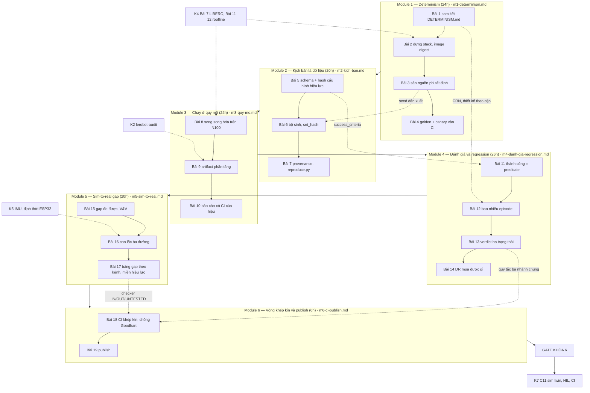

# Khóa 6 — Hạ tầng mô phỏng và đánh giá · Tổng quan

**Cho:** người đã PASS Khóa 2 và Khóa 4 (đã chạm LIBERO ở K4 Bài 7). Khóa 5 nên xong trước Module 5, vì Module 5 cần IMU, ESP32 và kỹ thuật định thời của K5 để đo con lắc thật.
**Thời lượng:** **120h** (tổng giờ 19 bài khớp đúng bản gốc) · **Trần cứng: 160h**. Ở 6–7h/tuần là khoảng 19–21 tuần.
**Chi phí:** gần như 0đ. GPU thuê theo giờ nếu muốn đo MJX ở Bài 8, bản gốc ước ~500k–1 triệu VNĐ cho cả khóa `[ước lượng 10/2026]`. Module 5: dây, quả nặng, khớp quay cho con lắc, một cặp IR LED + phototransistor làm cổng quang, vài chục nghìn đồng `[ước lượng 10/2026, kiểm lại ở cửa hàng]`; IMU và ESP32-S3 dùng lại từ K5.
**Thay cho:** Khóa 6 gốc (SO-101), nay đã đẩy sang Khóa 7.

**Xong khóa này bạn có:** một môi trường nơi bạn đổi một thứ, chạy một lệnh, và nhận lại **phán quyết có căn cứ thống kê** (PASS / FAIL / INCONCLUSIVE, với tỉ lệ sai biết trước), cộng với một **bảng đo khoảng cách giữa mô hình và thế giới thật** có cột "chưa kiểm".

**Luận điểm mang xuyên khóa (bản gốc):** simulator không dạy bạn vật lý; nó dạy bạn mô hình vật lý của người viết simulator. Khoảng cách giữa hai thứ đó là sim-to-real gap, nó đo được, và đo nó là một nghề. Làm Module 1–4 thì bạn có một công cụ CI tốt. Làm cả Module 5 thì bạn có thứ ít người có. **Module 5 là moat: nếu phải cắt, cắt chỗ khác.**

**Ba thứ khóa này không dạy (bản gốc):** viết physics engine; train policy (việc đó nằm ở K7 C11.5, dùng thư viện); đồ họa đẹp.

**Cam kết phạm vi (ghi vào đầu `decisions.md` trước Bài 1):** FAIL action của Gate Khóa 6 (cuối `m6-ci-publish.md`) được cam kết **hôm nay**, không phải ở giờ thứ 150. Chọn MuJoCo + robosuite và không đổi; mỗi lần thấy mình so sánh simulator thay vì chạy thí nghiệm, ghi vào `later.md` và quay lại.

---

## Vị trí trong lộ trình và con số không được giấu

| Khóa | Tên | Giờ | Ghi chú |
|---|---|---|---|
| 1 | Từ zero đến đo được | 35 | |
| 2 | Dữ liệu robot mà không cần robot | 80 | `lerobot-audit` dùng lại ở Bài 9 |
| 3 | Chuỗi audio | 90 (tổng bài 92) | |
| 4 | Đo hiệu năng inference trên edge | 70 | LIBERO, harness, roofline N100 |
| 5 | Cảm biến, đồng bộ thời gian, data platform | 150 | Cần trước Module 5 |
| **6** | **Hạ tầng mô phỏng và đánh giá** | **120** | ← khóa này |
| 7 | Robot di động — **thiết kế lại thành khóa build** | 561 lõi (K7 gốc: 340) | `khoa-7/_KE-HOACH-K7.md` |

**Ngân sách toàn lộ trình — không giấu.** K1–K6 = **545h**. Cộng K7 gốc = **885h**, đã vượt con số 650h của lộ trình gốc. Cộng K7 mới (lõi 561h, chưa tính tùy chọn) = **1.106h**; ở 6,5h/tuần ≈ 170 tuần ≈ **3,3 năm**. Đường lõi tối thiểu của K7 mới (~366h: C0–C7 trọn, C8 tối thiểu, C10.1–C10.2, C11.1–C11.3) cho **545 + 366 = 911h ≈ 2,7 năm**.

**Khóa nền F1–F7 nằm ngoài các con số trên.** Học trọn cả bảy là thêm khoảng **245h** (F1 31 · F2 36 · F3 39 · F4 34 · F5 37 · F6 37 · F7 31), tức 1.106 + 245 ≈ 1.350h ≈ 4 năm ở 6,5h/tuần. Nhưng F không được thiết kế để học trọn: học **đúng lúc**, chỉ viên nang mà bài sắp tới cần. Phần lớn viên nang K6 dùng (F1.x, F3.x, F7.1–F7.3, F5.6) bạn đã gặp ở K1–K5; viên nang thường gặp **lần đầu** ở khóa này là F2.6, F6.1, F6.2, F6.3, F6.5, F6.6, cộng khoảng 28h `[ước lượng, cộng giờ ghi ở đầu từng viên nang]`, thêm F6.4 (6h) nếu chưa học ở K7 C6. Chọn đường nào là quyết định của bạn, ghi vào `decisions.md`.

**Đường ray song song với K7:** lúc bạn ở K6, K7 C8 (điều hướng), C9 (nhận người) và C10 (an toàn, vận hành) đã mở được nếu các chặng trước xong (`_KE-HOACH-K7.md` mục 4). **C11 cần K6 trọn** (mục *Sau Khóa 6* ở cuối file).

---

## Bản đồ khóa



## Bài → giờ → viên nang nền cần trước → quyết định ra được

| Bài | Giờ | Viên nang nền cần trước | Quyết định ra được |
|---|---|---|---|
| 1 — Determinism là điều kiện tiên quyết | 4 | F2.2, F2.6 (lướt), F1.5 (phần power) | Bit-exact hay tương đương thống kê, ở tầng nào, ngưỡng bao nhiêu; viết `DETERMINISM.md` trước khi cài |
| 2 — Dựng stack, episode đầu tiên | 6 | F2.2, F1.3 | Tổ hợp phiên bản ghim thành image có digest; giây CPU mỗi episode làm đơn vị cho mọi kế hoạch quy mô |
| 3 — Săn nguồn phá determinism | 8 | F2.2, F6.3, F2.3 (+ K5 Bài 19 bisect) | Từng tầng trong bốn tầng đạt bit-exact hay chuyển sang ngưỡng; ngưỡng đặt ở bước nào còn ý nghĩa |
| 4 — Chốt determinism vào CI | 6 | F2.5, F2.3, F1.4 | Bộ seed canh gác cho PR vs hằng đêm; golden khóa theo gì; quy trình chấp nhận đổi golden |
| 5 — Kịch bản không phải script | 8 | F3.2, F3.7, F2.2 | Tham số thuộc kịch bản, code hay môi trường; hash file nguồn hay cấu hình hiệu lực; test "đổi trường" kiểm ở tầng nào |
| 6 — Sinh kịch bản có hệ thống | 6 | F6.6, F2.4, F2.2, F3.8, F1.4 | Bộ sinh nào (lưới, pairwise, LHS, ngẫu nhiên theo phân bố), bao nhiêu điểm, seed dẫn xuất theo khóa gì; generator hay manifest là nguồn sự thật |
| 7 — Provenance | 6 | F3.8, F2.2, F1.7 | Run được vào báo cáo hay chỉ thăm dò; phán quyết TÁI LẬP ĐƯỢC / KHÁC / KHÔNG TÁI LẬP ĐƯỢC; giữ artifact nào, bao lâu |
| 8 — Song song hóa, throughput thật | 8 | F7.1, F7.2, F7.3, F1.3 | Bao nhiêu worker trên N100, khi nào thuê máy, 10.000 episode tốn bao nhiêu giờ/tiền |
| 9 — Artifact management | 8 | F3.6, F3.8, F3.5, F3.1 | Giữ gì, bao lâu, ở tầng nào; khi nào tính lại trajectory thay vì lưu |
| 10 — Từ run tới báo cáo | 8 | F1.4, F1.7, F1.2, F3.8 | Run đủ điều kiện cho người khác dùng chưa; chênh lệch nào đáng tô màu |
| 11 — Định nghĩa thành công bằng toán | 6 | F2.8, F2.1, F2.5 | Success rate có đo đúng thứ muốn đo không; episode nào vào mẫu số; khi nào được đổi định nghĩa |
| 12 — Bao nhiêu episode là đủ | 8 | F1.4, F1.5, F1.3 | Cần bao nhiêu episode và bao nhiêu kịch bản cho Δ cho trước; "78% vs 71%, n = 50" có đáng đọc không |
| 13 — Phát hiện regression tự động | 6 | F1.5, F2.1, F2.3, F2.5 | PR merge / chặn / chạy thêm với tỉ lệ chặn nhầm và lọt lưới biết trước; "không tệ hơn" hay "tương đương" |
| 14 — Domain randomization mua được gì | 6 | F6.5, F6.4, F6.6 | Tham số nào đo (system ID), randomize (rộng bao nhiêu), hay cả hai; cường độ ghi vào `decisions.md` |
| 15 — Định nghĩa gap đo được | 6 | F6.1, F6.2, F1.1, F1.2 | Gap đo ở mức nào (đại lượng, quỹ đạo, phân bố, chuyển giao), ngưỡng so với độ bất định của phép đo; khi nào con số gap vô nghĩa |
| 16 — Con lắc ba đường | 8 | F6.3, F6.4, F6.6, F1.1, F1.6, F5.6 | Sim lệch thật vì verification, calibration hay validation; tham số nào đo, tham số nào fit; mô hình ma sát đủ dạng chưa |
| 17 — Bảng gap theo kênh, miền hiệu lực | 6 | F6.1, F6.5, F6.2, F3.7 | Kịch bản nào được dùng làm bằng chứng về đời thật; phép đo thật tiếp theo nên đo kênh nào, ở điểm nào |
| 18 — CI khép kín | 3 | F2.8, F2.3, F2.5, F1.5 | PR nào tự merge theo verdict; người và agent thấy bộ eval nào, tới mức nào; "cải thiện" qua thêm bước gì mới thành baseline |
| 19 — Publish *(khung rút gọn)* | 3 | F1.7 | Tuyên bố nào vào bài viết, dựa trên bằng chứng nào trong repo, tuyên bố nào phải hạ giọng |
| Gate *(khung rút gọn)* | — | — | PASS hay chưa; nếu chưa thì cắt gì theo FAIL action đã cam kết |

Cột "viên nang" chỉ ghi F; dòng **Vị trí** của từng bài còn ghi các bài K2/K4/K5/K6 cần trước. Mỗi bài dùng khung 12 phần của `_QUY-CHUAN.md`. Viên nang học **đúng lúc**: đọc ngay trước bài cần nó.

**Hai checkpoint giữa khóa** (bản gốc không có gate module; người soạn thêm, có FAIL action đề xuất): *Trước khi sang Module 3* ở cuối `m2-kich-ban.md` và *Trước khi sang Module 5* ở cuối `m4-danh-gia-regression.md`. Chúng là phần bằng chứng của gate mục 2, 3, 4; đừng bỏ qua rồi phải làm lại ở tuần 20.

---

## Bản đồ "chấm mô hình" — các mô hình của bản Gemini K6 đã chấm lại

`_ref/cau-hoi-cua-ban-trong-gemini.md` không có lượt K6 của người học; dưới đây là mô hình Gemini đưa ra mà một backend engineer dễ tin theo, chấm đầy đủ có phản ví dụ ở đúng bài.

| Gemini K6 | Ý chính (trích ngắn) | Chấm | Ở đâu |
|---|---|---|---|
| lượt 2 | "Đóng gói trong Docker là tái lập 100% trên bất kỳ máy nào" | ĐÚNG MỘT PHẦN | Bài 2 |
| lượt 4 | Canary: chèn RNG toàn cục, assert hash khác golden là đủ | SAI về thiết kế | Bài 4 |
| lượt 5 | Hash chuẩn hóa = `json.dumps(sort_keys=True)` rồi SHA-256 | ĐÚNG MỘT PHẦN | Bài 5 |
| lượt 6 | "Tuyệt đối không trộn sweep và randomization" | ĐÚNG MỘT PHẦN, lý do sai | Bài 6 |
| lượt 7 | `platform.processor()` cho model CPU; digest mặc định `'local-dev'` | SAI | Bài 7 |

---

## Gate Khóa 6 — tóm tắt, không thay thế

**Văn bản chính thức của gate nằm ở cuối `m6-ci-publish.md`** (mục *GATE KHÓA 6*): tiêu chí gốc giữ nguyên chữ, bảng "bằng chứng phải có", FAIL action. Tổng quan này chỉ tóm tắt để bạn thấy từ Bài 1 mỗi module đang nuôi mục nào; khi chấm, mở file đó, không chấm theo bảng dưới. Không mục nào bị nới hay đổi ngưỡng.

| # | Ý của tiêu chí (tóm tắt) | Bằng chứng sinh ra ở | Chỗ hay hiểu sai (chi tiết trong m6) |
|---|---|---|---|
| 1 | Determinism chứng minh bằng số ở cả bốn tầng, có canary phá hoại và canary bị bắt | Module 1 | "Bị bắt" phải kèm số lần thử n và cận trên tỉ lệ bỏ sót (Bài 4) |
| 2 | ≥1.000 episode bằng một lệnh, artifact phân tầng, mọi kết quả truy về đủ 6 thứ | Module 2 (checklist cuối m2), Module 3 | Lấy mẫu thành công phải ghi xác suất được giữ (Bài 9) |
| 3 | Harness từ chối kết luận khi n không đủ, có INCONCLUSIVE, MDE bằng số trong README | Module 4 (Bài 12–13), Bài 18 | MDE vô nghĩa nếu thiếu p0, N, α, power, tầng |
| 4 | Canary regression −5 điểm bị bắt khi n đủ, INCONCLUSIVE (không PASS) khi n không đủ | Bài 13, Bài 18 | Đây là **tỉ lệ** qua nhiều lần chạy, không phải một lần |
| 5 | Bảng sim-to-real: ≥1 hiện tượng đủ ba đường + bảng miền hiệu lực có cột "chưa kiểm" | Module 5 | Gap không kèm độ bất định không phải phép đo (Bài 15) |
| 6 | Bài viết tiếng Anh + repo public, ≥1 người ngoài chạy lại và xác nhận | Bài 19 | "Xác nhận" = `reproduce.py` của họ ra phán quyết tái lập ở tầng bạn đã nêu |

**FAIL → action (bản gốc, cam kết trước — chi tiết ở m6):** không bit-exact sau 30h → chuyển sang tương đương thống kê, không đâm vào determinism GPU; chạm 160h → cắt Module 3 xuống MVP, giữ nguyên Module 1, 4, 5; thiếu tài nguyên → giảm số task, giữ số episode mỗi task. Người soạn m6 có thêm một FAIL action **đề xuất** cho mục 6 (không người ngoài sau 4 tuần) và một **khuyến nghị** không chặn PASS (ranh giới thông tin của Bài 18); cả hai ghi rõ là không thuộc tiêu chí gốc.

**Mẹo đếm giờ:** áp FAIL action thứ hai ở giờ 140 nếu Module 5 chưa bắt đầu, đừng chờ tới 160 (bảng "Nếu ra khác" của gate).

---

## Lịch

Bản gốc có lịch 19 tuần cộng đúng 120h, nhưng hai tuần cuối là 14h và 12h, tuần 10–12 mỗi tuần 8h: gấp đôi ngân sách 6–7h/tuần đúng ở đoạn có phần cứng (con lắc). Lịch dưới đây giữ nguyên thứ tự và giờ từng bài, trải ra 21 tuần, không tuần nào quá 8h (~5,7h/tuần):

| Tuần | Tuần gốc | Giờ | Làm | Xong thì có |
|---|---|---|---|---|
| 1 | 1 | 4 | Bài 1 · ghi FAIL action vào `decisions.md` | `DETERMINISM.md`: loại, tầng, ngưỡng |
| 2 | 2 | 6 | Bài 2 | Image theo digest, episode đầu tiên, giây/episode |
| 3–4 | 3–4 | 4 + 4 | **Bài 3** | Bảng bốn tầng, nguồn phi tất định đã săn |
| 5 | 5 | 6 | Bài 4 | Golden có khóa, canary trong CI |
| 6–7 | 6–7 | 4 + 4 | Bài 5 | Schema kịch bản, loader là cổng duy nhất |
| 8 | 8 | 6 | Bài 6 | Ba bộ kịch bản có manifest + `set_hash` |
| 9 | 9 | 6 | Bài 7 · checklist *Trước khi sang Module 3* | `reproduce.py` ba trạng thái |
| 10 | 10 | 8 | Bài 8 | Đường cong throughput theo worker trên N100 |
| 11 | 11 | 8 | Bài 9 | Summary Parquet + DuckDB, trajectory lấy mẫu có trọng số |
| 12 | 12 | 8 | Bài 10 | Báo cáo HTML với CI của hiệu |
| 13 | 13 | 6 | Bài 11 | Định nghĩa thành công có version |
| 14–15 | 14–15 | 4 + 4 | **Bài 12** — bài quan trọng nhất | Bảng n, A/A theo n, MDE |
| 16 | 16 | 6 | Bài 13 | Verdict PASS/FAIL/INCONCLUSIVE/ERROR |
| 17 | 17 | 6 | Bài 14 · checklist *Trước khi sang Module 5* | λ* và trục giữ/bỏ, có số |
| 18 | 18 | 6 | **Bài 15** | Mức đo gap, t_div, sàn A/A |
| 19 | 18 | 8 | **Bài 16** | Con lắc ba đường, system ID |
| 20 | 19 | 6 | Bài 17 | `VALIDITY.md` + checker |
| 21 | 19 | 3 + 3 | Bài 18 + Bài 19 | CI khép kín; bài viết và repo public |
| 22+ | — | 2–4 | Gate: gom bằng chứng `[ước lượng]`, nằm trong biên 120→160h | **Khóa 6 PASS**, trừ mục 6 đang chờ người ngoài |

**Ba điểm không được bỏ (bản gốc):** Bài 3, Bài 12, Bài 15–16. Tuần crunch rơi vào đâu thì hy sinh **tuần 10–12** (Module 3 là sân nhà của bạn, làm nhanh được), không hy sinh ba điểm này. Mục 6 của gate có thời gian chờ không do bạn kiểm soát: đăng bài sớm nhất có thể ở tuần 21 và bắt đầu đếm 4 tuần.

**Lượt chạy dài:** 1.000 episode (gate mục 2), R ≥ 20 lần canary (mục 4) và các sweep chạy nền trên N100. Giờ máy không tính vào giờ học, nhưng **giờ đồng hồ** thì có: tính trước bằng số giây/episode của Bài 2 và throughput của Bài 8, để một lượt 20 giờ máy không chặn cả một tuần.

---

## Bẫy đã biết

Mỗi bẫy có một câu hỏi ngược. Trả lời trước khi mở hướng nghĩ.

**1. "Docker là tái lập" và tổ hợp phiên bản không tự khớp.** `pip freeze` không thấy gói hệ thống (Mesa, glibc); LIBERO ghim một robosuite và Python cũ hơn nhiều so với MuJoCo mới nhất. Cấu hình render mẫu trên mạng thường là cho GPU NVIDIA, không phải iGPU Intel.
- **[Failure mode]** Build lại đúng Dockerfile sau ba tháng, hash episode đổi. Bạn kiểm gì trước?
<details><summary>Hướng nghĩ</summary>

Base image gọi bằng tag, `apt-get` không ghim, so `dpkg -l` giữa hai image. Đó là lý do giữ image theo digest thay vì tin Dockerfile (Bài 2, Bài 7).

</details>

**2. Seed dẫn xuất bằng phép cộng hoặc theo vị trí.** Đúng trong một run, sai giữa các run, và đổi khi chèn thêm kịch bản.
- **[Nếu…thì]** Hai run "độc lập" dùng `seed_root + i` với root 42 và 43. Phép so sánh của bạn thực chất là gì?
<details><summary>Hướng nghĩ</summary>

Gần như cùng bộ seed, tức gần như ghép cặp mà bạn không biết; CI tính như độc lập là sai. Dùng `SeedSequence` theo danh tính (Bài 3, Bài 6).

</details>

**3. N100 là 4 nhân, 4 luồng, không hyperthreading.** Lời khuyên "đừng dùng hyper-thread core" của Gemini không áp dụng; worker thứ 5 trở đi là oversubscription, cộng throttling và một kênh RAM (Bài 8, lỗi đã biết ở mục 7 quy chuẩn).
- **[Quy mô]** Thuê một máy 16 vCPU. Đường cong throughput của N100 dự đoán được gì cho máy đó, và không dự đoán được gì?
<details><summary>Hướng nghĩ</summary>

Phần nối tiếp (Amdahl) và phần tranh chấp (USL) đo trên N100 vẫn là giả thuyết; vCPU có thể là SMT, băng thông bộ nhớ khác. Đo lại vài điểm trước khi trả tiền cho 10.000 episode.

</details>

**4. Ma sát trong MuJoCo không phải một số toàn cục.** Nó thuộc từng geom và được trộn theo cặp. Sweep "ma sát" của vật thể có thể ra đường phẳng mà không vì policy bền (Bài 5–6, Bài 17).
- **[Failure mode]** Sweep ma sát vật 0.1 → 1.0, success rate không đổi. Bạn kết luận gì, và kiểm gì trước khi kết luận?
<details><summary>Hướng nghĩ</summary>

Đọc ma sát của **tiếp xúc** thật sự trong `d.contact` ở vài điểm sweep. Đường phẳng có thể là bằng chứng rằng tham số không tới được tiếp xúc.

</details>

**5. Một lần chạy không phải một verdict.** "Không thay đổi → PASS", "canary bị bắt", "INCONCLUSIVE khi n nhỏ" đều là tỉ lệ trên nhiều lần với seed root khác. Nhìn trộm rồi cộng dồn episode đến khi "có ý nghĩa" làm vỡ tỉ lệ sai đã thiết kế (Bài 12–13, 18).
- **[Phản biện]** "CI của hai run chồng nhau nên không khác nhau." Đúng tới đâu?
<details><summary>Hướng nghĩ</summary>

Chồng lấn là một phép kiểm quá bảo thủ, và "không thấy khác" không phải "bằng nhau". Dùng CI của **hiệu** (Newcombe) và biên δ khai báo trước (Bài 10, Bài 13).

</details>

**6. Giữ mọi thất bại, lấy mẫu thành công** mà không ghi xác suất được giữ thì mọi thống kê tính trên tầng trajectory bị lệch (Bài 9).
- **[Liên ngành]** Khảo sát xã hội học có cùng vấn đề. Họ sửa bằng gì?
<details><summary>Hướng nghĩ</summary>

Trọng số nghịch đảo xác suất chọn (Horvitz–Thompson). Muốn dùng được thì RNG rút thăm cũng phải có seed và vào provenance.

</details>

**7. Đo thật bằng đúng kênh, đúng đơn vị.** Kênh cảm biến nào trên quả nặng đọc ra đúng tần số con lắc là một câu **dự đoán** của Bài 16, đừng mặc định; tham số `damping` của MuJoCo có đơn vị riêng, kiểm trước khi chép số bạn fit vào.
- **[Failure mode]** Sim và thật lệch chu kỳ cỡ 1%, bạn tăng damping để khớp. Sai ở đâu?
<details><summary>Hướng nghĩ</summary>

Tham số nào chi phối chu kỳ, tham số nào chi phối độ suy giảm? Vá một hiện tượng bằng tham số của hiện tượng khác là overfitting đội lốt calibration. Tách system ID: mỗi tham số fit từ hiện tượng nó chi phối, rồi kiểm ở điểm chưa dùng để fit (Bài 16).

</details>

**8. Vòng kín trở thành mục tiêu tối ưu** của bạn, của bộ tìm siêu tham số, và của pipeline agent tự sửa code. Một agent thấy được bộ seed của gate sẽ học bộ seed đó (Bài 18).
- **[Vì sao không]** Vì sao không công khai toàn bộ bộ eval cho agent "để nó sửa nhanh hơn"?
<details><summary>Hướng nghĩ</summary>

Goodhart: số đo bị tối ưu trực tiếp thôi đo thứ nó từng đo. Bộ giữ kín, trần số lần gọi, chạy xác nhận trước khi nâng baseline (Bài 18, → F2.8).

</details>

---

## Sửa lỗi so với bản gốc và bản Gemini (gom từ phần 11 các bài)

Bảng chứa kết luận của nhiều bài; mỗi dòng rút gọn, lý do đầy đủ ở phần 11 của bài. Đọc theo module, sau khi xong module đó.

<details><summary>🔒 MỞ SAU KHI XONG MODULE TƯƠNG ỨNG</summary>

| Bài | Sai (G = bản gốc, Ge = Gemini) | Đúng |
|---|---|---|
| 1 | G+Ge: CI của **một** tỉ lệ cho câu hỏi so hai run; bảng 7 nguồn phi tất định | Sai số của hiệu, thiết kế theo cặp; thêm mức tập lệnh CPU và warmstart; `set`/`os.listdir` chứ không phải `dict` |
| 2 | G: `pip freeze` giống = cùng môi trường; G+Ge: "bị GIL"; tên task rút gọn; Ge: `MUJOCO_GL=egl` + `--gpus all` | Image theo digest, kiểm cả gói hệ thống; MuJoCo nhả GIL, phần giữ GIL là robosuite; tên đầy đủ; iGPU Intel dùng `osmesa` `[tự đo]` |
| 3 | G: `seed_root + index`; G+Ge: làm tròn rồi hash = tương đương thống kê; G: cùng kiến trúc → bit-exact; Ge: patch `random`, `randn` là đủ | Seed theo `(root, index)`; hash cho bit-exact + checkpoint có dung sai; cùng **mức tập lệnh**; thiếu `uniform`, patch trước import |
| 4 | Ge: canary assert "hash khác golden"; G: "bị bắt 100%" | Chèn → chạy bộ test → kỳ vọng FAIL; kèm n và cận trên tỉ lệ bỏ sót |
| 5 | G: ma sát toàn cục; "đổi trường → kết quả đổi"; `object_pose` cho LIBERO; Ge: `json.dumps` là đủ, code thiếu import | Ma sát theo geom, trộn theo cặp; kiểm ở `model_fingerprint`; init state theo file + hash + chỉ số; hash cấu hình hiệu lực |
| 6 | G: LHS là sweep, seed theo vị trí; Ge: "không trộn vì bất lực xác định nguyên nhân" | LHS là space-filling; seed theo danh tính; có lineage thì tách được, thứ không trộn là estimand |
| 7 | G: đủ 6 trường là đủ, `reproduce.py` "tự dựng lại"; Ge: `collect_provenance` | Thêm các trường thiếu và chính sách giữ; phán quyết KHÔNG TÁI LẬP ĐƯỢC; `platform.processor()` không cho model CPU, mặc định `'local-dev'` là fail mở |
| 8 | G+Ge: hyperthread trên N100 (lỗi mục 7 quy chuẩn); G: không tách MJX | 4C/4T, oversubscription, throttling; khác backend = baseline khác |
| 9 | G+Ge: tool K2 trên sim "phải báo sạch"; G: lấy mẫu thành công không trọng số | Có thể báo động giả; ghi `inclusion_prob`, trọng số 1/π |
| 10 | Ge: CI chồng lấn → INCONCLUSIVE; p99 cho n nhỏ | CI của hiệu (Newcombe); phân vị cao chỉ khi n đủ |
| 11 | G: gộp `sim_unstable` mới sai; Ge: nới ngưỡng trên run đang so | Loại ra cũng sai, báo theo arm; đổi định nghĩa bằng version mới |
| 12 | G: chênh A/A "10–15 điểm" ở n = 50, "~700 episode cho 7 điểm"; Ge: power từ Δ quan sát | Tính lại bằng mô phỏng (🔒 Bài 12); MDE khai báo trước |
| 13 | G+Ge: PASS = "không tệ hơn có ý nghĩa"; Bonferroni ≡ FDR | Quy tắc ba nhánh, δ khai báo trước, chung với Bài 18; Holm cho cổng merge, FDR cho khám phá |
| 14 | G+Ge: DR "thu hẹp gap", điểm cắt = tối ưu | DR giảm độ nhạy trong dải đã phủ; chọn λ theo tập mục tiêu |
| 15 | Ge: W1 hai tập giống = 0, KS chứng minh cùng phân bố, Pearson là "rank"; G: gap không kèm bất định | Sàn A/A + bootstrap; Spearman; u_val theo ASME V&V 20 |
| 16 | G+Ge: chu kỳ từ gia tốc, rolling shutter đo con lắc; Ge: `damping` = γ; G: khớp chu kỳ nhờ damping | Gyro + cổng quang; đổi đơn vị qua mô-men quán tính; system ID hai bước |
| 17 | G: số kỳ vọng trong phần Làm; Ge: "Verified Domain", đếm hàng rolling shutter | Chuyển vào 🔒; gọi là validation; fit t₀ nhiều độ cao |
| 18 | G: ba PR giả, một lần chạy; Ge: PR sửa comment là A/A, `with Writer` cứu MCAP; G+Ge: không nhắc Goodhart | Tỉ lệ verdict trên R lần; A/A với seed root khác; ghi file tạm rồi đổi tên; bộ giữ kín, trần số lần gọi |
| 19 | G ("Ba điều mang đi") + Ge: "phần lớn kết quả công khai không đủ power" | Thành bước khảo sát có bảng, hoặc hạ giọng |
| Tổng quan | G: lịch 19 tuần có tuần 14h; "K7 là 340 giờ, 13 tháng" | 21 tuần ≤ 8h; K7 mới lõi 561h, chạy song song từ K1 |

</details>

---

## Cách học khóa này

Khóa này gần như toàn phần mềm, chạy được trên laptop và N100, trừ Module 5. Đó vừa là lợi thế vừa là bẫy: bạn sẽ làm nhanh, và làm nhanh là lúc dễ bỏ bước dự đoán nhất.

**Vòng một bài (tuần thường, 5–8h):**
1. Đọc phần 1–4 (câu chuyện, mô hình, cầu nối, thuật ngữ) và viên nang F mà bảng ở trên chỉ tên.
2. Chạy mô phỏng đồ chơi của bài **trước** khi đụng stack thật.
3. Viết `prediction.md` bằng số, ghi "tôi không chắc về", **commit**. **Không dùng AI ở bước này**: dự đoán của AI không phải dự đoán của bạn, và nó xóa đúng thứ khóa này đo, là khoảng cách giữa mô hình trong đầu bạn và kết quả. Đây cũng là bài học của Bài 18 áp lên chính bạn: ai đã thấy đáp án thì không còn là bộ giữ kín.
4. Làm. Mỗi số đo quan trọng ghi n, seed root, image digest.
5. Mở khối 🔒, so, viết giải thích chênh lệch **trước** khi tra cứu.
6. Trả lời câu hỏi ngược; mở hướng nghĩ sau.

**Tuần crunch (0–2h):** không bắt đầu lượt chạy dài mới, không lắp con lắc. Đọc phần 1–4 của bài kế tiếp hoặc một viên nang F, hoặc chạy lại một mô phỏng đồ chơi với tham số khác. Một lượt chạy nền đã có `prediction.md` thì cứ để chạy. Nhiều tuần crunch liên tiếp: hy sinh tuần 10–12, không hy sinh Bài 3, 12, 15–16.

**Dùng AI ở đâu:** ở bước giải thích (bước 5) và khi tự trừu tượng hóa, với prompt **chấm mô hình**, không phải "giải thích cho tôi":

```text
Đây là mô hình tôi đang tin, viết bằng lời của tôi:
"<dán nguyên văn>"
Chấm từng ý: ĐÚNG / ĐÚNG MỘT PHẦN / SAI. Với mỗi ý không ĐÚNG, chỉ đúng chỗ gãy
và đưa MỘT phản ví dụ cụ thể (con số, thí nghiệm, hoặc hệ thật). Không mở đầu bằng lời khen.
Nếu một ý không kiểm chứng được, nói "chưa rõ" và đề xuất câu hỏi kiểm được.
Nếu ý của tôi là một khẳng định thống kê, hỏi lại: n bao nhiêu, CI của hiệu là gì,
MDE và α khai báo trước là gì. Mọi con số phải kèm nguồn hoặc ghi rõ là ước lượng.
```

Lý do: bản Gemini của khóa này xác nhận nhiều mô hình chỉ đúng một phần và viết code thiếu import hoặc fail mở (Bài 5, 7). Mọi API mà AI gợi ý (MuJoCo, robosuite, LIBERO, `statsmodels`, `mcap`) kiểm theo phiên bản bạn ghim.

**Hai câu tự hỏi cuối mỗi tuần:** (1) Tuần này con số nào của tôi có kèm n và khoảng tin cậy mà tuần trước chưa có? (2) Mô hình nào của tôi vừa bị một con số phản bác?

---

## Sau Khóa 6 — liên hệ sang K7 C11

**C11 (Sim twin, HIL, CI, vòng đời dữ liệu — 92h lõi, +20h tùy chọn) là K6 áp lên robot của chính bạn**, và cần K6 trọn (`_KE-HOACH-K7.md` mục 4):

| K7 C11 | Dùng lại từ K6 |
|---|---|
| C11.1 Model sim khớp robot thật | Bài 15–16 (V&V, system ID hai bước), Bài 5 (tham số vật lý là dữ liệu có schema); tham số hình học đo ở K7 C2.4, C6 |
| C11.2 HIL và CI cho hành vi robot | Bài 4 (golden, canary), Bài 13 và 18 (verdict ba trạng thái, ranh giới thông tin); bench test từ sổ build K7 là hạt giống regression; → F2.7 |
| C11.3 Sim có dự đoán được thực tế không ★ | Bài 15–17 (mức đo gap, bảng theo kênh, cột "chưa kiểm") |
| C11.5 Vòng đời dữ liệu và fine-tune | Bài 7 (provenance), Bài 9 (artifact), Bài 12 (bao nhiêu episode trước khi nói "tốt hơn") |

Con lắc của Bài 16 là phiên bản rẻ của đúng câu hỏi C11.3; robot thật thêm tiếp xúc bánh–sàn và trượt, đúng chỗ Bài 3 cho thấy sai lệch khuếch đại. C11.1–C11.3 (~60h) nằm trong đường lõi tối thiểu 340h của K7.

**Thứ tự sau gate (bản gốc khuyên, cập nhật):** K6 xong → chạy M5 (đo thị trường) → apply. Lúc này bạn có bốn artifact ★ (K2 audit tool, K4 benchmark, K5 sensor platform, K6 eval infra). Bản gốc coi K7 là 340h làm sau; với K7 mới, phần C0–C10 có thể đã chạy song song, nên câu hỏi thật là: **C11–C12 làm trước hay sau khi có việc**. Chọn bên nào cũng được, miễn ghi vào `decisions.md` là chọn **có ý thức**.
