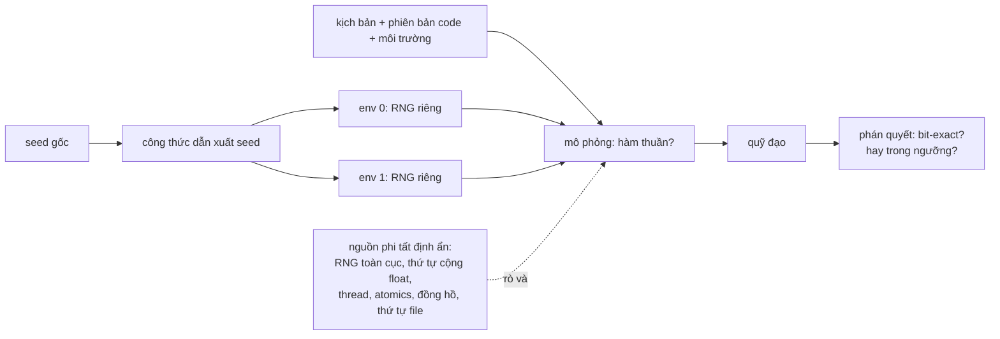
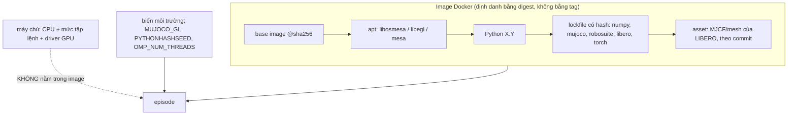
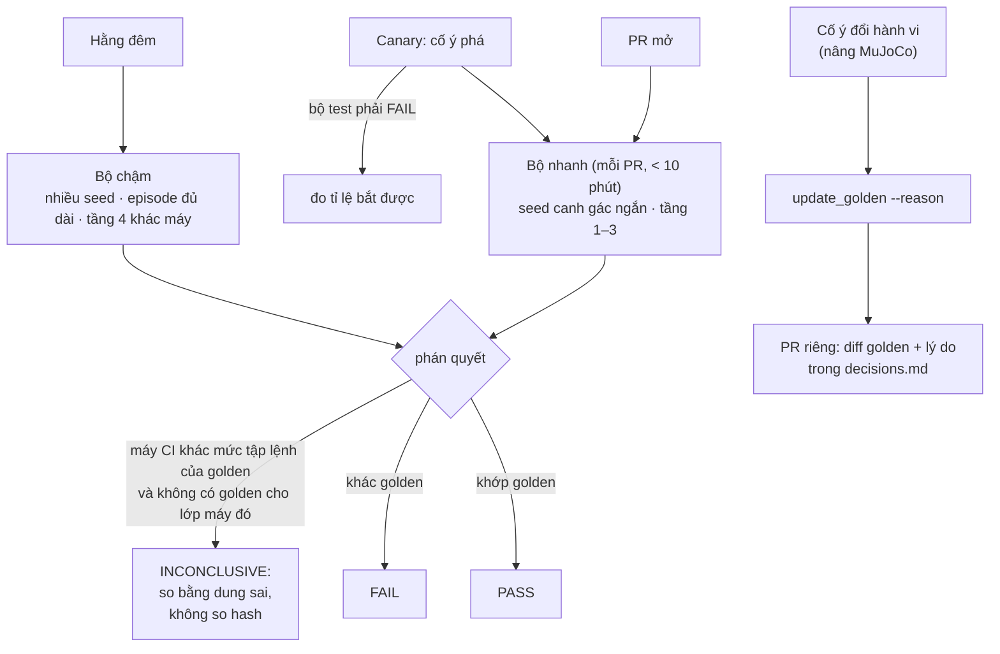

# Khóa 6 · Module 1 — Determinism (24h)

> Module nền của Khóa 6. Bốn bài: Bài 1 (4h) cam kết · Bài 2 (6h) dựng stack · Bài 3 (8h) săn nguồn phi tất định · Bài 4 (6h) chốt vào CI.
> Viên nang nền dùng nhiều nhất: **F2.2** (tái lập, hermetic, seed), **F2.6** (deterministic simulation testing), **F6.3** (tích phân số, vì sao tiếp xúc khó), **F2.5** (kiểm tra chính bài test), **F1.5** (so sánh hai thứ).
> Nguồn: `khoa-6-sim-eval-infra.md` dòng 70–259. Bản Gemini K6 lượt 1–4 chỉ dùng để gặt và liệt kê lỗi.

Bạn đã làm phần lớn module này trong nghề cũ mà chưa gọi đúng tên: dựng môi trường local tái tạo được (tên chuẩn: *hermetic environment*), server mock sinh bộ test chuẩn (*test fixture có kiểm soát*), CI tự chạy rồi báo cáo. Module này thêm ba thứ bạn chưa có: (1) **số học dấu phẩy động là một nguồn phi tất định** không sửa được bằng "cẩn thận hơn"; (2) **hệ vật lý có tiếp xúc khuếch đại sai lệch theo hàm mũ**, nên "gần giống" ở bước 1 không có nghĩa gì ở bước 1000; (3) **determinism mua được sức mạnh thống kê**, không chỉ khả năng debug.

---

## Bài 1 — Vì sao determinism là điều kiện tiên quyết, không phải tính năng đẹp (4h)

> **Vị trí:** K4 Bài 7 (đã chạm LIBERO) → **Bài 1** → Bài 2 (dựng stack) · **Cần trước:** F2.2, F2.6 (đọc lướt), F1.5 (phần power) · **Sau bài này bạn quyết định được:** cam kết loại determinism nào (bit-exact hay tương đương thống kê), ở **tầng nào** (cùng tiến trình / khác tiến trình / song song / khác máy), với ngưỡng bao nhiêu — và viết nó thành `DETERMINISM.md` trước khi cài bất cứ thứ gì.

### 1. Câu chuyện — ai đã khổ vì chuyện này

**FoundationDB (2009–2015).** Đội FoundationDB muốn viết một cơ sở dữ liệu phân tán có giao dịch ACID, loại hệ mà lỗi chỉ hiện ra khi mạng chậm đúng 3 ms, ổ đĩa trả lỗi đúng lúc leader đổi, và không bao giờ tái hiện lần thứ hai. Cách của họ: viết toàn bộ hệ trên một runtime mà mọi nguồn phi tất định (mạng, đĩa, đồng hồ, lập lịch) đều đi qua một lớp giả lập điều khiển bằng **một seed**. Một bug tìm thấy sau hàng triệu giờ mô phỏng được tái hiện **bằng đúng seed đó**, mỗi lần, trên máy laptop. Will Wilson kể lại trong bài nói *"Testing Distributed Systems w/ Deterministic Simulation"* ở Strange Loop 2014 [chuẩn]. Mô hình này lan ra: TigerBeetle có VOPR (bộ mô phỏng tất định chạy cụm replica trong một tiến trình), và Antithesis (do chính người của FoundationDB lập) làm một hypervisor tất định để áp kỹ thuật đó cho phần mềm bất kỳ [chuẩn]. → F2.6.

**Học tăng cường (2017–2018).** Henderson và cộng sự, *"Deep Reinforcement Learning that Matters"* (AAAI 2018), chạy cùng một thuật toán, cùng siêu tham số, chỉ khác seed, rồi chia 10 lần chạy thành hai nhóm 5: hai nhóm cho đường học khác nhau **có ý nghĩa thống kê** [chuẩn]. Nghĩa là nhiều bài báo "phương pháp A tốt hơn B" đang đo nhiễu của seed. Đây đúng là câu hỏi mở đầu khóa: 58% thành 62%, cải thiện hay nhiễu?

Điểm chung của hai câu chuyện: người ta không khổ vì "kết quả hơi khác nhau". Họ khổ vì **không còn phép so sánh nào có nghĩa**: không so được trước/sau khi sửa bug, không so được A/B, không tái hiện được lỗi để biết đã sửa chưa.

### 2. Mô hình tư duy



Bản chất: một lần chạy mô phỏng **phải là một hàm thuần** `f(kịch bản, code, môi trường, seed) → quỹ đạo`. Mọi đầu vào không nằm trong danh sách đối số (đồng hồ, thứ tự thread, trạng thái RNG toàn cục, thứ tự cộng) là một **đầu vào ẩn**. Determinism không phải là "không có ngẫu nhiên", mà là **mọi ngẫu nhiên đều đi vào qua cửa có tên** (seed). Hai mức cam kết:

| Loại | Nghĩa | Khả thi ở đâu | Kiểm bằng |
|---|---|---|---|
| **Bit-exact** | Cùng đầu vào → từng bit giống hệt | CPU, cùng phiên bản thư viện, cùng mức tập lệnh: khả thi. GPU song song: rất khó | So hash |
| **Tương đương thống kê** | Cùng đầu vào → lệch nhỏ, **trong ngưỡng đã nêu trước** | Mọi nơi, nếu ngưỡng được định nghĩa | So phân bố / so với dung sai, **không** so hash (xem Bài 3) |

MuJoCo tự nói rõ phạm vi của mình: pipeline mô phỏng tất định và tái lập được, nhưng *"exact reproducibility is only guaranteed within a single version, on the same architecture"*, và mọi sai khác số học dù nhỏ đến đâu cũng sẽ lớn lên khi tích phân, nhất là với tiếp xúc, vì sự kiện tiếp xúc có số mũ Lyapunov cao [spec: MuJoCo docs, Computation → Reproducibility]. Câu đó chứa cả bài: bit-exact có **biên** (phiên bản, kiến trúc), và bên ngoài biên đó bạn phải chuyển sang tiêu chí thống kê.

**Vì sao determinism mua được sức mạnh so sánh, không chỉ debug.** Khi mô phỏng tất định, bạn chạy policy cũ và policy mới trên **cùng** 200 cặp (kịch bản, seed). Những kịch bản dễ thì cả hai đều qua, kịch bản khó thì cả hai đều trượt; chỉ các **cặp bất đồng** mang thông tin. Kỹ thuật này có tên: *common random numbers* (CRN) trong mô phỏng, và kiểm định theo cặp (McNemar) trong thống kê. Mô phỏng đồ chơi dưới đây đo xem nó mua được bao nhiêu, và khi nào nó mất tác dụng:

```python
# [đã chạy] — Python 3.13, numpy 2.x, scipy
# Vì sao determinism mua được sức mạnh so sánh: chạy hai policy trên CÙNG bộ
# (kịch bản, seed) — "common random numbers" — rồi kiểm định theo cặp.
import numpy as np
from scipy.stats import binomtest, norm

rng = np.random.default_rng(0)
n, reps, effect = 200, 2000, 0.35          # 200 episode mỗi bên; hiệu ứng thật nhỏ
sig = lambda z: 1 / (1 + np.exp(-z))
hit_unpaired = hit_paired = hit_chaos = 0
for _ in range(reps):
    a = rng.normal(0, 2.0, n)               # độ khó từng kịch bản: rất khác nhau
    # KHÔNG tất định: mỗi bên bốc kịch bản + seed riêng
    a2 = rng.normal(0, 2.0, n)
    sA = rng.random(n) < sig(a); sB = rng.random(n) < sig(a2 + effect)
    p = (sA.sum() + sB.sum()) / (2 * n)
    z = (sB.mean() - sA.mean()) / np.sqrt(2 * p * (1 - p) / n)
    hit_unpaired += 2 * (1 - norm.cdf(abs(z))) < 0.05
    # TẤT ĐỊNH: cùng kịch bản, cùng số ngẫu nhiên u cho cả hai policy
    u = rng.random(n)
    sA = u < sig(a); sB = u < sig(a + effect)
    b01, b10 = int((~sA & sB).sum()), int((sA & ~sB).sum())   # cặp bất đồng
    if b01 + b10 > 0:
        hit_paired += binomtest(b01, b01 + b10, 0.5).pvalue < 0.05
    # CÙNG kịch bản nhưng hỗn loạn xóa liên kết seed: u độc lập cho mỗi bên
    sA = rng.random(n) < sig(a); sB = rng.random(n) < sig(a + effect)
    b01, b10 = int((~sA & sB).sum()), int((sA & ~sB).sum())
    if b01 + b10 > 0:
        hit_chaos += binomtest(b01, b01 + b10, 0.5).pvalue < 0.05
print(f"power, hai run độc lập (z-test hai tỉ lệ): {hit_unpaired / reps:.2f}")
print(f"power, cùng kịch bản + seed (McNemar)   : {hit_paired / reps:.2f}")
print(f"power, cùng kịch bản, seed mất liên kết : {hit_chaos / reps:.2f}")
```

Ba dòng in ra là ba thế giới: không tất định; tất định và quỹ đạo hai policy còn "dính" nhau; tất định nhưng hỗn loạn đã xóa liên kết giữa hai quỹ đạo, chỉ còn chung độ khó kịch bản. Đoán ba con số trước khi chạy (phần 5).

### 3. Cầu nối từ backend

| Backend bạn biết | Ở đây | Gãy ở chỗ | Nếu dùng nhầm thì |
|---|---|---|---|
| Môi trường local tái tạo được (Docker Compose, lockfile) | Hermetic sim env: image + lockfile + phiên bản MuJoCo | Ở backend "tái tạo" nghĩa là **cùng hành vi chức năng**; ở đây nghĩa là **cùng bit**. Một bản vá minor của MuJoCo không đổi API nhưng đổi bit cuối, và bit cuối nở ra thành quỹ đạo khác | Bạn nâng MuJoCo "vì không breaking change", hash cũ vỡ hết, và bạn không biết đó là thay đổi thật hay chỉ là số học |
| Replay request log để tái hiện bug | Seed + kịch bản tái hiện một episode | Replay backend thường chịu được sai khác nhỏ (timestamp khác vẫn ra cùng response). Ở đây sai 1 ULP ở bước 1 có thể thành robot trượt khỏi vật ở bước 900 | Bạn tin "tái hiện gần đúng là đủ", rồi mất hai ngày đuổi một bug chỉ có ở lần chạy gốc |
| Script chấm pass/fail/inconclusive của bạn | Phán quyết tái lập: bit-exact / trong ngưỡng / ngoài ngưỡng | Ở eval LLM, INCONCLUSIVE thường vì judge không chắc. Ở đây phán quyết "giống nhau" cần **ngưỡng viết trước** và cách đo đúng (hash không đo được "gần bằng", xem Bài 3) | Bạn đặt ngưỡng sau khi thấy kết quả, và ngưỡng luôn vừa đủ lỏng để PASS |
| Đo trên host "yên tĩnh" để test bớt nhiễu | Không có tương đương trực tiếp | Host yên tĩnh khử **nhiễu thời gian** (latency). Phi tất định số học không đến từ tải máy, trừ hai ngoại lệ: code đọc đồng hồ, và thư viện song song (BLAS đa luồng) đổi cách chia việc theo số luồng | Bạn chạy trên máy yên tĩnh, thấy kết quả "ổn định", kết luận đã tất định, rồi CI trên máy 4 vCPU cho số khác |

**Chấm mô hình:**

1. *"Determinism nghĩa là cùng đầu vào ra cùng thời gian thực thi, mọi lần."* (định nghĩa trong `robotics-data-infra-roadmap.md`, mục thuật ngữ) — **ĐÚNG MỘT PHẦN, sai ngữ cảnh.** Đó là **determinism về thời gian** của hệ thời gian thực (WCET, jitter, → F5.3). Khóa 6 nói về **determinism về kết quả** (reproducibility). Hai thứ độc lập: một mô phỏng chạy lúc 3 s lúc 5 s vẫn có thể bit-exact; một vòng điều khiển 1 kHz có jitter 0 vẫn có thể cho kết quả khác nhau nếu đọc RNG toàn cục. Phản ví dụ: MuJoCo trên laptop đang chạy trình duyệt nặng: thời gian mỗi `mj_step` dao động mạnh, quỹ đạo vẫn giống từng bit.
2. *"Cùng seed thì cùng kết quả."* — **ĐÚNG MỘT PHẦN.** Seed chỉ khống chế những gì đi qua RNG được seed. Nó không khống chế thứ tự cộng float, thứ tự thread, thứ tự `os.listdir`, đồng hồ, phiên bản thư viện, hay nhánh SIMD mà numpy chọn theo CPU. Phản ví dụ chạy được ngay trên máy bạn: Bài 3 có đoạn code cho thấy cùng binary numpy, cùng input, `np.exp` ra hash khác nhau khi chỉ đổi mức tập lệnh CPU được phép dùng.
3. *"Không đạt bit-exact thì determinism coi như hỏng."* — **SAI.** Bit-exact là một mức cam kết, không phải định nghĩa. Phần lớn hệ GPU sống ở mức tương đương thống kê, và đó là lựa chọn hợp lệ nếu ngưỡng được viết trước và được chứng minh là đủ chặt để bắt thay đổi thật. Phản ví dụ: CI của bạn chạy trên runner có CPU khác máy dev; không bit-exact, nhưng sai khác cuối episode nằm trong ngưỡng và canary của Bài 4 vẫn bị bắt 100%. Đó là một hệ tất định đủ dùng.

### 4. Thuật ngữ

| Mức | Thuật ngữ | Nghĩa trong một câu | Hay bị hiểu nhầm thành |
|---|---|---|---|
| 🟢 | Determinism (về kết quả) / reproducibility | Cùng đầu vào khai báo → cùng đầu ra, ở mức đã cam kết | Determinism về thời gian (WCET, jitter) của hệ thời gian thực |
| 🟢 | Bit-exact | Giống từng bit; kiểm được bằng hash | "Giống đến 6 chữ số" (đó là dung sai, khác loại) |
| 🟢 | Tương đương thống kê | Lệch trong ngưỡng nêu trước; kiểm bằng phép so có dung sai hoặc so phân bố | Lời bào chữa khi không làm được bit-exact |
| 🟢 | Seed gốc / seed dẫn xuất | Một số gốc sinh ra seed riêng cho từng env/episode theo công thức xác định | Một seed toàn cục đặt ở đầu chương trình |
| 🟢 | Float không kết hợp | `(a+b)+c` có thể khác `a+(b+c)` ở bit cuối | Lỗi phần cứng, hoặc thứ chỉ xảy ra trên GPU |
| 🟡 | Hệ hỗn loạn / số mũ Lyapunov λ | Sai lệch nhỏ lớn lên xấp xỉ `δ(t) ≈ δ₀·e^{λt}` | "Mô phỏng sai" (hỗn loạn có cả ở vật lý thật) |
| 🟡 | Common random numbers (CRN) | So hai cấu hình trên cùng bộ số ngẫu nhiên để triệt nhiễu chung | Gian lận, hay "cố định seed để kết quả đẹp" |
| 🟡 | Deterministic simulation testing (DST) | Chạy cả hệ phân tán trong một tiến trình với mọi I/O đi qua giả lập có seed | Chaos engineering (Jepsen, Chaos Monkey không tất định) |
| 🔴 | Hypervisor tất định (Antithesis) | Ảo hóa cả máy để mọi thứ tái lập | Thứ bạn cần dựng ở khóa này |

### 5. Dự đoán

Bài này là bài cam kết, phần dự đoán có hai phần.

**A. Dự đoán về stack.** Bản gốc liệt kê bảy nguồn phá determinism. Với mỗi nguồn, dự đoán: có xuất hiện trong stack MuJoCo + robosuite + LIBERO (+ PyTorch nếu có policy) không, và nếu có thì ở đâu.

| # | Nguồn | Biểu hiện | Tra ở đâu |
|---|---|---|---|
| 1 | RNG toàn cục (`numpy.random`, `random`, `torch`) | Đổi thứ tự gọi → đổi kết quả | `grep -rn "np.random\.\(uniform\|rand\|choice\|normal\)" ` trong source robosuite/LIBERO **đúng phiên bản bạn sẽ cài** |
| 2 | Seed mỗi env không độc lập | 4 env song song ≠ 4 env tuần tự | Code tạo env của bạn |
| 3 | Float không kết hợp | Reduction song song khác nhau mỗi lần | Chỗ nào có tổng song song: GPU, BLAS đa luồng, `mju_threadpool` của MuJoCo |
| 4 | Chọn thuật toán động (cuDNN benchmark, TF32) | Lần đầu kernel này, lần sau kernel khác | PyTorch docs, mục *Reproducibility* |
| 5 | Thứ tự thread / atomics | Không lặp lại được | GPU, thread pool |
| 6 | Thứ tự nạp asset, duyệt thư mục | `os.listdir`, `set` của chuỗi không có thứ tự đảm bảo | Code nạp asset, mọi chỗ duyệt `set` |
| 7 | Đồng hồ treo tường | `time.time()` ảnh hưởng logic | `grep -rn "time.time\|datetime.now"` |

Thêm hai nguồn bản gốc chưa liệt kê, dự đoán luôn: (8) **phiên bản và mức tập lệnh CPU** (MuJoCo chỉ hứa bit-exact trong một phiên bản, một kiến trúc; numpy chọn nhánh SIMD theo CPU lúc chạy); (9) **trạng thái phụ của solver** không nằm trong "state" bạn lưu (warmstart của MuJoCo, xem Bài 3).

**B. Dự đoán số từ mô phỏng CRN ở phần 2.** Không chạy code trước khi ghi ba con số power.

Phương pháp: power của z-test hai tỉ lệ ở n = 200 mỗi bên, hiệu ứng nhỏ, phụ thuộc phương sai `p(1−p)` (→ F1.5). McNemar chỉ dùng cặp bất đồng; số cặp bất đồng càng ít thì nhiễu càng ít. Câu hỏi bạn phải tự trả lời: khi hai policy dùng chung `u`, cặp bất đồng xảy ra khi nào?

```markdown
# prediction.md — K6 Bài 1
## A. Nguồn phi tất định trong stack của tôi
| # | Có trong stack? | Ở đâu (file/thư viện) | Xử lý dự kiến |
|---|---|---|---|
| 1 … 9 | | | |
Nguồn tôi đoán sẽ tốn thời gian bisect nhất: ___ vì ___

## B. Mô phỏng CRN (n = 200 mỗi bên)
- power hai run độc lập: ___
- power cùng kịch bản + seed: ___
- power cùng kịch bản, seed mất liên kết: ___
- Lập luận (2–3 câu): ___

## C. Cam kết
- Loại: bit-exact / tương đương thống kê, ở tầng: ___
- Ngưỡng (nếu thống kê): đại lượng ___, dung sai ___, đo bằng ___
- FAIL action: không đạt bit-exact sau 30h → chuyển sang tương đương thống kê (đã cam kết ở gate)
```

### 6. Làm

1. **Viết `DETERMINISM.md` trước khi code.** Ba mục bắt buộc: cam kết loại nào **ở từng tầng** (bảng 4 tầng: cùng tiến trình / khác tiến trình / tuần tự vs song song / khác máy, xem Bài 3), ngưỡng bao nhiêu nếu không bit-exact (đại lượng nào, dung sai bao nhiêu, đo ở bước nào của episode), và đo bằng gì (hash cho bit-exact; so mảng có dung sai cho tương đương thống kê).
2. **Với mỗi nguồn trong bảng 9 mục ở phần 5**, viết một câu: có trong stack không, xử lý thế nào. Với nguồn 1, đi tìm thật trong source (đừng đoán): cài thử robosuite đúng phiên bản LIBERO pin vào một virtualenv tạm hoặc đọc source trên GitHub theo tag, rồi `grep` như bảng.
3. **Commit `prediction.md`** (phần A, B, C) rồi mới chạy mô phỏng CRN ở phần 2.
4. Chạy mô phỏng CRN. Đổi `effect` lên 0.7 và xuống 0.1, và đổi độ lệch chuẩn độ khó từ 2.0 xuống 0.5. Ghi vào `notes/01-crn.md`: khi nào CRN mua được nhiều, khi nào ít.
5. Ghi vào `DETERMINISM.md` một đoạn "**Determinism mua gì cho tôi**": tái hiện bug, canary trong CI (Bài 4), và so sánh theo cặp (nối với Bài 12–13). Đoạn này sẽ quyết định Bài 13 có dùng kiểm định theo cặp hay không.

Sai số của dụng cụ đo ở bài này: power ước lượng từ 2000 lần lặp có sai số chuẩn `√(p(1−p)/2000)`, cỡ ±1 điểm phần trăm quanh p = 0.5 [chuẩn]. Chênh lệch dưới 2–3 điểm giữa hai lần chạy với seed khác là nhiễu của chính phép mô phỏng.

### 7. Số phải ra

<details><summary>🔒 MỞ SAU KHI COMMIT prediction.md</summary>

**Mô phỏng CRN** (Python 3.13, numpy 2.x, seed 0; số của bạn lệch ±0.02 nếu đổi seed):

| Thiết kế | Power ở n = 200 |
|---|---|
| Hai run độc lập, z-test hai tỉ lệ | ≈ 0.17–0.18 |
| Cùng kịch bản + cùng `u` (McNemar) | ≈ 0.95–0.97 |
| Cùng kịch bản, `u` độc lập (hỗn loạn xóa liên kết) | ≈ 0.23 |

Đọc bảng:
- Dòng 2 so với dòng 1: cùng n, power tăng gấp 5. Lý do: khi chung `u`, cặp bất đồng chỉ xảy ra khi `u` rơi vào khoảng hẹp giữa `sig(a)` và `sig(a+effect)`, nên **mọi** cặp bất đồng đều nghiêng về B. Nhiễu gần như bị triệt hết.
- Dòng 3 là cảnh tỉnh: nếu thay đổi policy làm quỹ đạo phân kỳ sớm (hệ tiếp xúc hỗn loạn, Bài 3), liên kết qua seed mất, chỉ còn liên kết qua **độ khó kịch bản**, và lợi ích còn rất ít. Trong mô phỏng robot thật, bạn sẽ ở đâu đó giữa dòng 2 và dòng 3. Bao nhiêu thì phải **đo** (hệ số tương quan thành công giữa hai policy trên cùng kịch bản), không giả định.
- Hệ quả thiết kế: determinism + seed dẫn xuất từ (kịch bản, chỉ số episode) là điều kiện **cần** để dùng thiết kế theo cặp ở Bài 12–13. Không có nó, bạn bị kẹt ở dòng 1.

**Tự kiểm tra của bản gốc**, với số được làm rõ:
- 58% vs 62%, n = 100 mỗi bên. Sai số chuẩn của **một** tỉ lệ ở p ≈ 0.6: `√(0.24/100) ≈ 0.049`, CI 95% ≈ ±9.6 điểm. Sai số chuẩn của **hiệu** hai tỉ lệ độc lập: `√2 × 0.049 ≈ 0.069`, CI 95% của hiệu ≈ ±13.6 điểm. Hiệu quan sát 4 điểm nằm sâu trong khoảng đó. Không kết luận được gì. (Nếu là thiết kế theo cặp trên cùng 100 kịch bản, câu trả lời phụ thuộc số cặp bất đồng, không phụ thuộc 58/62.)
- Bit-exact dễ trên CPU đơn luồng vì thứ tự mọi phép tính cố định qua các lần chạy; trên GPU, thứ tự cộng trong reduction song song phụ thuộc lập lịch phần cứng và cách chia batch.

**Nguồn 1 trong stack (đáp án cho bước 2):** robosuite 1.4.0, phiên bản LIBERO pin trong `requirements.txt`, lấy mẫu vị trí vật bằng `np.random.uniform` **toàn cục** trong `robosuite/utils/placement_samplers.py` [spec: source robosuite tag v1.4.0]. robosuite 1.5.x đổi sang `self.rng`, nhưng mặc định là `np.random.default_rng()` **không seed** nếu bạn không truyền `rng` [spec: source robosuite tag v1.5.2]. Cả hai bản đều có nguồn 1, theo hai cách khác nhau. LIBERO thường né được vì đánh giá bằng bộ init state cố định (`set_init_state`), nhưng `reset()` vẫn chạy sampler trước đó.

</details>

### 8. Nếu ra khác

| Triệu chứng | Nguyên nhân khả dĩ | Kiểm bằng cách | Sửa |
|---|---|---|---|
| Power dòng 2 thấp gần dòng 1 | Bạn sinh `u` riêng cho A và B (sai cài đặt CRN) | In `(sA != sB).sum()` cho một lần lặp; với CRN đúng nó rất nhỏ | Dùng chung một mảng `u` |
| Power dòng 1 cao bất thường (> 0.5) | `effect` quá lớn hoặc độ khó quá đồng đều | In `sA.mean(), sB.mean()` | Giữ tham số như đề trước, rồi mới thay đổi |
| `DETERMINISM.md` chỉ có một dòng "bit-exact" | Chưa tách theo tầng | Đối chiếu bảng 4 tầng của Bài 3 | Cam kết riêng từng tầng; tầng "khác máy" gần như luôn cần ngưỡng |
| Không tìm thấy RNG toàn cục nào khi grep | Grep sai phiên bản source, hoặc RNG nằm trong thư viện phụ (robomimic, bddl) | `pip show` phiên bản rồi grep đúng thư mục `site-packages` | Grep cả cây phụ thuộc, không chỉ thư viện chính |

### 9. Câu hỏi ngược

1. **[Phản biện]** FoundationDB đặt **mọi** I/O dưới seed. Một simulator vật lý không có mạng, không có đĩa. Vậy "phi tất định" trong sim có cùng bản chất với phi tất định trong hệ phân tán không, hay chỉ cùng tên?
   <details><summary>Hướng nghĩ</summary>Hệ phân tán: phi tất định đến từ **môi trường** (thời điểm gói tin tới, lập lịch) và DST biến nó thành đầu vào có seed. Sim vật lý: môi trường đã là hàm thuần; phi tất định đến từ **cách tính** (thứ tự cộng, song song) và từ đầu vào ẩn. Một bên thêm seed cho thế giới, bên kia loại đầu vào ẩn khỏi phép tính. Hỏi tiếp: khi sim chạy cùng policy là một mạng nơ-ron trên GPU, bạn rơi vào loại nào?</details>
2. **[Nếu…thì]** Nếu bạn cam kết tương đương thống kê với dung sai 1e-6 trên vị trí vật **ở cuối** episode 500 bước, còn hệ có λ ≈ 2 s⁻¹ và episode dài 10 s, ngưỡng đó có ý nghĩa không?
   <details><summary>Hướng nghĩ</summary>Dùng `δ(t) ≈ δ₀·e^{λt}` với δ₀ cỡ 1e-16. Tính δ ở t = 10 s rồi so với 1e-6. Câu hỏi thật: ngưỡng ở cuối episode đo cái gì, độ chính xác số học hay độ dài episode? Có nên đặt ngưỡng ở bước sớm, hoặc trên đại lượng tổng hợp (thành công/thất bại) thay vì trên trạng thái?</details>
3. **[Quy mô]** 100 robot thật, 1000 giờ dữ liệu, 10.000 episode sim mỗi đêm. Thứ gì trong cam kết determinism gãy trước: hash, ngưỡng, hay khả năng lưu golden?
   <details><summary>Hướng nghĩ</summary>Hash rẻ, ngưỡng cần lưu quỹ đạo tham chiếu (đắt). Ở quy mô, người ta giữ bit-exact cho một tập nhỏ seed "canh gác" và chuyển phần còn lại sang so phân bố. Câu hỏi là chọn tập canh gác thế nào để nó phủ các nhánh code hiếm (nơi RNG toàn cục hay trốn).</details>
4. **[Failure mode]** Hệ của bạn tất định hoàn hảo, nhưng tất định **sai**: một bug làm mọi episode bỏ qua bước áp ma sát. Determinism có giúp phát hiện không? Có làm tệ hơn không?
   <details><summary>Hướng nghĩ</summary>Determinism chỉ nói "lặp lại được", không nói "đúng". Nó còn làm bug ổn định, nên không có "lần chạy lạ" để nghi ngờ. Phát hiện bug kiểu này cần oracle khác: kiểm vật lý (bảo toàn năng lượng khi không có ma sát), so với công thức giải tích (Module 5), metamorphic test (→ F2.4).</details>
5. **[Liên ngành]** Trong thử nghiệm lâm sàng, ghép cặp (matched pairs) và thiết kế chéo (crossover) dùng cùng ý tưởng với CRN. Chỗ nào ở robot sim **tốt hơn** y sinh, chỗ nào **khó hơn**?
   <details><summary>Hướng nghĩ</summary>Sim cho bạn một "bệnh nhân" sao chép hoàn hảo: cùng kịch bản, cùng seed, chạy cả hai điều trị, không có hiệu ứng mang sang (carry-over). Khó hơn: hỗn loạn làm hai "liệu trình" phân kỳ, nên ghép cặp yếu dần theo thời gian episode. Y sinh không có khái niệm "bệnh nhân phân kỳ hàm mũ".</details>

### 10. Liên kết ra ngoài

- **Hệ phân tán: FoundationDB, TigerBeetle VOPR, Antithesis (→ F2.6).** Giống: biến mọi nguồn phi tất định thành đầu vào có tên, để mỗi lỗi có một seed tái hiện. Khác: ở đó mục tiêu là **tìm bug** (càng nhiều kịch bản lạ càng tốt); ở đây mục tiêu chính là **đo** (so sánh hai cấu hình), tìm bug là phụ.
- **Suy luận LLM.** Bài *"Defeating Nondeterminism in LLM Inference"* (Horace He, Thinking Machines Lab, 9/2025) chỉ ra rằng ở temperature 0, kết quả khác nhau giữa các lần gọi chủ yếu không phải vì atomics, mà vì kernel **không bất biến theo batch**: kết quả của một request phụ thuộc vào có bao nhiêu request khác đang chạy cùng [chuẩn]. Giống: đúng nguồn 3 (thứ tự reduction). Khác: ở đó tải server là đầu vào ẩn; ở bạn, **số env trong một batch** (MJX, vectorized env) là đầu vào ẩn. Đây là lý do Bài 3 bắt kiểm "tuần tự vs song song".
- **Khí tượng.** Lorenz (1963) phát hiện hỗn loạn khi nhập lại số liệu đã làm tròn từ 6 xuống 3 chữ số và dự báo đi lệch hẳn [chuẩn]. Dự báo thời tiết hiện đại bỏ ý định chạy "một quỹ đạo đúng" và chạy **ensemble**: hàng chục lần với nhiễu nhỏ, báo cáo phân bố. Đó chính là lối ra của Module 4 khi quỹ đạo không còn so được.

### 11. Độ tin cậy và sửa lỗi

| Khẳng định | Nhãn | Ghi chú / cách kiểm |
|---|---|---|
| MuJoCo chỉ hứa bit-exact trong một phiên bản, một kiến trúc | [spec] | MuJoCo docs, Computation → Reproducibility (đọc bản đúng phiên bản bạn cài) |
| robosuite 1.4.0 dùng `np.random` toàn cục trong placement sampler; 1.5.x dùng `rng` mặc định không seed | [spec] | Source robosuite theo tag; kiểm lại trên bản bạn cài |
| LIBERO pin `robosuite==1.4.0`, Python 3.8 | [spec] | `requirements.txt` và README của repo LIBERO, nhánh master tại 10/2026; kiểm lại khi cài |
| Henderson et al. 2018: hai nhóm 5 seed khác nhau có ý nghĩa | [chuẩn] | Đọc mục "Random seeds and trials" của bài báo |
| Power ba thiết kế ở bảng 🔒 | [đã chạy] | Mô phỏng đồ chơi, không phải số của robot thật |
| Batch invariance là nguồn chính của phi tất định suy luận LLM | [chuẩn] | Theo bài blog Thinking Machines 9/2025; chỉ áp cho bối cảnh đó |

**Đã sửa so với bản gốc/Gemini:**
- Bản gốc và Gemini nói CI 95% của **một** tỉ lệ (±9.8 điểm) khi câu hỏi là so **hai** run. Đã thêm sai số của **hiệu** (±13.6 điểm) và chỉ ra thiết kế theo cặp đổi hẳn câu trả lời.
- Bảng 7 nguồn của bản gốc thiếu hai nguồn có thật trong stack này: phiên bản/mức tập lệnh CPU (MuJoCo tự nêu; numpy dispatch SIMD), và trạng thái solver ngoài state (warmstart). Đã thêm thành nguồn 8, 9.
- Bản gốc viết "dict ordering" không có trong bảng nhưng gợi ý đề bài nhắc tới: từ Python 3.7, `dict` giữ thứ tự chèn theo đặc tả ngôn ngữ [spec: Python docs]. Thứ không có thứ tự là `set` của chuỗi (phụ thuộc hash, tức `PYTHONHASHSEED`) và `os.listdir`. Đã gộp vào nguồn 6.
- Gemini kết bài bằng câu hỏi mời học tiếp và gắn `[cite]` mọi dòng: bỏ.

### 12. Đọc thêm và tự kiểm tra

- **Nguồn gốc:** MuJoCo docs, mục *Computation → Reproducibility* và *Simulation → State* (đọc bản khớp phiên bản cài). PyTorch docs, *Reproducibility* notes.
- **Giải thích:** Will Wilson, *Testing Distributed Systems w/ Deterministic Simulation*, Strange Loop 2014 (video).
- **Đào sâu (tùy chọn):** Henderson et al., *Deep Reinforcement Learning that Matters*, AAAI 2018.
- **Tự kiểm tra:** (1) giải thích lại cho một backend engineer khác trong 5 câu vì sao determinism là điều kiện của **phép so sánh**, không chỉ của debug; (2) vẽ lại sơ đồ phần 2 từ trí nhớ, ghi đủ các "đầu vào ẩn"; (3) hai câu dưới.

**Câu 1.** Đồng nghiệp nói: "Tôi cố định `np.random.seed(0)` ở đầu `main.py`, nên hệ tất định rồi." Nêu hai cách hệ đó vẫn không tái lập được.
<details><summary>Đáp án</summary>(a) Thứ tự gọi RNG toàn cục phụ thuộc thứ tự chạy: chạy episode 3 sau episode 2 khác chạy episode 3 đứng một mình; song song thì thứ tự còn phụ thuộc lập lịch. (b) Các nguồn không đi qua RNG: phiên bản MuJoCo, nhánh SIMD theo CPU, reduction song song, `set` chuỗi khi `PYTHONHASHSEED` khác, đồng hồ. Thêm (c): tiến trình con được `spawn` không thừa hưởng trạng thái RNG đã seed của tiến trình cha.</details>

**Câu 2.** Vì sao hệ hỗn loạn không làm determinism vô dụng, mà chỉ đổi cách dùng nó?
<details><summary>Đáp án</summary>Bên trong biên (cùng phiên bản, cùng kiến trúc, cùng cách song song), hỗn loạn không phá bit-exact: cùng bit vào thì cùng bit ra, hỗn loạn chỉ khuếch đại **sai khác**, mà không có sai khác thì không có gì để khuếch đại. Bên ngoài biên, hỗn loạn biến sai khác 1 ULP thành quỹ đạo khác, nên phải chuyển sang so phân bố (Module 4) và dùng seed để ghép cặp kịch bản chứ không để so quỹ đạo.</details>

---

## Bài 2 — Dựng stack và chạy episode đầu tiên (6h)

> **Vị trí:** Bài 1 (cam kết) → **Bài 2** → Bài 3 (săn nguồn phi tất định) · **Cần trước:** F2.2 (lockfile, hermetic), K4 Bài 7 (LIBERO), F1.3 (benchmark đúng cách: warmup, cô lập nhiễu) · **Sau bài này bạn quyết định được:** chọn **tổ hợp phiên bản** (Python, MuJoCo, robosuite, LIBERO, backend đồ họa) và ghim nó thành image có digest; biết một episode tốn bao nhiêu giây CPU, để mọi kế hoạch quy mô sau này (Bài 8, Bài 12) có đơn vị tính.

### 1. Câu chuyện — ai đã khổ vì chuyện này

Đây là tình trạng thật của repo, không phải một sự cố có tên. LIBERO, benchmark bạn đã chạm ở K4 Bài 7, hướng dẫn cài bằng `python=3.8.13`, `torch==1.11.0+cu113`, và `requirements.txt` ghim `robosuite==1.4.0`, `numpy==1.22.4` [spec: README và `requirements.txt` của repo LIBERO, nhánh master, kiểm 10/2026]. Trong khi đó robosuite 1.4.0 khai báo `mujoco>=2.3.0` **không có cận trên** [spec: `setup.py` của robosuite tag v1.4.0], và MuJoCo ra bản minor mới khoảng mỗi 3–6 tuần (từ 3.10.0 tháng 6/2026 đến 3.15.0 tháng 10/2026 trên PyPI), hiện yêu cầu Python ≥ 3.10 [spec: metadata PyPI của `mujoco`, 10/2026]. Python 3.8 đã hết hỗ trợ từ 10/2024 [chuẩn].

Hệ quả: **phiên bản MuJoCo bạn nhận được là một hàm của phiên bản Python bạn chọn**, không phải của `requirements.txt`. Hai người cài "theo đúng README" cách nhau ba tháng, trên hai bản Python, nhận hai MuJoCo khác nhau, và theo chính docs MuJoCo thì hai bản khác nhau không hứa cùng bit. Không ai sai quy trình, và kết quả vẫn không so được. Đó là lý do bước 6 của bài này (lockfile pin cả MuJoCo và robosuite) không phải thủ tục.

### 2. Mô hình tư duy



Ba câu bản chất:
1. Image Docker đóng băng **phần mềm**, không đóng băng **phần cứng**. CPU, mức tập lệnh (AVX2 hay AVX-512), driver GPU nằm ngoài container và vẫn là đầu vào của phép tính.
2. "Build lại từ Dockerfile" và "dùng lại image cũ" là hai việc khác nhau. `apt-get install` và `FROM ubuntu:24.04` lấy bản **mới nhất tại thời điểm build**. Thứ tái lập được là **image đã build, gọi bằng digest**; Dockerfile chỉ là công thức.
3. Một episode có hai phần chi phí rất khác nhau: **vật lý** (`mj_step`, C, nhanh) và **mọi thứ quanh nó** (controller, observable, render camera bằng Python/OpenGL). Bạn đang benchmark phần nào phải được nói rõ.

### 3. Cầu nối từ backend

| Backend bạn biết | Ở đây | Gãy ở chỗ | Nếu dùng nhầm thì |
|---|---|---|---|
| `docker compose up` dựng lại môi trường local | Image sim có digest | Backend chịu được Postgres 16.2 → 16.4; sim không chịu được MuJoCo 3.14 → 3.15 ở mức bit | Bạn rebuild image "cho sạch", hash golden ở Bài 4 vỡ hết, không biết vì đâu |
| `package-lock.json` / `poetry.lock` | Lockfile có hash cho Python | Lockfile không ghim apt, không ghim Python patch, không ghim CPU | Bạn tin lockfile là đủ, rồi máy CI có AVX-512 cho số khác (Bài 3) |
| Server mock tự tạo bộ test chuẩn | Env LIBERO với init state cố định | Mock của bạn là code của bạn; env LIBERO là code của người khác, có RNG toàn cục và quy ước bạn chưa đọc (Bài 1) | Bạn coi env là hộp đen đáng tin, và tin luôn cờ `success` của nó (Bài 11 sẽ đập điều này) |
| Load test: thêm worker tới khi throughput bão hòa | Thêm process tới khi episode/phút bão hòa | Trên N100, thêm core làm **giảm tần số mỗi core** (turbo một nhân cao hơn turbo mọi nhân) và cả bốn core chia một kênh RAM | Bạn ngoại suy tuyến tính từ 1 core ra 4 core, và kế hoạch 10.000 episode ở Bài 8 sai cả lần |

**Chấm mô hình:**

1. *"Đóng gói trong Docker là tái lập 100% trên bất kỳ máy nào."* (Gemini K6 lượt 2) — **ĐÚNG MỘT PHẦN.** Đúng về phần mềm nếu bạn giữ image theo digest. Sai ở hai chỗ: (a) build lại từ Dockerfile không cho cùng image nếu base image gọi bằng tag và có `apt-get` không ghim; (b) container không ghim CPU. Phản ví dụ: cùng một image, `np.exp` trên một triệu số cho hash khác nhau giữa máy có AVX-512 và máy không có (đoạn code ở Bài 3 tái hiện được trên một máy).
2. *"Throughput không tăng khi thêm thread vì GIL, nên dùng process."* (bản gốc, bảng Nếu ra khác) — **ĐÚNG MỘT PHẦN.** Bindings Python của MuJoCo **nhả GIL** trong lúc gọi hàm C, và `mj_step(m, d, nstep=20)` chạy 20 bước không giữ GIL [spec: MuJoCo docs, Python bindings]. Thread giúp được cho vòng vật lý thuần; nó không giúp robosuite/LIBERO vì phần lớn thời gian `env.step` là Python (controller, observable). Kết luận "dùng process" vẫn đúng cho stack này, nhưng lý do là **tỉ lệ thời gian Python**, không phải "MuJoCo bị GIL khóa".
3. *"Tắt render là xong."* — **ĐÚNG MỘT PHẦN.** Với LIBERO, observation mặc định **có ảnh camera** (`use_camera_obs=True`, `has_offscreen_renderer=True` trong `ControlEnv`, và `OffScreenRenderEnv` ép offscreen renderer bật) [spec: `libero/libero/envs/env_wrapper.py`]. Policy thật (VLA) cần ảnh, nên với đánh giá thật bạn không tắt được render; chỉ tắt được khi benchmark vật lý hoặc chạy policy ngẫu nhiên. Phải đo **cả hai** chế độ và ghi rõ số nào là số nào.

### 4. Thuật ngữ

| Mức | Thuật ngữ | Nghĩa trong một câu | Hay bị hiểu nhầm thành |
|---|---|---|---|
| 🟢 | Image digest | Hash nội dung của image (`sha256:…`), bất biến | Tag (`:latest`, `:24.04`), là con trỏ có thể dời |
| 🟢 | Lockfile có hash | Danh sách phiên bản chính xác kèm hash file wheel | `requirements.txt` có `>=` |
| 🟢 | Headless rendering | Render ảnh không cần màn hình, qua EGL (GPU) hoặc OSMesa (CPU) | "Không render" |
| 🟢 | Episode, step, substep | Một lượt task; một bước điều khiển; các `mj_step` vật lý bên trong một bước điều khiển | Một step = một `mj_step` |
| 🟡 | `MUJOCO_GL` | Biến môi trường chọn backend OpenGL của MuJoCo: `egl`, `osmesa`, `glfw` | Biến của Docker |
| 🟡 | Throughput vs latency của episode | Episode/phút trên cả máy vs giây/episode trên một core | Hai cách nói một số |
| 🔴 | Reproducible build (bit-identical image) | Build hai lần ra image giống từng byte | Thứ bạn cần cho khóa này; bạn chỉ cần **giữ** image, không cần build lại giống hệt |

### 5. Dự đoán

**Đề:** trên N100 trong Docker, (1) một episode LIBERO-Object với policy ngẫu nhiên, không render, mất bao nhiêu giây? (2) cùng episode, có render offscreen 2 camera 128×128 qua OSMesa? (3) throughput (episode/phút) với 1, 2, 3, 4 process song song; (4) build lại image từ cùng Dockerfile sau một tuần thì `pip freeze` và `dpkg -l` có giống không?

**Tham số cần tra:**
- Số bước điều khiển tối đa của một episode LIBERO-Object (trong code đánh giá của LIBERO hoặc của OpenVLA, tìm `max_steps`), tần số điều khiển (`control_freq` của robosuite env), `timestep` của model (đọc `env.sim.model.opt.timestep`). Từ đó: số `mj_step` mỗi episode.
- Thời gian một `mj_step` của mô hình Panda + vài vật: đo trực tiếp bằng `mujoco.mj_step(m, d, nstep=1000)` và `time.perf_counter()`. Đừng tra số người khác.
- Tần số turbo một nhân và mọi nhân của N100: datasheet Intel ARK cho N100 chỉ ghi turbo tối đa; tần số mọi nhân phải đo bằng `turbostat` (K4 Bài 11) [tự đo].

**Phương pháp:** thời gian episode ≈ (số bước điều khiển) × [(substep mỗi bước) × (thời gian `mj_step`) + (overhead Python mỗi bước) + (render mỗi bước)]. Đo từng thành phần riêng, rồi cộng, rồi so với đo cả episode. Nếu tổng thành phần lệch đo trực tiếp >20%, bạn đang bỏ sót một thành phần.

```markdown
# prediction.md — K6 Bài 2
- Số mj_step mỗi episode: ___ (từ max_steps ___ × substep ___)
- t(mj_step) dự đoán: ___ µs · overhead Python mỗi bước: ___ ms · render 2 cam OSMesa: ___ ms
- Episode không render: ___ s · có render: ___ s
- Throughput 1/2/3/4 process: ___ / ___ / ___ / ___ episode/phút (vì sao không tuyến tính: ___)
- Build lại sau 1 tuần: pip freeze giống? ___  dpkg -l giống? ___
```

### 6. Làm

1. **Chọn tổ hợp phiên bản trước khi cài.** Viết vào `decisions.md`: Python bao nhiêu (ràng buộc: `numpy==1.22.4` của LIBERO không có wheel cho Python mới; MuJoCo hiện cần ≥ 3.10; README LIBERO dùng 3.8), MuJoCo bao nhiêu (ghim **tường minh**, không để pip chọn), robosuite 1.4.0 (theo LIBERO), commit LIBERO. Mọi lựa chọn [tự đo]: cài thử, chạy được một episode mới chốt.
2. **Cài trong Docker**, không cài thẳng vào máy. `FROM` gọi base image **bằng digest**. Ghim `apt` bằng phiên bản cụ thể hoặc snapshot. Đặt `ENV MUJOCO_GL=osmesa` (hoặc `egl` nếu đã cho container thấy `/dev/dri` của iGPU N100 và Mesa hỗ trợ) và `PYOPENGL_PLATFORM` tương ứng [tự đo]. Ghi cách làm vào README: người khác sẽ vấp đúng chỗ này.
3. **Chạy một task LIBERO có sẵn với policy ngẫu nhiên.** Tên task đầy đủ trong LIBERO-Object có dạng `pick_up_the_alphabet_soup_and_place_it_in_the_basket` (bản gốc viết tắt) [spec: `libero/libero/benchmark/libero_suite_task_map.py`]. Dùng init state có sẵn của benchmark (`get_task_init_states`) để episode bắt đầu từ trạng thái xác định [tự đo theo phiên bản].
4. **In shape và ý nghĩa** của mọi trường trong observation dict, kèm `dtype` và **đơn vị** (rad hay độ, m hay mm, quaternion thứ tự `wxyz` hay `xyzw`). Ghi vào `notes/02-obs.md`. Đối chiếu với `CONVENTIONS.md`: chỗ nào khác REP-103 thì ghi ra; Bài 9 sẽ ghi trajectory ra MCAP và cần chuyển đổi.
5. **Lưu toàn bộ trajectory** một episode: state (`env.sim.get_state()`), action, reward, done, info. Lưu thêm `mj_getState(..., mjSTATE_INTEGRATION)` nếu truy cập được `MjModel/MjData` gốc: Bài 3 sẽ cần phân biệt "state robosuite" với "state tích phân đầy đủ của MuJoCo".
6. **Đo thời gian**, theo F1.3: bỏ 2 episode đầu (warmup: nạp model, JIT của numba trong robosuite, cache), đo 20 episode, báo median và p90, không báo một con số. Đo ba chế độ: `mj_step` thuần (`nstep`), `env.step` không render, `env.step` có render. Ghi số core, tần số thật (`turbostat` chạy song song).
7. **Đo throughput** với 1, 2, 3, 4 process (`multiprocessing`, mỗi process một env). N100 có 4 nhân, không hyperthreading, nên không thử quá 4 rồi gọi phần vượt là "hyperthread" [spec: Intel ARK, N100 4C/4T]. Ghi tần số mọi nhân lúc chạy 4 process.
8. **Ghi lockfile** pin mọi phiên bản, có hash (`pip-compile --generate-hashes` hoặc `uv lock`). Ghi **digest** của image đã build vào `decisions.md`, đẩy image lên registry (hoặc `docker save` ra file) để Bài 7 dùng lại.
9. **Kiểm rebuild:** build lại image từ cùng Dockerfile (`--no-cache`), so `pip freeze` **và** `dpkg -l`. Ghi khác biệt nếu có.

Sai số dụng cụ đo: `time.perf_counter()` có độ phân giải dưới micro-giây trên Linux [chuẩn], không phải giới hạn. Giới hạn là **biến thiên giữa các episode** (độ dài episode khác nhau khi policy ngẫu nhiên làm `done` sớm) và **tần số CPU** thay đổi theo nhiệt. Báo median kèm khoảng, và ghi nhiệt độ/tần số.

### 7. Số phải ra

<details><summary>🔒 MỞ SAU KHI COMMIT prediction.md</summary>

| Kiểm tra | Kết quả đúng (bản gốc, giữ) | Ghi chú thêm |
|---|---|---|
| Một episode manipulation ngắn trên CPU | Thang **giây**, không phải phút | [ước lượng] Panda + vài vật: `mj_step` cỡ vài chục µs trên một nhân hiện đại; 25 substep mỗi bước điều khiển (0.05 s / 0.002 s) và vài trăm bước điều khiển cho ra phần vật lý cỡ dưới 1 s. Overhead Python của robosuite thường **lớn hơn** phần vật lý. Có render OSMesa 2 camera có thể làm episode chậm đi nhiều lần. Số của bạn mới là số đúng |
| Nhiều tiến trình song song trên n core | Throughput gần tuyến tính tới số core vật lý, rồi bão hòa | Trên N100: 4 nhân, **không có** hyperthreading. "Gần tuyến tính" sẽ hụt vì tần số mọi nhân thấp hơn turbo một nhân và vì cả 4 nhân chia một kênh RAM. Hệ số 4 process / 1 process dưới 4 là bình thường; dưới 2.5 thì đi tìm nút thắt (Bài 8) |
| Docker image build lại từ đầu | Cùng phiên bản thư viện Python, chứng minh bằng `pip freeze` giống hệt | `pip freeze` giống nếu lockfile có hash. `dpkg -l` **có thể khác** nếu base image gọi bằng tag hoặc apt không ghim. Đó là lý do tái lập dựa vào **image đã giữ theo digest**, không dựa vào việc build lại |

Vì sao lệch là bình thường: thời gian episode phụ thuộc mạnh vào số bước thật (policy ngẫu nhiên có thể làm vật rơi khỏi bàn và LIBERO kết thúc sớm hoặc không), vào render, và vào tần số CPU của chính lúc đo.

</details>

### 8. Nếu ra khác

| Triệu chứng | Nguyên nhân khả dĩ | Kiểm bằng cách | Sửa |
|---|---|---|---|
| Chậm hơn nhiều so với dự đoán | Đang render camera mỗi bước | So `env.step` có/không `use_camera_obs`; profile bằng `py-spy` | Tắt render khi benchmark vật lý; với policy cần ảnh, đo riêng và báo riêng |
| Lỗi OpenGL / EGL trong Docker | Không có display, hoặc container không thấy GPU | `echo $MUJOCO_GL`; `ls /dev/dri` trong container | Chạy headless bằng `osmesa`, hoặc mount `/dev/dri` cho `egl`. Ghi cách làm vào README |
| `pip install -r requirements.txt` của LIBERO thất bại | `numpy==1.22.4` không có wheel cho Python của image | Đọc log pip | Chọn Python cũ hơn trong image, hoặc ghi rõ đã nới ràng buộc nào vào `decisions.md` |
| MuJoCo cài vào không phải bản bạn nghĩ | robosuite 1.4.0 chỉ đòi `mujoco>=2.3.0`; pip chọn bản mới nhất **hỗ trợ Python đang dùng** | `pip show mujoco` | Ghim `mujoco==X.Y.Z` tường minh trong lockfile |
| Throughput không tăng khi thêm process | Bộ nhớ, tần số, hoặc dùng thread thay process | `turbostat`; `htop` xem 4 nhân có cùng 100% không | Dùng process; đo tần số; Bài 8 đi sâu |
| Throughput 4 process gần bằng 2 process | Mỗi process tự mở nhiều thread BLAS/OpenMP, tranh nhau 4 nhân | `ps -T`, đếm thread mỗi process | `OMP_NUM_THREADS=1`, `OPENBLAS_NUM_THREADS=1` cho mỗi worker |

### 9. Câu hỏi ngược

1. **[Vì sao không]** Vì sao không cài thẳng lên Ubuntu 24.04 của N100 cho nhanh, rồi "ghi lại phiên bản" là đủ?
   <details><summary>Hướng nghĩ</summary>Ghi lại phiên bản là mô tả; image là vật thể. Một năm sau, gói apt đó còn trên mirror không? Python 3.8 còn cài được trên Ubuntu mới không? So với câu hỏi: dữ liệu của bạn có metadata `firmware_version` (CONVENTIONS) chứ không chỉ "ghi lại đã flash bản nào".</details>
2. **[Quy mô]** 10.000 episode mỗi đêm trên 4 nhân. Từ số bạn đo, mất bao lâu? Thứ gì gãy trước khi bạn thuê thêm máy: CPU, RAM, hay đĩa (nếu lưu trajectory mọi episode)?
   <details><summary>Hướng nghĩ</summary>Nhân số giây CPU mỗi episode với 10.000, chia cho số nhân hiệu dụng (không phải 4). Rồi nhân kích thước trajectory một episode với 10.000. Bài 9 tồn tại vì phép nhân thứ hai.</details>
3. **[Failure mode]** Image của bạn chạy hoàn hảo trên N100. Bạn đẩy lên GitHub Actions và nó chạy, không lỗi, ra số khác. Liệt kê ba nguyên nhân theo thứ tự bạn sẽ kiểm.
   <details><summary>Hướng nghĩ</summary>Mức tập lệnh CPU (runner có thể có AVX-512, N100 không), số nhân (ảnh hưởng thread BLAS và cách bạn chia seed cho worker), backend render (OSMesa phiên bản khác nếu image không thật sự giống). Kiểm cái rẻ trước: in `/proc/cpuinfo` và `np.show_runtime()` trong job.</details>
4. **[Liên ngành]** Ngành hàng không "đóng băng cấu hình" phần mềm bay (configuration baseline) và mọi thay đổi đi qua hội đồng. Cái gì tương đương ở đây, và vì sao bạn không cần nặng như vậy?
   <details><summary>Hướng nghĩ</summary>Tương đương: digest image + lockfile + quy trình cập nhật golden hash có lý do (Bài 4). Không cần nặng vì sai ở đây chỉ làm hỏng một phép so sánh, không làm rơi máy bay; nhưng nguyên tắc "mọi thay đổi cấu hình có bản ghi và lý do" là giống.</details>

### 10. Liên kết ra ngoài

- **Reproducible Builds (Debian và các distro).** Mục tiêu: build cùng source ra **cùng từng byte**, để bất kỳ ai cũng kiểm được binary không bị cài cắm. Giống: cùng kẻ thù (timestamp, thứ tự file, đường dẫn build lọt vào output). Khác: họ cần build lại giống hệt; bạn chỉ cần **giữ** artifact đã build và gọi nó bằng digest. Mục tiêu của bạn rẻ hơn nhiều.
- **Nix / Bazel.** Xem mọi bước build là hàm thuần của đầu vào có hash. Giống mô hình "episode là hàm thuần" của Bài 1, áp ở tầng build. Khác: chúng không quản được CPU lúc **chạy**, đúng chỗ sim của bạn nhạy nhất.

### 11. Độ tin cậy và sửa lỗi

| Khẳng định | Nhãn | Ghi chú / cách kiểm |
|---|---|---|
| LIBERO: Python 3.8.13, `robosuite==1.4.0`, `numpy==1.22.4` | [spec] | README + `requirements.txt` repo LIBERO, master, 10/2026 |
| robosuite 1.4.0: `mujoco>=2.3.0` không cận trên | [spec] | `setup.py` tag v1.4.0 |
| MuJoCo trên PyPI: 3.15.0 (5/10/2026), cần Python ≥ 3.10 | [spec] | `pip index versions mujoco`; sẽ cũ đi nhanh |
| Bindings MuJoCo nhả GIL khi gọi hàm C; `mj_step(..., nstep=N)` | [spec] | MuJoCo docs, Python bindings |
| LIBERO env mặc định bật camera observation và offscreen renderer | [spec] | `env_wrapper.py`; kiểm theo commit bạn dùng |
| Thời gian episode, hệ số tăng tốc 4 process | [ước lượng]/[tự đo] | Phải đo trên N100 của bạn |
| EGL dùng được với iGPU N100 trong Docker | [tự đo] | Phụ thuộc Mesa trong image và quyền `/dev/dri` |

**Đã sửa so với bản gốc/Gemini:**
- Bản gốc: "Docker image build lại từ đầu → cùng phiên bản thư viện, chứng minh bằng `pip freeze` giống hệt". `pip freeze` không thấy gói hệ thống (Mesa/OSMesa, glibc) là những thứ có thể đổi số. Đã thêm `dpkg -l` và chuyển trọng tâm sang **giữ image theo digest**.
- Bản gốc/Gemini: "throughput không tăng → bị GIL, dùng process". Đã chỉnh lý do: MuJoCo nhả GIL; thứ giữ GIL là phần Python của robosuite.
- Bản gốc: "Throughput gần tuyến tính tới số core vật lý". Với N100 (4C/4T, một kênh RAM, turbo giảm khi nhiều nhân chạy), đã thêm lý do vì sao hụt tuyến tính là bình thường.
- Bản gốc và Gemini viết tên task `libero_object/pick_up_the_alphabet_soup`. Tên thật: `pick_up_the_alphabet_soup_and_place_it_in_the_basket`.
- Gemini: "tắt hoàn toàn render" như lời khuyên chung. Với LIBERO + policy cần ảnh thì không tắt được; đã tách hai chế độ đo.
- Gemini ghi `MUJOCO_GL=egl` mặc định kèm `--gpus all`: đó là cấu hình cho GPU NVIDIA. Máy của bạn là iGPU Intel; mặc định an toàn là `osmesa`.

### 12. Đọc thêm và tự kiểm tra

- **Nguồn gốc:** MuJoCo docs, chương *Python* (mục GIL, `rollout`) và *Programming → Simulation*. README + `requirements.txt` của LIBERO.
- **Giải thích:** robosuite docs, phần *Environments* và *Renderers*.
- **Đào sâu (tùy chọn):** reproducible-builds.org, trang *Definitions*.
- **Tự kiểm tra:** (1) giải thích cho một backend engineer khác trong 5 câu vì sao "tôi có Dockerfile" khác "tôi có môi trường tái lập"; (2) vẽ lại sơ đồ tầng image từ trí nhớ, đánh dấu cái gì **ngoài** image; (3) hai câu dưới.

**Câu 1.** Vì sao khi benchmark tốc độ vật lý phải tắt render, nhưng khi đánh giá một VLA thì không được tắt?
<details><summary>Đáp án</summary>Benchmark vật lý muốn đo `mj_step`; render chiếm phần lớn thời gian và che số đó. Đánh giá VLA thì ảnh **là** đầu vào của policy: tắt render là đổi bài toán. Cho nên báo hai số riêng, và kế hoạch quy mô (Bài 8) phải dùng số **có render** nếu policy cần ảnh.</details>

**Câu 2.** Hai người cùng cài LIBERO theo README, cùng ngày, một người Python 3.8, một người Python 3.10. Họ có cùng MuJoCo không?
<details><summary>Đáp án</summary>Không chắc. robosuite 1.4.0 chỉ đòi `mujoco>=2.3.0`; pip chọn bản mới nhất có wheel cho Python đang dùng, và các bản MuJoCo gần đây bỏ Python cũ. Hai người có thể nhận hai bản khác nhau, và MuJoCo không hứa bit-exact giữa hai bản. Sửa: ghim MuJoCo tường minh.</details>

---

## Bài 3 — Săn nguồn phá determinism (8h)

> **Vị trí:** Bài 2 (stack chạy được) → **Bài 3** → Bài 4 (chốt vào CI) · **Cần trước:** F2.2, F6.3 (vì sao tiếp xúc khó, sai số tích lũy), K5 Bài 19 (bisect qua tầng), F2.3 (flaky test là một số đo) · **Sau bài này bạn quyết định được:** ở **từng** tầng trong bốn tầng (cùng tiến trình / khác tiến trình / tuần tự vs song song / khác máy), stack của bạn đạt bit-exact hay phải chuyển sang ngưỡng — và ngưỡng đặt ở **bước nào** của episode thì còn ý nghĩa.

### 1. Câu chuyện — ai đã khổ vì chuyện này

**Chỉ số Sở Giao dịch Vancouver (1982–1983).** Chỉ số khởi điểm 1000.000 năm 1982, được tính lại sau mỗi giao dịch, khoảng 3000 lần mỗi ngày, và mỗi lần kết quả bị **cắt** (truncate) về 3 chữ số thập phân thay vì làm tròn. Mỗi lần cắt mất trung bình nửa đơn vị ở chữ số cuối. Sau 22 tháng chỉ số còn khoảng 520 trong khi thị trường không hề sụp; tính lại đúng cách, nó phải vào khoảng 1098 [chuẩn: thường được kể trong các giáo trình giải tích số; số liệu chính xác nên kiểm trong bài báo tháng 11/1983]. Không có bug nào "sai" ở một lần tính. Sai nằm ở **một quyết định làm tròn**, nhân với số lần lặp.

Bài này có cùng cấu trúc: một sai khác 1 ULP (đơn vị ở chữ số nhị phân cuối) không sai ở bất kỳ bước nào, nhưng hệ tiếp xúc nhân nó lên hàng nghìn lần. Và **quyết định làm tròn trước khi hash** mà bản gốc đề xuất cũng là một quyết định cùng loại: nó có hệ quả bạn phải đo, không được giả định.

### 2. Mô hình tư duy

**Bốn tầng tái lập, mỗi tầng thêm một đầu vào ẩn:**

| Tầng | Thêm đầu vào ẩn nào | Cơ chế hỏng điển hình |
|---|---|---|
| 1. Cùng seed, cùng tiến trình, chạy 2 lần | Trạng thái còn sót từ lần chạy trước | RNG toàn cục đã bị tiêu thụ; warmstart solver từ episode trước; cache |
| 2. Cùng seed, 2 tiến trình | Thứ tự hash chuỗi, thứ tự import, PID | `PYTHONHASHSEED` khác → thứ tự duyệt `set` của chuỗi khác |
| 3. Tuần tự vs song song (8 env) | Thứ tự hoàn thành của worker, cách chia batch, `fork` sao chép RNG | Seed dẫn xuất từ thứ tự gọi; mọi worker `fork` cùng trạng thái RNG toàn cục |
| 4. Khác máy | Phiên bản thư viện, **mức tập lệnh CPU**, số nhân | numpy/libm chọn nhánh SIMD khác; BLAS chia việc theo số nhân |

**Hỗn loạn biến sai khác 1 ULP thành quỹ đạo khác.** Mô phỏng đồ chơi: con lắc kép (hệ hỗn loạn kinh điển), mô-men trọng lực của thanh trên là tổng của 64 đóng góp, giống một reduction song song. Hai lần chạy **chỉ khác thứ tự cộng** 64 số đó.

```python
# [đã chạy] — Python 3.13, numpy 2.x
import numpy as np, matplotlib
matplotlib.use("Agg")            # trong bài: bỏ dòng này, dùng plt.show()
import matplotlib.pyplot as plt

# (1) Cộng float không có tính kết hợp: cùng 4096 số, ba thứ tự cộng
rng = np.random.default_rng(0)
x = rng.normal(size=4096) * 10.0 ** rng.integers(-8, 8, size=4096)
s_fwd = 0.0
for v in x: s_fwd += v           # trái sang phải
s_rev = 0.0
for v in x[::-1]: s_rev += v     # phải sang trái
s_np = float(np.sum(x))          # numpy cộng theo cặp (pairwise) + SIMD
print(f"fwd - rev = {s_fwd - s_rev:.3e}   fwd - numpy = {s_fwd - s_np:.3e}")

# (2) Khuếch đại: con lắc kép (hệ hỗn loạn). Thanh trên chia 64 đoạn; mô-men
#     trọng lực = tổng 64 đóng góp (giả lập reduction song song trên GPU).
#     Hai lần chạy CHỈ khác thứ tự cộng 64 đóng góp đó.
g = 9.81
w = rng.uniform(0.5, 1.5, size=64); w /= w.sum()  # khối lượng 64 đoạn, tổng = 1
def deriv(s, order):
    t1, t2, w1, w2 = s
    d = t1 - t2; den = 3 - np.cos(2 * d)          # m1 = m2 = 1 kg, L1 = L2 = 1 m
    grav = 0.0
    for wi in w[order]: grav += wi * (-3*g*np.sin(t1))   # thứ tự cộng: khác biệt DUY NHẤT
    a1 = (grav - g*np.sin(t1 - 2*t2) - 2*np.sin(d)*(w2**2 + w1**2*np.cos(d))) / den
    a2 = 2*np.sin(d)*(2*w1**2 + 2*g*np.cos(t1) + w2**2*np.cos(d)) / den
    return np.array([w1, w2, a1, a2])

def run(order, steps=30000, dt=1e-3):             # RK4 bước cố định, 30 s
    s = np.array([2.0, 2.5, 0.0, 0.0]); out = np.empty((steps, 2))
    for i in range(steps):
        k1 = deriv(s, order); k2 = deriv(s + dt/2*k1, order)
        k3 = deriv(s + dt/2*k2, order); k4 = deriv(s + dt*k3, order)
        s = s + dt/6*(k1 + 2*k2 + 2*k3 + k4); out[i] = s[:2]
    return out

idx = np.arange(64)
A, B = run(idx), run(idx[::-1])
dist = np.linalg.norm(A - B, axis=1); t = np.arange(1, len(dist) + 1) * 1e-3
for T in (1, 5, 10, 15, 20, 25, 30):
    print(f"t = {T:5.2f} s   |A-B| = {dist[int(T*1000)-1]:.2e} rad")
m = dist > 0
plt.semilogy(t[m], dist[m]); plt.xlabel("t (s)"); plt.ylabel("|A-B| (rad), log")
plt.title("Hai lần chạy chỉ khác thứ tự cộng"); plt.savefig("divergence.png", dpi=100)
```

Trên thang log, phân kỳ hàm mũ là một **đường thẳng**; độ dốc là số mũ Lyapunov λ. Từ λ có ngay **chân trời tái lập**: thời gian để sai khác ban đầu δ₀ lớn tới ngưỡng ε là `t* ≈ (1/λ)·ln(ε/δ₀)` [chuẩn]. Công thức này nói một điều khó chịu: tăng độ chính xác số học gấp đôi số chữ số (δ₀ từ 1e-16 xuống 1e-32) chỉ **nhân đôi** chân trời, vì nó nằm trong logarit.

### 3. Cầu nối từ backend

| Backend bạn biết | Ở đây | Gãy ở chỗ | Nếu dùng nhầm thì |
|---|---|---|---|
| `git bisect` tìm commit gây bug | Bisect nguồn phi tất định: bật/tắt từng nghi phạm | `git bisect` giả định phép thử **tất định**: mỗi commit cho một kết quả. Ở đây phép thử chính là thứ đang không tất định. Một lần chạy "giống nhau" chưa chứng minh nghi phạm vô tội | Bạn loại nhầm thủ phạm sau một lần chạy may mắn. Mỗi bước bisect phải chạy N lần và đọc **tỉ lệ** khác hash (→ F2.3) |
| Chặn network trong unit test (deny-by-default) | Monkey-patch `np.random.*` toàn cục để **raise** | Network bị gọi thì test lỗi ngay; RNG toàn cục có thể được gọi bởi thư viện bên thứ ba lúc import, trước khi bạn patch | Bạn patch sau import, bỏ sót lời gọi trong `__init__` của thư viện |
| ETag yếu (`W/"…"`) cho "tương đương về ngữ nghĩa" | Làm tròn rồi hash để "giống trong dung sai" | ETag yếu do server tự quyết; làm tròn có **lưỡi dao**: hai số chênh 1e-15 nằm hai bên ranh giới làm tròn cho hai giá trị khác nhau | Bạn tin "làm tròn 6 chữ số = dung sai 1e-6", rồi CI báo khác hash ngẫu nhiên vài phần trăm số lần, và bạn gọi nó là flaky |
| Seed cho từng worker: `seed + worker_id` | `default_rng(seed_root + env_index)` (bản gốc) | Bạn chỉ chạy một job. Ở đây bạn chạy **nhiều run** với seed gốc khác nhau để so sánh; root 42 và root 43 dùng chung 99/100 seed | Hai run "độc lập" thực ra gần trùng; phép thử A/A ở Bài 12 cho chênh lệch nhỏ giả tạo, và bạn đánh giá thấp nhiễu |

**Chấm mô hình:**

1. *"Làm tròn state trước khi hash cho một nút vặn giữa bit-exact và tương đương thống kê."* (bản gốc, Bước 1) — **ĐÚNG MỘT PHẦN.** Làm tròn có giảm độ nhạy, nhưng không biến hash thành phép so có dung sai. Ranh giới làm tròn là lưỡi dao: sai khác nhỏ hơn lượng tử hàng chục nghìn lần vẫn lật được một chữ số nếu giá trị nằm sát ranh giới, và với 15.000 giá trị trong một quỹ đạo, xác suất **có ít nhất một** giá trị sát ranh giới không nhỏ. Phản ví dụ: đoạn code ở phần 5 đo chính xác điều này. Cách đúng: hash cho tầng bit-exact; với tầng tương đương thống kê, lưu mảng tham chiếu (vài checkpoint state, nén) và so bằng `max|a−b| ≤ tol` với tol viết trước.
2. *"Seed dẫn xuất `seed_root + env_index` là đúng."* (bản gốc, Khái niệm) — **ĐÚNG MỘT PHẦN.** Đúng cho mục tiêu trong một run: không phụ thuộc thứ tự gọi, tuần tự = song song. Sai khi có nhiều run: root 42 và root 43 trùng 99 trên 100 seed. Phản ví dụ: phần 5. Cách đúng trong numpy: `np.random.SeedSequence(seed_root).spawn(n)` hoặc `np.random.default_rng([seed_root, env_index])` (entropy là cả bộ số, không phải tổng) [spec: numpy docs, *Parallel random number generation*].
3. *"Khác máy, cùng Docker image, cùng kiến trúc CPU → bit-exact hoặc rất gần."* (bản gốc, Số phải ra) — **ĐÚNG MỘT PHẦN.** "Cùng kiến trúc" phải hiểu là cùng **mức tập lệnh**, không chỉ cùng x86_64. numpy chọn nhánh SIMD theo CPU lúc chạy (runtime dispatch); máy có AVX-512 dùng cài đặt khác cho `exp`, `log1p`… Phản ví dụ: đoạn code `simd.py` ở phần 6 tái hiện điều này **trên một máy** bằng cách tắt tính năng CPU. N100 có AVX2 nhưng không có AVX-512 [spec: Intel ARK]; runner CI có thể có hoặc không [tự đo].

### 4. Thuật ngữ

| Mức | Thuật ngữ | Nghĩa trong một câu | Hay bị hiểu nhầm thành |
|---|---|---|---|
| 🟢 | Trajectory hash | SHA-256 của chuỗi state; kiểm bit-exact | Phép so "gần bằng" (kể cả sau làm tròn) |
| 🟢 | ULP | Khoảng cách giữa hai số float liền kề quanh một giá trị | Sai số tuyệt đối cố định |
| 🟢 | `PYTHONHASHSEED` | Seed cho hash của `str`/`bytes`, **chỉ có hiệu lực nếu đặt trước khi trình thông dịch khởi động** | Biến có thể đặt bằng `os.environ` trong script |
| 🟢 | Start method `fork` / `spawn` / `forkserver` | Cách `multiprocessing` tạo tiến trình con; `fork` sao chép cả trạng thái RNG của cha | Chi tiết không ảnh hưởng kết quả |
| 🟡 | Runtime dispatch (SIMD) | Thư viện chọn cài đặt theo tập lệnh CPU lúc chạy | "Cùng binary thì cùng phép tính" |
| 🟡 | Warmstart (`qacc_warmstart`) | Gia tốc bước trước, dùng để khởi động solver ràng buộc của MuJoCo | Một phần của "state" khi bạn lưu `qpos, qvel` |
| 🟡 | Số mũ Lyapunov, chân trời tái lập | Tốc độ phân kỳ; thời gian trước khi sai khác vượt ngưỡng | Đại lượng chỉ nhà vật lý cần |
| 🔴 | Reproducible BLAS / Kahan summation | Kỹ thuật cộng có kết quả không phụ thuộc thứ tự | Thứ bạn cần tự viết |

### 5. Dự đoán

**Đề:**
1. Chạy `run_episode(seed)` 20 lần cùng seed, cùng tiến trình, CPU, stack của Bài 2. Bao nhiêu hash khác nhau?
2. Với mỗi tầng 1–4, đạt bit-exact hay không? Nếu không, thủ phạm đầu tiên bạn nghĩ tới là gì?
3. Mô phỏng con lắc kép ở phần 2: (a) `fwd − rev` cỡ bao nhiêu (bậc độ lớn)? (b) |A−B| ở t = 1, 10, 20 s cỡ bao nhiêu? (c) λ ước lượng từ độ dốc?
4. Đoạn code dưới (làm tròn rồi hash, seed cộng): điền bảng tỉ lệ cặp có hash khác nhau, và số seed trùng.

```python
# [đã chạy] — Python 3.13, numpy 2.x
import hashlib, numpy as np

def h(states, decimals):                       # hash quỹ đạo sau khi làm tròn
    return hashlib.sha256(np.round(states, decimals).tobytes()).hexdigest()[:12]

rng = np.random.default_rng(1)
traj = rng.normal(size=(500, 30))              # 500 bước x 30 biến trạng thái
trials = 400
for noise in (1e-13, 1e-11):                   # sai lệch thật giữa hai lần chạy
    for k in (6, 9):                           # số chữ số giữ lại trước khi hash
        diff = sum(h(traj, k) != h(traj + rng.uniform(-noise, noise, traj.shape), k)
                   for _ in range(trials))
        print(f"sai lệch {noise:.0e}, làm tròn {k} chữ số (lượng tử 1e-{k}): "
              f"hash khác ở {diff/trials:5.1%} số cặp")

# Seed dẫn xuất kiểu cộng: run A (root 42) và run B (root 43), mỗi run 100 episode
a = {42 + i for i in range(100)}; b = {43 + i for i in range(100)}
print("seed trùng giữa hai run 'độc lập':", len(a & b), "/ 100")
# SeedSequence trộn (root, index) thành entropy 128 bit, không chồng lấn
first = lambda root: {int(np.random.default_rng(s).integers(2**63))
                      for s in np.random.SeedSequence(root).spawn(100)}
print("luồng trùng khi dùng SeedSequence(root).spawn:", len(first(42) & first(43)), "/ 100")
```

**Tham số cần tra:** ULP của số float64 quanh 1.0 (`np.spacing(1.0)`); số giá trị trong một quỹ đạo (500 × 30); với ranh giới làm tròn cách đều `10⁻ᵏ`, xác suất một giá trị nằm trong khoảng `δ` sát ranh giới xấp xỉ `δ / 10⁻ᵏ` [chuẩn]. Xác suất ít nhất một trong N giá trị lật: `1 − (1 − p)ᴺ`.

```markdown
# prediction.md — K6 Bài 3
1. Số hash khác nhau / 20 lần: ___
2. Tầng 1: bit-exact? ___ thủ phạm nghi: ___ | Tầng 2: ___ | Tầng 3: ___ | Tầng 4: ___
3. (a) fwd-rev ~ 1e___  (b) t=1s ~1e___, t=10s ~1e___, t=20s ~1e___  (c) λ ≈ ___ s⁻¹
   Chân trời tái lập tới ε = 1e-3 rad: ___ s
4. noise 1e-13: k=6 ___%, k=9 ___% | noise 1e-11: k=6 ___%, k=9 ___%
   Seed trùng (cộng): ___/100 · (SeedSequence): ___/100
```

### 6. Làm

**Cấu hình đặt trước** (bản gốc, giữ, bổ sung):

```bash
export PYTHONHASHSEED=0                   # phải đặt TRƯỚC khi chạy python; os.environ trong script là quá muộn
export CUBLAS_WORKSPACE_CONFIG=:4096:8    # cần cho torch deterministic trên CUDA (hoặc :16:8)
export OMP_NUM_THREADS=1 OPENBLAS_NUM_THREADS=1 MKL_NUM_THREADS=1   # mỗi worker một luồng BLAS
```

```python
# [chưa chạy] — cần torch; kiểm theo phiên bản bạn cài
torch.use_deterministic_algorithms(True)  # raise nếu op không có bản tất định
torch.backends.cudnn.benchmark = False    # tắt chọn kernel động
torch.backends.cuda.matmul.allow_tf32 = False
```

Nguyên tắc quan trọng nhất (bản gốc, sửa công thức): **mỗi env một RNG riêng, seed dẫn xuất từ (seed gốc, chỉ số) theo công thức xác định, không phải tổng.** Không dùng RNG toàn cục ở bất kỳ đâu trong đường chạy episode.

```python
# sai — dùng state toàn cục
np.random.seed(42)
# chưa đủ — đúng trong một run, nhưng run root=42 và root=43 trùng 99% seed
rng = np.random.default_rng(seed_root + env_index)
# đúng — entropy là cả bộ (root, index)
rng = np.random.default_rng([seed_root, env_index])
```

**Bước 1 — thiết lập phép đo.** Hàm `run_episode(seed) -> (traj_hash, checkpoints)`. `traj_hash`: SHA-256 của các mảng state **không làm tròn** (`ndarray.tobytes()` sau khi ép `float64` và C-contiguous). `checkpoints`: state đầy đủ ở các bước 0, 10, 50, 100, 200, cuối. Hash dùng cho tầng bit-exact; checkpoint dùng cho tầng tương đương thống kê và cho bước 5. Bản gốc đề xuất làm tròn rồi hash; bạn vẫn làm, nhưng như **thí nghiệm** (dự đoán 4), không như phép đo chính.

**Bước 2 — đo baseline.** Cùng seed, 20 lần, cùng tiến trình. Đếm số hash khác nhau. Lặp lại với 20 tiến trình riêng.

**Bước 3 — bisect, như lab notebook.** Với mỗi nghi phạm, cô lập và loại trừ từng cái một. Mỗi bước chạy **ít nhất 10 lần** và ghi tỉ lệ khác hash (phép thử không tất định thì một lần chạy không chứng minh gì). Nghi phạm theo thứ tự rẻ trước:
- RNG toàn cục: patch để raise, **trước** khi import robosuite/LIBERO:
  ```python
  # [đã chạy] — Python 3.13, numpy 2.x (chưa chạy cùng robosuite); đặt ở dòng đầu entrypoint
  import numpy as np, random
  def _boom(*a, **k): raise RuntimeError("global RNG called")
  for name in ("rand", "randn", "random", "uniform", "normal", "choice", "randint", "shuffle", "permutation"):
      setattr(np.random, name, _boom)
  random.random = random.uniform = random.choice = random.shuffle = _boom
  ```
  Nhớ: robosuite 1.4.0 gọi `np.random.uniform` trong placement sampler (Bài 1). Patch sẽ làm `reset()` nổ ngay. Đó là kết quả mong muốn: giờ bạn biết chỗ phải truyền RNG riêng.
- Warmstart của MuJoCo: LIBERO đặt init state bằng `sim.set_state_from_flattened(...)` [spec: `env_wrapper.py`]. State của robosuite gồm thời gian, `qpos`, `qvel`; nó **không** chứa `qacc_warmstart`. MuJoCo nói warmstart ảnh hưởng rất nhỏ nhưng phải lưu nếu cần bằng nhau từng bit [spec: MuJoCo docs, Reproducibility]. Nếu env không `hard_reset` (tạo lại sim) giữa các episode, episode 2 khởi động solver bằng gia tốc còn sót từ episode 1. Kiểm: so hash của episode chạy **đầu tiên** trong tiến trình với cùng episode chạy **thứ hai** [tự đo].
- `set` của chuỗi, `os.listdir`, `glob`: grep, và bọc bằng `sorted()`.
- Đồng hồ: grep `time.time`, `datetime.now`, `perf_counter` trong nhánh logic (không phải nhánh đo).

**Bước 4 — bốn kịch bản phải kiểm riêng** (bản gốc, giữ): cùng tiến trình chạy 2 lần; 2 tiến trình khác nhau; tuần tự vs song song 8 env (chỗ bản gốc cảnh báo hay hỏng nhất và ít ai kiểm: nếu song song khác tuần tự, mọi benchmark quy mô không so được với kết quả nhỏ); 2 máy khác nhau. Với tầng 3, kiểm **cả** `fork` và `spawn`: với `fork`, mọi worker thừa hưởng nguyên trạng thái RNG toàn cục của cha, nên nếu còn RNG toàn cục ở đâu đó, 8 worker sinh **cùng** chuỗi "ngẫu nhiên". Python 3.14 đổi mặc định trên Linux sang `forkserver` [spec: Python 3.14 What's New]; LIBERO chạy trên Python cũ hơn nên mặc định vẫn là `fork`.

**Tầng 4 diễn tập trên một máy.** Trước khi có máy thứ hai, giả lập "CPU khác" bằng cách tắt tính năng SIMD của numpy:

```python
# [đã chạy] — numpy 2.5 trên Xeon có AVX-512; tên tính năng đổi theo phiên bản numpy
# Chạy 3 lần:  python simd.py
#   NPY_DISABLE_CPU_FEATURES="X86_V4 AVX512_ICL AVX512_SPR" python simd.py   # giả máy không AVX-512
#   NPY_DISABLE_CPU_FEATURES="X86_V3 X86_V4 AVX512_ICL AVX512_SPR" python simd.py  # giả máy không AVX2
import hashlib, numpy as np
x = np.random.default_rng(0).uniform(-50, 50, 1_000_000)
for f in (np.exp, np.sin, np.log1p, np.tanh):
    y = f(np.abs(x)) if f is np.log1p else f(x)
    print(f"{f.__name__:6s}", hashlib.sha256(y.tobytes()).hexdigest()[:12])
print("sum   ", np.sum(x).hex())          # hex: thấy được từng bit
```

In `np.show_runtime()` (numpy ≥ 1.24) để biết tên tính năng trên bản bạn cài; numpy 1.22 của LIBERO dùng tên khác (`AVX512F`, `AVX512_SKX`…) [tự đo]. N100 không có AVX-512, nên trên N100 bạn chỉ diễn tập được tầng "không AVX2". Ngoài numpy, libm của glibc cũng chọn cài đặt theo CPU cho một số hàm [tự đo]: MuJoCo gọi `sin`, `exp`, `sqrt` của C, nên đây là cùng một lớp rủi ro cho chính engine.

**Bước 5 — nếu không đạt bit-exact, đo độ phân kỳ.** Cùng seed, nhiễu `1e-12` vào một tọa độ `qpos` của vật ở bước 0 (hoặc: cùng episode trên hai phiên bản MuJoCo). Tính khoảng cách giữa hai quỹ đạo theo thời gian, vẽ thang log, đo độ dốc → λ, tính chân trời tái lập tới ngưỡng bạn quan tâm (ví dụ 1 mm vị trí vật). Lặp với một kịch bản **không** có tiếp xúc (tay robot di chuyển trong không khí) để so: λ của hai trường hợp khác nhau thế nào là thông tin bạn cần cho Module 5 (chọn mức đo gap).

Sai số dụng cụ đo: λ ước lượng từ độ dốc đường log thay đổi theo đoạn bạn fit (phân kỳ không đều: chậm khi vật nằm yên, nhanh khi có va chạm). Báo λ kèm đoạn thời gian fit; không báo một con số cho cả episode.

### 7. Số phải ra

<details><summary>🔒 MỞ SAU KHI COMMIT prediction.md</summary>

**Bảng mục tiêu của bản gốc** (giữ, có sửa):

| Kiểm tra | Mục tiêu | Sửa/ghi chú |
|---|---|---|
| Cùng seed, cùng tiến trình, CPU | **Bit-exact.** Không đạt được ngay cả ở đây thì còn một RNG toàn cục hoặc trạng thái sót đâu đó | Thêm nghi phạm: warmstart sót giữa các episode nếu không hard reset |
| Cùng seed, khác tiến trình, CPU | Bit-exact sau khi đặt `PYTHONHASHSEED` | Đặt bằng `export` trước khi chạy, không trong script |
| Tuần tự vs song song | Bit-exact nếu seed dẫn xuất đúng | Kiểm cả `fork` và `spawn` |
| Khác máy (cùng image, cùng **mức tập lệnh**) | Bit-exact hoặc rất gần | "Cùng x86_64" không đủ; AVX2 vs AVX-512 có thể khác |
| Khác máy (khác mức tập lệnh / có GPU) | Có thể lệch, **ghi rõ ngưỡng** | So bằng checkpoint + dung sai, không bằng hash làm tròn |
| Đồ thị phân kỳ khi có nhiễu nhỏ | Đường thẳng trên thang log = phân kỳ hàm mũ | Độ dốc khác nhau giữa đoạn có và không có tiếp xúc |

**Con lắc kép** (Python 3.13, numpy 2.5, x86_64):

| Đại lượng | Giá trị |
|---|---|
| `fwd − rev` (4096 số trải 16 bậc độ lớn) | ≈ 9e-8 (số lớn nhất cỡ 1e8, nên sai khác ở bit cuối là vài ULP của 1e8) |
| `fwd − numpy` | ≈ −1.2e-7 |
| \|A−B\| ở t = 1 s | ≈ 6e-17 rad (vừa xuất hiện) |
| t = 5 s | ≈ 3e-14 |
| t = 10 s | ≈ 8e-9 |
| t = 15 s | ≈ 2e-6 |
| t = 20 s | ≈ 9e-3 |
| t = 25 s | ≈ 9 rad (quỹ đạo đã hoàn toàn khác; góc chưa quy về [−π, π]) |

λ ≈ ln(9.1e-3 / 3.4e-14) / 15 s ≈ 1.75 s⁻¹ trên đoạn 5–20 s; trên đoạn 10–15 s chỉ ≈ 1.1 s⁻¹. Hai số khác nhau là bình thường: λ cục bộ thay đổi theo vùng của không gian trạng thái. Chân trời tới 1e-3 rad từ δ₀ ≈ 1e-16: `ln(1e13)/1.75 ≈ 17 s`. Robot thao tác có tiếp xúc thường có λ cục bộ **lớn hơn nhiều** quanh thời điểm va chạm [ước lượng: theo MuJoCo docs, sự kiện tiếp xúc có số mũ Lyapunov cao].

**Làm tròn rồi hash** (500 × 30 giá trị, 400 cặp mỗi ô):

| | k = 6 (lượng tử 1e-6) | k = 9 (lượng tử 1e-9) |
|---|---|---|
| sai lệch 1e-13 | 0% | ≈ 90% |
| sai lệch 1e-11 | ≈ 16% | 100% |

Đọc: ô (1e-11, k = 6). Sai lệch **nhỏ hơn lượng tử 100.000 lần**, vẫn cho hash khác ở khoảng 1/6 số cặp. Đó là lưỡi dao: 15.000 giá trị, mỗi giá trị có xác suất nhỏ nằm sát ranh giới, nhân lên thành xác suất đáng kể. Ô (1e-13, k = 9) còn cao hơn ước lượng thô `1 − (1 − δ/2·10⁹)^15000` vì phép làm tròn của numpy (nhân 10ᵏ, `rint`, chia) có sai số riêng [chuẩn]. Kết luận: làm tròn + hash là một **phép thử flaky có tỉ lệ flake phụ thuộc dữ liệu**. Dùng nó thì phải đo tỉ lệ đó; tốt hơn là đừng dùng nó cho tầng thống kê.

**Seed:** dẫn xuất kiểu cộng: 99/100 seed trùng giữa root 42 và 43. `SeedSequence(root).spawn`: 0/100.

**`simd.py`** (Xeon có AVX-512):

| Hàm | Đủ tính năng | Tắt AVX-512 | Tắt AVX-512 + AVX2 |
|---|---|---|---|
| `exp` | f424707ae205 | **a6aa0d5e8aad** | a6aa0d5e8aad |
| `sin` | 4c687df658b6 | 4c687df658b6 | 4c687df658b6 |
| `log1p` | 152fef1d6ecd | **1143a1f41bb0** | 1143a1f41bb0 |
| `tanh` | bde9de70dad5 | bde9de70dad5 | **6322ec8824e7** |
| `sum` | giống nhau ở cả ba | | |

Cùng binary, cùng input: `exp` và `log1p` đổi khi mất AVX-512, `tanh` đổi khi mất AVX2, `sin` và `sum` không đổi trên máy này. Hàm nào đổi phụ thuộc phiên bản numpy; số của bạn có thể khác, hiện tượng thì không.

</details>

### 8. Nếu ra khác

| Triệu chứng | Nguyên nhân khả dĩ | Kiểm bằng cách | Sửa |
|---|---|---|---|
| Hash khác nhau ngay lần 2 cùng tiến trình | RNG toàn cục (bản gốc), hoặc warmstart/cache sót | Patch `np.random` để raise; so episode đầu với episode thứ hai | Truyền RNG riêng; hard reset hoặc lưu/khôi phục state tích phân đầy đủ |
| Tuần tự ≠ song song | Seed phụ thuộc thứ tự khởi tạo env (bản gốc), hoặc `fork` sao chép RNG | In seed thật mỗi worker dùng; thử `spawn` | Dẫn xuất seed từ (root, `env_index`), không từ thứ tự gọi |
| Chỉ khác ở vài episode, đa số giống | Nhánh code hiếm dùng RNG toàn cục (bản gốc) | Chạy nhiều seed, tìm seed nào hỏng, bisect vào | Như trên; thêm seed đó vào bộ canh gác của Bài 4 |
| Giống nhau ~1000 bước rồi phân kỳ | Tiếp xúc; bình thường với hệ hỗn loạn (bản gốc) | Vẽ log khoảng cách; xem thời điểm tách khớp với va chạm không | Chuyển sang tiêu chí thống kê **và nêu rõ**; đặt ngưỡng ở checkpoint sớm |
| Khác tiến trình khác hash dù đã `PYTHONHASHSEED=0` | Đặt trong script bằng `os.environ` | `python -c "import sys; print(sys.flags.hash_randomization)"` và in `hash("a")` hai lần ở hai tiến trình | `export` trước khi chạy, hoặc đặt trong `ENV` của Dockerfile |
| Khác máy khác hash dù cùng image | Mức tập lệnh CPU, số nhân | `np.show_runtime()`, `grep flags /proc/cpuinfo` trên cả hai | Diễn tập bằng `NPY_DISABLE_CPU_FEATURES`; nếu không tránh được, cam kết ngưỡng cho tầng 4 |
| Làm tròn rồi hash thỉnh thoảng khác | Lưỡi dao làm tròn | Lưu mảng, tính `max|a−b|`: nhỏ hơn lượng tử nhiều mà hash vẫn khác | So mảng có dung sai thay vì hash |

### 9. Câu hỏi ngược

1. **[Nếu…thì]** Nếu bạn đạt bit-exact ở cả 4 tầng trên CPU, rồi Bài 8 chuyển sang MJX trên GPU thuê, phần nào của Bài 3 phải làm lại, phần nào giữ được?
   <details><summary>Hướng nghĩ</summary>Giữ: seed dẫn xuất, provenance, quy trình bisect. Làm lại: mọi kết luận về bit-exact (MJX là một cài đặt khác của vật lý, trên phần cứng có reduction song song), và thêm tầng mới: kết quả có phụ thuộc **kích thước batch** không (bài học batch invariance ở Bài 1).</details>
2. **[Vì sao không]** Vì sao không giải quyết toàn bộ bằng cách cộng mọi thứ bằng Kahan summation hoặc số học chính xác cao?
   <details><summary>Hướng nghĩ</summary>Bạn không viết engine. Và kể cả có viết: chân trời tái lập tăng theo log của độ chính xác (công thức ở phần 2). Tăng gấp đôi số bit chỉ nhân đôi số giây trước khi phân kỳ. Có cách làm tổng không phụ thuộc thứ tự (reproducible summation), nhưng chúng đắt và chỉ sửa nguồn 3, không sửa các nguồn khác.</details>
3. **[Quy mô]** 1000 episode × 4 tầng × mỗi bước bisect chạy 10 lần: ngân sách 8h có đủ không? Bạn cắt ở đâu?
   <details><summary>Hướng nghĩ</summary>Tính số giây CPU từ Bài 2. Cắt bằng episode ngắn (vài chục bước điều khiển), ít seed nhưng chọn seed đi qua nhánh hiếm, và chạy tầng rẻ trước. Đây cũng là thiết kế của bộ test CI ở Bài 4.</details>
4. **[Failure mode]** Bạn đạt bit-exact ở cả 4 tầng. Sáu tháng sau, cùng image, cùng seed, hash khác. Không ai đổi code. Liệt kê nguyên nhân có thể.
   <details><summary>Hướng nghĩ</summary>Image thật ra đã đổi (tag bị dời, ai đó build lại), máy CI đổi đời CPU, asset tải từ mạng lúc chạy (mesh, checkpoint) đã đổi nội dung cùng URL, biến môi trường của runner đổi, kernel Linux đổi hành vi một syscall mà bạn vô tình phụ thuộc (thứ tự `readdir`). Mỗi nguyên nhân là một trường provenance (Bài 7) bạn nên có.</details>
5. **[Liên ngành]** Khí tượng chấp nhận hỗn loạn và chạy ensemble. Tài chính định lượng có backtest cần tái lập từng bit để kiểm toán. Hệ của bạn giống bên nào hơn, và ở module nào?
   <details><summary>Hướng nghĩ</summary>Module 1, 4 (CI, kiểm toán kết quả) giống tài chính: cần tái lập từng bit trong biên. Module 4–5 (đánh giá policy, gap) giống khí tượng: trả lời bằng phân bố. Một hệ trưởng thành có cả hai, và biết câu hỏi nào thuộc bên nào.</details>

### 10. Liên kết ra ngoài

- **Tính toán hiệu năng cao (HPC).** Intel MKL có chế độ *Conditional Numerical Reproducibility* (biến `MKL_CBWR`) đổi tốc độ lấy kết quả không phụ thuộc nhánh SIMD; nhóm của Demmel (Berkeley) làm ReproBLAS cho tổng không phụ thuộc thứ tự [chuẩn]. Giống: thừa nhận reduction song song là nguồn phi tất định và trả giá để khóa nó. Khác: họ khóa ở thư viện; bạn chỉ khóa được bằng cách chọn cấu hình và đo.
- **Flaky test ở các công ty lớn (→ F2.3).** Bisect một lỗi phi tất định cần lặp mỗi bước và đọc tỉ lệ, đúng như cách xử lý flaky test: một test không có "kết quả", nó có **xác suất fail**. Giống: phải ước lượng một tỉ lệ. Khác: ở đây bạn muốn đưa tỉ lệ về 0 tuyệt đối (ở tầng bit-exact), không chỉ quarantine.
- **Lorenz và dự báo thời tiết** (đã nêu ở Bài 1) là cùng hiện tượng phần 2, ở quy mô hành tinh.

### 11. Độ tin cậy và sửa lỗi

| Khẳng định | Nhãn | Ghi chú / cách kiểm |
|---|---|---|
| MuJoCo: warmstart phải lưu nếu cần bằng nhau từng bit | [spec] | MuJoCo docs, Reproducibility + Simulation → Warmstarts |
| LIBERO đặt init state bằng `set_state_from_flattened` (không gồm warmstart) | [spec]/[tự đo] | `env_wrapper.py`; kiểm state robosuite gồm những trường nào trên bản bạn cài |
| numpy chọn nhánh SIMD theo CPU; `exp`, `log1p`, `tanh` đổi hash khi tắt tính năng | [đã chạy] | numpy 2.5; tên tính năng và hàm bị ảnh hưởng đổi theo phiên bản |
| N100 có AVX2, không có AVX-512 | [spec] | Intel ARK; kiểm `grep -o 'avx[^ ]*' /proc/cpuinfo` |
| Python 3.14 đổi start method mặc định trên Linux sang `forkserver` | [spec] | Python 3.14 What's New, mục `multiprocessing` |
| `PYTHONHASHSEED` chỉ có hiệu lực lúc khởi động trình thông dịch | [spec] | Python docs, *Command line and environment* |
| Số liệu Vancouver (1000 → ~520; tính lại ~1098) | [chuẩn] | Kể lại phổ biến; kiểm bài báo tháng 11/1983 nếu trích |
| λ của con lắc kép, tỉ lệ lật hash | [đã chạy] | Mô phỏng đồ chơi |
| libm của glibc chọn cài đặt theo CPU cho một số hàm | [tự đo] | Có cơ chế ifunc; mức ảnh hưởng tới MuJoCo chưa kiểm |

**Đã sửa so với bản gốc/Gemini:**
- Bản gốc dẫn xuất seed bằng `seed_root + env_index`: đúng trong một run, sai giữa các run (99/100 seed trùng giữa root 42 và 43). Sửa: `default_rng([seed_root, env_index])` hoặc `SeedSequence.spawn`.
- Bản gốc và Gemini coi "làm tròn rồi hash" là cách đo tương đương thống kê. Đã đo lưỡi dao làm tròn; tách thành hash (bit-exact) + checkpoint có dung sai (tầng thống kê).
- Bản gốc: "khác máy, cùng image, cùng kiến trúc CPU → bit-exact hoặc rất gần". Sửa thành cùng **mức tập lệnh**; thêm cách diễn tập trên một máy.
- Gemini: monkey-patch `np.random.random`, `np.random.randn` là đủ. Thiếu `uniform` (chính hàm robosuite 1.4.0 gọi) và thiếu lưu ý phải patch **trước** khi import thư viện.
- Gemini bước 5: nhiễu `1e-12` "nhỏ cực" là đủ để thấy phân kỳ. Đúng, nhưng thiếu phép so với kịch bản không tiếp xúc và thiếu khái niệm chân trời tái lập; đã thêm.
- Gemini, Nếu ra khác (Bài 4) đổ cho "AVX/FMA của CPU" như phỏng đoán. Đã biến thành phép thử chạy được (`simd.py`).
- Thêm hai nghi phạm bản gốc không có: warmstart sót giữa episode; `fork` sao chép RNG toàn cục cho mọi worker.

### 12. Đọc thêm và tự kiểm tra

- **Nguồn gốc:** MuJoCo docs, *Computation → Reproducibility*, *Simulation → State, Warmstarts*. numpy docs, *Parallel random number generation* và *CPU build options / runtime dispatch*.
- **Giải thích:** David Goldberg, *What Every Computer Scientist Should Know About Floating-Point Arithmetic* (ACM Computing Surveys, 1991), phần về tính kết hợp và sai số làm tròn.
- **Đào sâu (tùy chọn):** Steven Strogatz, *Nonlinear Dynamics and Chaos*, chương về hệ Lorenz và số mũ Lyapunov.
- **Tự kiểm tra:** (1) giải thích cho một backend engineer khác trong 5 câu vì sao `git bisect` không dùng thẳng được cho lỗi phi tất định; (2) vẽ lại bảng bốn tầng từ trí nhớ, mỗi tầng một đầu vào ẩn; (3) hai câu dưới.

**Câu 1.** Vì sao làm tròn state trước khi hash là một quyết định thiết kế chứ không phải ăn gian, và vì sao nó vẫn không phải là "so trong dung sai"?
<details><summary>Đáp án</summary>Quyết định thiết kế (bản gốc): nó định nghĩa rõ bạn coi gì là "giống". Ăn gian là làm tròn tới mức mọi thứ đều giống; trung thực là nêu mức và chứng minh nó vẫn bắt được thay đổi thật (canary ở Bài 4). Nhưng nó không phải dung sai: dung sai là `|a−b| ≤ tol`, đối xứng, không phụ thuộc vị trí của a; làm tròn phụ thuộc a nằm gần ranh giới đến đâu, nên hai số rất gần nhau có thể cho hai hash khác nhau.</details>

**Câu 2.** Hai quỹ đạo phân kỳ hàm mũ thì đánh giá bằng cách nào?
<details><summary>Đáp án</summary>Không đánh giá theo quỹ đạo sau chân trời tái lập; đánh giá theo **phân bố kết quả** trên nhiều episode (Module 4), và dùng seed để ghép cặp kịch bản giữa hai cấu hình (Bài 1). Quỹ đạo vẫn so được **trước** chân trời, nên checkpoint sớm vẫn có giá trị cho CI.</details>

---

## Bài 4 — Chốt determinism vào CI (6h)

> **Vị trí:** Bài 3 (đã biết stack tất định đến đâu) → **Bài 4** → Bài 5 (kịch bản là dữ liệu) · **Cần trước:** F2.5 (kiểm tra chính bài test: mutation, canary), F2.3 (flaky test, phán quyết ba trạng thái), F1.4 (khoảng tin cậy cho tỉ lệ) · **Sau bài này bạn quyết định được:** bộ seed "canh gác" nào chạy ở mỗi PR và bộ nào chạy hằng đêm; golden được khóa theo khóa gì (image digest, mức tập lệnh); và một thay đổi golden được chấp nhận theo quy trình nào.

### 1. Câu chuyện — ai đã khổ vì chuyện này

Google Testing Blog, bài *"Flaky Tests at Google and How We Mitigate Them"* (John Micco, 2016): khoảng 1,5% lượt chạy test báo kết quả flaky, và gần 16% số test có một mức flaky nào đó [chuẩn: số liệu theo bài blog]. Hệ quả vận hành quan trọng hơn con số: khi đủ nhiều test thỉnh thoảng đỏ vô cớ, kỹ sư học cách **bấm chạy lại**, và một lỗi thật bị chạy lại cho tới khi xanh.

Determinism trong sim hỏng theo đúng kiểu đó, chỉ chậm hơn. Không ai cố ý phá. Ba tháng sau Bài 3, một người (thường là bạn) thêm `np.random.choice` vào một hàm phụ để "thử nhanh", hoặc nâng robosuite, hoặc CI đổi đời máy. Không có test thì không ai biết. Có test mà test chập chờn thì mọi người học cách lờ nó. Bài này là để có test **không** chập chờn, và có bằng chứng rằng nó **bắt được** thứ nó nói nó bắt.

### 2. Mô hình tư duy



Ba ý bản chất:
1. **Golden là một artifact có khóa.** Khóa ít nhất gồm image digest và lớp CPU (mức tập lệnh). Một golden không ghi nó được tạo trên máy nào là một golden không biết khi nào nên khớp.
2. **Canary kiểm tra bộ test, không kiểm tra code.** Câu hỏi của canary là "nếu có phá, bộ test có đỏ không?". Một canary chỉ khẳng định "chèn lỗi thì output đổi" là kiểm tra chính vụ chèn, không kiểm tra bộ phát hiện.
3. **"Bắt được 100%" là một tỉ lệ ước lượng từ n lần thử**, có khoảng tin cậy như mọi tỉ lệ (→ F1.4). 5/5 và 300/300 đều là "100%" nhưng nói những điều rất khác.

### 3. Cầu nối từ backend

| Backend bạn biết | Ở đây | Gãy ở chỗ | Nếu dùng nhầm thì |
|---|---|---|---|
| Snapshot test / golden file (Jest snapshot, approval test) | Golden hash quỹ đạo | Snapshot backend đổi khi **code** đổi. Golden sim đổi cả khi **máy** đổi (mức tập lệnh) hoặc thư viện đổi bit | Golden đỏ trên runner mới, người ta `--update-snapshots` theo phản xạ, và determinism mất mà không ai ghi lại |
| Schema migration có version | Cập nhật golden có lý do (bản gốc gọi đúng tên này) | Migration DB có thể viết ngược (down). Golden cũ sau khi nâng MuJoCo thì không "migrate" được: kết quả cũ chỉ tái lập được bằng **image cũ** | Bạn xóa image cũ sau khi nâng, và mọi kết quả trước đó mất khả năng tái lập (Bài 7) |
| Script chấm pass/fail/inconclusive của bạn | Phán quyết determinism ba trạng thái | Ở eval LLM, INCONCLUSIVE khi judge không chắc. Ở đây INCONCLUSIVE khi **so sánh không hợp lệ** (golden không cùng lớp máy) | Bạn biến "không so được" thành FAIL (CI đỏ vô cớ, bị lờ) hoặc thành PASS (CI xanh vô nghĩa) |
| Canary deploy (đẩy 1% traffic xem có lỗi không) | Canary phá hoại (cố ý chèn lỗi để xem test có bắt không) | Cùng tên, khác hướng: canary deploy hỏi "code mới có hỏng không"; canary ở đây hỏi "**test** có mù không". Tên chuẩn gần nhất là *mutation testing* / *fault injection* (→ F2.5) | Bạn nói "có canary" với đồng nghiệp backend và họ hiểu sang canary deploy |

**Chấm mô hình:**

1. *"Canary: chèn lời gọi RNG toàn cục, assert hash khác golden. Test pass nghĩa là bộ giám sát hoạt động."* (Gemini K6 lượt 4, code `test_canary_detects_global_rng`) — **SAI về thiết kế.** Assert đó chỉ chứng minh vụ chèn làm đổi output; nó không chạy bộ test thật. Thêm nữa, nếu ở đâu đó có `np.random.seed(0)` đầu chương trình (rất phổ biến), lời gọi RNG toàn cục chèn vào lại **tất định** trong một thứ tự chạy cố định, nên test so golden ở tiến trình mới vẫn có thể PASS. Thứ bắt được nó là tầng 1 (chạy hai lần cùng tiến trình), tầng 3 (tuần tự vs song song), hoặc guard raise của Bài 3. Phản ví dụ: chạy canary trong một tiến trình mới, đã seed toàn cục, một episode: hash khớp golden. Thiết kế đúng: chèn → chạy **toàn bộ bộ test determinism** → kỳ vọng bộ đó FAIL; và chèn ở nhiều vị trí, nhiều seed để ước lượng tỉ lệ bắt.
2. *"Canary không bị bắt thì tăng độ phân giải làm tròn."* (Gemini, Nếu ra khác) — **ĐÚNG MỘT PHẦN.** Có thể làm tròn quá thô. Nhưng lý do phổ biến hơn là **bộ seed của CI không đi qua nhánh hiếm** nơi canary nằm. Phản ví dụ: nhánh chạy ở 1% episode, CI có 10 seed: xác suất chạm nhánh dưới 10%; làm tròn mịn đến đâu cũng không bắt được thứ không chạy.
3. *"Test đỏ khi máy CI khác máy dev là test hỏng."* — **SAI.** Có thể là test đúng đang báo một sự thật: hai lớp máy không bit-exact. Sửa không phải nới test, mà khóa golden theo lớp máy, và với lớp máy chưa có golden thì so bằng dung sai đã cam kết ở Bài 1 và báo INCONCLUSIVE cho phần hash.

### 4. Thuật ngữ

| Mức | Thuật ngữ | Nghĩa trong một câu | Hay bị hiểu nhầm thành |
|---|---|---|---|
| 🟢 | Golden (hash / checkpoint) | Kết quả tham chiếu lưu trong repo, có khóa và lý do | Một file ai cũng được sửa khi CI đỏ |
| 🟢 | Seed canh gác | Bộ seed nhỏ, ngắn, chọn để đi qua nhánh hiếm | N seed đầu tiên |
| 🟢 | Canary phá hoại / fault injection | Cố ý chèn lỗi để đo bộ test có bắt không | Canary deploy |
| 🟢 | Tỉ lệ bắt (detection rate) | Số lần bộ test FAIL / số lần chèn lỗi | "100%" sau vài lần thử |
| 🟡 | Quy tắc ba (rule of three) | 0 sự kiện trong n lần thử → cận trên 95% của tỉ lệ ≈ 3/n | Không có sự kiện = tỉ lệ bằng 0 |
| 🟡 | Mutation testing | Tự động sinh nhiều biến thể lỗi của code để đo test | Fuzzing |
| 🔴 | Golden theo mọi tổ hợp máy | Lưu golden cho từng CPU/GPU | Cần thiết; thường chỉ cần cho các lớp máy bạn thật sự chạy |

### 5. Dự đoán

**Đề:**
1. Bộ nhanh của bạn: bao nhiêu seed, mỗi episode bao nhiêu bước, để tổng < 10 phút trên runner CI? (Runner GitHub cho repo public: tra số vCPU trong docs *About GitHub-hosted runners*, [tự đo].)
2. Canary chèn ở một nhánh chạy với xác suất q mỗi episode. Với q = 0.01 và q = 0.05, bộ CI có N = 10, 50, 200 seed: xác suất CI chạm nhánh đó?
3. Bạn chạy canary 20 lần, bắt được 20/20. Tỉ lệ bỏ sót thật có thể lớn đến đâu (cận trên 95%)? Cần bao nhiêu lần thử để nói "bỏ sót < 1%"?
4. Canary "RNG toàn cục có `np.random.seed(0)` ở đầu": tầng nào trong 4 tầng bắt được nó, tầng nào không?

**Phương pháp:** câu 2: `1 − (1 − q)ᴺ`. Câu 3: n/n lần thành công → cận trên 95% một phía của tỉ lệ thất bại là `1 − 0.05^(1/n)`, xấp xỉ `3/n` (→ F1.4). Đoạn code dưới tính cả hai; **ghi dự đoán trước khi chạy**.

```python
# [đã chạy] — Python 3.13, scipy
# "Canary bị bắt 100%" sau n lần thử nói gì về tỉ lệ BỎ SÓT thật?
from scipy.stats import beta
for n in (5, 20, 50, 300):
    # n/n lần bắt được -> cận trên 95% (một phía, Clopper-Pearson) của tỉ lệ bỏ sót
    upper_miss = beta.ppf(0.95, 1, n)        # = 1 - 0.05**(1/n)
    print(f"bắt {n:3d}/{n:<3d}: tỉ lệ bỏ sót thật có thể tới {upper_miss:6.1%} "
          f"(quy tắc 3/n: {3/n:6.1%})")
# Canary nằm ở nhánh hiếm: nhánh chạy với xác suất q mỗi episode, bộ CI có N seed
for q in (0.01, 0.05):
    for N in (10, 50, 200):
        print(f"nhánh hiếm q={q:.2f}, N={N:3d} seed: xác suất CI chạm nhánh = {1-(1-q)**N:5.1%}")
```

```markdown
# prediction.md — K6 Bài 4
1. Bộ nhanh: ___ seed × ___ bước, ước tính ___ phút trên ___ vCPU
2. q=0.01: N=10 ___%, N=50 ___%, N=200 ___% | q=0.05: ___ / ___ / ___
3. 20/20 → bỏ sót có thể tới ___%; để < 1% cần ___ lần
4. Canary có seed(0): tầng 1 ___ tầng 2 ___ tầng 3 ___ tầng 4 ___
```

### 6. Làm

1. **Test 1 — reproducibility** (bản gốc): chạy N seed cố định, so hash với golden trong repo. Fail nếu khác. Golden lưu thành file có khóa, ví dụ `golden/<image_digest_ngắn>/<isa_level>.json`, mỗi mục gồm seed, hash, checkpoint (nén), phiên bản MuJoCo, ngày tạo, lý do tạo.
2. **Test 2 — tuần tự vs song song** (bản gốc): cùng bộ seed hai cách, so kết quả. Chạy song song bằng **cả** `fork` và `spawn`.
3. **Test 2b — cùng tiến trình chạy hai lần** (thêm): chạy seed A, seed B, rồi lại seed A trong cùng tiến trình; hai lần A phải khớp. Đây là test bắt RNG toàn cục đã seed, thứ test 1 có thể bỏ sót.
4. **Test 3 — cross-machine** (bản gốc): chạy trong CI (máy khác máy dev), so với golden. In `/proc/cpuinfo` (model, flags) và `np.show_runtime()` vào log. Nếu lớp máy của runner có golden: so hash. Nếu không: so checkpoint theo dung sai đã cam kết ở Bài 1, báo PASS/FAIL cho phần dung sai và **INCONCLUSIVE** cho phần bit-exact. Không để runner lạ biến thành FAIL hay PASS im lặng.
5. **Test 4 — canary phá hoại** (bản gốc, sửa thiết kế). Viết một cơ chế bật lỗi bằng biến môi trường (ví dụ `SIM_CANARY=global_rng_rare_branch`), chèn lời gọi `np.random` toàn cục vào một nhánh hiếm. Job canary bật biến đó rồi chạy **toàn bộ bộ test determinism**; job canary PASS khi và chỉ khi bộ test FAIL. Làm ít nhất ba loại canary: RNG toàn cục ở nhánh hiếm; RNG toàn cục có `np.random.seed(0)` đầu chương trình; `sorted()` bị bỏ khỏi một chỗ duyệt `set`. Bản gốc gọi đây là cùng nguyên lý với test case tổng hợp ở Khóa 2: đúng, đó là tiêm lỗi biết trước để đo bộ phát hiện.
6. **Đo tỉ lệ bắt**, không khẳng định nó: chạy job canary nhiều lần với nhiều vị trí chèn và nhiều seed, ghi `bắt/tổng` kèm cận trên của tỉ lệ bỏ sót.
7. **Chạy toàn bộ trên GitHub Actions** (bản gốc). Bộ nhanh **dưới 10 phút** để nó thật sự được chạy. Bộ chậm (nhiều seed, episode dài, tầng 4) chạy hằng đêm.
8. **Quy trình cập nhật golden** (bản gốc: "đó là schema migration, đổi miền"): script `update_golden.py --reason "..."` ghi golden mới **vào khóa mới** (không ghi đè khóa cũ), thêm dòng vào `decisions.md`, và mở PR riêng chỉ chứa thay đổi golden. Người review kiểm: số seed đổi hash có khớp với lý do không (nâng MuJoCo: mọi seed đổi là hợp lý; sửa một controller: chỉ seed dùng controller đó được đổi). Sau khi cập nhật, chạy lại job canary: golden mới phải vẫn để canary bị bắt.

Sai số của dụng cụ đo: thời gian CI dao động theo runner (máy dùng chung). Đo thời gian bộ nhanh trên ít nhất 5 lượt chạy và lấy p90 để so với ngưỡng 10 phút, không lấy một lượt.

### 7. Số phải ra

<details><summary>🔒 MỞ SAU KHI COMMIT prediction.md</summary>

**Ngưỡng của bản gốc** (giữ, có làm rõ):

| Kiểm tra | Ngưỡng | Làm rõ |
|---|---|---|
| Test suite chạy trong CI | < 10 phút | Đo p90 trên ≥ 5 lượt |
| Canary phá hoại | **Bị bắt 100%** | Ghi kèm n. 20/20 chỉ cho phép nói bỏ sót < ~14% (95%); muốn nói < 1% cần ~300/300 |
| Hash lưu trong repo | Có, và có script cập nhật khi cố ý thay đổi | Golden có khóa (image digest, lớp CPU) và lý do; không ghi đè khóa cũ |

**Từ `sim_canary.py`:**

| n/n bắt được | Cận trên 95% tỉ lệ bỏ sót | Quy tắc 3/n |
|---|---|---|
| 5/5 | 45% | 60% |
| 20/20 | 14% | 15% |
| 50/50 | 5.8% | 6% |
| 300/300 | 1.0% | 1% |

| Nhánh hiếm | N = 10 seed | N = 50 | N = 200 |
|---|---|---|---|
| q = 0.01 | 9.6% | 40% | 87% |
| q = 0.05 | 40% | 92% | ≈ 100% |

Hệ quả thiết kế: bộ nhanh 10 seed gần như **không thể** bắt lỗi ở nhánh chạy 1% episode. Có hai cách: chọn seed canh gác **cố ý** đi qua nhánh hiếm (biết nhánh qua coverage, rồi tìm seed kích hoạt nó), hoặc đẩy việc đó sang bộ hằng đêm có hàng trăm seed. "Thêm seed ngẫu nhiên" là cách đắt nhất.

**Canary "RNG toàn cục + `seed(0)`":** tầng 2 (khác tiến trình, cùng thứ tự) và test 1 (so golden ở tiến trình mới) có thể **không** bắt được, vì chuỗi RNG toàn cục giống nhau mỗi lần khởi động. Test 2b (cùng tiến trình chạy lại seed A sau seed B) và tầng 3 (song song, nhất là `fork`, hoặc thứ tự khác) bắt được. Đây là lý do test 2b được thêm vào.

</details>

### 8. Nếu ra khác

| Triệu chứng | Nguyên nhân khả dĩ | Kiểm bằng cách | Sửa |
|---|---|---|---|
| CI chạy quá lâu (> 15 phút) | Quá nhiều seed hoặc episode quá dài trong bộ nhanh | Thời gian mỗi seed trong log | Tách: 3–10 seed ngắn cho PR; bộ lớn hằng đêm |
| Canary không bị bắt | Bộ seed không đi qua nhánh hiếm (hay gặp hơn), hoặc so bằng hash làm tròn quá thô | Coverage của nhánh canary trong job; in hash trước/sau | Chọn seed canh gác đi qua nhánh; so bằng hash không làm tròn ở tầng bit-exact |
| Canary bị bắt ở máy dev, không bị bắt trên CI | CI chạy ít seed hơn, hoặc runner có cache golden cũ | So danh sách seed và khóa golden được nạp | Một nguồn duy nhất cho danh sách seed; in khóa golden ra log |
| CI liên tục fail cross-machine dù local pass | Mức tập lệnh khác (Gemini đoán AVX/FMA: có thể đúng, phải kiểm) | `np.show_runtime()`, flags CPU trong log; diễn tập bằng `NPY_DISABLE_CPU_FEATURES` (Bài 3) | Khóa golden theo lớp CPU; lớp lạ → so dung sai + INCONCLUSIVE cho phần hash |
| Golden bị cập nhật mà không ai biết vì sao | Script cập nhật cho phép ghi đè không lý do | `git log -p golden/` | Script bắt buộc `--reason`, ghi `decisions.md`, PR riêng |
| Job canary xanh nhưng bộ test thường cũng xanh khi bật canary | Logic job canary đảo ngược sai | Bật canary, chạy bộ test bằng tay | Job canary phải kiểm **exit code khác 0** của bộ test |

### 9. Câu hỏi ngược

1. **[Phản biện]** Golden hash bắt **mọi** thay đổi hành vi, kể cả thay đổi bạn muốn. Có phải đây là một test quá chặt, giống snapshot test bị ghét ở frontend?
   <details><summary>Hướng nghĩ</summary>Snapshot frontend bị ghét vì nó đỏ với thay đổi vô hại và người ta cập nhật không đọc. Ở đây, câu hỏi "hành vi có đổi không" chính là câu cần trả lời trước mọi so sánh. Cái giá đáng trả nếu quy trình cập nhật buộc phải nêu lý do và đối chiếu số seed đổi với lý do.</details>
2. **[Quy mô]** 20 task × 10 seed canh gác × 4 lớp máy × mỗi lần nâng MuJoCo (mỗi 3–6 tuần). Số golden và số PR cập nhật tăng thế nào? Cái gì gãy trước?
   <details><summary>Hướng nghĩ</summary>Gãy trước là **sự chú ý của người review**, không phải dung lượng. Hướng: giảm lớp máy (chạy CI trên đúng một lớp máy), nâng MuJoCo theo lịch chứ không theo mỗi bản, và tự động hóa phần kiểm "số seed đổi có khớp lý do".</details>
3. **[Failure mode]** Bộ test determinism của bạn tất định, nhanh, có canary. Nó vẫn có thể xanh trong khi kết quả đánh giá sai. Bằng cách nào?
   <details><summary>Hướng nghĩ</summary>Determinism ≠ đúng (Bài 1, câu ngược 4). Thêm: golden được tạo từ một trạng thái đã sai. Thêm nữa: test chỉ đo vật lý, còn sai nằm ở định nghĩa thành công (Bài 11) hay thống kê (Bài 12). Mỗi tầng cần oracle riêng.</details>
4. **[Nếu…thì]** Nếu ngày mai bạn chuyển sang MJX trên GPU và chỉ cam kết tương đương thống kê, test nào trong bài còn nguyên giá trị?
   <details><summary>Hướng nghĩ</summary>Canary vẫn cần (bộ test dung sai có mù không?), quy trình cập nhật golden vẫn cần (golden giờ là checkpoint + dung sai). Test hash mất ý nghĩa. Thêm test mới: kết quả có phụ thuộc kích thước batch không.</details>

### 10. Liên kết ra ngoài

- **Mutation testing (PIT cho Java, mutmut cho Python).** Tự động sinh hàng trăm biến thể lỗi của code và đo bao nhiêu bị test bắt (*mutation score*). Giống: canary là mutation testing viết tay, nhắm vào một lớp lỗi cụ thể. Khác: mutation testing đo độ phủ của test với lỗi logic; canary ở đây đo độ phủ với **lỗi phi tất định**, loại lỗi mà mutation tool thông thường không sinh.
- **Hàng không: kiểm tra hệ thống báo động.** Buồng lái có nút *test* cho hệ cảnh báo (cháy, stall) để phi công kiểm trước chuyến bay rằng còi còn kêu. Giống: kiểm bộ phát hiện bằng cách kích hoạt có chủ đích. Khác: ở đó còi kêu hay không là tất định; ở đây bộ phát hiện có xác suất bỏ sót, phải ước lượng bằng nhiều lần thử.

### 11. Độ tin cậy và sửa lỗi

| Khẳng định | Nhãn | Ghi chú / cách kiểm |
|---|---|---|
| Google: ~1,5% lượt chạy flaky, ~16% test có flaky | [chuẩn] | Google Testing Blog, John Micco, 2016 |
| Cận trên 95% khi n/n: `1 − 0.05^(1/n)` ≈ 3/n | [chuẩn] | → F1.4; đã chạy |
| Runner GitHub cho repo public: số vCPU, CPU model | [tự đo] | In `/proc/cpuinfo` trong job; docs *About GitHub-hosted runners* |
| Canary có `seed(0)` qua mặt test so golden ở tiến trình mới | [chuẩn] | Lập luận từ cách RNG toàn cục hoạt động; người học nên tái hiện bằng một episode |

**Đã sửa so với bản gốc/Gemini:**
- Gemini: canary assert "hash khác golden" khi chèn lỗi. Sai thiết kế: kiểm vụ chèn, không kiểm bộ test. Sửa: chèn → chạy bộ test → kỳ vọng FAIL; đo tỉ lệ bắt qua nhiều lần.
- Bản gốc: "Canary bị bắt 100%" không kèm n. Đã thêm cận trên của tỉ lệ bỏ sót theo n.
- Thêm test 2b (cùng tiến trình, chạy lại sau seed khác): bộ 4 test của bản gốc có thể bỏ sót RNG toàn cục đã seed.
- Golden có khóa (image digest, lớp CPU) và phán quyết INCONCLUSIVE cho lớp máy chưa có golden; bản gốc chỉ nói "nếu không bit-exact, so theo ngưỡng".
- Gemini, Nếu ra khác: "canary không bắt → tăng độ phân giải làm tròn". Bổ sung nguyên nhân phổ biến hơn: seed không chạm nhánh hiếm.

### 12. Đọc thêm và tự kiểm tra

- **Nguồn gốc:** GitHub Actions docs, *About GitHub-hosted runners* (cấu hình máy hiện hành).
- **Giải thích:** John Micco, *Flaky Tests at Google and How We Mitigate Them*, Google Testing Blog, 2016.
- **Đào sâu (tùy chọn):** Jia & Harman, *An Analysis and Survey of the Development of Mutation Testing* (IEEE TSE, 2011).
- **Tự kiểm tra:** (1) giải thích cho một backend engineer khác trong 5 câu sự khác nhau giữa canary deploy và canary ở bài này; (2) vẽ lại sơ đồ bộ nhanh / bộ chậm / canary / cập nhật golden; (3) hai câu dưới.

**Câu 1.** Vì sao một bộ test determinism tốt phải có canary cố tình phá hoại?
<details><summary>Đáp án</summary>Để loại khả năng bộ test xanh vì mù (âm tính giả): làm tròn quá thô, assert viết sai, seed không chạm nhánh hiếm, so nhầm golden. Canary là bằng chứng bộ test **có thể** đỏ khi có lỗi cùng loại. Và vì tỉ lệ bắt là một ước lượng, phải chạy canary đủ nhiều lần để nói được nó lớn đến đâu.</details>

**Câu 2.** Đồng nghiệp nâng MuJoCo, 100% golden đổi, và đề xuất chạy `update_golden.py`. Bạn kiểm gì trước khi duyệt?
<details><summary>Đáp án</summary>(a) Lý do khớp phạm vi: nâng engine thì mọi seed đổi là hợp lý. (b) Golden mới ghi vào khóa mới, image cũ vẫn giữ để kết quả cũ còn tái lập được. (c) Tầng 1–3 vẫn bit-exact trên bản mới (nâng bản không được làm mất determinism). (d) Job canary vẫn đỏ đúng cách với golden mới. (e) Một vài chỉ số tổng hợp (tỉ lệ thành công trên bộ lớn) không đổi ngoài nhiễu thống kê; nếu đổi, đó là thay đổi hành vi cần ghi lại, không chỉ là bit.</details>

---
