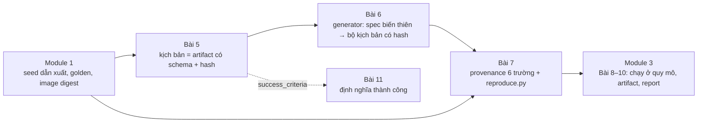
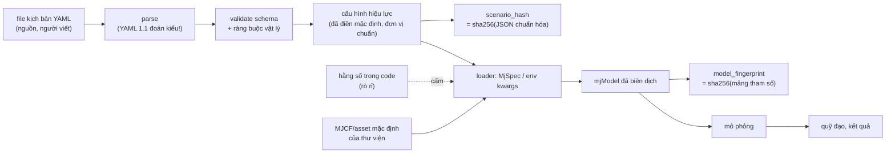
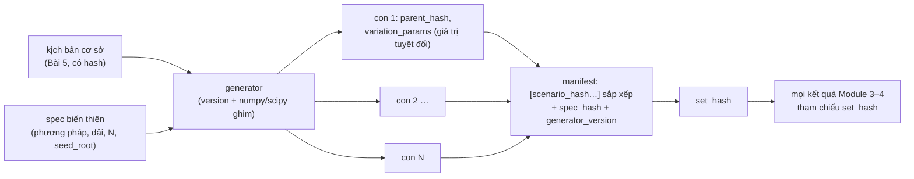
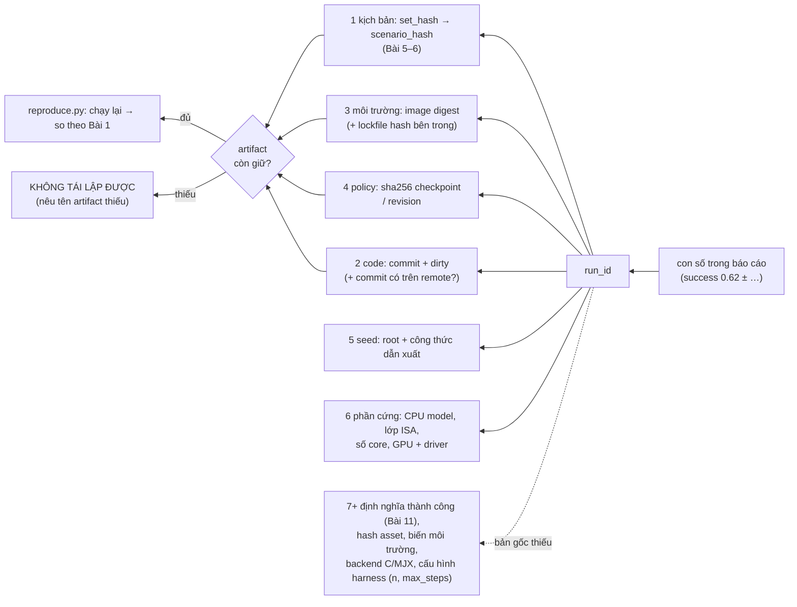

# Khóa 6 · Module 2 — Kịch bản là dữ liệu (20h)

> Ba bài: Bài 5 (8h) kịch bản không phải script · Bài 6 (6h) sinh kịch bản có hệ thống · Bài 7 (6h) provenance.
> Viên nang nền dùng nhiều nhất: **F3.8** (lineage, provenance, hash nội dung), **F3.2** (schema evolution), **F3.7** (data contract), **F2.2** (seed, hermetic), **F2.4** (metamorphic, property-based), **F6.6** (sensitivity, Monte Carlo).
> Nguồn: `khoa-6-sim-eval-infra.md` dòng 262–392. Bản Gemini K6 lượt 5–7 chỉ dùng để gặt và liệt kê lỗi. Bản gốc **không có gate riêng** cho Module 2; tiêu chí của module này nằm trong mục 2 của Gate Khóa 6 ("mọi kết quả truy ngược được về đủ 6 thứ").

Module 1 biến một lần chạy thành hàm thuần `f(kịch bản, code, môi trường, seed) → quỹ đạo`. Module này lo đối số thứ nhất và phần ghi sổ của cả bốn. Trong nghề cũ bạn đã có server mock tự tạo bộ test chuẩn. Tên chuẩn của nó là *test fixture có kiểm soát*, cộng thêm một bộ sinh dữ liệu test. Module này thêm ba thứ server mock thường thiếu: (1) **danh tính nội dung**: một bộ test được gọi bằng hash của chính nó, không bằng tên file hay tên nhánh; (2) **thiết kế thí nghiệm**: chọn 25 điểm nào trong không gian vô hạn tham số là một môn có lý thuyết (combinatorial testing, Latin hypercube), không phải chuyện "random cho nhiều"; (3) **đường truy ngược**: từ một con số trong báo cáo về đủ mọi đầu vào, và một phán quyết rõ ràng khi đường truy bị đứt.



---

## Bài 5 — Kịch bản không phải script (8h)

> **Vị trí:** Bài 4 (determinism đã vào CI) → **Bài 5** → Bài 6 (sinh kịch bản) · **Cần trước:** F3.2 (schema evolution, quy tắc tương thích), F3.7 (data contract: validate theo schema vs theo vật lý), F2.2 (seed, nguồn phi tất định); K2 Bài 6 (schema versioning và contract), K4 Bài 7 (LIBERO); K6 Bài 3 (seed dẫn xuất) · **Sau bài này bạn quyết định được:** một tham số thuộc về **kịch bản**, **code**, hay **môi trường**; hash của kịch bản tính trên **file nguồn** hay trên **cấu hình hiệu lực sau khi loader điền mặc định**; và một test "đổi trường thì kết quả đổi" phải kiểm ở tầng nào để không báo động giả.

### 1. Câu chuyện — ai đã khổ vì chuyện này

**Knight Capital, 1/8/2012.** Knight triển khai code giao dịch mới lên tám máy chủ, nhưng một máy không nhận bản mới. Code mới dùng lại một **cờ cấu hình** trước đây bật một chức năng cũ tên Power Peg, đã ngừng dùng từ lâu mà code vẫn còn. Trên bảy máy, cờ đó bật logic mới. Trên máy thứ tám, nó bật Power Peg. Trong khoảng 45 phút, hệ thống gửi hàng triệu lệnh, và Knight lỗ khoảng 460 triệu USD [chuẩn: theo lệnh xử phạt của SEC, 10/2013]. Bài học cho bạn không nằm ở chuyện triển khai sai. Nó nằm ở chỗ: **cùng một giá trị cấu hình mang hai nghĩa tùy code nào đọc nó**, và không ai có một câu trả lời máy đọc được cho câu hỏi "máy nào đang chạy cấu hình nào với code nào".

Eval tự chế mắc đúng bệnh đó ở quy mô nhỏ: `obj_pos = [0.1, 0.0, 0.82]` nằm trong `run_eval.py`, `env.sim.model.opt.timestep = 0.002` ai đó thêm lúc debug. Ba tuần sau, không ai trả lời được bốn câu của bản gốc: kết quả sinh bằng kịch bản nào, biến thể sinh thế nào, so với hôm nay được không, người khác chạy lại được không. Câu hỏi *"tôi đã test cấu hình nào"* chỉ trả lời được khi kịch bản là **dữ liệu**: có schema, version, hash, và là **đường duy nhất** để tham số đi vào mô phỏng.

### 2. Mô hình tư duy



Kịch bản là **đầu vào được đặt tên** của hàm mô phỏng. Muốn nó có danh tính cần ba thứ: **dạng chuẩn** (canonical form) để hai cách viết cùng nghĩa cho cùng hash, **cổng duy nhất** (loader) để không tham số nào đi vòng, và **bằng chứng ở hạ nguồn** rằng thứ vào simulator đúng là thứ kịch bản nói. Hai hash trả lời hai câu khác nhau:

| Hash | Tính trên | Trả lời câu | Đổi khi |
|---|---|---|---|
| `scenario_hash` | cấu hình hiệu lực, JSON chuẩn hóa | "tôi **đã yêu cầu** chạy cái gì" | người viết đổi kịch bản, hoặc loader đổi giá trị mặc định |
| `model_fingerprint` | mảng tham số của `mjModel` sau biên dịch (`opt`, `geom_friction`, `body_mass`…) | "simulator **đã thực sự nhận** cái gì" | kịch bản đổi, **hoặc** MJCF/asset của thư viện đổi, **hoặc** code ghi đè lén |

"Scenario giống, fingerprint khác" là dấu hiệu có tham số đi vòng loader: nhờ nó, bước 2 của bản gốc ("không tham số nào đi vòng") **kiểm được** chứ không chỉ hứa.

Đoạn code dưới cho thấy ba cái bẫy khi làm "hash chuẩn hóa" cho YAML. Đoán từng dòng in ra trước khi chạy (phần 5).

```python
# [đã chạy] — Python 3.13, PyYAML 6.0
import hashlib, json, yaml

def naive_hash(text):                      # hash thẳng bytes của file
    return hashlib.sha256(text.encode()).hexdigest()[:12]

def canon_hash(obj):                       # parse -> sort key -> JSON gọn -> sha256
    s = json.dumps(obj, sort_keys=True, separators=(",", ":"), allow_nan=False)
    return hashlib.sha256(s.encode()).hexdigest()[:12]

A = "physics:\n  timestep: 0.002\n  friction: 1.0\nmax_steps: 500\n"
B = "max_steps: 500\nphysics:\n  friction: 1.0\n  timestep: 0.002   # đổi thứ tự + comment\n"
print("1) đổi thứ tự trường")
print("   naive:", naive_hash(A), naive_hash(B))
print("   canon:", canon_hash(yaml.safe_load(A)), canon_hash(yaml.safe_load(B)))

print("2) YAML 1.1 đoán kiểu thay bạn")
for line in ["timestep: 1e-3", "timestep: 1.0e-3", "seed: 012", "hold: 1:30",
             "render: no", "friction: 1", "friction: 1.0"]:
    v = list(yaml.safe_load(line).values())[0]
    print(f"   {line:18s} -> {v!r:8} ({type(v).__name__}) canon={canon_hash(v)}")

print("3) loader v2 điền giá trị mặc định -> hash 'hiệu lực' đổi dù file không đổi")
v1_file = {"scenario_version": "1", "physics": {"timestep": 0.002}}
def load_v2(d):                            # v2 thêm trường mới, có default
    d = json.loads(json.dumps(d))
    d["physics"].setdefault("iterations", 100)   # = default MuJoCo
    return d
print("   hash file nguồn      :", canon_hash(v1_file))
print("   hash sau loader v1   :", canon_hash(v1_file))
print("   hash sau loader v2   :", canon_hash(load_v2(v1_file)))
```

Đoạn thứ hai đi vào simulator thật: một hộp đặt trên mặt bàn nghiêng 20°, sweep hệ số ma sát của **hộp**, bàn để `friction=1.0` như `TableArena` mặc định của robosuite (`table_friction=(1, 0.005, 0.0001)`) [spec: `robosuite/models/arenas/table_arena.py`, tag v1.4.0].

```python
# [đã chạy] — Python 3.13, mujoco 3.15.0 (pip install mujoco)
# "Đổi một trường liên quan thì kết quả phải đổi" — có thật không?
# Hộp trên mặt bàn nghiêng 20°. Bàn friction=1.0 như TableArena của robosuite.
# Kịch bản sweep friction của HỘP từ 0.1 đến 1.0.
import hashlib, numpy as np, mujoco

# Nghiêng bằng cách xoay trọng lực 20° (tan 20° ≈ 0.36): hộp trượt nếu friction < 0.36
XML = """<mujoco><option timestep="0.002" gravity="3.355 0 -9.218"/><worldbody>
  <geom name="table" type="box" size="1 1 .05" friction="{tf} 0.005 0.0001"/>
  <body name="box" pos="0 0 0.1"><freejoint/>
    <geom name="box" type="box" size=".05 .05 .05" mass=".2" friction="{bf} 0.005 0.0001"/>
  </body></worldbody></mujoco>"""

def run(box_f, table_f=1.0, steps=500):
    spec = mujoco.MjSpec.from_string(XML.format(tf=table_f, bf=box_f))
    m = spec.compile(); d = mujoco.MjData(m)
    mujoco.mj_step(m, d, nstep=steps)
    fp = hashlib.sha256(m.geom_friction.tobytes()).hexdigest()[:8]  # dấu vân tay model
    traj = hashlib.sha256(d.qpos.tobytes()).hexdigest()[:8]
    return fp, traj, d.qpos[0]

for table_f in (1.0, 0.05):
    print(f"bàn friction = {table_f}")
    for bf in (0.1, 0.3, 0.5, 1.0):
        fp, traj, x = run(bf, table_f)
        print(f"  hộp {bf:.1f}: model_fp={fp} traj={traj} x_cuối={x:+.4f} m")
```

### 3. Cầu nối từ backend

| Backend bạn biết | Ở đây | Gãy ở chỗ | Nếu dùng nhầm thì |
|---|---|---|---|
| Config-as-code, 12-factor | Kịch bản là file có schema, đi qua một loader | Config backend thường **không đổi kết quả nghiệp vụ** (pool size, timeout). Ở đây `timestep` sai là một thí nghiệm khác | Để `timestep`, `iterations` ở "config hệ thống" chung; kết quả cũ không biết chạy với giá trị nào |
| Server mock tự tạo bộ test chuẩn của bạn | Kịch bản + init state cố định | Mock của bạn **là** nguồn sự thật cho response. Kịch bản thì chỉ là **một nửa**: nửa kia là MJCF/asset của thư viện mà loader trộn vào. Kịch bản không đổi mà asset đổi thì "bộ test chuẩn" đã đổi | Bạn tin `scenario_hash` giống là đủ, nâng LIBERO, mesh hoặc ma sát mặc định đổi, và không gì báo động (vì vậy cần `model_fingerprint`) |
| Schema migration, Protobuf "trường mới phải có default" (K2 Bài 6) | Kịch bản v1 chạy bằng loader v2 | Ở Protobuf, reader mới điền default là **vô hại** vì default không đổi nghĩa message. Ở đây default **là một giá trị vật lý**: loader v2 điền `iterations=100` cho file v1 không ghi trường đó, trong khi loader v1 để simulator tự lấy giá trị từ MJCF (có thể là 50) | v1 chạy được bằng loader v2 (PASS tiêu chí gốc) nhưng ra kết quả khác, và bạn gọi đó là "backward compatible" |
| Hash nội dung (ETag, Git object) | `scenario_hash` trên JSON chuẩn hóa | ETag hash **bytes**; ở đây cần hash **nghĩa**, và ranh giới "cùng nghĩa" (comment? thứ tự? đơn vị?) là quyết định phải viết ra | Hai hàm chuẩn hóa, cùng kịch bản hai hash, join ở Bài 9 hụt |

**Chấm mô hình:**

1. *"Kịch bản là một server mock: tôi đã làm cái này rồi."* (mô hình dễ tự xây từ vốn của bạn) — **ĐÚNG MỘT PHẦN.** Đúng ở cốt: cố định thế giới bên ngoài để chỉ thứ được test thay đổi. Gãy ở hai chỗ: (a) mock trả **giá trị**, kịch bản là **tham số của một phép tính có độ nhạy không đều** (cùng lệch 0.05 ma sát, vùng này không đổi gì, vùng kia đổi hết); (b) mock là code của bạn, kịch bản chỉ ghi đè **một phần** model của người khác. Phản ví dụ: đổi ma sát bức tường sau bàn mà vật không bao giờ chạm: model đổi, quỹ đạo giống từng bit. Đoạn code thứ hai ở phần 2 cho bạn tự tìm một ca khó thấy hơn.
2. *"Hash chuẩn hóa = `json.dumps(sort_keys=True)` rồi SHA-256."* (Gemini K6 lượt 5) — **ĐÚNG MỘT PHẦN.** Giải quyết đúng bẫy thứ tự trường. Không giải quyết: kiểu do YAML đoán, `1` vs `1.0`, NaN (`json.dumps` mặc định in `NaN`, không phải JSON hợp lệ), và câu lớn nhất: hash **trước hay sau** khi điền mặc định. Phản ví dụ: mục 2 và 3 của đoạn code đầu (tự chạy sau khi dự đoán). Cách đúng: hash cấu hình **hiệu lực** (sau validate, điền mặc định, ép kiểu bằng schema) kèm `schema_version`, và lưu riêng hash file nguồn. Chuẩn hóa liên ngôn ngữ: RFC 8785 (JSON Canonicalization Scheme) [spec].
3. *"Đổi một trường liên quan thì kết quả đổi; đổi trường không liên quan thì kết quả giữ nguyên."* (bản gốc, Số phải ra) — **ĐÚNG MỘT PHẦN.** Vế hai đúng và rất nên giữ. Vế một sai khi hiểu "kết quả" là quỹ đạo hay tỉ lệ thành công: hệ vật lý có **vùng phẳng** (ma sát dưới ngưỡng của bề mặt kia, khối lượng trong dải mà controller bù hết). Phản ví dụ: tăng khối lượng vật 20% trong dải controller vị trí của Panda bù hết; tỉ lệ thành công không đổi ở mọi n bạn chạy nổi. Sửa: kiểm vế một ở tầng **model đã biên dịch** (`model_fingerprint` phải đổi), còn độ nhạy của quỹ đạo theo tham số là một **phép đo** (Bài 6, → F6.6), không phải test đúng/sai.

### 4. Thuật ngữ

| Mức | Thuật ngữ | Nghĩa trong một câu | Hay bị hiểu nhầm thành |
|---|---|---|---|
| 🟢 | Scenario / kịch bản | Bộ đầu vào được đặt tên của một episode (task, init state, vật lý, giới hạn, tiêu chí, seed) | Script Python chạy eval |
| 🟢 | Canonical form / dạng chuẩn | Một cách biểu diễn duy nhất cho mọi cách viết cùng nghĩa | Format lại file cho đẹp |
| 🟢 | Cấu hình hiệu lực (effective config) | Thứ loader thật sự dùng, sau khi điền mặc định và ép kiểu | File người viết |
| 🟢 | Model fingerprint | Hash các mảng tham số của `mjModel` sau biên dịch | `scenario_hash` (khác: một bên là yêu cầu, một bên là thực tế) |
| 🟢 | Schema version vs scenario version | Version của **định dạng** vs version của **nội dung** một kịch bản | Một con số dùng cho cả hai |
| 🟡 | `MjSpec` | API chỉnh model MuJoCo trước khi `compile()` | Sửa thẳng `model.opt` sau khi dựng env |
| 🟡 | Init state của LIBERO | Vector trạng thái MuJoCo phẳng, lưu trong file `.pruned_init`, nạp bằng `set_init_state` | Một tư thế vật `{x, y, z, yaw}` |
| 🟡 | Luật trộn tham số tiếp xúc | Thông số của một tiếp xúc tính từ **hai** geom theo một luật của engine (tra ở phần 5), không thuộc riêng vật nào | "Ma sát của vật" |

### 5. Dự đoán

**Đề:**
1. Đoạn code hash ở phần 2: với mỗi mục 1, 2, 3, dự đoán hash nào bằng nhau, hash nào khác; ở mục 2, dự đoán **kiểu** Python của từng giá trị.
2. Đoạn code ma sát: với bàn `1.0` và bàn `0.05`, hộp ma sát 0.1 / 0.3 / 0.5 / 1.0. Dự đoán: `model_fp` có đổi theo hộp không; `traj` của dòng nào trùng nhau; hộp nào trượt.
3. Với ≥5 task LIBERO bạn sẽ chuyển: liệt kê **mọi** tham số ảnh hưởng kết quả, xếp mỗi cái vào một trong ba cột: kịch bản / code / môi trường. Dự đoán số hằng số hardcode mà `grep` sẽ tìm thấy trong code eval hiện có của bạn (K4 Bài 7).

**Tham số cần tra:**
- Luật trộn ma sát hai geom: MuJoCo docs, *Modeling → Contact parameters* (`priority`, `solmix`), XML reference `<geom friction>`.
- Góc trượt: hộp trên mặt nghiêng θ đứng yên nếu `μ ≥ tan θ` [chuẩn]; tính `tan 20°`.
- Đặc tả YAML 1.1: cú pháp số thực, số bát phân, số cơ số 60 (sexagesimal), giá trị bool. PyYAML theo YAML 1.1 [spec: tài liệu PyYAML].
- Giá trị mặc định của `<option>` trong MuJoCo: `timestep`, `iterations`, `solver`, `cone` (XML reference, mục `option`), và giá trị robosuite/LIBERO ghi đè (`robosuite/macros.py`, MJCF của arena).
- LIBERO: task được định nghĩa bằng file BDDL; init state nạp từ `init_files/<suite>/<task>.pruned_init` qua `get_task_init_states` [spec: `libero/libero/benchmark/__init__.py`].

**Phương pháp:** với mục 1, đi theo từng bước biến đổi ở sơ đồ phần 2 và hỏi "bước này có giữ nghĩa không". Với mục 2, ma sát của tiếp xúc = hàm của **hai** số, không phải một; vẽ bảng 2×4 rồi điền.

```markdown
# prediction.md — K6 Bài 5
## 1. Hash
- mục 1: naive A==B? ___  canon A==B? ___
- mục 2: 1e-3 → kiểu ___ | 1.0e-3 → ___ | 012 → giá trị ___ | 1:30 → ___ | no → ___ | 1 vs 1.0 cùng hash? ___
- mục 3: hash nguồn == loader v1? ___  == loader v2? ___
## 2. Ma sát (bàn 1.0 / bàn 0.05)
- model_fp đổi theo hộp? ___ / ___
- dòng nào cùng traj: ___
- hộp nào trượt: ___ / ___ (tan 20° = ___)
## 3. Phân loại tham số (≥5 task)
| tham số | kịch bản / code / môi trường | lý do |
- số hằng số hardcode dự đoán: ___
## 4. Quyết định
- scenario_hash tính trên: file nguồn / cấu hình hiệu lực, vì ___
```

### 6. Làm

1. **Thiết kế schema kịch bản** (bản gốc: JSON Schema hoặc Pydantic), từ mẫu YAML của bản gốc, sửa:
   - `initial_state` cho task LIBERO: `{init_states_file, init_states_sha256, index}` thay `object_pose` (LIBERO đặt vật bằng vector trạng thái đầy đủ). Giữ `object_pose` cho task robosuite tự viết.
   - `physics.friction`: **danh sách ghi đè theo geom** (`{geom: "table_collision", friction: [1.0, 0.005, 0.0001]}`) thay bộ ba toàn cục; MuJoCo không có "ma sát của cảnh".
   - `solver_iterations` ánh xạ vào `iterations` của `<option>`, ghi rõ trong loader. Đơn vị trong tên trường (`timestep_s`, `hold_s`), SI theo `CONVENTIONS.md`.
   - Kiểu chặt (`StrictFloat` hoặc `strict=True`, để `"1e-3"` dạng chuỗi bị từ chối), khoảng hợp lệ, `schema_version` bắt buộc. Tách **validate theo schema** khỏi **validate theo vật lý** (vật không lồng nhau, nằm trên bàn) (→ F3.7).
2. **Viết loader**: đọc → validate → cấu hình hiệu lực → dựng env (`MjSpec` nếu tự dựng MJCF, hoặc ghi `env.sim.model` sau `reset()` nếu qua wrapper [tự đo theo phiên bản]). **Không** tham số nào đi vòng, và **chứng minh**: sau khi dựng, đọc ngược từ model đã biên dịch (`m.opt.timestep`, `m.opt.iterations`, `m.geom_friction[id]`…), raise nếu lệch cấu hình hiệu lực; ghi `model_fingerprint` (tối thiểu hash `opt`, `geom_friction`, `body_mass`, `geom_size`, `dof_damping`).
3. **Chuyển ≥5 task LIBERO thành file kịch bản** (bản gốc): ≥2 gắp-thả (LIBERO-Object), ≥2 có khớp (ngăn kéo, tủ; LIBERO-Goal/10). Tên task lấy đúng từ `libero_suite_task_map.py` (`pick_up_the_alphabet_soup_and_place_it_in_the_basket`, không phải tên rút gọn của bản gốc).
4. **Test hash chuẩn hóa** (bản gốc): hai kịch bản cùng nội dung, khác thứ tự trường → cùng hash. Thêm ba ca từ phần 5: file có `1e-3` phải bị **từ chối** ở validate (không lặng lẽ thành chuỗi); `friction: 1` và `friction: 1.0` cho cùng hash **sau** ép kiểu schema; comment và trường `description` không vào hash.
5. **Version schema từ v1, test backward compatibility** (bản gốc, như K2 Bài 6): loader v2 đọc file v1. Default của trường mới ở v2 = **giá trị loader v1 đã ngầm dùng** (đọc từ model đã biên dịch, không từ docs); test so `model_fingerprint` của v1/v1 với v1/v2, không chỉ "không crash".
6. **Grep hằng số hardcode** (bản gốc, Số phải ra): `grep -rnE "timestep|iterations|friction|0\.002|qpos\[|set_init_state" src/` ngoài thư mục loader. Mỗi kết quả: hoặc chuyển vào kịch bản, hoặc ghi vào `decisions.md` vì sao nó thuộc code (ví dụ hằng số toán học).
7. **Chạy cặp test độ nhạy**: (a) đổi một trường vật lý → `model_fingerprint` phải đổi; (b) đổi trường mô tả → cả `scenario_hash` lẫn quỹ đạo không đổi (bit-exact theo cam kết Bài 1); (c) với 5 task, đổi từng trường vật lý một lượng nhỏ và ghi quỹ đạo có đổi không. Kết quả (c) là **bảng độ nhạy**, không phải PASS/FAIL.

Sai số dụng cụ đo: hash là phép đo nhị phân có **độ phân giải** do bạn chọn; hash quỹ đạo chỉ dùng ở tầng bit-exact (Bài 1), khác máy thì so bằng dung sai đã cam kết.

### 7. Số phải ra

<details><summary>🔒 MỞ SAU KHI COMMIT prediction.md</summary>

**Đoạn code hash** (PyYAML 6.0, Python 3.13):

| Mục | Kết quả |
|---|---|
| 1 | naive: hai hash **khác**; canon: hai hash **giống** |
| 2 | `1e-3` → `'1e-3'` (**str**); `1.0e-3` → `0.001` (float); `012` → `10` (int, **bát phân**); `1:30` → `90` (int, **cơ số 60**); `no` → `False`; `1` (int) và `1.0` (float) cho **hai hash khác** |
| 3 | hash nguồn = hash sau loader v1; hash sau loader v2 **khác** |

Mục 2: phải **validate kiểu chặt trước khi hash**, nếu không `timestep: 1e-3` vào loader dưới dạng chuỗi, crash ở chỗ xa hoặc được `float()` cứu lặng lẽ, trong khi hash vẫn "ổn định". Mục 3: hash cấu hình hiệu lực phải kèm `schema_version`; loader đổi mặc định thì hash **nên** đổi, vì thứ simulator nhận đã đổi.

**Đoạn code ma sát** (mujoco 3.15.0):

| Bàn | Hộp 0.1 | Hộp 0.3 | Hộp 0.5 | Hộp 1.0 |
|---|---|---|---|---|
| 1.0 | đứng yên | đứng yên | đứng yên | đứng yên |
| 0.05 | trượt (x ≈ +1.22 m) | trượt (x ≈ +0.30 m) | đứng yên | đứng yên |

- `model_fp` **đổi** ở cả 8 dòng (trường đã vào model đúng).
- Với bàn 1.0, cả bốn `traj` **giống hệt nhau từng bit**, và giống cả dòng (bàn 0.05, hộp 1.0). MuJoCo lấy ma sát của tiếp xúc bằng **max** của hai geom khi hai geom cùng `priority` [spec: MuJoCo docs, Modeling → Contact parameters; kiểm lại bằng `d.contact[i].friction` trên bản bạn cài], nên mọi cặp có max = 1.0 là cùng một bài toán vật lý.
- x ≈ +0.002 m ở các dòng "đứng yên" là trượt rất chậm do tiếp xúc mềm của MuJoCo, không phải lỗi.
- `tan 20° ≈ 0.364`: hộp 0.3 trên bàn 0.05 có max = 0.3 < 0.364 nên trượt; hộp 0.5 thì không.

Hệ quả: sweep "ma sát của vật 0.1→1.0" trên bàn robosuite mặc định là **sweep phẳng**; đường success nằm ngang và người đọc kết luận nhầm "policy bền với ma sát". Tiêu chí gốc sẽ báo FAIL; đúng ra: fingerprint đổi (PASS), quỹ đạo không đổi (một **phát hiện** về độ nhạy).

**Ngưỡng của bản gốc** (giữ, có làm rõ):

| Kiểm tra | Kết quả đúng | Làm rõ |
|---|---|---|
| Mọi tham số ảnh hưởng kết quả đều nằm trong file kịch bản | `grep` không còn hằng số hardcode ngoài loader (trừ mục đã ghi `decisions.md`) | Thêm: loader đọc ngược model đã biên dịch và raise nếu lệch |
| Đổi một trường trong kịch bản | Kết quả đổi. Đổi trường không liên quan → kết quả không đổi | Vế 1 kiểm ở `model_fingerprint`; độ nhạy quỹ đạo là bảng đo. Vế 2 kiểm bit-exact |
| Kịch bản v1 chạy bằng loader v2 | Thành công | Thành công = **cùng `model_fingerprint`** với v1 qua loader v1, không chỉ "không crash" |

**Số hằng số hardcode:** lần đầu thường vài đến vài chục chỗ (`max_steps` theo suite, `num_steps_wait`, kích thước ảnh) [ước lượng]. **0 ở lần grep đầu** gần như chắc chắn là grep sai thư mục.

</details>

### 8. Nếu ra khác

| Triệu chứng | Nguyên nhân khả dĩ | Kiểm bằng cách | Sửa |
|---|---|---|---|
| Sửa tham số trong YAML, `model_fingerprint` không đổi | `reset()` của wrapper dựng lại model từ XML gốc sau khi loader đã ghi (Gemini nêu đúng nguyên nhân này) | In `m.opt.timestep` ngay sau loader và ngay sau `reset()` | Áp tham số **sau** `reset()` qua một hook duy nhất, hoặc dựng MJCF đã chỉnh trước khi env biên dịch; kiểm đọc ngược sau mỗi `reset()` |
| `scenario_hash` giống, `model_fingerprint` khác giữa hai máy | Asset/MJCF của thư viện khác phiên bản, hoặc code ghi đè ngoài loader | Diff `spec.to_xml()` (hoặc `mujoco.mj_saveLastXML`) giữa hai máy | Ghim phiên bản thư viện trong image (Bài 2); thêm hash thư mục asset vào provenance (Bài 7) |
| Kịch bản v1 qua loader v2 chạy được nhưng kết quả lệch | Default của trường mới khác giá trị loader v1 ngầm dùng | So `model_fingerprint` v1/v1 với v1/v2 | Default của v2 = giá trị đọc từ model v1; ghi vào `decisions.md` |
| Sweep một tham số cho đường cong phẳng tuyệt đối | Tham số không chạm tới vật lý (luật trộn tham số tiếp xúc, vật không tiếp xúc geom đó, controller bù hết) | `d.contact[i].friction` trong episode; hash quỹ đạo trùng nhau | Sweep tham số **của tiếp xúc** (cả hai geom, hoặc dùng `priority`), hoặc ghi rõ "sweep phẳng" là một kết quả |
| `timestep: 1e-3` lọt qua validate | Schema không strict, Pydantic ép chuỗi thành float | Test riêng cho file có `1e-3` | `StrictFloat` hoặc `ConfigDict(strict=True)`; hoặc viết số có dấu chấm `1.0e-3` |
| Init state LIBERO không nạp được với PyTorch mới | `torch.load` đổi mặc định `weights_only`; `.pruned_init` là pickle | `torch.__version__` | `weights_only=False` **chỉ** cho file đã kiểm hash, hoặc chuyển một lần sang `.npy` có hash [tự đo] |

### 9. Câu hỏi ngược

1. **[Phản biện]** Bản gốc muốn `success_criteria` là **biểu thức** trong kịch bản. Một hàm Python có tên và version cũng tái lập được. Biểu thức trong dữ liệu mua thêm được gì, và mất gì?
   <details><summary>Hướng nghĩ</summary>Mua: nằm trong hash (đổi định nghĩa thì đổi danh tính), đọc được không cần mở code. Mất: cần trình thông dịch biểu thức (lại là code có version), khó diễn đạt điều kiện phức tạp. Bài 11 chọn predicate có cấu trúc. Hỏi tiếp: `eval()` một chuỗi trong YAML là gì về bảo mật?</details>
2. **[Nếu…thì]** Nếu `scenario_hash` tính trên cấu hình hiệu lực, thì nâng loader (đổi một default) làm đổi hash của **mọi** kịch bản cũ. Bộ kết quả ba tháng của bạn có còn join được với bộ kịch bản không?
   <details><summary>Hướng nghĩ</summary>Join theo `scenario_hash` sẽ hụt. Lối ra: giữ cả `source_hash` và `effective_hash`, join lịch sử theo `source_hash` + `schema_version`; hoặc coi đổi default là migration có bảng ánh xạ hash cũ → mới.</details>
3. **[Quy mô]** 50 task × 50 init state × 20 biến thể vật lý = 50.000 kịch bản. Lưu mỗi kịch bản một file YAML hay lưu "cơ sở + spec biến thiên" rồi sinh khi cần? Cái gì gãy trước ở mỗi cách?
   <details><summary>Hướng nghĩ</summary>50.000 file: Git chậm, không review nổi, nhưng mỗi kịch bản tự đứng được. Cơ sở + spec: gọn, nhưng danh tính phụ thuộc phiên bản generator (Bài 6). Thường lưu spec + **manifest có hash từng con**, sinh lại rồi kiểm hash.</details>
4. **[Failure mode]** Loader của bạn hoàn hảo: không tham số nào đi vòng, đọc ngược khớp, hash ổn định. Kể hai cách kịch bản vẫn **nói dối** về thứ đã chạy.
   <details><summary>Hướng nghĩ</summary>(a) Tham số không có hiệu lực vật lý (luật trộn, vật không chạm). (b) Asset tham chiếu bằng đường dẫn, không bằng hash. (c) Code eval chờ vài trăm bước cho vật rơi ổn định: trạng thái lúc policy bắt đầu không phải trạng thái trong kịch bản.</details>

### 10. Liên kết ra ngoài

- **Xe tự hành: ASAM OpenSCENARIO và Scenic.** OpenSCENARIO là chuẩn trao đổi kịch bản lái giữa các simulator; Scenic (Fremont và cộng sự, PLDI 2019) là ngôn ngữ xác suất mô tả **phân bố** kịch bản [chuẩn]. Giống: kịch bản là dữ liệu có schema, tách khỏi simulator. Khác: ở đó kịch bản chủ yếu là **hành vi tác nhân khác**; ở bạn là **tham số vật lý của tiếp xúc**, nơi độ nhạy rất không đều.
- **Build system: Bazel / Nix.** Một bước build được gọi bằng hash của **mọi** đầu vào khai báo; đầu vào không khai báo bị sandbox chặn. Giống: `scenario_hash` + loader là cổng duy nhất. Khác: bạn không sandbox được MJCF bên trong thư viện, nên phải kiểm **ở hạ nguồn** bằng `model_fingerprint`.

### 11. Độ tin cậy và sửa lỗi

| Khẳng định | Nhãn | Ghi chú / cách kiểm |
|---|---|---|
| MuJoCo trộn ma sát hai geom cùng `priority` bằng max từng phần tử | [spec] + [đã chạy] | Docs *Contact parameters*; `d.contact.friction` trên mujoco 3.15.0 |
| Mặc định `<option>`: `timestep=0.002`, `iterations=100`, Newton, pyramidal | [spec] + [đã chạy] | `MjModel` rỗng, mujoco 3.15.0 |
| `TableArena` robosuite `table_friction=(1, 0.005, 0.0001)` | [spec] | robosuite tag v1.4.0 |
| LIBERO nạp `.pruned_init` bằng `torch.load`; `torch.load` đổi mặc định `weights_only` | [spec] / [tự đo] | `libero/libero/benchmark/__init__.py`; kiểm bản PyTorch trong image |
| PyYAML (YAML 1.1) đoán kiểu ở mục 2 | [đã chạy] | PyYAML 6.0 |
| `MjSpec` có từ MuJoCo 3.2 | [tự đo] | Có trên 3.15.0; mốc kiểm trong changelog |
| Knight Capital: ~460 triệu USD, ~45 phút, cờ dùng lại kích hoạt Power Peg | [chuẩn] | SEC Release No. 70694 (10/2013) |

**Đã sửa so với bản gốc/Gemini:**
- Bản gốc: `physics.friction` toàn cục → ghi đè theo geom (ma sát thuộc từng geom, trộn theo cặp).
- Bản gốc: "đổi một trường → kết quả đổi" sai với hệ có vùng phẳng (đã chạy phản ví dụ) → kiểm ở `model_fingerprint`; độ nhạy quỹ đạo là bảng đo.
- Bản gốc: "v1 qua loader v2 → thành công" → thêm điều kiện cùng `model_fingerprint`.
- Bản gốc/Gemini: `object_pose` cho LIBERO → tham chiếu `.pruned_init` + hash + chỉ số; tên task rút gọn → tên thật.
- Gemini: `json.dumps(sort_keys=True)` là đủ → thiếu ép kiểu, NaN, quyết định nguồn/hiệu lực. Pydantic dùng `Any` không import (`NameError`). "Loader raise khi code ghi đè" → loader không thấy ghi đè sau nó; đọc ngược sau mỗi `reset()`.
- Gemini dùng `solver_type: "PGS"`, `cone: "elliptic"` mà không nói đó không phải mặc định (Newton, pyramidal).

### 12. Đọc thêm và tự kiểm tra

- **Nguồn gốc:** MuJoCo docs, mục *Modeling → Contact parameters* và *XML Reference → option, geom*; mục *Python bindings → MjSpec* (đọc bản khớp phiên bản cài).
- **Giải thích:** RFC 8785, *JSON Canonicalization Scheme* (Rundgren, Jordan, Erdtman, 2020): đọc phần lý do, nó liệt kê đúng các bẫy số thực và thứ tự.
- **Đào sâu (tùy chọn):** Fremont và cộng sự, *Scenic: A Language for Scenario Specification and Scene Generation*, PLDI 2019.
- **Tự kiểm tra:** (1) giải thích cho một backend engineer khác trong 5 câu vì sao kịch bản cần **hai** hash; (2) vẽ lại sơ đồ phần 2, đánh dấu chỗ nào một tham số có thể đi vòng; (3) câu dưới.

**Câu 1.** Đồng nghiệp sweep `friction` của vật từ 0.2 đến 1.2 trên bàn robosuite mặc định, success rate phẳng ở 78%. Họ viết: "policy bền với ma sát". Bạn hỏi gì?
<details><summary>Đáp án</summary>Ma sát của tiếp xúc vật–bàn là max(vật, bàn) = max(f, 1.0), nên mọi điểm f ≤ 1.0 là cùng một bài toán; chỉ điểm 1.2 khác. Hỏi: ma sát bàn bao nhiêu, `priority` có đặt không, `d.contact.friction` thực tế trong episode là bao nhiêu. Còn tiếp xúc vật–ngón kẹp thì ma sát của ngón cũng tham gia max. Kết luận "bền" chưa có căn cứ.</details>


---

## Bài 6 — Sinh kịch bản có hệ thống (6h)

> **Vị trí:** Bài 5 (kịch bản là artifact) → **Bài 6** → Bài 7 (provenance) · **Cần trước:** F6.6 (sensitivity analysis, Monte Carlo), F2.4 (property-based, metamorphic), F2.2 (seed), F3.8 (lineage, hash nội dung), F1.4 (khoảng tin cậy cho tỉ lệ); K6 Bài 1 (common random numbers), K6 Bài 3 (seed dẫn xuất bằng `SeedSequence`) · **Sau bài này bạn quyết định được:** với một câu hỏi cụ thể, dùng bộ sinh nào (lưới, pairwise, Latin hypercube, ngẫu nhiên theo phân bố), bao nhiêu điểm, seed dẫn xuất theo khóa gì, và nguồn sự thật là generator hay bộ kịch bản đã sinh.

### 1. Câu chuyện — ai đã khổ vì chuyện này

**Los Alamos, cuối thập niên 1970.** Mô hình an toàn lò phản ứng có hàng chục tham số bất định, mỗi lần chạy đắt. Ngẫu nhiên thuần cần rất nhiều lần chạy mới phủ đều từng tham số; lưới đầy đủ bùng nổ theo số chiều. McKay, Beckman và Conover (*Technometrics*, 1979) đề xuất **Latin hypercube sampling**: chia dải mỗi tham số thành N khoảng bằng xác suất, mỗi khoảng lấy đúng một lần, ghép các chiều bằng hoán vị ngẫu nhiên [chuẩn]. Cùng N lần chạy, mỗi tham số được phủ đều trên toàn dải.

**NIST, 2004.** Kuhn, Wallace và Gallo (*IEEE TSE*, 2004) đếm mỗi lỗi trong báo cáo lỗi của nhiều loại phần mềm cần **bao nhiêu điều kiện đồng thời** để xuất hiện: phần lớn do một hoặc hai tham số, số lỗi giảm dần đến ba–sáu, không lỗi nào trong dữ liệu của họ cần quá sáu [chuẩn: NIST, *Combinatorial Methods in Testing*]. Hệ quả: phủ **mọi cặp** giá trị (pairwise) bằng vài chục test bắt phần lớn lỗi mà toàn tổ hợp cần hàng nghìn test.

Hai câu chuyện trả lời hai câu khác nhau, và đó là chỗ bản gốc nói đúng nhất: "đừng trộn". Với 500 kịch bản, câu hỏi là **chọn 500 điểm nào trong không gian vô hạn**, và cách chọn quyết định con số cuối có nghĩa gì.

### 2. Mô hình tư duy

**Câu hỏi quyết định đại lượng cần ước lượng (estimand); estimand quyết định bộ sinh.**

| Câu hỏi | Estimand | Bộ sinh hợp | Ngân sách điển hình | Con số báo cáo |
|---|---|---|---|---|
| "Ma sát ảnh hưởng thế nào?" | Đường cong `P(thành công | ma sát = m)` | **Sweep một chiều** (lưới), các tham số khác cố định, seed ghép cặp dọc trục | 8–15 điểm × n episode mỗi điểm | Một đường cong có dải tin cậy, **không** một con số trung bình |
| "Có tổ hợp rời rạc nào làm hỏng không?" | Có/không tồn tại lỗi tương tác bậc ≤ t | **Covering array** (pairwise t = 2, hoặc t = 3) | Cỡ `v₁·v₂` (hai mức đông nhất) với t = 2 | Danh sách tổ hợp lỗi |
| "Đầu ra nhạy với tham số liên tục nào, và có góc lỗi không?" | Bề mặt đáp ứng, chỉ số độ nhạy | **Space-filling**: Latin hypercube, LHS strength 2, Sobol | 10–20 điểm mỗi chiều | Xếp hạng độ nhạy, vùng lỗi |
| "Policy có bền khi triển khai không?" | `E[thành công]` dưới **phân bố triển khai** | **Ngẫu nhiên theo phân bố đó**, có seed | Theo power analysis (Bài 12) | Một tỉ lệ có khoảng tin cậy |

Bốn ý bản chất:
1. **Sweep và randomization khác nhau ở estimand**, không ở chuyện "có ngẫu nhiên không". Trung bình trên lưới cho mọi điểm trọng số bằng nhau, kể cả góc hiếm gặp ngoài đời; nó không ước lượng tỉ lệ thành công khi triển khai.
2. **Ngẫu nhiên thuần phủ kém ở ngân sách nhỏ**: 25 điểm trong 4 chiều để trống nhiều ô của mỗi mặt chiếu 2-D, đúng nơi lỗi tương tác ("ma sát thấp **và** vật nặng") nằm.
3. **Generator là công thức, bộ kịch bản là sản phẩm** (như Dockerfile và image digest, Bài 2). Nguồn sự thật là **manifest có hash từng kịch bản con**.
4. **Seed là một phần của thiết kế.** Dẫn xuất theo **vị trí** vỡ khi chèn điểm; theo **danh tính** thì ổn định. Seed **chung dọc trục sweep** (CRN, Bài 1) làm đường cong mượt hơn ở cùng n.



Mô phỏng 1: **25 kịch bản, 4 tham số, lỗi nằm ở một góc tương tác.** Bộ sinh nào chạm được góc?

```python
# [đã chạy] — Python 3.13, numpy 2.x, scipy 1.18
# 25 kịch bản, 4 tham số trong [0,1): friction, mass, x, y. Lỗi chỉ ở góc friction < 0.2 VÀ mass >= 0.8.
import numpy as np
from scipy.stats import qmc

N, D, reps = 25, 4, 2000
fail = lambda P: (P[:, 0] < 0.2) & (P[:, 1] >= 0.8)

def grid_xy(rng):            # sweep vị trí 5x5, friction & mass giữ ở giá trị danh định
    g = (np.arange(5) + 0.5) / 5
    X, Y = np.meshgrid(g, g)
    return np.c_[np.full(N, 0.5), np.full(N, 0.5), X.ravel(), Y.ravel()]

gens = {
    "lưới 5x5 trên (x,y)": grid_xy,
    "ngẫu nhiên đều":      lambda r: r.random((N, D)),
    "LHS (strength 1)":    lambda r: qmc.LatinHypercube(d=D, rng=r).random(N),
    "LHS strength 2 (OA)": lambda r: qmc.LatinHypercube(d=D, strength=2, rng=r).random(N),
}

def empty_cells_2d(P):       # số ô trống trong lưới 5x5 của MỌI cặp chiều
    tot = 0
    for i in range(D):
        for j in range(i + 1, D):
            cells = set(zip((P[:, i] * 5).astype(int), (P[:, j] * 5).astype(int)))
            tot += 25 - len(cells)
    return tot               # tối đa 6 cặp x 25 ô = 150

rng = np.random.default_rng(0)
print(f"{'bộ sinh':22s} P(chạm góc lỗi)  ô 2-D trống (/150)  discrepancy")
for name, g in gens.items():
    hit, empty, disc = 0, 0, 0.0
    for _ in range(reps):
        P = g(rng)
        hit += fail(P).any(); empty += empty_cells_2d(P); disc += qmc.discrepancy(P)
    print(f"{name:22s} {hit/reps:14.2f}  {empty/reps:18.1f}  {disc/reps:11.4f}")
```

Mô phỏng 2: **tham số rời rạc** (5 vật, 3 mức ma sát, 3 mức khối lượng, 3 điều kiện ánh sáng, 4 vùng đặt vật). Full factorial bao nhiêu kịch bản, pairwise bao nhiêu, và mỗi cách bắt được bao nhiêu lỗi tương tác bậc 2 và bậc 3?

```python
# [đã chạy] — Python 3.13, numpy 2.x
# Pairwise cho tham số RỜI RẠC, sinh tham lam (không tối ưu như PICT), so với full factorial và ngẫu nhiên.
import itertools, numpy as np

levels = {"vật": 5, "ma_sát": 3, "khối_lượng": 3, "ánh_sáng": 3, "vùng_đặt": 4}
names, L = list(levels), list(levels.values())
pairs_of = lambda t: {(i, t[i], j, t[j]) for i, j in itertools.combinations(range(len(t)), 2)}
need = set().union(*(pairs_of(t) for t in itertools.product(*map(range, L))))

def greedy_pairwise(rng, cands=60):
    todo, suite = set(need), []
    while todo:
        best = max((tuple(int(rng.integers(n)) for n in L) for _ in range(cands)),
                   key=lambda t: len(pairs_of(t) & todo))
        if not pairs_of(best) & todo:                  # ép phủ một cặp còn thiếu
            i, a, j, b = next(iter(todo)); t = [int(rng.integers(n)) for n in L]
            t[i], t[j] = a, b; best = tuple(t)
        suite.append(best); todo -= pairs_of(best)
    return suite

rng = np.random.default_rng(0)
suite = greedy_pairwise(rng)
full = int(np.prod(L))
print(f"full factorial: {full} kịch bản | pairwise tham lam: {len(suite)} | số cặp cần phủ: {len(need)}")

# Lỗi 'ẩn' chỉ hiện khi đúng một tổ hợp 2 hoặc 3 tham số. Ai bắt được?
def detects(s, fault):  # fault: dict {chỉ số tham số: giá trị}
    return any(all(t[k] == v for k, v in fault.items()) for t in s)
faults2 = [{i: a, j: b} for i, j in itertools.combinations(range(5), 2)
           for a in range(L[i]) for b in range(L[j])]
faults3 = [{i: a, j: b, k: c} for i, j, k in itertools.combinations(range(5), 3)
           for a in range(L[i]) for b in range(L[j]) for c in range(L[k])]
rand = [tuple(int(rng.integers(n)) for n in L) for _ in range(len(suite))]
for nm, s in [("pairwise", suite), ("ngẫu nhiên cùng cỡ", rand)]:
    d2 = np.mean([detects(s, f) for f in faults2]); d3 = np.mean([detects(s, f) for f in faults3])
    print(f"{nm:20s}: bắt lỗi 2-chiều {d2:5.1%} | lỗi 3-chiều {d3:5.1%}")
```

Mô phỏng 3: **seed theo vị trí hay theo danh tính**, và giá trị sweep sinh bằng cộng dồn hay từ chỉ số.

```python
# [đã chạy] — Python 3.13, numpy 2.x
# Seed kịch bản con theo VỊ TRÍ hay DANH TÍNH (hash nội dung)? Chèn một điểm vào giữa sweep.
import hashlib, json, numpy as np

ROOT = 20261008
def chash(d): return hashlib.sha256(json.dumps(d, sort_keys=True).encode()).hexdigest()

def children(frictions):
    return [{"parent": "pick_cube_v1", "physics.friction.sliding": f} for f in frictions]

def seed_by_index(kids):      # derive_from(seed_root, episode_index)
    return {chash(k): int(np.random.default_rng([ROOT, i]).integers(2**31))
            for i, k in enumerate(kids)}

def seed_by_identity(kids):   # derive_from(seed_root, scenario_hash)
    return {chash(k): int(np.random.default_rng([ROOT, int(chash(k)[:16], 16)]).integers(2**31))
            for k in kids}

# Sinh giá trị từ CHỈ SỐ NGUYÊN rồi làm tròn thập phân, không cộng dồn float
old = [round(0.1 + i * 0.1, 6) for i in range(10)]           # 0.1 … 1.0
new = sorted(old + [0.35])                                  # chèn một điểm
for nm, fn in [("theo vị trí", seed_by_index), ("theo danh tính", seed_by_identity)]:
    a, b = fn(children(old)), fn(children(new))
    changed = sum(a[h] != b[h] for h in a)
    print(f"seed {nm:15s}: {changed}/10 kịch bản cũ bị đổi seed sau khi chèn 0.35")

acc = 0.0; drift = []
for i in range(10): acc += 0.1; drift.append(acc)
print("cộng dồn 0.1:", drift[2], "| từ chỉ số:", old[2], "| linspace:", np.linspace(0.1, 1.0, 10)[2])
```

### 3. Cầu nối từ backend

| Backend bạn biết | Ở đây | Gãy ở chỗ | Nếu dùng nhầm thì |
|---|---|---|---|
| Server mock sinh bộ test chuẩn của bạn | Generator kịch bản | Test backend hỏi "có lỗi không" (tồn tại); bộ kịch bản thường hỏi "tỉ lệ bao nhiêu" (ước lượng). Bộ sinh tốt cho câu một (nhắm góc khó) **làm méo** câu hai | Báo success rate của bộ "săn lỗi" như độ bền khi triển khai |
| Pairwise testing ma trận trình duyệt × OS | Covering array cho vật × ma sát × ánh sáng | Ở web một tổ hợp lỗi hay không (tất định); ở đây mỗi tổ hợp là một **tỉ lệ**, 1 episode không phân biệt hỏng với xui | Tổ hợp thất bại 1/1 bị gắn "lỗi tương tác" trong khi tỉ lệ thật là 70% |
| ID tự tăng / offset Kafka làm khóa | Seed dẫn xuất theo chỉ số | Offset ổn định vì log chỉ **nối thêm**; danh sách kịch bản bị **chèn giữa** | Chèn một điểm, mọi seed sau nó đổi, mất ghép cặp với run cũ (Bài 13) |
| Lockfile cho dependency | Manifest bộ kịch bản (`set_hash`) | Lockfile ghim **tên + phiên bản**, nội dung lấy từ registry; không registry nào giữ kịch bản của bạn, nên manifest phải ghim **nội dung** | Lưu spec + seed, nâng numpy, bộ kịch bản đổi im lặng |

**Chấm mô hình:**

1. *"Tuyệt đối không trộn sweep và randomization: vừa đổi ma sát vừa đổi vị trí ngẫu nhiên thì khi tỉ lệ giảm bạn bất lực trong việc xác định nguyên nhân."* (Gemini K6 lượt 6) — **ĐÚNG MỘT PHẦN.** Đúng: đừng trộn **estimand** (đừng báo trung bình bộ sweep như độ bền triển khai). Sai lý do: nếu mỗi kịch bản con ghi `variation_params` (bước 2), từ bộ ngẫu nhiên nhiều chiều vẫn tách được ảnh hưởng từng tham số bằng hồi quy logistic hay chỉ số độ nhạy (→ F6.6). Phản ví dụ: 200 kịch bản ngẫu nhiên đồng thời ma sát và vị trí, có ghi tham số; hồi quy cho hệ số ma sát rõ, hệ số vị trí gần 0. "Bất lực" thật chỉ khi tham số **không được ghi** hoặc **tương quan** trong thiết kế.
2. *"Sweep: lưới hoặc Latin hypercube."* (bản gốc; Gemini xếp LHS vào "quét xác định") — **ĐÚNG MỘT PHẦN.** LHS phủ đều **từng chiều**, nhưng là thiết kế **ngẫu nhiên** (có seed), và LHS strength 1 **không** bảo đảm phủ ô hai chiều. Phản ví dụ: mô phỏng 1, dòng strength 1 so với strength 2.
3. *"Muốn phủ thì random cho nhiều là được."* — **SAI ở ngân sách thật** (vài chục kịch bản, vì mỗi kịch bản cần n episode). Phản ví dụ: xác suất 25 điểm ngẫu nhiên **trượt hết** một ô chiếm 4% không gian là `(1 − 0.04)²⁵`; tính rồi so với mô phỏng 1.

### 4. Thuật ngữ

| Mức | Thuật ngữ | Nghĩa trong một câu | Hay bị hiểu nhầm thành |
|---|---|---|---|
| 🟢 | Sweep (one-at-a-time) | Đổi một tham số trên lưới, giữ các tham số khác cố định | Mọi cách sinh nhiều kịch bản |
| 🟢 | Domain randomization (ở bài này: randomization) | Lấy mẫu kịch bản từ một phân bố khai báo, có seed | Ngẫu nhiên "cho đa dạng", không cần phân bố |
| 🟢 | Estimand | Đại lượng bạn thật sự muốn ước lượng | Con số mà script in ra |
| 🟢 | Lineage của kịch bản | `parent_scenario_hash` + `variation_params` (giá trị tuyệt đối) + `spec_hash` + `generator_version` | Chỉ `parent_scenario_id` |
| 🟢 | Manifest / `set_hash` | Danh sách hash các kịch bản con đã sắp xếp, hash lại thành một | Hash của file spec |
| 🟡 | Covering array, pairwise, t-way | Bộ test trong đó mọi tổ hợp t giá trị của t tham số bất kỳ xuất hiện ít nhất một lần | Full factorial rút gọn ngẫu nhiên |
| 🟡 | Latin hypercube (LHS), strength 2 | Mỗi chiều chia N khoảng, mỗi khoảng một điểm; strength 2 thêm: mỗi ô của mọi mặt chiếu 2-D một điểm (dựa trên orthogonal array) | Lưới đều |
| 🟡 | Discrepancy | Độ lệch của phân bố điểm so với phân bố đều; nhỏ hơn = phủ đều hơn | Phương sai |

### 5. Dự đoán

**Đề:**
1. Mô phỏng 1: điền bảng 4 dòng × 3 cột (P chạm góc lỗi, số ô 2-D trống /150, hạng discrepancy) **trước khi chạy**.
2. Mô phỏng 2: số kịch bản full factorial, pairwise tham lam, cận dưới lý thuyết; tỉ lệ bắt lỗi bậc 2, bậc 3 của pairwise và của ngẫu nhiên cùng cỡ.
3. Mô phỏng 3: chèn 0.35 vào sweep 10 điểm, bao nhiêu kịch bản cũ đổi seed dưới mỗi cách; ba giá trị ở dòng cuối.
4. Dự án thật: sweep ma sát 10 điểm (bản gốc) trên task gắp đầu tiên. Dạng đường cong (phẳng / bậc thang / dốc dần) và **vì sao**, dựa trên Bài 5.
5. Bộ randomization 100 mẫu: dải, dạng phân bố từng tham số, và **căn cứ** (đo, datasheet, hay đoán).

**Tham số cần tra:** ô góc lỗi chiếm `0.2 × 0.2 = 4%` mặt chiếu; xác suất N điểm độc lập trượt hết là `(1 − p)ᴺ`. Cận dưới pairwise: số test ≥ `v₁ · v₂` (hai số mức lớn nhất). scipy docs `qmc.LatinHypercube`, tham số `strength` (strength 2 cần N = p², p nguyên tố, d ≤ p + 1) [spec; kiểm theo phiên bản]. NumPy NEP 19: `Generator` có hứa cùng chuỗi số qua các phiên bản không.

**Phương pháp:** câu 1, dòng "ngẫu nhiên" tính tay; dòng "lưới (x,y)" nghĩ xem ma sát và khối lượng nằm đâu; hai dòng LHS lập luận từ định nghĩa strength. Câu 4: tiếp xúc nào đang được sweep (vật–bàn hay vật–ngón) và luật trộn ở Bài 5.

```markdown
# prediction.md — K6 Bài 6
## 1. Bốn bộ sinh, N = 25, D = 4
| bộ sinh | P(chạm góc) | ô 2-D trống /150 | discrepancy (hạng 1–4) |
| lưới (x,y) | | | |
| ngẫu nhiên | | | |
| LHS s1 | | | |
| LHS s2 | | | |
## 2. Pairwise: full ___ | tham lam ___ | cận dưới ___ | bắt bậc 2: ___ / ___ | bậc 3: ___ / ___
## 3. Seed: theo vị trí ___/10 | theo danh tính ___/10 | ba giá trị: ___ ___ ___
## 4. Sweep ma sát thật: dạng ___ vì ___
## 5. Phân bố randomization
| tham số | dải | phân bố | căn cứ (đo / datasheet / đoán) |
```

### 6. Làm

1. **Viết generator** (bản gốc): kịch bản cơ sở + spec biến thiên → N kịch bản con. Spec khai `method` (`grid` | `pairwise` | `lhs` | `random`), dải/mức (và phân bố nếu random), `n`, `seed_root`. Giá trị lưới sinh **từ chỉ số nguyên** (`lo + i·(hi − lo)/(n − 1)`, làm tròn về độ phân giải khai báo), không cộng dồn float; duyệt tham số theo khóa đã sắp xếp; ghi `generator_version` và phiên bản numpy/scipy vào manifest.
2. **Lineage** (bản gốc: `parent_scenario_id`, `variation_params`). Thêm `parent_scenario_hash`, `spec_hash`; `variation_params` ghi **giá trị tuyệt đối sau khi áp** (không "+10%"). Property test: áp `variation_params` lên cha ra đúng con (cùng `scenario_hash`).
3. **Sinh 3 bộ** (bản gốc), có sửa:
   - **Sweep ma sát 10 điểm**, ma sát **của tiếp xúc** bạn quan tâm (vật–bàn: đặt cả hai geom hoặc dùng `priority`; vật–ngón: ghi rõ). Kiểm `d.contact[i].friction` ở điểm đầu và cuối phải khác nhau. **Seed ghép cặp dọc trục**: khóa dẫn xuất = `parent_scenario_hash` + chỉ số episode, **không** gồm giá trị ma sát (CRN, Bài 1).
   - **Sweep vị trí 5×5** trong vùng đặt vật của task (BDDL). Kiểm điều kiện vật lý (Bài 5) **trước** khi tính là hợp lệ; điểm bị loại phải được ghi lại.
   - **Randomization 100 mẫu**, phân bố trong spec, căn cứ trong `decisions.md`. Seed lấy mẫu theo danh tính: `default_rng([seed_root, H(parent_scenario_hash), sample_index])`; seed episode dẫn xuất riêng.
4. **Lưu bộ kịch bản thành artifact có hash** (bản gốc): manifest = `scenario_hash` đã sắp xếp + `spec_hash` + `generator_version` + phiên bản thư viện → `set_hash`. Lưu **cả** kịch bản con, không chỉ spec. Module 3–4 tham chiếu `set_hash`.
5. **(Thêm, 1–1.5h) So bộ sinh trên dự án thật.** 2 tham số liên tục (ma sát tiếp xúc, khối lượng), 25 kịch bản: lưới 5×5, LHS strength 1, LHS strength 2, mỗi kịch bản 4 episode với policy rẻ. Vẽ ba bản đồ thành công: bộ nào lộ vùng lỗi rõ nhất?
6. **(Thêm) Property-based và metamorphic test** (→ F2.4):
   - Property: mọi con qua schema và ràng buộc vật lý; giá trị trong dải; không trùng `scenario_hash`; sinh lại hoặc đổi thứ tự khóa spec → cùng `set_hash`; **thêm một điểm** → hash và seed các con cũ không đổi. Hypothesis [tự đo theo phiên bản] hoặc vòng lặp tay 200 spec ngẫu nhiên.
   - Metamorphic cho kịch bản: tịnh tiến **cả** vật và robot cùng vector trên bàn phẳng → tỉ lệ thành công không đổi ngoài nhiễu; hoán đổi ma sát hai geom cùng `priority` → quỹ đạo giống từng bit. Quan hệ thứ nhất vỡ là phát hiện (policy dùng tọa độ tuyệt đối, camera thấy cảnh khác), không phải lỗi test.

Sai số dụng cụ đo: ở bước 5, 4 episode mỗi ô cho CI rất rộng (2/4: Wilson 95% ≈ 0.15–0.85, → F1.4); bản đồ dùng để **nhìn vùng**, không đọc số từng ô.

### 7. Số phải ra

<details><summary>🔒 MỞ SAU KHI COMMIT prediction.md</summary>

**Mô phỏng 1** (seed 0, 2000 lần lặp; lệch ±0.02 nếu đổi seed):

| Bộ sinh | P(chạm góc lỗi) | Ô 2-D trống (/150) | Discrepancy (CD) |
|---|---|---|---|
| Lưới 5×5 trên (x,y) | **0.00** | 104 | 0.211 |
| Ngẫu nhiên đều | 0.64 | ≈ 54 | 0.043 |
| LHS strength 1 | ≈ 0.70 | ≈ 44 | 0.010 |
| LHS strength 2 | **1.00** | **0** | 0.006 |

- Lưới vị trí (bộ 2 của bản gốc) **không bao giờ** chạm lỗi ma sát–khối lượng: nó chỉ trả lời "vị trí ảnh hưởng thế nào".
- Ngẫu nhiên: `1 − 0.96²⁵ ≈ 0.64`; một phần ba số lần bỏ sót hoàn toàn góc lỗi. LHS strength 1 cải thiện ít: phủ đều **từng trục**, không phủ **ô hai chiều**.
- LHS strength 2 (orthogonal array, N = 25 = 5², d = 4 ≤ 6) đặt đúng một điểm vào mỗi ô 5×5 của **mọi** cặp trục: bản liên tục của pairwise.

**Mô phỏng 2:**

| | Số kịch bản | Bắt lỗi bậc 2 | Bắt lỗi bậc 3 |
|---|---|---|---|
| Full factorial | 540 | 100% | 100% |
| Pairwise tham lam | **20** (bằng cận dưới 5 × 4) | **100%** | ≈ 42% |
| Ngẫu nhiên, 20 kịch bản | 20 | ≈ 78% | ≈ 37% |

Pairwise mua đúng thứ nó hứa (mọi cặp) với ít hơn 27 lần kịch bản, và gần như không hơn ngẫu nhiên ở bậc 3; muốn bậc 3 cần covering array t = 3 (PICT, ACTS của NIST), lớn hơn nhiều. Mỗi dòng là **một kịch bản**, vẫn cần nhiều episode để phân biệt "hỏng" với "xui".

**Mô phỏng 3:** theo vị trí 7/10 kịch bản cũ đổi seed (mọi kịch bản sau điểm chèn); theo danh tính 0/10. Dòng cuối: cộng dồn → `0.30000000000000004`; từ chỉ số + làm tròn → `0.3`; `np.linspace` → `0.30000000000000004`. Khác ở bit cuối là đủ làm `scenario_hash` khác; sai là để generator dùng cách này hôm nay, cách khác ngày mai.

**Ngưỡng của bản gốc** (giữ, có làm rõ):

| Kiểm tra | Kết quả đúng | Làm rõ |
|---|---|---|
| Sinh lại cùng spec | Ra **đúng cùng bộ kịch bản**, hash giống hệt | Trong **cùng** image; NEP 19 không hứa `Generator` giữ chuỗi số mọi phân bố qua phiên bản [spec], nên manifest là nguồn sự thật, sinh lại chỉ để **kiểm** |
| Mỗi kịch bản con | Truy ngược được về cha và spec | Property test "áp `variation_params` lên cha ra đúng con" |

**Sweep ma sát thật (câu 4):** sweep ma sát vật trên bàn robosuite/LIBERO mà không đổi bàn thì phần vật–bàn phẳng (Bài 5). Phần còn lại phản ánh tiếp xúc **vật–ngón kẹp**; thường dạng bậc thang: dưới ngưỡng vật tuột, trên ngưỡng gần như không đổi [ước lượng; vị trí ngưỡng phụ thuộc lực kẹp và khối lượng, phải đo].

</details>

### 8. Nếu ra khác

| Triệu chứng | Nguyên nhân khả dĩ | Kiểm bằng cách | Sửa |
|---|---|---|---|
| Sinh lại ra `set_hash` khác | Cùng máy: duyệt `set`/`dict` không sắp xếp, cộng dồn float, RNG không seed. Chỉ trên CI: numpy/scipy khác phiên bản | Diff hai manifest; so phiên bản ghi trong manifest | Sắp xếp khóa; sinh từ chỉ số; seed tường minh; generator chạy trong image ghim |
| Sweep ma sát phẳng tuyệt đối | Sweep sai tiếp xúc (luật trộn) | `d.contact[i].friction` ở điểm đầu/cuối | Sweep tham số của tiếp xúc; ghi rõ tiếp xúc nào |
| Đường cong sweep răng cưa dù n lớn | Mỗi điểm dùng seed độc lập (mất CRN) | Khóa dẫn xuất seed có chứa giá trị tham số không | Seed episode từ cha + chỉ số episode, chung mọi điểm |
| Pairwise báo tổ hợp "lỗi", chạy lại thì qua | 1 episode mỗi kịch bản: nhiễu | Chạy lại tổ hợp đó với n = 20 | Pairwise để **tìm ứng viên**, xác nhận bằng n đủ (Bài 12) |
| Sweep vị trí có ít hơn 25 kết quả | Điểm bị loại vì vật lý mà không ghi lại | Đếm manifest vs kết quả | Ghi điểm bị loại kèm lý do: "22/25 hợp lệ" |
| LHS strength 2 báo lỗi | N không phải bình phương số nguyên tố, hoặc d > p + 1 | Đọc lỗi scipy | N = 25, 49, 121…; hoặc strength 1 / Sobol |

### 9. Câu hỏi ngược

1. **[Phản biện]** Bộ tốt để **tìm lỗi** (dồn vào góc khó) và bộ tốt để **ước lượng tỉ lệ thành công khi triển khai** có thể là một không? Chỉ được chạy một bộ cho release thì chọn gì?
   <details><summary>Hướng nghĩ</summary>Không, vì trọng số khác: bộ săn lỗi phóng đại góc hiếm. Nối được bằng importance sampling (trọng số = xác suất triển khai / xác suất lấy mẫu), đổi lại phương sai. Hỏi tiếp: bạn biết phân bố triển khai đến đâu?</details>
2. **[Quy mô]** 10 tham số rời rạc, mỗi cái 5 mức. Full factorial, pairwise, 3-way cỡ bao nhiêu? Mỗi kịch bản 50 episode × 12 s CPU: bộ nào chạy được trên N100 trong một đêm (throughput Bài 8)?
   <details><summary>Hướng nghĩ</summary>Full: 5¹⁰ ≈ 9,8 triệu. Pairwise: cận dưới 25, công cụ tốt cho vài chục [ước lượng, chạy PICT để biết]. 3-way: vài trăm. Gãy trước là số episode mỗi kịch bản, không phải số kịch bản.</details>
3. **[Failure mode]** Generator, manifest, seed hoàn hảo. Kể một cách bộ randomization 100 mẫu vẫn cho cảm giác an toàn giả.
   <details><summary>Hướng nghĩ</summary>Dải đoán, không đo; dải quá hẹp nên mọi mẫu dễ; tham số gây lỗi thật (ánh sáng, trễ camera) không có trong spec. Bài 14 và Bài 17 đối diện chuyện này.</details>
4. **[Nếu…thì]** Đổi seed episode từ "theo danh tính kịch bản" sang "chung dọc trục sweep": số episode cần để thấy một bậc thang trong đường cong ma sát tăng hay giảm? Khi nào lợi thế biến mất?
   <details><summary>Hướng nghĩ</summary>Giảm, vì hai điểm kề thành so sánh theo cặp (McNemar). Mất khi đổi ma sát làm quỹ đạo phân kỳ sớm (hỗn loạn tiếp xúc). Đo bằng tương quan thành công giữa hai điểm kề cùng seed.</details>

### 10. Liên kết ra ngoài

- **Tìm siêu tham số: Bergstra & Bengio, *Random Search for Hyper-Parameter Optimization* (JMLR, 2012).** Lập luận: khi chỉ vài chiều thật sự quan trọng, lưới lãng phí vì nhiều điểm trùng nhau trên chiều quan trọng; ngẫu nhiên cho mỗi điểm một giá trị mới trên mọi chiều [chuẩn]. Giống: đúng lý do LHS thắng lưới ở mô phỏng 1. Khác: họ cần **điểm tốt nhất**, bạn cần **bản đồ và ước lượng**; một thuật toán tìm điểm tốt (Bayesian optimization) cho bộ điểm lệch, không dùng để ước lượng tỉ lệ được.
- **Xe tự hành: thử nghiệm theo kịch bản và falsification.** Các công cụ như VerifAI (Berkeley) dùng Scenic để sinh kịch bản rồi tìm phản ví dụ bằng tối ưu hóa [chuẩn]. Giống: kịch bản là dữ liệu, sinh có hệ thống. Khác: họ chủ động săn lỗi (adaptive); bạn ở bài này giữ thiết kế **cố định trước khi chạy**, vì nó đi vào so sánh thống kê ở Module 4 (thiết kế đổi theo kết quả là một dạng nhìn trộm, → F1.5).

### 11. Độ tin cậy và sửa lỗi

| Khẳng định | Nhãn | Ghi chú / cách kiểm |
|---|---|---|
| LHS: McKay, Beckman, Conover, *Technometrics* 1979 | [chuẩn] | *A Comparison of Three Methods for Selecting Values of Input Variables in the Analysis of Output from a Computer Code* |
| Kuhn, Wallace, Gallo 2004: lỗi phần lớn do 1–2 tham số, giảm dần đến 6 | [chuẩn] | IEEE TSE 30(6); NIST *Combinatorial Methods in Testing*. Không trích % cụ thể |
| `qmc.LatinHypercube(strength=2)` cần N = p², d ≤ p + 1 | [spec] + [đã chạy] | scipy 1.18 |
| NEP 19: `Generator` không hứa giữ chuỗi số qua phiên bản | [spec] | `RandomState` là API giữ chuỗi cũ |
| Kết quả ba mô phỏng; dạng bậc thang vật–ngón | [đã chạy] / [ước lượng] | Đồ chơi, không phải số robot thật; bậc thang phải đo |

**Đã sửa so với bản gốc/Gemini:**
- Bản gốc: "Sweep: lưới, hoặc Latin hypercube" → LHS là thiết kế ngẫu nhiên phủ đều từng chiều; tách thành space-filling, phân biệt strength 1/2.
- Bản gốc: `derive_from(seed_root, episode_index)` → seed đổi khi chèn kịch bản (đã chạy: 7/10); dùng danh tính, chung dọc trục sweep.
- Bản gốc: "sinh lại → hash giống hệt" thiếu điều kiện cùng image; sweep ma sát không nói tiếp xúc nào.
- Gemini: "tuyệt đối không trộn vì bất lực xác định nguyên nhân" → sai lý do; "randomization chỉ cho một con số chung chung" → sai nếu ghi tham số; sửa `0.30000000000000004` bằng `round()` → sinh từ chỉ số nguyên; `collection_hash` thiếu `spec_hash`, `generator_version`, phiên bản thư viện.

### 12. Đọc thêm và tự kiểm tra

- **Nguồn gốc:** McKay, Beckman, Conover, *Technometrics* 21(2), 1979; Kuhn, Wallace, Gallo, *IEEE TSE* 30(6), 2004.
- **Giải thích:** NIST, *Combinatorial Methods in Testing* (trang dự án ACTS); scipy docs, `scipy.stats.qmc`.
- **Đào sâu (tùy chọn):** Saltelli và cộng sự, *Global Sensitivity Analysis: The Primer* (Wiley, 2008), chương về Morris và Sobol (→ F6.6).
- **Tự kiểm tra:** (1) giải thích cho một backend engineer khác trong 5 câu vì sao "random 25 kịch bản" và "LHS 25 kịch bản" cho bạn hai mức tin khác nhau về việc không có góc lỗi; (2) vẽ lại bảng "câu hỏi → estimand → bộ sinh" từ trí nhớ; (3) câu dưới.

**Câu 1.** Muốn biết robot gắp được vật từ 2 cm đến 10 cm không (câu tự kiểm tra của Gemini), dùng gì, và con số báo cáo là gì?
<details><summary>Đáp án</summary>Sweep một chiều theo kích thước (ví dụ 9 điểm, mỗi điểm n episode, seed chung dọc trục), báo **đường cong** thành công theo kích thước có dải tin cậy, và ngưỡng nơi nó gãy. Không báo trung bình của 9 điểm. Gemini đúng ở lựa chọn này; chỗ thiếu là: randomization có ghi kích thước cũng vẽ được đường cong (bằng hồi quy), chỉ kém hiệu quả hơn khi câu hỏi đúng là một chiều.</details>


---

## Bài 7 — Provenance: từ kết quả truy ngược về mọi thứ (6h)

> **Vị trí:** Bài 6 (bộ kịch bản có `set_hash`) → **Bài 7** → Bài 8 (song song hóa, Module 3) · **Cần trước:** F3.8 (lineage, provenance, hash nội dung), F2.2 (hermetic, lockfile, seed), F1.7 (báo cáo trung thực); K4 Bài 14 (làm cho người khác chạy lại được), K6 Bài 2 (image theo digest), K6 Bài 4 (golden có khóa, giữ image cũ) · **Sau bài này bạn quyết định được:** một run có được phép đi vào báo cáo hay chỉ là chạy thăm dò; khi chạy lại một kết quả cũ, phán quyết là **tái lập được**, **khác**, hay **không tái lập được (thiếu artifact)**; và phải **giữ** những artifact nào, bao lâu, để phán quyết thứ ba không xảy ra.

### 1. Câu chuyện — ai đã khổ vì chuyện này

**Đại học Duke, 2006–2011.** Một nhóm nghiên cứu công bố "chữ ký gen" dự đoán bệnh nhân ung thư đáp ứng với thuốc hóa trị nào, và các thử nghiệm lâm sàng bắt đầu chọn thuốc cho bệnh nhân theo chữ ký đó. Hai nhà thống kê ở MD Anderson, Keith Baggerly và Kevin Coombes, cố tái lập phân tích từ dữ liệu và mô tả công bố, và mất rất nhiều tháng vì không có code, không có phiên bản dữ liệu, không có các bước xử lý. Khi dựng lại được, họ tìm thấy những lỗi như nhãn nhạy/kháng bị đảo, hàng dữ liệu lệch một vị trí so với nhãn, mẫu bị lặp. Họ gọi công việc đó là *forensic bioinformatics* (Annals of Applied Statistics, 2009). Các thử nghiệm bị dừng, nhiều bài báo bị rút, và Viện Y học Hoa Kỳ (IOM) ra báo cáo năm 2012 về quy trình phát triển xét nghiệm dựa trên omics [chuẩn].

Đáng sợ không phải là có lỗi, mà là **mất nhiều tháng chỉ để biết con số được tính từ cái gì**. Câu hỏi *nhìn một con số trong báo cáo, tôi truy về được những gì* có hai nửa: **ghi** đủ đường truy, và **giữ** đủ artifact để đường truy dẫn tới thứ còn tồn tại.

### 2. Mô hình tư duy



Ba ý bản chất:
1. **Provenance tốt nhất là định danh bằng nội dung.** `scenario_hash`, image digest, sha256 checkpoint, commit hash đều là hash của chính thứ được định danh; không ai đổi nội dung mà giữ được tên. Ghép lại, chúng thành một DAG kiểu Merkle (giống Git): hash của run phụ thuộc hash của mọi đầu vào. Tên tag, tên file, đường dẫn `/tmp/ckpt.pt` không phải provenance; chúng là con trỏ có thể dời.
2. **Ghi lại ≠ tái lập được.** Ghi image digest nhưng xóa image là có đường truy dẫn tới hư không. Provenance cần một **chính sách giữ** đi kèm.
3. **Fail đóng, không fail mở.** Trường thiếu phải làm run bị từ chối (hoặc bị gắn nhãn thăm dò), không được điền một giá trị mặc định "trông như có". Một trường `docker_digest: "local-dev"` tệ hơn trường bỏ trống, vì nó qua được kiểm tra "không rỗng".

Đoạn code dưới thu provenance theo kiểu fail đóng và quyết định hai run **so được bằng gì**. Chạy trong một repo git của bạn; dự đoán đầu ra ở phần 5.

```python
# [đã chạy] — Python 3.13, Linux, git 2.x. Chạy trong một repo git.
# Thu provenance kiểu "fail đóng": thiếu trường là lỗi, không phải giá trị mặc định.
import hashlib, os, platform, subprocess, sys

def sh(*cmd): return subprocess.run(cmd, capture_output=True, text=True, check=True).stdout.strip()

def cpu_info():
    txt = open("/proc/cpuinfo").read()
    model = next(l.split(":", 1)[1].strip() for l in txt.splitlines() if l.startswith("model name"))
    flags = set(next(l for l in txt.splitlines() if l.startswith("flags")).split(":", 1)[1].split())
    isa = "avx512" if "avx512f" in flags else "avx2" if "avx2" in flags else "baseline"
    return {"model": model, "isa_class": isa, "logical_cpus": os.cpu_count()}

def collect(scenario_hash, policy_hash, seed_root, allow_dirty=False):
    porcelain = sh("git", "status", "--porcelain")          # có cả file untracked (??)
    if porcelain and not allow_dirty:
        sys.exit(f"TỪ CHỐI CHẠY: working tree bẩn:\n{porcelain}\n(dùng --allow-dirty cho chạy thăm dò)")
    digest = os.environ.get("IMAGE_DIGEST")                 # launcher bơm vào, container không tự biết
    if not digest and not allow_dirty:
        sys.exit("TỪ CHỐI CHẠY: thiếu IMAGE_DIGEST (đừng điền 'local-dev')")
    return {
        "scenario": {"hash": scenario_hash},
        "code": {"commit": sh("git", "rev-parse", "HEAD"), "dirty": bool(porcelain),
                 "diff_sha256": hashlib.sha256(sh("git", "diff", "HEAD").encode()).hexdigest()
                                if porcelain else None},
        "env": {"image_digest": digest, "python": platform.python_version()},
        "policy": {"hash": policy_hash},
        "seed": {"root": seed_root, "derivation": "default_rng([root, scenario_hash64, ep])"},
        "hardware": cpu_info(),
        "exploratory": bool(porcelain) or not digest,       # dấu đỏ: không dùng để kết luận
    }

def can_compare(a, b):
    """Hai run có so được bằng hash không, hay chỉ bằng dung sai, hay không so được?"""
    if a["exploratory"] or b["exploratory"]: return "KHÔNG HỢP LỆ (run thăm dò)"
    keys = [("scenario", "hash"), ("code", "commit"), ("env", "image_digest"),
            ("policy", "hash"), ("seed", "root")]
    diff = [k for k in keys if a[k[0]][k[1]] != b[k[0]][k[1]]]
    if diff: return f"KHÁC ĐẦU VÀO {diff}: đây là thí nghiệm mới, không phải tái lập"
    if a["hardware"]["isa_class"] != b["hardware"]["isa_class"]:
        return "SO BẰNG DUNG SAI (khác lớp CPU); phần bit-exact: INCONCLUSIVE"
    return "SO BẰNG HASH (bit-exact được kỳ vọng)"

if __name__ == "__main__":
    print("platform.processor() =", repr(platform.processor()), "<- không phải tên CPU")
    p = collect("ab12", "cd34", 42, allow_dirty="--allow-dirty" in sys.argv)
    other = "avx2" if p["hardware"]["isa_class"] == "avx512" else "avx512"
    q = {**p, "hardware": {**p["hardware"], "isa_class": other}}   # giả lập máy CI khác lớp
    print(p["hardware"]); print(can_compare(p, p)); print(can_compare(p, q))
```

### 3. Cầu nối từ backend

| Backend bạn biết | Ở đây | Gãy ở chỗ | Nếu dùng nhầm thì |
|---|---|---|---|
| Endpoint `/version` trả commit SHA | Trường "code" của provenance | Ở backend môi trường do hạ tầng quản, commit là đủ. Ở đây commit là **một trong sáu**; cùng commit, khác image hay lớp CPU là kết quả khác (Bài 3) | Không giải thích được vì sao hai run cùng commit lệch nhau |
| Docker tag trong manifest deploy | Image digest | Backend chấp nhận tag dời (`:stable`); ở đây tag dời = thí nghiệm khác. Container không tự biết digest của mình: launcher phải bơm vào | Điền `"local-dev"` khi thiếu; provenance "đầy đủ" mà vô dụng |
| Pipeline agent tự chạy → test → deploy → báo cáo của bạn | Run có provenance → báo cáo (Bài 10) | Báo cáo backend nói "deploy thành công"; báo cáo eval nói một **con số**, và con số không có đường truy thì không kiểm được | Agent chạy eval trên working tree bẩn nó vừa sửa, báo con số đẹp, không ai biết code nào sinh ra |
| Distributed tracing | Run id dẫn về mọi đầu vào | Trace đi **xuôi** và hết hạn sau vài ngày; provenance đi **ngược** và phải sống lâu bằng kết quả | Áp retention 7–30 ngày của trace cho image, checkpoint; mọi kết quả quá một tháng thành "không tái lập được" |

**Chấm mô hình:**

1. *"Thiếu một trong sáu, kết quả không tái lập được"* (bản gốc), và hệ quả hay tự rút ra: *"đủ sáu là tái lập được."* — **ĐÚNG MỘT PHẦN.** Vế đầu đúng. Vế sau sai hai cách: (a) sáu trường là **cần**, không **đủ**: định nghĩa thành công (Bài 11), asset tải lúc chạy, biến môi trường (`MUJOCO_GL`, `OMP_NUM_THREADS`, `PYTHONHASHSEED`), backend (C/MJX), cấu hình harness đều đổi kết quả; (b) ghi không phải giữ. Phản ví dụ: run đủ sáu trường, image đã bị `docker image prune` sau khi nâng MuJoCo; đường truy hoàn hảo dẫn tới một digest không còn ở đâu.
2. *"`platform.processor()` cho model CPU; `os.getenv('DOCKER_IMAGE_DIGEST', 'local-dev')` cho digest."* (Gemini K6 lượt 7) — **SAI.** Trên Linux `platform.processor()` thường trả kiến trúc hoặc chuỗi rỗng, không phải tên CPU; tên và cờ tập lệnh đọc từ `/proc/cpuinfo`. Mặc định `'local-dev'` biến "thiếu provenance" thành "provenance sai". Phản ví dụ: chạy hàm của Gemini (thêm `import os`) trên N100 và runner CI: trường `cpu` giống nhau, trong khi đó là hai lớp máy Bài 4 phải tách golden.
3. *"`git status --porcelain` rỗng là code sạch."* — **ĐÚNG MỘT PHẦN.** Đúng cho repo này, và bắt cả file untracked. Sai khi: code chạy từ ngoài repo (editable install, notebook); commit chưa push; container không có `.git`. Phản ví dụ nhỏ: `git describe --always --dirty` **không** coi file untracked là bẩn, `git status --porcelain` thì có [đã chạy: git 2.x]: hai công cụ, hai định nghĩa "bẩn".

### 4. Thuật ngữ

| Mức | Thuật ngữ | Nghĩa trong một câu | Hay bị hiểu nhầm thành |
|---|---|---|---|
| 🟢 | Provenance | Bản ghi mọi đầu vào và quá trình đã sinh ra một kết quả | Log của lần chạy |
| 🟢 | Lineage | Chuỗi dẫn xuất giữa các artifact (cha → con) | Đồng nghĩa hoàn toàn với provenance (lineage là một phần của nó) |
| 🟢 | Content addressing | Định danh một thứ bằng hash nội dung của nó | Đặt tên file có ngày tháng |
| 🟢 | Image digest / image ID / tag | Digest: hash manifest trên registry; ID: hash cấu hình image cục bộ; tag: con trỏ dời được | Ba tên của một thứ |
| 🟢 | Dirty working tree | Có thay đổi chưa commit (kể cả file untracked, tùy công cụ) | Chỉ file đã sửa |
| 🟢 | Chạy thăm dò (exploratory) vs chạy chính thức | Run có cờ `--allow-dirty` hay thiếu trường: được chạy, không được báo cáo | Run hỏng |
| 🟡 | Chính sách giữ (retention) | Artifact nào giữ bao lâu để provenance còn dẫn tới thứ có thật | Dọn đĩa |
| 🟡 | SLSA, in-toto attestation | Khung và định dạng chuẩn cho provenance của bản build phần mềm, có chữ ký | Thứ phải cài ở khóa này |

### 5. Dự đoán

**Đề:**
1. Đoạn code ở phần 2, chạy trong repo của bạn ở ba điều kiện: (a) không đặt `IMAGE_DIGEST`; (b) đặt `IMAGE_DIGEST`, tree sạch; (c) đặt `IMAGE_DIGEST`, có một file `out.json` chưa track. Dự đoán từng điều kiện in gì.
2. Hàm `collect_provenance` của Gemini (trích rút gọn dưới đây, giữ nguyên import và các dòng có vấn đề) chạy **bên trong** container eval của bạn. Trường nào sẽ sai hoặc crash, và vì sao? Gợi ý tra: Dockerfile của bạn có `COPY .git` không; `.dockerignore` có loại `.git` không; lockfile có được COPY không.

```python
# [đã chạy] — trích rút gọn từ Gemini K6 lượt 7, để ĐỌC và CHẤM, không để dùng
import subprocess
import hashlib
import platform

def collect_provenance(scenario_spec: dict) -> dict:
    git_hash = subprocess.check_output(["git", "rev-parse", "HEAD"]).decode().strip()
    git_diff = subprocess.check_output(["git", "status", "--porcelain"]).decode().strip()
    is_dirty = len(git_diff) > 0
    return {
        "code": {"git_commit": git_hash, "is_dirty": is_dirty},
        "environment": {
            "lockfile_hash": hashlib.sha256(open("uv.lock", "rb").read()).hexdigest(),
            "docker_digest": os.getenv("DOCKER_IMAGE_DIGEST", "local-dev"),
        },
        "hardware": {"cpu": platform.processor(), "core_count": os.cpu_count()},
    }
print(collect_provenance({}))
```
3. Một kết quả 2 tuần trước (bản gốc, bước 3). Dự đoán phán quyết của `reproduce.py`: tái lập được / khác / không tái lập được, và nếu không phải "tái lập được" thì trường nào là thủ phạm có khả năng nhất.
4. Dung lượng phải giữ: image eval của bạn bao nhiêu GB (`docker image ls`), MuJoCo ra bản mới mỗi 3–6 tuần (Bài 2), bạn nâng mỗi lần một bản. Sau 12 tháng, giữ mọi image cần bao nhiêu? Thêm checkpoint policy (VLA cỡ vài GB mỗi cái, K4).

**Tham số cần tra:**
- Docker docs: `docker inspect --format '{{.Id}}'` (image ID) và `{{.RepoDigests}}` (chỉ có sau khi push/pull từ registry).
- `git help status` (mục `--porcelain`, `--untracked-files`), `git help describe` (mục `--dirty`).
- Python docs, `platform.processor()`: tài liệu nói gì về giá trị trả về trên Linux.
- Kích thước image và checkpoint: đo trên máy bạn [tự đo].

**Phương pháp:** câu 2, liệt kê từng lệnh/hàm trong `collect_provenance` và hỏi "lệnh này đọc trạng thái **của cái gì**: container hay máy chủ, repo này hay repo khác". Câu 4, nhân rồi cộng; thêm rằng các image chung base layer chỉ tốn phần layer khác nhau (Docker lưu theo layer).

```markdown
# prediction.md — K6 Bài 7
## 1. Code provenance
- (a) ___ (b) ___ (c) ___
- platform.processor() trên máy tôi: ___
## 2. collect_provenance của Gemini trong container
| trường | sai/crash/đúng | vì sao |
## 3. reproduce sau 2 tuần
- phán quyết dự đoán: ___ · trường thủ phạm khả dĩ: ___
## 4. Giữ artifact 12 tháng
- image ___ GB × ___ phiên bản (trừ layer chung ~___) = ___ GB
- checkpoint ___ GB × ___ = ___ GB
- chính sách giữ đề xuất: ___
```

### 6. Làm

1. **Thêm cả sáu trường vào output** (bản gốc). **Fail cứng nếu working tree bẩn** và không có cờ `--allow-dirty` (bản gốc). Chi tiết bản gốc chưa nói:
   - **Code:** kiểm dirty và lấy commit **ở launcher, trước** `docker run`, bơm vào container (hoặc mount repo chỉ đọc). Commit phải có trên remote (`git branch -r --contains HEAD`), nếu không run là thăm dò. Với `--allow-dirty`: lưu `diff_sha256` **và chính file diff** (kể cả file untracked, `git diff HEAD` không gồm), đặt `exploratory: true`.
   - **Môi trường:** launcher bơm `IMAGE_DIGEST` (repo digest nếu đã push, image ID nếu chưa; ghi rõ loại nào). Bên trong image, lockfile hash ghi lúc build (ví dụ một file `/build-info.json` sinh trong Dockerfile).
   - **Policy:** sha256 checkpoint (thư mục: hash danh sách hash file đã sắp xếp); checkpoint từ Hugging Face Hub ghi cả `revision` (commit hash, không phải `main`).
   - **Seed:** `seed_root` + chuỗi mô tả công thức dẫn xuất + version của hàm dẫn xuất (Bài 3, Bài 6).
   - **Phần cứng:** model CPU, lớp ISA (cùng định nghĩa với khóa golden ở Bài 4), số core logic, GPU + driver nếu có; tần số CPU trung bình được Module 3 thêm (K6 Bài 8).
   - **Trường bổ sung** (bản gốc thiếu): `set_hash` (Bài 6), hash định nghĩa thành công (Bài 11), hash asset ngoài image, biến môi trường ảnh hưởng tính toán, cấu hình harness (`n_episodes`, `max_steps`).
   - **Báo cáo (Bài 10) từ chối** mọi run có `exploratory: true`.
2. **Viết `reproduce.py`** (bản gốc): đưa vào một `run_id`, script tự dựng lại đúng môi trường và chạy lại. Ba giai đoạn:
   - *Kiểm đủ artifact*: image theo digest kéo/nạp được, commit fetch được, checkpoint có đúng sha256, manifest `set_hash` còn. Thiếu bất kỳ thứ gì → phán quyết **KHÔNG TÁI LẬP ĐƯỢC**, liệt kê tên artifact thiếu, dừng. Không "chạy thử với bản gần nhất".
   - *Chạy lại*: `docker run <image>@<digest>` với code ở đúng commit, cùng seed root, cùng biến môi trường đã ghi.
   - *So sánh*: theo `DETERMINISM.md` (Bài 1) và quy tắc golden có khóa (Bài 4): cùng lớp ISA → so hash; khác lớp → so dung sai, phần bit-exact INCONCLUSIVE. Phán quyết: **TÁI LẬP ĐƯỢC** / **KHÁC** (in trường đầu tiên lệch và episode đầu tiên lệch) / **KHÔNG TÁI LẬP ĐƯỢC**.
3. **Test bằng một kết quả từ 2 tuần trước** (bản gốc). Chưa có kết quả đủ cũ thì chạy một run chính thức ngay, ghi `run_id` vào `notes/07-reproduce.md`, làm bước này sau 2 tuần; trong lúc chờ, chạy `reproduce.py` trên máy khác để thử nhánh "khác lớp ISA".
4. **(Thêm) Canary cho chính provenance** (cùng tinh thần Bài 4, → F2.5): cố ý phá từng thứ và kiểm `reproduce.py` cho đúng phán quyết, nêu đúng trường: xóa image cục bộ (và không có trên registry) → KHÔNG TÁI LẬP ĐƯỢC (`env.image_digest`); đổi một byte checkpoint → KHÔNG TÁI LẬP ĐƯỢC (`policy.hash`); sửa code không commit rồi chạy không cờ → bị chặn; chạy với seed root khác → `can_compare` báo "khác đầu vào". Một provenance chưa từng được thử phá là provenance chưa biết có hoạt động không.
5. **(Thêm) Viết chính sách giữ** vào `decisions.md`: image nào giữ bao lâu (gợi ý: mọi image từng sinh ra một kết quả được báo cáo, giữ đến khi kết quả đó bị thay thế công khai), checkpoint nào giữ, nơi giữ (registry, `docker save` ra object store của K5). Dùng con số ở câu 4 phần Dự đoán.

Sai số của dụng cụ đo: phán quyết của `reproduce.py` thừa hưởng sai số của phép so ở Bài 1. Ở tầng dung sai, một run "TÁI LẬP ĐƯỢC" chỉ nói sai khác nằm trong ngưỡng đã cam kết, không nói hai run giống nhau.

### 7. Số phải ra

<details><summary>🔒 MỞ SAU KHI COMMIT prediction.md</summary>

**Đoạn code provenance** (đã chạy trên một repo thử, Linux):

| Điều kiện | Kết quả |
|---|---|
| `platform.processor()` | `'x86_64'` (kiến trúc, không phải tên CPU) |
| (a) không có `IMAGE_DIGEST` | `TỪ CHỐI CHẠY: thiếu IMAGE_DIGEST`, exit 1 |
| (b) có digest, tree sạch | in model CPU + lớp ISA; `SO BẰNG HASH` cho (p, p); `SO BẰNG DUNG SAI … INCONCLUSIVE` cho (p, q) |
| (c) có `out.json` chưa track | `TỪ CHỐI CHẠY: working tree bẩn: ?? out.json`, exit 1 |

Điều kiện (c) thường làm người ta khó chịu lần đầu: file output của chính harness làm tree bẩn. Sửa đúng là đưa thư mục output vào `.gitignore`, không phải nới kiểm tra.

**`collect_provenance` của Gemini trong container** (câu 2):

| Trường | Trong container điển hình | Vì sao |
|---|---|---|
| `git rev-parse HEAD` | **crash** hoặc sai | `.git` thường bị `.dockerignore` loại, hoặc không được COPY; nếu có, nó là bản chụp lúc build, không phải lúc chạy |
| `open("uv.lock")` | đúng nếu lockfile được COPY, crash nếu không | Phụ thuộc Dockerfile |
| `DOCKER_IMAGE_DIGEST` | `"local-dev"` | Không ai bơm biến này; mặc định che giấu |
| `platform.processor()` | `"x86_64"` | Như trên |
| `os.getenv` / `os.cpu_count()` | **crash** (`NameError: name 'os' is not defined`) | Gemini không `import os`. Thứ tự crash khi chạy thử: ngoài repo git → `CalledProcessError` ở `git rev-parse`; trong repo không có `uv.lock` → `FileNotFoundError`; có `uv.lock` → `NameError` [đã chạy] |
| `torch.cuda…` | đúng | |

**Reproduce sau 2 tuần** (câu 3): lần đầu thường ra **KHÔNG TÁI LẬP ĐƯỢC** hoặc **KHÁC** [ước lượng]. Thủ phạm hay gặp: image build lại cùng tag, checkpoint tham chiếu bằng đường dẫn, asset tải lúc chạy, run gốc chạy `--allow-dirty`. Ra TÁI LẬP ĐƯỢC ngay lần đầu thì chạy canary (bước 4) trước khi tin.

**Giữ artifact** (câu 4) [ước lượng, thay số đo của bạn]: image vài GB; 12 tháng nâng mỗi 3–6 tuần → 9–17 phiên bản, nhưng layer chung chỉ lưu một lần nên mỗi phiên bản thêm cỡ vài trăm MB. Checkpoint VLA vài GB mỗi cái là phần đắt nhất; giữ theo "checkpoint nào từng vào báo cáo".

**Ngưỡng của bản gốc** (giữ, có làm rõ):

| Kiểm tra | Ngưỡng | Làm rõ |
|---|---|---|
| `reproduce.py` trên kết quả cũ | Ra kết quả trong ngưỡng determinism đã cam kết | Phán quyết ba trạng thái; "không tái lập được" phải nêu artifact thiếu |
| Chạy với working tree bẩn | Bị chặn, trừ khi có cờ tường minh | Có cờ → `exploratory: true`, báo cáo từ chối; lưu diff (kể cả file untracked) |
| (Thêm) Canary provenance | Mỗi loại phá cho đúng phán quyết, đúng tên trường | Ghi `bắt/tổng` như Bài 4 |

</details>

### 8. Nếu ra khác

| Triệu chứng | Nguyên nhân khả dĩ | Kiểm bằng cách | Sửa |
|---|---|---|---|
| `reproduce.py` ra kết quả khác xa kết quả cũ | Một đầu vào ngoài sáu trường đổi (asset, biến môi trường, định nghĩa thành công), hoặc image build lại cùng tag | Diff toàn bộ khối provenance hai run; so `model_fingerprint` (Bài 5) | Thêm trường còn thiếu; gọi image bằng digest |
| CI luôn fail vì dirty | Bước CI sinh file trong repo (cache, output, `.pyc` ngoài `.gitignore`) | `git status --porcelain` trong log CI | `.gitignore` đúng; checkout sạch trước khi chạy (Gemini nêu đúng) |
| `git` crash trong container | `.git` không có trong image | `ls -a /app` trong container | Lấy commit ở launcher và bơm vào; không dựa vào `.git` trong image |
| Không tải lại được checkpoint cũ | Checkpoint chỉ có đường dẫn cục bộ (Gemini nêu đúng) hoặc tham chiếu `main` trên Hub | Đọc trường `policy` | Lưu checkpoint vào object store theo sha256; Hub thì ghi `revision` |
| `IMAGE_DIGEST` là tag hoặc rỗng | Launcher chưa bơm, hoặc bơm tag | In biến trong container | Launcher dùng `docker inspect`; collect fail đóng |
| Run cũ có `commit` mà `git fetch` không thấy | Commit chưa từng push, hoặc nhánh đã bị force-push/xóa | `git cat-file -t <commit>` sau fetch | Chỉ cho run chính thức khi commit có trên remote; tag các commit đã sinh kết quả báo cáo |
| Reproduce "TÁI LẬP ĐƯỢC" quá dễ, kể cả khi bạn đổi checkpoint | `reproduce.py` đọc checkpoint theo đường dẫn hiện tại, không kiểm hash | Bước 4: đổi một byte | Kiểm sha256 trước khi chạy; lệch → dừng |

### 9. Câu hỏi ngược

1. **[Phản biện]** Fail cứng khi tree bẩn làm vòng lặp "sửa một dòng, chạy thử" chậm đi. Có người đề xuất: tự động commit vào một nhánh tạm trước mỗi run. Tốt hơn hay tệ hơn `--allow-dirty` + lưu diff?
   <details><summary>Hướng nghĩ</summary>Tự commit cho mọi run một commit thật (tái lập được nếu push), nhưng làm bẩn lịch sử và dễ thành thói quen "mọi thứ đều chính thức". `--allow-dirty` + diff giữ ranh giới thăm dò/chính thức rõ. Câu hỏi thật: ranh giới đó có ý nghĩa gì với bạn, và báo cáo có từ chối run thăm dò không? Nếu không, cả hai cách như nhau.</details>
2. **[Quy mô]** 10.000 episode mỗi đêm, mỗi episode một khối provenance 2 KB, cộng 365 đêm. Ghi provenance ở mức episode hay mức run? Cái gì gãy trước: dung lượng, hay khả năng truy vấn "mọi kết quả sinh ra bằng image X"?
   <details><summary>Hướng nghĩ</summary>Dung lượng nhỏ (cỡ vài GB/năm) [ước lượng: 2 KB × 10⁴ × 365]. Gãy trước là truy vấn và tính nhất quán: provenance lặp ở mọi episode thì dễ lệch nhau. Chuẩn hóa: khối provenance ở bảng **run**, episode chỉ mang `run_id` + phần riêng (scenario_hash, seed) — đúng thiết kế summary của Bài 9.</details>
3. **[Failure mode]** Provenance của bạn đầy đủ, mọi artifact còn giữ, `reproduce.py` cho TÁI LẬP ĐƯỢC. Con số trong báo cáo vẫn sai. Bằng cách nào?
   <details><summary>Hướng nghĩ</summary>Tái lập được = lặp lại được, không phải đúng (Bài 1, câu ngược 4). Bug trong định nghĩa thành công, trong thống kê, hay trong chính kịch bản (Bài 5: tham số không có hiệu lực) đều tái lập hoàn hảo. Vụ Duke: Baggerly tái lập được, và chính nhờ tái lập mà thấy lỗi. Provenance là điều kiện để **tìm** lỗi, không thay cho việc tìm.</details>
4. **[Nếu…thì]** Nếu một người ngoài (Gate Khóa 6 mục 6) chạy lại trên máy của họ với GPU và lớp CPU khác, `reproduce.py` của bạn trả gì? Phán quyết đó có đủ để họ "xác nhận" không?
   <details><summary>Hướng nghĩ</summary>Phần bit-exact INCONCLUSIVE, phần dung sai PASS/FAIL. "Xác nhận" có nghĩa ở mức tương đương thống kê: tỉ lệ thành công của họ nằm trong khoảng tin cậy của bạn. Viết điều đó ra trước (README), đừng để người ngoài tự định nghĩa "chạy lại được".</details>

### 10. Liên kết ra ngoài

- **Chuỗi cung ứng phần mềm: SLSA và in-toto.** Provenance của một bản build là một *attestation* có chữ ký: builder nào, từ commit nào, với đầu vào nào sinh ra artifact có digest nào [chuẩn]. Giống: định danh bằng hash nội dung, fail đóng khi thiếu. Khác: ở đó mối đe dọa là **kẻ tấn công** (nên cần chữ ký, builder cô lập); ở bạn mối đe dọa là **chính bạn ba tuần sau** (nên cần đầy đủ và giữ artifact hơn là chữ ký).
- **Nghiên cứu tái lập được: Claerbout và Buckheit & Donoho (WaveLab, 1995).** Ý tưởng được Buckheit và Donoho tóm từ Jon Claerbout: bài báo chỉ là quảng cáo cho học thuật; học thuật thật là toàn bộ môi trường phần mềm và dữ liệu sinh ra các hình [chuẩn]. Giống: báo cáo eval của bạn là "quảng cáo", run + provenance + artifact là "học thuật". Khác: họ phát hành mọi thứ để người khác chạy lại; bạn còn cần phán quyết **tự động** (ba trạng thái) vì bạn chạy lại hằng đêm, không phải một lần.

### 11. Độ tin cậy và sửa lỗi

| Khẳng định | Nhãn | Ghi chú / cách kiểm |
|---|---|---|
| `platform.processor()` trả `'x86_64'` trên Linux | [đã chạy] | Python 3.13; docs nói có thể rỗng hoặc chỉ kiến trúc |
| `git status --porcelain` liệt kê untracked; `git describe --dirty` không | [đã chạy] | git 2.x |
| `RepoDigests` chỉ có khi image đến từ/đẩy lên registry | [chuẩn] | Docker docs `docker inspect` [tự đo] |
| Vụ Duke: Baggerly & Coombes, Ann. Appl. Stat. 2009; báo cáo IOM 2012 | [chuẩn] | *Deriving chemosensitivity from cell lines: Forensic bioinformatics and reproducible research in high-throughput biology* |
| SLSA ra đời sau các vụ chuỗi cung ứng như SolarWinds | [chuẩn] | slsa.dev |
| Kích thước image/layer; phán quyết phổ biến ở lần reproduce đầu | [ước lượng] | Đo `docker image ls`, `docker history`; không có số liệu ngành |

**Đã sửa so với bản gốc/Gemini:**
- Bản gốc: "thiếu một trong sáu" dễ đọc thành "đủ sáu là đủ" → thêm trường bổ sung và chính sách giữ artifact.
- Bản gốc: `reproduce.py` không nói khi môi trường không còn → thêm phán quyết KHÔNG TÁI LẬP ĐƯỢC, kiểm artifact trước khi chạy; thêm canary provenance.
- Gemini, `collect_provenance`: `platform.processor()` không cho model CPU; thiếu `import os`; `"local-dev"` là fail mở; `git` trong container thường không có `.git`; băm spec thô thay vì cấu hình hiệu lực; biến không định nghĩa.
- Gemini, Bước 3: "commit không khớp → cảnh báo hoặc checkout" → chạy đúng commit đã ghi hoặc dừng.

### 12. Đọc thêm và tự kiểm tra

- **Nguồn gốc:** SLSA specification, mục *Provenance* (slsa.dev); Docker docs, `docker inspect` và *image digests*.
- **Giải thích:** Baggerly & Coombes, *Deriving chemosensitivity from cell lines: Forensic bioinformatics and reproducible research in high-throughput biology*, Annals of Applied Statistics, 2009.
- **Đào sâu (tùy chọn):** Buckheit & Donoho, *WaveLab and Reproducible Research* (1995).
- **Tự kiểm tra:** (1) giải thích cho một backend engineer khác trong 5 câu vì sao "ghi provenance" và "tái lập được" là hai việc; (2) vẽ lại DAG ở phần 2 từ trí nhớ, kể cả các trường bản gốc thiếu; (3) câu dưới.

**Câu 1.** Nếu đã lưu git commit, tại sao vẫn phải lưu image digest và lockfile hash? (Câu của Gemini, đáp án mở rộng.)
<details><summary>Đáp án</summary>Commit chỉ định danh code **của bạn**. MuJoCo, robosuite, numpy, PyTorch, thư viện hệ thống (Mesa cho render) nằm ngoài repo và đổi bit kết quả (Bài 2–3). Gemini dừng ở đây; thêm: image digest định danh **bản đã build**, còn lockfile chỉ định danh **công thức Python**: không gồm apt, không gồm base image. Và cả hai vẫn không định danh CPU, nên còn trường phần cứng.</details>


---

## Trước khi sang Module 3

Bản gốc không có gate cho Module 2. Các mục dưới là điều kiện để Module 3 không phải làm lại phần nền; mục cuối là một phần của Gate Khóa 6 mục 2.

```
[ ] Loader là cổng duy nhất: grep sạch, đọc ngược model khớp, model_fingerprint được ghi (Bài 5)
[ ] ≥5 task LIBERO thành kịch bản; v1 qua loader v2 cùng model_fingerprint (Bài 5)
[ ] 3 bộ kịch bản (sweep ma sát của TIẾP XÚC, lưới vị trí, random 100) có manifest + set_hash (Bài 6)
[ ] Property test generator xanh: sinh lại cùng set_hash, thêm điểm không đổi hash/seed con cũ (Bài 6)
[ ] Run chính thức bị chặn khi tree bẩn; run thăm dò bị gắn cờ (Bài 7)
[ ] reproduce.py cho phán quyết ba trạng thái; canary provenance bắt đủ 4 loại phá (Bài 7)
[ ] Gate K6 mục 2 (phần provenance): mọi kết quả truy về 6 trường + các trường bổ sung
```

**FAIL action** (đề xuất của người soạn; bản gốc không có, suy từ FAIL action của Gate Khóa 6): Module 2 vượt 20h quá 30% → giữ Bài 5 và Bài 7 nguyên vẹn, cắt Bài 6 còn một bộ sweep và bộ randomization, bỏ bước 5 (so bộ sinh trên dự án thật). Không cắt `reproduce.py` và canary provenance: Gate Khóa 6 mục 2 phụ thuộc vào chúng.
