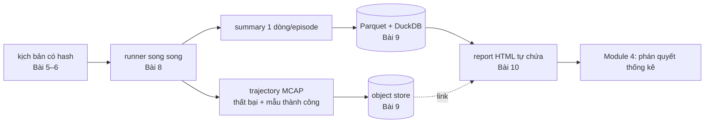
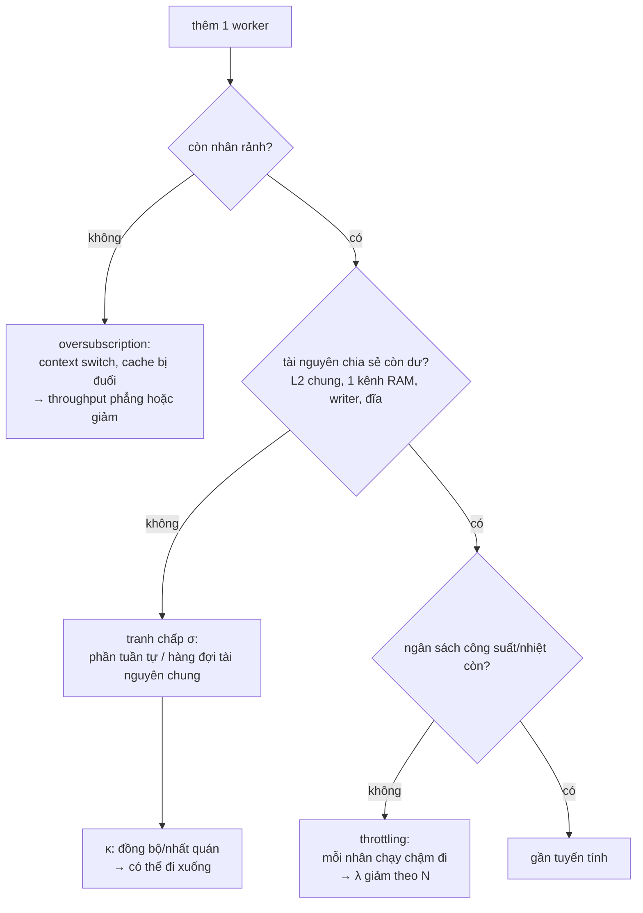
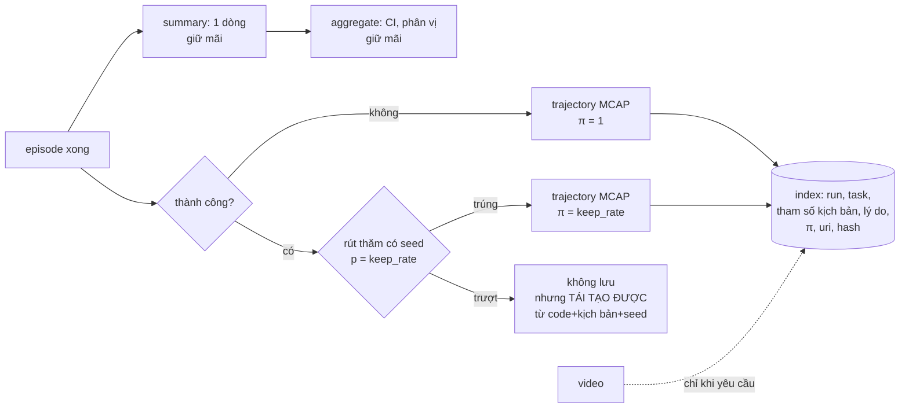

# Khóa 6 — Module 3: Chạy ở quy mô (Bài 8–10, 24h)

Module này nằm giữa hai thứ: Module 1–2 cho bạn một episode **tái lập được** và một kịch bản **là dữ liệu**; Module 4 sẽ đòi hàng trăm đến hàng nghìn episode cho mỗi phán quyết. Module 3 là phần biến "một episode đúng" thành "mười nghìn episode đúng, rẻ, tìm lại được, đọc được". Đây là sân nhà của bạn, nên các bài nói ngắn ở chỗ bạn đã biết và dừng lâu ở ba chỗ khác biệt: máy N100 không phải cluster, dữ liệu mô phỏng bị lấy mẫu có chủ đích, và báo cáo phải mang sai số.



---

## Bài 8 — Song song hóa và throughput thật (8h)

> **Vị trí:** K6 Bài 7 (provenance) → **Bài 8** → Bài 9 (artifact) · **Cần trước:** F7.1, F7.2, F7.3, F1.3; K6 Bài 3 (bốn kịch bản determinism); K4 Bài 6 (cô lập nhiệt), K4 Bài 11–12 (N100, roofline) · **Sau bài này bạn quyết định được:** chạy eval trên N100 với bao nhiêu worker, khi nào phải thuê máy, và một lần chạy 10.000 episode tốn bao nhiêu giờ/tiền, kèm lý do bằng số chứ không bằng "càng nhiều core càng tốt".

### 1. Câu chuyện — ai đã khổ vì chuyện này

Năm 1967, Gene Amdahl trình bày ở hội nghị AFIPS một bài ngắn (*Validity of the single processor approach to achieving large scale computing capabilities*) để phản bác làn sóng tin rằng cứ ghép nhiều bộ xử lý là nhanh tương ứng. Lập luận của ông: phần việc phải làm tuần tự (nạp dữ liệu, quản lý, gom kết quả) không co lại khi thêm bộ xử lý, nên nó đặt trần cho tốc độ. Hai mươi năm sau, John Gustafson (1988) chỉ ra mặt kia: khi có nhiều máy hơn người ta không giải bài cũ nhanh hơn mà giải bài **to hơn**, và phần tuần tự co lại theo tỉ lệ. Neil Gunther sau đó thêm một số hạng thứ ba mà Amdahl bỏ qua: chi phí giữ các bên **nhất quán** với nhau (khóa, cache coherence, đồng bộ), tăng theo bình phương số bên tham gia. Đó là lý do có hệ thống mà thêm worker thì throughput **giảm**: Universal Scalability Law (USL) [chuẩn].

Ở hạ tầng eval robot, chuyện này lặp lại ở quy mô nhỏ hơn nhiều. Kịch bản điển hình: ai đó viết `ProcessPoolExecutor(max_workers=os.cpu_count()*2)` vì "hyperthreading", chạy trên một mini PC 4 nhân, mỗi worker lại để numpy tự mở 4 luồng BLAS, writer MCAP nén zstd chạy cùng máy, và quạt máy kêu sau năm phút. Kết quả là 32 luồng tranh 4 nhân đang hạ xung, và người đó kết luận "MuJoCo chậm". Bài này dạy bạn tách các nguyên nhân đó ra bằng số.

### 2. Mô hình tư duy

Throughput khi thêm worker bị ba lực kéo, và mỗi lực có một dấu vết đo được:



Mô hình định lượng là USL [chuẩn]:

```
X(N) = λ·N / (1 + σ·(N−1) + κ·N·(N−1))
```

λ là throughput một worker, σ là phần tranh chấp (Amdahl là trường hợp κ = 0), κ là chi phí nhất quán. Khi κ > 0 có một đỉnh tại N* = √((1−σ)/κ); sau đỉnh, thêm worker làm chậm đi. Ba ý cốt lõi:

1. **"Số luồng" không phải "số đơn vị thực thi".** N100 có 4 nhân Gracemont, 4 luồng, **không có hyperthreading** [spec: Intel ARK, Intel Processor N100 — Total Cores 4, Total Threads 4, Hyper-Threading: No]. Không có "luồng logic thứ hai" nào để ăn thêm 10–20%; worker thứ 5 trở đi chỉ chia thời gian với 4 worker đầu.
2. **Bốn nhân chia nhau nhiều thứ:** một khối L2 chung cho cả cụm 4 nhân E-core, 6 MB cache cấp cuối, và **một kênh bộ nhớ** (DDR4-3200 / DDR5-4800) [spec: Intel ARK — Max # of Memory Channels 1; kích thước L2 của cụm kiểm bằng `lscpu -C`, `[tự đo]`]. Nếu bước mô phỏng chạm nhiều bộ nhớ, worker thứ 3–4 tranh băng thông chứ không tranh tính toán (→ F7.2).
3. **Tần số không cố định.** "Up to 3.40 GHz" là xung tối đa khi một vài nhân bận; khi cả 4 nhân bận lâu, giới hạn công suất PL1/PL2 do hãng máy đặt và nhiệt độ kéo xung xuống. Throughput mỗi worker (λ) vì vậy **phụ thuộc N và phụ thuộc thời gian** — đây là thứ USL không tách được nếu bạn không đo tần số song song.

Mô phỏng đồ chơi: vẽ Amdahl vs USL, rồi fit USL vào số đo thật của bạn (sau bước 3 phần Làm):

```python
# [đã chạy]  Amdahl vs USL, và fit USL vào số đo của bạn.
import json, numpy as np, matplotlib
matplotlib.use("Agg")
import matplotlib.pyplot as plt
from scipy.optimize import curve_fit

def amdahl(N, lam, s):            # s = phần tuần tự (serial fraction)
    return lam * N / (1 + s * (N - 1))

def usl(N, lam, sigma, kappa):    # sigma = tranh chấp, kappa = chi phí đồng bộ/nhất quán
    return lam * N / (1 + sigma * (N - 1) + kappa * N * (N - 1))

N = np.arange(1, 17)
plt.plot(N, amdahl(N, 1, 0.05), label="Amdahl s=0.05")
plt.plot(N, usl(N, 1, 0.05, 0.02), label="USL σ=0.05 κ=0.02")
plt.plot(N, N, "k:", label="tuyến tính lý tưởng")
plt.axvline(4, color="gray", ls="--", label="N100: 4 core = 4 luồng")

try:                                  # số đo thật từ b8_scaling.py (chỉ lấy N ≤ số core)
    d = {int(k): v for k, v in json.load(open("scaling.json")).items() if int(k) <= 4}
    n_obs, x_obs = np.array(list(d)), np.array(list(d.values()))
    (lam, sig, kap), _ = curve_fit(usl, n_obs, x_obs, p0=[x_obs[0], 0.05, 0.01],
                                   bounds=([0, 0, 0], [np.inf, 1, 1]))
    n_star = np.sqrt((1 - sig) / kap) if kap > 0 else np.inf
    print(f"λ={lam:.1f} ep/s  σ={sig:.3f}  κ={kap:.4f}  N*≈{n_star:.1f}")
    print("Cảnh báo: 3–4 điểm fit 3 tham số → σ, κ rất bất định; đừng ngoại suy xa.")
except (OSError, RuntimeError, ValueError) as e:
    print("chưa có scaling.json hoặc fit hỏng:", e)

plt.xlabel("số worker N"); plt.ylabel("throughput (tương đối)"); plt.legend()
plt.savefig("usl.png", dpi=120)   # trong bài có thể dùng plt.show()
```

Lưu ý trung thực về công cụ: trên N100 bạn chỉ có 4 điểm đo hợp lệ (N = 1..4), mà USL có 3 tham số. Fit sẽ "khớp" gần như mọi thứ. Giá trị của USL ở đây là **từ vựng để chẩn đoán** (đường cong cong xuống vì σ hay vì κ hay vì λ tụt do nhiệt), không phải công cụ dự báo cho 64 nhân.

### 3. Cầu nối từ backend

| Backend bạn biết | Ở đây | Gãy ở chỗ | Nếu dùng nhầm thì |
|---|---|---|---|
| Scale ngang pod/worker theo CPU | Thêm process mô phỏng | Pod scale ra **nhiều máy**; ở đây mọi worker chung 4 nhân, 1 kênh RAM, 1 ngân sách nhiệt. Không có "máy thứ hai" để tràn sang | Đặt `max_workers` theo `cpu_count()*k`, throughput giảm, kết luận sai rằng simulator chậm |
| Connection pool: "nhiều kết nối hơn = nhanh hơn" tới một điểm | Số worker tối ưu | Pool DB nghẽn ở I/O đĩa/khóa của **máy khác**; ở đây nghẽn ở chính CPU đang chạy worker, nên oversubscription vừa không giúp vừa phá cache | Copy kinh nghiệm "pool = 2× core" sang CPU-bound sim |
| Benchmark trên "host yên tĩnh" (vốn của bạn) | Đo throughput khi **chính bạn** làm host ồn | Host yên tĩnh loại nhiễu từ tiến trình khác; khi bạn chạy 4 worker full tải, bạn **tự tạo** nhiệt và tranh băng thông. Yên tĩnh không còn là trạng thái mặc định mà là một biến | Đo 1 worker ở máy mát, nhân 4, hứa với người khác một con số không bao giờ đạt |
| CPU 100% = máy đang làm việc | `%CPU` lúc bão hòa | CPU chờ bộ nhớ (stall) vẫn tính là "busy". 100% không phân biệt được tính toán hữu ích với chờ RAM | Thấy 100% tưởng đã tối ưu, trong khi IPC thấp và nút thắt là băng thông (→ F7.2, F7.3) |
| Throughput server = request/s ở steady state | Episode/phút | Episode có **độ dài thay đổi** (timeout dài, thành công sớm); chunk lớn làm worker cuối chạy một mình (straggler) | Đo ở cấu hình chunk lớn, đuôi episode dài kéo throughput thật xuống mà bảng không thấy |

**Chấm mô hình:**

- *"Thêm worker tới đúng số luồng `nproc` rồi dừng, phần luồng ảo cho thêm chút."* — **ĐÚNG MỘT PHẦN.** Đúng trên CPU có SMT; trên N100 `nproc` = số nhân vật lý = 4, không có phần "chút" nào. Và ngay cả dưới 4 cũng chưa chắc tuyến tính, vì L2 và kênh RAM chung. Phản ví dụ: một bước mô phỏng có working set vượt L2 chia sẻ; 3 worker có thể đã chạm trần băng thông, worker thứ 4 gần như không thêm gì.
- *"Song song hóa không đổi kết quả, chỉ đổi tốc độ."* — **SAI** nếu chưa chứng minh. Đó chính là kịch bản 3 của K6 Bài 3 (tuần tự vs song song), nơi determinism hay chết nhất: seed phụ thuộc thứ tự worker nhận việc, kết quả gom theo thứ tự hoàn thành, numpy/BLAS đa luồng đổi thứ tự cộng. Phản ví dụ: `pool.imap_unordered` + seed lấy từ bộ đếm toàn cục → cùng 100 episode, hash khác nhau mỗi lần.
- *"GPU luôn nhanh hơn CPU cho mô phỏng."* — **SAI** như phát biểu chung. GPU thắng khi batch to và cả vòng lặp nằm trên device; ở batch nhỏ, chi phí biên dịch JIT và copy host↔device lấn át. Và N100 không có GPU CUDA, nên câu hỏi thật là "có đáng thuê không".

### 4. Thuật ngữ

| Mức | Thuật ngữ | Nghĩa trong một câu | Hay bị hiểu nhầm thành |
|---|---|---|---|
| 🟢 | Throughput vs latency | Episode/phút toàn hệ vs thời gian một episode | Một cái tăng thì cái kia giảm tương ứng |
| 🟢 | Amdahl's law | Phần tuần tự s đặt trần speedup 1/s | Định luật nói "song song hóa vô ích" |
| 🟢 | USL (σ, κ) | Amdahl + chi phí nhất quán tăng theo N² → có đỉnh | Công thức dự báo chính xác cho máy lớn |
| 🟢 | Oversubscription | Nhiều luồng chạy được hơn số nhân | Cách "vắt" thêm hiệu năng |
| 🟢 | SMT / hyperthreading | Một nhân vật lý chạy hai luồng phần cứng xen nhau | Thứ mọi CPU đều có (N100 không có) |
| 🟢 | Thermal / power throttling | Xung bị hạ vì chạm giới hạn công suất (PL1/PL2) hoặc nhiệt | Chỉ xảy ra khi máy nóng tới mức nguy hiểm |
| 🟡 | Memory bandwidth bound | Nút thắt là byte/s từ RAM, không phải FLOP/s | "CPU yếu" |
| 🟡 | Straggler / tail của batch | Worker cuối chạy một mình vì việc chia không đều | Nhiễu ngẫu nhiên không cần quan tâm |
| 🟡 | MJX / MuJoCo Warp | MuJoCo viết lại cho GPU (JAX / NVIDIA Warp), chạy hàng nghìn env một lúc | Bản "nhanh hơn" của cùng một engine, cho kết quả giống hệt |
| 🔴 | NUMA, pinning chi tiết | Tối ưu cho máy nhiều socket | Thứ cần trên N100 (một socket, một kênh) |

### 5. Dự đoán

**Đề:** trên N100 của bạn, với episode thật của K6 (task LIBERO/robosuite đã chuyển thành kịch bản ở Bài 5, policy rẻ — ngẫu nhiên hoặc scripted, **không** phải VLA):

1. Thời gian một episode t₁ (đơn luồng, render tắt).
2. Throughput ở N = 1, 2, 3, 4, 6, 8 worker. Ở N nào bão hòa? N = 6, 8 tốt hơn, bằng, hay tệ hơn N = 4?
3. Tần số trung bình của các nhân khi 1 worker chạy vs khi 4 worker chạy 10 phút liên tục.
4. 10.000 episode: bao nhiêu giờ đồng hồ trên N100, bao nhiêu giờ CPU, và nếu thuê máy thì bao nhiêu tiền.
5. Nếu policy là VLA (SmolVLA) chạy trên N100 trong vòng lặp: con số ở câu 4 thành bao nhiêu?

**Tham số cần tra / đo trước khi đoán:**

| Tham số | Tra/đo ở đâu |
|---|---|
| Số nhân, luồng, L2, L3 | `lscpu`, `lscpu -C`; Intel ARK "Intel Processor N100" |
| Kênh và tốc độ RAM của máy bạn | `sudo dmidecode -t memory` (Configured Memory Speed), Intel ARK (số kênh tối đa) |
| Băng thông lý thuyết | tốc độ MT/s × 8 byte × số kênh |
| Giới hạn công suất hãng đặt | `cat /sys/class/powercap/intel-rapl:0/constraint_*_power_limit_uw` `[tự đo]`, hoặc BIOS |
| Thời gian policy suy luận trên N100 | số đo của bạn ở K4 Bài 11 |
| Phần tuần tự của pipeline | dựng env, nạp model, gom kết quả, ghi MCAP: đo bằng `time.perf_counter` từng đoạn trong 1 episode |

**Phương pháp:** dự đoán throughput bằng Amdahl với s đo được (phần không song song được: writer chung, gom kết quả), trần là 4 nhân; rồi trừ hao cho throttling bằng tỉ số tần số đo ở bước 3. Ước lượng 10.000 episode = 10.000 × t₁ / speedup(4).

```markdown
# prediction.md — K6 Bài 8
- t1 (1 episode, 1 worker): ___ s  (cách tính: ___)
- throughput N=1..4: ___ / ___ / ___ / ___ ep/phút; N bão hòa: ___
- N=6, N=8 so với N=4: [tốt hơn | bằng | tệ hơn] vì ___
- tần số 1 worker / 4 worker sau 10 phút: ___ / ___ MHz
- 10.000 episode trên N100: ___ giờ đồng hồ; ___ giờ CPU
- nếu thuê máy ___ vCPU giá ___/giờ: ___ tiền
- nếu policy là VLA trên N100: ___ (đơn vị tự chọn)
- nguồn nào trong bảy nguồn phá determinism (K6 Bài 1) sẽ lộ ra khi song song: ___
```

### 6. Làm

Giữ nguyên năm bước của bản gốc, thêm đo tần số/nhiệt và tách phần tuần tự.

**Bước 0 — chuẩn bị phép đo (30 phút).** Trong mọi lệnh chạy benchmark, đặt `OMP_NUM_THREADS=1 OPENBLAS_NUM_THREADS=1 MKL_NUM_THREADS=1` cho worker (nếu không, mỗi worker numpy tự mở nhiều luồng và bạn đang oversubscribe mà không biết). Render tắt. Chạy `turbostat` **trên host**, không trong Docker (cần quyền MSR):

```bash
# [chưa chạy] — cần host Linux có turbostat (gói linux-tools), quyền root
sudo turbostat --quiet --interval 5 --show Busy%,Bzy_MHz,PkgWatt,PkgTmp > turbostat.log &
```

Sai số dụng cụ: `Bzy_MHz` là trung bình trong cửa sổ 5 s, che các nhịp hạ xung ngắn; `PkgWatt` từ RAPL là ước lượng của chip, không phải đồng hồ điện. Dùng chúng để thấy xu hướng, không để báo cáo tới watt.

**Bước 1 — ba chiến lược, đo cả ba.**

| Chiến lược | Trên N100 | Ghi chú |
|---|---|---|
| Nhiều process (`ProcessPoolExecutor`/`multiprocessing`), mỗi process một `MjModel`+`MjData` | Chính | Seed dẫn xuất từ `episode_index`, **không** từ worker id hay thứ tự nhận việc |
| Nhiều `MjData` trong một process | Có, nhưng phân biệt hai loại: (a) vòng lặp Python qua nhiều env (như `SyncVectorEnv`) là **tuần tự**, không song song; (b) rollout đa luồng trong C (module `mujoco.rollout` của Python bindings, hoặc mẫu `testspeed --nthread`) mới song song thật | Tên hàm và tham số của `mujoco.rollout` đổi theo bản: `[tự đo]`, kiểm theo phiên bản MuJoCo bạn pin |
| MJX / MuJoCo Warp trên GPU | **Không chạy được trên N100** (không có GPU CUDA). MJX chạy được trên backend CPU của JAX nhưng đó không phải phép thử GPU | Thuê GPU 1–2 giờ, đo ở batch 1, 64, 1024, 4096. Ghi riêng thời gian biên dịch JIT lần đầu |

Bản gốc ghi "Vectorized env trong một process (MuJoCo hỗ trợ batch)" như thể batch là có sẵn và song song; thực tế phụ thuộc bạn dùng đường nào ở trên.

**Bước 2 — đo cho mỗi chiến lược:** throughput (episode/phút), `%CPU` từng nhân, RAM peak (`/usr/bin/time -v` → *Maximum resident set size*, cộng cho mọi worker hoặc đọc `smem`), tần số và nhiệt từ `turbostat`. Với GPU: `nvidia-smi --query-gpu=utilization.gpu,memory.used --format=csv -l 1`. Lưu ý `utilization.gpu` chỉ là tỉ lệ thời gian có kernel chạy, không phải tỉ lệ SM bận.

**Bước 3 — vẽ throughput theo số worker, tìm điểm bão hòa.** Bản gốc gợi ý quét tới "cực đại của máy"; trên N100, quét N = 1, 2, 3, 4 rồi **cố ý** 6, 8 để thấy oversubscription. Lặp mỗi điểm 3 lần, lấy trung vị (→ F1.3). Script khung để bạn thay `episode()` bằng episode thật:

```python
# [đã chạy]  Đo throughput theo số worker cho một "episode" CPU-bound giả lập.
import os
os.environ["OMP_NUM_THREADS"] = "1"   # mỗi worker 1 luồng BLAS, tránh oversubscription ngầm
os.environ["OPENBLAS_NUM_THREADS"] = "1"
import time, json, numpy as np
from concurrent.futures import ProcessPoolExecutor

def episode(seed, steps=4000, n=24):
    rng = np.random.default_rng(seed)          # RNG riêng theo seed (Module 1)
    M = rng.standard_normal((n, n)) * 0.05
    x = rng.standard_normal(n)
    for _ in range(steps):                      # "bước vật lý": matvec nhỏ + phi tuyến
        x = np.tanh(M @ x + 0.01 * x)
    return seed, float(x.sum())

def cpu_mhz():
    try:
        return [float(l.split(":")[1]) for l in open("/proc/cpuinfo") if l.startswith("cpu MHz")]
    except OSError:
        return []

def run(workers, n_ep=240):
    t0 = time.perf_counter()
    with ProcessPoolExecutor(max_workers=workers) as ex:
        res = list(ex.map(episode, range(n_ep), chunksize=8))
    dt = time.perf_counter() - t0
    res.sort()                                  # gom kết quả theo seed, không theo thứ tự xong
    digest = hash(tuple(round(v, 9) for _, v in res))
    return n_ep / dt, digest

if __name__ == "__main__":
    out = {}
    for w in [1, 2, 3, 4, 6, 8]:
        runs = [run(w) for _ in range(3)]       # lặp 3 lần, lấy trung vị (→ F1.3)
        thr, h = sorted(runs)[1]
        out[w] = thr
        print(f"workers={w:2d}  {thr:7.1f} ep/s  hash={h & 0xffff:04x}  MHz={cpu_mhz()[:4]}")
    json.dump(out, open("scaling.json", "w"))
```

Hai chi tiết trong script là bài học, không phải trang trí: `res.sort()` (gom theo định danh, không theo thứ tự hoàn thành) và cột `hash` (phải giống nhau ở mọi N). `cpu MHz` trong `/proc/cpuinfo` là ảnh chụp tức thời, kém tin hơn `turbostat`.

**Bước 3b (thêm) — tách ba lực.** Chạy N = 4 trong 15 phút liên tục, ghi throughput mỗi phút cùng `Bzy_MHz`. Vẽ throughput/MHz theo thời gian. Nếu throughput giảm mà throughput/MHz phẳng → nguyên nhân là xung (nhiệt/công suất). Nếu throughput/MHz cũng giảm → tranh chấp (bộ nhớ, writer, đĩa). Đo băng thông RAM đơn giản bằng một phép copy mảng lớn (`np.copyto` trên mảng ≥ 512 MB, tính byte/s) ở 1 và 4 process song song để có trần thực tế, `[tự đo]`.

**Bước 4 — kiểm lại determinism ở mỗi chiến lược** (K6 Bài 3 kịch bản 3). Hash 100 episode chạy tuần tự vs song song ở N = 4. Với MJX trên GPU, **không kỳ vọng bit-exact với MuJoCo C**: hai implementation khác nhau về solver và thứ tự cộng. Kết quả MJX là một **backend khác**, cần baseline riêng và A/A riêng ở Module 4; không được trộn số MJX với baseline CPU.

**Bước 5 — chi phí.** Giờ CPU = 10.000 × t₁ (đo ở N = 1, nhân với hệ số chậm đi khi N = 4 nếu có). Giờ đồng hồ = 10.000 / throughput(N tối ưu). Giá thuê: tra giá hiện tại của nhà cung cấp bạn định dùng (giá vCPU và GPU đổi theo tháng), ghi ngày tra vào `decisions.md`. Tách riêng chi phí policy: đo thời gian/episode của physics, của policy, của logging. Nếu policy chiếm phần lớn (trường hợp VLA), song song hóa physics gần như không mua được gì; đó là Amdahl áp vào chính pipeline của bạn.

**Bước 6 (thêm) — ghi tần số và nhiệt trung bình vào provenance** của run (trường "phần cứng" ở K6 Bài 7). Hai run cùng code trên cùng máy nhưng một run hạ xung sẽ khác throughput; nếu bạn so thời gian episode giữa các run, đó là biến gây nhiễu.

### 7. Số phải ra

<details><summary>🔒 MỞ SAU KHI COMMIT prediction.md</summary>

| Kiểm tra | Kỳ vọng | Vì sao lệch là bình thường |
|---|---|---|
| Throughput theo N, N = 1..4 | Tăng, nhưng **thường dưới tuyến tính**: speedup ở N = 4 trong khoảng ~2.5–3.8× là hợp lý `[ước lượng]` | L2 và một kênh RAM chung; xung all-core thấp hơn xung 1 nhân; writer/gom kết quả là phần tuần tự |
| N = 6, 8 so với N = 4 | **Không tốt hơn**, thường tệ hơn vài phần trăm đến vài chục phần trăm | N100 không có hyperthreading: worker 5+ chỉ chia thời gian, thêm context switch và đuổi cache. Bản gốc ghi "hyperthread cho lợi ích nhỏ" — không áp dụng cho máy này |
| `%CPU` lúc bão hòa | Gần 100% mỗi nhân. Nếu thấp hơn nhiều: bound bởi I/O, khóa, hoặc process chính gom kết quả không kịp | 100% vẫn có thể là chờ RAM; xem throughput/MHz |
| Tần số 4 worker sau 10 phút | Thấp hơn rõ so với 1 worker; mức chính xác phụ thuộc PL1/PL2 hãng đặt và tản nhiệt `[tự đo]` | Gần như mọi mini PC đều thế; đây là lý do 1-worker × 4 là dự báo lạc quan |
| Băng thông RAM lý thuyết | 1 kênh × 4800 MT/s × 8 byte ≈ 38.4 GB/s (DDR5-4800) `[ước lượng từ spec]`; đo thực tế thường thấp hơn đáng kể `[tự đo]` | Lý thuyết bỏ qua refresh, chuyển bank, overhead điều khiển |
| GPU (MJX/Warp) vs CPU | Lợi thế lớn ở batch hàng nghìn; **có thể tệ hơn ở batch nhỏ** và lần đầu chịu thời gian biên dịch JIT (giây đến hàng chục giây, `[tự đo]`) | Biên dịch và copy host↔device là chi phí cố định |
| Determinism sau song song (CPU) | Hash giống hệt tuần tự nếu seed dẫn xuất từ `episode_index` và kết quả sắp theo định danh | Lệch = seed phụ thuộc thứ tự, hoặc BLAS đa luồng |
| MJX vs MuJoCo C | **Không bit-exact**; chỉ so được theo phân bố | Hai implementation khác nhau |
| 10.000 episode với policy VLA trên N100 | Lớn hơn nhiều bậc so với policy rẻ; thường không khả thi trên N100 trong ngân sách giờ của khóa | Suy luận VLA trên CPU ở thang trăm ms đến giây mỗi lần gọi (số của bạn ở K4 Bài 11), nhân với số bước mỗi episode |

Quyết định mẫu rút ra: phát triển hạ tầng bằng policy rẻ trên N100 ở N = 4 (hoặc 3 + 1 nhân cho writer nếu nén MCAP nặng); eval VLA thật thì thuê máy và chạy theo lô có ngân sách tính trước từ Bài 12.

</details>

### 8. Nếu ra khác

| Triệu chứng | Nguyên nhân khả dĩ | Kiểm bằng cách | Sửa |
|---|---|---|---|
| Throughput tăng rồi **giảm** khi thêm worker | Oversubscription (N > 4), hoặc tranh băng thông/cache | `vmstat 1` cột `cs` (context switch), `perf stat -e cache-misses,instructions,cycles` theo N `[tự đo]` | Giới hạn N ≤ 4; nếu giảm ngay trong 1..4 thì giảm working set hoặc chấp nhận N nhỏ hơn |
| Throughput tốt 2 phút đầu rồi tụt dần | Throttling công suất/nhiệt | `turbostat`: `Bzy_MHz` giảm, `PkgTmp` tăng | Chấp nhận và báo số steady-state; cải thiện tản nhiệt; đừng báo số 2 phút đầu |
| RAM tăng tuyến tính tới hết | Mỗi worker giữ bản model/asset đầy đủ; hoặc giữ trajectory trong RAM đến cuối run | RSS mỗi worker theo thời gian | Nạp asset một lần trước khi fork (copy-on-write), stream trajectory ra đĩa theo episode, giảm N |
| `%CPU` thấp, throughput phẳng | Process chính gom kết quả/ghi MCAP là nút thắt (phần tuần tự của Amdahl) | Profile process chính (`py-spy top --pid`) | Mỗi worker tự ghi file của nó; process chính chỉ ghi summary |
| Hash khác giữa tuần tự và song song | Seed theo thứ tự nhận việc; gom theo thứ tự hoàn thành; BLAS đa luồng | So hash từng episode, tìm episode lệch đầu tiên | Seed từ `episode_index`; sắp theo định danh; `*_NUM_THREADS=1` |
| GPU utilization thấp khi chạy MJX | Batch quá nhỏ; copy host↔device mỗi bước; vòng lặp Python bên ngoài | Đo thời gian/bước theo batch | Giữ vòng lặp trong `jax.lax.scan`/`jit`, chỉ kéo kết quả về cuối episode `[tự đo]` |
| Episode/phút dao động mạnh giữa các lần lặp | Độ dài episode thay đổi, chunk lớn tạo straggler | Phân bố thời gian từng episode | `chunksize` nhỏ, hoặc xếp episode dài chạy trước |

### 9. Câu hỏi ngược

1. **[Nếu…thì]** Nếu writer MCAP nén zstd chiếm 15% thời gian một episode và chạy trong process chính, speedup tối đa theo Amdahl là bao nhiêu, dù bạn có 64 nhân? Bạn sẽ thiết kế lại đường ghi thế nào?
   <details><summary>Hướng nghĩ</summary>Phần tuần tự s đặt trần 1/s. Câu hỏi thật là phần đó có cần tuần tự không: ghi file theo episode trong chính worker biến nó thành phần song song; chỉ còn summary là tuần tự. Đây cũng là chỗ backpressure (→ F3.9) quay lại nếu bạn dùng hàng đợi giữa worker và writer.</details>
2. **[Quy mô]** Từ N100 lên một máy thuê 64 vCPU (32 nhân có SMT) chạy 10.000 episode: thứ gì gãy trước — RAM, băng thông, writer, đĩa, hay object store khi upload? Bạn đo gì trong 10 phút đầu để biết?
   <details><summary>Hướng nghĩ</summary>Nhân RSS mỗi worker với 64; nhân byte/s ghi đĩa với 64; xem SMT cho bao nhiêu thật bằng cách so 32 vs 64 worker. Ở quy mô này κ (đồng bộ) bắt đầu có nghĩa: một khóa SQLite chung cho summary có thể là đỉnh của USL.</details>
3. **[Failure mode]** Run 10.000 episode chạy qua đêm, sáng ra throughput báo cáo thấp hơn hôm qua 20% dù code không đổi. Liệt kê ba nguyên nhân không nằm trong code và cách phân biệt chúng bằng dữ liệu bạn đã ghi.
   <details><summary>Hướng nghĩ</summary>Nhiệt độ phòng → xung; tiến trình nền (cập nhật, indexer) → `%CPU` của tiến trình khác; đĩa gần đầy → ghi chậm. Nếu bạn đã ghi tần số và nhiệt vào provenance (bước 6), bạn tách được cái đầu bằng throughput/MHz.</details>
4. **[Vì sao không]** Vì sao không dùng thread thay vì process cho MuJoCo, khi MuJoCo C nhả GIL trong lúc `mj_step`?
   <details><summary>Hướng nghĩ</summary>Phần C có thể chạy song song nếu binding nhả GIL `[tự đo theo phiên bản]`, nhưng phần policy, success predicate, ghi log là Python và giữ GIL. Đo tỉ lệ thời gian trong C vs Python trước khi quyết; đó chính là s của Amdahl cho chiến lược thread.</details>
5. **[Phản biện]** Một đồng nghiệp nói: "Đừng tối ưu throughput, cứ thuê máy to." Khi nào họ đúng, khi nào việc hiểu USL trên N100 vẫn đáng 8 giờ?
   <details><summary>Hướng nghĩ</summary>Đúng khi chi phí thuê nhỏ hơn giờ công. Sai khi eval chạy trong CI mỗi PR (Bài 13): ngân sách thời gian cố định, và mọi nút thắt tuần tự sẽ đi theo bạn lên máy to. Hiểu σ trên máy nhỏ là cách rẻ nhất để biết máy to có giúp không.</details>
6. **[Liên ngành]** Dây chuyền sản xuất có "thuyết ràng buộc" (Goldratt): thêm máy ở trạm không phải nút cổ chai không làm tăng sản lượng. Pipeline eval của bạn có những trạm nào, trạm nào là ràng buộc ở N = 1 và ở N = 4?
   <details><summary>Hướng nghĩ</summary>Dựng env → physics → policy → predicate → ghi trajectory → summary → upload. Ràng buộc dịch chuyển khi bạn song song hóa một trạm; đo thời gian từng trạm ở cả hai N.</details>

### 10. Liên kết ra ngoài

- **Định cỡ connection pool cho cơ sở dữ liệu.** Wiki của PostgreSQL và tài liệu HikariCP đưa ra quy tắc kinh nghiệm: số kết nối tối ưu gần số nhân (cộng phần chờ đĩa), nhiều hơn thì chậm đi vì context switch và tranh khóa. Giống: đỉnh của USL, oversubscription làm hại. Khác: ở DB phần chờ I/O cho phép vượt số nhân một chút; mô phỏng CPU-bound gần như không có phần chờ nên trần là đúng số nhân.
- **Thuyết ràng buộc trong sản xuất.** Sản lượng dây chuyền bằng sản lượng trạm chậm nhất; tối ưu trạm khác là phí. Giống: Amdahl ở dạng hàng đợi (→ F7.1). Khác: nhà máy có tồn kho giữa các trạm để hấp thụ dao động; pipeline eval của bạn có thể không có (writer đồng bộ), nên dao động truyền thẳng.
- **Đồng hồ thời gian thực và tính toán khoa học (HPC).** Cộng đồng HPC báo cáo "strong scaling" (bài cố định, thêm nhân) và "weak scaling" (bài lớn theo nhân, kiểu Gustafson) riêng biệt. Giống: bạn có cả hai — số episode cố định (strong) và "nhiều nhân thì chạy nhiều kịch bản hơn" (weak). Khác: HPC hiếm khi bị giới hạn công suất 6–15 W như mini PC.

### 11. Độ tin cậy và sửa lỗi

| Khẳng định | Nhãn | Ghi chú / cách kiểm |
|---|---|---|
| N100: 4 nhân, 4 luồng, không hyperthreading, 6 MB cache, tối đa 3.40 GHz, 1 kênh RAM, DDR4-3200/DDR5-4800 | [spec] | Intel ARK, trang "Intel Processor N100 (6M Cache, up to 3.40 GHz)" |
| Cụm 4 nhân E-core chia chung một L2 | [chuẩn] | Kiến trúc Gracemont; kiểm bằng `lscpu -C` trên máy bạn `[tự đo]` |
| Băng thông lý thuyết ~38.4 GB/s với DDR5-4800 một kênh | [ước lượng] | 4800 × 10⁶ × 8 byte; RAM thực của máy bạn có thể chạy tốc độ khác |
| PL1/PL2 của Beelink EQ12 | [tự đo] | Hãng đặt trong BIOS; đọc qua RAPL sysfs |
| USL, Amdahl, Gustafson | [chuẩn] | Amdahl 1967; Gustafson 1988; Gunther, *Guerrilla Capacity Planning* |
| `mujoco.rollout` hỗ trợ rollout đa luồng | [tự đo] | Có trong Python bindings các bản 3.x gần đây; tên/tham số kiểm theo bản pin |
| MJX không bit-exact với MuJoCo C | [chuẩn] | Hai implementation; kiểm bằng A/A riêng |
| Thời gian JIT MJX "20–40 s" (Gemini) | [tự đo] | Phụ thuộc model, GPU, bản JAX |

**Đã sửa so với bản gốc/Gemini:**
- **Bản gốc, Số phải ra:** "gần tuyến tính tới số core vật lý, rồi bão hòa. Hyperthread cho lợi ích nhỏ" → trên N100 không có hyperthread; worker 5+ là oversubscription, kỳ vọng phẳng hoặc giảm.
- **Gemini (lỗi đã biết, mục 7 quy chuẩn):** câu tự kiểm tra về "16 vCPU = 8 nhân + 8 hyperthread" và lời khuyên "giảm worker về đúng số core vật lý, không dùng hyper-threaded cores" — giải thích đúng cho CPU có SMT nhưng **không áp dụng cho N100 (4C/4T)**; đã thay bằng phân tích oversubscription + tài nguyên chia sẻ + throttling.
- **Gemini:** "quét 1, 2, 4, 8 đến cực đại của máy" và đo "logical core" → trên N100 quét 1..4, thêm 6, 8 chỉ để thấy oversubscription.
- **Gemini:** "Vectorized C-level … vẫn chịu ràng buộc bởi năng lực tính toán tuần tự CPU" → rollout đa luồng trong C có song song thật; cái tuần tự là vòng lặp Python qua nhiều env.
- **Bản gốc:** không phân biệt MJX vs MuJoCo C về determinism → thêm: khác backend = baseline khác.
- **Thêm:** throttling, băng thông một kênh, đo tần số song song, và phần policy chiếm thời gian (Amdahl áp vào pipeline).

### 12. Đọc thêm và tự kiểm tra

- **Nguồn gốc:** G. Amdahl (1967), *Validity of the single processor approach to achieving large scale computing capabilities*, AFIPS; Intel ARK — Intel Processor N100.
- **Giải thích:** N. Gunther, *Guerrilla Capacity Planning* (Springer, 2007), chương về Universal Scalability Law.
- **Đào sâu (tùy chọn):** B. Gregg, *Systems Performance* (2nd ed.), chương CPU và Memory (phương pháp USE, → F7.3).
- **Tự kiểm tra:** (1) giải thích lại cho một backend engineer khác trong 5 câu vì sao 8 worker trên N100 chậm hơn 4; (2) vẽ lại sơ đồ ba lực ở phần 2 từ trí nhớ; (3) hai câu dưới.

*Câu 1: Pipeline có phần tuần tự 10%. Speedup tối đa trên 4 nhân theo Amdahl là bao nhiêu? Trên vô hạn nhân?*
<details><summary>Đáp án</summary>4 / (1 + 0.1×3) ≈ 3.08×; vô hạn nhân → 1/0.1 = 10×. Trên N100, phần tuần tự 10% đã ăn mất gần một nhân.</details>

*Câu 2: Throughput ở N = 4 giảm 15% sau 10 phút, throughput/MHz phẳng. Nguyên nhân thuộc nhóm nào, và có nên "sửa code" không?*
<details><summary>Đáp án</summary>Xung bị hạ (công suất/nhiệt), không phải tranh chấp trong code. Không sửa code; báo số steady-state, ghi tần số vào provenance, cải thiện tản nhiệt nếu cần.</details>

---

## Bài 9 — Artifact management: output của 10.000 episode đi đâu (8h)

> **Vị trí:** Bài 8 (throughput) → **Bài 9** → Bài 10 (báo cáo) · **Cần trước:** F3.6, F3.8, F3.5, F3.1; K5 Bài 14 (object store), K5 Bài 15 (index), K2 Bài 11–13 (`lerobot-audit`), K6 Bài 7 (provenance) · **Sau bài này bạn quyết định được:** giữ gì, bao lâu, ở tầng nào cho mỗi run, và khi nào nên **tính lại** một trajectory thay vì lưu nó.

### 1. Câu chuyện — ai đã khổ vì chuyện này

Máy dò ATLAS và CMS ở LHC chứng kiến va chạm proton ở tốc độ cỡ 40 triệu lần mỗi giây, nhưng chỉ ghi lại cỡ một nghìn sự kiện mỗi giây [chuẩn, bậc độ lớn]. Không ổ đĩa nào trên Trái Đất giữ nổi phần còn lại. Hệ "trigger" hai tầng quyết định trong vài micro giây rồi vài trăm mili giây sự kiện nào đáng giữ, và quyết định đó là **không thể làm lại**: cái gì bị bỏ thì mất vĩnh viễn. Vì vậy các nhóm vật lý ghi kèm mọi sự kiện được giữ cái "prescale" — xác suất nó được giữ — để khi tính tần suất một hiện tượng, họ nhân ngược lại. Không có trọng số đó, mọi thống kê trên dữ liệu đã lọc đều lệch về phía cái mà trigger thích.

Hạ tầng eval tự chế gặp đúng bài toán ấy ở quy mô nhỏ, theo một kịch bản rất quen: lưu toàn bộ mọi thứ, đĩa đầy sau hai tuần, bắt đầu xóa bừa theo ngày, rồi mất khả năng so run tháng trước với run hôm nay. Bản gốc gọi đây là "chỗ hạ tầng eval tự chế chết lần thứ hai" (lần thứ nhất là determinism). Bài này thêm một điều bản gốc chưa nói: chính chính sách "giữ mọi thất bại, lấy mẫu thành công" cũng là một trigger, và nó làm lệch mọi phân tích trên tầng trajectory nếu bạn không ghi xác suất giữ.

### 2. Mô hình tư duy



Bốn tầng của bản gốc giữ nguyên: **summary** (một dòng mỗi episode, mãi mãi), **aggregate** (thống kê mỗi run, mãi mãi), **trajectory** (thất bại + mẫu thành công), **video** (chỉ khi yêu cầu). Ba ý bản chất bổ sung:

1. **Lưu trữ là một quyết định đánh đổi giữa byte và phép tính.** Nhờ Module 1, một trajectory bị xóa không mất: nó là hàm thuần của (commit, image digest, scenario hash, seed). Lưu nó là **cache**; xóa nó là **cache eviction**. Câu hỏi giữ hay xóa thành: chi phí lưu trong T ngày so với xác suất cần × chi phí chạy lại. Giới hạn: "chạy lại được" chỉ đúng chừng nào image Docker và phiên bản MuJoCo còn tồn tại và còn chạy — đó là thứ phải giữ mãi, không phải trajectory.
2. **Lấy mẫu có chủ đích = phải ghi xác suất được giữ π.** Summary đầy đủ không lệch. Tầng trajectory thì lệch về phía thất bại theo thiết kế. Mọi thống kê tính trên trajectory (lực kẹp trung bình, phân bố độ dài, tần suất một hành vi) phải đánh trọng số 1/π (ước lượng Horvitz–Thompson) [chuẩn].
3. **Summary phải mang tham số kịch bản đã phi chuẩn hóa** (ma sát, khối lượng, vị trí…) hoặc join được rẻ với bảng kịch bản qua `scenario_hash`. Câu truy vấn "mọi episode thất bại với ma sát > 0.8 tuần qua" là câu hỏi về **lineage** (→ F3.8): từ kết quả về tham số đã sinh ra nó.

Mô phỏng đồ chơi cho ý 2:

```python
# [đã chạy]  "Giữ mọi thất bại, lấy mẫu thành công" làm lệch mọi thống kê tính trên tầng trajectory
#             — trừ khi bạn lưu xác suất được giữ (inclusion probability) và đánh trọng số lại.
import numpy as np
rng = np.random.default_rng(7)
N = 10_000
success = rng.random(N) < 0.8
# một đại lượng đo trên trajectory, ví dụ lực kẹp cực đại (N); thất bại có phân bố khác
peak_force = np.where(success, rng.normal(12, 2, N), rng.normal(18, 4, N))

keep_rate_success = 0.05
pi = np.where(success, keep_rate_success, 1.0)        # xác suất episode được giữ
kept = rng.random(N) < pi                              # quyết định giữ (có seed!)

true_mean  = peak_force.mean()
naive_mean = peak_force[kept].mean()                   # tính thẳng trên kho trajectory
w = 1.0 / pi[kept]                                     # Horvitz–Thompson: trọng số = 1/π
ht_mean = np.sum(w * peak_force[kept]) / np.sum(w)
print(f"giữ {kept.sum()} / {N} episode")
print(f"trung bình thật      : {true_mean:6.2f}")
print(f"trung bình ngây thơ  : {naive_mean:6.2f}   <- lệch về phía thất bại")
print(f"trung bình có trọng số: {ht_mean:6.2f}")
```

Chạy nó trước khi đọc tiếp, rồi hỏi: dashboard nào của bạn đang tính thẳng trên kho trajectory?

### 3. Cầu nối từ backend

| Backend bạn biết | Ở đây | Gãy ở chỗ | Nếu dùng nhầm thì |
|---|---|---|---|
| Tail-based sampling trong tracing: giữ mọi trace lỗi/chậm, lấy mẫu trace bình thường | Giữ mọi thất bại, lấy mẫu thành công | Trong tracing bạn hiếm khi tính phân bố trên trace đã lọc; ở đây bạn **sẽ** (Module 5 so phân bố sim vs thật) | Phân bố lực, độ dài, quỹ đạo tính trên kho bị lệch; gap sim-to-real đo sai |
| Log retention theo ngày (xóa log > 30 ngày) | Xóa trajectory cũ | Log cũ không tái tạo được; trajectory tái tạo được **nếu** môi trường còn sống. Thứ cần retention dài là image + lockfile, không phải trajectory | Xóa image cũ để tiết kiệm vài GB, mất khả năng tái tạo mọi trajectory của quý trước |
| Build cache / content-addressed storage (Bazel, Nix, layer Docker) | Trajectory đặt tên theo hash của (code, image, scenario, seed) | Cache build có khóa chính xác; ở sim, "cùng khóa" chỉ cho cùng kết quả khi determinism đã chứng minh ở đúng backend đó (Bài 8: MJX ≠ C) | Trả về trajectory cache của backend khác như thể là kết quả hiện tại |
| Metadata trong DB, blob trong object store (bạn làm ở K5 Bài 15) | Summary/index trong Parquet/DB, MCAP trong MinIO | Giống hệt; khác ở chỗ summary ở đây **là** dữ liệu phân tích chính, không chỉ là con trỏ | Nhét state/action vào DB, truy vấn chậm, backup phình |
| Upload idempotent, resumable (K5 Bài 14) | Upload MCAP từ 4 worker | Key theo hash nội dung thì upload lại là no-op; key theo `run_id/episode_n` thì chạy lại một run ghi đè lặng lẽ | Hai lần chạy cùng `run_id` ghi đè nhau, báo cáo trỏ vào file đã đổi |

**Chấm mô hình:**

- *"Giữ thất bại, lấy mẫu thành công là log sampling — giữ lỗi, sample 1% request 200."* — **ĐÚNG MỘT PHẦN.** Đúng ở mục đích (giữ thông tin hiếm). Gãy ở chỗ dữ liệu này sẽ được **dùng làm mẫu thống kê**, không chỉ để debug. Phản ví dụ: ở Module 5 bạn so phân bố thời gian nhấc vật giữa sim và thật bằng kho trajectory; kho có 80% là thất bại trong khi thực tế chỉ 20%, phân bố lệch hẳn, và gap bạn báo cáo là gap của chính sách lưu trữ.
- *"Trajectory sim là log, xóa được bất cứ lúc nào vì chạy lại là ra."* — **ĐÚNG MỘT PHẦN.** Đúng nếu (a) determinism đã được chứng minh cho đúng backend, (b) image, lockfile, asset, kịch bản còn nguyên. Phản ví dụ: sau khi nâng MuJoCo (K6 Bài 4, cập nhật hash có chủ đích), chạy lại seed cũ ra trajectory khác. Bằng chứng cho một sự cố cũ phải được giữ dạng byte, không dạng công thức.
- (Mô hình của bạn ở K3 lượt 6: "luôn phải có buffer ở giữa để ổn định… đánh đổi bằng RAM".) Ở đây đường ghi từ 4 worker xuống đĩa/object store cũng cần hàng đợi — **ĐÚNG** về cơ chế — nhưng phải là hàng đợi **có giới hạn** và có chính sách khi đầy (→ F3.9). Phản ví dụ: hàng đợi upload không giới hạn trong RAM khi MinIO chậm → RAM tăng tuyến tính tới OOM, trùng triệu chứng "RAM tăng tuyến tính" ở Bài 8 nhưng khác nguyên nhân.

### 4. Thuật ngữ

| Mức | Thuật ngữ | Nghĩa trong một câu | Hay bị hiểu nhầm thành |
|---|---|---|---|
| 🟢 | Storage tiering | Mỗi loại artifact có nơi lưu và thời hạn riêng | Chỉ là chuyện tiết kiệm đĩa |
| 🟢 | Retention policy | Quy tắc bao lâu thì xóa, theo tầng | Xóa theo tuổi là đủ |
| 🟢 | Inclusion probability π | Xác suất một episode được giữ trajectory | Chi tiết không cần lưu |
| 🟡 | Horvitz–Thompson | Ước lượng tổng/trung bình bằng trọng số 1/π | Kỹ thuật chỉ dành cho khảo sát xã hội |
| 🟢 | Content addressing | Tên file = hash nội dung (hoặc hash công thức sinh ra nó) | UUID ngẫu nhiên |
| 🟢 | Lineage / provenance | Đường truy từ kết quả về mọi đầu vào | Một cột `created_by` |
| 🟢 | Parquet + partition | File cột, chia thư mục theo khóa (ngày, run) để bỏ qua phần không cần đọc | Partition càng nhiều càng nhanh |
| 🟡 | DuckDB | Engine SQL nhúng, đọc thẳng Parquet, không cần server | Thay thế cho DB production |
| 🟡 | Presigned URL | Link tạm có chữ ký để tải object | Link vĩnh viễn |
| 🔴 | Lakehouse table format (Iceberg/Delta) | Lớp giao dịch trên Parquet cho nhiều người ghi | Cần cho một người chạy trên N100 |

### 5. Dự đoán

**Đề:** với kịch bản và policy của bạn, 10.000 episode sinh ra bao nhiêu byte ở mỗi tầng, và truy vấn "mọi episode thất bại với ma sát > 0.8 trong 7 ngày qua" mất bao lâu?

**Tham số cần tra/đo:**

| Tham số | Lấy ở đâu |
|---|---|
| Số bước trung bình mỗi episode | summary của Bài 8 |
| Số float mỗi bước bạn ghi (qpos, qvel, action, lực tiếp xúc, object pose) | `model.nq`, `model.nv`, `model.nu`, kích thước mảng bạn chọn ghi |
| Tỉ lệ thất bại dự kiến | run nhỏ ở Bài 8 |
| `keep_rate` cho thành công | quyết định của bạn |
| Tỉ lệ nén zstd của MCAP trên dữ liệu float mô phỏng | đo trên 10 episode: `mcap info` hoặc so kích thước có/không nén |
| Kích thước video một episode | render thử 1 episode, đo file mp4 |

**Phương pháp:** byte/episode thô = bước × số float × 8 (float64) hoặc × 4 (float32), cộng overhead message/channel MCAP; nhân tỉ lệ nén đo được; tầng trajectory = N × (tỉ lệ thất bại + (1 − tỉ lệ thất bại) × keep_rate) × byte/episode. Summary ≈ N × số cột × byte/cột trước nén.

```markdown
# prediction.md — K6 Bài 9
- byte/episode thô: ___ ; sau nén: ___ (tỉ lệ nén đo trên 10 ep: ___)
- tầng summary (10.000 ep, Parquet): ___ MB
- tầng trajectory (thất bại ___%, keep_rate ___): ___ GB
- nếu lưu tất cả trajectory: ___ GB
- video nếu render tất cả: ___ GB
- truy vấn "thất bại, ma sát > 0.8, 7 ngày": ___ ms
- tool lerobot-audit (K2) chạy trên dữ liệu sim sẽ báo: [sạch | lớp L__ báo lỗi] vì ___
```

### 6. Làm

**Bước 1 — implement phân tầng.** `ArtifactManager` ở cuối mỗi episode: luôn ghi summary; nếu thất bại ghi trajectory; nếu thành công rút thăm bằng RNG **dẫn xuất từ seed của episode** (không dùng RNG toàn cục — nếu không, chạy lại cùng run giữ một tập trajectory khác, và đó lại là nguồn phi tất định số 1 của K6 Bài 1). Summary có cột `traj_kept` và `inclusion_prob`.

Schema summary tối thiểu: `run_id, episode_idx, task, scenario_id, scenario_hash, seed, success, failure_reason, steps, sim_time_s, wall_time_s` + **tham số kịch bản đã phi chuẩn hóa** (`friction_sliding`, `object_mass`, …) + `traj_kept, inclusion_prob, traj_uri, traj_sha256` + trường provenance của run (Bài 7) ở bảng run, join qua `run_id`.

**Bước 2 — ghi trajectory ra MCAP**, dùng lại schema và writer của K2/K5 (message chuẩn ROS 2 khi hợp: `sensor_msgs/JointState` cho khớp, pose vật bằng `geometry_msgs/PoseStamped`; metadata ở channel metadata theo `CONVENTIONS.md`). Ba quy tắc riêng cho sim:
- `log_time` và `header.stamp` = **thời gian mô phỏng** (`step × timestep`), cộng một epoch cố định nếu cần; **không** `time.time()`.
- Một file MCAP mỗi episode (thời gian sim của các episode chồng lên nhau nếu ghép chung một file).
- Metadata channel ghi `clock_source: sim`, `scenario_hash`, `seed`, `mujoco_version`, `backend` (C/MJX).

**Bước 3 — object store (MinIO) như K5 Bài 14.** Key theo nội dung: `traj/<sha256>.mcap`; index trỏ tới key. Upload idempotent (→ F3.5). Retention: summary và aggregate không bao giờ xóa; trajectory thành công lấy mẫu có thể xóa sau T ngày; trajectory của run được đánh dấu baseline (Bài 13) hoặc được trích trong báo cáo/`decisions.md` thì ghim.

**Bước 4 — index để trả lời truy vấn.** Bản gốc nói "DB như K5 Bài 15" (ClickHouse/TimescaleDB). Cho summary ở quy mô này, Parquet phân vùng theo ngày + DuckDB là đủ và không cần server (→ F3.6); dùng lại ClickHouse nếu bạn đã chạy nó ở K5 — chọn một và ghi lý do vào `decisions.md`. Khung chạy được:

```python
# [đã chạy]  Tầng summary: 1 dòng/episode → Parquet phân vùng theo ngày → DuckDB truy vấn.
import os, time, duckdb          # kiểm theo phiên bản duckdb bạn cài [tự đo]
N = 10_000
con = duckdb.connect()
con.execute("SELECT setseed(0.42)")          # dữ liệu giả cũng phải có seed
con.execute("""
CREATE TABLE ep AS SELECT
  i AS episode_idx,
  'run_' || (i // 2000) AS run_id,
  DATE '2026-10-01' + CAST(i // 1500 AS INTEGER) AS run_date,
  'task_' || (i % 5) AS task,
  0.4 + 0.8 * random() AS friction_sliding,     -- tham số kịch bản (lineage → F3.8)
  random() < 0.75 AS success,
  CASE WHEN random() < 0.5 THEN 'timeout' ELSE 'dropped' END AS failure_reason,
  CAST(100 + 400 * random() AS INTEGER) AS steps,
  's3://sim-eval/traj/' || i || '.mcap' AS traj_uri  -- NULL nếu không giữ trajectory
FROM range(?) t(i)""", [N])
os.makedirs("summary", exist_ok=True)
con.execute("COPY ep TO 'summary' (FORMAT parquet, PARTITION_BY (run_date), OVERWRITE_OR_IGNORE)")
size = sum(os.path.getsize(os.path.join(d, f)) for d, _, fs in os.walk("summary") for f in fs)
print(f"summary {N} episode: {size/1e6:.2f} MB trên đĩa")

q = """SELECT run_id, episode_idx, failure_reason, friction_sliding, traj_uri
       FROM read_parquet('summary/*/*.parquet', hive_partitioning = true)
       WHERE NOT success AND friction_sliding > 0.8
         AND run_date >= DATE '2026-10-08' - INTERVAL 7 DAY"""
t0 = time.perf_counter(); rows = con.execute(q).fetchall(); dt = time.perf_counter() - t0
print(f"{len(rows)} episode thất bại khớp điều kiện, truy vấn {dt*1000:.1f} ms")
```

Sai số của phép đo truy vấn: lần chạy đầu tính cả đọc file từ đĩa vào page cache; báo cả lần lạnh (sau `echo 3 > /proc/sys/vm/drop_caches` trên host, `[tự đo]`) và lần ấm.

**Bước 5 — đo byte ở mỗi tầng** cho 10.000 episode thật: `du -sh` từng tầng, và tỉ lệ nén MCAP thật. So với `prediction.md`.

**Bước 6 — chạy `lerobot-audit` (K2) lên dữ liệu sim.** Tool K2 đọc định dạng LeRobot (Parquet + mp4), không đọc MCAP trực tiếp: hoặc viết adapter MCAP → khung dữ liệu mà các detector L1–L7 nhận, hoặc xuất một phần episode sim sang định dạng LeRobot. Chạy đủ bảy lớp; ghi lớp nào báo gì. Đọc lại định nghĩa L4 (kênh đơ) và L6 (giá trị bất thường) trước khi dự đoán.

**Bước 7 (thêm) — kiểm lệch do lấy mẫu.** Chọn một đại lượng trên trajectory (ví dụ thời gian từ bắt đầu tới lúc nắm vật). Tính trung bình ngây thơ trên kho và trung bình có trọng số 1/π. Viết hàm thống kê trên kho trajectory sao cho **không thể** gọi mà không có trọng số.

### 7. Số phải ra

<details><summary>🔒 MỞ SAU KHI COMMIT prediction.md</summary>

| Kiểm tra | Kết quả đúng | Ghi chú |
|---|---|---|
| Summary 10.000 episode (Parquet, nén) | **Dưới vài MB**; với ~10–20 cột thường dưới 1 MB `[ước lượng]` | Bản gốc ghi "vài MB" — đó là trần, không phải kỳ vọng. Script mẫu ở trên cho thấy bậc độ lớn |
| Trajectory | Bậc trăm KB/episode thô cho tay máy với vài chục float/bước × vài trăm bước `[ước lượng]`; tầng trajectory ~ (tỉ lệ thất bại + keep_rate) × tổng | Float mô phỏng nén kém hơn bạn nghĩ: bit thấp của float là nhiễu số; float32 thay float64 thường lợi hơn tăng mức nén |
| Video nếu render tất cả | Lớn hơn trajectory một đến vài bậc `[ước lượng]` | Lý do tầng video "chỉ khi yêu cầu" |
| Truy vấn "thất bại theo điều kiện" | **< 2 giây**, thường là mili giây với DuckDB trên Parquet cục bộ | Nếu chậm: đang quét trajectory thay vì summary, hoặc partition quá vụn (hàng nghìn file nhỏ) |
| `lerobot-audit` trên dữ liệu sim | **Không nhất thiết "sạch"** như bản gốc dự đoán. L1, L2 (timestamp, jitter) sạch nếu bạn dùng thời gian sim — dt **chính xác tuyệt đối**. L4 (kênh đơ) **có thể báo** ở khớp bị khóa hoặc vật nằm yên: sim cho giá trị bằng nhau tới bit cuối, điều mà cảm biến thật không bao giờ làm. L6 báo NaN/Inf ở episode `sim_unstable` (Bài 11) | Cả hai kết quả đều là bằng chứng cho luận điểm của khóa: dữ liệu sim sạch **một cách phi tự nhiên** — sạch tới mức detector viết cho dữ liệu thật hiểu nhầm thành lỗi. Nối thẳng vào Module 5 |
| Trung bình ngây thơ vs có trọng số trên kho trajectory | Lệch rõ, về phía hành vi của episode thất bại | Nếu không lệch: thất bại và thành công có cùng phân bố đại lượng đó, hoặc keep_rate gần 1 |

</details>

### 8. Nếu ra khác

| Triệu chứng | Nguyên nhân khả dĩ | Kiểm bằng cách | Sửa |
|---|---|---|---|
| Đĩa đầy nhanh | Logic lấy mẫu không chạy, ghi trajectory mọi episode; hoặc video bật mặc định | Đếm `traj_kept` trong summary vs số file | Sửa `ArtifactManager`; video mặc định tắt |
| Chạy lại cùng run, tập trajectory được giữ khác | Rút thăm bằng RNG toàn cục hoặc theo thời gian | So danh sách `episode_idx` có `traj_kept` giữa hai lần | RNG dẫn xuất từ seed episode |
| Truy vấn chậm hàng chục giây | Nhét state/action vào bảng; hoặc hàng nghìn file Parquet tí hon | `EXPLAIN ANALYZE` trong DuckDB; đếm file | Chỉ summary + URI trong bảng; gộp file (compaction) theo ngày |
| `lerobot-audit` báo L1/L2 trên dữ liệu sim | Timestamp lấy từ `time.time()` của writer, không phải thời gian sim | Xem `log_time` có cách đều tuyệt đối không | Dùng `step × timestep` |
| Link trajectory trong báo cáo chết sau vài ngày | Báo cáo nhúng presigned URL hết hạn | Mở link cũ | Báo cáo lưu URI ổn định (`s3://…/<sha256>.mcap`), resolver sinh link tạm khi bấm |
| Truy vấn theo ma sát không trả gì dù có episode | Tham số kịch bản không vào summary, chỉ nằm trong file YAML | `DESCRIBE` bảng summary | Phi chuẩn hóa tham số vào summary, hoặc bảng kịch bản join theo `scenario_hash` |
| Upload lại ghi đè trajectory của run cũ | Key theo `run_id/episode_n` | So `traj_sha256` trong summary với object hiện tại | Key theo hash nội dung |

### 9. Câu hỏi ngược

1. **[Nếu…thì]** Nếu một năm sau bạn cần trajectory của một episode thành công không được giữ, bạn cần những gì còn tồn tại để tái tạo nó, và bạn biết chắc nó giống bản gốc bằng cách nào khi bản gốc không còn?
   <details><summary>Hướng nghĩ</summary>Image digest, lockfile, asset, kịch bản, seed, commit — và một bằng chứng gọn của bản gốc: hash trajectory (đã làm tròn theo ngưỡng Bài 3) lưu trong summary. Lưu hash rẻ hơn lưu byte rất nhiều, và biến "tái tạo" thành phép kiểm được.</details>
2. **[Quy mô]** Ở 100 robot thật cộng sim, 1.000 giờ dữ liệu mỗi tuần, thứ gì trong thiết kế bài này gãy trước: số file nhỏ trong object store, kích thước summary, hay chi phí audit?
   <details><summary>Hướng nghĩ</summary>Đếm object: một file MCAP mỗi episode × hàng triệu episode → listing chậm, chi phí request. Summary vẫn nhỏ. Cân nhắc gộp nhiều episode vào một file có index (MCAP có chunk index) nhưng khi đó content addressing theo episode khó hơn.</details>
3. **[Failure mode]** `keep_rate` cho thành công đổi từ 5% sang 20% giữa tháng. Phân tích nào trên kho trajectory bị hỏng lặng lẽ, và thiết kế nào chặn được?
   <details><summary>Hướng nghĩ</summary>Mọi so sánh trước/sau trên kho. Chặn bằng `inclusion_prob` từng dòng (không phải một hằng số trong config) và hàm thống kê bắt buộc dùng trọng số.</details>
4. **[Vì sao không]** Vì sao không lưu summary dạng JSONL cho đơn giản?
   <details><summary>Hướng nghĩ</summary>Được, ở 10.000 dòng. Câu hỏi là khi truy vấn qua hàng trăm run: kiểu dữ liệu, đọc theo cột, bỏ qua partition. JSONL làm schema evolution âm thầm (→ F3.2); Parquet buộc bạn khai báo.</details>
5. **[Phản biện]** "Thất bại là nơi có thông tin; thành công giống nhau cả" — khi nào câu này sai?
   <details><summary>Hướng nghĩ</summary>Khi bạn cần biết *vì sao* thành công (biên an toàn còn bao nhiêu, Bài 11), khi so phân bố với dữ liệu thật (Module 5), hoặc khi thành công "suýt hỏng" là tiền thân của regression. Lấy mẫu thành công theo phân tầng (ví dụ giữ thêm các thành công có biên nhỏ) là một cách.</details>
6. **[Liên ngành]** Hộp đen máy bay ghi đè liên tục và chỉ "giữ" khi có sự kiện. Chính sách đó khác chính sách của bạn ở đâu, và vì sao bạn có thể xa xỉ hơn?
   <details><summary>Hướng nghĩ</summary>Hộp đen không chạy lại được chuyến bay; sim chạy lại được. Bạn có quyền chọn "giữ công thức" thay vì "giữ byte" — xa xỉ mà hàng không và LHC không có.</details>

### 10. Liên kết ra ngoài

- **Trigger ở vật lý hạt năng lượng cao (ATLAS/CMS).** Giống: lọc tại nguồn, giữ sự kiện hiếm, ghi hệ số prescale để hiệu chỉnh tần suất. Khác: dữ liệu bị bỏ mất vĩnh viễn; dữ liệu sim của bạn tái tạo được, nên sai lầm trong chính sách giữ có thể sửa sau.
- **Khảo sát chọn mẫu có trọng số (thống kê chính thức).** Tổng cục thống kê các nước lấy mẫu dư nhóm hiếm rồi đánh trọng số ngược (Horvitz–Thompson, 1952). Giống: oversample thất bại = oversample nhóm hiếm. Khác: trong khảo sát π được thiết kế trước rất cẩn thận; ở eval, π hay đổi ngầm theo config.
- **Build cache và Nix.** Một đầu ra được xác định hoàn toàn bởi hash của đầu vào, nên lưu hay tính lại chỉ là chuyện chi phí. Giống: trajectory = hàm thuần của (code, image, kịch bản, seed). Khác: build có thể bit-exact theo thiết kế; sim chỉ bit-exact trong những điều kiện bạn đã chứng minh ở Module 1.

### 11. Độ tin cậy và sửa lỗi

| Khẳng định | Nhãn | Ghi chú / cách kiểm |
|---|---|---|
| LHC: ~40 MHz va chạm → ~1 kHz ghi | [chuẩn] | Bậc độ lớn từ tài liệu công khai của ATLAS/CMS; con số chính xác đổi theo giai đoạn vận hành |
| Ước lượng Horvitz–Thompson | [chuẩn] | Horvitz & Thompson, JASA 1952 |
| Kích thước summary/trajectory/video | [ước lượng] | Phụ thuộc số cột, số bước, số float, nén; bạn đo |
| DuckDB đọc Parquet có hive partition bằng `read_parquet(..., hive_partitioning=true)` | [tự đo] | Đã chạy với bản DuckDB 1.x; cú pháp kiểm theo bản bạn cài |
| `lerobot-audit` không đọc MCAP trực tiếp | [chuẩn] | Theo thiết kế K2 (định dạng LeRobot); nếu bạn đã mở rộng thì bỏ qua |
| L4 có thể báo trên dữ liệu sim | [ước lượng] | Phụ thuộc kênh nào bạn ghi và điều kiện "chiều khác đang động" của L4 |

**Đã sửa so với bản gốc/Gemini:**
- **Bản gốc và Gemini:** "Tool K2 chạy trên dữ liệu sim — nên báo sạch" / Gemini "phải báo sạch 100%" → không đảm bảo: L4 (kênh đơ) có thể kích hoạt chính vì dữ liệu sim không có nhiễu bit thấp, L6 bắt NaN của episode sim nổ. Kết luận "sim sạch phi tự nhiên" vẫn đứng, nhưng bằng chứng có thể là một **cảnh báo giả** chứ không phải sự im lặng.
- **Bản gốc:** "giữ mọi thất bại, lấy mẫu thành công" thiếu ghi xác suất giữ → thêm `inclusion_prob` và trọng số 1/π; thiếu điều kiện RNG rút thăm phải có seed.
- **Gemini:** retention "tự dọn trajectory cũ sau 30 ngày" mà không nói gì về image/lockfile → thêm: thứ phải giữ mãi để tái tạo là môi trường, không phải trajectory.
- **Thêm:** tool K2 đọc định dạng LeRobot, cần adapter để chạy trên MCAP.

### 12. Đọc thêm và tự kiểm tra

- **Nguồn gốc:** MCAP specification (mcap.dev) — phần chunk, index, metadata record; D. Horvitz & D. Thompson (1952), *A Generalization of Sampling Without Replacement from a Finite Universe*, JASA.
- **Giải thích:** M. Kleppmann, *Designing Data-Intensive Applications*, chương 3 (lưu trữ cột), chương 10 và 12 (dữ liệu dẫn xuất, đầu ra bất biến tính lại được).
- **Đào sâu (tùy chọn):** tài liệu DuckDB về đọc Parquet có partition và `EXPLAIN ANALYZE`.
- **Tự kiểm tra:** (1) giải thích trong 5 câu vì sao kho trajectory là mẫu lệch và cách sửa; (2) vẽ lại sơ đồ tầng ở phần 2; (3) hai câu dưới.

*Câu 1: 10.000 episode, 30% thất bại, keep_rate thành công 5%. Bao nhiêu episode có trajectory? Một episode thành công trong kho "đại diện" cho bao nhiêu episode thành công?*
<details><summary>Đáp án</summary>3.000 + 7.000 × 0.05 = 3.350 (kỳ vọng). Mỗi trajectory thành công có trọng số 1/0.05 = 20; mỗi trajectory thất bại trọng số 1.</details>

*Câu 2: Vì sao rút thăm giữ trajectory phải dùng RNG dẫn xuất từ seed của episode?*
<details><summary>Đáp án</summary>Để chạy lại cùng run giữ đúng cùng tập trajectory (determinism áp cả vào hạ tầng, không chỉ vào vật lý), và để tập được giữ không phụ thuộc thứ tự worker hoàn thành.</details>

---

## Bài 10 — Từ run tới báo cáo (8h)

> **Vị trí:** Bài 9 (artifact) → **Bài 10** → Module 4, Bài 11 (định nghĩa thành công) · **Cần trước:** F1.4, F1.7, F1.2, F3.8; K4 Bài 8 (trung bình che dịch chuyển theo task), K2 Bài 14 (report có phần "đã kiểm và sạch"), K6 Bài 7 (provenance) · **Sau bài này bạn quyết định được:** một run có đủ điều kiện để người khác dùng kết quả của nó hay chưa, và chênh lệch nào trong một bảng so sánh đáng được tô màu.

### 1. Câu chuyện — ai đã khổ vì chuyện này

Năm 2010, Carmen Reinhart và Kenneth Rogoff công bố *Growth in a Time of Debt*, kết luận các nước có nợ công trên 90% GDP tăng trưởng kém hẳn. Bài được trích dẫn rộng trong tranh luận chính sách thắt lưng buộc bụng. Năm 2013, Thomas Herndon, một nghiên cứu sinh ở UMass Amherst, xin được bảng tính gốc và cùng Michael Ash, Robert Pollin chỉ ra: một công thức Excel bỏ sót năm nước khỏi phép trung bình, cùng các lựa chọn gộp dữ liệu và loại dữ liệu không được nói rõ. Sau khi sửa, khoảng cách tăng trưởng co lại nhiều [chuẩn — sự kiện công khai]. Bài học không nằm ở lỗi Excel. Nó nằm ở chỗ báo cáo **không mang theo đường dẫn tới cách nó được tính**, nên ba năm không ai kiểm được.

Báo cáo eval robot gặp đúng ba căn bệnh đó: con số không kèm provenance (chạy cái gì?), con số không kèm sai số (đáng tin tới đâu?), và chỉ có trung bình (bạn đã thấy ở K4 Bài 8: trung bình đứng yên trong khi từng task dịch chuyển). Kress-Gazit và cộng sự (2024, *Robot Learning as an Empirical Science: Best Practices for Policy Evaluation*) ghi nhận rằng bài báo robot learning thường báo success rate mà ít nói số lần chạy, điều kiện ban đầu, tiêu chí thành công, và hầu như không có phân tích thống kê [chuẩn]. Báo cáo tự sinh của bạn là chỗ chặn cả ba căn bệnh ở nguồn.

### 2. Mô hình tư duy

Một báo cáo là **giao diện quyết định**, không phải bãi log. Nó phải trả lời ba câu, theo thứ tự, mà người đọc không cần hỏi bạn:

```
┌───────────────────────────────────────────────────────────────┐
│ 1. CHẠY CÁI GÌ   commit (+dirty?) · image digest · scenario set │
│                  hash · policy hash · seed_root · phần cứng,   │
│                  tần số TB · backend (C/MJX) · n mỗi task       │
├───────────────────────────────────────────────────────────────┤
│ 2. KẾT QUẢ       mỗi task: k/n, p̂ [CI Wilson] · phân bố số bước │
│                  · lý do thất bại (đếm + tỉ lệ) · sim_unstable  │
├───────────────────────────────────────────────────────────────┤
│ 3. KHÁC LẦN      mỗi task: Δ [CI của HIỆU] → forest plot        │
│    TRƯỚC RA SAO  baseline nào (version, lý do) · nhãn:          │
│    & ĐÁNG TIN?   có ý nghĩa / không phân biệt được / cần +n     │
├───────────────────────────────────────────────────────────────┤
│ 4. BẰNG CHỨNG    link trajectory/video episode thất bại tiêu biểu│
│ 5. PHẠM VI       kịch bản nào nằm ngoài miền đã kiểm (K6 Bài 17)│
└───────────────────────────────────────────────────────────────┘
```

Ba ý bản chất:

1. **So sánh hai tỉ lệ bằng khoảng tin cậy của hiệu, không bằng việc hai khoảng có chồng nhau không.** Hai CI 95% chồng nhau vẫn có thể là chênh lệch có ý nghĩa; quy tắc "chồng = không khác" là một phép kiểm định quá bảo thủ ngầm định mà bạn không chọn (→ F1.4, F1.5).
2. **Mỗi ô màu là một phép kiểm định.** Bảng 20 task tô xanh/đỏ là 20 phép kiểm định; tô theo α = 0.05 từng ô thì bảng A/A (hai run giống hệt) vẫn sẽ có ô đỏ. Bài 13 xử lý chuyện này; báo cáo phải ghi rõ đang dùng quy tắc nào.
3. **Báo cáo phải bất biến và tự chứa.** Một file HTML, không gọi CDN, có hash, sinh từ summary + aggregate (không từ trajectory), link tới trajectory bằng URI ổn định. Nếu báo cáo đổi khi bạn mở lại sau ba tháng, nó không còn là bằng chứng.

Forest plot của chênh lệch theo task, nhúng SVG vào HTML tự chứa:

```python
# [đã chạy]  Báo cáo HTML tự chứa: forest plot chênh lệch theo task, CI của HIỆU (Newcombe), SVG nhúng.
import io, html, numpy as np, matplotlib
matplotlib.use("Agg")
import matplotlib.pyplot as plt

def wilson(k, n, z=1.96):
    p = k / n; d = 1 + z*z/n
    c = (p + z*z/(2*n)) / d; h = z*np.sqrt(p*(1-p)/n + z*z/(4*n*n)) / d
    return c - h, c + h

def newcombe(k1, n1, k0, n0):                  # CI 95% cho p1 - p0, ghép từ hai khoảng Wilson
    p1, p0 = k1/n1, k0/n0; l1, u1 = wilson(k1, n1); l0, u0 = wilson(k0, n0)
    d = p1 - p0
    return d, d - np.sqrt((p1-l1)**2 + (u0-p0)**2), d + np.sqrt((u1-p1)**2 + (p0-l0)**2)

rng = np.random.default_rng(3)
tasks = [f"task_{i}" for i in range(6)]
p_base = np.array([.9, .8, .7, .6, .5, .4]); p_cand = p_base + [0, 0, .05, 0, -.15, 0]
n = 200
k0, k1 = rng.binomial(n, p_base), rng.binomial(n, p_cand)
rows = [(t, *newcombe(a, n, b, n)) for t, a, b in zip(tasks, k1, k0)]

fig, ax = plt.subplots(figsize=(6, 3))
for i, (t, d, lo, hi) in enumerate(rows):
    col = "tab:red" if hi < 0 else ("tab:green" if lo > 0 else "gray")
    ax.plot([lo*100, hi*100], [i, i], color=col); ax.plot(d*100, i, "o", color=col)
ax.axvline(0, color="k", lw=.8); ax.set_yticks(range(len(rows)), tasks)
ax.set_xlabel("candidate − baseline (điểm %), CI 95% Newcombe")
buf = io.StringIO(); fig.savefig(buf, format="svg", bbox_inches="tight"); svg = buf.getvalue()

prov = {"git": "abc123 (clean)", "image": "sha256:…", "scenario_set": "sha256:…", "seed_root": 1234}
tr = "".join(f"<tr><td>{t}</td><td>{d*100:+.1f}</td><td>[{lo*100:+.1f}, {hi*100:+.1f}]</td></tr>"
             for t, d, lo, hi in rows)
page = f"""<!doctype html><meta charset="utf-8"><title>run report</title>
<h1>Chạy gì</h1><pre>{html.escape(str(prov))}</pre>
<h1>Khác baseline thế nào</h1>{svg}
<table border=1><tr><th>task</th><th>Δ</th><th>CI 95%</th></tr>{tr}</table>"""
open("report.html", "w").write(page)
print(f"report.html {len(page)/1e3:.0f} kB, không gọi tài nguyên ngoài")
for r in rows: print(f"{r[0]}  Δ={r[1]*100:+5.1f}  CI=[{r[2]*100:+5.1f}, {r[3]*100:+5.1f}]")
```

Trong script, sự thật được biết trước (`p_cand` lệch ở task_2 và task_4). Chạy nó và so báo cáo với sự thật: task nào báo đúng, task nào báo sai, task nào không phân biệt được. Đó là bài tập đọc báo cáo đầu tiên của bạn. (Chuỗi `http://www.w3.org/...` trong SVG là khai báo namespace XML, không phải lời gọi mạng.)

### 3. Cầu nối từ backend

| Backend bạn biết | Ở đây | Gãy ở chỗ | Nếu dùng nhầm thì |
|---|---|---|---|
| Dashboard Grafana cho hệ metrics (vốn của bạn) | Báo cáo run | Dashboard là **cửa sổ trực tiếp** vào dữ liệu thay đổi; báo cáo là **ảnh chụp bất biến** gắn với một commit/PR. Ba tháng sau dashboard đã đổi query, datasource, retention | Dùng link dashboard làm bằng chứng trong `decisions.md`; về sau không ai tái hiện được con số |
| Báo cáo CI (JUnit/Allure): pass/fail từng test | Bảng task | Test backend có kết quả tất định; ở đây mỗi ô là một **ước lượng có sai số** | Tô đỏ một task vì 62% < 65% |
| SLO dashboard: p99 latency trên triệu request | Phân bố số bước mỗi task | Bạn có 50–500 episode mỗi task, không phải triệu; p99 của 100 mẫu là gần như giá trị lớn nhất (→ F1.2) | Báo "p99 số bước" như một đại lượng ổn định |
| Diff hai bản build: thứ gì đổi | Diff hai run | Diff build đổi thì **có** đổi; diff run đổi có thể là nhiễu. Báo cáo phải phân biệt "khác" và "khác có ý nghĩa" | Kỹ sư cãi nhau về +3% như cãi về một diff code |
| Data lineage trong pipeline dữ liệu | Khối provenance | Giống; khác là ở đây thiếu một trường (vd `backend`, tần số CPU) có thể làm hai run "cùng code" không so được | So run MJX với baseline C |

**Chấm mô hình:**

- *"Hai khoảng tin cậy chồng nhau thì hai giá trị không khác nhau."* — **SAI** như quy tắc quyết định. Nó là một phép kiểm định ngầm, bảo thủ hơn α đã nêu: với hai sai số chuẩn bằng nhau, quy tắc "không chồng" tương đương ngưỡng chênh ~3.92 SE thay vì ~2.77 SE của kiểm định đúng, tức mức ý nghĩa thực ~0.006 thay vì 0.05 [chuẩn]. Phản ví dụ: 72/100 vs 58/100 — hai khoảng Wilson chồng nhau nhưng khoảng tin cậy của hiệu không chứa 0 (bạn tự tính bằng hàm `newcombe` ở trên).
- *"Báo cáo tốt là báo cáo đẹp và đầy đủ biểu đồ."* — **ĐÚNG MỘT PHẦN.** Đẹp giúp đọc; nhưng tiêu chí là người lạ trả lời được ba câu. Phản ví dụ: báo cáo 30 biểu đồ nhưng không có `n` mỗi task — người đọc không phân biệt được 4/5 với 400/500.
- *"Trung bình tổng là con số tóm tắt hợp lý nếu kèm CI."* — **ĐÚNG MỘT PHẦN.** CI của trung bình tổng không cứu được việc trung bình che dịch chuyển (K4 Bài 8). Phản ví dụ: tổng 61% → 61% với CI hẹp, trong khi một task giảm từ 40% xuống 25%.

### 4. Thuật ngữ

| Mức | Thuật ngữ | Nghĩa trong một câu | Hay bị hiểu nhầm thành |
|---|---|---|---|
| 🟢 | Self-contained HTML | Một file mở được offline, mọi CSS/JS/hình nhúng sẵn | HTML có link CDN "vì CDN luôn sống" |
| 🟢 | Wilson interval | CI cho tỉ lệ, đúng cả khi n nhỏ hoặc p gần 0/1 | Một biến thể "chính xác hơn chút" của p ± 1.96·SE |
| 🟢 | CI của hiệu (Newcombe, Agresti–Caffo) | Khoảng tin cậy cho p₁ − p₀ | Hiệu của hai cận CI |
| 🟢 | Forest plot | Mỗi dòng một task, chấm = ước lượng, gạch = CI, vạch đứng ở 0 | Biểu đồ trang trí của dân y |
| 🟢 | Provenance block | Phần đầu báo cáo truy về code, môi trường, kịch bản, seed, phần cứng | Footer |
| 🟡 | Multiple comparisons trong bảng màu | Mỗi ô tô màu là một phép kiểm định, cộng dồn báo động giả | Chuyện chỉ của paper khoa học |
| 🟡 | Simpson's paradox | Xu hướng gộp ngược với xu hướng từng nhóm khi tỉ trọng nhóm khác nhau | Lỗi tính toán |
| 🔴 | Template engine phức tạp, dashboard tương tác | Jinja2 nhiều tầng, Plotly đầy đủ | Điều kiện để có báo cáo tốt |

### 5. Dự đoán

**Đề A (A/A, không cần sim):** hai run **giống hệt** policy, 6 task, n = 200 mỗi task mỗi run, p thật của các task 0.9/0.8/0.7/0.6/0.5/0.4. Bạn so từng task bằng CI 95% của hiệu.
1. Kỳ vọng bao nhiêu task bị tô màu (có ý nghĩa) trong một lần so sánh? Xác suất có ít nhất một task bị tô?
2. Nếu thay quy tắc bằng "hai CI Wilson không chồng nhau", con số ở câu 1 tăng hay giảm, và cái giá là gì?

**Đề B (người đọc lạ):** đưa báo cáo của bạn cho một người không tham gia (đồng nghiệp backend). Dự đoán câu nào trong ba câu họ trả lời sai hoặc phải hỏi bạn đầu tiên.

**Tham số/phương pháp:** α = 0.05 mỗi task; các task độc lập; xác suất ít nhất một báo động = 1 − (1 − α)^m. Với quy tắc "không chồng", so ngưỡng |Δ| > z·(SE₁ + SE₂) với ngưỡng đúng |Δ| > z·√(SE₁² + SE₂²).

```markdown
# prediction.md — K6 Bài 10
- A1: số task bị tô kỳ vọng ___ ; P(≥1 task bị tô) ___
- A2: quy tắc "không chồng" làm số đó [tăng|giảm] ; cái giá: ___
- B: người đọc lạ vấp ở câu [1|2|3] vì ___
- trong script forest plot (sự thật đã biết), tôi đoán task ___ được báo đúng, task ___ báo nhầm/không phân biệt được
```

### 6. Làm

**Bước 1 — report generator.** HTML tự chứa, sinh tự động cuối mỗi run từ summary + aggregate (Bài 9), không đọc trajectory. Template đơn giản (f-string hoặc Jinja2); biểu đồ là SVG nhúng (matplotlib `format="svg"`) hoặc JS đã minify nhúng inline. Kiểm offline: ngắt mạng, mở file; `grep -E 'src="http|href="http' report.html` phải rỗng. Ghi SHA-256 của file báo cáo vào summary của run.

**Bước 2 — nội dung bắt buộc** (giữ bản gốc, thêm hai mục cuối):
- Tỉ lệ thành công **theo từng task**, dạng k/n, p̂ và CI Wilson (bài học K4 Bài 8).
- Phân bố số bước: histogram hoặc box plot; ghi n bên cạnh; không báo p99 khi n < vài trăm (→ F1.2).
- Top lý do thất bại: đếm và tỉ lệ trên tổng thất bại, có `sim_unstable` tách riêng (Bài 11).
- Provenance đầy đủ (Bài 7) + `backend`, tần số CPU trung bình, `inclusion_prob` của tầng trajectory.
- (Thêm) Quy tắc quyết định đang dùng, viết thành câu: "Tô màu khi CI 95% của hiệu không chứa 0, không hiệu chỉnh đa kiểm định" — hoặc quy tắc khác bạn chọn. Bài 13 sẽ thay quy tắc này.
- (Thêm) Phạm vi: số kịch bản nằm ngoài miền đã kiểm (sẽ có từ K6 Bài 17; giờ để chỗ trống có nhãn).

**Bước 3 — so sánh hai run.** Diff theo task: Δ, CI của hiệu (Newcombe hoặc Agresti–Caffo, ghi rõ), forest plot. Ba nhãn: *có ý nghĩa (tăng/giảm)*, *không phân biệt được*, và trong nhãn thứ hai ghi thêm "cần ~n episode mỗi bên để phát hiện chênh X điểm" (hàm power của Bài 12 — tạm để trống, quay lại điền sau Bài 12). Từ chối so khi `backend`, `scenario_set_hash` hoặc định nghĩa thành công khác nhau giữa hai run: in lý do thay vì in bảng.

**Bước 4 — link tới bằng chứng.** Với mỗi lý do thất bại, 1–3 episode tiêu biểu (chọn có seed, không chọn tay), link URI ổn định tới MCAP (mở trong Foxglove) và video nếu có. Không nhúng trajectory/video vào HTML.

**Bước 5 (thêm) — kiểm báo cáo bằng A/A.** Chạy hai run giống hệt (khác `seed_root`), sinh báo cáo so sánh. Đếm số task bị tô màu. Lặp 5 lần nếu thời gian cho phép (hoặc mô phỏng bằng binomial như Đề A). Đây là phép đo tỉ lệ báo động giả của chính báo cáo — báo cáo cũng là một dụng cụ đo (→ F2.1).

**Bước 6 — thử người đọc lạ.** Đưa báo cáo cho một người, không giải thích, hỏi ba câu. Ghi câu họ vấp. Sửa báo cáo, không sửa người.

### 7. Số phải ra

<details><summary>🔒 MỞ SAU KHI COMMIT prediction.md</summary>

| Kiểm tra | Kết quả đúng | Ghi chú |
|---|---|---|
| A1: A/A, 6 task, α = 0.05 mỗi task | Kỳ vọng 6 × 0.05 = 0.3 task bị tô; P(≥1) = 1 − 0.95⁶ ≈ 26% | Một trên bốn báo cáo A/A có ít nhất một ô màu — không có gì thay đổi cả |
| A2: quy tắc "không chồng" | Ít ô màu hơn (với SE bằng nhau, tương đương α ≈ 0.006 mỗi ô) | Cái giá: bỏ lỡ nhiều chênh lệch thật (FN tăng). Đổi FP lấy FN mà không ai chọn |
| Script forest plot (n = 200) | Chênh lệch thật −15 điểm ở task_4 thường được bắt; chênh +5 ở task_2 thường **không phân biệt được**; và có thể có task không đổi gì mà Δ quan sát lớn | Đây là trực giác cho Bài 12: n = 200 chỉ thấy được chênh lớn |
| Báo cáo mở offline | Đủ layout và hình | Nếu vỡ: còn `<script src="https://...">` |
| Người đọc lạ | Thường vấp ở câu 3 ("đáng tin không?") hoặc hỏi "n bao nhiêu?" | Nếu họ vấp ở câu 1: provenance quá dài, thiếu dòng tóm tắt |
| Báo cáo giữa hai run khác backend/scenario set | Từ chối so, in lý do | Không im lặng in bảng |

</details>

### 8. Nếu ra khác

| Triệu chứng | Nguyên nhân khả dĩ | Kiểm bằng cách | Sửa |
|---|---|---|---|
| Báo cáo vỡ khi mở trên máy khác | Gọi thư viện qua CDN, font ngoài | `grep http` trong HTML | Nhúng inline, dùng SVG |
| File HTML hàng chục MB | Nhúng trajectory/video base64 | Kích thước từng phần | Chỉ summary/aggregate; link ra object store |
| Kỹ sư cãi nhau về +3% | Báo cáo chỉ có Δ, không có CI của hiệu | Xem bảng diff | Thêm CI của hiệu và nhãn "không phân biệt được" |
| A/A báo nhiều ô màu hơn kỳ vọng | Hai run không độc lập như bạn nghĩ (chung seed một phần), hoặc CI sai công thức (Wald ở n nhỏ, p gần 0/1) | So số ô màu với 1 − (1−α)^m qua nhiều lần A/A | Wilson/Newcombe; kiểm seed |
| Tổng tăng nhưng mọi task giảm (hoặc ngược lại) | Simpson: số episode mỗi task khác nhau giữa hai run | So n từng task giữa hai run | Cố định n mỗi task; báo theo task trước, tổng sau |
| Link episode tiêu biểu chết | Presigned URL hết hạn | Mở link cũ | URI ổn định + resolver |

### 9. Câu hỏi ngược

1. **[Nếu…thì]** Nếu người đọc chính của báo cáo là một CI bot chứ không phải người, phần nào của báo cáo phải đổi thành dữ liệu máy đọc được, và phần nào vẫn phải là chữ?
   <details><summary>Hướng nghĩ</summary>Verdict, Δ, CI, n, quy tắc quyết định → JSON song song với HTML. Lý do chọn baseline, giải thích phạm vi → chữ. Một báo cáo, hai biểu diễn, cùng sinh từ một nguồn.</details>
2. **[Quy mô]** 200 task × 20 run mỗi tuần. Forest plot 200 dòng không đọc được. Bạn tóm tắt thế nào mà không quay về "chỉ trung bình"?
   <details><summary>Hướng nghĩ</summary>Sắp theo Δ hoặc theo độ chắc chắn; chỉ hiện task có nhãn khác "không phân biệt được"; phân phối của Δ chuẩn hóa; nhóm task theo họ kỹ năng. Mỗi cách tóm tắt là một quyết định ẩn — ghi ra.</details>
3. **[Failure mode]** Báo cáo đúng hoàn toàn về thống kê nhưng định nghĩa thành công đã đổi giữa baseline và candidate. Báo cáo của bạn có phát hiện không?
   <details><summary>Hướng nghĩ</summary>Chỉ nếu định nghĩa thành công là một artifact có hash nằm trong provenance (Bài 11). Không thì Δ đo sự thay đổi của thước, không phải của policy.</details>
4. **[Vì sao không]** Vì sao không chỉ báo p-value cho mỗi task?
   <details><summary>Hướng nghĩ</summary>p-value không nói chênh bao nhiêu, và p lớn không có nghĩa "không khác". CI của hiệu mang cả độ lớn lẫn độ chắc chắn.</details>
5. **[Liên ngành]** Thử nghiệm lâm sàng có chuẩn báo cáo CONSORT, bắt buộc sơ đồ luồng bệnh nhân (bao nhiêu được tuyển, bao nhiêu bỏ cuộc, vì sao). Sơ đồ tương đương cho một run eval là gì?
   <details><summary>Hướng nghĩ</summary>Kịch bản sinh ra → episode chạy → episode `sim_unstable` bị loại → episode tính vào kết quả → episode có trajectory. Mỗi bước có số. Episode bị loại không được biến mất khỏi báo cáo.</details>

### 10. Liên kết ra ngoài

- **CONSORT trong y học.** Bộ chuẩn báo cáo thử nghiệm ngẫu nhiên có đối chứng: checklist + sơ đồ luồng, buộc báo cáo số bị loại và lý do, endpoint chính đã khai báo trước. Giống: báo cáo eval phải nói episode nào bị loại và vì sao. Khác: thử nghiệm lâm sàng tốn năm và tiền; run của bạn rẻ, nên cám dỗ "chạy lại tới khi đẹp" lớn hơn nhiều — báo cáo phải ghi đây là lần chạy thứ mấy.
- **Báo cáo điều tra sự cố hàng không.** Tách rõ "sự kiện" (đã xác minh), "phân tích" và "kết luận", có phần "các yếu tố đã xem xét và loại trừ". Giống: phần "đã kiểm và sạch" của K2 Bài 14 và phần "phạm vi" ở đây. Khác: báo cáo hàng không viết cho một sự kiện; báo cáo của bạn là sản phẩm lặp lại hàng ngày, nên nó phải tự sinh.
- **Reinhart–Rogoff (kinh tế học).** Kết luận chính sách dựa trên bảng tính không tái lập. Giống: thiếu provenance, thiếu cách tính. Khác: lỗi của họ tìm ra được vì có người xin được file gốc; báo cáo của bạn nên làm điều đó thừa — mọi con số đã kèm đường truy.

### 11. Độ tin cậy và sửa lỗi

| Khẳng định | Nhãn | Ghi chú / cách kiểm |
|---|---|---|
| Vụ Reinhart–Rogoff và phát hiện của Herndon, Ash, Pollin (2013) | [chuẩn] | Sự kiện công khai; bài phê bình: *Does High Public Debt Consistently Stifle Economic Growth?* (PERI working paper, 2013) |
| Kress-Gazit et al. (2024) khuyến nghị báo điều kiện, nhiều metric, phân tích thống kê, mô tả failure mode | [chuẩn] | arXiv 2409.09491 |
| Quy tắc "CI không chồng" ≈ α 0.006 khi SE bằng nhau | [chuẩn] | z = 3.92/√2 ≈ 2.77, p hai phía ≈ 0.0056 |
| Newcombe hybrid score interval cho hiệu hai tỉ lệ | [chuẩn] | Newcombe, Statistics in Medicine 1998 |
| P(≥1 báo động | 6 task, α = 0.05) ≈ 26% | [chuẩn] | Giả định các task độc lập |

**Đã sửa so với bản gốc/Gemini:**
- **Gemini, Nếu ra khác:** "nếu khoảng tin cậy của 2 run chồng lấn lên nhau, đánh nhãn INCONCLUSIVE" → sai quy tắc: dùng CI của hiệu; chồng lấn là phép kiểm định ngầm quá bảo thủ.
- **Gemini, Task Breakdown:** đòi "phân vị p50, p95, p99 số bước" cho từng task → với n vài chục đến vài trăm, p99 không ổn định; báo phân bố kèm n, chỉ báo phân vị cao khi n đủ.
- **Bản gốc:** "đánh dấu chênh lệch có ý nghĩa thống kê" không nêu quy tắc và không nhắc đa kiểm định → thêm: ghi quy tắc vào báo cáo, A/A để đo tỉ lệ báo động giả của chính báo cáo.
- **Thêm:** từ chối so hai run khác backend / scenario set / định nghĩa thành công.

### 12. Đọc thêm và tự kiểm tra

- **Nguồn gốc:** R. Newcombe (1998), *Two-sided confidence intervals for the single proportion* và *Interval estimation for the difference between independent proportions*, Statistics in Medicine.
- **Giải thích:** H. Kress-Gazit et al. (2024), *Robot Learning as an Empirical Science: Best Practices for Policy Evaluation*, arXiv 2409.09491.
- **Đào sâu (tùy chọn):** CONSORT 2010 Statement (Schulz, Altman, Moher) — đọc phần sơ đồ luồng và checklist.
- **Tự kiểm tra:** (1) giải thích cho một backend engineer trong 5 câu vì sao "hai CI chồng nhau" không phải quy tắc quyết định; (2) vẽ lại khung năm khối ở phần 2; (3) hai câu dưới.

*Câu 1: Báo cáo có 20 task, tô màu theo α = 0.05 từng task, không hiệu chỉnh. Bạn so hai run giống hệt. Kỳ vọng bao nhiêu ô màu?*
<details><summary>Đáp án</summary>20 × 0.05 = 1 ô; xác suất có ít nhất một ô ≈ 1 − 0.95²⁰ ≈ 64%. Báo cáo kiểu này gần như luôn "tìm thấy" gì đó.</details>

*Câu 2: Vì sao báo cáo phải sinh từ summary/aggregate chứ không từ kho trajectory?*
<details><summary>Đáp án</summary>Summary đầy đủ và không lệch; kho trajectory là mẫu lệch theo thiết kế (Bài 9) và có thể bị xóa theo retention. Báo cáo sinh từ trajectory sẽ đổi khi retention chạy.</details>
