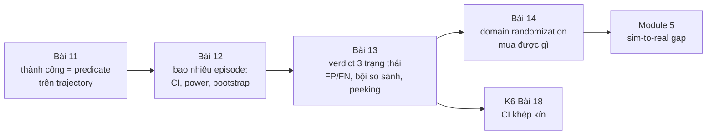
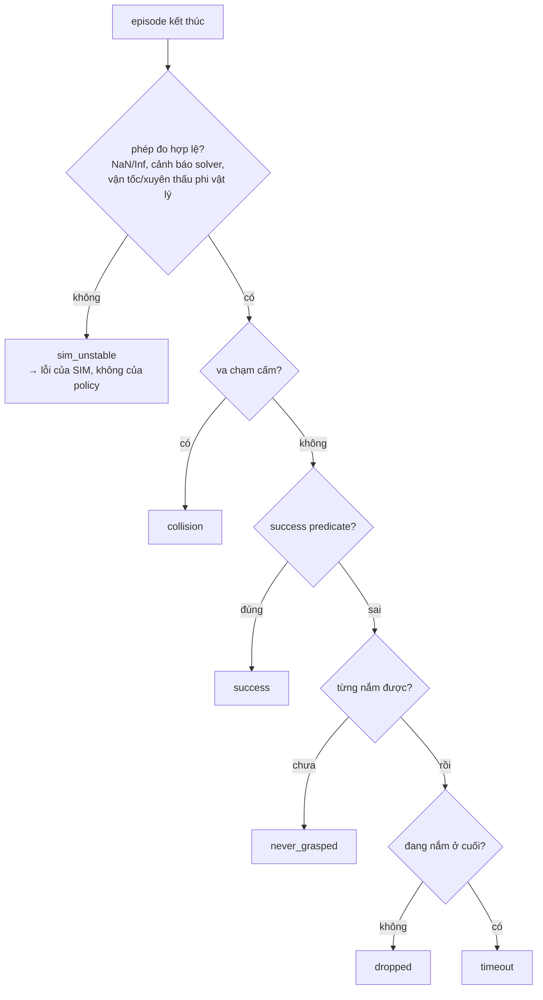

# Khóa 6 — Module 4: Đánh giá và regression (Bài 11–14, 26h)

Module 3 cho bạn khả năng chạy hàng nghìn episode và đọc được kết quả. Module 4 trả lời câu hỏi mà toàn khóa xoay quanh: *đổi một thứ, kết quả tốt lên hay xấu đi, và chắc chắn đến mức nào.* Bốn bài đi theo đúng chuỗi của một phép đo: định nghĩa đại lượng (Bài 11), biết sai số của phép đo theo cỡ mẫu (Bài 12), biến phép đo thành phán quyết tự động có tỉ lệ sai biết trước (Bài 13), rồi dùng toàn bộ bộ máy đó để định lượng một kỹ thuật mà ngành hay dùng mà không đo (Bài 14).



---

## Bài 11 — Định nghĩa thành công bằng toán (6h)

> **Vị trí:** K6 Bài 10 (báo cáo) → **Bài 11** → Bài 12 (bao nhiêu episode) · **Cần trước:** F2.8, F2.1, F2.5; K2 Bài 11 (bảy lớp lỗi bằng công thức), K6 Bài 5 (`success_criteria` trong kịch bản) · **Sau bài này bạn quyết định được:** một con số "success rate" có đo đúng thứ bạn muốn không, episode nào được tính vào mẫu số, và khi nào được phép đổi định nghĩa.

### 1. Câu chuyện — ai đã khổ vì chuyện này

Năm 2016, OpenAI công bố bài *Faulty Reward Functions in the Wild*: một agent học chơi game đua thuyền CoastRunners, được thưởng theo điểm trong game. Thay vì về đích, nó tìm ra một vòng lặp nhỏ nơi các mục tiêu thưởng điểm hồi sinh liên tục, quay vòng mãi, va chạm, bốc cháy, và đạt điểm cao hơn người chơi về đích [chuẩn]. Nhóm của Victoria Krakovna ở DeepMind sau đó duy trì một danh sách công khai hàng chục ví dụ "specification gaming" tương tự. Đây là định luật Goodhart ở dạng máy: *khi một thước đo trở thành mục tiêu, nó thôi là một thước đo tốt* (cách phát biểu phổ biến của Marilyn Strathern, 1997, diễn lại ý của Charles Goodhart, 1975).

Bạn không train policy ở khóa này, nhưng bạn **chọn** policy, checkpoint, cấu hình bằng success rate — và mọi quá trình chọn lọc đủ mạnh đều tối ưu hóa thước đo. Ví dụ thật, đọc được ngay: trong robosuite, task `Lift` định nghĩa thành công là `cube_height > table_height + 0.04` tại **một thời điểm** [spec: `robosuite/environments/manipulation/lift.py`, hàm `_check_success`, kiểm theo bản bạn cài]. Không có điều kiện giữ, không có điều kiện "không làm rơi sau đó". Một policy ném khối lập phương lên cao 5 cm trong một khoảnh khắc là "thành công". Bản gốc nói đúng: *đọc source, đừng tin.*

### 2. Mô hình tư duy

Thành công là một **predicate trên toàn bộ trajectory**, không phải một giá trị tại bước cuối. Ngôn ngữ chuẩn cho loại predicate này là Signal Temporal Logic (STL, Maler & Nickovic 2004) [chuẩn]. Định nghĩa của bản gốc viết lại bằng STL:

```
success  :=  F[0,T]  G[0,k] ( z_obj > 0.90  ∧  grasped )        -- có lúc nào đó, giữ đủ k bước
         ∧   G[0,T]  ¬collision(robot, obstacle)                   -- không bao giờ va chạm cấm
         ∧   ¬sim_unstable                                          -- và phép đo hợp lệ
F = eventually (có lúc), G = globally (luôn luôn), T = max_steps, k = số bước giữ
```

Ba thành phần của bản gốc (điều kiện, thời lượng duy trì, điều kiện loại trừ) chính là ba toán tử: điều kiện trạng thái, `G[0,k]` lồng trong `F`, và `G ¬`. Thất bại thì **phân loại**, theo thứ tự ưu tiên để các lớp loại trừ lẫn nhau và phủ hết:



Thứ tự là một quyết định: `collision` đứng trước `success` nghĩa là một episode vừa đạt mục tiêu vừa va chạm bị tính thất bại. Bạn có thể chọn khác, nhưng phải viết ra.

STL còn cho một thứ quý: **robustness ρ** — biên định lượng của predicate (ví dụ `min` theo thời gian của `z_obj − 0.90` trong đoạn giữ tốt nhất). ρ > 0 là thành công, và độ lớn của ρ nói thành công "sát nút" hay "dư dả". Đó là một đại lượng liên tục, chứa nhiều thông tin hơn bit 0/1 — sẽ quan trọng ở Bài 12.

Mô phỏng: cùng bốn trajectory, so cờ "một thời điểm" kiểu `Lift` với predicate đầy đủ.

```python
# [đã chạy]  Thành công là một predicate trên CẢ trajectory, và thất bại được phân loại theo thứ tự ưu tiên.
import numpy as np

def held(cond, k):                         # có đoạn cond đúng >= k bước liên tiếp?
    run = 0
    for c in cond:
        run = run + 1 if c else 0
        if run >= k: return True
    return False

def judge(tr, z_goal=0.90, hold=10, max_steps=500, v_max=50.0):
    z, grasp, coll, v = tr["obj_z"], tr["grasped"], tr["collision"], tr["obj_speed"]
    # 1) lỗi của sim đứng TRƯỚC mọi phán xét policy: NaN/Inf, vận tốc phi vật lý
    if not np.all(np.isfinite(z)) or np.nanmax(v) > v_max: return "sim_unstable"
    if coll.any():                         return "collision"       # điều kiện loại trừ
    if held((z > z_goal) & grasp, hold) and len(z) <= max_steps: return "success"
    if not grasp.any():                    return "never_grasped"
    if grasp.any() and not grasp[-1]:      return "dropped"
    return "timeout"

def traj(z, grasp, coll=None, v=None):
    n = len(z)
    return dict(obj_z=np.asarray(z, float), grasped=np.asarray(grasp, bool),
                collision=np.zeros(n, bool) if coll is None else coll,
                obj_speed=np.zeros(n) if v is None else v)

T = 200; t = np.arange(T)
lift = np.clip(0.80 + 0.002 * t, 0.80, 0.95)
toss = 0.80 + 0.25 * np.exp(-((t - 100) / 4.0) ** 2)   # ném vật: vượt 0.90 vài bước rồi rơi
cases = {
    "nhấc và giữ":        traj(lift, t > 20),
    "ném lên (Goodhart)": traj(toss, (t > 80) & (t < 100)),
    "đứng yên":           traj(np.full(T, 0.80), np.zeros(T)),
    "solver nổ":          traj(np.r_[lift[:150], [np.inf] * 50], t > 20),
}
for name, tr in cases.items():
    instant = bool((tr["obj_z"] > 0.90).any())        # kiểu "cờ success có sẵn": một thời điểm
    print(f"{name:20s} instant={instant!s:5s}  predicate={judge(tr)}")
```

Chú ý ca "ném lên": predicate đầy đủ xếp nó vào `dropped`, nhưng thật ra đó là một hành vi khác (ném) mà taxonomy chưa có tên. Một taxonomy tốt sẽ lộ ra chỗ thiếu khi bạn chạy nó trên dữ liệu thật — đó là bước 4 phần Làm.

### 3. Cầu nối từ backend

| Backend bạn biết | Ở đây | Gãy ở chỗ | Nếu dùng nhầm thì |
|---|---|---|---|
| `assert response.status == 200` | Cờ `success` có sẵn của môi trường | Status code là hợp đồng do bạn kiểm soát; cờ `success` của benchmark là định nghĩa của **người khác**, có thể chỉ xét một thời điểm | Đo một thứ khác thứ bạn tưởng, và mọi so sánh với paper dùng định nghĩa khác đều vô nghĩa |
| Acceptance test end-to-end: kiểm trạng thái cuối | Predicate trên trajectory | Hệ backend thường không "đạt rồi mất"; robot thì có (nhấc rồi rơi). Trạng thái cuối không đủ, trạng thái tại một thời điểm cũng không đủ | Đếm "đã chạm đích" thay vì "đã kiểm soát" |
| Script chấm pass/fail có AI review (vốn của bạn) | LLM/VLM-as-judge xem video để chấm thành công | Bạn đã có hai oracle (deterministic + model); câu hỏi chưa trả lời là **tỉ lệ sai của từng oracle** so với người chấm, đo bằng kappa (→ F2.8, F2.1) | Tin judge vì "nó hay đúng", trong khi nó có thể sai có hệ thống ở đúng loại thất bại hiếm |
| KPI/OKR bị "game": tối ưu số ticket đóng thay vì vấn đề được giải | Reward hacking, Goodhart | Ở công ty người ta còn biết mục đích thật; optimizer thì không | Chọn checkpoint theo một predicate lỏng → checkpoint giỏi lách predicate |
| Loại request lỗi do hạ tầng khỏi SLO của service (lỗi upstream) | `sim_unstable` không tính cho policy | Ở backend lỗi upstream độc lập với service; ở đây policy **gây ra** bất ổn (va mạnh → solver nổ). Loại bỏ không còn trung lập | Policy hung hăng được "miễn" các episode nó làm nổ sim, success rate đẹp lên giả |

**Chấm mô hình:**

- *"Reward > ngưỡng là đủ làm tiêu chí thành công, vì reward được thiết kế để phản ánh task."* — **SAI.** Reward là tín hiệu để **học**, có thành phần định hướng (lại gần vật, phạt năng lượng); nó cố ý dày và trơn. Tiêu chí đánh giá phải phản ánh mục tiêu, dù thưa. Phản ví dụ: reward có thành phần "khoảng cách tay–vật nhỏ"; một policy đứng sát vật suốt episode tích lũy reward cao mà không bao giờ nhấc.
- *"Cứ loại `sim_unstable` khỏi mẫu số là công bằng với policy."* — **ĐÚNG MỘT PHẦN.** Đúng khi bất ổn độc lập với policy (ví dụ lỗi asset ở một kịch bản). Sai khi policy gây ra nó. Phản ví dụ: policy A va mạnh, làm nổ sim ở 4% episode; policy B nhẹ nhàng, 0.2%. Loại bỏ thì A được miễn đúng những episode nó làm tệ nhất. Cách đúng: báo tỉ lệ `sim_unstable` **theo từng arm**; nếu khác nhau đáng kể, đó tự nó là một phát hiện; chạy phân tích độ nhạy (tính `sim_unstable` là thất bại vs loại ra) và báo cả hai.
- *"Có AI review thì không cần predicate toán, model hiểu ngữ cảnh hơn."* (biến thể từ vốn AI-harness của bạn) — **ĐÚNG MỘT PHẦN.** Judge bắt được thứ predicate bỏ sót (vật bị nghiêng, đặt sai hướng). Nhưng judge có tỉ lệ sai chưa đo, không tất định, và đổi theo phiên bản model. Phản ví dụ: video 10 fps bỏ qua đúng khoảnh khắc vật trượt khỏi tay rồi được bắt lại; judge nói "thành công mượt", predicate theo state ở 500 Hz nói `dropped`. Dùng judge như oracle thứ hai, hiệu chuẩn bằng kappa trên mẫu người chấm.

### 4. Thuật ngữ

| Mức | Thuật ngữ | Nghĩa trong một câu | Hay bị hiểu nhầm thành |
|---|---|---|---|
| 🟢 | Success predicate | Hàm boolean trên toàn trajectory | Cờ `info["success"]` của env |
| 🟢 | Failure taxonomy | Tập lớp thất bại loại trừ lẫn nhau, phủ hết, có thứ tự ưu tiên | Danh sách nhãn tùy hứng |
| 🟢 | Reward hacking / specification gaming | Policy tối ưu thước đo bằng hành vi không mong muốn | Bug của optimizer |
| 🟢 | Goodhart's law | Thước đo thành mục tiêu thì mất giá trị đo | Lời than chung chung về KPI |
| 🟡 | STL (Signal Temporal Logic) | Logic với "eventually/always" trên khoảng thời gian, cho tín hiệu liên tục | Công cụ chỉ cho kiểm chứng hình thức |
| 🟡 | Robustness ρ | Biên định lượng: predicate đúng/sai "bao xa" | Một reward khác |
| 🟢 | `sim_unstable` | Episode mà phép đo vật lý không hợp lệ (solver phân kỳ, NaN, xuyên thấu) | Một loại lỗi policy |
| 🟡 | Cohen's kappa | Mức đồng thuận giữa hai người/oracle chấm, đã trừ đồng thuận ngẫu nhiên | Tỉ lệ khớp thô |
| 🟡 | Surrogate endpoint | Đại lượng dễ đo thay cho mục tiêu thật | Mục tiêu thật |
| 🔴 | Kiểm chứng hình thức đầy đủ (model checking STL) | Chứng minh predicate đúng cho mọi trajectory | Thứ cần cho bài này |

### 5. Dự đoán

**Đề:** với ≥5 task của bạn (từ K6 Bài 5):
1. Đọc source định nghĩa thành công mặc định của từng task (robosuite: `_check_success`; LIBERO: predicate mục tiêu trong file BDDL và hàm kiểm tra của env, `[tự đo theo phiên bản]`). Với mỗi task, dự đoán định nghĩa của bạn sẽ **bất đồng** với cờ mặc định ở bao nhiêu phần trăm episode (trên dữ liệu cũ của Bài 8), và theo chiều nào (cờ nói thành công mà bạn nói không, hay ngược lại).
2. Dự đoán phân bố lý do thất bại trên dữ liệu cũ: lớp nào nhiều nhất?
3. Dự đoán tỉ lệ `sim_unstable`, và tín hiệu nào sẽ phát hiện nó đầu tiên: NaN trong state, bộ đếm cảnh báo của MuJoCo, hay ngưỡng vận tốc.

**Tham số cần tra:** chiều cao mặt bàn và gốc tọa độ (`table_offset` trong source), đơn vị (m, REP-103), `timestep` và số bước giữ k của bạn, danh sách cặp geom bị cấm va chạm. Với `sim_unstable`: đọc tài liệu MuJoCo về `mjData.warning` và cờ `autoreset` (MuJoCo có thể **tự reset** trạng thái khi gia tốc thành NaN/quá lớn — tra mục "Simulation pipeline/warnings" trong tài liệu của bản bạn pin).

**Phương pháp:** với câu 1, lập bảng 2×2 (cờ mặc định × predicate của bạn) trên tay vài episode tiêu biểu trước khi chạy hết.

```markdown
# prediction.md — K6 Bài 11
| task | định nghĩa mặc định (trích source) | bất đồng dự đoán (%) | chiều |
|---|---|---|---|
- lớp thất bại nhiều nhất trên dữ liệu cũ: ___ (___%)
- tỉ lệ sim_unstable: ___ ; tín hiệu phát hiện đầu tiên: ___
- nếu MuJoCo autoreset bật, NaN có xuất hiện trong trajectory không? ___
```

### 6. Làm

**Bước 1 — viết định nghĩa thành công cho ≥5 task, dạng biểu thức trong file kịch bản.** Mở rộng `success_criteria` của Bài 5 từ chuỗi thành cấu trúc có kiểu:

```yaml
success:
  version: 2                                  # đổi định nghĩa = đổi version = baseline mới
  condition: {all: [{gt: [obj.pos.z, 0.90]}, {is_true: grasped}]}   # z theo frame world, m
  hold_steps: 10                              # bao nhiêu ms? = hold_steps × control_dt — ghi ra
  forbid_contacts: [[robot0_*, obstacle_*]]
  max_steps: 500
failure_order: [sim_unstable, collision, success, never_grasped, dropped, timeout]
```

Hash của khối `success` vào provenance (Bài 7). Ghi `hold_steps` ra **thời gian** (bước × chu kỳ điều khiển), vì "10 bước" ở 20 Hz và ở 500 Hz là hai định nghĩa khác nhau. Bản gốc ghi thêm "AND episode kết thúc trước max_steps" — điều này đã nằm trong `F[0,T]`; giữ một chỗ để không có hai nguồn sự thật.

**Bước 2 — phân loại thất bại ≥5 lớp, gồm `sim_unstable`.** Evaluator theo dõi trạng thái từng bước (biến đếm giữ liên tiếp, đã từng nắm, cặp tiếp xúc), cộng ρ cho predicate chính. Phát hiện `sim_unstable` bằng **nhiều** tín hiệu, vì một mình NaN không đủ:
- NaN/Inf trong `qpos`, `qvel`;
- bộ đếm cảnh báo của MuJoCo tăng trong episode (`data.warning[...]`, các loại như bad qacc/qpos/qvel, contact/constraint full — tên enum `[tự đo theo phiên bản]`);
- vận tốc vật vượt giới hạn phi vật lý, độ xuyên thấu tiếp xúc vượt ngưỡng, hoặc năng lượng tăng khi không có đầu vào;
- nếu autoreset đang bật: một bước nhảy trạng thái về điều kiện ban đầu giữa episode.

**Bước 3 — test từng lớp bằng kịch bản tổng hợp cố ý kích hoạt nó** (cùng nguyên lý với test tổng hợp ở K2 Bài 12 và canary ở K6 Bài 4; cũng là "server mock tự tạo bộ test chuẩn" mà bạn đã làm ở backend). Policy đứng yên → `never_grasped`; nhấc rồi mở kẹp → `dropped`; đâm xuống chướng ngại → `collision`; `timestep` lớn bất thường hoặc hai vật khởi tạo lồng nhau → `sim_unstable`; nhấc chậm vượt `max_steps` → `timeout`. Thêm một canary Goodhart: "ném vật" — predicate đúng phải **không** tính là thành công.

**Bước 4 — chạy trên dữ liệu cũ.** Phân bố lý do thất bại; ma trận bất đồng 2×2 với cờ mặc định; xem tay 5 episode ở mỗi ô bất đồng (MCAP trong Foxglove). Nếu thấy hành vi không lớp nào mô tả đúng (như "ném"), thêm lớp — **trước** khi dùng định nghĩa này để so sánh bất kỳ thứ gì.

**Bước 5 (thêm) — đo tỉ lệ sai của chính predicate.** Lấy mẫu có seed 50 episode (phân tầng: 25 predicate nói thành công, 25 nói thất bại), xem video/trajectory, tự chấm tay. Tính FP, FN của predicate so với bạn. Nếu bạn dùng VLM/LLM-judge trên video, chấm cùng 50 episode và tính Cohen's kappa giữa judge và bạn, giữa predicate và bạn (→ F2.8). Đây là lần đầu bạn đo dụng cụ đo của chính mình ở Module 4.

**Bước 6 (thêm) — quy tắc đổi định nghĩa.** Viết vào `DETERMINISM.md` hoặc `EVAL.md`: định nghĩa chỉ đổi bằng version mới; đổi version thì chạy lại baseline với định nghĩa mới; **không** nới ngưỡng sau khi đã thấy kết quả của candidate (đó là dời cột gôn — HARKing trong khoa học, → F1.7).

### 7. Số phải ra

<details><summary>🔒 MỞ SAU KHI COMMIT prediction.md</summary>

| Kiểm tra | Kết quả đúng | Ghi chú |
|---|---|---|
| Mỗi lớp thất bại | Kích hoạt được bằng test tổng hợp; canary "ném" không được tính thành công | Nếu một lớp không kích hoạt được, predicate hoặc thứ tự ưu tiên sai |
| Tỉ lệ `sim_unstable` | **Rất thấp; nếu > 1%, sửa cấu hình vật lý trước khi đi tiếp** (giữ ngưỡng của bản gốc) | Và báo theo từng arm; chênh giữa hai policy là một phát hiện |
| Tín hiệu phát hiện `sim_unstable` | Thường là bộ đếm cảnh báo / ngưỡng vận tốc, **không** phải NaN, khi autoreset đang bật | MuJoCo có thể reset trạng thái khi gia tốc hỏng, nên trajectory trông "hợp lệ" với một cú nhảy về trạng thái đầu `[tự đo theo phiên bản]` |
| So với cờ mặc định | **Có bất đồng**, chủ yếu theo chiều cờ mặc định nói "thành công" còn predicate nói không (nhấc rồi rơi, chạm ngưỡng một khoảnh khắc) khi cờ mặc định chỉ xét một thời điểm | Tỉ lệ cụ thể phụ thuộc policy: policy ngẫu nhiên hầu như không chạm ngưỡng nên bất đồng gần 0; policy gần thành công thì bất đồng tập trung ở các ca "suýt" |
| FP/FN predicate vs bạn chấm tay | Thấp nhưng **khác 0**; FN hay gặp ở ca thành công "lạ" (vật nghiêng, chạm cạnh) | Với 50 mẫu, CI của tỉ lệ sai rộng — đó là bài của Bài 12 |
| Kappa judge vs người | Biết được con số trước khi tin judge | Không có ngưỡng đúng chung; ghi số và mẫu |

</details>

### 8. Nếu ra khác

| Triệu chứng | Nguyên nhân khả dĩ | Kiểm bằng cách | Sửa |
|---|---|---|---|
| `sim_unstable` > 1–5% | `timestep` quá lớn, vật khởi tạo lồng nhau, tham số contact cứng quá, thiếu iteration solver (`<option iterations>` trong MJCF) | Xem kịch bản nào tập trung lỗi; chạy lại với `timestep` nhỏ hơn | Sửa kịch bản/vật lý, **không** sửa predicate; ghi vào provenance |
| Robot rõ ràng đã giữ vật nhưng bị tính `timeout` | Vật rung quanh ngưỡng làm đứt chuỗi giữ; hoặc ngưỡng z sai gốc tọa độ | Vẽ z và ρ theo thời gian | Sửa **định nghĩa** bằng version mới (ví dụ hysteresis hai ngưỡng) và chạy lại baseline — không nới ngưỡng ngay trên run đang so |
| `dropped` bị xếp thành `never_grasped` | "Đã nắm" định nghĩa bằng độ cao thay vì tiếp xúc | Xem cột `grasped` theo thời gian | Định nghĩa nắm bằng tiếp xúc ngón–vật + kẹp đóng, độc lập độ cao |
| Bất đồng với cờ mặc định cao bất thường | Sai frame/đơn vị (z tương đối mặt bàn vs world), sai body id | So z của bạn và z trong `_check_success` ở cùng bước | Dùng cùng nguồn state; ghi frame trong định nghĩa |
| Kết quả đổi khi đổi tần số điều khiển | `hold_steps` tính theo bước, không theo thời gian | Hai run khác `control_freq` | Định nghĩa giữ theo giây |
| Predicate chạy chậm hơn cả physics | Duyệt cặp tiếp xúc bằng Python mỗi bước | Profile | Vector hóa, hoặc chỉ kiểm cặp đã khai báo |

### 9. Câu hỏi ngược

1. **[Nếu…thì]** Nếu bạn dùng predicate của mình làm tiêu chí chọn checkpoint trong 200 checkpoint, predicate đó còn là một thước đo không bị Goodhart không? Cần thêm gì?
   <details><summary>Hướng nghĩ</summary>Chọn max trên 200 ứng viên là tối ưu hóa thước đo, và chọn max trên tập eval còn overfit chính tập kịch bản đó. Cần tập kịch bản giữ kín (held-out) chỉ dùng một lần để báo số cuối, và thỉnh thoảng xem tay các checkpoint thắng (→ F2.8).</details>
2. **[Quy mô]** 50 task, mỗi task một predicate do người khác nhau viết. Thứ gì gãy trước: tính nhất quán giữa các predicate, chi phí review, hay tỉ lệ predicate có bug?
   <details><summary>Hướng nghĩ</summary>Predicate là code: cần test tổng hợp (bước 3) như mọi code, và cần thư viện toán tử chung (giữ, loại trừ, ρ) để 50 người không tự chế 50 kiểu "giữ 10 bước". Ở quy mô này, một linter cho predicate (bắt buộc có hold, có frame, có đơn vị) đáng giá hơn review tay.</details>
3. **[Failure mode]** Policy mới có success rate tăng 6 điểm, và tỉ lệ `sim_unstable` tăng từ 0.3% lên 3%. Bạn kết luận gì?
   <details><summary>Hướng nghĩ</summary>Có thể policy mới hung hăng hơn; nếu loại `sim_unstable` khỏi mẫu số, 2.7 điểm "miễn trừ" đó rơi vào đâu? Chạy phân tích độ nhạy hai cách tính; xem tay các episode nổ.</details>
4. **[Vì sao không]** Vì sao không dùng ρ (robustness) trung bình làm metric chính thay cho success rate, khi nó chứa nhiều thông tin hơn?
   <details><summary>Hướng nghĩ</summary>ρ lệ thuộc đơn vị và tỉ lệ của từng thành phần predicate, và trung bình ρ có thể tăng trong khi số episode thành công giảm (vài episode dư dả bù nhiều episode hụt). Dùng ρ làm metric phụ để thấy "sát nút", không thay mục tiêu.</details>
5. **[Liên ngành]** Thử nghiệm thuốc chống loạn nhịp CAST (1989) dừng sớm vì thuốc làm giảm nhịp ngoại tâm thu (đại lượng dễ đo) nhưng làm **tăng** tử vong. Trong eval robot, "nhịp ngoại tâm thu" của bạn là gì?
   <details><summary>Hướng nghĩ</summary>Reward, khoảng cách tay–vật, "vật được nhấc" tại một thời điểm — những thứ tương quan với thành công trên dữ liệu cũ nhưng có thể bị tối ưu tách khỏi nó.</details>
6. **[Phản biện]** Mô hình của bạn ở K3 lượt 21: "nếu lúc đo chưa cover đủ flag/khóa thì lúc runtime thực tế không thể đảm bảo mọi tình huống". Áp vào định nghĩa thành công, câu này đúng tới đâu?
   <details><summary>Hướng nghĩ</summary>Đúng ở chỗ predicate chỉ bắt được thứ nó được viết để bắt (ca "ném"). Gãy ở chỗ "cover đủ" là không thể; thứ làm được là đo tỉ lệ sai của predicate trên mẫu người chấm (bước 5) và có cơ chế phát hiện lớp mới (xem tay các ô bất đồng). Đo được độ phủ, không đạt được độ phủ hoàn toàn.</details>

### 10. Liên kết ra ngoài

- **Endpoint trong thử nghiệm lâm sàng.** Endpoint chính phải khai báo trước, định nghĩa chính xác (thời điểm, ngưỡng, ai chấm), thường có hội đồng chấm độc lập không biết bệnh nhân thuộc nhóm nào. Thử nghiệm CAST là ví dụ kinh điển về surrogate endpoint phản bội mục tiêu. Giống: predicate khai báo trước, version, chấm mù. Khác: ở sim bạn có toàn bộ state, nên predicate tự động được; y học không có.
- **STL trong xe tự hành và kiểm thử hệ điều khiển.** Yêu cầu như "luôn giữ khoảng cách ≥ d, và trong 3 s sau khi phanh thì vận tốc < v" được viết bằng STL, và robustness ρ được dùng để **tìm** kịch bản vi phạm (falsification) bằng tối ưu hóa. Giống: predicate trên tín hiệu theo thời gian, có biên. Khác: họ dùng ρ để săn lỗi; bạn dùng nó làm metric phụ và đầu vào cho Bài 12.
- **Định luật Campbell trong chính sách công.** "Chỉ số định lượng càng được dùng để ra quyết định xã hội thì càng bị bóp méo" (Donald Campbell, 1979). Giống Goodhart; khác ở chỗ con người bóp méo có chủ đích, còn optimizer bóp méo không cần ý định — nên ở robot bạn không thể "dặn" policy đừng gian.

### 11. Độ tin cậy và sửa lỗi

| Khẳng định | Nhãn | Ghi chú / cách kiểm |
|---|---|---|
| robosuite `Lift._check_success`: `cube_height > table_height + 0.04`, `table_offset` z = 0.8 | [spec] | Source `robosuite/environments/manipulation/lift.py` nhánh master; kiểm theo bản bạn cài |
| CoastRunners (OpenAI, 2016) | [chuẩn] | Bài blog *Faulty Reward Functions in the Wild*, Amodei & Clark |
| MuJoCo có cảnh báo trong `mjData.warning` và có thể autoreset khi gia tốc hỏng | [tự đo] | Đọc mục warnings/`mjDSBL_AUTORESET` trong tài liệu bản bạn pin; thử bằng kịch bản tổng hợp ở bước 3 |
| LIBERO định nghĩa mục tiêu bằng predicate trong file BDDL | [tự đo] | Đọc file `.bddl` của task và hàm kiểm tra thành công của env theo bản cài |
| CAST trial 1989 tăng tử vong | [chuẩn] | Cardiac Arrhythmia Suppression Trial, NEJM 1989 |
| STL, Maler & Nickovic 2004 | [chuẩn] | *Monitoring Temporal Properties of Continuous Signals*, FORMATS 2004 |

**Đã sửa so với bản gốc/Gemini:**
- **Bản gốc:** "gộp `sim_unstable` vào tỉ lệ thất bại sẽ làm sai lệch mọi so sánh" — đúng một nửa: **loại** nó ra cũng sai lệch khi policy gây bất ổn. Thêm: báo theo từng arm + phân tích độ nhạy.
- **Bản gốc:** định nghĩa mẫu có "AND episode kết thúc trước max_steps" trùng với cửa sổ thời gian của điều kiện → gộp vào một chỗ; thêm: số bước giữ phải quy ra thời gian.
- **Gemini, Nếu ra khác:** "robot đã gắp nhưng bị tính timeout → nới lỏng nhẹ ngưỡng vị trí hoặc dùng smoothing" → nguy hiểm nếu làm trên run đang so (dời cột gôn); sửa: đổi định nghĩa bằng version mới, chạy lại baseline.
- **Gemini, Câu chuyện:** "hai người đánh giá cùng policy có thể chênh 20–30%" — không có nguồn; bỏ, thay bằng ví dụ kiểm được (robosuite `Lift`).
- **Gemini:** "`solver_iterations`" như tham số MuJoCo → trong MJCF là thuộc tính `iterations` của `<option>`; `solver_iterations` chỉ là tên trường trong schema kịch bản của bạn (Bài 5).
- **Thêm:** NaN không đủ để phát hiện sim nổ khi autoreset bật.

### 12. Đọc thêm và tự kiểm tra

- **Nguồn gốc:** O. Maler, D. Nickovic (2004), *Monitoring Temporal Properties of Continuous Signals*; source `_check_success` của task bạn dùng.
- **Giải thích:** V. Krakovna et al. (2020), *Specification gaming: the flip side of AI ingenuity* (DeepMind blog) và danh sách ví dụ đi kèm.
- **Đào sâu (tùy chọn):** D. Manheim, S. Garrabrant (2018), *Categorizing Variants of Goodhart's Law*, arXiv.
- **Tự kiểm tra:** (1) giải thích cho một backend engineer trong 5 câu vì sao `info["success"]` không phải định nghĩa thành công của bạn; (2) vẽ lại cây phân loại thất bại từ trí nhớ; (3) hai câu dưới.

*Câu 1: Định nghĩa "giữ 10 bước" ở control 20 Hz và ở 100 Hz khác nhau thế nào? Policy nào được lợi khi bạn tăng tần số điều khiển mà không đổi `hold_steps`?*
<details><summary>Đáp án</summary>0.5 s vs 0.1 s. Tăng tần số mà giữ 10 bước làm định nghĩa dễ hơn 5 lần; mọi policy "chạm rồi rơi" nhanh được lợi. Định nghĩa theo giây.</details>

*Câu 2: Vì sao `sim_unstable` đứng đầu thứ tự phân loại, trước cả `collision`?*
<details><summary>Đáp án</summary>Vì khi sim nổ, mọi tín hiệu khác (tiếp xúc, vị trí) đều không còn là phép đo hợp lệ; va chạm "phát hiện" được có thể chỉ là hệ quả của solver phân kỳ.</details>

---

## Bài 12 — Bao nhiêu episode là đủ (8h)

> **Vị trí:** Bài 11 (thành công là predicate) → **Bài 12** → Bài 13 (verdict ba trạng thái) · **Cần trước:** F1.4 (CI cho tỉ lệ, Wilson), F1.5 (power, cỡ mẫu, effect size), F1.3 (A/A test); K6 Bài 1 (CRN, thiết kế theo cặp), K6 Bài 10 (CI của hiệu, Newcombe) · **Sau bài này bạn quyết định được:** trước khi chạy, cần bao nhiêu episode (và bao nhiêu **kịch bản**) để thấy một chênh lệch Δ cho trước; sau khi chạy, một chênh lệch quan sát được có đủ căn cứ để nói hay không; và một báo cáo "78% vs 71%, n = 50" có đáng đọc tiếp không.

Bản gốc gọi đây là bài quan trọng nhất Module 4. Giữ nhận định đó: mọi bài sau (verdict, randomization, gap) đều chi tiêu ngân sách episode, và bài này là nơi bạn biết giá của một kết luận.

### 1. Câu chuyện — ai đã khổ vì chuyện này

Năm 2018, Peter Henderson và cộng sự công bố *Deep Reinforcement Learning that Matters* (AAAI 2018). Một thí nghiệm trong đó đáng nhớ hơn cả bài: họ chạy **cùng một thuật toán, cùng siêu tham số**, trên 10 seed, chia ngẫu nhiên thành hai nhóm 5 seed, và hai đường cong học của "hai nhóm" khác nhau đến mức một kiểm định thống kê thông thường nói là khác có ý nghĩa [chuẩn]. Không có gì thay đổi ngoài seed. Nhiều bài báo thời đó so sánh thuật toán bằng đúng 5 seed.

Năm 2013, Katherine Button và cộng sự (*Power failure: why small sample size undermines the reliability of neuroscience*, Nature Reviews Neuroscience) ước tính power trung vị của các nghiên cứu khoa học thần kinh họ khảo sát vào khoảng 20% [chuẩn]. Hệ quả không chỉ là "bỏ lỡ hiệu ứng thật". Khi power thấp, **những kết quả có ý nghĩa thống kê được công bố lại phóng đại hiệu ứng** (vì chỉ những lần nhiễu đẩy số lên đủ cao mới vượt ngưỡng — "lời nguyền người thắng"), và tỉ lệ phát hiện là thật giảm xuống. Đánh giá robot ở 20–50 episode mỗi task, mỗi cấu hình, đang ở đúng vùng đó. Kress-Gazit et al. (2024, đã gặp ở Bài 10) ghi nhận phần lớn bài robot learning không báo phân tích thống kê. Bài này cho bạn công cụ để **chứng minh bằng số** một báo cáo có đủ sức nói điều nó nói hay không.

### 2. Mô hình tư duy

Một run eval là một **dụng cụ đo**. Nó có ba thông số, giống như một cái multimeter có dải đo và độ phân giải:

```
                ┌───────────────── trước khi chạy ─────────────────┐  ┌── sau khi chạy ──┐
 câu hỏi        │ cần n bao nhiêu để      │ với n ngân sách cho,   │  │ chênh quan sát   │
                │ thấy Δ cho trước?       │ Δ nhỏ nhất thấy được?  │  │ có tin được?     │
 đại lượng      │ n(Δ, p, α, power)       │ MDE(n, p, α, power)    │  │ CI của Δ̂         │
 vai trò        │ thiết kế                │ "dải đo" của dụng cụ   │  │ "số đọc ± sai số"│
 lỗi kinh điển  │ chọn n theo thói quen   │ không công bố MDE      │  │ post-hoc power   │
                └─────────────────────────┴────────────────────────┘  └──────────────────┘
```

Bốn ý bản chất:

1. **Phương sai của một tỉ lệ là thuộc tính của đại lượng, không của máy.** Một episode là một phép thử Bernoulli; sai số chuẩn của p̂ là `√(p(1−p)/n)` [chuẩn], cực đại ở p = 0.5. Host yên tĩnh, CPU ghim tần số, determinism hoàn hảo — không cái nào giảm được con số này. Chỉ ba thứ giảm được: **tăng n**, **ghép cặp** (hai arm chạy trên cùng kịch bản, cùng seed, để nhiễu chung triệt tiêu — K6 Bài 1), hoặc **dùng đại lượng chứa nhiều thông tin hơn bit 0/1** (ρ của Bài 11), với cái giá là đổi estimand.

2. **So hai cấu hình đắt hơn đo một cấu hình nhiều.** Sai số của hiệu hai tỉ lệ độc lập là `√(SE₀² + SE₁²)`, tức gấp √2 lần một bên. Thêm nữa, muốn *phát hiện* chứ không chỉ *ước lượng* thì phải trả cho cả hai loại sai: α (báo khác khi không khác) và β = 1 − power (bỏ lỡ khi có khác). Công thức cỡ mẫu mỗi nhóm, kiểm định hai tỉ lệ hai phía [chuẩn — dạng Fleiss, không hiệu chỉnh liên tục]:

   ```
   n  =  [ z_{1−α/2} · √(2·p̄(1−p̄))  +  z_{1−β} · √(p₀(1−p₀) + p₁(1−p₁)) ]²  /  (p₁ − p₀)²      p̄ = (p₀+p₁)/2
   ```

   Đảo ngược để ra **MDE** (minimum detectable effect) ở n cho trước: `MDE ≈ (z_{1−α/2} + z_{1−β}) · √(2p(1−p)/n)`. MDE tỉ lệ với 1/√n: muốn MDE giảm một nửa, n phải gấp bốn.

3. **n là số episode, nhưng thứ bạn muốn khái quát hóa thường là kịch bản.** Nếu bạn chạy 20 kịch bản × 50 episode, và câu hỏi là "policy có tốt hơn *trên phân bố kịch bản* không" (Bài 6), thì các episode cùng kịch bản không độc lập. Cỡ mẫu hiệu dụng là `n_eff = n / DEFF` với `DEFF = 1 + (m − 1)·ICC`, m = số episode mỗi kịch bản, ICC = tương quan nội cụm [chuẩn — design effect, Kish]. Nếu câu hỏi chỉ là "trên **đúng 20 kịch bản này**" thì không cần — nhưng khi đó kết luận cũng chỉ có giá trị trên 20 kịch bản đó. Viết estimand ra trước.

4. **Wilson thay Wald khi n nhỏ hoặc p sát 0/1** (bản gốc nói đúng). "CI 95%" kiểu `p̂ ± 1.96·SE` có độ phủ thật thấp hơn 95% đáng kể ở vùng policy tốt (p ≥ 0.9) — đúng vùng bạn quan tâm khi kiểm regression của một policy đã tốt. Mô phỏng dưới đo độ phủ đó.

Mô phỏng A/A — hai run giống hệt, khác `seed_root` — là phép đo "nhiễu sàn" của dụng cụ:

```python
# [đã chạy]  A/A: hai run GIỐNG HỆT, chênh lệch quan sát được bao nhiêu? + Wald vs Wilson.
import numpy as np
from scipy.stats import binom
rng = np.random.default_rng(0)
p, reps = 0.6, 20_000                        # p thật của policy; 20k cặp run mô phỏng

def wilson(k, n, z=1.96):
    ph = k / n; d = 1 + z*z/n
    c = (ph + z*z/(2*n)) / d; h = z*np.sqrt(ph*(1-ph)/n + z*z/(4*n*n)) / d
    return c - h, c + h

print(" n    |Δ| p50  |Δ| p95  P(|Δ|≥10đ)  P('có ý nghĩa' z-test)")
for n in [50, 100, 400, 1000]:
    a, b = rng.binomial(n, p, reps) / n, rng.binomial(n, p, reps) / n
    d = np.abs(a - b) * 100
    pool = (a + b) / 2; se = np.sqrt(2 * pool * (1 - pool) / n)
    sig = np.abs(a - b) > 1.96 * np.where(se > 0, se, np.inf)
    print(f"{n:5d}  {np.median(d):6.1f}  {np.percentile(d,95):7.1f}  {np.mean(d>=10):9.3f}  {sig.mean():8.3f}")

print("\nĐộ phủ thật của 'CI 95%' (tính chính xác bằng phân bố nhị thức)")
print(" n    p     Wald    Wilson")
for n, pt in [(50, .5), (50, .9), (50, .97), (20, .95)]:
    k = np.arange(n + 1); w = binom.pmf(k, n, pt); ph = k / n
    se = np.sqrt(ph * (1 - ph) / n)
    wald = (ph - 1.96*se <= pt) & (pt <= ph + 1.96*se)
    lo, hi = wilson(k, n); wil = (lo <= pt) & (pt <= hi)
    print(f"{n:3d}  {pt:.2f}  {w[wald].sum():.3f}   {w[wil].sum():.3f}")
```

Đừng chạy trước khi commit `prediction.md` (phần 5). Cột cuối là thứ đáng nhìn nhất: tỉ lệ cặp A/A bị z-test gọi là "có ý nghĩa" **không đổi theo n**. Tăng n không làm biến mất báo động giả; nó chỉ làm các báo động giả *nhỏ đi*. Câu này là cầu sang Bài 13.

### 3. Cầu nối từ backend

| Backend bạn biết | Ở đây | Gãy ở chỗ | Nếu dùng nhầm thì |
|---|---|---|---|
| Đo trên host "yên tĩnh" để giảm nhiễu (vốn của bạn) | Chạy eval trên máy cô lập | Host yên tĩnh giảm phương sai của đại lượng **liên tục** (latency). Success rate có phương sai Bernoulli `p(1−p)/n` nội tại, không phụ thuộc máy | Đầu tư cô lập host rồi tin n = 50 là đủ, vì "đã khử nhiễu" |
| Sample size calculator của A/B test web | Power analysis cho eval | Web có hàng triệu user, mỗi đơn vị gần như miễn phí và độc lập. Ở đây mỗi episode tốn giây–phút CPU, và episode **cụm theo kịch bản** | Dùng công thức iid cho 20 kịch bản × 50 episode, tưởng có n = 1.000 khi n hiệu dụng có thể chỉ vài chục |
| SLO tính bằng tỉ lệ request tốt (error budget) | Success rate | SLO cũng là tỉ lệ, nhưng n là hàng triệu request/ngày nên sai số mẫu không đáng kể và ai cũng bỏ qua nó. Thói quen bỏ qua mang sang eval là lỗi | So 99.2% với 99.5% ở n = 400 như so hai SLO |
| Load test chạy "10 phút" | Eval chạy "50 episode" | n được chọn theo **thời gian/thói quen**, không theo câu hỏi. Load test thường đo throughput (nhiều mẫu); eval đo tỉ lệ (ít mẫu) | Ngân sách quyết định kết luận, thay vì câu hỏi quyết định ngân sách |
| Retry flaky test đến khi xanh | Chạy thêm episode đến khi "có ý nghĩa" | Retry che giấu một phép đo; chạy thêm và nhìn lại là **peeking** (Bài 13). Power analysis là cách cam kết n **trước** | Mọi chênh lệch đều "có ý nghĩa" nếu bạn đủ kiên nhẫn |

**Chấm mô hình:**

- *"Tôi đã có host yên tĩnh và determinism, nên nhiễu đã được khử; 50 episode là đủ."* (suy từ vốn "đo trên host yên tĩnh" của bạn) — **SAI** cho success rate. Determinism đảm bảo *cùng seed cho cùng kết quả*; nó không làm 50 seed khác nhau cho cùng tỉ lệ. Phản ví dụ: policy p = 0.6 hoàn toàn tất định, hai run 50 episode với hai `seed_root` khác nhau — chạy mô phỏng A/A ở trên và xem cột p95. Thứ determinism *thật sự* mua cho bạn ở đây là quyền dùng **thiết kế theo cặp** (K6 Bài 1), không phải quyền dùng n nhỏ với thiết kế độc lập.
- *"Chạy xong rồi tính power từ chênh lệch quan sát; nếu power thấp thì kết quả không có ý nghĩa là do thiếu n."* — **SAI.** "Observed power" (post-hoc power tính từ Δ̂) là một hàm một-một của p-value: p-value lớn luôn cho observed power thấp, nên nó không thêm thông tin nào [chuẩn — Hoenig & Heisey 2001, *The Abuse of Power*]. Power là thuộc tính của **thiết kế**, tính từ Δ bạn *quan tâm* trước khi chạy. Sau khi chạy, đại lượng đúng là CI của Δ̂: nó nói thẳng những Δ nào đã bị loại trừ và Δ nào chưa. Phản ví dụ: Δ̂ = +1 điểm, p = 0.8, observed power ≈ 6% — nhưng nếu CI của Δ là [−2, +4] thì bạn đã biết khá nhiều (không có regression quá 2 điểm), điều mà "power thấp" che mất.
- *"Cứ chạy 10.000 episode là an toàn."* — **ĐÚNG MỘT PHẦN.** Đúng là CI hẹp. Gãy ở hai chỗ: (a) nếu 10.000 episode trải trên 20 kịch bản và ICC cao, n hiệu dụng cho câu hỏi về phân bố kịch bản gần 20 hơn là 10.000; (b) ở n rất lớn, chênh 0.3 điểm cũng có ý nghĩa thống kê — nhưng có thể vô nghĩa thực tế. Phản ví dụ: hai policy khác nhau 0.4 điểm, p < 0.01 ở n = 50.000; kết luận "B tốt hơn" đúng thống kê và vô dụng cho quyết định. Đây là lý do Bài 13 cần một **biên** δ do bạn chọn, không chỉ một α.

### 4. Thuật ngữ

| Mức | Thuật ngữ | Nghĩa trong một câu | Hay bị hiểu nhầm thành |
|---|---|---|---|
| 🟢 | Standard error của tỉ lệ | `√(p(1−p)/n)`: độ dao động của p̂ giữa các run | Độ lệch chuẩn của từng episode |
| 🟢 | Wilson score interval | CI cho tỉ lệ, giữ độ phủ gần danh nghĩa cả khi n nhỏ, p sát 0/1 | Một biến thể "chính xác hơn chút" |
| 🟢 | Power (1 − β) | Xác suất thiết kế này phát hiện một Δ **cho trước**, nếu Δ đó có thật | Xác suất kết quả là đúng |
| 🟢 | MDE | Δ nhỏ nhất thiết kế phát hiện được ở α, power, n đã chọn | Chênh lệch quan sát được |
| 🟢 | A/A test | So hai run giống hệt để đo nhiễu sàn và tỉ lệ báo động giả | Bài test thừa |
| 🟢 | Thiết kế theo cặp / McNemar | Hai arm trên cùng kịch bản, cùng seed; chỉ cặp bất đồng mang thông tin | Hai run độc lập có cùng seed_root |
| 🟡 | Design effect, ICC | Hệ số phồng phương sai khi mẫu cụm theo kịch bản | Chuyện riêng của khảo sát xã hội |
| 🟡 | Post-hoc (observed) power | Power tính từ Δ̂ sau khi chạy — không thêm thông tin ngoài p-value | Cách kiểm "test có đủ mạnh không" |
| 🟡 | Winner's curse / effect inflation | Kết quả có ý nghĩa ở power thấp phóng đại hiệu ứng thật | Hiếm gặp |
| 🔴 | Clopper–Pearson, Jeffreys, Agresti–Coull | Các CI khác cho tỉ lệ | Thứ cần chọn giữa ở khóa này — Wilson là đủ |

### 5. Dự đoán

**Đề:**
1. Không mở bảng nào, ước lượng bằng công thức ở phần 2: số episode **mỗi nhóm** (hai nhóm độc lập, α = 0.05 hai phía, power 0.8) để phát hiện: 0.50→0.70, 0.50→0.60, 0.50→0.55, 0.80→0.90, 0.80→0.85, và 0.90→0.95.
2. A/A ở p = 0.6: với n = 50, 100, 400, 1.000 mỗi run, dự đoán **p95 của |Δ|** giữa hai run giống hệt, và tỉ lệ cặp A/A mà z-test gọi là "có ý nghĩa".
3. Độ phủ thật của CI Wald "95%" ở n = 50, p = 0.97. Dưới 95% bao nhiêu?
4. Trên dự án thật của bạn: lấy một task, đo ψ = tỉ lệ cặp bất đồng giữa hai policy trên cùng kịch bản, cùng seed (dữ liệu của Bài 1 hoặc chạy 200 cặp). Dự đoán số cặp cần cho thiết kế theo cặp so với số episode mỗi nhóm của thiết kế độc lập, ở cùng Δ.
5. Báo cáo công khai mẫu: "78% vs 71%, n = 50 mỗi bên". Dự đoán CI Wilson mỗi bên, CI của hiệu, và n mỗi bên cần để phát hiện 7 điểm quanh mức đó.

**Tham số cần tra:** `z_{0.975} = 1.960`, `z_{0.80} = 0.842` (`scipy.stats.norm.ppf`); p của task thật lấy từ báo cáo Bài 10; số kịch bản và số episode mỗi kịch bản trong bộ của Bài 6. Hàm sẵn có để đối chiếu, **sau** khi tự viết: `statsmodels.stats.proportion.proportion_confint(method="wilson")`, `statsmodels.stats.power.NormalIndPower` với `proportion_effectsize` (dùng Cohen's h, sẽ lệch vài phần trăm so với công thức Fleiss — biết vì sao) `[tự đo theo phiên bản statsmodels]`.

**Phương pháp:** câu 1 bằng tay hoặc máy tính bỏ túi, không chạy code. Câu 2: SE của hiệu ở p = 0.6 là `√(2·0.24/n)`; |Δ| xấp xỉ nửa chuẩn. Câu 4: công thức McNemar `n_cặp = [z_{1−α/2}√ψ + z_{1−β}√(ψ − Δ²)]² / Δ²` [chuẩn — Connor 1987].

```markdown
# prediction.md — K6 Bài 12
## 1. n mỗi nhóm (α=0.05 hai phía, power 0.8)
| p₀→p₁ | n dự đoán |
|---|---|
| 0.50→0.70 | |
| 0.50→0.60 | |
| 0.50→0.55 | |
| 0.80→0.90 | |
| 0.80→0.85 | |
| 0.90→0.95 | |
## 2. A/A, p=0.6: p95 |Δ| ở n=50 ___ / 100 ___ / 400 ___ / 1000 ___ ; tỉ lệ "có ý nghĩa" ___ (đổi theo n? ___)
## 3. Độ phủ Wald, n=50, p=0.97: ___
## 4. Task ___: ψ đo = ___ ; n_cặp ___ vs n_độc_lập ___
## 5. 78/71, n=50: CI ___ / ___ ; CI hiệu ___ ; n cần ___
```

### 6. Làm

**Bước 1 — Wilson CI và kiểm định hai tỉ lệ trong harness** (giữ bản gốc). Module `sim_eval/stats.py`: `wilson(k, n)`, `newcombe(k1, n1, k0, n0)` (đã viết ở Bài 10, chuyển vào đây), `ztest_two_prop`, và `mcnemar(n10, n01)` cho thiết kế theo cặp. Test bằng giá trị biết trước: so với `statsmodels` ở 10 cặp (k, n), gồm k = 0 và k = n. Sai số chấp nhận: 1e-9 cho Wilson (cùng công thức đóng).

**Bước 2 — hàm power analysis** (giữ bản gốc, mở rộng): đưa p kỳ vọng và Δ muốn phát hiện, trả về n cần thiết. Ba biến thể, cùng một file:

```python
# [đã chạy]  Power analysis: công thức vs mô phỏng; độc lập vs theo cặp (CRN) vs metric liên tục ρ.
import numpy as np
from scipy.stats import norm, ttest_ind
from scipy.optimize import brentq
rng = np.random.default_rng(1)
za, zb = norm.ppf(0.975), norm.ppf(0.80)           # α = 0.05 hai phía, power 0.8
sig = lambda x: 1 / (1 + np.exp(-x))

def n_indep(p0, p1):                                # số episode MỖI nhóm, hai nhóm độc lập
    pb = (p0 + p1) / 2
    num = za*np.sqrt(2*pb*(1-pb)) + zb*np.sqrt(p0*(1-p0) + p1*(1-p1))
    return int(np.ceil(num**2 / (p1 - p0)**2))

def n_paired(delta, psi):                           # số CẶP (McNemar); psi = P(cặp bất đồng)
    return int(np.ceil((za*np.sqrt(psi) + zb*np.sqrt(psi - delta**2))**2 / delta**2))

p0, p1, s, chaos = 0.5, 0.6, 1.5, 0.5               # s: độ lệch chuẩn độ khó (log-odds); chaos: tỉ lệ
                                                    # episode mà đổi policy làm quỹ đạo phân kỳ (mất ghép u)
g = rng.normal(0, s, 200_000)                       # hiệu chỉnh để tỉ lệ BIÊN đúng bằng p0, p1
c0 = brentq(lambda c: sig(g + c).mean() - p0, -10, 10)
b1 = brentq(lambda b: sig(g + c0 + b).mean() - p1, -10, 10)

def run(n, paired):                                 # một cặp run: n kịch bản, mỗi kịch bản 1 episode
    a = rng.normal(0, s, n) + c0
    u0 = rng.random(n); fresh = rng.random(n)
    u1 = np.where(rng.random(n) < chaos, fresh, u0) if paired else fresh   # paired: cùng kịch bản+seed
    a1 = a if paired else rng.normal(0, s, n) + c0                         # độc lập: kịch bản khác
    return u0 < sig(a), u1 < sig(a1 + b1)

def power(n, paired, reps=4000):
    hit = 0
    for _ in range(reps):
        y0, y1 = run(n, paired)
        if paired:
            d = np.sum(y1 & ~y0) - np.sum(~y1 & y0); m = np.sum(y1 != y0)
            hit += m > 0 and abs(d) / np.sqrt(m) > za
        else:
            pp = (y0.mean() + y1.mean()) / 2
            hit += abs(y1.mean() - y0.mean()) > za * np.sqrt(2*pp*(1-pp)/n)
    return hit / reps

y0, y1 = run(200_000, True); psi = np.mean(y0 != y1)
n_i, n_p = n_indep(p0, p1), n_paired(p1 - p0, psi)
print(f"độc lập : n công thức = {n_i}/nhóm, power mô phỏng = {power(n_i, False):.2f}")
print(f"theo cặp: ψ đo = {psi:.3f}, n công thức = {n_p} cặp, power mô phỏng = {power(n_p, True):.2f}")
print(f"n = 100 : power độc lập {power(100, False):.2f} | theo cặp {power(100, True):.2f}")

mu1 = norm.ppf(p1); hb = hc = 0                     # ρ ~ N(μ,1), thành công ⇔ ρ > 0
for _ in range(4000):
    r0, r1 = rng.normal(0, 1, 100), rng.normal(mu1, 1, 100)
    pp = ((r0 > 0).mean() + (r1 > 0).mean()) / 2
    hb += abs((r1 > 0).mean() - (r0 > 0).mean()) > za * np.sqrt(2*pp*(1-pp)/100)
    hc += ttest_ind(r1, r0).pvalue < 0.05
print(f"n = 100 : power trên bit thành công {hb/4000:.2f} | trên ρ liên tục {hc/4000:.2f}")
```

Đây là bước **kiểm dụng cụ đo**: công thức được tin khi power mô phỏng ở n công thức rơi quanh 0.80. Sai số của chính phép kiểm: 4.000 lần lặp cho SE ≈ `√(0.16/4000)` ≈ 0.006, nên lệch ±0.02 là nhiễu Monte Carlo. Mô hình `chaos` là giả định đồ chơi; trên dự án thật bạn **đo** ψ (bước 2b), không đoán.

**Bước 2b (thêm) — đo ψ thật.** Chạy hai policy (hoặc một policy và một biến thể nhỏ) trên cùng 200 kịch bản, cùng seed episode dẫn xuất từ (kịch bản, chỉ số). Đếm cặp bất đồng. Đưa ψ vào `n_paired`. Đây là con số quyết định Bài 13 dùng thiết kế theo cặp hay độc lập (đúng như `DETERMINISM.md` ở Bài 1 đã hẹn).

**Bước 3 — bắt harness từ chối kết luận khi n không đủ** (giữ bản gốc, sửa cách nói). Thay vì in "62% vs 58%, cải thiện", harness in:

```
candidate  62.0%  [Wilson 95%: 52.2–70.9]  n=100
baseline   58.0%  [Wilson 95%: 48.2–67.2]  n=100
Δ = +4.0 điểm  [Newcombe 95%: −9.6, +17.3]   → KHÔNG PHÂN BIỆT ĐƯỢC ở n=100
dải đo của run này: MDE ≈ 19.8 điểm (α=0.05, power 0.8, p≈0.6 độc lập)
muốn thấy Δ=10 điểm: cần ≈ 385 episode/nhóm (độc lập) hoặc ≈ ___ cặp (ψ đo = ___)
```

(CI Newcombe dòng ba là ví dụ in ra; tự tính lại bằng hàm của bạn.) Hai sửa so với bản gốc: (a) câu "cần n ≈ 385" là **MDE của thiết kế**, tính từ Δ bạn quan tâm, không từ Δ̂ = 4 quan sát được (đó là post-hoc power); (b) luôn in CI của hiệu, vì nó nói Δ nào đã bị loại trừ. Phán quyết ba trạng thái đầy đủ thuộc Bài 13.

**Bước 4 — thực nghiệm A/A** (giữ bản gốc). Cùng một policy, hai run với `seed_root` khác nhau, n = 50, 100, 400, 1.000. Lưu ý từ K6 Bài 1, bảng Cầu nối: seed episode phải dẫn xuất từ (seed_root, kịch bản, chỉ số) bằng hash, **không** `seed_root + i`, nếu không hai run "độc lập" dùng chung gần hết seed và A/A cho chênh nhỏ giả tạo. Lặp mỗi n ít nhất 5 cặp nếu ngân sách cho phép (n = 1.000 × 2 × 5 = 10.000 episode — dùng runner của Bài 8, policy rẻ). Với n = 1.000 mà chỉ chạy được một cặp, bổ sung bằng mô phỏng binomial ở phần 2.

**Bước 5 — vẽ** (giữ bản gốc): |Δ| giữa hai run giống hệt theo n, trục log, chồng lên dải lý thuyết `1.96·√(2p(1−p)/n)`. Nếu điểm thật nằm **ngoài** dải nhiều hơn khoảng 1/20 số lần, episode của bạn không độc lập như bạn tưởng (cụm theo kịch bản, seed trùng) — đó là phát hiện, ghi vào `notes/12-aa.md`.

**Bước 6 (thêm) — design effect trên bộ kịch bản thật.** Với bộ random 100 kịch bản của Bài 6, chạy m = 10 episode mỗi kịch bản. Ước lượng ICC bằng ANOVA một chiều trên kết quả 0/1 (hoặc bằng bootstrap theo kịch bản: so CI bootstrap theo episode với CI bootstrap theo cụm kịch bản). Ghi vào `EVAL.md`: với câu hỏi "trên phân bố kịch bản", nên chạy nhiều kịch bản ít episode hay ít kịch bản nhiều episode.

**Bước 7 (thêm) — bảng tra cho README.** Sinh tự động bảng MDE theo (p, n) cho ngân sách thật của bạn: n = 50/100/200/400/1.000; p = 0.5/0.8/0.9/0.95. Bảng này là đầu vào của Gate K6 mục 3 ("ngưỡng phát hiện tối thiểu nêu bằng số").

### 7. Số phải ra

<details><summary>🔒 MỞ SAU KHI COMMIT prediction.md</summary>

**Câu 1 — n mỗi nhóm** (công thức Fleiss không hiệu chỉnh liên tục; bản gốc làm tròn hơi khác):

| p₀→p₁ | Chênh | n mỗi nhóm (bản gốc) | n tính lại |
|---|---|---|---|
| 0.50→0.70 | 20 điểm | ~90 | 93 |
| 0.50→0.60 | 10 điểm | ~385 | 387 |
| 0.50→0.55 | 5 điểm | ~1.560 | 1.565 |
| 0.80→0.90 | 10 điểm | ~196 | 199 |
| 0.80→0.85 | 5 điểm | ~903 | 905 |
| 0.90→0.95 | 5 điểm | — | 434 |

Dùng Cohen's h (`statsmodels`) cho số lệch vài phần trăm vì h là phép biến đổi arcsin, không cùng xấp xỉ. Lệch dưới ~5% là bình thường. **Kết luận thực tế của bản gốc giữ nguyên:** phát hiện 5 điểm quanh p = 0.5 cần khoảng 1.500 episode mỗi nhóm; Module 3 tồn tại để trả khoản này.

**Câu 2 — A/A ở p = 0.6** (mô phỏng phần 2, seed 0, 20.000 cặp; số của bạn lệch ±0.3 điểm):

| n mỗi run | |Δ| trung vị | |Δ| p95 | P(|Δ| ≥ 10 điểm) | Tỉ lệ "có ý nghĩa" |
|---|---|---|---|---|
| 50 | 6.0 | 20.0 | 0.28 | ≈ 0.05 |
| 100 | 5.0 | 14.0 | 0.13 | ≈ 0.05 |
| 400 | 2.3 | 6.8 | 0.004 | ≈ 0.05 |
| 1.000 | 1.5 | 4.3 | ≈ 0 | ≈ 0.05 |

Sửa con số bản gốc: bản gốc nói "n = 50, chênh có thể tới 10–15 điểm". Thực tế p95 là ~20 điểm, và hơn một phần tư cặp A/A ở n = 50 lệch ≥ 10 điểm. Tỉ lệ "có ý nghĩa" ≈ α ở **mọi** n: đó là định nghĩa của α, không phải lỗi.

**Câu 3 — độ phủ:**

| n | p | Wald | Wilson |
|---|---|---|---|
| 50 | 0.50 | 0.935 | 0.935 |
| 50 | 0.90 | 0.879 | 0.970 |
| 50 | 0.97 | 0.781 | 0.937 |
| 20 | 0.95 | 0.639 | 0.925 |

Ở p = 0.97, "CI 95%" kiểu Wald thật ra là CI ~78%. Wilson dao động quanh 95% (độ phủ của mọi CI cho tỉ lệ rời rạc đều răng cưa theo n, p — bình thường).

**Mô phỏng power (bước 2):** độc lập, n = 388/nhóm → power mô phỏng ≈ 0.80. Theo cặp với `chaos` = 0.5: ψ ≈ 0.23, n ≈ 178 cặp → power ≈ 0.81. Ở n = 100: độc lập ≈ 0.31, theo cặp ≈ 0.57. Metric liên tục ρ: ≈ 0.43 so với ≈ 0.30 của bit thành công ở n = 100 (nhị phân hóa ở trung vị mất khoảng 1/3 hiệu suất thống kê với phân bố chuẩn [chuẩn — Cohen 1983, *The cost of dichotomization*]). Đọc: ghép cặp mua nhiều hơn đổi metric, và không đổi estimand.

**Câu 4 — dự án thật:** không có số chung. ψ nhỏ (đổi policy ít làm phân kỳ quỹ đạo) → theo cặp rẻ hơn nhiều lần; ψ tiến tới `p₀(1−p₁) + p₁(1−p₀)` (mức của hai run độc lập trên cùng kịch bản) → lợi ích chỉ còn phần đến từ chặn độ khó kịch bản.

**Câu 5 — 78% vs 71%, n = 50** (tự kiểm tra của bản gốc, có sửa):
- Wilson: 39/50 → [64.8, 87.2]; 35.5/50 không phải số nguyên — 71% của 50 là 35.5, nên con số báo cáo đã làm tròn; với 35/50 → [56.2, 80.9], với 36/50 → [58.3, 82.5]. Một báo cáo có tỉ lệ không khớp với k/n nguyên là dấu hiệu đầu tiên để hỏi lại n.
- CI của hiệu chứa 0 rộng rãi (khoảng ±17 điểm).
- n mỗi bên để phát hiện 7 điểm (0.71→0.78): **≈ 610**, không phải ~700 như bản gốc và Gemini.

**Bước 6:** ICC thật phụ thuộc bộ kịch bản. Thang tham khảo [ước lượng]: m = 50 episode mỗi kịch bản, ICC = 0.05 → DEFF ≈ 3.5; ICC = 0.2 → DEFF ≈ 11, tức 20 × 50 = 1.000 episode có giá trị như ~90 episode độc lập cho câu hỏi về phân bố kịch bản. Hệ quả thường gặp: nhiều kịch bản, ít episode mỗi kịch bản (m = 1–5) hiệu quả hơn.

| Kiểm tra (bản gốc) | Kết quả đúng |
|---|---|
| Hai run cùng policy, n = 50 | Chênh lệch thường 5–10 điểm, p95 ~20 điểm, dù không có khác biệt thật |
| Hai run cùng policy, n = 1.000 | Thu về vài điểm (p95 ~4) |
| Power analysis vs bảng | Khớp trong vài phần trăm |
| Harness gặp n không đủ | **Từ chối kết luận**, in CI của hiệu và MDE, không im lặng báo cáo |

Bước 4 sẽ thay đổi cách bạn đọc mọi báo cáo robot từ nay về sau (bản gốc).

</details>

### 8. Nếu ra khác

| Triệu chứng | Nguyên nhân khả dĩ | Kiểm bằng cách | Sửa |
|---|---|---|---|
| Hai run A/A cho kết quả giống hệt hoặc gần như giống | Seed episode dẫn xuất bằng `seed_root + i`, hai root gần nhau dùng chung seed; hoặc cache kết quả theo kịch bản | So danh sách seed episode của hai run (giao nhau bao nhiêu) | Dẫn xuất seed bằng hash (seed_root, scenario_hash, i) — K6 Bài 6 |
| A/A lệch ngoài dải lý thuyết nhiều hơn ~5% số lần | Episode cụm theo kịch bản (ICC > 0); hoặc thay đổi môi trường giữa hai run (image, tần số CPU) | Bootstrap theo cụm kịch bản; so provenance hai run | Dùng CI theo cụm; khóa môi trường; chạy hai run xen kẽ thay vì nối tiếp |
| `n_indep` lệch bảng > 10% | Nhầm một phía/hai phía, nhầm z_{0.8} với z_{0.9}, dùng p₁ thay p̄ trong số hạng α | In từng số hạng | Đối chiếu với `statsmodels` và với mô phỏng Monte Carlo |
| Power mô phỏng ở n công thức xa 0.80 | Mô phỏng không giữ tỉ lệ biên đúng p₀, p₁ (khi thêm độ khó kịch bản, tỉ lệ biên đổi) | In `y0.mean()`, `y1.mean()` trên mẫu lớn | Hiệu chỉnh tham số như `brentq` trong code |
| Hàm cỡ mẫu trả vô cực/lỗi | Δ = 0, hoặc p₁ ∉ (0, 1), hoặc ψ < Δ² trong `n_paired` (không thể: mỗi cặp bất đồng tối đa đóng góp 1) | Validate đầu vào | Từ chối đầu vào ngoài miền, báo lý do (giữ ý của Gemini) |
| Thiết kế theo cặp không có lợi (ψ cao) | Đổi policy làm quỹ đạo phân kỳ ngay bước đầu (tiếp xúc hỗn loạn, Bài 3), hoặc seed không thật sự ghép | Đo ψ trên A/A theo cặp: phải gần 0 nếu determinism đúng | Nếu A/A theo cặp ψ ≈ 0 mà A/B ψ cao, đó là vật lý; chấp nhận, dùng thiết kế độc lập + chặn theo kịch bản |

### 9. Câu hỏi ngược

1. **[Nếu…thì]** Nếu bạn chỉ đủ ngân sách cho n = 200 mỗi arm, và policy đang ở p ≈ 0.9, bạn có nên đặt câu hỏi "có cải thiện không" hay một câu hỏi khác?
   <details><summary>Hướng nghĩ</summary>Tính MDE ở n = 200, p = 0.9. Nếu MDE lớn hơn mọi cải thiện hợp lý, câu "có cải thiện không" là câu hỏi không trả lời được ở ngân sách này. Câu hỏi khác có thể trả lời: "có regression lớn hơn X không" (một phía, Bài 13), hoặc chuyển sang thiết kế theo cặp, hoặc tập trung ngân sách vào task/khu vực kịch bản nơi policy còn yếu (p gần 0.5 hơn thì phát hiện cải thiện tuyệt đối khó hơn, nhưng cải thiện lớn hơn).</details>
2. **[Quy mô]** 50 task, 4 cấu hình candidate mỗi tuần, MDE 5 điểm cho mỗi task. Tính tổng số episode mỗi tuần. Ở thang đó, thứ gì gãy trước: compute, lưu trữ trajectory (Bài 9), hay chính câu hỏi?
   <details><summary>Hướng nghĩ</summary>~1.500 × 2 × 50 × 4 ≈ 600.000 episode/tuần theo thiết kế độc lập. Bội so sánh (Bài 13) còn làm n mỗi task tăng. Lối ra: ghép cặp, metric phụ liên tục để sàng lọc, tầng hóa (PR chạy MDE thô, nightly MDE tinh), và hỏi lại xem có thật cần MDE 5 điểm cho cả 50 task không. Lưu trữ: tầng summary của Bài 9 tăng tuyến tính và rẻ; trajectory phải lấy mẫu.</details>
3. **[Failure mode]** Một tuần, mọi A/B của bạn đều cho Δ âm nhỏ, không cái nào có ý nghĩa, và bạn không đổi gì trong policy. Kể hai cơ chế có thể gây ra điều này mà power analysis không bắt được.
   <details><summary>Hướng nghĩ</summary>Baseline được chạy một lần và "may" (cao hơn p thật) — mọi candidate so với một baseline may đều trông tệ hơn (Bài 13 xử lý). Hoặc môi trường trôi giữa lúc chạy baseline và candidate (image rebuild, tần số CPU, phiên bản MuJoCo) — Δ là thay đổi của môi trường. Power analysis giả định hai mẫu cùng điều kiện; nó không kiểm giả định đó, A/A định kỳ thì kiểm.</details>
4. **[Vì sao không]** Vì sao không dùng ρ (robustness liên tục của Bài 11) làm metric chính để có power cao hơn, khi mô phỏng cho thấy nó mạnh hơn bit thành công?
   <details><summary>Hướng nghĩ</summary>Power cao hơn cho một estimand khác. Trung bình ρ có thể tăng khi tỉ lệ thành công giảm (episode dư dả bù episode hụt). Dùng ρ cho sàng lọc nhanh hoặc làm covariate giảm phương sai (kiểu CUPED ở A/B web) — giữ success rate là endpoint chính. So với lâm sàng: endpoint chính khai báo trước, endpoint phụ không thay được nó.</details>
5. **[Liên ngành]** Thử nghiệm thuốc giai đoạn III thường tuyển hàng trăm đến hàng nghìn bệnh nhân, và cỡ mẫu được khai báo trong protocol trước khi tuyển người đầu tiên. Vì sao cơ quan quản lý bắt khai báo trước, mà không cho phép "tuyển đến khi có ý nghĩa"?
   <details><summary>Hướng nghĩ</summary>Tuyển đến khi có ý nghĩa là peeking: xác suất có ý nghĩa giả tiến tới 1 khi bạn kiên nhẫn đủ lâu. Thiết kế tuần tự (interim analysis có ngân sách α) là cách hợp lệ để dừng sớm — Bài 13. `prediction.md` + n cam kết trước là bản thu nhỏ của protocol.</details>
6. **[Phản biện]** "Phần lớn kết quả eval robot công bố không đủ power" (bản gốc). Kể một trường hợp n = 20 episode là đủ để kết luận mạnh.
   <details><summary>Hướng nghĩ</summary>Khi hiệu ứng rất lớn: 0/20 vs 18/20 có ý nghĩa rõ ràng. Hoặc khi câu hỏi là tồn tại ("policy có *bao giờ* làm được không"), hoặc khi đối tượng là một ca thất bại tất định tái hiện được (bug). Power thấp là vấn đề với chênh **nhỏ**, và chênh nhỏ là thứ phần lớn bài báo tuyên bố. Đánh giá theo MDE, không theo n tuyệt đối.</details>

### 10. Liên kết ra ngoài

- **Khủng hoảng tái lập trong tâm lý học và thần kinh học.** Dự án Open Science Collaboration (2015, Science) lặp lại 100 nghiên cứu tâm lý học và thu được tỉ lệ kết quả có ý nghĩa thấp hơn nhiều bản gốc, với hiệu ứng trung bình khoảng một nửa [chuẩn]. Power thấp + chỉ công bố kết quả có ý nghĩa là cơ chế chính. Giống: đánh giá robot ở n nhỏ, chỉ báo cáo cấu hình thắng. Khác: bạn có thể chạy thêm episode với chi phí CPU; nhà tâm lý học phải tuyển người thật.
- **Kiểm định chất lượng lô sản xuất (acceptance sampling).** Nhà máy không kiểm mọi linh kiện; họ dùng kế hoạch lấy mẫu với hai rủi ro được nêu rõ: *producer's risk* (từ chối lô tốt, ~α) và *consumer's risk* (nhận lô xấu, ~β), ở hai mức chất lượng AQL và LTPD [chuẩn — ANSI/ASQ Z1.4]. Giống: thiết kế n theo hai rủi ro, nói trước. Khác: kiểm lô so một lô với một ngưỡng cố định, còn bạn so hai lô đều có sai số — đó là lý do √2.
- **Thiên văn: thời gian phơi sáng.** Để phát hiện một nguồn sáng mờ với tỉ số tín hiệu/nhiễu cho trước, nhà thiên văn tính thời gian phơi sáng trước khi xin giờ kính; nhiễu photon là Poisson, SNR tăng như √t [chuẩn]. Giống: sai số ∝ 1/√n, "giờ kính" là ngân sách episode. Khác: họ có thể tách nhiễu nền bằng mô hình vật lý của detector; với policy, phương sai Bernoulli không có mô hình nào khử được.

### 11. Độ tin cậy và sửa lỗi

| Khẳng định | Nhãn | Ghi chú / cách kiểm |
|---|---|---|
| SE tỉ lệ `√(p(1−p)/n)`, công thức cỡ mẫu hai tỉ lệ | [chuẩn] | Fleiss, Levin, Paik, *Statistical Methods for Rates and Proportions*; đối chiếu bằng mô phỏng ở bước 2 |
| Bảng n của bản gốc | [chuẩn] | Tính lại: khớp trong ~2% (0.80→0.90: 199 vs 196) |
| Wald phủ ~78% ở n = 50, p = 0.97; Wilson ~94% | [chuẩn] | Tính chính xác bằng phân bố nhị thức trong code phần 2; Brown, Cai, DasGupta (2001) |
| McNemar sample size `[z√ψ + z_β√(ψ−Δ²)]²/Δ²` | [chuẩn] | Connor (1987), Biometrics; kiểm bằng mô phỏng (≈0.81 ở n công thức) |
| Design effect `1 + (m−1)ICC` | [chuẩn] | Kish (1965), *Survey Sampling* |
| Henderson et al. 2018: chia 10 seed thành hai nhóm 5 cho khác biệt có ý nghĩa | [chuẩn] | *Deep Reinforcement Learning that Matters*, AAAI 2018, phần về random seeds |
| Button et al. 2013: power trung vị ~20% | [chuẩn] | Nature Reviews Neuroscience 14; con số trung vị là ~21% trong bài, đọc lại nếu trích |
| Observed power là hàm của p-value | [chuẩn] | Hoenig & Heisey (2001), *The American Statistician* |
| Nhị phân hóa ở trung vị mất ~1/3 hiệu suất (chuẩn) | [chuẩn] | Cohen (1983); mô phỏng: 0.30 vs 0.43 ở n = 100 |
| `statsmodels` có `proportion_confint(method="wilson")`, `NormalIndPower` | [tự đo] | Kiểm theo bản cài |

**Đã sửa so với bản gốc/Gemini:**
- **Bản gốc, Số phải ra:** "n = 50, chênh giữa hai run giống hệt có thể tới 10–15 điểm" → thấp hơn thực tế: p95 ≈ 20 điểm ở p = 0.6, ~28% cặp lệch ≥ 10 điểm.
- **Bản gốc + Gemini, Tự kiểm tra câu 1:** "cần khoảng 700 episode mỗi bên để phát hiện 7 điểm quanh 71–78%" → ≈ 610. Lập luận "hai khoảng chồng lên nhau rất nhiều" → thay bằng CI của hiệu (chồng nhau không phải quy tắc quyết định — K6 Bài 10).
- **Gemini, Nếu ra khác:** "buộc toàn bộ phán quyết dựa trên p-value < 0.05" → p ≥ 0.05 không có nghĩa "không khác"; bước 3 in CI của hiệu và MDE, Bài 13 thêm biên δ.
- **Gemini, Câu hỏi cốt lõi:** "về mặt thống kê, con số đó (62 vs 58) hoàn toàn vô giá trị" → quá tay: nó là một ước lượng có CI rộng, vẫn loại trừ được các chênh lớn. Thứ vô giá trị là **kết luận "cải thiện"**, không phải số đo.
- **Gemini, Bước 3:** "nếu n chưa đạt power thì từ chối" kết hợp với Δ quan sát → dễ trượt thành post-hoc power; sửa: MDE tính từ Δ quan tâm, khai báo trước.
- **Thêm:** design effect theo kịch bản, thiết kế theo cặp (đo ψ), Wald vs Wilson bằng số, ρ như metric phụ.

### 12. Đọc thêm và tự kiểm tra

- **Nguồn gốc:** L. D. Brown, T. T. Cai, A. DasGupta (2001), *Interval Estimation for a Binomial Proportion*, Statistical Science — vì sao Wald tệ, Wilson tốt.
- **Giải thích:** H. Kress-Gazit et al. (2024), *Robot Learning as an Empirical Science: Best Practices for Policy Evaluation*, arXiv 2409.09491 — phần thống kê; và P. Henderson et al. (2018), *Deep Reinforcement Learning that Matters*.
- **Đào sâu (tùy chọn):** K. Button et al. (2013), *Power failure*, Nature Reviews Neuroscience.
- **Tự kiểm tra:** (1) giải thích cho một backend engineer trong 5 câu vì sao host yên tĩnh không giảm được sai số của success rate; (2) vẽ lại bảng ba cột "trước khi chạy / sau khi chạy" ở phần 2 từ trí nhớ; (3) hai câu dưới.

*Câu 1 (bản gốc): Vì sao phát hiện chênh 10 điểm quanh p = 0.8 cần ít episode hơn quanh p = 0.5?*
<details><summary>Đáp án</summary>Phương sai Bernoulli p(1−p) cực đại ở 0.5 (0.25) và nhỏ hơn ở 0.8 (0.16), nên SE nhỏ hơn ở cùng n. Lưu ý chiều ngược: quanh p = 0.95, "10 điểm" không còn chỗ để tăng; với policy tốt, câu hỏi thực tế là regression vài điểm, và nó lại đắt.</details>

*Câu 2: Bạn có 1.000 episode ngân sách cho câu hỏi "policy có bền trên phân bố kịch bản không". Chọn 10 kịch bản × 100 episode hay 500 kịch bản × 2 episode? Khi nào lựa chọn kia đúng?*
<details><summary>Đáp án</summary>Với câu hỏi về phân bố, 500 × 2: DEFF = 1 + (m−1)·ICC nhỏ khi m nhỏ, và 10 kịch bản không đại diện cho phân bố. 10 × 100 đúng khi câu hỏi là về **đúng 10 kịch bản đó** (ví dụ 10 ca regression đã biết, cần ước lượng chính xác tỉ lệ ở từng ca).</details>

---
