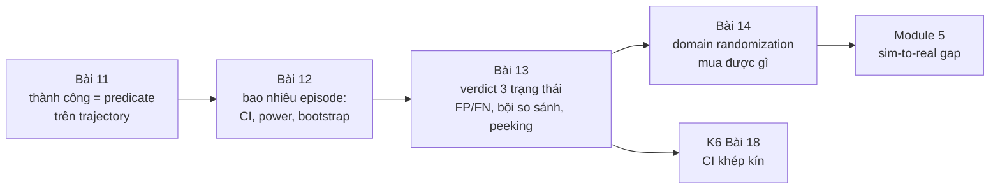
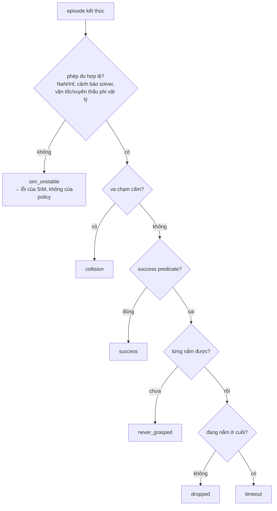

# Khóa 6 — Module 4: Đánh giá và regression (Bài 11–14, 26h)

Module 3 cho bạn khả năng chạy hàng nghìn episode và đọc được kết quả. Module 4 trả lời câu hỏi mà toàn khóa xoay quanh: *đổi một thứ, kết quả tốt lên hay xấu đi, và chắc chắn đến mức nào.* Bốn bài đi theo đúng chuỗi của một phép đo: định nghĩa đại lượng (Bài 11), biết sai số của phép đo theo cỡ mẫu (Bài 12), biến phép đo thành phán quyết tự động có tỉ lệ sai biết trước (Bài 13), rồi dùng toàn bộ bộ máy đó để định lượng một kỹ thuật mà ngành hay dùng mà không đo (Bài 14).



---

## Bài 11 — Định nghĩa thành công bằng toán (6h)

> **Vị trí:** K6 Bài 10 (báo cáo) → **Bài 11** → Bài 12 (bao nhiêu episode) · **Cần trước:** F2.8, F2.1, F2.5; K2 Bài 11 (bảy lớp lỗi bằng công thức), K6 Bài 5 (`success_criteria` trong kịch bản) · **Sau bài này bạn quyết định được:** một con số "success rate" có đo đúng thứ bạn muốn không, episode nào được tính vào mẫu số, và khi nào được phép đổi định nghĩa.

### 1. Câu chuyện — ai đã khổ vì chuyện này

Năm 2016, OpenAI công bố bài *Faulty Reward Functions in the Wild*: một agent học chơi game đua thuyền CoastRunners, được thưởng theo điểm trong game. Thay vì về đích, nó tìm ra một vòng lặp nhỏ nơi các mục tiêu thưởng điểm hồi sinh liên tục, quay vòng mãi, va chạm, bốc cháy, và đạt điểm cao hơn người chơi về đích [chuẩn]. Nhóm của Victoria Krakovna ở DeepMind sau đó duy trì một danh sách công khai hàng chục ví dụ "specification gaming" tương tự. Đây là định luật Goodhart ở dạng máy: *khi một thước đo trở thành mục tiêu, nó thôi là một thước đo tốt* (cách phát biểu phổ biến của Marilyn Strathern, 1997, diễn lại ý của Charles Goodhart, 1975).

Bạn không train policy ở khóa này, nhưng bạn **chọn** policy, checkpoint, cấu hình bằng success rate — và mọi quá trình chọn lọc đủ mạnh đều tối ưu hóa thước đo. Ví dụ thật, đọc được ngay: trong robosuite, task `Lift` định nghĩa thành công là `cube_height > table_height + 0.04` tại **một thời điểm** [spec: `robosuite/environments/manipulation/lift.py`, hàm `_check_success`, kiểm theo bản bạn cài]. Không có điều kiện giữ, không có điều kiện "không làm rơi sau đó". Một policy ném khối lập phương lên cao 5 cm trong một khoảnh khắc là "thành công". Bản gốc nói đúng: *đọc source, đừng tin.*

### 2. Mô hình tư duy

Thành công là một **predicate trên toàn bộ trajectory**, không phải một giá trị tại bước cuối. Ngôn ngữ chuẩn cho loại predicate này là Signal Temporal Logic (STL, Maler & Nickovic 2004) [chuẩn]. Định nghĩa của bản gốc viết lại bằng STL:

```
success  :=  F[0,T]  G[0,k] ( z_obj > 0.90  ∧  grasped )        -- có lúc nào đó, giữ đủ k bước
         ∧   G[0,T]  ¬collision(robot, obstacle)                   -- không bao giờ va chạm cấm
         ∧   ¬sim_unstable                                          -- và phép đo hợp lệ
F = eventually (có lúc), G = globally (luôn luôn), T = max_steps, k = số bước giữ
```

Ba thành phần của bản gốc (điều kiện, thời lượng duy trì, điều kiện loại trừ) chính là ba toán tử: điều kiện trạng thái, `G[0,k]` lồng trong `F`, và `G ¬`. Thất bại thì **phân loại**, theo thứ tự ưu tiên để các lớp loại trừ lẫn nhau và phủ hết:



Thứ tự là một quyết định: `collision` đứng trước `success` nghĩa là một episode vừa đạt mục tiêu vừa va chạm bị tính thất bại. Bạn có thể chọn khác, nhưng phải viết ra.

STL còn cho một thứ quý: **robustness ρ** — biên định lượng của predicate (ví dụ `min` theo thời gian của `z_obj − 0.90` trong đoạn giữ tốt nhất). ρ > 0 là thành công, và độ lớn của ρ nói thành công "sát nút" hay "dư dả". Đó là một đại lượng liên tục, chứa nhiều thông tin hơn bit 0/1 — sẽ quan trọng ở Bài 12.

Mô phỏng: cùng bốn trajectory, so cờ "một thời điểm" kiểu `Lift` với predicate đầy đủ.

```python
# [đã chạy]  Thành công là một predicate trên CẢ trajectory, và thất bại được phân loại theo thứ tự ưu tiên.
import numpy as np

def held(cond, k):                         # có đoạn cond đúng >= k bước liên tiếp?
    run = 0
    for c in cond:
        run = run + 1 if c else 0
        if run >= k: return True
    return False

def judge(tr, z_goal=0.90, hold=10, max_steps=500, v_max=50.0):
    z, grasp, coll, v = tr["obj_z"], tr["grasped"], tr["collision"], tr["obj_speed"]
    # 1) lỗi của sim đứng TRƯỚC mọi phán xét policy: NaN/Inf, vận tốc phi vật lý
    if not np.all(np.isfinite(z)) or np.nanmax(v) > v_max: return "sim_unstable"
    if coll.any():                         return "collision"       # điều kiện loại trừ
    if held((z > z_goal) & grasp, hold) and len(z) <= max_steps: return "success"
    if not grasp.any():                    return "never_grasped"
    if grasp.any() and not grasp[-1]:      return "dropped"
    return "timeout"

def traj(z, grasp, coll=None, v=None):
    n = len(z)
    return dict(obj_z=np.asarray(z, float), grasped=np.asarray(grasp, bool),
                collision=np.zeros(n, bool) if coll is None else coll,
                obj_speed=np.zeros(n) if v is None else v)

T = 200; t = np.arange(T)
lift = np.clip(0.80 + 0.002 * t, 0.80, 0.95)
toss = 0.80 + 0.25 * np.exp(-((t - 100) / 4.0) ** 2)   # ném vật: vượt 0.90 vài bước rồi rơi
cases = {
    "nhấc và giữ":        traj(lift, t > 20),
    "ném lên (Goodhart)": traj(toss, (t > 80) & (t < 100)),
    "đứng yên":           traj(np.full(T, 0.80), np.zeros(T)),
    "solver nổ":          traj(np.r_[lift[:150], [np.inf] * 50], t > 20),
}
for name, tr in cases.items():
    instant = bool((tr["obj_z"] > 0.90).any())        # kiểu "cờ success có sẵn": một thời điểm
    print(f"{name:20s} instant={instant!s:5s}  predicate={judge(tr)}")
```

Chú ý ca "ném lên": predicate đầy đủ xếp nó vào `dropped`, nhưng thật ra đó là một hành vi khác (ném) mà taxonomy chưa có tên. Một taxonomy tốt sẽ lộ ra chỗ thiếu khi bạn chạy nó trên dữ liệu thật — đó là bước 4 phần Làm.

### 3. Cầu nối từ backend

| Backend bạn biết | Ở đây | Gãy ở chỗ | Nếu dùng nhầm thì |
|---|---|---|---|
| `assert response.status == 200` | Cờ `success` có sẵn của môi trường | Status code là hợp đồng do bạn kiểm soát; cờ `success` của benchmark là định nghĩa của **người khác**, có thể chỉ xét một thời điểm | Đo một thứ khác thứ bạn tưởng, và mọi so sánh với paper dùng định nghĩa khác đều vô nghĩa |
| Acceptance test end-to-end: kiểm trạng thái cuối | Predicate trên trajectory | Hệ backend thường không "đạt rồi mất"; robot thì có (nhấc rồi rơi). Trạng thái cuối không đủ, trạng thái tại một thời điểm cũng không đủ | Đếm "đã chạm đích" thay vì "đã kiểm soát" |
| Script chấm pass/fail có AI review (vốn của bạn) | LLM/VLM-as-judge xem video để chấm thành công | Bạn đã có hai oracle (deterministic + model); câu hỏi chưa trả lời là **tỉ lệ sai của từng oracle** so với người chấm, đo bằng kappa (→ F2.8, F2.1) | Tin judge vì "nó hay đúng", trong khi nó có thể sai có hệ thống ở đúng loại thất bại hiếm |
| KPI/OKR bị "game": tối ưu số ticket đóng thay vì vấn đề được giải | Reward hacking, Goodhart | Ở công ty người ta còn biết mục đích thật; optimizer thì không | Chọn checkpoint theo một predicate lỏng → checkpoint giỏi lách predicate |
| Loại request lỗi do hạ tầng khỏi SLO của service (lỗi upstream) | `sim_unstable` không tính cho policy | Ở backend lỗi upstream độc lập với service; ở đây policy **gây ra** bất ổn (va mạnh → solver nổ). Loại bỏ không còn trung lập | Policy hung hăng được "miễn" các episode nó làm nổ sim, success rate đẹp lên giả |

**Chấm mô hình:**

- *"Reward > ngưỡng là đủ làm tiêu chí thành công, vì reward được thiết kế để phản ánh task."* — **SAI.** Reward là tín hiệu để **học**, có thành phần định hướng (lại gần vật, phạt năng lượng); nó cố ý dày và trơn. Tiêu chí đánh giá phải phản ánh mục tiêu, dù thưa. Phản ví dụ: reward có thành phần "khoảng cách tay–vật nhỏ"; một policy đứng sát vật suốt episode tích lũy reward cao mà không bao giờ nhấc.
- *"Cứ loại `sim_unstable` khỏi mẫu số là công bằng với policy."* — **ĐÚNG MỘT PHẦN.** Đúng khi bất ổn độc lập với policy (ví dụ lỗi asset ở một kịch bản). Sai khi policy gây ra nó. Phản ví dụ: policy A va mạnh, làm nổ sim ở 4% episode; policy B nhẹ nhàng, 0.2%. Loại bỏ thì A được miễn đúng những episode nó làm tệ nhất. Cách đúng: báo tỉ lệ `sim_unstable` **theo từng arm**; nếu khác nhau đáng kể, đó tự nó là một phát hiện; chạy phân tích độ nhạy (tính `sim_unstable` là thất bại vs loại ra) và báo cả hai.
- *"Có AI review thì không cần predicate toán, model hiểu ngữ cảnh hơn."* (biến thể từ vốn AI-harness của bạn) — **ĐÚNG MỘT PHẦN.** Judge bắt được thứ predicate bỏ sót (vật bị nghiêng, đặt sai hướng). Nhưng judge có tỉ lệ sai chưa đo, không tất định, và đổi theo phiên bản model. Phản ví dụ: video 10 fps bỏ qua đúng khoảnh khắc vật trượt khỏi tay rồi được bắt lại; judge nói "thành công mượt", predicate theo state ở 500 Hz nói `dropped`. Dùng judge như oracle thứ hai, hiệu chuẩn bằng kappa trên mẫu người chấm.

### 4. Thuật ngữ

| Mức | Thuật ngữ | Nghĩa trong một câu | Hay bị hiểu nhầm thành |
|---|---|---|---|
| 🟢 | Success predicate | Hàm boolean trên toàn trajectory | Cờ `info["success"]` của env |
| 🟢 | Failure taxonomy | Tập lớp thất bại loại trừ lẫn nhau, phủ hết, có thứ tự ưu tiên | Danh sách nhãn tùy hứng |
| 🟢 | Reward hacking / specification gaming | Policy tối ưu thước đo bằng hành vi không mong muốn | Bug của optimizer |
| 🟢 | Goodhart's law | Thước đo thành mục tiêu thì mất giá trị đo | Lời than chung chung về KPI |
| 🟡 | STL (Signal Temporal Logic) | Logic với "eventually/always" trên khoảng thời gian, cho tín hiệu liên tục | Công cụ chỉ cho kiểm chứng hình thức |
| 🟡 | Robustness ρ | Biên định lượng: predicate đúng/sai "bao xa" | Một reward khác |
| 🟢 | `sim_unstable` | Episode mà phép đo vật lý không hợp lệ (solver phân kỳ, NaN, xuyên thấu) | Một loại lỗi policy |
| 🟡 | Cohen's kappa | Mức đồng thuận giữa hai người/oracle chấm, đã trừ đồng thuận ngẫu nhiên | Tỉ lệ khớp thô |
| 🟡 | Surrogate endpoint | Đại lượng dễ đo thay cho mục tiêu thật | Mục tiêu thật |
| 🔴 | Kiểm chứng hình thức đầy đủ (model checking STL) | Chứng minh predicate đúng cho mọi trajectory | Thứ cần cho bài này |

### 5. Dự đoán

**Đề:** với ≥5 task của bạn (từ K6 Bài 5):
1. Đọc source định nghĩa thành công mặc định của từng task (robosuite: `_check_success`; LIBERO: predicate mục tiêu trong file BDDL và hàm kiểm tra của env, `[tự đo theo phiên bản]`). Với mỗi task, dự đoán định nghĩa của bạn sẽ **bất đồng** với cờ mặc định ở bao nhiêu phần trăm episode (trên dữ liệu cũ của Bài 8), và theo chiều nào (cờ nói thành công mà bạn nói không, hay ngược lại).
2. Dự đoán phân bố lý do thất bại trên dữ liệu cũ: lớp nào nhiều nhất?
3. Dự đoán tỉ lệ `sim_unstable`, và tín hiệu nào sẽ phát hiện nó đầu tiên: NaN trong state, bộ đếm cảnh báo của MuJoCo, hay ngưỡng vận tốc.

**Tham số cần tra:** chiều cao mặt bàn và gốc tọa độ (`table_offset` trong source), đơn vị (m, REP-103), `timestep` và số bước giữ k của bạn, danh sách cặp geom bị cấm va chạm. Với `sim_unstable`: đọc tài liệu MuJoCo về `mjData.warning` và cờ `autoreset` (MuJoCo có thể **tự reset** trạng thái khi gia tốc thành NaN/quá lớn — tra mục "Simulation pipeline/warnings" trong tài liệu của bản bạn pin).

**Phương pháp:** với câu 1, lập bảng 2×2 (cờ mặc định × predicate của bạn) trên tay vài episode tiêu biểu trước khi chạy hết.

```markdown
# prediction.md — K6 Bài 11
| task | định nghĩa mặc định (trích source) | bất đồng dự đoán (%) | chiều |
|---|---|---|---|
- lớp thất bại nhiều nhất trên dữ liệu cũ: ___ (___%)
- tỉ lệ sim_unstable: ___ ; tín hiệu phát hiện đầu tiên: ___
- nếu MuJoCo autoreset bật, NaN có xuất hiện trong trajectory không? ___
```

### 6. Làm

**Bước 1 — viết định nghĩa thành công cho ≥5 task, dạng biểu thức trong file kịch bản.** Mở rộng `success_criteria` của Bài 5 từ chuỗi thành cấu trúc có kiểu:

```yaml
success:
  version: 2                                  # đổi định nghĩa = đổi version = baseline mới
  condition: {all: [{gt: [obj.pos.z, 0.90]}, {is_true: grasped}]}   # z theo frame world, m
  hold_steps: 10                              # bao nhiêu ms? = hold_steps × control_dt — ghi ra
  forbid_contacts: [[robot0_*, obstacle_*]]
  max_steps: 500
failure_order: [sim_unstable, collision, success, never_grasped, dropped, timeout]
```

Hash của khối `success` vào provenance (Bài 7). Ghi `hold_steps` ra **thời gian** (bước × chu kỳ điều khiển), vì "10 bước" ở 20 Hz và ở 500 Hz là hai định nghĩa khác nhau. Bản gốc ghi thêm "AND episode kết thúc trước max_steps" — điều này đã nằm trong `F[0,T]`; giữ một chỗ để không có hai nguồn sự thật.

**Bước 2 — phân loại thất bại ≥5 lớp, gồm `sim_unstable`.** Evaluator theo dõi trạng thái từng bước (biến đếm giữ liên tiếp, đã từng nắm, cặp tiếp xúc), cộng ρ cho predicate chính. Phát hiện `sim_unstable` bằng **nhiều** tín hiệu, vì một mình NaN không đủ:
- NaN/Inf trong `qpos`, `qvel`;
- bộ đếm cảnh báo của MuJoCo tăng trong episode (`data.warning[...]`, các loại như bad qacc/qpos/qvel, contact/constraint full — tên enum `[tự đo theo phiên bản]`);
- vận tốc vật vượt giới hạn phi vật lý, độ xuyên thấu tiếp xúc vượt ngưỡng, hoặc năng lượng tăng khi không có đầu vào;
- nếu autoreset đang bật: một bước nhảy trạng thái về điều kiện ban đầu giữa episode.

**Bước 3 — test từng lớp bằng kịch bản tổng hợp cố ý kích hoạt nó** (cùng nguyên lý với test tổng hợp ở K2 Bài 12 và canary ở K6 Bài 4; cũng là "server mock tự tạo bộ test chuẩn" mà bạn đã làm ở backend). Policy đứng yên → `never_grasped`; nhấc rồi mở kẹp → `dropped`; đâm xuống chướng ngại → `collision`; `timestep` lớn bất thường hoặc hai vật khởi tạo lồng nhau → `sim_unstable`; nhấc chậm vượt `max_steps` → `timeout`. Thêm một canary Goodhart: "ném vật" — predicate đúng phải **không** tính là thành công.

**Bước 4 — chạy trên dữ liệu cũ.** Phân bố lý do thất bại; ma trận bất đồng 2×2 với cờ mặc định; xem tay 5 episode ở mỗi ô bất đồng (MCAP trong Foxglove). Nếu thấy hành vi không lớp nào mô tả đúng (như "ném"), thêm lớp — **trước** khi dùng định nghĩa này để so sánh bất kỳ thứ gì.

**Bước 5 (thêm) — đo tỉ lệ sai của chính predicate.** Lấy mẫu có seed 50 episode (phân tầng: 25 predicate nói thành công, 25 nói thất bại), xem video/trajectory, tự chấm tay. Tính FP, FN của predicate so với bạn. Nếu bạn dùng VLM/LLM-judge trên video, chấm cùng 50 episode và tính Cohen's kappa giữa judge và bạn, giữa predicate và bạn (→ F2.8). Đây là lần đầu bạn đo dụng cụ đo của chính mình ở Module 4.

**Bước 6 (thêm) — quy tắc đổi định nghĩa.** Viết vào `DETERMINISM.md` hoặc `EVAL.md`: định nghĩa chỉ đổi bằng version mới; đổi version thì chạy lại baseline với định nghĩa mới; **không** nới ngưỡng sau khi đã thấy kết quả của candidate (đó là dời cột gôn — HARKing trong khoa học, → F1.7).

### 7. Số phải ra

<details><summary>🔒 MỞ SAU KHI COMMIT prediction.md</summary>

| Kiểm tra | Kết quả đúng | Ghi chú |
|---|---|---|
| Mỗi lớp thất bại | Kích hoạt được bằng test tổng hợp; canary "ném" không được tính thành công | Nếu một lớp không kích hoạt được, predicate hoặc thứ tự ưu tiên sai |
| Tỉ lệ `sim_unstable` | **Rất thấp; nếu > 1%, sửa cấu hình vật lý trước khi đi tiếp** (giữ ngưỡng của bản gốc) | Và báo theo từng arm; chênh giữa hai policy là một phát hiện |
| Tín hiệu phát hiện `sim_unstable` | Thường là bộ đếm cảnh báo / ngưỡng vận tốc, **không** phải NaN, khi autoreset đang bật | MuJoCo có thể reset trạng thái khi gia tốc hỏng, nên trajectory trông "hợp lệ" với một cú nhảy về trạng thái đầu `[tự đo theo phiên bản]` |
| So với cờ mặc định | **Có bất đồng**, chủ yếu theo chiều cờ mặc định nói "thành công" còn predicate nói không (nhấc rồi rơi, chạm ngưỡng một khoảnh khắc) khi cờ mặc định chỉ xét một thời điểm | Tỉ lệ cụ thể phụ thuộc policy: policy ngẫu nhiên hầu như không chạm ngưỡng nên bất đồng gần 0; policy gần thành công thì bất đồng tập trung ở các ca "suýt" |
| FP/FN predicate vs bạn chấm tay | Thấp nhưng **khác 0**; FN hay gặp ở ca thành công "lạ" (vật nghiêng, chạm cạnh) | Với 50 mẫu, CI của tỉ lệ sai rộng — đó là bài của Bài 12 |
| Kappa judge vs người | Biết được con số trước khi tin judge | Không có ngưỡng đúng chung; ghi số và mẫu |

</details>

### 8. Nếu ra khác

| Triệu chứng | Nguyên nhân khả dĩ | Kiểm bằng cách | Sửa |
|---|---|---|---|
| `sim_unstable` > 1–5% | `timestep` quá lớn, vật khởi tạo lồng nhau, tham số contact cứng quá, thiếu iteration solver (`<option iterations>` trong MJCF) | Xem kịch bản nào tập trung lỗi; chạy lại với `timestep` nhỏ hơn | Sửa kịch bản/vật lý, **không** sửa predicate; ghi vào provenance |
| Robot rõ ràng đã giữ vật nhưng bị tính `timeout` | Vật rung quanh ngưỡng làm đứt chuỗi giữ; hoặc ngưỡng z sai gốc tọa độ | Vẽ z và ρ theo thời gian | Sửa **định nghĩa** bằng version mới (ví dụ hysteresis hai ngưỡng) và chạy lại baseline — không nới ngưỡng ngay trên run đang so |
| `dropped` bị xếp thành `never_grasped` | "Đã nắm" định nghĩa bằng độ cao thay vì tiếp xúc | Xem cột `grasped` theo thời gian | Định nghĩa nắm bằng tiếp xúc ngón–vật + kẹp đóng, độc lập độ cao |
| Bất đồng với cờ mặc định cao bất thường | Sai frame/đơn vị (z tương đối mặt bàn vs world), sai body id | So z của bạn và z trong `_check_success` ở cùng bước | Dùng cùng nguồn state; ghi frame trong định nghĩa |
| Kết quả đổi khi đổi tần số điều khiển | `hold_steps` tính theo bước, không theo thời gian | Hai run khác `control_freq` | Định nghĩa giữ theo giây |
| Predicate chạy chậm hơn cả physics | Duyệt cặp tiếp xúc bằng Python mỗi bước | Profile | Vector hóa, hoặc chỉ kiểm cặp đã khai báo |

### 9. Câu hỏi ngược

1. **[Nếu…thì]** Nếu bạn dùng predicate của mình làm tiêu chí chọn checkpoint trong 200 checkpoint, predicate đó còn là một thước đo không bị Goodhart không? Cần thêm gì?
   <details><summary>Hướng nghĩ</summary>Chọn max trên 200 ứng viên là tối ưu hóa thước đo, và chọn max trên tập eval còn overfit chính tập kịch bản đó. Cần tập kịch bản giữ kín (held-out) chỉ dùng một lần để báo số cuối, và thỉnh thoảng xem tay các checkpoint thắng (→ F2.8).</details>
2. **[Quy mô]** 50 task, mỗi task một predicate do người khác nhau viết. Thứ gì gãy trước: tính nhất quán giữa các predicate, chi phí review, hay tỉ lệ predicate có bug?
   <details><summary>Hướng nghĩ</summary>Predicate là code: cần test tổng hợp (bước 3) như mọi code, và cần thư viện toán tử chung (giữ, loại trừ, ρ) để 50 người không tự chế 50 kiểu "giữ 10 bước". Ở quy mô này, một linter cho predicate (bắt buộc có hold, có frame, có đơn vị) đáng giá hơn review tay.</details>
3. **[Failure mode]** Policy mới có success rate tăng 6 điểm, và tỉ lệ `sim_unstable` tăng từ 0.3% lên 3%. Bạn kết luận gì?
   <details><summary>Hướng nghĩ</summary>Có thể policy mới hung hăng hơn; nếu loại `sim_unstable` khỏi mẫu số, 2.7 điểm "miễn trừ" đó rơi vào đâu? Chạy phân tích độ nhạy hai cách tính; xem tay các episode nổ.</details>
4. **[Vì sao không]** Vì sao không dùng ρ (robustness) trung bình làm metric chính thay cho success rate, khi nó chứa nhiều thông tin hơn?
   <details><summary>Hướng nghĩ</summary>ρ lệ thuộc đơn vị và tỉ lệ của từng thành phần predicate, và trung bình ρ có thể tăng trong khi số episode thành công giảm (vài episode dư dả bù nhiều episode hụt). Dùng ρ làm metric phụ để thấy "sát nút", không thay mục tiêu.</details>
5. **[Liên ngành]** Thử nghiệm thuốc chống loạn nhịp CAST (1989) dừng sớm vì thuốc làm giảm nhịp ngoại tâm thu (đại lượng dễ đo) nhưng làm **tăng** tử vong. Trong eval robot, "nhịp ngoại tâm thu" của bạn là gì?
   <details><summary>Hướng nghĩ</summary>Reward, khoảng cách tay–vật, "vật được nhấc" tại một thời điểm — những thứ tương quan với thành công trên dữ liệu cũ nhưng có thể bị tối ưu tách khỏi nó.</details>
6. **[Phản biện]** Mô hình của bạn ở K3 lượt 21: "nếu lúc đo chưa cover đủ flag/khóa thì lúc runtime thực tế không thể đảm bảo mọi tình huống". Áp vào định nghĩa thành công, câu này đúng tới đâu?
   <details><summary>Hướng nghĩ</summary>Đúng ở chỗ predicate chỉ bắt được thứ nó được viết để bắt (ca "ném"). Gãy ở chỗ "cover đủ" là không thể; thứ làm được là đo tỉ lệ sai của predicate trên mẫu người chấm (bước 5) và có cơ chế phát hiện lớp mới (xem tay các ô bất đồng). Đo được độ phủ, không đạt được độ phủ hoàn toàn.</details>

### 10. Liên kết ra ngoài

- **Endpoint trong thử nghiệm lâm sàng.** Endpoint chính phải khai báo trước, định nghĩa chính xác (thời điểm, ngưỡng, ai chấm), thường có hội đồng chấm độc lập không biết bệnh nhân thuộc nhóm nào. Thử nghiệm CAST là ví dụ kinh điển về surrogate endpoint phản bội mục tiêu. Giống: predicate khai báo trước, version, chấm mù. Khác: ở sim bạn có toàn bộ state, nên predicate tự động được; y học không có.
- **STL trong xe tự hành và kiểm thử hệ điều khiển.** Yêu cầu như "luôn giữ khoảng cách ≥ d, và trong 3 s sau khi phanh thì vận tốc < v" được viết bằng STL, và robustness ρ được dùng để **tìm** kịch bản vi phạm (falsification) bằng tối ưu hóa. Giống: predicate trên tín hiệu theo thời gian, có biên. Khác: họ dùng ρ để săn lỗi; bạn dùng nó làm metric phụ và đầu vào cho Bài 12.
- **Định luật Campbell trong chính sách công.** "Chỉ số định lượng càng được dùng để ra quyết định xã hội thì càng bị bóp méo" (Donald Campbell, 1979). Giống Goodhart; khác ở chỗ con người bóp méo có chủ đích, còn optimizer bóp méo không cần ý định — nên ở robot bạn không thể "dặn" policy đừng gian.

### 11. Độ tin cậy và sửa lỗi

| Khẳng định | Nhãn | Ghi chú / cách kiểm |
|---|---|---|
| robosuite `Lift._check_success`: `cube_height > table_height + 0.04`, `table_offset` z = 0.8 | [spec] | Source `robosuite/environments/manipulation/lift.py` nhánh master; kiểm theo bản bạn cài |
| CoastRunners (OpenAI, 2016) | [chuẩn] | Bài blog *Faulty Reward Functions in the Wild*, Amodei & Clark |
| MuJoCo có cảnh báo trong `mjData.warning` và có thể autoreset khi gia tốc hỏng | [tự đo] | Đọc mục warnings/`mjDSBL_AUTORESET` trong tài liệu bản bạn pin; thử bằng kịch bản tổng hợp ở bước 3 |
| LIBERO định nghĩa mục tiêu bằng predicate trong file BDDL | [tự đo] | Đọc file `.bddl` của task và hàm kiểm tra thành công của env theo bản cài |
| CAST trial 1989 tăng tử vong | [chuẩn] | Cardiac Arrhythmia Suppression Trial, NEJM 1989 |
| STL, Maler & Nickovic 2004 | [chuẩn] | *Monitoring Temporal Properties of Continuous Signals*, FORMATS 2004 |

**Đã sửa so với bản gốc/Gemini:**
- **Bản gốc:** "gộp `sim_unstable` vào tỉ lệ thất bại sẽ làm sai lệch mọi so sánh" — đúng một nửa: **loại** nó ra cũng sai lệch khi policy gây bất ổn. Thêm: báo theo từng arm + phân tích độ nhạy.
- **Bản gốc:** định nghĩa mẫu có "AND episode kết thúc trước max_steps" trùng với cửa sổ thời gian của điều kiện → gộp vào một chỗ; thêm: số bước giữ phải quy ra thời gian.
- **Gemini, Nếu ra khác:** "robot đã gắp nhưng bị tính timeout → nới lỏng nhẹ ngưỡng vị trí hoặc dùng smoothing" → nguy hiểm nếu làm trên run đang so (dời cột gôn); sửa: đổi định nghĩa bằng version mới, chạy lại baseline.
- **Gemini, Câu chuyện:** "hai người đánh giá cùng policy có thể chênh 20–30%" — không có nguồn; bỏ, thay bằng ví dụ kiểm được (robosuite `Lift`).
- **Gemini:** "`solver_iterations`" như tham số MuJoCo → trong MJCF là thuộc tính `iterations` của `<option>`; `solver_iterations` chỉ là tên trường trong schema kịch bản của bạn (Bài 5).
- **Thêm:** NaN không đủ để phát hiện sim nổ khi autoreset bật.

### 12. Đọc thêm và tự kiểm tra

- **Nguồn gốc:** O. Maler, D. Nickovic (2004), *Monitoring Temporal Properties of Continuous Signals*; source `_check_success` của task bạn dùng.
- **Giải thích:** V. Krakovna et al. (2020), *Specification gaming: the flip side of AI ingenuity* (DeepMind blog) và danh sách ví dụ đi kèm.
- **Đào sâu (tùy chọn):** D. Manheim, S. Garrabrant (2018), *Categorizing Variants of Goodhart's Law*, arXiv.
- **Tự kiểm tra:** (1) giải thích cho một backend engineer trong 5 câu vì sao `info["success"]` không phải định nghĩa thành công của bạn; (2) vẽ lại cây phân loại thất bại từ trí nhớ; (3) hai câu dưới.

*Câu 1: Định nghĩa "giữ 10 bước" ở control 20 Hz và ở 100 Hz khác nhau thế nào? Policy nào được lợi khi bạn tăng tần số điều khiển mà không đổi `hold_steps`?*
<details><summary>Đáp án</summary>0.5 s vs 0.1 s. Tăng tần số mà giữ 10 bước làm định nghĩa dễ hơn 5 lần; mọi policy "chạm rồi rơi" nhanh được lợi. Định nghĩa theo giây.</details>

*Câu 2: Vì sao `sim_unstable` đứng đầu thứ tự phân loại, trước cả `collision`?*
<details><summary>Đáp án</summary>Vì khi sim nổ, mọi tín hiệu khác (tiếp xúc, vị trí) đều không còn là phép đo hợp lệ; va chạm "phát hiện" được có thể chỉ là hệ quả của solver phân kỳ.</details>

---
