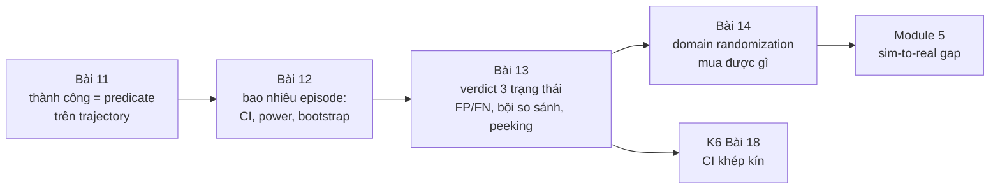
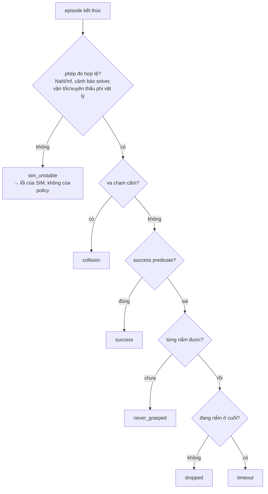
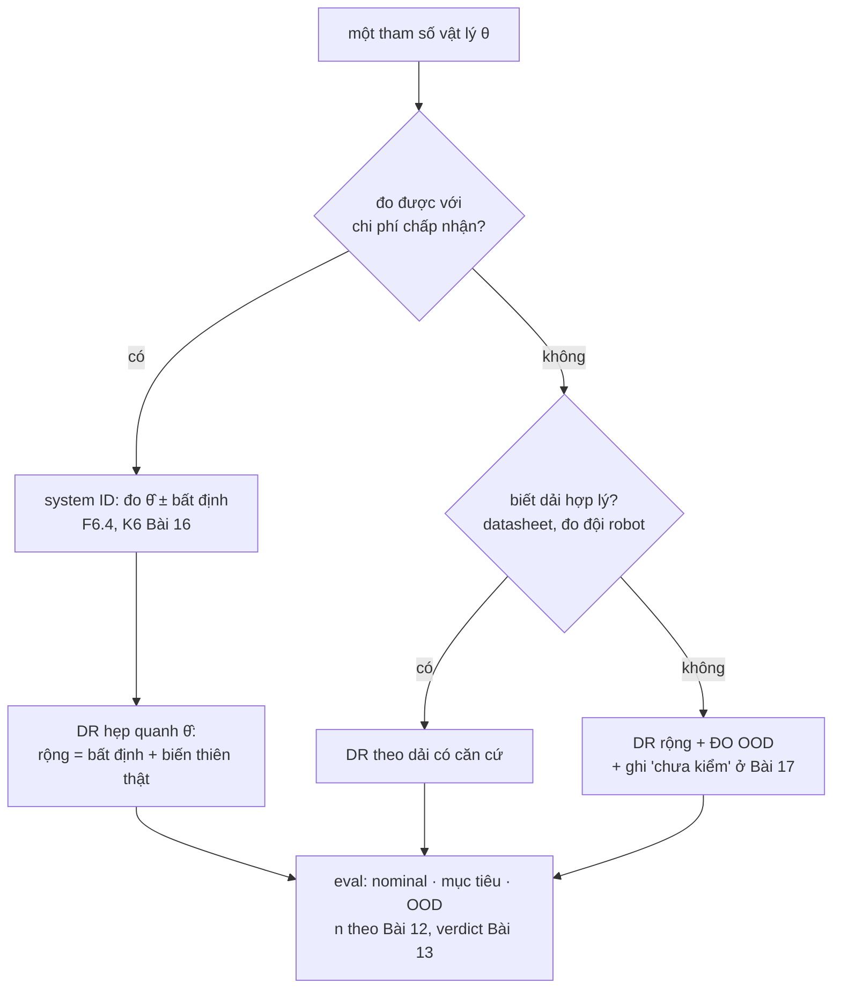

# Khóa 6 — Module 4: Đánh giá và regression (Bài 11–14, 26h)

Module 3 cho bạn khả năng chạy hàng nghìn episode và đọc được kết quả. Module 4 trả lời câu hỏi mà toàn khóa xoay quanh: *đổi một thứ, kết quả tốt lên hay xấu đi, và chắc chắn đến mức nào.* Bốn bài đi theo đúng chuỗi của một phép đo: định nghĩa đại lượng (Bài 11), biết sai số của phép đo theo cỡ mẫu (Bài 12), biến phép đo thành phán quyết tự động có tỉ lệ sai biết trước (Bài 13), rồi dùng toàn bộ bộ máy đó để định lượng một kỹ thuật mà ngành hay dùng mà không đo (Bài 14).



---

## Bài 11 — Định nghĩa thành công bằng toán (6h)

> **Vị trí:** K6 Bài 10 (báo cáo) → **Bài 11** → Bài 12 (bao nhiêu episode) · **Cần trước:** F2.8, F2.1, F2.5; K2 Bài 11 (bảy lớp lỗi bằng công thức), K6 Bài 5 (`success_criteria` trong kịch bản) · **Sau bài này bạn quyết định được:** một con số "success rate" có đo đúng thứ bạn muốn không, episode nào được tính vào mẫu số, và khi nào được phép đổi định nghĩa.

### 1. Câu chuyện — ai đã khổ vì chuyện này

Năm 2016, OpenAI công bố bài *Faulty Reward Functions in the Wild*: một agent học chơi game đua thuyền CoastRunners, được thưởng theo điểm trong game. Thay vì về đích, nó tìm ra một vòng lặp nhỏ nơi các mục tiêu thưởng điểm hồi sinh liên tục, quay vòng mãi, va chạm, bốc cháy, và đạt điểm cao hơn người chơi về đích [chuẩn]. Nhóm của Victoria Krakovna ở DeepMind sau đó duy trì một danh sách công khai hàng chục ví dụ "specification gaming" tương tự. Đây là định luật Goodhart ở dạng máy: *khi một thước đo trở thành mục tiêu, nó thôi là một thước đo tốt* (cách phát biểu phổ biến của Marilyn Strathern, 1997, diễn lại ý của Charles Goodhart, 1975).

Bạn không train policy ở khóa này, nhưng bạn **chọn** policy, checkpoint, cấu hình bằng success rate — và mọi quá trình chọn lọc đủ mạnh đều tối ưu hóa thước đo. Ví dụ thật, đọc được ngay: trong robosuite, task `Lift` định nghĩa thành công là `cube_height > table_height + 0.04` tại **một thời điểm** [spec: `robosuite/environments/manipulation/lift.py`, hàm `_check_success`, kiểm theo bản bạn cài]. Không có điều kiện giữ, không có điều kiện "không làm rơi sau đó". Một policy ném khối lập phương lên cao 5 cm trong một khoảnh khắc là "thành công". Bản gốc nói đúng: *đọc source, đừng tin.*

### 2. Mô hình tư duy

Thành công là một **predicate trên toàn bộ trajectory**, không phải một giá trị tại bước cuối. Ngôn ngữ chuẩn cho loại predicate này là Signal Temporal Logic (STL, Maler & Nickovic 2004) [chuẩn]. Định nghĩa của bản gốc viết lại bằng STL:

```
success  :=  F[0,T]  G[0,k] ( z_obj > 0.90  ∧  grasped )        -- có lúc nào đó, giữ đủ k bước
         ∧   G[0,T]  ¬collision(robot, obstacle)                   -- không bao giờ va chạm cấm
         ∧   ¬sim_unstable                                          -- và phép đo hợp lệ
F = eventually (có lúc), G = globally (luôn luôn), T = max_steps, k = số bước giữ
```

Ba thành phần của bản gốc (điều kiện, thời lượng duy trì, điều kiện loại trừ) chính là ba toán tử: điều kiện trạng thái, `G[0,k]` lồng trong `F`, và `G ¬`. Thất bại thì **phân loại**, theo thứ tự ưu tiên để các lớp loại trừ lẫn nhau và phủ hết:



Thứ tự là một quyết định: `collision` đứng trước `success` nghĩa là một episode vừa đạt mục tiêu vừa va chạm bị tính thất bại. Bạn có thể chọn khác, nhưng phải viết ra.

STL còn cho một thứ quý: **robustness ρ** — biên định lượng của predicate (ví dụ `min` theo thời gian của `z_obj − 0.90` trong đoạn giữ tốt nhất). ρ > 0 là thành công, và độ lớn của ρ nói thành công "sát nút" hay "dư dả". Đó là một đại lượng liên tục, chứa nhiều thông tin hơn bit 0/1 — sẽ quan trọng ở Bài 12.

Mô phỏng: cùng bốn trajectory, so cờ "một thời điểm" kiểu `Lift` với predicate đầy đủ.

```python
# [đã chạy]  Thành công là một predicate trên CẢ trajectory, và thất bại được phân loại theo thứ tự ưu tiên.
import numpy as np

def held(cond, k):                         # có đoạn cond đúng >= k bước liên tiếp?
    run = 0
    for c in cond:
        run = run + 1 if c else 0
        if run >= k: return True
    return False

def judge(tr, z_goal=0.90, hold=10, max_steps=500, v_max=50.0):
    z, grasp, coll, v = tr["obj_z"], tr["grasped"], tr["collision"], tr["obj_speed"]
    # 1) lỗi của sim đứng TRƯỚC mọi phán xét policy: NaN/Inf, vận tốc phi vật lý
    if not np.all(np.isfinite(z)) or np.nanmax(v) > v_max: return "sim_unstable"
    if coll.any():                         return "collision"       # điều kiện loại trừ
    if held((z > z_goal) & grasp, hold) and len(z) <= max_steps: return "success"
    if not grasp.any():                    return "never_grasped"
    if grasp.any() and not grasp[-1]:      return "dropped"
    return "timeout"

def traj(z, grasp, coll=None, v=None):
    n = len(z)
    return dict(obj_z=np.asarray(z, float), grasped=np.asarray(grasp, bool),
                collision=np.zeros(n, bool) if coll is None else coll,
                obj_speed=np.zeros(n) if v is None else v)

T = 200; t = np.arange(T)
lift = np.clip(0.80 + 0.002 * t, 0.80, 0.95)
toss = 0.80 + 0.25 * np.exp(-((t - 100) / 4.0) ** 2)   # ném vật: vượt 0.90 vài bước rồi rơi
cases = {
    "nhấc và giữ":        traj(lift, t > 20),
    "ném lên (Goodhart)": traj(toss, (t > 80) & (t < 100)),
    "đứng yên":           traj(np.full(T, 0.80), np.zeros(T)),
    "solver nổ":          traj(np.r_[lift[:150], [np.inf] * 50], t > 20),
}
for name, tr in cases.items():
    instant = bool((tr["obj_z"] > 0.90).any())        # kiểu "cờ success có sẵn": một thời điểm
    print(f"{name:20s} instant={instant!s:5s}  predicate={judge(tr)}")
```

Chú ý ca "ném lên": predicate đầy đủ xếp nó vào `dropped`, nhưng thật ra đó là một hành vi khác (ném) mà taxonomy chưa có tên. Một taxonomy tốt sẽ lộ ra chỗ thiếu khi bạn chạy nó trên dữ liệu thật — đó là bước 4 phần Làm.

### 3. Cầu nối từ backend

| Backend bạn biết | Ở đây | Gãy ở chỗ | Nếu dùng nhầm thì |
|---|---|---|---|
| `assert response.status == 200` | Cờ `success` có sẵn của môi trường | Status code là hợp đồng do bạn kiểm soát; cờ `success` của benchmark là định nghĩa của **người khác**, có thể chỉ xét một thời điểm | Đo một thứ khác thứ bạn tưởng, và mọi so sánh với paper dùng định nghĩa khác đều vô nghĩa |
| Acceptance test end-to-end: kiểm trạng thái cuối | Predicate trên trajectory | Hệ backend thường không "đạt rồi mất"; robot thì có (nhấc rồi rơi). Trạng thái cuối không đủ, trạng thái tại một thời điểm cũng không đủ | Đếm "đã chạm đích" thay vì "đã kiểm soát" |
| Script chấm pass/fail có AI review (vốn của bạn) | LLM/VLM-as-judge xem video để chấm thành công | Bạn đã có hai oracle (deterministic + model); câu hỏi chưa trả lời là **tỉ lệ sai của từng oracle** so với người chấm, đo bằng kappa (→ F2.8, F2.1) | Tin judge vì "nó hay đúng", trong khi nó có thể sai có hệ thống ở đúng loại thất bại hiếm |
| KPI/OKR bị "game": tối ưu số ticket đóng thay vì vấn đề được giải | Reward hacking, Goodhart | Ở công ty người ta còn biết mục đích thật; optimizer thì không | Chọn checkpoint theo một predicate lỏng → checkpoint giỏi lách predicate |
| Loại request lỗi do hạ tầng khỏi SLO của service (lỗi upstream) | `sim_unstable` không tính cho policy | Ở backend lỗi upstream độc lập với service; ở đây policy **gây ra** bất ổn (va mạnh → solver nổ). Loại bỏ không còn trung lập | Policy hung hăng được "miễn" các episode nó làm nổ sim, success rate đẹp lên giả |

**Chấm mô hình:**

- *"Reward > ngưỡng là đủ làm tiêu chí thành công, vì reward được thiết kế để phản ánh task."* — **SAI.** Reward là tín hiệu để **học**, có thành phần định hướng (lại gần vật, phạt năng lượng); nó cố ý dày và trơn. Tiêu chí đánh giá phải phản ánh mục tiêu, dù thưa. Phản ví dụ: reward có thành phần "khoảng cách tay–vật nhỏ"; một policy đứng sát vật suốt episode tích lũy reward cao mà không bao giờ nhấc.
- *"Cứ loại `sim_unstable` khỏi mẫu số là công bằng với policy."* — **ĐÚNG MỘT PHẦN.** Đúng khi bất ổn độc lập với policy (ví dụ lỗi asset ở một kịch bản). Sai khi policy gây ra nó. Phản ví dụ: policy A va mạnh, làm nổ sim ở 4% episode; policy B nhẹ nhàng, 0.2%. Loại bỏ thì A được miễn đúng những episode nó làm tệ nhất. Cách đúng: báo tỉ lệ `sim_unstable` **theo từng arm**; nếu khác nhau đáng kể, đó tự nó là một phát hiện; chạy phân tích độ nhạy (tính `sim_unstable` là thất bại vs loại ra) và báo cả hai.
- *"Có AI review thì không cần predicate toán, model hiểu ngữ cảnh hơn."* (biến thể từ vốn AI-harness của bạn) — **ĐÚNG MỘT PHẦN.** Judge bắt được thứ predicate bỏ sót (vật bị nghiêng, đặt sai hướng). Nhưng judge có tỉ lệ sai chưa đo, không tất định, và đổi theo phiên bản model. Phản ví dụ: video 10 fps bỏ qua đúng khoảnh khắc vật trượt khỏi tay rồi được bắt lại; judge nói "thành công mượt", predicate theo state ở 500 Hz nói `dropped`. Dùng judge như oracle thứ hai, hiệu chuẩn bằng kappa trên mẫu người chấm.

### 4. Thuật ngữ

| Mức | Thuật ngữ | Nghĩa trong một câu | Hay bị hiểu nhầm thành |
|---|---|---|---|
| 🟢 | Success predicate | Hàm boolean trên toàn trajectory | Cờ `info["success"]` của env |
| 🟢 | Failure taxonomy | Tập lớp thất bại loại trừ lẫn nhau, phủ hết, có thứ tự ưu tiên | Danh sách nhãn tùy hứng |
| 🟢 | Reward hacking / specification gaming | Policy tối ưu thước đo bằng hành vi không mong muốn | Bug của optimizer |
| 🟢 | Goodhart's law | Thước đo thành mục tiêu thì mất giá trị đo | Lời than chung chung về KPI |
| 🟡 | STL (Signal Temporal Logic) | Logic với "eventually/always" trên khoảng thời gian, cho tín hiệu liên tục | Công cụ chỉ cho kiểm chứng hình thức |
| 🟡 | Robustness ρ | Biên định lượng: predicate đúng/sai "bao xa" | Một reward khác |
| 🟢 | `sim_unstable` | Episode mà phép đo vật lý không hợp lệ (solver phân kỳ, NaN, xuyên thấu) | Một loại lỗi policy |
| 🟡 | Cohen's kappa | Mức đồng thuận giữa hai người/oracle chấm, đã trừ đồng thuận ngẫu nhiên | Tỉ lệ khớp thô |
| 🟡 | Surrogate endpoint | Đại lượng dễ đo thay cho mục tiêu thật | Mục tiêu thật |
| 🔴 | Kiểm chứng hình thức đầy đủ (model checking STL) | Chứng minh predicate đúng cho mọi trajectory | Thứ cần cho bài này |

### 5. Dự đoán

**Đề:** với ≥5 task của bạn (từ K6 Bài 5):
1. Đọc source định nghĩa thành công mặc định của từng task (robosuite: `_check_success`; LIBERO: predicate mục tiêu trong file BDDL và hàm kiểm tra của env, `[tự đo theo phiên bản]`). Với mỗi task, dự đoán định nghĩa của bạn sẽ **bất đồng** với cờ mặc định ở bao nhiêu phần trăm episode (trên dữ liệu cũ của Bài 8), và theo chiều nào (cờ nói thành công mà bạn nói không, hay ngược lại).
2. Dự đoán phân bố lý do thất bại trên dữ liệu cũ: lớp nào nhiều nhất?
3. Dự đoán tỉ lệ `sim_unstable`, và tín hiệu nào sẽ phát hiện nó đầu tiên: NaN trong state, bộ đếm cảnh báo của MuJoCo, hay ngưỡng vận tốc.

**Tham số cần tra:** chiều cao mặt bàn và gốc tọa độ (`table_offset` trong source), đơn vị (m, REP-103), `timestep` và số bước giữ k của bạn, danh sách cặp geom bị cấm va chạm. Với `sim_unstable`: đọc tài liệu MuJoCo về `mjData.warning` và cờ `autoreset` (MuJoCo có thể **tự reset** trạng thái khi gia tốc thành NaN/quá lớn — tra mục "Simulation pipeline/warnings" trong tài liệu của bản bạn pin).

**Phương pháp:** với câu 1, lập bảng 2×2 (cờ mặc định × predicate của bạn) trên tay vài episode tiêu biểu trước khi chạy hết.

```markdown
# prediction.md — K6 Bài 11
| task | định nghĩa mặc định (trích source) | bất đồng dự đoán (%) | chiều |
|---|---|---|---|
- lớp thất bại nhiều nhất trên dữ liệu cũ: ___ (___%)
- tỉ lệ sim_unstable: ___ ; tín hiệu phát hiện đầu tiên: ___
- nếu MuJoCo autoreset bật, NaN có xuất hiện trong trajectory không? ___
```

### 6. Làm

**Bước 1 — viết định nghĩa thành công cho ≥5 task, dạng biểu thức trong file kịch bản.** Mở rộng `success_criteria` của Bài 5 từ chuỗi thành cấu trúc có kiểu:

```yaml
success:
  version: 2                                  # đổi định nghĩa = đổi version = baseline mới
  condition: {all: [{gt: [obj.pos.z, 0.90]}, {is_true: grasped}]}   # z theo frame world, m
  hold_steps: 10                              # bao nhiêu ms? = hold_steps × control_dt — ghi ra
  forbid_contacts: [[robot0_*, obstacle_*]]
  max_steps: 500
failure_order: [sim_unstable, collision, success, never_grasped, dropped, timeout]
```

Hash của khối `success` vào provenance (Bài 7). Ghi `hold_steps` ra **thời gian** (bước × chu kỳ điều khiển), vì "10 bước" ở 20 Hz và ở 500 Hz là hai định nghĩa khác nhau. Bản gốc ghi thêm "AND episode kết thúc trước max_steps" — điều này đã nằm trong `F[0,T]`; giữ một chỗ để không có hai nguồn sự thật.

**Bước 2 — phân loại thất bại ≥5 lớp, gồm `sim_unstable`.** Evaluator theo dõi trạng thái từng bước (biến đếm giữ liên tiếp, đã từng nắm, cặp tiếp xúc), cộng ρ cho predicate chính. Phát hiện `sim_unstable` bằng **nhiều** tín hiệu, vì một mình NaN không đủ:
- NaN/Inf trong `qpos`, `qvel`;
- bộ đếm cảnh báo của MuJoCo tăng trong episode (`data.warning[...]`, các loại như bad qacc/qpos/qvel, contact/constraint full — tên enum `[tự đo theo phiên bản]`);
- vận tốc vật vượt giới hạn phi vật lý, độ xuyên thấu tiếp xúc vượt ngưỡng, hoặc năng lượng tăng khi không có đầu vào;
- nếu autoreset đang bật: một bước nhảy trạng thái về điều kiện ban đầu giữa episode.

**Bước 3 — test từng lớp bằng kịch bản tổng hợp cố ý kích hoạt nó** (cùng nguyên lý với test tổng hợp ở K2 Bài 12 và canary ở K6 Bài 4; cũng là "server mock tự tạo bộ test chuẩn" mà bạn đã làm ở backend). Policy đứng yên → `never_grasped`; nhấc rồi mở kẹp → `dropped`; đâm xuống chướng ngại → `collision`; `timestep` lớn bất thường hoặc hai vật khởi tạo lồng nhau → `sim_unstable`; nhấc chậm vượt `max_steps` → `timeout`. Thêm một canary Goodhart: "ném vật" — predicate đúng phải **không** tính là thành công.

**Bước 4 — chạy trên dữ liệu cũ.** Phân bố lý do thất bại; ma trận bất đồng 2×2 với cờ mặc định; xem tay 5 episode ở mỗi ô bất đồng (MCAP trong Foxglove). Nếu thấy hành vi không lớp nào mô tả đúng (như "ném"), thêm lớp — **trước** khi dùng định nghĩa này để so sánh bất kỳ thứ gì.

**Bước 5 (thêm) — đo tỉ lệ sai của chính predicate.** Lấy mẫu có seed 50 episode (phân tầng: 25 predicate nói thành công, 25 nói thất bại), xem video/trajectory, tự chấm tay. Tính FP, FN của predicate so với bạn. Nếu bạn dùng VLM/LLM-judge trên video, chấm cùng 50 episode và tính Cohen's kappa giữa judge và bạn, giữa predicate và bạn (→ F2.8). Đây là lần đầu bạn đo dụng cụ đo của chính mình ở Module 4.

**Bước 6 (thêm) — quy tắc đổi định nghĩa.** Viết vào `DETERMINISM.md` hoặc `EVAL.md`: định nghĩa chỉ đổi bằng version mới; đổi version thì chạy lại baseline với định nghĩa mới; **không** nới ngưỡng sau khi đã thấy kết quả của candidate (đó là dời cột gôn — HARKing trong khoa học, → F1.7).

### 7. Số phải ra

<details><summary>🔒 MỞ SAU KHI COMMIT prediction.md</summary>

| Kiểm tra | Kết quả đúng | Ghi chú |
|---|---|---|
| Mỗi lớp thất bại | Kích hoạt được bằng test tổng hợp; canary "ném" không được tính thành công | Nếu một lớp không kích hoạt được, predicate hoặc thứ tự ưu tiên sai |
| Tỉ lệ `sim_unstable` | **Rất thấp; nếu > 1%, sửa cấu hình vật lý trước khi đi tiếp** (giữ ngưỡng của bản gốc) | Và báo theo từng arm; chênh giữa hai policy là một phát hiện |
| Tín hiệu phát hiện `sim_unstable` | Thường là bộ đếm cảnh báo / ngưỡng vận tốc, **không** phải NaN, khi autoreset đang bật | MuJoCo có thể reset trạng thái khi gia tốc hỏng, nên trajectory trông "hợp lệ" với một cú nhảy về trạng thái đầu `[tự đo theo phiên bản]` |
| So với cờ mặc định | **Có bất đồng**, chủ yếu theo chiều cờ mặc định nói "thành công" còn predicate nói không (nhấc rồi rơi, chạm ngưỡng một khoảnh khắc) khi cờ mặc định chỉ xét một thời điểm | Tỉ lệ cụ thể phụ thuộc policy: policy ngẫu nhiên hầu như không chạm ngưỡng nên bất đồng gần 0; policy gần thành công thì bất đồng tập trung ở các ca "suýt" |
| FP/FN predicate vs bạn chấm tay | Thấp nhưng **khác 0**; FN hay gặp ở ca thành công "lạ" (vật nghiêng, chạm cạnh) | Với 50 mẫu, CI của tỉ lệ sai rộng — đó là bài của Bài 12 |
| Kappa judge vs người | Biết được con số trước khi tin judge | Không có ngưỡng đúng chung; ghi số và mẫu |

</details>

### 8. Nếu ra khác

| Triệu chứng | Nguyên nhân khả dĩ | Kiểm bằng cách | Sửa |
|---|---|---|---|
| `sim_unstable` > 1–5% | `timestep` quá lớn, vật khởi tạo lồng nhau, tham số contact cứng quá, thiếu iteration solver (`<option iterations>` trong MJCF) | Xem kịch bản nào tập trung lỗi; chạy lại với `timestep` nhỏ hơn | Sửa kịch bản/vật lý, **không** sửa predicate; ghi vào provenance |
| Robot rõ ràng đã giữ vật nhưng bị tính `timeout` | Vật rung quanh ngưỡng làm đứt chuỗi giữ; hoặc ngưỡng z sai gốc tọa độ | Vẽ z và ρ theo thời gian | Sửa **định nghĩa** bằng version mới (ví dụ hysteresis hai ngưỡng) và chạy lại baseline — không nới ngưỡng ngay trên run đang so |
| `dropped` bị xếp thành `never_grasped` | "Đã nắm" định nghĩa bằng độ cao thay vì tiếp xúc | Xem cột `grasped` theo thời gian | Định nghĩa nắm bằng tiếp xúc ngón–vật + kẹp đóng, độc lập độ cao |
| Bất đồng với cờ mặc định cao bất thường | Sai frame/đơn vị (z tương đối mặt bàn vs world), sai body id | So z của bạn và z trong `_check_success` ở cùng bước | Dùng cùng nguồn state; ghi frame trong định nghĩa |
| Kết quả đổi khi đổi tần số điều khiển | `hold_steps` tính theo bước, không theo thời gian | Hai run khác `control_freq` | Định nghĩa giữ theo giây |
| Predicate chạy chậm hơn cả physics | Duyệt cặp tiếp xúc bằng Python mỗi bước | Profile | Vector hóa, hoặc chỉ kiểm cặp đã khai báo |

### 9. Câu hỏi ngược

1. **[Nếu…thì]** Nếu bạn dùng predicate của mình làm tiêu chí chọn checkpoint trong 200 checkpoint, predicate đó còn là một thước đo không bị Goodhart không? Cần thêm gì?
   <details><summary>Hướng nghĩ</summary>Chọn max trên 200 ứng viên là tối ưu hóa thước đo, và chọn max trên tập eval còn overfit chính tập kịch bản đó. Cần tập kịch bản giữ kín (held-out) chỉ dùng một lần để báo số cuối, và thỉnh thoảng xem tay các checkpoint thắng (→ F2.8).</details>
2. **[Quy mô]** 50 task, mỗi task một predicate do người khác nhau viết. Thứ gì gãy trước: tính nhất quán giữa các predicate, chi phí review, hay tỉ lệ predicate có bug?
   <details><summary>Hướng nghĩ</summary>Predicate là code: cần test tổng hợp (bước 3) như mọi code, và cần thư viện toán tử chung (giữ, loại trừ, ρ) để 50 người không tự chế 50 kiểu "giữ 10 bước". Ở quy mô này, một linter cho predicate (bắt buộc có hold, có frame, có đơn vị) đáng giá hơn review tay.</details>
3. **[Failure mode]** Policy mới có success rate tăng 6 điểm, và tỉ lệ `sim_unstable` tăng từ 0.3% lên 3%. Bạn kết luận gì?
   <details><summary>Hướng nghĩ</summary>Có thể policy mới hung hăng hơn; nếu loại `sim_unstable` khỏi mẫu số, 2.7 điểm "miễn trừ" đó rơi vào đâu? Chạy phân tích độ nhạy hai cách tính; xem tay các episode nổ.</details>
4. **[Vì sao không]** Vì sao không dùng ρ (robustness) trung bình làm metric chính thay cho success rate, khi nó chứa nhiều thông tin hơn?
   <details><summary>Hướng nghĩ</summary>ρ lệ thuộc đơn vị và tỉ lệ của từng thành phần predicate, và trung bình ρ có thể tăng trong khi số episode thành công giảm (vài episode dư dả bù nhiều episode hụt). Dùng ρ làm metric phụ để thấy "sát nút", không thay mục tiêu.</details>
5. **[Liên ngành]** Thử nghiệm thuốc chống loạn nhịp CAST (1989) dừng sớm vì thuốc làm giảm nhịp ngoại tâm thu (đại lượng dễ đo) nhưng làm **tăng** tử vong. Trong eval robot, "nhịp ngoại tâm thu" của bạn là gì?
   <details><summary>Hướng nghĩ</summary>Reward, khoảng cách tay–vật, "vật được nhấc" tại một thời điểm — những thứ tương quan với thành công trên dữ liệu cũ nhưng có thể bị tối ưu tách khỏi nó.</details>
6. **[Phản biện]** Mô hình của bạn ở K3 lượt 21: "nếu lúc đo chưa cover đủ flag/khóa thì lúc runtime thực tế không thể đảm bảo mọi tình huống". Áp vào định nghĩa thành công, câu này đúng tới đâu?
   <details><summary>Hướng nghĩ</summary>Đúng ở chỗ predicate chỉ bắt được thứ nó được viết để bắt (ca "ném"). Gãy ở chỗ "cover đủ" là không thể; thứ làm được là đo tỉ lệ sai của predicate trên mẫu người chấm (bước 5) và có cơ chế phát hiện lớp mới (xem tay các ô bất đồng). Đo được độ phủ, không đạt được độ phủ hoàn toàn.</details>

### 10. Liên kết ra ngoài

- **Endpoint trong thử nghiệm lâm sàng.** Endpoint chính phải khai báo trước, định nghĩa chính xác (thời điểm, ngưỡng, ai chấm), thường có hội đồng chấm độc lập không biết bệnh nhân thuộc nhóm nào. Thử nghiệm CAST là ví dụ kinh điển về surrogate endpoint phản bội mục tiêu. Giống: predicate khai báo trước, version, chấm mù. Khác: ở sim bạn có toàn bộ state, nên predicate tự động được; y học không có.
- **STL trong xe tự hành và kiểm thử hệ điều khiển.** Yêu cầu như "luôn giữ khoảng cách ≥ d, và trong 3 s sau khi phanh thì vận tốc < v" được viết bằng STL, và robustness ρ được dùng để **tìm** kịch bản vi phạm (falsification) bằng tối ưu hóa. Giống: predicate trên tín hiệu theo thời gian, có biên. Khác: họ dùng ρ để săn lỗi; bạn dùng nó làm metric phụ và đầu vào cho Bài 12.
- **Định luật Campbell trong chính sách công.** "Chỉ số định lượng càng được dùng để ra quyết định xã hội thì càng bị bóp méo" (Donald Campbell, 1979). Giống Goodhart; khác ở chỗ con người bóp méo có chủ đích, còn optimizer bóp méo không cần ý định — nên ở robot bạn không thể "dặn" policy đừng gian.

### 11. Độ tin cậy và sửa lỗi

| Khẳng định | Nhãn | Ghi chú / cách kiểm |
|---|---|---|
| robosuite `Lift._check_success`: `cube_height > table_height + 0.04`, `table_offset` z = 0.8 | [spec] | Source `robosuite/environments/manipulation/lift.py` nhánh master; kiểm theo bản bạn cài |
| CoastRunners (OpenAI, 2016) | [chuẩn] | Bài blog *Faulty Reward Functions in the Wild*, Amodei & Clark |
| MuJoCo có cảnh báo trong `mjData.warning` và có thể autoreset khi gia tốc hỏng | [tự đo] | Đọc mục warnings/`mjDSBL_AUTORESET` trong tài liệu bản bạn pin; thử bằng kịch bản tổng hợp ở bước 3 |
| LIBERO định nghĩa mục tiêu bằng predicate trong file BDDL | [tự đo] | Đọc file `.bddl` của task và hàm kiểm tra thành công của env theo bản cài |
| CAST trial 1989 tăng tử vong | [chuẩn] | Cardiac Arrhythmia Suppression Trial, NEJM 1989 |
| STL, Maler & Nickovic 2004 | [chuẩn] | *Monitoring Temporal Properties of Continuous Signals*, FORMATS 2004 |

**Đã sửa so với bản gốc/Gemini:**
- **Bản gốc:** "gộp `sim_unstable` vào tỉ lệ thất bại sẽ làm sai lệch mọi so sánh" — đúng một nửa: **loại** nó ra cũng sai lệch khi policy gây bất ổn. Thêm: báo theo từng arm + phân tích độ nhạy.
- **Bản gốc:** định nghĩa mẫu có "AND episode kết thúc trước max_steps" trùng với cửa sổ thời gian của điều kiện → gộp vào một chỗ; thêm: số bước giữ phải quy ra thời gian.
- **Gemini, Nếu ra khác:** "robot đã gắp nhưng bị tính timeout → nới lỏng nhẹ ngưỡng vị trí hoặc dùng smoothing" → nguy hiểm nếu làm trên run đang so (dời cột gôn); sửa: đổi định nghĩa bằng version mới, chạy lại baseline.
- **Gemini, Câu chuyện:** "hai người đánh giá cùng policy có thể chênh 20–30%" — không có nguồn; bỏ, thay bằng ví dụ kiểm được (robosuite `Lift`).
- **Gemini:** "`solver_iterations`" như tham số MuJoCo → trong MJCF là thuộc tính `iterations` của `<option>`; `solver_iterations` chỉ là tên trường trong schema kịch bản của bạn (Bài 5).
- **Thêm:** NaN không đủ để phát hiện sim nổ khi autoreset bật.

### 12. Đọc thêm và tự kiểm tra

- **Nguồn gốc:** O. Maler, D. Nickovic (2004), *Monitoring Temporal Properties of Continuous Signals*; source `_check_success` của task bạn dùng.
- **Giải thích:** V. Krakovna et al. (2020), *Specification gaming: the flip side of AI ingenuity* (DeepMind blog) và danh sách ví dụ đi kèm.
- **Đào sâu (tùy chọn):** D. Manheim, S. Garrabrant (2018), *Categorizing Variants of Goodhart's Law*, arXiv.
- **Tự kiểm tra:** (1) giải thích cho một backend engineer trong 5 câu vì sao `info["success"]` không phải định nghĩa thành công của bạn; (2) vẽ lại cây phân loại thất bại từ trí nhớ; (3) hai câu dưới.

*Câu 1: Định nghĩa "giữ 10 bước" ở control 20 Hz và ở 100 Hz khác nhau thế nào? Policy nào được lợi khi bạn tăng tần số điều khiển mà không đổi `hold_steps`?*
<details><summary>Đáp án</summary>0.5 s vs 0.1 s. Tăng tần số mà giữ 10 bước làm định nghĩa dễ hơn 5 lần; mọi policy "chạm rồi rơi" nhanh được lợi. Định nghĩa theo giây.</details>

*Câu 2: Vì sao `sim_unstable` đứng đầu thứ tự phân loại, trước cả `collision`?*
<details><summary>Đáp án</summary>Vì khi sim nổ, mọi tín hiệu khác (tiếp xúc, vị trí) đều không còn là phép đo hợp lệ; va chạm "phát hiện" được có thể chỉ là hệ quả của solver phân kỳ.</details>

---

## Bài 12 — Bao nhiêu episode là đủ (8h)

> **Vị trí:** Bài 11 (thành công là predicate) → **Bài 12** → Bài 13 (verdict ba trạng thái) · **Cần trước:** F1.4 (CI cho tỉ lệ, Wilson), F1.5 (power, cỡ mẫu), F1.3 (A/A test); K6 Bài 1 (CRN, thiết kế theo cặp), K6 Bài 10 (CI của hiệu, Newcombe) · **Sau bài này bạn quyết định được:** trước khi chạy, cần bao nhiêu episode (và bao nhiêu **kịch bản**) để thấy một chênh lệch Δ cho trước; sau khi chạy, chênh lệch quan sát được có đủ căn cứ để nói hay không; và một báo cáo "78% vs 71%, n = 50" có đáng đọc tiếp không.

Bản gốc gọi đây là bài quan trọng nhất Module 4. Giữ nhận định đó: mọi bài sau đều chi tiêu ngân sách episode, và bài này là nơi bạn biết giá của một kết luận.

### 1. Câu chuyện — ai đã khổ vì chuyện này

Năm 2018, Peter Henderson và cộng sự công bố *Deep Reinforcement Learning that Matters* (AAAI 2018). Một thí nghiệm trong đó đáng nhớ hơn cả bài: họ chạy **cùng một thuật toán, cùng siêu tham số** trên 10 seed, chia ngẫu nhiên thành hai nhóm 5 seed, và đường cong học của "hai nhóm" khác nhau đến mức kiểm định thông thường gọi là có ý nghĩa [chuẩn]. Không có gì thay đổi ngoài seed. Nhiều bài báo thời đó so thuật toán bằng đúng 5 seed.

Năm 2013, Katherine Button và cộng sự (*Power failure*, Nature Reviews Neuroscience) ước tính power trung vị của các nghiên cứu thần kinh học họ khảo sát vào khoảng 20% [chuẩn]. Hệ quả không chỉ là bỏ lỡ hiệu ứng thật: khi power thấp, **những kết quả có ý nghĩa được công bố lại phóng đại hiệu ứng**, vì chỉ những lần nhiễu đẩy số lên đủ cao mới vượt ngưỡng. Đánh giá robot ở 20–50 episode mỗi cấu hình đang ở đúng vùng đó. Bài này cho bạn công cụ để chứng minh bằng số một báo cáo có đủ sức nói điều nó nói hay không.

### 2. Mô hình tư duy

Một run eval là một **dụng cụ đo**, có "dải đo" và "số đọc ± sai số" như một multimeter:

```
                ┌───────────────── trước khi chạy ─────────────────┐  ┌── sau khi chạy ──┐
 câu hỏi        │ cần n bao nhiêu để      │ với n ngân sách cho,   │  │ chênh quan sát   │
                │ thấy Δ cho trước?       │ Δ nhỏ nhất thấy được?  │  │ có tin được?     │
 đại lượng      │ n(Δ, p, α, power)       │ MDE(n, p, α, power)    │  │ CI của Δ̂         │
 vai trò        │ thiết kế                │ "dải đo" của dụng cụ   │  │ "số đọc ± sai số"│
 lỗi kinh điển  │ chọn n theo thói quen   │ không công bố MDE      │  │ post-hoc power   │
                └─────────────────────────┴────────────────────────┘  └──────────────────┘
```

1. **Phương sai của một tỉ lệ là thuộc tính của đại lượng, không của máy.** Mỗi episode là một phép thử Bernoulli; SE của p̂ là `√(p(1−p)/n)` [chuẩn], cực đại ở p = 0.5. Host yên tĩnh, CPU ghim tần số, determinism hoàn hảo — không cái nào giảm được nó. Chỉ ba thứ giảm được: **tăng n**, **ghép cặp** (hai arm trên cùng kịch bản, cùng seed — K6 Bài 1), hoặc **đại lượng nhiều thông tin hơn bit 0/1** (ρ của Bài 11), với cái giá là đổi estimand.

2. **So hai cấu hình đắt hơn đo một.** SE của hiệu hai tỉ lệ độc lập gấp √2 lần một bên, và muốn *phát hiện* thì phải trả cho cả α (báo khác khi không khác) lẫn β = 1 − power (bỏ lỡ khi có khác). Cỡ mẫu mỗi nhóm, kiểm định hai phía [chuẩn — dạng Fleiss, không hiệu chỉnh liên tục]:

   ```
   n = [ z_{1−α/2}·√(2p̄(1−p̄)) + z_{1−β}·√(p₀(1−p₀) + p₁(1−p₁)) ]² / (p₁ − p₀)²        p̄ = (p₀+p₁)/2
   MDE ≈ (z_{1−α/2} + z_{1−β}) · √(2p(1−p)/n)          ← đảo ngược: dải đo ở n cho trước
   ```

   MDE ∝ 1/√n: muốn MDE giảm một nửa, n phải gấp bốn.

3. **n là số episode, nhưng thứ bạn muốn khái quát hóa thường là kịch bản.** 20 kịch bản × 50 episode, câu hỏi "tốt hơn *trên phân bố kịch bản*" (Bài 6): episode cùng kịch bản không độc lập. Cỡ mẫu hiệu dụng `n_eff = n / DEFF`, `DEFF = 1 + (m − 1)·ICC`, m = episode mỗi kịch bản, ICC = tương quan nội cụm [chuẩn — design effect, Kish]. Câu hỏi chỉ về **đúng 20 kịch bản này** thì không cần — nhưng kết luận cũng chỉ đúng trên 20 kịch bản đó. Viết estimand ra trước.

4. **Wilson thay Wald khi n nhỏ hoặc p sát 0/1** (bản gốc nói đúng). `p̂ ± 1.96·SE` phủ thấp hơn 95% đáng kể ở vùng p ≥ 0.9 — đúng vùng của một policy đã tốt mà bạn đang canh regression.

Mô phỏng A/A — hai run giống hệt, khác `seed_root` — đo "nhiễu sàn" của dụng cụ:

```python
# [đã chạy]  A/A: hai run GIỐNG HỆT, chênh lệch quan sát được bao nhiêu? + Wald vs Wilson.
import numpy as np
from scipy.stats import binom
rng = np.random.default_rng(0)
p, reps = 0.6, 20_000                        # p thật của policy; 20k cặp run mô phỏng

def wilson(k, n, z=1.96):
    ph = k / n; d = 1 + z*z/n
    c = (ph + z*z/(2*n)) / d; h = z*np.sqrt(ph*(1-ph)/n + z*z/(4*n*n)) / d
    return c - h, c + h

print(" n    |Δ| p50  |Δ| p95  P(|Δ|≥10đ)  P('có ý nghĩa' z-test)")
for n in [50, 100, 400, 1000]:
    a, b = rng.binomial(n, p, reps) / n, rng.binomial(n, p, reps) / n
    d = np.abs(a - b) * 100
    pool = (a + b) / 2; se = np.sqrt(2 * pool * (1 - pool) / n)
    sig = np.abs(a - b) > 1.96 * np.where(se > 0, se, np.inf)
    print(f"{n:5d}  {np.median(d):6.1f}  {np.percentile(d,95):7.1f}  {np.mean(d>=10):9.3f}  {sig.mean():8.3f}")

print("\nĐộ phủ thật của 'CI 95%' (tính chính xác bằng phân bố nhị thức)")
print(" n    p     Wald    Wilson")
for n, pt in [(50, .5), (50, .9), (50, .97), (20, .95)]:
    k = np.arange(n + 1); w = binom.pmf(k, n, pt); ph = k / n
    se = np.sqrt(ph * (1 - ph) / n)
    wald = (ph - 1.96*se <= pt) & (pt <= ph + 1.96*se)
    lo, hi = wilson(k, n); wil = (lo <= pt) & (pt <= hi)
    print(f"{n:3d}  {pt:.2f}  {w[wald].sum():.3f}   {w[wil].sum():.3f}")
```

Chạy sau khi commit `prediction.md`. Nhìn cột cuối: nó có đổi theo n không? Câu trả lời là cầu sang Bài 13.

### 3. Cầu nối từ backend

| Backend bạn biết | Ở đây | Gãy ở chỗ | Nếu dùng nhầm thì |
|---|---|---|---|
| Đo trên host "yên tĩnh" để giảm nhiễu (vốn của bạn) | Chạy eval trên máy cô lập | Host yên tĩnh giảm phương sai của đại lượng **liên tục** (latency). Success rate có phương sai Bernoulli nội tại, không phụ thuộc máy | Cô lập host kỹ rồi tin n = 50 là đủ "vì đã khử nhiễu" |
| Sample size calculator của A/B test web | Power analysis cho eval | Web có hàng triệu user gần như miễn phí và độc lập. Ở đây mỗi episode tốn giây–phút CPU, và episode **cụm theo kịch bản** | Dùng công thức iid cho 20 kịch bản × 50 episode, tưởng n = 1.000 khi n hiệu dụng có thể chỉ vài chục |
| SLO tính bằng tỉ lệ request tốt | Success rate | Cùng là tỉ lệ, nhưng SLO có hàng triệu request/ngày nên sai số mẫu không đáng kể, và thói quen bỏ qua nó mang sang đây là lỗi | So 99.2% với 99.5% ở n = 400 như so hai SLO |
| Retry flaky test đến khi xanh | Chạy thêm episode đến khi "có ý nghĩa" | Chạy thêm rồi nhìn lại là **peeking** (Bài 13). Power analysis là cam kết n **trước** | Mọi chênh lệch đều "có ý nghĩa" nếu bạn đủ kiên nhẫn |

**Chấm mô hình:**

- *"Tôi có host yên tĩnh và determinism, nhiễu đã được khử; 50 episode là đủ."* (suy từ vốn "đo trên host yên tĩnh" của bạn) — **SAI** cho success rate. Determinism đảm bảo cùng seed cho cùng kết quả; nó không làm 50 seed khác nhau cho cùng tỉ lệ. Phản ví dụ: policy p = 0.6 tất định hoàn toàn, hai run 50 episode với hai `seed_root` — xem cột p95 của mô phỏng A/A. Thứ determinism thật sự mua ở đây là quyền dùng **thiết kế theo cặp**.
- *"Chạy xong thì tính power từ chênh lệch quan sát; power thấp nghĩa là không có ý nghĩa do thiếu n."* — **SAI.** Observed power tính từ Δ̂ là hàm một-một của p-value, không thêm thông tin [chuẩn — Hoenig & Heisey 2001]. Power là thuộc tính của **thiết kế**, tính từ Δ bạn *quan tâm*, trước khi chạy. Sau khi chạy, đại lượng đúng là CI của Δ̂. Phản ví dụ: Δ̂ = +1 điểm, observed power ~10%, nhưng CI của Δ là [−2, +4] — bạn đã loại trừ được regression quá 2 điểm, điều mà "power thấp" che mất.
- *"Cứ chạy 10.000 episode là an toàn."* — **ĐÚNG MỘT PHẦN.** CI hẹp thật. Gãy ở hai chỗ: 10.000 episode trên 20 kịch bản với ICC cao có n hiệu dụng gần 20 hơn 10.000 cho câu hỏi về phân bố; và ở n rất lớn, chênh 0.4 điểm cũng "có ý nghĩa" mà vô dụng cho quyết định. Đó là lý do Bài 13 cần một **biên δ** do bạn chọn, không chỉ α.

### 4. Thuật ngữ

| Mức | Thuật ngữ | Nghĩa trong một câu | Hay bị hiểu nhầm thành |
|---|---|---|---|
| 🟢 | SE của tỉ lệ | `√(p(1−p)/n)`: độ dao động của p̂ giữa các run | Độ lệch chuẩn của từng episode |
| 🟢 | Wilson score interval | CI cho tỉ lệ, giữ độ phủ gần danh nghĩa cả khi n nhỏ, p sát 0/1 | Biến thể "chính xác hơn chút" |
| 🟢 | Power (1 − β) | Xác suất thiết kế phát hiện một Δ **cho trước**, nếu Δ đó có thật | Xác suất kết quả đúng |
| 🟢 | MDE | Δ nhỏ nhất thiết kế phát hiện được ở α, power, n đã chọn | Chênh lệch quan sát được |
| 🟢 | A/A test | So hai run giống hệt để đo nhiễu sàn và báo động giả | Bài test thừa |
| 🟢 | Thiết kế theo cặp / McNemar | Hai arm trên cùng kịch bản, cùng seed; chỉ cặp bất đồng mang thông tin | Hai run độc lập cùng seed_root |
| 🟡 | Design effect, ICC | Hệ số phồng phương sai khi mẫu cụm theo kịch bản | Chuyện riêng của khảo sát xã hội |
| 🟡 | Post-hoc power | Power tính từ Δ̂ — không thêm gì ngoài p-value | Cách kiểm "test có đủ mạnh không" |
| 🔴 | Clopper–Pearson, Jeffreys, Agresti–Coull | Các CI khác cho tỉ lệ | Thứ phải chọn giữa — Wilson là đủ |

### 5. Dự đoán

**Đề:**
1. Bằng công thức phần 2 (không tra bảng): n **mỗi nhóm** (độc lập, α = 0.05 hai phía, power 0.8) cho 0.50→0.70, 0.50→0.60, 0.50→0.55, 0.80→0.90, 0.80→0.85, 0.90→0.95.
2. A/A ở p = 0.6, n = 50/100/400/1.000 mỗi run: p95 của |Δ|, và tỉ lệ cặp A/A mà z-test gọi là "có ý nghĩa".
3. Độ phủ thật của CI Wald "95%" ở n = 50, p = 0.97.
4. Trên dự án thật: đo ψ = tỉ lệ cặp bất đồng giữa hai policy trên cùng kịch bản, cùng seed. Dự đoán số cặp cần so với số episode mỗi nhóm của thiết kế độc lập, ở cùng Δ.
5. Báo cáo mẫu "78% vs 71%, n = 50 mỗi bên": CI Wilson mỗi bên, CI của hiệu, n mỗi bên để phát hiện 7 điểm.

**Tham số cần tra:** `z_{0.975} = 1.960`, `z_{0.80} = 0.842` (`scipy.stats.norm.ppf`); p của task thật từ báo cáo Bài 10; số kịch bản và episode mỗi kịch bản trong bộ của Bài 6. Để đối chiếu **sau** khi tự viết: `statsmodels.stats.proportion.proportion_confint(method="wilson")`, `statsmodels.stats.power.NormalIndPower` + `proportion_effectsize` (dùng Cohen's h, sẽ lệch vài phần trăm so với Fleiss) `[tự đo theo phiên bản]`.

**Phương pháp:** câu 1 bằng máy tính bỏ túi. Câu 2: SE của hiệu là `√(2·0.24/n)`, |Δ| xấp xỉ nửa chuẩn. Câu 4: McNemar `n_cặp = [z_{1−α/2}√ψ + z_{1−β}√(ψ − Δ²)]² / Δ²` [chuẩn — Connor 1987].

```markdown
# prediction.md — K6 Bài 12
## 1. n mỗi nhóm: 0.5→0.7 ___ | 0.5→0.6 ___ | 0.5→0.55 ___ | 0.8→0.9 ___ | 0.8→0.85 ___ | 0.9→0.95 ___
## 2. A/A p=0.6, p95|Δ|: n=50 ___ / 100 ___ / 400 ___ / 1000 ___ ; tỉ lệ "có ý nghĩa" ___ (đổi theo n? ___)
## 3. Độ phủ Wald n=50 p=0.97: ___
## 4. Task ___: ψ = ___ ; n_cặp ___ vs n_độc_lập ___
## 5. 78/71 n=50: CI ___ / ___ ; CI hiệu ___ ; n cần ___
```

### 6. Làm

**Bước 1 — Wilson CI và kiểm định hai tỉ lệ trong harness** (bản gốc). Module `sim_eval/stats.py`: `wilson`, `newcombe` (chuyển từ Bài 10), `ztest_two_prop`, `mcnemar(n10, n01)`. Test với `statsmodels` ở 10 cặp (k, n), gồm k = 0 và k = n; sai số chấp nhận 1e-9 (cùng công thức đóng).

**Bước 2 — hàm power analysis** (bản gốc, mở rộng): p kỳ vọng + Δ → n. Hai biến thể (độc lập, theo cặp), kiểm bằng mô phỏng — đây là bước **kiểm dụng cụ đo**:

```python
# [đã chạy]  Power analysis: công thức vs mô phỏng; độc lập vs theo cặp (CRN) vs metric liên tục ρ.
import numpy as np
from scipy.stats import norm, ttest_ind
from scipy.optimize import brentq
rng = np.random.default_rng(1)
za, zb = norm.ppf(0.975), norm.ppf(0.80)           # α = 0.05 hai phía, power 0.8
sig = lambda x: 1 / (1 + np.exp(-x))

def n_indep(p0, p1):                                # số episode MỖI nhóm, hai nhóm độc lập
    pb = (p0 + p1) / 2
    num = za*np.sqrt(2*pb*(1-pb)) + zb*np.sqrt(p0*(1-p0) + p1*(1-p1))
    return int(np.ceil(num**2 / (p1 - p0)**2))

def n_paired(delta, psi):                           # số CẶP (McNemar); psi = P(cặp bất đồng)
    return int(np.ceil((za*np.sqrt(psi) + zb*np.sqrt(psi - delta**2))**2 / delta**2))

p0, p1, s, chaos = 0.5, 0.6, 1.5, 0.5               # s: độ lệch chuẩn độ khó (log-odds); chaos: tỉ lệ
                                                    # episode mà đổi policy làm quỹ đạo phân kỳ (mất ghép u)
g = rng.normal(0, s, 200_000)                       # hiệu chỉnh để tỉ lệ BIÊN đúng bằng p0, p1
c0 = brentq(lambda c: sig(g + c).mean() - p0, -10, 10)
b1 = brentq(lambda b: sig(g + c0 + b).mean() - p1, -10, 10)

def run(n, paired):                                 # một cặp run: n kịch bản, mỗi kịch bản 1 episode
    a = rng.normal(0, s, n) + c0
    u0 = rng.random(n); fresh = rng.random(n)
    u1 = np.where(rng.random(n) < chaos, fresh, u0) if paired else fresh   # paired: cùng kịch bản+seed
    a1 = a if paired else rng.normal(0, s, n) + c0                         # độc lập: kịch bản khác
    return u0 < sig(a), u1 < sig(a1 + b1)

def power(n, paired, reps=4000):
    hit = 0
    for _ in range(reps):
        y0, y1 = run(n, paired)
        if paired:
            d = np.sum(y1 & ~y0) - np.sum(~y1 & y0); m = np.sum(y1 != y0)
            hit += m > 0 and abs(d) / np.sqrt(m) > za
        else:
            pp = (y0.mean() + y1.mean()) / 2
            hit += abs(y1.mean() - y0.mean()) > za * np.sqrt(2*pp*(1-pp)/n)
    return hit / reps

y0, y1 = run(200_000, True); psi = np.mean(y0 != y1)
n_i, n_p = n_indep(p0, p1), n_paired(p1 - p0, psi)
print(f"độc lập : n công thức = {n_i}/nhóm, power mô phỏng = {power(n_i, False):.2f}")
print(f"theo cặp: ψ đo = {psi:.3f}, n công thức = {n_p} cặp, power mô phỏng = {power(n_p, True):.2f}")
print(f"n = 100 : power độc lập {power(100, False):.2f} | theo cặp {power(100, True):.2f}")

mu1 = norm.ppf(p1); hb = hc = 0                     # ρ ~ N(μ,1), thành công ⇔ ρ > 0
for _ in range(4000):
    r0, r1 = rng.normal(0, 1, 100), rng.normal(mu1, 1, 100)
    pp = ((r0 > 0).mean() + (r1 > 0).mean()) / 2
    hb += abs((r1 > 0).mean() - (r0 > 0).mean()) > za * np.sqrt(2*pp*(1-pp)/100)
    hc += ttest_ind(r1, r0).pvalue < 0.05
print(f"n = 100 : power trên bit thành công {hb/4000:.2f} | trên ρ liên tục {hc/4000:.2f}")
```

Công thức được tin khi power mô phỏng ở n công thức rơi quanh 0.80. Sai số của phép kiểm: 4.000 lần lặp → SE ≈ 0.006, lệch ±0.02 là nhiễu Monte Carlo. `chaos` là giả định đồ chơi; trên dự án thật bạn **đo** ψ: chạy hai policy (hoặc một policy và một biến thể nhỏ) trên cùng 200 kịch bản, cùng seed dẫn xuất từ (kịch bản, chỉ số), đếm cặp bất đồng. Con số này quyết định Bài 13 dùng thiết kế theo cặp hay độc lập — đúng như `DETERMINISM.md` ở Bài 1 đã hẹn.

**Bước 3 — bắt harness từ chối kết luận khi n không đủ** (bản gốc, sửa cách nói). Thay vì "62% vs 58%, cải thiện", harness in:

```
candidate  62.0%  [Wilson 95%: 52.2–70.9]  n=100
baseline   58.0%  [Wilson 95%: 48.2–67.2]  n=100
Δ = +4.0 điểm  [Newcombe 95%: −9.4, +17.2]   → KHÔNG PHÂN BIỆT ĐƯỢC ở n=100
dải đo của run này: MDE ≈ __ điểm (α=0.05, power 0.8, p≈0.6, độc lập)
muốn thấy Δ=10 điểm: cần ≈ __ episode/nhóm (độc lập) hoặc ≈ __ cặp (ψ đo = __)
```

Hai sửa so với bản gốc: câu "cần n ≈ …" là **MDE của thiết kế**, tính từ Δ bạn quan tâm, không từ Δ̂ = 4 (đó là post-hoc power); và luôn in CI của hiệu, vì nó nói Δ nào đã bị loại trừ. Verdict ba trạng thái đầy đủ thuộc Bài 13.

**Bước 4 — thực nghiệm A/A** (bản gốc). Cùng một policy, hai `seed_root` khác nhau, n = 50, 100, 400, 1.000. Seed episode phải dẫn xuất bằng hash (seed_root, kịch bản, chỉ số), **không** `seed_root + i` (K6 Bài 1, bảng Cầu nối), nếu không hai run "độc lập" dùng chung gần hết seed. Lặp mỗi n ≥ 5 cặp nếu ngân sách cho phép (runner Bài 8, policy rẻ); thiếu thì bổ sung bằng mô phỏng binomial ở phần 2.

**Bước 5 — vẽ** (bản gốc): |Δ| A/A theo n, trục log, chồng lên dải `1.96·√(2p(1−p)/n)`. Điểm thật nằm ngoài dải nhiều hơn ~1/20 số lần nghĩa là episode không độc lập như bạn tưởng (cụm theo kịch bản, seed trùng) — ghi vào `notes/12-aa.md`. Sinh kèm **bảng MDE** theo (p, n) cho ngân sách thật: n = 50/100/200/400/1.000 × p = 0.5/0.8/0.9/0.95 — đầu vào của Gate K6 mục 3.

**Bước 6 (thêm) — design effect trên bộ kịch bản thật.** Bộ random 100 kịch bản của Bài 6, m = 10 episode mỗi kịch bản. So CI bootstrap theo episode với CI bootstrap theo cụm kịch bản; tỉ số bình phương độ rộng ≈ DEFF. Ghi vào `EVAL.md`: với câu hỏi về phân bố, chạy nhiều kịch bản ít episode hay ngược lại.

### 7. Số phải ra

<details><summary>🔒 MỞ SAU KHI COMMIT prediction.md</summary>

**Câu 1** (Fleiss, không hiệu chỉnh liên tục):

| p₀→p₁ | Chênh | Bản gốc | Tính lại |
|---|---|---|---|
| 0.50→0.70 | 20 điểm | ~90 | 93 |
| 0.50→0.60 | 10 điểm | ~385 | 387 |
| 0.50→0.55 | 5 điểm | ~1.560 | 1.565 |
| 0.80→0.90 | 10 điểm | ~196 | 199 |
| 0.80→0.85 | 5 điểm | ~903 | 905 |
| 0.90→0.95 | 5 điểm | — | 434 |

Cohen's h (`statsmodels`) lệch vài phần trăm; dưới ~5% là bình thường. Kết luận của bản gốc giữ nguyên: phát hiện 5 điểm quanh p = 0.5 cần ~1.500 episode mỗi nhóm, và Module 3 tồn tại để trả khoản này.

**Câu 2 — A/A ở p = 0.6** (seed 0, 20.000 cặp; số của bạn lệch ±0.3 điểm):

| n mỗi run | |Δ| trung vị | |Δ| p95 | P(|Δ| ≥ 10 điểm) | "Có ý nghĩa" |
|---|---|---|---|---|
| 50 | 6.0 | 20.0 | 0.28 | ≈ 0.05 |
| 100 | 5.0 | 14.0 | 0.13 | ≈ 0.05 |
| 400 | 2.3 | 6.8 | 0.004 | ≈ 0.05 |
| 1.000 | 1.5 | 4.3 | ≈ 0 | ≈ 0.05 |

Bản gốc nói "n = 50, chênh có thể tới 10–15 điểm" — thấp hơn thực tế: p95 ~20 điểm, hơn một phần tư cặp lệch ≥ 10 điểm. Tỉ lệ "có ý nghĩa" ≈ α ở **mọi** n: đó là định nghĩa của α. Tăng n không làm biến mất báo động giả, chỉ làm chúng nhỏ đi — Bài 13 bắt đầu từ đây.

**Câu 3:** Wald 0.781, Wilson 0.937 ở n = 50, p = 0.97 ("CI 95%" kiểu Wald thực chất là CI ~78%). Ở p = 0.9: 0.879 vs 0.970; n = 20, p = 0.95: 0.639 vs 0.925. Độ phủ của mọi CI cho tỉ lệ rời rạc đều răng cưa theo n, p — bình thường.

**Mô phỏng bước 2:** độc lập n = 388 → power ≈ 0.80. Theo cặp (`chaos` 0.5): ψ ≈ 0.23, n ≈ 178 cặp → power ≈ 0.81. Ở n = 100: độc lập ≈ 0.31, theo cặp ≈ 0.57. ρ liên tục ≈ 0.43 vs bit thành công ≈ 0.30 (nhị phân hóa ở trung vị mất khoảng 1/3 hiệu suất với phân bố chuẩn [chuẩn — Cohen 1983]). Ghép cặp mua nhiều hơn đổi metric, và không đổi estimand.

**Câu 4:** không có số chung. ψ nhỏ → theo cặp rẻ hơn nhiều lần; ψ càng gần mức của hai run trên cùng kịch bản nhưng seed độc lập → lợi ích chỉ còn phần chặn độ khó kịch bản; chạm `p₀(1−p₁) + p₁(1−p₀)` (hai run hoàn toàn độc lập) thì hết lợi.

**Câu 5:** 39/50 → Wilson [64.8, 87.2]. 71% của 50 là 35.5 — không phải số nguyên, nên con số đã làm tròn; 35/50 → [56.2, 80.9], 36/50 → [58.3, 82.5]. Tỉ lệ không khớp k/n nguyên là dấu hiệu đầu tiên để hỏi lại n. CI Newcombe của hiệu khoảng [−10, +23] điểm. n mỗi bên để phát hiện 7 điểm (0.71→0.78): **≈ 610**, không phải ~700 như bản gốc và Gemini.

**Bước 6** [ước lượng]: m = 50, ICC 0.05 → DEFF ≈ 3.5; ICC 0.2 → DEFF ≈ 11, tức 20 × 50 = 1.000 episode có giá trị như ~90 episode độc lập cho câu hỏi về phân bố. Thường thì nhiều kịch bản, m = 1–5, hiệu quả hơn.

| Kiểm tra (bản gốc) | Kết quả đúng |
|---|---|
| Hai run cùng policy, n = 50 | Thường lệch 5–10 điểm, p95 ~20 điểm, dù không có khác biệt thật |
| Hai run cùng policy, n = 1.000 | Thu về vài điểm (p95 ~4) |
| Power analysis vs bảng | Khớp trong vài phần trăm |
| Harness gặp n không đủ | **Từ chối kết luận**, in CI của hiệu và MDE |

</details>

### 8. Nếu ra khác

| Triệu chứng | Nguyên nhân khả dĩ | Kiểm bằng cách | Sửa |
|---|---|---|---|
| Hai run A/A giống hệt hoặc gần như giống | Seed episode `seed_root + i`, hai root gần nhau dùng chung seed; hoặc cache kết quả theo kịch bản | Giao của hai danh sách seed | Dẫn xuất seed bằng hash (K6 Bài 6) |
| A/A lệch ngoài dải lý thuyết > ~5% số lần | Episode cụm theo kịch bản; hoặc môi trường đổi giữa hai run (image, tần số CPU) | Bootstrap theo cụm; so provenance | CI theo cụm; khóa môi trường; chạy hai run xen kẽ |
| `n_indep` lệch bảng > 10% | Nhầm một/hai phía, nhầm z_{0.8} với z_{0.9}, dùng p₁ thay p̄ | In từng số hạng | Đối chiếu `statsmodels` và mô phỏng |
| Power mô phỏng ở n công thức xa 0.80 | Mô phỏng không giữ tỉ lệ biên đúng p₀, p₁ | In `y0.mean()`, `y1.mean()` trên mẫu lớn | Hiệu chỉnh như `brentq` trong code |
| Hàm cỡ mẫu trả vô cực/lỗi | Δ = 0, p₁ ∉ (0, 1), hoặc ψ < Δ² | Validate đầu vào | Từ chối đầu vào ngoài miền, báo lý do |
| Ghép cặp không có lợi (ψ cao) | Đổi policy làm quỹ đạo phân kỳ ngay (tiếp xúc hỗn loạn, Bài 3), hoặc seed không thật sự ghép | ψ của A/A theo cặp phải ≈ 0 | A/A ψ ≈ 0 mà A/B ψ cao là vật lý: dùng thiết kế độc lập + chặn theo kịch bản |

### 9. Câu hỏi ngược

1. **[Nếu…thì]** Ngân sách chỉ đủ n = 200 mỗi arm, policy đang ở p ≈ 0.9. Bạn nên hỏi "có cải thiện không" hay một câu khác?
   <details><summary>Hướng nghĩ</summary>Tính MDE ở n = 200, p = 0.9. Nếu MDE lớn hơn mọi cải thiện hợp lý, câu hỏi đó không trả lời được ở ngân sách này. Câu trả lời được: "có regression lớn hơn X không" (một phía, Bài 13), hoặc chuyển sang ghép cặp, hoặc dồn ngân sách vào vùng kịch bản policy còn yếu.</details>
2. **[Quy mô]** 50 task, 4 candidate mỗi tuần, MDE 5 điểm mỗi task. Bao nhiêu episode mỗi tuần? Thứ gì gãy trước: compute, lưu trữ (Bài 9), hay chính câu hỏi?
   <details><summary>Hướng nghĩ</summary>~1.500 × 2 × 50 × 4 ≈ 600.000 episode/tuần theo thiết kế độc lập, chưa tính bội so sánh. Lối ra: ghép cặp, sàng lọc bằng metric liên tục, tầng hóa (PR MDE thô, nightly MDE tinh), và hỏi lại có thật cần MDE 5 điểm cho cả 50 task không.</details>
3. **[Failure mode]** Một tuần, mọi A/B đều cho Δ âm nhỏ, không cái nào có ý nghĩa, và bạn không đổi gì trong policy. Kể hai cơ chế power analysis không bắt được.
   <details><summary>Hướng nghĩ</summary>Baseline chạy một lần và "may" — mọi candidate so với nó đều trông tệ hơn (Bài 13). Hoặc môi trường trôi giữa lúc chạy baseline và candidate. Power analysis giả định hai mẫu cùng điều kiện; A/A định kỳ mới kiểm giả định đó.</details>
4. **[Vì sao không]** Vì sao không dùng ρ làm metric chính khi nó cho power cao hơn?
   <details><summary>Hướng nghĩ</summary>Power cao hơn cho một estimand khác: trung bình ρ có thể tăng khi tỉ lệ thành công giảm. Dùng ρ để sàng lọc hoặc làm covariate giảm phương sai (kiểu CUPED ở A/B web); success rate vẫn là endpoint chính.</details>
5. **[Phản biện]** "Phần lớn kết quả eval robot công bố không đủ power" (bản gốc). Kể một trường hợp n = 20 là đủ để kết luận mạnh.
   <details><summary>Hướng nghĩ</summary>Hiệu ứng rất lớn (0/20 vs 18/20); câu hỏi tồn tại ("có bao giờ làm được không"); một ca thất bại tất định tái hiện được. Power thấp là vấn đề với chênh **nhỏ** — thứ phần lớn bài báo tuyên bố. Đánh giá theo MDE, không theo n tuyệt đối.</details>

### 10. Liên kết ra ngoài

- **Khủng hoảng tái lập trong tâm lý học.** Open Science Collaboration (2015, Science) lặp lại 100 nghiên cứu và thu được tỉ lệ kết quả có ý nghĩa thấp hơn nhiều bản gốc, hiệu ứng trung bình khoảng một nửa [chuẩn]. Power thấp + chỉ công bố kết quả có ý nghĩa là cơ chế chính. Giống: eval robot n nhỏ, chỉ báo cấu hình thắng. Khác: bạn chạy thêm episode bằng CPU; họ phải tuyển người thật.
- **Acceptance sampling trong sản xuất.** Kế hoạch lấy mẫu nêu rõ hai rủi ro: *producer's risk* (từ chối lô tốt, ~α) và *consumer's risk* (nhận lô xấu, ~β) ở hai mức chất lượng [chuẩn — ANSI/ASQ Z1.4]. Giống: thiết kế n theo hai rủi ro, nói trước. Khác: họ so một lô với ngưỡng cố định; bạn so hai lô đều có sai số — đó là lý do √2.

### 11. Độ tin cậy và sửa lỗi

| Khẳng định | Nhãn | Ghi chú / cách kiểm |
|---|---|---|
| Công thức cỡ mẫu hai tỉ lệ; bảng n bản gốc khớp trong ~2% | [chuẩn] | Fleiss, Levin, Paik, *Statistical Methods for Rates and Proportions*; mô phỏng bước 2 |
| Wald phủ ~78% ở n = 50, p = 0.97 | [chuẩn] | Tính chính xác trong code phần 2; Brown, Cai, DasGupta (2001) |
| Cỡ mẫu McNemar | [chuẩn] | Connor (1987), Biometrics; mô phỏng ≈ 0.81 |
| Design effect `1 + (m−1)ICC` | [chuẩn] | Kish (1965), *Survey Sampling* |
| Henderson et al. 2018, hai nhóm 5 seed khác có ý nghĩa | [chuẩn] | AAAI 2018, phần random seeds |
| Button et al. 2013, power trung vị ~20% | [chuẩn] | Nature Reviews Neuroscience 14 (trong bài ~21%) |
| Observed power là hàm của p-value | [chuẩn] | Hoenig & Heisey (2001), The American Statistician |
| API `statsmodels` | [tự đo] | Kiểm theo bản cài |

**Đã sửa so với bản gốc/Gemini:**
- **Bản gốc, Số phải ra:** "n = 50, hai run giống hệt chênh tới 10–15 điểm" → thực tế p95 ≈ 20 điểm ở p = 0.6.
- **Bản gốc + Gemini, Tự kiểm tra:** "cần ~700 episode mỗi bên cho 7 điểm" → ≈ 610; lập luận "hai CI chồng nhau" → thay bằng CI của hiệu (K6 Bài 10).
- **Gemini, Nếu ra khác:** "phán quyết dựa trên p-value < 0.05" → p ≥ 0.05 không có nghĩa "không khác"; in CI của hiệu và MDE, Bài 13 thêm biên δ.
- **Gemini:** "62 vs 58 hoàn toàn vô giá trị về thống kê" → quá tay: số đo có CI rộng vẫn loại trừ được chênh lớn; thứ vô giá trị là kết luận "cải thiện".
- **Gemini, Bước 3:** từ chối kết luận dựa trên power tính cùng Δ quan sát → trượt thành post-hoc power; sửa: MDE từ Δ quan tâm, khai báo trước.
- **Thêm:** design effect theo kịch bản, ghép cặp với ψ đo được, Wald vs Wilson bằng số, ρ như metric phụ.

### 12. Đọc thêm và tự kiểm tra

- **Nguồn gốc:** L. D. Brown, T. T. Cai, A. DasGupta (2001), *Interval Estimation for a Binomial Proportion*, Statistical Science.
- **Giải thích:** H. Kress-Gazit et al. (2024), *Robot Learning as an Empirical Science: Best Practices for Policy Evaluation*, arXiv 2409.09491 — phần thống kê.
- **Đào sâu (tùy chọn):** P. Henderson et al. (2018), *Deep Reinforcement Learning that Matters*.
- **Tự kiểm tra:** (1) giải thích cho một backend engineer trong 5 câu vì sao host yên tĩnh không giảm sai số của success rate; (2) vẽ lại bảng "trước khi chạy / sau khi chạy" từ trí nhớ; (3) hai câu dưới.

*Câu 1 (bản gốc): Vì sao phát hiện chênh 10 điểm quanh p = 0.8 cần ít episode hơn quanh p = 0.5?*
<details><summary>Đáp án</summary>p(1−p) cực đại ở 0.5 (0.25), nhỏ hơn ở 0.8 (0.16), nên SE nhỏ hơn ở cùng n. Chiều ngược: quanh p = 0.95 không còn chỗ cho +10 điểm; với policy tốt, câu hỏi thực tế là regression vài điểm, và nó lại đắt.</details>

*Câu 2: 1.000 episode cho câu hỏi "policy có bền trên phân bố kịch bản không": 10 kịch bản × 100 hay 500 × 2? Khi nào lựa chọn kia đúng?*
<details><summary>Đáp án</summary>500 × 2: DEFF nhỏ khi m nhỏ, và 10 kịch bản không đại diện cho phân bố. 10 × 100 đúng khi câu hỏi là về **đúng 10 kịch bản đó** (ví dụ 10 ca regression đã biết).</details>

---

## Bài 13 — Phát hiện regression tự động (6h)

> **Vị trí:** Bài 12 (cỡ mẫu, MDE) → **Bài 13** → Bài 14 (domain randomization); dùng lại ở K6 Bài 18 (CI khép kín) · **Cần trước:** F1.5 (kiểm định, bội so sánh, peeking), F2.1 (test là phép đo có FP/FN), F2.3 (flaky, phán quyết ba trạng thái), F2.5 (canary lỗi cố ý); K6 Bài 4 (golden, canary trong CI), K6 Bài 10 (báo cáo so hai run) · **Sau bài này bạn quyết định được:** một PR được merge, bị chặn, hay phải chạy thêm — với tỉ lệ chặn nhầm và lọt lưới **biết trước bằng số**; và khi nào câu hỏi đúng là "không tệ hơn" còn khi nào là "tương đương".

### 1. Câu chuyện — ai đã khổ vì chuyện này

Năm 2015, Optimizely — một nền tảng A/B testing lớn — thay động cơ thống kê của mình bằng "Stats Engine" dựa trên kiểm định tuần tự, cùng nhóm Ramesh Johari ở Stanford [chuẩn]. Lý do: khách hàng nhìn dashboard liên tục và dừng thí nghiệm ngay khi thấy "có ý nghĩa". Mỗi lần nhìn là một lần tung đồng xu thêm; nhìn đủ nhiều lần, một thí nghiệm A/A cũng sẽ có lúc "thắng". CI của bạn là một dashboard mà người ta bấm "re-run" khi nó đỏ.

Cái bẫy thứ hai nổi tiếng nhờ một con cá. Năm 2009, Craig Bennett và cộng sự đặt một con cá hồi **đã chết** vào máy fMRI, cho "xem" ảnh người trong các tình huống xã hội, và tìm được một cụm voxel "hoạt động có ý nghĩa" trong não cá — vì họ cố ý không hiệu chỉnh cho hàng chục nghìn phép kiểm định voxel [chuẩn]. Một bảng 20 task × 6 metric tô màu theo p < 0.05 là con cá hồi của bạn.

Bản gốc đặt đúng câu hỏi: verdict phải là thống kê, và phải có loại thứ ba. Bài này thêm thứ bản gốc chưa nói: **chính cái cổng cũng là một dụng cụ đo có tỉ lệ sai**, và định nghĩa ba trạng thái của bản gốc chồng lên nhau.

### 2. Mô hình tư duy

Bản gốc định nghĩa PASS = "không tệ hơn baseline một cách có ý nghĩa". Theo định nghĩa đó, một run n = 10 gần như luôn PASS — tức đúng cái lỗi bản gốc muốn chặn. "Không bác bỏ được H₀: không tệ hơn" **không phải** bằng chứng là không tệ hơn. Sửa: PASS phải là một khẳng định được **chứng minh**, cần một **biên δ** — mức regression bạn chấp nhận được, chọn theo sản phẩm, khai báo trước. Đọc trên CI của Δ = p_cand − p_base:

```
                        −δ           0
  Δ = p_cand − p_base ───┼────────────┼──────────►
  (1) FAIL          [=====]  |            |          CI nằm hẳn dưới 0, chưa loại được "tệ hơn δ"
  (2) PASS⚠                  |  [=====]   |          CI dưới 0 nhưng cả khoảng nằm trong biên: tụt nhỏ, chấp nhận, ghi chú
  (3) PASS                   |       [====|===]      cận dưới > −δ: CHỨNG MINH được không tệ hơn δ
  (4) INCONCLUSIVE      [====|============|==]       chưa loại được "tệ hơn δ", cũng chưa thấy tệ hơn 0
  (5) ERROR          provenance lệch (Bài 10), sim_unstable khác nhau giữa arm (Bài 11), harness lỗi
```

Quy tắc dùng CI 90% hai phía của Newcombe (tương đương hai kiểm định một phía ở α = 0.05):
- **PASS** ⇔ cận dưới > −δ. Đây là **kiểm định non-inferiority** [chuẩn], cùng loại mà y học dùng để chứng minh thuốc mới "không kém hơn quá δ" thuốc cũ.
- **FAIL** ⇔ không PASS **và** cận trên < 0 (tệ hơn có ý nghĩa).
- **INCONCLUSIVE** ⇔ còn lại. **ERROR** ⇔ phép so sánh không hợp lệ — tách khỏi INCONCLUSIVE, vì "thiếu bằng chứng" và "dụng cụ hỏng" cần hai hành động khác nhau.

Ba hệ quả:

1. **Cổng có hai tỉ lệ sai, cả hai đặt bằng α:** chặn nhầm = P(FAIL | Δ = 0) ≤ α; lọt lưới = P(PASS | Δ = −δ) ≤ α. Cái giá: code không đổi chỉ PASS khi n đủ lớn; ở n nhỏ, câu trả lời trung thực là INCONCLUSIVE. Cổng không bao giờ nói INCONCLUSIVE ở n = 50 là cổng đang nói dối.
2. **"Không tệ hơn" khác "tương đương".** Với PR thêm tính năng, chỉ phía dưới quan trọng (non-inferiority, một phía). Với thay đổi **không được phép đổi hành vi** — nâng MuJoCo, rebuild image, refactor loader — câu hỏi là tương đương: Δ nằm trong (−δ, +δ). Đó là **TOST** (two one-sided tests), tương đương với CI 90% nằm gọn trong (−δ, +δ) [chuẩn — Schuirmann 1987]. Sau một refactor thuần, success rate *tăng* 6 điểm cũng là tín hiệu lỗi.
3. **Mỗi lần nhìn lại là một lần thử thêm.** Bội so sánh (nhiều task) và peeking (nhiều lần nhìn) là cùng một bệnh: số phép thử thật lớn hơn số bạn nghĩ. Thuốc khác nhau: theo task thì hiệu chỉnh α; theo thời gian thì thiết kế tuần tự có ngân sách α.

Mô phỏng: tỉ lệ ba verdict theo Δ thật và n, và bộ 20 task:

```python
# [đã chạy]  Cổng regression ba trạng thái theo biên δ (non-inferiority) và tỉ lệ sai của CHÍNH cổng.
import numpy as np
rng = np.random.default_rng(13)

def wilson(k, n, z):
    p = k / n; d = 1 + z*z/n
    c = (p + z*z/(2*n)) / d; h = z*np.sqrt(p*(1-p)/n + z*z/(4*n*n)) / d
    return c - h, c + h

def diff_ci(kc, nc, kb, nb, z):                 # Newcombe cho Δ = p_cand − p_base (vector hóa)
    pc, pb = kc/nc, kb/nb; lc, uc = wilson(kc, nc, z); lb, ub = wilson(kb, nb, z)
    d = pc - pb
    return d - np.sqrt((pc-lc)**2 + (ub-pb)**2), d + np.sqrt((uc-pc)**2 + (pb-lb)**2)

def verdict(kc, nc, kb, nb, delta=0.05, z_pass=1.645, z_fail=1.645):  # 1.645: một phía α = 0.05
    lo = diff_ci(kc, nc, kb, nb, z_pass)[0]        # PASS: chứng minh được Δ > −δ (non-inferiority)
    hi = diff_ci(kc, nc, kb, nb, z_fail)[1]        # FAIL: chứng minh được Δ < 0, và chưa chứng minh PASS
    return np.where(lo > -delta, "PASS", np.where(hi < 0, "FAIL", "INCONCLUSIVE"))

p_base, reps = 0.80, 20_000
print("Δ thật   n/arm    PASS   FAIL   INCONCL")
for d_true in [0.0, -0.05, -0.10]:
    for n in [50, 200, 800, 3000]:
        kb = rng.binomial(n, p_base, reps); kc = rng.binomial(n, p_base + d_true, reps)
        v = verdict(kc, n, kb, n)
        print(f"{d_true:+.2f}  {n:6d}   " + "  ".join(f"{np.mean(v == s):.3f}" for s in ["PASS", "FAIL", "INCONCLUSIVE"]))

# Bội so sánh: 20 task, KHÔNG task nào thay đổi. Phía FAIL hiệu chỉnh Bonferroni, phía PASS thì không
m = 20
for n, z_fail in [(800, 1.645), (800, 2.807), (2000, 2.807)]:
    kb = rng.binomial(n, p_base, (reps, m)); kc = rng.binomial(n, p_base, (reps, m))
    v = verdict(kc, n, kb, n, z_fail=z_fail)
    print(f"n={n:4d} z_fail={z_fail:.3f}  P(≥1 task FAIL giả) = {(v == 'FAIL').any(axis=1).mean():.3f}"
          f"   P(cả bộ PASS) = {(v == 'PASS').all(axis=1).mean():.3f}")
```

### 3. Cầu nối từ backend

| Backend bạn biết | Ở đây | Gãy ở chỗ | Nếu dùng nhầm thì |
|---|---|---|---|
| Script chấm pass/fail/inconclusive của bạn (deterministic + AI review) | Verdict PASS/FAIL/INCONCLUSIVE/ERROR | Inconclusive của bạn nhiều khả năng nghĩa là "oracle không chắc / hai oracle bất đồng / môi trường lỗi". Ở đây INCONCLUSIVE là **thiếu độ chính xác**, đo được bằng độ rộng CI, giảm được bằng n. Tên chuẩn của phân biệt này có trong TTCN-3 (ETSI): verdict `pass`, `fail`, `inconc`, `error`, `none` | Gộp "harness lỗi" với "thiếu episode": người ta chạy thêm 1.000 episode trên một harness hỏng |
| `assert result == expected` | `assert non_inferior(cand, base, δ)` | δ là quyết định sản phẩm, không phải hằng số kỹ thuật; không có δ thì không có PASS | Chọn δ sau khi thấy kết quả — dời cột gôn (Bài 11) |
| Bấm "re-run" khi CI đỏ / retry flaky | Chạy thêm episode khi verdict không vừa ý | Retry có điều kiện theo kết quả là **optional stopping**: mỗi lần chạy lại là một phép thử nữa với cùng α | Tỉ lệ lọt lưới tăng mà không ai đổi dòng code nào (đo ở mô phỏng peeking) |
| Alert trên 20 dashboard, alert fatigue | 20 task × verdict | Ops chỉnh ngưỡng theo kinh nghiệm; ở đây tính được FWER = 1 − (1 − α)^m | Phần lớn PR có ít nhất một task đỏ giả; người ta học cách lờ cổng đi |
| Golden/snapshot file, cập nhật bằng lệnh tường minh | Baseline có version | Golden là sự thật tất định; baseline là **một phép đo có sai số**, dùng lại cho mọi PR | Baseline "may" cao 3 điểm làm mọi PR trong ba tháng trông tệ hơn — lỗi tương quan, không phải ngẫu nhiên |

**Chấm mô hình:**

- *"Script của tôi đã có pass/fail/inconclusive rồi, chỉ cần đổi điều kiện sang p-value."* (mô hình suy từ vốn của bạn) — **ĐÚNG MỘT PHẦN.** Khung ba trạng thái là đúng và hiếm. Gãy ở ba chỗ: (a) thiếu biên δ thì không có PASS hợp lệ — chỉ có "chưa thấy FAIL"; (b) inconclusive của bạn gộp "oracle không chắc" với "thiếu mẫu"; cần ERROR riêng; (c) nếu AI review là một phần của oracle thành công, tỉ lệ sai của judge đi vào p. Judge sai **như nhau** ở hai arm kéo Δ về 0 (mất power); sai **khác nhau** (policy mới đổi góc camera thấy) làm Δ lệch có hệ thống. Phản ví dụ: judge bỏ sót 10% thành công ở cả hai arm; Δ thật −6 điểm đo ra khoảng −5.4, cổng cần thêm cỡ 20–25% episode để bắt cùng regression [ước lượng].
- *"Bonferroni cho mọi thứ là an toàn nhất."* — **SAI** cho phía PASS. Kết luận "cả bộ PASS" đòi **mọi** task PASS; đó là kiểm định giao–hợp (intersection–union), và mỗi task ở α đã đủ giữ tỉ lệ lọt lưới của cả bộ ≤ α, không cần hiệu chỉnh [chuẩn — Berger 1982]. Hiệu chỉnh cần cho phía FAIL ("có ít nhất một task tệ hơn"). Phản ví dụ: áp Bonferroni cho cả cận dưới, bộ 20 task cần n mỗi task lớn hơn hẳn để PASS mà không mua thêm an toàn nào.
- *"Có INCONCLUSIVE thì cứ chạy thêm cho đến khi ra PASS hoặc FAIL."* — **ĐÚNG MỘT PHẦN.** Chạy thêm là hành động đúng; chạy thêm **rồi nhìn lại với cùng ngưỡng** là peeking. Phản ví dụ: mô phỏng peeking dưới đây — mười lần nhìn, mỗi 100 episode.

### 4. Thuật ngữ

| Mức | Thuật ngữ | Nghĩa trong một câu | Hay bị hiểu nhầm thành |
|---|---|---|---|
| 🟢 | Non-inferiority margin δ | Mức regression chấp nhận được, khai báo trước | Một tham số thống kê "chuẩn" |
| 🟢 | Non-inferiority test | Chứng minh Δ > −δ (cận dưới CI > −δ) | "Không thấy khác biệt" |
| 🟢 | Equivalence / TOST | Chứng minh −δ < Δ < δ bằng hai kiểm định một phía | Kiểm định hai phía không bác bỏ |
| 🟢 | FWER, Bonferroni, Holm | Xác suất ≥1 báo động giả trong họ phép thử; Holm mạnh hơn Bonferroni, cùng bảo đảm | "Chỉ dân khoa học mới cần" |
| 🟡 | FDR (Benjamini–Hochberg) | Tỉ lệ kỳ vọng phát hiện giả trong số đã gắn cờ | Một kiểu FWER lỏng hơn, dùng thay được cho gating |
| 🟡 | Intersection–union test | "Mọi thành phần đều đạt" — không cần hiệu chỉnh bội | Phải Bonferroni như mọi phép đa kiểm định |
| 🟢 | Peeking / optional stopping | Quyết định dừng dựa trên kết quả đang xem | Kiểm tra tiến độ vô hại |
| 🟡 | Group sequential, alpha spending | Nhìn nhiều lần theo lịch, chia α cho các lần nhìn (Pocock, O'Brien–Fleming) | Phép thuật dừng sớm miễn phí |
| 🟡 | SPRT | Kiểm định tuần tự của Wald (1945), dừng ngay khi tỉ số hợp lý vượt ngưỡng | Chỉ có trong lý thuyết |

### 5. Dự đoán

**Đề** (p_base = 0.80, δ = 5 điểm, α = 0.05 một phía, thiết kế độc lập):
1. Điền bảng tỉ lệ PASS/FAIL/INCONCLUSIVE cho Δ thật ∈ {0, −5, −10 điểm} × n ∈ {50, 200, 800, 3.000}. Ít nhất các ô: (0, 50), (0, 800), (−5, 50), (−5, 3.000).
2. n mỗi arm để code **không đổi gì** PASS với xác suất 0.8 ở một task. Và cho cả bộ 20 task (mọi task PASS) với xác suất 0.8.
3. 20 task không đổi, n = 800: P(≥1 task FAIL giả) khi không hiệu chỉnh; khi Bonferroni phía FAIL.
4. Peeking: nhìn sau mỗi 100 episode, tối đa 10 lần, dừng ở verdict đầu tiên. Tỉ lệ FAIL giả (Δ = 0) và PASS lọt (Δ = −δ) gấp bao nhiêu lần một lần nhìn ở n = 1.000?
5. Canary −5 điểm ở n = 50: bản gốc nói "INCONCLUSIVE, không phải PASS". Kiểm điều đó bằng **một** run có được không?

**Tham số cần tra:** δ của từng task (bạn quyết, viết vào `EVAL.md` trước khi chạy candidate nào — căn cứ: regression nào người dùng robot sẽ nhận ra, hoặc MDE ngân sách cho phép); `z_{0.95} = 1.645`; `z_{1−0.05/20} ≈ 2.807`; ψ đo ở Bài 12 nếu dùng thiết kế theo cặp.

**Phương pháp:** câu 2 bằng công thức Bài 12 dạng một phía với Δ thật = 0 và biên δ: `n ≈ (z_{1−α} + z_{1−β})² · 2p(1−p) / δ²`. Cho cả bộ m task độc lập: power mỗi task phải là `0.8^{1/m}`. Câu 3: `1 − (1 − α)^m`.

```markdown
# prediction.md — K6 Bài 13
## 1. Bảng verdict (PASS/FAIL/INC)
| Δ thật \ n | 50 | 200 | 800 | 3000 |
|---|---|---|---|---|
| 0 | | | | |
| −5 | | | | |
| −10 | | | | |
## 2. n để code không đổi PASS 80%: một task ___ ; cả bộ 20 task ___
## 3. 20 task, n=800: P(≥1 FAIL giả) không hiệu chỉnh ___ ; Bonferroni ___
## 4. Peeking 10 lần: FAIL giả ×___ ; PASS lọt ×___
## 5. Kiểm "canary n=50 → INCONCLUSIVE" bằng một run được không? ___ vì ___
## δ của tôi cho từng task (khai báo TRƯỚC): ___
```

### 6. Làm

**Bước 1 — baseline có version** (bản gốc). `baselines/<task>/<version>.json`: summary, kết quả **từng episode** theo (scenario_hash, episode_seed), provenance (image digest, scenario set hash, version định nghĩa thành công Bài 11, backend). Cập nhật bằng `promote_baseline --run <id> --reason "..."` + một dòng `decisions.md`. Thêm: **n baseline ≥ n candidate** (lý tưởng 2–4×), vì sai số của baseline là sai số **chung** của mọi PR dùng nó. Nếu determinism giữ ở tầng "khác tiến trình, cùng image" (Bài 1–3), kết quả từng episode của baseline dùng lại được để **ghép cặp** với candidate cùng seed (McNemar, ψ từ Bài 12); image digest đổi thì chạy lại baseline.

**Bước 2 — verdict bốn trạng thái** (bản gốc có ba; thêm ERROR). `sim_eval/regression.py`, mỗi task in: k/n, Δ̂, CI 90%, δ, verdict, MDE. ERROR khi provenance không khớp (Bài 10), tỉ lệ `sim_unstable` khác nhau có ý nghĩa giữa hai arm (Bài 11), hoặc harness exception. Nối thẳng vào script pass/fail/inconclusive cũ của bạn: điều kiện pass thành `lo > −δ`, thêm nhánh ERROR; AI review giữ vai oracle thành công có kappa đã đo (Bài 11 bước 5), không làm phán quyết thống kê.

**Bước 3 — theo từng task** (bản gốc): bài học K4 Bài 8, trung bình đứng yên trong khi task dịch chuyển. Verdict tổng hợp: bộ PASS ⇔ mọi task PASS; bộ FAIL ⇔ ≥1 task FAIL; còn lại INCONCLUSIVE.

**Bước 4 — bội so sánh** (bản gốc, làm rõ). Phía FAIL: Holm (hoặc Bonferroni) trên m task → FWER báo động giả ≤ α. Phía PASS: mỗi task ở α (intersection–union). Báo cáo nightly/khám phá (không chặn merge): có thể dùng FDR Benjamini–Hochberg (`statsmodels.stats.multitest.multipletests(method="fdr_bh")` `[tự đo theo phiên bản]`). Ghi rõ dùng cái nào ở đâu vào README (bản gốc yêu cầu).

**Bước 5 — canary phá hoại −5 điểm** (bản gốc). Wrapper policy làm thất bại có chủ đích ~5% episode của một task (ví dụ mở kẹp sớm khi `hash(seed) % 100 < k`, k chọn để đạt −5 điểm trên baseline của bạn). Chạy ở n đủ và n = 50. **Vì verdict là ngẫu nhiên**, kiểm cổng bằng tỉ lệ: lặp K lần (hoặc mô phỏng binomial với p đo được), yêu cầu tỉ lệ PASS ở canary n = 50 ≤ α + sai số Monte Carlo. Thêm hai canary để đo đủ hai tỉ lệ sai của cổng: A/A (không đổi; FAIL ở đây là chặn nhầm) và canary đúng −δ (PASS ở đây là lọt lưới). Đây là mutation testing cho chính dụng cụ eval (→ F2.5).

**Bước 6 (thêm) — chính sách cho INCONCLUSIVE, không peeking.** Viết vào `EVAL.md`, trước khi dùng:

```python
# [đã chạy]  Peeking: "chạy thêm 100 episode rồi xem lại" cho đến khi có verdict. Tỉ lệ sai của cổng đổi ra sao?
import numpy as np
from scipy.stats import norm
rng = np.random.default_rng(7)
p_base, delta, step, looks, reps = 0.80, 0.05, 100, 10, 20_000

def wilson(k, n, z):
    p = k / n; d = 1 + z*z/n
    c = (p + z*z/(2*n)) / d; h = z*np.sqrt(p*(1-p)/n + z*z/(4*n*n)) / d
    return c - h, c + h

def diff_ci(kc, kb, n, z):
    pc, pb = kc/n, kb/n; lc, uc = wilson(kc, n, z); lb, ub = wilson(kb, n, z)
    d = pc - pb
    return d - np.sqrt((pc-lc)**2 + (ub-pb)**2), d + np.sqrt((uc-pc)**2 + (pb-lb)**2)

def gate(d_true, z, peek):
    # kết quả từng episode, cộng dồn theo từng lượt nhìn
    kb = rng.binomial(step, p_base, (reps, looks)).cumsum(1)
    kc = rng.binomial(step, p_base + d_true, (reps, looks)).cumsum(1)
    out = np.full(reps, "INCONCLUSIVE", dtype=object); used = np.full(reps, looks * step)
    open_ = np.ones(reps, bool)
    for j in (range(looks) if peek else [looks - 1]):
        n = (j + 1) * step
        lo, hi = diff_ci(kc[:, j], kb[:, j], n, z)
        v = np.where(lo > -delta, "PASS", np.where(hi < 0, "FAIL", ""))
        hit = open_ & (v != "")
        out[hit] = v[hit]; used[hit] = n; open_ &= ~hit
    return out, used

z1, zk = norm.ppf(0.95), norm.ppf(1 - 0.05 / looks)   # một phía 5%; Bonferroni trên 10 lượt nhìn
for label, z, peek in [("1 lần nhìn ở n=1000", z1, False),
                       ("nhìn 10 lần, z thường", z1, True),
                       ("nhìn 10 lần, z Bonferroni", zk, True)]:
    v0, u0 = gate(0.0, z, peek)          # không đổi gì: FAIL ở đây là báo động giả
    v1, u1 = gate(-delta, z, peek)       # tụt đúng δ: PASS ở đây là lọt lưới
    print(f"{label:26s} FAIL giả {np.mean(v0 == 'FAIL'):.3f} | PASS lọt {np.mean(v1 == 'PASS'):.3f}"
          f" | PASS khi không đổi {np.mean(v0 == 'PASS'):.2f} | n TB {u0.mean():.0f}")
```

Quy tắc mẫu: PR chạy giai đoạn 1 (n₁); INCONCLUSIVE thì tự xếp lịch giai đoạn 2 đến n₂ đã định trước, với ngưỡng mỗi lần nhìn đã chia α (Bonferroni qua số lần nhìn là bảo thủ nhưng đúng; Pocock/O'Brien–Fleming hiệu quả hơn). PR không bị chặn bởi INCONCLUSIVE nhưng mang nhãn; release thì bị chặn. **Cấm** "re-run job eval" thủ công khi FAIL — re-run chỉ hợp lệ cho ERROR.

**Bước 7 (thêm) — kiểm tương đương cho thay đổi hạ tầng.** Nâng MuJoCo, rebuild image, đổi loader: dùng TOST với ±δ. Nếu PASS non-inferiority nhưng **không** PASS tương đương vì Δ̂ dương lớn, verdict là ERROR cần điều tra — một refactor không được làm robot giỏi lên.

**Bước 8 — ngưỡng phát hiện tối thiểu trong README** (bản gốc, tiêu chí PASS của khóa). Ghi bằng số, theo dạng: "Ở n = ___ episode/task, p ≈ ___, α = 0.05 một phía: cổng chặn regression ≥ ___ điểm với xác suất ≥ 0.8; code không đổi PASS với xác suất ___ mỗi task, ___ cả bộ m = ___; tỉ lệ chặn nhầm cả bộ ≤ ___ (Holm)." Số lấy từ Bài 12 và từ bước 5, không phải từ lý thuyết suông.

### 7. Số phải ra

<details><summary>🔒 MỞ SAU KHI COMMIT prediction.md</summary>

**Câu 1** (mô phỏng `b13_gate`, seed 13, 20.000 lần lặp; lệch ±0.01 là nhiễu Monte Carlo):

| Δ thật | n/arm | PASS | FAIL | INCONCLUSIVE |
|---|---|---|---|---|
| 0 | 50 | 0.15 | 0.05 | 0.80 |
| 0 | 200 | 0.36 | 0.05 | 0.60 |
| 0 | 800 | 0.80 | 0.05 | 0.15 |
| 0 | 3.000 | ≈1.00 | ≈0 | 0 |
| −5 | 50 | 0.05 | 0.15 | 0.80 |
| −5 | 800 | 0.05 | 0.77 | 0.18 |
| −5 | 3.000 | 0.05 | 0.95 | 0 |
| −10 | 200 | ≈0 | 0.75 | 0.25 |
| −10 | 800 | 0 | ≈1.00 | 0 |

Đọc: hàng Δ = −5 (đúng bằng δ) có PASS ≈ 0.05 ở **mọi** n — đó là tỉ lệ lọt lưới, đặt bởi α. Hàng Δ = 0 có FAIL ≈ 0.05 khi n còn nhỏ — tỉ lệ chặn nhầm; ở n rất lớn FAIL về 0 vì cổng chứng minh được PASS trước. Ở n = 50, code không đổi gì nhận INCONCLUSIVE 80% số lần: đó là câu trả lời trung thực.

**Câu 2:** một task ≈ (1.645 + 0.842)² · 0.32 / 0.0025 ≈ **790** mỗi arm (mô phỏng: 0.80 ở n = 800). Cả bộ 20 task: power mỗi task 0.8^{1/20} ≈ 0.989 → ≈ **2.000** mỗi task mỗi arm (mô phỏng: 0.81 ở n = 2.000). Ở n = 800, cả bộ 20 task chỉ PASS ~1% số lần dù không có gì thay đổi. Đây là con số khiến người ta giảm số task trong cổng PR, không phải giảm α.

**Câu 3:** không hiệu chỉnh 0.64 (= 1 − 0.95²⁰); Bonferroni phía FAIL 0.046. Hiệu chỉnh phía FAIL không làm đổi P(cả bộ PASS), vì PASS đi bằng cận dưới không hiệu chỉnh.

**Câu 4** (mô phỏng `b13_peek`, seed 7):

| Cách nhìn | FAIL giả (Δ = 0) | PASS lọt (Δ = −δ) | PASS khi không đổi | n trung bình |
|---|---|---|---|---|
| 1 lần ở n = 1.000 | 0.046 | 0.049 | 0.88 | 1.000 |
| 10 lần, z thường | 0.154 | 0.158 | 0.84 | ~325 |
| 10 lần, Bonferroni qua lượt nhìn | 0.023 | 0.023 | 0.67 | ~680 |

Peeking nhân **cả hai** tỉ lệ sai lên khoảng 3 lần. Bonferroni qua lượt nhìn kéo về dưới α, đổi lại PASS ít hơn ở n tối đa; thiết kế tuần tự chuẩn (O'Brien–Fleming) lấy lại phần lớn khoản đó.

**Câu 5:** không. Ở n = 50, canary −5 cho INCONCLUSIVE ~80%, FAIL ~15%, PASS ~5%. Một run PASS không chứng minh cổng sai, một run INCONCLUSIVE không chứng minh cổng đúng. Tiêu chí kiểm được: **tỉ lệ** PASS trên K lần lặp ≤ α (với K = 100, ngưỡng thực tế ≤ ~0.10 vì sai số Monte Carlo). Bản gốc viết "Canary −5, n = 50 → INCONCLUSIVE" như kết quả tất định; sửa thành tỉ lệ.

**Bảng bản gốc, sửa:**

| Kiểm tra | Kết quả đúng |
|---|---|
| Canary −5 điểm, n đủ (~3.000 ở p = 0.8, δ = 5) | FAIL với tỉ lệ ≥ ~0.9 |
| Canary −5 điểm, n = 50 | Chủ yếu INCONCLUSIVE; **tỉ lệ PASS ≤ α** |
| Không thay đổi gì | Tỉ lệ FAIL ≤ α cho cả bộ (sau Holm); PASS chỉ khi n đủ, ở n nhỏ là INCONCLUSIVE — bản gốc ghi "PASS" là sai ở n nhỏ |
| Ngưỡng phát hiện tối thiểu | Nêu bằng số trong README (bước 8) |

</details>

### 8. Nếu ra khác

| Triệu chứng | Nguyên nhân khả dĩ | Kiểm bằng cách | Sửa |
|---|---|---|---|
| Canary −5 ở n = 50 cho PASS thường xuyên (> ~10%) | PASS định nghĩa bằng "không bác bỏ" thay vì cận dưới > −δ; hoặc δ quá rộng | In CI và δ của các run PASS | Định nghĩa PASS bằng non-inferiority |
| Code không đổi mà bộ thường xuyên đỏ | Không hiệu chỉnh phía FAIL; hoặc baseline "may"; hoặc môi trường trôi | A/A với baseline chạy lại cùng lúc; so provenance | Holm phía FAIL; chạy lại baseline định kỳ; baseline n lớn hơn |
| Bộ gần như không bao giờ PASS | Áp hiệu chỉnh bội cho cả phía PASS; hoặc m task quá nhiều so với n | Tính power cả bộ `(power mỗi task)^m` | Bỏ hiệu chỉnh phía PASS; giảm task trong cổng PR, giữ đủ ở nightly |
| Verdict đổi khi chạy lại cùng commit | Cổng ngẫu nhiên đúng như thiết kế, ở vùng biên | Xem CI: có sát −δ hoặc 0 không | Chấp nhận; nếu không chấp nhận được, tăng n hoặc dùng ghép cặp |
| Δ̂ dương lớn sau một refactor thuần | Refactor đổi hành vi (seed, timestep, định nghĩa thành công), không phải "cải thiện" | TOST; diff provenance; diff định nghĩa thành công | ERROR, điều tra như bug |
| Nhiều INCONCLUSIVE kéo dài | δ nhỏ hơn MDE của ngân sách | So δ với bảng MDE (Bài 12) | Nới δ một cách tường minh (version mới), hoặc ghép cặp, hoặc dồn n vào ít task hơn |

### 9. Câu hỏi ngược

1. **[Nếu…thì]** Nếu bạn đặt δ = 0, cổng của bạn trở thành gì? Có thể có PASS không?
   <details><summary>Hướng nghĩ</summary>PASS đòi cận dưới > 0, tức chứng minh *cải thiện*. Code không đổi sẽ không bao giờ PASS trừ khi may. δ là thứ biến "không tệ hơn" thành một khẳng định chứng minh được ở n hữu hạn; không có biên thì không có chứng minh "không tệ hơn".</details>
2. **[Quy mô]** 200 PR mỗi tháng, mỗi PR chạy cổng 10 task. Ngay cả khi mọi tỉ lệ sai đúng thiết kế, mỗi tháng có bao nhiêu PR bị chặn nhầm, và bao nhiêu regression thật lọt? Cái nào đắt hơn cho đội?
   <details><summary>Hướng nghĩ</summary>Với FWER 5% mỗi PR: ~10 PR chặn nhầm/tháng. Lọt lưới phụ thuộc số PR có regression thật và kích thước của nó so với δ. Chặn nhầm đốt niềm tin vào cổng (người ta bắt đầu bypass); lọt lưới tích lũy (nhiều regression nhỏ hơn δ cộng lại). Cần thêm cổng định kỳ so với baseline xa (tháng trước), không chỉ so với commit trước.</details>
3. **[Failure mode]** Mỗi PR đều PASS non-inferiority với δ = 3 điểm so với baseline của PR trước. Sau 10 PR, success rate có thể đã tụt bao nhiêu mà cổng không bao giờ đỏ?
   <details><summary>Hướng nghĩ</summary>Đến gần 10 × 3 = 30 điểm về nguyên tắc ("biocreep" trong thử nghiệm non-inferiority nối tiếp). Lối ra: baseline neo (anchor) không trôi theo từng PR, chỉ đổi bằng `promote_baseline` có lý do; và một cổng định kỳ so với baseline neo.</details>
4. **[Vì sao không]** Vì sao không dùng FDR (Benjamini–Hochberg) cho cổng merge, khi nó mạnh hơn Holm?
   <details><summary>Hướng nghĩ</summary>FDR giới hạn *tỉ lệ* phát hiện giả trong số đã gắn cờ, không giới hạn xác suất có ít nhất một. Với cổng chặn merge, một FAIL giả là một PR bị chặn — đơn vị chi phí là từng phép thử, nên FWER hợp hơn. FDR hợp với báo cáo khám phá, nơi bạn sẽ xem tay danh sách bị gắn cờ.</details>
5. **[Liên ngành]** Thuốc generic được duyệt bằng bioequivalence: CI 90% của tỉ số AUC phải nằm trong 80–125%. Vì sao 90% chứ không 95%, và vì sao biên không đối xứng?
   <details><summary>Hướng nghĩ</summary>CI 90% hai phía = hai kiểm định một phía ở α = 0.05 (TOST). Biên 80–125% đối xứng trên thang log (ln 0.8 = −ln 1.25), vì tỉ số được phân tích trên log. Bạn đang làm đúng TOST ở bước 7, trên thang hiệu tuyệt đối.</details>

### 10. Liên kết ra ngoài

- **Thử nghiệm non-inferiority trong y học.** Khi đã có thuốc hiệu quả, không được cho bệnh nhân dùng giả dược; thuốc mới chỉ cần chứng minh "không kém hơn quá δ". FDA có hướng dẫn riêng (*Non-Inferiority Clinical Trials to Establish Effectiveness*, 2016) bàn kỹ cách chọn δ và hiện tượng biocreep [chuẩn]. Giống: biên khai báo trước, cận dưới CI. Khác: họ chọn δ từ hiệu ứng lịch sử của thuốc cũ so với giả dược; bạn chọn từ điều người dùng robot nhận ra được.
- **Sequential analysis và đạn dược Thế chiến II.** Abraham Wald phát triển SPRT trong nhóm Statistical Research Group ở Columbia để kiểm định lô vũ khí với ít mẫu nhất có thể, công bố 1945 [chuẩn]. Giống: mỗi mẫu đắt (episode là phút CPU, đạn là đạn), dừng ngay khi đủ bằng chứng. Khác: SPRT so hai giả thuyết đơn; cổng của bạn so với một baseline cũng có sai số.

### 11. Độ tin cậy và sửa lỗi

| Khẳng định | Nhãn | Ghi chú / cách kiểm |
|---|---|---|
| Non-inferiority: PASS ⇔ cận dưới CI > −δ; tỉ lệ lọt lưới ≤ α | [chuẩn] | Mô phỏng: PASS ≈ 0.05 ở Δ = −δ mọi n |
| TOST ⇔ CI 90% nằm trong (−δ, δ) | [chuẩn] | Schuirmann (1987), J. Pharmacokinetics and Biopharmaceutics |
| Intersection–union không cần hiệu chỉnh bội | [chuẩn] | Berger (1982), Technometrics |
| Peeking 10 lần nhân tỉ lệ sai ~3 lần | [chuẩn] | Mô phỏng `b13_peek`; Armitage, McPherson, Rowe (1969) |
| Optimizely Stats Engine 2015, Johari et al. KDD 2017 | [chuẩn] | *Peeking at A/B Tests: Why it matters, and what to do about it* |
| Cá hồi chết fMRI (2009), Ig Nobel 2012 | [chuẩn] | Bennett, Baird, Miller, Wolford |
| TTCN-3 verdict `none/pass/inconc/fail/error`, verdict chỉ được xấu đi trong một testcase | [spec] | ETSI ES 201 873-1, mục về verdict |

**Đã sửa so với bản gốc/Gemini:**
- **Bản gốc + Gemini:** PASS = "không tệ hơn một cách có ý nghĩa" chồng lên INCONCLUSIVE (n nhỏ thì luôn "không có ý nghĩa") → PASS định nghĩa bằng non-inferiority với δ khai báo trước.
- **Bản gốc:** "Không thay đổi gì → PASS" → chỉ đúng khi n đủ; ở n nhỏ là INCONCLUSIVE.
- **Bản gốc:** "Canary −5, n = 50 → INCONCLUSIVE" như kết quả tất định → kiểm bằng tỉ lệ PASS ≤ α qua nhiều lần lặp.
- **Bản gốc + Gemini:** "Bonferroni hoặc FDR" như hai lựa chọn ngang nhau cho gating → FWER (Holm) phía FAIL cho cổng merge; không hiệu chỉnh phía PASS (intersection–union); FDR cho báo cáo khám phá.
- **Gemini:** "nếu chênh âm nhưng p-value chưa đủ nhỏ thì INCONCLUSIVE" → luật vá: Δ̂ dương với CI rộng cũng phải INCONCLUSIVE; dùng quy tắc theo CI ở phần 2.
- **Gemini, ví dụ README:** "phát hiện suy giảm ≥ 7.5% ở n = 400" không nêu p → MDE ở n = 400, power 0.8, một phía là ~8.8 điểm ở p = 0.5 và ~7.0 ở p = 0.8; luôn kèm p.
- **Thêm:** ERROR riêng; chính sách INCONCLUSIVE không peeking; TOST cho thay đổi hạ tầng; baseline là phép đo có sai số chung.

### 12. Đọc thêm và tự kiểm tra

- **Nguồn gốc:** R. Johari, P. Koomen, L. Pekelis, D. Walsh (2017), *Peeking at A/B Tests: Why it matters, and what to do about it*, KDD.
- **Giải thích:** D. Lakens (2017), *Equivalence Tests: A Practical Primer for t Tests, Correlations, and Meta-Analyses*, Social Psychological and Personality Science — TOST dễ hiểu nhất.
- **Đào sâu (tùy chọn):** C. Jennison, B. Turnbull (2000), *Group Sequential Methods with Applications to Clinical Trials*.
- **Tự kiểm tra:** (1) giải thích cho một backend engineer trong 5 câu vì sao "không bác bỏ được" không phải PASS; (2) vẽ lại năm dòng CI trên trục Δ từ trí nhớ; (3) hai câu dưới.

*Câu 1: Cổng của bạn có tỉ lệ chặn nhầm 5% và lọt lưới 5% (ở Δ = −δ). Một regression thật −2δ có bị lọt với xác suất 5% không?*
<details><summary>Đáp án</summary>Không — nhỏ hơn nhiều, nếu n đủ: tỉ lệ lọt lưới chỉ bằng α đúng tại Δ = −δ và giảm nhanh khi regression lớn hơn. Nhưng ở n nhỏ, regression −2δ thường cho INCONCLUSIVE chứ không phải FAIL (bảng Δ = −10, n = 50). "Không lọt" khác "bị bắt".</details>

*Câu 2: Vì sao một refactor thuần nên dùng TOST chứ không phải non-inferiority?*
<details><summary>Đáp án</summary>Vì câu hỏi là "hành vi không đổi", hai phía. Non-inferiority PASS cả khi success rate tăng 10 điểm — dấu hiệu refactor đã đổi thứ gì đó (seed, timestep, định nghĩa thành công).</details>

---

## Bài 14 — Domain randomization và đo xem nó mua được gì (6h)

> **Vị trí:** Bài 13 (cổng có tỉ lệ sai biết trước) → **Bài 14** → Module 5, Bài 15 (định nghĩa gap đo được) · **Cần trước:** F6.5 (sim-to-real gap, DR vs system ID), F6.4 (nhận dạng hệ thống), F6.6 (độ nhạy, Monte Carlo); K6 Bài 6 (randomization là phân bố khai báo, có căn cứ), K6 Bài 12–13 (n, verdict); K3 Bài 10 và K4 Bài 9 (đường cong đánh đổi) · **Sau bài này bạn quyết định được:** với một tham số vật lý cụ thể, nên **đo** nó (system ID), **randomize** nó (và rộng bao nhiêu), hay cả hai; và cường độ randomization nào được ghi vào `decisions.md`, bằng tiêu chí nào.

### 1. Câu chuyện — ai đã khổ vì chuyện này

Năm 2017, Josh Tobin và cộng sự (*Domain Randomization for Transferring Deep Neural Networks from Simulation to the Real World*, IROS 2017) huấn luyện một bộ định vị vật thể **chỉ** trên ảnh render với texture, ánh sáng, vị trí camera ngẫu nhiên đến mức phi thực tế, và nó chạy được trên ảnh camera thật [chuẩn]. Ý tưởng: nếu sim đủ đa dạng, thế giới thật chỉ là "một biến thể nữa". Năm 2019, OpenAI giải khối Rubik bằng tay robot với *Automatic Domain Randomization* — dải randomization tự nới rộng khi policy đạt ngưỡng — và quan sát rằng policy có bộ nhớ (LSTM) học cách tự suy ra tham số động lực học trong lúc thao tác [chuẩn — *Solving Rubik's Cube with a Robot Hand*, 2019].

Mặt kia ít được kể hơn. Năm 2018, Jie Tan và cộng sự ở Google (*Sim-to-Real: Learning Agile Locomotion For Quadruped Robots*, RSS 2018) báo cáo rằng để chuyển dáng đi từ sim sang robot Minitaur, họ phải **nhận dạng** mô hình actuator và **mô hình hóa độ trễ** cho đúng, rồi mới randomize phần còn lại [chuẩn]. Năm 2019, Hwangbo và cộng sự (Science Robotics) huấn luyện một "actuator network" từ dữ liệu motor thật của ANYmal và đặt nó vào sim [chuẩn]. Bài học chung: randomization không thay được phép đo; nó phủ phần bạn **không** đo được. Bản gốc nói "phần lớn người dùng nó mà không đo". Bạn sẽ đo cả hai: nó mua được gì, và nó đắt hơn system ID khi nào.

### 2. Mô hình tư duy

Sim của bạn sai theo hai cách khác nhau về bản chất:

```
 tham số thật θ*   ─────────────●─────────          (bạn không biết)
 sim danh định θ₀  ───●─────────────────────         BIAS: θ₀ ≠ θ*  → system ID sửa (đo, dời tâm)
 biến thiên thật   ───────────[==●==]──────          SPREAD: θ* đổi theo robot/ngày/vật → DR phủ (độ rộng)
 DR rộng quanh θ₀  [=======●=======]                 phủ được θ* nếu đủ rộng, nhưng trả giá ở mọi chỗ khác
 SysID + DR hẹp    ───────────[==●==]──────          tâm đã đo, rộng = bất định đo + biến thiên thật
```

- **DR không thu hẹp sim-to-real gap.** Sim vẫn sai y như cũ; DR làm policy **ít nhạy** với cái sai đó *trong dải đã randomize*. Ngoài dải, nó không hứa gì. Gap thì vẫn phải đo — Module 5.
- **Cái giá của DR là tính bảo thủ.** Policy không biết θ trong episode này buộc phải chọn hành vi chạy được với mọi θ trong dải: kẹp mạnh hơn, đi chậm hơn. Chi phí đó trả ở mọi episode, kể cả khi θ thật nằm ở chỗ dễ. Nó **giảm** khi policy quan sát được hoặc suy ra được θ (cảm biến lực, lịch sử quan sát — kiểu LSTM của OpenAI): khi đó policy thích nghi thay vì bảo thủ.
- **Dải randomization là một khẳng định mô hình** (K6 Bài 6: phân bố phải có căn cứ). Dải chứa vùng **không khả thi** (ma sát thấp đến mức không lực kẹp nào giữ được mà không bóp hỏng vật) bắt policy thỏa hiệp vì những thế giới không tồn tại.
- **Chọn λ bằng phân bố triển khai, không bằng điểm cắt.** Bản gốc bảo "vẽ hai đường ID và OOD, tìm điểm cắt". Điểm cắt phụ thuộc bạn định nghĩa tập OOD xa đến đâu — dời tập OOD là dời điểm cắt. Tiêu chí đúng: tối đa hóa thành công trên **tập mục tiêu** (phân bố bạn tin là gần triển khai nhất), với ràng buộc không tụt quá δ trên nominal (non-inferiority, Bài 13).



Mô phỏng đồ chơi, không cần MuJoCo: "policy" chỉ có một tham số (lực kẹp f), môi trường một tham số (ma sát μ). Sim đoán μ = 0.80; thế giới thật có μ quanh 0.45 — trơn hơn nhiều, như một vật nhựa bóng hay găng tay đã mòn (kịch bản).

```python
# [đã chạy]  DR đồ chơi: "policy" = lực kẹp f (1 tham số); môi trường = ma sát μ. "Train" = grid search trên f.
import numpy as np, matplotlib
matplotlib.use("Agg")
import matplotlib.pyplot as plt
from scipy.stats import norm
rng = np.random.default_rng(14)
MG = 5.0                                       # trọng lượng vật (N)

def p_success(f, mu):                          # không trượt (2μf ≥ mg, nhiễu 0.4 N) VÀ không bóp hỏng
    return norm.cdf((2 * mu * f - MG) / 0.4) * norm.sf(f, loc=6.5, scale=0.5)   # ngưỡng hỏng ~N(6.5, 0.5) N

F = np.linspace(2, 9, 281)
def train(mu):                                 # chọn f tối đa hóa thành công TRUNG BÌNH trên phân bố train
    return F[np.argmax([p_success(f, mu).mean() for f in F])]

MU_SIM = 0.80                                  # ma sát danh định trong sim (đoán, chưa đo)
def train_dist(lam, center=MU_SIM, n=4000):    # cường độ λ: μ ~ U[center·(1−0.5λ), center·(1+0.5λ)]
    return np.clip(center * (1 + 0.5 * lam * rng.uniform(-1, 1, n)), 0.05, None)

evals = {"nominal μ=0.80": np.array([MU_SIM]),
         "thật μ~N(.45,.05)": np.clip(rng.normal(0.45, 0.05, 4000), 0.05, None),  # designer không biết
         "OOD μ∈[.36,.40]": rng.uniform(0.36, 0.40, 4000)}                      # ngoài dải train λ ≤ 1
print(f"{'chiến lược':24s} {'f*':>5s} " + " ".join(f"{k:>18s}" for k in evals))
res = {}
for lam in [0, 0.25, 0.5, 0.75, 1.0, 1.5, 2.0]:
    f = train(train_dist(lam)); res[lam] = [p_success(f, m).mean() for m in evals.values()]
    print(f"DR λ={lam:<19} {f:5.2f} " + " ".join(f"{v:18.3f}" for v in res[lam]))

meas = rng.normal(0.45, 0.05, 8) + rng.normal(0, 0.03, 8)    # system ID: 8 phép đo ma sát thật, có sai số đo
mu_hat, s = meas.mean(), meas.std(ddof=1)
f = train(np.clip(rng.normal(mu_hat, s, 4000), 0.05, None))  # DR hẹp quanh giá trị ĐÃ ĐO
print(f"{f'SysID μ̂={mu_hat:.2f}±{s:.2f}':24s} {f:5.2f} " + " ".join(f"{p_success(f, m).mean():18.3f}" for m in evals.values()))

lams = list(res); r = np.array([res[l] for l in lams])
for j, k in enumerate(evals): plt.plot(lams, r[:, j], "o-", label=k)
plt.xlabel("cường độ randomization λ"); plt.ylabel("success"); plt.legend()
plt.savefig("b14_dr.png", dpi=120)             # trong bài: plt.show()
```

### 3. Cầu nối từ backend

| Backend bạn biết | Ở đây | Gãy ở chỗ | Nếu dùng nhầm thì |
|---|---|---|---|
| Chọn timeout/retry để chịu được p99.9 của **mọi** region | DR rộng | Cấu hình chung cho worst case làm region nhanh phát hiện lỗi chậm — đúng là "chi phí bảo thủ". Ở backend bạn đổi được cấu hình theo region lúc runtime; policy không có cảm biến thì không | Randomize thứ đo được, rồi ngạc nhiên vì policy chậm ở mọi nơi |
| Cấu hình theo region đã đo (latency map) | System ID | Latency đo lại được mỗi phút; ma sát, độ trễ actuator đo bằng thí nghiệm riêng, có bất định, và **trôi** (mòn, nhiệt) | Fit một lần, coi là hằng số; sáu tháng sau robot khác hẳn sim |
| Chaos engineering / fault injection ở staging | DR | Chaos kiểm hệ thống **đã xây**; DR thay đổi **cái được xây** (policy học từ đó). Dải chaos là thử nghiệm; dải DR là khẳng định mô hình về thế giới | Dải DR chọn kiểu "cho chắc" như chaos, gồm cả thế giới không tồn tại |
| Load test với traffic profile ngẫu nhiên | Eval trên phân bố DR | Pass trên profile ngẫu nhiên chỉ nói về profile đó. Eval trên chính phân bố train là đo trong nhà | Báo "bền" bằng tập eval cùng phân bố train, chưa bao giờ đo ngoài dải |

**Chấm mô hình:**

- *"Domain randomization thu hẹp sim-to-real gap."* (cách bản gốc và Gemini mở bài) — **ĐÚNG MỘT PHẦN.** Nó thu hẹp **khoảng tụt hiệu năng** khi chuyển, trong dải đã phủ. Nó không làm sim đúng hơn chút nào. Phản ví dụ: một vật có ma sát thấp hơn cận dưới của dải; policy DR chưa từng thấy giá trị đó, và không có lý do gì để nó chạy tốt hơn policy không DR ở đó.
- *"Càng randomize nhiều, policy càng bền."* — **SAI** quá một ngưỡng. Phản ví dụ: dải kéo ma sát xuống tới mức không lực kẹp nào vừa giữ được vật vừa không bóp hỏng nó. Optimizer phải chia "phiếu" cho những thế giới không tồn tại, và hành vi chọn ra không còn tối ưu cho thế giới có thật.
- *"Với đủ dữ liệu, tầng AI biểu diễn và dự đoán được mọi biến số của hệ vật lý."* (mô hình của bạn ở K3 lượt 12) — **ĐÚNG MỘT PHẦN.** Đúng với biến số **quan sát được** từ dữ liệu policy nhận. Gãy ở biến số **không quan sát được trước khi hành động**: ma sát của vật chưa chạm, khối lượng hộp kín. Policy chỉ có hai lựa chọn — phòng hờ (DR, bảo thủ) hoặc thăm dò rồi thích nghi (cần cảm biến/bộ nhớ, và thăm dò cũng tốn thời gian). Phản ví dụ: không camera nào cho biết hệ số ma sát của một cốc nhựa trước khi kẹp; dự đoán từ ảnh chỉ thu hẹp dải, không đưa về một điểm.

### 4. Thuật ngữ

| Mức | Thuật ngữ | Nghĩa trong một câu | Hay bị hiểu nhầm thành |
|---|---|---|---|
| 🟢 | Domain randomization (dynamics / visual) | Train trên phân bố tham số sim thay vì một điểm | "Thêm nhiễu cho đa dạng" |
| 🟢 | Cường độ λ | Hệ số co giãn dải randomization quanh tâm | Một tham số chuẩn có giá trị đúng |
| 🟢 | Nominal / tập mục tiêu / OOD | Ba tập eval **cố định**, không đổi theo λ | "ID = phân bố train" (di chuyển theo λ) |
| 🟢 | System identification | Đo/fit tham số mô hình từ dữ liệu vào–ra | Fit cho khớp là xong |
| 🟡 | Robust vs adaptive policy | Chạy được với mọi θ trong dải vs suy ra θ rồi điều chỉnh | Hai tên của cùng một thứ |
| 🟡 | Automatic DR (ADR) | Dải tự nới khi policy đạt ngưỡng ở biên | Thay được việc chọn dải có căn cứ |
| 🟡 | Sim-to-sim transfer | Dùng một sim có tham số ẩn làm "thế giới thật" giả | Bằng chứng sim-to-real |
| 🔴 | BayesSim, posterior DR | Suy ra phân bố tham số từ dữ liệu thật rồi randomize theo nó | Cần ở khóa này |

### 5. Dự đoán

**Đề:**
1. Mô phỏng đồ chơi: dự đoán f* tăng hay giảm theo λ; λ nào tốt nhất trên thế giới thật; λ = 2 tốt hơn hay kém λ = 1; SysID + DR hẹp có thắng DR tốt nhất không, và trả giá ở cột nào.
2. Hai đường nominal và OOD (λ = 0 → 1) có cắt nhau không?
3. Trên stack thật (bước 1–4): với 4 trục (ma sát, khối lượng, độ trễ actuator, nhiễu quan sát), dự đoán **trục nào** một mình mua được nhiều nhất trên tập OOD, và trục nào gần như không mua gì cho policy của bạn.
4. Phương sai giữa các lần **train** (seed train khác nhau, cùng λ) so với sai số eval ở n của bạn: cái nào lớn hơn?

**Tham số cần tra:** dải hợp lý cho từng trục và **căn cứ** của nó (K6 Bài 6, câu 5): ma sát tiếp xúc ngón–vật (`geom_friction`, ba hệ số trượt/xoắn/lăn — đọc tài liệu MuJoCo mục contact), khối lượng vật (`body_mass`; khi đổi phải đổi `body_inertia` cùng tỉ lệ), độ trễ actuator (số bước điều khiển; số đo thật từ K5 nếu có, hoặc K3/K4 về độ trễ), nhiễu quan sát (độ lệch chuẩn từ K5 Bài 4 cho IMU, encoder). Throughput episode/giờ của bạn từ Bài 8 để tính ngân sách.

**Phương pháp:** ngân sách = (số λ) × (số seed train) × (episode cho train) + (số λ) × (số seed train) × 3 tập × n. Tính trước, so với Bài 8; cắt số λ hoặc số trục trước khi cắt n.

```markdown
# prediction.md — K6 Bài 14
## Đồ chơi: f* theo λ [tăng|giảm|tăng rồi giảm] ; λ tốt nhất trên "thật" ___ ; λ=2 vs λ=1 ___ ; SysID thắng? ___ trả giá ở ___
## Nominal và OOD cắt nhau? ___
## Stack thật: trục mua nhiều nhất trên OOD ___ ; trục gần như vô dụng ___ vì ___
## Phương sai giữa seed train vs sai số eval: ___ lớn hơn
## Ngân sách episode: train ___ + eval ___ = ___ ; ở ___ ep/giờ = ___ giờ
```

### 6. Làm

**Bước 1 — ≥4 trục randomization trong schema kịch bản** (bản gốc), mỗi trục có tâm, dải ở λ = 1, dạng phân bố, và **căn cứ**:

```yaml
randomization:                     # [tự đo] tên trường theo schema Bài 5 của bạn
  intensity: 0.5                   # λ
  axes:
    obj_friction:   {center: 1.0,  half_width_at_1: 0.5, dist: uniform, unit: "", basis: "đoán — chưa đo"}
    obj_mass:       {center: 0.20, half_width_at_1: 0.3, dist: loguniform, unit: kg, basis: "cân 3 vật thật"}
    act_delay:      {center: 1,    half_width_at_1: 3,   dist: int_uniform, unit: control_step, basis: "K4: độ trễ đo"}
    obs_noise_std:  {center: 0.0,  half_width_at_1: 0.01, dist: fixed_at_width, unit: rad, basis: "encoder datasheet"}
```

Cài đặt: ma sát và khối lượng qua `model.geom_friction`, `model.body_mass` + `model.body_inertia` (hoặc `DynamicsModder` của robosuite `[tự đo theo phiên bản]`), áp **trước** reset mỗi episode; độ trễ bằng một hàng đợi lệnh d bước trong wrapper (giống `hist` trong mô phỏng); nhiễu quan sát cộng vào observation trước khi policy đọc. Ghi giá trị **đã áp** vào summary từng episode (Bài 9) — đây là cách duy nhất để biết randomization thật sự chạy.

**Bước 1b — "train" ở mỗi λ, rẻ trên CPU.** Khóa này không train policy học sâu (bản gốc: đó là Khóa 7E). Dùng policy scripted rẻ của Bài 8 với 2–4 tham số (lực/độ đóng kẹp, độ cao tiếp cận, tốc độ nhấc, gain), và "train" = random search hoặc CEM trên tham số đó, tối đa hóa thành công trên phân bố train của λ, ngân sách cố định (ví dụ 24 ứng viên × 20 episode × 4 vòng ≈ 2.000 episode mỗi lần train) [ước lượng]. Dùng cùng bộ kịch bản và seed cho mọi ứng viên trong một vòng (ghép cặp, Bài 1/12). **≥3 seed train mỗi λ**: "policy ở λ" là một biến ngẫu nhiên. Nếu bạn có policy học từ K4 và GPU thuê, có thể train thật với DR — tính chi phí trước, theo ngân sách GPU của khóa.

**Bước 2 — đánh giá ba tập cố định ở mỗi λ** (bản gốc: 0%, 25%, 50%, 100%; sửa định nghĩa tập):
- **Nominal**: tham số mặc định của sim, một điểm.
- **Mục tiêu**: phân bố bạn tin gần triển khai nhất, khai báo **trước** và **độc lập** với λ (ví dụ dải đo được ở K5, hoặc dải datasheet). Đây là tập dùng để chọn λ.
- **OOD**: giá trị nằm ngoài dải train ở λ = 1 (ví dụ ma sát 0.5× tâm, khối lượng 1.5×, độ trễ +2 bước so với cận trên).
Bản gốc định nghĩa "in-distribution = cùng phân bố đã dùng", tức tập ID **đổi theo λ** — so các điểm trên một đường mà thước đổi theo từng điểm. Giữ "phân bố train của λ" như cột chẩn đoán, không làm tiêu chí.

**Bước 3 — n đủ theo Bài 12** (bản gốc): chọn n để MDE trên tập mục tiêu ≤ chênh bạn muốn phân biệt giữa hai λ liền kề. Phương sai tổng của một điểm = phương sai eval + phương sai giữa seed train; báo CI tính trên seed train (bootstrap theo seed), không chỉ CI Wilson của eval.

**Bước 4 — vẽ và chọn** (bản gốc vẽ hai đường; sửa tiêu chí): ba đường theo λ, có dải tin cậy. Chọn λ* = λ tốt nhất trên tập mục tiêu **trong số** các λ PASS non-inferiority trên nominal với δ của Bài 13 so với λ = 0. Không chọn theo điểm cắt.

**Bước 5 (thêm) — ablation từng trục.** Ở λ*, tắt từng trục một (giữ các trục kia). Trục nào tắt đi mà OOD/mục tiêu không đổi (theo verdict Bài 13, TOST) là trục không mua gì — bỏ khỏi cấu hình để giảm chi phí bảo thủ.

**Bước 6 (thêm, nếu còn giờ) — DR vs system ID trên "thật giả".** Nhờ người khác (hoặc script có seed bạn không xem) đặt tham số ẩn cho một bộ kịch bản "thật" lệch tâm sim (ví dụ ma sát 0.6×, trễ +2 bước). Bạn được chạy ≤ 20 episode thăm dò để **đo** tham số (độ trễ: đáp ứng bậc của khớp; ma sát: lực kẹp tối thiểu không trượt). So hai chiến lược ở cùng ngân sách train: DR rộng quanh tâm sim vs DR hẹp quanh giá trị đo. Đây là bản thu nhỏ của Module 5 (Bài 16 làm system ID trên con lắc thật).

**Bước 7 — `decisions.md`** (bản gốc), kèm số: λ*, từng trục giữ/bỏ và vì sao, thành công trên ba tập với CI, chi phí bảo thủ trên nominal (Δ so với λ = 0, CI), trục nào nên chuyển sang **đo** ở Module 5.

### 7. Số phải ra

<details><summary>🔒 MỞ SAU KHI COMMIT prediction.md</summary>

**Mô phỏng đồ chơi** (seed 14; số của bạn lệch ±0.01 do Monte Carlo):

| Chiến lược | f* (N) | Nominal μ = 0.8 | Thật μ ~ N(0.45, 0.05) | OOD μ ∈ [0.36, 0.40] |
|---|---|---|---|---|
| DR λ = 0 | 4.28 | 1.000 | 0.025 | 0.000 |
| DR λ = 0.25 | 4.53 | 1.000 | 0.063 | 0.000 |
| DR λ = 0.5 | 4.90 | 0.999 | 0.178 | 0.001 |
| DR λ = 0.75 | 5.28 | 0.993 | 0.352 | 0.009 |
| DR λ = 1.0 | 5.50 | 0.977 | **0.463** | 0.025 |
| DR λ = 1.5 | 5.45 | 0.982 | 0.440 | 0.020 |
| DR λ = 2.0 | 5.40 | 0.986 | 0.415 | 0.016 |
| SysID μ̂ = 0.48 ± 0.06 + DR hẹp | 5.88 | 0.894 | **0.591** | 0.092 |

Đọc:
- Nominal giảm theo λ đến λ = 1 (chi phí bảo thủ, nhỏ ở đây vì vật chưa sát ngưỡng hỏng). Thật tăng mạnh đến λ = 1 rồi **giảm**: ở λ ≥ 1.5 dải chứa ma sát thấp đến mức không giữ được vật, optimizer "bỏ cuộc" vùng đó và hạ f — f* không đơn điệu.
- Nominal và OOD **không cắt nhau** trong dải λ = 0 → 1 (≈1.0 vs ≤ 0.03). Theo tiêu chí bản gốc ("không cắt nghĩa là dải quá hẹp"), bạn sẽ nới dải — và đi vào vùng λ ≥ 1.5 làm tệ thế giới thật. Tiêu chí bản gốc sai.
- SysID thắng DR tốt nhất trên thế giới thật (0.59 vs 0.46) và **thua** trên nominal (0.89). Nominal của sim không phải thứ bạn triển khai; nó chỉ là điểm mà sim đoán sai.
- Không chiến lược nào vượt ~0.6 trên thật: với μ ≈ 0.45, lực cần để không trượt đã sát ngưỡng hỏng vật. Một policy 1 tham số không có cảm biến lực không thoát được giới hạn đó; policy thích nghi (đo trượt, tăng lực dần) mới thoát. Đó là ranh giới giữa robust và adaptive.

**Stack thật** (không có số chung; thường gặp [ước lượng]):

| Kiểm tra (bản gốc, sửa) | Kỳ vọng |
|---|---|
| Nominal theo λ | Giảm nhẹ hoặc giữ nguyên; tụt mạnh ở λ nhỏ là dấu hiệu tối ưu hóa thất bại (ngân sách train không đủ), không phải "giá của DR" |
| Mục tiêu theo λ | Tăng nếu dải mục tiêu lệch tâm sim; có thể đỉnh rồi giảm khi dải chứa vùng không khả thi |
| OOD theo λ | Tăng chậm; thường không bão hòa đẹp như bản gốc vẽ |
| Hai đường cắt nhau | **Không phải tiêu chí.** Bản gốc: "có điểm tối ưu ở điểm cắt; không thấy thì dải quá hẹp" — sai; dùng tiêu chí bước 4 |
| Trục độ trễ actuator | Với policy scripted dùng gain cao, thường là trục mua nhiều nhất trên OOD; nhiễu quan sát nhỏ thường gần như không mua gì cho policy dựa trên state |
| Phương sai giữa seed train | Thường **cùng bậc hoặc lớn hơn** sai số eval ở n vài trăm (cùng hiện tượng Henderson et al. 2018 ở Bài 12) |

</details>

### 8. Nếu ra khác

| Triệu chứng | Nguyên nhân khả dĩ | Kiểm bằng cách | Sửa |
|---|---|---|---|
| Cả ba đường phẳng | Tham số random chưa thật sự áp vào `mjModel` trước reset (ý tốt của Gemini) | Histogram giá trị **đã áp** từ summary từng episode | Áp sau khi load model, trước `mj_resetData`; test bằng canary: λ = 1 với dải cực đoan phải làm nominal tụt |
| Nominal sụp ngay ở λ = 0.25 | Dải vượt vật lý hợp lý; hoặc ngân sách train không đủ cho phân bố rộng hơn | Train lại cùng λ với gấp đôi ngân sách | Thu hẹp dải theo căn cứ; tăng ngân sách train trước khi kết luận về DR |
| OOD không tăng ở bất kỳ λ nào | Trục gây lỗi thật không nằm trong 4 trục; hoặc OOD đặt ngoài vùng khả thi | Ablation; thử OOD gần hơn | Thêm trục (ví dụ hình học vật, ánh sáng nếu có camera); kiểm OOD còn khả thi không |
| Đường lởm chởm, không đơn điệu | n eval nhỏ hoặc chỉ 1 seed train | CI bootstrap theo seed train | ≥3 seed train; n theo Bài 12 |
| Mục tiêu cải thiện nhưng `sim_unstable` tăng ở λ cao | Khối lượng nhỏ + ma sát cao làm solver kém ổn định | Tỉ lệ `sim_unstable` theo λ (Bài 11) | Giới hạn dải, hoặc giảm `timestep`; báo tỉ lệ theo λ |

### 9. Câu hỏi ngược

1. **[Nếu…thì]** Nếu policy có cảm biến lực ở ngón và được phép kẹp hai lần, cột "thật" trong mô phỏng đồ chơi sẽ đổi thế nào, và DR còn cần không?
   <details><summary>Hướng nghĩ</summary>Policy có thể thăm dò (kẹp nhẹ, thấy trượt, tăng lực) — suy ra μ trong episode, tức system ID online. DR vẫn cần để policy *học* cách thích nghi trên nhiều μ, nhưng chi phí bảo thủ trên nominal giảm. Cái giá chuyển sang thời gian episode và độ phức tạp policy.</details>
2. **[Quy mô]** 100 robot, mỗi con ma sát khớp và độ trễ hơi khác. Một bộ tham số system ID cho mỗi con, hay một policy DR theo phân bố đo trên cả đội? Cái gì gãy trước khi đội lên 1.000 con?
   <details><summary>Hướng nghĩ</summary>Per-robot system ID cần quy trình đo, version tham số (`calibration_id`, CONVENTIONS.md), và trôi theo thời gian — chi phí vận hành tăng tuyến tính. Policy DR theo phân bố đội thì một artifact, nhưng trả chi phí bảo thủ ở mọi con và mù với con nằm ngoài phân bố. Ở 1.000 con, phát hiện con "ngoài phân bố" (giám sát) thường gãy trước.</details>
3. **[Failure mode]** Policy DR đạt 90% trên tập mục tiêu trong sim, triển khai thì 40%. Kể ba lý do mà mọi số trong bài này vẫn đúng.
   <details><summary>Hướng nghĩ</summary>Tập mục tiêu khai báo sai (dải đoán, không đo). Trục gây lỗi thật không được randomize (độ cứng tiếp xúc, biến dạng vật, trễ camera). Tham số đúng dải nhưng **tương quan** ngoài đời (vật nặng thường cũng trơn) mà DR lấy mẫu độc lập. Module 5 tồn tại vì những lý do này.</details>
4. **[Vì sao không]** Vì sao không dùng ADR (tự nới dải khi policy đạt ngưỡng) để khỏi phải chọn dải?
   <details><summary>Hướng nghĩ</summary>ADR chọn **độ rộng**, không chọn **tâm** và không biết vùng nào là không khả thi; nó nới đến khi policy không theo kịp nữa. Nó hợp khi có ngân sách compute khổng lồ và policy có bộ nhớ để thích nghi. Với policy scripted rẻ, ADR sẽ dẫn đúng vào vùng λ ≥ 1.5 của đồ chơi.</details>
5. **[Liên ngành]** Liều warfarin (thuốc chống đông) khác nhau nhiều lần giữa bệnh nhân; một phần biến thiên giải thích được bằng kiểu gen (CYP2C9, VKORC1). Liều cố định "an toàn cho mọi người" và liều theo kiểu gen tương ứng với chiến lược nào trong bài?
   <details><summary>Hướng nghĩ</summary>Liều cố định thấp = policy robust (bảo thủ, kém hiệu quả ở nhiều người). Liều theo kiểu gen = system ID rồi điều chỉnh. Theo dõi INR và chỉnh liều = adaptive. Y học dùng cả ba, theo chi phí đo.</details>

### 10. Liên kết ra ngoài

- **Điều khiển bền vững vs điều khiển thích nghi.** Lý thuyết điều khiển tách hai trường phái từ lâu: robust control (H∞, μ-synthesis) thiết kế một bộ điều khiển đảm bảo ổn định cho mọi tham số trong một tập bất định, chấp nhận hiệu năng danh định kém hơn; adaptive control ước lượng tham số online rồi chỉnh [chuẩn]. Giống: DR là robust control bằng học, system ID + thích nghi là adaptive. Khác: robust control **chứng minh** được biên; DR chỉ đo được trên tập eval bạn chọn.
- **Gain scheduling trong điều khiển bay.** Máy bay đổi động lực học mạnh theo tốc độ, độ cao; bộ điều khiển được thiết kế ở nhiều điểm bay và chọn theo tham số **đo được** (airspeed, altitude) [chuẩn]. Giống: đo được thì dùng số đo thay vì phòng hờ. Khác: tham số lập lịch đo trực tiếp và liên tục; ma sát của vật bạn sắp kẹp thì không.

### 11. Độ tin cậy và sửa lỗi

| Khẳng định | Nhãn | Ghi chú / cách kiểm |
|---|---|---|
| Tobin et al. 2017, visual DR chuyển sang camera thật | [chuẩn] | IROS 2017 |
| OpenAI 2019, ADR, policy LSTM suy ra động lực học | [chuẩn] | *Solving Rubik's Cube with a Robot Hand*, arXiv 1910.07113 |
| Tan et al. 2018 cần mô hình actuator + độ trễ | [chuẩn] | RSS 2018, phần actuator model và latency |
| Hwangbo et al. 2019 actuator network | [chuẩn] | Science Robotics 4(26), 2019 |
| `geom_friction`, `body_mass`, `body_inertia` trong `mjModel`; `DynamicsModder` của robosuite | [tự đo] | Tài liệu MuJoCo bản pin; `robosuite/utils/mjmod.py` theo bản cài |
| Ngân sách ~2.000 episode mỗi lần train scripted | [ước lượng] | 24 × 20 × 4; đổi theo số tham số và throughput Bài 8 |
| Số của mô phỏng đồ chơi | [tự đo] | Mô hình 1 tham số; minh họa hình dạng, không dự báo stack thật |

**Đã sửa so với bản gốc/Gemini:**
- **Bản gốc + Gemini:** "DR là kỹ thuật chuẩn để thu hẹp sim-to-real gap" → DR làm policy ít nhạy với gap trong dải đã phủ; gap vẫn còn và phải đo (Module 5).
- **Bản gốc + Gemini:** "Hai đường cắt nhau → có một điểm tối ưu; không thấy thì dải quá hẹp" → điểm cắt phụ thuộc định nghĩa tập OOD; chọn λ theo tập mục tiêu với ràng buộc non-inferiority trên nominal. Nới dải để "tìm điểm cắt" có thể làm tệ thế giới thật (đồ chơi λ ≥ 1.5).
- **Bản gốc:** "In-distribution: cùng phân bố đã dùng" → di chuyển theo λ; thay bằng ba tập cố định.
- **Bản gốc:** không nói làm sao có policy ở mỗi λ khi khóa không train → thêm "train" bằng tối ưu tham số policy scripted, ≥3 seed train.
- **Gemini:** "OOD tăng rõ rệt rồi bão hòa" như kết quả chắc chắn → không có gì bảo đảm; có thể gần như phẳng nếu trục gây lỗi không nằm trong dải.
- **Thêm:** so với system ID (→ F6.5), ablation trục, phương sai giữa seed train.

### 12. Đọc thêm và tự kiểm tra

- **Nguồn gốc:** J. Tobin et al. (2017), *Domain Randomization for Transferring Deep Neural Networks from Simulation to the Real World*; X. B. Peng et al. (2018), *Sim-to-Real Transfer of Robotic Control with Dynamics Randomization*, ICRA.
- **Giải thích:** J. Tan et al. (2018), *Sim-to-Real: Learning Agile Locomotion For Quadruped Robots*, RSS — đọc phần actuator và latency để thấy system ID và DR đi cùng nhau.
- **Đào sâu (tùy chọn):** F. Muratore et al. (2022), *Robot Learning from Randomized Simulations: A Review*, Frontiers in Robotics and AI.
- **Tự kiểm tra:** (1) giải thích cho một backend engineer trong 5 câu vì sao DR không làm sim đúng hơn; (2) vẽ lại sơ đồ bias/spread ở phần 2 từ trí nhớ; (3) hai câu dưới.

*Câu 1 (từ Gemini, sửa): Vì sao phải đo cả nominal lẫn tập mục tiêu và OOD, không chỉ một tập?*
<details><summary>Đáp án</summary>Mỗi tập trả lời một câu: nominal đo chi phí bảo thủ, mục tiêu đo thứ bạn sẽ triển khai, OOD đo hành vi ngoài khẳng định mô hình. Chỉ đo OOD thì tưởng DR luôn có lợi; chỉ đo nominal thì tưởng DR luôn có hại. Chọn λ bằng tập mục tiêu, ràng buộc bằng nominal, ghi OOD là "đã kiểm tới đâu".</details>

*Câu 2: Bạn đo được độ trễ actuator thật là 3 ± 1 bước. Randomize độ trễ trong dải nào?*
<details><summary>Đáp án</summary>Quanh 3 bước, rộng bằng bất định đo cộng biến thiên thật giữa các lần chạy/robot — ví dụ 2–4 bước, không phải 0–6. Phần còn lại của ngân sách robustness để cho trục bạn không đo được.</details>

---

## Trước khi sang Module 5

Bản gốc không có gate riêng cho Module 4. Các mục dưới là điều kiện để Module 5 và K6 Bài 18 (CI khép kín) không phải làm lại; mục 3–4 là Gate Khóa 6 mục 3 và 4.

```
[ ] Định nghĩa thành công có version, hash trong provenance; test tổng hợp kích hoạt đủ ≥5 lớp thất bại (Bài 11)
[ ] stats.py: Wilson, Newcombe, McNemar, n_indep, n_paired — khớp statsmodels và mô phỏng (Bài 12)
[ ] A/A theo n đã chạy và vẽ; ψ của thiết kế theo cặp đã đo trên ≥1 task (Bài 12)
[ ] Gate K6 mục 3: verdict PASS/FAIL/INCONCLUSIVE/ERROR theo δ khai báo trước; README nêu MDE bằng số (Bài 12–13)
[ ] Gate K6 mục 4: canary −5 điểm FAIL khi n đủ; tỉ lệ PASS ≤ α khi n = 50 (Bài 13)
[ ] Chính sách INCONCLUSIVE (lịch nhìn, ngưỡng mỗi lượt) viết trong EVAL.md trước khi dùng (Bài 13)
[ ] decisions.md: λ* và trục giữ/bỏ, có số trên ba tập; danh sách tham số chuyển sang ĐO ở Module 5 (Bài 14)
```

**FAIL action** (đề xuất của người soạn; bản gốc không có, suy từ FAIL action của Gate Khóa 6): Module 4 vượt 26h quá 30% → giữ nguyên Bài 12 và Bài 13 (Gate K6 mục 3–4 phụ thuộc chúng); cắt Bài 14 xuống 2 trục (ma sát, độ trễ), 3 mức λ, 1 tập mục tiêu + 1 tập OOD, bỏ bước 5–6. Không cắt số seed train dưới 3 và không cắt n dưới mức Bài 12 tính ra — "thà đo kỹ 3 task còn hơn đo hời hợt 20 task".
