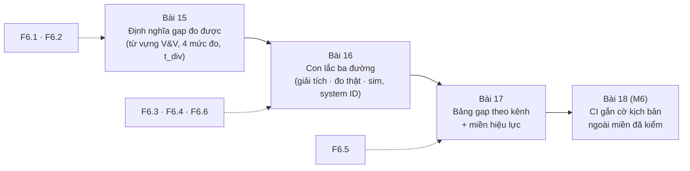
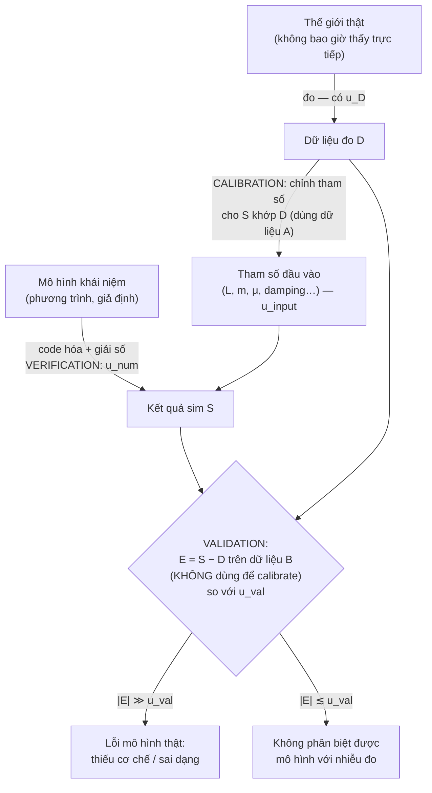
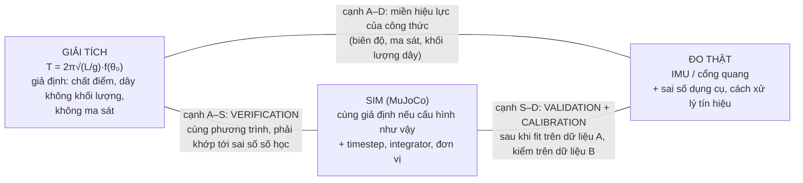
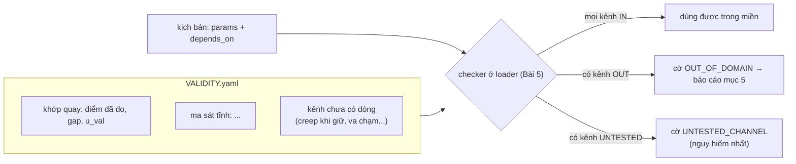

# Khóa 6 · Module 5 — Đo sim-to-real gap (20h)

> Nguồn xương sống: `khoa-6-sim-eval-infra.md` (Module 5). Bản gốc gọi module này là "moat": nếu phải cắt scope thì cắt Module 3 xuống MVP, **không cắt module này**. Quy chuẩn soạn: `giao-trinh/_QUY-CHUAN.md`.

Bốn module đầu cho bạn một công cụ CI tốt. Nhiều người xây được thứ đó. Module này trả lời câu hỏi mà công cụ CI không tự trả lời được: **phán quyết PASS trong sim có nghĩa gì ngoài đời?** Nghề này có một truyền thống lâu đời cho câu hỏi đó: **V&V (verification & validation)** của hàng không, hạt nhân, thiết bị y tế. Ba bài dưới đây dạy truyền thống đó trên một con lắc giá vài chục nghìn đồng.



| Bài | Giờ | Viên nang nền cần trước | Quyết định ra được |
|---|---|---|---|
| 15 | 6 | F6.1, F6.2, F1.1, F1.2 | Với mỗi hiện tượng: so bằng đại lượng, quỹ đạo, hay phân bố, và ngưỡng ε là bao nhiêu |
| 16 | 8 | F6.3, F6.4, F6.6, F1.6, F5.6 | Tham số sim nào phải đo, tham số nào fit, mô hình ma sát nào đủ dạng |
| 17 | 6 | F6.5, F3.7 | Kịch bản đánh giá nào được phép kết luận, kịch bản nào phải gắn cờ |

---

## Bài 15 — Định nghĩa gap sao cho đo được (6h)

> **Vị trí:** Bài 14 (domain randomization) → **Bài 15** → Bài 16 (con lắc ba đường) · **Cần trước:** F6.1, F6.2, F1.1 (độ bất định), F1.2 (phân bố), K6 Bài 3 (săn nguồn phá determinism), K5 Bài 16 (validation theo vật lý) · **Sau bài này bạn quyết định được:** với một hiện tượng cụ thể, gap được đo bằng mức nào (đại lượng, quỹ đạo, phân bố, chuyển giao), ngưỡng chấp nhận là bao nhiêu so với độ bất định của chính phép đo, và khi nào một con số gap là vô nghĩa.

### 1. Câu chuyện — ai đã khổ vì chuyện này

**Cầu Tacoma Narrows, 1940** [chuẩn]. Cầu treo ở bang Washington thông xe ngày 1/7/1940, sập ngày 7/11/1940 trong gió chỉ khoảng 60–70 km/h, không phải bão. Thiết kế dùng "deflection theory", lý thuyết tĩnh học tốt nhất thời đó cho cầu treo, và phép tính trong lý thuyết ấy không sai: bản mặt cầu mảnh chịu đúng tải gió tĩnh như tính toán. Cái thiếu là **một cơ chế**: tương tác khí động đàn hồi (aeroelastic flutter). Ở một tốc độ gió nhất định, dao động xoắn của bản mặt cầu tự lấy năng lượng từ dòng khí, tức là gió đóng vai trò damping âm. Mô hình không có số hạng đó, nên không tham số nào trong mô hình, dù hiệu chỉnh khéo đến đâu, có thể dự đoán được sự sập. Nhiều sách vật lý phổ thông còn kể sai thành "cộng hưởng với gió": Billah và Scanlan (1991) đã viết riêng một bài để sửa cách kể này.

Sau những sự cố kiểu này, ngành kỹ thuật tách hai câu hỏi mà người ngoài hay gộp làm một. **Verification:** *tôi có giải đúng phương trình của tôi không?* (code đúng, solver hội tụ, sai số số học nhỏ). **Validation:** *tôi có giải đúng phương trình không?* (phương trình có mô tả thế giới thật trong miền tôi dùng không). Tacoma Narrows là trường hợp verification đạt nhưng validation trượt. Phần lớn "sim-to-real gap" trong robotics thuộc cùng loại đó, và câu "sim không giống thật" không chỉ ra được chỗ hỏng nằm ở tầng nào.

### 2. Mô hình tư duy



Bốn câu chốt:

1. **Một mô hình là một phép trừu tượng có miền hiệu lực** (→ F6.1). `T = 2π√(L/g)` là mô hình. MuJoCo là mô hình. Mạng neural của bạn cũng là mô hình. Câu hỏi đúng không phải "mô hình có đúng không" mà là "đúng tới đâu, trong miền nào, cho quyết định nào".
2. **V, V và C là ba hoạt động khác nhau** (→ F6.2). Verification so code với phương trình. Validation so phương trình với thế giới. Calibration chỉnh tham số cho khớp dữ liệu. **Calibration không phải validation**: nếu bạn fit tham số trên dữ liệu A rồi khoe khớp trên chính dữ liệu A thì bạn chưa validate gì cả. Validation phải dùng dữ liệu B không tham gia fit. Phần G của Bài 16 tồn tại vì lý do này.
3. **Gap chỉ có nghĩa khi đặt cạnh độ bất định.** ASME V&V 20 định nghĩa sai số so sánh `E = S − D` và độ bất định validation `u_val = √(u_num² + u_input² + u_D²)` [spec, ASME V&V 20-2009; kiểm định nghĩa trong bản bạn đọc]. Nếu |E| nhỏ hơn hoặc cỡ u_val, bạn **không biết** mô hình sai bao nhiêu, chỉ biết nó không sai nhiều hơn mức đó. "Sim lệch 0.5%" mà không kèm u_val thì không phải một phép đo.
4. **Mức đo phải hợp với động lực học của hiện tượng.** Hệ đều đặn thì sai lệch tăng chậm (tuyến tính theo thời gian với sai tham số) nên so được quỹ đạo. Hệ hỗn loạn thì sai lệch tăng theo hàm mũ, quỹ đạo đơn lẻ mất nghĩa sau vài giây, chỉ còn phân bố là so được.

**Bốn mức đo** (giữ từ bản gốc, thêm cột "sai số đo đi kèm"):

| Mức | Đo gì | Khi nào dùng | Metric | Sai số đi kèm phải báo |
|---|---|---|---|---|
| **1 — Đại lượng tất định** | Chu kỳ, tần số, thời gian rơi, góc bắt đầu trượt | Hiện tượng có công thức giải tích. **Bắt đầu ở đây** | Sai số tương đối, kèm u_val | u_D từ dụng cụ đo, u_input từ tham số đo tay |
| **2 — Quỹ đạo** | Sai lệch theo thời gian e(t) = ‖x_sim(t) − x_real(t)‖ | Hệ không hỗn loạn, cửa sổ ngắn | **Thời gian phân kỳ t_div(ε)**, RMSE trong cửa sổ [0, t_div] | Sai số căn thời gian (→ F4.6), ε ≥ vài lần nhiễu đo |
| **3 — Phân bố** | Khoảng cách giữa phân bố kết quả sim và thật | Hệ tiếp xúc, hỗn loạn | Wasserstein-1 kèm bootstrap CI và **sàn A/A** | Sàn A/A: khoảng cách giữa hai mẫu thật với nhau |
| **4 — Chuyển giao hiệu năng** | Tương quan giữa success rate sim và thật trên nhiều policy | Cần robot thật, để Khóa 7 | Tương quan hạng (Spearman), sai số dự đoán success thật | CI của success rate thật (Wilson, → F1.4) |

**Thời gian phân kỳ** (bản gốc đề xuất, giữ nguyên): `t_div(ε) = inf{ t : e(t) > ε }`. Nó trả lời câu hỏi vận hành "tôi tin được dự đoán của sim trong bao lâu", và với hệ hỗn loạn nó có một tính chất phản trực giác mà bài tập dự đoán dưới đây buộc bạn đối mặt.

### 3. Cầu nối từ backend

| Backend bạn biết | Ở đây | Gãy ở chỗ | Nếu dùng nhầm thì |
|---|---|---|---|
| Mock server bạn tự viết để sinh bộ test chuẩn; consumer-driven contract test (Pact) kiểm mock có còn khớp provider thật | Simulator là mock của vật lý; validation là contract test của mock với thế giới | Contract của API là rời rạc (trường, kiểu, mã lỗi) và liệt kê hết được. "Contract" của vật lý là liên tục, phụ thuộc trạng thái, và sai lệch **tích lũy theo thời gian**. Mock sai thì test vỡ ồn ào; sim sai thì policy học khai thác lỗi sim một cách im lặng | Tưởng "sim đã pass contract test" sau vài phép so điểm, trong khi gap nằm ở vùng trạng thái chưa ai so |
| Unit test + type check của service | Verification: code giải đúng phương trình | Unit test xanh nói rằng code làm đúng điều bạn viết. Nó không nói điều bạn viết là đúng về vật lý | Gọi test suite của simulator là "validation" (đúng lỗi Tacoma: phép tính đúng, mô hình thiếu cơ chế) |
| Shadow traffic / replay request từ prod sang bản mới, diff response | So quỹ đạo (mức 2) | Replay HTTP là tất định theo request. Vật lý hỗn loạn khuếch đại sai lệch 10⁻¹² thành khác biệt vĩ mô sau vài giây | Diff quỹ đạo của hệ tiếp xúc sau 5 giây rồi kết luận "sim sai hoàn toàn" |
| Holdover của đồng hồ (K5): sau mất đồng bộ bao lâu thì lệch quá ngưỡng | t_div: sau bao lâu dự đoán của sim lệch quá ε | Lệch đồng hồ tăng tuyến tính/bậc hai, dự đoán được. Hệ hỗn loạn tăng hàm mũ, và tăng độ chính xác ban đầu mua được rất ít thời gian | Ước lượng t_div của hệ tiếp xúc bằng cách ngoại suy tuyến tính từ vài trăm ms đầu |
| A/A test trong experimentation platform | Sàn A/A của mức 3: khoảng cách giữa hai mẫu thật với nhau | Bạn quen A/A cho tỉ lệ chuyển đổi; ở đây nó áp cho khoảng cách phân bố, và Wasserstein thực nghiệm **dương** ngay cả khi hai phân bố giống hệt | Báo "gap W1 = 17 mm" mà không biết sàn A/A cũng cỡ đó |

**Tên chuẩn của thứ bạn đã làm:** khi bạn viết mock server và kiểm nó với service thật, bạn đã làm *validation of a surrogate model*. Khi bạn đo trên host "yên tĩnh" để giảm nhiễu, bạn đang giảm u_D. Chỗ còn thiếu: bạn chưa bao giờ phải báo **u_val** và chưa phải phân biệt verification, validation và calibration như ba hoạt động có trách nhiệm khác nhau.

**Chấm mô hình:**

- *"Sim-to-real gap = RMSE giữa quỹ đạo sim và quỹ đạo thật."* **SAI** cho hệ tiếp xúc, **ĐÚNG MỘT PHẦN** cho hệ đều đặn trong cửa sổ ngắn. Chỗ gãy: RMSE trên cửa sổ dài của hệ hỗn loạn đo độ nhạy điều kiện đầu, không đo độ đúng của mô hình. Phản ví dụ: hai lần chạy cùng một simulator, cùng mô hình, chỉ khác 10⁻⁹ ở điều kiện đầu, vẫn cho RMSE vĩ mô sau vài chục giây (đo được bằng code ở phần 5).
- *"Simulator deterministic thì kết quả sim không có sai số."* **SAI.** Determinism (Module 1) nghĩa là lặp lại được, không có nghĩa là đúng. Sim tất định vẫn mang sai số rời rạc hóa (timestep, integrator), sai số tham số và sai số cấu trúc. Phản ví dụ: Euler hiện với dt = 0.01 s cho con lắc không ma sát tăng năng lượng theo thời gian, và lặp lại bit-exact y hệt mỗi lần chạy (Bài 16).
- *"Fit được tham số để sim khớp dữ liệu nghĩa là sim đúng."* **SAI.** Đó là calibration. Một mô hình sai dạng vẫn fit khớp được một tập dữ liệu hẹp. Phản ví dụ: damping nhớt bậc một fit đẹp ở biên độ 30°, đoán sai ở 45° khi ma sát thật có thành phần bậc hai (Bài 16 phần G).

### 4. Thuật ngữ

| Mức | Thuật ngữ | Nghĩa trong một câu | Hay bị hiểu nhầm thành |
|---|---|---|---|
| 🟢 | Verification | Kiểm code và solver giải đúng phương trình đã chọn | "Test pass là mô hình đúng" |
| 🟢 | Validation | Kiểm phương trình đã chọn mô tả đúng thế giới, trong một miền, với độ bất định nêu rõ | Đồng nghĩa với verification; hoặc "khớp dữ liệu đã fit" |
| 🟢 | Calibration | Chỉnh tham số mô hình cho khớp dữ liệu đo | Validation (sai: phải dùng dữ liệu khác để validate) |
| 🟢 | Miền hiệu lực (domain of validity) | Vùng điều kiện mà ở đó gap đã được đo và chấp nhận được | "Mô hình đúng" không kèm điều kiện |
| 🟢 | Thời gian phân kỳ t_div(ε) | Thời điểm đầu tiên sai lệch sim–thật vượt ε | Một hằng số của simulator (thực ra phụ thuộc ε, trạng thái đầu và hiện tượng) |
| 🟢 | u_val (validation uncertainty) | Độ bất định gộp của số học, tham số đầu vào và phép đo, dùng để đọc E = S − D | Bỏ qua, so thẳng S với D |
| 🟢 | Sàn A/A | Giá trị metric khi so hai mẫu cùng nguồn; dưới mức này không phân biệt được | Nghĩ rằng metric bằng 0 khi hai phân bố giống nhau |
| 🟡 | Wasserstein-1 (earth mover's distance) | "Công" nhỏ nhất để dời phân bố này thành phân bố kia, cùng đơn vị với dữ liệu | Một kiểm định (nó là khoảng cách, không có p-value) |
| 🟡 | Kolmogorov–Smirnov hai mẫu | Kiểm định hai mẫu cùng phân bố, dựa trên chênh lệch CDF lớn nhất | "p > 0.05 nghĩa là hai phân bố giống nhau" |
| 🟡 | Lyapunov exponent | Tốc độ tăng hàm mũ của sai lệch nhỏ trong hệ hỗn loạn | Thứ phải tự tính (chỉ cần trực giác: e^{λt}) |
| 🟡 | NASA-STD-7009, ASME V&V 10/20/40 | Các chuẩn về độ tin cậy mô hình–mô phỏng (NASA; cơ học vật rắn; CFD và truyền nhiệt; thiết bị y tế) | Thứ phải đọc trọn (chỉ cần nắm khung) |
| 🔴 | Tích phân elliptic, chứng minh hỗn loạn | Toán đằng sau | Điều kiện để làm bài này |

### 5. Dự đoán

Bài tập gồm ba phần. Viết dự đoán vào `prediction.md`, **commit**, rồi mới chạy code hoặc mở khối 🔒.

**Dự đoán A — chọn mức.** Với mỗi hiện tượng sau, chọn mức đo (1/2/3/4), lý do một câu, và ε hoặc ngưỡng ban đầu kèm cách bạn suy ra nó từ sai số dụng cụ (tra sai số gyro/accel trong datasheet IMU bạn dùng ở K5 Bài 4, độ phân giải thời gian từ K5 Bài 7–11):
(a) chu kỳ con lắc; (b) đường cong suy giảm biên độ con lắc; (c) thời gian rơi 1 m của bi thép; (d) góc bắt đầu trượt của hộp trên mặt nghiêng; (e) vị trí dừng của hộp sau một cú đẩy; (f) robosuite: khối hộp có được nhấc lên 10 cm không; (g) tay máy di chuyển trong không khí theo một quỹ đạo khớp cho trước.

**Dự đoán B — t_div.** "Thật" là con lắc với L = 0.500 m; "sim" giống hệt nhưng L sai một tỉ lệ δ. Ngưỡng ε = 0.05 rad. Dự đoán đường t_div(δ) với δ từ 10⁻⁸ đến 10⁻¹ cho: (i) con lắc đơn biên độ 30°; (ii) con lắc kép thả từ (120°, −20°). Phương pháp cho (i): sai L một tỉ lệ δ làm chu kỳ sai δ/2 (vì T ∝ √L), sai số pha tăng tuyến tính theo số chu kỳ; viết biểu thức t_div theo ε, T, θ₀, δ và tính. Cho (ii): chỉ cần dự đoán **hình dạng** (giảm theo log δ? theo 1/δ? phẳng?) và giải thích. Thêm một câu: nếu bạn làm sim chính xác hơn 10.000 lần (δ nhỏ đi 10⁴), t_div của con lắc kép tăng bao nhiêu?

**Dự đoán C — mức 3 với n nhỏ.** Vị trí dừng của vật sau cú đẩy, thật ~ N(0, 50 mm), sim lệch 5 mm. Với n = 20, 200, 2.000, 20.000 mẫu mỗi bên: KS cho p-value thế nào? W1 đo được so với 5 mm thật thế nào? Sàn A/A (W1 giữa hai mẫu thật) cỡ bao nhiêu?

```markdown
# prediction.md — K6 Bài 15
Ngày: ____  Commit trước khi chạy: [ ]
## A. Chọn mức
| Hiện tượng | Mức | Lý do | ε / ngưỡng | ε suy từ sai số dụng cụ nào |
|---|---|---|---|---|
| (a) chu kỳ con lắc | | | | |
| ... (b)–(g) | | | | |
## B. t_div
- Biểu thức t_div cho con lắc đơn: ______  -> δ=1e-3: ___ s ; δ=1e-2: ___ s
- Hình dạng t_div(δ) cho con lắc kép: ______ vì ______
- Sim chính xác hơn 10^4 lần mua thêm được: ___ s
## C. Mức 3
| n | KS p-value (lớn/nhỏ?) | W1 đo (mm) | Sàn A/A (mm) |
|---|---|---|---|
## Điều tôi chắc nhất / ít chắc nhất: ______
```

### 6. Làm

1. **Viết `GAP_METRICS.md`** (giữ từ bản gốc). Với mỗi hiện tượng bạn định đo ở Bài 16–17 và mỗi task đánh giá của Module 4: mức đo, lý do, metric, ε hoặc ngưỡng, **ε suy từ sai số dụng cụ nào** (cột mới), dữ liệu nào dùng để calibrate và dữ liệu nào để validate (cột mới, tách bạch A/B).
2. **Implement metric mức 1 và 3** trong `sim_eval/metrics/gap.py` (giữ từ bản gốc):
   - Mức 1: `rel_error(S, D)` trả về E, E/D, **kèm u_val** khi được truyền u_num, u_input, u_D. Hàm phải từ chối trả "gap" khi thiếu u_D, hoặc trả kèm cờ `uncertainty_unknown`.
   - Mức 3: `wasserstein_gap(sim, real)` trả về W1, bootstrap 95% CI, và **sàn A/A** (chia đôi mẫu thật, tính W1 giữa hai nửa, lặp bằng bootstrap). Chạy `b15_level3.py` bên dưới để thấy vì sao cần sàn này.
   - KS chỉ dùng làm phụ: báo cả thống kê D lẫn p-value, kèm n. **Không** viết "p > 0.05 ⇒ sim giống thật".
3. **Định nghĩa và implement thời gian phân kỳ** (giữ từ bản gốc): `t_div(traj_sim, traj_real, eps, align)`. Bắt buộc có bước căn thời gian (`align`): dùng cạnh xung kích hoạt chung hoặc cross-correlation như K5 (→ F4.6). Sai lệch căn thời gian Δt sinh ra sai lệch giả `e ≈ |ẋ|·Δt`, nên ε phải lớn hơn vài lần `max|ẋ|·u(Δt)`.
4. **Unit test cho metric** (bổ sung, vì metric là một dụng cụ đo, → F2.1): (a) W1 của một mảng với chính nó = 0; (b) W1 của hai mẫu từ cùng phân bố > 0 và giảm theo √n; (c) dịch cả mẫu sim đi c thì W1 ≈ c khi n lớn; (d) t_div của hai quỹ đạo giống hệt = ∞; (e) một canary: quỹ đạo sim bị trễ cố ý 20 ms phải cho t_div hữu hạn đúng như công thức `ε/(max|ẋ|)`.
5. **Chạy hai mô phỏng đồ chơi** để kiểm dự đoán B và C (code dưới), rồi mới mở 🔒.

```python
# [đã chạy] Thời gian phân kỳ t_div khi "sim" sai chiều dài L một tỉ lệ rất nhỏ
import numpy as np, matplotlib
matplotlib.use("Agg")
import matplotlib.pyplot as plt
from scipy.integrate import solve_ivp

g, L0, T = 9.787, 0.5, 60.0
ts = np.linspace(0, T, 60001)
def single(t, y, L):                   # con lắc đơn: y = [θ, ω]
    return [y[1], -g / L * np.sin(y[0])]

def double(t, y, L):                   # con lắc kép, hai khối bằng nhau, hai dây dài L
    t1, w1, t2, w2 = y; d = t1 - t2
    den = 3 - np.cos(2 * d)
    a1 = (-3*g*np.sin(t1) - g*np.sin(t1 - 2*t2)
          - 2*np.sin(d)*(w2**2*L + w1**2*L*np.cos(d))) / (L*den)
    a2 = (2*np.sin(d)*(2*w1**2*L + 2*g*np.cos(t1) + w2**2*L*np.cos(d))) / (L*den)
    return [w1, a1, w2, a2]

def run(f, y0, L, tol=1e-11):
    return solve_ivp(f, (0, T), y0, args=(L,), t_eval=ts, rtol=tol, atol=tol, method="DOP853").y[0]

def first_exceed(a, b, eps=0.05):      # lần đầu |θa - θb| > eps rad
    idx = np.flatnonzero(np.abs(a - b) > eps)
    return ts[idx[0]] if idx.size else np.inf

ic_s = [np.radians(30), 0]
ic_d = [np.radians(120), 0, np.radians(-20), 0]
ref_s, ref_d = run(single, ic_s, L0), run(double, ic_d, L0)
errs = np.logspace(-8, -1, 8)
td_s = [first_exceed(ref_s, run(single, ic_s, L0 * (1 + e))) for e in errs]
td_d = [first_exceed(ref_d, run(double, ic_d, L0 * (1 + e))) for e in errs]
# "sàn số học": cùng L, chỉ khác dung sai của bộ giải -> sai số do chính solver
floor_d = first_exceed(run(double, ic_d, L0, 1e-9), run(double, ic_d, L0, 1e-13))
for e, a, b in zip(errs, td_s, td_d):
    print(f"sai lệch L = {e:.0e}   t_div đơn = {a:6.2f} s   t_div kép = {b:6.2f} s")
print(f"sàn số học con lắc kép (rtol 1e-9 vs 1e-13): {floor_d:.2f} s")

plt.semilogx(errs, np.where(np.isinf(td_s), np.nan, td_s), "o-", label="con lắc đơn")
plt.semilogx(errs, td_d, "s-", label="con lắc kép")
plt.axhline(floor_d, ls="--", c="gray", label="sàn số học (kép)")
plt.xlabel("sai lệch tương đối của L trong sim"); plt.ylabel("t_div (s), ngưỡng 0.05 rad")
plt.legend(); plt.grid(True, which="both", alpha=.3)
plt.savefig("b15_tdiv.png", dpi=120)   # trong bài: plt.show()
```

```python
# [đã chạy] Mức 3: p-value của KS phụ thuộc n; Wasserstein + bootstrap CI mới là "độ lớn gap"
import numpy as np
from scipy.stats import ks_2samp, wasserstein_distance

rng = np.random.default_rng(0)
shift = 0.005          # sim lệch thật 5 mm về vị trí dừng (độ lệch chuẩn 50 mm) -> gap rất nhỏ
for n in (20, 200, 2000, 20000):
    real = rng.normal(0.0, 0.05, n)            # vị trí dừng của vật sau cú đẩy, thật (m)
    sim = rng.normal(shift, 0.05, n)           # cùng thứ đó trong sim
    p = ks_2samp(real, sim).pvalue
    w = wasserstein_distance(real, sim)
    boot = [wasserstein_distance(rng.choice(real, n), rng.choice(sim, n)) for _ in range(300)]
    lo, hi = np.percentile(boot, [2.5, 97.5])
    aa = wasserstein_distance(rng.normal(0, 0.05, n), rng.normal(0, 0.05, n))  # A/A: thật vs thật
    print(f"n={n:6d}  KS p={p:7.4f}   W1={w*1e3:6.2f} mm  [bootstrap 95%: {lo*1e3:5.2f}–{hi*1e3:5.2f} mm]   sàn A/A={aa*1e3:5.2f} mm")
```

Sai số của "dụng cụ" ở bước này: các mô phỏng đồ chơi dùng `rtol = 1e-11`, và chính dung sai đó có một t_div riêng (dòng "sàn số học"). Mọi t_div đo được lớn hơn sàn số học đều không đáng tin. Đây là verification của chính phép đo verification.

### 7. Số phải ra

<details><summary>🔒 MỞ SAU KHI COMMIT prediction.md</summary>

**A. Chọn mức (đáp án tham khảo, chấm theo lý do):**

| Hiện tượng | Mức | Lý do |
|---|---|---|
| (a) chu kỳ con lắc | 1 | Có công thức, đại lượng tất định, đo được tới ms |
| (b) suy giảm biên độ | 2 (trong cửa sổ ngắn) + 1 (γ hoặc độ giảm mỗi chu kỳ) | Hệ đều đặn; so đường bao biên độ, không so pha sau nhiều chu kỳ |
| (c) rơi tự do 1 m | 1 | t = √(2h/g); hiện tượng ngắn, không hỗn loạn |
| (d) góc bắt đầu trượt | 1, nhưng lặp nhiều lần và báo phân bố | Ma sát tĩnh dao động giữa các lần thử; mỗi lần là một đại lượng, tập các lần là một phân bố |
| (e) vị trí dừng sau cú đẩy | 3 | Tiếp xúc + ma sát; nhạy với điều kiện đầu |
| (f) nhấc hộp 10 cm | 3 (tỉ lệ thành công là một phân bố Bernoulli) → 4 khi có robot thật | Episode tiếp xúc, hỗn loạn |
| (g) tay máy trong không khí | 2 | Động học tay máy không tiếp xúc là đều đặn trong cửa sổ ngắn |

**B. t_div** (đã chạy với scipy 1.18, numpy 2.5):

| δ (sai lệch L) | t_div con lắc đơn | t_div con lắc kép |
|---|---|---|
| 1e-8 … 1e-4 | > 60 s (chưa phân kỳ) | ≈ 25.7 s (gần như **không đổi**) |
| 1e-3 | ≈ 43.7 s | ≈ 11.6 s |
| 1e-2 | ≈ 4.6 s | ≈ 2.1 s |
| 1e-1 | ≈ 0.9 s | ≈ 0.24 s |
| Sàn số học (rtol 1e-9 vs 1e-13) | — | ≈ 12.9 s |

- Con lắc đơn: biểu thức gần đúng `t_div ≈ ε·T/(π·θ₀·δ)`. Với ε = 0.05, T ≈ 1.44 s, θ₀ = 0.524 rad: δ = 1e-3 → ≈ 44 s, δ = 1e-2 → ≈ 4.4 s. Khớp mô phỏng, quan hệ **1/δ**: làm sim chính xác hơn 10 lần thì tin được lâu hơn 10 lần.
- Con lắc kép: ở δ ≤ 1e-4, t_div gần như phẳng. Sai lệch nằm dưới ε cho tới một "điểm quyết định" (con lắc lật hay không lật), rồi bùng lên. Chính xác hơn 10.000 lần (1e-4 → 1e-8) mua được **0 giây**. Trong vùng hàm mũ, mỗi bậc chính xác chỉ mua thêm một khoảng cố định cỡ ln(10)/λ, và ở đây còn bị chặn bởi cấu trúc quỹ đạo.
- Sàn số học: hai lần giải **cùng một phương trình** với dung sai khác nhau phân kỳ sau khoảng 13 s. Solver của MuJoCo dùng bước cố định 2 ms, thô hơn nhiều so với rtol 1e-9, nên với hệ hỗn loạn **bản thân sim** có t_div ngắn hơn thế. So quỹ đạo sim–thật của hệ tiếp xúc sau vài giây là đo sai số số học và độ nhạy, không đo vật lý.

**C. Mức 3** (một lần chạy, seed 0; các con số dao động theo seed):

| n | KS p | W1 đo | Bootstrap 95% | Sàn A/A |
|---|---|---|---|---|
| 20 | ≈ 0.57 | ≈ 17 mm | 8–41 mm | ≈ 40 mm |
| 200 | ≈ 0.11 | ≈ 8 mm | 5–18 mm | ≈ 10 mm |
| 2.000 | ≈ 0.06 | ≈ 3.6 mm | 2–7 mm | ≈ 1.9 mm |
| 20.000 | ≈ 0 | ≈ 5.1 mm | 4.2–6.1 mm | ≈ 0.8 mm |

- W1 thực nghiệm **chệch lên** khi n nhỏ (ở n = 20 đo ra 17 mm cho gap thật 5 mm) vì hai mẫu hữu hạn từ cùng một phân bố vẫn cách nhau cỡ σ/√n. Chỉ khi W1 vượt rõ sàn A/A thì con số mới mang thông tin.
- KS: cùng một gap 5 mm, p-value đi từ "không có gì" tới "cực kỳ có ý nghĩa" chỉ vì n tăng. p-value đo **lượng bằng chứng**, không đo **độ lớn gap**. Ở n đủ lớn, mọi sim đều bị KS bác bỏ; câu hỏi đúng là gap có lớn hơn mức quyết định của bạn chịu được không.

Lệch so với bảng là bình thường nếu bạn đổi seed hoặc phiên bản thư viện; hình dạng (1/δ vs phẳng/log, W1 chệch lên ở n nhỏ) thì không được đổi.
</details>

### 8. Nếu ra khác

| Triệu chứng | Nguyên nhân khả dĩ | Kiểm bằng cách | Sửa |
|---|---|---|---|
| t_div luôn bằng 0 | ε nhỏ hơn nhiễu đo hoặc sai số căn thời gian | So ε với `σ_đo` và `max|ẋ|·u(Δt)` | Đặt ε ≥ 3× tổng hai thứ đó; ghi lý do vào `GAP_METRICS.md` |
| Hai quỹ đạo lệch ngay từ mẫu đầu | Chưa căn mốc thời gian, hoặc điều kiện đầu sim ≠ thật | Vẽ chồng 0.5 s đầu; cross-correlation tìm độ trễ | Căn bằng cạnh xung chung (K5 Bài 11) hoặc cross-correlation (→ F4.6); lấy điều kiện đầu sim từ chính số đo thật |
| W1 cực lớn hoặc vô nghĩa khi gộp nhiều chiều | Trộn đơn vị (rad với m với N) | In W1 từng chiều | Tính W1 **từng chiều** với đơn vị gốc trước; nếu cần một con số gộp thì chuẩn hóa theo **sai số dụng cụ** hoặc theo ngưỡng quyết định của từng chiều, ghi rõ cách chuẩn hóa |
| `scipy.stats.wasserstein_distance` báo lỗi với mảng 2D | Hàm này cho phân bố một chiều [tự đo theo phiên bản scipy] | Đọc docstring bản bạn cài | Dùng từng chiều, hoặc thư viện optimal transport (POT) cho nhiều chiều |
| Unit test (b) fail: W1 hai mẫu cùng phân bố = 0 | Bạn truyền cùng một mảng hai lần, hoặc seed giống nhau | In 5 phần tử đầu mỗi mảng | Dùng hai generator độc lập (`np.random.default_rng` với seed khác nhau, như Bài 3) |
| t_div của sim với chính nó (cùng seed) hữu hạn | Mất determinism | Chạy lại harness kiểm determinism Bài 4 | Quay về Module 1; không đo gap trên một sim không lặp lại được |

### 9. Câu hỏi ngược

1. **[Quy mô]** Bạn có 100 hiện tượng × 20 kịch bản × mỗi cái cần mức 3 với sàn A/A. Ở quy mô đó, thứ gì gãy trước: số lần đo thật, chi phí sim, hay khả năng người đọc hiểu bảng?
   <details><summary>Hướng nghĩ</summary>Mức 3 cần nhiều mẫu **thật**, và mẫu thật đắt hơn mẫu sim hàng nghìn lần. Sàn A/A cũng ăn mẫu thật. Nghĩ xem hiện tượng nào có thể hạ xuống mức 1 (đo tham số rời như μ, γ) để giảm số lần đo thật, và đâu là giới hạn của việc "phân rã" một hiện tượng tiếp xúc thành các tham số rời.</details>
2. **[Failure mode]** Metric gap của bạn là một dụng cụ đo. Kể ba cách nó báo "gap nhỏ" trong khi gap thật lớn.
   <details><summary>Hướng nghĩ</summary>Cửa sổ thời gian quá ngắn; phép chiếu xuống một chiều làm mất khác biệt (hai phân bố 2D khác nhau nhưng cùng phân bố biên); dữ liệu validate trùng dữ liệu calibrate; ε rộng hơn mức quyết định cần. Mỗi cách, bạn sẽ viết canary nào để bắt (→ F2.5)?</details>
3. **[Vì sao không]** Vì sao không định nghĩa một "sim-to-real score" duy nhất cho cả simulator, như một chỉ số SLO?
   <details><summary>Hướng nghĩ</summary>Gap phụ thuộc hiện tượng, miền và quyết định cần ra. Một con số gộp che mất kênh nào hỏng. Nghĩ về một SLO availability 99.9% gộp mọi endpoint: nó che endpoint thanh toán hỏng hoàn toàn thế nào.</details>
4. **[Nếu…thì]** Nếu t_div của hệ hỗn loạn gần như không tăng khi sim chính xác hơn, thì người làm MPC (model predictive control) sống thế nào với simulator làm mô hình dự đoán?
   <details><summary>Hướng nghĩ</summary>Họ không cần dự đoán xa: horizon ngắn hơn t_div, rồi đo lại trạng thái và tính lại (vòng phản hồi). Liên hệ với cách bạn thiết kế retry/timeout: không dự đoán cả hệ, chỉ dự đoán đủ xa để hành động rồi quan sát lại.</details>
5. **[Liên ngành]** Dự báo thời tiết có giới hạn dự báo cỡ hai tuần dù siêu máy tính mạnh lên mỗi năm. Họ chuyển từ "một dự báo" sang "ensemble". Đó là mức nào trong bảng bốn mức, và họ chấm ensemble bằng gì?
   <details><summary>Hướng nghĩ</summary>Ensemble là mức 3: so phân bố dự báo với kết quả. Họ dùng điểm xác suất (ví dụ CRPS) thay vì RMSE của một đường. Khác biệt: thời tiết không reset được điều kiện đầu, còn robot thì có thể chạy lại kịch bản nhiều lần.</details>
6. **[Phản biện]** Một đồng nghiệp nói: "Validation chỉ có nghĩa với robot thật. Mọi thứ trên con lắc là đồ chơi." Phản biện bằng định nghĩa ở phần 2.
   <details><summary>Hướng nghĩ</summary>Validation là so phương trình với thế giới **trong một miền**. Con lắc kiểm tầng khớp quay, trọng lực, damping và quy trình đo. Câu hỏi đúng: miền của con lắc giao với miền của task robot ở đâu (khớp quay có tải, tiếp xúc thì không), và vì sao điều đó phải ghi vào cột "chưa kiểm" ở Bài 17.</details>

### 10. Liên kết ra ngoài

- **Hàng không vũ trụ: NASA-STD-7009.** Chuẩn mô hình và mô phỏng của NASA ra đời sau tai nạn tàu Columbia; nó bắt mọi kết quả mô phỏng dùng cho quyết định phải báo kèm **độ tin cậy đã đánh giá** (verification, validation, độ bất định kết quả, lịch sử dùng…), và bản B (2024) tách đánh giá năng lực mô hình khỏi đánh giá từng kết quả [spec, NASA-STD-7009B; kiểm danh sách yếu tố trong bản bạn đọc]. Giống: tách V, V và độ bất định. Khác: NASA có ngân sách đo thật lớn và hậu quả tính bằng mạng người, nên mức nghiêm ngặt được chia theo rủi ro của quyết định. Bạn nên áp đúng ý đó: kịch bản dùng để quyết merge cần ít bằng chứng hơn kịch bản dùng để quyết chạy trên robot thật.
- **Khí tượng: giới hạn dự báo và ensemble.** Lorenz (1963) chỉ ra một hệ đối lưu đơn giản cũng nhạy điều kiện đầu. Ngành khí tượng sống chung với điều đó bằng cách dự báo phân bố, không dự báo đường. Giống: t_div và mức 3. Khác: họ không có "thật" để reset, còn bạn có.
- **Thiết bị y tế: ASME V&V 40.** Chuẩn này đưa ra khái niệm *context of use*: mô hình được đánh giá đáng tin **cho một câu hỏi cụ thể**, và mức bằng chứng cần có tăng theo ảnh hưởng của mô hình lên quyết định. Giống: miền hiệu lực gắn với quyết định. Khác: cơ quan quản lý là người chấm, không phải chính đội làm mô hình.

### 11. Độ tin cậy và sửa lỗi

| Khẳng định | Nhãn | Ghi chú / cách kiểm |
|---|---|---|
| Tacoma Narrows sập 7/11/1940 do flutter khí động đàn hồi (xoắn), không phải cộng hưởng cưỡng bức đơn giản | [chuẩn] | Billah & Scanlan 1991, Am. J. Phys. 59(2) |
| Verification = "solving the equations right", validation = "solving the right equations" | [chuẩn] | Cách nói phổ biến trong cộng đồng V&V tính toán (Roache; Oberkampf & Roy 2010) |
| E = S − D, u_val = √(u_num² + u_input² + u_D²) | [spec] | ASME V&V 20-2009. Kiểm ký hiệu chính xác trong bản bạn đọc |
| NASA-STD-7009B phê duyệt 3/2024, thay bản A | [spec] | standards.nasa.gov, trang NASA-STD-7009 |
| Bảng t_div và mức 3 | [tự đo] | Đã chạy với numpy 2.5.3, scipy 1.18.1; số đổi theo seed, hình dạng không đổi |
| `wasserstein_distance` của scipy là cho dữ liệu 1D | [tự đo] | Kiểm docstring theo phiên bản bạn cài |

**Đã sửa so với bản gốc / Gemini:**
- Gemini: "Wasserstein trên hai tập dữ liệu giống nhau phải bằng chính xác 0; KS kiểm tra hai tập có cùng phân phối hay không". Chỉ đúng khi hai **mảng** giống hệt. Hai **mẫu** từ cùng một phân bố cho W1 > 0 (sàn A/A, chệch lên ở n nhỏ), và KS không chứng minh "cùng phân bố" được: p lớn chỉ là thiếu bằng chứng. Đã thêm sàn A/A và bootstrap CI vào metric.
- Gemini gọi Pearson là "rank correlation". Pearson là tương quan tuyến tính; tương quan hạng là Spearman/Kendall. Mức 4 dùng Spearman.
- Gemini đề xuất chuẩn hóa z-score mọi chiều trước khi tính khoảng cách. Z-score theo phương sai dữ liệu làm "1 đơn vị" mỗi chiều phụ thuộc chính dữ liệu đang so; đã đổi thành: tính từng chiều trước, nếu gộp thì chuẩn hóa theo sai số dụng cụ hoặc ngưỡng quyết định.
- Bản gốc định nghĩa bốn mức nhưng không gắn gap với độ bất định đo. Đã thêm u_val (ASME V&V 20) và sàn A/A: gap không kèm độ bất định không phải phép đo.
- Thêm "sàn số học" vào t_div: bản gốc nói đúng về phân kỳ trong cùng simulator (Module 1 Bài 3) nhưng chưa tách sai số số học khỏi sai số mô hình.

### 12. Đọc thêm và tự kiểm tra

- **Nguồn gốc:** NASA-STD-7009B *Standard for Models and Simulations* (2024), đọc phần định nghĩa và phần đánh giá độ tin cậy; ASME V&V 20-2009 (đọc mục về validation comparison error, nếu có quyền truy cập).
- **Giải thích:** W. L. Oberkampf & C. J. Roy, *Verification and Validation in Scientific Computing* (Cambridge University Press, 2010), chương 1–2 và chương về validation metrics.
- **Đào sâu (tùy chọn):** K. Y. Billah & R. H. Scanlan, "Resonance, Tacoma Narrows bridge failure, and undergraduate physics textbooks", *American Journal of Physics* 59(2), 1991.
- **Tự kiểm tra:** (1) giải thích lại cho một backend engineer khác trong 5 câu sự khác nhau giữa verification, validation, calibration, dùng ví dụ mock server; (2) vẽ lại sơ đồ phần 2 từ trí nhớ; (3) hai câu dưới.

**Câu 1.** Sim cho chu kỳ con lắc 1.4450 s, đo thật 1.4470 s. Đồng nghiệp viết "gap 0.14%, sim rất tốt". Bạn cần hỏi thêm ba con số nào trước khi đồng ý?
<details><summary>Đáp án</summary>u_D (độ bất định của phép đo chu kỳ: dụng cụ, số chu kỳ, cách tính), u_input (độ bất định của L, g, biên độ đưa vào sim), u_num (sai số timestep/integrator). Nếu u_val ≥ 2 ms thì "gap 0.14%" nằm trong nhiễu: chỉ kết luận được là gap không lớn hơn cỡ u_val. Thêm một câu hỏi thứ tư: dữ liệu 1.4470 s có phải chính là dữ liệu đã dùng để chỉnh L trong sim không (calibration ≠ validation).</details>

**Câu 2.** Vì sao, với một hệ hỗn loạn, việc nâng độ chính xác tham số sim lên 1.000 lần gần như không kéo dài t_div, trong khi với con lắc đơn nó kéo dài 1.000 lần?
<details><summary>Đáp án</summary>Con lắc đơn: sai số tham số tạo sai số pha tăng tuyến tính theo thời gian, nên t_div ∝ 1/δ. Hệ hỗn loạn: sai lệch tăng cỡ δ·e^{λt}, nên t_div ≈ ln(ε/δ)/λ; giảm δ đi 1.000 lần chỉ cộng thêm ln(1000)/λ, một khoảng cố định, và trên thực tế còn bị chặn bởi sai số số học và các "điểm quyết định" của quỹ đạo. Vì thế với hệ tiếp xúc người ta so phân bố (mức 3).</details>

---

## Bài 16 — Con lắc: ba đường phải gặp nhau (8h)

> **Vị trí:** Bài 15 (định nghĩa gap) → **Bài 16** → Bài 17 (bảng gap theo kênh) · **Cần trước:** F6.3 (tích phân số), F6.4 (nhận dạng hệ thống), F6.6 (độ nhạy), F1.1 (độ bất định), F1.6 (fit và residual), F5.6 (FFT, zero-crossing), K5 Bài 4 (raw IMU → đơn vị, g địa phương), K5 Bài 7–11 (ngân sách sai số thời gian), K3 Bài 7 (FFT) · **Sau bài này bạn quyết định được:** khi sim lệch thật, lỗi nằm ở cấu hình sim (verification), ở tham số (calibration) hay ở dạng mô hình (validation); tham số nào phải **đo**, tham số nào được **fit**, và một mô hình ma sát đã "đủ dạng" cho dải biên độ bạn cần hay chưa.

### 1. Câu chuyện — ai đã khổ vì chuyện này

**Mars Climate Orbiter, 1999** [chuẩn]. Tàu mất ngày 23/9/1999 khi vào quỹ đạo Sao Hỏa. Ban điều tra (Mishap Investigation Board, báo cáo Phase I tháng 11/1999) kết luận nguyên nhân gốc: một file phần mềm mặt đất tên "Small Forces", dùng trong mô hình quỹ đạo, ghi xung lực của các lần đốt động cơ nhỏ theo **pound-force·giây**, trong khi phần mềm điều hướng đọc nó như **newton·giây**, theo đúng đặc tả giao diện. Sai một hệ số 4.45. Mô hình quỹ đạo vẫn chạy, vẫn cho ra số, vẫn tất định, nhưng đánh giá thấp tác động của các lần đốt. Tàu đi vào khí quyển ở độ cao khoảng 57 km, trong khi ngưỡng nó được cho là chịu được là khoảng 80 km. Đội điều hướng đã thấy quỹ đạo đo được lệch dần so với mô hình trong nhiều tháng, nhưng sự lệch đó không được đẩy lên thành một câu hỏi chính thức. Chuỗi V&V, theo chính đánh giá của NASA sau đó, đã không bắt được chỗ sai.

Bài học cho bài này: **mô hình và phép đo đã lệch nhau, và có người nhìn thấy.** Thứ thiếu là một quy trình bắt sự lệch đó phải được giải thích trước khi đi tiếp. Con lắc là quy trình ấy thu nhỏ, và bạn sẽ gặp đúng lỗi đơn vị kiểu MCO: MuJoCo mặc định `g = 9.81`, và tham số `damping` của khớp **không cùng đơn vị** với hệ số suy giảm γ bạn fit từ dữ liệu.

### 2. Mô hình tư duy

Con lắc được chọn vì nó là hiện tượng hiếm hoi thỏa **cả ba**: có công thức giải tích, đo được bằng thiết bị bạn có, mô hình được trong MuJoCo bằng khoảng 20 dòng (giữ từ bản gốc). Đây là **kiểm tra chéo ba đường** của Khóa 1, nâng lên tầng cao nhất. Điều bản gốc chưa nói rõ: **mỗi cạnh của tam giác kiểm một thứ khác nhau.**



| Nếu… | …thì nghi ở đâu trước |
|---|---|
| A ≈ D nhưng S lệch cả hai | Cấu hình sim: đơn vị, g mặc định, quán tính, integrator (lỗi kiểu MCO) |
| A ≈ S nhưng D lệch | Phép đo (dụng cụ, xử lý tín hiệu) **hoặc** thế giới có cơ chế mà cả A lẫn S thiếu (ma sát, dây có khối lượng, cáp USB) |
| A lệch, S ≈ D | Công thức ra ngoài miền hiệu lực (biên độ lớn, con lắc vật lý); đây là điều bạn **muốn** thấy ở biên độ lớn |
| S ≈ D sau fit ở 30° nhưng lệch ở 45° | Dạng mô hình sai (ví dụ ma sát không phải nhớt bậc một); calibration đã che lỗi cấu trúc |

**Bốn ý bản chất:**

1. **Công thức cũng là một mô hình và có miền hiệu lực.** `T = 2π√(L/g)` đúng khi sin θ ≈ θ. Ở biên độ lớn, chu kỳ dài hơn; xấp xỉ bậc hai `T(θ₀) ≈ T₀(1 + θ₀²/16)` sửa phần lớn, và nghiệm chính xác dùng tích phân elliptic. Ngay cả xấp xỉ bậc hai cũng có miền hiệu lực của nó. Bạn sẽ đo được chỗ công thức sách giáo khoa bắt đầu sai, và tự kiểm xem ở biên độ lớn nhất trong bài, sai số của chính công thức sửa lỗi có lọt vào tầm đo của bạn không.
2. **Phép đo cũng là một mô hình.** Gia tốc kế không đo "gia tốc"; nó đo **lực riêng** (specific force) = gia tốc − trọng trường, trong khung của chính nó. Trên quả nặng con lắc lý tưởng, kênh tiếp tuyến gần như bằng 0 (quả nặng "rơi tự do" theo phương tiếp tuyến), còn kênh dọc dây dao động ở **tần số khác** tần số con lắc. Gyro đo θ̇ trực tiếp, và trên vật rắn nó đọc cùng một giá trị ở mọi điểm gắn. Chọn sai kênh là đo sai đại lượng, dù dụng cụ hoàn hảo.
3. **Integrator là một phần của mô hình** (→ F6.3). Cùng một phương trình, Euler hiện, Euler bán ẩn (semi-implicit, symplectic) và RK4 cho hành vi năng lượng khác nhau về **chất**, không chỉ về độ lớn: có kiểu năng lượng tăng có hệ thống, có kiểu dao động bị chặn quanh giá trị đúng, có kiểu tiêu tán rất chậm. Cái nào là cái nào, bạn dự đoán ở phần 5. Nếu bạn fit damping trên một sim có integrator làm năng lượng trôi, γ fit được sẽ gánh luôn lỗi số học: con số sai nhưng khớp đẹp.
4. **System identification là least squares có kỷ luật** (→ F6.4). Ước lượng L_eff từ các cặp (biên độ, chu kỳ) là hồi quy tuyến tính `T = a + b·A²`; ước lượng ma sát là hồi quy độ giảm biên độ mỗi nửa chu kỳ theo biên độ. Kỷ luật nằm ở chỗ: tham số phải **nhận dạng được** (identifiable) từ dữ liệu bạn có, và kiểm bằng dữ liệu không dùng để fit.

**Dạng của ma sát nhìn thấy được từ dữ liệu** [chuẩn]: vẽ độ giảm biên độ mỗi nửa chu kỳ ΔA theo biên độ A.

| Cơ chế | Lực cản | ΔA mỗi nửa chu kỳ | Đường suy giảm A(t) |
|---|---|---|---|
| Coulomb (ma sát khô ở trục) | hằng số × sign(θ̇) | hằng số | giảm **tuyến tính**, dừng hẳn sau hữu hạn chu kỳ |
| Nhớt (viscous) — đúng loại `damping` của MuJoCo | ∝ θ̇ | ∝ A | **hàm mũ** `A₀e^{−γt}` |
| Khí động bậc hai | ∝ θ̇·|θ̇| | ∝ A² | giảm nhanh ở biên độ lớn, chậm ở biên độ nhỏ |

Công thức `A(t) = A₀e^{−γt}` của bản gốc **chỉ** đúng cho dòng thứ hai. Hình dạng đường ΔA(A) là chữ ký của cơ chế, và đó là cách bạn biết mô hình damping "sai dạng" trước cả phần G.

### 3. Cầu nối từ backend

| Backend bạn biết | Ở đây | Gãy ở chỗ | Nếu dùng nhầm thì |
|---|---|---|---|
| Capacity planning ba đường: công thức hàng đợi (Little, M/M/1) · load test · discrete-event simulation | Giải tích · đo thật · MuJoCo | Hàng đợi là hệ ngẫu nhiên: công thức cho **trung bình**, lệch giữa ba đường một phần là nhiễu. Con lắc là hệ tất định: lệch có hệ thống giữa ba đường là **tín hiệu**, không được "lấy trung bình cho hết" | Gặp lệch 1.7% ở biên độ lớn rồi gọi là "nhiễu đo", bỏ qua đúng hiện tượng bài này muốn bạn thấy |
| Fit mô hình latency từ load test ở 30% utilization rồi dự đoán ở 80% | Fit damping ở 30°, dự đoán ở 45° (phần G) | Cùng tinh thần out-of-sample. Khác: ở hàng đợi, ngoài miền thường gãy **đột ngột** (đầu gối utilization, → F7.1); ở con lắc, gãy **dần** theo dạng của lực cản | Tin rằng fit tốt trong mẫu là đủ; hoặc ngược lại, chờ một "đầu gối" rõ ràng trong khi lỗi dạng ma sát chỉ lộ ra như sai số tăng dần |
| Lỗi đơn vị trong config: timeout ms vs s, bytes vs KiB | `damping` (N·m·s/rad) vs γ (1/s); `g` mặc định 9.81 | Config backend thường lệch bậc 1.000 nên lộ nhanh. Ở đây lệch hệ số 2I (vài phần trăm đến vài chục lần tùy khối lượng) hoặc 0.2% (g) nên **trông hợp lý** | Sim "gần đúng" đủ để không ai nghi, sai đủ để fit sai mọi tham số khác (đúng cơ chế MCO) |
| Đọc giá trị cũ trong read-modify-write không có khóa (stale read) | Euler hiện cập nhật góc bằng vận tốc **cũ** | Stale read gây sai số rời rạc, đôi khi tự triệt tiêu. Euler hiện gây sai số **có hướng**: năng lượng luôn tăng, tích lũy mỗi bước | Nghĩ "dt nhỏ là xong" trong khi đổi integrator mới là sửa đúng chỗ |
| Profiling: tối ưu hot path, không tối ưu chỗ chiếm 1% | Phân tích độ nhạy: đo kỹ tham số chiếm phần lớn bất định của T | Profiling đo thời gian trên một máy; độ nhạy đo **đạo hàm** của đầu ra theo tham số, và cách đo phụ thuộc mô hình | Mất giờ đo bán kính quả nặng tới 0.1 mm trong khi L sai 3 mm |

**Tên chuẩn của thứ bạn đã làm:** "fit tham số cho mock server trả latency giống prod" là *calibration*. "Chạy lại với tải chưa dùng khi fit" là *validation out-of-sample*. "Vẽ residual để xem có cấu trúc không" là *residual analysis* (→ F1.6). Thứ còn thiếu: tách verification (cạnh A–S) ra khỏi validation (cạnh S–D) trước khi fit bất cứ thứ gì.

**Chấm mô hình:**

- *"Gắn IMU lên quả nặng, chạy FFT trên gia tốc là ra chu kỳ."* (đây cũng là hướng dẫn của bản gốc và bản Gemini) **SAI.** Chỗ gãy thứ nhất: gia tốc kế đo lực riêng; kênh dọc dây và độ lớn |a| dao động ở tần số khác tần số con lắc, kênh tiếp tuyến gần như phẳng. Chỗ gãy thứ hai: độ phân giải tần số của FFT là `1/T_ghi`; với bản ghi 40 s, đó là 0.025 Hz, tức vài phần trăm ở tần số con lắc, thô hơn hiệu ứng bạn cần đo. Phản ví dụ: chạy `b16_imu.py` ở phần 6 và so "chu kỳ" từ bốn kênh.
- *"Sim lệch thật thì chỉnh damping cho tới khi khớp."* **ĐÚNG MỘT PHẦN.** Đúng cho đường suy giảm biên độ. Sai cho chu kỳ: damping nhỏ gần như không đổi chu kỳ (ω_d = ω₀√(1−ζ²)), nên dùng damping để "sửa" chu kỳ là dùng một núm không điều khiển đại lượng đó, và γ fit được sẽ vô nghĩa. Phản ví dụ: L đo bằng thước tới đầu quả nặng thay vì khối tâm làm T lệch cỡ vài ms; không giá trị damping hợp lý nào bù được mà không làm sai đường suy giảm.
- *"Timestep càng nhỏ thì sim càng đúng."* **ĐÚNG MỘT PHẦN.** Với một integrator ổn định, giảm dt giảm sai số số học (verification). Nhưng (a) có integrator mà lỗi năng lượng của nó là lỗi **về dạng**, giảm dt chỉ làm chậm lại chứ không đổi hướng (bạn tìm ra cái nào ở phần A'); (b) khi sai số số học đã nhỏ hơn sai số mô hình, giảm dt không thu hẹp gap chút nào. Phản ví dụ để tự dựng: chạy `b16_mujoco.py` với dt = 2 ms và dt = 20 ms, so chênh lệch chu kỳ giữa hai dt với gap sim–thật ở bảng phần E; nếu cái trước nhỏ hơn cái sau nhiều lần thì dt không phải nút cần vặn.

### 4. Thuật ngữ

| Mức | Thuật ngữ | Nghĩa trong một câu | Hay bị hiểu nhầm thành |
|---|---|---|---|
| 🟢 | Con lắc đơn / con lắc vật lý | Chất điểm trên dây không khối lượng / vật rắn quay quanh trục, T = 2π√(I/(m·g·d)) | Dùng lẫn công thức; đo L tới đầu quả nặng thay vì khối tâm |
| 🟢 | Sai số biên độ (circular error) | Chu kỳ tăng theo biên độ vì sin θ < θ | "Sai số đo" |
| 🟢 | Lực riêng (specific force) | Thứ gia tốc kế đo: a − g, trong khung cảm biến | "Gia tốc" |
| 🟢 | Euler hiện / Euler bán ẩn / RK4 | Ba cách bước thời gian; bán ẩn là symplectic, giữ năng lượng bị chặn | "Integrator chỉ ảnh hưởng độ chính xác, không ảnh hưởng hành vi" |
| 🟢 | Trôi năng lượng (energy drift) | Năng lượng của hệ bảo toàn thay đổi có hệ thống do integrator | Ma sát vật lý |
| 🟢 | System identification | Ước lượng tham số (hoặc dạng) mô hình từ dữ liệu vào–ra | "Fit cho khớp là xong" |
| 🟢 | Nhận dạng được (identifiability) | Dữ liệu đủ để phân biệt các giá trị tham số khác nhau | Mặc định luôn có; thực tế phụ thuộc dải dữ liệu (tín hiệu kích thích) |
| 🟢 | Độ nhạy (sensitivity), OAT, Monte Carlo | Đầu ra đổi bao nhiêu khi một/nhiều tham số đổi trong dải bất định | Chỉ cần làm khi mô hình phức tạp |
| 🟡 | Logarithmic decrement | ln của tỉ số hai đỉnh liên tiếp; = γ·T với damping nhớt | Dùng được cho mọi loại ma sát |
| 🟡 | MuJoCo `integrator` (Euler, RK4, implicit, implicitfast) | Tùy chọn bước thời gian; "Euler" của MuJoCo là bán ẩn, xử lý damping khớp ẩn [spec, MuJoCo docs; kiểm theo phiên bản] | Euler hiện của sách giáo khoa |
| 🟡 | Cổng quang (photogate) | Đèn hồng ngoại + cảm biến quang; vật chắn tia tạo cạnh xung | Thiết bị đắt; thực ra là linh kiện vài chục nghìn đồng |
| 🔴 | Tích phân elliptic loại một K(m) | Cho nghiệm chính xác của chu kỳ | Thứ phải tự tính tay (gọi `scipy.special.ellipk`) |
| 🔴 | Sobol indices | Độ nhạy toàn cục có tương tác | Cần cho bài này (OAT + Monte Carlo là đủ) |

### 5. Dự đoán

Tra trước, ghi nguồn:
- **L của bạn**: từ trục treo tới **khối tâm** quả nặng (thước cuộn, sai số ước lượng ±1–3 mm tùy cách đo [tự đo]). Nếu dùng thanh cứng hoặc quả nặng lớn: khối lượng và kích thước từng phần (cân bếp ±1 g [tự đo]) để tính I và d.
- **g địa phương**: con số bạn xác lập ở K5 Bài 4 (bản gốc dùng 9.787 m/s² cho Hà Nội).
- **Dải gyro và ODR**: datasheet IMU (bảng scale factor ±250/±500 °/s; ODR). Tốc độ góc lớn nhất của con lắc đơn khi thả từ θ₀: `ω_max = 2√(g/L)·sin(θ₀/2)` [chuẩn, từ bảo toàn năng lượng]. Tính ω_max ở 45° cho L của bạn trước khi chọn dải.
- **MuJoCo**: giá trị mặc định của `gravity`, `timestep`, `integrator`, `damping` trong phiên bản bạn cài (đọc XML reference, mục `option` và `joint`, hoặc in `model.opt` sau khi load).

Phương pháp:
- Đường giải tích: dùng `b16_exact.py` (phần 6) với L, g của bạn, cho 10°, 20°, 30°, 45°: ba cột góc nhỏ, bậc hai, chính xác.
- Quan hệ damping: phương trình `I·θ̈ = −b·θ̇ − m·g·d·sin θ` cho biên độ giảm theo `e^{−γt}` với `γ = b/(2I)`. Vậy MuJoCo cần `b = 2·I·γ`.

```markdown
# prediction.md — K6 Bài 16
Ngày: ____  Commit trước khi đo: [ ]   Hash commit: ____
Loại con lắc: đơn / vật lý   L (tới khối tâm) = ____ m ± ____   g = ____   I = ____ kg·m²
## A. Đường giải tích (từ b16_exact.py)
| θ₀ | T góc nhỏ | T bậc hai | T chính xác | Lệch bậc hai so với góc nhỏ (ms) |
|---|---|---|---|---|
| 10° | | | | |
| 20° | | | | |
| 30° | | | | |
| 45° | | | | |
## B. Integrator (dt = 0.01 s, 30°, 60 s): năng lượng tăng/giảm/dao động? chu kỳ đúng không?
| Euler hiện | bán ẩn | RK4 |
## C. IMU trên quả nặng: "chu kỳ" đọc từ gyro / accel dọc dây / accel tiếp tuyến / |accel|: ____
## D. MuJoCo: T ở 30° với damping = 0 so với damping đã fit — khác nhau bao nhiêu, vì sao? ____
## E. Ma sát thật của rig tôi có dạng (Coulomb / nhớt / bậc hai / trộn): ____ vì ____
## F. Tham số nào chiếm phần lớn bất định của T dự đoán ở 30°: ____
## G. (commit riêng, SAU khi fit ở 30°, TRƯỚC khi đo 45°) đường suy giảm dự đoán ở 45°: ____
## Điều tôi chắc nhất / ít chắc nhất: ____
```

### 6. Làm

**Phần 0 — dựng rig (bổ sung, vì rig quyết định bạn đo được gì).**
- **Ưu tiên con lắc vật rắn** (thanh nhôm/gỗ + quả nặng kẹp chặt) hơn dây + quả nặng: gyro trên vật rắn đọc đúng θ̇ ở mọi điểm gắn; quả nặng treo dây hay **xoắn quanh trục dây** và gyro đọc cả chuyển động xoắn. Nếu dùng dây, treo **hai dây hình chữ V** (bifilar) để chặn xoắn và giữ mặt phẳng dao động. Nhớ: thanh + quả nặng là **con lắc vật lý**; tính I và d từ khối lượng, kích thước đo được, hoặc ước lượng L_eff ở phần F.
- **Cáp:** cáp USB treo từ ESP32 đang lắc thêm ma sát và cả lực hồi phục. Chọn một: ESP32 chạy pin + gửi qua Wi-Fi/UDP; hoặc ghi vào flash rồi đọc sau; hoặc dây mảnh, mềm, đi sát trục quay. Nếu buộc phải dùng cáp, đo một lần có cáp và một lần không (hoặc hai cách đi cáp khác nhau) và ghi chênh lệch vào bảng gap như một **kênh** riêng ở Bài 17.
- **Dải gyro:** nếu ω_max ở 45° vượt ~60% dải, nâng lên ±500 °/s (với MPU6050 là 65.5 LSB/(°/s), đọc lại datasheet chip của bạn). Gyro bão hòa làm đỉnh bị cắt phẳng, chu kỳ vẫn đúng nhưng biên độ sai.
- **ODR** 200–500 Hz (giữ từ bản gốc); timestamp theo quy ước K5 (`header.stamp`, `clock_source` trong metadata), ghi `sensor_msgs/Imu` vào MCAP như `CONVENTIONS.md`.
- **Đo bias gyro**: để yên 10 s trước mỗi lần thả, lấy trung bình làm bias (K5 Bài 4 bước 7).

**Phần A — tính** (giữ từ bản gốc). Chọn L, chọn loại con lắc, tính T cho 4 biên độ 10°, 20°, 30°, 45° bằng ba bậc công thức. Viết vào `prediction.md`. **Commit trước khi đo.**

```python
# [đã chạy] Đường "giải tích" ba bậc: góc nhỏ, xấp xỉ bậc hai, và nghiệm chính xác (tích phân elliptic)
import numpy as np
from scipy.special import ellipk          # ellipk(m) với m = k², KHÔNG phải k (bẫy quy ước tham số)

def T_small(L, g):        return 2 * np.pi * np.sqrt(L / g)
def T_second(L, g, th0):  return T_small(L, g) * (1 + th0**2 / 16)
def T_exact(L, g, th0):   return T_small(L, g) * 2 * ellipk(np.sin(th0 / 2)**2) / np.pi
def T_rod(L, g):          return 2 * np.pi * np.sqrt(2 * L / (3 * g))   # thanh đều quay quanh một đầu

L, g = 0.50, 9.787        # điền L của BẠN (điểm treo -> khối tâm) và g địa phương
for deg in (10, 20, 30, 45):
    th0 = np.radians(deg)
    print(f"{deg:2d}°  góc nhỏ {T_small(L, g):.4f} s   bậc hai {T_second(L, g, th0):.4f} s   "
          f"chính xác {T_exact(L, g, th0):.4f} s")
print(f"thanh đều L={L} m: {T_rod(L, g):.4f} s (góc nhỏ)")
```

**Phần A' — kiểm integrator trước khi tin bất kỳ sim nào** (bổ sung, → F6.3). Chạy và điền dự đoán B trước:

```python
# [đã chạy] Ba cách tích phân cùng một con lắc không ma sát: năng lượng trôi thế nào?
import numpy as np, matplotlib
matplotlib.use("Agg")
import matplotlib.pyplot as plt

g, L = 9.787, 0.5
acc = lambda th: -g / L * np.sin(th)
energy = lambda th, w: 0.5 * (L * w) ** 2 + g * L * (1 - np.cos(th))  # trên đơn vị khối lượng

def euler(th, w, dt):          # Euler hiện: dùng vận tốc CŨ để cập nhật góc
    return th + dt * w, w + dt * acc(th)

def semi_implicit(th, w, dt):  # Euler bán ẩn (symplectic): cập nhật vận tốc trước, dùng vận tốc MỚI
    w = w + dt * acc(th)
    return th + dt * w, w

def rk4(th, w, dt):
    f = lambda s: np.array([s[1], acc(s[0])])
    s = np.array([th, w]); k1 = f(s); k2 = f(s + dt/2*k1); k3 = f(s + dt/2*k2); k4 = f(s + dt*k3)
    s = s + dt/6 * (k1 + 2*k2 + 2*k3 + k4)
    return s[0], s[1]

def simulate(step, dt, T=60.0, th0=np.radians(30)):
    n = int(T / dt); th, w = th0, 0.0
    E0 = energy(th, w); E = np.empty(n); crossings = []
    for i in range(n):
        th_new, w_new = step(th, w, dt)
        if th > 0 >= th_new:                       # đi qua đáy theo một chiều -> đếm chu kỳ
            crossings.append((i + th / (th - th_new)) * dt)
        th, w = th_new, w_new; E[i] = energy(th, w)
    period = np.mean(np.diff(crossings)) if len(crossings) > 2 else np.nan
    return np.arange(1, n + 1) * dt, E / E0 - 1, period

for dt in (0.01, 0.002):
    for name, step in (("Euler hiện", euler), ("bán ẩn", semi_implicit), ("RK4", rk4)):
        t, dE, T = simulate(step, dt)
        print(f"dt={dt:<6} {name:11s} trôi năng lượng sau 60 s: {dE[-1]:+.2e}   "
              f"|dE|max: {np.abs(dE).max():.2e}   chu kỳ TB: {T:.5f} s")
        if dt == 0.01:
            plt.plot(t, dE, label=name)
plt.yscale("symlog", linthresh=1e-6); plt.xlabel("t (s)"); plt.ylabel("E/E0 - 1")
plt.title("dt = 0.01 s, biên độ 30°"); plt.legend(); plt.grid(alpha=.3)
plt.savefig("b16_integrators.png", dpi=120)   # trong bài: plt.show()
```

**Phần B — đo thật.** Hai cách độc lập, làm cả hai (giữ yêu cầu của bản gốc, sửa phương pháp):

1. **IMU gắn trên con lắc, dùng gyro, không dùng gia tốc.** Trục gyro vuông góc mặt phẳng dao động đọc θ̇. Chu kỳ: zero-crossing **đi lên** của θ̇ (đã trừ bias), nội suy tuyến tính giữa hai mẫu; mỗi chu kỳ cho một giá trị T_k. Biên độ của nửa chu kỳ: giữa hai lần θ̇ = 0 liên tiếp (hai điểm quay đầu), `∫|θ̇|dt = A_k + A_{k+1}`, nên biên độ trung bình nửa chu kỳ ≈ ½∫|θ̇|dt; bias gyro chỉ tích lũy trong ~0.7 s nên ảnh hưởng nhỏ [ước lượng: bias 0.01 rad/s × 0.7 s ≈ 0.4°, tự kiểm bằng bias đo được]. Gia tốc kế để **kiểm chéo mô hình đo**: kênh dọc dây phải dao động ở tần số đúng như bạn dự đoán ở mục C. Sai số dụng cụ: độ phân giải thời gian của zero-crossing nội suy phụ thuộc nhiễu gyro chia độ dốc tại điểm qua 0 [tự đo: in độ lệch chuẩn T_k ở biên độ gần như không đổi].
2. **Cổng quang trên ESP32** (thay cho "camera + LED rolling shutter" của bản gốc, lý do ở phần 11). Một cặp IR LED + phototransistor (hoặc slotted optical switch) đặt ở đáy; con lắc chắn tia hai lần mỗi chu kỳ; ESP32 ghi thời điểm cạnh xung bằng ngắt GPIO với timer µs (K5 Bài 8). Chu kỳ = khoảng cách giữa **cách một** lần chắn (cùng chiều đi qua), để triệt sai lệch khi cổng không nằm đúng đáy. Sai số dụng cụ: độ trễ ngắt và jitter của ESP32 bạn đã đo ở K5 [tự đo], cỡ µs, nhỏ hơn nhiều so với hiệu ứng cần đo. Muốn tái dùng kỹ thuật rolling shutter của K5 Bài 11 thì cho ESP32 nháy LED tại mỗi cạnh của cổng quang và đo thời điểm LED trong video; đó là kiểm chéo thời gian camera, không phải cách đo chu kỳ tốt hơn.

**Về "đo ít nhất 20 chu kỳ rồi lấy trung bình, sai số giảm theo √n" của bản gốc:** có ma sát thì biên độ **giảm trong lúc bạn đếm**, nên trung bình 20 chu kỳ liên tiếp là trung bình của 20 biên độ khác nhau. Làm thế này: mỗi lần thả cho một chuỗi (A_k, T_k); gom T_k theo **bin biên độ** (ví dụ ±1° quanh 10/20/30/45°) qua nhiều lần thả, rồi lấy trung bình trong bin; khi đó sai số ngẫu nhiên giảm theo √n với n là số điểm trong bin. Ghi chú: nếu đo **tổng thời gian n chu kỳ** liên tiếp thì sai số đọc thời gian ở hai đầu chia cho n (giảm theo 1/n chứ không phải 1/√n), nhưng lại trộn biên độ. Cổng quang ở biên độ ban đầu 45°: dùng vài chu kỳ đầu và ghi biên độ thực của chúng.

```python
# [đã chạy] IMU gắn trên quả nặng: kênh nào dao động ở tần số con lắc, kênh nào không?
import numpy as np
from scipy.integrate import solve_ivp

g, L, fs, T = 9.787, 0.5, 200.0, 40.0
t = np.arange(0, T, 1 / fs)
sol = solve_ivp(lambda _, y: [y[1], -g / L * np.sin(y[0])], (0, T), [np.radians(30), 0],
                t_eval=t, rtol=1e-10, atol=1e-10)
th, w = sol.y
# Gia tốc kế đo LỰC RIÊNG (specific force) = gia tốc - trọng trường, trong khung gắn quả nặng.
# Con lắc đơn lý tưởng: chỉ có lực căng dây (hướng tâm) + trọng lực -> theo phương tiếp tuyến quả nặng "rơi tự do".
f_radial = g * np.cos(th) + L * w**2          # dọc dây, hướng về điểm treo
f_tangential = np.zeros_like(th)              # = 0 với chất điểm, dây không khối lượng
rng = np.random.default_rng(0)
chan = {
    "gyro (rad/s)": w + 0.01 + rng.normal(0, 0.005, t.size),          # + bias + nhiễu
    "accel dọc dây (m/s²)": f_radial + rng.normal(0, 0.02, t.size),
    "accel tiếp tuyến (m/s²)": f_tangential + rng.normal(0, 0.02, t.size),
    "|accel| (m/s²)": np.hypot(f_radial, f_tangential) + rng.normal(0, 0.02, t.size),
}
freqs = np.fft.rfftfreq(t.size, 1 / fs)
win = np.hanning(t.size)
for name, x in chan.items():
    spec = np.abs(np.fft.rfft((x - x.mean()) * win))
    k = spec[1:].argmax() + 1
    print(f"{name:26s} đỉnh phổ {freqs[k]:.3f} Hz  -> 'chu kỳ' {1/freqs[k]:.3f} s   "
          f"biên độ dao động ~{np.ptp(x)/2:.3f}")
# Độ phân giải của FFT là 1/T_ghi = 1/40 s = 0.025 Hz -> quá thô cho hiệu ứng 1-2 %.
# Đếm zero-crossing đi lên của gyro, nội suy tuyến tính giữa hai mẫu:
x = chan["gyro (rad/s)"]; x = x - x.mean()
i = np.flatnonzero((x[:-1] < 0) & (x[1:] >= 0))
tc = t[i] + (0 - x[i]) / (x[i + 1] - x[i]) / fs
print(f"zero-crossing gyro: chu kỳ TB {np.mean(np.diff(tc)):.4f} s, "
      f"độ lệch chuẩn từng chu kỳ {np.std(np.diff(tc))*1e3:.2f} ms, n = {len(tc)-1}")
```

**Phần C — đo suy giảm** (giữ từ bản gốc, mở rộng). Từ chuỗi biên độ nửa chu kỳ của nhiều lần thả: (1) vẽ ln A theo t; thẳng thì nhớt, cong thì không; (2) vẽ ΔA theo A (bảng dạng ma sát ở phần 2); (3) fit γ cho mô hình nhớt **và** fit `ΔA = c₀ + c₁·A + c₂·A²` bằng least squares. Đây là ma sát không khí và ma sát trục, thứ **không có trong công thức lý tưởng** (bản gốc).

**Phần D — mô phỏng** (giữ từ bản gốc, thêm ba chốt kiểm). Dựng cùng con lắc trong MuJoCo, chạy cùng 4 biên độ, đo T bằng **đúng phương pháp** đã dùng cho dữ liệu thật. Cách làm "đúng phương pháp" theo nghĩa đen: xuất `qvel` của khớp ra `sensor_msgs/Imu.angular_velocity` ở **cùng ODR** với IMU thật, ghi MCAP cùng schema, rồi chạy **cùng một script phân tích** cho cả hai file.
- Chốt 1 (đơn vị): `gravity="0 0 -9.787"` (hoặc g của bạn), vì mặc định là 9.81 [tự đo: in `model.opt.gravity`].
- Chốt 2 (đơn vị): `damping = 2·I·γ`, không phải γ.
- Chốt 3 (verification, cạnh A–S): với damping = 0 và cấu hình đúng con lắc, T sim phải khớp `T_exact` (con lắc vật lý thì dùng I, d tương ứng) tới sai số rời rạc hóa. Không khớp thì **dừng**, sửa cấu hình trước khi so với thật.

```python
# [đã chạy] (mujoco 3.15.0 — kiểm theo phiên bản bạn cài) Con lắc trong MuJoCo, đo T bằng ĐÚNG cách đo gyro
import numpy as np, mujoco

L, r, m, g = 0.50, 0.02, 0.20, 9.787
I = m * (L**2 + 0.4 * r**2)                  # mô-men quán tính quanh trục treo (quả cầu đặc)

def build(gamma, integrator="Euler", dt=0.002):
    b = 2 * I * gamma                        # joint damping là N·m·s/rad, KHÔNG phải γ (1/s)
    xml = f"""<mujoco>
      <option timestep="{dt}" gravity="0 0 -{g}" integrator="{integrator}"/>
      <worldbody><body>
        <joint name="hinge" type="hinge" axis="0 1 0" damping="{b}"/>
        <geom type="sphere" pos="0 0 -{L}" size="{r}" mass="{m}"/>
      </body></worldbody></mujoco>"""
    return mujoco.MjModel.from_xml_string(xml)

def period_and_decay(model, th0_deg, T=30.0):
    d = mujoco.MjData(model); d.qpos[0] = np.radians(th0_deg)
    n = int(T / model.opt.timestep); w = np.empty(n); th = np.empty(n)
    for k in range(n):
        mujoco.mj_step(model, d); w[k] = d.qvel[0]; th[k] = d.qpos[0]
    t = (np.arange(n) + 1) * model.opt.timestep
    i = np.flatnonzero((w[:-1] < 0) & (w[1:] >= 0))
    tc = t[i] - w[i] / (w[i+1] - w[i]) * model.opt.timestep
    return np.mean(np.diff(tc[:5])), np.degrees(np.abs(th[-int(2/model.opt.timestep):]).max())

print("θ0   | Euler γ=0         | Euler γ=0.024     | RK4 γ=0.024       | Euler γ=0.024 dt=0.02")
for th0 in (10, 20, 30, 45):
    row = []
    for gam, integ, dt in ((0, "Euler", .002), (.024, "Euler", .002), (.024, "RK4", .002), (.024, "Euler", .02)):
        T, A_end = period_and_decay(build(gam, integ, dt), th0)
        row.append(f"T={T:.4f} A30s={A_end:4.1f}°")
    print(f"{th0:3d}° | " + " | ".join(row))
```

Script trên lấy chu kỳ trung bình của 5 chu kỳ đầu, đúng kiểu "trung bình nhiều chu kỳ" của bản gốc. Trước khi mở 🔒, đoán xem cột có damping sẽ cho T khác cột không damping theo chiều nào, và vì sao (gợi ý: đọc lại đoạn "về 20 chu kỳ" ở phần B).

**Phần E — bảng ba đường** (giữ từ bản gốc, thêm cột độ bất định và cột verification):

| Biên độ | T công thức (chính xác) | T sim, damping 0 (kiểm A–S) | T đo thật ± u_D | T sim (damping mặc định) | T sim (damping + L_eff đã fit) | E = S − D | u_val |
|---|---|---|---|---|---|---|---|
| 10° | | | | | | | |
| 20° | | | | | | | |
| 30° | | | | | | | |
| 45° | | | | | | | |

u_val lấy từ phần F' (độ nhạy) cho u_input, độ lệch chuẩn của trung bình trong bin cho u_D, và chênh lệch giữa hai timestep cho u_num.

**Phần F — system identification** (giữ từ bản gốc, tách hai tham số). Bạn vừa làm system identification, công việc cốt lõi của "simulation realism" (bản gốc). Làm cho đúng thứ tự:
1. **L_eff từ chu kỳ** (không dùng damping): least squares `T_k = a + b·A_k²` trên mọi chu kỳ của một lần thả 45°; `T₀ = a`, `L_eff = g·a²/(4π²)`; kiểm `b/a` có gần 1/16 không, vì đó là kiểm tra dạng của mô hình biên độ. Đưa L_eff vào sim.
2. **Damping từ đường suy giảm**: fit γ (nhớt) hoặc c₀, c₁, c₂ (hỗn hợp) **chỉ trên dữ liệu thả 30°**. Đặt `damping = 2·I·γ` vào MuJoCo. Ghi giá trị và dải dữ liệu đã dùng.

```python
# [đã chạy] (1) Ước lượng L_eff bằng least squares từ một lần thả; (2) độ nhạy + Monte Carlo của T dự đoán
import numpy as np
from scipy.integrate import solve_ivp

g = 9.787
# --- (1) Một lần thả 45° có ma sát cho ta ĐỦ dải biên độ: mỗi chu kỳ là một điểm (A_k, T_k)
L_true, fs = 0.512, 200.0              # L thật (tới khối tâm) khác L bạn đo bằng thước: 0.500
def real(_, y): return [y[1], -g/L_true*np.sin(y[0]) - 0.03*y[1]]
t = np.arange(0, 60, 1/fs)
th, w = solve_ivp(real, (0, 60), [np.radians(45), 0], t_eval=t, rtol=1e-10, atol=1e-10).y
w = w + np.random.default_rng(0).normal(0, 0.005, t.size)          # nhiễu gyro
i = np.flatnonzero((w[:-1] < 0) & (w[1:] >= 0))
tc = t[i] - w[i] / (w[i+1] - w[i]) / fs                              # zero-crossing nội suy
Tk = np.diff(tc)
Ak = np.array([np.abs(th[a:b]).max() for a, b in zip(i[:-1], i[1:])])  # biên độ từng chu kỳ
X = np.column_stack([np.ones_like(Ak), Ak**2])                       # T = a + b·A²
(a, b), *_ = np.linalg.lstsq(X, Tk, rcond=None)
print(f"T0 = {a:.4f} s -> L_eff = g·T0²/4π² = {g*a**2/(4*np.pi**2):.4f} m ;  b/a = {b/a:.4f} (lý thuyết 1/16 = 0.0625)")

# --- (2) T dự đoán ở 30° phụ thuộc mạnh nhất vào tham số nào?
def T_pred(L, g_, th0, r):           # r = bán kính quả cầu: con lắc vật lý thay vì chất điểm
    return 2*np.pi*np.sqrt(L/g_ * (1 + 0.4*r**2/L**2)) * (1 + th0**2/16)
nom = dict(L=0.500, g_=9.787, th0=np.radians(30), r=0.02)
unc = dict(L=0.003, g_=0.02, th0=np.radians(2), r=0.002)   # u(g)=0.02 nếu bạn lỡ dùng 9.81 "cho chắc"
T0 = T_pred(**nom)
print(f"T danh định ở 30° = {T0:.4f} s")
for k in nom:                                               # một-tham-số-một-lúc (OAT)
    hi = dict(nom); hi[k] += unc[k]
    print(f"  u({k:3s}) -> ΔT = {1e3*(T_pred(**hi)-T0):+6.2f} ms")
rng = np.random.default_rng(1); N = 100_000                 # Monte Carlo tất cả cùng lúc
samples = T_pred(**{k: rng.normal(nom[k], unc[k], N) for k in nom})
print(f"Monte Carlo: T = {samples.mean():.4f} s, độ lệch chuẩn {1e3*samples.std():.2f} ms")
```

Script này dùng biên độ lấy từ θ mô phỏng cho gọn; trên dữ liệu thật, lấy biên độ bằng ½∫|θ̇|dt như phần B. Phần (2) là **phân tích độ nhạy** (→ F6.6): nó cho bạn u_input của bảng phần E, và quan trọng hơn, nó nói **tham số nào đáng đo kỹ hơn**. Thay `unc` bằng độ bất định thật của rig bạn.

**Phần G — kiểm tra chéo** (giữ từ bản gốc, đây là phần phân biệt fit đường cong với hiểu hệ thống). Sau khi fit damping ở biên độ 30°, **dự đoán** đường cong suy giảm ở biên độ 45°, **commit dự đoán**, rồi mới đo. Mô phỏng đồ chơi dưới đây cho bạn thấy trước cơ chế, trên một "thế giới thật" có cả ba loại ma sát mà bạn không biết:

```python
# [đã chạy] System ID ma sát bằng least squares: fit ở 30°, dự đoán ở 45° (Phần F-G)
import numpy as np
from scipy.integrate import solve_ivp

g, L, fs = 9.787, 0.5, 200.0
b1, b2, b0 = 0.010, 0.030, 0.003   # "thế giới thật" (bạn KHÔNG biết): nhớt, khí động bậc hai, Coulomb ở trục
def real(_, y):
    th, w = y
    return [w, -g/L*np.sin(th) - b1*w - b2*w*abs(w) - b0*np.tanh(w/0.01)]

def measure_amplitudes(th0_deg, T=40.0, noise=0.002, seed=0):
    """Mô phỏng phép đo góc có nhiễu, trả về biên độ ở mỗi điểm quay đầu (nửa chu kỳ)."""
    t = np.arange(0, T, 1/fs)
    th = solve_ivp(real, (0, T), [np.radians(th0_deg), 0], t_eval=t, rtol=1e-9, atol=1e-9).y[0]
    th = th + np.random.default_rng(seed).normal(0, noise, t.size)
    z = np.flatnonzero(np.diff(np.sign(th)) != 0)        # các lần qua đáy
    z = z[np.insert(np.diff(z) > 0.2 * fs, 0, True)]      # bỏ qua-đáy giả do nhiễu (cách nhau <0.2 s)
    seg = [np.arange(a, b) for a, b in zip(z[:-1], z[1:])]
    k = np.array([s[np.argmax(np.abs(th[s]))] for s in seg])   # đỉnh |θ| giữa hai lần qua đáy
    return t[k], np.abs(th[k])

t30, A30 = measure_amplitudes(30)
t45, A45 = measure_amplitudes(45, seed=1)

# Mô hình V (chỉ nhớt, giống joint damping của MuJoCo): ln A = ln A0 - γ t  -> least squares 1 tham số dốc
gam = -np.polyfit(t30, np.log(A30), 1)[0]
# Mô hình M (hỗn hợp): độ giảm mỗi nửa chu kỳ ΔA = c0 + c1·Ā + c2·Ā²  (Coulomb, nhớt, bậc hai)
dA, Abar = A30[:-1] - A30[1:], (A30[:-1] + A30[1:]) / 2
X = np.column_stack([np.ones_like(Abar), Abar, Abar**2])
c, *_ = np.linalg.lstsq(X, dA, rcond=None)
half = np.median(np.diff(t30))                            # thời gian nửa chu kỳ

def predict_V(A0, n): return A0 * np.exp(-gam * half * np.arange(n))
def predict_M(A0, n):
    A = [A0]
    for _ in range(n - 1):
        a = A[-1]; A.append(a - (c[0] + c[1]*a + c[2]*a**2))
    return np.array(A)

def rms_pct(pred, meas): return 100 * np.sqrt(np.mean((pred / meas - 1) ** 2))
n30, n45 = len(A30), len(A45)
print(f"sự thật ẩn: c = [{2*b0*L/g:.5f} {np.pi/2*b1/np.sqrt(g/L):.5f} {4/3*b2:.5f}]")
print(f"γ (mô hình V) = {gam:.4f} 1/s ;  c (mô hình M) = {np.round(c, 5)}")
print(f"TRONG MẪU 30°:  sai số V = {rms_pct(predict_V(A30[0], n30), A30):.2f} %   "
      f"M = {rms_pct(predict_M(A30[0], n30), A30):.2f} %")
print(f"NGOÀI MẪU 45°:  sai số V = {rms_pct(predict_V(A45[0], n45), A45):.2f} %   "
      f"M = {rms_pct(predict_M(A45[0], n45), A45):.2f} %")
print(f"biên độ 45° sau {n45} nửa chu kỳ: đo {np.degrees(A45[-1]):.1f}°, "
      f"V đoán {np.degrees(predict_V(A45[0], n45)[-1]):.1f}°, M đoán {np.degrees(predict_M(A45[0], n45)[-1]):.1f}°")
```

Dòng "sự thật ẩn" in ra hệ số c đúng theo xấp xỉ năng lượng (Coulomb `2b₀/ω₀²`, nhớt `(π/2)·b₁/ω₀`, bậc hai `(4/3)·b₂`, đều tính trên một nửa chu kỳ) để bạn so với c fit được. Trên rig thật bạn không có dòng này; đó là lý do phần G tồn tại.

**Vì sao bài này đáng 8 giờ** (giữ từ bản gốc): công thức là một mô hình có miền hiệu lực và bạn **đo được** ranh giới đó; simulator là một mô hình khác với sai lệch khác và bạn **đo được** sai lệch đó; hiệu chỉnh mô hình theo dữ liệu thật là một quy trình, không phải phép màu; và cách duy nhất biết mô hình đúng là **dự đoán rồi kiểm**, không phải fit rồi khoe. Khi ai đó hỏi "anh hiểu sim-to-real gap thế nào", bạn mở bảng phần E.

### 7. Số phải ra

<details><summary>🔒 MỞ SAU KHI COMMIT prediction.md</summary>

**A. Đường giải tích** (g = 9.787 m/s²; bảng của bản gốc, đã kiểm lại):

| L | T góc nhỏ |
|---|---|
| 0.30 m | 1.100 s |
| 0.50 m | 1.420 s |
| 1.00 m | 2.008 s |

| θ₀ | Lệch so với góc nhỏ, xấp xỉ bậc hai | Lệch, nghiệm chính xác | Với L = 0.50 m (chính xác) |
|---|---|---|---|
| 10° | +0.19% | +0.19% | +2.7 ms → 1.4229 s |
| 20° | +0.76% | +0.77% | +10.9 ms → 1.4311 s |
| 30° | +1.71% | +1.74% | +24.7 ms → 1.4449 s |
| 45° | +3.86% | +4.00% | +56.8 ms → 1.4769 s |

- Ở 30°, hiệu ứng biên độ cỡ 24–25 ms trên chu kỳ ~1.4 s: đo được rõ bằng gyro 200 Hz với zero-crossing nội suy, hoặc cổng quang.
- Ở 45°, xấp xỉ bậc hai hụt nghiệm chính xác khoảng **2 ms**, cỡ u_D của một bin vài chục chu kỳ. Nếu bạn so với xấp xỉ bậc hai ở 45° và thấy "lệch 0.14%", đó có thể là **giới hạn của công thức sửa lỗi**, không phải của sim hay phép đo. Đây là miền hiệu lực của một mô hình bên trong miền hiệu lực của mô hình khác.
- Thanh đều L = 0.50 m quay quanh một đầu: 1.160 s. Đo ra 1.16 mà mong 1.42 nghĩa là bạn dùng sai mô hình, không đo sai (bản gốc).

**B. Integrator** (dt = 0.01 s và 0.002 s, 30°, 60 s, không ma sát):

| dt | Euler hiện | Euler bán ẩn | RK4 |
|---|---|---|---|
| 0.01 s | năng lượng ×~43 sau 60 s (con lắc quay vòng, "chu kỳ" 1.64 s vô nghĩa) | dao động bị chặn, |ΔE|max ≈ 2.2%, không trôi có hệ thống; T ≈ 1.4448 s | giảm rất chậm ≈ −5.6·10⁻⁷; T ≈ 1.4449 s |
| 0.002 s | năng lượng ×~7 sau 60 s | |ΔE|max ≈ 0.4% | ≈ −1.8·10⁻¹⁰ |

- Euler hiện **luôn** bơm năng lượng vào dao động, ở mọi dt; giảm dt chỉ làm chậm lại. Nó giống một damping âm, và nếu bạn fit damping trên sim dùng nó, γ fit được sẽ dương hơn thật để bù.
- Euler bán ẩn (MuJoCo gọi là "Euler", mặc định) giữ năng lượng bị chặn: chu kỳ đúng dù năng lượng dao động vài phần trăm trong mỗi chu kỳ ở dt lớn.
- RK4 tiêu tán số học rất nhỏ ở đây; với hệ cứng (stiff) hoặc dt lớn, tiêu tán này có thể lẫn với damping thật.

**C. IMU trên quả nặng** (mô phỏng, 30°, L = 0.5 m, chu kỳ thật 1.4449 s):

| Kênh | Đỉnh FFT | "Chu kỳ" đọc ra |
|---|---|---|
| gyro | 0.700 Hz | 1.429 s (đúng tần số, nhưng **bị lượng tử hóa theo bin FFT** 0.025 Hz) |
| accel dọc dây | 1.375 Hz | 0.727 s, **gấp đôi tần số** con lắc |
| accel tiếp tuyến | đỉnh nhiễu (vô nghĩa) | kênh gần như phẳng: quả nặng "rơi tự do" theo phương tiếp tuyến |
| |accel| | 1.375 Hz | 0.727 s |
| gyro, zero-crossing nội suy | — | **1.4449 s**, độ lệch chuẩn từng chu kỳ ≈ 0.65 ms (n = 27) |

Lực riêng dọc dây là `g·cos θ + L·θ̇²`, cả hai số hạng đạt cực trị **hai lần** mỗi chu kỳ (ở hai biên và ở đáy). Đó là lý do "FFT trên gia tốc" cho một nửa chu kỳ. Trên con lắc vật rắn, IMU không đặt ở tâm va chạm (center of percussion) thì kênh tiếp tuyến không còn phẳng, nhưng gyro vẫn là kênh sạch nhất.

**D. MuJoCo** (mujoco 3.15.0, L = 0.5 m, quả cầu r = 2 cm):

| θ₀ | Euler, γ = 0 | Euler, γ = 0.024 | RK4, γ = 0.024 | Euler, γ = 0.024, dt = 20 ms |
|---|---|---|---|---|
| 10° | 1.4233 s | 1.4230 s | 1.4229 s | 1.4228 s |
| 20° | 1.4315 s | 1.4299 s | 1.4298 s | 1.4297 s |
| 30° | 1.4454 s | 1.4414 s | 1.4414 s | 1.4413 s |
| 45° | 1.4774 s | 1.4679 s | 1.4679 s | 1.4679 s |
| Biên độ sau 30 s (γ = 0.024) | — | ≈ ½ biên độ đầu | như cột trái | như cột trái |

- Verification (cạnh A–S): cột γ = 0 khớp `T_exact × √(1 + 0.4r²/L²)` (≈ +0.03% do quả cầu có bán kính) tới 0.1 ms. Cấu hình đúng.
- `damping = 2Iγ` cho biên độ giảm còn `e^{−0.024·30} ≈ 0.49` sau 30 s: đúng đơn vị. Nếu bạn đặt `damping = γ`, với I ≈ 0.05 kg·m² biên độ gần như không giảm, và bạn sẽ kết luận sai rằng "MuJoCo không mô phỏng được ma sát".
- Cột có damping cho **chu kỳ ngắn hơn**: không phải vì damping rút ngắn chu kỳ (damping nhớt làm chu kỳ **dài** thêm một lượng không đáng kể), mà vì trung bình 5 chu kỳ đầu là trung bình trên các biên độ đang giảm. Đây đúng là cái bẫy "trung bình 20 chu kỳ" của bản gốc, hiện ra ngay trong sim.
- dt 2 ms và 20 ms, Euler và RK4: chênh dưới 0.1 ms. Với con lắc này, sai số số học **không** phải chỗ gap nằm.

**E. System ID ma sát** (mô phỏng, "thật" có cả ba loại ma sát):

| | Mô hình V (nhớt, 1 tham số) | Mô hình M (hỗn hợp, 3 tham số) |
|---|---|---|
| Sai số trong mẫu (30°) | ≈ 6.4% | ≈ 0.9% |
| Sai số ngoài mẫu (45°) | ≈ 23% | ≈ 3.4% |
| Biên độ 45° sau 55 nửa chu kỳ (đo 13.8°) | đoán ≈ 17.4° | đoán ≈ 13.5° |
| Hệ số fit được | γ ≈ 0.024 1/s | c ≈ [0.0027, **−0.012**, 0.064] so với thật [0.0003, 0.0036, 0.040] |

- Mô hình V khớp tạm trong mẫu, sai lớn ngoài mẫu: dạng sai. Đúng kịch bản "fit được ở 30° nhưng sai ở 45°" của bản gốc, và đó là **kết quả tốt**, viết nó vào bài.
- Mô hình M dự đoán tốt, nhưng **hệ số không đúng vật lý** (hệ số nhớt âm). Với dải biên độ hẹp (30° → ~11°), ba hàm 1, A, A² gần cộng tuyến; dữ liệu không đủ để tách ba cơ chế (**không nhận dạng được**). Dự đoán trong dải thì tốt, diễn giải hệ số thì không được. Muốn tách: mở rộng dải biên độ (thả cao hơn, ghi lâu hơn tới biên độ rất nhỏ nơi Coulomb trội), gộp nhiều lần thả, hoặc đo riêng ma sát trục (đó là "thiết kế tín hiệu kích thích" của F6.4).

**F. L_eff và độ nhạy** (mô phỏng: L thật 0.512 m, thước đo 0.500 m):

- Least squares trên một lần thả 45° cho `L_eff ≈ 0.5117 m` (thật 0.512) và `b/a ≈ 0.0635` (lý thuyết 0.0625): một lần thả có ma sát cho bạn cả dải biên độ, và tỉ số b/a là phép kiểm dạng miễn phí.
- Độ nhạy của T(30°) với bất định cho trước: u(L) = 3 mm → ≈ 4.3 ms; u(θ₀) = 2° → ≈ 3.4 ms; u(g) = 0.02 → ≈ 1.5 ms; u(r) = 2 mm → ≈ 0.1 ms. Monte Carlo gộp: σ ≈ 5.6 ms. **L chiếm phần lớn**; đo bán kính quả nặng kỹ hơn là phí giờ. Biên độ thả đứng thứ hai: đó là lý do đo biên độ từng chu kỳ thay vì tin góc "nhắm" lúc thả.

**Bảng ngưỡng của bản gốc** (giữ, có chú thích):

| Kiểm tra | Ngưỡng | Chú thích |
|---|---|---|
| T đo thật vs công thức, 10° | lệch **< 1%** | Nên thấy +0.19% so với công thức góc nhỏ; <1% là ngưỡng lỏng (≈14 ms) |
| T đo thật vs công thức, 30° | lệch **≈ +1.7%**, đúng chiều | Chính xác là +1.74%; chiều dương là điều phải thấy |
| T sim vs T đo thật, sau khi fit | lệch **< 1%** | Đạt được nhờ **L_eff**, không nhờ damping. Đặt thêm điều kiện chặt hơn: |E| ≤ 2·u_val |
| Đường suy giảm sim vs thật, sau khi fit γ | khớp trong 10 chu kỳ đầu | Khớp "trong mẫu" chưa phải validation |
| Ngoại suy sang 45° (phần G) | lệch nhỏ nếu dạng damping đúng; **lệch lớn là một phát hiện** | Kèm biểu đồ ΔA(A) để chỉ ra dạng nào thiếu |

</details>

### 8. Nếu ra khác

| Triệu chứng | Nguyên nhân khả dĩ | Kiểm bằng cách | Sửa |
|---|---|---|---|
| T đo lệch >3% ở biên độ nhỏ (bản gốc) | Sai L (đo tới đầu quả nặng thay vì **khối tâm**), hoặc là con lắc vật lý chứ không phải con lắc đơn | Tính L_eff bằng least squares (phần F) và so với thước | Đo lại L, hoặc đổi công thức; ghi L_eff là tham số đo, không phải fit |
| "Chu kỳ" đo ra gần **một nửa** dự đoán | Lấy chu kỳ từ gia tốc kế (kênh dọc dây hoặc |a|) | So với chu kỳ từ gyro | Dùng gyro; giữ accel làm kiểm chéo |
| Chu kỳ từ FFT nhảy theo bậc thang khi đổi độ dài bản ghi | Độ phân giải bin FFT = 1/T_ghi | Đổi T_ghi, xem đỉnh nhảy theo bội 1/T_ghi | Zero-crossing nội suy theo từng chu kỳ; hoặc nội suy đỉnh phổ, nhưng zero-crossing cho T_k từng chu kỳ (cần cho bin biên độ) |
| Không thấy hiệu ứng biên độ lớn (bản gốc) | Biên độ thật nhỏ hơn góc nhắm; trung bình trộn nhiều biên độ; độ phân giải đo chưa đủ | Vẽ T_k theo A_k từ một lần thả | Lên 45°, gom theo bin biên độ, tăng số lần thả |
| Đỉnh gyro bị cắt phẳng | Gyro bão hòa | So ω_max dự đoán với dải đang đặt | Nâng dải gyro, cập nhật scale factor (K5 Bài 4) |
| Đường suy giảm thật giảm nhanh bất thường, khác nhau giữa các lần | Cáp USB, dây cọ, trục lỏng | Đo có/không cáp, đổi cách đi cáp | Pin + Wi-Fi hoặc ghi flash; ghi ảnh hưởng của cáp thành một kênh ở Bài 17 |
| Gyro đọc thêm dao động nhanh chồng lên | Quả nặng xoắn quanh dây, hoặc dao động con lắc nón (elip) | Xem các trục gyro còn lại | Treo bifilar hoặc dùng thanh cứng; thả không đẩy ngang |
| Cổng quang cho hai khoảng thời gian xen kẽ dài–ngắn | Cổng không nằm đúng đáy | So khoảng lẻ với khoảng chẵn | Chu kỳ = khoảng cách giữa cách một lần chắn |
| Sim không suy giảm chút nào (bản gốc) | MuJoCo mặc định `damping = 0` trên khớp | In `model.dof_damping` | Đúng như dự đoán: đó là gap bạn sắp đo. Đặt `damping = 2·I·γ` |
| Đặt damping theo γ fit mà sim gần như không đổi | Nhầm đơn vị: `damping` là N·m·s/rad, γ là 1/s | Tính `2·I·γ` và so | Sửa đơn vị; thêm unit test so biên độ sau t giây với `e^{−γt}` |
| T sim ngắn hơn công thức đúng một hệ số cố định nhỏ (~0.1%) | `gravity` mặc định 9.81 thay vì g địa phương | In `model.opt.gravity` | Đặt `gravity` trong `<option>`; ghi vào metadata của run |
| T sim với damping ngắn hơn T sim không damping | Trung bình nhiều chu kỳ trên biên độ đang giảm | Vẽ T_k theo A_k cho cả sim | So theo bin biên độ, như dữ liệu thật |
| Fit được damping ở 30° nhưng sai ở 45° (bản gốc) | Dạng mô hình damping sai; ma sát thật có thành phần bậc hai theo vận tốc hoặc Coulomb | Vẽ ΔA theo A | **Đây là kết quả tốt.** Viết nó vào bài; MuJoCo có `frictionloss` cho Coulomb ở khớp [tự đo theo phiên bản], thành phần bậc hai thì không có sẵn ở khớp: ghi vào cột "chưa mô hình" |
| Hệ số fit đổi dấu/vô lý giữa các lần | Không nhận dạng được: dải dữ liệu hẹp, các hàm cơ sở cộng tuyến | In ma trận tương quan của ước lượng, hoặc bootstrap hệ số | Mở rộng dải biên độ, giảm số tham số, đo riêng từng cơ chế |

### 9. Câu hỏi ngược

1. **[Quy mô]** Một đội có 100 tay máy, mỗi tay 6 khớp. Ma sát khớp khác nhau giữa các con, đổi theo nhiệt độ và độ mòn. Ở quy mô đó, system ID theo kiểu Bài 16 gãy ở đâu trước: thời gian đo, cách lưu và gắn tham số với từng con robot, hay cách sim dùng chúng?
   <details><summary>Hướng nghĩ</summary>Nghĩ tới `calibration_id` trong `CONVENTIONS.md`: tham số fit là dữ liệu có version và có hạn dùng. Ở quy mô, người ta thường đo **phân bố** tham số trên cả đội rồi dùng nó làm dải domain randomization (Bài 14) thay vì một bộ tham số cho mỗi con. Đâu là đánh đổi giữa hai cách?</details>
2. **[Failure mode]** Phần G pass (fit 30°, đoán đúng 45°). Kể một chế độ vận hành của khớp robot thật mà cả hai dữ liệu đó đều không chạm tới, nên mô hình ma sát vẫn có thể sai hoàn toàn ở đó.
   <details><summary>Hướng nghĩ</summary>Vận tốc gần 0: ma sát tĩnh, hiệu ứng Stribeck, dính–trượt (stick-slip). Con lắc dừng hẳn ở cuối nên có dữ liệu vùng đó không, và bạn có dùng nó không? Tay máy giữ vật đứng yên hoặc đi chậm sống chính ở vùng này.</details>
3. **[Vì sao không]** Vì sao không đưa mọi tham số (L, I, g, damping, frictionloss) vào một bộ tối ưu để cực tiểu sai số quỹ đạo một lần cho xong?
   <details><summary>Hướng nghĩ</summary>Các tham số bù trừ cho nhau (g và L chỉ xuất hiện qua g/L trong chu kỳ). Bộ tối ưu sẽ tìm một tổ hợp khớp dữ liệu nhưng sai từng tham số, và sai ngay khi đổi điều kiện. Tham số nào đo độc lập được (g từ K5, khối lượng bằng cân) thì đo, đừng fit.</details>
4. **[Nếu…thì]** Nếu thay mô hình ma sát bằng một mạng neural nhỏ fit ΔA theo A trên dữ liệu 10–30°, nó sẽ dự đoán 45° tốt hơn hay tệ hơn mô hình M ba tham số? Điều gì quyết định?
   <details><summary>Hướng nghĩ</summary>Ngoài dải dữ liệu, mạng neural ngoại suy theo hàm kích hoạt của nó, không theo vật lý. Mô hình M ngoại suy theo dạng đa thức, có thể đúng nếu dạng đúng. Điều quyết định là dạng giả định có trùng cơ chế thật không, không phải số tham số.</details>
5. **[Liên ngành]** Huygens biết từ thế kỷ 17 rằng con lắc tròn không đẳng thời và đã thiết kế con lắc cycloid để sửa. Kater (1817) dùng con lắc đảo hai trục để đo g mà không cần biết khối tâm. Mỗi kỹ thuật tương ứng bước nào trong bài của bạn?
   <details><summary>Hướng nghĩ</summary>Cycloid: sửa **hệ thống** để công thức đơn giản đúng lại (thay vì sửa công thức). Con lắc đảo: thiết kế phép đo sao cho tham số khó đo (vị trí khối tâm) triệt tiêu, giống việc bạn ước lượng L_eff từ chu kỳ thay vì đo bằng thước.</details>
6. **[Phản biện]** "Giá trị damping fit được trong MuJoCo chính là ma sát thật của khớp." Phản biện bằng ít nhất hai cơ chế khiến con số đó gánh thứ khác.
   <details><summary>Hướng nghĩ</summary>Nó gánh sai số integrator (nếu năng lượng trôi), cơ chế khác dạng (bậc hai, Coulomb) bị chiếu xuống dạng nhớt, ảnh hưởng của cáp, và sai số đo biên độ. Nó là **tham số hiệu dụng của mô hình trong một miền**, không phải hằng số vật lý.</details>

### 10. Liên kết ra ngoài

- **Đồng hồ quả lắc và đo trọng trường.** Huygens (*Horologium Oscillatorium*, 1673) đã biết sai số biên độ và thiết kế con lắc cycloid để chu kỳ không phụ thuộc biên độ. Kater (1817) dùng con lắc đảo để đo g chính xác mà không cần biết khối tâm. Giống: miền hiệu lực của công thức và mẹo đo để né tham số khó đo. Khác: họ sửa phần cứng để mô hình đúng; bạn sửa mô hình để khớp phần cứng.
- **Động lực học phân tử và game engine.** Mô phỏng phân tử chạy hàng triệu bước dùng integrator symplectic (Verlet) vì Euler hiện hay RK4 làm năng lượng trôi qua thời gian dài; nhiều engine vật lý game dùng Euler bán ẩn vì cùng lý do và vì rẻ. Giống: chọn integrator theo tính chất cần giữ, không theo bậc chính xác. Khác: khi có tiếp xúc và ma sát, tính symplectic không còn nguyên vẹn, nên ưu thế này giảm đúng ở chỗ robotics cần nhất (→ F6.3).
- **Nhận dạng hệ thống trong hàng không.** Đội bay thử máy bay thiết kế các thao tác kích thích riêng (doublet, sweep tần số) để tham số khí động học nhận dạng được, rồi kiểm mô hình trên các lần bay không dùng để fit (Klein & Morelli, *Aircraft System Identification*, AIAA 2006). Giống: phần F–G của bạn. Khác: họ thiết kế tín hiệu kích thích có chủ đích; bạn mới chỉ chọn biên độ thả. Câu hỏi "thả ở biên độ nào để tách ba loại ma sát" chính là bài toán thiết kế thí nghiệm của họ.

### 11. Độ tin cậy và sửa lỗi

| Khẳng định | Nhãn | Ghi chú / cách kiểm |
|---|---|---|
| MCO: file "Small Forces" theo lbf·s thay vì N·s, hệ số 4.45, độ cao ~57 km so với ngưỡng sống sót ~80 km | [chuẩn] | MCO Mishap Investigation Board, Phase I Report (11/1999) |
| T = 2π√(L/g); T(θ₀) ≈ T₀(1 + θ₀²/16); nghiệm chính xác qua K(sin²(θ₀/2)) | [chuẩn] | Kiểm bằng `b16_exact.py` |
| g Hà Nội ≈ 9.787 m/s² | [chuẩn] | Công thức trọng trường quốc tế ở vĩ độ ~21°N cho ≈ 9.787; dùng con số bạn xác lập ở K5 Bài 4 |
| Gia tốc kế đo lực riêng; kênh dọc dây dao động ở 2f trên con lắc | [chuẩn] | Kiểm bằng `b16_imu.py` và bằng dữ liệu thật (mục C) |
| MuJoCo mặc định: timestep 0.002, integrator Euler (bán ẩn), gravity −9.81, damping 0, friction "1 0.005 0.0001" | [tự đo] | Đọc từ `mujoco` 3.15.0 bằng `model.opt`; kiểm theo phiên bản bạn cài |
| MuJoCo `damping` khớp là hệ số mô-men nhớt; γ = b/(2I) | [chuẩn] + [tự đo] | Kiểm bằng biên độ sau 30 s trong `b16_mujoco.py` |
| Bảng số trong 🔒 | [tự đo] | Đã chạy với numpy 2.5.3, scipy 1.18.1, mujoco 3.15.0 |
| Sai số đo chu kỳ của cổng quang trên ESP32 cỡ µs | [ước lượng] | Từ độ trễ ngắt GPIO đo ở K5; tự đo trên board của bạn |

**Đã sửa so với bản gốc / Gemini:**
- Bản gốc: "Chu kỳ đọc ra từ tín hiệu gia tốc, dùng FFT hoặc zero-crossing". Gemini: "tín hiệu gia tốc hướng tâm". **Sai**: gia tốc kế trên quả nặng cho kênh dọc dây và |a| ở **gấp đôi** tần số con lắc, kênh tiếp tuyến gần như phẳng. Đổi sang gyro, gia tốc chỉ dùng để kiểm chéo. Thêm cảnh báo độ phân giải bin FFT = 1/T_ghi.
- Bản gốc: "Đo ít nhất 20 chu kỳ mỗi biên độ, sai số giảm theo √n". Có ma sát thì biên độ giảm trong lúc đo, nên trung bình trộn biên độ (thấy rõ cả trong sim, mục D). Đổi sang (A_k, T_k) từng chu kỳ và gom theo bin biên độ; ghi chú rằng đo tổng thời gian n chu kỳ thì sai số đọc giảm theo 1/n.
- Bản gốc: "Camera + LED, phương pháp hàng rolling shutter để có độ phân giải dưới mili-giây". Phương pháp hàng của K5 Bài 11 định thời một **sự kiện nháy LED**, không đo vị trí con lắc. Thay bằng cổng quang trên ESP32 (µs, rẻ, trực tiếp); rolling shutter giữ làm kiểm chéo thời gian camera.
- Bản gốc: `A(t) = A₀e^{−γt}` như dạng chung của suy giảm. Chỉ đúng cho damping nhớt; thêm bảng ba cơ chế và biểu đồ ΔA(A).
- Gemini: "khai báo `damping` trên joint bằng hệ số γ vừa fit". **Sai đơn vị**: `damping = 2·I·γ`. Thêm chốt kiểm đơn vị và `gravity` (mặc định 9.81).
- Gemini: "dài thêm **chính xác** +1.70% ở 30°". Đó là xấp xỉ bậc hai; nghiệm chính xác +1.74%, và ở 45° chênh giữa hai cái cỡ 2 ms, đo được.
- Bản gốc: "T sim vs T đo thật, sau khi fit (damping): lệch <1%". Damping gần như không đổi chu kỳ; chỗ khớp chu kỳ đến từ L_eff. Tách system ID làm hai bước (L_eff từ chu kỳ, damping từ suy giảm).
- Gemini: "Đặt solver timestep 0.001 s để tránh sai số tích phân". Với con lắc này integrator mặc định đã cho chu kỳ ổn định ở dt 20 ms; chọn dt theo kiểm hội tụ (so hai dt), không theo con số đặt sẵn.

### 12. Đọc thêm và tự kiểm tra

- **Nguồn gốc:** MuJoCo documentation, chương *Computation* (integrator, damping) và *XML Reference* (`option`, `joint`: `damping`, `frictionloss`); đọc theo phiên bản bạn cài. Báo cáo *Mars Climate Orbiter Mishap Investigation Board Phase I Report* (NASA, 1999).
- **Giải thích:** L. Ljung, *System Identification: Theory for the User* (2nd ed., Prentice Hall, 1999), chương đầu về quy trình nhận dạng và kiểm mô hình.
- **Đào sâu (tùy chọn):** E. Hairer, C. Lubich, G. Wanner, *Geometric Numerical Integration* (Springer), chương đầu: vì sao integrator symplectic giữ năng lượng bị chặn.
- **Tự kiểm tra:** (1) giải thích lại cho một backend engineer khác trong 5 câu: ba cạnh của tam giác kiểm ba thứ gì; (2) vẽ lại tam giác ở phần 2 và bảng "Nếu… thì nghi ở đâu"; (3) hai câu dưới.

**Câu 1.** Sim (damping 0) cho T = 1.4316 s ở 20°, công thức chính xác cho 1.4311 s, đo thật 1.4352 s ± 0.8 ms. Lỗi nằm ở cạnh nào, và bước tiếp theo là gì?
<details><summary>Đáp án</summary>Cạnh A–S khớp tới 0.5 ms (có thể do bán kính quả nặng): verification ổn. Cạnh S–D và A–D cùng lệch ~4 ms, lớn hơn nhiều u_D: thế giới có thứ mà cả công thức lẫn sim thiếu, hoặc L sai. Bước tiếp: ước lượng L_eff bằng least squares; nếu L_eff dài hơn L thước khoảng 3 mm thì đó là L đo sai (khối tâm), sửa tham số đầu vào; nếu không, tìm cơ chế (khối lượng dây/thanh, cáp).</details>

**Câu 2.** Vì sao fit damping trên một sim dùng Euler hiện là "đúng câu trả lời vì lý do sai"?
<details><summary>Đáp án</summary>Euler hiện bơm năng lượng vào dao động; để đường suy giảm sim khớp thật, γ fit phải lớn hơn γ thật để bù phần bơm. Sim khớp dữ liệu đã fit, nhưng γ không còn là tính chất của rig, và đổi dt hoặc integrator là gãy. Calibration đã che một lỗi verification.</details>

---

## Bài 17 — Bảng gap theo kênh và giới hạn hiệu lực (6h)

> **Vị trí:** Bài 16 (con lắc ba đường) → **Bài 17** → Bài 18 (CI khép kín, gắn cờ kịch bản ngoài miền) · **Cần trước:** F6.1 (mô hình có miền hiệu lực), F6.5 (gap theo kênh), F6.2 (V&V), F3.7 (data contract), K6 Bài 5–6 (schema kịch bản, góc tương tác), K6 Bài 10 (mục PHẠM VI của báo cáo), K6 Bài 15–16 · **Sau bài này bạn quyết định được:** một kịch bản đánh giá có được dùng làm bằng chứng về hành vi ngoài đời không; và phép đo thật **tiếp theo** nên đo kênh nào, ở điểm nào, để mở rộng miền hiệu lực có lợi nhất cho các task bạn đang chấm.

### 1. Câu chuyện — ai đã khổ vì chuyện này

**Columbia, 2003** [chuẩn]. Khoảng 82 giây sau khi phóng ngày 16/1/2003, một mảng bọt cách nhiệt rơi khỏi bồn nhiên liệu ngoài, va vào mép trước cánh trái ở vận tốc tương đối khoảng 870 km/h. Trong lúc tàu còn trên quỹ đạo, kỹ sư dùng mô hình **Crater** để ước lượng hư hại. Crater được hiệu chỉnh bằng dữ liệu thử với những mẩu vật cỡ vài inch khối; mảng bọt lớn hơn hàng trăm lần. Mô hình vẫn trả ra một con số, và con số đó được đọc như bằng chứng rằng hư hại không nghiêm trọng. Ban điều tra (CAIB Report, Volume I, chương 6) ghi rằng kết quả đã được dùng ngoài miền dữ liệu của mô hình mà điều đó không được nói rõ khi trình bày. Tàu vỡ khi trở lại khí quyển ngày 1/2/2003. Sau sự cố này NASA soạn NASA-STD-7009 (Bài 15).

Crater không có bug. Nó trả lời đúng cho những mẩu vật nó từng thấy. Thứ thiếu là một dòng đi kèm kết quả: *"điểm này nằm ngoài miền đã kiểm"*. Bài này viết ra dòng đó và làm cho harness tự in nó.

### 2. Mô hình tư duy

Bản gốc yêu cầu một **bảng hiệu lực**: tài liệu nói rõ sim đúng ở đâu và sai ở đâu. Bài này thêm một điều bản gốc chưa tách ra: gap được đo theo **kênh**, không theo hiện tượng. Một kênh là một cơ chế vật lý mà sim mô hình hóa, đi cùng đại lượng dùng để đo nó. Một hiện tượng đi qua vài kênh. Một task đi qua rất nhiều kênh. Gap của cả task (mức 4) cần robot thật nên khóa này chưa đo được. Thứ đo được ở đây là **tập kênh mà task phụ thuộc**, và mỗi kênh có miền đã kiểm của riêng nó.



Các kênh của bài này: khớp quay và quán tính, tiêu tán ở khớp (con lắc, Bài 16); tịnh tiến dưới trọng lực và cản khí (rơi tự do); ma sát tĩnh, ma sát động và "bò" dưới ngưỡng ma sát (mặt nghiêng). Kênh va chạm–nảy chưa đo ở bài này.

Bốn ý bản chất:

1. **Gap là một hàm, không phải một số**: `gap(kênh, điểm)`. Câu "con lắc lệch < 1%" chỉ đúng tại những điểm (L, biên độ) đã đo.
2. **Miền đã kiểm là tập các điểm đã đo, không phải hộp min–max của từng trục.** Đo ở (μ thấp, vật nhẹ) và (μ cao, vật nặng) không cho bạn quyền kết luận gì về (μ thấp, vật nặng). Đó chính là góc tương tác của K6 Bài 6, giờ xuất hiện ở tầng validation.
3. **Có ba trạng thái chứ không phải hai**: trong miền, ngoài miền, và *kênh chưa kiểm*. Trạng thái thứ ba nguy hiểm nhất. Vì không có tham số nào vượt ngưỡng, sẽ không có gì báo động.
4. **Cột "chưa kiểm" phải ghi theo cơ chế, không chỉ theo dải.** Dải ("biên độ > 45°") thì checker tự kiểm được. Cơ chế ("có gió", "bề mặt ướt") thì người viết task phải khai trong `depends_on`.

### 3. Cầu nối từ backend

| Backend bạn biết | Ở đây | Gãy ở chỗ | Nếu dùng nhầm thì |
|---|---|---|---|
| Runbook ghi "load test tới 5.000 rps" | Miền đã kiểm của một kênh | Khi vượt envelope tải, service thường **lộ ra** (latency tăng, 5xx). Khi vượt miền hiệu lực, sim vẫn trả số trông hợp lý, không có tín hiệu lỗi nào | Tin kết quả ở biên độ 60° vì "sim không báo gì" |
| Data contract kiểm range ở cổng vào (F3.7) | Checker hiệu lực ở loader | Data contract **từ chối** bản ghi sai. Checker hiệu lực chỉ **gắn cờ**: bạn vẫn được chạy ngoài miền để khám phá, nhưng cờ đi theo kết quả tới báo cáo | Chặn cứng thì không khám phá được vùng mới; không gắn cờ thì hai loại kết quả trộn vào nhau |

**Tên chuẩn của thứ bạn đã làm:** câu "chỉ đo trên host yên tĩnh, không áp cho host có tải" là một dòng *domain of applicability*. Oberkampf và Roy phân biệt **validation domain** (vùng đã có dữ liệu đối chứng) với **application domain** (vùng mô hình được dùng để quyết định). Bài này lấy giao của hai vùng đó và viết thành code.

**Chấm mô hình:**

- *"Lúc đo mà chưa cover đủ flag/khóa thì runtime không đảm bảo được mọi tình huống"* (mô hình của bạn ở K3 lượt 21). **ĐÚNG MỘT PHẦN.** Phần đúng: thứ chưa đo thì không có bảo đảm, và đó chính là cột "chưa kiểm". Chỗ gãy: không gian vật lý liên tục và có tương tác giữa các trục, số tổ hợp tăng theo hàm mũ (Bài 6), nên thêm flag không bao giờ đạt tới "đủ". Thứ làm được là **khai miền đã kiểm và gắn cờ khi ra khỏi nó**. Phản ví dụ: có flag cho μ và cho khối lượng, đã đo đủ hai đầu mỗi trục, vẫn lọt góc (μ thấp, vật nặng). Đó là `lift_goc` ở phần 6.
- *"Gap nhỏ ở mọi hiện tượng đã đo thì sim tốt cho task."* **SAI.** Task có thể dựa vào kênh mà bảng không có. Phản ví dụ: con lắc, rơi tự do, mặt nghiêng đều lệch dưới 1%, nhưng task nhấc hộp phụ thuộc "creep khi giữ" (vật tuột dần trong tay kẹp), kênh mà ba hiện tượng kia không chạm tới.
- *"Đo μ_s bằng mặt nghiêng rồi điền vào `friction` là xong kênh ma sát."* **ĐÚNG MỘT PHẦN.** Đo trực tiếp tốt hơn đoán (bản gốc), nhưng có ba chỗ gãy, bạn sẽ tự thấy bằng code ở phần 6: MuJoCo dùng **một** hệ số cho cả ma sát tĩnh lẫn động; hệ số của một tiếp xúc phụ thuộc **cả hai** geom chạm nhau; và tiếp xúc mềm có hành vi riêng ở dưới ngưỡng. Phản ví dụ: dựng ở phần 6 một hộp và một sàn có μ khác nhau, rồi so góc trượt trong sim với atan(μ của hộp).

### 4. Thuật ngữ

| Mức | Thuật ngữ | Nghĩa trong một câu | Hay bị hiểu nhầm thành |
|---|---|---|---|
| 🟢 | Bảng hiệu lực | Kênh × điểm đã đo × gap × u_val × miền chưa kiểm | Một cột "sim đúng/sai" |
| 🟢 | Kênh | Cơ chế vật lý sim mô hình hóa + đại lượng đo nó | Một cảm biến, hoặc một hiện tượng |
| 🟢 | Validation domain / application domain | Nơi đã có dữ liệu đối chứng / nơi mô hình được dùng để quyết định | Hai tên của một thứ |
| 🟢 | Nội suy / ngoại suy | Dự đoán giữa / ngoài các điểm đã đo | "Trong hộp min–max là nội suy" |
| 🟢 | `depends_on` | Danh sách kênh task dựa vào, khai trong kịch bản | Thứ tự suy ra được |
| 🟢 | μ_s, μ_k | Hệ số ma sát tĩnh (khởi trượt) và động (đang trượt) | Một hằng số vật liệu |
| 🟡 | Tiếp xúc mềm, creep | Tiếp xúc giải như ràng buộc mềm, cho trượt chậm dưới ngưỡng | Bug của MuJoCo |
| 🟡 | `cone`, `impratio` | Cách xấp xỉ nón ma sát; độ "cứng" ràng buộc ma sát so với pháp tuyến | Tham số hiệu năng thuần |
| 🔴 | Chi tiết solref/solimp, mô hình chất lưu ellipsoid | Nội bộ solver | Cần cho bài này |

### 5. Dự đoán

Viết vào `prediction.md`, commit, rồi mới đo hoặc chạy code.

**A. Rơi tự do.** Tính t ở h = 0.5, 1.0, 1.5 m bằng `t = √(2h/g)`, với g lấy từ K5 Bài 4. Rồi dự đoán:
(a) Cản khí làm t dài thêm bao nhiêu % ở 1 m, với bi thép Ø20 mm và bóng bàn Ø40 mm, 2.7 g? So vận tốc tới hạn `v_t = √(2mg/(ρ·C_d·A))` (ρ ≈ 1.2 kg/m³, C_d quả cầu ≈ 0.47 [chuẩn]) với vận tốc chạm đất `√(2gh)`.
(b) Lúc nhả và lúc phát hiện chạm có trễ cố định (từ dư nam châm; trễ nhóm của DLPF trong IMU, tra datasheet). Đo một độ cao thì g lệch về phía nào? Fit `t = √(2h)/√g + t₀` trên nhiều độ cao thì độ chính xác và độ đúng của g đổi ra sao?
(c) Camera 30/120/240 fps cho lượng tử thời gian bằng bao nhiêu % của t(1 m)?
(d) MuJoCo mặc định có tính cản khí không? Tra `option` › `density` trong XML reference.

**B. Mặt nghiêng**, với ba cặp bề mặt bạn chọn:
(a) Dự đoán μ_s và độ tản giữa các lần thử. Bảng ma sát trên mạng chỉ cho dải thô [ước lượng].
(b) `u(θ)` của IMU (noise, bias accel trong datasheet + sai số hiệu chuẩn K5 Bài 4) lan sang μ theo `u(μ) = u(θ)/cos²θ` (θ tính bằng rad).
(c) MuJoCo: ngưỡng trượt có sắc tại `atan(μ)` không? Ở 90% ngưỡng, với cấu hình mặc định, hộp dịch bao nhiêu mm trong 3 s, và `cone`/`impratio` đổi điều đó thế nào? Hộp μ = 0.3 đặt trên sàn μ = 1.0 thì tiếp xúc dùng μ nào? Tra mục *Contact parameters* và *Computation › Contact*.

**C. Gắn cờ.** Với ≥5 task (Bài 5), liệt kê các kênh mỗi task phụ thuộc. Dự đoán trong bộ kịch bản hiện có, bao nhiêu kịch bản sẽ ra OUT và bao nhiêu ra UNTESTED.

```markdown
# prediction.md — K6 Bài 17
Ngày: ____  Commit trước khi đo: [ ]   g = ____ (K5 Bài 4)
## A. t(0.5/1.0/1.5) = ___/___/___ s ; cản khí 1 m: thép ___% bóng bàn ___%
- trễ cố định làm g một-độ-cao lệch về ____ ; fit nhiều độ cao: ____
- lượng tử 30/120/240 fps: ___/___/___ % ; MuJoCo mặc định có cản khí: ____
## B. | cặp bề mặt | μ_s | độ tản | u(μ) |   MuJoCo: ngưỡng sắc? ___ dịch ở 90% ngưỡng ___ mm; μ tiếp xúc = ___
## C. task → kênh ; OUT ___ / UNTESTED ___
## Điều tôi chắc nhất / ít chắc nhất: ____
```

### 6. Làm

**Bước 1. Chọn thêm 2 hiện tượng đo được bằng rig của bạn** (giữ từ bản gốc).

*Rơi tự do.* Bản gốc gợi ý camera high-fps hoặc phát hiện va chạm bằng IMU. Cả hai chỉ cho bạn **một đầu** của khoảng thời gian; thời điểm nhả mới là phần khó.
- **Nên dùng một đồng hồ cho cả hai đầu:** cổng quang IR ngay dưới điểm nhả (như Bài 16) và IMU hoặc piezo dưới tấm đích, cùng nối vào **một ESP32**, nên không có lỗi đồng bộ giữa hai thiết bị (K5). Camera slow-motion cũng được, nhưng lượng tử là một khung hình; đừng dùng phương pháp hàng rolling shutter của K5 Bài 11 (nó định thời một lần nháy LED, không định thời vật bay). Nam châm điện cần MOSFET và diode flyback: chưa làm mạch công suất thì bỏ.
- **Đo ở ≥5 độ cao (0.4–1.4 m), mỗi độ cao ≥5 lần, rồi fit `t = √(2h)/√g + t₀`.** Mọi trễ cố định dồn vào t₀ thay vì vào g. Đây là mẹo "hai độ dài xung rồi lấy hiệu" của K5 Bài 11, viết dưới dạng hồi quy. Làm cho cả bi thép và bóng bàn.
- Sai số dụng cụ: h đo bằng thước cuộn ±1–2 mm [tự đo], tính từ đáy bi tới mặt đích. Về thời gian, sai số chính là trễ ngắt GPIO và 1/ODR của IMU, không phải timer ESP32 [tự đo, lấy số bạn đã đo ở K5].

*Mặt nghiêng.* `μ_s = tan θ_slip` khi tăng góc chậm [chuẩn]. Đây là cách đo trực tiếp một tham số bạn phải điền vào sim (bản gốc).
- Ván phẳng có bản lề, nâng ≤1°/s. Dán IMU trên ván, góc tĩnh tính bằng `θ = atan2(a_x, a_z)` sau khi hiệu chuẩn bias (K5 Bài 4); đối chiếu một lần với thước đo góc. Đánh dấu lúc trượt bằng IMU thứ hai đặt trên khối, hoặc bằng video.
- **Mỗi cặp bề mặt thử ≥10 lần**, cùng một vị trí, lau bề mặt giữa các đợt. Báo trung vị, khoảng tứ phân vị và u(μ).
- **Thêm so với bản gốc: đo μ_k.** Hạ góc xuống dưới θ_slip, đẩy nhẹ khối, tìm góc thấp nhất mà khối vẫn trượt đều. Nếu μ_k < μ_s rõ rệt, bạn vừa đo được một kênh mà một hệ số `friction` duy nhất không biểu diễn nổi.

**Bước 2. Đủ ba đường cho mỗi hiện tượng** (bản gốc): giải tích, đo thật, sim trước và sau khi điền tham số đo được (`gravity` theo g địa phương; `density`/`viscosity` cho vật nhẹ; `friction` cho **cả hai** geom). Chạy hai mô phỏng sau (`b17_freefall.py`, `b17_incline.py`) trước khi đo thật, để biết cần nhìn vào đâu.

```python
# [đã chạy] Rơi tự do: (1) cản khí, bi thép vs bóng bàn; (2) trễ nhả cố định t0 làm sai g
# nếu chỉ đo một độ cao, và fit nhiều độ cao khử nó; (3) lượng tử thời gian của camera.
import numpy as np
from scipy.integrate import solve_ivp
g, rho, Cd = 9.787, 1.2, 0.47                      # g Hà Nội, không khí, C_d quả cầu
def t_fall(h, m, r):                               # rơi h mét, cản bậc hai
    k = 0.5*rho*Cd*np.pi*r**2/m; hit = lambda t, y: y[0]-h; hit.terminal = True
    return solve_ivp(lambda t, y: [y[1], g-k*y[1]**2], [0, 5], [0, 0], events=hit,
                     rtol=1e-10, atol=1e-12).t_events[0][0]
steel, pong = (0.0327, 0.010), (0.0027, 0.020)     # (kg, bán kính m)
for h in (0.5, 1.0, 1.5):
    t0 = np.sqrt(2*h/g)
    print(f"h={h}: chân không {t0:.4f} s | thép {100*(t_fall(h,*steel)/t0-1):+.2f}% "
          f"| bóng bàn {100*(t_fall(h,*pong)/t0-1):+.2f}%")
H = np.array([0.4, 0.6, 0.8, 1.0, 1.2, 1.4])       # "thật": trễ nhả 15 ms, h ± 2 mm, t ± 0.2 ms
T_true = np.array([t_fall(h, *steel) for h in H]) + 0.015
g1, gf, tf = [], [], []
for seed in range(500):                            # 500 "buổi đo"
    rng = np.random.default_rng(seed)
    T = T_true + rng.normal(0, 2e-4, H.size); Hm = H + rng.normal(0, 0.002, H.size)
    g1.append(2*Hm[3]/T[3]**2)                     # một độ cao (1.0 m), bỏ qua trễ
    (a, b), *_ = np.linalg.lstsq(np.c_[np.sqrt(2*Hm), np.ones(H.size)], T, rcond=None)
    gf.append(1/a**2); tf.append(b)                # mô hình t = sqrt(2h)/sqrt(g) + t0
print(f"một độ cao: g = {np.mean(g1):.3f} ± {np.std(g1):.3f} | fit 6 độ cao: g = "
      f"{np.mean(gf):.3f} ± {np.std(gf):.3f}, t0 = {1e3*np.mean(tf):.1f} ± {1e3*np.std(tf):.1f} ms")
for fps in (30, 120, 240):
    print(f"camera {fps} fps: lượng tử = {100/fps/np.sqrt(2/g):.1f}% của t(1 m)")
```

```python
# [đã chạy] (mujoco 3.15.0 — kiểm theo phiên bản bạn cài) Mặt nghiêng trong MuJoCo: ngưỡng có sắc
# tại atan(mu) không, dưới ngưỡng hộp có "bò" không, mu tiếp xúc lấy từ geom nào. Nghiêng = xoay trọng lực.
import numpy as np, mujoco
XML = """<mujoco><option timestep="0.002" cone="{cone}" impratio="{imp}"/><worldbody>
<geom type="plane" size="1 1 .1" friction="{mf} 0.005 0.0001"/>
<body pos="0 0 0.0201"><freejoint/><geom type="box" size=".02 .02 .02" mass="0.1"
 friction="{mb} 0.005 0.0001"/></body></worldbody></mujoco>"""
def run(mb, deg, mf=None, cone="pyramidal", imp=1, g=9.787):   # trả: dịch sau 3 s (mm), v ở 3 s và 5 s (mm/s)
    m = mujoco.MjModel.from_xml_string(XML.format(mb=mb, mf=mb if mf is None else mf, cone=cone, imp=imp))
    d = mujoco.MjData(m); m.opt.gravity[:] = [0, 0, -g]; mujoco.mj_step(m, d, 500)   # nằm yên 1 s
    a = np.radians(deg); m.opt.gravity[:] = [g*np.sin(a), 0, -g*np.cos(a)]
    x0 = d.qpos[0]; mujoco.mj_step(m, d, 1500); dx, v3 = d.qpos[0]-x0, d.qvel[0]
    mujoco.mj_step(m, d, 1000); return 1e3*dx, 1e3*v3, 1e3*d.qvel[0]
mu = 0.5; th = np.degrees(np.arctan(mu)); print(f"mu={mu}, atan(mu)={th:.2f} deg")
for cone, imp in (("pyramidal", 1), ("elliptic", 1), ("elliptic", 100)):
    cells = [f"{f:.2f}:" + "{:7.1f}|{:6.1f}->{:6.1f}".format(*run(mu, f*th, cone=cone, imp=imp))
             for f in (0.5, 0.9, 0.98, 1.02)]
    print(f"{cone:9s} imp={imp:3d} " + "  ".join(cells))
for mf in (1.0, 0.3):
    print(f"hộp mu=0.3 trên sàn mu={mf}, 25 deg: dịch {run(0.3, 25, mf=mf)[0]:.1f} mm sau 3 s")
```

**Bước 3. Lập bảng hiệu lực** (khung của bản gốc, thêm cột). Bản cho người đọc là `VALIDITY.md`, bản cho máy là `VALIDITY.yaml`. Ô gap điền bằng số đo của chính bạn, kèm u_val.

| Kênh | Miền đã kiểm (các điểm) | Gap ± u_val | Calibrate / validate trên | Miền **chưa** kiểm |
|---|---|---|---|---|
| Khớp quay (con lắc) | L 0.3–1.0 m, biên độ ≤45° (bản gốc) | ... | fit 30°, kiểm 45° | Biên độ >45°, có gió (bản gốc); khớp có tải |
| Trọng lực, cản khí (rơi tự do) | h 0.5–1.5 m (bản gốc) | ... | một nửa số độ cao / nửa kia | Vật nhẹ, sức cản lớn (bản gốc); vật xoay |
| Ma sát tĩnh/động (mặt nghiêng) | 3 loại bề mặt (bản gốc) × khối lượng đã thử | ... | tách lần fit và lần kiểm | Bề mặt ướt, bụi (bản gốc); tải lớn; trượt nhanh |
| Creep khi giữ, va chạm–nảy, nhiều điểm tiếp xúc | — | — | — | **toàn bộ kênh** |

**Bước 4. Cột cuối cùng là cột quan trọng nhất** (bản gốc). Nói rõ cái mình chưa kiểm là hành vi kỹ thuật trưởng thành, không phải thú nhận yếu kém. Ghi theo cơ chế, và dành một dòng cho các kênh chưa có hiện tượng nào đo tới.

**Bước 5. Nối ngược vào Module 4** (bản gốc): mỗi kịch bản đánh giá nằm trong hay ngoài miền đã kiểm? Gắn cờ.
- Thêm `depends_on` vào schema kịch bản (Bài 5) và review trường này như review code.
- Checker chạy ở loader, ghi trạng thái vào summary của từng episode. Báo cáo (Bài 10, mục 5 PHẠM VI) đếm số kịch bản theo từng trạng thái.
- Checker mẫu: `b17_validity.py` dưới đây. Viết **canary cho checker** (→ F2.5): một kịch bản ở góc chưa đo phải ra OUT, và một task có kênh không có trong bảng phải ra UNTESTED.

```python
# [đã chạy] Bảng hiệu lực máy đọc được + bộ gắn cờ ba trạng thái theo KÊNH:
# IN = gần một điểm ĐÃ ĐO · OUT = xa mọi điểm đã đo (kể cả khi nằm trong hộp min–max)
# UNTESTED = task dựa vào một kênh không có dòng nào trong bảng.
import numpy as np
VALIDITY = {  # kênh -> thang chuẩn hóa mỗi tham số + các điểm đã đo đủ ba đường
    "ma_sat_tinh": {"scale": {"mu": 0.1, "mass": 0.1},
                    "tested": [(.3, .1), (.6, .1), (.6, .5)]},
}
RADIUS = 1.0   # "gần" = cách điểm đã đo gần nhất ≤ 1 thang. Một quyết định: ghi lý do vào VALIDITY.md
def state(ch, params):
    if ch not in VALIDITY: return "UNTESTED", "kênh không có trong bảng"
    sc = VALIDITY[ch]["scale"]; s = np.array(list(sc.values()))
    if not set(sc) <= set(params): return "UNTESTED", f"thiếu tham số {set(sc) - set(params)}"
    x = np.array([params[k] for k in sc]) / s; P = np.array(VALIDITY[ch]["tested"]) / s
    box = bool(np.all((x >= P.min(0)) & (x <= P.max(0)))); d = np.linalg.norm(P - x, axis=1).min()
    return ("IN" if d <= RADIUS else "OUT"), f"trong hộp={box}, d_min={d:.2f}"
def flag(sc):  # trạng thái tệ nhất trên mọi kênh trong depends_on
    st = {ch: state(ch, sc["params"]) for ch in sc["depends_on"]}
    return max((s for s, _ in st.values()), key=["IN", "OUT", "UNTESTED"].index), st
for sc in [{"id": "lift_nhe",   "depends_on": ["ma_sat_tinh"], "params": {"mu": .55, "mass": .12}},
           {"id": "lift_goc",   "depends_on": ["ma_sat_tinh"], "params": {"mu": .3, "mass": .5}},
           {"id": "lift_that",  "depends_on": ["ma_sat_tinh", "creep_khi_giu"], "params": {"mu": .6, "mass": .5}}]:
    worst, st = flag(sc)
    print(f"{sc['id']:10s} -> {worst:8s}", "; ".join(f"{c}: {a} ({b})" for c, (a, b) in st.items()))
```

`RADIUS` và thang chuẩn hóa là **quyết định** của bạn, không phải hằng số tự nhiên. Đặt thang theo mức tham số mà gap bắt đầu đổi đáng kể (lấy từ phân tích độ nhạy ở Bài 16 phần F). Đây là bước biến bảng hiệu lực từ tài liệu thành cơ chế: khi harness chạy một kịch bản ngoài miền đã kiểm, báo cáo phải nói ra điều đó (bản gốc).

### 7. Số phải ra

<details><summary>🔒 MỞ SAU KHI COMMIT prediction.md</summary>

**Tiêu chí bản gốc** (giữ) và hai tiêu chí thêm:

| Kiểm tra | Kết quả đúng |
|---|---|
| Mỗi hiện tượng có đủ ba đường | Có |
| Bảng hiệu lực có cột "chưa kiểm" | Có, và không rỗng |
| Kịch bản đánh giá được gắn cờ trong/ngoài miền | Có |
| (thêm) Canary checker: góc chưa đo → OUT; kênh thiếu → UNTESTED | Cả hai bị bắt |
| (thêm) Mỗi ô gap có u_val, tách dữ liệu calibrate/validate | Có |

**A. Rơi tự do** (numpy 2.5, scipy 1.18, mujoco 3.15.0):
- t chân không 0.3197 / 0.4521 / 0.5537 s (bản gốc: 0.452 s ở 1 m). Cản khí: bi thép +0.02 / +0.05 / +0.07%, nhỏ hơn mọi sai số đo nên kênh này "tắt" được; bóng bàn +1.1 / +2.2 / +3.3%. Cùng hiện tượng, khác kênh trội.
- Trễ nhả 15 ms (giả định): một độ cao cho g ≈ 9.16 ± 0.02, **chính xác mà sai** (lệch ~6%). Fit 6 độ cao: g ≈ 9.77 ± 0.06, t₀ ≈ 14.7 ± 1.3 ms; đúng hơn nhưng tản hơn vì √(2h) và hằng số gần cộng tuyến trên dải h hẹp.
- Camera: 30 fps ≈ 7.4%, 120 fps ≈ 1.8%, 240 fps ≈ 0.9% của t(1 m). Thấy cản khí bóng bàn cần ≥240 fps và nhiều lần thả, hoặc cổng quang.
- MuJoCo mặc định `density = 0`: không có cản khí. Tiếp xúc đầu tiên khi thả 1 m: 0.4540 s (dt 2 ms), 0.4525 s (dt 0.5 ms); "chạm" theo `ncon > 0` trễ khoảng một bước. Bật `density = 1.2` cho bóng bàn: ≈ 0.469–0.470 s, dài hơn mô hình C_d = 0.47 (≈ 0.462 s) khoảng 1.5%. Mô hình chất lưu của MuJoCo không phải C_d quả cầu: bật "có không khí" chưa phải đã validate kênh cản khí.

**B. Mặt nghiêng** (μ = 0.5, atan μ = 26.57°):
- Ngưỡng **sắc**: giữa 98% và 102% atan μ, hộp chuyển từ bò sang trượt có gia tốc (~0.5 m sau 3 s). `μ_s = tan θ_slip` khớp sim.
- Dưới ngưỡng hộp **bò**. Dịch sau 3 s ở 50 / 90 / 98% ngưỡng: pyramidal mặc định ≈ 2.4 / 14.5 / 20.7 mm; elliptic ≈ 1.8 / 4.3 / 5.0 mm; elliptic + impratio 100 ≈ 0. Khối gỗ thật đứng yên hàng giờ. Kênh creep này quyết định vật trong tay kẹp có tuột dần không [tự đo; đọc *Computation › Contact*, kiểm chi phí tính khi tăng impratio].
- Hộp μ 0.3 trên sàn μ 1.0, nghiêng 25°: chỉ bò ~8 mm; trên sàn μ 0.3: trượt ~6.6 m. μ tiếp xúc = **max** của hai geom cùng priority [spec, MuJoCo docs *Contact parameters*; tự đo].
- Ngoài đời: μ_s tản 5–15% giữa các lần thử với bề mặt sạch [ước lượng], μ_k < μ_s với hầu hết cặp vật liệu khô [chuẩn]. Sim một μ chỉ khớp được góc khởi trượt **hoặc** tốc độ trượt.

**C. Checker:** `lift_nhe` → IN; `lift_goc` → **OUT dù trong hộp min–max**; `lift_that` → **UNTESTED** (thiếu kênh `creep_khi_giu`). Trên bộ thật, số cờ thường nhiều hơn dự đoán và phần lớn là UNTESTED. Đó là kết quả đúng.

</details>

### 8. Nếu ra khác

| Triệu chứng | Nguyên nhân khả dĩ | Kiểm bằng cách | Sửa |
|---|---|---|---|
| t rơi dài hơn công thức một lượng gần như không đổi ở mọi h | Trễ cố định khi nhả, khi ngắt, hoặc của bộ lọc IMU | Vẽ t theo √(2h), xem hệ số chặn có khác 0 không | Fit t₀ và báo nó như một kết quả; đừng trừ một "trễ đoán" |
| Hộp trong sim không trượt dù góc > atan(μ đã điền) | Geom kia vẫn để μ mặc định 1.0, luật trộn lấy max | In `model.geom_friction` | Điền μ cho cả hai geom, hoặc dùng `<pair>`/`priority` |
| Vật trong tay kẹp sim tuột dần | Creep của tiếp xúc mềm | Đổi `cone`, `impratio` rồi so | Ghi cấu hình vào metadata; thêm kênh `creep_khi_giu` vào bảng, không âm thầm "sửa cho đẹp" |

### 9. Câu hỏi ngược

1. **[Quy mô]** 40 task, mỗi task trung bình 6 kênh, mỗi kênh 3–4 tham số. Thứ gì gãy trước: số phép đo thật, việc giữ `depends_on` đúng khi task thay đổi, hay một báo cáo có 300 cờ?
   <details><summary>Hướng nghĩ</summary>Đếm số điểm cần đo nếu mỗi trục cần 3 điểm. Xếp hạng kênh theo "số task phụ thuộc × độ nhạy của success theo kênh đó" để chọn phép đo tiếp theo. `depends_on` giống khai báo dependency trong build: khai thiếu thì build vẫn xanh. Có thí nghiệm nào phát hiện được khai thiếu không (nhiễu tham số của một kênh rồi xem success có đổi)?</details>
2. **[Failure mode]** Kể hai cách checker báo IN trong khi kịch bản thực ra ngoài miền.
   <details><summary>Hướng nghĩ</summary>Thang chuẩn hóa quá rộng. Một tham số ảnh hưởng tới gap nhưng không có trong `scale` (nhiệt độ, độ ẩm bề mặt). Tham số đầu vào nằm trong miền nhưng **trạng thái trong episode** đi ra ngoài (vận tốc lúc va chạm), và trường hợp này cần kiểm theo trajectory.</details>
3. **[Nếu…thì]** Nếu bật `cone="elliptic"`, `impratio=100` để hết creep, kết quả của các task cũ còn so được với baseline không?
   <details><summary>Hướng nghĩ</summary>Đổi cấu hình tiếp xúc là đổi mô hình: provenance phải ghi lại, và baseline phải chạy lại (Bài 7, Bài 13). Một thay đổi mô hình cũng là một PR, và đi qua CI như mọi PR khác (Bài 18).</details>
4. **[Phản biện]** "Cột chưa kiểm dài thế này, người đọc sẽ nghĩ sim của tôi kém." Phản biện.
   <details><summary>Hướng nghĩ</summary>Câu chuyện Columbia trả lời phần lớn. Người đọc có kinh nghiệm biết mọi sim đều có cột này; điều họ không biết là bạn có biết nó hay không. Một bảng không có cột này cho thấy bạn chưa đo, hoặc chưa nghĩ tới.</details>

### 10. Liên kết ra ngoài

- **Hàng không: mở rộng đường bao bay (flight envelope expansion).** Đội bay thử đi từng điểm thử, từ vùng an toàn ra dần tới biên, so dữ liệu bay với mô hình trước mỗi bước, và chỉ mở rộng khi mô hình còn khớp. Giống: miền là tập các điểm đã bay, được mở rộng có kế hoạch. Khác: họ không bao giờ "bay thử ngoài miền rồi gắn cờ". Với bạn, sim rẻ nên chạy ngoài miền được, miễn là kết quả mang cờ.
- **Học máy: phát hiện dữ liệu ngoài phân bố (OOD detection).** Model gặp đầu vào khác dữ liệu huấn luyện vẫn trả lời tự tin. Giống: không có tín hiệu lỗi tự nhiên, nên phải dựng một bộ phát hiện riêng. Khác: OOD detection học miền từ dữ liệu, còn bảng của bạn khai miền từ các phép đo vật lý có chủ đích, nên giải thích được vì sao một điểm bị gắn cờ.

### 11. Độ tin cậy và sửa lỗi

| Khẳng định | Nhãn | Ghi chú / cách kiểm |
|---|---|---|
| Columbia: Crater được dùng ngoài miền dữ liệu hiệu chỉnh; mảng bọt lớn hơn mẫu thử hàng trăm lần | [chuẩn] | CAIB Report Vol. I (2003), chương 6; kiểm tỉ lệ cụ thể trong bản bạn đọc |
| `μ_s = tan θ_slip`; C_d quả cầu ≈ 0.47 ở Re ~10³–10⁵ | [chuẩn] | Bóng bàn rơi 1 m có Re cỡ 10⁴ |
| MuJoCo: μ tiếp xúc = max của hai geom; creep giảm khi dùng elliptic + impratio lớn | [spec] + [tự đo] | MuJoCo docs, *Contact parameters*, *Computation › Contact*; `b17_incline.py` |
| Mọi bảng số trong 🔒 | [tự đo] | numpy 2.5, scipy 1.18, mujoco 3.15.0 |
| μ_s tản 5–15% giữa các lần thử | [ước lượng] | Thay bằng số bạn đo |

**Đã sửa so với bản gốc / Gemini:**
- Bản gốc: con số "t = 0.452 s" nằm trong phần Làm → chuyển vào 🔒. Bản gốc chỉ nói "camera high-fps hoặc va chạm trên IMU", thiếu thời điểm **nhả** và lượng tử camera (30 fps ≈ 7% của t) → thêm cổng quang + IMU/piezo trên cùng ESP32, fit nhiều độ cao để khử trễ cố định.
- Gemini dùng "đếm frame/hàng rolling shutter" để đo thời gian rơi, và "trừ trễ cảm biến đã đo ở K5 Bài 11". Phương pháp hàng định thời một lần nháy LED chứ không định thời vật bay, và trễ đó là của camera → bỏ cả hai, thay bằng fit t₀.
- Gemini gọi miền đã đo ba đường là "Verified Domain"; so với thế giới thật là **validation** (Bài 15) → đổi tên. Gemini ghi "chu kỳ < 1% sau khi fit γ" (chu kỳ khớp nhờ L_eff, Bài 16) và các gap mẫu "< 2%", "±1.5°" không có nguồn → bỏ.
- Bản gốc coi μ_s là "tham số bạn điền vào sim" → thêm ba giới hạn (một hệ số cho tĩnh và động, luật trộn max, creep) và phép đo μ_k. Thêm khái niệm kênh, `depends_on`, trạng thái UNTESTED, miền theo điểm đã đo thay cho hộp min–max.

### 12. Đọc thêm và tự kiểm tra

- **Nguồn gốc:** *Columbia Accident Investigation Board Report*, Volume I (2003), chương 6. MuJoCo documentation: *Modeling › Contact parameters*, *Computation › Contact*, *XML Reference › option*; đọc theo phiên bản bạn cài.
- **Giải thích:** W. L. Oberkampf & C. J. Roy, *Verification and Validation in Scientific Computing* (Cambridge University Press, 2010), phần về validation domain và application domain.
- **Đào sâu (tùy chọn):** W. L. Oberkampf & T. G. Trucano, "Verification and validation in computational fluid dynamics", *Progress in Aerospace Sciences* 38 (2002).
- **Tự kiểm tra:** (1) giải thích cho một backend engineer khác trong 5 câu vì sao gap đo theo kênh chứ không theo hiện tượng; (2) vẽ lại sơ đồ checker ở phần 2 từ trí nhớ; (3) câu dưới.

**Câu 1.** Một kịch bản đặt μ = 0.45, khối lượng 0.3 kg. Bảng đã đo ma sát ở (0.3, 0.1), (0.6, 0.1), (0.6, 0.5), thang 0.1. Checker nói gì? Phép đo thật nào nên làm tiếp?
<details><summary>Đáp án</summary>Điểm này nằm trong hộp min–max nhưng cách cả ba điểm đã đo 2.5 thang, nên checker trả OUT. Đo một điểm ngay cạnh nó thì chỉ cứu được kịch bản này. Đo góc (0.3, 0.5) thì phủ cả vùng tương tác. Chọn theo số kịch bản mà phép đo đó chuyển được sang IN.</details>


---
